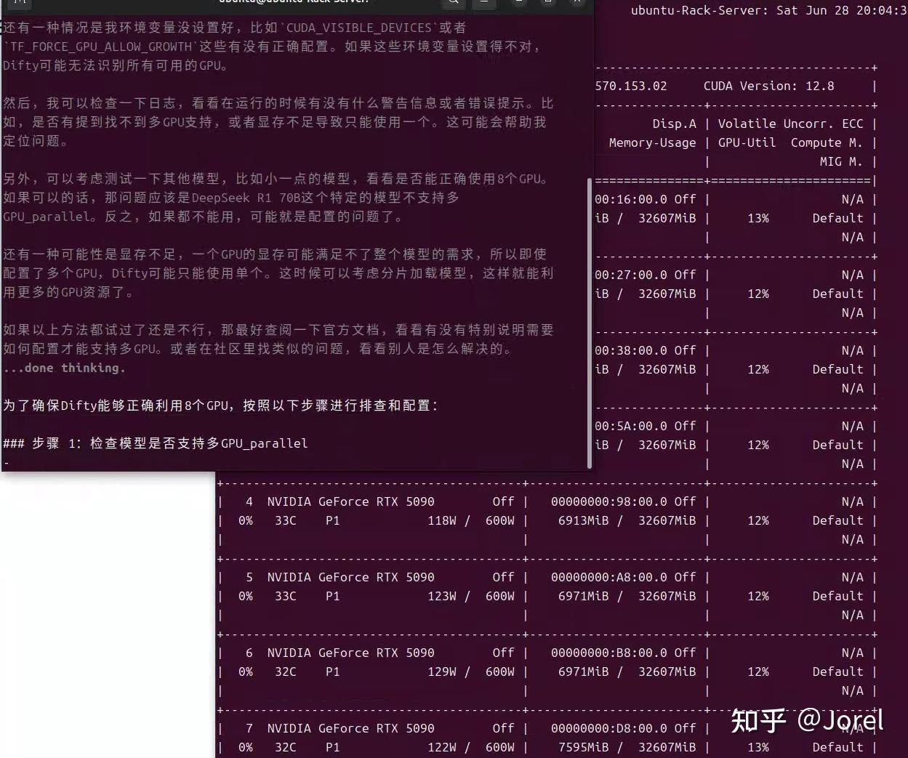

# GPU

[TOC]

## Nvidia

Ollama 支持计算能力为 5.0+ 的 Nvidia GPU。

检查您的计算兼容性，查看您的卡是否受支持： https://developer.nvidia.com/cuda-gpus

| 计算能力 | Family              | 卡                                                           |
| -------- | ------------------- | ------------------------------------------------------------ |
| 9.0      | NVIDIA              | `H200` 、`H100`                                              |
| 8.9      | GeForce RTX 40xx    | `RTX 4090` 、`RTX 4080 SUPER` 、`RTX 4080`、 `RTX 4070 Ti SUPER`、 `RTX 4070 Ti`、 `RTX 4070 SUPER`、 `RTX 4070`、 `RTX 4060 Ti`、 `RTX 4060` |
|          | NVIDIA Professional | `L4`、 `L40` 、`RTX 6000`                                    |
| 8.6      | GeForce RTX 30xx    | `RTX 3090 Ti` `RTX 3090` `RTX 3080 Ti` `RTX 3080` `RTX 3070 Ti` `RTX 3070` `RTX 3060 Ti` `RTX 3060` `RTX 3050 Ti` `RTX 3050` |
|          | NVIDIA Professional | `A40` `RTX A6000` `RTX A5000` `RTX A4000` `RTX A3000` `RTX A2000` `A10` `A16` `A2` |
| 8.0      | NVIDIA              | `A100` `A30`                                                 |
| 7.5      | GeForce GTX/RTX     | `GTX 1650 Ti` `TITAN RTX` `RTX 2080 Ti` `RTX 2080` `RTX 2070` `RTX 2060` |
|          | NVIDIA Professional | `T4` `RTX 5000` `RTX 4000` `RTX 3000` `T2000` `T1200` `T1000` `T600` `T500` |
|          | Quadro              | `RTX 8000` `RTX 6000` `RTX 5000` `RTX 4000`                  |
| 7.0      | NVIDIA              | `TITAN V` `V100` `Quadro GV100`                              |
| 6.1      | NVIDIA TITAN        | `TITAN Xp` `TITAN X`                                         |
|          | GeForce GTX         | `GTX 1080 Ti` `GTX 1080` `GTX 1070 Ti` `GTX 1070` `GTX 1060` `GTX 1050 Ti` `GTX 1050` |
|          | Quadro              | `P6000` `P5200` `P4200` `P3200` `P5000` `P4000` `P3000` `P2200` `P2000` `P1000` `P620` `P600` `P500` `P520` |
|          | Tesla               | `P40` `P4`                                                   |
| 6.0      | NVIDIA              | `Tesla P100` `Quadro GP100`                                  |
| 5.2      | GeForce GTX         | `GTX TITAN X` `GTX 980 Ti` `GTX 980` `GTX 970` `GTX 960` `GTX 950` |
|          | Quadro              | `M6000 24GB` `M6000` `M5000` `M5500M` `M4000` `M2200` `M2000` `M620` |
|          | Tesla               | `M60` `M40`                                                  |
| 5.0      | GeForce GTX         | `GTX 750 Ti` `GTX 750` `NVS 810`                             |
|          | Quadro              | `K2200` `K1200` `K620` `M1200` `M520` `M5000M` `M4000M` `M3000M` `M2000M` `M1000M` `K620M` `M600M` `M500M` |

有关在本地构建以支持较旧的 GPU 的信息，请参阅 [developer.md](https://github.com/ollama/ollama/blob/main/docs/development.md#linux-cuda-nvidia)

### GPU 选择

If you have multiple NVIDIA GPUs in your system and want to limit Ollama to use a subset, you can set `CUDA_VISIBLE_DEVICES` to a comma separated list of GPUs. Numeric IDs may be used, however ordering may vary, so UUIDs are more reliable. You can discover the UUID of your GPUs by running `nvidia-smi -L` If you want to ignore the GPUs and force CPU usage, use an invalid GPU ID (e.g., "-1")
如果系统中有多个 NVIDIA GPU，并且希望限制 Ollama 使用子集，则可以将 `CUDA_VISIBLE_DEVICES` 设置为逗号分隔的 GPU 列表。可以使用数字 ID，但顺序可能会有所不同，因此 UUID 更可靠。您可以通过运行 `nvidia-smi -L` 来发现 GPU 的 UUID。如果您想忽略 GPU 并强制使用 CPU，请使用无效的 GPU ID（例如，“-1”）

### Linux 挂起恢复

On linux, after a suspend/resume cycle, sometimes Ollama will fail to discover your NVIDIA GPU, and fallback to running on the CPU.  You can workaround this driver bug by reloading the NVIDIA UVM driver with `sudo rmmod nvidia_uvm && sudo modprobe nvidia_uvm`
在 Linux 上，在暂停/恢复周期后，有时 Ollama 将无法发现您的 NVIDIA GPU，并回退到在 CPU 上运行。您可以通过使用 `sudo rmmod nvidia_uvm && sudo modprobe nvidia_uvm` 

## AMD Radeon

Ollama 支持以下 AMD GPU：

### Linux 支持

| Family         | Cards and accelerators                                       |
| -------------- | ------------------------------------------------------------ |
| AMD Radeon RX  | `7900 XTX` `7900 XT` `7900 GRE` `7800 XT` `7700 XT` `7600 XT` `7600` `6950 XT` `6900 XTX` `6900XT` `6800 XT` `6800` `Vega 64` `Vega 56` |
| AMD Radeon PRO | `W7900` `W7800` `W7700` `W7600` `W7500` `W6900X` `W6800X Duo` `W6800X` `W6800` `V620` `V420` `V340` `V320` `Vega II Duo` `Vega II` `VII` `SSG` |
| AMD Instinct   | `MI300X` `MI300A` `MI300` `MI250X` `MI250` `MI210` `MI200` `MI100` `MI60` `MI50` |

### Windows 支持

With ROCm v6.1, the following GPUs are supported on Windows.
在 ROCm v6.1 中，Windows 支持以下 GPU。

| Family         | Cards and accelerators                                       |
| -------------- | ------------------------------------------------------------ |
| AMD Radeon RX  | `7900 XTX` `7900 XT` `7900 GRE` `7800 XT` `7700 XT` `7600 XT` `7600` `6950 XT` `6900 XTX` `6900XT` `6800 XT` `6800` |
| AMD Radeon PRO | `W7900` `W7800` `W7700` `W7600` `W7500` `W6900X` `W6800X Duo` `W6800X` `W6800` `V620` |

### Linux 上的覆盖

In some cases you can force the system to try to use a similar LLVM target that is close.  For example The Radeon RX 5400 is `gfx1034` (also known as 10.3.4) however, ROCm does not currently support this target. The closest support is `gfx1030`.  You can use the environment variable `HSA_OVERRIDE_GFX_VERSION` with `x.y.z` syntax.  So for example, to force the system to run on the RX 5400, you would set `HSA_OVERRIDE_GFX_VERSION="10.3.0"` as an environment variable for the server.  If you have an unsupported AMD GPU you can experiment using the list of supported types below.
Ollama 利用 AMD ROCm 库，该库并不支持所有 AMD GPU。在某些情况下，可以强制系统尝试使用接近的类似 LLVM 目标。例如，Radeon RX 5400 是 `gfx1034`（也称为 10.3.4） 但是，ROCm 目前不支持此目标。最近的支持是 `gfx1030` 的。您可以将环境变量`HSA_OVERRIDE_GFX_VERSION`与 `x.y.z` 语法。因此，例如，要强制系统在 RX 5400 上运行，您可以设置为 `HSA_OVERRIDE_GFX_VERSION="10.3.0"` 服务器的环境变量。如果您的 AMD GPU 不受支持，则可以使用下面的支持类型列表进行试验。

If you have multiple GPUs with different GFX versions, append the numeric device number to the environment variable to set them individually.  For example, `HSA_OVERRIDE_GFX_VERSION_0=10.3.0` and  `HSA_OVERRIDE_GFX_VERSION_1=11.0.0`
如果您有多个具有不同 GFX 版本的 GPU，请附加数字设备 number 添加到环境变量中以单独设置它们。 例如 `HSA_OVERRIDE_GFX_VERSION_0=10.3.0` 和 `HSA_OVERRIDE_GFX_VERSION_1=11.0.0` 

At this time, the known supported GPU types on linux are the following LLVM Targets. This table shows some example GPUs that map to these LLVM targets:
目前，Linux 上已知支持的 GPU 类型是以下 LLVM 目标。下表显示了映射到这些 LLVM 目标的一些示例 GPU：

| **LLVM Target** | **GPU 示例**          |
| --------------- | --------------------- |
| gfx900          | Radeon RX Vega 56     |
| gfx906          | Radeon Instinct MI50  |
| gfx908          | Radeon Instinct MI100 |
| gfx90a          | Radeon Instinct MI210 |
| gfx940          | Radeon Instinct MI300 |
| gfx941          |                       |
| gfx942          |                       |
| gfx1030         | Radeon PRO V620       |
| gfx1100         | Radeon PRO W7900      |
| gfx1101         | Radeon PRO W7700      |
| gfx1102         | Radeon RX 7600        |

AMD 正在努力增强 ROCm v6，以便在未来的版本中扩大对 GPU 系列的支持，这应该会增加对更多 GPU 的支持。

### GPU 选择

If you have multiple AMD GPUs in your system and want to limit Ollama to use a subset, you can set `ROCR_VISIBLE_DEVICES` to a comma separated list of GPUs. You can see the list of devices with `rocminfo`.  If you want to ignore the GPUs and force CPU usage, use an invalid GPU ID (e.g., "-1").  When available, use the `Uuid` to uniquely identify the device instead of numeric value.
如果您的系统中有多个 AMD GPU，并且希望限制 Ollama 使用子集，则可以将 `ROCR_VISIBLE_DEVICES` 设置为逗号分隔的 GPU 列表。您可以使用 `rocminfo` 查看设备列表。 如果要忽略 GPU 并强制使用 CPU 时，请使用无效的 GPU ID（例如，“-1”）。 如果可用，请使用 `Uuid` 来唯一标识设备，而不是数值。

### 容器权限

On the host system you can run `sudo setsebool container_use_devices=1` to allow containers to use devices.
在某些 Linux 发行版中，SELinux 可以防止容器访问 AMD GPU 设备。 在主机系统上，您可以运行 `sudo setsebool container_use_devices=1` 以允许容器使用设备。

### Metal (Apple GPUs) 

Ollama 通过 Metal API 在 Apple 设备上支持 GPU 加速。

## 多 GPU 并行配置

如果是多卡还需要配置 GPU 并行，单卡可跳过本步骤。

**强制层分配与负载均衡**

- 修改 Ollama 的 systemd 服务配置（路径 `/etc/systemd/system/ollama.service`），添加以下环境变量

```ini
[Service] 
Environment="CUDA_VISIBLE_DEVICES=0,1,2,3,4" 
Environment="OLLAMA_NUM_GPU=5" # 强制使用 5 张 GPU 分配模型层 根据实际情况修改
Environment="OLLAMA_SCHED_SPREAD=1" # 启用多卡均衡调度 
Environment="OLLAMA_KEEP_ALIVE=-1" # 模型常驻显存，避免重复加载
```

- 重启服务生效：

```bash
systemctl daemon-reload && docker restart ollama 
```

- 验证是否生效：

运行以下命令监控显卡状态，在 ollama 终端运行 ollama 大模型后，进行对话，观察显卡状态：

```bash
watch nvidia-smi
```

