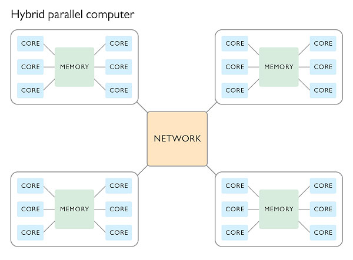

# HPC

[TOC]

## 概述

HPC（High Performance Computing）高性能计算机群。指利用聚集起来的计算能力来处理标准工作站无法完成的数据密集型计算任务，包括仿真、建模和渲染等。

由于需要大量的运算，一台通用的计算机无法在合理的时间内完成工作，或者由于所需的数据量过大而可用的资源有限，导致根本无法执行计算。HPC 方法通过使用专门或高端的硬件，或是将多个单元的计算能力进行整合，能够有效地克服这些限制。将数据和运算相应地分布到多个单元中。

高性能计算中最为重要的核心技术就是并行计算（Parallel Computing）。

开展并行计算的基本条件：

1. 具备并行计算机。
2. 应用问题具有并行度。
3. 并行编程。

就硬件配置而言，常用的类型有两种：

1. 共享内存计算机
2. 分布式内存集群

在共享内存计算机上，所有处理单元都可以访问随机存取存储器（RAM）；而在分布式内存集群中，不同的处理单元或节点之间无法访问内存。在使用分布式内存配置时，由于不同的处理单元不能访问同一个内存空间，因此必须存在一个相互连接的网络，才能在这些单元之间发送消息（或者使用其他通信机制）。鉴于有些单元共享共同的内存空间，而其他单元又是另一种情况，现代 HPC 系统通常是融合了这两个概念的混合体。混合并行计算能够最大程度地发挥共享内存的性能优势。    

## 概念

1. FLOPS

   浮点运算次数/秒，例如 1GFLOPS 即 10 亿次浮点运算，1E=1000P，1P=1000T，1T=1000G。

2. 理论浮点峰值

   计算机理论上能达到的每秒钟能完成的浮点计算最大次数，主要由 CPU 的主频、数量和类型决定。

3. 实测浮点峰值

   计算机实际测试中达到的每秒钟能完成的浮点计算最大次数。

4. 集群效率
   $$
   集群效率= \frac{实测浮点峰值}{理论浮点峰值}\times 100 \%
   $$

5. Linpack

   国际上最流行的用于测试高性能计算机系统浮点性能的 benchmark（基准测试程序）指标，通过对高性能计算机采用高斯消元法求解一元 N 次稠密线性代数方程组的测试。

6. HPCG（高性能共轭梯度）

   HPCG 所使用的计算模式与 HPL 相比，更符合当前实际应用业务的特点，给出的测试结论对于 HPC 的发展更有参考价值。

##  组成

| 组成 | 说明 |
|----|----|
| 应用 | CAE/CAD，CFD，生命科学，气象，动漫，图像跟踪 |
| 存储系统 | XFS，Lustre，StorNext，Panasas，DDN |
| 集群管理系统 | Platform，Rocks，Chess，COMS |
| 操作系统 | Windows，Linux，ScaleMP |
| 网络 | 计算网络，数据网络，管理网络 |
| 节点 | 计算节点，管理节点，GPU 节点，登录节点，存储节点 |

## 业务流程

## 应用领域

1. 科学计算
2. 能源领域
3. 气象领域
4. 工程仿真
5. 基因测序研究
6. 证券指数计算
7. 动漫渲染
8. 互联网与深度学习

## 异构计算（Heterogeneous Computing）

主要是指使用不同类型指令集和体系架构的计算单元组成系统的计算方式。常见的计算单元类别包括 CPU、GPU 等协处理器、DSP、ASIC、FPGA 等。

### 计算单元

* CPU
* GPU
* NPU
* DSP
* NP
* FPGA
* ASIC

### 主流技术路线

| 技术路线   | CPU+FPGA               | CPU+GPU     | CPU+ASIC                                |
| ---------- | ---------------------- | ----------- | --------------------------------------- |
| 灵活适用性 | ***                    | **          | *                                       |
| 性能       | *                      | **          | ***                                     |
| 性能/功耗  | **                     | *           | ***                                     |
| 性能/成本  | **                     | *           | ***                                     |
| 应用生态   | **                     | ***         | *                                       |
| 典型厂商   | Xilinx，Intel / Altera | Nvidia、AMD | Intel / Nervana  Google  TUP  Graphcore |

### 为什么要使用 HPC

使用 HPC 的原因主要体现在两个方面。首先，随着中央处理单元（CPU）和节点数量的不断增加，人们可以使用的计算能力越来越多。有了强大的计算能力，就能在单位时间内执行更多运算，从而提高特定模型的计算速度。这就是我们所说的*加速比*。

加速比通常定义为：同一个任务在并行系统的执行时间与在串行系统的执行时间的比值。

加速比的上限取决于模型并行求解的程度。举个例子，假设一个运算量固定的计算任务，其中 50%  的代码可以并行执行。在这种情况下，理论最大加速比为 2。如果并行执行的代码能够上升至 95%，则理论最大加速比很可能达到  20。对于能够实现完全并行的代码，可以不断向系统中添加计算单元，因此不存在理论上的最大限制。[阿姆达尔定律](http://cn.comsol.com/blogs/added-value-task-parallelism-batch-sweeps/)对这一现象进行了解释。

​                             *根据阿姆达尔定律得到的理论最大加速比。*            

另一方面，在集群的情况下，可用的内存量通常以线性方式增加，同时包含更多的节点。如此一来，随着计算单元数量的增加，就能够处理越来越大的模型。这称为*扩展加速比*。从某种意义上来说，运用这种方法可以对阿姆达尔定律提出的限制加以“欺骗”——该定律适用于固定大小的计算问题。将计算能力和内存提高一倍，就可以在相同的时间内完成大小为基本任务两倍的计算任务。[Gustafson-Barsis 定律](http://cn.comsol.com/blogs/added-value-task-parallelism-batch-sweeps/)对这一现象作出了解释。

​                             *根据 Gustafson-Barsis 定律得到的理论最大加速比。*            

### 并行化

不同类型的建模问题具有不同的可并行程度。以参数化扫描为例，这种问题求解多个具有独立的几何、边界条件或材料属性的相似的模型，几乎可以完全并行计算。具体的实现方法是为将每一个模型设置分配给一个计算单元。这类问题非常适合并行计算，因此通常称为“易并行问题”（embarrassingly parallel problem）。

易并行问题对集群中的网络速度和延迟非常敏感。（在其他情况下，由于网络速度不够快，无法有效处理通信，很可能导致速度减慢。）因此，可以将通用硬件连接起来，加快这类问题的计算速度（例如，构建 [Beowulf 集群](https://cn.comsol.com/blogs/building-beowulf-cluster-faster-multiphysics-simulations/)）。

​                             *一个由六台笔记本电脑和一台旧交换机构成的 Beowulf 集群。*            

有些问题可以分解为多个更小的部分，或者说是*子问题*。例如，可以通过数据分解（数据并行）或任务分解（任务并行）来进一步分解问题，通常这些子问题之间的耦合程度会直接影响它们的并行化程度。

举例来说，易并行问题便是一个几乎可以完全解耦的问题，如前面讨论的参数化扫描。而完全耦合问题的例子则是一个迭代过程 )，其中 ) 的计算必须以严格的串行方式进行。

当多个子问题相互耦合时，由于一个子问题的中间结果可能依赖于其他子问题，因此不能单独进行处理。我们需要通过信息交换（与原始串行问题相比，还包含一些其他工作）来处理这些依赖关系。共享内存或互连网络可用于在不同的计算单元之间进行通信和同步。根据计算任务是在共享内存环境下还是在分布式内存环境下运行，有众多因素会对可并行化以及潜在加速比产生影响。

在多个节点上运行分布式内存仿真时，各个计算单元必须使用网络进行通信。此时，[网络延迟和带宽](http://cn.comsol.com/blogs/added-value-task-parallelism-batch-sweeps/)会进一步影响通信速度。正因如此，大多数 HPC 集群都配备了高带宽/低延迟网络，实现在集群的各个节点之间快速传输数据。

