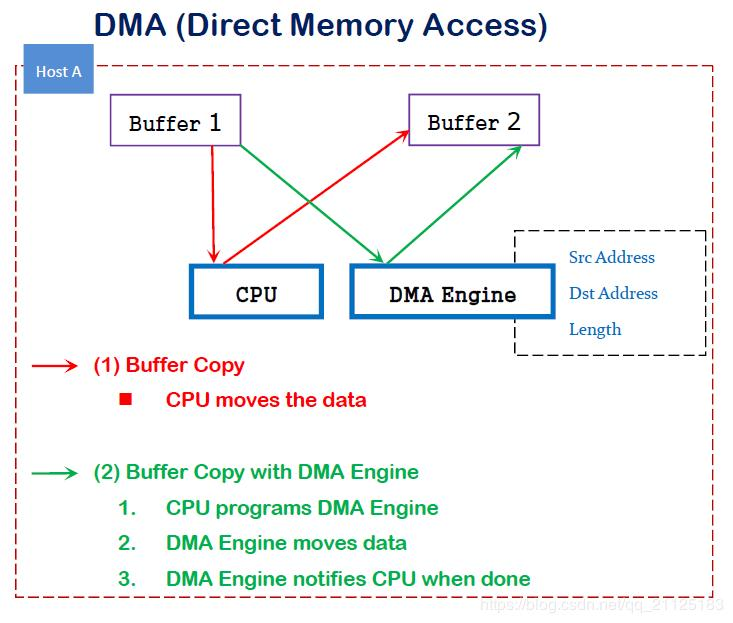
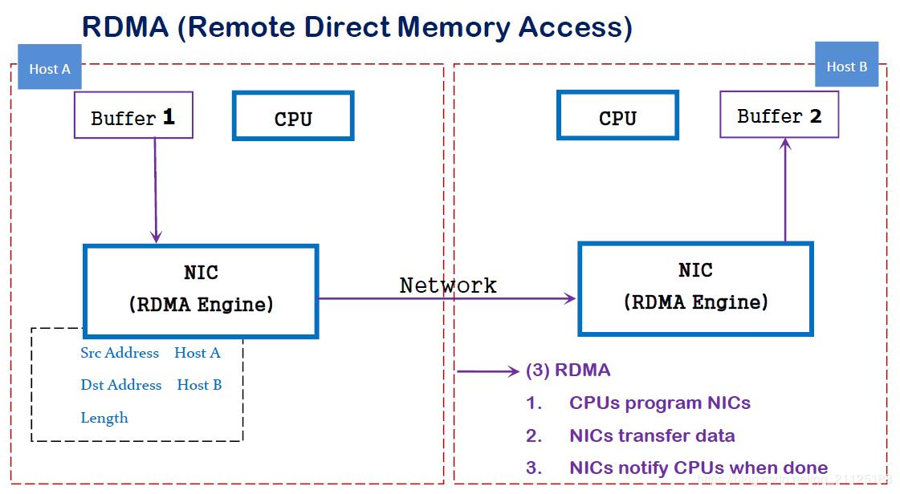

# RDMA

[TOC]

## 概述

### DMA

DMA(直接内存访问)是一种能力，允许在计算机主板上的设备直接把数据发送到内存中去，数据搬运不需要CPU的参与。

传统内存访问需要通过CPU进行数据copy来移动数据，通过CPU将内存中的Buffer1移动到Buffer2中。DMA模式：可以同DMA  Engine之间通过硬件将数据从Buffer1移动到Buffer2,而不需要操作系统CPU的参与，大大降低了CPU Copy的开销。



### RDMA

RDMA是一种概念，在两个或者多个计算机进行通讯的时候使用DMA， 从一个主机的内存直接访问另一个主机的内存。



RDMA是一种host-offload,  host-bypass技术，允许应用程序(包括存储)在它们的内存空间之间直接做数据传输。具有RDMA引擎的以太网卡(RNIC)负责管理源和目标之间的可靠连接。使用RNIC的应用程序之间使用专注的QP和CQ进行通讯：

1. 每一个应用程序可以有很多QP和CQ
2. 每一个QP包括一个SQ和RQ
3. 每一个CQ可以跟多个SQ或者RQ相关联


# 2. RDMA的优势

传统的TCP/IP技术在数据包处理过程中，要经过操作系统及其他软件层，需要占用大量的服务器资源和内存总线带宽，数据在系统内存、处理器缓存和网络控制器缓存之间来回进行复制移动，给服务器的CPU和内存造成了沉重负担。尤其是网络带宽、处理器速度与内存带宽三者的严重"不匹配性"，更加剧了网络延迟效应。

RDMA是一种新的直接内存访问技术，RDMA让计算机可以直接存取其他计算机的内存，而不需要经过处理器的处理。RDMA将数据从一个系统快速移动到远程系统的内存中，而不对操作系统造成任何影响。

在实现上，RDMA实际上是一种智能网卡与软件架构充分优化的远端内存直接高速访问技术，通过将RDMA协议固化于硬件(即网卡)上，以及支持Zero-copy和Kernel bypass这两种途径来达到其高性能的远程直接数据存取的目标。 使用RDMA的优势如下：

> - 零拷贝(Zero-copy) - 应用程序能够直接执行数据传输，在不涉及到网络软件栈的情况下。数据能够被直接发送到缓冲区或者能够直接从缓冲区里接收，而不需要被复制到网络层。
> - 内核旁路(Kernel bypass) - 应用程序可以直接在用户态执行数据传输，不需要在内核态与用户态之间做上下文切换。
> - 不需要CPU干预(No CPU involvement) - 应用程序可以访问远程主机内存而不消耗远程主机中的任何CPU。远程主机内存能够被读取而不需要远程主机上的进程（或CPU)参与。远程主机的CPU的缓存(cache)不会被访问的内存内容所填充。
> - 消息基于事务(Message based transactions) - 数据被处理为离散消息而不是流，消除了应用程序将流切割为不同消息/事务的需求。
> - 支持分散/聚合条目(Scatter/gather entries support) - RDMA原生态支持分散/聚合。也就是说，读取多个内存缓冲区然后作为一个流发出去或者接收一个流然后写入到多个内存缓冲区里去。

在具体的远程内存读写中，RDMA操作用于读写操作的远程虚拟内存地址包含在RDMA消息中传送，远程应用程序要做的只是在其本地网卡中注册相应的内存缓冲区。远程节点的CPU除在连接建立、注册调用等之外，在整个RDMA数据传输过程中并不提供服务，因此没有带来任何负载。

# 3. RDMA 三种不同的硬件实现

RDMA作为一种host-offload, host-bypass技术，使低延迟、高带宽的直接的内存到内存的数据通信成为了可能。目前支持RDMA的网络协议有：

1. InfiniBand(IB): 从一开始就支持RDMA的新一代网络协议。由于这是一种新的网络技术，因此需要支持该技术的网卡和交换机。
2. RDMA过融合以太网(RoCE): 即RDMA over Ethernet, 允许通过以太网执行RDMA的网络协议。这允许在标准以太网基础架构(交换机)上使用RDMA，只不过网卡必须是支持RoCE的特殊的NIC。
3. 互联网广域RDMA协议(iWARP): 即RDMA over TCP,  允许通过TCP执行RDMA的网络协议。这允许在标准以太网基础架构(交换机)上使用RDMA，只不过网卡要求是支持iWARP(如果使用CPU  offload的话)的NIC。否则，所有iWARP栈都可以在软件中实现，但是失去了大部分的RDMA性能优势。


在三种主流的RDMA技术中，可以划分为两大阵营。一个是IB技术, 另一个是支持RDMA的以太网技术(RoCE和iWARP)。其中,  IBTA力挺的技术自然是IB和RoCE,  Mellanox公司（一个以色列人搞的小公司）是这方面的急先锋。而iWARP则是IEEE/IETF力挺的技术，主要是Chelsio公司在推进。RoCE和iWARP的争论，请参考Mellanox和Chelsio这两家公司发布的白皮书。

在存储领域，支持RDMA的技术早就存在，比如SRP(SCSI RDMA Protocol)和iSER(iSCSI Extensions  for RDMA)。 如今兴起的NVMe over Fabrics如果使用的不是FC网络的话，本质上就是NVMe over RDMA。  换句话说，NVMe over InfiniBand, NVMe over RoCE和NVMe over iWARP都是NVMe over  RDMA。

# 4. RDMA基本术语

## 4.1 Fabric

```
A local-area RDMA network is usually referred to as a fabric. 
1
```

所谓Fabric，就是支持RDMA的局域网(LAN)。

## 4.2 CA(Channel Adapter)

```
A channel adapter is the hardware component that connects a system to the fabric. 
1
```

CA是Channel Adapter(通道适配器)的缩写。那么，CA就是将系统连接到Fabric的硬件组件。  在IBTA中，一个CA就是IB子网中的一个终端结点(End Node)。分为两种类型，一种是HCA, 另一种叫做TCA,  它们合称为xCA。其中， HCA(Host Channel Adapter)是支持"verbs"接口的CA, TCA(Target  Channel Adapter)可以理解为"weak CA", 不需要像HCA一样支持很多功能。  而在IEEE/IETF中，CA的概念被实体化为RNIC（RDMA Network Interface Card）,  iWARP就把一个CA称之为一个RNIC。

**简言之，在IBTA阵营中，CA即HCA或TCA； 而在iWARP阵营中，CA就是RNIC。 总之，无论是HCA、 TCA还是RNIC，它们都是CA, 它们的基本功能本质上都是生产或消费数据包(packet)**

## 4.3 Verbs

在RDMA的持续演进中，有一个组织叫做OpenFabric Alliance所做的贡献可谓功不可没。 Verbs这个词不好翻译，大致可以理解为访问RDMA硬件的“一组标准动作”。 每一个Verb可以理解为一个Function。

# 5. 核心概念

## 5.1 Memory Registration(MR) | 内存注册

RDMA 就是用来对内存进行数据传输。那么怎样才能对内存进行传输，很简单，注册。 因为RDMA硬件对用来做数据传输的内存是有特殊要求的。

> - 在数据传输过程中，应用程序不能修改数据所在的内存。
> - 操作系统不能对数据所在的内存进行page out操作 – 物理地址和虚拟地址的映射必须是固定不变的。

注意无论是DMA或者RDMA都要求物理地址连续，这是由DMA引擎所决定的。 那么怎么进行内存注册呢？

> - 创建两个key (local和remote)指向需要操作的内存区域
> - 注册的keys是数据传输请求的一部分

## 5.2 Queues | 队列

RDMA一共支持三种队列，发送队列(SQ)和接收队列(RQ)，完成队列(CQ)。其中，SQ和RQ通常成对创建，被称为Queue Pairs(QP)。

RDMA是基于消息的传输协议，数据传输都是异步操作。 RDMA操作其实很简单，可以理解为：

> 1. Host提交工作请求(WR)到工作队列(WQ): 工作队列包括发送队列(SQ)和接收队列(CQ)。工作队列的每一个元素叫做WQE, 也就是WR。
> 2. Host从完成队列(CQ）中获取工作完成(WC): 完成队列里的每一个叫做CQE, 也就是WC。
> 3. 具有RDMA引擎的硬件(hardware)就是一个队列元素处理器。 RDMA硬件不断地从工作队列(WQ)中去取工作请求(WR)来执行，执行完了就给完成队列(CQ)中放置工作完成(WC)。从生产者-消费者的角度理解就是：

> - Host生产WR, 把WR放到WQ中去
> - RDMA硬件消费WR
> - RDMA硬件生产WC, 把WC放到CQ中去
> - Host消费WC

在这里插入图片描述

# 6. RDMA数据传输

## 6.1 RDMA Send | RDMA发送(/接收)操作 （Send/Recv）

跟TCP/IP的send/recv是类似的，不同的是RDMA是基于消息的数据传输协议（而不是基于字节流的传输协议），所有数据包的组装都在RDMA硬件上完成的，也就是说OSI模型中的下面4层(传输层，网络层，数据链路层，物理层)都在RDMA硬件上完成。

## 6.2 RDMA Read | RDMA读操作 (Pull)

RDMA读操作本质上就是Pull操作, 把远程系统内存里的数据拉回到本地系统的内存里。

## 6.3 RDMA Write | RDMA写操作 (Push)

RDMA写操作本质上就是Push操作，把本地系统内存里的数据推送到远程系统的内存里。

## 6.4 RDMA Write with Immediate Data | 支持立即数的RDMA写操作

支持立即数的RDMA写操作本质上就是给远程系统Push(推送)带外(OOB)数据, 这跟TCP里的带外数据是类似的。

可选地，immediate 4字节值可以与数据缓冲器一起发送。 该值作为接收通知的一部分呈现给接收者，并且不包含在数据缓冲器中。


# 什么是RDMA？

来源 https://blog.csdn.net/u011459120/article/details/78469098

## 1. 概述

RDMA是Remote Direct Memory Access的缩写，通俗的说可以看成是远程的[DMA](https://baike.baidu.com/item/DMA/2385376)技术，为了解决网络传输中服务器端数据处理的延迟而产生的。RDMA允许用户态的应用程序直接读取或写入远程内存，而无内核干预和内存拷贝发生。起初，只应用在高性能计算领域，最近，由于在大规模分布式系统和数据中心中网络瓶颈越来越突出，逐渐走进越来越多人的视野。

## 2. 分类

目前，大致有三类RDMA网络，分别是Infiniband、RoCE、iWARP。其中，Infiniband是一种专为RDMA设计的网络，从硬件级别保证可靠传输 ，  而RoCE 和 iWARP都是基于以太网的RDMA技术，支持相应的verbs接口，如图1所示。从图中不难发现，RoCE协议存在RoCEv1和RoCEv2两个版本，主要区别RoCEv1是基于以太网链路层实现的RDMA协议(交换机需要支持PFC等流控技术，在物理层保证可靠传输)，而RoCEv2是以太网TCP/IP协议中UDP层实现。从性能上，很明显Infiniband网络最好，但网卡和交换机是价格也很高，然而RoCEv2和iWARP仅需使用特殊的网卡就可以了，价格也相对便宜很多。

- Infiniband，支持RDMA的新一代网络协议。 由于这是一种新的网络技术，因此需要支持该技术的NIC和交换机。
- RoCE，一个允许在以太网上执行RDMA的网络协议。 其较低的网络标头是以太网标头，其较高的网络标头（包括数据）是InfiniBand标头。 这支持在标准以太网基础设施（交换机）上使用RDMA。 只有网卡应该是特殊的，支持RoCE。
- iWARP，一个允许在TCP上执行RDMA的网络协议。 IB和RoCE中存在的功能在iWARP中不受支持。  这支持在标准以太网基础设施（交换机）上使用RDMA。  只有网卡应该是特殊的，并且支持iWARP（如果使用CPU卸载），否则所有iWARP堆栈都可以在SW中实现，并且丧失了大部分RDMA性能优势。

 
图 1 RDMA网络栈

## 3. APIs

庆幸的是，所有上述RDMA的网络协议都可以使用相同的API（即verbs），使用标准库libverbs。 
这里就不展开叙述了，感兴趣的同学可以看参考文献[4][5]。

## 4. 总结

从上面的叙述，RDMA那么好，但是为什么没有普及呢？个人认为，有两方面原因。首先，是因为价格太贵。其次，是其缺乏像TCP/IP协议的灵活性和更高层的抽象，可进一步参考SOSP’17的论文[LITE Kernel RDMA Support for Datacenter Applications](https://engineering.purdue.edu/~yiying/LITE-sosp17.pdf)。

#### 参考文献

[1] http://www.rdmamojo.com/2014/03/31/remote-direct-memory-access-rdma/. 
[2] http://docplayer.net/38877094-How-ethernet-rdma-protocols-iwarp-and-roce-support-nvme-over-fabrics.html. 
[3] http://blog.163.com/guaiguai_family/blog/static/20078414520141023103953705/. 
[4] https://thegeekinthecorner.wordpress.com/2010/09/28/rdma-read-and-write-with-ib-verbs/. 
[5] http://www.cnblogs.com/D-Tec/p/3157582.html.

 

## 详解RDMA(远程直接内存访问)架构原理

面对高性能计算、大数据分析和浪涌型IO高并发、低时延应用，现有TCP/IP软硬件架构和应用高CPU消耗的技术特征根本不能满足应用的需求。这要有体现在 处理延时过大，数十微秒；多次内存拷贝、中断处理，上下文切换、复杂的TCP/IP协议处理、网络延时过大、存储转发模式和丢包导致额外延时  。接下来我们继续讨论 RDMA技术、原理和优势 ，看完文章你就会发现为什么RDMA可以更好的解决这一系列问题。


RDMA是一种远端内存直接访问技术，详细介绍请参看 RDMA(远程直接内存访问)技术浅析 文章。  RDMA最早专属于Infiniband架构，随着在网络融合大趋势下出现的RoCE和iWARP  ，这使高速、超低延时、极低CPU使用率的RDMA得以部署在目前使用最广泛的以太网上。

RDMAC(RDMA Consortium)和IBTA(InfiniBand Trade Association)  主导了RDMA发展，RDMAC是IETF的一个补充并主要定义的是iWRAP和iSER，  IBTA是infiniband的全部标准制定者，并补充了RoCE v1 v2的标准化  。IBTA解释了RDMA传输过程中应具备的特性行为，而传输相关的Verbs接口和数据结构原型是由另一个组织 OFA(Open Fabric  Alliance) 来完成。

相比传统DMA的内部总线IO，  RDMA通过网络在两个端点的应用软件之间实现Buffer的直接传递；相比比传统的网络传输，RDMA又无需操作系统和协议栈的介入  。RDMA可以轻易实现端点间的超低延时、超高吞吐量传输，而且基本不需要CPU、OS等资源介入，也不必再为网络数据的处理和搬移耗费过多其他资源。


InfiniBand 通过以下技术保证网络转发的低时延( 亚微秒级 )， 采用Cut-Through转发模式，减少转发时延；基于Credit的流控机制，保证无丢包；硬件卸载；Buffer尽可能小，减少报文被缓冲的时延 。


iWARP(RDMA over TCP/IP) 利用成熟的IP网络； 继承RDMA的优点；TCP/IP硬件实现成本高，但如果采用传统IP网络丢包对性能影响大 。

RoCE 性能与IB网络相当； DCB特性保证无丢包；需要以太网支持DCB特性；以太交换机时延比IB交换机时延要稍高一些 。


RoCEv2针对RoCE进行了一些改进，如引入IP解决扩展性问题，可以跨二层组网；引入UDP解决ECMP负载分担等问题。


基于InfiniBand的RDMA是在2000年发布规范，属于原生RDMA；基于TCP/IP的RDMA称作iWARP，在  2007年形成标准，主要包括MPA/ DDP/  RDMAP三层子协议；基于Ethernet的RDMA叫做RoCE，在2010年发布协议，基于增强型以太网并将传输层换成IB传输层实现。

扩展RDMA API接口以兼容现有协议/应用， OFED(Open Fabrics Enterprise  Distribution)协议栈由OpenFabric联盟发布，分为Linux和windows版本，可以无缝兼容已有应用  。通过使已有应用与RDMA结合后，性能成倍提升。


应用和RNIC(RDMA-aware Network Interface Controller)之间的传输接口层(Software  Transport Interface)被称为Verbs 。OFA(Open Fabric  Alliance)提供了RDMA传输的一系列Verbs API，开发了OFED(Open Fabric Enterprise  Distribution)协议栈，支持多种RDMA传输层协议。

OFED向下 除了提供RNIC(实现 RDMA 和LLP( Lower Layer  Protocol))基本的队列消息服务外，向上还提供了ULP(Upper Layer Protocols)  ，通过ULP上层应用不需直接和Verbs API对接，而是借助于ULP与应用对接，这样使得常见的应用不需要做修改就可以跑在RDMA传输层上。

在Infiniband/RDMA的模型中，核心是如何实现应用之间最简单、高效和直接的通信。RDMA提供了基于消息队列的点对点通信，每个应用都可以直接获取自己的消息，无需操作系统和协议栈的介入。

消息服务建立在通信双方 本端和远端应用之间创建的Channel-IO连接之上 。当应用需要通信时，就会创建一条 Channe  l连接，每条Channel的首尾端点是两对 Queue Pairs(QP)，每对QP由Send Queue(SQ)和Receive  Queue(RQ)构成  ，这些队列中管理着各种类型的消息。QP会被映射到应用的虚拟地址空间，使得应用直接通过它访问RNIC网卡。除了QP描述的两种基本队列之外，RDMA还提供一种队列 Complete Queue(CQ) ，CQ用来知会用户WQ上的消息已经被处理完。


RDMA提供了一套软件传输接口，方便用户创建传输请求 Work Request(WR)  ，WR中描述了应用希望传输到Channel对端的消息内容，WR通知QP中的某个队列Work  Queue(WQ)。在WQ中，用户的WR被转化为Work Queue  Ellement(WQE)的格式，等待RNIC的异步调度解析，并从WQE指向的Buffer中拿到真正的消息发送到Channel对端。

RDMA中SEND/RECEIVE是双边操作，即必须要远端的应用感知参与才能完成收发。 READ和WRITE是单边操作  ，只需要本端明确信息的源和目的地址，远端应用不必感知此次通信，数据的读或写都通过RDMA在RNIC与应用Buffer之间完成，再由远端RNIC封装成消息返回到本端。在实际中， SEND /RECEIVE多用于连接控制类报文，而数据报文多是通过READ/WRITE来完成的 。

对于双边操作为例，主机A向主机B(下面简称A、B)发送数据的流程如下

\1. 首先，A和B都要创建并初始化好各自的QP，CQ

\2. A和B分别向自己的WQ中注册WQE，对于A，WQ=SQ，WQE描述指向一个等到被发送的数据；对于B，WQ=RQ，WQE描述指向一块用于存储数据的Buffer。

\3. A的RNIC异步调度轮到A的WQE，解析到这是一个SEND消息，从Buffer中直接向B发出数据。数据流到达B的RNIC后，B的WQE被消耗，并把数据直接存储到WQE指向的存储位置。

\4. AB通信完成后，A的CQ中会产生一个完成消息CQE表示发送完成。与此同时，B的CQ中也会产生一个完成消息表示接收完成。每个WQ中WQE的处理完成都会产生一个CQE。

双边操作与传统网络的底层Buffer Pool类似，收发双方的参与过程并无差别，区别在零拷贝、Kernel Bypass，实际上对于RDMA，这是一种复杂的消息传输模式，多用于传输短的控制消息 。

对于单边操作，以存储网络环境下的存储为例(A作为文件系统，B作为存储介质)，数据的流程如下

\1. 首先A、B建立连接，QP已经创建并且初始化。

\2. 数据被存档在A的buffer地址VA，注意VA应该提前注册到A的RNIC，并拿到返回的local key，相当于RDMA操作这块buffer的权限。

\3. A把数据地址VA，key封装到专用的报文传送到B，这相当于A把数据buffer的操作权交给了B。同时A在它的WQ中注册进一个WR，以用于接收数据传输的B返回的状态。

\4. B在收到A的送过来的数据VA和R_key后，RNIC会把它们连同存储地址VB到封装RDMA READ，这个过程A、B两端不需要任何软件参与，就可以将A的数据存储到B的VB虚拟地址。

\5. B在存储完成后，会向A返回整个数据传输的状态信息。

单边操作传输方式是RDMA与传统网络传输的最大不同，只需提供直接访问远程的虚拟地址，无须远程应用的参与其中，这种方式适用于批量数据传输。

简单总结

Infiniband的成功取决于两个因素，一是主机侧采用RDMA技术，可以把主机内数据处理的时延从几十微秒降低到几微秒，同时不占用CPU；二是InfiniBand网络的采用高带宽(40G/56G)、低时延(几百纳秒)和无丢包特性

随着以太网的发展，也具备高带宽和无丢包能力，在时延方面也能接近InfiniBand交换机的性能，所以RDMA over  Ethernet(RoCE)成为必然，且RoCE组网成本更低。未来RoCE、iWARP和Infiniband等基于RDMA技术产品都会得到长足的发展。

 

作者：知乎用户
链接：https://www.zhihu.com/question/59122163/answer/208899370
来源：知乎
著作权归作者所有。商业转载请联系作者获得授权，非商业转载请注明出处。


InfiniBand (以下简称IB)只是RDMA实现方式的一种！RDMA本身只是一种概念，具体实现不同厂商都有自己的实现方式，目前市场上能见到的RDMA产品可以分为三类：

\1. InfiniBand --- 这个最早是IBM和HP等一群大佬在做，现在主要交给以色列的Mellanox (IBM 控股)，但是InfiniBand从L2到L4都需要自己的专有硬件，所以成本非常高！

\2. RoCE --- RDMA over Converged  Ethernet，RoCE这个东西实际上是Mellanox鉴于IB过于昂贵这个事实推出的一种低成本的产品，实际上的核心就是把IB的包架在通用Ethernet上发出去，因此对于RoCE，实际上它的二层包头已经是普通以太网的包头。

\3. iWARP ---  iWARP直接将RDMA实现在了TCP上，优点是成本最低，只需要采购支持iWARP的NIC即可使用RDMA，缺点是性能不好，因为TCP本身协议栈过于重量级，即便是按照一般iWARP厂商的做法将TCP  offload到硬件上实现，也很难追上IB和RoCE的性能。目前在做iWARP的主要是Intel和Chelsio两家，从现在的观察Chelsio略胜一筹，而Intel则有点想放弃iWARP转投RoCE之势。

需要说明的一点，其实不管是iWARP还是RoCE，实际上并不是自己重新发明了RDMA，而是利用了IB的上层接口修改了下层的实现，所以RoCE这个名字并不是很准确，比较准确的说法应该是IB over Converged Ethernet。此外，三种实现方式使用的user space  api是一样的，都是libibverbs，这个东西原本也就是给IB用的，相当于IB的socket。

关于市场，实际上RDMA的市场一直都不算太小，传统的IB主要面向的是HPC，HP和IBM一直在使用，但是毕竟HPC只是企业级里面一块很小的业务，也不是什么企业都需要或者用得起HPC的。现在比较值得注意的一点是Intel实际上提出来了一种概念叫做“新型RDMA应用”，即传统的RDMA应用对lat和bw都非常敏感，而新型RDMA应用则在lat上可以相对宽松，但是却要求在短时间内爆发式的单播或者广播(因为RDMA在协议栈层就支持可靠广播)大量的数据包。比较典型的一个应用是现在很火的大数据，IBM做了一个东西叫做Spark over RDMA，视频链接如下 (需FQ)：

[https://www.youtube.com/watch?v=t_4Ao2fNAfU](https://link.zhihu.com/?target=https%3A//www.youtube.com/watch%3Fv%3Dt_4Ao2fNAfU)

该方案修改了Spark的底层网络框架，充分利用了Mellanox 100G RoCE的可靠广播功能，差不多比100G  TCP性能提高了6～7倍。除了大数据之外，存储市场是将来RDMA发展的一个主要方向，事实上RDMA已经成为了下一代存储网络的事实标准。国内有一家公司叫XSky给Ceph贡献了5%的代码，Ceph over RDMA就是他们实现的印象中EMC还给过他们一大笔投资。存储网络中对RDMA的使用实际上很大一部分原因是现在SSD和NVMe  SSD在企业级存储中的应用。举个简单栗子：

在10G网络上，如果用iscsi架构，iodepth=32，block-size=4k，  random-read-write，TCP能实现的iops约为160～170k，这个数字对于一般的HDD阵列来讲已经足够，因为HDD阵列本身速度较慢。但是对于SSD单盘180k以上的iops，显然TCP性能是不足的，更遑论NVMe SSD单盘550k的ipos。因此，在SSD时代的存储网络中，RDMA几乎是一个必选项。


