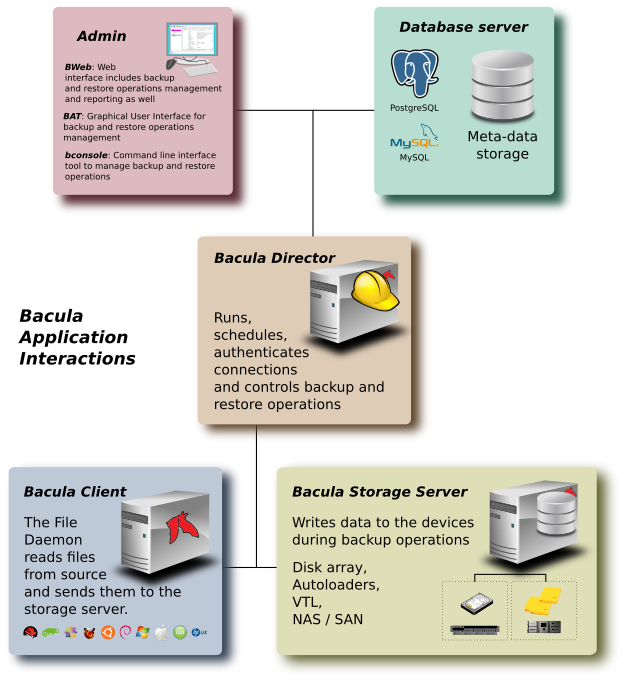
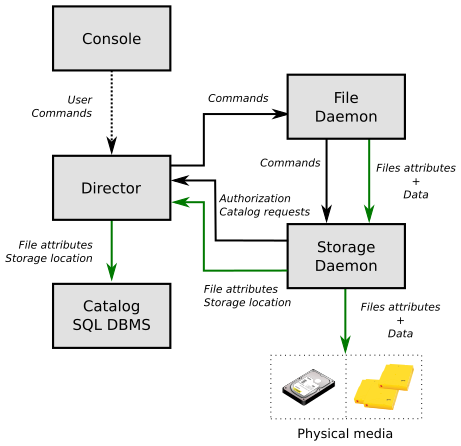
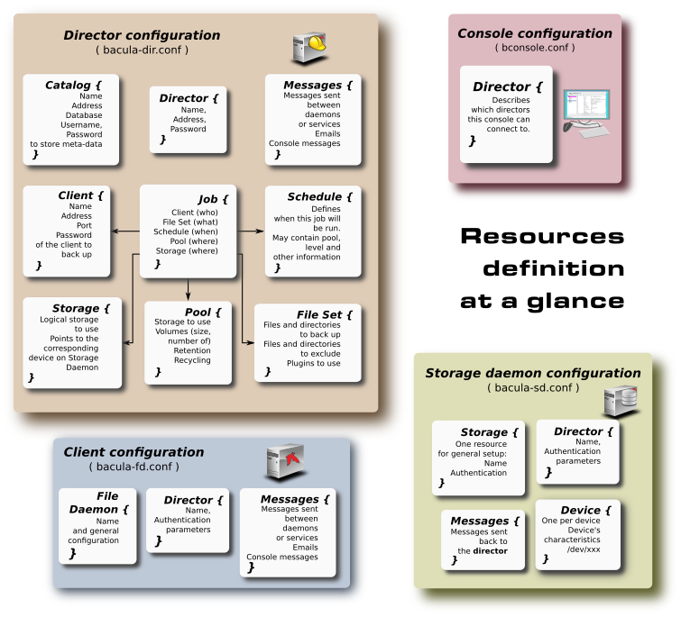

# Bacula

[TOC]

## 简介

Bacula 是一组计算机程序，允许系统管理员在不同类型的计算机网络中管理计算机数据的备份、恢复和验证。Bacula 还可以完全在一台计算机上运行，并可备份到各种类型的媒体，包括磁带和磁盘。

从技术角度来看，它是一个基于网络客户端/服务器的备份程序。Bacula 使用起来相对简单且高效，同时提供多种高级存储管理功能，可轻松查找和恢复丢失或损坏的文件。由于其模块化设计，Bacula 可从小型单台计算机系统扩展到由数百台计算机组成的大型网络系统。

如果您当前使用 tar、dump 或 bru 等程序来备份计算机数据，并且需要网络解决方案、更多灵活性或目录服务，Bacula 很可能会提供您所需的附加功能。但是，如果您是 Unix 系统的新手，或没有使用复杂备份软件的经验，Bacula 项目不建议使用 Bacula ，因为其设置和使用难度远高于 tar 或 dump 。

如果你想让 Bacula 像上面提到的简单程序一样行事，并写入你在驱动器中放入的任何磁带，那么你与 Bacula 合作会很困难。

Bacula 旨在按照您规定的规则保护您的数据，这意味着仅将磁带重复使用作为最后手段。可以“强迫” Bacula 在驱动器中覆写任何磁带，但使用更简单的程序进行此类操作会更方便、更高效。

如果想要一个能够写入多卷的备份程序（即不受磁带驱动器容量的限制），Bacula 很可能满足您的需求。此外，相当多的 Bacula 用户表示，与其他同类程序相比，Bacula 的设置和使用更为简单。

如果您正在使用 Legato Networker 、ARCserveIT、Arkeia 或 PerfectBackup+ 等复杂的商业软件，可能对 Bacula 感兴趣，它提供多种相同功能，且根据 Affero GPL 版本 3 软件许可证提供免费软件。

Bacula 是一个备份、恢复和验证程序，本身并不是一个完整的灾难恢复系统。但如果仔细规划并遵循本手册灾难恢复章节中的说明，but it can be a key part of one if you plan carefully and follow the instructions included in the Disaster Recovery Chapter of this manual. Disaster Recovery它可以成为其中的关键部分。With proper planning, as mentioned in the Disaster Recovery chapter, Bacula can be a central component of your disaster recovery system.  如灾难恢复章节所述,通过适当的规划,Bacula可以成为您灾难恢复系统的核心组成部分。例如，如果您创建了紧急启动磁盘和/或 Bacula 救援磁盘，以保存硬盘的当前分区信息，并维护完整的 Bacula 备份，it is possible to completely recover your system from “bare metal” that is starting from an empty disk.则可以从空磁盘开始的“裸金属”中完全恢复系统。 如果在作业中使用了 WriteBootstrap 记录或其他方式保存有效的 bootstrap 文件，则可以使用该记录提取所需文件（无需使用 catalog 或手动搜索要恢复的文件）。

## 组件或服务

Bacula 由以下五个主要组件或服务组成：Director、Console、File、Storage 和 Monitor 服务。

 

### Bacula Director

Bacula Director 服务是监督所有备份、恢复、验证和归档操作的程序。系统管理员使用 Bacula Director 安排备份并恢复文件。Director 在后台以守护进程（或服务）的形式运行。

### Bacula Console

Bacula Console 服务是允许管理员或用户与 Bacula Director 进行通信的程序。目前，Bacula Console 提供三种版本：基于文本的控制台界面、基于 QT 的界面以及 wxWidgets 图形界面。第一个也是最简单的方法是在 shell 窗口中运行控制台程序（即 TTY 接口）。大多数系统管理员会发现这一点完全足够。第二个版本是一个远未完整的 GNOME GUI 界面，但功能相当，因为它具备大多数 shell 控制台的功能。第三个版本是一个带有交互式文件还原的 wxWidgets GUI 。它也具备 shell 控制台的大部分功能，通过 tabulation 实现命令补齐，并立即为您提供输入命令的帮助。

### Bacula File

Bacula File 服务（也称为客户端程序）是安装在待备份计算机上的软件程序。它针对其运行的操作系统，并负责在 Director 要求时提供文件属性和数据。The File services are also responsible for the file system dependent part of restoring the file attributes and data during a recovery operation. File 服务还负责在恢复操作过程中,恢复文件属性和数据依赖部分的文件系统。该程序在需要备份的机器上以守护进程的形式运行。除了 Unix/Linux File 守护进程外，还有一个 Windows File 守护进程（通常以二进制格式分发）。Windows File 守护进程可在当前 Windows 版本上运行（NT、2000、XP、2003，以及可能的 Me 和 98）。

### Bacula Storage

Bacula Storage services consist of the software programs that perform the storage and recovery of the file attributes and data to the physical backup media or volumes. 服务由软件程序组成，用于将文件属性和数据的存储和恢复到物理备份介质或卷中。换句话说，Storage 守护进程负责读取和写入您的磁带（或其他存储介质，例如文件）。Storage 服务在带有备份设备（通常为磁带驱动器）的设备上以守护进程的形式运行。

### Catalog

Catalog 服务由负责维护所有备份文件的文件索引和卷数据库的软件程序组成。Catalog 服务允许系统管理员或用户快速查找并恢复任何所需文件。Catalog 服务使 Bacula 区别于 tar 和 bru 等简单的备份程序，因为 Catalog 会记录所有使用过的卷、运行的所有作业以及保存的所有文件，从而实现高效的恢复和卷管理。Bacula 目前支持三个不同的数据库，MySQL 、PostgreSQL，必须选择其中一项。

目前支持的三个 SQL 数据库（MySQL、PostgreSQL）具有相当多的特性，包括快速索引、任意查询和安全性。尽管 Bacula 项目计划支持其他主要的 SQL 数据库，但目前的 Bacula 实现接口仅限于 MySQL 和 PostgreSQL 。

MySQL 和 PostgreSQL 的软件包可用于多个操作系统。或者，从源码安装也非常简单。

### Bacula Monitor

Bacula Monitor 服务是允许管理员或用户观看当前 Directors 、File 、Storage 等守护进程状态的程序。目前仅 GTK+ 版本已可用，适用于 GNOME、KDE 或任何支持 FreeDesktop.org 系统托盘标准的窗口管理器。 要成功保存或恢复，必须配置并运行以下四个守护进程：Director 、File 、Storage 以及 Catalog 服务（MySQL 或 PostgreSQL）。

## 服务之间的相互作用

流程图显示了 Bacula 服务在备份工作中的典型交互。每个区块通常代表一个单独的进程（通常为守护进程）。总体而言，Director 负责监督信息的流通。它还维护着 Catalog 。

 

## 配置

为了让 Bacula 了解你的系统（你想要备份的客户端以及如何进行备份），必须创建包含资源（或对象）的多个配置文件。以下内容概述了此情况:

 

## 术语

* Administrator 管理员

  负责管理 Bacula 系统的人员。

* Backup 备份

  “备份”一词指的是保存文件的 Bacula 工作。

* Bootstrap File

   bootstrap 文件是一个 ASCII 文件，包含一种紧凑的命令形式，允许 Bacula 或独立文件提取工具（bextract）恢复一个或多个卷的内容，例如系统当前备份状态。使用 bootstrap 文件，Bacula 可以无需目录即可恢复您的系统。您可以从目录中创建一个 bootstrap 文件，以提取您想要的任何文件或文件。 

* Catalog

   目录用于存储有关作业、客户端和已备份的文件以及在哪个卷或哪些卷上的摘要信息。目录中保存的信息允许管理员或用户确定已运行的作业、状态以及备份后的每个文件的重要特征，最重要的是，它允许您选择要恢复的文件。目录是一个在线资源，但不包含备份文件的数据。目录中存储的大部分信息也存储在备份卷（例如磁带）上。当然，磁带除了文件属性外，还将包含文件数据的副本。 

   目录功能是 Bacula 的一部分，它使 Bacula 与简单的备份和归档程序（dump 和 tar）区别开来。 

* Client

   在 Bacula 术语中，“客户端”指的是被备份的机器，它与文件服务或文件守护进程同义，而且通常称为 FD 。客户端在配置文件资源中定义。

* Console

   可与 Director 接口连接的程序，允许用户或系统管理员控制 Bacula 。

* Daemon

   用于在后台始终存在的程序的 Unix 术语，用于执行指定任务。在 Windows 系统以及一些 Unix 系统上，守护进程被称为服务。

* Directive 指令

   The term directive is used to refer to a statement or a record within a Resource in a configuration file that defines one specific setting. 术语”指令“用于指在定义一个特定设置的配置文件中资源中的语句或记录。例如 Name 指令定义了资源的名称。 

* Director

   主要 Bacula 服务器守护进程，负责调度和引导所有 Bacula 操作。项目偶尔会将 Director 称为 DIR 。 

* Differential

   一个备份，包含自上次完整备份开始以来，所有已更改的文件。注意，其他备份程序可能对此定义不同。

* File Attributes 文件属性

   The File Attributes are all the information necessary about a file to identify it and all its properties such as size, creation date, modification date, permissions, etc. 文件属性是文件识别及其所有属性(如大小、创建日期、修改日期、权限等)所需的全部信息。Normally, the attributes are handled entirely by Bacula so that the user never needs to be concerned about them. 通常，这些属性完全由 Bacula 让用户永远不必关心他们。属性不包含文件的数据。

* File Daemon 文件守护进程

   运行在需要备份的客户端计算机上的守护进程。这也被称为文件服务，有时也称为客户端服务或 FD 。

* FileSet 文件集

   文件集是配置文件中包含的一个资源，用于定义要备份的文件。它包含一个包含文件或目录的列表、排除文件列表以及文件的存储方式（压缩、加密、签名）。

* Incremental

   一个备份，包含自上次开始完成完整、差异或增量备份以来，所有已更改的文件。通常在上面指定 级别 在职位资源定义中或在 日程安排 资源。It is normally specified on the Level directive within the Job resource definition, or in a Schedule resource. 

* Job

   Job 是一种定义工作的配置资源，Bacula 必须执行以备份或恢复特定客户端。它由 类型 Type (备份、恢复、验证等)、级别 Level (完整、增量、......) 、文件集和文件将被备份到的存储 Storage （存储设备、媒体池）。

   A Bacula Job is a configuration resource that defines the work that Bacula must perform to backup or restore a particular Client. It consists of the Type (backup, restore, verify, etc), the Level (full, incremental,...), the FileSet, and Storage the files are to be backed up (Storage device, Media Pool).

* Monitor 监视器

   可与所有守护进程接口连接的程序，允许用户或系统管理员进行监控 Bacula 状态。 

* Resource

   A resource is a part of a configuration file that defines a specific unit of information that is available to Bacula. 资源是配置文件的一部分，定义了一个可用的特定信息单位 Bacula。It consists of several directives (individual configuration statements). 它由多个指令（单个配置语句）组成。例如 Job 资源定义了特定 Job 的所有属性：名称、计划任务、卷池、备份类型、备份级别、...... 

* Restore 恢复

   恢复是一种配置资源，用于描述从备份介质中恢复文件的操作。它与一个备份相反，但在大多数情况下，恢复通常会有一小组文件需要恢复，而通常情况下，备份会备份系统上的所有文件。当然，在磁盘崩溃之后，Bacula 可以要求对系统上的所有文件进行完整还原。

* Schedule

   时间表是一种配置资源，用于定义何时 Bacula Job 将被安排执行。使用时间表时，作业资源将引用附表的名称。

* Service

   这是一个永久存在于记忆中的程序,等待使用说明。在 Unix 环境中，服务也称为守护进程。

   This is a program that remains permanently in memory awaiting instructions. 

* Storage Coordinates 存储坐标

   The information returned from the Storage Services that uniquely locates a file on a backup medium.信息从 Storage 服务中返回，该存储服务仅在备份介质上定位文件。它由两部分组成：one part pertains to each file saved, and the other part pertains to the whole Job.一部分与保存的每个文件有关，另一部分则涉及整个作业。通常，此信息会保存在目录中，以便用户无需对存储坐标有特定了解。The Storage Coordinates include the File Attributes plus the unique location of the information on the backup Volume.存储坐标包括文件属性以及备份卷上信息的唯一位置。 

* Storage Daemon 存储守护进程

   存储守护进程，有时被称为 SD ，is the code that writes the attributes and data to a storage Volume (usually a tape or disk). 代码是将属性和数据写入存储卷（通常是磁带或磁盘）的代码。

* Session

   通常指的是文件守护进程与存储守护进程之间的内部对话。文件守护进程打开一个 会话 使用存储守护进程来保存文件集或恢复它。A session has a one-to-one correspondence to a Bacula Job (see above). 会话与一个会话有一对一的对应信息 Bacula 工作(见上文)。 

* Verify 验证

   验证是将当前文件属性与先前存储在 Bacula Catalog 中的属性进行比较的工作。此功能可用于检测关键系统文件的变化，类似于 Tripwire 等文件完整性检查器。One of the major advantages of using Bacula to do this is that on the machine you want protected such as a server, you can run just the File daemon, and the Director, Storage daemon, and Catalog reside on a different machine. As a consequence, if your server is ever compromised, it is unlikely that your verification database will be tampered with. Verify can also be used to check that the most recent Job data written to a Volume agrees with what is stored in the Catalog (i.e. it compares the file attributes), *or it can check the Volume contents against the original files on disk.使用的主要优势之一 Bacula 这样做是指,在服务器等需要保护的设备上,只需运行文件守护程序,而“目录”、“存储守护进程”和“目录”则位于另一台机器上。因此,如果您的服务器遭到入侵,您的验证数据库不太可能被篡改。 验证还可用于检查写入卷的最新作业数据是否与目录中存储的内容一致(即其比较文件属性),或者可以根据磁盘上的原始文件检查卷内容。 

* Archive

   An Archive operation is done after a Save, and it consists of removing the Volumes on which data is saved from active use. These Volumes are marked as Archived, and may no longer be used to save files. All the files contained on an Archived Volume are removed from the Catalog.归档操作在保存后完成，它包括删除从正动使用中保存数据的卷。这些卷被标记为归档,可能不再用于保存文件。归档卷上包含的所有文件将从目录中移除。**尚未实施。** 

* Retention Period

   There are various kinds of retention periods that Bacula recognizes. The most important are the File Retention Period, Job Retention Period, and the Volume Retention Period. Each of these retention periods applies to the time that specific records will be kept in the Catalog database. This should not be confused with the time that the data saved to a Volume is valid.

   有各种各样的留存期限 Bacula 认清。最重要的是 文件 留任期 工作 留期及 数量 留期。每个保留期限都适用于特定记录在目录数据库中保存的时间。这不应与保存到卷中的数据有效的时间相混淆。

   The File Retention Period determines the time that File records are kept in the catalog database. This period is important for two reasons: the first is that as long as File records remain in the database, you can “browse” the database with a console program and restore any individual file. Once the File records are removed or pruned from the database, the individual files of a backup job can no longer be “browsed”. The second reason for carefully choosing the File Retention Period is because the volume of the database File records use the most storage space in the database. As a consequence, you must ensure that regular “pruning” of the database file records is done to keep your database from growing too large. (See the Console prune command for more details on this subject).

    文件保留周期决定了文件记录保存在目录数据库中的时间。这段时间很重要,原因有两个:第一,只要文件记录仍留在数据库中,“browse”就可以使用控制台程序“浏览”数据库,并恢复任何单个文件。文件记录从数据库中移除或打印后,“”备份作业的单个文件将无法再“浏览”。仔细选择文件保留期的第二个原因是数据库文件记录的体积占用了数据库中最多的存储空间。因此,“pruning您必须确保定期对数据库文件记录进行“修剪”,以防止数据库过大。(prune有关此主题的更多详细信息,请参见控制台修剪命令)。 

   The Job Retention Period is the length of time that Job records will be kept in the database. Note, all the File records are tied to the Job that saved those files. The File records can be purged leaving the Job records. In this case, information will be available about the jobs that ran, but not the details of the files that were backed up. Normally, when a Job record is purged, all its File records will also be purged. 

   The Volume Retention Period is the minimum of time that a Volume will be kept before it is reused. Note, if all the Jobs and Files associated to a Volume are pruned from Catalog, Bacula may reuse this Volume before its retention time. Bacula will normally never overwrite a Volume that contains the only backup copy of a file. Under ideal conditions, the Catalog would retain entries for all files backed up for all current Volumes. Once a Volume is overwritten, the files that were backed up on that Volume are automatically removed from the Catalog. However, if there is a very large pool of Volumes or a Volume is never overwritten, the Catalog database may become enormous. To keep the Catalog to a manageable size, the backup information should be removed from the Catalog after the defined File Retention Period. Bacula provides the mechanisms for the catalog to be automatically pruned according to the retention periods defined.

   工作留任期是指职位记录将被保存在数据库中的时间长短。注意,所有文件记录都绑定到保存这些文件的作业中。文件记录可以清除,离开作业记录。在这种情况下,将提供有关所处理工作的信息,但无法提供已备份文件的详细信息。通常情况下,当职位记录被清除时,其所有文件记录也将被清除。

   复量留存期是重复使用前保存量的最短时间。请注意,如果与卷子相关的所有工作和文件都从目录中修剪,Bacula 可在保留时间之前重复使用此卷。Bacula宝拉通常永远不会覆盖包含文件唯一备份副本的卷。在理想条件下,该目录将保留所有当前卷备份文件的条目。卷被覆盖后,该卷上备份的文件将自动从目录中移除。然而,如果交易量很大,或者卷数从未被覆盖,目录数据库可能会变得巨大。为保持目录大小可控,应在定义的文件保留期结束后从目录中移除备份信息。Bacula 提供了根据所定义的保留周期自动修剪目录的机制。

* Scan

   A Scan operation causes the contents of a Volume or a series of Volumes to be scanned. These Volumes with the information on which files they contain are restored to the Bacula Catalog. Once the information is restored to the Catalog, the files contained on those Volumes may be easily restored. This function is particularly useful if certain Volumes or Jobs have exceeded their retention period and have been pruned or purged from the Catalog. Scanning data from Volumes into the Catalog is done by using the bscan program. 

   扫描操作会导致对卷或一系列卷的内容进行扫描。这些包含其所含文件信息的卷已恢复 Bacula 目录。信息恢复到目录后,这些卷上的文件可能会轻松恢复。如果某些卷或工作已超过其留存期限,且已从目录中修剪或清除,此功能将特别有用。将卷材中的数据扫描到目录中,通过使用 扫描 程序。

* Volume

   Volume 是一个归档单元，通常是磁带或命名的磁盘文件，其中存储来自一个或多个备份任务的数据。All Bacula Volumes have a software label written to the Volume by Bacula so that it identifies what Volume it is really reading. (Normally there should be no confusion with disk files, but with tapes, it is easy to mount the wrong one.) 所有 Bacula 卷均由宝拉公司编写,并附有软件标签Bacula,以识别其实际阅读量。通常不应与磁盘文件混淆,但使用磁带时,安装错误的文件很容易。


# How to install and configure Bacula 如何安装和配置 Bacula

[Bacula](http://www.bacula.org/) is a backup management tool that enables you to backup, restore, and  verify data across your network. There are Bacula clients for Linux,  Windows, and Mac OS X – making it a cross-platform and network-wide  solution.
Bacula 是一种备份管理工具，可让您在整个网络中备份、恢复和验证数据。有适用于 Linux、Windows 和 Mac OS X 的 Bacula 客户端，使其成为跨平台和全网络的解决方案。

## Bacula components Bacula 组件

Bacula is made up of several components and services that are used to manage backup files and locations:
Bacula 由多个组件和服务组成，用于管理备份文件和位置：

- **Bacula Director**: A service that controls all backup, restore, verify, and archive operations.
  Bacula Director：控制所有备份、还原、验证和归档操作的服务。
- **Bacula Console**: An application that allows communication with the Director. There are three versions of the Console:
  Bacula 控制台：允许与 Director 通信的应用程序。控制台有三个版本：
  - Text-based command line.
    基于文本的命令行。
  - Gnome-based GTK+ Graphical User Interface (GUI) interface.
    基于 Gnome 的 GTK+ 图形用户界面 （GUI） 界面。
  - wxWidgets GUI interface.
    wxWidgets GUI 界面。
- **Bacula File**: Also known as the Bacula Client program. This application is installed  on machines to be backed up, and is responsible for handling data  requested by the Director.
  Bacula 文件：也称为 Bacula 客户端程序。此应用程序安装在要备份的计算机上，并负责处理控制器请求的数据。
- **Bacula Storage**: The program that performs the storage of data onto, and recovery of data from, the physical media.
  Bacula Storage：在物理介质上执行数据存储和从物理介质恢复数据的程序。
- **Bacula Catalog**: Responsible for maintaining the file indices and volume databases for  all backed-up files. This enables rapid location and restoration of  archived files. The Catalog supports three different databases: MySQL,  PostgreSQL, and SQLite.
  Bacula Catalog：负责维护所有备份文件的文件索引和卷数据库。这样可以快速定位和恢复存档文件。该目录支持三种不同的数据库：MySQL、PostgreSQL 和 SQLite。
- **Bacula Monitor**: Monitors the Director, File daemons, and Storage daemons. Currently the Monitor is only available as a GTK+ GUI application.
  Bacula Monitor：监控 Director、File 守护进程和 Storage 守护进程。目前，Monitor 仅作为 GTK+ GUI 应用程序提供。

These services and applications can be run on multiple servers and clients,  or they can be installed on one machine if backing up a single disk or  volume.
这些服务和应用程序可以在多个服务器和客户端上运行，或者如果备份单个磁盘或卷，则可以将它们安装在一台计算机上。

## Install Bacula 安装 Bacula

> **Note**: 注意：
>  If using MySQL or PostgreSQL as your database, you should already have  the services available. Bacula will not install them for you. For more  information, take a look at [MySQL databases](https://ubuntu.com/server/docs/install-and-configure-a-mysql-server) and [PostgreSQL databases](https://ubuntu.com/server/docs/install-and-configure-postgresql).
> 如果使用 MySQL 或 PostgreSQL 作为数据库，您应该已经拥有可用的服务。Bacula 不会为您安装它们。有关更多信息，请查看 MySQL 数据库和 PostgreSQL 数据库。

There are multiple packages containing the different Bacula components. To install `bacula`, from a terminal prompt enter:
有多个包含不同 Bacula 组件的软件包。要安装 `bacula` ，请在终端提示符下输入：

```bash
sudo apt install bacula
```

By default, installing the `bacula` package will use a PostgreSQL database for the Catalog. If you want to use SQLite or MySQL for the Catalog instead, install `bacula-director-sqlite3` or `bacula-director-mysql` respectively.
默认情况下，安装 `bacula` 软件包将使用目录的 PostgreSQL 数据库。如果要将 SQLite 或 MySQL 用于目录，请分别安装 `bacula-director-sqlite3` 或 `bacula-director-mysql` 安装。

During the install process you will be asked to supply a password for the *database owner* of the *bacula database*.
在安装过程中，系统会要求您提供 bacula 数据库的数据库所有者的密码。

## Configure Bacula 配置 Bacula

Bacula configuration files are formatted based on **resources** composed of **directives** surrounded by curly “{}” braces. Each Bacula component has an individual file in the `/etc/bacula` directory.
Bacula 配置文件的格式基于由大括号括起来的指令组成的资源。每个 Bacula 组件在 `/etc/bacula` 目录中都有一个单独的文件。

The various Bacula components must authorise themselves to each other. This is accomplished using the **password** directive. For example, the Storage resource password in the `/etc/bacula/bacula-dir.conf` file must match the Director resource password in `/etc/bacula/bacula-sd.conf`.
各个 Bacula 组件必须相互授权。这是使用 password 指令完成的。例如， `/etc/bacula/bacula-dir.conf` 文件中的存储资源密码必须与 中的 `/etc/bacula/bacula-sd.conf` 控制器资源密码匹配。

By default, the backup job named `BackupClient1` is configured to archive the Bacula Catalog. If you plan on using the  server to back up more than one client you should change the name of  this job to something more descriptive. To change the name, edit `/etc/bacula/bacula-dir.conf`:
默认情况下，名为的 `BackupClient1` 备份作业配置为存档 Bacula 目录。如果计划使用服务器备份多个客户端，则应将此作业的名称更改为更具描述性的名称。要更改名称，请编辑 `/etc/bacula/bacula-dir.conf` ：

```plaintext
#
# Define the main nightly save backup job
#   By default, this job will back up to disk in 
Job {
  Name = "BackupServer"
  JobDefs = "DefaultJob"
  Write Bootstrap = "/var/lib/bacula/Client1.bsr"
}
```

> **Note**: 注意：
>  The example above changes the job name to “BackupServer”, matching the  machine’s host name. Replace “BackupServer” with your own hostname, or  other descriptive name.
> 上面的示例将作业名称更改为“BackupServer”，与计算机的主机名匹配。将“BackupServer”替换为您自己的主机名或其他描述性名称。

The Console can be used to query the Director about jobs, but to use the Console with a *non-root* user, the user needs to be in the **Bacula group**. To add a user to the Bacula group, run the following command from a terminal:
控制台可用于向 Director 查询作业，但要将控制台与非 root 用户一起使用，用户需要位于 Bacula 组中。若要将用户添加到 Bacula 组，请从终端运行以下命令：

```bash
sudo adduser $username bacula
```

> **Note**: 注意：
>  Replace `$username` with the actual username. Also, if you are adding the current user to  the group you should log out and back in for the new permissions to take effect.
> 替换 `$username` 为实际用户名。此外，如果要将当前用户添加到组中，则应注销并重新登录，以使新权限生效。

## Localhost backup Localhost 备份

This section shows how to back up specific directories on a single host to a local tape drive.
本节介绍如何将单个主机上的特定目录备份到本地磁带驱动器。

- First, the Storage device needs to be configured. Edit `/etc/bacula/bacula-sd.conf` and add:
  首先，需要配置存储设备。编辑 `/etc/bacula/bacula-sd.conf` 和添加：

  ```plaintext
  Device {
    Name = "Tape Drive"
    Device Type = tape
    Media Type = DDS-4
    Archive Device = /dev/st0
    Hardware end of medium = No;
    AutomaticMount = yes;               # when device opened, read it
    AlwaysOpen = Yes;
    RemovableMedia = yes;
    RandomAccess = no;
    Alert Command = "sh -c 'tapeinfo -f %c | grep TapeAlert'"
  }
  ```

  The example is for a DDS-4 tape drive. Adjust the “Media Type” and “Archive Device” to match your hardware. Alternatively, you could also uncomment one of the other examples in the file.
  该示例适用于 DDS-4 磁带机。调整“媒体类型”和“存档设备”以匹配您的硬件。或者，您也可以取消对文件中其他示例之一的注释。

- After editing `/etc/bacula/bacula-sd.conf`, the Storage daemon will need to be restarted:
  编辑 `/etc/bacula/bacula-sd.conf` 后，需要重新启动存储守护程序：

  ```bash
  sudo systemctl restart bacula-sd.service
  ```

- Now add a Storage resource in `/etc/bacula/bacula-dir.conf` to use the new Device:
  现在添加存储资源以 `/etc/bacula/bacula-dir.conf` 使用新设备：

  ```plaintext
  # Definition of "Tape Drive" storage device
  Storage {
    Name = TapeDrive
    # Do not use "localhost" here    
    Address = backupserver               # N.B. Use a fully qualified name here
    SDPort = 9103
    Password = "Cv70F6pf1t6pBopT4vQOnigDrR0v3LT3Cgkiyjc"
    Device = "Tape Drive"
    Media Type = tape
  }
  ```

  Note: 注意：

  - The **Address** directive needs to be the Fully Qualified Domain Name (FQDN) of the server.
    Address 指令必须是服务器的完全限定域名 （FQDN）。
  - Change `backupserver` to the actual host name.
    更改 `backupserver` 为实际主机名。
  - Make sure the **Password** directive matches the password string in `/etc/bacula/bacula-sd.conf`.
    确保 Password 指令与 中的 `/etc/bacula/bacula-sd.conf` 密码字符串匹配。

- Create a new **FileSet** – this will define which directories to backup – by adding:
  通过添加以下内容，创建一个新的 FileSet – 这将定义要备份的目录：

  ```plaintext
  # LocalhostBacup FileSet.
  FileSet {
    Name = "LocalhostFiles"
    Include {
      Options {
        signature = MD5
        compression=GZIP
      }
      File = /etc
      File = /home
    }
  }
  ```

  This FileSet will backup the `/etc` and `/home` directories. The **Options** resource directives configure the FileSet to create an MD5 signature  for each file backed up, and to compress the files using GZIP.
  此 FileSet 将备份 `/etc` 和 `/home` 目录。Options 资源指令将 FileSet 配置为为备份的每个文件创建一个 MD5 签名，并使用 GZIP 压缩文件。

- Next, create a new **Schedule** for the backup job:
  接下来，为备份作业创建新的计划：

  ```plaintext
  # LocalhostBackup Schedule -- Daily.
  Schedule {
    Name = "LocalhostDaily"
    Run = Full daily at 00:01
  }
  ```

  The job will run every day at 00:01 or 12:01 am. There are many other scheduling options available.
  该作业将在每天上午 00：01 或 12：01 运行。还有许多其他可用的计划选项。

- Finally, create the **Job**: 最后，创建作业：

  ```bash
  # Localhost backup.
  Job {
    Name = "LocalhostBackup"
    JobDefs = "DefaultJob"
    Enabled = yes
    Level = Full
    FileSet = "LocalhostFiles"
    Schedule = "LocalhostDaily"
    Storage = TapeDrive
    Write Bootstrap = "/var/lib/bacula/LocalhostBackup.bsr"
  }
  ```

  The Job will do a **Full** backup every day to the tape drive.
  作业将每天对磁带机进行完整备份。

- Each tape used will need to have a **Label**. If the current tape does not have a Label, Bacula will send an email  letting you know. To label a tape using the Console enter the following  command from a terminal:
  使用的每条磁带都需要有一个标签。如果当前磁带没有标签，Bacula 将发送一封电子邮件通知您。要使用控制台标记磁带，请从终端输入以下命令：

  ```bash
  bconsole
  ```

- At the Bacula Console prompt enter:
  在 Bacula 控制台提示符下，输入：

  ```bash
  label
  ```

- You will then be prompted for the Storage resource:
  然后，系统将提示您输入存储资源：

  ```plaintext
  Automatically selected Catalog: MyCatalog
  Using Catalog "MyCatalog"
  The defined Storage resources are:
       1: File
       2: TapeDrive
  Select Storage resource (1-2):2
  ```

- Enter the new **Volume** name:
  输入新的卷名称：

  ```plaintext
  Enter new Volume name: Sunday
  Defined Pools:
       1: Default
       2: Scratch
  ```

  Replace “Sunday” with the desired label.
  将“Sunday”替换为所需的标签。

- Now, select the **Pool**: 现在，选择池：

  ```plaintext
  Select the Pool (1-2): 1
  Connecting to Storage daemon TapeDrive at backupserver:9103 ...
  Sending label command for Volume "Sunday" Slot 0 ...
  ```

Congratulations, you have now configured Bacula to backup the `localhost` to an attached tape drive.
恭喜，您现在已经将 Bacula 配置为 `localhost` 将其备份到连接的磁带机。

## Further reading 延伸阅读

- For more Bacula configuration options, refer to the [Bacula documentation](https://www.bacula.org/documentation/documentation/).
  有关更多 Bacula 配置选项，请参阅 Bacula 文档。
- The [Bacula home page](http://www.bacula.org/) contains the latest Bacula news and developments.
  Bacula 主页包含最新的 Bacula 新闻和发展。
- Also, see the [Bacula Ubuntu Wiki](https://help.ubuntu.com/community/Bacula) page.
  另请参阅 Bacula Ubuntu Wiki 页面。


Bacula 是一组计算机程序，允许系统管理员管理不同类型计算机网络中计算机数据的备份，恢复和验证。Bacula 还可以完全在一台计算机上运行，并可以备份到各种类型的介质，包括磁带和磁盘。

从技术上讲，它是一个基于网络客户端/服务器的备份程序。Bacula 相对易于使用和高效，同时提供许多高级存储管理功能，可以轻松查找和恢复丢失或损坏的文件。由于其模块化设计，Bacula 可从小型单计算机系统扩展到由位于大型网络上的数百台计算机组成的系统。

 If you are currently using a program such as tar, dump, or bru to backup your computer data, and you would like a network solution, more flexibility, or catalog services, Bacula will most likely provide the additional features you want. However, if  you are new to Unix systems or do not have offsetting experience with a  sophisticated backup package, the Bacula project does not recommend using Bacula as it is much more difficult to setup and use than tar or dump. 

如果您目前正在使用tar、dump或bru等程序来备份计算机数据，并且您想要网络解决方案、更大的灵活性或目录服务，Bacula很可能会提供您想要的其他功能。但是，如果你是Unix系统的新手，或者没有复杂备份包的补偿经验，Bacula项目不建议使用Bacula，因为它比tar或dump更难安装和使用。

如果你想让Bacula像上面提到的简单程序一样工作，并写在你放在驱动器中的任何磁带上，那么你会发现使用Bacula很困难。Bacula旨在按照您指定的规则保护您的数据，这意味着只有在万不得已时才重用磁带。可以“强制”Bacula重写驱动器中的任何磁带，但是使用更简单的程序进行这种操作更容易和更有效。

如果您想要一个可以写入多个卷的备份程序（即不受磁带驱动器容量的限制），Bacula很可能可以满足您的需求。此外，相当多的Bacula用户报告说，Bacula比其他等效程序更容易安装和使用。

如果您目前正在使用复杂的商业软件包，如Legato Networker。ArcserveIT、Arkeia或PerfectBackup+，您可能会对Bacula感兴趣，它提供了许多相同的功能，并且是根据Affero GPL版本3软件许可证提供的免费软件。

 If you want Bacula to behave like the above mentioned simple programs and write over any tape that you  put in the drive, then you will find working with Bacula difficult. Bacula is designed to protect your data following the rules you specify, and  this means reusing a tape only as the last resort. It is possible to “force” Bacula to write over any tape in the drive, but it is easier and more efficient to use a simpler program for that kind of operation. 

 If you would like a backup program that can write to multiple volumes (i.e. is not limited by your tape drive capacity), Bacula can most likely fill your needs. In addition, quite a number of Bacula users report that Bacula is simpler to setup and use than other equivalent programs. 

 If you are currently using a sophisticated commercial package  such as Legato Networker. ARCserveIT, Arkeia, or PerfectBackup+, you may be interested in Bacula, which provides many of the same features and is free software available under the Affero [GPL](https://www.bacula.org/13.0.x-manuals/en/main/Acronyms.html#bacronyms_gpl) Version 3 software license. 

## 功能特性

* 模块化设计
* 能够备份 UNIX、Linux、Windows 和 Mac OS 系统
* 支持 MySQL、PostgreSQL 或者 SQLite 作为后端数据库
* 支持易用的菜单驱动的命令行控制台
* 遵守开放源代码许可证
* 备份可以横跨多个磁带卷
* 服务器可以在多种平台上运行
* 可以给备份的每个文件都创建 SHA1 或者 MD5 的签名文件
* 对网络流量和保存在磁带上的数据都可以加密
* 可以备份超过 2GB 的文件
* 支持磁带库和自动换带机
* 在备份工作前后可以执行脚本或者命令
* 对整个网络集中做备份管理

## 模型
 

**控制器 Director (DIR)：** 协调备份、恢复和校验操作的守护进程。  
**控制台 Console：** 与控制守护进程交互。  
**存储守护进程 Storage Daemon (SD)：** 读写磁带或者其他备份介质的组件。  
**文件守护进程 File Daemon (FD)：** 在每个要备份的系统上运行。  
**编目 Catalog：** 所备份的每个文件和卷的信息都保存在这个关系数据库中。  
**Bacula Rescue CD-ROM**  

## 术语
**作业**：job，Bacula运行活动的基本单位。分为两类：备份和恢复。一个作业由一个客户机、一个文件集合、一个存储池和一个计划表共同组成。  
**池**：pool，保存作业的物理介质组。  
**文件集**：fileset，文件系统和单个文件的列表。  
**消息**：message，守护进程之间涉及守护进程和作业状态的通信信息。

## 配置文件
| 组件 | 文件 | 服务器 |
|----|----|-----|
| 控制守护进程 | bacula-dir.conf | 运行控制守护进程的服务器 |
| 存储守护进程 | bacula-sd.conf | 有存储设备的每台服务器 |
| 文件守护进程 | bacula-fd.conf | 要进行备份的每台客户机 |
| 管理控制台 | bconsole.conf | 用作控制台的每台计算机 |

## 安装步骤
1.配置主机名

```bash
bacula.private.example.com
```

2.关闭 selinux

3.安装 Bacula 和 MariaDB Server

```bash
yum install bacula-director bacula-storage bacula-console bacula-client
yum install mariadb-server
```

4.启动 MySQL

```bash
systemctl start mariadb
```

5.创建 Bacula database user 和 tables

```bash
/usr/libexec/bacula/grant_mysql_privileges
/usr/libexec/bacula/create_mysql_database -u root
/usr/libexec/bacula/make_mysql_tables -u bacula
```

6.运行交互脚本

```bash
mysql_secure_installation
```

7.设置 Bacula database user 密码

```sql
mysql -u root -p
UPDATE mysql.user SET Password=PASSWORD('bacula_db_password') WHERE User='bacula';
FLUSH PRIVILEGES;
exit
```

8.设置 MariaDB 开机自启动

```bash
systemctl enable mariadb
```

9.设置 Bacula 使用 MySQL Library

默认情况下，Bacula 使用 PostgreSQL library 。修改成使用 MySQL library 。

```bash
alternatives --config libbaccats.so
```

显示如下提示，键入１
```bash
There are 3 programs which provide 'libbaccats.so'.
Selection    Command
-----------------------------------------------
  1           /usr/lib64/libbaccats-mysql.so
  2           /usr/lib64/libbaccats-sqlite3.so
*+3           /usr/lib64/libbaccats-postgresql.so`

Enter to keep the current selection[+], or type selection number:
```
10.创建备份和还原目录

```bash
sudo mkdir -p /bacula/backup /bacula/restore
sudo chown -R bacula:bacula /bacula
sudo chmod -R 700 /bacula
```

11.配置Bacula Director
```bash
Director {                            # define myself
  Name = bacula-dir
  DIRport = 9101                # where we listen for UA connections
  QueryFile = "/etc/bacula/query.sql"
  WorkingDirectory = "/var/spool/bacula"
  PidDirectory = "/var/run"
  Maximum Concurrent Jobs = 1
  Password = "@@DIR_PASSWORD@@"         # Console password
  messages = Daemon
  DirAddress = 127.0.0.1    #添加这一行
}
```
Update Storage Address
```bash
Storage {
  Name = File
# Do not use "localhost" here
  Address =  backup_server_private_FQDN                # N.B. Use a fully qualified name here
  SDPort = 9103
  Password = "@@SD_PASSWORD@@"
  Device = FileStorage
  Media Type = File
}
```
配置 Catalog Connection
```bash
# Generic catalog service
Catalog {
  Name = MyCatalog
# Uncomment the following line if you want the dbi driver
# dbdriver = "dbi:postgresql"; dbaddress = 127.0.0.1; dbport =
  dbname = "bacula"; dbuser = "bacula"; dbpassword = " bacula_db_password"
}
```
配置Pool
```bash
# File Pool definition
Pool {
  Name = File
  Pool Type = Backup
   Label Format = Local-
  Recycle = yes                       # Bacula can automatically recycle    Volumes
  AutoPrune = yes                     # Prune expired volumes
  Volume Retention = 365 days         # one year
  Maximum Volume Bytes = 50G          # Limit Volume size to something reasonable
  Maximum Volumes = 100               # Limit number of Volumes in Pool
}
```
检查Director的配置
```bash
bacula-dir -tc /etc/bacula/bacula-dir.conf
```
12.Storage Daemon

```bash
Storage {                             # definition of myself
  Name = BackupServer-sd
  SDPort = 9103                  # Director's port
  WorkingDirectory = "/var/lib/bacula"
  Pid Directory = "/var/run/bacula"
  Maximum Concurrent Jobs = 20
  SDAddress = backup_server_private_FQDN
}
```
配置Storage Device
```bash
Device {
  Name = FileStorage
  Media Type = File
  Archive Device =  /bacula/backup
  LabelMedia = yes;                   # lets Bacula label unlabeled media
  Random Access = Yes;
  AutomaticMount = yes;               # when device opened, read it
  RemovableMedia = no;
  AlwaysOpen = no;
}
```
验证Storage Daemon配置文件
```bash
bacula-sd -tc /etc/bacula/bacula-sd.conf
```
13.设置Bacula组件的密码

 

生成Director的密码
```bash
DIR_PASSWORD=`date +%s | sha256sum | base64 | head -c 33`
sed -i "s/@@DIR_PASSWORD@@/${DIR_PASSWORD}/" /etc/bacula/bacula-dir.conf
sed -i "s/@@DIR_PASSWORD@@/${DIR_PASSWORD}/" /etc/bacula/bconsole.conf
```
配置Storage Daemon的密码
```bash
SD_PASSWORD=`date +%s | sha256sum | base64 | head -c 33`
sed -i "s/@@SD_PASSWORD@@/${SD_PASSWORD}/" /etc/bacula/bacula-sd.conf
sed -i "s/@@SD_PASSWORD@@/${SD_PASSWORD}/" /etc/bacula/bacula-dir.conf
```
配置本地File Daemon(Bacula客户端)的密码
```bash
FD_PASSWORD=`date +%s | sha256sum | base64 | head -c 33`
sed -i "s/@@FD_PASSWORD@@/${FD_PASSWORD}/" /etc/bacula/bacula-dir.conf
sed -i "s/@@FD_PASSWORD@@/${FD_PASSWORD}/" /etc/bacula/bacula-fd.conf
```
14.启动Bacula组件

```bash
systemctl start bacula-dir
systemctl start bacula-sd
systemctl start bacula-fd
```
开机自动启动
```bash
systemctl enable bacula-dir
systemctl enable bacula-sd
systemctl enable bacula-fd
```
15.测试备份任务

```bash
bconsole
```
创建Label
```bash
label
```
会提示输入一个卷名
```bash
Enter new Volume name: MyVolume
```
选择使用哪个_Pool_,选择2
```bash
Select the Pool (1-3):
2
```
手动运行备份任务
```bash
run
```
会提示你选择一个任务.我们要执行的是"BackupLocalFiles",选择"1"就好了:
```bash
Select Job resource (1-3):
1
```
在"Run Backup job"这个环节,检查下详细信息,然后输入"yes"来运行这个任务:
```bash
yes
```
使用下面的命令检查消息:
```bash
messages
```
另一个查看任务状态的方法是检查Director的状态.在bconsole里执行:
```bash
status director
```
如果运行正常,你应该可以看到你的任务正在运行.像下面这样:
```bash
Running Jobs:
Console connected at 09-Apr-15 12:16
 JobId Level   Name                       Status
======================================================================
     3 Full    BackupLocalFiles.2015-04-09_12.31.41_06 is  running
====
```
当任务完成,它会移到已终止任务(Terminated Jobs)的报告里面,像下面这样:
```bash
Terminated Jobs:
 JobId  Level    Files      Bytes   Status   Finished        Name
====================================================================
     3  Full    161,124    877.5 M   OK       09-Apr-15 12:34 BackupLocalFiles
```
16.测试恢复任务
```bash
restore all
```
出现一个有很多选项的菜单,来确认那个是需要被恢复的.
```bash
Select item (1-13):
5
```
接下来讲问你选择哪个FileSet.选择"Full set",即选择2:
```bash
Select FileSet resource (1-2):
2
```
微调自己的选择,可以通过"cd"和"ls"命令切换目录和列出文件,使用"mask"标记要被恢复的,"unmask"标记不被恢复.可以通过键入"help"查看完整的命令列表.
完成选择之后.敲入:
```
done
```
确认你想要运行这个恢复任务:
```
OK to run? (yes/mod/no):
yes
```
查看消息和状态
```
messages
```
查看Director状态是一种很好的方式用来查看恢复任务的状况:
```
status director
```
键入_exit_退出Bacula Console:
```
exit
```

## 配置文件

### 公共的配置段
**Director资源**：参数规定了控制器的名字和基本行为。选项设置了其他守护进程与控制器进行通信所采用的通信端口、控制器保存其临时文件的位置，以及控制器一次能处理的并发作业数量。

```bash
Director {
	Name = bull-dir
	DIRport = 9101
	Query File = "/etc/bacula/query.sql"
	Working Directory = "/var/Bacula/working"
	Pid Directory = "/var/run"
	Maximum Concurrent Jobs = 1
	Password = "XXXX"
	Messages = Standard
}
```
**Messages资源**：

```bash
Message {
	Name = Standard
	director = bull-dir = all    
}
```

### bacula-dir.conf
**Catalog资源**：将Bacula指向一个特殊的编目数据库。包括一个编目名、一个数据库名和数据库凭证。

```bash
Catalog {
	Name = MYSQL
	dbname = "bacula";dbuser = "bacula";dbpassword = "XXXXX"    
}
```

**Storage资源**:描述了如何与特定的存储守护进程进行通信,轮到那个存储守护进程负责和它的本地备份设备接口。与硬件无关。

```bash
Storage {
	Name = TL4000
	Address = bull
	SDPort = 9103
	Password = "XXXXX"
	Device = TL4000
	Autochanger = yes
	Maximum Concurrent Jobs = 2
	Media Type = LTO-3
}
```

**Pool资源**:把备份介质（一般为磁带）划分为给特定备份作业所使用的组。

```bash
Pool {
	Name = Full_Pool
	Pool Type = Backup
	Recycle = yes
	AutoPrune = yes
	Storage = TL4000
	Volume Retention = 365 days
}
```

**Schedule资源**：定义了备份作业的时间表。必须要有的参数是名字、日期、和时间说明。

```bash
Schedule {
	Name = "Nightly"
	Run = Level=Full Pool=FullPool 1st tue at 20:10
	Run = Level=Incremental Pool=IncrementalPool wed-mon at 20:10
}
```

**Client资源**：标识要备份的计算机。

```bash
Client {
	Name = harp
	Address = 192.168.1.28
	FDPort = 9102
	Catalog = MYSQL
	Password = "XXXX"
}
```

**FileSet资源**:定义了一个备份作业所包含的或者所排出的文件和目录。

```bash
FileSet {
	Name = "harp"
	Include {
		Options {
			signature=SHA1
			compression=GZIP
		}
		File = "/"
		File = "/boot"
		File = "/var"
	}
	Exclude = {/proc /tmp /.journal /.fsck}
}
```

**Job资源**:定义了一个特定备份作业默认的参数。

```bash
Job {
	Name = "harp"
	JobDefs = DefaultJob
	Level = Full
	Write Bootstrap = "/bacula/bootstraps/harp.bsr"
	Client = harp
	FileSet = harp
	Pool = Full_Pool
	Incremental Backup Pool = Incremental_Pool
	Schedule = "Nightly"
	Prefer Mounted Volume = no
	Max Run Time = 36000
}
```
### bacula-sd.conf
**Director资源**:控制运行哪些控制器与存储守护进程进行联系。

```bash
Director {
	Name = bull-dir
	Password = "XXXXXX"
}
```

**Storage资源**：定义了一些基本的工作参数。

```bash
Storage {
Name = bull-sd
	SDPort = 9103
	WorkingDirectory = "/var/bacula/working"
	Pid Directory = "/var/run"
	Maximum Concurrent Jobs = 2
}
```

**Device资源**:

```bash
Device {
	Name = TL4000-Drive0
	Media Type = LTO-3
	Archive Device = /dev/nst0
	AutomaticMount = yes
	AlwaysOpen = yes
	RemovableMedia = yes
	RandomAccess = no
	Autochanger = yes
}
```

**Autochanger资源**：

```bash
Autochanger {
	Name = TL4000
	Device = TL4000-Drive0,TL4000-Driver1
	Changer Command = "/etc/bacula/mtx-changer %c %o %S %a %d"
	Changer Device = /dev/changer
}
```
### bconsole.conf
```bash
Director {
	Name = bull-dir
	DIRport = 9101
	Address = bull
	Password = "XXXX"
}
```
