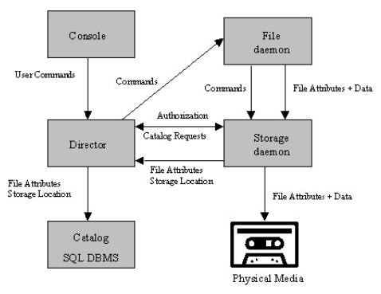

# Bareos

[TOC]

## 概述

**BAREOS（Backup Archiving REcovery Open  Sourced）**

Bareos 是一组计算机程序，允许系统管理员跨不同类型的计算机网络管理计算机数据的备份、恢复和验证。Bareos 还可以完全在一台计算机上运行，并可以备份到各种类型的介质，包括磁带和磁盘。

从技术上讲，它是一个基于网络客户端/服务器的备份程序。Bareos 相对易于使用和高效，同时提供许多高级存储管理功能，可以轻松查找和恢复丢失或损坏的文件。由于其模块化设计，Bareos可以从小型单计算机系统扩展到由位于大型网络上的数百台计算机组成的系统。

从技术上讲，它是一个基于网络客户端/服务器的备份程序。Bareos相对易于使用和高效，同时提供许多高级存储管理功能，可以轻松查找和恢复丢失或损坏的文件。由于其模块化设计，Bareos可以从小型单计算机系统扩展到由位于大型网络上的数百台计算机组成的系统。

如果目前正在使用 tar、dump 或 bru 等程序来备份计算机数据，并且希望获得网络解决方案、更大的灵活性或目录服务，那么 Bareos 很可能会提供您想要的其他功能。但是，如果你是 Unix 系统的新手，或者没有复杂备份包的补偿经验，Bareos 项目不建议使用 Bareos ，因为它比 tar 或 dump 更难设置和使用。

如果想让 Bareos 像上面提到的简单程序一样工作，并在放进驱动器的任何磁带上写东西，那么会发现使用 Bareos 很困难。Bareos 旨在按照您指定的规则保护您的数据，这意味着只有在万不得已时才重用磁带。可以“强制” Bareos 重写驱动器中的任何磁带，但使用更简单的程序进行这种操作更容易，更有效。

如果希望备份程序可以写入多个卷（即不受磁带机容量的限制），Bareos 最有可能满足您的需求。

如果目前正在使用一个复杂的商业软件包，如 Legato Networker、ARCserveIT、Arkeia、IBM Tivoli Storage Manager 或 PerfectBackup+ ，可能会对 Bareos 感兴趣，它提供了许多相同的功能，并且是 GNU AGPLv3 软件许可证下的免费软件。

**端口:** 9101-9103

## What Bareos is Not

Bareos 是一个备份、恢复和验证程序，本身并不是一个完整的灾难恢复系统，但如果您仔细规划并遵循手册灾难恢复章节中的说明，它可以成为一个关键部分。

## The Current State of Bareos

### What is Implemented 什么是实施？？

- 作业控制
  - 使用集中式 Director 进行网络备份/恢复。
  - 用于自动执行作业的内部调度程序。
  - 同时调度多个作业。
  - 可以一次运行一个作业，也可以同时运行多个作业（有时称为多路复用）。
  - 使用优先级进行作业排序。
  - 
  控制器的控制台界面，允许完全控制。一些 GUI 也可用。
- 安全性
  - Verification of files previously cataloged, permitting a Tripwire like capability (system break-in detection).验证先前编目的文件，允许类似Tripwire的功能（系统闯入检测）。
  - CRAM-MD5 password authentication between each component (daemon).每个组件（守护程序）之间的CRAM-MD5密码身份验证。
  - Configurable [TLS (SSL) communications encryption](https://docs.bareos.org/TasksAndConcepts/TransportEncryption.html#commencryption) between each component.每个组件之间的可配置TLS（SSL）通信加密。
  - Configurable [Data (on Volume) encryption](https://docs.bareos.org/TasksAndConcepts/DataEncryption.html#dataencryption) on a Client by Client basis.可配置的数据（卷上）加密，按客户端进行。
  - Computation of MD5 or SHA1, SHA2 (256,512) signatures of the file data if requested.计算文件数据的 MD5 或 SHA1、SHA 2（256，512）签名（如果需要）。
- 恢复功能
  
  - Restore of one or more files selected interactively either for  the current backup or a backup prior to a specified time and date.还原为当前备份或指定时间和日期之前的备份交互选择的一个或多个文件。
  - 使用独立的 bls 和 bextract 工具程序列出和恢复文件。Among other things, this permits extraction of files  when Bareos and/or the catalog are not available. 除此之外，这允许在 Bareos 和/或目录不可用时提取文件。请注意，建议使用控制台中的 restore 命令恢复文件。These  programs are designed for use as a last resort.这些程序是作为最后手段而设计的。
  - 能够使用引导文件（以前保存的）快速还原编录数据库。
  - 能够通过使用 bscan 程序扫描备份卷来重新创建编录数据库。
- SQL 目录
  - 用于记住已备份的卷、池、作业和文件的目录数据库工具。
  - 支持 PostgreSQL 目录数据库。
  - User extensible queries to the PostgreSQL database.PostgreSQL 数据库的用户可扩展查询。
- 高级卷和池管理
  - Labeled Volumes, preventing accidental overwriting (at least by Bareos).标记的卷，防止意外覆盖（至少由Bareos）。
  
  - 可以将任意数量的作业和客户端备份到单个卷。也就是说，您可以将 Linux、Unix 和 Windows 计算机备份和还原到同一卷。
  
  - 多卷保存。当卷已满时，Bareos 会自动请求下一个卷并继续备份。
  
  - [Pool and Volume](https://docs.bareos.org/Configuration/Director.html#directorresourcepool) library management providing Volume flexibility (e.g. monthly, weekly, daily Volume sets, Volume sets segregated by Client, …).池和卷库管理提供卷灵活性（例如每月、每周、每日交易量集、按客户端隔离的交易量集……）。
  
  - 独立于计算机的卷数据格式。如果需要，Linux、Solaris 和 Windows 客户端都可以备份到同一卷。
  
  - 卷数据格式向上兼容，因此始终可以读取旧卷。
  
  - 灵活的消息处理程序，包括将消息从任何守护程序路由回 Director 和自动电子邮件报告。
  
  - Data spooling to disk during backup with subsequent write to tape from the spooled disk files. This prevents tape “shoe shine” during  Incremental/Differential backups.备份期间将数据假脱机到磁盘，随后从假脱机磁盘文件写入磁带。这可以防止在增量/差异备份期间磁带“擦鞋”。    
  
- 对大多数存储设备的高级支持
  - Autochanger support using a simple shell interface that can interface to virtually any autoloader program. A script for **mtx** is provided.自动转换器支持使用一个简单的外壳接口，可以接口到几乎任何自动加载程序。提供了一个用于mtx的脚本。
  - Support for autochanger barcodes – automatic tape labeling from barcodes.支持自动转换器条形码-从条形码自动标记磁带。
  - Automatic support for multiple autochanger magazines either using barcodes or by reading the tapes.使用条形码或通过阅读磁带自动支持多个自动换碟机料盒。
  - Support for multiple drive autochangers.支持多个驱动器自动转换器。
  - Raw device backup/restore. Restore must be to the same device.原始设备备份/恢复。必须还原到同一设备。
  - 所有卷块都包含数据校验和。
  - 迁移支持 —— 将数据从一个池移动到另一个池或从一个卷移动到另一个卷。
- 多操作系统支持
  - Programmed to handle arbitrarily long filenames and messages.编程为处理任意长的文件名和消息。
  - Compression on a file by file basis done by the Client program if requested before network transit.如果在网络传输之前请求，则由客户端程序逐个文件地进行压缩。
  - Saves and restores POSIX ACLs and Extended Attributes on most OSes if enabled.在大多数操作系统上保存和恢复 POSIX ACL 和扩展属性（如果启用）。
  - 控制台的访问控制列表，允许限制用户只能访问其数据。
  - 支持保存/恢复大于 2GB 的文件。
  - 支持 ANSI 和 IBM 磁带标签。
  - 在 Win32 机器上支持 Unicode 文件名（例如中文）
  - 使用卷影复制（VSS）对 Win32 系统上打开的文件进行一致备份。
  - 在 Win32 机器上支持最大 64 K 的路径/文件名长度（在 Unix / Linux 机器上无限制）。
- 其他项目
  - 多线程实现。

### 相对于其他备份程序的优势

- Bareos 处理多卷备份。
- A full comprehensive SQL standard database of all files backed  up. This permits online viewing of files saved on any particular Volume.备份所有文件的完整全面的SQL标准数据库。这允许在线查看保存在任何特定卷上的文件。
- Automatic pruning of the database (removal of old records) thus simplifying database administration.自动修剪数据库（删除旧记录），从而简化数据库管理。
- The modular but integrated design makes Bareos very scalable.模块化但集成的设计使Bareos具有很强的可扩展性。
- Bareos 有一个内置的作业调度器。
- Volume 格式有文档记录，并且有简单的 C 程序来读取/写入它。
- Bareos uses well defined (IANA registered) TCP/IP ports – no rpcs, no shared memory.Bareos使用定义良好的（IANA注册的）TCP/IP端口-没有rpc，没有共享内存。
- 与其他同类产品相比，Bareos 的安装和配置相对简单。
- 除了几个 GUI 管理界面外，Bareos 还有一个全面的 shell 管理界面，允许管理员使用 ssh 等工具从任何地方管理 Bareos 的任何部分。

### Current Implementation Restrictions 当前实施限制


#### Multiple Catalogs 多个目录

可以将 Bareos Director 配置为使用多个目录。然而，这既不建议也不支持。多个目录需要更多的管理，因为通常您必须知道哪个目录包含哪些数据，e.g. currently, all Pools are defined in  each catalog.例如目前，所有池都在每个目录中定义。

- Bareos can generally restore any backup made from one client to  any other client. However, if the architecture is significantly  different (i.e. 32 bit architecture to 64 bit or Win32 to Unix), some  restrictions may apply (e.g. Solaris door files do not exist on other  Unix/Linux machines; there are reports that Zlib compression written  with 64 bit machines does not always read correctly on a 32 bit  machine).
- Bareos通常可以将从一个客户端创建的任何备份恢复到任何其他客户端。但是，如果架构显著不同（即32位体系结构到64位或Win32到Unix），可能会有一些限制（例如Solaris door文件在其他Unix/Linux计算机上不存在;有报告说，用64位机器编写的Zlib压缩在32位机器上并不总是正确读取）。

### Design Limitations or Restrictions 设计限制或约束

- 在 Bareos 配置文件中定义的名称（资源名、卷名等）限制为固定的字符数。目前的限制是 127 个字符。注意，这不适用于文件名，文件名可以是任意长的。
- 一些独立工具的命令行输入  —— 例如 btape，bconsole 限制为最多几百个字符。通常情况下，这不是一个限制，除非在为程序（如bscan）列出多个卷名的情况下。要避免此命令行长度限制，请使用 .bsr 文件指定卷名。
- 每个组件的 Bareos 配置文件可以是任意长度。但是，单个行的长度被限制为500个字符，超过500个字符将被截断。If you need lines longer than  500 characters for directives such as ACLs where they permit a list of  names are character strings simply specify multiple short lines  repeating the directive on each line but with different list values.如果您需要长度超过500个字符的指令行，例如ACL，其中它们允许名称列表是字符串，只需指定多个短行，在每行上重复该指令，但使用不同的列表值。

### 注意事项

- Bareos’s Differential and Incremental *normal* backups are based on time stamps.Bareos的差异和增量正常备份基于时间戳。Consequently, if you move files into an existing  directory or move a whole directory into the backup fileset after a Full backup, those files will probably not be backed up by an Incremental  save because they will have old dates. This problem is corrected by  using [Accurate mode](https://docs.bareos.org/Configuration/Director.html#accuratemode) backups or by explicitly updating the date/time stamp on all moved files.因此，如果在完整备份后将文件移动到现有目录或将整个目录移动到备份文件集中，则增量保存可能不会备份这些文件，因为它们的日期较旧。此问题可通过使用精确模式备份或显式更新所有移动文件上的日期/时间戳来解决。
- In non Accurate mode, files deleted after a Full save will be  included in a restoration. This is typical for most similar backup  programs. To avoid this, use [Accurate mode](https://docs.bareos.org/Configuration/Director.html#accuratemode) backup.在非精确模式下，完全保存后删除的文件将包括在恢复中。这对于大多数类似的备份程序来说是典型的。要避免这种情况，请使用精确模式备份。

## 组件或服务

Bareos 由以下主要组件或服务组成：Director、Console、File、Storage 和 Monitor 服务。

必须配置并运行以下四个守护程序：Director Daemon、File Daemon、Storage Daemon 和目录服务（PostgreSQL）。

| 服务器                                              | 客户机      |
| --------------------------------------------------- | ----------- |
| bconsole 、WebUI 、Director Daemon 、Storage Daemon | File Daemon |

### Bareos Director

Director 是所有其他守护进程的中央控制程序。它计划并监督所有备份、恢复、验证和归档操作。系统管理员使用 Bareos Director 计划备份和恢复文件。Director 作为后台守护程序（或服务）运行。

运行在bareos管理机上，包含全部管理功能、CLI管理服务、WebUI后台支持、目录（catalog）数据库支持等。

### Bareos Console

* bconsole

  全功能 CLI 管理终端。Bareos 控制台（bconsole）是允许管理员或用户与 Bareos Director 通信的程序。它在 shell 窗口中运行（即 TTY 接口）。大多数系统管理员会发现这完全足够了。

* QT-based GUI interface

  The second version is a GUI interface that is far from complete, but quite functional as it has most the capabilities of the shell Console.

* WebUI

  只能用于备份和恢复，同时包含基于 Web 的 CLI 界面。

### Bareos File Daemon

Bareos File Daemon 是一个程序，必须安装在每台应备份的（客户端）计算机上。在 Bareos Director 的请求下，它会找到要备份的文件，并将它们（它们的数据）发送到 Bareos Storage Daemon 。

它特定于运行它的操作系统，并负责在 Bareos Director 请求时提供文件属性和数据。

Bareos 文件守护程序还负责在恢复操作期间恢复文件属性和数据的文件系统相关部分。此程序在要备份的计算机上作为守护程序运行。

### Bareos Storage Daemon

Bareos 存储守护进程负责在 Bareos Director 请求时接收来自 Bareos 文件守护进程的数据，并将文件属性和数据存储到物理备份媒体或卷。对于还原请求，它负责查找数据并将其发送到 Bareos 文件守护进程。

在您的环境中可以有多个 Bareos 存储守护进程，所有守护进程都由同一个 Bareos 控制器控制。

存储服务在具有备份设备（如磁带机）的计算机上作为守护程序运行。

### Catalog

目录服务由负责维护所有备份文件的文件索引和卷数据库的软件程序组成。目录服务允许系统管理员或用户快速查找和还原任何所需的文件。Catalog 服务将 Bareos 与 tar 和 bru 等简单的备份程序区分开来，因为 Catalog 保留了所有使用的卷、所有运行的作业和所有保存的文件的记录，从而可以进行高效的恢复和卷管理。Bareos 支持 PostgreSQL 。

### 储存媒体
物理存储媒体（如硬盘存储系统、磁带存储系统等）。

## Bareos 服务之间的交互

下面的框图显示了备份作业的 Bareos 服务之间的典型交互。每个块通常表示一个单独的进程（通常是守护进程）。一般而言，Director 负责监督信息流动。它还维护目录。

 

## Patience When Starting Daemons or Mounting Blank Tapes

启动守护程序或安装空白磁带时的耐心

当您启动 Bareos 守护进程时，Storage 守护进程会尝试打开所有已定义的存储设备并验证当前挂载的卷（如果已配置）。在验证所完有存储设备之前，存储守护程序将不接受来自控制台程序的连接。如果以前使用过磁带，则会将其重绕，在某些设备上，这可能需要几分钟时间。因此，在启动守护程序后第一次联系 Storage 守护程序时，可能需要有一点耐心。如果您可以看到磁带机，则指示灯停止闪烁后，磁带机将准备好使用。

如果您刚刚在驱动器中装入了空白磁带，则需要考虑相同的问题。驱动器可能需要一两分钟才能正确识别出磁带是空的。如果在此识别期间尝试使用Console程序装入磁带，则很可能会挂起SCSI驱动器。因此，再次敦促您在插入空白磁带时要有耐心。让设备稳定下来，然后再尝试访问它。


## Key Concepts and Resource Records


Getting Bareos to write to disk rather than tape in the simplest case is rather easy. In the Storage daemon’s configuration file, you simply  define an [`Archive Device (Sd->Device)`](https://docs.bareos.org/Configuration/StorageDaemon.html#config-Sd_Device_ArchiveDevice) to be a directory. The default directory to store backups on disk is `/var/lib/bareos/storage`:

```
Device {
  Name = FileBackup
  Media Type = File
  Archive Device = /var/lib/bareos/storage
  Random Access = Yes;
  AutomaticMount = yes;
  RemovableMedia = no;
  AlwaysOpen = no;
}
```

Assuming you have the appropriate `Storage (Dir)` resource in your Director’s configuration file that references the above Device resource,

```
Storage {
  Name = FileStorage
  Address = ...
  Password = ...
  Device = FileBackup
  Media Type = File
}
```

Bareos will then write the archive to the file  /var/lib/bareos/storage/<volume-name> where <volume-name> is the volume name of a Volume defined in the Pool. For example, if you  have labeled a Volume named Vol001, Bareos will write to the file  /var/lib/bareos/storage/Vol001. Although you can later move the archive  file to another directory, you should not rename it or it will become  unreadable by Bareos. This is because each archive has the filename as  part of the internal label, and the internal label must agree with the system filename before Bareos will use it.

Although this is quite simple, there are a number of problems. The  first is that unless you specify otherwise, Bareos will always write to  the same volume until you run out of disk space. This problem is  addressed below.

In addition, if you want to use concurrent jobs that write to several different volumes at the same time, you will need to understand a  number of other details. An example of such a configuration is given at  the end of this chapter under [Concurrent Disk Jobs](https://docs.bareos.org/TasksAndConcepts/VolumeManagement.html#concurrentdiskjobs).

### Pool Options to Limit the Volume Usage


Some of the options you have, all of which are specified in the Pool record, are:

- [`Maximum Volume Jobs (Dir->Pool)`](https://docs.bareos.org/Configuration/Director.html#config-Dir_Pool_MaximumVolumeJobs): write only the specified number of jobs on each Volume.

- [`Maximum Volume Bytes (Dir->Pool)`](https://docs.bareos.org/Configuration/Director.html#config-Dir_Pool_MaximumVolumeBytes): limit the maximum size of each Volume.

  Note, if you use disk volumes you should probably limit the Volume  size to some reasonable value. If you ever have a partial hard disk  failure, you are more likely to be able to recover more data if they are in smaller Volumes.

- [`Volume Use Duration (Dir->Pool)`](https://docs.bareos.org/Configuration/Director.html#config-Dir_Pool_VolumeUseDuration): restrict the time between first and last data written to Volume.

Note that although you probably would not want to limit the number of bytes on a tape as you would on a disk Volume, the other options can be very useful in limiting the time Bareos will use a particular Volume  (be it tape or disk). For example, the above directives can allow you to ensure that you rotate through a set of daily Volumes if you wish.

As mentioned above, each of those directives is specified in the Pool or Pools that you use for your Volumes. In the case of [`Maximum Volume Jobs (Dir->Pool)`](https://docs.bareos.org/Configuration/Director.html#config-Dir_Pool_MaximumVolumeJobs), [`Maximum Volume Bytes (Dir->Pool)`](https://docs.bareos.org/Configuration/Director.html#config-Dir_Pool_MaximumVolumeBytes) and [`Volume Use Duration (Dir->Pool)`](https://docs.bareos.org/Configuration/Director.html#config-Dir_Pool_VolumeUseDuration), you can actually specify the desired value on a Volume by Volume basis. The value specified in the Pool record becomes the default when  labeling new Volumes. Once a Volume has been created, it gets its own copy of the Pool defaults, and  subsequently changing the Pool will have no effect on existing Volumes.  You can either manually change the Volume values, or refresh them from  the Pool defaults using the **update volume** command in the Console. As an example of the use of one of the above, suppose your Pool resource contains:

Volume Use Duration

```
Pool {
  Name = File
  Pool Type = Backup
  Volume Use Duration = 23h
}
```

then if you run a backup once a day (every 24 hours), Bareos will use a new Volume for each backup, because each Volume it writes can only be used for 23 hours after the first write. Note, setting the use duration to 23 hours is not a very good solution for tapes unless you have  someone on-site during the weekends, because Bareos will want a new  Volume and no one will be present to mount it, so no weekend backups  will be done until Monday morning.


### Automatic Volume Labeling


Use of the above records brings up another problem – that of labeling your Volumes. For automated disk backup, you can either manually label  each of your Volumes, or you can have Bareos automatically label new  Volumes when they are needed.

Please note that automatic Volume labeling can also be used with  tapes, but it is not nearly so practical since the tapes must be  pre-mounted. This requires some user interaction. Automatic labeling  from templates does NOT work with autochangers since Bareos will not  access unknown slots. There are several methods of labeling all volumes  in an autochanger magazine. For more information on this, please see the [Autochanger Support](https://docs.bareos.org/TasksAndConcepts/AutochangerSupport.html#autochangerschapter) chapter.

Automatic Volume labeling is enabled by making a change to both the `Pool (Dir)` resource and to the `Device (Sd)` resource shown above. In the case of the Pool resource, you must  provide Bareos with a label format that it will use to create new names. In the simplest form, the label format is simply the Volume name, to  which Bareos will append a four digit number. This number starts at 0001 and is incremented for each Volume the catalog contains. Thus if you modify your Pool resource to be:

Label Format

```
Pool {
  Name = File
  Pool Type = Backup
  Volume Use Duration = 23h
  Label Format = "Vol"
}
```

Bareos will create Volume names Vol0001, Vol0002, and so on when new  Volumes are needed. Much more complex and elaborate labels can be  created using variable expansion defined in the [Variable Expansion](https://docs.bareos.org/Configuration/CustomizingTheConfiguration.html#varschapter) chapter of this manual.

The second change that is necessary to make automatic labeling work  is to give the Storage daemon permission to automatically label Volumes. Do so by adding [`Label Media (Sd->Device)`](https://docs.bareos.org/Configuration/StorageDaemon.html#config-Sd_Device_LabelMedia) = yes to the `Device (Sd)` resource as follows:

Label Media = yes

```
Device {
  Name = File
  Media Type = File
  Archive Device = /var/lib/bareos/storage/
  Random Access = yes
  Automatic Mount = yes
  Removable Media = no
  Always Open = no
  Label Media = yes
}
```

See [`Label Format (Dir->Pool)`](https://docs.bareos.org/Configuration/Director.html#config-Dir_Pool_LabelFormat) for details about the labeling format.

### Restricting the Number of Volumes and Recycling


Automatic labeling discussed above brings up the problem of Volume  management. With the above scheme, a new Volume will be created every  day. If you have not specified Retention periods, your Catalog will  continue to fill keeping track of all the files Bareos has backed up,  and this procedure will create one new archive file (Volume) every day.

The tools Bareos gives you to help automatically manage these problems are the following:

- [`File Retention (Dir->Client)`](https://docs.bareos.org/Configuration/Director.html#config-Dir_Client_FileRetention): catalog file record retention period.
- [`Job Retention (Dir->Client)`](https://docs.bareos.org/Configuration/Director.html#config-Dir_Client_JobRetention): catalog job record retention period.
- [`Auto Prune (Dir->Client)`](https://docs.bareos.org/Configuration/Director.html#config-Dir_Client_AutoPrune) = yes: permit the application of the above two retention periods.
- [`Volume Retention (Dir->Pool)`](https://docs.bareos.org/Configuration/Director.html#config-Dir_Pool_VolumeRetention)
- [`Auto Prune (Dir->Pool)`](https://docs.bareos.org/Configuration/Director.html#config-Dir_Pool_AutoPrune) = yes: permit the application of the [`Volume Retention (Dir->Pool)`](https://docs.bareos.org/Configuration/Director.html#config-Dir_Pool_VolumeRetention) period.
- [`Recycle (Dir->Pool)`](https://docs.bareos.org/Configuration/Director.html#config-Dir_Pool_Recycle) = yes: permit automatic recycling of Volumes whose Volume retention period has expired.
- [`Recycle Oldest Volume (Dir->Pool)`](https://docs.bareos.org/Configuration/Director.html#config-Dir_Pool_RecycleOldestVolume) = yes: prune the oldest volume in the Pool, and if all files were pruned, recycle this volume and use it.
- [`Recycle Current Volume (Dir->Pool)`](https://docs.bareos.org/Configuration/Director.html#config-Dir_Pool_RecycleCurrentVolume) = yes: prune the currently mounted volume in the Pool, and if all files were pruned, recycle this volume and use it.
- [`Purge Oldest Volume (Dir->Pool)`](https://docs.bareos.org/Configuration/Director.html#config-Dir_Pool_PurgeOldestVolume) = yes: permits a forced recycling of the oldest Volume when a new one is needed.

Warning

- This record ignores retention periods! We highly

  recommend  not to use this record, but instead use [`Recycle Oldest Volume (Dir->Pool)`](https://docs.bareos.org/Configuration/Director.html#config-Dir_Pool_RecycleOldestVolume).

- [`Maximum Volumes (Dir->Pool)`](https://docs.bareos.org/Configuration/Director.html#config-Dir_Pool_MaximumVolumes): limit the number of Volumes that can be created.

The first three records ([`File Retention (Dir->Client)`](https://docs.bareos.org/Configuration/Director.html#config-Dir_Client_FileRetention), [`Job Retention (Dir->Client)`](https://docs.bareos.org/Configuration/Director.html#config-Dir_Client_JobRetention) and [`Auto Prune (Dir->Client)`](https://docs.bareos.org/Configuration/Director.html#config-Dir_Client_AutoPrune)) determine the amount of time that Job and File records will remain in your Catalog and they are discussed in detail in the [Automatic Volume Recycling](https://docs.bareos.org/TasksAndConcepts/VolumeManagement.html#recyclingchapter) chapter.

[`Volume Retention (Dir->Pool)`](https://docs.bareos.org/Configuration/Director.html#config-Dir_Pool_VolumeRetention), [`Auto Prune (Dir->Pool)`](https://docs.bareos.org/Configuration/Director.html#config-Dir_Pool_AutoPrune) and [`Recycle (Dir->Pool)`](https://docs.bareos.org/Configuration/Director.html#config-Dir_Pool_Recycle) determine how long Bareos will keep your Volumes before reusing them and they are also discussed in detail in the [Automatic Volume Recycling](https://docs.bareos.org/TasksAndConcepts/VolumeManagement.html#recyclingchapter) chapter.

The [`Maximum Volumes (Dir->Pool)`](https://docs.bareos.org/Configuration/Director.html#config-Dir_Pool_MaximumVolumes) record can also be used in conjunction with the [`Volume Retention (Dir->Pool)`](https://docs.bareos.org/Configuration/Director.html#config-Dir_Pool_VolumeRetention) period to limit the total number of archive Volumes that Bareos will create. By setting an appropriate [`Volume Retention (Dir->Pool)`](https://docs.bareos.org/Configuration/Director.html#config-Dir_Pool_VolumeRetention) period, a Volume will be purged just before it is needed and thus  Bareos can cycle through a fixed set of Volumes. Cycling through a fixed set of Volumes can also be done by setting [`Purge Oldest Volume (Dir->Pool)`](https://docs.bareos.org/Configuration/Director.html#config-Dir_Pool_PurgeOldestVolume) = yes or [`Recycle Current Volume (Dir->Pool)`](https://docs.bareos.org/Configuration/Director.html#config-Dir_Pool_RecycleCurrentVolume) = yes. In this case, when Bareos needs a new Volume, it will prune the specified volume.


## Concurrent Disk Jobs


Above, we discussed how you could have a single device named `FileBackup (Sd->Device)` that writes to volumes in `/var/lib/bareos/storage/`. You can, in fact, run multiple concurrent jobs using the Storage  definition given with this example, and all the jobs will simultaneously write into the Volume that is being written.

Now suppose you want to use multiple Pools, which means multiple  Volumes, or suppose you want each client to have its own Volume and  perhaps its own directory such as /home/bareos/client1 and  /home/bareos/client2 … . With the single Storage and Device definition  above, neither of these two is possible. Why? Because Bareos disk  storage follows the same rules as tape devices. Only one Volume can be  mounted on any Device at any time. If you want to simultaneously write  multiple Volumes, you will need multiple Device resources in your Bareos Storage Daemon  configuration and thus multiple Storage resources in your Bareos  Director configuration.

Okay, so now you should understand that you need multiple Device  definitions in the case of different directories or different Pools, but you also need to know that the catalog data that Bareos keeps contains  only the Media Type and not the specific storage device. This permits a  tape for example to be re-read on any compatible tape drive. The  compatibility being determined by the Media Type ([`Media Type (Dir->Storage)`](https://docs.bareos.org/Configuration/Director.html#config-Dir_Storage_MediaType) and [`Media Type (Sd->Device)`](https://docs.bareos.org/Configuration/StorageDaemon.html#config-Sd_Device_MediaType)). The same applies to disk storage. Since a volume that is written by a Device in say directory `/home/bareos/backups` cannot be read by a Device with an [`Archive Device (Sd->Device)`](https://docs.bareos.org/Configuration/StorageDaemon.html#config-Sd_Device_ArchiveDevice) = `/home/bareos/client1`, you will not be able to restore all your files if you give both those devices [`Media Type (Sd->Device)`](https://docs.bareos.org/Configuration/StorageDaemon.html#config-Sd_Device_MediaType) = File. During the restore, Bareos will simply choose the first available device, which may not be the correct  one. If this is confusing, just remember that the Directory has only the Media Type and the Volume name. It does not know the [`Archive Device (Sd->Device)`](https://docs.bareos.org/Configuration/StorageDaemon.html#config-Sd_Device_ArchiveDevice) (or the full path) that is specified in the Bareos Storage Daemon. Thus you must explicitly tie your Volumes to the correct Device by using the Media Type.

### Example for two clients, separate devices and recycling

The following example is not very practical, but can be used to  demonstrate the proof of concept in a relatively short period of time.

The example consists of a two clients that are backed up to a set of  12 Volumes for each client into different directories on the Storage  machine. Each Volume is used (written) only once, and there are four  Full saves done every hour (so the whole thing cycles around after three hours).

What is key here is that each physical device on the Bareos Storage  Daemon has a different Media Type. This allows the Director to choose  the correct device for restores.

The Bareos Director configuration is as follows:

```
Director {
  Name = bareos-dir
  QueryFile = "/usr/lib/bareos/scripts/query.sql"
  Password = "<secret>"
}

Schedule {
  Name = "FourPerHour"
  Run = Level=Full hourly at 0:05
  Run = Level=Full hourly at 0:20
  Run = Level=Full hourly at 0:35
  Run = Level=Full hourly at 0:50
}

FileSet {
  Name = "Example FileSet"
  Include {
    Options {
      compression=GZIP
      signature=SHA1
    }
    File = /etc
  }
}

Job {
  Name = "RecycleExample"
  Type = Backup
  Level = Full
  Client = client1-fd
  FileSet= "Example FileSet"
  Messages = Standard
  Storage = FileStorage
  Pool = Recycle
  Schedule = FourPerHour
}

Job {
  Name = "RecycleExample2"
  Type = Backup
  Level = Full
  Client = client2-fd
  FileSet= "Example FileSet"
  Messages = Standard
  Storage = FileStorage2
  Pool = Recycle2
  Schedule = FourPerHour
}

Client {
  Name = client1-fd
  Address = client1.example.com
  Password = client1_password
}

Client {
  Name = client2-fd
  Address = client2.example.com
  Password = client2_password
}

Storage {
  Name = FileStorage
  Address = bareos-sd.example.com
  Password = local_storage_password
  Device = RecycleDir
  Media Type = File
}

Storage {
  Name = FileStorage2
  Address = bareos-sd.example.com
  Password = local_storage_password
  Device = RecycleDir2
  Media Type = File1
}

Catalog {
  Name = MyCatalog
  ...
}

Messages {
  Name = Standard
  ...
}

Pool {
  Name = Recycle
  Pool Type = Backup
  Label Format = "Recycle-"
  Auto Prune = yes
  Use Volume Once = yes
  Volume Retention = 2h
  Maximum Volumes = 12
  Recycle = yes
}

Pool {
  Name = Recycle2
  Pool Type = Backup
  Label Format = "Recycle2-"
  Auto Prune = yes
  Use Volume Once = yes
  Volume Retention = 2h
  Maximum Volumes = 12
  Recycle = yes
}
```

and the Bareos Storage Daemon configuration is:

```
Storage {
  Name = bareos-sd
  Maximum Concurrent Jobs = 10
}

Director {
  Name = bareos-dir
  Password = local_storage_password
}

Device {
  Name = RecycleDir
  Media Type = File
  Archive Device = /home/bareos/backups
  LabelMedia = yes;
  Random Access = Yes;
  AutomaticMount = yes;
  RemovableMedia = no;
  AlwaysOpen = no;
}

Device {
  Name = RecycleDir2
  Media Type = File2
  Archive Device = /home/bareos/backups2
  LabelMedia = yes;
  Random Access = Yes;
  AutomaticMount = yes;
  RemovableMedia = no;
  AlwaysOpen = no;
}

Messages {
  Name = Standard
  director = bareos-dir = all
}
```

With a little bit of work, you can change the above example into a  weekly or monthly cycle (take care about the amount of archive disk  space used).


### Using Multiple Storage Devices


Bareos treats disk volumes similar to tape volumes as much as it can. This means that you can only have a single Volume mounted at one time  on a disk as defined in your `Device (Sd)` resource.

If you use Bareos without [Data Spooling](https://docs.bareos.org/TasksAndConcepts/DataSpooling.html#section-dataspooling), multiple concurrent backup jobs can be written to a Volume using interleaving. However, interleaving has disadvantages, see [Concurrent Jobs](https://docs.bareos.org/Appendix/Troubleshooting.html#section-interleaving).

Also the `Device (Sd)` will be in use. If there are other jobs, requesting other Volumes, these jobs have to wait.

On a tape (or autochanger), this is a physical limitation of the  hardware. However, when using disk storage, this is only a limitation of the software.

To enable Bareos to run concurrent jobs (on disk storage), define as many `Device (Sd)` as concurrent jobs should run. All these `Device (Sd)`s can use the same [`Archive Device (Sd->Device)`](https://docs.bareos.org/Configuration/StorageDaemon.html#config-Sd_Device_ArchiveDevice) directory. Set [`Maximum Concurrent Jobs (Sd->Device)`](https://docs.bareos.org/Configuration/StorageDaemon.html#config-Sd_Device_MaximumConcurrentJobs) = 1 for all these devices.

#### Example: use four storage devices pointing to the same directory

Bareos Director configuration: using 4 storage devices

```
Director {
  Name = bareos-dir.example.com
  QueryFile = "/usr/lib/bareos/scripts/query.sql"
  Maximum Concurrent Jobs = 10
  Password = "<secret>"
}

Storage {
  Name = File
  Address = bareos-sd.bareos.com
  Password = "<sd-secret>"
  Device = FileStorage1
  Device = FileStorage2
  Device = FileStorage3
  Device = FileStorage4
  # number of devices = Maximum Concurrent Jobs
  Maximum Concurrent Jobs = 4
  Media Type = File
}

[...]
```

Bareos Storage Daemon configuraton: using 4 storage devices

```
Storage {
  Name = bareos-sd.example.com
  # any number >= 4
  Maximum Concurrent Jobs = 20
}

Director {
  Name = bareos-dir.example.com
  Password = "<sd-secret>"
}

Device {
  Name = FileStorage1
  Media Type = File
  Archive Device = /var/lib/bareos/storage
  LabelMedia = yes
  Random Access = yes
  AutomaticMount = yes
  RemovableMedia = no
  AlwaysOpen = no
  Maximum Concurrent Jobs = 1
}

Device {
  Name = FileStorage2
  Media Type = File
  Archive Device = /var/lib/bareos/storage
  LabelMedia = yes
  Random Access = yes
  AutomaticMount = yes
  RemovableMedia = no
  AlwaysOpen = no
  Maximum Concurrent Jobs = 1
}

Device {
  Name = FileStorage3
  Media Type = File
  Archive Device = /var/lib/bareos/storage
  LabelMedia = yes
  Random Access = yes
  AutomaticMount = yes
  RemovableMedia = no
  AlwaysOpen = no
  Maximum Concurrent Jobs = 1
}

Device {
  Name = FileStorage4
  Media Type = File
  Archive Device = /var/lib/bareos/storage
  LabelMedia = yes
  Random Access = yes
  AutomaticMount = yes
  RemovableMedia = no
  AlwaysOpen = no
  Maximum Concurrent Jobs = 1
}
```


## Automatic Volume Recycling


By default, once Bareos starts writing a Volume, it can append to the volume, but it will not overwrite the existing data thus destroying it. However when Bareos recycles a Volume, the Volume becomes available for being reused and Bareos can at some later time overwrite the previous  contents of that Volume. Thus all previous data will be lost. If the  Volume is a tape, the tape will be rewritten from the beginning. If the  Volume is a disk file, the file will be truncated before being  rewritten.

You may not want Bareos to automatically recycle (reuse) tapes. This  would require a large number of tapes though, and in such a case, it is  possible to manually recycle tapes. For more on manual recycling, see  the [Manually Recycling Volumes](https://docs.bareos.org/TasksAndConcepts/VolumeManagement.html#manualrecycling) chapter.

Most people prefer to have a Pool of tapes that are used for daily  backups and recycled once a week, another Pool of tapes that are used  for Full backups once a week and recycled monthly, and finally a Pool of tapes that are used once a month and recycled after a year or two. With a scheme like this, the number of tapes in your pool or pools remains  constant.

By properly defining your Volume Pools with appropriate Retention  periods, Bareos can manage the recycling (such as defined above)  automatically.

Automatic recycling of Volumes is controlled by four records in the `Pool (Dir)` resource definition. These four records are:

- [`Auto Prune (Dir->Pool)`](https://docs.bareos.org/Configuration/Director.html#config-Dir_Pool_AutoPrune) = yes
- [`Volume Retention (Dir->Pool)`](https://docs.bareos.org/Configuration/Director.html#config-Dir_Pool_VolumeRetention)
- [`Recycle (Dir->Pool)`](https://docs.bareos.org/Configuration/Director.html#config-Dir_Pool_Recycle) = yes
- [`Recycle Pool (Dir->Pool)`](https://docs.bareos.org/Configuration/Director.html#config-Dir_Pool_RecyclePool)

The above three directives are all you need assuming that you fill  each of your Volumes then wait the Volume Retention period before  reusing them. If you want Bareos to stop using a Volume and recycle it  before it is full, you can use one or more additional directives such  as:

- [`Volume Use Duration (Dir->Pool)`](https://docs.bareos.org/Configuration/Director.html#config-Dir_Pool_VolumeUseDuration)
- [`Maximum Volume Jobs (Dir->Pool)`](https://docs.bareos.org/Configuration/Director.html#config-Dir_Pool_MaximumVolumeJobs)
- [`Maximum Volume Bytes (Dir->Pool)`](https://docs.bareos.org/Configuration/Director.html#config-Dir_Pool_MaximumVolumeBytes)

Please see below and the [Basic Volume Management](https://docs.bareos.org/TasksAndConcepts/VolumeManagement.html#diskchapter) chapter of this manual for complete examples.

Automatic recycling of Volumes is performed by Bareos only when it  wants a new Volume and no appendable Volumes are available in the Pool.  It will then search the Pool for any Volumes with the Recycle flag set  and the Volume Status is **Purged**. At that point, it will choose the oldest purged volume and recycle it.

If there are no volumes with status **Purged**, then the recycling occurs in two steps:

1. The Catalog for a Volume must be pruned of all Jobs (i.e. Purged).
2. The actual recycling of the Volume.

Only Volumes marked **Full** or **Used** will be considerd for pruning. The Volume will be purged if the **Volume Retention** period has expired. When a Volume is marked as **Purged**, it means that no Catalog records reference that Volume and the Volume can be recycled.

Until recycling actually occurs, the Volume data remains intact. If  no Volumes can be found for recycling for any of the reasons stated  above, Bareos will request operator intervention (i.e. it will ask you  to label a new volume).

A key point mentioned above, that can be a source of frustration, is  that Bareos will only recycle purged Volumes if there is no other  appendable Volume available. Otherwise, it will always write to an  appendable Volume before recycling even if there are Volume marked as  Purged. This preserves your data as long as possible. So, if you wish to “force” Bareos to use a purged Volume, you must first ensure that no  other Volume in the Pool is marked Append. If necessary, you can manually set a volume to Full. The reason for this is that Bareos wants  to preserve the data on your old tapes (even though purged from the  catalog) as long as absolutely possible before overwriting it. There are also a number of directives such as **Volume Use Duration** that will automatically mark a volume as **Used** and thus no longer appendable.


### Automatic Pruning


As Bareos writes files to tape, it keeps a list of files, jobs, and  volumes in a database called the catalog. Among other things, the  database helps Bareos to decide which files to back up in an incremental or differential backup, and helps you locate files on past backups when you want to restore something. However, the catalog will grow larger  and larger as time goes on, and eventually it can become unacceptably  large.

Bareos’s process for removing entries from the catalog is called  Pruning. The default is Automatic Pruning, which means that once an  entry reaches a certain age (e.g. 30 days old) it is removed from the  catalog. Note that Job records that are required for current restore and File records are needed for VirtualFull and Accurate backups won’t be  removed automatically.

Once a job has been pruned, you can still restore it from the backup  tape, but one additional step is required: scanning the volume with **bscan**.

The alternative to Automatic Pruning is Manual Pruning, in which you  explicitly tell Bareos to erase the catalog entries for a volume. You’d  usually do this when you want to reuse a Bareos volume, because there’s  no point in keeping a list of files that USED TO BE on a tape. Or, if  the catalog is starting to get too big, you could prune the oldest jobs  to save space. Manual pruning is done with the [prune command](https://docs.bareos.org/TasksAndConcepts/BareosConsole.html#manualpruning) in the console.

### Pruning Directives


There are three pruning durations. All apply to catalog database  records and not to the actual data in a Volume. The pruning (or  retention) durations are for: Volumes (Media records), Jobs (Job  records), and Files (File records). The durations inter-depend because  if Bareos prunes a Volume, it automatically removes all the Job records, and all the File records. Also when a Job record is pruned, all the  File records for that Job are also pruned (deleted) from the catalog.

Having the File records in the database means that you can examine  all the files backed up for a particular Job. They take the most space  in the catalog (probably 90-95% of the total). When the File records are pruned, the Job records can remain, and you can still examine what Jobs ran, but not the details of the Files backed up. In addition, without  the File records, you cannot use the Console restore command to restore  the files.

When a Job record is pruned, the Volume (Media record) for that Job can still remain in the database, and if you do a **list volumes**, you will see the volume information, but the Job records (and its File records) will no longer be available.

In each case, pruning removes information about where older files  are, but it also prevents the catalog from growing to be too large. You  choose the retention periods in function of how many files you are  backing up and the time periods you want to keep those records online,  and the size of the database. It is possible to re-insert the records  (with 98% of the original data) by using **bscan** to scan in a whole Volume or any part of the volume that you want.

By setting [`Auto Prune (Dir->Pool)`](https://docs.bareos.org/Configuration/Director.html#config-Dir_Pool_AutoPrune) = yes you will permit the Bareos Director to automatically prune all  Volumes in the Pool when a Job needs another Volume. Volume pruning  means removing records from the catalog. It does not shrink the size of  the Volume or affect the Volume data until the Volume gets overwritten.  When a Job requests another volume and there are no Volumes with Volume  status **Append** available, Bareos will begin volume pruning. This means that all Jobs that are older than the **Volume Retention** period will be pruned from every Volume that has Volume status **Full** or **Used** and has **Recycle = yes**. Pruning consists of deleting the corresponding Job, File, and JobMedia  records from the catalog database. No change to the physical data on the Volume occurs during the pruning process. When all files are pruned from a Volume (i.e. no records in the catalog), the  Volume will be marked as **Purged** implying that no Jobs remain on the volume. The Pool records that control the pruning are described below.

- [`Auto Prune (Dir->Pool)`](https://docs.bareos.org/Configuration/Director.html#config-Dir_Pool_AutoPrune) = yes

  when running a Job and it needs a new Volume but no appendable volumes are available, apply the Volume retention period. At that point, Bareos will prune all Volumes that can be pruned in an  attempt to find a usable volume. If during the autoprune, all files are  pruned from the Volume, it will be marked with Volume status **Purged**. Note, that although the File and Job records may be pruned from the catalog, a Volume will only be marked **Purged** (and hence ready for recycling) if the Volume status is **Append**, **Full**, **Used**, or **Error**. If the Volume has another status, such as **Archive**, **Read-Only**, **Disabled**, **Busy** or **Cleaning**, the Volume status will not be changed to **Purged**.

- [`Volume Retention (Dir->Pool)`](https://docs.bareos.org/Configuration/Director.html#config-Dir_Pool_VolumeRetention)

  defines the length of time that Bareos will  guarantee that the Volume is not reused counting from the time the last  job stored on the Volume terminated. A key point is that this time  period is not even considered as long at the Volume remains appendable.  The Volume Retention period count down begins only when the **Append** status has been changed to some other status (**Full**, **Used**, **Purged**, …). When this time period expires and if [`Auto Prune (Dir->Pool)`](https://docs.bareos.org/Configuration/Director.html#config-Dir_Pool_AutoPrune) = yes and a new Volume is needed, but no appendable Volume is  available, Bareos will prune (remove) Job records that are older than  the specified **Volume Retention** period. The **Volume Retention** period takes precedence over any [`Job Retention (Dir->Client)`](https://docs.bareos.org/Configuration/Director.html#config-Dir_Client_JobRetention) period you have specified in the Client resource. It should also be noted, that the **Volume Retention** period is obtained by reading the Catalog Database Media record rather  than the Pool resource record. This means that if you change the [`Volume Retention (Dir->Pool)`](https://docs.bareos.org/Configuration/Director.html#config-Dir_Pool_VolumeRetention) in the Pool resource record, you must ensure that the corresponding change is made in the catalog by using the **update pool** command. Doing so will insure that any new Volumes will be created with the changed **Volume Retention** period. Any existing Volumes will have their own copy of the **Volume Retention** period that can only be changed on a Volume by Volume basis using the **update volume** command. When all file catalog entries are removed from the volume, its Volume status is set to **Purged**. The files remain physically on the Volume until the volume is overwritten.

- [`Recycle (Dir->Pool)`](https://docs.bareos.org/Configuration/Director.html#config-Dir_Pool_Recycle)

  defines whether or not the particular Volume can be recycled (i.e. rewritten). If Recycle is set to **no**, then even if Bareos prunes all the Jobs on the volume and it is marked **Purged**, it will not consider the tape for recycling. If Recycle is set to **yes** and all Jobs have been pruned, the volume status will be set to **Purged** and the volume may then be reused when another volume is needed. If the volume is reused, it is relabeled with the same Volume Name, however all previous data will be lost.

### Recycling Algorithm


After all Volumes of a Pool have been pruned (as mentioned above, this happens when a Job needs a new Volume and no appendable Volumes are available), Bareos  will look for the oldest Volume that is **Purged** (all Jobs and Files expired), and if the **Recycle = yes** for that Volume, Bareos will relabel it and write new data on it.

As mentioned above, there are two key points for getting a Volume to be recycled. First, the Volume must no longer be marked **Append** (there are a number of directives to automatically make this change),  and second since the last write on the Volume, one or more of the  Retention periods must have expired so that there are no more catalog  backup job records that reference that Volume. Once both those  conditions are satisfied, the volume can be marked **Purged** and hence recycled.

The full algorithm that Bareos uses when it needs a new Volume is:  

The algorithm described below assumes that **Auto Prune** is enabled, that Recycling is turned on, and that you have defined  appropriate Retention periods or used the defaults for all these items.

1. If the request is for an Autochanger device, look only for Volumes  in the Autochanger (i.e. with InChanger set and that have the correct  Storage device).
2. Search the Pool for a Volume with Volume status=**Append** (if there is more than one, the Volume with the oldest date last written is  chosen. If two have the same date then the one with the lowest MediaId  is chosen).
3. Search the Pool for a Volume with Volume status=**Recycle** and the  InChanger flag is set true (if there is more than one, the Volume with  the oldest date last written is chosen. If two have the same date then  the one with the lowest MediaId is chosen).
4. Try recycling any purged Volumes.
5. Prune volumes applying Volume retention period (Volumes with  VolStatus Full, Used, or Append are pruned). Note, even if all the File  and Job records are pruned from a Volume, the Volume will not be marked  Purged until the Volume retention period expires.
6. Search the Pool for a Volume with VolStatus=Purged
7. If a Pool named `Scratch (Dir->Pool)` exists, search for a Volume and if found move it to the current Pool  for the Job and use it. Note, when the Scratch Volume is moved into the  current Pool, the basic Pool defaults are applied as if it is a newly  labeled Volume (equivalent to an **update volume from pool** command).
8. If we were looking for Volumes in the Autochanger, go back to step 2 above, but this time, look for any Volume whether or not it is in the  Autochanger.
9. Attempt to create a new Volume if automatic labeling enabled. If the maximum number of Volumes specified for the pool is reached, no new  Volume will be created.
10. Prune the oldest Volume if [`Recycle Oldest Volume (Dir->Pool)`](https://docs.bareos.org/Configuration/Director.html#config-Dir_Pool_RecycleOldestVolume)=yes (the Volume with the oldest LastWritten date and VolStatus equal to  Full, Recycle, Purged, Used, or Append is chosen). This record ensures  that all retention periods are properly respected.
11. Purge the oldest Volume if [`Purge Oldest Volume (Dir->Pool)`](https://docs.bareos.org/Configuration/Director.html#config-Dir_Pool_PurgeOldestVolume)=yes (the Volume with the oldest LastWritten date and VolStatus equal to Full, Recycle, Purged, Used, or Append is chosen).

Warning

- We strongly recommend against the use of **Purge Oldest Volume** as it can quite easily lead to loss of current backup

  data.

1. Give up and ask operator.

The above occurs when Bareos has finished writing a Volume or when no Volume is present in the drive.

On the other hand, if you have inserted a different Volume after the  last job, and Bareos recognizes the Volume as valid, it will request  authorization from the Director to use this Volume. In this case, if you have set [`Recycle Current Volume (Dir->Pool)`](https://docs.bareos.org/Configuration/Director.html#config-Dir_Pool_RecycleCurrentVolume) = yes and the Volume is marked as Used or Full, Bareos will prune the  volume and if all jobs were removed during the pruning (respecting the  retention periods), the Volume will be recycled and used.

The recycling algorithm in this case is:

- If the Volume status is **Append** or **Recycle**, the volume will be used.
- If [`Recycle Current Volume (Dir->Pool)`](https://docs.bareos.org/Configuration/Director.html#config-Dir_Pool_RecycleCurrentVolume) = yes and the volume is marked **Full** or **Used**, Bareos will prune the volume (applying the retention period). If all Jobs are pruned from the volume, it will be recycled.

This permits users to manually change the Volume every day and load  tapes in an order different from what is in the catalog, and if the  volume does not contain a current copy of your backup data, it will be  used.

A few points from Alan Brown to keep in mind:

- If [`Maximum Volumes (Dir->Pool)`](https://docs.bareos.org/Configuration/Director.html#config-Dir_Pool_MaximumVolumes) is not set, Bareos will prefer to demand new volumes over forcibly purging older volumes.
- If volumes become free through pruning and the Volume retention period has expired, then they get marked as **Purged** and are immediately available for recycling - these will be used in preference to creating new volumes.

### Recycle Status


Each Volume inherits the Recycle status (yes or no) from the Pool  resource record when the Media record is created (normally when the  Volume is labeled). This Recycle status is stored in the Media record of the Catalog. Using the Console program, you may subsequently change the Recycle status for each Volume. For example in the following output  from list volumes:

```
+----------+-------+--------+---------+------------+--------+-----+
| VolumeNa | Media | VolSta | VolByte | LastWritte | VolRet | Rec |
+----------+-------+--------+---------+------------+--------+-----+
| File0001 | File  | Full   | 4190055 | 2002-05-25 | 14400  | 1   |
| File0002 | File  | Full   | 1896460 | 2002-05-26 | 14400  | 1   |
| File0003 | File  | Full   | 1896460 | 2002-05-26 | 14400  | 1   |
| File0004 | File  | Full   | 1896460 | 2002-05-26 | 14400  | 1   |
| File0005 | File  | Full   | 1896460 | 2002-05-26 | 14400  | 1   |
| File0006 | File  | Full   | 1896460 | 2002-05-26 | 14400  | 1   |
| File0007 | File  | Purged | 1896466 | 2002-05-26 | 14400  | 1   |
+----------+-------+--------+---------+------------+--------+-----+
```

all the volumes are marked as recyclable, and the last Volume,  File0007 has been purged, so it may be immediately recycled. The other  volumes are all marked recyclable and when their Volume Retention period (14400 seconds or four hours) expires, they will be eligible for  pruning, and possibly recycling. Even though Volume File0007 has been  purged, all the data on the Volume is still recoverable. A purged Volume simply means that there are no entries in the Catalog. Even if the  Volume Status is changed to Recycle, the data on the Volume will be recoverable. The data is lost only when the Volume is re-labeled and re-written.

To modify Volume File0001 so that it cannot be recycled, you use the  update volume pool=File command in the console program, or simply update and Bareos will prompt you for the information.

```
+----------+------+-------+---------+-------------+-------+-----+
| VolumeNa | Media| VolSta| VolByte | LastWritten | VolRet| Rec |
+----------+------+-------+---------+-------------+-------+-----+
| File0001 | File | Full  | 4190055 | 2002-05-25  | 14400 | 0   |
| File0002 | File | Full  | 1897236 | 2002-05-26  | 14400 | 1   |
| File0003 | File | Full  | 1896460 | 2002-05-26  | 14400 | 1   |
| File0004 | File | Full  | 1896460 | 2002-05-26  | 14400 | 1   |
| File0005 | File | Full  | 1896460 | 2002-05-26  | 14400 | 1   |
| File0006 | File | Full  | 1896460 | 2002-05-26  | 14400 | 1   |
| File0007 | File | Purged| 1896466 | 2002-05-26  | 14400 | 1   |
+----------+------+-------+---------+-------------+-------+-----+
```

In this case, File0001 will never be automatically recycled. The same effect can be achieved by setting the Volume Status to Read-Only.

As you have noted, the Volume Status (VolStatus) column in the  catalog database contains the current status of the Volume, which is  normally maintained automatically by Bareos. To give you an idea of some of the values it can take during the life cycle of a Volume, here is a  picture created by Arno Lehmann:

```
A typical volume life cycle is like this:

              because job count or size limit exceeded
      Append  -------------------------------------->  Used/Full
        ^                                                  |
        | First Job writes to        Retention time passed |
        | the volume                   and recycling takes |
        |                                            place |
        |                                                  v
      Recycled <-------------------------------------- Purged
                     Volume is selected for reuse
```

### Daily, Weekly, Monthly Tape Usage Example

This example is meant to show you how one could define a fixed set of volumes that Bareos will rotate through on a regular schedule. There  are an infinite number of such schemes, all of which have various  advantages and disadvantages.

We start with the following assumptions:

- A single tape has more than enough capacity to do a full save.
- There are ten tapes that are used on a daily basis for incremental backups. They are prelabeled Daily1 … Daily10.
- There are four tapes that are used on a weekly basis for full backups. They are labeled Week1 … Week4.
- There are 12 tapes that are used on a monthly basis for full backups. They are numbered Month1 … Month12
- A full backup is done every Saturday evening (tape inserted Friday evening before leaving work).
- No backups are done over the weekend (this is easy to change).
- The first Friday of each month, a Monthly tape is used for the Full backup.
- Incremental backups are done Monday - Friday (actually Tue-Fri mornings).

We start the system by doing a Full save to one of the weekly volumes or one of the monthly volumes. The next morning, we remove the tape and insert a Daily tape. Friday evening, we remove the Daily tape and  insert the next tape in the Weekly series. Monday, we remove the Weekly  tape and re-insert the Daily tape. On the first Friday of the next  month, we insert the next Monthly tape in the series rather than a  Weekly tape, then continue. When a Daily tape finally fills up, Bareos  will request the next one in the series, and the next day when you notice the email  message, you will mount it and Bareos will finish the unfinished  incremental backup.

What does this give? Well, at any point, you will have the last  complete Full save plus several Incremental saves. For any given file  you want to recover (or your whole system), you will have a copy of that file every day for at least the last 14 days. For older versions, you  will have at least three and probably four Friday full saves of that  file, and going back further, you will have a copy of that file made on  the beginning of the month for at least a year.

So you have copies of any file (or your whole system) for at least a  year, but as you go back in time, the time between copies increases from daily to weekly to monthly.

What would the Bareos configuration look like to implement such a scheme?

```
Schedule {
  Name = "NightlySave"
  Run = Level=Full Pool=Monthly 1st sat at 03:05
  Run = Level=Full Pool=Weekly 2nd-5th sat at 03:05
  Run = Level=Incremental Pool=Daily tue-fri at 03:05
}
Job {
  Name = "NightlySave"
  Type = Backup
  Level = Full
  Client = LocalMachine
  FileSet = "File Set"
  Messages = Standard
  Storage = DDS-4
  Pool = Daily
  Schedule = "NightlySave"
}
# Definition of file storage device
Storage {
  Name = DDS-4
  Address = localhost
  SDPort = 9103
  Password = XXXXXXXXXXXXX
  Device = FileStorage
  Media Type = 8mm
}
FileSet {
  Name = "File Set"
  Include {
    Options {
      signature=MD5
    }
    File = fffffffffffffffff
  }
  Exclude  { File=*.o }
}
Pool {
  Name = Daily
  Pool Type = Backup
  AutoPrune = yes
  VolumeRetention = 10d   # recycle in 10 days
  Maximum Volumes = 10
  Recycle = yes
}
Pool {
  Name = Weekly
  Use Volume Once = yes
  Pool Type = Backup
  AutoPrune = yes
  VolumeRetention = 30d  # recycle in 30 days (default)
  Recycle = yes
}
Pool {
  Name = Monthly
  Use Volume Once = yes
  Pool Type = Backup
  AutoPrune = yes
  VolumeRetention = 365d  # recycle in 1 year
  Recycle = yes
}
```


### Automatic Pruning and Recycling Example


Perhaps the best way to understand the various resource records that  come into play during automatic pruning and recycling is to run a Job  that goes through the whole cycle. If you add the following resources to your Director’s configuration file:

```
Schedule {
  Name = "30 minute cycle"
  Run = Level=Full Pool=File Messages=Standard Storage=File
         hourly at 0:05
  Run = Level=Full Pool=File Messages=Standard Storage=File
         hourly at 0:35
}
Job {
  Name = "Filetest"
  Type = Backup
  Level = Full
  Client=XXXXXXXXXX
  FileSet="Test Files"
  Messages = Standard
  Storage = File
  Pool = File
  Schedule = "30 minute cycle"
}
# Definition of file storage device
Storage {
  Name = File
  Address = XXXXXXXXXXX
  SDPort = 9103
  Password = XXXXXXXXXXXXX
  Device = FileStorage
  Media Type = File
}
FileSet {
  Name = "File Set"
  Include {
    Options {
      signature=MD5
    }
    File = fffffffffffffffff
  }
  Exclude  { File=*.o }
}
Pool {
  Name = File
  Use Volume Once = yes
  Pool Type = Backup
  LabelFormat = "File"
  AutoPrune = yes
  VolumeRetention = 4h
  Maximum Volumes = 12
  Recycle = yes
}
```

Where you will need to replace the ffffffffff’s by the appropriate  files to be saved for your configuration. For the FileSet Include,  choose a directory that has one or two megabytes maximum since there  will probably be approximately eight copies of the directory that Bareos will cycle through.

In addition, you will need to add the following to your Storage daemon’s configuration file:

```
Device {
  Name = FileStorage
  Media Type = File
  Archive Device = /tmp
  LabelMedia = yes;
  Random Access = Yes;
  AutomaticMount = yes;
  RemovableMedia = no;
  AlwaysOpen = no;
}
```

With the above resources, Bareos will start a Job every half hour  that saves a copy of the directory you chose to /tmp/File0001 …  /tmp/File0012. After 4 hours, Bareos will start recycling the backup  Volumes (/tmp/File0001 …). You should see this happening in the output  produced. Bareos will automatically create the Volumes (Files) the first time it uses them.

To turn it off, either delete all the resources you’ve added, or simply comment out the Schedule record in the Job resource.


### Manually Recycling Volumes


Although automatic recycling of Volumes is implemented (see the [Automatic Volume Recycling](https://docs.bareos.org/TasksAndConcepts/VolumeManagement.html#recyclingchapter) chapter of this manual), you may want to manually force reuse (recycling) of a Volume.

Assuming that you want to keep the Volume name, but you simply want to write new data on the tape, the steps to take are:

- Use the **update volume** command in the Console to ensure that **Recycle = yes**.
- Use the **purge jobs volume** command in the Console to mark the Volume as **Purged**. Check by using **list volumes**.

Once the Volume is marked Purged, it will be recycled the next time a Volume is needed.

If you wish to reuse the tape by giving it a new name, use the **relabel** instead of the **purge** command.

Warning

The **delete** command can be dangerous. Once it is done, to recover the File records, you must either restore your database as it was before the **delete** command or use the [bscan](https://docs.bareos.org/Appendix/BareosPrograms.html#bscan) utility program to scan the tape and recreate the database entries.

 Automated Disk Backup


If you manage five or ten machines and have a nice tape backup, you  don’t need Pools, and you may wonder what they are good for. In this  chapter, you will see that Pools can help you optimize disk storage  space. The same techniques can be applied to a shop that has multiple  tape drives, or that wants to mount various different Volumes to meet  their needs.

The rest of this chapter will give an example involving backup to  disk Volumes, but most of the information applies equally well to tape  Volumes.

Given is a scenario, where the size of a full backup is about 15GB.

It is required, that backup data is available for six months. Old  files should be available on a daily basis for a week, a weekly basis  for a month, then monthly for six months. In addition, offsite  capability is not needed. The daily changes amount to about 300MB on the average, or about 2GB per week.

As a consequence, the total volume of data they need to keep to meet  their needs is about 100GB (15GB x 6 + 2GB x 5 + 0.3 x 7) = 102.1GB.

The chosen solution was to use a 120GB hard disk – far less than  1/10th the price of a tape drive and the cassettes to handle the same  amount of data, and to have the backup software write to disk files.

The rest of this chapter will explain how to setup Bareos so that it  would automatically manage a set of disk files with the minimum sysadmin intervention.


## Overall Design

Getting Bareos to write to disk rather than tape in the simplest case is rather easy.

One needs to consider about what happens if we have only a single  large Bareos Volume defined on our hard disk. Everything works fine  until the Volume fills, then Bareos will ask you to mount a new Volume.  This same problem applies to the use of tape Volumes if your tape fills. Being a hard disk and the only one you have, this will be a bit of a  problem. It should be obvious that it is better to use a number of  smaller Volumes and arrange for Bareos to automatically recycle them so  that the disk storage space can be reused.

As mentioned, the solution is to have multiple Volumes, or files on  the disk. To do so, we need to limit the use and thus the size of a  single Volume, by time, by number of jobs, or by size. Any of these  would work, but we chose to limit the use of a single Volume by putting a single job in each Volume with the exception of Volumes containing  Incremental backup where there will be 6 jobs (a week’s worth of data)  per volume. The details of this will be discussed shortly. This is a  single client backup, so if you have multiple clients you will need to multiply those  numbers by the number of clients, or use a different system for  switching volumes, such as limiting the volume size.

The next problem to resolve is recycling of Volumes. As you noted  from above, the requirements are to be able to restore monthly for 6  months, weekly for a month, and daily for a week. So to simplify things, why not do a Full save once a month, a Differential save once a week,  and Incremental saves daily. Now since each of these different kinds of  saves needs to remain valid for differing periods, the simplest way to  do this (and possibly the only) is to have a separate Pool for each  backup type.

The decision was to use three Pools: one for Full saves, one for  Differential saves, and one for Incremental saves, and each would have a different number of volumes and a different Retention period to  accomplish the requirements.


### Full Pool


Putting a single Full backup on each Volume, will require six Full  save Volumes, and a retention period of six months. The Pool needed to  do that is:

Full-Pool

```
Pool {
  Name = Full-Pool
  Pool Type = Backup
  Recycle = yes
  AutoPrune = yes
  Volume Retention = 6 months
  Maximum Volume Jobs = 1
  Label Format = Full-
  Maximum Volumes = 9
}
```

Since these are disk Volumes, no space is lost by having separate  Volumes for each backup (done once a month in this case). The items to  note are the retention period of six months (i.e. they are recycled  after six months), that there is one job per volume (Maximum Volume Jobs = 1), the volumes will be labeled Full-0001, … Full-0006 automatically. One could have labeled these manually from the start, but why not use  the features of Bareos.

Six months after the first volume is used, it will be subject to  pruning and thus recycling, so with a maximum of 9 volumes, there should always be 3 volumes available (note, they may all be marked used, but  they will be marked purged and recycled as needed).

If you have two clients, you would want to set Maximum Volume Jobs to 2 instead of one, or set a limit on the size of the Volumes, and  possibly increase the maximum number of Volumes.


### Differential Pool


For the Differential backup Pool, we choose a retention period of a  bit longer than a month and ensure that there is at least one Volume for each of the maximum of five weeks in a month. So the following works:

Differential Pool

```
Pool {
  Name = Diff-Pool
  Pool Type = Backup
  Recycle = yes
  AutoPrune = yes
  Volume Retention = 40 days
  Maximum Volume Jobs = 1
  Label Format = Diff-
  Maximum Volumes = 10
}
```

As you can see, the Differential Pool can grow to a maximum of 9  volumes, and the Volumes are retained 40 days and thereafter they can be recycled. Finally there is one job per volume. This, of course, could  be tightened up a lot, but the expense here is a few GB which is not too serious.

If a new volume is used every week, after 40 days, one will have used 7 volumes, and there should then always be 3 volumes that can be purged and recycled.

See the discussion above concering the Full pool for how to handle multiple clients.


### Incremental Pool


Finally, here is the resource for the Incremental Pool:

Incremental Pool

```
Pool {
  Name = Inc-Pool
  Pool Type = Backup
  Recycle = yes
  AutoPrune = yes
  Volume Retention = 20 days
  Maximum Volume Jobs = 6
  Label Format = Inc-
  Maximum Volumes = 7
}
```

We keep the data for 20 days rather than just a week as the needs  require. To reduce the proliferation of volume names, we keep a week’s  worth of data (6 incremental backups) in each Volume. In practice, the  retention period should be set to just a bit more than a week and keep  only two or three volumes instead of five. Again, the lost is very  little and as the system reaches the full steady state, we can adjust  these values so that the total disk usage doesn’t exceed the disk  capacity.

If you have two clients, the simplest thing to do is to increase the  maximum volume jobs from 6 to 12. As mentioned above, it is also  possible limit the size of the volumes. However, in that case, you will  need to have a better idea of the volume or add sufficient volumes to  the pool so that you will be assured that in the next cycle (after 20  days) there is at least one volume that is pruned and can be recycled.

## Configuration Files

The following example shows you the actual files used, with only a few minor modifications to simplify things.

The Director’s configuration file is as follows:

bareos-dir.conf

```
Director {          # define myself
  Name = bareos-dir
  QueryFile = "/usr/lib/bareos/scripts/query.sql"
  Maximum Concurrent Jobs = 1
  Password = "*** CHANGE ME ***"
  Messages = Standard
}

JobDefs {
  Name = "DefaultJob"
  Type = Backup
  Level = Incremental
  Client = bareos-fd
  FileSet = "Full Set"
  Schedule = "WeeklyCycle"
  Storage = File
  Messages = Standard
  Pool = Inc-Pool
  Full Backup Pool = Full-Pool
  Incremental Backup Pool = Inc-Pool
  Differential Backup Pool = Diff-Pool
  Priority = 10
  Write Bootstrap = "/var/lib/bareos/%c.bsr"
}

Job {
  Name = client
  Client = client-fd
  JobDefs = "DefaultJob"
  FileSet = "Full Set"
}

# Backup the catalog database (after the nightly save)
Job {
  Name = "BackupCatalog"
  Client = client-fd
  JobDefs = "DefaultJob"
  Level = Full
  FileSet="Catalog"
  Schedule = "WeeklyCycleAfterBackup"
  # This creates an ASCII copy of the catalog
  # Arguments to make_catalog_backup.pl are:
  #  make_catalog_backup.pl <catalog-name>
  RunBeforeJob = "/usr/lib/bareos/scripts/make_catalog_backup.pl MyCatalog"
  # This deletes the copy of the catalog
  RunAfterJob  = "/usr/lib/bareos/scripts/delete_catalog_backup"
  # This sends the bootstrap via mail for disaster recovery.
  # Should be sent to another system, please change recipient accordingly
  Write Bootstrap = "|/usr/sbin/bsmtp -h localhost -f \"\(Bareos\) \" -s \"Bootstrap for Job %j\" root@localhost"
  Priority = 11                   # run after main backup
}

# Standard Restore template, to be changed by Console program
Job {
  Name = "RestoreFiles"
  Type = Restore
  Client = client-fd
  FileSet="Full Set"
  Storage = File
  Messages = Standard
  Pool = Default
  Where = /tmp/bareos-restores
}

# List of files to be backed up
FileSet {
  Name = "Full Set"
  Include = {
    Options {
      signature=SHA1;
      compression=GZIP9
    }
    File = /
    File = /usr
    File = /home
    File = /boot
    File = /var
    File = /opt
  }
  Exclude = {
    File = /proc
    File = /tmp
    File = /.journal
    File = /.fsck
    ...
  }
}

Schedule {
  Name = "WeeklyCycle"
  Run = Level=Full 1st sun at 2:05
  Run = Level=Differential 2nd-5th sun at 2:05
  Run = Level=Incremental mon-sat at 2:05
}

# This schedule does the catalog. It starts after the WeeklyCycle
Schedule {
  Name = "WeeklyCycleAfterBackup"
  Run = Level=Full sun-sat at 2:10
}

# This is the backup of the catalog
FileSet {
  Name = "Catalog"
  Include {
    Options {
      signature = MD5
    }
    File = "/var/lib/bareos/bareos.sql" # database dump
    File = "/etc/bareos"                # configuration
  }
}

Client {
  Name = client-fd
  Address = client
  FDPort = 9102
  Password = " *** CHANGE ME ***"
  AutoPrune = yes      # Prune expired Jobs/Files
  Job Retention = 6 months
  File Retention = 60 days
}

Storage {
  Name = File
  Address = localhost
  Password = " *** CHANGE ME ***"
  Device = FileStorage
  Media Type = File
}

Catalog {
  Name = MyCatalog
  dbname = bareos; user = bareos; password = ""
}

Pool {
  Name = Full-Pool
  Pool Type = Backup
  Recycle = yes           # automatically recycle Volumes
  AutoPrune = yes         # Prune expired volumes
  Volume Retention = 6 months
  Maximum Volume Jobs = 1
  Label Format = Full-
  Maximum Volumes = 9
}

Pool {
  Name = Inc-Pool
  Pool Type = Backup
  Recycle = yes           # automatically recycle Volumes
  AutoPrune = yes         # Prune expired volumes
  Volume Retention = 20 days
  Maximum Volume Jobs = 6
  Label Format = Inc-
  Maximum Volumes = 7
}

Pool {
  Name = Diff-Pool
  Pool Type = Backup
  Recycle = yes
  AutoPrune = yes
  Volume Retention = 40 days
  Maximum Volume Jobs = 1
  Label Format = Diff-
  Maximum Volumes = 10
}

Messages {
  Name = Standard
  mailcommand = "bsmtp -h mail.domain.com -f \"\(Bareos\) %r\"
      -s \"Bareos: %t %e of %c %l\" %r"
  operatorcommand = "bsmtp -h mail.domain.com -f \"\(Bareos\) %r\"
      -s \"Bareos: Intervention needed for %j\" %r"
  mail = root@domain.com = all, !skipped
  operator = root@domain.com = mount
  console = all, !skipped, !saved
  append = "/home/bareos/bin/log" = all, !skipped
}
```

and the Storage daemon’s configuration file is:

bareos-sd.conf

```
Storage {               # definition of myself
  Name = bareos-sd
}

Director {
  Name = bareos-dir
  Password = " *** CHANGE ME ***"
}

Device {
  Name = FileStorage
  Media Type = File
  Archive Device = /var/lib/bareos/storage
  LabelMedia = yes;    # lets Bareos label unlabeled media
  Random Access = yes;
  AutomaticMount = yes;   # when device opened, read it
  RemovableMedia = no;
  AlwaysOpen = no;
}

Messages {
  Name = Standard
  director = bareos-dir = all
}
```

 Autochanger Support


Bareos provides autochanger support for reading and writing tapes. In order to work with an autochanger, Bareos requires a number of things,  each of which is explained in more detail after this list:

- The package **bareos-storage-tape** must be installed.
- A script that actually controls the autochanger according to commands sent by Bareos. Bareos contains the script **mtx-changer**, that utilize the command **mtx**. It’s config file is normally located at `/etc/bareos/mtx-changer.conf`
- That each Volume (tape) to be used must be defined in the Catalog  and have a Slot number assigned to it so that Bareos knows where the  Volume is in the autochanger. This is generally done with the **label** command, but can also done after the tape is labeled using the **update slots** command. See below for more details. You must pre-label the tapes manually before using them.
- Modifications to your Storage daemon’s Device configuration resource to identify that the device is a changer, as well as a few other  parameters.
- You need to ensure that your Storage daemon has access permissions  to both the tape drive and the control device. On Linux, the system user **bareos** is added to the groups **disk** and **tape**, so that it should have the permission to access the library.
- Set [`Auto Changer (Dir->Storage) = yes`](https://docs.bareos.org/Configuration/Director.html#config-Dir_Storage_AutoChanger).

Bareos uses its own **mtx-changer** script to interface with a program that actually does the tape changing. Thus in principle, **mtx-changer** can be adapted to function with any autochanger program, or you can call any other script or program. The current version of **mtx-changer** works with the **mtx** program. FreeBSD users might need to adapt this script to use **chio**. For more details, refer to the [Testing Autochanger](https://docs.bareos.org/Appendix/Troubleshooting.html#autochangertesting) chapter.

Bareos also supports autochangers with barcode readers. This support includes two Console commands: **label barcodes** and **update slots**. For more details on these commands, see the chapter about [Barcode Support](https://docs.bareos.org/TasksAndConcepts/AutochangerSupport.html#barcodes).

Current Bareos autochanger support does not include cleaning,  stackers, or silos. Stackers and silos are not supported because Bareos  expects to be able to access the Slots randomly. However, if you are  very careful to setup Bareos to access the Volumes in the autochanger  sequentially, you may be able to make Bareos work with stackers (gravity feed and such).

In principle, if **mtx** will operate your changer correctly, then it is just a question of adapting the **mtx-changer** script (or selecting one already adapted) for proper interfacing.

If you are having troubles, please use the auto command in the **btape** program to test the functioning of your autochanger with Bareos. Please remember, that on most distributions, the Bareos Storage Daemon runs as user **bareos** and not as **root**. You will need to ensure that the Storage daemon has sufficient permissions to access the autochanger.

Some users have reported that the the Storage daemon blocks under  certain circumstances in trying to mount a volume on a drive that has a  different volume loaded. As best we can determine, this is simply a  matter of waiting a bit. The drive was previously in use writing a  Volume, and sometimes the drive will remain BLOCKED for a good deal of  time (up to 7 minutes on a slow drive) waiting for the cassette to  rewind and to unload before the drive can be used with a different  Volume.


## Knowing What SCSI Devices You Have


### Linux

Under Linux, you can

```
cat /proc/scsi/scsi
```

to see what SCSI devices you have available. You can also:

```
cat /proc/scsi/sg/device_hdr /proc/scsi/sg/devices
```

to find out how to specify their control address (/dev/sg0 for the first, /dev/sg1 for the second, …) on the [`Changer Device (Sd->Autochanger)`](https://docs.bareos.org/Configuration/StorageDaemon.html#config-Sd_Autochanger_ChangerDevice) Bareos directive.

You can also use the excellent lsscsi tool.

```
$ lsscsi -g
 [1:0:2:0]    tape    SEAGATE  ULTRIUM06242-XXX 1619  /dev/st0  /dev/sg9
 [1:0:14:0]   mediumx STK      L180             0315  /dev/sch0 /dev/sg10
 [2:0:3:0]    tape    HP       Ultrium 3-SCSI   G24S  /dev/st1  /dev/sg11
 [3:0:0:0]    enclosu HP       A6255A           HP04  -         /dev/sg3
 [3:0:1:0]    disk    HP 36.4G ST336753FC       HP00  /dev/sdd  /dev/sg4
```

### FreeBSD

Under FreeBSD, use the following command to list the SCSI devices as well as the `/dev/passN` that you will use on the Bareos [`Changer Device (Sd->Autochanger)`](https://docs.bareos.org/Configuration/StorageDaemon.html#config-Sd_Autochanger_ChangerDevice) directive:

```
camcontrol devlist
```

Please check that your Storage daemon has permission to access this device.

The following tip for FreeBSD users comes from Danny Butroyd: on reboot Bareos will NOT have permission to control the device `/dev/pass0` (assuming this is your changer device). To get around this just edit the `/etc/devfs.conf` file and add the following to the bottom:

```
own     pass0   root:bareos
perm    pass0   0666
own     nsa0.0  root:bareos
perm    nsa0.0    0666
```

This gives the bareos group permission to write to the nsa0.0 device  too just to be on the safe side. To bring these changes into effect just run:-

```
/etc/rc.d/devfs restart
```

Basically this will stop you having to manually change permissions on these devices to make Bareos work when operating the AutoChanger after a reboot.

### Solaris

On Solaris, the changer device will typically be some file under `/dev/rdsk`.

## Slots


To properly address autochangers, Bareos must know which  Volume is in each slot of the autochanger. Slots are where the changer  cartridges reside when not loaded into the drive. Bareos numbers these  slots from one to the number of cartridges contained in the autochanger.

Bareos will not automatically use a Volume in your autochanger unless it is labeled and the slot number is stored in the catalog and the  Volume is marked as InChanger. This is because it must know where each  volume is to be able to load the volume. For each Volume in your  changer, you will, using the Console program, assign a slot. This  information is kept in Bareos’s catalog database along with the other  data for the volume. If no slot is given, or the slot is set to zero,  Bareos will not attempt to use the autochanger even if all the necessary configuration  records are present. When doing a **mount** command on an autochanger, you must specify which slot you want  mounted. If the drive is loaded with a tape from another slot, it will  unload it and load the correct tape, but normally, no tape will be  loaded because an **unmount** command causes Bareos to unload the tape in the drive.

You can check if the Slot number and InChanger flag by:

list volumes

```
*list volumes
```


## Multiple Devices


Some autochangers have more than one read/write device (drive). The [Autochanger resource](https://docs.bareos.org/Configuration/StorageDaemon.html#autochangerres) permits you to group Device resources, where each device represents a  drive. The Director may still reference the Devices (drives) directly,  but doing so, bypasses the proper functioning of the drives together.  Instead, the Director (in the Storage resource) should reference the  Autochanger resource name. Doing so permits the Storage daemon to ensure that only one drive uses the mtx-changer script at a time, and also that two drives don’t  reference the same Volume.

Multi-drive requires the use of the [`Drive Index (Sd->Device)`](https://docs.bareos.org/Configuration/StorageDaemon.html#config-Sd_Device_DriveIndex) directive. Drive numbers or the Device Index are numbered beginning at  zero, which is the default. To use the second Drive in an autochanger,  you need to define a second Device resource, set the [`Drive Index (Sd->Device)`](https://docs.bareos.org/Configuration/StorageDaemon.html#config-Sd_Device_DriveIndex) and set the [`Archive Device (Sd->Device)`](https://docs.bareos.org/Configuration/StorageDaemon.html#config-Sd_Device_ArchiveDevice).

As a default, Bareos jobs will prefer to write to a Volume that is  already mounted. If you have a multiple drive autochanger and you want  Bareos to write to more than one Volume in the same Pool at the same  time, you will need to set [`Prefer Mounted Volumes (Dir->Job) = no`](https://docs.bareos.org/Configuration/Director.html#config-Dir_Job_PreferMountedVolumes). This will cause the Storage daemon to maximize the use of drives.

## Device Configuration Records


Configuration of autochangers within Bareos is done in the Device resource of the Storage daemon.

Following records control how Bareos uses the autochanger:

- [`Autochanger (Sd->Device)`](https://docs.bareos.org/Configuration/StorageDaemon.html#config-Sd_Device_Autochanger)

  Specifies if the current device belongs to an autochanger resource.

[`Changer Command (Sd->Autochanger)`](https://docs.bareos.org/Configuration/StorageDaemon.html#config-Sd_Autochanger_ChangerCommand) ([`Changer Command (Sd->Device)`](https://docs.bareos.org/Configuration/StorageDaemon.html#config-Sd_Device_ChangerCommand))

[`Changer Device (Sd->Autochanger)`](https://docs.bareos.org/Configuration/StorageDaemon.html#config-Sd_Autochanger_ChangerDevice) ([`Changer Device (Sd->Device)`](https://docs.bareos.org/Configuration/StorageDaemon.html#config-Sd_Device_ChangerDevice))

- [`Drive Index (Sd->Device)`](https://docs.bareos.org/Configuration/StorageDaemon.html#config-Sd_Device_DriveIndex)

  Individual driver number, starting at 0.

[`Maximum Changer Wait (Sd->Device)`](https://docs.bareos.org/Configuration/StorageDaemon.html#config-Sd_Device_MaximumChangerWait)

## Specifying Slots When Labeling


If you add an Autochanger = yes record to the  Storage resource in your Director’s configuration file, the Bareos  Console will automatically prompt you for the slot number when the  Volume is in the changer when you add or label tapes for that Storage  device. If your mtx-changer script is properly installed, Bareos will  automatically load the correct tape during the label command.

You must also set Autochanger = yes in the Storage daemon’s Device  resource as we have described above in order for the autochanger to be  used. Please see [`Auto Changer (Dir->Storage)`](https://docs.bareos.org/Configuration/Director.html#config-Dir_Storage_AutoChanger) and [`Autochanger (Sd->Device)`](https://docs.bareos.org/Configuration/StorageDaemon.html#config-Sd_Device_Autochanger) for more details on these records.

Thus all stages of dealing with tapes can be totally automated. It is also possible to set or change the Slot using the update command in the Console and selecting Volume Parameters to update.

Even though all the above configuration statements are specified and  correct, Bareos will attempt to access the autochanger only if a slot is non-zero in the catalog Volume record (with the Volume name).

If your autochanger has barcode labels, you can label all the Volumes in your autochanger one after another by using the **label barcodes** command. For each tape in the changer containing a barcode, Bareos will mount the tape and then label it with the same name as the barcode. An  appropriate Media record will also be created in the catalog. Any  barcode that begins with the same characters as specified on the  “CleaningPrefix=xxx” command, will be treated as a cleaning tape, and will not be labeled. For example with:

```
Pool {
  Name ...
  Cleaning Prefix = "CLN"
}
```

Any slot containing a barcode of CLNxxxx will be treated as a cleaning tape and will not be mounted.

## Changing Cartridges

 If you wish to insert or  remove cartridges in your autochanger or you manually run the mtx  program, you must first tell Bareos to release the autochanger by doing:

```
unmount
(change cartridges and/or run mtx)
mount
```

If you do not do the unmount before making such a change, Bareos will become completely confused about what is in the autochanger and may  stop function because it expects to have exclusive use of the  autochanger while it has the drive mounted.

## Dealing with Multiple Magazines


If you have several magazines or if you insert or remove cartridges  from a magazine, you should notify Bareos of this. By doing so, Bareos  will as a preference, use Volumes that it knows to be in the autochanger before accessing Volumes that are not in the autochanger. This prevents unneeded operator intervention.

If your autochanger has barcodes (machine readable tape labels), the  task of informing Bareos is simple. Every time, you change a magazine,  or add or remove a cartridge from the magazine, simply use following  commands in the Console program:

```
unmount
(remove magazine)
(insert new magazine)
update slots
mount
```

This will cause Bareos to request the autochanger to return the  current Volume names in the magazine. This will be done without actually accessing or reading the Volumes because the barcode reader does this  during inventory when the autochanger is first turned on. Bareos will  ensure that any Volumes that are currently marked as being in the  magazine are marked as no longer in the magazine, and the new list of  Volumes will be marked as being in the magazine. In addition, the Slot  numbers of the Volumes will be corrected in Bareos’s catalog if they are incorrect  (added or moved).

If you do not have a barcode reader on your autochanger, you have several alternatives.

1. You can manually set the Slot and InChanger flag using the update volume command in the Console (quite painful).

2. You can issue a

   ```
   update slots scan
   ```

   command that will cause Bareos to read the label on each of the  cartridges in the magazine in turn and update the information (Slot,  InChanger flag) in the catalog. This is quite effective but does take  time to load each cartridge into the drive in turn and read the Volume  label.

## Update Slots Command


If you change only one cartridge in the magazine,  you may not want to scan all Volumes, so the update slots command (as  well as the update slots scan command) has the additional form:

```
update slots=n1,n2,n3-n4, ...
```

where the keyword scan can be appended or not. The n1,n2, … represent Slot numbers to be updated and the form n3-n4 represents a range of  Slot numbers to be updated (e.g. 4-7 will update Slots 4,5,6, and 7).

This form is particularly useful if you want to do a scan (time expensive) and restrict the update to one or two slots.

For example, the command:

```
update slots=1,6 scan
```

will cause Bareos to load the Volume in Slot 1, read its Volume label and update the Catalog. It will do the same for the Volume in Slot 6.  The command:

```
update slots=1-3,6
```

will read the barcoded Volume names for slots 1,2,3 and 6 and make  the appropriate updates in the Catalog. If you don’t have a barcode  reader the above command will not find any Volume names so will do  nothing.

## Using the Autochanger


Let’s assume that you have properly defined the necessary  Storage daemon Device records, and you have added the Autochanger = yes  record to the Storage resource in your Director’s configuration file.

Now you fill your autochanger with say six blank tapes.

What do you do to make Bareos access those tapes?

One strategy is to prelabel each of the tapes. Do so by starting Bareos, then with the Console program, enter the label command:

```
./bconsole
Connecting to Director rufus:8101
1000 OK: rufus-dir Version: 1.26 (4 October 2002)
*label
```

it will then print something like:

```
Using default Catalog name=BackupDB DB=bareos
The defined Storage resources are:
     1: Autochanger
     2: File
Select Storage resource (1-2): 1
```

I select the autochanger (1), and it prints:

```
Enter new Volume name: TestVolume1
Enter slot (0 for none): 1
```

where I entered TestVolume1 for the tape name, and slot 1 for the slot. It then asks:

```
Defined Pools:
     1: Default
     2: File
Select the Pool (1-2): 1
```

I select the Default pool. This will be automatically done if you  only have a single pool, then Bareos will proceed to unload any loaded  volume, load the volume in slot 1 and label it. In this example, nothing was in the drive, so it printed:

```
Connecting to Storage daemon Autochanger at localhost:9103 ...
Sending label command ...
3903 Issuing autochanger "load slot 1" command.
3000 OK label. Volume=TestVolume1 Device=/dev/nst0
Media record for Volume=TestVolume1 successfully created.
Requesting mount Autochanger ...
3001 Device /dev/nst0 is mounted with Volume TestVolume1
You have messages.
*
```

You may then proceed to label the other volumes. The messages will  change slightly because Bareos will unload the volume (just labeled  TestVolume1) before loading the next volume to be labeled.

Once all your Volumes are labeled, Bareos will automatically load them as they are needed.

To “see” how you have labeled your Volumes, simply enter the list  volumes command from the Console program, which should print something  like the following:

```
*:strong:`list volumes`
Using default Catalog name=BackupDB DB=bareos
Defined Pools:
     1: Default
     2: File
Select the Pool (1-2): 1
+-------+----------+--------+---------+-------+--------+----------+-------+------+
| MedId | VolName  | MedTyp | VolStat | Bites | LstWrt | VolReten | Recyc | Slot |
+-------+----------+--------+---------+-------+--------+----------+-------+------+
| 1     | TestVol1 | DDS-4  | Append  | 0     | 0      | 30672000 | 0     | 1    |
| 2     | TestVol2 | DDS-4  | Append  | 0     | 0      | 30672000 | 0     | 2    |
| 3     | TestVol3 | DDS-4  | Append  | 0     | 0      | 30672000 | 0     | 3    |
| ...                                                                            |
+-------+----------+--------+---------+-------+--------+----------+-------+------+
```


## Barcode Support


Bareos provides barcode support with two Console commands, label barcodes and update slots.

The label barcodes will cause Bareos to read the barcodes of all the  cassettes that are currently installed in the magazine (cassette holder) using the mtx-changer list command. Each cassette is mounted in turn  and labeled with the same Volume name as the barcode.

The update slots command will first obtain the list of cassettes and  their barcodes from mtx-changer. Then it will find each volume in turn  in the catalog database corresponding to the barcodes and set its Slot  to correspond to the value just read. If the Volume is not in the  catalog, then nothing will be done. This command is useful for  synchronizing Bareos with the current magazine in case you have changed  magazines or in case you have moved cassettes from one slot to another.  If the autochanger is empty, nothing will be done.

The Cleaning Prefix statement can be used in the Pool resource to  define a Volume name prefix, which if it matches that of the Volume  (barcode) will cause that Volume to be marked with a VolStatus of  Cleaning. This will prevent Bareos from attempting to write on the  Volume.

## Use bconsole to display Autochanger content

The status slots storage=xxx command displays autochanger content.

```
 Slot |  Volume Name    |  Status  |      Type         |    Pool        |  Loaded |
------+-----------------+----------+-------------------+----------------+---------|
    1 |           00001 |   Append |  DiskChangerMedia |        Default |    0    |
    2 |           00002 |   Append |  DiskChangerMedia |        Default |    0    |
    3*|           00003 |   Append |  DiskChangerMedia |        Scratch |    0    |
    4 |                 |          |                   |                |    0    |
```

If you see a near the slot number, you have to run update slots command to synchronize autochanger content with your catalog.

## Bareos Autochanger Interface


Bareos calls the autochanger script that  you specify on the Changer Command statement. Normally this script will  be the mtx-changer script that we provide, but it can in fact be any  program. The only requirement for the script is that it must understand  the commands that Bareos uses, which are loaded, load, unload, list, and slots. In addition, each of those commands must return the information  in the precise format as specified below:

```
- Currently the changer commands used are:
    loaded -- returns number of the slot that is loaded, base 1,
              in the drive or 0 if the drive is empty.
    load   -- loads a specified slot (note, some autochangers
              require a 30 second pause after this command) into
              the drive.
    unload -- unloads the device (returns cassette to its slot).
    list   -- returns one line for each cassette in the autochanger
              in the format <slot>:<barcode>. Where
              the :strong:`slot` is the non-zero integer representing
              the slot number, and :strong:`barcode` is the barcode
              associated with the cassette if it exists and if you
              autoloader supports barcodes. Otherwise the barcode
              field is blank.
    slots  -- returns total number of slots in the autochanger.
```

Bareos checks the exit status of the program called, and if it is  zero, the data is accepted. If the exit status is non-zero, Bareos will  print an error message and request the tape be manually mounted on the  drive.


## Tapespeed and blocksizes


The [Bareos Whitepaper Tape Speed Tuning](http://www.bareos.org/en/Whitepapers/articles/Speed_Tuning_of_Tape_Drives.html) shows that the two parameters **Maximum File Size** and **Maximum Block Size** of the device have significant influence on the tape speed.

While it is no problem to change the [`Maximum File Size (Sd->Device)`](https://docs.bareos.org/Configuration/StorageDaemon.html#config-Sd_Device_MaximumFileSize) parameter, unfortunately it is not possible to change the [`Maximum Block Size (Sd->Device)`](https://docs.bareos.org/Configuration/StorageDaemon.html#config-Sd_Device_MaximumBlockSize) parameter, because the previously written tapes would become unreadable in the new setup. It would require that the [`Maximum Block Size (Sd->Device)`](https://docs.bareos.org/Configuration/StorageDaemon.html#config-Sd_Device_MaximumBlockSize) parameter is switched back to the old value to be able to read the old volumes, but of course then the new volumes would be unreadable.

Why is that the case?

The problem is that Bareos writes the label block (header) in the same block size that is configured in the [`Maximum Block Size (Sd->Device)`](https://docs.bareos.org/Configuration/StorageDaemon.html#config-Sd_Device_MaximumBlockSize) parameter in the device. Per default, this value is 63k, so usually a tape written by Bareos looks like this:

```
|-------------------
|label block  (63k)|
|-------------------
|data block  1(63k)|
|data block  2(63k)|
|...               |
|data block  n(63k)|
--------------------
```

Setting the maximum block size to e.g. 512k, would lead to the following:

```
|-------------------
|label block (512k)|
|-------------------
|data block 1(512k)|
|data block 2(512k)|
|...               |
|data block n(512k)|
--------------------
```

As you can see, every block is written with the maximum block size, also the label block.

The problem that arises here is that reading a block header with a  wrong block size causes a read error which is interpreted as an  non-existent label by Bareos.

This is a potential source of data loss, because in normal operation, Bareos refuses to relabel an already labeled volume to be sure to not  overwrite data that is still needed. If Bareos cannot read the volume  label, this security mechanism does not work and you might label tapes  already labeled accidentally.

To solve this problem, the block size handling was changed in Bareos *Version >= 14.2.0* in the following way:

- The tape label block is always written in the standard 63k (64512) block size.
- The following blocks are then written in the block size configured in the **Maximum Block Size** directive.
- To be able to change the block size in an existing environment, it is now possible to set the [`Maximum Block Size (Dir->Pool)`](https://docs.bareos.org/Configuration/Director.html#config-Dir_Pool_MaximumBlockSize) and [`Minimum Block Size (Dir->Pool)`](https://docs.bareos.org/Configuration/Director.html#config-Dir_Pool_MinimumBlockSize) in the pool resource. This setting is automatically promoted to each  medium in that pool as usual (i.e. when a medium is labeled for that  pool or if a volume is transferred to that pool from the scratch pool).  When a volume is mounted, the volume’s block size is used to write and read the data blocks that follow the header block.

The following picture shows the result:

```
|--------------------------------|
|label block (label block size)  |
|--------------------------------|
|data block 1(maximum block size)|
|data block 2(maximum block size)|
|...                             |
|data block n(maximum block size)|
---------------------------------|
```

We have a label block with a certain size (63k per default to be  compatible to old installations), and the following data blocks are  written with another blocksize.

This approach has the following advantages:

- If nothing is configured, existing installations keep on working without problems.
- If you want to switch an existing installation that uses the default block size and move to a new (usually bigger) block size, you can do  that easily by creating a new pool, where [`Maximum Block Size (Dir->Pool)`](https://docs.bareos.org/Configuration/Director.html#config-Dir_Pool_MaximumBlockSize) is set to the new value that you wish to use in the future:

Pool Resource: setting Maximum Block Size

```
Pool {
   Name = LTO-4-1M
      Pool Type = Backup
      Recycle = yes                       # Bareos can automatically recycle Volumes
      AutoPrune = yes                     # Prune expired volumes
      Volume Retention = 1 Month          # How long should the Full Backups be kept? (#06)
      Maximum Block Size = 1048576
      Recycle Pool = Scratch
}
```

Now configure your backups that they will write into the newly  defined pool in the future, and your backups will be written with the  new block size.

Your existing tapes can be automatically transferred to the new pool when they expire via the [Scratch Pool](https://docs.bareos.org/Configuration/Director.html#thescratchpool) mechanism. When a tape in your old pool expires, it is transferred to  the scratch pool if you set Recycle Pool = Scratch. When your new pool  needs a new volume, it will get it from the scratch pool and apply the  new pool’s properties to that tape which also include [`Maximum Block Size (Dir->Pool)`](https://docs.bareos.org/Configuration/Director.html#config-Dir_Pool_MaximumBlockSize) and [`Minimum Block Size (Dir->Pool)`](https://docs.bareos.org/Configuration/Director.html#config-Dir_Pool_MinimumBlockSize).

This way you can smoothly switch your tapes to a new block size while you can still restore the data on your old tapes at any time.

### Possible Problems

There is only one case where the new block handling will cause  problems, and this is if you have used bigger block sizes already in  your setup. As we now defined the label block to always be 63k, all  labels will not be readable.

To also solve this problem, the directive [`Label Block Size (Sd->Device)`](https://docs.bareos.org/Configuration/StorageDaemon.html#config-Sd_Device_LabelBlockSize) can be used to define a different label block size. That way,  everything should work smoothly as all label blocks will be readable  again.

### How can I find out which block size was used when the tape was written?

At least on Linux, you can see if Bareos tries to read the blocks  with the wrong block size. In that case, you get a kernel message like  the following in your system’s messages:

```
[542132.410170] st1: Failed to read 1048576 byte block with 64512 byte transfer.
```

Here, the block was written with 1M block size but we only read 64k.


### Direct access to Volumes with with non-default block sizes


**bls** and **bextract** can directly access Bareos volumes without catalog database. This means that these programs don’t have information about the used block size.

To be able to read a volume written with an arbitrary block size, you need to set the [`Label Block Size (Sd->Device)`](https://docs.bareos.org/Configuration/StorageDaemon.html#config-Sd_Device_LabelBlockSize) (to be able to to read the label block) and the [`Maximum Block Size (Sd->Device)`](https://docs.bareos.org/Configuration/StorageDaemon.html#config-Sd_Device_MaximumBlockSize) (to be able to read the data blocks) setting in the device definition used by those tools to be able to open the medium.

Example using **bls** with a tape that was written with a different blocksize than the `DEFAULT_BLOCK_SIZE` (63k), but with the default label block size of 63k:

bls with non-default block size

```
 bls FC-Drive-1 -V A00007L4
bls: butil.c:289-0 Using device: "FC-Drive-1" for reading.
25-Feb 12:47 bls JobId 0: No slot defined in catalog (slot=0) for Volume "A00007L4" on "FC-Drive-1" (/dev/tape/by-id/scsi-350011d00018a5f03-nst).
25-Feb 12:47 bls JobId 0: Cartridge change or "update slots" may be required.
25-Feb 12:47 bls JobId 0: Ready to read from volume "A00007L4" on device "FC-Drive-1" (/dev/tape/by-id/scsi-350011d00018a5f03-nst).
25-Feb 12:47 bls JobId 0: Error: block.c:1004 Read error on fd=3 at file:blk 0:1 on device "FC-Drive-1" (/dev/tape/by-id/scsi-350011d00018a5f03-nst). ERR=Cannot allocate memory.
 Bareos status: file=0 block=1
 Device status: ONLINE IM_REP_EN file=0 block=2
0 files found.
```

As can be seen, **bls** manages to read the label block as it knows what volume is mounted (Ready to read from volume **A00007L4**), but fails to read the data blocks.

dmesg

```
 dmesg
[...]
st2: Failed to read 131072 byte block with 64512 byte transfer.
[...]
```

This shows that the block size for the data blocks that we need is 131072.

Now we have to set this block size in the `bareos-sd.conf`, device resource as [`Maximum Block Size (Sd->Device)`](https://docs.bareos.org/Configuration/StorageDaemon.html#config-Sd_Device_MaximumBlockSize):

Storage Device Resource: setting Maximum Block Size

```
Device {
  Name = FC-Drive-1
  Drive Index = 0
  Media Type = LTO-4
  Archive Device = /dev/tape/by-id/scsi-350011d00018a5f03-nst
  AutomaticMount = yes
  AlwaysOpen = yes
  RemovableMedia = yes
  RandomAccess = no
  AutoChanger = yes
  Maximum Block Size = 131072
}
```

Now we can call bls again, and everything works as expected:

bls with non-default block size

```
 bls FC-Drive-1 -V A00007L4
bls: butil.c:289-0 Using device: "FC-Drive-1" for reading.
25-Feb 12:49 bls JobId 0: No slot defined in catalog (slot=0) for Volume "A00007L4" on "FC-Drive-1" (/dev/tape/by-id/scsi-350011d00018a5f03-nst).
25-Feb 12:49 bls JobId 0: Cartridge change or "update slots" may be required.
25-Feb 12:49 bls JobId 0: Ready to read from volume "A00007L4" on device "FC-Drive-1" (/dev/tape/by-id/scsi-350011d00018a5f03-nst).
bls JobId 203: [...]
```

### How to configure the block sizes in your environment

The following chart shows how to set the directives for maximum block size and label block size depending on how your current setup is:


## Tape Drive Cleaning

Bareos has no build-in functionality for tape drive cleaning.  Fortunately this is not required as most modern tape libraries have  build in auto-cleaning functionality. This functionality might require  an empty tape drive, so the tape library gets aware, that it is  currently not used. However, by default Bareos keeps tapes in the  drives, in case the same tape is required again.

The directive [`Cleaning Prefix (Dir->Pool)`](https://docs.bareos.org/Configuration/Director.html#config-Dir_Pool_CleaningPrefix) is only used for making sure that Bareos does not try to write backups on a cleaning tape.

If your tape libraries auto-cleaning won’t work when there are tapes  in the drives, it’s probably best to set up an admin job that removes  the tapes from the drives. This job has to run, when no other backups do run. A job definition for an admin job to do that may look like this:

bareos-dir.d/job/ReleaseAllTapeDrives.conf

```
Job {
    Name = ReleaseAllTapeDrives
    JobDefs = DefaultJob
    Schedule = "WeeklyCycleAfterBackup"
    Type = Admin
    Priority = 200

    RunScript {
        Runs When = Before
        Runs On Client = no
        Console = "release storage=Tape alldrives"
    }
}
```

Replace `Tape (Dir->Storage)` by the storage name of your tape library. Use the highest [`Priority (Dir->Job)`](https://docs.bareos.org/Configuration/Director.html#config-Dir_Job_Priority) value to make sure no other jobs are running. In the default configuration for example, the `CatalogBackup (Dir->Job)` job has Priority = 100. The higher the number, the lower the job priority.

 Using Tape Drives without Autochanger


Although Recycling and Backing Up to Disk Volume have been discussed  in previous chapters, this chapter is meant to give you an overall view  of possible backup strategies and to explain their advantages and  disadvantages.


## Simple One Tape Backup


Probably the simplest strategy is to back everything up to a single  tape and insert a new (or recycled) tape when it fills and Bareos  requests a new one.

### Advantages

- The operator intervenes only when a tape change is needed (e.g. once a month).
- There is little chance of operator error because the tape is not changed daily.
- A minimum number of tapes will be needed for a full restore. Typically the best case will be one tape and worst two.
- You can easily arrange for the Full backup to occur a different  night of the month for each system, thus load balancing and shortening  the backup time.

### Disadvantages

- If your site burns down, you will lose your current backups
- After a tape fills and you have put in a blank tape, the backup will continue, and this will generally happen during working hours.

### Practical Details

This system is very simple. When the tape fills and Bareos requests a new tape, you unmount the tape from the Console program, insert a new  tape and label it. In most cases after the label, Bareos will  automatically mount the tape and resume the backup. Otherwise, you  simply mount the tape.

Using this strategy, one typically does a Full backup once a week  followed by daily Incremental backups. To minimize the amount of data  written to the tape, one can do a Full backup once a month on the first  Sunday of the month, a Differential backup on the 2nd-5th Sunday of the  month, and incremental backups the rest of the week.


## Manually Changing Tapes


If you use the strategy presented above, Bareos will ask you to  change the tape, and you will unmount it and then remount it when you  have inserted the new tape.

If you do not wish to interact with Bareos to change each tape, there are several ways to get Bareos to release the tape:

- In your Storage daemon’s Device resource, set **AlwaysOpen = no**. In this case, Bareos will release the tape after every job. If you run  several jobs, the tape will be rewound and repositioned to the end at  the beginning of every job. This is not very efficient, but does let you change the tape whenever you want.

- Use a RunAfterJob statement to run a script after  your last job. This could also be an Admin job that runs after all your  backup jobs. The script could be something like:

  ```
  #!/bin/sh
  bconsole <<END_OF_DATA
  release storage=your-storage-name
  END_OF_DATA
  ```

  In this example, you would have AlwaysOpen=yes, but the release  command would tell Bareos to rewind the tape and on the next job assume  the tape has changed. This strategy may not work on some systems, or on  autochangers because Bareos will still keep the drive open.

- The final strategy is similar to the previous case  except that you would use the unmount command to force Bareos to release the drive. Then you would eject the tape, and remount it as follows:

  ```
  #!/bin/sh
  bconsole <<END_OF_DATA
  unmount storage=your-storage-name
  END_OF_DATA
  
  # the following is a shell command
  mt eject
  
  bconsole <<END_OF_DATA
  mount storage=your-storage-name
  END_OF_DATA
  ```


## Daily Tape Rotation


This scheme is quite different from the one mentioned above in that a Full backup is done to a different tape every day of the week.  Generally, the backup will cycle continuously through five or six tapes  each week. Variations are to use a different tape each Friday, and  possibly at the beginning of the month. Thus if backups are done Monday  through Friday only, you need only five tapes, and by having two Friday  tapes, you need a total of six tapes. Many sites run this way, or using modifications of it based on two week cycles or longer.


### Advantages

- All the data is stored on a single tape, so recoveries are simple and faster.
- Assuming the previous day’s tape is taken offsite each day, a maximum of one days data will be lost if the site burns down.


### Disadvantages

- The tape must be changed every day requiring a lot of operator intervention.
- More errors will occur because of human mistakes.
- If the wrong tape is inadvertently mounted, the Backup for that day will not occur exposing the system to data loss.
- There is much more movement of the tape each day (rewinds) leading to shorter tape drive life time.
- Initial setup of Bareos to run in this mode is more complicated than the Single tape system described above.
- Depending on the number of systems you have and their data capacity, it may not be possible to do a Full backup every night for time reasons or reasons of tape capacity.


### Practical Details

The simplest way to “force” Bareos to use a different tape each day  is to define a different Pool for each day of the the week a backup is  done. In addition, you will need to specify appropriate Job and File  retention periods so that Bareos will relabel and overwrite the tape  each week rather than appending to it. Nic Bellamy has supplied an  actual working model of this which we include here.

What is important is to create a different Pool for each day of the  week, and on the run statement in the Schedule, to specify which Pool is to be used. He has one Schedule that accomplishes this, and a second  Schedule that does the same thing for the Catalog backup run each day  after the main backup (Priorities were not available when this script  was written). In addition, he uses a Max Start Delay of 22 hours so that if the wrong tape is premounted by the operator, the job will be automatically canceled, and the backup cycle will re-synchronize the  next day. He has named his Friday Pool WeeklyPool because in that Pool,  he wishes to have several tapes to be able to restore to a time older  than one week.

And finally, in his Storage daemon’s Device resource, he has  Automatic Mount = yes and Always Open = No. This is necessary for the  tape ejection to work in his end_of_backup.sh script below.

For example, his bareos-dir.conf file looks like the following:

```
# /etc/bareos/bareos-dir.conf
#
# Bareos Director Configuration file
#
Director {
  Name = ServerName
  DIRport = 9101
  QueryFile = "/etc/bareos/query.sql"
  Maximum Concurrent Jobs = 1
  Password = "console-pass"
  Messages = Standard
}
#
# Define the main nightly save backup job
#
Job {
  Name = "NightlySave"
  Type = Backup
  Client = ServerName
  FileSet = "Full Set"
  Schedule = "WeeklyCycle"
  Storage = Tape
  Messages = Standard
  Pool = Default
  Write Bootstrap = "/var/lib/bareos/NightlySave.bsr"
  Max Start Delay = 22h
}
# Backup the catalog database (after the nightly save)
Job {
  Name = "BackupCatalog"
  Type = Backup
  Client = ServerName
  FileSet = "Catalog"
  Schedule = "WeeklyCycleAfterBackup"
  Storage = Tape
  Messages = Standard
  Pool = Default
  # This creates an ASCII copy of the catalog
  # WARNING!!! Passing the password via the command line is insecure.
  # see comments in make_catalog_backup for details.
  RunBeforeJob = "/usr/lib/bareos/make_catalog_backup -u bareos"
  # This deletes the copy of the catalog, and ejects the tape
  RunAfterJob  = "/etc/bareos/end_of_backup.sh"
  Write Bootstrap = "/var/lib/bareos/BackupCatalog.bsr"
  Max Start Delay = 22h
}
# Standard Restore template, changed by Console program
Job {
  Name = "RestoreFiles"
  Type = Restore
  Client = ServerName
  FileSet = "Full Set"
  Storage = Tape
  Messages = Standard
  Pool = Default
  Where = /tmp/bareos-restores
}
# List of files to be backed up
FileSet {
  Name = "Full Set"
  Include = signature=MD5 {
    /
    /data
  }
  Exclude = { /proc /tmp /.journal }
}
#
# When to do the backups
#
Schedule {
  Name = "WeeklyCycle"
  Run = Level=Full Pool=MondayPool Monday at 8:00pm
  Run = Level=Full Pool=TuesdayPool Tuesday at 8:00pm
  Run = Level=Full Pool=WednesdayPool Wednesday at 8:00pm
  Run = Level=Full Pool=ThursdayPool Thursday at 8:00pm
  Run = Level=Full Pool=WeeklyPool Friday at 8:00pm
}
# This does the catalog. It starts after the WeeklyCycle
Schedule {
  Name = "WeeklyCycleAfterBackup"
  Run = Level=Full Pool=MondayPool Monday at 8:15pm
  Run = Level=Full Pool=TuesdayPool Tuesday at 8:15pm
  Run = Level=Full Pool=WednesdayPool Wednesday at 8:15pm
  Run = Level=Full Pool=ThursdayPool Thursday at 8:15pm
  Run = Level=Full Pool=WeeklyPool Friday at 8:15pm
}
# This is the backup of the catalog
FileSet {
  Name = "Catalog"
  Include = signature=MD5 {
     /var/lib/bareos/bareos.sql
  }
}
# Client (File Services) to backup
Client {
  Name = ServerName
  Address = dionysus
  FDPort = 9102
  Password = "client-pass"
  File Retention = 30d
  Job Retention = 30d
  AutoPrune = yes
}
# Definition of file storage device
Storage {
  Name = Tape
  Address = dionysus
  SDPort = 9103
  Password = "storage-pass"
  Device = Tandberg
  Media Type = MLR1
}
# Generic catalog service
Catalog {
  Name = MyCatalog
  dbname = bareos; user = bareos; password = ""
}
# Reasonable message delivery -- send almost all to email address
#  and to the console
Messages {
  Name = Standard
  mailcommand = "/usr/sbin/bsmtp -h localhost -f \"\(Bareos\) %r\" -s \"Bareos: %t %e of %c %l\" %r"
  operatorcommand = "/usr/sbin/bsmtp -h localhost -f \"\(Bareos\) %r\" -s \"Bareos: Intervention needed for %j\" %r"
  mail = root@localhost = all, !skipped
  operator = root@localhost = mount
  console = all, !skipped, !saved
  append = "/var/lib/bareos/log" = all, !skipped
}

# Pool definitions
#
# Default Pool for jobs, but will hold no actual volumes
Pool {
  Name = Default
  Pool Type = Backup
}
Pool {
  Name = MondayPool
  Pool Type = Backup
  Recycle = yes
  AutoPrune = yes
  Volume Retention = 6d
  Maximum Volume Jobs = 2
}
Pool {
  Name = TuesdayPool
  Pool Type = Backup
  Recycle = yes
  AutoPrune = yes
  Volume Retention = 6d
  Maximum Volume Jobs = 2
}
Pool {
  Name = WednesdayPool
  Pool Type = Backup
  Recycle = yes
  AutoPrune = yes
  Volume Retention = 6d
  Maximum Volume Jobs = 2
}
Pool {
  Name = ThursdayPool
  Pool Type = Backup
  Recycle = yes
  AutoPrune = yes
  Volume Retention = 6d
  Maximum Volume Jobs = 2
}
Pool {
  Name = WeeklyPool
  Pool Type = Backup
  Recycle = yes
  AutoPrune = yes
  Volume Retention = 12d
  Maximum Volume Jobs = 2
}
# EOF
```

In order to get Bareos to release the tape after the nightly backup,  this setup uses a RunAfterJob script that deletes the database dump and  then rewinds and ejects the tape. The following is a copy of  end_of_backup.sh

```
#! /bin/sh
/usr/lib/bareos/delete_catalog_backup
mt rewind
mt eject
exit 0
```

Finally, if you list his Volumes, you get something like the following:

```
*list media
Using default Catalog name=MyCatalog DB=bareos
Pool: WeeklyPool
+-----+-----------+-------+--------+-----------+-----------------+-------+------+
| MeId| VolumeName| MedTyp| VolStat| VolBytes  | LastWritten     | VolRet| Recyc|
+-----+-----------+-------+--------+-----------+-----------------+-------+------+
| 5   | Friday_1  | MLR1  | Used   | 2157171998| 2003-07-11 20:20| 103680| 1    |
| 6   | Friday_2  | MLR1  | Append | 0         | 0               | 103680| 1    |
+-----+-----------+-------+--------+-----------+-----------------+-------+------+
Pool: MondayPool
+-----+-----------+-------+--------+-----------+-----------------+-------+------+
| MeId| VolumeName| MedTyp| VolStat| VolBytes  | LastWritten     | VolRet| Recyc|
+-----+-----------+-------+--------+-----------+-----------------+-------+------+
| 2   | Monday    | MLR1  | Used   | 2260942092| 2003-07-14 20:20| 518400| 1    |
+-----+-----------+-------+--------+-----------+-----------------+-------+------+
Pool: TuesdayPool
+-----+-----------+-------+--------+-----------+-----------------+-------+------+
| MeId| VolumeName| MedTyp| VolStat| VolBytes  | LastWritten     | VolRet| Recyc|
+-----+-----------+-------+--------+-----------+-----------------+-------+------+
| 3   | Tuesday   | MLR1  | Used   | 2268180300| 2003-07-15 20:20| 518400| 1    |
+-----+-----------+-------+--------+-----------+-----------------+-------+------+
Pool: WednesdayPool
+-----+-----------+-------+--------+-----------+-----------------+-------+------+
| MeId| VolumeName| MedTyp| VolStat| VolBytes  | LastWritten     | VolRet| Recyc|
+-----+-----------+-------+--------+-----------+-----------------+-------+------+
| 4   | Wednesday | MLR1  | Used   | 2138871127| 2003-07-09 20:2 | 518400| 1    |
+-----+-----------+-------+--------+-----------+-----------------+-------+------+
Pool: ThursdayPool
+-----+-----------+-------+--------+-----------+-----------------+-------+------+
| MeId| VolumeName| MedTyp| VolStat| VolBytes  | LastWritten     | VolRet| Recyc|
+-----+-----------+-------+--------+-----------+-----------------+-------+------+
| 1   | Thursday  | MLR1  | Used   | 2146276461| 2003-07-10 20:50| 518400| 1    |
+-----+-----------+-------+--------+-----------+-----------------+-------+------+
Pool: Default
No results to list.
```

# Storage Backends

A Bareos Storage Daemon can use various storage backends:

- **Tape**

  is used to access tape device and thus has sequential access.

- **File**

  tells Bareos that the device is a file. It may either be a file  defined on fixed medium or a removable filesystem such as USB. All files must be random access devices.

- **Fifo**

  is a first-in-first-out sequential access read-only or write-only device.

- **Droplet**

  is used to access an object store supported by **libdroplet**, most notably S3. For details, refer to [Droplet Storage Backend](https://docs.bareos.org/TasksAndConcepts/StorageBackends.html#sdbackenddroplet).

- **GFAPI** (GlusterFS)

  is used to access a GlusterFS storage.

- **Rados** (Ceph Object Store)

  is used to access a Ceph object store (deprecated since Bareos 20.0.0)


## Droplet Storage Backend


The **bareos-storage-droplet** backend (*Version >= 17.2.7*) can be used to access Object Storage through **libdroplet**. Droplet support a number of backends, most notably S3. For details about Droplet itself see https://github.com/scality/Droplet.

### Requirements

- The Bareos package **bareos-storage-droplet** is not available on all platforms. Please refer to [Packages for the different Linux platforms](https://docs.bareos.org/Appendix/OperatingSystems.html#section-packages).
- Droplet S3:
  - The droplet S3 backend can only be used with virtual-hosted-style buckets like http://bucket.s3_server/object. Path-style buckets are not supported. It has been tested successfully with AWS S3 and CEPH Object Gateway S3.

### Installation

Install the package **bareos-storage-droplet** by using an appropriate package management tool (eg. **yum**, **zypper**).

### Configuration

The droplet backend requires a Bareos Director [Storage Resource](https://docs.bareos.org/Configuration/Director.html#directorresourcestorage), a Bareos Storage Daemon [Device Resource](https://docs.bareos.org/Configuration/StorageDaemon.html#storageresourcedevice) as well as a Droplet profile file where your access– and secret–keys  and other parameters for the connection to your object storage are  stored.


#### AWS S3

##### Director

First, we will create the new Bareos Director [Storage Resource](https://docs.bareos.org/Configuration/Director.html#directorresourcestorage).

For the following example, we

- choose the name `S3_Object (Dir->Storage)`.
- choose [`Media Type (Dir->Storage) = S3_Object1`](https://docs.bareos.org/Configuration/Director.html#config-Dir_Storage_MediaType). We name it this way, in case we later add more separated Object Storages that don’t have access to the same volumes.
- assume the Bareos Storage Daemon is located on the host **bareos-sd.example.com** and will offers the [Device Resource](https://docs.bareos.org/Configuration/StorageDaemon.html#storageresourcedevice) `S3_ObjectStorage (Sd->Device)` (to be configured in the next section).

bareos-dir.d/storage/S3_Object.conf

```
Storage {
    Name = "S3_Object"
    Address  = "bareos-sd.example.com"
    Password = "secret"
    Device = "AWS_S3_1-00"
    Media Type = "S3_Object1"
}
```

These credentials are only used to connect to the Bareos Storage  Daemon. The credentials to access the object store (e.g. S3) are stored  in the Bareos Storage Daemon Droplet Profile.

##### Storage Daemon

As of your Bareos Storage Daemon configuration, we need to setup a new device that acts as a link to Object Storage backend.

The name and media type must correspond to those settings in the Bareos Director [Storage Resource](https://docs.bareos.org/Configuration/Director.html#directorresourcestorage):

- [`Name (Sd->Device)`](https://docs.bareos.org/Configuration/StorageDaemon.html#config-Sd_Device_Name) = [`Device (Dir->Storage)`](https://docs.bareos.org/Configuration/Director.html#config-Dir_Storage_Device)
- [`Media Type (Sd->Device)`](https://docs.bareos.org/Configuration/StorageDaemon.html#config-Sd_Device_MediaType) = [`Media Type (Dir->Storage)`](https://docs.bareos.org/Configuration/Director.html#config-Dir_Storage_MediaType)

Limitation: Droplet Backend does not support block interleaving

The current implementation has a known Bug that may lead to bogus data on your S3 volumes when you set `Maximum Conccurent Jobs (Sd->Device)` to a value other than 1. Because of this the default for a backend of type Droplet is set to 1  and the Bareos Storage Daemon will refuse to start if you set it to a  value greater than 1.

A device for the usage of AWS S3 object storage with a bucket named `backup-bareos` located in EU Central 1 (Frankfurt, Germany), would look like this:

bareos-sd.d/device/AWS_S3_1-00.conf

```
Device {
  Name = "AWS_S3_1-00"
  Media Type = "S3_Object1"
  Archive Device = "AWS S3 Storage"
  Device Type = droplet
  Device Options = "profile=/etc/bareos/bareos-sd.d/device/droplet/aws.profile,bucket=backup-bareos,chunksize=100M"
  Label Media = yes                    # Lets Bareos label unlabeled media
  Random Access = yes
  Automatic Mount = yes                # When device opened, read it
  Removable Media = no
  Always Open = no
  Maximum Concurrent Jobs = 1
}
```

In these examples all the backup data is placed in the `bareos-backup` bucket on the defined S3 storage. In contrast to other Bareos Storage  Daemon backends, a Bareos volume is not represented by a single file.  Instead a volume is a sub-directory in the defined bucket and every  chunk is placed in the volume directory with the filename 0000-9999 and a size defined in the chunksize option. It is implemented this way, as S3 does not allow to append to a file. Instead it always writes full files, so every append operation could result in reading and writing the full volume file.

Following [`Device Options (Sd->Device)`](https://docs.bareos.org/Configuration/StorageDaemon.html#config-Sd_Device_DeviceOptions) settings are possible:

- profile

  Droplet profile path (e.g.  /etc/bareos/bareos-sd.d/device/droplet/droplet.profile). Make sure the  profile file is readable for user **bareos**.

- acl

  Canned ACL

- storageclass

  Storage Class to use.

- bucket

  Bucket to store objects in.

- chunksize

  Size of Volume Chunks (default = 10 Mb).

- iothreads

  Number of IO-threads to use for uploads (if not set, blocking uploads are used)

- ioslots

  Number of IO-slots per IO-thread (0-255, default 10). Set this to values greater than 1 for cached and to 0 for direct writing.

- retries

  Number of writing tries before discarding the data. Set this to 0  for unlimited retries. Setting anything != 0 here will cause dataloss if the backend is not available, so be very careful (0-255, default = 0,  which means unlimited retries).

- mmap

  Use mmap to allocate Chunk memory instead of malloc().

- location

  Deprecated. If required (AWS only), it has to be set in the Droplet profile.

Create the Droplet profile to be used. This profile is used later by the droplet library when accessing your cloud storage.

An example for AWS S3 could look like this:

aws.profile

```
host = s3.amazonaws.com         # This parameter is only used as baseurl and will be prepended with bucket and location set in device resource to form correct url
use_https = true
access_key = myaccesskey
secret_key = mysecretkey
pricing_dir = ""                # If not empty, an droplet.csv file will be created which will record all S3 operations.
backend = s3
aws_auth_sign_version = 4       # Currently, AWS S3 uses version 4. The Ceph S3 gateway uses version 2.
aws_region = eu-central-1
```

More arguments and the SSL parameters can be found in the  documentation of the droplet library:  externalReferenceDropletDocConfigurationFile

#### CEPH Object Gateway S3

Please note, that there is also the [Rados Storage Backend](https://docs.bareos.org/TasksAndConcepts/StorageBackends.html#sdbackendrados) backend, which is deprecated since Bareos 20.0.0. Please use the **Droplet** (S3) backend, instead.

While parameters have been explained in the [AWS S3](https://docs.bareos.org/TasksAndConcepts/StorageBackends.html#section-dropletawss3) section, this gives an example about how to backup to a CEPH Object Gateway S3.

bareos-dir.d/storage/S3_Object.conf

```
Storage {
    Name = "S3_Object"
    Address  = "bareos-sd.example.com"
    Password = "secret"
    Device = "CEPH_1-00"
    Media Type = "S3_Object1"
}
```

A device for CEPH object storage could look like this:

bareos-sd.d/device/CEPH_1-00.conf

```
Device {
  Name = "CEPH_1-00"
  Media Type = "S3_Object1"
  Archive Device = "Object S3 Storage"
  Device Type = droplet
  Device Options = "profile=/etc/bareos/bareos-sd.d/device/droplet/ceph-rados-gateway.profile,bucket=backup-bareos,chunksize=100M"
  Label Media = yes                    # Lets Bareos label unlabeled media
  Random Access = yes
  Automatic Mount = yes                # When device opened, read it
  Removable Media = no
  Always Open = no
  Maximum Concurrent Jobs = 1
}
```

The correspondig Droplet profile looks like this:

ceph-rados-gateway.profile

```
host = CEPH-host.example.com
use_https = False
access_key = myaccesskey
secret_key = mysecretkey
pricing_dir = ""
backend = s3
aws_auth_sign_version = 2
```

Main differences are, that `aws_region` is not required and `aws_auth_sign_version = 2` instead of 4.

### Troubleshooting

#### iothreads

For testing following [`Device Options (Sd->Device)`](https://docs.bareos.org/Configuration/StorageDaemon.html#config-Sd_Device_DeviceOptions) should be used:

- `iothreads=0`
- `retries=1`

If the S3 backend is or becomes unreachable, the Bareos Storage Daemon will behave depending on **iothreads** and **retries**. When the Bareos Storage Daemon is using cached writing (**iothreads >=1**) and **retries** is set to zero (unlimited tries), the job will continue running until  the backend becomes available again. The job cannot be canceled in this  case, as the Bareos Storage Daemon will continuously try to write the cached files.

Great caution should be used when using **retries>=0** combined with cached writing. If the backend becomes unavailable and  the Bareos Storage Daemon reaches the predefined tries, the job will be  discarded silently yet marked as `OK` in the Bareos Director.

You can always check the status of the writing process by using **status storage=…**. The current writing status will be displayed then:

status storage

```
...
Device "S3_ObjectStorage" (S3) is mounted with:
    Volume:      Full-0085
    Pool:        Full
    Media type:  S3_Object1
Backend connection is working.
Inflight chunks: 2
Pending IO flush requests:
   /Full-0085/0002 - 10485760 (try=0)
   /Full-0085/0003 - 10485760 (try=0)
   /Full-0085/0004 - 10485760 (try=0)
...
Attached Jobs: 175
...
```

**Pending IO flush requests** means that there is data to be written. **try`=0 means that this is the first try and no problem has occurred. If :strong:`try >0**, problems occurred and the storage daemon will continue trying.

Status without pending IO chunks:

status storage

```
...
Device "S3_ObjectStorage" (S3) is mounted with:
    Volume:      Full-0084
    Pool:        Full
    Media type:  S3_Object1
Backend connection is working.
No Pending IO flush requests.
Configured device capabilities:
  EOF BSR BSF FSR FSF EOM !REM RACCESS AUTOMOUNT LABEL !ANONVOLS !ALWAYSOPEN
Device state:
  OPENED !TAPE LABEL !MALLOC APPEND !READ EOT !WEOT !EOF !NEXTVOL !SHORT MOUNTED
  num_writers=0 reserves=0 block=8
Attached Jobs:
...
```

For performance, [`Device Options (Sd->Device)`](https://docs.bareos.org/Configuration/StorageDaemon.html#config-Sd_Device_DeviceOptions) should be configured with:

- `iothreads >= 1`
- `retries = 0`

#### New AWS S3 Buckets

As AWS S3 buckets are accessed via virtual-hosted-style buckets (like http://bucket.s3_server/object) creating a new bucket results in a new DNS entry.

As a new DNS entry is not available immediatly, Amazon solves this by using HTTP temporary redirects (code: 307) to redirect to the correct  host. Unfortenatly, the Droplet library does not support HTTP redirects.

Requesting the device status only resturn a unspecific error:

status storage

```
*status storage=...
...
Backend connection is not working.
...
```

##### Workaround:

- Wait until bucket is available a permanet hostname. This can take up to 24 hours.

- Configure the AWS location into the profiles host entry. For the AWS location `eu-central-1`, change `host = s3.amazonaws.com` into `host = s3.eu-central-1.amazonaws.com`:

  Droplet profile

  ```
  ...
  host = s3.eu-central-1.amazonaws.com
  aws_region = eu-central-1
  ...
  ```

#### AWS S3 Logging

If you use AWS S3 object storage and want to debug your bareos setup, it is recommended to turn on the server access logging in your bucket  properties. You will see if bareos gets to try writing into your bucket  or not.


## GFAPI Storage Backend

**GFAPI** (GlusterFS)

A GlusterFS Storage can be used as Storage backend of Bareos.  Prerequistes are a working GlusterFS storage system and the package **bareos-storage-glusterfs**. See http://www.gluster.org/ for more information regarding GlusterFS installation and configuration and specifically [https://gluster.readthedocs.org/en/latest/Administrator Guide/Bareos/](https://gluster.readthedocs.org/en/latest/AdministratorGuide/Bareos/) for Bareos integration. You can use following snippet to configure it as storage device:

> ```
> Device {
>   Name = GlusterStorage
>   Archive Device = "Gluster Device"
>   Device Options = "uri=gluster://server.example.com/volumename/bareos"
>   Device Type = gfapi
>   Media Type = GlusterFile
>   Label Media = yes
>   Random Access = yes
>   Automatic Mount = yes
>   Removable Media = no
>   Always Open = no
> }
> ```

Adapt server and volume name to your environment.

*Version >= 15.2.0*


## Rados Storage Backend

Deprecated since version 20.0.0.

**Rados** (Ceph Object Store)

Here you configure the Ceph object store, which is accessed by the SD using the Rados library. Prerequistes are a working Ceph object store  and the package **bareos-storage-ceph**. See http://ceph.com for more information regarding Ceph installation and configuration. Assuming that you have an object store with name `poolname` and your Ceph access is configured in `/etc/ceph/ceph.conf`, you can use following snippet to configure it as storage device:

```
Device {
  Name = RadosStorage
  Archive Device = "Rados Device"
  Device Options = "conffile=/etc/ceph/ceph.conf,poolname=poolname"
  Device Type = rados
  Media Type = RadosFile
  Label Media = yes
  Random Access = yes
  Automatic Mount = yes
  Removable Media = no
  Always Open = no
}
```

*Version >= 15.2.0*

# Data Spooling


Bareos allows you to specify that you want the Storage daemon to  initially write your data to disk and then subsequently to tape. This  serves several important purposes.

- It takes a long time for data to come in from the File daemon during an Incremental backup. If it is directly written to tape, the tape will start and stop or shoe-shine as it is often called causing tape wear.  By first writing the data to disk, then writing it to tape, the tape can be kept in continual motion.
- While the spooled data is being written to the tape, the despooling  process has exclusive use of the tape. This means that you can spool  multiple simultaneous jobs to disk, then have them very efficiently  despooled one at a time without having the data blocks from several jobs intermingled, thus substantially improving the time needed to restore  files. While despooling, all jobs spooling continue running.
- Writing to a tape can be slow. By first spooling your data to disk,  you can often reduce the time the File daemon is running on a system,  thus reducing downtime, and/or interference with users. Of course, if  your spool device is not large enough to hold all the data from your  File daemon, you may actually slow down the overall backup.

Data spooling is exactly that “spooling”. It is not a way to first  write a “backup” to a disk file and then to a tape. When the backup has  only been spooled to disk, it is not complete yet and cannot be restored until it is written to tape.

Bareos also supports writing a backup to disk then later migrating or moving it to a tape (or any other medium). For details on this, please  see the [Migration and Copy](https://docs.bareos.org/TasksAndConcepts/MigrationAndCopy.html#migrationchapter) chapter of this manual for more details.

The remainder of this chapter explains the various directives that you can use in the spooling process.

## Data Spooling Directives


The following directives can be used to control data spooling.

- Turn data spooling on/off at the Job level: [`Spool Data (Dir->Job)`](https://docs.bareos.org/Configuration/Director.html#config-Dir_Job_SpoolData) = **Yes|No**

- This setting can be overwritten in a Schedule [`Run (Dir->Schedule)`](https://docs.bareos.org/Configuration/Director.html#config-Dir_Schedule_Run) directive: **SpoolData=****Yes|No**

- To override the Job specification in a bconsole session using the **run** command: **SpoolData=****Yes|No**

  Please note that this does not refer to a configuration statement, but to an argument for the run command.

- To limit the the maximum spool file size for a particular job: [`Spool Size (Dir->Job)`](https://docs.bareos.org/Configuration/Director.html#config-Dir_Job_SpoolSize)

- To limit the maximum total size of the spooled data for a particular device: [`Maximum Spool Size (Sd->Device)`](https://docs.bareos.org/Configuration/StorageDaemon.html#config-Sd_Device_MaximumSpoolSize)

- To limit the maximum total size of the spooled data for a particular device for a single job: [`Maximum Job Spool Size (Sd->Device)`](https://docs.bareos.org/Configuration/StorageDaemon.html#config-Sd_Device_MaximumJobSpoolSize)

- To specify the spool directory for a particular device: [`Spool Directory (Sd->Device)`](https://docs.bareos.org/Configuration/StorageDaemon.html#config-Sd_Device_SpoolDirectory)

### Additional Notes

- Warning

  Exclude your the spool directory from any backup, otherwise, your job will write enormous amounts of data to the Volume, and most probably terminate in error. This is because in attempting to backup the spool file, the backup data will be written a second time to the spool file, and so on ad infinitum.

- Another advice is to always specify the [`Maximum Spool Size (Sd->Device)`](https://docs.bareos.org/Configuration/StorageDaemon.html#config-Sd_Device_MaximumSpoolSize) so that your disk doesn’t completely fill up. In principle, data  spooling will properly detect a full disk, and despool data allowing the job to continue. However, attribute spooling is not so kind to the  user. If the disk on which attributes are being spooled fills, the job  will be canceled. In addition, if your working directory is on the same  partition as the spool directory, then Bareos jobs will fail possibly in bizarre ways when the spool fills.

- When data spooling is enabled, Bareos automatically turns on attribute spooling. In other words, it also spools the catalog entries to disk. This is done so that in case the job fails, there will be no catalog entries pointing to non-existent tape backups.

- Attribute despooling occurs near the end of a job.  The Storage daemon accumulates file attributes during the backup and  sends them to the Director at the end of the job. The Director then  inserts the file attributes into the catalog. During this insertion, the tape drive may be inactive. When the file attribute insertion is  completed, the job terminates.

- Attribute spool files are always placed in the working directory of the Storage daemon.

- When Bareos begins despooling data spooled to disk, it takes exclusive use of the tape. This has the major advantage that  in running multiple simultaneous jobs at the same time, the blocks of  several jobs will not be intermingled.

- It is probably best to provide as large a spool  file as possible to avoid repeatedly spooling/despooling. Also, while a  job is despooling to tape, the File daemon must wait (i.e. spooling  stops for the job while it is despooling).

- If you are running multiple simultaneous jobs,  Bareos will continue spooling other jobs while one is despooling to  tape, provided there is sufficient spool file space.

 Migration and Copy


The term Migration, as used in the context of Bareos, means moving  data from one Volume to another. In particular it refers to a Job  (similar to a backup job) that reads data that was previously backed up  to a Volume and writes it to another Volume. As part of this process,  the File catalog records associated with the first backup job are  purged. In other words, Migration moves Bareos Job data from one Volume  to another by reading the Job data from the Volume it is stored on,  writing it to a different Volume in a different Pool, and then purging the database  records for the first Job.

The Copy process is essentially identical to the Migration feature  with the exception that the Job that is copied is left unchanged. This  essentially creates two identical copies of the same backup. However,  the copy is treated as a copy rather than a backup job, and hence is not directly available for restore. If Bareos finds a copy when a job  record is purged (deleted) from the catalog, it will promote the copy as *real* backup and will make it available for automatic restore.

Copy and Migration jobs do not involve the File daemon.

Jobs can be selected for migration based on a number of criteria such as:

- a single previous Job
- a Volume
- a Client
- a regular expression matching a Job, Volume, or Client name
- the time a Job has been on a Volume
- high and low water marks (usage or occupation) of a Pool
- Volume size

The details of these selection criteria will be defined below.

To run a Migration job, you must first define a Job resource very similar to a Backup Job but with [`Type (Dir->Job)`](https://docs.bareos.org/Configuration/Director.html#config-Dir_Job_Type) = Migrate instead of [`Type (Dir->Job)`](https://docs.bareos.org/Configuration/Director.html#config-Dir_Job_Type) = Backup. One of the key points to remember is that the Pool that is  specified for the migration job is the only pool from which jobs will be migrated, with one exception noted below. In addition, the Pool to  which the selected Job or Jobs will be migrated is defined by the [`Next Pool (Dir->Pool)`](https://docs.bareos.org/Configuration/Director.html#config-Dir_Pool_NextPool) = … in the Pool resource specified for the Migration Job.

Bareos permits Pools to contain Volumes of different Media Types.  However, when doing migration, this is a very undesirable condition. For migration to work properly, you should use Pools containing only  Volumes of the same Media Type for all migration jobs.

A migration job can be started manually or from a Schedule, like a  backup job. It searches for existing backup Jobs that match the  parameters specified in the migration Job resource, primarily a [`Selection Type (Dir->Job)`](https://docs.bareos.org/Configuration/Director.html#config-Dir_Job_SelectionType). If no match was found, the Migration job terminates without further  action. Otherwise, for each Job found this way, the Migration Job will  run a new Job which copies the Job data to a new Volume in the Migration Pool.

Normally three jobs are involved during a migration:

- The Migration control Job which starts the migration child Jobs.
- The previous Backup Job (already run). The File records of this Job  are purged when the Migration job terminates successfully. The data  remain on the Volume until it is recycled.
- A new Migration Backup Job that moves the data from the previous  Backup job to the new Volume. If you subsequently do a restore, the data will be read from this Job.

If the Migration control Job finds more than one existing Job to  migrate, it creates one migration job for each of them. This may result  in a large number of Jobs. Please note that Migration doesn’t scale too  well if you migrate data off of a large Volume because each job must  read the same Volume, hence the jobs will have to run consecutively  rather than simultaneously.

## Important Migration Considerations


- Each Pool into which you migrate Jobs or Volumes must contain Volumes of only one [`Media Type (Dir->Storage)`](https://docs.bareos.org/Configuration/Director.html#config-Dir_Storage_MediaType).
- Migration takes place on a JobId by JobId basis. That is each JobId  is migrated in its entirety and independently of other JobIds. Once the  Job is migrated, it will be on the new medium in the new Pool, but for  the most part, aside from having a new JobId, it will appear with all  the same characteristics of the original job (start, end time, …). The  column RealEndTime in the catalog Job table will contain the time and  date that the Migration terminated, and by comparing it with the EndTime column you can tell whether or not the job was migrated. Also, the Job  table contains a PriorJobId column which is set to the original JobId  for migration jobs. For non-migration jobs this column is zero.
- After a Job has been migrated, the File records are purged from the  original Job. Moreover, the Type of the original Job is changed from “B” (backup) to “M” (migrated), and another Type “B” job record is added  which refers to the new location of the data. Since the original Job  record stays in the bareos catalog, it is still possible to restore from the old media by specifying the original JobId for the restore.  However, no file selection is possible in this case, so one can only  restore all files this way.
- A Job will be migrated only if all Volumes on which the job is  stored are marked Full, Used, or Error. In particular, Volumes marked  Append will not be considered for migration which rules out the  possibility that new files are appended to a migrated Volume. This  policy also prevents deadlock situations, like attempting to read and  write the same Volume from two jobs at the same time.
- Migration works only if the Job resource of the original Job is  still defined in the current Director configuration. Otherwise you’ll  get a fatal error.
- Setting the [`Migration High Bytes (Dir->Pool)`](https://docs.bareos.org/Configuration/Director.html#config-Dir_Pool_MigrationHighBytes) watermark is not sufficient for migration to take place. In addition,  you must define and schedule a migration job which looks for jobs that  can be migrated.
- Bareos currently does only minimal Storage conflict resolution, so  you must take care to ensure that you don’t try to read and write to the same device or Bareos may block waiting to reserve a drive that it will never find. A way to prevent problems is that all your migration pools  contain only one [`Media Type (Dir->Storage)`](https://docs.bareos.org/Configuration/Director.html#config-Dir_Storage_MediaType), and that you always migrate to a pool with a different Media Type.
- The [`Next Pool (Dir->Pool)`](https://docs.bareos.org/Configuration/Director.html#config-Dir_Pool_NextPool) = … directive must be defined in the Pool referenced in the Migration  Job to define the Pool into which the data will be migrated.
- Migration has only be tested carefully for the “Job” and “Volume”  selection types. All other selection types (time, occupancy, smallest,  oldest, …) are experimental features.
- To figure out which jobs are going to be migrated by a given  configuration, choose a debug level of 100 or more. This activates  information about the migration selection process.

## Configure Copy or Migration Jobs

The following directives can be used to define a Copy or Migration job:

### Job Resource

- [`Type (Dir->Job)`](https://docs.bareos.org/Configuration/Director.html#config-Dir_Job_Type) = Migrate|Copy

- [`Selection Type (Dir->Job)`](https://docs.bareos.org/Configuration/Director.html#config-Dir_Job_SelectionType)

- [`Selection Pattern (Dir->Job)`](https://docs.bareos.org/Configuration/Director.html#config-Dir_Job_SelectionPattern)

- [`Pool (Dir->Job)`](https://docs.bareos.org/Configuration/Director.html#config-Dir_Job_Pool)

  For [`Selection Type (Dir->Job)`](https://docs.bareos.org/Configuration/Director.html#config-Dir_Job_SelectionType) other than SQLQuery, this defines what Pool will be examined for finding JobIds to migrate

- [`Purge Migration Job (Dir->Job)`](https://docs.bareos.org/Configuration/Director.html#config-Dir_Job_PurgeMigrationJob)

### Pool Resource

- [`Next Pool (Dir->Pool)`](https://docs.bareos.org/Configuration/Director.html#config-Dir_Pool_NextPool)

  to what pool Jobs will be migrated

- [`Migration Time (Dir->Pool)`](https://docs.bareos.org/Configuration/Director.html#config-Dir_Pool_MigrationTime)

  if [`Selection Type (Dir->Job)`](https://docs.bareos.org/Configuration/Director.html#config-Dir_Job_SelectionType) = PoolTime

- [`Migration High Bytes (Dir->Pool)`](https://docs.bareos.org/Configuration/Director.html#config-Dir_Pool_MigrationHighBytes)

  if [`Selection Type (Dir->Job)`](https://docs.bareos.org/Configuration/Director.html#config-Dir_Job_SelectionType) = PoolOccupancy

- [`Migration Low Bytes (Dir->Pool)`](https://docs.bareos.org/Configuration/Director.html#config-Dir_Pool_MigrationLowBytes)

  optional if [`Selection Type (Dir->Job)`](https://docs.bareos.org/Configuration/Director.html#config-Dir_Job_SelectionType) = PoolOccupancy is used

- [`Storage (Dir->Pool)`](https://docs.bareos.org/Configuration/Director.html#config-Dir_Pool_Storage)

  if Copy/Migration involves multiple Storage Daemon, see [Multiple Storage Daemons](https://docs.bareos.org/TasksAndConcepts/MigrationAndCopy.html#section-copymigrationjobsmultiplestoragedaemons)

#### Example Migration Jobs


Assume a simple configuration with a single backup job as described below.

Backup Job

```
# Define the backup Job
Job {
  Name = "NightlySave"
  Type = Backup
  Level = Incremental                 # default
  Client=rufus-fd
  FileSet="Full Set"
  Schedule = "WeeklyCycle"
  Messages = Standard
  Pool = Default
}

# Default pool definition
Pool {
  Name = Default
  Pool Type = Backup
  AutoPrune = yes
  Recycle = yes
  Next Pool = Tape
  Storage = File
  LabelFormat = "File"
}

# Tape pool definition
Pool {
  Name = Tape
  Pool Type = Backup
  AutoPrune = yes
  Recycle = yes
  Storage = DLTDrive
}

# Definition of File storage device
Storage {
  Name = File
  Address = rufus
  Password = "secret"
  Device = "File"          # same as Device in Storage daemon
  Media Type = File        # same as MediaType in Storage daemon
}

# Definition of DLT tape storage device
Storage {
  Name = DLTDrive
  Address = rufus
  Password = "secret"
  Device = "HP DLT 80"      # same as Device in Storage daemon
  Media Type = DLT8000      # same as MediaType in Storage daemon
}
```

Note that the backup job writes to the `Default (Dir->Pool)` pool, which corresponds to `File (Dir->Storage)` storage. There is no [`Storage (Dir->Pool)`](https://docs.bareos.org/Configuration/Director.html#config-Dir_Pool_Storage) directive in the Job resource while the two `Pool (Dir)` resources contain different [`Storage (Dir->Pool)`](https://docs.bareos.org/Configuration/Director.html#config-Dir_Pool_Storage) directives. Moreover, the `Default (Dir->Pool)` pool contains a [`Next Pool (Dir->Pool)`](https://docs.bareos.org/Configuration/Director.html#config-Dir_Pool_NextPool) directive that refers to the `Tape (Dir->Pool)` pool.

In order to migrate jobs from the `Default (Dir->Pool)` pool to the `Tape (Dir->Pool)` pool we add the following Job resource:

migrate all volumes of a pool

```
Job {
  Name = "migrate-volume"
  Type = Migrate
  Messages = Standard
  Pool = Default
  Selection Type = Volume
  Selection Pattern = "."
}
```

The [`Selection Type (Dir->Job)`](https://docs.bareos.org/Configuration/Director.html#config-Dir_Job_SelectionType) and [`Selection Pattern (Dir->Job)`](https://docs.bareos.org/Configuration/Director.html#config-Dir_Job_SelectionPattern) directives instruct Bareos to select all volumes of the given pool (`Default (Dir->Pool)`) whose volume names match the given regular expression (**“.”**), i.e., all volumes. Hence those jobs which were backed up to any volume in the `Default (Dir->Pool)` pool will be migrated. Because of the [`Next Pool (Dir->Pool)`](https://docs.bareos.org/Configuration/Director.html#config-Dir_Pool_NextPool) directive of the `Default (Dir->Pool)` pool resource, the jobs will be migrated to tape storage.

Another way to accomplish the same is the following Job resource:

migrate all jobs named *Save

```
Job {
  Name = "migrate"
  Type = Migrate
  Messages = Standard
  Pool = Default
  Selection Type = Job
  Selection Pattern = ".*Save"
}
```

This migrates all jobs ending with **Save** from the `Default (Dir->Pool)` pool to the `Tape (Dir->Pool)` pool, i.e., from File storage to Tape storage.


##### Multiple Storage Daemons

Beginning from Bareos *Version >= 13.2.0*, Migration and Copy jobs are also possible from one Storage daemon to another Storage Daemon.

Please note:

- the director must have two different storage resources configured (e.g. storage1 and storage2)
- each storage needs an own device and an individual pool (e.g. pool1, pool2)
- each pool is linked to its own storage via the storage directive in the pool resource
- to configure the migration from pool1 to pool2, the [`Next Pool (Dir->Pool)`](https://docs.bareos.org/Configuration/Director.html#config-Dir_Pool_NextPool) directive of pool1 has to point to pool2
- the copy job itself has to be of type copy/migrate (exactly as already known in copy- and migration jobs)

Example:

bareos-dir.conf: Copy Job between different Storage Daemons

```
#bareos-dir.conf

# Fake fileset for copy jobs
Fileset {
  Name = None
  Include {
    Options {
      signature = MD5
    }
  }
}

# Fake client for copy jobs
Client {
  Name = None
  Address = localhost
  Password = "NoNe"
  Catalog = MyCatalog
}

# Source storage for migration
Storage {
   Name = storage1
   Address = sd1.example.com
   Password = "secret1"
   Device = File1
   Media Type = File
}

# Target storage for migration
Storage {
   Name = storage2
   Address = sd2.example.com
   Password = "secret2"
   Device = File2
   Media Type = File2   # Has to be different than in storage1
}

Pool {
   Name = pool1
   Storage = storage1
   Next Pool = pool2    # This points to the target storage
}

Pool {
   Name = pool2
   Storage = storage2
}

Job {
   Name = CopyToRemote
   Type = Copy
   Messages = Standard
   Selection Type = PoolUncopiedJobs
   Spool Data = Yes
   Pool = pool1
}
```

# Always Incremental Backup Scheme


Always Incremental Backups are available since Bareos *Version >= 16.2.4*.

## Conventional Backup Scheme Drawbacks


To better understand the advantages of the Always Incremental Backup  scheme, we first analyze the way that the conventional Incremental -  Differential - Full Backup Scheme works.

The following figure shows the jobs available for restore over time.  Red are full backups, green are differential backups and blue are  incremental Backups. When you look for a data at the horizontal axis,  you see what backup jobs are available for a restore at this given time.


The next figure shows the amount of data being backed up over the network from that client over time:


Depending on the retention periods, old jobs are removed to save space for newer backups:


The problem with this way of removing jobs is the fact that jobs are removed from the system which existing jobs depend on.

## Always Incremental Concept

The Always Incremental Backup Scheme does only incremental backups of clients, which reduces the amount of data transferred over the network  to a minimum.

Limitation - Always Incremental Backup:  Only suitable for file based backups.

Always Incremental backups are only suitable for file  based backups. Other data can not be combined on the server side (e.g.  vmware plugings, NDMP, …)

The Always Incremental Backup Scheme works as follows:

Client Backups are always run as incremental backups. This would  usually lead to an unlimited chain of incremental backups that are  depend on each other.

To avoid this problem, existing incremental backups older than a configurable age are consolidated into a new backup.

These two steps are then executed every day:

- Incremental Backup from Client
- Consolidation of the jobs older than maximum configure age

Deleted files will be in the backup forever, if they are not detected as deleted using [`Accurate (Dir->Job)`](https://docs.bareos.org/Configuration/Director.html#config-Dir_Job_Accurate) backup.

The Always Incremental Backup Scheme does not provide the option to have other longer retention periods for the backups.

For Longterm Storage of data longer than the Always Incremental Job Retention, there are two options:

- A copy job can be configured that copies existing full backups into a longterm pool.
- A virtual Full Job can be configured that creates a virtual full  backup into a longterm pool consolidating all existing backups into a  new one.

The implementation with copy jobs is easy to implement and  automatically copies all jobs that need to be copied in a single  configured resource. The disadvantage of the copy job approach is the  fact that at a certain point in time, the data that is copied for long  term archive is already “always incremental job retention” old, so that  the data in the longterm storage is not the current data that is  available from the client.

The solution using virtual full jobs to create longterm storage has  the disadvantage, that for every backup job the a new longterm job needs to be created.

The big advantage is that the current data will be transferred into the longterm storage.

The way that bareos determines on what base the next incremental job  will be done, would choose the longterm storage job to be taken as basis for the next incremental backup which is not what is intended.  Therefore, the jobtype of the longterm job is updated to “archive”, so  that it is not taken as base for then next incrementals and the always  incremental job will stand alone.

## How to configure in Bareos

### Always Incremental Backup Job

To configure a job to use Always Incremental Backup Scheme, following configuration is required:

bareos-dir.d/job/example.conf

```
Job {
    ...
    Accurate = yes
    Always Incremental = yes
    Always Incremental Job Retention = <timespec>
    Always Incremental Keep Number = <number>
    ...
}
```

- [`Accurate (Dir->Job) = yes`](https://docs.bareos.org/Configuration/Director.html#config-Dir_Job_Accurate)

  is required to detect deleted files and prevent that they are kept in the consolidated backup jobs.

- [`Always Incremental (Dir->Job) = yes`](https://docs.bareos.org/Configuration/Director.html#config-Dir_Job_AlwaysIncremental)

  enables the Always Incremental feature.

- [`Always Incremental Job Retention (Dir->Job)`](https://docs.bareos.org/Configuration/Director.html#config-Dir_Job_AlwaysIncrementalJobRetention)

  set the age where incrementals of this job will be kept, older jobs will be consolidated.

- [`Always Incremental Keep Number (Dir->Job)`](https://docs.bareos.org/Configuration/Director.html#config-Dir_Job_AlwaysIncrementalKeepNumber)

  sets the number of incrementals that will be kept without regarding  the age. This should make sure that a certain history of a job will be  kept even if the job is not executed for some time.

- [`Always Incremental Max Full Age (Dir->Job)`](https://docs.bareos.org/Configuration/Director.html#config-Dir_Job_AlwaysIncrementalMaxFullAge)

  is described later, see [Always Incremental Max Full Age](https://docs.bareos.org/TasksAndConcepts/AlwaysIncrementalBackupScheme.html#section-alwaysincrementalmaxfullage).

### Consolidate Job

bareos-dir.d/job/Consolidate.conf

```
Job {
    Name = "Consolidate"
    Type = "Consolidate"
    Accurate = "yes"
    JobDefs = "DefaultJob"
}
```

- [`Type (Dir->Job) = Consolidate`](https://docs.bareos.org/Configuration/Director.html#config-Dir_Job_Type)

  configures a job to be a consolidate job. This type have been  introduced with the Always Incremental feature. When used, it  automatically trigger the consolidation of incremental jobs that need to be consolidated.

- [`Accurate (Dir->Job) = yes`](https://docs.bareos.org/Configuration/Director.html#config-Dir_Job_Accurate)

  let the generated virtual backup job keep the accurate information.

- [`Max Full Consolidations (Dir->Job)`](https://docs.bareos.org/Configuration/Director.html#config-Dir_Job_MaxFullConsolidations)

  is described later, see [Max Full Consolidations](https://docs.bareos.org/TasksAndConcepts/AlwaysIncrementalBackupScheme.html#section-maxfullconsolidations).

The `Consolidate (Dir->Job)` job evaluates all jobs configured with [`Always Incremental (Dir->Job) = yes`](https://docs.bareos.org/Configuration/Director.html#config-Dir_Job_AlwaysIncremental). When a job is selected for consolidation, all job runs are taken into  account, independent of the pool and storage where they are located.

The always incremental jobs need to be executed during the backup  window (usually at night), while the consolidation jobs should be  scheduled during the daytime when no backups are executed.

Warning

All Bareos job resources have some required directives, e.g. [`Client (Dir->Job)`](https://docs.bareos.org/Configuration/Director.html#config-Dir_Job_Client). Even so, none other than the mentioned directives are evaluated by a [`Type (Dir->Job) = Consolidate`](https://docs.bareos.org/Configuration/Director.html#config-Dir_Job_Type), they still have to be defined. Normally all required directives are already set in [`Job Defs (Dir->Job) = DefaultJob`](https://docs.bareos.org/Configuration/Director.html#config-Dir_Job_JobDefs). If not, you have to add them. You can use arbitrary, but valid values.

### Storages and Pools

For the Always Incremental Backup Scheme at least two storages are needed. See [Using Multiple Storage Devices](https://docs.bareos.org/TasksAndConcepts/VolumeManagement.html#section-multiplestoragedevices) how to setup multiple storages.

bareos-dir.d/pool/AI-Incremental.conf

```
Pool {
  Name = AI-Incremental
  Pool Type = Backup
  Recycle = yes                       # Bareos can automatically recycle Volumes
  Auto Prune = yes                    # Prune expired volumes
  Volume Retention = 360 days         # How long should jobs be kept?
  Maximum Volume Bytes = 50G          # Limit Volume size to something reasonable
  Label Format = "AI-Incremental-"
  Volume Use Duration = 23h
  Storage = File1
  Next Pool = AI-Consolidated         # consolidated jobs go to this pool
}
```

bareos-dir.d/pool/AI-Consolidated.conf

```
Pool {
  Name = AI-Consolidated
  Pool Type = Backup
  Recycle = yes                       # Bareos can automatically recycle Volumes
  Auto Prune = yes                    # Prune expired volumes
  Volume Retention = 360 days         # How long should jobs be kept?
  Maximum Volume Bytes = 50G          # Limit Volume size to something reasonable
  Label Format = "AI-Consolidated-"
  Volume Use Duration = 23h
  Storage = File2
  Next Pool = AI-Longterm             # copy jobs write to this pool
}
```

bareos-dir.d/pool/AI-Longterm.conf

```
Pool {
  Name = AI-Longterm
  Pool Type = Backup
  Recycle = yes                       # Bareos can automatically recycle Volumes
  Auto Prune = yes                    # Prune expired volumes
  Volume Retention = 10 years         # How long should jobs be kept?
  Maximum Volume Bytes = 50G          # Limit Volume size to something reasonable
  Label Format = "AI-Longterm-"
  Volume Use Duration = 23h
  Storage = File1
}
```

`AI-Longterm (Dir->Pool)` is optional and will be explained in [Long Term Storage of Always Incremental Jobs](https://docs.bareos.org/TasksAndConcepts/AlwaysIncrementalBackupScheme.html#section-alwaysincrementallongtermstorage).

Warning

Please note that the [`Volume Retention (Dir->Pool)`](https://docs.bareos.org/Configuration/Director.html#config-Dir_Pool_VolumeRetention) should be set to a **very high** value. This means that the value needs to be higher than the maximum time that a job might be kept on a volume during the always incremental backup scheme.  The value needs to be more than [`Always Incremental Max Full Age (Dir->Job)`](https://docs.bareos.org/Configuration/Director.html#config-Dir_Job_AlwaysIncrementalMaxFullAge).

We suggest to set [`Volume Retention (Dir->Pool)`](https://docs.bareos.org/Configuration/Director.html#config-Dir_Pool_VolumeRetention) to one year or 2-3 times the [`Always Incremental Max Full Age (Dir->Job)`](https://docs.bareos.org/Configuration/Director.html#config-Dir_Job_AlwaysIncrementalMaxFullAge). This makes sure that the jobs being stored on the volumes are not pruned prematurely.

When performing the always incremental scheme, the jobs are **never** pruned by the volume pruning mechanism. The jobs are pruned from the volumes after they have been successfully consolidated, so that the volume pruning mechanism should **not trigger at all**.

## How it works

The following configuration extract shows how a client backup is  configured for always incremental Backup. The Backup itself is scheduled every night to run as incremental backup, while the consolidation is  scheduled to run every day.

bareos-dir.d/job/BackupClient1.conf

```
Job {
    Name = "BackupClient1"
    JobDefs = "DefaultJob"

    # Always incremental settings
    AlwaysIncremental = yes
    AlwaysIncrementalJobRetention = 7 days

    Accurate = yes

    Pool = AI-Incremental
    Full Backup Pool = AI-Consolidated
}
```

bareos-dir.d/job/Consolidate.conf

```
Job {
    Name = "Consolidate"
    Type = "Consolidate"
    Accurate = "yes"
    JobDefs = "DefaultJob"
}
```

The following image shows the available backups for each day:


- The backup cycle starts with a full backup of the client.
- Every day a incremental backup is done and is additionally available.
- When the age of the oldest incremental reaches [`Always Incremental Job Retention (Dir->Job)`](https://docs.bareos.org/Configuration/Director.html#config-Dir_Job_AlwaysIncrementalJobRetention), the consolidation job consolidates the oldest incremental with the full backup before to a new full backup.

This can go on more or less forever and there will be always an incremental history of [`Always Incremental Job Retention (Dir->Job)`](https://docs.bareos.org/Configuration/Director.html#config-Dir_Job_AlwaysIncrementalJobRetention).

The following plot shows what happens if a job is not run for a certain amount of time.


As can be seen, the nightly consolidation jobs still go on consolidating  until the last incremental is too old and then only one full backup is  left. This is usually not what is intended.

For this reason, the directive [`Always Incremental Keep Number (Dir->Job)`](https://docs.bareos.org/Configuration/Director.html#config-Dir_Job_AlwaysIncrementalKeepNumber) is available which sets the minimum number of incrementals that should be kept even if they are older than [`Always Incremental Job Retention (Dir->Job)`](https://docs.bareos.org/Configuration/Director.html#config-Dir_Job_AlwaysIncrementalJobRetention).

Setting [`Always Incremental Keep Number (Dir->Job)`](https://docs.bareos.org/Configuration/Director.html#config-Dir_Job_AlwaysIncrementalKeepNumber) to 7 in our case leads to the following result:


[`Always Incremental Keep Number (Dir->Job)`](https://docs.bareos.org/Configuration/Director.html#config-Dir_Job_AlwaysIncrementalKeepNumber) incrementals are always kept, and when the backup starts again the consolidation of old incrementals starts again.

## Enhancements for the Always Incremental Backup Scheme

Besides the available backups at each point in time which we have  considered until now, the amount of data being moved during the backups  is another very important aspect.

We will have a look at this aspect in the following pictures:

### The basic always incremental scheme

The basic always incremental scheme does an incremental backup from  the client daily which is relatively small and as such is very good.

During the consolidation, each day the full backup is consolidated  with the oldest incremental backup, which means that more or less the  full amount of data being stored on the client is moved. Although this  consolidation only is performed locally on the storage daemon without  client interaction, it is still an enormous amount of data being touched and can take an considerable amount of time.

If all clients use the “always incremental” backup scheme, this means that the complete data being stored in the backup system needs to be  moved every day!

This is usually only feasible in relatively small environments.

The following figure shows the Data Volume being moved during the normal always incremental scheme.

- The red bar shows the amount of the first full backup being copied from the client.
- The blue bars show the amount of the daily incremental backups. They are so little that the can be barely seen.
- The green bars show the amount of data being moved every day during the consolidation jobs.


### Always Incremental Max Full Age

To be able to cope with this problem, the directive [`Always Incremental Max Full Age (Dir->Job)`](https://docs.bareos.org/Configuration/Director.html#config-Dir_Job_AlwaysIncrementalMaxFullAge) was added. When [`Always Incremental Max Full Age (Dir->Job)`](https://docs.bareos.org/Configuration/Director.html#config-Dir_Job_AlwaysIncrementalMaxFullAge) is configured, in daily operation the Full Backup is left untouched  while the incrementals are consolidated as usual. Only if the Full  Backup is older than [`Always Incremental Max Full Age (Dir->Job)`](https://docs.bareos.org/Configuration/Director.html#config-Dir_Job_AlwaysIncrementalMaxFullAge), the full backup will also be part of the consolidation.

Depending on the setting of the [`Always Incremental Max Full Age (Dir->Job)`](https://docs.bareos.org/Configuration/Director.html#config-Dir_Job_AlwaysIncrementalMaxFullAge), the amount of daily data being moved can be reduced without losing the advantages of the always incremental Backup Scheme.

[`Always Incremental Max Full Age (Dir->Job)`](https://docs.bareos.org/Configuration/Director.html#config-Dir_Job_AlwaysIncrementalMaxFullAge) must be larger than [`Always Incremental Job Retention (Dir->Job)`](https://docs.bareos.org/Configuration/Director.html#config-Dir_Job_AlwaysIncrementalJobRetention).

The resulting interval between full consolidations when running daily backups and daily consolidations is [`Always Incremental Max Full Age (Dir->Job)`](https://docs.bareos.org/Configuration/Director.html#config-Dir_Job_AlwaysIncrementalMaxFullAge) - [`Always Incremental Job Retention (Dir->Job)`](https://docs.bareos.org/Configuration/Director.html#config-Dir_Job_AlwaysIncrementalJobRetention).


Data Volume being moved with “Always Incremental Max Full Age”


Jobs Available with “Always Incremental Max Full Age”


### Max Full Consolidations

When the [`Always Incremental Max Full Age (Dir->Job)`](https://docs.bareos.org/Configuration/Director.html#config-Dir_Job_AlwaysIncrementalMaxFullAge) of many clients is set to the same value, it is probable that all full backups will reach the [`Always Incremental Max Full Age (Dir->Job)`](https://docs.bareos.org/Configuration/Director.html#config-Dir_Job_AlwaysIncrementalMaxFullAge) at once and so consolidation jobs including the full backup will be  started for all clients at once. This would again mean that the whole  data being stored from all clients will be moved in one day.

The following figure shows the amount of data being copied by the  virtual jobs that do the consolidation when having 3 identically  configured backup jobs:


As can be seen, virtual jobs including the full are triggered for all three clients at the same time.

This is of course not desirable so the directive [`Max Full Consolidations (Dir->Job)`](https://docs.bareos.org/Configuration/Director.html#config-Dir_Job_MaxFullConsolidations) was introduced.

[`Max Full Consolidations (Dir->Job)`](https://docs.bareos.org/Configuration/Director.html#config-Dir_Job_MaxFullConsolidations) needs to be configured in the [`Type (Dir->Job) = Consolidate`](https://docs.bareos.org/Configuration/Director.html#config-Dir_Job_Type) job:

bareos-dir.d/job/Consolidate.conf

```
Job {
    Name = "Consolidate"
    Type = "Consolidate"
    Accurate = "yes"
    JobDefs = "DefaultJob"

    Max Full Consolidations = 1
}
```

If [`Max Full Consolidations (Dir->Job)`](https://docs.bareos.org/Configuration/Director.html#config-Dir_Job_MaxFullConsolidations) is configured, the consolidation job will not start more than the specified Consolidations that include the Full Backup.

This leads to a better load balancing of full backup consolidations  over different days. The value should configured so that the  consolidation jobs are completed before the next normal backup run  starts.

The number of always incremental jobs, the interval that the jobs are triggered and the setting of [`Always Incremental Max Full Age (Dir->Job)`](https://docs.bareos.org/Configuration/Director.html#config-Dir_Job_AlwaysIncrementalMaxFullAge) influence the value that makes sense for [`Max Full Consolidations (Dir->Job)`](https://docs.bareos.org/Configuration/Director.html#config-Dir_Job_MaxFullConsolidations).


Data Volume being moved with Max Full Consolidations = 1


Jobs Available with Max Full Consolidations = 1


## Long Term Storage of Always Incremental Jobs

What is missing in the always incremental backup scheme in comparison to the traditional “Incremental Differential Full” scheme is the option to store a certain job for a longer time.

When using always incremental, the usual maximum age of data stored during the backup cycle is [`Always Incremental Job Retention (Dir->Job)`](https://docs.bareos.org/Configuration/Director.html#config-Dir_Job_AlwaysIncrementalJobRetention).

Usually, it is desired to be able to store a certain backup for a  longer time, e.g. monthly a backup should be kept for half a year.

There are two options to achieve this goal.

### Copy Jobs

The configuration of archiving via copy job is simple, just configure a copy job that copies over the latest full backup at that point in  time.

As all full backups go into the `AI-Consolidated (Dir->Pool)`, we just copy all uncopied backups in the `AI-Consolidated (Dir->Pool)` to a longterm pool:

bareos-dir.d/job/CopyLongtermFull.conf

```
Job {
  Name = "CopyLongtermFull"
  Schedule = LongtermFull
  Type = Copy
  Level = Full
  Pool = AI-Consolidated
  Selection Type = PoolUncopiedJobs
  Messages = Standard
}
```

As can be seen in the plot, the copy job creates a copy of the current full backup that is available and is already 7 days old.


The other disadvantage is, that it copies all jobs, not only the virtual  full jobs. It also includes the virtual incremental jobs from this pool.

### Virtual Full Jobs

The alternative to Copy Jobs is creating a virtual Full Backup Job when the data should be stored in a long-term pool.

bareos-dir.d/job/VirtualLongtermFull.conf

```
Job {
  Name = "VirtualLongtermFull"
  Client = bareos-fd
  FileSet = SelfTest
  Schedule = LongtermFull
  Type = Backup
  Level = VirtualFull
  Pool = AI-Consolidated
  Messages = Standard

  Priority = 13                 # run after  Consolidate
  Run Script {
        console = "update jobid=%i jobtype=A"
        Runs When = After
        Runs On Client = No
        Runs On Failure = No
  }
}
```

To make sure the longterm [`Level (Dir->Job) = VirtualFull`](https://docs.bareos.org/Configuration/Director.html#config-Dir_Job_Level) is not taken as base for the next incrementals, the job type of the copied job is set to [`Type (Dir->Job) = Archive`](https://docs.bareos.org/Configuration/Director.html#config-Dir_Job_Type) with the [`Run Script (Dir->Job)`](https://docs.bareos.org/Configuration/Director.html#config-Dir_Job_RunScript).

As can be seen on the plot, the [`Level (Dir->Job) = VirtualFull`](https://docs.bareos.org/Configuration/Director.html#config-Dir_Job_Level) archives the current data, i.e. it consolidates the full and all incrementals that are currently available.


​        How to manually transfer data/volumes

The always incremental backup scheme minimizes the amount of data that needs to be transferred over the wire.

This makes it possible to backup big filesystems over small bandwidths.

The only challenge is to do the first full backup.

The easiest way to transfer the data is to copy it to a portable data medium (or even directly store it on there) and import the data into  the local bareos catalog as if it was backed up from the original  client.

This can be done in two ways

1. Install a storage daemon in the remote location that needs to be  backed up and connect it to the main director. This makes it easy to  make a local backup in the remote location and then transfer the volumes to the local storage. For this option the communication between the  local director and the remote storage daemon needs to be possible.


1. Install a director and a storage daemon in the remote location. This option means that the backup is done completely independent from the  local director and only the volume is then transferred and needs to be  imported afterwards.


## Import Data from a Remote Storage Daemon

First setup client, fileset, job and schedule as needed for a always incremental backup of the remote client.

Run the first backup but make sure that you choose the remote storage to be used.

run

```
*run job=BackupClient-remote level=Full storage=File-remote
```

Transport the volumes that were used for that backup over to the  local storage daemon and make them available to the local storage  daemon. This can be either by putting the tapes into the local changer  or by storing the file volumes into the local file volume directory.

If copying a volume to the local storage directory make sure that the file rights are correct.

Now tell the director that the volume now belongs to the local storage daemon.

List volumes shows that the volumes used still belong to the remote storage:

list volumes

```
*list volumes
.....
Pool: Full
+---------+------------+-----------+---------+----------+----------+--------------+---------+------+-----------+-----------+---------------------+-------------+
| MediaId | VolumeName | VolStatus | Enabled | VolBytes | VolFiles | VolRetention | Recycle | Slot | InChanger | MediaType | LastWritten         | Storage     |
+---------+------------+-----------+---------+----------+----------+--------------+---------+------+-----------+-----------+---------------------+-------------+
| 1       | Full-0001  | Append    | 1       | 38600329 | 0        | 31536000     | 1       | 0    | 0         | File      | 2016-07-28 14:00:47 | File-remote |
+---------+------------+-----------+---------+----------+----------+--------------+---------+------+-----------+-----------+---------------------+-------------+
```

Use **update volume** to set the right storage and check with list volumes that it worked:

update volume

```
*update volume=Full-0001 storage=File
*list volumes
...
Pool: Full
+---------+------------+-----------+---------+----------+----------+--------------+---------+------+-----------+-----------+---------------------+---------+
| MediaId | VolumeName | VolStatus | Enabled | VolBytes | VolFiles | VolRetention | Recycle | Slot | InChanger | MediaType | LastWritten         | Storage |
+---------+------------+-----------+---------+----------+----------+--------------+---------+------+-----------+-----------+---------------------+---------+
| 1       | Full-0001  | Append    | 1       | 38600329 | 0        | 31536000     | 1       | 0    | 0         | File      | 2016-07-28 14:00:47 | File    |
+---------+------------+-----------+---------+----------+----------+--------------+---------+------+-----------+-----------+---------------------+---------+
```

Now the remote storage daemon can be disabled as it is not needed anymore.

The next incremental run will take the previously taken full backup as reference.

## Import Data from a Independent Remote Full Bareos Installation

If a network connection between the local director and the remote  storage daemon is not possible, it is also an option to setup a fully  functional Bareos installation remotely and then to import the created  volumes. Of course the network connection between the Bareos Director  and the Bareos File Daemon is needed in any case to make the incremental backups possible.

- Configure the connection from local Bareos Director to remote Bareos File Daemon, give the remote client the same name as it was when the  data was backed up.
- Add the Fileset created on remote machine to local machine.
- Configure the Job that should backup the remote client with the fileset.
- Run **estimate listing** on the remote backup job.
- Run **list filesets** to make sure the fileset was added to the catalog.

Then we need to create a backup on the remote machine onto a portable disk which we can then import into our local installation.

On remote machine:

- Install full Bareos server on remote server (sd, fd, dir). Using the Sqlite backend is sufficient.
- Add the client to the remote backup server.
- Add fileset which the client will be backed up.
- Add Pool with name `transfer (Dir->Pool)` where the data will be written to.
- create job that will backup the remote client with the remote fileset into the new pool
- Do the local backup using the just created Pool and Filesets.

Transport the newly created volume over to the director machine (e.g. via external harddrive) and store the file where the device stores its  files (e.g. /var/lib/bareos/storage)

Shutdown Director on local director machine.

Import data form volume via **bscan**, you need to set which database backend is used: **bscan -B sqlite3 FileStorage -V Transfer-0001 -s -S**

If the import was successfully completed, test if an incremental job really only backs up the minimum amount of data.                                              

# Customizing the Configuration


Each Bareos component (Director, Client, Storage, Console) has its  own configuration containing a set of resource definitions. These  resources are very similar from one service to another, but may contain  different directives (records) depending on the component. For example,  in the Director configuration, the [Director Resource](https://docs.bareos.org/Configuration/Director.html#directorresourcedirector) defines the name of the Director, a number of global Director  parameters and his password. In the File daemon configuration, the [Director Resource](https://docs.bareos.org/Configuration/FileDaemon.html#clientresourcedirector) specifies which Directors are permitted to use the File daemon.

If you install all Bareos daemons (Director, Storage and File Daemon) onto one system, the Bareos package tries its best to generate a  working configuration as a basis for your individual configuration.

The details of each resource and the directives permitted therein are described in the following chapters.

The following configuration files must be present:

- [Director Configuration](https://docs.bareos.org/Configuration/Director.html#directorchapter) – to define the resources necessary for the Director. You define all  the Clients and Storage daemons that you use in this configuration file.
- [Storage Daemon Configuration](https://docs.bareos.org/Configuration/StorageDaemon.html#storedconfchapter) – to define the resources to be used by each Storage daemon. Normally,  you will have a single Storage daemon that controls your disk storage or tape drives. However, if you have tape drives on several machines, you  will have at least one Storage daemon per machine.
- [Client/File Daemon Configuration](https://docs.bareos.org/Configuration/FileDaemon.html#filedconfchapter) – to define the resources for each client to be backed up. That is, you will have a separate Client resource file on each machine that runs a  File daemon.
- [Console Configuration](https://docs.bareos.org/Configuration/Console.html#consoleconfchapter) – to define the resources for the Console program (user interface to  the Director). It defines which Directors are available so that you may  interact with them.


## Configuration Path Layout


When a Bareos component starts, it reads its configuration. In Bareos < 16.2.2 only configuration files (which optionally can include  other files) are supported. Since Bareos *Version >= 16.2.2* also configuration subdirectories are supported.

### Naming

In this section, the following naming is used:

- `CONFIGDIR` refers to the base configuration directory. Bareos Linux packages use `/etc/bareos/`.
- A component is one of the following Bareos programs:
  - bareos-dir
  - bareos-sd
  - bareos-fd
  - bareos-traymonitor
  - bconsole
  - bat (only legacy config file: bat.conf)
  - Bareos tools, like [Volume Utility Commands](https://docs.bareos.org/Appendix/BareosPrograms.html#section-volumeutilitycommands) and others.
- `COMPONENT` refers to one of the listed components.


### What configuration will be used?

When starting a Bareos component, it will look for its configuration. Bareos components allow the configuration file/directory to be  specified as a command line parameter `-c PATH`.

- configuration path parameter is not given (default)

  - ```
    CONFIGDIR/COMPONENT.conf
    ```

     is a file

    - the configuration is read from the file `CONFIGDIR/COMPONENT.conf`

  - ```
    CONFIGDIR/COMPONENT.d/
    ```

     is a directory

    - the configuration is read from `CONFIGDIR/COMPONENT.d/*/*.conf` (subdirectory configuration)

- configuration path parameter is given (

  ```
  -c PATH
  ```

  )

  - ```
    PATH
    ```

     is a file

    - the configuration is read from the file specified in `PATH`

  - ```
    PATH
    ```

     is a directory

    - the configuration is read from `PATH/COMPONENT.d/*/*.conf` (subdirectory configuration)

As the `CONFIGDIR` differs between platforms or is overwritten by the path parameter, the  documentation will often refer to the configuration without the leading  path (e.g. `COMPONENT.d/*/*.conf` instead of `CONFIGDIR/COMPONENT.d/*/*.conf`).


When subdirectory configuration is used, all files matching `PATH/COMPONENT.d/*/*.conf` will be read, see [Subdirectory Configuration Scheme](https://docs.bareos.org/Configuration/CustomizingTheConfiguration.html#section-configurationsubdirectories).

#### Relation between Bareos components and configuration

| Bareos component                                             | Configuration File                | Subdirectory Configuration Scheme |
| ------------------------------------------------------------ | --------------------------------- | --------------------------------- |
|                                                              | (default path on Unix)            | (default path on Unix)            |
|                                                              |                                   |                                   |
| bareos-dir                                                   | `bareos-dir.conf`                 | `bareos-dir.d`                    |
| [Director Configuration](https://docs.bareos.org/Configuration/Director.html#directorchapter) | (`/etc/bareos/bareos-dir.conf`)   | (`/etc/bareos/bareos-dir.d/`)     |
|                                                              |                                   |                                   |
| bareos-sd                                                    | `bareos-sd.conf`                  | `bareos-sd.d`                     |
| [Storage Daemon Configuration](https://docs.bareos.org/Configuration/StorageDaemon.html#storedconfchapter) | (`/etc/bareos/bareos-sd.conf`)    | (`/etc/bareos/bareos-sd.d/`)      |
|                                                              |                                   |                                   |
| bareos-fd                                                    | `bareos-fd.conf`                  | `bareos-fd.d`                     |
| [Client/File Daemon Configuration](https://docs.bareos.org/Configuration/FileDaemon.html#filedconfchapter) | (`/etc/bareos/bareos-fd.conf`)    | (`/etc/bareos/bareos-fd.d/`)      |
|                                                              |                                   |                                   |
| bconsole                                                     | `bconsole.conf`                   | `bconsole.d`                      |
| [Console Configuration](https://docs.bareos.org/Configuration/Console.html#consoleconfchapter) | (`/etc/bareos/bconsole.conf`)     | `/etc/bareos/bconsole.d/`)        |
|                                                              |                                   |                                   |
| bareos-traymonitor                                           | `tray-monitor.conf`               | `tray-monitor.d`                  |
| [Monitor Configuration](https://docs.bareos.org/Configuration/Monitor.html#section-monitorconfig) | (`/etc/bareos/tray-monitor.conf`) | (`/etc/bareos/tray-monitor.d/`)   |
|                                                              |                                   |                                   |
| [Volume Utility Commands](https://docs.bareos.org/Appendix/BareosPrograms.html#section-volumeutilitycommands) | `bareos-sd.conf`                  | `bareos-sd.d`                     |
| (use the bareos-sd configuration)                            | (`/etc/bareos/bareos-sd.conf`)    | (`/etc/bareos/bareos-sd.d/`)      |


### Subdirectory Configuration Scheme

If the subdirectory configuration is used, instead of a single configuration file, all files matching `COMPONENT.d/*/*.conf` are read as a configuration, see [What configuration will be used?](https://docs.bareos.org/Configuration/CustomizingTheConfiguration.html#section-configurationfileorconfigurationsubdirectories).

#### Reason for the Subdirectory Configuration Scheme

In Bareos < 16.2.2, Bareos uses one configuration file per component.

Most larger Bareos environments split their configuration into separate files, making it easier to manage the configuration.

Also some extra packages (bareos-webui, plugins, …) require a  configuration, which must be included into the Bareos Director or Bareos Storage Daemon configuration. The subdirectory approach makes it easier to add or modify the configuration resources of different Bareos  packages.

The Bareos [configure](https://docs.bareos.org/TasksAndConcepts/BareosConsole.html#section-bcommandconfigure) command requires a configuration directory structure, as provided by the subdirectory approach.

From Bareos *Version >= 16.2.4* on, new installations will use configuration subdirectories by default.


#### Resource file conventions

- Each configuration resource has to use its own configuration file.
- The path of a resource file is `COMPONENT.d/RESOURCETYPE/RESOURCENAME.conf`.
- The name of the configuration file is identical with the resource name:
  - e.g.
    - `bareos-dir.d/director/bareos-dir.conf`
    - `bareos-dir.d/pool/Full.conf`
  - Exceptions:
    - The resource file `bareos-fd.d/client/myself.conf` always has the file name `myself.conf`, while the name is normally set to the hostname of the system.
- Example resource files:
  - Additional packages can contain configuration files that are  automatically included. However, most additional configuration resources require configuration. When a resource file requires configuration, it  has to be included as an example file:
    - `CONFIGDIR/COMPONENT.d/RESOURCE/NAME.conf.example`
    - For example, the Bareos WebUI entails one config resource and one config resource example for the Bareos Director:
      - `CONFIGDIR/bareos-director.d/profile/webui-admin.conf`
      - `CONFIGDIR/bareos-director.d/console/admin.conf.example`
- extbfsection-deleteConfigurationResourceFilesDisable/remove configuration resource files:
  - Normally you should not remove resources that are already in use  (jobs, clients, …). Instead you should disable them by adding the  directive `Enable = no`. Otherwise you take the risk that orphaned entries are kept in the  Bareos catalog. However, if a resource has not been used or all  references have been cleared from the database, they can also be removed from the configuration.

Warning

- If you want to remove a configuration resource that is part of a Bareos package,

  replace the resource configuration file by an empty file. This prevents the resource from reappearing in the course of a package update.

#### Using Subdirectories Configuration Scheme

##### New installation

- The Subdirectories Configuration Scheme is used by default from Bareos *Version >= 16.2.4* onwards.
- They will be usable immediately after installing a Bareos component.
- If additional packages entail example configuration files (`NAME.conf.example`), copy them to `NAME.conf`, modify it as required and reload or restart the component.


##### Updates from Bareos < 16.2.4

- When updating to a Bareos version containing the  Subdirectories Configuration, the existing configuration will not be  touched and is still the default configuration.

  - > Warning
    >
    > - Problems can occur if you have implemented an own wildcard mechanism to load your configuration
    >
    >   from the same subdirectories as used by the new packages (`CONFIGDIR/COMPONENT.d/*/*.conf`). In this case, newly installed configuration resource files can alter your current configuration by adding resources.

    Best create a copy of your configuration directory before updating  Bareos and modify your existing configuration file to use that other  directory.

- As long as the old configuration file (`CONFIGDIR/COMPONENT.conf`) exists, it will be used.

- The correct way of migrating to the new  configuration scheme would be to split the configuration file into  resources, store them in the resource directories and then remove the  original configuration file.

  - For migrating the Bareos Director configuration, the script [bareos-migrate-config.sh](https://github.com/bareos/bareos-contrib/blob/master/misc/bareos-migrate-config/bareos-migrate-config.sh) exists. Being called, it connects via **bconsole** to a running Bareos Director and creates subdirectories with the resource configuration files.

    bareos-migrate-config.sh

```
 prepare temporary directory
mkdir /tmp/bareos-dir.d
cd /tmp/bareos-dir.d
 download migration script
wget https://raw.githubusercontent.com/bareos/bareos-contrib/master/misc/bareos-migrate-config/bareos-migrate-config.sh
 execute the script
bash bareos-migrate-config.sh
 backup old configuration
mv /etc/bareos/bareos-dir.conf /etc/bareos/bareos-dir.conf.bak
mv /etc/bareos/bareos-dir.d /etc/bareos/bareos-dir.d.bak
 make sure, that all packaged configuration resources exists,
 otherwise they will be added when updating Bareos.
for i in `find  /etc/bareos/bareos-dir.d.bak/ -name *.conf -type f -printf "%P\n"`; do touch "$i"; done
```

- - ```
     install newly generated configuration
    cp -a /tmp/bareos-dir.d /etc/bareos/
    ```

    Restart the Bareos Director and verify your configuration. Also make  sure, that all resource configuration files coming from Bareos packages  exists, in doubt as empty files, see [remove configuration resource files](https://docs.bareos.org/Configuration/CustomizingTheConfiguration.html#section-deleteConfigurationResourceFiles).

  - Another way, without splitting the configuration into resource files is:

    - move configuration to subdirectory

      ```
      mkdir CONFIGDIR/COMPONENT.d/migrate && mv CONFIGDIR/COMPONENT.conf CONFIGDIR/COMPONENT.d/migrate
      ```

    - Resources defined in both, the new configuration  directory scheme and the old configuration file, must be removed from  one of the places, best from the old configuration file, after verifying that the settings are identical with the new settings.

## Configuration File Format

A configuration file consists of one or more resources (see [Resource](https://docs.bareos.org/Configuration/CustomizingTheConfiguration.html#section-configurationresourceformat)).

Bareos programs can work with

- all resources defined in one configuration file
- configuration files that include other configuration files (see [Including other Configuration Files](https://docs.bareos.org/Configuration/CustomizingTheConfiguration.html#includes))
- [Subdirectory Configuration Scheme](https://docs.bareos.org/Configuration/CustomizingTheConfiguration.html#section-configurationsubdirectories), where each configuration file contains exactly one resource definition

### Character Sets

 Bareos is designed to  handle most character sets of the world, US ASCII, German, French,  Chinese, … However, it does this by encoding everything in UTF-8, and it expects all configuration files (including those read on Win32  machines) to be in UTF-8 format. UTF-8 is typically the default on Linux machines, but not on all Unix machines, nor on Windows, so you must  take some care to ensure that your locale is set properly before  starting Bareos.

 To ensure that Bareos  configuration files can be correctly read including foreign characters,  the LANG environment variable must end in .UTF-8. A full example is  en_US.UTF-8. The exact syntax may vary a bit from OS to OS, so that the  way you have to define it will differ from the example. On most newer  Win32 machines you can use **notepad** to edit the conf files, then choose output encoding UTF-8.

Bareos assumes that all filenames are in UTF-8 format on Linux and  Unix machines. On Win32 they are in Unicode (UTF-16) and will hence be  automatically converted to UTF-8 format.


### Comments


When reading a configuration, blank lines are ignored and everything  after a hash sign (#) until the end of the line is taken to be a  comment.

### Semicolons

A semicolon (;) is a logical end of line and anything after the  semicolon is considered as the next statement. If a statement appears on a line by itself, a semicolon is not necessary to terminate it, so  generally in the examples in this manual, you will not see many  semicolons.


### Including other Configuration Files


If you wish to break your configuration file into smaller pieces, you can do so by including other files using the syntax **@filename** where `filename` is the full path and filename of another file. The **@filename** specification can be given anywhere a primitive token would appear.

include a configuration file

```
@/etc/bareos/extra/clients.conf
```

Since Bareos *Version >= 16.2.1* wildcards in pathes are supported:

include multiple configuration files

```
@/etc/bareos/extra/*.conf
```

By using **@|command** it is also possible to include the output of a script as a configuration:

use the output of a script as configuration

```
@|"/etc/bareos/generate_configuration_to_stdout.sh"
```

or if a parameter should be used:

use the output of a script with parameter as a configuration

```
@|"sh -c '/etc/bareos/generate_client_configuration_to_stdout.sh clientname=client1.example.com'"
```

The scripts are called at the start of the daemon. You should use this with care.


## Resource


A resource is defined as the resource type, followed by an open brace (`{`), a number of [Resource Directive](https://docs.bareos.org/Configuration/CustomizingTheConfiguration.html#section-configurationresourcedirective), and ended by a closing brace (`}`)

Each resource definition MUST contain a **Name** directive. It can contain a **Description** directive. The **Name** directive is used to uniquely identify the resource. The **Description** directive can be used during the display of the Resource to provide easier human recognition. For example:

Resource example

```
Director {
  Name = "bareos-dir"
  Description = "Main Bareos Director"
  Query File = "/usr/lib/bareos/scripts/query.sql"
}
```

defines the Director resource with the name **bareos-dir** and a query file `/usr/lib/bareos/scripts/query.sql`.


When naming resources, for some resource types naming conventions should be applied:

- Client

  names should be postfixed with **-fd**

- Storage

  names should be postfixed with **-sd**

- Director

  names should be postfixed with **-dir**

These conventions helps a lot when reading log messages.


### Resource Directive

Each directive contained within the resource (within the curly braces `{}`) is composed of a [Resource Directive Keyword](https://docs.bareos.org/Configuration/CustomizingTheConfiguration.html#section-configurationresourcedirectivekeyword) followed by an equal sign (=) followed by a [Resource Directive Value](https://docs.bareos.org/Configuration/CustomizingTheConfiguration.html#section-configurationresourcedirectivevalue). The keywords must be one of the known Bareos resource record keywords.


### Resource Directive Keyword

A resource directive keyword is the part before the equal sign (`=`) in a [Resource Directive](https://docs.bareos.org/Configuration/CustomizingTheConfiguration.html#section-configurationresourcedirective). The following sections will list all available directives by Bareos component resources.

#### Upper and Lower Case and Spaces

Case (upper/lower) and spaces are ignored in the resource directive keywords.

Within the keyword (i.e. before the equal sign), spaces are not  significant. Thus the keywords: name, Name, and N a m e are all  identical.


### Resource Directive Value

A resource directive value is the part after the equal sign (`=`) in a [Resource Directive](https://docs.bareos.org/Configuration/CustomizingTheConfiguration.html#section-configurationresourcedirective).

#### Spaces

Spaces after the equal sign and before the first character of the  value are ignored. Other spaces within a value may be significant (not  ignored) and may require quoting.


#### Quotes

In general, if you want spaces in a name to the right of the first  equal sign (=), you must enclose that name within double quotes.  Otherwise quotes are not generally necessary because once defined,  quoted strings and unquoted strings are all equal.

Within a quoted string, any character following a backslash () is  taken as itself (handy for inserting backslashes and double quotes (“)).

Note

Since Bareos *Version >= 20* strings can be spread over multiple lines using quotes like this:

Multiline string values

```
FooBar = "This is the first line of text"
         "  This is another line"
  "This is the third line   "
```

Warning

If the configure directive is used to define a number,  the number is never to be put between surrounding quotes. This is even  true if the number is specified together with its unit, like **365 days**.

#### Numbers

Numbers are not to be quoted, see [Quotes](https://docs.bareos.org/Configuration/CustomizingTheConfiguration.html#section-quotes). Also do not prepend numbers by zeros (0), as these are not parsed in the expected manner (write 1 instead of 01).


#### Data Types


When parsing the resource directives, Bareos classifies the data according to the types listed below.

- acl

  This directive defines what is permitted to be accessed. It does this by using a list of regular expressions, separated by commas (**,**) or using multiple directives. If **!** is prepended, the expression is negated. The special keyword ***all\*** allows unrestricted access. Depending on the type of the ACL, the regular expressions can be either resource names, paths or console commands. Since Bareos *Version >= 16.2.4* regular expression are handled more strictly. Before also substring matches has been accepted. For clarification, we demonstrate the usage of ACLs by some examples for `Command ACL (Dir->Console)`: Allow only the help command `Command ACL = help `  Allow the help and the list command `Command ACL = help, list `  Allow the help and the (not existing) iDoNotExist command `Command ACL = help, iDoNotExist `  Allow all commands (special keyword) `Command ACL = *all* `  Allow all commands except sqlquery and commands starting with u `Command ACL = !sqlquery, !u.*, *all* `  Same: Some as above. Specifying it in multiple lines doesn’t change the meaning `Command ACL = !sqlquery, !u.* Command ACL = *all* `  Additional deny the setip and setdebug commands `Command ACL = !sqlquery Command ACL = !u.* Comamnd ACL = !set(ip|debug) Comamnd ACL = *all* `  Warning ACL checking stops at the first match. So the following definition allows all commands, which might not be what you expected: Wrong: Allows all commands `# WARNING: this configuration ignores !sqlquery, as *all* is matched before. Command ACL = *all*, !sqlquery `

- auth-type

  Specifies the authentication type that must be supplied when  connecting to a backup protocol that uses a specific authentication  type. Currently only used for [NDMP Resource](https://docs.bareos.org/Configuration/StorageDaemon.html#ndmpresource). The following values are allowed: None Use no password Clear Use clear text password MD5 Use MD5 hashing

- integer

  A 32 bit integer value. It may be positive or negative. Don’t use quotes around the number, see [Quotes](https://docs.bareos.org/Configuration/CustomizingTheConfiguration.html#section-quotes).

- long integer

  A 64 bit integer value. Typically these are values such as bytes that can exceed 4 billion and thus require a 64 bit value. Don’t use quotes around the number, see [Quotes](https://docs.bareos.org/Configuration/CustomizingTheConfiguration.html#section-quotes).

- job protocol

  The protocol to run a the job. Following protocols are available: Native Native Bareos job protocol. NDMP Deprecated. Alias for [NDMP_BAREOS](https://docs.bareos.org/TasksAndConcepts/NdmpBackupsWithBareos.html#section-ndmpbareos). NDMP_BAREOS Since Bareos *Version >= 17.2.3*. See [NDMP_BAREOS](https://docs.bareos.org/TasksAndConcepts/NdmpBackupsWithBareos.html#section-ndmpbareos). NDMP_NATIVE Since Bareos *Version >= 17.2.3*. See [NDMP_NATIVE](https://docs.bareos.org/TasksAndConcepts/NdmpBackupsWithBareos.html#section-ndmpnative).

- name

  A keyword or name consisting of alphanumeric characters, including  the hyphen, underscore, and dollar characters. The first character of a  name must be a letter. A name has a maximum length currently set to 127  bytes. Please note that Bareos resource names as well as  certain other names (e.g. Volume names) must contain only letters  (including ISO accented letters), numbers, and a few special characters  (space, underscore, …). All other characters and punctuation are  invalid.

- password

  This is a Bareos password and it is stored internally in MD5 hashed format.

- path

  A path is either a quoted or non-quoted string. A path  will be passed to your standard shell for expansion when it is scanned.  Thus constructs such as $HOME are interpreted to be their correct  values. The path can either reference to a file or a directory.

- positive integer

  A 32 bit positive integer value. Don’t use quotes around the number, see [Quotes](https://docs.bareos.org/Configuration/CustomizingTheConfiguration.html#section-quotes).

- speed

  The speed parameter can be specified as k/s, kb/s, m/s or mb/s. Don’t use quotes around the parameter, see [Quotes](https://docs.bareos.org/Configuration/CustomizingTheConfiguration.html#section-quotes).

- string

  A quoted string containing virtually any character including spaces,  or a non-quoted string. A string may be of any length. Strings are  typically values that correspond to filenames, directories, or system  command names. A backslash () turns the next character into itself, so  to include a double quote in a string, you precede the double quote with a backslash. Likewise to include a backslash. Since Bareos *Version >= 20* strings can be spread over multiple lines using quotes as shown in the example above.

- string-list

  Multiple strings, specified in multiple directives, or in a single directive, separated by commas (**,**).

- strname

  is similar to a **Name**, except that the name may be quoted and can thus contain additional characters including spaces.

- net-address

  is either a domain name or an IP address specified as a  dotted quadruple in string or quoted string format. This directive only  permits a single address to be specified. The **NetPort** must be specificly separated. If multiple net-addresses are needed, please assess if it is also possible to specify **NetAddresses** (plural).

- net-addresses

  Specify a set of net-addresses and net-ports. Probably the simplest way to explain this is to show an example: net-addresses `Addresses  = {    ip = { addr = 1.2.3.4; port = 1205;}    ipv4 = {        addr = 1.2.3.4; port = http;}    ipv6 = {        addr = 1.2.3.4;        port = 1205;    }    ip = {        addr = 1.2.3.4        port = 1205    }    ip = { addr = 1.2.3.4 }    ip = { addr = 201:220:222::2 }    ip = {        addr = server.example.com    } } `  where ip, ip4, ip6, addr, and port are all keywords.  Note, that the address can be specified as either a dotted quadruple, or in IPv6 colon notation, or as a symbolic name (only in the ip  specification). Also, the port can be specified as a number or as the  mnemonic value from the `/etc/services` file. If a port is not specified, the default one will be used. If an  ip section is specified, the resolution can be made either by IPv4 or  IPv6. If ip4 is specified, then only IPv4 resolutions will be permitted, and likewise with ip6.

- net-port

  Specify a network port (a positive integer). Don’t use quotes around the parameter, see [Quotes](https://docs.bareos.org/Configuration/CustomizingTheConfiguration.html#section-quotes).

- resource

  A resource defines a relation to the name of another resource.

- size

  A size specified as bytes. Typically, this is a floating point  scientific input format followed by an optional modifier. The floating  point input is stored as a 64 bit integer value. If a modifier is  present, it must immediately follow the value with no intervening  spaces. The following modifiers are permitted: k 1,024  (kibibytes) kb 1,0000 (kilobytes) m 1,048,576 (mebibytes) mb 1,000,000 (megabytes) g 1,073,741,824 (gibibytes) gb 1,000,000,000 (gigabytes) t 1,099,511,627,776 (tebibytes) tb 1,000,000,000,000 (terabytes) p 1,125,899,906,842,624 (pebibytes) pb 1,000,000,000,000,000 (petabytes) e 1,152,921,504,606,846,976 (exbibytes) eb 1,000,000,000,000,000,000 (exabytes) Don’t use quotes around the parameter, see [Quotes](https://docs.bareos.org/Configuration/CustomizingTheConfiguration.html#section-quotes).

- time

  A time or duration specified in seconds. The time is stored  internally as a 64 bit integer value, but it is specified in two parts: a number part and a modifier part. The number can be an integer or a  floating point number. If it is entered in floating point notation, it  will be rounded to the nearest integer. The modifier is mandatory and  follows the number part, either with or without intervening spaces. The following modifiers are permitted: seconds minutes (60 seconds) hours (3600 seconds) days (3600*24 seconds) weeks (3600*24*7 seconds) months (3600*24*30 seconds) quarters (3600*24*91 seconds) years (3600*24*365 seconds) Any abbreviation of these modifiers is also permitted (i.e. seconds  may be specified as sec or s). A specification of m will be taken as  months. The specification of a time may have as many number/modifier parts as you wish. For example: `1 week 2 days 3 hours 10 mins 1 month 2 days 30 sec ` are valid date specifications. Don’t use quotes around the parameter, see [Quotes](https://docs.bareos.org/Configuration/CustomizingTheConfiguration.html#section-quotes).

- audit-command-list

  Specifies the commands that should be logged on execution (audited). E.g. `Audit Events = label Audit Events = restore ` Based on the type [string-list](https://docs.bareos.org/Configuration/CustomizingTheConfiguration.html#datatypestringlist).

- yes|no

    Either a **yes** or a **no** (or **true** or **false**).


#### Variable Expansion

Depending on the directive, Bareos will expand to the following variables:


##### Variable Expansion on Volume Labels

When labeling a new volume (see [`Label Format (Dir->Pool)`](https://docs.bareos.org/Configuration/Director.html#config-Dir_Pool_LabelFormat)), following Bareos internal variables can be used:

| **Internal Variable** | **Description**                          |
| --------------------- | ---------------------------------------- |
| **$Year**             | Year                                     |
| **$Month**            | Month: 1-12                              |
| **$Day**              | Day: 1-31                                |
| **$Hour**             | Hour: 0-24                               |
| **$Minute**           | Minute: 0-59                             |
| **$Second**           | Second: 0-59                             |
| **$WeekDay**          | Day of the week: 0-6, using 0 for Sunday |
| **$Job**              | Name of the Job                          |
| **$Dir**              | Name of the Director                     |
| **$Level**            | Job Level                                |
| **$Type**             | Job Type                                 |
| **$JobId**            | JobId                                    |
| **$JobName**          | unique name of a job                     |
| **$Storage**          | Name of the Storage Daemon               |
| **$Client**           | Name of the Clients                      |
| **$NumVols**          | Numbers of volumes in the pool           |
| **$Pool**             | Name of the Pool                         |
| **$Catalog**          | Name of the Catalog                      |
| **$MediaType**        | Type of the media                        |

Additional, normal environment variables can be used, e.g. **$HOME** oder **$HOSTNAME**.

With the exception of Job specific variables, you can trigger the variable expansion by using the [var command](https://docs.bareos.org/TasksAndConcepts/BareosConsole.html#var).

##### Variable Expansion in Autochanger Commands

At the configuration of autochanger commands the following variables can be used:

| **Variable** | **Description**     |
| ------------ | ------------------- |
| **%a**       | Archive Device Name |
| **%c**       | Changer Device Name |
| **%d**       | Changer Drive Index |
| **%f**       | Client’s Name       |
| **%j**       | Job Name            |
| **%o**       | Command             |
| **%s**       | Slot Base 0         |
| **%S**       | Slot Base 1         |
| **%v**       | Volume Name         |

##### Variable Expansion in Mount Commands

At the configuration of mount commands the following variables can be used:

| **Variable** | **Description**     |
| ------------ | ------------------- |
| **%a**       | Archive Device Name |
| **%e**       | Erase               |
| **%n**       | Part Number         |
| **%m**       | Mount Point         |
| **%v**       | Last Part Name      |

##### Variable Expansion on RunScripts

Variable Expansion on RunScripts is described at [`Run Script (Dir->Job)`](https://docs.bareos.org/Configuration/Director.html#config-Dir_Job_RunScript).

##### Variable Expansion in Mail and Operator Commands

At the configuration of mail and operator commands the following variables can be used:

| **Variable** | **Description**                    |
| ------------ | ---------------------------------- |
| **%c**       | Client’s Name                      |
| **%d**       | Director’s Name                    |
| **%e**       | Job Exit Code                      |
| **%i**       | JobId                              |
| **%j**       | Unique Job Id                      |
| **%l**       | Job Level                          |
| **%n**       | Unadorned Job Name                 |
| **%s**       | Since Time                         |
| **%t**       | Job Type (Backup, …)               |
| **%r**       | Recipients                         |
| **%v**       | Read Volume Name                   |
| **%V**       | Write Volume Name                  |
| **%b**       | Job Bytes                          |
| **%B**       | Job Bytes in human readable format |
| **%F**       | Job Files                          |


## Names, Passwords and Authorization


In order for one daemon to contact another daemon, it must authorize  itself with a password. In most cases, the password corresponds to a  particular name, so both the name and the password must match to be  authorized. Passwords are plain text, any text. They are not generated  by any special process; just use random text.

The default configuration files are automatically defined for correct authorization with random passwords. If you add to or modify these  files, you will need to take care to keep them consistent.

[](https://docs.bareos.org/_images/Conf-Diagram.png)

Relation between resource names and passwords

In the left column, you can see the Director, Storage, and Client  resources and their corresponding names and passwords – these are all in `bareos-dir.conf`. In the right column the corresponding values in the Console, Storage  daemon (SD), and File daemon (FD) configuration files are shown.

Please note that the address **fw-sd**, that appears in  the Storage resource of the Director, is passed to the File daemon in  symbolic form. The File daemon then resolves it to an IP address. For  this reason you must use either an IP address or a resolvable fully  qualified name. A name such as **localhost**, not being a fully qualified name, will resolve in the File daemon to the **localhost** of the File daemon, which is most likely not what is desired. The password used for the File daemon to authorize with the  Storage daemon is a temporary password unique to each Job created by the daemons and is not specified in any .conf file.

[ Bareos Documentation                                  ](https://docs.bareos.org/index.html)

​                bareos-20              

​                

- [Introduction and Tutorial](https://docs.bareos.org/IntroductionAndTutorial.html)
- [Tasks and Concepts](https://docs.bareos.org/TasksAndConcepts.html)
- Configuration
  - [Customizing the Configuration](https://docs.bareos.org/Configuration/CustomizingTheConfiguration.html)
  - Director Configuration
    - [Director Resource](https://docs.bareos.org/Configuration/Director.html#director-resource)
    - [Job Resource](https://docs.bareos.org/Configuration/Director.html#job-resource)
    - [JobDefs Resource](https://docs.bareos.org/Configuration/Director.html#jobdefs-resource)
    - [Schedule Resource](https://docs.bareos.org/Configuration/Director.html#schedule-resource)
    - [FileSet Resource](https://docs.bareos.org/Configuration/Director.html#fileset-resource)
    - [Client Resource](https://docs.bareos.org/Configuration/Director.html#client-resource)
    - [Storage Resource](https://docs.bareos.org/Configuration/Director.html#storage-resource)
    - [Pool Resource](https://docs.bareos.org/Configuration/Director.html#pool-resource)
    - [Catalog Resource](https://docs.bareos.org/Configuration/Director.html#catalog-resource)
    - [Messages Resource](https://docs.bareos.org/Configuration/Director.html#messages-resource)
    - [Console Resource](https://docs.bareos.org/Configuration/Director.html#console-resource)
    - [User Resource](https://docs.bareos.org/Configuration/Director.html#user-resource)
    - [Profile Resource](https://docs.bareos.org/Configuration/Director.html#profile-resource)
    - [Counter Resource](https://docs.bareos.org/Configuration/Director.html#counter-resource)
  - [Storage Daemon Configuration](https://docs.bareos.org/Configuration/StorageDaemon.html)
  - [Client/File Daemon Configuration](https://docs.bareos.org/Configuration/FileDaemon.html)
  - [Messages Configuration](https://docs.bareos.org/Configuration/Messages.html)
  - [Console Configuration](https://docs.bareos.org/Configuration/Console.html)
  - [Monitor Configuration](https://docs.bareos.org/Configuration/Monitor.html)
- [Developer Guide](https://docs.bareos.org/DeveloperGuide.html)
- [Documentation Style Guide](https://docs.bareos.org/DocumentationStyleGuide.html)
- [Appendix](https://docs.bareos.org/Appendix.html)
- [Index](https://docs.bareos.org/genindex.html)

-  »
- [Configuration](https://docs.bareos.org/Configuration.html) »
- Director Configuration
- ​                                              [ Edit on GitHub](https://github.com/bareos/bareos/blob/bareos-20/docs/manuals/source/Configuration/Director.rst)                                    

------


# Director Configuration

Of all the configuration files needed to run Bareos, the Director’s is the most complicated and the one that you will need to  modify the most often as you add clients or modify the FileSets.

For a general discussion of configuration files and resources including the recognized data types see [Customizing the Configuration](https://docs.bareos.org/Configuration/CustomizingTheConfiguration.html#configurechapter).


Everything revolves around a job and is tied to a job in one way or another.

The Bareos Director knows about following resource types:

- [Director Resource](https://docs.bareos.org/Configuration/Director.html#directorresourcedirector) – to define the Director’s name and its access password used for  authenticating the Console program. Only a single Director resource  definition may appear in the Director’s configuration file.
- [Job Resource](https://docs.bareos.org/Configuration/Director.html#directorresourcejob) – to define the backup/restore Jobs and to tie together the Client,  FileSet and Schedule resources to be used for each Job. Normally, you  will Jobs of different names corresponding to each client (i.e. one Job  per client, but a different one with a different name for each client).
- [JobDefs Resource](https://docs.bareos.org/Configuration/Director.html#directorresourcejobdefs) – optional resource for providing defaults for Job resources.
- [Schedule Resource](https://docs.bareos.org/Configuration/Director.html#directorresourceschedule) – to define when a Job has to run. You may have any number of Schedules, but each job will reference only one.
- [FileSet Resource](https://docs.bareos.org/Configuration/Director.html#directorresourcefileset) – to define the set of files to be backed up for each Client. You may  have any number of FileSets but each Job will reference only one.
- [Client Resource](https://docs.bareos.org/Configuration/Director.html#directorresourceclient) – to define what Client is to be backed up. You will generally have  multiple Client definitions. Each Job will reference only a single  client.
- [Storage Resource](https://docs.bareos.org/Configuration/Director.html#directorresourcestorage) – to define on what physical device the Volumes should be mounted. You may have one or more Storage definitions.
- [Pool Resource](https://docs.bareos.org/Configuration/Director.html#directorresourcepool) – to define the pool of Volumes that can be used for a particular Job.  Most people use a single default Pool. However, if you have a large  number of clients or volumes, you may want to have multiple Pools. Pools allow you to restrict a Job (or a Client) to use only a particular set  of Volumes.
- [Catalog Resource](https://docs.bareos.org/Configuration/Director.html#directorresourcecatalog) – to define in what database to keep the list of files and the Volume  names where they are backed up. Most people only use a single catalog.  It is possible, however not adviced and not supported to use multiple  catalogs, see [Multiple Catalogs](https://docs.bareos.org/IntroductionAndTutorial/WhatIsBareos.html#multiplecatalogs).
- [Messages Resource](https://docs.bareos.org/Configuration/Director.html#directorresourcemessages) – to define where error and information messages are to be sent or  logged. You may define multiple different message resources and hence  direct particular classes of messages to different users or locations  (files, …).


## Director Resource

The Director resource defines the attributes of the  Directors running on the network. Only a single Director resource is  allowed.

The following is an example of a valid Director resource definition:

Director Resource example

```
Director {
  Name = bareos-dir
  Password = secretpassword
  QueryFile = "/etc/bareos/query.sql"
  Maximum Concurrent Jobs = 10
  Messages = Daemon
}
```

| configuration directive name                                 | type of data         | default value                                  | remark       |
| ------------------------------------------------------------ | -------------------- | ---------------------------------------------- | ------------ |
| [`Absolute Job Timeout (Dir->Director)`](https://docs.bareos.org/Configuration/Director.html#config-Dir_Director_AbsoluteJobTimeout) | = PINT32             |                                                |              |
| [`Audit Events (Dir->Director)`](https://docs.bareos.org/Configuration/Director.html#config-Dir_Director_AuditEvents) | = AUDIT_COMMAND_LIST |                                                |              |
| [`Auditing (Dir->Director)`](https://docs.bareos.org/Configuration/Director.html#config-Dir_Director_Auditing) | = BOOLEAN            | no                                             |              |
| [`Backend Directory (Dir->Director)`](https://docs.bareos.org/Configuration/Director.html#config-Dir_Director_BackendDirectory) | = DIRECTORY_LIST     | /usr/lib/bareos/backends *(platform specific)* |              |
| [`Description (Dir->Director)`](https://docs.bareos.org/Configuration/Director.html#config-Dir_Director_Description) | = STRING             |                                                |              |
| [`Dir Address (Dir->Director)`](https://docs.bareos.org/Configuration/Director.html#config-Dir_Director_DirAddress) | = ADDRESS            | 9101                                           |              |
| [`Dir Addresses (Dir->Director)`](https://docs.bareos.org/Configuration/Director.html#config-Dir_Director_DirAddresses) | = ADDRESSES          | 9101                                           |              |
| [`Dir Port (Dir->Director)`](https://docs.bareos.org/Configuration/Director.html#config-Dir_Director_DirPort) | = PORT               | 9101                                           |              |
| [`Dir Source Address (Dir->Director)`](https://docs.bareos.org/Configuration/Director.html#config-Dir_Director_DirSourceAddress) | = ADDRESS            | 0                                              |              |
| [`FD Connect Timeout (Dir->Director)`](https://docs.bareos.org/Configuration/Director.html#config-Dir_Director_FdConnectTimeout) | = TIME               | 180                                            |              |
| [`Heartbeat Interval (Dir->Director)`](https://docs.bareos.org/Configuration/Director.html#config-Dir_Director_HeartbeatInterval) | = TIME               | 0                                              |              |
| [`Key Encryption Key (Dir->Director)`](https://docs.bareos.org/Configuration/Director.html#config-Dir_Director_KeyEncryptionKey) | = AUTOPASSWORD       |                                                |              |
| [`Log Timestamp Format (Dir->Director)`](https://docs.bareos.org/Configuration/Director.html#config-Dir_Director_LogTimestampFormat) | = STRING             |                                                |              |
| [`Maximum Concurrent Jobs (Dir->Director)`](https://docs.bareos.org/Configuration/Director.html#config-Dir_Director_MaximumConcurrentJobs) | = PINT32             | 1                                              |              |
| [`Maximum Connections (Dir->Director)`](https://docs.bareos.org/Configuration/Director.html#config-Dir_Director_MaximumConnections) | = PINT32             | 30                                             |              |
| [`Maximum Console Connections (Dir->Director)`](https://docs.bareos.org/Configuration/Director.html#config-Dir_Director_MaximumConsoleConnections) | = PINT32             | 20                                             |              |
| [`Messages (Dir->Director)`](https://docs.bareos.org/Configuration/Director.html#config-Dir_Director_Messages) | = RES                |                                                |              |
| [`Name (Dir->Director)`](https://docs.bareos.org/Configuration/Director.html#config-Dir_Director_Name) | **= NAME**           |                                                | **required** |
| [`NDMP Log Level (Dir->Director)`](https://docs.bareos.org/Configuration/Director.html#config-Dir_Director_NdmpLogLevel) | = PINT32             | 4                                              |              |
| [`NDMP Snooping (Dir->Director)`](https://docs.bareos.org/Configuration/Director.html#config-Dir_Director_NdmpSnooping) | = BOOLEAN            |                                                |              |
| [`Omit Defaults (Dir->Director)`](https://docs.bareos.org/Configuration/Director.html#config-Dir_Director_OmitDefaults) | *= BOOLEAN*          | *yes*                                          | *deprecated* |
| [`Optimize For Size (Dir->Director)`](https://docs.bareos.org/Configuration/Director.html#config-Dir_Director_OptimizeForSize) | = BOOLEAN            | no                                             |              |
| [`Optimize For Speed (Dir->Director)`](https://docs.bareos.org/Configuration/Director.html#config-Dir_Director_OptimizeForSpeed) | = BOOLEAN            | no                                             |              |
| [`Password (Dir->Director)`](https://docs.bareos.org/Configuration/Director.html#config-Dir_Director_Password) | **= AUTOPASSWORD**   |                                                | **required** |
| [`Pid Directory (Dir->Director)`](https://docs.bareos.org/Configuration/Director.html#config-Dir_Director_PidDirectory) | = DIRECTORY          | /var/lib/bareos *(platform specific)*          |              |
| [`Plugin Directory (Dir->Director)`](https://docs.bareos.org/Configuration/Director.html#config-Dir_Director_PluginDirectory) | = DIRECTORY          |                                                |              |
| [`Plugin Names (Dir->Director)`](https://docs.bareos.org/Configuration/Director.html#config-Dir_Director_PluginNames) | = PLUGIN_NAMES       |                                                |              |
| [`Query File (Dir->Director)`](https://docs.bareos.org/Configuration/Director.html#config-Dir_Director_QueryFile) | **= DIRECTORY**      |                                                | **required** |
| [`Scripts Directory (Dir->Director)`](https://docs.bareos.org/Configuration/Director.html#config-Dir_Director_ScriptsDirectory) | = DIRECTORY          |                                                |              |
| [`SD Connect Timeout (Dir->Director)`](https://docs.bareos.org/Configuration/Director.html#config-Dir_Director_SdConnectTimeout) | = TIME               | 1800                                           |              |
| [`Secure Erase Command (Dir->Director)`](https://docs.bareos.org/Configuration/Director.html#config-Dir_Director_SecureEraseCommand) | = STRING             |                                                |              |
| [`Statistics Collect Interval (Dir->Director)`](https://docs.bareos.org/Configuration/Director.html#config-Dir_Director_StatisticsCollectInterval) | = PINT32             | 150                                            |              |
| [`Statistics Retention (Dir->Director)`](https://docs.bareos.org/Configuration/Director.html#config-Dir_Director_StatisticsRetention) | = TIME               | 160704000                                      |              |
| [`Sub Sys Directory (Dir->Director)`](https://docs.bareos.org/Configuration/Director.html#config-Dir_Director_SubSysDirectory) | *= DIRECTORY*        |                                                | *deprecated* |
| [`Subscriptions (Dir->Director)`](https://docs.bareos.org/Configuration/Director.html#config-Dir_Director_Subscriptions) | = PINT32             | 0                                              |              |
| [`TLS Allowed CN (Dir->Director)`](https://docs.bareos.org/Configuration/Director.html#config-Dir_Director_TlsAllowedCn) | = STRING_LIST        |                                                |              |
| [`TLS Authenticate (Dir->Director)`](https://docs.bareos.org/Configuration/Director.html#config-Dir_Director_TlsAuthenticate) | = BOOLEAN            | no                                             |              |
| [`TLS CA Certificate Dir (Dir->Director)`](https://docs.bareos.org/Configuration/Director.html#config-Dir_Director_TlsCaCertificateDir) | = DIRECTORY          |                                                |              |
| [`TLS CA Certificate File (Dir->Director)`](https://docs.bareos.org/Configuration/Director.html#config-Dir_Director_TlsCaCertificateFile) | = DIRECTORY          |                                                |              |
| [`TLS Certificate (Dir->Director)`](https://docs.bareos.org/Configuration/Director.html#config-Dir_Director_TlsCertificate) | = DIRECTORY          |                                                |              |
| [`TLS Certificate Revocation List (Dir->Director)`](https://docs.bareos.org/Configuration/Director.html#config-Dir_Director_TlsCertificateRevocationList) | = DIRECTORY          |                                                |              |
| [`TLS Cipher List (Dir->Director)`](https://docs.bareos.org/Configuration/Director.html#config-Dir_Director_TlsCipherList) | = DIRECTORY          |                                                |              |
| [`TLS DH File (Dir->Director)`](https://docs.bareos.org/Configuration/Director.html#config-Dir_Director_TlsDhFile) | = DIRECTORY          |                                                |              |
| [`TLS Enable (Dir->Director)`](https://docs.bareos.org/Configuration/Director.html#config-Dir_Director_TlsEnable) | = BOOLEAN            | yes                                            |              |
| [`TLS Key (Dir->Director)`](https://docs.bareos.org/Configuration/Director.html#config-Dir_Director_TlsKey) | = DIRECTORY          |                                                |              |
| [`TLS Protocol (Dir->Director)`](https://docs.bareos.org/Configuration/Director.html#config-Dir_Director_TlsProtocol) | = STRING             |                                                |              |
| [`TLS Require (Dir->Director)`](https://docs.bareos.org/Configuration/Director.html#config-Dir_Director_TlsRequire) | = BOOLEAN            | no                                             |              |
| [`TLS Verify Peer (Dir->Director)`](https://docs.bareos.org/Configuration/Director.html#config-Dir_Director_TlsVerifyPeer) | = BOOLEAN            | no                                             |              |
| [`Ver Id (Dir->Director)`](https://docs.bareos.org/Configuration/Director.html#config-Dir_Director_VerId) | = STRING             |                                                |              |
| [`Working Directory (Dir->Director)`](https://docs.bareos.org/Configuration/Director.html#config-Dir_Director_WorkingDirectory) | = DIRECTORY          | /var/lib/bareos *(platform specific)*          |              |

- `Absolute Job Timeout`

  Type:PINT32 Since Version:14.2.0

- `Audit Events`

  Type:AUDIT_COMMAND_LIST Since Version:14.2.0  Specify which commands (see [Console Commands](https://docs.bareos.org/TasksAndConcepts/BareosConsole.html#section-consolecommands)) will be audited. If nothing is specified (and [`Auditing (Dir->Director)`](https://docs.bareos.org/Configuration/Director.html#config-Dir_Director_Auditing) is enabled), all commands will be audited.

- `Auditing`

  Type:BOOLEAN Default value:no Since Version:14.2.0  This directive allows to en- or disable auditing of interaction with the Bareos Director. If enabled, [audit messages](https://docs.bareos.org/Configuration/Messages.html#messagetypes) will be generated. The [messages resource](https://docs.bareos.org/Configuration/Messages.html#messageschapter) configured in [`Messages (Dir->Director)`](https://docs.bareos.org/Configuration/Director.html#config-Dir_Director_Messages) defines, how these messages are handled.

- `Backend Directory`

  Type:DIRECTORY_LIST Default value:/usr/lib/bareos/backends *(platform specific)*  This directive specifies a list of directories from where the Bareos Director loads his dynamic backends.

- `Description`

  Type:STRING  The text field contains a description of the Director that will be  displayed in the graphical user interface. This directive is optional.

- `Dir Address`

  Type:ADDRESS Default value:9101  This directive is optional, but if it is specified, it will cause the Director server (for the Console program) to bind to the specified  address. If this and the [`Dir Addresses (Dir->Director)`](https://docs.bareos.org/Configuration/Director.html#config-Dir_Director_DirAddresses) directives are not specified, the Director will bind to any available address (the default).

- `Dir Addresses`

  Type:ADDRESSES Default value:9101  Specify the ports and addresses on which the Director daemon will listen for Bareos Console connections. Please note that if you use the [`Dir Addresses (Dir->Director)`](https://docs.bareos.org/Configuration/Director.html#config-Dir_Director_DirAddresses) directive, you must not use either a [`Dir Port (Dir->Director)`](https://docs.bareos.org/Configuration/Director.html#config-Dir_Director_DirPort) or a [`Dir Address (Dir->Director)`](https://docs.bareos.org/Configuration/Director.html#config-Dir_Director_DirAddress) directive in the same resource.

- `Dir Port`

  Type:PORT Default value:9101  Specify the port on which the Director daemon will listen for Bareos  Console connections. This same port number must be specified in the  Director resource of the Console configuration file. This directive  should not be used if you specify [`Dir Addresses (Dir->Director)`](https://docs.bareos.org/Configuration/Director.html#config-Dir_Director_DirAddresses) (N.B plural) directive.

- `Dir Source Address`

  Type:ADDRESS Default value:0  This record is optional, and if it is specified, it will cause the  Director server (when initiating connections to a storage or file  daemon) to source its connections from the specified address. Only a  single IP address may be specified. If this record is not specified, the Director server will source its outgoing connections according to the  system routing table (the default).

- `FD Connect Timeout`

  Type:TIME Default value:180  where **time** is the time that the Director should  continue attempting to contact the File daemon to start a job, and after which the Director will cancel the job.

- `Heartbeat Interval`

  Type:TIME Default value:0  This directive is optional and if specified will cause the Director  to set a keepalive interval (heartbeat) in seconds on each of the  sockets it opens for the Client resource. This value will override any  specified at the Director level. It is implemented only on systems that  provide the setsockopt TCP_KEEPIDLE function (Linux, …). The default  value is zero, which means no change is made to the socket.

- `Key Encryption Key`

  Type:AUTOPASSWORD  This key is used to encrypt the Security Key that is exchanged  between the Director and the Storage Daemon for supporting Application  Managed Encryption (AME). For security reasons each Director should have a different Key Encryption Key.

- `Log Timestamp Format`

  Type:STRING Since Version:15.2.3

- `Maximum Concurrent Jobs`

  Type:PINT32 Default value:1    This directive specifies the maximum number of total Director Jobs that should run concurrently. The Volume format becomes more complicated with multiple simultaneous jobs, consequently, restores may take longer if Bareos must sort  through interleaved volume blocks from multiple simultaneous jobs. This  can be avoided by having each simultaneous job write to a different  volume or by using data spooling, which will first spool the data to  disk simultaneously, then write one spool file at a time to the volume  thus avoiding excessive interleaving of the different job blocks. See also the section about [Concurrent Jobs](https://docs.bareos.org/Appendix/Troubleshooting.html#concurrentjobs).

- `Maximum Connections`

  Type:PINT32 Default value:30

- `Maximum Console Connections`

  Type:PINT32 Default value:20  This directive specifies the maximum number of Console Connections that could run concurrently.

- `Messages`

  Type:RES  The messages resource specifies where to deliver Director messages  that are not associated with a specific Job. Most messages are specific  to a job and will be directed to the Messages resource specified by the  job. However, there are a messages that can occur when no job is  running.

- `Name`

  Required:True Type:NAME  The name of the resource. The director name used by the system administrator.

- `NDMP Log Level`

  Type:PINT32 Default value:4 Since Version:13.2.0  This directive sets the loglevel for the NDMP protocol library.

- `NDMP Snooping`

  Type:BOOLEAN Since Version:13.2.0  This directive enables the Snooping and pretty printing of NDMP protocol information in debugging mode.

- `Omit Defaults`

  Type:BOOLEAN Default value:yes Since Version:deprecated  Omit config variables with default values when dumping the config. When showing the configuration, omit those parameter that have there default value assigned.

- `Optimize For Size`

  Type:BOOLEAN Default value:no  If set to **yes** this directive will use the  optimizations for memory size over speed. So it will try to use less  memory which may lead to a somewhat lower speed. Its currently mostly  used for keeping all hardlinks in memory. If none of [`Optimize For Size (Dir->Director)`](https://docs.bareos.org/Configuration/Director.html#config-Dir_Director_OptimizeForSize) and [`Optimize For Speed (Dir->Director)`](https://docs.bareos.org/Configuration/Director.html#config-Dir_Director_OptimizeForSpeed) is enabled, [`Optimize For Size (Dir->Director)`](https://docs.bareos.org/Configuration/Director.html#config-Dir_Director_OptimizeForSize) is enabled by default.

- `Optimize For Speed`

  Type:BOOLEAN Default value:no  If set to **yes** this directive will use the  optimizations for speed over the memory size. So it will try to use more memory which lead to a somewhat higher speed. Its currently mostly used for keeping all hardlinks in memory. Its relates to the [`Optimize For Size (Dir->Director)`](https://docs.bareos.org/Configuration/Director.html#config-Dir_Director_OptimizeForSize) option set either one to **yes** as they are mutually exclusive.

- `Password`

  Required:True Type:AUTOPASSWORD  Specifies the password that must be supplied for the default Bareos Console to be authorized. This password correspond to [`Password (Console->Director)`](https://docs.bareos.org/Configuration/Console.html#config-Console_Director_Password) of the Console configuration file. The password is plain text.

- `Pid Directory`

  Type:DIRECTORY Default value:/var/lib/bareos *(platform specific)*  This directive is optional and specifies a directory in which the  Director may put its process Id file. The process Id file is used to  shutdown Bareos and to prevent multiple copies of Bareos from running  simultaneously. Standard shell expansion of the Directory is done when  the configuration file is read so that values such as $HOME will be  properly expanded. The PID directory specified must already exist and be readable and writable by the Bareos daemon referencing it. Typically on Linux systems, you will set this to: `/var/run`. If you are not installing Bareos in the system directories, you can use the Working Directory as defined above.

- `Plugin Directory`

  Type:DIRECTORY Since Version:14.2.0  Plugins are loaded from this directory. To load only specific plugins, use ‘Plugin Names’.

- `Plugin Names`

  Type:PLUGIN_NAMES Since Version:14.2.0  List of plugins, that should get loaded from ‘Plugin Directory’ (only basenames, ‘-dir.so’ is added automatically). If empty, all plugins  will get loaded.

- `Query File`

  Required:True Type:DIRECTORY  This directive is required and specifies a directory and file in which the Director can find the canned SQL statements for the [query](https://docs.bareos.org/TasksAndConcepts/BareosConsole.html#section-bcommandquery) command.

- `Scripts Directory`

  Type:DIRECTORY  This directive is currently unused.

- `SD Connect Timeout`

  Type:TIME Default value:1800  where **time** is the time that the Director should  continue attempting to contact the Storage daemon to start a job, and  after which the Director will cancel the job.

- `Secure Erase Command`

  Type:STRING Since Version:15.2.1  Specify command that will be called when bareos unlinks files. When files are no longer needed, Bareos will delete (unlink) them.  With this directive, it will call the specified command to delete these  files. See [Secure Erase Command](https://docs.bareos.org/TasksAndConcepts/BareosSecurityIssues.html#section-secureerasecommand) for details.

- `Statistics Collect Interval`

  Type:PINT32 Default value:150 Since Version:14.2.0  Bareos offers the possibility to collect statistic information from its connected devices. To do so, [`Collect Statistics (Dir->Storage)`](https://docs.bareos.org/Configuration/Director.html#config-Dir_Storage_CollectStatistics) must be enabled. This interval defines, how often the Director connects to the attached Storage Daemons to collect the statistic information.

- `Statistics Retention`

  Type:TIME Default value:160704000   The **Statistics Retention** directive defines the  length of time that Bareos will keep statistics job records in the  Catalog database after the Job End time (in the catalog **JobHisto** table). When this time period expires, and if user runs **prune stats** command, Bareos will prune (remove) Job records that are older than the specified period. Theses statistics records aren’t use for restore purpose, but mainly for capacity planning, billings, etc. See chapter [Job Statistics](https://docs.bareos.org/TasksAndConcepts/CatalogMaintenance.html#section-jobstatistics) for additional information.

- `Sub Sys Directory`

  Type:DIRECTORY Since Version:deprecated

- `Subscriptions`

  Type:PINT32 Default value:0 Since Version:12.4.4  In case you want check that the number of active clients don’t exceed a specific number, you can define this number here and check with the **status subscriptions** command. However, this is only intended to give a hint. No active limiting is implemented.

- `TLS Allowed CN`

  Type:STRING_LIST  “Common Name”s (CNs) of the allowed peer certificates.

- `TLS Authenticate`

  Type:BOOLEAN Default value:no  Use TLS only to authenticate, not for encryption.

- `TLS CA Certificate Dir`

  Type:DIRECTORY  Path of a TLS CA certificate directory.

- `TLS CA Certificate File`

  Type:DIRECTORY  Path of a PEM encoded TLS CA certificate(s) file.

- `TLS Certificate`

  Type:DIRECTORY  Path of a PEM encoded TLS certificate.

- `TLS Certificate Revocation List`

  Type:DIRECTORY  Path of a Certificate Revocation List file.

- `TLS Cipher List`

  Type:DIRECTORY  List of valid TLS Ciphers.

- `TLS DH File`

  Type:DIRECTORY  Path to PEM encoded Diffie-Hellman parameter file. If this directive  is specified, DH key exchange will be used for the ephemeral keying,  allowing for forward secrecy of communications.

- `TLS Enable`

  Type:BOOLEAN Default value:yes  Enable TLS support. Bareos can be configured to encrypt all its network traffic. See chapter [TLS Configuration Directives](https://docs.bareos.org/TasksAndConcepts/TransportEncryption.html#tlsdirectives) to see, how the Bareos Director (and the other components) must be configured to use TLS.

- `TLS Key`

  Type:DIRECTORY  Path of a PEM encoded private key. It must correspond to the specified “TLS Certificate”.

- `TLS Protocol`

  Type:STRING Since Version:20.0.0  OpenSSL Configuration: Protocol

- `TLS Require`

  Type:BOOLEAN Default value:no  Without setting this to yes, Bareos can fall back to use unencrypted  connections. Enabling this implicitly sets “TLS Enable = yes”.

- `TLS Verify Peer`

  Type:BOOLEAN Default value:no  If disabled, all certificates signed by a known CA will be accepted.  If enabled, the CN of a certificate must the Address or in the “TLS  Allowed CN” list.

- `Ver Id`

  Type:STRING  where **string** is an identifier which can be used for support purpose. This string is displayed using the **version** command.

- `Working Directory`

  Type:DIRECTORY Default value:/var/lib/bareos *(platform specific)*  This directive is optional and specifies a directory in which the  Director may put its status files. This directory should be used only by Bareos but may be shared by other Bareos daemons. Standard shell  expansion of the directory is done when the configuration file is read  so that values such as `$HOME` will be properly expanded. The working directory specified must already exist and be readable and writable by the Bareos daemon referencing it.


## Job Resource

The Job resource defines a Job (Backup, Restore, …)  that Bareos must perform. Each Job resource definition contains the name of a Client and a FileSet to backup, the Schedule for the Job, where  the data are to be stored, and what media Pool can be used. In effect,  each Job resource must specify What, Where, How, and When or FileSet,  Storage, Backup/Restore/Level, and Schedule respectively. Note, the  FileSet must be specified for a restore job for historical reasons, but  it is no longer used.

Only a single type (Backup, Restore, …) can be specified for any job. If you want to backup multiple FileSets on the same Client or multiple  Clients, you must define a Job for each one.

Note, you define only a single Job to do the Full, Differential, and  Incremental backups since the different backup levels are tied together  by a unique Job name. Normally, you will have only one Job per Client,  but if a client has a really huge number of files (more than several  million), you might want to split it into several Jobs each with a  different FileSet covering only parts of the total files.

Multiple Storage daemons are not currently supported for Jobs, if you do want to use multiple storage daemons, you will need to create a  different Job and ensure the combination of Client and FileSet is  unique.

Warning

Bareos uses only [`Client (Dir->Job)`](https://docs.bareos.org/Configuration/Director.html#config-Dir_Job_Client) and `Fileset (Dir->Job)` to determine which jobids belong together. If job A and B have the same client and fileset defined, the resulting jobids will be intermixed as follows:

1. When a job determines its predecessor to determine its required  level and since-time, it will consider all jobs with the same client and fileset.
2. When restoring a client you select the fileset and all jobs that used that fileset will be considered.

As a matter of fact, if you want separate backups, you  have to duplicate your filesets with a different name and the same  content.

| configuration directive name                                 | type of data           | default value | remark              |
| ------------------------------------------------------------ | ---------------------- | ------------- | ------------------- |
| [`Accurate (Dir->Job)`](https://docs.bareos.org/Configuration/Director.html#config-Dir_Job_Accurate) | = BOOLEAN              | no            |                     |
| [`Add Prefix (Dir->Job)`](https://docs.bareos.org/Configuration/Director.html#config-Dir_Job_AddPrefix) | = STRING               |               |                     |
| [`Add Suffix (Dir->Job)`](https://docs.bareos.org/Configuration/Director.html#config-Dir_Job_AddSuffix) | = STRING               |               |                     |
| [`Allow Duplicate Jobs (Dir->Job)`](https://docs.bareos.org/Configuration/Director.html#config-Dir_Job_AllowDuplicateJobs) | = BOOLEAN              | yes           |                     |
| [`Allow Higher Duplicates (Dir->Job)`](https://docs.bareos.org/Configuration/Director.html#config-Dir_Job_AllowHigherDuplicates) | = BOOLEAN              | yes           |                     |
| [`Allow Mixed Priority (Dir->Job)`](https://docs.bareos.org/Configuration/Director.html#config-Dir_Job_AllowMixedPriority) | = BOOLEAN              | no            |                     |
| [`Always Incremental (Dir->Job)`](https://docs.bareos.org/Configuration/Director.html#config-Dir_Job_AlwaysIncremental) | = BOOLEAN              | no            |                     |
| [`Always Incremental Job Retention (Dir->Job)`](https://docs.bareos.org/Configuration/Director.html#config-Dir_Job_AlwaysIncrementalJobRetention) | = TIME                 | 0             |                     |
| [`Always Incremental Keep Number (Dir->Job)`](https://docs.bareos.org/Configuration/Director.html#config-Dir_Job_AlwaysIncrementalKeepNumber) | = PINT32               | 0             |                     |
| [`Always Incremental Max Full Age (Dir->Job)`](https://docs.bareos.org/Configuration/Director.html#config-Dir_Job_AlwaysIncrementalMaxFullAge) | = TIME                 |               |                     |
| [`Backup Format (Dir->Job)`](https://docs.bareos.org/Configuration/Director.html#config-Dir_Job_BackupFormat) | = STRING               | Native        |                     |
| [`Base (Dir->Job)`](https://docs.bareos.org/Configuration/Director.html#config-Dir_Job_Base) | = RESOURCE_LIST        |               |                     |
| [`Bootstrap (Dir->Job)`](https://docs.bareos.org/Configuration/Director.html#config-Dir_Job_Bootstrap) | = DIRECTORY            |               |                     |
| [`Cancel Lower Level Duplicates (Dir->Job)`](https://docs.bareos.org/Configuration/Director.html#config-Dir_Job_CancelLowerLevelDuplicates) | = BOOLEAN              | no            |                     |
| [`Cancel Queued Duplicates (Dir->Job)`](https://docs.bareos.org/Configuration/Director.html#config-Dir_Job_CancelQueuedDuplicates) | = BOOLEAN              | no            |                     |
| [`Cancel Running Duplicates (Dir->Job)`](https://docs.bareos.org/Configuration/Director.html#config-Dir_Job_CancelRunningDuplicates) | = BOOLEAN              | no            |                     |
| [`Catalog (Dir->Job)`](https://docs.bareos.org/Configuration/Director.html#config-Dir_Job_Catalog) | = RES                  |               |                     |
| [`Client (Dir->Job)`](https://docs.bareos.org/Configuration/Director.html#config-Dir_Job_Client) | = RES                  |               |                     |
| [`Client Run After Job (Dir->Job)`](https://docs.bareos.org/Configuration/Director.html#config-Dir_Job_ClientRunAfterJob) | = RUNSCRIPT_SHORT      |               |                     |
| [`Client Run Before Job (Dir->Job)`](https://docs.bareos.org/Configuration/Director.html#config-Dir_Job_ClientRunBeforeJob) | = RUNSCRIPT_SHORT      |               |                     |
| [`Description (Dir->Job)`](https://docs.bareos.org/Configuration/Director.html#config-Dir_Job_Description) | = STRING               |               |                     |
| [`Differential Backup Pool (Dir->Job)`](https://docs.bareos.org/Configuration/Director.html#config-Dir_Job_DifferentialBackupPool) | = RES                  |               |                     |
| [`Differential Max Runtime (Dir->Job)`](https://docs.bareos.org/Configuration/Director.html#config-Dir_Job_DifferentialMaxRuntime) | = TIME                 |               |                     |
| [`Differential Max Wait Time (Dir->Job)`](https://docs.bareos.org/Configuration/Director.html#config-Dir_Job_DifferentialMaxWaitTime) | *= TIME*               |               | *alias, deprecated* |
| [`Dir Plugin Options (Dir->Job)`](https://docs.bareos.org/Configuration/Director.html#config-Dir_Job_DirPluginOptions) | = STRING_LIST          |               |                     |
| [`Enabled (Dir->Job)`](https://docs.bareos.org/Configuration/Director.html#config-Dir_Job_Enabled) | = BOOLEAN              | yes           |                     |
| [`FD Plugin Options (Dir->Job)`](https://docs.bareos.org/Configuration/Director.html#config-Dir_Job_FdPluginOptions) | = STRING_LIST          |               |                     |
| [`File History Size (Dir->Job)`](https://docs.bareos.org/Configuration/Director.html#config-Dir_Job_FileHistorySize) | = SIZE64               | 10000000      |                     |
| [`File Set (Dir->Job)`](https://docs.bareos.org/Configuration/Director.html#config-Dir_Job_FileSet) | = RES                  |               |                     |
| [`Full Backup Pool (Dir->Job)`](https://docs.bareos.org/Configuration/Director.html#config-Dir_Job_FullBackupPool) | = RES                  |               |                     |
| [`Full Max Runtime (Dir->Job)`](https://docs.bareos.org/Configuration/Director.html#config-Dir_Job_FullMaxRuntime) | = TIME                 |               |                     |
| [`Full Max Wait Time (Dir->Job)`](https://docs.bareos.org/Configuration/Director.html#config-Dir_Job_FullMaxWaitTime) | *= TIME*               |               | *alias, deprecated* |
| [`Incremental Backup Pool (Dir->Job)`](https://docs.bareos.org/Configuration/Director.html#config-Dir_Job_IncrementalBackupPool) | = RES                  |               |                     |
| [`Incremental Max Runtime (Dir->Job)`](https://docs.bareos.org/Configuration/Director.html#config-Dir_Job_IncrementalMaxRuntime) | = TIME                 |               |                     |
| [`Incremental Max Wait Time (Dir->Job)`](https://docs.bareos.org/Configuration/Director.html#config-Dir_Job_IncrementalMaxWaitTime) | *= TIME*               |               | *alias, deprecated* |
| [`Job Defs (Dir->Job)`](https://docs.bareos.org/Configuration/Director.html#config-Dir_Job_JobDefs) | = RES                  |               |                     |
| [`Job To Verify (Dir->Job)`](https://docs.bareos.org/Configuration/Director.html#config-Dir_Job_JobToVerify) | = RES                  |               |                     |
| [`Level (Dir->Job)`](https://docs.bareos.org/Configuration/Director.html#config-Dir_Job_Level) | = BACKUP_LEVEL         |               |                     |
| [`Max Concurrent Copies (Dir->Job)`](https://docs.bareos.org/Configuration/Director.html#config-Dir_Job_MaxConcurrentCopies) | = PINT32               | 100           |                     |
| [`Max Diff Interval (Dir->Job)`](https://docs.bareos.org/Configuration/Director.html#config-Dir_Job_MaxDiffInterval) | = TIME                 |               |                     |
| [`Max Full Consolidations (Dir->Job)`](https://docs.bareos.org/Configuration/Director.html#config-Dir_Job_MaxFullConsolidations) | = PINT32               | 0             |                     |
| [`Max Full Interval (Dir->Job)`](https://docs.bareos.org/Configuration/Director.html#config-Dir_Job_MaxFullInterval) | = TIME                 |               |                     |
| [`Max Run Sched Time (Dir->Job)`](https://docs.bareos.org/Configuration/Director.html#config-Dir_Job_MaxRunSchedTime) | = TIME                 |               |                     |
| [`Max Run Time (Dir->Job)`](https://docs.bareos.org/Configuration/Director.html#config-Dir_Job_MaxRunTime) | = TIME                 |               |                     |
| [`Max Start Delay (Dir->Job)`](https://docs.bareos.org/Configuration/Director.html#config-Dir_Job_MaxStartDelay) | = TIME                 |               |                     |
| [`Max Virtual Full Interval (Dir->Job)`](https://docs.bareos.org/Configuration/Director.html#config-Dir_Job_MaxVirtualFullInterval) | = TIME                 |               |                     |
| [`Max Wait Time (Dir->Job)`](https://docs.bareos.org/Configuration/Director.html#config-Dir_Job_MaxWaitTime) | = TIME                 |               |                     |
| [`Maximum Bandwidth (Dir->Job)`](https://docs.bareos.org/Configuration/Director.html#config-Dir_Job_MaximumBandwidth) | = SPEED                |               |                     |
| [`Maximum Concurrent Jobs (Dir->Job)`](https://docs.bareos.org/Configuration/Director.html#config-Dir_Job_MaximumConcurrentJobs) | = PINT32               | 1             |                     |
| [`Messages (Dir->Job)`](https://docs.bareos.org/Configuration/Director.html#config-Dir_Job_Messages) | **= RES**              |               | **required**        |
| [`Name (Dir->Job)`](https://docs.bareos.org/Configuration/Director.html#config-Dir_Job_Name) | **= NAME**             |               | **required**        |
| [`Next Pool (Dir->Job)`](https://docs.bareos.org/Configuration/Director.html#config-Dir_Job_NextPool) | = RES                  |               |                     |
| [`Plugin Options (Dir->Job)`](https://docs.bareos.org/Configuration/Director.html#config-Dir_Job_PluginOptions) | *= STRING_LIST*        |               | *alias, deprecated* |
| [`Pool (Dir->Job)`](https://docs.bareos.org/Configuration/Director.html#config-Dir_Job_Pool) | **= RES**              |               | **required**        |
| [`Prefer Mounted Volumes (Dir->Job)`](https://docs.bareos.org/Configuration/Director.html#config-Dir_Job_PreferMountedVolumes) | = BOOLEAN              | yes           |                     |
| [`Prefix Links (Dir->Job)`](https://docs.bareos.org/Configuration/Director.html#config-Dir_Job_PrefixLinks) | = BOOLEAN              | no            |                     |
| [`Priority (Dir->Job)`](https://docs.bareos.org/Configuration/Director.html#config-Dir_Job_Priority) | = PINT32               | 10            |                     |
| [`Protocol (Dir->Job)`](https://docs.bareos.org/Configuration/Director.html#config-Dir_Job_Protocol) | = PROTOCOL_TYPE        | Native        |                     |
| [`Prune Files (Dir->Job)`](https://docs.bareos.org/Configuration/Director.html#config-Dir_Job_PruneFiles) | = BOOLEAN              | no            |                     |
| [`Prune Jobs (Dir->Job)`](https://docs.bareos.org/Configuration/Director.html#config-Dir_Job_PruneJobs) | = BOOLEAN              | no            |                     |
| [`Prune Volumes (Dir->Job)`](https://docs.bareos.org/Configuration/Director.html#config-Dir_Job_PruneVolumes) | = BOOLEAN              | no            |                     |
| [`Purge Migration Job (Dir->Job)`](https://docs.bareos.org/Configuration/Director.html#config-Dir_Job_PurgeMigrationJob) | = BOOLEAN              | no            |                     |
| [`Regex Where (Dir->Job)`](https://docs.bareos.org/Configuration/Director.html#config-Dir_Job_RegexWhere) | = STRING               |               |                     |
| [`Replace (Dir->Job)`](https://docs.bareos.org/Configuration/Director.html#config-Dir_Job_Replace) | = REPLACE_OPTION       | Always        |                     |
| [`Rerun Failed Levels (Dir->Job)`](https://docs.bareos.org/Configuration/Director.html#config-Dir_Job_RerunFailedLevels) | = BOOLEAN              | no            |                     |
| [`Reschedule Interval (Dir->Job)`](https://docs.bareos.org/Configuration/Director.html#config-Dir_Job_RescheduleInterval) | = TIME                 | 1800          |                     |
| [`Reschedule On Error (Dir->Job)`](https://docs.bareos.org/Configuration/Director.html#config-Dir_Job_RescheduleOnError) | = BOOLEAN              | no            |                     |
| [`Reschedule Times (Dir->Job)`](https://docs.bareos.org/Configuration/Director.html#config-Dir_Job_RescheduleTimes) | = PINT32               | 5             |                     |
| [`Run (Dir->Job)`](https://docs.bareos.org/Configuration/Director.html#config-Dir_Job_Run) | = STRING_LIST          |               |                     |
| [`Run After Failed Job (Dir->Job)`](https://docs.bareos.org/Configuration/Director.html#config-Dir_Job_RunAfterFailedJob) | = RUNSCRIPT_SHORT      |               |                     |
| [`Run After Job (Dir->Job)`](https://docs.bareos.org/Configuration/Director.html#config-Dir_Job_RunAfterJob) | = RUNSCRIPT_SHORT      |               |                     |
| [`Run Before Job (Dir->Job)`](https://docs.bareos.org/Configuration/Director.html#config-Dir_Job_RunBeforeJob) | = RUNSCRIPT_SHORT      |               |                     |
| [`Run On Incoming Connect Interval (Dir->Job)`](https://docs.bareos.org/Configuration/Director.html#config-Dir_Job_RunOnIncomingConnectInterval) | = TIME                 | 0             |                     |
| [`Run Script (Dir->Job)`](https://docs.bareos.org/Configuration/Director.html#config-Dir_Job_RunScript) | { RUNSCRIPT }          |               |                     |
| [`Save File History (Dir->Job)`](https://docs.bareos.org/Configuration/Director.html#config-Dir_Job_SaveFileHistory) | = BOOLEAN              | yes           |                     |
| [`Schedule (Dir->Job)`](https://docs.bareos.org/Configuration/Director.html#config-Dir_Job_Schedule) | = RES                  |               |                     |
| [`SD Plugin Options (Dir->Job)`](https://docs.bareos.org/Configuration/Director.html#config-Dir_Job_SdPluginOptions) | = STRING_LIST          |               |                     |
| [`Selection Pattern (Dir->Job)`](https://docs.bareos.org/Configuration/Director.html#config-Dir_Job_SelectionPattern) | = STRING               |               |                     |
| [`Selection Type (Dir->Job)`](https://docs.bareos.org/Configuration/Director.html#config-Dir_Job_SelectionType) | = MIGRATION_TYPE       |               |                     |
| [`Spool Attributes (Dir->Job)`](https://docs.bareos.org/Configuration/Director.html#config-Dir_Job_SpoolAttributes) | = BOOLEAN              | no            |                     |
| [`Spool Data (Dir->Job)`](https://docs.bareos.org/Configuration/Director.html#config-Dir_Job_SpoolData) | = BOOLEAN              | no            |                     |
| [`Spool Size (Dir->Job)`](https://docs.bareos.org/Configuration/Director.html#config-Dir_Job_SpoolSize) | = SIZE64               |               |                     |
| [`Storage (Dir->Job)`](https://docs.bareos.org/Configuration/Director.html#config-Dir_Job_Storage) | = RESOURCE_LIST        |               |                     |
| [`Strip Prefix (Dir->Job)`](https://docs.bareos.org/Configuration/Director.html#config-Dir_Job_StripPrefix) | = STRING               |               |                     |
| [`Type (Dir->Job)`](https://docs.bareos.org/Configuration/Director.html#config-Dir_Job_Type) | **= JOB_TYPE**         |               | **required**        |
| [`Verify Job (Dir->Job)`](https://docs.bareos.org/Configuration/Director.html#config-Dir_Job_VerifyJob) | *= RES*                |               | *alias*             |
| [`Virtual Full Backup Pool (Dir->Job)`](https://docs.bareos.org/Configuration/Director.html#config-Dir_Job_VirtualFullBackupPool) | = RES                  |               |                     |
| [`Where (Dir->Job)`](https://docs.bareos.org/Configuration/Director.html#config-Dir_Job_Where) | = DIRECTORY            |               |                     |
| [`Write Bootstrap (Dir->Job)`](https://docs.bareos.org/Configuration/Director.html#config-Dir_Job_WriteBootstrap) | = DIRECTORY_OR_COMMAND |               |                     |
| [`Write Part After Job (Dir->Job)`](https://docs.bareos.org/Configuration/Director.html#config-Dir_Job_WritePartAfterJob) | *= BOOLEAN*            |               | *deprecated*        |
| [`Write Verify List (Dir->Job)`](https://docs.bareos.org/Configuration/Director.html#config-Dir_Job_WriteVerifyList) | = DIRECTORY            |               |                     |

- `Accurate`

  Type:BOOLEAN Default value:no   In accurate mode, the File daemon  knowns exactly which files were present after the last backup. So it is  able to handle deleted or renamed files. When restoring a FileSet for a specified date (including “most  recent”), Bareos is able to restore exactly the files and directories  that existed at the time of the last backup prior to that date including ensuring that deleted files are actually deleted, and renamed  directories are restored properly. When doing [VirtualFull](https://docs.bareos.org/Configuration/Director.html#virtualfull) backups, it is advised to use the accurate mode, otherwise the VirtualFull might contain already deleted files. However, using the accurate mode has also disadvantages: The File daemon must keep data concerning all files in memory. So If you do not have sufficient memory, the backup may either be terribly  slow or fail. For 500.000 files (a typical desktop linux system), it  will require approximately 64 Megabytes of RAM on your File daemon to  hold the required information.

- `Add Prefix`

  Type:STRING  This directive applies only to a Restore job and specifies a prefix  to the directory name of all files being restored. This will use [File Relocation](https://docs.bareos.org/TasksAndConcepts/TheRestoreCommand.html#filerelocation) feature.

- `Add Suffix`

  Type:STRING  This directive applies only to a Restore job and specifies a suffix to all files being restored. This will use [File Relocation](https://docs.bareos.org/TasksAndConcepts/TheRestoreCommand.html#filerelocation) feature. Using `Add Suffix=.old`, `/etc/passwd` will be restored to `/etc/passwsd.old`

- `Allow Duplicate Jobs`

  Type:BOOLEAN Default value:yes   [](https://docs.bareos.org/_images/duplicate-real.svg) Allow Duplicate Jobs usage A duplicate job in the sense we use it here means a second or  subsequent job with the same name starts. This happens most frequently  when the first job runs longer than expected because no tapes are  available. If this directive is enabled duplicate jobs will be run. If the directive is set to **no** then only one job of a given name may run at one time. The action that  Bareos takes to ensure only one job runs is determined by the directives [`Cancel Lower Level Duplicates (Dir->Job)`](https://docs.bareos.org/Configuration/Director.html#config-Dir_Job_CancelLowerLevelDuplicates) [`Cancel Queued Duplicates (Dir->Job)`](https://docs.bareos.org/Configuration/Director.html#config-Dir_Job_CancelQueuedDuplicates) [`Cancel Running Duplicates (Dir->Job)`](https://docs.bareos.org/Configuration/Director.html#config-Dir_Job_CancelRunningDuplicates) If none of these directives is set to **yes**, Allow Duplicate Jobs is set to **no** and two jobs are present, then the current job (the second one started) will be cancelled.

- `Allow Higher Duplicates`

  Type:BOOLEAN Default value:yes

- `Allow Mixed Priority`

  Type:BOOLEAN Default value:no  When set to **yes**, this job may run even if lower  priority jobs are already running. This means a high priority job will  not have to wait for other jobs to finish before starting. The scheduler will only mix priorities when all running jobs have this set to true. Note that only higher priority jobs will start early. Suppose the  director will allow two concurrent jobs, and that two jobs with priority 10 are running, with two more in the queue. If a job with priority 5 is added to the queue, it will be run as soon as one of the running jobs  finishes. However, new priority 10 jobs will not be run until the  priority 5 job has finished.

- `Always Incremental`

  Type:BOOLEAN Default value:no Since Version:16.2.4  Enable/disable always incremental backup scheme.

- `Always Incremental Job Retention`

  Type:TIME Default value:0 Since Version:16.2.4  Backup Jobs older than the specified time duration will be merged into a new Virtual backup.

- `Always Incremental Keep Number`

  Type:PINT32 Default value:0 Since Version:16.2.4  Guarantee that at least the specified number of Backup Jobs will  persist, even if they are older than “Always Incremental Job Retention”.

- `Always Incremental Max Full Age`

  Type:TIME Since Version:16.2.4  If “AlwaysIncrementalMaxFullAge” is set, during consolidations only  incremental backups will be considered while the Full Backup remains to  reduce the amount of data being consolidated. Only if the Full Backup is older than “AlwaysIncrementalMaxFullAge”, the Full Backup will be part  of the consolidation to avoid the Full Backup becoming too old .

- `Backup Format`

  Type:STRING Default value:Native  The backup format used for protocols which support multiple formats. By default, it uses the Bareos **Native** Backup format. Other protocols, like NDMP supports different backup formats for instance: Dump Tar SMTape

- `Base`

  Type:RESOURCE_LIST  The Base directive permits to specify the list of jobs that will be  used during Full backup as base. This directive is optional. See the [Base Job chapter](https://docs.bareos.org/TasksAndConcepts/FileDeduplicationUsingBaseJobs.html#basejobs) for more information.

- `Bootstrap`

  Type:DIRECTORY  The Bootstrap directive specifies a bootstrap file that, if provided, will be used during Restore Jobs and is ignored in other Job types. The bootstrap file contains the list of tapes to be used in a restore Job  as well as which files are to be restored. Specification of this  directive is optional, and if specified, it is used only for a restore  job. In addition, when running a Restore job from the console, this  value can be changed. If you use the [restore](https://docs.bareos.org/TasksAndConcepts/BareosConsole.html#bcommandrestore) command in the Console program, to start a restore job, the bootstrap  file will be created automatically from the files you select to be  restored. For additional details see [The Bootstrap File](https://docs.bareos.org/Appendix/TheBootstrapFile.html#bootstrapchapter) chapter.

- `Cancel Lower Level Duplicates`

  Type:BOOLEAN Default value:no  If [`Allow Duplicate Jobs (Dir->Job)`](https://docs.bareos.org/Configuration/Director.html#config-Dir_Job_AllowDuplicateJobs) is set to **no** and this directive is set to **yes**, Bareos will choose between duplicated jobs the one with the highest  level. For example, it will cancel a previous Incremental to run a Full  backup. It works only for Backup jobs. If the levels of the duplicated  jobs are the same, nothing is done and the directives [`Cancel Queued Duplicates (Dir->Job)`](https://docs.bareos.org/Configuration/Director.html#config-Dir_Job_CancelQueuedDuplicates) and [`Cancel Running Duplicates (Dir->Job)`](https://docs.bareos.org/Configuration/Director.html#config-Dir_Job_CancelRunningDuplicates) will be examined.

- `Cancel Queued Duplicates`

  Type:BOOLEAN Default value:no  If [`Allow Duplicate Jobs (Dir->Job)`](https://docs.bareos.org/Configuration/Director.html#config-Dir_Job_AllowDuplicateJobs) is set to **no** and if this directive is set to **yes** any job that is already queued to run but not yet running will be canceled.

- `Cancel Running Duplicates`

  Type:BOOLEAN Default value:no  If [`Allow Duplicate Jobs (Dir->Job)`](https://docs.bareos.org/Configuration/Director.html#config-Dir_Job_AllowDuplicateJobs) is set to **no** and if this directive is set to **yes** any job that is already running will be canceled.

- `Catalog`

  Type:RES Since Version:13.4.0  This specifies the name of the catalog resource to be used for this  Job. When a catalog is defined in a Job it will override the definition  in the client.

- `Client`

  Type:RES  The Client directive specifies the Client (File daemon) that will be  used in the current Job. Only a single Client may be specified in any  one Job. The Client runs on the machine to be backed up, and sends the  requested files to the Storage daemon for backup, or receives them when  restoring. For additional details, see the [Client Resource](https://docs.bareos.org/Configuration/Director.html#directorresourceclient) of this chapter. This directive is required For versions before 13.3.0, this directive is required for all Jobtypes. For *Version >= 13.3.0* it is required for all Jobtypes but Copy or Migrate jobs.

- `Client Run After Job`

  Type:RUNSCRIPT_SHORT  This is a shortcut for the [`Run Script (Dir->Job)`](https://docs.bareos.org/Configuration/Director.html#config-Dir_Job_RunScript) resource, that run on the client after a backup job.

- `Client Run Before Job`

  Type:RUNSCRIPT_SHORT  This is basically a shortcut for the [`Run Script (Dir->Job)`](https://docs.bareos.org/Configuration/Director.html#config-Dir_Job_RunScript) resource, that run on the client before the backup job.  Warning For compatibility reasons, with this shortcut, the command is executed directly when the client receive it. And if the command is in error, other remote runscripts will be discarded. To be sure that all commands will be sent and executed, you have to use [`Run Script (Dir->Job)`](https://docs.bareos.org/Configuration/Director.html#config-Dir_Job_RunScript) syntax.

- `Description`

  Type:STRING

- `Differential Backup Pool`

  Type:RES  The Differential Backup Pool specifies a Pool to be used for Differential backups. It will override any [`Pool (Dir->Job)`](https://docs.bareos.org/Configuration/Director.html#config-Dir_Job_Pool) specification during a Differential backup.

- `Differential Max Runtime`

  Type:TIME  The time specifies the maximum allowed time that a Differential  backup job may run, counted from when the job starts (not necessarily  the same as when the job was scheduled).

- `Differential Max Wait Time`

  Type:TIME Since Version:deprecated  This directive has been deprecated in favor of “Differential Max Runtime”. This directive has been deprecated in favor of [`Differential Max Runtime (Dir->Job)`](https://docs.bareos.org/Configuration/Director.html#config-Dir_Job_DifferentialMaxRuntime).

- `Dir Plugin Options`

  Type:STRING_LIST  These settings are plugin specific, see [Director Plugins](https://docs.bareos.org/TasksAndConcepts/Plugins.html#dirplugins).

- `Enabled`

  Type:BOOLEAN Default value:yes  En- or disable this resource. This directive allows you to enable or disable automatic execution via the scheduler of a Job.

- `FD Plugin Options`

  Type:STRING_LIST  These settings are plugin specific, see [File Daemon Plugins](https://docs.bareos.org/TasksAndConcepts/Plugins.html#fdplugins).

- `File History Size`

  Type:SIZE64 Default value:10000000 Since Version:15.2.4  When using NDMP and [`Save File History (Dir->Job)`](https://docs.bareos.org/Configuration/Director.html#config-Dir_Job_SaveFileHistory) is enabled, this directives controls the size of the internal temporary database (LMDB) to translate NDMP file and directory information into  Bareos file and directory information. **File History Size** must be greater the number of directories + files of this NDMP backup job. Warning This uses a large memory mapped file (**File History Size** * 256 => around 2,3 GB for the **File History Size = 10000000**). On 32-bit systems or if a memory limit for the user running the Bareos Director (normally **bareos**) exists (verify by **su - bareos -s /bin/sh -c "ulimit -a"**), this may fail.

- `File Set`

  Type:RES  The FileSet directive specifies the FileSet that will be used in the  current Job. The FileSet specifies which directories (or files) are to  be backed up, and what options to use (e.g. compression, …). Only a  single FileSet resource may be specified in any one Job. For additional  details, see the [FileSet Resource section](https://docs.bareos.org/Configuration/Director.html#directorresourcefileset) of this chapter. This directive is required (For versions before 13.3.0 for all Jobtypes and for versions after that for all Jobtypes but Copy and Migrate).

- `Full Backup Pool`

  Type:RES  The Full Backup Pool specifies a Pool to be used for Full backups. It will override any [`Pool (Dir->Job)`](https://docs.bareos.org/Configuration/Director.html#config-Dir_Job_Pool) specification during a Full backup.

- `Full Max Runtime`

  Type:TIME  The time specifies the maximum allowed time that a Full backup job  may run, counted from when the job starts (not necessarily the same as  when the job was scheduled).

- `Full Max Wait Time`

  Type:TIME Since Version:deprecated  This directive has been deprecated in favor of “Full Max Runtime”. This directive has been deprecated in favor of [`Full Max Runtime (Dir->Job)`](https://docs.bareos.org/Configuration/Director.html#config-Dir_Job_FullMaxRuntime).

- `Incremental Backup Pool`

  Type:RES  The Incremental Backup Pool specifies a Pool to be used for Incremental backups. It will override any [`Pool (Dir->Job)`](https://docs.bareos.org/Configuration/Director.html#config-Dir_Job_Pool) specification during an Incremental backup.

- `Incremental Max Runtime`

  Type:TIME  The time specifies the maximum allowed time that an Incremental  backup job may run, counted from when the job starts, (not necessarily  the same as when the job was scheduled).

- `Incremental Max Wait Time`

  Type:TIME Since Version:deprecated  This directive has been deprecated in favor of “Incremental Max Runtime”. This directive has been deprecated in favor of [`Incremental Max Runtime (Dir->Job)`](https://docs.bareos.org/Configuration/Director.html#config-Dir_Job_IncrementalMaxRuntime)

- `Job Defs`

  Type:RES  If a [Job Defs](https://docs.bareos.org/Configuration/Director.html#directorresourcejobdefs) resource name is specified, all the values contained in the named [Job Defs](https://docs.bareos.org/Configuration/Director.html#directorresourcejobdefs) resource will be used as the defaults for the current Job. Any value  that you explicitly define in the current Job resource, will override  any defaults specified in the [Job Defs](https://docs.bareos.org/Configuration/Director.html#directorresourcejobdefs) resource. The use of this directive permits writing much more compact Job resources where the bulk of the directives are defined in one or more [Job Defs](https://docs.bareos.org/Configuration/Director.html#directorresourcejobdefs). This is particularly useful if you have many similar Jobs but with  minor variations such as different Clients. To structure the  configuration even more, [Job Defs](https://docs.bareos.org/Configuration/Director.html#directorresourcejobdefs) themselves can also refer to other [Job Defs](https://docs.bareos.org/Configuration/Director.html#directorresourcejobdefs).

- `Job To Verify`

  Type:RES

- `Level`

  Type:BACKUP_LEVEL  The Level directive specifies the default Job level to be run. Each different [`Type (Dir->Job)`](https://docs.bareos.org/Configuration/Director.html#config-Dir_Job_Type) (Backup, Restore, Verify, …) has a different set of Levels that can be  specified. The Level is normally overridden by a different value that is specified in the [Schedule Resource](https://docs.bareos.org/Configuration/Director.html#directorresourceschedule). This directive is not required, but must be specified either by this directive or as an override specified in the [Schedule Resource](https://docs.bareos.org/Configuration/Director.html#directorresourceschedule). Backup For a Backup Job, the Level may be one of the following: Full When the Level is set to Full all files in the FileSet whether or not they have changed will be backed up. Incremental When the Level is set to Incremental all files specified in the FileSet  that have changed since the last successful backup of the the same Job  using the same FileSet and Client, will be backed up. If the Director  cannot find a previous valid Full backup then the job will be upgraded  into a Full backup. When the Director looks for a valid backup record in the catalog database, it looks for a previous Job with: The same Job name. The same Client name. The same FileSet (any change to the definition of the FileSet such  as adding or deleting a file in the Include or Exclude sections  constitutes a different FileSet. The Job was a Full, Differential, or Incremental backup. The Job terminated normally (i.e. did not fail or was not canceled). The Job started no longer ago than Max Full Interval. If all the above conditions do not hold, the Director will upgrade  the Incremental to a Full save. Otherwise, the Incremental backup will  be performed as requested. The File daemon (Client) decides which files to backup for an  Incremental backup by comparing start time of the prior Job (Full,  Differential, or Incremental) against the time each file was last  “modified” (st_mtime) and the time its attributes were last  “changed”(st_ctime). If the file was modified or its attributes changed  on or after this start time, it will then be backed up. Some virus scanning software may change st_ctime while doing the  scan. For example, if the virus scanning program attempts to reset the  access time (st_atime), which Bareos does not use, it will cause  st_ctime to change and hence Bareos will backup the file during an  Incremental or Differential backup. In the case of Sophos virus  scanning, you can prevent it from resetting the access time (st_atime)  and hence changing st_ctime by using the **–no-reset-atime** option. For other software, please see their manual. When Bareos does an Incremental backup, all modified files that are  still on the system are backed up. However, any file that has been  deleted since the last Full backup remains in the Bareos catalog, which  means that if between a Full save and the time you do a restore, some  files are deleted, those deleted files will also be restored. The  deleted files will no longer appear in the catalog after doing another  Full save. In addition, if you move a directory rather than copy it, the files  in it do not have their modification time (st_mtime) or their attribute  change time (st_ctime) changed. As a consequence, those files will  probably not be backed up by an Incremental or Differential backup which depend solely on these time stamps. If you move a directory, and wish  it to be properly backed up, it is generally preferable to copy it, then delete the original. However, to manage deleted files or directories changes in the catalog during an Incremental backup you can use [Accurate mode](https://docs.bareos.org/Configuration/Director.html#accuratemode). This is quite memory consuming process. Differential When the Level is set to Differential all files specified in the FileSet that have changed since the last successful Full backup of the same Job will be backed up. If the Director cannot find a valid previous Full  backup for the same Job, FileSet, and Client, backup, then the  Differential job will be upgraded into a Full backup. When the Director  looks for a valid Full backup record in the catalog database, it looks  for a previous Job with: The same Job name. The same Client name. The same FileSet (any change to the definition of the FileSet such  as adding or deleting a file in the Include or Exclude sections  constitutes a different FileSet. The Job was a FULL backup. The Job terminated normally (i.e. did not fail or was not canceled). The Job started no longer ago than Max Full Interval. If all the above conditions do not hold, the Director will upgrade  the Differential to a Full save. Otherwise, the Differential backup will be performed as requested. The File daemon (Client) decides which files to backup for a  differential backup by comparing the start time of the prior Full backup Job against the time each file was last “modified” (st_mtime) and the  time its attributes were last “changed” (st_ctime). If the file was  modified or its attributes were changed on or after this start time, it  will then be backed up. The start time used is displayed after the Since on the Job report. In rare cases, using the start time of the prior  backup may cause some files to be backed up twice, but it ensures that no  change is missed. When Bareos does a Differential backup, all modified files that are  still on the system are backed up. However, any file that has been  deleted since the last Full backup remains in the Bareos catalog, which  means that if between a Full save and the time you do a restore, some  files are deleted, those deleted files will also be restored. The  deleted files will no longer appear in the catalog after doing another  Full save. However, to remove deleted files from the catalog during a Differential backup is quite a time consuming process and not currently  implemented in Bareos. It is, however, a planned future feature. As noted above, if you move a directory rather than copy it, the  files in it do not have their modification time (st_mtime) or their  attribute change time (st_ctime) changed. As a consequence, those files  will probably not be backed up by an Incremental or Differential backup  which depend solely on these time stamps. If you move a directory, and  wish it to be properly backed up, it is generally preferable to copy it, then delete the original. Alternatively, you can move the directory,  then use the touch program to update the timestamps. However, to manage deleted files or directories changes in the catalog during an Differential backup you can use [Accurate mode](https://docs.bareos.org/Configuration/Director.html#accuratemode). This is quite memory consuming process. See for more details. Every once and a while, someone asks why we need  Differential backups as long as Incremental backups pickup all changed  files. There are possibly many answers to this question, but the one  that is the most important for me is that a Differential backup  effectively merges all the Incremental and Differential backups since  the last Full backup into a single Differential backup. This has two  effects: 1. It gives some redundancy since the old backups could be used if the merged backup cannot be read. 2. More importantly, it reduces the number of Volumes that are  needed to do a restore effectively eliminating the need to read all the  volumes on which the preceding Incremental and Differential backups  since the last Full are done. VirtualFull When the Level is set to VirtualFull, a new Full backup is generated  from the last existing Full backup and the matching Differential- and  Incremental-Backups. It matches this according the [`Name (Dir->Client)`](https://docs.bareos.org/Configuration/Director.html#config-Dir_Client_Name) and [`Name (Dir->Fileset)`](https://docs.bareos.org/Configuration/Director.html#config-Dir_Fileset_Name). This means, a new Full backup get created without transfering all the data from the client to the backup server again. The new Full backup will be stored in the pool defined in [`Next Pool (Dir->Pool)`](https://docs.bareos.org/Configuration/Director.html#config-Dir_Pool_NextPool). Warning Opposite to the other backup levels, VirtualFull may  require read and write access to multiple volumes. In most cases you  have to make sure, that Bareos does not try to read and write to the  same Volume.   Restore For a Restore Job, no level needs to be specified. Verify For a Verify Job, the Level may be one of the following: InitCatalog does a scan of the specified FileSet and stores the file attributes in  the Catalog database. Since no file data is saved, you might ask why you would want to do this. It turns out to be a very simple and easy way to have a Tripwire like feature using Bareos. In other words, it allows  you to save the state of a set of files defined by the FileSet and later check to see if those files have been modified or deleted and if any  new files have been added. This can be used to detect system intrusion. Typically you would specify a FileSet that contains the set of system files that should not change  (e.g. /sbin, /boot, /lib, /bin, …). Normally, you run the InitCatalog  level verify one time when your system is first setup, and then once  again after each modification (upgrade) to your system. Thereafter, when your want to check the state of your system files, you use a Verify  level = Catalog. This compares the results of your InitCatalog with the current state of the files. Catalog Compares the current state of the files against the state previously  saved during an InitCatalog. Any discrepancies are reported. The items  reported are determined by the verify options specified on the Include  directive in the specified FileSet (see the FileSet resource below for  more details). Typically this command will be run once a day (or night)  to check for any changes to your system files. Warning If you run two Verify Catalog jobs on the same client at the same time, the results will certainly be incorrect.  This is because Verify Catalog modifies the Catalog database while running in order to track new files.  VolumeToCatalog This level causes Bareos to read the file attribute data written to the  Volume from the last backup Job for the job specified on the VerifyJob  directive. The file attribute data are compared to the values saved in  the Catalog database and any differences are reported. This is similar  to the DiskToCatalog level except that instead of comparing the disk  file attributes to the catalog database, the attribute data written to  the Volume is read and compared to the catalog database. Although the attribute data including  the signatures (MD5 or SHA1) are compared, the actual file data is not  compared (it is not in the catalog). VolumeToCatalog jobs require a client to extract the metadata, but  this client does not have to be the original client. We suggest to use  the client on the backup server itself for maximum performance. Warning If you run two Verify VolumeToCatalog jobs on the same client at the same time, the results will certainly be incorrect.  This is because the Verify VolumeToCatalog modifies the Catalog database while running.  Limitation: Verify VolumeToCatalog does not check file checksums When running a Verify VolumeToCatalog job the file data  will not be checksummed and compared with the recorded checksum. As a result, file data errors that are introduced between the  checksumming in the Bareos File Daemon and the checksumming of the block by the Bareos Storage Daemon will not be detected.  DiskToCatalog This level causes Bareos to read the files as they currently are on  disk, and to compare the current file attributes with the attributes  saved in the catalog from the last backup for the job specified on the  VerifyJob directive. This level differs from the VolumeToCatalog level  described above by the fact that it doesn’t compare against a previous  Verify job but against a previous backup. When you run this level, you  must supply the verify options on your Include statements. Those options determine what attribute  fields are compared. This command can be very useful if you have disk problems because it  will compare the current state of your disk against the last successful  backup, which may be several jobs. Note, the current implementation does not identify files that have been deleted.

- `Max Concurrent Copies`

  Type:PINT32 Default value:100

- `Max Diff Interval`

  Type:TIME  The time specifies the maximum allowed age (counting from start time) of the most recent successful Differential backup that is required in  order to run Incremental backup jobs. If the most recent Differential  backup is older than this interval, Incremental backups will be upgraded to Differential backups automatically. If this directive is not  present, or specified as 0, then the age of the previous Differential  backup is not considered.

- `Max Full Consolidations`

  Type:PINT32 Default value:0 Since Version:16.2.4  If “AlwaysIncrementalMaxFullAge” is configured, do not run more than  “MaxFullConsolidations” consolidation jobs that include the Full backup.

- `Max Full Interval`

  Type:TIME  The time specifies the maximum allowed age (counting from start time) of the most recent successful Full backup that is required in order to  run Incremental or Differential backup jobs. If the most recent Full  backup is older than this interval, Incremental and Differential backups will be upgraded to Full backups automatically. If this directive is  not present, or specified as 0, then the age of the previous Full backup is not considered.

- `Max Run Sched Time`

  Type:TIME  The time specifies the maximum allowed time that a job may run,  counted from when the job was scheduled. This can be useful to prevent  jobs from running during working hours. We can see it like `Max Start Delay + Max Run Time`.

- `Max Run Time`

  Type:TIME  The time specifies the maximum allowed time that a job may run,  counted from when the job starts, (not necessarily the same as when the  job was scheduled). By default, the watchdog thread will kill any Job that has run more than 6 days. The maximum watchdog timeout is independent of **Max Run Time** and cannot be changed.

- `Max Start Delay`

  Type:TIME  The time specifies the maximum delay between the scheduled time and  the actual start time for the Job. For example, a job can be scheduled  to run at 1:00am, but because other jobs are running, it may wait to  run. If the delay is set to 3600 (one hour) and the job has not begun to run by 2:00am, the job will be canceled. This can be useful, for  example, to prevent jobs from running during day time hours. The default is no limit.

- `Max Virtual Full Interval`

  Type:TIME Since Version:14.4.0  The time specifies the maximum allowed age (counting from start time) of the most recent successful Virtual Full backup that is required in  order to run Incremental or Differential backup jobs. If the most recent Virtual Full backup is older than this interval, Incremental and  Differential backups will be upgraded to Virtual Full backups  automatically. If this directive is not present, or specified as 0, then the age of the previous Virtual Full backup is not considered.

- `Max Wait Time`

  Type:TIME  The time specifies the maximum allowed time that a job may block  waiting for a resource (such as waiting for a tape to be mounted, or  waiting for the storage or file daemons to perform their duties),  counted from the when the job starts, (not necessarily the same as when  the job was scheduled). [](https://docs.bareos.org/_images/different_time.png) Job time control directives

- `Maximum Bandwidth`

  Type:SPEED  The speed parameter specifies the maximum allowed bandwidth that a job may use.

- `Maximum Concurrent Jobs`

  Type:PINT32 Default value:1  Specifies the maximum number of Jobs from the current Job resource  that can run concurrently. Note, this directive limits only Jobs with  the same name as the resource in which it appears. Any other  restrictions on the maximum concurrent jobs such as in the Director,  Client or Storage resources will also apply in addition to the limit  specified here. For details, see the [Concurrent Jobs](https://docs.bareos.org/Appendix/Troubleshooting.html#concurrentjobs) chapter.

- `Messages`

  Required:True Type:RES  The Messages directive defines what Messages resource should be used  for this job, and thus how and where the various messages are to be  delivered. For example, you can direct some messages to a log file, and  others can be sent by email. For additional details, see the [Messages Resource](https://docs.bareos.org/Configuration/Messages.html#messageschapter) Chapter of this manual. This directive is required.

- `Name`

  Required:True Type:NAME  The name of the resource. The Job name. This name can be specified on the Run command in the  console program to start a job. If the name contains spaces, it must be  specified between quotes. It is generally a good idea to give your job  the same name as the Client that it will backup. This permits easy  identification of jobs. When the job actually runs, the unique Job Name will consist of the  name you specify here followed by the date and time the job was  scheduled for execution. This directive is required.

- `Next Pool`

  Type:RES  A Next Pool override used for Migration/Copy and Virtual Backup Jobs.

- `Plugin Options`

  Type:STRING_LIST Since Version:deprecated  *This directive is an alias.*

- `Pool`

  Required:True Type:RES  The Pool directive defines the pool of Volumes where your data can be backed up. Many Bareos installations will use only the Default pool.  However, if you want to specify a different set of Volumes for different Clients or different Jobs, you will probably want to use Pools. For  additional details, see the [Pool Resource](https://docs.bareos.org/Configuration/Director.html#directorresourcepool) of this chapter. This directive is required. In case of a Copy or Migration job, this setting determines what Pool will be examined for finding JobIds to migrate. The exception to this  is when [`Selection Type (Dir->Job)`](https://docs.bareos.org/Configuration/Director.html#config-Dir_Job_SelectionType) = SQLQuery, and although a Pool directive must still be specified, no  Pool is used, unless you specifically include it in the SQL query. Note, in any case, the Pool resource defined by the Pool directive must  contain a [`Next Pool (Dir->Pool)`](https://docs.bareos.org/Configuration/Director.html#config-Dir_Pool_NextPool) = … directive to define the Pool to which the data will be migrated.

- `Prefer Mounted Volumes`

  Type:BOOLEAN Default value:yes  If the Prefer Mounted Volumes directive is set to yes, the Storage  daemon is requested to select either an Autochanger or a drive with a  valid Volume already mounted in preference to a drive that is not ready. This means that all jobs will attempt to append to the same Volume  (providing the Volume is appropriate – right Pool, … for that job),  unless you are using multiple pools. If no drive with a suitable Volume  is available, it will select the first available drive. Note, any Volume that has been requested to be mounted, will be considered valid as a mounted  volume by another job. This if multiple jobs start at the same time and  they all prefer mounted volumes, the first job will request the mount,  and the other jobs will use the same volume. If the directive is set to no, the Storage daemon will prefer finding an unused drive, otherwise, each job started will append to the same  Volume (assuming the Pool is the same for all jobs). Setting Prefer  Mounted Volumes to no can be useful for those sites with multiple drive  autochangers that prefer to maximize backup throughput at the expense of using additional drives and Volumes. This means that the job will  prefer to use an unused drive rather than use a drive that is already in use. Despite the above, we recommend against setting this directive to no  since it tends to add a lot of swapping of Volumes between the different drives and can easily lead to deadlock situations in the Storage  daemon. We will accept bug reports against it, but we cannot guarantee  that we will be able to fix the problem in a reasonable time. A better alternative for using multiple drives is to use multiple  pools so that Bareos will be forced to mount Volumes from those Pools on different drives.

- `Prefix Links`

  Type:BOOLEAN Default value:no  If a Where path prefix is specified for a recovery job, apply it to  absolute links as well. The default is No. When set to Yes then while  restoring files to an alternate directory, any absolute soft links will  also be modified to point to the new alternate directory. Normally this  is what is desired – i.e. everything is self consistent. However, if you wish to later move the files to their original locations, all files  linked with absolute names will be broken.

- `Priority`

  Type:PINT32 Default value:10  This directive permits you to control the order in which your jobs  will be run by specifying a positive non-zero number. The higher the  number, the lower the job priority. Assuming you are not running  concurrent jobs, all queued jobs of priority 1 will run before queued  jobs of priority 2 and so on, regardless of the original scheduling  order. The priority only affects waiting jobs that are queued to run, not  jobs that are already running. If one or more jobs of priority 2 are  already running, and a new job is scheduled with priority 1, the  currently running priority 2 jobs must complete before the priority 1  job is run, unless Allow Mixed Priority is set. If you want to run concurrent jobs you should keep these points in mind: See [Concurrent Jobs](https://docs.bareos.org/Appendix/Troubleshooting.html#concurrentjobs) on how to setup concurrent jobs. Bareos concurrently runs jobs of only one priority at a time. It will not simultaneously run a priority 1 and a priority 2 job. If Bareos is running a priority 2 job and a new priority 1 job is  scheduled, it will wait until the running priority 2 job terminates even if the Maximum Concurrent Jobs settings would otherwise allow two jobs  to run simultaneously. Suppose that bareos is running a priority 2 job and a new priority 1 job is scheduled and queued waiting for the running priority 2 job to  terminate. If you then start a second priority 2 job, the waiting  priority 1 job will prevent the new priority 2 job from running  concurrently with the running priority 2 job. That is: as long as there  is a higher priority job waiting to run, no new lower priority jobs will start even if the Maximum Concurrent Jobs settings would normally allow them to run. This ensures that higher priority jobs will be run as soon as  possible. If you have several jobs of different priority, it may not best to  start them at exactly the same time, because Bareos must examine them  one at a time. If by Bareos starts a lower priority job first, then it  will run before your high priority jobs. If you experience this problem, you may avoid it by starting any higher priority jobs a few seconds  before lower priority ones. This insures that Bareos will examine the  jobs in the correct order, and that your priority scheme will be  respected.

- `Protocol`

  Type:PROTOCOL_TYPE Default value:Native  The backup protocol to use to run the Job. See dtProtocolType.

- `Prune Files`

  Type:BOOLEAN Default value:no  Normally, pruning of Files from the Catalog is specified on a Client by Client basis in [`Auto Prune (Dir->Client)`](https://docs.bareos.org/Configuration/Director.html#config-Dir_Client_AutoPrune). If this directive is specified and the value is **yes**, it will override the value specified in the Client resource.

- `Prune Jobs`

  Type:BOOLEAN Default value:no  Normally, pruning of Jobs from the Catalog is specified on a Client by Client basis in [`Auto Prune (Dir->Client)`](https://docs.bareos.org/Configuration/Director.html#config-Dir_Client_AutoPrune). If this directive is specified and the value is **yes**, it will override the value specified in the Client resource.

- `Prune Volumes`

  Type:BOOLEAN Default value:no  Normally, pruning of Volumes from the Catalog is specified on a Pool by Pool basis in [`Auto Prune (Dir->Pool)`](https://docs.bareos.org/Configuration/Director.html#config-Dir_Pool_AutoPrune) directive. Note, this is different from File and Job pruning which is  done on a Client by Client basis. If this directive is specified and the value is **yes**, it will override the value specified in the Pool resource.

- `Purge Migration Job`

  Type:BOOLEAN Default value:no  This directive may be added to the Migration Job definition in the  Director configuration file to purge the job migrated at the end of a  migration.

- `Regex Where`

  Type:STRING  This directive applies only to a Restore job and specifies a regex  filename manipulation of all files being restored. This will use [File Relocation](https://docs.bareos.org/TasksAndConcepts/TheRestoreCommand.html#filerelocation) feature. For more informations about how use this option, see [RegexWhere Format](https://docs.bareos.org/TasksAndConcepts/TheRestoreCommand.html#regexwhere).

- `Replace`

  Type:REPLACE_OPTION Default value:Always  This directive applies only to a Restore job and specifies what  happens when Bareos wants to restore a file or directory that already  exists. You have the following options for replace-option: always when the file to be  restored already exists, it is deleted and then replaced by the copy  that was backed up. This is the default value. ifnewer if the backed up file (on tape) is newer than the existing file, the existing file is deleted and replaced by the back up. ifolder if the backed up file (on tape) is older than the existing file, the existing file is deleted and replaced by the back up. never if the backed up file already exists, Bareos skips restoring this file.

- `Rerun Failed Levels`

  Type:BOOLEAN Default value:no  If this directive is set to yes (default no), and Bareos detects that a previous job at a higher level (i.e. Full or Differential) has  failed, the current job level will be upgraded to the higher level. This is particularly useful for Laptops where they may often be unreachable, and if a prior Full save has failed, you wish the very next backup to  be a Full save rather than whatever level it is started as. There are several points that must be taken into account when using  this directive: first, a failed job is defined as one that has not  terminated normally, which includes any running job of the same name  (you need to ensure that two jobs of the same name do not run  simultaneously); secondly, the [`Ignore File Set Changes (Dir->Fileset)`](https://docs.bareos.org/Configuration/Director.html#config-Dir_Fileset_IgnoreFileSetChanges) directive is not considered when checking for failed levels, which means that any FileSet change will trigger a rerun.

- `Reschedule Interval`

  Type:TIME Default value:1800  If you have specified Reschedule On Error = yes and the job  terminates in error, it will be rescheduled after the interval of time  specified by time-specification. See [the time specification formats](https://docs.bareos.org/Configuration/CustomizingTheConfiguration.html#datatypetime) in the Configure chapter for details of time specifications. If no  interval is specified, the job will not be rescheduled on error.

- `Reschedule On Error`

  Type:BOOLEAN Default value:no  If this directive is enabled, and the job terminates in error, the job will be rescheduled as determined by the [`Reschedule Interval (Dir->Job)`](https://docs.bareos.org/Configuration/Director.html#config-Dir_Job_RescheduleInterval) and [`Reschedule Times (Dir->Job)`](https://docs.bareos.org/Configuration/Director.html#config-Dir_Job_RescheduleTimes) directives. If you cancel the job, it will not be rescheduled. This specification can be useful for portables, laptops, or other  machines that are not always connected to the network or switched on.

- `Reschedule Times`

  Type:PINT32 Default value:5  This directive specifies the maximum number of times to reschedule  the job. If it is set to zero (the default) the job will be rescheduled  an indefinite number of times.

- `Run`

  Type:STRING_LIST   The Run directive (not to be confused with the Run option in a Schedule) allows you to start  other jobs or to clone the current jobs. The part after the equal sign must be enclosed in double quotes, and  can contain any string or set of options (overrides) that you can  specify when entering the **run** command from the console. For example storage=DDS-4 …. In addition,  there are two special keywords that permit you to clone the current job. They are level=%l and since=%s. The %l in the level keyword permits  entering the actual level of the current job and the %s in the since  keyword permits putting the same time for comparison as used on the current job. Note, in the case  of the since keyword, the %s must be enclosed in double quotes, and thus they must be preceded by a backslash since they are already inside  quotes. For example: `run = "Nightly-backup level=%l since=\"%s\" storage=DDS-4" `  A cloned job will not start additional clones, so it is not possible to recurse. Jobs started by [`Run (Dir->Job)`](https://docs.bareos.org/Configuration/Director.html#config-Dir_Job_Run) are submitted for running before the original job (while it is being  initialized). This means that any clone job will actually start before  the original job, and may even block the original job from starting. It  evens ignores [`Priority (Dir->Job)`](https://docs.bareos.org/Configuration/Director.html#config-Dir_Job_Priority). If you are trying to prioritize jobs, you will find it much easier to do using a [`Run Script (Dir->Job)`](https://docs.bareos.org/Configuration/Director.html#config-Dir_Job_RunScript) resource or a [`Run Before Job (Dir->Job)`](https://docs.bareos.org/Configuration/Director.html#config-Dir_Job_RunBeforeJob) directive.

- `Run After Failed Job`

  Type:RUNSCRIPT_SHORT  This is a shortcut for the [`Run Script (Dir->Job)`](https://docs.bareos.org/Configuration/Director.html#config-Dir_Job_RunScript) resource, that runs a command after a failed job. If the exit code of the program run is non-zero, Bareos will print a warning message. `Run Script {  Command = "echo test"  Runs When = After  Runs On Failure = yes  Runs On Client  = no  Runs On Success = yes    # default, you can drop this line } `

- `Run After Job`

  Type:RUNSCRIPT_SHORT  This is a shortcut for the [`Run Script (Dir->Job)`](https://docs.bareos.org/Configuration/Director.html#config-Dir_Job_RunScript) resource, that runs a command after a successful job (without error or without being canceled). If the exit code of the program run is non-zero, Bareos will print a warning message.

- `Run Before Job`

  Type:RUNSCRIPT_SHORT  This is a shortcut for the [`Run Script (Dir->Job)`](https://docs.bareos.org/Configuration/Director.html#config-Dir_Job_RunScript) resource, that runs a command before a job. If the exit code of the program run is non-zero, the current Bareos job will be canceled. `Run Before Job = "echo test" `  is equivalent to: `Run Script {  Command = "echo test"  Runs On Client = No  Runs When = Before } `

- `Run On Incoming Connect Interval`

  Type:TIME Default value:0 Since Version:19.2.4  The interval specifies the time between the most recent successful  backup (counting from start time) and the event of a client initiated  connection. When this interval is exceeded the job is started  automatically.  ![@startgantt [Run On Incoming Connect Interval = 35h] lasts 35 days and is colored in LightBlue [Run On Incoming Connect Interval starts again -->] lasts 18 days and is colored in LightBlue  -- Backups -- [Successful Backup] lasts 8 days [Successful Backup again] lasts 11 days  -- Client connection status -- [Client connected] lasts 10 days and is colored in Lime then [Client disconnected] lasts 10 days and is colored in DeepPink [Connect does not trigger] happens at [Client disconnected]'s end then [Client connected again] lasts 10 days and is colored in Lime then [Client disconnected again] lasts 13 days and is colored in DeepPink [Connect triggers backup] happens at [Client disconnected again]'s end then [Client connected again 2] lasts 11 days and is colored in Lime [Client disconnected again] -> [Client connected again 2] [Client disconnected again] -> [Successful Backup again] [Run On Incoming Connect Interval starts again -->] starts at [Successful Backup again]'s start  @endgantt](https://docs.bareos.org/_images/plantuml-47c1af1572ecefb4a6d99a587107685b6003a8e2.svg) Timing example for Run On Incoming Connect Interval

- `Run Script`

  Type:RUNSCRIPT  The RunScript directive behaves like a resource in that it requires  opening and closing braces around a number of directives that make up  the body of the runscript. The specified Command (see below for details) is run as an external  program prior or after the current Job. This is optional. By default,  the program is executed on the Client side like in `ClientRunXXXJob`. **Console** options are special commands that are sent  to the director instead of the OS. At this time, console command outputs are redirected to log with the jobid 0. You can use following console command: `delete`, `disable`, `enable`, `estimate`, `list`, `llist`, `memory`, `prune`, `purge`, `reload`, `status`, `setdebug`, `show`, `time`, `trace`, `update`, `version`, `.client`, `.jobs`, `.pool`, `.storage`. See [Bareos Console](https://docs.bareos.org/TasksAndConcepts/BareosConsole.html#section-bconsole) for more information. You need to specify needed information on command line, nothing will be prompted. Example: `Console = "prune files client=\%c" Console = "update stats age=3" `  You can specify more than one Command/Console option per RunScript. You can use following options may be specified in the body of the runscript:    Options Value Description  Runs On Success **Yes** | No run if JobStatus is successful Runs On Failure Yes | **No** run if JobStatus isn’t successful Runs On Client **Yes** | No run command on client Runs When **Never** | `Before` | `After` | `Always` | `AfterVSS` When to run Fail Job On Error **Yes** | No Fail job if script returns something different from 0 Command  External command Console  Console command  Any output sent by the command to standard output will be included in the Bareos job report. The command string must be a valid program name  or name of a shell script. Warning The command string is parsed then fed to the OS, which means that the path will be searched to execute your specified command, but there is no shell interpretation. As a consequence, if you invoke complicated commands or want any shell features such as redirection or piping, you must call a shell script and do it inside that script. Alternatively, it is possible to use **sh -c '...'** in the command definition to force shell interpretation, see example below. Before executing the specified command, Bareos performs character substitution of the following characters:    %% % %b Job Bytes %B Job Bytes in human readable format %c Client’s name %d Daemon’s name (Such as host-dir or host-fd) %D Director’s name (Also valid on file daemon) %e Job Exit Status %f Job FileSet (Only on director side) %F Job Files %h Client address %i Job Id %j Unique Job Id %l Job Level %n Job name %p Pool name (Only on director side) %P Daemon PID %s Since time %t Job type (Backup, …) %v Read Volume name(s) (Only on director side) %V Write Volume name(s) (Only on director side) %w Storage name (Only on director side) %x Spooling enabled? (“yes” or “no”)  Some character substitutions are not available in all situations. The Job Exit Status code %e edits the following values:  OK Error Fatal Error Canceled Differences Unknown term code Thus if you edit it on a command line, you will need to enclose it within some sort of quotes. You can use these following shortcuts:      Keyword RunsOnSuccess RunsOnFailure FailJobOnError Runs On Client RunsWhen  [`Run Before Job (Dir->Job)`](https://docs.bareos.org/Configuration/Director.html#config-Dir_Job_RunBeforeJob)   Yes No Before [`Run After Job (Dir->Job)`](https://docs.bareos.org/Configuration/Director.html#config-Dir_Job_RunAfterJob) Yes No  No After [`Run After Failed Job (Dir->Job)`](https://docs.bareos.org/Configuration/Director.html#config-Dir_Job_RunAfterFailedJob) No Yes  No After [`Client Run Before Job (Dir->Job)`](https://docs.bareos.org/Configuration/Director.html#config-Dir_Job_ClientRunBeforeJob)   Yes Yes Before [`Client Run After Job (Dir->Job)`](https://docs.bareos.org/Configuration/Director.html#config-Dir_Job_ClientRunAfterJob) Yes No  Yes After  Examples: `Run Script {  RunsWhen = Before  FailJobOnError = No  Command = "/etc/init.d/apache stop" } RunScript {  RunsWhen = After  RunsOnFailure = Yes  Command = "/etc/init.d/apache start" } RunScript {  RunsWhen = Before  FailJobOnError = Yes  Command = "sh -c 'top -b -n 1 > /var/backup/top.out'" } ` Special Windows Considerations  You can run scripts just after snapshots initializations with *AfterVSS* keyword. In addition, for a Windows client, please take note that you must  ensure a correct path to your script. The script or program can be a  .com, .exe or a .bat file. If you just put the program name in then  Bareos will search using the same rules that cmd.exe uses (current  directory, Bareos bin directory, and PATH). It will even try the  different extensions in the same order as cmd.exe. The command can be  anything that cmd.exe or command.com will recognize as an executable  file. However, if you have slashes in the program name then Bareos figures  you are fully specifying the name, so you must also explicitly add the  three character extension. The command is run in a Win32 environment, so Unix like commands will not work unless you have installed and properly configured Cygwin in  addition to and separately from Bareos. The System %Path% will be searched for the command. (under the  environment variable dialog you have have both System Environment and  User Environment, we believe that only the System environment will be  available to bareos-fd, if it is running as a service.) System environment variables can be referenced with %var% and used as either part of the command name or arguments. So if you have a script in the Bareos bin directory then the following lines should work fine: `        Client Run Before Job = "systemstate" or        Client Run Before Job = "systemstate.bat" or        Client Run Before Job = "\"C:/Program Files/Bareos/systemstate.bat\"" ` The outer set of quotes is removed when the configuration file is  parsed. You need to escape the inner quotes so that they are there when  the code that parses the command line for execution runs so it can tell  what the program name is. The special characters `&<>()@^|` will need to be quoted, if they are part of a filename or argument. If someone is logged in, a blank “command” window running the commands will be present during the execution of the command. Some Suggestions from Phil Stracchino for running on Win32 machines with the native Win32 File daemon: You might want the ClientRunBeforeJob directive to  specify a .bat file which runs the actual client-side commands, rather  than trying to run (for example) regedit /e directly. The batch file should explicitly ’exit 0’ on successful completion. The path to the batch file should be specified in Unix form: `Client Run Before Job = "c:/bareos/bin/systemstate.bat"` rather than DOS/Windows form: INCORRECT: `Client Run Before Job = "c:\bareos\bin\systemstate.bat"`  For Win32, please note that there are certain limitations: `Client Run Before Job = "C:/Program Files/Bareos/bin/pre-exec.bat"` Lines like the above do not work because there are limitations of  cmd.exe that is used to execute the command. Bareos prefixes the string  you supply with **cmd.exe /c**. To test that your command works you should type **cmd /c "C:/Program Files/test.exe"** at a cmd prompt and see what happens. Once the command is correct  insert a backslash () before each double quote (“), and then put quotes  around the whole thing when putting it in the director’s .conf file. You either need to have only one set of quotes or else use the  short name and don’t put quotes around the command path. Below is the output from cmd’s help as it relates to the command line passed to the /c option. If /C or /K is specified, then the remainder of the command line  after the switch is processed as a command line, where the following  logic is used to process quote (“) characters: If all of the following conditions are met, then quote characters on the command line are preserved: no /S switch. exactly two quote characters. no special characters between the two quote characters, where special is one of: `&<>()@^|` there are one or more whitespace characters between the the two quote characters. the string between the two quote characters is the name of an executable file.  Otherwise, old behavior is to see if the first character is a quote  character and if so, strip the leading character and remove the last  quote character on the command line, preserving any text after the last  quote character.

- `Save File History`

  Type:BOOLEAN Default value:yes Since Version:14.2.0   Allow disabling storing  the file history, as this causes problems problems with some  implementations of NDMP (out-of-order metadata). With [`File History Size (Dir->Job)`](https://docs.bareos.org/Configuration/Director.html#config-Dir_Job_FileHistorySize) the maximum number of files and directories inside a NDMP job can be configured.  Warning The File History is required to do a single file restore from NDMP backups. With this disabled, only full restores are possible.

- `Schedule`

  Type:RES  The Schedule directive defines what schedule is to be used for the  Job. The schedule in turn determines when the Job will be automatically  started and what Job level (i.e. Full, Incremental, …) is to be run.  This directive is optional, and if left out, the Job can only be started manually using the Console program. Although you may specify only a  single Schedule resource for any one job, the Schedule resource may  contain multiple Run directives, which allow you to run the Job at many  different times, and each run directive permits overriding the default Job Level  Pool, Storage, and Messages resources. This gives considerable  flexibility in what can be done with a single Job. For additional  details, see [Schedule Resource](https://docs.bareos.org/Configuration/Director.html#directorresourceschedule).

- `SD Plugin Options`

  Type:STRING_LIST  These settings are plugin specific, see [Storage Daemon Plugins](https://docs.bareos.org/TasksAndConcepts/Plugins.html#sdplugins).

- `Selection Pattern`

  Type:STRING  Selection Patterns is only used for Copy and Migration jobs, see [Migration and Copy](https://docs.bareos.org/TasksAndConcepts/MigrationAndCopy.html#migrationchapter). The interpretation of its value depends on the selected [`Selection Type (Dir->Job)`](https://docs.bareos.org/Configuration/Director.html#config-Dir_Job_SelectionType). For the OldestVolume and SmallestVolume, this Selection pattern is not used (ignored). For the Client, Volume, and Job keywords, this pattern must be a  valid regular expression that will filter the appropriate item names  found in the Pool. For the SQLQuery keyword, this pattern must be a valid **SELECT** SQL statement that returns JobIds.

- `Selection Type`

  Type:MIGRATION_TYPE  Selection Type is only used for Copy and Migration jobs, see [Migration and Copy](https://docs.bareos.org/TasksAndConcepts/MigrationAndCopy.html#migrationchapter). It determines how a migration job will go about selecting what JobIds  to migrate. In most cases, it is used in conjunction with a [`Selection Pattern (Dir->Job)`](https://docs.bareos.org/Configuration/Director.html#config-Dir_Job_SelectionPattern) to give you fine control over exactly what JobIds are selected. The possible values are: SmallestVolume This selection keyword selects the volume with the fewest bytes from the Pool to be migrated. The Pool to be migrated is the Pool defined in the Migration Job resource. The migration control job will then start  and run one migration backup job for each of the Jobs found on this  Volume. The Selection Pattern, if specified, is not used. OldestVolume This selection keyword selects the volume with the oldest last write time in the Pool to be migrated. The Pool to be migrated is the Pool  defined in the Migration Job resource. The migration control job will  then start and run one migration backup job for each of the Jobs found  on this Volume. The Selection Pattern, if specified, is not used. Client The Client selection type, first selects all the Clients that have  been backed up in the Pool specified by the Migration Job resource, then it applies the [`Selection Pattern (Dir->Job)`](https://docs.bareos.org/Configuration/Director.html#config-Dir_Job_SelectionPattern) as a regular expression to the list of Client names, giving a filtered  Client name list. All jobs that were backed up for those filtered  (regexed) Clients will be migrated. The migration control job will then  start and run one migration backup job for each of the JobIds found for those filtered Clients. Volume The Volume selection type, first selects all the Volumes that have  been backed up in the Pool specified by the Migration Job resource, then it applies the [`Selection Pattern (Dir->Job)`](https://docs.bareos.org/Configuration/Director.html#config-Dir_Job_SelectionPattern) as a regular expression to the list of Volume names, giving a filtered  Volume list. All JobIds that were backed up for those filtered (regexed) Volumes will be migrated. The migration control job will then start and run one migration backup job for each of the JobIds found on those filtered Volumes. Job The Job selection type, first selects all the Jobs (as defined on the [`Name (Dir->Job)`](https://docs.bareos.org/Configuration/Director.html#config-Dir_Job_Name) directive in a Job resource) that have been backed up in the Pool specified by the Migration Job resource, then it applies the [`Selection Pattern (Dir->Job)`](https://docs.bareos.org/Configuration/Director.html#config-Dir_Job_SelectionPattern) as a regular expression to the list of Job names, giving a filtered Job name list. All JobIds that were run for those filtered (regexed) Job  names will be migrated. Note, for a given Job named, they can be many jobs (JobIds) that ran. The migration  control job will then start and run one migration backup job for each of the Jobs found. SQLQuery The SQLQuery selection type, used the [`Selection Pattern (Dir->Job)`](https://docs.bareos.org/Configuration/Director.html#config-Dir_Job_SelectionPattern) as an SQL query to obtain the JobIds to be migrated. The Selection  Pattern must be a valid SELECT SQL statement for your SQL engine, and it must return the JobId as the first field of the SELECT. PoolOccupancy This selection type will cause the Migration job to compute the  total size of the specified pool for all Media Types combined. If it  exceeds the [`Migration High Bytes (Dir->Pool)`](https://docs.bareos.org/Configuration/Director.html#config-Dir_Pool_MigrationHighBytes) defined in the Pool, the Migration job will migrate all JobIds  beginning with the oldest Volume in the pool (determined by Last Write  time) until the Pool bytes drop below the [`Migration Low Bytes (Dir->Pool)`](https://docs.bareos.org/Configuration/Director.html#config-Dir_Pool_MigrationLowBytes) defined in the Pool. This calculation should be consider rather approximative because it is made once by the  Migration job before migration is begun, and thus does not take into  account additional data written into the Pool during the migration. In  addition, the calculation of the total Pool byte size is based on the  Volume bytes saved in the Volume (Media) database entries. The bytes  calculate for Migration is based on the value stored in the Job records  of the Jobs to be migrated. These do not include the Storage daemon overhead as is in the total Pool size. As a consequence, normally, the  migration will migrate more bytes than strictly necessary. PoolTime The PoolTime selection type will cause the Migration job to look at  the time each JobId has been in the Pool since the job ended. All Jobs  in the Pool longer than the time specified on [`Migration Time (Dir->Pool)`](https://docs.bareos.org/Configuration/Director.html#config-Dir_Pool_MigrationTime) directive in the Pool resource will be migrated. PoolUncopiedJobs This selection which copies all jobs from a pool to an other pool which were not copied before is available only for copy Jobs.

- `Spool Attributes`

  Type:BOOLEAN Default value:no  Is Spool Attributes is disabled, the File attributes are sent by the  Storage daemon to the Director as they are stored on tape. However, if  you want to avoid the possibility that database updates will slow down  writing to the tape, you may want to set the value to **yes**, in which case the Storage daemon will buffer the File attributes and  Storage coordinates to a temporary file in the Working Directory, then  when writing the Job data to the tape is completed, the attributes and storage coordinates will be sent to the Director. NOTE: When [`Spool Data (Dir->Job)`](https://docs.bareos.org/Configuration/Director.html#config-Dir_Job_SpoolData) is set to yes, Spool Attributes is also automatically set to yes. For details, see [Data Spooling](https://docs.bareos.org/TasksAndConcepts/DataSpooling.html#section-spooling).

- `Spool Data`

  Type:BOOLEAN Default value:no  If this directive is set to **yes**, the Storage daemon  will be requested to spool the data for this Job to disk rather than  write it directly to the Volume (normally a tape). Thus the data is written in large blocks to the Volume rather than  small blocks. This directive is particularly useful when running  multiple simultaneous backups to tape. Once all the data arrives or the  spool files’ maximum sizes are reached, the data will be despooled and  written to tape. Spooling data prevents interleaving data from several job and reduces or eliminates tape drive stop and start commonly known as “shoe-shine”. We don’t recommend using this option if you are writing to a disk  file using this option will probably just slow down the backup jobs. NOTE: When this directive is set to yes, [`Spool Attributes (Dir->Job)`](https://docs.bareos.org/Configuration/Director.html#config-Dir_Job_SpoolAttributes) is also automatically set to yes. For details, see [Data Spooling](https://docs.bareos.org/TasksAndConcepts/DataSpooling.html#section-spooling).

- `Spool Size`

  Type:SIZE64  This specifies the maximum spool size for this job. The default is taken from [`Maximum Spool Size (Sd->Device)`](https://docs.bareos.org/Configuration/StorageDaemon.html#config-Sd_Device_MaximumSpoolSize) limit.

- `Storage`

  Type:RESOURCE_LIST  The Storage directive defines the name of the storage services where  you want to backup the FileSet data. For additional details, see the [Storage Resource](https://docs.bareos.org/Configuration/Director.html#directorresourcestorage) of this manual. The Storage resource may also be specified in the Job’s Pool resource, in which case the value in the Pool resource overrides  any value in the Job. This Storage resource definition is not required  by either the Job resource or in the Pool, but it must be specified in  one or the other, if not an error will result.

- `Strip Prefix`

  Type:STRING  This directive applies only to a Restore job and specifies a prefix  to remove from the directory name of all files being restored. This will use the [File Relocation](https://docs.bareos.org/TasksAndConcepts/TheRestoreCommand.html#filerelocation) feature. Using `Strip Prefix=/etc`, `/etc/passwd` will be restored to `/passwd` Under Windows, if you want to restore `c:/files` to `d:/files`, you can use: `Strip Prefix = c: Add Prefix = d: `

- `Type`

  Required:True Type:JOB_TYPE  The **Type** directive specifies the Job type, which is one of the following: Backup   Run a  backup Job. Normally you will have at least one Backup job for each  client you want to save. Normally, unless you turn off cataloging, most  all the important statistics and data concerning files backed up will be placed in the catalog.  Restore   Run a  restore Job. Normally, you will specify only one Restore job which acts  as a sort of prototype that you will modify using the console program in order to perform restores. Although certain basic information from a  Restore job is saved in the catalog, it is very minimal compared to the  information stored for a Backup job – for example, no File database  entries are generated since no Files are saved. Restore jobs cannot be automatically started by the  scheduler as is the case for Backup, Verify and Admin jobs. To restore  files, you must use the restore command in the console. Verify   Run a  verify Job. In general, verify jobs permit you to compare the contents  of the catalog to the file system, or to what was backed up. In  addition, to verifying that a tape that was written can be read, you can also use verify as a sort of tripwire intrusion detection.  Admin   Run an  admin Job. An Admin job can be used to periodically run catalog pruning, if you do not want to do it at the end of each Backup Job. Although an  Admin job is recorded in the catalog, very little data is saved.  Migrate defines the job that is run as being a Migration Job. A Migration  Job is a sort of control job and does not have any Files associated with it, and in that sense they are more or less like an Admin job.  Migration jobs simply check to see if there is anything to Migrate then  possibly start and control new Backup jobs to migrate the data from the  specified Pool to another Pool. Note, any original JobId that is  migrated will be marked as having been migrated, and the original JobId  can nolonger be used for restores; all restores will be done from the new migrated  Job. Copy defines the job that is run as being a Copy Job. A Copy Job is a  sort of control job and does not have any Files associated with it, and  in that sense they are more or less like an Admin job. Copy jobs simply  check to see if there is anything to Copy then possibly start and  control new Backup jobs to copy the data from the specified Pool to  another Pool. Note that when a copy is made, the original JobIds are  left unchanged. The new copies can not be used for restoration unless  you specifically choose them by JobId. If you subsequently delete a JobId  that has a copy, the copy will be automatically upgraded to a Backup  rather than a Copy, and it will subsequently be used for restoration. Consolidate is used to consolidate Always Incremental Backups jobs, see [Always Incremental Backup Scheme](https://docs.bareos.org/TasksAndConcepts/AlwaysIncrementalBackupScheme.html#section-alwaysincremental). It has been introduced in Bareos *Version >= 16.2.4*. Within a particular Job Type, there are also Levels, see [`Level (Dir->Job)`](https://docs.bareos.org/Configuration/Director.html#config-Dir_Job_Level).

- `Verify Job`

  Type:RES  *This directive is an alias.* If you run a verify job without this directive, the last job run will be compared with the catalog, which means that you must immediately  follow a backup by a verify command. If you specify a Verify Job Bareos  will find the last job with that name that ran. This permits you to run  all your backups, then run Verify jobs on those that you wish to be  verified (most often a VolumeToCatalog) so that the tape just written is re-read.

- `Virtual Full Backup Pool`

  Type:RES

- `Where`

  Type:DIRECTORY  This directive applies only to a Restore job and specifies a prefix  to the directory name of all files being restored. This permits files to be restored in a different location from which they were saved. If  Where is not specified or is set to backslash (/), the files will be  restored to their original location. By default, we have set Where in  the example configuration files to be /tmp/bareos-restores. This is to  prevent accidental overwriting of your files.  Warning To use Where on NDMP backups, please read [Restore files to different path](https://docs.bareos.org/TasksAndConcepts/NdmpBackupsWithBareos.html#section-ndmp-where)

- `Write Bootstrap`

  Type:DIRECTORY_OR_COMMAND  The writebootstrap directive specifies a file name where Bareos will  write a bootstrap file for each Backup job run. This directive applies  only to Backup Jobs. If the Backup job is a Full save, Bareos will erase any current contents of the specified file before writing the bootstrap records. If the Job is an Incremental or Differential save, Bareos will append the current bootstrap record to the end of the file. Using this feature, permits you to constantly have a bootstrap file  that can recover the current state of your system. Normally, the file  specified should be a mounted drive on another machine, so that if your  hard disk is lost, you will immediately have a bootstrap record  available. Alternatively, you should copy the bootstrap file to another  machine after it is updated. Note, it is a good idea to write a separate bootstrap file for each Job backed up including the job that backs up  your catalog database. If the bootstrap-file-specification begins with a vertical bar (|),  Bareos will use the specification as the name of a program to which it  will pipe the bootstrap record. It could for example be a shell script  that emails you the bootstrap record. Before opening the file or executing the specified command, Bareos performs [character substitution](https://docs.bareos.org/Configuration/Director.html#character-substitution) like in RunScript directive. To automatically manage your bootstrap files, you can use this in your JobDefs resources: `Job Defs {  ...  Write Bootstrap = "%c_%n.bsr"  ... } ` For more details on using this file, please see chapter [The Bootstrap File](https://docs.bareos.org/Appendix/TheBootstrapFile.html#bootstrapchapter).

- `Write Part After Job`

  Type:BOOLEAN Since Version:deprecated

- `Write Verify List`

  Type:DIRECTORY

The following is an example of a valid Job resource definition:

Job Resource Example

```
Job {
  Name = "Minou"
  Type = Backup
  Level = Incremental                 # default
  Client = Minou
  FileSet="Minou Full Set"
  Storage = DLTDrive
  Pool = Default
  Schedule = "MinouWeeklyCycle"
  Messages = Standard
}
```


## JobDefs Resource


The JobDefs resource permits all the same directives that can appear  in a Job resource. However, a JobDefs resource does not create a Job,  rather it can be referenced within a Job to provide defaults for that  Job. This permits you to concisely define several nearly identical Jobs, each one referencing a JobDefs resource which contains the defaults.  Only the changes from the defaults need to be mentioned in each Job.


## Schedule Resource


The Schedule resource provides a means of automatically scheduling a  Job as well as the ability to override the default Level, Pool, Storage  and Messages resources. If a Schedule resource is not referenced in a  Job, the Job can only be run manually. In general, you specify an action to be taken and when.

| configuration directive name                                 | type of data           | default value | remark       |
| ------------------------------------------------------------ | ---------------------- | ------------- | ------------ |
| [`Description (Dir->Schedule)`](https://docs.bareos.org/Configuration/Director.html#config-Dir_Schedule_Description) | = STRING               |               |              |
| [`Enabled (Dir->Schedule)`](https://docs.bareos.org/Configuration/Director.html#config-Dir_Schedule_Enabled) | = BOOLEAN              | yes           |              |
| [`Name (Dir->Schedule)`](https://docs.bareos.org/Configuration/Director.html#config-Dir_Schedule_Name) | **= NAME**             |               | **required** |
| [`Run (Dir->Schedule)`](https://docs.bareos.org/Configuration/Director.html#config-Dir_Schedule_Run) | = SCHEDULE_RUN_COMMAND |               |              |

- `Description`

  Type:STRING

- `Enabled`

  Type:BOOLEAN Default value:yes  En- or disable this resource.

- `Name`

  Required:True Type:NAME  The name of the resource. The name of the schedule being defined.

- `Run`

  Type:SCHEDULE_RUN_COMMAND  The Run directive defines when a Job is to be run, and what overrides if any to apply. You may specify multiple run directives within a  Schedule resource. If you do, they will all be applied (i.e. multiple  schedules). If you have two Run directives that start at the same time,  two Jobs will start at the same time (well, within one second of each  other). The Job-overrides permit overriding the Level, the Storage, the  Messages, and the Pool specifications provided in the Job resource. In  addition, the FullPool, the IncrementalPool, and the DifferentialPool  specifications permit overriding the Pool specification according to  what backup Job Level is in effect. By the use of overrides, you may customize a particular Job. For  example, you may specify a Messages override for your Incremental  backups that outputs messages to a log file, but for your weekly or  monthly Full backups, you may send the output by email by using a  different Messages override. Job-overrides are specified as: keyword=value where the keyword is  Level, Storage, Messages, Pool, FullPool, DifferentialPool, or  IncrementalPool, and the value is as defined on the respective directive formats for the Job resource. You may specify multiple Job-overrides on one Run directive by separating them with one or more spaces or by  separating them with a trailing comma. For example: Level=Full  is all files in the FileSet whether or not they have changed. Level=Incremental  is all files that have changed since the last backup. Pool=Weekly  specifies to use the Pool named Weekly. Storage=DLT_Drive  specifies to use DLT_Drive for the storage device. Messages=Verbose  specifies to use the Verbose message resource for the Job. FullPool=Full  specifies to use the Pool named Full if the job is a full backup, or is upgraded from another type to a full backup. DifferentialPool=Differential  specifies to use the Pool named Differential if the job is a differential backup. IncrementalPool=Incremental  specifies to use the Pool named Incremental if the job is an incremental backup. Accurate=yes|no  tells Bareos to use or not the Accurate code for the specific job. It  can allow you to save memory and and CPU resources on the catalog server in some cases. SpoolData=yes|no  tells Bareos to use or not to use spooling for the specific job. Date-time-specification determines when the Job is to be run. The  specification is a repetition, and as a default Bareos is set to run a  job at the beginning of the hour of every hour of every day of every  week of every month of every year. This is not normally what you want,  so you must specify or limit when you want the job to run. Any  specification given is assumed to be repetitive in nature and will serve to override or limit the default repetition. This is done by specifying masks or times for the hour, day of the month, day of the week, week of the month, week of the year, and month when you want the job to run. By specifying one  or more of the above, you can define a schedule to repeat at almost any  frequency you want. Basically, you must supply a month, day, hour, and minute the Job is  to be run. Of these four items to be specified, day is special in that  you may either specify a day of the month such as 1, 2, … 31, or you may specify a day of the week such as Monday, Tuesday, … Sunday. Finally,  you may also specify a week qualifier to restrict the schedule to the  first, second, third, fourth, or fifth week of the month. For example, if you specify only a day of the week, such as Tuesday  the Job will be run every hour of every Tuesday of every Month. That is  the month and hour remain set to the defaults of every month and all  hours. Note, by default with no other specification, your job will run at  the beginning of every hour. If you wish your job to run more than once  in any given hour, you will need to specify multiple run specifications  each with a different minute. The date/time to run the Job can be specified in the following way in pseudo-BNF: schedule run `<week-keyword>         ::= 1st | 2nd | 3rd | 4th | 5th | first | second | third | fourth | fifth | last <wday-keyword>         ::= sun | mon | tue | wed | thu | fri | sat | sunday | monday | tuesday | wednesday | thursday | friday | saturday <week-of-year-keyword> ::= w00 | w01 | ... w52 | w53 <month-keyword>        ::= jan | feb | mar | apr | may | jun | jul | aug | sep | oct | nov | dec | january | february | ... | december <digit>                ::= 1 | 2 | 3 | 4 | 5 | 6 | 7 | 8 | 9 | 0 <number>               ::= <digit> | <digit><number> <12hour>               ::= 0 | 1 | 2 | ... 12 <hour>                 ::= 0 | 1 | 2 | ... 23 <minute>               ::= 0 | 1 | 2 | ... 59 <day>                  ::= 1 | 2 | ... 31 <time>                 ::= <hour>:<minute> | <12hour>:<minute>am | <12hour>:<minute>pm <time-spec>            ::= at <time> | hourly <day-range>            ::= <day>-<day> <month-range>          ::= <month-keyword>-<month-keyword> <wday-range>           ::= <wday-keyword>-<wday-keyword> <range>                ::= <day-range> | <month-range> | <wday-range> <modulo>               ::= <day>/<day> | <week-of-year-keyword>/<week-of-year-keyword> <date>                 ::= <date-keyword> | <day> | <range> <date-spec>            ::= <date> | <date-spec> <day-spec>             ::= <day> | <wday-keyword> | <day> | <wday-range> | <week-keyword> <wday-keyword> | <week-keyword> <wday-range> | daily <month-spec>           ::= <month-keyword> | <month-range> | monthly <date-time-spec>       ::= <month-spec> <day-spec> <time-spec> `

Note, the Week of Year specification wnn follows the ISO standard  definition of the week of the year, where Week 1 is the week in which  the first Thursday of the year occurs, or alternatively, the week which  contains the 4th of January. Weeks are numbered w01 to w53. w00 for  Bareos is the week that precedes the first ISO week (i.e. has the first  few days of the year if any occur before Thursday). w00 is not defined  by the ISO specification. A week starts with Monday and ends with  Sunday.

According to the NIST (US National Institute of Standards and  Technology), 12am and 12pm are ambiguous and can be defined to anything. However, 12:01am is the same as 00:01 and 12:01pm is the same as 12:01, so Bareos defines 12am as 00:00 (midnight) and 12pm as 12:00 (noon).  You can avoid this abiguity (confusion) by using 24 hour time  specifications (i.e. no am/pm).

An example schedule resource that is named WeeklyCycle and runs a job with level full each Sunday at 2:05am and an incremental job Monday  through Saturday at 2:05am is:

Schedule Example

```
Schedule {
  Name = "WeeklyCycle"
  Run = Level=Full sun at 2:05
  Run = Level=Incremental mon-sat at 2:05
}
```

An example of a possible monthly cycle is as follows:

```
Schedule {
  Name = "MonthlyCycle"
  Run = Level=Full Pool=Monthly 1st sun at 2:05
  Run = Level=Differential 2nd-5th sun at 2:05
  Run = Level=Incremental Pool=Daily mon-sat at 2:05
}
```

The first of every month:

```
Schedule {
  Name = "First"
  Run = Level=Full on 1 at 2:05
  Run = Level=Incremental on 2-31 at 2:05
}
```

The last friday of the month (i.e. the last friday in the last week of the month)

```
Schedule {
  Name = "Last Friday"
  Run = Level=Full last fri at 21:00
}
```

Every 10 minutes:

```
Schedule {
  Name = "TenMinutes"
  Run = Level=Full hourly at 0:05
  Run = Level=Full hourly at 0:15
  Run = Level=Full hourly at 0:25
  Run = Level=Full hourly at 0:35
  Run = Level=Full hourly at 0:45
  Run = Level=Full hourly at 0:55
}
```

The modulo scheduler makes it easy to specify schedules like odd or  even days/weeks, or more generally every n days or weeks. It is called  modulo scheduler because it uses the modulo to determine if the schedule must be run or not. The second variable behind the slash lets you  determine in which cycle of days/weeks a job should be run. The first  part determines on which day/week the job should be run first. E.g. if  you want to run a backup in a 5-week-cycle, starting on week 3, you set  it up as w03/w05.

Schedule Examples: modulo

```
Schedule {
  Name = "Odd Days"
  Run = 1/2 at 23:10
}

Schedule {
  Name = "Even Days"
  Run = 2/2 at 23:10
}

Schedule {
  Name = "On the 3rd week in a 5-week-cycle"
  Run = w03/w05 at 23:10
}

Schedule {
  Name = "Odd Weeks"
  Run = w01/w02 at 23:10
}

Schedule {
  Name = "Even Weeks"
  Run = w02/w02 at 23:10
}
```

### Technical Notes on Schedules

Internally Bareos keeps a schedule as a bit mask.  There are six masks and a minute field to each schedule. The masks are  hour, day of the month (mday), month, day of the week (wday), week of  the month (wom), and week of the year (woy). The schedule is initialized to have the bits of each of these masks set, which means that at the  beginning of every hour, the job will run. When you specify a month for  the first time, the mask will be cleared and the bit corresponding to  your selected month will be selected. If you specify a second month, the bit corresponding to it  will also be added to the mask. Thus when Bareos checks the masks to see if the bits are set corresponding to the current time, your job will  run only in the two months you have set. Likewise, if you set a time  (hour), the hour mask will be cleared, and the hour you specify will be  set in the bit mask and the minutes will be stored in the minute field.

For any schedule you have defined, you can see how these bits are set by doing a show schedules command in the Console program. Please note  that the bit mask is zero based, and Sunday is the first day of the week (bit zero).


## FileSet Resource

The FileSet resource defines what files are to be  included or excluded in a backup job. A FileSet resource is required for each backup Job. It consists of a list of files or directories to be  included, a list of files or directories to be excluded and the various  backup options such as compression, encryption, and signatures that are  to be applied to each file.

Any change to the list of the included files will cause Bareos to automatically create a new FileSet (defined by the name and an MD5 checksum of the Include/Exclude File directives contents). Each time a new FileSet is created Bareos will ensure that the next backup is always a full backup. However, this does only apply to changes in directives `File (Dir->Fileset->Include)` and `File (Dir->Fileset->Exclude)`. Changes in other directives or the [FileSet Options Resource](https://docs.bareos.org/Configuration/Director.html#fileset-options) do not result in upgrade to a full backup. Use [`Ignore File Set Changes (Dir->Fileset)`](https://docs.bareos.org/Configuration/Director.html#config-Dir_Fileset_IgnoreFileSetChanges) to disable this behavior.

| configuration directive name                                 | type of data             | default value | remark       |
| ------------------------------------------------------------ | ------------------------ | ------------- | ------------ |
| [`Description (Dir->Fileset)`](https://docs.bareos.org/Configuration/Director.html#config-Dir_Fileset_Description) | = STRING                 |               |              |
| [`Enable VSS (Dir->Fileset)`](https://docs.bareos.org/Configuration/Director.html#config-Dir_Fileset_EnableVSS) | = BOOLEAN                | yes           |              |
| [`Exclude (Dir->Fileset)`](https://docs.bareos.org/Configuration/Director.html#config-Dir_Fileset_Exclude) | { INCLUDE_EXCLUDE_ITEM } |               |              |
| [`Ignore File Set Changes (Dir->Fileset)`](https://docs.bareos.org/Configuration/Director.html#config-Dir_Fileset_IgnoreFileSetChanges) | = BOOLEAN                | no            |              |
| [`Include (Dir->Fileset)`](https://docs.bareos.org/Configuration/Director.html#config-Dir_Fileset_Include) | { INCLUDE_EXCLUDE_ITEM } |               |              |
| [`Name (Dir->Fileset)`](https://docs.bareos.org/Configuration/Director.html#config-Dir_Fileset_Name) | **= NAME**               |               | **required** |

- `Description`

  Type:STRING  Information only.

- `Enable VSS`

  Type:BOOLEAN Default value:yes

- `Exclude`

  Type:INCLUDE_EXCLUDE_ITEM  Describe the files, that should get excluded from a backup, see section about the [FileSet Exclude Resource](https://docs.bareos.org/Configuration/Director.html#fileset-exclude).

- `Ignore File Set Changes`

  Type:BOOLEAN Default value:no  Normally, if you modify `File (Dir->Fileset->Include)` or `File (Dir->Fileset->Exclude)` of the FileSet Include or Exclude lists, the next backup will be forced to a full so that Bareos can guarantee that any additions or deletions are properly saved. We strongly recommend against setting this directive to yes, since doing so may cause you to have an incomplete set of backups. If this directive is set to **yes**, any changes you make to the FileSet Include or Exclude lists, will not force a Full during subsequent backups.

- `Include`

  Type:INCLUDE_EXCLUDE_ITEM  Describe the files, that should get included to a backup, see section about the [FileSet Include Resource](https://docs.bareos.org/Configuration/Director.html#fileset-include).

- `Name`

  Required:True Type:NAME  The name of the resource. The name of the FileSet resource.


### FileSet Include Resource

The Include resource must contain a list of directories and/or files to be processed in the backup job.

Normally, all files found in all subdirectories of any directory in  the Include File list will be backed up. The Include resource may also  contain one or more Options resources that specify options such as  compression to be applied to all or any subset of the files found when  processing the file-list for backup. Please see below for more details  concerning Options resources.

There can be any number of Include resources within the FileSet, each having its own list of directories or files to be backed up and the  backup options defined by one or more Options resources.

Please take note of the following items in the FileSet syntax:

1. There is no equal sign (=) after the Include and before the opening brace ({). The same is true for the Exclude.
2. Each directory (or filename) to be included or excluded is preceded  by a File =. Previously they were simply listed on separate lines.
3. The Exclude resource does not accept Options.
4. When using wild-cards or regular expressions, directory names are  always terminated with a slash (/) and filenames have no trailing slash.

- `File`

  Type:“path” Type:“<includefile-server” Type:“\<includefile-client” Type:“|command-server” Type:“\|command-client”  The file list consists of one file or directory name per line.  Directory names should be specified without a trailing slash with Unix  path notation. Note Windows users, please take note to specify directories (even `c:/...`) in Unix path notation. If you use Windows conventions, you will most  likely not be able to restore your files due to the fact that the  Windows path separator was defined as an escape character long before  Windows existed, and Bareos adheres to that convention (i.e. means the  next character appears as itself). You should always specify a full path for every directory and file  that you list in the FileSet. In addition, on Windows machines, you  should always prefix the directory or filename with the drive  specification (e.g. `c:/xxx`) using Unix directory name separators (forward slash). The drive letter itself can be upper or lower case (e.g. `c:/xxx` or `C:/xxx`). A file item may not contain wild-cards. Use directives in the [FileSet Options Resource](https://docs.bareos.org/Configuration/Director.html#fileset-options) if you wish to specify wild-cards or regular expression matching. Bareos’s default for processing directories is to recursively descend in the directory saving all files and subdirectories. Bareos will not  by default cross filesystems (or mount points in Unix parlance). This  means that if you specify the root partition (e.g. `/`), Bareos will save only the root partition and not any of the other  mounted filesystems. Similarly on Windows systems, you must explicitly  specify each of the drives you want saved (e.g. `c:/` and `d:/` …). In addition, at least for Windows systems, you will most likely want to enclose each specification within double quotes particularly if the directory (or file) name  contains spaces. Take special care not to include a directory twice or Bareos will by  default backup the same files two times wasting a lot of space on your  archive device. Including a directory twice is very easy to do. For  example: File Set `Include {  Options {    compression=GZIP  }  File = /  File = /usr } `  on a Unix system where `/usr` is a subdirectory (rather than a mounted filesystem) will cause `/usr` to be backed up twice. Using the directive `Shadowing (Dir->Fileset->Include->Options)` Bareos can be configured to detect and exclude duplicates automatically. To include names containing spaces, enclose the name between double-quotes. There are a number of special cases when specifying directories and files. They are: `@filename` Any name preceded by an at-sign (@) is assumed to  be the name of a file, which contains a list of files each preceded by a “File =”. The named file is read once when the configuration file is  parsed during the Director startup. Note, that the file is read on the  Director’s machine and not on the Client’s. In fact, the @filename can  appear anywhere within a configuration file where a token would be read, and the contents of the named file will be logically inserted in the  place of the @filename. What must be in the file depends on the location the @filename is specified in the conf file. For example: File Set with Include File `Include {  Options {    compression=GZIP  }  @/home/files/my-files } `  `File = "<includefile-server"` Any file item preceded by a less-than sign (`<`) will be taken to be a file. This file will be read on the Director’s  machine (see below for doing it on the Client machine) at the time the  Job starts, and the data will be assumed to be a list of directories or  files, one per line, to be included. The names should start in column 1  and should not be quoted even if they contain spaces. This feature  allows you to modify the external file and change what will be saved  without stopping and restarting Bareos as would be necessary if using  the @ modifier noted above. For example: `Include {  Options {    signature = SHA1  }  File = "</home/files/local-filelist" } `  `File = "\\<includefile-client"` If you precede the less-than sign (`<`) with two backslashes as in `\\<`, the file-list will be read on the Client machine instead of on the Director’s machine. `Include {  Options {    Signature = SHA1  }  File = "\\</home/xxx/filelist-on-client" } `  `File = "|command-server"` Any name beginning with a vertical bar (|) is  assumed to be the name of a program. This program will be executed on  the Director’s machine at the time the Job starts (not when the Director reads the configuration file), and any output from that program will be assumed to be a list of files or directories, one per line, to be  included. Before submitting the specified command Bareos will performe [character substitution](https://docs.bareos.org/Configuration/Director.html#character-substitution). This allows you to have a job that, for example, includes all the  local partitions even if you change the partitioning by adding a disk.  The examples below show you how to do this. However, please note two  things: if you want the local filesystems, you probably should be using the `FS Type (Dir->Fileset->Include->Options)` directive and set `One FS (Dir->Fileset->Include->Options) = no`. the exact syntax of the command needed in the examples below is very system dependent. For example, on recent Linux systems, you may need to add the -P option, on FreeBSD systems, the options will be different as well. In general, you will need to prefix your command or commands with a **sh -c** so that they are invoked by a shell. This will not be the case if you  are invoking a script as in the second example below. Also, you must  take care to escape (precede with a `\`) wild-cards, shell character, and to ensure that any spaces in your  command are escaped as well. If you use a single quotes (’) within a  double quote (“), Bareos will treat everything between the single quotes as one field so it will not be necessary to escape the spaces. In  general, getting all the quotes and escapes correct is a real pain as  you can see by the next example. As a consequence, it is often easier to put everything in a file and simply use the file name within Bareos. In that case the sh -c will not be necessary providing the first line of  the file is #!/bin/sh. As an example: File Set with inline script `Include {   Options {     signature = SHA1   }   File = "|sh -c 'df -l | grep \"^/dev/hd[ab]\" | grep -v \".*/tmp\" | awk \"{print \\$6}\"'" } `  will produce a list of all the local partitions on a Linux system.  Quoting is a real problem because you must quote for Bareos which  consists of preceding every \ and every ” with a \, and you must also  quote for the shell command. In the end, it is probably easier just to  execute a script file with: File Set with external script `Include {  Options {    signature=MD5  }  File = "|my_partitions" } `  where **my_partitions** has: `#!/bin/sh df -l | grep "^/dev/hd[ab]" | grep -v ".*/tmp" \      | awk "{print \$6}" `  `File = "\\|command-client"` If the vertical bar (`|`) in front of **my_partitions** is preceded by a two backslashes as in `\\|`, the program will be executed on the Client’s machine instead of on the  Director’s machine. An example, provided by John Donagher, that backs up all the local UFS partitions on a remote system is: File Set with inline script in quotes `FileSet {  Name = "All local partitions"  Include {    Options {      Signature=SHA1      OneFs=yes    }    File = "\\|bash -c \"df -klF ufs | tail +2 | awk '{print \$6}'\""  } } `  The above requires two backslash characters after the double quote  (one preserves the next one). If you are a Linux user, just change the  ufs to ext3 (or your preferred filesystem type), and you will be in  business. If you know what filesystems you have mounted on your system, e.g.  for Linux only using ext2, ext3 or ext4, you can backup all local  filesystems using something like: File Set to backup all extfs partions `Include {   Options {     Signature = SHA1     OneFs=no     FsType=ext2   }   File = / } `  Raw Partition If you explicitly specify a block device such as `/dev/hda1`, then Bareos will assume that this is a raw partition to be backed up.  In this case, you are strongly urged to specify a Sparse=yes include  option, otherwise, you will save the whole partition rather than just  the actual data that the partition contains. For example: Backup Raw Partitions `Include {  Options {    Signature=MD5    Sparse=yes  }  File = /dev/hd6 } `  will backup the data in device `/dev/hd6`. Note, `/dev/hd6` must be the raw partition itself. Bareos will not back it up as a raw  device if you specify a symbolic link to a raw device such as my be  created by the LVM Snapshot utilities.

- `Exclude Dir Containing`

  Type:filename  This directive can be added to the Include section of the FileSet  resource. If the specified filename (filename-string) is found on the  Client in any directory to be backed up, the whole directory will be  ignored (not backed up). We recommend to use the filename `.nobackup`, as it is a hidden file on unix systems, and explains what is the purpose of the file. For example: Exlude Directories containing the file .nobackup `# List of files to be backed up FileSet {  Name = "MyFileSet"  Include {    Options {      Signature = MD5    }    File = /home    Exclude Dir Containing = .nobackup  } } `  But in `/home`, there may be hundreds of directories of users and some people want to  indicate that they don’t want to have certain directories backed up. For example, with the above FileSet, if the user or sysadmin creates a file named .nobackup in specific directories, such as `/home/user/www/cache/.nobackup /home/user/temp/.nobackup ` then Bareos will not backup the two directories named: `/home/user/www/cache /home/user/temp ` Subdirectories will not be backed up. That is, the directive applies  to the two directories in question and any children (be they files,  directories, etc).


- `Plugin`

  Type:“plugin-name”   “:plugin-parameter1”   “:plugin-parameter2”   “:…”  Instead of only specifying files, a file set can also use plugins.  Plugins are additional libraries that handle specific requirements. The  purpose of plugins is to provide an interface to any system program for  backup and restore. That allows you, for example, to do database backups without a local dump. The syntax and semantics of the Plugin directive require the first  part of the string up to the colon to be the name of the plugin.  Everything after the first colon is ignored by the File daemon but is  passed to the plugin. Thus the plugin writer may define the meaning of  the rest of the string as he wishes. Since *Version >= 20* the plugin string can be spread over multiple lines using quotes as shown above. For more information, see [File Daemon Plugins](https://docs.bareos.org/TasksAndConcepts/Plugins.html#fdplugins). It is also possible to define more than one plugin directive in a FileSet to do several database dumps at once.

- `Options`

  See the [FileSet Options Resource](https://docs.bareos.org/Configuration/Director.html#fileset-options) section.


### FileSet Exclude Resource

FileSet Exclude-Resources very similar to Include-Resources, except that they only allow following directives:

- `File`

  Type:“path” Type:“<includefile-server” Type:“\<includefile-client” Type:“|command-server” Type:“\|command-client”  Files to exclude are descripted in the same way as at the [FileSet Include Resource](https://docs.bareos.org/Configuration/Director.html#fileset-include). For example: FileSet using Exclude `FileSet {  Name = Exclusion_example  Include {    Options {      Signature = SHA1    }    File = /    File = /boot    File = /home    File = /rescue    File = /usr  }  Exclude {    File = /proc    File = /tmp                          # Don't add trailing /    File = .journal    File = .autofsck  } } `  Another way to exclude files and directories is to use the `Exclude (Dir->Fileset->Include->Options) = yes` setting in a Include section.


### FileSet Options Resource

The Options resource is optional, but when specified, it will contain a list of keyword=value options to be applied to the file-list. See  below for the definition of file-list. Multiple Options resources may be specified one after another. As the files are found in the specified  directories, the Options will applied to the filenames to determine if  and how the file should be backed up. The wildcard and regular  expression pattern matching parts of the Options resources are checked  in the order they are specified in the FileSet until the first one that matches. Once one matches, the compression and other flags within the Options  specification will apply to the pattern matched.

A key point is that in the absence of an Option or no other Option is matched, every file is accepted for backing up. This means that if you  want to exclude something, you must explicitly specify an Option with an exclude = yes and some pattern matching.

Once Bareos determines that the Options resource matches the file  under consideration, that file will be saved without looking at any  other Options resources that may be present. This means that any wild  cards must appear before an Options resource without wild cards.

If for some reason, Bareos checks all the Options resources to a file under consideration for backup, but there are no matches (generally  because of wild cards that don’t match), Bareos as a default will then  backup the file. This is quite logical if you consider the case of no  Options clause is specified, where you want everything to be backed up,  and it is important to keep in mind when excluding as mentioned above.

However, one additional point is that in the case that no match was  found, Bareos will use the options found in the last Options resource.  As a consequence, if you want a particular set of “default” options, you should put them in an Options resource after any other Options.

It is a good idea to put all your wild-card and regex expressions inside double quotes to prevent conf file scanning problems.

This is perhaps a bit overwhelming, so there are a number of examples included below to illustrate how this works.

You find yourself using a lot of Regex statements, which will cost  quite a lot of CPU time, we recommend you simplify them if you can, or  better yet convert them to Wild statements which are much more  efficient.

The directives within an Options resource may be one of the following:

- `Auto Exclude`

  Type:BOOLEAN Default value:yes  Automatically exclude files not intended for backup. Currently only used for Windows, to exclude files defined in the registry key `HKEY_LOCAL_MACHINE\SYSTEM\CurrentControlSet\Control\BackupRestore\FilesNotToBackup`, see section [FilesNotToBackup Registry Key](https://docs.bareos.org/TasksAndConcepts/TheWindowsVersionOfBareos.html#filesnottobackup). Since *Version >= 14.2.2*.

- `Compression`

  Type:<GZIP|GZIP1|…|GZIP9|LZO|LZFAST|LZ4|LZ4HC>  Configures the software compression to be used by the File Daemon. The compression is done on a file by file basis. Software compression gets important if you are writing to a device that does not support compression by itself (e.g. hard disks). Otherwise, all modern tape drive do support hardware compression. Software compression can also be helpful to reduce the required network bandwidth, as compression is done on the File Daemon. However, using Bareos software compression and device hardware compression together is not advised, as trying to compress precompressed data is a very CPU-intense task and probably end up in even larger data. You can overwrite this option per Storage resource using the [`Allow Compression (Dir->Storage)`](https://docs.bareos.org/Configuration/Director.html#config-Dir_Storage_AllowCompression) = no option. GZIP All files saved will be software compressed using the GNU ZIP compression format. Specifying **GZIP** uses the default compression level 6 (i.e.  :strong:` GZIP` is identical to **GZIP6**).  If you want a different compression level (1 through 9), you can specify it by appending the level number with no intervening spaces to **GZIP**.  Thus **compression=GZIP1** would give minimum compression but the fastest algorithm, and :strong:` compression=GZIP9` would give the highest level of compression, but requires more computation.  According to the GZIP documentation, compression levels greater than six generally give very little extra compression and are rather CPU intensive. LZO All files saved will be software compressed using the LZO compression format. The compression is done on a file by file basis by the File daemon. Everything else about GZIP is true for LZO. LZO provides much faster compression and decompression speed but lower compression ratio than GZIP. If your CPU is fast enough you should be able to compress your data without making the backup duration longer. Note that Bareos only use one compression level LZO1X-1 specified by LZO. LZFAST Deprecated since version 19.2. All files saved will be software compressed using the LZFAST compression format. The compression is done on a file by file basis by the File daemon. Everything else about GZIP is true for LZFAST. LZFAST provides much faster compression and decompression speed but lower compression ratio than GZIP. If your CPU is fast enough you should be able to compress your data without making the backup duration longer. Warning This is a nonstandard compression algorithm and support  for compressing backups using it may be removed in a future version.  Please consider using one of the other algorithms instead.  LZ4 All files saved will be software compressed using the LZ4 compression format. The compression is done on a file by file basis by the File daemon. Everything else about GZIP is true for LZ4. LZ4 provides much faster compression and decompression speed but lower compression ratio than GZIP. If your CPU is fast enough you should be able to compress your data without making the backup duration longer. Both LZ4 and LZ4HC have the same decompression speed which is about twice the speed of the LZO compression. So for a restore both LZ4 and LZ4HC are good candidates. LZ4HC All files saved will be software compressed using the LZ4HC compression format. The compression is done on a file by file basis by the File daemon. Everything else about GZIP is true for LZ4. LZ4HC is the High Compression version of the LZ4 compression. It has a higher compression ratio than LZ4 and is more comparable to GZIP-6 in both compression rate and cpu usage. Both LZ4 and LZ4HC have the same decompression speed which is about twice the speed of the LZO compression. So for a restore both LZ4 and LZ4HC are good candidates.

- `Signature`

  Type:<MD5|SHA1|SHA256|SHA512>  It is strongly recommend to use signatures for your backups. Note, only one type of signature can be computed per file. MD5  An MD5 signature will be computed for each files saved.  Adding this option generates about 5% extra overhead for each file saved.  In addition to the additional CPU time, the MD5 signature adds 16 more bytes per file to your catalog. SHA1  An SHA1 signature will be computed for each files saved. The SHA1 algorithm is purported to be some what slower than the MD5 algorithm, but at the same time is significantly better from a cryptographic point of view (i.e. much fewer collisions). The SHA1 signature requires adds 20 bytes per file to your catalog. SHA256  SHA512

- `Base Job`

  Type:<options>  The options letters specified are used when running a **Backup Level=Full** with BaseJobs. The options letters are the same than in the **verify=** option below.

- `Accurate`

  Type:<options>  The options letters specified are used when running a **Backup Level=Incremental/Differential** in Accurate mode. The options letters are the same than in the **verify=** option below.

- `Verify`

  Type:<options>  The options letters specified are used  when running a **Verify Level=Catalog** as well as the  **DiskToCatalog** level job. The options letters may be any  combination of the following:  i compare the inodes p compare the permission bits n compare the number of links u compare the user id g compare the group id s compare the size a compare the access time m compare the modification time (st_mtime) c compare the change time (st_ctime) d report file size decreases 5 compare the MD5 signature 1 compare the SHA1 signature A Only for Accurate option, it allows to always backup the file A useful set of general options on the **Level=Catalog**  or **Level=DiskToCatalog**  verify is **pins5** i.e. compare permission bits, inodes, number  of links, size, and MD5 changes.

- `One FS`

  Type:yes|no Default value:yes  If set to **yes**, Bareos will remain on a single file system.  That is it will not backup file systems that are mounted on a subdirectory.  If you are using a Unix system, you may not even be aware that there are several different filesystems as they are often automatically mounted by the OS (e.g.  `/dev`, `/net`, `/sys`, `/proc`, …). Bareos will inform you when it decides not to traverse into another filesystem.  This can be very useful if you forgot to backup a particular partition. An example of the informational message in the job report is: `host-fd: /misc is a different filesystem. Will not descend from / into /misc host-fd: /net is a different filesystem. Will not descend from / into /net host-fd: /var/lib/nfs/rpc_pipefs is a different filesystem. Will not descend from /var/lib/nfs into /var/lib/nfs/rpc_pipefs host-fd: /selinux is a different filesystem. Will not descend from / into /selinux host-fd: /sys is a different filesystem. Will not descend from / into /sys host-fd: /dev is a different filesystem. Will not descend from / into /dev host-fd: /home is a different filesystem. Will not descend from / into /home ` If you wish to backup multiple filesystems, you can  explicitly list each filesystem you want saved.  Otherwise, if you set the onefs option to **no**, Bareos will backup  all mounted file systems (i.e. traverse mount points) that  are found within the **FileSet**. Thus if  you have NFS or Samba file systems mounted on a directory listed  in your FileSet, they will also be backed up. Normally, it is  preferable to set `One FS (Dir->Fileset->Include->Options) = yes` and to explicitly name  each filesystem you want backed up. Explicitly naming  the filesystems you want backed up avoids the possibility  of getting into a infinite loop recursing filesystems.  Another possibility is to use `One FS (Dir->Fileset->Include->Options) = no` and to set `FS Type (Dir->Fileset->Include->Options) = ext2, ...`. See the example below for more details. If you think that Bareos should be backing up a particular directory and it is not, and you have **onefs=no** set, before you complain, please do: `stat / stat <filesystem> ` where you replace **filesystem** with the one in question.  If the **Device:** number is different for / and for your filesystem, then they are on different filesystems.  E.g. ``

```
 stat /
File: `/'
Size: 4096            Blocks: 16         IO Block: 4096   directory
Device: 302h/770d       Inode: 2           Links: 26
Access: (0755/drwxr-xr-x)  Uid: (    0/    root)   Gid: (    0/    root)
Access: 2005-11-10 12:28:01.000000000 +0100
Modify: 2005-09-27 17:52:32.000000000 +0200
Change: 2005-09-27 17:52:32.000000000 +0200
```


- `Honor No Dump Flag`

  Type:yes|no  If your file system supports the **nodump** flag (e. g. most BSD-derived systems) Bareos will honor the setting of the flag when this option is set to **yes**. Files having this flag set will not be included in the backup and will not show up in the catalog. For directories with the **nodump** flag set recursion is turned off and the directory will be listed in the catalog. If the **honor nodump flag** option is not defined or set to **no** every file and directory will be eligible for backup.


- `Portable`

  Type:yes|no  If set to **yes** (default is **no**), the Bareos File daemon will backup Win32 files in a portable format, but not all Win32 file attributes will be saved and restored.  By default, this option is set to **no**, which means that on Win32 systems, the data will be backed up using Windows API calls and on WinNT/2K/XP, all the security and ownership attributes will be properly backed up (and restored).  However this format is not portable to other systems – e.g.  Unix, Win95/98/Me. When backing up Unix systems, this option is ignored, and unless you have a specific need to have portable backups, we recommend accept the default (**no**) so that the maximum information concerning your files is saved.

- `Recurse`

  Type:yes|no  If set to **yes** (the default), Bareos will recurse (or descend) into all subdirectories found unless the directory is explicitly excluded using an **exclude** definition.  If you set **recurse=no**, Bareos will save the subdirectory entries, but not descend into the subdirectories, and thus will not save the files or directories contained in the subdirectories.  Normally, you will want the default (**yes**).

- `Sparse`

  Type:yes|no  Enable special code that checks for sparse files such as created by ndbm.  The default is **no**, so no checks are made for sparse files. You may specify **sparse=yes** even on files that are not sparse file. No harm will be done, but there will be a small additional overhead to check for buffers of all zero, and if there is a 32K block of all zeros (see below), that block will become a hole in the file, which may not be desirable if the original file was not a sparse file. **Restrictions:** Bareos reads files in 32K buffers.  If the whole buffer is zero, it will be treated as a sparse block and not written to tape.  However, if any part of the buffer is non-zero, the whole buffer will be written to tape, possibly including some disk sectors (generally 4098 bytes) that are all zero.  As a consequence, Bareos’s detection of sparse blocks is in 32K increments rather than the system block size. If anyone considers this to be a real problem, please send in a request for change with the reason. If you are not familiar with sparse files, an example is say a file where you wrote 512 bytes at address zero, then 512 bytes at address 1 million.  The operating system will allocate only two blocks, and the empty space or hole will have nothing allocated.  However, when you read the sparse file and read the addresses where nothing was written, the OS will return all zeros as if the space were allocated, and if you backup such a file, a lot of space will be used to write zeros to the volume. Worse yet, when you restore the file, all the previously empty space will now be allocated using much more disk space.  By turning on the **sparse** option, Bareos will specifically look for empty space in the file, and any empty space will not be written to the Volume, nor will it be restored.  The price to pay for this is that Bareos must search each block it reads before writing it.  On a slow system, this may be important.  If you suspect you have sparse files, you should benchmark the difference or set sparse for only those files that are really sparse. You probably should not use this option on files or raw disk devices that are not really sparse files (i.e. have holes in them).


- `Read Fifo`

  Type:yes|no  If enabled, tells the Client to read the data on a backup and write the data on a restore to any FIFO (pipe) that is explicitly mentioned in the FileSet.  In this case, you must have a program already running that writes into the FIFO for a backup or reads from the FIFO on a restore. This can be accomplished with the **RunBeforeJob** directive.  If this is not the case, Bareos will hang indefinitely on reading/writing the FIFO. When this is not enabled (default), the Client simply saves the directory entry for the FIFO. Normally, when Bareos runs a RunBeforeJob, it waits until that script terminates, and if the script accesses the FIFO to write into it, the Bareos job will block and everything will stall. However, Vladimir Stavrinov as supplied tip that allows this feature to work correctly.  He simply adds the following to the beginning of the RunBeforeJob script: `exec > /dev/null `  FileSet with Fifo `Include {  Options {    signature=SHA1    readfifo=yes  }  File = "/home/abc/fifo" } `  This feature can be used to do a “hot” database backup. You can use the **RunBeforeJob** to create the fifo and to start a program that dynamically reads your database and writes it to the fifo.  Bareos will then write it to the Volume. During the restore operation, the inverse is true, after Bareos creates the fifo if there was any data stored with it (no need to explicitly list it or add any options), that data will be written back to the fifo. As a consequence, if any such FIFOs exist in the fileset to be restored, you must ensure that there is a reader program or Bareos will block, and after one minute, Bareos will time out the write to the fifo and move on to the next file. If you are planing to use a Fifo for backup, better take a look to the [bpipe Plugin](https://docs.bareos.org/TasksAndConcepts/Plugins.html#bpipe) section.

- `No Atime`

  Type:yes|no  If enabled, and if your Operating System supports the O_NOATIME file open flag, Bareos will open all files to be backed up with this option. It makes it possible to read a file without updating the inode atime (and also without the inode ctime update which happens if you try to set the atime back to its previous value).  It also prevents a race condition when two programs are reading the same file, but only one does not want to change the atime.  It’s most useful for backup programs and file integrity checkers (and Bareos can fit on both categories). This option is particularly useful for sites where users are sensitive to their MailBox file access time.  It replaces both the **keepatime** option without the inconveniences of that option (see below). If your Operating System does not support this option, it will be silently ignored by Bareos.

- `Mtime Only`

  Type:yes|no  If enabled, tells the Client that the selection of files during Incremental and Differential backups should based only on the st_mtime value in the stat() packet.  The default is **no** which means that the selection of files to be backed up will be based on both the st_mtime and the st_ctime values.  In general, it is not recommended to use this option.

- `Keep Atime`

  Type:yes|no  The default is **no**.  When enabled, Bareos will reset the st_atime (access time) field of files that it backs up to their value prior to the backup.  This option is not generally recommended as there are very few programs that use st_atime, and the backup overhead is increased because of the additional system call necessary to reset the times. However, for some files, such as mailboxes, when Bareos backs up the file, the user will notice that someone (Bareos) has accessed the file. In this, case keepatime can be useful. (I’m not sure this works on Win32). Note, if you use this feature, when Bareos resets the access time, the change time (st_ctime) will automatically be modified by the system, so on the next incremental job, the file will be backed up even if it has not changed. As a consequence, you will probably also want to use **mtimeonly = yes** as well as keepatime (thanks to Rudolf Cejka for this tip).

- `Check File Changes`

  Type:yes|no  If enabled, the Client will check size, age of each file after their backup to see if they have changed during backup. If time or size mismatch, an error will raise. `zog-fd: Client1.2007-03-31_09.46.21 Error: /tmp/test mtime changed during backup. ` In general, it is recommended to use this option.

- `Hard Links`

  Type:yes|no Default value:yes  When enabled (default), this directive will cause hard links to be backed up. However, the File daemon keeps track of hard linked files and will backup the data only once. The process of keeping track of the hard links can be quite expensive if you have lots of them (tens of thousands or more). This doesn’t occur on normal Unix systems, but if you use a program like BackupPC, it can create hundreds of thousands, or even millions of hard links. Backups become very long and the File daemon will consume a lot of CPU power checking hard links.  In such a case, set `Hard Links (Dir->Fileset->Include->Options) = no` and hard links will not be backed up.  Note, using this option will most likely backup more data and on a restore the file system will not be restored identically to the original.

- `Wild`

  Type:<string>  Specifies a wild-card string to be applied to the filenames and directory names.  Note, if **Exclude** is not enabled, the wild-card will select which files are to be included.  If **Exclude=yes** is specified, the wild-card will select which files are to be excluded. Multiple wild-card directives may be specified, and they will be applied in turn until the first one that matches.  Note, if you exclude a directory, no files or directories below it will be matched. You may want to test your expressions prior to running your backup by using the [bwild](https://docs.bareos.org/Appendix/BareosPrograms.html#bwild) program. You can also test your full FileSet definition by using the [estimate](https://docs.bareos.org/TasksAndConcepts/BareosConsole.html#estimate) command. It is recommended to enclose the string in double quotes.

- `Wild Dir`

  Type:<string>  Specifies a wild-card string to be applied to directory names only.  No filenames will be matched by this directive.  Note, if **Exclude** is not enabled, the wild-card will select directories to be included.  If **Exclude=yes** is specified, the wild-card will select which directories are to be excluded.  Multiple wild-card directives may be specified, and they will be applied in turn until the first one that matches.  Note, if you exclude a directory, no files or directories below it will be matched. It is recommended to enclose the string in double quotes. You may want to test your expressions prior to running your backup by using the [bwild](https://docs.bareos.org/Appendix/BareosPrograms.html#bwild) program. You can also test your full FileSet definition by using the [estimate](https://docs.bareos.org/TasksAndConcepts/BareosConsole.html#estimate) command.

- `Wild File`

  Type:<string>  Specifies a wild-card string to be applied to non-directories. That is no directory entries will be matched by this directive. However, note that the match is done against the full path and filename, so your wild-card string must take into account that filenames are preceded by the full path. If `Exclude (Dir->Fileset->Include->Options)` is not enabled, the wild-card will select which files are to be included. If `Exclude (Dir->Fileset->Include->Options) = yes` is specified, the wild-card will select which files are to be excluded.  Multiple wild-card directives may be specified, and they will be applied in turn until the first one that matches. It is recommended to enclose the string in double quotes. You may want to test your expressions prior to running your backup by using the [bwild](https://docs.bareos.org/Appendix/BareosPrograms.html#bwild) program. You can also test your full FileSet definition by using the [estimate](https://docs.bareos.org/TasksAndConcepts/BareosConsole.html#estimate) command. An example of excluding with the WildFile option on Win32 machines is presented below.


- `Regex`

  Type:<string>  Specifies a POSIX extended regular expression to be applied to the filenames and directory names, which include the full path.  If :strong:` Exclude` is not enabled, the regex will select which files are to be included.  If **Exclude=yes** is specified, the regex will select which files are to be excluded.  Multiple regex directives may be specified within an Options resource, and they will be applied in turn until the first one that matches.  Note, if you exclude a directory, no files or directories below it will be matched. It is recommended to enclose the string in double quotes. The regex libraries differ from one operating system to another, and in addition, regular expressions are complicated, so you may want to test your expressions prior to running your backup by using the [bregex](https://docs.bareos.org/Appendix/BareosPrograms.html#bregex) program. You can also test your full FileSet definition by using the [estimate](https://docs.bareos.org/TasksAndConcepts/BareosConsole.html#estimate) command. You find yourself using a lot of Regex statements, which will cost quite a lot of CPU time, we recommend you simplify them if you can, or better yet convert them to Wild statements which are much more efficient.

- `Regex File`

  Type:<string>  Specifies a POSIX extended regular expression to be applied to non-directories. No directories will be matched by this directive. However, note that the match is done against the full path and filename, so your regex string must take into account that filenames are preceded by the full path. If **Exclude** is not enabled, the regex will select which files are to be included.  If **Exclude=yes** is specified, the regex will select which files are to be excluded.  Multiple regex directives may be specified, and they will be applied in turn until the first one that matches. It is recommended to enclose the string in double quotes. The regex libraries differ from one operating system to another, and in addition, regular expressions are complicated, so you may want to test your expressions prior to running your backup by using the [bregex](https://docs.bareos.org/Appendix/BareosPrograms.html#bregex) program.

- `Regex Dir`

  Type:<string>  Specifies a POSIX extended regular expression to be applied to directory names only.  No filenames will be matched by this directive.  Note, if **Exclude** is not enabled, the regex will select directories files are to be included.  If **Exclude=yes** is specified, the regex will select which files are to be excluded.  Multiple regex directives may be specified, and they will be applied in turn until the first one that matches.  Note, if you exclude a directory, no files or directories below it will be matched. It is recommended to enclose the string in double quotes. The regex libraries differ from one operating system to another, and in addition, regular expressions are complicated, so you may want to test your expressions prior to running your backup by using the [bregex](https://docs.bareos.org/Appendix/BareosPrograms.html#bregex) program.

- `Exclude`

  Type:BOOLEAN  When enabled, any files matched within the Options will be excluded from the backup.


- `ACL Support`

  Type:yes|no Default value:yes  Since *Version >= 18.2.4* the default is **yes**. If this option is set to yes, and you have the POSIX **libacl** installed on your Linux system, Bareos will backup the file and directory Unix Access Control Lists (ACL) as defined in IEEE Std 1003.1e draft 17 and “POSIX.1e” (abandoned).  This feature is available on Unix systems only and requires the Linux ACL library. Bareos is automatically compiled with ACL support if the **libacl** library is installed on your Linux system (shown in config.out).  While restoring the files Bareos will try to restore the ACLs, if there is no ACL support available on the system, Bareos restores the files and directories but not the ACL information.  Please note, if you backup an EXT3 or XFS filesystem with ACLs, then you restore them to a different filesystem (perhaps reiserfs) that does not have ACLs, the ACLs will be ignored. For other operating systems there is support for either POSIX ACLs or the more extensible NFSv4 ACLs. The ACL stream format between Operation Systems is **not** compatible so for example an ACL saved on Linux cannot be restored on Solaris. The following Operating Systems are currently supported: AIX (pre-5.3 (POSIX) and post 5.3 (POSIX and NFSv4) ACLs) Darwin FreeBSD (POSIX and NFSv4/ZFS ACLs) HPUX IRIX Linux Solaris (POSIX and NFSv4/ZFS ACLs) Tru64


- `XAttr Support`

  Type:yes|no Default value:yes  Since *Version >= 18.2.4* the default is **yes**. If this option is set to yes, and your operating system support either so called Extended Attributes or Extensible Attributes Bareos will backup the file and directory XATTR data. This feature is available on UNIX only and depends on support of some specific library calls in libc. The XATTR stream format between Operating Systems is **not** compatible so an XATTR saved on Linux cannot for example be restored on Solaris. On some operating systems ACLs are also stored as Extended Attributes (Linux, Darwin, FreeBSD) Bareos checks if you have the aclsupport option enabled and if so will not save the same info when saving extended attribute information. Thus ACLs are only saved once. The following Operating Systems are currently supported: AIX (Extended Attributes) Darwin (Extended Attributes) FreeBSD (Extended Attributes) IRIX (Extended Attributes) Linux (Extended Attributes) NetBSD (Extended Attributes) Solaris (Extended Attributes and Extensible Attributes) Tru64 (Extended Attributes)

- `Ignore Case`

  Type:yes|no  The default is **no**.  On Windows systems, you will almost surely want to set this to **yes**.  When this directive is set to **yes** all the case of character will be ignored in wild-card and regex comparisons.  That is an uppercase A will match a lowercase a.

- `FS Type`

  Type:filesystem-type  This option allows you to select files and directories by the filesystem type.  Example filesystem-type names are: ext2, jfs, ntfs, proc, reiserfs, xfs, usbdevfs, sysfs, smbfs, iso9660. You may have multiple Fstype directives, and thus permit matching of multiple filesystem types within a single Options resource.  If the type specified on the fstype directive does not match the filesystem for a particular directive, that directory will not be backed up.  This directive can be used to prevent backing up non-local filesystems. Normally, when you use this directive, you would also set `One FS (Dir->Fileset->Include->Options) = no` so that Bareos will traverse filesystems. This option is not implemented in Win32 systems.

- `Drive Type`

  Type:Windows-drive-type  This option is effective only on Windows machines and is somewhat similar to the Unix/Linux `FS Type (Dir->Fileset->Include->Options)` described above, except that it allows you to select what Windows drive types you want to allow.  By default all drive types are accepted. The permitted drivetype names are: removable, fixed, remote, cdrom, ramdisk You may have multiple Driveype directives, and thus permit matching of multiple drive types within a single Options resource.  If the type specified on the drivetype directive does not match the filesystem for a particular directive, that directory will not be backed up.  This directive can be used to prevent backing up non-local filesystems. Normally, when you use this directive, you would also set `One FS (Dir->Fileset->Include->Options) = no` so that Bareos will traverse filesystems. This option is not implemented in Unix/Linux systems.

- `Hfs Plus Support`

  Type:yes|no  This option allows you to turn on support for Mac OSX HFS plus finder information.

- `Strip Path`

  Type:<integer>  This option will cause **integer** paths to be stripped from the front of the full path/filename being backed up. This can be useful if you are migrating data from another vendor or if you have taken a snapshot into some subdirectory.  This directive can cause your filenames to be overlayed with regular backup data, so should be used only by experts and with great care.

- `Size`

  Type:sizeoption  This option will allow you to select files by their actual size. You can select either files smaller than a certain size or bigger then a certain size, files of a size in a certain range or files of a size which is within 1 % of its actual size. The following settings can be used: <size>-<size> Select file in range size - size. <size Select files smaller than size. >size Select files bigger than size. size Select files which are within 1 % of size.

- `Shadowing`

  Type:none|localwarn|localremove|globalwarn|globalremove Default value:none  This option performs a check within the fileset for any file-list entries which are shadowing each other. Lets say you specify / and /usr but /usr is not a separate filesystem. Then in the normal situation both / and /usr would lead to data being backed up twice. The following settings can be used: none Do NO shadowing check localwarn Do shadowing check within one include block and warn localremove Do shadowing check within one include block and remove duplicates globalwarn Do shadowing check between all include blocks and warn globalremove Do shadowing check between all include blocks and remove duplicates The local and global part of the setting relate to the fact if the check should be performed only within one include block (local) or between multiple include blocks of the same fileset (global). The warn and remove part of the keyword sets the action e.g. warn the user about shadowing or remove the entry shadowing the other. Example for a fileset resource with fileset shadow warning enabled: FileSet resource with fileset shadow warning enabled `FileSet {  Name = "Test Set"  Include {    Options {      signature = MD5      shadowing = localwarn    }    File = /    File = /usr  } } `

- `Meta`

  Type:tag  This option will add a meta tag to a fileset. These meta tags are used by the Native NDMP protocol to pass NDMP backup or restore environment variables via the Data Management Agent (DMA) in Bareos to the remote NDMP Data Agent. You can have zero or more metatags which are all passed to the remote NDMP Data Agent.

### FileSet Examples

The following is an example of a valid FileSet resource definition. Note, the first Include pulls in the contents of the file `/etc/backup.list` when Bareos is started (i.e. the @), and that file must have each  filename to be backed up preceded by a File = and on a separate line.

FileSet using import

```
FileSet {
  Name = "Full Set"
  Include {
    Options {
      Compression=GZIP
      signature=SHA1
      Sparse = yes
    }
    @/etc/backup.list
  }
  Include {
     Options {
        wildfile = "*.o"
        wildfile = "*.exe"
        Exclude = yes
     }
     File = /root/myfile
     File = /usr/lib/another_file
  }
}
```

In the above example, all the files contained in `/etc/backup.list` will be compressed with GZIP compression, an SHA1 signature will be  computed on the file’s contents (its data), and sparse file handling  will apply.

The two directories `/root/myfile` and `/usr/lib/another_file` will also be saved without any options, but all files in those directories with the extensions `.o` and `.exe` will be excluded.

Let’s say that you now want to exclude the directory `/tmp`. The simplest way to do so is to add an exclude directive that lists `/tmp`. The example above would then become:

extended FileSet excluding /tmp

```
FileSet {
  Name = "Full Set"
  Include {
    Options {
      Compression=GZIP
      signature=SHA1
      Sparse = yes
    }
    @/etc/backup.list
  }
  Include {
     Options {
        wildfile = "*.o"
        wildfile = "*.exe"
        Exclude = yes
     }
     File = /root/myfile
     File = /usr/lib/another_file
  }
  Exclude {
     File = /tmp                          # don't add trailing /
  }
}
```

You can add wild-cards to the File directives listed in the Exclude  directory, but you need to take care because if you exclude a directory, it and all files and directories below it will also be excluded.

Now lets take a slight variation on the above and suppose you want to save all your whole filesystem except `/tmp`. The problem that comes up is that Bareos will not normally cross from one filesystem to another. Doing a **df** command, you get the following output:

df

```
 df
Filesystem      1k-blocks      Used Available Use% Mounted on
/dev/hda5         5044156    439232   4348692  10% /
/dev/hda1           62193      4935     54047   9% /boot
/dev/hda9        20161172   5524660  13612372  29% /home
/dev/hda2           62217      6843     52161  12% /rescue
/dev/hda8         5044156     42548   4745376   1% /tmp
/dev/hda6         5044156   2613132   2174792  55% /usr
none               127708         0    127708   0% /dev/shm
//minimatou/c$   14099200   9895424   4203776  71% /mnt/mmatou
lmatou:/          1554264    215884   1258056  15% /mnt/matou
lmatou:/home      2478140   1589952    760072  68% /mnt/matou/home
lmatou:/usr       1981000   1199960    678628  64% /mnt/matou/usr
lpmatou:/          995116    484112    459596  52% /mnt/pmatou
lpmatou:/home    19222656   2787880  15458228  16% /mnt/pmatou/home
lpmatou:/usr      2478140   2038764    311260  87% /mnt/pmatou/usr
deuter:/          4806936     97684   4465064   3% /mnt/deuter
deuter:/home      4806904    280100   4282620   7% /mnt/deuter/home
deuter:/files    44133352  27652876  14238608  67% /mnt/deuter/files
```

And we see that there are a number of separate filesystems (/ /boot  /home /rescue /tmp and /usr not to mention mounted systems). If you  specify only / in your Include list, Bareos will only save the  Filesystem /dev/hda5. To save all filesystems except /tmp with out  including any of the Samba or NFS mounted systems, and explicitly  excluding a /tmp, /proc, .journal, and .autofsck, which you will not  want to be saved and restored, you can use the following:

FileSet mount points

```
FileSet {
  Name = Include_example
  Include {
    Options {
       wilddir = /proc
       wilddir = /tmp
       wildfile = "/.journal"
       wildfile = "/.autofsck"
       exclude = yes
    }
    File = /
    File = /boot
    File = /home
    File = /rescue
    File = /usr
  }
}
```

Since `/tmp` is on its own filesystem and it was not explicitly named in the Include list, it is not really needed in the exclude list. It is better to list it in the Exclude list for clarity, and in case the disks are changed  so that it is no longer in its own partition.

Now, lets assume you only want to backup .Z and .gz files and nothing else. This is a bit trickier because Bareos by default will select  everything to backup, so we must exclude everything but .Z and .gz  files. If we take the first example above and make the obvious  modifications to it, we might come up with a FileSet that looks like  this:

Non-working example

```
FileSet {
  Name = "Full Set"
  Include {                    !!!!!!!!!!!!
     Options {                    This
        wildfile = "*.Z"          example
        wildfile = "*.gz"         doesn't
                                  work
     }                          !!!!!!!!!!!!
     File = /myfile
  }
}
```

The *.Z and *.gz files will indeed be backed up, but all other files  that are not matched by the Options directives will automatically be  backed up too (i.e. that is the default rule).

To accomplish what we want, we must explicitly exclude all other files. We do this with the following:

Exclude all except specific wildcards

```
FileSet {
  Name = "Full Set"
  Include {
     Options {
        wildfile = "*.Z"
        wildfile = "*.gz"
     }
     Options {
        Exclude = yes
        RegexFile = ".*"
     }
     File = /myfile
  }
}
```

The “trick” here was to add a RegexFile expression that matches all  files. It does not match directory names, so all directories in /myfile  will be backed up (the directory entry) and any *.Z and *.gz files  contained in them. If you know that certain directories do not contain  any *.Z or *.gz files and you do not want the directory entries backed  up, you will need to explicitly exclude those directories. Backing up a  directory entries is not very expensive.

Bareos uses the system regex library and some of them are different  on different OSes. The above has been reported not to work on FreeBSD.  This can be tested by using the **estimate job=job-name listing** command in the console and adapting the RegexFile expression appropriately.

Please be aware that allowing Bareos to traverse or change file systems can be very dangerous. For example, with the following:

backup all filesystem below /mnt/matou (use with care)

```
FileSet {
  Name = "Bad example"
  Include {
    Options {
      onefs=no
    }
    File = /mnt/matou
  }
}
```

you will be backing up an NFS mounted partition (/mnt/matou), and  since onefs is set to no, Bareos will traverse file systems. Now if  /mnt/matou has the current machine’s file systems mounted, as is often  the case, you will get yourself into a recursive loop and the backup  will never end.

As a final example, let’s say that you have only one or two  subdirectories of /home that you want to backup. For example, you want  to backup only subdirectories beginning with the letter a and the letter b – i.e. `/home/a*` and `/home/b*`. Now, you might first try:

Non-working example

```
FileSet {
  Name = "Full Set"
  Include {
     Options {
        wilddir = "/home/a*"
        wilddir = "/home/b*"
     }
     File = /home
  }
}
```

The problem is that the above will include everything in /home. To  get things to work correctly, you need to start with the idea of  exclusion instead of inclusion. So, you could simply exclude all  directories except the two you want to use:

Exclude by regex

```
FileSet {
  Name = "Full Set"
  Include {
     Options {
        RegexDir = "^/home/[c-z]"
        exclude = yes
     }
     File = /home
  }
}
```

And assuming that all subdirectories start with a lowercase letter, this would work.

An alternative would be to include the two subdirectories desired and exclude everything else:

Include and Exclude

```
FileSet {
  Name = "Full Set"
  Include {
     Options {
        wilddir = "/home/a*"
        wilddir = "/home/b*"
     }
     Options {
        RegexDir = ".*"
        exclude = yes
     }
     File = /home
  }
}
```

The following example shows how to back up only the My Pictures  directory inside the My Documents directory for all users in  C:/Documents and Settings, i.e. everything matching the pattern:

```
C:/Documents and Settings/*/My Documents/My Pictures/*
```

To understand how this can be achieved, there are two important points to remember:

Firstly, Bareos walks over the filesystem depth-first starting from  the File = lines. It stops descending when a directory is excluded, so  you must include all ancestor directories of each directory containing  files to be included.

Secondly, each directory and file is compared to the Options clauses  in the order they appear in the FileSet. When a match is found, no  further clauses are compared and the directory or file is either  included or excluded.

The FileSet resource definition below implements this by including specifc directories and files and excluding everything else.

Include/Exclude example

```
FileSet {
  Name = "AllPictures"

  Include {

    File  = "C:/Documents and Settings"

    Options {
      signature = SHA1
      verify = s1
      IgnoreCase = yes

      # Include all users' directories so we reach the inner ones.  Unlike a
      # WildDir pattern ending in *, this RegExDir only matches the top-level
      # directories and not any inner ones.
      RegExDir = "^C:/Documents and Settings/[^/]+$"

      # Ditto all users' My Documents directories.
      WildDir = "C:/Documents and Settings/*/My Documents"

      # Ditto all users' My Documents/My Pictures directories.
      WildDir = "C:/Documents and Settings/*/My Documents/My Pictures"

      # Include the contents of the My Documents/My Pictures directories and
      # any subdirectories.
      Wild = "C:/Documents and Settings/*/My Documents/My Pictures/*"
    }

    Options {
      Exclude = yes
      IgnoreCase = yes

      # Exclude everything else, in particular any files at the top level and
      # any other directories or files in the users' directories.
      Wild = "C:/Documents and Settings/*"
    }
  }
}
```

### Windows FileSets


If you are entering Windows file names, the directory path may be  preceded by the drive and a colon (as in c:). However, the path  separators must be specified in Unix convention (i.e. forward slash  (/)). If you wish to include a quote in a file name, precede the quote  with a backslash (). For example you might use the following for a  Windows machine to backup the “My Documents” directory:

Windows FileSet

```
FileSet {
  Name = "Windows Set"
  Include {
    Options {
       WildFile = "*.obj"
       WildFile = "*.exe"
       exclude = yes
     }
     File = "c:/My Documents"
  }
}
```

For exclude lists to work correctly on Windows, you must observe the following rules:

- Filenames are case sensitive, so you must use the correct case.
- To exclude a directory, you must not have a trailing slash on the directory name.
- If you have spaces in your filename, you must enclose the entire  name in double-quote characters (“). Trying to use a backslash before  the space will not work.
- If you are using the old Exclude syntax (noted below), you may not  specify a drive letter in the exclude. The new syntax noted above should work fine including driver letters.

Thanks to Thiago Lima for summarizing the above items for us. If you  are having difficulties getting includes or excludes to work, you might  want to try using the estimate job=xxx listing command documented in the [Console chapter](https://docs.bareos.org/TasksAndConcepts/BareosConsole.html#estimate) of this manual.

On Win32 systems, if you move a directory or file or rename a file  into the set of files being backed up, and a Full backup has already  been made, Bareos will not know there are new files to be saved during  an Incremental or Differential backup (blame Microsoft, not us). To  avoid this problem, please copy any new directory or files into the  backup area. If you do not have enough disk to copy the directory or  files, move them, but then initiate a Full backup.

#### Example Fileset for Windows


The following example demostrates a Windows FileSet. It backups all  data from all fixed drives and only excludes some Windows temporary  data.

Windows All Drives FileSet

```
FileSet {
  Name = "Windows All Drives"
  Enable VSS = yes
  Include {
    Options {
      Signature = MD5
      Drive Type = fixed
      IgnoreCase = yes
      WildFile = "[A-Z]:/pagefile.sys"
      WildDir = "[A-Z]:/RECYCLER"
      WildDir = "[A-Z]:/$RECYCLE.BIN"
      WildDir = "[A-Z]:/System Volume Information"
      Exclude = yes
    }
    File = /
  }
}
```

`File = /` includes all Windows drives. Using `Drive Type = fixed` excludes drives like USB-Stick or CD-ROM Drive. Using `WildDir = "[A-Z]:/RECYCLER"` excludes the backup of the directory `RECYCLER` from all drives.

### Testing Your FileSet


If you wish to get an idea of what your FileSet will really backup or if your exclusion rules will work correctly, you can test it by using  the [estimate](https://docs.bareos.org/TasksAndConcepts/BareosConsole.html#estimate) command.

As an example, suppose you add the following test FileSet:

FileSet for all *.c files

```
FileSet {
  Name = Test
  Include {
    File = /home/xxx/test
    Options {
       regex = ".*\.c$"
    }
  }
}
```

You could then add some test files to the directory /home/xxx/test and use the following command in the console:

estimate

```
estimate job=<any-job-name> listing client=<desired-client> fileset=Test
```

to give you a listing of all files that match. In the above example, it should be only files with names ending in .c.


## Client Resource


The Client (or FileDaemon) resource defines the attributes of the  Clients that are served by this Director; that is the machines that are  to be backed up. You will need one Client resource definition for each  machine to be backed up.

| configuration directive name                                 | type of data         | default value | remark              |
| ------------------------------------------------------------ | -------------------- | ------------- | ------------------- |
| [`Address (Dir->Client)`](https://docs.bareos.org/Configuration/Director.html#config-Dir_Client_Address) | **= STRING**         |               | **required**        |
| [`Allow Client Connect (Dir->Client)`](https://docs.bareos.org/Configuration/Director.html#config-Dir_Client_AllowClientConnect) | *= BOOLEAN*          |               | *alias, deprecated* |
| [`Auth Type (Dir->Client)`](https://docs.bareos.org/Configuration/Director.html#config-Dir_Client_AuthType) | = AUTH_TYPE          | None          |                     |
| [`Auto Prune (Dir->Client)`](https://docs.bareos.org/Configuration/Director.html#config-Dir_Client_AutoPrune) | = BOOLEAN            | no            |                     |
| [`Catalog (Dir->Client)`](https://docs.bareos.org/Configuration/Director.html#config-Dir_Client_Catalog) | = RES                |               |                     |
| [`Connection From Client To Director (Dir->Client)`](https://docs.bareos.org/Configuration/Director.html#config-Dir_Client_ConnectionFromClientToDirector) | = BOOLEAN            | no            |                     |
| [`Connection From Director To Client (Dir->Client)`](https://docs.bareos.org/Configuration/Director.html#config-Dir_Client_ConnectionFromDirectorToClient) | = BOOLEAN            | yes           |                     |
| [`Description (Dir->Client)`](https://docs.bareos.org/Configuration/Director.html#config-Dir_Client_Description) | = STRING             |               |                     |
| [`Enabled (Dir->Client)`](https://docs.bareos.org/Configuration/Director.html#config-Dir_Client_Enabled) | = BOOLEAN            | yes           |                     |
| [`FD Address (Dir->Client)`](https://docs.bareos.org/Configuration/Director.html#config-Dir_Client_FdAddress) | *= STRING*           |               | *alias*             |
| [`FD Password (Dir->Client)`](https://docs.bareos.org/Configuration/Director.html#config-Dir_Client_FdPassword) | *= AUTOPASSWORD*     |               | *alias*             |
| [`FD Port (Dir->Client)`](https://docs.bareos.org/Configuration/Director.html#config-Dir_Client_FdPort) | *= PINT32*           | *9102*        | *alias*             |
| [`File Retention (Dir->Client)`](https://docs.bareos.org/Configuration/Director.html#config-Dir_Client_FileRetention) | = TIME               | 5184000       |                     |
| [`Hard Quota (Dir->Client)`](https://docs.bareos.org/Configuration/Director.html#config-Dir_Client_HardQuota) | = SIZE64             | 0             |                     |
| [`Heartbeat Interval (Dir->Client)`](https://docs.bareos.org/Configuration/Director.html#config-Dir_Client_HeartbeatInterval) | = TIME               | 0             |                     |
| [`Job Retention (Dir->Client)`](https://docs.bareos.org/Configuration/Director.html#config-Dir_Client_JobRetention) | = TIME               | 15552000      |                     |
| [`Lan Address (Dir->Client)`](https://docs.bareos.org/Configuration/Director.html#config-Dir_Client_LanAddress) | = STRING             |               |                     |
| [`Maximum Bandwidth Per Job (Dir->Client)`](https://docs.bareos.org/Configuration/Director.html#config-Dir_Client_MaximumBandwidthPerJob) | = SPEED              |               |                     |
| [`Maximum Concurrent Jobs (Dir->Client)`](https://docs.bareos.org/Configuration/Director.html#config-Dir_Client_MaximumConcurrentJobs) | = PINT32             | 1             |                     |
| [`Name (Dir->Client)`](https://docs.bareos.org/Configuration/Director.html#config-Dir_Client_Name) | **= NAME**           |               | **required**        |
| [`NDMP Block Size (Dir->Client)`](https://docs.bareos.org/Configuration/Director.html#config-Dir_Client_NdmpBlockSize) | = SIZE32             | 64512         |                     |
| [`NDMP Log Level (Dir->Client)`](https://docs.bareos.org/Configuration/Director.html#config-Dir_Client_NdmpLogLevel) | = PINT32             | 4             |                     |
| [`NDMP Use LMDB (Dir->Client)`](https://docs.bareos.org/Configuration/Director.html#config-Dir_Client_NdmpUseLmdb) | = BOOLEAN            | yes           |                     |
| [`Passive (Dir->Client)`](https://docs.bareos.org/Configuration/Director.html#config-Dir_Client_Passive) | = BOOLEAN            | no            |                     |
| [`Password (Dir->Client)`](https://docs.bareos.org/Configuration/Director.html#config-Dir_Client_Password) | **= AUTOPASSWORD**   |               | **required**        |
| [`Port (Dir->Client)`](https://docs.bareos.org/Configuration/Director.html#config-Dir_Client_Port) | = PINT32             | 9102          |                     |
| [`Protocol (Dir->Client)`](https://docs.bareos.org/Configuration/Director.html#config-Dir_Client_Protocol) | = AUTH_PROTOCOL_TYPE | Native        |                     |
| [`Quota Include Failed Jobs (Dir->Client)`](https://docs.bareos.org/Configuration/Director.html#config-Dir_Client_QuotaIncludeFailedJobs) | = BOOLEAN            | yes           |                     |
| [`Soft Quota (Dir->Client)`](https://docs.bareos.org/Configuration/Director.html#config-Dir_Client_SoftQuota) | = SIZE64             | 0             |                     |
| [`Soft Quota Grace Period (Dir->Client)`](https://docs.bareos.org/Configuration/Director.html#config-Dir_Client_SoftQuotaGracePeriod) | = TIME               | 0             |                     |
| [`Strict Quotas (Dir->Client)`](https://docs.bareos.org/Configuration/Director.html#config-Dir_Client_StrictQuotas) | = BOOLEAN            | no            |                     |
| [`TLS Allowed CN (Dir->Client)`](https://docs.bareos.org/Configuration/Director.html#config-Dir_Client_TlsAllowedCn) | = STRING_LIST        |               |                     |
| [`TLS Authenticate (Dir->Client)`](https://docs.bareos.org/Configuration/Director.html#config-Dir_Client_TlsAuthenticate) | = BOOLEAN            | no            |                     |
| [`TLS CA Certificate Dir (Dir->Client)`](https://docs.bareos.org/Configuration/Director.html#config-Dir_Client_TlsCaCertificateDir) | = DIRECTORY          |               |                     |
| [`TLS CA Certificate File (Dir->Client)`](https://docs.bareos.org/Configuration/Director.html#config-Dir_Client_TlsCaCertificateFile) | = DIRECTORY          |               |                     |
| [`TLS Certificate (Dir->Client)`](https://docs.bareos.org/Configuration/Director.html#config-Dir_Client_TlsCertificate) | = DIRECTORY          |               |                     |
| [`TLS Certificate Revocation List (Dir->Client)`](https://docs.bareos.org/Configuration/Director.html#config-Dir_Client_TlsCertificateRevocationList) | = DIRECTORY          |               |                     |
| [`TLS Cipher List (Dir->Client)`](https://docs.bareos.org/Configuration/Director.html#config-Dir_Client_TlsCipherList) | = DIRECTORY          |               |                     |
| [`TLS DH File (Dir->Client)`](https://docs.bareos.org/Configuration/Director.html#config-Dir_Client_TlsDhFile) | = DIRECTORY          |               |                     |
| [`TLS Enable (Dir->Client)`](https://docs.bareos.org/Configuration/Director.html#config-Dir_Client_TlsEnable) | = BOOLEAN            | yes           |                     |
| [`TLS Key (Dir->Client)`](https://docs.bareos.org/Configuration/Director.html#config-Dir_Client_TlsKey) | = DIRECTORY          |               |                     |
| [`TLS Protocol (Dir->Client)`](https://docs.bareos.org/Configuration/Director.html#config-Dir_Client_TlsProtocol) | = STRING             |               |                     |
| [`TLS Require (Dir->Client)`](https://docs.bareos.org/Configuration/Director.html#config-Dir_Client_TlsRequire) | = BOOLEAN            | no            |                     |
| [`TLS Verify Peer (Dir->Client)`](https://docs.bareos.org/Configuration/Director.html#config-Dir_Client_TlsVerifyPeer) | = BOOLEAN            | no            |                     |
| [`Username (Dir->Client)`](https://docs.bareos.org/Configuration/Director.html#config-Dir_Client_Username) | = STRING             |               |                     |

- `Address`

  Required:True Type:STRING  Where the address is a host name, a fully qualified domain name, or a network address in dotted quad notation for a Bareos File server  daemon. This directive is required.

- `Allow Client Connect`

  Type:BOOLEAN Since Version:deprecated  Alias of “Connection From Client To Director”.

- `Auth Type`

  Type:AUTH_TYPE Default value:None  Specifies the authentication type that must be supplied when  connecting to a backup protocol that uses a specific authentication  type.

- `Auto Prune`

  Type:BOOLEAN Default value:no  If set to **yes**, Bareos will automatically apply the [`File Retention (Dir->Client)`](https://docs.bareos.org/Configuration/Director.html#config-Dir_Client_FileRetention) period and the [`Job Retention (Dir->Client)`](https://docs.bareos.org/Configuration/Director.html#config-Dir_Client_JobRetention) period for the client at the end of the job. Pruning affects only information in the catalog and not data stored  in the backup archives (on Volumes), but if pruning deletes all data  referring to a certain volume, the volume is regarded as empty and will  possibly be overwritten before the volume retention has expired.

- `Catalog`

  Type:RES  This specifies the name of the catalog resource to be used for this  Client. If none is specified the first defined catalog is used.

- `Connection From Client To Director`

  Type:BOOLEAN Default value:no Since Version:16.2.2  The Director will accept incoming network connection from this Client. For details, see [Client Initiated Connection](https://docs.bareos.org/TasksAndConcepts/NetworkSetup.html#section-clientinitiatedconnection).

- `Connection From Director To Client`

  Type:BOOLEAN Default value:yes Since Version:16.2.2  Let the Director initiate the network connection to the Client.

- `Description`

  Type:STRING

- `Enabled`

  Type:BOOLEAN Default value:yes  En- or disable this resource.

- `FD Address`

  Type:STRING  Alias for Address.

- `FD Password`

  Type:AUTOPASSWORD  *This directive is an alias.*

- `FD Port`

  Type:PINT32 Default value:9102  *This directive is an alias.* Where the port is a port number at which the Bareos File Daemon can  be contacted. The default is 9102. For NDMP backups set this to 10000.

- `File Retention`

  Type:TIME Default value:5184000  The File Retention directive defines the length of time that Bareos  will keep File records in the Catalog database after the End time of the Job corresponding to the File records. When this time period expires  and [`Auto Prune (Dir->Client) = yes`](https://docs.bareos.org/Configuration/Director.html#config-Dir_Client_AutoPrune), Bareos will prune (remove) File records that are older than the  specified File Retention period. Note, this affects only records in the  catalog database. It does not affect your archive backups. File records may actually be retained for a shorter period than you specify on this directive if you specify either a shorter [`Job Retention (Dir->Client)`](https://docs.bareos.org/Configuration/Director.html#config-Dir_Client_JobRetention) or a shorter [`Volume Retention (Dir->Pool)`](https://docs.bareos.org/Configuration/Director.html#config-Dir_Pool_VolumeRetention) period. The shortest retention period of the three takes precedence. The default is 60 days.

- `Hard Quota`

  Type:SIZE64 Default value:0  The amount of data determined by the Hard Quota directive sets the  hard limit of backup space that cannot be exceeded. This is the maximum  amount this client can back up before any backup job will be aborted. If the Hard Quota is exceeded, the running job is terminated: `Fatal error: append.c:218 Quota Exceeded. Job Terminated. `

- `Heartbeat Interval`

  Type:TIME Default value:0  This directive is optional and if specified will cause the Director  to set a keepalive interval (heartbeat) in seconds on each of the  sockets it opens for the Storage resource. If set, this value overrides [`Heartbeat Interval (Dir->Director)`](https://docs.bareos.org/Configuration/Director.html#config-Dir_Director_HeartbeatInterval).

- `Job Retention`

  Type:TIME Default value:15552000  The Job Retention directive defines the length of time that Bareos  will keep Job records in the Catalog database after the Job End time.  When this time period expires and [`Auto Prune (Dir->Client) = yes`](https://docs.bareos.org/Configuration/Director.html#config-Dir_Client_AutoPrune) Bareos will prune (remove) Job records that are older than the  specified File Retention period. As with the other retention periods,  this affects only records in the catalog and not data in your archive  backup. If a Job record is selected for pruning, all associated File and  JobMedia records will also be pruned regardless of the File Retention  period set. As a consequence, you normally will set the File retention  period to be less than the Job retention period. The Job retention  period can actually be less than the value you specify here if you set  the `Volume Retention (Dir->Pool)` directive to a smaller duration. This is because the Job retention  period and the Volume retention period are independently applied, so the smaller of the two takes precedence. The default is 180 days.

- `Lan Address`

  Type:STRING Since Version:16.2.6  Sets additional address used for connections between Client and Storage Daemon inside separate network. This directive might be useful in network setups where the Bareos  Director and Bareos Storage Daemon need different addresses to  communicate with the Bareos File Daemon. For details, see [Using different IP Adresses for SD – FD Communication](https://docs.bareos.org/TasksAndConcepts/NetworkSetup.html#lanaddress). This directive corresponds to [`Lan Address (Dir->Storage)`](https://docs.bareos.org/Configuration/Director.html#config-Dir_Storage_LanAddress).

- `Maximum Bandwidth Per Job`

  Type:SPEED  The speed parameter specifies the maximum allowed bandwidth that a job may use when started for this Client.

- `Maximum Concurrent Jobs`

  Type:PINT32 Default value:1  This directive specifies the maximum number of Jobs with the current  Client that can run concurrently. Note, this directive limits only Jobs  for Clients with the same name as the resource in which it appears. Any  other restrictions on the maximum concurrent jobs such as in the  Director, Job or Storage resources will also apply in addition to any  limit specified here.

- `Name`

  Required:True Type:NAME  The name of the resource. The client name which will be used in the Job resource directive or in the console run command.

- `NDMP Block Size`

  Type:SIZE32 Default value:64512  This directive sets the default NDMP blocksize for this client.

- `NDMP Log Level`

  Type:PINT32 Default value:4  This directive sets the loglevel for the NDMP protocol library.

- `NDMP Use LMDB`

  Type:BOOLEAN Default value:yes

- `Passive`

  Type:BOOLEAN Default value:no Since Version:13.2.0  If enabled, the Storage Daemon will initiate the network connection  to the Client. If disabled, the Client will initiate the network  connection to the Storage Daemon. The normal way of initializing the data channel (the channel where  the backup data itself is transported) is done by the file daemon  (client) that connects to the storage daemon. By using the client passive mode, the initialization of the  datachannel is reversed, so that the storage daemon connects to the  filedaemon. See chapter [Passive Client](https://docs.bareos.org/TasksAndConcepts/NetworkSetup.html#passiveclient).

- `Password`

  Required:True Type:AUTOPASSWORD  This is the password to be used when establishing a connection with  the File services, so the Client configuration file on the machine to be backed up must have the same password defined for this Director. The password is plain text.

- `Port`

  Type:PINT32 Default value:9102

- `Protocol`

  Type:AUTH_PROTOCOL_TYPE Default value:Native Since Version:13.2.0  The backup protocol to use to run the Job. Currently the director understands the following protocols: Native - The native Bareos protocol NDMP - The NDMP protocol

- `Quota Include Failed Jobs`

  Type:BOOLEAN Default value:yes  When calculating the amount a client used take into consideration any failed Jobs.

- `Soft Quota`

  Type:SIZE64 Default value:0  This is the amount after which there will be a warning issued that a  client is over his softquota. A client can keep doing backups until it  hits the hard quota or when the [`Soft Quota Grace Period (Dir->Client)`](https://docs.bareos.org/Configuration/Director.html#config-Dir_Client_SoftQuotaGracePeriod) is expired.

- `Soft Quota Grace Period`

  Type:TIME Default value:0  Time allowed for a client to be over its [`Soft Quota (Dir->Client)`](https://docs.bareos.org/Configuration/Director.html#config-Dir_Client_SoftQuota) before it will be enforced. When the amount of data backed up by the client outruns the value  specified by the Soft Quota directive, the next start of a backup job  will start the soft quota grace time period. This is written to the job  log: `Error: Softquota Exceeded, Grace Period starts now. `  In the Job Overview, the value of Grace Expiry Date: will then change from **Soft Quota was never exceeded** to the date when the grace time expires, e.g. **11-Dec-2012 04:09:05**. During that period, it is possible to do backups even if the total  amount of stored data exceeds the limit specified by soft quota. If in this state, the job log will write: `Error: Softquota Exceeded, will be enforced after Grace Period expires. `  After the grace time expires, in the next backup job of the client,  the value for Burst Quota will be set to the value that the client has  stored at this point in time. Also, the job will be terminated. The  following information in the job log shows what happened: `Warning: Softquota Exceeded and Grace Period expired. Setting Burst Quota to 122880000 Bytes. Fatal error: Soft Quota Exceeded / Grace Time expired. Job terminated. `  At this point, it is not possible to do any backup of the client. To  be able to do more backups, the amount of stored data for this client  has to fall under the burst quota value.

- `Strict Quotas`

  Type:BOOLEAN Default value:no  The directive Strict Quotas determines whether, after the Grace Time  Period is over, to enforce the Burst Limit (Strict Quotas = No) or the  Soft Limit (Strict Quotas = Yes). The Job Log shows either `Softquota Exceeded, enforcing Burst Quota Limit. `  or `Softquota Exceeded, enforcing Strict Quota Limit. `

- `TLS Allowed CN`

  Type:STRING_LIST  “Common Name”s (CNs) of the allowed peer certificates.

- `TLS Authenticate`

  Type:BOOLEAN Default value:no  Use TLS only to authenticate, not for encryption.

- `TLS CA Certificate Dir`

  Type:DIRECTORY  Path of a TLS CA certificate directory.

- `TLS CA Certificate File`

  Type:DIRECTORY  Path of a PEM encoded TLS CA certificate(s) file.

- `TLS Certificate`

  Type:DIRECTORY  Path of a PEM encoded TLS certificate.

- `TLS Certificate Revocation List`

  Type:DIRECTORY  Path of a Certificate Revocation List file.

- `TLS Cipher List`

  Type:DIRECTORY  List of valid TLS Ciphers.

- `TLS DH File`

  Type:DIRECTORY  Path to PEM encoded Diffie-Hellman parameter file. If this directive  is specified, DH key exchange will be used for the ephemeral keying,  allowing for forward secrecy of communications.

- `TLS Enable`

  Type:BOOLEAN Default value:yes  Enable TLS support. Bareos can be configured to encrypt all its network traffic. See chapter [TLS Configuration Directives](https://docs.bareos.org/TasksAndConcepts/TransportEncryption.html#tlsdirectives) to see, how the Bareos Director (and the other components) must be configured to use TLS.

- `TLS Key`

  Type:DIRECTORY  Path of a PEM encoded private key. It must correspond to the specified “TLS Certificate”.

- `TLS Protocol`

  Type:STRING Since Version:20.0.0  OpenSSL Configuration: Protocol

- `TLS Require`

  Type:BOOLEAN Default value:no  Without setting this to yes, Bareos can fall back to use unencrypted  connections. Enabling this implicitly sets “TLS Enable = yes”.

- `TLS Verify Peer`

  Type:BOOLEAN Default value:no  If disabled, all certificates signed by a known CA will be accepted.  If enabled, the CN of a certificate must the Address or in the “TLS  Allowed CN” list.

- `Username`

  Type:STRING  Specifies the username that must be supplied when authenticating. Only used for the non Native protocols at the moment.

The following is an example of a valid Client resource definition:

Minimal client resource definition in bareos-dir.conf

```
Client {
  Name = client1-fd
  Address = client1.example.com
  Password = "secret"
}
```

The following is an example of a Quota Configuration in Client resource:

Quota Configuration in Client resource

```
Client {
  Name = client1-fd
  Address = client1.example.com
  Password = "secret"

  # Quota
  Soft Quota = 50 mb
  Soft Quota Grace Period = 2 days
  Strict Quotas = Yes
  Hard Quota = 150 mb
  Quota Include Failed Jobs = yes
}
```


## Storage Resource


The Storage resource defines which Storage daemons are available for use by the Director.

| configuration directive name                                 | type of data         | default value | remark       |
| ------------------------------------------------------------ | -------------------- | ------------- | ------------ |
| [`Address (Dir->Storage)`](https://docs.bareos.org/Configuration/Director.html#config-Dir_Storage_Address) | **= STRING**         |               | **required** |
| [`Allow Compression (Dir->Storage)`](https://docs.bareos.org/Configuration/Director.html#config-Dir_Storage_AllowCompression) | = BOOLEAN            | yes           |              |
| [`Auth Type (Dir->Storage)`](https://docs.bareos.org/Configuration/Director.html#config-Dir_Storage_AuthType) | = AUTH_TYPE          | None          |              |
| [`Auto Changer (Dir->Storage)`](https://docs.bareos.org/Configuration/Director.html#config-Dir_Storage_AutoChanger) | = BOOLEAN            | no            |              |
| [`Cache Status Interval (Dir->Storage)`](https://docs.bareos.org/Configuration/Director.html#config-Dir_Storage_CacheStatusInterval) | = TIME               | 30            |              |
| [`Collect Statistics (Dir->Storage)`](https://docs.bareos.org/Configuration/Director.html#config-Dir_Storage_CollectStatistics) | = BOOLEAN            | no            |              |
| [`Description (Dir->Storage)`](https://docs.bareos.org/Configuration/Director.html#config-Dir_Storage_Description) | = STRING             |               |              |
| [`Device (Dir->Storage)`](https://docs.bareos.org/Configuration/Director.html#config-Dir_Storage_Device) | **= DEVICE**         |               | **required** |
| [`Enabled (Dir->Storage)`](https://docs.bareos.org/Configuration/Director.html#config-Dir_Storage_Enabled) | = BOOLEAN            | yes           |              |
| [`Heartbeat Interval (Dir->Storage)`](https://docs.bareos.org/Configuration/Director.html#config-Dir_Storage_HeartbeatInterval) | = TIME               | 0             |              |
| [`Lan Address (Dir->Storage)`](https://docs.bareos.org/Configuration/Director.html#config-Dir_Storage_LanAddress) | = STRING             |               |              |
| [`Maximum Bandwidth Per Job (Dir->Storage)`](https://docs.bareos.org/Configuration/Director.html#config-Dir_Storage_MaximumBandwidthPerJob) | = SPEED              |               |              |
| [`Maximum Concurrent Jobs (Dir->Storage)`](https://docs.bareos.org/Configuration/Director.html#config-Dir_Storage_MaximumConcurrentJobs) | = PINT32             | 1             |              |
| [`Maximum Concurrent Read Jobs (Dir->Storage)`](https://docs.bareos.org/Configuration/Director.html#config-Dir_Storage_MaximumConcurrentReadJobs) | = PINT32             | 0             |              |
| [`Media Type (Dir->Storage)`](https://docs.bareos.org/Configuration/Director.html#config-Dir_Storage_MediaType) | **= STRNAME**        |               | **required** |
| [`Name (Dir->Storage)`](https://docs.bareos.org/Configuration/Director.html#config-Dir_Storage_Name) | **= NAME**           |               | **required** |
| [`NDMP Changer Device (Dir->Storage)`](https://docs.bareos.org/Configuration/Director.html#config-Dir_Storage_NdmpChangerDevice) | = STRNAME            |               |              |
| [`Paired Storage (Dir->Storage)`](https://docs.bareos.org/Configuration/Director.html#config-Dir_Storage_PairedStorage) | = RES                |               |              |
| [`Password (Dir->Storage)`](https://docs.bareos.org/Configuration/Director.html#config-Dir_Storage_Password) | **= AUTOPASSWORD**   |               | **required** |
| [`Port (Dir->Storage)`](https://docs.bareos.org/Configuration/Director.html#config-Dir_Storage_Port) | = PINT32             | 9103          |              |
| [`Protocol (Dir->Storage)`](https://docs.bareos.org/Configuration/Director.html#config-Dir_Storage_Protocol) | = AUTH_PROTOCOL_TYPE | Native        |              |
| [`SD Address (Dir->Storage)`](https://docs.bareos.org/Configuration/Director.html#config-Dir_Storage_SdAddress) | *= STRING*           |               | *alias*      |
| [`SD Password (Dir->Storage)`](https://docs.bareos.org/Configuration/Director.html#config-Dir_Storage_SdPassword) | *= AUTOPASSWORD*     |               | *alias*      |
| [`SD Port (Dir->Storage)`](https://docs.bareos.org/Configuration/Director.html#config-Dir_Storage_SdPort) | *= PINT32*           | *9103*        | *alias*      |
| [`Sdd Port (Dir->Storage)`](https://docs.bareos.org/Configuration/Director.html#config-Dir_Storage_SddPort) | *= PINT32*           |               | *deprecated* |
| [`TLS Allowed CN (Dir->Storage)`](https://docs.bareos.org/Configuration/Director.html#config-Dir_Storage_TlsAllowedCn) | = STRING_LIST        |               |              |
| [`TLS Authenticate (Dir->Storage)`](https://docs.bareos.org/Configuration/Director.html#config-Dir_Storage_TlsAuthenticate) | = BOOLEAN            | no            |              |
| [`TLS CA Certificate Dir (Dir->Storage)`](https://docs.bareos.org/Configuration/Director.html#config-Dir_Storage_TlsCaCertificateDir) | = DIRECTORY          |               |              |
| [`TLS CA Certificate File (Dir->Storage)`](https://docs.bareos.org/Configuration/Director.html#config-Dir_Storage_TlsCaCertificateFile) | = DIRECTORY          |               |              |
| [`TLS Certificate (Dir->Storage)`](https://docs.bareos.org/Configuration/Director.html#config-Dir_Storage_TlsCertificate) | = DIRECTORY          |               |              |
| [`TLS Certificate Revocation List (Dir->Storage)`](https://docs.bareos.org/Configuration/Director.html#config-Dir_Storage_TlsCertificateRevocationList) | = DIRECTORY          |               |              |
| [`TLS Cipher List (Dir->Storage)`](https://docs.bareos.org/Configuration/Director.html#config-Dir_Storage_TlsCipherList) | = DIRECTORY          |               |              |
| [`TLS DH File (Dir->Storage)`](https://docs.bareos.org/Configuration/Director.html#config-Dir_Storage_TlsDhFile) | = DIRECTORY          |               |              |
| [`TLS Enable (Dir->Storage)`](https://docs.bareos.org/Configuration/Director.html#config-Dir_Storage_TlsEnable) | = BOOLEAN            | yes           |              |
| [`TLS Key (Dir->Storage)`](https://docs.bareos.org/Configuration/Director.html#config-Dir_Storage_TlsKey) | = DIRECTORY          |               |              |
| [`TLS Protocol (Dir->Storage)`](https://docs.bareos.org/Configuration/Director.html#config-Dir_Storage_TlsProtocol) | = STRING             |               |              |
| [`TLS Require (Dir->Storage)`](https://docs.bareos.org/Configuration/Director.html#config-Dir_Storage_TlsRequire) | = BOOLEAN            | no            |              |
| [`TLS Verify Peer (Dir->Storage)`](https://docs.bareos.org/Configuration/Director.html#config-Dir_Storage_TlsVerifyPeer) | = BOOLEAN            | no            |              |
| [`Username (Dir->Storage)`](https://docs.bareos.org/Configuration/Director.html#config-Dir_Storage_Username) | = STRING             |               |              |

- `Address`

  Required:True Type:STRING  Where the address is a host name, a fully qualified domain name, or  an IP address. Please note that the <address> as specified here  will be transmitted to the File daemon who will then use it to contact  the Storage daemon. Hence, it is not, a good idea to use localhost as  the name but rather a fully qualified machine name or an IP address.  This directive is required.

- `Allow Compression`

  Type:BOOLEAN Default value:yes  This directive is optional, and if you specify No, it will cause  backups jobs running on this storage resource to run without client File Daemon compression. This effectively overrides compression options in  FileSets used by jobs which use this storage resource.

- `Auth Type`

  Type:AUTH_TYPE Default value:None  Specifies the authentication type that must be supplied when  connecting to a backup protocol that uses a specific authentication  type.

- `Auto Changer`

  Type:BOOLEAN Default value:no  When [`Device (Dir->Storage)`](https://docs.bareos.org/Configuration/Director.html#config-Dir_Storage_Device) refers to an Auto Changer ([`Autochanger (Sd->Device)`](https://docs.bareos.org/Configuration/StorageDaemon.html#config-Sd_Device_Autochanger)), this directive must be set to **yes**. If you specify **yes**, Volume management command like **label** or **add** will request a Autochanger Slot number. Bareos will prefer Volumes, that are in a Auto Changer slot. If none of theses volumes can be used, even after recycling, pruning, …, Bareos will search for any volume of the same [`Media Type (Dir->Storage)`](https://docs.bareos.org/Configuration/Director.html#config-Dir_Storage_MediaType) whether or not in the magazine. Please consult the [Autochanger Support](https://docs.bareos.org/TasksAndConcepts/AutochangerSupport.html#autochangerschapter) chapter for details.

- `Cache Status Interval`

  Type:TIME Default value:30

- `Collect Statistics`

  Type:BOOLEAN Default value:no  Collect statistic information. These information will be collected by the Director (see [`Statistics Collect Interval (Dir->Director)`](https://docs.bareos.org/Configuration/Director.html#config-Dir_Director_StatisticsCollectInterval)) and stored in the Catalog.

- `Description`

  Type:STRING  Information.

- `Device`

  Required:True Type:DEVICE  If [`Protocol (Dir->Job)`](https://docs.bareos.org/Configuration/Director.html#config-Dir_Job_Protocol) is not **NDMP_NATIVE** (default is [`Protocol (Dir->Job) = Native`](https://docs.bareos.org/Configuration/Director.html#config-Dir_Job_Protocol)), this directive refers to one or multiple [`Name (Sd->Device)`](https://docs.bareos.org/Configuration/StorageDaemon.html#config-Sd_Device_Name) or a single [`Name (Sd->Autochanger)`](https://docs.bareos.org/Configuration/StorageDaemon.html#config-Sd_Autochanger_Name). If an Autochanger should be used, it had to refer to a configured [`Name (Sd->Autochanger)`](https://docs.bareos.org/Configuration/StorageDaemon.html#config-Sd_Autochanger_Name). In this case, also set [`Auto Changer (Dir->Storage) = yes`](https://docs.bareos.org/Configuration/Director.html#config-Dir_Storage_AutoChanger). Otherwise it refers to one or more configured [`Name (Sd->Device)`](https://docs.bareos.org/Configuration/StorageDaemon.html#config-Sd_Device_Name), see [Using Multiple Storage Devices](https://docs.bareos.org/TasksAndConcepts/VolumeManagement.html#section-multiplestoragedevices). This name is not the physical device name, but the logical device name as defined in the Bareos Storage Daemon resource. If [`Protocol (Dir->Job) = NDMP_NATIVE`](https://docs.bareos.org/Configuration/Director.html#config-Dir_Job_Protocol), it refers to tape devices on the NDMP Tape Agent, see [NDMP_NATIVE](https://docs.bareos.org/TasksAndConcepts/NdmpBackupsWithBareos.html#section-ndmpnative).

- `Enabled`

  Type:BOOLEAN Default value:yes  En- or disable this resource.

- `Heartbeat Interval`

  Type:TIME Default value:0  This directive is optional and if specified will cause the Director  to set a keepalive interval (heartbeat) in seconds on each of the  sockets it opens for the Storage resource. This value will override any  specified at the Director level. It is implemented only on systems  (Linux, …) that provide the setsockopt TCP_KEEPIDLE function. The  default value is zero, which means no change is made to the socket.

- `Lan Address`

  Type:STRING Since Version:16.2.6  Sets additional address used for connections between Client and Storage Daemon inside separate network. This directive might be useful in network setups where the Bareos  Director and Bareos File Daemon need different addresses to communicate  with the Bareos Storage Daemon. For details, see [Using different IP Adresses for SD – FD Communication](https://docs.bareos.org/TasksAndConcepts/NetworkSetup.html#lanaddress). This directive corresponds to [`Lan Address (Dir->Client)`](https://docs.bareos.org/Configuration/Director.html#config-Dir_Client_LanAddress).

- `Maximum Bandwidth Per Job`

  Type:SPEED

- `Maximum Concurrent Jobs`

  Type:PINT32 Default value:1  This directive specifies the maximum number of Jobs with the current  Storage resource that can run concurrently. Note, this directive limits  only Jobs for Jobs using this Storage daemon. Any other restrictions on  the maximum concurrent jobs such as in the Director, Job or Client  resources will also apply in addition to any limit specified here. If you set the Storage daemon’s number of concurrent jobs greater than one, we recommend that you read [Concurrent Jobs](https://docs.bareos.org/Appendix/Troubleshooting.html#concurrentjobs) and/or turn data spooling on as documented in [Data Spooling](https://docs.bareos.org/TasksAndConcepts/DataSpooling.html#spoolingchapter).

- `Maximum Concurrent Read Jobs`

  Type:PINT32 Default value:0  This directive specifies the maximum number of Jobs with the current Storage resource that can read concurrently.

- `Media Type`

  Required:True Type:STRNAME  This directive specifies the Media Type to be used to  store the data. This is an arbitrary string of characters up to 127  maximum that you define. It can be anything you want. However, it is  best to make it descriptive of the storage media (e.g. File, DAT, “HP  DLT8000”, 8mm, …). In addition, it is essential that you make the Media  Type specification unique for each storage media type. If you have two  DDS-4 drives that have incompatible formats, or if you have a DDS-4  drive and a DDS-4 autochanger, you almost certainly should specify different Media Types.  During a restore, assuming a DDS-4 Media Type is associated with the  Job, Bareos can decide to use any Storage daemon that supports Media  Type DDS-4 and on any drive that supports it. If you are writing to disk Volumes, you must make doubly sure that  each Device resource defined in the Storage daemon (and hence in the  Director’s conf file) has a unique media type. Otherwise Bareos may  assume, these Volumes can be mounted and read by any Storage daemon File device. Currently Bareos permits only a single Media Type per Storage Device  definition. Consequently, if you have a drive that supports more than  one Media Type, you can give a unique string to Volumes with different  intrinsic Media Type (Media Type = DDS-3-4 for DDS-3 and DDS-4 types),  but then those volumes will only be mounted on drives indicated with the dual type (DDS-3-4). If you want to tie Bareos to using a single Storage daemon or drive,  you must specify a unique Media Type for that drive. This is an  important point that should be carefully understood. Note, this applies  equally to Disk Volumes. If you define more than one disk Device  resource in your Storage daemon’s conf file, the Volumes on those two  devices are in fact incompatible because one can not be mounted on the  other device since they are found in different directories. For this  reason, you probably should use two different Media Types for your two disk Devices (even  though you might think of them as both being File types). You can find  more on this subject in the [Basic Volume Management](https://docs.bareos.org/TasksAndConcepts/VolumeManagement.html#diskchapter) chapter of this manual. The MediaType specified in the Director’s Storage resource, must  correspond to the Media Type specified in the Device resource of the  Storage daemon configuration file. This directive is required, and it is used by the Director and the Storage daemon to ensure that a Volume  automatically selected from the Pool corresponds to the physical device. If a Storage daemon handles multiple devices (e.g. will write to  various file Volumes on different partitions), this directive allows you to specify exactly which device. As mentioned above, the value specified in the Director’s Storage  resource must agree with the value specified in the Device resource in  the Storage daemon’s configuration file. It is also an additional check  so that you don’t try to write data for a DLT onto an 8mm device.

- `Name`

  Required:True Type:NAME  The name of the resource. The name of the storage resource. This name appears on the Storage directive specified in the Job resource and is required.

- `NDMP Changer Device`

  Type:STRNAME Since Version:16.2.4  Allows direct control of a Storage Daemon Auto Changer device by the Director. Only used in NDMP_NATIVE environments.

- `Paired Storage`

  Type:RES  For NDMP backups this points to the definition of the Native Storage  that is accesses via the NDMP protocol. For now we only support NDMP  backups and restores to access Native Storage Daemons via the NDMP  protocol. In the future we might allow to use Native NDMP storage which  is not bound to a Bareos Storage Daemon.

- `Password`

  Required:True Type:AUTOPASSWORD  This is the password to be used when establishing a connection with  the Storage services. This same password also must appear in the  Director resource of the Storage daemon’s configuration file. This  directive is required. The password is plain text.

- `Port`

  Type:PINT32 Default value:9103  Where port is the port to use to contact the storage daemon for  information and to start jobs. This same port number must appear in the  Storage resource of the Storage daemon’s configuration file.

- `Protocol`

  Type:AUTH_PROTOCOL_TYPE Default value:Native

- `SD Address`

  Type:STRING  Alias for Address.

- `SD Password`

  Type:AUTOPASSWORD  Alias for Password.

- `SD Port`

  Type:PINT32 Default value:9103  Alias for Port.

- `Sdd Port`

  Type:PINT32 Since Version:deprecated

- `TLS Allowed CN`

  Type:STRING_LIST  “Common Name”s (CNs) of the allowed peer certificates.

- `TLS Authenticate`

  Type:BOOLEAN Default value:no  Use TLS only to authenticate, not for encryption.

- `TLS CA Certificate Dir`

  Type:DIRECTORY  Path of a TLS CA certificate directory.

- `TLS CA Certificate File`

  Type:DIRECTORY  Path of a PEM encoded TLS CA certificate(s) file.

- `TLS Certificate`

  Type:DIRECTORY  Path of a PEM encoded TLS certificate.

- `TLS Certificate Revocation List`

  Type:DIRECTORY  Path of a Certificate Revocation List file.

- `TLS Cipher List`

  Type:DIRECTORY  List of valid TLS Ciphers.

- `TLS DH File`

  Type:DIRECTORY  Path to PEM encoded Diffie-Hellman parameter file. If this directive  is specified, DH key exchange will be used for the ephemeral keying,  allowing for forward secrecy of communications.

- `TLS Enable`

  Type:BOOLEAN Default value:yes  Enable TLS support. Bareos can be configured to encrypt all its network traffic. For details, refer to chapter [TLS Configuration Directives](https://docs.bareos.org/TasksAndConcepts/TransportEncryption.html#tlsdirectives).

- `TLS Key`

  Type:DIRECTORY  Path of a PEM encoded private key. It must correspond to the specified “TLS Certificate”.

- `TLS Protocol`

  Type:STRING Since Version:20.0.0  OpenSSL Configuration: Protocol

- `TLS Require`

  Type:BOOLEAN Default value:no  Without setting this to yes, Bareos can fall back to use unencrypted  connections. Enabling this implicitly sets “TLS Enable = yes”.

- `TLS Verify Peer`

  Type:BOOLEAN Default value:no  If disabled, all certificates signed by a known CA will be accepted.  If enabled, the CN of a certificate must the Address or in the “TLS  Allowed CN” list.

- `Username`

  Type:STRING

The following is an example of a valid Storage resource definition:

Storage resource (tape) example

```
Storage {
  Name = DLTDrive
  Address = lpmatou
  Password = storage\_password # password for Storage daemon
  Device = "HP DLT 80"    # same as Device in Storage daemon
  Media Type = DLT8000    # same as MediaType in Storage daemon
}
```


## Pool Resource


The Pool resource defines the set of storage Volumes (tapes or files) to be used by Bareos to write the data. By configuring different Pools, you can determine which set of Volumes (media) receives the backup  data. This permits, for example, to store all full backup data on one  set of Volumes and all incremental backups on another set of Volumes.  Alternatively, you could assign a different set of Volumes to each  machine that you backup. This is most easily done by defining multiple  Pools.

Another important aspect of a Pool is that it contains the default  attributes (Maximum Jobs, Retention Period, Recycle flag, …) that will  be given to a Volume when it is created. This avoids the need for you to answer a large number of questions when labeling a new Volume. Each of  these attributes can later be changed on a Volume by Volume basis using  the **update** command in the console program. Note that you must explicitly specify which Pool Bareos is to use with each Job. Bareos will not automatically search for the correct Pool.

To use a Pool, there are three distinct steps. First the Pool must be defined in the Director’s configuration. Then the Pool must be written  to the Catalog database. This is done automatically by the Director each time that it starts. Finally, if you change the Pool definition in the  Director’s configuration file and restart Bareos, the pool will be  updated alternatively you can use the **update pool** console command to refresh the database image. It is this database  image rather than the Director’s resource image that is used for the default  Volume attributes. Note, for the pool to be automatically created or  updated, it must be explicitly referenced by a Job resource.

If automatic labeling is not enabled (see [Automatic Volume Labeling](https://docs.bareos.org/TasksAndConcepts/VolumeManagement.html#automaticlabeling)) the physical media must be manually labeled. The labeling can either be done with the **label** command in the console program or using the **btape** program. The preferred method is to use the **label** command in the console program. Generally, automatic labeling is enabled for [`Device Type (Sd->Device) = File`](https://docs.bareos.org/Configuration/StorageDaemon.html#config-Sd_Device_DeviceType)and disabled for [`Device Type (Sd->Device) = Tape`](https://docs.bareos.org/Configuration/StorageDaemon.html#config-Sd_Device_DeviceType).

Finally, you must add Volume names (and their attributes) to the  Pool. For Volumes to be used by Bareos they must be of the same [`Media Type (Sd->Device)`](https://docs.bareos.org/Configuration/StorageDaemon.html#config-Sd_Device_MediaType) as the archive device specified for the job (i.e. if you are going to  back up to a DLT device, the Pool must have DLT volumes defined since  8mm volumes cannot be mounted on a DLT drive). The [`Media Type (Sd->Device)`](https://docs.bareos.org/Configuration/StorageDaemon.html#config-Sd_Device_MediaType) has particular importance if you are backing up to files. When running a Job, you must explicitly specify which Pool to use.  Bareos will then automatically select the next Volume to use from the  Pool, but it will ensure that the [`Media Type (Sd->Device)`](https://docs.bareos.org/Configuration/StorageDaemon.html#config-Sd_Device_MediaType) of any Volume selected from the Pool is identical to that required by the Storage resource you have specified for the Job.

If you use the **label** command in the console program to label the Volumes, they will  automatically be added to the Pool, so this last step is not normally  required.

It is also possible to add Volumes to the database without explicitly labeling the physical volume. This is done with the **add** console command.

As previously mentioned, each time Bareos starts, it scans all the  Pools associated with each Catalog, and if the database record does not  already exist, it will be created from the Pool Resource definition. If  you change the Pool definition, you manually have to call **update pool** command in the console program to propagate the changes to existing volumes.

The Pool Resource defined in the Director’s configuration may contain the following directives:

| configuration directive name                                 | type of data      | default value | remark       |
| ------------------------------------------------------------ | ----------------- | ------------- | ------------ |
| [`Action On Purge (Dir->Pool)`](https://docs.bareos.org/Configuration/Director.html#config-Dir_Pool_ActionOnPurge) | = ACTION_ON_PURGE |               |              |
| [`Auto Prune (Dir->Pool)`](https://docs.bareos.org/Configuration/Director.html#config-Dir_Pool_AutoPrune) | = BOOLEAN         | yes           |              |
| [`Catalog (Dir->Pool)`](https://docs.bareos.org/Configuration/Director.html#config-Dir_Pool_Catalog) | = RES             |               |              |
| [`Catalog Files (Dir->Pool)`](https://docs.bareos.org/Configuration/Director.html#config-Dir_Pool_CatalogFiles) | = BOOLEAN         | yes           |              |
| [`Cleaning Prefix (Dir->Pool)`](https://docs.bareos.org/Configuration/Director.html#config-Dir_Pool_CleaningPrefix) | = STRNAME         | CLN           |              |
| [`Description (Dir->Pool)`](https://docs.bareos.org/Configuration/Director.html#config-Dir_Pool_Description) | = STRING          |               |              |
| [`File Retention (Dir->Pool)`](https://docs.bareos.org/Configuration/Director.html#config-Dir_Pool_FileRetention) | = TIME            |               |              |
| [`Job Retention (Dir->Pool)`](https://docs.bareos.org/Configuration/Director.html#config-Dir_Pool_JobRetention) | = TIME            |               |              |
| [`Label Format (Dir->Pool)`](https://docs.bareos.org/Configuration/Director.html#config-Dir_Pool_LabelFormat) | = STRNAME         |               |              |
| [`Label Type (Dir->Pool)`](https://docs.bareos.org/Configuration/Director.html#config-Dir_Pool_LabelType) | = LABEL           |               |              |
| [`Maximum Block Size (Dir->Pool)`](https://docs.bareos.org/Configuration/Director.html#config-Dir_Pool_MaximumBlockSize) | = SIZE32          |               |              |
| [`Maximum Volume Bytes (Dir->Pool)`](https://docs.bareos.org/Configuration/Director.html#config-Dir_Pool_MaximumVolumeBytes) | = SIZE64          |               |              |
| [`Maximum Volume Files (Dir->Pool)`](https://docs.bareos.org/Configuration/Director.html#config-Dir_Pool_MaximumVolumeFiles) | = PINT32          |               |              |
| [`Maximum Volume Jobs (Dir->Pool)`](https://docs.bareos.org/Configuration/Director.html#config-Dir_Pool_MaximumVolumeJobs) | = PINT32          |               |              |
| [`Maximum Volumes (Dir->Pool)`](https://docs.bareos.org/Configuration/Director.html#config-Dir_Pool_MaximumVolumes) | = PINT32          |               |              |
| [`Migration High Bytes (Dir->Pool)`](https://docs.bareos.org/Configuration/Director.html#config-Dir_Pool_MigrationHighBytes) | = SIZE64          |               |              |
| [`Migration Low Bytes (Dir->Pool)`](https://docs.bareos.org/Configuration/Director.html#config-Dir_Pool_MigrationLowBytes) | = SIZE64          |               |              |
| [`Migration Time (Dir->Pool)`](https://docs.bareos.org/Configuration/Director.html#config-Dir_Pool_MigrationTime) | = TIME            |               |              |
| [`Minimum Block Size (Dir->Pool)`](https://docs.bareos.org/Configuration/Director.html#config-Dir_Pool_MinimumBlockSize) | = SIZE32          |               |              |
| [`Name (Dir->Pool)`](https://docs.bareos.org/Configuration/Director.html#config-Dir_Pool_Name) | **= NAME**        |               | **required** |
| [`Next Pool (Dir->Pool)`](https://docs.bareos.org/Configuration/Director.html#config-Dir_Pool_NextPool) | = RES             |               |              |
| [`Pool Type (Dir->Pool)`](https://docs.bareos.org/Configuration/Director.html#config-Dir_Pool_PoolType) | = POOLTYPE        | Backup        |              |
| [`Purge Oldest Volume (Dir->Pool)`](https://docs.bareos.org/Configuration/Director.html#config-Dir_Pool_PurgeOldestVolume) | = BOOLEAN         | no            |              |
| [`Recycle (Dir->Pool)`](https://docs.bareos.org/Configuration/Director.html#config-Dir_Pool_Recycle) | = BOOLEAN         | yes           |              |
| [`Recycle Current Volume (Dir->Pool)`](https://docs.bareos.org/Configuration/Director.html#config-Dir_Pool_RecycleCurrentVolume) | = BOOLEAN         | no            |              |
| [`Recycle Oldest Volume (Dir->Pool)`](https://docs.bareos.org/Configuration/Director.html#config-Dir_Pool_RecycleOldestVolume) | = BOOLEAN         | no            |              |
| [`Recycle Pool (Dir->Pool)`](https://docs.bareos.org/Configuration/Director.html#config-Dir_Pool_RecyclePool) | = RES             |               |              |
| [`Scratch Pool (Dir->Pool)`](https://docs.bareos.org/Configuration/Director.html#config-Dir_Pool_ScratchPool) | = RES             |               |              |
| [`Storage (Dir->Pool)`](https://docs.bareos.org/Configuration/Director.html#config-Dir_Pool_Storage) | = RESOURCE_LIST   |               |              |
| [`Use Catalog (Dir->Pool)`](https://docs.bareos.org/Configuration/Director.html#config-Dir_Pool_UseCatalog) | = BOOLEAN         | yes           |              |
| [`Use Volume Once (Dir->Pool)`](https://docs.bareos.org/Configuration/Director.html#config-Dir_Pool_UseVolumeOnce) | *= BOOLEAN*       |               | *deprecated* |
| [`Volume Retention (Dir->Pool)`](https://docs.bareos.org/Configuration/Director.html#config-Dir_Pool_VolumeRetention) | = TIME            | 31536000      |              |
| [`Volume Use Duration (Dir->Pool)`](https://docs.bareos.org/Configuration/Director.html#config-Dir_Pool_VolumeUseDuration) | = TIME            |               |              |

- `Action On Purge`

  Type:ACTION_ON_PURGE  The directive `Action On Purge=Truncate` instructs Bareos to truncate the volume when it is purged with the **purge volume action=truncate** command. It is useful to prevent disk based volumes from consuming too much space.

- `Auto Prune`

  Type:BOOLEAN Default value:yes  If `Auto Prune=yes`, the [`Volume Retention (Dir->Pool)`](https://docs.bareos.org/Configuration/Director.html#config-Dir_Pool_VolumeRetention) period is automatically applied when a new Volume is needed and no  appendable Volumes exist in the Pool. Volume pruning causes expired Jobs (older than the [`Volume Retention (Dir->Pool)`](https://docs.bareos.org/Configuration/Director.html#config-Dir_Pool_VolumeRetention) period) to be deleted from the Catalog and permits possible recycling of the Volume.

- `Catalog`

  Type:RES  This specifies the name of the catalog resource to be used for this  Pool. When a catalog is defined in a Pool it will override the  definition in the client (and the Catalog definition in a Job since *Version >= 13.4.0*). e.g. this catalog setting takes precedence over any other definition.

- `Catalog Files`

  Type:BOOLEAN Default value:yes  This directive defines whether or not you want the names of the files that were saved to be put into the catalog. If disabled, the Catalog  database will be significantly smaller. The disadvantage is that you  will not be able to produce a Catalog listing of the files backed up for each Job (this is often called Browsing). Also, without the File  entries in the catalog, you will not be able to use the Console **restore** command nor any other command that references File entries.

- `Cleaning Prefix`

  Type:STRNAME Default value:CLN  This directive defines a prefix string, which if it matches the  beginning of a Volume name during labeling of a Volume, the Volume will  be defined with the VolStatus set to Cleaning and thus Bareos will never attempt to use this tape. This is primarily for use with autochangers  that accept barcodes where the convention is that barcodes beginning  with CLN are treated as cleaning tapes. The default value for this directive is consequently set to CLN, so  that in most cases the cleaning tapes are automatically recognized  without configuration. If you use another prefix for your cleaning  tapes, you can set this directive accordingly.

- `Description`

  Type:STRING

- `File Retention`

  Type:TIME  The File Retention directive defines the length of time that Bareos  will keep File records in the Catalog database after the End time of the Job corresponding to the File records. This directive takes precedence over Client directives of the same  name. For example, you can decide to increase Retention times for  Archive or OffSite Pool. Note, this affects only records in the catalog database. It does not affect your archive backups. For more information see Client documentation about [`File Retention (Dir->Client)`](https://docs.bareos.org/Configuration/Director.html#config-Dir_Client_FileRetention)

- `Job Retention`

  Type:TIME  The Job Retention directive defines the length of time that Bareos  will keep Job records in the Catalog database after the Job End time. As with the other retention periods, this affects only records in the  catalog and not data in your archive backup. This directive takes precedence over Client directives of the same  name. For example, you can decide to increase Retention times for  Archive or OffSite Pool. For more information see Client side documentation [`Job Retention (Dir->Client)`](https://docs.bareos.org/Configuration/Director.html#config-Dir_Client_JobRetention)

- `Label Format`

  Type:STRNAME  This directive specifies the format of the labels contained in this  pool. The format directive is used as a sort of template to create new  Volume names during automatic Volume labeling. The format should be specified in double quotes (`"`), and consists of letters, numbers and the special characters hyphen (`-`), underscore (`_`), colon (`:`), and period (`.`), which are the legal characters for a Volume name. In addition, the format may contain a number of variable expansion  characters which will be expanded by a complex algorithm allowing you to create Volume names of many different formats. In all cases, the  expansion process must resolve to the set of characters noted above that are legal Volume names. Generally, these variable expansion characters  begin with a dollar sign (`$`) or a left bracket (`[`). For more details on variable expansion, please see [Variable Expansion on Volume Labels](https://docs.bareos.org/Configuration/CustomizingTheConfiguration.html#section-variableexpansionvolumelabels). If no variable expansion characters are found in the string, the  Volume name will be formed from the format string appended with the a  unique number that increases. If you do not remove volumes from the  pool, this number should be the number of volumes plus one, but this is  not guaranteed. The unique number will be edited as four digits with  leading zeros. For example, with a **Label Format = “File-“**, the first volumes will be named **File-0001**, **File-0002**, … In almost all cases, you should enclose the format specification (part after the equal sign) in double quotes (`"`).

- `Label Type`

  Type:LABEL  This directive is implemented in the Director Pool resource and in the SD Device resource ([`Label Type (Sd->Device)`](https://docs.bareos.org/Configuration/StorageDaemon.html#config-Sd_Device_LabelType)). If it is specified in the SD Device resource, it will take precedence over the value passed from the Director to the SD.

- `Maximum Block Size`

  Type:SIZE32 Since Version:14.2.0  The **Maximum Block Size** can be defined here to define different block sizes per volume or statically for all volumes at [`Maximum Block Size (Sd->Device)`](https://docs.bareos.org/Configuration/StorageDaemon.html#config-Sd_Device_MaximumBlockSize). If not defined, its default is 63 KB. Increasing this value could improve the throughput of writing to tapes.  Warning However make sure to read the [Setting Block Sizes](https://docs.bareos.org/TasksAndConcepts/AutochangerSupport.html#setblocksizes) chapter carefully before applying any changes.

- `Maximum Volume Bytes`

  Type:SIZE64  This directive specifies the maximum number of bytes that can be  written to the Volume. If you specify zero (the default), there is no  limit except the physical size of the Volume. Otherwise, when the number of bytes written to the Volume equals size the Volume will be marked  Used. When the Volume is marked Used it can no longer be used for  appending Jobs, much like the Full status but it can be recycled if  recycling is enabled, and thus the Volume can be re-used after  recycling. This value is checked and the Used status set while the job is writing to the  particular volume. This directive is particularly useful for restricting the size of  disk volumes, and will work correctly even in the case of multiple  simultaneous jobs writing to the volume. The value defined by this directive in the bareos-dir.conf file is  the default value used when a Volume is created. Once the volume is  created, changing the value in the bareos-dir.conf file will not change  what is stored for the Volume. To change the value for an existing  Volume you must use the update command in the Console.

- `Maximum Volume Files`

  Type:PINT32  This directive specifies the maximum number of files that can be  written to the Volume. If you specify zero (the default), there is no  limit. Otherwise, when the number of files written to the Volume equals  positive-integer the Volume will be marked Used. When the Volume is  marked Used it can no longer be used for appending Jobs, much like the  Full status but it can be recycled if recycling is enabled and thus used again. This value is checked and the Used status is set only at the end of a job that writes to the particular volume. The value defined by this directive in the bareos-dir.conf file is  the default value used when a Volume is created. Once the volume is  created, changing the value in the bareos-dir.conf file will not change  what is stored for the Volume. To change the value for an existing  Volume you must use the update command in the Console.

- `Maximum Volume Jobs`

  Type:PINT32  This directive specifies the maximum number of Jobs that can be  written to the Volume. If you specify zero (the default), there is no  limit. Otherwise, when the number of Jobs backed up to the Volume equals positive-integer the Volume will be marked Used. When the Volume is  marked Used it can no longer be used for appending Jobs, much like the  Full status but it can be recycled if recycling is enabled, and thus  used again. By setting MaximumVolumeJobs to one, you get the same effect as setting UseVolumeOnce = yes. The value defined by this directive in the bareos-dir.conf file is  the default value used when a Volume is created. Once the volume is  created, changing the value in the bareos-dir.conf file will not change  what is stored for the Volume. To change the value for an existing  Volume you must use the update command in the Console. If you are running multiple simultaneous jobs, this directive may not work correctly because when a drive is reserved for a job, this  directive is not taken into account, so multiple jobs may try to start  writing to the Volume. At some point, when the Media record is updated,  multiple simultaneous jobs may fail since the Volume can no longer be  written.

- `Maximum Volumes`

  Type:PINT32  This directive specifies the maximum number of volumes (tapes or  files) contained in the pool. This directive is optional, if omitted or  set to zero, any number of volumes will be permitted. In general, this  directive is useful to ensure that the number of volumes does not become too numerous when using automatic labeling.

- `Migration High Bytes`

  Type:SIZE64  This directive specifies the number of bytes in the Pool which will trigger a migration if [`Selection Type (Dir->Job)`](https://docs.bareos.org/Configuration/Director.html#config-Dir_Job_SelectionType) = PoolOccupancy has been specified. The fact that the Pool usage goes  above this level does not automatically trigger a migration job.  However, if a migration job runs and has the PoolOccupancy selection  type set, the Migration High Bytes will be applied. Bareos does not  currently restrict a pool to have only a single [`Media Type (Dir->Storage)`](https://docs.bareos.org/Configuration/Director.html#config-Dir_Storage_MediaType), so you must keep in mind that if you mix Media Types in a Pool, the  results may not be what you want, as the Pool count of all bytes will be for all Media Types combined.

- `Migration Low Bytes`

  Type:SIZE64  This directive specifies the number of bytes in the Pool which will stop a migration if [`Selection Type (Dir->Job)`](https://docs.bareos.org/Configuration/Director.html#config-Dir_Job_SelectionType) = PoolOccupancy has been specified and triggered by more than [`Migration High Bytes (Dir->Pool)`](https://docs.bareos.org/Configuration/Director.html#config-Dir_Pool_MigrationHighBytes) being in the pool. In other words, once a migration job is started with PoolOccupancy migration selection and it determines that there are more than Migration High Bytes, the migration job will continue to run jobs until the number of bytes in the Pool drop to or below Migration Low  Bytes.

- `Migration Time`

  Type:TIME  If [`Selection Type (Dir->Job)`](https://docs.bareos.org/Configuration/Director.html#config-Dir_Job_SelectionType) = PoolTime, the time specified here will be used. If the previous  Backup Job or Jobs selected have been in the Pool longer than the  specified time, then they will be migrated.

- `Minimum Block Size`

  Type:SIZE32  The **Minimum Block Size** can be defined here to define different block sizes per volume or statically for all volumes at [`Minimum Block Size (Sd->Device)`](https://docs.bareos.org/Configuration/StorageDaemon.html#config-Sd_Device_MinimumBlockSize). For details, see chapter [Setting Block Sizes](https://docs.bareos.org/TasksAndConcepts/AutochangerSupport.html#setblocksizes).

- `Name`

  Required:True Type:NAME  The name of the resource. The name of the pool.

- `Next Pool`

  Type:RES  This directive specifies the pool a Migration or Copy Job and a  Virtual Backup Job will write their data too. This directive is required to define the Pool into which the data will be migrated. Without this  directive, the migration job will terminate in error.

- `Pool Type`

  Type:POOLTYPE Default value:Backup  This directive defines the pool type, which corresponds to the type  of Job being run. It is required and may be one of the following: Backup *Archive *Cloned *Migration *Copy *Save Note, only Backup is currently implemented.

- `Purge Oldest Volume`

  Type:BOOLEAN Default value:no  This directive instructs the Director to search for the oldest used  Volume in the Pool when another Volume is requested by the Storage  daemon and none are available. The catalog is then purged irrespective  of retention periods of all Files and Jobs written to this Volume. The  Volume is then recycled and will be used as the next Volume to be  written. This directive overrides any Job, File, or Volume retention  periods that you may have specified. This directive can be useful if you have a fixed number of Volumes in the Pool and you want to cycle through them and reusing the oldest one  when all Volumes are full, but you don’t want to worry about setting  proper retention periods. However, by using this option you risk losing  valuable data. In most cases, you should use [`Recycle Oldest Volume (Dir->Pool)`](https://docs.bareos.org/Configuration/Director.html#config-Dir_Pool_RecycleOldestVolume) instead.  Warning Be aware that **Purge Oldest Volume** disregards all retention periods. If you have only a single Volume defined and you turn this variable on, that Volume will always be immediately overwritten when it fills!  So at a minimum, ensure that you have a decent number of Volumes in your Pool before running any jobs.  If you want retention periods to apply do not use this directive.\ We **highly** recommend against using this directive, because it is sure that some day, Bareos will purge a Volume that contains current data.

- `Recycle`

  Type:BOOLEAN Default value:yes  This directive specifies whether or not Purged Volumes may be recycled. If it is set to **yes** and Bareos needs a volume but finds none that are appendable, it will  search for and recycle (reuse) Purged Volumes (i.e. volumes with all the Jobs and Files expired and thus deleted from the Catalog). If the  Volume is recycled, all previous data written to that Volume will be  overwritten. If Recycle is set to **no**, the Volume will  not be recycled, and hence, the data will remain valid. If you want to reuse (re-write) the Volume,  and the recycle flag is no (0 in the catalog), you may manually set the  recycle flag (update command) for a Volume to be reused. Please note that the value defined by this directive in the  configuration file is the default value used when a Volume is created.  Once the volume is created, changing the value in the configuration file will not change what is stored for the Volume. To change the value for  an existing Volume you must use the **update volume** command. When all Job and File records have been pruned or purged from the  catalog for a particular Volume, if that Volume is marked as Append,  Full, Used, or Error, it will then be marked as Purged. Only Volumes  marked as Purged will be considered to be converted to the Recycled  state if the **Recycle** directive is set to **yes**.

- `Recycle Current Volume`

  Type:BOOLEAN Default value:no  If Bareos needs a new Volume, this directive instructs Bareos to  Prune the volume respecting the Job and File retention periods. If all  Jobs are pruned (i.e. the volume is Purged), then the Volume is recycled and will be used as the next Volume to be written. This directive  respects any Job, File, or Volume retention periods that you may have  specified. This directive can be useful if you have: a fixed number of Volumes  in the Pool, you want to cycle through them, and you have specified  retention periods that prune Volumes before you have cycled through the  Volume in the Pool. However, if you use this directive and have only one Volume in the  Pool, you will immediately recycle your Volume if you fill it and Bareos needs another one. Thus your backup will be totally invalid. Please use this directive with care.

- `Recycle Oldest Volume`

  Type:BOOLEAN Default value:no  This directive instructs the Director to search for the oldest used  Volume in the Pool when another Volume is requested by the Storage  daemon and none are available. The catalog is then pruned respecting the retention periods of all Files and Jobs written to this Volume. If all  Jobs are pruned (i.e. the volume is Purged), then the Volume is recycled and will be used as the next Volume to be written. This directive  respects any Job, File, or Volume retention periods that you may have  specified. This directive can be useful if you have a fixed number of Volumes in the Pool and you want to cycle through them and you have specified the  correct retention periods. However, if you use this directive and have only one Volume in the  Pool, you will immediately recycle your Volume if you fill it and Bareos needs another one. Thus your backup will be totally invalid. Please use this directive with care.

- `Recycle Pool`

  Type:RES  This directive defines to which pool the Volume will be placed  (moved) when it is recycled. Without this directive, a Volume will  remain in the same pool when it is recycled. With this directive, it can be moved automatically to any existing pool during a recycle. This  directive is probably most useful when defined in the Scratch pool, so  that volumes will be recycled back into the Scratch pool. For more on  the see the [Scratch Pool](https://docs.bareos.org/Configuration/Director.html#thescratchpool) section of this manual. Although this directive is called RecyclePool, the Volume in question is actually moved from its current pool to the one you specify on this  directive when Bareos prunes the Volume and discovers that there are no  records left in the catalog and hence marks it as Purged.

- `Scratch Pool`

  Type:RES  This directive permits to specify a dedicate *Scratch* for the current pool. This pool will replace the special pool named *Scrach* for volume selection. For more information about *Scratch* see [Scratch Pool](https://docs.bareos.org/Configuration/Director.html#thescratchpool) section of this manual. This is useful when using multiple storage  sharing the same mediatype or when you want to dedicate volumes to a  particular set of pool.

- `Storage`

  Type:RESOURCE_LIST  The Storage directive defines the name of the storage services where  you want to backup the FileSet data. For additional details, see the [Storage Resource](https://docs.bareos.org/Configuration/Director.html#directorresourcestorage) of this manual. The Storage resource may also be specified in the Job  resource, but the value, if any, in the Pool resource overrides any  value in the Job. This Storage resource definition is not required by  either the Job resource or in the Pool, but it must be specified in one  or the other. If not configuration error will result. We highly recommend that you define the Storage  resource to be used in the Pool rather than elsewhere (job, schedule  run, …). Be aware that you theoretically can give a list of storages  here but only the first item from the list is actually used for backup  and restore jobs.

- `Use Catalog`

  Type:BOOLEAN Default value:yes  Store information into Catalog. In all pratical use cases, leave this value to its defaults.

- `Use Volume Once`

  Type:BOOLEAN Since Version:deprecated  Use [`Maximum Volume Jobs (Dir->Pool)`](https://docs.bareos.org/Configuration/Director.html#config-Dir_Pool_MaximumVolumeJobs) = 1 instead.

- `Volume Retention`

  Type:TIME Default value:31536000  The Volume Retention directive defines the length of time that Bareos will keep records associated with the Volume in the Catalog database  after the End time of each Job written to the Volume. When this time  period expires, and if AutoPrune is set to yes Bareos may prune (remove) Job records that are older than the specified Volume Retention period  if it is necessary to free up a Volume. Recycling will not occur until  it is absolutely necessary to free up a volume (i.e. no other writable  volume exists). All File records associated with pruned Jobs are also pruned.  The time may be specified as seconds, minutes, hours, days, weeks,  months, quarters, or years. The Volume Retention is applied  independently of the Job Retention and the File Retention periods  defined in the Client resource. This means that all the retentions  periods are applied in turn and that the shorter period is the one that  effectively takes precedence. Note, that when the Volume Retention  period has been reached, and it is necessary to obtain a new volume, Bareos will prune both the Job  and the File records. This pruning could also occur during a status dir  command because it uses similar algorithms for finding the next  available Volume. It is important to know that when the Volume Retention period  expires, Bareos does not automatically recycle a Volume. It attempts to  keep the Volume data intact as long as possible before over writing the  Volume. By defining multiple Pools with different Volume Retention periods,  you may effectively have a set of tapes that is recycled weekly, another Pool of tapes that is recycled monthly and so on. However, one must  keep in mind that if your Volume Retention period is too short, it may  prune the last valid Full backup, and hence until the next Full backup  is done, you will not have a complete backup of your system, and in  addition, the next Incremental or Differential backup will be promoted  to a Full backup. As a consequence, the minimum Volume Retention period should be  at twice the interval of your Full backups. This means that if you do a  Full backup once a month, the minimum Volume retention period should be  two months. The default Volume retention period is 365 days, and either the  default or the value defined by this directive in the bareos-dir.conf  file is the default value used when a Volume is created. Once the volume is created, changing the value in the `bareos-dir.conf` file will not change what is stored for the Volume. To change the value for an existing Volume you must use the update command in the Console.

- `Volume Use Duration`

  Type:TIME  The Volume Use Duration directive defines the time period that the  Volume can be written beginning from the time of first data write to the Volume. If the time-period specified is zero (the default), the Volume  can be written indefinitely. Otherwise, the next time a job runs that  wants to access this Volume, and the time period from the first write to the volume (the first Job written) exceeds the  time-period-specification, the Volume will be marked Used, which means  that no more Jobs can be appended to the Volume, but it may be recycled if recycling is enabled.  Once the Volume is recycled, it will be available for use again. You might use this directive, for example, if you have a Volume used  for Incremental backups, and Volumes used for Weekly Full backups. Once  the Full backup is done, you will want to use a different Incremental  Volume. This can be accomplished by setting the Volume Use Duration for  the Incremental Volume to six days. I.e. it will be used for the 6 days  following a Full save, then a different Incremental volume will be used. Be careful about setting the duration to short periods such as 23  hours, or you might experience problems of Bareos waiting for a tape over the  weekend only to complete the backups Monday morning when an operator  mounts a new tape. Please note that the value defined by this directive in the  bareos-dir.conf file is the default value used when a Volume is created. Once the volume is created, changing the value in the bareos-dir.conf  file will not change what is stored for the Volume. To change the value  for an existing Volume you must use the :ref:` update volume  <UpdateCommand>` command in the Console.

The following is an example of a valid Pool resource definition:

Pool resource example

```
Pool {
  Name = Default
  Pool Type = Backup
}
```


### Scratch Pool


In general, you can give your Pools any name you wish, but there is  one important restriction: the Pool named Scratch, if it exists behaves  like a scratch pool of Volumes in that when Bareos needs a new Volume  for writing and it cannot find one, it will look in the Scratch pool,  and if it finds an available Volume, it will move it out of the Scratch  pool into the Pool currently being used by the job.


## Catalog Resource


The Catalog Resource defines what catalog to use for the current job. Currently, Bareos can only handle a single database server (SQLite,  MySQL, PostgreSQL) that is defined when configuring Bareos. However,  there may be as many Catalogs (databases) defined as you wish. For  example, you may want each Client to have its own Catalog database, or  you may want backup jobs to use one database and verify or restore jobs  to use another database.

Since SQLite is compiled in, it always runs on the same machine as  the Director and the database must be directly accessible (mounted) from the Director. However, since both MySQL and PostgreSQL are networked  databases, they may reside either on the same machine as the Director or on a different machine on the network. See below for more details.

| configuration directive name                                 | type of data     | default value | remark       |
| ------------------------------------------------------------ | ---------------- | ------------- | ------------ |
| [`Address (Dir->Catalog)`](https://docs.bareos.org/Configuration/Director.html#config-Dir_Catalog_Address) | *= STRING*       |               | *alias*      |
| [`DB Address (Dir->Catalog)`](https://docs.bareos.org/Configuration/Director.html#config-Dir_Catalog_DbAddress) | = STRING         |               |              |
| [`DB Driver (Dir->Catalog)`](https://docs.bareos.org/Configuration/Director.html#config-Dir_Catalog_DbDriver) | = STRING         | postgresql    |              |
| [`DB Name (Dir->Catalog)`](https://docs.bareos.org/Configuration/Director.html#config-Dir_Catalog_DbName) | **= STRING**     |               | **required** |
| [`DB Password (Dir->Catalog)`](https://docs.bareos.org/Configuration/Director.html#config-Dir_Catalog_DbPassword) | = AUTOPASSWORD   |               |              |
| [`DB Port (Dir->Catalog)`](https://docs.bareos.org/Configuration/Director.html#config-Dir_Catalog_DbPort) | = PINT32         |               |              |
| [`DB Socket (Dir->Catalog)`](https://docs.bareos.org/Configuration/Director.html#config-Dir_Catalog_DbSocket) | = STRING         |               |              |
| [`DB User (Dir->Catalog)`](https://docs.bareos.org/Configuration/Director.html#config-Dir_Catalog_DbUser) | = STRING         |               |              |
| [`Description (Dir->Catalog)`](https://docs.bareos.org/Configuration/Director.html#config-Dir_Catalog_Description) | = STRING         |               |              |
| [`Disable Batch Insert (Dir->Catalog)`](https://docs.bareos.org/Configuration/Director.html#config-Dir_Catalog_DisableBatchInsert) | = BOOLEAN        | no            |              |
| [`Exit On Fatal (Dir->Catalog)`](https://docs.bareos.org/Configuration/Director.html#config-Dir_Catalog_ExitOnFatal) | = BOOLEAN        | no            |              |
| [`Idle Timeout (Dir->Catalog)`](https://docs.bareos.org/Configuration/Director.html#config-Dir_Catalog_IdleTimeout) | = PINT32         | 30            |              |
| [`Inc Connections (Dir->Catalog)`](https://docs.bareos.org/Configuration/Director.html#config-Dir_Catalog_IncConnections) | = PINT32         | 1             |              |
| [`Max Connections (Dir->Catalog)`](https://docs.bareos.org/Configuration/Director.html#config-Dir_Catalog_MaxConnections) | = PINT32         | 5             |              |
| [`Min Connections (Dir->Catalog)`](https://docs.bareos.org/Configuration/Director.html#config-Dir_Catalog_MinConnections) | = PINT32         | 1             |              |
| [`Multiple Connections (Dir->Catalog)`](https://docs.bareos.org/Configuration/Director.html#config-Dir_Catalog_MultipleConnections) | = BIT            |               |              |
| [`Name (Dir->Catalog)`](https://docs.bareos.org/Configuration/Director.html#config-Dir_Catalog_Name) | **= NAME**       |               | **required** |
| [`Password (Dir->Catalog)`](https://docs.bareos.org/Configuration/Director.html#config-Dir_Catalog_Password) | *= AUTOPASSWORD* |               | *alias*      |
| [`Reconnect (Dir->Catalog)`](https://docs.bareos.org/Configuration/Director.html#config-Dir_Catalog_Reconnect) | = BOOLEAN        | no            |              |
| [`User (Dir->Catalog)`](https://docs.bareos.org/Configuration/Director.html#config-Dir_Catalog_User) | *= STRING*       |               | *alias*      |
| [`Validate Timeout (Dir->Catalog)`](https://docs.bareos.org/Configuration/Director.html#config-Dir_Catalog_ValidateTimeout) | = PINT32         | 120           |              |

- `Address`

  Type:STRING  *This directive is an alias.* Alias for [`DB Address (Dir->Catalog)`](https://docs.bareos.org/Configuration/Director.html#config-Dir_Catalog_DbAddress).

- `DB Address`

  Type:STRING  This is the host address of the database server. Normally, you would specify this instead of [`DB Socket (Dir->Catalog)`](https://docs.bareos.org/Configuration/Director.html#config-Dir_Catalog_DbSocket) if the database server is on another machine. In that case, you will also specify [`DB Port (Dir->Catalog)`](https://docs.bareos.org/Configuration/Director.html#config-Dir_Catalog_DbPort). This directive is used only by MySQL and PostgreSQL and is ignored by SQLite if provided.

- `DB Driver`

  Type:STRING Default value:postgresql  Selects the database type to use.

- `DB Name`

  Required:True Type:STRING  This specifies the name of the database.

- `DB Password`

  Type:AUTOPASSWORD  This specifies the password to use when login into the database.

- `DB Port`

  Type:PINT32  This defines the port to be used in conjunction with [`DB Address (Dir->Catalog)`](https://docs.bareos.org/Configuration/Director.html#config-Dir_Catalog_DbAddress) to access the database if it is on another machine. This directive is  used only by MySQL and PostgreSQL and is ignored by SQLite if provided.

- `DB Socket`

  Type:STRING  This is the name of a socket to use on the local host to connect to  the database. This directive is used only by MySQL and is ignored by  SQLite. Normally, if neither [`DB Socket (Dir->Catalog)`](https://docs.bareos.org/Configuration/Director.html#config-Dir_Catalog_DbSocket) or [`DB Address (Dir->Catalog)`](https://docs.bareos.org/Configuration/Director.html#config-Dir_Catalog_DbAddress) are specified, MySQL will use the default socket. If the DB Socket is  specified, the MySQL server must reside on the same machine as the  Director.

- `DB User`

  Type:STRING  This specifies what user name to use to log into the database.

- `Description`

  Type:STRING

- `Disable Batch Insert`

  Type:BOOLEAN Default value:no  This directive allows you to override at runtime if the Batch insert  should be enabled or disabled. Normally this is determined by querying  the database library if it is thread-safe. If you think that disabling  Batch insert will make your backup run faster you may disable it using  this option and set it to **Yes**.

- `Exit On Fatal`

  Type:BOOLEAN Default value:no Since Version:15.1.0  Make any fatal error in the connection to the database exit the program

- `Idle Timeout`

  Type:PINT32 Default value:30  This directive is used by the experimental database pooling  functionality. Only use this for non production sites.  This sets the  idle time after which a database pool should be shrinked. This directive is used by the experimental database pooling  functionality. Only use this for non production sites. This sets the  idle time after which a database pool should be shrinked.

- `Inc Connections`

  Type:PINT32 Default value:1  This directive is used by the experimental database pooling  functionality. Only use this for non production sites. This sets the  number of connections to add to a database pool when not enough  connections are available on the pool anymore. This directive is used by the experimental database pooling  functionality. Only use this for non production sites. This sets the  number of connections to add to a database pool when not enough  connections are available on the pool anymore.

- `Max Connections`

  Type:PINT32 Default value:5  This directive is used by the experimental database pooling  functionality. Only use this for non production sites. This sets the  maximum number of connections to a database to keep in this database  pool. This directive is used by the experimental database pooling  functionality. Only use this for non production sites. This sets the  maximum number of connections to a database to keep in this database  pool.

- `Min Connections`

  Type:PINT32 Default value:1  This directive is used by the experimental database pooling  functionality. Only use this for non production sites. This sets the  minimum number of connections to a database to keep in this database  pool. This directive is used by the experimental database pooling  functionality. Only use this for non production sites. This sets the  minimum number of connections to a database to keep in this database  pool.

- `Multiple Connections`

  Type:BIT  Not yet implemented.

- `Name`

  Required:True Type:NAME  The name of the resource. The name of the Catalog. No necessary relation to the database server name. This name will be specified in the Client resource directive  indicating that all catalog data for that Client is maintained in this  Catalog.

- `Password`

  Type:AUTOPASSWORD  *This directive is an alias.* Alias for [`DB Password (Dir->Catalog)`](https://docs.bareos.org/Configuration/Director.html#config-Dir_Catalog_DbPassword).

- `Reconnect`

  Type:BOOLEAN Default value:no Since Version:15.1.0  Try to reconnect a database connection when its dropped

- `User`

  Type:STRING  *This directive is an alias.* Alias for [`DB User (Dir->Catalog)`](https://docs.bareos.org/Configuration/Director.html#config-Dir_Catalog_DbUser).

- `Validate Timeout`

  Type:PINT32 Default value:120  This directive is used by the experimental database pooling  functionality. Only use this for non production sites. This sets the  validation timeout after which the database connection is polled to see  if its still alive. This directive is used by the experimental database pooling  functionality. Only use this for non production sites. This sets the  validation timeout after which the database connection is polled to see  if its still alive.

The following is an example of a valid Catalog resource definition:

Catalog Resource for Sqlite

```
Catalog
{
  Name = SQLite
  DB Driver = sqlite
  DB Name = bareos;
  DB User = bareos;
  DB Password = ""
}
```

or for a Catalog on another machine:

Catalog Resource for remote MySQL

```
Catalog
{
  Name = MySQL
  DB Driver = mysql
  DB Name = bareos
  DB User = bareos
  DB Password = "secret"
  DB Address = remote.example.com
  DB Port = 1234
}
```


## Messages Resource


For the details of the Messages Resource, please see the [Messages Configuration](https://docs.bareos.org/Configuration/Messages.html#messageschapter) of this manual.


## Console Resource


There are three different kinds of consoles, which the administrator  or user can use to interact with the Director. These three kinds of  consoles comprise three different security levels.

- Default Console

   the first console type  is an “anonymous” or “default” console, which has full privileges. There is no console resource necessary for this type since the password is  specified in the Director’s resource and consequently such consoles do  not have a name as defined on a **Name** directive. Typically you would use it only for administrators.

- Named Console

     the second type of console, is a “named” console (also called  “Restricted Console”) defined within a Console resource in both the  Director’s configuration file and in the Console’s configuration file.  Both the names and the passwords in these two entries must match much as is the case for Client programs. This second type of console begins with absolutely no privileges  except those explicitly specified in the Director’s Console resource.  Thus you can have multiple Consoles with different names and passwords,  sort of like multiple users, each with different privileges. As a  default, these consoles can do absolutely nothing – no commands  whatsoever. You give them privileges or rather access to commands and  resources by specifying access control lists in the Director’s Console  resource. The ACLs are specified by a directive followed by a list of access names.  Examples of this are shown below. The third type of console is similar to the above mentioned one in  that it requires a Console resource definition in both the Director and  the Console. In addition, if the console name, provided on the [`Name (Dir->Console)`](https://docs.bareos.org/Configuration/Director.html#config-Dir_Console_Name) directive, is the same as a Client name, that console is permitted to use the **SetIP** command to change the Address directive in the Director’s client resource to the IP address of the Console. This permits portables or other machines using DHCP (non-fixed IP addresses) to “notify” the Director of their current IP address.

The Console resource is optional and need not be specified. The following directives are permitted within these resources:

| configuration directive name                                 | type of data       | default value | remark       |
| ------------------------------------------------------------ | ------------------ | ------------- | ------------ |
| [`Catalog ACL (Dir->Console)`](https://docs.bareos.org/Configuration/Director.html#config-Dir_Console_CatalogACL) | = ACL              |               |              |
| [`Client ACL (Dir->Console)`](https://docs.bareos.org/Configuration/Director.html#config-Dir_Console_ClientACL) | = ACL              |               |              |
| [`Command ACL (Dir->Console)`](https://docs.bareos.org/Configuration/Director.html#config-Dir_Console_CommandACL) | = ACL              |               |              |
| [`Description (Dir->Console)`](https://docs.bareos.org/Configuration/Director.html#config-Dir_Console_Description) | = STRING           |               |              |
| [`File Set ACL (Dir->Console)`](https://docs.bareos.org/Configuration/Director.html#config-Dir_Console_FileSetACL) | = ACL              |               |              |
| [`Job ACL (Dir->Console)`](https://docs.bareos.org/Configuration/Director.html#config-Dir_Console_JobACL) | = ACL              |               |              |
| [`Name (Dir->Console)`](https://docs.bareos.org/Configuration/Director.html#config-Dir_Console_Name) | **= NAME**         |               | **required** |
| [`Password (Dir->Console)`](https://docs.bareos.org/Configuration/Director.html#config-Dir_Console_Password) | **= AUTOPASSWORD** |               | **required** |
| [`Plugin Options ACL (Dir->Console)`](https://docs.bareos.org/Configuration/Director.html#config-Dir_Console_PluginOptionsACL) | = ACL              |               |              |
| [`Pool ACL (Dir->Console)`](https://docs.bareos.org/Configuration/Director.html#config-Dir_Console_PoolACL) | = ACL              |               |              |
| [`Profile (Dir->Console)`](https://docs.bareos.org/Configuration/Director.html#config-Dir_Console_Profile) | = RESOURCE_LIST    |               |              |
| [`Schedule ACL (Dir->Console)`](https://docs.bareos.org/Configuration/Director.html#config-Dir_Console_ScheduleACL) | = ACL              |               |              |
| [`Storage ACL (Dir->Console)`](https://docs.bareos.org/Configuration/Director.html#config-Dir_Console_StorageACL) | = ACL              |               |              |
| [`TLS Allowed CN (Dir->Console)`](https://docs.bareos.org/Configuration/Director.html#config-Dir_Console_TlsAllowedCn) | = STRING_LIST      |               |              |
| [`TLS Authenticate (Dir->Console)`](https://docs.bareos.org/Configuration/Director.html#config-Dir_Console_TlsAuthenticate) | = BOOLEAN          | no            |              |
| [`TLS CA Certificate Dir (Dir->Console)`](https://docs.bareos.org/Configuration/Director.html#config-Dir_Console_TlsCaCertificateDir) | = DIRECTORY        |               |              |
| [`TLS CA Certificate File (Dir->Console)`](https://docs.bareos.org/Configuration/Director.html#config-Dir_Console_TlsCaCertificateFile) | = DIRECTORY        |               |              |
| [`TLS Certificate (Dir->Console)`](https://docs.bareos.org/Configuration/Director.html#config-Dir_Console_TlsCertificate) | = DIRECTORY        |               |              |
| [`TLS Certificate Revocation List (Dir->Console)`](https://docs.bareos.org/Configuration/Director.html#config-Dir_Console_TlsCertificateRevocationList) | = DIRECTORY        |               |              |
| [`TLS Cipher List (Dir->Console)`](https://docs.bareos.org/Configuration/Director.html#config-Dir_Console_TlsCipherList) | = DIRECTORY        |               |              |
| [`TLS DH File (Dir->Console)`](https://docs.bareos.org/Configuration/Director.html#config-Dir_Console_TlsDhFile) | = DIRECTORY        |               |              |
| [`TLS Enable (Dir->Console)`](https://docs.bareos.org/Configuration/Director.html#config-Dir_Console_TlsEnable) | = BOOLEAN          | yes           |              |
| [`TLS Key (Dir->Console)`](https://docs.bareos.org/Configuration/Director.html#config-Dir_Console_TlsKey) | = DIRECTORY        |               |              |
| [`TLS Protocol (Dir->Console)`](https://docs.bareos.org/Configuration/Director.html#config-Dir_Console_TlsProtocol) | = STRING           |               |              |
| [`TLS Require (Dir->Console)`](https://docs.bareos.org/Configuration/Director.html#config-Dir_Console_TlsRequire) | = BOOLEAN          | no            |              |
| [`TLS Verify Peer (Dir->Console)`](https://docs.bareos.org/Configuration/Director.html#config-Dir_Console_TlsVerifyPeer) | = BOOLEAN          | no            |              |
| [`Use Pam Authentication (Dir->Console)`](https://docs.bareos.org/Configuration/Director.html#config-Dir_Console_UsePamAuthentication) | = BOOLEAN          | no            |              |
| [`Where ACL (Dir->Console)`](https://docs.bareos.org/Configuration/Director.html#config-Dir_Console_WhereACL) | = ACL              |               |              |

- `Catalog ACL`

  Type:ACL  Lists the Catalog resources, this resource has access to. The special keyword *all* allows access to all Catalog resources.

- `Client ACL`

  Type:ACL  Lists the Client resources, this resource has access to. The special keyword *all* allows access to all Client resources.

- `Command ACL`

  Type:ACL  Lists the commands, this resource has access to. The special keyword *all* allows using commands.

- `Description`

  Type:STRING

- `File Set ACL`

  Type:ACL  Lists the File Set resources, this resource has access to. The special keyword *all* allows access to all File Set resources.

- `Job ACL`

  Type:ACL  Lists the Job resources, this resource has access to. The special keyword *all* allows access to all Job resources.

- `Name`

  Required:True Type:NAME  The name of the console. This name must match the name specified at the Console client.

- `Password`

  Required:True Type:AUTOPASSWORD  Specifies the password that must be supplied for a named Bareos Console to be authorized.

- `Plugin Options ACL`

  Type:ACL  Specifies the allowed plugin options. An empty strings allows all Plugin Options.

- `Pool ACL`

  Type:ACL  Lists the Pool resources, this resource has access to. The special keyword *all* allows access to all Pool resources.

- `Profile`

  Type:RESOURCE_LIST Since Version:14.2.3  Profiles can be assigned to a Console. ACL are checked until either a deny ACL is found or an allow ACL. First the console ACL is checked  then any profile the console is linked to. One or more Profile names can be assigned to a Console. If an ACL is  not defined in the Console, the profiles of the Console will be checked  in the order as specified here. The first found ACL will be used. See [Profile Resource](https://docs.bareos.org/Configuration/Director.html#directorresourceprofile).

- `Schedule ACL`

  Type:ACL  Lists the Schedule resources, this resource has access to. The special keyword *all* allows access to all Schedule resources.

- `Storage ACL`

  Type:ACL  Lists the Storage resources, this resource has access to. The special keyword *all* allows access to all Storage resources.

- `TLS Allowed CN`

  Type:STRING_LIST  “Common Name”s (CNs) of the allowed peer certificates.

- `TLS Authenticate`

  Type:BOOLEAN Default value:no  Use TLS only to authenticate, not for encryption.

- `TLS CA Certificate Dir`

  Type:DIRECTORY  Path of a TLS CA certificate directory.

- `TLS CA Certificate File`

  Type:DIRECTORY  Path of a PEM encoded TLS CA certificate(s) file.

- `TLS Certificate`

  Type:DIRECTORY  Path of a PEM encoded TLS certificate.

- `TLS Certificate Revocation List`

  Type:DIRECTORY  Path of a Certificate Revocation List file.

- `TLS Cipher List`

  Type:DIRECTORY  List of valid TLS Ciphers.

- `TLS DH File`

  Type:DIRECTORY  Path to PEM encoded Diffie-Hellman parameter file. If this directive  is specified, DH key exchange will be used for the ephemeral keying,  allowing for forward secrecy of communications.

- `TLS Enable`

  Type:BOOLEAN Default value:yes  Enable TLS support. Bareos can be configured to encrypt all its network traffic. See chapter [TLS Configuration Directives](https://docs.bareos.org/TasksAndConcepts/TransportEncryption.html#tlsdirectives) to see, how the Bareos Director (and the other components) must be configured to use TLS.

- `TLS Key`

  Type:DIRECTORY  Path of a PEM encoded private key. It must correspond to the specified “TLS Certificate”.

- `TLS Protocol`

  Type:STRING Since Version:20.0.0  OpenSSL Configuration: Protocol

- `TLS Require`

  Type:BOOLEAN Default value:no  Without setting this to yes, Bareos can fall back to use unencrypted  connections. Enabling this implicitly sets “TLS Enable = yes”.

- `TLS Verify Peer`

  Type:BOOLEAN Default value:no  If disabled, all certificates signed by a known CA will be accepted.  If enabled, the CN of a certificate must the Address or in the “TLS  Allowed CN” list.

- `Use Pam Authentication`

  Type:BOOLEAN Default value:no Since Version:18.2.4  If set to yes, PAM will be used to authenticate the user on this  console. Otherwise, only the credentials of this console resource are  used for authentication.

- `Where ACL`

  Type:ACL  Specifies the base directories, where files could be restored. An empty string allows restores to all directories.

The example at [Using Named Consoles](https://docs.bareos.org/Configuration/Console.html#section-consoleaccessexample) shows how to use a console resource for a connection from a client like **bconsole**.


## User Resource


Each user who wants to login using PAM needs a dedicated User  Resource in the Bareos Director configuration. The main purpose is to  configure ACLs as shown in the table below, they are the same as in the [Console Resource](https://docs.bareos.org/Configuration/Director.html#directorresourceconsole) and the [Profile Resource](https://docs.bareos.org/Configuration/Director.html#directorresourceprofile).

If a user is authenticated with PAM but is not authorized by a user resource, the login will be denied by the Bareos Director.

Refer to chapter [Pluggable Authentication Modules (PAM)](https://docs.bareos.org/TasksAndConcepts/PAM.html#pamconfigurationchapter) for details how to configure PAM.

The following table contains all configurable directives in the User Resource:

| configuration directive name                                 | type of data    | default value | remark       |
| ------------------------------------------------------------ | --------------- | ------------- | ------------ |
| [`Catalog ACL (Dir->User)`](https://docs.bareos.org/Configuration/Director.html#config-Dir_User_CatalogACL) | = ACL           |               |              |
| [`Client ACL (Dir->User)`](https://docs.bareos.org/Configuration/Director.html#config-Dir_User_ClientACL) | = ACL           |               |              |
| [`Command ACL (Dir->User)`](https://docs.bareos.org/Configuration/Director.html#config-Dir_User_CommandACL) | = ACL           |               |              |
| [`Description (Dir->User)`](https://docs.bareos.org/Configuration/Director.html#config-Dir_User_Description) | = STRING        |               |              |
| [`File Set ACL (Dir->User)`](https://docs.bareos.org/Configuration/Director.html#config-Dir_User_FileSetACL) | = ACL           |               |              |
| [`Job ACL (Dir->User)`](https://docs.bareos.org/Configuration/Director.html#config-Dir_User_JobACL) | = ACL           |               |              |
| [`Name (Dir->User)`](https://docs.bareos.org/Configuration/Director.html#config-Dir_User_Name) | **= NAME**      |               | **required** |
| [`Plugin Options ACL (Dir->User)`](https://docs.bareos.org/Configuration/Director.html#config-Dir_User_PluginOptionsACL) | = ACL           |               |              |
| [`Pool ACL (Dir->User)`](https://docs.bareos.org/Configuration/Director.html#config-Dir_User_PoolACL) | = ACL           |               |              |
| [`Profile (Dir->User)`](https://docs.bareos.org/Configuration/Director.html#config-Dir_User_Profile) | = RESOURCE_LIST |               |              |
| [`Schedule ACL (Dir->User)`](https://docs.bareos.org/Configuration/Director.html#config-Dir_User_ScheduleACL) | = ACL           |               |              |
| [`Storage ACL (Dir->User)`](https://docs.bareos.org/Configuration/Director.html#config-Dir_User_StorageACL) | = ACL           |               |              |
| [`Where ACL (Dir->User)`](https://docs.bareos.org/Configuration/Director.html#config-Dir_User_WhereACL) | = ACL           |               |              |

- `Catalog ACL`

  Type:ACL  Lists the Catalog resources, this resource has access to. The special keyword *all* allows access to all Catalog resources.

- `Client ACL`

  Type:ACL  Lists the Client resources, this resource has access to. The special keyword *all* allows access to all Client resources.

- `Command ACL`

  Type:ACL  Lists the commands, this resource has access to. The special keyword *all* allows using commands.

- `Description`

  Type:STRING

- `File Set ACL`

  Type:ACL  Lists the File Set resources, this resource has access to. The special keyword *all* allows access to all File Set resources.

- `Job ACL`

  Type:ACL  Lists the Job resources, this resource has access to. The special keyword *all* allows access to all Job resources.

- `Name`

  Required:True Type:NAME

- `Plugin Options ACL`

  Type:ACL  Specifies the allowed plugin options. An empty strings allows all Plugin Options.

- `Pool ACL`

  Type:ACL  Lists the Pool resources, this resource has access to. The special keyword *all* allows access to all Pool resources.

- `Profile`

  Type:RESOURCE_LIST Since Version:14.2.3  Profiles can be assigned to a Console. ACL are checked until either a deny ACL is found or an allow ACL. First the console ACL is checked  then any profile the console is linked to.

- `Schedule ACL`

  Type:ACL  Lists the Schedule resources, this resource has access to. The special keyword *all* allows access to all Schedule resources.

- `Storage ACL`

  Type:ACL  Lists the Storage resources, this resource has access to. The special keyword *all* allows access to all Storage resources.

- `Where ACL`

  Type:ACL  Specifies the base directories, where files could be restored. An empty string allows restores to all directories.


## Profile Resource


The Profile Resource defines a set of ACLs. [Console Resource](https://docs.bareos.org/Configuration/Director.html#directorresourceconsole) can be tight to one or more profiles ([`Profile (Dir->Console)`](https://docs.bareos.org/Configuration/Director.html#config-Dir_Console_Profile)), making it easier to use a common set of ACLs.

| configuration directive name                                 | type of data | default value | remark       |
| ------------------------------------------------------------ | ------------ | ------------- | ------------ |
| [`Catalog ACL (Dir->Profile)`](https://docs.bareos.org/Configuration/Director.html#config-Dir_Profile_CatalogACL) | = ACL        |               |              |
| [`Client ACL (Dir->Profile)`](https://docs.bareos.org/Configuration/Director.html#config-Dir_Profile_ClientACL) | = ACL        |               |              |
| [`Command ACL (Dir->Profile)`](https://docs.bareos.org/Configuration/Director.html#config-Dir_Profile_CommandACL) | = ACL        |               |              |
| [`Description (Dir->Profile)`](https://docs.bareos.org/Configuration/Director.html#config-Dir_Profile_Description) | = STRING     |               |              |
| [`File Set ACL (Dir->Profile)`](https://docs.bareos.org/Configuration/Director.html#config-Dir_Profile_FileSetACL) | = ACL        |               |              |
| [`Job ACL (Dir->Profile)`](https://docs.bareos.org/Configuration/Director.html#config-Dir_Profile_JobACL) | = ACL        |               |              |
| [`Name (Dir->Profile)`](https://docs.bareos.org/Configuration/Director.html#config-Dir_Profile_Name) | **= NAME**   |               | **required** |
| [`Plugin Options ACL (Dir->Profile)`](https://docs.bareos.org/Configuration/Director.html#config-Dir_Profile_PluginOptionsACL) | = ACL        |               |              |
| [`Pool ACL (Dir->Profile)`](https://docs.bareos.org/Configuration/Director.html#config-Dir_Profile_PoolACL) | = ACL        |               |              |
| [`Schedule ACL (Dir->Profile)`](https://docs.bareos.org/Configuration/Director.html#config-Dir_Profile_ScheduleACL) | = ACL        |               |              |
| [`Storage ACL (Dir->Profile)`](https://docs.bareos.org/Configuration/Director.html#config-Dir_Profile_StorageACL) | = ACL        |               |              |
| [`Where ACL (Dir->Profile)`](https://docs.bareos.org/Configuration/Director.html#config-Dir_Profile_WhereACL) | = ACL        |               |              |

- `Catalog ACL`

  Type:ACL  Lists the Catalog resources, this resource has access to. The special keyword *all* allows access to all Catalog resources.

- `Client ACL`

  Type:ACL  Lists the Client resources, this resource has access to. The special keyword *all* allows access to all Client resources.

- `Command ACL`

  Type:ACL  Lists the commands, this resource has access to. The special keyword *all* allows using commands.

- `Description`

  Type:STRING  Additional information about the resource. Only used for UIs.

- `File Set ACL`

  Type:ACL  Lists the File Set resources, this resource has access to. The special keyword *all* allows access to all File Set resources.

- `Job ACL`

  Type:ACL  Lists the Job resources, this resource has access to. The special keyword *all* allows access to all Job resources.

- `Name`

  Required:True Type:NAME  The name of the resource.

- `Plugin Options ACL`

  Type:ACL  Specifies the allowed plugin options. An empty strings allows all Plugin Options.

- `Pool ACL`

  Type:ACL  Lists the Pool resources, this resource has access to. The special keyword *all* allows access to all Pool resources.

- `Schedule ACL`

  Type:ACL  Lists the Schedule resources, this resource has access to. The special keyword *all* allows access to all Schedule resources.

- `Storage ACL`

  Type:ACL  Lists the Storage resources, this resource has access to. The special keyword *all* allows access to all Storage resources.

- `Where ACL`

  Type:ACL  Specifies the base directories, where files could be restored. An empty string allows restores to all directories.


## Counter Resource


The Counter Resource defines a counter variable that can be accessed  by variable expansion used for creating Volume labels with the [`Label Format (Dir->Pool)`](https://docs.bareos.org/Configuration/Director.html#config-Dir_Pool_LabelFormat) directive.

| configuration directive name                                 | type of data | default value | remark       |
| ------------------------------------------------------------ | ------------ | ------------- | ------------ |
| [`Catalog (Dir->Counter)`](https://docs.bareos.org/Configuration/Director.html#config-Dir_Counter_Catalog) | = RES        |               |              |
| [`Description (Dir->Counter)`](https://docs.bareos.org/Configuration/Director.html#config-Dir_Counter_Description) | = STRING     |               |              |
| [`Maximum (Dir->Counter)`](https://docs.bareos.org/Configuration/Director.html#config-Dir_Counter_Maximum) | = PINT32     | 2147483647    |              |
| [`Minimum (Dir->Counter)`](https://docs.bareos.org/Configuration/Director.html#config-Dir_Counter_Minimum) | = INT32      | 0             |              |
| [`Name (Dir->Counter)`](https://docs.bareos.org/Configuration/Director.html#config-Dir_Counter_Name) | **= NAME**   |               | **required** |
| [`Wrap Counter (Dir->Counter)`](https://docs.bareos.org/Configuration/Director.html#config-Dir_Counter_WrapCounter) | = RES        |               |              |

- `Catalog`

  Type:RES  If this directive is specified, the counter and its values will be  saved in the specified catalog. If this directive is not present, the  counter will be redefined each time that Bareos is started.

- `Description`

  Type:STRING

- `Maximum`

  Type:PINT32 Default value:2147483647  This is the maximum value value that the counter can have. If not  specified or set to zero, the counter can have a maximum value of  2,147,483,648 (2 to the 31 power). When the counter is incremented past  this value, it is reset to the Minimum.

- `Minimum`

  Type:INT32 Default value:0  This specifies the minimum value that the counter can have. It also becomes the default. If not supplied, zero is assumed.

- `Name`

  Required:True Type:NAME  The name of the resource. The name of the Counter. This is the name you will use in the variable expansion to reference the counter value.

- `Wrap Counter`

  Type:RES  If this value is specified, when the counter is incremented past the  maximum and thus reset to the minimum, the counter specified on the [`Wrap Counter (Dir->Counter)`](https://docs.bareos.org/Configuration/Director.html#config-Dir_Counter_WrapCounter) is incremented. (This is currently not implemented).

[ Bareos Documentation                                  ](https://docs.bareos.org/index.html)

​                bareos-20              

​                

- [Introduction and Tutorial](https://docs.bareos.org/IntroductionAndTutorial.html)
- [Tasks and Concepts](https://docs.bareos.org/TasksAndConcepts.html)
- Configuration
  - [Customizing the Configuration](https://docs.bareos.org/Configuration/CustomizingTheConfiguration.html)
  - Director Configuration
    - [Director Resource](https://docs.bareos.org/Configuration/Director.html#director-resource)
    - [Job Resource](https://docs.bareos.org/Configuration/Director.html#job-resource)
    - [JobDefs Resource](https://docs.bareos.org/Configuration/Director.html#jobdefs-resource)
    - [Schedule Resource](https://docs.bareos.org/Configuration/Director.html#schedule-resource)
    - [FileSet Resource](https://docs.bareos.org/Configuration/Director.html#fileset-resource)
    - [Client Resource](https://docs.bareos.org/Configuration/Director.html#client-resource)
    - [Storage Resource](https://docs.bareos.org/Configuration/Director.html#storage-resource)
    - [Pool Resource](https://docs.bareos.org/Configuration/Director.html#pool-resource)
    - [Catalog Resource](https://docs.bareos.org/Configuration/Director.html#catalog-resource)
    - [Messages Resource](https://docs.bareos.org/Configuration/Director.html#messages-resource)
    - [Console Resource](https://docs.bareos.org/Configuration/Director.html#console-resource)
    - [User Resource](https://docs.bareos.org/Configuration/Director.html#user-resource)
    - [Profile Resource](https://docs.bareos.org/Configuration/Director.html#profile-resource)
    - [Counter Resource](https://docs.bareos.org/Configuration/Director.html#counter-resource)
  - [Storage Daemon Configuration](https://docs.bareos.org/Configuration/StorageDaemon.html)
  - [Client/File Daemon Configuration](https://docs.bareos.org/Configuration/FileDaemon.html)
  - [Messages Configuration](https://docs.bareos.org/Configuration/Messages.html)
  - [Console Configuration](https://docs.bareos.org/Configuration/Console.html)
  - [Monitor Configuration](https://docs.bareos.org/Configuration/Monitor.html)
- [Developer Guide](https://docs.bareos.org/DeveloperGuide.html)
- [Documentation Style Guide](https://docs.bareos.org/DocumentationStyleGuide.html)
- [Appendix](https://docs.bareos.org/Appendix.html)
- [Index](https://docs.bareos.org/genindex.html)

-  »
- [Configuration](https://docs.bareos.org/Configuration.html) »
- Director Configuration
- ​                                              [ Edit on GitHub](https://github.com/bareos/bareos/blob/bareos-20/docs/manuals/source/Configuration/Director.rst)                                    

------


# Director Configuration

Of all the configuration files needed to run Bareos, the Director’s is the most complicated and the one that you will need to  modify the most often as you add clients or modify the FileSets.

For a general discussion of configuration files and resources including the recognized data types see [Customizing the Configuration](https://docs.bareos.org/Configuration/CustomizingTheConfiguration.html#configurechapter).


Everything revolves around a job and is tied to a job in one way or another.

The Bareos Director knows about following resource types:

- [Director Resource](https://docs.bareos.org/Configuration/Director.html#directorresourcedirector) – to define the Director’s name and its access password used for  authenticating the Console program. Only a single Director resource  definition may appear in the Director’s configuration file.
- [Job Resource](https://docs.bareos.org/Configuration/Director.html#directorresourcejob) – to define the backup/restore Jobs and to tie together the Client,  FileSet and Schedule resources to be used for each Job. Normally, you  will Jobs of different names corresponding to each client (i.e. one Job  per client, but a different one with a different name for each client).
- [JobDefs Resource](https://docs.bareos.org/Configuration/Director.html#directorresourcejobdefs) – optional resource for providing defaults for Job resources.
- [Schedule Resource](https://docs.bareos.org/Configuration/Director.html#directorresourceschedule) – to define when a Job has to run. You may have any number of Schedules, but each job will reference only one.
- [FileSet Resource](https://docs.bareos.org/Configuration/Director.html#directorresourcefileset) – to define the set of files to be backed up for each Client. You may  have any number of FileSets but each Job will reference only one.
- [Client Resource](https://docs.bareos.org/Configuration/Director.html#directorresourceclient) – to define what Client is to be backed up. You will generally have  multiple Client definitions. Each Job will reference only a single  client.
- [Storage Resource](https://docs.bareos.org/Configuration/Director.html#directorresourcestorage) – to define on what physical device the Volumes should be mounted. You may have one or more Storage definitions.
- [Pool Resource](https://docs.bareos.org/Configuration/Director.html#directorresourcepool) – to define the pool of Volumes that can be used for a particular Job.  Most people use a single default Pool. However, if you have a large  number of clients or volumes, you may want to have multiple Pools. Pools allow you to restrict a Job (or a Client) to use only a particular set  of Volumes.
- [Catalog Resource](https://docs.bareos.org/Configuration/Director.html#directorresourcecatalog) – to define in what database to keep the list of files and the Volume  names where they are backed up. Most people only use a single catalog.  It is possible, however not adviced and not supported to use multiple  catalogs, see [Multiple Catalogs](https://docs.bareos.org/IntroductionAndTutorial/WhatIsBareos.html#multiplecatalogs).
- [Messages Resource](https://docs.bareos.org/Configuration/Director.html#directorresourcemessages) – to define where error and information messages are to be sent or  logged. You may define multiple different message resources and hence  direct particular classes of messages to different users or locations  (files, …).


## Director Resource

The Director resource defines the attributes of the  Directors running on the network. Only a single Director resource is  allowed.

The following is an example of a valid Director resource definition:

Director Resource example

```
Director {
  Name = bareos-dir
  Password = secretpassword
  QueryFile = "/etc/bareos/query.sql"
  Maximum Concurrent Jobs = 10
  Messages = Daemon
}
```

| configuration directive name                                 | type of data         | default value                                  | remark       |
| ------------------------------------------------------------ | -------------------- | ---------------------------------------------- | ------------ |
| [`Absolute Job Timeout (Dir->Director)`](https://docs.bareos.org/Configuration/Director.html#config-Dir_Director_AbsoluteJobTimeout) | = PINT32             |                                                |              |
| [`Audit Events (Dir->Director)`](https://docs.bareos.org/Configuration/Director.html#config-Dir_Director_AuditEvents) | = AUDIT_COMMAND_LIST |                                                |              |
| [`Auditing (Dir->Director)`](https://docs.bareos.org/Configuration/Director.html#config-Dir_Director_Auditing) | = BOOLEAN            | no                                             |              |
| [`Backend Directory (Dir->Director)`](https://docs.bareos.org/Configuration/Director.html#config-Dir_Director_BackendDirectory) | = DIRECTORY_LIST     | /usr/lib/bareos/backends *(platform specific)* |              |
| [`Description (Dir->Director)`](https://docs.bareos.org/Configuration/Director.html#config-Dir_Director_Description) | = STRING             |                                                |              |
| [`Dir Address (Dir->Director)`](https://docs.bareos.org/Configuration/Director.html#config-Dir_Director_DirAddress) | = ADDRESS            | 9101                                           |              |
| [`Dir Addresses (Dir->Director)`](https://docs.bareos.org/Configuration/Director.html#config-Dir_Director_DirAddresses) | = ADDRESSES          | 9101                                           |              |
| [`Dir Port (Dir->Director)`](https://docs.bareos.org/Configuration/Director.html#config-Dir_Director_DirPort) | = PORT               | 9101                                           |              |
| [`Dir Source Address (Dir->Director)`](https://docs.bareos.org/Configuration/Director.html#config-Dir_Director_DirSourceAddress) | = ADDRESS            | 0                                              |              |
| [`FD Connect Timeout (Dir->Director)`](https://docs.bareos.org/Configuration/Director.html#config-Dir_Director_FdConnectTimeout) | = TIME               | 180                                            |              |
| [`Heartbeat Interval (Dir->Director)`](https://docs.bareos.org/Configuration/Director.html#config-Dir_Director_HeartbeatInterval) | = TIME               | 0                                              |              |
| [`Key Encryption Key (Dir->Director)`](https://docs.bareos.org/Configuration/Director.html#config-Dir_Director_KeyEncryptionKey) | = AUTOPASSWORD       |                                                |              |
| [`Log Timestamp Format (Dir->Director)`](https://docs.bareos.org/Configuration/Director.html#config-Dir_Director_LogTimestampFormat) | = STRING             |                                                |              |
| [`Maximum Concurrent Jobs (Dir->Director)`](https://docs.bareos.org/Configuration/Director.html#config-Dir_Director_MaximumConcurrentJobs) | = PINT32             | 1                                              |              |
| [`Maximum Connections (Dir->Director)`](https://docs.bareos.org/Configuration/Director.html#config-Dir_Director_MaximumConnections) | = PINT32             | 30                                             |              |
| [`Maximum Console Connections (Dir->Director)`](https://docs.bareos.org/Configuration/Director.html#config-Dir_Director_MaximumConsoleConnections) | = PINT32             | 20                                             |              |
| [`Messages (Dir->Director)`](https://docs.bareos.org/Configuration/Director.html#config-Dir_Director_Messages) | = RES                |                                                |              |
| [`Name (Dir->Director)`](https://docs.bareos.org/Configuration/Director.html#config-Dir_Director_Name) | **= NAME**           |                                                | **required** |
| [`NDMP Log Level (Dir->Director)`](https://docs.bareos.org/Configuration/Director.html#config-Dir_Director_NdmpLogLevel) | = PINT32             | 4                                              |              |
| [`NDMP Snooping (Dir->Director)`](https://docs.bareos.org/Configuration/Director.html#config-Dir_Director_NdmpSnooping) | = BOOLEAN            |                                                |              |
| [`Omit Defaults (Dir->Director)`](https://docs.bareos.org/Configuration/Director.html#config-Dir_Director_OmitDefaults) | *= BOOLEAN*          | *yes*                                          | *deprecated* |
| [`Optimize For Size (Dir->Director)`](https://docs.bareos.org/Configuration/Director.html#config-Dir_Director_OptimizeForSize) | = BOOLEAN            | no                                             |              |
| [`Optimize For Speed (Dir->Director)`](https://docs.bareos.org/Configuration/Director.html#config-Dir_Director_OptimizeForSpeed) | = BOOLEAN            | no                                             |              |
| [`Password (Dir->Director)`](https://docs.bareos.org/Configuration/Director.html#config-Dir_Director_Password) | **= AUTOPASSWORD**   |                                                | **required** |
| [`Pid Directory (Dir->Director)`](https://docs.bareos.org/Configuration/Director.html#config-Dir_Director_PidDirectory) | = DIRECTORY          | /var/lib/bareos *(platform specific)*          |              |
| [`Plugin Directory (Dir->Director)`](https://docs.bareos.org/Configuration/Director.html#config-Dir_Director_PluginDirectory) | = DIRECTORY          |                                                |              |
| [`Plugin Names (Dir->Director)`](https://docs.bareos.org/Configuration/Director.html#config-Dir_Director_PluginNames) | = PLUGIN_NAMES       |                                                |              |
| [`Query File (Dir->Director)`](https://docs.bareos.org/Configuration/Director.html#config-Dir_Director_QueryFile) | **= DIRECTORY**      |                                                | **required** |
| [`Scripts Directory (Dir->Director)`](https://docs.bareos.org/Configuration/Director.html#config-Dir_Director_ScriptsDirectory) | = DIRECTORY          |                                                |              |
| [`SD Connect Timeout (Dir->Director)`](https://docs.bareos.org/Configuration/Director.html#config-Dir_Director_SdConnectTimeout) | = TIME               | 1800                                           |              |
| [`Secure Erase Command (Dir->Director)`](https://docs.bareos.org/Configuration/Director.html#config-Dir_Director_SecureEraseCommand) | = STRING             |                                                |              |
| [`Statistics Collect Interval (Dir->Director)`](https://docs.bareos.org/Configuration/Director.html#config-Dir_Director_StatisticsCollectInterval) | = PINT32             | 150                                            |              |
| [`Statistics Retention (Dir->Director)`](https://docs.bareos.org/Configuration/Director.html#config-Dir_Director_StatisticsRetention) | = TIME               | 160704000                                      |              |
| [`Sub Sys Directory (Dir->Director)`](https://docs.bareos.org/Configuration/Director.html#config-Dir_Director_SubSysDirectory) | *= DIRECTORY*        |                                                | *deprecated* |
| [`Subscriptions (Dir->Director)`](https://docs.bareos.org/Configuration/Director.html#config-Dir_Director_Subscriptions) | = PINT32             | 0                                              |              |
| [`TLS Allowed CN (Dir->Director)`](https://docs.bareos.org/Configuration/Director.html#config-Dir_Director_TlsAllowedCn) | = STRING_LIST        |                                                |              |
| [`TLS Authenticate (Dir->Director)`](https://docs.bareos.org/Configuration/Director.html#config-Dir_Director_TlsAuthenticate) | = BOOLEAN            | no                                             |              |
| [`TLS CA Certificate Dir (Dir->Director)`](https://docs.bareos.org/Configuration/Director.html#config-Dir_Director_TlsCaCertificateDir) | = DIRECTORY          |                                                |              |
| [`TLS CA Certificate File (Dir->Director)`](https://docs.bareos.org/Configuration/Director.html#config-Dir_Director_TlsCaCertificateFile) | = DIRECTORY          |                                                |              |
| [`TLS Certificate (Dir->Director)`](https://docs.bareos.org/Configuration/Director.html#config-Dir_Director_TlsCertificate) | = DIRECTORY          |                                                |              |
| [`TLS Certificate Revocation List (Dir->Director)`](https://docs.bareos.org/Configuration/Director.html#config-Dir_Director_TlsCertificateRevocationList) | = DIRECTORY          |                                                |              |
| [`TLS Cipher List (Dir->Director)`](https://docs.bareos.org/Configuration/Director.html#config-Dir_Director_TlsCipherList) | = DIRECTORY          |                                                |              |
| [`TLS DH File (Dir->Director)`](https://docs.bareos.org/Configuration/Director.html#config-Dir_Director_TlsDhFile) | = DIRECTORY          |                                                |              |
| [`TLS Enable (Dir->Director)`](https://docs.bareos.org/Configuration/Director.html#config-Dir_Director_TlsEnable) | = BOOLEAN            | yes                                            |              |
| [`TLS Key (Dir->Director)`](https://docs.bareos.org/Configuration/Director.html#config-Dir_Director_TlsKey) | = DIRECTORY          |                                                |              |
| [`TLS Protocol (Dir->Director)`](https://docs.bareos.org/Configuration/Director.html#config-Dir_Director_TlsProtocol) | = STRING             |                                                |              |
| [`TLS Require (Dir->Director)`](https://docs.bareos.org/Configuration/Director.html#config-Dir_Director_TlsRequire) | = BOOLEAN            | no                                             |              |
| [`TLS Verify Peer (Dir->Director)`](https://docs.bareos.org/Configuration/Director.html#config-Dir_Director_TlsVerifyPeer) | = BOOLEAN            | no                                             |              |
| [`Ver Id (Dir->Director)`](https://docs.bareos.org/Configuration/Director.html#config-Dir_Director_VerId) | = STRING             |                                                |              |
| [`Working Directory (Dir->Director)`](https://docs.bareos.org/Configuration/Director.html#config-Dir_Director_WorkingDirectory) | = DIRECTORY          | /var/lib/bareos *(platform specific)*          |              |

- `Absolute Job Timeout`

  Type:PINT32 Since Version:14.2.0

- `Audit Events`

  Type:AUDIT_COMMAND_LIST Since Version:14.2.0  Specify which commands (see [Console Commands](https://docs.bareos.org/TasksAndConcepts/BareosConsole.html#section-consolecommands)) will be audited. If nothing is specified (and [`Auditing (Dir->Director)`](https://docs.bareos.org/Configuration/Director.html#config-Dir_Director_Auditing) is enabled), all commands will be audited.

- `Auditing`

  Type:BOOLEAN Default value:no Since Version:14.2.0  This directive allows to en- or disable auditing of interaction with the Bareos Director. If enabled, [audit messages](https://docs.bareos.org/Configuration/Messages.html#messagetypes) will be generated. The [messages resource](https://docs.bareos.org/Configuration/Messages.html#messageschapter) configured in [`Messages (Dir->Director)`](https://docs.bareos.org/Configuration/Director.html#config-Dir_Director_Messages) defines, how these messages are handled.

- `Backend Directory`

  Type:DIRECTORY_LIST Default value:/usr/lib/bareos/backends *(platform specific)*  This directive specifies a list of directories from where the Bareos Director loads his dynamic backends.

- `Description`

  Type:STRING  The text field contains a description of the Director that will be  displayed in the graphical user interface. This directive is optional.

- `Dir Address`

  Type:ADDRESS Default value:9101  This directive is optional, but if it is specified, it will cause the Director server (for the Console program) to bind to the specified  address. If this and the [`Dir Addresses (Dir->Director)`](https://docs.bareos.org/Configuration/Director.html#config-Dir_Director_DirAddresses) directives are not specified, the Director will bind to any available address (the default).

- `Dir Addresses`

  Type:ADDRESSES Default value:9101  Specify the ports and addresses on which the Director daemon will listen for Bareos Console connections. Please note that if you use the [`Dir Addresses (Dir->Director)`](https://docs.bareos.org/Configuration/Director.html#config-Dir_Director_DirAddresses) directive, you must not use either a [`Dir Port (Dir->Director)`](https://docs.bareos.org/Configuration/Director.html#config-Dir_Director_DirPort) or a [`Dir Address (Dir->Director)`](https://docs.bareos.org/Configuration/Director.html#config-Dir_Director_DirAddress) directive in the same resource.

- `Dir Port`

  Type:PORT Default value:9101  Specify the port on which the Director daemon will listen for Bareos  Console connections. This same port number must be specified in the  Director resource of the Console configuration file. This directive  should not be used if you specify [`Dir Addresses (Dir->Director)`](https://docs.bareos.org/Configuration/Director.html#config-Dir_Director_DirAddresses) (N.B plural) directive.

- `Dir Source Address`

  Type:ADDRESS Default value:0  This record is optional, and if it is specified, it will cause the  Director server (when initiating connections to a storage or file  daemon) to source its connections from the specified address. Only a  single IP address may be specified. If this record is not specified, the Director server will source its outgoing connections according to the  system routing table (the default).

- `FD Connect Timeout`

  Type:TIME Default value:180  where **time** is the time that the Director should  continue attempting to contact the File daemon to start a job, and after which the Director will cancel the job.

- `Heartbeat Interval`

  Type:TIME Default value:0  This directive is optional and if specified will cause the Director  to set a keepalive interval (heartbeat) in seconds on each of the  sockets it opens for the Client resource. This value will override any  specified at the Director level. It is implemented only on systems that  provide the setsockopt TCP_KEEPIDLE function (Linux, …). The default  value is zero, which means no change is made to the socket.

- `Key Encryption Key`

  Type:AUTOPASSWORD  This key is used to encrypt the Security Key that is exchanged  between the Director and the Storage Daemon for supporting Application  Managed Encryption (AME). For security reasons each Director should have a different Key Encryption Key.

- `Log Timestamp Format`

  Type:STRING Since Version:15.2.3

- `Maximum Concurrent Jobs`

  Type:PINT32 Default value:1    This directive specifies the maximum number of total Director Jobs that should run concurrently. The Volume format becomes more complicated with multiple simultaneous jobs, consequently, restores may take longer if Bareos must sort  through interleaved volume blocks from multiple simultaneous jobs. This  can be avoided by having each simultaneous job write to a different  volume or by using data spooling, which will first spool the data to  disk simultaneously, then write one spool file at a time to the volume  thus avoiding excessive interleaving of the different job blocks. See also the section about [Concurrent Jobs](https://docs.bareos.org/Appendix/Troubleshooting.html#concurrentjobs).

- `Maximum Connections`

  Type:PINT32 Default value:30

- `Maximum Console Connections`

  Type:PINT32 Default value:20  This directive specifies the maximum number of Console Connections that could run concurrently.

- `Messages`

  Type:RES  The messages resource specifies where to deliver Director messages  that are not associated with a specific Job. Most messages are specific  to a job and will be directed to the Messages resource specified by the  job. However, there are a messages that can occur when no job is  running.

- `Name`

  Required:True Type:NAME  The name of the resource. The director name used by the system administrator.

- `NDMP Log Level`

  Type:PINT32 Default value:4 Since Version:13.2.0  This directive sets the loglevel for the NDMP protocol library.

- `NDMP Snooping`

  Type:BOOLEAN Since Version:13.2.0  This directive enables the Snooping and pretty printing of NDMP protocol information in debugging mode.

- `Omit Defaults`

  Type:BOOLEAN Default value:yes Since Version:deprecated  Omit config variables with default values when dumping the config. When showing the configuration, omit those parameter that have there default value assigned.

- `Optimize For Size`

  Type:BOOLEAN Default value:no  If set to **yes** this directive will use the  optimizations for memory size over speed. So it will try to use less  memory which may lead to a somewhat lower speed. Its currently mostly  used for keeping all hardlinks in memory. If none of [`Optimize For Size (Dir->Director)`](https://docs.bareos.org/Configuration/Director.html#config-Dir_Director_OptimizeForSize) and [`Optimize For Speed (Dir->Director)`](https://docs.bareos.org/Configuration/Director.html#config-Dir_Director_OptimizeForSpeed) is enabled, [`Optimize For Size (Dir->Director)`](https://docs.bareos.org/Configuration/Director.html#config-Dir_Director_OptimizeForSize) is enabled by default.

- `Optimize For Speed`

  Type:BOOLEAN Default value:no  If set to **yes** this directive will use the  optimizations for speed over the memory size. So it will try to use more memory which lead to a somewhat higher speed. Its currently mostly used for keeping all hardlinks in memory. Its relates to the [`Optimize For Size (Dir->Director)`](https://docs.bareos.org/Configuration/Director.html#config-Dir_Director_OptimizeForSize) option set either one to **yes** as they are mutually exclusive.

- `Password`

  Required:True Type:AUTOPASSWORD  Specifies the password that must be supplied for the default Bareos Console to be authorized. This password correspond to [`Password (Console->Director)`](https://docs.bareos.org/Configuration/Console.html#config-Console_Director_Password) of the Console configuration file. The password is plain text.

- `Pid Directory`

  Type:DIRECTORY Default value:/var/lib/bareos *(platform specific)*  This directive is optional and specifies a directory in which the  Director may put its process Id file. The process Id file is used to  shutdown Bareos and to prevent multiple copies of Bareos from running  simultaneously. Standard shell expansion of the Directory is done when  the configuration file is read so that values such as $HOME will be  properly expanded. The PID directory specified must already exist and be readable and writable by the Bareos daemon referencing it. Typically on Linux systems, you will set this to: `/var/run`. If you are not installing Bareos in the system directories, you can use the Working Directory as defined above.

- `Plugin Directory`

  Type:DIRECTORY Since Version:14.2.0  Plugins are loaded from this directory. To load only specific plugins, use ‘Plugin Names’.

- `Plugin Names`

  Type:PLUGIN_NAMES Since Version:14.2.0  List of plugins, that should get loaded from ‘Plugin Directory’ (only basenames, ‘-dir.so’ is added automatically). If empty, all plugins  will get loaded.

- `Query File`

  Required:True Type:DIRECTORY  This directive is required and specifies a directory and file in which the Director can find the canned SQL statements for the [query](https://docs.bareos.org/TasksAndConcepts/BareosConsole.html#section-bcommandquery) command.

- `Scripts Directory`

  Type:DIRECTORY  This directive is currently unused.

- `SD Connect Timeout`

  Type:TIME Default value:1800  where **time** is the time that the Director should  continue attempting to contact the Storage daemon to start a job, and  after which the Director will cancel the job.

- `Secure Erase Command`

  Type:STRING Since Version:15.2.1  Specify command that will be called when bareos unlinks files. When files are no longer needed, Bareos will delete (unlink) them.  With this directive, it will call the specified command to delete these  files. See [Secure Erase Command](https://docs.bareos.org/TasksAndConcepts/BareosSecurityIssues.html#section-secureerasecommand) for details.

- `Statistics Collect Interval`

  Type:PINT32 Default value:150 Since Version:14.2.0  Bareos offers the possibility to collect statistic information from its connected devices. To do so, [`Collect Statistics (Dir->Storage)`](https://docs.bareos.org/Configuration/Director.html#config-Dir_Storage_CollectStatistics) must be enabled. This interval defines, how often the Director connects to the attached Storage Daemons to collect the statistic information.

- `Statistics Retention`

  Type:TIME Default value:160704000   The **Statistics Retention** directive defines the  length of time that Bareos will keep statistics job records in the  Catalog database after the Job End time (in the catalog **JobHisto** table). When this time period expires, and if user runs **prune stats** command, Bareos will prune (remove) Job records that are older than the specified period. Theses statistics records aren’t use for restore purpose, but mainly for capacity planning, billings, etc. See chapter [Job Statistics](https://docs.bareos.org/TasksAndConcepts/CatalogMaintenance.html#section-jobstatistics) for additional information.

- `Sub Sys Directory`

  Type:DIRECTORY Since Version:deprecated

- `Subscriptions`

  Type:PINT32 Default value:0 Since Version:12.4.4  In case you want check that the number of active clients don’t exceed a specific number, you can define this number here and check with the **status subscriptions** command. However, this is only intended to give a hint. No active limiting is implemented.

- `TLS Allowed CN`

  Type:STRING_LIST  “Common Name”s (CNs) of the allowed peer certificates.

- `TLS Authenticate`

  Type:BOOLEAN Default value:no  Use TLS only to authenticate, not for encryption.

- `TLS CA Certificate Dir`

  Type:DIRECTORY  Path of a TLS CA certificate directory.

- `TLS CA Certificate File`

  Type:DIRECTORY  Path of a PEM encoded TLS CA certificate(s) file.

- `TLS Certificate`

  Type:DIRECTORY  Path of a PEM encoded TLS certificate.

- `TLS Certificate Revocation List`

  Type:DIRECTORY  Path of a Certificate Revocation List file.

- `TLS Cipher List`

  Type:DIRECTORY  List of valid TLS Ciphers.

- `TLS DH File`

  Type:DIRECTORY  Path to PEM encoded Diffie-Hellman parameter file. If this directive  is specified, DH key exchange will be used for the ephemeral keying,  allowing for forward secrecy of communications.

- `TLS Enable`

  Type:BOOLEAN Default value:yes  Enable TLS support. Bareos can be configured to encrypt all its network traffic. See chapter [TLS Configuration Directives](https://docs.bareos.org/TasksAndConcepts/TransportEncryption.html#tlsdirectives) to see, how the Bareos Director (and the other components) must be configured to use TLS.

- `TLS Key`

  Type:DIRECTORY  Path of a PEM encoded private key. It must correspond to the specified “TLS Certificate”.

- `TLS Protocol`

  Type:STRING Since Version:20.0.0  OpenSSL Configuration: Protocol

- `TLS Require`

  Type:BOOLEAN Default value:no  Without setting this to yes, Bareos can fall back to use unencrypted  connections. Enabling this implicitly sets “TLS Enable = yes”.

- `TLS Verify Peer`

  Type:BOOLEAN Default value:no  If disabled, all certificates signed by a known CA will be accepted.  If enabled, the CN of a certificate must the Address or in the “TLS  Allowed CN” list.

- `Ver Id`

  Type:STRING  where **string** is an identifier which can be used for support purpose. This string is displayed using the **version** command.

- `Working Directory`

  Type:DIRECTORY Default value:/var/lib/bareos *(platform specific)*  This directive is optional and specifies a directory in which the  Director may put its status files. This directory should be used only by Bareos but may be shared by other Bareos daemons. Standard shell  expansion of the directory is done when the configuration file is read  so that values such as `$HOME` will be properly expanded. The working directory specified must already exist and be readable and writable by the Bareos daemon referencing it.


## Job Resource

The Job resource defines a Job (Backup, Restore, …)  that Bareos must perform. Each Job resource definition contains the name of a Client and a FileSet to backup, the Schedule for the Job, where  the data are to be stored, and what media Pool can be used. In effect,  each Job resource must specify What, Where, How, and When or FileSet,  Storage, Backup/Restore/Level, and Schedule respectively. Note, the  FileSet must be specified for a restore job for historical reasons, but  it is no longer used.

Only a single type (Backup, Restore, …) can be specified for any job. If you want to backup multiple FileSets on the same Client or multiple  Clients, you must define a Job for each one.

Note, you define only a single Job to do the Full, Differential, and  Incremental backups since the different backup levels are tied together  by a unique Job name. Normally, you will have only one Job per Client,  but if a client has a really huge number of files (more than several  million), you might want to split it into several Jobs each with a  different FileSet covering only parts of the total files.

Multiple Storage daemons are not currently supported for Jobs, if you do want to use multiple storage daemons, you will need to create a  different Job and ensure the combination of Client and FileSet is  unique.

Warning

Bareos uses only [`Client (Dir->Job)`](https://docs.bareos.org/Configuration/Director.html#config-Dir_Job_Client) and `Fileset (Dir->Job)` to determine which jobids belong together. If job A and B have the same client and fileset defined, the resulting jobids will be intermixed as follows:

1. When a job determines its predecessor to determine its required  level and since-time, it will consider all jobs with the same client and fileset.
2. When restoring a client you select the fileset and all jobs that used that fileset will be considered.

As a matter of fact, if you want separate backups, you  have to duplicate your filesets with a different name and the same  content.

| configuration directive name                                 | type of data           | default value | remark              |
| ------------------------------------------------------------ | ---------------------- | ------------- | ------------------- |
| [`Accurate (Dir->Job)`](https://docs.bareos.org/Configuration/Director.html#config-Dir_Job_Accurate) | = BOOLEAN              | no            |                     |
| [`Add Prefix (Dir->Job)`](https://docs.bareos.org/Configuration/Director.html#config-Dir_Job_AddPrefix) | = STRING               |               |                     |
| [`Add Suffix (Dir->Job)`](https://docs.bareos.org/Configuration/Director.html#config-Dir_Job_AddSuffix) | = STRING               |               |                     |
| [`Allow Duplicate Jobs (Dir->Job)`](https://docs.bareos.org/Configuration/Director.html#config-Dir_Job_AllowDuplicateJobs) | = BOOLEAN              | yes           |                     |
| [`Allow Higher Duplicates (Dir->Job)`](https://docs.bareos.org/Configuration/Director.html#config-Dir_Job_AllowHigherDuplicates) | = BOOLEAN              | yes           |                     |
| [`Allow Mixed Priority (Dir->Job)`](https://docs.bareos.org/Configuration/Director.html#config-Dir_Job_AllowMixedPriority) | = BOOLEAN              | no            |                     |
| [`Always Incremental (Dir->Job)`](https://docs.bareos.org/Configuration/Director.html#config-Dir_Job_AlwaysIncremental) | = BOOLEAN              | no            |                     |
| [`Always Incremental Job Retention (Dir->Job)`](https://docs.bareos.org/Configuration/Director.html#config-Dir_Job_AlwaysIncrementalJobRetention) | = TIME                 | 0             |                     |
| [`Always Incremental Keep Number (Dir->Job)`](https://docs.bareos.org/Configuration/Director.html#config-Dir_Job_AlwaysIncrementalKeepNumber) | = PINT32               | 0             |                     |
| [`Always Incremental Max Full Age (Dir->Job)`](https://docs.bareos.org/Configuration/Director.html#config-Dir_Job_AlwaysIncrementalMaxFullAge) | = TIME                 |               |                     |
| [`Backup Format (Dir->Job)`](https://docs.bareos.org/Configuration/Director.html#config-Dir_Job_BackupFormat) | = STRING               | Native        |                     |
| [`Base (Dir->Job)`](https://docs.bareos.org/Configuration/Director.html#config-Dir_Job_Base) | = RESOURCE_LIST        |               |                     |
| [`Bootstrap (Dir->Job)`](https://docs.bareos.org/Configuration/Director.html#config-Dir_Job_Bootstrap) | = DIRECTORY            |               |                     |
| [`Cancel Lower Level Duplicates (Dir->Job)`](https://docs.bareos.org/Configuration/Director.html#config-Dir_Job_CancelLowerLevelDuplicates) | = BOOLEAN              | no            |                     |
| [`Cancel Queued Duplicates (Dir->Job)`](https://docs.bareos.org/Configuration/Director.html#config-Dir_Job_CancelQueuedDuplicates) | = BOOLEAN              | no            |                     |
| [`Cancel Running Duplicates (Dir->Job)`](https://docs.bareos.org/Configuration/Director.html#config-Dir_Job_CancelRunningDuplicates) | = BOOLEAN              | no            |                     |
| [`Catalog (Dir->Job)`](https://docs.bareos.org/Configuration/Director.html#config-Dir_Job_Catalog) | = RES                  |               |                     |
| [`Client (Dir->Job)`](https://docs.bareos.org/Configuration/Director.html#config-Dir_Job_Client) | = RES                  |               |                     |
| [`Client Run After Job (Dir->Job)`](https://docs.bareos.org/Configuration/Director.html#config-Dir_Job_ClientRunAfterJob) | = RUNSCRIPT_SHORT      |               |                     |
| [`Client Run Before Job (Dir->Job)`](https://docs.bareos.org/Configuration/Director.html#config-Dir_Job_ClientRunBeforeJob) | = RUNSCRIPT_SHORT      |               |                     |
| [`Description (Dir->Job)`](https://docs.bareos.org/Configuration/Director.html#config-Dir_Job_Description) | = STRING               |               |                     |
| [`Differential Backup Pool (Dir->Job)`](https://docs.bareos.org/Configuration/Director.html#config-Dir_Job_DifferentialBackupPool) | = RES                  |               |                     |
| [`Differential Max Runtime (Dir->Job)`](https://docs.bareos.org/Configuration/Director.html#config-Dir_Job_DifferentialMaxRuntime) | = TIME                 |               |                     |
| [`Differential Max Wait Time (Dir->Job)`](https://docs.bareos.org/Configuration/Director.html#config-Dir_Job_DifferentialMaxWaitTime) | *= TIME*               |               | *alias, deprecated* |
| [`Dir Plugin Options (Dir->Job)`](https://docs.bareos.org/Configuration/Director.html#config-Dir_Job_DirPluginOptions) | = STRING_LIST          |               |                     |
| [`Enabled (Dir->Job)`](https://docs.bareos.org/Configuration/Director.html#config-Dir_Job_Enabled) | = BOOLEAN              | yes           |                     |
| [`FD Plugin Options (Dir->Job)`](https://docs.bareos.org/Configuration/Director.html#config-Dir_Job_FdPluginOptions) | = STRING_LIST          |               |                     |
| [`File History Size (Dir->Job)`](https://docs.bareos.org/Configuration/Director.html#config-Dir_Job_FileHistorySize) | = SIZE64               | 10000000      |                     |
| [`File Set (Dir->Job)`](https://docs.bareos.org/Configuration/Director.html#config-Dir_Job_FileSet) | = RES                  |               |                     |
| [`Full Backup Pool (Dir->Job)`](https://docs.bareos.org/Configuration/Director.html#config-Dir_Job_FullBackupPool) | = RES                  |               |                     |
| [`Full Max Runtime (Dir->Job)`](https://docs.bareos.org/Configuration/Director.html#config-Dir_Job_FullMaxRuntime) | = TIME                 |               |                     |
| [`Full Max Wait Time (Dir->Job)`](https://docs.bareos.org/Configuration/Director.html#config-Dir_Job_FullMaxWaitTime) | *= TIME*               |               | *alias, deprecated* |
| [`Incremental Backup Pool (Dir->Job)`](https://docs.bareos.org/Configuration/Director.html#config-Dir_Job_IncrementalBackupPool) | = RES                  |               |                     |
| [`Incremental Max Runtime (Dir->Job)`](https://docs.bareos.org/Configuration/Director.html#config-Dir_Job_IncrementalMaxRuntime) | = TIME                 |               |                     |
| [`Incremental Max Wait Time (Dir->Job)`](https://docs.bareos.org/Configuration/Director.html#config-Dir_Job_IncrementalMaxWaitTime) | *= TIME*               |               | *alias, deprecated* |
| [`Job Defs (Dir->Job)`](https://docs.bareos.org/Configuration/Director.html#config-Dir_Job_JobDefs) | = RES                  |               |                     |
| [`Job To Verify (Dir->Job)`](https://docs.bareos.org/Configuration/Director.html#config-Dir_Job_JobToVerify) | = RES                  |               |                     |
| [`Level (Dir->Job)`](https://docs.bareos.org/Configuration/Director.html#config-Dir_Job_Level) | = BACKUP_LEVEL         |               |                     |
| [`Max Concurrent Copies (Dir->Job)`](https://docs.bareos.org/Configuration/Director.html#config-Dir_Job_MaxConcurrentCopies) | = PINT32               | 100           |                     |
| [`Max Diff Interval (Dir->Job)`](https://docs.bareos.org/Configuration/Director.html#config-Dir_Job_MaxDiffInterval) | = TIME                 |               |                     |
| [`Max Full Consolidations (Dir->Job)`](https://docs.bareos.org/Configuration/Director.html#config-Dir_Job_MaxFullConsolidations) | = PINT32               | 0             |                     |
| [`Max Full Interval (Dir->Job)`](https://docs.bareos.org/Configuration/Director.html#config-Dir_Job_MaxFullInterval) | = TIME                 |               |                     |
| [`Max Run Sched Time (Dir->Job)`](https://docs.bareos.org/Configuration/Director.html#config-Dir_Job_MaxRunSchedTime) | = TIME                 |               |                     |
| [`Max Run Time (Dir->Job)`](https://docs.bareos.org/Configuration/Director.html#config-Dir_Job_MaxRunTime) | = TIME                 |               |                     |
| [`Max Start Delay (Dir->Job)`](https://docs.bareos.org/Configuration/Director.html#config-Dir_Job_MaxStartDelay) | = TIME                 |               |                     |
| [`Max Virtual Full Interval (Dir->Job)`](https://docs.bareos.org/Configuration/Director.html#config-Dir_Job_MaxVirtualFullInterval) | = TIME                 |               |                     |
| [`Max Wait Time (Dir->Job)`](https://docs.bareos.org/Configuration/Director.html#config-Dir_Job_MaxWaitTime) | = TIME                 |               |                     |
| [`Maximum Bandwidth (Dir->Job)`](https://docs.bareos.org/Configuration/Director.html#config-Dir_Job_MaximumBandwidth) | = SPEED                |               |                     |
| [`Maximum Concurrent Jobs (Dir->Job)`](https://docs.bareos.org/Configuration/Director.html#config-Dir_Job_MaximumConcurrentJobs) | = PINT32               | 1             |                     |
| [`Messages (Dir->Job)`](https://docs.bareos.org/Configuration/Director.html#config-Dir_Job_Messages) | **= RES**              |               | **required**        |
| [`Name (Dir->Job)`](https://docs.bareos.org/Configuration/Director.html#config-Dir_Job_Name) | **= NAME**             |               | **required**        |
| [`Next Pool (Dir->Job)`](https://docs.bareos.org/Configuration/Director.html#config-Dir_Job_NextPool) | = RES                  |               |                     |
| [`Plugin Options (Dir->Job)`](https://docs.bareos.org/Configuration/Director.html#config-Dir_Job_PluginOptions) | *= STRING_LIST*        |               | *alias, deprecated* |
| [`Pool (Dir->Job)`](https://docs.bareos.org/Configuration/Director.html#config-Dir_Job_Pool) | **= RES**              |               | **required**        |
| [`Prefer Mounted Volumes (Dir->Job)`](https://docs.bareos.org/Configuration/Director.html#config-Dir_Job_PreferMountedVolumes) | = BOOLEAN              | yes           |                     |
| [`Prefix Links (Dir->Job)`](https://docs.bareos.org/Configuration/Director.html#config-Dir_Job_PrefixLinks) | = BOOLEAN              | no            |                     |
| [`Priority (Dir->Job)`](https://docs.bareos.org/Configuration/Director.html#config-Dir_Job_Priority) | = PINT32               | 10            |                     |
| [`Protocol (Dir->Job)`](https://docs.bareos.org/Configuration/Director.html#config-Dir_Job_Protocol) | = PROTOCOL_TYPE        | Native        |                     |
| [`Prune Files (Dir->Job)`](https://docs.bareos.org/Configuration/Director.html#config-Dir_Job_PruneFiles) | = BOOLEAN              | no            |                     |
| [`Prune Jobs (Dir->Job)`](https://docs.bareos.org/Configuration/Director.html#config-Dir_Job_PruneJobs) | = BOOLEAN              | no            |                     |
| [`Prune Volumes (Dir->Job)`](https://docs.bareos.org/Configuration/Director.html#config-Dir_Job_PruneVolumes) | = BOOLEAN              | no            |                     |
| [`Purge Migration Job (Dir->Job)`](https://docs.bareos.org/Configuration/Director.html#config-Dir_Job_PurgeMigrationJob) | = BOOLEAN              | no            |                     |
| [`Regex Where (Dir->Job)`](https://docs.bareos.org/Configuration/Director.html#config-Dir_Job_RegexWhere) | = STRING               |               |                     |
| [`Replace (Dir->Job)`](https://docs.bareos.org/Configuration/Director.html#config-Dir_Job_Replace) | = REPLACE_OPTION       | Always        |                     |
| [`Rerun Failed Levels (Dir->Job)`](https://docs.bareos.org/Configuration/Director.html#config-Dir_Job_RerunFailedLevels) | = BOOLEAN              | no            |                     |
| [`Reschedule Interval (Dir->Job)`](https://docs.bareos.org/Configuration/Director.html#config-Dir_Job_RescheduleInterval) | = TIME                 | 1800          |                     |
| [`Reschedule On Error (Dir->Job)`](https://docs.bareos.org/Configuration/Director.html#config-Dir_Job_RescheduleOnError) | = BOOLEAN              | no            |                     |
| [`Reschedule Times (Dir->Job)`](https://docs.bareos.org/Configuration/Director.html#config-Dir_Job_RescheduleTimes) | = PINT32               | 5             |                     |
| [`Run (Dir->Job)`](https://docs.bareos.org/Configuration/Director.html#config-Dir_Job_Run) | = STRING_LIST          |               |                     |
| [`Run After Failed Job (Dir->Job)`](https://docs.bareos.org/Configuration/Director.html#config-Dir_Job_RunAfterFailedJob) | = RUNSCRIPT_SHORT      |               |                     |
| [`Run After Job (Dir->Job)`](https://docs.bareos.org/Configuration/Director.html#config-Dir_Job_RunAfterJob) | = RUNSCRIPT_SHORT      |               |                     |
| [`Run Before Job (Dir->Job)`](https://docs.bareos.org/Configuration/Director.html#config-Dir_Job_RunBeforeJob) | = RUNSCRIPT_SHORT      |               |                     |
| [`Run On Incoming Connect Interval (Dir->Job)`](https://docs.bareos.org/Configuration/Director.html#config-Dir_Job_RunOnIncomingConnectInterval) | = TIME                 | 0             |                     |
| [`Run Script (Dir->Job)`](https://docs.bareos.org/Configuration/Director.html#config-Dir_Job_RunScript) | { RUNSCRIPT }          |               |                     |
| [`Save File History (Dir->Job)`](https://docs.bareos.org/Configuration/Director.html#config-Dir_Job_SaveFileHistory) | = BOOLEAN              | yes           |                     |
| [`Schedule (Dir->Job)`](https://docs.bareos.org/Configuration/Director.html#config-Dir_Job_Schedule) | = RES                  |               |                     |
| [`SD Plugin Options (Dir->Job)`](https://docs.bareos.org/Configuration/Director.html#config-Dir_Job_SdPluginOptions) | = STRING_LIST          |               |                     |
| [`Selection Pattern (Dir->Job)`](https://docs.bareos.org/Configuration/Director.html#config-Dir_Job_SelectionPattern) | = STRING               |               |                     |
| [`Selection Type (Dir->Job)`](https://docs.bareos.org/Configuration/Director.html#config-Dir_Job_SelectionType) | = MIGRATION_TYPE       |               |                     |
| [`Spool Attributes (Dir->Job)`](https://docs.bareos.org/Configuration/Director.html#config-Dir_Job_SpoolAttributes) | = BOOLEAN              | no            |                     |
| [`Spool Data (Dir->Job)`](https://docs.bareos.org/Configuration/Director.html#config-Dir_Job_SpoolData) | = BOOLEAN              | no            |                     |
| [`Spool Size (Dir->Job)`](https://docs.bareos.org/Configuration/Director.html#config-Dir_Job_SpoolSize) | = SIZE64               |               |                     |
| [`Storage (Dir->Job)`](https://docs.bareos.org/Configuration/Director.html#config-Dir_Job_Storage) | = RESOURCE_LIST        |               |                     |
| [`Strip Prefix (Dir->Job)`](https://docs.bareos.org/Configuration/Director.html#config-Dir_Job_StripPrefix) | = STRING               |               |                     |
| [`Type (Dir->Job)`](https://docs.bareos.org/Configuration/Director.html#config-Dir_Job_Type) | **= JOB_TYPE**         |               | **required**        |
| [`Verify Job (Dir->Job)`](https://docs.bareos.org/Configuration/Director.html#config-Dir_Job_VerifyJob) | *= RES*                |               | *alias*             |
| [`Virtual Full Backup Pool (Dir->Job)`](https://docs.bareos.org/Configuration/Director.html#config-Dir_Job_VirtualFullBackupPool) | = RES                  |               |                     |
| [`Where (Dir->Job)`](https://docs.bareos.org/Configuration/Director.html#config-Dir_Job_Where) | = DIRECTORY            |               |                     |
| [`Write Bootstrap (Dir->Job)`](https://docs.bareos.org/Configuration/Director.html#config-Dir_Job_WriteBootstrap) | = DIRECTORY_OR_COMMAND |               |                     |
| [`Write Part After Job (Dir->Job)`](https://docs.bareos.org/Configuration/Director.html#config-Dir_Job_WritePartAfterJob) | *= BOOLEAN*            |               | *deprecated*        |
| [`Write Verify List (Dir->Job)`](https://docs.bareos.org/Configuration/Director.html#config-Dir_Job_WriteVerifyList) | = DIRECTORY            |               |                     |

- `Accurate`

  Type:BOOLEAN Default value:no   In accurate mode, the File daemon  knowns exactly which files were present after the last backup. So it is  able to handle deleted or renamed files. When restoring a FileSet for a specified date (including “most  recent”), Bareos is able to restore exactly the files and directories  that existed at the time of the last backup prior to that date including ensuring that deleted files are actually deleted, and renamed  directories are restored properly. When doing [VirtualFull](https://docs.bareos.org/Configuration/Director.html#virtualfull) backups, it is advised to use the accurate mode, otherwise the VirtualFull might contain already deleted files. However, using the accurate mode has also disadvantages: The File daemon must keep data concerning all files in memory. So If you do not have sufficient memory, the backup may either be terribly  slow or fail. For 500.000 files (a typical desktop linux system), it  will require approximately 64 Megabytes of RAM on your File daemon to  hold the required information.

- `Add Prefix`

  Type:STRING  This directive applies only to a Restore job and specifies a prefix  to the directory name of all files being restored. This will use [File Relocation](https://docs.bareos.org/TasksAndConcepts/TheRestoreCommand.html#filerelocation) feature.

- `Add Suffix`

  Type:STRING  This directive applies only to a Restore job and specifies a suffix to all files being restored. This will use [File Relocation](https://docs.bareos.org/TasksAndConcepts/TheRestoreCommand.html#filerelocation) feature. Using `Add Suffix=.old`, `/etc/passwd` will be restored to `/etc/passwsd.old`

- `Allow Duplicate Jobs`

  Type:BOOLEAN Default value:yes   [](https://docs.bareos.org/_images/duplicate-real.svg) Allow Duplicate Jobs usage A duplicate job in the sense we use it here means a second or  subsequent job with the same name starts. This happens most frequently  when the first job runs longer than expected because no tapes are  available. If this directive is enabled duplicate jobs will be run. If the directive is set to **no** then only one job of a given name may run at one time. The action that  Bareos takes to ensure only one job runs is determined by the directives [`Cancel Lower Level Duplicates (Dir->Job)`](https://docs.bareos.org/Configuration/Director.html#config-Dir_Job_CancelLowerLevelDuplicates) [`Cancel Queued Duplicates (Dir->Job)`](https://docs.bareos.org/Configuration/Director.html#config-Dir_Job_CancelQueuedDuplicates) [`Cancel Running Duplicates (Dir->Job)`](https://docs.bareos.org/Configuration/Director.html#config-Dir_Job_CancelRunningDuplicates) If none of these directives is set to **yes**, Allow Duplicate Jobs is set to **no** and two jobs are present, then the current job (the second one started) will be cancelled.

- `Allow Higher Duplicates`

  Type:BOOLEAN Default value:yes

- `Allow Mixed Priority`

  Type:BOOLEAN Default value:no  When set to **yes**, this job may run even if lower  priority jobs are already running. This means a high priority job will  not have to wait for other jobs to finish before starting. The scheduler will only mix priorities when all running jobs have this set to true. Note that only higher priority jobs will start early. Suppose the  director will allow two concurrent jobs, and that two jobs with priority 10 are running, with two more in the queue. If a job with priority 5 is added to the queue, it will be run as soon as one of the running jobs  finishes. However, new priority 10 jobs will not be run until the  priority 5 job has finished.

- `Always Incremental`

  Type:BOOLEAN Default value:no Since Version:16.2.4  Enable/disable always incremental backup scheme.

- `Always Incremental Job Retention`

  Type:TIME Default value:0 Since Version:16.2.4  Backup Jobs older than the specified time duration will be merged into a new Virtual backup.

- `Always Incremental Keep Number`

  Type:PINT32 Default value:0 Since Version:16.2.4  Guarantee that at least the specified number of Backup Jobs will  persist, even if they are older than “Always Incremental Job Retention”.

- `Always Incremental Max Full Age`

  Type:TIME Since Version:16.2.4  If “AlwaysIncrementalMaxFullAge” is set, during consolidations only  incremental backups will be considered while the Full Backup remains to  reduce the amount of data being consolidated. Only if the Full Backup is older than “AlwaysIncrementalMaxFullAge”, the Full Backup will be part  of the consolidation to avoid the Full Backup becoming too old .

- `Backup Format`

  Type:STRING Default value:Native  The backup format used for protocols which support multiple formats. By default, it uses the Bareos **Native** Backup format. Other protocols, like NDMP supports different backup formats for instance: Dump Tar SMTape

- `Base`

  Type:RESOURCE_LIST  The Base directive permits to specify the list of jobs that will be  used during Full backup as base. This directive is optional. See the [Base Job chapter](https://docs.bareos.org/TasksAndConcepts/FileDeduplicationUsingBaseJobs.html#basejobs) for more information.

- `Bootstrap`

  Type:DIRECTORY  The Bootstrap directive specifies a bootstrap file that, if provided, will be used during Restore Jobs and is ignored in other Job types. The bootstrap file contains the list of tapes to be used in a restore Job  as well as which files are to be restored. Specification of this  directive is optional, and if specified, it is used only for a restore  job. In addition, when running a Restore job from the console, this  value can be changed. If you use the [restore](https://docs.bareos.org/TasksAndConcepts/BareosConsole.html#bcommandrestore) command in the Console program, to start a restore job, the bootstrap  file will be created automatically from the files you select to be  restored. For additional details see [The Bootstrap File](https://docs.bareos.org/Appendix/TheBootstrapFile.html#bootstrapchapter) chapter.

- `Cancel Lower Level Duplicates`

  Type:BOOLEAN Default value:no  If [`Allow Duplicate Jobs (Dir->Job)`](https://docs.bareos.org/Configuration/Director.html#config-Dir_Job_AllowDuplicateJobs) is set to **no** and this directive is set to **yes**, Bareos will choose between duplicated jobs the one with the highest  level. For example, it will cancel a previous Incremental to run a Full  backup. It works only for Backup jobs. If the levels of the duplicated  jobs are the same, nothing is done and the directives [`Cancel Queued Duplicates (Dir->Job)`](https://docs.bareos.org/Configuration/Director.html#config-Dir_Job_CancelQueuedDuplicates) and [`Cancel Running Duplicates (Dir->Job)`](https://docs.bareos.org/Configuration/Director.html#config-Dir_Job_CancelRunningDuplicates) will be examined.

- `Cancel Queued Duplicates`

  Type:BOOLEAN Default value:no  If [`Allow Duplicate Jobs (Dir->Job)`](https://docs.bareos.org/Configuration/Director.html#config-Dir_Job_AllowDuplicateJobs) is set to **no** and if this directive is set to **yes** any job that is already queued to run but not yet running will be canceled.

- `Cancel Running Duplicates`

  Type:BOOLEAN Default value:no  If [`Allow Duplicate Jobs (Dir->Job)`](https://docs.bareos.org/Configuration/Director.html#config-Dir_Job_AllowDuplicateJobs) is set to **no** and if this directive is set to **yes** any job that is already running will be canceled.

- `Catalog`

  Type:RES Since Version:13.4.0  This specifies the name of the catalog resource to be used for this  Job. When a catalog is defined in a Job it will override the definition  in the client.

- `Client`

  Type:RES  The Client directive specifies the Client (File daemon) that will be  used in the current Job. Only a single Client may be specified in any  one Job. The Client runs on the machine to be backed up, and sends the  requested files to the Storage daemon for backup, or receives them when  restoring. For additional details, see the [Client Resource](https://docs.bareos.org/Configuration/Director.html#directorresourceclient) of this chapter. This directive is required For versions before 13.3.0, this directive is required for all Jobtypes. For *Version >= 13.3.0* it is required for all Jobtypes but Copy or Migrate jobs.

- `Client Run After Job`

  Type:RUNSCRIPT_SHORT  This is a shortcut for the [`Run Script (Dir->Job)`](https://docs.bareos.org/Configuration/Director.html#config-Dir_Job_RunScript) resource, that run on the client after a backup job.

- `Client Run Before Job`

  Type:RUNSCRIPT_SHORT  This is basically a shortcut for the [`Run Script (Dir->Job)`](https://docs.bareos.org/Configuration/Director.html#config-Dir_Job_RunScript) resource, that run on the client before the backup job.  Warning For compatibility reasons, with this shortcut, the command is executed directly when the client receive it. And if the command is in error, other remote runscripts will be discarded. To be sure that all commands will be sent and executed, you have to use [`Run Script (Dir->Job)`](https://docs.bareos.org/Configuration/Director.html#config-Dir_Job_RunScript) syntax.

- `Description`

  Type:STRING

- `Differential Backup Pool`

  Type:RES  The Differential Backup Pool specifies a Pool to be used for Differential backups. It will override any [`Pool (Dir->Job)`](https://docs.bareos.org/Configuration/Director.html#config-Dir_Job_Pool) specification during a Differential backup.

- `Differential Max Runtime`

  Type:TIME  The time specifies the maximum allowed time that a Differential  backup job may run, counted from when the job starts (not necessarily  the same as when the job was scheduled).

- `Differential Max Wait Time`

  Type:TIME Since Version:deprecated  This directive has been deprecated in favor of “Differential Max Runtime”. This directive has been deprecated in favor of [`Differential Max Runtime (Dir->Job)`](https://docs.bareos.org/Configuration/Director.html#config-Dir_Job_DifferentialMaxRuntime).

- `Dir Plugin Options`

  Type:STRING_LIST  These settings are plugin specific, see [Director Plugins](https://docs.bareos.org/TasksAndConcepts/Plugins.html#dirplugins).

- `Enabled`

  Type:BOOLEAN Default value:yes  En- or disable this resource. This directive allows you to enable or disable automatic execution via the scheduler of a Job.

- `FD Plugin Options`

  Type:STRING_LIST  These settings are plugin specific, see [File Daemon Plugins](https://docs.bareos.org/TasksAndConcepts/Plugins.html#fdplugins).

- `File History Size`

  Type:SIZE64 Default value:10000000 Since Version:15.2.4  When using NDMP and [`Save File History (Dir->Job)`](https://docs.bareos.org/Configuration/Director.html#config-Dir_Job_SaveFileHistory) is enabled, this directives controls the size of the internal temporary database (LMDB) to translate NDMP file and directory information into  Bareos file and directory information. **File History Size** must be greater the number of directories + files of this NDMP backup job. Warning This uses a large memory mapped file (**File History Size** * 256 => around 2,3 GB for the **File History Size = 10000000**). On 32-bit systems or if a memory limit for the user running the Bareos Director (normally **bareos**) exists (verify by **su - bareos -s /bin/sh -c "ulimit -a"**), this may fail.

- `File Set`

  Type:RES  The FileSet directive specifies the FileSet that will be used in the  current Job. The FileSet specifies which directories (or files) are to  be backed up, and what options to use (e.g. compression, …). Only a  single FileSet resource may be specified in any one Job. For additional  details, see the [FileSet Resource section](https://docs.bareos.org/Configuration/Director.html#directorresourcefileset) of this chapter. This directive is required (For versions before 13.3.0 for all Jobtypes and for versions after that for all Jobtypes but Copy and Migrate).

- `Full Backup Pool`

  Type:RES  The Full Backup Pool specifies a Pool to be used for Full backups. It will override any [`Pool (Dir->Job)`](https://docs.bareos.org/Configuration/Director.html#config-Dir_Job_Pool) specification during a Full backup.

- `Full Max Runtime`

  Type:TIME  The time specifies the maximum allowed time that a Full backup job  may run, counted from when the job starts (not necessarily the same as  when the job was scheduled).

- `Full Max Wait Time`

  Type:TIME Since Version:deprecated  This directive has been deprecated in favor of “Full Max Runtime”. This directive has been deprecated in favor of [`Full Max Runtime (Dir->Job)`](https://docs.bareos.org/Configuration/Director.html#config-Dir_Job_FullMaxRuntime).

- `Incremental Backup Pool`

  Type:RES  The Incremental Backup Pool specifies a Pool to be used for Incremental backups. It will override any [`Pool (Dir->Job)`](https://docs.bareos.org/Configuration/Director.html#config-Dir_Job_Pool) specification during an Incremental backup.

- `Incremental Max Runtime`

  Type:TIME  The time specifies the maximum allowed time that an Incremental  backup job may run, counted from when the job starts, (not necessarily  the same as when the job was scheduled).

- `Incremental Max Wait Time`

  Type:TIME Since Version:deprecated  This directive has been deprecated in favor of “Incremental Max Runtime”. This directive has been deprecated in favor of [`Incremental Max Runtime (Dir->Job)`](https://docs.bareos.org/Configuration/Director.html#config-Dir_Job_IncrementalMaxRuntime)

- `Job Defs`

  Type:RES  If a [Job Defs](https://docs.bareos.org/Configuration/Director.html#directorresourcejobdefs) resource name is specified, all the values contained in the named [Job Defs](https://docs.bareos.org/Configuration/Director.html#directorresourcejobdefs) resource will be used as the defaults for the current Job. Any value  that you explicitly define in the current Job resource, will override  any defaults specified in the [Job Defs](https://docs.bareos.org/Configuration/Director.html#directorresourcejobdefs) resource. The use of this directive permits writing much more compact Job resources where the bulk of the directives are defined in one or more [Job Defs](https://docs.bareos.org/Configuration/Director.html#directorresourcejobdefs). This is particularly useful if you have many similar Jobs but with  minor variations such as different Clients. To structure the  configuration even more, [Job Defs](https://docs.bareos.org/Configuration/Director.html#directorresourcejobdefs) themselves can also refer to other [Job Defs](https://docs.bareos.org/Configuration/Director.html#directorresourcejobdefs).

- `Job To Verify`

  Type:RES

- `Level`

  Type:BACKUP_LEVEL  The Level directive specifies the default Job level to be run. Each different [`Type (Dir->Job)`](https://docs.bareos.org/Configuration/Director.html#config-Dir_Job_Type) (Backup, Restore, Verify, …) has a different set of Levels that can be  specified. The Level is normally overridden by a different value that is specified in the [Schedule Resource](https://docs.bareos.org/Configuration/Director.html#directorresourceschedule). This directive is not required, but must be specified either by this directive or as an override specified in the [Schedule Resource](https://docs.bareos.org/Configuration/Director.html#directorresourceschedule). Backup For a Backup Job, the Level may be one of the following: Full When the Level is set to Full all files in the FileSet whether or not they have changed will be backed up. Incremental When the Level is set to Incremental all files specified in the FileSet  that have changed since the last successful backup of the the same Job  using the same FileSet and Client, will be backed up. If the Director  cannot find a previous valid Full backup then the job will be upgraded  into a Full backup. When the Director looks for a valid backup record in the catalog database, it looks for a previous Job with: The same Job name. The same Client name. The same FileSet (any change to the definition of the FileSet such  as adding or deleting a file in the Include or Exclude sections  constitutes a different FileSet. The Job was a Full, Differential, or Incremental backup. The Job terminated normally (i.e. did not fail or was not canceled). The Job started no longer ago than Max Full Interval. If all the above conditions do not hold, the Director will upgrade  the Incremental to a Full save. Otherwise, the Incremental backup will  be performed as requested. The File daemon (Client) decides which files to backup for an  Incremental backup by comparing start time of the prior Job (Full,  Differential, or Incremental) against the time each file was last  “modified” (st_mtime) and the time its attributes were last  “changed”(st_ctime). If the file was modified or its attributes changed  on or after this start time, it will then be backed up. Some virus scanning software may change st_ctime while doing the  scan. For example, if the virus scanning program attempts to reset the  access time (st_atime), which Bareos does not use, it will cause  st_ctime to change and hence Bareos will backup the file during an  Incremental or Differential backup. In the case of Sophos virus  scanning, you can prevent it from resetting the access time (st_atime)  and hence changing st_ctime by using the **–no-reset-atime** option. For other software, please see their manual. When Bareos does an Incremental backup, all modified files that are  still on the system are backed up. However, any file that has been  deleted since the last Full backup remains in the Bareos catalog, which  means that if between a Full save and the time you do a restore, some  files are deleted, those deleted files will also be restored. The  deleted files will no longer appear in the catalog after doing another  Full save. In addition, if you move a directory rather than copy it, the files  in it do not have their modification time (st_mtime) or their attribute  change time (st_ctime) changed. As a consequence, those files will  probably not be backed up by an Incremental or Differential backup which depend solely on these time stamps. If you move a directory, and wish  it to be properly backed up, it is generally preferable to copy it, then delete the original. However, to manage deleted files or directories changes in the catalog during an Incremental backup you can use [Accurate mode](https://docs.bareos.org/Configuration/Director.html#accuratemode). This is quite memory consuming process. Differential When the Level is set to Differential all files specified in the FileSet that have changed since the last successful Full backup of the same Job will be backed up. If the Director cannot find a valid previous Full  backup for the same Job, FileSet, and Client, backup, then the  Differential job will be upgraded into a Full backup. When the Director  looks for a valid Full backup record in the catalog database, it looks  for a previous Job with: The same Job name. The same Client name. The same FileSet (any change to the definition of the FileSet such  as adding or deleting a file in the Include or Exclude sections  constitutes a different FileSet. The Job was a FULL backup. The Job terminated normally (i.e. did not fail or was not canceled). The Job started no longer ago than Max Full Interval. If all the above conditions do not hold, the Director will upgrade  the Differential to a Full save. Otherwise, the Differential backup will be performed as requested. The File daemon (Client) decides which files to backup for a  differential backup by comparing the start time of the prior Full backup Job against the time each file was last “modified” (st_mtime) and the  time its attributes were last “changed” (st_ctime). If the file was  modified or its attributes were changed on or after this start time, it  will then be backed up. The start time used is displayed after the Since on the Job report. In rare cases, using the start time of the prior  backup may cause some files to be backed up twice, but it ensures that no  change is missed. When Bareos does a Differential backup, all modified files that are  still on the system are backed up. However, any file that has been  deleted since the last Full backup remains in the Bareos catalog, which  means that if between a Full save and the time you do a restore, some  files are deleted, those deleted files will also be restored. The  deleted files will no longer appear in the catalog after doing another  Full save. However, to remove deleted files from the catalog during a Differential backup is quite a time consuming process and not currently  implemented in Bareos. It is, however, a planned future feature. As noted above, if you move a directory rather than copy it, the  files in it do not have their modification time (st_mtime) or their  attribute change time (st_ctime) changed. As a consequence, those files  will probably not be backed up by an Incremental or Differential backup  which depend solely on these time stamps. If you move a directory, and  wish it to be properly backed up, it is generally preferable to copy it, then delete the original. Alternatively, you can move the directory,  then use the touch program to update the timestamps. However, to manage deleted files or directories changes in the catalog during an Differential backup you can use [Accurate mode](https://docs.bareos.org/Configuration/Director.html#accuratemode). This is quite memory consuming process. See for more details. Every once and a while, someone asks why we need  Differential backups as long as Incremental backups pickup all changed  files. There are possibly many answers to this question, but the one  that is the most important for me is that a Differential backup  effectively merges all the Incremental and Differential backups since  the last Full backup into a single Differential backup. This has two  effects: 1. It gives some redundancy since the old backups could be used if the merged backup cannot be read. 2. More importantly, it reduces the number of Volumes that are  needed to do a restore effectively eliminating the need to read all the  volumes on which the preceding Incremental and Differential backups  since the last Full are done. VirtualFull When the Level is set to VirtualFull, a new Full backup is generated  from the last existing Full backup and the matching Differential- and  Incremental-Backups. It matches this according the [`Name (Dir->Client)`](https://docs.bareos.org/Configuration/Director.html#config-Dir_Client_Name) and [`Name (Dir->Fileset)`](https://docs.bareos.org/Configuration/Director.html#config-Dir_Fileset_Name). This means, a new Full backup get created without transfering all the data from the client to the backup server again. The new Full backup will be stored in the pool defined in [`Next Pool (Dir->Pool)`](https://docs.bareos.org/Configuration/Director.html#config-Dir_Pool_NextPool). Warning Opposite to the other backup levels, VirtualFull may  require read and write access to multiple volumes. In most cases you  have to make sure, that Bareos does not try to read and write to the  same Volume.   Restore For a Restore Job, no level needs to be specified. Verify For a Verify Job, the Level may be one of the following: InitCatalog does a scan of the specified FileSet and stores the file attributes in  the Catalog database. Since no file data is saved, you might ask why you would want to do this. It turns out to be a very simple and easy way to have a Tripwire like feature using Bareos. In other words, it allows  you to save the state of a set of files defined by the FileSet and later check to see if those files have been modified or deleted and if any  new files have been added. This can be used to detect system intrusion. Typically you would specify a FileSet that contains the set of system files that should not change  (e.g. /sbin, /boot, /lib, /bin, …). Normally, you run the InitCatalog  level verify one time when your system is first setup, and then once  again after each modification (upgrade) to your system. Thereafter, when your want to check the state of your system files, you use a Verify  level = Catalog. This compares the results of your InitCatalog with the current state of the files. Catalog Compares the current state of the files against the state previously  saved during an InitCatalog. Any discrepancies are reported. The items  reported are determined by the verify options specified on the Include  directive in the specified FileSet (see the FileSet resource below for  more details). Typically this command will be run once a day (or night)  to check for any changes to your system files. Warning If you run two Verify Catalog jobs on the same client at the same time, the results will certainly be incorrect.  This is because Verify Catalog modifies the Catalog database while running in order to track new files.  VolumeToCatalog This level causes Bareos to read the file attribute data written to the  Volume from the last backup Job for the job specified on the VerifyJob  directive. The file attribute data are compared to the values saved in  the Catalog database and any differences are reported. This is similar  to the DiskToCatalog level except that instead of comparing the disk  file attributes to the catalog database, the attribute data written to  the Volume is read and compared to the catalog database. Although the attribute data including  the signatures (MD5 or SHA1) are compared, the actual file data is not  compared (it is not in the catalog). VolumeToCatalog jobs require a client to extract the metadata, but  this client does not have to be the original client. We suggest to use  the client on the backup server itself for maximum performance. Warning If you run two Verify VolumeToCatalog jobs on the same client at the same time, the results will certainly be incorrect.  This is because the Verify VolumeToCatalog modifies the Catalog database while running.  Limitation: Verify VolumeToCatalog does not check file checksums When running a Verify VolumeToCatalog job the file data  will not be checksummed and compared with the recorded checksum. As a result, file data errors that are introduced between the  checksumming in the Bareos File Daemon and the checksumming of the block by the Bareos Storage Daemon will not be detected.  DiskToCatalog This level causes Bareos to read the files as they currently are on  disk, and to compare the current file attributes with the attributes  saved in the catalog from the last backup for the job specified on the  VerifyJob directive. This level differs from the VolumeToCatalog level  described above by the fact that it doesn’t compare against a previous  Verify job but against a previous backup. When you run this level, you  must supply the verify options on your Include statements. Those options determine what attribute  fields are compared. This command can be very useful if you have disk problems because it  will compare the current state of your disk against the last successful  backup, which may be several jobs. Note, the current implementation does not identify files that have been deleted.

- `Max Concurrent Copies`

  Type:PINT32 Default value:100

- `Max Diff Interval`

  Type:TIME  The time specifies the maximum allowed age (counting from start time) of the most recent successful Differential backup that is required in  order to run Incremental backup jobs. If the most recent Differential  backup is older than this interval, Incremental backups will be upgraded to Differential backups automatically. If this directive is not  present, or specified as 0, then the age of the previous Differential  backup is not considered.

- `Max Full Consolidations`

  Type:PINT32 Default value:0 Since Version:16.2.4  If “AlwaysIncrementalMaxFullAge” is configured, do not run more than  “MaxFullConsolidations” consolidation jobs that include the Full backup.

- `Max Full Interval`

  Type:TIME  The time specifies the maximum allowed age (counting from start time) of the most recent successful Full backup that is required in order to  run Incremental or Differential backup jobs. If the most recent Full  backup is older than this interval, Incremental and Differential backups will be upgraded to Full backups automatically. If this directive is  not present, or specified as 0, then the age of the previous Full backup is not considered.

- `Max Run Sched Time`

  Type:TIME  The time specifies the maximum allowed time that a job may run,  counted from when the job was scheduled. This can be useful to prevent  jobs from running during working hours. We can see it like `Max Start Delay + Max Run Time`.

- `Max Run Time`

  Type:TIME  The time specifies the maximum allowed time that a job may run,  counted from when the job starts, (not necessarily the same as when the  job was scheduled). By default, the watchdog thread will kill any Job that has run more than 6 days. The maximum watchdog timeout is independent of **Max Run Time** and cannot be changed.

- `Max Start Delay`

  Type:TIME  The time specifies the maximum delay between the scheduled time and  the actual start time for the Job. For example, a job can be scheduled  to run at 1:00am, but because other jobs are running, it may wait to  run. If the delay is set to 3600 (one hour) and the job has not begun to run by 2:00am, the job will be canceled. This can be useful, for  example, to prevent jobs from running during day time hours. The default is no limit.

- `Max Virtual Full Interval`

  Type:TIME Since Version:14.4.0  The time specifies the maximum allowed age (counting from start time) of the most recent successful Virtual Full backup that is required in  order to run Incremental or Differential backup jobs. If the most recent Virtual Full backup is older than this interval, Incremental and  Differential backups will be upgraded to Virtual Full backups  automatically. If this directive is not present, or specified as 0, then the age of the previous Virtual Full backup is not considered.

- `Max Wait Time`

  Type:TIME  The time specifies the maximum allowed time that a job may block  waiting for a resource (such as waiting for a tape to be mounted, or  waiting for the storage or file daemons to perform their duties),  counted from the when the job starts, (not necessarily the same as when  the job was scheduled). [](https://docs.bareos.org/_images/different_time.png) Job time control directives

- `Maximum Bandwidth`

  Type:SPEED  The speed parameter specifies the maximum allowed bandwidth that a job may use.

- `Maximum Concurrent Jobs`

  Type:PINT32 Default value:1  Specifies the maximum number of Jobs from the current Job resource  that can run concurrently. Note, this directive limits only Jobs with  the same name as the resource in which it appears. Any other  restrictions on the maximum concurrent jobs such as in the Director,  Client or Storage resources will also apply in addition to the limit  specified here. For details, see the [Concurrent Jobs](https://docs.bareos.org/Appendix/Troubleshooting.html#concurrentjobs) chapter.

- `Messages`

  Required:True Type:RES  The Messages directive defines what Messages resource should be used  for this job, and thus how and where the various messages are to be  delivered. For example, you can direct some messages to a log file, and  others can be sent by email. For additional details, see the [Messages Resource](https://docs.bareos.org/Configuration/Messages.html#messageschapter) Chapter of this manual. This directive is required.

- `Name`

  Required:True Type:NAME  The name of the resource. The Job name. This name can be specified on the Run command in the  console program to start a job. If the name contains spaces, it must be  specified between quotes. It is generally a good idea to give your job  the same name as the Client that it will backup. This permits easy  identification of jobs. When the job actually runs, the unique Job Name will consist of the  name you specify here followed by the date and time the job was  scheduled for execution. This directive is required.

- `Next Pool`

  Type:RES  A Next Pool override used for Migration/Copy and Virtual Backup Jobs.

- `Plugin Options`

  Type:STRING_LIST Since Version:deprecated  *This directive is an alias.*

- `Pool`

  Required:True Type:RES  The Pool directive defines the pool of Volumes where your data can be backed up. Many Bareos installations will use only the Default pool.  However, if you want to specify a different set of Volumes for different Clients or different Jobs, you will probably want to use Pools. For  additional details, see the [Pool Resource](https://docs.bareos.org/Configuration/Director.html#directorresourcepool) of this chapter. This directive is required. In case of a Copy or Migration job, this setting determines what Pool will be examined for finding JobIds to migrate. The exception to this  is when [`Selection Type (Dir->Job)`](https://docs.bareos.org/Configuration/Director.html#config-Dir_Job_SelectionType) = SQLQuery, and although a Pool directive must still be specified, no  Pool is used, unless you specifically include it in the SQL query. Note, in any case, the Pool resource defined by the Pool directive must  contain a [`Next Pool (Dir->Pool)`](https://docs.bareos.org/Configuration/Director.html#config-Dir_Pool_NextPool) = … directive to define the Pool to which the data will be migrated.

- `Prefer Mounted Volumes`

  Type:BOOLEAN Default value:yes  If the Prefer Mounted Volumes directive is set to yes, the Storage  daemon is requested to select either an Autochanger or a drive with a  valid Volume already mounted in preference to a drive that is not ready. This means that all jobs will attempt to append to the same Volume  (providing the Volume is appropriate – right Pool, … for that job),  unless you are using multiple pools. If no drive with a suitable Volume  is available, it will select the first available drive. Note, any Volume that has been requested to be mounted, will be considered valid as a mounted  volume by another job. This if multiple jobs start at the same time and  they all prefer mounted volumes, the first job will request the mount,  and the other jobs will use the same volume. If the directive is set to no, the Storage daemon will prefer finding an unused drive, otherwise, each job started will append to the same  Volume (assuming the Pool is the same for all jobs). Setting Prefer  Mounted Volumes to no can be useful for those sites with multiple drive  autochangers that prefer to maximize backup throughput at the expense of using additional drives and Volumes. This means that the job will  prefer to use an unused drive rather than use a drive that is already in use. Despite the above, we recommend against setting this directive to no  since it tends to add a lot of swapping of Volumes between the different drives and can easily lead to deadlock situations in the Storage  daemon. We will accept bug reports against it, but we cannot guarantee  that we will be able to fix the problem in a reasonable time. A better alternative for using multiple drives is to use multiple  pools so that Bareos will be forced to mount Volumes from those Pools on different drives.

- `Prefix Links`

  Type:BOOLEAN Default value:no  If a Where path prefix is specified for a recovery job, apply it to  absolute links as well. The default is No. When set to Yes then while  restoring files to an alternate directory, any absolute soft links will  also be modified to point to the new alternate directory. Normally this  is what is desired – i.e. everything is self consistent. However, if you wish to later move the files to their original locations, all files  linked with absolute names will be broken.

- `Priority`

  Type:PINT32 Default value:10  This directive permits you to control the order in which your jobs  will be run by specifying a positive non-zero number. The higher the  number, the lower the job priority. Assuming you are not running  concurrent jobs, all queued jobs of priority 1 will run before queued  jobs of priority 2 and so on, regardless of the original scheduling  order. The priority only affects waiting jobs that are queued to run, not  jobs that are already running. If one or more jobs of priority 2 are  already running, and a new job is scheduled with priority 1, the  currently running priority 2 jobs must complete before the priority 1  job is run, unless Allow Mixed Priority is set. If you want to run concurrent jobs you should keep these points in mind: See [Concurrent Jobs](https://docs.bareos.org/Appendix/Troubleshooting.html#concurrentjobs) on how to setup concurrent jobs. Bareos concurrently runs jobs of only one priority at a time. It will not simultaneously run a priority 1 and a priority 2 job. If Bareos is running a priority 2 job and a new priority 1 job is  scheduled, it will wait until the running priority 2 job terminates even if the Maximum Concurrent Jobs settings would otherwise allow two jobs  to run simultaneously. Suppose that bareos is running a priority 2 job and a new priority 1 job is scheduled and queued waiting for the running priority 2 job to  terminate. If you then start a second priority 2 job, the waiting  priority 1 job will prevent the new priority 2 job from running  concurrently with the running priority 2 job. That is: as long as there  is a higher priority job waiting to run, no new lower priority jobs will start even if the Maximum Concurrent Jobs settings would normally allow them to run. This ensures that higher priority jobs will be run as soon as  possible. If you have several jobs of different priority, it may not best to  start them at exactly the same time, because Bareos must examine them  one at a time. If by Bareos starts a lower priority job first, then it  will run before your high priority jobs. If you experience this problem, you may avoid it by starting any higher priority jobs a few seconds  before lower priority ones. This insures that Bareos will examine the  jobs in the correct order, and that your priority scheme will be  respected.

- `Protocol`

  Type:PROTOCOL_TYPE Default value:Native  The backup protocol to use to run the Job. See dtProtocolType.

- `Prune Files`

  Type:BOOLEAN Default value:no  Normally, pruning of Files from the Catalog is specified on a Client by Client basis in [`Auto Prune (Dir->Client)`](https://docs.bareos.org/Configuration/Director.html#config-Dir_Client_AutoPrune). If this directive is specified and the value is **yes**, it will override the value specified in the Client resource.

- `Prune Jobs`

  Type:BOOLEAN Default value:no  Normally, pruning of Jobs from the Catalog is specified on a Client by Client basis in [`Auto Prune (Dir->Client)`](https://docs.bareos.org/Configuration/Director.html#config-Dir_Client_AutoPrune). If this directive is specified and the value is **yes**, it will override the value specified in the Client resource.

- `Prune Volumes`

  Type:BOOLEAN Default value:no  Normally, pruning of Volumes from the Catalog is specified on a Pool by Pool basis in [`Auto Prune (Dir->Pool)`](https://docs.bareos.org/Configuration/Director.html#config-Dir_Pool_AutoPrune) directive. Note, this is different from File and Job pruning which is  done on a Client by Client basis. If this directive is specified and the value is **yes**, it will override the value specified in the Pool resource.

- `Purge Migration Job`

  Type:BOOLEAN Default value:no  This directive may be added to the Migration Job definition in the  Director configuration file to purge the job migrated at the end of a  migration.

- `Regex Where`

  Type:STRING  This directive applies only to a Restore job and specifies a regex  filename manipulation of all files being restored. This will use [File Relocation](https://docs.bareos.org/TasksAndConcepts/TheRestoreCommand.html#filerelocation) feature. For more informations about how use this option, see [RegexWhere Format](https://docs.bareos.org/TasksAndConcepts/TheRestoreCommand.html#regexwhere).

- `Replace`

  Type:REPLACE_OPTION Default value:Always  This directive applies only to a Restore job and specifies what  happens when Bareos wants to restore a file or directory that already  exists. You have the following options for replace-option: always when the file to be  restored already exists, it is deleted and then replaced by the copy  that was backed up. This is the default value. ifnewer if the backed up file (on tape) is newer than the existing file, the existing file is deleted and replaced by the back up. ifolder if the backed up file (on tape) is older than the existing file, the existing file is deleted and replaced by the back up. never if the backed up file already exists, Bareos skips restoring this file.

- `Rerun Failed Levels`

  Type:BOOLEAN Default value:no  If this directive is set to yes (default no), and Bareos detects that a previous job at a higher level (i.e. Full or Differential) has  failed, the current job level will be upgraded to the higher level. This is particularly useful for Laptops where they may often be unreachable, and if a prior Full save has failed, you wish the very next backup to  be a Full save rather than whatever level it is started as. There are several points that must be taken into account when using  this directive: first, a failed job is defined as one that has not  terminated normally, which includes any running job of the same name  (you need to ensure that two jobs of the same name do not run  simultaneously); secondly, the [`Ignore File Set Changes (Dir->Fileset)`](https://docs.bareos.org/Configuration/Director.html#config-Dir_Fileset_IgnoreFileSetChanges) directive is not considered when checking for failed levels, which means that any FileSet change will trigger a rerun.

- `Reschedule Interval`

  Type:TIME Default value:1800  If you have specified Reschedule On Error = yes and the job  terminates in error, it will be rescheduled after the interval of time  specified by time-specification. See [the time specification formats](https://docs.bareos.org/Configuration/CustomizingTheConfiguration.html#datatypetime) in the Configure chapter for details of time specifications. If no  interval is specified, the job will not be rescheduled on error.

- `Reschedule On Error`

  Type:BOOLEAN Default value:no  If this directive is enabled, and the job terminates in error, the job will be rescheduled as determined by the [`Reschedule Interval (Dir->Job)`](https://docs.bareos.org/Configuration/Director.html#config-Dir_Job_RescheduleInterval) and [`Reschedule Times (Dir->Job)`](https://docs.bareos.org/Configuration/Director.html#config-Dir_Job_RescheduleTimes) directives. If you cancel the job, it will not be rescheduled. This specification can be useful for portables, laptops, or other  machines that are not always connected to the network or switched on.

- `Reschedule Times`

  Type:PINT32 Default value:5  This directive specifies the maximum number of times to reschedule  the job. If it is set to zero (the default) the job will be rescheduled  an indefinite number of times.

- `Run`

  Type:STRING_LIST   The Run directive (not to be confused with the Run option in a Schedule) allows you to start  other jobs or to clone the current jobs. The part after the equal sign must be enclosed in double quotes, and  can contain any string or set of options (overrides) that you can  specify when entering the **run** command from the console. For example storage=DDS-4 …. In addition,  there are two special keywords that permit you to clone the current job. They are level=%l and since=%s. The %l in the level keyword permits  entering the actual level of the current job and the %s in the since  keyword permits putting the same time for comparison as used on the current job. Note, in the case  of the since keyword, the %s must be enclosed in double quotes, and thus they must be preceded by a backslash since they are already inside  quotes. For example: `run = "Nightly-backup level=%l since=\"%s\" storage=DDS-4" `  A cloned job will not start additional clones, so it is not possible to recurse. Jobs started by [`Run (Dir->Job)`](https://docs.bareos.org/Configuration/Director.html#config-Dir_Job_Run) are submitted for running before the original job (while it is being  initialized). This means that any clone job will actually start before  the original job, and may even block the original job from starting. It  evens ignores [`Priority (Dir->Job)`](https://docs.bareos.org/Configuration/Director.html#config-Dir_Job_Priority). If you are trying to prioritize jobs, you will find it much easier to do using a [`Run Script (Dir->Job)`](https://docs.bareos.org/Configuration/Director.html#config-Dir_Job_RunScript) resource or a [`Run Before Job (Dir->Job)`](https://docs.bareos.org/Configuration/Director.html#config-Dir_Job_RunBeforeJob) directive.

- `Run After Failed Job`

  Type:RUNSCRIPT_SHORT  This is a shortcut for the [`Run Script (Dir->Job)`](https://docs.bareos.org/Configuration/Director.html#config-Dir_Job_RunScript) resource, that runs a command after a failed job. If the exit code of the program run is non-zero, Bareos will print a warning message. `Run Script {  Command = "echo test"  Runs When = After  Runs On Failure = yes  Runs On Client  = no  Runs On Success = yes    # default, you can drop this line } `

- `Run After Job`

  Type:RUNSCRIPT_SHORT  This is a shortcut for the [`Run Script (Dir->Job)`](https://docs.bareos.org/Configuration/Director.html#config-Dir_Job_RunScript) resource, that runs a command after a successful job (without error or without being canceled). If the exit code of the program run is non-zero, Bareos will print a warning message.

- `Run Before Job`

  Type:RUNSCRIPT_SHORT  This is a shortcut for the [`Run Script (Dir->Job)`](https://docs.bareos.org/Configuration/Director.html#config-Dir_Job_RunScript) resource, that runs a command before a job. If the exit code of the program run is non-zero, the current Bareos job will be canceled. `Run Before Job = "echo test" `  is equivalent to: `Run Script {  Command = "echo test"  Runs On Client = No  Runs When = Before } `

- `Run On Incoming Connect Interval`

  Type:TIME Default value:0 Since Version:19.2.4  The interval specifies the time between the most recent successful  backup (counting from start time) and the event of a client initiated  connection. When this interval is exceeded the job is started  automatically.  ![@startgantt [Run On Incoming Connect Interval = 35h] lasts 35 days and is colored in LightBlue [Run On Incoming Connect Interval starts again -->] lasts 18 days and is colored in LightBlue  -- Backups -- [Successful Backup] lasts 8 days [Successful Backup again] lasts 11 days  -- Client connection status -- [Client connected] lasts 10 days and is colored in Lime then [Client disconnected] lasts 10 days and is colored in DeepPink [Connect does not trigger] happens at [Client disconnected]'s end then [Client connected again] lasts 10 days and is colored in Lime then [Client disconnected again] lasts 13 days and is colored in DeepPink [Connect triggers backup] happens at [Client disconnected again]'s end then [Client connected again 2] lasts 11 days and is colored in Lime [Client disconnected again] -> [Client connected again 2] [Client disconnected again] -> [Successful Backup again] [Run On Incoming Connect Interval starts again -->] starts at [Successful Backup again]'s start  @endgantt](https://docs.bareos.org/_images/plantuml-47c1af1572ecefb4a6d99a587107685b6003a8e2.svg) Timing example for Run On Incoming Connect Interval

- `Run Script`

  Type:RUNSCRIPT  The RunScript directive behaves like a resource in that it requires  opening and closing braces around a number of directives that make up  the body of the runscript. The specified Command (see below for details) is run as an external  program prior or after the current Job. This is optional. By default,  the program is executed on the Client side like in `ClientRunXXXJob`. **Console** options are special commands that are sent  to the director instead of the OS. At this time, console command outputs are redirected to log with the jobid 0. You can use following console command: `delete`, `disable`, `enable`, `estimate`, `list`, `llist`, `memory`, `prune`, `purge`, `reload`, `status`, `setdebug`, `show`, `time`, `trace`, `update`, `version`, `.client`, `.jobs`, `.pool`, `.storage`. See [Bareos Console](https://docs.bareos.org/TasksAndConcepts/BareosConsole.html#section-bconsole) for more information. You need to specify needed information on command line, nothing will be prompted. Example: `Console = "prune files client=\%c" Console = "update stats age=3" `  You can specify more than one Command/Console option per RunScript. You can use following options may be specified in the body of the runscript:    Options Value Description  Runs On Success **Yes** | No run if JobStatus is successful Runs On Failure Yes | **No** run if JobStatus isn’t successful Runs On Client **Yes** | No run command on client Runs When **Never** | `Before` | `After` | `Always` | `AfterVSS` When to run Fail Job On Error **Yes** | No Fail job if script returns something different from 0 Command  External command Console  Console command  Any output sent by the command to standard output will be included in the Bareos job report. The command string must be a valid program name  or name of a shell script. Warning The command string is parsed then fed to the OS, which means that the path will be searched to execute your specified command, but there is no shell interpretation. As a consequence, if you invoke complicated commands or want any shell features such as redirection or piping, you must call a shell script and do it inside that script. Alternatively, it is possible to use **sh -c '...'** in the command definition to force shell interpretation, see example below. Before executing the specified command, Bareos performs character substitution of the following characters:    %% % %b Job Bytes %B Job Bytes in human readable format %c Client’s name %d Daemon’s name (Such as host-dir or host-fd) %D Director’s name (Also valid on file daemon) %e Job Exit Status %f Job FileSet (Only on director side) %F Job Files %h Client address %i Job Id %j Unique Job Id %l Job Level %n Job name %p Pool name (Only on director side) %P Daemon PID %s Since time %t Job type (Backup, …) %v Read Volume name(s) (Only on director side) %V Write Volume name(s) (Only on director side) %w Storage name (Only on director side) %x Spooling enabled? (“yes” or “no”)  Some character substitutions are not available in all situations. The Job Exit Status code %e edits the following values:  OK Error Fatal Error Canceled Differences Unknown term code Thus if you edit it on a command line, you will need to enclose it within some sort of quotes. You can use these following shortcuts:      Keyword RunsOnSuccess RunsOnFailure FailJobOnError Runs On Client RunsWhen  [`Run Before Job (Dir->Job)`](https://docs.bareos.org/Configuration/Director.html#config-Dir_Job_RunBeforeJob)   Yes No Before [`Run After Job (Dir->Job)`](https://docs.bareos.org/Configuration/Director.html#config-Dir_Job_RunAfterJob) Yes No  No After [`Run After Failed Job (Dir->Job)`](https://docs.bareos.org/Configuration/Director.html#config-Dir_Job_RunAfterFailedJob) No Yes  No After [`Client Run Before Job (Dir->Job)`](https://docs.bareos.org/Configuration/Director.html#config-Dir_Job_ClientRunBeforeJob)   Yes Yes Before [`Client Run After Job (Dir->Job)`](https://docs.bareos.org/Configuration/Director.html#config-Dir_Job_ClientRunAfterJob) Yes No  Yes After  Examples: `Run Script {  RunsWhen = Before  FailJobOnError = No  Command = "/etc/init.d/apache stop" } RunScript {  RunsWhen = After  RunsOnFailure = Yes  Command = "/etc/init.d/apache start" } RunScript {  RunsWhen = Before  FailJobOnError = Yes  Command = "sh -c 'top -b -n 1 > /var/backup/top.out'" } ` Special Windows Considerations  You can run scripts just after snapshots initializations with *AfterVSS* keyword. In addition, for a Windows client, please take note that you must  ensure a correct path to your script. The script or program can be a  .com, .exe or a .bat file. If you just put the program name in then  Bareos will search using the same rules that cmd.exe uses (current  directory, Bareos bin directory, and PATH). It will even try the  different extensions in the same order as cmd.exe. The command can be  anything that cmd.exe or command.com will recognize as an executable  file. However, if you have slashes in the program name then Bareos figures  you are fully specifying the name, so you must also explicitly add the  three character extension. The command is run in a Win32 environment, so Unix like commands will not work unless you have installed and properly configured Cygwin in  addition to and separately from Bareos. The System %Path% will be searched for the command. (under the  environment variable dialog you have have both System Environment and  User Environment, we believe that only the System environment will be  available to bareos-fd, if it is running as a service.) System environment variables can be referenced with %var% and used as either part of the command name or arguments. So if you have a script in the Bareos bin directory then the following lines should work fine: `        Client Run Before Job = "systemstate" or        Client Run Before Job = "systemstate.bat" or        Client Run Before Job = "\"C:/Program Files/Bareos/systemstate.bat\"" ` The outer set of quotes is removed when the configuration file is  parsed. You need to escape the inner quotes so that they are there when  the code that parses the command line for execution runs so it can tell  what the program name is. The special characters `&<>()@^|` will need to be quoted, if they are part of a filename or argument. If someone is logged in, a blank “command” window running the commands will be present during the execution of the command. Some Suggestions from Phil Stracchino for running on Win32 machines with the native Win32 File daemon: You might want the ClientRunBeforeJob directive to  specify a .bat file which runs the actual client-side commands, rather  than trying to run (for example) regedit /e directly. The batch file should explicitly ’exit 0’ on successful completion. The path to the batch file should be specified in Unix form: `Client Run Before Job = "c:/bareos/bin/systemstate.bat"` rather than DOS/Windows form: INCORRECT: `Client Run Before Job = "c:\bareos\bin\systemstate.bat"`  For Win32, please note that there are certain limitations: `Client Run Before Job = "C:/Program Files/Bareos/bin/pre-exec.bat"` Lines like the above do not work because there are limitations of  cmd.exe that is used to execute the command. Bareos prefixes the string  you supply with **cmd.exe /c**. To test that your command works you should type **cmd /c "C:/Program Files/test.exe"** at a cmd prompt and see what happens. Once the command is correct  insert a backslash () before each double quote (“), and then put quotes  around the whole thing when putting it in the director’s .conf file. You either need to have only one set of quotes or else use the  short name and don’t put quotes around the command path. Below is the output from cmd’s help as it relates to the command line passed to the /c option. If /C or /K is specified, then the remainder of the command line  after the switch is processed as a command line, where the following  logic is used to process quote (“) characters: If all of the following conditions are met, then quote characters on the command line are preserved: no /S switch. exactly two quote characters. no special characters between the two quote characters, where special is one of: `&<>()@^|` there are one or more whitespace characters between the the two quote characters. the string between the two quote characters is the name of an executable file.  Otherwise, old behavior is to see if the first character is a quote  character and if so, strip the leading character and remove the last  quote character on the command line, preserving any text after the last  quote character.

- `Save File History`

  Type:BOOLEAN Default value:yes Since Version:14.2.0   Allow disabling storing  the file history, as this causes problems problems with some  implementations of NDMP (out-of-order metadata). With [`File History Size (Dir->Job)`](https://docs.bareos.org/Configuration/Director.html#config-Dir_Job_FileHistorySize) the maximum number of files and directories inside a NDMP job can be configured.  Warning The File History is required to do a single file restore from NDMP backups. With this disabled, only full restores are possible.

- `Schedule`

  Type:RES  The Schedule directive defines what schedule is to be used for the  Job. The schedule in turn determines when the Job will be automatically  started and what Job level (i.e. Full, Incremental, …) is to be run.  This directive is optional, and if left out, the Job can only be started manually using the Console program. Although you may specify only a  single Schedule resource for any one job, the Schedule resource may  contain multiple Run directives, which allow you to run the Job at many  different times, and each run directive permits overriding the default Job Level  Pool, Storage, and Messages resources. This gives considerable  flexibility in what can be done with a single Job. For additional  details, see [Schedule Resource](https://docs.bareos.org/Configuration/Director.html#directorresourceschedule).

- `SD Plugin Options`

  Type:STRING_LIST  These settings are plugin specific, see [Storage Daemon Plugins](https://docs.bareos.org/TasksAndConcepts/Plugins.html#sdplugins).

- `Selection Pattern`

  Type:STRING  Selection Patterns is only used for Copy and Migration jobs, see [Migration and Copy](https://docs.bareos.org/TasksAndConcepts/MigrationAndCopy.html#migrationchapter). The interpretation of its value depends on the selected [`Selection Type (Dir->Job)`](https://docs.bareos.org/Configuration/Director.html#config-Dir_Job_SelectionType). For the OldestVolume and SmallestVolume, this Selection pattern is not used (ignored). For the Client, Volume, and Job keywords, this pattern must be a  valid regular expression that will filter the appropriate item names  found in the Pool. For the SQLQuery keyword, this pattern must be a valid **SELECT** SQL statement that returns JobIds.

- `Selection Type`

  Type:MIGRATION_TYPE  Selection Type is only used for Copy and Migration jobs, see [Migration and Copy](https://docs.bareos.org/TasksAndConcepts/MigrationAndCopy.html#migrationchapter). It determines how a migration job will go about selecting what JobIds  to migrate. In most cases, it is used in conjunction with a [`Selection Pattern (Dir->Job)`](https://docs.bareos.org/Configuration/Director.html#config-Dir_Job_SelectionPattern) to give you fine control over exactly what JobIds are selected. The possible values are: SmallestVolume This selection keyword selects the volume with the fewest bytes from the Pool to be migrated. The Pool to be migrated is the Pool defined in the Migration Job resource. The migration control job will then start  and run one migration backup job for each of the Jobs found on this  Volume. The Selection Pattern, if specified, is not used. OldestVolume This selection keyword selects the volume with the oldest last write time in the Pool to be migrated. The Pool to be migrated is the Pool  defined in the Migration Job resource. The migration control job will  then start and run one migration backup job for each of the Jobs found  on this Volume. The Selection Pattern, if specified, is not used. Client The Client selection type, first selects all the Clients that have  been backed up in the Pool specified by the Migration Job resource, then it applies the [`Selection Pattern (Dir->Job)`](https://docs.bareos.org/Configuration/Director.html#config-Dir_Job_SelectionPattern) as a regular expression to the list of Client names, giving a filtered  Client name list. All jobs that were backed up for those filtered  (regexed) Clients will be migrated. The migration control job will then  start and run one migration backup job for each of the JobIds found for those filtered Clients. Volume The Volume selection type, first selects all the Volumes that have  been backed up in the Pool specified by the Migration Job resource, then it applies the [`Selection Pattern (Dir->Job)`](https://docs.bareos.org/Configuration/Director.html#config-Dir_Job_SelectionPattern) as a regular expression to the list of Volume names, giving a filtered  Volume list. All JobIds that were backed up for those filtered (regexed) Volumes will be migrated. The migration control job will then start and run one migration backup job for each of the JobIds found on those filtered Volumes. Job The Job selection type, first selects all the Jobs (as defined on the [`Name (Dir->Job)`](https://docs.bareos.org/Configuration/Director.html#config-Dir_Job_Name) directive in a Job resource) that have been backed up in the Pool specified by the Migration Job resource, then it applies the [`Selection Pattern (Dir->Job)`](https://docs.bareos.org/Configuration/Director.html#config-Dir_Job_SelectionPattern) as a regular expression to the list of Job names, giving a filtered Job name list. All JobIds that were run for those filtered (regexed) Job  names will be migrated. Note, for a given Job named, they can be many jobs (JobIds) that ran. The migration  control job will then start and run one migration backup job for each of the Jobs found. SQLQuery The SQLQuery selection type, used the [`Selection Pattern (Dir->Job)`](https://docs.bareos.org/Configuration/Director.html#config-Dir_Job_SelectionPattern) as an SQL query to obtain the JobIds to be migrated. The Selection  Pattern must be a valid SELECT SQL statement for your SQL engine, and it must return the JobId as the first field of the SELECT. PoolOccupancy This selection type will cause the Migration job to compute the  total size of the specified pool for all Media Types combined. If it  exceeds the [`Migration High Bytes (Dir->Pool)`](https://docs.bareos.org/Configuration/Director.html#config-Dir_Pool_MigrationHighBytes) defined in the Pool, the Migration job will migrate all JobIds  beginning with the oldest Volume in the pool (determined by Last Write  time) until the Pool bytes drop below the [`Migration Low Bytes (Dir->Pool)`](https://docs.bareos.org/Configuration/Director.html#config-Dir_Pool_MigrationLowBytes) defined in the Pool. This calculation should be consider rather approximative because it is made once by the  Migration job before migration is begun, and thus does not take into  account additional data written into the Pool during the migration. In  addition, the calculation of the total Pool byte size is based on the  Volume bytes saved in the Volume (Media) database entries. The bytes  calculate for Migration is based on the value stored in the Job records  of the Jobs to be migrated. These do not include the Storage daemon overhead as is in the total Pool size. As a consequence, normally, the  migration will migrate more bytes than strictly necessary. PoolTime The PoolTime selection type will cause the Migration job to look at  the time each JobId has been in the Pool since the job ended. All Jobs  in the Pool longer than the time specified on [`Migration Time (Dir->Pool)`](https://docs.bareos.org/Configuration/Director.html#config-Dir_Pool_MigrationTime) directive in the Pool resource will be migrated. PoolUncopiedJobs This selection which copies all jobs from a pool to an other pool which were not copied before is available only for copy Jobs.

- `Spool Attributes`

  Type:BOOLEAN Default value:no  Is Spool Attributes is disabled, the File attributes are sent by the  Storage daemon to the Director as they are stored on tape. However, if  you want to avoid the possibility that database updates will slow down  writing to the tape, you may want to set the value to **yes**, in which case the Storage daemon will buffer the File attributes and  Storage coordinates to a temporary file in the Working Directory, then  when writing the Job data to the tape is completed, the attributes and storage coordinates will be sent to the Director. NOTE: When [`Spool Data (Dir->Job)`](https://docs.bareos.org/Configuration/Director.html#config-Dir_Job_SpoolData) is set to yes, Spool Attributes is also automatically set to yes. For details, see [Data Spooling](https://docs.bareos.org/TasksAndConcepts/DataSpooling.html#section-spooling).

- `Spool Data`

  Type:BOOLEAN Default value:no  If this directive is set to **yes**, the Storage daemon  will be requested to spool the data for this Job to disk rather than  write it directly to the Volume (normally a tape). Thus the data is written in large blocks to the Volume rather than  small blocks. This directive is particularly useful when running  multiple simultaneous backups to tape. Once all the data arrives or the  spool files’ maximum sizes are reached, the data will be despooled and  written to tape. Spooling data prevents interleaving data from several job and reduces or eliminates tape drive stop and start commonly known as “shoe-shine”. We don’t recommend using this option if you are writing to a disk  file using this option will probably just slow down the backup jobs. NOTE: When this directive is set to yes, [`Spool Attributes (Dir->Job)`](https://docs.bareos.org/Configuration/Director.html#config-Dir_Job_SpoolAttributes) is also automatically set to yes. For details, see [Data Spooling](https://docs.bareos.org/TasksAndConcepts/DataSpooling.html#section-spooling).

- `Spool Size`

  Type:SIZE64  This specifies the maximum spool size for this job. The default is taken from [`Maximum Spool Size (Sd->Device)`](https://docs.bareos.org/Configuration/StorageDaemon.html#config-Sd_Device_MaximumSpoolSize) limit.

- `Storage`

  Type:RESOURCE_LIST  The Storage directive defines the name of the storage services where  you want to backup the FileSet data. For additional details, see the [Storage Resource](https://docs.bareos.org/Configuration/Director.html#directorresourcestorage) of this manual. The Storage resource may also be specified in the Job’s Pool resource, in which case the value in the Pool resource overrides  any value in the Job. This Storage resource definition is not required  by either the Job resource or in the Pool, but it must be specified in  one or the other, if not an error will result.

- `Strip Prefix`

  Type:STRING  This directive applies only to a Restore job and specifies a prefix  to remove from the directory name of all files being restored. This will use the [File Relocation](https://docs.bareos.org/TasksAndConcepts/TheRestoreCommand.html#filerelocation) feature. Using `Strip Prefix=/etc`, `/etc/passwd` will be restored to `/passwd` Under Windows, if you want to restore `c:/files` to `d:/files`, you can use: `Strip Prefix = c: Add Prefix = d: `

- `Type`

  Required:True Type:JOB_TYPE  The **Type** directive specifies the Job type, which is one of the following: Backup   Run a  backup Job. Normally you will have at least one Backup job for each  client you want to save. Normally, unless you turn off cataloging, most  all the important statistics and data concerning files backed up will be placed in the catalog.  Restore   Run a  restore Job. Normally, you will specify only one Restore job which acts  as a sort of prototype that you will modify using the console program in order to perform restores. Although certain basic information from a  Restore job is saved in the catalog, it is very minimal compared to the  information stored for a Backup job – for example, no File database  entries are generated since no Files are saved. Restore jobs cannot be automatically started by the  scheduler as is the case for Backup, Verify and Admin jobs. To restore  files, you must use the restore command in the console. Verify   Run a  verify Job. In general, verify jobs permit you to compare the contents  of the catalog to the file system, or to what was backed up. In  addition, to verifying that a tape that was written can be read, you can also use verify as a sort of tripwire intrusion detection.  Admin   Run an  admin Job. An Admin job can be used to periodically run catalog pruning, if you do not want to do it at the end of each Backup Job. Although an  Admin job is recorded in the catalog, very little data is saved.  Migrate defines the job that is run as being a Migration Job. A Migration  Job is a sort of control job and does not have any Files associated with it, and in that sense they are more or less like an Admin job.  Migration jobs simply check to see if there is anything to Migrate then  possibly start and control new Backup jobs to migrate the data from the  specified Pool to another Pool. Note, any original JobId that is  migrated will be marked as having been migrated, and the original JobId  can nolonger be used for restores; all restores will be done from the new migrated  Job. Copy defines the job that is run as being a Copy Job. A Copy Job is a  sort of control job and does not have any Files associated with it, and  in that sense they are more or less like an Admin job. Copy jobs simply  check to see if there is anything to Copy then possibly start and  control new Backup jobs to copy the data from the specified Pool to  another Pool. Note that when a copy is made, the original JobIds are  left unchanged. The new copies can not be used for restoration unless  you specifically choose them by JobId. If you subsequently delete a JobId  that has a copy, the copy will be automatically upgraded to a Backup  rather than a Copy, and it will subsequently be used for restoration. Consolidate is used to consolidate Always Incremental Backups jobs, see [Always Incremental Backup Scheme](https://docs.bareos.org/TasksAndConcepts/AlwaysIncrementalBackupScheme.html#section-alwaysincremental). It has been introduced in Bareos *Version >= 16.2.4*. Within a particular Job Type, there are also Levels, see [`Level (Dir->Job)`](https://docs.bareos.org/Configuration/Director.html#config-Dir_Job_Level).

- `Verify Job`

  Type:RES  *This directive is an alias.* If you run a verify job without this directive, the last job run will be compared with the catalog, which means that you must immediately  follow a backup by a verify command. If you specify a Verify Job Bareos  will find the last job with that name that ran. This permits you to run  all your backups, then run Verify jobs on those that you wish to be  verified (most often a VolumeToCatalog) so that the tape just written is re-read.

- `Virtual Full Backup Pool`

  Type:RES

- `Where`

  Type:DIRECTORY  This directive applies only to a Restore job and specifies a prefix  to the directory name of all files being restored. This permits files to be restored in a different location from which they were saved. If  Where is not specified or is set to backslash (/), the files will be  restored to their original location. By default, we have set Where in  the example configuration files to be /tmp/bareos-restores. This is to  prevent accidental overwriting of your files.  Warning To use Where on NDMP backups, please read [Restore files to different path](https://docs.bareos.org/TasksAndConcepts/NdmpBackupsWithBareos.html#section-ndmp-where)

- `Write Bootstrap`

  Type:DIRECTORY_OR_COMMAND  The writebootstrap directive specifies a file name where Bareos will  write a bootstrap file for each Backup job run. This directive applies  only to Backup Jobs. If the Backup job is a Full save, Bareos will erase any current contents of the specified file before writing the bootstrap records. If the Job is an Incremental or Differential save, Bareos will append the current bootstrap record to the end of the file. Using this feature, permits you to constantly have a bootstrap file  that can recover the current state of your system. Normally, the file  specified should be a mounted drive on another machine, so that if your  hard disk is lost, you will immediately have a bootstrap record  available. Alternatively, you should copy the bootstrap file to another  machine after it is updated. Note, it is a good idea to write a separate bootstrap file for each Job backed up including the job that backs up  your catalog database. If the bootstrap-file-specification begins with a vertical bar (|),  Bareos will use the specification as the name of a program to which it  will pipe the bootstrap record. It could for example be a shell script  that emails you the bootstrap record. Before opening the file or executing the specified command, Bareos performs [character substitution](https://docs.bareos.org/Configuration/Director.html#character-substitution) like in RunScript directive. To automatically manage your bootstrap files, you can use this in your JobDefs resources: `Job Defs {  ...  Write Bootstrap = "%c_%n.bsr"  ... } ` For more details on using this file, please see chapter [The Bootstrap File](https://docs.bareos.org/Appendix/TheBootstrapFile.html#bootstrapchapter).

- `Write Part After Job`

  Type:BOOLEAN Since Version:deprecated

- `Write Verify List`

  Type:DIRECTORY

The following is an example of a valid Job resource definition:

Job Resource Example

```
Job {
  Name = "Minou"
  Type = Backup
  Level = Incremental                 # default
  Client = Minou
  FileSet="Minou Full Set"
  Storage = DLTDrive
  Pool = Default
  Schedule = "MinouWeeklyCycle"
  Messages = Standard
}
```


## JobDefs Resource


The JobDefs resource permits all the same directives that can appear  in a Job resource. However, a JobDefs resource does not create a Job,  rather it can be referenced within a Job to provide defaults for that  Job. This permits you to concisely define several nearly identical Jobs, each one referencing a JobDefs resource which contains the defaults.  Only the changes from the defaults need to be mentioned in each Job.


## Schedule Resource


The Schedule resource provides a means of automatically scheduling a  Job as well as the ability to override the default Level, Pool, Storage  and Messages resources. If a Schedule resource is not referenced in a  Job, the Job can only be run manually. In general, you specify an action to be taken and when.

| configuration directive name                                 | type of data           | default value | remark       |
| ------------------------------------------------------------ | ---------------------- | ------------- | ------------ |
| [`Description (Dir->Schedule)`](https://docs.bareos.org/Configuration/Director.html#config-Dir_Schedule_Description) | = STRING               |               |              |
| [`Enabled (Dir->Schedule)`](https://docs.bareos.org/Configuration/Director.html#config-Dir_Schedule_Enabled) | = BOOLEAN              | yes           |              |
| [`Name (Dir->Schedule)`](https://docs.bareos.org/Configuration/Director.html#config-Dir_Schedule_Name) | **= NAME**             |               | **required** |
| [`Run (Dir->Schedule)`](https://docs.bareos.org/Configuration/Director.html#config-Dir_Schedule_Run) | = SCHEDULE_RUN_COMMAND |               |              |

- `Description`

  Type:STRING

- `Enabled`

  Type:BOOLEAN Default value:yes  En- or disable this resource.

- `Name`

  Required:True Type:NAME  The name of the resource. The name of the schedule being defined.

- `Run`

  Type:SCHEDULE_RUN_COMMAND  The Run directive defines when a Job is to be run, and what overrides if any to apply. You may specify multiple run directives within a  Schedule resource. If you do, they will all be applied (i.e. multiple  schedules). If you have two Run directives that start at the same time,  two Jobs will start at the same time (well, within one second of each  other). The Job-overrides permit overriding the Level, the Storage, the  Messages, and the Pool specifications provided in the Job resource. In  addition, the FullPool, the IncrementalPool, and the DifferentialPool  specifications permit overriding the Pool specification according to  what backup Job Level is in effect. By the use of overrides, you may customize a particular Job. For  example, you may specify a Messages override for your Incremental  backups that outputs messages to a log file, but for your weekly or  monthly Full backups, you may send the output by email by using a  different Messages override. Job-overrides are specified as: keyword=value where the keyword is  Level, Storage, Messages, Pool, FullPool, DifferentialPool, or  IncrementalPool, and the value is as defined on the respective directive formats for the Job resource. You may specify multiple Job-overrides on one Run directive by separating them with one or more spaces or by  separating them with a trailing comma. For example: Level=Full  is all files in the FileSet whether or not they have changed. Level=Incremental  is all files that have changed since the last backup. Pool=Weekly  specifies to use the Pool named Weekly. Storage=DLT_Drive  specifies to use DLT_Drive for the storage device. Messages=Verbose  specifies to use the Verbose message resource for the Job. FullPool=Full  specifies to use the Pool named Full if the job is a full backup, or is upgraded from another type to a full backup. DifferentialPool=Differential  specifies to use the Pool named Differential if the job is a differential backup. IncrementalPool=Incremental  specifies to use the Pool named Incremental if the job is an incremental backup. Accurate=yes|no  tells Bareos to use or not the Accurate code for the specific job. It  can allow you to save memory and and CPU resources on the catalog server in some cases. SpoolData=yes|no  tells Bareos to use or not to use spooling for the specific job. Date-time-specification determines when the Job is to be run. The  specification is a repetition, and as a default Bareos is set to run a  job at the beginning of the hour of every hour of every day of every  week of every month of every year. This is not normally what you want,  so you must specify or limit when you want the job to run. Any  specification given is assumed to be repetitive in nature and will serve to override or limit the default repetition. This is done by specifying masks or times for the hour, day of the month, day of the week, week of the month, week of the year, and month when you want the job to run. By specifying one  or more of the above, you can define a schedule to repeat at almost any  frequency you want. Basically, you must supply a month, day, hour, and minute the Job is  to be run. Of these four items to be specified, day is special in that  you may either specify a day of the month such as 1, 2, … 31, or you may specify a day of the week such as Monday, Tuesday, … Sunday. Finally,  you may also specify a week qualifier to restrict the schedule to the  first, second, third, fourth, or fifth week of the month. For example, if you specify only a day of the week, such as Tuesday  the Job will be run every hour of every Tuesday of every Month. That is  the month and hour remain set to the defaults of every month and all  hours. Note, by default with no other specification, your job will run at  the beginning of every hour. If you wish your job to run more than once  in any given hour, you will need to specify multiple run specifications  each with a different minute. The date/time to run the Job can be specified in the following way in pseudo-BNF: schedule run `<week-keyword>         ::= 1st | 2nd | 3rd | 4th | 5th | first | second | third | fourth | fifth | last <wday-keyword>         ::= sun | mon | tue | wed | thu | fri | sat | sunday | monday | tuesday | wednesday | thursday | friday | saturday <week-of-year-keyword> ::= w00 | w01 | ... w52 | w53 <month-keyword>        ::= jan | feb | mar | apr | may | jun | jul | aug | sep | oct | nov | dec | january | february | ... | december <digit>                ::= 1 | 2 | 3 | 4 | 5 | 6 | 7 | 8 | 9 | 0 <number>               ::= <digit> | <digit><number> <12hour>               ::= 0 | 1 | 2 | ... 12 <hour>                 ::= 0 | 1 | 2 | ... 23 <minute>               ::= 0 | 1 | 2 | ... 59 <day>                  ::= 1 | 2 | ... 31 <time>                 ::= <hour>:<minute> | <12hour>:<minute>am | <12hour>:<minute>pm <time-spec>            ::= at <time> | hourly <day-range>            ::= <day>-<day> <month-range>          ::= <month-keyword>-<month-keyword> <wday-range>           ::= <wday-keyword>-<wday-keyword> <range>                ::= <day-range> | <month-range> | <wday-range> <modulo>               ::= <day>/<day> | <week-of-year-keyword>/<week-of-year-keyword> <date>                 ::= <date-keyword> | <day> | <range> <date-spec>            ::= <date> | <date-spec> <day-spec>             ::= <day> | <wday-keyword> | <day> | <wday-range> | <week-keyword> <wday-keyword> | <week-keyword> <wday-range> | daily <month-spec>           ::= <month-keyword> | <month-range> | monthly <date-time-spec>       ::= <month-spec> <day-spec> <time-spec> `

Note, the Week of Year specification wnn follows the ISO standard  definition of the week of the year, where Week 1 is the week in which  the first Thursday of the year occurs, or alternatively, the week which  contains the 4th of January. Weeks are numbered w01 to w53. w00 for  Bareos is the week that precedes the first ISO week (i.e. has the first  few days of the year if any occur before Thursday). w00 is not defined  by the ISO specification. A week starts with Monday and ends with  Sunday.

According to the NIST (US National Institute of Standards and  Technology), 12am and 12pm are ambiguous and can be defined to anything. However, 12:01am is the same as 00:01 and 12:01pm is the same as 12:01, so Bareos defines 12am as 00:00 (midnight) and 12pm as 12:00 (noon).  You can avoid this abiguity (confusion) by using 24 hour time  specifications (i.e. no am/pm).

An example schedule resource that is named WeeklyCycle and runs a job with level full each Sunday at 2:05am and an incremental job Monday  through Saturday at 2:05am is:

Schedule Example

```
Schedule {
  Name = "WeeklyCycle"
  Run = Level=Full sun at 2:05
  Run = Level=Incremental mon-sat at 2:05
}
```

An example of a possible monthly cycle is as follows:

```
Schedule {
  Name = "MonthlyCycle"
  Run = Level=Full Pool=Monthly 1st sun at 2:05
  Run = Level=Differential 2nd-5th sun at 2:05
  Run = Level=Incremental Pool=Daily mon-sat at 2:05
}
```

The first of every month:

```
Schedule {
  Name = "First"
  Run = Level=Full on 1 at 2:05
  Run = Level=Incremental on 2-31 at 2:05
}
```

The last friday of the month (i.e. the last friday in the last week of the month)

```
Schedule {
  Name = "Last Friday"
  Run = Level=Full last fri at 21:00
}
```

Every 10 minutes:

```
Schedule {
  Name = "TenMinutes"
  Run = Level=Full hourly at 0:05
  Run = Level=Full hourly at 0:15
  Run = Level=Full hourly at 0:25
  Run = Level=Full hourly at 0:35
  Run = Level=Full hourly at 0:45
  Run = Level=Full hourly at 0:55
}
```

The modulo scheduler makes it easy to specify schedules like odd or  even days/weeks, or more generally every n days or weeks. It is called  modulo scheduler because it uses the modulo to determine if the schedule must be run or not. The second variable behind the slash lets you  determine in which cycle of days/weeks a job should be run. The first  part determines on which day/week the job should be run first. E.g. if  you want to run a backup in a 5-week-cycle, starting on week 3, you set  it up as w03/w05.

Schedule Examples: modulo

```
Schedule {
  Name = "Odd Days"
  Run = 1/2 at 23:10
}

Schedule {
  Name = "Even Days"
  Run = 2/2 at 23:10
}

Schedule {
  Name = "On the 3rd week in a 5-week-cycle"
  Run = w03/w05 at 23:10
}

Schedule {
  Name = "Odd Weeks"
  Run = w01/w02 at 23:10
}

Schedule {
  Name = "Even Weeks"
  Run = w02/w02 at 23:10
}
```

### Technical Notes on Schedules

Internally Bareos keeps a schedule as a bit mask.  There are six masks and a minute field to each schedule. The masks are  hour, day of the month (mday), month, day of the week (wday), week of  the month (wom), and week of the year (woy). The schedule is initialized to have the bits of each of these masks set, which means that at the  beginning of every hour, the job will run. When you specify a month for  the first time, the mask will be cleared and the bit corresponding to  your selected month will be selected. If you specify a second month, the bit corresponding to it  will also be added to the mask. Thus when Bareos checks the masks to see if the bits are set corresponding to the current time, your job will  run only in the two months you have set. Likewise, if you set a time  (hour), the hour mask will be cleared, and the hour you specify will be  set in the bit mask and the minutes will be stored in the minute field.

For any schedule you have defined, you can see how these bits are set by doing a show schedules command in the Console program. Please note  that the bit mask is zero based, and Sunday is the first day of the week (bit zero).


## FileSet Resource

The FileSet resource defines what files are to be  included or excluded in a backup job. A FileSet resource is required for each backup Job. It consists of a list of files or directories to be  included, a list of files or directories to be excluded and the various  backup options such as compression, encryption, and signatures that are  to be applied to each file.

Any change to the list of the included files will cause Bareos to automatically create a new FileSet (defined by the name and an MD5 checksum of the Include/Exclude File directives contents). Each time a new FileSet is created Bareos will ensure that the next backup is always a full backup. However, this does only apply to changes in directives `File (Dir->Fileset->Include)` and `File (Dir->Fileset->Exclude)`. Changes in other directives or the [FileSet Options Resource](https://docs.bareos.org/Configuration/Director.html#fileset-options) do not result in upgrade to a full backup. Use [`Ignore File Set Changes (Dir->Fileset)`](https://docs.bareos.org/Configuration/Director.html#config-Dir_Fileset_IgnoreFileSetChanges) to disable this behavior.

| configuration directive name                                 | type of data             | default value | remark       |
| ------------------------------------------------------------ | ------------------------ | ------------- | ------------ |
| [`Description (Dir->Fileset)`](https://docs.bareos.org/Configuration/Director.html#config-Dir_Fileset_Description) | = STRING                 |               |              |
| [`Enable VSS (Dir->Fileset)`](https://docs.bareos.org/Configuration/Director.html#config-Dir_Fileset_EnableVSS) | = BOOLEAN                | yes           |              |
| [`Exclude (Dir->Fileset)`](https://docs.bareos.org/Configuration/Director.html#config-Dir_Fileset_Exclude) | { INCLUDE_EXCLUDE_ITEM } |               |              |
| [`Ignore File Set Changes (Dir->Fileset)`](https://docs.bareos.org/Configuration/Director.html#config-Dir_Fileset_IgnoreFileSetChanges) | = BOOLEAN                | no            |              |
| [`Include (Dir->Fileset)`](https://docs.bareos.org/Configuration/Director.html#config-Dir_Fileset_Include) | { INCLUDE_EXCLUDE_ITEM } |               |              |
| [`Name (Dir->Fileset)`](https://docs.bareos.org/Configuration/Director.html#config-Dir_Fileset_Name) | **= NAME**               |               | **required** |

- `Description`

  Type:STRING  Information only.

- `Enable VSS`

  Type:BOOLEAN Default value:yes

- `Exclude`

  Type:INCLUDE_EXCLUDE_ITEM  Describe the files, that should get excluded from a backup, see section about the [FileSet Exclude Resource](https://docs.bareos.org/Configuration/Director.html#fileset-exclude).

- `Ignore File Set Changes`

  Type:BOOLEAN Default value:no  Normally, if you modify `File (Dir->Fileset->Include)` or `File (Dir->Fileset->Exclude)` of the FileSet Include or Exclude lists, the next backup will be forced to a full so that Bareos can guarantee that any additions or deletions are properly saved. We strongly recommend against setting this directive to yes, since doing so may cause you to have an incomplete set of backups. If this directive is set to **yes**, any changes you make to the FileSet Include or Exclude lists, will not force a Full during subsequent backups.

- `Include`

  Type:INCLUDE_EXCLUDE_ITEM  Describe the files, that should get included to a backup, see section about the [FileSet Include Resource](https://docs.bareos.org/Configuration/Director.html#fileset-include).

- `Name`

  Required:True Type:NAME  The name of the resource. The name of the FileSet resource.


### FileSet Include Resource

The Include resource must contain a list of directories and/or files to be processed in the backup job.

Normally, all files found in all subdirectories of any directory in  the Include File list will be backed up. The Include resource may also  contain one or more Options resources that specify options such as  compression to be applied to all or any subset of the files found when  processing the file-list for backup. Please see below for more details  concerning Options resources.

There can be any number of Include resources within the FileSet, each having its own list of directories or files to be backed up and the  backup options defined by one or more Options resources.

Please take note of the following items in the FileSet syntax:

1. There is no equal sign (=) after the Include and before the opening brace ({). The same is true for the Exclude.
2. Each directory (or filename) to be included or excluded is preceded  by a File =. Previously they were simply listed on separate lines.
3. The Exclude resource does not accept Options.
4. When using wild-cards or regular expressions, directory names are  always terminated with a slash (/) and filenames have no trailing slash.

- `File`

  Type:“path” Type:“<includefile-server” Type:“\<includefile-client” Type:“|command-server” Type:“\|command-client”  The file list consists of one file or directory name per line.  Directory names should be specified without a trailing slash with Unix  path notation. Note Windows users, please take note to specify directories (even `c:/...`) in Unix path notation. If you use Windows conventions, you will most  likely not be able to restore your files due to the fact that the  Windows path separator was defined as an escape character long before  Windows existed, and Bareos adheres to that convention (i.e. means the  next character appears as itself). You should always specify a full path for every directory and file  that you list in the FileSet. In addition, on Windows machines, you  should always prefix the directory or filename with the drive  specification (e.g. `c:/xxx`) using Unix directory name separators (forward slash). The drive letter itself can be upper or lower case (e.g. `c:/xxx` or `C:/xxx`). A file item may not contain wild-cards. Use directives in the [FileSet Options Resource](https://docs.bareos.org/Configuration/Director.html#fileset-options) if you wish to specify wild-cards or regular expression matching. Bareos’s default for processing directories is to recursively descend in the directory saving all files and subdirectories. Bareos will not  by default cross filesystems (or mount points in Unix parlance). This  means that if you specify the root partition (e.g. `/`), Bareos will save only the root partition and not any of the other  mounted filesystems. Similarly on Windows systems, you must explicitly  specify each of the drives you want saved (e.g. `c:/` and `d:/` …). In addition, at least for Windows systems, you will most likely want to enclose each specification within double quotes particularly if the directory (or file) name  contains spaces. Take special care not to include a directory twice or Bareos will by  default backup the same files two times wasting a lot of space on your  archive device. Including a directory twice is very easy to do. For  example: File Set `Include {  Options {    compression=GZIP  }  File = /  File = /usr } `  on a Unix system where `/usr` is a subdirectory (rather than a mounted filesystem) will cause `/usr` to be backed up twice. Using the directive `Shadowing (Dir->Fileset->Include->Options)` Bareos can be configured to detect and exclude duplicates automatically. To include names containing spaces, enclose the name between double-quotes. There are a number of special cases when specifying directories and files. They are: `@filename` Any name preceded by an at-sign (@) is assumed to  be the name of a file, which contains a list of files each preceded by a “File =”. The named file is read once when the configuration file is  parsed during the Director startup. Note, that the file is read on the  Director’s machine and not on the Client’s. In fact, the @filename can  appear anywhere within a configuration file where a token would be read, and the contents of the named file will be logically inserted in the  place of the @filename. What must be in the file depends on the location the @filename is specified in the conf file. For example: File Set with Include File `Include {  Options {    compression=GZIP  }  @/home/files/my-files } `  `File = "<includefile-server"` Any file item preceded by a less-than sign (`<`) will be taken to be a file. This file will be read on the Director’s  machine (see below for doing it on the Client machine) at the time the  Job starts, and the data will be assumed to be a list of directories or  files, one per line, to be included. The names should start in column 1  and should not be quoted even if they contain spaces. This feature  allows you to modify the external file and change what will be saved  without stopping and restarting Bareos as would be necessary if using  the @ modifier noted above. For example: `Include {  Options {    signature = SHA1  }  File = "</home/files/local-filelist" } `  `File = "\\<includefile-client"` If you precede the less-than sign (`<`) with two backslashes as in `\\<`, the file-list will be read on the Client machine instead of on the Director’s machine. `Include {  Options {    Signature = SHA1  }  File = "\\</home/xxx/filelist-on-client" } `  `File = "|command-server"` Any name beginning with a vertical bar (|) is  assumed to be the name of a program. This program will be executed on  the Director’s machine at the time the Job starts (not when the Director reads the configuration file), and any output from that program will be assumed to be a list of files or directories, one per line, to be  included. Before submitting the specified command Bareos will performe [character substitution](https://docs.bareos.org/Configuration/Director.html#character-substitution). This allows you to have a job that, for example, includes all the  local partitions even if you change the partitioning by adding a disk.  The examples below show you how to do this. However, please note two  things: if you want the local filesystems, you probably should be using the `FS Type (Dir->Fileset->Include->Options)` directive and set `One FS (Dir->Fileset->Include->Options) = no`. the exact syntax of the command needed in the examples below is very system dependent. For example, on recent Linux systems, you may need to add the -P option, on FreeBSD systems, the options will be different as well. In general, you will need to prefix your command or commands with a **sh -c** so that they are invoked by a shell. This will not be the case if you  are invoking a script as in the second example below. Also, you must  take care to escape (precede with a `\`) wild-cards, shell character, and to ensure that any spaces in your  command are escaped as well. If you use a single quotes (’) within a  double quote (“), Bareos will treat everything between the single quotes as one field so it will not be necessary to escape the spaces. In  general, getting all the quotes and escapes correct is a real pain as  you can see by the next example. As a consequence, it is often easier to put everything in a file and simply use the file name within Bareos. In that case the sh -c will not be necessary providing the first line of  the file is #!/bin/sh. As an example: File Set with inline script `Include {   Options {     signature = SHA1   }   File = "|sh -c 'df -l | grep \"^/dev/hd[ab]\" | grep -v \".*/tmp\" | awk \"{print \\$6}\"'" } `  will produce a list of all the local partitions on a Linux system.  Quoting is a real problem because you must quote for Bareos which  consists of preceding every \ and every ” with a \, and you must also  quote for the shell command. In the end, it is probably easier just to  execute a script file with: File Set with external script `Include {  Options {    signature=MD5  }  File = "|my_partitions" } `  where **my_partitions** has: `#!/bin/sh df -l | grep "^/dev/hd[ab]" | grep -v ".*/tmp" \      | awk "{print \$6}" `  `File = "\\|command-client"` If the vertical bar (`|`) in front of **my_partitions** is preceded by a two backslashes as in `\\|`, the program will be executed on the Client’s machine instead of on the  Director’s machine. An example, provided by John Donagher, that backs up all the local UFS partitions on a remote system is: File Set with inline script in quotes `FileSet {  Name = "All local partitions"  Include {    Options {      Signature=SHA1      OneFs=yes    }    File = "\\|bash -c \"df -klF ufs | tail +2 | awk '{print \$6}'\""  } } `  The above requires two backslash characters after the double quote  (one preserves the next one). If you are a Linux user, just change the  ufs to ext3 (or your preferred filesystem type), and you will be in  business. If you know what filesystems you have mounted on your system, e.g.  for Linux only using ext2, ext3 or ext4, you can backup all local  filesystems using something like: File Set to backup all extfs partions `Include {   Options {     Signature = SHA1     OneFs=no     FsType=ext2   }   File = / } `  Raw Partition If you explicitly specify a block device such as `/dev/hda1`, then Bareos will assume that this is a raw partition to be backed up.  In this case, you are strongly urged to specify a Sparse=yes include  option, otherwise, you will save the whole partition rather than just  the actual data that the partition contains. For example: Backup Raw Partitions `Include {  Options {    Signature=MD5    Sparse=yes  }  File = /dev/hd6 } `  will backup the data in device `/dev/hd6`. Note, `/dev/hd6` must be the raw partition itself. Bareos will not back it up as a raw  device if you specify a symbolic link to a raw device such as my be  created by the LVM Snapshot utilities.

- `Exclude Dir Containing`

  Type:filename  This directive can be added to the Include section of the FileSet  resource. If the specified filename (filename-string) is found on the  Client in any directory to be backed up, the whole directory will be  ignored (not backed up). We recommend to use the filename `.nobackup`, as it is a hidden file on unix systems, and explains what is the purpose of the file. For example: Exlude Directories containing the file .nobackup `# List of files to be backed up FileSet {  Name = "MyFileSet"  Include {    Options {      Signature = MD5    }    File = /home    Exclude Dir Containing = .nobackup  } } `  But in `/home`, there may be hundreds of directories of users and some people want to  indicate that they don’t want to have certain directories backed up. For example, with the above FileSet, if the user or sysadmin creates a file named .nobackup in specific directories, such as `/home/user/www/cache/.nobackup /home/user/temp/.nobackup ` then Bareos will not backup the two directories named: `/home/user/www/cache /home/user/temp ` Subdirectories will not be backed up. That is, the directive applies  to the two directories in question and any children (be they files,  directories, etc).


- `Plugin`

  Type:“plugin-name”   “:plugin-parameter1”   “:plugin-parameter2”   “:…”  Instead of only specifying files, a file set can also use plugins.  Plugins are additional libraries that handle specific requirements. The  purpose of plugins is to provide an interface to any system program for  backup and restore. That allows you, for example, to do database backups without a local dump. The syntax and semantics of the Plugin directive require the first  part of the string up to the colon to be the name of the plugin.  Everything after the first colon is ignored by the File daemon but is  passed to the plugin. Thus the plugin writer may define the meaning of  the rest of the string as he wishes. Since *Version >= 20* the plugin string can be spread over multiple lines using quotes as shown above. For more information, see [File Daemon Plugins](https://docs.bareos.org/TasksAndConcepts/Plugins.html#fdplugins). It is also possible to define more than one plugin directive in a FileSet to do several database dumps at once.

- `Options`

  See the [FileSet Options Resource](https://docs.bareos.org/Configuration/Director.html#fileset-options) section.


### FileSet Exclude Resource

FileSet Exclude-Resources very similar to Include-Resources, except that they only allow following directives:

- `File`

  Type:“path” Type:“<includefile-server” Type:“\<includefile-client” Type:“|command-server” Type:“\|command-client”  Files to exclude are descripted in the same way as at the [FileSet Include Resource](https://docs.bareos.org/Configuration/Director.html#fileset-include). For example: FileSet using Exclude `FileSet {  Name = Exclusion_example  Include {    Options {      Signature = SHA1    }    File = /    File = /boot    File = /home    File = /rescue    File = /usr  }  Exclude {    File = /proc    File = /tmp                          # Don't add trailing /    File = .journal    File = .autofsck  } } `  Another way to exclude files and directories is to use the `Exclude (Dir->Fileset->Include->Options) = yes` setting in a Include section.


### FileSet Options Resource

The Options resource is optional, but when specified, it will contain a list of keyword=value options to be applied to the file-list. See  below for the definition of file-list. Multiple Options resources may be specified one after another. As the files are found in the specified  directories, the Options will applied to the filenames to determine if  and how the file should be backed up. The wildcard and regular  expression pattern matching parts of the Options resources are checked  in the order they are specified in the FileSet until the first one that matches. Once one matches, the compression and other flags within the Options  specification will apply to the pattern matched.

A key point is that in the absence of an Option or no other Option is matched, every file is accepted for backing up. This means that if you  want to exclude something, you must explicitly specify an Option with an exclude = yes and some pattern matching.

Once Bareos determines that the Options resource matches the file  under consideration, that file will be saved without looking at any  other Options resources that may be present. This means that any wild  cards must appear before an Options resource without wild cards.

If for some reason, Bareos checks all the Options resources to a file under consideration for backup, but there are no matches (generally  because of wild cards that don’t match), Bareos as a default will then  backup the file. This is quite logical if you consider the case of no  Options clause is specified, where you want everything to be backed up,  and it is important to keep in mind when excluding as mentioned above.

However, one additional point is that in the case that no match was  found, Bareos will use the options found in the last Options resource.  As a consequence, if you want a particular set of “default” options, you should put them in an Options resource after any other Options.

It is a good idea to put all your wild-card and regex expressions inside double quotes to prevent conf file scanning problems.

This is perhaps a bit overwhelming, so there are a number of examples included below to illustrate how this works.

You find yourself using a lot of Regex statements, which will cost  quite a lot of CPU time, we recommend you simplify them if you can, or  better yet convert them to Wild statements which are much more  efficient.

The directives within an Options resource may be one of the following:

- `Auto Exclude`

  Type:BOOLEAN Default value:yes  Automatically exclude files not intended for backup. Currently only used for Windows, to exclude files defined in the registry key `HKEY_LOCAL_MACHINE\SYSTEM\CurrentControlSet\Control\BackupRestore\FilesNotToBackup`, see section [FilesNotToBackup Registry Key](https://docs.bareos.org/TasksAndConcepts/TheWindowsVersionOfBareos.html#filesnottobackup). Since *Version >= 14.2.2*.

- `Compression`

  Type:<GZIP|GZIP1|…|GZIP9|LZO|LZFAST|LZ4|LZ4HC>  Configures the software compression to be used by the File Daemon. The compression is done on a file by file basis. Software compression gets important if you are writing to a device that does not support compression by itself (e.g. hard disks). Otherwise, all modern tape drive do support hardware compression. Software compression can also be helpful to reduce the required network bandwidth, as compression is done on the File Daemon. However, using Bareos software compression and device hardware compression together is not advised, as trying to compress precompressed data is a very CPU-intense task and probably end up in even larger data. You can overwrite this option per Storage resource using the [`Allow Compression (Dir->Storage)`](https://docs.bareos.org/Configuration/Director.html#config-Dir_Storage_AllowCompression) = no option. GZIP All files saved will be software compressed using the GNU ZIP compression format. Specifying **GZIP** uses the default compression level 6 (i.e.  :strong:` GZIP` is identical to **GZIP6**).  If you want a different compression level (1 through 9), you can specify it by appending the level number with no intervening spaces to **GZIP**.  Thus **compression=GZIP1** would give minimum compression but the fastest algorithm, and :strong:` compression=GZIP9` would give the highest level of compression, but requires more computation.  According to the GZIP documentation, compression levels greater than six generally give very little extra compression and are rather CPU intensive. LZO All files saved will be software compressed using the LZO compression format. The compression is done on a file by file basis by the File daemon. Everything else about GZIP is true for LZO. LZO provides much faster compression and decompression speed but lower compression ratio than GZIP. If your CPU is fast enough you should be able to compress your data without making the backup duration longer. Note that Bareos only use one compression level LZO1X-1 specified by LZO. LZFAST Deprecated since version 19.2. All files saved will be software compressed using the LZFAST compression format. The compression is done on a file by file basis by the File daemon. Everything else about GZIP is true for LZFAST. LZFAST provides much faster compression and decompression speed but lower compression ratio than GZIP. If your CPU is fast enough you should be able to compress your data without making the backup duration longer. Warning This is a nonstandard compression algorithm and support  for compressing backups using it may be removed in a future version.  Please consider using one of the other algorithms instead.  LZ4 All files saved will be software compressed using the LZ4 compression format. The compression is done on a file by file basis by the File daemon. Everything else about GZIP is true for LZ4. LZ4 provides much faster compression and decompression speed but lower compression ratio than GZIP. If your CPU is fast enough you should be able to compress your data without making the backup duration longer. Both LZ4 and LZ4HC have the same decompression speed which is about twice the speed of the LZO compression. So for a restore both LZ4 and LZ4HC are good candidates. LZ4HC All files saved will be software compressed using the LZ4HC compression format. The compression is done on a file by file basis by the File daemon. Everything else about GZIP is true for LZ4. LZ4HC is the High Compression version of the LZ4 compression. It has a higher compression ratio than LZ4 and is more comparable to GZIP-6 in both compression rate and cpu usage. Both LZ4 and LZ4HC have the same decompression speed which is about twice the speed of the LZO compression. So for a restore both LZ4 and LZ4HC are good candidates.

- `Signature`

  Type:<MD5|SHA1|SHA256|SHA512>  It is strongly recommend to use signatures for your backups. Note, only one type of signature can be computed per file. MD5  An MD5 signature will be computed for each files saved.  Adding this option generates about 5% extra overhead for each file saved.  In addition to the additional CPU time, the MD5 signature adds 16 more bytes per file to your catalog. SHA1  An SHA1 signature will be computed for each files saved. The SHA1 algorithm is purported to be some what slower than the MD5 algorithm, but at the same time is significantly better from a cryptographic point of view (i.e. much fewer collisions). The SHA1 signature requires adds 20 bytes per file to your catalog. SHA256  SHA512

- `Base Job`

  Type:<options>  The options letters specified are used when running a **Backup Level=Full** with BaseJobs. The options letters are the same than in the **verify=** option below.

- `Accurate`

  Type:<options>  The options letters specified are used when running a **Backup Level=Incremental/Differential** in Accurate mode. The options letters are the same than in the **verify=** option below.

- `Verify`

  Type:<options>  The options letters specified are used  when running a **Verify Level=Catalog** as well as the  **DiskToCatalog** level job. The options letters may be any  combination of the following:  i compare the inodes p compare the permission bits n compare the number of links u compare the user id g compare the group id s compare the size a compare the access time m compare the modification time (st_mtime) c compare the change time (st_ctime) d report file size decreases 5 compare the MD5 signature 1 compare the SHA1 signature A Only for Accurate option, it allows to always backup the file A useful set of general options on the **Level=Catalog**  or **Level=DiskToCatalog**  verify is **pins5** i.e. compare permission bits, inodes, number  of links, size, and MD5 changes.

- `One FS`

  Type:yes|no Default value:yes  If set to **yes**, Bareos will remain on a single file system.  That is it will not backup file systems that are mounted on a subdirectory.  If you are using a Unix system, you may not even be aware that there are several different filesystems as they are often automatically mounted by the OS (e.g.  `/dev`, `/net`, `/sys`, `/proc`, …). Bareos will inform you when it decides not to traverse into another filesystem.  This can be very useful if you forgot to backup a particular partition. An example of the informational message in the job report is: `host-fd: /misc is a different filesystem. Will not descend from / into /misc host-fd: /net is a different filesystem. Will not descend from / into /net host-fd: /var/lib/nfs/rpc_pipefs is a different filesystem. Will not descend from /var/lib/nfs into /var/lib/nfs/rpc_pipefs host-fd: /selinux is a different filesystem. Will not descend from / into /selinux host-fd: /sys is a different filesystem. Will not descend from / into /sys host-fd: /dev is a different filesystem. Will not descend from / into /dev host-fd: /home is a different filesystem. Will not descend from / into /home ` If you wish to backup multiple filesystems, you can  explicitly list each filesystem you want saved.  Otherwise, if you set the onefs option to **no**, Bareos will backup  all mounted file systems (i.e. traverse mount points) that  are found within the **FileSet**. Thus if  you have NFS or Samba file systems mounted on a directory listed  in your FileSet, they will also be backed up. Normally, it is  preferable to set `One FS (Dir->Fileset->Include->Options) = yes` and to explicitly name  each filesystem you want backed up. Explicitly naming  the filesystems you want backed up avoids the possibility  of getting into a infinite loop recursing filesystems.  Another possibility is to use `One FS (Dir->Fileset->Include->Options) = no` and to set `FS Type (Dir->Fileset->Include->Options) = ext2, ...`. See the example below for more details. If you think that Bareos should be backing up a particular directory and it is not, and you have **onefs=no** set, before you complain, please do: `stat / stat <filesystem> ` where you replace **filesystem** with the one in question.  If the **Device:** number is different for / and for your filesystem, then they are on different filesystems.  E.g. ``

```
 stat /
File: `/'
Size: 4096            Blocks: 16         IO Block: 4096   directory
Device: 302h/770d       Inode: 2           Links: 26
Access: (0755/drwxr-xr-x)  Uid: (    0/    root)   Gid: (    0/    root)
Access: 2005-11-10 12:28:01.000000000 +0100
Modify: 2005-09-27 17:52:32.000000000 +0200
Change: 2005-09-27 17:52:32.000000000 +0200
```


- `Honor No Dump Flag`

  Type:yes|no  If your file system supports the **nodump** flag (e. g. most BSD-derived systems) Bareos will honor the setting of the flag when this option is set to **yes**. Files having this flag set will not be included in the backup and will not show up in the catalog. For directories with the **nodump** flag set recursion is turned off and the directory will be listed in the catalog. If the **honor nodump flag** option is not defined or set to **no** every file and directory will be eligible for backup.


- `Portable`

  Type:yes|no  If set to **yes** (default is **no**), the Bareos File daemon will backup Win32 files in a portable format, but not all Win32 file attributes will be saved and restored.  By default, this option is set to **no**, which means that on Win32 systems, the data will be backed up using Windows API calls and on WinNT/2K/XP, all the security and ownership attributes will be properly backed up (and restored).  However this format is not portable to other systems – e.g.  Unix, Win95/98/Me. When backing up Unix systems, this option is ignored, and unless you have a specific need to have portable backups, we recommend accept the default (**no**) so that the maximum information concerning your files is saved.

- `Recurse`

  Type:yes|no  If set to **yes** (the default), Bareos will recurse (or descend) into all subdirectories found unless the directory is explicitly excluded using an **exclude** definition.  If you set **recurse=no**, Bareos will save the subdirectory entries, but not descend into the subdirectories, and thus will not save the files or directories contained in the subdirectories.  Normally, you will want the default (**yes**).

- `Sparse`

  Type:yes|no  Enable special code that checks for sparse files such as created by ndbm.  The default is **no**, so no checks are made for sparse files. You may specify **sparse=yes** even on files that are not sparse file. No harm will be done, but there will be a small additional overhead to check for buffers of all zero, and if there is a 32K block of all zeros (see below), that block will become a hole in the file, which may not be desirable if the original file was not a sparse file. **Restrictions:** Bareos reads files in 32K buffers.  If the whole buffer is zero, it will be treated as a sparse block and not written to tape.  However, if any part of the buffer is non-zero, the whole buffer will be written to tape, possibly including some disk sectors (generally 4098 bytes) that are all zero.  As a consequence, Bareos’s detection of sparse blocks is in 32K increments rather than the system block size. If anyone considers this to be a real problem, please send in a request for change with the reason. If you are not familiar with sparse files, an example is say a file where you wrote 512 bytes at address zero, then 512 bytes at address 1 million.  The operating system will allocate only two blocks, and the empty space or hole will have nothing allocated.  However, when you read the sparse file and read the addresses where nothing was written, the OS will return all zeros as if the space were allocated, and if you backup such a file, a lot of space will be used to write zeros to the volume. Worse yet, when you restore the file, all the previously empty space will now be allocated using much more disk space.  By turning on the **sparse** option, Bareos will specifically look for empty space in the file, and any empty space will not be written to the Volume, nor will it be restored.  The price to pay for this is that Bareos must search each block it reads before writing it.  On a slow system, this may be important.  If you suspect you have sparse files, you should benchmark the difference or set sparse for only those files that are really sparse. You probably should not use this option on files or raw disk devices that are not really sparse files (i.e. have holes in them).


- `Read Fifo`

  Type:yes|no  If enabled, tells the Client to read the data on a backup and write the data on a restore to any FIFO (pipe) that is explicitly mentioned in the FileSet.  In this case, you must have a program already running that writes into the FIFO for a backup or reads from the FIFO on a restore. This can be accomplished with the **RunBeforeJob** directive.  If this is not the case, Bareos will hang indefinitely on reading/writing the FIFO. When this is not enabled (default), the Client simply saves the directory entry for the FIFO. Normally, when Bareos runs a RunBeforeJob, it waits until that script terminates, and if the script accesses the FIFO to write into it, the Bareos job will block and everything will stall. However, Vladimir Stavrinov as supplied tip that allows this feature to work correctly.  He simply adds the following to the beginning of the RunBeforeJob script: `exec > /dev/null `  FileSet with Fifo `Include {  Options {    signature=SHA1    readfifo=yes  }  File = "/home/abc/fifo" } `  This feature can be used to do a “hot” database backup. You can use the **RunBeforeJob** to create the fifo and to start a program that dynamically reads your database and writes it to the fifo.  Bareos will then write it to the Volume. During the restore operation, the inverse is true, after Bareos creates the fifo if there was any data stored with it (no need to explicitly list it or add any options), that data will be written back to the fifo. As a consequence, if any such FIFOs exist in the fileset to be restored, you must ensure that there is a reader program or Bareos will block, and after one minute, Bareos will time out the write to the fifo and move on to the next file. If you are planing to use a Fifo for backup, better take a look to the [bpipe Plugin](https://docs.bareos.org/TasksAndConcepts/Plugins.html#bpipe) section.

- `No Atime`

  Type:yes|no  If enabled, and if your Operating System supports the O_NOATIME file open flag, Bareos will open all files to be backed up with this option. It makes it possible to read a file without updating the inode atime (and also without the inode ctime update which happens if you try to set the atime back to its previous value).  It also prevents a race condition when two programs are reading the same file, but only one does not want to change the atime.  It’s most useful for backup programs and file integrity checkers (and Bareos can fit on both categories). This option is particularly useful for sites where users are sensitive to their MailBox file access time.  It replaces both the **keepatime** option without the inconveniences of that option (see below). If your Operating System does not support this option, it will be silently ignored by Bareos.

- `Mtime Only`

  Type:yes|no  If enabled, tells the Client that the selection of files during Incremental and Differential backups should based only on the st_mtime value in the stat() packet.  The default is **no** which means that the selection of files to be backed up will be based on both the st_mtime and the st_ctime values.  In general, it is not recommended to use this option.

- `Keep Atime`

  Type:yes|no  The default is **no**.  When enabled, Bareos will reset the st_atime (access time) field of files that it backs up to their value prior to the backup.  This option is not generally recommended as there are very few programs that use st_atime, and the backup overhead is increased because of the additional system call necessary to reset the times. However, for some files, such as mailboxes, when Bareos backs up the file, the user will notice that someone (Bareos) has accessed the file. In this, case keepatime can be useful. (I’m not sure this works on Win32). Note, if you use this feature, when Bareos resets the access time, the change time (st_ctime) will automatically be modified by the system, so on the next incremental job, the file will be backed up even if it has not changed. As a consequence, you will probably also want to use **mtimeonly = yes** as well as keepatime (thanks to Rudolf Cejka for this tip).

- `Check File Changes`

  Type:yes|no  If enabled, the Client will check size, age of each file after their backup to see if they have changed during backup. If time or size mismatch, an error will raise. `zog-fd: Client1.2007-03-31_09.46.21 Error: /tmp/test mtime changed during backup. ` In general, it is recommended to use this option.

- `Hard Links`

  Type:yes|no Default value:yes  When enabled (default), this directive will cause hard links to be backed up. However, the File daemon keeps track of hard linked files and will backup the data only once. The process of keeping track of the hard links can be quite expensive if you have lots of them (tens of thousands or more). This doesn’t occur on normal Unix systems, but if you use a program like BackupPC, it can create hundreds of thousands, or even millions of hard links. Backups become very long and the File daemon will consume a lot of CPU power checking hard links.  In such a case, set `Hard Links (Dir->Fileset->Include->Options) = no` and hard links will not be backed up.  Note, using this option will most likely backup more data and on a restore the file system will not be restored identically to the original.

- `Wild`

  Type:<string>  Specifies a wild-card string to be applied to the filenames and directory names.  Note, if **Exclude** is not enabled, the wild-card will select which files are to be included.  If **Exclude=yes** is specified, the wild-card will select which files are to be excluded. Multiple wild-card directives may be specified, and they will be applied in turn until the first one that matches.  Note, if you exclude a directory, no files or directories below it will be matched. You may want to test your expressions prior to running your backup by using the [bwild](https://docs.bareos.org/Appendix/BareosPrograms.html#bwild) program. You can also test your full FileSet definition by using the [estimate](https://docs.bareos.org/TasksAndConcepts/BareosConsole.html#estimate) command. It is recommended to enclose the string in double quotes.

- `Wild Dir`

  Type:<string>  Specifies a wild-card string to be applied to directory names only.  No filenames will be matched by this directive.  Note, if **Exclude** is not enabled, the wild-card will select directories to be included.  If **Exclude=yes** is specified, the wild-card will select which directories are to be excluded.  Multiple wild-card directives may be specified, and they will be applied in turn until the first one that matches.  Note, if you exclude a directory, no files or directories below it will be matched. It is recommended to enclose the string in double quotes. You may want to test your expressions prior to running your backup by using the [bwild](https://docs.bareos.org/Appendix/BareosPrograms.html#bwild) program. You can also test your full FileSet definition by using the [estimate](https://docs.bareos.org/TasksAndConcepts/BareosConsole.html#estimate) command.

- `Wild File`

  Type:<string>  Specifies a wild-card string to be applied to non-directories. That is no directory entries will be matched by this directive. However, note that the match is done against the full path and filename, so your wild-card string must take into account that filenames are preceded by the full path. If `Exclude (Dir->Fileset->Include->Options)` is not enabled, the wild-card will select which files are to be included. If `Exclude (Dir->Fileset->Include->Options) = yes` is specified, the wild-card will select which files are to be excluded.  Multiple wild-card directives may be specified, and they will be applied in turn until the first one that matches. It is recommended to enclose the string in double quotes. You may want to test your expressions prior to running your backup by using the [bwild](https://docs.bareos.org/Appendix/BareosPrograms.html#bwild) program. You can also test your full FileSet definition by using the [estimate](https://docs.bareos.org/TasksAndConcepts/BareosConsole.html#estimate) command. An example of excluding with the WildFile option on Win32 machines is presented below.


- `Regex`

  Type:<string>  Specifies a POSIX extended regular expression to be applied to the filenames and directory names, which include the full path.  If :strong:` Exclude` is not enabled, the regex will select which files are to be included.  If **Exclude=yes** is specified, the regex will select which files are to be excluded.  Multiple regex directives may be specified within an Options resource, and they will be applied in turn until the first one that matches.  Note, if you exclude a directory, no files or directories below it will be matched. It is recommended to enclose the string in double quotes. The regex libraries differ from one operating system to another, and in addition, regular expressions are complicated, so you may want to test your expressions prior to running your backup by using the [bregex](https://docs.bareos.org/Appendix/BareosPrograms.html#bregex) program. You can also test your full FileSet definition by using the [estimate](https://docs.bareos.org/TasksAndConcepts/BareosConsole.html#estimate) command. You find yourself using a lot of Regex statements, which will cost quite a lot of CPU time, we recommend you simplify them if you can, or better yet convert them to Wild statements which are much more efficient.

- `Regex File`

  Type:<string>  Specifies a POSIX extended regular expression to be applied to non-directories. No directories will be matched by this directive. However, note that the match is done against the full path and filename, so your regex string must take into account that filenames are preceded by the full path. If **Exclude** is not enabled, the regex will select which files are to be included.  If **Exclude=yes** is specified, the regex will select which files are to be excluded.  Multiple regex directives may be specified, and they will be applied in turn until the first one that matches. It is recommended to enclose the string in double quotes. The regex libraries differ from one operating system to another, and in addition, regular expressions are complicated, so you may want to test your expressions prior to running your backup by using the [bregex](https://docs.bareos.org/Appendix/BareosPrograms.html#bregex) program.

- `Regex Dir`

  Type:<string>  Specifies a POSIX extended regular expression to be applied to directory names only.  No filenames will be matched by this directive.  Note, if **Exclude** is not enabled, the regex will select directories files are to be included.  If **Exclude=yes** is specified, the regex will select which files are to be excluded.  Multiple regex directives may be specified, and they will be applied in turn until the first one that matches.  Note, if you exclude a directory, no files or directories below it will be matched. It is recommended to enclose the string in double quotes. The regex libraries differ from one operating system to another, and in addition, regular expressions are complicated, so you may want to test your expressions prior to running your backup by using the [bregex](https://docs.bareos.org/Appendix/BareosPrograms.html#bregex) program.

- `Exclude`

  Type:BOOLEAN  When enabled, any files matched within the Options will be excluded from the backup.


- `ACL Support`

  Type:yes|no Default value:yes  Since *Version >= 18.2.4* the default is **yes**. If this option is set to yes, and you have the POSIX **libacl** installed on your Linux system, Bareos will backup the file and directory Unix Access Control Lists (ACL) as defined in IEEE Std 1003.1e draft 17 and “POSIX.1e” (abandoned).  This feature is available on Unix systems only and requires the Linux ACL library. Bareos is automatically compiled with ACL support if the **libacl** library is installed on your Linux system (shown in config.out).  While restoring the files Bareos will try to restore the ACLs, if there is no ACL support available on the system, Bareos restores the files and directories but not the ACL information.  Please note, if you backup an EXT3 or XFS filesystem with ACLs, then you restore them to a different filesystem (perhaps reiserfs) that does not have ACLs, the ACLs will be ignored. For other operating systems there is support for either POSIX ACLs or the more extensible NFSv4 ACLs. The ACL stream format between Operation Systems is **not** compatible so for example an ACL saved on Linux cannot be restored on Solaris. The following Operating Systems are currently supported: AIX (pre-5.3 (POSIX) and post 5.3 (POSIX and NFSv4) ACLs) Darwin FreeBSD (POSIX and NFSv4/ZFS ACLs) HPUX IRIX Linux Solaris (POSIX and NFSv4/ZFS ACLs) Tru64


- `XAttr Support`

  Type:yes|no Default value:yes  Since *Version >= 18.2.4* the default is **yes**. If this option is set to yes, and your operating system support either so called Extended Attributes or Extensible Attributes Bareos will backup the file and directory XATTR data. This feature is available on UNIX only and depends on support of some specific library calls in libc. The XATTR stream format between Operating Systems is **not** compatible so an XATTR saved on Linux cannot for example be restored on Solaris. On some operating systems ACLs are also stored as Extended Attributes (Linux, Darwin, FreeBSD) Bareos checks if you have the aclsupport option enabled and if so will not save the same info when saving extended attribute information. Thus ACLs are only saved once. The following Operating Systems are currently supported: AIX (Extended Attributes) Darwin (Extended Attributes) FreeBSD (Extended Attributes) IRIX (Extended Attributes) Linux (Extended Attributes) NetBSD (Extended Attributes) Solaris (Extended Attributes and Extensible Attributes) Tru64 (Extended Attributes)

- `Ignore Case`

  Type:yes|no  The default is **no**.  On Windows systems, you will almost surely want to set this to **yes**.  When this directive is set to **yes** all the case of character will be ignored in wild-card and regex comparisons.  That is an uppercase A will match a lowercase a.

- `FS Type`

  Type:filesystem-type  This option allows you to select files and directories by the filesystem type.  Example filesystem-type names are: ext2, jfs, ntfs, proc, reiserfs, xfs, usbdevfs, sysfs, smbfs, iso9660. You may have multiple Fstype directives, and thus permit matching of multiple filesystem types within a single Options resource.  If the type specified on the fstype directive does not match the filesystem for a particular directive, that directory will not be backed up.  This directive can be used to prevent backing up non-local filesystems. Normally, when you use this directive, you would also set `One FS (Dir->Fileset->Include->Options) = no` so that Bareos will traverse filesystems. This option is not implemented in Win32 systems.

- `Drive Type`

  Type:Windows-drive-type  This option is effective only on Windows machines and is somewhat similar to the Unix/Linux `FS Type (Dir->Fileset->Include->Options)` described above, except that it allows you to select what Windows drive types you want to allow.  By default all drive types are accepted. The permitted drivetype names are: removable, fixed, remote, cdrom, ramdisk You may have multiple Driveype directives, and thus permit matching of multiple drive types within a single Options resource.  If the type specified on the drivetype directive does not match the filesystem for a particular directive, that directory will not be backed up.  This directive can be used to prevent backing up non-local filesystems. Normally, when you use this directive, you would also set `One FS (Dir->Fileset->Include->Options) = no` so that Bareos will traverse filesystems. This option is not implemented in Unix/Linux systems.

- `Hfs Plus Support`

  Type:yes|no  This option allows you to turn on support for Mac OSX HFS plus finder information.

- `Strip Path`

  Type:<integer>  This option will cause **integer** paths to be stripped from the front of the full path/filename being backed up. This can be useful if you are migrating data from another vendor or if you have taken a snapshot into some subdirectory.  This directive can cause your filenames to be overlayed with regular backup data, so should be used only by experts and with great care.

- `Size`

  Type:sizeoption  This option will allow you to select files by their actual size. You can select either files smaller than a certain size or bigger then a certain size, files of a size in a certain range or files of a size which is within 1 % of its actual size. The following settings can be used: <size>-<size> Select file in range size - size. <size Select files smaller than size. >size Select files bigger than size. size Select files which are within 1 % of size.

- `Shadowing`

  Type:none|localwarn|localremove|globalwarn|globalremove Default value:none  This option performs a check within the fileset for any file-list entries which are shadowing each other. Lets say you specify / and /usr but /usr is not a separate filesystem. Then in the normal situation both / and /usr would lead to data being backed up twice. The following settings can be used: none Do NO shadowing check localwarn Do shadowing check within one include block and warn localremove Do shadowing check within one include block and remove duplicates globalwarn Do shadowing check between all include blocks and warn globalremove Do shadowing check between all include blocks and remove duplicates The local and global part of the setting relate to the fact if the check should be performed only within one include block (local) or between multiple include blocks of the same fileset (global). The warn and remove part of the keyword sets the action e.g. warn the user about shadowing or remove the entry shadowing the other. Example for a fileset resource with fileset shadow warning enabled: FileSet resource with fileset shadow warning enabled `FileSet {  Name = "Test Set"  Include {    Options {      signature = MD5      shadowing = localwarn    }    File = /    File = /usr  } } `

- `Meta`

  Type:tag  This option will add a meta tag to a fileset. These meta tags are used by the Native NDMP protocol to pass NDMP backup or restore environment variables via the Data Management Agent (DMA) in Bareos to the remote NDMP Data Agent. You can have zero or more metatags which are all passed to the remote NDMP Data Agent.

### FileSet Examples

The following is an example of a valid FileSet resource definition. Note, the first Include pulls in the contents of the file `/etc/backup.list` when Bareos is started (i.e. the @), and that file must have each  filename to be backed up preceded by a File = and on a separate line.

FileSet using import

```
FileSet {
  Name = "Full Set"
  Include {
    Options {
      Compression=GZIP
      signature=SHA1
      Sparse = yes
    }
    @/etc/backup.list
  }
  Include {
     Options {
        wildfile = "*.o"
        wildfile = "*.exe"
        Exclude = yes
     }
     File = /root/myfile
     File = /usr/lib/another_file
  }
}
```

In the above example, all the files contained in `/etc/backup.list` will be compressed with GZIP compression, an SHA1 signature will be  computed on the file’s contents (its data), and sparse file handling  will apply.

The two directories `/root/myfile` and `/usr/lib/another_file` will also be saved without any options, but all files in those directories with the extensions `.o` and `.exe` will be excluded.

Let’s say that you now want to exclude the directory `/tmp`. The simplest way to do so is to add an exclude directive that lists `/tmp`. The example above would then become:

extended FileSet excluding /tmp

```
FileSet {
  Name = "Full Set"
  Include {
    Options {
      Compression=GZIP
      signature=SHA1
      Sparse = yes
    }
    @/etc/backup.list
  }
  Include {
     Options {
        wildfile = "*.o"
        wildfile = "*.exe"
        Exclude = yes
     }
     File = /root/myfile
     File = /usr/lib/another_file
  }
  Exclude {
     File = /tmp                          # don't add trailing /
  }
}
```

You can add wild-cards to the File directives listed in the Exclude  directory, but you need to take care because if you exclude a directory, it and all files and directories below it will also be excluded.

Now lets take a slight variation on the above and suppose you want to save all your whole filesystem except `/tmp`. The problem that comes up is that Bareos will not normally cross from one filesystem to another. Doing a **df** command, you get the following output:

df

```
 df
Filesystem      1k-blocks      Used Available Use% Mounted on
/dev/hda5         5044156    439232   4348692  10% /
/dev/hda1           62193      4935     54047   9% /boot
/dev/hda9        20161172   5524660  13612372  29% /home
/dev/hda2           62217      6843     52161  12% /rescue
/dev/hda8         5044156     42548   4745376   1% /tmp
/dev/hda6         5044156   2613132   2174792  55% /usr
none               127708         0    127708   0% /dev/shm
//minimatou/c$   14099200   9895424   4203776  71% /mnt/mmatou
lmatou:/          1554264    215884   1258056  15% /mnt/matou
lmatou:/home      2478140   1589952    760072  68% /mnt/matou/home
lmatou:/usr       1981000   1199960    678628  64% /mnt/matou/usr
lpmatou:/          995116    484112    459596  52% /mnt/pmatou
lpmatou:/home    19222656   2787880  15458228  16% /mnt/pmatou/home
lpmatou:/usr      2478140   2038764    311260  87% /mnt/pmatou/usr
deuter:/          4806936     97684   4465064   3% /mnt/deuter
deuter:/home      4806904    280100   4282620   7% /mnt/deuter/home
deuter:/files    44133352  27652876  14238608  67% /mnt/deuter/files
```

And we see that there are a number of separate filesystems (/ /boot  /home /rescue /tmp and /usr not to mention mounted systems). If you  specify only / in your Include list, Bareos will only save the  Filesystem /dev/hda5. To save all filesystems except /tmp with out  including any of the Samba or NFS mounted systems, and explicitly  excluding a /tmp, /proc, .journal, and .autofsck, which you will not  want to be saved and restored, you can use the following:

FileSet mount points

```
FileSet {
  Name = Include_example
  Include {
    Options {
       wilddir = /proc
       wilddir = /tmp
       wildfile = "/.journal"
       wildfile = "/.autofsck"
       exclude = yes
    }
    File = /
    File = /boot
    File = /home
    File = /rescue
    File = /usr
  }
}
```

Since `/tmp` is on its own filesystem and it was not explicitly named in the Include list, it is not really needed in the exclude list. It is better to list it in the Exclude list for clarity, and in case the disks are changed  so that it is no longer in its own partition.

Now, lets assume you only want to backup .Z and .gz files and nothing else. This is a bit trickier because Bareos by default will select  everything to backup, so we must exclude everything but .Z and .gz  files. If we take the first example above and make the obvious  modifications to it, we might come up with a FileSet that looks like  this:

Non-working example

```
FileSet {
  Name = "Full Set"
  Include {                    !!!!!!!!!!!!
     Options {                    This
        wildfile = "*.Z"          example
        wildfile = "*.gz"         doesn't
                                  work
     }                          !!!!!!!!!!!!
     File = /myfile
  }
}
```

The *.Z and *.gz files will indeed be backed up, but all other files  that are not matched by the Options directives will automatically be  backed up too (i.e. that is the default rule).

To accomplish what we want, we must explicitly exclude all other files. We do this with the following:

Exclude all except specific wildcards

```
FileSet {
  Name = "Full Set"
  Include {
     Options {
        wildfile = "*.Z"
        wildfile = "*.gz"
     }
     Options {
        Exclude = yes
        RegexFile = ".*"
     }
     File = /myfile
  }
}
```

The “trick” here was to add a RegexFile expression that matches all  files. It does not match directory names, so all directories in /myfile  will be backed up (the directory entry) and any *.Z and *.gz files  contained in them. If you know that certain directories do not contain  any *.Z or *.gz files and you do not want the directory entries backed  up, you will need to explicitly exclude those directories. Backing up a  directory entries is not very expensive.

Bareos uses the system regex library and some of them are different  on different OSes. The above has been reported not to work on FreeBSD.  This can be tested by using the **estimate job=job-name listing** command in the console and adapting the RegexFile expression appropriately.

Please be aware that allowing Bareos to traverse or change file systems can be very dangerous. For example, with the following:

backup all filesystem below /mnt/matou (use with care)

```
FileSet {
  Name = "Bad example"
  Include {
    Options {
      onefs=no
    }
    File = /mnt/matou
  }
}
```

you will be backing up an NFS mounted partition (/mnt/matou), and  since onefs is set to no, Bareos will traverse file systems. Now if  /mnt/matou has the current machine’s file systems mounted, as is often  the case, you will get yourself into a recursive loop and the backup  will never end.

As a final example, let’s say that you have only one or two  subdirectories of /home that you want to backup. For example, you want  to backup only subdirectories beginning with the letter a and the letter b – i.e. `/home/a*` and `/home/b*`. Now, you might first try:

Non-working example

```
FileSet {
  Name = "Full Set"
  Include {
     Options {
        wilddir = "/home/a*"
        wilddir = "/home/b*"
     }
     File = /home
  }
}
```

The problem is that the above will include everything in /home. To  get things to work correctly, you need to start with the idea of  exclusion instead of inclusion. So, you could simply exclude all  directories except the two you want to use:

Exclude by regex

```
FileSet {
  Name = "Full Set"
  Include {
     Options {
        RegexDir = "^/home/[c-z]"
        exclude = yes
     }
     File = /home
  }
}
```

And assuming that all subdirectories start with a lowercase letter, this would work.

An alternative would be to include the two subdirectories desired and exclude everything else:

Include and Exclude

```
FileSet {
  Name = "Full Set"
  Include {
     Options {
        wilddir = "/home/a*"
        wilddir = "/home/b*"
     }
     Options {
        RegexDir = ".*"
        exclude = yes
     }
     File = /home
  }
}
```

The following example shows how to back up only the My Pictures  directory inside the My Documents directory for all users in  C:/Documents and Settings, i.e. everything matching the pattern:

```
C:/Documents and Settings/*/My Documents/My Pictures/*
```

To understand how this can be achieved, there are two important points to remember:

Firstly, Bareos walks over the filesystem depth-first starting from  the File = lines. It stops descending when a directory is excluded, so  you must include all ancestor directories of each directory containing  files to be included.

Secondly, each directory and file is compared to the Options clauses  in the order they appear in the FileSet. When a match is found, no  further clauses are compared and the directory or file is either  included or excluded.

The FileSet resource definition below implements this by including specifc directories and files and excluding everything else.

Include/Exclude example

```
FileSet {
  Name = "AllPictures"

  Include {

    File  = "C:/Documents and Settings"

    Options {
      signature = SHA1
      verify = s1
      IgnoreCase = yes

      # Include all users' directories so we reach the inner ones.  Unlike a
      # WildDir pattern ending in *, this RegExDir only matches the top-level
      # directories and not any inner ones.
      RegExDir = "^C:/Documents and Settings/[^/]+$"

      # Ditto all users' My Documents directories.
      WildDir = "C:/Documents and Settings/*/My Documents"

      # Ditto all users' My Documents/My Pictures directories.
      WildDir = "C:/Documents and Settings/*/My Documents/My Pictures"

      # Include the contents of the My Documents/My Pictures directories and
      # any subdirectories.
      Wild = "C:/Documents and Settings/*/My Documents/My Pictures/*"
    }

    Options {
      Exclude = yes
      IgnoreCase = yes

      # Exclude everything else, in particular any files at the top level and
      # any other directories or files in the users' directories.
      Wild = "C:/Documents and Settings/*"
    }
  }
}
```

### Windows FileSets


If you are entering Windows file names, the directory path may be  preceded by the drive and a colon (as in c:). However, the path  separators must be specified in Unix convention (i.e. forward slash  (/)). If you wish to include a quote in a file name, precede the quote  with a backslash (). For example you might use the following for a  Windows machine to backup the “My Documents” directory:

Windows FileSet

```
FileSet {
  Name = "Windows Set"
  Include {
    Options {
       WildFile = "*.obj"
       WildFile = "*.exe"
       exclude = yes
     }
     File = "c:/My Documents"
  }
}
```

For exclude lists to work correctly on Windows, you must observe the following rules:

- Filenames are case sensitive, so you must use the correct case.
- To exclude a directory, you must not have a trailing slash on the directory name.
- If you have spaces in your filename, you must enclose the entire  name in double-quote characters (“). Trying to use a backslash before  the space will not work.
- If you are using the old Exclude syntax (noted below), you may not  specify a drive letter in the exclude. The new syntax noted above should work fine including driver letters.

Thanks to Thiago Lima for summarizing the above items for us. If you  are having difficulties getting includes or excludes to work, you might  want to try using the estimate job=xxx listing command documented in the [Console chapter](https://docs.bareos.org/TasksAndConcepts/BareosConsole.html#estimate) of this manual.

On Win32 systems, if you move a directory or file or rename a file  into the set of files being backed up, and a Full backup has already  been made, Bareos will not know there are new files to be saved during  an Incremental or Differential backup (blame Microsoft, not us). To  avoid this problem, please copy any new directory or files into the  backup area. If you do not have enough disk to copy the directory or  files, move them, but then initiate a Full backup.

#### Example Fileset for Windows


The following example demostrates a Windows FileSet. It backups all  data from all fixed drives and only excludes some Windows temporary  data.

Windows All Drives FileSet

```
FileSet {
  Name = "Windows All Drives"
  Enable VSS = yes
  Include {
    Options {
      Signature = MD5
      Drive Type = fixed
      IgnoreCase = yes
      WildFile = "[A-Z]:/pagefile.sys"
      WildDir = "[A-Z]:/RECYCLER"
      WildDir = "[A-Z]:/$RECYCLE.BIN"
      WildDir = "[A-Z]:/System Volume Information"
      Exclude = yes
    }
    File = /
  }
}
```

`File = /` includes all Windows drives. Using `Drive Type = fixed` excludes drives like USB-Stick or CD-ROM Drive. Using `WildDir = "[A-Z]:/RECYCLER"` excludes the backup of the directory `RECYCLER` from all drives.

### Testing Your FileSet


If you wish to get an idea of what your FileSet will really backup or if your exclusion rules will work correctly, you can test it by using  the [estimate](https://docs.bareos.org/TasksAndConcepts/BareosConsole.html#estimate) command.

As an example, suppose you add the following test FileSet:

FileSet for all *.c files

```
FileSet {
  Name = Test
  Include {
    File = /home/xxx/test
    Options {
       regex = ".*\.c$"
    }
  }
}
```

You could then add some test files to the directory /home/xxx/test and use the following command in the console:

estimate

```
estimate job=<any-job-name> listing client=<desired-client> fileset=Test
```

to give you a listing of all files that match. In the above example, it should be only files with names ending in .c.


## Client Resource


The Client (or FileDaemon) resource defines the attributes of the  Clients that are served by this Director; that is the machines that are  to be backed up. You will need one Client resource definition for each  machine to be backed up.

| configuration directive name                                 | type of data         | default value | remark              |
| ------------------------------------------------------------ | -------------------- | ------------- | ------------------- |
| [`Address (Dir->Client)`](https://docs.bareos.org/Configuration/Director.html#config-Dir_Client_Address) | **= STRING**         |               | **required**        |
| [`Allow Client Connect (Dir->Client)`](https://docs.bareos.org/Configuration/Director.html#config-Dir_Client_AllowClientConnect) | *= BOOLEAN*          |               | *alias, deprecated* |
| [`Auth Type (Dir->Client)`](https://docs.bareos.org/Configuration/Director.html#config-Dir_Client_AuthType) | = AUTH_TYPE          | None          |                     |
| [`Auto Prune (Dir->Client)`](https://docs.bareos.org/Configuration/Director.html#config-Dir_Client_AutoPrune) | = BOOLEAN            | no            |                     |
| [`Catalog (Dir->Client)`](https://docs.bareos.org/Configuration/Director.html#config-Dir_Client_Catalog) | = RES                |               |                     |
| [`Connection From Client To Director (Dir->Client)`](https://docs.bareos.org/Configuration/Director.html#config-Dir_Client_ConnectionFromClientToDirector) | = BOOLEAN            | no            |                     |
| [`Connection From Director To Client (Dir->Client)`](https://docs.bareos.org/Configuration/Director.html#config-Dir_Client_ConnectionFromDirectorToClient) | = BOOLEAN            | yes           |                     |
| [`Description (Dir->Client)`](https://docs.bareos.org/Configuration/Director.html#config-Dir_Client_Description) | = STRING             |               |                     |
| [`Enabled (Dir->Client)`](https://docs.bareos.org/Configuration/Director.html#config-Dir_Client_Enabled) | = BOOLEAN            | yes           |                     |
| [`FD Address (Dir->Client)`](https://docs.bareos.org/Configuration/Director.html#config-Dir_Client_FdAddress) | *= STRING*           |               | *alias*             |
| [`FD Password (Dir->Client)`](https://docs.bareos.org/Configuration/Director.html#config-Dir_Client_FdPassword) | *= AUTOPASSWORD*     |               | *alias*             |
| [`FD Port (Dir->Client)`](https://docs.bareos.org/Configuration/Director.html#config-Dir_Client_FdPort) | *= PINT32*           | *9102*        | *alias*             |
| [`File Retention (Dir->Client)`](https://docs.bareos.org/Configuration/Director.html#config-Dir_Client_FileRetention) | = TIME               | 5184000       |                     |
| [`Hard Quota (Dir->Client)`](https://docs.bareos.org/Configuration/Director.html#config-Dir_Client_HardQuota) | = SIZE64             | 0             |                     |
| [`Heartbeat Interval (Dir->Client)`](https://docs.bareos.org/Configuration/Director.html#config-Dir_Client_HeartbeatInterval) | = TIME               | 0             |                     |
| [`Job Retention (Dir->Client)`](https://docs.bareos.org/Configuration/Director.html#config-Dir_Client_JobRetention) | = TIME               | 15552000      |                     |
| [`Lan Address (Dir->Client)`](https://docs.bareos.org/Configuration/Director.html#config-Dir_Client_LanAddress) | = STRING             |               |                     |
| [`Maximum Bandwidth Per Job (Dir->Client)`](https://docs.bareos.org/Configuration/Director.html#config-Dir_Client_MaximumBandwidthPerJob) | = SPEED              |               |                     |
| [`Maximum Concurrent Jobs (Dir->Client)`](https://docs.bareos.org/Configuration/Director.html#config-Dir_Client_MaximumConcurrentJobs) | = PINT32             | 1             |                     |
| [`Name (Dir->Client)`](https://docs.bareos.org/Configuration/Director.html#config-Dir_Client_Name) | **= NAME**           |               | **required**        |
| [`NDMP Block Size (Dir->Client)`](https://docs.bareos.org/Configuration/Director.html#config-Dir_Client_NdmpBlockSize) | = SIZE32             | 64512         |                     |
| [`NDMP Log Level (Dir->Client)`](https://docs.bareos.org/Configuration/Director.html#config-Dir_Client_NdmpLogLevel) | = PINT32             | 4             |                     |
| [`NDMP Use LMDB (Dir->Client)`](https://docs.bareos.org/Configuration/Director.html#config-Dir_Client_NdmpUseLmdb) | = BOOLEAN            | yes           |                     |
| [`Passive (Dir->Client)`](https://docs.bareos.org/Configuration/Director.html#config-Dir_Client_Passive) | = BOOLEAN            | no            |                     |
| [`Password (Dir->Client)`](https://docs.bareos.org/Configuration/Director.html#config-Dir_Client_Password) | **= AUTOPASSWORD**   |               | **required**        |
| [`Port (Dir->Client)`](https://docs.bareos.org/Configuration/Director.html#config-Dir_Client_Port) | = PINT32             | 9102          |                     |
| [`Protocol (Dir->Client)`](https://docs.bareos.org/Configuration/Director.html#config-Dir_Client_Protocol) | = AUTH_PROTOCOL_TYPE | Native        |                     |
| [`Quota Include Failed Jobs (Dir->Client)`](https://docs.bareos.org/Configuration/Director.html#config-Dir_Client_QuotaIncludeFailedJobs) | = BOOLEAN            | yes           |                     |
| [`Soft Quota (Dir->Client)`](https://docs.bareos.org/Configuration/Director.html#config-Dir_Client_SoftQuota) | = SIZE64             | 0             |                     |
| [`Soft Quota Grace Period (Dir->Client)`](https://docs.bareos.org/Configuration/Director.html#config-Dir_Client_SoftQuotaGracePeriod) | = TIME               | 0             |                     |
| [`Strict Quotas (Dir->Client)`](https://docs.bareos.org/Configuration/Director.html#config-Dir_Client_StrictQuotas) | = BOOLEAN            | no            |                     |
| [`TLS Allowed CN (Dir->Client)`](https://docs.bareos.org/Configuration/Director.html#config-Dir_Client_TlsAllowedCn) | = STRING_LIST        |               |                     |
| [`TLS Authenticate (Dir->Client)`](https://docs.bareos.org/Configuration/Director.html#config-Dir_Client_TlsAuthenticate) | = BOOLEAN            | no            |                     |
| [`TLS CA Certificate Dir (Dir->Client)`](https://docs.bareos.org/Configuration/Director.html#config-Dir_Client_TlsCaCertificateDir) | = DIRECTORY          |               |                     |
| [`TLS CA Certificate File (Dir->Client)`](https://docs.bareos.org/Configuration/Director.html#config-Dir_Client_TlsCaCertificateFile) | = DIRECTORY          |               |                     |
| [`TLS Certificate (Dir->Client)`](https://docs.bareos.org/Configuration/Director.html#config-Dir_Client_TlsCertificate) | = DIRECTORY          |               |                     |
| [`TLS Certificate Revocation List (Dir->Client)`](https://docs.bareos.org/Configuration/Director.html#config-Dir_Client_TlsCertificateRevocationList) | = DIRECTORY          |               |                     |
| [`TLS Cipher List (Dir->Client)`](https://docs.bareos.org/Configuration/Director.html#config-Dir_Client_TlsCipherList) | = DIRECTORY          |               |                     |
| [`TLS DH File (Dir->Client)`](https://docs.bareos.org/Configuration/Director.html#config-Dir_Client_TlsDhFile) | = DIRECTORY          |               |                     |
| [`TLS Enable (Dir->Client)`](https://docs.bareos.org/Configuration/Director.html#config-Dir_Client_TlsEnable) | = BOOLEAN            | yes           |                     |
| [`TLS Key (Dir->Client)`](https://docs.bareos.org/Configuration/Director.html#config-Dir_Client_TlsKey) | = DIRECTORY          |               |                     |
| [`TLS Protocol (Dir->Client)`](https://docs.bareos.org/Configuration/Director.html#config-Dir_Client_TlsProtocol) | = STRING             |               |                     |
| [`TLS Require (Dir->Client)`](https://docs.bareos.org/Configuration/Director.html#config-Dir_Client_TlsRequire) | = BOOLEAN            | no            |                     |
| [`TLS Verify Peer (Dir->Client)`](https://docs.bareos.org/Configuration/Director.html#config-Dir_Client_TlsVerifyPeer) | = BOOLEAN            | no            |                     |
| [`Username (Dir->Client)`](https://docs.bareos.org/Configuration/Director.html#config-Dir_Client_Username) | = STRING             |               |                     |

- `Address`

  Required:True Type:STRING  Where the address is a host name, a fully qualified domain name, or a network address in dotted quad notation for a Bareos File server  daemon. This directive is required.

- `Allow Client Connect`

  Type:BOOLEAN Since Version:deprecated  Alias of “Connection From Client To Director”.

- `Auth Type`

  Type:AUTH_TYPE Default value:None  Specifies the authentication type that must be supplied when  connecting to a backup protocol that uses a specific authentication  type.

- `Auto Prune`

  Type:BOOLEAN Default value:no  If set to **yes**, Bareos will automatically apply the [`File Retention (Dir->Client)`](https://docs.bareos.org/Configuration/Director.html#config-Dir_Client_FileRetention) period and the [`Job Retention (Dir->Client)`](https://docs.bareos.org/Configuration/Director.html#config-Dir_Client_JobRetention) period for the client at the end of the job. Pruning affects only information in the catalog and not data stored  in the backup archives (on Volumes), but if pruning deletes all data  referring to a certain volume, the volume is regarded as empty and will  possibly be overwritten before the volume retention has expired.

- `Catalog`

  Type:RES  This specifies the name of the catalog resource to be used for this  Client. If none is specified the first defined catalog is used.

- `Connection From Client To Director`

  Type:BOOLEAN Default value:no Since Version:16.2.2  The Director will accept incoming network connection from this Client. For details, see [Client Initiated Connection](https://docs.bareos.org/TasksAndConcepts/NetworkSetup.html#section-clientinitiatedconnection).

- `Connection From Director To Client`

  Type:BOOLEAN Default value:yes Since Version:16.2.2  Let the Director initiate the network connection to the Client.

- `Description`

  Type:STRING

- `Enabled`

  Type:BOOLEAN Default value:yes  En- or disable this resource.

- `FD Address`

  Type:STRING  Alias for Address.

- `FD Password`

  Type:AUTOPASSWORD  *This directive is an alias.*

- `FD Port`

  Type:PINT32 Default value:9102  *This directive is an alias.* Where the port is a port number at which the Bareos File Daemon can  be contacted. The default is 9102. For NDMP backups set this to 10000.

- `File Retention`

  Type:TIME Default value:5184000  The File Retention directive defines the length of time that Bareos  will keep File records in the Catalog database after the End time of the Job corresponding to the File records. When this time period expires  and [`Auto Prune (Dir->Client) = yes`](https://docs.bareos.org/Configuration/Director.html#config-Dir_Client_AutoPrune), Bareos will prune (remove) File records that are older than the  specified File Retention period. Note, this affects only records in the  catalog database. It does not affect your archive backups. File records may actually be retained for a shorter period than you specify on this directive if you specify either a shorter [`Job Retention (Dir->Client)`](https://docs.bareos.org/Configuration/Director.html#config-Dir_Client_JobRetention) or a shorter [`Volume Retention (Dir->Pool)`](https://docs.bareos.org/Configuration/Director.html#config-Dir_Pool_VolumeRetention) period. The shortest retention period of the three takes precedence. The default is 60 days.

- `Hard Quota`

  Type:SIZE64 Default value:0  The amount of data determined by the Hard Quota directive sets the  hard limit of backup space that cannot be exceeded. This is the maximum  amount this client can back up before any backup job will be aborted. If the Hard Quota is exceeded, the running job is terminated: `Fatal error: append.c:218 Quota Exceeded. Job Terminated. `

- `Heartbeat Interval`

  Type:TIME Default value:0  This directive is optional and if specified will cause the Director  to set a keepalive interval (heartbeat) in seconds on each of the  sockets it opens for the Storage resource. If set, this value overrides [`Heartbeat Interval (Dir->Director)`](https://docs.bareos.org/Configuration/Director.html#config-Dir_Director_HeartbeatInterval).

- `Job Retention`

  Type:TIME Default value:15552000  The Job Retention directive defines the length of time that Bareos  will keep Job records in the Catalog database after the Job End time.  When this time period expires and [`Auto Prune (Dir->Client) = yes`](https://docs.bareos.org/Configuration/Director.html#config-Dir_Client_AutoPrune) Bareos will prune (remove) Job records that are older than the  specified File Retention period. As with the other retention periods,  this affects only records in the catalog and not data in your archive  backup. If a Job record is selected for pruning, all associated File and  JobMedia records will also be pruned regardless of the File Retention  period set. As a consequence, you normally will set the File retention  period to be less than the Job retention period. The Job retention  period can actually be less than the value you specify here if you set  the `Volume Retention (Dir->Pool)` directive to a smaller duration. This is because the Job retention  period and the Volume retention period are independently applied, so the smaller of the two takes precedence. The default is 180 days.

- `Lan Address`

  Type:STRING Since Version:16.2.6  Sets additional address used for connections between Client and Storage Daemon inside separate network. This directive might be useful in network setups where the Bareos  Director and Bareos Storage Daemon need different addresses to  communicate with the Bareos File Daemon. For details, see [Using different IP Adresses for SD – FD Communication](https://docs.bareos.org/TasksAndConcepts/NetworkSetup.html#lanaddress). This directive corresponds to [`Lan Address (Dir->Storage)`](https://docs.bareos.org/Configuration/Director.html#config-Dir_Storage_LanAddress).

- `Maximum Bandwidth Per Job`

  Type:SPEED  The speed parameter specifies the maximum allowed bandwidth that a job may use when started for this Client.

- `Maximum Concurrent Jobs`

  Type:PINT32 Default value:1  This directive specifies the maximum number of Jobs with the current  Client that can run concurrently. Note, this directive limits only Jobs  for Clients with the same name as the resource in which it appears. Any  other restrictions on the maximum concurrent jobs such as in the  Director, Job or Storage resources will also apply in addition to any  limit specified here.

- `Name`

  Required:True Type:NAME  The name of the resource. The client name which will be used in the Job resource directive or in the console run command.

- `NDMP Block Size`

  Type:SIZE32 Default value:64512  This directive sets the default NDMP blocksize for this client.

- `NDMP Log Level`

  Type:PINT32 Default value:4  This directive sets the loglevel for the NDMP protocol library.

- `NDMP Use LMDB`

  Type:BOOLEAN Default value:yes

- `Passive`

  Type:BOOLEAN Default value:no Since Version:13.2.0  If enabled, the Storage Daemon will initiate the network connection  to the Client. If disabled, the Client will initiate the network  connection to the Storage Daemon. The normal way of initializing the data channel (the channel where  the backup data itself is transported) is done by the file daemon  (client) that connects to the storage daemon. By using the client passive mode, the initialization of the  datachannel is reversed, so that the storage daemon connects to the  filedaemon. See chapter [Passive Client](https://docs.bareos.org/TasksAndConcepts/NetworkSetup.html#passiveclient).

- `Password`

  Required:True Type:AUTOPASSWORD  This is the password to be used when establishing a connection with  the File services, so the Client configuration file on the machine to be backed up must have the same password defined for this Director. The password is plain text.

- `Port`

  Type:PINT32 Default value:9102

- `Protocol`

  Type:AUTH_PROTOCOL_TYPE Default value:Native Since Version:13.2.0  The backup protocol to use to run the Job. Currently the director understands the following protocols: Native - The native Bareos protocol NDMP - The NDMP protocol

- `Quota Include Failed Jobs`

  Type:BOOLEAN Default value:yes  When calculating the amount a client used take into consideration any failed Jobs.

- `Soft Quota`

  Type:SIZE64 Default value:0  This is the amount after which there will be a warning issued that a  client is over his softquota. A client can keep doing backups until it  hits the hard quota or when the [`Soft Quota Grace Period (Dir->Client)`](https://docs.bareos.org/Configuration/Director.html#config-Dir_Client_SoftQuotaGracePeriod) is expired.

- `Soft Quota Grace Period`

  Type:TIME Default value:0  Time allowed for a client to be over its [`Soft Quota (Dir->Client)`](https://docs.bareos.org/Configuration/Director.html#config-Dir_Client_SoftQuota) before it will be enforced. When the amount of data backed up by the client outruns the value  specified by the Soft Quota directive, the next start of a backup job  will start the soft quota grace time period. This is written to the job  log: `Error: Softquota Exceeded, Grace Period starts now. `  In the Job Overview, the value of Grace Expiry Date: will then change from **Soft Quota was never exceeded** to the date when the grace time expires, e.g. **11-Dec-2012 04:09:05**. During that period, it is possible to do backups even if the total  amount of stored data exceeds the limit specified by soft quota. If in this state, the job log will write: `Error: Softquota Exceeded, will be enforced after Grace Period expires. `  After the grace time expires, in the next backup job of the client,  the value for Burst Quota will be set to the value that the client has  stored at this point in time. Also, the job will be terminated. The  following information in the job log shows what happened: `Warning: Softquota Exceeded and Grace Period expired. Setting Burst Quota to 122880000 Bytes. Fatal error: Soft Quota Exceeded / Grace Time expired. Job terminated. `  At this point, it is not possible to do any backup of the client. To  be able to do more backups, the amount of stored data for this client  has to fall under the burst quota value.

- `Strict Quotas`

  Type:BOOLEAN Default value:no  The directive Strict Quotas determines whether, after the Grace Time  Period is over, to enforce the Burst Limit (Strict Quotas = No) or the  Soft Limit (Strict Quotas = Yes). The Job Log shows either `Softquota Exceeded, enforcing Burst Quota Limit. `  or `Softquota Exceeded, enforcing Strict Quota Limit. `

- `TLS Allowed CN`

  Type:STRING_LIST  “Common Name”s (CNs) of the allowed peer certificates.

- `TLS Authenticate`

  Type:BOOLEAN Default value:no  Use TLS only to authenticate, not for encryption.

- `TLS CA Certificate Dir`

  Type:DIRECTORY  Path of a TLS CA certificate directory.

- `TLS CA Certificate File`

  Type:DIRECTORY  Path of a PEM encoded TLS CA certificate(s) file.

- `TLS Certificate`

  Type:DIRECTORY  Path of a PEM encoded TLS certificate.

- `TLS Certificate Revocation List`

  Type:DIRECTORY  Path of a Certificate Revocation List file.

- `TLS Cipher List`

  Type:DIRECTORY  List of valid TLS Ciphers.

- `TLS DH File`

  Type:DIRECTORY  Path to PEM encoded Diffie-Hellman parameter file. If this directive  is specified, DH key exchange will be used for the ephemeral keying,  allowing for forward secrecy of communications.

- `TLS Enable`

  Type:BOOLEAN Default value:yes  Enable TLS support. Bareos can be configured to encrypt all its network traffic. See chapter [TLS Configuration Directives](https://docs.bareos.org/TasksAndConcepts/TransportEncryption.html#tlsdirectives) to see, how the Bareos Director (and the other components) must be configured to use TLS.

- `TLS Key`

  Type:DIRECTORY  Path of a PEM encoded private key. It must correspond to the specified “TLS Certificate”.

- `TLS Protocol`

  Type:STRING Since Version:20.0.0  OpenSSL Configuration: Protocol

- `TLS Require`

  Type:BOOLEAN Default value:no  Without setting this to yes, Bareos can fall back to use unencrypted  connections. Enabling this implicitly sets “TLS Enable = yes”.

- `TLS Verify Peer`

  Type:BOOLEAN Default value:no  If disabled, all certificates signed by a known CA will be accepted.  If enabled, the CN of a certificate must the Address or in the “TLS  Allowed CN” list.

- `Username`

  Type:STRING  Specifies the username that must be supplied when authenticating. Only used for the non Native protocols at the moment.

The following is an example of a valid Client resource definition:

Minimal client resource definition in bareos-dir.conf

```
Client {
  Name = client1-fd
  Address = client1.example.com
  Password = "secret"
}
```

The following is an example of a Quota Configuration in Client resource:

Quota Configuration in Client resource

```
Client {
  Name = client1-fd
  Address = client1.example.com
  Password = "secret"

  # Quota
  Soft Quota = 50 mb
  Soft Quota Grace Period = 2 days
  Strict Quotas = Yes
  Hard Quota = 150 mb
  Quota Include Failed Jobs = yes
}
```


## Storage Resource


The Storage resource defines which Storage daemons are available for use by the Director.

| configuration directive name                                 | type of data         | default value | remark       |
| ------------------------------------------------------------ | -------------------- | ------------- | ------------ |
| [`Address (Dir->Storage)`](https://docs.bareos.org/Configuration/Director.html#config-Dir_Storage_Address) | **= STRING**         |               | **required** |
| [`Allow Compression (Dir->Storage)`](https://docs.bareos.org/Configuration/Director.html#config-Dir_Storage_AllowCompression) | = BOOLEAN            | yes           |              |
| [`Auth Type (Dir->Storage)`](https://docs.bareos.org/Configuration/Director.html#config-Dir_Storage_AuthType) | = AUTH_TYPE          | None          |              |
| [`Auto Changer (Dir->Storage)`](https://docs.bareos.org/Configuration/Director.html#config-Dir_Storage_AutoChanger) | = BOOLEAN            | no            |              |
| [`Cache Status Interval (Dir->Storage)`](https://docs.bareos.org/Configuration/Director.html#config-Dir_Storage_CacheStatusInterval) | = TIME               | 30            |              |
| [`Collect Statistics (Dir->Storage)`](https://docs.bareos.org/Configuration/Director.html#config-Dir_Storage_CollectStatistics) | = BOOLEAN            | no            |              |
| [`Description (Dir->Storage)`](https://docs.bareos.org/Configuration/Director.html#config-Dir_Storage_Description) | = STRING             |               |              |
| [`Device (Dir->Storage)`](https://docs.bareos.org/Configuration/Director.html#config-Dir_Storage_Device) | **= DEVICE**         |               | **required** |
| [`Enabled (Dir->Storage)`](https://docs.bareos.org/Configuration/Director.html#config-Dir_Storage_Enabled) | = BOOLEAN            | yes           |              |
| [`Heartbeat Interval (Dir->Storage)`](https://docs.bareos.org/Configuration/Director.html#config-Dir_Storage_HeartbeatInterval) | = TIME               | 0             |              |
| [`Lan Address (Dir->Storage)`](https://docs.bareos.org/Configuration/Director.html#config-Dir_Storage_LanAddress) | = STRING             |               |              |
| [`Maximum Bandwidth Per Job (Dir->Storage)`](https://docs.bareos.org/Configuration/Director.html#config-Dir_Storage_MaximumBandwidthPerJob) | = SPEED              |               |              |
| [`Maximum Concurrent Jobs (Dir->Storage)`](https://docs.bareos.org/Configuration/Director.html#config-Dir_Storage_MaximumConcurrentJobs) | = PINT32             | 1             |              |
| [`Maximum Concurrent Read Jobs (Dir->Storage)`](https://docs.bareos.org/Configuration/Director.html#config-Dir_Storage_MaximumConcurrentReadJobs) | = PINT32             | 0             |              |
| [`Media Type (Dir->Storage)`](https://docs.bareos.org/Configuration/Director.html#config-Dir_Storage_MediaType) | **= STRNAME**        |               | **required** |
| [`Name (Dir->Storage)`](https://docs.bareos.org/Configuration/Director.html#config-Dir_Storage_Name) | **= NAME**           |               | **required** |
| [`NDMP Changer Device (Dir->Storage)`](https://docs.bareos.org/Configuration/Director.html#config-Dir_Storage_NdmpChangerDevice) | = STRNAME            |               |              |
| [`Paired Storage (Dir->Storage)`](https://docs.bareos.org/Configuration/Director.html#config-Dir_Storage_PairedStorage) | = RES                |               |              |
| [`Password (Dir->Storage)`](https://docs.bareos.org/Configuration/Director.html#config-Dir_Storage_Password) | **= AUTOPASSWORD**   |               | **required** |
| [`Port (Dir->Storage)`](https://docs.bareos.org/Configuration/Director.html#config-Dir_Storage_Port) | = PINT32             | 9103          |              |
| [`Protocol (Dir->Storage)`](https://docs.bareos.org/Configuration/Director.html#config-Dir_Storage_Protocol) | = AUTH_PROTOCOL_TYPE | Native        |              |
| [`SD Address (Dir->Storage)`](https://docs.bareos.org/Configuration/Director.html#config-Dir_Storage_SdAddress) | *= STRING*           |               | *alias*      |
| [`SD Password (Dir->Storage)`](https://docs.bareos.org/Configuration/Director.html#config-Dir_Storage_SdPassword) | *= AUTOPASSWORD*     |               | *alias*      |
| [`SD Port (Dir->Storage)`](https://docs.bareos.org/Configuration/Director.html#config-Dir_Storage_SdPort) | *= PINT32*           | *9103*        | *alias*      |
| [`Sdd Port (Dir->Storage)`](https://docs.bareos.org/Configuration/Director.html#config-Dir_Storage_SddPort) | *= PINT32*           |               | *deprecated* |
| [`TLS Allowed CN (Dir->Storage)`](https://docs.bareos.org/Configuration/Director.html#config-Dir_Storage_TlsAllowedCn) | = STRING_LIST        |               |              |
| [`TLS Authenticate (Dir->Storage)`](https://docs.bareos.org/Configuration/Director.html#config-Dir_Storage_TlsAuthenticate) | = BOOLEAN            | no            |              |
| [`TLS CA Certificate Dir (Dir->Storage)`](https://docs.bareos.org/Configuration/Director.html#config-Dir_Storage_TlsCaCertificateDir) | = DIRECTORY          |               |              |
| [`TLS CA Certificate File (Dir->Storage)`](https://docs.bareos.org/Configuration/Director.html#config-Dir_Storage_TlsCaCertificateFile) | = DIRECTORY          |               |              |
| [`TLS Certificate (Dir->Storage)`](https://docs.bareos.org/Configuration/Director.html#config-Dir_Storage_TlsCertificate) | = DIRECTORY          |               |              |
| [`TLS Certificate Revocation List (Dir->Storage)`](https://docs.bareos.org/Configuration/Director.html#config-Dir_Storage_TlsCertificateRevocationList) | = DIRECTORY          |               |              |
| [`TLS Cipher List (Dir->Storage)`](https://docs.bareos.org/Configuration/Director.html#config-Dir_Storage_TlsCipherList) | = DIRECTORY          |               |              |
| [`TLS DH File (Dir->Storage)`](https://docs.bareos.org/Configuration/Director.html#config-Dir_Storage_TlsDhFile) | = DIRECTORY          |               |              |
| [`TLS Enable (Dir->Storage)`](https://docs.bareos.org/Configuration/Director.html#config-Dir_Storage_TlsEnable) | = BOOLEAN            | yes           |              |
| [`TLS Key (Dir->Storage)`](https://docs.bareos.org/Configuration/Director.html#config-Dir_Storage_TlsKey) | = DIRECTORY          |               |              |
| [`TLS Protocol (Dir->Storage)`](https://docs.bareos.org/Configuration/Director.html#config-Dir_Storage_TlsProtocol) | = STRING             |               |              |
| [`TLS Require (Dir->Storage)`](https://docs.bareos.org/Configuration/Director.html#config-Dir_Storage_TlsRequire) | = BOOLEAN            | no            |              |
| [`TLS Verify Peer (Dir->Storage)`](https://docs.bareos.org/Configuration/Director.html#config-Dir_Storage_TlsVerifyPeer) | = BOOLEAN            | no            |              |
| [`Username (Dir->Storage)`](https://docs.bareos.org/Configuration/Director.html#config-Dir_Storage_Username) | = STRING             |               |              |

- `Address`

  Required:True Type:STRING  Where the address is a host name, a fully qualified domain name, or  an IP address. Please note that the <address> as specified here  will be transmitted to the File daemon who will then use it to contact  the Storage daemon. Hence, it is not, a good idea to use localhost as  the name but rather a fully qualified machine name or an IP address.  This directive is required.

- `Allow Compression`

  Type:BOOLEAN Default value:yes  This directive is optional, and if you specify No, it will cause  backups jobs running on this storage resource to run without client File Daemon compression. This effectively overrides compression options in  FileSets used by jobs which use this storage resource.

- `Auth Type`

  Type:AUTH_TYPE Default value:None  Specifies the authentication type that must be supplied when  connecting to a backup protocol that uses a specific authentication  type.

- `Auto Changer`

  Type:BOOLEAN Default value:no  When [`Device (Dir->Storage)`](https://docs.bareos.org/Configuration/Director.html#config-Dir_Storage_Device) refers to an Auto Changer ([`Autochanger (Sd->Device)`](https://docs.bareos.org/Configuration/StorageDaemon.html#config-Sd_Device_Autochanger)), this directive must be set to **yes**. If you specify **yes**, Volume management command like **label** or **add** will request a Autochanger Slot number. Bareos will prefer Volumes, that are in a Auto Changer slot. If none of theses volumes can be used, even after recycling, pruning, …, Bareos will search for any volume of the same [`Media Type (Dir->Storage)`](https://docs.bareos.org/Configuration/Director.html#config-Dir_Storage_MediaType) whether or not in the magazine. Please consult the [Autochanger Support](https://docs.bareos.org/TasksAndConcepts/AutochangerSupport.html#autochangerschapter) chapter for details.

- `Cache Status Interval`

  Type:TIME Default value:30

- `Collect Statistics`

  Type:BOOLEAN Default value:no  Collect statistic information. These information will be collected by the Director (see [`Statistics Collect Interval (Dir->Director)`](https://docs.bareos.org/Configuration/Director.html#config-Dir_Director_StatisticsCollectInterval)) and stored in the Catalog.

- `Description`

  Type:STRING  Information.

- `Device`

  Required:True Type:DEVICE  If [`Protocol (Dir->Job)`](https://docs.bareos.org/Configuration/Director.html#config-Dir_Job_Protocol) is not **NDMP_NATIVE** (default is [`Protocol (Dir->Job) = Native`](https://docs.bareos.org/Configuration/Director.html#config-Dir_Job_Protocol)), this directive refers to one or multiple [`Name (Sd->Device)`](https://docs.bareos.org/Configuration/StorageDaemon.html#config-Sd_Device_Name) or a single [`Name (Sd->Autochanger)`](https://docs.bareos.org/Configuration/StorageDaemon.html#config-Sd_Autochanger_Name). If an Autochanger should be used, it had to refer to a configured [`Name (Sd->Autochanger)`](https://docs.bareos.org/Configuration/StorageDaemon.html#config-Sd_Autochanger_Name). In this case, also set [`Auto Changer (Dir->Storage) = yes`](https://docs.bareos.org/Configuration/Director.html#config-Dir_Storage_AutoChanger). Otherwise it refers to one or more configured [`Name (Sd->Device)`](https://docs.bareos.org/Configuration/StorageDaemon.html#config-Sd_Device_Name), see [Using Multiple Storage Devices](https://docs.bareos.org/TasksAndConcepts/VolumeManagement.html#section-multiplestoragedevices). This name is not the physical device name, but the logical device name as defined in the Bareos Storage Daemon resource. If [`Protocol (Dir->Job) = NDMP_NATIVE`](https://docs.bareos.org/Configuration/Director.html#config-Dir_Job_Protocol), it refers to tape devices on the NDMP Tape Agent, see [NDMP_NATIVE](https://docs.bareos.org/TasksAndConcepts/NdmpBackupsWithBareos.html#section-ndmpnative).

- `Enabled`

  Type:BOOLEAN Default value:yes  En- or disable this resource.

- `Heartbeat Interval`

  Type:TIME Default value:0  This directive is optional and if specified will cause the Director  to set a keepalive interval (heartbeat) in seconds on each of the  sockets it opens for the Storage resource. This value will override any  specified at the Director level. It is implemented only on systems  (Linux, …) that provide the setsockopt TCP_KEEPIDLE function. The  default value is zero, which means no change is made to the socket.

- `Lan Address`

  Type:STRING Since Version:16.2.6  Sets additional address used for connections between Client and Storage Daemon inside separate network. This directive might be useful in network setups where the Bareos  Director and Bareos File Daemon need different addresses to communicate  with the Bareos Storage Daemon. For details, see [Using different IP Adresses for SD – FD Communication](https://docs.bareos.org/TasksAndConcepts/NetworkSetup.html#lanaddress). This directive corresponds to [`Lan Address (Dir->Client)`](https://docs.bareos.org/Configuration/Director.html#config-Dir_Client_LanAddress).

- `Maximum Bandwidth Per Job`

  Type:SPEED

- `Maximum Concurrent Jobs`

  Type:PINT32 Default value:1  This directive specifies the maximum number of Jobs with the current  Storage resource that can run concurrently. Note, this directive limits  only Jobs for Jobs using this Storage daemon. Any other restrictions on  the maximum concurrent jobs such as in the Director, Job or Client  resources will also apply in addition to any limit specified here. If you set the Storage daemon’s number of concurrent jobs greater than one, we recommend that you read [Concurrent Jobs](https://docs.bareos.org/Appendix/Troubleshooting.html#concurrentjobs) and/or turn data spooling on as documented in [Data Spooling](https://docs.bareos.org/TasksAndConcepts/DataSpooling.html#spoolingchapter).

- `Maximum Concurrent Read Jobs`

  Type:PINT32 Default value:0  This directive specifies the maximum number of Jobs with the current Storage resource that can read concurrently.

- `Media Type`

  Required:True Type:STRNAME  This directive specifies the Media Type to be used to  store the data. This is an arbitrary string of characters up to 127  maximum that you define. It can be anything you want. However, it is  best to make it descriptive of the storage media (e.g. File, DAT, “HP  DLT8000”, 8mm, …). In addition, it is essential that you make the Media  Type specification unique for each storage media type. If you have two  DDS-4 drives that have incompatible formats, or if you have a DDS-4  drive and a DDS-4 autochanger, you almost certainly should specify different Media Types.  During a restore, assuming a DDS-4 Media Type is associated with the  Job, Bareos can decide to use any Storage daemon that supports Media  Type DDS-4 and on any drive that supports it. If you are writing to disk Volumes, you must make doubly sure that  each Device resource defined in the Storage daemon (and hence in the  Director’s conf file) has a unique media type. Otherwise Bareos may  assume, these Volumes can be mounted and read by any Storage daemon File device. Currently Bareos permits only a single Media Type per Storage Device  definition. Consequently, if you have a drive that supports more than  one Media Type, you can give a unique string to Volumes with different  intrinsic Media Type (Media Type = DDS-3-4 for DDS-3 and DDS-4 types),  but then those volumes will only be mounted on drives indicated with the dual type (DDS-3-4). If you want to tie Bareos to using a single Storage daemon or drive,  you must specify a unique Media Type for that drive. This is an  important point that should be carefully understood. Note, this applies  equally to Disk Volumes. If you define more than one disk Device  resource in your Storage daemon’s conf file, the Volumes on those two  devices are in fact incompatible because one can not be mounted on the  other device since they are found in different directories. For this  reason, you probably should use two different Media Types for your two disk Devices (even  though you might think of them as both being File types). You can find  more on this subject in the [Basic Volume Management](https://docs.bareos.org/TasksAndConcepts/VolumeManagement.html#diskchapter) chapter of this manual. The MediaType specified in the Director’s Storage resource, must  correspond to the Media Type specified in the Device resource of the  Storage daemon configuration file. This directive is required, and it is used by the Director and the Storage daemon to ensure that a Volume  automatically selected from the Pool corresponds to the physical device. If a Storage daemon handles multiple devices (e.g. will write to  various file Volumes on different partitions), this directive allows you to specify exactly which device. As mentioned above, the value specified in the Director’s Storage  resource must agree with the value specified in the Device resource in  the Storage daemon’s configuration file. It is also an additional check  so that you don’t try to write data for a DLT onto an 8mm device.

- `Name`

  Required:True Type:NAME  The name of the resource. The name of the storage resource. This name appears on the Storage directive specified in the Job resource and is required.

- `NDMP Changer Device`

  Type:STRNAME Since Version:16.2.4  Allows direct control of a Storage Daemon Auto Changer device by the Director. Only used in NDMP_NATIVE environments.

- `Paired Storage`

  Type:RES  For NDMP backups this points to the definition of the Native Storage  that is accesses via the NDMP protocol. For now we only support NDMP  backups and restores to access Native Storage Daemons via the NDMP  protocol. In the future we might allow to use Native NDMP storage which  is not bound to a Bareos Storage Daemon.

- `Password`

  Required:True Type:AUTOPASSWORD  This is the password to be used when establishing a connection with  the Storage services. This same password also must appear in the  Director resource of the Storage daemon’s configuration file. This  directive is required. The password is plain text.

- `Port`

  Type:PINT32 Default value:9103  Where port is the port to use to contact the storage daemon for  information and to start jobs. This same port number must appear in the  Storage resource of the Storage daemon’s configuration file.

- `Protocol`

  Type:AUTH_PROTOCOL_TYPE Default value:Native

- `SD Address`

  Type:STRING  Alias for Address.

- `SD Password`

  Type:AUTOPASSWORD  Alias for Password.

- `SD Port`

  Type:PINT32 Default value:9103  Alias for Port.

- `Sdd Port`

  Type:PINT32 Since Version:deprecated

- `TLS Allowed CN`

  Type:STRING_LIST  “Common Name”s (CNs) of the allowed peer certificates.

- `TLS Authenticate`

  Type:BOOLEAN Default value:no  Use TLS only to authenticate, not for encryption.

- `TLS CA Certificate Dir`

  Type:DIRECTORY  Path of a TLS CA certificate directory.

- `TLS CA Certificate File`

  Type:DIRECTORY  Path of a PEM encoded TLS CA certificate(s) file.

- `TLS Certificate`

  Type:DIRECTORY  Path of a PEM encoded TLS certificate.

- `TLS Certificate Revocation List`

  Type:DIRECTORY  Path of a Certificate Revocation List file.

- `TLS Cipher List`

  Type:DIRECTORY  List of valid TLS Ciphers.

- `TLS DH File`

  Type:DIRECTORY  Path to PEM encoded Diffie-Hellman parameter file. If this directive  is specified, DH key exchange will be used for the ephemeral keying,  allowing for forward secrecy of communications.

- `TLS Enable`

  Type:BOOLEAN Default value:yes  Enable TLS support. Bareos can be configured to encrypt all its network traffic. For details, refer to chapter [TLS Configuration Directives](https://docs.bareos.org/TasksAndConcepts/TransportEncryption.html#tlsdirectives).

- `TLS Key`

  Type:DIRECTORY  Path of a PEM encoded private key. It must correspond to the specified “TLS Certificate”.

- `TLS Protocol`

  Type:STRING Since Version:20.0.0  OpenSSL Configuration: Protocol

- `TLS Require`

  Type:BOOLEAN Default value:no  Without setting this to yes, Bareos can fall back to use unencrypted  connections. Enabling this implicitly sets “TLS Enable = yes”.

- `TLS Verify Peer`

  Type:BOOLEAN Default value:no  If disabled, all certificates signed by a known CA will be accepted.  If enabled, the CN of a certificate must the Address or in the “TLS  Allowed CN” list.

- `Username`

  Type:STRING

The following is an example of a valid Storage resource definition:

Storage resource (tape) example

```
Storage {
  Name = DLTDrive
  Address = lpmatou
  Password = storage\_password # password for Storage daemon
  Device = "HP DLT 80"    # same as Device in Storage daemon
  Media Type = DLT8000    # same as MediaType in Storage daemon
}
```


## Pool Resource


The Pool resource defines the set of storage Volumes (tapes or files) to be used by Bareos to write the data. By configuring different Pools, you can determine which set of Volumes (media) receives the backup  data. This permits, for example, to store all full backup data on one  set of Volumes and all incremental backups on another set of Volumes.  Alternatively, you could assign a different set of Volumes to each  machine that you backup. This is most easily done by defining multiple  Pools.

Another important aspect of a Pool is that it contains the default  attributes (Maximum Jobs, Retention Period, Recycle flag, …) that will  be given to a Volume when it is created. This avoids the need for you to answer a large number of questions when labeling a new Volume. Each of  these attributes can later be changed on a Volume by Volume basis using  the **update** command in the console program. Note that you must explicitly specify which Pool Bareos is to use with each Job. Bareos will not automatically search for the correct Pool.

To use a Pool, there are three distinct steps. First the Pool must be defined in the Director’s configuration. Then the Pool must be written  to the Catalog database. This is done automatically by the Director each time that it starts. Finally, if you change the Pool definition in the  Director’s configuration file and restart Bareos, the pool will be  updated alternatively you can use the **update pool** console command to refresh the database image. It is this database  image rather than the Director’s resource image that is used for the default  Volume attributes. Note, for the pool to be automatically created or  updated, it must be explicitly referenced by a Job resource.

If automatic labeling is not enabled (see [Automatic Volume Labeling](https://docs.bareos.org/TasksAndConcepts/VolumeManagement.html#automaticlabeling)) the physical media must be manually labeled. The labeling can either be done with the **label** command in the console program or using the **btape** program. The preferred method is to use the **label** command in the console program. Generally, automatic labeling is enabled for [`Device Type (Sd->Device) = File`](https://docs.bareos.org/Configuration/StorageDaemon.html#config-Sd_Device_DeviceType)and disabled for [`Device Type (Sd->Device) = Tape`](https://docs.bareos.org/Configuration/StorageDaemon.html#config-Sd_Device_DeviceType).

Finally, you must add Volume names (and their attributes) to the  Pool. For Volumes to be used by Bareos they must be of the same [`Media Type (Sd->Device)`](https://docs.bareos.org/Configuration/StorageDaemon.html#config-Sd_Device_MediaType) as the archive device specified for the job (i.e. if you are going to  back up to a DLT device, the Pool must have DLT volumes defined since  8mm volumes cannot be mounted on a DLT drive). The [`Media Type (Sd->Device)`](https://docs.bareos.org/Configuration/StorageDaemon.html#config-Sd_Device_MediaType) has particular importance if you are backing up to files. When running a Job, you must explicitly specify which Pool to use.  Bareos will then automatically select the next Volume to use from the  Pool, but it will ensure that the [`Media Type (Sd->Device)`](https://docs.bareos.org/Configuration/StorageDaemon.html#config-Sd_Device_MediaType) of any Volume selected from the Pool is identical to that required by the Storage resource you have specified for the Job.

If you use the **label** command in the console program to label the Volumes, they will  automatically be added to the Pool, so this last step is not normally  required.

It is also possible to add Volumes to the database without explicitly labeling the physical volume. This is done with the **add** console command.

As previously mentioned, each time Bareos starts, it scans all the  Pools associated with each Catalog, and if the database record does not  already exist, it will be created from the Pool Resource definition. If  you change the Pool definition, you manually have to call **update pool** command in the console program to propagate the changes to existing volumes.

The Pool Resource defined in the Director’s configuration may contain the following directives:

| configuration directive name                                 | type of data      | default value | remark       |
| ------------------------------------------------------------ | ----------------- | ------------- | ------------ |
| [`Action On Purge (Dir->Pool)`](https://docs.bareos.org/Configuration/Director.html#config-Dir_Pool_ActionOnPurge) | = ACTION_ON_PURGE |               |              |
| [`Auto Prune (Dir->Pool)`](https://docs.bareos.org/Configuration/Director.html#config-Dir_Pool_AutoPrune) | = BOOLEAN         | yes           |              |
| [`Catalog (Dir->Pool)`](https://docs.bareos.org/Configuration/Director.html#config-Dir_Pool_Catalog) | = RES             |               |              |
| [`Catalog Files (Dir->Pool)`](https://docs.bareos.org/Configuration/Director.html#config-Dir_Pool_CatalogFiles) | = BOOLEAN         | yes           |              |
| [`Cleaning Prefix (Dir->Pool)`](https://docs.bareos.org/Configuration/Director.html#config-Dir_Pool_CleaningPrefix) | = STRNAME         | CLN           |              |
| [`Description (Dir->Pool)`](https://docs.bareos.org/Configuration/Director.html#config-Dir_Pool_Description) | = STRING          |               |              |
| [`File Retention (Dir->Pool)`](https://docs.bareos.org/Configuration/Director.html#config-Dir_Pool_FileRetention) | = TIME            |               |              |
| [`Job Retention (Dir->Pool)`](https://docs.bareos.org/Configuration/Director.html#config-Dir_Pool_JobRetention) | = TIME            |               |              |
| [`Label Format (Dir->Pool)`](https://docs.bareos.org/Configuration/Director.html#config-Dir_Pool_LabelFormat) | = STRNAME         |               |              |
| [`Label Type (Dir->Pool)`](https://docs.bareos.org/Configuration/Director.html#config-Dir_Pool_LabelType) | = LABEL           |               |              |
| [`Maximum Block Size (Dir->Pool)`](https://docs.bareos.org/Configuration/Director.html#config-Dir_Pool_MaximumBlockSize) | = SIZE32          |               |              |
| [`Maximum Volume Bytes (Dir->Pool)`](https://docs.bareos.org/Configuration/Director.html#config-Dir_Pool_MaximumVolumeBytes) | = SIZE64          |               |              |
| [`Maximum Volume Files (Dir->Pool)`](https://docs.bareos.org/Configuration/Director.html#config-Dir_Pool_MaximumVolumeFiles) | = PINT32          |               |              |
| [`Maximum Volume Jobs (Dir->Pool)`](https://docs.bareos.org/Configuration/Director.html#config-Dir_Pool_MaximumVolumeJobs) | = PINT32          |               |              |
| [`Maximum Volumes (Dir->Pool)`](https://docs.bareos.org/Configuration/Director.html#config-Dir_Pool_MaximumVolumes) | = PINT32          |               |              |
| [`Migration High Bytes (Dir->Pool)`](https://docs.bareos.org/Configuration/Director.html#config-Dir_Pool_MigrationHighBytes) | = SIZE64          |               |              |
| [`Migration Low Bytes (Dir->Pool)`](https://docs.bareos.org/Configuration/Director.html#config-Dir_Pool_MigrationLowBytes) | = SIZE64          |               |              |
| [`Migration Time (Dir->Pool)`](https://docs.bareos.org/Configuration/Director.html#config-Dir_Pool_MigrationTime) | = TIME            |               |              |
| [`Minimum Block Size (Dir->Pool)`](https://docs.bareos.org/Configuration/Director.html#config-Dir_Pool_MinimumBlockSize) | = SIZE32          |               |              |
| [`Name (Dir->Pool)`](https://docs.bareos.org/Configuration/Director.html#config-Dir_Pool_Name) | **= NAME**        |               | **required** |
| [`Next Pool (Dir->Pool)`](https://docs.bareos.org/Configuration/Director.html#config-Dir_Pool_NextPool) | = RES             |               |              |
| [`Pool Type (Dir->Pool)`](https://docs.bareos.org/Configuration/Director.html#config-Dir_Pool_PoolType) | = POOLTYPE        | Backup        |              |
| [`Purge Oldest Volume (Dir->Pool)`](https://docs.bareos.org/Configuration/Director.html#config-Dir_Pool_PurgeOldestVolume) | = BOOLEAN         | no            |              |
| [`Recycle (Dir->Pool)`](https://docs.bareos.org/Configuration/Director.html#config-Dir_Pool_Recycle) | = BOOLEAN         | yes           |              |
| [`Recycle Current Volume (Dir->Pool)`](https://docs.bareos.org/Configuration/Director.html#config-Dir_Pool_RecycleCurrentVolume) | = BOOLEAN         | no            |              |
| [`Recycle Oldest Volume (Dir->Pool)`](https://docs.bareos.org/Configuration/Director.html#config-Dir_Pool_RecycleOldestVolume) | = BOOLEAN         | no            |              |
| [`Recycle Pool (Dir->Pool)`](https://docs.bareos.org/Configuration/Director.html#config-Dir_Pool_RecyclePool) | = RES             |               |              |
| [`Scratch Pool (Dir->Pool)`](https://docs.bareos.org/Configuration/Director.html#config-Dir_Pool_ScratchPool) | = RES             |               |              |
| [`Storage (Dir->Pool)`](https://docs.bareos.org/Configuration/Director.html#config-Dir_Pool_Storage) | = RESOURCE_LIST   |               |              |
| [`Use Catalog (Dir->Pool)`](https://docs.bareos.org/Configuration/Director.html#config-Dir_Pool_UseCatalog) | = BOOLEAN         | yes           |              |
| [`Use Volume Once (Dir->Pool)`](https://docs.bareos.org/Configuration/Director.html#config-Dir_Pool_UseVolumeOnce) | *= BOOLEAN*       |               | *deprecated* |
| [`Volume Retention (Dir->Pool)`](https://docs.bareos.org/Configuration/Director.html#config-Dir_Pool_VolumeRetention) | = TIME            | 31536000      |              |
| [`Volume Use Duration (Dir->Pool)`](https://docs.bareos.org/Configuration/Director.html#config-Dir_Pool_VolumeUseDuration) | = TIME            |               |              |

- `Action On Purge`

  Type:ACTION_ON_PURGE  The directive `Action On Purge=Truncate` instructs Bareos to truncate the volume when it is purged with the **purge volume action=truncate** command. It is useful to prevent disk based volumes from consuming too much space.

- `Auto Prune`

  Type:BOOLEAN Default value:yes  If `Auto Prune=yes`, the [`Volume Retention (Dir->Pool)`](https://docs.bareos.org/Configuration/Director.html#config-Dir_Pool_VolumeRetention) period is automatically applied when a new Volume is needed and no  appendable Volumes exist in the Pool. Volume pruning causes expired Jobs (older than the [`Volume Retention (Dir->Pool)`](https://docs.bareos.org/Configuration/Director.html#config-Dir_Pool_VolumeRetention) period) to be deleted from the Catalog and permits possible recycling of the Volume.

- `Catalog`

  Type:RES  This specifies the name of the catalog resource to be used for this  Pool. When a catalog is defined in a Pool it will override the  definition in the client (and the Catalog definition in a Job since *Version >= 13.4.0*). e.g. this catalog setting takes precedence over any other definition.

- `Catalog Files`

  Type:BOOLEAN Default value:yes  This directive defines whether or not you want the names of the files that were saved to be put into the catalog. If disabled, the Catalog  database will be significantly smaller. The disadvantage is that you  will not be able to produce a Catalog listing of the files backed up for each Job (this is often called Browsing). Also, without the File  entries in the catalog, you will not be able to use the Console **restore** command nor any other command that references File entries.

- `Cleaning Prefix`

  Type:STRNAME Default value:CLN  This directive defines a prefix string, which if it matches the  beginning of a Volume name during labeling of a Volume, the Volume will  be defined with the VolStatus set to Cleaning and thus Bareos will never attempt to use this tape. This is primarily for use with autochangers  that accept barcodes where the convention is that barcodes beginning  with CLN are treated as cleaning tapes. The default value for this directive is consequently set to CLN, so  that in most cases the cleaning tapes are automatically recognized  without configuration. If you use another prefix for your cleaning  tapes, you can set this directive accordingly.

- `Description`

  Type:STRING

- `File Retention`

  Type:TIME  The File Retention directive defines the length of time that Bareos  will keep File records in the Catalog database after the End time of the Job corresponding to the File records. This directive takes precedence over Client directives of the same  name. For example, you can decide to increase Retention times for  Archive or OffSite Pool. Note, this affects only records in the catalog database. It does not affect your archive backups. For more information see Client documentation about [`File Retention (Dir->Client)`](https://docs.bareos.org/Configuration/Director.html#config-Dir_Client_FileRetention)

- `Job Retention`

  Type:TIME  The Job Retention directive defines the length of time that Bareos  will keep Job records in the Catalog database after the Job End time. As with the other retention periods, this affects only records in the  catalog and not data in your archive backup. This directive takes precedence over Client directives of the same  name. For example, you can decide to increase Retention times for  Archive or OffSite Pool. For more information see Client side documentation [`Job Retention (Dir->Client)`](https://docs.bareos.org/Configuration/Director.html#config-Dir_Client_JobRetention)

- `Label Format`

  Type:STRNAME  This directive specifies the format of the labels contained in this  pool. The format directive is used as a sort of template to create new  Volume names during automatic Volume labeling. The format should be specified in double quotes (`"`), and consists of letters, numbers and the special characters hyphen (`-`), underscore (`_`), colon (`:`), and period (`.`), which are the legal characters for a Volume name. In addition, the format may contain a number of variable expansion  characters which will be expanded by a complex algorithm allowing you to create Volume names of many different formats. In all cases, the  expansion process must resolve to the set of characters noted above that are legal Volume names. Generally, these variable expansion characters  begin with a dollar sign (`$`) or a left bracket (`[`). For more details on variable expansion, please see [Variable Expansion on Volume Labels](https://docs.bareos.org/Configuration/CustomizingTheConfiguration.html#section-variableexpansionvolumelabels). If no variable expansion characters are found in the string, the  Volume name will be formed from the format string appended with the a  unique number that increases. If you do not remove volumes from the  pool, this number should be the number of volumes plus one, but this is  not guaranteed. The unique number will be edited as four digits with  leading zeros. For example, with a **Label Format = “File-“**, the first volumes will be named **File-0001**, **File-0002**, … In almost all cases, you should enclose the format specification (part after the equal sign) in double quotes (`"`).

- `Label Type`

  Type:LABEL  This directive is implemented in the Director Pool resource and in the SD Device resource ([`Label Type (Sd->Device)`](https://docs.bareos.org/Configuration/StorageDaemon.html#config-Sd_Device_LabelType)). If it is specified in the SD Device resource, it will take precedence over the value passed from the Director to the SD.

- `Maximum Block Size`

  Type:SIZE32 Since Version:14.2.0  The **Maximum Block Size** can be defined here to define different block sizes per volume or statically for all volumes at [`Maximum Block Size (Sd->Device)`](https://docs.bareos.org/Configuration/StorageDaemon.html#config-Sd_Device_MaximumBlockSize). If not defined, its default is 63 KB. Increasing this value could improve the throughput of writing to tapes.  Warning However make sure to read the [Setting Block Sizes](https://docs.bareos.org/TasksAndConcepts/AutochangerSupport.html#setblocksizes) chapter carefully before applying any changes.

- `Maximum Volume Bytes`

  Type:SIZE64  This directive specifies the maximum number of bytes that can be  written to the Volume. If you specify zero (the default), there is no  limit except the physical size of the Volume. Otherwise, when the number of bytes written to the Volume equals size the Volume will be marked  Used. When the Volume is marked Used it can no longer be used for  appending Jobs, much like the Full status but it can be recycled if  recycling is enabled, and thus the Volume can be re-used after  recycling. This value is checked and the Used status set while the job is writing to the  particular volume. This directive is particularly useful for restricting the size of  disk volumes, and will work correctly even in the case of multiple  simultaneous jobs writing to the volume. The value defined by this directive in the bareos-dir.conf file is  the default value used when a Volume is created. Once the volume is  created, changing the value in the bareos-dir.conf file will not change  what is stored for the Volume. To change the value for an existing  Volume you must use the update command in the Console.

- `Maximum Volume Files`

  Type:PINT32  This directive specifies the maximum number of files that can be  written to the Volume. If you specify zero (the default), there is no  limit. Otherwise, when the number of files written to the Volume equals  positive-integer the Volume will be marked Used. When the Volume is  marked Used it can no longer be used for appending Jobs, much like the  Full status but it can be recycled if recycling is enabled and thus used again. This value is checked and the Used status is set only at the end of a job that writes to the particular volume. The value defined by this directive in the bareos-dir.conf file is  the default value used when a Volume is created. Once the volume is  created, changing the value in the bareos-dir.conf file will not change  what is stored for the Volume. To change the value for an existing  Volume you must use the update command in the Console.

- `Maximum Volume Jobs`

  Type:PINT32  This directive specifies the maximum number of Jobs that can be  written to the Volume. If you specify zero (the default), there is no  limit. Otherwise, when the number of Jobs backed up to the Volume equals positive-integer the Volume will be marked Used. When the Volume is  marked Used it can no longer be used for appending Jobs, much like the  Full status but it can be recycled if recycling is enabled, and thus  used again. By setting MaximumVolumeJobs to one, you get the same effect as setting UseVolumeOnce = yes. The value defined by this directive in the bareos-dir.conf file is  the default value used when a Volume is created. Once the volume is  created, changing the value in the bareos-dir.conf file will not change  what is stored for the Volume. To change the value for an existing  Volume you must use the update command in the Console. If you are running multiple simultaneous jobs, this directive may not work correctly because when a drive is reserved for a job, this  directive is not taken into account, so multiple jobs may try to start  writing to the Volume. At some point, when the Media record is updated,  multiple simultaneous jobs may fail since the Volume can no longer be  written.

- `Maximum Volumes`

  Type:PINT32  This directive specifies the maximum number of volumes (tapes or  files) contained in the pool. This directive is optional, if omitted or  set to zero, any number of volumes will be permitted. In general, this  directive is useful to ensure that the number of volumes does not become too numerous when using automatic labeling.

- `Migration High Bytes`

  Type:SIZE64  This directive specifies the number of bytes in the Pool which will trigger a migration if [`Selection Type (Dir->Job)`](https://docs.bareos.org/Configuration/Director.html#config-Dir_Job_SelectionType) = PoolOccupancy has been specified. The fact that the Pool usage goes  above this level does not automatically trigger a migration job.  However, if a migration job runs and has the PoolOccupancy selection  type set, the Migration High Bytes will be applied. Bareos does not  currently restrict a pool to have only a single [`Media Type (Dir->Storage)`](https://docs.bareos.org/Configuration/Director.html#config-Dir_Storage_MediaType), so you must keep in mind that if you mix Media Types in a Pool, the  results may not be what you want, as the Pool count of all bytes will be for all Media Types combined.

- `Migration Low Bytes`

  Type:SIZE64  This directive specifies the number of bytes in the Pool which will stop a migration if [`Selection Type (Dir->Job)`](https://docs.bareos.org/Configuration/Director.html#config-Dir_Job_SelectionType) = PoolOccupancy has been specified and triggered by more than [`Migration High Bytes (Dir->Pool)`](https://docs.bareos.org/Configuration/Director.html#config-Dir_Pool_MigrationHighBytes) being in the pool. In other words, once a migration job is started with PoolOccupancy migration selection and it determines that there are more than Migration High Bytes, the migration job will continue to run jobs until the number of bytes in the Pool drop to or below Migration Low  Bytes.

- `Migration Time`

  Type:TIME  If [`Selection Type (Dir->Job)`](https://docs.bareos.org/Configuration/Director.html#config-Dir_Job_SelectionType) = PoolTime, the time specified here will be used. If the previous  Backup Job or Jobs selected have been in the Pool longer than the  specified time, then they will be migrated.

- `Minimum Block Size`

  Type:SIZE32  The **Minimum Block Size** can be defined here to define different block sizes per volume or statically for all volumes at [`Minimum Block Size (Sd->Device)`](https://docs.bareos.org/Configuration/StorageDaemon.html#config-Sd_Device_MinimumBlockSize). For details, see chapter [Setting Block Sizes](https://docs.bareos.org/TasksAndConcepts/AutochangerSupport.html#setblocksizes).

- `Name`

  Required:True Type:NAME  The name of the resource. The name of the pool.

- `Next Pool`

  Type:RES  This directive specifies the pool a Migration or Copy Job and a  Virtual Backup Job will write their data too. This directive is required to define the Pool into which the data will be migrated. Without this  directive, the migration job will terminate in error.

- `Pool Type`

  Type:POOLTYPE Default value:Backup  This directive defines the pool type, which corresponds to the type  of Job being run. It is required and may be one of the following: Backup *Archive *Cloned *Migration *Copy *Save Note, only Backup is currently implemented.

- `Purge Oldest Volume`

  Type:BOOLEAN Default value:no  This directive instructs the Director to search for the oldest used  Volume in the Pool when another Volume is requested by the Storage  daemon and none are available. The catalog is then purged irrespective  of retention periods of all Files and Jobs written to this Volume. The  Volume is then recycled and will be used as the next Volume to be  written. This directive overrides any Job, File, or Volume retention  periods that you may have specified. This directive can be useful if you have a fixed number of Volumes in the Pool and you want to cycle through them and reusing the oldest one  when all Volumes are full, but you don’t want to worry about setting  proper retention periods. However, by using this option you risk losing  valuable data. In most cases, you should use [`Recycle Oldest Volume (Dir->Pool)`](https://docs.bareos.org/Configuration/Director.html#config-Dir_Pool_RecycleOldestVolume) instead.  Warning Be aware that **Purge Oldest Volume** disregards all retention periods. If you have only a single Volume defined and you turn this variable on, that Volume will always be immediately overwritten when it fills!  So at a minimum, ensure that you have a decent number of Volumes in your Pool before running any jobs.  If you want retention periods to apply do not use this directive.\ We **highly** recommend against using this directive, because it is sure that some day, Bareos will purge a Volume that contains current data.

- `Recycle`

  Type:BOOLEAN Default value:yes  This directive specifies whether or not Purged Volumes may be recycled. If it is set to **yes** and Bareos needs a volume but finds none that are appendable, it will  search for and recycle (reuse) Purged Volumes (i.e. volumes with all the Jobs and Files expired and thus deleted from the Catalog). If the  Volume is recycled, all previous data written to that Volume will be  overwritten. If Recycle is set to **no**, the Volume will  not be recycled, and hence, the data will remain valid. If you want to reuse (re-write) the Volume,  and the recycle flag is no (0 in the catalog), you may manually set the  recycle flag (update command) for a Volume to be reused. Please note that the value defined by this directive in the  configuration file is the default value used when a Volume is created.  Once the volume is created, changing the value in the configuration file will not change what is stored for the Volume. To change the value for  an existing Volume you must use the **update volume** command. When all Job and File records have been pruned or purged from the  catalog for a particular Volume, if that Volume is marked as Append,  Full, Used, or Error, it will then be marked as Purged. Only Volumes  marked as Purged will be considered to be converted to the Recycled  state if the **Recycle** directive is set to **yes**.

- `Recycle Current Volume`

  Type:BOOLEAN Default value:no  If Bareos needs a new Volume, this directive instructs Bareos to  Prune the volume respecting the Job and File retention periods. If all  Jobs are pruned (i.e. the volume is Purged), then the Volume is recycled and will be used as the next Volume to be written. This directive  respects any Job, File, or Volume retention periods that you may have  specified. This directive can be useful if you have: a fixed number of Volumes  in the Pool, you want to cycle through them, and you have specified  retention periods that prune Volumes before you have cycled through the  Volume in the Pool. However, if you use this directive and have only one Volume in the  Pool, you will immediately recycle your Volume if you fill it and Bareos needs another one. Thus your backup will be totally invalid. Please use this directive with care.

- `Recycle Oldest Volume`

  Type:BOOLEAN Default value:no  This directive instructs the Director to search for the oldest used  Volume in the Pool when another Volume is requested by the Storage  daemon and none are available. The catalog is then pruned respecting the retention periods of all Files and Jobs written to this Volume. If all  Jobs are pruned (i.e. the volume is Purged), then the Volume is recycled and will be used as the next Volume to be written. This directive  respects any Job, File, or Volume retention periods that you may have  specified. This directive can be useful if you have a fixed number of Volumes in the Pool and you want to cycle through them and you have specified the  correct retention periods. However, if you use this directive and have only one Volume in the  Pool, you will immediately recycle your Volume if you fill it and Bareos needs another one. Thus your backup will be totally invalid. Please use this directive with care.

- `Recycle Pool`

  Type:RES  This directive defines to which pool the Volume will be placed  (moved) when it is recycled. Without this directive, a Volume will  remain in the same pool when it is recycled. With this directive, it can be moved automatically to any existing pool during a recycle. This  directive is probably most useful when defined in the Scratch pool, so  that volumes will be recycled back into the Scratch pool. For more on  the see the [Scratch Pool](https://docs.bareos.org/Configuration/Director.html#thescratchpool) section of this manual. Although this directive is called RecyclePool, the Volume in question is actually moved from its current pool to the one you specify on this  directive when Bareos prunes the Volume and discovers that there are no  records left in the catalog and hence marks it as Purged.

- `Scratch Pool`

  Type:RES  This directive permits to specify a dedicate *Scratch* for the current pool. This pool will replace the special pool named *Scrach* for volume selection. For more information about *Scratch* see [Scratch Pool](https://docs.bareos.org/Configuration/Director.html#thescratchpool) section of this manual. This is useful when using multiple storage  sharing the same mediatype or when you want to dedicate volumes to a  particular set of pool.

- `Storage`

  Type:RESOURCE_LIST  The Storage directive defines the name of the storage services where  you want to backup the FileSet data. For additional details, see the [Storage Resource](https://docs.bareos.org/Configuration/Director.html#directorresourcestorage) of this manual. The Storage resource may also be specified in the Job  resource, but the value, if any, in the Pool resource overrides any  value in the Job. This Storage resource definition is not required by  either the Job resource or in the Pool, but it must be specified in one  or the other. If not configuration error will result. We highly recommend that you define the Storage  resource to be used in the Pool rather than elsewhere (job, schedule  run, …). Be aware that you theoretically can give a list of storages  here but only the first item from the list is actually used for backup  and restore jobs.

- `Use Catalog`

  Type:BOOLEAN Default value:yes  Store information into Catalog. In all pratical use cases, leave this value to its defaults.

- `Use Volume Once`

  Type:BOOLEAN Since Version:deprecated  Use [`Maximum Volume Jobs (Dir->Pool)`](https://docs.bareos.org/Configuration/Director.html#config-Dir_Pool_MaximumVolumeJobs) = 1 instead.

- `Volume Retention`

  Type:TIME Default value:31536000  The Volume Retention directive defines the length of time that Bareos will keep records associated with the Volume in the Catalog database  after the End time of each Job written to the Volume. When this time  period expires, and if AutoPrune is set to yes Bareos may prune (remove) Job records that are older than the specified Volume Retention period  if it is necessary to free up a Volume. Recycling will not occur until  it is absolutely necessary to free up a volume (i.e. no other writable  volume exists). All File records associated with pruned Jobs are also pruned.  The time may be specified as seconds, minutes, hours, days, weeks,  months, quarters, or years. The Volume Retention is applied  independently of the Job Retention and the File Retention periods  defined in the Client resource. This means that all the retentions  periods are applied in turn and that the shorter period is the one that  effectively takes precedence. Note, that when the Volume Retention  period has been reached, and it is necessary to obtain a new volume, Bareos will prune both the Job  and the File records. This pruning could also occur during a status dir  command because it uses similar algorithms for finding the next  available Volume. It is important to know that when the Volume Retention period  expires, Bareos does not automatically recycle a Volume. It attempts to  keep the Volume data intact as long as possible before over writing the  Volume. By defining multiple Pools with different Volume Retention periods,  you may effectively have a set of tapes that is recycled weekly, another Pool of tapes that is recycled monthly and so on. However, one must  keep in mind that if your Volume Retention period is too short, it may  prune the last valid Full backup, and hence until the next Full backup  is done, you will not have a complete backup of your system, and in  addition, the next Incremental or Differential backup will be promoted  to a Full backup. As a consequence, the minimum Volume Retention period should be  at twice the interval of your Full backups. This means that if you do a  Full backup once a month, the minimum Volume retention period should be  two months. The default Volume retention period is 365 days, and either the  default or the value defined by this directive in the bareos-dir.conf  file is the default value used when a Volume is created. Once the volume is created, changing the value in the `bareos-dir.conf` file will not change what is stored for the Volume. To change the value for an existing Volume you must use the update command in the Console.

- `Volume Use Duration`

  Type:TIME  The Volume Use Duration directive defines the time period that the  Volume can be written beginning from the time of first data write to the Volume. If the time-period specified is zero (the default), the Volume  can be written indefinitely. Otherwise, the next time a job runs that  wants to access this Volume, and the time period from the first write to the volume (the first Job written) exceeds the  time-period-specification, the Volume will be marked Used, which means  that no more Jobs can be appended to the Volume, but it may be recycled if recycling is enabled.  Once the Volume is recycled, it will be available for use again. You might use this directive, for example, if you have a Volume used  for Incremental backups, and Volumes used for Weekly Full backups. Once  the Full backup is done, you will want to use a different Incremental  Volume. This can be accomplished by setting the Volume Use Duration for  the Incremental Volume to six days. I.e. it will be used for the 6 days  following a Full save, then a different Incremental volume will be used. Be careful about setting the duration to short periods such as 23  hours, or you might experience problems of Bareos waiting for a tape over the  weekend only to complete the backups Monday morning when an operator  mounts a new tape. Please note that the value defined by this directive in the  bareos-dir.conf file is the default value used when a Volume is created. Once the volume is created, changing the value in the bareos-dir.conf  file will not change what is stored for the Volume. To change the value  for an existing Volume you must use the :ref:` update volume  <UpdateCommand>` command in the Console.

The following is an example of a valid Pool resource definition:

Pool resource example

```
Pool {
  Name = Default
  Pool Type = Backup
}
```


### Scratch Pool


In general, you can give your Pools any name you wish, but there is  one important restriction: the Pool named Scratch, if it exists behaves  like a scratch pool of Volumes in that when Bareos needs a new Volume  for writing and it cannot find one, it will look in the Scratch pool,  and if it finds an available Volume, it will move it out of the Scratch  pool into the Pool currently being used by the job.


## Catalog Resource


The Catalog Resource defines what catalog to use for the current job. Currently, Bareos can only handle a single database server (SQLite,  MySQL, PostgreSQL) that is defined when configuring Bareos. However,  there may be as many Catalogs (databases) defined as you wish. For  example, you may want each Client to have its own Catalog database, or  you may want backup jobs to use one database and verify or restore jobs  to use another database.

Since SQLite is compiled in, it always runs on the same machine as  the Director and the database must be directly accessible (mounted) from the Director. However, since both MySQL and PostgreSQL are networked  databases, they may reside either on the same machine as the Director or on a different machine on the network. See below for more details.

| configuration directive name                                 | type of data     | default value | remark       |
| ------------------------------------------------------------ | ---------------- | ------------- | ------------ |
| [`Address (Dir->Catalog)`](https://docs.bareos.org/Configuration/Director.html#config-Dir_Catalog_Address) | *= STRING*       |               | *alias*      |
| [`DB Address (Dir->Catalog)`](https://docs.bareos.org/Configuration/Director.html#config-Dir_Catalog_DbAddress) | = STRING         |               |              |
| [`DB Driver (Dir->Catalog)`](https://docs.bareos.org/Configuration/Director.html#config-Dir_Catalog_DbDriver) | = STRING         | postgresql    |              |
| [`DB Name (Dir->Catalog)`](https://docs.bareos.org/Configuration/Director.html#config-Dir_Catalog_DbName) | **= STRING**     |               | **required** |
| [`DB Password (Dir->Catalog)`](https://docs.bareos.org/Configuration/Director.html#config-Dir_Catalog_DbPassword) | = AUTOPASSWORD   |               |              |
| [`DB Port (Dir->Catalog)`](https://docs.bareos.org/Configuration/Director.html#config-Dir_Catalog_DbPort) | = PINT32         |               |              |
| [`DB Socket (Dir->Catalog)`](https://docs.bareos.org/Configuration/Director.html#config-Dir_Catalog_DbSocket) | = STRING         |               |              |
| [`DB User (Dir->Catalog)`](https://docs.bareos.org/Configuration/Director.html#config-Dir_Catalog_DbUser) | = STRING         |               |              |
| [`Description (Dir->Catalog)`](https://docs.bareos.org/Configuration/Director.html#config-Dir_Catalog_Description) | = STRING         |               |              |
| [`Disable Batch Insert (Dir->Catalog)`](https://docs.bareos.org/Configuration/Director.html#config-Dir_Catalog_DisableBatchInsert) | = BOOLEAN        | no            |              |
| [`Exit On Fatal (Dir->Catalog)`](https://docs.bareos.org/Configuration/Director.html#config-Dir_Catalog_ExitOnFatal) | = BOOLEAN        | no            |              |
| [`Idle Timeout (Dir->Catalog)`](https://docs.bareos.org/Configuration/Director.html#config-Dir_Catalog_IdleTimeout) | = PINT32         | 30            |              |
| [`Inc Connections (Dir->Catalog)`](https://docs.bareos.org/Configuration/Director.html#config-Dir_Catalog_IncConnections) | = PINT32         | 1             |              |
| [`Max Connections (Dir->Catalog)`](https://docs.bareos.org/Configuration/Director.html#config-Dir_Catalog_MaxConnections) | = PINT32         | 5             |              |
| [`Min Connections (Dir->Catalog)`](https://docs.bareos.org/Configuration/Director.html#config-Dir_Catalog_MinConnections) | = PINT32         | 1             |              |
| [`Multiple Connections (Dir->Catalog)`](https://docs.bareos.org/Configuration/Director.html#config-Dir_Catalog_MultipleConnections) | = BIT            |               |              |
| [`Name (Dir->Catalog)`](https://docs.bareos.org/Configuration/Director.html#config-Dir_Catalog_Name) | **= NAME**       |               | **required** |
| [`Password (Dir->Catalog)`](https://docs.bareos.org/Configuration/Director.html#config-Dir_Catalog_Password) | *= AUTOPASSWORD* |               | *alias*      |
| [`Reconnect (Dir->Catalog)`](https://docs.bareos.org/Configuration/Director.html#config-Dir_Catalog_Reconnect) | = BOOLEAN        | no            |              |
| [`User (Dir->Catalog)`](https://docs.bareos.org/Configuration/Director.html#config-Dir_Catalog_User) | *= STRING*       |               | *alias*      |
| [`Validate Timeout (Dir->Catalog)`](https://docs.bareos.org/Configuration/Director.html#config-Dir_Catalog_ValidateTimeout) | = PINT32         | 120           |              |

- `Address`

  Type:STRING  *This directive is an alias.* Alias for [`DB Address (Dir->Catalog)`](https://docs.bareos.org/Configuration/Director.html#config-Dir_Catalog_DbAddress).

- `DB Address`

  Type:STRING  This is the host address of the database server. Normally, you would specify this instead of [`DB Socket (Dir->Catalog)`](https://docs.bareos.org/Configuration/Director.html#config-Dir_Catalog_DbSocket) if the database server is on another machine. In that case, you will also specify [`DB Port (Dir->Catalog)`](https://docs.bareos.org/Configuration/Director.html#config-Dir_Catalog_DbPort). This directive is used only by MySQL and PostgreSQL and is ignored by SQLite if provided.

- `DB Driver`

  Type:STRING Default value:postgresql  Selects the database type to use.

- `DB Name`

  Required:True Type:STRING  This specifies the name of the database.

- `DB Password`

  Type:AUTOPASSWORD  This specifies the password to use when login into the database.

- `DB Port`

  Type:PINT32  This defines the port to be used in conjunction with [`DB Address (Dir->Catalog)`](https://docs.bareos.org/Configuration/Director.html#config-Dir_Catalog_DbAddress) to access the database if it is on another machine. This directive is  used only by MySQL and PostgreSQL and is ignored by SQLite if provided.

- `DB Socket`

  Type:STRING  This is the name of a socket to use on the local host to connect to  the database. This directive is used only by MySQL and is ignored by  SQLite. Normally, if neither [`DB Socket (Dir->Catalog)`](https://docs.bareos.org/Configuration/Director.html#config-Dir_Catalog_DbSocket) or [`DB Address (Dir->Catalog)`](https://docs.bareos.org/Configuration/Director.html#config-Dir_Catalog_DbAddress) are specified, MySQL will use the default socket. If the DB Socket is  specified, the MySQL server must reside on the same machine as the  Director.

- `DB User`

  Type:STRING  This specifies what user name to use to log into the database.

- `Description`

  Type:STRING

- `Disable Batch Insert`

  Type:BOOLEAN Default value:no  This directive allows you to override at runtime if the Batch insert  should be enabled or disabled. Normally this is determined by querying  the database library if it is thread-safe. If you think that disabling  Batch insert will make your backup run faster you may disable it using  this option and set it to **Yes**.

- `Exit On Fatal`

  Type:BOOLEAN Default value:no Since Version:15.1.0  Make any fatal error in the connection to the database exit the program

- `Idle Timeout`

  Type:PINT32 Default value:30  This directive is used by the experimental database pooling  functionality. Only use this for non production sites.  This sets the  idle time after which a database pool should be shrinked. This directive is used by the experimental database pooling  functionality. Only use this for non production sites. This sets the  idle time after which a database pool should be shrinked.

- `Inc Connections`

  Type:PINT32 Default value:1  This directive is used by the experimental database pooling  functionality. Only use this for non production sites. This sets the  number of connections to add to a database pool when not enough  connections are available on the pool anymore. This directive is used by the experimental database pooling  functionality. Only use this for non production sites. This sets the  number of connections to add to a database pool when not enough  connections are available on the pool anymore.

- `Max Connections`

  Type:PINT32 Default value:5  This directive is used by the experimental database pooling  functionality. Only use this for non production sites. This sets the  maximum number of connections to a database to keep in this database  pool. This directive is used by the experimental database pooling  functionality. Only use this for non production sites. This sets the  maximum number of connections to a database to keep in this database  pool.

- `Min Connections`

  Type:PINT32 Default value:1  This directive is used by the experimental database pooling  functionality. Only use this for non production sites. This sets the  minimum number of connections to a database to keep in this database  pool. This directive is used by the experimental database pooling  functionality. Only use this for non production sites. This sets the  minimum number of connections to a database to keep in this database  pool.

- `Multiple Connections`

  Type:BIT  Not yet implemented.

- `Name`

  Required:True Type:NAME  The name of the resource. The name of the Catalog. No necessary relation to the database server name. This name will be specified in the Client resource directive  indicating that all catalog data for that Client is maintained in this  Catalog.

- `Password`

  Type:AUTOPASSWORD  *This directive is an alias.* Alias for [`DB Password (Dir->Catalog)`](https://docs.bareos.org/Configuration/Director.html#config-Dir_Catalog_DbPassword).

- `Reconnect`

  Type:BOOLEAN Default value:no Since Version:15.1.0  Try to reconnect a database connection when its dropped

- `User`

  Type:STRING  *This directive is an alias.* Alias for [`DB User (Dir->Catalog)`](https://docs.bareos.org/Configuration/Director.html#config-Dir_Catalog_DbUser).

- `Validate Timeout`

  Type:PINT32 Default value:120  This directive is used by the experimental database pooling  functionality. Only use this for non production sites. This sets the  validation timeout after which the database connection is polled to see  if its still alive. This directive is used by the experimental database pooling  functionality. Only use this for non production sites. This sets the  validation timeout after which the database connection is polled to see  if its still alive.

The following is an example of a valid Catalog resource definition:

Catalog Resource for Sqlite

```
Catalog
{
  Name = SQLite
  DB Driver = sqlite
  DB Name = bareos;
  DB User = bareos;
  DB Password = ""
}
```

or for a Catalog on another machine:

Catalog Resource for remote MySQL

```
Catalog
{
  Name = MySQL
  DB Driver = mysql
  DB Name = bareos
  DB User = bareos
  DB Password = "secret"
  DB Address = remote.example.com
  DB Port = 1234
}
```


## Messages Resource


For the details of the Messages Resource, please see the [Messages Configuration](https://docs.bareos.org/Configuration/Messages.html#messageschapter) of this manual.


## Console Resource


There are three different kinds of consoles, which the administrator  or user can use to interact with the Director. These three kinds of  consoles comprise three different security levels.

- Default Console

   the first console type  is an “anonymous” or “default” console, which has full privileges. There is no console resource necessary for this type since the password is  specified in the Director’s resource and consequently such consoles do  not have a name as defined on a **Name** directive. Typically you would use it only for administrators.

- Named Console

     the second type of console, is a “named” console (also called  “Restricted Console”) defined within a Console resource in both the  Director’s configuration file and in the Console’s configuration file.  Both the names and the passwords in these two entries must match much as is the case for Client programs. This second type of console begins with absolutely no privileges  except those explicitly specified in the Director’s Console resource.  Thus you can have multiple Consoles with different names and passwords,  sort of like multiple users, each with different privileges. As a  default, these consoles can do absolutely nothing – no commands  whatsoever. You give them privileges or rather access to commands and  resources by specifying access control lists in the Director’s Console  resource. The ACLs are specified by a directive followed by a list of access names.  Examples of this are shown below. The third type of console is similar to the above mentioned one in  that it requires a Console resource definition in both the Director and  the Console. In addition, if the console name, provided on the [`Name (Dir->Console)`](https://docs.bareos.org/Configuration/Director.html#config-Dir_Console_Name) directive, is the same as a Client name, that console is permitted to use the **SetIP** command to change the Address directive in the Director’s client resource to the IP address of the Console. This permits portables or other machines using DHCP (non-fixed IP addresses) to “notify” the Director of their current IP address.

The Console resource is optional and need not be specified. The following directives are permitted within these resources:

| configuration directive name                                 | type of data       | default value | remark       |
| ------------------------------------------------------------ | ------------------ | ------------- | ------------ |
| [`Catalog ACL (Dir->Console)`](https://docs.bareos.org/Configuration/Director.html#config-Dir_Console_CatalogACL) | = ACL              |               |              |
| [`Client ACL (Dir->Console)`](https://docs.bareos.org/Configuration/Director.html#config-Dir_Console_ClientACL) | = ACL              |               |              |
| [`Command ACL (Dir->Console)`](https://docs.bareos.org/Configuration/Director.html#config-Dir_Console_CommandACL) | = ACL              |               |              |
| [`Description (Dir->Console)`](https://docs.bareos.org/Configuration/Director.html#config-Dir_Console_Description) | = STRING           |               |              |
| [`File Set ACL (Dir->Console)`](https://docs.bareos.org/Configuration/Director.html#config-Dir_Console_FileSetACL) | = ACL              |               |              |
| [`Job ACL (Dir->Console)`](https://docs.bareos.org/Configuration/Director.html#config-Dir_Console_JobACL) | = ACL              |               |              |
| [`Name (Dir->Console)`](https://docs.bareos.org/Configuration/Director.html#config-Dir_Console_Name) | **= NAME**         |               | **required** |
| [`Password (Dir->Console)`](https://docs.bareos.org/Configuration/Director.html#config-Dir_Console_Password) | **= AUTOPASSWORD** |               | **required** |
| [`Plugin Options ACL (Dir->Console)`](https://docs.bareos.org/Configuration/Director.html#config-Dir_Console_PluginOptionsACL) | = ACL              |               |              |
| [`Pool ACL (Dir->Console)`](https://docs.bareos.org/Configuration/Director.html#config-Dir_Console_PoolACL) | = ACL              |               |              |
| [`Profile (Dir->Console)`](https://docs.bareos.org/Configuration/Director.html#config-Dir_Console_Profile) | = RESOURCE_LIST    |               |              |
| [`Schedule ACL (Dir->Console)`](https://docs.bareos.org/Configuration/Director.html#config-Dir_Console_ScheduleACL) | = ACL              |               |              |
| [`Storage ACL (Dir->Console)`](https://docs.bareos.org/Configuration/Director.html#config-Dir_Console_StorageACL) | = ACL              |               |              |
| [`TLS Allowed CN (Dir->Console)`](https://docs.bareos.org/Configuration/Director.html#config-Dir_Console_TlsAllowedCn) | = STRING_LIST      |               |              |
| [`TLS Authenticate (Dir->Console)`](https://docs.bareos.org/Configuration/Director.html#config-Dir_Console_TlsAuthenticate) | = BOOLEAN          | no            |              |
| [`TLS CA Certificate Dir (Dir->Console)`](https://docs.bareos.org/Configuration/Director.html#config-Dir_Console_TlsCaCertificateDir) | = DIRECTORY        |               |              |
| [`TLS CA Certificate File (Dir->Console)`](https://docs.bareos.org/Configuration/Director.html#config-Dir_Console_TlsCaCertificateFile) | = DIRECTORY        |               |              |
| [`TLS Certificate (Dir->Console)`](https://docs.bareos.org/Configuration/Director.html#config-Dir_Console_TlsCertificate) | = DIRECTORY        |               |              |
| [`TLS Certificate Revocation List (Dir->Console)`](https://docs.bareos.org/Configuration/Director.html#config-Dir_Console_TlsCertificateRevocationList) | = DIRECTORY        |               |              |
| [`TLS Cipher List (Dir->Console)`](https://docs.bareos.org/Configuration/Director.html#config-Dir_Console_TlsCipherList) | = DIRECTORY        |               |              |
| [`TLS DH File (Dir->Console)`](https://docs.bareos.org/Configuration/Director.html#config-Dir_Console_TlsDhFile) | = DIRECTORY        |               |              |
| [`TLS Enable (Dir->Console)`](https://docs.bareos.org/Configuration/Director.html#config-Dir_Console_TlsEnable) | = BOOLEAN          | yes           |              |
| [`TLS Key (Dir->Console)`](https://docs.bareos.org/Configuration/Director.html#config-Dir_Console_TlsKey) | = DIRECTORY        |               |              |
| [`TLS Protocol (Dir->Console)`](https://docs.bareos.org/Configuration/Director.html#config-Dir_Console_TlsProtocol) | = STRING           |               |              |
| [`TLS Require (Dir->Console)`](https://docs.bareos.org/Configuration/Director.html#config-Dir_Console_TlsRequire) | = BOOLEAN          | no            |              |
| [`TLS Verify Peer (Dir->Console)`](https://docs.bareos.org/Configuration/Director.html#config-Dir_Console_TlsVerifyPeer) | = BOOLEAN          | no            |              |
| [`Use Pam Authentication (Dir->Console)`](https://docs.bareos.org/Configuration/Director.html#config-Dir_Console_UsePamAuthentication) | = BOOLEAN          | no            |              |
| [`Where ACL (Dir->Console)`](https://docs.bareos.org/Configuration/Director.html#config-Dir_Console_WhereACL) | = ACL              |               |              |

- `Catalog ACL`

  Type:ACL  Lists the Catalog resources, this resource has access to. The special keyword *all* allows access to all Catalog resources.

- `Client ACL`

  Type:ACL  Lists the Client resources, this resource has access to. The special keyword *all* allows access to all Client resources.

- `Command ACL`

  Type:ACL  Lists the commands, this resource has access to. The special keyword *all* allows using commands.

- `Description`

  Type:STRING

- `File Set ACL`

  Type:ACL  Lists the File Set resources, this resource has access to. The special keyword *all* allows access to all File Set resources.

- `Job ACL`

  Type:ACL  Lists the Job resources, this resource has access to. The special keyword *all* allows access to all Job resources.

- `Name`

  Required:True Type:NAME  The name of the console. This name must match the name specified at the Console client.

- `Password`

  Required:True Type:AUTOPASSWORD  Specifies the password that must be supplied for a named Bareos Console to be authorized.

- `Plugin Options ACL`

  Type:ACL  Specifies the allowed plugin options. An empty strings allows all Plugin Options.

- `Pool ACL`

  Type:ACL  Lists the Pool resources, this resource has access to. The special keyword *all* allows access to all Pool resources.

- `Profile`

  Type:RESOURCE_LIST Since Version:14.2.3  Profiles can be assigned to a Console. ACL are checked until either a deny ACL is found or an allow ACL. First the console ACL is checked  then any profile the console is linked to. One or more Profile names can be assigned to a Console. If an ACL is  not defined in the Console, the profiles of the Console will be checked  in the order as specified here. The first found ACL will be used. See [Profile Resource](https://docs.bareos.org/Configuration/Director.html#directorresourceprofile).

- `Schedule ACL`

  Type:ACL  Lists the Schedule resources, this resource has access to. The special keyword *all* allows access to all Schedule resources.

- `Storage ACL`

  Type:ACL  Lists the Storage resources, this resource has access to. The special keyword *all* allows access to all Storage resources.

- `TLS Allowed CN`

  Type:STRING_LIST  “Common Name”s (CNs) of the allowed peer certificates.

- `TLS Authenticate`

  Type:BOOLEAN Default value:no  Use TLS only to authenticate, not for encryption.

- `TLS CA Certificate Dir`

  Type:DIRECTORY  Path of a TLS CA certificate directory.

- `TLS CA Certificate File`

  Type:DIRECTORY  Path of a PEM encoded TLS CA certificate(s) file.

- `TLS Certificate`

  Type:DIRECTORY  Path of a PEM encoded TLS certificate.

- `TLS Certificate Revocation List`

  Type:DIRECTORY  Path of a Certificate Revocation List file.

- `TLS Cipher List`

  Type:DIRECTORY  List of valid TLS Ciphers.

- `TLS DH File`

  Type:DIRECTORY  Path to PEM encoded Diffie-Hellman parameter file. If this directive  is specified, DH key exchange will be used for the ephemeral keying,  allowing for forward secrecy of communications.

- `TLS Enable`

  Type:BOOLEAN Default value:yes  Enable TLS support. Bareos can be configured to encrypt all its network traffic. See chapter [TLS Configuration Directives](https://docs.bareos.org/TasksAndConcepts/TransportEncryption.html#tlsdirectives) to see, how the Bareos Director (and the other components) must be configured to use TLS.

- `TLS Key`

  Type:DIRECTORY  Path of a PEM encoded private key. It must correspond to the specified “TLS Certificate”.

- `TLS Protocol`

  Type:STRING Since Version:20.0.0  OpenSSL Configuration: Protocol

- `TLS Require`

  Type:BOOLEAN Default value:no  Without setting this to yes, Bareos can fall back to use unencrypted  connections. Enabling this implicitly sets “TLS Enable = yes”.

- `TLS Verify Peer`

  Type:BOOLEAN Default value:no  If disabled, all certificates signed by a known CA will be accepted.  If enabled, the CN of a certificate must the Address or in the “TLS  Allowed CN” list.

- `Use Pam Authentication`

  Type:BOOLEAN Default value:no Since Version:18.2.4  If set to yes, PAM will be used to authenticate the user on this  console. Otherwise, only the credentials of this console resource are  used for authentication.

- `Where ACL`

  Type:ACL  Specifies the base directories, where files could be restored. An empty string allows restores to all directories.

The example at [Using Named Consoles](https://docs.bareos.org/Configuration/Console.html#section-consoleaccessexample) shows how to use a console resource for a connection from a client like **bconsole**.


## User Resource


Each user who wants to login using PAM needs a dedicated User  Resource in the Bareos Director configuration. The main purpose is to  configure ACLs as shown in the table below, they are the same as in the [Console Resource](https://docs.bareos.org/Configuration/Director.html#directorresourceconsole) and the [Profile Resource](https://docs.bareos.org/Configuration/Director.html#directorresourceprofile).

If a user is authenticated with PAM but is not authorized by a user resource, the login will be denied by the Bareos Director.

Refer to chapter [Pluggable Authentication Modules (PAM)](https://docs.bareos.org/TasksAndConcepts/PAM.html#pamconfigurationchapter) for details how to configure PAM.

The following table contains all configurable directives in the User Resource:

| configuration directive name                                 | type of data    | default value | remark       |
| ------------------------------------------------------------ | --------------- | ------------- | ------------ |
| [`Catalog ACL (Dir->User)`](https://docs.bareos.org/Configuration/Director.html#config-Dir_User_CatalogACL) | = ACL           |               |              |
| [`Client ACL (Dir->User)`](https://docs.bareos.org/Configuration/Director.html#config-Dir_User_ClientACL) | = ACL           |               |              |
| [`Command ACL (Dir->User)`](https://docs.bareos.org/Configuration/Director.html#config-Dir_User_CommandACL) | = ACL           |               |              |
| [`Description (Dir->User)`](https://docs.bareos.org/Configuration/Director.html#config-Dir_User_Description) | = STRING        |               |              |
| [`File Set ACL (Dir->User)`](https://docs.bareos.org/Configuration/Director.html#config-Dir_User_FileSetACL) | = ACL           |               |              |
| [`Job ACL (Dir->User)`](https://docs.bareos.org/Configuration/Director.html#config-Dir_User_JobACL) | = ACL           |               |              |
| [`Name (Dir->User)`](https://docs.bareos.org/Configuration/Director.html#config-Dir_User_Name) | **= NAME**      |               | **required** |
| [`Plugin Options ACL (Dir->User)`](https://docs.bareos.org/Configuration/Director.html#config-Dir_User_PluginOptionsACL) | = ACL           |               |              |
| [`Pool ACL (Dir->User)`](https://docs.bareos.org/Configuration/Director.html#config-Dir_User_PoolACL) | = ACL           |               |              |
| [`Profile (Dir->User)`](https://docs.bareos.org/Configuration/Director.html#config-Dir_User_Profile) | = RESOURCE_LIST |               |              |
| [`Schedule ACL (Dir->User)`](https://docs.bareos.org/Configuration/Director.html#config-Dir_User_ScheduleACL) | = ACL           |               |              |
| [`Storage ACL (Dir->User)`](https://docs.bareos.org/Configuration/Director.html#config-Dir_User_StorageACL) | = ACL           |               |              |
| [`Where ACL (Dir->User)`](https://docs.bareos.org/Configuration/Director.html#config-Dir_User_WhereACL) | = ACL           |               |              |

- `Catalog ACL`

  Type:ACL  Lists the Catalog resources, this resource has access to. The special keyword *all* allows access to all Catalog resources.

- `Client ACL`

  Type:ACL  Lists the Client resources, this resource has access to. The special keyword *all* allows access to all Client resources.

- `Command ACL`

  Type:ACL  Lists the commands, this resource has access to. The special keyword *all* allows using commands.

- `Description`

  Type:STRING

- `File Set ACL`

  Type:ACL  Lists the File Set resources, this resource has access to. The special keyword *all* allows access to all File Set resources.

- `Job ACL`

  Type:ACL  Lists the Job resources, this resource has access to. The special keyword *all* allows access to all Job resources.

- `Name`

  Required:True Type:NAME

- `Plugin Options ACL`

  Type:ACL  Specifies the allowed plugin options. An empty strings allows all Plugin Options.

- `Pool ACL`

  Type:ACL  Lists the Pool resources, this resource has access to. The special keyword *all* allows access to all Pool resources.

- `Profile`

  Type:RESOURCE_LIST Since Version:14.2.3  Profiles can be assigned to a Console. ACL are checked until either a deny ACL is found or an allow ACL. First the console ACL is checked  then any profile the console is linked to.

- `Schedule ACL`

  Type:ACL  Lists the Schedule resources, this resource has access to. The special keyword *all* allows access to all Schedule resources.

- `Storage ACL`

  Type:ACL  Lists the Storage resources, this resource has access to. The special keyword *all* allows access to all Storage resources.

- `Where ACL`

  Type:ACL  Specifies the base directories, where files could be restored. An empty string allows restores to all directories.


## Profile Resource


The Profile Resource defines a set of ACLs. [Console Resource](https://docs.bareos.org/Configuration/Director.html#directorresourceconsole) can be tight to one or more profiles ([`Profile (Dir->Console)`](https://docs.bareos.org/Configuration/Director.html#config-Dir_Console_Profile)), making it easier to use a common set of ACLs.

| configuration directive name                                 | type of data | default value | remark       |
| ------------------------------------------------------------ | ------------ | ------------- | ------------ |
| [`Catalog ACL (Dir->Profile)`](https://docs.bareos.org/Configuration/Director.html#config-Dir_Profile_CatalogACL) | = ACL        |               |              |
| [`Client ACL (Dir->Profile)`](https://docs.bareos.org/Configuration/Director.html#config-Dir_Profile_ClientACL) | = ACL        |               |              |
| [`Command ACL (Dir->Profile)`](https://docs.bareos.org/Configuration/Director.html#config-Dir_Profile_CommandACL) | = ACL        |               |              |
| [`Description (Dir->Profile)`](https://docs.bareos.org/Configuration/Director.html#config-Dir_Profile_Description) | = STRING     |               |              |
| [`File Set ACL (Dir->Profile)`](https://docs.bareos.org/Configuration/Director.html#config-Dir_Profile_FileSetACL) | = ACL        |               |              |
| [`Job ACL (Dir->Profile)`](https://docs.bareos.org/Configuration/Director.html#config-Dir_Profile_JobACL) | = ACL        |               |              |
| [`Name (Dir->Profile)`](https://docs.bareos.org/Configuration/Director.html#config-Dir_Profile_Name) | **= NAME**   |               | **required** |
| [`Plugin Options ACL (Dir->Profile)`](https://docs.bareos.org/Configuration/Director.html#config-Dir_Profile_PluginOptionsACL) | = ACL        |               |              |
| [`Pool ACL (Dir->Profile)`](https://docs.bareos.org/Configuration/Director.html#config-Dir_Profile_PoolACL) | = ACL        |               |              |
| [`Schedule ACL (Dir->Profile)`](https://docs.bareos.org/Configuration/Director.html#config-Dir_Profile_ScheduleACL) | = ACL        |               |              |
| [`Storage ACL (Dir->Profile)`](https://docs.bareos.org/Configuration/Director.html#config-Dir_Profile_StorageACL) | = ACL        |               |              |
| [`Where ACL (Dir->Profile)`](https://docs.bareos.org/Configuration/Director.html#config-Dir_Profile_WhereACL) | = ACL        |               |              |

- `Catalog ACL`

  Type:ACL  Lists the Catalog resources, this resource has access to. The special keyword *all* allows access to all Catalog resources.

- `Client ACL`

  Type:ACL  Lists the Client resources, this resource has access to. The special keyword *all* allows access to all Client resources.

- `Command ACL`

  Type:ACL  Lists the commands, this resource has access to. The special keyword *all* allows using commands.

- `Description`

  Type:STRING  Additional information about the resource. Only used for UIs.

- `File Set ACL`

  Type:ACL  Lists the File Set resources, this resource has access to. The special keyword *all* allows access to all File Set resources.

- `Job ACL`

  Type:ACL  Lists the Job resources, this resource has access to. The special keyword *all* allows access to all Job resources.

- `Name`

  Required:True Type:NAME  The name of the resource.

- `Plugin Options ACL`

  Type:ACL  Specifies the allowed plugin options. An empty strings allows all Plugin Options.

- `Pool ACL`

  Type:ACL  Lists the Pool resources, this resource has access to. The special keyword *all* allows access to all Pool resources.

- `Schedule ACL`

  Type:ACL  Lists the Schedule resources, this resource has access to. The special keyword *all* allows access to all Schedule resources.

- `Storage ACL`

  Type:ACL  Lists the Storage resources, this resource has access to. The special keyword *all* allows access to all Storage resources.

- `Where ACL`

  Type:ACL  Specifies the base directories, where files could be restored. An empty string allows restores to all directories.


## Counter Resource


The Counter Resource defines a counter variable that can be accessed  by variable expansion used for creating Volume labels with the [`Label Format (Dir->Pool)`](https://docs.bareos.org/Configuration/Director.html#config-Dir_Pool_LabelFormat) directive.

| configuration directive name                                 | type of data | default value | remark       |
| ------------------------------------------------------------ | ------------ | ------------- | ------------ |
| [`Catalog (Dir->Counter)`](https://docs.bareos.org/Configuration/Director.html#config-Dir_Counter_Catalog) | = RES        |               |              |
| [`Description (Dir->Counter)`](https://docs.bareos.org/Configuration/Director.html#config-Dir_Counter_Description) | = STRING     |               |              |
| [`Maximum (Dir->Counter)`](https://docs.bareos.org/Configuration/Director.html#config-Dir_Counter_Maximum) | = PINT32     | 2147483647    |              |
| [`Minimum (Dir->Counter)`](https://docs.bareos.org/Configuration/Director.html#config-Dir_Counter_Minimum) | = INT32      | 0             |              |
| [`Name (Dir->Counter)`](https://docs.bareos.org/Configuration/Director.html#config-Dir_Counter_Name) | **= NAME**   |               | **required** |
| [`Wrap Counter (Dir->Counter)`](https://docs.bareos.org/Configuration/Director.html#config-Dir_Counter_WrapCounter) | = RES        |               |              |

- `Catalog`

  Type:RES  If this directive is specified, the counter and its values will be  saved in the specified catalog. If this directive is not present, the  counter will be redefined each time that Bareos is started.

- `Description`

  Type:STRING

- `Maximum`

  Type:PINT32 Default value:2147483647  This is the maximum value value that the counter can have. If not  specified or set to zero, the counter can have a maximum value of  2,147,483,648 (2 to the 31 power). When the counter is incremented past  this value, it is reset to the Minimum.

- `Minimum`

  Type:INT32 Default value:0  This specifies the minimum value that the counter can have. It also becomes the default. If not supplied, zero is assumed.

- `Name`

  Required:True Type:NAME  The name of the resource. The name of the Counter. This is the name you will use in the variable expansion to reference the counter value.

- `Wrap Counter`

  Type:RES  If this value is specified, when the counter is incremented past the  maximum and thus reset to the minimum, the counter specified on the [`Wrap Counter (Dir->Counter)`](https://docs.bareos.org/Configuration/Director.html#config-Dir_Counter_WrapCounter) is incremented. (This is currently not implemented).

​              

​          

------

​                        © [Copyright](https://docs.bareos.org/copyright.html) 2020 Bareos GmbH & Co. KG and others.                      Revision `December 18, 2020`.           

​                Built with [Sphinx](http://sphinx-doc.org/) using a        [theme](https://github.com/rtfd/sphinx_rtd_theme)        provided by [Read the Docs](https://readthedocs.org).

​             Other Versions        v: bareos-20                


# Storage Daemon Configuration


The Bareos Storage Daemon configuration file has relatively few  resource definitions. However, due to the great variation in backup  media and system capabilities, the storage daemon must be highly  configurable. As a consequence, there are quite a large number of  directives in the Device Resource definition that allow you to define  all the characteristics of your Storage device (normally a tape drive).  Fortunately, with modern storage devices, the defaults are sufficient,  and very few directives are actually needed.

For a general discussion of configuration file and resources including the data types recognized by Bareos, please see the [Configuration](https://docs.bareos.org/Configuration/CustomizingTheConfiguration.html#configurechapter) chapter of this manual. The following Storage Resource definitions must be defined:

- [Storage](https://docs.bareos.org/Configuration/StorageDaemon.html#storageresourcestorage) – to define the name of the Storage daemon.
- [Director](https://docs.bareos.org/Configuration/StorageDaemon.html#storageresourcedirector) – to define the Director’s name and his access password.
- [Device](https://docs.bareos.org/Configuration/StorageDaemon.html#storageresourcedevice) – to define the characteristics of your storage device (tape drive).
- [Messages](https://docs.bareos.org/Configuration/Messages.html#messageschapter) – to define where error and information messages are to be sent.

Following resources are optional:

- [Autochanger Resource](https://docs.bareos.org/Configuration/StorageDaemon.html#storageresourceautochanger) – to define Autochanger devices.
- [NDMP Resource](https://docs.bareos.org/Configuration/StorageDaemon.html#storageresourcendmp) – to define the NDMP authentication context.


## Storage Resource


In general, the properties specified under the Storage resource  define global properties of the Storage daemon. Each Storage daemon  configuration file must have one and only one Storage resource  definition.

| configuration directive name                                 | type of data     | default value                                  | remark       |
| ------------------------------------------------------------ | ---------------- | ---------------------------------------------- | ------------ |
| [`Absolute Job Timeout (Sd->Storage)`](https://docs.bareos.org/Configuration/StorageDaemon.html#config-Sd_Storage_AbsoluteJobTimeout) | = PINT32         |                                                |              |
| [`Allow Bandwidth Bursting (Sd->Storage)`](https://docs.bareos.org/Configuration/StorageDaemon.html#config-Sd_Storage_AllowBandwidthBursting) | = BOOLEAN        | no                                             |              |
| [`Auto XFlate On Replication (Sd->Storage)`](https://docs.bareos.org/Configuration/StorageDaemon.html#config-Sd_Storage_AutoXFlateOnReplication) | = BOOLEAN        | no                                             |              |
| [`Backend Directory (Sd->Storage)`](https://docs.bareos.org/Configuration/StorageDaemon.html#config-Sd_Storage_BackendDirectory) | = DIRECTORY_LIST | /usr/lib/bareos/backends *(platform specific)* |              |
| [`Client Connect Wait (Sd->Storage)`](https://docs.bareos.org/Configuration/StorageDaemon.html#config-Sd_Storage_ClientConnectWait) | = TIME           | 1800                                           |              |
| [`Collect Device Statistics (Sd->Storage)`](https://docs.bareos.org/Configuration/StorageDaemon.html#config-Sd_Storage_CollectDeviceStatistics) | = BOOLEAN        | no                                             |              |
| [`Collect Job Statistics (Sd->Storage)`](https://docs.bareos.org/Configuration/StorageDaemon.html#config-Sd_Storage_CollectJobStatistics) | = BOOLEAN        | no                                             |              |
| [`Compatible (Sd->Storage)`](https://docs.bareos.org/Configuration/StorageDaemon.html#config-Sd_Storage_Compatible) | = BOOLEAN        | no                                             |              |
| [`Description (Sd->Storage)`](https://docs.bareos.org/Configuration/StorageDaemon.html#config-Sd_Storage_Description) | = STRING         |                                                |              |
| [`Device Reserve By Media Type (Sd->Storage)`](https://docs.bareos.org/Configuration/StorageDaemon.html#config-Sd_Storage_DeviceReserveByMediaType) | = BOOLEAN        | no                                             |              |
| [`FD Connect Timeout (Sd->Storage)`](https://docs.bareos.org/Configuration/StorageDaemon.html#config-Sd_Storage_FdConnectTimeout) | = TIME           | 1800                                           |              |
| [`File Device Concurrent Read (Sd->Storage)`](https://docs.bareos.org/Configuration/StorageDaemon.html#config-Sd_Storage_FileDeviceConcurrentRead) | = BOOLEAN        | no                                             |              |
| [`Heartbeat Interval (Sd->Storage)`](https://docs.bareos.org/Configuration/StorageDaemon.html#config-Sd_Storage_HeartbeatInterval) | = TIME           | 0                                              |              |
| [`Log Timestamp Format (Sd->Storage)`](https://docs.bareos.org/Configuration/StorageDaemon.html#config-Sd_Storage_LogTimestampFormat) | = STRING         |                                                |              |
| [`Maximum Bandwidth Per Job (Sd->Storage)`](https://docs.bareos.org/Configuration/StorageDaemon.html#config-Sd_Storage_MaximumBandwidthPerJob) | = SPEED          |                                                |              |
| [`Maximum Concurrent Jobs (Sd->Storage)`](https://docs.bareos.org/Configuration/StorageDaemon.html#config-Sd_Storage_MaximumConcurrentJobs) | = PINT32         | 20                                             |              |
| [`Maximum Connections (Sd->Storage)`](https://docs.bareos.org/Configuration/StorageDaemon.html#config-Sd_Storage_MaximumConnections) | = PINT32         | 42                                             |              |
| [`Maximum Network Buffer Size (Sd->Storage)`](https://docs.bareos.org/Configuration/StorageDaemon.html#config-Sd_Storage_MaximumNetworkBufferSize) | = PINT32         |                                                |              |
| [`Messages (Sd->Storage)`](https://docs.bareos.org/Configuration/StorageDaemon.html#config-Sd_Storage_Messages) | = RES            |                                                |              |
| [`Name (Sd->Storage)`](https://docs.bareos.org/Configuration/StorageDaemon.html#config-Sd_Storage_Name) | **= NAME**       |                                                | **required** |
| [`NDMP Address (Sd->Storage)`](https://docs.bareos.org/Configuration/StorageDaemon.html#config-Sd_Storage_NdmpAddress) | = ADDRESS        | 10000                                          |              |
| [`NDMP Addresses (Sd->Storage)`](https://docs.bareos.org/Configuration/StorageDaemon.html#config-Sd_Storage_NdmpAddresses) | = ADDRESSES      | 10000                                          |              |
| [`NDMP Enable (Sd->Storage)`](https://docs.bareos.org/Configuration/StorageDaemon.html#config-Sd_Storage_NdmpEnable) | = BOOLEAN        | no                                             |              |
| [`NDMP Log Level (Sd->Storage)`](https://docs.bareos.org/Configuration/StorageDaemon.html#config-Sd_Storage_NdmpLogLevel) | = PINT32         | 4                                              |              |
| [`NDMP Port (Sd->Storage)`](https://docs.bareos.org/Configuration/StorageDaemon.html#config-Sd_Storage_NdmpPort) | = PORT           | 10000                                          |              |
| [`NDMP Snooping (Sd->Storage)`](https://docs.bareos.org/Configuration/StorageDaemon.html#config-Sd_Storage_NdmpSnooping) | = BOOLEAN        | no                                             |              |
| [`Pid Directory (Sd->Storage)`](https://docs.bareos.org/Configuration/StorageDaemon.html#config-Sd_Storage_PidDirectory) | = DIRECTORY      | /var/lib/bareos *(platform specific)*          |              |
| [`Plugin Directory (Sd->Storage)`](https://docs.bareos.org/Configuration/StorageDaemon.html#config-Sd_Storage_PluginDirectory) | = DIRECTORY      |                                                |              |
| [`Plugin Names (Sd->Storage)`](https://docs.bareos.org/Configuration/StorageDaemon.html#config-Sd_Storage_PluginNames) | = PLUGIN_NAMES   |                                                |              |
| [`Scripts Directory (Sd->Storage)`](https://docs.bareos.org/Configuration/StorageDaemon.html#config-Sd_Storage_ScriptsDirectory) | = DIRECTORY      |                                                |              |
| [`SD Address (Sd->Storage)`](https://docs.bareos.org/Configuration/StorageDaemon.html#config-Sd_Storage_SdAddress) | = ADDRESS        | 9103                                           |              |
| [`SD Addresses (Sd->Storage)`](https://docs.bareos.org/Configuration/StorageDaemon.html#config-Sd_Storage_SdAddresses) | = ADDRESSES      | 9103                                           |              |
| [`SD Connect Timeout (Sd->Storage)`](https://docs.bareos.org/Configuration/StorageDaemon.html#config-Sd_Storage_SdConnectTimeout) | = TIME           | 1800                                           |              |
| [`SD Port (Sd->Storage)`](https://docs.bareos.org/Configuration/StorageDaemon.html#config-Sd_Storage_SdPort) | = PORT           | 9103                                           |              |
| [`SD Source Address (Sd->Storage)`](https://docs.bareos.org/Configuration/StorageDaemon.html#config-Sd_Storage_SdSourceAddress) | = ADDRESS        | 0                                              |              |
| [`Secure Erase Command (Sd->Storage)`](https://docs.bareos.org/Configuration/StorageDaemon.html#config-Sd_Storage_SecureEraseCommand) | = STRING         |                                                |              |
| [`Statistics Collect Interval (Sd->Storage)`](https://docs.bareos.org/Configuration/StorageDaemon.html#config-Sd_Storage_StatisticsCollectInterval) | = PINT32         | 30                                             |              |
| [`Sub Sys Directory (Sd->Storage)`](https://docs.bareos.org/Configuration/StorageDaemon.html#config-Sd_Storage_SubSysDirectory) | = DIRECTORY      |                                                |              |
| [`TLS Allowed CN (Sd->Storage)`](https://docs.bareos.org/Configuration/StorageDaemon.html#config-Sd_Storage_TlsAllowedCn) | = STRING_LIST    |                                                |              |
| [`TLS Authenticate (Sd->Storage)`](https://docs.bareos.org/Configuration/StorageDaemon.html#config-Sd_Storage_TlsAuthenticate) | = BOOLEAN        | no                                             |              |
| [`TLS CA Certificate Dir (Sd->Storage)`](https://docs.bareos.org/Configuration/StorageDaemon.html#config-Sd_Storage_TlsCaCertificateDir) | = DIRECTORY      |                                                |              |
| [`TLS CA Certificate File (Sd->Storage)`](https://docs.bareos.org/Configuration/StorageDaemon.html#config-Sd_Storage_TlsCaCertificateFile) | = DIRECTORY      |                                                |              |
| [`TLS Certificate (Sd->Storage)`](https://docs.bareos.org/Configuration/StorageDaemon.html#config-Sd_Storage_TlsCertificate) | = DIRECTORY      |                                                |              |
| [`TLS Certificate Revocation List (Sd->Storage)`](https://docs.bareos.org/Configuration/StorageDaemon.html#config-Sd_Storage_TlsCertificateRevocationList) | = DIRECTORY      |                                                |              |
| [`TLS Cipher List (Sd->Storage)`](https://docs.bareos.org/Configuration/StorageDaemon.html#config-Sd_Storage_TlsCipherList) | = DIRECTORY      |                                                |              |
| [`TLS DH File (Sd->Storage)`](https://docs.bareos.org/Configuration/StorageDaemon.html#config-Sd_Storage_TlsDhFile) | = DIRECTORY      |                                                |              |
| [`TLS Enable (Sd->Storage)`](https://docs.bareos.org/Configuration/StorageDaemon.html#config-Sd_Storage_TlsEnable) | = BOOLEAN        | yes                                            |              |
| [`TLS Key (Sd->Storage)`](https://docs.bareos.org/Configuration/StorageDaemon.html#config-Sd_Storage_TlsKey) | = DIRECTORY      |                                                |              |
| [`TLS Protocol (Sd->Storage)`](https://docs.bareos.org/Configuration/StorageDaemon.html#config-Sd_Storage_TlsProtocol) | = STRING         |                                                |              |
| [`TLS Require (Sd->Storage)`](https://docs.bareos.org/Configuration/StorageDaemon.html#config-Sd_Storage_TlsRequire) | = BOOLEAN        | no                                             |              |
| [`TLS Verify Peer (Sd->Storage)`](https://docs.bareos.org/Configuration/StorageDaemon.html#config-Sd_Storage_TlsVerifyPeer) | = BOOLEAN        | no                                             |              |
| [`Ver Id (Sd->Storage)`](https://docs.bareos.org/Configuration/StorageDaemon.html#config-Sd_Storage_VerId) | = STRING         |                                                |              |
| [`Working Directory (Sd->Storage)`](https://docs.bareos.org/Configuration/StorageDaemon.html#config-Sd_Storage_WorkingDirectory) | = DIRECTORY      | /var/lib/bareos *(platform specific)*          |              |

- `Absolute Job Timeout`

  Type:PINT32

- `Allow Bandwidth Bursting`

  Type:BOOLEAN Default value:no

- `Auto XFlate On Replication`

  Type:BOOLEAN Default value:no Since Version:13.4.0

- `Backend Directory`

  Type:DIRECTORY_LIST Default value:/usr/lib/bareos/backends *(platform specific)*

- `Client Connect Wait`

  Type:TIME Default value:1800  This directive defines an interval of time in seconds that the  Storage daemon will wait for a Client (the File daemon) to connect. Be  aware that the longer the Storage daemon waits for a Client, the more  resources will be tied up.

- `Collect Device Statistics`

  Type:BOOLEAN Default value:no

- `Collect Job Statistics`

  Type:BOOLEAN Default value:no

- `Compatible`

  Type:BOOLEAN Default value:no  This directive enables the compatible mode of the storage daemon. In  this mode the storage daemon will try to write the storage data in a  compatible way with Bacula of which Bareos is a fork. This only works  for the data streams both share and not for any new datastreams which  are Bareos specific. Which may be read when used by a Bareos storage  daemon but might not be understood by any of the Bacula components  (dir/sd/fd). The default setting of this directive was changed to no since Bareos *Version >= 15.2.0*.

- `Description`

  Type:STRING

- `Device Reserve By Media Type`

  Type:BOOLEAN Default value:no

- `FD Connect Timeout`

  Type:TIME Default value:1800

- `File Device Concurrent Read`

  Type:BOOLEAN Default value:no

- `Heartbeat Interval`

  Type:TIME Default value:0   This directive defines an  interval of time in seconds. When the Storage daemon is waiting for the  operator to mount a tape, each time interval, it will send a heartbeat  signal to the File daemon. The default interval is zero which disables  the heartbeat. This feature is particularly useful if you have a router  that does not follow Internet standards and times out an valid  connection after a short duration despite the fact that keepalive is  set. This usually results in a broken pipe error message.

- `Log Timestamp Format`

  Type:STRING Since Version:15.2.3

- `Maximum Bandwidth Per Job`

  Type:SPEED

- `Maximum Concurrent Jobs`

  Type:PINT32 Default value:20  This directive specifies the maximum number of Jobs that may run  concurrently. Each contact from the Director (e.g. status request, job  start request) is considered as a Job, so if you want to be able to do a **status** request in the console at the same time as a Job is running, you will  need to set this value greater than 1. To run simultaneous Jobs, you  will need to set a number of other directives in the Director’s  configuration file. Which ones you set depend on what you want, but you will almost certainly need to set the [`Maximum Concurrent Jobs (Dir->Storage)`](https://docs.bareos.org/Configuration/Director.html#config-Dir_Storage_MaximumConcurrentJobs). Please refer to the [Concurrent Jobs](https://docs.bareos.org/Appendix/Troubleshooting.html#concurrentjobs) chapter.

- `Maximum Connections`

  Type:PINT32 Default value:42 Since Version:15.2.3

- `Maximum Network Buffer Size`

  Type:PINT32

- `Messages`

  Type:RES

- `Name`

  Required:True Type:NAME  Specifies the Name of the Storage daemon.

- `NDMP Address`

  Type:ADDRESS Default value:10000  This directive is optional, and if it is specified, it will cause the Storage daemon server (for NDMP Tape Server connections) to bind to the specified IP-Address, which is either a domain name or an IP address  specified as a dotted quadruple. If this directive is not specified, the Storage daemon will bind to any available address (the default).

- `NDMP Addresses`

  Type:ADDRESSES Default value:10000  Specify the ports and addresses on which the Storage daemon will  listen for NDMP Tape Server connections. Normally, the default is  sufficient and you do not need to specify this directive.

- `NDMP Enable`

  Type:BOOLEAN Default value:no  This directive enables the Native NDMP Tape Agent.

- `NDMP Log Level`

  Type:PINT32 Default value:4  This directive sets the loglevel for the NDMP protocol library.

- `NDMP Port`

  Type:PORT Default value:10000  Specifies port number on which the Storage daemon listens for NDMP Tape Server connections.

- `NDMP Snooping`

  Type:BOOLEAN Default value:no  This directive enables the Snooping and pretty printing of NDMP protocol information in debugging mode.

- `Pid Directory`

  Type:DIRECTORY Default value:/var/lib/bareos *(platform specific)*  This directive specifies a directory in which the Storage Daemon may  put its process Id file files. The process Id file is used to shutdown  Bareos and to prevent multiple copies of Bareos from running  simultaneously. Standard shell expansion of the directory is done when  the configuration file is read so that values such as $HOME will be  properly expanded.

- `Plugin Directory`

  Type:DIRECTORY  This directive specifies a directory in which the Storage Daemon searches for plugins with the name `<pluginname>-sd.so` which it will load at startup.

- `Plugin Names`

  Type:PLUGIN_NAMES  If a [`Plugin Directory (Sd->Storage)`](https://docs.bareos.org/Configuration/StorageDaemon.html#config-Sd_Storage_PluginDirectory) is specified **Plugin Names** defines, which [Storage Daemon Plugins](https://docs.bareos.org/TasksAndConcepts/Plugins.html#sdplugins) get loaded. If **Plugin Names** is not defined, all plugins get loaded, otherwise the defined ones.

- `Scripts Directory`

  Type:DIRECTORY  This directive is currently unused.

- `SD Address`

  Type:ADDRESS Default value:9103  This directive is optional, and if it is specified, it will cause the Storage daemon server (for Director and File daemon connections) to  bind to the specified IP-Address, which is either a domain name or an IP address specified as a dotted quadruple. If this and the [`SD Addresses (Sd->Storage)`](https://docs.bareos.org/Configuration/StorageDaemon.html#config-Sd_Storage_SdAddresses) directives are not specified, the Storage daemon will bind to any available address (the default).

- `SD Addresses`

  Type:ADDRESSES Default value:9103  Specify the ports and addresses on which the Storage daemon will  listen for Director connections. Using this directive, you can replace  both the [`SD Port (Sd->Storage)`](https://docs.bareos.org/Configuration/StorageDaemon.html#config-Sd_Storage_SdPort) and [`SD Address (Sd->Storage)`](https://docs.bareos.org/Configuration/StorageDaemon.html#config-Sd_Storage_SdAddress) directives.

- `SD Connect Timeout`

  Type:TIME Default value:1800

- `SD Port`

  Type:PORT Default value:9103  Specifies port number on which the Storage daemon listens for Director connections.

- `SD Source Address`

  Type:ADDRESS Default value:0

- `Secure Erase Command`

  Type:STRING Since Version:15.2.1  Specify command that will be called when bareos unlinks files. When files are no longer needed, Bareos will delete (unlink) them.  With this directive, it will call the specified command to delete these  files. See [Secure Erase Command](https://docs.bareos.org/TasksAndConcepts/BareosSecurityIssues.html#section-secureerasecommand) for details.

- `Statistics Collect Interval`

  Type:PINT32 Default value:30

- `Sub Sys Directory`

  Type:DIRECTORY

- `TLS Allowed CN`

  Type:STRING_LIST  “Common Name”s (CNs) of the allowed peer certificates.

- `TLS Authenticate`

  Type:BOOLEAN Default value:no  Use TLS only to authenticate, not for encryption.

- `TLS CA Certificate Dir`

  Type:DIRECTORY  Path of a TLS CA certificate directory.

- `TLS CA Certificate File`

  Type:DIRECTORY  Path of a PEM encoded TLS CA certificate(s) file.

- `TLS Certificate`

  Type:DIRECTORY  Path of a PEM encoded TLS certificate.

- `TLS Certificate Revocation List`

  Type:DIRECTORY  Path of a Certificate Revocation List file.

- `TLS Cipher List`

  Type:DIRECTORY  List of valid TLS Ciphers.

- `TLS DH File`

  Type:DIRECTORY  Path to PEM encoded Diffie-Hellman parameter file. If this directive  is specified, DH key exchange will be used for the ephemeral keying,  allowing for forward secrecy of communications.

- `TLS Enable`

  Type:BOOLEAN Default value:yes  Enable TLS support. Bareos can be configured to encrypt all its network traffic. Chapter [TLS Configuration Directives](https://docs.bareos.org/TasksAndConcepts/TransportEncryption.html#tlsdirectives) explains how the Bareos components must be configured to use TLS.

- `TLS Key`

  Type:DIRECTORY  Path of a PEM encoded private key. It must correspond to the specified “TLS Certificate”.

- `TLS Protocol`

  Type:STRING Since Version:20.0.0  OpenSSL Configuration: Protocol

- `TLS Require`

  Type:BOOLEAN Default value:no  Without setting this to yes, Bareos can fall back to use unencrypted  connections. Enabling this implicitly sets “TLS Enable = yes”.

- `TLS Verify Peer`

  Type:BOOLEAN Default value:no  If disabled, all certificates signed by a known CA will be accepted.  If enabled, the CN of a certificate must the Address or in the “TLS  Allowed CN” list.

- `Ver Id`

  Type:STRING

- `Working Directory`

  Type:DIRECTORY Default value:/var/lib/bareos *(platform specific)*  This directive specifies a directory in which the Storage daemon may  put its status files. This directory should be used only by Bareos, but  may be shared by other Bareos daemons provided the names given to each  daemon are unique.

The following is a typical Storage daemon storage resource definition.

Storage daemon storage definition

```
#
# "Global" Storage daemon configuration specifications appear
# under the Storage resource.
#
Storage {
  Name = "Storage daemon"
  Address = localhost
}
```


## Director Resource


The Director resource specifies the Name of the Director which is  permitted to use the services of the Storage daemon. There may be  multiple Director resources. The Director Name and Password must match  the corresponding values in the Director’s configuration file.

| configuration directive name                                 | type of data       | default value | remark       |
| ------------------------------------------------------------ | ------------------ | ------------- | ------------ |
| [`Description (Sd->Director)`](https://docs.bareos.org/Configuration/StorageDaemon.html#config-Sd_Director_Description) | = STRING           |               |              |
| [`Key Encryption Key (Sd->Director)`](https://docs.bareos.org/Configuration/StorageDaemon.html#config-Sd_Director_KeyEncryptionKey) | = AUTOPASSWORD     |               |              |
| [`Maximum Bandwidth Per Job (Sd->Director)`](https://docs.bareos.org/Configuration/StorageDaemon.html#config-Sd_Director_MaximumBandwidthPerJob) | = SPEED            |               |              |
| [`Monitor (Sd->Director)`](https://docs.bareos.org/Configuration/StorageDaemon.html#config-Sd_Director_Monitor) | = BOOLEAN          |               |              |
| [`Name (Sd->Director)`](https://docs.bareos.org/Configuration/StorageDaemon.html#config-Sd_Director_Name) | **= NAME**         |               | **required** |
| [`Password (Sd->Director)`](https://docs.bareos.org/Configuration/StorageDaemon.html#config-Sd_Director_Password) | **= AUTOPASSWORD** |               | **required** |
| [`TLS Allowed CN (Sd->Director)`](https://docs.bareos.org/Configuration/StorageDaemon.html#config-Sd_Director_TlsAllowedCn) | = STRING_LIST      |               |              |
| [`TLS Authenticate (Sd->Director)`](https://docs.bareos.org/Configuration/StorageDaemon.html#config-Sd_Director_TlsAuthenticate) | = BOOLEAN          | no            |              |
| [`TLS CA Certificate Dir (Sd->Director)`](https://docs.bareos.org/Configuration/StorageDaemon.html#config-Sd_Director_TlsCaCertificateDir) | = DIRECTORY        |               |              |
| [`TLS CA Certificate File (Sd->Director)`](https://docs.bareos.org/Configuration/StorageDaemon.html#config-Sd_Director_TlsCaCertificateFile) | = DIRECTORY        |               |              |
| [`TLS Certificate (Sd->Director)`](https://docs.bareos.org/Configuration/StorageDaemon.html#config-Sd_Director_TlsCertificate) | = DIRECTORY        |               |              |
| [`TLS Certificate Revocation List (Sd->Director)`](https://docs.bareos.org/Configuration/StorageDaemon.html#config-Sd_Director_TlsCertificateRevocationList) | = DIRECTORY        |               |              |
| [`TLS Cipher List (Sd->Director)`](https://docs.bareos.org/Configuration/StorageDaemon.html#config-Sd_Director_TlsCipherList) | = DIRECTORY        |               |              |
| [`TLS DH File (Sd->Director)`](https://docs.bareos.org/Configuration/StorageDaemon.html#config-Sd_Director_TlsDhFile) | = DIRECTORY        |               |              |
| [`TLS Enable (Sd->Director)`](https://docs.bareos.org/Configuration/StorageDaemon.html#config-Sd_Director_TlsEnable) | = BOOLEAN          | yes           |              |
| [`TLS Key (Sd->Director)`](https://docs.bareos.org/Configuration/StorageDaemon.html#config-Sd_Director_TlsKey) | = DIRECTORY        |               |              |
| [`TLS Protocol (Sd->Director)`](https://docs.bareos.org/Configuration/StorageDaemon.html#config-Sd_Director_TlsProtocol) | = STRING           |               |              |
| [`TLS Require (Sd->Director)`](https://docs.bareos.org/Configuration/StorageDaemon.html#config-Sd_Director_TlsRequire) | = BOOLEAN          | no            |              |
| [`TLS Verify Peer (Sd->Director)`](https://docs.bareos.org/Configuration/StorageDaemon.html#config-Sd_Director_TlsVerifyPeer) | = BOOLEAN          | no            |              |

- `Description`

  Type:STRING

- `Key Encryption Key`

  Type:AUTOPASSWORD  This key is used to encrypt the Security Key that is exchanged  between the Director and the Storage Daemon for supporting Application  Managed Encryption (AME). For security reasons each Director should have a different Key Encryption Key.

- `Maximum Bandwidth Per Job`

  Type:SPEED

- `Monitor`

  Type:BOOLEAN  If Monitor is set to no (default), this director will have full  access to this Storage daemon. If Monitor is set to yes, this director  will only be able to fetch the current status of this Storage daemon. Please note that if this director is being used by a Monitor, we  highly recommend to set this directive to yes to avoid serious security  problems.

- `Name`

  Required:True Type:NAME  Specifies the Name of the Director allowed to connect to the Storage daemon. This directive is required.

- `Password`

  Required:True Type:AUTOPASSWORD  Specifies the password that must be supplied by the above named Director. This directive is required.

- `TLS Allowed CN`

  Type:STRING_LIST  “Common Name”s (CNs) of the allowed peer certificates.

- `TLS Authenticate`

  Type:BOOLEAN Default value:no  Use TLS only to authenticate, not for encryption.

- `TLS CA Certificate Dir`

  Type:DIRECTORY  Path of a TLS CA certificate directory.

- `TLS CA Certificate File`

  Type:DIRECTORY  Path of a PEM encoded TLS CA certificate(s) file.

- `TLS Certificate`

  Type:DIRECTORY  Path of a PEM encoded TLS certificate.

- `TLS Certificate Revocation List`

  Type:DIRECTORY  Path of a Certificate Revocation List file.

- `TLS Cipher List`

  Type:DIRECTORY  List of valid TLS Ciphers.

- `TLS DH File`

  Type:DIRECTORY  Path to PEM encoded Diffie-Hellman parameter file. If this directive  is specified, DH key exchange will be used for the ephemeral keying,  allowing for forward secrecy of communications.

- `TLS Enable`

  Type:BOOLEAN Default value:yes  Enable TLS support. Bareos can be configured to encrypt all its network traffic. Chapter [TLS Configuration Directives](https://docs.bareos.org/TasksAndConcepts/TransportEncryption.html#tlsdirectives) explains how the Bareos components must be configured to use TLS.

- `TLS Key`

  Type:DIRECTORY  Path of a PEM encoded private key. It must correspond to the specified “TLS Certificate”.

- `TLS Protocol`

  Type:STRING Since Version:20.0.0  OpenSSL Configuration: Protocol

- `TLS Require`

  Type:BOOLEAN Default value:no  Without setting this to yes, Bareos can fall back to use unencrypted  connections. Enabling this implicitly sets “TLS Enable = yes”.

- `TLS Verify Peer`

  Type:BOOLEAN Default value:no  If disabled, all certificates signed by a known CA will be accepted.  If enabled, the CN of a certificate must the Address or in the “TLS  Allowed CN” list.

The following is an example of a valid Director resource definition:

Storage daemon Director definition

```
Director {
  Name = MainDirector
  Password = my_secret_password
}
```


## NDMP Resource


The NDMP Resource specifies the authentication details of each NDMP  client. There may be multiple NDMP resources for a single Storage  daemon. In general, the properties specified within the NDMP resource  are specific to one client.

| configuration directive name                                 | type of data       | default value | remark       |
| ------------------------------------------------------------ | ------------------ | ------------- | ------------ |
| [`Auth Type (Sd->Ndmp)`](https://docs.bareos.org/Configuration/StorageDaemon.html#config-Sd_Ndmp_AuthType) | = AUTH_TYPE        | None          |              |
| [`Description (Sd->Ndmp)`](https://docs.bareos.org/Configuration/StorageDaemon.html#config-Sd_Ndmp_Description) | = STRING           |               |              |
| [`Log Level (Sd->Ndmp)`](https://docs.bareos.org/Configuration/StorageDaemon.html#config-Sd_Ndmp_LogLevel) | = PINT32           | 4             |              |
| [`Name (Sd->Ndmp)`](https://docs.bareos.org/Configuration/StorageDaemon.html#config-Sd_Ndmp_Name) | **= NAME**         |               | **required** |
| [`Password (Sd->Ndmp)`](https://docs.bareos.org/Configuration/StorageDaemon.html#config-Sd_Ndmp_Password) | **= AUTOPASSWORD** |               | **required** |
| [`Username (Sd->Ndmp)`](https://docs.bareos.org/Configuration/StorageDaemon.html#config-Sd_Ndmp_Username) | **= STRING**       |               | **required** |

- `Auth Type`

  Type:AUTH_TYPE Default value:None  Specifies the authentication type that must be supplied by the above named NDMP Client. This directive is required. The following values are allowed: None - Use no password Clear - Use clear text password MD5 - Use MD5 hashing

- `Description`

  Type:STRING

- `Log Level`

  Type:PINT32 Default value:4  Specifies the NDMP Loglevel which overrides the global NDMP loglevel for this client.

- `Name`

  Required:True Type:NAME  Specifies the name of the NDMP Client allowed to connect to the Storage daemon. This directive is required.

- `Password`

  Required:True Type:AUTOPASSWORD  Specifies the password that must be supplied by the above named NDMP Client. This directive is required.

- `Username`

  Required:True Type:STRING  Specifies the username that must be supplied by the above named NDMP Client. This directive is required.


## Device Resource


The Device Resource specifies the details of each device (normally a  tape drive) that can be used by the Storage daemon. There may be  multiple Device resources for a single Storage daemon. In general, the  properties specified within the Device resource are specific to the  Device.

| configuration directive name                                 | type of data            | default value | remark       |
| ------------------------------------------------------------ | ----------------------- | ------------- | ------------ |
| [`Alert Command (Sd->Device)`](https://docs.bareos.org/Configuration/StorageDaemon.html#config-Sd_Device_AlertCommand) | = STRNAME               |               |              |
| [`Always Open (Sd->Device)`](https://docs.bareos.org/Configuration/StorageDaemon.html#config-Sd_Device_AlwaysOpen) | = BIT                   | yes           |              |
| [`Archive Device (Sd->Device)`](https://docs.bareos.org/Configuration/StorageDaemon.html#config-Sd_Device_ArchiveDevice) | **= STRNAME**           |               | **required** |
| [`Auto Deflate (Sd->Device)`](https://docs.bareos.org/Configuration/StorageDaemon.html#config-Sd_Device_AutoDeflate) | = IO_DIRECTION          |               |              |
| [`Auto Deflate Algorithm (Sd->Device)`](https://docs.bareos.org/Configuration/StorageDaemon.html#config-Sd_Device_AutoDeflateAlgorithm) | = COMPRESSION_ALGORITHM |               |              |
| [`Auto Deflate Level (Sd->Device)`](https://docs.bareos.org/Configuration/StorageDaemon.html#config-Sd_Device_AutoDeflateLevel) | = PINT16                | 6             |              |
| [`Auto Inflate (Sd->Device)`](https://docs.bareos.org/Configuration/StorageDaemon.html#config-Sd_Device_AutoInflate) | = IO_DIRECTION          |               |              |
| [`Auto Select (Sd->Device)`](https://docs.bareos.org/Configuration/StorageDaemon.html#config-Sd_Device_AutoSelect) | = BOOLEAN               | yes           |              |
| [`Autochanger (Sd->Device)`](https://docs.bareos.org/Configuration/StorageDaemon.html#config-Sd_Device_Autochanger) | = BIT                   | no            |              |
| [`Automatic Mount (Sd->Device)`](https://docs.bareos.org/Configuration/StorageDaemon.html#config-Sd_Device_AutomaticMount) | = BIT                   | no            |              |
| [`Backward Space File (Sd->Device)`](https://docs.bareos.org/Configuration/StorageDaemon.html#config-Sd_Device_BackwardSpaceFile) | = BIT                   | yes           |              |
| [`Backward Space Record (Sd->Device)`](https://docs.bareos.org/Configuration/StorageDaemon.html#config-Sd_Device_BackwardSpaceRecord) | = BIT                   | yes           |              |
| [`Block Checksum (Sd->Device)`](https://docs.bareos.org/Configuration/StorageDaemon.html#config-Sd_Device_BlockChecksum) | = BIT                   | yes           |              |
| [`Block Positioning (Sd->Device)`](https://docs.bareos.org/Configuration/StorageDaemon.html#config-Sd_Device_BlockPositioning) | = BIT                   | yes           |              |
| [`Bsf At Eom (Sd->Device)`](https://docs.bareos.org/Configuration/StorageDaemon.html#config-Sd_Device_BsfAtEom) | = BIT                   | no            |              |
| [`Changer Command (Sd->Device)`](https://docs.bareos.org/Configuration/StorageDaemon.html#config-Sd_Device_ChangerCommand) | = STRNAME               |               |              |
| [`Changer Device (Sd->Device)`](https://docs.bareos.org/Configuration/StorageDaemon.html#config-Sd_Device_ChangerDevice) | = STRNAME               |               |              |
| [`Check Labels (Sd->Device)`](https://docs.bareos.org/Configuration/StorageDaemon.html#config-Sd_Device_CheckLabels) | = BIT                   | no            |              |
| [`Close On Poll (Sd->Device)`](https://docs.bareos.org/Configuration/StorageDaemon.html#config-Sd_Device_CloseOnPoll) | = BIT                   | no            |              |
| [`Collect Statistics (Sd->Device)`](https://docs.bareos.org/Configuration/StorageDaemon.html#config-Sd_Device_CollectStatistics) | = BOOLEAN               | yes           |              |
| [`Count (Sd->Device)`](https://docs.bareos.org/Configuration/StorageDaemon.html#config-Sd_Device_Count) | = PINT32                | 1             |              |
| [`Description (Sd->Device)`](https://docs.bareos.org/Configuration/StorageDaemon.html#config-Sd_Device_Description) | = STRING                |               |              |
| [`Device Options (Sd->Device)`](https://docs.bareos.org/Configuration/StorageDaemon.html#config-Sd_Device_DeviceOptions) | = STRING                |               |              |
| [`Device Type (Sd->Device)`](https://docs.bareos.org/Configuration/StorageDaemon.html#config-Sd_Device_DeviceType) | = DEVICE_TYPE           |               |              |
| [`Diagnostic Device (Sd->Device)`](https://docs.bareos.org/Configuration/StorageDaemon.html#config-Sd_Device_DiagnosticDevice) | = STRNAME               |               |              |
| [`Drive Crypto Enabled (Sd->Device)`](https://docs.bareos.org/Configuration/StorageDaemon.html#config-Sd_Device_DriveCryptoEnabled) | = BOOLEAN               |               |              |
| [`Drive Index (Sd->Device)`](https://docs.bareos.org/Configuration/StorageDaemon.html#config-Sd_Device_DriveIndex) | = PINT16                |               |              |
| [`Drive Tape Alert Enabled (Sd->Device)`](https://docs.bareos.org/Configuration/StorageDaemon.html#config-Sd_Device_DriveTapeAlertEnabled) | = BOOLEAN               |               |              |
| [`Eof On Error Is Eot (Sd->Device)`](https://docs.bareos.org/Configuration/StorageDaemon.html#config-Sd_Device_EofOnErrorIsEot) | = BOOLEAN               |               |              |
| [`Fast Forward Space File (Sd->Device)`](https://docs.bareos.org/Configuration/StorageDaemon.html#config-Sd_Device_FastForwardSpaceFile) | = BIT                   | yes           |              |
| [`Forward Space File (Sd->Device)`](https://docs.bareos.org/Configuration/StorageDaemon.html#config-Sd_Device_ForwardSpaceFile) | = BIT                   | yes           |              |
| [`Forward Space Record (Sd->Device)`](https://docs.bareos.org/Configuration/StorageDaemon.html#config-Sd_Device_ForwardSpaceRecord) | = BIT                   | yes           |              |
| [`Free Space Command (Sd->Device)`](https://docs.bareos.org/Configuration/StorageDaemon.html#config-Sd_Device_FreeSpaceCommand) | *= STRNAME*             |               | *deprecated* |
| [`Hardware End Of File (Sd->Device)`](https://docs.bareos.org/Configuration/StorageDaemon.html#config-Sd_Device_HardwareEndOfFile) | = BIT                   | yes           |              |
| [`Hardware End Of Medium (Sd->Device)`](https://docs.bareos.org/Configuration/StorageDaemon.html#config-Sd_Device_HardwareEndOfMedium) | = BIT                   | yes           |              |
| [`Label Block Size (Sd->Device)`](https://docs.bareos.org/Configuration/StorageDaemon.html#config-Sd_Device_LabelBlockSize) | = PINT32                | 64512         |              |
| [`Label Media (Sd->Device)`](https://docs.bareos.org/Configuration/StorageDaemon.html#config-Sd_Device_LabelMedia) | = BIT                   | no            |              |
| [`Label Type (Sd->Device)`](https://docs.bareos.org/Configuration/StorageDaemon.html#config-Sd_Device_LabelType) | = LABEL                 |               |              |
| [`Maximum Block Size (Sd->Device)`](https://docs.bareos.org/Configuration/StorageDaemon.html#config-Sd_Device_MaximumBlockSize) | = MAX_BLOCKSIZE         |               |              |
| [`Maximum Changer Wait (Sd->Device)`](https://docs.bareos.org/Configuration/StorageDaemon.html#config-Sd_Device_MaximumChangerWait) | = TIME                  | 300           |              |
| [`Maximum Concurrent Jobs (Sd->Device)`](https://docs.bareos.org/Configuration/StorageDaemon.html#config-Sd_Device_MaximumConcurrentJobs) | = PINT32                |               |              |
| [`Maximum File Size (Sd->Device)`](https://docs.bareos.org/Configuration/StorageDaemon.html#config-Sd_Device_MaximumFileSize) | = SIZE64                | 1000000000    |              |
| [`Maximum Job Spool Size (Sd->Device)`](https://docs.bareos.org/Configuration/StorageDaemon.html#config-Sd_Device_MaximumJobSpoolSize) | = SIZE64                |               |              |
| [`Maximum Network Buffer Size (Sd->Device)`](https://docs.bareos.org/Configuration/StorageDaemon.html#config-Sd_Device_MaximumNetworkBufferSize) | = PINT32                |               |              |
| [`Maximum Open Volumes (Sd->Device)`](https://docs.bareos.org/Configuration/StorageDaemon.html#config-Sd_Device_MaximumOpenVolumes) | = PINT32                | 1             |              |
| [`Maximum Open Wait (Sd->Device)`](https://docs.bareos.org/Configuration/StorageDaemon.html#config-Sd_Device_MaximumOpenWait) | = TIME                  | 300           |              |
| [`Maximum Part Size (Sd->Device)`](https://docs.bareos.org/Configuration/StorageDaemon.html#config-Sd_Device_MaximumPartSize) | *= SIZE64*              |               | *deprecated* |
| [`Maximum Rewind Wait (Sd->Device)`](https://docs.bareos.org/Configuration/StorageDaemon.html#config-Sd_Device_MaximumRewindWait) | = TIME                  | 300           |              |
| [`Maximum Spool Size (Sd->Device)`](https://docs.bareos.org/Configuration/StorageDaemon.html#config-Sd_Device_MaximumSpoolSize) | = SIZE64                |               |              |
| [`Maximum Volume Size (Sd->Device)`](https://docs.bareos.org/Configuration/StorageDaemon.html#config-Sd_Device_MaximumVolumeSize) | *= SIZE64*              |               | *deprecated* |
| [`Media Type (Sd->Device)`](https://docs.bareos.org/Configuration/StorageDaemon.html#config-Sd_Device_MediaType) | **= STRNAME**           |               | **required** |
| [`Minimum Block Size (Sd->Device)`](https://docs.bareos.org/Configuration/StorageDaemon.html#config-Sd_Device_MinimumBlockSize) | = PINT32                |               |              |
| [`Mount Command (Sd->Device)`](https://docs.bareos.org/Configuration/StorageDaemon.html#config-Sd_Device_MountCommand) | = STRNAME               |               |              |
| [`Mount Point (Sd->Device)`](https://docs.bareos.org/Configuration/StorageDaemon.html#config-Sd_Device_MountPoint) | = STRNAME               |               |              |
| [`Name (Sd->Device)`](https://docs.bareos.org/Configuration/StorageDaemon.html#config-Sd_Device_Name) | **= NAME**              |               | **required** |
| [`No Rewind On Close (Sd->Device)`](https://docs.bareos.org/Configuration/StorageDaemon.html#config-Sd_Device_NoRewindOnClose) | = BOOLEAN               | yes           |              |
| [`Offline On Unmount (Sd->Device)`](https://docs.bareos.org/Configuration/StorageDaemon.html#config-Sd_Device_OfflineOnUnmount) | = BIT                   | no            |              |
| [`Query Crypto Status (Sd->Device)`](https://docs.bareos.org/Configuration/StorageDaemon.html#config-Sd_Device_QueryCryptoStatus) | = BOOLEAN               |               |              |
| [`Random Access (Sd->Device)`](https://docs.bareos.org/Configuration/StorageDaemon.html#config-Sd_Device_RandomAccess) | = BIT                   | no            |              |
| [`Removable Media (Sd->Device)`](https://docs.bareos.org/Configuration/StorageDaemon.html#config-Sd_Device_RemovableMedia) | = BIT                   | yes           |              |
| [`Requires Mount (Sd->Device)`](https://docs.bareos.org/Configuration/StorageDaemon.html#config-Sd_Device_RequiresMount) | = BIT                   | no            |              |
| [`Spool Directory (Sd->Device)`](https://docs.bareos.org/Configuration/StorageDaemon.html#config-Sd_Device_SpoolDirectory) | = DIRECTORY             |               |              |
| [`Two Eof (Sd->Device)`](https://docs.bareos.org/Configuration/StorageDaemon.html#config-Sd_Device_TwoEof) | = BIT                   | no            |              |
| [`Unmount Command (Sd->Device)`](https://docs.bareos.org/Configuration/StorageDaemon.html#config-Sd_Device_UnmountCommand) | = STRNAME               |               |              |
| [`Use Mtiocget (Sd->Device)`](https://docs.bareos.org/Configuration/StorageDaemon.html#config-Sd_Device_UseMtiocget) | = BIT                   | yes           |              |
| [`Volume Capacity (Sd->Device)`](https://docs.bareos.org/Configuration/StorageDaemon.html#config-Sd_Device_VolumeCapacity) | = SIZE64                |               |              |
| [`Volume Poll Interval (Sd->Device)`](https://docs.bareos.org/Configuration/StorageDaemon.html#config-Sd_Device_VolumePollInterval) | = TIME                  | 300           |              |
| [`Write Part Command (Sd->Device)`](https://docs.bareos.org/Configuration/StorageDaemon.html#config-Sd_Device_WritePartCommand) | *= STRNAME*             |               | *deprecated* |

- `Alert Command`

  Type:STRNAME  This specifies an external program to be called at the completion of  each Job after the device is released. The purpose of this command is to check for Tape Alerts, which are present when something is wrong with  your tape drive (at least for most modern tape drives). The same  substitution characters that may be specified in the Changer Command may also be used in this string. For more information, see the [Autochanger Support](https://docs.bareos.org/TasksAndConcepts/AutochangerSupport.html#autochangerschapter) chapter. Note, it is not necessary to have an autochanger to use this command. The example below uses the **tapeinfo** program that comes with the **mtx** package, but it can be used on any tape drive. However, you will need to specify a [`Changer Device (Sd->Device)`](https://docs.bareos.org/Configuration/StorageDaemon.html#config-Sd_Device_ChangerDevice) directive so that the generic SCSI device name can be edited into the command (with the %c). An example of the use of this command to print Tape Alerts in the Job report is: `Alert Command = "sh -c 'tapeinfo -f %c | grep TapeAlert'" ` and an example output when there is a problem could be: `bareos-sd  Alert: TapeAlert[32]: Interface: Problem with SCSI interface                  between tape drive and initiator. `

- `Always Open`

  Type:BIT Default value:yes  If Yes, Bareos will always keep the device open unless specifically  unmounted by the Console program. This permits Bareos to ensure that the tape drive is always available, and properly positioned. If you set  AlwaysOpen to no Bareos will only open the drive when necessary, and at  the end of the Job if no other Jobs are using the drive, it will be  freed. The next time Bareos wants to append to a tape on a drive that  was freed, Bareos will rewind the tape and position it to the end. To  avoid unnecessary tape positioning and to minimize unnecessary operator  intervention, it is highly recommended that Always Open = yes. This also ensures that the drive is available when Bareos needs it. If you have Always Open = yes (recommended) and you want to use the  drive for something else, simply use the unmount command in the Console  program to release the drive. However, don’t forget to remount the drive with mount when the drive is available or the next Bareos job will  block. For File storage, this directive is ignored. For a FIFO storage device, you must set this to No. Please note that if you set this directive to No Bareos will release  the tape drive between each job, and thus the next job will rewind the  tape and position it to the end of the data. This can be a very time  consuming operation. In addition, with this directive set to no, certain multiple drive autochanger operations will fail. We strongly recommend  to keep Always Open set to Yes

- `Archive Device`

  Required:True Type:STRNAME  Specifies where to read and write the backup data. The type of the Archive Device can be specified by the [`Device Type (Sd->Device)`](https://docs.bareos.org/Configuration/StorageDaemon.html#config-Sd_Device_DeviceType) directive. If Device Type is not specified, Bareos tries to guess the  Device Type accordingly to the type of the specified Archive Device file type. There are different types that are supported: device Usually the device file name of a removable storage device (tape drive), for example `/dev/nst0` or `/dev/rmt/0mbn`, preferably in the “non-rewind” variant. In addition, on systems such as Sun, which have multiple tape access methods, you must be sure to  specify to use Berkeley I/O conventions with the device. The b in the  Solaris (Sun) archive specification `/dev/rmt/0mbn` is what is needed in this case. Bareos does not support SysV tape drive behavior. directory If a directory is specified, it is used as file storage. The  directory must be existing and be specified as absolute path. Bareos  will write to file storage in the specified directory and the filename  used will be the Volume name as specified in the Catalog. If you want to write into more than one directory (i.e. to spread the load to  different disk drives), you will need to define two Device resources,  each containing an Archive Device with a different directory. fifo  A FIFO is a special kind of file that connects two programs via  kernel memory. If a FIFO device is specified for a backup operation, you must have a program that reads what Bareos writes into the FIFO. When  the Storage daemon starts the job, it will wait for [`Maximum Open Wait (Sd->Device)`](https://docs.bareos.org/Configuration/StorageDaemon.html#config-Sd_Device_MaximumOpenWait) seconds for the read program to start reading, and then time it out and terminate the job. As a consequence, it is best to start the read program at the beginning of the job perhaps with the [`Run Before Job (Dir->Job)`](https://docs.bareos.org/Configuration/Director.html#config-Dir_Job_RunBeforeJob) directive. For this kind of device, you always want to specify [`Always Open (Sd->Device)`](https://docs.bareos.org/Configuration/StorageDaemon.html#config-Sd_Device_AlwaysOpen) = no, because you want the Storage daemon to open it only when a job  starts. Since a FIFO is a one way device, Bareos will not attempt to  read a label of a FIFO device, but will simply write on it. To create a  FIFO Volume in the catalog, use the add command rather than the label command to avoid attempting to write a label. `Device {  Name = FifoStorage  Media Type = Fifo  Device Type = Fifo  Archive Device = /tmp/fifo  LabelMedia = yes  Random Access = no  AutomaticMount = no  RemovableMedia = no  MaximumOpenWait = 60  AlwaysOpen = no } `  During a restore operation, if the Archive Device is a FIFO, Bareos  will attempt to read from the FIFO, so you must have an external program that writes into the FIFO. Bareos will wait [`Maximum Open Wait (Sd->Device)`](https://docs.bareos.org/Configuration/StorageDaemon.html#config-Sd_Device_MaximumOpenWait) seconds for the program to begin writing and will then time it out and terminate the job. As noted above, you may use the [`Run Before Job (Dir->Job)`](https://docs.bareos.org/Configuration/Director.html#config-Dir_Job_RunBeforeJob) to start the writer program at the beginning of the job. A FIFO device can also be used to test your configuration, see the [Howto section](https://docs.bareos.org/Appendix/Howtos.html#testusingfifodevice).  GlusterFS Storage don’t use this directive, but only [`Device Type (Sd->Device)`](https://docs.bareos.org/Configuration/StorageDaemon.html#config-Sd_Device_DeviceType) and [`Device Options (Sd->Device)`](https://docs.bareos.org/Configuration/StorageDaemon.html#config-Sd_Device_DeviceOptions) (this behavior have changed with *Version >= 15.2.0*). Ceph Object Store don’t use this directive, but only [`Device Type (Sd->Device)`](https://docs.bareos.org/Configuration/StorageDaemon.html#config-Sd_Device_DeviceType) and [`Device Options (Sd->Device)`](https://docs.bareos.org/Configuration/StorageDaemon.html#config-Sd_Device_DeviceOptions). (this behavior have changed with *Version >= 15.2.0*).

- `Auto Deflate`

  Type:IO_DIRECTION Since Version:13.4.0  This is a parameter used by [autoxflate-sd](https://docs.bareos.org/TasksAndConcepts/Plugins.html#plugin-autoxflate-sd) which allow you to transform a non compressed piece of data into a  compressed piece of data on the storage daemon. e.g. Storage Daemon  compression. You can either enable compression on the client and use the CPU cyclces there to compress your data with one of the supported  compression algorithms. The value of this parameter specifies a so  called io-direction currently you can use the following io-directions: in - compress data streams while reading the data from a device. out - compress data streams while writing the data to a device. both - compress data streams both when reading and writing to a device. Currently only plain data streams are compressed (so things that are  already compressed or encrypted will not be considered for compression.) Also meta-data streams are not compressed. The compression is done in a way that the stream is transformed into a native compressed data  stream. So if you enable this and send the data to a filedaemon it will  know its a compressed stream and will do the decompression itself. This  also means that you can turn this option on and off at any time without having any problems with data already written. This option could be used if your clients doesn’t have enough power  to do the compression/decompression itself and you have enough network  bandwidth. Or when your filesystem doesn’t have the option to  transparently compress data you write to it but you want the data to be  compressed when written.

- `Auto Deflate Algorithm`

  Type:COMPRESSION_ALGORITHM Since Version:13.4.0  This option specifies the compression algorithm used for the  autodeflate option which is performed by the autoxflate-sd plugin. The  algorithms supported are: GZIP - gzip level 1–9 LZO LZFAST LZ4 LZ4HC

- `Auto Deflate Level`

  Type:PINT16 Default value:6 Since Version:13.4.0  This option specifies the level to be used when compressing when you select a compression algorithm that has different levels.

- `Auto Inflate`

  Type:IO_DIRECTION Since Version:13.4.0  This is a parameter used by [autoxflate-sd](https://docs.bareos.org/TasksAndConcepts/Plugins.html#plugin-autoxflate-sd) which allow you to transform a compressed piece of data into a non  compressed piece of data on the storage daemon. e.g. Storage Daemon  decompression. You can either enable decompression on the client and use the CPU cyclces there to decompress your data with one of the supported compression algorithms. The value of this parameter specifies a so  called io-direction currently you can use the following io-directions: in - decompress data streams while reading the data from a device. out - decompress data streams while writing the data to a device. both - decompress data streams both when reading and writing to a device. This option allows you to write uncompressed data to for instance a  tape drive that has hardware compression even when you compress your  data on the client with for instance a low cpu load compression method  (LZ4 for instance) to transfer less data over the network. It also  allows you to restore data in a compression format that the client might not support but the storage daemon does. This only works on normal  compressed datastreams not on encrypted datastreams or meta data  streams.

- `Auto Select`

  Type:BOOLEAN Default value:yes  If this directive is set to yes, and the Device belongs to an  autochanger, then when the Autochanger is referenced by the Director,  this device can automatically be selected. If this directive is set to  no, then the Device can only be referenced by directly using the Device  name in the Director. This is useful for reserving a drive for something special such as a high priority backup or restore operations. It is possible to temporarily set this directive using the console command [setdevice](https://docs.bareos.org/TasksAndConcepts/BareosConsole.html#bcommandsetdevice).

- `Autochanger`

  Type:BIT Default value:no  If set to **yes**, this device belongs to an automatic  tape changer, and you must specify an Autochanger resource that points  to this Device resource. If set to **no**, the volume must be manually changed. In the Bareos Director, the directive [`Auto Changer (Dir->Storage)`](https://docs.bareos.org/Configuration/Director.html#config-Dir_Storage_AutoChanger) should be set in correspondence.

- `Automatic Mount`

  Type:BIT Default value:no  If **yes**, permits the daemon to examine the device to  determine if it contains a Bareos labeled volume. This is done initially when the daemon is started, and then at the beginning of each job. This directive is particularly important if you have set [`Always Open (Sd->Device) = no`](https://docs.bareos.org/Configuration/StorageDaemon.html#config-Sd_Device_AlwaysOpen) because it permits Bareos to attempt to read the device before asking  the system operator to mount a tape. However, please note that the tape  must be mounted before the job begins.

- `Backward Space File`

  Type:BIT Default value:yes  If Yes, the archive device supports the MTBSF and MTBSF ioctls to  backspace over an end of file mark and to the start of a file. If No,  these calls are not used and the device must be rewound and advanced  forward to the desired position.

- `Backward Space Record`

  Type:BIT Default value:yes  If Yes, the archive device supports the tt MTBSR ioctl to backspace  records. If No, this call is not used and the device must be rewound and advanced forward to the desired position. This function if enabled is  used at the end of a Volume after writing the end of file and any  ANSI/IBM labels to determine whether or not the last block was written  correctly. If you turn this function off, the test will not be done.  This causes no harm as the re-read process is precautionary rather than required.

- `Block Checksum`

  Type:BIT Default value:yes  You may turn off the Block Checksum (CRC32) code that Bareos uses  when writing blocks to a Volume. Doing so can reduce the Storage daemon  CPU usage slightly. It will also permit Bareos to read a Volume that has corrupted data. It is not recommend to turn this off, particularly on older tape  drives or for disk Volumes where doing so may allow corrupted data to go undetected.

- `Block Positioning`

  Type:BIT Default value:yes  This directive tells Bareos not to use block positioning when doing  restores. Turning this directive off can cause Bareos to be extremely  slow when restoring files. You might use this directive if you wrote  your tapes with Bareos in variable block mode (the default), but your  drive was in fixed block mode.

- `Bsf At Eom`

  Type:BIT Default value:no  If **no**, no special action is taken by Bareos with the End of Medium (end of tape) is reached because the tape will be  positioned after the last EOF tape mark, and Bareos can append to the  tape as desired. However, on some systems, such as FreeBSD, when Bareos  reads the End of Medium (end of tape), the tape will be positioned after the second EOF tape mark (two successive EOF marks indicated End of  Medium). If Bareos appends from that point, all the appended data will  be lost. The solution for such systems is to specify [`Bsf At Eom (Sd->Device) = yes`](https://docs.bareos.org/Configuration/StorageDaemon.html#config-Sd_Device_BsfAtEom) which causes Bareos to backspace over the second EOF mark.  Determination of whether or not you need this directive is done using  the test command in the **btape** program.

- `Changer Command`

  Type:STRNAME  This directive can be specified if this device is used with an autochanger and you want to overwrite the default [`Changer Command (Sd->Autochanger)`](https://docs.bareos.org/Configuration/StorageDaemon.html#config-Sd_Autochanger_ChangerCommand). Normally, this directive will be specified only in the [Autochanger Resource](https://docs.bareos.org/Configuration/StorageDaemon.html#storageresourceautochanger), which is then used for all devices. However, you may also specify the different Changer Command in each Device resource.

- `Changer Device`

  Type:STRNAME  This directive should be specified if this device is used with an autochanger and you want to overwrite the default [`Changer Device (Sd->Autochanger)`](https://docs.bareos.org/Configuration/StorageDaemon.html#config-Sd_Autochanger_ChangerDevice) or if you have a standard tape drive and want to use the [`Alert Command (Sd->Device)`](https://docs.bareos.org/Configuration/StorageDaemon.html#config-Sd_Device_AlertCommand). The specified device must be a generic SCSI device. For details, see the [Autochanger Support](https://docs.bareos.org/TasksAndConcepts/AutochangerSupport.html#autochangerschapter) chapter.

- `Check Labels`

  Type:BIT Default value:no  If you intend to read ANSI or IBM labels, this **must**  be set. Even if the volume is not ANSI labeled, you can set this to yes, and Bareos will check the label type. Without this directive set to  yes, Bareos will assume that labels are of Bareos type and will not  check for ANSI or IBM labels. In other words, if there is a possibility  of Bareos encountering an ANSI/IBM label, you must set this to yes.

- `Close On Poll`

  Type:BIT Default value:no  If Yes, Bareos close the device (equivalent to an unmount except no  mount is required) and reopen it at each poll. Normally this is not too  useful unless you have the Offline on Unmount directive set, in which  case the drive will be taken offline preventing wear on the tape during  any future polling. Once the operator inserts a new tape, Bareos will  recognize the drive on the next poll and automatically continue with the backup. Please see above for more details.

- `Collect Statistics`

  Type:BOOLEAN Default value:yes

- `Count`

  Type:PINT32 Default value:1  If Count is set to (1 < Count < 10000), this resource will be  multiplied Count times. The names of multiplied resources will have a  serial number (0001, 0002, …) attached. If set to 1 only this single  resource will be used and its name will not be altered.

- `Description`

  Type:STRING  The Description directive provides easier human recognition, but is not used by Bareos directly.

- `Device Options`

  Type:STRING Since Version:15.2.0  Some [`Device Type (Sd->Device)`](https://docs.bareos.org/Configuration/StorageDaemon.html#config-Sd_Device_DeviceType) require additional configuration. This can be specified in this directive, e.g. for [Droplet Storage Backend](https://docs.bareos.org/TasksAndConcepts/StorageBackends.html#sdbackenddroplet) [GFAPI Storage Backend](https://docs.bareos.org/TasksAndConcepts/StorageBackends.html#sdbackendgfapi) [Rados Storage Backend](https://docs.bareos.org/TasksAndConcepts/StorageBackends.html#sdbackendrados) Before the Device Options directive have been introduced, these options have to be configured in the [`Archive Device (Sd->Device)`](https://docs.bareos.org/Configuration/StorageDaemon.html#config-Sd_Device_ArchiveDevice) directive. This behavior have changed with *Version >= 15.2.0*.

- `Device Type`

  Type:DEVICE_TYPE  The Device Type specification allows you to explicitly define the  kind of device you want to use. It may be one of the following: **Tape** is used to access tape device and thus has sequential access. Tape devices are controlled using ioctl() calls. **File** tells Bareos that the device is a file. It may either be a file  defined on fixed medium or a removable filesystem such as USB. All files must be random access devices. **Fifo** is a first-in-first-out sequential access read-only or write-only device. **GFAPI** (GlusterFS) is used to access a GlusterFS storage. It must be configured using [`Device Options (Sd->Device)`](https://docs.bareos.org/Configuration/StorageDaemon.html#config-Sd_Device_DeviceOptions). For details, refer to [GFAPI Storage Backend](https://docs.bareos.org/TasksAndConcepts/StorageBackends.html#sdbackendgfapi). *Version >= 14.2.2* **Rados** (Ceph Object Store) is used to access a Ceph object store. It must be configured using [`Device Options (Sd->Device)`](https://docs.bareos.org/Configuration/StorageDaemon.html#config-Sd_Device_DeviceOptions). For details, refer to [Rados Storage Backend](https://docs.bareos.org/TasksAndConcepts/StorageBackends.html#sdbackendrados). *Version >= 14.2.2* Deprecated since version 20.0.0.  **Droplet** is used to access an object store supported by **libdroplet**, most notably S3. For details, refer to [Droplet Storage Backend](https://docs.bareos.org/TasksAndConcepts/StorageBackends.html#sdbackenddroplet). *Version >= 17.2.7*  The Device Type directive is not required in all cases. If it is not  specified, Bareos will attempt to guess what kind of device has been  specified using the [`Archive Device (Sd->Device)`](https://docs.bareos.org/Configuration/StorageDaemon.html#config-Sd_Device_ArchiveDevice) specification supplied. There are several advantages to explicitly  specifying the Device Type. First, on some systems, block and character  devices have the same type. Secondly, if you explicitly specify the  Device Type, the mount point need not be defined until the device is opened. This is the case with most removable devices such as USB. If the Device Type is not explicitly specified, then the mount point must  exist when the Storage daemon starts.

- `Diagnostic Device`

  Type:STRNAME

- `Drive Crypto Enabled`

  Type:BOOLEAN  The default for this directive is No. If Yes the storage daemon can  perform so called Application Managed Encryption (AME) using a special  Storage Daemon plugin which loads and clears the Encryption key using  the SCSI SPIN/SPOUT protocol.

- `Drive Index`

  Type:PINT16  The Drive Index that you specify is passed to the [`Changer Command (Sd->Device)`](https://docs.bareos.org/Configuration/StorageDaemon.html#config-Sd_Device_ChangerCommand). By default, the Drive Index is zero, so if you have only one drive in  your autochanger, everything will work normally. However, if you have  multiple drives, you must specify multiple Bareos Device resources (one  for each drive). The first Device should have the Drive Index set to 0,  and the second Device Resource should contain a Drive Index set to 1,  and so on. This will then permit you to use two or more drives in your autochanger. For details, refer to [Multiple Devices](https://docs.bareos.org/TasksAndConcepts/AutochangerSupport.html#section-multipledevices).

- `Drive Tape Alert Enabled`

  Type:BOOLEAN

- `Eof On Error Is Eot`

  Type:BOOLEAN Since Version:18.2.4  If Yes, Bareos will treat any read error at an end-of-file mark as  end-of-tape. You should only set this option if your tape-drive fails to detect end-of-tape while reading.

- `Fast Forward Space File`

  Type:BIT Default value:yes  If No, the archive device is not required to support keeping track of the file number (MTIOCGET ioctl) during forward space file. If Yes, the archive device must support the tt ioctl tt MTFSF call, which virtually all drivers support, but in addition, your SCSI driver must keep track  of the file number on the tape and report it back correctly by the  MTIOCGET ioctl. Note, some SCSI drivers will correctly forward space,  but they do not keep track of the file number or more seriously, they do not report end of medium.

- `Forward Space File`

  Type:BIT Default value:yes  If Yes, the archive device must support the tt MTFSF ioctl to forward space by file marks. If No, data must be read to advance the position  on the device.

- `Forward Space Record`

  Type:BIT Default value:yes  If Yes, the archive device must support the MTFSR ioctl to forward  space over records. If No, data must be read in order to advance the  position on the device.

- `Free Space Command`

  Type:STRNAME Since Version:deprecated

- `Hardware End Of File`

  Type:BIT Default value:yes

- `Hardware End Of Medium`

  Type:BIT Default value:yes  All modern (after 1998) tape drives should support this feature. In  doubt, use the btape program to test your drive to see whether or not it supports this function. If the archive device does not support the end  of medium ioctl request tt MTEOM, set this parameter to No. The storage  daemon will then use the forward space file function to find the end of  the recorded data. In addition, your SCSI driver must keep track of the  file number on the tape and report it back correctly by the MTIOCGET ioctl. Note, some SCSI drivers will correctly forward space to the end of the recorded data, but they do not keep track of the file number. On Linux machines, the SCSI driver has a fast-eod option, which if set will cause the driver to lose track of the file number. You  should ensure that this option is always turned off using the mt  program.

- `Label Block Size`

  Type:PINT32 Default value:64512  The storage daemon will write the label blocks with the size  configured here. Usually, you will not need to change this directive. For more information on this directive, please see [Tapespeed and blocksizes](https://docs.bareos.org/TasksAndConcepts/AutochangerSupport.html#tapespeed-and-blocksizes).

- `Label Media`

  Type:BIT Default value:no   If Yes, permits this  device to automatically label blank media without an explicit operator  command. It does so by using an internal algorithm as defined on the [`Label Format (Dir->Pool)`](https://docs.bareos.org/Configuration/Director.html#config-Dir_Pool_LabelFormat) record in each Pool resource. If this is No as by default, Bareos will label tapes only by specific operator command (**label** in the Console) or when the tape has been recycled. The automatic labeling feature is most useful when writing to disk rather than tape volumes.

- `Label Type`

  Type:LABEL  Defines the label type to use, see section [Tape Labels: ANSI or IBM](https://docs.bareos.org/Appendix/Troubleshooting.html#ansilabelschapter). This directive is implemented in the Director Pool resource ([`Label Type (Dir->Pool)`](https://docs.bareos.org/Configuration/Director.html#config-Dir_Pool_LabelType)) and in the SD Device resource. If it is specified in the the SD Device  resource, it will take precedence over the value passed from the  Director to the SD. If it is set to a non-default value, make sure to  also enable [`Check Labels (Sd->Device)`](https://docs.bareos.org/Configuration/StorageDaemon.html#config-Sd_Device_CheckLabels).

- `Maximum Block Size`

  Type:MAX_BLOCKSIZE  The Storage daemon will always attempt to write blocks of the  specified size (in bytes) to the archive device. As a consequence, this statement specifies both the default block size  and the maximum block size. The size written never exceeds the given size. If adding data to a block would cause it to exceed the given maximum  size, the block will be written to the archive device, and the new data  will begin a new block. If no value is specified or zero is specified, the Storage daemon will use a default block size of 64,512 bytes (126 * 512). Please read chapter [Tapespeed and blocksizes](https://docs.bareos.org/TasksAndConcepts/AutochangerSupport.html#tapespeed-and-blocksizes), to see how to tune this value in a safe manner. Limitation: Setting Maximum Block Size for non-tapes is not supported This setting has only been tested with tape drives. The use with every other storage backend is untested and therefore unsupported and discouraged.  Warning After setting this value the device may write volumes with the new setting. Such volumes can only be read by a device with the same or a larger maximum block size configured. You must make sure that all devices with the same [`Media Type (Sd->Device)`](https://docs.bareos.org/Configuration/StorageDaemon.html#config-Sd_Device_MediaType) have the same value applied.

- `Maximum Changer Wait`

  Type:TIME Default value:300  This directive specifies the maximum amount of time that Bareos will  wait for the changer to respond to a command (e.g. load). If you have a  slow autoloader you may want to set it longer. If the autoloader program fails to respond in this time, Bareos will  invalidate the volume slot number stored in the catalog and try again.  If no additional changer volumes exist, Bareos will ask the operator to  intervene.

- `Maximum Concurrent Jobs`

  Type:PINT32  This directive specifies the maximum number of Jobs that can run  concurrently on a specified Device. Using this directive, it is possible to have different Jobs using multiple drives, because when the Maximum  Concurrent Jobs limit is reached, the Storage Daemon will start new Jobs on any other available compatible drive. This facilitates writing to  multiple drives with multiple Jobs that all use the same Pool. Warning If [`Device Type (Sd->Device)`](https://docs.bareos.org/Configuration/StorageDaemon.html#config-Sd_Device_DeviceType) is “Droplet” then Maximum Concurrent Jobs is limited to 1.

- `Maximum File Size`

  Type:SIZE64 Default value:1000000000  No more than size bytes will be written into a given logical file on  the volume. Once this size is reached, an end of file mark is written on the volume and subsequent data are written into the next file. Breaking long sequences of data blocks with file marks permits quicker  positioning to the start of a given stream of data and can improve  recovery from read errors on the volume. The default is one Gigabyte.  This directive creates EOF marks only on tape media. However, regardless of the medium type (tape, disk, USB …) each time a the Maximum File Size is exceeded, a record is put into the catalog database that permits seeking to that  position on the medium for restore operations. If you set this to a  small value (e.g. 1MB), you will generate lots of database records  (JobMedia) and may significantly increase CPU/disk overhead. If you are configuring an modern drive like LTO-4 or newer, you  probably will want to set the Maximum File Size to 20GB or bigger to  avoid making the drive stop to write an EOF mark. For more info regarding this parameter, read [Tapespeed and blocksizes](https://docs.bareos.org/TasksAndConcepts/AutochangerSupport.html#tapespeed-and-blocksizes). Note, this directive does not limit the size of Volumes that Bareos  will create regardless of whether they are tape or disk volumes. It  changes only the number of EOF marks on a tape and the number of block  positioning records that are generated. If you want to limit the size of all Volumes for a particular device, use the use the [`Maximum Volume Bytes (Dir->Pool)`](https://docs.bareos.org/Configuration/Director.html#config-Dir_Pool_MaximumVolumeBytes) directive.

- `Maximum Job Spool Size`

  Type:SIZE64  where the bytes specify the maximum spool size for any one job that is running. The default is no limit.

- `Maximum Network Buffer Size`

  Type:PINT32  where bytes specifies the initial network buffer size to use with the File daemon. This size will be adjusted down if it is too large until  it is accepted by the OS. Please use care in setting this value since if it is too large, it will be trimmed by 512 bytes until the OS is happy, which may require a large number of system calls. The default value is  32,768 bytes. The default size was chosen to be relatively large but not too big in the case that you are transmitting data over Internet. It is clear that on a high speed local network, you can increase this number and improve performance. For example, some users have found that if you use a value of 65,536 bytes they get five to ten times the throughput. Larger  values for most users don’t seem to improve performance. If you are  interested in improving your backup speeds, this is definitely a place  to experiment. You will probably also want to make the corresponding change in each of your File daemons conf files.

- `Maximum Open Volumes`

  Type:PINT32 Default value:1

- `Maximum Open Wait`

  Type:TIME Default value:300  This directive specifies the maximum amount of time that Bareos will  wait for a device that is busy. If the device cannot be obtained, the  current Job will be terminated in error. Bareos will re-attempt to open  the drive the next time a Job starts that needs the the drive.

- `Maximum Part Size`

  Type:SIZE64 Since Version:deprecated

- `Maximum Rewind Wait`

  Type:TIME Default value:300  This directive specifies the maximum time in seconds for Bareos to  wait for a rewind before timing out. If this time is exceeded, Bareos  will cancel the job.

- `Maximum Spool Size`

  Type:SIZE64  where the bytes specify the maximum spool size for all jobs that are running. The default is no limit.

- `Maximum Volume Size`

  Type:SIZE64 Since Version:deprecated  Normally, [`Maximum Volume Bytes (Dir->Pool)`](https://docs.bareos.org/Configuration/Director.html#config-Dir_Pool_MaximumVolumeBytes) should be used instead. Limit the number of bytes that will be written  onto a given volume on the archive device. This directive is used mainly in testing Bareos to simulate a small Volume.

- `Media Type`

  Required:True Type:STRNAME  The specified value names the type of media supported by this device, for example, “DLT7000”. Media type names are arbitrary in that you set  them to anything you want, but they must be known to the volume database to keep track of which storage daemons can read which volumes. In  general, each different storage type should have a unique Media Type  associated with it. The same name-string must appear in the appropriate  Storage resource definition in the Director’s configuration file. Even though the names you assign are arbitrary (i.e. you choose the  name you want), you should take care in specifying them because the  Media Type is used to determine which storage device Bareos will select  during restore. Thus you should probably use the same Media Type  specification for all drives where the Media can be freely interchanged. This is not generally an issue if you have a single Storage daemon, but it is with multiple Storage daemons, especially if they have  incompatible media. For example, if you specify a Media Type of “DDS-4” then during the  restore, Bareos will be able to choose any Storage Daemon that handles  “DDS-4”. If you have an autochanger, you might want to name the Media  Type in a way that is unique to the autochanger, unless you wish to  possibly use the Volumes in other drives. You should also ensure to have unique Media Type names if the Media is not compatible between drives.  This specification is required for all devices. In addition, if you are using disk storage, each Device resource will generally have a different mount point or directory. In order for  Bareos to select the correct Device resource, each one must have a  unique Media Type.

- `Minimum Block Size`

  Type:PINT32  This statement applies only to non-random access devices (e.g. tape  drives). Blocks written by the storage daemon to a non-random archive  device will never be smaller than the given size. The Storage daemon  will attempt to efficiently fill blocks with data received from active  sessions but will, if necessary, add padding to a block to achieve the  required minimum size. To force the block size to be fixed, as is the case for some  non-random access devices (tape drives), set the Minimum block size and  the Maximum block size to the same value. The default is that both the  minimum and maximum block size are zero and the default block size is  64,512 bytes. For example, suppose you want a fixed block size of 100K bytes, then you would specify: `Minimum block size = 100K Maximum block size = 100K `  Please note that if you specify a fixed block size as shown above,  the tape drive must either be in variable block size mode, or if it is  in fixed block size mode, the block size (generally defined by **mt**) must be identical to the size specified in Bareos – otherwise when you attempt to re-read your Volumes, you will get an error. If you want the block size to be variable but with a 63K minimum and 200K maximum (and default as well), you would specify: `Minimum block size =  63K Maximum block size = 200K `

- `Mount Command`

  Type:STRNAME  This directive specifies the command that must be executed to mount  devices such as many USB devices. Before the command is executed, %a is  replaced with the Archive Device, and %m with the Mount Point. See the [Edit Codes for Mount and Unmount Directives](https://docs.bareos.org/Configuration/StorageDaemon.html#mountcodes) section below for more details of the editing codes that can be used in this directive. If you need to specify multiple commands, create a shell script.

- `Mount Point`

  Type:STRNAME  Directory where the device can be mounted. This directive is used  only for devices that have Requires Mount enabled such as USB file  devices.

- `Name`

  Required:True Type:NAME  Unique identifier of the resource. Specifies the Name that the Director will use when asking to backup  or restore to or from to this device. This is the logical Device name,  and may be any string up to 127 characters in length. It is generally a  good idea to make it correspond to the English name of the backup  device. The physical name of the device is specified on the [`Archive Device (Sd->Device)`](https://docs.bareos.org/Configuration/StorageDaemon.html#config-Sd_Device_ArchiveDevice) directive. The name you specify here is also used in your Director’s configuration file on the [Storage Resource](https://docs.bareos.org/Configuration/Director.html#directorresourcestorage) in its Storage resource.

- `No Rewind On Close`

  Type:BOOLEAN Default value:yes  If Yes the storage daemon will not try to rewind the device on  closing the device e.g. when shutting down the Storage daemon. This  allows you to do an emergency shutdown of the Daemon without the need to wait for the device to rewind. On restarting and opening the device it  will get a rewind anyhow and this way services don’t have to wait  forever for a tape to spool back.

- `Offline On Unmount`

  Type:BIT Default value:no  If Yes the archive device must support the tt MTOFFL ioctl to rewind  and take the volume offline. In this case, Bareos will issue the offline (eject) request before closing the device during the unmount command.  If No Bareos will not attempt to offline the device before unmounting  it. After an offline is issued, the cassette will be ejected thus  requiring operator intervention to continue, and on some systems require an explicit load command to be issued (mt -f /dev/xxx load) before the system will recognize the tape. If you are using an  autochanger, some devices require an offline to be issued prior to  changing the volume. However, most devices do not and may get very  confused. If you are using a Linux 2.6 kernel or other OSes such as FreeBSD or  Solaris, the Offline On Unmount will leave the drive with no tape, and  Bareos will not be able to properly open the drive and may fail the job.

- `Query Crypto Status`

  Type:BOOLEAN  The default for this directive is No. If Yes the storage daemon may  query the tape device for it security status. This only makes sense when Drive Crypto Enabled is also set to yes as the actual query is  performed by the same Storage Daemon plugin and using the same SCSI SPIN protocol.

- `Random Access`

  Type:BIT Default value:no  If Yes, the archive device is assumed to be a random access medium  which supports the lseek (or lseek64 if Largefile is enabled during  configuration) facility. This should be set to Yes for all file systems  such as USB, and fixed files. It should be set to No for non-random  access devices such as tapes and named pipes.

- `Removable Media`

  Type:BIT Default value:yes  If Yes, this device supports removable media (for example tapes). If  No, media cannot be removed (for example, an intermediate backup area on a hard disk). If Removable media is enabled on a File device (as  opposed to a tape) the Storage daemon will assume that device may be  something like a USB device that can be removed or a simply a removable  harddisk. When attempting to open such a device, if the Volume is not  found (for File devices, the Volume name is the same as the Filename),  then the Storage daemon will search the entire device looking for likely Volume  names, and for each one found, it will ask the Director if the Volume  can be used. If so, the Storage daemon will use the first such Volume  found. Thus it acts somewhat like a tape drive – if the correct Volume  is not found, it looks at what actually is found, and if it is an  appendable Volume, it will use it. If the removable medium is not automatically mounted (e.g. udev),  then you might consider using additional Storage daemon device  directives such as Requires Mount, Mount Point, Mount Command, and  Unmount Command, all of which can be used in conjunction with Removable  Media.

- `Requires Mount`

  Type:BIT Default value:no  When this directive is enabled, the Storage daemon will submit a  Mount Command before attempting to open the device. You must set this  directive to yes for removable file systems such as USB devices that are not automatically mounted by the operating system when plugged in or  opened by Bareos. It should be set to no for all other devices such as  tapes and fixed filesystems. It should also be set to no for any  removable device that is automatically mounted by the operating system  when opened (e.g. USB devices mounted by udev or hotplug). This directive indicates  if the device requires to be mounted using the Mount Command. To be able to write devices need a mount, the following directives must also be  defined: Mount Point, Mount Command, and Unmount Command.

- `Spool Directory`

  Type:DIRECTORY  specifies the name of the directory to be used to store the spool  files for this device. This directory is also used to store temporary  part files when writing to a device that requires mount (USB). The  default is to use the working directory.

- `Two Eof`

  Type:BIT Default value:no  If Yes, Bareos will write two end of file marks when terminating a  tape – i.e. after the last job or at the end of the medium. If No,  Bareos will only write one end of file to terminate the tape.

- `Unmount Command`

  Type:STRNAME  This directive specifies the command that must be executed to unmount devices such as many USB devices. Before the command is executed, %a is replaced with the Archive Device, and %m with the Mount Point. Most frequently, you will define it as follows: `Unmount Command = "/bin/umount %m" `  See the [Edit Codes for Mount and Unmount Directives](https://docs.bareos.org/Configuration/StorageDaemon.html#mountcodes) section below for more details of the editing codes that can be used in this directive. If you need to specify multiple commands, create a shell script.

- `Use Mtiocget`

  Type:BIT Default value:yes  If No, the operating system is not required to support keeping track  of the file number and reporting it in the (MTIOCGET ioctl). If you must set this to No, Bareos will do the proper file position determination,  but it is very unfortunate because it means that tape movement is very  inefficient. Fortunately, this operation system deficiency seems to be  the case only on a few *BSD systems. Operating systems known to work  correctly are Solaris, Linux and FreeBSD.

- `Volume Capacity`

  Type:SIZE64

- `Volume Poll Interval`

  Type:TIME Default value:300  If the time specified on this directive is non-zero, Bareos will  periodically poll (or read) the drive at the specified interval to see  if a new volume has been mounted. If the time interval is zero, no  polling will occur. This directive can be useful if you want to avoid  operator intervention via the console. Instead, the operator can simply  remove the old volume and insert the requested one, and Bareos on the  next poll will recognize the new tape and continue. Please be aware that if you set this interval too small, you may excessively wear your tape drive if the old tape remains in the drive, since Bareos will read it on each poll.

- `Write Part Command`

  Type:STRNAME Since Version:deprecated


### Edit Codes for Mount and Unmount Directives


Before submitting the Mount Command, or Unmount Command directives to the operating system, Bareos performs character substitution of the  following characters:

```
%% = %
%a = Archive device name
%e = erase (set if cannot mount and first part)
%n = part number
%m = mount point
%v = last part name (i.e. filename)
```

### Devices that require a mount (USB)


- [`Requires Mount (Sd->Device)`](https://docs.bareos.org/Configuration/StorageDaemon.html#config-Sd_Device_RequiresMount)

  You must set this directive to **yes** for removable devices such as USB unless they are automounted, and to **no** for all other devices (tapes/files).  This directive indicates if the device requires to be mounted to be read, and if it must be written in a special way.  If it set, [`Mount Point (Sd->Device)`](https://docs.bareos.org/Configuration/StorageDaemon.html#config-Sd_Device_MountPoint), [`Mount Command (Sd->Device)`](https://docs.bareos.org/Configuration/StorageDaemon.html#config-Sd_Device_MountCommand) and [`Unmount Command (Sd->Device)`](https://docs.bareos.org/Configuration/StorageDaemon.html#config-Sd_Device_UnmountCommand)directives must also be defined.

- [`Mount Point (Sd->Device)`](https://docs.bareos.org/Configuration/StorageDaemon.html#config-Sd_Device_MountPoint)

  Directory where the device can be mounted.

- [`Mount Command (Sd->Device)`](https://docs.bareos.org/Configuration/StorageDaemon.html#config-Sd_Device_MountCommand)

  Command that must be executed to mount the device. Before the command is executed, %a is replaced with the Archive Device, and %m with the Mount Point. Most frequently, you will define it as follows: `Mount Command = "/bin/mount -t iso9660 -o ro %a %m" ` For some media, you may need multiple commands.  If so, it is recommended that you use a shell script instead of putting them all into the Mount Command.  For example, instead of this: `Mount Command = "/usr/local/bin/mymount" ` Where that script contains: `#!/bin/sh ndasadmin enable -s 1 -o w sleep 2 mount /dev/ndas-00323794-0p1 /backup ` Similar consideration should be given to all other Command parameters.

- [`Unmount Command (Sd->Device)`](https://docs.bareos.org/Configuration/StorageDaemon.html#config-Sd_Device_UnmountCommand)

  Command that must be executed to unmount the device. Before the command  is executed, %a is replaced with the Archive Device, and %m with the  Mount Point. Most frequently, you will define it as follows: `Unmount Command = "/bin/umount %m" ` If you need to specify multiple commands, create a shell script.


## Autochanger Resource


The Autochanger resource supports single or multiple drive  autochangers by grouping one or more Device resources into one unit  called an autochanger in Bareos (often referred to as a “tape library”  by autochanger manufacturers).

| configuration directive name                                 | type of data        | default value | remark       |
| ------------------------------------------------------------ | ------------------- | ------------- | ------------ |
| [`Changer Command (Sd->Autochanger)`](https://docs.bareos.org/Configuration/StorageDaemon.html#config-Sd_Autochanger_ChangerCommand) | **= STRNAME**       |               | **required** |
| [`Changer Device (Sd->Autochanger)`](https://docs.bareos.org/Configuration/StorageDaemon.html#config-Sd_Autochanger_ChangerDevice) | **= STRNAME**       |               | **required** |
| [`Description (Sd->Autochanger)`](https://docs.bareos.org/Configuration/StorageDaemon.html#config-Sd_Autochanger_Description) | = STRING            |               |              |
| [`Device (Sd->Autochanger)`](https://docs.bareos.org/Configuration/StorageDaemon.html#config-Sd_Autochanger_Device) | **= RESOURCE_LIST** |               | **required** |
| [`Name (Sd->Autochanger)`](https://docs.bareos.org/Configuration/StorageDaemon.html#config-Sd_Autochanger_Name) | **= NAME**          |               | **required** |

- `Changer Command`

  Required:True Type:STRNAME  This command specifies an external program and parameter to be called that will automatically change volumes as required by Bareos. This  command is invoked each time that Bareos wishes to manipulate the  autochanger. Most frequently, you will specify the Bareos supplied **mtx-changer** script. The following substitutions are made in the command before it is sent to the operating system for execution: %% % %a archive device name %c changer device name %d changer drive index base 0 %f Client’s name %j Job name %o command (loaded, load, or unload) %s Slot base 0 %S Slot base 1 %v Volume name A typical setting for this is [`Changer Command (Sd->Autochanger) = "/usr/lib/bareos/scripts/mtx-changer %c %o %S %a %d"`](https://docs.bareos.org/Configuration/StorageDaemon.html#config-Sd_Autochanger_ChangerCommand). Details of the three commands currently used by Bareos (loaded, load, unload) as well as the output expected by Bareos are given in the [Bareos Autochanger Interface](https://docs.bareos.org/TasksAndConcepts/AutochangerSupport.html#autochanger-interface) section. If it is specified here, it needs not to be specified in the Device  resource. If it is also specified in the Device resource, it will take  precedence over the one specified in the Autochanger resource.

- `Changer Device`

  Required:True Type:STRNAME  The specified device must be the generic SCSI device of the autochanger. The changer device is additional to the the [`Archive Device (Sd->Device)`](https://docs.bareos.org/Configuration/StorageDaemon.html#config-Sd_Device_ArchiveDevice). This is because most autochangers are controlled through a different  device than is used for reading and writing the tapes. For example, on  Linux, one normally uses the generic SCSI interface for controlling the  autochanger, but the standard SCSI interface for reading and writing the tapes. On Linux, for the [`Archive Device (Sd->Device) = /dev/nst0`](https://docs.bareos.org/Configuration/StorageDaemon.html#config-Sd_Device_ArchiveDevice), you would typically have [`Changer Device (Sd->Device) = /dev/sg0`](https://docs.bareos.org/Configuration/StorageDaemon.html#config-Sd_Device_ChangerDevice). On FreeBSD systems, the changer device will typically be on `/dev/pass0` through `/dev/passN`. On Solaris, the changer device will typically be some file under `/dev/rdsk`. Please ensure that your Storage daemon has permission to access this device. It can be overwritten per device using the [`Changer Device (Sd->Device)`](https://docs.bareos.org/Configuration/StorageDaemon.html#config-Sd_Device_ChangerDevice) directive.

- `Description`

  Type:STRING

- `Device`

  Required:True Type:RESOURCE_LIST  Specifies the names of the Device resource or resources that  correspond to the autochanger drive. If you have a multiple drive  autochanger, you must specify multiple Device names, each one referring  to a separate Device resource that contains a Drive Index specification  that corresponds to the drive number base zero. You may specify multiple device names on a single line separated by commas, and/or you may  specify multiple Device directives.

- `Name`

  Required:True Type:NAME  Specifies the Name of the Autochanger. This name is used in the Director’s Storage definition to refer to the autochanger.

The following is an example of a valid Autochanger resource definition:

Autochanger Configuration Example

```
Autochanger {
  Name = "DDS-4-changer"
  Device = DDS-4-1, DDS-4-2, DDS-4-3
  Changer Device = /dev/sg0
  Changer Command = "/usr/lib/bareos/scripts/mtx-changer %c %o %S %a %d"
}
Device {
  Name = "DDS-4-1"
  Drive Index = 0
  Autochanger = yes
  ...
}
Device {
  Name = "DDS-4-2"
  Drive Index = 1
  Autochanger = yes
  ...
Device {
  Name = "DDS-4-3"
  Drive Index = 2
  Autochanger = yes
  Autoselect = no
  ...
}
```

Please note that it is important to include the [`Autochanger (Sd->Device) = yes`](https://docs.bareos.org/Configuration/StorageDaemon.html#config-Sd_Device_Autochanger) directive in each device definition that belongs to an Autochanger. A  device definition should not belong to more than one Autochanger  resource.

Also, your [`Device (Dir->Storage)`](https://docs.bareos.org/Configuration/Director.html#config-Dir_Storage_Device) must refer to the Autochanger’s resource name rather than a name of one of the Devices.

For details refer to the [Autochanger Support](https://docs.bareos.org/TasksAndConcepts/AutochangerSupport.html#autochangerschapter) chapter.


## Multiplied Device

The Multiplied Device feature can be used when multiple identical devices are needed. In this case the [`Count (Sd->Device)`](https://docs.bareos.org/Configuration/StorageDaemon.html#config-Sd_Device_Count) can be added to the regarding Device resource.

When the configuration is loaded the Bareos Storage Daemon will then automatically multiply this device [`Count (Sd->Device)`](https://docs.bareos.org/Configuration/StorageDaemon.html#config-Sd_Device_Count) times. The number of multiplied devices includes the original Device.

A number “0001” will be appended to name of the initial Device. All  other multiplied Devices have increasing numbers “0002”, “0003”,  accordingly. In the example below the name of the multiplied devices  will be “MultiFileStorage0001”, “MultiFileStorage0002”, and so on.

bareos-sd.d/device/multiplied_device.conf

```
Device {
  #Multiply this device Count times
  Count = 3

  Name = MultiFileStorage
  Media Type = File
  Archive Device = /home/testuser/multiplied-device-test/storage
  LabelMedia = yes                   # lets Bareos label unlabeled media
  Random Access = yes
  AutomaticMount = yes               # when device opened, read it
  RemovableMedia = no
  AlwaysOpen = no
  Description = "File device. Will be multiplied 3 times"
}
```

In the Bareos Director any of the Multiplied Devices can be referred to using their numbered names.

However, in the autochanger resource of the Bareos Storage Daemon the original name of the initial Multiplied Device Resource can be used.

bareos-sd.d/autochanger/autochanger.conf

```
Autochanger {
  Name = "virtual-autochanger"

  # list here only the name of the initial multiplied device resource
  Device = MultiFileStorage

  Changer Device = /dev/null
  Changer Command = ""
}
```

When the configuration is exported, again only the name of the initial Multiplied Device Resource will be printed.


## Messages Resource


For a description of the Messages Resource, please see the [Messages Configuration](https://docs.bareos.org/Configuration/Messages.html#messageschapter) chapter of this manual.、

# Client/File Daemon Configuration


The Client (or File Daemon) Configuration is one of the simpler ones  to specify. Generally, other than changing the Client name so that error messages are easily identified, you will not need to modify the default Client configuration file.

For a general discussion of configuration file and resources including the data types recognized by Bareos, please see the [Configuration](https://docs.bareos.org/Configuration/CustomizingTheConfiguration.html#configurechapter) chapter of this manual. The following Client Resource definitions must be defined:

- [Client](https://docs.bareos.org/Configuration/FileDaemon.html#clientresourceclient) – to define what Clients are to be backed up.
- [Director](https://docs.bareos.org/Configuration/FileDaemon.html#clientresourcedirector) – to define the Director’s name and its access password.
- [Messages](https://docs.bareos.org/Configuration/Messages.html#messageschapter) – to define where error and information messages are to be sent.


## Client Resource


The Client Resource (or FileDaemon) resource defines the name of the  Client (as used by the Director) as well as the port on which the Client listens for Director connections.

Start of the Client records. There must be one and only one Client  resource in the configuration file, since it defines the properties of  the current client program.

| configuration directive name                                 | type of data        | default value                         | remark       |
| ------------------------------------------------------------ | ------------------- | ------------------------------------- | ------------ |
| [`Absolute Job Timeout (Fd->Client)`](https://docs.bareos.org/Configuration/FileDaemon.html#config-Fd_Client_AbsoluteJobTimeout) | = PINT32            |                                       |              |
| [`Allow Bandwidth Bursting (Fd->Client)`](https://docs.bareos.org/Configuration/FileDaemon.html#config-Fd_Client_AllowBandwidthBursting) | = BOOLEAN           | no                                    |              |
| [`Allowed Job Command (Fd->Client)`](https://docs.bareos.org/Configuration/FileDaemon.html#config-Fd_Client_AllowedJobCommand) | = STRING_LIST       |                                       |              |
| [`Allowed Script Dir (Fd->Client)`](https://docs.bareos.org/Configuration/FileDaemon.html#config-Fd_Client_AllowedScriptDir) | = DIRECTORY_LIST    |                                       |              |
| [`Always Use LMDB (Fd->Client)`](https://docs.bareos.org/Configuration/FileDaemon.html#config-Fd_Client_AlwaysUseLmdb) | = BOOLEAN           | no                                    |              |
| [`Compatible (Fd->Client)`](https://docs.bareos.org/Configuration/FileDaemon.html#config-Fd_Client_Compatible) | = BOOLEAN           | no                                    |              |
| [`Description (Fd->Client)`](https://docs.bareos.org/Configuration/FileDaemon.html#config-Fd_Client_Description) | = STRING            |                                       |              |
| [`FD Address (Fd->Client)`](https://docs.bareos.org/Configuration/FileDaemon.html#config-Fd_Client_FdAddress) | = ADDRESS           | 9102                                  |              |
| [`FD Addresses (Fd->Client)`](https://docs.bareos.org/Configuration/FileDaemon.html#config-Fd_Client_FdAddresses) | = ADDRESSES         | 9102                                  |              |
| [`FD Port (Fd->Client)`](https://docs.bareos.org/Configuration/FileDaemon.html#config-Fd_Client_FdPort) | = PORT              | 9102                                  |              |
| [`FD Source Address (Fd->Client)`](https://docs.bareos.org/Configuration/FileDaemon.html#config-Fd_Client_FdSourceAddress) | = ADDRESS           | 0                                     |              |
| [`Heartbeat Interval (Fd->Client)`](https://docs.bareos.org/Configuration/FileDaemon.html#config-Fd_Client_HeartbeatInterval) | = TIME              | 0                                     |              |
| [`LMDB Threshold (Fd->Client)`](https://docs.bareos.org/Configuration/FileDaemon.html#config-Fd_Client_LmdbThreshold) | = PINT32            |                                       |              |
| [`Log Timestamp Format (Fd->Client)`](https://docs.bareos.org/Configuration/FileDaemon.html#config-Fd_Client_LogTimestampFormat) | = STRING            |                                       |              |
| [`Maximum Bandwidth Per Job (Fd->Client)`](https://docs.bareos.org/Configuration/FileDaemon.html#config-Fd_Client_MaximumBandwidthPerJob) | = SPEED             |                                       |              |
| [`Maximum Concurrent Jobs (Fd->Client)`](https://docs.bareos.org/Configuration/FileDaemon.html#config-Fd_Client_MaximumConcurrentJobs) | = PINT32            | 20                                    |              |
| [`Maximum Connections (Fd->Client)`](https://docs.bareos.org/Configuration/FileDaemon.html#config-Fd_Client_MaximumConnections) | = PINT32            | 42                                    |              |
| [`Maximum Network Buffer Size (Fd->Client)`](https://docs.bareos.org/Configuration/FileDaemon.html#config-Fd_Client_MaximumNetworkBufferSize) | = PINT32            |                                       |              |
| [`Messages (Fd->Client)`](https://docs.bareos.org/Configuration/FileDaemon.html#config-Fd_Client_Messages) | = RES               |                                       |              |
| [`Name (Fd->Client)`](https://docs.bareos.org/Configuration/FileDaemon.html#config-Fd_Client_Name) | **= NAME**          |                                       | **required** |
| [`Pid Directory (Fd->Client)`](https://docs.bareos.org/Configuration/FileDaemon.html#config-Fd_Client_PidDirectory) | = DIRECTORY         | /var/lib/bareos *(platform specific)* |              |
| [`Pki Cipher (Fd->Client)`](https://docs.bareos.org/Configuration/FileDaemon.html#config-Fd_Client_PkiCipher) | = ENCRYPTION_CIPHER | aes128                                |              |
| [`Pki Encryption (Fd->Client)`](https://docs.bareos.org/Configuration/FileDaemon.html#config-Fd_Client_PkiEncryption) | = BOOLEAN           | no                                    |              |
| [`Pki Key Pair (Fd->Client)`](https://docs.bareos.org/Configuration/FileDaemon.html#config-Fd_Client_PkiKeyPair) | = DIRECTORY         |                                       |              |
| [`Pki Master Key (Fd->Client)`](https://docs.bareos.org/Configuration/FileDaemon.html#config-Fd_Client_PkiMasterKey) | = DIRECTORY_LIST    |                                       |              |
| [`Pki Signatures (Fd->Client)`](https://docs.bareos.org/Configuration/FileDaemon.html#config-Fd_Client_PkiSignatures) | = BOOLEAN           | no                                    |              |
| [`Pki Signer (Fd->Client)`](https://docs.bareos.org/Configuration/FileDaemon.html#config-Fd_Client_PkiSigner) | = DIRECTORY_LIST    |                                       |              |
| [`Plugin Directory (Fd->Client)`](https://docs.bareos.org/Configuration/FileDaemon.html#config-Fd_Client_PluginDirectory) | = DIRECTORY         |                                       |              |
| [`Plugin Names (Fd->Client)`](https://docs.bareos.org/Configuration/FileDaemon.html#config-Fd_Client_PluginNames) | = PLUGIN_NAMES      |                                       |              |
| [`Scripts Directory (Fd->Client)`](https://docs.bareos.org/Configuration/FileDaemon.html#config-Fd_Client_ScriptsDirectory) | = DIRECTORY         |                                       |              |
| [`SD Connect Timeout (Fd->Client)`](https://docs.bareos.org/Configuration/FileDaemon.html#config-Fd_Client_SdConnectTimeout) | = TIME              | 1800                                  |              |
| [`Secure Erase Command (Fd->Client)`](https://docs.bareos.org/Configuration/FileDaemon.html#config-Fd_Client_SecureEraseCommand) | = STRING            |                                       |              |
| [`Sub Sys Directory (Fd->Client)`](https://docs.bareos.org/Configuration/FileDaemon.html#config-Fd_Client_SubSysDirectory) | *= DIRECTORY*       |                                       | *deprecated* |
| [`TLS Allowed CN (Fd->Client)`](https://docs.bareos.org/Configuration/FileDaemon.html#config-Fd_Client_TlsAllowedCn) | = STRING_LIST       |                                       |              |
| [`TLS Authenticate (Fd->Client)`](https://docs.bareos.org/Configuration/FileDaemon.html#config-Fd_Client_TlsAuthenticate) | = BOOLEAN           | no                                    |              |
| [`TLS CA Certificate Dir (Fd->Client)`](https://docs.bareos.org/Configuration/FileDaemon.html#config-Fd_Client_TlsCaCertificateDir) | = DIRECTORY         |                                       |              |
| [`TLS CA Certificate File (Fd->Client)`](https://docs.bareos.org/Configuration/FileDaemon.html#config-Fd_Client_TlsCaCertificateFile) | = DIRECTORY         |                                       |              |
| [`TLS Certificate (Fd->Client)`](https://docs.bareos.org/Configuration/FileDaemon.html#config-Fd_Client_TlsCertificate) | = DIRECTORY         |                                       |              |
| [`TLS Certificate Revocation List (Fd->Client)`](https://docs.bareos.org/Configuration/FileDaemon.html#config-Fd_Client_TlsCertificateRevocationList) | = DIRECTORY         |                                       |              |
| [`TLS Cipher List (Fd->Client)`](https://docs.bareos.org/Configuration/FileDaemon.html#config-Fd_Client_TlsCipherList) | = DIRECTORY         |                                       |              |
| [`TLS DH File (Fd->Client)`](https://docs.bareos.org/Configuration/FileDaemon.html#config-Fd_Client_TlsDhFile) | = DIRECTORY         |                                       |              |
| [`TLS Enable (Fd->Client)`](https://docs.bareos.org/Configuration/FileDaemon.html#config-Fd_Client_TlsEnable) | = BOOLEAN           | yes                                   |              |
| [`TLS Key (Fd->Client)`](https://docs.bareos.org/Configuration/FileDaemon.html#config-Fd_Client_TlsKey) | = DIRECTORY         |                                       |              |
| [`TLS Protocol (Fd->Client)`](https://docs.bareos.org/Configuration/FileDaemon.html#config-Fd_Client_TlsProtocol) | = STRING            |                                       |              |
| [`TLS Require (Fd->Client)`](https://docs.bareos.org/Configuration/FileDaemon.html#config-Fd_Client_TlsRequire) | = BOOLEAN           | no                                    |              |
| [`TLS Verify Peer (Fd->Client)`](https://docs.bareos.org/Configuration/FileDaemon.html#config-Fd_Client_TlsVerifyPeer) | = BOOLEAN           | no                                    |              |
| [`Ver Id (Fd->Client)`](https://docs.bareos.org/Configuration/FileDaemon.html#config-Fd_Client_VerId) | = STRING            |                                       |              |
| [`Working Directory (Fd->Client)`](https://docs.bareos.org/Configuration/FileDaemon.html#config-Fd_Client_WorkingDirectory) | = DIRECTORY         | /var/lib/bareos *(platform specific)* |              |

- `Absolute Job Timeout`

  Type:PINT32

- `Allow Bandwidth Bursting`

  Type:BOOLEAN Default value:no  This option sets if there is Bandwidth Limiting in effect if the  limiting code can use bursting e.g. when from a certain timeslice not  all bandwidth is used this bandwidth can be used in a next timeslice.  Which mean you will get a smoother limiting which will be much closer to the actual limit set but it also means that sometimes the bandwidth  will be above the setting here.

- `Allowed Job Command`

  Type:STRING_LIST  This directive filters what type of jobs the filedaemon should allow. Until now we had the -b (backup only) and -r (restore only) flags which could be specified at the startup of the filedaemon. Allowed Job Command can be defined globally for all directors by  adding it to the global filedaemon resource or for a specific director  when added to the director resource. You specify all commands you want to be executed by the filedaemon.  When you don’t specify the option it will be empty which means all  commands are allowed. The following example shows how to use this functionality: `Director {  Name = <name>  Password = <password>  Allowed Job Command = "backup"  Allowed Job Command = "runscript" } ` All commands that are allowed are specified each on a new line with the Allowed Job Command keyword. The following job commands are recognized: backup allow backups to be made restore allow restores to be done verify allow verify jobs to be done estimate allow estimate cmds to be executed runscript allow runscripts to run Only the important commands the filedaemon can perform are filtered,  as some commands are part of the above protocols and by disallowing the  action the other commands are not invoked at all. If runscripts are not needed it would be recommended as a security  measure to disable running those or only allow the commands that you  really want to be used. Runscripts are particularly a problem as they allow the Bareos File  Daemon to run arbitrary commands. You may also look into the [`Allowed Script Dir (Fd->Client)`](https://docs.bareos.org/Configuration/FileDaemon.html#config-Fd_Client_AllowedScriptDir) keyword to limit the impact of the runscript command.

- `Allowed Script Dir`

  Type:DIRECTORY_LIST  This directive limits the impact of the runscript command of the filedaemon. It can be specified either for all directors by adding it to the  global filedaemon resource or for a specific director when added to the  director resource. All directories in which the scripts or commands are located that you allow to be run by the runscript command of the filedaemon. Any program not in one of these paths (or subpaths) cannot be used. The  implementation checks if the full path of the script starts with one of  the specified paths. The following example shows how to use this functionality: `# bareos-fd.conf Director {  Name = <name>  Password = <password>  Allowed Script Dir = "/etc/bareos"  Allowed Script Dir = "/path/that/is/also/allowed" }  # bareos-dir.conf Job {   Name = "<name>"   JobDefs = "DefaultJob"   Client Run Before Job = "/etc/bareos/runbeforejob.sh"   # this will run   Client Run Before Job = "/tmp/runbeforejob.sh"          # this will be blocked } `

- `Always Use LMDB`

  Type:BOOLEAN Default value:no

- `Compatible`

  Type:BOOLEAN Default value:no  This directive enables the compatible mode of the file daemon. In  this mode the file daemon will try to be as compatible to a native  Bacula file daemon as possible. Enabling this option means that certain  new options available in Bareos cannot be used as they would lead to  data not being able to be restored by a Native Bareos file daemon. The default value for this directive was changed from yes to no since Bareos *Version >= 15.2.0*. When you want to use bareos-only features, the value of compatible must be no.

- `Description`

  Type:STRING

- `FD Address`

  Type:ADDRESS Default value:9102  This record is optional, and if it is specified, it will cause the  File daemon server (for Director connections) to bind to the specified  IP-Address, which is either a domain name or an IP address specified as a dotted quadruple.

- `FD Addresses`

  Type:ADDRESSES Default value:9102  Specify the ports and addresses on which the File daemon listens for  Director connections. Probably the simplest way to explain is to show an example: `FDAddresses  = {  ip = { addr = 1.2.3.4; port = 1205; }  ipv4 = {    addr = 1.2.3.4; port = http; }  ipv6 = {    addr = 1.2.3.4;    port = 1205;  }  ip = {    addr = 1.2.3.4    port = 1205  }  ip = { addr = 1.2.3.4 }  ip = {    addr = 201:220:222::2  }  ip = {    addr = bluedot.thun.net  } } `  where ip, ip4, ip6, addr, and port are all keywords. Note, that the  address can be specified as either a dotted quadruple, or IPv6 colon  notation, or as a symbolic name (only in the ip specification). Also,  the port can be specified as a number or as the mnemonic value from the  /etc/services file. If a port is not specified, the default will be  used. If an ip section is specified, the resolution can be made either  by IPv4 or IPv6. If ip4 is specified, then only IPv4 resolutions will be permitted, and likewise with ip6.

- `FD Port`

  Type:PORT Default value:9102  This specifies the port number on which the Client listens for  Director connections. It must agree with the FDPort specified in the  Client resource of the Director’s configuration file.

- `FD Source Address`

  Type:ADDRESS Default value:0  If specified, the Bareos File Daemon will bind to the specified  address when creating outbound connections. If this record is not  specified, the kernel will choose the best address according to the  routing table (the default).

- `Heartbeat Interval`

  Type:TIME Default value:0  This record defines an interval of time in seconds. For each  heartbeat that the File daemon receives from the Storage daemon, it will forward it to the Director. In addition, if no heartbeat has been  received from the Storage daemon and thus forwarded the File daemon will send a heartbeat signal to the Director and to the Storage daemon to  keep the channels active. Setting the interval to 0 (zero) disables the  heartbeat. This feature is particularly useful if you have a router that does not follow Internet standards and times out a valid connection after a short duration despite the fact that keepalive is set. This usually results  in a broken pipe error message.

- `LMDB Threshold`

  Type:PINT32

- `Log Timestamp Format`

  Type:STRING Since Version:15.2.3

- `Maximum Bandwidth Per Job`

  Type:SPEED  The speed parameter specifies the maximum allowed bandwidth that a job may use.

- `Maximum Concurrent Jobs`

  Type:PINT32 Default value:20  This directive specifies the maximum number of Jobs that should run  concurrently. Each contact from the Director (e.g. status request, job  start request) is considered as a Job, so if you want to be able to do a **status** request in the console at the same time as a Job is running, you will need to set this value greater than 1.

- `Maximum Connections`

  Type:PINT32 Default value:42 Since Version:15.2.3

- `Maximum Network Buffer Size`

  Type:PINT32  This directive specifies the initial network buffer size to use. This size will be adjusted down if it is too large until it is accepted by  the OS. Please use care in setting this value since if it is too large,  it will be trimmed by 512 bytes until the OS is happy, which may require a large number of system calls. The default value is 65,536 bytes. Note, on certain Windows machines, there are reports that the  transfer rates are very slow and this seems to be related to the default 65,536 size. On systems where the transfer rates seem abnormally slow  compared to other systems, you might try setting the Maximum Network  Buffer Size to 32,768 in both the File daemon and in the Storage daemon.

- `Messages`

  Type:RES

- `Name`

  Required:True Type:NAME  The name of this resource. It is used to reference to it. The client name that must be used by the Director when connecting.  Generally, it is a good idea to use a name related to the machine so  that error messages can be easily identified if you have multiple  Clients. This directive is required.

- `Pid Directory`

  Type:DIRECTORY Default value:/var/lib/bareos *(platform specific)*  This directive specifies a directory in which the File Daemon may put its process Id file files. The process Id file is used to shutdown  Bareos and to prevent multiple copies of Bareos from running  simultaneously. The Bareos file daemon uses a platform specific default value, that  is defined at compile time. Typically on Linux systems, it is set to `/var/lib/bareos/` or `/var/run/`.

- `Pki Cipher`

  Type:ENCRYPTION_CIPHER Default value:aes128  PKI Cipher used for data encryption. See the [Data Encryption](https://docs.bareos.org/TasksAndConcepts/DataEncryption.html#dataencryption) chapter of this manual. Depending on the openssl library version different ciphers are  available. To choose the desired cipher, you can use the PKI Cipher  option in the filedaemon configuration. Note that you have to set [`Compatible (Fd->Client)`](https://docs.bareos.org/Configuration/FileDaemon.html#config-Fd_Client_Compatible) = no: `FileDaemon {   Name = client1-fd    # encryption configuration   PKI Signatures = Yes                           # Enable Data Signing   PKI Encryption = Yes                           # Enable Data Encryption   PKI Keypair    = "/etc/bareos/example-fd.pem"  # Public and Private Keys in one file   PKI Master Key = "/etc/bareos/master.pub.key" # ONLY the Public Key   PKI Cipher     = aes128                        # specify desired PKI Cipher here } `  The available options (and ciphers) are: aes128 aes192 aes256 camellia128 camellia192 camellia256 aes128hmacsha1 aes256hmacsha1 blowfish They depend on the version of the openssl library installed. For decryption of encrypted data, the right decompression algorithm should be automatically chosen.

- `Pki Encryption`

  Type:BOOLEAN Default value:no  Enable Data Encryption. See [Data Encryption](https://docs.bareos.org/TasksAndConcepts/DataEncryption.html#dataencryption).

- `Pki Key Pair`

  Type:DIRECTORY  File with public and private key to sign, encrypt (backup) and decrypt (restore) the data. See [Data Encryption](https://docs.bareos.org/TasksAndConcepts/DataEncryption.html#dataencryption).

- `Pki Master Key`

  Type:DIRECTORY_LIST  List of public key files. Data will be decryptable via the corresponding private keys. See [Data Encryption](https://docs.bareos.org/TasksAndConcepts/DataEncryption.html#dataencryption).

- `Pki Signatures`

  Type:BOOLEAN Default value:no  Enable Data Signing. See [Data Encryption](https://docs.bareos.org/TasksAndConcepts/DataEncryption.html#dataencryption).

- `Pki Signer`

  Type:DIRECTORY_LIST  Additional public/private key files to sign or verify the data. See [Data Encryption](https://docs.bareos.org/TasksAndConcepts/DataEncryption.html#dataencryption).

- `Plugin Directory`

  Type:DIRECTORY  This directive specifies a directory in which the File Daemon searches for plugins with the name `<pluginname>-fd.so` which it will load at startup. Typically on Linux systems, plugins are installed to `/usr/lib/bareos/plugins/` or `/usr/lib64/bareos/plugins/`.

- `Plugin Names`

  Type:PLUGIN_NAMES  If a [`Plugin Directory (Fd->Client)`](https://docs.bareos.org/Configuration/FileDaemon.html#config-Fd_Client_PluginDirectory) is specified **Plugin Names** defines, which [File Daemon Plugins](https://docs.bareos.org/TasksAndConcepts/Plugins.html#fdplugins) get loaded. If **Plugin Names** is not defined, all plugins get loaded, otherwise the defined ones.

- `Scripts Directory`

  Type:DIRECTORY

- `SD Connect Timeout`

  Type:TIME Default value:1800  This record defines an interval of time that the File daemon will try to connect to the Storage daemon. If no connection is made in the  specified time interval, the File daemon cancels the Job.

- `Secure Erase Command`

  Type:STRING Since Version:15.2.1  Specify command that will be called when bareos unlinks files. When files are no longer needed, Bareos will delete (unlink) them.  With this directive, it will call the specified command to delete these  files. See [Secure Erase Command](https://docs.bareos.org/TasksAndConcepts/BareosSecurityIssues.html#section-secureerasecommand) for details.

- `Sub Sys Directory`

  Type:DIRECTORY Since Version:deprecated

- `TLS Allowed CN`

  Type:STRING_LIST  “Common Name”s (CNs) of the allowed peer certificates.

- `TLS Authenticate`

  Type:BOOLEAN Default value:no  Use TLS only to authenticate, not for encryption.

- `TLS CA Certificate Dir`

  Type:DIRECTORY  Path of a TLS CA certificate directory.

- `TLS CA Certificate File`

  Type:DIRECTORY  Path of a PEM encoded TLS CA certificate(s) file.

- `TLS Certificate`

  Type:DIRECTORY  Path of a PEM encoded TLS certificate.

- `TLS Certificate Revocation List`

  Type:DIRECTORY  Path of a Certificate Revocation List file.

- `TLS Cipher List`

  Type:DIRECTORY  List of valid TLS Ciphers.

- `TLS DH File`

  Type:DIRECTORY  Path to PEM encoded Diffie-Hellman parameter file. If this directive  is specified, DH key exchange will be used for the ephemeral keying,  allowing for forward secrecy of communications.

- `TLS Enable`

  Type:BOOLEAN Default value:yes  Enable TLS support. Bareos can be configured to encrypt all its network traffic. See chapter [TLS Configuration Directives](https://docs.bareos.org/TasksAndConcepts/TransportEncryption.html#tlsdirectives) to see how the Bareos Director (and the other components) have to be configured to use TLS.

- `TLS Key`

  Type:DIRECTORY  Path of a PEM encoded private key. It must correspond to the specified “TLS Certificate”.

- `TLS Protocol`

  Type:STRING Since Version:20.0.0  OpenSSL Configuration: Protocol

- `TLS Require`

  Type:BOOLEAN Default value:no  Without setting this to yes, Bareos can fall back to use unencrypted  connections. Enabling this implicitly sets “TLS Enable = yes”.

- `TLS Verify Peer`

  Type:BOOLEAN Default value:no  If disabled, all certificates signed by a known CA will be accepted.  If enabled, the CN of a certificate must the Address or in the “TLS  Allowed CN” list.

- `Ver Id`

  Type:STRING

- `Working Directory`

  Type:DIRECTORY Default value:/var/lib/bareos *(platform specific)*  This directive is optional and specifies a directory in which the File daemon may put its status files. On Win32 systems, in some circumstances you may need to specify a  drive letter in the specified working directory path. Also, please be  sure that this directory is writable by the SYSTEM user otherwise  restores may fail (the bootstrap file that is transferred to the File  daemon from the Director is temporarily put in this directory before  being passed to the Storage daemon).

The following is an example of a valid Client resource definition:

```
Client {                              # this is me
  Name = rufus-fd
}
```


## Director Resource


The Director resource defines the name and password of the Directors that are permitted to contact this Client.

| configuration directive name                                 | type of data      | default value | remark       |
| ------------------------------------------------------------ | ----------------- | ------------- | ------------ |
| [`Address (Fd->Director)`](https://docs.bareos.org/Configuration/FileDaemon.html#config-Fd_Director_Address) | = STRING          |               |              |
| [`Allowed Job Command (Fd->Director)`](https://docs.bareos.org/Configuration/FileDaemon.html#config-Fd_Director_AllowedJobCommand) | = STRING_LIST     |               |              |
| [`Allowed Script Dir (Fd->Director)`](https://docs.bareos.org/Configuration/FileDaemon.html#config-Fd_Director_AllowedScriptDir) | = DIRECTORY_LIST  |               |              |
| [`Connection From Client To Director (Fd->Director)`](https://docs.bareos.org/Configuration/FileDaemon.html#config-Fd_Director_ConnectionFromClientToDirector) | = BOOLEAN         | no            |              |
| [`Connection From Director To Client (Fd->Director)`](https://docs.bareos.org/Configuration/FileDaemon.html#config-Fd_Director_ConnectionFromDirectorToClient) | = BOOLEAN         | yes           |              |
| [`Description (Fd->Director)`](https://docs.bareos.org/Configuration/FileDaemon.html#config-Fd_Director_Description) | = STRING          |               |              |
| [`Maximum Bandwidth Per Job (Fd->Director)`](https://docs.bareos.org/Configuration/FileDaemon.html#config-Fd_Director_MaximumBandwidthPerJob) | = SPEED           |               |              |
| [`Monitor (Fd->Director)`](https://docs.bareos.org/Configuration/FileDaemon.html#config-Fd_Director_Monitor) | = BOOLEAN         | no            |              |
| [`Name (Fd->Director)`](https://docs.bareos.org/Configuration/FileDaemon.html#config-Fd_Director_Name) | **= NAME**        |               | **required** |
| [`Password (Fd->Director)`](https://docs.bareos.org/Configuration/FileDaemon.html#config-Fd_Director_Password) | **= MD5PASSWORD** |               | **required** |
| [`Port (Fd->Director)`](https://docs.bareos.org/Configuration/FileDaemon.html#config-Fd_Director_Port) | = PINT32          | 9101          |              |
| [`TLS Allowed CN (Fd->Director)`](https://docs.bareos.org/Configuration/FileDaemon.html#config-Fd_Director_TlsAllowedCn) | = STRING_LIST     |               |              |
| [`TLS Authenticate (Fd->Director)`](https://docs.bareos.org/Configuration/FileDaemon.html#config-Fd_Director_TlsAuthenticate) | = BOOLEAN         | no            |              |
| [`TLS CA Certificate Dir (Fd->Director)`](https://docs.bareos.org/Configuration/FileDaemon.html#config-Fd_Director_TlsCaCertificateDir) | = DIRECTORY       |               |              |
| [`TLS CA Certificate File (Fd->Director)`](https://docs.bareos.org/Configuration/FileDaemon.html#config-Fd_Director_TlsCaCertificateFile) | = DIRECTORY       |               |              |
| [`TLS Certificate (Fd->Director)`](https://docs.bareos.org/Configuration/FileDaemon.html#config-Fd_Director_TlsCertificate) | = DIRECTORY       |               |              |
| [`TLS Certificate Revocation List (Fd->Director)`](https://docs.bareos.org/Configuration/FileDaemon.html#config-Fd_Director_TlsCertificateRevocationList) | = DIRECTORY       |               |              |
| [`TLS Cipher List (Fd->Director)`](https://docs.bareos.org/Configuration/FileDaemon.html#config-Fd_Director_TlsCipherList) | = DIRECTORY       |               |              |
| [`TLS DH File (Fd->Director)`](https://docs.bareos.org/Configuration/FileDaemon.html#config-Fd_Director_TlsDhFile) | = DIRECTORY       |               |              |
| [`TLS Enable (Fd->Director)`](https://docs.bareos.org/Configuration/FileDaemon.html#config-Fd_Director_TlsEnable) | = BOOLEAN         | yes           |              |
| [`TLS Key (Fd->Director)`](https://docs.bareos.org/Configuration/FileDaemon.html#config-Fd_Director_TlsKey) | = DIRECTORY       |               |              |
| [`TLS Protocol (Fd->Director)`](https://docs.bareos.org/Configuration/FileDaemon.html#config-Fd_Director_TlsProtocol) | = STRING          |               |              |
| [`TLS Require (Fd->Director)`](https://docs.bareos.org/Configuration/FileDaemon.html#config-Fd_Director_TlsRequire) | = BOOLEAN         | no            |              |
| [`TLS Verify Peer (Fd->Director)`](https://docs.bareos.org/Configuration/FileDaemon.html#config-Fd_Director_TlsVerifyPeer) | = BOOLEAN         | no            |              |

- `Address`

  Type:STRING  Director Network Address. Only required if “Connection From Client To Director” is enabled.

- `Allowed Job Command`

  Type:STRING_LIST  see [`Allowed Job Command (Fd->Client)`](https://docs.bareos.org/Configuration/FileDaemon.html#config-Fd_Client_AllowedJobCommand)

- `Allowed Script Dir`

  Type:DIRECTORY_LIST  see [`Allowed Script Dir (Fd->Client)`](https://docs.bareos.org/Configuration/FileDaemon.html#config-Fd_Client_AllowedScriptDir)

- `Connection From Client To Director`

  Type:BOOLEAN Default value:no Since Version:16.2.2  Let the Filedaemon initiate network connections to the Director. For details, see [Client Initiated Connection](https://docs.bareos.org/TasksAndConcepts/NetworkSetup.html#section-clientinitiatedconnection).

- `Connection From Director To Client`

  Type:BOOLEAN Default value:yes Since Version:16.2.2  This Client will accept incoming network connection from this Director.

- `Description`

  Type:STRING

- `Maximum Bandwidth Per Job`

  Type:SPEED  The speed parameter specifies the maximum allowed bandwidth that a  job may use when started from this Director. The speed parameter should  be specified in k/s, Kb/s, m/s or Mb/s.

- `Monitor`

  Type:BOOLEAN Default value:no  If Monitor is set to no, this director will have full access to this  Client. If Monitor is set to yes, this director will only be able to  fetch the current status of this Client. Please note that if this director is being used by a Monitor, we  highly recommend to set this directive to yes to avoid serious security  problems.

- `Name`

  Required:True Type:NAME  The name of the Director that may contact this Client. This name must be the same as the name specified on the Director resource in the  Director’s configuration file. Note, the case (upper/lower) of the  characters in the name are significant (i.e. S is not the same as s).  This directive is required.

- `Password`

  Required:True Type:MD5PASSWORD  Specifies the password that must be supplied for a Director to be  authorized. This password must be the same as the password specified in  the Client resource in the Director’s configuration file. This directive is required.

- `Port`

  Type:PINT32 Default value:9101 Since Version:16.2.2  Director Network Port. Only used if “Connection From Client To Director” is enabled.

- `TLS Allowed CN`

  Type:STRING_LIST  “Common Name”s (CNs) of the allowed peer certificates.

- `TLS Authenticate`

  Type:BOOLEAN Default value:no  Use TLS only to authenticate, not for encryption.

- `TLS CA Certificate Dir`

  Type:DIRECTORY  Path of a TLS CA certificate directory.

- `TLS CA Certificate File`

  Type:DIRECTORY  Path of a PEM encoded TLS CA certificate(s) file.

- `TLS Certificate`

  Type:DIRECTORY  Path of a PEM encoded TLS certificate.

- `TLS Certificate Revocation List`

  Type:DIRECTORY  Path of a Certificate Revocation List file.

- `TLS Cipher List`

  Type:DIRECTORY  List of valid TLS Ciphers.

- `TLS DH File`

  Type:DIRECTORY  Path to PEM encoded Diffie-Hellman parameter file. If this directive  is specified, DH key exchange will be used for the ephemeral keying,  allowing for forward secrecy of communications.

- `TLS Enable`

  Type:BOOLEAN Default value:yes  Enable TLS support. Bareos can be configured to encrypt all its network traffic. See chapter [TLS Configuration Directives](https://docs.bareos.org/TasksAndConcepts/TransportEncryption.html#tlsdirectives) to see how the Bareos Director (and the other components) have to be configured to use TLS.

- `TLS Key`

  Type:DIRECTORY  Path of a PEM encoded private key. It must correspond to the specified “TLS Certificate”.

- `TLS Protocol`

  Type:STRING Since Version:20.0.0  OpenSSL Configuration: Protocol

- `TLS Require`

  Type:BOOLEAN Default value:no  Without setting this to yes, Bareos can fall back to use unencrypted  connections. Enabling this implicitly sets “TLS Enable = yes”.

- `TLS Verify Peer`

  Type:BOOLEAN Default value:no  If disabled, all certificates signed by a known CA will be accepted.  If enabled, the CN of a certificate must the Address or in the “TLS  Allowed CN” list.

Thus multiple Directors may be authorized to use this Client’s  services. Each Director will have a different name, and normally a  different password as well.

The following is an example of a valid Director resource definition:

```
#
# List Directors who are permitted to contact the File daemon
#
Director {
  Name = HeadMan
  Password = very_good                # password HeadMan must supply
}
Director {
  Name = Worker
  Password = not_as_good
  Monitor = Yes
}
```


## Messages Resource


Please see the [Messages Resource](https://docs.bareos.org/Configuration/Messages.html#messageschapter) Chapter of this manual for the details of the Messages Resource.

There must be at least one Message resource in the Client configuration file.


## Example Client Configuration File

An example File Daemon configuration file might be the following:

```
#
# Bareos File Daemon Configuration file
#

#
# List Directors who are permitted to contact this File daemon
#
Director {
  Name = bareos-dir
  Password = "aEODFz89JgUbWpuG6hP4OTuAoMvfM1PaJwO+ShXGqXsP"
}

#
# Restricted Director, used by tray-monitor to get the
#   status of the file daemon
#
Director {
  Name = client1-mon
  Password = "8BoVwTju2TQlafdHFExRIJmUcHUMoIyIqPJjbvcSO61P"
  Monitor = yes
}

#
# "Global" File daemon configuration specifications
#
FileDaemon {                          # this is me
  Name = client1-fd
  Maximum Concurrent Jobs = 20

  # remove comment in next line to load plugins from specified directory
  # Plugin Directory = /usr/lib64/bareos/plugins
}

# Send all messages except skipped files back to Director
Messages {
  Name = Standard
  director = client1-dir = all, !skipped, !restored
}
```

# Messages Configuration

>  

## Messages Resource

The Messages resource defines how messages are to be handled and destinations to which they should be sent.

Even though each daemon has a full message handler, within the Bareos File Daemon and the Bareos Storage Daemon, you will normally choose to  send all the appropriate messages back to the Bareos Director. This  permits all the messages associated with a single Job to be combined in  the Director and sent as a single email message to the user, or logged  together in a single file.

Each message that Bareos generates (i.e. that each daemon generates)  has an associated type such as INFO, WARNING, ERROR, FATAL, etc. Using  the message resource, you can specify which message types you wish to  see and where they should be sent. In addition, a message may be sent to multiple destinations. For example, you may want all error messages  both logged as well as sent to you in an email. By defining multiple  messages resources, you can have different message handling for each  type of Job (e.g. Full backups versus Incremental backups).

In general, messages are attached to a Job and are included in the  Job report. There are some rare cases, where this is not possible, e.g.  when no job is running, or if a communications error occurs between a  daemon and the director. In those cases, the message may remain in the  system, and should be flushed at the end of the next Job.

The records contained in a Messages resource consist of a destination specification followed by a list of message-types in the format:

destination = message-type1, message-type2, message-type3, …

or for those destinations that need and address specification (e.g. email):

- destination = address = message-type1, message-type2, message-type3, …

    where  destination is one of a predefined set of keywords that define where the message is to be sent ([`Append (Dir->Messages)`](https://docs.bareos.org/Configuration/Messages.html#config-Dir_Messages_Append), [`Console (Dir->Messages)`](https://docs.bareos.org/Configuration/Messages.html#config-Dir_Messages_Console), [`File (Dir->Messages)`](https://docs.bareos.org/Configuration/Messages.html#config-Dir_Messages_File), [`Mail (Dir->Messages)`](https://docs.bareos.org/Configuration/Messages.html#config-Dir_Messages_Mail), …), address varies according to the destination keyword, but is typically an email address or a filename, [message-type](https://docs.bareos.org/Configuration/Messages.html#messagetypes) is one of a predefined set of keywords that define the type of message generated by Bareos: ERROR, WARNING, FATAL, …

| configuration directive name                                 | type of data | default value | remark |
| ------------------------------------------------------------ | ------------ | ------------- | ------ |
| [`Append (Dir->Messages)`](https://docs.bareos.org/Configuration/Messages.html#config-Dir_Messages_Append) | = MESSAGES   |               |        |
| [`Catalog (Dir->Messages)`](https://docs.bareos.org/Configuration/Messages.html#config-Dir_Messages_Catalog) | = MESSAGES   |               |        |
| [`Console (Dir->Messages)`](https://docs.bareos.org/Configuration/Messages.html#config-Dir_Messages_Console) | = MESSAGES   |               |        |
| [`Description (Dir->Messages)`](https://docs.bareos.org/Configuration/Messages.html#config-Dir_Messages_Description) | = STRING     |               |        |
| [`Director (Dir->Messages)`](https://docs.bareos.org/Configuration/Messages.html#config-Dir_Messages_Director) | = MESSAGES   |               |        |
| [`File (Dir->Messages)`](https://docs.bareos.org/Configuration/Messages.html#config-Dir_Messages_File) | = MESSAGES   |               |        |
| [`Mail (Dir->Messages)`](https://docs.bareos.org/Configuration/Messages.html#config-Dir_Messages_Mail) | = MESSAGES   |               |        |
| [`Mail Command (Dir->Messages)`](https://docs.bareos.org/Configuration/Messages.html#config-Dir_Messages_MailCommand) | = STRING     |               |        |
| [`Mail On Error (Dir->Messages)`](https://docs.bareos.org/Configuration/Messages.html#config-Dir_Messages_MailOnError) | = MESSAGES   |               |        |
| [`Mail On Success (Dir->Messages)`](https://docs.bareos.org/Configuration/Messages.html#config-Dir_Messages_MailOnSuccess) | = MESSAGES   |               |        |
| [`Name (Dir->Messages)`](https://docs.bareos.org/Configuration/Messages.html#config-Dir_Messages_Name) | = NAME       |               |        |
| [`Operator (Dir->Messages)`](https://docs.bareos.org/Configuration/Messages.html#config-Dir_Messages_Operator) | = MESSAGES   |               |        |
| [`Operator Command (Dir->Messages)`](https://docs.bareos.org/Configuration/Messages.html#config-Dir_Messages_OperatorCommand) | = STRING     |               |        |
| [`Stderr (Dir->Messages)`](https://docs.bareos.org/Configuration/Messages.html#config-Dir_Messages_Stderr) | = MESSAGES   |               |        |
| [`Stdout (Dir->Messages)`](https://docs.bareos.org/Configuration/Messages.html#config-Dir_Messages_Stdout) | = MESSAGES   |               |        |
| [`Syslog (Dir->Messages)`](https://docs.bareos.org/Configuration/Messages.html#config-Dir_Messages_Syslog) | = MESSAGES   |               |        |
| [`Timestamp Format (Dir->Messages)`](https://docs.bareos.org/Configuration/Messages.html#config-Dir_Messages_TimestampFormat) | = STRING     |               |        |

- `Append`

  Type:MESSAGES  Append the message to the filename given in the address field. If the file already exists, it will be appended to. If the file does not  exist, it will be created.

- `Catalog`

  Type:MESSAGES  Send the message to the Catalog database. The message will be written to the table named Log and a timestamp field will also be added. This  permits Job Reports and other messages to be recorded in the Catalog so  that they can be accessed by reporting software. Bareos will prune the  Log records associated with a Job when the Job records are pruned.  Otherwise, Bareos never uses these records internally, so this  destination is only used for special purpose programs (e.g. frontend  programs).

- `Console`

  Type:MESSAGES  Send the message to the Bareos console. These messages are held until the console program connects to the Director.

- `Description`

  Type:STRING

- `Director`

  Type:MESSAGES  Send the message to the Director whose name is given in the address  field. Note, in the current implementation, the Director Name is  ignored, and the message is sent to the Director that started the Job.

- `File`

  Type:MESSAGES  Send the message to the filename given in the address field. If the file already exists, it will be overwritten.

- `Mail`

  Type:MESSAGES  Send the message to the email addresses that are given as a comma  separated list in the address field. Mail messages are grouped together  during a job and then sent as a single email message when the job  terminates. The advantage of this destination is that you are notified  about every Job that runs. However, if you backup mutliple machines  every night, the number of email messages can be annoying. Some users  use filter programs such as **procmail** to automatically file this email based on the Job termination code (see [`Mail Command (Dir->Messages)`](https://docs.bareos.org/Configuration/Messages.html#config-Dir_Messages_MailCommand)).

- `Mail Command`

  Type:STRING   In the absence of this resource, Bareos will send all mail using the following command: /usr/lib/sendmail -F BAREOS <recipients> In many cases, depending on your machine, this command may not work. However, by using the **Mail Command**, you can specify exactly how to send the mail. During the processing of  the command part, normally specified as a quoted string, the following  substitutions will be used: %% = % %c = Client’s name %d = Director’s name %e = Job Exit code (OK, Error, …) %h = Client address %i = Job Id %j = Unique Job name %l = Job level %n = Job name %r = Recipients %s = Since time %t = Job type (e.g. Backup, …) %v = Read Volume name (Only on director side) %V = Write Volume name (Only on director side) Please note: any **Mail Command** directive must be specified in the Messages resource before the desired [`Mail (Dir->Messages)`](https://docs.bareos.org/Configuration/Messages.html#config-Dir_Messages_Mail), [`Mail On Success (Dir->Messages)`](https://docs.bareos.org/Configuration/Messages.html#config-Dir_Messages_MailOnSuccess) or [`Mail On Error (Dir->Messages)`](https://docs.bareos.org/Configuration/Messages.html#config-Dir_Messages_MailOnError) directive. In fact, each of those directives may be preceded by a different **Mail Command**. A default installation will use the program bsmtp as **Mail Command**. The program **bsmtp** is provided by Bareos and unifies the usage of a mail client to a certain degree: `Mail Command = "/usr/sbin/bsmtp -h mail.example.com -f \"\(Bareos\) \%r\" -s \"Bareos: \%t \%e of \%c \%l\" \%r" `  The **bsmtp** program is provided as part of Bareos. For additional details, please see the [bsmtp](https://docs.bareos.org/Appendix/BareosPrograms.html#bsmtp) section. Please test any **Mail Command** that you use to ensure that your smtp gateway accepts the addressing  form that you use. Certain programs such as Exim can be very selective  as to what forms are permitted particularly in the from part.

- `Mail On Error`

  Type:MESSAGES  Send the message to the email addresses that are given as a comma  separated list in the address field if the Job terminates with an error  condition. **Mail On Error** messages are grouped together  during a job and then sent as a single email message when the job  terminates. This destination differs from the mail destination in that  if the Job terminates normally, the message is totally discarded (for  this destination). If the Job terminates in error, it is emailed. By using other destinations such as append you can ensure that even if the  Job terminates normally, the output information is saved.

- `Mail On Success`

  Type:MESSAGES  Send the message to the email addresses that are given as a comma  separated list in the address field if the Job terminates normally (no  error condition). **Mail On Success** messages are grouped  together during a job and then sent as a single email message when the  job terminates. This destination differs from the mail destination in  that if the Job terminates abnormally, the message is totally discarded  (for this destination). If the Job terminates normally, it is emailed.

- `Name`

  Type:NAME  The name of the Messages resource. The name you specify here will be  used to tie this Messages resource to a Job and/or to the daemon.

- `Operator`

  Type:MESSAGES  Send the message to the email addresses that are specified as a comma separated list in the address field. This is similar to mail above,  except that each message is sent as received. Thus there is one email  per message. This is most useful for mount messages (see below).

- `Operator Command`

  Type:STRING  This resource specification is similar to the [`Mail Command (Dir->Messages)`](https://docs.bareos.org/Configuration/Messages.html#config-Dir_Messages_MailCommand) except that it is used for Operator messages. The substitutions performed for the [`Mail Command (Dir->Messages)`](https://docs.bareos.org/Configuration/Messages.html#config-Dir_Messages_MailCommand) are also done for this command. Normally, you will set this command to the same value as specified for the [`Mail Command (Dir->Messages)`](https://docs.bareos.org/Configuration/Messages.html#config-Dir_Messages_MailCommand). The **Operator Command** directive must appear in the Messages resource before the [`Operator (Dir->Messages)`](https://docs.bareos.org/Configuration/Messages.html#config-Dir_Messages_Operator) directive.

- `Stderr`

  Type:MESSAGES  Send the message to the standard error output (normally not used).

- `Stdout`

  Type:MESSAGES  Send the message to the standard output (normally not used).

- `Syslog`

  Type:MESSAGES  Send the message to the system log (syslog). Since *Version >= 14.4.0* the facility can be specified in the address field and the loglevel correspond to the Bareos [Message Types](https://docs.bareos.org/Configuration/Messages.html#messagetypes). The defaults are **DAEMON** and **LOG_ERR**. Although the syslog destination is not used in the default Bareos  config files, in certain cases where Bareos encounters errors in trying  to deliver a message, as a last resort, it will send it to the system  syslog to prevent loss of the message, so you might occassionally check  the syslog for Bareos output.

- `Timestamp Format`

  Type:STRING


## Message Types

For any destination, the message-type field is a comma separated list of the following types or classes of messages:

- info

    General information messages.

- warning

    Warning messages. Generally this is some unusual condition but not expected to be serious.

- error

    Non-fatal  error messages. The job continues running. Any error message should be  investigated as it means that something went wrong.

- fatal

    Fatal error messages. Fatal errors cause the job to terminate.

- terminate

    Message generated when the daemon shuts down.

- notsaved

    Files not saved because of some error. Usually because the file cannot be accessed (i.e. it does not exist or is not mounted).

- skipped

    Files that  were skipped because of a user supplied option such as an incremental  backup or a file that matches an exclusion pattern. This is not  considered an error condition such as the files listed for the notsaved  type because the configuration file explicitly requests these types of  files to be skipped. For example, any unchanged file during an  incremental backup, or any subdirectory if the no recursion option is  specified.

- mount

    Volume  mount or intervention requests from the Storage daemon. These requests  require a specific operator intervention for the job to continue.

- restored

    The ls style listing generated for each file restored is sent to this message class.

- all

    All message types.

- security

    Security info/warning messages principally from unauthorized connection attempts.

- alert

    Alert messages. These are messages generated by tape alerts.

- volmgmt

    Volume management messages. Currently there are no volume management messages generated.

- audit

     Audit messages. Interacting with the Bareos Director will be audited. Can be configured with in resource [`Auditing (Dir->Director)`](https://docs.bareos.org/Configuration/Director.html#config-Dir_Director_Auditing).

The following is an example of a valid Messages resource definition,  where all messages except files explicitly skipped or daemon termination messages are sent by email to [backupoperator@example.com](mailto:backupoperator%40example.com). In addition all mount messages are sent to the operator (i.e. emailed to [backupoperator@example.com](mailto:backupoperator%40example.com)). Finally all messages other than explicitly skipped files and files saved are sent to the console:

Message resource

```
Messages {
  Name = Standard
  Mail = backupoperator@example.com = all, !skipped, !terminate
  Operator = backupoperator@example.com = mount
  Console = all, !skipped, !saved
}
```

With the exception of the email address, an example Director’s Messages resource is as follows:

Message resource

```
Messages {
  Name = Standard
  Mail Command = "/usr/sbin/bsmtp -h mail.example.com  -f \"\(Bareos\) %r\" -s \"Bareos: %t %e of %c %l\" %r"
  Operator Command = "/usr/sbin/bsmtp -h mail.example.com -f \"\(Bareos\) %r\" -s \"Bareos: Intervention needed for %j\" %r"
  Mail On Error = backupoperator@example.com = all, !skipped, !terminate
  Append = "/var/log/bareos/bareos.log" = all, !skipped, !terminate
  Operator = backupoperator@example.com = mount
  Console = all, !skipped, !saved
}
```

# Console Configuration


The Console configuration file is the simplest of all the  configuration files, and in general, you should not need to change it  except for the password. It simply contains the information necessary to contact the Director or Directors.

For a general discussion of the syntax of configuration files and  their resources including the data types recognized by Bareos, please  see the [Configuration](https://docs.bareos.org/Configuration/CustomizingTheConfiguration.html#configurechapter) chapter of this manual.

The following Console Resource definition must be defined:


## Director Resource


The Director resource defines the attributes of the Director running  on the network. You may have multiple Director resource specifications  in a single Console configuration file. If you have more than one, you  will be prompted to choose one when you start the Console program.

| configuration directive name                                 | type of data      | default value | remark       |
| ------------------------------------------------------------ | ----------------- | ------------- | ------------ |
| [`Address (Console->Director)`](https://docs.bareos.org/Configuration/Monitor.html#config-Console_Director_Address) | = STRING          |               |              |
| [`Description (Console->Director)`](https://docs.bareos.org/Configuration/Monitor.html#config-Console_Director_Description) | = STRING          |               |              |
| [`Dir Port (Console->Director)`](https://docs.bareos.org/Configuration/Monitor.html#config-Console_Director_DirPort) | = PINT32          | 9101          |              |
| [`Heartbeat Interval (Console->Director)`](https://docs.bareos.org/Configuration/Console.html#config-Console_Director_HeartbeatInterval) | = TIME            | 0             |              |
| [`Name (Console->Director)`](https://docs.bareos.org/Configuration/Monitor.html#config-Console_Director_Name) | **= NAME**        |               | **required** |
| [`Password (Console->Director)`](https://docs.bareos.org/Configuration/Console.html#config-Console_Director_Password) | **= MD5PASSWORD** |               | **required** |
| [`TLS Allowed CN (Console->Director)`](https://docs.bareos.org/Configuration/Monitor.html#config-Console_Director_TlsAllowedCn) | = STRING_LIST     |               |              |
| [`TLS Authenticate (Console->Director)`](https://docs.bareos.org/Configuration/Monitor.html#config-Console_Director_TlsAuthenticate) | = BOOLEAN         | no            |              |
| [`TLS CA Certificate Dir (Console->Director)`](https://docs.bareos.org/Configuration/Monitor.html#config-Console_Director_TlsCaCertificateDir) | = DIRECTORY       |               |              |
| [`TLS CA Certificate File (Console->Director)`](https://docs.bareos.org/Configuration/Monitor.html#config-Console_Director_TlsCaCertificateFile) | = DIRECTORY       |               |              |
| [`TLS Certificate (Console->Director)`](https://docs.bareos.org/Configuration/Monitor.html#config-Console_Director_TlsCertificate) | = DIRECTORY       |               |              |
| [`TLS Certificate Revocation List (Console->Director)`](https://docs.bareos.org/Configuration/Monitor.html#config-Console_Director_TlsCertificateRevocationList) | = DIRECTORY       |               |              |
| [`TLS Cipher List (Console->Director)`](https://docs.bareos.org/Configuration/Monitor.html#config-Console_Director_TlsCipherList) | = DIRECTORY       |               |              |
| [`TLS DH File (Console->Director)`](https://docs.bareos.org/Configuration/Monitor.html#config-Console_Director_TlsDhFile) | = DIRECTORY       |               |              |
| [`TLS Enable (Console->Director)`](https://docs.bareos.org/Configuration/Monitor.html#config-Console_Director_TlsEnable) | = BOOLEAN         | yes           |              |
| [`TLS Key (Console->Director)`](https://docs.bareos.org/Configuration/Monitor.html#config-Console_Director_TlsKey) | = DIRECTORY       |               |              |
| [`TLS Protocol (Console->Director)`](https://docs.bareos.org/Configuration/Monitor.html#config-Console_Director_TlsProtocol) | = STRING          |               |              |
| [`TLS Require (Console->Director)`](https://docs.bareos.org/Configuration/Monitor.html#config-Console_Director_TlsRequire) | = BOOLEAN         | no            |              |
| [`TLS Verify Peer (Console->Director)`](https://docs.bareos.org/Configuration/Monitor.html#config-Console_Director_TlsVerifyPeer) | = BOOLEAN         | no            |              |

- `Address`

  Type:STRING  Where the address is a host name, a fully qualified domain name, or a network address used to connect to the Director. This record is  required.

- `Description`

  Type:STRING

- `Dir Port`

  Type:PINT32 Default value:9101  Specifies the port to use to connect to the Director. This port must  be identical to the DIRport specified in the Director resource of the [Director Configuration](https://docs.bareos.org/Configuration/Director.html#directorchapter) file.

- `Heartbeat Interval`

  Type:TIME Default value:0

- `Name`

  Required:True Type:NAME  The Director name used to identify the Director in the list of  monitored daemons. It is not required to be the same as the one defined  in the Director’s configuration file. This record is required.

- `Password`

  Required:True Type:MD5PASSWORD  This password is used to authenticate when connecting to the Bareos Director as default console. It must correspond to [`Password (Dir->Director)`](https://docs.bareos.org/Configuration/Director.html#config-Dir_Director_Password).

- `TLS Allowed CN`

  Type:STRING_LIST  “Common Name”s (CNs) of the allowed peer certificates.

- `TLS Authenticate`

  Type:BOOLEAN Default value:no  Use TLS only to authenticate, not for encryption.

- `TLS CA Certificate Dir`

  Type:DIRECTORY  Path of a TLS CA certificate directory.

- `TLS CA Certificate File`

  Type:DIRECTORY  Path of a PEM encoded TLS CA certificate(s) file.

- `TLS Certificate`

  Type:DIRECTORY  Path of a PEM encoded TLS certificate.

- `TLS Certificate Revocation List`

  Type:DIRECTORY  Path of a Certificate Revocation List file.

- `TLS Cipher List`

  Type:DIRECTORY  List of valid TLS Ciphers.

- `TLS DH File`

  Type:DIRECTORY  Path to PEM encoded Diffie-Hellman parameter file. If this directive  is specified, DH key exchange will be used for the ephemeral keying,  allowing for forward secrecy of communications.

- `TLS Enable`

  Type:BOOLEAN Default value:yes  Enable TLS support. Bareos can be configured to encrypt all its network traffic. See chapter [TLS Configuration Directives](https://docs.bareos.org/TasksAndConcepts/TransportEncryption.html#tlsdirectives) to see how the Bareos Director (and the other components) have to be configured to use TLS.

- `TLS Key`

  Type:DIRECTORY  Path of a PEM encoded private key. It must correspond to the specified “TLS Certificate”.

- `TLS Protocol`

  Type:STRING Since Version:20.0.0  OpenSSL Configuration: Protocol

- `TLS Require`

  Type:BOOLEAN Default value:no  Without setting this to yes, Bareos can fall back to use unencrypted  connections. Enabling this implicitly sets “TLS Enable = yes”.

- `TLS Verify Peer`

  Type:BOOLEAN Default value:no  If disabled, all certificates signed by a known CA will be accepted.  If enabled, the CN of a certificate must the Address or in the “TLS  Allowed CN” list.

An actual example might be:

```
Director {
  Name = HeadMan
  address = rufus.cats.com
  password = xyz1erploit
}
```


## Console Resource


There are three different kinds of consoles, which the administrator  or user can use to interact with the Director. These three kinds of  consoles comprise three different security levels.

- The first console type is an **admin** or **anonymous** or **default** console, which has full privileges. There is no console resource  necessary for this type since the password is specified in the Director  resource. Typically you would use this console only for administrators.

- The second type of console is a “named” or  “restricted” console defined within a Console resource in both the  Director’s configuration file and in the Console’s configuration file.  Both the names and the passwords in these two entries must match much as is the case for Client programs.

  This second type of console begins with absolutely no privileges  except those explicitly specified in the Director’s Console resource.  Note, the definition of what these restricted consoles can do is  determined by the Director’s conf file.

  Thus you may define within the Director’s conf file multiple Consoles with different names and passwords, sort of like multiple users, each  with different privileges. As a default, these consoles can do  absolutely nothing – no commands what so ever. You give them privileges  or rather access to commands and resources by specifying access control  lists in the Director’s Console resource. This gives the administrator  fine grained control over what particular consoles (or users) can do.

- The third type of console is similar to the above  mentioned restricted console in that it requires a Console resource  definition in both the Director and the Console. In addition, if the  console name, provided on the Name = directive, is the same as a Client  name, the user of that console is permitted to use the SetIP command to  change the Address directive in the Director’s client resource to the IP address of the Console. This permits portables or other machines using  DHCP (non-fixed IP addresses) to “notify” the Director of their current IP address.

The Console resource is optional and need not be specified. However,  if it is specified, you can use ACLs (Access Control Lists) in the  Director’s configuration file to restrict the particular console (or  user) to see only information pertaining to his jobs or client machine.

You may specify as many Console resources in the console’s conf file. If you do so, generally the first Console resource will be used.  However, if you have multiple Director resources (i.e. you want to  connect to different directors), you can bind one of your Console  resources to a particular Director resource, and thus when you choose a  particular Director, the appropriate Console configuration resource will be used. See the “Director” directive in the Console resource described below for more information.

Note, the Console resource is optional, but can be useful for restricted consoles as noted above.

| configuration directive name                                 | type of data      | default value | remark       |
| ------------------------------------------------------------ | ----------------- | ------------- | ------------ |
| [`Description (Console->Console)`](https://docs.bareos.org/Configuration/Console.html#config-Console_Console_Description) | = STRING          |               |              |
| [`Director (Console->Console)`](https://docs.bareos.org/Configuration/Console.html#config-Console_Console_Director) | = STRING          |               |              |
| [`Heartbeat Interval (Console->Console)`](https://docs.bareos.org/Configuration/Console.html#config-Console_Console_HeartbeatInterval) | = TIME            | 0             |              |
| [`History File (Console->Console)`](https://docs.bareos.org/Configuration/Console.html#config-Console_Console_HistoryFile) | = DIRECTORY       |               |              |
| [`History Length (Console->Console)`](https://docs.bareos.org/Configuration/Console.html#config-Console_Console_HistoryLength) | = PINT32          | 100           |              |
| [`Name (Console->Console)`](https://docs.bareos.org/Configuration/Console.html#config-Console_Console_Name) | **= NAME**        |               | **required** |
| [`Password (Console->Console)`](https://docs.bareos.org/Configuration/Console.html#config-Console_Console_Password) | **= MD5PASSWORD** |               | **required** |
| [`Rc File (Console->Console)`](https://docs.bareos.org/Configuration/Console.html#config-Console_Console_RcFile) | = DIRECTORY       |               |              |
| [`TLS Allowed CN (Console->Console)`](https://docs.bareos.org/Configuration/Console.html#config-Console_Console_TlsAllowedCn) | = STRING_LIST     |               |              |
| [`TLS Authenticate (Console->Console)`](https://docs.bareos.org/Configuration/Console.html#config-Console_Console_TlsAuthenticate) | = BOOLEAN         | no            |              |
| [`TLS CA Certificate Dir (Console->Console)`](https://docs.bareos.org/Configuration/Console.html#config-Console_Console_TlsCaCertificateDir) | = DIRECTORY       |               |              |
| [`TLS CA Certificate File (Console->Console)`](https://docs.bareos.org/Configuration/Console.html#config-Console_Console_TlsCaCertificateFile) | = DIRECTORY       |               |              |
| [`TLS Certificate (Console->Console)`](https://docs.bareos.org/Configuration/Console.html#config-Console_Console_TlsCertificate) | = DIRECTORY       |               |              |
| [`TLS Certificate Revocation List (Console->Console)`](https://docs.bareos.org/Configuration/Console.html#config-Console_Console_TlsCertificateRevocationList) | = DIRECTORY       |               |              |
| [`TLS Cipher List (Console->Console)`](https://docs.bareos.org/Configuration/Console.html#config-Console_Console_TlsCipherList) | = DIRECTORY       |               |              |
| [`TLS DH File (Console->Console)`](https://docs.bareos.org/Configuration/Console.html#config-Console_Console_TlsDhFile) | = DIRECTORY       |               |              |
| [`TLS Enable (Console->Console)`](https://docs.bareos.org/Configuration/Console.html#config-Console_Console_TlsEnable) | = BOOLEAN         | yes           |              |
| [`TLS Key (Console->Console)`](https://docs.bareos.org/Configuration/Console.html#config-Console_Console_TlsKey) | = DIRECTORY       |               |              |
| [`TLS Protocol (Console->Console)`](https://docs.bareos.org/Configuration/Console.html#config-Console_Console_TlsProtocol) | = STRING          |               |              |
| [`TLS Require (Console->Console)`](https://docs.bareos.org/Configuration/Console.html#config-Console_Console_TlsRequire) | = BOOLEAN         | no            |              |
| [`TLS Verify Peer (Console->Console)`](https://docs.bareos.org/Configuration/Console.html#config-Console_Console_TlsVerifyPeer) | = BOOLEAN         | no            |              |

- `Description`

  Type:STRING

- `Director`

  Type:STRING  If this directive is specified, this Console resource will be used by bconsole when that particular director is selected when first starting  bconsole. I.e. it binds a particular console resource with its name and  password to a particular director.

- `Heartbeat Interval`

  Type:TIME Default value:0  This directive is optional and if specified will cause the Console to set a keepalive interval (heartbeat) in seconds on each of the sockets  to communicate with the Director. It is implemented only on systems  (Linux, …) that provide the setsockopt TCP_KEEPIDLE function. If the  value is set to 0 (zero), no change is made to the socket.

- `History File`

  Type:DIRECTORY  If this directive is specified and the console is compiled with  readline support, it will use the given filename as history file. If not specified, the history file will be named `~/.bconsole_history`

- `History Length`

  Type:PINT32 Default value:100  If this directive is specified the history file will be truncated after **HistoryLength** entries.

- `Name`

  Required:True Type:NAME  The name of this resource. The Console name used to allow a restricted console to change its IP  address using the SetIP command. The SetIP command must also be defined  in the Director’s conf CommandACL list.

- `Password`

  Required:True Type:MD5PASSWORD  If this password is supplied, then the password specified in the  Director resource of you Console conf will be ignored. See below for  more details.

- `Rc File`

  Type:DIRECTORY

- `TLS Allowed CN`

  Type:STRING_LIST  “Common Name”s (CNs) of the allowed peer certificates.

- `TLS Authenticate`

  Type:BOOLEAN Default value:no  Use TLS only to authenticate, not for encryption.

- `TLS CA Certificate Dir`

  Type:DIRECTORY  Path of a TLS CA certificate directory.

- `TLS CA Certificate File`

  Type:DIRECTORY  Path of a PEM encoded TLS CA certificate(s) file.

- `TLS Certificate`

  Type:DIRECTORY  Path of a PEM encoded TLS certificate.

- `TLS Certificate Revocation List`

  Type:DIRECTORY  Path of a Certificate Revocation List file.

- `TLS Cipher List`

  Type:DIRECTORY  List of valid TLS Ciphers.

- `TLS DH File`

  Type:DIRECTORY  Path to PEM encoded Diffie-Hellman parameter file. If this directive  is specified, DH key exchange will be used for the ephemeral keying,  allowing for forward secrecy of communications.

- `TLS Enable`

  Type:BOOLEAN Default value:yes  Enable TLS support. Bareos can be configured to encrypt all its network traffic. See chapter [TLS Configuration Directives](https://docs.bareos.org/TasksAndConcepts/TransportEncryption.html#tlsdirectives) to see how the Bareos Director (and the other components) have to be configured to use TLS.

- `TLS Key`

  Type:DIRECTORY  Path of a PEM encoded private key. It must correspond to the specified “TLS Certificate”.

- `TLS Protocol`

  Type:STRING Since Version:20.0.0  OpenSSL Configuration: Protocol

- `TLS Require`

  Type:BOOLEAN Default value:no  Without setting this to yes, Bareos can fall back to use unencrypted  connections. Enabling this implicitly sets “TLS Enable = yes”.

- `TLS Verify Peer`

  Type:BOOLEAN Default value:no  If disabled, all certificates signed by a known CA will be accepted.  If enabled, the CN of a certificate must the Address or in the “TLS  Allowed CN” list.

## Example Console Configuration File


A Console configuration file might look like this:

bconsole configuration

```
Director {
  Name = "bareos.example.com-dir"
  address = "bareos.example.com"
  Password = "PASSWORD"
}
```

With this configuration, the console program (e.g. **bconsole**) will try to connect to a Bareos Director named **bareos.example.com-dir** at the network address **bareos.example.com** and authenticate to the admin console using the password **PASSWORD**.


### Using Named Consoles

The following configuration files were supplied by Phil Stracchino.

To use named consoles from **bconsole**, use a `bconsole.conf` configuration file like this:

bconsole: restricted-user

```
Director {
   Name = bareos-dir
   Address = myserver
   Password = "XXXXXXXXXXX"
}

Console {
   Name = restricted-user
   Password = "RUPASSWORD"
}
```

Where the Password in the Director section is deliberately incorrect and the Console resource is given a name, in this case **restricted-user**. Then in the Director configuration (not directly accessible by the user), we define:

bareos-dir.d/console/restricted-user.conf

```
Console {
  Name = restricted-user
  Password = "RUPASSWORD"
  JobACL = "Restricted Client Save"
  ClientACL = restricted-client
  StorageACL = main-storage
  ScheduleACL = *all*
  PoolACL = *all*
  FileSetACL = "Restricted Client's FileSet"
  CatalogACL = MyCatalog
  CommandACL = run
}
```

The user login into the Director from his Console will get logged in as `restricted-user (Dir->Console)` and he will only be able to see or access a Job with the name `Restricted Client Save (Dir->Job)`, a Client with the name `restricted-client (Dir->Client)`, a storage device `main-storage (Dir->Storage)`, any Schedule or Pool, a FileSet named `Restricted Client's FileSet (Dir->Fileset)`, a Catalog named `MyCatalog (Dir->Catalog)` and the only command he can use in the Console is the **run** command. In other words, this user is rather limited in what he can see and do with Bareos. For details how to configure ACLs, see the **Acl** data type description.

The following is an example of a `bconsole.conf` file that can access several Directors and has different Consoles depending on the Director:

bconsole: multiple consoles

```
Director {
   Name = bareos-dir
   Address = myserver
   Password = "XXXXXXXXXXX"    # no, really.  this is not obfuscation.
}

Director {
   Name = SecondDirector
   Address = secondserver
   Password = "XXXXXXXXXXX"    # no, really.  this is not obfuscation.
}

Console {
   Name = restricted-user
   Password = "RUPASSWORD"
   Director = bareos-dir
}

Console {
   Name = restricted-user2
   Password = "OTHERPASSWORD"
   Director = SecondDirector
}
```

The second Director referenced at `secondserver (Dir->Director)` might look like the following:

bareos-dir.d/console/restricted-user2.conf

```
Console {
  Name = restricted-user2
  Password = "OTHERPASSWORD"
  JobACL = "Restricted Client Save"
  ClientACL = restricted-client
  StorageACL = second-storage
  ScheduleACL = *all*
  PoolACL = *all*
  FileSetACL = "Restricted Client's FileSet"
  CatalogACL = RestrictedCatalog
  CommandACL = run, restore
  WhereACL = "/"
}
```

# Monitor Configuration


The Monitor configuration file is a stripped down version of the  Director configuration file, mixed with a Console configuration file. It simply contains the information necessary to contact Directors,  Clients, and Storage daemons you want to monitor.

For a general discussion of configuration file and resources including the data types recognized by Bareos, please see the [Configuration](https://docs.bareos.org/Configuration/CustomizingTheConfiguration.html#configurechapter) chapter of this manual.

The following Monitor Resource definition must be defined:

- [Monitor](https://docs.bareos.org/Configuration/Monitor.html#monitorresource) – to define the Monitor’s name used to connect to all the daemons and  the password used to connect to the Directors. Note, you must not define more than one Monitor resource in the Monitor configuration file.
- At least one [Client](https://docs.bareos.org/Configuration/Monitor.html#clientresource1), [Storage](https://docs.bareos.org/Configuration/Monitor.html#storageresource1) or [Director](https://docs.bareos.org/Configuration/Monitor.html#directorresource2) resource, to define the daemons to monitor.


## Monitor Resource


The Monitor resource defines the attributes of the Monitor running on the network. The parameters you define here must be configured as a  Director resource in Clients and Storages configuration files, and as a  Console resource in Directors configuration files.

| configuration directive name                                 | type of data      | default value | remark       |
| ------------------------------------------------------------ | ----------------- | ------------- | ------------ |
| [`Description (Console->Monitor)`](https://docs.bareos.org/Configuration/Monitor.html#config-Console_Monitor_Description) | = STRING          |               |              |
| [`Dir Connect Timeout (Console->Monitor)`](https://docs.bareos.org/Configuration/Monitor.html#config-Console_Monitor_DirConnectTimeout) | = TIME            | 10            |              |
| [`FD Connect Timeout (Console->Monitor)`](https://docs.bareos.org/Configuration/Monitor.html#config-Console_Monitor_FdConnectTimeout) | = TIME            | 10            |              |
| [`Name (Console->Monitor)`](https://docs.bareos.org/Configuration/Monitor.html#config-Console_Monitor_Name) | **= NAME**        |               | **required** |
| [`Password (Console->Monitor)`](https://docs.bareos.org/Configuration/Monitor.html#config-Console_Monitor_Password) | **= MD5PASSWORD** |               | **required** |
| [`Refresh Interval (Console->Monitor)`](https://docs.bareos.org/Configuration/Monitor.html#config-Console_Monitor_RefreshInterval) | = TIME            | 60            |              |
| [`SD Connect Timeout (Console->Monitor)`](https://docs.bareos.org/Configuration/Monitor.html#config-Console_Monitor_SdConnectTimeout) | = TIME            | 10            |              |
| [`TLS Allowed CN (Console->Monitor)`](https://docs.bareos.org/Configuration/Monitor.html#config-Console_Monitor_TlsAllowedCn) | = STRING_LIST     |               |              |
| [`TLS Authenticate (Console->Monitor)`](https://docs.bareos.org/Configuration/Monitor.html#config-Console_Monitor_TlsAuthenticate) | = BOOLEAN         | no            |              |
| [`TLS CA Certificate Dir (Console->Monitor)`](https://docs.bareos.org/Configuration/Monitor.html#config-Console_Monitor_TlsCaCertificateDir) | = DIRECTORY       |               |              |
| [`TLS CA Certificate File (Console->Monitor)`](https://docs.bareos.org/Configuration/Monitor.html#config-Console_Monitor_TlsCaCertificateFile) | = DIRECTORY       |               |              |
| [`TLS Certificate (Console->Monitor)`](https://docs.bareos.org/Configuration/Monitor.html#config-Console_Monitor_TlsCertificate) | = DIRECTORY       |               |              |
| [`TLS Certificate Revocation List (Console->Monitor)`](https://docs.bareos.org/Configuration/Monitor.html#config-Console_Monitor_TlsCertificateRevocationList) | = DIRECTORY       |               |              |
| [`TLS Cipher List (Console->Monitor)`](https://docs.bareos.org/Configuration/Monitor.html#config-Console_Monitor_TlsCipherList) | = DIRECTORY       |               |              |
| [`TLS DH File (Console->Monitor)`](https://docs.bareos.org/Configuration/Monitor.html#config-Console_Monitor_TlsDhFile) | = DIRECTORY       |               |              |
| [`TLS Enable (Console->Monitor)`](https://docs.bareos.org/Configuration/Monitor.html#config-Console_Monitor_TlsEnable) | = BOOLEAN         | yes           |              |
| [`TLS Key (Console->Monitor)`](https://docs.bareos.org/Configuration/Monitor.html#config-Console_Monitor_TlsKey) | = DIRECTORY       |               |              |
| [`TLS Protocol (Console->Monitor)`](https://docs.bareos.org/Configuration/Monitor.html#config-Console_Monitor_TlsProtocol) | = STRING          |               |              |
| [`TLS Require (Console->Monitor)`](https://docs.bareos.org/Configuration/Monitor.html#config-Console_Monitor_TlsRequire) | = BOOLEAN         | no            |              |
| [`TLS Verify Peer (Console->Monitor)`](https://docs.bareos.org/Configuration/Monitor.html#config-Console_Monitor_TlsVerifyPeer) | = BOOLEAN         | no            |              |

- `Description`

  Type:STRING

- `Dir Connect Timeout`

  Type:TIME Default value:10

- `FD Connect Timeout`

  Type:TIME Default value:10

- `Name`

  Required:True Type:NAME  Specifies the Director name used to connect to Client and Storage,  and the Console name used to connect to Director. This record is  required.

- `Password`

  Required:True Type:MD5PASSWORD  Where the password is needed for Directors to accept the Console  connection. This password must be identical to the Password specified in the Console resource of the [Director’s configuration](https://docs.bareos.org/Configuration/Director.html#directorchapter) file. This record is required if you wish to monitor Directors.

- `Refresh Interval`

  Type:TIME Default value:60  Specifies the time to wait between status requests to each daemon. It can’t be set to less than 1 second or more than 10 minutes.

- `SD Connect Timeout`

  Type:TIME Default value:10

- `TLS Allowed CN`

  Type:STRING_LIST  “Common Name”s (CNs) of the allowed peer certificates.

- `TLS Authenticate`

  Type:BOOLEAN Default value:no  Use TLS only to authenticate, not for encryption.

- `TLS CA Certificate Dir`

  Type:DIRECTORY  Path of a TLS CA certificate directory.

- `TLS CA Certificate File`

  Type:DIRECTORY  Path of a PEM encoded TLS CA certificate(s) file.

- `TLS Certificate`

  Type:DIRECTORY  Path of a PEM encoded TLS certificate.

- `TLS Certificate Revocation List`

  Type:DIRECTORY  Path of a Certificate Revocation List file.

- `TLS Cipher List`

  Type:DIRECTORY  List of valid TLS Ciphers.

- `TLS DH File`

  Type:DIRECTORY  Path to PEM encoded Diffie-Hellman parameter file. If this directive  is specified, DH key exchange will be used for the ephemeral keying,  allowing for forward secrecy of communications.

- `TLS Enable`

  Type:BOOLEAN Default value:yes  Enable TLS support.

- `TLS Key`

  Type:DIRECTORY  Path of a PEM encoded private key. It must correspond to the specified “TLS Certificate”.

- `TLS Protocol`

  Type:STRING Since Version:20.0.0  OpenSSL Configuration: Protocol

- `TLS Require`

  Type:BOOLEAN Default value:no  Without setting this to yes, Bareos can fall back to use unencrypted  connections. Enabling this implicitly sets “TLS Enable = yes”.

- `TLS Verify Peer`

  Type:BOOLEAN Default value:no  If disabled, all certificates signed by a known CA will be accepted.  If enabled, the CN of a certificate must the Address or in the “TLS  Allowed CN” list.


## Director Resource


The Director resource defines the attributes of the Directors that are monitored by this Monitor.

As you are not permitted to define a Password in this resource, to  avoid obtaining full Director privileges, you must create a Console  resource in the [Director’s configuration](https://docs.bareos.org/Configuration/Director.html#directorchapter) file, using the Console Name and Password defined in the Monitor  resource. To avoid security problems, you should configure this Console  resource to allow access to no other daemons, and permit the use of only two commands: status and .status (see below for an example).

You may have multiple Director resource specifications in a single Monitor configuration file.

| configuration directive name                                 | type of data  | default value | remark       |
| ------------------------------------------------------------ | ------------- | ------------- | ------------ |
| [`Address (Console->Director)`](https://docs.bareos.org/Configuration/Monitor.html#config-Console_Director_Address) | **= STRING**  |               | **required** |
| [`Description (Console->Director)`](https://docs.bareos.org/Configuration/Monitor.html#config-Console_Director_Description) | = STRING      |               |              |
| [`Dir Port (Console->Director)`](https://docs.bareos.org/Configuration/Monitor.html#config-Console_Director_DirPort) | = PINT32      | 9101          |              |
| [`Name (Console->Director)`](https://docs.bareos.org/Configuration/Monitor.html#config-Console_Director_Name) | **= NAME**    |               | **required** |
| [`TLS Allowed CN (Console->Director)`](https://docs.bareos.org/Configuration/Monitor.html#config-Console_Director_TlsAllowedCn) | = STRING_LIST |               |              |
| [`TLS Authenticate (Console->Director)`](https://docs.bareos.org/Configuration/Monitor.html#config-Console_Director_TlsAuthenticate) | = BOOLEAN     | no            |              |
| [`TLS CA Certificate Dir (Console->Director)`](https://docs.bareos.org/Configuration/Monitor.html#config-Console_Director_TlsCaCertificateDir) | = DIRECTORY   |               |              |
| [`TLS CA Certificate File (Console->Director)`](https://docs.bareos.org/Configuration/Monitor.html#config-Console_Director_TlsCaCertificateFile) | = DIRECTORY   |               |              |
| [`TLS Certificate (Console->Director)`](https://docs.bareos.org/Configuration/Monitor.html#config-Console_Director_TlsCertificate) | = DIRECTORY   |               |              |
| [`TLS Certificate Revocation List (Console->Director)`](https://docs.bareos.org/Configuration/Monitor.html#config-Console_Director_TlsCertificateRevocationList) | = DIRECTORY   |               |              |
| [`TLS Cipher List (Console->Director)`](https://docs.bareos.org/Configuration/Monitor.html#config-Console_Director_TlsCipherList) | = DIRECTORY   |               |              |
| [`TLS DH File (Console->Director)`](https://docs.bareos.org/Configuration/Monitor.html#config-Console_Director_TlsDhFile) | = DIRECTORY   |               |              |
| [`TLS Enable (Console->Director)`](https://docs.bareos.org/Configuration/Monitor.html#config-Console_Director_TlsEnable) | = BOOLEAN     | yes           |              |
| [`TLS Key (Console->Director)`](https://docs.bareos.org/Configuration/Monitor.html#config-Console_Director_TlsKey) | = DIRECTORY   |               |              |
| [`TLS Protocol (Console->Director)`](https://docs.bareos.org/Configuration/Monitor.html#config-Console_Director_TlsProtocol) | = STRING      |               |              |
| [`TLS Require (Console->Director)`](https://docs.bareos.org/Configuration/Monitor.html#config-Console_Director_TlsRequire) | = BOOLEAN     | no            |              |
| [`TLS Verify Peer (Console->Director)`](https://docs.bareos.org/Configuration/Monitor.html#config-Console_Director_TlsVerifyPeer) | = BOOLEAN     | no            |              |

- `Address`

  Required:True Type:STRING  Where the address is a host name, a fully qualified domain name, or a network address used to connect to the Director. This record is  required.

- `Description`

  Type:STRING

- `Dir Port`

  Type:PINT32 Default value:9101  Specifies the port to use to connect to the Director. This port must  be identical to the DIRport specified in the Director resource of the [Director Configuration](https://docs.bareos.org/Configuration/Director.html#directorchapter) file.

- `Name`

  Required:True Type:NAME  The Director name used to identify the Director in the list of  monitored daemons. It is not required to be the same as the one defined  in the Director’s configuration file. This record is required.

- `TLS Allowed CN`

  Type:STRING_LIST  “Common Name”s (CNs) of the allowed peer certificates.

- `TLS Authenticate`

  Type:BOOLEAN Default value:no  Use TLS only to authenticate, not for encryption.

- `TLS CA Certificate Dir`

  Type:DIRECTORY  Path of a TLS CA certificate directory.

- `TLS CA Certificate File`

  Type:DIRECTORY  Path of a PEM encoded TLS CA certificate(s) file.

- `TLS Certificate`

  Type:DIRECTORY  Path of a PEM encoded TLS certificate.

- `TLS Certificate Revocation List`

  Type:DIRECTORY  Path of a Certificate Revocation List file.

- `TLS Cipher List`

  Type:DIRECTORY  List of valid TLS Ciphers.

- `TLS DH File`

  Type:DIRECTORY  Path to PEM encoded Diffie-Hellman parameter file. If this directive  is specified, DH key exchange will be used for the ephemeral keying,  allowing for forward secrecy of communications.

- `TLS Enable`

  Type:BOOLEAN Default value:yes  Enable TLS support. Bareos can be configured to encrypt all its network traffic. See chapter [TLS Configuration Directives](https://docs.bareos.org/TasksAndConcepts/TransportEncryption.html#tlsdirectives) to see how the Bareos Director (and the other components) have to be configured to use TLS.

- `TLS Key`

  Type:DIRECTORY  Path of a PEM encoded private key. It must correspond to the specified “TLS Certificate”.

- `TLS Protocol`

  Type:STRING Since Version:20.0.0  OpenSSL Configuration: Protocol

- `TLS Require`

  Type:BOOLEAN Default value:no  Without setting this to yes, Bareos can fall back to use unencrypted  connections. Enabling this implicitly sets “TLS Enable = yes”.

- `TLS Verify Peer`

  Type:BOOLEAN Default value:no  If disabled, all certificates signed by a known CA will be accepted.  If enabled, the CN of a certificate must the Address or in the “TLS  Allowed CN” list.


## Client Resource


The Client resource defines the attributes of the Clients that are monitored by this Monitor.

You must create a Director resource in the [Client’s configuration](https://docs.bareos.org/Configuration/FileDaemon.html#filedconfchapter) file, using the Director Name defined in the Monitor resource. To avoid security problems, you should set the Monitor directive to Yes in this  Director resource.

You may have multiple Director resource specifications in a single Monitor configuration file.

| configuration directive name                                 | type of data      | default value | remark       |
| ------------------------------------------------------------ | ----------------- | ------------- | ------------ |
| [`Address (Console->Client)`](https://docs.bareos.org/Configuration/Monitor.html#config-Console_Client_Address) | **= STRING**      |               | **required** |
| [`Description (Console->Client)`](https://docs.bareos.org/Configuration/Monitor.html#config-Console_Client_Description) | = STRING          |               |              |
| [`FD Port (Console->Client)`](https://docs.bareos.org/Configuration/Monitor.html#config-Console_Client_FdPort) | = PINT32          | 9102          |              |
| [`Name (Console->Client)`](https://docs.bareos.org/Configuration/Monitor.html#config-Console_Client_Name) | **= NAME**        |               | **required** |
| [`Password (Console->Client)`](https://docs.bareos.org/Configuration/Monitor.html#config-Console_Client_Password) | **= MD5PASSWORD** |               | **required** |
| [`TLS Allowed CN (Console->Client)`](https://docs.bareos.org/Configuration/Monitor.html#config-Console_Client_TlsAllowedCn) | = STRING_LIST     |               |              |
| [`TLS Authenticate (Console->Client)`](https://docs.bareos.org/Configuration/Monitor.html#config-Console_Client_TlsAuthenticate) | = BOOLEAN         | no            |              |
| [`TLS CA Certificate Dir (Console->Client)`](https://docs.bareos.org/Configuration/Monitor.html#config-Console_Client_TlsCaCertificateDir) | = DIRECTORY       |               |              |
| [`TLS CA Certificate File (Console->Client)`](https://docs.bareos.org/Configuration/Monitor.html#config-Console_Client_TlsCaCertificateFile) | = DIRECTORY       |               |              |
| [`TLS Certificate (Console->Client)`](https://docs.bareos.org/Configuration/Monitor.html#config-Console_Client_TlsCertificate) | = DIRECTORY       |               |              |
| [`TLS Certificate Revocation List (Console->Client)`](https://docs.bareos.org/Configuration/Monitor.html#config-Console_Client_TlsCertificateRevocationList) | = DIRECTORY       |               |              |
| [`TLS Cipher List (Console->Client)`](https://docs.bareos.org/Configuration/Monitor.html#config-Console_Client_TlsCipherList) | = DIRECTORY       |               |              |
| [`TLS DH File (Console->Client)`](https://docs.bareos.org/Configuration/Monitor.html#config-Console_Client_TlsDhFile) | = DIRECTORY       |               |              |
| [`TLS Enable (Console->Client)`](https://docs.bareos.org/Configuration/Monitor.html#config-Console_Client_TlsEnable) | = BOOLEAN         | yes           |              |
| [`TLS Key (Console->Client)`](https://docs.bareos.org/Configuration/Monitor.html#config-Console_Client_TlsKey) | = DIRECTORY       |               |              |
| [`TLS Protocol (Console->Client)`](https://docs.bareos.org/Configuration/Monitor.html#config-Console_Client_TlsProtocol) | = STRING          |               |              |
| [`TLS Require (Console->Client)`](https://docs.bareos.org/Configuration/Monitor.html#config-Console_Client_TlsRequire) | = BOOLEAN         | no            |              |
| [`TLS Verify Peer (Console->Client)`](https://docs.bareos.org/Configuration/Monitor.html#config-Console_Client_TlsVerifyPeer) | = BOOLEAN         | no            |              |

- `Address`

  Required:True Type:STRING  Where the address is a host name, a fully qualified domain name, or a network address in dotted quad notation for a Bareos File daemon. This  record is required.

- `Description`

  Type:STRING

- `FD Port`

  Type:PINT32 Default value:9102  Where the port is a port number at which the Bareos File daemon can be contacted.

- `Name`

  Required:True Type:NAME  The Client name used to identify the Director in the list of  monitored daemons. It is not required to be the same as the one defined  in the Client’s configuration file. This record is required.

- `Password`

  Required:True Type:MD5PASSWORD  This is the password to be used when establishing a connection with  the File services, so the Client configuration file on the machine to be backed up must have the same password defined for this Director. This  record is required.

- `TLS Allowed CN`

  Type:STRING_LIST  “Common Name”s (CNs) of the allowed peer certificates.

- `TLS Authenticate`

  Type:BOOLEAN Default value:no  Use TLS only to authenticate, not for encryption.

- `TLS CA Certificate Dir`

  Type:DIRECTORY  Path of a TLS CA certificate directory.

- `TLS CA Certificate File`

  Type:DIRECTORY  Path of a PEM encoded TLS CA certificate(s) file.

- `TLS Certificate`

  Type:DIRECTORY  Path of a PEM encoded TLS certificate.

- `TLS Certificate Revocation List`

  Type:DIRECTORY  Path of a Certificate Revocation List file.

- `TLS Cipher List`

  Type:DIRECTORY  List of valid TLS Ciphers.

- `TLS DH File`

  Type:DIRECTORY  Path to PEM encoded Diffie-Hellman parameter file. If this directive  is specified, DH key exchange will be used for the ephemeral keying,  allowing for forward secrecy of communications.

- `TLS Enable`

  Type:BOOLEAN Default value:yes  Enable TLS support.

- `TLS Key`

  Type:DIRECTORY  Path of a PEM encoded private key. It must correspond to the specified “TLS Certificate”.

- `TLS Protocol`

  Type:STRING Since Version:20.0.0  OpenSSL Configuration: Protocol

- `TLS Require`

  Type:BOOLEAN Default value:no  Without setting this to yes, Bareos can fall back to use unencrypted  connections. Enabling this implicitly sets “TLS Enable = yes”.

- `TLS Verify Peer`

  Type:BOOLEAN Default value:no  If disabled, all certificates signed by a known CA will be accepted.  If enabled, the CN of a certificate must the Address or in the “TLS  Allowed CN” list.


## Storage Resource


The Storage resource defines the attributes of the Storages that are monitored by this Monitor.

You must create a Director resource in the [Storage’s configuration](https://docs.bareos.org/Configuration/StorageDaemon.html#storedconfchapter) file, using the Director Name defined in the Monitor resource. To avoid security problems, you should set the Monitor directive to Yes in this  Director resource.

You may have multiple Director resource specifications in a single Monitor configuration file.

| configuration directive name                                 | type of data      | default value | remark       |
| ------------------------------------------------------------ | ----------------- | ------------- | ------------ |
| [`Address (Console->Storage)`](https://docs.bareos.org/Configuration/Monitor.html#config-Console_Storage_Address) | **= STRING**      |               | **required** |
| [`Description (Console->Storage)`](https://docs.bareos.org/Configuration/Monitor.html#config-Console_Storage_Description) | = STRING          |               |              |
| [`Name (Console->Storage)`](https://docs.bareos.org/Configuration/Monitor.html#config-Console_Storage_Name) | **= NAME**        |               | **required** |
| [`Password (Console->Storage)`](https://docs.bareos.org/Configuration/Monitor.html#config-Console_Storage_Password) | **= MD5PASSWORD** |               | **required** |
| [`SD Address (Console->Storage)`](https://docs.bareos.org/Configuration/Monitor.html#config-Console_Storage_SdAddress) | = STRING          |               |              |
| [`SD Password (Console->Storage)`](https://docs.bareos.org/Configuration/Monitor.html#config-Console_Storage_SdPassword) | = MD5PASSWORD     |               |              |
| [`SD Port (Console->Storage)`](https://docs.bareos.org/Configuration/Monitor.html#config-Console_Storage_SdPort) | = PINT32          | 9103          |              |
| [`TLS Allowed CN (Console->Storage)`](https://docs.bareos.org/Configuration/Monitor.html#config-Console_Storage_TlsAllowedCn) | = STRING_LIST     |               |              |
| [`TLS Authenticate (Console->Storage)`](https://docs.bareos.org/Configuration/Monitor.html#config-Console_Storage_TlsAuthenticate) | = BOOLEAN         | no            |              |
| [`TLS CA Certificate Dir (Console->Storage)`](https://docs.bareos.org/Configuration/Monitor.html#config-Console_Storage_TlsCaCertificateDir) | = DIRECTORY       |               |              |
| [`TLS CA Certificate File (Console->Storage)`](https://docs.bareos.org/Configuration/Monitor.html#config-Console_Storage_TlsCaCertificateFile) | = DIRECTORY       |               |              |
| [`TLS Certificate (Console->Storage)`](https://docs.bareos.org/Configuration/Monitor.html#config-Console_Storage_TlsCertificate) | = DIRECTORY       |               |              |
| [`TLS Certificate Revocation List (Console->Storage)`](https://docs.bareos.org/Configuration/Monitor.html#config-Console_Storage_TlsCertificateRevocationList) | = DIRECTORY       |               |              |
| [`TLS Cipher List (Console->Storage)`](https://docs.bareos.org/Configuration/Monitor.html#config-Console_Storage_TlsCipherList) | = DIRECTORY       |               |              |
| [`TLS DH File (Console->Storage)`](https://docs.bareos.org/Configuration/Monitor.html#config-Console_Storage_TlsDhFile) | = DIRECTORY       |               |              |
| [`TLS Enable (Console->Storage)`](https://docs.bareos.org/Configuration/Monitor.html#config-Console_Storage_TlsEnable) | = BOOLEAN         | yes           |              |
| [`TLS Key (Console->Storage)`](https://docs.bareos.org/Configuration/Monitor.html#config-Console_Storage_TlsKey) | = DIRECTORY       |               |              |
| [`TLS Protocol (Console->Storage)`](https://docs.bareos.org/Configuration/Monitor.html#config-Console_Storage_TlsProtocol) | = STRING          |               |              |
| [`TLS Require (Console->Storage)`](https://docs.bareos.org/Configuration/Monitor.html#config-Console_Storage_TlsRequire) | = BOOLEAN         | no            |              |
| [`TLS Verify Peer (Console->Storage)`](https://docs.bareos.org/Configuration/Monitor.html#config-Console_Storage_TlsVerifyPeer) | = BOOLEAN         | no            |              |

- `Address`

  Required:True Type:STRING  Where the address is a host name, a fully qualified domain name, or a network address in dotted quad notation for a Bareos Storage daemon.  This record is required.

- `Description`

  Type:STRING

- `Name`

  Required:True Type:NAME  The Storage name used to identify the Director in the list of  monitored daemons. It is not required to be the same as the one defined  in the Storage’s configuration file. This record is required.

- `Password`

  Required:True Type:MD5PASSWORD  This is the password to be used when establishing a connection with  the Storage services. This same password also must appear in the  Director resource of the Storage daemon’s configuration file. This  record is required.

- `SD Address`

  Type:STRING

- `SD Password`

  Type:MD5PASSWORD

- `SD Port`

  Type:PINT32 Default value:9103  Where port is the port to use to contact the storage daemon for  information and to start jobs. This same port number must appear in the  Storage resource of the Storage daemon’s configuration file.

- `TLS Allowed CN`

  Type:STRING_LIST  “Common Name”s (CNs) of the allowed peer certificates.

- `TLS Authenticate`

  Type:BOOLEAN Default value:no  Use TLS only to authenticate, not for encryption.

- `TLS CA Certificate Dir`

  Type:DIRECTORY  Path of a TLS CA certificate directory.

- `TLS CA Certificate File`

  Type:DIRECTORY  Path of a PEM encoded TLS CA certificate(s) file.

- `TLS Certificate`

  Type:DIRECTORY  Path of a PEM encoded TLS certificate.

- `TLS Certificate Revocation List`

  Type:DIRECTORY  Path of a Certificate Revocation List file.

- `TLS Cipher List`

  Type:DIRECTORY  List of valid TLS Ciphers.

- `TLS DH File`

  Type:DIRECTORY  Path to PEM encoded Diffie-Hellman parameter file. If this directive  is specified, DH key exchange will be used for the ephemeral keying,  allowing for forward secrecy of communications.

- `TLS Enable`

  Type:BOOLEAN Default value:yes  Enable TLS support.

- `TLS Key`

  Type:DIRECTORY  Path of a PEM encoded private key. It must correspond to the specified “TLS Certificate”.

- `TLS Protocol`

  Type:STRING Since Version:20.0.0  OpenSSL Configuration: Protocol

- `TLS Require`

  Type:BOOLEAN Default value:no  Without setting this to yes, Bareos can fall back to use unencrypted  connections. Enabling this implicitly sets “TLS Enable = yes”.

- `TLS Verify Peer`

  Type:BOOLEAN Default value:no  If disabled, all certificates signed by a known CA will be accepted.  If enabled, the CN of a certificate must the Address or in the “TLS  Allowed CN” list.

## Tray Monitor

### Tray Monitor Security


There is no security problem in relaxing the permissions on  tray-monitor.conf as long as FD, SD and DIR are configured properly, so  the passwords contained in this file only gives access to the status of  the daemons. It could be a security problem if you consider the status  information as potentially dangerous (most people consider this as not  being dangerous).

Concerning Director’s configuration:

In tray-monitor.conf, the password in the Monitor  resource must point to a restricted console in bareos-dir.conf (see the  documentation). So, if you use this password with bconsole, you’ll only  have access to the status of the director (commands status and .status). It could be a security problem if there is a bug in the ACL code of the director.

Concerning File and Storage Daemons’ configuration:

In tray-monitor.conf, the Name in the Monitor resource must point to a Director resource in bareos-fd/sd.conf, with the  Monitor directive set to Yes (see the documentation). It could be a  security problem if there is a bug in the code which check if a command  is valid for a Monitor (this is very unlikely as the code is pretty  simple).

### Example Tray Monitor configuration


An example Tray Monitor configuration file might be the following:

Example tray-monitor.conf

```
#
# Bareos Tray Monitor Configuration File
#
Monitor {
  Name = rufus-mon        # password for Directors
  Password = "GN0uRo7PTUmlMbqrJ2Gr1p0fk0HQJTxwnFyE4WSST3MWZseR"
  RefreshInterval = 10 seconds
}

Client {
  Name = rufus-fd
  Address = rufus
  FDPort = 9102           # password for FileDaemon
  Password = "FYpq4yyI1y562EMS35bA0J0QC0M2L3t5cZObxT3XQxgxppTn"
}
Storage {
  Name = rufus-sd
  Address = rufus
  SDPort = 9103           # password for StorageDaemon
  Password = "9usxgc307dMbe7jbD16v0PXlhD64UVasIDD0DH2WAujcDsc6"
}
Director {
  Name = rufus-dir
  DIRport = 9101
  address = rufus
}
```

#### Example File daemon’s Director record

Example Monitor resource

```
#
# Restricted Director, used by tray-monitor to get the
#   status of the file daemon
#
Director {
  Name = rufus-mon
  Password = "FYpq4yyI1y562EMS35bA0J0QC0M2L3t5cZObxT3XQxgxppTn"
  Monitor = yes
}
```

A full example can be found at [Example Client Configuration File](https://docs.bareos.org/Configuration/FileDaemon.html#sampleclientconfiguration).

#### Example Storage daemon’s Director record

Example Monitor resource

```
#
# Restricted Director, used by tray-monitor to get the
#   status of the storage daemon
#
Director {
  Name = rufus-mon
  Password = "9usxgc307dMbe7jbD16v0PXlhD64UVasIDD0DH2WAujcDsc6"
  Monitor = yes
}
```

#### Example Director’s Console record

Example Monitor resource

```
#
# Restricted console used by tray-monitor to get the status of the director
#
Console {
  Name = Monitor
  Password = "GN0uRo7PTUmlMbqrJ2Gr1p0fk0HQJTxwnFyE4WSST3MWZseR"
  CommandACL = status, .status
}
```

​              

## 客户端

### bconsole

详见[bconsole.md](./bconsole.md)

### Bareos Webui

详见[Bareos-webui.md](./Bareos-webui.md)

# Volume Management


This chapter presents most all the features needed to do Volume  management. Most of the concepts apply equally well to both tape and  disk Volumes. However, the chapter was originally written to explain  backing up to disk, so you will see it is slanted in that direction, but all the directives presented here apply equally well whether your  volume is disk or tape.

If you have a lot of hard disk storage or you absolutely must have  your backups run within a small time window, you may want to direct  Bareos to backup to disk Volumes rather than tape Volumes. This chapter  is intended to give you some of the options that are available to you so that you can manage either disk or tape volumes.

## Key Concepts and Resource Records


Getting Bareos to write to disk rather than tape in the simplest case is rather easy. In the Storage daemon’s configuration file, you simply  define an [`Archive Device (Sd->Device)`](https://docs.bareos.org/Configuration/StorageDaemon.html#config-Sd_Device_ArchiveDevice) to be a directory. The default directory to store backups on disk is `/var/lib/bareos/storage`:

```
Device {
  Name = FileBackup
  Media Type = File
  Archive Device = /var/lib/bareos/storage
  Random Access = Yes;
  AutomaticMount = yes;
  RemovableMedia = no;
  AlwaysOpen = no;
}
```

Assuming you have the appropriate `Storage (Dir)` resource in your Director’s configuration file that references the above Device resource,

```
Storage {
  Name = FileStorage
  Address = ...
  Password = ...
  Device = FileBackup
  Media Type = File
}
```

Bareos will then write the archive to the file  /var/lib/bareos/storage/<volume-name> where <volume-name> is the volume name of a Volume defined in the Pool. For example, if you  have labeled a Volume named Vol001, Bareos will write to the file  /var/lib/bareos/storage/Vol001. Although you can later move the archive  file to another directory, you should not rename it or it will become  unreadable by Bareos. This is because each archive has the filename as  part of the internal label, and the internal label must agree with the system filename before Bareos will use it.

Although this is quite simple, there are a number of problems. The  first is that unless you specify otherwise, Bareos will always write to  the same volume until you run out of disk space. This problem is  addressed below.

In addition, if you want to use concurrent jobs that write to several different volumes at the same time, you will need to understand a  number of other details. An example of such a configuration is given at  the end of this chapter under [Concurrent Disk Jobs](https://docs.bareos.org/TasksAndConcepts/VolumeManagement.html#concurrentdiskjobs).

### Pool Options to Limit the Volume Usage


Some of the options you have, all of which are specified in the Pool record, are:

- [`Maximum Volume Jobs (Dir->Pool)`](https://docs.bareos.org/Configuration/Director.html#config-Dir_Pool_MaximumVolumeJobs): write only the specified number of jobs on each Volume.

- [`Maximum Volume Bytes (Dir->Pool)`](https://docs.bareos.org/Configuration/Director.html#config-Dir_Pool_MaximumVolumeBytes): limit the maximum size of each Volume.

  Note, if you use disk volumes you should probably limit the Volume  size to some reasonable value. If you ever have a partial hard disk  failure, you are more likely to be able to recover more data if they are in smaller Volumes.

- [`Volume Use Duration (Dir->Pool)`](https://docs.bareos.org/Configuration/Director.html#config-Dir_Pool_VolumeUseDuration): restrict the time between first and last data written to Volume.

Note that although you probably would not want to limit the number of bytes on a tape as you would on a disk Volume, the other options can be very useful in limiting the time Bareos will use a particular Volume  (be it tape or disk). For example, the above directives can allow you to ensure that you rotate through a set of daily Volumes if you wish.

As mentioned above, each of those directives is specified in the Pool or Pools that you use for your Volumes. In the case of [`Maximum Volume Jobs (Dir->Pool)`](https://docs.bareos.org/Configuration/Director.html#config-Dir_Pool_MaximumVolumeJobs), [`Maximum Volume Bytes (Dir->Pool)`](https://docs.bareos.org/Configuration/Director.html#config-Dir_Pool_MaximumVolumeBytes) and [`Volume Use Duration (Dir->Pool)`](https://docs.bareos.org/Configuration/Director.html#config-Dir_Pool_VolumeUseDuration), you can actually specify the desired value on a Volume by Volume basis. The value specified in the Pool record becomes the default when  labeling new Volumes. Once a Volume has been created, it gets its own copy of the Pool defaults, and  subsequently changing the Pool will have no effect on existing Volumes.  You can either manually change the Volume values, or refresh them from  the Pool defaults using the **update volume** command in the Console. As an example of the use of one of the above, suppose your Pool resource contains:

Volume Use Duration

```
Pool {
  Name = File
  Pool Type = Backup
  Volume Use Duration = 23h
}
```

then if you run a backup once a day (every 24 hours), Bareos will use a new Volume for each backup, because each Volume it writes can only be used for 23 hours after the first write. Note, setting the use duration to 23 hours is not a very good solution for tapes unless you have  someone on-site during the weekends, because Bareos will want a new  Volume and no one will be present to mount it, so no weekend backups  will be done until Monday morning.


### Automatic Volume Labeling


Use of the above records brings up another problem – that of labeling your Volumes. For automated disk backup, you can either manually label  each of your Volumes, or you can have Bareos automatically label new  Volumes when they are needed.

Please note that automatic Volume labeling can also be used with  tapes, but it is not nearly so practical since the tapes must be  pre-mounted. This requires some user interaction. Automatic labeling  from templates does NOT work with autochangers since Bareos will not  access unknown slots. There are several methods of labeling all volumes  in an autochanger magazine. For more information on this, please see the [Autochanger Support](https://docs.bareos.org/TasksAndConcepts/AutochangerSupport.html#autochangerschapter) chapter.

Automatic Volume labeling is enabled by making a change to both the `Pool (Dir)` resource and to the `Device (Sd)` resource shown above. In the case of the Pool resource, you must  provide Bareos with a label format that it will use to create new names. In the simplest form, the label format is simply the Volume name, to  which Bareos will append a four digit number. This number starts at 0001 and is incremented for each Volume the catalog contains. Thus if you modify your Pool resource to be:

Label Format

```
Pool {
  Name = File
  Pool Type = Backup
  Volume Use Duration = 23h
  Label Format = "Vol"
}
```

Bareos will create Volume names Vol0001, Vol0002, and so on when new  Volumes are needed. Much more complex and elaborate labels can be  created using variable expansion defined in the [Variable Expansion](https://docs.bareos.org/Configuration/CustomizingTheConfiguration.html#varschapter) chapter of this manual.

The second change that is necessary to make automatic labeling work  is to give the Storage daemon permission to automatically label Volumes. Do so by adding [`Label Media (Sd->Device)`](https://docs.bareos.org/Configuration/StorageDaemon.html#config-Sd_Device_LabelMedia) = yes to the `Device (Sd)` resource as follows:

Label Media = yes

```
Device {
  Name = File
  Media Type = File
  Archive Device = /var/lib/bareos/storage/
  Random Access = yes
  Automatic Mount = yes
  Removable Media = no
  Always Open = no
  Label Media = yes
}
```

See [`Label Format (Dir->Pool)`](https://docs.bareos.org/Configuration/Director.html#config-Dir_Pool_LabelFormat) for details about the labeling format.

### Restricting the Number of Volumes and Recycling


Automatic labeling discussed above brings up the problem of Volume  management. With the above scheme, a new Volume will be created every  day. If you have not specified Retention periods, your Catalog will  continue to fill keeping track of all the files Bareos has backed up,  and this procedure will create one new archive file (Volume) every day.

The tools Bareos gives you to help automatically manage these problems are the following:

- [`File Retention (Dir->Client)`](https://docs.bareos.org/Configuration/Director.html#config-Dir_Client_FileRetention): catalog file record retention period.
- [`Job Retention (Dir->Client)`](https://docs.bareos.org/Configuration/Director.html#config-Dir_Client_JobRetention): catalog job record retention period.
- [`Auto Prune (Dir->Client)`](https://docs.bareos.org/Configuration/Director.html#config-Dir_Client_AutoPrune) = yes: permit the application of the above two retention periods.
- [`Volume Retention (Dir->Pool)`](https://docs.bareos.org/Configuration/Director.html#config-Dir_Pool_VolumeRetention)
- [`Auto Prune (Dir->Pool)`](https://docs.bareos.org/Configuration/Director.html#config-Dir_Pool_AutoPrune) = yes: permit the application of the [`Volume Retention (Dir->Pool)`](https://docs.bareos.org/Configuration/Director.html#config-Dir_Pool_VolumeRetention) period.
- [`Recycle (Dir->Pool)`](https://docs.bareos.org/Configuration/Director.html#config-Dir_Pool_Recycle) = yes: permit automatic recycling of Volumes whose Volume retention period has expired.
- [`Recycle Oldest Volume (Dir->Pool)`](https://docs.bareos.org/Configuration/Director.html#config-Dir_Pool_RecycleOldestVolume) = yes: prune the oldest volume in the Pool, and if all files were pruned, recycle this volume and use it.
- [`Recycle Current Volume (Dir->Pool)`](https://docs.bareos.org/Configuration/Director.html#config-Dir_Pool_RecycleCurrentVolume) = yes: prune the currently mounted volume in the Pool, and if all files were pruned, recycle this volume and use it.
- [`Purge Oldest Volume (Dir->Pool)`](https://docs.bareos.org/Configuration/Director.html#config-Dir_Pool_PurgeOldestVolume) = yes: permits a forced recycling of the oldest Volume when a new one is needed.

Warning

- This record ignores retention periods! We highly

  recommend  not to use this record, but instead use [`Recycle Oldest Volume (Dir->Pool)`](https://docs.bareos.org/Configuration/Director.html#config-Dir_Pool_RecycleOldestVolume).

- [`Maximum Volumes (Dir->Pool)`](https://docs.bareos.org/Configuration/Director.html#config-Dir_Pool_MaximumVolumes): limit the number of Volumes that can be created.

The first three records ([`File Retention (Dir->Client)`](https://docs.bareos.org/Configuration/Director.html#config-Dir_Client_FileRetention), [`Job Retention (Dir->Client)`](https://docs.bareos.org/Configuration/Director.html#config-Dir_Client_JobRetention) and [`Auto Prune (Dir->Client)`](https://docs.bareos.org/Configuration/Director.html#config-Dir_Client_AutoPrune)) determine the amount of time that Job and File records will remain in your Catalog and they are discussed in detail in the [Automatic Volume Recycling](https://docs.bareos.org/TasksAndConcepts/VolumeManagement.html#recyclingchapter) chapter.

[`Volume Retention (Dir->Pool)`](https://docs.bareos.org/Configuration/Director.html#config-Dir_Pool_VolumeRetention), [`Auto Prune (Dir->Pool)`](https://docs.bareos.org/Configuration/Director.html#config-Dir_Pool_AutoPrune) and [`Recycle (Dir->Pool)`](https://docs.bareos.org/Configuration/Director.html#config-Dir_Pool_Recycle) determine how long Bareos will keep your Volumes before reusing them and they are also discussed in detail in the [Automatic Volume Recycling](https://docs.bareos.org/TasksAndConcepts/VolumeManagement.html#recyclingchapter) chapter.

The [`Maximum Volumes (Dir->Pool)`](https://docs.bareos.org/Configuration/Director.html#config-Dir_Pool_MaximumVolumes) record can also be used in conjunction with the [`Volume Retention (Dir->Pool)`](https://docs.bareos.org/Configuration/Director.html#config-Dir_Pool_VolumeRetention) period to limit the total number of archive Volumes that Bareos will create. By setting an appropriate [`Volume Retention (Dir->Pool)`](https://docs.bareos.org/Configuration/Director.html#config-Dir_Pool_VolumeRetention) period, a Volume will be purged just before it is needed and thus  Bareos can cycle through a fixed set of Volumes. Cycling through a fixed set of Volumes can also be done by setting [`Purge Oldest Volume (Dir->Pool)`](https://docs.bareos.org/Configuration/Director.html#config-Dir_Pool_PurgeOldestVolume) = yes or [`Recycle Current Volume (Dir->Pool)`](https://docs.bareos.org/Configuration/Director.html#config-Dir_Pool_RecycleCurrentVolume) = yes. In this case, when Bareos needs a new Volume, it will prune the specified volume.


## Concurrent Disk Jobs


Above, we discussed how you could have a single device named `FileBackup (Sd->Device)` that writes to volumes in `/var/lib/bareos/storage/`. You can, in fact, run multiple concurrent jobs using the Storage  definition given with this example, and all the jobs will simultaneously write into the Volume that is being written.

Now suppose you want to use multiple Pools, which means multiple  Volumes, or suppose you want each client to have its own Volume and  perhaps its own directory such as /home/bareos/client1 and  /home/bareos/client2 … . With the single Storage and Device definition  above, neither of these two is possible. Why? Because Bareos disk  storage follows the same rules as tape devices. Only one Volume can be  mounted on any Device at any time. If you want to simultaneously write  multiple Volumes, you will need multiple Device resources in your Bareos Storage Daemon  configuration and thus multiple Storage resources in your Bareos  Director configuration.

Okay, so now you should understand that you need multiple Device  definitions in the case of different directories or different Pools, but you also need to know that the catalog data that Bareos keeps contains  only the Media Type and not the specific storage device. This permits a  tape for example to be re-read on any compatible tape drive. The  compatibility being determined by the Media Type ([`Media Type (Dir->Storage)`](https://docs.bareos.org/Configuration/Director.html#config-Dir_Storage_MediaType) and [`Media Type (Sd->Device)`](https://docs.bareos.org/Configuration/StorageDaemon.html#config-Sd_Device_MediaType)). The same applies to disk storage. Since a volume that is written by a Device in say directory `/home/bareos/backups` cannot be read by a Device with an [`Archive Device (Sd->Device)`](https://docs.bareos.org/Configuration/StorageDaemon.html#config-Sd_Device_ArchiveDevice) = `/home/bareos/client1`, you will not be able to restore all your files if you give both those devices [`Media Type (Sd->Device)`](https://docs.bareos.org/Configuration/StorageDaemon.html#config-Sd_Device_MediaType) = File. During the restore, Bareos will simply choose the first available device, which may not be the correct  one. If this is confusing, just remember that the Directory has only the Media Type and the Volume name. It does not know the [`Archive Device (Sd->Device)`](https://docs.bareos.org/Configuration/StorageDaemon.html#config-Sd_Device_ArchiveDevice) (or the full path) that is specified in the Bareos Storage Daemon. Thus you must explicitly tie your Volumes to the correct Device by using the Media Type.

### Example for two clients, separate devices and recycling

The following example is not very practical, but can be used to  demonstrate the proof of concept in a relatively short period of time.

The example consists of a two clients that are backed up to a set of  12 Volumes for each client into different directories on the Storage  machine. Each Volume is used (written) only once, and there are four  Full saves done every hour (so the whole thing cycles around after three hours).

What is key here is that each physical device on the Bareos Storage  Daemon has a different Media Type. This allows the Director to choose  the correct device for restores.

The Bareos Director configuration is as follows:

```
Director {
  Name = bareos-dir
  QueryFile = "/usr/lib/bareos/scripts/query.sql"
  Password = "<secret>"
}

Schedule {
  Name = "FourPerHour"
  Run = Level=Full hourly at 0:05
  Run = Level=Full hourly at 0:20
  Run = Level=Full hourly at 0:35
  Run = Level=Full hourly at 0:50
}

FileSet {
  Name = "Example FileSet"
  Include {
    Options {
      compression=GZIP
      signature=SHA1
    }
    File = /etc
  }
}

Job {
  Name = "RecycleExample"
  Type = Backup
  Level = Full
  Client = client1-fd
  FileSet= "Example FileSet"
  Messages = Standard
  Storage = FileStorage
  Pool = Recycle
  Schedule = FourPerHour
}

Job {
  Name = "RecycleExample2"
  Type = Backup
  Level = Full
  Client = client2-fd
  FileSet= "Example FileSet"
  Messages = Standard
  Storage = FileStorage2
  Pool = Recycle2
  Schedule = FourPerHour
}

Client {
  Name = client1-fd
  Address = client1.example.com
  Password = client1_password
}

Client {
  Name = client2-fd
  Address = client2.example.com
  Password = client2_password
}

Storage {
  Name = FileStorage
  Address = bareos-sd.example.com
  Password = local_storage_password
  Device = RecycleDir
  Media Type = File
}

Storage {
  Name = FileStorage2
  Address = bareos-sd.example.com
  Password = local_storage_password
  Device = RecycleDir2
  Media Type = File1
}

Catalog {
  Name = MyCatalog
  ...
}

Messages {
  Name = Standard
  ...
}

Pool {
  Name = Recycle
  Pool Type = Backup
  Label Format = "Recycle-"
  Auto Prune = yes
  Use Volume Once = yes
  Volume Retention = 2h
  Maximum Volumes = 12
  Recycle = yes
}

Pool {
  Name = Recycle2
  Pool Type = Backup
  Label Format = "Recycle2-"
  Auto Prune = yes
  Use Volume Once = yes
  Volume Retention = 2h
  Maximum Volumes = 12
  Recycle = yes
}
```

and the Bareos Storage Daemon configuration is:

```
Storage {
  Name = bareos-sd
  Maximum Concurrent Jobs = 10
}

Director {
  Name = bareos-dir
  Password = local_storage_password
}

Device {
  Name = RecycleDir
  Media Type = File
  Archive Device = /home/bareos/backups
  LabelMedia = yes;
  Random Access = Yes;
  AutomaticMount = yes;
  RemovableMedia = no;
  AlwaysOpen = no;
}

Device {
  Name = RecycleDir2
  Media Type = File2
  Archive Device = /home/bareos/backups2
  LabelMedia = yes;
  Random Access = Yes;
  AutomaticMount = yes;
  RemovableMedia = no;
  AlwaysOpen = no;
}

Messages {
  Name = Standard
  director = bareos-dir = all
}
```

With a little bit of work, you can change the above example into a  weekly or monthly cycle (take care about the amount of archive disk  space used).


### Using Multiple Storage Devices


Bareos treats disk volumes similar to tape volumes as much as it can. This means that you can only have a single Volume mounted at one time  on a disk as defined in your `Device (Sd)` resource.

If you use Bareos without [Data Spooling](https://docs.bareos.org/TasksAndConcepts/DataSpooling.html#section-dataspooling), multiple concurrent backup jobs can be written to a Volume using interleaving. However, interleaving has disadvantages, see [Concurrent Jobs](https://docs.bareos.org/Appendix/Troubleshooting.html#section-interleaving).

Also the `Device (Sd)` will be in use. If there are other jobs, requesting other Volumes, these jobs have to wait.

On a tape (or autochanger), this is a physical limitation of the  hardware. However, when using disk storage, this is only a limitation of the software.

To enable Bareos to run concurrent jobs (on disk storage), define as many `Device (Sd)` as concurrent jobs should run. All these `Device (Sd)`s can use the same [`Archive Device (Sd->Device)`](https://docs.bareos.org/Configuration/StorageDaemon.html#config-Sd_Device_ArchiveDevice) directory. Set [`Maximum Concurrent Jobs (Sd->Device)`](https://docs.bareos.org/Configuration/StorageDaemon.html#config-Sd_Device_MaximumConcurrentJobs) = 1 for all these devices.

#### Example: use four storage devices pointing to the same directory

Bareos Director configuration: using 4 storage devices

```
Director {
  Name = bareos-dir.example.com
  QueryFile = "/usr/lib/bareos/scripts/query.sql"
  Maximum Concurrent Jobs = 10
  Password = "<secret>"
}

Storage {
  Name = File
  Address = bareos-sd.bareos.com
  Password = "<sd-secret>"
  Device = FileStorage1
  Device = FileStorage2
  Device = FileStorage3
  Device = FileStorage4
  # number of devices = Maximum Concurrent Jobs
  Maximum Concurrent Jobs = 4
  Media Type = File
}

[...]
```

Bareos Storage Daemon configuraton: using 4 storage devices

```
Storage {
  Name = bareos-sd.example.com
  # any number >= 4
  Maximum Concurrent Jobs = 20
}

Director {
  Name = bareos-dir.example.com
  Password = "<sd-secret>"
}

Device {
  Name = FileStorage1
  Media Type = File
  Archive Device = /var/lib/bareos/storage
  LabelMedia = yes
  Random Access = yes
  AutomaticMount = yes
  RemovableMedia = no
  AlwaysOpen = no
  Maximum Concurrent Jobs = 1
}

Device {
  Name = FileStorage2
  Media Type = File
  Archive Device = /var/lib/bareos/storage
  LabelMedia = yes
  Random Access = yes
  AutomaticMount = yes
  RemovableMedia = no
  AlwaysOpen = no
  Maximum Concurrent Jobs = 1
}

Device {
  Name = FileStorage3
  Media Type = File
  Archive Device = /var/lib/bareos/storage
  LabelMedia = yes
  Random Access = yes
  AutomaticMount = yes
  RemovableMedia = no
  AlwaysOpen = no
  Maximum Concurrent Jobs = 1
}

Device {
  Name = FileStorage4
  Media Type = File
  Archive Device = /var/lib/bareos/storage
  LabelMedia = yes
  Random Access = yes
  AutomaticMount = yes
  RemovableMedia = no
  AlwaysOpen = no
  Maximum Concurrent Jobs = 1
}
```


## Automatic Volume Recycling


By default, once Bareos starts writing a Volume, it can append to the volume, but it will not overwrite the existing data thus destroying it. However when Bareos recycles a Volume, the Volume becomes available for being reused and Bareos can at some later time overwrite the previous  contents of that Volume. Thus all previous data will be lost. If the  Volume is a tape, the tape will be rewritten from the beginning. If the  Volume is a disk file, the file will be truncated before being  rewritten.

You may not want Bareos to automatically recycle (reuse) tapes. This  would require a large number of tapes though, and in such a case, it is  possible to manually recycle tapes. For more on manual recycling, see  the [Manually Recycling Volumes](https://docs.bareos.org/TasksAndConcepts/VolumeManagement.html#manualrecycling) chapter.

Most people prefer to have a Pool of tapes that are used for daily  backups and recycled once a week, another Pool of tapes that are used  for Full backups once a week and recycled monthly, and finally a Pool of tapes that are used once a month and recycled after a year or two. With a scheme like this, the number of tapes in your pool or pools remains  constant.

By properly defining your Volume Pools with appropriate Retention  periods, Bareos can manage the recycling (such as defined above)  automatically.

Automatic recycling of Volumes is controlled by four records in the `Pool (Dir)` resource definition. These four records are:

- [`Auto Prune (Dir->Pool)`](https://docs.bareos.org/Configuration/Director.html#config-Dir_Pool_AutoPrune) = yes
- [`Volume Retention (Dir->Pool)`](https://docs.bareos.org/Configuration/Director.html#config-Dir_Pool_VolumeRetention)
- [`Recycle (Dir->Pool)`](https://docs.bareos.org/Configuration/Director.html#config-Dir_Pool_Recycle) = yes
- [`Recycle Pool (Dir->Pool)`](https://docs.bareos.org/Configuration/Director.html#config-Dir_Pool_RecyclePool)

The above three directives are all you need assuming that you fill  each of your Volumes then wait the Volume Retention period before  reusing them. If you want Bareos to stop using a Volume and recycle it  before it is full, you can use one or more additional directives such  as:

- [`Volume Use Duration (Dir->Pool)`](https://docs.bareos.org/Configuration/Director.html#config-Dir_Pool_VolumeUseDuration)
- [`Maximum Volume Jobs (Dir->Pool)`](https://docs.bareos.org/Configuration/Director.html#config-Dir_Pool_MaximumVolumeJobs)
- [`Maximum Volume Bytes (Dir->Pool)`](https://docs.bareos.org/Configuration/Director.html#config-Dir_Pool_MaximumVolumeBytes)

Please see below and the [Basic Volume Management](https://docs.bareos.org/TasksAndConcepts/VolumeManagement.html#diskchapter) chapter of this manual for complete examples.

Automatic recycling of Volumes is performed by Bareos only when it  wants a new Volume and no appendable Volumes are available in the Pool.  It will then search the Pool for any Volumes with the Recycle flag set  and the Volume Status is **Purged**. At that point, it will choose the oldest purged volume and recycle it.

If there are no volumes with status **Purged**, then the recycling occurs in two steps:

1. The Catalog for a Volume must be pruned of all Jobs (i.e. Purged).
2. The actual recycling of the Volume.

Only Volumes marked **Full** or **Used** will be considerd for pruning. The Volume will be purged if the **Volume Retention** period has expired. When a Volume is marked as **Purged**, it means that no Catalog records reference that Volume and the Volume can be recycled.

Until recycling actually occurs, the Volume data remains intact. If  no Volumes can be found for recycling for any of the reasons stated  above, Bareos will request operator intervention (i.e. it will ask you  to label a new volume).

A key point mentioned above, that can be a source of frustration, is  that Bareos will only recycle purged Volumes if there is no other  appendable Volume available. Otherwise, it will always write to an  appendable Volume before recycling even if there are Volume marked as  Purged. This preserves your data as long as possible. So, if you wish to “force” Bareos to use a purged Volume, you must first ensure that no  other Volume in the Pool is marked Append. If necessary, you can manually set a volume to Full. The reason for this is that Bareos wants  to preserve the data on your old tapes (even though purged from the  catalog) as long as absolutely possible before overwriting it. There are also a number of directives such as **Volume Use Duration** that will automatically mark a volume as **Used** and thus no longer appendable.


### Automatic Pruning


As Bareos writes files to tape, it keeps a list of files, jobs, and  volumes in a database called the catalog. Among other things, the  database helps Bareos to decide which files to back up in an incremental or differential backup, and helps you locate files on past backups when you want to restore something. However, the catalog will grow larger  and larger as time goes on, and eventually it can become unacceptably  large.

Bareos’s process for removing entries from the catalog is called  Pruning. The default is Automatic Pruning, which means that once an  entry reaches a certain age (e.g. 30 days old) it is removed from the  catalog. Note that Job records that are required for current restore and File records are needed for VirtualFull and Accurate backups won’t be  removed automatically.

Once a job has been pruned, you can still restore it from the backup  tape, but one additional step is required: scanning the volume with **bscan**.

The alternative to Automatic Pruning is Manual Pruning, in which you  explicitly tell Bareos to erase the catalog entries for a volume. You’d  usually do this when you want to reuse a Bareos volume, because there’s  no point in keeping a list of files that USED TO BE on a tape. Or, if  the catalog is starting to get too big, you could prune the oldest jobs  to save space. Manual pruning is done with the [prune command](https://docs.bareos.org/TasksAndConcepts/BareosConsole.html#manualpruning) in the console.

### Pruning Directives


There are three pruning durations. All apply to catalog database  records and not to the actual data in a Volume. The pruning (or  retention) durations are for: Volumes (Media records), Jobs (Job  records), and Files (File records). The durations inter-depend because  if Bareos prunes a Volume, it automatically removes all the Job records, and all the File records. Also when a Job record is pruned, all the  File records for that Job are also pruned (deleted) from the catalog.

Having the File records in the database means that you can examine  all the files backed up for a particular Job. They take the most space  in the catalog (probably 90-95% of the total). When the File records are pruned, the Job records can remain, and you can still examine what Jobs ran, but not the details of the Files backed up. In addition, without  the File records, you cannot use the Console restore command to restore  the files.

When a Job record is pruned, the Volume (Media record) for that Job can still remain in the database, and if you do a **list volumes**, you will see the volume information, but the Job records (and its File records) will no longer be available.

In each case, pruning removes information about where older files  are, but it also prevents the catalog from growing to be too large. You  choose the retention periods in function of how many files you are  backing up and the time periods you want to keep those records online,  and the size of the database. It is possible to re-insert the records  (with 98% of the original data) by using **bscan** to scan in a whole Volume or any part of the volume that you want.

By setting [`Auto Prune (Dir->Pool)`](https://docs.bareos.org/Configuration/Director.html#config-Dir_Pool_AutoPrune) = yes you will permit the Bareos Director to automatically prune all  Volumes in the Pool when a Job needs another Volume. Volume pruning  means removing records from the catalog. It does not shrink the size of  the Volume or affect the Volume data until the Volume gets overwritten.  When a Job requests another volume and there are no Volumes with Volume  status **Append** available, Bareos will begin volume pruning. This means that all Jobs that are older than the **Volume Retention** period will be pruned from every Volume that has Volume status **Full** or **Used** and has **Recycle = yes**. Pruning consists of deleting the corresponding Job, File, and JobMedia  records from the catalog database. No change to the physical data on the Volume occurs during the pruning process. When all files are pruned from a Volume (i.e. no records in the catalog), the  Volume will be marked as **Purged** implying that no Jobs remain on the volume. The Pool records that control the pruning are described below.

- [`Auto Prune (Dir->Pool)`](https://docs.bareos.org/Configuration/Director.html#config-Dir_Pool_AutoPrune) = yes

  when running a Job and it needs a new Volume but no appendable volumes are available, apply the Volume retention period. At that point, Bareos will prune all Volumes that can be pruned in an  attempt to find a usable volume. If during the autoprune, all files are  pruned from the Volume, it will be marked with Volume status **Purged**. Note, that although the File and Job records may be pruned from the catalog, a Volume will only be marked **Purged** (and hence ready for recycling) if the Volume status is **Append**, **Full**, **Used**, or **Error**. If the Volume has another status, such as **Archive**, **Read-Only**, **Disabled**, **Busy** or **Cleaning**, the Volume status will not be changed to **Purged**.

- [`Volume Retention (Dir->Pool)`](https://docs.bareos.org/Configuration/Director.html#config-Dir_Pool_VolumeRetention)

  defines the length of time that Bareos will  guarantee that the Volume is not reused counting from the time the last  job stored on the Volume terminated. A key point is that this time  period is not even considered as long at the Volume remains appendable.  The Volume Retention period count down begins only when the **Append** status has been changed to some other status (**Full**, **Used**, **Purged**, …). When this time period expires and if [`Auto Prune (Dir->Pool)`](https://docs.bareos.org/Configuration/Director.html#config-Dir_Pool_AutoPrune) = yes and a new Volume is needed, but no appendable Volume is  available, Bareos will prune (remove) Job records that are older than  the specified **Volume Retention** period. The **Volume Retention** period takes precedence over any [`Job Retention (Dir->Client)`](https://docs.bareos.org/Configuration/Director.html#config-Dir_Client_JobRetention) period you have specified in the Client resource. It should also be noted, that the **Volume Retention** period is obtained by reading the Catalog Database Media record rather  than the Pool resource record. This means that if you change the [`Volume Retention (Dir->Pool)`](https://docs.bareos.org/Configuration/Director.html#config-Dir_Pool_VolumeRetention) in the Pool resource record, you must ensure that the corresponding change is made in the catalog by using the **update pool** command. Doing so will insure that any new Volumes will be created with the changed **Volume Retention** period. Any existing Volumes will have their own copy of the **Volume Retention** period that can only be changed on a Volume by Volume basis using the **update volume** command. When all file catalog entries are removed from the volume, its Volume status is set to **Purged**. The files remain physically on the Volume until the volume is overwritten.

- [`Recycle (Dir->Pool)`](https://docs.bareos.org/Configuration/Director.html#config-Dir_Pool_Recycle)

  defines whether or not the particular Volume can be recycled (i.e. rewritten). If Recycle is set to **no**, then even if Bareos prunes all the Jobs on the volume and it is marked **Purged**, it will not consider the tape for recycling. If Recycle is set to **yes** and all Jobs have been pruned, the volume status will be set to **Purged** and the volume may then be reused when another volume is needed. If the volume is reused, it is relabeled with the same Volume Name, however all previous data will be lost.

### Recycling Algorithm


After all Volumes of a Pool have been pruned (as mentioned above, this happens when a Job needs a new Volume and no appendable Volumes are available), Bareos  will look for the oldest Volume that is **Purged** (all Jobs and Files expired), and if the **Recycle = yes** for that Volume, Bareos will relabel it and write new data on it.

As mentioned above, there are two key points for getting a Volume to be recycled. First, the Volume must no longer be marked **Append** (there are a number of directives to automatically make this change),  and second since the last write on the Volume, one or more of the  Retention periods must have expired so that there are no more catalog  backup job records that reference that Volume. Once both those  conditions are satisfied, the volume can be marked **Purged** and hence recycled.

The full algorithm that Bareos uses when it needs a new Volume is:  

The algorithm described below assumes that **Auto Prune** is enabled, that Recycling is turned on, and that you have defined  appropriate Retention periods or used the defaults for all these items.

1. If the request is for an Autochanger device, look only for Volumes  in the Autochanger (i.e. with InChanger set and that have the correct  Storage device).
2. Search the Pool for a Volume with Volume status=**Append** (if there is more than one, the Volume with the oldest date last written is  chosen. If two have the same date then the one with the lowest MediaId  is chosen).
3. Search the Pool for a Volume with Volume status=**Recycle** and the  InChanger flag is set true (if there is more than one, the Volume with  the oldest date last written is chosen. If two have the same date then  the one with the lowest MediaId is chosen).
4. Try recycling any purged Volumes.
5. Prune volumes applying Volume retention period (Volumes with  VolStatus Full, Used, or Append are pruned). Note, even if all the File  and Job records are pruned from a Volume, the Volume will not be marked  Purged until the Volume retention period expires.
6. Search the Pool for a Volume with VolStatus=Purged
7. If a Pool named `Scratch (Dir->Pool)` exists, search for a Volume and if found move it to the current Pool  for the Job and use it. Note, when the Scratch Volume is moved into the  current Pool, the basic Pool defaults are applied as if it is a newly  labeled Volume (equivalent to an **update volume from pool** command).
8. If we were looking for Volumes in the Autochanger, go back to step 2 above, but this time, look for any Volume whether or not it is in the  Autochanger.
9. Attempt to create a new Volume if automatic labeling enabled. If the maximum number of Volumes specified for the pool is reached, no new  Volume will be created.
10. Prune the oldest Volume if [`Recycle Oldest Volume (Dir->Pool)`](https://docs.bareos.org/Configuration/Director.html#config-Dir_Pool_RecycleOldestVolume)=yes (the Volume with the oldest LastWritten date and VolStatus equal to  Full, Recycle, Purged, Used, or Append is chosen). This record ensures  that all retention periods are properly respected.
11. Purge the oldest Volume if [`Purge Oldest Volume (Dir->Pool)`](https://docs.bareos.org/Configuration/Director.html#config-Dir_Pool_PurgeOldestVolume)=yes (the Volume with the oldest LastWritten date and VolStatus equal to Full, Recycle, Purged, Used, or Append is chosen).

Warning

- We strongly recommend against the use of **Purge Oldest Volume** as it can quite easily lead to loss of current backup

  data.

1. Give up and ask operator.

The above occurs when Bareos has finished writing a Volume or when no Volume is present in the drive.

On the other hand, if you have inserted a different Volume after the  last job, and Bareos recognizes the Volume as valid, it will request  authorization from the Director to use this Volume. In this case, if you have set [`Recycle Current Volume (Dir->Pool)`](https://docs.bareos.org/Configuration/Director.html#config-Dir_Pool_RecycleCurrentVolume) = yes and the Volume is marked as Used or Full, Bareos will prune the  volume and if all jobs were removed during the pruning (respecting the  retention periods), the Volume will be recycled and used.

The recycling algorithm in this case is:

- If the Volume status is **Append** or **Recycle**, the volume will be used.
- If [`Recycle Current Volume (Dir->Pool)`](https://docs.bareos.org/Configuration/Director.html#config-Dir_Pool_RecycleCurrentVolume) = yes and the volume is marked **Full** or **Used**, Bareos will prune the volume (applying the retention period). If all Jobs are pruned from the volume, it will be recycled.

This permits users to manually change the Volume every day and load  tapes in an order different from what is in the catalog, and if the  volume does not contain a current copy of your backup data, it will be  used.

A few points from Alan Brown to keep in mind:

- If [`Maximum Volumes (Dir->Pool)`](https://docs.bareos.org/Configuration/Director.html#config-Dir_Pool_MaximumVolumes) is not set, Bareos will prefer to demand new volumes over forcibly purging older volumes.
- If volumes become free through pruning and the Volume retention period has expired, then they get marked as **Purged** and are immediately available for recycling - these will be used in preference to creating new volumes.

### Recycle Status


Each Volume inherits the Recycle status (yes or no) from the Pool  resource record when the Media record is created (normally when the  Volume is labeled). This Recycle status is stored in the Media record of the Catalog. Using the Console program, you may subsequently change the Recycle status for each Volume. For example in the following output  from list volumes:

```
+----------+-------+--------+---------+------------+--------+-----+
| VolumeNa | Media | VolSta | VolByte | LastWritte | VolRet | Rec |
+----------+-------+--------+---------+------------+--------+-----+
| File0001 | File  | Full   | 4190055 | 2002-05-25 | 14400  | 1   |
| File0002 | File  | Full   | 1896460 | 2002-05-26 | 14400  | 1   |
| File0003 | File  | Full   | 1896460 | 2002-05-26 | 14400  | 1   |
| File0004 | File  | Full   | 1896460 | 2002-05-26 | 14400  | 1   |
| File0005 | File  | Full   | 1896460 | 2002-05-26 | 14400  | 1   |
| File0006 | File  | Full   | 1896460 | 2002-05-26 | 14400  | 1   |
| File0007 | File  | Purged | 1896466 | 2002-05-26 | 14400  | 1   |
+----------+-------+--------+---------+------------+--------+-----+
```

all the volumes are marked as recyclable, and the last Volume,  File0007 has been purged, so it may be immediately recycled. The other  volumes are all marked recyclable and when their Volume Retention period (14400 seconds or four hours) expires, they will be eligible for  pruning, and possibly recycling. Even though Volume File0007 has been  purged, all the data on the Volume is still recoverable. A purged Volume simply means that there are no entries in the Catalog. Even if the  Volume Status is changed to Recycle, the data on the Volume will be recoverable. The data is lost only when the Volume is re-labeled and re-written.

To modify Volume File0001 so that it cannot be recycled, you use the  update volume pool=File command in the console program, or simply update and Bareos will prompt you for the information.

```
+----------+------+-------+---------+-------------+-------+-----+
| VolumeNa | Media| VolSta| VolByte | LastWritten | VolRet| Rec |
+----------+------+-------+---------+-------------+-------+-----+
| File0001 | File | Full  | 4190055 | 2002-05-25  | 14400 | 0   |
| File0002 | File | Full  | 1897236 | 2002-05-26  | 14400 | 1   |
| File0003 | File | Full  | 1896460 | 2002-05-26  | 14400 | 1   |
| File0004 | File | Full  | 1896460 | 2002-05-26  | 14400 | 1   |
| File0005 | File | Full  | 1896460 | 2002-05-26  | 14400 | 1   |
| File0006 | File | Full  | 1896460 | 2002-05-26  | 14400 | 1   |
| File0007 | File | Purged| 1896466 | 2002-05-26  | 14400 | 1   |
+----------+------+-------+---------+-------------+-------+-----+
```

In this case, File0001 will never be automatically recycled. The same effect can be achieved by setting the Volume Status to Read-Only.

As you have noted, the Volume Status (VolStatus) column in the  catalog database contains the current status of the Volume, which is  normally maintained automatically by Bareos. To give you an idea of some of the values it can take during the life cycle of a Volume, here is a  picture created by Arno Lehmann:

```
A typical volume life cycle is like this:

              because job count or size limit exceeded
      Append  -------------------------------------->  Used/Full
        ^                                                  |
        | First Job writes to        Retention time passed |
        | the volume                   and recycling takes |
        |                                            place |
        |                                                  v
      Recycled <-------------------------------------- Purged
                     Volume is selected for reuse
```

### Daily, Weekly, Monthly Tape Usage Example

This example is meant to show you how one could define a fixed set of volumes that Bareos will rotate through on a regular schedule. There  are an infinite number of such schemes, all of which have various  advantages and disadvantages.

We start with the following assumptions:

- A single tape has more than enough capacity to do a full save.
- There are ten tapes that are used on a daily basis for incremental backups. They are prelabeled Daily1 … Daily10.
- There are four tapes that are used on a weekly basis for full backups. They are labeled Week1 … Week4.
- There are 12 tapes that are used on a monthly basis for full backups. They are numbered Month1 … Month12
- A full backup is done every Saturday evening (tape inserted Friday evening before leaving work).
- No backups are done over the weekend (this is easy to change).
- The first Friday of each month, a Monthly tape is used for the Full backup.
- Incremental backups are done Monday - Friday (actually Tue-Fri mornings).

We start the system by doing a Full save to one of the weekly volumes or one of the monthly volumes. The next morning, we remove the tape and insert a Daily tape. Friday evening, we remove the Daily tape and  insert the next tape in the Weekly series. Monday, we remove the Weekly  tape and re-insert the Daily tape. On the first Friday of the next  month, we insert the next Monthly tape in the series rather than a  Weekly tape, then continue. When a Daily tape finally fills up, Bareos  will request the next one in the series, and the next day when you notice the email  message, you will mount it and Bareos will finish the unfinished  incremental backup.

What does this give? Well, at any point, you will have the last  complete Full save plus several Incremental saves. For any given file  you want to recover (or your whole system), you will have a copy of that file every day for at least the last 14 days. For older versions, you  will have at least three and probably four Friday full saves of that  file, and going back further, you will have a copy of that file made on  the beginning of the month for at least a year.

So you have copies of any file (or your whole system) for at least a  year, but as you go back in time, the time between copies increases from daily to weekly to monthly.

What would the Bareos configuration look like to implement such a scheme?

```
Schedule {
  Name = "NightlySave"
  Run = Level=Full Pool=Monthly 1st sat at 03:05
  Run = Level=Full Pool=Weekly 2nd-5th sat at 03:05
  Run = Level=Incremental Pool=Daily tue-fri at 03:05
}
Job {
  Name = "NightlySave"
  Type = Backup
  Level = Full
  Client = LocalMachine
  FileSet = "File Set"
  Messages = Standard
  Storage = DDS-4
  Pool = Daily
  Schedule = "NightlySave"
}
# Definition of file storage device
Storage {
  Name = DDS-4
  Address = localhost
  SDPort = 9103
  Password = XXXXXXXXXXXXX
  Device = FileStorage
  Media Type = 8mm
}
FileSet {
  Name = "File Set"
  Include {
    Options {
      signature=MD5
    }
    File = fffffffffffffffff
  }
  Exclude  { File=*.o }
}
Pool {
  Name = Daily
  Pool Type = Backup
  AutoPrune = yes
  VolumeRetention = 10d   # recycle in 10 days
  Maximum Volumes = 10
  Recycle = yes
}
Pool {
  Name = Weekly
  Use Volume Once = yes
  Pool Type = Backup
  AutoPrune = yes
  VolumeRetention = 30d  # recycle in 30 days (default)
  Recycle = yes
}
Pool {
  Name = Monthly
  Use Volume Once = yes
  Pool Type = Backup
  AutoPrune = yes
  VolumeRetention = 365d  # recycle in 1 year
  Recycle = yes
}
```


### Automatic Pruning and Recycling Example


Perhaps the best way to understand the various resource records that  come into play during automatic pruning and recycling is to run a Job  that goes through the whole cycle. If you add the following resources to your Director’s configuration file:

```
Schedule {
  Name = "30 minute cycle"
  Run = Level=Full Pool=File Messages=Standard Storage=File
         hourly at 0:05
  Run = Level=Full Pool=File Messages=Standard Storage=File
         hourly at 0:35
}
Job {
  Name = "Filetest"
  Type = Backup
  Level = Full
  Client=XXXXXXXXXX
  FileSet="Test Files"
  Messages = Standard
  Storage = File
  Pool = File
  Schedule = "30 minute cycle"
}
# Definition of file storage device
Storage {
  Name = File
  Address = XXXXXXXXXXX
  SDPort = 9103
  Password = XXXXXXXXXXXXX
  Device = FileStorage
  Media Type = File
}
FileSet {
  Name = "File Set"
  Include {
    Options {
      signature=MD5
    }
    File = fffffffffffffffff
  }
  Exclude  { File=*.o }
}
Pool {
  Name = File
  Use Volume Once = yes
  Pool Type = Backup
  LabelFormat = "File"
  AutoPrune = yes
  VolumeRetention = 4h
  Maximum Volumes = 12
  Recycle = yes
}
```

Where you will need to replace the ffffffffff’s by the appropriate  files to be saved for your configuration. For the FileSet Include,  choose a directory that has one or two megabytes maximum since there  will probably be approximately eight copies of the directory that Bareos will cycle through.

In addition, you will need to add the following to your Storage daemon’s configuration file:

```
Device {
  Name = FileStorage
  Media Type = File
  Archive Device = /tmp
  LabelMedia = yes;
  Random Access = Yes;
  AutomaticMount = yes;
  RemovableMedia = no;
  AlwaysOpen = no;
}
```

With the above resources, Bareos will start a Job every half hour  that saves a copy of the directory you chose to /tmp/File0001 …  /tmp/File0012. After 4 hours, Bareos will start recycling the backup  Volumes (/tmp/File0001 …). You should see this happening in the output  produced. Bareos will automatically create the Volumes (Files) the first time it uses them.

To turn it off, either delete all the resources you’ve added, or simply comment out the Schedule record in the Job resource.


### Manually Recycling Volumes


Although automatic recycling of Volumes is implemented (see the [Automatic Volume Recycling](https://docs.bareos.org/TasksAndConcepts/VolumeManagement.html#recyclingchapter) chapter of this manual), you may want to manually force reuse (recycling) of a Volume.

Assuming that you want to keep the Volume name, but you simply want to write new data on the tape, the steps to take are:

- Use the **update volume** command in the Console to ensure that **Recycle = yes**.
- Use the **purge jobs volume** command in the Console to mark the Volume as **Purged**. Check by using **list volumes**.

Once the Volume is marked Purged, it will be recycled the next time a Volume is needed.

If you wish to reuse the tape by giving it a new name, use the **relabel** instead of the **purge** command.

Warning

The **delete** command can be dangerous. Once it is done, to recover the File records, you must either restore your database as it was before the **delete** command or use the [bscan](https://docs.bareos.org/Appendix/BareosPrograms.html#bscan) utility program to scan the tape and recreate the database entries.      

# Automated Disk Backup


If you manage five or ten machines and have a nice tape backup, you  don’t need Pools, and you may wonder what they are good for. In this  chapter, you will see that Pools can help you optimize disk storage  space. The same techniques can be applied to a shop that has multiple  tape drives, or that wants to mount various different Volumes to meet  their needs.

The rest of this chapter will give an example involving backup to  disk Volumes, but most of the information applies equally well to tape  Volumes.

Given is a scenario, where the size of a full backup is about 15GB.

It is required, that backup data is available for six months. Old  files should be available on a daily basis for a week, a weekly basis  for a month, then monthly for six months. In addition, offsite  capability is not needed. The daily changes amount to about 300MB on the average, or about 2GB per week.

As a consequence, the total volume of data they need to keep to meet  their needs is about 100GB (15GB x 6 + 2GB x 5 + 0.3 x 7) = 102.1GB.

The chosen solution was to use a 120GB hard disk – far less than  1/10th the price of a tape drive and the cassettes to handle the same  amount of data, and to have the backup software write to disk files.

The rest of this chapter will explain how to setup Bareos so that it  would automatically manage a set of disk files with the minimum sysadmin intervention.


## Overall Design

Getting Bareos to write to disk rather than tape in the simplest case is rather easy.

One needs to consider about what happens if we have only a single  large Bareos Volume defined on our hard disk. Everything works fine  until the Volume fills, then Bareos will ask you to mount a new Volume.  This same problem applies to the use of tape Volumes if your tape fills. Being a hard disk and the only one you have, this will be a bit of a  problem. It should be obvious that it is better to use a number of  smaller Volumes and arrange for Bareos to automatically recycle them so  that the disk storage space can be reused.

As mentioned, the solution is to have multiple Volumes, or files on  the disk. To do so, we need to limit the use and thus the size of a  single Volume, by time, by number of jobs, or by size. Any of these  would work, but we chose to limit the use of a single Volume by putting a single job in each Volume with the exception of Volumes containing  Incremental backup where there will be 6 jobs (a week’s worth of data)  per volume. The details of this will be discussed shortly. This is a  single client backup, so if you have multiple clients you will need to multiply those  numbers by the number of clients, or use a different system for  switching volumes, such as limiting the volume size.

The next problem to resolve is recycling of Volumes. As you noted  from above, the requirements are to be able to restore monthly for 6  months, weekly for a month, and daily for a week. So to simplify things, why not do a Full save once a month, a Differential save once a week,  and Incremental saves daily. Now since each of these different kinds of  saves needs to remain valid for differing periods, the simplest way to  do this (and possibly the only) is to have a separate Pool for each  backup type.

The decision was to use three Pools: one for Full saves, one for  Differential saves, and one for Incremental saves, and each would have a different number of volumes and a different Retention period to  accomplish the requirements.


### Full Pool


Putting a single Full backup on each Volume, will require six Full  save Volumes, and a retention period of six months. The Pool needed to  do that is:

Full-Pool

```
Pool {
  Name = Full-Pool
  Pool Type = Backup
  Recycle = yes
  AutoPrune = yes
  Volume Retention = 6 months
  Maximum Volume Jobs = 1
  Label Format = Full-
  Maximum Volumes = 9
}
```

Since these are disk Volumes, no space is lost by having separate  Volumes for each backup (done once a month in this case). The items to  note are the retention period of six months (i.e. they are recycled  after six months), that there is one job per volume (Maximum Volume Jobs = 1), the volumes will be labeled Full-0001, … Full-0006 automatically. One could have labeled these manually from the start, but why not use  the features of Bareos.

Six months after the first volume is used, it will be subject to  pruning and thus recycling, so with a maximum of 9 volumes, there should always be 3 volumes available (note, they may all be marked used, but  they will be marked purged and recycled as needed).

If you have two clients, you would want to set Maximum Volume Jobs to 2 instead of one, or set a limit on the size of the Volumes, and  possibly increase the maximum number of Volumes.


### Differential Pool


For the Differential backup Pool, we choose a retention period of a  bit longer than a month and ensure that there is at least one Volume for each of the maximum of five weeks in a month. So the following works:

Differential Pool

```
Pool {
  Name = Diff-Pool
  Pool Type = Backup
  Recycle = yes
  AutoPrune = yes
  Volume Retention = 40 days
  Maximum Volume Jobs = 1
  Label Format = Diff-
  Maximum Volumes = 10
}
```

As you can see, the Differential Pool can grow to a maximum of 9  volumes, and the Volumes are retained 40 days and thereafter they can be recycled. Finally there is one job per volume. This, of course, could  be tightened up a lot, but the expense here is a few GB which is not too serious.

If a new volume is used every week, after 40 days, one will have used 7 volumes, and there should then always be 3 volumes that can be purged and recycled.

See the discussion above concering the Full pool for how to handle multiple clients.


### Incremental Pool


Finally, here is the resource for the Incremental Pool:

Incremental Pool

```
Pool {
  Name = Inc-Pool
  Pool Type = Backup
  Recycle = yes
  AutoPrune = yes
  Volume Retention = 20 days
  Maximum Volume Jobs = 6
  Label Format = Inc-
  Maximum Volumes = 7
}
```

We keep the data for 20 days rather than just a week as the needs  require. To reduce the proliferation of volume names, we keep a week’s  worth of data (6 incremental backups) in each Volume. In practice, the  retention period should be set to just a bit more than a week and keep  only two or three volumes instead of five. Again, the lost is very  little and as the system reaches the full steady state, we can adjust  these values so that the total disk usage doesn’t exceed the disk  capacity.

If you have two clients, the simplest thing to do is to increase the  maximum volume jobs from 6 to 12. As mentioned above, it is also  possible limit the size of the volumes. However, in that case, you will  need to have a better idea of the volume or add sufficient volumes to  the pool so that you will be assured that in the next cycle (after 20  days) there is at least one volume that is pruned and can be recycled.

## Configuration Files

The following example shows you the actual files used, with only a few minor modifications to simplify things.

The Director’s configuration file is as follows:

bareos-dir.conf

```
Director {          # define myself
  Name = bareos-dir
  QueryFile = "/usr/lib/bareos/scripts/query.sql"
  Maximum Concurrent Jobs = 1
  Password = "*** CHANGE ME ***"
  Messages = Standard
}

JobDefs {
  Name = "DefaultJob"
  Type = Backup
  Level = Incremental
  Client = bareos-fd
  FileSet = "Full Set"
  Schedule = "WeeklyCycle"
  Storage = File
  Messages = Standard
  Pool = Inc-Pool
  Full Backup Pool = Full-Pool
  Incremental Backup Pool = Inc-Pool
  Differential Backup Pool = Diff-Pool
  Priority = 10
  Write Bootstrap = "/var/lib/bareos/%c.bsr"
}

Job {
  Name = client
  Client = client-fd
  JobDefs = "DefaultJob"
  FileSet = "Full Set"
}

# Backup the catalog database (after the nightly save)
Job {
  Name = "BackupCatalog"
  Client = client-fd
  JobDefs = "DefaultJob"
  Level = Full
  FileSet="Catalog"
  Schedule = "WeeklyCycleAfterBackup"
  # This creates an ASCII copy of the catalog
  # Arguments to make_catalog_backup.pl are:
  #  make_catalog_backup.pl <catalog-name>
  RunBeforeJob = "/usr/lib/bareos/scripts/make_catalog_backup.pl MyCatalog"
  # This deletes the copy of the catalog
  RunAfterJob  = "/usr/lib/bareos/scripts/delete_catalog_backup"
  # This sends the bootstrap via mail for disaster recovery.
  # Should be sent to another system, please change recipient accordingly
  Write Bootstrap = "|/usr/sbin/bsmtp -h localhost -f \"\(Bareos\) \" -s \"Bootstrap for Job %j\" root@localhost"
  Priority = 11                   # run after main backup
}

# Standard Restore template, to be changed by Console program
Job {
  Name = "RestoreFiles"
  Type = Restore
  Client = client-fd
  FileSet="Full Set"
  Storage = File
  Messages = Standard
  Pool = Default
  Where = /tmp/bareos-restores
}

# List of files to be backed up
FileSet {
  Name = "Full Set"
  Include = {
    Options {
      signature=SHA1;
      compression=GZIP9
    }
    File = /
    File = /usr
    File = /home
    File = /boot
    File = /var
    File = /opt
  }
  Exclude = {
    File = /proc
    File = /tmp
    File = /.journal
    File = /.fsck
    ...
  }
}

Schedule {
  Name = "WeeklyCycle"
  Run = Level=Full 1st sun at 2:05
  Run = Level=Differential 2nd-5th sun at 2:05
  Run = Level=Incremental mon-sat at 2:05
}

# This schedule does the catalog. It starts after the WeeklyCycle
Schedule {
  Name = "WeeklyCycleAfterBackup"
  Run = Level=Full sun-sat at 2:10
}

# This is the backup of the catalog
FileSet {
  Name = "Catalog"
  Include {
    Options {
      signature = MD5
    }
    File = "/var/lib/bareos/bareos.sql" # database dump
    File = "/etc/bareos"                # configuration
  }
}

Client {
  Name = client-fd
  Address = client
  FDPort = 9102
  Password = " *** CHANGE ME ***"
  AutoPrune = yes      # Prune expired Jobs/Files
  Job Retention = 6 months
  File Retention = 60 days
}

Storage {
  Name = File
  Address = localhost
  Password = " *** CHANGE ME ***"
  Device = FileStorage
  Media Type = File
}

Catalog {
  Name = MyCatalog
  dbname = bareos; user = bareos; password = ""
}

Pool {
  Name = Full-Pool
  Pool Type = Backup
  Recycle = yes           # automatically recycle Volumes
  AutoPrune = yes         # Prune expired volumes
  Volume Retention = 6 months
  Maximum Volume Jobs = 1
  Label Format = Full-
  Maximum Volumes = 9
}

Pool {
  Name = Inc-Pool
  Pool Type = Backup
  Recycle = yes           # automatically recycle Volumes
  AutoPrune = yes         # Prune expired volumes
  Volume Retention = 20 days
  Maximum Volume Jobs = 6
  Label Format = Inc-
  Maximum Volumes = 7
}

Pool {
  Name = Diff-Pool
  Pool Type = Backup
  Recycle = yes
  AutoPrune = yes
  Volume Retention = 40 days
  Maximum Volume Jobs = 1
  Label Format = Diff-
  Maximum Volumes = 10
}

Messages {
  Name = Standard
  mailcommand = "bsmtp -h mail.domain.com -f \"\(Bareos\) %r\"
      -s \"Bareos: %t %e of %c %l\" %r"
  operatorcommand = "bsmtp -h mail.domain.com -f \"\(Bareos\) %r\"
      -s \"Bareos: Intervention needed for %j\" %r"
  mail = root@domain.com = all, !skipped
  operator = root@domain.com = mount
  console = all, !skipped, !saved
  append = "/home/bareos/bin/log" = all, !skipped
}
```

and the Storage daemon’s configuration file is:

bareos-sd.conf

```
Storage {               # definition of myself
  Name = bareos-sd
}

Director {
  Name = bareos-dir
  Password = " *** CHANGE ME ***"
}

Device {
  Name = FileStorage
  Media Type = File
  Archive Device = /var/lib/bareos/storage
  LabelMedia = yes;    # lets Bareos label unlabeled media
  Random Access = yes;
  AutomaticMount = yes;   # when device opened, read it
  RemovableMedia = no;
  AlwaysOpen = no;
}

Messages {
  Name = Standard
  director = bareos-dir = all
}
```

 Autochanger Support


Bareos provides autochanger support for reading and writing tapes. In order to work with an autochanger, Bareos requires a number of things,  each of which is explained in more detail after this list:

- The package **bareos-storage-tape** must be installed.
- A script that actually controls the autochanger according to commands sent by Bareos. Bareos contains the script **mtx-changer**, that utilize the command **mtx**. It’s config file is normally located at `/etc/bareos/mtx-changer.conf`
- That each Volume (tape) to be used must be defined in the Catalog  and have a Slot number assigned to it so that Bareos knows where the  Volume is in the autochanger. This is generally done with the **label** command, but can also done after the tape is labeled using the **update slots** command. See below for more details. You must pre-label the tapes manually before using them.
- Modifications to your Storage daemon’s Device configuration resource to identify that the device is a changer, as well as a few other  parameters.
- You need to ensure that your Storage daemon has access permissions  to both the tape drive and the control device. On Linux, the system user **bareos** is added to the groups **disk** and **tape**, so that it should have the permission to access the library.
- Set [`Auto Changer (Dir->Storage) = yes`](https://docs.bareos.org/Configuration/Director.html#config-Dir_Storage_AutoChanger).

Bareos uses its own **mtx-changer** script to interface with a program that actually does the tape changing. Thus in principle, **mtx-changer** can be adapted to function with any autochanger program, or you can call any other script or program. The current version of **mtx-changer** works with the **mtx** program. FreeBSD users might need to adapt this script to use **chio**. For more details, refer to the [Testing Autochanger](https://docs.bareos.org/Appendix/Troubleshooting.html#autochangertesting) chapter.

Bareos also supports autochangers with barcode readers. This support includes two Console commands: **label barcodes** and **update slots**. For more details on these commands, see the chapter about [Barcode Support](https://docs.bareos.org/TasksAndConcepts/AutochangerSupport.html#barcodes).

Current Bareos autochanger support does not include cleaning,  stackers, or silos. Stackers and silos are not supported because Bareos  expects to be able to access the Slots randomly. However, if you are  very careful to setup Bareos to access the Volumes in the autochanger  sequentially, you may be able to make Bareos work with stackers (gravity feed and such).

In principle, if **mtx** will operate your changer correctly, then it is just a question of adapting the **mtx-changer** script (or selecting one already adapted) for proper interfacing.

If you are having troubles, please use the auto command in the **btape** program to test the functioning of your autochanger with Bareos. Please remember, that on most distributions, the Bareos Storage Daemon runs as user **bareos** and not as **root**. You will need to ensure that the Storage daemon has sufficient permissions to access the autochanger.

Some users have reported that the the Storage daemon blocks under  certain circumstances in trying to mount a volume on a drive that has a  different volume loaded. As best we can determine, this is simply a  matter of waiting a bit. The drive was previously in use writing a  Volume, and sometimes the drive will remain BLOCKED for a good deal of  time (up to 7 minutes on a slow drive) waiting for the cassette to  rewind and to unload before the drive can be used with a different  Volume.


## Knowing What SCSI Devices You Have


### Linux

Under Linux, you can

```
cat /proc/scsi/scsi
```

to see what SCSI devices you have available. You can also:

```
cat /proc/scsi/sg/device_hdr /proc/scsi/sg/devices
```

to find out how to specify their control address (/dev/sg0 for the first, /dev/sg1 for the second, …) on the [`Changer Device (Sd->Autochanger)`](https://docs.bareos.org/Configuration/StorageDaemon.html#config-Sd_Autochanger_ChangerDevice) Bareos directive.

You can also use the excellent lsscsi tool.

```
$ lsscsi -g
 [1:0:2:0]    tape    SEAGATE  ULTRIUM06242-XXX 1619  /dev/st0  /dev/sg9
 [1:0:14:0]   mediumx STK      L180             0315  /dev/sch0 /dev/sg10
 [2:0:3:0]    tape    HP       Ultrium 3-SCSI   G24S  /dev/st1  /dev/sg11
 [3:0:0:0]    enclosu HP       A6255A           HP04  -         /dev/sg3
 [3:0:1:0]    disk    HP 36.4G ST336753FC       HP00  /dev/sdd  /dev/sg4
```

### FreeBSD

Under FreeBSD, use the following command to list the SCSI devices as well as the `/dev/passN` that you will use on the Bareos [`Changer Device (Sd->Autochanger)`](https://docs.bareos.org/Configuration/StorageDaemon.html#config-Sd_Autochanger_ChangerDevice) directive:

```
camcontrol devlist
```

Please check that your Storage daemon has permission to access this device.

The following tip for FreeBSD users comes from Danny Butroyd: on reboot Bareos will NOT have permission to control the device `/dev/pass0` (assuming this is your changer device). To get around this just edit the `/etc/devfs.conf` file and add the following to the bottom:

```
own     pass0   root:bareos
perm    pass0   0666
own     nsa0.0  root:bareos
perm    nsa0.0    0666
```

This gives the bareos group permission to write to the nsa0.0 device  too just to be on the safe side. To bring these changes into effect just run:-

```
/etc/rc.d/devfs restart
```

Basically this will stop you having to manually change permissions on these devices to make Bareos work when operating the AutoChanger after a reboot.

### Solaris

On Solaris, the changer device will typically be some file under `/dev/rdsk`.

## Slots


To properly address autochangers, Bareos must know which  Volume is in each slot of the autochanger. Slots are where the changer  cartridges reside when not loaded into the drive. Bareos numbers these  slots from one to the number of cartridges contained in the autochanger.

Bareos will not automatically use a Volume in your autochanger unless it is labeled and the slot number is stored in the catalog and the  Volume is marked as InChanger. This is because it must know where each  volume is to be able to load the volume. For each Volume in your  changer, you will, using the Console program, assign a slot. This  information is kept in Bareos’s catalog database along with the other  data for the volume. If no slot is given, or the slot is set to zero,  Bareos will not attempt to use the autochanger even if all the necessary configuration  records are present. When doing a **mount** command on an autochanger, you must specify which slot you want  mounted. If the drive is loaded with a tape from another slot, it will  unload it and load the correct tape, but normally, no tape will be  loaded because an **unmount** command causes Bareos to unload the tape in the drive.

You can check if the Slot number and InChanger flag by:

list volumes

```
*list volumes
```


## Multiple Devices


Some autochangers have more than one read/write device (drive). The [Autochanger resource](https://docs.bareos.org/Configuration/StorageDaemon.html#autochangerres) permits you to group Device resources, where each device represents a  drive. The Director may still reference the Devices (drives) directly,  but doing so, bypasses the proper functioning of the drives together.  Instead, the Director (in the Storage resource) should reference the  Autochanger resource name. Doing so permits the Storage daemon to ensure that only one drive uses the mtx-changer script at a time, and also that two drives don’t  reference the same Volume.

Multi-drive requires the use of the [`Drive Index (Sd->Device)`](https://docs.bareos.org/Configuration/StorageDaemon.html#config-Sd_Device_DriveIndex) directive. Drive numbers or the Device Index are numbered beginning at  zero, which is the default. To use the second Drive in an autochanger,  you need to define a second Device resource, set the [`Drive Index (Sd->Device)`](https://docs.bareos.org/Configuration/StorageDaemon.html#config-Sd_Device_DriveIndex) and set the [`Archive Device (Sd->Device)`](https://docs.bareos.org/Configuration/StorageDaemon.html#config-Sd_Device_ArchiveDevice).

As a default, Bareos jobs will prefer to write to a Volume that is  already mounted. If you have a multiple drive autochanger and you want  Bareos to write to more than one Volume in the same Pool at the same  time, you will need to set [`Prefer Mounted Volumes (Dir->Job) = no`](https://docs.bareos.org/Configuration/Director.html#config-Dir_Job_PreferMountedVolumes). This will cause the Storage daemon to maximize the use of drives.

## Device Configuration Records


Configuration of autochangers within Bareos is done in the Device resource of the Storage daemon.

Following records control how Bareos uses the autochanger:

- [`Autochanger (Sd->Device)`](https://docs.bareos.org/Configuration/StorageDaemon.html#config-Sd_Device_Autochanger)

  Specifies if the current device belongs to an autochanger resource.

[`Changer Command (Sd->Autochanger)`](https://docs.bareos.org/Configuration/StorageDaemon.html#config-Sd_Autochanger_ChangerCommand) ([`Changer Command (Sd->Device)`](https://docs.bareos.org/Configuration/StorageDaemon.html#config-Sd_Device_ChangerCommand))

[`Changer Device (Sd->Autochanger)`](https://docs.bareos.org/Configuration/StorageDaemon.html#config-Sd_Autochanger_ChangerDevice) ([`Changer Device (Sd->Device)`](https://docs.bareos.org/Configuration/StorageDaemon.html#config-Sd_Device_ChangerDevice))

- [`Drive Index (Sd->Device)`](https://docs.bareos.org/Configuration/StorageDaemon.html#config-Sd_Device_DriveIndex)

  Individual driver number, starting at 0.

[`Maximum Changer Wait (Sd->Device)`](https://docs.bareos.org/Configuration/StorageDaemon.html#config-Sd_Device_MaximumChangerWait)

## Specifying Slots When Labeling


If you add an Autochanger = yes record to the  Storage resource in your Director’s configuration file, the Bareos  Console will automatically prompt you for the slot number when the  Volume is in the changer when you add or label tapes for that Storage  device. If your mtx-changer script is properly installed, Bareos will  automatically load the correct tape during the label command.

You must also set Autochanger = yes in the Storage daemon’s Device  resource as we have described above in order for the autochanger to be  used. Please see [`Auto Changer (Dir->Storage)`](https://docs.bareos.org/Configuration/Director.html#config-Dir_Storage_AutoChanger) and [`Autochanger (Sd->Device)`](https://docs.bareos.org/Configuration/StorageDaemon.html#config-Sd_Device_Autochanger) for more details on these records.

Thus all stages of dealing with tapes can be totally automated. It is also possible to set or change the Slot using the update command in the Console and selecting Volume Parameters to update.

Even though all the above configuration statements are specified and  correct, Bareos will attempt to access the autochanger only if a slot is non-zero in the catalog Volume record (with the Volume name).

If your autochanger has barcode labels, you can label all the Volumes in your autochanger one after another by using the **label barcodes** command. For each tape in the changer containing a barcode, Bareos will mount the tape and then label it with the same name as the barcode. An  appropriate Media record will also be created in the catalog. Any  barcode that begins with the same characters as specified on the  “CleaningPrefix=xxx” command, will be treated as a cleaning tape, and will not be labeled. For example with:

```
Pool {
  Name ...
  Cleaning Prefix = "CLN"
}
```

Any slot containing a barcode of CLNxxxx will be treated as a cleaning tape and will not be mounted.

## Changing Cartridges

 If you wish to insert or  remove cartridges in your autochanger or you manually run the mtx  program, you must first tell Bareos to release the autochanger by doing:

```
unmount
(change cartridges and/or run mtx)
mount
```

If you do not do the unmount before making such a change, Bareos will become completely confused about what is in the autochanger and may  stop function because it expects to have exclusive use of the  autochanger while it has the drive mounted.

## Dealing with Multiple Magazines


If you have several magazines or if you insert or remove cartridges  from a magazine, you should notify Bareos of this. By doing so, Bareos  will as a preference, use Volumes that it knows to be in the autochanger before accessing Volumes that are not in the autochanger. This prevents unneeded operator intervention.

If your autochanger has barcodes (machine readable tape labels), the  task of informing Bareos is simple. Every time, you change a magazine,  or add or remove a cartridge from the magazine, simply use following  commands in the Console program:

```
unmount
(remove magazine)
(insert new magazine)
update slots
mount
```

This will cause Bareos to request the autochanger to return the  current Volume names in the magazine. This will be done without actually accessing or reading the Volumes because the barcode reader does this  during inventory when the autochanger is first turned on. Bareos will  ensure that any Volumes that are currently marked as being in the  magazine are marked as no longer in the magazine, and the new list of  Volumes will be marked as being in the magazine. In addition, the Slot  numbers of the Volumes will be corrected in Bareos’s catalog if they are incorrect  (added or moved).

If you do not have a barcode reader on your autochanger, you have several alternatives.

1. You can manually set the Slot and InChanger flag using the update volume command in the Console (quite painful).

2. You can issue a

   ```
   update slots scan
   ```

   command that will cause Bareos to read the label on each of the  cartridges in the magazine in turn and update the information (Slot,  InChanger flag) in the catalog. This is quite effective but does take  time to load each cartridge into the drive in turn and read the Volume  label.

## Update Slots Command


If you change only one cartridge in the magazine,  you may not want to scan all Volumes, so the update slots command (as  well as the update slots scan command) has the additional form:

```
update slots=n1,n2,n3-n4, ...
```

where the keyword scan can be appended or not. The n1,n2, … represent Slot numbers to be updated and the form n3-n4 represents a range of  Slot numbers to be updated (e.g. 4-7 will update Slots 4,5,6, and 7).

This form is particularly useful if you want to do a scan (time expensive) and restrict the update to one or two slots.

For example, the command:

```
update slots=1,6 scan
```

will cause Bareos to load the Volume in Slot 1, read its Volume label and update the Catalog. It will do the same for the Volume in Slot 6.  The command:

```
update slots=1-3,6
```

will read the barcoded Volume names for slots 1,2,3 and 6 and make  the appropriate updates in the Catalog. If you don’t have a barcode  reader the above command will not find any Volume names so will do  nothing.

## Using the Autochanger


Let’s assume that you have properly defined the necessary  Storage daemon Device records, and you have added the Autochanger = yes  record to the Storage resource in your Director’s configuration file.

Now you fill your autochanger with say six blank tapes.

What do you do to make Bareos access those tapes?

One strategy is to prelabel each of the tapes. Do so by starting Bareos, then with the Console program, enter the label command:

```
./bconsole
Connecting to Director rufus:8101
1000 OK: rufus-dir Version: 1.26 (4 October 2002)
*label
```

it will then print something like:

```
Using default Catalog name=BackupDB DB=bareos
The defined Storage resources are:
     1: Autochanger
     2: File
Select Storage resource (1-2): 1
```

I select the autochanger (1), and it prints:

```
Enter new Volume name: TestVolume1
Enter slot (0 for none): 1
```

where I entered TestVolume1 for the tape name, and slot 1 for the slot. It then asks:

```
Defined Pools:
     1: Default
     2: File
Select the Pool (1-2): 1
```

I select the Default pool. This will be automatically done if you  only have a single pool, then Bareos will proceed to unload any loaded  volume, load the volume in slot 1 and label it. In this example, nothing was in the drive, so it printed:

```
Connecting to Storage daemon Autochanger at localhost:9103 ...
Sending label command ...
3903 Issuing autochanger "load slot 1" command.
3000 OK label. Volume=TestVolume1 Device=/dev/nst0
Media record for Volume=TestVolume1 successfully created.
Requesting mount Autochanger ...
3001 Device /dev/nst0 is mounted with Volume TestVolume1
You have messages.
*
```

You may then proceed to label the other volumes. The messages will  change slightly because Bareos will unload the volume (just labeled  TestVolume1) before loading the next volume to be labeled.

Once all your Volumes are labeled, Bareos will automatically load them as they are needed.

To “see” how you have labeled your Volumes, simply enter the list  volumes command from the Console program, which should print something  like the following:

```
*:strong:`list volumes`
Using default Catalog name=BackupDB DB=bareos
Defined Pools:
     1: Default
     2: File
Select the Pool (1-2): 1
+-------+----------+--------+---------+-------+--------+----------+-------+------+
| MedId | VolName  | MedTyp | VolStat | Bites | LstWrt | VolReten | Recyc | Slot |
+-------+----------+--------+---------+-------+--------+----------+-------+------+
| 1     | TestVol1 | DDS-4  | Append  | 0     | 0      | 30672000 | 0     | 1    |
| 2     | TestVol2 | DDS-4  | Append  | 0     | 0      | 30672000 | 0     | 2    |
| 3     | TestVol3 | DDS-4  | Append  | 0     | 0      | 30672000 | 0     | 3    |
| ...                                                                            |
+-------+----------+--------+---------+-------+--------+----------+-------+------+
```


## Barcode Support


Bareos provides barcode support with two Console commands, label barcodes and update slots.

The label barcodes will cause Bareos to read the barcodes of all the  cassettes that are currently installed in the magazine (cassette holder) using the mtx-changer list command. Each cassette is mounted in turn  and labeled with the same Volume name as the barcode.

The update slots command will first obtain the list of cassettes and  their barcodes from mtx-changer. Then it will find each volume in turn  in the catalog database corresponding to the barcodes and set its Slot  to correspond to the value just read. If the Volume is not in the  catalog, then nothing will be done. This command is useful for  synchronizing Bareos with the current magazine in case you have changed  magazines or in case you have moved cassettes from one slot to another.  If the autochanger is empty, nothing will be done.

The Cleaning Prefix statement can be used in the Pool resource to  define a Volume name prefix, which if it matches that of the Volume  (barcode) will cause that Volume to be marked with a VolStatus of  Cleaning. This will prevent Bareos from attempting to write on the  Volume.

## Use bconsole to display Autochanger content

The status slots storage=xxx command displays autochanger content.

```
 Slot |  Volume Name    |  Status  |      Type         |    Pool        |  Loaded |
------+-----------------+----------+-------------------+----------------+---------|
    1 |           00001 |   Append |  DiskChangerMedia |        Default |    0    |
    2 |           00002 |   Append |  DiskChangerMedia |        Default |    0    |
    3*|           00003 |   Append |  DiskChangerMedia |        Scratch |    0    |
    4 |                 |          |                   |                |    0    |
```

If you see a near the slot number, you have to run update slots command to synchronize autochanger content with your catalog.

## Bareos Autochanger Interface


Bareos calls the autochanger script that  you specify on the Changer Command statement. Normally this script will  be the mtx-changer script that we provide, but it can in fact be any  program. The only requirement for the script is that it must understand  the commands that Bareos uses, which are loaded, load, unload, list, and slots. In addition, each of those commands must return the information  in the precise format as specified below:

```
- Currently the changer commands used are:
    loaded -- returns number of the slot that is loaded, base 1,
              in the drive or 0 if the drive is empty.
    load   -- loads a specified slot (note, some autochangers
              require a 30 second pause after this command) into
              the drive.
    unload -- unloads the device (returns cassette to its slot).
    list   -- returns one line for each cassette in the autochanger
              in the format <slot>:<barcode>. Where
              the :strong:`slot` is the non-zero integer representing
              the slot number, and :strong:`barcode` is the barcode
              associated with the cassette if it exists and if you
              autoloader supports barcodes. Otherwise the barcode
              field is blank.
    slots  -- returns total number of slots in the autochanger.
```

Bareos checks the exit status of the program called, and if it is  zero, the data is accepted. If the exit status is non-zero, Bareos will  print an error message and request the tape be manually mounted on the  drive.


## Tapespeed and blocksizes


The [Bareos Whitepaper Tape Speed Tuning](http://www.bareos.org/en/Whitepapers/articles/Speed_Tuning_of_Tape_Drives.html) shows that the two parameters **Maximum File Size** and **Maximum Block Size** of the device have significant influence on the tape speed.

While it is no problem to change the [`Maximum File Size (Sd->Device)`](https://docs.bareos.org/Configuration/StorageDaemon.html#config-Sd_Device_MaximumFileSize) parameter, unfortunately it is not possible to change the [`Maximum Block Size (Sd->Device)`](https://docs.bareos.org/Configuration/StorageDaemon.html#config-Sd_Device_MaximumBlockSize) parameter, because the previously written tapes would become unreadable in the new setup. It would require that the [`Maximum Block Size (Sd->Device)`](https://docs.bareos.org/Configuration/StorageDaemon.html#config-Sd_Device_MaximumBlockSize) parameter is switched back to the old value to be able to read the old volumes, but of course then the new volumes would be unreadable.

Why is that the case?

The problem is that Bareos writes the label block (header) in the same block size that is configured in the [`Maximum Block Size (Sd->Device)`](https://docs.bareos.org/Configuration/StorageDaemon.html#config-Sd_Device_MaximumBlockSize) parameter in the device. Per default, this value is 63k, so usually a tape written by Bareos looks like this:

```
|-------------------
|label block  (63k)|
|-------------------
|data block  1(63k)|
|data block  2(63k)|
|...               |
|data block  n(63k)|
--------------------
```

Setting the maximum block size to e.g. 512k, would lead to the following:

```
|-------------------
|label block (512k)|
|-------------------
|data block 1(512k)|
|data block 2(512k)|
|...               |
|data block n(512k)|
--------------------
```

As you can see, every block is written with the maximum block size, also the label block.

The problem that arises here is that reading a block header with a  wrong block size causes a read error which is interpreted as an  non-existent label by Bareos.

This is a potential source of data loss, because in normal operation, Bareos refuses to relabel an already labeled volume to be sure to not  overwrite data that is still needed. If Bareos cannot read the volume  label, this security mechanism does not work and you might label tapes  already labeled accidentally.

To solve this problem, the block size handling was changed in Bareos *Version >= 14.2.0* in the following way:

- The tape label block is always written in the standard 63k (64512) block size.
- The following blocks are then written in the block size configured in the **Maximum Block Size** directive.
- To be able to change the block size in an existing environment, it is now possible to set the [`Maximum Block Size (Dir->Pool)`](https://docs.bareos.org/Configuration/Director.html#config-Dir_Pool_MaximumBlockSize) and [`Minimum Block Size (Dir->Pool)`](https://docs.bareos.org/Configuration/Director.html#config-Dir_Pool_MinimumBlockSize) in the pool resource. This setting is automatically promoted to each  medium in that pool as usual (i.e. when a medium is labeled for that  pool or if a volume is transferred to that pool from the scratch pool).  When a volume is mounted, the volume’s block size is used to write and read the data blocks that follow the header block.

The following picture shows the result:

```
|--------------------------------|
|label block (label block size)  |
|--------------------------------|
|data block 1(maximum block size)|
|data block 2(maximum block size)|
|...                             |
|data block n(maximum block size)|
---------------------------------|
```

We have a label block with a certain size (63k per default to be  compatible to old installations), and the following data blocks are  written with another blocksize.

This approach has the following advantages:

- If nothing is configured, existing installations keep on working without problems.
- If you want to switch an existing installation that uses the default block size and move to a new (usually bigger) block size, you can do  that easily by creating a new pool, where [`Maximum Block Size (Dir->Pool)`](https://docs.bareos.org/Configuration/Director.html#config-Dir_Pool_MaximumBlockSize) is set to the new value that you wish to use in the future:

Pool Resource: setting Maximum Block Size

```
Pool {
   Name = LTO-4-1M
      Pool Type = Backup
      Recycle = yes                       # Bareos can automatically recycle Volumes
      AutoPrune = yes                     # Prune expired volumes
      Volume Retention = 1 Month          # How long should the Full Backups be kept? (#06)
      Maximum Block Size = 1048576
      Recycle Pool = Scratch
}
```

Now configure your backups that they will write into the newly  defined pool in the future, and your backups will be written with the  new block size.

Your existing tapes can be automatically transferred to the new pool when they expire via the [Scratch Pool](https://docs.bareos.org/Configuration/Director.html#thescratchpool) mechanism. When a tape in your old pool expires, it is transferred to  the scratch pool if you set Recycle Pool = Scratch. When your new pool  needs a new volume, it will get it from the scratch pool and apply the  new pool’s properties to that tape which also include [`Maximum Block Size (Dir->Pool)`](https://docs.bareos.org/Configuration/Director.html#config-Dir_Pool_MaximumBlockSize) and [`Minimum Block Size (Dir->Pool)`](https://docs.bareos.org/Configuration/Director.html#config-Dir_Pool_MinimumBlockSize).

This way you can smoothly switch your tapes to a new block size while you can still restore the data on your old tapes at any time.

### Possible Problems

There is only one case where the new block handling will cause  problems, and this is if you have used bigger block sizes already in  your setup. As we now defined the label block to always be 63k, all  labels will not be readable.

To also solve this problem, the directive [`Label Block Size (Sd->Device)`](https://docs.bareos.org/Configuration/StorageDaemon.html#config-Sd_Device_LabelBlockSize) can be used to define a different label block size. That way,  everything should work smoothly as all label blocks will be readable  again.

### How can I find out which block size was used when the tape was written?

At least on Linux, you can see if Bareos tries to read the blocks  with the wrong block size. In that case, you get a kernel message like  the following in your system’s messages:

```
[542132.410170] st1: Failed to read 1048576 byte block with 64512 byte transfer.
```

Here, the block was written with 1M block size but we only read 64k.


### Direct access to Volumes with with non-default block sizes


**bls** and **bextract** can directly access Bareos volumes without catalog database. This means that these programs don’t have information about the used block size.

To be able to read a volume written with an arbitrary block size, you need to set the [`Label Block Size (Sd->Device)`](https://docs.bareos.org/Configuration/StorageDaemon.html#config-Sd_Device_LabelBlockSize) (to be able to to read the label block) and the [`Maximum Block Size (Sd->Device)`](https://docs.bareos.org/Configuration/StorageDaemon.html#config-Sd_Device_MaximumBlockSize) (to be able to read the data blocks) setting in the device definition used by those tools to be able to open the medium.

Example using **bls** with a tape that was written with a different blocksize than the `DEFAULT_BLOCK_SIZE` (63k), but with the default label block size of 63k:

bls with non-default block size

```
 bls FC-Drive-1 -V A00007L4
bls: butil.c:289-0 Using device: "FC-Drive-1" for reading.
25-Feb 12:47 bls JobId 0: No slot defined in catalog (slot=0) for Volume "A00007L4" on "FC-Drive-1" (/dev/tape/by-id/scsi-350011d00018a5f03-nst).
25-Feb 12:47 bls JobId 0: Cartridge change or "update slots" may be required.
25-Feb 12:47 bls JobId 0: Ready to read from volume "A00007L4" on device "FC-Drive-1" (/dev/tape/by-id/scsi-350011d00018a5f03-nst).
25-Feb 12:47 bls JobId 0: Error: block.c:1004 Read error on fd=3 at file:blk 0:1 on device "FC-Drive-1" (/dev/tape/by-id/scsi-350011d00018a5f03-nst). ERR=Cannot allocate memory.
 Bareos status: file=0 block=1
 Device status: ONLINE IM_REP_EN file=0 block=2
0 files found.
```

As can be seen, **bls** manages to read the label block as it knows what volume is mounted (Ready to read from volume **A00007L4**), but fails to read the data blocks.

dmesg

```
 dmesg
[...]
st2: Failed to read 131072 byte block with 64512 byte transfer.
[...]
```

This shows that the block size for the data blocks that we need is 131072.

Now we have to set this block size in the `bareos-sd.conf`, device resource as [`Maximum Block Size (Sd->Device)`](https://docs.bareos.org/Configuration/StorageDaemon.html#config-Sd_Device_MaximumBlockSize):

Storage Device Resource: setting Maximum Block Size

```
Device {
  Name = FC-Drive-1
  Drive Index = 0
  Media Type = LTO-4
  Archive Device = /dev/tape/by-id/scsi-350011d00018a5f03-nst
  AutomaticMount = yes
  AlwaysOpen = yes
  RemovableMedia = yes
  RandomAccess = no
  AutoChanger = yes
  Maximum Block Size = 131072
}
```

Now we can call bls again, and everything works as expected:

bls with non-default block size

```
 bls FC-Drive-1 -V A00007L4
bls: butil.c:289-0 Using device: "FC-Drive-1" for reading.
25-Feb 12:49 bls JobId 0: No slot defined in catalog (slot=0) for Volume "A00007L4" on "FC-Drive-1" (/dev/tape/by-id/scsi-350011d00018a5f03-nst).
25-Feb 12:49 bls JobId 0: Cartridge change or "update slots" may be required.
25-Feb 12:49 bls JobId 0: Ready to read from volume "A00007L4" on device "FC-Drive-1" (/dev/tape/by-id/scsi-350011d00018a5f03-nst).
bls JobId 203: [...]
```

### How to configure the block sizes in your environment

The following chart shows how to set the directives for maximum block size and label block size depending on how your current setup is:


## Tape Drive Cleaning

Bareos has no build-in functionality for tape drive cleaning.  Fortunately this is not required as most modern tape libraries have  build in auto-cleaning functionality. This functionality might require  an empty tape drive, so the tape library gets aware, that it is  currently not used. However, by default Bareos keeps tapes in the  drives, in case the same tape is required again.

The directive [`Cleaning Prefix (Dir->Pool)`](https://docs.bareos.org/Configuration/Director.html#config-Dir_Pool_CleaningPrefix) is only used for making sure that Bareos does not try to write backups on a cleaning tape.

If your tape libraries auto-cleaning won’t work when there are tapes  in the drives, it’s probably best to set up an admin job that removes  the tapes from the drives. This job has to run, when no other backups do run. A job definition for an admin job to do that may look like this:

bareos-dir.d/job/ReleaseAllTapeDrives.conf

```
Job {
    Name = ReleaseAllTapeDrives
    JobDefs = DefaultJob
    Schedule = "WeeklyCycleAfterBackup"
    Type = Admin
    Priority = 200

    RunScript {
        Runs When = Before
        Runs On Client = no
        Console = "release storage=Tape alldrives"
    }
}
```

Replace `Tape (Dir->Storage)` by the storage name of your tape library. Use the highest [`Priority (Dir->Job)`](https://docs.bareos.org/Configuration/Director.html#config-Dir_Job_Priority) value to make sure no other jobs are running. In the default configuration for example, the `CatalogBackup (Dir->Job)` job has Priority = 100. The higher the number, the lower the job priority.        

 Using Tape Drives without Autochanger


Although Recycling and Backing Up to Disk Volume have been discussed  in previous chapters, this chapter is meant to give you an overall view  of possible backup strategies and to explain their advantages and  disadvantages.


## Simple One Tape Backup


Probably the simplest strategy is to back everything up to a single  tape and insert a new (or recycled) tape when it fills and Bareos  requests a new one.

### Advantages

- The operator intervenes only when a tape change is needed (e.g. once a month).
- There is little chance of operator error because the tape is not changed daily.
- A minimum number of tapes will be needed for a full restore. Typically the best case will be one tape and worst two.
- You can easily arrange for the Full backup to occur a different  night of the month for each system, thus load balancing and shortening  the backup time.

### Disadvantages

- If your site burns down, you will lose your current backups
- After a tape fills and you have put in a blank tape, the backup will continue, and this will generally happen during working hours.

### Practical Details

This system is very simple. When the tape fills and Bareos requests a new tape, you unmount the tape from the Console program, insert a new  tape and label it. In most cases after the label, Bareos will  automatically mount the tape and resume the backup. Otherwise, you  simply mount the tape.

Using this strategy, one typically does a Full backup once a week  followed by daily Incremental backups. To minimize the amount of data  written to the tape, one can do a Full backup once a month on the first  Sunday of the month, a Differential backup on the 2nd-5th Sunday of the  month, and incremental backups the rest of the week.


## Manually Changing Tapes


If you use the strategy presented above, Bareos will ask you to  change the tape, and you will unmount it and then remount it when you  have inserted the new tape.

If you do not wish to interact with Bareos to change each tape, there are several ways to get Bareos to release the tape:

- In your Storage daemon’s Device resource, set **AlwaysOpen = no**. In this case, Bareos will release the tape after every job. If you run  several jobs, the tape will be rewound and repositioned to the end at  the beginning of every job. This is not very efficient, but does let you change the tape whenever you want.

- Use a RunAfterJob statement to run a script after  your last job. This could also be an Admin job that runs after all your  backup jobs. The script could be something like:

  ```
  #!/bin/sh
  bconsole <<END_OF_DATA
  release storage=your-storage-name
  END_OF_DATA
  ```

  In this example, you would have AlwaysOpen=yes, but the release  command would tell Bareos to rewind the tape and on the next job assume  the tape has changed. This strategy may not work on some systems, or on  autochangers because Bareos will still keep the drive open.

- The final strategy is similar to the previous case  except that you would use the unmount command to force Bareos to release the drive. Then you would eject the tape, and remount it as follows:

  ```
  #!/bin/sh
  bconsole <<END_OF_DATA
  unmount storage=your-storage-name
  END_OF_DATA
  
  # the following is a shell command
  mt eject
  
  bconsole <<END_OF_DATA
  mount storage=your-storage-name
  END_OF_DATA
  ```


## Daily Tape Rotation


This scheme is quite different from the one mentioned above in that a Full backup is done to a different tape every day of the week.  Generally, the backup will cycle continuously through five or six tapes  each week. Variations are to use a different tape each Friday, and  possibly at the beginning of the month. Thus if backups are done Monday  through Friday only, you need only five tapes, and by having two Friday  tapes, you need a total of six tapes. Many sites run this way, or using modifications of it based on two week cycles or longer.


### Advantages

- All the data is stored on a single tape, so recoveries are simple and faster.
- Assuming the previous day’s tape is taken offsite each day, a maximum of one days data will be lost if the site burns down.


### Disadvantages

- The tape must be changed every day requiring a lot of operator intervention.
- More errors will occur because of human mistakes.
- If the wrong tape is inadvertently mounted, the Backup for that day will not occur exposing the system to data loss.
- There is much more movement of the tape each day (rewinds) leading to shorter tape drive life time.
- Initial setup of Bareos to run in this mode is more complicated than the Single tape system described above.
- Depending on the number of systems you have and their data capacity, it may not be possible to do a Full backup every night for time reasons or reasons of tape capacity.


### Practical Details

The simplest way to “force” Bareos to use a different tape each day  is to define a different Pool for each day of the the week a backup is  done. In addition, you will need to specify appropriate Job and File  retention periods so that Bareos will relabel and overwrite the tape  each week rather than appending to it. Nic Bellamy has supplied an  actual working model of this which we include here.

What is important is to create a different Pool for each day of the  week, and on the run statement in the Schedule, to specify which Pool is to be used. He has one Schedule that accomplishes this, and a second  Schedule that does the same thing for the Catalog backup run each day  after the main backup (Priorities were not available when this script  was written). In addition, he uses a Max Start Delay of 22 hours so that if the wrong tape is premounted by the operator, the job will be automatically canceled, and the backup cycle will re-synchronize the  next day. He has named his Friday Pool WeeklyPool because in that Pool,  he wishes to have several tapes to be able to restore to a time older  than one week.

And finally, in his Storage daemon’s Device resource, he has  Automatic Mount = yes and Always Open = No. This is necessary for the  tape ejection to work in his end_of_backup.sh script below.

For example, his bareos-dir.conf file looks like the following:

```
# /etc/bareos/bareos-dir.conf
#
# Bareos Director Configuration file
#
Director {
  Name = ServerName
  DIRport = 9101
  QueryFile = "/etc/bareos/query.sql"
  Maximum Concurrent Jobs = 1
  Password = "console-pass"
  Messages = Standard
}
#
# Define the main nightly save backup job
#
Job {
  Name = "NightlySave"
  Type = Backup
  Client = ServerName
  FileSet = "Full Set"
  Schedule = "WeeklyCycle"
  Storage = Tape
  Messages = Standard
  Pool = Default
  Write Bootstrap = "/var/lib/bareos/NightlySave.bsr"
  Max Start Delay = 22h
}
# Backup the catalog database (after the nightly save)
Job {
  Name = "BackupCatalog"
  Type = Backup
  Client = ServerName
  FileSet = "Catalog"
  Schedule = "WeeklyCycleAfterBackup"
  Storage = Tape
  Messages = Standard
  Pool = Default
  # This creates an ASCII copy of the catalog
  # WARNING!!! Passing the password via the command line is insecure.
  # see comments in make_catalog_backup for details.
  RunBeforeJob = "/usr/lib/bareos/make_catalog_backup -u bareos"
  # This deletes the copy of the catalog, and ejects the tape
  RunAfterJob  = "/etc/bareos/end_of_backup.sh"
  Write Bootstrap = "/var/lib/bareos/BackupCatalog.bsr"
  Max Start Delay = 22h
}
# Standard Restore template, changed by Console program
Job {
  Name = "RestoreFiles"
  Type = Restore
  Client = ServerName
  FileSet = "Full Set"
  Storage = Tape
  Messages = Standard
  Pool = Default
  Where = /tmp/bareos-restores
}
# List of files to be backed up
FileSet {
  Name = "Full Set"
  Include = signature=MD5 {
    /
    /data
  }
  Exclude = { /proc /tmp /.journal }
}
#
# When to do the backups
#
Schedule {
  Name = "WeeklyCycle"
  Run = Level=Full Pool=MondayPool Monday at 8:00pm
  Run = Level=Full Pool=TuesdayPool Tuesday at 8:00pm
  Run = Level=Full Pool=WednesdayPool Wednesday at 8:00pm
  Run = Level=Full Pool=ThursdayPool Thursday at 8:00pm
  Run = Level=Full Pool=WeeklyPool Friday at 8:00pm
}
# This does the catalog. It starts after the WeeklyCycle
Schedule {
  Name = "WeeklyCycleAfterBackup"
  Run = Level=Full Pool=MondayPool Monday at 8:15pm
  Run = Level=Full Pool=TuesdayPool Tuesday at 8:15pm
  Run = Level=Full Pool=WednesdayPool Wednesday at 8:15pm
  Run = Level=Full Pool=ThursdayPool Thursday at 8:15pm
  Run = Level=Full Pool=WeeklyPool Friday at 8:15pm
}
# This is the backup of the catalog
FileSet {
  Name = "Catalog"
  Include = signature=MD5 {
     /var/lib/bareos/bareos.sql
  }
}
# Client (File Services) to backup
Client {
  Name = ServerName
  Address = dionysus
  FDPort = 9102
  Password = "client-pass"
  File Retention = 30d
  Job Retention = 30d
  AutoPrune = yes
}
# Definition of file storage device
Storage {
  Name = Tape
  Address = dionysus
  SDPort = 9103
  Password = "storage-pass"
  Device = Tandberg
  Media Type = MLR1
}
# Generic catalog service
Catalog {
  Name = MyCatalog
  dbname = bareos; user = bareos; password = ""
}
# Reasonable message delivery -- send almost all to email address
#  and to the console
Messages {
  Name = Standard
  mailcommand = "/usr/sbin/bsmtp -h localhost -f \"\(Bareos\) %r\" -s \"Bareos: %t %e of %c %l\" %r"
  operatorcommand = "/usr/sbin/bsmtp -h localhost -f \"\(Bareos\) %r\" -s \"Bareos: Intervention needed for %j\" %r"
  mail = root@localhost = all, !skipped
  operator = root@localhost = mount
  console = all, !skipped, !saved
  append = "/var/lib/bareos/log" = all, !skipped
}

# Pool definitions
#
# Default Pool for jobs, but will hold no actual volumes
Pool {
  Name = Default
  Pool Type = Backup
}
Pool {
  Name = MondayPool
  Pool Type = Backup
  Recycle = yes
  AutoPrune = yes
  Volume Retention = 6d
  Maximum Volume Jobs = 2
}
Pool {
  Name = TuesdayPool
  Pool Type = Backup
  Recycle = yes
  AutoPrune = yes
  Volume Retention = 6d
  Maximum Volume Jobs = 2
}
Pool {
  Name = WednesdayPool
  Pool Type = Backup
  Recycle = yes
  AutoPrune = yes
  Volume Retention = 6d
  Maximum Volume Jobs = 2
}
Pool {
  Name = ThursdayPool
  Pool Type = Backup
  Recycle = yes
  AutoPrune = yes
  Volume Retention = 6d
  Maximum Volume Jobs = 2
}
Pool {
  Name = WeeklyPool
  Pool Type = Backup
  Recycle = yes
  AutoPrune = yes
  Volume Retention = 12d
  Maximum Volume Jobs = 2
}
# EOF
```

In order to get Bareos to release the tape after the nightly backup,  this setup uses a RunAfterJob script that deletes the database dump and  then rewinds and ejects the tape. The following is a copy of  end_of_backup.sh

```
#! /bin/sh
/usr/lib/bareos/delete_catalog_backup
mt rewind
mt eject
exit 0
```

Finally, if you list his Volumes, you get something like the following:

```
*list media
Using default Catalog name=MyCatalog DB=bareos
Pool: WeeklyPool
+-----+-----------+-------+--------+-----------+-----------------+-------+------+
| MeId| VolumeName| MedTyp| VolStat| VolBytes  | LastWritten     | VolRet| Recyc|
+-----+-----------+-------+--------+-----------+-----------------+-------+------+
| 5   | Friday_1  | MLR1  | Used   | 2157171998| 2003-07-11 20:20| 103680| 1    |
| 6   | Friday_2  | MLR1  | Append | 0         | 0               | 103680| 1    |
+-----+-----------+-------+--------+-----------+-----------------+-------+------+
Pool: MondayPool
+-----+-----------+-------+--------+-----------+-----------------+-------+------+
| MeId| VolumeName| MedTyp| VolStat| VolBytes  | LastWritten     | VolRet| Recyc|
+-----+-----------+-------+--------+-----------+-----------------+-------+------+
| 2   | Monday    | MLR1  | Used   | 2260942092| 2003-07-14 20:20| 518400| 1    |
+-----+-----------+-------+--------+-----------+-----------------+-------+------+
Pool: TuesdayPool
+-----+-----------+-------+--------+-----------+-----------------+-------+------+
| MeId| VolumeName| MedTyp| VolStat| VolBytes  | LastWritten     | VolRet| Recyc|
+-----+-----------+-------+--------+-----------+-----------------+-------+------+
| 3   | Tuesday   | MLR1  | Used   | 2268180300| 2003-07-15 20:20| 518400| 1    |
+-----+-----------+-------+--------+-----------+-----------------+-------+------+
Pool: WednesdayPool
+-----+-----------+-------+--------+-----------+-----------------+-------+------+
| MeId| VolumeName| MedTyp| VolStat| VolBytes  | LastWritten     | VolRet| Recyc|
+-----+-----------+-------+--------+-----------+-----------------+-------+------+
| 4   | Wednesday | MLR1  | Used   | 2138871127| 2003-07-09 20:2 | 518400| 1    |
+-----+-----------+-------+--------+-----------+-----------------+-------+------+
Pool: ThursdayPool
+-----+-----------+-------+--------+-----------+-----------------+-------+------+
| MeId| VolumeName| MedTyp| VolStat| VolBytes  | LastWritten     | VolRet| Recyc|
+-----+-----------+-------+--------+-----------+-----------------+-------+------+
| 1   | Thursday  | MLR1  | Used   | 2146276461| 2003-07-10 20:50| 518400| 1    |
+-----+-----------+-------+--------+-----------+-----------------+-------+------+
Pool: Default
No results to list.
```

# Storage Backends

A Bareos Storage Daemon can use various storage backends:

- **Tape**

  is used to access tape device and thus has sequential access.

- **File**

  tells Bareos that the device is a file. It may either be a file  defined on fixed medium or a removable filesystem such as USB. All files must be random access devices.

- **Fifo**

  is a first-in-first-out sequential access read-only or write-only device.

- **Droplet**

  is used to access an object store supported by **libdroplet**, most notably S3. For details, refer to [Droplet Storage Backend](https://docs.bareos.org/TasksAndConcepts/StorageBackends.html#sdbackenddroplet).

- **GFAPI** (GlusterFS)

  is used to access a GlusterFS storage.

- **Rados** (Ceph Object Store)

  is used to access a Ceph object store (deprecated since Bareos 20.0.0)


## Droplet Storage Backend


The **bareos-storage-droplet** backend (*Version >= 17.2.7*) can be used to access Object Storage through **libdroplet**. Droplet support a number of backends, most notably S3. For details about Droplet itself see https://github.com/scality/Droplet.

### Requirements

- The Bareos package **bareos-storage-droplet** is not available on all platforms. Please refer to [Packages for the different Linux platforms](https://docs.bareos.org/Appendix/OperatingSystems.html#section-packages).
- Droplet S3:
  - The droplet S3 backend can only be used with virtual-hosted-style buckets like http://bucket.s3_server/object. Path-style buckets are not supported. It has been tested successfully with AWS S3 and CEPH Object Gateway S3.

### Installation

Install the package **bareos-storage-droplet** by using an appropriate package management tool (eg. **yum**, **zypper**).

### Configuration

The droplet backend requires a Bareos Director [Storage Resource](https://docs.bareos.org/Configuration/Director.html#directorresourcestorage), a Bareos Storage Daemon [Device Resource](https://docs.bareos.org/Configuration/StorageDaemon.html#storageresourcedevice) as well as a Droplet profile file where your access– and secret–keys  and other parameters for the connection to your object storage are  stored.


#### AWS S3

##### Director

First, we will create the new Bareos Director [Storage Resource](https://docs.bareos.org/Configuration/Director.html#directorresourcestorage).

For the following example, we

- choose the name `S3_Object (Dir->Storage)`.
- choose [`Media Type (Dir->Storage) = S3_Object1`](https://docs.bareos.org/Configuration/Director.html#config-Dir_Storage_MediaType). We name it this way, in case we later add more separated Object Storages that don’t have access to the same volumes.
- assume the Bareos Storage Daemon is located on the host **bareos-sd.example.com** and will offers the [Device Resource](https://docs.bareos.org/Configuration/StorageDaemon.html#storageresourcedevice) `S3_ObjectStorage (Sd->Device)` (to be configured in the next section).

bareos-dir.d/storage/S3_Object.conf

```
Storage {
    Name = "S3_Object"
    Address  = "bareos-sd.example.com"
    Password = "secret"
    Device = "AWS_S3_1-00"
    Media Type = "S3_Object1"
}
```

These credentials are only used to connect to the Bareos Storage  Daemon. The credentials to access the object store (e.g. S3) are stored  in the Bareos Storage Daemon Droplet Profile.

##### Storage Daemon

As of your Bareos Storage Daemon configuration, we need to setup a new device that acts as a link to Object Storage backend.

The name and media type must correspond to those settings in the Bareos Director [Storage Resource](https://docs.bareos.org/Configuration/Director.html#directorresourcestorage):

- [`Name (Sd->Device)`](https://docs.bareos.org/Configuration/StorageDaemon.html#config-Sd_Device_Name) = [`Device (Dir->Storage)`](https://docs.bareos.org/Configuration/Director.html#config-Dir_Storage_Device)
- [`Media Type (Sd->Device)`](https://docs.bareos.org/Configuration/StorageDaemon.html#config-Sd_Device_MediaType) = [`Media Type (Dir->Storage)`](https://docs.bareos.org/Configuration/Director.html#config-Dir_Storage_MediaType)

Limitation: Droplet Backend does not support block interleaving

The current implementation has a known Bug that may lead to bogus data on your S3 volumes when you set `Maximum Conccurent Jobs (Sd->Device)` to a value other than 1. Because of this the default for a backend of type Droplet is set to 1  and the Bareos Storage Daemon will refuse to start if you set it to a  value greater than 1.

A device for the usage of AWS S3 object storage with a bucket named `backup-bareos` located in EU Central 1 (Frankfurt, Germany), would look like this:

bareos-sd.d/device/AWS_S3_1-00.conf

```
Device {
  Name = "AWS_S3_1-00"
  Media Type = "S3_Object1"
  Archive Device = "AWS S3 Storage"
  Device Type = droplet
  Device Options = "profile=/etc/bareos/bareos-sd.d/device/droplet/aws.profile,bucket=backup-bareos,chunksize=100M"
  Label Media = yes                    # Lets Bareos label unlabeled media
  Random Access = yes
  Automatic Mount = yes                # When device opened, read it
  Removable Media = no
  Always Open = no
  Maximum Concurrent Jobs = 1
}
```

In these examples all the backup data is placed in the `bareos-backup` bucket on the defined S3 storage. In contrast to other Bareos Storage  Daemon backends, a Bareos volume is not represented by a single file.  Instead a volume is a sub-directory in the defined bucket and every  chunk is placed in the volume directory with the filename 0000-9999 and a size defined in the chunksize option. It is implemented this way, as S3 does not allow to append to a file. Instead it always writes full files, so every append operation could result in reading and writing the full volume file.

Following [`Device Options (Sd->Device)`](https://docs.bareos.org/Configuration/StorageDaemon.html#config-Sd_Device_DeviceOptions) settings are possible:

- profile

  Droplet profile path (e.g.  /etc/bareos/bareos-sd.d/device/droplet/droplet.profile). Make sure the  profile file is readable for user **bareos**.

- acl

  Canned ACL

- storageclass

  Storage Class to use.

- bucket

  Bucket to store objects in.

- chunksize

  Size of Volume Chunks (default = 10 Mb).

- iothreads

  Number of IO-threads to use for uploads (if not set, blocking uploads are used)

- ioslots

  Number of IO-slots per IO-thread (0-255, default 10). Set this to values greater than 1 for cached and to 0 for direct writing.

- retries

  Number of writing tries before discarding the data. Set this to 0  for unlimited retries. Setting anything != 0 here will cause dataloss if the backend is not available, so be very careful (0-255, default = 0,  which means unlimited retries).

- mmap

  Use mmap to allocate Chunk memory instead of malloc().

- location

  Deprecated. If required (AWS only), it has to be set in the Droplet profile.

Create the Droplet profile to be used. This profile is used later by the droplet library when accessing your cloud storage.

An example for AWS S3 could look like this:

aws.profile

```
host = s3.amazonaws.com         # This parameter is only used as baseurl and will be prepended with bucket and location set in device resource to form correct url
use_https = true
access_key = myaccesskey
secret_key = mysecretkey
pricing_dir = ""                # If not empty, an droplet.csv file will be created which will record all S3 operations.
backend = s3
aws_auth_sign_version = 4       # Currently, AWS S3 uses version 4. The Ceph S3 gateway uses version 2.
aws_region = eu-central-1
```

More arguments and the SSL parameters can be found in the  documentation of the droplet library:  externalReferenceDropletDocConfigurationFile

#### CEPH Object Gateway S3

Please note, that there is also the [Rados Storage Backend](https://docs.bareos.org/TasksAndConcepts/StorageBackends.html#sdbackendrados) backend, which is deprecated since Bareos 20.0.0. Please use the **Droplet** (S3) backend, instead.

While parameters have been explained in the [AWS S3](https://docs.bareos.org/TasksAndConcepts/StorageBackends.html#section-dropletawss3) section, this gives an example about how to backup to a CEPH Object Gateway S3.

bareos-dir.d/storage/S3_Object.conf

```
Storage {
    Name = "S3_Object"
    Address  = "bareos-sd.example.com"
    Password = "secret"
    Device = "CEPH_1-00"
    Media Type = "S3_Object1"
}
```

A device for CEPH object storage could look like this:

bareos-sd.d/device/CEPH_1-00.conf

```
Device {
  Name = "CEPH_1-00"
  Media Type = "S3_Object1"
  Archive Device = "Object S3 Storage"
  Device Type = droplet
  Device Options = "profile=/etc/bareos/bareos-sd.d/device/droplet/ceph-rados-gateway.profile,bucket=backup-bareos,chunksize=100M"
  Label Media = yes                    # Lets Bareos label unlabeled media
  Random Access = yes
  Automatic Mount = yes                # When device opened, read it
  Removable Media = no
  Always Open = no
  Maximum Concurrent Jobs = 1
}
```

The correspondig Droplet profile looks like this:

ceph-rados-gateway.profile

```
host = CEPH-host.example.com
use_https = False
access_key = myaccesskey
secret_key = mysecretkey
pricing_dir = ""
backend = s3
aws_auth_sign_version = 2
```

Main differences are, that `aws_region` is not required and `aws_auth_sign_version = 2` instead of 4.

### Troubleshooting

#### iothreads

For testing following [`Device Options (Sd->Device)`](https://docs.bareos.org/Configuration/StorageDaemon.html#config-Sd_Device_DeviceOptions) should be used:

- `iothreads=0`
- `retries=1`

If the S3 backend is or becomes unreachable, the Bareos Storage Daemon will behave depending on **iothreads** and **retries**. When the Bareos Storage Daemon is using cached writing (**iothreads >=1**) and **retries** is set to zero (unlimited tries), the job will continue running until  the backend becomes available again. The job cannot be canceled in this  case, as the Bareos Storage Daemon will continuously try to write the cached files.

Great caution should be used when using **retries>=0** combined with cached writing. If the backend becomes unavailable and  the Bareos Storage Daemon reaches the predefined tries, the job will be  discarded silently yet marked as `OK` in the Bareos Director.

You can always check the status of the writing process by using **status storage=…**. The current writing status will be displayed then:

status storage

```
...
Device "S3_ObjectStorage" (S3) is mounted with:
    Volume:      Full-0085
    Pool:        Full
    Media type:  S3_Object1
Backend connection is working.
Inflight chunks: 2
Pending IO flush requests:
   /Full-0085/0002 - 10485760 (try=0)
   /Full-0085/0003 - 10485760 (try=0)
   /Full-0085/0004 - 10485760 (try=0)
...
Attached Jobs: 175
...
```

**Pending IO flush requests** means that there is data to be written. **try`=0 means that this is the first try and no problem has occurred. If :strong:`try >0**, problems occurred and the storage daemon will continue trying.

Status without pending IO chunks:

status storage

```
...
Device "S3_ObjectStorage" (S3) is mounted with:
    Volume:      Full-0084
    Pool:        Full
    Media type:  S3_Object1
Backend connection is working.
No Pending IO flush requests.
Configured device capabilities:
  EOF BSR BSF FSR FSF EOM !REM RACCESS AUTOMOUNT LABEL !ANONVOLS !ALWAYSOPEN
Device state:
  OPENED !TAPE LABEL !MALLOC APPEND !READ EOT !WEOT !EOF !NEXTVOL !SHORT MOUNTED
  num_writers=0 reserves=0 block=8
Attached Jobs:
...
```

For performance, [`Device Options (Sd->Device)`](https://docs.bareos.org/Configuration/StorageDaemon.html#config-Sd_Device_DeviceOptions) should be configured with:

- `iothreads >= 1`
- `retries = 0`

#### New AWS S3 Buckets

As AWS S3 buckets are accessed via virtual-hosted-style buckets (like http://bucket.s3_server/object) creating a new bucket results in a new DNS entry.

As a new DNS entry is not available immediatly, Amazon solves this by using HTTP temporary redirects (code: 307) to redirect to the correct  host. Unfortenatly, the Droplet library does not support HTTP redirects.

Requesting the device status only resturn a unspecific error:

status storage

```
*status storage=...
...
Backend connection is not working.
...
```

##### Workaround:

- Wait until bucket is available a permanet hostname. This can take up to 24 hours.

- Configure the AWS location into the profiles host entry. For the AWS location `eu-central-1`, change `host = s3.amazonaws.com` into `host = s3.eu-central-1.amazonaws.com`:

  Droplet profile

  ```
  ...
  host = s3.eu-central-1.amazonaws.com
  aws_region = eu-central-1
  ...
  ```

#### AWS S3 Logging

If you use AWS S3 object storage and want to debug your bareos setup, it is recommended to turn on the server access logging in your bucket  properties. You will see if bareos gets to try writing into your bucket  or not.


## GFAPI Storage Backend

**GFAPI** (GlusterFS)

A GlusterFS Storage can be used as Storage backend of Bareos.  Prerequistes are a working GlusterFS storage system and the package **bareos-storage-glusterfs**. See http://www.gluster.org/ for more information regarding GlusterFS installation and configuration and specifically [https://gluster.readthedocs.org/en/latest/Administrator Guide/Bareos/](https://gluster.readthedocs.org/en/latest/AdministratorGuide/Bareos/) for Bareos integration. You can use following snippet to configure it as storage device:

> ```
> Device {
>   Name = GlusterStorage
>   Archive Device = "Gluster Device"
>   Device Options = "uri=gluster://server.example.com/volumename/bareos"
>   Device Type = gfapi
>   Media Type = GlusterFile
>   Label Media = yes
>   Random Access = yes
>   Automatic Mount = yes
>   Removable Media = no
>   Always Open = no
> }
> ```

Adapt server and volume name to your environment.

*Version >= 15.2.0*


## Rados Storage Backend

Deprecated since version 20.0.0.

**Rados** (Ceph Object Store)

Here you configure the Ceph object store, which is accessed by the SD using the Rados library. Prerequistes are a working Ceph object store  and the package **bareos-storage-ceph**. See http://ceph.com for more information regarding Ceph installation and configuration. Assuming that you have an object store with name `poolname` and your Ceph access is configured in `/etc/ceph/ceph.conf`, you can use following snippet to configure it as storage device:

```
Device {
  Name = RadosStorage
  Archive Device = "Rados Device"
  Device Options = "conffile=/etc/ceph/ceph.conf,poolname=poolname"
  Device Type = rados
  Media Type = RadosFile
  Label Media = yes
  Random Access = yes
  Automatic Mount = yes
  Removable Media = no
  Always Open = no
}
```

*Version >= 15.2.0*

# Data Spooling


Bareos allows you to specify that you want the Storage daemon to  initially write your data to disk and then subsequently to tape. This  serves several important purposes.

- It takes a long time for data to come in from the File daemon during an Incremental backup. If it is directly written to tape, the tape will start and stop or shoe-shine as it is often called causing tape wear.  By first writing the data to disk, then writing it to tape, the tape can be kept in continual motion.
- While the spooled data is being written to the tape, the despooling  process has exclusive use of the tape. This means that you can spool  multiple simultaneous jobs to disk, then have them very efficiently  despooled one at a time without having the data blocks from several jobs intermingled, thus substantially improving the time needed to restore  files. While despooling, all jobs spooling continue running.
- Writing to a tape can be slow. By first spooling your data to disk,  you can often reduce the time the File daemon is running on a system,  thus reducing downtime, and/or interference with users. Of course, if  your spool device is not large enough to hold all the data from your  File daemon, you may actually slow down the overall backup.

Data spooling is exactly that “spooling”. It is not a way to first  write a “backup” to a disk file and then to a tape. When the backup has  only been spooled to disk, it is not complete yet and cannot be restored until it is written to tape.

Bareos also supports writing a backup to disk then later migrating or moving it to a tape (or any other medium). For details on this, please  see the [Migration and Copy](https://docs.bareos.org/TasksAndConcepts/MigrationAndCopy.html#migrationchapter) chapter of this manual for more details.

The remainder of this chapter explains the various directives that you can use in the spooling process.

## Data Spooling Directives


The following directives can be used to control data spooling.

- Turn data spooling on/off at the Job level: [`Spool Data (Dir->Job)`](https://docs.bareos.org/Configuration/Director.html#config-Dir_Job_SpoolData) = **Yes|No**

- This setting can be overwritten in a Schedule [`Run (Dir->Schedule)`](https://docs.bareos.org/Configuration/Director.html#config-Dir_Schedule_Run) directive: **SpoolData=****Yes|No**

- To override the Job specification in a bconsole session using the **run** command: **SpoolData=****Yes|No**

  Please note that this does not refer to a configuration statement, but to an argument for the run command.

- To limit the the maximum spool file size for a particular job: [`Spool Size (Dir->Job)`](https://docs.bareos.org/Configuration/Director.html#config-Dir_Job_SpoolSize)

- To limit the maximum total size of the spooled data for a particular device: [`Maximum Spool Size (Sd->Device)`](https://docs.bareos.org/Configuration/StorageDaemon.html#config-Sd_Device_MaximumSpoolSize)

- To limit the maximum total size of the spooled data for a particular device for a single job: [`Maximum Job Spool Size (Sd->Device)`](https://docs.bareos.org/Configuration/StorageDaemon.html#config-Sd_Device_MaximumJobSpoolSize)

- To specify the spool directory for a particular device: [`Spool Directory (Sd->Device)`](https://docs.bareos.org/Configuration/StorageDaemon.html#config-Sd_Device_SpoolDirectory)

### Additional Notes

- Warning

  Exclude your the spool directory from any backup, otherwise, your job will write enormous amounts of data to the Volume, and most probably terminate in error. This is because in attempting to backup the spool file, the backup data will be written a second time to the spool file, and so on ad infinitum.

- Another advice is to always specify the [`Maximum Spool Size (Sd->Device)`](https://docs.bareos.org/Configuration/StorageDaemon.html#config-Sd_Device_MaximumSpoolSize) so that your disk doesn’t completely fill up. In principle, data  spooling will properly detect a full disk, and despool data allowing the job to continue. However, attribute spooling is not so kind to the  user. If the disk on which attributes are being spooled fills, the job  will be canceled. In addition, if your working directory is on the same  partition as the spool directory, then Bareos jobs will fail possibly in bizarre ways when the spool fills.

- When data spooling is enabled, Bareos automatically turns on attribute spooling. In other words, it also spools the catalog entries to disk. This is done so that in case the job fails, there will be no catalog entries pointing to non-existent tape backups.

- Attribute despooling occurs near the end of a job.  The Storage daemon accumulates file attributes during the backup and  sends them to the Director at the end of the job. The Director then  inserts the file attributes into the catalog. During this insertion, the tape drive may be inactive. When the file attribute insertion is  completed, the job terminates.

- Attribute spool files are always placed in the working directory of the Storage daemon.

- When Bareos begins despooling data spooled to disk, it takes exclusive use of the tape. This has the major advantage that  in running multiple simultaneous jobs at the same time, the blocks of  several jobs will not be intermingled.

- It is probably best to provide as large a spool  file as possible to avoid repeatedly spooling/despooling. Also, while a  job is despooling to tape, the File daemon must wait (i.e. spooling  stops for the job while it is despooling).

- If you are running multiple simultaneous jobs,  Bareos will continue spooling other jobs while one is despooling to  tape, provided there is sufficient spool file space.

# Migration and Copy


The term Migration, as used in the context of Bareos, means moving  data from one Volume to another. In particular it refers to a Job  (similar to a backup job) that reads data that was previously backed up  to a Volume and writes it to another Volume. As part of this process,  the File catalog records associated with the first backup job are  purged. In other words, Migration moves Bareos Job data from one Volume  to another by reading the Job data from the Volume it is stored on,  writing it to a different Volume in a different Pool, and then purging the database  records for the first Job.

The Copy process is essentially identical to the Migration feature  with the exception that the Job that is copied is left unchanged. This  essentially creates two identical copies of the same backup. However,  the copy is treated as a copy rather than a backup job, and hence is not directly available for restore. If Bareos finds a copy when a job  record is purged (deleted) from the catalog, it will promote the copy as *real* backup and will make it available for automatic restore.

Copy and Migration jobs do not involve the File daemon.

Jobs can be selected for migration based on a number of criteria such as:

- a single previous Job
- a Volume
- a Client
- a regular expression matching a Job, Volume, or Client name
- the time a Job has been on a Volume
- high and low water marks (usage or occupation) of a Pool
- Volume size

The details of these selection criteria will be defined below.

To run a Migration job, you must first define a Job resource very similar to a Backup Job but with [`Type (Dir->Job)`](https://docs.bareos.org/Configuration/Director.html#config-Dir_Job_Type) = Migrate instead of [`Type (Dir->Job)`](https://docs.bareos.org/Configuration/Director.html#config-Dir_Job_Type) = Backup. One of the key points to remember is that the Pool that is  specified for the migration job is the only pool from which jobs will be migrated, with one exception noted below. In addition, the Pool to  which the selected Job or Jobs will be migrated is defined by the [`Next Pool (Dir->Pool)`](https://docs.bareos.org/Configuration/Director.html#config-Dir_Pool_NextPool) = … in the Pool resource specified for the Migration Job.

Bareos permits Pools to contain Volumes of different Media Types.  However, when doing migration, this is a very undesirable condition. For migration to work properly, you should use Pools containing only  Volumes of the same Media Type for all migration jobs.

A migration job can be started manually or from a Schedule, like a  backup job. It searches for existing backup Jobs that match the  parameters specified in the migration Job resource, primarily a [`Selection Type (Dir->Job)`](https://docs.bareos.org/Configuration/Director.html#config-Dir_Job_SelectionType). If no match was found, the Migration job terminates without further  action. Otherwise, for each Job found this way, the Migration Job will  run a new Job which copies the Job data to a new Volume in the Migration Pool.

Normally three jobs are involved during a migration:

- The Migration control Job which starts the migration child Jobs.
- The previous Backup Job (already run). The File records of this Job  are purged when the Migration job terminates successfully. The data  remain on the Volume until it is recycled.
- A new Migration Backup Job that moves the data from the previous  Backup job to the new Volume. If you subsequently do a restore, the data will be read from this Job.

If the Migration control Job finds more than one existing Job to  migrate, it creates one migration job for each of them. This may result  in a large number of Jobs. Please note that Migration doesn’t scale too  well if you migrate data off of a large Volume because each job must  read the same Volume, hence the jobs will have to run consecutively  rather than simultaneously.

## Important Migration Considerations


- Each Pool into which you migrate Jobs or Volumes must contain Volumes of only one [`Media Type (Dir->Storage)`](https://docs.bareos.org/Configuration/Director.html#config-Dir_Storage_MediaType).
- Migration takes place on a JobId by JobId basis. That is each JobId  is migrated in its entirety and independently of other JobIds. Once the  Job is migrated, it will be on the new medium in the new Pool, but for  the most part, aside from having a new JobId, it will appear with all  the same characteristics of the original job (start, end time, …). The  column RealEndTime in the catalog Job table will contain the time and  date that the Migration terminated, and by comparing it with the EndTime column you can tell whether or not the job was migrated. Also, the Job  table contains a PriorJobId column which is set to the original JobId  for migration jobs. For non-migration jobs this column is zero.
- After a Job has been migrated, the File records are purged from the  original Job. Moreover, the Type of the original Job is changed from “B” (backup) to “M” (migrated), and another Type “B” job record is added  which refers to the new location of the data. Since the original Job  record stays in the bareos catalog, it is still possible to restore from the old media by specifying the original JobId for the restore.  However, no file selection is possible in this case, so one can only  restore all files this way.
- A Job will be migrated only if all Volumes on which the job is  stored are marked Full, Used, or Error. In particular, Volumes marked  Append will not be considered for migration which rules out the  possibility that new files are appended to a migrated Volume. This  policy also prevents deadlock situations, like attempting to read and  write the same Volume from two jobs at the same time.
- Migration works only if the Job resource of the original Job is  still defined in the current Director configuration. Otherwise you’ll  get a fatal error.
- Setting the [`Migration High Bytes (Dir->Pool)`](https://docs.bareos.org/Configuration/Director.html#config-Dir_Pool_MigrationHighBytes) watermark is not sufficient for migration to take place. In addition,  you must define and schedule a migration job which looks for jobs that  can be migrated.
- Bareos currently does only minimal Storage conflict resolution, so  you must take care to ensure that you don’t try to read and write to the same device or Bareos may block waiting to reserve a drive that it will never find. A way to prevent problems is that all your migration pools  contain only one [`Media Type (Dir->Storage)`](https://docs.bareos.org/Configuration/Director.html#config-Dir_Storage_MediaType), and that you always migrate to a pool with a different Media Type.
- The [`Next Pool (Dir->Pool)`](https://docs.bareos.org/Configuration/Director.html#config-Dir_Pool_NextPool) = … directive must be defined in the Pool referenced in the Migration  Job to define the Pool into which the data will be migrated.
- Migration has only be tested carefully for the “Job” and “Volume”  selection types. All other selection types (time, occupancy, smallest,  oldest, …) are experimental features.
- To figure out which jobs are going to be migrated by a given  configuration, choose a debug level of 100 or more. This activates  information about the migration selection process.

## Configure Copy or Migration Jobs

The following directives can be used to define a Copy or Migration job:

### Job Resource

- [`Type (Dir->Job)`](https://docs.bareos.org/Configuration/Director.html#config-Dir_Job_Type) = Migrate|Copy

- [`Selection Type (Dir->Job)`](https://docs.bareos.org/Configuration/Director.html#config-Dir_Job_SelectionType)

- [`Selection Pattern (Dir->Job)`](https://docs.bareos.org/Configuration/Director.html#config-Dir_Job_SelectionPattern)

- [`Pool (Dir->Job)`](https://docs.bareos.org/Configuration/Director.html#config-Dir_Job_Pool)

  For [`Selection Type (Dir->Job)`](https://docs.bareos.org/Configuration/Director.html#config-Dir_Job_SelectionType) other than SQLQuery, this defines what Pool will be examined for finding JobIds to migrate

- [`Purge Migration Job (Dir->Job)`](https://docs.bareos.org/Configuration/Director.html#config-Dir_Job_PurgeMigrationJob)

### Pool Resource

- [`Next Pool (Dir->Pool)`](https://docs.bareos.org/Configuration/Director.html#config-Dir_Pool_NextPool)

  to what pool Jobs will be migrated

- [`Migration Time (Dir->Pool)`](https://docs.bareos.org/Configuration/Director.html#config-Dir_Pool_MigrationTime)

  if [`Selection Type (Dir->Job)`](https://docs.bareos.org/Configuration/Director.html#config-Dir_Job_SelectionType) = PoolTime

- [`Migration High Bytes (Dir->Pool)`](https://docs.bareos.org/Configuration/Director.html#config-Dir_Pool_MigrationHighBytes)

  if [`Selection Type (Dir->Job)`](https://docs.bareos.org/Configuration/Director.html#config-Dir_Job_SelectionType) = PoolOccupancy

- [`Migration Low Bytes (Dir->Pool)`](https://docs.bareos.org/Configuration/Director.html#config-Dir_Pool_MigrationLowBytes)

  optional if [`Selection Type (Dir->Job)`](https://docs.bareos.org/Configuration/Director.html#config-Dir_Job_SelectionType) = PoolOccupancy is used

- [`Storage (Dir->Pool)`](https://docs.bareos.org/Configuration/Director.html#config-Dir_Pool_Storage)

  if Copy/Migration involves multiple Storage Daemon, see [Multiple Storage Daemons](https://docs.bareos.org/TasksAndConcepts/MigrationAndCopy.html#section-copymigrationjobsmultiplestoragedaemons)

#### Example Migration Jobs


Assume a simple configuration with a single backup job as described below.

Backup Job

```
# Define the backup Job
Job {
  Name = "NightlySave"
  Type = Backup
  Level = Incremental                 # default
  Client=rufus-fd
  FileSet="Full Set"
  Schedule = "WeeklyCycle"
  Messages = Standard
  Pool = Default
}

# Default pool definition
Pool {
  Name = Default
  Pool Type = Backup
  AutoPrune = yes
  Recycle = yes
  Next Pool = Tape
  Storage = File
  LabelFormat = "File"
}

# Tape pool definition
Pool {
  Name = Tape
  Pool Type = Backup
  AutoPrune = yes
  Recycle = yes
  Storage = DLTDrive
}

# Definition of File storage device
Storage {
  Name = File
  Address = rufus
  Password = "secret"
  Device = "File"          # same as Device in Storage daemon
  Media Type = File        # same as MediaType in Storage daemon
}

# Definition of DLT tape storage device
Storage {
  Name = DLTDrive
  Address = rufus
  Password = "secret"
  Device = "HP DLT 80"      # same as Device in Storage daemon
  Media Type = DLT8000      # same as MediaType in Storage daemon
}
```

Note that the backup job writes to the `Default (Dir->Pool)` pool, which corresponds to `File (Dir->Storage)` storage. There is no [`Storage (Dir->Pool)`](https://docs.bareos.org/Configuration/Director.html#config-Dir_Pool_Storage) directive in the Job resource while the two `Pool (Dir)` resources contain different [`Storage (Dir->Pool)`](https://docs.bareos.org/Configuration/Director.html#config-Dir_Pool_Storage) directives. Moreover, the `Default (Dir->Pool)` pool contains a [`Next Pool (Dir->Pool)`](https://docs.bareos.org/Configuration/Director.html#config-Dir_Pool_NextPool) directive that refers to the `Tape (Dir->Pool)` pool.

In order to migrate jobs from the `Default (Dir->Pool)` pool to the `Tape (Dir->Pool)` pool we add the following Job resource:

migrate all volumes of a pool

```
Job {
  Name = "migrate-volume"
  Type = Migrate
  Messages = Standard
  Pool = Default
  Selection Type = Volume
  Selection Pattern = "."
}
```

The [`Selection Type (Dir->Job)`](https://docs.bareos.org/Configuration/Director.html#config-Dir_Job_SelectionType) and [`Selection Pattern (Dir->Job)`](https://docs.bareos.org/Configuration/Director.html#config-Dir_Job_SelectionPattern) directives instruct Bareos to select all volumes of the given pool (`Default (Dir->Pool)`) whose volume names match the given regular expression (**“.”**), i.e., all volumes. Hence those jobs which were backed up to any volume in the `Default (Dir->Pool)` pool will be migrated. Because of the [`Next Pool (Dir->Pool)`](https://docs.bareos.org/Configuration/Director.html#config-Dir_Pool_NextPool) directive of the `Default (Dir->Pool)` pool resource, the jobs will be migrated to tape storage.

Another way to accomplish the same is the following Job resource:

migrate all jobs named *Save

```
Job {
  Name = "migrate"
  Type = Migrate
  Messages = Standard
  Pool = Default
  Selection Type = Job
  Selection Pattern = ".*Save"
}
```

This migrates all jobs ending with **Save** from the `Default (Dir->Pool)` pool to the `Tape (Dir->Pool)` pool, i.e., from File storage to Tape storage.


##### Multiple Storage Daemons

Beginning from Bareos *Version >= 13.2.0*, Migration and Copy jobs are also possible from one Storage daemon to another Storage Daemon.

Please note:

- the director must have two different storage resources configured (e.g. storage1 and storage2)
- each storage needs an own device and an individual pool (e.g. pool1, pool2)
- each pool is linked to its own storage via the storage directive in the pool resource
- to configure the migration from pool1 to pool2, the [`Next Pool (Dir->Pool)`](https://docs.bareos.org/Configuration/Director.html#config-Dir_Pool_NextPool) directive of pool1 has to point to pool2
- the copy job itself has to be of type copy/migrate (exactly as already known in copy- and migration jobs)

Example:

bareos-dir.conf: Copy Job between different Storage Daemons

```
#bareos-dir.conf

# Fake fileset for copy jobs
Fileset {
  Name = None
  Include {
    Options {
      signature = MD5
    }
  }
}

# Fake client for copy jobs
Client {
  Name = None
  Address = localhost
  Password = "NoNe"
  Catalog = MyCatalog
}

# Source storage for migration
Storage {
   Name = storage1
   Address = sd1.example.com
   Password = "secret1"
   Device = File1
   Media Type = File
}

# Target storage for migration
Storage {
   Name = storage2
   Address = sd2.example.com
   Password = "secret2"
   Device = File2
   Media Type = File2   # Has to be different than in storage1
}

Pool {
   Name = pool1
   Storage = storage1
   Next Pool = pool2    # This points to the target storage
}

Pool {
   Name = pool2
   Storage = storage2
}

Job {
   Name = CopyToRemote
   Type = Copy
   Messages = Standard
   Selection Type = PoolUncopiedJobs
   Spool Data = Yes
   Pool = pool1
}
```

# Always Incremental Backup Scheme


Always Incremental Backups are available since Bareos *Version >= 16.2.4*.

## Conventional Backup Scheme Drawbacks


To better understand the advantages of the Always Incremental Backup  scheme, we first analyze the way that the conventional Incremental -  Differential - Full Backup Scheme works.

The following figure shows the jobs available for restore over time.  Red are full backups, green are differential backups and blue are  incremental Backups. When you look for a data at the horizontal axis,  you see what backup jobs are available for a restore at this given time.


The next figure shows the amount of data being backed up over the network from that client over time:


Depending on the retention periods, old jobs are removed to save space for newer backups:


The problem with this way of removing jobs is the fact that jobs are removed from the system which existing jobs depend on.

## Always Incremental Concept

The Always Incremental Backup Scheme does only incremental backups of clients, which reduces the amount of data transferred over the network  to a minimum.

Limitation - Always Incremental Backup:  Only suitable for file based backups.

Always Incremental backups are only suitable for file  based backups. Other data can not be combined on the server side (e.g.  vmware plugings, NDMP, …)

The Always Incremental Backup Scheme works as follows:

Client Backups are always run as incremental backups. This would  usually lead to an unlimited chain of incremental backups that are  depend on each other.

To avoid this problem, existing incremental backups older than a configurable age are consolidated into a new backup.

These two steps are then executed every day:

- Incremental Backup from Client
- Consolidation of the jobs older than maximum configure age

Deleted files will be in the backup forever, if they are not detected as deleted using [`Accurate (Dir->Job)`](https://docs.bareos.org/Configuration/Director.html#config-Dir_Job_Accurate) backup.

The Always Incremental Backup Scheme does not provide the option to have other longer retention periods for the backups.

For Longterm Storage of data longer than the Always Incremental Job Retention, there are two options:

- A copy job can be configured that copies existing full backups into a longterm pool.
- A virtual Full Job can be configured that creates a virtual full  backup into a longterm pool consolidating all existing backups into a  new one.

The implementation with copy jobs is easy to implement and  automatically copies all jobs that need to be copied in a single  configured resource. The disadvantage of the copy job approach is the  fact that at a certain point in time, the data that is copied for long  term archive is already “always incremental job retention” old, so that  the data in the longterm storage is not the current data that is  available from the client.

The solution using virtual full jobs to create longterm storage has  the disadvantage, that for every backup job the a new longterm job needs to be created.

The big advantage is that the current data will be transferred into the longterm storage.

The way that bareos determines on what base the next incremental job  will be done, would choose the longterm storage job to be taken as basis for the next incremental backup which is not what is intended.  Therefore, the jobtype of the longterm job is updated to “archive”, so  that it is not taken as base for then next incrementals and the always  incremental job will stand alone.

## How to configure in Bareos

### Always Incremental Backup Job

To configure a job to use Always Incremental Backup Scheme, following configuration is required:

bareos-dir.d/job/example.conf

```
Job {
    ...
    Accurate = yes
    Always Incremental = yes
    Always Incremental Job Retention = <timespec>
    Always Incremental Keep Number = <number>
    ...
}
```

- [`Accurate (Dir->Job) = yes`](https://docs.bareos.org/Configuration/Director.html#config-Dir_Job_Accurate)

  is required to detect deleted files and prevent that they are kept in the consolidated backup jobs.

- [`Always Incremental (Dir->Job) = yes`](https://docs.bareos.org/Configuration/Director.html#config-Dir_Job_AlwaysIncremental)

  enables the Always Incremental feature.

- [`Always Incremental Job Retention (Dir->Job)`](https://docs.bareos.org/Configuration/Director.html#config-Dir_Job_AlwaysIncrementalJobRetention)

  set the age where incrementals of this job will be kept, older jobs will be consolidated.

- [`Always Incremental Keep Number (Dir->Job)`](https://docs.bareos.org/Configuration/Director.html#config-Dir_Job_AlwaysIncrementalKeepNumber)

  sets the number of incrementals that will be kept without regarding  the age. This should make sure that a certain history of a job will be  kept even if the job is not executed for some time.

- [`Always Incremental Max Full Age (Dir->Job)`](https://docs.bareos.org/Configuration/Director.html#config-Dir_Job_AlwaysIncrementalMaxFullAge)

  is described later, see [Always Incremental Max Full Age](https://docs.bareos.org/TasksAndConcepts/AlwaysIncrementalBackupScheme.html#section-alwaysincrementalmaxfullage).

### Consolidate Job

bareos-dir.d/job/Consolidate.conf

```
Job {
    Name = "Consolidate"
    Type = "Consolidate"
    Accurate = "yes"
    JobDefs = "DefaultJob"
}
```

- [`Type (Dir->Job) = Consolidate`](https://docs.bareos.org/Configuration/Director.html#config-Dir_Job_Type)

  configures a job to be a consolidate job. This type have been  introduced with the Always Incremental feature. When used, it  automatically trigger the consolidation of incremental jobs that need to be consolidated.

- [`Accurate (Dir->Job) = yes`](https://docs.bareos.org/Configuration/Director.html#config-Dir_Job_Accurate)

  let the generated virtual backup job keep the accurate information.

- [`Max Full Consolidations (Dir->Job)`](https://docs.bareos.org/Configuration/Director.html#config-Dir_Job_MaxFullConsolidations)

  is described later, see [Max Full Consolidations](https://docs.bareos.org/TasksAndConcepts/AlwaysIncrementalBackupScheme.html#section-maxfullconsolidations).

The `Consolidate (Dir->Job)` job evaluates all jobs configured with [`Always Incremental (Dir->Job) = yes`](https://docs.bareos.org/Configuration/Director.html#config-Dir_Job_AlwaysIncremental). When a job is selected for consolidation, all job runs are taken into  account, independent of the pool and storage where they are located.

The always incremental jobs need to be executed during the backup  window (usually at night), while the consolidation jobs should be  scheduled during the daytime when no backups are executed.

Warning

All Bareos job resources have some required directives, e.g. [`Client (Dir->Job)`](https://docs.bareos.org/Configuration/Director.html#config-Dir_Job_Client). Even so, none other than the mentioned directives are evaluated by a [`Type (Dir->Job) = Consolidate`](https://docs.bareos.org/Configuration/Director.html#config-Dir_Job_Type), they still have to be defined. Normally all required directives are already set in [`Job Defs (Dir->Job) = DefaultJob`](https://docs.bareos.org/Configuration/Director.html#config-Dir_Job_JobDefs). If not, you have to add them. You can use arbitrary, but valid values.

### Storages and Pools

For the Always Incremental Backup Scheme at least two storages are needed. See [Using Multiple Storage Devices](https://docs.bareos.org/TasksAndConcepts/VolumeManagement.html#section-multiplestoragedevices) how to setup multiple storages.

bareos-dir.d/pool/AI-Incremental.conf

```
Pool {
  Name = AI-Incremental
  Pool Type = Backup
  Recycle = yes                       # Bareos can automatically recycle Volumes
  Auto Prune = yes                    # Prune expired volumes
  Volume Retention = 360 days         # How long should jobs be kept?
  Maximum Volume Bytes = 50G          # Limit Volume size to something reasonable
  Label Format = "AI-Incremental-"
  Volume Use Duration = 23h
  Storage = File1
  Next Pool = AI-Consolidated         # consolidated jobs go to this pool
}
```

bareos-dir.d/pool/AI-Consolidated.conf

```
Pool {
  Name = AI-Consolidated
  Pool Type = Backup
  Recycle = yes                       # Bareos can automatically recycle Volumes
  Auto Prune = yes                    # Prune expired volumes
  Volume Retention = 360 days         # How long should jobs be kept?
  Maximum Volume Bytes = 50G          # Limit Volume size to something reasonable
  Label Format = "AI-Consolidated-"
  Volume Use Duration = 23h
  Storage = File2
  Next Pool = AI-Longterm             # copy jobs write to this pool
}
```

bareos-dir.d/pool/AI-Longterm.conf

```
Pool {
  Name = AI-Longterm
  Pool Type = Backup
  Recycle = yes                       # Bareos can automatically recycle Volumes
  Auto Prune = yes                    # Prune expired volumes
  Volume Retention = 10 years         # How long should jobs be kept?
  Maximum Volume Bytes = 50G          # Limit Volume size to something reasonable
  Label Format = "AI-Longterm-"
  Volume Use Duration = 23h
  Storage = File1
}
```

`AI-Longterm (Dir->Pool)` is optional and will be explained in [Long Term Storage of Always Incremental Jobs](https://docs.bareos.org/TasksAndConcepts/AlwaysIncrementalBackupScheme.html#section-alwaysincrementallongtermstorage).

Warning

Please note that the [`Volume Retention (Dir->Pool)`](https://docs.bareos.org/Configuration/Director.html#config-Dir_Pool_VolumeRetention) should be set to a **very high** value. This means that the value needs to be higher than the maximum time that a job might be kept on a volume during the always incremental backup scheme.  The value needs to be more than [`Always Incremental Max Full Age (Dir->Job)`](https://docs.bareos.org/Configuration/Director.html#config-Dir_Job_AlwaysIncrementalMaxFullAge).

We suggest to set [`Volume Retention (Dir->Pool)`](https://docs.bareos.org/Configuration/Director.html#config-Dir_Pool_VolumeRetention) to one year or 2-3 times the [`Always Incremental Max Full Age (Dir->Job)`](https://docs.bareos.org/Configuration/Director.html#config-Dir_Job_AlwaysIncrementalMaxFullAge). This makes sure that the jobs being stored on the volumes are not pruned prematurely.

When performing the always incremental scheme, the jobs are **never** pruned by the volume pruning mechanism. The jobs are pruned from the volumes after they have been successfully consolidated, so that the volume pruning mechanism should **not trigger at all**.

## How it works

The following configuration extract shows how a client backup is  configured for always incremental Backup. The Backup itself is scheduled every night to run as incremental backup, while the consolidation is  scheduled to run every day.

bareos-dir.d/job/BackupClient1.conf

```
Job {
    Name = "BackupClient1"
    JobDefs = "DefaultJob"

    # Always incremental settings
    AlwaysIncremental = yes
    AlwaysIncrementalJobRetention = 7 days

    Accurate = yes

    Pool = AI-Incremental
    Full Backup Pool = AI-Consolidated
}
```

bareos-dir.d/job/Consolidate.conf

```
Job {
    Name = "Consolidate"
    Type = "Consolidate"
    Accurate = "yes"
    JobDefs = "DefaultJob"
}
```

The following image shows the available backups for each day:


- The backup cycle starts with a full backup of the client.
- Every day a incremental backup is done and is additionally available.
- When the age of the oldest incremental reaches [`Always Incremental Job Retention (Dir->Job)`](https://docs.bareos.org/Configuration/Director.html#config-Dir_Job_AlwaysIncrementalJobRetention), the consolidation job consolidates the oldest incremental with the full backup before to a new full backup.

This can go on more or less forever and there will be always an incremental history of [`Always Incremental Job Retention (Dir->Job)`](https://docs.bareos.org/Configuration/Director.html#config-Dir_Job_AlwaysIncrementalJobRetention).

The following plot shows what happens if a job is not run for a certain amount of time.


As can be seen, the nightly consolidation jobs still go on consolidating  until the last incremental is too old and then only one full backup is  left. This is usually not what is intended.

For this reason, the directive [`Always Incremental Keep Number (Dir->Job)`](https://docs.bareos.org/Configuration/Director.html#config-Dir_Job_AlwaysIncrementalKeepNumber) is available which sets the minimum number of incrementals that should be kept even if they are older than [`Always Incremental Job Retention (Dir->Job)`](https://docs.bareos.org/Configuration/Director.html#config-Dir_Job_AlwaysIncrementalJobRetention).

Setting [`Always Incremental Keep Number (Dir->Job)`](https://docs.bareos.org/Configuration/Director.html#config-Dir_Job_AlwaysIncrementalKeepNumber) to 7 in our case leads to the following result:


[`Always Incremental Keep Number (Dir->Job)`](https://docs.bareos.org/Configuration/Director.html#config-Dir_Job_AlwaysIncrementalKeepNumber) incrementals are always kept, and when the backup starts again the consolidation of old incrementals starts again.

## Enhancements for the Always Incremental Backup Scheme

Besides the available backups at each point in time which we have  considered until now, the amount of data being moved during the backups  is another very important aspect.

We will have a look at this aspect in the following pictures:

### The basic always incremental scheme

The basic always incremental scheme does an incremental backup from  the client daily which is relatively small and as such is very good.

During the consolidation, each day the full backup is consolidated  with the oldest incremental backup, which means that more or less the  full amount of data being stored on the client is moved. Although this  consolidation only is performed locally on the storage daemon without  client interaction, it is still an enormous amount of data being touched and can take an considerable amount of time.

If all clients use the “always incremental” backup scheme, this means that the complete data being stored in the backup system needs to be  moved every day!

This is usually only feasible in relatively small environments.

The following figure shows the Data Volume being moved during the normal always incremental scheme.

- The red bar shows the amount of the first full backup being copied from the client.
- The blue bars show the amount of the daily incremental backups. They are so little that the can be barely seen.
- The green bars show the amount of data being moved every day during the consolidation jobs.


### Always Incremental Max Full Age

To be able to cope with this problem, the directive [`Always Incremental Max Full Age (Dir->Job)`](https://docs.bareos.org/Configuration/Director.html#config-Dir_Job_AlwaysIncrementalMaxFullAge) was added. When [`Always Incremental Max Full Age (Dir->Job)`](https://docs.bareos.org/Configuration/Director.html#config-Dir_Job_AlwaysIncrementalMaxFullAge) is configured, in daily operation the Full Backup is left untouched  while the incrementals are consolidated as usual. Only if the Full  Backup is older than [`Always Incremental Max Full Age (Dir->Job)`](https://docs.bareos.org/Configuration/Director.html#config-Dir_Job_AlwaysIncrementalMaxFullAge), the full backup will also be part of the consolidation.

Depending on the setting of the [`Always Incremental Max Full Age (Dir->Job)`](https://docs.bareos.org/Configuration/Director.html#config-Dir_Job_AlwaysIncrementalMaxFullAge), the amount of daily data being moved can be reduced without losing the advantages of the always incremental Backup Scheme.

[`Always Incremental Max Full Age (Dir->Job)`](https://docs.bareos.org/Configuration/Director.html#config-Dir_Job_AlwaysIncrementalMaxFullAge) must be larger than [`Always Incremental Job Retention (Dir->Job)`](https://docs.bareos.org/Configuration/Director.html#config-Dir_Job_AlwaysIncrementalJobRetention).

The resulting interval between full consolidations when running daily backups and daily consolidations is [`Always Incremental Max Full Age (Dir->Job)`](https://docs.bareos.org/Configuration/Director.html#config-Dir_Job_AlwaysIncrementalMaxFullAge) - [`Always Incremental Job Retention (Dir->Job)`](https://docs.bareos.org/Configuration/Director.html#config-Dir_Job_AlwaysIncrementalJobRetention).


Data Volume being moved with “Always Incremental Max Full Age”


Jobs Available with “Always Incremental Max Full Age”


### Max Full Consolidations

When the [`Always Incremental Max Full Age (Dir->Job)`](https://docs.bareos.org/Configuration/Director.html#config-Dir_Job_AlwaysIncrementalMaxFullAge) of many clients is set to the same value, it is probable that all full backups will reach the [`Always Incremental Max Full Age (Dir->Job)`](https://docs.bareos.org/Configuration/Director.html#config-Dir_Job_AlwaysIncrementalMaxFullAge) at once and so consolidation jobs including the full backup will be  started for all clients at once. This would again mean that the whole  data being stored from all clients will be moved in one day.

The following figure shows the amount of data being copied by the  virtual jobs that do the consolidation when having 3 identically  configured backup jobs:


As can be seen, virtual jobs including the full are triggered for all three clients at the same time.

This is of course not desirable so the directive [`Max Full Consolidations (Dir->Job)`](https://docs.bareos.org/Configuration/Director.html#config-Dir_Job_MaxFullConsolidations) was introduced.

[`Max Full Consolidations (Dir->Job)`](https://docs.bareos.org/Configuration/Director.html#config-Dir_Job_MaxFullConsolidations) needs to be configured in the [`Type (Dir->Job) = Consolidate`](https://docs.bareos.org/Configuration/Director.html#config-Dir_Job_Type) job:

bareos-dir.d/job/Consolidate.conf

```
Job {
    Name = "Consolidate"
    Type = "Consolidate"
    Accurate = "yes"
    JobDefs = "DefaultJob"

    Max Full Consolidations = 1
}
```

If [`Max Full Consolidations (Dir->Job)`](https://docs.bareos.org/Configuration/Director.html#config-Dir_Job_MaxFullConsolidations) is configured, the consolidation job will not start more than the specified Consolidations that include the Full Backup.

This leads to a better load balancing of full backup consolidations  over different days. The value should configured so that the  consolidation jobs are completed before the next normal backup run  starts.

The number of always incremental jobs, the interval that the jobs are triggered and the setting of [`Always Incremental Max Full Age (Dir->Job)`](https://docs.bareos.org/Configuration/Director.html#config-Dir_Job_AlwaysIncrementalMaxFullAge) influence the value that makes sense for [`Max Full Consolidations (Dir->Job)`](https://docs.bareos.org/Configuration/Director.html#config-Dir_Job_MaxFullConsolidations).


Data Volume being moved with Max Full Consolidations = 1


Jobs Available with Max Full Consolidations = 1


## Long Term Storage of Always Incremental Jobs

What is missing in the always incremental backup scheme in comparison to the traditional “Incremental Differential Full” scheme is the option to store a certain job for a longer time.

When using always incremental, the usual maximum age of data stored during the backup cycle is [`Always Incremental Job Retention (Dir->Job)`](https://docs.bareos.org/Configuration/Director.html#config-Dir_Job_AlwaysIncrementalJobRetention).

Usually, it is desired to be able to store a certain backup for a  longer time, e.g. monthly a backup should be kept for half a year.

There are two options to achieve this goal.

### Copy Jobs

The configuration of archiving via copy job is simple, just configure a copy job that copies over the latest full backup at that point in  time.

As all full backups go into the `AI-Consolidated (Dir->Pool)`, we just copy all uncopied backups in the `AI-Consolidated (Dir->Pool)` to a longterm pool:

bareos-dir.d/job/CopyLongtermFull.conf

```
Job {
  Name = "CopyLongtermFull"
  Schedule = LongtermFull
  Type = Copy
  Level = Full
  Pool = AI-Consolidated
  Selection Type = PoolUncopiedJobs
  Messages = Standard
}
```

As can be seen in the plot, the copy job creates a copy of the current full backup that is available and is already 7 days old.


The other disadvantage is, that it copies all jobs, not only the virtual  full jobs. It also includes the virtual incremental jobs from this pool.

### Virtual Full Jobs

The alternative to Copy Jobs is creating a virtual Full Backup Job when the data should be stored in a long-term pool.

bareos-dir.d/job/VirtualLongtermFull.conf

```
Job {
  Name = "VirtualLongtermFull"
  Client = bareos-fd
  FileSet = SelfTest
  Schedule = LongtermFull
  Type = Backup
  Level = VirtualFull
  Pool = AI-Consolidated
  Messages = Standard

  Priority = 13                 # run after  Consolidate
  Run Script {
        console = "update jobid=%i jobtype=A"
        Runs When = After
        Runs On Client = No
        Runs On Failure = No
  }
}
```

To make sure the longterm [`Level (Dir->Job) = VirtualFull`](https://docs.bareos.org/Configuration/Director.html#config-Dir_Job_Level) is not taken as base for the next incrementals, the job type of the copied job is set to [`Type (Dir->Job) = Archive`](https://docs.bareos.org/Configuration/Director.html#config-Dir_Job_Type) with the [`Run Script (Dir->Job)`](https://docs.bareos.org/Configuration/Director.html#config-Dir_Job_RunScript).

As can be seen on the plot, the [`Level (Dir->Job) = VirtualFull`](https://docs.bareos.org/Configuration/Director.html#config-Dir_Job_Level) archives the current data, i.e. it consolidates the full and all incrementals that are currently available.


# How to manually transfer data/volumes

The always incremental backup scheme minimizes the amount of data that needs to be transferred over the wire.

This makes it possible to backup big filesystems over small bandwidths.

The only challenge is to do the first full backup.

The easiest way to transfer the data is to copy it to a portable data medium (or even directly store it on there) and import the data into  the local bareos catalog as if it was backed up from the original  client.

This can be done in two ways

1. Install a storage daemon in the remote location that needs to be  backed up and connect it to the main director. This makes it easy to  make a local backup in the remote location and then transfer the volumes to the local storage. For this option the communication between the  local director and the remote storage daemon needs to be possible.


1. Install a director and a storage daemon in the remote location. This option means that the backup is done completely independent from the  local director and only the volume is then transferred and needs to be  imported afterwards.


## Import Data from a Remote Storage Daemon

First setup client, fileset, job and schedule as needed for a always incremental backup of the remote client.

Run the first backup but make sure that you choose the remote storage to be used.

run

```
*run job=BackupClient-remote level=Full storage=File-remote
```

Transport the volumes that were used for that backup over to the  local storage daemon and make them available to the local storage  daemon. This can be either by putting the tapes into the local changer  or by storing the file volumes into the local file volume directory.

If copying a volume to the local storage directory make sure that the file rights are correct.

Now tell the director that the volume now belongs to the local storage daemon.

List volumes shows that the volumes used still belong to the remote storage:

list volumes

```
*list volumes
.....
Pool: Full
+---------+------------+-----------+---------+----------+----------+--------------+---------+------+-----------+-----------+---------------------+-------------+
| MediaId | VolumeName | VolStatus | Enabled | VolBytes | VolFiles | VolRetention | Recycle | Slot | InChanger | MediaType | LastWritten         | Storage     |
+---------+------------+-----------+---------+----------+----------+--------------+---------+------+-----------+-----------+---------------------+-------------+
| 1       | Full-0001  | Append    | 1       | 38600329 | 0        | 31536000     | 1       | 0    | 0         | File      | 2016-07-28 14:00:47 | File-remote |
+---------+------------+-----------+---------+----------+----------+--------------+---------+------+-----------+-----------+---------------------+-------------+
```

Use **update volume** to set the right storage and check with list volumes that it worked:

update volume

```
*update volume=Full-0001 storage=File
*list volumes
...
Pool: Full
+---------+------------+-----------+---------+----------+----------+--------------+---------+------+-----------+-----------+---------------------+---------+
| MediaId | VolumeName | VolStatus | Enabled | VolBytes | VolFiles | VolRetention | Recycle | Slot | InChanger | MediaType | LastWritten         | Storage |
+---------+------------+-----------+---------+----------+----------+--------------+---------+------+-----------+-----------+---------------------+---------+
| 1       | Full-0001  | Append    | 1       | 38600329 | 0        | 31536000     | 1       | 0    | 0         | File      | 2016-07-28 14:00:47 | File    |
+---------+------------+-----------+---------+----------+----------+--------------+---------+------+-----------+-----------+---------------------+---------+
```

Now the remote storage daemon can be disabled as it is not needed anymore.

The next incremental run will take the previously taken full backup as reference.

## Import Data from a Independent Remote Full Bareos Installation

If a network connection between the local director and the remote  storage daemon is not possible, it is also an option to setup a fully  functional Bareos installation remotely and then to import the created  volumes. Of course the network connection between the Bareos Director  and the Bareos File Daemon is needed in any case to make the incremental backups possible.

- Configure the connection from local Bareos Director to remote Bareos File Daemon, give the remote client the same name as it was when the  data was backed up.
- Add the Fileset created on remote machine to local machine.
- Configure the Job that should backup the remote client with the fileset.
- Run **estimate listing** on the remote backup job.
- Run **list filesets** to make sure the fileset was added to the catalog.

Then we need to create a backup on the remote machine onto a portable disk which we can then import into our local installation.

On remote machine:

- Install full Bareos server on remote server (sd, fd, dir). Using the Sqlite backend is sufficient.
- Add the client to the remote backup server.
- Add fileset which the client will be backed up.
- Add Pool with name `transfer (Dir->Pool)` where the data will be written to.
- create job that will backup the remote client with the remote fileset into the new pool
- Do the local backup using the just created Pool and Filesets.

Transport the newly created volume over to the director machine (e.g. via external harddrive) and store the file where the device stores its  files (e.g. /var/lib/bareos/storage)

Shutdown Director on local director machine.

Import data form volume via **bscan**, you need to set which database backend is used: **bscan -B sqlite3 FileStorage -V Transfer-0001 -s -S**

If the import was successfully completed, test if an incremental job really only backs up the minimum amount of data.

# File Deduplication using Base Jobs


A base job is sort of like a Full save except that you will want the  FileSet to contain only files that are unlikely to change in the future  (i.e. a snapshot of most of your system after installing it). After the  base job has been run, when you are doing a Full save, you specify one  or more Base jobs to be used. All files that have been backed up in the  Base job/jobs but not modified will then be excluded from the backup.  During a restore, the Base jobs will be automatically pulled in where necessary.

Imagine having 100 nearly identical Windows or Linux machine  containing the OS and user files. Now for the OS part, a Base job will  be backed up once, and rather than making 100 copies of the OS, there  will be only one. If one or more of the systems have some files updated, no problem, they will be automatically backed up.

A new Job directive **Base=JobX,JobY,…** permits to specify the list of files that will be used during Full backup as base.

```
Job {
   Name = BackupLinux
   Level= Base
   ...
}

Job {
   Name = BackupZog4
   Base = BackupZog4, BackupLinux
   Accurate = yes
   ...
}
```

In this example, the job `BackupZog4` will use the most recent version of all files contained in `BackupZog4` and `BackupLinux` jobs. Base jobs should have run with **Level=Base** to be used.

By default, Bareos will compare permissions bits, user and group  fields, modification time, size and the checksum of the file to choose  between the current backup and the BaseJob file list. You can change  this behavior with the `BaseJob` FileSet option. This option works like the **Verify**, that is described in the [FileSet](https://docs.bareos.org/Configuration/Director.html#directorresourcefileset) chapter.

```
FileSet {
  Name = Full
  Include = {
    Options {
       BaseJob  = pmugcs5
       Accurate = mcs
       Verify   = pin5
    }
    File = /
  }
}
```

Warning

The current implementation doesn’t permit to scan volume with **bscan**. The result wouldn’t permit to restore files easily.              

# Plugins

The functionality of Bareos can be extended by plugins. Plugins exist for the different daemons (Director, Storage- and File-Daemon).

To use plugins, they must be enabled in the configuration (**Plugin Directory** and optionally **Plugin Names**).

If a **Plugin Directory** is specified, **Plugin Names** defines which plugins get loaded.

If **Plugin Names** is not defined, all plugins found in the **Plugin Directory** are loaded.

The program [bpluginfo](https://docs.bareos.org/Appendix/BareosPrograms.html#bpluginfo) can be used to retrieve information about a specific plugin.

## Python Plugins

A special case of the Bareos Plugins are the Python Plugins. The Python plugins create a connection between the Bareos Plugin API and the Python programming language. With the Python plugins, it is possible to implement Bareos Plugins by writing Python code.

For each daemon there exists a Daemon Python Plugin which is a plugin implementing the C API for Bareos plugins.

This Python plugin can be configured via the usual plugin configuration mechanism which python files to load. The python files then implement the plugin functionality.

Examples for such Python Plugins are the VMware Python Plugin or the oVirt Python Plugin.

### Modernization of the Python plugin API

For Bareos *Version >= 20*, the Bareos Python API was refactored and adapted to support both Python version *2* and Python version *3*.

#### Description of the Bareos Python plugin API for Bareos < 20

In  Bareos < 20, the Bareos Python plugin API consists of a Bareos daemon plugin (**python-fd**, **python-sd**, **python-dir**). These plugins are shared objects that are loaded by the corresponding daemon during startup.

![package "Bareos Daemon" { [Core] }  package "Daemon Python Plugin (shared library)" { [Python Extension Module] [Python Interpreter] }  package "Python Plugin Scripts" { [Python Plugin Files] [Python Constants File] }  [Core] <-> [Python Interpreter] : Bareos Plugin API  [Python Interpreter] <-> [Python Extension Module] : use [Python Extension Module] <-> [Python Plugin Files] : Python Plugin API [Python Plugin Files] -> [Python Constants File] : imports](https://docs.bareos.org/_images/plantuml-777db467ba0605b64b240051ca58d058b54f6688.svg)

Bareos Python Plugin Architecture for Bareos < 20

This plugin then creates an **internal Python extension module** and starts a **Python 2** interpreter being able to access the Python module.

The **internal Python extension module** allows the Python plugin to call functions implemented in Python, and implements callback functions that can be called from the Python code into the core. It also implements the data types that are exchanged via the Bareos plugin interface.

Finally, the Python interpreter loads the Python script configured in the **Plugin string** of the file set and executes it. This Python script is the Bareos plugin implemented in Python.

As the **internal Python extension module** is only created inside of the Python plugin, debugging and testing is a challenge.

Definitions of constants required for the Python plugins callbacks into the Bareos core are stored in a Python file called *bareos_[fd|sd|dir]_consts*, for example *bareos_fd_consts.py*.

This file contained the required definitions in form of dictionaries, like the following example:

bareos_fd_consts: definition as dictionary

```
 bRCs = dict(
     bRC_OK=0,
     bRC_Stop=1,
     bRC_Error=2,
     bRC_More=3,
     bRC_Term=4,
     bRC_Seen=5,
     bRC_Core=6,
     bRC_Skip=7,
     bRC_Cancel=8,
 )
```

To access these values, every Python plugin needs to import this file and access the values via the dictionary like in the following example:

bareos_fd_consts: accessing

```
import bareos_fd_consts
... # more code
return bareos_fd_consts.bRCs["bRC_OK"]
```

The API also always carries a **context** variable which is part of every function call between the Bareos core and Python, so that every function being called from the core has an context which needs to be given back to every call that goes into the core.

#### Description of the new Bareos Python plugin API for Bareos >= 20

Since Bareos *Version >= 20*, two Python plugins exist for each Bareos daemon, where the **python-** prefix means that the plugin supports Python 2, and the **python3-** prefix supports Python 3.

The following six plugins now exist:

| Python Version | Python 2   | Python 3    |
| -------------- | ---------- | ----------- |
| filedaemon     | python-fd  | python3-fd  |
| storage daemon | python-sd  | python3-sd  |
| director       | python-dir | python3-dir |

The functionality of the former *internal Python extension module* is now implemented as real Python extension module with the name *bareos[fd|sd|dir]*, for example **bareosfd**. Every Python plugin now has a corresponding Python extension module.

![package "Bareos Daemon" { [Core] }  package "Daemon Python Plugin (shared library)" { [Python Interpreter] }  package "Python Extension Module (shared object)" { [Python Extension Module] }  package "Python Plugin Scripts" { [Python Plugin Files] }  [Core] <-> [Python Interpreter] : Bareos Plugin API  [Python Interpreter] <-> [Python Extension Module] :  load and use [Python Extension Module] <-> [Python Plugin Files] : Python Plugin API](https://docs.bareos.org/_images/plantuml-5fb47744352a4a45b2129b64b2c72f5811e3b34a.svg)

Bareos Python Plugin Architecture for Bareos >= 20

The Python plugin creates a Python interpreter with either Python 2 or Python 3 which then loads the corresponding Python extension module. Afterwards the interpreter loads the Python script configured in the *Plugin* fileset setting and executes it.

As the Python extension module for the Python Plugin is now available outside of the Daemon Python Plugin. It is now a real stand-alone Python extension module implemented in C which can be loaded and tested independently.

Definitions required for the Python plugin callbacks into the Bareos core are now **compiled into** the *bareos[fd|sd|dir]* Python extension module, and the Python files containing the constant definitions have been removed.

To access these values, every Python plugin imports the corresponding Python extension module and can access the variables immediately.

bareosfd: accessing compiled-in constants:

```
import bareosfd
...
return bareos_fd.bRC_OK
```

The dictionaries used before still exist, but every value that was stored in the dictionaries before is also available directly in the **bareosfd** namespace. To see what is available in the plugin you can import the python extension module and use the **dir()** function:

bareosfd: show constants

```
import bareosfd
dir(bareosfd)
['AcceptFile', 'AclPacket', 'AddExclude', 'AddInclude', 'AddOptions',
'AddRegex', 'AddWild', 'CF_CORE', 'CF_CREATED', 'CF_ERROR', 'CF_EXTRACT',
'CF_SKIP', 'CheckChanges', 'ClearSeenBitmap', 'DebugMessage', 'FT_BASE',
'FT_DELETED', 'FT_DIRBEGIN', 'FT_DIREND', 'FT_DIRNOCHG', 'FT_FIFO',
'FT_INVALIDDT', 'FT_INVALIDFS', 'FT_ISARCH', 'FT_JUNCTION', 'FT_LNK',
'FT_LNKSAVED', 'FT_NOACCESS', 'FT_NOCHG', 'FT_NOFOLLOW', 'FT_NOFSCHG',
'FT_NOOPEN', 'FT_NORECURSE', 'FT_NOSTAT', 'FT_PLUGIN', 'FT_PLUGIN_CONFIG',
'FT_PLUGIN_CONFIG_FILLED', 'FT_RAW', 'FT_REG', 'FT_REGE', 'FT_REPARSE',
'FT_RESTORE_FIRST', 'FT_SPEC', 'GetInstanceCount', 'GetValue', 'IO_CLOSE',
'IO_OPEN', 'IO_READ', 'IO_SEEK', 'IO_WRITE', 'IoPacket', 'JobMessage',
'L_BASE', 'L_DIFFERENTIAL', 'L_FULL', 'L_INCREMENTAL', 'L_NONE', 'L_SINCE',
'L_VERIFY_CATALOG', 'L_VERIFY_DATA', 'L_VERIFY_DISK_TO_CATALOG',
'L_VERIFY_INIT', 'L_VERIFY_VOLUME_TO_CATALOG', 'L_VIRTUAL_FULL', 'M_ABORT',
'M_ALERT', 'M_DEBUG', 'M_ERROR', 'M_ERROR_TERM', 'M_FATAL', 'M_INFO',
'M_MOUNT', 'M_NOTSAVED', 'M_RESTORED', 'M_SAVED', 'M_SECURITY', 'M_SKIPPED',
'M_TERM', 'M_VOLMGMT', 'M_WARNING', 'NewInclude', 'NewOptions',
'NewPreInclude', 'RegisterEvents', 'RestoreObject', 'RestorePacket',
'SavePacket', 'SetSeenBitmap', 'SetValue', 'StatPacket', 'UnRegisterEvents',
'XattrPacket', '_C_API', '__doc__', '__file__', '__loader__', '__name__',
'__package__', '__spec__', 'bCFs', 'bEventBackupCommand',
'bEventCancelCommand', 'bEventEndBackupJob', 'bEventEndFileSet',
'bEventEndRestoreJob', 'bEventEndVerifyJob', 'bEventEstimateCommand',
'bEventHandleBackupFile', 'bEventJobEnd', 'bEventJobStart', 'bEventLevel',
'bEventNewPluginOptions', 'bEventOptionPlugin', 'bEventPluginCommand',
'bEventRestoreCommand', 'bEventRestoreObject', 'bEventSince',
'bEventStartBackupJob', 'bEventStartRestoreJob', 'bEventStartVerifyJob',
'bEventType', 'bEventVssBackupAddComponents', 'bEventVssBackupComplete',
'bEventVssCloseRestore', 'bEventVssCreateSnapshots',
'bEventVssInitializeForBackup', 'bEventVssInitializeForRestore',
'bEventVssPrepareForBackup', 'bEventVssPrepareSnapshot',
'bEventVssRestoreLoadComponentMetadata',
'bEventVssRestoreSetComponentsSelected', 'bEventVssSetBackupState',
'bFileType', 'bIOPS', 'bJobMessageType', 'bLevels', 'bRC_Cancel',
'bRC_Core', 'bRC_Error', 'bRC_More', 'bRC_OK', 'bRC_Seen', 'bRC_Skip',
'bRC_Stop', 'bRC_Term', 'bRCs', 'bVarAccurate', 'bVarClient',
'bVarDistName', 'bVarExePath', 'bVarFDName', 'bVarFileSeen', 'bVarJobId',
'bVarJobName', 'bVarJobStatus', 'bVarLevel', 'bVarPrefixLinks',
'bVarPrevJobName', 'bVarRegexWhere', 'bVarSinceTime', 'bVarType',
'bVarVersion', 'bVarVssClient', 'bVarWhere', 'bVarWorkingDir', 'bVariable']
```

During the restructuring of the plugin API it became clear that the *context* that was always transferred between the core and the Python Plugin and back was **unnecessary**, so it was completely removed from the API.

The members of the **bareosfd.stat_pkt** type have been renamed with the **st_** prefix to match with the member names of Pythons’ **os.stat_result**.

#### Porting existing Python plugins

Porting existing Python plugin from Version 19 to 20 requires is not very hard and requires the following steps:

> - Remove “context” everywhere
>
>   The context being transferred between all Python API calls was unnecessary and was removed, so it needs to be removed in all Python callers and callbacks.
>
> - Switch to the constants being defined in the bareos[fd|sd|dir] Python plugin.
>
>   Import bareos[fd|sd|dir] instead of bareos_[fd|sd|dir]_consts.
>
> Add the **st_** prefix to all members of **stat_pkt** type.
>
> - Adapt the code to run on Python 2 **and** Python 3
>
>   It is important to make sure the code works both for Python 2 and 3. While the c++ code and the Python api have been reorganized, the Python plugin code itself is the same being run with Python 2 or 3.  Existing plugins have been ported and the current Python 2 version support already a lot of things required by Python 3. For more details see [Python 3 Porting Guide, strings chapter:](https://portingguide.readthedocs.io/en/latest/strings.html)

#### Switching to Python 3

- Switching to use the Python 3 plugin, the following needs to be changed:

  Set Plugin Names = “python3” to make sure the Python3 plugin is loaded. Adapt the Plugin setting in the fileset to use Python3: Plugin = “python3:module_path …

#### Recovering old backups

When doing backups, the plugin parameter string is stored into the backup stream. During restore, this string is used to determine the plugin that will handle this data.

To be able to restore backups created with Python plugins using the **python3-fd** plugin that were created using the **python-fd** plugin, the code determining the plugin that will handle the data also matches for the basename of the current available plugins without the last character.

So backups created with the **python** plugin (which uses Python 2) can be restored with the **python3** plugin (which uses Python 3).

Warning

It is not possible to use the python plugin to restore backups created with the python3 plugin. Once switched, you need to stay on python3.


## File Daemon Plugins

File Daemon plugins are configured by the **Plugin** directive of a [File Set](https://docs.bareos.org/Configuration/Director.html#directive-fileset-plugin).

Warning

Currently the plugin command is being stored as part of  the backup. The restore command in your directive should be flexible  enough if things might change in future, otherwise you could run into  trouble.


### bpipe Plugin

The bpipe plugin is a generic pipe program, that simply  transmits the data from a specified program to Bareos for backup, and  from Bareos to a specified program for restore. The purpose of the  plugin is to provide an interface to any system program for backup and  restore. That allows you, for example, to do database backups without a  local dump. By using different command lines to bpipe, you can backup  any kind of data (ASCII or binary) depending on the program called.

On Linux, the Bareos bpipe plugin is part of the **bareos-filedaemon** package and is therefore installed on any system running the filedaemon.

The bpipe plugin is so simple and flexible, you may call it the “Swiss Army Knife” of the current existing plugins for Bareos.

The bpipe plugin is specified in the Include section of your Job’s FileSet resource.

bpipe fileset

```
FileSet {
  Name = "MyFileSet"
  Include {
    Options {
      signature = MD5
      compression = gzip
    }
    Plugin = "bpipe"
             ":file=<filepath>"
             ":reader=<readprogram>"
             ":writer=<writeprogram>"
  }
}
```

The syntax and semantics of the Plugin directive require the first  part of the string up to the colon to be the name of the plugin.  Everything after the first colon is ignored by the File daemon but is  passed to the plugin. Thus the plugin writer may define the meaning of  the rest of the string as he wishes. The full syntax of the plugin  directive as interpreted by the bpipe plugin is:

Since Bareos *Version >= 20* the plugin string can be spread over multiple lines using quotes as shown above.

bpipe directive

```
Plugin = "<plugin>:file=<filepath>:reader=<readprogram>:writer=<writeprogram>"
```

- plugin

  is the name of the plugin with the trailing -fd.so stripped off, so in this case, we would put bpipe in the field.

- filepath

  specifies the namespace, which for bpipe is the pseudo path and  filename under which the backup will be saved. This pseudo path and  filename will be seen by the user in the restore file tree. For example, if the value is **/MySQL/mydump.sql**, the data backed up  by the plugin will be put under that “pseudo” path and filename. You  must be careful to choose a naming convention that is unique to avoid a  conflict with a path and filename that actually exists on your system.

- readprogram

  for the bpipe plugin specifies the “reader” program that is called  by the plugin during backup to read the data. bpipe will call this  program by doing a popen on it.

- writeprogram

  for the bpipe plugin specifies the “writer” program that is called by the plugin during restore to write the data back to  the filesystem. To simply create a file, containing the data of the backup, following  command can by used on a Unix system: `writer=sh -c 'cat >/var/tmp/bpipe.data' `

Please note that the two items above describing the “reader” and  “writer”, these programs are “executed” by Bareos, which means there is  no shell interpretation of any command line arguments you might use. If  you want to use shell characters (redirection of input or output, …),  then we recommend that you put your command or commands in a shell  script and execute the script. In addition if you backup a file with  reader program, when running the writer program during the restore,  Bareos will not automatically create the path to the file. Either the path must exist,  or you must explicitly do so with your command or in a shell script.

See the examples about [Backup of a PostgreSQL Database](https://docs.bareos.org/Appendix/Howtos.html#backup-postgresql) and [Backup of a MySQL Database](https://docs.bareos.org/Appendix/Howtos.html#backup-mysql).

### PGSQL Plugin

See chapter [Backup of a PostgreSQL Databases by using the PGSQL-Plugin](https://docs.bareos.org/Appendix/Howtos.html#backup-postgresql-plugin).

### MySQL Plugin

See the chapters [Percona XtraBackup Plugin](https://docs.bareos.org/TasksAndConcepts/Plugins.html#backup-mysql-xtrabackup) and [Backup of MySQL Databases using the Python MySQL plugin](https://docs.bareos.org/Appendix/Howtos.html#backup-mysql-python).

### MSSQL Plugin

See chapter [Backup of MSSQL Databases with Bareos Plugin](https://docs.bareos.org/Appendix/Howtos.html#mssql).

### LDAP Plugin


This plugin is intended to backup (and restore) the contents of a  LDAP server. It uses normal LDAP operation for this. The package **bareos-filedaemon-ldap-python-plugin** (*Version >= 15.2.0*) contains an example configuration file, that must be adapted to your environment.

### Cephfs Plugin


Opposite to the [Rados Backend](https://docs.bareos.org/TasksAndConcepts/StorageBackends.html#sdbackendrados) that is used to store data on a CEPH Object Store, this plugin is  intended to backup a CEPH Object Store via the Cephfs interface to other media. The package **bareos-filedaemon-ceph-plugin** (*Version >= 15.2.0*) contains an example configuration file, that must be adapted to your environment.

### Rados Plugin


Opposite to the [Rados Backend](https://docs.bareos.org/TasksAndConcepts/StorageBackends.html#sdbackendrados) that is used to store data on a CEPH Object Store, this plugin is  intended to backup a CEPH Object Store via the Rados interface to other  media. The package **bareos-filedaemon-ceph-plugin** (*Version >= 15.2.0*) contains an example configuration file, that must be adapted to your environment.

### GlusterFS Plugin


Opposite to the [GFAPI Backend](https://docs.bareos.org/TasksAndConcepts/StorageBackends.html#sdbackendgfapi) that is used to store data on a Gluster system, this plugin is intended to backup data from a Gluster system to other media. The package **bareos-filedaemon-glusterfs-plugin** (*Version >= 15.2.0*) contains an example configuration file, that must be adapted to your environment.

### python-fd Plugin


The **python-fd** plugin behaves similar to the [python-dir Plugin](https://docs.bareos.org/TasksAndConcepts/Plugins.html#director-python-plugin). Base plugins and an example get installed via the package bareos-filedaemon-python-plugin. Configuration is done in the [FileSet Resource](https://docs.bareos.org/Configuration/Director.html#directorresourcefileset) on the director.

We basically distinguish between command-plugin and option-plugins.

#### Command Plugins

Command plugins are used to replace or extend the FileSet definition  in the File Section. If you have a command-plugin, you can use it like  in this example:

bareos-dir.conf: Python FD command plugins

```
FileSet {
  Name = "mysql"
  Include {
    Options {
      Signature = MD5 # calculate md5 checksum per file
    }
    File = "/etc"
    Plugin = "python"
             ":module_path=/usr/lib/bareos/plugins"
             ":module_name=bareos-fd-mysql"
  }
}
```

 This example uses the [MySQL plugin](https://docs.bareos.org/Appendix/Howtos.html#backup-mysql-python) to backup MySQL dumps in addition to `/etc`.

#### Option Plugins

Option plugins are activated in the Options resource of a FileSet definition.

Example:

bareos-dir.conf: Python FD option plugins

```
FileSet {
  Name = "option"
  Include {
    Options {
      Signature = MD5 # calculate md5 checksum per file
      Plugin = "python"
               ":module_path=/usr/lib/bareos/plugins"
               ":module_name=bareos-fd-file-interact"
    }
    File = "/etc"
    File = "/usr/lib/bareos/plugins"
  }
}
```

This plugin bareos-fd-file-interact from https://github.com/bareos/bareos-contrib/tree/master/fd-plugins/options-plugin-sample has a method that is called before and after each file that goes into  the backup, it can be used as a template for whatever plugin wants to  interact with files before or after backup.


### VMware Plugin


The VMware Plugin can be used for agentless backups of virtual  machines running on VMware vSphere. It makes use of CBT (Changed Block  Tracking) to do space efficient full and incremental backups, see below  for mandatory requirements.

It is included in Bareos since *Version >= 15.2.0*.

#### Status

The Plugin can do full, differential and incremental backup and restore of VM disks.

Current limitations amongst others are:

Limitation - VMware Plugin:  Normal VM disks can not be excluded from the backup.

It is not yet possible to exclude normal (dependent) VM disks from backups. However, independent disks are excluded implicitly because they are not affected by snapshots which are required for CBT based backup.

Limitation - VMware Plugin:  VM configuration is not backed up.

The VM configuration is not backed up, so that it is not yet possible to recreate a completely deleted VM.

Limitation - VMware Plugin:  Virtual Disks have to be smaller than 2TB.

Virtual Disks have to be smaller than 2 TB, see [Issue #670](https://bugs.bareos.org/view.php?id=670).

Limitation - VMware Plugin:  Restore can only be done to the same VM or to local VMDK files.

Until Bareos Version 15.2.2, the restore has only be possible to the same existing VM with existing virtual disks. Since *Version >= 15.2.3* %**bareos-vadp-dumper** *Version >= 15.2.2-15* and %**bareos-vmware-plugin** *Version >= 15.2.2-27* it is also possible to restore to local VMDK files, see below for more details.

#### Requirements

As the Plugin is based on the VMware vSphere Storage APIs for Data  Protection, which requires at least a VMware vSphere Essentials License. It is tested against VMware vSphere Storage APIs for Data Protection of VMware 5.x. It does not work with standalone unlicensed VMware ESXi™.

Since Bareos *Version >= 17.2.4* the plugin is using the Virtual Disk Development Kit (VDDK) 6.5.2, as  of the VDDK 6.5 release notes, it should be compatible with vSphere 6.5  and the next major release (except new features) and backward compatible with vSphere 5.5 and 6.0, see VDDK release notes at https://code.vmware.com/web/sdk/65/vddk for details.

#### Installation

Install the package **bareos-vmware-plugin** including its requirements by using an appropriate package management tool (eg. **yum**, **zypper**, **apt**)

The [FAQ](http://www.bareos.org/en/faq.html) may have additional useful information.

#### Configuration

First add a user account in vCenter that has full privileges by  assigning the account to an administrator role or by adding the account  to a group that is assigned to an administrator role. While any user  account with full privileges could be used, it is better practice to  create a separate user account, so that the actions by this account  logged in vSphere are clearly distinguishable. In the future a more  detailed set of required role privileges may be defined.

When using the vCenter appliance with embedded SSO, a user account usually has the structure **<username>@vsphere.local**, it may be different when using Active Directory as SSO in vCenter. For the examples here, we will use **bakadm@vsphere.local** with the password **Bak.Adm-1234**.

For more details regarding users and permissions in vSphere see

- http://pubs.vmware.com/vsphere-55/topic/com.vmware.vsphere.security.doc/GUID-72BFF98C-C530-4C50-BF31-B5779D2A4BBB.html and
- http://pubs.vmware.com/vsphere-55/topic/com.vmware.vsphere.security.doc/GUID-5372F580-5C23-4E9C-8A4E-EF1B4DD9033E.html

Make sure to add or enable the following settings in your Bareos File Daemon configuration:

bareos-fd.d/client/myself.conf

```
Client {
  ...
  Plugin Directory = /usr/lib/bareos/plugins
  Plugin Names = python
  ...
}
```

Note: Depending on Platform, the Plugin Directory may also be `/usr/lib64/bareos/plugins`

To define the backup of a VM in Bareos, a job definition and a  fileset resource must be added to the Bareos director configuration. In  vCenter, VMs are usually organized in datacenters and folders. The  following example shows how to configure the backup of the VM named *websrv1* in the datacenter *mydc1* folder *webservers* on the vCenter server **vcenter.example.org**:

bareos-dir.conf: VMware Plugin Job and FileSet definition

```
Job {
  Name = "vm-websrv1"
  JobDefs = "DefaultJob"
  FileSet = "vm-websrv1_fileset"
}

FileSet {
  Name = "vm-websrv1_fileset"

  Include {
    Options {
         signature = MD5
         Compression = GZIP
    }
    Plugin = "python"
             ":module_path=/usr/lib64/bareos/plugins"
             ":module_name=bareos-fd-vmware"
             ":dc=mydc1:folder=/webservers"
             ":vmname=websrv1"
             ":vcserver=vcenter.example.org"
             ":vcuser=bakadm@vsphere.local"
             ":vcpass=Bak.Adm-1234"
  }
}
```

For VMs defined in the root-folder, **folder=/** must be specified in the Plugin definition.

Since Bareos *Version >= 17.2.4* the **module_path** is without `vmware_plugin` directory. On upgrades you either adapt your configuration from

python:module_path for Bareos < 17.2.0

```
Plugin = "python"
         ":module_path=/usr/lib64/bareos/plugins/vmware_plugin"
         ":module_name=bareos-fd-vmware"
         ":..."
```

to

python:module_path for Bareos >= 17.2.0

```
Plugin = "python:module_path=/usr/lib64/bareos/plugins:module_name=bareos-fd-vmware:...
```

or install the **bareos-vmware-plugin-compat** package which includes compatibility symbolic links.

Since *Version >= 17.2.4*: as the Plugin is using the Virtual Disk Development Kit (VDDK) 6.5, it  is required to pass the thumbprint of the vCenter SSL Certificate, which is the SHA1 checksum of the SSL Certificate. The thumbprint can be  retrieved like this:

Example Retrieving vCenter SSL Certificate Thumbprint

```
echo -n | openssl s_client -connect vcenter.example.org:443 2>/dev/null | openssl x509 -noout -fingerprint -sha1
```

The result would look like this:

Example Result Thumbprint

```
SHA1 Fingerprint=CC:81:81:84:A3:CF:53:ED:63:B1:46:EF:97:13:4A:DF:A5:9F:37:89
```

For additional security, there is a now plugin option **vcthumbprint**, that can optionally be added. It must be given without colons like in the following example:

bareos-dir.conf: VMware Plugin Options with vcthumbprint

```
    ...
    Plugin = "pythoni"
             ":module_path=/usr/lib64/bareos/plugins"
             ":module_name=bareos-fd-vmware"
             ":dc=mydc1:folder=/webservers"
             ":vmname=websrv1"
             ":vcserver=vcenter.example.org"
             ":vcuser=bakadm@vsphere.local"
             ":vcpass=Bak.Adm-1234"
             ":vcthumbprint=56F597FE60521773D073A2ED47CE07282CE6FE9C"
    ...
```

For ease of use (but less secure) when the **vcthumbprint** is not given, the plugin will retrieve the thumbprint.

Also since *Version >= 17.2.4* another optional plugin option has been added that can be used for  trying to force a given transport method. Normally, when no transport  method is given, VDDK will negotiate available transport methods and  select the best one. For a description of transport methods, see

https://code.vmware.com/doc/preview?id=4076#/doc/vddkDataStruct.5.5.html

When the plugin runs in a VMware virtual machine which has access to  datastore where the virtual disks to be backed up reside, VDDK will use  the hotadd transport method. On a physical server without SAN access, it will use the NBD transport method, hotadd transport is not available in this case.

To try forcing a given transport method, the plugin option **transport** can be used, for example

bareos-dir.conf: VMware Plugin options with transport

```
    ...
    Plugin = "python"
             ":module_path=/usr/lib64/bareos/plugins"
             ":module_name=bareos-fd-vmware"
             ":dc=mydc1"
             ":folder=/webservers"
             ":vmname=websrv1"
             ":vcserver=vcenter.example.org"
             ":vcuser=bakadm@vsphere.local"
             ":vcpass=Bak.Adm-1234"
             ":transport=nbdssl"
    ...
```

Note that the backup will fail when specifying a transport method that is not available.

Since *Version >= 17.2.8* it is possible to use non-ascii characters and blanks in the configuration for **folder** and **vmname**. Also virtual disk file names or paths containing non-ascii characters  are handled correctly now. For backing up VMs that are contained in  vApps, it is now possible to use the vApp name like a folder component.  For example, if we have the vApp named **Test vApp** in the folder `/Test/Test Folder` and the vApp contains the two VMs **Test VM 01** and **Test VM 02**, then the configuration of the filesets should look like this:

bareos-dir.conf: VMware Plugin FileSet definition for vApp

```
FileSet {
  Name = "vApp_Test_vm_Test_VM_01_fileset"

  Include {
    Options {
         signature = MD5
         Compression = GZIP
    }
    Plugin = "python"
             ":module_path=/usr/lib64/bareos/plugins"
             ":module_name=bareos-fd-vmware"
             ":dc=mydc1"
             ":folder=/Test/Test Folder/Test vApp"
             ":vmname=Test VM 01"
             ":vcserver=vcenter.example.org"
             ":vcuser=bakadm@vsphere.local"
             ":vcpass=Bak.Adm-1234"
  }
}

FileSet {
  Name = "vApp_Test_vm_Test_VM_02_fileset"

  Include {
    Options {
         signature = MD5
         Compression = GZIP
    }
    Plugin = "python"
             ":module_path=/usr/lib64/bareos/plugins"
             ":module_name=bareos-fd-vmware"
             ":dc=mydc1"
             ":folder=/Test/Test Folder/Test vApp"
             ":vmname=Test VM 02"
             ":vcserver=vcenter.example.org"
             ":vcuser=bakadm@vsphere.local"
             ":vcpass=Bak.Adm-1234"
  }
}
```

However, it is important to know that it is not possible to use non-ascii characters as an argument for the **Name** of a job or fileset resource.

Before this, it was only possible specify VMs contained in vApps by using the instance UUID with the **uuid** instead of **folder** and **vmname** like this:

bareos-dir.conf: VMware Plugin FileSet definition for vApp

```
FileSet {
  Name = "vApp_Test_vm_Test_VM_01_fileset"
    ...

    Plugin = "python"
             ":module_path=/usr/lib64/bareos/plugins"
             ":module_name=bareos-fd-vmware"
             ":dc=mydc1"
             ":uuid=502b112f-3954-d761-be08-5570c8a780e2"
             ":vcserver=vcenter.example.org"
             ":vcuser=bakadm@vsphere.local"
             ":vcpass=Bak.Adm-1234"
  }
}
```

Note that it must be the so called vSphere instance UUID, not the BIOS UUID which is shown inside a VM when using for example **dmidecode**. The **vmware_cbt_tool.py** utility was adapted accordingly (see below for details).

Since *Version >= 20* it is optionally possible to use a configuration file on the system  running the Bareos File Daemon. This can be useful to specify common  plugin options instead of having to repeat them in every Fileset.  Options which are specifed in the config file will override options from the Fileset, if the same option is given there, too. A warning will be  issued in that case. Use the plugin option **config_file** to specify the config file name as in the following example:

bareos-dir.conf: VMware Plugin Job and FileSet definition with config_file

```
FileSet {
  Name = "vm-websrv1_fileset"

  Include {
    Options {
         signature = MD5
         Compression = GZIP
    }
    Plugin = "python"
             ":module_path=/usr/lib64/bareos/plugins"
             ":module_name=bareos-fd-vmware"
             ":dc=mydc1"
             ":folder=/webservers"
             ":vmname=websrv1"
             ":config_file=/etc/bareos/vmware-plugin.ini"
  }
}
```

And the config file as follows:

/etc/bareos/vmware-plugin.ini

```
[vmware_plugin_options]
vcserver=vcenter.example.org
vcuser=bakadm@vsphere.local
vcpass=Bak.Adm-1234
```

Note

Do not use quotes in the above config file, it is  processed by the Python ConfigParser module and the quotes would not be  stripped from the string.

Since *Version >= 20* To allow backing up VMs which do not support quiesced snapshots, it is now possible to use the plugin option **quiesce**. By default quiescing when not explicitly using this option, quiescing  is enabled to create backups that are as consistent as possible. When  setting **quiesce=no** it is more likely to backup an  inconsistent state. In this case, the backup job log will contain an  appropriate warning and the the job termination will be **Backup OK – with warnings**.

#### Backup

Before running the first backup, CBT (Changed Block Tracking) must be enabled for the VMs to be backed up.

As of http://kb.vmware.com/kb/2075984 manually enabling CBT is currently not working properly. The API however works properly. To enable CBT use the Script **vmware_cbt_tool.py**, it is packaged in the bareos-vmware-plugin package:

usage of vmware_cbt_tool.py

```
 vmware_cbt_tool.py --help
usage: vmware_cbt_tool.py [-h] -s HOST [-o PORT] -u USER [-p PASSWORD] -d
                          DATACENTER [-f FOLDER] [-v VMNAME]
                          [--vm-uuid VM_UUID] [--enablecbt] [--disablecbt]
                          [--resetcbt] [--info] [--listall]

Process args for enabling/disabling/resetting CBT

optional arguments:
  -h, --help            show this help message and exit
  -s HOST, --host HOST  Remote host to connect to
  -o PORT, --port PORT  Port to connect on
  -u USER, --user USER  User name to use when connecting to host
  -p PASSWORD, --password PASSWORD
                        Password to use when connecting to host
  -d DATACENTER, --datacenter DATACENTER
                        DataCenter Name
  -f FOLDER, --folder FOLDER
                        Folder Name (must start with /, use / for root folder
  -v VMNAME, --vmname VMNAME
                        Names of the Virtual Machines
  --vm-uuid VM_UUID     Instance UUIDs of the Virtual Machines
  --enablecbt           Enable CBT
  --disablecbt          Disable CBT
  --resetcbt            Reset CBT (disable, then enable)
  --info                Show information (CBT supported and enabled or
                        disabled)
  --listall             List all VMs in the given datacenter with UUID and
                        containing folder
```

Note: the options **--vm-uuid** and **--listall** have been added in version *Version >= 17.2.8*, the tool is also able now to process non-ascii character arguments for the **--folder** and **--vmname** arguments and vApp names can be used like folder name components. With **--listall** all VMs in the given datacenter are reported in a tabular output including instance UUID and containing Folder/vApp name.

For the above configuration example, the command to enable CBT would be

Example using vmware_cbt_tool.py

```
 vmware_cbt_tool.py -s vcenter.example.org -u bakadm@vsphere.local -p Bak.Adm-1234 -d mydc1 -f /webservers -v websrv1 --enablecbt
```

Note: CBT does not work if the virtual hardware version is 6 or earlier.

After enabling CBT, Backup Jobs can be run or scheduled as usual, for example in **bconsole**:

**run job=vm-websrv1 level=Full**

#### Restore

For restore, the VM must be powered off and no snapshot must exist. In **bconsole** use the restore menu 5, select the correct FileSet and enter **mark \***, then **done**. After restore has finished, the VM can be powered on.

#### Restore to local VMDK File


Since *Version >= 15.2.3* it is possible to restore to local VMDK files. That means, instead of  directly restoring a disk that belongs to the VM, the restore creates  VMDK disk image files on the filesystem of the system that runs the  Bareos File Daemon. As the VM that the backup was taken from is not  affected by this, it can remain switched on while restoring to local  VMDK. Such a restored VMDK file can then be uploaded to a VMware vSphere datastore or accessed by tools like [guestfish](http://libguestfs.org/guestfish.1.html) to extract single files.

For restoring to local VMDK, the plugin option **localvmdk=yes** must be passed. The following example shows how to perform such a restore using **bconsole**:

Example restore to local VMDK

```
*<input>restore</input>
Automatically selected Catalog: MyCatalog
Using Catalog "MyCatalog"

First you select one or more JobIds that contain files
to be restored. You will be presented several methods
of specifying the JobIds. Then you will be allowed to
select which files from those JobIds are to be restored.

To select the JobIds, you have the following choices:
     1: List last 20 Jobs run
     ...
     5: Select the most recent backup for a client
     ...
    13: Cancel
Select item:  (1-13): <input>5</input>
Automatically selected Client: vmw5-bareos-centos6-64-devel-fd
The defined FileSet resources are:
     1: Catalog
     ...
     5: PyTestSetVmware-test02
     6: PyTestSetVmware-test03
     ...
Select FileSet resource (1-10): <input>5</input>
+-------+-------+----------+---------------+---------------------+------------------+
| jobid | level | jobfiles | jobbytes      | starttime           | volumename       |
+-------+-------+----------+---------------+---------------------+------------------+
|   625 | F     |        4 | 4,733,002,754 | 2016-02-18 10:32:03 | Full-0067        |
...
You have selected the following JobIds: 625,626,631,632,635

Building directory tree for JobId(s) 625,626,631,632,635 ...
10 files inserted into the tree.

You are now entering file selection mode where you add (mark) and
remove (unmark) files to be restored. No files are initially added, unless
you used the "all" keyword on the command line.
Enter "done" to leave this mode.

cwd is: /
 <input>mark *</input>
10 files marked.
 <input>done</input>
Bootstrap records written to /var/lib/bareos/vmw5-bareos-centos6-64-devel-dir.restore.1.bsr

The job will require the following
   Volume(s)                 Storage(s)                SD Device(s)
===========================================================================

    Full-0001                 File                      FileStorage
    ...
    Incremental-0078          File                      FileStorage

Volumes marked with "*" are online.

10 files selected to be restored.

Using Catalog "MyCatalog"
Run Restore job
JobName:         RestoreFiles
Bootstrap:       /var/lib/bareos/vmw5-bareos-centos6-64-devel-dir.restore.1.bsr
Where:           /tmp/bareos-restores
Replace:         Always
FileSet:         Linux All
Backup Client:   vmw5-bareos-centos6-64-devel-fd
Restore Client:  vmw5-bareos-centos6-64-devel-fd
Format:          Native
Storage:         File
When:            2016-02-25 15:06:48
Catalog:         MyCatalog
Priority:        10
Plugin Options:  *None*
OK to run? (yes/mod/no): <input>mod</input>
Parameters to modify:
     1: Level
     ...
    14: Plugin Options
Select parameter to modify (1-14): <input>14</input>
Please enter Plugin Options string: <input>python:localvmdk=yes</input>
Run Restore job
JobName:         RestoreFiles
Bootstrap:       /var/lib/bareos/vmw5-bareos-centos6-64-devel-dir.restore.1.bsr
Where:           /tmp/bareos-restores
Replace:         Always
FileSet:         Linux All
Backup Client:   vmw5-bareos-centos6-64-devel-fd
Restore Client:  vmw5-bareos-centos6-64-devel-fd
Format:          Native
Storage:         File
When:            2016-02-25 15:06:48
Catalog:         MyCatalog
Priority:        10
Plugin Options:  python: module_path=/usr/lib64/bareos/plugins:module_name=bareos-fd-vmware: dc=dass5:folder=/: vmname=stephand-test02: vcserver=virtualcenter5.dass-it:vcuser=bakadm@vsphere.local: vcpass=Bak.Adm-1234: localvmdk=yes
OK to run? (yes/mod/no): <input>yes</input>
Job queued. JobId=639
```

Note: Since Bareos *Version >= 15.2.3* it is sufficient to add Python plugin options, e.g. by

**python:localvmdk=yes**

Before, all Python plugin must be repeated and the additional be added, like:

/etc/bareos/vmware-plugin.ini

```
"python"
":module_path=/usr/lib64/bareos/plugins"
":module_name=bareos-fd-vmware"
":dc=dass5"
":folder=/"
":vmname=stephand-test02"
":vcserver=virtualcenter5.dass-it"
":vcuser=bakadm@vsphere.local"
":vcpass=Bak.Adm-1234"
":localvmdk=yes"
```

After the restore process has finished, the restored VMDK files can be found under path{/tmp/bareos-restores/}:

Example result of restore to local VMDK

```
 <input>ls -laR /tmp/bareos-restores</input>
/tmp/bareos-restores:
total 28
drwxr-x--x.  3 root root  4096 Feb 25 15:47 .
drwxrwxrwt. 17 root root 20480 Feb 25 15:44 ..
drwxr-xr-x.  2 root root  4096 Feb 25 15:19 [ESX5-PS100] stephand-test02

/tmp/bareos-restores/[ESX5-PS100] stephand-test02:
total 7898292
drwxr-xr-x. 2 root root       4096 Feb 25 15:19 .
drwxr-x--x. 3 root root       4096 Feb 25 15:47 ..
-rw-------. 1 root root 2075197440 Feb 25 15:19 stephand-test02_1.vmdk
-rw-------. 1 root root 6012731392 Feb 25 15:19 stephand-test02.vmdk
```


### oVirt Plugin

The oVirt Plugin can be used for agentless backups of virtual machines running on oVirt or Red Hat Virtualization (RHV). It was tested with oVirt/RHV 4.4. There are currently no known technical differences between RHV and oVirt (which is RHV’s upstream project) that are relevant for this plugin, so both names are equivalent in this documentation if not explicitly mentioned.

For backing up a VM, the plugin performs the following steps:

- Retrieve the VM configuration data from the oVirt API as OVF XML data
- Take a snapshot of the VM
- Retrieve the VM disk image data of the snapshot via oVirt Image I/O
- Remove the snapshot

When using include/exclude options, the snapshot will only contain the resulting disks.

It is included in Bareos since *Version >= 19*.


#### Status

The Plugin can currently only take full backups of VM disks.

In oVirt 4.4 the incremental backup feature was added, in RHV 4.4 this is still declared as a technology preview feature. The Bareos oVirt plugin does not yet support this new feature.

When performing restores, the plugin can do one of the following:

- Write local disk image files
- Create a new VM with new disks
- Overwrite existing disks of an existing VM

Additionally it is possible to

- Skip disks by alias names using include/exclude
- Restoring the VM only without any disks is possible by
  - Selecting to restore only the **.ovf** file
  - Excluding all disks by alias

Currently, the access to disk images is implemented only via the oVirt Image I/O Proxy component of the engine server.

Since *Version >= 20* the plugin works with both Python version 2 or 3 and it was adapted to the modernized Bareos Python plugin API.


#### Requirements

The plugin is currently only available for Red Hat Enterprise Linux and CentOS 7 and 8. It requires the Python oVirt Engine SDK version 4, Red Hat Subscriptions customers can find the package **python-ovirt-engine-sdk4** in the `rh-common` repo for RHEL 7, which may not be enabled by default. For RHEL 8 the package **python3-ovirt-engine-sdk4** can be found in the `rhv-4-tools-for-rhel-8-x86_64-rpms` repo. The oVirt project provides the package at https://resources.ovirt.org/pub/ovirt-4.3/rpm/el7/x86_64/ or https://resources.ovirt.org/pub/ovirt-4.4/rpm/el8/x86_64/.

As mentioned above, since *Version >= 20* the plugin works with Python version 2 or 3, however, it is recommended to use Python 3 because Python 2 has reached it’s end of life. To allow the user more flexibility for the installation of the Python oVirt Engine SDK, the dependency on the **python-ovirt-engine-sdk4** has been removed in the Bareos package. Instead, the plugin code now creates an appropriate job error messages when the SDK is not installed. The user can now choose to either install the **python3-ovirt-engine-sdk4** package from the oVirt project or Red Hat repo, or install the SDK by using

```
pip3 install ovirt-engine-sdk-python
```

Use `pip` or `pip2` for the Python 2 version.

The system running the Bareos File Daemon with this plugin must have network access to the oVirt/RHV engine server on the TCP ports 443 (https for API access) and 54323 (for Image I/O Proxy access).

The QEMU Guest Agent (QEMU GA) should be installed inside VMs to optimize the consistency of snapshots by filesystem flushing and quiescing. This also allows custom freeze/thaw hook scripts in Linux VMs to ensure application level consistency of snapshots. On Windows the QEMU GA provides VSS support thus live snapshots attempt to quiesce whenever possible.


#### Installation

The installation is done by installing the package **bareos-filedaemon-ovirt-python-plugin**:

```
yum install bareos-filedaemon-ovirt-python-plugin
```


#### Configuration

As the Plugin needs access to the oVirt API, an account with appropriate privileges must be used. The default **admin@internal** user works, as it has all privileges. Using an account with less privileges should be possible, the plugin needs to be able to do the following:

- Read VM metadata
- Read, create and write disk images via Image I/O Proxy
- Create VMs

The exact required oVirt roles are beyond the scope of this document.

To verify SSL certificates, the plugin must know the CA certificate of the oVirt environment, it can be downloaded from the oVirt/RHV engine start page manually, or by using the following command:

```
curl -k -o /etc/bareos/ovirt-ca.cert https://engine.example.com/ovirt-engine/services/pki-resource?resource=ca-certificate&format=X509-PEM-CA
```

For each VM to be backed up, a **job** and a **fileset** must be configured. For example to backup the VM **testvm1**, configure the fileset as follows:

/etc/bareos/bareos-dir.d/fileset/testvm1_fileset.conf

```
FileSet {
   Name = "testvm1_fileset"

   Include {
      Options {
         signature = MD5
         Compression = LZ4
      }
      Plugin = "python"
               ":module_path=/usr/lib64/bareos/plugins"
               ":module_name=bareos-fd-ovirt"
               ":ca=/etc/bareos/ovirt-ca.cert"
               ":server=engine.example.com"
               ":username=admin@internal"
               ":password=secret"
               ":vm_name=testvm1"
   }
}
```

Note

The Plugin options string can currently not be split over multiple lines in the configuration file.

And the job as follows:

/etc/bareos/bareos-dir.d/job/testvm1_job.conf

```
Job {
   Name = "testvm1_job"
   JobDefs = "DefaultJob"
   FileSet = "testvm1_fileset"
}
```

Optionally, it is possible to use a configuration file on the system  running the Bareos File Daemon for storing the credentials instead of  using the plugin options **username** and **password**. Use the plugin option **config_file** to specify the config file name as in the following example:

/etc/bareos/bareos-dir.d/fileset/testvm1_fileset.conf

```
FileSet {
   Name = "testvm1_fileset"

   Include {
      Options {
         signature = MD5
         Compression = LZ4
      }
      Plugin = "python"
               ":module_path=/usr/lib64/bareos/plugins"
               ":module_name=bareos-fd-ovirt"
               ":ca=/etc/bareos/ovirt-ca.cert"
               ":server=engine.example.com"
               ":config_file=/etc/bareos/ovirt-plugin.ini"
               ":vm_name=testvm1"
   }
}
```

And the config file as follows:

/etc/bareos/ovirt-plugin.ini

```
[credentials]
username = admin@internal
password = secret
```

Note

Do not use quotes in the above config file, it is  processed by the Python ConfigParser module and the quotes would not be  stripped from the string.

Currently the config file can only be used for credentials. If **username** and **password** are also present in the plugin options, the credentials from the config file will override them. In this case, the job log will contain a  warning.

Mandatory Plugin Options:

- module_path

  Path to the plugin, when installed from Bareos packages, this is always `/usr/lib64/bareos/plugins`

- module_name

  Always `bareos-fd-ovirt`

- ca

  Path to the oVirt/RHV SSL CA File, the CA File must be downloaded as described above

- server

  The FQDN of the oVirt/RHV engine server

- username

  The username of an account which has appropriate privileges

- password

  The password for the user that is configured with **username**

- vm_name

  The name of the VM to be backed up

- storage_domain

  The target storage domain name (only for restore)

Optional Plugin Options:

- uuid

  Instead of specifying the VM to be backed up by name (using option **vm_name**), the VM can be specified by its uuid.

- include_disk_aliases

  Comma separated list of disk alias names to be included only. If not specified, all disks that are attached to the VM are included. Can be used on backup and restore.

- exclude_disk_aliases

  Comma separated list of disk alias names to be excluded, if not specified, no disk will be excluded. Using `exclude_disk_aliases=*` would exclude all disks. Can be used on backup and restore. Note that the **include_disk_aliases** options is applied first, then **exclude_disk_aliases**, so using both usually makes no sense. Also note that disk alias names are not unique, so if two disks of a VM have the same alias name, they will be excluded both. Excluded disks will be already excluded from the snapshot. On *local* restore, both **include_disk_aliases** and **exclude_disk_aliases** are ignored and *all* disk that were backed up will be restored.

- overwrite

  When restoring disks of an existing VM, the option **overwrite=yes** must be explicitly passed to force overwriting. To prevent from accidentally overwriting an existing VM, the plugin will return an error message if this option is not passed.

- cluster_name

  When restoring, the target cluster name can be specified. Otherwise the default cluster will be used.

- vm_template

  The VM template to be used when restoring to a new VM. If not specified, the default Blank template will be used.

- vm_type

  When not using this option, the VM type *Server* will be used when restoring to a new VM. The VM Type can be set to *Desktop* or *High Performance* optionally by using **vm_type=desktop** or **vm_type=high_performance**.

- vm_memory

  When not using this option, the amount of VM memory configured when restoring to a new VM will be taken from the VM metadata that have been saved on backup. Optionally, the amount of memory for the new VM can be specified in Megabytes here, for example by using **vm_memory=4** would create the new vm with 4 MB or RAM.

- vm_cpu

  When not using this option, the number of virtual CPU cores/sockets/threads configured when restoring to a new VM will be taken from the VM metadata that have been saved on backup. Optionally, the amount of a cores/sockets/threads can be specified as a comma separated list **vm_cpu=<cores>,<sockets>,<threads>**.

- ovirt_sdk_debug_log

  Only useful for debugging purposes, enables writing oVirt SDK debug log to the specified file, for example by adding **ovirt_sdk_debug_log=/var/log/bareos/ovirt-sdk-debug.log**.


#### Backup

To manually run a backup, use the following command in Bareos Console:

Example: Running a oVirt Plugin backup job

```
*run job=testvm1_job level=Full
Using Catalog "MyCatalog"
Run Backup job
JobName:  testvm1_job
Level:    Full
Client:   bareos-fd
Format:   Native
FileSet:  testvm1_fileset
Pool:     Full (From Job FullPool override)
Storage:  File (From Job resource)
When:     2019-12-16 17:41:13
Priority: 10
OK to run? (yes/mod/no): yes
Job queued. JobId=1
```

Note

As the oVirt/RHV API does not yet allow Incremental backups, the plugin will only allow to run full level backups to prevent from using the Incremental pool accidentally. Please make sure to configure a schedule that always runs full level backups for jobs using this plugin.


#### Restore

An example restore dialogue could look like this:

Example: running a oVirt Plugin backup job

```
*restore

First you select one or more JobIds that contain files
to be restored. You will be presented several methods
of specifying the JobIds. Then you will be allowed to
select which files from those JobIds are to be restored.

To select the JobIds, you have the following choices:
     1: List last 20 Jobs run
     2: List Jobs where a given File is saved
     3: Enter list of comma separated JobIds to select
     4: Enter SQL list command
     5: Select the most recent backup for a client
     6: Select backup for a client before a specified time
     7: Enter a list of files to restore
     8: Enter a list of files to restore before a specified time
     9: Find the JobIds of the most recent backup for a client
    10: Find the JobIds for a backup for a client before a specified time
    11: Enter a list of directories to restore for found JobIds
    12: Select full restore to a specified Job date
    13: Cancel
Select item:  (1-13): 5
Defined Clients:
     1: bareos1-fd
     2: bareos2-fd
     3: bareos3-fd
     4: bareos4-fd
     5: bareos-fd
Select the Client (1-5): 5
Automatically selected FileSet: testvm1_fileset
+-------+-------+----------+-------------+---------------------+------------+
| jobid | level | jobfiles | jobbytes    | starttime           | volumename |
+-------+-------+----------+-------------+---------------------+------------+
|     1 | F     |        9 | 564,999,361 | 2019-12-16 17:41:26 | Full-0001  |
+-------+-------+----------+-------------+---------------------+------------+
You have selected the following JobId: 1

Building directory tree for JobId(s) 1 ...
5 files inserted into the tree.

You are now entering file selection mode where you add (mark) and
remove (unmark) files to be restored. No files are initially added, unless
you used the "all" keyword on the command line.
Enter "done" to leave this mode.

cwd is: /
$ mark *
5 files marked.
$ done
Bootstrap records written to /var/lib/bareos/bareos-dir.restore.3.bsr

The job will require the following
   Volume(s)                 Storage(s)                SD Device(s)
===========================================================================

    Full-0001                 File                      FileStorage

Volumes marked with "*" are online.


5 files selected to be restored.

Run Restore job
JobName:         RestoreFiles
Bootstrap:       /var/lib/bareos/bareos-dir.restore.3.bsr
Where:           /tmp/bareos-restores
Replace:         Always
FileSet:         LinuxAll
Backup Client:   bareos-fd
Restore Client:  bareos-fd
Format:          Native
Storage:         File
When:            2019-12-16 20:58:31
Catalog:         MyCatalog
Priority:        10
Plugin Options:  *None*
OK to run? (yes/mod/no): mod
Parameters to modify:
     1: Level
     2: Storage
     3: Job
     4: FileSet
     5: Restore Client
     6: Backup Format
     7: When
     8: Priority
     9: Bootstrap
    10: Where
    11: File Relocation
    12: Replace
    13: JobId
    14: Plugin Options
Select parameter to modify (1-14): 14
Please enter Plugin Options string: python:storage_domain=hosted_storage:vm_name=testvm1restore
Run Restore job
JobName:         RestoreFiles
Bootstrap:       /var/lib/bareos/bareos-dir.restore.3.bsr
Where:           /tmp/bareos-restores
Replace:         Always
FileSet:         LinuxAll
Backup Client:   bareos-fd
Restore Client:  bareos-fd
Format:          Native
Storage:         File
When:            2019-12-16 20:58:31
Catalog:         MyCatalog
Priority:        10
Plugin Options:  python:storage_domain=hosted_storage:vm_name=testvm1restore
OK to run? (yes/mod/no): yes
Job queued. JobId=2
```

By using the above Plugin Options, the new VM **testvm1restore** is created and the disks are created in the storage domain **hosted_storage** with the same cpu and memory parameters as the backed up VM.

When omitting the **vm_name** Parameter, the VM name will be taken from the backed up metadata and the plugin will restore to the same VM if it still exists.

When restoring disks of an existing VM, the option **overwrite=yes** must be explictly passed to force overwriting. To prevent from accidentally overwriting an existing VM, the plugin will return an error message if this option is not passed.


#### Restore to local disk image

Instead of restoring to an existing or new VM, it is possible to restore the disk image as image files on the system running the Bareos FD. To perform such a restore, the following Plugin Option must be entered:

Example: running a oVirt Plugin backup job

```
*restore

First you select one or more JobIds that contain files
to be restored. You will be presented several methods
...
Plugin Options:  python:local=yes
OK to run? (yes/mod/no): yes
Job queued. JobId=2
```

Anything else from the restore dialogue is the same.

This will create disk image files that could be examined for example by using the **guestfish** tool (see http://libguestfs.org/guestfish.1.html). This tool can also be used to extract single files from the disk image.


### Apache Libcloud Plugin

The Libcloud plugin can be used to backup objects from cloud storages via the *Simple Storage Service* (**S3**) protocol. The plugin code is based on the work of Alexandre Bruyelles.


#### Status

The status of the Libcloud plugin is **experimental**. It can automatically recurse nested Buckets and backup all included Objects on a S3 storage. However, **restore of objects cannot be done directly back to the storage**. A restore will write these objects *as files on a filesystem*.


#### Requirements

To use the Apache Libcloud backend you need to have the Libcloud module available for Python 2.

The plugin needs several options to run properly, the plugin options  in the fileset resource and an additional configuration file. Both is  described below.


#### Installation

The installation is done by installing the package **bareos-filedaemon-libcloud-python-plugin**.


#### Configuration

/etc/bareos/bareos-dir.d/fileset/PluginTest.conf

```
FileSet {
  Name = "PluginTest"
  Description = "Test the Plugin functionality with a Python Plugin."
  Include {
    Options {
      signature = MD5
    }
    Plugin = "python:module_path=/usr/lib64/bareos/plugins:module_name=bareos-fd-libcloud:config_file=/etc/bareos/libcloud_config.ini:buckets_include=user_data:buckets_exclude=tmp"
  }
}
```

Note

Replace ‘lib64’ by ‘lib’ where necessary

Note

The Plugin options string can currently not be split over multiple lines in the configuration file.

The plugin options, separated by a colon:

- module_path

  Path to the bareos modules

- module_name=bareos-fd-libcloud

  This is the name of the plugin module

- config_file

  The plugin needs additional parameters, this is the path to the config file (see below)

- buckets_include

  Comma-separated list of buckets to include in backup

- buckets_exclude

  Comma-separated list of buckets to exclude from backup

And the job as follows:

/etc/bareos/bareos-dir.d/job/testvm1_job.conf

```
Job {
   Name = "testlibcloud_job"
   JobDefs = "DefaultJob"
   FileSet = "PluginTest"
}
```

And the plugin config file as follows:

/etc/bareos/libcloud_config.ini

```
[host]
hostname=127.0.0.1
port=9000
tls=false
provider=S3

[credentials]
username=admin
password=admin

[misc]
nb_worker=20
queue_size=1000
prefetch_size=250*1024*1024
temporary_download_directory=/dev/shm/bareos_libcloud
```

Note

Do not use quotes in the above config file, it is  processed by the Python ConfigParser module and the quotes would not be  stripped from the string.

Mandatory Plugin Options:

These options in the config file are mandatory:

- hostname

  The hostname/ip address of the storage backend server

- port

  The portnumber for the backend server

- tls

  Use Transport encryption, if supported by the backend

- provider

  The provider string, currently only ‘S3’

- username

  The username to use for backups

- password

  The password for the backup user

- nb_worker

  The number of worker processes who can preload data from objects simultaneously before they are given to the plugin process that does the backup

- queue_size

  The maximum size in numbers of objects of the internal communication queue between the processes

- prefetch_size

  The maximum object size in bytes that should be preloaded from the workers; objects larger than this size are loaded by the plugin process itself

- temporary_download_directory

  The local path where the worker processes put their temporarily downloaded files to; the filedaemon process needs read and write access to this path

Optional Plugin Options:

This option in the config file is optional:

- fail_on_download_error

  When this option is enabled, any error during a file download will fail the backup job. By default a warning will be issued and the next file will be backed up.

- job_message_after_each_number_of_objects

  When running a backup, put a jobmessage after each count of “job_message_after_number_of_objects” to the joblog or no message if parameter equals 0; default is 100.


### Percona XtraBackup Plugin


This plugin uses Perconas XtraBackup tool, to make full and incremental backups of Mysql / MariaDB databases.

The key features of XtraBackup are:

- Incremental backups
- Backups that complete quickly and reliably
- Uninterrupted transaction processing during backups
- Savings on disk space and network bandwidth
- Higher uptime due to faster restore time

Incremental backups only work for INNODB tables, when using MYISAM, only full backups can be created.

#### Prerequisites

Install the XtraBackup tool from Percona. Documentation and packages are available here: https://www.percona.com/software/mysql-database/percona-XtraBackup. The plugin was successfully tested with XtraBackup versions 2.3.5 and 2.4.4.

As it is a Python plugin, it will also require to have the package **bareos-filedaemon-python-plugin** installed on the Bareos File Daemon, where you run it.

For authentication the `.mycnf` file of the user running the Bareos File Daemon is used. Before  proceeding, make sure that XtraBackup can connect to the database and  create backups.

#### Installation

Make sure you have met the prerequisites, after that install the package **bareos-filedaemon-percona_XtraBackup-python-plugin**.

#### Configuration

Activate your plugin directory in the Bareos File Daemon configuration. See [File Daemon Plugins](https://docs.bareos.org/TasksAndConcepts/Plugins.html#fdplugins) for more about plugins in general.

bareos-fd.d/client/myself.conf

```
Client {
  ...
  Plugin Directory = /usr/lib64/bareos/plugins
  Plugin Names = "python"
}
```

Now include the plugin as command-plugin in the Fileset resource:

bareos-dir.d/fileset/mysql.conf

```
FileSet {
    Name = "mysql"
    Include  {
        Options {
            compression=GZIP
            signature = MD5
        }
        File = /etc
        #...
        Plugin = "python"
                 ":module_path=/usr/lib64/bareos/plugins"
                 ":module_name=bareos-fd-percona-xtrabackup"
                 ":mycnf=/root/.my.cnf"
    }
}
```

If used this way, the plugin will call XtraBackup to create a backup  of all databases in the xbstream format. This stream will be processed  by Bareos. If job level is incremental, XtraBackup will perform an  incremental backup since the last backup – for InnoDB tables. If you  have MyISAM tables, you will get a full backup of those.

You can append options to the plugin call as key=value pairs, separated by ’:’. The following options are available:

- With **mycnf** you can make XtraBackup use a special mycnf-file with login credentials.
- **dumpbinary** lets you modify the default command XtraBackup.
- **dumpoptions** to modify the options for XtraBackup. Default setting is: **--backup --datadir=/var/lib/mysql/ --stream=xbstream --extra-lsndir=/tmp/individual_tempdir**
- **restorecommand** to modify the command for restore. Default setting is: **xbstream -x -C**
- **strictIncremental**: By default (false), an  incremental backup will create data, even if the Log Sequence Number  (LSN) was not increased since last backup. This is to ensure, that  eventual changes to MYISAM tables get into the backup. MYISAM does not  support incremental backups, you will always get a full backup of these  tables. If set to true, no data will be written into backup, if the LSN  was not changed.

#### Restore

With the usual Bareos restore mechanism a file-hierarchy will be  created on the restore client under the default restore location:

```
/tmp/bareos-restores/_percona/
```

Each restore job gets an own subdirectory, because Percona expects an empty directory. In that subdirectory, a new directory is created for  every backup job that was part of the Full-Incremental sequence.

The naming scheme is: `fromLSN_toLSN_jobid`

Example:

```
/tmp/bareos-restores/_percona/351/
|-- 00000000000000000000_00000000000010129154_0000000334
|-- 00000000000010129154_00000000000010142295_0000000335
|-- 00000000000010142295_00000000000010201260_0000000338
```

This example shows the restore tree for restore job with ID 351.  First subdirectory has all files from the first full backup job with ID  334. It starts at LSN 0 and goes until LSN 10129154.

Next line is the first incremental job with ID 335, starting at LSN  10129154 until 10142295. The third line is the 2nd incremental job with  ID 338.

To further prepare the restored files, use the **XtraBackup --prepare** command. Read https://www.percona.com/doc/percona-xtrabackup/2.4/backup_scenarios/incremental_backup.html for more information.

##### Troubleshooting

If things don’t work as expected, make sure that

- the Bareos File Daemon (FD) works in general, so that you can make simple file backups and restores
- the Bareos FD Python plugins work in general, try one of the shipped simple sample plugins
- Make sure *XtraBackup* works as user root, MySQL access needs to be configured properly

### PostgreSQL Plugin


This plugin uses the standard API PostgreSQL backup  routines based on *pg_start_backup()* and *pg_stop_backup()*.

The key features are:

- Incremental backups
- Point in time recovery
- Backups that complete quickly and reliably
- Uninterrupted transaction processing during backups
- Savings on disk space and network bandwidth
- Higher uptime due to faster restore time

Requires PostgreSQL Version 9.x or newer.

#### Concept

Please make sure to read the PostgreSQL documentation about the backup and restore process: https://www.postgresql.org/docs/current/continuous-archiving.html

This is just a short outline of the tasks performed by the plugin.

1. Notify Postgres that we want to start backup the database files using the *SELECT pg_start_backup()* statement
2. Backup database files
3. Notify Postgres when done with file backups using the *SELECT pg_stop_backup()* statement
4. Postgres will write *Write-Ahead-Logfiles* - WAL - into the WAL Archive. These transaction logs contain transactions done while the file backup proceeded
5. Backup fresh created WAL files

Incremental and Differential backups will only have to backup WAL files created since last reference backup.

The restore basically works like this:

1. Restore all files to the original Postgres location
2. Create a recovery.conf file (see below)
3. Start Postgres
4. Postgres will restore the latest possible consistent point in time.  You can manage to restore to any other point in in time available in the WAL files, please refer to the Postgres documentation for more details.

#### Prerequisites

As it is a Python plugin, it will also require to have the package **bareos-filedaemon-python-plugin** installed on the Bareos File Daemon, where you run it.

The plugin requires the Python module psycopg2 to be installed in your python2 environment.

**You have to enable WAL-Archiving** - the process and the plugin depend on it.

#### Installation

Make sure you have met the prerequisites, after that install the package **bareos-filedaemon-postgres-python-plugin**.

The plugin must be installed on the same server where the PostgreSQL database runs.

#### Configuration

Activate your plugin directory in the Bareos File Daemon configuration. See [File Daemon Plugins](https://docs.bareos.org/TasksAndConcepts/Plugins.html#fdplugins) for more about plugins in general.

bareos-fd.d/client/myself.conf

```
Client {
  ...
  Plugin Directory = /usr/lib64/bareos/plugins
  Plugin Names = "python"
}
```

Now include the plugin as command-plugin in the fileset resource and define a job using this fileset:

bareos-dir.d/fileset/postgres.conf

```
FileSet {
    Name = "postgres"
    Include  {
        Options {
            compression=GZIP
            signature = MD5
        }
        Plugin = "python"
                 ":module_path=/usr/lib64/bareos/plugins"
                 ":module_name=bareos-fd-postgres"
                 ":postgresDataDir=/var/lib/pgsql/data"
                 ":walArchive=/var/lib/pgsql/wal_archive/"
    }
}
```

You can append options to the plugin call as key=value pairs, separated by ’:’. The following options are available:

- **postgresDataDir** the Postgres data directory. Default: `/var/lib/pgsql/data`
- **walArchive** directory where Postgres archives the WAL files as defined in your `postgresql.conf` with the *archive_command* directive. This is a **mandatory** option, there is no default set.
- **dbuser** with this user the plugin will try to connect to the database. Default: *root*
- **dbname** there needs to be a named database for the connection. Default: *postgres*
- **dbHost** useful, if socket is not in default location. Specify socket-directory with a leading / here
- **ignoreSubdirs** a list of comma separated directories below the *postgresDataDir*, that will not be backed up. Default: *pg_wal,pg_log,pg_xlog*
- **switchWal** If set to *true* (default), the  plugin will let Postgres write a new wal file, if the current Log  Sequence Number (LSN) is greater than the LSN from the previous job to  make sure changes will go into the backup.

#### Restore

With the usual Bareos restore mechanism a file-hierarchy will be  created on the restore client under the default restore location  according to the options set:

- `<restore prefix>/<postgresDataDir>/`
- `<restore prefix>/<walArchive>/`

You need to place a minimal `recovery.conf` in your Postgres datadir, Example:

recovery.conf

```
restore_command = 'cp /var/lib/pgsql/wal_archive/%f %p'
```

Where `/var/lib/pgsql/wal_archive/` is the *walArchive* directory. Starting the PostgreSQL server shall now initiate the recovery process. Make sure that the user *postgres* is allowed to rename the `recovery.conf` file. You might have to disable or adapt your SELINUX configuration on some installations.

#### Troubleshooting

If things don’t work as expected, make sure that

- the Bareos File Daemon (FD) works in general, so that you can make simple file backups and restores
- the Bareos FD Python plugins work in general, try one of the shipped simple sample plugins
- check your Postgres data directory for a file named backup_label. If it exists, another backup-process is already running. This file  contains an entry like *LABEL: SomeLabel*. If the backup was triggered by this plugin, the label will look like: *LABEL: Bareos.pgplugin.jobid.<jobid>*.

> You may want to stop it using the *SELECT pg_stop_backup()* statement.

- make sure your *dbuser* can connect to the database *dbname* and is allowed to issue the following statements:

```
SELECT current_setting('server_version_num')
-- Postgres version >= 9
SELECT pg_start_backup()
SELECT pg_backup_start_time()"
SELECT pg_stop_backup()
-- Postgres version >=10:
SELECT pg_current_wal_lsn()
SELECT pg_switch_wal()
-- Postgres version 9 only:
SELECT pg_current_xlog_location()
SELECT pg_switch_xlog()
```

Support is available here: https://www.bareos.com


## Storage Daemon Plugins


### autoxflate-sd


This plugin is part of the **bareos-storage** package.

The autoxflate-sd plugin can inflate (decompress) and deflate  (compress) the data being written to or read from a device. It can also  do both.

[](https://docs.bareos.org/_images/autoxflate-functionblocks.png)

Therefore the autoxflate plugin inserts a inflate and a deflate  function block into the stream going to the device (called OUT) and  coming from the device (called IN).

Each stream passes first the inflate function block, then the deflate function block.

The inflate blocks are controlled by the setting of the [`Auto Inflate (Sd->Device)`](https://docs.bareos.org/Configuration/StorageDaemon.html#config-Sd_Device_AutoInflate) directive.

The deflate blocks are controlled by the setting of the [`Auto Deflate (Sd->Device)`](https://docs.bareos.org/Configuration/StorageDaemon.html#config-Sd_Device_AutoDeflate), [`Auto Deflate Algorithm (Sd->Device)`](https://docs.bareos.org/Configuration/StorageDaemon.html#config-Sd_Device_AutoDeflateAlgorithm) and [`Auto Deflate Level (Sd->Device)`](https://docs.bareos.org/Configuration/StorageDaemon.html#config-Sd_Device_AutoDeflateLevel) directives.

The inflate blocks, if enabled, will uncompress data if it is compressed using the algorithm that was used during compression.

The deflate blocks, if enabled, will compress uncompressed data with  the algorithm and level configured in the according directives.

The series connection of the inflate and deflate function blocks makes the plugin very flexible.

Scenarios where this plugin can be used are for example:

- client computers with weak cpus can do backups without compression and let the sd do the compression when writing to disk
- compressed backups can be recompressed to a different compression format (e.g. gzip → lzo) using migration jobs
- client backups can be compressed with compression algorithms that the client itself does not support

Multi-core cpus will be utilized when using parallel jobs as the compression is done in each jobs’ thread.

When the autoxflate plugin is configured, it will write some status information into the joblog.

used compression algorithm

```
autodeflation: compressor on device FileStorage is FZ4H
```

configured inflation and deflation blocks

```
autoxflate-sd.c: FileStorage OUT:[SD->inflate=yes->deflate=yes->DEV] IN:[DEV->inflate=yes->deflate=yes->SD]
```

overall deflation/inflation ratio

```
autoxflate-sd.c: deflate ratio: 50.59%
```

Additional `Auto Xflate On Replication (Sd->Storage)` can be configured at the Storage resource.

### scsicrypto-sd


This plugin is part of the **bareos-storage-tape** package.

#### General


##### LTO Hardware Encryption

Modern tape-drives, for example LTO (from LTO4 onwards) support  hardware encryption. There are several ways of using encryption with  these drives. The following three types of key management are available  for encrypting drives. The transmission of the keys to the volumes is  accomplished by either of the three:

- A backup application that supports Application Managed Encryption (AME)
- A tape library that supports Library Managed Encryption (LME)
- A Key Management Appliance (KMA)

We added support for Application Managed Encryption (AME) scheme,  where on labeling a crypto key is generated for a volume and when the  volume is mounted, the crypto key is loaded. When finally the volume is  unmounted, the key is cleared from the memory of the Tape Drive using  the SCSI SPOUT command set.

If you have implemented Library Managed Encryption (LME) or a Key  Management Appliance (KMA), there is no need to have support from Bareos on loading and clearing the encryption keys, as either the Library  knows the per volume encryption keys itself, or it will ask the KMA for  the encryption key when it needs it. For big installations you might  consider using a KMA, but the Application Managed Encryption implemented in Bareos should also scale rather well and have a low overhead as the  keys are only loaded and cleared when needed.

##### The scsicrypto-sd plugin

The **scsicrypto-sd** hooks into the **unload**, **label read**, **label write** and **label verified** events for loading and clearing the key. It checks whether it it needs  to clear the drive by either using an internal state (if it loaded a key before) or by checking the state of a special option that first issues  an encrytion status query. If there is a connection to the director and the volume information is not available, it will ask the director  for the data on the currently loaded volume. If no connection is  available, a cache will be used which should contain the most recently  mounted volumes. If an encryption key is available, it will be loaded  into the drive’s memory.

##### Changes in the director

The director has been extended with additional code for handling hardware data encryption. The extra keyword **encrypt** on the label of a volume will force the director to generate a new  semi-random passphrase for the volume, which will be stored in the  database as part of the media information.

A passphrase is always stored in the database base64-encoded. When a so called **Key Encryption Key** is set in the config of the director, the passphrase is first wrapped  using RFC3394 key wrapping and then base64-encoded. By using key  wrapping, the keys in the database are safe against people sniffing the  info, as the data is still encrypted using the Key Encryption Key (which in essence is just an extra passphrase of the same length as the volume passphrases used).

When the storage daemon needs to mount the volume, it will ask the  director for the volume information and that protocol is extended with  the exchange of the base64-wrapped encryption key (passphrase). The  storage daemon provides an extra config option in which it records the  Key Encryption Key of the particular director, and as such can unwrap  the key sent into the original passphrase.

As can be seen from the above info we don’t allow the user to enter a passphrase, but generate a semi-random passphrase using the openssl  random functions (if available) and convert that into a readable ASCII  stream of letters, numbers and most other characters, apart from the  quotes and space etc. This will produce much stronger passphrases than  when requesting the info from a user. As we store this information in  the database, the user never has to enter these passphrases.

The volume label is written in unencrypted form to the volume, so we  can always recognize a Bareos volume. When the key is loaded onto the  drive, we set the decryption mode to mixed, so we can read both  unencrypted and encrypted data from the volume. When no key or the wrong key has been loaded, the drive will give an IO error when trying to  read the volume. For disaster recovery you can store the Key Encryption  Key and the content of the wrapped encryption keys somewhere safe and  the [bscrypto](https://docs.bareos.org/Appendix/BareosPrograms.html#bscrypto) tool together with the scsicrypto-sd plugin can be used to get access  to your volumes, in case you ever lose your complete environment.

If you don’t want to use the scsicrypto-sd plugin when doing DR and  you are only reading one volume, you can also set the crypto key using  the bscrypto tool. Because we use the mixed decryption mode, in which  you can read both encrypted and unencrypted data from a volume, you can  set the right encryption key before reading the volume label.

If you need to read more than one volume, you better use the  scsicrypto-sd plugin with tools like bscan/bextract, as the plugin will  then auto-load the correct encryption key when it loads the volume,  similiarly to what the storage daemon does when performing backups and  restores.

The volume label is unencrypted, so a volume can also be recognized  by a non-encrypted installation, but it won’t be able to read the actual data from it. Using an encrypted volume label doesn’t add much security (there is no security-related info in the volume label anyhow) and it  makes it harder to recognize either a labeled volume with encrypted data or an unlabeled new volume (both would return an IO-error on read of  the label.)


#### Configuration

##### SCSI crypto setup

The initial setup of SCSI crypto looks something like this:

- Generate a Key Encryption Key e.g.

  ```
  bscrypto -g -
  ```

For details see [bscrypto](https://docs.bareos.org/Appendix/BareosPrograms.html#bscrypto).

##### Security Setup

Some security levels need to be increased for the storage daemon to  be able to use the low level SCSI interface for setting and getting the  encryption status on a tape device.

The following additional security is needed for the following operating systems:

Linux (SG_IO ioctl interface):

The user running the storage daemon needs the following additional capabilities:

- CAP_SYS_RAWIO

   (see capabilities(7))

  - On older kernels you might need **CAP_SYS_ADMIN**. Try **CAP_SYS_RAWIO** first and if that doesn’t work try **CAP_SYS_ADMIN**

- If you are running the storage daemon as another user than root (which has the **CAP_SYS_RAWIO** capability), you need to add it to the current set of capabilities.

- If you are using systemd, you could add this additional capability to the CapabilityBoundingSet parameter.

  - For systemd add the following to the bareos-sd.service: **Capabilities=cap_sys_rawio+ep**

You can also set up the extra capability on **bscrypto** and **bareos-sd** by running the following commands:

```
setcap cap_sys_rawio=ep bscrypto
setcap cap_sys_rawio=ep bareos-sd
```

Check the setting with

```
getcap -v bscrypto
getcap -v bareos-sd
```

**getcap** and **setcap** are part of libcap-progs.

If **bareos-sd** does not have the  appropriate capabilities, all other tape operations may still work  correctly, but you will get “Unable to perform SG_IO ioctl” errors.

Solaris (USCSI ioctl interface):

The user running the storage daemon needs the following additional privileges:

- **PRIV_SYS_DEVICES** (see privileges(5))

If you are running the storage daemon as another user than root (which has the **PRIV_SYS_DEVICES** privilege), you need to add it to the current set of privileges. This  can be set up by setting this either as a project for the user, or as a  set of extra privileges in the SMF definition starting the storage  daemon. The SMF setup is the cleanest one.

For SMF make sure you have something like this in the instance block:

```
<method_context working_directory=":default"> <method_credential user="bareos" group="bareos" privileges="basic,sys_devices"/> </method_context>
```

##### Changes in bareos-sd.conf

- Set the Key Encryption Key
  - [`Key Encryption Key (Sd->Director)`](https://docs.bareos.org/Configuration/StorageDaemon.html#config-Sd_Director_KeyEncryptionKey) = **passphrase**
- Enable the loading of storage daemon plugins
  - [`Plugin Directory (Sd->Storage)`](https://docs.bareos.org/Configuration/StorageDaemon.html#config-Sd_Storage_PluginDirectory) = `path_to_sd_plugins`
- Enable the SCSI encryption option
  - [`Drive Crypto Enabled (Sd->Device)`](https://docs.bareos.org/Configuration/StorageDaemon.html#config-Sd_Device_DriveCryptoEnabled) = yes
- Enable this, if you want the plugin to probe the encryption status of the drive when it needs to clear a pending key
  - [`Query Crypto Status (Sd->Device)`](https://docs.bareos.org/Configuration/StorageDaemon.html#config-Sd_Device_QueryCryptoStatus) = yes

##### Changes in bareos-dir.conf

- Set the Key Encryption Key
  - [`Key Encryption Key (Dir->Director)`](https://docs.bareos.org/Configuration/Director.html#config-Dir_Director_KeyEncryptionKey) = **passphrase**

#### Testing

Restart the Storage Daemon and the Director. After this you can label new volumes with the encrypt option, e.g.

```
label slots=1-5 barcodes encrypt
```

#### Disaster Recovery

For Disaster Recovery (DR) you need the following information:

- Actual bareos-sd.conf with config options enabled as described  above, including, among others, a definition of a director with the Key  Encryption Key used for creating the encryption keys of the volumes.
- The actual keys used for the encryption of the volumes.

This data needs to be availabe as a so called crypto cache file which is used by the plugin when no connection to the director can be made to do a lookup (most likely on DR).

Most of the times the needed information, e.g. the bootstrap info, is available on recently written volumes and most of the time the  encryption cache will contain the most recent data, so a recent copy of  the `bareos-sd.<portnr>.cryptoc` file in the working directory is enough most of the time. You can also  save the info from database in a safe place and use bscrypto to populate this info (VolumeName → EncryptKey) into the crypto cache file used by **bextract** and **bscan**. You can use **bscrypto** with the following flags to create a new or update an existing crypto cache file e.g.:

```
bscrypto -p /var/lib/bareos/bareos-sd.<portnr>.cryptoc
```

- A valid BSR file containing the location of the  last safe of the database makes recovery much easier. Adding a post  script to the database save job could collect the needed info and make  sure its stored somewhere safe.

- Recover the database in the normal way e.g. for postgresql:

  ```
  bextract -D <director_name> -c bareos-sd.conf -V <volname> \ /dev/nst0 /tmp -b bootstrap.bsr
  /usr/lib64/bareos/create_bareos_database
  /usr/lib64/bareos/grant_bareos_privileges
  psql bareos < /tmp/var/lib/bareos/bareos.sql
  ```

Or something similar (change paths to follow where you installed the software or where the package put it).

**Note:** As described at the beginning of this chapter, there are different types of key management, AME, LME and KMA. If the  Library is set up for LME or KMA, it probably won’t allow our AME setup  and the scsi-crypto plugin will fail to set/clear the encryption key. To be able to use AME you need to “Modify Encryption Method” and set it to something like “Application Managed”. If you decide to use LME or KMA  you don’t have to bother with the whole setup of AME which may for big libraries be easier, although the overhead of  using AME even for very big libraries should be minimal.

### scsitapealert-sd


This plugin is part of the **bareos-storage-tape** package.

### python-sd Plugin


The **python-sd** plugin behaves similar to the [python-dir Plugin](https://docs.bareos.org/TasksAndConcepts/Plugins.html#director-python-plugin).


## Director Plugins


### python-dir Plugin


The **python-dir** plugin is intended to extend the functionality of the Bareos Director by Python code. A working example is included.

- install the **bareos-director-python-plugin** package
- change to the Bareos plugin directory (`/usr/lib/bareos/plugins/` or `/usr/lib64/bareos/plugins/`)
- copy `bareos-dir.py.template` to `bareos-dir.py`
- activate the plugin in the Bareos Director configuration
- restart the Bareos Director
- change `bareos-dir.py` as required
- restart the Bareos Director

#### Loading plugins

Since *Version >= 14.4.0* multiple Python plugins can be loaded and plugin names can be arbitrary. Before this, the Python plugin always loads the file `bareos-dir.py`.

The director plugins are configured in the Job-Resource (or JobDefs resource). To load a Python plugin you need

- pointing to your plugin directory (needs to be enabled in the Director resource, too
- Your plugin (without the suffix .py)
- default is ’0’, you can leave this, as long as you only have 1  Director Python plugin. If you have more than 1, start with instance=0  and increment the instance for each plugin.
- You can add plugin specific option key-value pairs, each pair separated by ’:’ key=value

Single Python Plugin Loading Example:

bareos-dir.conf: Single Python Plugin Loading Example

```
Director {
  # ...
  # Plugin directory
  Plugin Directory = /usr/lib64/bareos/plugins
  # Load the python plugin
  Plugin Names = "python"
}

JobDefs {
  Name = "DefaultJob"
  Type = Backup
  # ...
  # Load the class based plugin with testoption=testparam
  Dir Plugin Options = "python"
                       ":instance=0"
                       ":module_path=/usr/lib64/bareos/plugins"
                       ":module_name=bareos-dir-class-plugins"
                       ":testoption=testparam"
  # ...
}
```

Multiple Python Plugin Loading Example:

bareos-dir.conf: Multiple Python Plugin Loading Example

```
Director {
  # ...
  # Plugin directory
  Plugin Directory = /usr/lib64/bareos/plugins
  # Load the python plugin
  Plugin Names = "python"
}

JobDefs {
  Name = "DefaultJob"
  Type = Backup
  # ...
  # Load the class based plugin with testoption=testparam
  Dir Plugin Options = "python"
                       ":instance=0"
                       ":module_path=/usr/lib64/bareos/plugins"
                       ":module_name=bareos-dir-class-plugins"
                       ":testoption=testparam1"
  Dir Plugin Options = "python"
                       ":instance=1"
                       ":module_path=/usr/lib64/bareos/plugins"
                       ":module_name=bareos-dir-class-plugins"
                       ":testoption=testparam2"
  # ...
}
```

#### Write your own Python Plugin

Some plugin examples are available on https://github.com/bareos/bareos-contrib. The class-based approach lets you easily reuse stuff already defined in the baseclass BareosDirPluginBaseclass, which ships with the **bareos-director-python-plugin** package. The examples contain the plugin bareos-dir-nsca-sender, that  submits the results and performance data of a backup job directly to  Icinga:index:<single: Icinga> or Nagios:index:<single: Nagios|see{Icinga}> using the NSCA protocol.

​              

​          

------

# The Windows Version of Bareos


The Windows version of Bareos is a native Win32 port, but there are  very few source code changes to the Unix code, which means that the  Windows version is for the most part running code that has long proved  stable on Unix systems.

Chapter [Operating Systems](https://docs.bareos.org/Appendix/OperatingSystems.html#supportedoses) shows, what Windows versions are supported.

The Bareos component that is most often used in Windows is the File  daemon or Client program. As a consequence, when we speak of the Windows version of Bareos below, we are mostly referring to the File daemon  (client).

Once installed Bareos normally runs as a system service. This means  that it is immediately started by the operating system when the system  is booted, and runs in the background even if there is no user logged  into the system.


## Windows Installation


Normally, you will install the Windows version of Bareos from the binaries. The **winbareos** binary packages are provided under http://download.bareos.org/bareos/release/latest/windows. Additionally, there are [OPSI](http://www.opsi.org) packages available under http://download.bareos.org/bareos/release/latest/windows/opsi.

This install is standard Windows .exe that runs an install wizard  using the NSIS Free Software installer, so if you have already installed Windows software, it should be very familiar to you. Providing you do  not already have Bareos installed, the installer installs the binaries  and dlls in `C:\Program Files\Bareos` and the configuration files in `C:\ProgramData\Bareos` (for Windows XP and older: `C:\Documents and Settings\All Users\Application Data\Bareos`).

In addition, the Start->All Programs->Bareos menu item will be  created during the installation, and on that menu, you will find items  for editing the configuration files, displaying the document, and  starting a user interface.

During installation you can decide, what Bareos components you want to install.

Typically, you only want to install the Bareos Client (Bareos File  Daemon) and optionally some interface tools on a Windows system.  Normally, we recommend to let the server components run on a Linux or  other Unix system. However, it is possible, to run the Bareos Director,  Bareos Storage Daemon and Bareos WebUI on a Windows systems. You should  be aware about following limitations:

Limitation - Windows:  |dir| does not support MySQL database backend.

When running the Director on Windows, only PostgreSQL (and SQLite) database backends are supported. SQLite is best suited for test environments.

Limitation - Windows:  Storage Daemon only supports backup to disk, not to tape.

The Windows version of the Bareos Storage Daemon currently only supports backup to disk. Access to tape devices and to media changers is not supported.

Limitation - Windows:  The default installation of |webui| is only suitable for local access.

Normally the Bareos WebUI is running on a Apache server on Linux. While it is possible, to run the Bareos WebUI under Apache or another Webserver which supports PHP under Windows, the configuration shipped the the **winbareos** package uses the PHP internal webserver. This is okay for local access, but not suitable for being accessed via the network. To guarantee this, it is configured to only listen locally (http://localhost:9100).

### Graphical Installation

Here are the important steps.

- You must be logged in as an Administrator to the local machine to do a correct installation, if not, please do so before continuing.
- For a standard installation you may only select the “Tray-Monitor”  and the “Open Firewall for Client” as additional optional components.

[](https://docs.bareos.org/_images/win-install-1.png)

- You need to fill in the name of your bareos director in the client  configuration dialogue and the FQDN or ip address of your client.

[](https://docs.bareos.org/_images/win-install-2.png)

- Add the client resource to your Bareos Director Configuration and a  job resource for the client as it is also described in the default  bareos-dir.conf

[](https://docs.bareos.org/_images/win-install-3.png)

### Command Line (Silent) Installation

Silent installation is possible since *Version >= 12.4.4*. All inputs that are given during interactive install can now directly  be configured on the commandline, so that an automatic silent install is possible.

#### Commandline Switches

- /?

  shows the list of available parameters.

| /S                        | sets the installer to silent. The Installation is done without user  interaction. This switch is also available for the uninstaller. |
| ------------------------- | ------------------------------------------------------------ |
| /CLIENTADDRESS            | network address of the client                                |
| /CLIENTNAME               | sets the name of the client resource                         |
| /CLIENTMONITORPASSWORD    |                                                              |
|                           | sets the password for monitor access                         |
| /CLIENTPASSWORD           |                                                              |
|                           | sets the password to access the client                       |
| /DBADMINUSER=user         |                                                              |
|                           | sets the database admin user, default=postgres. *Version >= 14.2.1* |
| /DBADMINPASSWORD=password |                                                              |
|                           | sets the database admin password, default=*none*. *Version >= 14.2.1* |
| /DIRECTORADDRESS          |                                                              |
|                           | sets network address of the director for bconsole or bat access |
| /DIRECTORNAME             | sets the name of the director to access the client and of the director to accessed by bconsole and bat |
| /DIRECTORPASSWORD         |                                                              |
|                           | set the password to access the director                      |
| /SILENTKEEPCONFIG         |                                                              |
|                           | keep configuration files on silent uninstall and use exinsting config files during silent install. *Version >= 12.4.4* |
| /INSTALLDIRECTOR          |                                                              |
|                           | install the Bareos Director (and bconsole). *Version >= 14.2.1* |
| /INSTALLSTORAGE           |                                                              |
|                           | install the Bareos Storage Daemon. *Version >= 14.2.1*       |
| /WRITELOGS                | makes also non-debug installer write a log file. *Version >= 14.2.1* |

- /D=:file:C:specifyinstallationdirectory

  (Important: It has to be the last option!)

By setting the Installation Parameters via commandline and using the  silent installer, you can install the bareos client without having to do any configuration after the installation e.g. as follows:

```
c:\winbareos.exe /S /CLIENTNAME=hostname-fd /CLIENTPASSWORD="verysecretpassword" /DIRECTORNAME=bareos-dir
```

DBADMINUSER and DBADMINPASSWORD are used to create the bareos databases. If login is not possible silent installer will abort

## Dealing with Windows Problems


### Antivirus Program

If you are not using the portable option, and you have `Enable VSS (Dir->Fileset)` (Volume Shadow Copy) enabled in the Bareos Director and you experience  problems with Bareos not being able to open files, it is most likely  that you are running an antivirus program that blocks Bareos from doing  certain operations. In this case, disable the antivirus program and try  another backup. If it succeeds, either get a different (better)  antivirus program or use something like [`Client Run Before Job (Dir->Job)`](https://docs.bareos.org/Configuration/Director.html#config-Dir_Job_ClientRunBeforeJob)/[`Client Run Before Job (Dir->Job)`](https://docs.bareos.org/Configuration/Director.html#config-Dir_Job_ClientRunBeforeJob) to turn off the antivirus program while the backup is running.

If turning off anti-virus software does not resolve your VSS  problems, you might have to turn on VSS debugging. The following link  describes how to do this: http://support.microsoft.com/kb/887013/en-us.

### Enable Debuggging

In case of problems, you can enable the creation of log files. For this you have to use the **bconsole** [setdebug](https://docs.bareos.org/TasksAndConcepts/BareosConsole.html#bcommandsetdebug) command:

Enable debug

```
*setdebug client=bareos-fd level=200 trace=1
Connecting to Client bareos-fd at bareos.example.com:9102
2000 OK setdebug=200 trace=1 hangup=0 tracefile=c:\bareos-fd.trace
```


## Windows Compatibility Considerations


### Exclusively Opened Files

If you are not using the [Volume Shadow Copy Service (VSS)](https://docs.bareos.org/TasksAndConcepts/TheWindowsVersionOfBareos.html#vss) option and if any applications are running during the backup and they  have files opened exclusively, Bareos will not be able to backup those  files, so be sure you close your applications (or tell your users to  close their applications) before the backup. Fortunately, most Microsoft applications do not open files exclusively so that they can be backed  up. However, you will need to experiment. In any case, if Bareos cannot  open the file, it will print an error message, so you will always know which files were not  backed up. If Volume Shadow Copy Service is enabled, Bareos is able to  backing up any file.

### Backing up the Windows Registry

During backup, Bareos doesn’t know about the system registry, so you will either need to write it out to an ASCII file using **regedit /e** or use a program specifically designed to make a copy or backup the registry.

### Windows Reparse Points

*Version >= 12.4.5*


Besides normal files and directories, Windows filesystems also  support special files, called “Reparse Points”. Bareos can handle the  following types of Reparse points:

- Symbolic links to directories
- Symbolic links to files
- Junction Points
- Volume Mount Points

The Volume Mount Points are a special case of a Junction Point. To  make things easier, in the following when talking about Junction Points, we mean only the Junction Points that are not Volume Mount Points.

The Symbolic Links and the Junction Points are comparable to Symbolic Links in Unix/Linux. They are files that point to another location in  the filesystem.

Symbolic Links and Junction Points can be created with the Windows commandline command **mklink**.

When doing a directory listing in the commandline (cmd) in Windows,  it shows the filetypes JUNCTION, SYMLINK or SYMLINKD and the target  between the square brackets:

special files

```
C:\linktest>dir
 Volume in drive C has no label.
 Volume Serial Number is C8A3-971F

 Directory of C:\linktest

08/07/2014  03:05 PM    <DIR>          .
08/07/2014  03:05 PM    <DIR>          ..
08/07/2014  02:59 PM    <SYMLINKD>     dirlink [C:\Program Files\Bareos]
08/07/2014  03:02 PM    <SYMLINK>      filelink [C:\Program Files\Bareos\bareos-dir.exe]
08/07/2014  03:00 PM    <JUNCTION>     junction [C:\Program Files\Bareos]
08/07/2014  03:05 PM    <JUNCTION>     volumemountpoint [\??\Volume{e960247d-09a1-11e3-93ec-005056add71d}\]
               1 File(s)              0 bytes
               5 Dir(s)  90,315,137,024 bytes free
```

Symbolic Links. Directory Symbolic Links, and Junctions that are not a Volume MountPoint are treated by Bareos as symbolic links and are  backed up and restored as they are, so the object is restored and points to where it pointed when it was backed up.

Volume Mount Points are different. They allow to mount a harddisk partition as a subfolder of a drive instead of a driveletter.

When backing up a Volume Mount Point, it is backed up as directory.

If **OneFS** is set to yes (default), the Volume Mount  Point (VMP) is backed up as directory but the content of the VMP will  not be backed up. Also, the Joblog will contain a message like this:

Warning on Volume Moint Point and OneFS=yes

```
C:/linktest/vmp is a different filesystem. Will not descend from C:/linktest into it.
```

This is the normal behavior of the **OneFS** option.

If OneFS is set to no, the filedaemon will change into the VMP as if  it was a normal directory and will backup all files found inside of the  VMP.

#### VMPs and VSS Snapshots

As Virtual Mount Points mounts another Volume into the current  filesystem, it is desired that if the content of the VMP will be backed  up during the backup (`onefs = no`), we also want to have this volume snapshotted via VSS.

To achieve this, we now automatically check every volume added to the VSS snapshotset if it contains VMPs, and add the volumes mounted by  those VMPs to the vss snapshotset recursively.

Volumes can be mounted nested and multiple times, but can only be  added to the snapshotset once. This is the reason why the number of vmps can be greater than the number of volumes added for the volume mount  points.

The Job Log will show how many VMPs were found like this:

Volume Mount Points are added automatically to VSS snapshots (if onefs=no)

```
Volume Mount Points found: 7, added to snapshotset: 5
```

Accordingly, if OneFS is set to yes, we do not need to handle Volume  Mount Points this way. If OneFS is set to yes (default), the joblog will contain the following information:

Volume Mount Points are ignored on VSS snapshots (if onefs=yes)

```
VolumeMountpoints are not processed as onefs = yes.
```

### Hard Links

Windows also supports hard links, even so they are seldom used. These are treated as normal files and will be restored as individual files  (which will not be hardlinks again)


### FilesNotToBackup Registry Key

*Version >= 14.2.0*


Windows supports a special Registry Key that specifies the names of  the files and directories that backup applications should not backup or  restore.

The full path to this registry key is `HKEY_LOCAL_MACHINE\SYSTEM\CurrentControlSet\Control\BackupRestore\FilesNotToBackup`

Bareos automatically converts these entries to wildcards which will be automatically excluded from backup.

The backup log shows a short information about the creation of the exludes like this:

Excludes according to the FilesNotToBackup registry key

```
Created 28 wildcard excludes from FilesNotToBackup Registry key
```

More details can be found if the filedaemon is run in debug mode inside of the `bareos-fd.trace` logfile. Each entry and the resulting wildcard are logged.

translation between registry key FilesNotToBackup and Bareos Exclude FileSet

```
client-win-fd: win32.c:465-0 (1) "WER" :
client-win-fd: win32.c:482-0         "C:\ProgramData\Microsoft\Windows\WER\* /s"
client-win-fd: win32.c:527-0     ->  "C:/ProgramData/Microsoft/Windows/WER/*"
client-win-fd: win32.c:465-0 (2) "Kernel Dumps" :
client-win-fd: win32.c:482-0         "C:\Windows\Minidump\* /s"
client-win-fd: win32.c:527-0     ->  "C:/Windows/Minidump/*"
client-win-fd: win32.c:482-0         "C:\Windows\memory.dmp"
client-win-fd: win32.c:527-0     ->  "C:/Windows/memory.dmp"
client-win-fd: win32.c:465-0 (3) "Power Management" :
client-win-fd: win32.c:482-0         "\hiberfil.sys"
client-win-fd: win32.c:527-0     ->  "[A-Z]:/hiberfil.sys"
client-win-fd: win32.c:465-0 (4) "MS Distributed Transaction Coordinator" :
client-win-fd: win32.c:482-0         "C:\Windows\system32\MSDtc\MSDTC.LOG"
client-win-fd: win32.c:527-0     ->  "C:/Windows/system32/MSDtc/MSDTC.LOG"
client-win-fd: win32.c:482-0         "C:\Windows\system32\MSDtc\trace\dtctrace.log"
client-win-fd: win32.c:527-0     ->  "C:/Windows/system32/MSDtc/trace/dtctrace.log"
```

It is possible to disable this functionality by setting the FileSet option **AutoExclude** to no.

The JobLog will then show the following informational line:

AutoExclude disabled

```
Fileset has autoexclude disabled, ignoring FilesNotToBackup Registry key
```

For more details about the Windows registry key see [http://msdn.microsoft.com/en-us/library/windows/desktop/bb891959%28v=vs.85%29.aspx#filesnottobackup](http://msdn.microsoft.com/en-us/library/windows/desktop/bb891959(v=vs.85).aspx#filesnottobackup).

### Windows dedup support

*Version >= 12.4.5*

Windows 2012 has dedup support which needs handling.

### Store all file attributes

*Version >= 12.4.5*

Windows has gathered quite some special specific file flags over the  years but not all are saved during backup so some are never restored by  the restore process. The most important ones are the ARCHIVE flag which  is “misused” by some programs for storing some special information.  Others that are known not to be stored are the COMPRESSED flag which  means that a restored file looses it and will be restored as an  uncompressed file.

### Support for Windows EFS filesystems

*Version >= 12.4.5*

Windows has support for a so called EFS filesystem. This is an  encrypted filesystem, to be able to backup the data and to restore it we need to use a special API. With this API you in essence export the data on backup and import it on restore. This way you never have access to  the unencrypted data but just import and export the encrypted data. This is the cleanest way of handling encryption by just seeing the data as  some opaque data and not try to do anything special with it.


## Volume Shadow Copy Service (VSS)


VSS is available since Windows XP. From the perspective of a  backup-solution for Windows, this is an extremely important step. VSS  allows Bareos to backup open files and even to interact with  applications like RDBMS to produce consistent file copies. VSS aware  applications are called VSS Writers, they register with the OS so that  when Bareos wants to do a Snapshot, the OS will notify the register  Writer programs, which may then create a consistent state in their  application, which will be backed up. Examples for these writers are “MSDE” (Microsoft database engine),  “Event Log Writer”, “Registry Writer” plus 3rd party-writers. If you  have a non-vss aware application a shadow copy is still generated and  the open files can be backed up, but there is no guarantee that the file is consistent.

Bareos produces a message from each of the registered writer programs when it is doing a VSS backup so you know which ones are correctly  backed up.

Technically Bareos creates a shadow copy as soon as the backup  process starts. It does then backup all files from the shadow copy and  destroys the shadow copy after the backup process. Please have in mind,  that VSS creates a snapshot and thus backs up the system at the state it had when starting the backup. It will disregard file changes which  occur during the backup process.

VSS can be turned on by placing an


```
Enable VSS = yes
```

in your FileSet resource.

The VSS aware File daemon has the letters VSS on the signon line that it produces when contacted by the console. For example:

```
Tibs-fd Version: 1.37.32 (22 July 2005) VSS Windows XP MVS NT 5.1.2600
```

the VSS is shown in the line above. This only means that the File  daemon is capable of doing VSS not that VSS is turned on for a  particular backup. There are two ways of telling if VSS is actually  turned on during a backup. The first is to look at the status output for a job, e.g.:

```
Running Jobs:
JobId 1 Job NightlySave.2005-07-23_13.25.45 is running.
    VSS Backup Job started: 23-Jul-05 13:25
    Files=70,113 Bytes=3,987,180,650 Bytes/sec=3,244,247
    Files Examined=75,021
    Processing file: c:/Documents and Settings/user/My Documents/My Pictures/Misc1/Sans titre - 39.pdd
    SDReadSeqNo=5 fd=352
```

Here, you see under Running Jobs that JobId 1 is “VSS Backup Job  started …” This means that VSS is enabled for that job. If VSS is not  enabled, it will simply show “Backup Job started …” without the letters  VSS.

The second way to know that the job was backed up with VSS is to look at the Job Report, which will look something like the following:

```
23-Jul 13:25 rufus-dir: Start Backup JobId 1, Job=NightlySave.2005-07-23_13.25.45
23-Jul 13:26 rufus-sd: Wrote label to prelabeled Volume "TestVolume001" on device "DDS-4" (/dev/nst0)
23-Jul 13:26 rufus-sd: Spooling data ...
23-Jul 13:26 Tibs: Generate VSS snapshots. Driver="VSS WinXP", Drive(s)="C"
23-Jul 13:26 Tibs: VSS Writer: "MSDEWriter", State: 1 (VSS_WS_STABLE)
23-Jul 13:26 Tibs: VSS Writer: "Microsoft Writer (Bootable State)", State: 1 (VSS_WS_STABLE)
23-Jul 13:26 Tibs: VSS Writer: "WMI Writer", State: 1 (VSS_WS_STABLE)
23-Jul 13:26 Tibs: VSS Writer: "Microsoft Writer (Service State)", State: 1 (VSS_WS_STABLE)
```

In the above Job Report listing, you see that the VSS snapshot was  generated for drive C (if other drives are backed up, they will be  listed on the bconsoleOutput{Drive(s)=”C”} line. You also see the  reports from each of the writer program. Here they all report  VSS_WS_STABLE, which means that you will get a consistent snapshot of  the data handled by that writer.

### VSS Problems


If you are experiencing problems such as VSS hanging on MSDE, first  try running vssadmin to check for problems, then try running ntbackup  which also uses VSS to see if it has similar problems. If so, you know  that the problem is in your Windows machine and not with Bareos.

The FD hang problems were reported with MSDEwriter when:

- a local firewall locked local access to the MSDE TCP port (MSDEwriter seems to use TCP/IP and not Named Pipes).
- msdtcs was installed to run under “localsystem”: try running msdtcs  under networking account (instead of local system) (com+ seems to work  better with this configuration).

## Backup/Restore of Windows Registry

The Windows Registry can be backed up using VSS. The VSS Registry Writer will make sure you can take a stable backup of the registry hives.

The Registry is structured as different hives that are stored in separate files. You can find a list of hives with the corresponding files in the Registry itself under `HKLM\System\CurrentControlSet\Control\hivelist`. By backing up the file that one of the hives is stored in, you’ll get a backup of that part of the Registry.

### Well-Known Hives

| Registry Key     | File Location                                          | Description                                 |
| ---------------- | ------------------------------------------------------ | ------------------------------------------- |
| HKU\<User-SID>   | %systemdrive%\Users\%username%\NTUSER.DAT              | User Registry (each users’s HKCU)           |
| HKLM\BCD00000000 | \Device\HarddiskVolume1\Boot\BCD                       | Boot Configuration Database                 |
| HKLM\COMPONENTS  | %systemroot%\System32\config\COMPONENTS                | Component Based Servicing                   |
| HKLM\HARDWARE    | in-memory only                                         | Hardware information determined at runtime  |
| HKLM\SAM         | %systemroot%\System32\config\SAM                       | Security Accounts Manager                   |
| HKLM\SECURITY    | %systemroot%\System32\config\SECURITY                  | Security Policies and User Permission       |
| HKLM\SOFTWARE    | %systemroot%\System32\config\SOFTWARE                  | System-wide settings, Application Settings  |
| HKLM\SYSTEM      | %systemroot%\System32\config\SYSTEM                    | Startup config, drivers and system services |
| HKU.DEFAULT      | %systemroot%\System32\config.DEFAULT                   | User Hive for Local System                  |
| HKU\S-1-5-18     | %systemroot%\System32\config.DEFAULT                   | User Hive for Local System (alternate path) |
| HKU\S-1-5-19     | %systemroot%\ServiceProfiles\LocalService\Ntuser.dat   | User Hive for Local Service                 |
| HKU\S-1-5-20     | %systemroot%\ServiceProfiles\NetworkService\Ntuser.dat | User Hive for Network Service               |

### Restoring the Registry

To restore a part of the Registry, you simply restore the file  containing the appropriate hive to another location on the machine. You can then use regedit to open (“mount”) that restored hive file by  selecting “Load Hive” in the “Registry” menu. With the hive mounted you can now export keys or subtrees from the  mounted hive and import these at any other location.

Once you’re finished you should unload the hive using “Unload Hive” from the “Registry” menu.

## Windows Firewalls


The Windows buildin Firewall is enabled since Windows version WinXP  SP2. The Bareos installer opens the required network ports for Bareos.  However, if you are using another Firewall, you might need to manually  open the Bareos network ports. The Bareos File Daemon listens on  9102/TCP.

### Network TCP Port

If you want to see if the File daemon has properly opened the port  and is listening, you can enter the following command in a shell window:

```
netstat -an | findstr 910[123]
```

## Windows Restore Problems


Please see the [Restoring on Windows](https://docs.bareos.org/TasksAndConcepts/TheRestoreCommand.html#section-restoreonwindows) chapter for problems that you might encounter doing a restore.

## Windows Backup Problems


If during a Backup, you get the message: ERR=Access is denied and you are using the portable option, you should try both adding both the  non-portable (backup API) and the Volume Shadow Copy options to your  Director’s conf file.

In the Options resource:

```
portable = no
```

In the FileSet resource:

```
enablevss = yes
```

In general, specifying these two options should allow you to backup  any file on a Windows system. However, in some cases, if users have  allowed to have full control of their folders, even system programs such a Bareos can be locked out. In this case, you must identify which  folders or files are creating the problem and do the following:

1. Grant ownership of the file/folder to the Administrators group, with the option to replace the owner on all child objects.
2. Grant full control permissions to the Administrators group, and  change the user’s group to only have Modify permission to the  file/folder and all child objects.

Thanks to Georger Araujo for the above information.

## Windows Ownership and Permissions Problems


If you restore files backed up from Windows to an alternate  directory, Bareos may need to create some higher level directories that  were not saved (or restored). In this case, the File daemon will create  them under the SYSTEM account because that is the account that Bareos  runs under as a service and with full access permission. However, there  may be cases where you have problems accessing those files even if you  run as administrator. In principle, Microsoft supplies you with the way  to cease the ownership of those files and thus change the permissions. However, a much better solution to working with and changing Win32 permissions is  the program SetACL, which can be found at http://setacl.sourceforge.net/.

If you have not installed Bareos while running as Administrator and  if Bareos is not running as a Process with the userid (User Name)  SYSTEM, then it is very unlikely that it will have sufficient permission to access all your files.

Some users have experienced problems restoring files that participate in the Active Directory. They also report that changing the userid  under which Bareos (bareos-fd.exe) runs, from SYSTEM to a Domain Admin  userid, resolves the problem.

## Advanced Windows Configuration

### Windows Service

The Bareos File Daemon (and also the Bareos Director and Bareos Storage Daemon) is started as a Windows service.

This is configured in the Registry at

- `HKEY_LOCAL_MACHINE\SYSTEM\CurrentControlSet\services\Bareos-fd`

You can use the command **regedit** to modify the settings.

E.g. to always start Bareos in debug mode, modify `HKEY_LOCAL_MACHINE\SYSTEM\CurrentControlSet\services\Bareos-fd` `ImagePath` from

```
"C:\Program Files\Bareos\bareos-fd.exe" /service
```

to

```
"C:\Program Files\Bareos\bareos-fd.exe" /service -d200
```

After restarting the service, you will find a file called `C:bareos-fd.trace` which will contain the debug output created by the daemon.

#### Installing multiple Windows filedaemon services

It is possible to run multiple Bareos File Daemon instances on  Windows. To achieve this, you need to create a service for each  instance, and a configuration file that at least has a individual fd  port for each instance.

To create two bareos-fd services, you can call the following service  create calls on the commandline on windows as administrator:

```
sc create bareosfd2 binpath="\"C:\Program Files\Bareos\bareos-fd.exe\" /service  -c \"C:\ProgramData\Bareos\bareos-fd2.conf\""  depend= "tcpip/afd"
sc create bareosfd3 binpath="\"C:\Program Files\Bareos\bareos-fd.exe\" /service  -c \"C:\ProgramData\Bareos\bareos-fd3.conf\""  depend= "tcpip/afd"
```

This will create two Bareos File Daemon services, one with the name bareosfd2 and the second with the name bareosfd3.

The configuration files for the two services are `bareos-fd.conf` and `bareos-fd2.conf`, and need to have different network settings.

The services can be started by calling

```
sc start bareosfd2
```

and

```
sc start bareosfd3
```

### Windows Specific Command Line Options


These options are not normally seen or used by the user, and are  documented here only for information purposes. At the current time, to  change the default options, you must either manually run Bareos or you  must manually edit the system registry and modify the appropriate  entries.

In order to avoid option clashes between the options necessary for  Bareos to run on Windows and the standard Bareos options, all Windows  specific options are signaled with a forward slash character (/), while  as usual, the standard Bareos options are signaled with a minus (-), or a minus minus (`--`). All the standard Bareos options can be used on the Windows version. In  addition, the following Windows only options are implemented:

| /service | Start Bareos as a service                                 |
| -------- | --------------------------------------------------------- |
| /run     | Run the Bareos application                                |
| /install | Install Bareos as a service in the system registry        |
| /remove  | Uninstall Bareos from the system registry                 |
| /about   | Show the Bareos about dialogue box                        |
| /status  | Show the Bareos status dialogue box                       |
| /events  | Show the Bareos events dialogue box (not yet implemented) |
| /kill    | Stop any running Bareos                                   |
| /help    | Show the Bareos help dialogue box                         |

It is important to note that under normal circumstances the user  should never need to use these options as they are normally handled by  the system automatically once Bareos is installed. However, you may note these options in some of the .bat files that have been created for your use.

# Network setup


## Client Initiated Connection

The Bareos Director knows, when it is required to talk to a client  (Bareos File Daemon). Therefore, by defaults, the Bareos Director  connects to the clients.

However, there are setups where this can cause problems, as this means that:

- The client must be reachable by its configured [`Address (Dir->Client)`](https://docs.bareos.org/Configuration/Director.html#config-Dir_Client_Address). Address can be the DNS name or the IP address. (For completeness: there are potential workarounds by using the [setip](https://docs.bareos.org/TasksAndConcepts/BareosConsole.html#bcommandsetip) command.)
- The Bareos Director must be able to connect to the Bareos File Daemon over the network.

To circumvent these problems, since Bareos *Version >= 16.2.2* it is possible to let the Bareos File Daemon initiate the network connection to the Bareos Director.

Which address the client connects to reach the Bareos Director is configured in the [`Address (Fd->Director)`](https://docs.bareos.org/Configuration/FileDaemon.html#config-Fd_Director_Address) directive.

To additional allow this connection direction use:

- [`Connection From Client To Director (Dir->Client)`](https://docs.bareos.org/Configuration/Director.html#config-Dir_Client_ConnectionFromClientToDirector) = yes
- [`Heartbeat Interval (Dir->Client)`](https://docs.bareos.org/Configuration/Director.html#config-Dir_Client_HeartbeatInterval) = 60 `#` to keep the network connection established
- [`Connection From Client To Director (Fd->Director)`](https://docs.bareos.org/Configuration/FileDaemon.html#config-Fd_Director_ConnectionFromClientToDirector) = yes

To only allow Connection From the Client to the Director use:

- [`Connection From Director To Client (Dir->Client)`](https://docs.bareos.org/Configuration/Director.html#config-Dir_Client_ConnectionFromDirectorToClient) = no
- [`Connection From Client To Director (Dir->Client)`](https://docs.bareos.org/Configuration/Director.html#config-Dir_Client_ConnectionFromClientToDirector) = yes
- [`Heartbeat Interval (Dir->Client)`](https://docs.bareos.org/Configuration/Director.html#config-Dir_Client_HeartbeatInterval) = 60 `#` to keep the network connection established
- [`Connection From Director To Client (Fd->Director)`](https://docs.bareos.org/Configuration/FileDaemon.html#config-Fd_Director_ConnectionFromDirectorToClient) = no
- [`Connection From Client To Director (Fd->Director)`](https://docs.bareos.org/Configuration/FileDaemon.html#config-Fd_Director_ConnectionFromClientToDirector) = yes

Using Client Initiated Connections has disadvantages. Without Client  Initiated Connections the Bareos Director only establishes a network  connection when this is required. With Client Initiated Connections, the Bareos File Daemon connects to the Bareos Director and the Bareos  Director keeps these connections open. The command **status dir** will show all waiting connections:

show waiting client connections

```
*status dir
...
Client Initiated Connections (waiting for jobs):
Connect time        Protocol            Authenticated       Name
====================================================================================================
19-Apr-16 21:50     54                  1                   client1.example.com
...
====
```

When both connection directions are allowed, the Bareos Director

1. checks, if there is a waiting connection from this client.
2. tries to connect to the client (using the usual timeouts).
3. waits for a client connection to appear (using the same timeout as when trying to connect to a client).

If none of this worked, the job fails.

When a waiting connection is used for a job, the Bareos File Daemon  will detect this and creates an additional connection. This is required, to keep the client responsive for additional commands, like **cancel**.

To get feedback in case the Bareos File Daemon fails to connect to  the Bareos Director, consider configuring Bareos File Daemon to log in a local file. This can be archived by adding the line

```
Append = "/var/log/bareos/bareos-fd.log" = all, !skipped, !restored
```

to the default message resource `Standard (Fd->Messages)`:

bareos-fd.d/messages/Standard.conf

```
Messages {
  Name = Standard
  Director = bareos-dir = all, !skipped, !restored
  Append = "/var/log/bareos/bareos-fd.log" = all, !skipped, !restored
}
```


## Passive Clients

The normal way of initializing the data channel (the channel where  the backup data itself is transported) is done by the Bareos File Daemon (client) that connects to the Bareos Storage Daemon.

In many setups, this can cause problems, as this means that:

- The client must be able to resolve the name of the Bareos Storage  Daemon (often not true, you have to do tricks with the hosts file)
- The client must be allowed to create a new connection.
- The client must be able to connect to the Bareos Storage Daemon over the network (often difficult over NAT or Firewall)

By using Passive Client, the initialization of the datachannel is  reversed, so that the storage daemon connects to the Bareos File Daemon. This solves almost every problem created by firewalls, NAT-gateways and resolving issues, as

- The Bareos Storage Daemon initiates the connection, and thus can  pass through the same or similar firewall rules that the director  already has to access the Bareos File Daemon.
- The client never initiates any connection, thus can be completely firewalled.
- The client never needs any name resolution and is totally independent from any resolving issues.

[](https://docs.bareos.org/_images/passive-client-communication.png)

### Usage

To use this new feature, just configure [`Passive (Dir->Client)`](https://docs.bareos.org/Configuration/Director.html#config-Dir_Client_Passive)=yes in the client definition of the Bareos Director:

Enable passive mode in bareos-dir.conf

```
Client {
   Name = client1-fd
   Password = "secretpassword"
   Passive = yes
   [...]
}
```

Also, prior to bareos version 15, you need to set [`Compatible (Fd->Client)`](https://docs.bareos.org/Configuration/FileDaemon.html#config-Fd_Client_Compatible)=no in the `bareos-fd.conf` configuration file. Since Bareos Version 15, the compatible option is  set to no per default and does not need to be specified anymore.

Disable compatible mode for the Bareos File Daemon in bareos-fd.conf

```
Director {
  Name = bareos-dir
  Password = "secretpassword"
}

Client {
   Name = client1-fd
   [...]
   Compatible = no
}
```


## Using different IP Adresses for SD – FD Communication


Bareos supports network topologies where the Bareos File Daemon and  Bareos Storage Daemon are situated inside of a LAN, but the Bareos  Director is outside of that LAN in the Internet and accesses the Bareos  File Daemon and Bareos Storage Daemon via SNAT / port forwarding.

Consider the following scheme:

```
/-------------------\
|                   |    LAN 10.0.0.1/24
|                   |
|  FD_LAN   SD_LAN  |
|  .10         .20  |
|                   |
\___________________/
          |
      NAT Firewall
      FD: 8.8.8.10 -> 10.0.0.10
      SD: 8.8.8.20 -> 10.0.0.20
          |
/-------------------\
|                   |
|                   |     WAN / Internet
|        DIR        |
|     8.8.8.100     |
|                   |
| FD_WAN   SD_WAN   |
| .30         .40   |
\___________________/
```

The Bareos Director can access the **FD_LAN** via the IP 8.8.8.10, which is forwarded to the IP 10.0.0.10 inside of the LAN.

The Bareos Director can access the **SD_LAN** via the IP 8.8.8.20 which is forwarded to the IP 10.0.0.20 inside of the LAN.

There is also a Bareos File Daemon and a Bareos Storage Daemon outside of the LAN, which have the IPs 8.8.8.30 and 8.8.8.40

All resources are configured so that the **Address** directive gets the address where the Bareos Director can reach the daemons.

Additionally, devices being in the LAN get the LAN address configured in the **Lan Address** directive. The configuration looks as follows:

bareos-dir.d/client/FD_LAN.conf

```
Client {
   Name = FD_LAN
   Address = 8.8.8.10
   LanAddress = 10.0.0.10
   ...
}
```

bareos-dir.d/client/SD_LAN.conf

```
Storage {
   Name = SD_LAN
   Address = 8.8.8.20
   LanAddress = 10.0.0.20
   ...
}
```

bareos-dir.d/client/FD_WAN.conf

```
Client {
   Name = FD_WAN
   Address = 8.8.8.30
   ...
}
```

bareos-dir.d/client/SD_WAN.conf

```
Storage {
   Name = SD_WAN
   Address = 8.8.8.40
   ...
}
```

This way, backups and restores from each Bareos File Daemon using  each Bareos Storage Daemon are possible as long as the firewall allows  the needed network connections.

The Bareos Director simply checks if both the involved Bareos File Daemon and Bareos Storage Daemon both have a **Lan Address** ([`Lan Address (Dir->Client)`](https://docs.bareos.org/Configuration/Director.html#config-Dir_Client_LanAddress) and [`Lan Address (Dir->Storage)`](https://docs.bareos.org/Configuration/Director.html#config-Dir_Storage_LanAddress)) configured.

In that case, the initiating daemon is ordered to connect to the **Lan Address** instead of the **Address**. In active client mode, the Bareos File Daemon connects to the Bareos Storage Daemon, in passive client mode (see [Passive Clients](https://docs.bareos.org/TasksAndConcepts/NetworkSetup.html#passiveclient)) the Bareos Storage Daemon connects to the Bareos File Daemon.

If only one or none of the involved Bareos File Daemon and Bareos Storage Daemon have a **Lan Address** configured, the **Address** is used as connection target for the initiating daemon.


# Network Connections Overview

The following diagrams show Bareos components with any possible network connections between them. Arrows point always from the TCP Client to the respective TCP Server, thus the direction of the connection initiation. This is not neccessarily the direction of the data flow.

## Full connection overview

This diagram contains all possible connections between Bareos components that are virtually usable. See the chapters [below for specific diagrams](https://docs.bareos.org/TasksAndConcepts/NetworkSetup.html#connecionoverviewnamedconsoleanddefaultconsole) of the Bareos operating modes.

![left to right direction skinparam shadowing false  (Console\nPython\nWebUI) as Con (Tray Monitor) as Tray  [Filedaemon] as FD [Directordaemon] as Dir [Storagedaemon] as SD [Storagedaemon2] as SD2  database Catalog  !define arrow_hidden(from,direction,to,comment) from -[#white]direction->to : <color white>comment</color>  !define arrow(from,direction,to,comment) from -direction->to : comment  arrow(Con, right, Dir, 1) arrow(Con, right, Dir, 2)  arrow(Dir, up, FD, 3) arrow(FD, down, Dir, 4)  arrow(Dir, right, SD, 5a)  arrow(FD, down, SD, 6) arrow(SD, down, FD, 7)  arrow(SD, down, SD2, 8) arrow(Dir, down, SD2, 5b)  arrow(Tray, down, Dir, 9) arrow(Tray, down, FD, 10) arrow(Tray, down, SD, 11)  arrow(Dir, down, Catalog, 12)](https://docs.bareos.org/_images/plantuml-9a90331ffa014417387304c0850f91fdb89ede05.svg)

Sequence diagram of a Bareos File Daemon connection


| Connection Number | Description                                                  | Type             |
| ----------------- | ------------------------------------------------------------ | ---------------- |
| 1                 | Named Console                                                | control channel  |
| 2                 | Default Console                                              | control channel  |
| 3                 | **Director to File Daemon (default)**                        | control channel  |
| 4                 | [Client initiated](https://docs.bareos.org/TasksAndConcepts/NetworkSetup.html#section-clientinitiatedconnection) File Daemon to Director | control channel  |
| 5a                | **Director to Storage (default)**                            | control channel  |
| 5b                | Director to 2nd Storage doing SD-SD copy or migrate          | control channel  |
| 6                 | **File Daemon to Storage Daemon (default)**                  | data channel     |
| 7                 | [Passive Client](https://docs.bareos.org/TasksAndConcepts/NetworkSetup.html#passiveclient) Storage Daemon to File Daemon | data channel     |
| 8                 | Storage Daemon to Storage Daemon                             | data channel     |
| 9                 | Tray Monitor to Director Daemon                              | monitor channel  |
| 10                | Tray Monitor to File Daemon                                  | monitor channel  |
| 11                | Tray Monitor to Storage Daemon                               | monitor channel  |
| 12                | Director to catalog database                                 | database channel |


## Named Console and Default Console


![left to right direction skinparam shadowing false  (Console\nPython\nWebUI) as Con (Tray Monitor) as Tray  [Filedaemon] as FD [Directordaemon] as Dir [Storagedaemon] as SD [Storagedaemon2] as SD2  !define arrow_hidden(from,direction,to,comment) from -[#white]direction->to : <color white>comment</color>  !define arrow(from,direction,to,comment) from -direction->to : comment  arrow(Con, right, Dir, 1) arrow(Con, right, Dir, 2)  arrow_hidden(Dir, up, FD, 3) arrow_hidden(FD, down, Dir, 4)  arrow_hidden(Dir, right, SD, 5a)  arrow_hidden(FD, down, SD, 6) arrow_hidden(SD, down, FD, 7)  arrow_hidden(SD, down, SD2, 8) arrow_hidden(Dir, down, SD2, 5b)  arrow_hidden(Tray, down, Dir, 9) arrow_hidden(Tray, down, FD, 10) arrow_hidden(Tray, down, SD, 11)](https://docs.bareos.org/_images/plantuml-c11ba120d4aa2d4baff0dd7de97230474e9f1126.svg)

Diagram of Console to Director connection

## Default Backup/Restore


![left to right direction skinparam shadowing false  (Console\nPython\nWebUI) as Con (Tray Monitor) as Tray  [Filedaemon] as FD [Directordaemon] as Dir [Storagedaemon] as SD [Storagedaemon2] as SD2  !define arrow_hidden(from,direction,to,comment) from -[#white]direction->to : <color white>comment</color>  !define arrow(from,direction,to,comment) from -direction->to : comment  arrow_hidden(Con, right, Dir, 1) arrow_hidden(Con, right, Dir, 2)  arrow(Dir, up, FD, 3) arrow_hidden(FD, down, Dir, 4)  arrow(Dir, right, SD, 5a)  arrow(FD, down, SD, 6) arrow_hidden(SD, down, FD, 7)  arrow_hidden(SD, down, SD2, 8) arrow_hidden(Dir, down, SD2, 5b)  arrow_hidden(Tray, down, Dir, 9) arrow_hidden(Tray, down, FD, 10) arrow_hidden(Tray, down, SD, 11)](https://docs.bareos.org/_images/plantuml-e1baa1dd57e0f73747f4eeee2d49e8e001c8a6a8.svg)

Diagram of a default Backup or Restore operation

## Client Initiated Backup/Restore


![left to right direction skinparam shadowing false  (Console\nPython\nWebUI) as Con (Tray Monitor) as Tray  [Filedaemon] as FD [Directordaemon] as Dir [Storagedaemon] as SD [Storagedaemon2] as SD2  !define arrow_hidden(from,direction,to,comment) from -[#white]direction->to : <color white>comment</color>  !define arrow(from,direction,to,comment) from -direction->to : comment  arrow_hidden(Con, right, Dir, 1) arrow_hidden(Con, right, Dir, 2)  arrow_hidden(Dir, up, FD, 3) arrow(FD, down, Dir, 4)  arrow(Dir, right, SD, 5a)  arrow(FD, down, SD, 6) arrow_hidden(SD, down, FD, 7)  arrow_hidden(SD, down, SD2, 8) arrow_hidden(Dir, down, SD2, 5b)  arrow_hidden(Tray, down, Dir, 9) arrow_hidden(Tray, down, FD, 10) arrow_hidden(Tray, down, SD, 11)](https://docs.bareos.org/_images/plantuml-9c6804923ef93d2022c2cd6b25ea423b03255812.svg)

Diagram of a **client initiated** Backup or Restore operation

## Passive Client Backup/Restore


![left to right direction skinparam shadowing false  (Console\nPython\nWebUI) as Con (Tray Monitor) as Tray  [Filedaemon] as FD [Directordaemon] as Dir [Storagedaemon] as SD [Storagedaemon2] as SD2  !define arrow_hidden(from,direction,to,comment) from -[#white]direction->to : <color white>comment</color>  !define arrow(from,direction,to,comment) from -direction->to : comment  arrow_hidden(Con, right, Dir, 1) arrow_hidden(Con, right, Dir, 2)  arrow(Dir, up, FD, 3) arrow_hidden(FD, down, Dir, 4)  arrow(Dir, right, SD, 5a)  arrow_hidden(FD, down, SD, 6) arrow(SD, down, FD, 7)  arrow_hidden(SD, down, SD2, 8) arrow_hidden(Dir, down, SD2, 5b)  arrow_hidden(Tray, down, Dir, 9) arrow_hidden(Tray, down, FD, 10) arrow_hidden(Tray, down, SD, 11)](https://docs.bareos.org/_images/plantuml-545b0b674e231ecd72b891bb20c44e5342343c7b.svg)

Diagram of a **passive client** Backup or Restore operation

## Storage-Storage Migration


![left to right direction skinparam shadowing false  (Console\nPython\nWebUI) as Con (Tray Monitor) as Tray  [Filedaemon] as FD [Directordaemon] as Dir [Storagedaemon] as SD [Storagedaemon2] as SD2  !define arrow_hidden(from,direction,to,comment) from -[#white]direction->to : <color white>comment</color>  !define arrow(from,direction,to,comment) from -direction->to : comment  arrow_hidden(Con, right, Dir, 1) arrow_hidden(Con, right, Dir, 2)  arrow_hidden(Dir, up, FD, 3) arrow_hidden(FD, down, Dir, 4)  arrow(Dir, right, SD, 5a)  arrow_hidden(FD, down, SD, 6) arrow_hidden(SD, down, FD, 7)  arrow(SD, down, SD2, 8) arrow(Dir, down, SD2, 5b)  arrow_hidden(Tray, down, Dir, 9) arrow_hidden(Tray, down, FD, 10) arrow_hidden(Tray, down, SD, 11)](https://docs.bareos.org/_images/plantuml-354bb03c911a19e4a37a96c4a0e3c53182c05e9a.svg)

Diagram of a Storage to Storage copy or migrate operation

## Tray-Monitor


![left to right direction skinparam shadowing false  (Console\nPython\nWebUI) as Con (Tray Monitor) as Tray  [Filedaemon] as FD [Directordaemon] as Dir [Storagedaemon] as SD [Storagedaemon2] as SD2  !define arrow_hidden(from,direction,to,comment) from -[#white]direction->to : <color white>comment</color>  !define arrow(from,direction,to,comment) from -direction->to : comment  arrow_hidden(Con, right, Dir, 1) arrow_hidden(Con, right, Dir, 2)  arrow_hidden(Dir, up, FD, 3) arrow_hidden(FD, down, Dir, 4)  arrow_hidden(Dir, right, SD, 5a)  arrow_hidden(FD, down, SD, 6) arrow_hidden(SD, down, FD, 7)  arrow_hidden(SD, down, SD2, 8) arrow_hidden(Dir, down, SD2, 5b)  arrow(Tray, down, Dir, 9) arrow(Tray, down, FD, 10) arrow(Tray, down, SD, 11)](https://docs.bareos.org/_images/plantuml-b91836fd366dd8ef2d994ba63420c8c28c9b18e7.svg)

Diagram of all Tray Monitor Connections

# Transport Encryption


Bareos uses TLS (Transport Layer Security) to provide secure network transport. For data encryption in contrast, please see the [Data Encryption](https://docs.bareos.org/TasksAndConcepts/DataEncryption.html#dataencryption) chapter. The initial Bacula encryption implementation has been written by Landon Fuller.

With *Version >= 18.2.4* the TLS code has been enhanced by the TLS-PSK (Pre Shared Keys) feature which allows the daemons to setup an encrypted connection directly  without using certificates. The library used for TLS is openSSL.


## TLS Configuration Directives

Additional configuration directives have been added to all the  daemons (Director, File daemon, and Storage daemon) as well as the  various different Console programs. These directives are defined as  follows:

- [`TLS Enable (Dir->Director)`](https://docs.bareos.org/Configuration/Director.html#config-Dir_Director_TlsEnable)

  Enable TLS support. This is by default enabled. If no certificates  are configured PSK (Pre Shared Keys) ciphers will be used. If the other  side does not support TLS, or cleartext is configured the connection  will be aborted. However, for downward compatibility with clients before Bareos-18.2 the daemons can omit transport encryption and cleartext  will be sent.

- [`TLS Require (Dir->Director)`](https://docs.bareos.org/Configuration/Director.html#config-Dir_Director_TlsRequire)

  Require TLS connection, for downward compatibility. This is by default disabled. However, if **TlsRequire**=yes, clients with a version before Bareos-18.2 will be denied if configured to use cleartext.

- [`TLS Certificate (Dir->Director)`](https://docs.bareos.org/Configuration/Director.html#config-Dir_Director_TlsCertificate)

  The full path and filename of a PEM encoded TLS certificate. It can  be used as either a client or server certificate. It is used because PEM files are base64 encoded and hence ASCII text based rather than binary. They may also contain encrypted information.

- [`TLS Key (Dir->Director)`](https://docs.bareos.org/Configuration/Director.html#config-Dir_Director_TlsKey)

  The full path and filename of a PEM encoded TLS private key. It must correspond to the certificate specified in the **TLS Certificate** configuration directive.

- [`TLS Verify Peer (Dir->Director)`](https://docs.bareos.org/Configuration/Director.html#config-Dir_Director_TlsVerifyPeer)

  Request and verify the peers certificate. In server context, unless the **TLS Allowed CN** configuration directive is specified, any client certificate signed by a known-CA will be accepted. In client context, the server certificate CommonName attribute is checked against the **Address** and **TLS Allowed CN** configuration directives.

- [`TLS Allowed CN (Dir->Director)`](https://docs.bareos.org/Configuration/Director.html#config-Dir_Director_TlsAllowedCn)

  Common name attribute of allowed peer certificates. If **TLS Verify Peer**=yes, all connection request certificates will be checked against this list. This directive may be specified more than once as all parameters will we concatenated.

- [`TLS CA Certificate File (Dir->Director)`](https://docs.bareos.org/Configuration/Director.html#config-Dir_Director_TlsCaCertificateFile)

  The full path and filename specifying a PEM encoded TLS CA certificate(s). Multiple certificates are permitted in the file. In a client context, one of **TLS CA Certificate File** or **TLS CA Certificate Dir** is required. In a server context, it is only required if **TLS Verify Peer** is used.

- [`TLS CA Certificate Dir (Dir->Director)`](https://docs.bareos.org/Configuration/Director.html#config-Dir_Director_TlsCaCertificateDir)

  Full path to TLS CA certificate directory. In the  current implementation, certificates must be stored PEM encoded with  OpenSSL-compatible hashes, which is the subject name’s hash and an  extension of .0. In a client context, one of **TLS CA Certificate File** or **TLS CA Certificate Dir** is required. In a server context, it is only required if **TLS Verify Peer** is used.

- [`TLS DH File (Dir->Director)`](https://docs.bareos.org/Configuration/Director.html#config-Dir_Director_TlsDhFile)

  Path to PEM encoded Diffie-Hellman parameter file.  If this directive is specified, DH key exchange will be used for the  ephemeral keying, allowing for forward secrecy of communications. DH key exchange adds an additional level of security because the key used for  encryption/decryption by the server and the client is computed on each  end and thus is never passed over the network if Diffie-Hellman key  exchange is used. Even if DH key exchange is not used, the  encryption/decryption key is always passed encrypted. This directive is  only valid within a server context. To generate the parameter file, you may use openssl: create DH key `openssl dhparam -out dh1024.pem -5 1024 `

## Getting TLS Certificates

To get a trusted certificate (CA or Certificate Authority signed  certificate), you will either need to purchase certificates signed by a  commercial CA or become a CA yourself, and thus you can sign all your  own certificates.

Bareos is known to work well with RSA certificates.

You can use programs like [xca](http://xca.sourceforge.net/) or TinyCA to easily manage your own CA with a Graphical User Interface.

## Example TLS Configuration Files


Examples of the TLS portions of the configuration files are listed below.

Another example can be found at [Bareos Regression Testing Base Configuration](https://github.com/bareos/bareos/tree/master/regress/configs/BASE/).

### Bareos Director

bareos-dir.d/director/bareos-dir.conf

```
Director {                            # define myself
    Name = bareos-dir
    ...
    TLS Enable = yes     #yes by default
    TLS CA Certificate File = /etc/bareos/tls/ca.pem
    # This is a server certificate, used for incoming
    # (console) connections.
    TLS Certificate = /etc/bareos/tls/bareos-dir.example.com-cert.pem
    TLS Key = /etc/bareos/tls/bareos-dir.example.com-key.pem
    TLS Verify Peer = yes
    TLS Allowed CN = "bareos@backup1.example.com"
    TLS Allowed CN = "administrator@example.com"
}
```

bareos-dir.d/storage/File.conf

```
Storage {
    Name = File
    Address = bareos-sd1.example.com
    ...
    TLS Enable = yes     #yes by default
    TLS CA Certificate File = /etc/bareos/tls/ca.pem
    # This is a client certificate, used by the director to
    # connect to the storage daemon
    TLS Certificate = /etc/bareos/tls/bareos-dir.example.com-cert.pem
    TLS Key = /etc/bareos/tls/bareos-dir.example.com-key.pem
    TLS Allowed CN = bareos-sd1.example.com
}
```

bareos-dir.d/client/client1-fd.conf

```
Client {
    Name = client1-fd
    Address = client1.example.com
    ...
    TLS Enable = yes     #yes by default
    TLS CA Certificate File = /etc/bareos/tls/ca.pem
    TLS Certificate = "/etc/bareos/tls/bareos-dir.example.com-cert.pem"
    TLS Key = "/etc/bareos/tls/bareos-dir.example.com-key.pem"
    TLS Allowed CN = client1.example.com
}
```

### Bareos Storage Daemon

bareos-sd.d/storage/bareos-sd1.conf

```
Storage {
    Name = bareos-sd1
    ...
    # These TLS configuration options are used for incoming
    # file daemon connections. Director TLS settings are handled
    # in Director resources.
    TLS Enable = yes     #yes by default
    TLS CA Certificate File = /etc/bareos/tls/ca.pem
    # This is a server certificate. It is used by connecting
    # file daemons to verify the authenticity of this storage daemon
    TLS Certificate = /etc/bareos/tls/bareos-sd1.example.com-cert.pem
    TLS Key = /etc/bareos/tls/bareos-sd1.example.com-key.pem
    # Peer verification must be disabled,
    # or all file daemon CNs must be listed in "TLS Allowed CN".
    # Peer validity is verified by the storage connection cookie
    # provided to the File Daemon by the Director.
    TLS Verify Peer = no
}
```

bareos-sd.d/director/bareos-dir.conf

```
Director {
    Name = bareos-dir
    ...
    TLS Enable = yes     #yes by default
    TLS CA Certificate File = /etc/bareos/tls/ca.pem
    # This is a server certificate. It is used by the connecting
    # director to verify the authenticity of this storage daemon
    TLS Certificate = /etc/bareos/tls/bareos-sd1.example.com-cert.pem
    TLS Key = /etc/bareos/tls/bareos-sd1.example.com-key.pem
    # Require the connecting director to provide a certificate
    # with the matching CN.
    TLS Verify Peer = yes
    TLS Allowed CN = "bareos-dir.example.com"
}
```

### Bareos File Daemon

bareos-fd.d/client/myself.conf

```
Client {
    Name = client1-fd
    ...
    # you need these TLS entries so the SD and FD can
    # communicate
    TLS Enable = yes     #yes by default

    TLS CA Certificate File = /etc/bareos/tls/ca.pem
    TLS Certificate = /etc/bareos/tls/client1.example.com-cert.pem
    TLS Key = /etc/bareos/tls/client1.example.com-key.pem

    TLS Allowed CN = bareos-sd1.example.com
}
```

bareos-fd.d/director/bareos-dir.conf

```
Director {
    Name = bareos-dir
    ...
    TLS Enable = yes     #yes by default
    TLS CA Certificate File = /etc/bareos/tls/ca.pem
    # This is a server certificate. It is used by connecting
    # directors to verify the authenticity of this file daemon
    TLS Certificate = /etc/bareos/tls/client11.example.com-cert.pem
    TLS Key = /etc/bareos/tls/client1.example.com-key.pem
    TLS Verify Peer = yes
    # Allow only the Director to connect
    TLS Allowed CN = "bareos-dir.example.com"
}
```


## Compatibility with Bareos File Daemon

### Bareos File Daemon connection handshake probing

As from Bareos 18.2 all components by default establish a secure  connection with encryption first, followed by the proprietary Bareos  protocol. This is accomplished using TLS-PSK. Older components of Bareos than version 18.2 start a connection with a cleartext handshake without encryption.

For downward compatibility Bareos Director Daemons and Bareos Storage Daemons are able to connect to Bareos File Daemons older than version  18.2. In this case Director and Storage switch to the old protocol.

There are two connection modes of a File Daemon, active and passive.  In contrast to a connection from an active Bareos File Daemon, the  protocol version of a passive File Daemon has to be probed by the  Director Daemon initially when a job is initiated. This information is  stored in the configuration and immediately submitted to the Storage  Daemon when the job is started.

The following sequence is used to figure out the right protocol  version and to submit this information to the attached Bareos Storage  Daemon:

![hide footbox  Actor user participant "ConfigurationParser\nclass" as Config << C,#EEEEEE >> participant "Some methods in\ndirectordaemon namespace" as Dir << N,#EEEEEE >> participant "Client methods in\n directordaemon namespace" as F << N,#EEEEEE >> participant "Client methods in\n filedaemon namespace" as FC << N,#EEEEEE >>  == Config Initialisation ==  user -> Config: reload config activate Config Config -> Config: ParseConfigFile() Config -> Dir: ConfigReadyCallback() activate Dir Dir -> Config: ResetAllClientConnectionHandshakeModes Dir <-- Config: All handshake modes reset to\nClientConnectionHandshakeMode::kUndefined Config <-- Dir: ConfigReadyCallback() done deactivate Dir user <-- Config: config reloaded  ... try to connect to a client ...  == Client Connection to old unknown client ==  user -> Dir: run some client command activate Dir  Dir -> F: ConnectToFileDaemon() activate F note right of F: Possible modes:\nkTlsFirst (try TLS immediately),\nkCleartextFirst (old cleartext handshake) F ->> FC: Try to connect to Filedaemon with immediate TLS\nconnection mode (kTlsFirst) F ->> FC: If immediate TLS fails try cleartext handshake mode\n(kCleartextFirst, this will happen with old clients before 18.2) F <- FC: Connection established Config <- F: Save successful mode into configuration of client Dir <-- F: ConnectToFileDaemon() done ... do something with client ... FC <--> F: close client connection Dir <-- F: user <-- Dir : finished some client command deactivate F deactivate Dir  ... connect to the same filedaemon again ...  == Client Connection to a known client ==  user -> Dir: run some client command activate Dir Dir -> F: ConnectToFileDaemon() activate F Config -> F: Load successful mode from configuration of client F -> FC: Connect to Filedaemon with saved connection mode from config F <- FC: Connection established without waiting or probing Dir <-- F: ConnectToFileDaemon() done ... do something with client ... FC <--> F: close client connection Dir <-- F: user <-- Dir : finished some client command deactivate F deactivate Dir  deactivate Config](https://docs.bareos.org/_images/plantuml-843279ab949c9ac4b98c5f6eaf049c98e247d4ae.svg)

Sequence diagram of a Bareos File Daemon connection

### Bareos File Daemon 18.2 with Bareos before 18.2

Bareos File Daemon >= 18.2 can be used on a Bareos system before Bareos-18.2.

The *older* Bareos Director and Bareos Storage Daemon connect  to Bareos File Daemon using the cleartext Bareos handshake before they  can switch to TLS. If you want transport encryption then only TLS with  certificates can be used. TLS-PSK is not possible with Bareos Director  and Bareos Storage Daemon before Bareos-18.2.

However, it is also possible to disable transport encryption and use  cleartext transport using the following configuration changes:

#### Bareos Director configuration

```
/etc/bareos/bareos-dir.d/client/bareos-fd.conf
Client {
  ...
  TlsEnable = no
  TlsRequire = no
  ...
}
/etc/bareos/bareos-dir.d/storage/bareos-sd.conf
Storage {
  ...
  TlsEnable = no
  TlsRequire = no
  ...
}
```

#### Bareos Storage Daemon configuration

```
/etc/bareos/bareos-sd.d/storage/bareos-sd.conf
Storage {
  ...
  TlsEnable = no
  TlsRequire = no
  ...
}
```

#### Bareos File Daemon configuration

```
/etc/bareos/bareos-fd.d/client/bareos-fd.conf
Client {
  ...
  TlsEnable = no
  TlsRequire = no
  ...
}
/etc/bareos/bareos-fd.d/director/bareos-dir.conf
Director {
  ...
  TlsEnable = no
  TlsRequire = no
  ...
}
```

### Bareos File Daemon before 18.2 with Bareos 18.2

Bareos File Daemon *before* 18.2 can be used on a Bareos system 18.2 *onwards*.

The newer Bareos Director and Bareos Storage Daemon connect to Bareos File Daemon using the cleartext Bareos handshake before they switch to  TLS. If you want transport encryption only TLS with certificates can be  used, not PSK as it is possible with Bareos 18.2.

However, it is also possible to disable transport encryption and use  cleartext transport using the following configuration changes:

#### Bareos File Daemon configuration

```
/etc/bareos/bareos-fd.d/client/bareos-fd.conf
Client {
  ...
  TlsEnable = no
  TlsRequire = no
  ...
}
/etc/bareos/bareos-fd.d/director/bareos-dir.conf
Director {
  ...
  TlsEnable = no
  TlsRequire = no
  ...
}
```


## Bareos Webui

Transport encryption between Bareos Webui and a Bareos Director can be configured on a per restricted named console basis.

TLS-PSK is not available between the Bareos WebUI and the Bareos  Director, in the following you will set up TLS with certificates.

Please check the following configuration examples.  A complete table of the directives in the `directors.ini` file see: [Overview of the settings in the Bareos Webui directors.ini file](https://docs.bareos.org/TasksAndConcepts/TransportEncryption.html#directors-ini-directives)

Note

For Bareos Webui the certificate file given by  configuration parameter cert_file in directors.ini has to contain the  certificate and the key in PEM encoding.

### Configuration example for Bareos 17.2

```
/etc/bareos-webui/directors.ini
;------------------------------------------------------------------------------
; Section backup.example.com
;------------------------------------------------------------------------------
[backup.example.com]
enabled = "yes"
diraddress = "backup.example.com"
dirport = 9101
;catalog = "MyCatalog"
tls_verify_peer = false
server_can_do_tls = true
server_requires_tls = false
client_can_do_tls = true
client_requires_tls = true
ca_file = "/etc/bareos-webui/tls/ca.crt"
cert_file = "/etc/bareos-webui/tls/client.pem"
;cert_file_passphrase = ""
;allowed_cns = ""
/etc/bareos/bareos-dir.d/console/admin.conf
#
# Restricted console used by bareos-webui
#
Console {
  Name = admin
  Password = "123456"
  Profile = "webui-admin"
  TLS Enable = yes
  TLS Require = no
  TLS Verify Peer = no
  TLS CA Certificate File = /etc/bareos/tls/ca.crt
  TLS Certificate = /etc/bareos/tls/server.crt
  TLS Key = /etc/bareos/tls/server.pem
}
```

### Configuration example for Bareos 18.2

Changed in version 18.2.

Warning

In Bareos version 18.2, the global certificates  configured in the director resource in the director configuration need  to be used. Before, the certificates configured in the console resource of the  director configuration were used.

```
/etc/bareos-webui/directors.ini
;------------------------------------------------------------------------------
; Section backup.example.com
;------------------------------------------------------------------------------
[backup.example.com]
enabled = "yes"
diraddress = "backup.example.com"
dirport = 9101
;catalog = "MyCatalog"
tls_verify_peer = false
server_can_do_tls = true
server_requires_tls = false
client_can_do_tls = true
client_requires_tls = true
ca_file = "/etc/bareos-webui/tls/ca.crt"
cert_file = "/etc/bareos-webui/tls/client.pem"
;cert_file_passphrase = ""
;allowed_cns = ""
/etc/bareos/bareos-dir.d/director/bareos-dir.conf
Director {
   Name = bareos-dir
   QueryFile = "/usr/lib/bareos/scripts/query.sql"
   Maximum Concurrent Jobs = 10
   Password = "654321"
   Messages = Daemon
   Auditing = yes

   # Enable the Heartbeat if you experience connection losses
   # (eg. because of your router or firewall configuration).
   # Additionally the Heartbeat can be enabled in bareos-sd and bareos-fd.
   #
   # Heartbeat Interval = 1 min

   # remove comment in next line to load dynamic backends from specified directory
   # Backend Directory = /usr/lib64/bareos/backends

   # remove comment from "Plugin Directory" to load plugins from specified directory.
   # if "Plugin Names" is defined, only the specified plugins will be loaded,
   # otherwise all director plugins (*-dir.so) from the "Plugin Directory".
   #
   # Plugin Directory = "/usr/lib64/bareos/plugins"
   # Plugin Names = ""

   TLS Enable = yes
   TLS Require = no
   TLS Verify Peer = no
   TLS CA Certificate File = /etc/bareos/tls/ca.crt
   TLS Certificate = /etc/bareos/tls/server.crt
   TLS Key = /etc/bareos/tls/server.pem
}
```


### Overview of the settings in the Bareos Webui `directors.ini` file

| Directive            | Type    | Default value | Remark   | Description                                                  |
| -------------------- | ------- | ------------- | -------- | ------------------------------------------------------------ |
| tls_verify_peer      | boolean | false         | Optional | TLS verif peer                                               |
| server_can_do_tls    | boolean | false         | Required | Server (Bareos Director) can do TLS                          |
| server_requires_tls  | boolean | false         | Required | Server (Bareos Director) requires TLS                        |
| client_can_do_tls    | boolean | false         | Required | Client can do TLS                                            |
| client_requires_tls  | boolean | false         | Required | Client requires TLS                                          |
| ca_file              | string  |               | Required | Certificate authority file                                   |
| cert_file            | string  |               | Required | Path to the certificate file which needs to contain the client certificate and the key in PEM encoding |
| cert_file_passphrase | string  |               | Optional | Passphrase to unlock the certificate file given by cert_file |
| allowed_cns          | string  |               | Optional | Allowed common names                                         |


## TLS Configuration Reference

To be able to communicate via TLS, TLS needs to be configured on both sides. In Bareos certain directives are used to set up TLS.

The following table explains the location of the relevant TLS  configuration directives for all possible Bareos TCP connections. Each  resource is referred to as <component>-<resource> to  identify the exact configuration location. Refer to chapter [Customizing the Configuration](https://docs.bareos.org/Configuration/CustomizingTheConfiguration.html#configurechapter) for more details about configuration.

In Bareos Version 18.2 the relevant resources for some connections  had to be changed. Affected directives are marked with the applicable  version and the respective resource is written in bold letters.

*Remark: TLS-PSK is not available on Bareos components before Version 18.2.*

> | **Config Directive** / **Connection No.** [[1\]](https://docs.bareos.org/TasksAndConcepts/TransportEncryption.html#number) | **TCP-Client**                                               |      | **TCP-Server**                                               |
> | ------------------------------------------------------------ | ------------------------------------------------------------ | ---- | ------------------------------------------------------------ |
> |                                                              |                                                              |      |                                                              |
> | [1](https://docs.bareos.org/TasksAndConcepts/NetworkSetup.html#legendforfullconnectionoverviewreference) | **Default Console**                                          | →    | **Director**                                                 |
> | *Name* [[2\]](https://docs.bareos.org/TasksAndConcepts/TransportEncryption.html#identity) | *UserAgent* [[4\]](https://docs.bareos.org/TasksAndConcepts/TransportEncryption.html#user-agent) |      | *UserAgent* [[4\]](https://docs.bareos.org/TasksAndConcepts/TransportEncryption.html#user-agent) |
> | *Password* [[3\]](https://docs.bareos.org/TasksAndConcepts/TransportEncryption.html#psk) | Console-Director                                             |      | Director-Director                                            |
> | *Certificate directives*                                     | Console-Director                                             |      | Director-Director                                            |
> | *Tls Enable / Tls Require*                                   | Console-Director                                             |      | Director-Director                                            |
> |                                                              |                                                              |      |                                                              |
> | [2](https://docs.bareos.org/TasksAndConcepts/NetworkSetup.html#legendforfullconnectionoverviewreference) | **Named Console**                                            | →    | **Director**                                                 |
> | *Name* [[2\]](https://docs.bareos.org/TasksAndConcepts/TransportEncryption.html#identity) | Console-Console                                              |      | Director-Console                                             |
> | *Password* [[3\]](https://docs.bareos.org/TasksAndConcepts/TransportEncryption.html#psk) | Console-Console                                              |      | Director-Console                                             |
> | *Certificate directives* [[5\]](https://docs.bareos.org/TasksAndConcepts/TransportEncryption.html#cert), Version 17.2: | Console-Console                                              |      | Director-**Console**                                         |
> | *Certificate directives* [[5\]](https://docs.bareos.org/TasksAndConcepts/TransportEncryption.html#cert), Version 18.2: | Console-Console                                              |      | Director-**Director**                                        |
> | *Tls Enable / Tls Require*                                   | Console-Console                                              |      | Director-Console                                             |
> |                                                              |                                                              |      |                                                              |
> | [3](https://docs.bareos.org/TasksAndConcepts/NetworkSetup.html#legendforfullconnectionoverviewreference) | **Director**                                                 | →    | **File Daemon**                                              |
> | *Name*, Version 17.2:                                        | Director-**Client**                                          |      | Client-Director                                              |
> | *Name* [[2\]](https://docs.bareos.org/TasksAndConcepts/TransportEncryption.html#identity), Version 18.2: | Director-**Director**                                        |      | Client-Director                                              |
> | *Password* [[3\]](https://docs.bareos.org/TasksAndConcepts/TransportEncryption.html#psk) | Director-Client                                              |      | Client-Director                                              |
> | *Certificate directives* [[5\]](https://docs.bareos.org/TasksAndConcepts/TransportEncryption.html#cert), Version 17.2: | Director-Client                                              |      | Client-**Director**                                          |
> | *Certificate directives* [[5\]](https://docs.bareos.org/TasksAndConcepts/TransportEncryption.html#cert), Version 18.2: | Director-Client                                              |      | Client-**Client**                                            |
> | *Tls Enable / Tls Require*                                   | Director-Client                                              |      | Client-Director                                              |
> |                                                              |                                                              |      |                                                              |
> | [4](https://docs.bareos.org/TasksAndConcepts/NetworkSetup.html#legendforfullconnectionoverviewreference) | **File Daemon**                                              | →    | **Director**                                                 |
> | *Name*, Version 17.2:                                        | Client-**Director**                                          |      | Director-Client                                              |
> | *Name* [[2\]](https://docs.bareos.org/TasksAndConcepts/TransportEncryption.html#identity), Version 18.2: | Client-**Client**                                            |      | Director-Client                                              |
> | *Password* [[3\]](https://docs.bareos.org/TasksAndConcepts/TransportEncryption.html#psk) | Client-Director                                              |      | Director-Client                                              |
> | *Certificate directives* [[5\]](https://docs.bareos.org/TasksAndConcepts/TransportEncryption.html#cert), Version 17.2: | Client-Director                                              |      | Director-Client                                              |
> | *Certificate directives* [[5\]](https://docs.bareos.org/TasksAndConcepts/TransportEncryption.html#cert), Version 18.2: | Client-Director                                              |      | Director-Director                                            |
> | *Tls Enable / Tls Require*                                   | Client-Director                                              |      | Director-Client                                              |
> |                                                              |                                                              |      |                                                              |
> | [5a, 5b](https://docs.bareos.org/TasksAndConcepts/NetworkSetup.html#legendforfullconnectionoverviewreference) | **Director**                                                 | →    | **Storage Daemon**                                           |
> | *Name*, Version 17.2:                                        | Director-**Storage**                                         |      | Storage-Director                                             |
> | *Name* [[2\]](https://docs.bareos.org/TasksAndConcepts/TransportEncryption.html#identity), Version 18.2: | Director-**Director**                                        |      | Storage-Director                                             |
> | *Password* [[3\]](https://docs.bareos.org/TasksAndConcepts/TransportEncryption.html#psk) | Director-Storage                                             |      | Storage-Director                                             |
> | *Certificate directives* [[5\]](https://docs.bareos.org/TasksAndConcepts/TransportEncryption.html#cert), Version 17.2: | Director-Storage                                             |      | Storage-**Director**                                         |
> | *Certificate directives* [[5\]](https://docs.bareos.org/TasksAndConcepts/TransportEncryption.html#cert), Version 18.2: | Director-Storage                                             |      | Storage-**Storage**                                          |
> | *Tls Enable / Tls Require*                                   | Director-Storage                                             |      | Storage-Director                                             |
> |                                                              |                                                              |      |                                                              |
> | [6](https://docs.bareos.org/TasksAndConcepts/NetworkSetup.html#legendforfullconnectionoverviewreference) | **File Daemon**                                              | →    | **Storage Daemon**                                           |
> | *Name*, Version 17.2:                                        | not defined                                                  |      | not defined                                                  |
> | *Name* [[2\]](https://docs.bareos.org/TasksAndConcepts/TransportEncryption.html#identity), Version 18.2: | job name                                                     |      | job name                                                     |
> | *Password* [[3\]](https://docs.bareos.org/TasksAndConcepts/TransportEncryption.html#psk) | job session key                                              |      | job session key                                              |
> | *Certificate directives* [[5\]](https://docs.bareos.org/TasksAndConcepts/TransportEncryption.html#cert), Version 17.2: | Director-Storage                                             |      | Storage-**Director**                                         |
> | *Certificate directives* [[5\]](https://docs.bareos.org/TasksAndConcepts/TransportEncryption.html#cert), Version 18.2: | Director-Storage                                             |      | Storage-**Storage**                                          |
> | *Tls Enable / Tls Require*                                   | Director-Storage                                             |      | Storage-Director                                             |
> |                                                              |                                                              |      |                                                              |
> | [7](https://docs.bareos.org/TasksAndConcepts/NetworkSetup.html#legendforfullconnectionoverviewreference) | **Storage Daemon**                                           | →    | **File Daemon**                                              |
> | *Name*, Version 17.2:                                        | not defined                                                  |      | not defined                                                  |
> | *Name* [[2\]](https://docs.bareos.org/TasksAndConcepts/TransportEncryption.html#identity), Version 18.2: | job name                                                     |      | job name                                                     |
> | *Password* [[3\]](https://docs.bareos.org/TasksAndConcepts/TransportEncryption.html#psk) | job session key                                              |      | job session key                                              |
> | *Certificate directives* [[5\]](https://docs.bareos.org/TasksAndConcepts/TransportEncryption.html#cert), Version 17.2: |                                                              |      |                                                              |
> | *Certificate directives* [[5\]](https://docs.bareos.org/TasksAndConcepts/TransportEncryption.html#cert), Version 18.2: | Storage-Storage                                              |      | Client-Client                                                |
> | *Tls Enable / Tls Require*                                   | Director-Client                                              |      | Client-Client                                                |
> |                                                              |                                                              |      |                                                              |
> | [8](https://docs.bareos.org/TasksAndConcepts/NetworkSetup.html#legendforfullconnectionoverviewreference) | **Storage Daemon**                                           | →    | **Storage Daemon**                                           |
> | *Name*, Version 17.2:                                        | not defined                                                  |      | not defined                                                  |
> | *Name* [[2\]](https://docs.bareos.org/TasksAndConcepts/TransportEncryption.html#identity), Version 18.2: | job name                                                     |      | job name                                                     |
> | *Password* [[3\]](https://docs.bareos.org/TasksAndConcepts/TransportEncryption.html#psk) | job session key                                              |      | job session key                                              |
> | *Certificate directives* [[5\]](https://docs.bareos.org/TasksAndConcepts/TransportEncryption.html#cert) | Storage-Storage                                              |      | Storage-Storage                                              |
> | *Tls Enable / Tls Require*                                   | Director-W Storage                                           |      | Director-W Storage                                           |
> |                                                              |                                                              |      |                                                              |
> | [9](https://docs.bareos.org/TasksAndConcepts/NetworkSetup.html#legendforfullconnectionoverviewreference) | **Traymon**                                                  | →    | **Director**                                                 |
> | *Name* [[2\]](https://docs.bareos.org/TasksAndConcepts/TransportEncryption.html#identity) | Traymon-Traymon                                              |      | Director-Console                                             |
> | *Password* [[3\]](https://docs.bareos.org/TasksAndConcepts/TransportEncryption.html#psk) | Traymon-Traymon                                              |      | Director-Console                                             |
> | *Certificate directives* [[5\]](https://docs.bareos.org/TasksAndConcepts/TransportEncryption.html#cert) | Traymon-Director                                             |      | Director-Director                                            |
> | *Tls Enable / Tls Require*                                   | Traymon-Director                                             |      | Director-Console                                             |
> |                                                              |                                                              |      |                                                              |
> | [10](https://docs.bareos.org/TasksAndConcepts/NetworkSetup.html#legendforfullconnectionoverviewreference) | **Traymon**                                                  | →    | **FD**                                                       |
> | *Name* [[2\]](https://docs.bareos.org/TasksAndConcepts/TransportEncryption.html#identity) | Traymon-Traymon                                              |      | Client-Director                                              |
> | *Password* [[3\]](https://docs.bareos.org/TasksAndConcepts/TransportEncryption.html#psk) | Traymon-Client                                               |      | Client-Director                                              |
> | *Certificate directives* [[5\]](https://docs.bareos.org/TasksAndConcepts/TransportEncryption.html#cert) | Traymon-Client                                               |      | Client-Client                                                |
> | *Tls Enable / Tls Require*                                   | Traymon-Client                                               |      | Client-Director                                              |
> |                                                              |                                                              |      |                                                              |
> | [11](https://docs.bareos.org/TasksAndConcepts/NetworkSetup.html#legendforfullconnectionoverviewreference) | **Traymon**                                                  | →    | **SD**                                                       |
> | *Name* [[2\]](https://docs.bareos.org/TasksAndConcepts/TransportEncryption.html#identity) | Traymon-Traymon                                              |      | Storage-Director                                             |
> | *Password* [[3\]](https://docs.bareos.org/TasksAndConcepts/TransportEncryption.html#psk) | Traymon-Storage                                              |      | Storage-Director                                             |
> | *Certificate directives* [[5\]](https://docs.bareos.org/TasksAndConcepts/TransportEncryption.html#cert) | Traymon-Storage                                              |      | Storage-Storage                                              |
> | *Tls Enable / Tls Require*                                   | Traymon-Storage                                              |      | Storage-Director                                             |

Footnotes

| [[1\]](https://docs.bareos.org/TasksAndConcepts/TransportEncryption.html#id2) | The connection number references this table: [Legend for full connection overview](https://docs.bareos.org/TasksAndConcepts/NetworkSetup.html#legendforfullconnectionoverviewreference) |
| ------------------------------------------------------------ | ------------------------------------------------------------ |
|                                                              |                                                              |

| [2]  | *([1](https://docs.bareos.org/TasksAndConcepts/TransportEncryption.html#id3), [2](https://docs.bareos.org/TasksAndConcepts/TransportEncryption.html#id7), [3](https://docs.bareos.org/TasksAndConcepts/TransportEncryption.html#id11), [4](https://docs.bareos.org/TasksAndConcepts/TransportEncryption.html#id15), [5](https://docs.bareos.org/TasksAndConcepts/TransportEncryption.html#id19), [6](https://docs.bareos.org/TasksAndConcepts/TransportEncryption.html#id23), [7](https://docs.bareos.org/TasksAndConcepts/TransportEncryption.html#id27), [8](https://docs.bareos.org/TasksAndConcepts/TransportEncryption.html#id31), [9](https://docs.bareos.org/TasksAndConcepts/TransportEncryption.html#id34), [10](https://docs.bareos.org/TasksAndConcepts/TransportEncryption.html#id37), [11](https://docs.bareos.org/TasksAndConcepts/TransportEncryption.html#id40))* From Version 18.2 onwards this is identical to the TLS-PSK Identitiy |
| ---- | ------------------------------------------------------------ |
|      |                                                              |

| [3]  | *([1](https://docs.bareos.org/TasksAndConcepts/TransportEncryption.html#id6), [2](https://docs.bareos.org/TasksAndConcepts/TransportEncryption.html#id8), [3](https://docs.bareos.org/TasksAndConcepts/TransportEncryption.html#id12), [4](https://docs.bareos.org/TasksAndConcepts/TransportEncryption.html#id16), [5](https://docs.bareos.org/TasksAndConcepts/TransportEncryption.html#id20), [6](https://docs.bareos.org/TasksAndConcepts/TransportEncryption.html#id24), [7](https://docs.bareos.org/TasksAndConcepts/TransportEncryption.html#id28), [8](https://docs.bareos.org/TasksAndConcepts/TransportEncryption.html#id32), [9](https://docs.bareos.org/TasksAndConcepts/TransportEncryption.html#id35), [10](https://docs.bareos.org/TasksAndConcepts/TransportEncryption.html#id38), [11](https://docs.bareos.org/TasksAndConcepts/TransportEncryption.html#id41))* From Version 18.2 onwards this is identical to the TLS-PSK Pre-Shared Key |
| ---- | ------------------------------------------------------------ |
|      |                                                              |

| [4]  | *([1](https://docs.bareos.org/TasksAndConcepts/TransportEncryption.html#id4), [2](https://docs.bareos.org/TasksAndConcepts/TransportEncryption.html#id5))* The name of the default console is predefined and cannot be changed |
| ---- | ------------------------------------------------------------ |
|      |                                                              |

| [5]  | *([1](https://docs.bareos.org/TasksAndConcepts/TransportEncryption.html#id9), [2](https://docs.bareos.org/TasksAndConcepts/TransportEncryption.html#id10), [3](https://docs.bareos.org/TasksAndConcepts/TransportEncryption.html#id13), [4](https://docs.bareos.org/TasksAndConcepts/TransportEncryption.html#id14), [5](https://docs.bareos.org/TasksAndConcepts/TransportEncryption.html#id17), [6](https://docs.bareos.org/TasksAndConcepts/TransportEncryption.html#id18), [7](https://docs.bareos.org/TasksAndConcepts/TransportEncryption.html#id21), [8](https://docs.bareos.org/TasksAndConcepts/TransportEncryption.html#id22), [9](https://docs.bareos.org/TasksAndConcepts/TransportEncryption.html#id25), [10](https://docs.bareos.org/TasksAndConcepts/TransportEncryption.html#id26), [11](https://docs.bareos.org/TasksAndConcepts/TransportEncryption.html#id29), [12](https://docs.bareos.org/TasksAndConcepts/TransportEncryption.html#id30), [13](https://docs.bareos.org/TasksAndConcepts/TransportEncryption.html#id33), [14](https://docs.bareos.org/TasksAndConcepts/TransportEncryption.html#id36), [15](https://docs.bareos.org/TasksAndConcepts/TransportEncryption.html#id39), [16](https://docs.bareos.org/TasksAndConcepts/TransportEncryption.html#id42))* Certificate directives are: TlsVerifyPeer, TlsCaCertificateFile,  TlsCaCertificateDir, TlsCertificateRevocationList, TlsCertificate,  TlsKey, TlsAllowedCn |
| ---- | ------------------------------------------------------------ |
|      |                                                              |

# Data Encryption


Bareos permits file data encryption and signing within the File  Daemon (or Client) prior to sending data to the Storage Daemon. Upon  restoration, file signatures are validated and any mismatches are  reported. At no time does the Director or the Storage Daemon have access to unencrypted file contents.

Warning

These feature is only available, if Bareos is build against OpenSSL.

It is very important to specify what this implementation does NOT do:

- The implementation does not encrypt file metadata such as file path  names, permissions, ownership and extended attributes. However, Mac OS X resource forks are encrypted.

Encryption and signing are implemented using RSA private keys coupled with self-signed x509 public certificates. This is also sometimes known as PKI or Public Key Infrastructure.

Each File Daemon should be given its own unique private/public key  pair. In addition to this key pair, any number of “Master Keys” may be  specified – these are key pairs that may be used to decrypt any backups  should the File Daemon key be lost. Only the Master Key’s public  certificate should be made available to the File Daemon. Under no  circumstances should the Master Private Key be shared or stored on the  Client machine.

The Master Keys should be backed up to a secure location, such as a  CD placed in a in a fire-proof safe or bank safety deposit box. The  Master Keys should never be kept on the same machine as the Storage  Daemon or Director if you are worried about an unauthorized party  compromising either machine and accessing your encrypted backups.

While less critical than the Master Keys, File Daemon Keys are also a prime candidate for off-site backups; burn the key pair to a CD and  send the CD home with the owner of the machine.

Warning

If you lose your encryption keys, backups will be unrecoverable. **always** store a copy of your master keys in a secure, off-site location.

The basic algorithm used for each backup session (Job) is:

1. The File daemon generates a session key.
2. The FD encrypts that session key via PKE for all recipients (the file daemon, any master keys).
3. The FD uses that session key to perform symmetric encryption on the data.

## Encryption Technical Details


The implementation uses 128bit AES-CBC, with RSA encrypted symmetric  session keys. The RSA key is user supplied. If you are running OpenSSL  >= 0.9.8, the signed file hash uses SHA-256, otherwise SHA-1 is used.

End-user configuration settings for the algorithms are not currently  exposed, only the algorithms listed above are used. However, the data  written to Volume supports arbitrary symmetric, asymmetric, and digest  algorithms for future extensibility, and the back-end implementation  currently supports:

```
Symmetric Encryption:
    - 128, 192, and 256-bit AES-CBC
    - Blowfish-CBC

Asymmetric Encryption (used to encrypt symmetric session keys):
    - RSA

Digest Algorithms:
    - MD5
    - SHA1
    - SHA256
    - SHA512
```

The various algorithms are exposed via an entirely re-usable,  OpenSSL-agnostic API (ie, it is possible to drop in a new encryption  backend). The Volume format is DER-encoded ASN.1, modeled after the  Cryptographic Message Syntax from RFC 3852. Unfortunately, using CMS  directly was not possible, as at the time of coding a free software  streaming DER decoder/encoder was not available.

## Generating Private/Public Encryption Keys


Generate a Master public/private key-pair with:

```
openssl genrsa -out master.priv.key 2048
openssl req -new -key master.priv.key -x509 -out master.pub.key
```

Generate the File Daemon public/private key-pairs for each FD with:

```
openssl genrsa -out example-fd.priv.key 2048
openssl req -new -key example-fd.priv.key -x509 -out example-fd.pub.key
cat example-fd.priv.key example-fd.pub.key >example-fd.pem
```

Please note the extensions given to these key-files. For example, a  .pem file can contain all the following: private keys (RSA and DSA),  public keys (RSA and DSA) and (x509) certificates. It is the default  format for OpenSSL. It stores data Base64 encoded DER format, surrounded by ASCII headers, so is suitable for text mode transfers between  systems. A .pem file may contain any number of keys either public or  private. We use it in cases where there is both, a public and a private  key.

Above we have used the .pub.key extension to refer to X509 certificate encoding that contains only a single public key.

## Example Data Encryption Configurations (bareos-fd.conf)


> ```
> FileDaemon {
>    Name = client1-fd
>
>    # encryption configuration
>    PKI Signatures = Yes                           # Enable Data Signing
>    PKI Encryption = Yes                           # Enable Data Encryption
>    PKI Keypair    = "/etc/bareos/example-fd.pem"  # Public and Private Keys in one file
>    PKI Master Key = "/etc/bareos/master.pub.key" # ONLY the Public Key
>    PKI Cipher     = aes128                        # specify desired PKI Cipher here
> }
> ```

## Decrypting with a Master Key


It is preferable to retain a secure, non-encrypted copy of the  client’s own encryption keypair. However, should you lose the client’s  keypair, recovery with the master keypair is possible.

You must:

- Concatenate the master private and public key into a single keypair file, ie:

  ```
  cat master.priv.key master.pub.key > master.keypair
  ```

- Set the PKI Keypair statement in your bareos configuration file:

  ```
  PKI Keypair = master.keypair
  ```

- Start the restore. The master keypair will be used to decrypt the file data.

```
cwd is: /
$ mark /ifs/home/admin/.zshrc
$ done
Bootstrap records written to /var/lib/bareos/bareos-dir.restore.1.bsr

The job will require the following
   Volume(s)                 Storage(s)                SD Device(s)
===========================================================================

    Full-0001                 File                      FileStorage

Volumes marked with "*" are online.


1 file selected to be restored.

The defined Restore Job resources are:
     1: RestoreFiles
     2: ndmp-restore-job
Select Restore Job (1-2): 2
Defined Clients:
     1: bareos-fd
     2: ndmp-client
Select the Client (1-2): 2
Run Restore job
JobName:         ndmp-backup-job
Bootstrap:       /var/lib/bareos/bareos-dir.restore.1.bsr
Where:           /
Replace:         Always
FileSet:         NDMP Fileset
Backup Client:   ndmp-client
Restore Client:  ndmp-client
Format:          dump
Storage:         File
When:            2016-01-14 11:04:46
Catalog:         MyCatalog
Priority:        10
Plugin Options:  *None*
OK to run? (yes/mod/no): yes
Job queued. JobId=2
*wait jobid=2
JobId=2
JobStatus=OK (T)
*list joblog jobid=2
14-Jan 11:04 bareos-dir JobId 2: Start Restore Job ndmp-backup-job.2016-01-14_11.04.53_05
14-Jan 11:04 bareos-dir JobId 2: Using Device "FileStorage" to read.
14-Jan 11:04 bareos-dir JobId 2: Opening tape drive KKAE-IMLO-NHJD-GOCO-GJCO-GEHB-BODL-ADNG@/ifs/home read-only
14-Jan 11:04 bareos-dir JobId 2: Commanding tape drive to rewind
14-Jan 11:04 bareos-dir JobId 2: Waiting for operation to start
14-Jan 11:04 bareos-sd JobId 2: Ready to read from volume "Full-0001" on device "FileStorage" (/var/lib/bareos/storage).
14-Jan 11:04 bareos-sd JobId 2: Forward spacing Volume "Full-0001" to file:block 0:194.
14-Jan 11:04 bareos-dir JobId 2: Async request NDMP4_LOG_MESSAGE
14-Jan 11:04 bareos-dir JobId 2: Operation started
14-Jan 11:04 bareos-dir JobId 2: Monitoring recover
14-Jan 11:04 bareos-dir JobId 2: DATA: bytes 0KB  MOVER: read 0KB record 0
14-Jan 11:04 bareos-dir JobId 2: LOG_MESSAGE: 'Filetransfer: Transferred 1048576 bytes in 0.135 seconds throughput of 7557.139 KB/s'
14-Jan 11:04 bareos-dir JobId 2: OK: /admin/.zshrc
14-Jan 11:04 bareos-dir JobId 2: LOG_MESSAGE: '
        Objects:
        ----------------------------
        Regular Files:          (1)
        Stub Files:             (0)
        Directories:            (0)
        ADS Entries:            (0)
        Soft Links:             (0)
        Hard Links:             (0)
        Block Device:           (0)
        Char Device:            (0)
        FIFO:                   (0)
        Socket:                 (0)
        Unknown:                (0)'
14-Jan 11:04 bareos-dir JobId 2: LOG_MESSAGE: '
        File Size (count)
        ----------------------------
        == 0                    0
        <= 8k                   1
        <= 64k                  0
        <= 1M                   0
        <= 20M                  0
        <= 100M                 0
        <= 1G                   0
         > 1G                   0
        -------------------------
        Total Files:            1
        Total Bytes:            643
        Max Size:               643
        Mean Size:              643'
14-Jan 11:04 bareos-dir JobId 2: Async request NDMP4_NOTIFY_MOVER_PAUSED
14-Jan 11:04 bareos-dir JobId 2: DATA: bytes 1024KB  MOVER: read 2079KB record 32
14-Jan 11:04 bareos-dir JobId 2: Mover paused, reason=NDMP9_MOVER_PAUSE_EOF
14-Jan 11:04 bareos-dir JobId 2: End of tapes
14-Jan 11:04 bareos-dir JobId 2: DATA: bytes 1024KB  MOVER: read 2079KB record 32
14-Jan 11:04 bareos-dir JobId 2: Operation done, cleaning up
14-Jan 11:04 bareos-dir JobId 2: Waiting for operation to halt
14-Jan 11:04 bareos-dir JobId 2: Commanding tape drive to rewind
14-Jan 11:04 bareos-dir JobId 2: Closing tape drive KKAE-IMLO-NHJD-GOCO-GJCO-GEHB-BODL-ADNG@/ifs/home
14-Jan 11:04 bareos-dir JobId 2: Operation halted, stopping
14-Jan 11:04 bareos-dir JobId 2: Operation ended OKAY
14-Jan 11:04 bareos-dir JobId 2: LOG_FILE messages: 1 OK, 0 ERROR, total 1 of 1
14-Jan 11:04 bareos-dir JobId 2: Bareos bareos-dir 15.2.2 (16Nov15):
  Build OS:               x86_64-redhat-linux-gnu redhat Red Hat Enterprise Linux Server release 7.0 (Maipo)
  JobId:                  2
  Job:                    ndmp-backup-job.2016-01-14_11.04.53_05
  Restore Client:         ndmp-client
  Start time:             14-Jan-2016 11:04:55
  End time:               14-Jan-2016 11:04:57
  Elapsed time:           2 secs
  Files Expected:         1
  Files Restored:         1
  Bytes Restored:         1,048,576
  Rate:                   524.3 KB/s
  SD termination status:  OK
  Termination:            Restore OK
```


#### Restore files to different path

The restore location is determined by the [`Where (Dir->Job)`](https://docs.bareos.org/Configuration/Director.html#config-Dir_Job_Where) setting of the restore job. In NDMP, this parameter works in a special  manner, the prefix can be either “relative” to the filesystem or  “absolute”. If a prefix is set in form of a directory (like `/bareos-restores`), it will be a relative prefix and will be added between the filesystem  and the filename. This is needed to make sure that the data is restored in a different directory, but into the same filesystem. If the prefix is set with a leading caret (^), it will be an absolute  prefix and will be put at the front of the restore path. This is needed  if the restored data should be stored into a different filesystem.

Example:

| original file name       | where                        | restored file                            |
| ------------------------ | ---------------------------- | ---------------------------------------- |
| `/ifs/home/admin/.zshrc` | `/bareos-restores`           | `/ifs/home/bareos-restores/admin/.zshrc` |
| `/ifs/home/admin/.zshrc` | `^/ifs/data/bareos-restores` | `/ifs/data/bareos-restores/admin/.zshrc` |

### NDMP Copy Jobs


To be able to do copy jobs, we need to have a second storage resource where we can copy the data to. Depending on your requirements, this  resource can be added to the existing Bareos Storage Daemon (e.g. `autochanger-0 (Sd->Storage)` for tape based backups) or to an additional Bareos Storage Daemon.

We set up an additional Bareos Storage Daemon on a host named **bareos-sd2.example.com** with the default `FileStorage (Sd->Storage)` device.

When this is done, add a second storage resource `File2 (Dir->Storage)` to the `bareos-dir.conf`:

Storage resource File2

```
Storage {
  Name = File2
  Address = bareos-sd2.example.com
  Password = <secretpassword>
  Device = FileStorage
  Media Type = File
}
```

Copy Jobs copy data from one pool to another (see [Migration and Copy](https://docs.bareos.org/TasksAndConcepts/MigrationAndCopy.html#migrationchapter)). So we need to define a pool where the copies will be written to:

Add a Pool that the copies will run to:

Pool resource Copy

```
#
# Copy Destination Pool
#
Pool {
  Name = Copy
  Pool Type = Backup
  Recycle = yes                       # Bareos can automatically recycle Volumes
  AutoPrune = yes                     # Prune expired volumes
  Volume Retention = 365 days         # How long should the Full Backups be kept? (#06)
  Maximum Volume Bytes = 50G          # Limit Volume size to something reasonable
  Maximum Volumes = 100               # Limit number of Volumes in Pool
  Label Format = "Copy-"              # Volumes will be labeled "Full-<volume-id>"
  Storage = File2                     # Pool belongs to Storage File2
}
```

Then we need to define the just defined pool as the [`Next Pool (Dir->Pool)`](https://docs.bareos.org/Configuration/Director.html#config-Dir_Pool_NextPool) of the pool that actually holds the data to be copied.

In our case this is the `Full (Dir->Pool)` Pool:

add Next Pool setting

```
#
# Full Pool definition
#
Pool {
  Name = Full
  [...]
  Next Pool = Copy   # <- this line needs to be added!
}
```

Finally, we need to define a Copy Job that will select the jobs that are in the `Full (Dir->Pool)` pool and copy them over to the `Copy (Dir->Pool)` pool reading the data via the `File (Dir->Storage)` Storage and writing the data via the `File2 (Dir->Storage)` Storage:

NDMP copy job

```
Job {
   Name = NDMPCopy
   Type = Copy
   Messages = Standard
   Selection Type = PoolUncopiedJobs
   Pool = Full
   Storage = NDMPFile
}
```

After restarting the director and storage daemon, we can run the Copy job:

run copy job

```
*run job=NDMPCopy
Run Copy job
JobName:       NDMPCopy
Bootstrap:     *None*
Pool:          Full (From Job resource)
NextPool:      Copy (From unknown source)
Write Storage: File2 (From Storage from Run NextPool override)
JobId:         *None*
When:          2016-01-21 09:19:49
Catalog:       MyCatalog
Priority:      10
OK to run? (yes/mod/no): yes
Job queued. JobId=74
*wait jobid=74
JobId=74
JobStatus=OK (T)
*list joblog jobid=74
21-Jan 09:19 bareos-dir JobId 74: The following 1 JobId was chosen to be copied: 73
21-Jan 09:19 bareos-dir JobId 74: Automatically selected Catalog: MyCatalog
21-Jan 09:19 bareos-dir JobId 74: Using Catalog "MyCatalog"
21-Jan 09:19 bareos-dir JobId 75: Copying using JobId=73 Job=NDMPJob.2016-01-21_09.18.50_49
21-Jan 09:19 bareos-dir JobId 75: Bootstrap records written to /var/lib/bareos/bareos-dir.restore.20.bsr
21-Jan 09:19 bareos-dir JobId 74: Job queued. JobId=75
21-Jan 09:19 bareos-dir JobId 74: Copying JobId 75 started.
21-Jan 09:19 bareos-dir JobId 74: Bareos bareos-dir 15.2.2 (16Nov15):
  Build OS:               x86_64-redhat-linux-gnu redhat Red Hat Enterprise Linux Server release 7.0 (Maipo)
  Current JobId:          74
  Current Job:            NDMPCopy.2016-01-21_09.19.50_50
  Catalog:                "MyCatalog" (From Default catalog)
  Start time:             21-Jan-2016 09:19:52
  End time:               21-Jan-2016 09:19:52
  Elapsed time:           0 secs
  Priority:               10
  Termination:            Copying -- OK

21-Jan 09:19 bareos-dir JobId 75: Start Copying JobId 75, Job=NDMPCopy.2016-01-21_09.19.52_51
21-Jan 09:19 bareos-dir JobId 75: Using Device "FileStorage" to read.
21-Jan 09:19 bareos-dir JobId 76: Using Device "FileStorage2" to write.
21-Jan 09:19 bareos-sd JobId 75: Ready to read from volume "Full-0001" on device "FileStorage" (/var/lib/bareos/storage).
21-Jan 09:19 bareos-sd JobId 76: Volume "Copy-0004" previously written, moving to end of data.
21-Jan 09:19 bareos-sd JobId 76: Ready to append to end of Volume "Copy-0004" size=78177310
21-Jan 09:19 bareos-sd JobId 75: Forward spacing Volume "Full-0001" to file:block 0:78177310.
21-Jan 09:19 bareos-sd JobId 75: End of Volume at file 0 on device "FileStorage" (/var/lib/bareos/storage), Volume "Full-0001"
21-Jan 09:19 bareos-sd JobId 75: End of all volumes.
21-Jan 09:19 bareos-sd JobId 76: Elapsed time=00:00:01, Transfer rate=64.61 K Bytes/second
21-Jan 09:19 bareos-dir JobId 75: Bareos bareos-dir 15.2.2 (16Nov15):
  Build OS:               x86_64-redhat-linux-gnu redhat Red Hat Enterprise Linux Server release 7.0 (Maipo)
  Prev Backup JobId:      73
  Prev Backup Job:        NDMPJob.2016-01-21_09.18.50_49
  New Backup JobId:       76
  Current JobId:          75
  Current Job:            NDMPCopy.2016-01-21_09.19.52_51
  Backup Level:           Incremental
  Client:                 ndmp-client
  FileSet:                "NDMP Fileset"
  Read Pool:              "Full" (From Job resource)
  Read Storage:           "NDMPFile" (From Job resource)
  Write Pool:             "Copy" (From Job Pool's NextPool resource)
  Write Storage:          "File2" (From Storage from Pool's NextPool resource)
  Next Pool:              "Copy" (From Job Pool's NextPool resource)
  Catalog:                "MyCatalog" (From Default catalog)
  Start time:             21-Jan-2016 09:19:54
  End time:               21-Jan-2016 09:19:54
  Elapsed time:           0 secs
  Priority:               10
  SD Files Written:       1
  SD Bytes Written:       64,614 (64.61 KB)
  Rate:                   0.0 KB/s
  Volume name(s):         Copy-0004
  Volume Session Id:      43
  Volume Session Time:    1453307753
  Last Volume Bytes:      78,242,384 (78.24 MB)
  SD Errors:              0
  SD termination status:  OK
  Termination:            Copying OK
```

Now we successfully copied over the NDMP job.

> Warning
>
> **list jobs** will only show the number of main backup files as JobFiles. However, with **list files jobid=…** all files are visible.

#### Restore to NDMP Primary Storage System

Unfortunately, we are not able to restore the copied data to our NDMP storage. If we try we get this message:

```
21-Jan 09:21 bareos-dir JobId 77: Fatal error: Read storage File2 doesn't point to storage definition with paired storage option.
```

To be able to do NDMP operations from the storage that was used to  store the copies, we need to define a NDMP storage that is paired with  it. The definition is very similar to our `NDMPFile (Dir->Storage)` Storage, as we want to restore the data to the same NDMP Storage system:

add paired Storage resource for File2

```
Storage {
  Name = NDMPFile2
  Address = bareos-sd2.example.com
  Port = 10000
  Protocol = NDMPv4
  Auth Type = Clear
  Username = ndmpadmin
  Password = "test"
  Device = FileStorage2
  Media Type = File
  PairedStorage = File2
}
```

Also we have to configure NDMP on the Bareos Storage Daemon **bareos-sd2.example.com**. For this follow the instruction from [Bareos Storage Daemon: Configure NDMP](https://docs.bareos.org/TasksAndConcepts/NdmpBackupsWithBareos.html#section-ndmp-sd-configure).

After this, a restore from **bareos-sd2.example.com** directly to the NDMP Primary Storage System is possible.

### Limitations

> This list the specific limitiations of the NDMP_BAREOS protocol. For limitation for all Bareos NDMP implementation, see [Bareos NDMP Common Limitations](https://docs.bareos.org/TasksAndConcepts/NdmpBackupsWithBareos.html#section-ndmpcommonlimitations).


#### NDMP Job limitations when scanning in volumes


For NDMP jobs, all data is stored into a single big file. The file  and directory information (File History in NDMP Terms) is stored as  hardlinks to this big file.

Limitation - NDMP:  File information are not available in the Bareos backup stream.

As hardlink information is only stored in the Bareos database, but  not int the backup stream itself, it is not possible to recover the file history information from the NDMP stream with **bscan**.

As storing the database dump for disaster recovery and storing the bootstrap file offsite is recommended  anyway (see [Steps to Take Before Disaster Strikes](https://docs.bareos.org/Appendix/DisasterRecoveryUsingBareos.html#section-before-disaster)), this should be not a big problem in correctly setup environments.

For the same reason, the information about the number of files of a job (e.g. JobFiles with **list jobs** command) is limited to the number of NDMP backup files in copied jobs.

#### Restore always transfers the full main backup file to the Primary Storage System

Contrary to [NDMP_NATIVE](https://docs.bareos.org/TasksAndConcepts/NdmpBackupsWithBareos.html#section-ndmpnative), the [NDMP_BAREOS](https://docs.bareos.org/TasksAndConcepts/NdmpBackupsWithBareos.html#section-ndmpbareos) implementation do not support NDMP “Direct Access Restore” (DAR).

On restore, the full main backup file (`@NDMP/...%.`) is always transfered back to the Primary Storage System, together with a description, what files to restore.

The reason for this is that the Primary Storage System handles the  backup data by itself. Bareos will not modify the backup data it  receives from the Primary Storage System.


## NDMP_NATIVE

The NDMP_NATIVE protocol is implemented since Bareos *Version >= 17.2.3*.

Bareos implements the Data Management Agent inside of the Bareos Director and is the only Bareos Daemon involved in the backups.

When using NDMP_NATIVE, the Tape Agent must be provided by some other systems. Some storage vendors provide it with there storages, or offer  it as an option, e.g. Isilon with there “Isilon Backup Accelerator”.

### Example Setup for NDMP_NATIVE backup


#### Configure a NDMP Client

This defines the connection to the NDMP Data Agent.

bareos-dir.d/Client/isilon.conf

```
Client {
  Name = isilon
  Address = isilon.example.com
  Port = 10000
  Protocol = NDMPv4
  Auth Type = MD5
  Username = "ndmpadmin"
  Password = "secret"
  Maximum Concurrent Jobs = 1
}
```

Verify, that you can access your Primary Storage System (Tape Agent) via Bareos:

status ndmp client

```
*status client=isilon

Data Agent isilon.example.com NDMPv4
  Host info
    hostname   isilon
    os_type    Isilon OneFS
    os_vers    v7.2.1.4
    hostid     xxxxxxxxxxxxxxxxxxxxxxxxxxxxxxxx

  Server info
    vendor     Isilon
    product    Isilon NDMP
    revision   2.2.1
    auths      (2) NDMP4_AUTH_TEXT NDMP4_AUTH_MD5

  Connection types
    addr_types (2) NDMP4_ADDR_TCP NDMP4_ADDR_LOCAL

  Backup type info of tar format
    attrs      0x7fe
    set        FILESYSTEM=/ifs
    set        FILES=
    set        EXCLUDE=
    set        PER_DIRECTORY_MATCHING=N
    set        HIST=f
    set        DIRECT=N
    set        LEVEL=0
    set        UPDATE=Y
    set        RECURSIVE=Y
    set        ENCODING=UTF-8
    set        ENFORCE_UNIQUE_NODE=N
    set        PATHNAME_SEPARATOR=/
    set        DMP_NAME=
    set        BASE_DATE=0
    set        NDMP_UNICODE_FH=N

  Backup type info of dump format
    attrs      0x7fe
    set        FILESYSTEM=/ifs
    set        FILES=
    set        EXCLUDE=
    set        PER_DIRECTORY_MATCHING=N
    set        HIST=f
    set        DIRECT=N
    set        LEVEL=0
    set        UPDATE=Y
    set        RECURSIVE=Y
    set        ENCODING=UTF-8
    set        ENFORCE_UNIQUE_NODE=N
    set        PATHNAME_SEPARATOR=/
    set        DMP_NAME=
    set        BASE_DATE=0
    set        NDMP_UNICODE_FH=N

  File system /ifs
    physdev    OneFS
    unsupported 0x0
    type       NFS
    status
    space      224681156345856 total, 126267678720 used, 224554888667136 avail
    inodes     324102912000 total, 323964781836 used
    set        MNTOPTS=
    set        MNTTIME=00:00:00 00:00:00
```

#### Configure a NDMP Fileset

This determines what filesystem to backup and configures the NDMP environment to use in the meta options for it.

bareos-dir.d/Fileset/isilon.conf

```
Fileset {
    Name = "isilon"
    Include {
        Options {
            meta = "HIST=F"
            meta = "DIRECT=Y"
            meta = "RECURSIVE=Y"
            meta = "BUTYPE=DUMP"
        }
    File = /ifs/home
    }
}
```

The setting of `"DIRECT = Y"` is required for Direct Access Recovery.

For more information, see [Bareos Director: Configure NDMP Fileset](https://docs.bareos.org/TasksAndConcepts/NdmpBackupsWithBareos.html#section-ndmpfileset).

#### Configure a NDMP Storage

This defines now to connect to the Tape and Robot Agents and what devices to use.

As we do not yet now the device names, we can put a placeholder string in [`Device (Dir->Storage)`](https://docs.bareos.org/Configuration/Director.html#config-Dir_Storage_Device) and [`NDMP Changer Device (Dir->Storage)`](https://docs.bareos.org/Configuration/Director.html#config-Dir_Storage_NdmpChangerDevice):

bareos-dir.d/Storage/isilon.conf

```
Storage {
  Name = isilon
  Address = isilon.example.com
  Port = 10000
  Protocol = NDMPv4
  Auth Type = MD5
  Username = "ndmpadmin"
  Password = "secret"
  Maximum Concurrent Jobs = 1
  Autochanger = yes
  MediaType = NDMP-Tape

  Device = unknown               # use "status storage" to determine the tape device
  NDMP Changer Device = unknown  # use "status storage" to determine the changer device
}
```

Verify that the connection to the NDMP Tape Agent and Robot Agent work, by running the **status storage** command.

The Tape Agent will return information about the available tape  drives. The Robot Agent will return information about the available tape changer device.

status ndmp storage (Tape Agent and Robot Agent)

```
*status storage=isilon
Tape Agent isilon.bareos.com NDMPv4
  Host info
    hostname   isilon
    os_type    Isilon OneFS
    os_vers    v7.2.1.4
    hostid     abcdefg

  Server info
    vendor     Isilon
    product    Isilon NDMP
    revision   2.2.1
    auths      (2) NDMP4_AUTH_TEXT NDMP4_AUTH_MD5

  Connection types
    addr_types (2) NDMP4_ADDR_TCP NDMP4_ADDR_LOCAL

  tape HP Ultrium 5-SCSI I30Z
    device     HP-TLD-004-01
      attr       0x4
      set        EXECUTE_CDB=t
      set        SERIAL_NUMBER=123456

  tape HP Ultrium 5-SCSI I30Z
    device     HP-TLD-004-02
      attr       0x4
      set        EXECUTE_CDB=t
      set        SERIAL_NUMBER=1234567

Robot Agent isilon.bareos.com NDMPv4
  Host info
    hostname   isilon
    os_type    Isilon OneFS
    os_vers    v7.2.1.4
    hostid     001517db7e38f40dbb4dfc0b823f29a31e09

  Server info
    vendor     Isilon
    product    Isilon NDMP
    revision   2.2.1
    auths      (2) NDMP4_AUTH_TEXT NDMP4_AUTH_MD5

  scsi QUANTUM Scalar i6000 605A
    device     mc001
      set        SERIAL_NUMBER=VL002CX1252BVE01177
```

The interesting parts of the output is the device information both of the Tape Agent and Robot Agent.

As each NDMP backup or recovery operation always involves exactly one tape and at one robot agent.

We now know the device names and can configure what robot and what  tape to use when this storage is used by bareos by updating the `isilon (Sd->Storage)` resource:

bareos-dir.d/Storage/isilon.conf

```
Storage {
  Name = isilon
  Address = isilon.example.com
  Port = 10000
  Protocol = NDMPv4
  Auth Type = MD5
  Username = "ndmpadmin"
  Password = "secret"
  Maximum Concurrent Jobs = 1
  Autochanger = yes
  MediaType = NDMP-Tape

  Device = HP-TLD-004-01
  NDMP Changer Device = mc001
}
```

#### Configure a Pool for the NDMP Tapes

bareos-dir.d/Pool/NDMP-Tape.conf

```
Pool {
  Name = NDMP-Tape
  Pool Type = Backup
  Recycle = yes                       # Bareos can automatically recycle Volumes
  Auto Prune = yes                    # Prune expired volumes
  Volume Retention = 365 days         # How long should the Full Backups be kept?
}
```

#### Configure NDMP Jobs

To be able to do scheduled backups, we need to configure a backup job that will use the NDMP client and NDMP storage resources:

bareos-dir.d/Job/ndmp-native-backup-job.conf

```
Job {
   Name = ndmp-native-backup-job
   type = backup
   protocol = NDMP_NATIVE
   level = incremental
   client = isilon
   storage = isilon
   backup format = dump
   messages = Standard
   Pool = NDMP-Tape
   save file history = yes
   FileSet = isilon
}
```

As we also need to be able to do a restore of the backed up data, we also need to define an adequate restore job:

bareos-dir.d/Job/ndmp-native-restore-job.conf

```
Job{
   Name = ndmp-restore
   type = restore
   protocol = NDMP_NATIVE
   client = isilon
   backup format = dump
   fileset = isilon
   storage  = isilon
   pool = NDMP-Tape
   Messages = Standard
   where = /
}
```

### Label Tapes

Before we can really start do do backups, first we need to label the tapes that should be used.

First we check if our robot has tapes with barcodes by running status slots:

status storage=isilon slots

```
*status slots
 Slot |   Volume Name    |   Status  |  Media Type    |         Pool             |
------+------------------+-----------+----------------+--------------------------|
    1@|                ? |         ? |              ? |                        ? |
    2@|                ? |         ? |              ? |                        ? |
    3@|                ? |         ? |              ? |                        ? |
    4@|                ? |         ? |              ? |                        ? |
[...]
  251*|           BT0001 |         ? |              ? |                        ? |
  252*|           BT0002 |         ? |              ? |                        ? |
  253*|           BT0003 |         ? |              ? |                        ? |
  254*|           BT0004 |         ? |              ? |                        ? |
  255*|           BT0005 |         ? |              ? |                        ? |
  256*|           BT0006 |         ? |              ? |                        ? |
  257*|           BT0007 |         ? |              ? |                        ? |
[...]
```

Now we can label these tapes and add them to the pool that we have created for NDMP Tapes:

label barcodes

```
*label storage=isilon barcodes slots=251-257
Automatically selected Storage: isilon
Select Drive:
     1: Drive 0
     2: Drive 1
Select drive (1-12): 1
get ndmp_vol_list...
The following Volumes will be labeled:
Slot  Volume
==============
 251  BT0001
 252  BT0002
 253  BT0003
 254  BT0004
 255  BT0005
 256  BT0006
 257  BT0007
Do you want to label these Volumes? (yes|no): yes
Defined Pools:
     1: Scratch
     2: NDMP-Tape
     3: Incremental
     4: Full
     5: Differential
Select the Pool (1-5): 2
ndmp_send_label_request: VolumeName=BT0001 MediaType=NDMP-Tape PoolName=NDMP-Tape drive=0
Catalog record for Volume "BT0001", Slot 251 successfully created.
ndmp_send_label_request: VolumeName=BT0002 MediaType=NDMP-Tape PoolName=NDMP-Tape drive=0
Catalog record for Volume "BT0002", Slot 252 successfully created.
ndmp_send_label_request: VolumeName=BT0003 MediaType=NDMP-Tape PoolName=NDMP-Tape drive=0
Catalog record for Volume "BT0003", Slot 253 successfully created.
ndmp_send_label_request: VolumeName=BT0004 MediaType=NDMP-Tape PoolName=NDMP-Tape drive=0
Catalog record for Volume "BT0004", Slot 254 successfully created.
ndmp_send_label_request: VolumeName=BT0005 MediaType=NDMP-Tape PoolName=NDMP-Tape drive=0
Catalog record for Volume "BT0005", Slot 255 successfully created.
ndmp_send_label_request: VolumeName=BT0006 MediaType=NDMP-Tape PoolName=NDMP-Tape drive=0
Catalog record for Volume "BT0006", Slot 256 successfully created.
ndmp_send_label_request: VolumeName=BT0007 MediaType=NDMP-Tape PoolName=NDMP-Tape drive=0
Catalog record for Volume "BT0007", Slot 257 successfully created.
```

We have now 7 volumes in our NDMP-Tape Pool that were labeled and can be used for NDMP Backups.

### Run NDMP_NATIVE Backup

run backup job

```
*run job=ndmp-native-backup-job yes
JobId 1: Start NDMP Backup JobId 1, Job=ndmp.2017-04-07_01.40.31_10
JobId 1: Using Data  host isilon.bareos.com
JobId 1: Using Tape  host:device  isilon.bareos.com:HP-TLD-004-01
JobId 1: Using Robot host:device  isilon.bareos.com:mc001
JobId 1: Using Tape record size 64512
JobId 1: Found volume for append: BT0001
JobId 1: Commanding robot to load slot @4146 into drive @256
JobId 1: robot moving @4146 to @256
JobId 1: robot move OK @4146 to @256
JobId 1: Opening tape drive HP-TLD-004-01 read/write
JobId 1: Commanding tape drive to rewind
JobId 1: Checking tape label, expect 'BT0001'
JobId 1: Reading label
JobId 1: Commanding tape drive to rewind
JobId 1: Commanding tape drive to NDMP9_MTIO_FSF 1 times
JobId 1: Waiting for operation to start
JobId 1: Operation started
JobId 1: Monitoring backup
JobId 1: DATA: bytes 3703831KB  MOVER: written 3703644KB record 58788
JobId 1: LOG_MESSAGE: 'End of medium reached.'
JobId 1: DATA: bytes 4834614KB  MOVER: written 4834053KB record 76731
JobId 1: Mover paused, reason=NDMP9_MOVER_PAUSE_EOM
JobId 1: Operation requires next tape
JobId 1: At EOM, not writing filemarks
JobId 1: Commanding tape drive to rewind
JobId 1: Closing tape drive HP-TLD-004-01
JobId 1: Commanding robot to unload drive @256 to slot @4146
JobId 1: robot moving @256 to @4146
JobId 1: robot move OK @256 to @4146
JobId 1: Found volume for append: BT0002
JobId 1: Commanding robot to load slot @4147 into drive @256
JobId 1: robot moving @4147 to @256
JobId 1: robot move OK @4147 to @256
JobId 1: Opening tape drive HP-TLD-004-01 read/write
JobId 1: Commanding tape drive to rewind
JobId 1: Checking tape label, expect 'BT0002'
JobId 1: Reading label
JobId 1: Commanding tape drive to rewind
JobId 1: Commanding tape drive to NDMP9_MTIO_FSF 1 times
JobId 1: Operation resuming
JobId 1: DATA: bytes 6047457KB  MOVER: written 6047244KB record 95988
JobId 1: LOG_MESSAGE: 'End of medium reached.'
JobId 1: DATA: bytes 9668679KB  MOVER: written 9668106KB record 153462
JobId 1: Mover paused, reason=NDMP9_MOVER_PAUSE_EOM
JobId 1: Operation requires next tape
JobId 1: At EOM, not writing filemarks
JobId 1: Commanding tape drive to rewind
JobId 1: Closing tape drive HP-TLD-004-01
JobId 1: Commanding robot to unload drive @256 to slot @4147
JobId 1: robot moving @256 to @4147
JobId 1: robot move OK @256 to @4147
JobId 1: Found volume for append: BT0003
JobId 1: Commanding robot to load slot @4148 into drive @256
JobId 1: robot moving @4148 to @256
JobId 1: robot move OK @4148 to @256
JobId 1: Opening tape drive HP-TLD-004-01 read/write
JobId 1: Commanding tape drive to rewind
JobId 1: Checking tape label, expect 'BT0003'
JobId 1: Reading label
JobId 1: Commanding tape drive to rewind
JobId 1: Commanding tape drive to NDMP9_MTIO_FSF 1 times
JobId 1: Operation resuming
JobId 1: LOG_MESSAGE: 'Filetransfer: Transferred 10833593344 bytes in 87.187 seconds throughput of 121345.079 KB/s'
JobId 1: LOG_MESSAGE: 'Filetransfer: Transferred 10833593344 total bytes '
JobId 1: LOG_MESSAGE: 'CPU  user=0.528118  sys=54.575536  ft=87.182576  cdb=0.000000'
JobId 1: LOG_MESSAGE: 'maxrss=171972  in=1323908  out=17  vol=199273  inv=5883'
JobId 1: LOG_MESSAGE: '
        Objects (scanned/included):
        ----------------------------
        Regular Files:          (2765/2765)
        Sparse Files:           (0/0)
        Stub Files:             (0/0)
        Directories:            (447/447)
        ADS Entries:            (0/0)
        ADS Containers:         (0/0)
        Soft Links:             (0/0)
        Hard Links:             (0/0)
        Block Device:           (0/0)
        Char Device:            (0/0)
        FIFO:                   (0/0)
        Socket:                 (0/0)
        Whiteout:               (0/0)
        Unknown:                (0/0)'
JobId 1: LOG_MESSAGE: '
        Dir Depth (count)
        ----------------------------
        Total Dirs:             447
        Max Depth:              10

        File Size (count)
        ----------------------------
        == 0                    14
        <= 8k                   1814
        <= 64k                  658
        <= 1M                   267
        <= 20M                  10
        <= 100M                 0
        <= 1G                   0
         > 1G                   2
        -------------------------
        Total Files:            2765
        Total Bytes:            10827843824
        Max Size:               5368709120
        Mean Size:              3916037'
JobId 1: LOG_MESSAGE: '
        File History
        ----------------------------
        Num FH_HIST_FILE messages:              3212
        Num FH_HIST_DIR  messages:              0
        Num FH_HIST_NODE messages:              0'
JobId 1: Async request NDMP4_NOTIFY_MOVER_HALTED
JobId 1: DATA: bytes 10581729KB  MOVER: written 10581732KB record 167964
JobId 1: Operation done, cleaning up
JobId 1: Waiting for operation to halt
JobId 1: Commanding tape drive to NDMP9_MTIO_EOF 2 times
JobId 1: Commanding tape drive to rewind
JobId 1: Closing tape drive HP-TLD-004-01
JobId 1: Commanding robot to unload drive @256 to slot @4148
JobId 1: robot moving @256 to @4148
JobId 1: robot move OK @256 to @4148
JobId 1: Operation halted, stopping
JobId 1: Operation ended OKAY
JobId 1:  ERR-CONN NDMP4_CONNECT_CLOSE  exchange-failed
JobId 1: media #1 BT0001+1/4834053K@4146
JobId 1:          valid label=Y filemark=Y n_bytes=Y slot=Y
JobId 1:          media used=Y written=Y eof=N eom=Y io_error=N
JobId 1:          label read=Y written=N io_error=N mismatch=N
JobId 1:          fm_error=N nb_determined=Y nb_aligned=N
JobId 1:          slot empty=N bad=N missing=N
JobId 1: media #2 BT0002+1/4834053K@4147
JobId 1:          valid label=Y filemark=Y n_bytes=Y slot=Y
JobId 1:          media used=Y written=Y eof=N eom=Y io_error=N
JobId 1:          label read=Y written=N io_error=N mismatch=N
JobId 1:          fm_error=N nb_determined=Y nb_aligned=N
JobId 1:          slot empty=N bad=N missing=N
JobId 1: media #3 BT0003+1/913626K@4148
JobId 1:          valid label=Y filemark=Y n_bytes=Y slot=Y
JobId 1:          media used=Y written=Y eof=N eom=N io_error=N
JobId 1:          label read=Y written=N io_error=N mismatch=N
JobId 1:          fm_error=N nb_determined=Y nb_aligned=N
JobId 1:          slot empty=N bad=N missing=N
JobId 1: Media: BT0001+1/4834053K@251
JobId 1: Media: BT0002+1/4834053K@252
JobId 1: Media: BT0003+1/913626K@253
JobId 1: ndmp_fhdb_lmdb.c:675 Now processing lmdb database
JobId 1: ndmp_fhdb_lmdb.c:679 Processing lmdb database done
JobId 1: Bareos bareos-dir 17.2.3:
  Build OS:               x86_64-unknown-linux-gnu redhat Red Hat Enterprise Linux Server release 6.8 (Santiago)
  JobId:                  1
  Job:                    ndmp.2017-04-07_01.40.31_10
  Backup Level:           Full
  Client:                 "isilon"
  FileSet:                "isilon" 2017-04-07 01:40:31
  Pool:                   "NDMP-Tape" (From Job resource)
  Catalog:                "MyCatalog" (From Client resource)
  Storage:                "isilon" (From Job resource)
  Scheduled time:         07-Apr-2017 01:40:31
  Start time:             07-Apr-2017 01:40:33
  End time:               07-Apr-2017 01:42:03
  Elapsed time:           1 min 30 secs
  Priority:               10
  NDMP Files Written:     3,212
  NDMP Bytes Written:     10,835,690,496 (10.83 GB)
  Rate:                   120396.6 KB/s
  Volume name(s):         BT0001|BT0002|BT0003
  Volume Session Id:      0
  Volume Session Time:    0
  Last Volume Bytes:      935,553,024 (935.5 MB)
  Termination:            Backup OK
```

### Run NDMP_NATIVE Restore

Now we want to restore some files from the backup we just did:

run ndmp restore job

```
*restore
[...]

cwd is: /
: mark /ifs/home/testdata/git/bareos/src/console/bconsole
1 file marked.
: mark /ifs/home/testdatrandom5G-2
1 file marked.
$ done
Connecting to Director bareos:9101
1000 OK: bareos-dir Version: 17.2.3
Enter a period to cancel a command.
list joblog jobid=2
Automatically selected Catalog: MyCatalog
Using Catalog "MyCatalog"
JobId 2: Start Restore Job ndmp-restore.2017-04-07_01.48.23_13
JobId 2: Namelist add: node:6033532893, info:5464882688, name:"/ifs/home/testdata/random5G-2"
JobId 2: Namelist add: node:6033077461, info:40076288, name:"/ifs/home/testdata/git/bareos/src/console/bconsole"
JobId 2: Record size is 64512
JobId 2: Media: BT0001+1/4834053K@251
JobId 2: Media: BT0002+1/4834053K@252
JobId 2: Media: BT0003+1/913626K@253
JobId 2: Logical slot for volume BT0001 is 251
JobId 2: Physical(NDMP) slot for volume BT0001 is 4146
JobId 2: Media Index of volume BT0001 is 1
JobId 2: Logical slot for volume BT0002 is 252
JobId 2: Physical(NDMP) slot for volume BT0002 is 4147
JobId 2: Media Index of volume BT0002 is 2
JobId 2: Logical slot for volume BT0003 is 253
JobId 2: Physical(NDMP) slot for volume BT0003 is 4148
JobId 2: Media Index of volume BT0003 is 3
JobId 2: Commanding robot to load slot @4146 into drive @256
JobId 2: robot moving @4146 to @256
JobId 2: robot move OK @4146 to @256
JobId 2: Opening tape drive HP-TLD-004-01 read-only
JobId 2: Commanding tape drive to rewind
JobId 2: Checking tape label, expect 'BT0001'
JobId 2: Reading label
JobId 2: Commanding tape drive to rewind
JobId 2: Commanding tape drive to NDMP9_MTIO_FSF 1 times
JobId 2: Waiting for operation to start
JobId 2: Operation started
JobId 2: Monitoring recover
JobId 2: DATA: bytes 0KB  MOVER: read 0KB record 0
JobId 2: DATA: bytes 11KB  MOVER: read 11KB record 622
JobId 2: Mover paused, reason=NDMP9_MOVER_PAUSE_SEEK
JobId 2: Operation requires a different tape
JobId 2: Commanding tape drive to rewind
JobId 2: Closing tape drive HP-TLD-004-01
JobId 2: Commanding robot to unload drive @256 to slot @4146
JobId 2: robot moving @256 to @4146
JobId 2: robot move OK @256 to @4146
JobId 2: Commanding robot to load slot @4147 into drive @256
JobId 2: robot moving @4147 to @256
JobId 2: robot move OK @4147 to @256
JobId 2: Opening tape drive HP-TLD-004-01 read-only
JobId 2: Commanding tape drive to rewind
JobId 2: Checking tape label, expect 'BT0002'
JobId 2: Reading label
JobId 2: Commanding tape drive to rewind
JobId 2: Commanding tape drive to NDMP9_MTIO_FSF 1 times
JobId 2: Operation resuming
JobId 2: DATA: bytes 79884KB  MOVER: read 79884KB record 85979
JobId 2: DATA: bytes 201740KB  MOVER: read 201740KB record 87914
JobId 2: DATA: bytes 321548KB  MOVER: read 321548KB record 89815
JobId 2: DATA: bytes 440332KB  MOVER: read 440332KB record 91701
JobId 2: DATA: bytes 556044KB  MOVER: read 556044KB record 93538
JobId 2: DATA: bytes 674828KB  MOVER: read 674828KB record 95423
JobId 2: DATA: bytes 796684KB  MOVER: read 796684KB record 97357
JobId 2: DATA: bytes 915468KB  MOVER: read 915468KB record 99243
JobId 2: DATA: bytes 1036300KB  MOVER: read 1036300KB record 101161
JobId 2: DATA: bytes 1157132KB  MOVER: read 1157132KB record 103079
JobId 2: DATA: bytes 1277964KB  MOVER: read 1277964KB record 104997
JobId 2: DATA: bytes 1398796KB  MOVER: read 1398796KB record 106915
JobId 2: DATA: bytes 1518604KB  MOVER: read 1518604KB record 108816
JobId 2: DATA: bytes 1622028KB  MOVER: read 1622028KB record 110458
JobId 2: DATA: bytes 1741836KB  MOVER: read 1741836KB record 112360
JobId 2: DATA: bytes 1859596KB  MOVER: read 1859596KB record 114229
JobId 2: DATA: bytes 1981452KB  MOVER: read 1981452KB record 116163
JobId 2: DATA: bytes 2094092KB  MOVER: read 2094092KB record 117951
JobId 2: DATA: bytes 2207756KB  MOVER: read 2207756KB record 119755
JobId 2: DATA: bytes 2328588KB  MOVER: read 2328588KB record 121673
JobId 2: DATA: bytes 2448396KB  MOVER: read 2448396KB record 123575
JobId 2: DATA: bytes 2569228KB  MOVER: read 2569228KB record 125493
JobId 2: DATA: bytes 2689036KB  MOVER: read 2689036KB record 127395
JobId 2: DATA: bytes 2810892KB  MOVER: read 2810892KB record 129329
JobId 2: DATA: bytes 2926604KB  MOVER: read 2926604KB record 131165
JobId 2: DATA: bytes 3043340KB  MOVER: read 3043340KB record 133018
JobId 2: DATA: bytes 3163148KB  MOVER: read 3163148KB record 134920
JobId 2: DATA: bytes 3279884KB  MOVER: read 3279884KB record 136773
JobId 2: DATA: bytes 3400716KB  MOVER: read 3400716KB record 138691
JobId 2: DATA: bytes 3518476KB  MOVER: read 3518476KB record 140560
JobId 2: DATA: bytes 3636236KB  MOVER: read 3636236KB record 142429
JobId 2: DATA: bytes 3757068KB  MOVER: read 3757068KB record 144347
JobId 2: DATA: bytes 3877900KB  MOVER: read 3877900KB record 146265
JobId 2: DATA: bytes 3994636KB  MOVER: read 3994636KB record 148118
JobId 2: DATA: bytes 4116492KB  MOVER: read 4116492KB record 150053
JobId 2: DATA: bytes 4237324KB  MOVER: read 4237324KB record 151971
JobId 2: DATA: bytes 4331317KB  MOVER: read 4331317KB record 153462
JobId 2: Mover paused, reason=NDMP9_MOVER_PAUSE_SEEK
JobId 2: Operation requires a different tape
JobId 2: Commanding tape drive to rewind
JobId 2: Closing tape drive HP-TLD-004-01
JobId 2: Commanding robot to unload drive @256 to slot @4147
JobId 2: robot moving @256 to @4147
JobId 2: robot move OK @256 to @4147
JobId 2: Commanding robot to load slot @4148 into drive @256
JobId 2: robot moving @4148 to @256
JobId 2: robot move OK @4148 to @256
JobId 2: Opening tape drive HP-TLD-004-01 read-only
JobId 2: Commanding tape drive to rewind
JobId 2: Checking tape label, expect 'BT0003'
JobId 2: Reading label
JobId 2: Commanding tape drive to rewind
JobId 2: Commanding tape drive to NDMP9_MTIO_FSF 1 times
JobId 2: Operation resuming
JobId 2: DATA: bytes 4424716KB  MOVER: read 4424716KB record 154945
JobId 2: DATA: bytes 4544524KB  MOVER: read 4544524KB record 156847
JobId 2: DATA: bytes 4663308KB  MOVER: read 4663308KB record 158732
JobId 2: DATA: bytes 4781068KB  MOVER: read 4781068KB record 160601
JobId 2: DATA: bytes 4902924KB  MOVER: read 4902924KB record 162536
JobId 2: DATA: bytes 5022732KB  MOVER: read 5022732KB record 164437
JobId 2: DATA: bytes 5138444KB  MOVER: read 5138444KB record 166274
JobId 2: OK: /testdata/git/bareos/src/console/bconsole
JobId 2: OK: /testdata/random5G-2
JobId 2: LOG_MESSAGE: 'Filetransfer: Transferred 5368721181 bytes in 223.436 seconds throughput of 23464.803 KB/s'
JobId 2: LOG_MESSAGE: '
        Objects:
        ----------------------------
        Regular Files:          (2)
        Stub Files:             (0)
        Directories:            (0)
        ADS Entries:            (0)
        Soft Links:             (0)
        Hard Links:             (0)
        Block Device:           (0)
        Char Device:            (0)
        FIFO:                   (0)
        Socket:                 (0)
        Unknown:                (0)'
JobId 2: LOG_MESSAGE: '
        File Size (count)
        ----------------------------
        == 0                    0
        <= 8k                   1
        <= 64k                  0
        <= 1M                   0
        <= 20M                  0
        <= 100M                 0
        <= 1G                   0
         > 1G                   1
        -------------------------
        Total Files:            2
        Total Bytes:            5368716925
        Max Size:               5368709120
        Mean Size:              2684358462'
JobId 2: Async request NDMP4_NOTIFY_MOVER_HALTED
JobId 2: DATA: bytes 5242893KB  MOVER: read 5242893KB record 167932
JobId 2: Operation done, cleaning up
JobId 2: Waiting for operation to halt
JobId 2: Commanding tape drive to rewind
JobId 2: Closing tape drive HP-TLD-004-01
JobId 2: Commanding robot to unload drive @256 to slot @4148
JobId 2: robot moving @256 to @4148
JobId 2: robot move OK @256 to @4148
JobId 2: Operation halted, stopping
JobId 2: Operation ended OKAY
JobId 2:  ERR-CONN NDMP4_CONNECT_CLOSE  exchange-failed
JobId 2: LOG_FILE messages: 2 OK, 0 ERROR, total 2 of 2
JobId 2: media #1 BT0001+1/4834053K@4146
JobId 2:          valid label=Y filemark=Y n_bytes=Y slot=Y
JobId 2:          media used=Y written=N eof=N eom=N io_error=N
JobId 2:          label read=Y written=N io_error=N mismatch=N
JobId 2:          fm_error=N nb_determined=N nb_aligned=N
JobId 2:          slot empty=N bad=N missing=N
JobId 2: media #2 BT0002+1/4834053K@4147
JobId 2:          valid label=Y filemark=Y n_bytes=Y slot=Y
JobId 2:          media used=Y written=N eof=N eom=N io_error=N
JobId 2:          label read=Y written=N io_error=N mismatch=N
JobId 2:          fm_error=N nb_determined=N nb_aligned=N
JobId 2:          slot empty=N bad=N missing=N
JobId 2: media #3 BT0003+1/911610K@4148
JobId 2:          valid label=Y filemark=Y n_bytes=Y slot=Y
JobId 2:          media used=Y written=N eof=N eom=N io_error=N
JobId 2:          label read=Y written=N io_error=N mismatch=N
JobId 2:          fm_error=N nb_determined=Y nb_aligned=N
JobId 2:          slot empty=N bad=N missing=N
JobId 2: Bareos bareos-dir 17.2.3:
  Build OS:               x86_64-unknown-linux-gnu redhat Red Hat Enterprise Linux Server release 6.8 (Santiago)
  JobId:                  2
  Job:                    ndmp-restore.2017-04-07_01.48.23_13
  Restore Client:         isilon
  Start time:             07-Apr-2017 01:48:25
  End time:               07-Apr-2017 01:52:11
  Elapsed time:           3 mins 46 secs
  Files Expected:         2
  Files Restored:         1
  Bytes Restored:         5,368,722,944
  Rate:                   23755.4 KB/s
```

## NDMP Common

This section contains additional information about the Bareos NDMP implementation that are valid for all Bareos NDMP protocols.


### NDMP Backup Level


The trailing number in the main backup file (after the `%` character) indicates the NDMP backup level:

| Level | Description                               |
| ----- | ----------------------------------------- |
| 0     | Full NDMP backup.                         |
| 1     | Differential or first Incremental backup. |
| 2-9   | second to ninth Incremental backup.       |

#### Differential Backups

are supported. The NDMP backup level will be 1, visible as trailing number in the backup file (`/@NDMP/ifs/home%1`).

#### Incremental Backups

are supported. The NDMP backup level will increment with each run,  until a Full (0) or Differential (1) will be made. The maximum backup  level will be 9. Additional Incremental backups will result in a failed  job and the message:

```
2016-01-21 13:35:51 bareos-dir JobId 12: Fatal error: NDMP dump format doesn't support more than 8 incrementals, please run a Differential or a Full Backup
```

### NDMP Debugging

To debug the NDMP backups, these settings can be adapted:

- [`NDMP Snooping (Dir->Director)`](https://docs.bareos.org/Configuration/Director.html#config-Dir_Director_NdmpSnooping)
- [`NDMP Log Level (Dir->Director)`](https://docs.bareos.org/Configuration/Director.html#config-Dir_Director_NdmpLogLevel)
- [`NDMP Log Level (Dir->Client)`](https://docs.bareos.org/Configuration/Director.html#config-Dir_Client_NdmpLogLevel)
- [`NDMP Snooping (Sd->Storage)`](https://docs.bareos.org/Configuration/StorageDaemon.html#config-Sd_Storage_NdmpSnooping)
- [`NDMP Log Level (Sd->Storage)`](https://docs.bareos.org/Configuration/StorageDaemon.html#config-Sd_Storage_NdmpLogLevel)

This will create a lot of debugging output that will help to find the problem during NDMP backups.


### Bareos NDMP Common Limitations

#### NDMP Fileset limitations

Limitation - NDMP:  A NDMP fileset should only contain a single File directive and Meta options.

Using multiple [`Include (Dir->Fileset)`](https://docs.bareos.org/Configuration/Director.html#config-Dir_Fileset_Include) **File** directives should be avoided. The Bareos Director would try to handle them by running multiple NDMP jobs in a single Bareos job. Even if this is working fine during backup, restore jobs will cause trouble.

Normally ([`Protocol (Dir->Client)`](https://docs.bareos.org/Configuration/Director.html#config-Dir_Client_Protocol)=Native) Filesets get handled by the bareosFd. When connecting directly to a NDMP Clients ([`Protocol (Dir->Client)`](https://docs.bareos.org/Configuration/Director.html#config-Dir_Client_Protocol)=NDMP*), no Bareos File Daemon is involved and therefore most Fileset options  can’t be used. Instead, parameters are handled via **Options - Meta** from [`Include (Dir->Fileset)`](https://docs.bareos.org/Configuration/Director.html#config-Dir_Fileset_Include).

#### Single file restore on incremental backups

Limitation - NDMP:  No single file restore on merged backups.

Unfortunately, it is currently (bareos-15.2.2) not possible to restore a chain of Full and Incremental backups at once. The workaround for that problem is to restore the full backup and each incremental each in a single restore operation.

#### Temporary memory mapped database

Limitation - NDMP:  64-bit system recommended.

The Bareos Director uses a memory mapped database (LMBD) to temporarily store NDMP file information. On some 32-bit systems the default [`File History Size (Dir->Job)`](https://docs.bareos.org/Configuration/Director.html#config-Dir_Job_FileHistorySize) requires a larger memory area than available. In this case, you either have to lower the [`File History Size (Dir->Job)`](https://docs.bareos.org/Configuration/Director.html#config-Dir_Job_FileHistorySize)or preferably run the Bareos Director on a 64-bit system.

### Tested Environments

Bareos NDMP support have been tested against:

| Vendor     | Product               | NDMP Subsystem       | Bareos version | Tape Agent                | Features | Remarks                                                      |
| ---------- | --------------------- | -------------------- | -------------- | ------------------------- | -------- | ------------------------------------------------------------ |
| Isilon     | Isilon OneFS v7.2.1.4 | Isilon NDMP 2.2.1    | bareos-17.2.3  | Isilon Backup Accelerator |          | Protocol: [NDMP_NATIVE](https://docs.bareos.org/TasksAndConcepts/NdmpBackupsWithBareos.html#section-ndmpnative) |
| Isilon     | Isilon OneFS v7.2.0.1 | Isilon NDMP 2.2      | bareos-16.2.6  | Bareos Storage Daemon     |          |                                                              |
| Isilon     | Isilon OneFS v7.1.1.5 | Isilon NDMP 2.2      | bareos-15.2.2  | Bareos Storage Daemon     |          |                                                              |
| NetApp     |                       | Release 8.2.3 7-Mode | bareos-15.2.2  | Bareos Storage Daemon     |          |                                                              |
| Oracle/Sun | ZFS Storage Appliance | OS 8.3               | bareos-15.2.2  | Bareos Storage Daemon     |          |                                                              |

# Catalog Maintenance


## Catalog Database

Bareos stores its catalog in a database. Different database backends are offered:

- PostgreSQL (recommended)
- MariaDB/MySQL (deprecated)
- Sqlite (deprecated)

What database will be used, can be configured in the Bareos Director configuration, see the [Catalog Resource](https://docs.bareos.org/Configuration/Director.html#directorresourcecatalog).

The database often runs on the same server as the Bareos Director.  However, it is also possible to run it on a different system. This might require some more manual configuration, a PostgreSQL example can be  found in [Remote PostgreSQL Database](https://docs.bareos.org/TasksAndConcepts/CatalogMaintenance.html#catalog-maintenance-remote-psql).


### dbconfig-common (Debian)


Since Bareos *Version >= 14.2.0* the Debian (and Ubuntu) based packages support the **dbconfig-common** mechanism to create and update the Bareos database, according to the user choices.

The first choice is, if **dbconfig-common** should be used at all. If you decide against it, the database must be configured manually, see [Manual Configuration](https://docs.bareos.org/TasksAndConcepts/CatalogMaintenance.html#catmaintenancemanualconfiguration).

If you decided to use **dbconfig-common**, the next question will only be asked, if more than one Bareos database backend (**bareos-database-\***) is installed. If this is the case, select the database backend you want to use.

[](https://docs.bareos.org/_images/dbconfig-1-enable.png)[](https://docs.bareos.org/_images/dbconfig-2-select-database-type.png)

Depending on the selected database backend, more questions about how  to access the database will be asked. Often, the default values are  suitable.

The **dbconfig-common** configuration (and credentials) is done by the **bareos-database-common** package. Settings are stored in the file `/etc/dbconfig-common/bareos-database-common.conf`. If you need to repeat this step, you can use the **dpkg-reconfigure bareos-database-common** command.

The Bareos database backend will get automatically configured in `/etc/bareos/bareos-dir.d/catalog/MyCatalog.conf`. If the Server is not running locally you need to specify [`DB Address (Dir->Catalog)`](https://docs.bareos.org/Configuration/Director.html#config-Dir_Catalog_DbAddress) in the catalog resource. A later reconfiguration might require manual adapt changes.

Warning

When using the PostgreSQL backend and updating to Bareos < 14.2.3, it is necessary to manually grant database permissions (**grant_bareos_privileges**), normally by

```
su - postgres -c /usr/lib/bareos/scripts/grant_bareos_privileges
```

For details see chapter [Manual Configuration](https://docs.bareos.org/TasksAndConcepts/CatalogMaintenance.html#catmaintenancemanualconfiguration).


### Manual Configuration

Bareos comes with a number of scripts to prepare and update the  databases. All these scripts are located in the Bareos script directory, normally at `/usr/lib/bareos/scripts/`.

| **Script**                  | **Stage**      | **Description**                                     |
| --------------------------- | -------------- | --------------------------------------------------- |
| `create_bareos_database`    | installation   | create Bareos database                              |
| `make_bareos_tables`        | installation   | create Bareos tables                                |
| `grant_bareos_privileges`   | installation   | grant database access privileges                    |
| `update_bareos_tables [-f]` | update         | update the database schema                          |
| `drop_bareos_tables`        | deinstallation | remove Bareos database tables                       |
| `drop_bareos_database`      | deinstallation | remove Bareos database                              |
| `make_catalog_backup.pl`    | backup         | backup the Bareos database, default on Linux        |
| `make_catalog_backup`       | backup         | backup the Bareos database for systems without Perl |
| `delete_catalog_backup`     | backup helper  | remove the temporary Bareos database backup file    |

The database preparation scripts have following configuration options:

- db_type

  command line parameter $1 [`DB Driver (Dir->Catalog)`](https://docs.bareos.org/Configuration/Director.html#config-Dir_Catalog_DbDriver) from the configuration installed database backends fallback: postgresql

- db_name

  environment variable `db_name` [`DB Name (Dir->Catalog)`](https://docs.bareos.org/Configuration/Director.html#config-Dir_Catalog_DbName) from the configuration default: bareos

- db_user

  environment variable `db_user` [`DB User (Dir->Catalog)`](https://docs.bareos.org/Configuration/Director.html#config-Dir_Catalog_DbUser) from the configuration default: bareos

- db_password

  environment variable `db_password` [`DB Password (Dir->Catalog)`](https://docs.bareos.org/Configuration/Director.html#config-Dir_Catalog_DbPassword) from the configuration default: *none*

Reading the settings from the configuration require read permission  for the current user. The normal PostgreSQL administrator user (**postgres**) doesn’t have these permissions. So if you plan to use non-default database settings, you might add the user **postgres** to the group **bareos**.

The database preparation scripts need to have password-less  administrator access to the database. Depending on the distribution  you’re using, this requires additional configuration. See the following  section about howto achieve this for the different database systems.

To view and test the currently configured settings, use following commands:

Show current database configuration

```
/usr/sbin/bareos-dbcheck -B
catalog=MyCatalog
db_name=bareos
db_driver=mysql
db_user=bareos
db_password=YourPassword
db_address=
db_port=0
db_socket=
db_type=MySQL
working_dir=/var/lib/bareos
```

Test the database connection. Example: wrong password

```
/usr/sbin/bareos-dir -t -f -d 500
[...]
bareos-dir: mysql.c:204-0 Error 1045 (28000): Access denied for user 'bareos'@'localhost' (using password: YES)
bareos-dir: dird.c:1114-0 Could not open Catalog "MyCatalog", database "bareos".
bareos-dir: dird.c:1119-0 mysql.c:200 Unable to connect to MySQL server.
Database=bareos User=bareos
MySQL connect failed either server not running or your authorization is incorrect.
bareos-dir: mysql.c:239-0 closedb ref=0 connected=0 db=0
25-Apr 16:25 bareos-dir ERROR TERMINATION
Please correct the configuration in /etc/bareos/bareos-dir.d/*/*.conf
```

#### PostgreSQL

On most distributions, PostgreSQL uses ident to allow access to the  database system. The database administrator account is the Unix user **postgres**. Normally, this user can access the database without password, as the ident mechanism is used to identify the user.

If this works on your system can be verified by

Access the local PostgreSQL database

```
su - postgres
psql
```

If your database is configured to require a password, this must be definied in the file :file:`~/.pgpass <http://www.postgresql.org/docs/8.2/static/libpq-pgpass.html>`_ in the following syntax: **HOST:PORT:DATABASE:USER:PASSWORD**, e.g.

PostgreSQL access credentials

```
localhost:*:bareos:bareos:secret
```

The permission of this file must be 0600 (**chmod 0600 ~/.pgpass**).

Again, verify that you have specified the correct settings by calling the **psql** command. If this connects you to the database, your credentials are  good. Exit the PostgreSQL client and run the Bareos database preparation scripts:

Setup Bareos catalog database

```
su - postgres
/usr/lib/bareos/scripts/create_bareos_database
/usr/lib/bareos/scripts/make_bareos_tables
/usr/lib/bareos/scripts/grant_bareos_privileges
```

The encoding of the bareos database must be **SQL_ASCII**. The command **create_bareos_database** automatically creates the database with this encoding. This can be verified by the command **psql -l**, which shows information about existing databases:

List existing databases

```
psql -l
        List of databases
   Name    |  Owner   | Encoding
-----------+----------+-----------
 bareos    | postgres | SQL_ASCII
 postgres  | postgres | UTF8
 template0 | postgres | UTF8
 template1 | postgres | UTF8
```

The owner of the database may vary. The Bareos database maintance  scripts don’t change the default owner of the Bareos database, so it  stays at the PostgreSQL administration user. The **grant_bareos_privileges** script grant the required permissions to the Bareos database user. In contrast, when installing (not updating) using [dbconfig](https://docs.bareos.org/TasksAndConcepts/CatalogMaintenance.html#section-dbconfig), the database owner will be identical with the Bareos database user.

By default, using PostgreSQL ident, a Unix user can access a database of the same name. Therefore the user **bareos** can access the database `bareos`.

Verify Bareos database on PostgreSQL as Unix user bareos (bareos-13.2.3)

```
 su - bareos -s /bin/sh
 psql
Welcome to psql 8.3.23, the PostgreSQL interactive terminal.

Type:  \copyright for distribution terms
       \h for help with SQL commands
       \? for help with psql commands
       \g or terminate with semicolon to execute query
       \q to quit

bareos=> \dt
                 List of relations
 Schema |          Name          | Type  |  Owner
--------+------------------------+-------+----------
 public | basefiles              | table | postgres
 public | cdimages               | table | postgres
 public | client                 | table | postgres
 public | counters               | table | postgres
 public | device                 | table | postgres
 public | devicestats            | table | postgres
 public | file                   | table | postgres
 public | filename               | table | postgres
 public | fileset                | table | postgres
 public | job                    | table | postgres
 public | jobhisto               | table | postgres
 public | jobmedia               | table | postgres
 public | jobstats               | table | postgres
 public | location               | table | postgres
 public | locationlog            | table | postgres
 public | log                    | table | postgres
 public | media                  | table | postgres
 public | mediatype              | table | postgres
 public | ndmpjobenvironment     | table | postgres
 public | ndmplevelmap           | table | postgres
 public | path                   | table | postgres
 public | pathhierarchy          | table | postgres
 public | pathvisibility         | table | postgres
 public | pool                   | table | postgres
 public | quota                  | table | postgres
 public | restoreobject          | table | postgres
 public | status                 | table | postgres
 public | storage                | table | postgres
 public | unsavedfiles           | table | postgres
 public | version                | table | postgres
bareos=> select * from Version;
 versionid
-----------
      2002
bareos=> \du
                                 List of roles
   Role name   | Superuser | Create role | Create DB | Connections | Member of
---------------+-----------+-------------+-----------+-------------+-----------
 bareos        | no        | no          | no        | no limit    | {}
 postgres      | yes       | yes         | yes       | no limit    | {}
bareos=> \dp
                 Access privileges for database "bareos"
 Schema |               Name                |   Type   |  Access privileges
--------+-----------------------------------+----------+--------------------------------------
 public | basefiles                         | table    | {root=arwdxt/root,bareos=arwdxt/root}
 public | basefiles_baseid_seq              | sequence | {root=rwU/root,bareos=rw/root}
...

bareos=>
```


#### Remote PostgreSQL Database

When configuring bareos with a remote database, your first step is to check the connection from the Bareos Director host into the database. A functional connection can be verified by

Access the remote PostgreSQL database

```
su - postgres
psql --host bareos-database.example.com
```

With a correct configuration you can access the database. If it  fails, you need to correct the PostgreSQL servers’ configuration files.

One way to manually create the database is to execute the bareos database preparation scripts with the **–host** option, explained later. However, it is advised to use the **dbconfig-common**. Both methods require you to add the database hostname/address as [`DB Address (Dir->Catalog)`](https://docs.bareos.org/Configuration/Director.html#config-Dir_Catalog_DbAddress).

If you’re using **dbconfig-common** you should choose **New Host**, enter the hostname or the local address followed by the password. As **dbconfig-common** uses the **ident** authentication by default the first try to connect will fail. Don’t be bothered by that. Choose **Retry** when prompted. From there, read carefully and configure the database to your needs. The authentication should be set to password, as the ident method will not work with a remote server. Set the user and administrator according to your PostgreSQL servers  settings.

Set the PostgreSQL server IP as [`DB Address (Dir->Catalog)`](https://docs.bareos.org/Configuration/Director.html#config-Dir_Catalog_DbAddress) in [Catalog Resource](https://docs.bareos.org/Configuration/Director.html#directorresourcecatalog). You can also customize other parameters or use the defaults. A quick check should display your recent changes:

Show current database configuration

```
/usr/sbin/bareos-dbcheck -B
catalog=MyCatalog
db_name=bareos
db_driver=postgresql
db_user=bareos
db_password=secret
db_address=bareos-database.example.com
db_port=0
db_socket=
db_type=PostgreSQL
working_dir=/var/lib/bareos
```

If **dbconfig-common** did not succeed or you choosed not to use it, run the Bareos database preparation scripts with:

Setup Bareos catalog database

```
su - postgres
/usr/lib/bareos/scripts/create_bareos_database --host=bareos-database.example.com
/usr/lib/bareos/scripts/make_bareos_tables --host=bareos-database.example.com
/usr/lib/bareos/scripts/grant_bareos_privileges --host=bareos-database.example.com
```

## Retention Periods

### Database Size


As mentioned above, if you do not do automatic pruning, your Catalog  will grow each time you run a Job. Normally, you should decide how long  you want File records to be maintained in the Catalog and set the File  Retention period to that time. Then you can either wait and see how big  your Catalog gets or make a calculation assuming approximately 154 bytes for each File saved and knowing the number of Files that are saved  during each backup and the number of Clients you backup.

For example, suppose you do a backup of two systems, each with  100,000 files. Suppose further that you do a Full backup weekly and an  Incremental every day, and that the Incremental backup typically saves  4,000 files. The size of your database after a month can roughly be  calculated as:

```
Size = 154 * No. Systems * (100,000 * 4 + 10,000 * 26)
```

where we have assumed four weeks in a month and 26 incremental backups per month. This would give the following:

```
Size = 154 * 2 * (100,000 * 4 + 10,000 * 26) = 203,280,000 bytes
```

So for the above two systems, we should expect to have a database  size of approximately 200 Megabytes. Of course, this will vary according to how many files are actually backed up.

You will note that the File table (containing the file attributes)  make up the large bulk of the number of records as well as the space  used. As a consequence, the most important Retention period will be the  File Retention period.

Without proper setup and maintenance, your Catalog may continue to  grow indefinitely as you run Jobs and backup Files, and/or it may become very inefficient and slow. How fast the size of your Catalog grows  depends on the number of Jobs you run and how many files they backup. By deleting records within the database, you can make space available for  the new records that will be added during the next Job. By constantly  deleting old expired records (dates older than the Retention period),  your database size will remain constant.


### Setting Retention Periods


Bareos uses three Retention periods: the File Retention period, the  Job Retention period, and the Volume Retention period. Of these three,  the File Retention period is by far the most important in determining  how large your database will become.

The File Retention and the Job Retention are specified in each Client resource as is shown below. The Volume Retention period is specified in the Pool resource, and the details are given in the next chapter of  this manual.

- File Retention = <time-period-specification>

    The File Retention record defines the length of time that Bareos will  keep File records in the Catalog database. When this time period  expires, and if AutoPrune is set to yes, Bareos will prune (remove) File records that are older than the specified File Retention period. The  pruning will occur at the end of a backup Job for the given Client. Note that the Client database record contains a copy of the File and Job retention periods, but Bareos uses the current values found in the Director’s Client resource to do the pruning. Since File records in the database account for probably 80 percent of the size of the database, you should carefully determine exactly what  File Retention period you need. Once the File records have been removed  from the database, you will no longer be able to restore individual  files in a Job. However, as long as the Job record still exists, you  will be able to restore all files in the job. Retention periods are specified in seconds, but as a convenience,  there are a number of modifiers that permit easy specification in terms  of minutes, hours, days, weeks, months, quarters, or years on the  record. See the Configuration chapter of this manual for additional details of modifier specification. The default File retention period is 60 days.

- Job Retention = <time-period-specification>

    The Job Retention record defines the length of time that Bareos will  keep Job records in the Catalog database. When this time period expires, and if AutoPrune is set to yes Bareos will prune (remove) Job records  that are older than the specified Job Retention period. Note, if a Job  record is selected for pruning, all associated File and JobMedia records will also be pruned regardless of the File Retention period set. As a consequence, you normally will set the File retention  period to be less than the Job retention period. As mentioned above, once the File records are removed from the  database, you will no longer be able to restore individual files from  the Job. However, as long as the Job record remains in the database, you will be able to restore all the files backed up for the Job. As a  consequence, it is generally a good idea to retain the Job records much  longer than the File records. The retention period is specified in seconds, but as a convenience,  there are a number of modifiers that permit easy specification in terms  of minutes, hours, days, weeks, months, quarters, or years. See the Configuration chapter of this manual for additional details of modifier specification. The default Job Retention period is 180 days.

- [`Auto Prune (Dir->Client)`](https://docs.bareos.org/Configuration/Director.html#config-Dir_Client_AutoPrune)

    If set to yes, Bareos will automatically apply the File retention  period and the Job retention period for the Client at the end of the  Job. If you turn this off by setting it to no, your Catalog will grow  each time you run a Job.


#### Job Statistics


Bareos catalog contains lot of information about your IT  infrastructure, how many files, their size, the number of video or music files etc. Using Bareos catalog during the day to get them permit to  save resources on your servers.

In this chapter, you will find tips and information to measure Bareos efficiency and report statistics.

If you want to have statistics on your backups to provide some  Service Level Agreement indicators, you could use a few SQL queries on  the Job table to report how many:

- jobs have run
- jobs have been successful
- files have been backed up
- …

However, these statistics are accurate only if your job retention is  greater than your statistics period. Ie, if jobs are purged from the  catalog, you won’t be able to use them.

Now, you can use the **update stats [days=num]** console command to fill the JobHistory table with new Job records. If  you want to be sure to take in account only good jobs, ie if one of your important job has failed but you have fixed the problem and restarted  it on time, you probably want to delete the first bad job record and  keep only the successful one. For that simply let your staff do the job, and update JobHistory table after two or three days depending on your organization using the **[days=num]** option.

These statistics records aren’t used for restoring, but mainly for capacity planning, billings, etc.

The [`Statistics Retention (Dir->Director)`](https://docs.bareos.org/Configuration/Director.html#config-Dir_Director_StatisticsRetention) defines the length of time that Bareos will keep statistics job records in the Catalog database after the Job End time. This information is  stored in the `JobHistory` table. When this time period expires, and if user runs **prune stats** command, Bareos will prune (remove) Job records that are older than the specified period.

You can use the following Job resource in your nightly `BackupCatalog (Dir->Job)` job to maintain statistics.

bareos-dir.d/job/BackupCatalog.conf

```
Job {
  Name = BackupCatalog
  ...
  RunScript {
    Console = "update stats days=3"
    Console = "prune stats yes"
    RunsWhen = After
    RunsOnClient = no
  }
}
```

## PostgreSQL


### Compacting Your PostgreSQL Database


Over time, as noted above, your database will tend to grow until  Bareos starts deleting old expired records based on retention periods.  After that starts, it is expected that the database size remains  constant, provided that the amount of clients and files being backed up  is constant.

Note that PostgreSQL uses multiversion concurrency control (MVCC), so that an UPDATE or DELETE of a row does not immediately remove the old  version of the row. Space occupied by outdated or deleted row versions  is only reclaimed for reuse by new rows when running **VACUUM**. Such outdated or deleted row versions are also referred to as *dead tuples*.

Since PostgreSQL Version 8.3, autovacuum is enabled by default, so  that setting up a cron job to run VACUUM is not necesary in most of the  cases. Note that there are two variants of VACUUM: standard VACUUM and  VACUUM FULL. Standard VACUUM only marks old row versions for reuse, it  does not free any allocated disk space to the operating system. Only  VACUUM FULL can free up disk space, but it requires exclusive table  locks so that it can not be used in parallel with production database  operations and temporarily requires up to as much additional disk space that the  table being processed occupies.

All database programs have some means of writing the database out in  ASCII format and then reloading it. Doing so will re-create the database from scratch producing a compacted result, so below, we show you how  you can do this for PostgreSQL.

For a PostgreSQL database, you could write the Bareos database as an ASCII file (`bareos.sql`) then reload it by doing the following:

```
pg_dump -c bareos > bareos.sql
cat bareos.sql | psql bareos
rm -f bareos.sql
```

Depending on the size of your database, this will take more or less time and a fair amount of disk space. For example, you can **cd** to the location of the Bareos database (typically `/var/lib/pgsql/data` or possible `/usr/local/pgsql/data`) and check the size.

Except from special cases PostgreSQL does not need to be  dumped/restored to keep the database efficient. A normal process of  vacuuming will prevent the database from getting too large. If you want  to fine-tweak the database storage, commands such as VACUUM, VACUUM  FULL, REINDEX, and CLUSTER exist specifically to keep you from having to do a dump/restore.

More details on this subject can be found in the PostgreSQL documentation. The page http://www.postgresql.org/docs/ contains links to the documentation for all PostgreSQL versions. The section *Routine Vacuuming* explains how VACUUM works and why it is required, see http://www.postgresql.org/docs/current/static/routine-vacuuming.html for the current PostgreSQL version.


#### What To Do When The Database Keeps Growing

Especially when a high number of files are beeing backed up or when  working with high retention periods, it is probable that autovacuuming  will not work. When starting to use Bareos with an empty Database, it is normal that the file table and other tables grow, but the growth rate  should drop as soon as jobs are deleted by retention or pruning. The  file table is usually the largest table in Bareos.

The reason for autovacuuming not beeing triggered is then probably the default setting of `autovacuum_vacuum_scale_factor = 0.2`, the current value can be shown with the following query or looked up in `postgresql.conf`:

SQL statement to show the autovacuum_vacuum_scale_factor parameter

```
bareos=# show autovacuum_vacuum_scale_factor;
 autovacuum_vacuum_scale_factor
 --------------------------------
  0.2
  (1 row)
```

In essence, this means that a VACUUM is only triggered when 20% of  table size are obsolete. Consequently, the larger the table is, the less frequently VACUUM will be triggered by autovacuum. This make sense  because vacuuming has a performance impact. While it is possible to  override the autovacuum parameters on a table-by-table basis, it can  then still be triggered at any time.

To learn more details about autovacuum see http://www.postgresql.org/docs/current/static/routine-vacuuming.html#AUTOVACUUM

The following example shows how to configure running VACUUM on the  file table by using an admin-job in Bareos. The job will be scheduled to run at a time that should not run in parallel with normal backup jobs,  here by scheduling it to run after the BackupCatalog job.

First step is to check the amount of dead tuples and if autovacuum triggers VACUUM:

Check dead tuples and vacuuming on PostgreSQL

```
bareos=# SELECT relname, n_dead_tup, last_vacuum, last_autovacuum, last_analyze, last_autoanalyze
FROM pg_stat_user_tables WHERE n_dead_tup > 0 ORDER BY n_dead_tup DESC;
-[ RECORD 1 ]----+------------------------------
relname          | file
n_dead_tup       | 2955116
last_vacuum      |
last_autovacuum  |
last_analyze     |
last_autoanalyze |
-[ RECORD 2 ]----+------------------------------
relname          | log
n_dead_tup       | 111298
last_vacuum      |
last_autovacuum  |
last_analyze     |
last_autoanalyze |
-[ RECORD 3 ]----+------------------------------
relname          | job
n_dead_tup       | 1785
last_vacuum      |
last_autovacuum  | 2015-01-08 01:13:20.70894+01
last_analyze     |
last_autoanalyze | 2014-12-27 18:00:58.639319+01
...
```

In the above example, the file table has a high number of dead tuples and it has not been vacuumed. Same for the log table, but the dead  tuple count is not very high. On the job table autovacuum has been  triggered.

Note that the statistics views in PostgreSQL are not persistent, their values are reset on restart of the PostgreSQL service.

To setup a scheduled admin job for vacuuming the file table, the following must be done:

1. Create a file with the SQL statements for example `/usr/local/lib/bareos/scripts/postgresql_file_table_maintenance.sql` with the following content:

   SQL Script for vacuuming the file table on PostgreSQL

   ```
   \t \x
   SELECT relname, n_dead_tup, last_vacuum, last_autovacuum, last_analyze, last_autoanalyze
   FROM pg_stat_user_tables WHERE relname='file';
   VACUUM VERBOSE ANALYZE file;
   SELECT relname, n_dead_tup, last_vacuum, last_autovacuum, last_analyze, last_autoanalyze
   FROM pg_stat_user_tables WHERE relname='file';
   \t \x
   SELECT table_name,
     pg_size_pretty(pg_total_relation_size(table_name)) AS total_sz,
     pg_size_pretty(pg_total_relation_size(table_name) - pg_relation_size(table_name)) AS idx_sz
     FROM ( SELECT ('"' || relname || '"' ) AS table_name
       FROM pg_stat_user_tables WHERE relname != 'batch' ) AS all_tables
     ORDER BY pg_total_relation_size(table_name) DESC LIMIT 5;
   ```

   The SELECT statements are for informational purposes only, the final  statement shows the total and index disk usage of the 5 largest tables.

2. Create a shell script that runs the SQL statements, for example `/usr/local/lib/bareos/scripts/postgresql_file_table_maintenance.sh` with the following content:

   SQL Script for vacuuming the file table on PostgreSQL

```
!/bin/sh
psql bareos < /usr/local/lib/bareos/scripts/postgresql_file_table_maintenance.sql
```

As in PostgreSQL only the database owner or a database superuser is allowed to run VACUUM, the script will be run as the `postgres` user. To permit the `bareos` user to run the script via `sudo`, write the following sudo rule to a file by executing `visudo -f /etc/sudoers.d/bareos_postgres_vacuum`:

sudo rule for allowing bareos to run a script as postgres

```
bareos ALL = (postgres) NOPASSWD: /usr/local/lib/bareos/scripts/postgresql_file_table_maintenance.sh
```

and make sure that `/etc/sudoers` includes it, usually by the line

```
#includedir /etc/sudoers.d
```

Create the following admin job in the director configuration

SQL Script for vacuuming the file table on PostgreSQL

1. ```
    PostgreSQL file table maintenance job
   Job {
     Name = FileTableMaintJob
     JobDefs = DefaultJob
     Schedule = "WeeklyCycleAfterBackup"
     Type = Admin
     Priority = 20
   
     RunScript {
       RunsWhen = Before
       RunsOnClient = no
       Fail Job On Error = yes
       Command = "sudo -u postgres /usr/local/lib/bareos/scripts/postgresql_file_table_maintenance.sh"
     }
   }
   ```

   In this example the job will be run by the schedule WeeklyCycleAfterBackup, the `Priority` should be set to a higher value than `Priority` in the BackupCatalog job.


### Repairing Your PostgreSQL Database


The same considerations apply as for RepairingMySQL. Consult the PostgreSQL documents for how to repair the database.

For Bareos specific problems, consider using [bareos-dbcheck](https://docs.bareos.org/Appendix/BareosPrograms.html#bareos-dbcheck) program.


## Backing Up Your Bareos Database


If ever the machine on which your Bareos database crashes, and you  need to restore from backup tapes, one of your first priorities will  probably be to recover the database. Although Bareos will happily backup your catalog database if it is specified in the FileSet, this is not a  very good way to do it, because the database will be saved while Bareos  is modifying it. Thus the database may be in an instable state. Worse  yet, you will backup the database before all the Bareos updates have  been applied.

To resolve these problems, you need to backup the database after all  the backup jobs have been run. In addition, you will want to make a copy while Bareos is not modifying it. To do so, you can use two scripts  provided in the release make_catalog_backup and delete_catalog_backup.  These files will be automatically generated along with all the other  Bareos scripts. The first script will make an ASCII copy of your Bareos  database into bareos.sql in the working directory you specified in your configuration, and the second will delete the bareos.sql file.

The basic sequence of events to make this work correctly is as follows:

- Run all your nightly backups
- After running your nightly backups, run a Catalog backup Job
- The Catalog backup job must be scheduled after your last nightly backup
- You use [`Run Before Job (Dir->Job)`](https://docs.bareos.org/Configuration/Director.html#config-Dir_Job_RunBeforeJob) to create the ASCII backup file and [`Run After Job (Dir->Job)`](https://docs.bareos.org/Configuration/Director.html#config-Dir_Job_RunAfterJob) to clean up

Assuming that you start all your nightly backup jobs at 1:05 am (and  that they run one after another), you can do the catalog backup with the following additional Director configuration statements:

bareos-dir.d/job/BackupCatalog.conf

```
# Backup the catalog database (after the nightly save)
Job {
  Name = "BackupCatalog"
  Type = Backup
  Client=rufus-fd
  FileSet="Catalog"
  Schedule = "WeeklyCycleAfterBackup"
  Storage = DLTDrive
  Messages = Standard
  Pool = Default
  # This creates an ASCII copy of the catalog
  # Arguments to make_catalog_backup.pl are:
  #  make_catalog_backup.pl <catalog-name>
  RunBeforeJob = "/usr/lib/bareos/scripts/make_catalog_backup.pl MyCatalog"
  # This deletes the copy of the catalog
  RunAfterJob  = "/usr/lib/bareos/scripts/delete_catalog_backup"
  # This sends the bootstrap via mail for disaster recovery.
  # Should be sent to another system, please change recipient accordingly
  Write Bootstrap = "|/usr/sbin/bsmtp -h localhost -f \"\(Bareos\) \" -s \"Bootstrap for Job %j\" root@localhost"
}
```

bareos-dir.d/schedule/WeeklyCycleAfterBackup.conf

```
# This schedule does the catalog. It starts after the WeeklyCycle
Schedule {
  Name = "WeeklyCycleAfterBackup"
  Run = Level=Full sun-sat at 1:10
}
```

bareos-dir.d/fileset/Catalog.conf

```
# This is the backup of the catalog
FileSet {
  Name = "Catalog"
  Include {
    Options {
      signature=MD5
    }
    File = "/var/lib/bareos/bareos.sql" # database dump
    File = "/etc/bareos"                # configuration
  }
}
```

It is preferable to write/send the [bootstrap](https://docs.bareos.org/Appendix/TheBootstrapFile.html#bootstrapchapter) file to another computer. It will allow you to quickly recover the  database backup should that be necessary. If you do not have a bootstrap file, it is still possible to recover your database backup, but it will be more work and take longer.

# Bareos Security Issues


- Security means being able to restore your files, so read the [Critical Items Chapter](https://docs.bareos.org/IntroductionAndTutorial/CriticalItemsToImplementBeforeProduction.html#critical) of this manual.
- The clients (bareos-fd) must run as root to be able to access all the system files.
- It is not necessary to run the Director as root.
- It is not necessary to run the Storage daemon as root, but you must  ensure that it can open the tape drives, which are often restricted to  root access by default. In addition, if you do not run the Storage  daemon as root, it will not be able to automatically set your tape drive parameters on most OSes since these functions, unfortunately require  root access.
- You should restrict access to the Bareos configuration files, so  that the passwords are not world-readable. The Bareos daemons are  password protected using CRAM-MD5 (i.e. the password is not sent across  the network). This will ensure that not everyone can access the daemons. It is a reasonably good protection, but can be cracked by experts.
- If you are using the recommended ports 9101, 9102, and 9103, you  will probably want to protect these ports from external access using a  firewall and/or using tcp wrappers (etc/hosts.allow).
- By default, all data that is sent across the network is unencrypted. However, Bareos does support TLS (transport layer security) and can  encrypt transmitted data. Please read the [TLS (SSL) Communications Encryption](https://docs.bareos.org/TasksAndConcepts/TransportEncryption.html#commencryption) section of this manual.
- You should ensure that the Bareos working directories are readable and writable only by the Bareos daemons.
- The default Bareos **grant_bareos_privileges** script grants all permissions to use the MySQL (and PostgreSQL)  database without a password. If you want security, please tighten this  up!
- Don’t forget that Bareos is a network program, so anyone anywhere on the network with the console program and the Director’s password can  access Bareos and the backed up data.
- You can restrict what IP addresses Bareos will bind to by using the  appropriate DirAddress, FDAddress, or SDAddress records in the  respective daemon configuration files.


## Configuring and Testing TCP Wrappers


The TCP wrapper functionality is available on different platforms. Be default, it is activated on Bareos for Linux. With this enabled, you  may control who may access your daemons. This control is done by  modifying the file: /etc/hosts.allow. The program name that Bareos uses  when applying these access restrictions is the name you specify in the  daemon configuration file (see below for examples). You must not use the twist option in your /etc/hosts.allow or it will terminate the Bareos  daemon when a connection is refused.


## Secure Erase Command

From https://en.wikipedia.org/w/index.php?title=Data_erasure&oldid=675388437:

> Strict industry standards and government regulations are in place  that force organizations to mitigate the risk of unauthorized exposure  of confidential corporate and government data. Regulations in the United States include HIPAA (Health Insurance Portability and Accountability  Act); FACTA (The Fair and Accurate Credit Transactions Act of 2003); GLB (Gramm-Leach Bliley); Sarbanes-Oxley Act (SOx); and Payment Card  Industry Data Security Standards (PCI DSS) and the Data Protection Act  in the United Kingdom. Failure to comply can result in fines and damage to  company reputation, as well as civil and criminal liability.

Bareos supports the secure erase of files that usually are simply  deleted. Bareos uses an external command to do the secure erase itself.

This makes it easy to choose a tool that meets the secure erase requirements.

To configure this functionality, a new configuration directive with the name **Secure Erase Command** has been introduced.

This directive is optional and can be configured in:

- [`Secure Erase Command (Dir->Director)`](https://docs.bareos.org/Configuration/Director.html#config-Dir_Director_SecureEraseCommand)
- [`Secure Erase Command (Sd->Storage)`](https://docs.bareos.org/Configuration/StorageDaemon.html#config-Sd_Storage_SecureEraseCommand)
- [`Secure Erase Command (Fd->Client)`](https://docs.bareos.org/Configuration/FileDaemon.html#config-Fd_Client_SecureEraseCommand)

This directive configures the secure erase command globally for the daemon it was configured in.

If set, the secure erase command is used to delete files instead of the normal delete routine.

If files are securely erased during a job, the secure delete command output will be shown in the job log.

bareos.log

```
08-Sep 12:58 win-fd JobId 10: secure_erase: executing C:/cygwin64/bin/shred.exe "C:/temp/bareos-restores/C/Program Files/Bareos/Plugins/bareos_fd_consts.py"
08-Sep 12:58 win-fd JobId 10: secure_erase: executing C:/cygwin64/bin/shred.exe "C:/temp/bareos-restores/C/Program Files/Bareos/Plugins/bareos_sd_consts.py"
08-Sep 12:58 win-fd JobId 10: secure_erase: executing C:/cygwin64/bin/shred.exe "C:/temp/bareos-restores/C/Program Files/Bareos/Plugins/bpipe-fd.dll"
```

The current status of the secure erase command is also shown in the output of status director, status client and status storage.

If the secure erase command is configured, the current value is printed.

Example:

```
* status dir
backup1.example.com-dir Version: 15.3.0 (24 August 2015) x86_64-suse-linux-gnu suse openSUSE 13.2 (Harlequin) (x86_64)
Daemon started 08-Sep-15 12:50. Jobs: run=0, running=0 mode=0 db=sqlite3
 Heap: heap=290,816 smbytes=89,166 max_bytes=89,166 bufs=334 max_bufs=335
 secure erase command='/usr/bin/wipe -V'
```

Example for Secure Erase Command Settings:

- Linux:

  **Secure Erase Command = “/usr/bin/wipe -V”**

- Windows:

  **Secure Erase Command = “C:/cygwin64/bin/shred.exe”**

Our tests with the **sdelete** command was not successful, as **sdelete** seems to stay active in the background.

appendix

# Pluggable Authentication Modules (PAM)

## Introduction

Before Bareos Version 18.2 authentication with a Bareos Director is  done primarily by a named Console connection. Name and password are set  in the regarding Bareos Console or Bareos WebUI configuration resource.  Starting with Bareos Version 18.2 it is also possible to use Pluggable  Authentication Modules (PAM) to authenticate a user indenpendently from  the Console Resource.

As consequence a dedicated named Console or Bareos WebUI  configuration must be used to establish a connection to a Bareos  Director Daemon. This connection has name and password credentials, but  only to establish an encrypted connection to the Director. To be able to authenticate users with PAM using this console, each user needs an  additional User configuration that holds the regarding name and the  Access Control List (ACL) or ACL profile. The ACL will be loaded as soon as the User is authenticated.

The credentials for user authentication comes from the PAM module which has been enabled for the Bareos Director Daemon.

For a simplified technical overview the following diagram shows the  connection sequence of a Bareos Console to a Bareos Director using an  interactive PAM authentication using the pam_unix.so PAM module.

More technical details can be found in the Bareos Developer Guide: [PAM](https://docs.bareos.org/DeveloperGuide/pam-techdoc.html#pamdeveloperchapter).

![hide footbox  actor user participant "B-Console" as console participant "Director" as director participant "PAM-Linux" as pam  user -> console: start a named bconsole console <-> director: initiate TCP connection console <-> director: initiate a secure TLS connection (cert/psk) console <-> director: primary challenge/response authentication  == PAM user authentication == note left of pam: i.e. pam_unix.so\nconfigured in /etc/pam.d/bareos autonumber director -> pam: initialize pam module director <- pam: request username / password via callback console <- director: send "login:" / "password:" request encrypted via TLS user <- console: prompt "login:" / "Password:" user -> console: enter username / password (hidden) console -> director: send username / password encrypted via TLS director -> pam: give back username / password director <- pam: return success of authentication console <- director: send welcome message user <- console: show welcome message director -> pam: shutdown pam module  autonumber stop == PAM user authentication end ==  ... do something with console ...  user -> console: quit session ('q'; Ctrl + D) console <-> director: Shutdown TLS console <-> director: Finish TCP connection](https://docs.bareos.org/_images/plantuml-6a07e804a6c4c97be06daab87e2aeb40ad52c46a.svg)

Initiation of a Bareos Console connection using PAM authentication

## Configuration

To enable PAM authentication two systems have to be configured. The PAM module in the operating system and the Bareos Console.

### PAM Module

This is depending on the operating system and on the used pam module. For details read the manuals. The name of the service that has to be  registered is **bareos**.

Fedora 28 example:

```
/etc/pam.d/bareos
auth       required     pam_unix.so
```

Warning

The Bareos Director runs as user **bareos**. However, some PAM modules require more priviliges. E.g. **pam_unix** requires access to the file `/etc/shadow`, which is normally not permitted. Make sure you verify your system accordingly.

### Bareos Console

For PAM authentication a dedicated named console is used. Set the  directive UsePamAuthentication=yes in the regarding Director-Console  resource:

```
bareos-dir.d/console/pam-console.conf
Console {
  Name = "PamConsole"
  Password = "Secretpassword"
  UsePamAuthentication = yes
}
```

In the dedicated Bareos Console config use name and password according as to the Bareos Director:

```
bconsole.conf
Director {
  ...
}

Console {
  Name = "PamConsole"
  Password = "Secretpassword"
}
```

### PAM User

Users have limited access to commands and jobs. Therefore the  appropriate rights should also be granted to PAM users. This is an  example of a User resource (Bareos Director Configuration):

```
bareos-dir.d/user/a-pam-user.conf
User {
   Name = "a-pam-user"
   CommandACL = status, .status
   JobACL = *all*
}
```

Additional information can be found at https://github.com/bareos/bareos-contrib/tree/master/misc/bareos_pam_integration                                                                                 


## 添加CentOS客户端

客户端防火墙配置

 firewall-cmd --permanent --add-port 9102/tcp
  firewall-cmd --reload
  firewall-cmd --list-all

安装客户端软件包

 配置yum源

 curl http://download.bareos.org/bareos/release/latest/CentOS_7/bareos.repo > /etc/yum.repos.d/bareos.repo

安装相关包

 yum install -y bareos-filedaemon

启动并配置自启服务

 systemctl start bareos-fd
  systemctl enable bareos-fd

服务端：

 [root@localhost ~]#bconsole
  Connecting to Director localhost:9101
  1000 OK: bareos-dir Version: 16.2.4 (01 July 2016)
  Enter a period to cancel a command.
  *configure add client name=bareos-client-fd address=192.168.0.31 password=eisoo.com #这个ip是你客户端的ip
  *reload
  Reloaded

当然我们建立了客户端后会自动创建如下两个文件/etc/bareos/bareos-dir.d/client/ bareos-client-fd.conf内容为：

 Client {
  Name = bareos-client-fd
  Address = 192.168.0.31
  Password = eisoo.com
  }

/etc/bareos/bareos-dir-export/client/bareos-client-fd/bareos-fd.d/director/bareos-dir.conf
 内容如下：

> Director {
>  Name = bareos-dir
>  Password = “[md5]f4a43f6600da9afe39bd76f6fb1f435b”
>  }

注：手动配置请使用以下方法

> vim /etc/bareos/bareos-dir.d/client/bareos-client.conf

输入如下配置：

> Client {
>  Name = bareos-client-fd
>  Address = 192.168.0.31
>  Password = eisoo.com
>  }

重启服务使配置生效

> [root@localhost ~]#bconsole
>  Connecting to Director localhost:9101
>
> 1000 OK: bareos-dir Version: 16.2.4 (01 July 2016) Enter a period to
>  cancel a command.
>  *reload reloaded
>  *

复制导出目录配置到客户端

> scp  /etc/bareos/bareos-dir-export/client/你添加的客户端名/bareos-fd.d/director/bareos-dir.conf root@192.168.0.31:/etc/bareos/bareos-fd.d/director/
>  如：scp /etc/bareos/bareos-dir-export/client/win-fd/bareos-fd.d/director/bareos-dir.conf

修改客户端名字声明

> vim /etc/bareos/bareos-fd.d/client/myself.conf

修改如下名字与添加客户端名字一致

> Name = bareos-client-fd

修改客户端如何发消息

> cat /etc/bareos/bareos-fd.d/messages/Standard.conf

参数如下：

> Messages {
>  Name = Standard
>  Director = bareos-dir = all, !skipped, !restored
>  Description = “Send relevant messages to the Director.”
>  }

注：以上将消息发给Direcotr

重启客户端服务

> systemctl restart bareos-fd

测试客户端连接

> [root@localhost ~]#bconsole
>
> *show clients
>  *status client=bareos-client-fd

添加客户端作业
 添加作业资源

默认备份的目录为/usr/sbin/，如果你想备份别的目录需要去/etc/bareos/bareos-dir.d/fileset/SelfTest.conf配置文件中修改，修改完成后重启BareOS的三个服务

> *configure add job name=bareos-client-job-fd client=bareos-client-fd jobdefs=DefaultJob

信息显示如下：

> Created resource config file “/etc/bareos/bareos-dir.d/job/bareos-client-job.conf”:
>  Job {
>  Name = bareos-client-job-fd
>  Client = bareos-client-fd
>  JobDefs = DefaultJob
>  }

预演作业

> *estimate listing job=bareos-client-job-fd

注：以上只是预估备份的文件列表
 运行作业

> *run job=bareos-client-job-fd

注：这个时候会备份失败
 排除故障
 查阅故障

> *list joblog jobid=…

发现如下错误：

> 2017-08-31 14:40:46 bareos-dir JobId 15: Start Backup JobId 15,
>  Job=bareos-client-job-fd.2017-08-31_14.40.44_00 2017-08-31 14:40:46
>  bareos-dir JobId 15: Using Device “FileStorage” to write. 2017-08-31
>  14:40:56 bareos-client JobId 15: Warning: bsock_tcp.c:128 Could not
>  connect to Storage daemon on localhost:9103. ERR=Connection refused
>  Retrying … 2017-08-31 14:46:06 bareos-client JobId 15: Warning:
>  bsock_tcp.c:128 Could not connect to Storage daemon on localhost:9103.
>  ERR=Connection refused Retrying … 2017-08-31 14:51:16 bareos-client
>  JobId 15: Warning: bsock_tcp.c:128 Could not connect to Storage daemon
>  on localhost:9103. ERR=Connection refused Retrying … 2017-08-31
>  14:56:26 bareos-client JobId 15: Warning: bsock_tcp.c:128 Could not
>  connect to Storage daemon on localhost:9103. ERR=Connection refused
>  Retrying … 2017-08-31 15:01:36 bareos-client JobId 15: Warning:
>  bsock_tcp.c:128 Could not connect to Storage daemon on localhost:9103.
>  ERR=Connection refused Retrying … 2017-08-31 15:06:46 bareos-client
>  JobId 15: Warning: bsock_tcp.c:128 Could not connect to Storage daemon
>  on localhost:9103. ERR=Connection refused Retrying … 2017-08-31
>  15:10:46 bareos-client JobId 15: Fatal error: bsock_tcp.c:134 Unable
>  to connect to Storage daemon on localhost:9103. ERR=Connection refused
>  2017-08-31 15:10:46 bareos-client JobId 15: Fatal error: Failed to
>  connect to Storage daemon: localhost:9103 2017-08-31 15:10:46
>  bareos-dir JobId 15: Fatal error: Bad response to Storage command:
>  wanted 2000 OK storage , got 2902 Bad storage
>
> 2017-08-31 15:10:46 bareos-dir JobId 15: Error: Bareos bareos-dir
>  16.2.4 (01Jul16): Build OS: x86_64-redhat-linux-gnu redhat CentOS Linux release 7.0.1406 (Core) JobId:
>  15 Job:
>  bareos-client-job-fd.2020-02-25_14.40.44_00 Backup Level:
>  Full Client: “bareos-client” 16.2.4 (01Jul16)
>  x86_64-redhat-linux-gnu,redhat,CentOS Linux release 7.0.1406 (Core)
>  ,CentOS_7,x86_64 FileSet: “SelfTest” 2017-08-29
>  05:01:45 Pool: “Full” (From command line)
>  Catalog: “MyCatalog” (From Client resource) Storage:
>  “File” (From Job resource) Scheduled time: 31-Aug-2017
>  14:40:43 Start time: 31-Aug-2017 14:40:46 End time:
>  31-Aug-2017 15:10:46 Elapsed time: 30 mins Priority:
>  10 FD Files Written: 0 SD Files Written: 0 FD Bytes
>  Written: 0 (0 B) SD Bytes Written: 0 (0 B) Rate:
>  0.0 KB/s Software Compression: None VSS: no Encryption: no Accurate: no Volume
>  name(s): Volume Session Id: 3 Volume Session Time:
>  1504157857 Last Volume Bytes: 0 (0 B) Non-fatal FD errors:
>  2 SD Errors: 0 FD termination status: Fatal Error
>  SD termination status: Waiting on FD Termination: ***
>  Backup Error ***

更正存储配置文件
 修改以下配置文件：

> vim /etc/bareos/bareos-dir.d/storage/File.conf

修改如下参数：

> Address = 192.168.0.30 #注意：这个ip是服务端dir的ip

重启服务使配置生效

> systemctl restart bareos-dir bareos-fd bareos-sd

测试配置文件
 方法运行适当的守护进程，可以测试配置文件在语法上是否正确。-t选择。守护进程将处理配置文件并打印任何错误消息，然后终止。
 当Bareos Director和Bareos存储守护进程以用户身份运行时赤裸，测试配置应按照赤裸.
 这对于测试BareosDirector尤其必要，因为它还连接到数据库，并检查目录模式版本是否正确。取决于数据库，只有赤裸有权访问它。
 重新运行作业

> *run job=bareos-client-job-fd

等待作业完成

> *wait jobid=…

验证作业

> *list joblog jobid=…
>  *list files jobid=…
>  *list volumes

备份完成后登陆web端
 会在首页看到你的任务success为成功的。Failure为失败的
 
 然后点击clients
 如果你的客户端添加成功这里会显示客户端的系统，以及版本，状态等信息
 
 点击restore-client下拉选择你的客户端
 
 在backup jobs这会自动选择你备份过的文件目录，如果你有多个备份可以下拉选择你想恢复的备份。
 
 往下滑动Restore location on client这里输入一个位置，指定你的文件恢复到哪个位置。然后点击restore
 
 然后点击ok，然后去客户端切到你指定的目录去查看是否完成恢复

# 增客Windows客户机

> 这里是引用[root@localhost ~]# bconsole
>  *configure add client name=win-fd address=192.168.0.35 password=eisoo.com #客户端的ip
>  Exported resource file “/etc/bareos/bareos-dir-export/client/win-fd/bareos-fd.d/director/bareos-dir.conf”:
>  Director {
>  Name = bareos-dir
>  Password = “[md5]f4a43f6600da9afe39bd76f6fb1f435b” #注意这个密码一会要用到
>  }
>  Created resource config file “/etc/bareos/bareos-dir.d/client/win-fd.conf”:
>  Client {
>  Name = win-fd
>  Address = 192.168.0.35
>  Password = eisoo.com
>  }
>  *q
>  [root@localhost ~]# cat /etc/bareos/bareos-dir.d/console/bareos-mon.conf
>  Console {
>  Name = bareos-mon
>  Description = “Restricted console used by tray-monitor to get the status of the director.”
>  Password = “y15fQiwuwqU/mCtCmUwAE2eln2DOf4PNIBrEhhItOfPV” #这个密码也要用到
>  CommandACL = status, .status
>  JobACL = *all*
>  }
>  [root@localhost ~]#

在Windows客户机上安装bareos-fd软件包
 下载地址：

> http://download.bareos.org/bareos/release/latest/windows/opsi/

安装Bareos File Daemon


 
 
 
 这时候就需要用到两个密码了
 
 Client name：这里填你在服务端添加客户端时设置的名字，一定要保持一致
 Director name 保持默认就行
 Password 这里填你在服务端添加客户端时给出的md5的密码，连带[md5]一同复制过来
 Network address 保持默认就行
 Client monitor password 这里填写/etc/bareos/bareos-dir.d/console/bareos-mon.conf文件中的密码

到此为止Bareos的Director，Storage和Client都已经配置完成，可以使用了。

> [root@localhost ~]#bconsole
>  *Connecting to Director  localhost:9101 Encryption: PSK-AES256-CBC-SHA 1000 OK: bareos-dir  Version: 19.2.6 (11 February 2020) bareos.org
>  build binary bareos.org binaries are UNSUPPORTED by bareos.com. Get
>  official binaries and vendor support on https://www.bareos.com You are
>  connected using the default console
>  Enter a period (.) to cancel a command.
>  *reload reloaded
>  *status client=win-fd Connecting to Client win-fd at 192.168.0.35:9102  Probing client protocol… (result will be saved until config reload)
>  Handshake: Immediate TLS, Encryption: PSK-AES256-CBC-SHA
>  win-fd Version: 20.0.0~pre255.bddd6c0b8 (18 February 2020) VSS Linux
>  Cross-compile Win64 Daemon started 27-Feb-20 16:01. Jobs: run=0
>  running=0, pre-release version binary Microsoft Windows 7 Ultimate
>  Edition Service Pack 1 (build 7601), 64-bit Sizeof: boffset_t=8
>  size_t=8 debug=0 trace=1 bwlimit=0kB/s
>
> Running Jobs: win-mon (director) connected at: 27-Feb-20 16:03
>  bareos-dir (director) connected at: 27-Feb-20 16:03
>
> No Jobs running.
>
> ====
>  Terminated Jobs:
>  *show client
>  Client {
>  Name = “win-fd”
>  Address = “192.168.0.35”
>  Password = “[md5]f4a43f6600da9afe39bd76f6fb1f435b”
>  Catalog = “MyCatalog”
>  }
>  Client {
>  Name = “bareos-fd”
>  Description = “Client resource of the Director itself.”
>  Address = “localhost”
>  Password = “[md5]7a0b5f3a138070aae8badd647030ca4c”
>  Catalog = “MyCatalog”
>  }

默认备份的目录为空，如果你想备份目录需要去/etc/bareos/bareos-dir.d/fileset/ Windows All Drives.conf配置文件中修改，修改完成后重启BareOS的三个服务

> [root@localhost ~]#vim /etc/bareos/bareos-dir.d/fileset/Windows All
>  Drives.conf

备份Windows电脑

> FileSet { Name = “Windows电脑备份[A-Z]:/QMDownload” Enable VSS = yes
>
> # 当YES时，当文件正在被写时也能被备份；如NO，被写文件不会被备份 Include {
>
> ```
> Options {
>   Signature = MD5
>   Drive Type = fixed                            # 只备份固定磁盘
>   IgnoreCase = yes                              # 忽略字母的大小写
>   WildFile = "[A-Z]:/pagefile.sys"              # 指定文件：从磁盘A到Z下的/pagefile.sys
>   WildDir = "[A-Z]:/RECYCLER"                   # 指定文件：从磁盘A到Z下的
>   WildDir = "[A-Z]:/$RECYCLE.BIN"               # 指定文件：从磁盘A到Z下的
>   WildDir = "[A-Z]:/System Volume Information"  # 指定文件：从磁盘A到Z下的
>   Exclude = yes                                 # 另一种方式指定不备份上述指定文件
> }
> File ="C: / QMDownload "                    # 备份目录C:/QMDownload   } }
> 1234567891011
> ```

如您需要备份不同的文件，只需要修改 File =C: /QMDownload 即可。
 如：

> File = D:/Data # 备份D:/Data目录

用户可根据不同的需求来定义不同的fileset。

> [root@localhost ~]#bconsole
>  *run Automatically selected Catalog: MyCatalog Using Catalog “MyCatalog” A job name must be specified. The defined Job resources
>  are:
>  1: backup-bareos-fd #选项调用的是/etc/bareos/bareos-dir.d/job/backup-bareos-fd.conf
>  2: BackupCatalog #选项调用的是/etc/bareos/bareos-dir.d/job/BackupCatalog.conf
>  3: RestoreFiles #选项调用的是/etc/bareos/bareos-dir.d/job/RestoreFiles.conf
>  Select Job resource (1-3): 1 Run Backup job JobName: backup-bareos-fd
>  Level: Incremental Client: bareos-fd Format: Native FileSet:
>  SelfTest Pool: Incremental (From Job IncPool override) Storage:
>  File (From Job resource) When: 2020-02-27 03:07:05 Priority: 10 OK
>  to run? (yes/mod/no): mod Parameters to modify:
>  1: Level #级别
>  2: Storage #（存储）选项调用/etc/bareos/bareos-dir.d/storage/File.conf
>  3: Job #（工作）选项调用/etc/bareos/bareos-dir.d/job/*.conf
>  4: FileSet #（文件集）选项调用/etc/bareos/bareos-dir.d/fileset/*.conf
>  5: Client #（客户）选项调用/etc/bareos/bareos-dir.d/client/*.conf
>  6: Backup Format #备份格式
>  7: When #什么时候（可以定时备份）
>  8: Priority #优先
>  9: Pool #（池）选项调用/etc/bareos/bareos-dir.d/pool/*.conf
>  10: Plugin Options #插件选项 Select parameter to modify (1-10): 1 Levels:
>  1: Full #完整
>  2: Incremental #递增
>  3: Differential #差异
>  4: Since #以来
>  5: VirtualFull #虚拟全 Select level (1-5): 1 Run Backup job JobName: backup-bareos-fd Level: Full Client: bareos-fd Format:
>  Native FileSet: SelfTest Pool: Full (From Job FullPool override)
>  Storage: File (From Job resource) When: 2020-02-27 03:07:05
>  Priority: 10 OK to run? (yes/mod/no): mod Parameters to modify:
>  1: Level #级别
>  2: Storage #（存储）选项调用/etc/bareos/bareos-dir.d/storage/File.conf
>  3: Job #（工作）选项调用/etc/bareos/bareos-dir.d/job/*.conf
>  4: FileSet #（文件集）选项调用/etc/bareos/bareos-dir.d/fileset/*.conf
>  5: Client #（客户）选项调用/etc/bareos/bareos-dir.d/client/*.conf
>  6: Backup Format #备份格式
>  7: When #什么时候（可以定时备份）
>  8: Priority #优先
>  9: Pool #（池）选项调用/etc/bareos/bareos-dir.d/pool/*.conf
>  10: Plugin Options #插件选项 Select parameter to modify (1-10): 5 The defined Client resources are:
>  1: bareos-fd
>  2: win-fd #这个是win客户端的调用的是/etc/bareos/bareos-dir.d/client/win-fd.conf
>  Select Client (File daemon) resource (1-2): 2 Run Backup job JobName:
>  backup-bareos-fd Level: Full Client: win-fd Format: Native
>  FileSet: SelfTest Pool: Full (From Job FullPool override)
>  Storage: File (From Job resource) When: 2020-02-27 03:07:05
>  Priority: 10 OK to run? (yes/mod/no): mod Parameters to modify:
>  1: Level #级别
>  2: Storage #（存储）选项调用/etc/bareos/bareos-dir.d/storage/File.conf
>  3: Job #（工作）选项调用/etc/bareos/bareos-dir.d/job/*.conf
>  4: FileSet （文件集）选项调用/etc/bareos/bareos-dir.d/fileset/*.conf
>  5: Client ##（客户）选项调用/etc/bareos/bareos-dir.d/client/*.conf
>  6: Backup Format #备份格式
>  7: When #什么时候（可以定时备份）
>  8: Priority #优先
>  9: Pool #（池）选项调用/etc/bareos/bareos-dir.d/pool/*.conf
>  10: Plugin Options #插件选项 Select parameter to modify (1-10): 4 The defined FileSet resources are:
>  1: Catalog #（目录）调用/etc/bareos/bareos-dir.d/fileset/Catalog.conf
>  2: LinuxAll #全部Linux 调用/etc/bareos/bareos-dir.d/fileset/LinuxAll.conf
>  3: SelfTest #（测试）调用/etc/bareos/bareos-dir.d/fileset/SelfTest.conf
>  4: Windows All Drives #（所有Windows驱动）调用/bareos-dir.d/fileset/*.conf Select FileSet
>  resource (1-4): 4 Run Backup job JobName: backup-bareos-fd Level:
>  Full Client: win-fd Format: Native FileSet: Windows All Drives
>  Pool: Full (From Job FullPool override) Storage: File (From Job
>  resource) When: 2020-02-27 03:07:05 Priority: 10 OK to run?
>  (yes/mod/no): yes Job queued. JobId=1
>
> - You have new mail in /var/spool/mail/root [root@localhost ~]#

可以去web界面查看备份的状态了

## 添加Ubuntu客户端

软件仓库的URL是：

> http://download.bareos.org/bareos/release/latest/Debian_9.0

建立/etc/apt/sources.list.d/bareos.list文件，文件内容为：

> deb http://download.bareos.org/bareos/release/latest/Debian_9.0 /

添加bareos软件仓库的apt键值

> root@bareos:~# wget -q
>  http://download.bareos.org/bareos/release/latest/Debian_9.0/Release.key
>  -O- | apt-key add -

更新APT源列表

> root@bareos:~# apt update apt-get install bareos-filedaemon

备份文件组（fileset）配置文件

> /etc/bareos/bareos-dir.d/fileset/*.conf

该目录下有一系列配置文件，这些文件用于定义如何备份一组文件（fileset）。
 这是最重要的配置之一，而又只能通过终端手工配置，所以我们在此将详细介绍。

备份Linux电脑

> FileSet { # fileset 开始标志
>  Name = “LinuxAll” # 该 fileset
>  的名字，这个名字会在备份任务中使用 Description = “备份所有系统，除了不需要备份的。” Include {
>
> # 备份中需要包含的文件
>
> ```
> Options {                                 # 选项
>   Signature = MD5                         # 每个文件产生MD5校验文件
>   One FS = No                             # 所有指定的文件（含子目录）都会被备份
>   # One FS = Yes                          # 指定的文件（含子目录）如不在同一文件系统下不会被备份
>   #
>   # 需要备份的文件系统类型列表
>   FS Type = btrfs                         # btrfs 文件系统需要备份
>   FS Type = ext2                          # ext2 文件系统需要备份
>   FS Type = ext3                          # ext3 文件系统需要备份
>   FS Type = ext4                          # ext4 文件系统需要备份
>   FS Type = reiserfs                      # reiserfs 文件系统需要备份
>   FS Type = jfs                           # jfs 文件系统需要备份
>   FS Type = xfs                           # xfs 文件系统需要备份
>   FS Type = zfs                           # zfs 文件系统需要备份
> }
> File = /                                  # 所有目录和文件   }   # 定义不需要备份的文件和目录   Exclude {                                   #
> 12345678910111213141516
> ```
>
> 备份中不应该包含的文件
>  \# 无需备份文件/目录列表
>  File = /var/lib/bareos # /var/lib/bareos 下放的是bareos的临时文件
>  File = /var/lib/bareos/storage # /var/lib/bareos/storage 下放的是备份文件
>  File = /proc # /proc 无需备份
>  File = /tmp # /tmp无需备份
>  File = /var/tmp # /var/tmp无需备份
>  File = /.journal # /.journal 无需备份
>  File = /.fsck # /.fsck无需备份 } }

一般情况下，您只需要修改该文件来达到不同的备份需求。如子备份/home目录：

> …
>  FS Type = xfs # xfs 文件系统需要备份
>  FS Type = zfs # zfs 文件系统需要备份
>  }
>  File = /home # /home下的所有目录和文件 } # 定义不需要备份的文件和目录 Exclude { #
>  备份中不应该包含的文件
>  \# 无需备份文件/目录列表
>  File = /var/lib/bareos # /var/lib/bareos 下放的是bareos的临时文件 …

下面我们定义一个用于测试任务的fileset（TestSet）

> FileSet { # fileset 开始标志
>
> ```
>   Name = "TestSet"                            # 该 fileset 的名字，这个名字会在备份任务中使用
>   Description = "备份/usr/sbin（用于测试任务）"
>   Include {                                   # 备份中需要包含的文件
>     Options {                                 # 选项
>       Signature = MD5                         # 每个文件产生MD5校验文件
>       One FS = No                             # 所有指定的文件（含子目录）都会被备份
>       # One FS = Yes                          # 指定的文件（含子目录）如不在同一文件系统下不会被备份
>       #
>       # 需要备份的文件系统类型列表
>       FS Type = btrfs                         # btrfs 文件系统需要备份
>       FS Type = ext2                          # ext2 文件系统需要备份
>       FS Type = ext3                          # ext3 文件系统需要备份
>       FS Type = ext4                          # ext4 文件系统需要备份
>       FS Type = reiserfs                      # reiserfs 文件系统需要备份
>       FS Type = jfs                           # jfs 文件系统需要备份
>       FS Type = xfs                           # xfs 文件系统需要备份
>       FS Type = zfs                           # zfs 文件系统需要备份
>     }
>     File = /"/usr/sbin"                       # 所有目录和文件
>   }
> }
> 123456789101112131415161718192021
> ```

因为没有不需要备份的文件，所以我们移除了Exclude。

备份任务定义（jobdefs）配置文件

> /etc/bareos/bareos-dir.d/jobdefs/*.conf

实例：测试任务（TestJob）

> JobDefs { Name = “TestJob”
>
> # 测试任务 Type = Backup # 类型：备份（Backup） Level = Incremental
>
> # 方式：递进（Incremental） Client = bareos-fd # 被备份客户端：bareos-fd （在Client中定义） FileSet = “TestSet” # 备份文件组：TesetSet （在FileSet中定义） Schedule = “WeeklyCycle” #  备份周期：WeeklyCy（在schedule中定义） Storage = File # 备份媒体： File（在Storage中定义）  Messages = Standard # 消息方式：Standard（在Message中定义） Pool = Incremental #  存储池：Incremental（在pool中定义） Priority = 10 # 优先级：10 Write Bootstrap =  “/var/lib/bareos/%c.bsr” # Full Backup Pool = Full # Full备份，使用 “Full”
>
> 池（在storage中定义） Differential Backup Pool = Differential #
>  Differential备份，使用 “Differential” 池（在storage中定义） Incremental Backup
>  Pool = Incremental # Incremental备份，使用 “Incremental” 池（在storage中定义）
>  }

任务（job）配置文件

> /etc/bareos/bareos-dir.d/job/*.conf

配置备份任务：实例：在客户端bareos-fa上运行TestJob（备份/usr/sbin下的所有文件）

> Job { Name = “backup-test-on-bareos-fd” # 任务名 JobDefs
>  = “TestJob” # 使用已定义的备份任务TestJob （在jobdefs中定义） Client = “bareos-fd” #
>  客户端名称： bareos-fd（在client中定义） } 存储媒体（storage）配置文件
>  /etc/bareos/bareos-dir.d/storage/*.conf
>
> Storage { Name = File Address = bareos #
>  director-sd名字，使用FQDN (不要使用 “localhost” ). Password =
>  “JgwtSYloo93DlXnt/cjUfPJIAD9zocr920FEXEV0Pn+S” Device = FileStorage
>  \#在bareos-sd中定义 Media Type = File }

注意：Device是在Bareos的Storage Daemon中定义的，Device的名字和Media Type必须一致。

这是在安装时自动生成的存储媒体配置文件，如使用本地硬盘文件系统做存储媒体，不需要做任何修改。

存储池（pool）配置文件

> /etc/bareos/bareos-dir.d/pool/*.conf

一般情况下，我们需要四个存储池。分别是：

> Full：用于完整备份【Full：备份所有文件】 Incremental：用于递增备份【Incremental：备份所有状态变化的文件】
>  Differential：用于差异备份【Differential：备份所有修改了（modified标志变化）的文件】
>  Scratch：当系统找不到需要的Volume时，自动使用该存储池。 Scratch名称不可修改，其他存储池名字可修改。

下面是系统安装时生成的pool定义文件，一般情况下无需修改。

> Differential.conf
>
> Pool { Name = Differential Pool Type = Backup Recycle = yes
>  Bareos 自动回收重复使用 Volumes（Volume备份文件标记） AutoPrune = yes # 自动清除过期的Volumes Volume Retention = 90 days # Volume有效时间 Maximum Volume
>  Bytes = 10G # Volume最大尺寸 Maximum Volumes = > 100 # 单个存储池允许的Volume数量
>  Label Format = “Differential-” > # Volumes 将被标记为
>  “Differential-” } Full.conf > > > Pool { Name = Full Pool
>  Type = Backup Recycle = yes > > > Bareos 自动回收重复使用
>  Volumes（Volume备份文件标记） AutoPrune = yes # 自动清除过期的Volumes Volume
>  Retention = 365 days # Volume有效时间 Maximum Volume Bytes = 50G #
>  Volume最大尺寸 Maximum Volumes = > 100 # 单个存储池允许的Volume数量 Label Format =
>  “Full-” > > > # > Volumes 将被标记为 “Differential-” }
>  Incremental.conf > > > > Pool { Name = Incremental Pool Type = Backup
>  Recycle = yes > # Bareos 自动回收重复使用 Volumes（Volume备份文件标记） AutoPrune =
>  yes # 自动清除过期的Volumes Volume Retention = 30 days # Volume有效时间 Maximum
>  Volume Bytes = 1G # Volume最大尺寸 Maximum Volumes = > 100 #
>  单个存储池允许的Volume数量 Label Format = “Incremental-” > # Volumes 将被标记为
>  “Differential-” } Scratch.conf
>
> Pool { Name = Scratch Pool Type = Scratch }

修改bareos-dir的配置后，必须重启Director。在重启Director前，请首先使用bareos-dir -t  -v检查bareos-dir配置文件。如bareos-dir -t -v没有任何输出，说明配置文件没有任何语法问题，可以重启Director。

计划（schedule）配置文件

> /etc/bareos/bareos-dir.d/schedule/*.conf

实例：
 一、每月第一个周六晚9点做完整备份；
 二、其余周六晚9点做差异备份；
 三、周一至周五晚九点做递增备份。

> Schedule { Name = “WeeklyCycle” Run = Full 1st sat at 21:00
>  每月第一个周六/晚九点，完整备份 Run = Differential 2nd-5th sat at 21:00 # 其余周六/晚九点，差异备份 Run = Incremental mon-fri at 21:00 #
>  周一至周五，递增备份 }

提示信息（message）配置文件

> /etc/bareos/bareos-dir.d/message/*.conf

用于配置任务（job）完成后如何发送提示信息
 示例：

##

> Messages { Name = Standard Description = “Reasonable message delivery
>  – send most everything to email address and to the console.” # operatorcommand = “/usr/bin/bsmtp -h localhost -f “(Bareos)
>  <%r>” -s “Bareos: Intervention needed for %j” %r” # mailcommand =
>  “/usr/bin/bsmtp -h localhost -f “(Bareos) <%r>” -s “Bareos: %t
>  %e of %c %l” %r” operator = root@localhost = mount #
>  执行operatorcommand命令，用户：root@localhost，操作：mount mail = root@localhost =
>  all, !skipped, !saved, !audit #
>  执行mailcommand，用户：root@localhost，操作：所有（除skipped，saved和audit） console =
>  all, !skipped, !saved, !audit # 所有操作，除skipped，saved和audit append =
>  “/var/log/bareos/bareos.log” = all, !skipped, !saved, !audit #
>  所有操作，除skipped，saved和audit catalog = all, !skipped, !saved, !audit #
>  所有操作，除skipped，saved和audit # 可用参数 # %% = % # %c = Client’s name # %d =
>  Director’s name # %e = Job Exit code (OK, Error, …) # %h = Client
>  address # %i = Job Id # %j = Unique Job name # %l = Job level # %n =
>  Job name # %r = Recipients # %s = Since time # %t = Job type (e.g.
>  Backup, …) # %v = Read Volume name (Only on director side) # %V =
>  Write Volume name (Only on director side) # console：定义发送到console的信息 #
>  append：定义发送到日志文件的信息 # catalog：定义发送到数据库的信息 }

bsmtp只适用于有本地SMTP服务器，一般情况并不适用。我们将另文介绍如何使用外部SMTP邮件服务器发送bareos的信息邮件。

Bareos的Director已配置完成，在开始备份任务前，我们还需要配置客户端（File Daemon）。

配置Bareos客户端（File Daemon）模块
 Bareos客户端（File Daemon）模块的配置文件位于/etc/bareos/bareos-dir.d目录下。


#### **配置Bareos存储服务（Storage Daemon）模块**

Bareos存储服务（Storage）模块为bareos系统提供数据存储服务模块。它的配置文件位于/etc/bareos/bareos-sd.d目录下。

```
root@bareos:/etc/bareos/bareos-sd.d# ls -l
total 16
drwxr-x--- 2 bareos bareos 4096 Sep 16 11:37 device
drwxr-x--- 2 bareos bareos 4096 Sep 16 11:37 director
drwxr-x--- 2 bareos bareos 4096 Sep 16 11:44 messages
drwxr-x--- 2 bareos bareos 4096 Sep 16 11:43 storage
root@bareos:/etc/bareos/bareos-sd.d#
1234567
```

***配置Storage的存储设备***

device下放的是存储媒体配置文件，bareos系统是基于文件的备份/恢复系统，device下只有一个配置文件FileStorage.conf。

可能的FileStorage.conf如下：

```
# HDD 存储设备
Device {
  Name = FileStorage                  # 设备名称
  Media Type = File                   # 类型，bareos是基于文件的备份/恢复系统，类型永远是文件
  Archive Device = /bareos/hdd        # Ubuntu下的备份文件目录（或mount point）
  LabelMedia = yes;                   # lets Bareos label unlabeled media
  Random Access = yes;                # 可随机读写
  AutomaticMount = yes;               # 自动加载
  RemovableMedia = no;                # 媒体介质不可移除
  AlwaysOpen = yes;                   # 总是打开
}

# 磁带存储设备
Device {
  Name = TapeStorage                  # 设备名称
  Media Type = File                   # 类型，bareos是基于文件的备份/恢复系统，类型永远是文件
  Archive Device = /bareos/tape       # Ubuntu下的mount point
  LabelMedia = yes;                   # lets Bareos label unlabeled media
  Random Access = no;                 # 不能随机读写
  AutomaticMount = no;                # 不自动加载
  RemovableMedia = yes;               # 媒体介质可移除
  AlwaysOpen = no;                    # 按需打开
}
1234567891011121314151617181920212223
```

在上述配置文件中，我们配置了二种存储设备，分别是硬盘和磁带。在配置时，请注意被配置存储设备的物理属性。硬盘类的存储设备是可随机读写，磁带类的是不可随机读写。
 现在公司一般很少配磁带备份，我们的备份方案是：在/bareos/hdd下挂载SAN设备，然后通过rsync将/bareos/hdd目录下的内容同步到远程SAN上，从而保证数据的安全。

实例中的FileStorage.conf文件：

```
/etc/bareos/bareos-sd.d/device/FileStorage.conf
# HDD 存储设备
Device {
  Name = FileStorage                  # 设备名称
  Media Type = File                   # 类型，bareos是基于文件的备份/恢复系统，类型永远是文件
  Archive Device = /bareos/hdd        # Ubuntu下的mount point
  LabelMedia = yes;                   # lets Bareos label unlabeled media
  Random Access = yes;                # 可随机读写
  AutomaticMount = yes;               # 自动加载
  RemovableMedia = no;                # 媒体介质不可移除
  AlwaysOpen = yes;                   # 总是打开
}
1234567891011
```

***配置Storage的ACL***
 director下有二个配置文件`bareos-dir.conf`和`bareos-mon.conf`，分别用于管理director和monitor对storage模块的授权。

**`/etc/bareos/bareos-sd.d/director/bareos-dir.conf`**

```
Director {
  Name = bareos-dir                                             # 名字
  Password = "JgwtSYloo93DlXnt/cjUfPJIAD9zocr920FEXEV0Pn+S"     # 密码
  Description = "允许操作此storage的Director设置"
}

123456
```

**`/etc/bareos/bareos-sd.d/director/bareos-mon.conf`**

```
Director {
  Name = bareos-mon
  Password = "4wdzVcvZAFgTz+IWlB4C5hd09czTXhsAd8SnZQ1VZn4X"
  Monitor = yes
  Description = "允许读取此storage状态的Monitor设置"
}
123456
```

monitor是bareos的GUI监视程序。

***配置 storage 相关信息服务***

```
/etc/bareos/bareos-sd.d/messages/Standard.conf
Messages {
  Name = Standard
  Director = bareos-dir = all # bareos-dir：发送信息到bareis-dir，all：所有信息
  # mailcommand =  # 可执行命令或脚本
  # operatorcommand = # 可执行命令或脚本
  Description = "Send all messages to the Director."
  # 可用参数
  # %% = %
  # %c = Client’s name
  # %d = Director’s name
  # %e = Job Exit code (OK, Error, ...)
  # %h = Client address
  # %i = Job Id
  # %j = Unique Job name
  # %l = Job level
  # %n = Job name
  # %r = Recipients
  # %s = Since time
  # %t = Job type (e.g. Backup, ...)
  # %v = Read Volume name (Only on director side)
  # %V = Write Volume name (Only on director side)
}
12345678910111213141516171819202122
```

***配置 storage 相关特性或功能***

```
Storage {
  Name = bareos-sd
  Maximum Concurrent Jobs = 20

  # remove comment from "Plugin Directory" to load plugins from specified directory.
  # if "Plugin Names" is defined, only the specified plugins will be loaded,
  # otherwise all storage plugins (*-sd.so) from the "Plugin Directory".
  #
  # Plugin Directory = /usr/lib/bareos/plugins
  # Plugin Names = ""
}

123456789101112
```

一般情况下，我们只需要修改FileStorage.conf配置文件中的`Archive Device`，默认的`Archive Device`是`/var/lib/bareos/storage`，默认的`bareos-sd`配置能满足一般需求。

修改`bareos-sd`的配置后，必须重启`bareos-sd`。在重启`bareos-sd`前，请首先使用`bareos-sd -t -v`检查`bareos-sd`配置文件。如`bareos-sd -t -v`没有任何输出，说明配置文件没有任何语法问题，可以重启`bareos-sd`。

------

#### **配置Bareos管理（Director）模块**

Bareos管理（Director）模块为bareos系统管理模块。它的配置文件位于/etc/bareos/bareos-dir.d目录下。

```
root@bareos:/etc/bareos/bareos-dir.d# ls -l
total 48
drwxr-x--- 2 bareos bareos 4096 Sep 11 09:13 catalog
drwxr-x--- 2 bareos bareos 4096 Sep 11 09:13 client
drwxr-x--- 2 bareos bareos 4096 Sep 11 11:08 console
drwxr-x--- 2 bareos bareos 4096 Sep 15 20:42 director
drwxr-x--- 2 bareos bareos 4096 Sep 11 09:13 fileset
drwxr-x--- 2 bareos bareos 4096 Sep 11 09:13 job
drwxr-x--- 2 bareos bareos 4096 Sep 11 09:13 jobdefs
drwxr-x--- 2 bareos bareos 4096 Sep 18 17:18 messages
drwxr-x--- 2 bareos bareos 4096 Sep 11 09:13 pool
drwxr-x--- 2 bareos bareos 4096 Sep 15 20:45 profile
drwxr-x--- 2 bareos bareos 4096 Sep 11 09:13 schedule
drwxr-x--- 2 bareos bareos 4096 Sep 11 09:13 storage
root@bareos:/etc/bareos/bareos-dir.d#
123456789101112131415
```

配置文件的文件名可任意，但必须以`.conf`结尾。

***目录（catalog）数据库链接方式配置文件***
 `/etc/bareos/bareos-dir.d/MyCatalog.conf`

```
Catalog {
  Name = MyCatalog          # catalog名字
  dbdriver = mysql          # 使用MySQL驱动（兼容MariaDB）
  dbname = bareos           # 数据库名
  dbuser = bareos           # 该数据库之用户名
  dbpassword = bareos       # 该用户之密码
}

12345678
```

该文件在安装bareos-mysql时已被初始化，一般情况下无需修改。

***客户端（File Daemon）配置文件***
 `/etc/bareos/bareos-dir.d/client/clientname-fd.conf`

下面是bareos服务器的默认File Daemon配置文件：

```
Client {
  Name = bareos-fd                                                   # Director中使用的客户端名字
  Description = "Client resource of the Director itself."            # 解释
  Address = localhost                                                # 客户端FQDN或IP地址
  Password = "QGSqraVyf7kQfpdTxv+j/h27nesW7ypmGP5wLPLXltE9"          # 密码
}

1234567
```

配置客户端可以直接建立/修改配置文件，也可以通过bconsole来完成。

下面是使用bconsole建立客户端示例：
 root@bareos:~# bconsole
 Connecting to Director localhost:9101
 1000 OK: bareos-dir Version: 17.2.4 (21 Sep 2017)
 Enter a period to cancel a command.
 `*configure add client name=lscms-fd address=lscms.lswin.cn password=lscmsFdPasswd`

我们可以在/etc/bareos/bareos-dir.d/client下见到新的客户端配置文件`lscms-fd.conf`。内容为：

```
Client {
  Name = lscms-fd
  Address = lscms.lswin.cn
  Password = lscmsFdPasswd
}
12345
```

***终端（console）配置文件***
 在该目录（`/etc/bareos/bareos-dir.d/console`）下有二个配置文件：admin.conf 和 bareos-mon.conf
 `/etc/bareos/bareos-dir.d/console/admin.conf`：Web GUI 配置文件
 `/etc/bareos/bareos-dir.d/console/bareos-mon.conf`：Bareos 托盘监测配置文件

Web GUI 配置文件 `/etc/bareos/bareos-dir.d/console/admin.conf`：

```
Console {
  Name = admin
  Password = pwd111111
  Profile = webui-admin             # 指明是为WebGUI，该名字必须是webui-admin
}
12345
```

托盘监测配置文件`/etc/bareos/bareos-dir.d/console/bareos-mon.conf`

```
Console {
  Name = bareos-mon
  Description = "Restricted console used by tray-monitor to get the status of the director."
  Password = "8ipdQxiufhgskdNWk4ydvVWZfXGa9SmVBG690X+Mh9Ph"
  CommandACL = status, .status             # 只有 status 命令或 .status命令被授权
  JobACL = *all*                           # 所有任务都被授权
}
1234567
```

一般情况下，这些文件无需修改。

***控制端（Director）配置文件***
 `/etc/bareos/bareos-dir.d/director/bareos-dir.conf`

```
Director {                                                          # 配置控制端
  Name = bareos-dir
  QueryFile = "/usr/lib/bareos/scripts/query.sql"
  Maximum Concurrent Jobs = 10                                      # 同时可执行10个任务，更多任务需排队
  Password = "LiYwqsOHIEhfjPts14Pvenk9YMfmWEN81PxugpdOHt3C"         # 控制端 password
  Messages = Daemon                                                 # 只接受驻留任务消息
  Auditing = yes                                                    # 开启审计

  # Enable the Heartbeat if you experience connection losses
  # Heartbeat Interval = 1 min                                      # 如Director不在本地，可能需要开启    
}
```

一般情况，无需修改。

***备份文件组（fileset）配置文件***
 `/etc/bareos/bareos-dir.d/fileset/*.conf`

该目录下有一系列配置文件，这些文件用于定义如何备份一组文件（fileset）。
 这是最重要的配置之一，而又只能通过终端手工配置，所以我们在此将详细介绍。

一、备份Linux电脑

```
FileSet {                                     # fileset 开始标志                                
  Name = "LinuxAll"                           # 该 fileset 的名字，这个名字会在备份任务中使用
  Description = "备份所有系统，除了不需要备份的。"
  Include {                                   # 备份中需要包含的文件
    Options {                                 # 选项
      Signature = MD5                         # 每个文件产生MD5校验文件
      One FS = No                             # 所有指定的文件（含子目录）都会被备份
      # One FS = Yes                          # 指定的文件（含子目录）如不在同一文件系统下不会被备份
      #
      # 需要备份的文件系统类型列表
      FS Type = btrfs                         # btrfs 文件系统需要备份
      FS Type = ext2                          # ext2 文件系统需要备份
      FS Type = ext3                          # ext3 文件系统需要备份
      FS Type = ext4                          # ext4 文件系统需要备份
      FS Type = reiserfs                      # reiserfs 文件系统需要备份
      FS Type = jfs                           # jfs 文件系统需要备份
      FS Type = xfs                           # xfs 文件系统需要备份
      FS Type = zfs                           # zfs 文件系统需要备份
    }
    File = /                                  # 所有目录和文件
  }
  # 定义不需要备份的文件和目录
  Exclude {                                   # 备份中不应该包含的文件
    # 无需备份文件/目录列表
    File = /var/lib/bareos                    # /var/lib/bareos 下放的是bareos的临时文件
    File = /var/lib/bareos/storage            # /var/lib/bareos/storage 下放的是备份文件
    File = /proc                              # /proc 无需备份
    File = /tmp                               # /tmp无需备份
    File = /var/tmp                           # /var/tmp无需备份
    File = /.journal                          # /.journal 无需备份
    File = /.fsck                             # /.fsck无需备份
  }
}
```

一般情况下，您只需要修改该文件来达到不同的备份需求。如子备份`/home`目录：

```
......
      FS Type = xfs                           # xfs 文件系统需要备份
      FS Type = zfs                           # zfs 文件系统需要备份
    }
    File = /home                              # /home下的所有目录和文件
  }
  # 定义不需要备份的文件和目录
  Exclude {                                   # 备份中不应该包含的文件
    # 无需备份文件/目录列表
    File = /var/lib/bareos                    # /var/lib/bareos 下放的是bareos的临时文件
......
1234567891011
```

二、备份Windows电脑

```
FileSet {
  Name = "Windows电脑备份[A-Z]:/QMDownload"
  Enable VSS = yes                                  # 当YES时，当文件正在被写时也能被备份；如NO，被写文件不会被备份
  Include {
    Options {
      Signature = MD5
      Drive Type = fixed                            # 只备份固定磁盘
      IgnoreCase = yes                              # 忽略字母的大小写
      WildFile = "[A-Z]:/pagefile.sys"              # 指定文件：从磁盘A到Z下的/pagefile.sys
      WildDir = "[A-Z]:/RECYCLER"                   # 指定文件：从磁盘A到Z下的
      WildDir = "[A-Z]:/$RECYCLE.BIN"               # 指定文件：从磁盘A到Z下的
      WildDir = "[A-Z]:/System Volume Information"  # 指定文件：从磁盘A到Z下的
      Exclude = yes                                 # 另一种方式指定不备份上述指定文件
    }
    File ="C: / QMDownload "                    # 备份目录C:/QMDownload
  }
}
1234567891011121314151617
```

如您需要备份不同的文件，只需要修改 `File =C: /QMDownload` 即可。
 如：
 `File = D:/Data # 备份D:/Data目录`

用户可根据不同的需求来定义不同的fileset。

三、下面我们定义一个用于测试任务的fileset（`TestSet`）

```
    FileSet {                                     # fileset 开始标志                                
      Name = "TestSet"                            # 该 fileset 的名字，这个名字会在备份任务中使用
      Description = "备份/usr/sbin（用于测试任务）"
      Include {                                   # 备份中需要包含的文件
        Options {                                 # 选项
          Signature = MD5                         # 每个文件产生MD5校验文件
          One FS = No                             # 所有指定的文件（含子目录）都会被备份
          # One FS = Yes                          # 指定的文件（含子目录）如不在同一文件系统下不会被备份
          #
          # 需要备份的文件系统类型列表
          FS Type = btrfs                         # btrfs 文件系统需要备份
          FS Type = ext2                          # ext2 文件系统需要备份
          FS Type = ext3                          # ext3 文件系统需要备份
          FS Type = ext4                          # ext4 文件系统需要备份
          FS Type = reiserfs                      # reiserfs 文件系统需要备份
          FS Type = jfs                           # jfs 文件系统需要备份
          FS Type = xfs                           # xfs 文件系统需要备份
          FS Type = zfs                           # zfs 文件系统需要备份
        }
        File = /"/usr/sbin"                       # 所有目录和文件
      }
    }
12345678910111213141516171819202122
```

因为没有不需要备份的文件，所以我们移除了Exclude。

***备份任务定义（jobdefs）配置文件***
 `/etc/bareos/bareos-dir.d/jobdefs/*.conf`

实例：测试任务（TestJob）

```
JobDefs {
  Name = "TestJob"                                          # 测试任务
  Type = Backup                                             # 类型：备份（Backup）
  Level = Incremental                                       # 方式：递进（Incremental）
  Client = bareos-fd                                        # 被备份客户端：bareos-fd （在Client中定义）
  FileSet = "TestSet"                                       # 备份文件组：TesetSet （在FileSet中定义）
  Schedule = "WeeklyCycle"                                  # 备份周期：WeeklyCy（在schedule中定义）
  Storage = File                                            # 备份媒体： File（在Storage中定义）
  Messages = Standard                                       # 消息方式：Standard（在Message中定义）
  Pool = Incremental                                        # 存储池：Incremental（在pool中定义）
  Priority = 10                                             # 优先级：10
  Write Bootstrap = "/var/lib/bareos/%c.bsr"                #
  Full Backup Pool = Full                  # Full备份，使用 "Full" 池（在storage中定义）
  Differential Backup Pool = Differential  # Differential备份，使用 "Differential" 池（在storage中定义）
  Incremental Backup Pool = Incremental    # Incremental备份，使用 "Incremental" 池（在storage中定义）
}
12345678910111213141516
```

***任务（job）配置文件***
 `/etc/bareos/bareos-dir.d/job/*.conf`
 配置备份任务：实例：在客户端bareos-fa上运行TestJob（备份/usr/sbin下的所有文件）

```
Job {
  Name = "backup-test-on-bareos-fd"              # 任务名
  JobDefs = "TestJob"                            # 使用已定义的备份任务TestJob （在jobdefs中定义）
  Client = "bareos-fd"                           # 客户端名称： bareos-fd（在client中定义）
}
12345
```

***存储媒体（storage）配置文件***
 `/etc/bareos/bareos-dir.d/storage/*.conf`

```
Storage {
  Name = File
  Address = bareos                # director-sd名字，使用FQDN (不要使用 "localhost" ).
  Password = "JgwtSYloo93DlXnt/cjUfPJIAD9zocr920FEXEV0Pn+S"
  Device = FileStorage            # 在bareos-sd中定义
  Media Type = File
}
1234567
```

注意：Device是在Bareos的Storage Daemon中定义的，Device的名字和Media Type必须一致。

这是在安装时自动生成的存储媒体配置文件，如使用本地硬盘文件系统做存储媒体，不需要做任何修改。

***存储池（pool）配置文件***
 `/etc/bareos/bareos-dir.d/pool/*.conf`
 一般情况下，我们需要四个存储池。分别是：
 Full：用于完整备份【Full：备份所有文件】
 Incremental：用于递增备份【Incremental：备份所有状态变化的文件】
 Differential：用于差异备份【Differential：备份所有修改了（modified标志变化）的文件】
 Scratch：当系统找不到需要的Volume时，自动使用该存储池。
 Scratch名称不可修改，其他存储池名字可修改。
 下面是系统安装时生成的pool定义文件，一般情况下无需修改。

***Differential.conf***

```
Pool {
  Name = Differential
  Pool Type = Backup
  Recycle = yes                       # Bareos 自动回收重复使用 Volumes（Volume备份文件标记）
  AutoPrune = yes                     # 自动清除过期的Volumes
  Volume Retention = 90 days          # Volume有效时间
  Maximum Volume Bytes = 10G          # Volume最大尺寸
  Maximum Volumes = 100               # 单个存储池允许的Volume数量
  Label Format = "Differential-"      # Volumes 将被标记为 "Differential-<volume-id>"
}
12345678910
```

***Full.conf***

```
Pool {
  Name = Full
  Pool Type = Backup
  Recycle = yes                       # Bareos 自动回收重复使用 Volumes（Volume备份文件标记）
  AutoPrune = yes                     # 自动清除过期的Volumes
  Volume Retention = 365 days         # Volume有效时间
  Maximum Volume Bytes = 50G          # Volume最大尺寸
  Maximum Volumes = 100               # 单个存储池允许的Volume数量
  Label Format = "Full-"              # Volumes 将被标记为 "Differential-<volume-id>"
}
1234567891011
```

***Incremental.conf***

```
Pool {
  Name = Incremental
  Pool Type = Backup
  Recycle = yes                       # Bareos 自动回收重复使用 Volumes（Volume备份文件标记）
  AutoPrune = yes                     # 自动清除过期的Volumes
  Volume Retention = 30 days          # Volume有效时间
  Maximum Volume Bytes = 1G           # Volume最大尺寸
  Maximum Volumes = 100               # 单个存储池允许的Volume数量
  Label Format = "Incremental-"       # Volumes 将被标记为 "Differential-<volume-id>"
}
12345678910
```

***Scratch.conf***

```
Pool {
  Name = Scratch
  Pool Type = Scratch
}
```

修改`bareos-dir`的配置后，必须重启Director。在重启Director前，请首先使用`bareos-dir -t -v`检查`bareos-dir`配置文件。如`bareos-dir -t -v`没有任何输出，说明配置文件没有任何语法问题，可以重启Director。

***计划（schedule）配置文件***
 `/etc/bareos/bareos-dir.d/schedule/*.conf`
 实例：
 一、每月第一个周六晚9点做完整备份；
 二、其余周六晚9点做差异备份；
 三、周一至周五晚九点做递增备份。

```
Schedule {
  Name = "WeeklyCycle"
  Run = Full 1st sat at 21:00                   # 每月第一个周六/晚九点，完整备份
  Run = Differential 2nd-5th sat at 21:00       # 其余周六/晚九点，差异备份
  Run = Incremental mon-fri at 21:00            # 周一至周五，递增备份
}
```

***提示信息（message）配置文件***
 `/etc/bareos/bareos-dir.d/message/*.conf`
 用于配置任务（job）完成后如何发送提示信息
 示例：

```
Messages {
  Name = Standard
  Description = "Reasonable message delivery -- send most everything to email address and to the console."
  # operatorcommand = "/usr/bin/bsmtp -h localhost -f \"\(Bareos\) \<%r\>\" -s \"Bareos: Intervention needed for %j\" %r"
  # mailcommand = "/usr/bin/bsmtp -h localhost -f \"\(Bareos\) \<%r\>\" -s \"Bareos: %t %e of %c %l\" %r"
  operator = root@localhost = mount                                 # 执行operatorcommand命令，用户：root@localhost，操作：mount
  mail = root@localhost = all, !skipped, !saved, !audit             # 执行mailcommand，用户：root@localhost，操作：所有（除skipped，saved和audit）
  console = all, !skipped, !saved, !audit                           # 所有操作，除skipped，saved和audit
  append = "/var/log/bareos/bareos.log" = all, !skipped, !saved, !audit  # 所有操作，除skipped，saved和audit
  catalog = all, !skipped, !saved, !audit                           # 所有操作，除skipped，saved和audit
   # 可用参数
  # %% = %
  # %c = Client’s name
  # %d = Director’s name
  # %e = Job Exit code (OK, Error, ...)
  # %h = Client address
  # %i = Job Id
  # %j = Unique Job name
  # %l = Job level
  # %n = Job name
  # %r = Recipients
  # %s = Since time
  # %t = Job type (e.g. Backup, ...)
  # %v = Read Volume name (Only on director side)
  # %V = Write Volume name (Only on director side)
  # console：定义发送到console的信息
  # append：定义发送到日志文件的信息
  # catalog：定义发送到数据库的信息
}
```

bsmtp只适用于有本地SMTP服务器，一般情况并不适用。我们将另文介绍如何使用外部SMTP邮件服务器发送bareos的信息邮件。

Bareos的Director已配置完成，在开始备份任务前，我们还需要配置客户端（File Daemon）。

------

#### **配置Bareos客户端（File Daemon）模块**

Bareos客户端（File Daemon）模块的配置文件位于/etc/bareos/bareos-dir.d目录下。

***一、添加/配置客户机***

需要在Director和客户机上分别配置。

首先在Director上有 bconsole 新增客户机 [scm.lswin.cn](http://scm.lswin.cn)（这是示例用Ubuntu客户机）

```
root@bareos:~# bconsole
Connecting to Director localhost:9101
1000 OK: bareos-dir Version: 17.2.4 (21 Sep 2017)
Enter a period to cancel a command.
*
You have messages.
*configure add client name=scm-fd address=scm.lswin.cn password=scmFdPass
Exported resource file "/etc/bareos/bareos-dir-export/client/scm-fd/bareos-fd.d/director/bareos-dir.conf":
Director {
  Name = bareos-dir
  Password = "[md5]94d9e38bace980feecc1be983f379823"
}
Created resource config file "/etc/bareos/bareos-dir.d/client/scm-fd.conf":
Client {
  Name = scm-fd
  Address = scm.lswin.cn
  Password = scmFdPass
}
*
```

再新增客户机 [lswin7-1.lswin.cn](http://lswin7-1.lswin.cn)（这是示例用Windows客户机）

```
root@bareos:~# bconsole
Connecting to Director localhost:9101
1000 OK: bareos-dir Version: 17.2.4 (21 Sep 2017)
Enter a period to cancel a command.
*
You have messages.
*configure add client name=lswin7-1-fd address=lswin7-1.lswin.cn password=lswin7-1FdPass
Exported resource file "/etc/bareos/bareos-dir-export/client/lswin7-1-fd/bareos-fd.d/director/bareos-dir.conf":
Director {
  Name = bareos-dir
  Password = "[md5]c25dfe0e029bfcebc4feb30c0d68f857"
}
Created resource config file "/etc/bareos/bareos-dir.d/client/lswin7-1-fd.conf":
Client {
  Name = lswin7-1-fd
  Address = lswin7-1.lswin.cn
  Password = lswin7-1FdPass
}
*
12345678910111213141516171819
```

新增客户机配置后，需要重启Director，否则新增的客户机不会出现在客户机列表中。

***二、在Ubuntu客户机上安装bareos-fd软件包。***

*添加 Bareos 库的APT健*

```
root@scm:~#
root@scm:~# wget -q http://download.bareos.org/bareos/release/latest/Debian_9.0/Release.key -O- | apt-key add -
OK
root@scm:~#
1234
```

*添加 Bareos 库定义（/etc/apt/sources.list.d/bareos.list）*

```
 deb http://download.bareos.org/bareos/release/latest/Debian_9.0 /
1
```

*更新 APT 库*

```
root@scm:~# apt update
1
```

*在Ubuntu安装 bareos-fd软件包*

```
root@scm:~# apt install bareos-filedaemon
Reading package lists... Done
Building dependency tree       
Reading state information... Done
The following additional packages will be installed:
  bareos-common libfastlz libjansson4
The following NEW packages will be installed:
  bareos-common bareos-filedaemon libfastlz libjansson4
0 upgraded, 4 newly installed, 0 to remove and 2 not upgraded.
Need to get 756 kB of archives.
After this operation, 2,369 kB of additional disk space will be used.
Do you want to continue? [Y/n]
Get:1 http://mirrors.aliyun.com/ubuntu bionic/main amd64 libjansson4 amd64 2.11-1 [29.3 kB]
......
......
......
Processing triggers for systemd (237-3ubuntu10.3) ...
Processing triggers for ureadahead (0.100.0-20) ...
root@scm:~#
12345678910111213141516171819
```

然后将Director机器上的`/etc/bareos/bareos-dir-export/client/scm-fd/bareos-fd.d/director/bareos-dir.conf`文件复制到本地，文件为`/etc/bareos/bareos-fd.d`。复制完成后需重启Bareos 的 FileDaemon，否则新的配置不会取作用。

***三、在Windows客户机上安装bareos-fd软件包。***

软件包下载地址：
 [64位Bareos File Daemon软件包](http://download.bareos.org/bareos/release/latest/windows/winbareos-17.2.4-postvista-64-bit-r8.1.exe)
 [32位Bareos File Daemon软件包](http://download.bareos.org/bareos/release/latest/windows/winbareos-17.2.4-postvista-32-bit-r8.1.exe)

安装Bareos File Daemon
 


 
 
 

将Director机器上文件`/etc/bareos# /etc/bareos/bareos-dir-export/client/lswin7-1-fd/bareos-fd.d/director/bareos-dir.conf`中的Password复制到Password中；再将`/etc/bareos/bareos-dir.d/bareos-dir.d/console/bareos-mon.conf`文件中的Password复制到`Client Monitor Password`中。如不需要Monitor，可忽略复制`Client Monitor Password`这一步。

后面的只需要按提示进行直到完成即可。

到此为止Bareos的Director，Storage和Client都已经配置完成，可以使用了。

------

## **Bareos系统测试**

在此我们使用bconsole对已配置的Bareos系统进行测试。

***检查安装的版本***

```
root@bareos:~# bconsole
Connecting to Director localhost:9101
1000 OK: bareos-dir Version: 17.2.4 (21 Sep 2017)
Enter a period to cancel a command.
*version
bareos-dir Version: 17.2.4 (21 Sep 2017) x86_64-pc-linux-gnu debian Debian GNU/Linux 9.3 (stretch) Debian_9.0 x86_64
*
```

安装的bareos-dir版本是 17.2.4 的 Debian_9.0版，ubuntu 18.04是基于Debian_9.0。

***检查配置的客户机***

```
*show client
Client {
  Name = "scm-fd"
  Address = "scm.lswin.cn"
  Password = "[md5]94d9e38bace980feecc1be983f379823"
  Catalog = "MyCatalog"
}

Client {
  Name = "lswin7-1-fd"
  Address = "lswin7-1.lswin.cn"
  Password = "[md5]c25dfe0e029bfcebc4feb30c0d68f857"
  Catalog = "MyCatalog"
}

Client {
  Name = "bareos-fd"
  Description = "Client resource of the Director itself."
  Address = "localhost"
  Password = "[md5]33e11c4e5a631bf5620f66e4b4e18e76"
  Catalog = "MyCatalog"
}

*
```

***测试备份任务（backup-test-on-bareos-fd）***

```
*
*run
A job name must be specified.
The defined Job resources are:
     1: RestoreFiles
     2: backup-test-on-bareos-fd
     3: BackupCatalog
     4: backup-bareos-fd
Select Job resource (1-4): 2
Run Backup job
JobName:  backup-test-on-bareos-fd
Level:    Incremental
Client:   bareos-fd
Format:   Native
FileSet:  TestSet
Pool:     Incremental (From Job IncPool override)
Storage:  File (From Job resource)
When:     2018-10-04 18:39:17
Priority: 10
OK to run? (yes/mod/no): mod
Parameters to modify:
     1: Level
     2: Storage
     3: Job
     4: FileSet
     5: Client
     6: Backup Format
     7: When
     8: Priority
     9: Pool
    10: Plugin Options
Select parameter to modify (1-10): 1
Levels:
     1: Full
     2: Incremental
     3: Differential
     4: Since
     5: VirtualFull
Select level (1-5): 1
Run Backup job
JobName:  backup-test-on-bareos-fd
Level:    Full
Client:   bareos-fd
Format:   Native
FileSet:  TestSet
Pool:     Full (From Job FullPool override)
Storage:  File (From Job resource)
When:     2018-10-04 18:39:17
Priority: 10
OK to run? (yes/mod/no): mod
Parameters to modify:
     1: Level
     2: Storage
     3: Job
     4: FileSet
     5: Client
     6: Backup Format
     7: When
     8: Priority
     9: Pool
    10: Plugin Options
Select parameter to modify (1-10): 5
The defined Client resources are:
     1: scm-fd
     2: bareos-fd
Select Client (File daemon) resource (1-3): 1
Run Backup job
JobName:  backup-test-on-bareos-fd
Level:    Full
Client:   scm-fd
Format:   Native
FileSet:  TestSet
Pool:     Full (From Job FullPool override)
Storage:  File (From Job resource)
When:     2018-10-04 18:39:17
Priority: 10
OK to run? (yes/mod/no):
Job queued. JobId=13
*status
Status available for:
     1: Director
     2: Storage
     3: Client
     4: Scheduler
     5: All
Select daemon type for status (1-5): 1
bareos-dir Version: 17.2.4 (21 Sep 2017) x86_64-pc-linux-gnu debian Debian GNU/Linux 9.3 (stretch)
Daemon started 04-Oct-18 18:03. Jobs: run=2, running=0 mode=0 db=mysql
 Heap: heap=409,600 smbytes=260,292 max_bytes=302,389 bufs=1,044 max_bufs=1,458

Scheduled Jobs:
Level          Type     Pri  Scheduled          Name               Volume
===================================================================================
Incremental    Backup    10  04-Oct-18 21:00    backup-test-on-bareos-fd Incremental-0002
Incremental    Backup    10  04-Oct-18 21:00    backup-bareos-fd   Incremental-0002
Full           Backup    11  04-Oct-18 21:10    BackupCatalog      Incremental-0002
====

Running Jobs:
Console connected at 04-Oct-18 18:32
No Jobs running.
====

Terminated Jobs:
 JobId  Level    Files      Bytes   Status   Finished        Name
====================================================================
     4  Incr          0         0   OK       20-Sep-18 21:00 backup-bareos-fd
     5  Full         62    84.23 K  OK       20-Sep-18 21:10 BackupCatalog
     6  Incr          0         0   OK       24-Sep-18 21:00 backup-bareos-fd
     7  Full         67    96.19 K  OK       24-Sep-18 21:10 BackupCatalog
    10  Full        202    32.57 M  OK       03-Oct-18 15:08 backup-test-on-bareos-fd
    11                1    83.58 K  OK       03-Oct-18 15:17 RestoreFiles
    13  Full        175    30.33 M  OK       04-Oct-18 18:40 backup-test-on-bareos-fd


Client Initiated Connections (waiting for jobs):
Connect time        Protocol            Authenticated       Name                                    
====================================================================================================
====
You have messages.
*messages
04-Oct 18:40 bareos-dir JobId 13: Start Backup JobId 13, Job=backup-test-on-bareos-fd.2018-10-04_18.40.45_37
04-Oct 18:40 bareos-dir JobId 13: Using Device "FileStorage" to write.
04-Oct 18:40 bareos-sd JobId 13: Volume "Full-0001" previously written, moving to end of data.
04-Oct 18:40 bareos-sd JobId 13: Ready to append to end of Volume "Full-0001" size=95925221
04-Oct 18:40 bareos-sd JobId 13: Elapsed time=00:00:01, Transfer rate=30.35 M Bytes/second
04-Oct 18:40 bareos-dir JobId 13: sql_create.c:872 Insert of attributes batch table done
04-Oct 18:40 bareos-dir JobId 13: Bareos bareos-dir 17.2.4 (21Sep17):
  Build OS:               x86_64-pc-linux-gnu debian Debian GNU/Linux 9.3 (stretch)
  JobId:                  13
  Job:                    backup-test-on-bareos-fd.2018-10-04_18.40.45_37
  Backup Level:           Full
  Client:                 "scm-fd" 17.2.4 (21Sep17) x86_64-pc-linux-gnu,debian,Debian GNU/Linux 9.3 (stretch),Debian_9.0,x86_64
  FileSet:                "TestSet" 2018-10-03 15:08:15
  Pool:                   "Full" (From Job FullPool override)
  Catalog:                "MyCatalog" (From Client resource)
  Storage:                "File" (From Job resource)
  Scheduled time:         04-Oct-2018 18:39:17
  Start time:             04-Oct-2018 18:40:47
  End time:               04-Oct-2018 18:40:48
  Elapsed time:           1 sec
  Priority:               10
  FD Files Written:       175
  SD Files Written:       175
  FD Bytes Written:       30,336,281 (30.33 MB)
  SD Bytes Written:       30,354,503 (30.35 MB)
  Rate:                   30336.3 KB/s
  Software Compression:   None
  VSS:                    no
  Encryption:             no
  Accurate:               no
  Volume name(s):         Full-0001
  Volume Session Id:      2
  Volume Session Time:    1538647406
  Last Volume Bytes:      126,307,760 (126.3 MB)
  Non-fatal FD errors:    0
  SD Errors:              0
  FD termination status:  OK
  SD termination status:  OK
  Termination:            Backup OK

*
```

信息显示备份已成功完成。

***测试恢复任务（backup-test-on-bareos-fd）***

```
*restore

First you select one or more JobIds that contain files
to be restored. You will be presented several methods
of specifying the JobIds. Then you will be allowed to
select which files from those JobIds are to be restored.

To select the JobIds, you have the following choices:
     1: List last 20 Jobs run
     2: List Jobs where a given File is saved
     3: Enter list of comma separated JobIds to select
     4: Enter SQL list command
     5: Select the most recent backup for a client
     6: Select backup for a client before a specified time
     7: Enter a list of files to restore
     8: Enter a list of files to restore before a specified time
     9: Find the JobIds of the most recent backup for a client
    10: Find the JobIds for a backup for a client before a specified time
    11: Enter a list of directories to restore for found JobIds
    12: Select full restore to a specified Job date
    13: Cancel
Select item:  (1-13): 5
Defined Clients:
     1: bareos-fd
     2: scm-fd
Select the Client (1-3): 3
Automatically selected FileSet: TestSet
+-------+-------+----------+------------+---------------------+------------+
| JobId | Level | JobFiles | JobBytes   | StartTime           | VolumeName |
+-------+-------+----------+------------+---------------------+------------+
|    13 | F     |      175 | 30,336,281 | 2018-10-04 18:40:47 | Full-0001  |
+-------+-------+----------+------------+---------------------+------------+
You have selected the following JobId: 13

Building directory tree for JobId(s) 13 ...  +++++++++++++++++++++++++++++++++++++++++++
174 files inserted into the tree.

You are now entering file selection mode where you add (mark) and
remove (unmark) files to be restored. No files are initially added, unless
you used the "all" keyword on the command line.
Enter "done" to leave this mode.

cwd is: /
$
$ ls
usr/
$ mark usr
175 files marked.
$ done
Bootstrap records written to /var/lib/bareos/bareos-dir.restore.1.bsr

The job will require the following
   Volume(s)                 Storage(s)                SD Device(s)
===========================================================================

    Full-0001                 File                      FileStorage              

Volumes marked with "*" are online.

175 files selected to be restored.

Run Restore job
JobName:         RestoreFiles
Bootstrap:       /var/lib/bareos/bareos-dir.restore.1.bsr
Where:           /tmp/bareos-restores
Replace:         Always
FileSet:         LinuxAll
Backup Client:   scm-fd
Restore Client:  scm-fd
Format:          Native
Storage:         File
When:            2018-10-04 18:56:40
Catalog:         MyCatalog
Priority:        10
Plugin Options:  *None*
OK to run? (yes/mod/no):
Job queued. JobId=16
*status
Status available for:
     1: Director
     2: Storage
     3: Client
     4: Scheduler
     5: All
Select daemon type for status (1-5): 1
bareos-dir Version: 17.2.4 (21 Sep 2017) x86_64-pc-linux-gnu debian Debian GNU/Linux 9.3 (stretch)
Daemon started 04-Oct-18 18:03. Jobs: run=5, running=0 mode=0 db=mysql
 Heap: heap=311,296 smbytes=535,619 max_bytes=836,693 bufs=1,209 max_bufs=1,792

Scheduled Jobs:
Level          Type     Pri  Scheduled          Name               Volume
===================================================================================
Incremental    Backup    10  04-Oct-18 21:00    backup-test-on-bareos-fd Incremental-0002
Incremental    Backup    10  04-Oct-18 21:00    backup-bareos-fd   Incremental-0002
Full           Backup    11  04-Oct-18 21:10    BackupCatalog      Incremental-0002
====

Running Jobs:
Console connected at 04-Oct-18 18:32
No Jobs running.
====

Terminated Jobs:
 JobId  Level    Files      Bytes   Status   Finished        Name
====================================================================
     7  Full         67    96.19 K  OK       24-Sep-18 21:10 BackupCatalog
    10  Full        202    32.57 M  OK       03-Oct-18 15:08 backup-test-on-bareos-fd
    11                1    83.58 K  OK       03-Oct-18 15:17 RestoreFiles
    13  Full        175    30.33 M  OK       04-Oct-18 18:40 backup-test-on-bareos-fd
    16              175    30.33 M  OK       04-Oct-18 18:56 RestoreFiles


Client Initiated Connections (waiting for jobs):
Connect time        Protocol            Authenticated       Name                                    
====================================================================================================
====
You have messages.
*
*messages
04-Oct 18:56 bareos-dir JobId 16: Start Restore Job RestoreFiles.2018-10-04_18.56.47_55
04-Oct 18:56 bareos-dir JobId 16: Using Device "FileStorage" to read.
04-Oct 18:56 bareos-sd JobId 16: Ready to read from volume "Full-0001" on device "FileStorage" (/var/lib/bareos/storage).
04-Oct 18:56 bareos-sd JobId 16: Forward spacing Volume "Full-0001" to file:block 0:95925221.
04-Oct 18:56 bareos-sd JobId 16: End of Volume at file 0 on device "FileStorage" (/var/lib/bareos/storage), Volume "Full-0001"
04-Oct 18:56 bareos-sd JobId 16: End of all volumes.
04-Oct 18:56 bareos-dir JobId 16: Bareos bareos-dir 17.2.4 (21Sep17):
  Build OS:               x86_64-pc-linux-gnu debian Debian GNU/Linux 9.3 (stretch)
  JobId:                  16
  Job:                    RestoreFiles.2018-10-04_18.56.47_55
  Restore Client:         scm-fd
  Start time:             04-Oct-2018 18:56:49
  End time:               04-Oct-2018 18:56:49
  Elapsed time:           0 secs
  Files Expected:         175
  Files Restored:         175
  Bytes Restored:         30,336,281
  Rate:                   0.0 KB/s
  FD Errors:              0
  FD termination status:  OK
  SD termination status:  OK
  Termination:            Restore OK

*

```

信息显示文件恢复已成功完成。

***测试备份Windows电脑（backup-test-on-bareos-fd）***

```
root@bareos:~#
root@bareos:~# bconsole
Connecting to Director localhost:9101
1000 OK: bareos-dir Version: 17.2.4 (21 Sep 2017)
Enter a period to cancel a command.
*run
Automatically selected Catalog: MyCatalog
Using Catalog "MyCatalog"
A job name must be specified.
The defined Job resources are:
     1: RestoreFiles
     2: backup-test-on-bareos-fd
     3: BackupCatalog
     4: backup-bareos-fd
Select Job resource (1-4): 2
Run Backup job
JobName:  backup-test-on-bareos-fd
Level:    Incremental
Client:   bareos-fd
Format:   Native
FileSet:  TestSet
Pool:     Incremental (From Job IncPool override)
Storage:  File (From Job resource)
When:     2018-10-05 10:39:59
Priority: 10
OK to run? (yes/mod/no): mod
Parameters to modify:
     1: Level
     2: Storage
     3: Job
     4: FileSet
     5: Client
     6: Backup Format
     7: When
     8: Priority
     9: Pool
    10: Plugin Options
Select parameter to modify (1-10): 1
Levels:
     1: Full
     2: Incremental
     3: Differential
     4: Since
     5: VirtualFull
Select level (1-5): 1
Run Backup job
JobName:  backup-test-on-bareos-fd
Level:    Full
Client:   bareos-fd
Format:   Native
FileSet:  TestSet
Pool:     Full (From Job FullPool override)
Storage:  File (From Job resource)
When:     2018-10-05 10:39:59
Priority: 10
OK to run? (yes/mod/no): mod
Parameters to modify:
     1: Level
     2: Storage
     3: Job
     4: FileSet
     5: Client
     6: Backup Format
     7: When
     8: Priority
     9: Pool
    10: Plugin Options
Select parameter to modify (1-10): 5
The defined Client resources are:
     1: scm-fd
     2: lswin7-1-fd
     3: lscms-fd
     4: bareos-fd
Select Client (File daemon) resource (1-4): 2
Run Backup job
JobName:  backup-test-on-bareos-fd
Level:    Full
Client:   lswin7-1-fd
Format:   Native
FileSet:  TestSet
Pool:     Full (From Job FullPool override)
Storage:  File (From Job resource)
When:     2018-10-05 10:39:59
Priority: 10
OK to run? (yes/mod/no): mod
Parameters to modify:
     1: Level
     2: Storage
     3: Job
     4: FileSet
     5: Client
     6: Backup Format
     7: When
     8: Priority
     9: Pool
    10: Plugin Options
Select parameter to modify (1-10): 4
The defined FileSet resources are:
     1: Windows Test Fileset
     2: Windows All Drives
     3: TestSet
     4: SelfTest
     5: LinuxAll
     6: Catalog
Select FileSet resource (1-6): 1
Run Backup job
JobName:  backup-test-on-bareos-fd
Level:    Full
Client:   lswin7-1-fd
Format:   Native
FileSet:  Windows Test Fileset
Pool:     Full (From Job FullPool override)
Storage:  File (From Job resource)
When:     2018-10-05 10:39:59
Priority: 10
OK to run? (yes/mod/no):
Job queued. JobId=19
You have messages.
*messages
05-Oct 10:18 bareos-dir JobId 19: Start Backup JobId 18, Job=backup-test-on-bareos-fd.2018-10-05_10.18.57_06
05-Oct 10:18 bareos-dir JobId 19: Using Device "FileStorage" to write.
05-Oct 10:18 bareos-sd JobId 19: Volume "Full-0001" previously written, moving to end of data.
05-Oct 10:18 bareos-sd JobId 19: Ready to append to end of Volume "Full-0001" size=126308232
05-Oct 10:18 lswin7-1-fd JobId 19: Created 28 wildcard excludes from FilesNotToBackup Registry key
05-Oct 10:19 lswin7-1-fd JobId 19: Generate VSS snapshots. Driver="Win64 VSS", Drive(s)="C"
05-Oct 10:19 lswin7-1-fd JobId 19: VolumeMountpoints are not processed as onefs = yes.
05-Oct 10:19 lswin7-1-fd JobId 19: VSS Writer (BackupComplete): "Task Scheduler Writer", State: 0x1 (VSS_WS_STABLE)
05-Oct 10:19 lswin7-1-fd JobId 19: VSS Writer (BackupComplete): "VSS Metadata Store Writer", State: 0x1 (VSS_WS_STABLE)
05-Oct 10:19 lswin7-1-fd JobId 19: VSS Writer (BackupComplete): "Performance Counters Writer", State: 0x1 (VSS_WS_STABLE)
05-Oct 10:19 lswin7-1-fd JobId 19: VSS Writer (BackupComplete): "System Writer", State: 0x1 (VSS_WS_STABLE)
05-Oct 10:19 lswin7-1-fd JobId 19: VSS Writer (BackupComplete): "ASR Writer", State: 0x1 (VSS_WS_STABLE)
05-Oct 10:19 lswin7-1-fd JobId 19: VSS Writer (BackupComplete): "Registry Writer", State: 0x1 (VSS_WS_STABLE)
05-Oct 10:19 lswin7-1-fd JobId 19: VSS Writer (BackupComplete): "Shadow Copy Optimization Writer", State: 0x1 (VSS_WS_STABLE)
05-Oct 10:19 lswin7-1-fd JobId 19: VSS Writer (BackupComplete): "BITS Writer", State: 0x1 (VSS_WS_STABLE)
05-Oct 10:19 lswin7-1-fd JobId 19: VSS Writer (BackupComplete): "COM+ REGDB Writer", State: 0x1 (VSS_WS_STABLE)
05-Oct 10:19 lswin7-1-fd JobId 19: VSS Writer (BackupComplete): "WMI Writer", State: 0x1 (VSS_WS_STABLE)
05-Oct 10:19 lswin7-1-fd JobId 19: VSS Writer (BackupComplete): "MSSearch Service Writer", State: 0x1 (VSS_WS_STABLE)
05-Oct 10:19 bareos-sd JobId 19: Elapsed time=00:00:18, Transfer rate=2.182 M Bytes/second
05-Oct 10:19 bareos-dir JobId 19: sql_create.c:872 Insert of attributes batch table done
05-Oct 10:19 bareos-dir JobId 19: Bareos bareos-dir 17.2.4 (21Sep17):
  Build OS:               x86_64-pc-linux-gnu debian Debian GNU/Linux 9.3 (stretch)
  JobId:                  19
  Job:                    backup-test-on-bareos-fd.2018-10-05_10.18.57_06
  Backup Level:           Full
  Client:                 "lswin7-1-fd" 17.2.4 (21Sep17) Microsoft Windows 7 Ultimate Edition Service Pack 1 (build 7601), 64-bit,Cross-compile,Win64
  FileSet:                "Windows Test Fileset" 2018-10-05 10:18:57
  Pool:                   "Full" (From command line)
  Catalog:                "MyCatalog" (From Client resource)
  Storage:                "File" (From Job resource)
  Scheduled time:         05-Oct-2018 10:18:57
  Start time:             05-Oct-2018 10:18:59
  End time:               05-Oct-2018 10:19:17
  Elapsed time:           18 secs
  Priority:               10
  FD Files Written:       6
  SD Files Written:       6
  FD Bytes Written:       39,284,012 (39.28 MB)
  SD Bytes Written:       39,285,181 (39.28 MB)
  Rate:                   2182.4 KB/s
  Software Compression:   None
  VSS:                    yes
  Encryption:             no
  Accurate:               no
  Volume name(s):         Full-0001
  Volume Session Id:      2
  Volume Session Time:    1538702289
  Last Volume Bytes:      165,623,141 (165.6 MB)
  Non-fatal FD errors:    0
  SD Errors:              0
  FD termination status:  OK
  SD termination status:  OK
  Termination:            Backup OK

*
```

备份Windows电脑已成功备份。


## 为Bareos配置外部SMTP邮件服务器

Bareos可以用电子邮件将有关信息发送到邮箱，并提供了bsmtp邮件发送工具。bsmtp工具很简单，并不适用一般中小微企业情况。


### 安装配置postfix服务


#### 安装Postfix

```shell
root@bareos:~# apt install libsasl2-modules postfix mailutils
Reading package lists... Done
Building dependency tree       
Reading state information... Done
libsasl2-modules is already the newest version (2.1.27~101-g0780600+dfsg-3ubuntu2).
The following additional packages will be installed:
  guile-2.0-libs libgc1c2 libgsasl7 libkyotocabinet16v5 libltdl7 libmailutils5 libmysqlclient20 libntlm0 libpython2.7 libpython2.7-minimal
  libpython2.7-stdlib mailutils-common mysql-common ssl-cert
Suggested packages:
  mailutils-mh mailutils-doc procmail postfix-mysql postfix-pgsql postfix-ldap postfix-pcre postfix-lmdb postfix-sqlite sasl2-bin
  dovecot-common resolvconf postfix-cdb postfix-doc openssl-blacklist
The following NEW packages will be installed:
  guile-2.0-libs libgc1c2 libgsasl7 libkyotocabinet16v5 libltdl7 libmailutils5 libmysqlclient20 libntlm0 libpython2.7 libpython2.7-minimal
  libpython2.7-stdlib mailutils mailutils-common mysql-common postfix ssl-cert
0 upgraded, 16 newly installed, 0 to remove and 0 not upgraded.
Need to get 8,916 kB of archives.
After this operation, 43.1 MB of additional disk space will be used.
Do you want to continue? [Y/n]
......
......
......
Processing triggers for systemd (237-3ubuntu10.3) ...
Processing triggers for ureadahead (0.100.0-20) ...
Processing triggers for rsyslog (8.32.0-1ubuntu4) ...
Processing triggers for ufw (0.35-5) ...
root@bareos:~#
```

当询问邮件设置类型时，暂时选择“No configuration”，我们将在后面手工配置。


#### 配置postfix

现在的SMTP服务，一般都会有严格的安全控制，包括QQ邮箱、阿里邮箱。如以前经常使用的方式：以account1授权发送邮件，在邮件头使用From：account2或Reply-to：account3的方式来说明不同的邮件来源，现在已不可行，account2和account3都必须独立验证授权。为此，我们需要为postfix配置三个文件，分别是`main.cf`、`sasl_passwd`和`sender_relay`。


**配置 [main.cf](http://main.cf)**

**`/etc/postfix/main.cf`**

```bash
# See /usr/share/postfix/main.cf.dist for a commented, more complete version


# Debian specific:  Specifying a file name will cause the first
# line of that file to be used as the name.  The Debian default
# is /etc/mailname.
#myorigin = /etc/mailname

smtpd_banner = $myhostname ESMTP $mail_name (Bareos)
biff = no

# appending .domain is the MUA's job.
append_dot_mydomain = no

readme_directory = no

# See http://www.postfix.org/COMPATIBILITY_README.html -- default to 2 on
# fresh installs.
compatibility_level = 2

# TLS parameters
smtpd_tls_cert_file=/etc/ssl/certs/ssl-cert-snakeoil.pem
smtpd_tls_key_file=/etc/ssl/private/ssl-cert-snakeoil.key
smtpd_use_tls=yes
smtpd_tls_session_cache_database = btree:${data_directory}/smtpd_scache
smtp_tls_session_cache_database = btree:${data_directory}/smtp_scache

# See /usr/share/doc/postfix/TLS_README.gz in the postfix-doc package for
# information on enabling SSL in the smtp client.

smtpd_relay_restrictions = permit_mynetworks permit_sasl_authenticated defer_unauth_destination
myhostname = lswin.cn
alias_maps = hash:/etc/aliases
alias_database = hash:/etc/aliases
myorigin = /etc/mailname
mydestination = localhost
mynetworks = localhost
mailbox_size_limit = 0
recipient_delimiter = +
inet_interfaces = all
inet_protocols = ipv4
smtputf8_enable = no
# 使用TLS
smtp_use_tls = yes
# 启用SASL授权
smtp_sasl_auth_enable = yes
smtp_sasl_security_options = noanonymous
smtp_sender_dependent_authentication = yes
# accounts独立授权
sender_dependent_relayhost_maps = hash:/etc/postfix/sender_relay
# accounts信息
smtp_sasl_password_maps = hash:/etc/postfix/sasl/sasl_passwd
smtp_tls_CAfile = /etc/ssl/certs/ca-certificates.crt
```


**配置 sasl_passwd**

**`/etc/postfix/sasl/sasl_passwd`**

```shell
admin@lswin.cn admin@lswin.cn:admin-passwd
bareos@lswin.cn bareos@lswin.cn:bareos-passwd

[smtp.mxhichina.com]:587 admin@lswin.cn:admin-passwd
1234
```

因sasl_passwd含有明码密码，我们需要修改它的属性为600（只有root能读写）
 最后产生hash文件（sasl_passwd.db)

```shell
root@bareos:~# chmod 600 /etc/postfix/sasl/sasl_passwd
root@bareos:~# postmap /etc/postfix/sasl/sasl_passwd
12
```


**配置 sender_relay**

**`/etc/postfix/sender_relay`**

```shell
admin@lswin.cn [smtp.mxhichina.com]:587
bareos@lswin.cn [smtp.mxhichina.com]:587
12
```

该文件也需要hash。

```shell
root@bareos:~# postmap /etc/postfix/sender_reply
1
```

文件中邮件账号的密码在sasl_passwd中。


**配置 mailname**

将下列行加入/etc/mailname文件

```
lswin.cn
1
```

[这个文件指明邮件域名是lswin.cn](http://xn--lswin-mn1hs1ca148iosjt35anjghxbknv472cs1c.cn)。

***注意：这里使用的 [lswin.cn](http://lswin.cn) 和 邮件账号都是虚拟的，您必须使用真实的邮件域名和相对应的邮件账号。***


**检查postfix**

至此，postfix已设置安装完成，需要重启postfix服务，然后再检查postfix是否正常运行。

```shell
root@bareos:~#
root@bareos:~# systemctl status postfix
● postfix.service - Postfix Mail Transport Agent
   Loaded: loaded (/lib/systemd/system/postfix.service; enabled; vendor preset: enabled)
   Active: active (exited) since Sat 2018-09-15 20:04:04 CST; 12s ago
  Process: 5713 ExecStart=/bin/true (code=exited, status=0/SUCCESS)
 Main PID: 5713 (code=exited, status=0/SUCCESS)

Sep 15 20:04:04 bareos systemd[1]: Starting Postfix Mail Transport Agent...
Sep 15 20:04:04 bareos systemd[1]: Started Postfix Mail Transport Agent.
root@bareos:~#


```

如您能见到类似上面的结果，说明postfix运行正常。


#### 检查邮件发送

```shell
root@bareos:~# echo “This is a test email body.” | mail -s "Subject: BAREOS相关提示！" s.zhang@lswin.cn
1
```

这里我们没有指定发送者，邮件客户端会自动使用当前用户（root）@本地domain（[lscm.lswin.cn](http://lscm.lswin.cn)）作为发送者，授权使用admin@lswin.cn（在sasl_passwd中配置的默认值）。

下面是/var/log/mail.log中显示的信息：

```shell
Sep 15 20:07:33 bareos postfix/pickup[5711]: 715DE41696: uid=0 from=<root@bareos.lswin.cn>
Sep 15 20:07:33 bareos postfix/cleanup[5755]: 715DE41696: message-id=<20180915120733.715DE41696@lswin.cn>
Sep 15 20:07:33 bareos postfix/qmgr[5712]: 715DE41696: from=<root@bareos.lswin.cn>, size=381, nrcpt=1 (queue active)
Sep 15 20:07:33 bareos postfix/smtp[5748]: 715DE41696: host smtp.mxhichina.com[42.120.219.29] said: 440 mail from account doesn't conform with authentication (Auth Account:admin@lswin.cn|Mail Account:root@bareos.lswin.cn) (in reply to MAIL FROM command)
1234
```

我们可以清楚看到出错原因：发送用的账号（admin@lswin.cn）和发送者账号（root@bareos.lswin.cn）不符，已被拒绝（错误码：440）。

```
root@bareos:~# echo “This is a test email body.” | mail -s "Subject: BAREOS相关提示！" -r admin@lswin.cn s.zhang@lswin.cn
1
```

这里我们指定Reply-to为admin@lswin.cn（-r admin@lswin.cn），postfix根据sasl_passwd和sender_relay中的配置，选择正确的用户信息来发送邮件。

下面是/var/log/mail.log中显示的信息：

```shell
Sep 15 20:25:05 bareos postfix/pickup[5711]: ACBD541698: uid=0 from=<admin@lswin.cn>
Sep 15 20:25:05 bareos postfix/cleanup[5784]: ACBD541698: message-id=<20180915122505.ACBD541698@lswin.cn>
Sep 15 20:25:05 bareos postfix/qmgr[5712]: ACBD541698: from=<admin@lswin.cn>, size=373, nrcpt=1 (queue active)
Sep 15 20:25:35 bareos postfix/smtp[5786]: connect to smtp.mxhichina.com[42.120.226.4]:587: Connection timed out
Sep 15 20:25:36 bareos postfix/smtp[5786]: ACBD541698: to=<s.zhang@lswin.cn>, relay=smtp.mxhichina.com[42.120.219.29]:587, delay=31, delays=0.02/0.01/30/0.23, dsn=2.0.0, status=sent (250 Data Ok: queued as freedom)
Sep 15 20:25:36 bareospostfix/qmgr[5712]: ACBD541698: removed
123456
```

当您看到类似上面的结果，邮件发送请求已被SMTP服务器接受。到此，Postfix安装/配置已完成。


### 修改Director邮件发送命令

在Director的信息配置中，发送邮件使用的bsmtp，由于bsmtp的局限性，无法使用一般外部商业SMTP服务，我们必须对此进行修改。在示例中，我们对`/etc/bareos/bareos-dir.d/message/Standard.conf`做修改，您可以参照示例，对其他的邮件发送配置做对应的修改。

在配置文件中的邮件命令为：

```
mailcommand = "/usr/bin/bsmtp -h localhost -f \"\(Bareos\) \<%r\>\" -s \"Bareos: %t %e of %c %l\" %r"
1
```

默认使用BSMTP发送邮件。我们将其修改为：

```
mailcommand = "/usr/local/bin/sendmail -c %c -d %d -e %e -h %h -i %i -j %j -n %n -r %r -t %t -s \"%s\"  -l %l -v \"%v\" -V \"%V\%"
1
```

`/user/local/bin/sendmail` 是我们自定义的发送邮件脚本程序。
 以`%`开头的是在Bareos中可用的参数，我们把所有可用参数全部传递到脚本程序。%s、%v和%V用" "包起来的原因是，这些参数有可能为空，如不把它们包起来，当它们为空时，会造成参数处理问题。

```bash
#!/bin/bash
# available mailcommand parameters
# %% = %
# %c = Client’s name
# %d = Director’s name
# %e = Job Exit code (OK, Error, ...)
# %h = Client address
# %i = Job Id
# %j = Unique Job name
# %l = Job level
# %n = Job name
# %r = Recipients
# %s = Since time
# %t = Job type (e.g. Backup, ...)
# %v = Read Volume name (Only on director side)
# %V = Write Volume name (Only on director side)

bareos_admin="admin@lswin.cn"
mail_receiver="s.zhang@lswin.cn"

# get input opts
while getopts ":c:d:e:h:i:j:l:n:r:s:t:v:V:" o; do
  case "${o}" in
    c)
       client_name=${OPTARG}
       ;;
    d)
       director_name=${OPTARG}
       ;;
    e)
       job_exit_code=${OPTARG}
       ;;
    h)
       client_address=${OPTARG}
       ;;
    i)
       job_id=${OPTARG}
       ;;
    j)
       unique_job_name=${OPTARG}
       ;;
    l)
       job_level=${OPTARG}
       ;;
    n)
       job_name=${OPTARG}
       ;;
    r)
       recipients=${OPTARG}
       ;;
    s)
       since_time=${OPTARG}
       ;;
    t)
       job_type=${OPTARG}
       ;;
    v)
       read_volume_name=${OPTARG}
       ;;
    V)
       write_volume_name=${OPTARG}
       ;;
    *)
       ;;
    esac
done

# 建立邮件 Subject
ubject="BAREOS任务执行"
if [[ "$job_exit_code" == "OK" ]]
then
  Subject=$Subject"完成通知"
else
  Subject=$Subject"失败通知！"
fi

# 建立邮件内容
Content="\"任务 "$job_name" 执行简况:\n 任务ID："$job_id"\n 任务名字："$unique_job_name"\n 任务类型："$job_type
if [[ ! -z "$job_level" && "$job_type" == "Backup" ]]; then Content=$Content"\n 备份级别："$job_level; fi
Content=$Content"\n 完成情况："$job_exit_code"\n 主控端名字："$director_name"\n 客户端名字："$client_name"\n 客户端地址："$client_address
if [[ ! -z "$read_volume_name" && "$job_type" == "RestoreFiles" ]]; then Content=$Content"\n 读取卷名字："$read_volume_name; fi
if [[ ! -z "$write_volume_name" && "$job_type" == "Backup" ]]; then Content=$Content"\n 写入卷名字："$write_volume_name; fi
Content=$Content"\""

# 建立邮件发送命令
cmd="echo -e $Content | /usr/bin/mail -s \"Subject: $Subject\" -r $bareos_admin $mail_receiver"

# 执行邮件发送命令
eval $cmd

exit 0
```

然后修改`/usr/local/bin/sendmail`属性，将其改为可执行。

```shell
root@bareos:~# chmod + x /usr/local/bin/sendmail
1
```

最后重启Bareos，为Bareos配置外部SMTP（阿里企业邮箱）在重启后即可正常工作。


### 邮件示例

下面是几个Bareos在备份/恢复成功或失败后发送的邮件示例。

**备份成功邮件**

```shell
Subject: BAREOS任务执行完成通知

发件人：admin <admin@lswin.cn>    	
时   间：2018年10月18日(星期四) 上午10:26	纯文本 |  
收件人：
S Zhang<s.zhang@lswin.cn>
任务 backup-bareos-fd 执行简况:
 任务ID：52
 任务名字：backup-bareos-fd.2018-10-18_10.26.39_12
 任务类型：Backup
 备份级别：Full
 完成情况：OK
 主控端名字：bareos-dir
 客户端名字：bareos-fd
 客户端地址：localhost
 写入卷名字：Full-0001
```


**备份失败邮件**

```shell
Subject: BAREOS任务执行失败通知！

发件人：admin <admin@lswin.cn>    	
时   间：2018年10月18日(星期四) 上午10:45	纯文本 |  
收件人：
S Zhang<s.zhang@lswin.cn>
任务 backup-test-on-bareos-fd 执行简况:
 任务ID：53
 任务名字：backup-test-on-bareos-fd.2018-10-18_10.42.13_17
 任务类型：Backup
 备份级别：Full
 完成情况：Error
 主控端名字：bareos-dir
 客户端名字：lscms-fd
 客户端地址：lscms.lswin.cn
```


**恢复成功邮件**

```shell
Subject: BAREOS任务执行完成通知

发件人：admin <admin@lswin.cn>    	
时   间：2018年10月18日(星期四) 上午10:45	纯文本 |  
收件人：
S Zhang <s.zhang@lswin.cn>
任务 RestoreFiles 执行简况:
 任务ID：54
 任务名字：RestoreFiles.2018-10-18_10.43.18_37
 任务类型：Restore
 完成情况：OK
 主控端名字：bareos-dir
 客户端名字：bareos-fd
 客户端地址：localhos
```


**恢复失败邮件**

```shell
Subject: BAREOS任务执行失败通知！

发件人：admin <admin@lswin.cn>    	
时   间：2018年10月18日(星期四) 上午10:45	纯文本 |  
收件人：
S Zhang<s.zhang@lswin.cn>
任务 RestoreFiles 执行简况:
 任务ID：55
 任务名字：RestoreFiles.2018-10-18_10.44.20_01
 任务类型：Restore
 完成情况：Error
 主控端名字：bareos-dir
 客户端名字：lswin7-1-fd
 客户端地址：lswin7-1.lswin.cn
```
