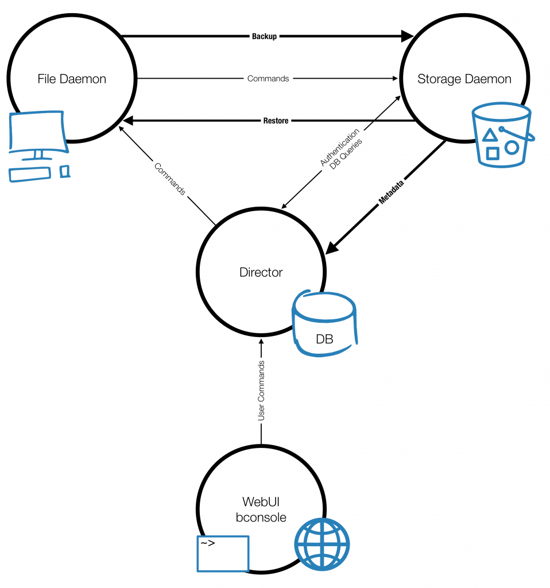

# Bareos

[TOC]

## 概述

**BAREOS（Backup Archiving REcovery Open  Sourced）**

Bareos 是一组计算机程序，允许系统管理员管理不同类型计算机网络中计算机数据的备份、恢复和验证。Bareos 还可以完全在一台计算机上运行，并可以备份到各种类型的介质，包括磁带、磁盘或云中。

从技术上讲，它是一个基于网络客户端/服务器的备份程序。Bareos 相对易于使用和高效，同时提供许多高级存储管理功能，可以轻松查找和恢复丢失或损坏的文件。由于其模块化设计，Bareos 可以从小型单计算机系统扩展到由位于大型网络上的数百台计算机组成的系统。所有 Bareos 服务都通过网络相互通信，身份验证是 TLS/SSL 加密的 - 通过证书或通过预共享密钥。Bareos 加密备份本身（在客户端上）以及各个计算机之间的通信。

如果目前正在使用 tar、dump 或 bru 等程序来备份计算机数据，并且希望获得网络解决方案、更大的灵活性或目录服务，那么 Bareos 很可能会提供您想要的其他功能。但是，如果你是 Unix 系统的新手，或者没有使用复杂备份包的补偿经验，Bareos 项目不建议使用 Bareos ，因为它比 tar 或 dump 更难设置和使用。

如果想让 Bareos 像上面提到的简单程序一样工作，并重写放在驱动器中的任何磁带，那么会发现使用 Bareos 很困难。Bareos 旨在按照您指定的规则保护您的数据，这意味着只有在万不得已时才重用磁带。可以“强制” Bareos 重写驱动器中的任何磁带，但使用更简单的程序进行这种操作更容易，更有效。

如果希望备份程序可以写入多个卷（即不受磁带机容量的限制），Bareos 很有可能满足您的需求。

如果目前正在使用一个复杂的商业软件包，如 Legato Networker、ARCserveIT、Arkeia、IBM Tivoli Storage Manager 或 PerfectBackup+ ，可能会对 Bareos 感兴趣，它提供了许多相同的功能，并且是 GNU AGPLv3 软件许可证下的免费软件。

Bareos 已通过 SUSE Linux Enterprise Server 和 SUSE Enterprise Storage 认证，并已列入官方合作伙伴软件目录。软件还通过了 Redhat Enterprise Linux 认证，并被列入官方 RHEL 产品目录。Bareos 可以在 Univention App Center 中找到，并且可以轻松集成到 UCS 中。

Bareos 为许多流行的操作系统提供文件守护程序，包括 Linux、FreeBSD、AIX、HP-UX、Solaris、Windows 和 macOS。此外，备份解决方案包括许多插件，允许安全备份和恢复各种数据库服务器（PostgreSQL，MySQL，MSSQL），LDAP 目录服务，云存储和虚拟机（VMware，oVirt）。

**端口:** 9101-9103

## Bareos 目前的状态

### 实施了什么

- 作业控制
  - 使用集中式 Director 进行网络备份/恢复。
  - 用于自动执行作业的内部调度程序。
  - 同时调度多个作业。
  - 可以一次运行一个作业，也可以同时运行多个作业（有时称为多路复用）。
  - 使用优先级进行作业排序。
  - Director 的控制台界面，允许完全控制。一些 GUI 也可用。
- 安全性
  - 验证先前编目的文件，允许类似 Tripwire 的功能（系统闯入检测）。
  - 每个组件（守护程序）之间的 CRAM-MD5 密码身份验证。
  - 每个组件之间可配置 TLS（SSL）通信加密。
  - Configurable [Data (on Volume) encryption](https://docs.bareos.org/TasksAndConcepts/DataEncryption.html#dataencryption) on a Client by Client basis.可配置的数据（卷上）加密，按客户端进行。可配置的数据（卷）加密在客户端的基础上。
  - 计算文件数据的 MD5 或 SHA1、SHA2(256,512)签名（如果需要）。
- 恢复功能
  
  - Restore of one or more files selected interactively either for  the current backup or a backup prior to a specified time and date.还原为当前备份或指定时间和日期之前的备份交互选择的一个或多个文件。
  - 使用独立的 bls 和 bextract 工具程序列出和恢复文件。除此之外，这允许在 Bareos 和/或目录不可用时提取文件。请注意，建议使用控制台中的 restore 命令恢复文件。这些程序是作为最后手段而设计的。
  - 能够使用引导文件（以前保存的）快速还原编录数据库。
  - 能够通过使用 bscan 程序扫描备份卷来重新创建编录数据库。
- SQL 目录
  - 用于记住已备份的卷、池、作业和文件的目录数据库工具。
  - 支持 PostgreSQL 目录数据库。
  - PostgreSQL 数据库的用户可扩展查询。
- 高级卷和池管理
  - 标记的卷，防止意外覆盖（至少被Bareos）。
  - 可以将任意数量的作业和客户端备份到单个卷。也就是说，可以将 Linux、Unix 和 Windows 计算机备份和还原到同一卷。
  - 多卷保存。当卷已满时，Bareos 会自动请求下一个卷并继续备份。
  - 池和卷库管理提供卷灵活性（例如每月、每周、每日卷集、按客户端隔离的卷集等）。
  - 独立于计算机的卷数据格式。如果需要，Linux、Solaris 和 Windows 客户端都可以备份到同一卷。
  - 卷数据格式向上兼容，因此始终可以读取旧卷。
  - 灵活的消息处理程序，包括将消息从任何守护程序路由回 Director 和自动电子邮件报告。
  - Data spooling to disk during backup with subsequent write to tape from the spooled disk files. This prevents tape “shoe shine” during  Incremental/Differential backups.备份期间将数据假脱机到磁盘，随后从假脱机磁盘文件写入磁带。这可以防止在增量/差异备份期间出现磁带“擦鞋”现象。
- 对大多数存储设备的高级支持
  - Autochanger support using a simple shell interface that can interface to virtually any autoloader program. 自动转换器支持使用一个简单的 shell 接口，可以接口到几乎任何自动加载程序。提供了一个用于 **mtx** 的脚本。
  - Support for autochanger barcodes 支持自动转换器条形码 - 从条形码自动标记磁带。
  - Automatic support for multiple autochanger magazines either using barcodes or by reading the tapes.使用条形码或通过阅读磁带自动支持多个自动换碟机料盒。
  - Support for multiple drive autochangers.支持多个驱动器自动转换器。
  - Raw device backup/restore. 原始设备备份/恢复。必须还原到同一设备。
  - 所有卷块都包含数据校验和。
  - 迁移支持 — 将数据从一个池移动到另一个池或从一个卷移动到另一个卷。
- 多操作系统支持
  - Programmed to handle arbitrarily long filenames and messages.编程为处理任意长的文件名和消息。
  - Compression on a file by file basis done by the Client program if requested before network transit.如果在网络传输之前请求，则由客户端程序逐个文件地进行压缩。
  - 在大多数操作系统上保存和恢复 POSIX ACL 和扩展属性（如果启用）。
  - 控制台的访问控制列表，允许限制用户只能访问其数据。
  - 支持保存/恢复大于 2GB 的文件。
  - 支持 ANSI 和 IBM 磁带标签。
  - 在 Win32 机器上支持 Unicode 文件名（例如中文）
  - 使用卷影复制（VSS）对 Win32 系统上打开的文件进行一致备份。
  - 在 Win32 机器上支持最大 64 K 的路径/文件名长度（在 Unix / Linux 机器上无限制）。
- 杂项
  - 多线程实现。

### 相对于其他备份程序的优势

- Bareos 处理多卷备份。
- 所有备份的文件的完整全面的 SQL 标准数据库。这允许在线查看保存在任何特定卷上的文件。
- 自动修剪数据库（删除旧记录），从而简化数据库管理。
- The modular but integrated design 模块化但集成的设计使 Bareos 具有很强的可扩展性。
- Bareos 有一个内置的作业调度器。
- Volume 格式有文档记录，并且有简单的 C 程序来读取/写入它。
- Bareos 使用良好定义的（IANA 注册的）TCP/IP 端口 — 没有 rpc，没有共享内存。
- 与其他同类产品相比，Bareos 的安装和配置相对简单。
- 除了几个 GUI 管理界面外，Bareos 还有一个全面的 shell 管理界面，允许管理员使用 ssh 等工具从任何地方管理 Bareos 的任何部分。

### 当前实施限制

#### 多个目录

可以将 Director 配置为使用多个目录。然而，这既不建议，也不被支持。多个目录需要更多的管理，因为通常您必须知道哪个目录包含哪些数据。e.g. currently, all Pools are defined in  each catalog.例如目前，所有池都在每个目录中定义。

- Bareos 通常可以将从一个客户端创建的任何备份恢复到任何其他客户端。但是，如果架构显著不同（即 32 位体系结构到 64 位或 Win32 到 Unix ），可能会有一些限制（例如 Solaris door 文件在其他 Unix/Linux 计算机上不存在；有报告说，用 64 位机器编写的 Zlib 压缩在 32 位机器上并不总是正确读取）。

### 设计限制或约束

- 在 Bareos 配置文件中定义的名称（资源名、卷名等）限制为固定的字符数。目前的限制是 127 个字符。注意，这不适用于文件名，文件名可以是任意长的。
- 一些独立工具的命令行输入  — 例如 btape，bconsole 限制为最多几百个字符。通常情况下，这不是一个限制，除非在为程序（如 bscan）列出多个卷名的情况下。要避免此命令行长度限制，请使用 .bsr 文件指定卷名。
- 每个组件的 Bareos 配置文件可以是任意长度。但是，单个行的长度被限制为 500 个字符，超过 500 个字符将被截断。If you need lines longer than  500 characters for directives such as ACLs where they permit a list of  names are character strings simply specify multiple short lines  repeating the directive on each line but with different list values.如果您需要长度超过 500 个字符的指令行，例如 ACL ，其中它们允许名称列表是字符串，只需指定多个短行，在每行上重复该指令，但使用不同的列表值。

### 注意事项

- Bareos’s Differential and Incremental *normal* backups are based on time stamps.Bareos 的差异和增量正常备份基于时间戳。if you move files into an existing  directory or move a whole directory into the backup fileset after a Full backup, those files will probably not be backed up by an Incremental  save because they will have old dates. 因此，如果在完整备份后将文件移动到现有目录或将整个目录移动到备份文件集中，则增量保存可能不会备份这些文件，因为它们的日期较旧。此问题可通过使用精确模式备份或显式更新所有移动文件上的日期/时间戳来解决。
- In non Accurate mode, files deleted after a Full save will be  included in a restoration. This is typical for most similar backup  programs. 在非精确模式下，完全备份后删除的文件将包括在恢复中。这对于大多数类似的备份程序来说是典型的。要避免这种情况，请使用精确模式备份。

## 组件或服务

 Bareos 由以下主要组件或服务组成：Director、Console、File、Storage 和 Monitor 服务。

必须配置并运行以下四个守护程序：Director Daemon、File Daemon、Storage Daemon 和目录服务（PostgreSQL）。

| 服务器                                              | 客户机      |
| --------------------------------------------------- | ----------- |
| bconsole 、WebUI 、Director Daemon 、Storage Daemon | File Daemon |

### Director

Director 是所有其他守护进程的中央控制程序。它计划并监督所有备份、恢复、验证和归档操作。系统管理员使用 Bareos Director 计划备份和恢复文件。Director 作为后台守护程序（或服务）运行。

运行在bareos管理机上，包含全部管理功能、CLI管理服务、WebUI 后台支持、目录（catalog）数据库支持等。

### Console

* bconsole

  全功能 CLI 管理终端。Bareos 控制台（bconsole）是允许管理员或用户与 Bareos Director 通信的程序。它在 shell 窗口中运行（即 TTY 接口）。大多数系统管理员会发现这完全足够了。

* QT-based GUI interface

  The second version is a GUI interface that is far from complete, but quite functional as it has most the capabilities of the shell Console.

* WebUI

  只能用于备份和恢复，同时包含基于 Web 的 CLI 界面。

### File Daemon

File Daemon 是一个必须安装在每台应备份的（客户端）计算机上的程序。在 Director 的请求下，它会找到要备份的文件，并将它们（它们的数据）发送到 Storage Daemon 。

它特定于运行它的操作系统，并负责在 Director 请求时提供文件属性和数据。

还负责在恢复操作期间恢复文件属性和数据的文件系统相关部分。此程序在要备份的计算机上作为守护程序运行。

### Storage Daemon

Storage Daemon 负责在 Director 请求时接收来自 File Daemon 的数据，并将文件属性和数据存储到物理备份介质或卷。对于还原请求，它负责查找数据并将其发送到 File Daemon 。

在您的环境中可以有多个 Storage Daemon，所有守护进程都由同一个 Director 控制。

存储服务在具有备份设备（如磁带机）的计算机上作为守护程序运行。

### Catalog

目录服务由负责维护所有备份文件的文件索引和卷数据库的软件程序组成。目录服务允许系统管理员或用户快速查找和还原任何所需的文件。Catalog 服务将 Bareos 与 tar 和 bru 等简单的备份程序区分开来，因为 Catalog 保留了所有使用的卷、所有运行的作业和所有保存的文件的记录，从而可以进行高效的恢复和卷管理。Bareos 支持 PostgreSQL 。

### 储存媒体
物理存储媒体（如硬盘存储系统、磁带存储系统等）。

## Bareos 服务之间的交互

下面的框图显示了备份作业的 Bareos 服务之间的典型交互。每个块通常表示一个单独的进程（通常是守护进程）。一般而言，Director 负责监督信息流动。它还维护目录。

 

## 耐心，当启动守护程序或装载空白磁带时的

当您启动 Bareos 守护进程时，Storage 守护进程会尝试打开所有已定义的存储设备并验证当前挂载的卷（如果已配置）。在验证完所有存储设备之前，存储守护程序将不接受来自控制台程序的连接。如果以前使用过磁带，则会将其重绕，在某些设备上，这可能需要几分钟时间。因此，在启动守护程序后第一次联系 Storage 守护程序时，可能需要有一点耐心。如果您可以看到磁带机，则指示灯停止闪烁后，磁带机将准备好使用。

如果您刚刚在驱动器中装入了空白磁带，则需要考虑相同的问题。驱动器可能需要一两分钟才能正确识别出磁带是空的。如果在此识别期间尝试使用 Console 程序装入磁带，则很可能会挂起 SCSI 驱动器。因此，再次敦促您在插入空白磁带时要有耐心。让设备稳定下来，然后再尝试访问它。

## 客户端

有两种方式与 Director 通信：命令行工具 Bareos Console（bconsole）和 WebUI（自 Bareos 15.2 起），通过 Web 浏览器访问。

### bconsole

详见[bconsole.md](./bconsole.md)

### Bareos Webui

The interface is multilingual, can address multiple Bareos Directors and databases, 该界面是多语言的，可以解决多个 Bareos Director 和数据库，显示备份作业，启动、取消或重新运行它们。在恢复过程中，WebUI 显示文件树以便于导航，还显示访问权限、用户和组成员身份、时间戳和大小。

详见[Bareos-webui.md](./Bareos-webui.md)
