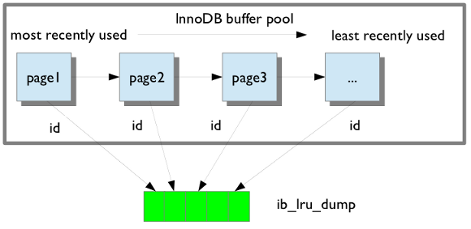
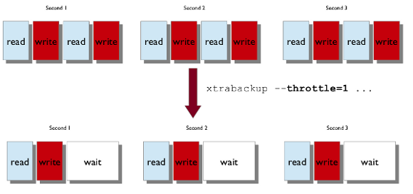
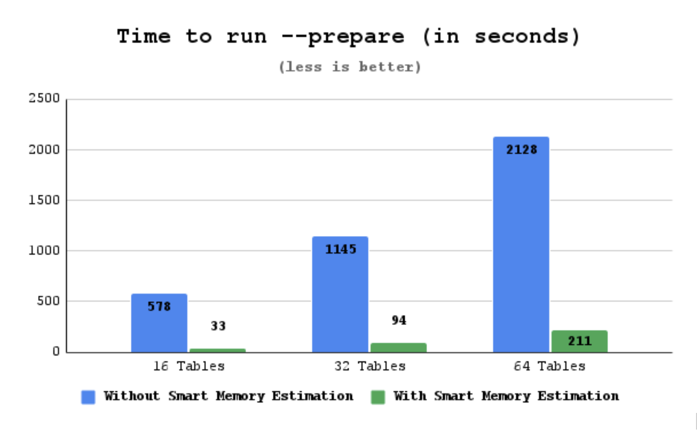

# XtraBackup

[TOC]

## 概述

Percona XtraBackup 是一个开源的热备份工具，适用于基于 MySQL 的服务器，可在计划的维护窗口内保持数据库完全可用。适用于所有版本的 Percona Server for MySQL 和 MySQL®，可在事务系统上执行在线无阻塞、紧密压缩、高度安全的完整备份。

Percona XtraBackup 是世界上唯一一款开源、免费的 MySQL 热备份软件，可对 InnoDB 和 XtraDB 数据库执行无阻塞备份。

无论是 24x7 高负载服务器还是低事务量服务器，Percona XtraBackup 都能在不影响服务器性能的情况下实现无缝备份。Percona  XtraBackup （PXB） 是一种 100% 开源备份解决方案，为希望从 MySQL  的全面、响应迅速且成本灵活的数据库支持中受益的组织提供[商业支持](https://www.percona.com/mysql-support/)。

这是一个创新版本。这种类型的版本仅在短时间内受支持，旨在用于升级周期较快的环境。开发人员和 DBA 可以接触到最新的功能和改进。

优势：

- 快速可靠地完成备份
- 在备份期间不间断地处理事务
- 节省磁盘空间和网络带宽
- 自动验证备份

Percona XtraBackup 为 Percona Server for MySQL 和 MySQL 兼容服务器进行热备份。XtraBackup 接受流式、压缩和增量服务器备份，并支持加密。

## 功能

以下是 Percona XtraBackup 功能的简短列表：

- 在不暂停数据库的情况下创建 InnoDB 热备份
- 对 MySQL 进行增量备份
- 将压缩的 MySQL 备份流式传输到另一台服务器
- 在 MySQL 服务器之间在线移动表
- 轻松创建新的 MySQL 复制副本
- 备份 MySQL，而不向服务器增加负载
- Performs throttling based on the number of IO operations per second
  根据每秒 IO 操作数执行限制
- 从完整的 InnoDB 备份中导出单个表

Percona XtraBackup 自动使用备份锁（Percona Server 中可用的 `FLUSH TABLES WITH READ LOCK` 的轻量级替代方案）来复制非 InnoDB 数据。此操作可避免阻止修改 InnoDB 表的 DML 查询。

### 备份功能

#### LRU dump 备份

Percona XtraBackup includes a saved buffer pool dump into a backup to enable reducing the warm up time. It restores the buffer pool state from `ib_buffer_pool` file after restart. 
Percona XtraBackup 将保存的缓冲池转储到备份中，以减少预热时间。它会在重新启动后从 `ib_buffer_pool` 文件中恢复缓冲池状态。Percona XtraBackup 发现 `ib_buffer_pool` 并自动备份。

 

If the buffer restore option is enabled in `my.cnf`, buffer pool will be in the warm state after backup is restored.
如果在 `my.cnf` 中启用了缓冲区还原选项，则还原备份后，缓冲池将处于暖状态。

#### Throttling backups 限制备份

尽管 xtrabackup 不会阻止数据库的运行，但任何备份都会给正在备份的系统增加负载。在没有太多备用 I/O 容量的系统上，限制 xtrabackup 读取和写入数据的速率可能会有所帮助。可以使用 `--throttle` 选项执行此操作。This option limits the number of chunks copied per second. The chunk +size is *10 MB*.此选项限制每秒复制的块数。块 + 大小为 *10 MB*。

下图显示了当 `--throttle` 设置为 `1` 时限制的工作原理。

 

当使用 `--backup` 选项指定时，此选项会限制 xtrabackup 每秒将执行的读写操作对数。如果要创建增量备份，则限制是每秒读取 I/O 操作的数量。

默认情况下，没有限制，xtrabackup 会尽可能快地读取和写入数据。如果对 IOPS 设置的限制过于严格，则备份可能会非常慢，以至于它永远无法赶上 InnoDB 正在写入的事务日志，因此备份可能永远无法完成。

#### 在服务器上存储备份历史记录

Percona XtraBackup 支持将备份历史记录存储在服务器上。在服务器上存储备份历史记录是为了向用户提供有关正在进行的备份的其他信息。备份历史记录信息将存储在 `PERCONA_SCHEMA.XTRABACKUP_HISTORY` 表中。

要使用此功能，可以使用以下选项：

- `--history` = ：此选项启用历史记录功能，并允许用户指定将放置在历史记录中的备份序列名称。
- `--incremental-history-name` = ：This option allows an incremental backup to be made based on a specific history series by name. *xtrabackup* will search the history table looking for the most recent (highest `to_lsn`) backup in the series and take the `to_lsn` value to use as it’s starting lsn. This is mutually exclusive with `--incremental-history-uuid`, `--incremental-basedir` and `--incremental-lsn` options. If no valid LSN can be found (no series by that name) *xtrabackup* will return with an error.
  此选项允许根据特定历史序列按名称进行增量备份。*XtraBackup* 将搜索历史记录表，查找系列中最新（`最高to_lsn`）的备份，并获取 `to_lsn` 值作为起始 LSN 使用。这与 `--incremental-history-uuid`、`--incremental-basedir` 和 `--incremental-lsn` 选项是互斥的。如果找不到有效的 LSN（没有该名称的序列），*则 xtrabackup* 将返回错误。
- `--incremental-history-uuid` = ：*xtrabackup* will search the history table looking for the record matching UUID and take the `to_lsn` value to use as it’s starting LSN. This options is mutually exclusive with `--incremental-basedir`, `--incremental-lsn` and `--incremental-history-name` options. If no valid LSN can be found (no record by that UUID or missing `to_lsn`), *xtrabackup* will return with an error.
  允许根据 UUID 标识的特定历史记录进行增量备份。xtrabackup 将搜索历史记录表，查找与 UUID 匹配的记录，并获取 `to_lsn` 值作为启动 LSN 时使用。此选项与 `--incremental-basedir`、`--incremental-lsn` 和 `--incremental-history-name` 选项互斥。如果找不到有效的 LSN（该 UUID 没有记录或缺少 `to_lsn`），*xtrabackup* 将返回错误。

> 注意
>
> Backup that’s currently being performed will **NOT** exist in the xtrabackup_history table within the resulting backup set as the record will not be added to that table until after the backup has been taken.
> 当前正在执行的备份将**不存在**于结果备份集的 xtrabackup_history 表中，因为在进行备份之前，记录不会添加到该表中。

If you want access to backup history outside of your backup set in the case of some catastrophic event, you will need to either perform a `mysqldump`, partial backup or `SELECT` * on the history table after *xtrabackup* completes and store the results with you backup set.
如果想在发生灾难性事件时访问备份集之外的备份历史记录，则需要在 xtrabackup 完成后对历史记录表执行 `mysqldump`、部分备份或 `SELECT` *，并将结果与备份集一起存储。

##### PERCONA_SCHEMA.XTRABACKUP_HISTORY 表

This table contains the information about the previous server backups. Information about the backups will only be written if the backup was taken with `--history` option.
此表包含有关先前 服务器备份的信息。仅当使用 `--history` 选项进行备份时，才会写入有关备份的信息。

| 列名称           | 描述                                                         |
| ---------------- | ------------------------------------------------------------ |
| uuid             | 唯一备份 ID                                                  |
| name             | User provided name of backup series. There may be multiple entries with the  same name used to identify related backups in a series. 用户提供的备份系列名称。可能有多个同名的条目用于标识系列中的相关备份。 |
| tool_name        | 用于备份的工具名称                                           |
| tool_command     | Exact command line given to the tool with –password and –encryption_key obfuscated 为 –password 和 –encryption_key 混淆工具提供的确切命令行 |
| tool_version     | 用于备份的工具版本                                           |
| ibbackup_version | 用于备份的 xtrabackup 二进制文件的版本                       |
| server_version   | 执行备份的服务器版本                                         |
| start_time       | 备份开始时的时间                                             |
| end_time         | 备份结束的时间                                               |
| lock_time        | Amount of time, in seconds, spent calling and holding locks for `FLUSH TABLES WITH READ LOCK` 调用 `FLUSH TABLES WITH READ LOCK` 的调用和持有锁所花费的时间（以秒为单位） |
| binlog_pos       | Binlog file and position at end of `FLUSH TABLES WITH READ LOCK` Binlog 文件和位于 `FLUSH TABLES WITH READ LOCK` 末尾的位置 |
| innodb_from_lsn  | LSN at beginning of backup which can be used to determine prior backups 备份开始时的 LSN，可用于确定以前的备份 |
| innodb_to_lsn    | LSN at end of backup which can be used as the starting lsn for the next incremental 备份结束时的 LSN，可用作下一个增量的起始 LSN |
| partial          | Is this a partial backup, if `N` that means that it’s the full backup 这是部分备份吗，如果`为 N`，则表示它是完整备份 |
| incremental      | Is this an incremental backup 这是增量备份吗                 |
| format           | Description of result format (`xbstream`) 结果格式 （`xbstream`） 说明 |
| compressed       | Is this a compressed backup 这是压缩备份吗                   |
| encrypted        | Is this an encrypted backup 这是加密备份吗                   |

##### 限制

- `--history` 选项必须仅在命令行中指定，而不能在配置文件中指定，才能有效。
- `--incremental-history-name` 和 `--incremental-history-uuid` 选项必须仅在命令行中指定，而不能在配置文件中指定，才能有效。

### Prepare 功能

#### 字典缓存

Percona XtraBackup copies the InnoDB data files, which results in data that is internally inconsistent; then the `prepare` phase performs crash recovery on the files to make a consistent, usable database again.
Percona XtraBackup 基于 [崩溃恢复 crash recovery] 的工作原理。Percona XtraBackup 会复制 InnoDB 数据文件，这会导致数据内部不一致；然后，`prepare` 阶段对文件执行崩溃恢复，以再次构建一致、可用的数据库。

`--prepare` 阶段有以下操作：

- Applies the redo log 应用重做日志
- Applies the undo log 应用撤消日志

the changes from the redo log modifications are  applied to a page. In the redo log operation, there is no concept of row or transaction. The redo apply operation does not make the database  consistent with a transaction. An uncommitted transaction can be flushed or written to the redo log by the server. Percona XtraBackup applies  changes recorded in the redo log.
作为物理操作，重做日志修改中的更改将应用于页面。在重做日志操作中，没有 row 或 transaction 的概念。redo apply  操作不会使数据库与事务保持一致。服务器可以刷新未提交的事务或将其写入重做日志。Percona XtraBackup 应用重做日志中记录的更改。

Percona XtraBackup physically modifies a specific offset of a page within a tablespace (IBD file) when applying a redo log. 
Percona XtraBackup 在应用重做日志时，会物理修改表空间（IBD 文件）中页面的特定偏移量。

As a logical operation, Percona XtraBackup applies the undo log on a  specific row. When the redo log completes, XtraBackup uses the undo log  to roll back changes from uncommitted transactions during the backup.
作为逻辑操作，Percona XtraBackup 将撤消日志应用于特定行。当重做日志完成时，XtraBackup 使用撤消日志来回滚备份期间未提交事务的更改。

##### 撤消日志

有两种类型的撤消日志记录：

- INSERT 插入
- UPDATE 更新

An undo log record contains a `table_id`. Percona XtraBackup uses this `table_id` to find the table definition, and then uses that information to parse  the records on an index page. The transaction rollback reads the undo  log records and applies the changes. 
撤消日志记录包含`table_id`。Percona XtraBackup 使用此`table_id`查找表定义，然后使用该信息解析索引页上的记录。事务回滚会读取撤消日志记录并应用更改。

After initializing the data dictionary engine and the data dictionary cache, the storage engine can request the `table_id` and uses this ID to fetch the table schema. An index search tuple (key) is created from the table schema and key fields from the undo log  record. The server finds the record using the search tuple (key) and  performs the undo operation.
初始化数据字典引擎和数据字典缓存后，存储引擎可以请求 `table_id` 并使用该 ID 获取表 Schema。索引搜索元组 （key） 是根据 undo 日志记录中的表架构和键字段创建的。服务器使用搜索元组 （key） 查找记录并执行撤消操作。

For example, InnoDB uses the `table_id` (also known as the `se_private_id`) for a table definition. Percona XtraBackup does not behave like a  server and does not have access to the data dictionary. XtraBackup  initializes the InnoDB engine and uses the `InnoDB table object` (`dict_table_t`) when needed. XtraBackup relies on Serialized Dictionary Information  (SDI) that is stored in the tablespace. SDI is a JSON representation of a table.
例如，InnoDB 将 `table_id`（也称为 `se_private_id`）用于表定义。Percona XtraBackup 的行为与服务器不同，并且无法访问数据字典。XtraBackup 初始化 InnoDB 引擎并在需要时使用 `InnoDB 表对象` （`dict_table_t`）。XtraBackup 依赖于存储在表空间中的序列化字典信息 （SDI）。SDI 是表的 JSON 表示形式。

In Percona XtraBackup 8.4.0-1, tables are loaded as `evictable`. XtraBackup scans the B-tree index of the data dictionary tables `mysql.indexes` and `mysql.index_partitions` to establish a relationship between the `table_id` and the `tablespace(space_id)`. XtraBackup uses this relationship during transaction rollback.  XtraBackup does not load user tables unless there is a transaction  rollback on them.
在 Percona XtraBackup 8.4.0-1 中，表被加载为`可驱逐`。XtraBackup 会扫描数据字典表 `mysql.indexes` 和 `mysql.index_partitions` 的 B 树索引，以建立 `table_id` 和 `tablespace（space_id）` 之间的关系。XtraBackup 在事务回滚期间使用此关系。XtraBackup 不会加载用户表，除非它们上有事务回滚。

A background thread or a Percona XtraBackup main thread handles the cache eviction when the cache size limit is reached.
当达到缓存大小限制时，后台线程或 Percona XtraBackup 主线程会处理缓存驱逐。

此设计在 `--prepare` 阶段提供以下优势：

- 使用更少的内存
- 使用更少的 IO
- 缩短了 `--prepare` 阶段所花费的时间
- Completes successfully, even if the `--prepare` phase has a huge number of tables
  成功完成，即使 `--prepare` 阶段有大量表
- 更快地完成 Percona XtraDB Cluster SST 流程

### 还原功能

#### 时间点恢复

可以使用 xtrabackup 和服务器的二进制日志来恢复到数据库历史记录中的特定时刻。

请注意，二进制日志包含从过去的某个时间点修改数据库的操作。需要一个完整的 datadir 作为基础，然后可以应用二进制日志中的一系列操作，以使数据与所需时间点的数据匹配。

```bash
$ xtrabackup --backup --target-dir=/path/to/backup
$ xtrabackup --prepare --target-dir=/path/to/backup
```

Now, suppose that some time has passed, and you want to restore the database to a certain point in the past, having in mind that there is the constraint of the point where the snapshot was taken.
现在，假设已经过去了一段时间，并且希望将数据库还原到过去的某个时间点，同时要记住拍摄快照的时间点存在约束。

要了解服务器中二进制日志记录的情况，请执行以下查询：

```mysql
mysql> SHOW BINARY LOGS;

+------------------+-----------+
| Log_name         | File_size |
+------------------+-----------+
| mysql-bin.000001 |       126 |
| mysql-bin.000002 |      1306 |
| mysql-bin.000003 |       126 |
| mysql-bin.000004 |       497 |
+------------------+-----------+
```

和

```mysql
mysql> SHOW MASTER STATUS;

+------------------+----------+--------------+------------------+
| File             | Position | Binlog_Do_DB | Binlog_Ignore_DB |
+------------------+----------+--------------+------------------+
| mysql-bin.000004 |      497 |              |                  |
+------------------+----------+--------------+------------------+
```

第一个查询将告诉您哪些文件包含二进制日志，第二个查询将告诉您当前正在使用哪个文件来记录更改，以及其中的当前位置。这些文件通常存储在 datadir 中（除非在使用 `--log-bin=` 选项启动服务器时指定了其他位置）。

要了解拍摄快照的位置，请参阅备份目录中的 `xtrabackup_binlog_info`：

```bash
$ cat /path/to/backup/xtrabackup_binlog_info

mysql-bin.000003      57
```

这将告诉您在备份二进制日志时使用的哪个文件及其位置。当您恢复备份时，该位置将是有效的位置：

```bash
$ xtrabackup --copy-back --target-dir=/path/to/backup
```

由于恢复不会影响二进制日志文件（可能需要调整文件权限），下一步是使用 mysqlbinlog 从快照位置开始从二进制日志中提取查询并将其重定向到文件

```bash
$ mysqlbinlog /path/to/datadir/mysql-bin.000003 /path/to/datadir/mysql-bin.000004 \
    --start-position=57 > mybinlog.sql
```

请注意，如果有多个文件用于二进制日志，如示例中所示，则必须使用一个进程提取查询，如上所示。

Inspect the file with the queries to determine which position or date corresponds to the point-in-time wanted. Once determined, pipe it to the server. Assuming the point is `11-12-25 01:00:00`:
检查包含查询的文件，以确定哪个位置或日期对应于所需的时间点。确定后，通过管道将其传输到服务器。假设点是 `11-12-25 01：00：00`：

```bash
$ mysqlbinlog /path/to/datadir/mysql-bin.000003 /path/to/datadir/mysql-bin.000004 \
    --start-position=57 --stop-datetime="11-12-25 01:00:00" | mysql -u root -p
```

并且数据库将前滚到该时间点。

#### 恢复单个表

Percona XtraBackup 可以导出包含在其自己的 .ibd 文件中的表。使用 Percona XtraBackup，可以从任何 InnoDB  数据库导出单个表，并将它们导入到带有 XtraDB 或 MySQL 8.4 的 Percona Server for MySQL 中。源不必是  XtraDB 或 MySQL 8.4，但目标必须是。此方法仅适用于单个 .ibd 文件。

以下示例导出和导入下表：

```mysql
CREATE TABLE export_test (
a int(11) DEFAULT NULL
) ENGINE=InnoDB DEFAULT CHARSET=latin1;
```

##### 导出表格

要在目标目录中生成 .ibd 文件，请使用 `innodb_file_per_table` 模式创建表：

```bash
$ find /data/backups/mysql/ -name export_test.*
/data/backups/mysql/test/export_test.ibd
```

在 `--prepare` 步骤中，将 `--export` 选项添加到命令中。例如：

```bash
$ xtrabackup --prepare --export --target-dir=/data/backups/mysql/
```

恢复加密的 InnoDB 表空间表时，添加密钥环文件：

```bash
$ xtrabackup --prepare --export --target-dir=/tmp/table \
--keyring-file-data=/var/lib/mysql-keyring/keyring
```

以下文件是将表导入运行 Percona Server for MySQL with XtraDB 或 MySQL 8.4 的服务器所需的唯一文件。如果服务器使用 InnoDB 表空间加密，请添加 .cfp 文件，其中包含传输密钥和加密的表空间密钥。

这些文件位于 target 目录中：

```bash
/data/backups/mysql/test/export_test.ibd
/data/backups/mysql/test/export_test.cfg
```

##### 导入表格

在运行 Percona Server for MySQL with XtraDB 或 MySQL 8.4 的目标服务器上，创建一个具有相同结构的表，然后执行以下步骤：

1. 运行命令 `ALTER TABLE test.export_test DISCARD TABLESPACE;` 。如果您看到以下错误消息：

   ```mysql
   ERROR 1809 (HY000): Table 'test/export_test' in system tablespace
   ```

   启用服务器上的 `innodb_file_per_table` 选项，然后再次创建表。

   ```mysql
   $ set global innodb_file_per_table=ON;
   ```

2. 将导出的文件复制到目标服务器数据目录的 `test/` 子目录。

3. 运行 `ALTER TABLE test.export_test IMPORT TABLESPACE;` 

表已导入，可以运行 `SELECT` 来查看导入的数据。

### FLUSH TABLES WITH READ LOCK 选项

The `FLUSH TABLES WITH READ LOCK` option does the following with a global read lock:
`FLUSH TABLES WITH READ LOCK` 选项使用全局读取锁定执行以下操作：

- 关闭所有打开的表
- 锁定所有数据库的所有表

使用 `UNLOCK TABLES` 释放锁。

> 注意
>
> `FLUSH TABLES WITH READ LOCK` does not prevent inserting rows into the log tables.
> `FLUSH TABLES WITH READ LOCK` 不会阻止将行插入日志 table。

为确保备份的一致性，请在进行非 InnoDB 文件备份之前使用 `FLUSH TABLES WITH READ LOCK` 选项。该选项不会影响长时间运行的查询。

Enabling `FLUSH TABLES WITH READ LOCK` when the server has long-running queries can leave the server in a  read-only mode until the queries finish. If the server is in either the `Waiting for table flush` or the `Waiting for source to send event` state, stopping the `FLUSH TABLES WITH READ LOCK` operation does not help. Stop any long-running queries to return to normal operation.
当服务器具有长时间运行的查询时启用 `FLUSH TABLES WITH READ LOCK` 可以使服务器处于只读模式，直到查询完成。如果服务器处于 `Waiting for table flush` 或 `Waiting for source to send event` 状态，则停止 `FLUSH TABLES WITH READ LOCK` 操作将无济于事。停止任何长时间运行的查询以恢复正常操作。

To prevent the server staying in a read-only mode until the queries finish, xtrabackup does the following:
为了防止服务器在查询完成之前保持只读模式，xtrabackup 执行以下操作：

- checks if any queries run longer than specified in `--ftwrl-wait-threshold`. If xtrabackup finds such queries, xtrabackup waits for one second and  checks again. If xtrabackup waits longer than specified in `--ftwrl-wait-timeout`, the backup is aborted. As soon as xtrabackup finds no queries running longer than specified in `--ftwrl-wait-threshold`, xtrabackup issues the global lock.
  检查是否有任何查询的运行时间超过 `--ftwrl-wait-threshold` 中指定的时间。如果 xtrabackup 找到这样的查询，xtrabackup 会等待 1 秒钟，然后再次检查。如果 xtrabackup 等待的时间超过 `--ftwrl-wait-timeout` 中指定的时间，则备份将中止。一旦 xtrabackup 发现没有查询运行时间超过 `--ftwrl-wait-threshold` 中指定的时间，xtrabackup 就会发出全局锁定。
- kills all queries or only the SELECT queries which prevent the global lock from being acquired.
  终止所有查询或仅终止阻止获取全局锁的 SELECT 查询。

> Note 注意
>
> All operations described in this section have no effect when [Backup locks](https://docs.percona.com/percona-server/innovation-release/backup-locks.html) are used.
> 使用 [Backup 锁](https://docs.percona.com/percona-server/innovation-release/backup-locks.html)时，本节中描述的所有操作都不起作用。

Percona XtraBackup 使用 [Backup 锁](https://docs.percona.com/percona-server/innovation-release/backup-locks.html)作为 `FLUSH TABLES WITH READ LOCK` 的轻量级替代方案。此操作会自动复制非 InnoDB 数据，并避免阻止修改 InnoDB 表的 DML 查询。

#### 等待查询完成

You should issue a global lock when no long queries are running. Waiting to issue the global lock for extended period of time is not a good method. The wait can extend the time needed for backup to take place. The `–ftwrl-wait-timeout` option can limit the waiting time. If it cannot issue the lock during this time, xtrabackup stops the option, exits with an error message, and backup is not be taken.
当没有长查询正在运行时，您应该发出全局锁定。长时间等待发出全局锁定不是一个好方法。等待可能会延长进行备份所需的时间。`–ftwrl-wait-timeout` 选项可以限制等待时间。如果在此期间无法发出锁定，则 xtrabackup 将停止该选项，退出并显示错误消息，并且不会进行备份。

该选项的默认值为零 （0），这将关闭该选项。

Another possibility is to specify the type of query to wait on. In this case `--ftwrl-wait-query-type`.
另一种可能性是指定要等待的查询类型。在本例中`为 --ftwrl-wait-query-type`。

The possible values are `all` and `update`. When `all` is used xtrabackup will wait for all long running queries (execution time longer than allowed by `--ftwrl-wait-threshold`) to finish before running the `FLUSH TABLES WITH READ LOCK`. When `update` is used xtrabackup will wait on `UPDATE/ALTER/REPLACE/INSERT` queries to finish.
可能的值为 `all` 和 `update`。当 `all` is used 时，xtrabackup 将等待所有长时间运行的查询（执行时间长于 `--ftwrl-wait-threshold` 允许的时间）完成，然后再运行 `FLUSH TABLES WITH READ LOCK`。当使用 `update` 时，xtrabackup 将等待 `UPDATE/ALTER/REPLACE/INSERT` 查询完成。

The time needed for a specific query to complete is hard to predict. We  assume that the long-running queries will not finish in a timely manner. Other queries which run for a short time finish quickly. xtrabackup  uses the value of `–ftwrl-wait-threshold option to specify the long-running queries and will block a global lock. To use this option xtrabackup user should have`PROCESS`and`CONNECTION_ADMIN` privileges.
完成特定查询所需的时间很难预测。我们假设长时间运行的查询不会及时完成。其他短时间运行的查询会很快结束。xtrabackup 使用 PROCESS 的值 `–ftwrl-wait-threshold option to specify the long-running queries and will block a global lock. To use this option xtrabackup user should have` `和`CONNECTION_ADMIN' 权限。

##### 杀死阻塞的查询

The second option is to kill all the queries which prevent from acquiring the global lock. In this case, all queries which run longer than `FLUSH TABLES WITH READ LOCK` are potential blockers. Although all queries can be killed, additional time can be specified for the short running queries to finish using the `--kill-long-queries-timeout` option. This option specifies a query time limit. After the specified  time is reached, the server kills the query. The default value is zero,  which turns this feature off.
第二个选项是终止所有阻止获取全局锁的查询。在这种情况下，所有运行时间超过 `FLUSH TABLES WITH READ LOCK` 的查询都是潜在的阻塞程序。尽管可以终止所有查询，但可以使用 `--kill-long-queries-timeout` 选项为短时间运行的查询指定额外的时间以完成。此选项指定查询时间限制。到达指定时间后，服务器将终止查询。默认值为零，这将关闭此功能。

The `--kill-long-query-type` option can be used to specify all or only `SELECT` queries that are preventing global lock from being acquired. To use this option xtrabackup user should have `PROCESS` and `CONNECTION_ADMIN` privileges.
`--kill-long-query-type` 选项可用于指定阻止获取全局锁的所有或仅 `SELECT` 查询。要使用此选项，xtrabackup 用户应具有 `PROCESS` 和 `CONNECTION_ADMIN` 权限。

##### 选项摘要

- `--ftwrl-wait-timeout` (seconds) - how long to wait for a good moment. Default is 0, not to wait.
  `--ftwrl-wait-timeout` （seconds） - 等待好时机的时间。默认值为 0，不等待。
- `--ftwrl-wait-query-type` - which long queries should be finished before `FLUSH TABLES WITH READ LOCK` is run. Default is all.
  `--ftwrl-wait-query-type` - 在运行 `FLUSH TABLES WITH READ LOCK` 之前应该完成哪些长查询。默认值为 all。
- `--ftwrl-wait-threshold` (seconds) - how long query should be running before we consider it long running and potential blocker of global lock.
  `--ftwrl-wait-threshold` （seconds） - 在我们认为查询长时间运行和全局锁的潜在阻塞者之前，查询应该运行多长时间。
- `--kill-long-queries-timeout` (seconds) - how many time we give for queries to complete after `FLUSH TABLES WITH READ LOCK` is issued before start to kill. Default if `0`, not to kill.
  `--kill-long-queries-timeout` （seconds） - 在发出 `FLUSH TABLES WITH READ LOCK` 之后，我们给出多少时间来完成查询，然后开始终止。如果`为 0`，则默认为 0，则不终止。
- `--kill-long-query-type` - which queries should be killed once `kill-long-queries-timeout` has expired.
  `--kill-long-query-type` - `kill-long-queries-timeout` 过期后应终止哪些查询。

##### 示例

Running the xtrabackup with the following options will cause xtrabackup to spend no longer than 3 minutes waiting for all queries older than 40 seconds to complete.
使用以下选项运行 xtrabackup 将导致 xtrabackup 等待所有超过 40 秒的查询完成的时间不超过 3 分钟。

```bash
$  xtrabackup --backup --ftwrl-wait-threshold=40 \
--ftwrl-wait-query-type=all --ftwrl-wait-timeout=180 \
--kill-long-queries-timeout=20 --kill-long-query-type=all \
--target-dir=/data/backups/
```

After `FLUSH TABLES WITH READ LOCK` is issued, xtrabackup will wait for 20 seconds for lock to be acquired. If lock is still not acquired after 20 seconds, it will kill all queries which are running longer that the `FLUSH TABLES WITH READ LOCK`.
发出 `FLUSH TABLES WITH READ LOCK` 后，xtrabackup 将等待 20 秒以获取锁。如果 20 秒后仍未获取 lock，它将终止所有运行时间超过 `FLUSH TABLES WITH READ LOCK` 的查询。

### 改进的日志语句

Percona XtraBackup 是一个开源的命令行工具。命令行工具与后台操作的交互有限，日志提供操作的进度或有关错误的更多信息。

错误日志没有标准结构，日志语句在以下方面有所不同：

- The backup log statement header has the name of the module, `xtrabackup`, which generated the statement but no timestamp:
  backup log 语句标头具有模块的名称 `xtrabackup`，该模块生成了该语句，但没有时间戳：

  ```bash
  $ xtrabackup: recognized client arguments: --parallel=4 --target-dir=/data/backups/ --backup=1
  ```

  输出应类似于以下内容：

  ```bash
  ./bin/xtrabackup version 8.4.0-1 based on MySQL server 8.4 Linux (x86_64) (revision id: b0f75188ca3)
  ```

- The copy-back log statement has a timestamp but no module name. The  timestamp is a mix of UTC and the local timezone.
  copy-back log 语句有时间戳，但没有模块名称。时间戳是 UTC 和本地时区的混合。

  ```
  220322 19:05:13 [01] Copying undo_001 to /data/backups/undo_001
  ```

- The following prepare log statements do not have header information,  which makes diagnosing an issue more difficult.
  以下 prepare log 语句没有标头信息，这使得诊断问题更加困难。

  ```bash
  Completed space ID check of 1008 files.
  Initializing buffer pool, total size = 128.000000M, instances = 1, chunk size =128.000000M
  Completed initialization of buffer pool
  If the mysqld execution user is authorized, page cleaner thread priority can be changed. See the man page of setpriority().
  ```

#### Log 语句结构

The improved log structure is displayed in the backup, prepare, move-back/copy-back error logs.
改进的日志结构显示在 backup、prepare、move-back/copy-back 错误日志中。

每个 log 语句都具有以下属性：

- Timestamp - a timestamp for when the event occurred in a UTC format.
  时间戳 - 事件发生时的时间戳，采用 UTC 格式。
- Severity - the severity level of a statement indicates the importance of an event.
  Severity - 语句的严重性级别表示事件的重要性。
- ID - this identifier is currently not used but may be used in future versions.
  ID - 此标识符当前未使用，但可能会在将来的版本中使用。
- Context - the name of the module that issued the log statement, such as XtraBackup, InnoDB, or Server.
  Context - 发出 log 语句的模块的名称，例如 XtraBackup、InnoDB 或 Server。
- Message - a description of the event generated by the module.
  Message - 模块生成的事件的描述。

An example of a `prepare` log that is generated with the improved structure. The uniformity of the headers makes it easier to follow an operation’s progress or review the log to diagnose issues.
使用改进的结构生成的 `prepare` log 示例。标头的统一性使跟踪操作进度或查看日志以诊断问题变得更加容易。

```bash
2022-03-22T19:15:36.142247+05:30 0 [Note] [MY-011825] [Xtrabackup] This target seems to be not prepared yet.
2022-03-22T19:15:36.142792+05:30 0 [Note] [MY-013251] [InnoDB] Number of pools: 1
2022-03-22T19:15:36.149212+05:30 0 [Note] [MY-011825] [Xtrabackup] xtrabackup_logfile detected: size=8388608, start_lsn=(33311656)
2022-03-22T19:15:36.149998+05:30 0 [Note] [MY-011825] [Xtrabackup] using the following InnoDB configuration for recovery:
2022-03-22T19:15:36.150023+05:30 0 [Note] [MY-011825] [Xtrabackup] innodb_data_home_dir = .
2022-03-22T19:15:36.150036+05:30 0 [Note] [MY-011825] [Xtrabackup] innodb_data_file_path = ibdata1:12M:autoextend
2022-03-22T19:15:36.150078+05:30 0 [Note] [MY-011825] [Xtrabackup] innodb_log_group_home_dir = .
2022-03-22T19:15:36.150095+05:30 0 [Note] [MY-011825] [Xtrabackup] innodb_log_files_in_group = 1
2022-03-22T19:15:36.150111+05:30 0 [Note] [MY-011825] [Xtrabackup] innodb_log_file_size = 8388608
2022-03-22T19:15:36.151667+05:30 0 [Note] [MY-011825] [Xtrabackup] inititialize_service_handles suceeded
2022-03-22T19:15:36.151903+05:30 0 [Note] [MY-011825] [Xtrabackup] using the following InnoDB configuration for recovery:
2022-03-22T19:15:36.151926+05:30 0 [Note] [MY-011825] [Xtrabackup] innodb_data_home_dir = .
2022-03-22T19:15:36.151954+05:30 0 [Note] [MY-011825] [Xtrabackup] innodb_data_file_path = ibdata1:12M:autoextend
2022-03-22T19:15:36.151976+05:30 0 [Note] [MY-011825] [Xtrabackup] innodb_log_group_home_dir = .
2022-03-22T19:15:36.151991+05:30 0 [Note] [MY-011825] [Xtrabackup] innodb_log_files_in_group = 1
2022-03-22T19:15:36.152004+05:30 0 [Note] [MY-011825] [Xtrabackup] innodb_log_file_size = 8388608
2022-03-22T19:15:36.152021+05:30 0 [Note] [MY-011825] [Xtrabackup] Starting InnoDB instance for recovery.
2022-03-22T19:15:36.152035+05:30 0 [Note] [MY-011825] [Xtrabackup] Using 104857600 bytes for buffer pool (set by --use-memory parameter)
```

### lock-ddl-per-table 选项改进

> Important 重要
>
> The lock-ddl-per-table option is deprecated in Percona Server for MySQL 8.0. Use –lock-ddl instead of this variable.
> lock-ddl-per-table 选项在 Percona Server for MySQL 8.0 中已弃用。使用 –lock-ddl 而不是此变量。

To block DDL statements on an instance, Percona Server implemented LOCK TABLES FOR BACKUP. Percona XtraBackup uses this lock for the duration of the backup. This lock does not affect DML statements.
为了阻止实例上的 DDL 语句，Percona Server 实现了 LOCK TABLES FOR BACKUP。Percona XtraBackup 在备份期间使用此锁。此锁不会影响 DML 语句。

Percona XtraBackup has also implemented `--lock-ddl-per-table`, which blocks DDL statements by using metadata locks (MDL).
Percona XtraBackup 还实现了 `--lock-ddl-per-table`，它使用元数据锁 （MDL） 来阻止 DDL 语句。

The following procedures describe a simplified backup operation when using `--lock-ddl-per-table`:
以下过程描述了使用 `--lock-ddl-per-table` 时的简化备份操作：

1. Parse and copy all redo logs after the checkpoint mark
   解析并复制检查点标记后的所有重做日志
2. Fork a dedicated thread to continue following new redo log entries
   分叉专用线程以继续跟踪新的重做日志条目
3. List the tablespaces required to copy
   列出复制所需的表空间
4. Iterate through the list. The following steps occur with each listed tablespace:
   遍历列表。每个列出的 table space 将执行以下步骤：
5. Query INFORMATION_SCHEMA.INNODB_TABLES to find which tables belong   to the tablespace ID and take an MDL on the underlying table or tables in   case there is a shared tablespace.
   查询 INFORMATION_SCHEMA。INNODB_TABLES查找哪些表属于表空间 ID，并在存在共享表空间的情况下对底层表或 table 进行 MDL。
6. Copy the tablespace `.ibd` files.
   复制表空间 `.ibd` 文件。

The backup process may encounter a redo log event, generated by the bulk load operations, which notifies backup tools that data file changes have been omitted from the redo log. This event is an `MLOG_INDEX_LOAD`. If this event is found by the redo follow thread, the backup continues and assumes the backup is safe because the MDL protects tablespaces already copied and the MLOG_INDEX_LOAD event is for a tablespace that is not copied.
备份过程可能会遇到由批量加载操作生成的重做日志事件，该事件通知备份工具重做日志中省略了数据文件更改。此事件是一个`MLOG_INDEX_LOAD`。如果重做跟踪线程发现此事件，则备份将继续并假定备份是安全的，因为 MDL 保护已复制的表空间，而 MLOG_INDEX_LOAD 事件适用于未复制的表空间。

These assumptions may not be correct and may lead to inconsistent backups.
这些假设可能不正确，并可能导致备份不一致。

#### `--lock-ddl-per-table` redesign 重新设计

The `--lock-ddl-per-table` option has been redesigned to minimize inconsistent backups.
重新设计了 `--lock-ddl-per-table` 选项，以最大限度地减少不一致的备份。

The following procedure reorders the steps:
以下过程将对步骤重新排序：

- The MDL lock acquired at the beginning of the backup
  备份开始时获取的 MDL 锁
- Scan the redo logs. An `MLOG_INDEX_LOAD` event may be recorded if a `CREATE INDEX` statement has occurred before the backup starts. At this time, the backup process is safe and can parse and accept the event.
  扫描重做日志。如果在备份开始之前发生了 `CREATE INDEX` 语句，则可能会记录 `MLOG_INDEX_LOAD` 事件。此时，备份过程是安全的，可以解析和接受事件。
- After the first scan has completed, the follow redo log thread is initiated. This thread stops the backup process if an `MLOG_INDEX_LOAD` event is found.
  第一次扫描完成后，将启动后续重做日志线程。如果找到 `MLOG_INDEX_LOAD` 事件，此线程将停止备份过程。
- Gather the tablespace list to copy
  收集要复制的表空间列表
- Copy the `.ibd` files.
  复制 `.ibd` 文件。

#### 其他改进

添加了以下改进：

- If the `.ibd` file belongs to a temporary table, the `SELECT` query is skipped.
  如果 `.ibd` 文件属于临时表，则跳过 `SELECT` 查询。
- For a FullText Index, an MDL is acquired on the base table.
  对于全文索引，将在基表上获取 MDL。
- A `SELECT` query that acquires an MDL does not retrieve any data.
  获取 MDL 的 `SELECT` 查询不会检索任何数据。

###         Smart memory estimation 智能内存估计

The Smart memory estimation is [tech preview](https://docs.percona.com/percona-xtrabackup/8.4/glossary.html#tech-preview) feature. Before using Smart memory estimation in production, we  recommend that you test restoring production from physical backups in  your environment and also use the alternative backup method for  redundancy.
智能内存估计是一项[技术预览](https://docs.percona.com/percona-xtrabackup/8.4/glossary.html#tech-preview)功能。在生产中使用智能内存估计之前，我们建议您测试从环境中的物理备份还原生产，并使用替代备份方法实现冗余。

Percona XtraBackup supports the Smart memory estimation feature. With this  feature, Percona XtraBackup computes the memory required for `prepare` phase, while copying redo log entries during the `backup` phase. Percona XtraBackup also considers the number of InnoDB pages to be fetched from the disk.  
Percona XtraBackup 支持智能内存估算功能。借助此功能，Percona XtraBackup 可以计算`准备`阶段所需的内存，同时在`备份`阶段复制重做日志条目。Percona XtraBackup 还考虑了要从磁盘获取的 InnoDB 页面的数量。

Percona XtraBackup 分两步执行备份过程：

- 创建备份

  To create a backup, Percona XtraBackup copies your InnoDB data files.  While copying the files, Percona XtraBackup runs a background process  that watches the InnoDB redo log, also called the transaction log, and  copies changes from it. 
  要创建备份，Percona XtraBackup 会复制您的 InnoDB 数据文件。在复制文件时，Percona XtraBackup 会运行一个后台进程，该进程会监视 InnoDB 重做日志（也称为事务日志），并从中复制更改。

- 准备备份

  During the `prepare` phase, Percona XtraBackup performs crash recovery against the copied  data files using the copied transaction log file. Percona XtraBackup  reads all the redo log entries into memory, categorizes them by space id and page id, reads the relevant pages into memory, and checks the log  sequence number (LSN) on the page and on the redo log record. If the  redo log LSN is more recent than the page LSN, Percona XtraBackup  applies the redo log changes to the page.
  在`准备`阶段，Percona XtraBackup 使用复制的事务日志文件对复制的数据文件执行崩溃恢复。Percona XtraBackup  将所有重做日志条目读取到内存中，按空间 ID 和页面 ID 对它们进行分类，将相关页面读取到内存中，并检查页面和重做日志记录上的日志序列号  （LSN）。如果重做日志 LSN 比页面 LSN 更新，Percona XtraBackup 会将重做日志更改应用于页面。

  To `prepare` a backup, Percona Xtrabackup uses InnoDB Buffer Pool memory. Percona  Xtrabackup reserves memory to load 256 pages into the buffer pool. The  remaining memory is used for hashing/categorizing the redo log entries.
  为了`准备`备份，Percona Xtrabackup 使用 InnoDB 缓冲池内存。Percona Xtrabackup 保留内存以将 256 个页面加载到缓冲池中。剩余内存用于对重做日志条目进行哈希处理/分类。

  The available memory is controlled by the `--use-memory` option. If the available memory on the buffer pool is insufficient, the work is performed in multiple batches. After the batch is processed,  the memory is freed to release space for the next batch. This process  greatly impacts performance as an InnoDB page holds data from multiple  rows. If a change on a page happens in different batches, that page is  fetched and evicted numerous times.
  可用内存由 `--use-memory` 选项控制。如果缓冲池上的可用内存不足，则分多个批次执行工作。处理批处理后，将释放内存以释放空间以供下一个批处理使用。此过程会极大地影响性能，因为 InnoDB 页面包含来自多行的数据。如果页面上的更改发生在不同的批处理中，则该页面将被多次提取和驱逐。

#### 工作原理

To run `prepare`, Percona XtraBackup checks the server’s available free memory and uses that memory up to the limit specified in the [`--use-free-memory-pct`](https://docs.percona.com/percona-xtrabackup/8.4/xtrabackup-option-reference.html#use-free-memory-pct) option. Due to backward compatibility, the default value for the `--use-free-memory-pct` option is 0 (zero), which defines the option as disabled. For example, if you set `--use-free-memory-pct=50`, then 50% of the free memory is used to `prepare` a backup.
要运行 ``prepare，Percona XtraBackup 会检查服务器的可用内存，并使用该内存，直到达到 [`--use-free-memory-pct`](https://docs.percona.com/percona-xtrabackup/8.4/xtrabackup-option-reference.html#use-free-memory-pct) 选项中指定的限制。由于向后兼容性，`--use-free-memory-pct` 选项的默认值为 0（零），该选项将选项定义为禁用。例如，如果您设置 `--use-free-memory-pct=50`，则 50% 的可用内存用于`准备`备份。

You can enable or disable the memory estimation during the `backup` phase with the [`--estimate-memory`](https://docs.percona.com/percona-xtrabackup/8.4/xtrabackup-option-reference.html#estimate-memory) option. The default value is `OFF`. Enable the memory estimation with  `--estimate-memory=ON`:
您可以在`备份`阶段使用 [`--estimate-memory`](https://docs.percona.com/percona-xtrabackup/8.4/xtrabackup-option-reference.html#estimate-memory) 选项启用或禁用内存估计。默认值为 `OFF。`使用 `--estimate-memory=ON` 启用内存估计：

```
$ xtrabackup --backup --estimate-memory=ON --target-dir=/data/backups/
```

In the `prepare` phase, enable the [`--use-free-memory-pct`](https://docs.percona.com/percona-xtrabackup/8.4/xtrabackup-option-reference.html#use-free-memory-pct) option by specifying the percentage of free memory to be used to `prepare` a backup. The `--use-free-memory-pct` value must be larger than 0.
在`准备`阶段，通过指定要用于`准备`备份的可用内存百分比来启用 [`--use-free-memory-pct`](https://docs.percona.com/percona-xtrabackup/8.4/xtrabackup-option-reference.html#use-free-memory-pct) 选项。`--use-free-memory-pct` 值必须大于 0。

For example: 例如：

```
$ xtrabackup --prepare --use-free-memory-pct=50 --target-dir=/data/backups/
```

#### 使用示例

The examples of how Smart memory estimation can improve the time spent on `prepare` in Percona XtraBackup:
智能内存估算如何改善 Percona XtraBackup 中`花在准备`上的时间的示例：

We back up 16, 32, and 64 tables using sysbench. Each set contains 1M rows. In the `backup` phase, we enable Smart memory estimation with `--estimate-memory=ON`. In the `prepare` phase, we set `--use-free-memory-pct=50`, and Percona XtraBackup uses 50% of the free memory to prepare a backup. The backup is run on an ec2 c4.8xlarge instance (36 vCPUs / 60GB memory / General Purpose SSD (gp2)). 
我们使用 sysbench 备份 16、32 和 64 个表。每组包含 1M 行。在`备份`阶段，我们使用 `--estimate-memory=ON` 启用 Smart memory estimation。在`准备`阶段，我们设置 `--use-free-memory-pct=50，Percona` XtraBackup 使用 50% 的空闲内存来准备备份。备份在 ec2 c4.8xlarge 实例（36 个 vCPU/60GB 内存/通用型 SSD （gp2））上运行。

During each `--backup`, the following sysbench is run:
在每次 `--backup` 期间，将运行以下 sysbench：

```
sysbench --db-driver=mysql --db-ps-mode=disable --mysql-user=sysbench --mysql-password=sysbench --table_size=1000000 --tables=${NUM_OF_TABLES} --threads=24 --time=0 --report-interval=1 /usr/share/sysbench/oltp_write_only.lua run
```

The following table shows the backup details (all measurements are in Gigabytes):
下表显示了备份详细信息（所有测量值均以 GB 为单位）：

|                 | Used memory 已用内存 | Size of XtraBackup log XtraBackup 日志的大小 | Size of backup 备份大小 |
| --------------- | -------------------- | -------------------------------------------- | ----------------------- |
| 16 tables 16 桌 | 3.375                | 0.7                                          | 4.7                     |
| 32 tables 32 桌 | 8.625                | 2.6                                          | 11                      |
| 64 tables 64 桌 | 18.5                 | 5.6                                          | 22                      |

- Used memory - the amount of memory required by Percona XtraBackup with `--use-free-memory-pct=50`
  已用内存 - Percona XtraBackup 所需的内存量，-`-use-free-memory-pct=50`
- Size of XtraBackup log - the size of Percona XtraBackup log file (redo log entries copied during the backup)
  XtraBackup 日志的大小 - Percona XtraBackup 日志文件的大小（备份期间复制的重做日志条目）
- Size of backup - the size of the resulting backup folder
  Size of backup - 生成的备份文件夹的大小

`Prepare` executed without Smart memory estimation uses the default of 128MB for the buffer pool.
`Prepare` executed without Smart memory estimation 对缓冲池使用默认值 128MB。

The results are the following:
结果如下：

Note 注意

The following results are based on tests in a specific environment. Your results may vary.
以下结果基于特定环境中的测试。您的结果可能会有所不同。

 

- 16 tables result - prepare time dropped to ~5.7% of the original time. An improvement in recovery time of about 17x.
  16 个表结果 - 准备时间下降到原始时间的 ~5.7%。恢复时间缩短了约 17 倍。
- 32 tables result - prepare time dropped to ~8,2% of the original time. An improvement in recovery time of about 12x.
  32 个表结果 - 准备时间下降到原始时间的 ~8.2%。恢复时间缩短了约 12 倍。
- 64 tables result - prepare time dropped to ~9.9% of the original time. An improvement in recovery time of about 10x.
  64 个表结果 - 准备时间下降到原始时间的 ~9.9%。恢复时间缩短了约 10 倍。

###         Work with binary logs    使用二进制日志

The `xtrabackup` binary integrates with the `log_status table`. This integration enables `xtrabackup` to print out the backup’s corresponding binary log position, so that  you can use this binary log position to provision a new replica or  perform point-in-time recovery.
`xtrabackup` 二进制文件与 `log_status 表`集成。此集成使 `xtrabackup` 能够打印出备份的相应二进制日志位置，以便您可以使用此二进制日志位置来预置新副本或执行时间点恢复。

#### 找到 binary log 位置

You can find the binary log position corresponding to a backup after the  backup has been taken. If your backup is from a server with binary  logging enabled, `xtrabackup` creates a file named `xtrabackup_binlog_info` in the target directory. This file contains the binary log file name and position of the exact point when the backup was taken.
在进行备份后，您可以找到与备份对应的二进制日志位置。如果备份来自启用了二进制日志记录的服务器，`则 xtrabackup` 会在目标目录中创建一个名为 `xtrabackup_binlog_info` 的文件。此文件包含二进制日志文件名和备份时确切点的位置。

```bash
210715 14:14:59 Backup created in directory '/backup/'
MySQL binlog position: filename 'binlog.000002', position '156'
. . .
210715 14:15:00 completed OK!
```

#### 时间点恢复

To perform a point-in-time recovery from an `xtrabackup` backup, you should prepare and restore the backup, and then replay binary logs from the point shown in the `xtrabackup_binlog_info` file.
要从 `xtrabackup` 备份执行时间点恢复，您应该准备并恢复备份，然后从 `xtrabackup_binlog_info` 文件中显示的点重播二进制日志。

Find a more detailed procedure in the [Point-in-time recovery](https://docs.percona.com/percona-xtrabackup/8.4/point-in-time-recovery.html) document.
在 [Point-in-time recovery](https://docs.percona.com/percona-xtrabackup/8.4/point-in-time-recovery.html) 文档中查找更详细的过程。

#### 设置新的复制副本

To set up a new replica, you should prepare the backup, and restore it to  the data directory of your new replication replica. In the [CHANGE_REPLICATION_SOURCE_TO with the appropriate options](https://dev.mysql.com/doc/refman/8.4/en/change-replication-source-to.html) command, use the binary log filename and position shown in the `xtrabackup_binlog_info` file to start replication.
要设置新副本，您应该准备备份，并将其恢复到新复制副本的数据目录。在[具有相应 options](https://dev.mysql.com/doc/refman/8.4/en/change-replication-source-to.html) 命令的CHANGE_REPLICATION_SOURCE_TO中，使用 `xtrabackup_binlog_info` 文件中显示的二进制日志文件名和位置开始复制。

## 支持的存储引擎

Percona XtraBackup 可以备份 MySQL 8.4 服务器上的 InnoDB、XtraDB、MyISAM、MyRocks 表以及带有  XtraDB 的 Percona Server for MySQL、Percona Server for MySQL 8.4 和 Percona XtraDB Cluster 8.4 上的数据。

### 限制

Percona XtraBackup 8.4 不支持备份版本在 8.4 之前的 MySQL 、Percona Server for MySQL 或 Percona XtraDB Cluster 中创建的数据库。

Percona XtraBackup 8.4 支持 MyRocks 存储引擎。MyRocks 存储引擎上的增量备份不会确定早期的完整备份或增量备份是否包含重复文件。Percona XtraBackup 每次备份时都会复制所有 MyRocks 文件。

## 工作原理

Percona XtraBackup 基于 InnoDB 的崩溃恢复功能。它会复制 InnoDB 数据文件，这会导致数据内部不一致；但随后它会对文件执行崩溃恢复，以使它们再次成为一致、可用的数据库。

这之所以有效，是因为 InnoDB 维护一个重做日志，也称为事务日志。这包含对 InnoDB 数据的每个更改的记录。当 InnoDB 启动时，它会检查数据文件和事务日志，并执行两个步骤。它将提交的事务日志条目应用于数据文件，并对修改了数据但未提交的任何事务执行撤消操作。

默认情况下，`--register-redo-log-consumer` 参数处于禁用状态。启用后，此参数允许 Percona XtraBackup 在备份开始时注册为重做日志使用者。服务器不会删除 Percona  XtraBackup（消费者）尚未复制的重做日志。使用者读取重做日志并手动推进日志序列号 （LSN）。服务器在此过程中阻止写入。根据重做日志消耗量，服务器确定何时可以清除日志。

Percona XtraBackup remembers the LSN when it starts, and then copies the data  files. The operation takes time, and the files may change, then LSN  reflects the state of the database at different points in time. Percona  XtraBackup also runs a background process that watches the transaction  log files, and copies any changes. Percona XtraBackup does this  continually. The transaction logs are written in a round-robin fashion,  and can be reused.
Percona XtraBackup 在启动时会记住 LSN，然后复制数据文件。该操作需要时间，并且文件可能会更改，然后 LSN  反映数据库在不同时间点的状态。Percona XtraBackup 还运行一个后台进程，该进程监视事务日志文件，并复制任何更改。Percona  XtraBackup 会持续执行此操作。事务日志以循环方式写入，可以重复使用。

Percona XtraBackup 使用 [Backup 锁](https://docs.percona.com/percona-server/innovation-release/backup-locks.html)

作为 `FLUSH TABLES WITH READ LOCK` 的轻量级替代方案提供。MySQL 8.4 允许通过 `LOCK INSTANCE FOR BACKUP` 语句获取实例级备份锁。

只有在 Percona XtraBackup 完成备份所有 InnoDB/XtraDB 数据和日志后，才会对 MyISAM 和其他非 InnoDB  表进行锁定。Percona XtraBackup 会自动使用它来复制非 InnoDB 数据，以避免阻塞修改 InnoDB 表的 DML 查询。

> 重要
>
> The `BACKUP_ADMIN` privilege is required to query the  `performance_schema_log_status` for either `LOCK  INSTANCE FOR BACKUP` or `LOCK TABLES FOR BACKUP`.
> 查询 `LOCK INSTANCE FOR BACKUP` 或 `LOCK TABLES FOR BACKUP` 的 `performance_schema_log_status`需要 `BACKUP_ADMIN` 权限。

xtrabackup tries to avoid backup locks and `FLUSH TABLES WITH READ LOCK` when the instance contains only InnoDB tables. In this case, xtrabackup obtains binary log coordinates from `performance_schema.log_status`.The `log_status` table in Percona Server for MySQL 8.4 is extended to include the relay log coordinates, so no locks are needed even with the `--slave-info` option.
当实例仅包含 InnoDB 表时，xtrabackup 会尝试避免备份锁和 `FLUSH TABLES WITH READ LOCK`。在这种情况下，xtrabackup 从 `performance_schema.log_status` 获取二进制日志坐标。当使用 `--slave-info` 启动 xtrabackup 时，MySQL 8.4 中仍然需要 `FLUSH TABLES WITH READ LOCK`。Percona Server for MySQL 8.4 中的 `log_status` 表已扩展为包含中继日志坐标，因此即使使用 `--slave-info` 选项也不需要锁。

当服务器支持备份锁时，xtrabackup 首先复制 InnoDB 数据，运行 `LOCK TABLES FOR BACKUP，`然后复制 MyISAM 表。完成此操作后，文件备份将开始。它将备份 .frm、.MRG、.MYD、.MYI， .CSM， .CSV、`.sdi` 和 `.par` 文件。

After that xtrabackup will use `LOCK BINLOG FOR BACKUP` to block all operations that might change either binary log position or `Exec_Source_Log_Pos` or `Exec_Gtid_Set` (i.e. source binary log coordinates corresponding to the current SQL thread state on a replication replica) as reported by `SHOW BINARY LOG STATUS` or `SHOW REPLICA STATUS`. xtrabackup will then finish copying the REDO log files and fetch the binary log coordinates. 
之后，xtrabackup 将使用 `LOCK BINLOG FOR BACKUP` 来阻止所有可能更改 `SHOW BINARY LOG STATUS 或 SHOW REPLICA` `STATUS` 报告的二进制日志位置或 `Exec_Source_Log_Pos` 或 `Exec_Gtid_Set` （即与复制副本上的当前 SQL 线程状态相对应的源二进制日志坐标） 的操作，然后 xtrabackup 将完成复制 REDO 日志文件并获取二进制日志坐标。完成后，xtrabackup 将解锁二进制日志和表。

Finally, the binary log position will be printed to `STDERR` 
最后，二进制对数位置将被打印到 `STDERR`，如果一切正常，xtrabackup 将退出返回 0。

请注意，xtrabackup 的 `STDERR` 不会写入任何文件。必须将其重定向到一个文件，例如 `xtrabackup OPTIONS 2> backupout.log` 。

它还将在备份目录中创建以下文件。

During the `prepare` phase, Percona XtraBackup performs crash recovery against the copied data files, using the copied transaction log file. After this is done, the database is ready to restore and use.
在`准备`阶段，Percona XtraBackup 使用复制的事务日志文件对复制的数据文件执行崩溃恢复。完成此操作后，数据库即可还原和使用。

The backed-up MyISAM and InnoDB tables will be eventually consistent with each other, because after the prepare (recovery) process, InnoDB’s data is rolled forward to the point at which the backup completed, not rolled back to the point at which it started. This point in time matches where the `FLUSH TABLES WITH READ LOCK` was taken, so the MyISAM data and the prepared InnoDB data are in sync.
备份的 MyISAM 和 InnoDB 表最终将彼此一致，因为在准备（恢复）过程之后，InnoDB 的数据将前滚到备份完成的点，而不是回滚到备份开始的点。此时间点与获取 `FLUSH TABLES WITH READ LOCK` 的位置匹配，因此 MyISAM 数据和准备好的 InnoDB 数据是同步的。

### 恢复备份

要使用 xtrabackup 恢复备份，您可以使用 `--copy-back` 或 `--move-back` 选项。

XtraBackup 将从 `my.cnf` 中读取变量 datadir、innodb_data_home_dir、innodb_data_file_path、innodb_log_group_home_dir 并检查目录是否存在。

It will copy the MyISAM tables, indexes, etc. (.MRG, .MYD, .MYI, .CSM, .CSV, `.sdi`, and `par` files) first, InnoDB tables and indexes next and the log files at last. It will preserve file’s attributes when copying them
它将复制 MyISAM 表、索引等 （.MRG、.MYD、.MYI， .CSM， .CSV、`.sdi` 和 `par` 文件），然后是 InnoDB 表和索引，最后是日志文件。复制文件时，它将保留文件的属性，您可能必须在启动数据库服务器之前将文件的所有权更改为 `mysql`，因为它们将归创建备份的用户所有。

或者，可以使用 `--move-back` 选项来恢复备份。此选项类似于 `--copy-back`，唯一的区别是它不会复制文件，而是将它们移动到目标位置。由于此选项会删除备份文件，因此必须谨慎使用。当没有足够的可用磁盘空间来保存数据文件及其备份副本时，它非常有用。

## 版本号

A version number identifies the innovtion product release. 
版本号标识 Innovtion 产品版本。该产品包含该版本发布时的最新功能、改进和错误修复。

| 8.4.0    | -1           |
| -------- | ------------ |
| 基本版本 | 次要内部版本 |

Percona uses semantic version numbering, which follows the pattern of base  version and build version. Percona assigns unique, non-negative integers in increasing order for each version release. The version number  combines the base [MySQL 8.4](https://dev.mysql.com/doc/relnotes/mysql/8.4/en/) version number and the minor build version.
Percona 使用语义版本编号，它遵循基本版本和内部版本的模式。Percona 为每个版本版本按升序分配唯一的非负整数。版本号结合了基本 [MySQL 8.4](https://dev.mysql.com/doc/relnotes/mysql/8.4/en/) 版本号和次要内部版本。

Percona XtraBackup 8.4.0-1 的版本号定义了以下信息：

- Base version - the leftmost numbers indicate the [MySQL 8.4](https://dev.mysql.com/doc/relnotes/mysql/8.4/en/) version used as a base. An increase in base version resets the minor build version to 0. 
  基本版本 - 最左边的数字表示用作基本版本的 [MySQL 8.4](https://dev.mysql.com/doc/relnotes/mysql/8.4/en/) 版本。基本版本的增加会将次要内部版本重置为 0。
- Minor build version - an internal number that denotes the version of the  software. A build version increases by one each time the Percona  XtraBackup is released.
  次要内部版本（Minor build version） - 表示软件版本的内部编号。每次发布 Percona XtraBackup 时，构建版本都会增加 1。
