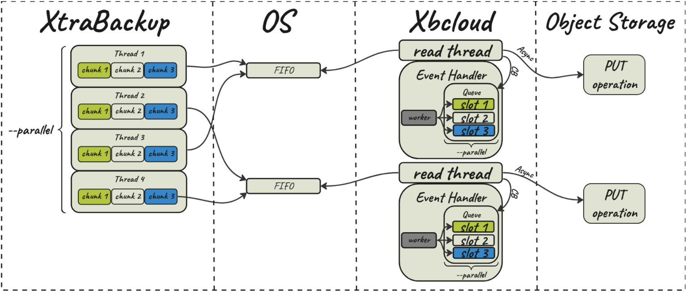

# xbcloud

The purpose of xbcloud is to download from the cloud and upload to  the cloud the full or part of an xbstream archive. xbcloud will not  overwrite the backup with the same name. xbcloud accepts input via a pipe from xbstream so that it can be invoked as a pipeline with xtrabackup to stream directly to the cloud without needing a local storage.
xbcloud 的目的是从云中下载并将 xbstream 存档的全部或部分上传到云中。XBCloud 不会覆盖同名备份。XBCloud 通过管道接受来自  xbstream 的输入，因此可以使用 xtrabackup 将其作为管道调用，以直接流式传输到云，而无需本地存储。

Note 注意

In a Bash shell, the `$?` parameter returns the exit code from the last binary. If you use pipes, the ${PIPESTATUS[x]} array parameter returns the exit code for each  binary in the pipe string.
在 Bash shell 中， `$？` 参数返回最后一个二进制文件的退出代码。如果使用管道，则 ${PIPESTATUS[x]} 数组参数将返回管道字符串中每个二进制文件的退出代码。

```
$ xtrabackup --backup --stream=xbstream --target-dir=/storage/backups/ | xbcloud put [options] full_backup
...
$ ${PIPESTATUS[x]}
0 0
$ true | false
$ echo $?
1

# with PIPESTATUS
$ true | false
$ echo ${PIPESTATUS[0]} ${PIPESTATUS[1]}
0 1
```

The xbcloud binary stores each chunk as a separate object with a name `backup_name/database/table.ibd.NNN...`, where `NNN...` is a 0-padded serial number of chunk within a file. The size of chunk produced by xtrabackup and xbstream changed to 10M.
xbcloud 二进制文件将每个块存储为具有名称 `backup_name/database/table.ibd.NNN...` 的单独对象，其中 `NNN...`是文件中块的 0 填充序列号。xtrabackup 和 xbstream 生成的 chunk 大小更改为 10M。

To adjust the chunk size use [`--read-buffer-size`](https://docs.percona.com/percona-xtrabackup/8.4/xtrabackup-option-reference.html#--read-buffer-size). To adjust the chunk size for encrypted files, use `--read-buffer-size` and [`--encrypt-chunk-size`](https://docs.percona.com/percona-xtrabackup/8.4/xtrabackup-option-reference.html#--encrypt-chunk-size).
要调整块大小，请使用 [`--read-buffer-size`](https://docs.percona.com/percona-xtrabackup/8.4/xtrabackup-option-reference.html#--read-buffer-size)。要调整加密文件的块大小，请使用 `--read-buffer-size` 和 [`--encrypt-chunk-size`](https://docs.percona.com/percona-xtrabackup/8.4/xtrabackup-option-reference.html#--encrypt-chunk-size)。

xbcloud has three essential operations: *put*, *get*, and *delete*. With these operations, backups are created, stored, retrieved, restored, and deleted. xbcloud operations clearly map to similar operations within  the AWS Amazon S3 API.
XBCloud 有三个基本操作：*PUT*、*GET* 和 *DELETE*。通过这些操作，可以创建、存储、检索、恢复和删除备份。xbcloud 操作清楚地映射到 AWS Amazon S3 API 中的类似操作。

The [Exponential Backoff](https://docs.percona.com/percona-xtrabackup/8.4/xbcloud-exbackoff.html) feature increases the chances for the completion of a backup or a restore operation. When taking a backup, a chunk upload or download  may fail if you have an unstable network connection or other network  issues. This feature adds an exponential backoff, a sleep time, and  retries the operations.
[Exponential Backoff](https://docs.percona.com/percona-xtrabackup/8.4/xbcloud-exbackoff.html) 功能增加了完成备份或还原操作的机会。备份时，如果网络连接不稳定或其他网络问题，区块上传或下载可能会失败。此功能添加了指数回退、休眠时间并重试操作。

With the [FIFO data sink](https://docs.percona.com/percona-xtrabackup/8.4/xbcloud-binary-fifo-datasink.html) feature, users with a streaming capacity of 10Gbps (typically on a  Local Area Network (LAN)) can benefit from faster backups by streaming  data in parallel to object storage.
借助 [FIFO 数据接收器](https://docs.percona.com/percona-xtrabackup/8.4/xbcloud-binary-fifo-datasink.html)功能，具有 10Gbps 流容量的用户（通常在局域网 （LAN） 上）可以通过将数据并行流式传输到对象存储来受益于更快的备份。

Important 重要

To prevent intermittent backup failures, [update the curl utility in Debian 10](https://docs.percona.com/percona-xtrabackup/8.4/update-curl-utility.html).
为防止间歇性备份失败，[请更新 Debian 10 中的 curl 实用程序](https://docs.percona.com/percona-xtrabackup/8.4/update-curl-utility.html)。

## Supported cloud storage types[¶](https://docs.percona.com/percona-xtrabackup/8.4/xbcloud-binary-overview.html#supported-cloud-storage-types) 支持的云存储类型[¶](https://docs.percona.com/percona-xtrabackup/8.4/xbcloud-binary-overview.html#supported-cloud-storage-types)

The following cloud storage types are supported:
支持以下云存储类型：

- OpenStack Object Storage (Swift) - see [Using the xbcloud binary with Swift](https://docs.percona.com/percona-xtrabackup/8.4/xbcloud-swift.html)
  OpenStack Object Storage （Swift） - 请参阅[在 Swift 中使用 xbcloud 二进制文件](https://docs.percona.com/percona-xtrabackup/8.4/xbcloud-swift.html)
- Amazon Simple Storage (S3) - see [Using the xbcloud binary with Amazon S3](https://docs.percona.com/percona-xtrabackup/8.4/xbcloud-s3.html)
  Amazon Simple Storage （S3） – 请参阅[将 xbcloud 二进制文件与 Amazon S3 结合使用](https://docs.percona.com/percona-xtrabackup/8.4/xbcloud-s3.html)
- Azure Cloud Storage - see [Using the xbcloud binary with Microsoft Azure Cloud Storage](https://docs.percona.com/percona-xtrabackup/8.4/xbcloud-azure.html)
  Azure 云存储 - 请参阅[将 xbcloud 二进制文件与 Microsoft Azure 云存储结合使用](https://docs.percona.com/percona-xtrabackup/8.4/xbcloud-azure.html)
- Google Cloud Storage (gcs) - see [Using the xbcloud binary with Google Cloud Storage](https://docs.percona.com/percona-xtrabackup/8.4/xbcloud-gcs.html)
  Google Cloud Storage （gcs） - 请参阅[将 xbcloud 二进制文件与 Google Cloud Storage 结合使用](https://docs.percona.com/percona-xtrabackup/8.4/xbcloud-gcs.html)
- MinIO - see [Using the xbcloud binary with MinIO](https://docs.percona.com/percona-xtrabackup/8.4/xbcloud-minio.html)
  MinIO - 请参阅[将 xbcloud 二进制文件与 MinIO 结合使用](https://docs.percona.com/percona-xtrabackup/8.4/xbcloud-minio.html)

In addition to OpenStack Object Storage (Swift), which has been the only  option for storing backups in a cloud storage until Percona XtraBackup  2.4.14, xbcloud supports Amazon S3, MinIO, and Google Cloud Storage.  Other Amazon S3-compatible storages, such as Wasabi or Digital Ocean  Spaces, are also supported.
除了 OpenStack Object Storage （Swift） 之外，在 Percona XtraBackup 2.4.14  之前，它一直是将备份存储在云存储中的唯一选项，xbcloud 还支持 Amazon S3、MinIO 和 Google Cloud  Storage。还支持其他与 Amazon S3 兼容的存储，例如 Wasabi 或 Digital Ocean Spaces。

See also 另请参阅

[OpenStack Object Storage(“Swift”)
OpenStack Object Storage（“Swift”）](https://wiki.openstack.org/wiki/Swift)

[Amazon Simple Storage Service
Amazon Simple Storage 服务](https://aws.amazon.com/s3/)

[MinIO MinIO （最小 IO）](https://min.io/)

[Google Cloud Storage Google 云存储](https://cloud.google.com/storage/)

[Wasabi 芥末](https://wasabi.com/)

[Digital Ocean Spaces 数字海洋空间](https://www.digitalocean.com/products/spaces)

## Usage[¶](https://docs.percona.com/percona-xtrabackup/8.4/xbcloud-binary-overview.html#usage) 用法[¶](https://docs.percona.com/percona-xtrabackup/8.4/xbcloud-binary-overview.html#usage)

The following sample command creates a full backup:
以下示例命令创建完整备份：

```
$ xtrabackup --backup --stream=xbstream --target-dir=/storage/backups/ --extra-lsndirk=/storage/backups/| xbcloud \
put [options] full_backup
```

An incremental backup only includes the changes since the last backup. The last backup can be either a full or incremental backup.
增量备份仅包含自上次备份以来的更改。上次备份可以是完整备份或增量备份。

The following sample command creates an incremental backup:
以下示例命令创建增量备份：

```
$ xtrabackup --backup --stream=xbstream --incremental-basedir=/storage/backups \
--target-dir=/storage/inc-backup | xbcloud  put [options] inc_backup
```

To prepare an incremental backup, you must first download the full backup with the following command:
要准备增量备份，您必须首先使用以下命令下载完整备份：

```
$ xbcloud get [options] full_backup | xbstream -xv -C /tmp/full-backup
```

You must prepare the full backup:
您必须准备完整备份：

```
$ xtrabackup --prepare --apply-log-only --target-dir=/tmp/full-backup
```

After the full backup has been prepared, download the incremental backup:
准备好完整备份后，下载增量备份：

```
xbcloud get [options] inc_backup | xbstream -xv -C /tmp/inc-backup
```

The downloaded backup is prepared by running the following command:
通过运行以下命令来准备下载的备份：

```
$ xtrabackup --prepare --target-dir=/tmp/full-backup --incremental-dir=/tmp/inc-backup
```

You do not need the full backup to restore only a specific database. You can specify only the tables to be restored:
您不需要完整备份来仅还原特定数据库。您只能指定要还原的表：


```
xbcloud get [options] ibdata1 sakila/payment.ibd /tmp/partial/partial.xbs
```

An example of the code: 
代码示例：


```
xbstream -xv -C /tmp/partial < /tmp/partial/partial.xbs
```

## Supplying parameters[¶](https://docs.percona.com/percona-xtrabackup/8.4/xbcloud-binary-overview.html#supplying-parameters) 提供参数[¶](https://docs.percona.com/percona-xtrabackup/8.4/xbcloud-binary-overview.html#supplying-parameters)

Each storage type has mandatory parameters that you can supply on the command line, in a configuration file, and via environment variables.
每种存储类型都有必需的参数，您可以在命令行、配置文件中和通过环境变量提供这些参数。

### Configuration files[¶](https://docs.percona.com/percona-xtrabackup/8.4/xbcloud-binary-overview.html#configuration-files) 配置文件[¶](https://docs.percona.com/percona-xtrabackup/8.4/xbcloud-binary-overview.html#configuration-files)

The parameters the values of which do not change frequently can be stored in `my.cnf` or in a custom configuration file. The following example is a template of configuration options under the `[xbcloud]` group:
其值不经常更改的参数可以存储在 `my.cnf` 或自定义配置文件中。以下示例是 `[xbcloud]` 组下的配置选项模板：

```
[xbcloud]
storage=s3
s3-endpoint=http://localhost:9000/
s3-access-key=minio
s3-secret-key=minio123
s3-bucket=backupsx
s3-bucket-lookup=path
s3-api-version=4
```

Note 注意

If you explicitly use a parameter on the command line and in a  configuration file, xbcloud uses the value provided on the command line.
如果您在命令行和配置文件中显式使用参数，则 xbcloud 将使用命令行上提供的值。

### Environment variables[¶](https://docs.percona.com/percona-xtrabackup/8.4/xbcloud-binary-overview.html#environment-variables) 环境变量[¶](https://docs.percona.com/percona-xtrabackup/8.4/xbcloud-binary-overview.html#environment-variables)

If you explicitly use a parameter on the command line, in a configuration file, and the corresponding environment variable contains a value, xbcloud uses the value provided on the command line or in the configuration file.
如果您在命令行、配置文件中显式使用参数，并且相应的环境变量包含一个值，则 xbcloud 将使用命令行或配置文件中提供的值。

### Shortcuts[¶](https://docs.percona.com/percona-xtrabackup/8.4/xbcloud-binary-overview.html#shortcuts) 快捷键[¶](https://docs.percona.com/percona-xtrabackup/8.4/xbcloud-binary-overview.html#shortcuts)

For all operations (put, get, and delete), you can use a shortcut to specify the storage type, bucket name, and backup name as one parameter instead of using three distinct parameters (–storage, –s3-bucket, and backup name per se).
对于所有操作（put、get 和 delete），您可以使用快捷方式将存储类型、存储桶名称和备份名称指定为一个参数，而不是使用三个不同的参数（–storage、–s3-bucket 和备份名称本身）。

Note 注意

Use the following format: `storage-type://bucket-name/backup-name`
使用以下格式： `storage-type://bucket-name/backup-name` 

In this example s3 refers to a storage type, operator-testing  is a bucket name, and bak22 is the backup name. 
在此示例中，s3 是指存储类型，operator-testing 是存储桶名称，bak22 是备份名称。

```
$ xbcloud get s3://operator-testing/bak22 ...
```

This shortcut expands as follows:
此快捷方式扩展如下：

```
$ xbcloud get --storage=s3 --s3-bucket=operator-testing bak22 ...
```

You can supply the mandatory parameters on the command line, configuration files, and in environment variables.
您可以在命令行、配置文件和环境变量中提供必需参数。

### Additional parameters[¶](https://docs.percona.com/percona-xtrabackup/8.4/xbcloud-binary-overview.html#additional-parameters) 附加参数[¶](https://docs.percona.com/percona-xtrabackup/8.4/xbcloud-binary-overview.html#additional-parameters)

xbcloud accepts additional parameters that you can use with any storage type. The `--md5` parameter computes the MD5 hash value of the backup chunks. The result is stored in files that following the `backup_name.md5` pattern.
XBcloud 接受可用于任何存储类型的其他参数。`--md5` 参数计算备份块的 MD5 哈希值。结果存储在遵循 `backup_name.md5` 模式的文件中。

```
$ xtrabackup --backup --stream=xbstream \
--parallel=8 2>backup.log | xbcloud put s3://operator-testing/bak22 \
--parallel=8 --md5 2>upload.log
```

You may use the `--header` parameter to pass an additional HTTP header with the server side encryption while specifying a customer key.
在指定客户密钥时，您可以使用 `--header` 参数传递具有服务器端加密的额外 HTTP 标头。

An example of using the `--header` for AES256 encryption.
使用 `--header` 进行 AES256 加密的示例。

```
$ xtrabackup --backup --stream=xbstream --parallel=4 | \
xbcloud put s3://operator-testing/bak-enc/ \
--header="X-Amz-Server-Side-Encryption-Customer-Algorithm: AES256" \
--header="X-Amz-Server-Side-Encryption-Customer-Key: CuStoMerKey=" \
--header="X-Amz-Server-Side-Encryption-Customer-Key-MD5: CuStoMerKeyMd5==" \
--parallel=8
```

The `--header` parameter is also useful to set the access control list (ACL) permissions: `--header="x-amz-acl: bucket-owner-full-control`
`--header` 参数还可用于设置访问控制列表 （ACL） 权限： `--header="x-amz-acl: bucket-owner-full-control` 

## Incremental backups[¶](https://docs.percona.com/percona-xtrabackup/8.4/xbcloud-binary-overview.html#incremental-backups) 增量备份[¶](https://docs.percona.com/percona-xtrabackup/8.4/xbcloud-binary-overview.html#incremental-backups)

First, you need to make the full backup on which the incremental one is going to be based:
首先，您需要进行增量备份将基于的完整备份：

```
$ xtrabackup --backup --stream=xbstream --extra-lsndir=/storage/backups/ \
--target-dir=/storage/backups/ | xbcloud put \
--storage=swift --swift-container=test_backup \
--swift-auth-version=2.0 --swift-user=admin \
--swift-tenant=admin --swift-password=xoxoxoxo \
--swift-auth-url=http://127.0.0.1:35357/ --parallel=10 \
full_backup
```

Then you can make the incremental backup:
然后，您可以进行增量备份：

```
$ xtrabackup --backup --incremental-basedir=/storage/backups \
--stream=xbstream --target-dir=/storage/inc_backup | xbcloud put \
--storage=swift --swift-container=test_backup \
--swift-auth-version=2.0 --swift-user=admin \
--swift-tenant=admin --swift-password=xoxoxoxo \
--swift-auth-url=http://127.0.0.1:35357/ --parallel=10 \
inc_backup
```

### Preparing incremental backups[¶](https://docs.percona.com/percona-xtrabackup/8.4/xbcloud-binary-overview.html#preparing-incremental-backups) 准备增量备份[¶](https://docs.percona.com/percona-xtrabackup/8.4/xbcloud-binary-overview.html#preparing-incremental-backups)

To prepare a backup you first need to download the full backup:
要准备备份，您首先需要下载完整备份：

```
$ xbcloud get --swift-container=test_backup \
--swift-auth-version=2.0 --swift-user=admin \
--swift-tenant=admin --swift-password=xoxoxoxo \
--swift-auth-url=http://127.0.0.1:35357/ --parallel=10 \
full_backup | xbstream -xv -C /storage/downloaded_full
```

Once you download the full backup it should be prepared:
下载完整备份后，应做好准备：

```
$ xtrabackup --prepare --apply-log-only --target-dir=/storage/downloaded_full
```

After the full backup has been prepared you can download the incremental backup:
准备好完整备份后，您可以下载增量备份：

```
$ xbcloud get --swift-container=test_backup \
--swift-auth-version=2.0 --swift-user=admin \
--swift-tenant=admin --swift-password=xoxoxoxo \
--swift-auth-url=http://127.0.0.1:35357/ --parallel=10 \
inc_backup | xbstream -xv -C /storage/downloaded_inc
```

Once the incremental backup has been downloaded you can prepare it by running:
下载增量备份后，您可以通过运行以下命令来准备它：

```
$ xtrabackup --prepare --apply-log-only \
--target-dir=/storage/downloaded_full \
--incremental-dir=/storage/downloaded_inc

$ xtrabackup --prepare --target-dir=/storage/downloaded_full
```

### Partial download of the cloud backup[¶](https://docs.percona.com/percona-xtrabackup/8.4/xbcloud-binary-overview.html#partial-download-of-the-cloud-backup) 部分下载云备份[¶](https://docs.percona.com/percona-xtrabackup/8.4/xbcloud-binary-overview.html#partial-download-of-the-cloud-backup)

If you do not want to download the entire backup to restore the specific database you can specify only the tables you want to restore:
如果您不想下载整个备份来恢复特定数据库，您可以只指定要恢复的表：

```
$ xbcloud get --swift-container=test_backup
--swift-auth-version=2.0 --swift-user=admin \
--swift-tenant=admin --swift-password=xoxoxoxo \
--swift-auth-url=http://127.0.0.1:35357/ full_backup \
ibdata1 sakila/payment.ibd \
> /storage/partial/partial.xbs

$ xbstream -xv -C /storage/partial < /storage/partial/partial.xbs
```

# xbcloud 命令行选项[¶](https://docs.percona.com/percona-xtrabackup/8.4/xbcloud-options.html#the-xbcloud-command-line-options)

Usage:  用法：

```
$ xbcloud put [OPTIONS]
$ xbcloud get [OPTIONS]
$ xbcloud delete [OPTIONS]
```

This document contains information on general options and the options available when you select the [Swift authentication version using `swift-auth-version`](https://docs.percona.com/percona-xtrabackup/8.4/xbcloud-options.html#swift-auth-version).
本文档包含有关常规选项的信息，以及[当您使用 `swift-auth-version` 选择 Swift 身份验证版本](https://docs.percona.com/percona-xtrabackup/8.4/xbcloud-options.html#swift-auth-version)时可用的选项。

The xbcloud binary has the following general command line options:
xbcloud 二进制文件具有以下常规命令行选项：

## azure-access-key[¶](https://docs.percona.com/percona-xtrabackup/8.4/xbcloud-options.html#azure-access-key) azure-access-key[（英语）](https://docs.percona.com/percona-xtrabackup/8.4/xbcloud-options.html#azure-access-key)

Usage: `--azure-access-key=name`
用法：`--azure-access-key=name`

The name of the Azure access-key
Azure 访问密钥的名称

## azure-container-name[¶](https://docs.percona.com/percona-xtrabackup/8.4/xbcloud-options.html#azure-container-name) azure-container-name（天蓝容器名称[）¶](https://docs.percona.com/percona-xtrabackup/8.4/xbcloud-options.html#azure-container-name)

Usage: `--azure-container-name=name`
用法：`--azure-container-name=name`

The name of the Azure container
Azure 容器的名称

## azure-development-storage[¶](https://docs.percona.com/percona-xtrabackup/8.4/xbcloud-options.html#azure-development-storage) azure-development-storage [（英语）](https://docs.percona.com/percona-xtrabackup/8.4/xbcloud-options.html#azure-development-storage)

Usage: `--azure-development-storage=name` 用法： `--azure-development-storage=name` 

If you run the [Azurite emulator](https://learn.microsoft.com/en-us/azure/storage/common/storage-use-azurite?tabs=visual-studio,blob-storage), use this option, and it works with the default credentials provided by  Azurite. You can overwrite these default credentials with other options.
如果您运行 [Azurite 仿真器](https://learn.microsoft.com/en-us/azure/storage/common/storage-use-azurite?tabs=visual-studio,blob-storage)，请使用此选项，它适用于 Azurite 提供的默认凭证。您可以使用其他选项覆盖这些默认凭证。

## azure-endpoint[¶](https://docs.percona.com/percona-xtrabackup/8.4/xbcloud-options.html#azure-endpoint)

Usage: `--azure-endpoint=name`
用法：`--azure-endpoint=name`

The name of the Azure endpoint
Azure 终结点的名称

## azure-storage-account[¶](https://docs.percona.com/percona-xtrabackup/8.4/xbcloud-options.html#azure-storage-account) azure-storage-account（azure-storage-account） （azure-storage-account[） （](https://docs.percona.com/percona-xtrabackup/8.4/xbcloud-options.html#azure-storage-account)

Usage: `--azure-storage-account=name`
用法：`--azure-storage-account=name`

The name of the Azure storage account
Azure 存储帐户的名称

## azure-tier-class[¶](https://docs.percona.com/percona-xtrabackup/8.4/xbcloud-options.html#azure-tier-class) azure-tier-class [类¶](https://docs.percona.com/percona-xtrabackup/8.4/xbcloud-options.html#azure-tier-class)

Usage: `--azure-tier-class=name`
用法：`--azure-tier-class=name`

The name of the Azure tier-class. The possible values are:
Azure 层类的名称。可能的值为：

- Hot 热
- Cool 凉
- Archive 档案

## cacert[¶](https://docs.percona.com/percona-xtrabackup/8.4/xbcloud-options.html#cacert)

Usage: `--cacert=name`
用法：`--cacert=name`

The path to the file with Certificate Authority (CA) certificates.
包含证书颁发机构 （CA） 证书的文件的路径。

## curl-retriable-errors[¶](https://docs.percona.com/percona-xtrabackup/8.4/xbcloud-options.html#curl-retriable-errors)

Usage: `--curl-retriable-errors=name`
用法：`--curl-retriable-errors=name`

Add a new cURL error code as retriable. For multiple codes, use a comma-separated list.
将新的 cURL 错误代码添加为 retritable。对于多个代码，请使用逗号分隔的列表。

## fifo-dir[¶](https://docs.percona.com/percona-xtrabackup/8.4/xbcloud-options.html#fifo-dir) fifo-dir [目录¶](https://docs.percona.com/percona-xtrabackup/8.4/xbcloud-options.html#fifo-dir)

Usage: `--fifo-dir=name`
用法：`--fifo-dir=name`

The directory used to read or write named pipes. In the put mode, xbcloud  reads from the named pipes. In the get mode, xbcloud writes to the named pipes.
用于读取或写入命名管道的目录。在 put 模式下，xbcloud 从命名的管道中读取。在 get 模式下，xbcloud 写入命名管道。

## fifo-streams[¶](https://docs.percona.com/percona-xtrabackup/8.4/xbcloud-options.html#fifo-streams) FIFO 流[¶](https://docs.percona.com/percona-xtrabackup/8.4/xbcloud-options.html#fifo-streams)

Usage: `--fifo-streams=#`
用法：`--fifo-streams=#`

The number of parallel FIFO stream threads.
并行 FIFO 流线程的数量。

## fifo-timeout[¶](https://docs.percona.com/percona-xtrabackup/8.4/xbcloud-options.html#fifo-timeout)

Usage: `--fifo-timeout=#`
用法：`--fifo-timeout=#`

The number of seconds to wait for the other end to open the stream. The default value is 60.
等待另一端打开流的秒数。默认值为 60。

## google-access-key[¶](https://docs.percona.com/percona-xtrabackup/8.4/xbcloud-options.html#google-access-key) google-access-key（谷歌访问密钥[）¶](https://docs.percona.com/percona-xtrabackup/8.4/xbcloud-options.html#google-access-key)

Usage: `--google-access-key=name`
用法：`--google-access-key=name`

The Google Cloud storage access key
Google Cloud 存储访问密钥

## google-bucket-name[¶](https://docs.percona.com/percona-xtrabackup/8.4/xbcloud-options.html#google-bucket-name) google-bucket-name （谷歌存储桶名称[）¶](https://docs.percona.com/percona-xtrabackup/8.4/xbcloud-options.html#google-bucket-name)

Usage: `--google-bucket-name=name`
用法：`--google-bucket-name=name`

The Google Cloud storage bucket name
Google Cloud 存储分区名称

## google-endpoint[¶](https://docs.percona.com/percona-xtrabackup/8.4/xbcloud-options.html#google-endpoint) google-endpoint （谷歌端点[）¶](https://docs.percona.com/percona-xtrabackup/8.4/xbcloud-options.html#google-endpoint)

Usage: `--google-endpoint=name`
用法：`--google-endpoint=name`

The Google Cloud storage endpoint
Google Cloud 存储端点

## google-region[¶](https://docs.percona.com/percona-xtrabackup/8.4/xbcloud-options.html#google-region)

Usage: `--google-region=name`
用法：`--google-region=name`

The Google Cloud storage region
Google Cloud 存储区域

## google-secret-key[¶](https://docs.percona.com/percona-xtrabackup/8.4/xbcloud-options.html#google-secret-key) google-secret-key [密钥¶](https://docs.percona.com/percona-xtrabackup/8.4/xbcloud-options.html#google-secret-key)

Usage: `--google-secret-key=name`
用法：`--google-secret-key=name`

The Google Cloud storage secret key
Google Cloud 存储密钥

## google-session-token[¶](https://docs.percona.com/percona-xtrabackup/8.4/xbcloud-options.html#google-session-token) google-session-token （谷歌会话令牌[）¶](https://docs.percona.com/percona-xtrabackup/8.4/xbcloud-options.html#google-session-token)

Usage: `--google-session-token=name`
用法：`--google-session-token=name`

The Google Cloud storage session-token
Google Cloud 存储会话令牌

## google-storage-class[¶](https://docs.percona.com/percona-xtrabackup/8.4/xbcloud-options.html#google-storage-class) google-storage-class [存储类¶](https://docs.percona.com/percona-xtrabackup/8.4/xbcloud-options.html#google-storage-class)

Usage: `--google-storage-class=name`
用法：`--google-storage-class=name`

The Google Cloud storage storage class
Google Cloud 存储存储类

The possible values are the following:
可能的值如下：

- STANDARD 标准
- NEARLINE 近线
- COLDLINE 冷线
- ARCHIVE 档案

## header[¶](https://docs.percona.com/percona-xtrabackup/8.4/xbcloud-options.html#header) 标头[¶](https://docs.percona.com/percona-xtrabackup/8.4/xbcloud-options.html#header)

Usage: `--header=name`
用法：`--header=name`

Extra header 额外标头

## http-retriable-errors[¶](https://docs.percona.com/percona-xtrabackup/8.4/xbcloud-options.html#http-retriable-errors) http-retriable-errors（http 可重试错误[）¶](https://docs.percona.com/percona-xtrabackup/8.4/xbcloud-options.html#http-retriable-errors)

Usage: `--http-retriable-errors=name`
用法：`--http-retriable-errors=name`

Add a new http error code as retriable. For multiple codes, use a comma-separated list.
将新的 http 错误代码添加为 retritable。对于多个代码，请使用逗号分隔的列表。

## insecure[¶](https://docs.percona.com/percona-xtrabackup/8.4/xbcloud-options.html#insecure) 不安全[¶](https://docs.percona.com/percona-xtrabackup/8.4/xbcloud-options.html#insecure)

Usage: `--insecure`
用法： `--insecure`

Do not verify the certificate of the server.
不要验证服务器的证书。

## max-backoff[¶](https://docs.percona.com/percona-xtrabackup/8.4/xbcloud-options.html#max-backoff) max-backoff [的](https://docs.percona.com/percona-xtrabackup/8.4/xbcloud-options.html#max-backoff)

Usage: `--max-backoff=#`
用法：`--max-backoff=#`

The maximum backoff delay, in milliseconds, between chunk upload or chunk download retries. The default value is 300000.
区块上传或区块下载重试之间的最大回退延迟（以毫秒为单位）。默认值为 300000。

## max-retries[¶](https://docs.percona.com/percona-xtrabackup/8.4/xbcloud-options.html#max-retries) 最大重试[次数¶](https://docs.percona.com/percona-xtrabackup/8.4/xbcloud-options.html#max-retries)

Usage: `--max-retires=#`
用法：`--max-retires=#`

The number of retries for chunk uploads or downloads after a failure. The default value is 10.
失败后块上传或下载的重试次数。默认值为 10。

## md5[¶](https://docs.percona.com/percona-xtrabackup/8.4/xbcloud-options.html#md5)

Usage: `--md5=name`
用法：`--md5=name`

Uploads an MD5 file into the backup directory.
将 MD5 文件上传到备份目录。

## parallel[¶](https://docs.percona.com/percona-xtrabackup/8.4/xbcloud-options.html#parallel) 并行[¶](https://docs.percona.com/percona-xtrabackup/8.4/xbcloud-options.html#parallel)

Usage: `--parallel=#`
用法：`--parallel=#`

Defines the maximum number of concurrent upload/download requests. The default value is `1`.
定义并发上传/下载请求的最大数量。默认值为 `1`。

## s3-access-key[¶](https://docs.percona.com/percona-xtrabackup/8.4/xbcloud-options.html#s3-access-key) s3 访问密钥[¶](https://docs.percona.com/percona-xtrabackup/8.4/xbcloud-options.html#s3-access-key)

Usage: `--s3-access-key=name`
用法：`--s3-access-key=name`

The name of the s3 access key
s3 访问密钥的名称

## s3-api-version[¶](https://docs.percona.com/percona-xtrabackup/8.4/xbcloud-options.html#s3-api-version) s3-api-版本[¶](https://docs.percona.com/percona-xtrabackup/8.4/xbcloud-options.html#s3-api-version)

Usage: `--s3-api-version=name`
用法：`--s3-api-version=name`

The name of the s3 API version
s3 API 版本的名称

## s3-bucket[¶](https://docs.percona.com/percona-xtrabackup/8.4/xbcloud-options.html#s3-bucket) s3-bucket [文件¶](https://docs.percona.com/percona-xtrabackup/8.4/xbcloud-options.html#s3-bucket)

Usage: `--s3-bucket=name`
用法：`--s3-bucket=name`

The name of the s3 bucket
s3 存储桶的名称

## s3-bucket-lookup[¶](https://docs.percona.com/percona-xtrabackup/8.4/xbcloud-options.html#s3-bucket-lookup)

Usage: `--s3-bucket-lookup=name`
用法：`--s3-bucket-lookup=name`

The name of the s3 bucket lookup method
s3 存储桶查找方法的名称

## s3-endpoint[¶](https://docs.percona.com/percona-xtrabackup/8.4/xbcloud-options.html#s3-endpoint)

Usage: `--s3-endpoint=name`
用法：`--s3-endpoint=name`

The name of the s3 endpoint
s3 终端节点的名称

## s3-region[¶](https://docs.percona.com/percona-xtrabackup/8.4/xbcloud-options.html#s3-region) s3 区域[¶](https://docs.percona.com/percona-xtrabackup/8.4/xbcloud-options.html#s3-region)

Usage: `--s3-region=name`
用法：`--s3-region=name`

The name of the s3 region
s3 区域的名称

## s3-secret-key[¶](https://docs.percona.com/percona-xtrabackup/8.4/xbcloud-options.html#s3-secret-key) s3 密钥[¶](https://docs.percona.com/percona-xtrabackup/8.4/xbcloud-options.html#s3-secret-key)

Usage: `--s3-secret-key=name`
用法：`--s3-secret-key=name`

The name of the s3 secret key
s3 密钥的名称

## s3-session-token[¶](https://docs.percona.com/percona-xtrabackup/8.4/xbcloud-options.html#s3-session-token) s3-session-token [会话令牌¶](https://docs.percona.com/percona-xtrabackup/8.4/xbcloud-options.html#s3-session-token)

Usage: `--s3-session-token=name`
用法：`--s3-session-token=name`

The name of the s3 session token
s3 会话令牌的名称

## s3-storage-class[¶](https://docs.percona.com/percona-xtrabackup/8.4/xbcloud-options.html#s3-storage-class) s3 存储类[¶](https://docs.percona.com/percona-xtrabackup/8.4/xbcloud-options.html#s3-storage-class)

Usage: `--s3-storage-class=name`
用法：`--s3-storage-class=name`

The name of the s3 storage class and is used to pass custom storage class  names provided by the other s3 implementations, such as MinIO.
s3 存储类的名称，用于传递其他 s3 实现（如 MinIO）提供的自定义存储类名称。

The possible values are: 可能的值为：

- STANDARD 标准
- STANDARD_ID
- GLACIER 冰川

## storage[¶](https://docs.percona.com/percona-xtrabackup/8.4/xbcloud-options.html#storage) 存储[¶](https://docs.percona.com/percona-xtrabackup/8.4/xbcloud-options.html#storage)

Usage: `--storage=[S3|SWIFT|GOOGLE|AZURE]` 用法： `--storage=[S3|SWIFT|GOOGLE|AZURE]` 

Defines the Cloud storage option. xbcloud supports Swift, MinIO, Google, Azure, and AWS S3. The default value is `swift`.
定义 Cloud storage 选项。xbcloud 支持 Swift、MinIO、Google、Azure 和 AWS S3。默认值为 `swift`。

## swift-auth-url[¶](https://docs.percona.com/percona-xtrabackup/8.4/xbcloud-options.html#swift-auth-url) swift-auth-url （swift-auth-url[） （](https://docs.percona.com/percona-xtrabackup/8.4/xbcloud-options.html#swift-auth-url)swift-auth-url）

Usage: `--swift-auth-url=name`
用法：`--swift-auth-url=name`

The Base URL of the Swift authentication service.
Swift 身份验证服务的 Base URL。

## swift-container[¶](https://docs.percona.com/percona-xtrabackup/8.4/xbcloud-options.html#swift-container) swift 容器[¶](https://docs.percona.com/percona-xtrabackup/8.4/xbcloud-options.html#swift-container)

Usage: `--swift-container=name`
用法：`--swift-container=name`

The Swift container used to store backups.
用于存储备份的 Swift 容器。

## swift-key[¶](https://docs.percona.com/percona-xtrabackup/8.4/xbcloud-options.html#swift-key) swift 密钥[¶](https://docs.percona.com/percona-xtrabackup/8.4/xbcloud-options.html#swift-key)

Usage: `--swift-key`
用法： `--swift-key`

The Swift key/password (X-Auth-Key)
Swift 密钥/密码 （X-Auth-Key）

## swift-storage-url[¶](https://docs.percona.com/percona-xtrabackup/8.4/xbcloud-options.html#swift-storage-url) swift-storage-url [文件¶](https://docs.percona.com/percona-xtrabackup/8.4/xbcloud-options.html#swift-storage-url)

Usage: `--swift-storage-url=name`
用法：`--swift-storage-url=name`

If a name is specified, the xbcloud attempts to get the object-store  endpoint for a given region from the keystone response. This option  overrides that value.
如果指定了名称，则 xbcloud 会尝试从 keystone 响应中获取给定区域的对象存储端点。此选项将覆盖该值。

## swift-user[¶](https://docs.percona.com/percona-xtrabackup/8.4/xbcloud-options.html#swift-user) swift 用户[¶](https://docs.percona.com/percona-xtrabackup/8.4/xbcloud-options.html#swift-user)

Usage: `--swift-user=name`
用法：`--swift-user=name`

The Swift user name (X-Auth-User).
Swift 用户名 （X-Auth-User）。

## timeout[¶](https://docs.percona.com/percona-xtrabackup/8.4/xbcloud-options.html#timeout) 超时[¶](https://docs.percona.com/percona-xtrabackup/8.4/xbcloud-options.html#timeout)

Usage: `--timeout=#`
用法：`--timeout=#`

The number of seconds to wait for activity on the TCP connection. The  default value is 120. If the value is 0 (zero), there is no timeout.
等待 TCP 连接上的活动的秒数。默认值为 120。如果值为 0 （零） ，则没有超时。

## verbose[¶](https://docs.percona.com/percona-xtrabackup/8.4/xbcloud-options.html#verbose) 详细[¶](https://docs.percona.com/percona-xtrabackup/8.4/xbcloud-options.html#verbose)

Usage: `--verbose`
用法： `--verbose`

Turns on the cURL tracing.
打开 cURL 跟踪。

## Swift authentication options[¶](https://docs.percona.com/percona-xtrabackup/8.4/xbcloud-options.html#swift-authentication-options) Swift 身份验证选项[¶](https://docs.percona.com/percona-xtrabackup/8.4/xbcloud-options.html#swift-authentication-options)

The Swift specification describes several [authentication options](http://docs.openstack.org/developer/swift/overview_auth.html). The *xbcloud* tool can authenticate against keystone with API version 2 and 3.
Swift 规范描述了几个[身份验证选项](http://docs.openstack.org/developer/swift/overview_auth.html)。*xbcloud* 工具可以使用 API 版本 2 和 3 对 keystone 进行身份验证。

## swift-auth-version[¶](https://docs.percona.com/percona-xtrabackup/8.4/xbcloud-options.html#swift-auth-version)

Usage: `--swift-auth-version=name`
用法：`--swift-auth-version=name`

Defines the swift authentication version used. 
定义使用的 swift 身份验证版本。

The possible values are the following: 
可能的值如下：

- `1.0` - TempAuth `1.0` - 临时身份验证
- `2.0` - Keystone v2.0
- `3` - Keystone v3. 
  `3` - Keystone v3。

The default value is `1.0`.
默认值为 `1.0`。

## If `--swift-auth-version=2`, the additional options are:[¶](https://docs.percona.com/percona-xtrabackup/8.4/xbcloud-options.html#if-swift-auth-version2-the-additional-options-are) 如果 `--swift-auth-version=2`，则其他选项为：[¶](https://docs.percona.com/percona-xtrabackup/8.4/xbcloud-options.html#if-swift-auth-version2-the-additional-options-are)

### swift-password[¶](https://docs.percona.com/percona-xtrabackup/8.4/xbcloud-options.html#swift-password) swift 密码[¶](https://docs.percona.com/percona-xtrabackup/8.4/xbcloud-options.html#swift-password)

Usage: `--swift-password=name`
用法：`--swift-password=name`

Swift password for the user
用户的 Swift 密码

### swift-region[¶](https://docs.percona.com/percona-xtrabackup/8.4/xbcloud-options.html#swift-region) swift 区域[¶](https://docs.percona.com/percona-xtrabackup/8.4/xbcloud-options.html#swift-region)

Usage: `--swift-region=name`
用法：`--swift-region=name`

Swift region object-store endpoint
Swift 区域对象存储终结点

### swift-tenant[¶](https://docs.percona.com/percona-xtrabackup/8.4/xbcloud-options.html#swift-tenant)

Usage: `--swift-tenant=name`
用法：`--swift-tenant=name`

The Swift tenant name  Swift 租户名称

Either of the `--swift-tenant` or `--swift-tenant-id` can be defined, but you should not use both options together. Both of these options are optional.
可以定义 `--swift-tenant` 或 `--swift-tenant-id` 中的任何一个，但您不应同时使用这两个选项。这两个选项都是可选的。

### swift-tenant-id[¶](https://docs.percona.com/percona-xtrabackup/8.4/xbcloud-options.html#swift-tenant-id) swift-tenant-id [文件¶](https://docs.percona.com/percona-xtrabackup/8.4/xbcloud-options.html#swift-tenant-id)

Usage: `--swift-tenant-id=name`
用法：`--swift-tenant-id=name`

The Swift tenant ID Swift 租户 ID

Either of the `--swift-tenant` or `--swift-tenant-id` can be defined, but you should not use both options together. Both of these options are optional.
可以定义 `--swift-tenant` 或 `--swift-tenant-id` 中的任何一个，但您不应同时使用这两个选项。这两个选项都是可选的。

## If `--swift-auth-version=3`, the  additional options are:[¶](https://docs.percona.com/percona-xtrabackup/8.4/xbcloud-options.html#if-swift-auth-version3-the-additional-options-are) 如果 `--swift-auth-version=3`，则其他选项为：[¶](https://docs.percona.com/percona-xtrabackup/8.4/xbcloud-options.html#if-swift-auth-version3-the-additional-options-are)

### swift-domain[¶](https://docs.percona.com/percona-xtrabackup/8.4/xbcloud-options.html#swift-domain) swift 域[¶](https://docs.percona.com/percona-xtrabackup/8.4/xbcloud-options.html#swift-domain)

Usage: `--swift-domain=name`
用法：`--swift-domain=name`

The Swift domain name Swift 域名

### swift-domain-id[¶](https://docs.percona.com/percona-xtrabackup/8.4/xbcloud-options.html#swift-domain-id) swift 域 ID[¶](https://docs.percona.com/percona-xtrabackup/8.4/xbcloud-options.html#swift-domain-id)

Usage: `--swift-domain-id=name`
用法：`--swift-domain-id=name`

The Swift domain ID Swift 域 ID

### swift-project[¶](https://docs.percona.com/percona-xtrabackup/8.4/xbcloud-options.html#swift-project) swift 项目[¶](https://docs.percona.com/percona-xtrabackup/8.4/xbcloud-options.html#swift-project)

Usage: `--swift-project=name`
用法：`--swift-project=name`

The Swift project name Swift 项目名称

### swift-project-domain[¶](https://docs.percona.com/percona-xtrabackup/8.4/xbcloud-options.html#swift-project-domain) swift-project-domain（swift 项目域[）¶](https://docs.percona.com/percona-xtrabackup/8.4/xbcloud-options.html#swift-project-domain)

Usage: `--swift-project-domain=name`
用法：`--swift-project-domain=name`

The Swift domain name Swift 域名

### swift-project-domain-id[¶](https://docs.percona.com/percona-xtrabackup/8.4/xbcloud-options.html#swift-project-domain-id) swift 项目域 ID[¶](https://docs.percona.com/percona-xtrabackup/8.4/xbcloud-options.html#swift-project-domain-id)

Usage: `--swift-project-domain-id=name` 用法： `--swift-project-domain-id=name` 

The Swift domain ID Swift 域 ID

### swift-project-id[¶](https://docs.percona.com/percona-xtrabackup/8.4/xbcloud-options.html#swift-project-id) swift 项目 ID[¶](https://docs.percona.com/percona-xtrabackup/8.4/xbcloud-options.html#swift-project-id)

Usage: `--swift-project-id=name`
用法：`--swift-project-id=name`

The Swift project ID Swift 项目 ID

### swift-user-id[¶](https://docs.percona.com/percona-xtrabackup/8.4/xbcloud-options.html#swift-user-id) swift 用户 ID[¶](https://docs.percona.com/percona-xtrabackup/8.4/xbcloud-options.html#swift-user-id)

Usage: `--swift-user-id=name`
用法：`--swift-user-id=name`

The Swift user ID Swift 用户 ID

# Use the xbcloud binary with Amazon S3[¶](https://docs.percona.com/percona-xtrabackup/8.4/xbcloud-s3.html#use-the-xbcloud-binary-with-amazon-s3) 将 xbcloud 二进制文件与 Amazon S3 一起使用[¶](https://docs.percona.com/percona-xtrabackup/8.4/xbcloud-s3.html#use-the-xbcloud-binary-with-amazon-s3)

## Create a full backup with Amazon S3[¶](https://docs.percona.com/percona-xtrabackup/8.4/xbcloud-s3.html#create-a-full-backup-with-amazon-s3) 使用 Amazon S3 创建完整备份[¶](https://docs.percona.com/percona-xtrabackup/8.4/xbcloud-s3.html#create-a-full-backup-with-amazon-s3)

```
$ xtrabackup --backup --stream=xbstream --extra-lsndir=/tmp --target-dir=/tmp | \
xbcloud put --storage=s3 \
--s3-endpoint='s3.amazonaws.com' \
--s3-access-key='YOUR-ACCESSKEYID' \
--s3-secret-key='YOUR-SECRETACCESSKEY' \
--s3-bucket='mysql_backups'
--parallel=10 \
$(date -I)-full_backup
```

The following options are available when using Amazon S3:
使用 Amazon S3 时，可以使用以下选项：

| Option 选择                       | Details 详                                                   |
| --------------------------------- | ------------------------------------------------------------ |
| –s3-access-key –s3 访问密钥       | Use to supply the AWS access key ID 用于提供 AWS 访问密钥 ID |
| –s3-secret-key –s3 密钥           | Use to supply the AWS secret access key 用于提供 AWS 秘密访问密钥 |
| –s3-bucket –s3 桶                 | Use supply the AWS bucket name 使用提供 AWS 存储桶名称       |
| –s3-region –s3 区域               | Use to specify the AWS region. The default value is **us-east-1** 用于指定 AWS 区域。默认值为 **us-east-1** |
| –s3-api-version =  –s3-api-版本 = | Select the signing algorithm. The default value is AUTO. In this case, xbcloud will probe. 选择签名算法。默认值为 AUTO。在这种情况下，xbcloud 将探测。 |
| –s3-bucket-lookup =               | Specify whether to use bucket.endpoint.com or endpoint.com/bucket*style  requests. The default value is AUTO. In this case, xbcloud will probe. 指定是使用 bucket.endpoint.com 还是 endpoint.com/bucket*style 请求。默认值为 AUTO。在这种情况下，xbcloud 将探测。 |
| –s3-storage-class= –s3-存储类=    | Specify the [S3 storage class](https://docs.aws.amazon.com/AmazonS3/latest/userguide/storage-class-intro.html). The default storage class depends on the provider. The name options are the following: 指定 [S3 存储类](https://docs.aws.amazon.com/AmazonS3/latest/userguide/storage-class-intro.html)。默认存储类取决于提供程序。名称选项如下：STANDARD 标准STANDARD_IAGLACIER 冰川 **NOTE** If you use the GLACIER storage class, the object must be [restored to S3](https://docs.aws.amazon.com/AmazonS3/latest/userguide/restoring-objects.html) before restoring the backup. Also supports using custom S3 implementations such as MinIO or CephRadosGW. **注意**如果您使用 GLACIER 存储类，则必须在还原备份之前将对象[还原到 S3](https://docs.aws.amazon.com/AmazonS3/latest/userguide/restoring-objects.html)。还支持使用自定义 S3 实现，例如 MinIO 或 CephRadosGW。 |

## Permissions setup[¶](https://docs.percona.com/percona-xtrabackup/8.4/xbcloud-s3.html#permissions-setup) 权限设置[¶](https://docs.percona.com/percona-xtrabackup/8.4/xbcloud-s3.html#permissions-setup)

Following the principle of “least-privilege”, these are the minimum bucket  permissions needed for xbcloud to write backups to S3: ***LIST/PUT/GET/DELETE\***.
遵循“最低权限”原则，以下是 xbcloud 将备份写入 S3 所需的最低存储桶权限：***LIST/PUT/GET/DELETE。\***

The following example shows the policy definition for writing to the `xbcloud-testing` bucket on the AWS S3 storage.
以下示例显示了写入 AWS S3 存储上的 `xbcloud-testing` 存储桶的策略定义。

```
{
    "Version": "2012-10-17",
    "Statement": [
        {
            "Effect": "Allow",
            "Action": [
                "s3:ListBucket"
            ],
            "Resource": "arn:aws:s3:::xbcloud-testing"
        },
        {
            "Effect": "Allow",
            "Action": [
                "s3:PutObject",
                "s3:PutObjectAcl",
                "s3:GetObject",
                "s3:GetObjectAcl",
                "s3:DeleteObject"
            ],
            "Resource": "arn:aws:s3:::xbcloud-testing/*"
        }
    ]
}
```

## Environment variables[¶](https://docs.percona.com/percona-xtrabackup/8.4/xbcloud-s3.html#environment-variables) 环境变量[¶](https://docs.percona.com/percona-xtrabackup/8.4/xbcloud-s3.html#environment-variables)

The following environment variables are recognized. xbcloud maps them automatically to corresponding parameters applicable to the selected storage.
可识别以下环境变量。xbcloud 会自动将它们映射到适用于所选存储的相应参数。

- AWS_ACCESS_KEY_ID (or ACCESS_KEY_ID)
  AWS_ACCESS_KEY_ID（或 ACCESS_KEY_ID）
- AWS_SECRET_ACCESS_KEY (or SECRET_ACCESS_KEY)
  AWS_SECRET_ACCESS_KEY（或 SECRET_ACCESS_KEY）
- AWS_DEFAULT_REGION (or DEFAULT_REGION)
  AWS_DEFAULT_REGION（或 DEFAULT_REGION）
- AWS_ENDPOINT (or ENDPOINT)
  AWS_ENDPOINT（或 ENDPOINT）
- AWS_CA_BUNDLE

## Restore with S3[¶](https://docs.percona.com/percona-xtrabackup/8.4/xbcloud-s3.html#restore-with-s3) 使用 S3 恢复[¶](https://docs.percona.com/percona-xtrabackup/8.4/xbcloud-s3.html#restore-with-s3)

```
$ xbcloud get s3://operator-testing/bak22 \
--s3-endpoint=https://storage.googleapis.com/ \
--parallel=10 2>download.log | xbstream -x -C restore --parallel=8
```

# Use the xbcloud binary with an IAM instance profile[¶](https://docs.percona.com/percona-xtrabackup/8.4/xbcloud-iam-profile.html#use-the-xbcloud-binary-with-an-iam-instance-profile) 将 xbcloud 二进制文件与 IAM 实例配置文件一起使用[¶](https://docs.percona.com/percona-xtrabackup/8.4/xbcloud-iam-profile.html#use-the-xbcloud-binary-with-an-iam-instance-profile)

You can use the IAM instance profile when running xbcloud from an EC2 instance.
从 EC2 实例运行 xbcloud 时，您可以使用 IAM 实例配置文件。

An authentication system has two elements:
身份验证系统有两个要素：

- Who am I? 我是谁？
- What can I do? 我该怎么办？

A role defines “what can I do.” A role provides a method to define a  collection of permissions. Roles are assigned to users, services and EC2 instances, the “who am I” element.
角色定义“我能做什么”。角色提供了一种定义权限集合的方法。角色被分配给用户、服务和 EC2 实例，即“我是谁”元素。

The IAM instance profile is the “who” for an EC2 instance and assumes the  IAM role, which has permissions. The instance profile has the same name  as the IAM role.
IAM 实例配置文件是 EC2 实例的“谁”，并承担具有权限的 IAM 角色。实例配置文件与 IAM 角色同名。

An IAM instance profile does not need the `--s3-secret-key` nor the `--s3-access-key` if they are running `xbcloud` from an Amazon EC2 instance. To configure or attach an instance metadata to an EC2 instance, see [How can I grant my Amazon EC2 instance access to an Amazon S3 bucket](https://aws.amazon.com/premiumsupport/knowledge-center/ec2-instance-access-s3-bucket/). 
如果 IAM 实例配置文件从 Amazon EC2 实例运行 `xbcloud`，则它们不需要 `--s3-secret-key` 或 `--s3-access-key`。要配置实例元数据或将实例元数据附加到 EC2 实例，请参阅[如何授予我的 Amazon EC2 实例对 Amazon S3 存储桶的访问权限](https://aws.amazon.com/premiumsupport/knowledge-center/ec2-instance-access-s3-bucket/)。

An example of the command:
命令示例：

```
$ xtrabackup ... | xbcloud put --storage=s3 --s3-bucket=bucket-name backup-name
```

The xbcloud binary outputs a connect message when successful.
xbcloud 二进制文件在成功时输出一条 connect 消息。

<details class="example" data-immersive-translate-walked="bb031470-9cdd-446a-b247-e1972d97f96f"><summary data-immersive-translate-walked="bb031470-9cdd-446a-b247-e1972d97f96f" data-immersive-translate-paragraph="1">Expected output<font class="notranslate immersive-translate-target-wrapper" data-immersive-translate-translation-element-mark="1" lang="zh-CN"><font class="notranslate" data-immersive-translate-translation-element-mark="1">&nbsp;</font><font class="notranslate immersive-translate-target-translation-theme-none immersive-translate-target-translation-inline-wrapper-theme-none immersive-translate-target-translation-inline-wrapper" data-immersive-translate-translation-element-mark="1"><font class="notranslate immersive-translate-target-inner immersive-translate-target-translation-theme-none-inner" data-immersive-translate-translation-element-mark="1">预期输出</font></font></font></summary><div class="highlight" data-immersive-translate-walked="bb031470-9cdd-446a-b247-e1972d97f96f"><pre id="__code_1"><span></span></pre></div></details>

<details class="example" data-immersive-translate-walked="bb031470-9cdd-446a-b247-e1972d97f96f"><div class="highlight" data-immersive-translate-walked="bb031470-9cdd-446a-b247-e1972d97f96f"><pre id="__code_1"><code></code></pre></div></details>

An important consideration is that the instance metadata has a time to  live (TTL) of 6 hours. A backup that takes more than that time contains  Expired token errors. Use [Exponential Backoff](https://docs.percona.com/percona-xtrabackup/8.4/xbcloud-exbackoff.html) to retry the upload after fetching new keys from the instance metadata.
一个重要的注意事项是实例元数据的生存时间 （TTL） 为 6 小时。花费超过该时间的备份包含 Expired token 错误。使用 [Exponential Backoff](https://docs.percona.com/percona-xtrabackup/8.4/xbcloud-exbackoff.html) 在从实例元数据中获取新密钥后重试上传。

<details class="example" data-immersive-translate-walked="bb031470-9cdd-446a-b247-e1972d97f96f"><summary data-immersive-translate-walked="bb031470-9cdd-446a-b247-e1972d97f96f" data-immersive-translate-paragraph="1">Output when keys have expired<font class="notranslate immersive-translate-target-wrapper" data-immersive-translate-translation-element-mark="1" lang="zh-CN"><br><font class="notranslate immersive-translate-target-translation-theme-none immersive-translate-target-translation-block-wrapper-theme-none immersive-translate-target-translation-block-wrapper" data-immersive-translate-translation-element-mark="1"><font class="notranslate immersive-translate-target-inner immersive-translate-target-translation-theme-none-inner" data-immersive-translate-translation-element-mark="1">密钥过期时的输出</font></font></font></summary></details>

# Use the xbcloud binary with Swift[¶](https://docs.percona.com/percona-xtrabackup/8.4/xbcloud-swift.html#use-the-xbcloud-binary-with-swift) 在 Swift 中使用 xbcloud 二进制文件[¶](https://docs.percona.com/percona-xtrabackup/8.4/xbcloud-swift.html#use-the-xbcloud-binary-with-swift)

## Create a full backup with Swift[¶](https://docs.percona.com/percona-xtrabackup/8.4/xbcloud-swift.html#create-a-full-backup-with-swift) 使用 Swift 创建完整备份[¶](https://docs.percona.com/percona-xtrabackup/8.4/xbcloud-swift.html#create-a-full-backup-with-swift)

The following example shows how to make a full backup and upload it to Swift.
以下示例展示了如何进行完整备份并将其上传到 Swift。

```
$ xtrabackup --backup --stream=xbstream --extra-lsndir=/tmp --target-dir=/tmp | \
xbcloud put --storage=swift \
--swift-container=test \
--swift-user=test:tester \
--swift-auth-url=http://192.168.8.80:8080/ \
--swift-key=testing \
--parallel=10 \
full_backup
```

The following OpenStack environment variables are also recognized and  mapped automatically to the corresponding swift parameters (`--storage=swift`):
以下 OpenStack 环境变量也会被识别并自动映射到相应的 swift 参数 （`--storage=swift`）：

- OS_AUTH_URL
- OS_TENANT_NAME
- OS_TENANT_ID
- OS_USERNAME
- OS_PASSWORD
- OS_USER_DOMAIN
- OS_USER_DOMAIN_ID
- OS_PROJECT_DOMAIN
- OS_PROJECT_DOMAIN_ID
- OS_REGION_NAME
- OS_STORAGE_URL
- OS_CACERT

## Restore with Swift[¶](https://docs.percona.com/percona-xtrabackup/8.4/xbcloud-swift.html#restore-with-swift) 使用 Swift 恢复[¶](https://docs.percona.com/percona-xtrabackup/8.4/xbcloud-swift.html#restore-with-swift)

```
$ xbcloud get [options] <name> [<list-of-files>] | xbstream -x
```

The following example shows how to fetch and restore the backup from Swift:
以下示例显示了如何从 Swift 获取和恢复备份：

```
$ xbcloud get --storage=swift \
--swift-container=test \
--swift-user=test:tester \
--swift-auth-url=http://192.168.8.80:8080/ \
--swift-key=testing \
full_backup | xbstream -xv -C /tmp/downloaded_full

$ xbcloud delete --storage=swift --swift-user=xtrabackup \
--swift-password=xtrabackup123! --swift-auth-version=3 \
--swift-auth-url=http://openstack.ci.percona.com:5000/ \
--swift-container=mybackup1 --swift-domain=Default
```

## Command-line options[¶](https://docs.percona.com/percona-xtrabackup/8.4/xbcloud-swift.html#command-line-options) 命令行选项[¶](https://docs.percona.com/percona-xtrabackup/8.4/xbcloud-swift.html#command-line-options)

*xbcloud* has the following command line options:
*XBcloud* 具有以下命令行选项：

### –storage(=[swift|s3|google])[¶](https://docs.percona.com/percona-xtrabackup/8.4/xbcloud-swift.html#storageswifts3google) –storage（=[swift|s3|google]）[¶](https://docs.percona.com/percona-xtrabackup/8.4/xbcloud-swift.html#storageswifts3google)

Cloud storage option. *xbcloud* supports Swift, MinIO, and AWS S3. The default value is `swift`.
云存储选项。*xbcloud* 支持 Swift、MinIO 和 AWS S3。默认值为 `swift`。

### –swift-auth-url()[¶](https://docs.percona.com/percona-xtrabackup/8.4/xbcloud-swift.html#swift-auth-url) –swift-auth-url（）[¶](https://docs.percona.com/percona-xtrabackup/8.4/xbcloud-swift.html#swift-auth-url)

The URL of the Swift cluster
Swift 集群的 URL

### –swift-storage-url()[¶](https://docs.percona.com/percona-xtrabackup/8.4/xbcloud-swift.html#swift-storage-url) –swift-storage-url（）[¶](https://docs.percona.com/percona-xtrabackup/8.4/xbcloud-swift.html#swift-storage-url)

The xbcloud tries to get the object-store URL for a given region (if any are specified) from the keystone response. You can override that URL by passing –swift-storage-url=URL argument.
xbcloud 尝试从 keystone 响应中获取给定区域的对象存储 URL（如果指定了任何 URL）。您可以通过传递 –swift-storage-url=URL 参数来覆盖该 URL。

### –swift-user()[¶](https://docs.percona.com/percona-xtrabackup/8.4/xbcloud-swift.html#swift-user) –swift-user（）[¶](https://docs.percona.com/percona-xtrabackup/8.4/xbcloud-swift.html#swift-user)

The Swift username (X-Auth-User, specific to Swift)
Swift 用户名（X-Auth-User，特定于 Swift）

### –swift-key()[¶](https://docs.percona.com/percona-xtrabackup/8.4/xbcloud-swift.html#swift-key) –swift-key（）[¶](https://docs.percona.com/percona-xtrabackup/8.4/xbcloud-swift.html#swift-key)

The Swift key/password (X-Auth-Key, specific to Swift)
Swift 密钥/密码（X-Auth-Key，特定于 Swift）

### –swift-container()[¶](https://docs.percona.com/percona-xtrabackup/8.4/xbcloud-swift.html#swift-container) –swift-container（）[¶](https://docs.percona.com/percona-xtrabackup/8.4/xbcloud-swift.html#swift-container)

The container to back up into (specific to Swift)
要备份到的容器（特定于 Swift）

### –parallel(=N)[¶](https://docs.percona.com/percona-xtrabackup/8.4/xbcloud-swift.html#paralleln) –parallel（=N）[¶](https://docs.percona.com/percona-xtrabackup/8.4/xbcloud-swift.html#paralleln)

The maximum number of concurrent upload/download requests. The default value is `1`.
并发上传/下载请求的最大数量。默认值为 `1`。

### –cacert()[¶](https://docs.percona.com/percona-xtrabackup/8.4/xbcloud-swift.html#cacert) –cacert（）[¶](https://docs.percona.com/percona-xtrabackup/8.4/xbcloud-swift.html#cacert)

The path to the file with CA certificates
包含 CA 证书的文件的路径

### –insecure()[¶](https://docs.percona.com/percona-xtrabackup/8.4/xbcloud-swift.html#insecure) –insecure（）[¶](https://docs.percona.com/percona-xtrabackup/8.4/xbcloud-swift.html#insecure)

Do not verify server’s certificate
不验证服务器的证书

### Swift authentication options[¶](https://docs.percona.com/percona-xtrabackup/8.4/xbcloud-swift.html#swift-authentication-options) Swift 身份验证选项[¶](https://docs.percona.com/percona-xtrabackup/8.4/xbcloud-swift.html#swift-authentication-options)

The Swift specification describes several [authentication options](http://docs.openstack.org/developer/swift/overview_auth.html). The *xbcloud* tool can authenticate against keystone with API version 2 and 3.
Swift 规范描述了几个[身份验证选项](http://docs.openstack.org/developer/swift/overview_auth.html)。*xbcloud* 工具可以使用 API 版本 2 和 3 对 keystone 进行身份验证。

### –swift-auth-version()[¶](https://docs.percona.com/percona-xtrabackup/8.4/xbcloud-swift.html#swift-auth-version) –swift-auth-version（）[¶](https://docs.percona.com/percona-xtrabackup/8.4/xbcloud-swift.html#swift-auth-version)

Specifies the swift authentication version. The possible values are: `1.0` - TempAuth, `2.0` - Keystone v2.0, and `3` - Keystone v3. The default value is `1.0`.
指定 swift 身份验证版本。可能的值为：`1.0` - TempAuth、`2.0` - Keystone v2.0 和 `3` - Keystone v3。默认值为 `1.0`。

For v2 additional options are:
对于 v2，其他选项包括：

### –swift-tenant()[¶](https://docs.percona.com/percona-xtrabackup/8.4/xbcloud-swift.html#swift-tenant) –swift-tenant（）[¶](https://docs.percona.com/percona-xtrabackup/8.4/xbcloud-swift.html#swift-tenant)

Swift tenant name Swift 租户名称

### –swift-tenant-id()[¶](https://docs.percona.com/percona-xtrabackup/8.4/xbcloud-swift.html#swift-tenant-id) –swift-tenant-id（） [¶](https://docs.percona.com/percona-xtrabackup/8.4/xbcloud-swift.html#swift-tenant-id)

Swift tenant ID Swift 租户 ID

### –swift-region()[¶](https://docs.percona.com/percona-xtrabackup/8.4/xbcloud-swift.html#swift-region) –swift-region（）[¶](https://docs.percona.com/percona-xtrabackup/8.4/xbcloud-swift.html#swift-region)

Swift endpoint region Swift 终端节点区域

### –swift-password()[¶](https://docs.percona.com/percona-xtrabackup/8.4/xbcloud-swift.html#swift-password) –swift-password（）[¶](https://docs.percona.com/percona-xtrabackup/8.4/xbcloud-swift.html#swift-password)

Swift password for the user
用户的 Swift 密码

For v3 additional options are:
对于 v3，其他选项包括：

### –swift-user-id()[¶](https://docs.percona.com/percona-xtrabackup/8.4/xbcloud-swift.html#swift-user-id) –swift-user-id（）[¶](https://docs.percona.com/percona-xtrabackup/8.4/xbcloud-swift.html#swift-user-id)

Swift user ID Swift 用户 ID

### –swift-project()[¶](https://docs.percona.com/percona-xtrabackup/8.4/xbcloud-swift.html#swift-project) –swift-project（）[¶](https://docs.percona.com/percona-xtrabackup/8.4/xbcloud-swift.html#swift-project)

Swift project name Swift 项目名称

### –swift-project-id()[¶](https://docs.percona.com/percona-xtrabackup/8.4/xbcloud-swift.html#swift-project-id) –swift-project-id（）[¶](https://docs.percona.com/percona-xtrabackup/8.4/xbcloud-swift.html#swift-project-id)

Swift project ID Swift 项目 ID

### –swift-domain()[¶](https://docs.percona.com/percona-xtrabackup/8.4/xbcloud-swift.html#swift-domain) –swift-domain（）[¶](https://docs.percona.com/percona-xtrabackup/8.4/xbcloud-swift.html#swift-domain)

Swift domain name Swift 域名

### –swift-domain-id()[¶](https://docs.percona.com/percona-xtrabackup/8.4/xbcloud-swift.html#swift-domain-id) –swift-domain-id（） [¶](https://docs.percona.com/percona-xtrabackup/8.4/xbcloud-swift.html#swift-domain-id)

Swift domain ID Swift 域 ID

# Use the xbcloud binary with Google Cloud Storage[¶](https://docs.percona.com/percona-xtrabackup/8.4/xbcloud-gcs.html#use-the-xbcloud-binary-with-google-cloud-storage) 将 xbcloud 二进制文件与 Google Cloud Storage 一起使用[¶](https://docs.percona.com/percona-xtrabackup/8.4/xbcloud-gcs.html#use-the-xbcloud-binary-with-google-cloud-storage)

## Create a full backup with Google Cloud Storage[¶](https://docs.percona.com/percona-xtrabackup/8.4/xbcloud-gcs.html#create-a-full-backup-with-google-cloud-storage) 使用 Google Cloud Storage 创建完整备份[¶](https://docs.percona.com/percona-xtrabackup/8.4/xbcloud-gcs.html#create-a-full-backup-with-google-cloud-storage)

The support for Google Cloud Storage is implemented using the interoperability mode. This mode was especially designed to interact with cloud services compatible with Amazon S3.
对 Google Cloud Storage 的支持是使用互操作性模式实现的。此模式专为与与 Amazon S3 兼容的云服务交互而设计。

See also 另请参阅

[Cloud Storage Interoperability
云存储互操作性](https://cloud.google.com/storage/docs/interoperability)

```
$ xtrabackup --backup --stream=xbstream --extra-lsndir=/tmp --target-dir=/tmp | \
xbcloud put --storage=google \
--google-endpoint=`storage.googleapis.com` \
--google-access-key='YOUR-ACCESSKEYID' \
--google-secret-key='YOUR-SECRETACCESSKEY' \
--google-bucket='mysql_backups'
--parallel=10 \
$(date -I)-full_backup
```

The following options are available when using Google Cloud Storage:
使用 Google Cloud Storage 时，可以使用以下选项：

- –google-access-key =  –谷歌访问密钥 =
- –google-secret-key =  –谷歌密钥 =
- –google-bucket =  –谷歌桶 =
- –google-storage-class=name
  –google-storage-class=名称

Note 注意

The Google storage class name options are the following:
Google 存储类名称选项如下：

- STANDARD 标准
- NEARLINE 近线
- COLDLINE 冷线
- ARCHIVE 档案

See also 另请参阅

[Google storage classes - the default Google storage class depends on  the storage class of the bucket
Google 存储类 - 默认 Google 存储类取决于存储分区的存储类](https://cloud.google.com/storage/docs/changing-default-storage-class)

# 将 xbcloud 二进制文件与 Microsoft Azure Cloud Storage 一起使用[¶](https://docs.percona.com/percona-xtrabackup/8.4/xbcloud-azure.html#use-the-xbcloud-binary-with-microsoft-azure-cloud-storage)

The xbcloud binary adds support for the Microsoft Azure Cloud Storage using the REST API.
xbcloud 二进制文件使用 REST API 添加了对 Microsoft Azure 云存储的支持。

## Options[¶](https://docs.percona.com/percona-xtrabackup/8.4/xbcloud-azure.html#options) 选项[¶](https://docs.percona.com/percona-xtrabackup/8.4/xbcloud-azure.html#options)

The following are the options, environment variables, and descriptions for  uploading a backup to Azure using the REST API. The environment  variables are recognized by xbcloud, which maps them automatically to  the corresponding parameters:
以下是使用 REST API 将备份上传到 Azure 的选项、环境变量和说明。环境变量由 xbcloud 识别，并自动将它们映射到相应的参数：

| Option name 选项名称                                    | Environment variables 环境变量 | Description 描述                                             |
| ------------------------------------------------------- | ------------------------------ | ------------------------------------------------------------ |
| –azure-storage-account=name –azure-storage-account=名称 | AZURE_STORAGE_ACCOUNT          | An Azure storage account is a unique namespace to access and store your Azure data objects. Azure 存储帐户是用于访问和存储 Azure 数据对象的唯一命名空间。 |
| –azure-container-name=name –azure-container-name=名称   | AZURE_CONTAINER_NAME           | A container name is a valid DNS name that conforms to the Azure naming rules 容器名称是符合 Azure 命名规则的有效 DNS 名称 |
| –azure-access-key=name –azure-access-key=名称           | AZURE_ACCESS_KEY               | A generated key that can be used to authorize access to data in your account using the Shared Key authorization. 生成的密钥，可用于通过共享密钥授权授权访问您账户中的数据。 |
| –azure-endpoint=name –azure-endpoint=名称               | AZURE_ENDPOINT                 | The endpoint allows clients to securely access data 终端节点允许客户端安全地访问数据 |
| –azure-tier-class=name –azure-tier-class=名称           | AZURE_STORAGE_CLASS            | Cloud tier can decrease the local storage required while maintaining the  performance. When enabled, this feature has the following categories:  云层可以减少所需的本地存储，同时保持性能。启用后，此功能具有以下类别：  Hot - Frequently accessed or modified data  热 - 经常访问或修改的数据  Cool - Infrequently accessed or modified data  冷 - 不经常访问或修改的数据  Archive - Rarely accessed or modified data 存档 - 很少访问或修改的数据 |

Test your Azure applications with the [Azurite open-source emulator](https://docs.microsoft.com/en-us/azure/storage/common/storage-use-azurite?tabs=visual-studio). For testing purposes, the xbcloud binary adds the `--azure-development-storage` option that uses the default `access_key` and `storage account` of azurite and `testcontainer` for the container. You can overwrite these options, if needed.
使用 [Azurite 开源模拟器](https://docs.microsoft.com/en-us/azure/storage/common/storage-use-azurite?tabs=visual-studio)测试 Azure 应用程序。出于测试目的，xbcloud 二进制文件添加了 `--azure-development-storage` 选项，该选项使用 azurite 和 `testcontainer` 的默认`access_key`和`存储帐户`作为容器。如果需要，您可以覆盖这些选项。

## Usage[¶](https://docs.percona.com/percona-xtrabackup/8.4/xbcloud-azure.html#usage) 用法[¶](https://docs.percona.com/percona-xtrabackup/8.4/xbcloud-azure.html#usage)

All the available options for xbcloud, such as parallel,  max-retries, and others, can be used. For more information, see the [xbcloud binary overview](https://docs.percona.com/percona-xtrabackup/8.4/xbcloud-binary-overview.html).
可以使用 xbcloud 的所有可用选项，例如 parallel、max-retries 等。有关更多信息，请参阅 [xbcloud 二进制文件概述](https://docs.percona.com/percona-xtrabackup/8.4/xbcloud-binary-overview.html)。

## Examples[¶](https://docs.percona.com/percona-xtrabackup/8.4/xbcloud-azure.html#examples) 示例[¶](https://docs.percona.com/percona-xtrabackup/8.4/xbcloud-azure.html#examples)

An example of an xbcloud backup.
xbcloud 备份的示例。

```
$ xtrabackup --backup --stream=xbstream  | 
xbcloud put backup_name --azure-storage-account=pxbtesting --azure-access-key=$AZURE_KEY --azure-container-name=test --storage=azure
```

An example of restoring a backup from xbcloud.
从 xbcloud 恢复备份的示例。

```
$ xbcloud get backup_name  --azure-storage-account=pxbtesting 
--azure-access-key=$AZURE_KEY --azure-container-name=test --storage=azure --parallel=10 2>download.log | xbstream -x -C restore
```

An example of deleting a backup from xbcloud.
从 xbcloud 中删除备份的示例。

```
$ xbcloud delete backup_name --azure-storage-account=pxbtesting 
--azure-access-key=$AZURE_KEY --azure-container-name=test --storage=azure
```

An example of using a shortcut restore.
使用快捷方式恢复的示例。

```
$ xbcloud get azure://operator-testing/bak22 ...
```

# 将 xbcloud 二进制文件与 MinIO 一起使用[¶](https://docs.percona.com/percona-xtrabackup/8.4/xbcloud-minio.html#use-the-xbcloud-binary-with-minio)

## Create a full backup with MinIO[¶](https://docs.percona.com/percona-xtrabackup/8.4/xbcloud-minio.html#create-a-full-backup-with-minio) 使用 MinIO 创建完整备份[¶](https://docs.percona.com/percona-xtrabackup/8.4/xbcloud-minio.html#create-a-full-backup-with-minio)

```
$ xtrabackup --backup --stream=xbstream --extra-lsndir=/tmp --target-dir=/tmp | \
xbcloud put --storage=s3 \
--s3-endpoint='play.minio.io:9000' \
--s3-access-key='YOUR-ACCESSKEYID' \
--s3-secret-key='YOUR-SECRETACCESSKEY' \
--s3-bucket='mysql_backups'
--parallel=10 \
$(date -I)-full_backup
```

# FIFO data sink[¶](https://docs.percona.com/percona-xtrabackup/8.4/xbcloud-binary-fifo-datasink.html#fifo-data-sink) FIFO 数据接收器[¶](https://docs.percona.com/percona-xtrabackup/8.4/xbcloud-binary-fifo-datasink.html#fifo-data-sink)

The feature is in [tech preview](https://docs.percona.com/percona-xtrabackup/8.4/glossary.html#tech-preview).
该功能目前处于[技术预览](https://docs.percona.com/percona-xtrabackup/8.4/glossary.html#tech-preview)阶段。

Percona XtraBackup implements a data sink that uses the first in, first out (FIFO) method. With the `FIFO` data sink feature, users with a streaming capacity of 10Gbps (typically on a Local Area Network (LAN)) can benefit from faster backups by  streaming data in parallel to an object storage.
Percona XtraBackup 实现了一个使用先进先出 （FIFO） 方法的数据接收器。借助 `FIFO` 数据接收器功能，流容量为 10Gbps（通常在局域网 （LAN） 上）的用户可以通过将数据并行流式传输到对象存储来受益于更快的备份。

## FIFO data sink options[¶](https://docs.percona.com/percona-xtrabackup/8.4/xbcloud-binary-fifo-datasink.html#fifo-data-sink-options) FIFO 数据接收器选项[¶](https://docs.percona.com/percona-xtrabackup/8.4/xbcloud-binary-fifo-datasink.html#fifo-data-sink-options)

Percona XtraBackup implements the following options:
Percona XtraBackup 实现以下选项：

- `--fifo-streams=#` - specifies the number of FIFO files to use for parallel data stream. To disable FIFO data sink and send stream to STDOUT, set `--fifo-streams=1`. The default value is `1` (STDOUT) to ensure the backward compatibility. The `--fifo-streams` value must match on both the XtraBackup and xbcloud sides.
  `--fifo-streams=#` - 指定用于并行数据流的 FIFO 文件的数量。要禁用 FIFO 数据接收器并将流发送到 STDOUT，请设置 `--fifo-streams=1`。默认值为 `1` （STDOUT） 以确保向后兼容性。XtraBackup 和 xbcloud 端的 `--fifo-streams` 值必须匹配。
- `--fifo-dir=name` - specifies a directory to write Named Pipe.
  `--fifo-dir=name` - 指定要写入命名管道的目录。
- `--fifo-timeout=#` - specifies the number of seconds to wait for the other end to open the stream for reading. The default value is `60` seconds.
  `--fifo-timeout=#` - 指定等待另一端打开流进行读取的秒数。默认值为 `60` 秒。

## How to enable FIFO data sink[¶](https://docs.percona.com/percona-xtrabackup/8.4/xbcloud-binary-fifo-datasink.html#how-to-enable-fifo-data-sink) 如何启用 FIFO 数据接收器[¶](https://docs.percona.com/percona-xtrabackup/8.4/xbcloud-binary-fifo-datasink.html#how-to-enable-fifo-data-sink)

To use FIFO data sink, you can either run two commands in separate terminal sessions or run xtrabackup in the background.
要使用 FIFO 数据接收器，您可以在单独的终端会话中运行两个命令，也可以在后台运行 xtrabackup。

For example, run the following commands in separate terminal sessions:
例如，在单独的终端会话中运行以下命令：

```
$ xtrabackup --backup --stream --fifo-streams=2 --fifo-dir=/tmp/fifo
$ xbcloud put --fifo-streams=2 --fifo-dir=/tmp/fifo full
```

Run xtrabackup in the background with the following commands:
使用以下命令在后台运行 xtrabackup：

```
$ xtrabackup --backup --stream --fifo-streams=2 --fifo-dir=/tmp/fifo &
$ xbcloud put --fifo-streams=2 --fifo-dir=/tmp/fifo full
```

## Stream to an object storage[¶](https://docs.percona.com/percona-xtrabackup/8.4/xbcloud-binary-fifo-datasink.html#stream-to-an-object-storage) 流式传输到对象存储[¶](https://docs.percona.com/percona-xtrabackup/8.4/xbcloud-binary-fifo-datasink.html#stream-to-an-object-storage)

When taking a backup, you can save the files locally or stream the files to either a different server or an object storage. 
备份时，您可以将文件保存在本地，也可以将文件流式传输到其他服务器或对象存储。

When you stream backups to Amazon S3 compatible storage using LAN with a  streaming capacity of 10Gbps, XtraBackup can use multiple FIFO streams  to stream the backups faster. 
当您使用流容量为 10Gbps 的 LAN 将备份流式传输到 Amazon S3 兼容存储时，XtraBackup 可以使用多个 FIFO 流来更快地流式传输备份。

XtraBackup spawns multiple copy threads and each copy thread reads a data chunk  from a specific file. Then multiple FIFO files are created to store the  data from XtraBackup. Each XtraBackup copy thread writes the data chunks to a specific FIFO file. Xbcloud reads from the FIFO streams and  uploads data to an object storage using an async request. The xbcloud  event handler executes the callback depending on the response from the  object storage (success or failure). 
XtraBackup 生成多个复制线程，每个复制线程从特定文件中读取一个数据块。然后创建多个 FIFO 文件来存储来自 XtraBackup 的数据。每个  XtraBackup 复制线程都会将数据块写入特定的 FIFO 文件。Xbcloud 从 FIFO  流中读取数据，并使用异步请求将数据上传到对象存储。xbcloud 事件处理程序根据来自对象存储的响应（成功或失败）执行回调。



## Performance improvement[¶](https://docs.percona.com/percona-xtrabackup/8.4/xbcloud-binary-fifo-datasink.html#performance-improvement) 性能提升[¶](https://docs.percona.com/percona-xtrabackup/8.4/xbcloud-binary-fifo-datasink.html#performance-improvement)

Consider an example of using a FIFO data sink compared to the STDOUT method.
考虑一个使用 FIFO data sink 与 STDOUT 方法进行比较的示例。

The database has 1TB of data in multiple tables. The link speed between the source server and destination server using MinIO is ~ 9.2 Gbps.
数据库在多个表中有 1TB 的数据。使用 MinIO 的源服务器和目标服务器之间的链接速度为 ~ 9.2 Gbps。

Both STDOUT and FIFO data sink scenarios push 1TB of data from two servers.
STDOUT 和 FIFO 数据接收器方案都从两台服务器推送 1TB 数据。

For the FIFO data sink we configure 8 parallel streams with `--fifo-streams=8` both for XtraBackup and xbcloud.
对于 FIFO 数据接收器，我们为 XtraBackup 和 xbcloud 配置了 8 个并行流，其中 `--fifo-streams=8`。

The results are the following:
结果如下：

- The `STDOUT` method takes 01:25:24 to push 1TB of data using 239 MBps (1.8 Gbps).
  `STDOUT` 方法需要 01：25：24 才能使用 239 Mbps （1.8 Gbps） 推送 1TB 数据。
- The `FIFO` method, using 8 streams, takes 00:16:01 to push 1TB of data using 1.15 GBps (9.2 Gbps).
  `FIFO` 方法使用 8 个流，使用 1.15 GBps （9.2 Gbps） 推送 1TB 数据需要 00：16：01。

# Exponential backoff[¶](https://docs.percona.com/percona-xtrabackup/8.4/xbcloud-exbackoff.html#exponential-backoff) 指数退避[¶](https://docs.percona.com/percona-xtrabackup/8.4/xbcloud-exbackoff.html#exponential-backoff)

Exponential backoff increases the chances for the completion of a backup or a restore operation. For example, a chunk upload or download may fail if you have an unstable network connection or other network issues. This feature adds an exponential backoff, or sleep, time and then retries the upload or download.
指数退避会增加完成备份或还原操作的机会。例如，如果网络连接不稳定或其他网络问题，区块上传或下载可能会失败。此功能添加指数回退或睡眠时间，然后重试上传或下载。

When a chunk upload or download operation fails, xbcloud checks the reason for the failure. This failure can be a CURL error or an HTTP error, or a client-specific error. If the error is listed in the [Retriable errors](https://docs.percona.com/percona-xtrabackup/8.4/xbcloud-exbackoff.html#retriable-errors) list, xbcloud pauses for a calculated time before retrying the operation until that time reaches the `--max-backoff` value.
当 chunk 上传或下载操作失败时，xbcloud 会检查失败的原因。此失败可能是 CURL 错误或 HTTP 错误，或者特定于客户端的错误。如果错误列在 [Retriable errors](https://docs.percona.com/percona-xtrabackup/8.4/xbcloud-exbackoff.html#retriable-errors) 列表中，则 xbcloud 会暂停计算出的时间，然后重试操作，直到该时间达到 `--max-backoff` 值。

The operation is retried until the `--max-retries` value is reached. If the chunk operation fails on the last retry, xbcloud aborts the process.
将重试该操作，直到达到 `--max-retries` 值。如果块操作在最后一次重试时失败，xbcloud 将中止该过程。

The default values are the following:
默认值如下：

- –max-backoff = 300000 (5 minutes)
  –max-backoff = 300000（5 分钟）
- –max-retries = 10 –最大重试次数 = 10

You can adjust the number of retries by adding the `--max-retries` parameter and adjust the maximum length of time between retries by adding the `--max-backoff` parameter to an xbcloud command.
您可以通过添加 `--max-retries` 参数来调整重试次数，并通过向 xbcloud 命令添加 `--max-backoff` 参数来调整重试之间的最大时间长度。

Since xbcloud does multiple asynchronous requests in parallel, a calculated value, measured in milliseconds, is used for `max-backoff`. This algorithm calculates how many milliseconds to sleep before the next retry. A number generated is based on the combining the power of two (2), the number of retries already attempted and adds a random number between 1 and 1000. This number avoids network congestion if multiple chunks have the same backoff value. If the default values are used, the final retry attempt to be approximately 17 minutes after the first try. The number is no longer calculated when the milliseconds reach the `--max-backoff` setting. At that point, the retries continue by using the `--max-backoff` setting until the `max-retries` parameter is reached.
由于 xbcloud 并行执行多个异步请求，因此 `max-backoff` 使用以毫秒为单位的计算值。此算法计算在下次重试之前休眠的毫秒数。生成的数字基于将两 （2） 的幂、已尝试的重试次数相加，并添加一个介于 1 和 1000 之间的随机数。如果多个 chunk 具有相同的 backoff  值，则此数字可避免网络拥塞。如果使用默认值，则最后一次重试尝试将在第一次尝试后大约 17 分钟进行。当毫秒数达到 `--max-backoff` 设置时，不再计算该数字。此时，使用 `--max-backoff` 设置继续重试，直到达到 `max-retries` 参数。

## Retriable errors[¶](https://docs.percona.com/percona-xtrabackup/8.4/xbcloud-exbackoff.html#retriable-errors) 可重试的错误[¶](https://docs.percona.com/percona-xtrabackup/8.4/xbcloud-exbackoff.html#retriable-errors)

We retry for the following CURL operations:
我们重试以下 CURL 操作：

- CURLE_GOT_NOTHING
- CURLE_OPERATION_TIMEOUT
- CURLE_RECV_ERROR
- CURLE_SEND_ERROR
- CURLE_SEND_FAIL_REWIND
- CURLE_PARTIAL_FILE
- CURLE_SSL_CONNECT_ERROR

We retry for the following HTTP operation status codes:
我们重试以下 HTTP 操作状态代码：

- 503
- 500
- 504
- 408

Each cloud provider may return a different CURL error or an HTTP error, depending on the issue. Add new errors by setting the following variables `--curl-retriable-errors` or `--http-retriable-errors` on the command line or in `my.cnf` or in a custom configuration file under the [xbcloud] section. You can add multiple errors using a comma-separated list of codes.
根据问题，每个云提供商可能会返回不同的 CURL 错误或 HTTP 错误。通过在命令行或 `my.cnf` 或 [xbcloud] 部分下的自定义配置文件中设置以下变量 `--curl-retriable-errors` 或 `--http-retriable-errors` 来添加新错误。您可以使用逗号分隔的代码列表添加多个错误。

The error handling is enhanced when using the `--verbose` output. This output specifies which error caused xbcloud to fail and what parameter a user must add to retry on this error.
使用 `--verbose` 输出时，错误处理得到增强。此输出指定导致 xbcloud 失败的错误，以及用户必须添加什么参数才能重试此错误。

The following is an example of a verbose output:
以下是详细输出的示例：

<details class="example" data-immersive-translate-walked="1eb86eb1-a9ce-4f9d-9005-94ef14cd197f"><summary data-immersive-translate-walked="1eb86eb1-a9ce-4f9d-9005-94ef14cd197f" data-immersive-translate-paragraph="1">Expected output<font class="notranslate immersive-translate-target-wrapper" data-immersive-translate-translation-element-mark="1" lang="zh-CN"><font class="notranslate" data-immersive-translate-translation-element-mark="1">&nbsp;</font><font class="notranslate immersive-translate-target-translation-theme-none immersive-translate-target-translation-inline-wrapper-theme-none immersive-translate-target-translation-inline-wrapper" data-immersive-translate-translation-element-mark="1"><font class="notranslate immersive-translate-target-inner immersive-translate-target-translation-theme-none-inner" data-immersive-translate-translation-element-mark="1">预期输出</font></font></font></summary><div class="no-copy highlight" data-immersive-translate-walked="1eb86eb1-a9ce-4f9d-9005-94ef14cd197f"><pre><span></span><code tabindex="0"></code></pre></div></details>

## Example[¶](https://docs.percona.com/percona-xtrabackup/8.4/xbcloud-exbackoff.html#example) 示例[¶](https://docs.percona.com/percona-xtrabackup/8.4/xbcloud-exbackoff.html#example)

The following example adjusts the maximum number of retries and the maximum time between retries.
以下示例调整最大重试次数和重试之间的最大时间。

```
xbcloud [options] --max-retries=5 --max-backoff=10000
```

The following list describes the process using `--max-backoff=10000`:
以下列表描述了使用 `--max-backoff=10000` 的过程：

- The chunk `xtrabackup_logfile.00000000000000000006` fails to upload the first time and sleeps for 2384 milliseconds.
  第一次上传 `xtrabackup_logfile.00000000000000000006` 失败，休眠 2384 毫秒。
- The same chunk fails for the second time and the sleep time is increased to 4387 milliseconds.
  同一块第二次失败，休眠时间增加到 4387 毫秒。
- The same chunk fails for the third time and the sleep time is increased to 8691 milliseconds.
  同一块第三次失败，休眠时间增加到 8691 毫秒。
- The same chunk fails for the fourth time. The `max-backoff` parameter has been reached. All retries sleep the same amount of time after reaching the parameter.
  同一块第四次失败。已达到 `max-backoff` 参数。所有重试在达到参数后休眠的时间相同。
- The same chunk is successfully uploaded.
  已成功上传相同的块。

```bash
210702 10:07:05 /work/pxb/ins/8.4/bin/xbcloud: Operation failed. Error: Server returned nothing (no headers, no data)
210702 10:07:05 /work/pxb/ins/8.4/bin/xbcloud: Sleeping for 2384 ms before retrying backup3/xtrabackup_logfile.00000000000000000006
. . .
210702 10:07:23 /work/pxb/ins/8.4/bin/xbcloud: Operation failed. Error: Server returned nothing (no headers, no data)
210702 10:07:23 /work/pxb/ins/8.4/bin/xbcloud: Sleeping for 4387 ms before retrying backup3/xtrabackup_logfile.00000000000000000006
. . .
210702 10:07:52 /work/pxb/ins/8.4/bin/xbcloud: Operation failed. Error: Failed sending data to the peer
210702 10:07:52 /work/pxb/ins/8.4/bin/xbcloud: Sleeping for 8691 ms before retrying backup3/xtrabackup_logfile.00000000000000000006
. . .
210702 10:08:47 /work/pxb/ins/8.4/bin/xbcloud: Operation failed. Error: Failed sending data to the peer
210702 10:08:47 /work/pxb/ins/8.4/bin/xbcloud: Sleeping for 10000 ms before retrying backup3/xtrabackup_logfile.00000000000000000006
. . .
210702 10:10:12 /work/pxb/ins/8.4/bin/xbcloud: successfully uploaded chunk: backup3/xtrabackup_logfile.00000000000000000006, size: 8388660
```

