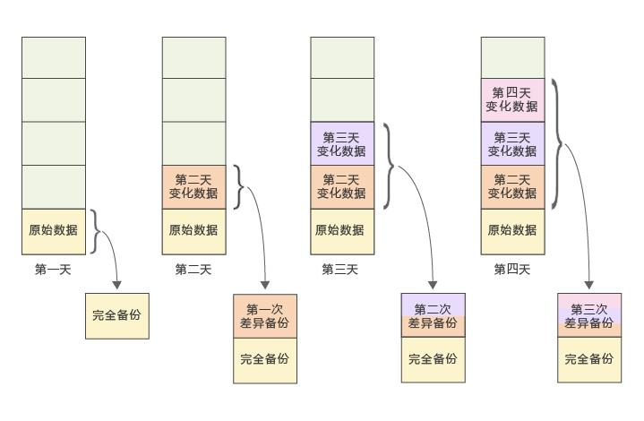
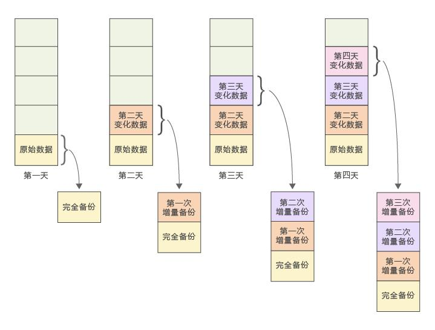

# 备份

[TOC]

## 备份方式

### 完全备份（Full Backup）

完整地备份业务数据。例如，星期一用一盘磁带对整个业务系统进行备份，星期二用另一盘磁带对整个业务系统进行备份，依此类推。

### 差异备份（Differential Backup）

以完整备份为基础的一种备份方式。例如，系统管理员在星期天对系统进行一次完全备份，在星期一备份星期天到星期一期间的数据，在星期二备份星期天到星期二期间的数据，依此类推。

 

### 增量备份 （Incremental Backup ）

以上次备份为基础的备份方式。也就是只对每天新增的或被修改过的数据进行备份。例如，星期天进行一次完整备份，星期一只备份从星期天到星期一期间增加的数据，星期二备份从星期一到星期二期间增加的数据，依此类推。

 

 

| 备份模式     | 优点                                                         | 缺点                                                         |
| ------------ | ------------------------------------------------------------ | ------------------------------------------------------------ |
| **完整备份** | 备份的数据最全面，若多次完整备份后丢失了其中一个完整备份，那么通过其他的完整备份来还原数据不会丢失太多文件。 | 占用的存储空间大，备份和还原的时间长。                       |
| **增量备份** | 每次只备份与上一次备份相比不一样的部分，占用空间小，备份时间短。 | 在还原全部数据的时候需要将每一次的备份文件都还原，还原耗时较长。中间某个备份如果损坏，后续的备份将不可用。 |
| **差异备份** | 每次只备份与第一次完整备份相比不一样的部分，占用空间比完整备份小，备份时间也比完整备份短。在还原全部数据的时候只需要将第一次的完整备份文件与最后一次的差异备份文件还原，还原耗时比增量备份短。 | 备份时间比增量备份长，占用空间也比增量备份多。               |

## 组成

* 备份网络
* 备份软件
* 备份设备

## 分类
* 文件级备份
* 块级备份

## 高级数据保护方法
1.  远程文件复制

2. 远程磁盘（卷）镜像

   同步复制，异步复制

3. 快（块）照数据保护
