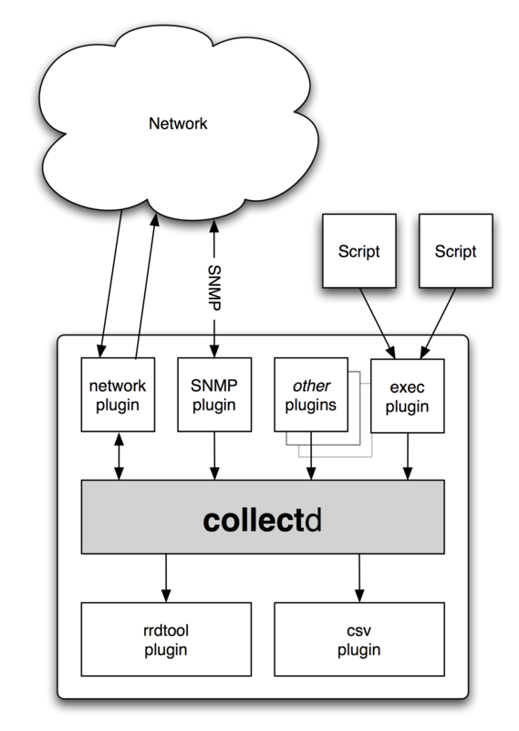

# Collectd
## 架构

## 1.安装
### CentOS 6/7
1.安装软件库epel

    yum  install  epel-release
2.安装Collectd  

    yum  install  collectd
### Debian

    apt-get install collectd
## 2.启动
### CentOS 6
    service  collectd  start
    chkconfig collectd on
### CentOS 7
    systemctl start collectd.service
    systemctl enable collectd.service
### Debian
    service collectd start
    chkconfig collectd on

## 前端软件
| Name                 | Type        | Framework                                           | Engine            | Flush   |
|----------------------|-------------|-----------------------------------------------------|-------------------|---------|
| Collectd Graph Panel | Web-based   | PHP                                                 | RRDtool           | Yes     |
| Collectd Graph Z     | Web-based   | PHP (based on CGP)                                  | RRDtool           | Yes     |
| Collectd-web         | Web-based   | CGI                                                 | RRDtool           | No      |
| CollectGraph         | Web-based   | MoinMoin wiki                                       | unknown           | unknown |
| Collection 3         | Web-based   | CGI                                                 | RRDtool           | Yes     |
| Collection 4         | Web-based   | FastCGI                                             | gRaphaël, RRDtool | No      |
| Collectd-carbon      | Web-based   | Django                                              | Graphite/Carbon   | No      |
| collectw             | Web-based   | FastCGI                                             | gRaphaël          | No      |
| EcoStats             | Web-based   | CGI                                                 | RRDtool           | No      |
| Facette              | Web-based   | Go http package                                     | HighCharts        | Yes     |
| Heymon               | Web-based   | Ruby on Rails                                       | RRDtool           | No      |
| Jarmon               | Web-based   | jQuery, Javascript RRD, Flowplayer Tools, (Twisted) | Flot              | No      |
| kcollectd            | Stand-alone | KDE                                                 | Qt                | No      |
| Observium            | Web-based   | PHP                                                 | RRDtool           | Yes     |
| PerfWatcher          | Web-based   | PHP                                                 | RRDtool           | Yes     |
| Visage               | Web-based   | Ruby + Sinatra, MooTools                            | HighCharts (SVG)  | No      |
| Vizir                | Web-based   | Ruby on Rails                                       | Rickshaw/D3js     | Yes     |
| Sick Muse            | Web-based   | Python, jQuery, Backbone.js                         | Flot              | unknown |
| RRDscout             | Web-based   | Python, Flask                                       | RRDtool           | unknown |

Legend

Type  
       Type of front-end. Currently the categories are Web-based and Stand-alone.

Framework  
       Execution framework used.

Engine  
       Program or library used for drawing graphs from the available data.

Flush  
       Whether or not the front-end is able to send a FLUSH command to the daemon before querying the data for the graph. This is interesting when the CacheTimeout option of the RRDtool plugin has been set to a high value.

## Collectd-web
Collectd-web是一款基于RRDtool的Web前端监控工具，能够解读并以图形化方式输出由Collectd服务收集的数据。  
### 安装Collectd-web
1.安装Git  
**Debian / Ubuntu**

    apt-get install git
    apt-get install librrds-perl libjson-perl libhtml-parser-perl
**RedHat/CentOS/Fedora**

    yum install git
    yum install rrdtool rrdtool-devel rrdtool-perl perl-HTML-Parser perl-JSON
2.导入Collectd-Web Git软件库，并修改独立式Python服务器

    cd /usr/local/
    git clone https://github.com/httpdss/collectd-web.git
3.进入到collectd-web目录，修改Python服务器脚本(runserver.py)，为graphdefs.cgi添加执行权限。  

    cd collectd-web/
    chmod +x cgi-bin/graphdefs.cgi
4.Collectd-web独立式Python服务器脚本默认情况下已配置成运行、只绑定回送地址(127.0.0.1)。为了从远程浏览器访问Collectd-web界面，需要编辑runserver.py脚本，并将127.0.1.1 IP地址改成0.0.0.0，那样才能绑定所有的网络接口IP地址。只绑定某个特定的接口，那么使用该接口的IP地址。
nano runserver.py
如果你想使用8888之外的另一个网络端口，修改PORT变量值。
第4步：运行Python CGI独立式服务器，浏览Collectd-web界面
7. 你修改了独立式Python服务器脚本IP地址绑定后，只管启动后台服务器，为此只要执行下面这个命令：
./runserver.py &
另外一个办法就是，你可以调用Python解释器，启动服务器：
python runserver.py &
8. 想访问Collectd-web界面，并显示关于你主机的统计信息，不妨打开浏览器，使用HTTP协议，让URL指向你服务器的IP地址和端口8888。
默认情况下，你会看到关于处理器、磁盘使用情况、网络流量、内存、进程及其他系统资源的许多图形，只要点击上Hosts(主机)表单上所显示的主机名称。
http://192.168.1.211:8888
9. 想停止独立式Python服务器，执行下面这个命令，或者可以按Ctrl+c键来取消或停止脚本：
killall python
构建自定义Bash脚本，以管理独立式Python服务器
想更轻松地管理独立式PyhtonCGIServer脚本(启动、停止和查看状态)，不妨在系统可执行路径下构建下列collectd-server Bash脚本，并使用下列配置：
nano /usr/local/bin/collectd-server
将下列内容添加到collectd-server文件。
#!/bin/bash
PORT="8888"
case $1 in
start)
cd /usr/local/collectd-web/
python runserver.py 2> /tmp/collectd.log &
sleep 1
stat=`netstat -tlpn 2>/dev/null | grep $PORT | grep "python"| cut -d":" -f2 | cut -d" " -f1`
if [[ $PORT -eq $stat ]]; then
sock=`netstat -tlpn 2>/dev/null | grep $PORT | grep "python"`
echo -e "Server is  still running:\n$sock"
else
echo -e "Server has stopped"
fi
;;
stop)
pid=`ps -x | grep "python runserver.py" | grep -v "color"`
kill -9 $pid 2>/dev/null
stat=`netstat -tlpn 2>/dev/null | grep $PORT | grep "python"| cut -d":" -f2 | cut -d" " -f1`
if [[ $PORT -eq $stat ]]; then
sock=`netstat -tlpn 2>/dev/null | grep $PORT | grep "python"`
echo -e "Server is  still running:\n$sock"
else
echo -e "Server has stopped"
fi
;;
status)
stat=`netstat -tlpn 2>/dev/null |grep $PORT| grep "python" | cut -d":" -f2 | cut -d" " -f1`
if [[ $PORT -eq $stat ]]; then
sock=`netstat -tlpn 2>/dev/null | grep $PORT | grep "python"`
echo -e "Server is running:\n$sock"
else
echo -e "Server is stopped"
fi
;;
*)
echo "Use $0 start|stop|status"
;;
esac

一你更改了runserver.py脚本的PORT变量值，就要确保你相应地对该bash文件更改了端口变量。
11. 一旦你构建了collectd-server脚本，添加执行权限，以便能够运行它。现在唯一剩下来的事情就是，以类似管理系统服务的方式来管理Collectd-web服务器，为此执行下列命令。
# chmod +x /usr/local/bin/collectd-server
# collectd-server start
 collectd-server status
 collectd-server stop
如何安装配置Collectd和Collectd-Web监控服务器资源?
Collectd服务器脚本
第6步：启用Collectd守护程序插件
12. 为了激活Collectd服务方面的插件，你必须进入到其主配置文件，该文件位于/etc/collectd/collectd.conf，打开该文件，即可编辑和取消注释，即可以去掉你想激活的插件名称前面的那个#符号。
一旦带插件名称的LoadPlugin语句被取消了注释，你就必须深入搜寻整个文件，找到含有运行所需配置的同一个插件名称。
举例说，下面介绍了如何激活Collectd Apache插件。首先打开Collectd主配置文件，以便编辑：
# nano /etc/collectd/collectd.conf
A. 使用Ctrl+w键，开启nano编辑工具搜索，并在提交搜索的下列终端上输入apache。一旦找到了LoadPlugin apache语句，去掉注释特殊符号#，即可取消注释，如下列屏幕截图示。
Collectd守护程序插件
启用Collectd Apache插件
B. 下一步，键入Ctrl+w键，即可再次搜索，apache应该已经出现在提交的搜索上，按回车键，即可找到插件配置。
一旦找到了apache插件配置(它们看起来类似Apache web服务器语句)，取消下列几行的注释，那样最后的配置应该看起来像这样：
<Plugin apache>
<Instance "example.lan">
                        URL "http://localhost/server-status?auto"  
        #               User "www-user"  
        #               Password "secret"  
        #               VerifyPeer false  
        #               VerifyHost false  
        #               CACert "/etc/ssl/ca.crt"  
        #               Server "apache"  
                </Instance>
        #  
        #       <Instance "bar">
        #               URL "http://some.domain.tld/status?auto"  
        #               Host "some.domain.tld"  
        #               Server "lighttpd"  
        #       </Instance>
        </Plugin>

C. 在你完成文件编辑后，保存文件(Ctrl+o)并关闭文件(Ctrl+x)，然后重启Collectd守护程序，让变更内容生效。清空浏览器缓存，重新装入页面，查看Collectd守护程序到目前为止为Apache Web服务器收集的统计信息。
# /usr/local/bin/collectd-server start
Apache监控
Apache监控
想启用其他插件，请访问Collectd维基页面(https://collectd.org/wiki/index.php/Table_of_Plugins)。
第7步：在整个系统范围启用Collectd守护程序和Collectd-web服务器
13. 为了在系统启动时通过Bash脚本自动启动Collectd-web服务器，打开/etc/rc.local文件以编辑，并在exit 0语句前面添加下面这一行：
/usr/local/bin/collectd-server start
启用Collectd守护程序和Collectd-web服务器
在整个系统范围启用Collectd
如果你不使用管理Python服务器脚本的collectd-server Bash脚本，就把rc.conf中的上述行换成下面这一行：
# cd /usr/local/collectd-web/ && python runserver.py 2> /tmp/collectd.log &
然后，执行下列命令，启用这两项系统服务：
------------------ On Debian / Ubuntu ------------------
# update-rc.d collectd enable
# update-rc.d rc.local enable
系统启动时启用这项服务的另外一种方法就是，借助sysv-rc-conf程序包：
  ------------------ On Debian / Ubuntu ------------------
# sysv-rc-conf collectd on
# sysv-rc-conf rc.local on
------------------ On RHEL/CentOS 6..x/5.x and Fedora 12-19 ------------------
# chkconfig collectd on
# chkconfig --level 5 collectd on
------------------ On RHEL/CentOS 7.x and Fedora 20 onwards ------------------
# systemctl enable collectd
