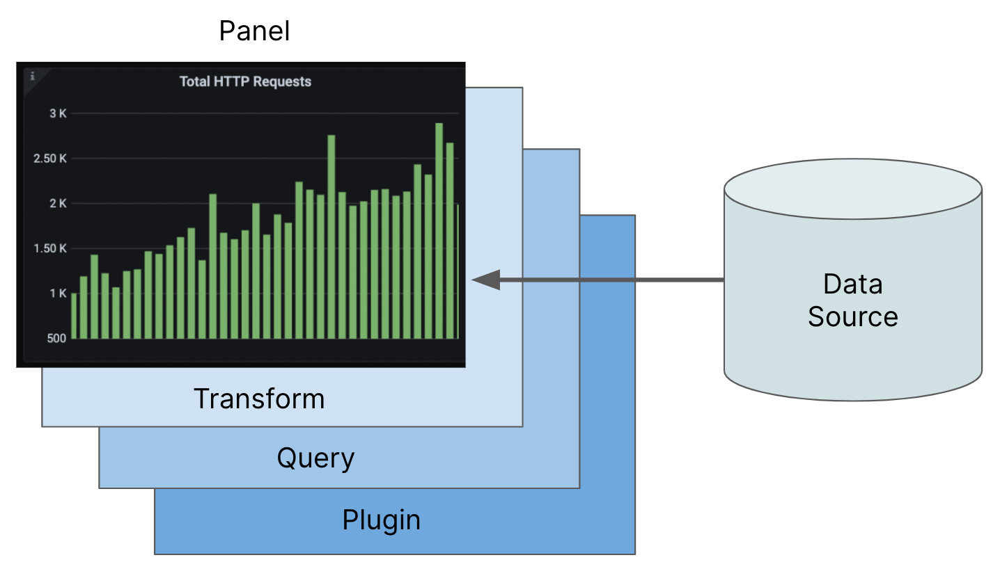
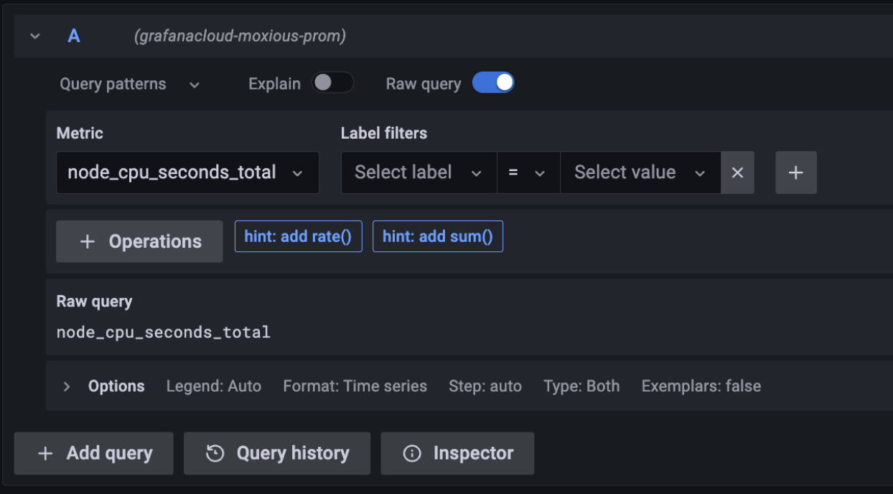

# Grafana 仪表板

[TOC]

## 概述

在可观测性领域，dashboard 这个术语经常被使用。这个概念借鉴了汽车，其中仪表板使驾驶员能够访问操作车辆所需的控件。同样，数字仪表板帮助我们理解和管理系统。

下图说明了一个示例 Grafana 控制面板：

Grafana  dashboard 由面板组成，这些面板以漂亮的图形、图表和其他可视化效果显示数据。这些面板是使用将原始数据源转换为可视化效果的组件创建的。The process involves passing data through three gates: a plugin, a query, and an optional transformation.该过程涉及通过三个门传递数据：插件、查询和可选转换。

The image below displays all the gates下图显示了所有门，然后详细解释了它们的用途、用途和意义：

## 数据源

数据源是指由数据组成的任何实体。它可以是 SQL 数据库、Grafana Loki、Grafana Mimir 或基于 JSON 的 API。它甚至可以是一个基本的 CSV 文件。创建仪表板可视化的第一步是选择包含所需数据的数据源。

可能很难理解不同数据源之间的区别，因为每个数据源都有自己的结构，并且需要不同的查询方法。但是，在控制面板中，可以在一个视图中看到可视化的不同数据源，从而更容易理解整体数据。

## 插件

Grafana 插件是向 Grafana 添加新功能的软件。它们有多种类型。Grafana 数据源插件的工作是接受想要回答的查询，从数据源中检索数据，并协调数据源的数据模型与 Grafana 仪表板的数据模型之间的差异。它使用称为[数据帧](https://grafana.com/developers/plugin-tools/key-concepts/data-frames)的统一数据结构来实现这一点。

从数据源进入插件的数据可能采用许多不同的格式（例如 JSON、行和列或 CSV），但是当它离开插件并通过其余入口进入可视化时，它始终位于数据帧中。

Currently, Grafana offers a diverse range of 155 data sources that you can use.  The most commonly used options are already pre-installed and accessible. Before exploring other options, look for an existing data source that  matches your requirements. Grafana constantly updates the list, but if  you don’t find a suitable data source, you can browse through the [plugin catalog](https://grafana.com/grafana/plugins/?type=datasource) or [create a plugin](https://grafana.com/developers/plugin-tools).
目前，Grafana 提供了 155 个可供您使用的多样化数据源。最常用的选项已经预装并可供访问。在探索其他选项之前，请查找符合您要求的现有数据源。Grafana 会不断更新列表，但如果您没有找到合适的数据源，您可以浏览[插件目录](https://grafana.com/grafana/plugins/?type=datasource)或[创建插件](https://grafana.com/developers/plugin-tools)。

## Queries 查询

查询允许将整个数据缩减为特定数据集，从而提供更易管理的可视化效果。它们有助于回答关于系统和操作流程的问题。例如，一家拥有在线商店的公司可能希望确定将产品添加到购物车的客户数量。This can be achieved through a query that aggregates access metrics for the shopping cart service,  revealing the number of users accessing the service per second.这可以通过聚合购物车服务的访问指标的查询来实现，从而揭示每秒访问该服务的用户数。

it’s crucial to recognize that each one has  its own distinct query language. 在处理数据源时，必须认识到每个数据源都有自己独特的查询语言。例如，Prometheus 数据源使用 [PromQL](https://grafana.com/blog/2020/02/04/introduction-to-promql-the-prometheus-query-language/) ，而 [LogQL](https://grafana.com/docs/loki/latest/logql/) 用于日志，特定数据库使用 SQL 。查询是 Grafana 中每个可视化的基础，控制面板可能使用一系列查询语言。

下图显示了与 Prometheus 数据源关联的 Query Editor 。`node_cpu_seconds_total` 查询是用 PromQL 编写的，只请求一个指标：

## Transformations 转换

当可视化效果中的数据格式不符合要求时，可以应用[转换](https://grafana.com/docs/grafana/latest/panels-visualizations/query-transform-data/transform-data/)来操作查询返回的数据。刚开始时，您可能不需要转换数据，但它们功能强大且值得一提。

转换数据在以下情况下非常有用：

- 希望将两个字段合并在一起，例如，将 `Given Name` 和 `Family Name` 连接成一个 `Full Name` 字段。
- You have CSV data (all text), and you want to convert a field type (such as parsing a date or a number out of a string).
  您有 CSV 数据（所有文本），并且想要转换字段类型（例如解析字符串中的日期或数字）。
- You want to filter, join, merge, or perform other SQL-like operations that  might not be supported by the underlying data source or query language.
  您希望筛选、联接、合并或执行基础数据源或查询语言可能不支持的其他类似 SQL 的操作。

Transformations are located in the **Transform** tab in the edit dialog for a panel. Select the transformation you want, and define the transformation. The following image shows that you can  have as many transformations as you want, just like queries. For  example, you can chain together a series of transformations that make a  change to a data type, filter results, organize columns, and sort the  result into one data pipeline. Every time the dashboard is refreshed,  the transformation applies to the latest data from the data source.
变换位于面板编辑对话框的 **Transform**  选项卡中。选择所需的转换，然后定义转换。下图显示，您可以根据需要进行任意数量的转换，就像查询一样。例如，您可以将一系列转换链接在一起，这些转换对数据类型进行更改、筛选结果、组织列以及将结果排序到一个数据管道中。每次刷新控制面板时，转换都会应用于数据源中的最新数据。

下图显示了转换对话框：

## Panels 板

在对数据进行溯源、查询和转换后，数据会传递到面板，这是 Grafana  可视化历程的最后一道门。面板是一个容器，用于显示可视化效果并为您提供各种控件来操作可视化效果。面板配置是您指定要如何查看数据的位置。The panel configuration is where you specify how you want to see the data. 例如，您可以使用面板右上角的下拉菜单来指定要查看的可视化类型，例如条形图、饼图或直方图。

The panel options let you customize many aspects of the visualization and  the options differ based on which visualization you select. Panels also  contain queries that specify the data the panel is visualizing.
面板选项允许您自定义可视化的许多方面，并且选项根据您选择的可视化而有所不同。面板还包含指定面板正在可视化的数据的查询。

The following image shows a table panel being edited, the panel settings  showing the query at the bottom, and the panel options on the right. In  this image, you can see how the data source, plugin, query, and panel  all come together.
下图显示了正在编辑的表面板，面板设置在底部显示查询，面板选项位于右侧。在此图中，您可以看到数据源、插件、查询和面板是如何组合在一起的。

To see examples of dashboards in one place that you can  browse and inspect, refer to [Grafana Play](https://play.grafana.org/), which has feature showcases and a variety of examples.
选择最佳可视化效果取决于数据以及您希望数据的呈现方式。要在一个位置查看可浏览和检查的仪表板示例，请参阅 [Grafana Play](https://play.grafana.org/)，其中包含功能展示和各种示例。

## Conclusion 结论

With the data source, plugin, query, transformation, and panel model in  mind, you can now see right through any Grafana dashboard you encounter, and imagine how to build your own.
考虑到数据源、插件、查询、转换和面板模型后，您现在可以直接查看您遇到的任何 Grafana 仪表板，并想象如何构建自己的仪表板。

Building a Grafana dashboard is a process that starts with determining your  dashboard requirements and identifying which data sources support those  requirements. If you want to integrate a specialized database with a  Grafana dashboard, you must ensure the correct plugin is installed so  that you can add a data source to use with that plugin.
构建 Grafana 控制面板是一个过程，从确定您的控制面板要求并确定哪些数据源支持这些要求开始。如果要将专用数据库与 Grafana 仪表板集成，则必须确保安装了正确的插件，以便可以添加要与该插件一起使用的数据源。

And with the data source identified and the plugin installed, you can write your query, transform the data, and format the visualization to meet  your needs.
确定数据源并安装插件后，您可以编写查询、转换数据并设置可视化格式以满足您的需求。

Given the data source plugin and data frame abstraction, any  data source you can access can work with the same general approach.
这种组件架构是 Grafana 如此强大和通用的部分原因。给定数据源插件和数据帧抽象，您可以访问的任何数据源都可以使用相同的常规方法。