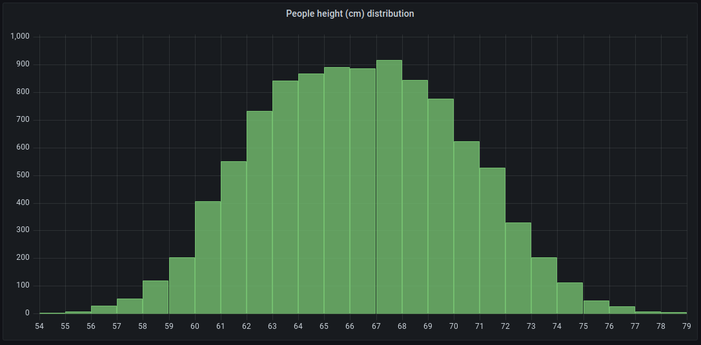
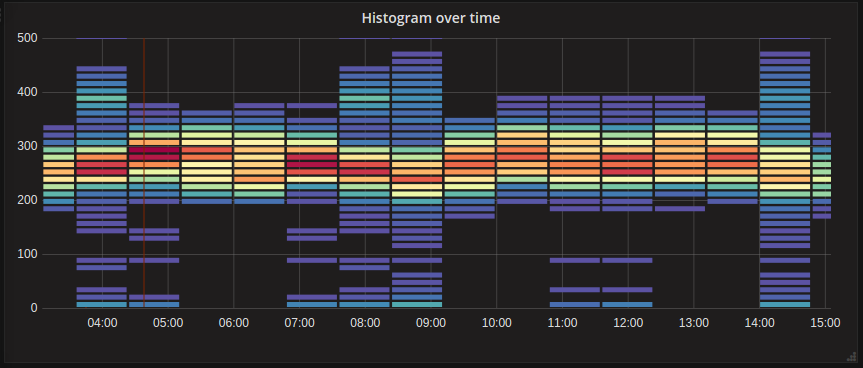

# 直方图和热图

[TOC]

## 简介

直方图是数值数据分布的图形表示。它将值分组到存储桶（有时也称为 bin）中，然后计算每个存储桶中有多少个值。

Instead of graphing the actual values, histograms graph the buckets. Each bar represents a bucket, and the bar height represents the frequency (such as count) of values that fell into that bucket’s interval.
直方图不是绘制实际值，而是绘制存储桶。每个条形代表一个桶，条形高度表示落入该桶间隔的值的频率（如计数）。

## 直方图示例

此*直方图*显示几个时间序列的值分布。可以很容易地看到，大多数值都在 240-300 之间，峰值在 260-280 之间。

 

下面是一个显示人员身高分布的示例。

 

直方图仅查看特定时间范围内的*值分布*。直方图的问题在于，无法看到分布随时间推移的任何趋势或变化。这就是热图变得有用的地方。

## Heatmaps 热图

A *heatmap* is like a histogram, but over time, where each time slice represents  its own histogram. Instead of using bar height as a representation of  frequency, it uses cells, and colors the cell proportional to the number of values in the bucket.
*热图*类似于直方图，但随着时间的推移，每个时间片都代表自己的直方图。它不使用条形高度来表示频率，而是使用单元格，并根据存储桶中的值数按比例为单元格着色。

在此示例中，可以清楚地看到哪些值更常见，以及它们如何随时间变化。

 

## Pre-bucketed data 预分桶数据

There are a number of data sources supporting histogram over time, like Elasticsearch (by using a Histogram bucket aggregation) or Prometheus (with [histogram](https://prometheus.io/docs/concepts/metric_types/#histogram) metric type and *Format as* option set to Heatmap). But generally, any data source could be used as long as it meets the requirement that it either returns series with names representing bucket bounds, or that it returns series sorted by the bounds in ascending order.
有许多数据源支持随时间变化的直方图，例如 Elasticsearch（通过使用直方图存储桶聚合）或 Prometheus（将[直方图](https://prometheus.io/docs/concepts/metric_types/#histogram)指标类型和*格式选项*设置为热图）。但通常，可以使用任何数据源，只要它满足以下要求：它返回名称表示存储桶边界的序列，或者返回按边界升序排序的序列。

## Raw data vs aggregated 原始数据与聚合数据

If you use the heatmap with regular time series data (not pre-bucketed), then it’s important to keep in mind that your data is often already aggregated by your time series backend. Most time series queries do not return raw sample data, but instead include a group by time interval or maxDataPoints limit coupled with an aggregation function (usually average).
如果您将热图与常规时间序列数据（未预先存储）一起使用，那么请务必记住，您的数据通常已经由时间序列后端聚合。大多数时间序列查询不返回原始样本数据，而是包括按时间间隔或 maxDataPoints 限制分组以及聚合函数（通常为 average）。

This all depends on the time range of your query of course. But the important point is to know that the histogram bucketing that Grafana performs might be done on already aggregated and averaged data. To get more accurate heatmaps, it is better to do the bucketing during metric collection, or to store the data in Elasticsearch or any other data source which supports doing histogram bucketing on the raw data.
当然，这完全取决于您查询的时间范围。但重要的一点是要知道，Grafana 执行的直方图分桶可能是对已经聚合和平均的数据完成的。为了获得更准确的热图，最好在指标收集期间进行分桶，或者将数据存储在  Elasticsearch 或任何其他支持对原始数据进行直方图分桶的数据源中。

If you remove or lower the group by time (or raise maxDataPoints) in your  query to return more data points, your heatmap will be more accurate, but this can also be very CPU and memory taxing for your  browser, possibly causing hangs or crashes if the number of data points becomes unreasonably large.
如果您在查询中按时间删除或减少组（或提高 maxDataPoints）以返回更多数据点，则热图将更加准确，但这也可能会对您的浏览器造成非常多的 CPU 和内存负担，如果数据点数量变得不合理，可能会导致挂起或崩溃。