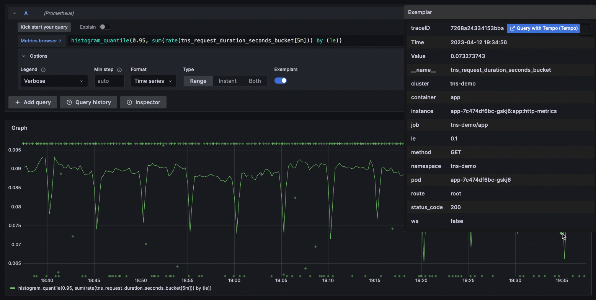
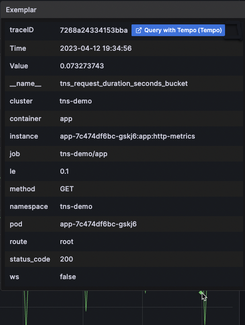
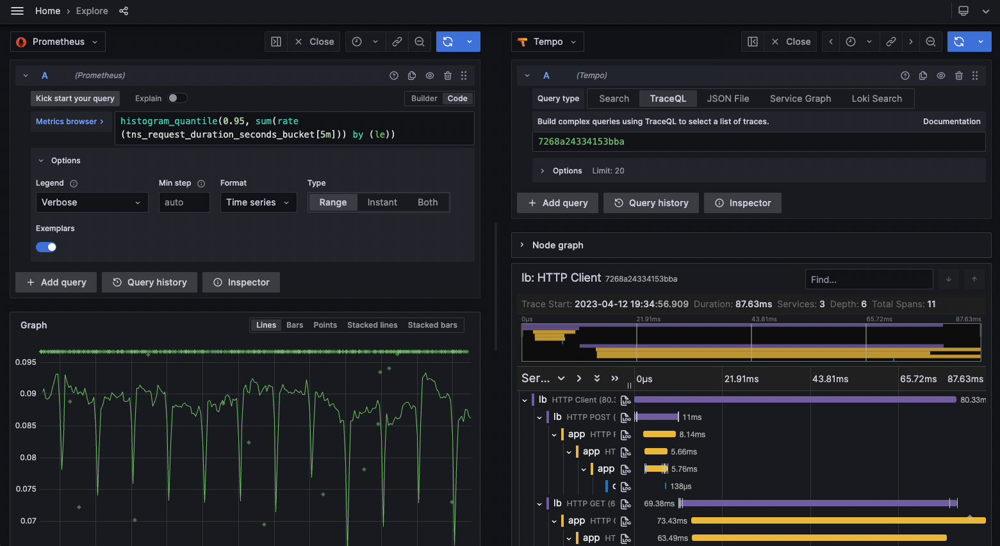
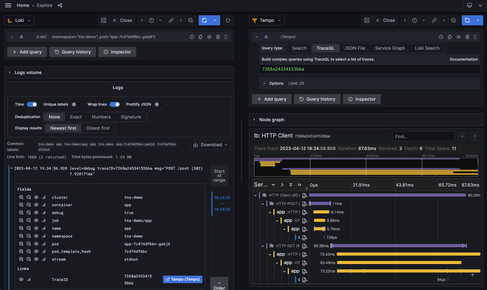
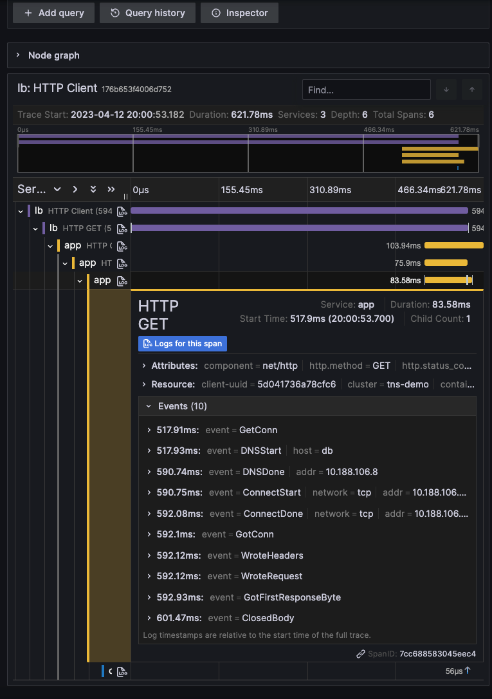

# Introduction to exemplars 示例简介

An exemplar is a specific trace representative of measurement taken in a  given time interval. While metrics excel at giving you an aggregated  view of your system, traces give you a fine grained view of a single  request; exemplars are a way to link the two.
示例是在给定时间间隔内进行的测量的特定跟踪。指标擅长为您提供系统的聚合视图，而跟踪则为您提供单个请求的精细视图;示例是将两者联系起来的一种方式。

Suppose your company website is experiencing a surge in traffic volumes. While  more than eighty percent of the users are able to access the website in  under two seconds, some users are experiencing a higher than normal  response time resulting in bad user experience.
假设您的公司网站流量激增。虽然超过 80% 的用户能够在两秒内访问该网站，但一些用户的响应时间高于正常水平，从而导致用户体验不佳。

To identify the factors that are contributing to the latency, you must  compare a trace for a fast response against a trace for a slow response. Given the vast amount of data in a typical production environment, it  will be extremely laborious and time-consuming effort.
要确定导致延迟的因素，您必须比较快速响应的跟踪和慢速响应的跟踪。考虑到典型生产环境中的大量数据，这将是极其费力和耗时的工作。

Use exemplars to help isolate problems within your data distribution by  pinpointing query traces exhibiting high latency within a time interval. Once you localize the latency problem to a few exemplar traces, you can combine it with additional system based information or location  properties to perform a root cause analysis faster, leading to quick  resolutions to performance issues.
使用示例通过精确定位在时间间隔内表现出高延迟的查询跟踪来帮助隔离数据分布中的问题。将延迟问题定位为几个示例跟踪后，您可以将其与其他基于系统的信息或位置属性相结合，以更快地执行根本原因分析，从而快速解决性能问题。

Support for exemplars is available for the Prometheus data source only. Once  you enable the functionality, exemplar data is available by default. For more information on exemplar configuration and how to enable exemplars, refer to [configuring exemplars in the Prometheus data source](https://grafana.com/docs/grafana/latest/datasources/prometheus/configure-prometheus-data-source/#exemplars).
对示例的支持仅适用于 Prometheus 数据源。启用该功能后，默认情况下，示例数据可用。有关 exemplar 配置以及如何启用 exemplar 的更多信息，请参阅 [在 Prometheus 数据源中配置 exemplars](https://grafana.com/docs/grafana/latest/datasources/prometheus/configure-prometheus-data-source/#exemplars)。

Grafana shows exemplars alongside a metric in the Explore view and in  dashboards. Each exemplar displays as a highlighted star. You can hover  your cursor over an exemplar to view the unique trace ID, which is a  combination of a key value pair. To investigate further, click the blue  button next to the `traceID` property.
Grafana 在 Explore （浏览） 视图和控制面板中与指标一起显示示例。每个示例都显示为一个突出显示的星形。您可以将光标悬停在示例上以查看唯一的跟踪 ID，该 ID 是键值对的组合。要进一步调查，请单击 `traceID` 属性旁边的蓝色按钮。

Screenshot showing the detail window of an exemplar
显示示例的详细信息窗口的屏幕截图

Refer to [View exemplar data](https://grafana.com/docs/grafana/latest/fundamentals/exemplars/#view-exemplar-data) for instructions on how to drill down and view exemplar trace details  from metrics and logs. To know more about exemplars, refer to the  blogpost [Intro to exemplars, which enable Grafana Tempo’s distributed tracing at massive scale](https://grafana.com/blog/2021/03/31/intro-to-exemplars-which-enable-grafana-tempos-distributed-tracing-at-massive-scale/).
有关如何从量度和日志中向下钻取和查看示例跟踪详细信息的说明，请参阅[查看示例数据](https://grafana.com/docs/grafana/latest/fundamentals/exemplars/#view-exemplar-data)。要了解有关示例的更多信息，请参阅博客文章示例[简介，它支持 Grafana Tempo 的大规模分布式跟踪](https://grafana.com/blog/2021/03/31/intro-to-exemplars-which-enable-grafana-tempos-distributed-tracing-at-massive-scale/)。

## View exemplar data 查看示例数据

When support for exemplar support is enabled for a Prometheus data source,  you can view exemplar data either in the Explore view or from the Loki  log details.
当 Prometheus 数据源启用示例支持时，您可以在 Explore （浏览） 视图或 Loki 日志详细信息中查看示例数据。

### In Explore 在 Explore 中

Explore visualizes exemplar traces as highlighted stars alongside metrics data. For more information on how Explore visualizes trace data, refer to [Tracing in Explore](https://grafana.com/docs/grafana/latest/explore/trace-integration/).
Explore 将示例跟踪可视化为与指标数据一起突出显示的星形。有关 Explore 如何可视化跟踪数据的更多信息，请参阅 [Explore 中的跟踪](https://grafana.com/docs/grafana/latest/explore/trace-integration/)。

To examine the details of an exemplar trace:
要检查示例跟踪的详细信息，请执行以下操作：

1. Place your cursor over an exemplar (highlighted star). Depending on the trace data source you are using, you will see a blue button with the label `Query with <data source name>`. In the following example, the tracing data source is Tempo.
   将光标放在示例（突出显示的星号）上。根据所使用的跟踪数据源，您将看到一个蓝色按钮，标签为 `Query with <data source name>`。在以下示例中，跟踪数据源为 Tempo。

    

   Screenshot showing exemplar details
   显示示例详细信息的屏幕截图

2. Click the **Query with Tempo** option next to the `traceID` property. The trace details, including the spans within the trace are listed in a separate panel on the right.
   单击 `traceID` 属性旁边的 **Query with Tempo** 选项。跟踪详细信息（包括跟踪中的跨度）列在右侧的单独面板中。

   

   Explorer view with panel showing trace details
   Explorer 视图，其中的面板显示跟踪详细信息

For more information on how to drill down and analyze the trace and span details, refer to the [Analyze trace and span details](https://grafana.com/docs/grafana/latest/fundamentals/exemplars/#analyze-trace-and-spans) section.
有关如何向下钻取和分析跟踪和跨度详细信息的更多信息，请参阅 [分析跟踪和跨度详细信息](https://grafana.com/docs/grafana/latest/fundamentals/exemplars/#analyze-trace-and-spans) 中。

### In logs 在日志中

You can also view exemplar trace details from the Loki logs in Explore. Use regex within the Derived fields links for Loki to extract the `traceID` information. Now when you expand Loki logs, you can see a `traceID` property under the **Detected fields** section. To learn more about how to extract a part of a log message into an internal or external link, refer to [using derived fields in Loki](https://grafana.com/docs/grafana/latest/explore/logs-integration/).
您还可以在 Explore 中查看 Loki 日志中的示例跟踪详细信息。在 Derived fields 链接中使用 Regex for Loki 提取 `traceID` 信息。现在，当您展开 Loki logs 时，您可以在 **Detected fields （检测到的字段**） 部分下看到 `traceID` 属性。要了解有关如何将日志消息的一部分提取到内部或外部链接中的更多信息，请参阅 [在 Loki 中使用派生字段](https://grafana.com/docs/grafana/latest/explore/logs-integration/).

To view the details of an exemplar trace:
要查看示例跟踪的详细信息，请执行以下操作：

1. Expand a log line and scroll down to the `Fields` section. Depending on your backend trace data source, you will see a blue button with the label `<data source name>`.
   展开日志行并向下滚动到 `Fields （字段`） 部分。根据您的后端跟踪数据源，您将看到一个带有标签 `<data source name>` 的蓝色按钮。
2. Click the blue button next to the `traceID` property. Typically, it will have the name of the backend data source.  In the following example, the tracing data source is Tempo. The trace  details, including the spans within the trace are listed in a separate  panel on the right.
   单击 `traceID` 属性旁边的蓝色按钮。通常，它将具有后端数据源的名称。在以下示例中，跟踪数据源为 Tempo。跟踪详细信息（包括跟踪中的跨度）列在右侧的单独面板中。

Explorer view with panel showing trace details
Explorer 视图，其中的面板显示跟踪详细信息

For more information on how to drill down and analyze the trace and span details, refer to the [Analyze trace and span details](https://grafana.com/docs/grafana/latest/fundamentals/exemplars/#analyze-trace-and-spans) section.
有关如何向下钻取和分析跟踪和跨度详细信息的更多信息，请参阅 [分析跟踪和跨度详细信息](https://grafana.com/docs/grafana/latest/fundamentals/exemplars/#analyze-trace-and-spans) 中。

### Analyze trace and spans 分析跟踪和跨度

This panel shows the details of the trace in different segments.
此面板显示不同分段中跟踪的详细信息。

- The top segment displays the trace ID to indicate that the query results correspond to the specific trace.
  最上面的段显示跟踪 ID，以指示查询结果与特定跟踪相对应。

  You can add more traces to the results using the `Add query` button.
  您可以使用 `Add query （添加查询`） 按钮向结果添加更多跟踪。

- The next segment shows the entire span for the specific trace as a narrow  strip. All levels of the trace from the client all the way down to  database query is displayed, which provides a bird’s eye view of the  time distribution across all layers over which the HTTP request was  processed.
  下一段将特定跟踪的整个范围显示为一条窄带。显示从客户端一直到数据库查询的所有跟踪级别，这提供了处理 HTTP 请求的所有层的时间分布的鸟瞰图。

  1. You can click within this strip view to display a magnified view of a  smaller time segment within the span. This magnified view shows up in  the bottom segment of the panel.
     您可以在此条带视图中单击，以显示该跨度内较小时间段的放大视图。此放大的视图显示在面板的底部部分。

  2. In the magnified view, you can expand or collapse the various levels of  the trace to drill down to the specific span of interest.
     在放大的视图中，您可以展开或折叠跟踪的各个级别，以向下钻取到感兴趣的特定范围。

     For example, if the strip view shows that most of the latency was within  the app layer, you can expand the trace down the app layer to  investigate the problem further. To expand a particular layer of span,  click the left icon. The same button can collapse an expanded span.
     例如，如果条带视图显示大部分延迟都在应用程序层内，则可以将跟踪向下扩展到应用程序层以进一步调查问题。要展开特定的 span 图层，请单击左侧图标。相同的按钮可以折叠扩展的 span。

- To see the details of the span at any level, click the span itself.
  要查看任何级别的 span 的详细信息，请单击 span 本身。

  This displays additional metadata associated with the span. The metadata  itself is initially shown in a narrow strip but you can see more details by clicking the metadata strip.
  这将显示与 span 关联的其他元数据。元数据本身最初显示在一个狭窄的条带中，但您可以通过单击元数据条带来查看更多详细信息。

   