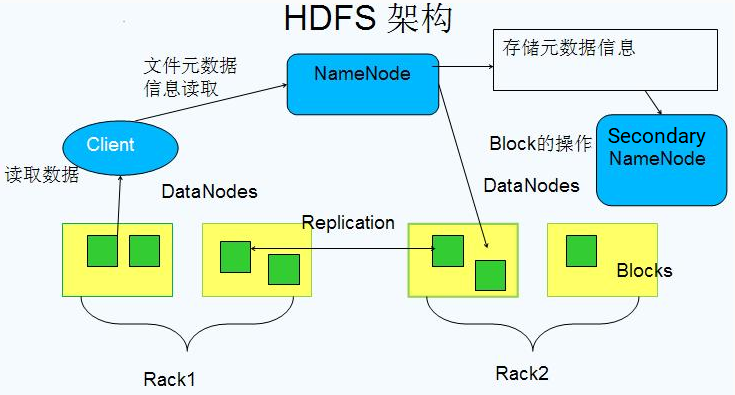
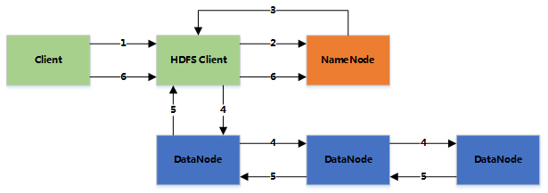
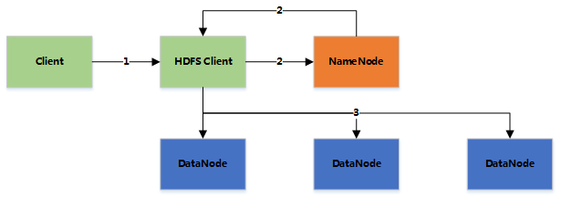

# HDFS

[TOC]

## 架构

HDFS 中的存储单元（Block），一个文件会被切分成若干个固定大小 Block（块默认是 64MB，可配置，若不足 64MB，则单独一个块），存储在不同结点上，默认每 Block 有三个副本（副本越多，硬盘利用率越低），Block 大小和副本数通过 Client 端上传文件时设置，文件上传成功后，副本数可变，Block Size 不可变。如一个 200MB 文件会被切成 4 块，存在不同结点，如一台机器出现故障后，会自动复制副本，恢复到正常状态，只要三个机器不同时发生故障，数据不会丢失。

HDFS 包含 3 种结点：NameNode(NN) 、Secondary NameNode(SNN) 、DataNode(DN) 。

 

- **Block数据块**
1. 基本存储单位，一般大小为64M。配置大的块主要是因为：
  
   * 减少搜寻时间，一般硬盘传输速率比寻道时间要快，大的块可以减少寻道时间。
* 减少管理块的数据开销，每个块都需要在NameNode上有对应的记录。
     * 对数据块进行读写，减少建立网络的连接成本。
     
  2. 一个大文件会被拆分成一个个的块，然后存储于不同的机器。如果一个文件少于Block大小，那么实际占用的空间为其文件的大小。

  3. 基本的读写单位，类似于磁盘的页，每次都是读写一个块。

  4. 每个块都会被复制到多台机器，默认复制3份。

- **NameNode**

  1. 存储文件的metadata，运行时所有数据都保存到内存，整个HDFS可存储的文件数受限于NameNode的内存大小。
  2. 一个Block在NameNode中对应一条记录（一般一个block占用150字节），如果是大量的小文件，会消耗大量内存。同时map  task的数量是由splits来决定的，所以用MapReduce处理大量的小文件时，就会产生过多的map  task，线程管理开销将会增加作业时间。处理大量小文件的速度远远小于处理同等大小的大文件的速度。因此Hadoop建议存储大文件。
  3. 数据会定时保存到本地磁盘，但不保存block的位置信息，而是由DataNode注册时上报和运行时维护（NameNode中与DataNode相关的信息并不保存到NameNode的文件系统中，而是NameNode每次重启后，动态重建）。
  4. NameNode失效则整个HDFS都失效了，所以要保证NameNode的可用性。

- **Secondary NameNode**

  1. 定时与NameNode进行同步（定期合并文件系统镜像和编辑日志，然后把合并后的传给NameNode，替换其镜像，并清空编辑日志，类似于CheckPoint机制），但NameNode失效后仍需要手工将其设置成主机。

- **DataNode**

  1. 保存具体的block数据。
  2. 负责数据的读写操作和复制操作。
  3. DataNode启动时会向NameNode报告当前存储的数据块信息，后续也会定时报告修改信息。
  4. DataNode之间会进行通信，复制数据块，保证数据的冗余性。

#        Hadoop分布式文件系统：架构和设计    

- [ 引言 ](http://hadoop.apache.org/docs/r1.0.4/cn/hdfs_design.html#引言)
- 前提和设计目标 
  - [ 硬件错误 ](http://hadoop.apache.org/docs/r1.0.4/cn/hdfs_design.html#硬件错误)
  - [ 流式数据访问 ](http://hadoop.apache.org/docs/r1.0.4/cn/hdfs_design.html#流式数据访问)
  - [ 大规模数据集 ](http://hadoop.apache.org/docs/r1.0.4/cn/hdfs_design.html#大规模数据集)
  - [ 简单的一致性模型 ](http://hadoop.apache.org/docs/r1.0.4/cn/hdfs_design.html#简单的一致性模型)
  - [ “移动计算比移动数据更划算” ](http://hadoop.apache.org/docs/r1.0.4/cn/hdfs_design.html#“移动计算比移动数据更划算”)
  - [ 异构软硬件平台间的可移植性 ](http://hadoop.apache.org/docs/r1.0.4/cn/hdfs_design.html#异构软硬件平台间的可移植性)
- [ Namenode 和 Datanode ](http://hadoop.apache.org/docs/r1.0.4/cn/hdfs_design.html#Namenode+和+Datanode)
- [ 文件系统的名字空间 (namespace) ](http://hadoop.apache.org/docs/r1.0.4/cn/hdfs_design.html#文件系统的名字空间+(namespace))
- 数据复制 
  - [ 副本存放: 最最开始的一步 ](http://hadoop.apache.org/docs/r1.0.4/cn/hdfs_design.html#副本存放%3A+最最开始的一步)
  - [ 副本选择 ](http://hadoop.apache.org/docs/r1.0.4/cn/hdfs_design.html#副本选择)
  - [ 安全模式 ](http://hadoop.apache.org/docs/r1.0.4/cn/hdfs_design.html#安全模式)
- [ 文件系统元数据的持久化 ](http://hadoop.apache.org/docs/r1.0.4/cn/hdfs_design.html#文件系统元数据的持久化)
- [ 通讯协议 ](http://hadoop.apache.org/docs/r1.0.4/cn/hdfs_design.html#通讯协议)
- 健壮性 
  - [ 磁盘数据错误，心跳检测和重新复制 ](http://hadoop.apache.org/docs/r1.0.4/cn/hdfs_design.html#磁盘数据错误，心跳检测和重新复制)
  - [ 集群均衡 ](http://hadoop.apache.org/docs/r1.0.4/cn/hdfs_design.html#集群均衡)
  - [ 数据完整性 ](http://hadoop.apache.org/docs/r1.0.4/cn/hdfs_design.html#数据完整性)
  - [ 元数据磁盘错误 ](http://hadoop.apache.org/docs/r1.0.4/cn/hdfs_design.html#元数据磁盘错误)
  - [ 快照 ](http://hadoop.apache.org/docs/r1.0.4/cn/hdfs_design.html#快照)
- 数据组织 
  - [ 数据块 ](http://hadoop.apache.org/docs/r1.0.4/cn/hdfs_design.html#数据块)
  - [ Staging ](http://hadoop.apache.org/docs/r1.0.4/cn/hdfs_design.html#Staging)
  - [ 流水线复制 ](http://hadoop.apache.org/docs/r1.0.4/cn/hdfs_design.html#流水线复制)
- 可访问性 
  - [ DFSShell ](http://hadoop.apache.org/docs/r1.0.4/cn/hdfs_design.html#DFSShell)
  - [ DFSAdmin ](http://hadoop.apache.org/docs/r1.0.4/cn/hdfs_design.html#DFSAdmin)
  - [ 浏览器接口 ](http://hadoop.apache.org/docs/r1.0.4/cn/hdfs_design.html#浏览器接口)
- 存储空间回收 
  - [ 文件的删除和恢复 ](http://hadoop.apache.org/docs/r1.0.4/cn/hdfs_design.html#文件的删除和恢复)
  - [ 减少副本系数 ](http://hadoop.apache.org/docs/r1.0.4/cn/hdfs_design.html#减少副本系数)
- [ 参考资料 ](http://hadoop.apache.org/docs/r1.0.4/cn/hdfs_design.html#参考资料)

##  引言 

​	      Hadoop分布式文件系统(HDFS)被设计成适合运行在通用硬件(commodity  hardware)上的分布式文件系统。它和现有的分布式文件系统有很多共同点。但同时，它和其他的分布式文件系统的区别也是很明显的。HDFS是一个高度容错性的系统，适合部署在廉价的机器上。HDFS能提供高吞吐量的数据访问，非常适合大规模数据集上的应用。HDFS放宽了一部分POSIX约束，来实现流式读取文件系统数据的目的。HDFS在最开始是作为Apache Nutch搜索引擎项目的基础架构而开发的。HDFS是Apache Hadoop Core项目的一部分。这个项目的地址是https://hadoop.apache.org/core/。      

##  前提和设计目标 

###  硬件错误 

​	 硬件错误是常态而不是异常。HDFS可能由成百上千的服务器所构成，每个服务器上存储着文件系统的部分数据。我们面对的现实是构成系统的组件数目是巨大的，而且任一组件都有可能失效，这意味着总是有一部分HDFS的组件是不工作的。因此错误检测和快速、自动的恢复是HDFS最核心的架构目标。       

###  流式数据访问 

运行在HDFS上的应用和普通的应用不同，需要流式访问它们的数据集。HDFS的设计中更多的考虑到了数据批处理，而不是用户交互处理。比之数据访问的低延迟问题，更关键的在于数据访问的高吞吐量。POSIX标准设置的很多硬性约束对HDFS应用系统不是必需的。为了提高数据的吞吐量，在一些关键方面对POSIX的语义做了一些修改。                

###  大规模数据集 

​         运行在HDFS上的应用具有很大的数据集。HDFS上的一个典型文件大小一般都在G字节至T字节。因此，HDFS被调节以支持大文件存储。它应该能提供整体上高的数据传输带宽，能在一个集群里扩展到数百个节点。一个单一的HDFS实例应该能支撑数以千万计的文件。        

###  简单的一致性模型 

​         HDFS应用需要一个“一次写入多次读取”的文件访问模型。一个文件经过创建、写入和关闭之后就不需要改变。这一假设简化了数据一致性问题，并且使高吞吐量的数据访问成为可能。Map/Reduce应用或者网络爬虫应用都非常适合这个模型。目前还有计划在将来扩充这个模型，使之支持文件的附加写操作。         

###  “移动计算比移动数据更划算” 

​         一个应用请求的计算，离它操作的数据越近就越高效，在数据达到海量级别的时候更是如此。因为这样就能降低网络阻塞的影响，提高系统数据的吞吐量。将计算移动到数据附近，比之将数据移动到应用所在显然更好。HDFS为应用提供了将它们自己移动到数据附近的接口。         

###  异构软硬件平台间的可移植性 

​        HDFS在设计的时候就考虑到平台的可移植性。这种特性方便了HDFS作为大规模数据应用平台的推广。        

##  Namenode 和 Datanode 

​       HDFS采用master/slave架构。一个HDFS集群是由一个Namenode和一定数目的Datanodes组成。Namenode是一个中心服务器，负责管理文件系统的名字空间(namespace)以及客户端对文件的访问。集群中的Datanode一般是一个节点一个，负责管理它所在节点上的存储。HDFS暴露了文件系统的名字空间，用户能够以文件的形式在上面存储数据。从内部看，一个文件其实被分成一个或多个数据块，这些块存储在一组Datanode上。Namenode执行文件系统的名字空间操作，比如打开、关闭、重命名文件或目录。它也负责确定数据块到具体Datanode节点的映射。Datanode负责处理文件系统客户端的读写请求。在Namenode的统一调度下进行数据块的创建、删除和复制。      

​      Namenode和Datanode被设计成可以在普通的商用机器上运行。这些机器一般运行着GNU/Linux操作系统(OS)。HDFS采用Java语言开发，因此任何支持Java的机器都可以部署Namenode或Datanode。由于采用了可移植性极强的Java语言，使得HDFS可以部署到多种类型的机器上。一个典型的部署场景是一台机器上只运行一个Namenode实例，而集群中的其它机器分别运行一个Datanode实例。这种架构并不排斥在一台机器上运行多个Datanode，只不过这样的情况比较少见。      

​      集群中单一Namenode的结构大大简化了系统的架构。Namenode是所有HDFS元数据的仲裁者和管理者，这样，用户数据永远不会流过Namenode。      

##  文件系统的名字空间 (namespace) 

​       HDFS支持传统的层次型文件组织结构。用户或者应用程序可以创建目录，然后将文件保存在这些目录里。文件系统名字空间的层次结构和大多数现有的文件系统类似：用户可以创建、删除、移动或重命名文件。当前，HDFS不支持用户磁盘配额和访问权限控制，也不支持硬链接和软链接。但是HDFS架构并不妨碍实现这些特性。      

​      Namenode负责维护文件系统的名字空间，任何对文件系统名字空间或属性的修改都将被Namenode记录下来。应用程序可以设置HDFS保存的文件的副本数目。文件副本的数目称为文件的副本系数，这个信息也是由Namenode保存的。      

##  数据复制 

​       HDFS被设计成能够在一个大集群中跨机器可靠地存储超大文件。它将每个文件存储成一系列的数据块，除了最后一个，所有的数据块都是同样大小的。为了容错，文件的所有数据块都会有副本。每个文件的数据块大小和副本系数都是可配置的。应用程序可以指定某个文件的副本数目。副本系数可以在文件创建的时候指定，也可以在之后改变。HDFS中的文件都是一次性写入的，并且严格要求在任何时候只能有一个写入者。       

​      Namenode全权管理数据块的复制，它周期性地从集群中的每个Datanode接收心跳信号和块状态报告(Blockreport)。接收到心跳信号意味着该Datanode节点工作正常。块状态报告包含了一个该Datanode上所有数据块的列表。    

###  副本存放: 最最开始的一步 

​         副本的存放是HDFS可靠性和性能的关键。优化的副本存放策略是HDFS区分于其他大部分分布式文件系统的重要特性。这种特性需要做大量的调优，并需要经验的积累。HDFS采用一种称为机架感知(rack-aware)的策略来改进数据的可靠性、可用性和网络带宽的利用率。目前实现的副本存放策略只是在这个方向上的第一步。实现这个策略的短期目标是验证它在生产环境下的有效性，观察它的行为，为实现更先进的策略打下测试和研究的基础。         

​	大型HDFS实例一般运行在跨越多个机架的计算机组成的集群上，不同机架上的两台机器之间的通讯需要经过交换机。在大多数情况下，同一个机架内的两台机器间的带宽会比不同机架的两台机器间的带宽大。                

​        通过一个[机架感知](http://hadoop.apache.org/docs/r1.0.4/cn/cluster_setup.html#Hadoop的机架感知)的过程，Namenode可以确定每个Datanode所属的机架id。一个简单但没有优化的策略就是将副本存放在不同的机架上。这样可以有效防止当整个机架失效时数据的丢失，并且允许读数据的时候充分利用多个机架的带宽。这种策略设置可以将副本均匀分布在集群中，有利于当组件失效情况下的负载均衡。但是，因为这种策略的一个写操作需要传输数据块到多个机架，这增加了写的代价。         

​         在大多数情况下，副本系数是3，HDFS的存放策略是将一个副本存放在本地机架的节点上，一个副本放在同一机架的另一个节点上，最后一个副本放在不同机架的节点上。这种策略减少了机架间的数据传输，这就提高了写操作的效率。机架的错误远远比节点的错误少，所以这个策略不会影响到数据的可靠性和可用性。于此同时，因为数据块只放在两个（不是三个）不同的机架上，所以此策略减少了读取数据时需要的网络传输总带宽。在这种策略下，副本并不是均匀分布在不同的机架上。三分之一的副本在一个节点上，三分之二的副本在一个机架上，其他副本均匀分布在剩下的机架中，这一策略在不损害数据可靠性和读取性能的情况下改进了写的性能。        

​        当前，这里介绍的默认副本存放策略正在开发的过程中。        

###  副本选择 

​        为了降低整体的带宽消耗和读取延时，HDFS会尽量让读取程序读取离它最近的副本。如果在读取程序的同一个机架上有一个副本，那么就读取该副本。如果一个HDFS集群跨越多个数据中心，那么客户端也将首先读本地数据中心的副本。        

###  安全模式 

​	Namenode启动后会进入一个称为安全模式的特殊状态。处于安全模式的Namenode是不会进行数据块的复制的。Namenode从所有的  Datanode接收心跳信号和块状态报告。块状态报告包括了某个Datanode所有的数据块列表。每个数据块都有一个指定的最小副本数。当Namenode检测确认某个数据块的副本数目达到这个最小值，那么该数据块就会被认为是副本安全(safely  replicated)的；在一定百分比（这个参数可配置）的数据块被Namenode检测确认是安全之后（加上一个额外的30秒等待时间），Namenode将退出安全模式状态。接下来它会确定还有哪些数据块的副本没有达到指定数目，并将这些数据块复制到其他Datanode上。        

##  文件系统元数据的持久化 

​	 Namenode上保存着HDFS的名字空间。对于任何对文件系统元数据产生修改的操作，Namenode都会使用一种称为EditLog的事务日志记录下来。例如，在HDFS中创建一个文件，Namenode就会在Editlog中插入一条记录来表示；同样地，修改文件的副本系数也将往Editlog插入一条记录。Namenode在本地操作系统的文件系统中存储这个Editlog。整个文件系统的名字空间，包括数据块到文件的映射、文件的属性等，都存储在一个称为FsImage的文件中，这个文件也是放在Namenode所在的本地文件系统上。        

​         Namenode在内存中保存着整个文件系统的名字空间和文件数据块映射(Blockmap)的映像。这个关键的元数据结构设计得很紧凑，因而一个有4G内存的Namenode足够支撑大量的文件和目录。当Namenode启动时，它从硬盘中读取Editlog和FsImage，将所有Editlog中的事务作用在内存中的FsImage上，并将这个新版本的FsImage从内存中保存到本地磁盘上，然后删除旧的Editlog，因为这个旧的Editlog的事务都已经作用在FsImage上了。这个过程称为一个检查点(checkpoint)。在当前实现中，检查点只发生在Namenode启动时，在不久的将来将实现支持周期性的检查点。        

​	 Datanode将HDFS数据以文件的形式存储在本地的文件系统中，它并不知道有关HDFS文件的信息。它把每个HDFS数据块存储在本地文件系统的一个单独的文件中。Datanode并不在同一个目录创建所有的文件，实际上，它用试探的方法来确定每个目录的最佳文件数目，并且在适当的时候创建子目录。在同一个目录中创建所有的本地文件并不是最优的选择，这是因为本地文件系统可能无法高效地在单个目录中支持大量的文件。当一个Datanode启动时，它会扫描本地文件系统，产生一个这些本地文件对应的所有HDFS数据块的列表，然后作为报告发送到Namenode，这个报告就是块状态报告。                 

##  通讯协议 

​      所有的HDFS通讯协议都是建立在TCP/IP协议之上。客户端通过一个可配置的TCP端口连接到Namenode，通过ClientProtocol协议与Namenode交互。而Datanode使用DatanodeProtocol协议与Namenode交互。一个远程过程调用(RPC)模型被抽象出来封装ClientProtocol和Datanodeprotocol协议。在设计上，Namenode不会主动发起RPC，而是响应来自客户端或 Datanode 的RPC请求。       

##  健壮性 

​	      HDFS的主要目标就是即使在出错的情况下也要保证数据存储的可靠性。常见的三种出错情况是：Namenode出错, Datanode出错和网络割裂(network partitions)。      

###  磁盘数据错误，心跳检测和重新复制 

​         每个Datanode节点周期性地向Namenode发送心跳信号。网络割裂可能导致一部分Datanode跟Namenode失去联系。Namenode通过心跳信号的缺失来检测这一情况，并将这些近期不再发送心跳信号Datanode标记为宕机，不会再将新的IO请求发给它们。任何存储在宕机Datanode上的数据将不再有效。Datanode的宕机可能会引起一些数据块的副本系数低于指定值，Namenode不断地检测这些需要复制的数据块，一旦发现就启动复制操作。在下列情况下，可能需要重新复制：某个Datanode节点失效，某个副本遭到损坏，Datanode上的硬盘错误，或者文件的副本系数增大。        

###  集群均衡 

​         HDFS的架构支持数据均衡策略。如果某个Datanode节点上的空闲空间低于特定的临界点，按照均衡策略系统就会自动地将数据从这个Datanode移动到其他空闲的Datanode。当对某个文件的请求突然增加，那么也可能启动一个计划创建该文件新的副本，并且同时重新平衡集群中的其他数据。这些均衡策略目前还没有实现。        

###  数据完整性 

​                 从某个Datanode获取的数据块有可能是损坏的，损坏可能是由Datanode的存储设备错误、网络错误或者软件bug造成的。HDFS客户端软件实现了对HDFS文件内容的校验和(checksum)检查。当客户端创建一个新的HDFS文件，会计算这个文件每个数据块的校验和，并将校验和作为一个单独的隐藏文件保存在同一个HDFS名字空间下。当客户端获取文件内容后，它会检验从Datanode获取的数据跟相应的校验和文件中的校验和是否匹配，如果不匹配，客户端可以选择从其他Datanode获取该数据块的副本。        

###  元数据磁盘错误 

​         FsImage和Editlog是HDFS的核心数据结构。如果这些文件损坏了，整个HDFS实例都将失效。因而，Namenode可以配置成支持维护多个FsImage和Editlog的副本。任何对FsImage或者Editlog的修改，都将同步到它们的副本上。这种多副本的同步操作可能会降低Namenode每秒处理的名字空间事务数量。然而这个代价是可以接受的，因为即使HDFS的应用是数据密集的，它们也非元数据密集的。当Namenode重启的时候，它会选取最近的完整的FsImage和Editlog来使用。        

​         Namenode是HDFS集群中的单点故障(single point of failure)所在。如果Namenode机器故障，是需要手工干预的。目前，自动重启或在另一台机器上做Namenode故障转移的功能还没实现。        

###  快照 

​        快照支持某一特定时刻的数据的复制备份。利用快照，可以让HDFS在数据损坏时恢复到过去一个已知正确的时间点。HDFS目前还不支持快照功能，但计划在将来的版本进行支持。        

##  数据组织 

###  数据块 

​         HDFS被设计成支持大文件，适用HDFS的是那些需要处理大规模的数据集的应用。这些应用都是只写入数据一次，但却读取一次或多次，并且读取速度应能满足流式读取的需要。HDFS支持文件的“一次写入多次读取”语义。一个典型的数据块大小是64MB。因而，HDFS中的文件总是按照64M被切分成不同的块，每个块尽可能地存储于不同的Datanode中。        

###  Staging 

​         客户端创建文件的请求其实并没有立即发送给Namenode，事实上，在刚开始阶段HDFS客户端会先将文件数据缓存到本地的一个临时文件。应用程序的写操作被透明地重定向到这个临时文件。当这个临时文件累积的数据量超过一个数据块的大小，客户端才会联系Namenode。Namenode将文件名插入文件系统的层次结构中，并且分配一个数据块给它。然后返回Datanode的标识符和目标数据块给客户端。接着客户端将这块数据从本地临时文件上传到指定的Datanode上。当文件关闭时，在临时文件中剩余的没有上传的数据也会传输到指定的Datanode上。然后客户端告诉Namenode文件已经关闭。此时Namenode才将文件创建操作提交到日志里进行存储。如果Namenode在文件关闭前宕机了，则该文件将丢失。        

​        上述方法是对在HDFS上运行的目标应用进行认真考虑后得到的结果。这些应用需要进行文件的流式写入。如果不采用客户端缓存，由于网络速度和网络堵塞会对吞估量造成比较大的影响。这种方法并不是没有先例的，早期的文件系统，比如AFS，就用客户端缓存来提高性能。为了达到更高的数据上传效率，已经放松了POSIX标准的要求。        

###  流水线复制 

​         当客户端向HDFS文件写入数据的时候，一开始是写到本地临时文件中。假设该文件的副本系数设置为3，当本地临时文件累积到一个数据块的大小时，客户端会从Namenode获取一个Datanode列表用于存放副本。然后客户端开始向第一个Datanode传输数据，第一个Datanode一小部分一小部分(4  KB)地接收数据，将每一部分写入本地仓库，并同时传输该部分到列表中第二个Datanode节点。第二个Datanode也是这样，一小部分一小部分地接收数据，写入本地仓库，并同时传给第三个Datanode。最后，第三个Datanode接收数据并存储在本地。因此，Datanode能流水线式地从前一个节点接收数据，并在同时转发给下一个节点，数据以流水线的方式从前一个Datanode复制到下一个。        

##  可访问性 

​      HDFS给应用提供了多种访问方式。用户可以通过[Java API](https://hadoop.apache.org/core/docs/current/api/)接口访问，也可以通过C语言的封装API访问，还可以通过浏览器的方式访问HDFS中的文件。通过WebDAV协议访问的方式正在开发中。      

###  DFSShell 

​        HDFS以文件和目录的形式组织用户数据。它提供了一个命令行的接口(DFSShell)让用户与HDFS中的数据进行交互。命令的语法和用户熟悉的其他shell(例如 bash, csh)工具类似。下面是一些动作/命令的示例：        

| 动作                                   | 命令                                   |
| -------------------------------------- | -------------------------------------- |
| 创建一个名为 /foodir 的目录            | bin/hadoop dfs -mkdir /foodir          |
| 创建一个名为 /foodir 的目录            | bin/hadoop dfs -mkdir /foodir          |
| 查看名为 /foodir/myfile.txt 的文件内容 | bin/hadoop dfs -cat /foodir/myfile.txt |

​        DFSShell 可以用在那些通过脚本语言和文件系统进行交互的应用程序上。        

###  DFSAdmin 

​		DFSAdmin 命令用来管理HDFS集群。这些命令只有HDSF的管理员才能使用。下面是一些动作/命令的示例：        

| 动作                            | 命令                                           |
| ------------------------------- | ---------------------------------------------- |
| 将集群置于安全模式              | bin/hadoop dfsadmin -safemode enter            |
| 显示Datanode列表                | bin/hadoop dfsadmin -report                    |
| 使Datanode节点 datanodename退役 | bin/hadoop dfsadmin -decommission datanodename |

###  浏览器接口 

​	一个典型的HDFS安装会在一个可配置的TCP端口开启一个Web服务器用于暴露HDFS的名字空间。用户可以用浏览器来浏览HDFS的名字空间和查看文件的内容。       

##  存储空间回收 

###  文件的删除和恢复 

​       当用户或应用程序删除某个文件时，这个文件并没有立刻从HDFS中删除。实际上，HDFS会将这个文件重命名转移到/trash目录。只要文件还在/trash目录中，该文件就可以被迅速地恢复。文件在/trash中保存的时间是可配置的，当超过这个时间时，Namenode就会将该文件从名字空间中删除。删除文件会使得该文件相关的数据块被释放。注意，从用户删除文件到HDFS空闲空间的增加之间会有一定时间的延迟。

只要被删除的文件还在/trash目录中，用户就可以恢复这个文件。如果用户想恢复被删除的文件，他/她可以浏览/trash目录找回该文件。/trash目录仅仅保存被删除文件的最后副本。/trash目录与其他的目录没有什么区别，除了一点：在该目录上HDFS会应用一个特殊策略来自动删除文件。目前的默认策略是删除/trash中保留时间超过6小时的文件。将来，这个策略可以通过一个被良好定义的接口配置。        

###  减少副本系数 

​        当一个文件的副本系数被减小后，Namenode会选择过剩的副本删除。下次心跳检测时会将该信息传递给Datanode。Datanode遂即移除相应的数据块，集群中的空闲空间加大。同样，在调用setReplication API结束和集群中空闲空间增加间会有一定的延迟。

##  参考资料 

​      HDFS Java API:       [          https://hadoop.apache.org/core/docs/current/api/       ](https://hadoop.apache.org/core/docs/current/api/)      

​      HDFS 源代码:       [          https://hadoop.apache.org/core/version_control.html       ](https://hadoop.apache.org/core/version_control.html)      

by Dhruba Borthakur

#       Hadoop分布式文件系统使用指南    

- [目的](http://hadoop.apache.org/docs/r1.0.4/cn/hdfs_user_guide.html#目的)
- [ 概述 ](http://hadoop.apache.org/docs/r1.0.4/cn/hdfs_user_guide.html#概述)
- [ 先决条件 ](http://hadoop.apache.org/docs/r1.0.4/cn/hdfs_user_guide.html#先决条件)
- [ Web接口 ](http://hadoop.apache.org/docs/r1.0.4/cn/hdfs_user_guide.html#Web接口)
- Shell命令
  - [ DFSAdmin命令 ](http://hadoop.apache.org/docs/r1.0.4/cn/hdfs_user_guide.html#DFSAdmin命令)
- [ Secondary NameNode ](http://hadoop.apache.org/docs/r1.0.4/cn/hdfs_user_guide.html#Secondary+NameNode)
- [ Rebalancer ](http://hadoop.apache.org/docs/r1.0.4/cn/hdfs_user_guide.html#Rebalancer)
- [ 机架感知（Rack awareness） ](http://hadoop.apache.org/docs/r1.0.4/cn/hdfs_user_guide.html#机架感知（Rack+awareness）)
- [ 安全模式 ](http://hadoop.apache.org/docs/r1.0.4/cn/hdfs_user_guide.html#安全模式)
- [ fsck ](http://hadoop.apache.org/docs/r1.0.4/cn/hdfs_user_guide.html#fsck)
- [ 升级和回滚 ](http://hadoop.apache.org/docs/r1.0.4/cn/hdfs_user_guide.html#升级和回滚)
- [ 文件权限和安全性 ](http://hadoop.apache.org/docs/r1.0.4/cn/hdfs_user_guide.html#文件权限和安全性)
- [ 可扩展性 ](http://hadoop.apache.org/docs/r1.0.4/cn/hdfs_user_guide.html#可扩展性)
- [ 相关文档 ](http://hadoop.apache.org/docs/r1.0.4/cn/hdfs_user_guide.html#相关文档)

## 目的

​	本文档的目标是为Hadoop分布式文件系统（HDFS）的用户提供一个学习的起点，这里的HDFS既可以作为[Hadoop](https://hadoop.apache.org/)集群的一部分，也可以作为一个独立的分布式文件系统。虽然HDFS在很多环境下被设计成是可正确工作的，但是了解HDFS的工作原理对在特定集群上改进HDFS的运行性能和错误诊断都有极大的帮助。      

##  概述 

HDFS是Hadoop应用用到的一个最主要的分布式存储系统。一个HDFS集群主要由一个NameNode和很多个Datanode组成：Namenode管理文件系统的元数据，而Datanode存储了实际的数据。HDFS的体系结构在[这里](http://hadoop.apache.org/docs/r1.0.4/cn/hdfs_design.html)有详细的描述。本文档主要关注用户以及管理员怎样和HDFS进行交互。[HDFS架构设计](http://hadoop.apache.org/docs/r1.0.4/cn/hdfs_design.html)中的[图解](http://hadoop.apache.org/docs/r1.0.4/cn/images/hdfsarchitecture.gif)描述了Namenode、Datanode和客户端之间的基本的交互操作。基本上，客户端联系Namenode以获取文件的元数据或修饰属性，而真正的文件I/O操作是直接和Datanode进行交互的。      

​      下面列出了一些多数用户都比较感兴趣的重要特性。      

- ​    Hadoop（包括HDFS）非常适合在商用硬件（commodity hardware）上做分布式存储和计算，因为它不仅具有容错性和可扩展性，而且非常易于扩展。[Map-Reduce](http://hadoop.apache.org/docs/r1.0.4/cn/mapred_tutorial.html)框架以其在大型分布式系统应用上的简单性和可用性而著称，这个框架已经被集成进Hadoop中。    
- ​    	HDFS的可配置性极高，同时，它的默认配置能够满足很多的安装环境。多数情况下，这些参数只在非常大规模的集群环境下才需要调整。    
- ​    	用Java语言开发，支持所有的主流平台。    
- ​    	支持类Shell命令，可直接和HDFS进行交互。    
- ​    	NameNode和DataNode有内置的Web服务器，方便用户检查集群的当前状态。    
- ​	新特性和改进会定期加入HDFS的实现中。下面列出的是HDFS中常用特性的一部分：      
  - ​    		文件权限和授权。    	
  - ​    		机架感知（Rack awareness）：在调度任务和分配存储空间时考虑节点的物理位置。    	
  - ​    		安全模式：一种维护需要的管理模式。    	
  - ​    		fsck：一个诊断文件系统健康状况的工具，能够发现丢失的文件或数据块。    	
  - ​    		Rebalancer：当datanode之间数据不均衡时，平衡集群上的数据负载。    	
  - ​    		升级和回滚：在软件更新后有异常发生的情形下，能够回滚到HDFS升级之前的状态。    	
  - ​		Secondary Namenode：对文件系统名字空间执行周期性的检查点，将Namenode上HDFS改动日志文件的大小控制在某个特定的限度下。    	

##  先决条件 

​    下面的文档描述了如何安装和搭建Hadoop集群：    

-  		 [Hadoop快速入门](http://hadoop.apache.org/docs/r1.0.4/cn/quickstart.html) 		针对初次使用者。 	
-  		 ​		 [Hadoop集群搭建](http://hadoop.apache.org/docs/r1.0.4/cn/cluster_setup.html) 		针对大规模分布式集群的搭建。 	

​    文档余下部分假设用户已经安装并运行了至少包含一个Datanode节点的HDFS。就本文目的来说，Namenode和Datanode可以运行在同一个物理主机上。    

##  Web接口 

 	NameNode和DataNode各自启动了一个内置的Web服务器，显示了集群当前的基本状态和信息。在默认配置下NameNode的首页地址是http://namenode-name:50070/。这个页面列出了集群里的所有DataNode和集群的基本状态。这个Web接口也可以用来浏览整个文件系统（使用NameNode首页上的"Browse the file system"链接）。 

## Shell命令

Hadoop包括一系列的类shell的命令，可直接和HDFS以及其他Hadoop支持的文件系统进行交互。bin/hadoop fs -help 命令列出所有Hadoop Shell支持的命令。而 bin/hadoop fs -help command-name 命令能显示关于某个命令的详细信息。这些命令支持大多数普通文件系统的操作，比如复制文件、改变文件权限等。它还支持一些HDFS特有的操作，比如改变文件副本数目。     

###  DFSAdmin命令 

   	 'bin/hadoop dfsadmin' 命令支持一些和HDFS管理相关的操作。bin/hadoop dfsadmin -help 命令能列出所有当前支持的命令。比如：   

-    	     -report：报告HDFS的基本统计信息。有些信息也可以在NameNode Web服务首页看到。    	
-    	     -safemode：虽然通常并不需要，但是管理员的确可以手动让NameNode进入或离开安全模式。   	
-    	     -finalizeUpgrade：删除上一次升级时制作的集群备份。   	

##  Secondary NameNode 

NameNode将对文件系统的改动追加保存到本地文件系统上的一个日志文件（edits）。当一个NameNode启动时，它首先从一个映像文件（fsimage）中读取HDFS的状态，接着应用日志文件中的edits操作。然后它将新的HDFS状态写入（fsimage）中，并使用一个空的edits文件开始正常操作。因为NameNode只有在启动阶段才合并fsimage和edits，所以久而久之日志文件可能会变得非常庞大，特别是对大型的集群。日志文件太大的另一个副作用是下一次NameNode启动会花很长时间。   

​     Secondary  NameNode定期合并fsimage和edits日志，将edits日志文件大小控制在一个限度下。因为内存需求和NameNode在一个数量级上，所以通常secondary NameNode和NameNode运行在不同的机器上。Secondary NameNode通过bin/start-dfs.sh在conf/masters中指定的节点上启动。   

Secondary NameNode的检查点进程启动，是由两个配置参数控制的：

- ​         fs.checkpoint.period，指定连续两次检查点的最大时间间隔，        默认值是1小时。      
- ​         fs.checkpoint.size定义了edits日志文件的最大值，一旦超过这个值会导致强制执行检查点（即使没到检查点的最大时间间隔）。默认值是64MB。      

​     Secondary NameNode保存最新检查点的目录与NameNode的目录结构相同。     所以NameNode可以在需要的时候读取Secondary NameNode上的检查点镜像。   

​     如果NameNode上除了最新的检查点以外，所有的其他的历史镜像和edits文件都丢失了，     NameNode可以引入这个最新的检查点。以下操作可以实现这个功能：   

- ​        在配置参数dfs.name.dir指定的位置建立一个空文件夹；      
- ​        把检查点目录的位置赋值给配置参数fs.checkpoint.dir；      
- ​        启动NameNode，并加上-importCheckpoint。       

​     NameNode会从fs.checkpoint.dir目录读取检查点，     并把它保存在dfs.name.dir目录下。     如果dfs.name.dir目录下有合法的镜像文件，NameNode会启动失败。     NameNode会检查fs.checkpoint.dir目录下镜像文件的一致性，但是不会去改动它。   

​     命令的使用方法请参考[secondarynamenode 命令](http://hadoop.apache.org/docs/r1.0.4/cn/commands_manual.html#secondarynamenode).   

##  Rebalancer 

​       HDFS的数据也许并不是非常均匀的分布在各个DataNode中。一个常见的原因是在现有的集群上经常会增添新的DataNode节点。当新增一个数据块（一个文件的数据被保存在一系列的块中）时，NameNode在选择DataNode接收这个数据块之前，会考虑到很多因素。其中的一些考虑的是：    

- ​	将数据块的一个副本放在正在写这个数据块的节点上。      
- ​        尽量将数据块的不同副本分布在不同的机架上，这样集群可在完全失去某一机架的情况下还能存活。      
- ​        一个副本通常被放置在和写文件的节点同一机架的某个节点上，这样可以减少跨越机架的网络I/O。      
- ​        尽量均匀地将HDFS数据分布在集群的DataNode中。      

由于上述多种考虑需要取舍，数据可能并不会均匀分布在DataNode中。HDFS为管理员提供了一个工具，用于分析数据块分布和重新平衡DataNode上的数据分布。[HADOOP-1652](http://issues.apache.org/jira/browse/HADOOP-1652)的附件中的一个[PDF](http://issues.apache.org/jira/secure/attachment/12368261/RebalanceDesign6.pdf)是一个简要的rebalancer管理员指南。    

​     使用方法请参考[balancer 命令](http://hadoop.apache.org/docs/r1.0.4/cn/commands_manual.html#balancer).   

##  机架感知（Rack awareness） 

​      通常，大型Hadoop集群是以机架的形式来组织的，同一个机架上不同节点间的网络状况比不同机架之间的更为理想。另外，NameNode设法将数据块副本保存在不同的机架上以提高容错性。Hadoop允许集群的管理员通过配置dfs.network.script参数来确定节点所处的机架。当这个脚本配置完毕，每个节点都会运行这个脚本来获取它的机架ID。默认的安装假定所有的节点属于同一个机架。这个特性及其配置参数在[HADOOP-692](http://issues.apache.org/jira/browse/HADOOP-692)所附的[PDF](http://issues.apache.org/jira/secure/attachment/12345251/Rack_aware_HDFS_proposal.pdf)上有更详细的描述。    

##  安全模式 

​      NameNode启动时会从fsimage和edits日志文件中装载文件系统的状态信息，接着它等待各个DataNode向它报告它们各自的数据块状态，这样，NameNode就不会过早地开始复制数据块，即使在副本充足的情况下。这个阶段，NameNode处于安全模式下。NameNode的安全模式本质上是HDFS集群的一种只读模式，此时集群不允许任何对文件系统或者数据块修改的操作。通常NameNode会在开始阶段自动地退出安全模式。如果需要，你也可以通过'bin/hadoop dfsadmin -safemode'命令显式地将HDFS置于安全模式。NameNode首页会显示当前是否处于安全模式。关于安全模式的更多介绍和配置信息请参考JavaDoc：[setSafeMode()](https://hadoop.apache.org/core/docs/current/api/org/apache/hadoop/dfs/NameNode.html#setSafeMode(org.apache.hadoop.dfs.FSConstants.SafeModeAction))。    

##  fsck 

​          HDFS支持fsck命令来检查系统中的各种不一致状况。这个命令被设计来报告各种文件存在的问题，比如文件缺少数据块或者副本数目不够。不同于在本地文件系统上传统的fsck工具，这个命令并不会修正它检测到的错误。一般来说，NameNode会自动修正大多数可恢复的错误。HDFS的fsck不是一个Hadoop shell命令。它通过'bin/hadoop fsck'执行。 命令的使用方法请参考[fsck命令](http://hadoop.apache.org/docs/r1.0.4/cn/commands_manual.html#fsck) fsck可用来检查整个文件系统，也可以只检查部分文件。      

##  升级和回滚 

当在一个已有集群上升级Hadoop时，像其他的软件升级一样，可能会有新的bug或一些会影响到现有应用的非兼容性变更出现。在任何有实际意义的HDSF系统上，丢失数据是不被允许的，更不用说重新搭建启动HDFS了。HDFS允许管理员退回到之前的Hadoop版本，并将集群的状态回滚到升级之前。更多关于HDFS升级的细节在[升级wiki](https://wiki.apache.org/hadoop/Hadoop Upgrade)上可以找到。HDFS在一个时间可以有一个这样的备份。在升级之前，管理员需要用bin/hadoop dfsadmin -finalizeUpgrade（升级终结操作）命令删除存在的备份文件。下面简单介绍一下一般的升级过程：     

- 升级 Hadoop 软件之前，请检查是否已经存在一个备份，如果存在，可执行升级终结操作删除这个备份。通过dfsadmin -upgradeProgress status命令能够知道是否需要对一个集群执行升级终结操作。
- 停止集群并部署新版本的Hadoop。
- 使用-upgrade选项运行新的版本（bin/start-dfs.sh -upgrade）。      
- 在大多数情况下，集群都能够正常运行。一旦我们认为新的HDFS运行正常（也许经过几天的操作之后），就可以对之执行升级终结操作。注意，在对一个集群执行升级终结操作之前，删除那些升级前就已经存在的文件并不会真正地释放DataNodes上的磁盘空间。
- 如果需要退回到老版本， 
  - 停止集群并且部署老版本的Hadoop。
  - 用回滚选项启动集群（bin/start-dfs.h -rollback）。

##  文件权限和安全性 

​                  这里的文件权限和其他常见平台如Linux的文件权限类似。目前，安全性仅限于简单的文件权限。启动NameNode的用户被视为HDFS的超级用户。HDFS以后的版本将会支持网络验证协议（比如Kerberos）来对用户身份进行验证和对数据进行加密传输。具体的细节请参考[权限使用管理指南](http://hadoop.apache.org/docs/r1.0.4/cn/hdfs_permissions_guide.html)。     

##  可扩展性 

​      现在，Hadoop已经运行在上千个节点的集群上。[Powered By Hadoop](https://wiki.apache.org/hadoop/PoweredBy)页面列出了一些已将Hadoop部署在他们的大型集群上的组织。HDFS集群只有一个NameNode节点。目前，NameNode上可用内存大小是一个主要的扩展限制。在超大型的集群中，增大HDFS存储文件的平均大小能够增大集群的规模，而不需要增加NameNode的内存。默认配置也许并不适合超大规模的集群。[Hadoop FAQ](https://wiki.apache.org/hadoop/FAQ)页面列举了针对大型Hadoop集群的配置改进。

##  相关文档 

​      这个用户手册给用户提供了一个学习和使用HDSF文件系统的起点。本文档会不断地进行改进，同时，用户也可以参考更多的Hadoop和HDFS文档。下面的列表是用户继续学习的起点：      

- ​         [Hadoop官方主页](https://hadoop.apache.org/)：所有Hadoop相关的起始页。      
- ​         [Hadoop Wiki](https://wiki.apache.org/hadoop/FrontPage)：Hadoop Wiki文档首页。这个指南是Hadoop代码树中的一部分，与此不同，Hadoop Wiki是由Hadoop社区定期编辑的。      
- Hadoop Wiki上的[FAQ](https://wiki.apache.org/hadoop/FAQ)。      
- Hadoop [JavaDoc API](https://hadoop.apache.org/core/docs/current/api/)。
- Hadoop用户邮件列表：[core-user[at\]hadoop.apache.org](mailto:core-user@hadoop.apache.org)。
- 查看conf/hadoop-default.xml文件。这里包括了大多数配置参数的简要描述。
- ​         [命令手册](http://hadoop.apache.org/docs/r1.0.4/cn/commands_manual.html)：命令使用说明。      

#       HDFS权限管理用户指南    

- [概述](http://hadoop.apache.org/docs/r1.0.4/cn/hdfs_permissions_guide.html#概述)
- [用户身份](http://hadoop.apache.org/docs/r1.0.4/cn/hdfs_permissions_guide.html#用户身份)
- [理解系统的实现](http://hadoop.apache.org/docs/r1.0.4/cn/hdfs_permissions_guide.html#理解系统的实现)
- [文件系统API变更](http://hadoop.apache.org/docs/r1.0.4/cn/hdfs_permissions_guide.html#文件系统API变更)
- [Shell命令变更](http://hadoop.apache.org/docs/r1.0.4/cn/hdfs_permissions_guide.html#Shell命令变更)
- [超级用户](http://hadoop.apache.org/docs/r1.0.4/cn/hdfs_permissions_guide.html#超级用户)
- [Web服务器](http://hadoop.apache.org/docs/r1.0.4/cn/hdfs_permissions_guide.html#Web服务器)
- [在线升级](http://hadoop.apache.org/docs/r1.0.4/cn/hdfs_permissions_guide.html#在线升级)
- [配置参数](http://hadoop.apache.org/docs/r1.0.4/cn/hdfs_permissions_guide.html#配置参数)

## 概述

​		Hadoop分布式文件系统实现了一个和POSIX系统类似的文件和目录的权限模型。每个文件和目录有一个*所有者（owner）*和一个*组（group）*。文件或目录对其所有者、同组的其他用户以及所有其他用户分别有着不同的权限。对文件而言，当读取这个文件时需要有*r*权限，当写入或者追加到文件时需要有*w*权限。对目录而言，当列出目录内容时需要具有*r*权限，当新建或删除子文件或子目录时需要有*w*权限，当访问目录的子节点时需要有*x*权限。不同于POSIX模型，HDFS权限模型中的文件没有*sticky*，*setuid*或*setgid*位，因为这里没有可执行文件的概念。为了简单起见，这里也没有目录的*sticky*，*setuid*或*setgid*位。总的来说，文件或目录的权限就是它的*模式（mode）*。HDFS采用了Unix表示和显示模式的习惯，包括使用八进制数来表示权限。当新建一个文件或目录，它的所有者即客户进程的用户，它的所属组是父目录的组（BSD的规定）。 

​		每个访问HDFS的用户进程的标识分为两个部分，分别是*用户名*和*组名列表*。每次用户进程访问一个文件或目录foo，HDFS都要对其进行权限检查， 

- ​		   如果用户即foo的所有者，则检查所有者的访问权限； 	
- ​		   如果foo关联的组在组名列表中出现，则检查组用户的访问权限； 	
- ​		   否则检查foo其他用户的访问权限。 	

​		如果权限检查失败，则客户的操作会失败。

## 用户身份

在这个版本的Hadoop中，客户端用户身份是通过宿主操作系统给出。对类Unix系统来说，

-    用户名等于`whoami`；
-    组列表等于`bash -c groups`。

将来会增加其他的方式来确定用户身份（比如Kerberos、LDAP等）。期待用上文中提到的第一种方式来防止一个用户假冒另一个用户是不现实的。这种用户身份识别机制结合权限模型允许一个协作团体以一种有组织的形式共享文件系统中的资源。

不管怎样，用户身份机制对HDFS本身来说只是外部特性。HDFS并不提供创建用户身份、创建组或处理用户凭证等功能。

## 理解系统的实现

​	每次文件或目录操作都传递完整的路径名给name node，每一个操作都会对此路径做权限检查。客户框架会隐式地将用户身份和与name  node的连接关联起来，从而减少改变现有客户端API的需求。经常会有这种情况，当对一个文件的某一操作成功后，之后同样的操作却会失败，这是因为文件或路径上的某些目录已经不复存在了。比如，客户端首先开始读一个文件，它向name  node发出一个请求以获取文件第一个数据块的位置。但接下去的获取其他数据块的第二个请求可能会失败。另一方面，删除一个文件并不会撤销客户端已经获得的对文件数据块的访问权限。而权限管理能使得客户端对一个文件的访问许可在两次请求之间被收回。重复一下，权限的改变并不会撤销当前客户端对文件数据块的访问许可。

map-reduce框架通过传递字符串来指派用户身份，没有做其他特别的安全方面的考虑。文件或目录的所有者和组属性是以字符串的形式保存，而不是像传统的Unix方式转换为用户和组的数字ID。

这个发行版本的权限管理特性并不需要改变data node的任何行为。Data node上的数据块上并没有任何*Hadoop*所有者或权限等关联属性。

## 文件系统API变更

​	如果权限检查失败，所有使用一个路径参数的方法都可能抛出AccessControlException异常。

新增方法：

- ​		 public FSDataOutputStream create(Path f,  FsPermission permission, boolean overwrite, int bufferSize, short  replication, long blockSize, Progressable progress) throws IOException； 
- ​		 public boolean mkdirs(Path f, FsPermission permission) throws IOException； 
- ​		 public void setPermission(Path p, FsPermission permission) throws IOException； 
- ​		 public void setOwner(Path p, String username, String groupname) throws IOException； 
- ​		 public FileStatus getFileStatus(Path f) throws IOException； 也会返回路径关联的所有者、组和模式属性。 

新建文件或目录的模式受配置参数umask的约束。当使用之前的 create(path, …) 方法（*没有指定*权限参数）时，新文件的模式是666 & ^umask。当使用新的 create(path, *permission*, …) 方法（*指定了*权限参数*P*）时，新文件的模式是P & ^umask & 666。当使用先前的 mkdirs(path) 方法（*没有指定* 权限参数）新建一个目录时，新目录的模式是777 & ^umask。当使用新的 mkdirs(path, *permission* ) 方法（*指定了*权限参数*P*）新建一个目录时，新目录的模式是P & ^umask & 777。

## Shell命令变更

新增操作：

- chmod [-R] *mode file …*

  ​		只有文件的所有者或者超级用户才有权限改变文件模式。 

- chgrp [-R] *group file …*

  ​		使用chgrp命令的用户必须属于特定的组且是文件的所有者，或者用户是超级用户。 

- chown [-R] *[owner][:[group]] file …*

  ​		文件的所有者的只能被超级用户更改。 

- ls  *file …*

  

- lsr  *file …*

  ​		输出格式做了调整以显示所有者、组和模式。 

## 超级用户

超级用户即运行name node进程的用户。宽泛的讲，如果你启动了name node，你就是超级用户。超级用户干任何事情，因为超级用户能够通过所有的权限检查。没有永久记号保留谁*过去*是超级用户；当name node开始运行时，进程自动判断谁*现在*是超级用户。HDFS的超级用户不一定非得是name node主机上的超级用户，也不需要所有的集群的超级用户都是一个。同样的，在个人工作站上运行HDFS的实验者，不需任何配置就已方便的成为了他的部署实例的超级用户。 

​	另外，管理员可以用配置参数指定一组特定的用户，如果做了设定，这个组的成员也会是超级用户。

## Web服务器

Web服务器的身份是一个可配置参数。Name node并没有*真实*用户的概念，但是Web服务器表现地就像它具有管理员选定的用户的身份（用户名和组）一样。除非这个选定的身份是超级用户，否则会有名字空间中的一部分对Web服务器来说不可见。

## 在线升级

如果集群在0.15版本的数据集（fsimage）上启动，所有的文件和目录都有所有者*O*，组*G*，和模式*M*，这里 *O* 和 *G* 分别是超级用户的用户标识和组名，*M*是一个配置参数。

## 配置参数

- dfs.permissions = true 

  ​		如果是 true，则打开前文所述的权限系统。如果是 false，权限*检查* 就是关闭的，但是其他的行为没有改变。这个配置参数的改变并不改变文件或目录的模式、所有者和组等信息。 	 	 		不管权限模式是开还是关，chmod，chgrp 和 chown *总是* 会检查权限。这些命令只有在权限检查背景下才有用，所以不会有兼容性问题。这样，这就能让管理员在打开常规的权限检查之前可以可靠地设置文件的所有者和权限。 

- dfs.web.ugi = webuser,webgroup

  ​	Web服务器使用的用户名。如果将这个参数设置为超级用户的名称，则所有Web客户就可以看到所有的信息。如果将这个参数设置为一个不使用的用户，则Web客户就只能访问到“other”权限可访问的资源了。额外的组可以加在后面，形成一个用逗号分隔的列表。 

- dfs.permissions.supergroup = supergroup

  ​	超级用户的组名。 

- dfs.upgrade.permission = 777

  ​	升级时的初始模式。文件*永不会*被设置*x*权限。在配置文件中，可以使用十进制数*51110*。 

- dfs.umask = 022

  ​		 umask参数在创建文件和目录时使用。在配置文件中，可以使用十进制数*1810*。 

#       名字空间配额管理指南    

​      Hadoop分布式文件系统(HDFS)允许管理员为每个目录设置配额。      新建立的目录没有配额。      最大的配额是Long.Max_Value。配额为1可以强制目录保持为空。      

​      目录配额是对目录树上该目录下的名字数量做硬性限制。如果创建文件或目录时超过了配额，该操作会失败。重命名不会改变该目录的配额；如果重命名操作会导致违反配额限制，该操作将会失败。如果尝试设置一个配额而现有文件数量已经超出了这个新配额，则设置失败。      

​      配额和fsimage保持一致。当启动时，如果fsimage违反了某个配额限制（也许fsimage被偷偷改变了），则启动失败并生成错误报告。设置或删除一个配额会创建相应的日志记录。      

​      下面的新命令或新选项是用于支持配额的。      前两个是管理员命令。      

- ​       dfsadmin -setquota <N> <directory>...<directory>        
  ​       把每个目录配额设为N。这个命令会在每个目录上尝试，      如果N不是一个正的长整型数，目录不存在或是文件名，      或者目录超过配额，则会产生错误报告。      
- ​       dfsadmin -clrquota <directory>...<director> 
  ​       为每个目录删除配额。这个命令会在每个目录上尝试，如果目录不存在或者是文件，则会产生错误报告。如果目录原来没有设置配额不会报错。      
- ​       fs -count -q <directory>...<directory> 
  ​      使用-q选项，会报告每个目录设置的配额，以及剩余配额。      如果目录没有设置配额，会报告none和inf。   

## 写文件

1.客户端将文件写入本地磁盘的 HDFS Client 文件中。

2.当临时文件大小达到一个 block 大小时，HDFS client 通知 NameNode，申请写入文件。

3.NameNode 在 HDFS 的文件系统中创建一个文件，并把该 block id 和要写入的 DataNode 的列表返回给客户端。

4.客户端收到这些信息后，将临时文件写入 DataNodes。

- 客户端将文件内容写入第一个 DataNode（一般以 4kb 为单位进行传输）
- 第一个 DataNode 接收后，将数据写入本地磁盘，同时也传输给第二个 DataNode
- 依此类推到最后一个 DataNode，数据在 DataNode 之间是通过 pipeline 的方式进行复制的
- 后面的 DataNode 接收完数据后，都会发送一个确认给前一个 DataNode，最终第一个 DataNode 返回确认给客户端
- 当客户端接收到整个 block 的确认后，会向 NameNode 发送一个最终的确认信息
- 如果写入某个 DataNode 失败，数据会继续写入其他的 DataNode。然后 NameNode 会找另外一个好的 DataNode 继续复制，以保证冗余性
- 每个 block 都会有一个校验码，并存放到独立的文件中，以便读的时候来验证其完整性

5.文件写完后（客户端关闭），NameNode 提交文件（这时文件才可见，如果提交前，NameNode 垮掉，那文件也就丢失了。fsync：只保证数据的信息写到 NameNode 上，但并不保证数据已经被写到DataNode 中）

**Rack aware（机架感知）**

通过配置文件指定机架名和 DNS 的对应关系。

假设复制参数是3，在写入文件时，会在本地的机架保存一份数据，然后在另外一个机架内保存两份数据（同机架内的传输速度快，从而提高性能）

整个 HDFS 的集群，最好是负载平衡的，这样才能尽量利用集群的优势。

## 读文件

1. 客户端向NameNode发送读取请求
2. NameNode返回文件的所有block和这些block所在的DataNodes（包括复制节点）
3. 客户端直接从DataNode中读取数据，如果该DataNode读取失败（DataNode失效或校验码不对），则从复制节点中读取（如果读取的数据就在本机，则直接读取，否则通过网络读取）

## 可靠性

1.冗余副本策略

　　可以在 hdfs-site.xml 中设置复制因子指定副本数量。所有数据块都可副本。DataNode 启动时,遍历本地文件系统,产生一份 HDFS 数据块和本地文件的对应关系列表 (blockreport) 汇报给 Namenode

2.机架策略

　　HDFS 的"机架感知",通过节点之间发送一个数据包,来感应它们是否在同一个机架。一般在本机架放一个副本,在其他机架再存放一个副本,这样可以防止机架失效时丢失数据,也可以提高带宽利用率。

3.心跳机制

　　NameNode 周期性从 DataNode 接受心跳信息和块报告。NameNode 根据块报告验证元数据。没有按时发送心跳的 DataNode 会被标记为宕机,不会再给他任何 I/O 请求。如果 DataNode 失效造成副本数量下降,并且低于预先设定的值,NameNode 会检测出这些数据库,并在合适的时机重新复制。引发重新复制的原因还包括数据副本本身损坏,磁盘错误,复制因子被增大等。

4.安全模式

　　NameNode 启动时会先经过一个 "安全模式" 阶段。安全模式阶段不会产生数据写。在此阶段 NameNode 收集各个 DataNode 的报告, 当数据块达到最小副本数以上时,会被认为是"安全"的。在一定比例(可设置) 的数据块被确定为"安全" 后 ,在过若干时间,安全模式结束。当检测到副本数不足的数据块时,该块会被复制,直到达到最小副本数。

5.效验和　　

　　在文件创立时,每个数据块都产生效验和。效验和会作为单独一个隐藏文件保存在命名空间下。客户端获取数据时可以检查效验和是否相同,从而发现数据块是否损坏。如果正在读取的数据块损坏,则可以继续读取其他副本。

6.回收站

　　删除文件时,其实是放入回收站 /trash。回收站里的文件是可以快速恢复的。可以设置一个时间值,当回收站里文件的存放时间超过了这个值,就被彻底删除,并且释放占用的数据块。

7.元数据保护

　　映像文件和事物日志是 NameNode 的核心数据.可以配置为拥有多个副本。副本会降低 NameNode 的处理速度,但增加安全性。NameNode 依然是单点,如果发生故障要手工切换。

8.快照机制

## 命令工具

fsck: 检查文件的完整性

start-balancer.sh: 重新平衡HDFS

hdfs dfs -copyFromLocal 从本地磁盘复制文件到HDFS