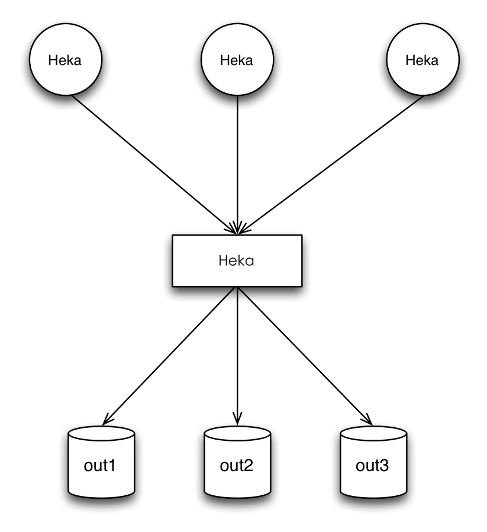

# Heka
Heka 是一个高可扩展的数据收集和处理工具。  
4种插件分别是：Input、Decoder、Filter、Output。  
**Input插件**是Heka的数据输入源。  
**Decoder插件**，各种Input插件负责将原始数据送入到Heka内部，这些数据一般来说都是具备一定的格式，比如：Nginx access日志、Syslog协议数据、自定义的数据格式等等，Decoder插件将Input插件输入的一个个的原始数据消息给解析一遍，最终得到一个结构化好的消息，不再是一个非结构化的原始数据消息。结构化的消息更利于编程进行处。每个Input插件得有一个Decoder插件负责对输入的数据进行解析到结构化的程度。  
**Filter插件**负责具体的数据分析、计算任务。  
**OutPut插件**将Heka内部的一个个消息输出到外部环境，比如：文件、数据库、消息队列等；也可以通过TcpOutput将消息输出到下一个Heka继续处理，这样就可以部署成多机分布式结构，只要有必要。  
Heka是基于Pipeline方式对数据进行实时处理。message matcher是应用在Filter和Output两种插件身上，主要是用来指定哪些消息由哪些插件(Filter/Output)处理。有了 message matcher机制就可以通过配置文件实现不同的数据由不同的Filter进行计算、不同的Output输出到不同的外部环境。
## 架构
### Agent/Aggregator
Heka可以通过配置文件部署成为不同的角色，实际上它们都是同一个二进制程序。上图中的圆形组件Heka担任的是Agent角色，而矩形组件Heka担任的是Aggregator角 色。假设每个Agent部署在不同的主机上，使用LogstreamerInput插件负责监控、采集Nginx Access日志，然后将日志数据通过Nginx Access Decoder插件进行解析，最后通过特定的Filter插件做一些分析、计算工作，最终的计算结果再通过TcpOutput插件发送到扮演 Aggregator角色的Heka进行聚合、汇总计算从而得到所有主机的日志计算结果。Heka具备这样的一个扩展架构，可以非常方便的将计算任务分摊到多机，从而实现类MapReduce，当然Heka仅仅只是一个轻量级的小工具，不是一个分布式计算平台。

### Agent/Router
除了Agent/Aggregator架构外， 还可以把Heka当做一个Router来使用，图中圆形组件Heka还是Agent，每个Agent负责采集不同的数据发送给矩形组件Heka，也就是 Router。Heka Router可以通过message matcher机制将不同的数据输出到不同的外部存储等，从而实现一个Router的功能。当然，上面的两种架构也是可以混合到一起使用的，Heka的系统级扩展性还是足够灵活的。
