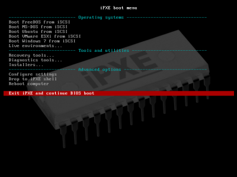
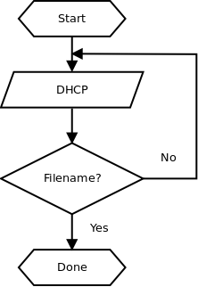

# iPXE

[TOC]

## 概述

 

iPXE 是领先的开源网络引导固件。是一款免费的开源软件，在 GNU GPL 下授权（部分在 GPL 兼容许可证下），并包含在几家网卡制造商和 OEM 的产品中。

它提供了一个完整的 PXE 实施增强了其他功能（It provides a  full PXE implementation enhanced with additional features），如：

- 通过 HTTP 从 Web 服务器引导。
- 从 iSCSI SAN 进行引导。
- 通过 FCoE 从 Fibre Channel SAN 进行引导。
- 从 AoE SAN 进行引导。
- 从无线网络引导。
- 从广域网引导。
- 从 Infiniband 网络引导。
- 用脚本控制引导过程。

可以使用 iPXE 来替换网卡上现有的 PXE ROM ，或者you can [chainload into iPXE](https://ipxe.org/howto/chainloading) to obtain the features of iPXE without the hassle of reflashing.可以链式加载到 iPXE 中以获得 iPXE 的功能，而无需重新加载。
##  使用

开始尝试 iPXE 的最简单方法是使用可引导的 ISO 镜像。将 ISO 镜像刻录到 CD-ROM（或 DVD-ROM）中，然后从其中进行引导。很快就会看到欢迎横幅，如：

```bash
iPXE -- Open Source Network Boot Firmware -- http://ipxe.org
Features: HTTP iSCSI DNS TFTP AoE FCoE TFTP COMBOOT ELF PXE PXEXT
  
Press Ctrl-B for the iPXE command line...
```

可以通过网络引导一些东西。与传统的 PXE ROM 不同，iPXE 能够通过广域网（如 Internet）进行引导。如果要测试的计算机已连接到 Internet，则可以引动 iPXE 演示脚本：

```bash
iPXE> chain http://boot.ipxe.org/demo/boot.php
```

## 下载

### 预编译的二进制文件

可以从 https://boot.ipxe.org/ipxe.iso 下载 iPXE 的预编译二进制版本作为 ISO 镜像。此镜像允许首次尝试 iPXE 。要完全使用 iPXE ，需要从源代码构建适当的镜像。

### 源代码

iPXE 源代码保存在 https://github.com/ipxe/ipxe 的 git 存储库中。可以使用以下命令签出代码的副本：

    GCC
    binutils
    使
    Perl
    liblzma或xz头文件
    mtools
    mkisofs或genisoimage或xorrisofs（仅用于构建.iso映像）
    syslinux（对于isolinux，仅在构建.iso映像时需要）

```bash
git clone https://github.com/ipxe/ipxe.git
```

并使用以下方法构建它：

```bash
cd ipxe/src
make
```

至少需要安装以下软件包才能构建 iPXE ：

- gcc
- binutils
- make
- perl
- liblzma 或 xz 头文件
- mtools
- mkisofs 或 genisoimage 或 xorrisofs（仅用于构建 .iso 镜像）
- syslinux（对于 isolinux ，仅在构建 .iso 镜像时需要）

## 选择构建什么

### 使用引导 CD-ROM 或 USB key

可以将 iPXE 放在可引导的 CD-ROM 或 USB key 上，并使用它来引导（几乎）任何使用 iPXE 的机器。如果只是偶尔需要使用 iPXE 引导计算机，或者正在处理不亲自控制的计算机，这可能很有用。

可以使用以下命令构建 iPXE 可引导 CD-ROM 镜像：

```bash
make bin/ipxe.iso
```

然后将 **bin/ipxe.iso** 刻录到空白 CD-ROM 或 DVD-ROM 上。

可以使用以下命令构建 iPXE 可引导 USB key 镜像：

```bash
make bin/ipxe.usb
```

然后将此镜像传输到一个空白的 USB key ：

```bash
dd if=bin/ipxe.usb of=/dev/sdX
```

其中 **/dev/sdX** 是代表 USB key 的设备。请注意，这将删除 USB key 的任何现有内容。

### Chainloading from an existing PXE ROM 从现有 PXE ROM 进行链加载

You can chainload iPXE from an existing PXE ROM. 可以从现有的 PXE ROM 链加载 iPXE 。如果有大量的机器，希望能够使用 iPXE 引导，但不想在每台机器上重新安装网卡，这是有用的。

You can build a chainloadable iPXE image using:您可以使用以下命令构建区块链 iPXE 映像：

```bash
make bin/undionly.kpxe
```

### 替换现有的 PXE ROM


可以将网卡（或主板）上的 PXE ROM 替换为 iPXE 。如果希望计算机始终能够使用 iPXE 进行引导，而不依赖于 CD-ROM 或 chainloader ，则这很有用。

需要为特定网卡构建一个 ROM 镜像，使用以下命令：

```bash
make bin/808610de.rom
```

其中，**808610de** 由网卡的 PCI 供应商和设备 ID 构成。

## 脚本

可以创建一个脚本来自动执行一系列 iPXE 命令。任何可以在 iPXE 命令行中键入的命令也可以在脚本中使用。

iPXE 脚本是一个纯文本文件，以魔术行 `#!ipxe` 开头并包含一系列 iPXE 命令。例如，下面是一个简单的脚本，它通过 DHCP 获取 IP 地址，然后引导 iPXE 演示映像：

```bash
#!ipxe

dhcp
chain http://boot.ipxe.org/demo/boot.php
```

下面是另一个简单的脚本，用于创建 VLAN ，然后从 VLAN 引导：

```bash
#!ipxe
  
vcreate --tag 24 net0
autoboot net0-24
```

下面是一个稍微复杂一些的脚本，它持续重试 DHCP ，直到成功获得引导文件名：

```bash
#!ipxe

:retry_dhcp
dhcp && isset ${filename} || goto retry_dhcp
echo Booting from ${filename}
chain ${filename}
```

可以使用任何文本编辑器（如 emacs 或 vi ，甚至 Windows 记事本）创建 iPXE 脚本。iPXE 脚本不需要有任何特定的文件扩展名（如 `.txt` 或 `.ipxe` ）;只要它以魔术行 `#!ipxe` 开头，iPXE 就会将其识别为脚本。
为了向后兼容，iPXE 还将识别以魔法行 `#!gpxe` 开始的旧版 gPXE 脚本。但是，gPXE 不能运行 iPXE 脚本，因为 iPXE 脚本语言比 gPXE 脚本语言高级得多。

### 流量控制

 

可以使用 `goto` 命令跳转到预定义的脚本标签。可以使用以下命令定义标签：

```bash
:<label>
```

然后跳转到这个标签，

```bash
goto label
```

例如：

```bash
#!ipxe

:loop
echo Hello world
goto loop
```

可以使用 `&&` 和 `||` 操作符根据先前命令的状态有条件地执行命令。举例来说：

```bash
dhcp && echo DHCP succeeded
dhcp || echo DHCP failed
```

这些操作符可以有效地与 `go` 命令结合使用，以实现简单的条件流控制。例如，要不断重试 DHCP 直到成功：

```bash
#!ipxe

:retry_dhcp
dhcp || goto retry_dhcp
```

可以使用 `;` 运算符来执行命令，而不管先前命令的状态如何。举例来说：

```bash
echo IP address: ${net0/ip} ; echo Subnet mask: ${net0/netmask}
```

可以使用 `exit` 命令在任何时候终止脚本。

### 错误处理

如果脚本的任何一行失败，iPXE 将立即终止脚本。例如，有脚本：

```bash
#!ipxe

dhcp
route
```

则如果 `dhcp` 命令失败，则脚本将立即终止，而不进行到下一行。可以使用 `||` 覆盖此行为：

```bash
#!ipxe
  
dhcp ||
route
```

在此示例中，`||` 后面的空命令，被视为“成功地不做任何事情”（类似于类 Unix 操作系统上的 `/bin/true`  ）。因此，即使 `dhcp` 命令失败，脚本这一行的总体状态也将始终为“成功”。

### 注释

可以使用 `#` 符号开始注释。例如：

```bash
# Obtain an address using DHCP
:retry
dhcp || goto retry # Keep retrying indefinitely
```

### 嵌入式脚本

可以在 iPXE 中嵌入脚本来覆盖其默认行为。例如，可能希望构建一个包含嵌入式脚本的 iPXE 版本，该脚本使用 DHCP 获取 IP 地址，然后从预定义的 SAN 目标引导。

### 动态脚本

iPXE 脚本不必是静态文本文件。例如，可以将 iPXE 定向到从 URL 引导

```bash
http://192.168.0.1/boot.php?mac=${net0/mac}&asset=${asset:uristring}
```

它将扩展为 URL，例如

```bash
  http://192.168.0.1/boot.php?mac=52:54:00:12:34:56&asset=BKQ42M1
```

在 Web 服务器上运行的 `boot.php` 程序可以根据 URL 中提供的信息动态生成脚本。例如，`boot.php` 可以在 MySQL 数据库中查找资产标签，以确定要引导的正确 iSCSI 目标，然后动态生成脚本，如

```bash
#!ipxe

set initiator-iqn iqn.2010-04.org.ipxe:BKQ42M1
sanboot iscsi:192.168.0.20::::iqn.2010-04.org.ipxe:winxp
```


## 命名配置

可以使用命名配置从相同的代码库构建具有不同配置的二进制文件。This makes it easy to have one configuration for a ROM, another one for a chainloaded binary and a third configuration for a UEFI binary.这使得很容易有一个配置用于 ROM，另一个配置用于链加载二进制文件，第三个配置用于UEFI二进制文件。

## 调试

iPXE 具有广泛的内置调试功能，可以通过在构建时指定 `DEBUG` 对象列表来选择性地启用这些功能。例如，要调试涉及 iSCSI 的问题，启用 iSCSI 协议驱动程序的调试（在 `iscsi.c` 中）可能很有用：

```bash
make bin/ipxe.iso DEBUG=iscsi
```

如果发现问题不在 `iscsi.c` 中，那么可能希望也启用 SCSI 层的调试（在 `scsi.c` 中）：

```bash
make bin/ipxe.iso DEBUG=scsi,iscsi
```

许多对象提供多个级别的调试。例如，要为每个 SCSI 命令启用调试消息，可以使用：

```bash
make bin/ipxe.iso DEBUG=scsi:3,iscsi
```

The numeric debug level (**3** in this example) is a bitmask:数字调试级别（本例中为 3 ）是位掩码：

| 值   | 意义                                                 |
| -----|-----------------------------------------------------|
| 1    | 启用基本调试消息                                       |
| 2    | 启用详细调试消息（例如，每个事件一条消息）                 |
| 4    | 启用额外的详细调试消息（例如，每个字节一条消息）            |
| 8    | 启用 I/O 跟踪（例如，每个 readl()/writel() 调用一条消息） |

可能希望启用串行控制台（在 `config/console.h` 中的 `CONSOLE_SERIAL` ）并连接 a null-modem cable 空调制解调器电缆以捕获输出。如果需要更改默认值115200,8N1，可以在 `config/serial.h` 中配置串口设置。如果没有串行端口可用，瞄准屏幕的数码相机往往可以成为一个令人惊讶的好替代品！

### Large ROM images 大 ROM 镜像

如果启用大量 iPXE 功能，可能会发现 ROM 变得太大而无法使用。某些网卡无法支持大于 64 kB 的 ROM，并且某些 BIOS 在存在较大 ROM 镜像时可能无法完成开机自检（POST）。

可以使用 `.mrom` 镜像来缓解其中的一些问题。`.mrom` 镜像在 BIOS 中显示为一个非常小（3 kB）的 ROM ，其中只包含 a small loader stub一个小的加载程序存根。仅当 BIOS 尝试从网卡引导时，才会加载完整的 iPXE 镜像。

可以通过简单地将 `.rom` 更改为 `.mrom` 来构建 `.mrom` 映像。举例来说：

```bash
make bin/808610de.rom    # Normal .rom image
make bin/808610de.mrom   # .mrom image
```

刻录 `.mrom` 镜像的方式与刻录普通 `.rom` 镜像的方式完全相同。

并非所有网卡都支持 `.mrom` 镜像。要支持 `.mrom` 映像，a network card must have at least one PCI memory BAR that is at  least as large as its expansion ROM BAR. 网卡必须至少有一个 PCI 内存 BAR ，其大小至少与其扩展 ROM BAR 一样大。例如，如果网卡有一个 128 kB 的扩展 ROM BAR 和一个 256 kB 的内存 BAR ，那么它将能够支持最大 128 kB 的 `.mrom` 映像。

### UEFI

iPXE 支持 UEFI 和 BIOS 平台。可以使用 `.efirom` 镜像格式构建 UEFI ROM 。举例来说：

```bash
make bin-x86_64-efi/808610de.efirom
```

其中，**808610de** 由网卡的 PCI 供应商和设备 ID 构成。

也可以构建一个 `.efi` 可执行文件，可以从现有的 UEFI ROM 中 [chainload](https://ipxe.org/howto/chainloading) from an existing UEFI ROM链式加载（或直接从 UEFI shell 中运行）：

```bash
make bin-x86_64-efi/ipxe.efi
```

## 命令行

iPXE 包含一个交互式命令行，可用于手动引导和诊断问题。命令也可以用作 iPXE 脚本的一部分。

当 iPXE 启动时，将看到一条欢迎横幅消息：

```bash
iPXE -- Open Source Network Boot Firmware -- http://ipxe.org
Features: HTTP iSCSI DNS TFTP AoE FCoE TFTP COMBOOT ELF PXE PXEXT
  
Press Ctrl-B for the iPXE command line...
```

此时按 `Ctrl-B` ，将进入 iPXE 命令行。

```bash
iPXE>
```

可以使用 `ifstat` 命令列出 iPXE 检测到的网络设备：

```bash
iPXE> ifstat
net0: 52:54:00:12:34:56 using rtl8139 on PCI00:03.0 (Ethernet) [closed]
[Link:up, TX:0 TXE:0 RX:0 RXE:0]
```

可以检查 IP 配置和其他 DHCP 选项：

```bash
iPXE> route
net0: 10.0.0.155/255.255.255.0 gw 10.0.0.1
iPXE> show dns
net0.dhcp/dns:ipv4 = 10.0.0.6
```

### 手动引导

如果 DHCP 服务器未配置为允许自动引导，则可以使用 iPXE 命令行手动引导。例如，可以使用 `dhcp` 命令获取 IP 地址，然后使用 `chain` 命令引导 iPXE 演示镜像：

```bash
iPXE> dhcp
DHCP (net0 52:54:00:12:34:56).... ok
iPXE> chain http://boot.ipxe.org/demo/boot.php
```

### Diagnostics 诊断

可以使用 iPXE 命令行诊断阻止成功引导的问题。例如，可以使用 `route` 命令检查 DHCP 服务器提供的 IP 地址配置：

```bash
iPXE> route
net0: 192.168.0.101/255.255.255.0 gw 192.168.0.1
```

### 命令

可以使用 `help` 命令显示所有可用命令的列表。
