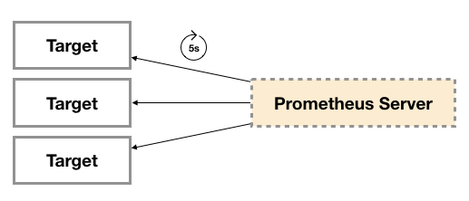

# Exporter

[TOC]

## 概述

为了采集主机的监控样本数据，在主机上安装了一个 Node  Exporter 程序，该程序对外暴露了一个用于获取当前监控样本数据的 HTTP 访问地址。这样的一个程序称为 Exporter，Exporter 的实例称为一个 Target 。Prometheus 通过轮询的方式定时从这些 Target 中获取监控数据样本，并且存储在数据库当中。 

广义上讲所有可以向 Prometheus 提供监控样本数据的程序都可以被称为一个 Exporter 。

 

## Exporter 的来源

从 Exporter 的来源上来讲，主要分为两类：

- 社区提供的
- 用户自定义的

### 社区提供的

Prometheus 社区提供了丰富的 Exporter 实现，涵盖了从基础设施，中间件以及网络等各个方面的监控功能。这些 Exporter 可以实现大部分通用的监控需求。

* 数据库
  * MySQL Exporter
  * Redis Exporter
  * MongoDB Exporter
  * MSSQL Exporter
* 硬件
  * Apcupsd Exporter
  * IoT Edison Exporter
  * IPMI Exporter
  * Node Exporter
* 消息队列
  * Beanstalkd Exporter
  * Kafka Exporter
  * NSQ Exporter
  * RabbitMQ Exporter
* 存储
  * Ceph Exporter
  * Gluster Exporter
  * HDFS Exporter
  * ScaleIO Exporter
* HTTP 服务
  * Apache Exporter
  * HAProxy Exporter
  * Nginx Exporter
* API 服务
  * AWS ECS Exporter
  * Docker Cloud Exporter
  * Docker Hub Exporter
  * GitHub Exporter
* 日志
  * Fluentd Exporter
  * Grok Exporter
* 监控系统
  * Collectd Exporter
  * Graphite Exporter
  * InfluxDB Exporter
  * Nagios Exporter
  * SNMP Exporter
* 容器
  * cAdvisor

* 其他
  * Blockbox Exporter
  * JIRA Exporter
  * Jenkins Exporter
  * Confluence Exporter

### 用户自定义的

除了直接使用社区提供的 Exporter 程序以外，用户还可以基于 Prometheus 提供的 Client  Library 创建自己的 Exporter 程序，目前 Promthues 社区官方提供了对以下编程语言的支持：Go、Java / Scala、Python、Ruby 。同时还有第三方实现的如：Bash、C++、Common Lisp、Erlang,、Haskeel、Lua、Node.js、PHP、Rust 等。

## 运行方式

从 Exporter 的运行方式上来讲，又可以分为：

- 独立使用的

  以 Node  Exporter 为例，由于操作系统本身并不直接支持 Prometheus，同时用户也无法通过直接从操作系统层面上提供对 Prometheus 的支持。因此，用户只能通过独立运行一个程序的方式，通过操作系统提供的相关接口，将系统的运行状态数据转换为可供 Prometheus 读取的监控数据。 除了 Node Exporter 以外，比如 MySQL Exporter、Redis Exporter 等都是通过这种方式实现的。

- 集成到应用中的

  为了能够更好的监控系统的内部运行状态，有些开源项目如 Kubernetes，ETCD 等直接在代码中使用了 Prometheus 的 Client  Library ，提供了对 Prometheus 的直接支持。这种方式打破监控的界限，让应用程序可以直接将内部的运行状态暴露给 Prometheus ，适合于一些需要更多自定义监控指标需求的项目。

## Exporter 规范

所有的 Exporter 程序都需要按照 Prometheus 的规范，返回监控的样本数据。以 Node Exporter 为例，当访问 /metrics 地址时会返回以下内容：

```bash
# HELP node_cpu Seconds the cpus spent in each mode.
# TYPE node_cpu counter
node_cpu{cpu="cpu0",mode="idle"} 362812.7890625
# HELP node_load1 1m load average.
# TYPE node_load1 gauge
node_load1 3.0703125
```

这是一种基于文本的格式规范，在 Prometheus 2.0 之前的版本还支持 Protocol buffer 规范。相比于 Protocol  buffer 文本具有更好的可读性，以及跨平台性。Prometheus 2.0 的版本也已经不再支持 Protocol  buffer 。

Exporter 返回的样本数据，主要由三个部分组成：样本的一般注释信息（HELP），样本的类型注释信息（TYPE）和样本。Prometheus 会对 Exporter 响应的内容逐行解析：

如果当前行以 # HELP 开始，Prometheus 将会按照以下规则对内容进行解析，得到当前的指标名称以及相应的说明信息：

```bash
# HELP <metrics_name> <doc_string>
```

如果当前行以 # TYPE 开始，Prometheus 会按照以下规则对内容进行解析，得到当前的指标名称以及指标类型:

```bash
# TYPE <metrics_name> <metrics_type>
```

TYPE 注释行必须出现在指标的第一个样本之前。如果没有明确的指标类型需要返回为 untyped 。 除了# 开头的所有行都会被视为是监控样本数据。 每一行样本需要满足以下格式规范:

```bash
metric_name [
  "{" label_name "=" `"` label_value `"` { "," label_name "=" `"` label_value `"` } [ "," ] "}"
] value [ timestamp ]
```

其中 metric_name 和 label_name 必须遵循 PromQL 的格式规范要求。value 是一个 float 格式的数据，timestamp 的类型为 int64（从 1970-01-01  00:00:00 以来的毫秒数），timestamp 为可选默认为当前时间。具有相同 metric_name 的样本必须按照一个组的形式排列，并且每一行必须是唯一的指标名称和标签键值对组合。

需要特别注意的是对于 histogram 和 summary 类型的样本。需要按照以下约定返回样本数据：

- 类型为 summary 或 者histogram 的指标 x，该指标所有样本的值的总和需要使用一个单独的 x_sum 指标表示。
- 类型为 summary 或者 histogram 的指标 x，该指标所有样本的总数需要使用一个单独的 x_count 指标表示。
- 对于类型为 summary 的指标 x，其不同分位数 quantile 所代表的样本，需要使用单独的 x{quantile="y"} 表示。
- 对于类型 histogram 的指标 x 为了表示其样本的分布情况，每一个分布需要使用 x_bucket{le="y"} 表示，其中 y 为当前分布的上位数。同时必须包含一个样本 x_bucket{le="+Inf"} ，并且其样本值必须和 x_count 相同。
- 对于 histogram 和 summary 的样本，必须按照分位数 quantile 和分布 le 的值的递增顺序排序。

以下是类型为 histogram 和 summary 的样本输出示例：

```bash
# A histogram, which has a pretty complex representation in the text format:
# HELP http_request_duration_seconds A histogram of the request duration.
# TYPE http_request_duration_seconds histogram
http_request_duration_seconds_bucket{le="0.05"} 24054
http_request_duration_seconds_bucket{le="0.1"} 33444
http_request_duration_seconds_bucket{le="0.2"} 100392
http_request_duration_seconds_bucket{le="+Inf"} 144320
http_request_duration_seconds_sum 53423
http_request_duration_seconds_count 144320

# Finally a summary, which has a complex representation, too:
# HELP rpc_duration_seconds A summary of the RPC duration in seconds.
# TYPE rpc_duration_seconds summary
rpc_duration_seconds{quantile="0.01"} 3102
rpc_duration_seconds{quantile="0.05"} 3272
rpc_duration_seconds{quantile="0.5"} 4773
rpc_duration_seconds_sum 1.7560473e+07
rpc_duration_seconds_count 2693
```

对于某些 Prometheus 还没有提供支持的编程语言，用户只需要按照以上规范返回响应的文本数据即可。

## 指定样本格式的版本

在 Exporter 响应的 HTTP 头信息中，可以通过 Content-Type 指定特定的规范版本，例如：

```http
HTTP/1.1 200 OK
Content-Encoding: gzip
Content-Length: 2906
Content-Type: text/plain; version=0.0.4
Date: Sat, 17 Mar 2018 08:47:06 GMT
```

其中 version 用于指定 Text-based 的格式版本，当没有指定版本的时候，默认使用最新格式规范的版本。同时 HTT P响应头还需要指定压缩格式为 gzip 。


# 网络探测：Blackbox Exporter

在本章的前几个小节中我们主要介绍了Prometheus下如何进行白盒监控，我们监控主机的资源用量、容器的运行状态、数据库中间件的运行数据。  这些都是支持业务和服务的基础设施，通过白盒能够了解其内部的实际运行状态，通过对监控指标的观察能够预判可能出现的问题，从而对潜在的不确定因素进行优化。而从完整的监控逻辑的角度，除了大量的应用白盒监控以外，还应该添加适当的黑盒监控。黑盒监控即以用户的身份测试服务的外部可见性，常见的黑盒监控包括HTTP探针、TCP探针等用于检测站点或者服务的可访问性，以及访问效率等。

黑盒监控相较于白盒监控最大的不同在于黑盒监控是以故障为导向当故障发生时，黑盒监控能快速发现故障，而白盒监控则侧重于主动发现或者预测潜在的问题。一个完善的监控目标是要能够从白盒的角度发现潜在问题，能够在黑盒的角度快速发现已经发生的问题。

黑盒监控和白盒监控

## 使用Blackbox Exporter

Blackbox  Exporter是Prometheus社区提供的官方黑盒监控解决方案，其允许用户通过：HTTP、HTTPS、DNS、TCP以及ICMP的方式对网络进行探测。用户可以直接使用go get命令获取Blackbox Exporter源码并生成本地可执行文件：

```
go get prometheus/blackbox_exporter
```

运行Blackbox  Exporter时，需要用户提供探针的配置信息，这些配置信息可能是一些自定义的HTTP头信息，也可能是探测时需要的一些TSL配置，也可能是探针本身的验证行为。在Blackbox Exporter每一个探针配置称为一个module，并且以YAML配置文件的形式提供给Blackbox Exporter。  每一个module主要包含以下配置内容，包括探针类型（prober）、验证访问超时时间（timeout）、以及当前探针的具体配置项：

```
  # 探针类型：http、 tcp、 dns、 icmp.
  prober: <prober_string>

  # 超时时间
  [ timeout: <duration> ]

  # 探针的详细配置，最多只能配置其中的一个
  [ http: <http_probe> ]
  [ tcp: <tcp_probe> ]
  [ dns: <dns_probe> ]
  [ icmp: <icmp_probe> ]
```

下面是一个简化的探针配置文件blockbox.yml，包含两个HTTP探针配置项：

```
modules:
  http_2xx:
    prober: http
    http:
      method: GET
  http_post_2xx:
    prober: http
    http:
      method: POST
```

通过运行以下命令，并指定使用的探针配置文件启动Blockbox Exporter实例：

```
blackbox_exporter --config.file=/etc/prometheus/blackbox.yml
```

启动成功后，就可以通过访问http://127.0.0.1:9115/probe?module=http_2xx&target=baidu.com对baidu.com进行探测。这里通过在URL中提供module参数指定了当前使用的探针，target参数指定探测目标，探针的探测结果通过Metrics的形式返回：

```
# HELP probe_dns_lookup_time_seconds Returns the time taken for probe dns lookup in seconds
# TYPE probe_dns_lookup_time_seconds gauge
probe_dns_lookup_time_seconds 0.011633673
# HELP probe_duration_seconds Returns how long the probe took to complete in seconds
# TYPE probe_duration_seconds gauge
probe_duration_seconds 0.117332275
# HELP probe_failed_due_to_regex Indicates if probe failed due to regex
# TYPE probe_failed_due_to_regex gauge
probe_failed_due_to_regex 0
# HELP probe_http_content_length Length of http content response
# TYPE probe_http_content_length gauge
probe_http_content_length 81
# HELP probe_http_duration_seconds Duration of http request by phase, summed over all redirects
# TYPE probe_http_duration_seconds gauge
probe_http_duration_seconds{phase="connect"} 0.055551141
probe_http_duration_seconds{phase="processing"} 0.049736019
probe_http_duration_seconds{phase="resolve"} 0.011633673
probe_http_duration_seconds{phase="tls"} 0
probe_http_duration_seconds{phase="transfer"} 3.8919e-05
# HELP probe_http_redirects The number of redirects
# TYPE probe_http_redirects gauge
probe_http_redirects 0
# HELP probe_http_ssl Indicates if SSL was used for the final redirect
# TYPE probe_http_ssl gauge
probe_http_ssl 0
# HELP probe_http_status_code Response HTTP status code
# TYPE probe_http_status_code gauge
probe_http_status_code 200
# HELP probe_http_version Returns the version of HTTP of the probe response
# TYPE probe_http_version gauge
probe_http_version 1.1
# HELP probe_ip_protocol Specifies whether probe ip protocol is IP4 or IP6
# TYPE probe_ip_protocol gauge
probe_ip_protocol 4
# HELP probe_success Displays whether or not the probe was a success
# TYPE probe_success gauge
probe_success 1
```

从返回的样本中，用户可以获取站点的DNS解析耗时、站点响应时间、HTTP响应状态码等等和站点访问质量相关的监控指标，从而帮助管理员主动的发现故障和问题。

## 与Prometheus集成

接下来，只需要在Prometheus下配置对Blockbox Exporter实例的采集任务即可。最直观的配置方式：

```
- job_name: baidu_http2xx_probe
  params:
    module:
    - http_2xx
    target:
    - baidu.com
  metrics_path: /probe
  static_configs:
  - targets:
    - 127.0.0.1:9115
- job_name: prometheus_http2xx_probe
  params:
    module:
    - http_2xx
    target:
    - prometheus.io
  metrics_path: /probe
  static_configs:
  - targets:
    - 127.0.0.1:9115
```

这里分别配置了名为baidu_http2x_probe和prometheus_http2xx_probe的采集任务，并且通过params指定使用的探针（module）以及探测目标（target）。

那问题就来了，假如我们有N个目标站点且都需要M种探测方式，那么Prometheus中将包含N *  M个采集任务，从配置管理的角度来说显然是不可接受的。  在第7章的“服务发现与Relabel”小节，我们介绍了Prometheus的Relabeling能力，这里我们也可以采用Relabling的方式对这些配置进行简化，配置方式如下：

```
scrape_configs:
  - job_name: 'blackbox'
    metrics_path: /probe
    params:
      module: [http_2xx]
    static_configs:
      - targets:
        - http://prometheus.io    # Target to probe with http.
        - https://prometheus.io   # Target to probe with https.
        - http://example.com:8080 # Target to probe with http on port 8080.
    relabel_configs:
      - source_labels: [__address__]
        target_label: __param_target
      - source_labels: [__param_target]
        target_label: instance
      - target_label: __address__
        replacement: 127.0.0.1:9115
```

这里针对每一个探针服务（如http_2xx）定义一个采集任务，并且直接将任务的采集目标定义为我们需要探测的站点。在采集样本数据之前通过relabel_configs对采集任务进行动态设置。 

- 第1步，根据Target实例的地址，写入`__param_target`标签中。`__param_<name>`形式的标签表示，在采集任务时会在请求目标地址中添加`<name>`参数，等同于params的设置；
- 第2步，获取__param_target的值，并覆写到instance标签中；
- 第3步，覆写Target实例的`__address__`标签值为BlockBox Exporter实例的访问地址。

通过以上3个relabel步骤，即可大大简化Prometheus任务配置的复杂度:

Blackbox Target实例

接下来，我们将详细介绍Blackbox中常用的HTTP探针使用方式

## HTTP探针

HTTP探针是进行黑盒监控时最常用的探针之一，通过HTTP探针能够网站或者HTTP服务建立有效的监控，包括其本身的可用性，以及用户体验相关的如响应时间等等。除了能够在服务出现异常的时候及时报警，还能帮助系统管理员分析和优化网站体验。

在上一小节讲过，Blockbox Exporter中所有的探针均是以Module的信息进行配置。如下所示，配置了一个最简单的HTTP探针：

```
modules:
  http_2xx_example:
    prober: http
    http:
```

通过prober配置项指定探针类型。配置项http用于自定义探针的探测方式，这里有没对http配置项添加任何配置，表示完全使用HTTP探针的默认配置，该探针将使用HTTP GET的方式对目标服务进行探测，并且验证返回状态码是否为2XX，是则表示验证成功，否则失败。

### 自定义HTTP请求

HTTP服务通常会以不同的形式对外展现，有些可能就是一些简单的网页，而有些则可能是一些基于REST的API服务。  对于不同类型的HTTP的探测需要管理员能够对HTTP探针的行为进行更多的自定义设置，包括：HTTP请求方法、HTTP头信息、请求参数等。对于某些启用了安全认证的服务还需要能够对HTTP探测设置相应的Auth支持。对于HTTPS类型的服务还需要能够对证书进行自定义设置。

如下所示，这里通过method定义了探测时使用的请求方法，对于一些需要请求参数的服务，还可以通过headers定义相关的请求头信息，使用body定义请求内容：

```
http_post_2xx:
    prober: http
    timeout: 5s
    http:
      method: POST
      headers:
        Content-Type: application/json
      body: '{}'
```

如果HTTP服务启用了安全认证，Blockbox Exporter内置了对basic_auth的支持，可以直接设置相关的认证信息即可：

```
http_basic_auth_example:
    prober: http
    timeout: 5s
    http:
      method: POST
      headers:
        Host: "login.example.com"
      basic_auth:
        username: "username"
        password: "mysecret"
```

对于使用了Bear Token的服务也可以通过bearer_token配置项直接指定令牌字符串，或者通过bearer_token_file指定令牌文件。

对于一些启用了HTTPS的服务，但是需要自定义证书的服务，可以通过tls_config指定相关的证书信息：

```
 http_custom_ca_example:
    prober: http
    http:
      method: GET
      tls_config:
        ca_file: "/certs/my_cert.crt"
```

### 自定义探针行为

在默认情况下HTTP探针只会对HTTP返回状态码进行校验，如果状态码为2XX（200 <= StatusCode < 300）则表示探测成功，并且探针返回的指标probe_success值为1。

如果用户需要指定HTTP返回状态码，或者对HTTP版本有特殊要求，如下所示，可以使用valid_http_versions和valid_status_codes进行定义：

```
  http_2xx_example:
    prober: http
    timeout: 5s
    http:
      valid_http_versions: ["HTTP/1.1", "HTTP/2"]
      valid_status_codes: []
```

默认情况下，Blockbox返回的样本数据中也会包含指标probe_http_ssl，用于表明当前探针是否使用了SSL：

```
# HELP probe_http_ssl Indicates if SSL was used for the final redirect
# TYPE probe_http_ssl gauge
probe_http_ssl 0
```

而如果用户对于HTTP服务是否启用SSL有强制的标准。则可以使用fail_if_ssl和fail_if_not_ssl进行配置。fail_if_ssl为true时，表示如果站点启用了SSL则探针失败，反之成功。fail_if_not_ssl刚好相反。

```
  http_2xx_example:
    prober: http
    timeout: 5s
    http:
      valid_status_codes: []
      method: GET
      no_follow_redirects: false
      fail_if_ssl: false
      fail_if_not_ssl: false
```

除了基于HTTP状态码，HTTP协议版本以及是否启用SSL作为控制探针探测行为成功与否的标准以外，还可以匹配HTTP服务的响应内容。使用fail_if_matches_regexp和fail_if_not_matches_regexp用户可以定义一组正则表达式，用于验证HTTP返回内容是否符合或者不符合正则表达式的内容。

```
  http_2xx_example:
    prober: http
    timeout: 5s
    http:
      method: GET
      fail_if_matches_regexp:
        - "Could not connect to database"
      fail_if_not_matches_regexp:
        - "Download the latest version here"
```

最后需要提醒的时，默认情况下HTTP探针会走IPV6的协议。  在大多数情况下，可以使用preferred_ip_protocol=ip4强制通过IPV4的方式进行探测。在Bloackbox响应的监控样本中，也会通过指标probe_ip_protocol，表明当前的协议使用情况：

```
# HELP probe_ip_protocol Specifies whether probe ip protocol is IP4 or IP6
# TYPE probe_ip_protocol gauge
probe_ip_protocol 6
```

除了支持对HTTP协议进行网络探测以外，Blackbox还支持对TCP、DNS、ICMP等其他网络协议，感兴趣的读者可以从Blackbox的Github项目中获取更多使用信息

#### https://github.com/prometheus/blackbox_exporter。

# 监控Redis运行状态：Redis Exporter

## 部署Redis Exporter

这里使用二进制部署启动Redis以及Redis Exporter，具体安装细节就不做重复了

```
mkdir /data/redis_exporter
sudo wget https://github.com/oliver006/redis_exporter/releases/download/v1.3.2/redis_exporter-v1.3.2.linux-amd64.tar.gz
tar -xvf  redis_exporter-v1.3.2.linux-amd64.tar.gz
mv redis_exporter-v1.3.2.linux-amd64 /data/redis_exporter

wget  https://grafana.com/api/dashboards/763/revisions/1/download

## 无密码
./redis_exporter redis//172.26.42.229:6379
## 有密码
./redis_exporter -redis.addr 172.26.42.229:6379  -redis.password 123456

cat > /etc/systemd/system/redis_exporter.service <<EOF

[Unit]
Description=redis_exporter
After=network.target

[Service]
Type=simple
User=prometheus
ExecStart=/data/redis_exporter/redis_exporter -redis.addr 172.26.42.229:6379  -redis.password 123456
Restart=on-failure

[Install]
WantedBy=multi-user.target
EOF


- job_name: redis
static_configs:
  - targets: ['1172.26.42.229:9121']
    labels:
      instance: redis120
```

# 监控域名与证书过期

## 部署Black Exporter

这里使用二进制部署Black Exporter

```
# 下载安装
wget https://github.com/prometheus/blackbox_exporter/releases/download/v0.16.0/blackbox_exporter-0.16.0.linux-amd64.tar.gz
tar -xvf  blackbox_exporter-0.16.0.linux-amd64.tar.gz
mv blackbox_exporter-0.16.0.linux-amd64/ /data/redis_exporter

# 创建配置文件
cat > /data/black_exporter/black_exporter.yml << EOF
modules:
  http_2xx:
    prober: http
    timeout: 20s
    http:
      preferred_ip_protocol: "ip4"
  http_post_2xx_query:
    prober: http
    timeout: 20s
    http:
      preferred_ip_protocol: "ip4" ##使用ipv4
      method: POST
      headers:
        Content-Type: application/json ##header头
      body: '{"hmac":"","params":{"publicFundsKeyWords":"xxx"}}' ##传参
  tls_connect_tls:
    prober: tcp
    timeout: 5s
    tcp:
      tls: true
  tcp_connect:
    prober: tcp
    timeout: 5s
 #
  pop3s_banner:
    prober: tcp
    tcp:
      query_response:
      - expect: "^+OK"
      tls: true
      tls_config:
        insecure_skip_verify: false
  ssh_banner:
    prober: tcp
    tcp:
      query_response:
      - expect: "^SSH-2.0-"
  irc_banner:
    prober: tcp
    tcp:
      query_response:
      - send: "NICK prober"
      - send: "USER prober prober prober :prober"
      - expect: "PING :([^ ]+)"
        send: "PONG ${1}"
      - expect: "^:[^ ]+ 001"
  icmp:
    prober: icmp
    timeout: 20s
EOF

# 配置systemd
cat > /etc/systemd/system/blackbox_exporter.service <<EOF
[Unit]
Description=blackbox_exporter
Documentation=https://prometheus.io/
After=network.target

[Service]
Type=simple
User=prometheus
ExecStart=/data/blackbox_exporter/blackbox_exporter  --config.file=/data/blackbox_exporter/blackbox.yml
Restart=on-failure

[Install]
WantedBy=multi-user.target
EOF

# 启动服务
systemctl enable blackbox_exporter.service 
systemctl start blackbox_exporter.service 
systemctl status blackbox_exporter.service 

# 配置Consul自动发现
cat > /data/consul/server1/config/blackbox-exporter.json <<EOF
{
    "service":{
        "name":"blackbox-exporter",
        "tags":[
            "prod",
            "blackbox-exporter"
        ],
        "address": "172.26.42.229",
        "port":9115,
        "check":{
            "http":"http://172.26.42.229:9115",
            "interval":"10s"
        },
        "token":"your_token"
    }
}
EOF
# 热加载Consul配置
consul reload
# Grafana导入Dashboard-ID：7587
```

# 使用Java自定义Exporter

本小节将带领读者了解Promrtheus提供的client_java的基本用法，并且在最后在Spring Boot应用程序中使用client_java，直接在应用程序层面提供对Prometheus的支持。 

# 使用Client Java构建Exporter程序

client_java是Prometheus针对JVM类开发语言的client  library库，我们可以直接基于client_java用户可以快速实现独立运行的Exporter程序，也可以在我们的项目源码中集成client_java以支持Prometheus。

## 自定义Collector

在client_java的simpleclient模块中提供了自定义监控指标的核心接口。

如果使用Gradle作为项目构建工具，可以通过向build.gradle添加simpleclient依赖：

```
compile 'io.prometheus:simpleclient:0.3.0'
```

当无法直接修改监控目标时，可以通过自定义Collector的方式，实现对监控样本收集，该收集器需要实现collect()方法并返回一组监控样本，如下所示：

```Java
public class YourCustomCollector extends Collector {
    public List<MetricFamilySamples> collect() {
        List<MetricFamilySamples> mfs = new ArrayList<MetricFamilySamples>();

        String metricName = "my_guage_1";

        // Your code to get metrics

        MetricFamilySamples.Sample sample = new MetricFamilySamples.Sample(metricName, Arrays.asList("l1"), Arrays.asList("v1"), 4);
        MetricFamilySamples.Sample sample2 = new MetricFamilySamples.Sample(metricName, Arrays.asList("l1", "l2"), Arrays.asList("v1", "v2"), 3);

        MetricFamilySamples samples = new MetricFamilySamples(metricName, Type.GAUGE, "help", Arrays.asList(sample, sample2));

        mfs.add(samples);
        return mfs;
    }
}
```

这里定义了一个名为my_guage的监控指标，该监控指标的所有样本数据均转换为一个MetricFamilySamples.Sample实例，该实例中包含了该样本的指标名称、标签名数组、标签值数组以及样本数据的值。

监控指标my_guage的所有样本值，需要持久化到一个MetricFamilySamples实例中，MetricFamilySamples指定了当前监控指标的名称、类型、注释信息等。需要注意的是MetricFamilySamples中所有样本的名称必须保持一致，否则生成的数据将无法符合Prometheus的规范。

直接使用MetricFamilySamples.Sample和MetricFamilySamples的方式适用于当某监控指标的样本之间的标签可能不一致的情况，例如，当监控容器时，不同容器实例可能包含一些自定义的标签，如果需要将这些标签反应到样本上，那么每个样本的标签则不可能保持一致。而如果所有样本的是一致的情况下，我们还可以使用client_java针对不同指标类型的实现GaugeMetricFamily，CounterMetricFamily，SummaryMetricFamily等，例如：

```Java
class YourCustomCollector2 extends Collector {
  List<MetricFamilySamples> collect() {
    List<MetricFamilySamples> mfs = new ArrayList<MetricFamilySamples>();

    // With no labels.
    mfs.add(new GaugeMetricFamily("my_gauge_2", "help", 42));

    // With labels
    GaugeMetricFamily labeledGauge = new GaugeMetricFamily("my_other_gauge", "help", Arrays.asList("labelname"));
    labeledGauge.addMetric(Arrays.asList("foo"), 4);
    labeledGauge.addMetric(Arrays.asList("bar"), 5);
    mfs.add(labeledGauge);

    return mfs;
  }
}
```

## 使用HTTP Server暴露样本数据

client_java下的simpleclient_httpserver模块实现了一个简单的HTTP服务器，当向该服务器发送获取样本数据的请求后，它会自动调用所有Collector的collect()方法，并将所有样本数据转换为Prometheus要求的数据输出格式规范。如果用户使用了Gradle构建项目，可以添加以下依赖：

```
compile 'io.prometheus:simpleclient_httpserver:0.3.0'
```

添加依赖之后，就可以在Exporter程序的main方法中启动一个HTTPServer实例：

```Java
public class CustomExporter {
    public static void main(String[] args) throws IOException {
        HTTPServer server = new HTTPServer(1234);
    }
}
```

而在启动之前，别忘记调用Collector的register()方法。否则HTTPServer是找不到任何的Collector实例的：

```Java
new YourCustomCollector().register();
new YourCustomCollector2().register();
```

运行CustomExporter并访问http://127.0.0.1:1234/metrics，即可获取到以下数据：

```
$ curl http://127.0.0.1:1234/metrics
# HELP my_gauge help
# TYPE my_gauge gauge
my_gauge 42.0
# HELP my_other_gauge help
# TYPE my_other_gauge gauge
my_other_gauge{labelname="foo",} 4.0
my_other_gauge{labelname="bar",} 5.0
# HELP my_guage help
# TYPE my_guage gauge
my_guage{l1="v1",} 4.0
my_guage{l1="v1",l2="v2",} 3.0
```

当然HTTPServer中并不存在什么黑魔法，其内部实现如下所示：

HTTPServer处理流程

当调用Collector实例register()方法时，会将该实例保存到CollectorRegistry当中，CollectorRegistry负责维护当前系统中所有的Collector实例。  HTTPServer在接收到HTTP请求之后，会从CollectorRegistry中拿到所有的Collector实例，并调用其collect()方法获取所有样本，最后格式化为Prometheus的标准输出。

除了直接使用HTTPServer以外暴露样本数据以外，client_java中还提供了对Spring Boot、Spring Web以及Servlet的支持。

## 使用内置的Collector

通过client_java中定义的标准接口，用户可以快速实现自己的监控数据收集器，并通过HTTPServer将样本数据输出给Prometheus。除了提供接口规范以外，client_java还提供了多个内置的Collector模块，以simpleclient_hotspot为例，该模块中内置了对JVM虚拟机运行状态（GC，内存池，JMX，类加载，线程池等）数据的Collector实现，用户可以通过在Gradle中添加以下依赖，导入simpleclient_hotspot：

```Groovy
compile 'io.prometheus:simpleclient_hotspot:0.3.0'
```

通过调用io.prometheus.client.hotspot.DefaultExport的initialize方法注册该模块中所有的Collector实例：

```Java
DefaultExports.initialize();
```

重新运行CustomExporter，并获取样本数据：

```
$ curl http://127.0.0.1:1234/metrics
# HELP jvm_buffer_pool_used_bytes Used bytes of a given JVM buffer pool.
# TYPE jvm_buffer_pool_used_bytes gauge
jvm_buffer_pool_used_bytes{pool="direct",} 8192.0
jvm_buffer_pool_used_bytes{pool="mapped",} 0.0
```

除了之前自定义的监控指标以外，在响应内容中还会得到当前JVM的运行状态数据。在client_java项目中除了使用内置了对JVM监控的Collector以外，还实现了对Hibernate，Guava Cache，Jetty，Log4j、Logback等监控数据收集的支持。用户只需要添加相应的依赖，就可以直接进行使用。

## 在业务代码中进行监控埋点

在client_java中除了使用Collector直接采集样本数据以外，还直接提供了对Prometheus中4种监控类型的实现分别是：Counter、Gauge、Summary和Histogram。 基于这些实现，开发人员可以非常方便的在应用程序的业务流程中进行监控埋点。

## 简单类型Gauge和Counter

以Gauge为例，当我们需要监控某个业务当前正在处理的请求数量，可以使用以下方式实现：

```Java
public class YourClass {

    static final Gauge inprogressRequests = Gauge.build()
            .name("inprogress_requests").help("Inprogress requests.").register();

    void processRequest() {
        inprogressRequests.inc();
        // Your code here.
        inprogressRequests.dec();
    }

}
```

Gauge继承自Collector，registoer()方法会将该Gauge实例注册到CollectorRegistry中。这里创建了一个名为inprogress_requests的监控指标，其注释信息为"Inprogress requests"。

Gauge对象主要包含两个方法inc()和dec()，分别用于计数器+1和-1。

如果监控指标中还需要定义标签，则可以使用Gauge构造器的labelNames()方法，声明监控指标的标签，同时在样本计数时，通过指标的labels()方法指定标签的值，如下所示：

```Java
public class YourClass {

    static final Gauge inprogressRequests = Gauge.build()
            .name("inprogress_requests")
            .labelNames("method")
            .help("Inprogress requests.").register();

    void processRequest() {
        inprogressRequests.labels("get").inc();
        // Your code here.
        inprogressRequests.labels("get").dec();
    }

}
```

Counter与Gauge的使用方法一致，唯一的区别在于Counter实例只包含一个inc()方法，用于计数器+1。

### 复杂类型Summary和Histogram

Summary和Histogram用于统计和分析样本的分布情况。如下所示，通过Summary可以将HTTP请求的字节数以及请求处理时间作为统计样本，直接统计其样本的分布情况。

```Java
class YourClass {
  static final Summary receivedBytes = Summary.build()
     .name("requests_size_bytes").help("Request size in bytes.").register();
  static final Summary requestLatency = Summary.build()
     .name("requests_latency_seconds").help("Request latency in seconds.").register();

  void processRequest(Request req) {
    Summary.Timer requestTimer = requestLatency.startTimer();
    try {
      // Your code here.
    } finally {
      receivedBytes.observe(req.size());
      requestTimer.observeDuration();
    }
  }
}
```

除了使用Timer进行计时以外，Summary实例也提供了timer()方法，可以对线程或者Lamda表达式运行时间进行统计：

```java
class YourClass {
  static final Summary requestLatency = Summary.build()
    .name("requests_latency_seconds").help("Request latency in seconds.").register();

  void processRequest(Request req) {
    requestLatency.timer(new Runnable() {
      public abstract void run() {
        // Your code here.    
      }
    });  

    // Or the Java 8 lambda equivalent   
    requestLatency.timer(() -> {
      // Your code here.
    });
  }
}
```

Summary和Histogram的用法基本保持一致，区别在于Summary可以指定在客户端统计的分位数，如下所示：

```java
static final Summary requestLatency = Summary.build()
    .quantile(0.5, 0.05)   // 其中0.05为误差
    .quantile(0.9, 0.01)   // 其中0.01为误差
    .name("requests_latency_seconds").help("Request latency in seconds.").register();
```

对于Histogram而言，默认的分布桶为[.005, .01, .025, .05, .075, .1, .25, .5, .75, 1, 2.5, 5, 7.5, 10]，如果需要指定自定义的桶分布，可以使用buckets()方法指定，如下所示：

```java
 static final Histogram requestLatency = Histogram.build()
            .name("requests_latency_seconds").help("Request latency in seconds.")
            .buckets(0.1, 0.2, 0.4, 0.8)
            .register();
```

## 与PushGateway集成

对于一些短周期或者临时采集的样本数据，client_java还提供了对PushGateway的支持：

添加依赖：

```Groovy
compile 'io.prometheus:simpleclient_pushgateway:0.3.0'
```

如下所示，PushGateway的实现类可以从所有注册到defaultRegistry的Collector实例中获取样本数据并直接推送  到外部部署的PushGateway服务中。

```Java
public class PushGatewayIntegration {

    public void push() throws IOException {
        CollectorRegistry registry = CollectorRegistry.defaultRegistry;
        PushGateway pg = new PushGateway("127.0.0.1:9091");
        pg.pushAdd(registry, "my_batch_job");
    }

}
```

# 在应用中内置Prometheus支持

本小节将以Spring Boot为例，介绍如何在应用代码中集成client_java。

添加Prometheus Java Client相关的依赖：

```groovy
dependencies {
    compile 'io.prometheus:simpleclient:0.0.24'
    compile "io.prometheus:simpleclient_spring_boot:0.0.24"
    compile "io.prometheus:simpleclient_hotspot:0.0.24"
}
```

通过注解@EnablePrometheusEndpoint启用Prometheus  Endpoint，这里同时使用了simpleclient_hotspot中提供的DefaultExporter。该Exporter会在metrics endpoint中统计当前应用JVM的相关信息：

```java
@SpringBootApplication
@EnablePrometheusEndpoint
public class SpringApplication implements CommandLineRunner {

    public static void main(String[] args) {
        SpringApplication.run(GatewayApplication.class, args);
    }

    @Override
    public void run(String... strings) throws Exception {
        DefaultExports.initialize();
    }
}
```

默认情况下Prometheus暴露的metrics endpoint为 /prometheus，可以通过endpoint配置进行修改:

```yaml
endpoints:
  prometheus:
    id: metrics
  metrics:
    id: springmetrics
    sensitive: false
    enabled: true
```

启动应用程序访问http://localhost:8080/metrics可以看到以下输出内容：

```text
# HELP jvm_gc_collection_seconds Time spent in a given JVM garbage collector in seconds.
# TYPE jvm_gc_collection_seconds summary
jvm_gc_collection_seconds_count{gc="PS Scavenge",} 11.0
jvm_gc_collection_seconds_sum{gc="PS Scavenge",} 0.18
jvm_gc_collection_seconds_count{gc="PS MarkSweep",} 2.0
jvm_gc_collection_seconds_sum{gc="PS MarkSweep",} 0.121
# HELP jvm_classes_loaded The number of classes that are currently loaded in the JVM
# TYPE jvm_classes_loaded gauge
jvm_classes_loaded 8376.0
# HELP jvm_classes_loaded_total The total number of classes that have been loaded since the JVM has started execution
# TYPE jvm_classes_loaded_total counter
...
```

##### 添加拦截器，为监控埋点做准备

除了获取应用JVM相关的状态以外，我们还可能需要添加一些自定义的监控Metrics实现对系统性能，以及业务状态进行采集，以提供日后优化的相关支撑数据。首先我们使用拦截器处理对应用的所有请求。

继承WebMvcConfigurerAdapter类并复写addInterceptors方法，对所有请求/**添加拦截器

```java
@SpringBootApplication
@EnablePrometheusEndpoint
public class SpringApplication extends WebMvcConfigurerAdapter implements CommandLineRunner {
    @Override
    public void addInterceptors(InterceptorRegistry registry) {
        registry.addInterceptor(new PrometheusMetricsInterceptor()).addPathPatterns("/**");
    }
}
```

PrometheusMetricsInterceptor继承自HandlerInterceptorAdapter，通过复写父方法preHandle和afterCompletion可以拦截一个HTTP请求生命周期的不同阶段：

```java
public class PrometheusMetricsInterceptor extends HandlerInterceptorAdapter {
    @Override
    public boolean preHandle(HttpServletRequest request, HttpServletResponse response, Object handler) throws Exception {
        return super.preHandle(request, response, handler);
    }

    @Override
    public void afterCompletion(HttpServletRequest request, HttpServletResponse response, Object handler, Exception ex) throws Exception {
        super.afterCompletion(request, response, handler, ex);
    }
}
```

##### 自定义监控指标

一旦PrometheusMetricsInterceptor能够成功拦截和处理请求之后，我们就可以使用client java自定义多种监控指标。

计数器可以用于记录只会增加不会减少的指标类型，比如记录应用请求的总量(http_requests_total)，cpu使用时间(process_cpu_seconds_total)等。 一般而言，Counter类型的metrics指标在命名中我们使用_total结束。

使用Counter.build()创建Counter类型的监控指标，并且通过name()方法定义监控指标的名称，通过labelNames()定义该指标包含的标签。最后通过register()将该指标注册到Collector的defaultRegistry中中。

```java
public class PrometheusMetricsInterceptor extends HandlerInterceptorAdapter {

    static final Counter requestCounter = Counter.build()
            .name("io_namespace_http_requests_total").labelNames("path", "method", "code")
            .help("Total requests.").register();

    @Override
    public void afterCompletion(HttpServletRequest request, HttpServletResponse response, Object handler, Exception ex) throws Exception {
        String requestURI = request.getRequestURI();
        String method = request.getMethod();
        int status = response.getStatus();

        requestCounter.labels(requestURI, method, String.valueOf(status)).inc();
        super.afterCompletion(request, response, handler, ex);
    }
}
```

在afterCompletion方法中，可以获取到当前请求的请求路径、请求方法以及状态码。 这里通过labels指定了当前样本各个标签对应的值，最后通过.inc()计数器+1：

```
requestCounter.labels(requestURI, method, String.valueOf(status)).inc();
```

通过指标io_namespace_http_requests_total我们可以实现：

- 查询应用的请求总量

```
# PromQL
sum(io_namespace_http_requests_total)
```

- 查询每秒Http请求量

```
# PromQL
sum(rate(io_wise2c_gateway_requests_total[5m]))
```

- 查询当前应用请求量Top N的URI

```
# PromQL
topk(10, sum(io_namespace_http_requests_total) by (path))
```

使用Gauge可以反映应用的**当前状态**,例如在监控主机时，主机当前空闲的内容大小(node_memory_MemFree)，可用内存大小(node_memory_MemAvailable)。或者容器当前的CPU使用率,内存使用率。这里我们使用Gauge记录当前应用正在处理的Http请求数量。

```
public class PrometheusMetricsInterceptor extends HandlerInterceptorAdapter {

    ...省略的代码
    static final Gauge inprogressRequests = Gauge.build()
            .name("io_namespace_http_inprogress_requests").labelNames("path", "method")
            .help("Inprogress requests.").register();

    @Override
    public boolean preHandle(HttpServletRequest request, HttpServletResponse response, Object handler) throws Exception {
        ...省略的代码
        // 计数器+1
        inprogressRequests.labels(requestURI, method).inc();
        return super.preHandle(request, response, handler);
    }

    @Override
    public void afterCompletion(HttpServletRequest request, HttpServletResponse response, Object handler, Exception ex) throws Exception {
        ...省略的代码
        // 计数器-1
        inprogressRequests.labels(requestURI, method).dec();

        super.afterCompletion(request, response, handler, ex);
    }
}
```

通过指标io_namespace_http_inprogress_requests我们可以直接查询应用当前正在处理中的Http请求数量：

```
# PromQL
io_namespace_http_inprogress_requests{}
```

Histogram主要用于在指定分布范围内(Buckets)记录大小(如http request bytes)或者事件发生的次数。以请求响应时间requests_latency_seconds为例。

```
public class PrometheusMetricsInterceptor extends HandlerInterceptorAdapter {

    static final Histogram requestLatencyHistogram = Histogram.build().labelNames("path", "method", "code")
            .name("io_namespace_http_requests_latency_seconds_histogram").help("Request latency in seconds.")
            .register();

    private Histogram.Timer histogramRequestTimer;

    @Override
    public boolean preHandle(HttpServletRequest request, HttpServletResponse response, Object handler) throws Exception {
        ...省略的代码
        histogramRequestTimer = requestLatencyHistogram.labels(requestURI, method, String.valueOf(status)).startTimer();
        ...省略的代码
    }

    @Override
    public void afterCompletion(HttpServletRequest request, HttpServletResponse response, Object handler, Exception ex) throws Exception {
        ...省略的代码
        histogramRequestTimer.observeDuration();
        ...省略的代码
    }
}
```

Histogram会自动创建3个指标，分别为：

- 事件发生总次数： basename_count

```
# 实际含义： 当前一共发生了2次http请求
io_namespace_http_requests_latency_seconds_histogram_count{path="/",method="GET",code="200",} 2.0
```

- 所有事件产生值的大小的总和： basename_sum

```
# 实际含义： 发生的2次http请求总的响应时间为13.107670803000001 秒
io_namespace_http_requests_latency_seconds_histogram_sum{path="/",method="GET",code="200",} 13.107670803000001
```

- 事件产生的值分布在bucket中的次数： basename_bucket{le="上包含"}

```
# 在总共2次请求当中。http请求响应时间 <=0.005 秒 的请求次数为0
io_namespace_http_requests_latency_seconds_histogram_bucket{path="/",method="GET",code="200",le="0.005",} 0.0
# 在总共2次请求当中。http请求响应时间 <=0.01 秒 的请求次数为0
io_namespace_http_requests_latency_seconds_histogram_bucket{path="/",method="GET",code="200",le="0.01",} 0.0
# 在总共2次请求当中。http请求响应时间 <=0.025 秒 的请求次数为0
io_namespace_http_requests_latency_seconds_histogram_bucket{path="/",method="GET",code="200",le="0.025",} 0.0
io_namespace_http_requests_latency_seconds_histogram_bucket{path="/",method="GET",code="200",le="0.05",} 0.0
io_namespace_http_requests_latency_seconds_histogram_bucket{path="/",method="GET",code="200",le="0.075",} 0.0
io_namespace_http_requests_latency_seconds_histogram_bucket{path="/",method="GET",code="200",le="0.1",} 0.0
io_namespace_http_requests_latency_seconds_histogram_bucket{path="/",method="GET",code="200",le="0.25",} 0.0
io_namespace_http_requests_latency_seconds_histogram_bucket{path="/",method="GET",code="200",le="0.5",} 0.0
io_namespace_http_requests_latency_seconds_histogram_bucket{path="/",method="GET",code="200",le="0.75",} 0.0
io_namespace_http_requests_latency_seconds_histogram_bucket{path="/",method="GET",code="200",le="1.0",} 0.0
io_namespace_http_requests_latency_seconds_histogram_bucket{path="/",method="GET",code="200",le="2.5",} 0.0
io_namespace_http_requests_latency_seconds_histogram_bucket{path="/",method="GET",code="200",le="5.0",} 0.0
io_namespace_http_requests_latency_seconds_histogram_bucket{path="/",method="GET",code="200",le="7.5",} 2.0
# 在总共2次请求当中。http请求响应时间 <=10 秒 的请求次数为0
io_namespace_http_requests_latency_seconds_histogram_bucket{path="/",method="GET",code="200",le="10.0",} 2.0
# 在总共2次请求当中。http请求响应时间 10 秒 的请求次数为0
io_namespace_http_requests_latency_seconds_histogram_bucket{path="/",method="GET",code="200",le="+Inf",} 2.0
```

Summary和Histogram非常类型相似，都可以统计事件发生的次数或者发小，以及其分布情况。Summary和Histogram都提供了对于事件的计数_count以及值的汇总_sum。 因此使用_count,和_sum时间序列可以计算出相同的内容，例如http每秒的平均响应时间：rate(basename_sum[5m]) /  rate(basename_count[5m])。同时Summary和Histogram都可以计算和统计样本的分布情况，比如中位数，9分位数等等。其中 0.0<= 分位数Quantiles <= 1.0。

不同在于Histogram可以通过histogram_quantile函数在服务器端计算分位数，而Sumamry的分位数则是直接在客户端进行定义。因此对于分位数的计算。  Summary在通过PromQL进行查询时有更好的性能表现，而Histogram则会消耗更多的资源。相对的对于客户端而言Histogram消耗的资源更少。

```
public class PrometheusMetricsInterceptor extends HandlerInterceptorAdapter {

    static final Summary requestLatency = Summary.build()
            .name("io_namespace_http_requests_latency_seconds_summary")
            .quantile(0.5, 0.05)
            .quantile(0.9, 0.01)
            .labelNames("path", "method", "code")
            .help("Request latency in seconds.").register();


    @Override
    public boolean preHandle(HttpServletRequest request, HttpServletResponse response, Object handler) throws Exception {
        ...省略的代码
        requestTimer = requestLatency.labels(requestURI, method, String.valueOf(status)).startTimer();
        ...省略的代码
    }

    @Override
    public void afterCompletion(HttpServletRequest request, HttpServletResponse response, Object handler, Exception ex) throws Exception {
        ...省略的代码
        requestTimer.observeDuration();
        ...省略的代码
    }
}
```

使用Summary指标，会自动创建多个时间序列：

- 事件发生总的次数

```
# 含义：当前http请求发生总次数为12次
io_namespace_http_requests_latency_seconds_summary_count{path="/",method="GET",code="200",} 12.0
```

- 事件产生的值的总和

```
# 含义：这12次http请求的总响应时间为 51.029495508s
io_namespace_http_requests_latency_seconds_summary_sum{path="/",method="GET",code="200",} 51.029495508
```

- 事件产生的值的分布情况

```
# 含义：这12次http请求响应时间的中位数是3.052404983s
io_namespace_http_requests_latency_seconds_summary{path="/",method="GET",code="200",quantile="0.5",} 3.052404983
# 含义：这12次http请求响应时间的9分位数是8.003261666s
io_namespace_http_requests_latency_seconds_summary{path="/",method="GET",code="200",quantile="0.9",} 8.003261666
```

##### 使用Collector暴露其它指标

除了在拦截器中使用Prometheus提供的Counter,Summary,Gauage等构造监控指标以外，我们还可以通过自定义的Collector实现对相关业务指标的暴露。例如，我们可以通过自定义Collector直接从应用程序的数据库中统计监控指标.

```Java
@SpringBootApplication
@EnablePrometheusEndpoint
public class SpringApplication extends WebMvcConfigurerAdapter implements CommandLineRunner {

    @Autowired
    private CustomExporter customExporter;

    ...省略的代码

    @Override
    public void run(String... args) throws Exception {
        ...省略的代码
        customExporter.register();
    }
}
```

CustomExporter集成自io.prometheus.client.Collector，在调用Collector的register()方法后，当访问/metrics时，则会自动从Collector的collection()方法中获取采集到的监控指标。

由于这里CustomExporter存在于Spring的IOC容器当中，这里可以直接访问业务代码，返回需要的业务相关的指标。

```java
import io.prometheus.client.Collector;
import io.prometheus.client.GaugeMetricFamily;
import org.springframework.stereotype.Component;

import java.util.ArrayList;
import java.util.Collections;
import java.util.List;

@Component
public class CustomExporter extends Collector {
    @Override
    public List<MetricFamilySamples> collect() {
        List<MetricFamilySamples> mfs = new ArrayList<>();

        # 创建metrics指标
        GaugeMetricFamily labeledGauge =
                new GaugeMetricFamily("io_namespace_custom_metrics", "custom metrics", Collections.singletonList("labelname"));

        # 设置指标的label以及value
        labeledGauge.addMetric(Collections.singletonList("labelvalue"), 1);

        mfs.add(labeledGauge);
        return mfs;
    }
}
```

这里也可以使用CounterMetricFamily，SummaryMetricFamily声明其它的指标类型。 

# 小结

Prometheus负责数据的统一收集并且提供统一的查询接口PromQL，而所有监控数据的产生则是由Exporter来进行实现，对于任何能够提供Promethues标准的监控样本的程序都可以称为Exporter。Exporter可以是一个单独的为了采集特定数据而构建的应用程序，也可以直接内置于特定的系统当中。 