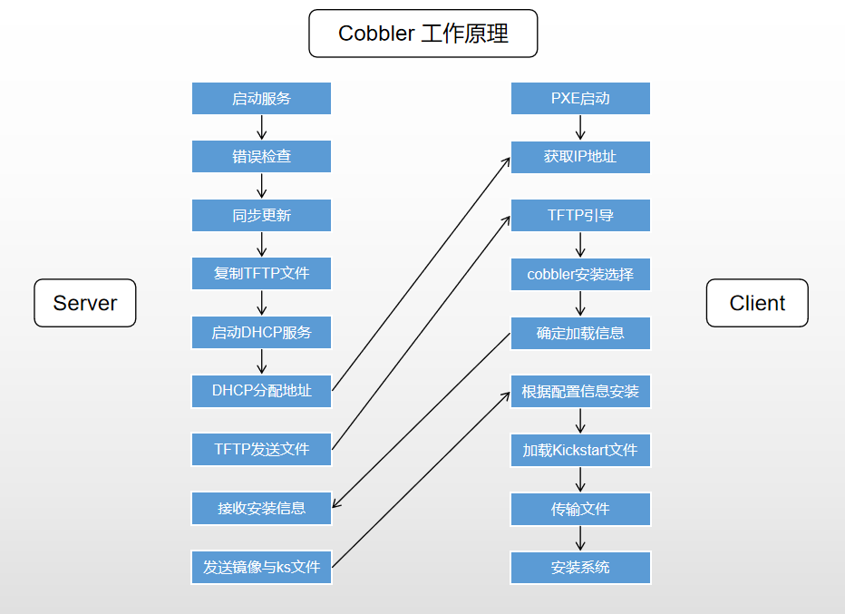
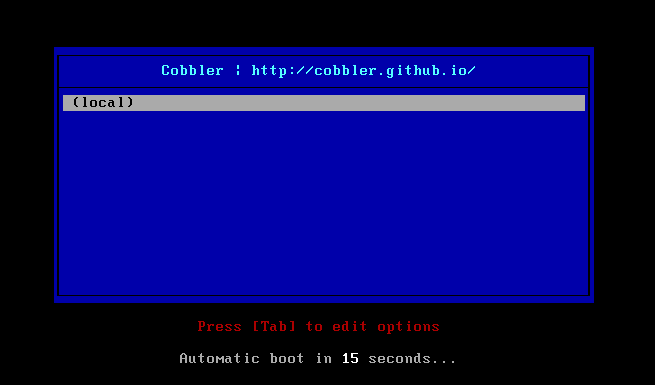

# Cobbler

[TOC]

## 概述

Cobbler 是一个配置（安装）和更新服务器。它支持通过 PXE（网络引导）、虚拟化（Xen、QEMU / KVM 或 VMware）进行部署，以及现有 Linux 系统的重新安装。后两个功能通过在远程系统上使用 “Koan” 来启用。更新服务器功能包括 yum 镜像以及将这些镜像与自动安装文件集成。Cobbler 有一个命令行界面、WebUI 和广泛的 Python 和 XML-RPC API ，用于与外部脚本和应用程序集成。

Cobbler 可能是一个有点复杂的系统，因为它被设计用于管理各种各样的技术，但它确实在安装后立即支持大量功能，几乎不需要定制。

支持众多的发行版：Red Hat、Fedora、CentOS、Debian、Ubuntu 和 SuSE。当添加一个操作系统（通常通过使用 ISO 文件）时，Cobbler 知道如何解压缩合适的文件并调整网络服务，以正确引导机器。

Cobbler 可使用 kickstart 模板。基于 Red Hat 或 Fedora 的系统使用 kickstart  文件来自动化安装流程。通过使用模板，就会拥有基本的 kickstart  模板，然后定义如何针对一种配置文件或机器配置而替换其中的变量。例如，一个模板可能包含两个变量 *$domain* 和 *$machine_name*。在 Cobbler 配置中，一个配置文件指定 `domain=mydomain.com`，并且每台使用该配置文件的机器在 *machine_name* 变量中指定其名称。该配置文件中的所有机器都使用相同的 kickstart 安装且针对 `domain=mydomain.com` 进行配置，但每台机器拥有其自己的机器名称。您仍然可以使用 kickstart 模板在不同的域中安装其他机器并使用不同的机器名称。

为了协助管理系统，Cobbler 可通过 *fence scripts* 连接到各种电源管理环境。Cobbler 支持  apc_snmp、bladecenter、bullpap、drac、ether_wake、ilo、integrity、ipmilan、ipmitool、lpar、rsa、virsh 和 wti。要重新安装一台机器，可运行 `reboot system foo` 命令，而且 Cobbler 会使用必要的凭据和信息来为您运行恰当的 fence scripts（比如机器插槽数）。

可使用一个配置管理系统 (CMS)。有两种选择：该工具内的一个内部系统，或者集成一个现有的外部 CMS，比如 Chef 或  Puppet。借助内部系统，您可以指定文件模板，这些模板会依据配置参数进行处理（与 kickstart  模板的处理方式一样），然后复制到您指定的位置。如果必须自动将配置文件部署到特定机器，那么此功能很有用。

使用 koan 客户端，Cobbler 可从客户端配置虚拟机并重新安装系统。

## 集成的服务

* PXE 服务支持
* DHCP 服务管理
* DNS 服务管理(可选 bind，dnsmasq )
* 电源管理
* Kickstart 服务支持
* YUM 仓库管理
* TFTP ( PXE 启动时需要)
* Apache (提供 Kickstart 的安装源，并提供定制化的 Kickstart 配置）

## 工作流程

 

1. Client裸机配置了从网络启动后，开机后会广播包请求DHCP服务器 （Cobbler server）发送其分配好的一个IP
2. DHCP服务器（Cobbler server）收到请求后发送responese，包括其ip地址
3. Client裸机拿到ip后再向Cobbler server发送请求OS引导文件的请求
4. Cobbler server告诉裸机OS引导文件的名字和TFTP server的ip和port
5. Client裸机通过上面告知的TFTP server地址通信，下载引导文件
6. Client裸机执行执行该引导文件，确定加载信息，选择要安装的OS， 期间会再向cobbler server请求kickstart文件和OS image
7. Cobbler server发送请求的kickstart和OS iamge
8. Client裸机加载kickstart文件
9. Client裸机接收os image，安装该OS image

## 组件

Cobbler 的配置结构基于一组注册的对象。每个对象表示一个与另一个实体相关联的实体（该对象指向另一个对象，或者另一个对象指向该对象）。当一个对象指向另一个对象时，它就继承了被指向对象的数据，并可覆盖或添加更多特定信息。

* repository                 提供安装树，可指mirror与import。保存了一个yum或者rsync存储库的镜像信息。

* distribution               用来指明安装哪个系统。

* 配置文件(profile)      用来组合repository与distrioution还能用来自定义安装环境与位置。包含了一个发行版（distro），一个

  ​                                    kickstart文件以及可能的存储库（repository），还包含了更多的内核参数等其他数据。

* 发行版(distro）        表示一个操作系统，它承载了内核和`initrd`的信息，以及内核等其他数据。

* 系统(system)             表示要配给的机器，它包含了一个配置文件或一个镜像，还包含了ip和mac地址，电源管理（地址、凭据、类

  ​                                    型）以及更为专业的数据信息。

* 镜像(image)               可替换一个包含不属于此类别的文件的发行版对象（无法分为内核和initrd的对象）。

以上各个组件中， 发行版，存储库， 配置文件为必须配置项，只有在虚拟环境中，必须要用cobbler来引导虚拟机启动时候，才会用到系统组件。


## 配置

### 相关目录及文件

```bash
# 配置文件
/etc/cobbler
/etc/cobbler/settings               # cobbler主配置文件，这个文件是YAML格式
/etc/cobbler/settings.yaml          # 新版本，上述文件名称变更
/etc/cobbler/iso/                   # iso模板配置文件
/etc/cobbler/pxe                    # pxe模板文件
/etc/cobbler/power                  # 电源配置文件
/etc/cobbler/user.conf              # web服务授权配置文件
/etc/cobbler/users.digest           # web访问的用户名密码配置文件
/etc/cobbler/dhcp.template          # dhcp服务器的的配置模板
/etc/cobbler/dnsmasq.template       # dns服务器的配置模板
/etc/cobbler/tftpd.template         # tftp服务的配置模板
/etc/cobbler/rsync.template         # rsync服务的配置模板
/etc/cobbler/modules.conf           # 模块的配置文件

# 数据目录
/var/lib/cobbler/config/            # 用于存放distros，system，profiles等信息配置文件
/var/lib/cobbler/triggers/          # 用于存放用户定义的cobbler命令
/var/lib/cobbler/kickstart/         # 默认存放kickstart文件
/var/lib/cobbler/loaders/           # 存放各种引导程序镜像目录

# 镜像目录
/var/www/cobbler/ks_mirror/         # 导入的发行版系统的所有数据
/var/www/cobbler/images/            # 导入发行版的kernel和initrd镜像用于远程网络启动
/var/www/cobbler/repo_mirror/       # yum仓库存储目录

# 日志目录
/var/log/cobbler/installing         # 客户端安装日志
/var/log/cobbler/cobbler.log        # cobbler日志

```

### 修改默认密码

此设置控制 handsoff 安装期间为新系统设置的 root 密码。

```yaml
default_password_crypted: "$1$bfI7WLZz$PxXetL97LkScqJFxnW7KS1"
```

应该通过运行以下命令并将其输出插入到上面的字符串中来修改它（确保保留引号）：

```bash
openssl passwd -1
```

### server 和 next_server

`server` 选项设置用于 Cobbler 服务的 IP 。不能使用 0.0.0.0 ，因为它不是监听地址。这应该设置为希望正在构建的主机与 Cobbler 服务器联系以使用 HTTP 和 TFTP 等协议的 IP 。

```bash
# default, localhost
server: 127.0.0.1
```

`next_server` 选项用于 DHCP / PXE，作为下载网络引导文件的 TFTP 服务器的 IP 。通常，这将与 `server` 设置相同的 IP 。

```bash
# default, localhost
next_server: 127.0.0.1
```

### DHCP 管理和 DHCP 服务器模板

The choice of DHCP management engine is in `/etc/cobbler/modules.conf`

为了进行 PXE 引导，需要一个 DHCP 服务器来分发地址并将引导系统定向到 TFTP 服务器，在那里它可以下载网络引导文件。Cobbler 可以通过 `manage_dhcp` 设置进行管理：

```bash
#方法1：编辑/etc/cobbler/settings
# default 0, don't manage
manage_dhcp: 1

#方法2：
cobbler setting edit --name=manage_dhcp --value=1
```

将该设置更改为 1，以便 Cobbler 将根据随 Cobbler 提供的 `dhcp.template` 生成 `dhcpd.conf` 文件。此模板可能需要根据网络设置进行修改：

```bash
vi /etc/cobbler/dhcp.template
```

在大多数情况下，只需要修改此块：

```ini
subnet 192.168.1.0 netmask 255.255.255.0 {
     option routers             192.168.1.1;
     option domain-name-servers 192.168.1.5,192.168.1.6;
     option subnet-mask         255.255.255.0;
     filename                   "/pxelinux.0";
     default-lease-time         21600;
     max-lease-time             43200;
     next-server                $next_server_v4;
}
```

无论如何，请确保不要修改 `next-server $next_server_v4;` 行，因为这是下一个服务器设置被拉入配置的方式。此文件是一个 cheetah 模板，因此请确保不要修改此行之后的任何内容：

```bash
#for dhcp_tag in $dhcp_tags.keys():
```

确认运行情况

```bash
netstat -tulp | grep dhcp
```

### 关于文件和目录的说明

Cobbler 大量使用 `/var` 目录。`/var/www/cobbler/distro_mirror` 目录是复制所有发行版和存储库文件的地方，因此需要为每个希望导入的发行版提供 5 - 10 GB 的可用空间。

### 配置文件

#### /etc/cobbler/setting  |  /etc/cobbler/settings.yaml

```bash
---
# cobbler settings file
# restart cobblerd and run "cobbler sync" after making changes
# This config file is in YAML 1.0 format
# see http://yaml.org
# ==========================================================
# if 1, cobbler will allow insertions of system records that duplicate
# the --dns-name information of other system records.  In general,
# this is undesirable and should be left 0.
allow_duplicate_hostnames: 0

# if 1, cobbler will allow insertions of system records that duplicate
# the ip address information of other system records.  In general,
# this is undesirable and should be left 0.
allow_duplicate_ips: 0

# if 1, cobbler will allow insertions of system records that duplicate
# the mac address information of other system records.  In general,
# this is undesirable.
allow_duplicate_macs: 0

# if 1, cobbler will allow settings to be changed dynamically without
# a restart of the cobblerd daemon. You can only change this variable
# by manually editing the settings file, and you MUST restart cobblerd
# after changing it.
allow_dynamic_settings: 0

# by default, installs are *not* set to send installation logs to the cobbler
# # # server.  With 'anamon_enabled', kickstart templates may use the pre_anamon
# # # snippet to allow remote live monitoring of their installations from the
# # # cobbler server.  Installation logs will be stored under
# # # /var/log/cobbler/anamon/.  NOTE: This does allow an xmlrpc call to send logs
# # # to this directory, without authentication, so enable only if you are
# # # ok with this limitation.
anamon_enabled: 0

# If using authn_pam in the modules.conf, this can be configured
# to change the PAM service authentication will be tested against.
# The default value is "login".
authn_pam_service: "login"

# How long the authentication token is valid for, in seconds
auth_token_expiration: 3600

# Email out a report when cobbler finishes installing a system.
# enabled: set to 1 to turn this feature on
# sender: optional
# email: which addresses to email
# smtp_server: used to specify another server for an MTA
# subject: use the default subject unless overridden
build_reporting_enabled: 0
build_reporting_sender: ""
build_reporting_email: [ 'root@localhost' ]
build_reporting_smtp_server: "localhost"
build_reporting_subject: ""
build_reporting_ignorelist: [ "" ]

# Cheetah-language kickstart templates can import Python modules.
# while this is a useful feature, it is not safe to allow them to 
# import anything they want. This whitelists which modules can be 
# imported through Cheetah.  Users can expand this as needed but
# should never allow modules such as subprocess or those that
# allow access to the filesystem as Cheetah templates are evaluated
# by cobblerd as code.
cheetah_import_whitelist:
 - "random"
 - "re"
 - "time"

# Default createrepo_flags to use for new repositories. If you have
# createrepo >= 0.4.10, consider "-c cache --update -C", which can
# dramatically improve your "cobbler reposync" time.  "-s sha"
# enables working with Fedora repos from F11/F12 from EL-4 or
# EL-5 without python-hashlib installed (which is not available
# on EL-4)
createrepo_flags: "-c cache -s sha"

# if no kickstart is specified to profile add, use this template
default_kickstart: /var/lib/cobbler/kickstarts/default.ks

# configure all installed systems to use these nameservers by default
# unless defined differently in the profile.  For DHCP configurations
# you probably do /not/ want to supply this.
default_name_servers: []

# if using the authz_ownership module (see the Wiki), objects
# created without specifying an owner are assigned to this
# owner and/or group.  Can be a comma seperated list.
default_ownership:
 - "admin"

# cobbler has various sample kickstart templates stored
# in /var/lib/cobbler/kickstarts/.  This controls
# what install (root) password is set up for those
# systems that reference this variable.  The factory
# default is "cobbler" and cobbler check will warn if
# this is not changed.
# The simplest way to change the password is to run 
# openssl passwd -1
# and put the output between the "" below.
default_password_crypted: "$1$mF86/UHC$WvcIcX2t6crBz2onWxyac."

# the default template type to use in the absence of any
# other detected template. If you do not specify the template 
# with '#template=<template_type>' on the first line of your
# templates/snippets, cobbler will assume try to use the
# following template engine to parse the templates.
#
# Current valid values are: cheetah, jinja2
default_template_type: "cheetah"

# for libvirt based installs in koan, if no virt bridge
# is specified, which bridge do we try?  For EL 4/5 hosts
# this should be xenbr0, for all versions of Fedora, try
# "virbr0".  This can be overriden on a per-profile
# basis or at the koan command line though this saves
# typing to just set it here to the most common option.
default_virt_bridge: xenbr0

# use this as the default disk size for virt guests (GB)
default_virt_file_size: 5

# use this as the default memory size for virt guests (MB)
default_virt_ram: 512

# if koan is invoked without --virt-type and no virt-type
# is set on the profile/system, what virtualization type
# should be assumed?  Values: xenpv, xenfv, qemu, vmware
# (NOTE: this does not change what virt_type is chosen by import)
default_virt_type: xenpv

# enable gPXE booting? Enabling this option will cause cobbler
# to copy the undionly.kpxe file to the tftp root directory, 
# and if a profile/system is configured to boot via gpxe it will 
# chain load off pxelinux.0.
# Default: 0
enable_gpxe: 0

# controls whether cobbler will add each new profile entry to the default
# PXE boot menu.  This can be over-ridden on a per-profile
# basis when adding/editing profiles with --enable-menu=0/1.  Users
# should ordinarily leave this setting enabled unless they are concerned
# with accidental reinstalls from users who select an entry at the PXE
# boot menu.  Adding a password to the boot menus templates 
# may also be a good solution to prevent unwanted reinstallations
enable_menu: 1

# enable Func-integration?  This makes sure each installed machine is set up
# to use func out of the box, which is a powerful way to script and control
# remote machines.  
# Func lives at http://fedorahosted.org/func
# read more at https://github.com/cobbler/cobbler/wiki/Func-integration
# you will need to mirror Fedora/EPEL packages for this feature, so see
# https://github.com/cobbler/cobbler/wiki/Manage-yum-repos if you want cobbler
# to help you with this
func_auto_setup: 0
func_master: overlord.example.org

# change this port if Apache is not running plaintext on port
# 80.  Most people can leave this alone.
http_port: 80

# kernel options that should be present in every cobbler installation.
# kernel options can also be applied at the distro/profile/system
# level.
kernel_options:
 ksdevice: bootif
 lang: ' '
 text: ~

# s390 systems require additional kernel options in addition to the
# above defaults
kernel_options_s390x:
 RUNKS: 1
 ramdisk_size: 40000
 root: /dev/ram0
 ro: ~
 ip: off
 vnc: ~

# configuration options if using the authn_ldap module. See the
# the Wiki for details.  This can be ignored if you are not using
# LDAP for WebUI/XMLRPC authentication.
ldap_server: "ldap.example.com"
ldap_base_dn: "DC=example,DC=com"
ldap_port: 389
ldap_tls: 1
ldap_anonymous_bind: 1
ldap_search_bind_dn: ''
ldap_search_passwd: ''
ldap_search_prefix: 'uid='
ldap_tls_cacertfile: ''
ldap_tls_keyfile: ''
ldap_tls_certfile: ''

# cobbler has a feature that allows for integration with config management
# systems such as Puppet.  The following parameters work in conjunction with 
# --mgmt-classes  and are described in furhter detail at:
# https://github.com/cobbler/cobbler/wiki/Using-cobbler-with-a-configuration-management-system
mgmt_classes: []
mgmt_parameters:
 from_cobbler: 1

# if enabled, this setting ensures that puppet is installed during
# machine provision, a client certificate is generated and a
# certificate signing request is made with the puppet master server
puppet_auto_setup: 0

# when puppet starts on a system after installation it needs to have
# its certificate signed by the puppet master server. Enabling the
# following feature will ensure that the puppet server signs the
# certificate after installation if the puppet master server is
# running on the same machine as cobbler. This requires
# puppet_auto_setup above to be enabled
sign_puppet_certs_automatically: 0

# location of the puppet executable, used for revoking certificates
puppetca_path: "/usr/bin/puppet"

# when a puppet managed machine is reinstalled it is necessary to
# remove the puppet certificate from the puppet master server before a
# new certificate is signed (see above). Enabling the following
# feature will ensure that the certificate for the machine to be
# installed is removed from the puppet master server if the puppet
# master server is running on the same machine as cobbler. This
# requires puppet_auto_setup above to be enabled
remove_old_puppet_certs_automatically: 0

# choose a --server argument when running puppetd/puppet agent during kickstart
#puppet_server: 'puppet'

# let cobbler know that you're using a newer version of puppet
# choose version 3 to use: 'puppet agent'; version 2 uses status quo: 'puppetd'
#puppet_version: 2

# choose whether to enable puppet parameterized classes or not.
# puppet versions prior to 2.6.5 do not support parameters
#puppet_parameterized_classes: 1

# set to 1 to enable Cobbler's DHCP management features.
# the choice of DHCP management engine is in /etc/cobbler/modules.conf
manage_dhcp: 0

# set to 1 to enable Cobbler's DNS management features.
# the choice of DNS mangement engine is in /etc/cobbler/modules.conf
manage_dns: 0

# set to path of bind chroot to create bind-chroot compatible bind
# configuration files.  This should be automatically detected.
bind_chroot_path: ""

# set to the ip address of the master bind DNS server for creating secondary
# bind configuration files
bind_master: 127.0.0.1

# manage_genders - Bool to enable/disable managing an /etc/genders file for use with pdsh and others.
manage_genders: 0

# bind_manage_ipmi - used to let bind manage IPMI addresses if the power management address is an IP and if manage_bind is set.
bind_manage_ipmi: 0

# set to 1 to enable Cobbler's TFTP management features.
# the choice of TFTP mangement engine is in /etc/cobbler/modules.conf
manage_tftpd: 1

# set to 1 to enable Cobbler's RSYNC management features.
manage_rsync: 0

# if using BIND (named) for DNS management in /etc/cobbler/modules.conf
# and manage_dns is enabled (above), this lists which zones are managed
# See the Wiki (https://github.com/cobbler/cobbler/wiki/Dns-management) for more info
manage_forward_zones: []
manage_reverse_zones: []

# if using cobbler with manage_dhcp, put the IP address
# of the cobbler server here so that PXE booting guests can find it
# if you do not set this correctly, this will be manifested in TFTP open timeouts.
next_server: 127.0.0.1

# settings for power management features.  optional.
# see https://github.com/cobbler/cobbler/wiki/Power-management to learn more
# choices (refer to codes.py):
#    apc_snmp bladecenter bullpap drac ether_wake ilo integrity
#    ipmilan ipmitool lpar rsa virsh wti
power_management_default_type: 'ipmitool'

# the commands used by the power management module are sourced
# from what directory?
power_template_dir: "/etc/cobbler/power"

# if this setting is set to 1, cobbler systems that pxe boot
# will request at the end of their installation to toggle the 
# --netboot-enabled record in the cobbler system record.  This eliminates
# the potential for a PXE boot loop if the system is set to PXE
# first in it's BIOS order.  Enable this if PXE is first in your BIOS
# boot order, otherwise leave this disabled.   See the manpage
# for --netboot-enabled.
pxe_just_once: 0

# the templates used for PXE config generation are sourced
# from what directory?
pxe_template_dir: "/etc/cobbler/pxe"

# Path to where system consoles are 
consoles: "/var/consoles"

# Are you using a Red Hat management platform in addition to Cobbler?
# Cobbler can help you register to it.  Choose one of the following:
#   "off"    : I'm not using Red Hat Network, Satellite, or Spacewalk
#   "hosted" : I'm using Red Hat Network
#   "site"   : I'm using Red Hat Satellite Server or Spacewalk
# You will also want to read: https://github.com/cobbler/cobbler/wiki/Tips-for-RHN
redhat_management_type: "off"

# if redhat_management_type is enabled, choose your server
#   "management.example.org" : For Satellite or Spacewalk
#   "xmlrpc.rhn.redhat.com"  : For Red Hat Network
# This setting is also used by the code that supports using Spacewalk/Satellite users/passwords
# within Cobbler Web and Cobbler XMLRPC.  Using RHN Hosted for this is not supported.
# This feature can be used even if redhat_management_type is off, you just have
# to have authn_spacewalk selected in modules.conf
redhat_management_server: "xmlrpc.rhn.redhat.com"

# specify the default Red Hat authorization key to use to register
# system.  If left blank, no registration will be attempted.  Similarly
# you can set the --redhat-management-key to blank on any system to 
# keep it from trying to register.
redhat_management_key: ""

# if using authn_spacewalk in modules.conf to let cobbler authenticate 
# against Satellite/Spacewalk's auth system, by default it will not allow per user 
# access into Cobbler Web and Cobbler XMLRPC.
# in order to permit this, the following setting must be enabled HOWEVER
# doing so will permit all Spacewalk/Satellite users of certain types to edit all
# of cobbler's configuration.
# these roles are:  config_admin and org_admin
# users should turn this on only if they want this behavior and
# do not have a cross-multi-org seperation concern.  If you have
# a single org in your satellite, it's probably safe to turn this
# on and then you can use CobblerWeb alongside a Satellite install.
redhat_management_permissive: 0

# if set to 1, allows /usr/bin/cobbler-register (part of the koan package)
# to be used to remotely add new cobbler system records to cobbler.
# this effectively allows for registration of new hardware from system
# records.
register_new_installs: 0

# Flags to use for yum's reposync.  If your version of yum reposync
# does not support -l, you may need to remove that option.
reposync_flags: "-l -n -d"

# when DHCP and DNS management are enabled, cobbler sync can automatically
# restart those services to apply changes.  The exception for this is
# if using ISC for DHCP, then omapi eliminates the need for a restart.
# omapi, however, is experimental and not recommended for most configurations.
# If DHCP and DNS are going to be managed, but hosted on a box that
# is not on this server, disable restarts here and write some other
# script to ensure that the config files get copied/rsynced to the destination
# box.  This can be done by modifying the restart services trigger.
# Note that if manage_dhcp and manage_dns are disabled, the respective
# parameter will have no effect.  Most users should not need to change
# this.
restart_dns: 1
restart_dhcp: 1

# install triggers are scripts in /var/lib/cobbler/triggers/install
# that are triggered in kickstart pre and post sections.  Any
# executable script in those directories is run.  They can be used
# to send email or perform other actions.  They are currently
# run as root so if you do not need this functionality you can
# disable it, though this will also disable "cobbler status" which
# uses a logging trigger to audit install progress.
run_install_triggers: 1

# enables a trigger which version controls all changes to /var/lib/cobbler
# when add, edit, or sync events are performed.  This can be used
# to revert to previous database versions, generate RSS feeds, or for
# other auditing or backup purposes. "git" and "hg" are currently suported, 
# but git is the recommend SCM for use with this feature.
scm_track_enabled: 0
scm_track_mode: "git"

# this is the address of the cobbler server -- as it is used
# by systems during the install process, it must be the address
# or hostname of the system as those systems can see the server.
# if you have a server that appears differently to different subnets
# (dual homed, etc), you need to read the --server-override section
# of the manpage for how that works.
server: 127.0.0.1

# If set to 1, all commands will be forced to use the localhost address
# instead of using the above value which can force commands like
# cobbler sync to open a connection to a remote address if one is in the
# configuration and would traceback.
client_use_localhost: 0

# If set to 1, all commands to the API (not directly to the XMLRPC
# server) will go over HTTPS instead of plaintext. Be sure to change
# the http_port setting to the correct value for the web server
client_use_https: 0

# this is a directory of files that cobbler uses to make
# templating easier.  See the Wiki for more information.  Changing
# this directory should not be required.
snippetsdir: /var/lib/cobbler/snippets

# Normally if a kickstart is specified at a remote location, this
# URL will be passed directly to the kickstarting system, thus bypassing
# the usual snippet templating Cobbler does for local kickstart files. If
# this option is enabled, Cobbler will fetch the file contents internally
# and serve a templated version of the file to the client.
template_remote_kickstarts: 0

# should new profiles for virtual machines default to auto booting with the physical host when the physical host reboots?
# this can be overridden on each profile or system object.
virt_auto_boot: 1

# cobbler's web directory.  Don't change this setting -- see the
# Wiki on "relocating your cobbler install" if your /var partition
# is not large enough.
webdir: /var/www/cobbler

# cobbler's public XMLRPC listens on this port.  Change this only
# if absolutely needed, as you'll have to start supplying a new
# port option to koan if it is not the default.
xmlrpc_port: 25151

# "cobbler repo add" commands set cobbler up with repository
# information that can be used during kickstart and is automatically
# set up in the cobbler kickstart templates.  By default, these
# are only available at install time.  To make these repositories
# usable on installed systems (since cobbler makes a very convient)
# mirror, set this to 1.  Most users can safely set this to 1.  Users
# who have a dual homed cobbler server, or are installing laptops that
# will not always have access to the cobbler server may wish to leave
# this as 0.  In that case, the cobbler mirrored yum repos are still
# accessable at http://cobbler.example.org/cblr/repo_mirror and yum
# configuration can still be done manually.  This is just a shortcut.
yum_post_install_mirror: 1

# the default yum priority for all the distros.  This is only used
# if yum-priorities plugin is used.  1=maximum.  Tweak with caution.
yum_distro_priority: 1

# Flags to use for yumdownloader.  Not all versions may support 
# --resolve.
yumdownloader_flags: "--resolve"

# sort and indent JSON output to make it more human-readable
serializer_pretty_json: 0

# replication rsync options for distros, kickstarts, snippets set to override default value of "-avzH"
replicate_rsync_options: "-avzH"

# replication rsync options for repos set to override default value of "-avzH"
replicate_repo_rsync_options: "-avzH"

# always write DHCP entries, regardless if netboot is enabled
always_write_dhcp_entries: 0

# external proxy - used by: get-loaders, reposync, signature update
# eg: proxy_url_ext: "http://192.168.1.1:8080"
proxy_url_ext: ""

# internal proxy - used by systems to reach cobbler for kickstarts
# eg: proxy_url_int: "http://10.0.0.1:8080"
proxy_url_int: ""
```

#### /etc/cobbler/modules.conf

```bash
# cobbler module configuration file
# =================================

# authentication: 
# what users can log into the WebUI and Read-Write XMLRPC?
# choices:
#    authn_denyall    -- no one (default)
#    authn_configfile -- use /etc/cobbler/users.digest (for basic setups)
#    authn_passthru   -- ask Apache to handle it (used for kerberos)
#    authn_ldap       -- authenticate against LDAP
#    authn_spacewalk  -- ask Spacewalk/Satellite (experimental)
#    authn_pam        -- use PAM facilities
#    authn_testing    -- username/password is always testing/testing (debug)
#    (user supplied)  -- you may write your own module
# WARNING: this is a security setting, do not choose an option blindly.
# for more information:
# https://github.com/cobbler/cobbler/wiki/Cobbler-web-interface
# https://github.com/cobbler/cobbler/wiki/Security-overview
# https://github.com/cobbler/cobbler/wiki/Kerberos
# https://github.com/cobbler/cobbler/wiki/Ldap

[authentication]
module = authn_configfile

# authorization: 
# once a user has been cleared by the WebUI/XMLRPC, what can they do?
# choices:
#    authz_allowall   -- full access for all authneticated users (default)
#    authz_ownership  -- use users.conf, but add object ownership semantics
#    (user supplied)  -- you may write your own module
# WARNING: this is a security setting, do not choose an option blindly.
# If you want to further restrict cobbler with ACLs for various groups,
# pick authz_ownership.  authz_allowall does not support ACLs.  configfile
# does but does not support object ownership which is useful as an additional
# layer of control.

# for more information:
# https://github.com/cobbler/cobbler/wiki/Cobbler-web-interface
# https://github.com/cobbler/cobbler/wiki/Security-overview
# https://github.com/cobbler/cobbler/wiki/Web-authorization

[authorization]
module = authz_allowall

# dns:
# chooses the DNS management engine if manage_dns is enabled
# in /etc/cobbler/settings, which is off by default.
# choices:
#    manage_bind    -- default, uses BIND/named
#    manage_dnsmasq -- uses dnsmasq, also must select dnsmasq for dhcp below
# NOTE: more configuration is still required in /etc/cobbler
# for more information:
# https://github.com/cobbler/cobbler/wiki/Dns-management

[dns]
module = manage_bind

# dhcp:
# chooses the DHCP management engine if manage_dhcp is enabled
# in /etc/cobbler/settings, which is off by default.
# choices:
#    manage_isc     -- default, uses ISC dhcpd
#    manage_dnsmasq -- uses dnsmasq, also must select dnsmasq for dns above
# NOTE: more configuration is still required in /etc/cobbler
# for more information:
# https://github.com/cobbler/cobbler/wiki/Dhcp-management
  
[dhcp]
module = manage_isc

# tftpd:
# chooses the TFTP management engine if manage_tftp is enabled
# in /etc/cobbler/settings, which is ON by default.
#
# choices:
#    manage_in_tftpd -- default, uses the system's tftp server
#    manage_tftpd_py -- uses cobbler's tftp server
#
  
[tftpd]
module = manage_in_tftpd

#--------------------------------------------------

```

#### /etc/cobbler/dhcp.template

```bash
# ******************************************************************
# Cobbler managed dhcpd.conf file
#
# generated from cobbler dhcp.conf template ($date)
# Do NOT make changes to /etc/dhcpd.conf. Instead, make your changes
# in /etc/cobbler/dhcp.template, as /etc/dhcpd.conf will be
# overwritten.
#
# ******************************************************************

ddns-update-style interim;

allow booting;
allow bootp;

ignore client-updates;
set vendorclass = option vendor-class-identifier;

option pxe-system-type code 93 = unsigned integer 16;

subnet 192.168.1.0 netmask 255.255.255.0 {
     option routers             192.168.1.5;
     option domain-name-servers 192.168.1.1;
     option subnet-mask         255.255.255.0;
     range dynamic-bootp        192.168.1.100 192.168.1.254;
     default-lease-time         21600;
     max-lease-time             43200;
     next-server                $next_server;
     class "pxeclients" {
          match if substring (option vendor-class-identifier, 0, 9) = "PXEClient";
          if option pxe-system-type = 00:02 {
                  filename "ia64/elilo.efi";
          } else if option pxe-system-type = 00:06 {
                  filename "grub/grub-x86.efi";
          } else if option pxe-system-type = 00:07 {
                  filename "grub/grub-x86_64.efi";
          } else if option pxe-system-type = 00:09 {
                  filename "grub/grub-x86_64.efi";
          } else {
                  filename "pxelinux.0";
          }
     }

}

#for dhcp_tag in $dhcp_tags.keys():
    ## group could be subnet if your dhcp tags line up with your subnets
    ## or really any valid dhcpd.conf construct ... if you only use the
    ## default dhcp tag in cobbler, the group block can be deleted for a
    ## flat configuration
# group for Cobbler DHCP tag: $dhcp_tag
group {
        #for mac in $dhcp_tags[$dhcp_tag].keys():
            #set iface = $dhcp_tags[$dhcp_tag][$mac]
    host $iface.name {
        #if $iface.interface_type == "infiniband":
        option dhcp-client-identifier = $mac;
        #else
        hardware ethernet $mac;
        #end if
        #if $iface.ip_address:
        fixed-address $iface.ip_address;
        #end if
        #if $iface.hostname:
        option host-name "$iface.hostname";
        #end if
        #if $iface.netmask:
        option subnet-mask $iface.netmask;
        #end if
        #if $iface.gateway:
        option routers $iface.gateway;
        #end if
        #if $iface.enable_gpxe:
        if exists user-class and option user-class = "gPXE" {
            filename "http://$cobbler_server/cblr/svc/op/gpxe/system/$iface.owner";
        } else if exists user-class and option user-class = "iPXE" {
            filename "http://$cobbler_server/cblr/svc/op/gpxe/system/$iface.owner";
        } else {
            filename "undionly.kpxe";
        }
        #else
        filename "$iface.filename";
        #end if
        ## Cobbler defaults to $next_server, but some users
        ## may like to use $iface.system.server for proxied setups
        next-server $next_server;
        ## next-server $iface.next_server;
    }
        #end for
}
#end for
```

## 检查问题并首次 Sync

Cobbler 的 check 命令将提供一些建议，但重要的是要记住，这些主要只是建议，可能对基本功能并不重要。如果正在运行 iptables 或 SELinux ，那么查看与该检查可能报告的内容有关的任何消息是很重要的。

```bash
cobbler check
The following are potential configuration items that you may want to fix:

1 : The 'server' field in /etc/cobbler/settings must be set to something other than localhost, or automatic features will not work. This should be a resolvable hostname or IP for the boot server as reachable by all machines that will use it.
2 : For PXE to be functional, the 'next_server' field in /etc/cobbler/settings must be set to something other than 127.0.0.1, and should match the IP of the boot server on the PXE network.
3 : change 'disable' to 'no' in /etc/xinetd.d/tftp
4 : Some network boot-loaders are missing from /var/lib/cobbler/loaders, you may run 'cobbler get-loaders' to download them, or, if you only want to handle x86/x86_64 netbooting, you may ensure that you have installed a *recent* version of the syslinux package installed and can ignore this message entirely. Files in this directory, should you want to support all architectures, should include pxelinux.0, menu.c32, elilo.efi, and yaboot. The 'cobbler get-loaders' command is the easiest way to resolve these requirements.
5 : enable and start rsyncd.service with systemctl
6 : debmirror package is not installed, it will be required to manage debian deployments and repositories
7 : The default password used by the sample templates for newly installed machines (default_password_crypted in /etc/cobbler/settings) is still set to 'cobbler' and should be changed, try: "openssl passwd -1 -salt 'random-phrase-here' 'your-password-here'" to generate new one
8 : fencing tools were not found, and are required to use the (optional) power management features. install cman or fence-agents to use them
9 : reposync is not installed, install yum-utils or dnf-plugins-core
10 : yumdownloader is not installed, install yum-utils or dnf-plugins-core
11 : ksvalidator was not found, install pykickstart
12 : comment out 'dists' on /etc/debmirror.conf for proper debian support
13 : comment out 'arches' on /etc/debmirror.conf for proper debian support

Restart cobblerd and then run 'cobbler sync' to apply changes.
```

**处理方式:**

设置为可以动态配置，也可以直接更改配置文件。

```bash
# 设置可以动态修改配置文件
# 新版本内该命令可能会出现异常。1 改为 true
# 新版本配置文件为 settings.yaml
sed -ri '/allow_dynamic_settings:/c\allow_dynamic_settings: 1' /etc/cobbler/settings.yaml

grep allow_dynamic_settings /etc/cobbler/settings.yaml
allow_dynamic_settings: 1

systemctl restart cobblerd
```

```bash
1 : 修改 /etc/cobbler/settings.yaml 中 server 为本机 IP
    cobbler setting edit --name=server --value=192.168.1.6
2 : 修改 /etc/cobbler/settings.yaml 中 next_server 为本机 IP
    cobbler setting edit --name=next_server --value=192.168.1.6
3 : sed -ri '/disable/c\disable = no' /etc/xinetd.d/tftp
    systemctl enable xinetd
    systemctl restart xinetd
4 : cobbler get-loaders #可能因网络问题失败，多次尝试
    #该命令在新版本(2.8.5以上)中被取消
    #dnf install syslinux
    #cp /usr/share/syslinux/pxelinux.0 /var/lib/cobbler/loaders/
    #cp /usr/share/syslinux/menu.c32 /var/lib/cobbler/loaders/
    
    bash /usr/share/cobbler/bin/mkgrub.sh
    
5 : systemctl start rsyncd
    systemctl enable rsyncd
6 : yum install debmirror
7 : openssl passwd -1 -salt 'random-phrase-here' 'your-password-here'
    修改 /etc/cobbler/settings 中 default_password_crypted 的值替换为上方命令的输出结果
    示例：
    openssl passwd -1 -salt `openssl rand -hex 4` 'admin'
          $1$675f1d08$oJoAMVxdbdKHjQXbGqNTX0
    cobbler setting edit --name=default_password_crypted --value='$1$675f1d08$oJoAMVxdbdKHjQXbGqNTX0'

8 : dnf install fence-agents 
9 - 10 : dnf install yum-utils
11 : dnf install pykickstart
12 - 13 : dnf install debmirror
          sed -i 's/@dists="sid";/#@dists="sid";/' /etc/debmirror.conf
          sed -i 's/@arches="i386";/#@arches="i386";/' /etc/debmirror.conf
```

重新启动 cobblerd，然后运行 `cobbler sync` 以应用更改。

```bash
cobbler sync

task started: 2012-06-24_224243_sync
task started (id=Sync, time=Sun Jun 24 22:42:43 2012)
running pre-sync triggers
...
rendering DHCP files
generating /etc/dhcp/dhcpd.conf
rendering TFTPD files
generating /etc/xinetd.d/tftp
cleaning link caches
running: find /var/lib/tftpboot/images/.link_cache -maxdepth 1 -type f -links 1 -exec rm -f '{}' ';'
received on stdout:
received on stderr:
running post-sync triggers
running python triggers from /var/lib/cobbler/triggers/sync/post/*
running python trigger cobbler.modules.sync_post_restart_services
running: dhcpd -t -q
received on stdout:
received on stderr:
running: service dhcpd restart
received on stdout:
received on stderr:
running shell triggers from /var/lib/cobbler/triggers/sync/post/*
running python triggers from /var/lib/cobbler/triggers/change/*
running python trigger cobbler.modules.scm_track
running shell triggers from /var/lib/cobbler/triggers/change/*
*** TASK COMPLETE ***
```

这时候创建一个新虚拟机可以获取到如下信息，没有镜像选择，只能从本地启动。

 

## 导入发行版

Cobbler 通过 `cobbler import` 命令自动添加发行版和配置文件。此命令可以（通常）自动检测您导入的发行版的类型和版本，并使用正确的设置创建（一个或多个）配置文件。

### 挂载ISO

必须使用 full DVD ，而非 Live CD ISO。

```bash
mount -t iso9660 -o loop,ro /path/to/isos/Fedora-Server-dvd-x86_64-28-1.1.iso /mnt
```

当通过 systemd 运行 Cobbler 时，不能将 ISO 挂载到 `/tmp` 或它的子文件夹，因为我们正在使用选项 Private Temporary Directory 来增强应用程序的安全性。

### 进行导入

name 和 path 参数是导入所必需的选项：

```bash
cobbler import --name=fedora28 --arch=x86_64 --path=/mnt

# --path 镜像路径
# --name 为安装源定义一个名字
# --arch 指定安装源是32位、64位、ia64, 目前支持的选项有: x86│x86_64│ia64
# 安装源的唯一标示就是根据name参数来定义
```

不需要指定 --arch 选项，因为它通常会被自动检测到。在这个例子中这样做，是为了防止发现多个架构(Fedora ships i386 packages on the full DVD, and cobbler will create both x86_64 and i386 distros by default)。

### 列出对象

如果在导入过程中没有报告错误，可以查看导入过程中创建的发行版和配置文件的详细信息。

```bash
cobbler distro list
cobbler profile list
```

import 命令通常会创建至少一个发行版 / 配置文件对，它们的名称与上面所示的相同。在某些情况下（例如，当发现基于 Xen 的内核时），将创建多个发行版 / 配置文件对。

### 对象详细信息

report 命令显示 Cobbler 中对象的详细信息：

```bash
cobbler distro report --name=fedora28-x86_64

Name                           : fedora28-x86_64
Architecture                   : x86_64
TFTP Boot Files                : {}
Breed                          : redhat
Comment                        :
Fetchable Files                : {}
Initrd                         : /var/www/cobbler/ks_mirror/fedora28-x86_64/images/pxeboot/initrd.img
Kernel                         : /var/www/cobbler/ks_mirror/fedora28-x86_64/images/pxeboot/vmlinuz
Kernel Options                 : {}
Kernel Options (Post Install)  : {}
Kickstart Metadata             : {'tree': 'http://@@http_server@@/cblr/links/fedora28-x86_64'}
Management Classes             : []
OS Version                     : fedora28
Owners                         : ['admin']
Red Hat Management Key         : <<inherit>>
Red Hat Management Server      : <<inherit>>
Template Files                 : {}

cobbler profile report --name=fedora28-x86_64

Name                           : fedora28-x86_64
TFTP Boot Files                : {}
Comment                        : 
DHCP Tag                       : default
Distribution                   : fedora28-x86_64
Enable gPXE?                   : 0
Enable PXE Menu?               : 1
Fetchable Files                : {}
Kernel Options                 : {}
Kernel Options (Post Install)  : {}
Kickstart                      : /var/lib/cobbler/kickstarts/sample_end.ks
Kickstart Metadata             : {}
Management Classes             : []
Management Parameters          : <<inherit>>
Name Servers                   : []
Name Servers Search Path       : []
Owners                         : ['admin']
Parent Profile                 : 
Internal proxy                 : 
Red Hat Management Key         : <<inherit>>
Red Hat Management Server      : <<inherit>>
Repos                          : []
Server Override                : <<inherit>>
Template Files                 : {}
Virt Auto Boot                 : 1
Virt Bridge                    : xenbr0
Virt CPUs                      : 1
Virt Disk Driver Type          : raw
Virt File Size(GB)             : 5
Virt Path                      : 
Virt RAM (MB)                  : 512
Virt Type                      : kvm
```

正如在上面看到的，import 命令自动填写了很多字段，比如品种 breed 、操作系统版本和 initrd / kernel 文件位置。The “Kickstart Metadata” field (–ksmeta internally) is used for miscellaneous variables, and contains the critical “tree” variable. “ Kickstart Metadata ”字段（内部为 `--autoinstall_meta` ）用于杂项变量，并包含关键的 tree 变量。这在 kickstart 模板中用于指定可以找到安装文件的 URL 。

还有一点需要注意：有些字段设置为 `<<inherit>>` 。This means they will use either the default setting (found in the settings file), or (in the case of profiles, sub-profiles, and systems) will use whatever is set in the parent object.这意味着它们将使用默认设置（在设置文件中找到），或者（在配置文件、子配置文件和系统的情况下）将使用父对象中设置的任何设置。

### 创建系统

现在有了一个发行版和配置文件，可以创建一个系统了。配置文件可用于 PXE 引导，but most of the features in cobbler revolve around system objects. 但 Cobbler 中的大多数特性都围绕着系统对象。给予的关于系统的信息越多，Cobbler 自动做的就越多。

首先，将根据导入过程中创建的配置文件创建一个系统对象。在创建系统时，name 和 profile 是两个必填字段：

```bash
cobbler system add --name=test --profile=fedora28-x86_64

cobbler system list
test

cobbler system report --name=test
Name                           : test
TFTP Boot Files                : {}
Comment                        :
Enable gPXE?                   : 0
Fetchable Files                : {}
Gateway                        :
Hostname                       :
Image                          :
IPv6 Autoconfiguration         : False
IPv6 Default Device            :
Kernel Options                 : {}
Kernel Options (Post Install)  : {}
Kickstart                      : <<inherit>>
Kickstart Metadata             : {}
LDAP Enabled                   : False
LDAP Management Type           : authconfig
Management Classes             : []
Management Parameters          : <<inherit>>
Monit Enabled                  : False
Name Servers                   : []
Name Servers Search Path       : []
Netboot Enabled                : True
Owners                         : ['admin']
Power Management Address       :
Power Management ID            :
Power Management Password      :
Power Management Type          : ipmitool
Power Management Username      :
Profile                        : fedora28-x86_64
Proxy                          : <<inherit>>
Red Hat Management Key         : <<inherit>>
Red Hat Management Server      : <<inherit>>
Repos Enabled                  : False
Server Override                : <<inherit>>
Status                         : production
Template Files                 : {}
Virt Auto Boot                 : <<inherit>>
Virt CPUs                      : <<inherit>>
Virt Disk Driver Type          : <<inherit>>
Virt File Size(GB)             : <<inherit>>
Virt Path                      : <<inherit>>
Virt RAM (MB)                  : <<inherit>>
Virt Type                      : <<inherit>>
```

创建系统对象的主要原因是网络配置。当使用配置文件时，您仅限于 DHCP 接口，但对于系统，可以指定更多的网络配置选项。

现在，将在 `192.168.1/24` 网络中设置一个简单的接口：

```bash
cobbler system edit --name=test --interface=eth0 --mac=00:11:22:AA:BB:CC --ip-address=192.168.1.100 --netmask=255.255.255.0 --static=1 --dns-name=test.mydomain.com
```

默认网关不是按 NIC 指定的，所以只需单独添加（along with the hostname沿着主机名）：

```bash
cobbler system edit --name=test --gateway=192.168.1.1 --hostname=test.mydomain.com
```

`--hostname` 字段对应于本地系统名，由 `hostname` 命令返回。The `--dns-name` (which can be set per-NIC) should correspond to a DNS A-record tied to the IP of that interface. `--dns-name`（可以按 NIC 设置）应该对应于与该接口的 IP 绑定的 DNS A 记录。两者都不是必需的，但最好同时指定两者。一些高级功能（如配置管理）依赖于 `--dns-name` 字段来查找系统记录。

每当系统被编辑时，Cobbler 都会执行所谓的 “lite sync” ，这会重新生成 TFTP 根目录中的关键文件，如 PXE 引导文件。它不会执行服务管理操作，比如重新生成 dhcpd.conf 和重新启动 DHCP 服务。在添加了一个带有静态接口的系统之后，最好执行一个完整的 cobbler sync ，ensure the dhcpd.conf file is rewritten with the correct static lease and the service is bounced.以确保 dhcpd.conf 文件被正确的静态租约重写，并且服务被退回。


```bash
[root@lizihan ~]# cobbler validateks        //查看语法是否有错误
task started: 2018-10-29_180600_validateks

task started (id=Kickstart Validation, time=Mon Oct 29 18:06:00 2018)
----------------------------

osversion: rhel7
checking url: http://172.16.11.17/cblr/svc/op/ks/profile/rhel-7-x86_64
running: /usr/bin/ksvalidator -v "rhel7" "http://172.16.11.17/cblr/svc/op/ks/profile/rhel-7-x86_64"
received on stdout: 
received on stderr: 
*** all kickstarts seem to be ok ***
*** TASK COMPLETE ***
```


## Cobbler CLI

## 3.1. General Principles

This should just be a brief overview. For the detailed explanations please refer to [Readthedocs](https://cobbler.readthedocs.io/).

### 3.1.1. Distros, Profiles and Systems

Cobbler has a system of inheritance when it comes to managing the information you want to apply to a certain system.

### 3.1.2. Images

### 3.1.3. Repositories

### 3.1.4. Management Classes

### 3.1.5. Deleting configuration entries

If you want to remove a specific object, use the remove command with the name that was used to add it.

```
cobbler distro|profile|system|repo|image|mgmtclass|package|file remove --name=string
```

### 3.1.6. Editing

If you want to change a particular setting without doing an `add` again, use the `edit` command, using the same name you gave when you added the item. Anything supplied in the parameter list will overwrite the settings in the existing object, preserving settings not mentioned.

```
cobbler distro|profile|system|repo|image|mgmtclass|package|file edit --name=string [parameterlist]
```

### 3.1.7. Copying

Objects can also be copied:

```
cobbler distro|profile|system|repo|image|mgmtclass|package|file copy --name=oldname --newname=newname
```

### 3.1.8. Renaming

Objects can also be renamed, as long as other objects don’t reference them.

```
cobbler distro|profile|system|repo|image|mgmtclass|package|file rename --name=oldname --newname=newname
```

## 3.2. CLI-Commands

Short Usage: `cobbler command [subcommand] [--arg1=value1] [--arg2=value2]`

Long Usage:

```bash
cobbler <distro|profile|system|repo|image|mgmtclass|package|file> ... [add|edit|copy|get-autoinstall*|list|remove|rename|report] [options|--help]
cobbler <aclsetup|buildiso|import|list|replicate|report|reposync|sync|validate-autoinstalls|version|signature|get-loaders|hardlink> [options|--help]
```

### 3.2.1. cobbler distro

This first step towards configuring what you want to install is to add a distribution record to cobbler’s configuration.

If there is an rsync mirror, DVD, NFS, or filesystem tree available that you would rather `import` instead, skip down to the documentation about the `import` command. It’s really a lot easier to follow the import workflow – it only requires waiting for the mirror content to be copied and/or scanned. Imported mirrors also save time during install since they don’t have to hit external install sources.

If you want to be explicit with distribution definition, however, here’s how it works:

```bash
cobbler distro add --name=string --kernel=path --initrd=path [--kopts=string] [--kopts-post=string] [--ksmeta=string] [--arch=i386|x86_64|ppc|ppc64] [--breed=redhat|debian|suse] [--template-files=string]
```

| Name                | Description                                                  |
| ------------------- | ------------------------------------------------------------ |
| name                | a string identifying the distribution, this should be something like `rhel6`. |
| kernel              | An absolute filesystem path to a kernel image.               |
| initrd              | An absolute filesystem path to a initrd image.               |
| remote-boot- kernel | A URL pointing to the installation initrd of a distribution. If the bootloader has this support, it will directly download the kernel from this URL, instead of the directory of the tftp client. Note: The kernel (or initrd below) will still be copied into the image directory of the tftp server. The above kernel parameter is still needed (e.g. to build iso images, etc.). The advantage of letting the boot loader retrieve the kernel/initrd directly is the support of changing/updated distributions. E.g. openSUSE Tumbleweed is updated on the fly and if cobbler would copy/cache the kernel/initrd in the tftp directory, you would get a “kernel does not match distribution” (or similar) error when trying to install. |
| remote-boot- initrd | See remote-boot-kernel above.                                |
| kopts               | Sets kernel command-line arguments that the distro, and profiles/systems depending on it, will use. To remove a kernel argument that may be added by a higher cobbler object (or in the global settings), you can prefix it with a `!`. |
|                     | Example: `--kopts="foo=bar baz=3 asdf !gulp"`                |
|                     | This example passes the arguments `foo=bar baz=3 asdf` but will make sure `gulp` is not passed even if it was requested at a level higher up in the cobbler configuration. |
| kopts-post          | This is just like `--kopts`, though it governs kernel options on the installed OS, as opposed to kernel options fed to the installer. The syntax is exactly the same. This requires some special snippets to be found in your automatic installation template in order for this to work. Automatic installation templating is described later on in this document. |
|                     | Example: `noapic`                                            |
| arch                | Sets the architecture for the PXE bootloader and also controls how koan’s `--replace-self` option will operate. |
|                     | The default setting (`standard`) will use `pxelinux`. Set to `ppc` and `ppc64` to use `yaboot`. |
|                     | `x86` and `x86_64` effectively do the same thing as standard. |
|                     | If you perform a `cobbler import`, the arch field will be auto-assigned. |
| ksmeta              | This is an advanced feature that sets automatic installation template variables to substitute, thus enabling those files to be treated as templates. Templates are powered using Cheetah and are described further along in this manpage as well as on the Cobbler Wiki. |
|                     | Example: `--ksmeta="foo=bar baz=3 asdf"`                     |
|                     | See the section on “Kickstart Templating” for further information. |
| breed               | Controls how various physical and virtual parameters, including kernel arguments for automatic installation, are to be treated. Defaults to `redhat`, which is a suitable value for Fedora and CentOS as well. It means anything Red Hat based. |
|                     | There is limited experimental support for specifying “debian”, “ubuntu”, or “suse”, which treats the automatic installation template file as a preseed/autoyast file format and changes the kernel arguments appropriately. Support for other types of distributions is possible in the future. See the Wiki for the latest information about support for these distributions. |
|                     | The file used for the answer file, regardless of the breed setting, is the value used for `--autoinst` when creating the profile. |
| os-version          | Generally this field can be ignored. It is intended to alter some hardware setup for virtualized instances when provisioning guests with koan. The valid options for `--os-version` vary depending on what is specified for `--breed`. If you specify an invalid option, the error message will contain a list of valid os versions that can be used. If you don’t know the os version or it does not appear in the list, omitting this argument or using `other` should be perfectly fine. If you don’t encounter any problems with virtualized instances, this option can be safely ignored. |
| owners              | Users with small sites and a limited number of admins can probably ignore this option.  All cobbler objects (distros, profiles, systems, and repos) can take a –owners parameter to specify what cobbler users can edit particular objects.This only applies to the Cobbler WebUI and XMLRPC interface, not the “cobbler” command line tool run from the shell. Furthermore, this is only respected by the `authz_ownership` module which must be enabled in `/etc/cobbler/modules.conf`. The value for `--owners` is a space separated list of users and groups as specified in `/etc/cobbler/users.conf`. For more information see the users.conf file as well as the Cobbler Wiki. In the default Cobbler configuration, this value is completely ignored, as is `users.conf`. |
| template-files      | This feature allows cobbler to be used as a configuration management system. The argument is a space delimited string of `key=value` pairs. Each key is the path to a template file, each value is the path to install the file on the system. This is described in further detail on the Cobbler Wiki and is implemented using special code in the post install. Koan also can retrieve these files from a cobbler server on demand, effectively allowing cobbler to function as a lightweight templated configuration management system. |

### 3.2.2. cobbler profile

A profile associates a distribution to additional specialized options, such as a installation automation file. Profiles are the core unit of provisioning and at least one profile must exist for every distribution to be provisioned. A profile might represent, for instance, a web server or desktop configuration. In this way, profiles define a role to be performed.

```
$ cobbler profile add --name=string --distro=string [--autoinst=path] [--kopts=string] [--ksmeta=string] [--name-servers=string] [--name-servers-search=string] [--virt-file-size=gigabytes] [--virt-ram=megabytes] [--virt-type=string] [--virt-cpus=integer] [--virt-path=string] [--virt-bridge=string] [--server] [--parent=profile] [--filename=string]
```

Arguments are the same as listed for distributions, save for the removal of “arch” and “breed”, and with the additions listed below:

| Name                                                         | Description                                                  |
| ------------------------------------------------------------ | ------------------------------------------------------------ |
| name                                                         | A descriptive name. This could be something like `rhel5webservers` or `f9desktops`. |
| distro                                                       | The name of a previously defined cobbler distribution. This value is required. |
| autoinst                                                     | Local filesystem path to a automatic installation file, the file must reside under `/var/lib/cobbler/autoinstall_templates` |
| name-servers                                                 | If your nameservers are not provided by DHCP, you can specify a space separated list of addresses here to configure each of the installed nodes to use them (provided the automatic installation files used are installed on a per-system basis). Users with DHCP setups should not need to use this option. This is available to set in profiles to avoid having to set it repeatedly for each system record. |
| name-servers-search                                          | You can specify a space separated list of domain names to configure each of the installed nodes to use them as domain search path.  This is available to set in profiles to avoid having to set it repeatedly for each system record. |
| virt-file-size                                               | (Virt-only) How large the disk image should be in Gigabytes. The default is 5. This can be a comma separated list (ex: `5,6,7`) to allow for multiple disks of different sizes depending on what is given to `--virt-path`. This should be input as a integer or decimal value without units. |
| virt-ram                                                     | (Virt-only) How many megabytes of RAM to consume. The default is 512 MB. This should be input as an integer without units. |
| virt-type                                                    | (Virt-only) Koan can install images using either Xen paravirt (`xenpv`) or QEMU/KVM (`qemu`). Choose one or the other strings to specify, or values will default to attempting to find a compatible installation type on the client system(“auto”). See the “koan” manpage for more documentation. The default `--virt-type` can be configured in the cobbler settings file such that this parameter does not have to be provided. Other virtualization types are supported, for information on those options (such as VMware), see the Cobbler Wiki. |
| virt-cpus                                                    | (Virt-only) How many virtual CPUs should koan give the virtual machine? The default is 1. This is an integer. |
| virt-path                                                    | (Virt-only) Where to store the virtual image on the host system. Except for advanced cases, this parameter can usually be omitted. For disk images, the value is usually an absolute path to an existing directory with an optional filename component. There is support for specifying partitions `/dev/sda4` or volume groups `VolGroup00`, etc. |
|                                                              | For multiple disks, separate the values with commas such as `VolGroup00,VolGroup00` or `/dev/sda4,/dev/sda5`. Both those examples would create two disks for the VM. |
| virt-bridge                                                  | (Virt-only) This specifies the default bridge to use for all systems defined under this profile. If not specified, it will assume the default value in the cobbler settings file, which as shipped in the RPM is `xenbr0`. If using KVM, this is most likely not correct. You may want to override this setting in the system object. Bridge settings are important as they define how outside networking will reach the guest. For more information on bridge setup, see the Cobbler Wiki, where there is a section describing koan usage. |
| repos                                                        | This is a space delimited list of all the repos (created with `cobbler repo add` and updated with `cobbler reposync`)that this profile can make use of during automated installation. For example, an example might be `--repos="fc6i386updates fc6i386extras"` if the profile wants to access these two mirrors that are already mirrored on the cobbler server. Repo management is described in greater depth later in the manpage. |
| parent                                                       | This is an advanced feature.                                 |
|                                                              | Profiles may inherit from other profiles in lieu of specifying `--distro`. Inherited profiles will override any settings specified in their parent, with the exception of `--ksmeta` (templating) and `--kopts` (kernel options), which will be blended together. |
|                                                              | Example: If profile A has `--kopts="x=7 y=2"`, B inherits from A, and B has `--kopts="x=9 z=2"`, the actual kernel options that will be used for B are `x=9 y=2 z=2`. |
|                                                              | Example: If profile B has `--virt-ram=256` and A has `--virt-ram=512`, profile B will use the value 256. |
|                                                              | Example: If profile A has a `--virt-file-size=5` and B does not specify a size, B will use the value from A. |
| server                                                       | This parameter should be useful only in select circumstances. If machines are on a subnet that cannot access the cobbler server using the name/IP as configured in the cobbler settings file, use this parameter to override that servername. See also `--dhcp-tag` for configuring the next server and DHCP information of the system if you are also usingCobbler to help manage your DHCP configuration. |
| filename            \| This parameter can be used to select the bootloader for network boot. If specified, this must be a path relative to the tftp servers root directory. (e.g. grub/grubx64.efi) For most use cases the default bootloader is correct and this can be omitted |                                                              |

### 3.2.3. cobbler system

System records map a piece of hardware (or a virtual machine) with the cobbler profile to be assigned to run on it. This may be thought of as choosing a role for a specific system.

Note that if provisioning via koan and PXE menus alone, it is not required to create system records in cobbler, though they are useful when system specific customizations are required. One such customization would be defining the MAC address. If there is a specific role intended for a given machine, system records should be created for it.

System commands have a wider variety of control offered over network details. In order to use these to the fullest possible extent, the automatic installation template used by cobbler must contain certain automatic installation snippets (sections of code specifically written for Cobbler to make these values become reality). Compare your automatic installation templates with the stock ones in /var/lib/cobbler/autoinstall_templates if you have upgraded, to make sure you can take advantage of all options to their fullest potential. If you are a new cobbler user, base your automatic installation templates off of these templates.

Read more about networking setup at: [https://cobbler.readthedocs.io/en/release28/4_advanced/advanced%20networking.html](https://cobbler.readthedocs.io/en/release28/4_advanced/advanced networking.html)

Example:

```
$ cobbler system add --name=string --profile=string [--mac=macaddress] [--ip-address=ipaddress] [--hostname=hostname] [--kopts=string] [--ksmeta=string] [--autoinst=path] [--netboot-enabled=Y/N] [--server=string] [--gateway=string] [--dns-name=string] [--static-routes=string] [--power-address=string] [--power-type=string] [--power-user=string] [--power-pass=string] [--power-id=string]
```

Adds a cobbler System to the configuration. Arguments are specified as per “profile add” with the following changes:

| Name                                                         | Description                                                  |
| ------------------------------------------------------------ | ------------------------------------------------------------ |
| name                                                         | The system name works like the name option for other commands. |
|                                                              | If the name looks like a MAC address or an IP, the name will  implicitly be used for either –mac or –ip of the first interface,  respectively. However, it’s usually better to give a descriptive name –  don’t rely on this behavior. |
|                                                              | A system created with name “default” has special semantics. If a  default system object exists, it sets all undefined systems to PXE to a  specific profile.  Without a “default” system name created, PXE will  fall through to local boot for unconfigured systems. |
|                                                              | When using “default” name, don’t specify any other arguments than –profile … they won’t be used. |
| mac                                                          | Specifying a mac address via –mac allows the system object to boot  directly to a specific profile via PXE, bypassing cobbler’s PXE menu.   If the name of the cobbler system already looks like a mac address, this is inferred from the system name and does not need to be specified. |
|                                                              | MAC addresses have the format AA:BB:CC:DD:EE:FF. It’s highly  recommended to register your MAC-addresses in Cobbler if you’re using  static addressing with multiple interfaces, or if you are using any of  the advanced networking features like bonding, bridges or VLANs. |
|                                                              | Cobbler does contain a feature (enabled in /etc/cobbler/settings)  that can automatically add new system records when it finds profiles  being provisioned on hardware it has seen before.  This may help if you  do not have a report of all the MAC addresses in your datacenter/lab  configuration. |
| ip-address                                                   | If cobbler is configured to generate a DHCP configuration (see  advanced section), use this setting to define a specific IP for this  system in DHCP.  Leaving off this parameter will result in no DHCP  management for this particular system. |
|                                                              | Example: –ip-address=192.168.1.50                            |
|                                                              | If DHCP management is disabled and the interface is labelled –static=1, this setting will be used for static IP configuration. |
|                                                              | Special feature: To control the default PXE behavior for an entire  subnet, this field can also be passed in using CIDR notation.  If –ip is CIDR, do not specify any other arguments other than –name and –profile. |
|                                                              | When using the CIDR notation trick, don’t specify any arguments other than –name and –profile… they won’t be used. |
| dns-name                                                     | If using the DNS management feature (see advanced section – cobbler  supports auto-setup of BIND and dnsmasq), use this to define a hostname  for the system to receive from DNS. |
|                                                              | Example: –dns-name=mycomputer.example.com                    |
|                                                              | This is a per-interface parameter.  If you have multiple interfaces, it may be different for each interface, for example, assume a DMZ /  dual-homed setup. |
| gateway and netmask                                          | If you are using static IP configurations and the interface is flagged –static=1, these will be applied. |
|                                                              | Netmask is a per-interface parameter. Because of the way gateway is  stored on the installed OS, gateway is a global parameter. You may use  –static-routes for per-interface customizations if required. |
| if-gateway                                                   | If you are using static IP configurations and have multiple interfaces, use this to define different gateway for each interface. |
|                                                              | This is a per-interface setting.                             |
| hostname                                                     | This field corresponds to the hostname set in a systems  /etc/sysconfig/network file.  This has no bearing on DNS, even when  manage_dns is enabled.  Use –dns-name instead for that feature. |
|                                                              | This parameter is assigned once per system, it is not a per-interface setting. |
| power-address, power-type, power-user, power-pass, power-id  | Cobbler contains features that enable integration with power  management for easier installation, reinstallation, and management of  machines in a datacenter environment.  These parameters are described  online at [Power Management](https://cobbler.readthedocs.io/en/latest/user-guide.html#power-management). If you have a power-managed datacenter/lab setup, usage of these features may be something you are interested in. |
| static                                                       | Indicates that this interface is statically configured.  Many fields (such as gateway/netmask) will not be used unless this field is  enabled. |
|                                                              | This is a per-interface setting.                             |
| static-routes                                                | This is a space delimited list of ip/mask:gateway routing  information in that format. Most systems will not need this information. |
|                                                              | This is a per-interface setting.                             |
| virt-bridge                                                  | (Virt-only) While –virt-bridge is present in the profile object (see above), here it works on an interface by interfacebasis. For instance  it would be possible to have –virt-bridge0=xenbr0 and  –virt-bridge1=xenbr1. If not specified in cobbler for each interface,  koan will use the value as specified in the profile for each interface,  which may not always be what is intended, but will be sufficient in most cases. |
|                                                              | This is a per-interface setting.                             |
| autoinst                                                     | While it is recommended that the –autoinst parameter is only used  within for the “profile add” command, there are limited scenarios when  an install base switching to cobbler may have legacy automatic  installation files created on aper-system basis (one automatic  installation file for each system, nothing shared) and may not want to  immediately make use of the cobbler templating system. This allows  specifying a automatic installation file for use on a per-system basis.  Creation of a parent profile is still required.  If the automatic  installation file is a filesystem location, it will still be treated as a cobbler template. |
| netboot-enabled                                              | If set false, the system will be provisionable through koan but not  through standard PXE. This will allow the system to fall back to default PXE boot behavior without deleting the cobbler system object. The  default value allows PXE. Cobbler contains a PXE boot loop prevention  feature (pxe_just_once, can be enabled in /etc/cobbler/settings) that  can automatically trip off this value after a system gets done  installing. This can prevent installs from appearing in an endless loop  when the system is set to PXE first in the BIOS order. |
| repos-enabled                                                | If set true, koan can reconfigure repositories after installation.  This is described further on the Cobbler  Wiki,https://github.com/cobbler/cobbler/wiki/Manage-yum-repos. |
| dhcp-tag                                                     | If you are setting up a PXE environment with multiple  subnets/gateways, and are using cobbler to manage a DHCP configuration,  you will probably want to use this option. If not, it can be ignored. |
|                                                              | By default, the dhcp tag for all systems is “default” and means that in the DHCP template files the systems will expand out where  $insert_cobbler_systems_definitions is found in the DHCP template.  However, you may want certain systems to expand out in other places in  the DHCP config file.  Setting –dhcp-tag=subnet2 for instance, will  cause that system to expand out where  $insert_cobbler_system_definitions_subnet2 is found, allowing you to  insert directives to specify different subnets (or other parameters)  before the DHCP configuration entries for those particular systems. |
|                                                              | This is described further on the Cobbler Wiki.               |
| interface                                                    | By default flags like –ip, –mac, –dhcp-tag, –dns-name, –netmask,  –virt-bridge, and –static-routes operate on the first network interface  defined for a system (eth0). However, cobbler supports an arbitrary  number of interfaces. Using–interface=eth1 for instance, will allow  creating and editing of a second interface. |
|                                                              | Interface naming notes:                                      |
|                                                              | Additional interfaces can be specified (for example: eth1, or any  name you like, as long as it does not conflict with any reserved names  such as kernel module names) for use with the edit command. Defining  VLANs this way is also supported, of you want to add VLAN 5 on interface eth0, simply name your interface eth0.5. |
|                                                              | Example:                                                     |
|                                                              | cobbler system edit –name=foo –ip-address=192.168.1.50 –mac=AA:BB:CC:DD:EE:A0 |
|                                                              | cobbler system edit –name=foo –interface=eth0 –ip-address=192.168.1.51 –mac=AA:BB:CC:DD:EE:A1 |
|                                                              | cobbler system report foo                                    |
|                                                              | Interfaces can be deleted using the –delete-interface option. |
|                                                              | Example:                                                     |
|                                                              | cobbler system edit –name=foo –interface=eth2 –delete-interface |
| interface-type, interface-master and bonding-opts/bridge-opts | One of the other advanced networking features supported by Cobbler  is NIC bonding, bridging and BMC. You can use this to bond multiple  physical network interfaces to one single logical interface to reduce  single points of failure in your network, to create bridged interfaces  for things like tunnels and virtual machine networks, or to manage BMC  interface by DHCP. Supported values for the –interface-type parameter  are “bond”, “bond_slave”, “bridge”, “bridge_slave”,”bonded_bridge_slave” and “bmc”.  If one of the “_slave” options is specified, you also need  to define the master-interface for this bond using  –interface-master=INTERFACE. Bonding and bridge options for the  master-interface may be specified using –bonding-opts=”foo=1 bar=2” or  –bridge-opts=”foo=1 bar=2”. |
|                                                              | Example:                                                     |
|                                                              | cobbler system edit –name=foo –interface=eth0 –mac=AA:BB:CC:DD:EE:00 –interface-type=bond_slave –interface-master=bond0 |
|                                                              | cobbler system edit –name=foo –interface=eth1 –mac=AA:BB:CC:DD:EE:01 –interface-type=bond_slave –interface-master=bond0 |
|                                                              | cobbler system edit –name=foo –interface=bond0 –interface-type=bond  –bonding-opts=”mode=active-backup miimon=100” –ip-address=192.168.0.63  –netmask=255.255.255.0 –gateway=192.168.0.1 –static=1 |
|                                                              | More information about networking setup is available at https://github.com/cobbler/cobbler/wiki/Advanced-networking |
|                                                              | To review what networking configuration you have for any object, run “cobbler system report” at any time: |
|                                                              | Example:                                                     |
|                                                              | cobbler system report –name=foo                              |

### 3.2.4. cobbler repo

Repository mirroring allows cobbler to mirror not only install trees (“cobbler import” does this for you) but also optional packages, 3rd party content, and even updates. Mirroring all of this content locally on your network will result in faster, more up-to-date installations and faster updates. If you are only provisioning a home setup, this will probably be overkill, though it can be very useful for larger setups (labs, datacenters, etc).

```
$ cobbler repo add --mirror=url --name=string [--rpmlist=list] [--creatrepo-flags=string] [--keep-updated=Y/N] [--priority=number] [--arch=string] [--mirror-locally=Y/N] [--breed=yum|rsync|rhn]
```

| Name             | Description                                                  |
| ---------------- | ------------------------------------------------------------ |
| mirror           | The address of the yum mirror. This can be an `rsync://`-URL, an ssh location, or a `http://` or `ftp://` mirror location. Filesystem paths also work. |
|                  | The mirror address should specify an exact repository to mirror – just one architecture and just one distribution. If you have a separate repo to mirror for a different arch, add that repo separately. |
|                  | Here’s an example of what looks like a good URL:             |
|                  | `rsync://yourmirror.example.com/fedora-linux-core/updates/6/i386` (for rsync protocol) `http://mirrors.kernel.org/fedora/extras/6/i386/` (for http) `user@yourmirror.example.com/fedora-linux-core/updates/6/i386`  (for SSH) |
|                  | Experimental support is also provided for mirroring RHN content when you need a fast local mirror. The mirror syntax for this is `--mirror=rhn://channel-name` and you must have entitlements for this to work. This requires the cobbler server to be installed on RHEL5 or later. You will also need a version of `yum-utils` equal or greater to 1.0.4. |
| name             | This name is used as the save location for the mirror. If the mirror represented, say, Fedora Core 6 i386 updates, a good name would be `fc6i386updates`. Again, be specific. |
|                  | This name corresponds with values given to the `--repos` parameter of `cobbler profile add`. If a profile has a `--repos`-value that matches the name given here, that repo can be automatically set up during provisioning (when supported) and installed systems will also use the boot server as a mirror (unless `yum_post_install_mirror` is disabled in the settings file). By default the provisioning server will act as a mirror to systems it installs, which may not be desirable for laptop configurations, etc. |
|                  | Distros that can make use of yum repositories during automatic installation include FC6 and later, RHEL 5 and later, and derivative distributions. |
|                  | See the documentation on `cobbler profile add` for more information. |
| rpm-list         | By specifying a space-delimited list of package names for `--rpm-list`, one can decide to mirror only a part of a repo (the list of packages given, plus dependencies). This may be helpful in conserving time/space/bandwidth. For instance, when mirroring FC6 Extras, it may be desired to mirror just cobbler and koan, and skip all of the game packages. To do this, use `--rpm-list="cobbler koan"`. |
|                  | This option only works for `http://` and `ftp://` repositories (as it is powered by yumdownloader). It will be ignored for other mirror types, such as local paths and `rsync://` mirrors. |
| createrepo-flags | Specifies optional flags to feed into the createrepo tool, which is called when `cobbler reposync` is run for the given repository. The defaults are `-c cache`. |
| keep-updated     | Specifies that the named repository should not be updated during a normal “cobbler reposync”. The repo may still be updated by name. The repo should be synced at least once before disabling this feature. See “cobbler reposync” below. |
| mirror-locally   | When set to `N`, specifies that this yum repo is to be referenced directly via automatic installation files and not mirrored locally on the cobbler server. Only `http://` and `ftp://` mirror urls are supported when using `--mirror-locally=N`, you cannot use filesystem URLs. |
| priority         | Specifies the priority of the repository (the lower the number, the higher the priority), which applies to installed machines using the repositories that also have the yum priorities plugin installed. The default priority for the plugins 99, as is that of all cobbler mirrored repositories. |
| arch             | Specifies what architecture the repository should use. By default the current system arch (of the server) is used,which may not be desirable. Using this to override the default arch allows mirroring of source repositories(using `--arch=src`). |
| yumopts          | Sets values for additional yum options that the repo should use on installed systems. For instance if a yum plugin takes a certain parameter “alpha” and “beta”, use something like `--yumopts="alpha=2 beta=3"`. |
| breed            | Ordinarily cobbler’s repo system will understand what you mean without supplying this parameter, though you can set it explicitly if needed. |

### 3.2.5. cobbler image

Example:

```
$ cobbler image
```

### 3.2.6. cobbler mgmtclass

Management classes allows cobbler to function as an configuration management system. Cobbler currently supports the following resource types:

1. Packages
2. Files

Resources are executed in the order listed above.

```
$ cobbler mgmtclass add --name=string --comment=string [--packages=list] [--files=list]
```

| Name     | Description                                                  |
| -------- | ------------------------------------------------------------ |
| name     | The name of the mgmtclass. Use this name when adding a management class to a system, profile, or distro. To add a mgmtclass to an existing system use something like (`cobbler system edit --name="madhatter" --mgmt-classes="http mysql"`). |
| comment  | A comment that describes the functions of the management class. |
| packages | Specifies a list of package resources required by the management class. |
| files    | Specifies a list of file resources required by the management class. |

### 3.2.7. cobbler package

Package resources are managed using `cobbler package add`

Actions:

| Name      | Description                    |
| --------- | ------------------------------ |
| install   | Install the package. [Default] |
| uninstall | Uninstall the package.         |

Attributes:

| Name      | Description                                             |
| --------- | ------------------------------------------------------- |
| installer | Which package manager to use, vaild options [rpm\|yum]. |
| version   | Which version of the package to install.                |

Example:

```
$ cobbler package add --name=string --comment=string [--action=install|uninstall] --installer=string [--version=string]
```

### 3.2.8. cobbler file

Actions:

| Name   | Description                |
| ------ | -------------------------- |
| create | Create the file. [Default] |
| remove | Remove the file.           |

Attributes:

| Name     | Description                    |
| -------- | ------------------------------ |
| mode     | Permission mode (as in chmod). |
| group    | The group owner of the file.   |
| user     | The user for the file.         |
| path     | The path for the file.         |
| template | The template for the file.     |

Example:

```
$ cobbler file add --name=string --comment=string [--action=string] --mode=string --group=string --owner=string --path=string [--template=string]
```

### 3.2.9. cobbler aclsetup

Example:

```
$ cobbler aclsetup
```

### 3.2.10. cobbler buildiso

Example:

```
$ cobbler buildiso
```

### 3.2.11. cobbler import

Example:

```
$ cobbler import
```

### 3.2.12. cobbler list

This list all the names grouped by type. Identically to `cobbler report` there are subcommands for most of the other cobbler commands. (Currently: distro, profile, system, repo, image, mgmtclass, package, file)

```
$ cobbler list
```

### 3.2.13. cobbler replicate

Cobbler can replicate configurations from a master cobbler server. Each cobbler server is still expected to have a locally relevant `/etc/cobbler/cobbler.conf` and `modules.conf`, as these files are not synced.

This feature is intended for load-balancing, disaster-recovery, backup, or multiple geography support.

Cobbler can replicate data from a central server.

Objects that need to be replicated should be specified with a pattern, such as `--profiles="webservers* dbservers*"` or `--systems="*.example.org"`. All objects matched by the pattern, and all dependencies of those objects matched by the pattern (recursively) will be transferred from the remote server to the central server. This is to say if you intend to transfer `*.example.org` and the definition of the systems have not changed, but a profile above them has changed, the changes to that profile will also be transferred.

In the case where objects are more recent on the local server, those changes will not be overridden locally.

Common data locations will be rsync’ed from the master server unless `--omit-data` is specified.

To delete objects that are no longer present on the master server, use `--prune`.

**Warning**: This will delete all object types not present on the remote server from the local server, and is recursive. If you use prune, it is best to manage cobbler centrally and not expect changes made on the slave servers to be preserved. It is not currently possible to just prune objects of a specific type.

Example:

```
$ cobbler replicate --master=cobbler.example.org [--distros=pattern] [--profiles=pattern] [--systems=pattern] [--repos-pattern] [--images=pattern] [--prune] [--omit-data]
```

### 3.2.14. cobbler report

This lists all configuration which cobbler can obtain from the saved data. There are also `report` subcommands for most of the other cobbler commands. (Currently: distro, profile, system, repo, image, mgmtclass, package, file)

```
$ cobbler report --name=[object-name]
```

–name=[object-name]

Optional parameter which filters for object with the given name.

### 3.2.15. cobbler reposync

Example:

```
$ cobbler reposync
```

### 3.2.16. cobbler sync

The sync command is very important, though very often unnecessary for most situations. It’s primary purpose is to force a rewrite of all configuration files, distribution files in the TFTP root, and to restart managed services. So why is it unnecessary? Because in most common situations (after an object is edited, for example), Cobbler executes what is known as a “lite sync” which rewrites most critical files.

When is a full sync required? When you are using `manage_dhcpd` (Managing DHCP) with systems that use static leases. In that case, a full sync is required to rewrite the `dhcpd.conf` file and to restart the dhcpd service.

Cobbler sync is used to repair or rebuild the contents `/tftpboot` or `/var/www/cobbler` when something has changed behind the scenes. It brings the filesystem up to date with the configuration as understood by cobbler.

Sync should be run whenever files in `/var/lib/cobbler` are manually edited (which is not recommended except for the settings file) or when making changes to automatic installation files. In practice, this should not happen often, though running sync too many times does not cause any adverse effects.

If using cobbler to manage a DHCP and/or DNS server (see the advanced section of this manpage), sync does need to be run after systems are added to regenerate and reload the DHCP/DNS configurations.

The sync process can also be kicked off from the web interface.

Example:

```
$ cobbler sync
```

### 3.2.17. cobbler validate-autoinstalls

Example:

```
$ cobbler validate-autoinstalls
```

### 3.2.18. cobbler version

Example:

```
$ cobbler version
```

### 3.2.19. cobbler signature

Example:

```
$ cobbler signature
```

### 3.2.20. cobbler get-loaders

Example:

```
$ cobbler get-loaders
```

### 3.2.21. cobbler hardlink

Example:

```
$ cobbler hardlink
```

## 3.3. EXIT_STATUS

cobbler’s command line returns a zero for success and non-zero for failure.

## 3.4. Additional Help

We have a Gitter Channel and you also can ask questions as GitHub-Issues. The IRC Channel on Freenode (#cobbler) is not that active but sometimes there are people who can help you.

The way we would prefer are GitHub-Issues as they are easily searchable.


# 4. Cobblerd

cobbler - a provisioning and update server

## 4.1. Preamble

We will reefer to cobblerd here as “cobbler” because cobblerd is short for cobbler-daemon which is basically the server. The CLI will be referred to as Cobbler-CLI and Koan as Koan.

## 4.2. Description

Cobbler manages provisioning using a tiered concept of Distributions, Profiles, Systems, and (optionally) Images and Repositories.

Distributions contain information about what kernel and initrd are used, plus metadata (required kernel parameters, etc).

Profiles associate a Distribution with an automated installation template file and optionally customize the metadata further.

Systems associate a MAC, IP, and other networking details with a profile and optionally customize the metadata further.

Repositories contain yum mirror information. Using cobbler to mirror repositories is an optional feature, though provisioning and package management share a lot in common.

Images are a catch-all concept for things that do not play nicely in the “distribution” category.  Most users will not need these records initially and these are described later in the document.

The main advantage of cobbler is that it glues together many disjoint technologies and concepts and abstracts the user from the need to understand them. It allows the systems administrator to concentrate on what he needs to do, and not how it is done.

This manpage will focus on the cobbler command line tool for use in configuring cobbler. There is also mention of the Cobbler WebUI which is usable for day-to-day operation of Cobbler once installed/configured. Docs on the API and XMLRPC components are available online at https://cobbler.github.io or https://cobbler.readthedocs.io

Most users will be interested in the Web UI and should set it up, though the command line is needed for initial configuration – in particular `cobbler check` and `cobbler import`, as well as the repo mirroring features. All of these are described later in the documentation.

## 4.3. Setup

After installing, run `cobbler check` to verify that cobbler’s ecosystem is configured correctly. Cobbler check will direct you on how to modify it’s config files using a text editor.

Any problems detected should be corrected, with the potential exception of DHCP related warnings where you will need to use your judgement as to whether they apply to your environment. Run `cobbler sync` after making any changes to the configuration files to ensure those changes are applied to the environment.

It is especially important that the server name field be accurate in `/etc/cobbler/settings`, without this field being correct, automatic installation trees will not be found, and automated installations will fail.

For PXE, if DHCP is to be run from the cobbler server, the DHCP configuration file should be changed as suggested by `cobbler check`. If DHCP is not run locally, the `next-server` field on the DHCP server should at minimum point to the cobbler server’s IP and the filename should be set to `pxelinux.0`. Alternatively, cobbler can also generate your dhcp configuration file if you want to run dhcp locally – this is covered in a later section. If you don’t already have a DHCP setup managed by some other tool, allowing cobbler to manage your DHCP environment will prove to be useful as it can manage DHCP reservations and other data. If you already have a DHCP setup, moving an existing setup to be managed from within cobbler is relatively painless – though usage of the DHCP management feature is entirely optional. If you are not interested in network booting via PXE and just want to use koan to install virtual systems or replace existing ones, DHCP configuration can be totally ignored. Koan also has a live CD (see koan’s manpage) capability that can be used to simulate PXE environments.

## 4.4. Autoinstallation (Autoyast/Kickstart)

For help in building kickstarts, try using the `system-config-kickstart` tool, or install a new system and look at the `/root/anaconda-ks.cfg` file left over from the installer. General kickstart questions can also be asked at [kickstart-list@redhat.com](mailto:kickstart-list%40redhat.com). Cobbler ships some autoinstall templates in /etc/cobbler that may also be helpful.

For AutoYaST guides and help please reefer to [the opensuse project](https://doc.opensuse.org/projects/autoyast/).

Also see the website or documentation for additional documentation, user contributed tips, and so on.

## 4.5. Options

- -B –daemonize

  If you pass no options this is the default one. The Cobbler-Server runs in the background.

- -F –no-daemonize

  The Cobbler-Server runs in the foreground.

- -f –log-file

  Choose a destination for the logfile (currently has no effect).

- -l –log-level

  Choose a loglevel for the application (currently has no effect).

# 5. Cobbler Configuration


### 5.1.1. allow_duplicate_hostnames

if 1, cobbler will allow insertions of system records that duplicate the `--dns-name` information of other system records. In general, this is undesirable and should be left 0.

default: `0`

### 5.1.2. allow_duplicate_ips

if 1, cobbler will allow insertions of system records that duplicate the ip address information of other system records. In general, this is undesirable and should be left 0.

default: `0`

### 5.1.3. allow_duplicate_macs

If 1, cobbler will allow insertions of system records that duplicate the mac address information of other system records. In general, this is undesirable.

default: `0`

### 5.1.4. allow_dynamic_settings

If 1, cobbler will allow settings to be changed dynamically without a restart of the cobblerd daemon. You can only change this variable by manually editing the settings file, and you MUST restart cobblerd after changing it.

default: `0`

### 5.1.5. anamon_enabled

By default, installs are *not* set to send installation logs to the cobbler server. With `anamon_enabled`, automatic installation templates may use the `pre_anamon` snippet to allow remote live monitoring of their installations from the cobbler server. Installation logs will be stored under `/var/log/cobbler/anamon/`.

**Note**: This does allow an xmlrpc call to send logs to this directory, without authentication, so enable only if you are ok with this limitation.

default: `0`

### 5.1.6. authn_pam_service

If using authn_pam in the `modules.conf`, this can be configured to change the PAM service authentication will be tested against.

default: `"login"`

### 5.1.7. auth_token_expiration

How long the authentication token is valid for, in seconds.

default: `3600`

### 5.1.8. autoinstall_snippets_dir

This is a directory of files that cobbler uses to make templating easier. See the Wiki for more information. Changing this directory should not be required.

default: `/var/lib/cobbler/snippets`

### 5.1.9. autoinstall_templates_dir

This is a directory of files that cobbler uses to make templating easier. See the Wiki for more information. Changing this directory should not be required.

default: `/var/lib/cobbler/templates`

### 5.1.10. boot_loader_conf_template_dir

Location of templates used for boot loader config generation.

default: `"/etc/cobbler/boot_loader_conf"`

### 5.1.11. build_reporting_*

Email out a report when cobbler finishes installing a system.

- enabled: set to 1 to turn this feature on
- sender: optional
- email: which addresses to email
- smtp_server: used to specify another server for an MTA
- subject: use the default subject unless overridden

defaults:

```
build_reporting_enabled: 0
build_reporting_sender: ""
build_reporting_email: [ 'root@localhost' ]
build_reporting_smtp_server: "localhost"
build_reporting_subject: ""
build_reporting_ignorelist: [ "" ]
```

### 5.1.12. cheetah_import_whitelist

Cheetah-language autoinstall templates can import Python modules. while this is a useful feature, it is not safe to allow them to import anything they want. This whitelists which modules can be imported through Cheetah. Users can expand this as needed but should never allow modules such as subprocess or those that allow access to the filesystem as Cheetah templates are evaluated by cobblerd as code.

- default:

  “random” “re” “time” “netaddr”

### 5.1.13. createrepo_flags

Default createrepo_flags to use for new repositories. If you have `createrepo >= 0.4.10`, consider `-c cache --update -C`, which can dramatically improve your `cobbler reposync` time. `-s sha` enables working with Fedora repos from F11/F12 from EL-4 or EL-5 without python-hashlib installed (which is not available on EL-4)

default: `"-c cache -s sha"`

### 5.1.14. default_autoinstall

If no autoinstall template is specified to profile add, use this template.

default: `/var/lib/cobbler/autoinstall_templates/default.ks`

### 5.1.15. default_name_*

Configure all installed systems to use these nameservers by default unless defined differently in the profile. For DHCP configurations you probably do /not/ want to supply this.

defaults:

```
default_name_servers: []
default_name_servers_search: []
```

### 5.1.16. default_ownership

if using the `authz_ownership` module (see the Wiki), objects created without specifying an owner are assigned to this owner and/or group. Can be a comma separated list.

- default:

  “admin”

### 5.1.17. default_password_crypted

Cobbler has various sample automatic installation templates stored in `/var/lib/cobbler/autoinstall_templates/`. This controls what install (root) password is set up for those systems that reference this variable. The factory default is “cobbler” and cobbler check will warn if this is not changed. The simplest way to change the password is to run `openssl passwd -1` and put the output between the `""`.

default: `"$1$mF86/UHC$WvcIcX2t6crBz2onWxyac."`

### 5.1.18. default_template_type

The default template type to use in the absence of any other detected template. If you do not specify the template with `#template=<template_type>` on the first line of your templates/snippets, cobbler will assume try to use the following template engine to parse the templates.

Current valid values are: cheetah, jinja2

default: `"cheetah"`

### 5.1.19. default_virt_bridge

For libvirt based installs in koan, if no virt-bridge is specified, which bridge do we try? For EL 4/5 hosts this should be `xenbr0`, for all versions of Fedora, try `virbr0`. This can be overriden on a per-profile basis or at the koan command line though this saves typing to just set it here to the most common option.

default: `xenbr0`

### 5.1.20. default_virt_file_size

Use this as the default disk size for virt guests (GB).

default: `5`

### 5.1.21. default_virt_ram

Use this as the default memory size for virt guests (MB).

default: `512`

### 5.1.22. default_virt_type

If koan is invoked without `--virt-type` and no virt-type is set on the profile/system, what virtualization type should be assumed?

Current valid values are: xenpv, xenfv, qemu, vmware

**NOTE**: this does not change what `virt_type` is chosen by import.

default: `xenpv`

### 5.1.23. enable_gpxe

Enable gPXE booting? Enabling this option will cause cobbler to copy the `undionly.kpxe` file to the tftp root directory, and if a profile/system is configured to boot via gpxe it will chain load off `pxelinux.0`.

default: `0`

### 5.1.24. enable_menu

Controls whether cobbler will add each new profile entry to the default PXE boot menu. This can be over-ridden on a per-profile basis when adding/editing profiles with `--enable-menu=0/1`. Users should ordinarily leave this setting enabled unless they are concerned with accidental reinstalls from users who select an entry at the PXE boot menu. Adding a password to the boot menus templates may also be a good solution to prevent unwanted reinstallations

default: `1`

### 5.1.25. http_port

Change this port if Apache is not running plaintext on port 80. Most people can leave this alone.

default: `80`

### 5.1.26. kernel_options

Kernel options that should be present in every cobbler installation. Kernel options can also be applied at the distro/profile/system level.

default: `{}`

### 5.1.27. ldap_*

Configuration options if using the authn_ldap module. See the Wiki for details. This can be ignored if you are not using LDAP for WebUI/XMLRPC authentication.

defaults:

```
ldap_server: "ldap.example.com"
ldap_base_dn: "DC=example,DC=com"
ldap_port: 389
ldap_tls: 1
ldap_anonymous_bind: 1
ldap_search_bind_dn: ''
ldap_search_passwd: ''
ldap_search_prefix: 'uid='
ldap_tls_cacertfile: ''
ldap_tls_keyfile: ''
ldap_tls_certfile: ''
```

### 5.1.28. mgmt_*

Cobbler has a feature that allows for integration with config management systems such as Puppet. The following parameters work in conjunction with `--mgmt-classes` and are described in further detail at [Configuration Management Integrations](https://cobbler.readthedocs.io/en/latest/user-guide/configuration-management-integrations.html#configuration-management).

```
mgmt_classes: []
mgmt_parameters:
    from_cobbler: 1
```

### 5.1.29. puppet_auto_setup

If enabled, this setting ensures that puppet is installed during machine provision, a client certificate is generated and a certificate signing request is made with the puppet master server.

default: `0`

### 5.1.30. sign_puppet_certs_automatically

When puppet starts on a system after installation it needs to have its certificate signed by the puppet master server. Enabling the following feature will ensure that the puppet server signs the certificate after installation if the puppet master server is running on the same machine as cobbler. This requires `puppet_auto_setup` above to be enabled.

default: `0`

### 5.1.31. puppetca_path

Location of the puppet executable, used for revoking certificates.

default: `"/usr/bin/puppet"`

### 5.1.32. remove_old_puppet_certs_automatically

When a puppet managed machine is reinstalled it is necessary to remove the puppet certificate from the puppet master server before a new certificate is signed (see above). Enabling the following feature will ensure that the certificate for the machine to be installed is removed from the puppet master server if the puppet master server is running on the same machine as cobbler. This requires `puppet_auto_setup` above to be enabled

default: `0`

### 5.1.33. puppet_server

Choose a `--server` argument when running puppetd/puppet agent during autoinstall. This one is commented out by default.

default: `'puppet'`

### 5.1.34. puppet_version

Let cobbler know that you’re using a newer version of puppet. Choose version 3 to use: ‘puppet agent’; version 2 uses status quo: ‘puppetd’. This one is commented out by default.

default: `2`

### 5.1.35. puppet_parameterized_classes

Choose whether to enable puppet parameterized classes or not. Puppet versions prior to 2.6.5 do not support parameters. This one is commented out by default.

default: 1


### 5.1.37. manage_dns

Set to 1 to enable Cobbler’s DNS management features. The choice of DNS management engine is in `/etc/cobbler/modules.conf`

default: `0`

### 5.1.38. bind_chroot_path

Set to path of bind chroot to create bind-chroot compatible bind configuration files. This should be automatically detected.

default: `""`

### 5.1.39. bind_master

Set to the ip address of the master bind DNS server for creating secondary bind configuration files.

default: `127.0.0.1`

### 5.1.40. manage_tftpd

Set to 1 to enable Cobbler’s TFTP management features. the choice of TFTP management engine is in `/etc/cobbler/modules.conf`

default: `1`

### 5.1.41. tftpboot_location

This variable contains the location of the tftpboot directory. If this directory is not present cobbler does not start.

Default: `/srv/tftpboot`

### 5.1.42. manage_rsync

Set to 1 to enable Cobbler’s RSYNC management features.

default: `0`

### 5.1.43. manage_*

If using BIND (named) for DNS management in `/etc/cobbler/modules.conf` and manage_dns is enabled (above), this lists which zones are managed. See [DNS configuration management](https://cobbler.readthedocs.io/en/latest/user-guide.html#dns-management) for more information.

defaults:

```
manage_forward_zones: []
manage_reverse_zones: []
```

### 5.1.44. next_server

If using cobbler with `manage_dhcp`, put the IP address of the cobbler server here so that PXE booting guests can find it. If you do not set this correctly, this will be manifested in TFTP open timeouts.

default: `127.0.0.1`

### 5.1.45. power_management_default_type

Settings for power management features. These settings are optional. See [Power Management](https://cobbler.readthedocs.io/en/latest/user-guide.html#power-management) to learn more.

Choices (refer to codes.py):

- apc_snmp
- bladecenter
- bullpap
- drac
- ether_wake
- ilo
- integrity
- ipmilan
- ipmitool
- lpar
- rsa
- virsh
- wti

default: `ipmitool`

### 5.1.46. pxe_just_once

If this setting is set to 1, cobbler systems that pxe boot will request at the end of their installation to toggle the `--netboot-enabled` record in the cobbler system record. This eliminates the potential for a PXE boot loop if the system is set to PXE first in it’s BIOS order. Enable this if PXE is first in your BIOS boot order, otherwise leave this disabled. See the manpage for `--netboot-enabled`.

default: `1`

### 5.1.47. nopxe_with_triggers

If this setting is set to one, triggers will be executed when systems will request to toggle the `--netboot-enabled` record at the end of their installation.

default: `1`

### 5.1.48. redhat_management_server

This setting is only used by the code that supports using Spacewalk/Satellite authentication within Cobbler Web and Cobbler XMLRPC.

default: `"xmlrpc.rhn.redhat.com"`

### 5.1.49. redhat_management_permissive

If using `authn_spacewalk` in `modules.conf` to let cobbler authenticate against Satellite/Spacewalk’s auth system, by default it will not allow per user access into Cobbler Web and Cobbler XMLRPC. In order to permit this, the following setting must be enabled HOWEVER doing so will permit all Spacewalk/Satellite users of certain types to edit all of cobbler’s configuration. these roles are: `config_admin` and `org_admin`. Users should turn this on only if they want this behavior and do not have a cross-multi-org separation concern. If you have a single org in your satellite, it’s probably safe to turn this on and then you can use CobblerWeb alongside a Satellite install.

default: `0`

### 5.1.50. redhat_management_key

Specify the default Red Hat authorization key to use to register system. If left blank, no registration will be attempted. Similarly you can set the `--redhat-management-key` to blank on any system to keep it from trying to register.

default: `""`

### 5.1.51. register_new_installs

If set to `1`, allows `/usr/bin/cobbler-register` (part of the koan package) to be used to remotely add new cobbler system records to cobbler. This effectively allows for registration of new hardware from system records.

default: `0`

### 5.1.52. reposync_flags

Flags to use for yum’s reposync. If your version of yum reposync does not support `-l`, you may need to remove that option.

default: `"-l -n -d"`

### 5.1.53. restart_*

When DHCP and DNS management are enabled, `cobbler sync` can automatically restart those services to apply changes. The exception for this is if using ISC for DHCP, then omapi eliminates the need for a restart. `omapi`, however, is experimental and not recommended for most configurations. If DHCP and DNS are going to be managed, but hosted on a box that is not on this server, disable restarts here and write some other script to ensure that the config files get copied/rsynced to the destination box. This can be done by modifying the restart services trigger. Note that if `manage_dhcp` and `manage_dns` are disabled, the respective parameter will have no effect. Most users should not need to change this.

defaults:

```
restart_dns: 1
restart_dhcp: 1
```

### 5.1.54. run_install_triggers

Install triggers are scripts in `/var/lib/cobbler/triggers/install` that are triggered in autoinstall pre and post sections. Any executable script in those directories is run. They can be used to send email or perform other actions. They are currently run as root so if you do not need this functionality you can disable it, though this will also disable `cobbler status` which uses a logging trigger to audit install progress.

default: `1`

### 5.1.55. scm_track_*

enables a trigger which version controls all changes to `/var/lib/cobbler` when add, edit, or sync events are performed. This can be used to revert to previous database versions, generate RSS feeds, or for other auditing or backup purposes. Git and Mercurial are currently supported, but Git is the recommend SCM for use with this feature.

default:

```
scm_track_enabled: 0
scm_track_mode: "git"
scm_track_author: "cobbler <cobbler@localhost>"
scm_push_script: "/bin/true"
```

### 5.1.56. server

This is the address of the cobbler server – as it is used by systems during the install process, it must be the address or hostname of the system as those systems can see the server. if you have a server that appears differently to different subnets (dual homed, etc), you need to read the `--server-override` section of the manpage for how that works.

default: `127.0.0.1`

### 5.1.57. client_use_localhost

If set to 1, all commands will be forced to use the localhost address instead of using the above value which can force commands like cobbler sync to open a connection to a remote address if one is in the configuration and would traceback.

default: `0`

### 5.1.58. client_use_https

If set to 1, all commands to the API (not directly to the XMLRPC server) will go over HTTPS instead of plaintext. Be sure to change the `http_port` setting to the correct value for the web server.

default: `0`

### 5.1.59. virt_auto_boot

Should new profiles for virtual machines default to auto booting with the physical host when the physical host reboots? This can be overridden on each profile or system object.

default: `1`

### 5.1.60. webdir

Cobbler’s web directory.  Don’t change this setting – see the Wiki on “relocating your cobbler install” if your /var partition is not large enough.

default: `@@webroot@@/cobbler`

### 5.1.61. webdir_whitelist

Directories that will not get wiped and recreated on a `cobbler sync`.

default:

```
webdir_whitelist:
  - misc
  - web
  - webui
  - localmirror
  - repo_mirror
  - distro_mirror
  - images
  - links
  - pub
  - repo_profile
  - repo_system
  - svc
  - rendered
  - .link_cache
```

### 5.1.62. xmlrpc_port

Cobbler’s public XMLRPC listens on this port. Change this only if absolutely needed, as you’ll have to start supplying a new port option to koan if it is not the default.

default: `25151`

### 5.1.63. yum_post_install_mirror

`cobbler repo add` commands set cobbler up with repository information that can be used during autoinstall and is automatically set up in the cobbler autoinstall templates. By default, these are only available at install time. To make these repositories usable on installed systems (since cobbler makes a very convenient mirror) set this to 1. Most users can safely set this to 1. Users who have a dual homed cobbler server, or are installing laptops that will not always have access to the cobbler server may wish to leave this as 0. In that case, the cobbler mirrored yum repos are still accessible at `http://cobbler.example.org/cblr/repo_mirror` and yum configuration can still be done manually. This is just a shortcut.

default: `1`

### 5.1.64. yum_distro_priority

The default yum priority for all the distros. This is only used if yum-priorities plugin is used. 1 is the maximum value. Tweak with caution.

default: `1`

### 5.1.65. yumdownloader_flags

Flags to use for yumdownloader. Not all versions may support `--resolve`.

default: `"--resolve"`

### 5.1.66. serializer_pretty_json

Sort and indent JSON output to make it more human-readable.

default: `0`

### 5.1.67. replicate_rsync_options

replication rsync options for distros, autoinstalls, snippets set to override default value of `-avzH`

default: `"-avzH"`

### 5.1.68. replicate_repo_rsync_options

Replication rsync options for repos set to override default value of `-avzH`

default: `"-avzH"`

### 5.1.69. always_write_dhcp_entries

Always write DHCP entries, regardless if netboot is enabled.

default: `0`

### 5.1.70. proxy_url_ext:

External proxy - used by: get-loaders, reposync, signature update. Per default commented out.

defaults:

```
http: http://192.168.1.1:8080
https: https://192.168.1.1:8443
```

### 5.1.71. proxy_url_int

Internal proxy - used by systems to reach cobbler for kickstarts.

E.g.: proxy_url_int: `http://10.0.0.1:8080`

default: `""`

### 5.1.72. jinja2_includedir

This is a directory of files that cobbler uses to include files into Jinja2 templates. Per default this settings is commented out.

default: `/var/lib/cobbler/jinja2`

### 5.1.73. include

Include other configuration snippets with this regular expression.

default: `[ "/etc/cobbler/settings.d/*.settings" ]`

## 5.2. modules.conf

If you have own custom modules which are not shipped with Cobbler directly you may have additional sections here.

### 5.2.1. authentication

What users can log into the WebUI and Read-Write XMLRPC?

Choices:

- authn_denyall    – no one (default)
- authn_configfile – use /etc/cobbler/users.digest (for basic setups)
- authn_passthru   – ask Apache to handle it (used for kerberos)
- authn_ldap       – authenticate against LDAP
- authn_spacewalk  – ask Spacewalk/Satellite (experimental)
- authn_pam        – use PAM facilities
- authn_testing    – username/password is always testing/testing (debug)
- (user supplied)  – you may write your own module

WARNING: this is a security setting, do not choose an option blindly.

For more information:

- [Web-Interface](https://cobbler.readthedocs.io/en/latest/user-guide/web-interface.html#web-interface)
- https://cobbler.readthedocs.io/en/release28/5_web-interface/security_overview.html
- https://cobbler.readthedocs.io/en/release28/5_web-interface/web_authentication.html#defer-to-apache-kerberos
- https://cobbler.readthedocs.io/en/release28/5_web-interface/web_authentication.html#ldap

default: `authn_configfile`

### 5.2.2. authorization

Once a user has been cleared by the WebUI/XMLRPC, what can they do?

Choices:

- authz_allowall   – full access for all authenticated users (default)
- authz_ownership  – use users.conf, but add object ownership semantics
- (user supplied)  – you may write your own module

**WARNING**: this is a security setting, do not choose an option blindly. If you want to further restrict cobbler with ACLs for various groups, pick authz_ownership.  authz_allowall does not support ACLs. Configfile does but does not support object ownership which is useful as an additional layer of control.

For more information:

- [Web-Interface](https://cobbler.readthedocs.io/en/latest/user-guide/web-interface.html#web-interface)
- https://cobbler.readthedocs.io/en/release28/5_web-interface/security_overview.html
- https://cobbler.readthedocs.io/en/release28/5_web-interface/web_authentication.html

default: `authz_allowall`

### 5.2.3. dns

Chooses the DNS management engine if manage_dns is enabled in `/etc/cobbler/settings`, which is off by default.

Choices:

- manage_bind    – default, uses BIND/named
- manage_dnsmasq – uses dnsmasq, also must select dnsmasq for dhcp below
- manage_ndjbdns – uses ndjbdns

**NOTE**: More configuration is still required in `/etc/cobbler`

For more information see [DNS configuration management](https://cobbler.readthedocs.io/en/latest/user-guide.html#dns-management).

default: `manage_bind`

### 5.2.4. dhcp

Chooses the DHCP management engine if `manage_dhcp` is enabled in `/etc/cobbler/settings`, which is off by default.

Choices:

- manage_isc     – default, uses ISC dhcpd
- manage_dnsmasq – uses dnsmasq, also must select dnsmasq for dns above

**NOTE**: More configuration is still required in `/etc/cobbler`

For more information see [DHCP Management](https://cobbler.readthedocs.io/en/latest/user-guide.html#dhcp-management).

default: `manage_isc`

### 5.2.5. tftpd

Chooses the TFTP management engine if manage_tftp is enabled in `/etc/cobbler/settings`, which is ON by default.

Choices:

- manage_in_tftpd – default, uses the system’s tftp server
- manage_tftpd_py – uses cobbler’s tftp server

default: `manage_in_tftpd`

​              


manage_dhcp：1
manage_tftpd：1
pxe_just_once：1


```bash
[root@cobbler ~]# vim /etc/xinetd.d/tftp
service tftp
{
socket_type = dgram
protocol = udp
wait = yes
user = root
server = /usr/sbin/in.tftpd
server_args = -s /var/lib/tftpboot
disable = no # 修改为no
per_source = 11
cps = 100 2
flags = IPv4
}
```


```csharp
# 添加rsync到自启动并启动rsync
[root@cobbler ~]# systemctl enable rsyncd
Created symlink from /etc/systemd/system/multi-user.target.wants/rsyncd.service to /usr/lib/systemd/system/rsyncd.service.
[root@cobbler ~]# systemctl start rsyncd 
```


# 6. User Guide

- 6.1. Web User Interface

  - [6.1.1. Old Release 2.8.x](https://cobbler.readthedocs.io/en/latest/user-guide/web-interface.html#old-release-2-8-x)
  - [6.1.2. Old GitHub-Wiki Entry](https://cobbler.readthedocs.io/en/latest/user-guide/web-interface.html#old-github-wiki-entry)

  # 6.1. Web-Interface

  Please be patient until we have time to rework this section or please file a PR for this section.

  The standard login for the WebUI can be read below. We would recommend to change this as soon as possible!

  Username: `cobbler` Password: `cobbler`

  ## 6.1.1. Old Release 2.8.x

  https://cobbler.readthedocs.io/en/release28/web-interface.html

  ## 6.1.2. Old GitHub-Wiki Entry

  Most of the day-to-day actions in cobbler’s command line can be performed in Cobbler’s Web UI.

  With the web user interface (WebUI), you can:

  > - View all of the cobbler objects and the settings
  > - Add and delete a system, distro, profile, or system
  > - Run the equivalent of a `cobbler sync`
  > - Edit kickstart files (which must be in `/etc/cobbler` and `/var/lib/cobbler/kickstarts`)

  You cannot (yet):

  > - Auto-Import media
  > - Auto-Import a rsync mirror of install trees
  > - Do a `cobbler reposync` to mirror or update yum content
  > - Do a `cobbler validateks`

  The WebUI can be very good for day-to-day configuring activities, but the CLI is still required for basic bootstrapping and certain other activities.

  The WebUI is intended to be self-explanatory and contains tips and explanations for nearly every field you can edit. It also contains links to additional documentation, including the Cobbler manpage documentation in HTML format.

  Who logs in and what they can access is controlled by [Web Authentication](Web Authentication) and [Web Authorization](Web Authorization). The default options are mostly good for getting started, but for safety reasons the default authentication is “denyall” so you will at least need to address that.

  ### 6.1.2.1. Basic Setup

  1. You must have installed the cobbler-web package
  2. Your `/etc/httpd/conf.d/cobbler_web.conf` should look something like this:

  ```
  # This configuration file enables the cobbler web interface (django version)
  # Force everything to go to https
  RewriteEngine on
  RewriteCond %{HTTPS} off
  RewriteCond %{REQUEST_URI} ^/cobbler_web
  RewriteRule (.*) https://%{HTTP_HOST}%{REQUEST_URI}
  
  WSGIScriptAlias /cobbler_web /usr/share/cobbler/web/cobbler.wsgi
  
  # The following Directory Entry in Apache Configs solves 403 Forbidden errors.
  <Directory "/usr/share/cobbler/web">
    Order allow,deny
    Allow from all
  </Directory>
  
  # Display Cobbler Themes + Logo graphics.
  <Directory "/var/www/cobbler_webui_content">
  Order allow,deny
  Allow from all
  </Directory>
  ```

  1. Your `/etc/cobbler/modules.conf` should look something like this:

  ```
  [authentication]
  module = authn_configfile
  
  [authorization]
  module = authz_allowall
  ```

  1. Change the password for the ‘cobbler’ username:

  ```
  htdigest /etc/cobbler/users.digest "Cobbler" cobbler
  ```

  1. If this is not a new install, your Apache configuration for Cobbler might not be current.

  ```
  cp /etc/httpd/conf.d/cobbler.conf.rpmnew /etc/httpd/conf.d/cobbler.conf
  ```

  1. Now restart Apache and cobblerd.

  ```
  /sbin/service cobblerd restart
  /sbin/service httpd restart
  ```

  1. If you use SELinux, you may also need to set the following, so that the WebUI can connect with the [XMLRPC](XMLRPC):

  ```
  setsebool -P httpd_can_network_connect true
  ```

  ### 6.1.2.2. Basic setup (2.2.x and higher)

  In addition to the steps above, cobbler 2.2.x has a requirement for `mod_wsgi` which, when installed via EPEL, will be disabled by default. Attempting to start httpd will result in:

  ```
  Invalid command 'WSGIScriptAliasMatch', perhaps misspelled \
    or defined by a module not included in the server configuration
  ```

  You can enable this module by editing `/etc/httpd/conf.d/wsgi.conf` and un-commenting the “LoadModule wsgi_module modules/mod_wsgi.so” line.

  ### 6.1.2.3. Next steps

  It should be ready to go. From your web browser visit the URL on your bootserver that resembles:

  ```
  https://bootserver.example.com/cobbler_web
  ```

  and log in with the username (usually cobbler) and password that you set earlier.

  Should you ever need to debug things, see the following log files:

  ```
  /var/log/httpd/error_log
  /var/log/cobbler/cobbler.log
  ```

  ### 6.1.2.4. Further setup

  Cobbler authenticates all WebUI logins through `cobblerd`, which uses a configurable authentication mechanism. You may wish to adjust that for your environment. For instance, if in `modules.conf` above you choose to stay with the `authentication.configfile` module, you may want to add your system administrator usernames to the digest file. To do this it is recommended to use either `openssl` or Python directly.

  Example using `openssl 1.1.1` or later:

  ```
  printf "foobar" | openssl dgst -sha3-512
  ```

  It is possible with `openssl` to generate hashes for the following hash algorithms which are configurable: blake2b512, blake2s256, shake128, shake256, sha3-224m sha3-256, sha3-384, sha3-512

  Example using Python (using the python interactive shell):

  ```
  import hashlib
  hashlib.sha3_512("<PASSWORD>".encode('utf-8')).hexdigest()
  ```

  Python of course will always have all possible hash algorithms available which are valid in the context of Cobbler.

  Both examples return the same result when executed with the same password. The file itself is structured according to the following: `<USERNAME>:<REALM>:<PASSWORDHASH>`. Normally `<REALM>` will be `Cobbler`. Other values are currently not valid. Please add the user, realm and passwordhash with your preferred editor. Normally there should be no need to restart cobbler when a new user is added, removed or the password is changed. The authentication process reads the file every time a user is authenticated.

  You may also want to refine for authorization settings.

  Before Cobbler 3.1.2 it was recommended to do edit the file `users.digest` with the following command. Since `md5` is not FIPS compatible from Cobbler 3.1.3 and onwards this is not possible anymore. The file was also just read once per Cobbler start and thus a change of the data requires that Cobbler is restarted that it picks up these changes.

  ```
  htdigest /etc/cobbler/users.digest "Cobbler" <username>
  ```

  ### 6.1.2.5. Rewrite Rule for secure-http

  To redirect access to the WebUI via HTTPS on an Apache webserver, you can use the following rewrite rule, probably at the end of Apache’s `ssl.conf`:

  ```
  ### Force SSL only on the WebUI
  <VirtualHost *:80>
      <LocationMatch "^/cobbler_web/*">
         RewriteEngine on
         RewriteRule ^(.*) https://%{SERVER_NAME}/%{REQUEST_URI} [R,L]
     </LocationMatch>
  </VirtualHost>
  ```

  ​              

  ​          

- 6.2. Configuration Management Integrations

  - [6.2.1. Background considerations](https://cobbler.readthedocs.io/en/latest/user-guide/configuration-management-integrations.html#background-considerations)
  - [6.2.2. General scheme](https://cobbler.readthedocs.io/en/latest/user-guide/configuration-management-integrations.html#general-scheme)
  - [6.2.3. Built-In Configuration Management](https://cobbler.readthedocs.io/en/latest/user-guide/configuration-management-integrations.html#built-in-configuration-management)
  - [6.2.4. Terraform Provider](https://cobbler.readthedocs.io/en/latest/user-guide/configuration-management-integrations.html#terraform-provider)
  - [6.2.5. Ansible](https://cobbler.readthedocs.io/en/latest/user-guide/configuration-management-integrations.html#ansible)
  - [6.2.6. Saltstack](https://cobbler.readthedocs.io/en/latest/user-guide/configuration-management-integrations.html#saltstack)
  - [6.2.7. Vagrant](https://cobbler.readthedocs.io/en/latest/user-guide/configuration-management-integrations.html#vagrant)
  - [6.2.8. Puppet](https://cobbler.readthedocs.io/en/latest/user-guide/configuration-management-integrations.html#id5)
  - [6.2.9. cfengine support](https://cobbler.readthedocs.io/en/latest/user-guide/configuration-management-integrations.html#cfengine-support)
  - [6.2.10. bcfg2 support](https://cobbler.readthedocs.io/en/latest/user-guide/configuration-management-integrations.html#bcfg2-support)
  - [6.2.11. Chef](https://cobbler.readthedocs.io/en/latest/user-guide/configuration-management-integrations.html#id6)
  - [6.2.12. Conclusion](https://cobbler.readthedocs.io/en/latest/user-guide/configuration-management-integrations.html#conclusion)
  - [6.2.13. Attachments](https://cobbler.readthedocs.io/en/latest/user-guide/configuration-management-integrations.html#attachments)

# 6.2. Configuration Management Integrations

Cobbler contains features for integrating an installation environment with a configuration management system, which handles the configuration of the system after it is installed by allowing changes to configuration files and settings.

Resources are the lego blocks of configuration management. Resources are grouped together via Management Classes, which are then linked to a system. Cobbler supports two (2) resource types. Resources are configured in the order listed below.

The initial provisioning of client systems with cobbler is just one component of their management. We also need to consider how to continue to manage them using a configuration management system (CMS). Cobbler can help you provision and introduce a CMS onto your client systems.

One option is cobbler’s own lightweight CMS. For that, see the document [Built-In Configuration Management](https://cobbler.readthedocs.io/en/latest/user-guide/configuration-management-integrations.html#built-in-configuration-management).

Here we discuss the other option: deploying a CMS such as [cfengine3](http://cfengine.com/), [puppet](http://puppetlabs.com/), [bcfg2](http://bcfg2.org), [Chef](http://wiki.opscode.com/display/chef/Home), etc.

Cobbler doesn’t force you to chose a particular CMS (or to use one at all), though it helps if you do some things to link cobbler’s profiles with the “profiles” of the CMS. This, in general, makes management of both a lot easier.

Note that there are two independent “variables” here: the possible client operating systems and the possible CMSes. We don’t attempt to cover all details of all combinations; rather we illustrate the principles and give a small number of illustrative examples of particular OS/CMS combinations. Currently cobbler has better support for Red Hat based OSes and for Puppet so the current examples tend to deal with this combination.

## 6.2.1. Background considerations

### 6.2.1.1. Machine lifecycle

A typical computer has a lifecycle something like:

- installation
- initial configuration
- ongoing configuration and maintenance
- decommissioning

Typically installation happens once. Likewise, the initial configuration happens once, usually shortly after installation. By contrast ongoing configuration evolves over an extended period, perhaps of several years. Sometimes part of that ongoing configuration may involve re-installing an OS from scratch. We can regard this as repeating the earlier phase.

We need not consider decommissioning here.

Installation clearly belongs (in our context) to Cobbler. In a complementary manner, ongoing configuration clearly belongs to the CMS. But what about initial configuration?

Some sites consider their initial configuration as the final phase of installation: in our context, that would put it at the back end of Cobbler, and potentially add significant configuration-based complication to the installation-based Cobbler set-up.

But it is worth considering initial configuration as the first step of ongoing configuration: in our context that would put it as part of the CMS, and keep the Cobbler set-up simple and uncluttered.

### 6.2.1.2. Local package repositories

Give consideration to:

- local mirrors of OS repositories
- local repository of local packages
- local repository of pick-and-choose external packages

In particular consider having the packages for your chosen CMS in one of the latter.

### 6.2.1.3. Package management

Some sites set up Cobbler always to deploy just a minimal subset of packages, then use the CMS to install many others in a large-scale fashion. Other sites may set up Cobbler to deploy tailored sets of packages to different types of machines, then use the CMS to do relatively small-scale fine-tuning of that.

## 6.2.2. General scheme

We need to consider getting Cobbler to install and automatically invoke the CMS software.

Set up Cobbler to include a package repository that contains your chosen CMS:

```
cobbler repo add ...
```

Then (illustrating a Red Hat/Puppet combination) set up the kickstart file to say something like:

```
%packages
puppet

%post
/sbin/chkconfig --add puppet
```

The detail may need to be more substantial, requiring some other associated local packages, files and configuration. You may wish to manage this through [Kickstart snippets](Kickstart Snippets).

David Lutterkort has a [walkthrough for kickstart](http://watzmann.net/blog/2006/12/kickstarting-into-puppet.html). While his example is written for Red Hat (Fedora) and Puppet, the principles are useful for other OS/CMS combinations.

## 6.2.3. Built-In Configuration Management

Cobbler is not just an installation server, it can also enable two different types of ongoing configuration management system (CMS):

- integration with an established external CMS such as [cfengine3](http://cfengine.com/), [bcfg2](http://bcfg2.org), [Chef](http://wiki.opscode.com/display/chef/Home), or [puppet](http://puppetlabs.com/), discussed [elsewhere](Using cobbler with a configuration management system);
- its own, much simpler, lighter-weight, internal CMS, discussed here.

### 6.2.3.1. Setting up

Cobbler’s internal CMS is focused around packages and templated configuration files, and installing these on client systems.

This all works using the same [Cheetah-powered](http://cheetahtemplate.org) templating engine used in [Kickstart Templating](Kickstart Templating), so once you learn about the power of treating your distribution answer files as templates, you can use the same templating to drive your CMS configuration files.

For example:

```
cobbler profile edit --name=webserver --template-files=/srv/cobbler/x.template=/etc/foo.conf
```

A client system installed via the above profile will gain a file `/etc/foo.conf` which is the result of rendering the template given by `/srv/cobbler/x.template`. Multiple files may be specified; each `template=destination` pair should be placed in a space-separated list enclosed in quotes:

```
--template-files="srv/cobbler/x.template=/etc/xfile.conf srv/cobbler/y.template=/etc/yfile.conf"
```

### 6.2.3.2. Template files

Because the template files will be parsed by the Cheetah parser, they must conform to the guidelines described in [Kickstart Templating](Kickstart Templating). This is particularly important when the file is generated outside a Cheetah environment. Look for, and act on, Cheetah ‘ParseError’ errors in the Cobbler logs.

Template files follows general Cheetah syntax, so can include Cheetah variables. Any variables you define anywhere in the cobbler object hierarchy (distros, profiles, and systems) are available to your templates. To see all the variables available, use the command:

```
cobbler profile dumpvars --name=webserver
```

Cobbler snippets and other advanced features can also be employed.

### 6.2.3.3. Ongoing maintenance

Koan can pull down files to keep a system updated with the latest templates and variables:

```
koan --server=cobbler.example.org --profile=foo --update-files
```

You could also use `--server=bar` to retrieve a more specific set of templating. Koan can also autodetect the server if the MAC address is registered.

### 6.2.3.4. Further uses

This Cobbler/Cheetah templating system can serve up templates via the magic URLs (see “Leveraging Mod Python” below). To do this ensure that the destination path given to any `--template-files` element is relative, not absolute; then Cobbler and Koan won’t download those files.

For example, in:

```
cobbler profile edit --name=foo --template-files="/srv/templates/a.src=/etc/foo/a.conf /srv/templates/b.src=1"
```

Cobbler and koan would automatically download the rendered `a.src` to replace the file `/etc/foo/a.conf`, but the `b.src` file would not be downloaded to anything because the destination pathname `1` is not absolute.

This technique enables using the Cobbler/Cheetah templating system to build things that other systems can fetch and use, for instance, BIOS config files for usage from a live environment.

### 6.2.3.5. Leveraging Mod Python

All template files are generated dynamically at run-time. If a change is made to a template, a `--ks-meta` variable or some other variable in cobbler, the result of template rendering will be different on subsequent runs. This is covered in more depth in the [Developer documentation](Developer documentation).

### 6.2.3.6. Possible future developments

- Serving and running scripts via `--update-files` (probably staging them through `/var/spool/koan`).
- Auto-detection of the server name if `--ip` is registered.

## 6.2.4. Terraform Provider

This is developed and maintained by the Terraform community. You will find more information in the docs under https://www.terraform.io/docs/providers/cobbler/index.html.

The code for the Terraform-Provider can be found at: https://github.com/terraform-providers/terraform-provider-cobbler

## 6.2.5. Ansible

Although we currently can not provide something official we can indeed link some community work here:

- https://github.com/ac427/my_cm
- https://github.com/AnKosteck/ansible-cluster
- https://github.com/osism/ansible-cobbler
- https://github.com/hakoerber/ansible-roles

## 6.2.6. Saltstack

Although we currently can not provide something official we can indeed link some community work here:

- https://github.com/hakoerber/salt-states/tree/master/cobbler

## 6.2.7. Vagrant

Although we currently can not provide something official we can indeed link some community work here:

- https://github.com/davegermiquet/vmwarevagrantcobblercentos
- https://github.com/dratushnyy/tools
- https://github.com/mkusanagi/cobbler-kickstart-playground

## 6.2.8. Puppet

There is also an example of Puppet deploying Cobbler: https://github.com/gothicfann/puppet-cobbler

This example is relatively advanced, involving Cobbler “mgmt-classes” to control different types of initial configuration. But if instead you opt to put most of the initial configuration into the Puppet CMS rather than here, then things could be simpler.

### 6.2.8.1. Keeping Class Mappings In Cobbler

First, we assign management classes to distro, profile, or system objects.

```
cobbler distro edit --name=distro1 --mgmt-classes="distro1"
cobbler profile add --name=webserver --distro=distro1 --mgmt-classes="webserver likes_llamas" --kickstart=/etc/cobbler/my.ks
cobbler system edit --name=system --profile=webserver --mgmt-classes="orange" --dns-name=system.example.org
```

For Puppet, the `--dns-name` (shown above) must be set because this is what puppet will be sending to cobbler and is how we find the system. Puppet doesn’t know about the name of the system object in cobbler. To play it safe you probably want to use the FQDN here (which is also what you want if you were using Cobbler to manage your DNS, which you don’t have to be doing).

### 6.2.8.2. External Nodes

For more documentation on Puppet’s external nodes feature, see https://docs.puppetlabs.com.

Cobbler provides one, so configure puppet to use `/usr/bin/cobbler-ext-nodes`:

```
[main]
external_nodes = /usr/bin/cobbler-ext-nodes
```

Note: if you are using puppet 0.24 or later then you will want to also add the following to your configuration file.

```
node_terminus = exec
```

You may wonder what this does. This is just a very simple script that grabs the data at the following URL, which is a URL that always returns a YAML document in the way that Puppet expects it to be returned. This file contains all the parameters and classes that are to be assigned to the node in question. The magic URL being visited is powered by Cobbler.

```
http://cobbler/cblr/svc/op/puppet/hostname/foo
```

(for developer information about this magic URL, visit https://fedorahosted.org/cobbler/wiki/ModPythonDetails)

And this will return data such as:

```
---
classes:
    - distro1
    - webserver
    - likes_llamas
    - orange
parameters:
    tree: 'http://.../x86_64/tree'
```

Where do the parameters come from? Everything that cobbler tracks in `--ks-meta` is also a parameter. This way you can easily add parameters as easily as you can add classes, and keep things all organized in one place.

What if you have global parameters or classes to add? No problem. You can also add more classes by editing the following fields in `/etc/cobbler/settings`:

```
# cobbler has a feature that allows for integration with config management
# systems such as Puppet.  The following parameters work in conjunction with

# --mgmt-classes  and are described in furhter detail at:
# https://fedorahosted.org/cobbler/wiki/UsingCobblerWithConfigManagementSystem
mgmt_classes: []
mgmt_parameters:
   from_cobbler: 1
```

### 6.2.8.3. Alternate External Nodes Script

Attached at `puppet_node.py` is an alternate external node script that fills in the nodes with items from a manifests repository (at `/etc/puppet/manifests/`) and networking information from cobbler. It is configured like the above from the puppet side, and then looks for `/etc/puppet/external_node.yaml` for cobbler side configuration. The configuration is as follows.

```
base: /etc/puppet/manifests/nodes
cobbler: <%= cobbler_host %>
no_yaml: puppet::noyaml
no_cobbler: network::nocobbler
bad_yaml: puppet::badyaml
unmanaged: network::unmanaged
```

The output for network information will be in the form of a pseudo data structure that allows puppet to split it apart and create the network interfaces on the node being managed.

## 6.2.9. cfengine support

Documentation to be added

## 6.2.10. bcfg2 support

Documentation to be added

## 6.2.11. Chef

Documentation to be added.

There is some integration information on bootstrapping chef clients with cobbler in [this blog article](http://blog.milford.io/2012/03/getting-a-basic-cobbler-server-going-on-centos/)

## 6.2.12. Conclusion

Hopefully this should get you started in linking up your provisioning configuration with your CMS implementation. The examples provided are for Puppet, but we can (in the future) presumably extend `--mgmt-classes` to work with other tools… Just let us know what you are interested in, or perhaps take a shot at creating a patch for it.

## 6.2.13. Attachments

- [puppet_node.py](/cobbler/attachment/wiki/UsingCobblerWithConfigManagementSystem/puppet_node.py) (2.5 kB) -Alternate External Nodes Script, added by shenson on 12/09/10 20:33:36.

## 6.3. API

Cobbler also makes itself available as an XML-RPC API for use by higher level management software. Learn more at https://cobbler.github.io

## 6.3. API

Cobbler also makes itself available as an XML-RPC API for use by higher level management software. Learn more at https://cobbler.github.io

## 6.4. Triggers

Triggers provide a way to integrate Cobbler with arbitrary 3rd party software without modifying Cobbler’s code. When adding a distro, profile, system, or repo, all scripts in `/var/lib/cobbler/triggers/add` are executed for the particular object type. Each particular file must be executable and it is executed with the name of the item being added as a parameter. Deletions work similarly – delete triggers live in `/var/lib/cobbler/triggers/delete`. Order of execution is arbitrary, and Cobbler does not ship with any triggers by default. There are also other kinds of triggers – these are described on the Cobbler Wiki. For larger configurations, triggers should be written in Python – in which case they are installed differently. This is also documented on the Wiki.

## 6.5. Images

Cobbler can help with booting images physically and virtually, though the usage of these commands varies substantially by the type of image. Non-image based deployments are generally easier to work with and lead to more sustainable infrastructure. Some manual use of other commands beyond of what is typically required of Cobbler may be needed to prepare images for use with this feature.


## 6.6. Power Management

Cobbler contains a power management feature that allows the user to associate system records in Cobbler with the power management configuration attached to them. This can ease installation by making it easy to reassign systems to new operating systems and then reboot those systems.

## 6.7. Non-import (manual) workflow

The following example uses a local kernel and initrd file (already downloaded), and shows how profiles would be created using two different automatic installation files – one for a web server configuration and one for a database server. Then, a machine is assigned to each profile.

```
cobbler check
cobbler distro add --name=rhel4u3 --kernel=/dir1/vmlinuz --initrd=/dir1/initrd.img
cobbler distro add --name=fc5 --kernel=/dir2/vmlinuz --initrd=/dir2/initrd.img
cobbler profile add --name=fc5webservers --distro=fc5-i386 --autoinst=/dir4/kick.ks --kopts="something_to_make_my_gfx_card_work=42 some_other_parameter=foo"
cobbler profile add --name=rhel4u3dbservers --distro=rhel4u3 --autoinst=/dir5/kick.ks
cobbler system add --name=AA:BB:CC:DD:EE:FF --profile=fc5-webservers
cobbler system add --name=AA:BB:CC:DD:EE:FE --profile=rhel4u3-dbservers
cobbler report
```

## 6.8. Repository Management

### 6.8.1. REPO MANAGEMENT

This has already been covered a good bit in the command reference section.

Yum repository management is an optional feature, and is not required to provision through Cobbler. However, if Cobbler is configured to mirror certain repositories, it can then be used to associate profiles with those repositories. Systems installed under those profiles will then be autoconfigured to use these repository mirrors in `/etc/yum.repos.d`, and if supported (Fedora Core 6 and later) these repositories can be leveraged even within Anaconda.  This can be useful if (A) you have a large install base, (B) you want fast installation and upgrades for your systems, or (C) have some extra software not in a standard repository but want provisioned systems to know about that repository.

Make sure there is plenty of space in Cobbler’s webdir, which defaults to `/var/www/cobbler`.

```
cobbler reposync [--only=ONLY] [--tries=N] [--no-fail]
```

Cobbler reposync is the command to use to update repos as configured with “cobbler repo add”.  Mirroring can take a long time, and usage of Cobbler reposync prior to usage is needed to ensure provisioned systems have the files they need to actually use the mirrored repositories.  If you just add repos and never run “cobbler reposync”, the repos will never be mirrored.  This is probably a command you would want to put on a crontab, though the frequency of that crontab and where the output goes is left up to the systems administrator.

For those familiar with dnf’s reposync, Cobbler’s reposync is (in most uses) a wrapper around the dnf reposync command.  Please use “cobbler reposync” to update Cobbler mirrors, as dnf’s reposync does not perform all required steps. Also Cobbler adds support for rsync and SSH locations, where as dnf’s reposync only supports what yum supports (http/ftp).

If you ever want to update a certain repository you can run:

```
cobbler reposync --only="reponame1" ...
```

When updating repos by name, a repo will be updated even if it is set to be not updated during a regular reposync operation (ex: cobbler repo edit –name=reponame1 –keep-updated=0).

Note that if a Cobbler import provides enough information to use the boot server as a yum mirror for core packages, Cobbler can set up automatic installation files to use the Cobbler server as a mirror instead of the outside world. If this feature is desirable, it can be turned on by setting yum_post_install_mirror to 1 in /etc/settings (and running “cobbler sync”).  You should not use this feature if machines are provisioned on a different VLAN/network than production, or if you are provisioning laptops that will want to acquire updates on multiple networks.

The flags `--tries=N` (for example, `--tries=3`) and `--no-fail` should likely be used when putting reposync on a crontab. They ensure network glitches in one repo can be retried and also that a failure to synchronize one repo does not stop other repositories from being synchronized.

### 6.8.2. Importing trees

Cobbler can auto-add distributions and profiles from remote sources, whether this is a filesystem path or an rsync mirror. This can save a lot of time when setting up a new provisioning environment. Import is a feature that many users will want to take advantage of, and is very simple to use.

After an import is run, Cobbler will try to detect the distribution type and automatically assign automatic installation files. By default, it will provision the system by erasing the hard drive, setting up eth0 for DHCP, and using a default password of “cobbler”.  If this is undesirable, edit the automatic installation files in `/etc/cobbler` to do something else or change the automatic installation setting after Cobbler creates the profile.

Mirrored content is saved automatically in `/var/www/cobbler/distro_mirror`.

Example 1: `cobbler import --path=rsync://mirrorserver.example.com/path/ --name=fedora --arch=x86`

Example 2: `cobbler import --path=root@192.168.1.10:/stuff --name=bar`

Example 3: `cobbler import --path=/mnt/dvd --name=baz --arch=x86_64`

Example 4: `cobbler import --path=/path/to/stuff --name=glorp`

Example 5: `cobbler import --path=/path/where/filer/is/mounted --name=anyname --available-as=nfs://nfs.example.org:/where/mounted/`

Once imported, run a `cobbler list` or `cobbler report` to see what you’ve added.

By default, the rsync operations will exclude content of certain architectures, debug RPMs, and ISO images – to change what is excluded during an import, see `/etc/cobbler/rsync.exclude`.

Note that all of the import commands will mirror install tree content into `/var/www/cobbler` unless a network accessible location is given with `--available-as`.  –available-as will be primarily used when importing distros stored on an external NAS box, or potentially on another partition on the same machine that is already accessible via `http://` or `ftp://`.

For import methods using rsync, additional flags can be passed to rsync with the option `--rsync-flags`.

Should you want to force the usage of a specific Cobbler automatic installation template for all profiles created by an import, you can feed the option `--autoinst` to import, to bypass the built-in automatic installation file auto-detection.

### 6.8.3. Repository mirroring workflow

The following example shows how to set up a repo mirror for all  enabled Cobbler host repositories and two additional repositories, and create a profile that will auto install those repository  configurations on provisioned systems using that profile.

```
cobbler check
# set up your cobbler distros here.
cobbler autoadd
cobbler repo add --mirror=http://mirrors.kernel.org/fedora/core/updates/6/i386/ --name=fc6i386updates
cobbler repo add --mirror=http://mirrors.kernel.org/fedora/extras/6/i386/ --name=fc6i386extras
cobbler reposync
cobbler profile add --name=p1 --distro=existing_distro_name --autoinst=/etc/cobbler/kickstart_fc6.ks --repos="fc6i386updates fc6i386extras"
```

### 6.8.4. Import Workflow

Import is a very useful command that makes starting out with Cobbler very quick and easy.

This example shows how to create a provisioning infrastructure from a distribution mirror or DVD ISO. Then a default PXE configuration is created, so that by default systems will PXE boot into a fully automated install process for that distribution.

You can use a network rsync mirror, a mounted DVD location, or a tree you have available via a network filesystem.

Import knows how to autodetect the architecture of what is being imported, though to make sure things are named correctly, it’s always a good idea to specify `--arch`. For instance, if you import a distribution named “fedora8” from an ISO, and it’s an x86_64 ISO, specify `--arch=x86_64` and the distro will be named “fedora8-x86_64” automatically, and the right architecture field will also be set on the distribution object. If you are batch importing an entire mirror (containing multiple distributions and arches), you don’t have to do this, as Cobbler will set the names for things based on the paths it finds.

```
cobbler check
cobbler import --path=rsync://yourfavoritemirror.com/rhel/5/os/x86_64 --name=rhel5 --arch=x86_64
# OR
cobbler import --path=/mnt/dvd --name=rhel5 --arch=x86_64
# OR (using an external NAS box without mirroring)
cobbler import --path=/path/where/filer/is/mounted --name=anyname --available-as=nfs://nfs.example.org:/where/mounted/
# wait for mirror to rsync...
cobbler report
cobbler system add --name=default --profile=name_of_a_profile1
cobbler system add --name=AA:BB:CC:DD:EE:FF --profile=name_of_a_profile2
cobbler sync
```

## 6.9. Virtualization

For Virt, be sure the distro uses the correct kernel (if paravirt) and follow similar steps as above, adding additional parameters as desired:

```
cobbler distro add --name=fc7virt [options...]
```

Specify reasonable values for the Virt image size (in GB) and RAM requirements (in MB):

```
cobbler profile add --name=virtwebservers --distro=fc7virt --autoinst=path --virt-file-size=10 --virt-ram=512 [...]
```

Define systems if desired. Koan can also provision based on the profile name.

```
cobbler system add --name=AA:BB:CC:DD:EE:FE --profile=virtwebservers [...]
```

If you have just installed Cobbler, be sure that the cobblerd service is running and that port 25151 is unblocked.

See the manpage for Koan for the client side steps.

## 6.10. Autoinstallation

### 6.10.1. Automatic installation templating

The `--autoinstall_meta` options above require more explanation.

If and only if `--autoinst` options reference filesystem URLs, `--ksmeta` allows for templating of the automatic installation files to achieve advanced functions.  If the `--ksmeta` option for a profile read `--ksmeta="foo=7 bar=llama"`, anywhere in the automatic installation file where the string `$bar` appeared would be replaced with the string “llama”.

To apply these changes, `cobbler sync` must be run to generate custom automatic installation files for each profile/system.

For NFS and HTTP automatic installation file URLs, the `--autoinstall_meta` options will have no effect. This is a good reason to let Cobbler manage your automatic installation files, though the URL functionality is provided for integration with legacy infrastructure, possibly including web apps that already generate automatic installation files.

Templated automatic files are processed by the templating program/package Cheetah, so anything you can do in a Cheetah template can be done to an automatic installation template.  Learn more at https://cheetahtemplate.org/users_guide/intro.html

When working with Cheetah, be sure to escape any shell macros that look like `$(this)` with something like `\$(this)` or errors may show up during the sync process.

The Cobbler Wiki also contains numerous Cheetah examples that should prove useful in using this feature.

Also useful is the following repository: https://github.com/FlossWare/cobbler

### 6.10.2. Automatic installation snippets

Anywhere a automatic installation template mentions `SNIPPET::snippet_name`, the file named `/var/lib/cobbler/snippets/snippet_name` (if present) will be included automatically in the automatic installation template. This serves as a way to recycle frequently used automatic installation snippets without duplication. Snippets can contain templating variables, and the variables will be evaluated according to the profile and/or system as one would expect.

Snippets can also be overridden for specific profile names or system names. This is described on the Cobbler Wiki.

### 6.10.3. Kickstart validation

To check for potential errors in kickstarts, prior to installation, use `cobbler validateks`. This function will check all profile and system kickstarts for detectable errors. Since pykickstart is not future-Anaconda-version aware, there may be some false positives. It should be noted that `cobbler validateks` runs on the rendered kickstart output, not kickstart templates themselves.

## 6.11. Network Topics

### 6.11.1. PXE Menus

Cobbler will automatically generate PXE menus for all profiles it has defined. Running `cobbler sync` is required to generate and update these menus.

To access the menus, type `menu` at the `boot:` prompt while a system is PXE booting. If nothing is typed, the network boot will default to a local boot. If “menu” is typed, the user can then choose and provision any Cobbler profile the system knows about.

If the association between a system (MAC address) and a profile is already known, it may be more useful to just use `system add` commands and declare that relationship in Cobbler; however many use cases will prefer having a PXE system, especially when provisioning is done at the same time as installing new physical machines.

If this behavior is not desired, run `cobbler system add --name=default --profile=plugh` to default all PXE booting machines to get a new copy of the profile `plugh`. To go back to the menu system, run `cobbler system remove --name=default` and then `cobbler sync` to regenerate the menus.

When using PXE menu deployment exclusively, it is not necessary to make Cobbler system records, although the two can easily be mixed.

Additionally, note that all files generated for the PXE menu configurations are templatable, so if you wish to change the color scheme or equivalent, see the files in `/etc/cobbler`.

### 6.11.2. Default PXE Boot behavior

What happens when PXE booting a system when Cobbler has no record of the system being booted?

By default, Cobbler will configure PXE to boot to the contents of `/etc/cobbler/default.pxe`, which (if unmodified) will just fall through to the local boot process. Administrators can modify this file if they like to change that behavior.

An easy way to specify a default Cobbler profile to PXE boot is to create a system named `default`. This will cause `/etc/cobbler/default.pxe` to be ignored. To restore the previous behavior do a `cobbler system remove` on the `default` system.

```
cobbler system add --name=default --profile=boot_this
cobbler system remove --name=default
```

As mentioned in earlier sections, it is also possible to control the default behavior for a specific network:

```
cobbler system add --name=network1 --ip-address=192.168.0.0/24 --profile=boot_this
```

### 6.11.3. PXE boot loop prevention

If you have your machines set to PXE first in the boot order (ahead of hard drives), change the `pxe_just_once` flag in `/etc/cobbler/settings` to 1. This will set the machines to not PXE on successive boots once they complete one install. To re-enable PXE for a specific system, run the following command:

```
cobbler system edit --name=name --netboot-enabled=1
```

### 6.11.4. Automatic installation tracking

Cobbler knows how to keep track of the status of automatic installation of machines.

```
cobbler status
```

Using the status command will show when Cobbler thinks a machine started automatic installation and when it finished, provided the proper snippets are found in the automatic installation template. This is a good way to track machines that may have gone interactive (or stalled/crashed) during automatic installation.

## 6.12. Boot CD

Cobbler can build all of it’s profiles into a bootable CD image using the `cobbler buildiso` command. This allows for PXE-menu like bring up of bare metal in environments where PXE is not possible. Another more advanced method is described in the Koan manpage, though this method is easier and sufficient for most applications.


### 6.12.1. DHCP Management

Cobbler can optionally help you manage DHCP server. This feature is off by default.

Choose either `management = isc_and_bind` in `/etc/cobbler/dhcp.template` or `management = "dnsmasq"` in `/etc/cobbler/modules.conf`.  Then set `manage_dhcp=1` in `/etc/cobbler/settings`.

This allows DHCP to be managed via “cobbler system add” commands, when you specify the mac address and IP address for systems you add into Cobbler.

Depending on your choice, Cobbler will use `/etc/cobbler/dhcpd.template` or `/etc/cobbler/dnsmasq.template` as a starting point. This file must be user edited for the user’s particular networking environment. Read the file and understand how the particular app (ISC dhcpd or dnsmasq) work before proceeding.

If you already have DHCP configuration data that you would like to preserve (say DHCP was manually configured earlier), insert the relevant portions of it into the template file, as running `cobbler sync` will overwrite your previous configuration.

By default, the DHCP configuration file will be updated each time `cobbler sync` is run, and not until then, so it is important to remember to use `cobbler sync` when using this feature.

If omapi_enabled is set to 1 in `/etc/cobbler/settings`, the need to sync when adding new system records can be eliminated. However, the OMAPI feature is experimental and is not recommended for most users.


### 6.12.2. DNS configuration management

Cobbler can optionally manage DNS configuration using BIND and dnsmasq.

Choose either `management = isc_and_bind` or `management = dnsmasq` in `/etc/cobbler/modules.conf` and then enable `manage_dns` in `/etc/cobbler/settings`.

This feature is off by default. If using BIND, you must define the zones to be managed with the options `manage_forward_zones` and `manage_reverse_zones`.  (See the Wiki for more information on this).

If using BIND, Cobbler will use `/etc/cobbler/named.template` and `/etc/cobbler/zone.template` as a starting point for the `named.conf` and individual zone files, respectively. You may drop zone-specific template files in `/etc/cobbler/zone_templates/name-of-zone` which will override the default. These files must be user edited for the user’s particular networking environment.  Read the file and understand how BIND works before proceeding.

If using dnsmasq, the template is `/etc/cobbler/dnsmasq.template`. Read this file and understand how dnsmasq works before proceeding.

All managed files (whether zone files and `named.conf` for BIND, or `dnsmasq.conf` for dnsmasq) will be updated each time `cobbler sync` is run, and not until then, so it is important to remember to use `cobbler sync` when using this feature.

## 6.13. Containerization

We have a test-image which you can find in the Cobbler repository and an old image made by the community: https://github.com/osism/docker-cobbler

​              

## 6.4. Triggers

Triggers provide a way to integrate Cobbler with arbitrary 3rd party software without modifying Cobbler’s code. When adding a distro, profile, system, or repo, all scripts in `/var/lib/cobbler/triggers/add` are executed for the particular object type. Each particular file must be executable and it is executed with the name of the item being added as a parameter. Deletions work similarly – delete triggers live in `/var/lib/cobbler/triggers/delete`. Order of execution is arbitrary, and Cobbler does not ship with any triggers by default. There are also other kinds of triggers – these are described on the Cobbler Wiki. For larger configurations, triggers should be written in Python – in which case they are installed differently. This is also documented on the Wiki.

## 6.5. Images

Cobbler can help with booting images physically and virtually, though the usage of these commands varies substantially by the type of image. Non-image based deployments are generally easier to work with and lead to more sustainable infrastructure. Some manual use of other commands beyond of what is typically required of Cobbler may be needed to prepare images for use with this feature.


## 6.6. Power Management

Cobbler contains a power management feature that allows the user to associate system records in Cobbler with the power management configuration attached to them. This can ease installation by making it easy to reassign systems to new operating systems and then reboot those systems.

## 6.7. Non-import (manual) workflow

The following example uses a local kernel and initrd file (already downloaded), and shows how profiles would be created using two different automatic installation files – one for a web server configuration and one for a database server. Then, a machine is assigned to each profile.

```
cobbler check
cobbler distro add --name=rhel4u3 --kernel=/dir1/vmlinuz --initrd=/dir1/initrd.img
cobbler distro add --name=fc5 --kernel=/dir2/vmlinuz --initrd=/dir2/initrd.img
cobbler profile add --name=fc5webservers --distro=fc5-i386 --autoinst=/dir4/kick.ks --kopts="something_to_make_my_gfx_card_work=42 some_other_parameter=foo"
cobbler profile add --name=rhel4u3dbservers --distro=rhel4u3 --autoinst=/dir5/kick.ks
cobbler system add --name=AA:BB:CC:DD:EE:FF --profile=fc5-webservers
cobbler system add --name=AA:BB:CC:DD:EE:FE --profile=rhel4u3-dbservers
cobbler report
```

## 6.8. Repository Management

### 6.8.1. REPO MANAGEMENT

This has already been covered a good bit in the command reference section.

Yum repository management is an optional feature, and is not required to provision through Cobbler. However, if Cobbler is configured to mirror certain repositories, it can then be used to associate profiles with those repositories. Systems installed under those profiles will then be autoconfigured to use these repository mirrors in `/etc/yum.repos.d`, and if supported (Fedora Core 6 and later) these repositories can be leveraged even within Anaconda.  This can be useful if (A) you have a large install base, (B) you want fast installation and upgrades for your systems, or (C) have some extra software not in a standard repository but want provisioned systems to know about that repository.

Make sure there is plenty of space in Cobbler’s webdir, which defaults to `/var/www/cobbler`.

```
cobbler reposync [--only=ONLY] [--tries=N] [--no-fail]
```

Cobbler reposync is the command to use to update repos as configured with “cobbler repo add”.  Mirroring can take a long time, and usage of Cobbler reposync prior to usage is needed to ensure provisioned systems have the files they need to actually use the mirrored repositories.  If you just add repos and never run “cobbler reposync”, the repos will never be mirrored.  This is probably a command you would want to put on a crontab, though the frequency of that crontab and where the output goes is left up to the systems administrator.

For those familiar with dnf’s reposync, Cobbler’s reposync is (in most uses) a wrapper around the dnf reposync command.  Please use “cobbler reposync” to update Cobbler mirrors, as dnf’s reposync does not perform all required steps. Also Cobbler adds support for rsync and SSH locations, where as dnf’s reposync only supports what yum supports (http/ftp).

If you ever want to update a certain repository you can run:

```
cobbler reposync --only="reponame1" ...
```

When updating repos by name, a repo will be updated even if it is set to be not updated during a regular reposync operation (ex: cobbler repo edit –name=reponame1 –keep-updated=0).

Note that if a Cobbler import provides enough information to use the boot server as a yum mirror for core packages, Cobbler can set up automatic installation files to use the Cobbler server as a mirror instead of the outside world. If this feature is desirable, it can be turned on by setting yum_post_install_mirror to 1 in /etc/settings (and running “cobbler sync”).  You should not use this feature if machines are provisioned on a different VLAN/network than production, or if you are provisioning laptops that will want to acquire updates on multiple networks.

The flags `--tries=N` (for example, `--tries=3`) and `--no-fail` should likely be used when putting reposync on a crontab. They ensure network glitches in one repo can be retried and also that a failure to synchronize one repo does not stop other repositories from being synchronized.

### 6.8.2. Importing trees

Cobbler can auto-add distributions and profiles from remote sources, whether this is a filesystem path or an rsync mirror. This can save a lot of time when setting up a new provisioning environment. Import is a feature that many users will want to take advantage of, and is very simple to use.

After an import is run, Cobbler will try to detect the distribution type and automatically assign automatic installation files. By default, it will provision the system by erasing the hard drive, setting up eth0 for DHCP, and using a default password of “cobbler”.  If this is undesirable, edit the automatic installation files in `/etc/cobbler` to do something else or change the automatic installation setting after Cobbler creates the profile.

Mirrored content is saved automatically in `/var/www/cobbler/distro_mirror`.

Example 1: `cobbler import --path=rsync://mirrorserver.example.com/path/ --name=fedora --arch=x86`

Example 2: `cobbler import --path=root@192.168.1.10:/stuff --name=bar`

Example 3: `cobbler import --path=/mnt/dvd --name=baz --arch=x86_64`

Example 4: `cobbler import --path=/path/to/stuff --name=glorp`

Example 5: `cobbler import --path=/path/where/filer/is/mounted --name=anyname --available-as=nfs://nfs.example.org:/where/mounted/`

Once imported, run a `cobbler list` or `cobbler report` to see what you’ve added.

By default, the rsync operations will exclude content of certain architectures, debug RPMs, and ISO images – to change what is excluded during an import, see `/etc/cobbler/rsync.exclude`.

Note that all of the import commands will mirror install tree content into `/var/www/cobbler` unless a network accessible location is given with `--available-as`.  –available-as will be primarily used when importing distros stored on an external NAS box, or potentially on another partition on the same machine that is already accessible via `http://` or `ftp://`.

For import methods using rsync, additional flags can be passed to rsync with the option `--rsync-flags`.

Should you want to force the usage of a specific Cobbler automatic installation template for all profiles created by an import, you can feed the option `--autoinst` to import, to bypass the built-in automatic installation file auto-detection.

### 6.8.3. Repository mirroring workflow

The following example shows how to set up a repo mirror for all  enabled Cobbler host repositories and two additional repositories, and create a profile that will auto install those repository  configurations on provisioned systems using that profile.

```
cobbler check
# set up your cobbler distros here.
cobbler autoadd
cobbler repo add --mirror=http://mirrors.kernel.org/fedora/core/updates/6/i386/ --name=fc6i386updates
cobbler repo add --mirror=http://mirrors.kernel.org/fedora/extras/6/i386/ --name=fc6i386extras
cobbler reposync
cobbler profile add --name=p1 --distro=existing_distro_name --autoinst=/etc/cobbler/kickstart_fc6.ks --repos="fc6i386updates fc6i386extras"
```

### 6.8.4. Import Workflow

Import is a very useful command that makes starting out with Cobbler very quick and easy.

This example shows how to create a provisioning infrastructure from a distribution mirror or DVD ISO. Then a default PXE configuration is created, so that by default systems will PXE boot into a fully automated install process for that distribution.

You can use a network rsync mirror, a mounted DVD location, or a tree you have available via a network filesystem.

Import knows how to autodetect the architecture of what is being imported, though to make sure things are named correctly, it’s always a good idea to specify `--arch`. For instance, if you import a distribution named “fedora8” from an ISO, and it’s an x86_64 ISO, specify `--arch=x86_64` and the distro will be named “fedora8-x86_64” automatically, and the right architecture field will also be set on the distribution object. If you are batch importing an entire mirror (containing multiple distributions and arches), you don’t have to do this, as Cobbler will set the names for things based on the paths it finds.

```
cobbler check
cobbler import --path=rsync://yourfavoritemirror.com/rhel/5/os/x86_64 --name=rhel5 --arch=x86_64
# OR
cobbler import --path=/mnt/dvd --name=rhel5 --arch=x86_64
# OR (using an external NAS box without mirroring)
cobbler import --path=/path/where/filer/is/mounted --name=anyname --available-as=nfs://nfs.example.org:/where/mounted/
# wait for mirror to rsync...
cobbler report
cobbler system add --name=default --profile=name_of_a_profile1
cobbler system add --name=AA:BB:CC:DD:EE:FF --profile=name_of_a_profile2
cobbler sync
```

## 6.9. Virtualization

For Virt, be sure the distro uses the correct kernel (if paravirt) and follow similar steps as above, adding additional parameters as desired:

```
cobbler distro add --name=fc7virt [options...]
```

Specify reasonable values for the Virt image size (in GB) and RAM requirements (in MB):

```
cobbler profile add --name=virtwebservers --distro=fc7virt --autoinst=path --virt-file-size=10 --virt-ram=512 [...]
```

Define systems if desired. Koan can also provision based on the profile name.

```
cobbler system add --name=AA:BB:CC:DD:EE:FE --profile=virtwebservers [...]
```

If you have just installed Cobbler, be sure that the cobblerd service is running and that port 25151 is unblocked.

See the manpage for Koan for the client side steps.

## 6.10. Autoinstallation

### 6.10.1. Automatic installation templating

The `--autoinstall_meta` options above require more explanation.

If and only if `--autoinst` options reference filesystem URLs, `--ksmeta` allows for templating of the automatic installation files to achieve advanced functions.  If the `--ksmeta` option for a profile read `--ksmeta="foo=7 bar=llama"`, anywhere in the automatic installation file where the string `$bar` appeared would be replaced with the string “llama”.

To apply these changes, `cobbler sync` must be run to generate custom automatic installation files for each profile/system.

For NFS and HTTP automatic installation file URLs, the `--autoinstall_meta` options will have no effect. This is a good reason to let Cobbler manage your automatic installation files, though the URL functionality is provided for integration with legacy infrastructure, possibly including web apps that already generate automatic installation files.

Templated automatic files are processed by the templating program/package Cheetah, so anything you can do in a Cheetah template can be done to an automatic installation template.  Learn more at https://cheetahtemplate.org/users_guide/intro.html

When working with Cheetah, be sure to escape any shell macros that look like `$(this)` with something like `\$(this)` or errors may show up during the sync process.

The Cobbler Wiki also contains numerous Cheetah examples that should prove useful in using this feature.

Also useful is the following repository: https://github.com/FlossWare/cobbler

### 6.10.2. Automatic installation snippets

Anywhere a automatic installation template mentions `SNIPPET::snippet_name`, the file named `/var/lib/cobbler/snippets/snippet_name` (if present) will be included automatically in the automatic installation template. This serves as a way to recycle frequently used automatic installation snippets without duplication. Snippets can contain templating variables, and the variables will be evaluated according to the profile and/or system as one would expect.

Snippets can also be overridden for specific profile names or system names. This is described on the Cobbler Wiki.

### 6.10.3. Kickstart validation

To check for potential errors in kickstarts, prior to installation, use `cobbler validateks`. This function will check all profile and system kickstarts for detectable errors. Since pykickstart is not future-Anaconda-version aware, there may be some false positives. It should be noted that `cobbler validateks` runs on the rendered kickstart output, not kickstart templates themselves.

## 6.11. Network Topics

### 6.11.1. PXE Menus

Cobbler will automatically generate PXE menus for all profiles it has defined. Running `cobbler sync` is required to generate and update these menus.

To access the menus, type `menu` at the `boot:` prompt while a system is PXE booting. If nothing is typed, the network boot will default to a local boot. If “menu” is typed, the user can then choose and provision any Cobbler profile the system knows about.

If the association between a system (MAC address) and a profile is already known, it may be more useful to just use `system add` commands and declare that relationship in Cobbler; however many use cases will prefer having a PXE system, especially when provisioning is done at the same time as installing new physical machines.

If this behavior is not desired, run `cobbler system add --name=default --profile=plugh` to default all PXE booting machines to get a new copy of the profile `plugh`. To go back to the menu system, run `cobbler system remove --name=default` and then `cobbler sync` to regenerate the menus.

When using PXE menu deployment exclusively, it is not necessary to make Cobbler system records, although the two can easily be mixed.

Additionally, note that all files generated for the PXE menu configurations are templatable, so if you wish to change the color scheme or equivalent, see the files in `/etc/cobbler`.

### 6.11.2. Default PXE Boot behavior

What happens when PXE booting a system when Cobbler has no record of the system being booted?

By default, Cobbler will configure PXE to boot to the contents of `/etc/cobbler/default.pxe`, which (if unmodified) will just fall through to the local boot process. Administrators can modify this file if they like to change that behavior.

An easy way to specify a default Cobbler profile to PXE boot is to create a system named `default`. This will cause `/etc/cobbler/default.pxe` to be ignored. To restore the previous behavior do a `cobbler system remove` on the `default` system.

```
cobbler system add --name=default --profile=boot_this
cobbler system remove --name=default
```

As mentioned in earlier sections, it is also possible to control the default behavior for a specific network:

```
cobbler system add --name=network1 --ip-address=192.168.0.0/24 --profile=boot_this
```

### 6.11.3. PXE boot loop prevention

If you have your machines set to PXE first in the boot order (ahead of hard drives), change the `pxe_just_once` flag in `/etc/cobbler/settings` to 1. This will set the machines to not PXE on successive boots once they complete one install. To re-enable PXE for a specific system, run the following command:

```
cobbler system edit --name=name --netboot-enabled=1
```

### 6.11.4. Automatic installation tracking

Cobbler knows how to keep track of the status of automatic installation of machines.

```
cobbler status
```

Using the status command will show when Cobbler thinks a machine started automatic installation and when it finished, provided the proper snippets are found in the automatic installation template. This is a good way to track machines that may have gone interactive (or stalled/crashed) during automatic installation.

## 6.12. Boot CD

Cobbler can build all of it’s profiles into a bootable CD image using the `cobbler buildiso` command. This allows for PXE-menu like bring up of bare metal in environments where PXE is not possible. Another more advanced method is described in the Koan manpage, though this method is easier and sufficient for most applications.


### 6.12.1. DHCP Management

Cobbler can optionally help you manage DHCP server. This feature is off by default.

Choose either `management = isc_and_bind` in `/etc/cobbler/dhcp.template` or `management = "dnsmasq"` in `/etc/cobbler/modules.conf`.  Then set `manage_dhcp=1` in `/etc/cobbler/settings`.

This allows DHCP to be managed via “cobbler system add” commands, when you specify the mac address and IP address for systems you add into Cobbler.

Depending on your choice, Cobbler will use `/etc/cobbler/dhcpd.template` or `/etc/cobbler/dnsmasq.template` as a starting point. This file must be user edited for the user’s particular networking environment. Read the file and understand how the particular app (ISC dhcpd or dnsmasq) work before proceeding.

If you already have DHCP configuration data that you would like to preserve (say DHCP was manually configured earlier), insert the relevant portions of it into the template file, as running `cobbler sync` will overwrite your previous configuration.

By default, the DHCP configuration file will be updated each time `cobbler sync` is run, and not until then, so it is important to remember to use `cobbler sync` when using this feature.

If omapi_enabled is set to 1 in `/etc/cobbler/settings`, the need to sync when adding new system records can be eliminated. However, the OMAPI feature is experimental and is not recommended for most users.


### 6.12.2. DNS configuration management

Cobbler can optionally manage DNS configuration using BIND and dnsmasq.

Choose either `management = isc_and_bind` or `management = dnsmasq` in `/etc/cobbler/modules.conf` and then enable `manage_dns` in `/etc/cobbler/settings`.

This feature is off by default. If using BIND, you must define the zones to be managed with the options `manage_forward_zones` and `manage_reverse_zones`.  (See the Wiki for more information on this).

If using BIND, Cobbler will use `/etc/cobbler/named.template` and `/etc/cobbler/zone.template` as a starting point for the `named.conf` and individual zone files, respectively. You may drop zone-specific template files in `/etc/cobbler/zone_templates/name-of-zone` which will override the default. These files must be user edited for the user’s particular networking environment.  Read the file and understand how BIND works before proceeding.

If using dnsmasq, the template is `/etc/cobbler/dnsmasq.template`. Read this file and understand how dnsmasq works before proceeding.

All managed files (whether zone files and `named.conf` for BIND, or `dnsmasq.conf` for dnsmasq) will be updated each time `cobbler sync` is run, and not until then, so it is important to remember to use `cobbler sync` when using this feature.

## 6.13. Containerization

We have a test-image which you can find in the Cobbler repository and an old image made by the community: https://github.com/osism/docker-cobbler


- ##### 我们查看到这里可以定义内核参数

```bash
cobbler profile edit --name=CentOS-7-x86_64 --kopts='net.ifnames=0 biosdevname=0'
```


## 使用

### 定义distro
可以通过为其指定外部的安装引导内核及ramdisk文件的方式实现。如已经有完整的系统安装树（如CentOS的安装镜像）则推荐使用import直接导入的方式进行。

**示例：**

```bash
# 将/dev/cdrom中的centos7 iso镜像挂载到/media
cobbler import --name=CentOS-7.0-x86_64 --path=/var/www/centos7/
task started: 2016-10-17_145028_import
task started (id=Media import, time=Mon Oct 17 14:50:28 2016)
Found a candidate signature: breed=redhat, version=rhel6
Found a candidate signature: breed=redhat, version=rhel7
Found a matching signature: breed=redhat, version=rhel7
Adding distros from path /var/www/cobbler/ks_mirror/CentOS-7.0-x86_64:
creating new distro: CentOS-7.0-x86_64
trying symlink: /var/www/cobbler/ks_mirror/CentOS-7.0-x86_64 /var/www/cobbler/links/CentOS-7.0-x86_64
creating new profile: CentOS-7.0-x86_64
associating repos
checking for rsync repo(s)
checking for rhn repo(s)
checking for yum repo(s)
starting descent into /var/www/cobbler/ks_mirror/CentOS-7.0-x86_64 for CentOS-7.0-x86_64
processing repo at : /var/www/cobbler/ks_mirror/CentOS-7.0-x86_64
need to process repo/comps: /var/www/cobbler/ks_mirror/CentOS-7.0-x86_64
looking for /var/www/cobbler/ks_mirror/CentOS-7.0-x86_64/repodata/comps.xml
Keeping repodata as-is :/var/www/cobbler/ks_mirror/CentOS-7.0-x86_64/repodata
*** TASK COMPLETE ***

cobbler distro list 
# 查看所有distro
```

### 定义profile

使用profile来为特定的需求类别提供所需要安装配置，即在distro的基础上通过提供kickstart文件来生成一个特定的系统安装配置。distro的profile可以出现在PXE的引导菜单中作为安装的选择之一。

**示例：**

如果需要为前面创建的centos7这个distro提供一个可引导安装条目，其用到的kickstart文件为/tmp/centos7-test1.cfg(自动安装后的IP为172.16.1.50)，则可通过如下命令实现:

```bash
cobbler profile add --name=centos-7.0-test1 --distro=CentOS-7.0-x86_64 --kickstart=/var/lib/cobbler/kickstarts/centos7-test1.cfg
# 注意如果没有把 ks文件放到/var/lib/cobbler/kickstarts中会出现：
# exception on server: 'Invalid kickstart template file location /tmp/XXXXX.cfg, it is not inside   
#   /var/lib/cobbler/kickstarts/'

cobbler profile list
# 查看profile
```

## 安装系统

创建一个虚拟机使用pxe引导


```bash
[root@cobbler ~]# cd /var/lib/cobbler/kickstarts/
[root@cobbler kickstarts]# ls
default.ks    install_profiles  sample_autoyast.xml  sample_esxi4.ks  sample.ks
esxi4-ks.cfg  legacy.ks         sample_end.ks        sample_esxi5.ks  sample_old.seed
esxi5-ks.cfg  pxerescue.ks      sample_esx4.ks       sample_esxi6.ks  sample.seed
[root@cobbler kickstarts]# cp sample_end.ks centos6.ks

# 编辑centos6的kickstart文件
[root@cobbler kickstarts]# vim centos6.ks 

install
# Use text mode install
text
# System keyboard
keyboard us
# System language
lang en_US
# System timezone
timezone  Asia/ShangHai
#Root password
rootpw --iscrypted $default_password_crypted
# System authorization information
auth  --useshadow  --enablemd5
# Firewall configuration
firewall --disabled
# SELinux configuration
selinux --disabled
# Use network installation
url --url=$tree

# Clear the Master Boot Record
zerombr
# System bootloader configuration
bootloader --location=mbr
# Partition clearing information
clearpart --all --initlabel
part /boot --fstype=ext4 --size=500
part swap --fstype=swap --size=2048
part / --fstype=ext4 --grow --size=200 

# If any cobbler repo definitions were referenced in the kickstart profile, include them here.
$yum_repo_stanza
# Network information
$SNIPPET('network_config')
# Do not configure the X Window System
skipx
# Run the Setup Agent on first boot
firstboot --disable
# Reboot after installation
reboot


%pre
$SNIPPET('log_ks_pre')
$SNIPPET('kickstart_start')
$SNIPPET('pre_install_network_config')
# Enable installation monitoring
$SNIPPET('pre_anamon')
%end

%packages
$SNIPPET('func_install_if_enabled')
@core
@base
tree
nmap
wget
lftp
lrzsz
telnet
%end

%post --nochroot
$SNIPPET('log_ks_post_nochroot')
%end

%post
$SNIPPET('log_ks_post')
# Start yum configuration
$yum_config_stanza
# End yum configuration
$SNIPPET('post_install_kernel_options')
$SNIPPET('post_install_network_config')
$SNIPPET('func_register_if_enabled')
$SNIPPET('download_config_files')
$SNIPPET('koan_environment')
$SNIPPET('redhat_register')
$SNIPPET('cobbler_register')
# Enable post-install boot notification
$SNIPPET('post_anamon')
# Start final steps
$SNIPPET('kickstart_done')
# End final steps

sed -ri "/^#UseDNS/c\UseDNS no" /etc/ssh/sshd_config
sed -ri "/^GSSAPIAuthentication/c\GSSAPIAuthentication no" /etc/ssh/sshd_config
%end
```

7）编辑`centos6`镜像所使用的`kickstart`文件

```bash
# 动态编辑指定使用新的kickstart文件
[root@cobbler ~]# cobbler profile edit --name=centos6.9-x86_64 --kickstart=/var/lib/cobbler/kickstarts/centos6.ks

# 验证是否更改成功
[root@cobbler ~]# cobbler profile report --name=centos6.9-x86_64 |grep Kickstart
Kickstart                      : /var/lib/cobbler/kickstarts/centos6.ks
```


说明：在`client`端系统安装时，可以在`cobbler`服务端上查看日志`/var/log/messages`，观察安装的每一个流程


​                                                                                                                                                                                                                                                  

这个过程并不简单，而且手动注册每个必须配置的客户端机器可能很麻烦。对配置一台机器的任何参数更改（比如要使用一个不同的操作系统），都需要对配置进行手动干预，并有可能对自动部署文件进行手动干预。当机器数量增加时，如果不高度重视文件组织的条理性，TFTP 目录等元素就可能变得混乱。

Cobbler 通过为机器配置的所有方面创建一个中央管理点，从而解决了这些不足。Cobbler  可重新配置服务，创建存储库，解压缩操作系统媒介，代理或集成一个配置管理系统，控制电源管理等。Cobbler 创建了一个抽象层，您可在其中运行  “add new repository” 或 “change client machine operating system”  等命令。Cobbler  负责处理所有事情：创建或更新配置文件，重新启动服务，或者将媒介解压到新创建的目录中。它的目的是隐藏所有与系统相关的问题，以便您可专注于任务本身。


配置和使用 Cobbler 的方式包括命令行、API、XML-RPC 和 Web UI。


首先，安装该工具和 fence 代理包，Cobbler 使用这个程序包执行电源管理活动。以 root 用户的身份，执行发行版的包管理器的 `install` 命令：

```
yum -y install cobbler fence-agents
```

要测试 Cobbler 是否在正常运行，可键入 `cobbler check`。这个命令显示可能需要调整的配置点。不要担心它们；该命令只是一个为用户提供帮助的指南。后续步骤将配置相关的各个方面（惟一的例外是 SELinux 警告，可按照来自 Cobbler 的指令调整它们）。如果您碰巧获得一条连接错误消息，则需要验证各种服务 — 以及  SELinux 日志（如果已启用）— 是否已正常启动。您可能需要将 SELinux 布尔值 `httpd_can_network_connect_cobbler` 设置为 true (`setsebool -P httpd_can_network_connect_cobbler 1`)。如果需要这么做，则请记住在完成后重新启动各项服务。

### 配置 Cobbler

主要的 Cobbler 配置文件是 /etc/cobbler/settings。使用文本编辑器打开这个文件，并设置以下选项：

- manage_dhcp：1
- manage_dns：1
- manage_tftpd：1
- restart_dhcp：1
- restart_dns：1
- pxe_just_once：1
- next_server：<服务器的 IP 地址>
- server：<服务器的 IP 地址>

选项 `manage_*` 和 `restart_*` 无需加以说明。选项 `next_server` 用在 DHCP 配置文件中，向机器告知提供引导文件的服务器地址。选项 `server` 在机器安装期间用于引用 Cobbler 服务器地址。最后，选项 `pxe_just_once` 预防将机器中的安装循环配置为始终从网络引导。激活此选项时，机器告诉 Cobbler 安装已完成。Cobbler 将系统对象的 netboot 标志更改为 false，这会强制机器从本地磁盘引导。本示例稍后面将使用此选项。

##### 仅配置部分服务

可以将 Cobbler 配置为仅管理某些服务来适应您的需要。例如，您可能管理一台文件服务器，但网络中您无法访问的另一台机器提供  DHCP。在这种情况下，DHCP 管理员设置 filename 选项来询问引导文件（x86 系统为 pxelinux.0，PowerPC 为  yaboot），设置 `next_server` 选项来指向您的文件服务器的 IP 地址。在网络中引导的机器会从您的服务器请求引导文件。然后，配置 Cobbler 来管理 TFTP 服务并在该工具中注册机器，以便它为这些机器提供合适的文件。

您可能未激活所有选项（参阅 [仅配置部分服务](https://www.ibm.com/developerworks/cn/linux/l-cobbler/index.html#configsome)）。在本例中，配置 Cobbler 来管理所有服务，因为这是一种常见场景，并可展示如何进行配置。

现在，Cobbler 已知道要管理哪些服务，请告诉它要使用哪些程序。使用的选项为：

- DHCP：ISC dhcpd 或 dnsmasq
- DNS：BIND 或 dnsmasq
- TFTP：in.tftpd 或 cobbler 的内部 TFTP

为 DHCP 和 DNS 使用 dnsmasq 是一个不错的主意，因为 dnsmasq 的配置过程很容易。可使用 in.tftpd，因为这是系统的默认选择。使用清单 1 中的设置编辑文件 /etc/cobbler/modules.conf：

##### 清单 1. 配置设置

```
[dns]``module = manage_dnsmasq` `[dhcp]``module = manage_dnsmasq` `[tftpd]``module = manage_in_tftpd
```

Cobbler 使用一个模板来创建服务的配置文件。需要编辑 /etc/cobbler/dnsmasq.template 上的 dnsmasq  模板来修改网络信息，比如要使用的网关地址和 IP 范围。假设运行 Cobbler 的服务器也是网关，而且我们的 IP 范围为  192.168.122.5-192.168.122.254，那么在文件中输入以下这行内容：

```
dhcp-range=192.168.122.5,192.168.122.254,255.255.255.0
```

通常，您希望阻止未注册的客户端从服务器引导。为此，添加参数 `dhcp-ignore=tag:!known`。（在以前的版本中，语法可能有所不同：`dhcp-ignore=#known`。如果有疑问，您可以同时插入两个版本。）文件内容类似于清单 2 中的代码：

##### 清单 2. dnsmasq 模板文件

```
# Cobbler generated configuration file for dnsmasq``# $date``#` `# resolve.conf .. ?``#no-poll``#enable-dbus``read-ethers``addn-hosts = /var/lib/cobbler/cobbler_hosts` `dhcp-range=192.168.122.5,192.168.122.254,255.255.255.0``dhcp-ignore=tag:!known``dhcp-option=3,$next_server``dhcp-lease-max=1000``dhcp-authoritative``dhcp-boot=pxelinux.0``dhcp-boot=net:normalarch,pxelinux.0``dhcp-boot=net:ia64,$elilo` `$insert_cobbler_system_definitions
```

Cobbler 基本上已可以使用了。重新启动服务，并将更改同步到文件系统以使它们生效。还要记住重新启动 `xinetd` 服务以提供 TFTP。运行以下命令：

```
service cobblerd restart``cobbler sync``service xinetd restart
```

您可添加发行版和存储库，创建配置文件，以及注册系统。请记得要验证您的防火墙配置是否允许网络服务 TFTP、DHCP 和 HTTP/HTTPS 使用端口上的流量。


但是，在这么做之前，要考虑到您有一个 yum 存储库，这个存储库中包含更多要在安装中使用的程序包。为此，创建一个存储库对象：

```
cobbler repo add --arch=x86_64 --name=Flash-plugin \`` ``--mirror=http://linuxdownload.adobe.com/linux/x86_64/``cobbler reposync``cobbler repo report
```

对于 yum 存储库 URL，Cobbler 接受 http://、ftp://、rsync://、文件系统路径和 ssh 位置（通过使用基于私钥的身份验证）。`reposync` 操作很重要，因为它会从远程存储库中复制文件。如果创建了存储库对象但未运行 `reposync`，那么您的存储库将是空的，而且您的安装可能会失败。

要完成存储库激活，可将存储库与一个配置文件相关联。使用以下命令将其与 Fedora 配置文件相关联：

```
cobbler profile edit --name=Fedora17-x86_64 --repos=Flash-plugin
```

## 创建配置文件

下一步是创建配置文件。对于自动安装，使用 kickstart 模板特性指定一个 kickstart 文件。创建一个基于 /var/lib/cobbler/kickstarts  中的文件的简单 kickstart。然后，在 %packages 一节中，定义变量 *$desktop_pkg_group*，该变量在后面会被替换来确定安装哪些桌面包。清单 4 显示了 kickstart 文件的内容：

##### 清单 4. kickstart 文件的内容

```
# System bootloader configuration``bootloader --location=mbr``# Partition clearing information``clearpart --all --initlabel``# Run the Setup Agent on first boot``firstboot --disable``# Activate X``xconfig --startxonboot``# Use network installation``url --url=$tree``# additional repostories get added here``$yum_repo_stanza``# Reboot after installation``reboot``# System keyboard``keyboard us``# System language``lang en_US``# System timezone``timezone America/New_York``# Root password``rootpw --iscrypted $default_password_crypted``# Install OS instead of upgrade``install``# Clear the Master Boot Record``zerombr``# Allow anaconda to partition the system as needed``autopart` `%packages``@base``@base-x``firefox``flash-plugin``$desktop_pkg_group``%end` `%post``# create a default user to log in X``useradd desktop-user``passwd -d desktop-user` `# adds the yum repositories to the installed system``$yum_config_stanza``# cobbler final steps``$SNIPPET('kickstart_done')``%end
```

以 *$* 开头的变量替换为 Cheetah 程序（参阅 [参考资料](https://www.ibm.com/developerworks/cn/linux/l-cobbler/index.html#artrelatedtopics)），Cobbler 使用该程序处理其模板。如果熟悉 Cheetah 模板，那么规则都是一样的。如需了解有关内部 Cobbler 变量的更多信息，比如 *$yum_config_stanza*，请查阅 /var/lib/cobbler/kickstarts 中的可用 kickstart。

创建该文件后，将其复制到 /var/lib/cobbler/kickstarts（如果不这么做，Cobbler 可能无法使用它）。Cobbler 知道 *$desktop_pkg_group* 的值，因为您在创建配置文件时已使用 `--ksmeta` 选项对其定义过。使用此选项，可确定在替换 kickstart 模板中的一个变量时要使用的值。清单 5 中的命令创建了 Xfce 和 GNOME 配置文件：

##### 清单 5. 创建 Xfce 和 GNOME 配置文件的命令

```
cobbler profile add --name=Fedora17-xfce \``          ``--ksmeta='desktop_pkg_group=@xfce-desktop' \``          ``--kickstart=/var/lib/cobbler/kickstarts/example.ks \``          ``--parent=Fedora17-x86_64``cobbler profile add --name=Fedora17-gnome \``          ``--ksmeta='desktop_pkg_group=@gnome-desktop' \``          ``--kickstart=/var/lib/cobbler/kickstarts/example.ks \``          ``--parent=Fedora17-x86_64``cobbler profile report
```

`--parent` 参数告诉这些配置文件继承 Fedora 配置文件。这些配置文件使用 Fedora 发行版和额外的 Flash-plugin 存储库。要确保一切设置都是正确的，可在处理之后验证 kickstart 内容。结果类似于清单 6：

##### 清单 6. 验证 kickstart 内容

```
cobbler profile getks --name=Fedora17-xfce` `# System bootloader configuration``bootloader --location=mbr``# Partition clearing information``clearpart --all --initlabel``# Run the Setup Agent on first boot``firstboot --disable``# Activate X``xconfig --startxonboot``# Use network installation``url --url=http://192.168.122.1/cblr/links/Fedora17-x86_64``# additional repostories get added here``repo --name=Flash-plugin --baseurl=http://192.168.122.1/cobbler/repo_mirror/Flash-plugin``repo --name=source-1 --baseurl=http://192.168.122.1/cobbler/ks_mirror/Fedora17-x86_64` `# Reboot after installation``reboot``# System keyboard``keyboard us``# System language``lang en_US``# System timezone``timezone America/New_York``# Root password``rootpw --iscrypted $1$mF86/UHC$WvcIcX2t6crBz2onWxyac.``# Install OS instead of upgrade``install``# Clear the Master Boot Record``zerombr``# Allow anaconda to partition the system as needed``autopart` `%packages``@base``@base-x``firefox``flash-plugin``@xfce-desktop``%end` `%post``# create a user we can use to log on X``useradd desktop-user``passwd -d desktop-user` `# adds the yum repositories to the installed system``wget "http://192.168.122.1/cblr/svc/op/yum/profile/Fedora17-xfce" \``  ``--output-document=/etc/yum.repos.d/cobbler-config.repo` `# cobbler final steps` `wget "http://192.168.122.1/cblr/svc/op/ks/profile/Fedora17-xfce" -O /root/cobbler.ks``wget "http://192.168.122.1/cblr/svc/op/trig/mode/post/profile/Fedora17-xfce" -O /dev/null``%end
```

变量 *$dekstop_pkg_group* 已被正确替换为 *@xfce-desktop*，它告诉 Anaconda 安装程序安装 Xfce 桌面包分组。

### 将机器与配置文件相关联

您基本上已准备好开始进行安装。最后一步是将机器（每个桌面一台机器）与您希望向其安装的配置文件相关联。使用的命令如清单 7 所示：

##### 清单 7. 将机器与它们的配置文件相关联

```
cobbler system add --name=desktop-xfce-1 \``          ``--profile=Fedora17-xfce \``          ``--mac=52:54:00:b8:5e:8f \``          ``--ip-address=192.168.122.10``cobbler system add --name=desktop-gnome-1 \``          ``--profile=Fedora17-gnome \``          ``--mac=52:54:00:88:f3:44 \``          ``--ip-address=192.168.122.11``cobbler system report
```

Cobbler 中的电源管理特性可为您打开、关闭和重新引导机器。在有许多机器且必须组织电源管理信息时（比如每台机器的用户和密码，因为 Cobbler  在其数据库中注册了它们），此功能也很有用。假设机器 desktop-xfce-1 位于 Bay 2 的 IBM Bladecenter 中，并且 desktop-gnome-1 是一台由 RSA 委员会管理的机器。您可按照清单 8 中所示设置您的系统：

##### 清单 8. 添加电源管理信息

```
cobbler system edit --name=desktop-xfce-1 \``          ``--power-type=bladecenter \``          ``--power-id=2 \``          ``--power-user=admin_user \``          ``--power-pass=admin_password \``          ``--power-address=192.168.122.2``cobbler system edit --name=desktop-gnome-1 \``          ``--power-type=rsa \``          ``--power-user=rsa_user \``          ``--power-pass=rsa_password \``          ``--power-address=192.168.122.3
```


您已准备好引导机器并安装它们。这些机器必须配置为从网络引导 — 否则，它们可能从硬盘引导而且永远不会开始安装。如果激活了电源管理，那么 Cobbler 就可为您重新引导机器，这样您就可以使用一个简单命令开始安装：

```
cobbler system reboot --name=desktop-xfce-1
```

这个命令让 Cobbler 使用您指定的凭据连接到 Bladecenter，并向刀片服务器 2  发出一个重新引导命令。该刀片服务器通过网络引导重新启动，并从 Cobbler 中接收引导文件。安装过程会自动执行，而且该过程完成后将显示  Fedora 登录屏幕。

## Web 界面 cobbler-web

```bash
yum -y install cobbler-web
```

安装该程序包后，配置 Cobbler 授权和身份验证系统，以便登录。配置位于文件 `/etc/cobbler/modules.conf` 中。

```bash
# authentication:
# what users can log into the WebUI and Read-Write XMLRPC?
# choices:
#  authn_denyall  -- no one (default)
#  authn_configfile -- use /etc/cobbler/users.digest (for basic setups)
#  authn_passthru  -- ask Apache to handle it (used for kerberos)
#  authn_ldap    -- authenticate against LDAP
#  authn_spacewalk -- ask Spacewalk/Satellite (experimental)
#  authn_pam    -- use PAM facilities
#  authn_testing  -- username/password is always testing/testing (debug)
#  (user supplied) -- you may write your own module
# WARNING: this is a security setting, do not choose an option blindly.
# for more information:
# https://github.com/cobbler/cobbler/wiki/Cobbler-web-interface
# https://github.com/cobbler/cobbler/wiki/Security-overview
# https://github.com/cobbler/cobbler/wiki/Kerberos
# https://github.com/cobbler/cobbler/wiki/Ldap
[authentication]
module = authn_denyall
# authorization:
# once a user has been cleared by the WebUI/XMLRPC, what can they do?
# choices:
#  authz_allowall  -- full access for all authneticated users (default)
#  authz_ownership -- use users.conf, but add object ownership semantics
#  (user supplied) -- you may write your own module
# WARNING: this is a security setting do not choose an option blindly.
# If you want to further restrict cobbler with ACLs for various groups,
# pick authz_ownership. authz_allowall does not support ACLs. configfile
# does but does not support object ownership which is useful as an additional
# layer of control.
# for more information:
# https://github.com/cobbler/cobbler/wiki/Cobbler-web-interface
# https://github.com/cobbler/cobbler/wiki/Security-overview
# https://github.com/cobbler/cobbler/wiki/Web-authorization
[authorization]
module = authz_allowall
```

可使用 LDAP、PAM 和配置文件等身份验证选项。因为 PAM 非常常见，所以使用它执行身份验证。在授权一节中，定义哪些用户拥有使用该工具的官方许可。将 module 值设置为 `authz_ownership`，以便您可在 users.conf 文件中指定谁能够访问 Web 界面。

```bash
[authentication]
module = authn_pam
[authorization]
module = authz_ownership
```

保存该文件。接下来，您需要一个名为 `myuser` 的系统用户（如果没有，可使用 `useradd myuser && passwd myuser` 创建）。然后，打开文件 /etc/cobbler/users.conf 并将 `myuser` 添加到 admins 组（这个组拥有对象的完整访问权），如清单 11 所示：

```bash
# Cobbler WebUI / Web Services authorization config file
#
# NOTICE:
# this file is only used when /etc/cobbler/modules.conf
# specifies an authorization mode of either:
#
#  (A) authz_configfile
#  (B) authz_ownership
#
# For (A), any user in this file, in any group, are allowed
# full access to any object in cobbler configuration.
#
# For (B), users in the "admins" group are allowed full access
# to any object, otherwise users can only edit an object if
# their username/group is listed as an owner of that object. If a
# user is not listed in this file they will have no access.
#
#   cobbler command line example:
#
#   cobbler system edit --name=server1 --owner=dbas,mac,pete,jack
#
# NOTE: yes, you do need the equal sign after the names.
# don't remove that part. It's reserved for future use.
 
[admins]
  myuser = ""
```

配置已完成。现在，重新启动 Cobbler 和 Apache 服务以应用更改：

```bash
service cobblerd restart
service httpd restart
```

`https://ip/cobbler_web`
默认账号为`cobbler`，密码也为`cobbler`。

```bash
/etc/cobbler/users.conf     #Web服务授权配置文件
/etc/cobbler/users.digest   #用于web访问的用户名密码

[root@cobbler ~]# cat /etc/cobbler/users.digest 
cobbler:Cobbler:a2d6bae81669d707b72c0bd9806e01f3

# 设置密码，在Cobbler组添加cobbler用户，输入2遍密码确

[root@cobbler ~]# htdigest /etc/cobbler/users.digest "Cobbler" cobbler
Changing password for user cobbler in realm Cobbler
New password: superman
Re-type new password: superman

# 同步配置并重启httpd、cobbler

[root@cobbler ~]# cobbler sync
[root@cobbler ~]# systemctl restart httpd
[root@cobbler ~]# systemctl restart cobblerd
```

