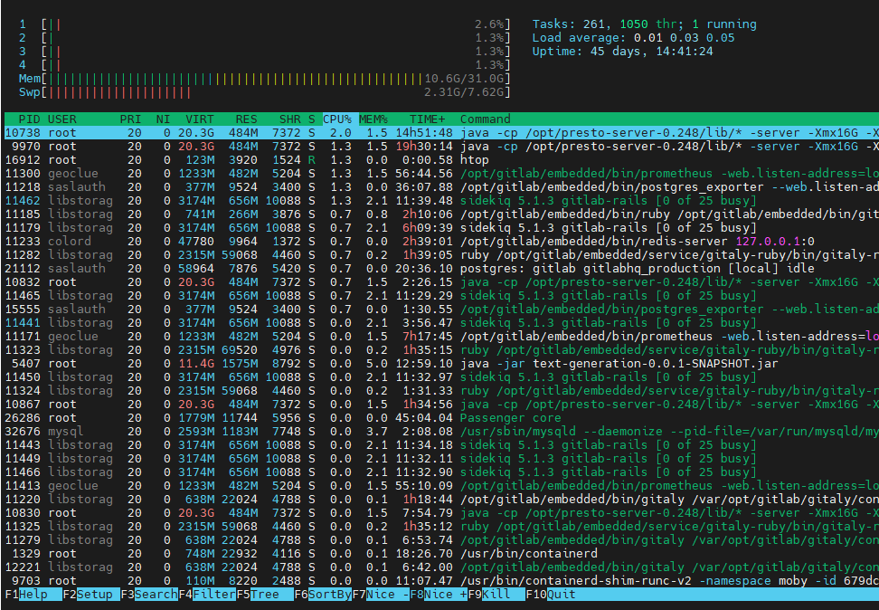

# htop

[TOC]

## 概述

htop是top的升级版,允许用户监视系统上运行的进程及其完整的命令行。

* 系统不会自带，需要进行安装。
* 支持用户交互，可以通过鼠标来 kill 进程而不用通过输入其 PID，支持用鼠标上下拖动，且不同的颜色代表不同的意思。
* 允许用户根据 CPU，内存和时间间隔对进程进行排序

**优势：**

- 与 top 只提供最消耗资源的进程列表不同，htop 提供所有进程的列表，并且使用彩色标识出 CPU 、swap 和内存状态。
- CPU、内存、Swap分区使用情况直观易懂。
- 可以在查找应用程序内存泄漏问题时使用。
- 提供更方便、光标控制的界面来杀死进程。
- 可以横向或纵向滚动浏览进程列表，以便看到所有的进程和完整的命令行。
- 启动比top快。
- 底部有命令提示。
- htop 支持鼠标选中操作（反应不太快）。
- top 已不再维护。

## 安装

```bash
# Ubuntu
sudo apt install htop

# CentOS
yum -y install epel-release
yum -y update
yum -y install htop
```

## 标准输出

htop的标准输出分为三个部分:

### header

默认显示了一些关键的系统信息，可以在setup菜单里进行个性化的设置。

* 左侧

  * cpu占用率显示。数字1，2，3，4分别代表CPU处理器上的一个核。

    分颜色显示了各个级别的占用信息。

    蓝色：   显示低优先级(low priority)进程使用的CPU百分比。 

    绿色：   显示用于普通用户(user)拥有的进程的CPU百分比。 

    红色：   显示系统进程(kernel threads)使用的CPU百分比。

    橙色：    显示IRQ时间使用的CPU百分比。

    洋红色：显示Soft IRQ时间消耗的CPU百分比。

    灰色：    显示IO等待时间消耗的CPU百分比。

    青色：    显示窃取时间(Steal time)消耗的CPU百分比。

  * 内存占用率。

    绿色：    显示内存页面占用的RAM百分比。

    蓝色：    显示缓冲区页面占用的RAM百分比。

    橙色：    显示缓存页面占用的RAM百分比。

  * Swap 使用量。

* 右侧

  * 进程总数、线程数，当前运行进程数。

    在计算机上运行的261个任务(tasks)被分解为1050个线程(thread)，其中只有1个进程处于运行(running)状态。

    任务(tasks)是打开的进程总数的代表。

  * 5、10、15分钟负载。

  * 系统运行时间。

### body

按照cpu占用率排序显示了一个进程列表，可以用方向键滚动。

* PID：              进程标志号，是非零正整数。
* USER：           进程所有者的用户名。
* PRI：               描述Linux内核查看的进程优先级。
* NI：                 描述由用户或root重置的进程优先级。
* VIRT：             进程占用的虚拟内存值（virtual memory）。
* RES：              进程占用的物理内存值（physical memory）。
* SHR：              进程使用的共享内存值（shared memory）。
* S：                   进程的状态。
  * S      Sleeping:                          通常进程在大多数时间都处于睡眠状态，并以固定的时间间隔执行小检查，或者等待用户输入后再返回运行状态。
  * R      Running：                       表示进程(process)正在使用CPU表示正在运行。
  * T/S  Traced/Stoped:               表示进程正在处于暂停的状态。
  * Z      Zombie or defunct:        已完成执行但在进程表中仍具有条目的进程。僵死状态
  * N表示该进程优先值是负数。
* %CPU：          该进程占用的CPU使用率。
* %MEM：        该进程占用的物理内存和总内存的百分比。
* TIME+：          该进程启动后占用的总的CPU时间。
* COMMAND：与每个进程并行显示完整的命令执行 (比如/usr/lib/R)

### footer

显示了在当前状态下可以使用的一些htop命令。

* F1：帮助

* F2：设置htop显示方式（偏好）

* F3

  按下 F3 键，一个文本框就会出现在窗口底部。可以在这输入进程的名字然后回车搜索。如果找到，会在列出的进程列表里高亮选中此进程。

* F4

* F5

  以树形列表形式展现进程（及相关依赖），+ / - 键可以对树列表进行缩放。要退出树状视图模式，请再一次按下 F5 键。

* F6

* F7

* F8

* F9

* F10




## 显示多核cpu平均利用率

顶部默认显示 cpu 各个核的实时利用率（类似于普通的top+1操作）。对于我们的服务器大多有几十个逻辑核，这样会显得比较混乱，而大部分情况下我们了解整体cpu均值就足够了。

按F2进入设置菜单->选择“meters”（计量器）这一项->光标向右移动到“Available Meters”这一列->选择 “CPU average”这一项->按F5将“CPU average”添加到“Left columns”。

接着转到“Left columns”这一列->选择 “All CPUs”->按F9删除，接着顶部栏目的显示结构就会跟下图相似。


## 自定义排序显示

跟top一样，进程信息默认按照cpu使用率排序，当然也可按照自选的列项排序。按F6可以在左侧显示所有列名，移动光标选择一列按回车即可。


## 在htop中kill进程 - 按F9或k

在进程列表中选择想要kill的进程，按F9，左侧就会显示出 “Send signal” 的菜单。


htop 命令可以让你很容易地在 htop 窗口内给一个进程发送任意的信号。按下 F9 键即可。


如你所见，窗口的左边部分列出的是所有可用的信号，右边部分列出的是进程。只要选中信号，并选择一个进程，然后按下 enter 键，选中的信号就会发送到此进程。

## 在htop中调整程序优先级（renice） - F7或F8

在进程列表中选择想要renice的进程，按F7调低该进程的优先级，按F8调高该进程的优先级。

## 显示指定用户的进程 - u

按u键，左侧栏目会显示所有拥有进程的用户，从用户列表中选择一个用户，回车确认，即可仅显示该用户的进程。


## 设置菜单 - F2

htop中有四个高层级菜单

1. Meters:设置顶部栏位的显示项目。
2. Display Options:自定义核心显示选项。
3. Color:自定义颜色主题。
4. Columns:这边可以选择在主区域显示的列信息，对debug非常有用。


htop 命令提供了许多自定义选项，你所要做的就是从主窗口中按下 F2 键。

下面所示的是可用的自定义选项:


只需使用箭头键选择和更改特定的设置。

## 在Htop中strace程序

选中进程按s即可。

## 在htop中显示lsof的输出

选中进程按l，即可显示该进程打开的所有文件。


## 按左右方向键进行水平滚屏

在htop中除了可以像top那样垂直滚屏外，还可以使用左右方向键水平滚屏以在一行中显示一个进程的完整信息。

## 在htop中跟踪进程

选择进程后按 f 键，即可跟踪住相关进程，以防因刷新排序导致焦点消失。这个功能特别时候在监控某个特定进程的适合使用。

## 一次杀掉多个进程

选中进程后按space键，即可给该进程打上tag，该进程的颜色也会发生变化以标志其被打上了tag。给多个进程打上tag后按F9可以同时向这些进程发送signal。

想要取消打上的tag只需要选择相关进程再次按space即可，按shift+u可以一次性取消所哟tag。

## 通过空格键来设置颜色标注进程条目

在系统中运行着的实时进程视图中，要追踪某个进程是个大问题。因为整个列表在不停的刷新着，进程的排列顺序也在变动着。为了这个问题， htop 提供了一个很简单的解决方案：颜色标注。是的，你可以标注一个进程条目，它会以不同的颜色显示，因此要追踪它就变得容易了。

要标注某个进程条目，需要做的就是选中此条目，然后按下‘空格’键。例如，在下面的截图示例中，我已经颜色标注了三个进程条目:


所以通过此方法，你就能很轻松地追踪想查看的进程。

## htop 参数

```bash
htop

-d n       设置刷新的延迟时间
           例如，htop -d 100 命令会使输出在1秒后才会刷新（参数 -d 的单位是10微秒）。-d 10表示htop将以10秒1次的频率刷新输出。
-u user    显示指定的用户的进程信息列表。例如，**htop -u himanshu** 命令会只显示出用户名为 himanshu 的相关进程。
Space：标记进程，可以一起kill掉
-U：去掉所有进程上的标记      
-s：追踪进程。按指定的列排序。例如，**htop -s PID** 命令会按 PID 列的大小排序来显示。
-l：显示进程打开的文件
```

## 常用快捷键

F1-F10都有相关的快捷键可以使用。

| 快捷键       | 常规键 | 功能描述   |
| ------------ | ------ | ---------- |
| h            | F1     | 帮助信息   |
| S            | F2     | 设置菜单   |
| /            | F3     | 搜索功能   |
| I            | F4     | 升序/降序  |
| t            | F5     | 树形视图   |
| >            | F6     | 按某列排序 |
| [          - | F7     | 优先级调低 |
| ]          + | F8     | 优先级调高 |
| k            | F9     | 杀进程     |
| q            | F10    | 退出       |

u – 用于显示特定用户拥有的所有进程。

P –用于基于高CPU消耗对进程进行排序。

M –用于基于高内存消耗对进程进行排序。

T –用于根据时间段对过程进行排序。


# `htop`[¶](https://docs.rockylinux.org/zh/gemstones/htop/#htop)

每个系统管理员都喜欢用一些比较常用的命令， 今天推荐的是`htop`，作为 `top` 命令的替代。 要正常使用 `htop`命令，需要首先安装它。

```
# 安装epel源（也叫存储库）
dnf -y install epel-release 
# 生成缓存
dnf makecache
# 安装htop
dnf -y install htop
```

# 使用 `htop`[¶](https://docs.rockylinux.org/zh/gemstones/htop/#htop_1)

您只需要在终端中键入`htop` 即可，交互界面如下：

```
0[ |||                                            3%]       Tasks: 24,  14thr;  1  running
1[ |                                              1%]       Load average:  0.00  0.00  0.05
Mem[ |||||||                                 197M/8G]       Uptime:  00:31:39
Swap[                                        0K/500M]

PID   USER   PRI   NI   VIRT   RES   SHR   S    CPU%   MEM%   TIME+   Commad(merged)
...
```

F1Help   F2Setup  F3Search F4Filter F5Tree   F6SortBy F7Nice   F8Nice+  F9Kill   F10Quit

## 顶部说明[¶](https://docs.rockylinux.org/zh/gemstones/htop/#_1)

- 最上面的0和1，表示你的CPU核心数，百分比表示单个内核的占用率（当然也可以显示CPU总的占有率）

  - 进度条的不同颜色表示不同的进程类型占有百分比

    | 颜色              | 说明                        |
    | ----------------- | --------------------------- |
    | 蓝色              | 低优先级进程使用的CPU百分比 |
    | 绿色              | 普通用户拥有的进程CPU百分比 |
    | 红色              | 系统进程使用的CPU百分比     |
    | 橙色              | IRQ时间使用的CPU百分比      |
    | 洋红色（Magenta） | 软IRQ时间使用的CPU百分比    |
    | 灰色              | IO等待时间占用的CPU百分比   |
    | 青色              | Steal time消耗的CPU百分比   |

- Tasks: 24, 14thr;  1 running，进程信息。 在我的示例中，表示我的当前机器有24个任务，它们被分成14个线程，其中只有1个进程处于正在运行的状态。

- Mem内存与swap信息。 同样的，也用不同颜色区分:

| 颜色 | 说明                     |
| ---- | ------------------------ |
| 蓝色 | 缓存区消耗的内存百分比   |
| 绿色 | 内存区域消耗的内存百分比 |
| 橙色 | 缓存区消耗的内存百分比   |

- Load average，三个值分别表示了系统在最后1分钟、最后5分钟、最后15分钟的平均负载
- Uptime，表示开机以后的运行时间

## 进程信息说明[¶](https://docs.rockylinux.org/zh/gemstones/htop/#_2)

- **PID - 进程的ID号**
- USER-进程的所有者
- PRI - 显示Linux 内核所能看到的进程优先级
- NI-显示了普通用户或root超级用户reset的进程优先级
- VIRI-一个进程正在消耗的虚拟内存
- **RES-一个进程正在消耗的物理内存**
- SHR-一个进程正在消耗的共享内存
- S - 进程的当前状态，有一种特殊的状态要注意！ 也就是 Z (僵尸进程)。 当机器中有大量的僵尸进程时，会影响机器性能的下降。
- **CPU%-每个进程消耗的CPU百分比**
- MEM%-每个进程消耗的内存百分比
- TIME+-显示了自进程开启以来的运行时间
- Commad-进程所对应的命令

## 快捷键说明[¶](https://docs.rockylinux.org/zh/gemstones/htop/#_3)

在交互界面，按F1按键，即可看到对应的快捷键说明。

上下左右的方向按键，可以在交互界面滚动，space 则可以对对应的进程进行标记，以黄色进行标识。 * N按键 、P按键 、M按键 、T按键，分别以PID、CPU%、MEM%、TIME+进行排序。 当然，你也可以用鼠标点击的方式，以某个字段升序或降序排列。

## 其他常用[¶](https://docs.rockylinux.org/zh/gemstones/htop/#_4)

对进程进行管理，使用F9按键，可以对进程发送不同的信号。 信号列表可以在`kill -l`中找到， 比较常用的有：

| 信号 | 说明                                                         |
| ---- | ------------------------------------------------------------ |
| 1    | 让进程立刻关闭，然后重新读取配置文件后重启                   |
| 9    | 用来立即结束程序的运行，用来强制终止进程，类似windows任务栏当中的强制结束 |
| 15   | kill 命令的默认信号。 有时如果进程已经发生问题，这个信号是无法正常终止进程的，我们会尝试信号9 |

## 结尾[¶](https://docs.rockylinux.org/zh/gemstones/htop/#_5)

`htop`比系统自带的`top`好用太多，更加直观，对日常的使用提升非常巨大。 这就是为什么通常作者在安装操作系统后的第一件事就是安装它。
