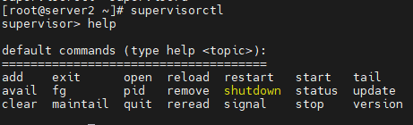
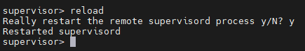

# supervisor

[TOC]

## 概述

http://www.supervisord.org/index.html

supervisor 是一个由 python 语言编写的 c/s 系统，被用来在类 Unix 系统中监控进程状态。

supervisor 管理进程，是通过 fork/exec 的方式将这些被管理的进程当作supervisor的子进程来启动，所以只需要将要管理进程的可执行文件的路径添加到supervisor 的配置文件中就好了。此时被管理进程被视为supervisor的子进程，若该子进程异常中断，则父进程可以准确的获取子进程异常中断的信息，通过在配置文件中设置 autostart=ture，可以实现对异常中断的子进程的自动重启。

## 组成

- **supervisord**：是 supervisor 服务的服务端。主要负责启动自身及其监控的子进程，响应客户端命令，重启异常退出的子进程，记录子进程stdout和stderr输出，生成和处理子进程生命周期中的事件。
- **supervisorctl**：supervisord 服务的客户端命令行。提供了一个类shell的接口（即命令行）来操作 supervisord 服务端。通过 supervisorctl，可以连接到 supervisord 服务进程，获得服务进程监控的子进程状态，启动和停止子进程，获得正在运行的进程列表。客户端通过 Unix 域套接字或者 TCP 套接字与服务进程进行通信，服务器端具有身份凭证认证机制，可以有效提升安全性。当客户端和服务端位于同一台机器上时，客户端与服务器共用同一个配置文件 ，通过不同标签来区分两者的配置。
- **Web Server**：和 supervisorctl 功能娉美。通过web界面查看和控制进程状态。
- **XML-RPC Interface**：服务于 web UI 的同一个 HTTP 服务器提供一个 XML-RPC 接口，可以用来询问和控制管理程序及其运行的程序

## 安装

```bash
sudo apt-get install supervisor

# CentOS
yum install supervisor
```

## 配置

### 查看配置文件

```bash
echo_supervisord_conf                      # 可用于生成初始配置文件
# 或者
cat /etc/supervisord/supervisord.conf
```

### 配置文件

配置文件采用 **分号；**表示注释。

```ini
; Sample supervisor config file.
;
; For more information on the config file, please see:
; http://supervisord.org/configuration.html
;
; Notes:
;  - Shell expansion ("~" or "$HOME") is not supported.  Environment
;    variables can be expanded using this syntax: "%(ENV_HOME)s".
;  - Quotes around values are not supported, except in the case of
;    the environment= options as shown below.
;  - Comments must have a leading space: "a=b ;comment" not "a=b;comment".
;  - Command will be truncated if it looks like a config file comment, e.g.
;    "command=bash -c 'foo ; bar'" will truncate to "command=bash -c 'foo ".

[unix_http_server]
; 这部分设置 HTTP 服务器监听的 UNIX domain socket
file=/tmp/supervisor.sock   ; the path to the socket file
                            ; 建议修改为 /var/run 目录，避免被系统删除。
;chmod=0700                 ; socket file mode (default 0700)
;chown=nobody:nogroup       ; socket file uid:gid owner
;username=user              ; default is no username (open server)
;password=123               ; default is no password (open server)

;[inet_http_server]         ; inet (TCP) server disabled by default
;port=127.0.0.1:9001        ; ip_address:port specifier, *:port for all iface
;username=user              ; default is no username (open server)
;password=123               ; default is no password (open server)

[supervisord]
; 与supervisord有关的全局配置
logfile=/tmp/supervisord.log ; main log file; default $CWD/supervisord.log
                             ; 建议修改为 /var/log/supervisor/supervisord.log ，避免被系统删除。
logfile_maxbytes=50MB        ; max main logfile bytes b4 rotation; default 50MB
logfile_backups=10           ; # of main logfile backups; 0 means none, default 10
loglevel=info                ; log level; default info; others: debug,warn,trace
pidfile=/tmp/supervisord.pid ; supervisord pidfile; default supervisord.pid
                             ; 建议修改为 /var/run 目录，避免被系统删除。
nodaemon=false               ; start in foreground if true; default false
minfds=1024                  ; min. avail startup file descriptors; default 1024
minprocs=200                 ; min. avail process descriptors;default 200
;umask=022                   ; process file creation umask; default 022
;user=supervisord            ; setuid to this UNIX account at startup; recommended if root
;identifier=supervisor       ; supervisord identifier, default is 'supervisor'
;directory=/tmp              ; default is not to cd during start
;nocleanup=true              ; don't clean up tempfiles at start; default false
;childlogdir=/tmp            ; 'AUTO' child log dir, default $TEMP
;environment=KEY="value"     ; key value pairs to add to environment
;strip_ansi=false            ; strip ansi escape codes in logs; def. false

; The rpcinterface:supervisor section must remain in the config file for
; RPC (supervisorctl/web interface) to work.  Additional interfaces may be
; added by defining them in separate [rpcinterface:x] sections.

[rpcinterface:supervisor]
supervisor.rpcinterface_factory = supervisor.rpcinterface:make_main_rpcinterface

; The supervisorctl section configures how supervisorctl will connect to
; supervisord.  configure it match the settings in either the unix_http_server
; or inet_http_server section.

[supervisorctl]
serverurl=unix:///tmp/supervisor.sock ; use a unix:// URL  for a unix socket
                                      ; 建议修改为 /var/run 目录，避免被系统删除。
;serverurl=http://127.0.0.1:9001 ; use an http:// url to specify an inet socket
;username=chris              ; should be same as in [*_http_server] if set
;password=123                ; should be same as in [*_http_server] if set
;prompt=mysupervisor         ; cmd line prompt (default "supervisor")
;history_file=~/.sc_history  ; use readline history if available

; The sample program section below shows all possible program subsection values.
; Create one or more 'real' program: sections to be able to control them under
; supervisor.

;[program:theprogramname]
; 配置文件必须包括至少一个program，x是program名称，必须写上，不能为空
;command=/bin/cat              ; the program (relative uses PATH, can take args)
;process_name=%(program_name)s ; process_name expr (default %(program_name)s)
;numprocs=1                    ; number of processes copies to start (def 1)
;directory=/tmp                ; directory to cwd to before exec (def no cwd)。
                               ; 执行子进程时supervisord暂时切换到该目录
;umask=022                     ; umask for process (default None)
;priority=999                  ; the relative start priority (default 999)
;autostart=true                ; start at supervisord start (default: true)
;startsecs=1                   ; # of secs prog must stay up to be running (def. 1)。
                               ; 进程从STARING状态转换到RUNNING状态program所需要保持运行的时间（单位：秒）
;startretries=3                ; max # of serial start failures when starting (default 3)
;autorestart=unexpected        ; when to restart if exited after running (def: unexpected)
;exitcodes=0,2                 ; 'expected' exit codes used with autorestart (default 0,2)
;stopsignal=QUIT               ; signal used to kill process (default TERM)
;stopwaitsecs=10               ; max num secs to wait b4 SIGKILL (default 10)
;stopasgroup=false             ; send stop signal to the UNIX process group (default false)
;killasgroup=false             ; SIGKILL the UNIX process group (def false)
;user=chrism                   ; setuid to this UNIX account to run the program
;redirect_stderr=true          ; redirect proc stderr to stdout (default false)
                               ; 如果是true，则进程的stderr输出被发送回其stdout文件描述符上的supervisord。
;stdout_logfile=/a/path        ; stdout log path, NONE for none; default AUTO
;stdout_logfile_maxbytes=1MB   ; max # logfile bytes b4 rotation (default 50MB)
                               ; stdout_logfile指定日志文件最大字节数，默认为50MB，可以加KB、MB或GB等单位。
;stdout_logfile_backups=10     ; # of stdout logfile backups (0 means none, default 10)。
                               ; 要保存的stdout_logfile备份的数量。
;stdout_capture_maxbytes=1MB   ; number of bytes in 'capturemode' (default 0)
;stdout_events_enabled=false   ; emit events on stdout writes (default false)
;stderr_logfile=/a/path        ; stderr log path, NONE for none; default AUTO
;stderr_logfile_maxbytes=1MB   ; max # logfile bytes b4 rotation (default 50MB)
;stderr_logfile_backups=10     ; # of stderr logfile backups (0 means none, default 10)
;stderr_capture_maxbytes=1MB   ; number of bytes in 'capturemode' (default 0)
;stderr_events_enabled=false   ; emit events on stderr writes (default false)
;environment=A="1",B="2"       ; process environment additions (def no adds)
;serverurl=AUTO                ; override serverurl computation (childutils)

; The sample eventlistener section below shows all possible eventlistener
; subsection values.  Create one or more 'real' eventlistener: sections to be
; able to handle event notifications sent by supervisord.

;[eventlistener:theeventlistenername]
;command=/bin/eventlistener    ; the program (relative uses PATH, can take args)
;process_name=%(program_name)s ; process_name expr (default %(program_name)s)
;numprocs=1                    ; number of processes copies to start (def 1)
;events=EVENT                  ; event notif. types to subscribe to (req'd)
;buffer_size=10                ; event buffer queue size (default 10)
;directory=/tmp                ; directory to cwd to before exec (def no cwd)
;umask=022                     ; umask for process (default None)
;priority=-1                   ; the relative start priority (default -1)
;autostart=true                ; start at supervisord start (default: true)
;startsecs=1                   ; # of secs prog must stay up to be running (def. 1)
;startretries=3                ; max # of serial start failures when starting (default 3)
;autorestart=unexpected        ; autorestart if exited after running (def: unexpected)
;exitcodes=0,2                 ; 'expected' exit codes used with autorestart (default 0,2)
;stopsignal=QUIT               ; signal used to kill process (default TERM)
;stopwaitsecs=10               ; max num secs to wait b4 SIGKILL (default 10)
;stopasgroup=false             ; send stop signal to the UNIX process group (default false)
;killasgroup=false             ; SIGKILL the UNIX process group (def false)
;user=chrism                   ; setuid to this UNIX account to run the program
;redirect_stderr=false         ; redirect_stderr=true is not allowed for eventlisteners
;stdout_logfile=/a/path        ; stdout log path, NONE for none; default AUTO
;stdout_logfile_maxbytes=1MB   ; max # logfile bytes b4 rotation (default 50MB)
;stdout_logfile_backups=10     ; # of stdout logfile backups (0 means none, default 10)
;stdout_events_enabled=false   ; emit events on stdout writes (default false)
;stderr_logfile=/a/path        ; stderr log path, NONE for none; default AUTO
;stderr_logfile_maxbytes=1MB   ; max # logfile bytes b4 rotation (default 50MB)
;stderr_logfile_backups=10     ; # of stderr logfile backups (0 means none, default 10)
;stderr_events_enabled=false   ; emit events on stderr writes (default false)
;environment=A="1",B="2"       ; process environment additions
;serverurl=AUTO                ; override serverurl computation (childutils)

; The sample group section below shows all possible group values.  Create one
; or more 'real' group: sections to create "heterogeneous" process groups.

;[group:thegroupname]
;programs=progname1,progname2  ; each refers to 'x' in [program:x] definitions
;priority=999                  ; the relative start priority (default 999)

; The [include] section can just contain the "files" setting.  This
; setting can list multiple files (separated by whitespace or
; newlines).  It can also contain wildcards.  The filenames are
; interpreted as relative to this file.  Included files *cannot*
; include files themselves.

;[include]
;files = relative/directory/*.ini
```

### 示例

在目录/etc/supervisor/conf.d/下创建awesome.ini 。

```ini
；/etc/supervisor/conf.d/awesome.ini

[program:awesome]

command     = /usr/bin/env python3 /srv/awesome/www/app.py
directory   = /srv/awesome/www
user        = www-data
startsecs   = 3

redirect_stderr         = true
stdout_logfile_maxbytes = 50MB
stdout_logfile_backups  = 10
stdout_logfile          = /srv/awesome/log/app.log
```

## 启动

```bash
sudo supervisord -c supervisor.conf  
```

## supervisorctl

### 命令模式

```bash
supervisorctl [ -c supervisor.conf ] status              # 查看状态
supervisorctl [ -c supervisor.conf ] reload              # 重新载入配置文件
supervisorctl [ -c supervisor.conf ] start [all]|[x]     # 启动所有/指定的程序进程
supervisorctl [ -c supervisor.conf ] stop  [all]|[x]     # 关闭所有/指定的程序进程
```

### 交互模式

1. 进入交互模式
   ```bash
   supervisorctl
   ```


2. 查看帮助

   ```bash
   help
   ```

   

3. 添加一个进程

   ```bash
   add
   ```

   

4. 退出supervisor客户端

   ```bash
   exit
   ```

   

5. 以访问url方式查看进程状态

   ```bash
   open http://192.168.0.22:9001
   ```

   


5. 重新启动所有被监控的进程

   ```bash
   reload
   ```



6. 启动 | 重启 | 停止进程

   ```
   start | restart | stop
   ```

   

7. 查看被监控进程的标准输入，标准错误输出的详细信息

   ```
   tail
   ```

   

8. 根据配置文件监控项，检查是否可用

   ```
   avail
   ```

   


10. 将后台运行的进程调到前台工作

    ```
    fg
    ```

    

11. 查看进程的pid号

    ```
    pid
    ```

    


12. remove从监控组里移除某监控 此移除是平滑移除，不影响其他正字被监控的进程，后续注释掉配置文件的监控项目就可以了

    ```
    remove
    ```

    

13. 关闭supervisor父进程（不是某个进程）

    ```
    shutdown
    ```


14. 查看被监控进程状态

    ```
    status
    ```

    

15. 以配置文件为更新对象，检测配置文件中有无可用的进程项目，并add到监控组里面去

    ```
    update
    ```

    


16. 清楚指定进程的日志文件

    ```
    clear
    ```

    


17. 最近主要的标准输出信息

    ```
    maintail
    ```


18. 退出supervisor客户端

    ```
    quit
    ```

    

19. 检测配置文件是否有可用的被监控进程项

    ```
    reread
    ```


20. signal

21. 查看supervisor版本

    ```
    version
    ```


## Other

#### 多个进程管理

按照官方文档的定义，一个 [program:x] 实际上是表示一组相同特征或同类的进程组，也就是说一个 [program:x] 可以启动多个进程。这组进程的成员是通过 numprocs 和 process_name 这两个参数来确定的，这句话什么意思呢，我们来看这个例子。

```ini
[program:foo] 

; 可以在 command 这里用 python 表达式传递不同的参数给每个进程
command=python server.py --port=90%(process_num)02d

directory=/home/python/tornado_server ; 执行 command 之前，先切换到工作目录

; 若 numprocs 不为1，process_name 的表达式中一定要包含 process_num 来区分不同的进程
numprocs=2                   
process_name=%(program_name)s_%(process_num)02d; 

user=oxygen                 ; 使用 oxygen 用户来启动该进程

autorestart=true  ; 程序崩溃时自动重启

redirect_stderr=true      ; 重定向输出的日志

stdout_logfile = /var/log/supervisord/
tornado_server.log
loglevel=info
```

上面这个例子会启动两个进程，process_name 分别为 foo:foo_01 和 foo:foo_02。通过这样一种方式，就可以用一个 [program:x] 配置项，来启动一组非常类似的进程。

Supervisor 同时还提供了另外一种进程组的管理方式，通过这种方式，可以使用 supervisorctl 命令来管理一组进程。跟 [program:x] 的进程组不同的是，这里的进程是一个个的 [program:x] 。

```ini
[group:thegroupname]
programs=progname1,progname2  ; each refers to 'x' in [program:x] definitions
priority=999                  ; the relative start priority (default 999)
```

当添加了上述配置后，progname1 和 progname2 的进程名就会变成 thegroupname:progname1 和 thegroupname:progname2 以后就要用这个名字来管理进程了，而不是之前的 progname1。

以后执行 supervisorctl stop thegroupname: 就能同时结束 progname1 和 progname2，执行 supervisorctl stop thegroupname:progname1 就能结束 progname1。


## supervisord-monitor

supervisord 的集中管理工具。