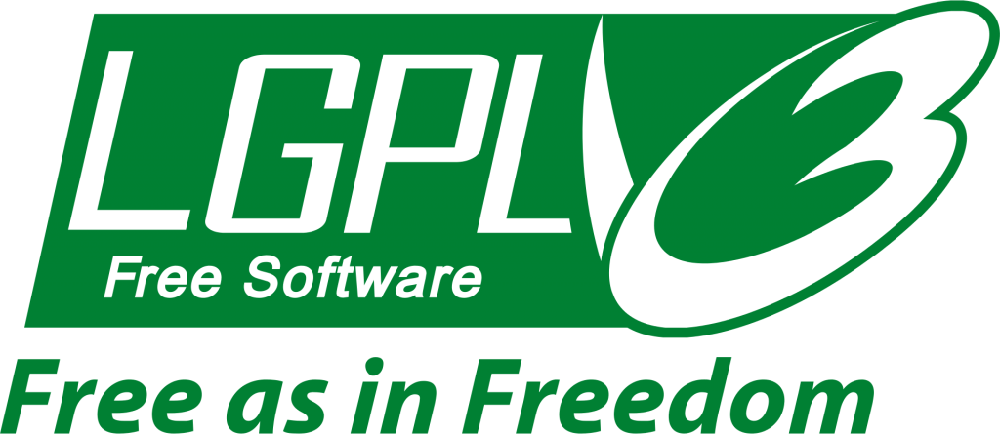
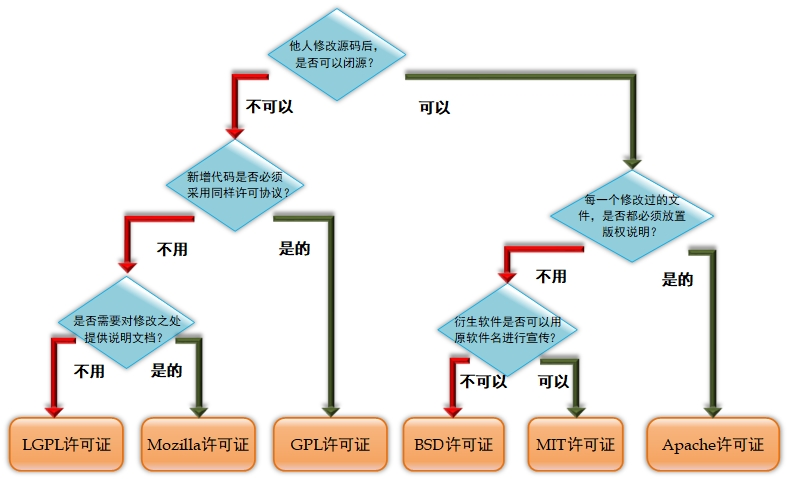

# 开源

[TOC]

## 概述

自由软件基金会（Free Software Foundation，FSF）是一个非营利组织，其使命是在全球范围内促进计算机用户的自由，捍卫所有软件用户的权利。

经常会在开源社区中看到 Copyleft 这个单词，这是一个由自由软件运动所发展出的概念，中文被翻译为“著佐权”或者“公共版权”。与 Copyright 截然相反，Copyleft 不会限制使用者复制、修改或再发布软件。

## 许可证

开源许可证总览：https://opensource.org/licenses/alphabetical

The following licenses have been approved by the OSI. The  parenthesized expression following a license name is its SPDX short  identifier (if one exists).

- [Academic Free License 3.0 (AFL-3.0)](https://opensource.org/licenses/AFL-3.0)

- [Adaptive Public License (APL-1.0)](https://opensource.org/licenses/APL-1.0)

### Apache

**Apache许可证（Apache License）**：是由Apache软件基金会负责发布和维护的开源许可协议。目前使用最广泛的Apache许可证是2004年发行的2.0版本，它在为开发人员提供版权及专利许可的同时，还允许用户拥有修改代码及再发布的自由。该许可证非常适合用于商业软件，现在热门的Hadoop、Apache HTTP Server、MongoDB 等项目都是基于该许可证研发的。程序开发人员在开发遵循该许可证的软件时，要严格遵守下面4个条件。

> 该软件及其衍生品必须继续使用Apache许可证。
>
> 如果修改了程序源代码，需要在文档中进行声明。
>
> 若软件是基于他人的源代码编写而成的，则需要保留原始代码的许可证、商标、专利声明及原作者声明的其他内容信息。
>
> 如果再发布的软件中有声明文件，则需在此文件中注明基于了Apache许可证及其他许可证。

- [Apache Software License 1.1 (Apache-1.1)](https://opensource.org/licenses/Apache-1.1) (superseded)

- [Apache License 2.0 (Apache-2.0)](https://opensource.org/licenses/Apache-2.0)

- [Apple Public Source License (APSL-2.0)](https://opensource.org/licenses/APSL-2.0)

- [Artistic license 1.0 (Artistic-1.0)](https://opensource.org/licenses/Artistic-1.0) (superseded)

- [Artistic License 2.0 (Artistic-2.0)](https://opensource.org/licenses/Artistic-2.0)

- [Attribution Assurance License (AAL)](https://opensource.org/licenses/AAL)

- [Boost Software License (BSL-1.0)](https://opensource.org/licenses/BSL-1.0)

### BSD License

**伯克利软件发布版（Berkeley Software Distribution, BSD）许可证**：另一款被广泛使用的开源软件许可协议。相较于GPL许可证，BSD更加宽松，适合于商业用途。用户可以使用、修改和重新发布遵循该许可证的软件，并且可以将软件作为商业软件发布和销售，前提是需要满足下面3个条件。

> 如果再发布的软件中包含开源代码，则源代码必须继续遵循BSD许可证。
>
> 如果再发布的软件中只有二进制程序，则需要在相关文档或版权文件中声明原始代码遵循了BSD许可证。
>
> 不允许用原始软件的名字、作者名字或机构名称进行市场推广。

- [*BSD-3-Clause-LBNL*](https://opensource.org/licenses/0BSD)
- [0-clause BSD License (0BSD)](https://opensource.org/licenses/0BSD)

- [1-clause BSD License (BSD-1-Clause)](https://opensource.org/licenses/BSD-1-Clause)

- [2-clause BSD License (BSD-2-Clause)](https://opensource.org/licenses/BSD-2-Clause)

- [3-clause BSD License (BSD-3-Clause)](https://opensource.org/licenses/BSD-3-Clause)

- [BSD+Patent (BSD-2-Clause-Patent)](https://opensource.org/licenses/BSDplusPatent)

  

- [CERN Open Hardware Licence Version 2 - Permissive](https://opensource.org/CERN-OHL-P)

- [CERN Open Hardware Licence Version 2 - Weakly Reciprocal](https://opensource.org/CERN-OHL-W)

- [CERN Open Hardware Licence Version 2 - Strongly Reciprocal](https://opensource.org/CERN-OHL-S)

- [CeCILL License 2.1 (CECILL-2.1)](https://opensource.org/licenses/CECILL-2.1)

- [Common Development and Distribution License 1.0 (CDDL-1.0)](https://opensource.org/licenses/CDDL-1.0)

- [Common Public Attribution License 1.0 (CPAL-1.0)](https://opensource.org/licenses/CPAL-1.0)

- [Common Public License 1.0 (CPL-1.0)](https://opensource.org/licenses/CPL-1.0) (superseded)

- [Computer Associates Trusted Open Source License 1.1 (CATOSL-1.1)](https://opensource.org/licenses/CATOSL-1.1)

- [Cryptographic Autonomy License v.1.0 (CAL-1.0)](https://opensource.org/licenses/CAL-1.0)

- [CUA Office Public License Version 1.0 (CUA-OPL-1.0)](https://opensource.org/licenses/CUA-OPL-1.0) (retired)

- [Eclipse Public License 1.0 (EPL-1.0)](https://opensource.org/licenses/EPL-1.0) (superseded)

- [Eclipse Public License 2.0 (EPL-2.0)](https://opensource.org/licenses/EPL-2.0)

- [eCos License version 2.0 (eCos-2.0)](https://opensource.org/licenses/eCos-2.0)

- [Educational Community License, Version 1.0 (ECL-1.0)](https://opensource.org/licenses/ECL-1.0) (superseded)

- [Educational Community License, Version 2.0 (ECL-2.0)](https://opensource.org/licenses/ECL-2.0)

- [Eiffel Forum License V1.0 (EFL-1.0)](https://opensource.org/licenses/EFL-1.0) (superseded)

- [Eiffel Forum License V2.0 (EFL-2.0)](https://opensource.org/licenses/EFL-2.0)

- [Entessa Public License (Entessa)](https://opensource.org/licenses/Entessa)

- [EU DataGrid Software License (EUDatagrid)](https://opensource.org/licenses/EUDatagrid)

- [European Union Public License 1.2 (EUPL-1.2)](https://opensource.org/licenses/EUPL-1.1) (*links to every language's version on their site*)

- [Fair License (Fair)](https://opensource.org/licenses/Fair)

- [Frameworx License (Frameworx-1.0)](https://opensource.org/licenses/Frameworx-1.0)

- [Free Public License 1.0.0 (0BSD)](http://opensource.org/licenses/0BSD)

### GNU

#### GPL

**GNU通用公共许可证（General Public License，GPL）**：目前广泛使用的开源软件许可协议之一，用户享有运行、学习、共享和修改软件的自由。GPL最初是自由软件基金会创始人 Richard  Stallman 起草的，其版本目前已经发展到了第3版。GPL的目的是保证程序员在开源社区中所做的工作对整个世界是有益的，所开发的软件也是自由的，并极力避免开源软件被私有化以及被无良软件公司所剥削。

现在，只要软件中包含了遵循GPL许可证的产品或代码，该软件就必须开源、免费，因此这个许可证并不适合商业收费软件。遵循该许可证的开源软件数量极其庞大，包括Linux内核在内的大多数的开源软件都是基于GPL许可证的。GPL赋予了用户著名的五大自由。

> **使用自由：**允许用户根据需要自由使用这个软件。
>
> **复制自由：**允许把软件复制到任何人的计算机中，并且不限制复制的数量。
>
> **修改自由：**允许开发人员增加或删除软件的功能，但软件修改后必须依然基于GPL许可证。
>
> **衍生自由：**允许用户深度定制化软件后，为软件注册自己的新商标，再发行衍生品的自由。
>
> **收费自由：**允许在各种媒介上出售该软件，但必须提前让买家知道这个软件是可以免费获得的。因此，一般来讲，开源软件都是通过为用户提供有偿服务的形式来营利的。

- [GNU Affero General Public License version 3 (AGPL-3.0)](https://opensource.org/licenses/AGPL-3.0)

- [GNU General Public License version 2 (GPL-2.0)](https://opensource.org/licenses/GPL-2.0)

- [GNU General Public License version 3 (GPL-3.0)](https://opensource.org/licenses/GPL-3.0)

  
#### LGPL
**较宽松通用公共许可证（Lesser GPL, LGPL）**：一个主要为保护类库权益而设计的 GPL 开源协议。与标准 GPL 许可证相比，LGPL 允许商业软件以类库引用的方式使用开源代码，而不用将其产品整体开源，因此普遍被商业软件用来引用类库代码。简单来说，就是针对使用了基于 LGPL 许可证的开源代码，在涉及这部分代码，以及修改过或者衍生出来的代码时，都必须继续采用 LGPL 协议，除此以外的其他代码则不强制要求。

如果您觉得 LGPL 许可证更多地是关注对类库文件的保护，而不是软件整体，那就对了。因为该许可证最早的名字是 Library GPL，即 GPL 类库开源许可证，保护的对象有 glibc、GTK widget toolkit 等类库文件。

- [GNU Lesser General Public License version 2.1 (LGPL-2.1)](https://opensource.org/licenses/LGPL-2.1)

- [GNU Lesser General Public License version 3 (LGPL-3.0)](https://opensource.org/licenses/LGPL-3.0)

  

- [Historical Permission Notice and Disclaimer (HPND)](https://opensource.org/licenses/HPND)

- [IBM Public License 1.0 (IPL-1.0)](https://opensource.org/licenses/IPL-1.0)

- [Intel Open Source License (Intel)](https://opensource.org/licenses/Intel) (retired)

- [IPA Font License (IPA)](https://opensource.org/licenses/IPA)

- [ISC License (ISC)](https://opensource.org/licenses/ISC)

- [Jabber Open Source License](https://opensource.org/licenses/jabberpl) (retired)

- [LaTeX Project Public License 1.3c (LPPL-1.3c)](https://opensource.org/licenses/LPPL-1.3c)

- [Lawrence Berkeley National Labs BSD Variant License (BSD-3-Clause-LBNL)](https://opensource.org/BSD-3-Clause-LBNL)

- [Licence Libre du Québec – Permissive (LiLiQ-P) version 1.1 (LiliQ-P) ](https://opensource.org/licenses/LiLiQ-P-1.1)

- [Licence Libre du Québec – Réciprocité (LiLiQ-R) version 1.1 (LiliQ-R)](https://opensource.org/licenses/LiLiQ-R-1.1)

- [Licence Libre du Québec – Réciprocité forte (LiLiQ-R+) version 1.1 (LiliQ-R+)](https://opensource.org/licenses/LiLiQ-Rplus-1.1)

- [Lucent Public License ("Plan9"), version 1.0 (LPL-1.0)](https://opensource.org/licenses/LPL-1.0) (superseded)

- [Lucent Public License Version 1.02 (LPL-1.02)](https://opensource.org/licenses/LPL-1.02)

- [Microsoft Public License (MS-PL)](https://opensource.org/licenses/MS-PL)

- [Microsoft Reciprocal License (MS-RL)](https://opensource.org/licenses/MS-RL)

- [MirOS Licence (MirOS)](https://opensource.org/licenses/MirOS)
### MIT

**MIT许可证（Massachusetts Institute of Technology License）**：源于麻省理工学院，又称为X11协议。MIT许可证是目前限制最少的开源许可证之一，用户可以使用、复制、修改、再发布软件，而且只要在修改后的软件源代码中保留原作者的许可信息即可，因此普遍被商业软件（例如 jQuery 与Node.js ）所使用。也就是说，MIT许可证宽松到一个新境界，即用户只要在代码中声明了 MIT 许可证和版权信息，就可以去做任何事情，而无须承担任何责任。

- [MIT License (MIT)](https://opensource.org/licenses/MIT)

- [MIT No Attribution License (MIT-0)](https://opensource.org/licenses/MIT-0)

  

- [MITRE Collaborative Virtual Workspace License (CVW)](https://opensource.org/licenses/CVW) (retired)

- [Motosoto License (Motosoto)](https://opensource.org/licenses/Motosoto)

### Mozilla

**Mozilla公共许可证（Mozilla Public License，MPL）**：于1998年初由Netscape公司的Mozilla小组设计，原因是它们认为GPL和BSD许可证不能很好地解决开发人员对源代码的需求和收益之间的平衡关系，因此便将这两个协议进行融合，形成了MPL。2012年年初，Mozilla基金会发布了MPL 2.0版本（目前为止也是最新的版本），后续被用在 Firefox、Thunderbird 等诸多产品上。最新版的 MPL 公共许可证有以下特点。

> 在使用基于MPL许可证的源代码时，后续只需要继续开源这部分特定代码即可，新研发的软件不用完全被该许可证控制。
>
> 开发人员可以将基于MPL、GPL、BSD等多种许可证的代码一起混合使用。
>
> 开发人员在发布新软件时，必须附带一个专门用于说明该程序的文件，内容要有原始代码的修改时间和修改方式。

- [Mozilla Public License 1.0 (MPL-1.0)](https://opensource.org/licenses/MPL-1.0) (superseded)

- [Mozilla Public License 1.1 (MPL-1.1)](https://opensource.org/licenses/MPL-1.1) (superseded)

- [Mozilla Public License 2.0 (MPL-2.0)](https://opensource.org/licenses/MPL-2.0)

  

- [Mulan Permissive Software License v2 (MulanPSL - 2.0)](https://opensource.org/licenses/MulanPSL-2.0)

- [Multics License (Multics)](https://opensource.org/licenses/Multics)

- [NASA Open Source Agreement 1.3 (NASA-1.3)](https://opensource.org/licenses/NASA-1.3)

- [Naumen Public License (Naumen)](https://opensource.org/licenses/Naumen)

- [Nethack General Public License (NGPL)](https://opensource.org/licenses/NGPL)

- [Nokia Open Source License (Nokia)](https://opensource.org/licenses/Nokia)

- [Non-Profit Open Software License 3.0 (NPOSL-3.0)](https://opensource.org/licenses/NPOSL-3.0)

- [NTP License (NTP)](https://opensource.org/licenses/NTP)

- [OCLC Research Public License 2.0 (OCLC-2.0)](https://opensource.org/licenses/OCLC-2.0)

- [Open Group Test Suite License (OGTSL)](https://opensource.org/licenses/OGTSL)

- [Open Software License 1.0 (OSL-1.0)](https://opensource.org/licenses/OSL-1.0) (superseded)

- [Open Software License 2.1 (OSL-2.1)](https://opensource.org/licenses/OSL-2.1) (superseded)

- [Open Software License 3.0 (OSL-3.0)](https://opensource.org/licenses/OSL-3.0)

- [OpenLDAP Public License Version 2.8 (OLDAP-2.8)](https://opensource.org/licenses/OLDAP-2.8)

- [OSET Public License version 2.1](https://opensource.org/licenses/OPL-2.1)

- [PHP License 3.0 (PHP-3.0)](https://opensource.org/licenses/PHP-3.0) (superseded)

- [PHP License 3.01 (PHP-3.01)](https://opensource.org/licenses/PHP-3.01)

- [The PostgreSQL License (PostgreSQL)](https://opensource.org/licenses/PostgreSQL)

- [Python License (Python-2.0)](https://opensource.org/licenses/Python-2.0) (overall Python license)

- [CNRI Python license (CNRI-Python)](https://opensource.org/licenses/CNRI-Python) (CNRI portion of Python License)

- [Q Public License (QPL-1.0)](https://opensource.org/licenses/QPL-1.0)

- [RealNetworks Public Source License V1.0 (RPSL-1.0)](https://opensource.org/licenses/RPSL-1.0)

- [Reciprocal Public License, version 1.1 (RPL-1.1)](https://opensource.org/licenses/RPL-1.1) (superseded)

- [Reciprocal Public License 1.5 (RPL-1.5)](https://opensource.org/licenses/RPL-1.5)

- [Ricoh Source Code Public License (RSCPL)](https://opensource.org/licenses/RSCPL)

- [SIL Open Font License 1.1 (OFL-1.1)](https://opensource.org/licenses/OFL-1.1)

- [Simple Public License 2.0 (SimPL-2.0)](https://opensource.org/licenses/SimPL-2.0)

- [Sleepycat License (Sleepycat)](https://opensource.org/licenses/Sleepycat)

- [Sun Industry Standards Source License (SISSL)](https://opensource.org/licenses/SISSL) (retired)

- [Sun Public License 1.0 (SPL-1.0)](https://opensource.org/licenses/SPL-1.0)

- [Sybase Open Watcom Public License 1.0 (Watcom-1.0)](https://opensource.org/licenses/Watcom-1.0)

- [Universal Permissive License (UPL)](https://opensource.org/licenses/UPL)

- [University of Illinois/NCSA Open Source License (NCSA)](https://opensource.org/licenses/NCSA)

- [Upstream Compatibility License v1.0](https://opensource.org/licenses/UCL-1.0)

- [Unicode Data Files and Software License](https://opensource.org/node/1077)

- [The Unlicense](https://opensource.org/licenses/unlicense)

- [Vovida Software License v. 1.0 (VSL-1.0)](https://opensource.org/licenses/VSL-1.0)

- [W3C License (W3C)](https://opensource.org/licenses/W3C)

- [wxWindows Library License (WXwindows)](https://opensource.org/licenses/WXwindows)

- [X.Net License (Xnet)](https://opensource.org/licenses/Xnet)

- [Zero-Clause BSD (0BSD)](https://opensource.org/licenses/0BSD)

- [Zope Public License 2.0 (ZPL-2.0)](https://opensource.org/licenses/ZPL-2.0) (superseded)

- [Zope Public License 2.1 (ZPL-2.1)](https://opensource.org/licenses/ZPL-2.1)

- [zlib/libpng license (Zlib)](https://opensource.org/licenses/Zlib)

*You can also view a list of open source licenses [grouped by category](https://opensource.org/licenses/category), and licenses which have been [superseded or retired](https://opensource.org/licenses/do-not-use).* 

乌克兰程序员 Paul Bagwell 创作的一幅流程图对常见开源许可证进行了汇总归纳，选择时可进行参考：

## 营利模式

* **多条产品线**：如 MySQL 数据库便有个人版和企业版两个版本，即个人版完全免费，起到了很好的推广作用；企业版则通过销售授权许可来营利。
* **技术服务型**：JBoss 应用服务器便是典型代表，JBoss 软件可自由免费使用，软件提供方通过技术文档、培训课程以及定制开发服务来盈利。
* **软硬件结合**：比如 IBM 公司在出售服务器时，一般会为用户捆绑销售 AIX 或 Linux 系统来确保硬件设施的营利。
* **技术出版物**：比如 O'Reilly 既是一家开源公司，也是一家出版商，诸多优秀图书都是由 O'Reilly 出版的。
* **品牌和口碑**：微软公司曾多次表示支持开源社区。Visual Studio Code、PowerShell、TypeScript 等软件均已开源。是不是瞬间就对微软公司好感倍增了？买一份正版系统表示支持也就是人之常情了。
