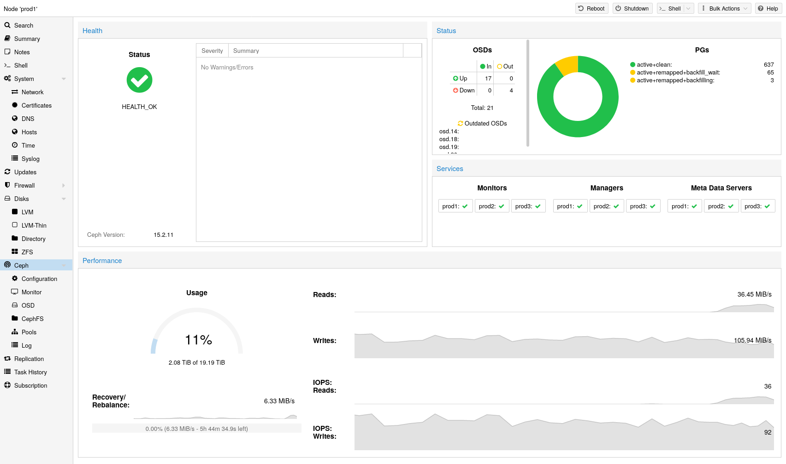
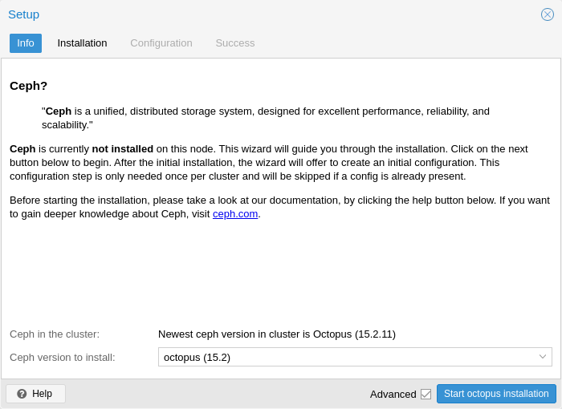
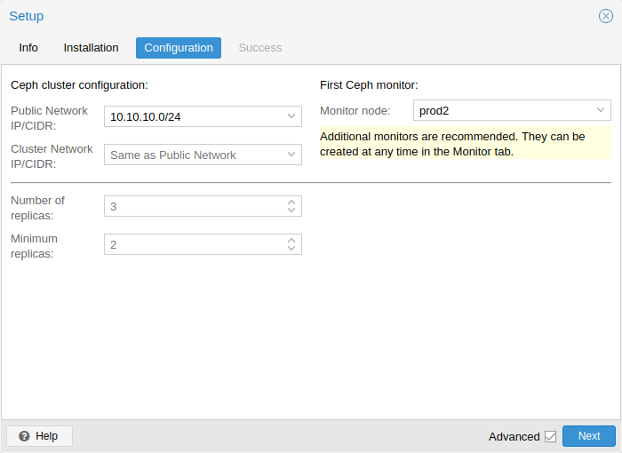
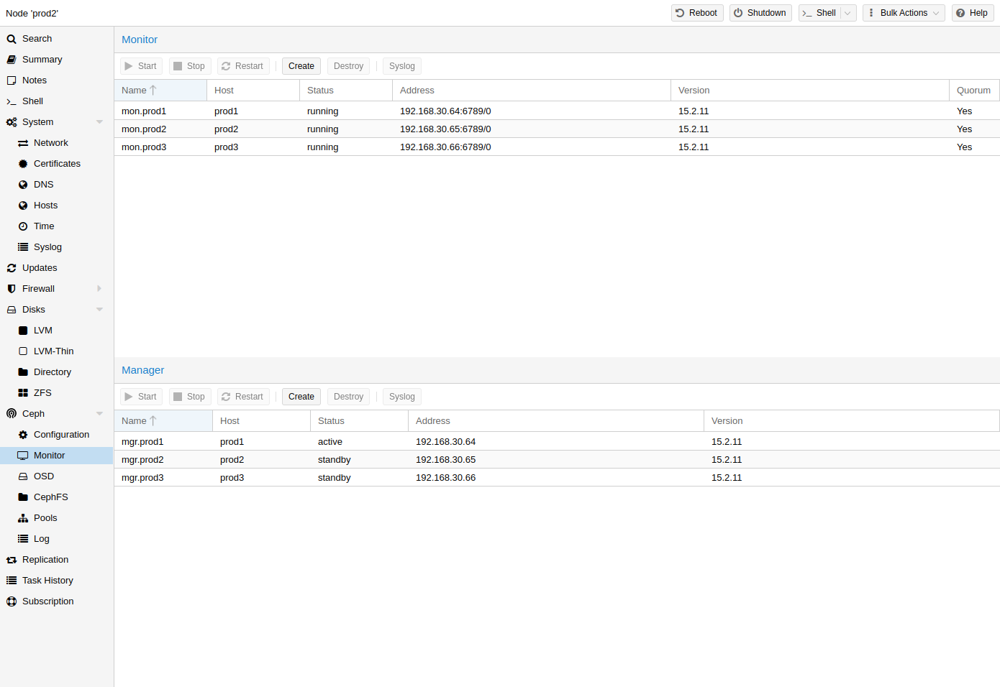
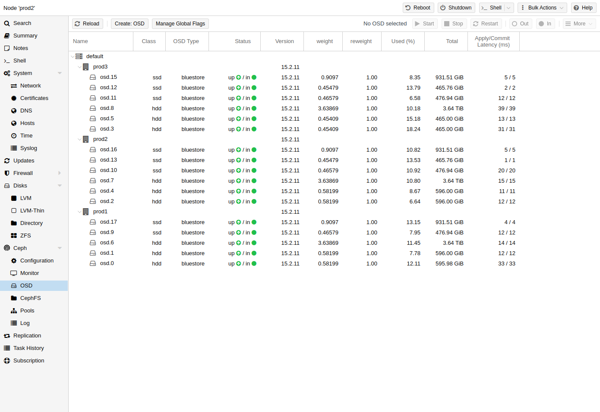
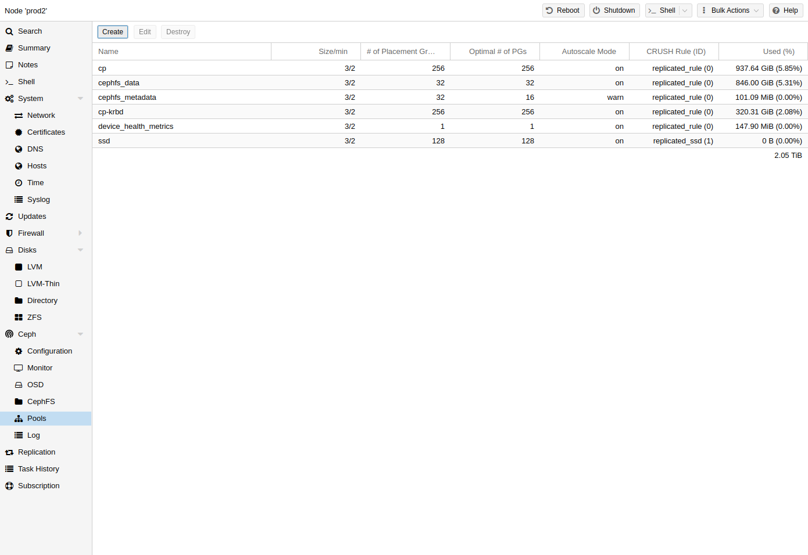
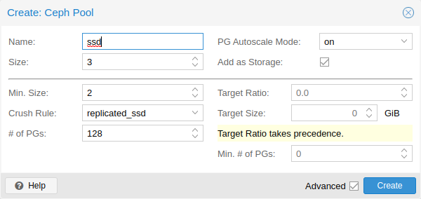
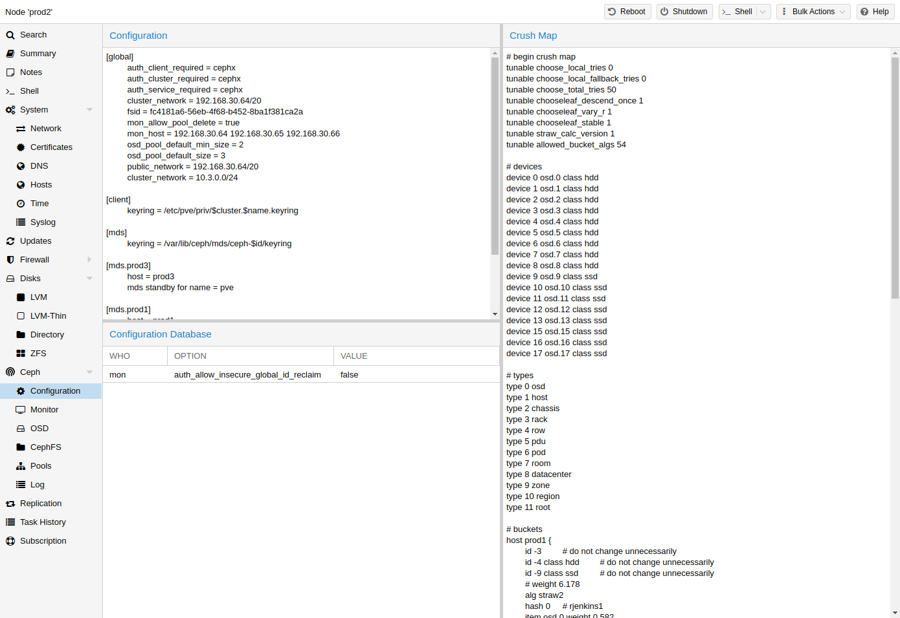
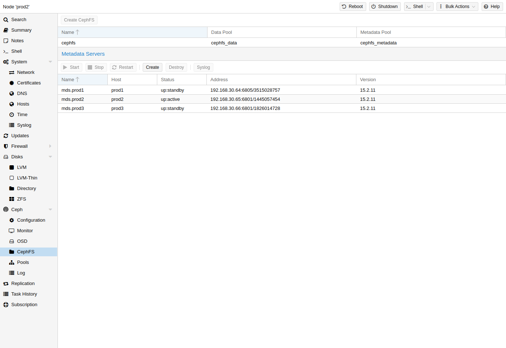

# 部署超融合 Ceph 集群

[TOC]

## 简介



Proxmox VE 统一了计算和存储系统，也就是说，可以在集群中使用相同的物理节点进行计算（处理虚拟机和容器）和复制存储。传统的计算和存储资源孤岛可以打包到一个超融合设备中。单独的存储网络 （SAN） 和通过网络连接存储 （NAS） 的连接消失了。通过集成开源软件定义存储平台 Ceph，Proxmox VE 能够直接在虚拟机管理程序节点上运行和管理 Ceph 存储。

Ceph on Proxmox VE 的一些优点是：

- 通过 CLI 和 GUI 轻松设置和管理
- 精简配置
- 快照支持
- 自我修复
- 可扩展到 EB 级别
- 提供块存储、文件系统和对象存储
- 设置具有不同性能和冗余特征的池
- 数据被复制，使其具有容错能力
- 在商用硬件上运行
- 无需硬件 RAID 控制器
- 开源

For small to medium-sized deployments, it is possible to install a Ceph server for using RADOS Block Devices (RBD) or CephFS directly on your Proxmox VE cluster nodes (see [Ceph RADOS Block Devices (RBD)](https://192.168.1.20:8006/pve-docs/pve-admin-guide.html#ceph_rados_block_devices)). Recent hardware has a lot of CPU power and RAM, so running storage services and virtual guests on the same node is possible.
对于中小型部署，可以安装 Ceph 服务器，以便直接在 Proxmox VE 集群节点上使用 RADOS 块设备 （RBD） 或 CephFS（请参阅 Ceph RADOS 块设备 （RBD））。最近的硬件具有大量的 CPU 能力和 RAM，因此可以在同一节点上运行存储服务和虚拟客户机。

To simplify management, Proxmox VE provides you native integration to install and manage [Ceph](http://ceph.com) services on Proxmox VE nodes either via the built-in web interface, or using the *pveceph* command line tool.
为了简化管理，Proxmox VE为您提供了本机集成，可以通过内置的Web界面或使用pveceph命令行工具在Proxmox VE节点上安装和管理Ceph服务。

## 术语

Ceph 由多个守护进程组成，用作 RBD 存储：

- Ceph Monitor（ceph-mon 或 MON）
- Ceph Manager（ceph-mgr，或 MGS）
- Ceph Metadata Service（ceph-mds 或 MDS）
- Ceph Object Storage Daemon（ceph-osd 或 OSD）

## 健康 Ceph 集群的建议

要构建超融合的 Proxmox + Ceph 集群，您必须使用至少三个（最好）相同的服务器进行设置。

### CPU

Ceph services can be classified into two categories: * Intensive CPU usage, benefiting from high CPU base frequencies and multiple  cores. Members of that category are: **Object Storage Daemon (OSD) services** Meta Data Service (MDS) used for CephFS * Moderate CPU usage, not needing multiple CPU cores. These are: **Monitor (MON) services** Manager (MGR) services
Ceph 服务可分为两类： * CPU 使用率高，受益于高 CPU 基本频率和多核。该类别的成员包括： 对象存储守护程序 （OSD） 服务 用于 CephFS 的元数据服务 （MDS） * CPU 使用率适中，不需要多个 CPU 内核。这些是： 监视器 （MON） 服务 管理器 （MGR） 服务

As a simple rule of thumb, you should assign at least one CPU core (or thread) to each Ceph service to provide the minimum resources required for stable and durable Ceph performance.
作为一个简单的经验法则，您应该为每个 Ceph 服务分配至少一个 CPU 内核（或线程），以提供稳定和持久的 Ceph 性能所需的最少资源。

For example, if you plan to run a Ceph monitor, a Ceph manager and 6 Ceph OSDs services on a node you should reserve 8 CPU cores purely for Ceph when targeting basic and stable performance.
例如，如果您计划在节点上运行 Ceph 监视器、Ceph 管理器和 6 个 Ceph OSD 服务，则在以基本和稳定性能为目标时，您应该专门为 Ceph 保留 8 个 CPU 内核。

Note that OSDs CPU usage depend mostly from the disks performance. The higher the possible IOPS (**IO** **O**perations per **S**econd) of a disk, the more CPU can be utilized by a OSD service. For modern enterprise SSD disks, like NVMe’s that can permanently sustain a high IOPS load over 100’000 with sub millisecond latency, each OSD can use multiple CPU threads, e.g., four to six CPU threads utilized per NVMe backed OSD is likely for very high performance disks.
请注意，OSD 的 CPU 使用率主要取决于磁盘性能。磁盘的 IOPS（每秒 IO 操作数）越高，OSD 服务可以使用的 CPU 就越多。对于现代企业级 SSD 磁盘，例如可以永久维持超过 100'000 的高 IOPS 负载且延迟为亚毫秒级的 NVMe，每个 OSD 可以使用多个 CPU 线程，例如，每个 NVMe 支持的 OSD 使用四到六个 CPU 线程可能用于非常高性能的磁盘。

### Memory

Especially in a hyper-converged setup, the memory consumption needs to be carefully planned out and monitored. In addition to the predicted memory usage of virtual machines and containers, you must also account for having enough memory available for Ceph to provide excellent and stable performance.
特别是在超融合设置中，需要仔细规划和监控内存消耗。除了虚拟机和容器的预测内存使用情况外，还必须考虑是否有足够的内存可供 Ceph 提供出色且稳定的性能。

As a rule of thumb, for roughly **1 TiB of data, 1 GiB of memory** will be used by an OSD. While the usage might be less under normal conditions, it will use most during critical operations like recovery, re-balancing or backfilling. That means that you should avoid maxing out your available memory already on normal operation, but rather leave some headroom to cope with outages.
根据经验，对于大约 1 TiB 的数据，OSD 将使用 1 GiB 的内存。虽然在正常情况下使用量可能较少，但在恢复、重新平衡或回填等关键操作期间使用最多。这意味着您应该避免在正常操作时将可用内存最大化，而是留出一些空间来应对中断。

The OSD service itself will use additional memory. The Ceph BlueStore backend of the daemon requires by default **3-5 GiB of memory** (adjustable).
OSD 服务本身将使用额外的内存。默认情况下，守护程序的 Ceph BlueStore 后端需要 3-5 GiB 的内存（可调）。

### 网络

We recommend a network bandwidth of at least 10 Gbps, or more, to be used exclusively for Ceph traffic. A meshed network setup [[17](https://192.168.1.20:8006/pve-docs/pve-admin-guide.html#_footnote_17)] is also an option for three to five node clusters, if there are no 10+ Gbps switches available.
我们建议至少 10 Gbps 或更高的网络带宽专门用于 Ceph 流量。如果没有可用的 10+ Gbps 交换机，网状网络设置 [ 17] 也是 3 到 5 个节点集群的一个选项。

| ![Important](data:image/png;base64,iVBORw0KGgoAAAANSUhEUgAAADAAAAAwCAYAAABXAvmHAAALa0lEQVRogdWZa2wc1RXHfzM7O/teP9e1vXHSmEdjx3YeDkkaF6REKRRCEDSEFNkRjdSWSsgC2iqoRWqLQKiqIBg1NOQDiMeHtkQIQkRRS9S4aWwgCQoUgl232KkT28J21l6vd3d2dx79sDuTXdtre03Uqlc62tl53Pv/n3PuOffcKxiGwf9zE//XAL5sk65WR0a6AaDrOjMtKwgCoigiCAKCIAhXa9wvTcAEHhoc5KMjR7jw3nucf+MN67k/GCS4YQOr77yTpl27kGUZm81mXC0ywlLnQDbwEwcO0P2b3yz4jV5RwZq2Nm5/5BH8fj+SJGGz2b4UiSURMAzD0DSNEwcO8MdHHln8d0AcsAUCfOe551h7yy04HA7sdvuSrVEwAV3XjdDgIC/v2cOl06dznqWAJCAAMvn9MwlEgF1PP8037rsPt9uN3W5fkjUKIqDrujF+4QLP3XQTU0NDOc8UIAa4y8sJtrQQqK/H7XQSfv99Pn/nHQRRxNB16/0EEAUatm9n76uv4vP5cDgcBZNYNIF84I0MEK20lIZvf5sNe/dSWlqK1+vFxBEZHubT3/+evqNHmR4dJRWP55BevW0bra+8gt/vx+l0IknSokksikA+8ElgClixYwc3799PZWUlTqczbz+x0VFOPvEEQ6dPE/niCwxdt0jUbd1K68svU1xcXBCJBQnMBz5eWkrL/v2s++Y3KSsrQxQXlxc7f/5zBjo7CQ8NoadSKKQn943t7dyyf79FYjHuNC8BwzAMVVV56Z57+OzNN3PAJ8vK+FZHB2s2b55X6/nahRMnOP7TnxLOKEXJyO2/+hVf37uXoqIinE6nmfzyksirMjNUvvGjH+WAVwG1vJxbDhxg1bp1uFwuMwQWJCu3bWPN3r24SkoAcGbA/OXXv2bws8+IRqOkUqlZGX1RBAzDMHRd51+nTvHewYNX7gPTQMO+faxav56SkpIlgTdlU3s7TXv2IGUs6AGioRDH2tuZmJggFouhqirGPCzyEUBVVX7X1pZzPwI0fP/7bNmzh7KysrzADh8+zP3338++ffs4ePBg3vdEUWTDD3/IsuZmRLsdW4bEpd5eOp99lnA4jKIoaJqWl8QsAqb2Txw4kDNp40BxXR0bWlspLy/PC+qZZ55hdHQUSZIYHByko6ODxx57bBZwcy3kq6xk6y9/ib+qCgQBmbQ7nT50iIs9PUSjUZLJJIZhzEliLgKMDQzwp5/9zLqnkQ51W3/xCwKBAE6nMy+B3t5exsfH6ezspLe3l3g8zuHDh2cBz5bKpibWtrXhLi0FwA3owNsPP8zExATxeBxVVecyQC4Bc+L+taNjluvU33031dddN6/2BUGgpKSE/v5+JicncweaA3i2tDz8MIHrr0eU0gsQBzDW10ffyZNEIhESicScrpRDQNd1xgYG+OC3v7XuJQBXIMDWn/yEioqKeUGMjY0hCAKKoszS1MjIyLzfAmx/4gmKli0DQcBJOmicfOopJicnicfjJoG5LWBq/+Szz+a8oABNe/bgdrvndR1BEKiqqiIejxOLxWYRCAaDC0alqjVrqGxowFNWhkDalUKff07f3/5mWSFTLFksLAK6rjN+4UKO9lXAUV7O2tbWeaNOthZlWZ4FHlh0aN3y4IPIHk+6L8AGvNfRQTgctuZCthVEU/u6rnPutddyBk0A9bt3W4us+QY2fbyurg6v15vTzw033LBoAsHmZoLNzdgcDgBcQKi/n391dTE9PU0ymcyxgkmAVCrF+4cO5WjfFgiwfoGwOTOylJWVUVtba1mkUAKCILClvR1veTkA9owVPnzllZy8YFnA1H5/dzfTw8PWgziwcutWfD4fsiwvCNyUxsZG3G43lZWVVl933XVXQQSq161j+ebNlhXcwBdnzxIOh60lhmkFEUDTNP7++uvWgBrp6mrNHBk3H/BsAtFoFEdm8GAwyMaNGwsiIAgCjbt346uosKwgAp8cPWolNj1THInmsqHn6FGLQApY1thIxcqV+Hy+WX6+0ETesWMHLpcLWZZ54IEHCgYvCAKrbrsNyem0JrQEXMzkhKzlBaKu61z+97+ZHhnJmbwrtm2zJu5CWp8pra2tNDU1sXPnTtrb25dEQBAEvrplC57MXJCB8XPniEQixONxa6Uq6brOQHd3jvvoQP2ttxZUpMxsL7zwwpK+AyxLXrt9Oxe6uxFEEXvGZc4fO0bVD35AMplM1wuapjGYtbugAp5AgKLqaquu/W/JTEs37dqFqihWzSADk8PD1jzQNC3tQtmrThUINDbm+H4h0tfXx6OPPsodd9xBW1sbPT09BQPPluu2b7fWRxIQ6usjFotZBCRN06wZbbZAfT1FRUWWKQtpzz//PMPDw/T09DA1NcXo6CjHjx+f11Xma95AwHJjEdB0HUVRrhCYuRGrAiXBoFUqFtq6u7sZHx9nJBMUurq65uxnsX0Hm5v56A9/ANIJLXrpEolEwgqlUqZQyPlo6OOPlzx5ly1bxnBWQmxpackBW6hSBEC02axrpqasNZGmaek8kN0kYPDjj1FVdUlz4Mknn6Surs4Cb5aUhYZiUy59+GGOgm3V1WiadiUPCILAV9autV5wAaM9PXQeOWJprBBpaGjgxIkTpFIpOjs7aWxsXBJwUwZOnUKZmgLS2zl4vUjSlV1XURRFqtavv3IDKAVe/O53efPxx69aSCxUBs+c4dV77+Vyfz+xy5eBdG3iX7ECm81m9S2JokiwuZmiujrCPT1AuqgOAqcef5zzL77Imt27uemhhyipqVnYZ5cw8bPbR0eOcOall7g8MEB4aIhEJAJk9qOAwKZNyLJsHpQgRKNRIxQK0XPmDH/+3vdQQ6G8na/YtIk199zDypYWVmzceFWAT1y8yMWzZzn/9tv0vfsudqeTlKIQHRvL2QSOAqU7d/K1W2/l2muvpba2Nl3iJhIJIxKJMDw8TO/Zs3zw4x+jTUzkHVCw2fCUleHw+QiuXYu/upqqhgb8VVUYhkFNczPFweCs7z556y3r+vyxYwiiyD+PHwdBwNB1krEYhqYRC4UwdB2D9LJmmnRtXHz77VTfeCPLly+ntraWmpqa9MaaqqqGoiiEQiGGhoYYHBzk00OHiHR2LkqDNlnG7nJhd7nQswqN+ZogiuipFMlYDDWRgBl5KEF6woqAUFFByc03U756NZWVlSxfvpyamhoCgQAejwdB13VDVVVisRihUIiRkRGGh4cZ+sc/GO3qIt7VhZGJAle7mVpWuVKDCBng8jXX4N68Gc8111BUVER5eTnV1dVUV1cTCASuFFqGYaDrupFKpYjH40xMTDA+Ps7Y2Bjj4+OEw2EmenqYPneO1OAgZCWpxTY9S9QMcLhyHGUDRI8HqbISZ309zoYGnE4nHo8Hv99PaWkpgUCAiooK6/DE4XCkI1HW2a6hqiqKojA9Pc3k5KQl4XCY6elpotFoetukv59UKIR66RLToRBJTcMYHUWIRvMSMPO6rbY2/SsIOFatQpYk5NWrkSQJWZZxOBy43W68Xi9+v5+ioiJKSkooLi7G5/PhdruRZdnads85HzD3hpLJJIqiEIvFiEajRCIRIpEI0WiUWCxGPB631iOKopBKpazUbi4Oc7Y+snKCzWbDZrMhSRKSJGG3262w6HK5cLlceDwevF4vPp8Pr9eL2+3G5XLhcDjMkxuETNibdcBhnv9qmkYqlSKZTJJIJFAUhXg8jqIoKIpCIpGwSCSTSVRVtWSuk3qTiAnebrfngHc4HDidTpxOJy6Xy7qWZdk6wZzrxCbvCY1JRNd1NE3LAWgSM69ngp+PgCiK1gF3NhFTzHvmO+Y3wCzw8xLIJpL5tYCZpEyw2f/nWt1ag2UtM0x3Mq1iAp1j+bH0M7KFCGWDnfmbd8AMnuxfUzL/C0rp/wFnFd4nEQn3XQAAAABJRU5ErkJggg==) | The volume of traffic, especially during recovery, will interfere with other services on the same network, especially the latency sensitive Proxmox VE corosync cluster stack can be affected, resulting in possible loss of cluster quorum.  Moving the Ceph traffic to dedicated and physical separated networks will avoid such interference, not only for corosync, but also for the networking services provided by any virtual guests. 流量（尤其是在恢复期间）会干扰同一网络上的其他服务，尤其是对延迟敏感的 Proxmox VE corosync 集群堆栈可能会受到影响，从而导致集群仲裁可能丢失。将 Ceph 流量转移到专用和物理分离的网络将避免此类干扰，不仅对 corosync 如此，而且对任何虚拟访客提供的网络服务也是如此。 |
| ------------------------------------------------------------ | ------------------------------------------------------------ |
|                                                              |                                                              |

For estimating your bandwidth needs, you need to take the performance of your disks into account.. While a single HDD might not saturate a 1 Gb link, multiple HDD OSDs per node can already saturate 10 Gbps too. If modern NVMe-attached SSDs are used, a single one can already saturate 10 Gbps of bandwidth, or more. For such high-performance setups we recommend at least a 25 Gpbs, while even 40 Gbps or 100+ Gbps might be required to utilize the full performance potential of the underlying disks.
为了估计您的带宽需求，您需要考虑磁盘的性能。虽然单个 HDD 可能无法使 1 Gb 链路饱和，但每个节点的多个 HDD OSD 也已经可以使 10 Gbps 饱和。如果使用现代 NVMe 连接的 SSD，单个 SSD 已经可以饱和 10 Gbps 或更高的带宽。对于此类高性能设置，我们建议至少 25 Gpbs，而甚至可能需要 40 Gbps 或 100+ Gbps 才能充分利用底层磁盘的全部性能潜力。

If unsure, we recommend using three (physical) separate networks for high-performance setups: * one very high bandwidth (25+ Gbps) network for Ceph (internal) cluster  traffic. * one high bandwidth (10+ Gpbs) network for Ceph (public) traffic between the  ceph server and ceph client storage traffic. Depending on your needs this can  also be used to host the virtual guest traffic and the VM live-migration  traffic. * one medium bandwidth (1 Gbps) exclusive for the latency sensitive corosync  cluster communication.
如果不确定，我们建议使用三个（物理）独立网络进行高性能设置： * 一个非常高带宽 （25+ Gbps） 的网络用于 Ceph（内部）集群流量。* 一个高带宽 （10+ Gpbs） 网络，用于 ceph 服务器和 ceph 客户端存储流量之间的 Ceph（公共）流量。根据你的需求，这还可用于托管虚拟来宾流量和 VM 实时迁移流量。* 一个中等带宽 （1 Gbps），专用于延迟敏感型 corosync 集群通信。

### 磁盘

When planning the size of your Ceph cluster, it is important to take the recovery time into consideration. Especially with small clusters, recovery might take long. It is recommended that you use SSDs instead of HDDs in small setups to reduce recovery time, minimizing the likelihood of a subsequent failure event during recovery.
在规划 Ceph 集群的大小时，请务必考虑恢复时间。特别是对于小型集群，恢复可能需要很长时间。建议您在小型设置中使用 SSD 而不是 HDD，以缩短恢复时间，从而最大程度地减少恢复过程中发生后续故障事件的可能性。

In general, SSDs will provide more IOPS than spinning disks. With this in mind, in addition to the higher cost, it may make sense to implement a [class based](https://192.168.1.20:8006/pve-docs/pve-admin-guide.html#pve_ceph_device_classes) separation of pools. Another way to speed up OSDs is to use a faster disk as a journal or DB/**W**rite-**A**head-**L**og device, see [creating Ceph OSDs](https://192.168.1.20:8006/pve-docs/pve-admin-guide.html#pve_ceph_osds). If a faster disk is used for multiple OSDs, a proper balance between OSD and WAL / DB (or journal) disk must be selected, otherwise the faster disk becomes the bottleneck for all linked OSDs.
通常，SSD 将提供比旋转磁盘更高的 IOPS。考虑到这一点，除了更高的成本之外，实现基于类的池分离可能是有意义的。加速 OSD 的另一种方法是使用更快的磁盘作为日志或 DB/Write-Ahead-Log 设备，请参阅创建 Ceph OSD。如果一个较快的磁盘用于多个 OSD，则必须在 OSD 和 WAL / DB（或日志）磁盘之间选择适当的平衡，否则较快的磁盘将成为所有链接的 OSD 的瓶颈。

Aside from the disk type, Ceph performs best with an evenly sized, and an evenly distributed amount of disks per node. For example, 4 x 500 GB disks within each node is better than a mixed setup with a single 1 TB and three 250 GB disk.
除了磁盘类型之外，Ceph 在每个节点大小均匀、磁盘数量均匀分布的情况下表现最佳。例如，每个节点内有 4 个 500 GB 磁盘比具有单个 1 TB 磁盘和三个 250 GB 磁盘的混合设置要好。

You also need to balance OSD count and single OSD capacity. More capacity allows you to increase storage density, but it also means that a single OSD failure forces Ceph to recover more data at once.
您还需要平衡 OSD 计数和单个 OSD 容量。更大的容量允许您增加存储密度，但这也意味着单个 OSD 故障会迫使 Ceph 一次恢复更多数据。

#### 避免 RAID

由于 Ceph 自行处理数据对象冗余和多个并行写入磁盘 （OSD），因此使用 RAID 控制器通常不会提高性能或可用性。相反，Ceph 被设计为独立处理整个磁盘，中间没有任何抽象。RAID 控制器不是为 Ceph 工作负载设计的，可能会使事情复杂化，有时甚至会降低性能，因为它们的写入和缓存算法可能会干扰 Ceph 的算法。

> 避免使用 RAID 控制器。请改用主机总线适配器 （HBA）。

## 初始化安装和配置

### 使用基于 Web 的向导

 

使用 Proxmox VE，可以获得易于使用的 Ceph 安装向导。单击其中一个集群节点，然后导航到菜单树中的 Ceph 部分。如果尚未安装 Ceph，将看到一个提示，提示您这样做。

该向导分为多个部分，每个部分都需要成功完成才能使用 Ceph。

首先，需要选择要安装的 Ceph 版本。首选其他节点中的节点，如果这是安装 Ceph 的第一个节点，则首选最新的节点。

开始安装后，向导将从 Proxmox VE 的 Ceph 存储库下载并安装所有必需的软件包。

 

完成安装步骤后，需要创建配置。每个集群只需要此步骤一次，因为此配置通过 Proxmox VE 的集群配置文件系统（pmxcfs）自动分发给所有剩余的集群成员。

配置步骤包括以下设置：

- **Public Network**
  
  公共网络：此网络将用于公共存储通信（例如，对于使用 Ceph RBD 支持的磁盘或 CephFS 挂载的虚拟机）以及不同 Ceph 服务之间的通信。此设置是必需的。
  
  强烈建议将 Ceph 流量与 Proxmox VE 集群通信 （corosync） 以及虚拟访客的前端（公共）网络分开。否则，Ceph 的高带宽 IO 流量可能会干扰其他低延迟依赖的服务。
  
- **Cluster Network**
  
  群集网络：指定将 OSD 复制和检测信号流量分开。此设置是可选的。
  
  建议使用物理上分离的网络，因为它将减轻 Ceph 公共和虚拟访客网络的负担，同时还能显著提高 Ceph 性能。
  
  Ceph 集群网络可以稍后配置并移动到另一个物理隔离的网络。

 

还有两个选项被认为是高级的，因此只有在您知道自己在做什么时才应该更改。

- **Number of replicas**
  
  副本数：定义复制对象的频率。
  
- **Minimum replicas**
  
  Defines the minimum number of required replicas for I/O to  be marked as complete. 
  最小副本数：定义要标记为完成的 I/O 所需的最小副本数。

此外，还需要选择第一个 MON 节点。此步骤是必需的。

就是这样。现在，应该看到一个成功页面作为最后一步，其中包含有关如何继续的进一步说明。系统现在可以开始使用 Ceph。首先，需要创建一些额外的监视器、OSD 和至少一个池。

### Ceph 软件包的 CLI 安装

除了 Web 界面中推荐的 Proxmox VE Ceph 安装向导之外，还可以在每个节点上使用以下 CLI 命令：

```bash
pveceph install
```

这将在 /etc/apt/sources.list.d/ceph.list 中设置一个 apt 软件包存储库并安装所需的软件。

### 通过 CLI 进行初始 Ceph 配置

使用 Proxmox VE Ceph 安装向导（推荐）或在一个节点上运行以下命令：

```bash
pveceph init --network 10.10.10.0/24
```

这将在 /etc/pve/ceph.conf 创建一个初始配置，其中包含 Ceph 的专用网络。此文件使用 pmxcfs 自动分发到所有 Proxmox VE 节点。该命令还会在 /etc/ceph/ceph.conf 处创建一个指向该文件的符号链接。因此，可以简单地运行 Ceph 命令，而无需指定配置文件。

## Ceph Monitor



Ceph Monitor （MON）维护集群映射的主副本。为了实现高可用性，至少需要 3 台 MON 。如果使用安装向导，则已安装一台 MON 。只要群集是中小型的，就不需要超过 3 个监视器。只有真正大的集群才会需要更多。

### 创建 MON

在要放置 MON 的每个节点上（建议使用三个 MON），使用 GUI 中的 Ceph → Monitor 选项卡创建一个监视器，或运行：

```bash
pveceph mon create
```

### 销毁 MON

要通过 GUI 删除 Ceph Monitor，请先在树视图中选择一个节点，然后转到 Ceph → Monitor 面板。选择 MON，然后单击 Destroy 按钮。

要通过 CLI 删除 Ceph Monitor，请先连接到运行 MON 的节点。然后执行以下命令：

```bash
pveceph mon destroy
```

> 至少需要三个 MON 才能达到法定人数。

## Ceph Manager

Manager 守护程序与 MON 一起运行。它提供了一个用于监视集群的接口。自 Ceph luminous 发布以来，至少需要一个 ceph-mgr 守护进程。

### 创建管理器

可以安装多个 Manager，但在任何给定时间只有一个 Manager 处于活动状态。

```bash
pveceph mgr create
```

> 建议在监控节点上安装 Ceph Manager。为了实现高可用性，请安装多个管理器。

### 销毁管理器

要通过 GUI 删除 Ceph Manager，请先在树视图中选择一个节点，然后转到 Ceph → Monitor 面板。选择管理器，然后单击销毁按钮。

要通过 CLI 删除 Ceph Monitor，请先连接到运行 Manager 的节点。然后执行以下命令：

```bash
pveceph mgr destroy
```

> 虽然管理器不是硬依赖项，但它对 Ceph 集群至关重要，因为它可以处理 PG 自动缩放、设备运行状况监控、遥测等重要功能。

## Ceph OSD



Ceph 对象存储守护程序通过网络存储 Ceph 的对象。建议每个物理磁盘使用一个 OSD。

### 创建 OSD

可以通过 Proxmox VE Web 界面或通过 CLI 使用 pveceph 创建 OSD 。例如：

```bash
pveceph osd create /dev/sd[X]
```

> 建议使用至少 3 个节点和至少 12 个 OSD 的 Ceph 集群，这些节点之间均匀分布。

如果磁盘以前使用过（例如，用于 ZFS 或作为 OSD），则需要删除该使用的所有痕迹。要删除分区表、引导扇区和任何其他剩余的 OSD，可以使用以下命令：

```bash
ceph-volume lvm zap /dev/sd[X] --destroy
```

#### Ceph Bluestore

从 Ceph Kraken 版本开始，引入了一种新的 Ceph OSD 存储类型，称为 Bluestore 。这是自 Ceph Luminous 以来创建 OSD 时的默认设置。

```bash
pveceph osd create /dev/sd[X]
```

##### Block.db 和 block.wal

如果要为 OSD 使用单独的 DB/WAL 设备，可以通过 -db_dev 和 -wal_dev 选项指定它。如果未单独指定，则 WAL 将与数据库一起放置。

```bash
pveceph osd create /dev/sd[X] -db_dev /dev/sd[Y] -wal_dev /dev/sd[Z]
```

可以分别使用 -db_size 和 -wal_size 参数直接选择它们的大小。如果未给出，则将使用以下值（按顺序）：

- bluestore_block_{db,wal}_size 来自 Ceph 配置...
  - … database, section *osd*
  - … database, section *global*
  - … file, section *osd*
  - … file, section *global*
- 10% (DB)/1% (WAL) of OSD size

DB 存储 BlueStore 的内部元数据，WAL 是 BlueStore 的内部日志或预写日志。建议使用快速 SSD 或 NVRAM 以获得更好的性能。

#### Ceph Filestore

在 Ceph Luminous 之前，Filestore 被用作 Ceph OSD 的默认存储类型。从 Ceph Nautilus 开始，Proxmox VE 不再支持使用 pveceph 创建此类 OSD 。如果仍想创建文件存储 OSD，请直接使用 ceph-volume 。

```bash
ceph-volume lvm create --filestore --data /dev/sd[X] --journal /dev/sd[Y]
```

### 销毁 OSD

要通过 GUI 删除 OSD，首先在树视图中选择一个 Proxmox VE 节点，然后转到 Ceph → OSD 面板。然后选择要销毁的 OSD，然后单击 OUT 按钮。一旦 OSD 状态从 in 更改为 out，单击 STOP 按钮。最后，在状态从 “up” 更改为 “down” 后，从“更多”下拉菜单中选择“销毁”。

要通过 CLI 删除 OSD，请运行以下命令。

```bash
ceph osd out <ID>
systemctl stop ceph-osd@<ID>.service
```

第一个命令指示 Ceph 不要在数据分发中包含 OSD 。第二个命令停止 OSD 服务。在此之前，不会丢失任何数据。

以下命令销毁 OSD。指定 -cleanup 选项以额外销毁分区表。

```bash
pveceph osd destroy <ID>

# 此命令将销毁磁盘上的所有数据！
```

## Ceph 池



池是用于存储对象的逻辑组。它包含一组对象，称为归置组 （PG， pg_num）。

### 创建和编辑池

可以从 Ceph → Pools 下的任何 Proxmox VE 主机的命令行或 Web 界面创建和编辑池。

oss occurs if any OSD fails.
当未给出任何选项时，将默认值设置为 128 个 PG，大小为 3 个副本，min_size 为 2 个副本，以确保在任何 OSD 失败时不会发生数据丢失。

> 不要将 min_size 设置为 1。min_size 为 1 的复制池允许在对象只有 1 个副本时对对象进行 I/O，这可能会导致数据丢失、PG 不完整或找不到对象。

建议启用 PG-Autoscaler 或根据设置计算 PG 编号。可以在线找到公式和 PG 计算器。从 Ceph Nautilus 开始，可以在设置后更改 PG 的数量。

The PG autoscaler [[23](https://192.168.1.20:8006/pve-docs/pve-admin-guide.html#_footnote_23)] can automatically scale the PG count for a pool in the background. Setting the Target Size or Target Ratio advanced parameters helps the PG-Autoscaler to make better decisions.
PG 自动缩放器可以在后台自动缩放池的 PG 计数。设置目标大小或目标比率高级参数有助于 PG-Autoscaler 做出更好的决策。

通过 CLI 创建池的示例

```bash
pveceph pool create <pool-name> --add_storages
```

If you would also like to automatically define a storage for your pool, keep the ‘Add as Storage’ checkbox checked in the web interface, or use the command-line option *--add_storages* at pool creation. 如果还想自动为池定义存储，请在 Web 界面中选中“添加为存储”复选框，或在创建池时使用命令行选项 --add_storages。

#### Pool 选项

 

以下选项在创建池时可用，在编辑池时也部分可用。

- 名字

  池的名称。这必须是唯一的，之后无法更改。

- 大小

  对象的副本数。Ceph 总是试图拥有一个对象的这么多副本。默认值：3。

- PG 自动缩放模式

  The automatic PG scaling mode [[23](https://192.168.1.20:8006/pve-docs/pve-admin-guide.html#_footnote_23)] of the pool. If set to warn, it produces a warning message when a pool has a non-optimal PG count. 池的自动 PG 缩放模式 [ 23]。如果设置为警告，则当池的 PG 计数非最佳时，它会生成警告消息。默认值：warn。

- Add as Storage 添加为存储

  Configure a VM or container storage using the new pool. Default: true (only visible on creation).  使用新池配置 VM 或容器存储。默认值：true（仅在创建时可见）。

高级选项

- Min. Size 最小尺寸

  对象的最小副本数。如果 PG 的副本少于此数量，Ceph 将拒绝池上的 I/O。默认值：2。

- Crush Rule 粉碎规则

  The rule to use for mapping object placement in the cluster. These rules define how data is placed within the cluster. See [Ceph CRUSH & device classes](https://192.168.1.20:8006/pve-docs/pve-admin-guide.html#pve_ceph_device_classes) for information on device-based rules.  用于映射群集中对象放置的规则。这些规则定义了数据在群集中的放置方式。有关基于设备的规则的信息，请参阅 Ceph CRUSH 和设备类。

- `# of PGs`

  The number of placement groups [[22](https://192.168.1.20:8006/pve-docs/pve-admin-guide.html#_footnote_22)] that the pool should have at the beginning. 池开始时应具有的归置组数 [ 22]。默认值：128。

- Target Ratio 目标比率

  The ratio of data that is expected in the pool. The PG autoscaler uses the ratio relative to other ratio sets. It takes precedence over the target size if both are set.  池中预期的数据比率。PG 自动缩放程序使用相对于其他比率集的比率。如果两者都设置了，则它优先于目标大小。

- Target Size 目标大小

  The estimated amount of data expected in the pool. The PG autoscaler uses this size to estimate the optimal PG count.  池中预期的估计数据量。PG 自动缩放程序使用此大小来估计最佳 PG 计数。

- Min. # of PGs

  This setting is used to fine-tune the lower bound of the PG count for that pool. The PG autoscaler will not merge PGs below this threshold.  PG 的最小数量。此设置用于微调该池的 PG 计数下限。PG 自动缩放程序不会合并低于此阈值的 PG。

### 纠删码池

Erasure coding (EC) is a form of ‘forward error correction’ codes that allows to recover from a certain amount of data loss. Erasure coded pools can offer more usable space compared to replicated pools, but they do that for the price of performance.
纠缠码（EC）是“前向纠错”代码的一种形式，允许从一定数量的数据丢失中恢复。与复制池相比，纠缠编码池可以提供更多的可用空间，但它们这样做是以性能为代价的。

For comparison: in classic, replicated pools, multiple replicas of the data are stored (size) while in erasure coded pool, data is split into k data chunks with additional m coding (checking) chunks. Those coding chunks can be used to recreate data should data chunks be missing.
为了进行比较：在经典的复制池中，存储了数据的多个副本（大小），而在纠删码池中，数据被拆分为 k 个数据块，并带有额外的 m 编码（检查）块。如果缺少数据块，这些编码块可用于重新创建数据。

The number of coding chunks, m, defines how many OSDs can be lost without losing any data. The total amount of objects stored is k + m.
编码块的数量 m 定义了在不丢失任何数据的情况下可以丢失多少个 OSD。存储的对象总量为 k + m。

#### 创建 EC 池

Erasure coded (EC) pools can be created with the pveceph CLI tooling. Planning an EC pool needs to account for the fact, that they work differently than replicated pools.
可以使用 pveceph CLI 工具创建纠删码 （EC） 池。规划 EC 池需要考虑以下事实：它们的工作方式与复制池不同。

The default min_size of an EC pool depends on the m parameter. If m = 1, the min_size of the EC pool will be k. The min_size will be k + 1 if m > 1. The Ceph documentation recommends a conservative min_size of k + 2 [[25](https://192.168.1.20:8006/pve-docs/pve-admin-guide.html#_footnote_25)].
EC 池的默认min_size取决于 m 参数。如果 m = 1，则 EC 池的min_size将为 k。如果 m > 1，则min_size为 k + 1。Ceph 文档建议保守min_size为 k + 2 [ 25]。

If there are less than min_size OSDs available, any IO to the pool will be blocked until there are enough OSDs available again.
如果可用的 OSD 少于 min_size，则池中的任何 IO 都将被阻止，直到有足够的 OSD 再次可用。

| ![Note](data:image/png;base64,iVBORw0KGgoAAAANSUhEUgAAADAAAAAwCAYAAABXAvmHAAAJhUlEQVRoge2ZWWycVxXHf+fce7/vm/GaGCde4pI0aQlJC0kRtE1L00JbLIjY4QkeUB9YHhAIJFCExAsKUkE8IAFFPIDUIqhBRSDRBUqCCimFFBCBpCWx02IaZ3G2SdyxPZ7vHh6+mcnSZnFjKIge6Wj8zYzvPf9z/me5d8TM+F8WfbkNuFx5BcDLLf/fAEZGRmx4eNh6enqsp6fHhoeHbWRk5D9aFeSlVqHNmzfb6H33sHnT7ZQmD5GfOMax6Sm+Pl5h1Yc+xpYtW2SBbX1ReUkRGBkZsdH77mHLW95EOv4Ms3ueJh6YYPHUFF9aljJ63z3cf//9/5FIvKQIDA8P293L2yhVjjH7t51ocDiviFecF46n7XzBreChhx4qNhH5t0XjJUVgx44ddGUZ9b/vIpQDoRQIWSDJAiFL6B9axo4dO4gxAmANWVDLG+Ln82URMRGhVCqRHxonlAPqFXWKC4r6IhI6OMjMzBN4/4LlTUQQEZxzZ32QJAlpmrb+p16vU6vVOHXq1AWjN18AnDj0F971vrs4OnmYJVkoDA4FCPUO172ICgnt7SV++4vvsGhRJx3tJbIsRVVpsUnOBBABBVFEClKYwbKr7sTM7EIUnBcA7z21k7t49x1X8JXvbOWra7rw5QRtcN8PLCfvvZJvb9vJycpJpg4/hp/N0I4SMQs4Jw0A5zBXHGiCaIZIKABgpGlKjPEF0TpT5pUDRXiVt99+Le03r+WzuytM1gO6pB/3+o0cbxvk8yOPMjW6i2iR2lxOjJDHSDMFogmGwzQ7rRJAUpAENAGXIZq2AFzQpvkACCEQcahP+cRH3sKHn9zHXU+MM7rtGeD33NDXzaZynZU9gcezpUw9X6OzIyOakkfF4QEpPG6nDRNNEA2FSgKimETSNCXPc0II57VpXhEolUqoOrxPSLOMT330Dv5SqfKDNR388Y2L+caQsjITNv3pMBs3rOT56ZyZGaM+J0QUxDc0INrWUgggoRGBAOIRAt77hY1AmqaoeJxPcN645jVDbNn8Hj73o8fZ/af9mEE9j9y2YRXt5YzZWmRmzjj1/BwhTXAKzitOHEbeWlc0AVwDnCv8KoZzjotV33lTSL1HNKAuEtKM1169jM98/E6mTk3x4Nbd7Bk7TEdHRvAeVY+hmDqmZwx1kIkiqrhzS2zL+AbNMC6l/80LgHMOEY9oQvBCks5RKpXo7JhFxbhz42pet2aQet1YtLiDJAkIDq8BHwJmwlwOUaD0ojsrNKuUReIZyb9gABCHcwWFgg+0lTPyvIRToVzKWLpkMfV6REQplYvmZCj1uuBUSdJwTg8AXBdoCZMOsBkQBeGi/J83gBgjmABC8AlJGsjzFLMyaXDM1etEA0VR50iCx6mSZhkiijpPjEpQD+SF4WdJrTAewdCFB1CtVlFVVATnhMQnWJqC5aTBk+c5IIgWRoTgSZJAmiZAo1s7hwsppglI+fTiljeYnyHkLQotKIAYI4igzpFHISQOiwEnKTEG8hhRVZw6YjRQLfJGHcF7jleqTBw8znXr12MABnv37efYiSnesG4tiUsRUQwD7JIAzKsPqCqiRbVwweM04XdPjhJN+dvTBxgbn6G9q59yZx9/3HWEb33vN+zc/RzOJ+w/eJLtO8Z5ZNtT7PvHIUQTvvv9X/Lc/mN0d3by3fseRLQwvWh0Fy+h8wbQ2VFG1KM+xfuAqufo8So/fejPPD/rqJys8pvf7eLAoeNMHqnw2U9+kH3jVQ5MClMzKUla5obr13HliiEMmDx6gltvuY7Vr1nBQF8PJopQ9AFTt/AROFfMjCW9XTy19xB33Hodb924jr1j+/nDk3/nzTdei4jw3nfeyCOPbufa1y5jzeoVrcHM8HR3dfHlr/2Q+x94jFtuuh44/9B2PplXDryYLF3STXd3e+t5UXcHY89OsOH6NS2Qed7wpM1Rm50G4MGHH2P961Zy3bqreXrPP5mrzwLt5y6/cACq1eoLCKm+TN/SAebmfn8aUG83PYs7+cnPH+eqKwd5as8/edc7bi02847pmVkATk1VWbF8AOcca1Yv59DkqcYK0tCL02deACqVCldc0YdIwLmEPM9RV6NnUZlPf3wT6oqJcePN6wHhzTeu4/CRCrfctJ4sSxBRli7pYfHEMUSU97/7Th751RP8eec+Yp5zzTVXM9DfDyogBvHS6HTJACYmJnjVoq5GFw0454gCEOnoaMfiNGZFFRFxJGkbywZ6i1NWoy9kWYmbb1gHKCHApuGbisVFGyoYUswa5OR5ftF56JIBjI6OMtDfWwAQ35jnc8AVpRXBohVqUowECKqK4RBxoE0W6gvGCcEjaOEAwEQWdpgbGxujt7erOLO2mk3R8i0Wz9EiuUGz+qlKEQEUaJbI4lTHmTVePKgWzpDGJGpc8CDTlEsuo88++wxXDA0UIUbAOP23KGZKjI48KnkuhcbiPbPCOBoeBikOLk2VxjqNRilaAEqSZGEAbN261bZt+zW33XY7IAXXm6Ou0YhIMamaaUOl5WRrzg00viuKWWxpQUOHNAZFQRpD48Xlkig0MTHBB95zG+VSylz1KCbWyDOh2XyK+56IqjWMKigkUnzWnPPFFFRRLZ29SQRUELOGY4pZ6LKOlM07mZ07d/KOtw1TcB4sGkTDiDQ9K1IkrKeYmQC08d7pZLSiRBpE5s7aS0XAHFEKAGY51Wr18g80Zmb33nsvX/z8XdSmj2AWOXhwkrxe46+79jB55Dh/3T2GxUhHextdXW2sXN7PNWtWIQKDA71FFBoAjIgQkVg/a5+oHrU5zIznDhxk964xKpXKggAoTlWW8+OfPorlOQ//cjsDy1bS2dFOW+diVly1iL6+Pqanpzl5qsL4pPHwN3/G1InDlMsZ7Z1tDA30cfWqIa5dexV9fb2YnT7UTxw4xsHJo4yOjfOP8QOMjx/k4OQx7r777lY0zycXvJ02M4sxMjg4SL1eR0TYsGEDw8PD9PX10d7ejogUN3a1GqpKCIE8z5mdnUVVqVarbN++nba2Nvbu3csDDzyAqrJ8+atb+zjn6e/vZ/Xq1axatYq1a9fS29tLlmUMDQ1RKpXOm9EXvV6v1+tWr9eZnp5mZmaGWq1GjLHF62aiNZ+bnPfe45xrvTZzxMyYmZk56+LXzKjX661DvHOOJElIkoRSqYT3/vLvRlW15eHCa4VxzdvmpjZDfubzuXeb3vuzqCEixBhbo0NTkyS5PAr9L8j/96+U/w3yCoCXW14B8HLLvwDd67nwZIEPdgAAAABJRU5ErkJggg==) | When planning an erasure coded pool, keep an eye on the min_size as it defines how many OSDs need to be available. Otherwise, IO will be blocked. 在规划纠删码池时，请密切关注min_size，因为它定义了需要可用的 OSD 数量。否则，IO 将被阻止。 |
| ------------------------------------------------------------ | ------------------------------------------------------------ |
|                                                              |                                                              |

For example, an EC pool with k = 2 and m = 1 will have size = 3, min_size = 2 and will stay operational if one OSD fails. If the pool is configured with k = 2, m = 2, it will have a size = 4 and min_size = 3 and stay operational if one OSD is lost.
例如，具有 k = 2 且 m = 1 的 EC 池的大小 = 3，min_size = 2，并且如果一个 OSD 发生故障，则将保持运行状态。如果池配置为 k = 2、m = 2，则其大小 = 4 和 min_size = 3，并在丢失一个 OSD 时保持运行。

To create a new EC pool, run the following command:
要创建新的 EC 池，请运行以下命令：

```
pveceph pool create <pool-name> --erasure-coding k=2,m=1
```

Optional parameters are failure-domain and device-class. If you need to change any EC profile settings used by the pool, you will have to create a new pool with a new profile.
可选参数包括 failure-domain 和 device-class。如果需要更改池使用的任何 EC 配置文件设置，则必须使用新配置文件创建新池。

This will create a new EC pool plus the needed replicated pool to store the RBD omap and other metadata. In the end, there will be a <pool name>-data and <pool name>-metada pool. The default behavior is to create a matching storage configuration as well. If that behavior is not wanted, you can disable it by providing the --add_storages 0 parameter.  When configuring the storage configuration manually, keep in mind that the data-pool parameter needs to be set. Only then will the EC pool be used to store the data objects. For example:
这将创建一个新的 EC 池以及所需的复制池来存储 RBD omap 和其他元数据。最后，将有一个<池名称>-data 和<池名称>-metada 池。默认行为是创建匹配的存储配置。如果不需要该行为，可以通过提供 --add_storages 0 参数来禁用它。手动配置存储配置时，请记住需要设置 data-pool 参数。只有这样，EC 池才会用于存储数据对象。例如：

| ![Note](data:image/png;base64,iVBORw0KGgoAAAANSUhEUgAAADAAAAAwCAYAAABXAvmHAAAJhUlEQVRoge2ZWWycVxXHf+fce7/vm/GaGCde4pI0aQlJC0kRtE1L00JbLIjY4QkeUB9YHhAIJFCExAsKUkE8IAFFPIDUIqhBRSDRBUqCCimFFBCBpCWx02IaZ3G2SdyxPZ7vHh6+mcnSZnFjKIge6Wj8zYzvPf9z/me5d8TM+F8WfbkNuFx5BcDLLf/fAEZGRmx4eNh6enqsp6fHhoeHbWRk5D9aFeSlVqHNmzfb6H33sHnT7ZQmD5GfOMax6Sm+Pl5h1Yc+xpYtW2SBbX1ReUkRGBkZsdH77mHLW95EOv4Ms3ueJh6YYPHUFF9aljJ63z3cf//9/5FIvKQIDA8P293L2yhVjjH7t51ocDiviFecF46n7XzBreChhx4qNhH5t0XjJUVgx44ddGUZ9b/vIpQDoRQIWSDJAiFL6B9axo4dO4gxAmANWVDLG+Ln82URMRGhVCqRHxonlAPqFXWKC4r6IhI6OMjMzBN4/4LlTUQQEZxzZ32QJAlpmrb+p16vU6vVOHXq1AWjN18AnDj0F971vrs4OnmYJVkoDA4FCPUO172ICgnt7SV++4vvsGhRJx3tJbIsRVVpsUnOBBABBVFEClKYwbKr7sTM7EIUnBcA7z21k7t49x1X8JXvbOWra7rw5QRtcN8PLCfvvZJvb9vJycpJpg4/hp/N0I4SMQs4Jw0A5zBXHGiCaIZIKABgpGlKjPEF0TpT5pUDRXiVt99+Le03r+WzuytM1gO6pB/3+o0cbxvk8yOPMjW6i2iR2lxOjJDHSDMFogmGwzQ7rRJAUpAENAGXIZq2AFzQpvkACCEQcahP+cRH3sKHn9zHXU+MM7rtGeD33NDXzaZynZU9gcezpUw9X6OzIyOakkfF4QEpPG6nDRNNEA2FSgKimETSNCXPc0II57VpXhEolUqoOrxPSLOMT330Dv5SqfKDNR388Y2L+caQsjITNv3pMBs3rOT56ZyZGaM+J0QUxDc0INrWUgggoRGBAOIRAt77hY1AmqaoeJxPcN645jVDbNn8Hj73o8fZ/af9mEE9j9y2YRXt5YzZWmRmzjj1/BwhTXAKzitOHEbeWlc0AVwDnCv8KoZzjotV33lTSL1HNKAuEtKM1169jM98/E6mTk3x4Nbd7Bk7TEdHRvAeVY+hmDqmZwx1kIkiqrhzS2zL+AbNMC6l/80LgHMOEY9oQvBCks5RKpXo7JhFxbhz42pet2aQet1YtLiDJAkIDq8BHwJmwlwOUaD0ojsrNKuUReIZyb9gABCHcwWFgg+0lTPyvIRToVzKWLpkMfV6REQplYvmZCj1uuBUSdJwTg8AXBdoCZMOsBkQBeGi/J83gBgjmABC8AlJGsjzFLMyaXDM1etEA0VR50iCx6mSZhkiijpPjEpQD+SF4WdJrTAewdCFB1CtVlFVVATnhMQnWJqC5aTBk+c5IIgWRoTgSZJAmiZAo1s7hwsppglI+fTiljeYnyHkLQotKIAYI4igzpFHISQOiwEnKTEG8hhRVZw6YjRQLfJGHcF7jleqTBw8znXr12MABnv37efYiSnesG4tiUsRUQwD7JIAzKsPqCqiRbVwweM04XdPjhJN+dvTBxgbn6G9q59yZx9/3HWEb33vN+zc/RzOJ+w/eJLtO8Z5ZNtT7PvHIUQTvvv9X/Lc/mN0d3by3fseRLQwvWh0Fy+h8wbQ2VFG1KM+xfuAqufo8So/fejPPD/rqJys8pvf7eLAoeNMHqnw2U9+kH3jVQ5MClMzKUla5obr13HliiEMmDx6gltvuY7Vr1nBQF8PJopQ9AFTt/AROFfMjCW9XTy19xB33Hodb924jr1j+/nDk3/nzTdei4jw3nfeyCOPbufa1y5jzeoVrcHM8HR3dfHlr/2Q+x94jFtuuh44/9B2PplXDryYLF3STXd3e+t5UXcHY89OsOH6NS2Qed7wpM1Rm50G4MGHH2P961Zy3bqreXrPP5mrzwLt5y6/cACq1eoLCKm+TN/SAebmfn8aUG83PYs7+cnPH+eqKwd5as8/edc7bi02847pmVkATk1VWbF8AOcca1Yv59DkqcYK0tCL02deACqVCldc0YdIwLmEPM9RV6NnUZlPf3wT6oqJcePN6wHhzTeu4/CRCrfctJ4sSxBRli7pYfHEMUSU97/7Th751RP8eec+Yp5zzTVXM9DfDyogBvHS6HTJACYmJnjVoq5GFw0454gCEOnoaMfiNGZFFRFxJGkbywZ6i1NWoy9kWYmbb1gHKCHApuGbisVFGyoYUswa5OR5ftF56JIBjI6OMtDfWwAQ35jnc8AVpRXBohVqUowECKqK4RBxoE0W6gvGCcEjaOEAwEQWdpgbGxujt7erOLO2mk3R8i0Wz9EiuUGz+qlKEQEUaJbI4lTHmTVePKgWzpDGJGpc8CDTlEsuo88++wxXDA0UIUbAOP23KGZKjI48KnkuhcbiPbPCOBoeBikOLk2VxjqNRilaAEqSZGEAbN261bZt+zW33XY7IAXXm6Ou0YhIMamaaUOl5WRrzg00viuKWWxpQUOHNAZFQRpD48Xlkig0MTHBB95zG+VSylz1KCbWyDOh2XyK+56IqjWMKigkUnzWnPPFFFRRLZ29SQRUELOGY4pZ6LKOlM07mZ07d/KOtw1TcB4sGkTDiDQ9K1IkrKeYmQC08d7pZLSiRBpE5s7aS0XAHFEKAGY51Wr18g80Zmb33nsvX/z8XdSmj2AWOXhwkrxe46+79jB55Dh/3T2GxUhHextdXW2sXN7PNWtWIQKDA71FFBoAjIgQkVg/a5+oHrU5zIznDhxk964xKpXKggAoTlWW8+OfPorlOQ//cjsDy1bS2dFOW+diVly1iL6+Pqanpzl5qsL4pPHwN3/G1InDlMsZ7Z1tDA30cfWqIa5dexV9fb2YnT7UTxw4xsHJo4yOjfOP8QOMjx/k4OQx7r777lY0zycXvJ02M4sxMjg4SL1eR0TYsGEDw8PD9PX10d7ejogUN3a1GqpKCIE8z5mdnUVVqVarbN++nba2Nvbu3csDDzyAqrJ8+atb+zjn6e/vZ/Xq1axatYq1a9fS29tLlmUMDQ1RKpXOm9EXvV6v1+tWr9eZnp5mZmaGWq1GjLHF62aiNZ+bnPfe45xrvTZzxMyYmZk56+LXzKjX661DvHOOJElIkoRSqYT3/vLvRlW15eHCa4VxzdvmpjZDfubzuXeb3vuzqCEixBhbo0NTkyS5PAr9L8j/96+U/w3yCoCXW14B8HLLvwDd67nwZIEPdgAAAABJRU5ErkJggg==) | The optional parameters --size, --min_size and --crush_rule will be used for the replicated metadata pool, but not for the erasure coded data pool. If you need to change the min_size on the data pool, you can do it later. The size and crush_rule parameters cannot be changed on erasure coded pools. 可选参数 --size、--min_size 和 --crush_rule 将用于复制的元数据池，但不用于纠删码数据池。如果需要更改数据池上的min_size，可以稍后再进行。无法在纠删码池上更改大小和crush_rule参数。 |
| ------------------------------------------------------------ | ------------------------------------------------------------ |
|                                                              |                                                              |

If there is a need to further customize the EC profile, you can do so by creating it with the Ceph tools directly [[26](https://192.168.1.20:8006/pve-docs/pve-admin-guide.html#_footnote_26)], and specify the profile to use with the profile parameter.
如果需要进一步自定义 EC 配置文件，您可以直接使用 Ceph 工具 [ 26] 创建它，并指定要与 profile 参数一起使用的配置文件。

For example: 例如：

```
pveceph pool create <pool-name> --erasure-coding profile=<profile-name>
```

#### Adding EC Pools as Storage 将 EC 池添加为存储

You can add an already existing EC pool as storage to Proxmox VE. It works the same way as adding an RBD pool but requires the extra data-pool option.
您可以将现有的 EC 池作为存储添加到 Proxmox VE。它的工作方式与添加 RBD 池相同，但需要额外的数据池选项。

```
pvesm add rbd <storage-name> --pool <replicated-pool> --data-pool <ec-pool>
```

| ![Tip](data:image/png;base64,iVBORw0KGgoAAAANSUhEUgAAADAAAAAwCAYAAABXAvmHAAAKZUlEQVRoge2aa3BU5RmAn3Pbs7fsJmwCRGITk0hVLFAtNWoq6pAiU0cKaYfa6ShT+YN4YbQw9F/8QX+UMv6gM3Q6oxMV6TgIbe10Gq2gcSzDpRaFgmIk4SKB3LP3Pff+SM66m+xuFvEyzvSbeefsbva8+z7nvXzf934RHMfhmzzEr9uAqx3/B/i6xzceQP6iFDmT1cBxHNzCkFsgBEHIXnNeC1f7u1cN4DiOY9s2rliWhWVZWRDHcbJGC4KAJElIkoQoioii6IiieFUgnxvAtm3HNdg0Tbq6uuju7ubYsWP09vYyMjKCpmmoqkokEqGhoYGFCxfS2tpKW1sbiqJkRZIkZxLoikGEK50H3CdumiZ9fX3s3LmT3bt3U1V3A0033cKc2nkEQxV4PSqSJOI4Dpquk0gkGLx8kZ4T7zF87iSrV69m3bp1NDY2oqoqHo8HWZa5Uo9cEYBt245lWRiGQUdHB9u2beOe1Y8w/6bFVAT9xJJpYvEUiVSGjG5gmBY4DqIoonoUfF4PoYAfRRE5/8kp3njlD6xfv54tW7YQCATw+XyuR8r2RtkAtm07pmly5MgRHn/8cZSaZpbcfjd+n5f+wVEGRqJkdCMv3vME8t77vB6qQn4+OX6YsXPH2bp1Ky0tLQQCAVRVdb0xI0RZZdQ1ft++fSxbtozrlqzgrnvvI5nRee9UL+f6h9B0A1EQEIsBiOKETL7XdJOBkTg1jYtouu1+1qxZw549e4hGo6TTaUzTxLbtGZ/ujEmca/wvHnqYnz/2DLNn19B74TIDI9HPjCvwlLMls4RHdMNC8IRZ8dBmnnp6E7Zts2rVKgB8Ph+yLDulPFEyhBzHcUzT5PDhwyxbtow1j3YQqanmozOfEk2kChuLQ3x0lGQihmM7qF4vVdWz8fr9hYFyoK30OG/ufpYXXniB1tZWwuEwXq8XWZaLJnZJAMuyHE3TuPPOO2lcsoLGpmZO9ZzPM37q0x0ZuISla2xY2077j5ZSFargZM9Znt97gE8uDBb3ziRIfPAcF4/v59VXX6W6uppQKISqqkiSVBCgaA64odPR0YFS00xjUzNnLlwmmkznxbKYI45jk04mefaZJ3j04VXMqZ6Fx6Pw3QXXs/3Xv6Tp2rnTALL3T8wDBCLz8M2Zz/bt24nFYjPmQ0EAt9b39fWxbds2ltxxD0NjMQbdmC+QlIIgIIkSoWCAH971/Wk6PYrCg/f/oHiVmhSP6qWm/gY6Ozvp6ekhmUyi6zq2bWeXK+UAYFkWO3fu5N72dQT8Pi5cGp6xuoiiiBoMktH0gl5trp87DbqQBEMRbl32U3bt2kUikUDTtOzypGwAwzDYvXs3316wiEuDoxiGWVaZrAjP4qW/vFUQ4NAHPdlwKQWiqF4qa+ro6uoikUiQTqcxDKM8ADd8Xn/9dWZdewMVwSCDo7GicT8NSBTZt/8oT259jgOHThBNpIgmUjy3dz/P7z2Qr2My7gs9FNUXoPpbN9Ld3Z0FKBRG0+YBN3y6u7tpWnAr8WR6+gxLfr03TYNMMolhGFimiWVbXDzbx4G3/4XgOIiyTF3DdW45nHG2RhBQfX6q65o5evQoy5cvn9BtWUiSRG5FLQhg2zbHjh3j+tsfKFrv3R8EGL7UT23NLNraWmi+ro5r5kSYHakiVOHH7/OiyDKxZIonf9NJIpWZMQcEwOPx4vNXcPr0B2QymdxEzrO34ExsWRa9vb3csjzEaP9w1sUFZ1RBQJJk/vjbTdTXzS2kDoBQwI9HmcEDOSJ7PAiiSH9/P7quY5omlmVN01soB3Ach5GREbyqiqabM8a+NxAglcmvPOf7h9jR+WdOfNQLwNtHTzIeT+XFfdGCIAiIogSOQzQaxTRNdy4ozwO2baNpGpIkY1j2RAJTeJ0jCAKRmtmcPHORmkglxz48y/5DJ3jrnUPMb7iGxx7+MZZls/efR0rG/VQPgwMC2eQtZHxRAABVVbM3lEpgV178azcvvfYOgiCgZTJomsbGR9oRBIHzl4YYGo2VlcCuWOaE5xVFwbbtqVHiCJOZXBQgEomg6zqSKOIUMrqER+LRKItvaubW78wH4NLQWNmx7+q1DB1ZkgmFQohifqS7xhcFEEWRhoYGEokEqkeeWPLmurcEiGPbpJJJfvbAPVl95/qHJyYvmH5/EdG1FA5QW1ubzZvc8pm1deoHroKFCxcycPkiPlWdnmC5iTxlVk2n0wT9Xu69Y3FW51g8OfH3ye+WnAgnRcukyKQSNDU1Icty7n65NACAJEm0trbSc/zfVAT9JZ/U1NWklslwx/duxqMoWX0Zzcy/bwr0VCDT0NDTSS6f/ZBFixZlN/ySJJXnAVEUaWtrY6DvOIoiFlx5FhPLsrjl5uvzdPq8nsLfL6I3FR1FlhUG+v5LS0tLtmtRlgcEYaL5pCgKq1ev5lzPKfxeT8FwKSQA115Tk6eztjpcsubn6rUMnfj4MLHxIZYuXYrX683rVpQDIIiiiKIorFu3jn+8vIPKCt+0cCkG4m4Bc0fd3OqCoVIIJDo2iCQrvPu3F1m5cmVeu6VQz6hgDrj1t7GxkfXr1/Px+wdRPcr02C+wmgxVVnLm3KU8ffNmVxX03lSgRHSEVGycoYt9tLe3U19fTzAYzAKUVYVyw0hVVbZs2cJw7/uYyZGSIeCCeFWVd499jGGaWX1zq8OfrYOKeC+TijM+cBHHsRju/Q9r164lFAoRDAbdPfEVAQiiKOLxeAgEAmzdupW/v/A7RLPEyjTHuGjKYMfLb3B5eBzdMNl/+CSmZReN+0wqztDFs4iSxIE9O9mwYQPhcJhwOEwgEMhN4GkEZXUlYrEYe/bs4elfbWLFQ5tQKyJlVaRy+kSJ6AhjA58iihJdf9rBUxufYPny5cyZM6esrkTJxpabzIFAgFWrVmHbNps3b+bun6wnVF2H4lHLmlULgZiGTmxkgGR8DNu2efOV3/PUxo20tbURiUSorKwkEAhkk7fYmLE36rZX0uk00WiUgwcP0tHRQcW8G5ndsIBgaBYe1TvtyRYDMXWNZGyU+Ngwkiwz+GkfQ73vsWHDBhYvXkwkEmHWrFmEw2G3M1eyR1pWczcXIh6PMz4+zvbt2+ns7OS2+x6kanYdqjeA1xdAUb3IioIoSjg42JaJaejomTRaOoGeTiHJEvGxYd55rZP29nbWrl1LOBymqqqKyspKKioqyjK+bIBcCE3TSCaTxGIxenp62LVrF11dXdTUL2BO/Xx8/goEUcSxbYSJ2EGS5IlzgnSC/r4PuXzmOEuXLmXlypXU19cTCoUIh8OEQqEr7k5/7vOBdDpNMpkkkUiQSCTo7u7m6NGjnD59mv7+fqLRKIZhoCgKoVCI2tpampqaWLRoES0tLfh8Pvx+P8FgkGAw+OWfD7gj94RG13U0TSOdTpNOp8lMbmQ0TcvbArrrK1mW8Xg8eL3e7BLB5/N9dSc0uSP3jMwwjKy4G3AXwB0ugAsx5YzMndW//DOy3OFMjGwrxrKs7NX9LBfAneFFUcxec6rU5zqpvCqAqTCT16/0nPgLA/i6xjf+Xw3+B2ll/uiqTaJTAAAAAElFTkSuQmCC) | Do not forget to add the keyring and monhost option for any external Ceph clusters, not managed by the local Proxmox VE cluster. 不要忘记为任何外部 Ceph 集群添加密钥环和 monhost 选项，这些集群不受本地 Proxmox VE 集群管理。 |
| ------------------------------------------------------------ | ------------------------------------------------------------ |
|                                                              |                                                              |

### 销毁池

要通过 GUI 销毁池，请在树视图中选择一个节点，然后转到 Ceph → Pools 面板。选择要销毁的池，然后单击“销毁”按钮。要确认池的销毁，需要输入池名称。

执行以下命令，销毁池。指定 -remove_storages 以同时删除关联的存储。

```bash
pveceph pool destroy <name>
```

> 池删除在后台运行，可能需要一些时间。在此过程中，会注意到集群中的数据使用量在减少。

### PG自动缩放器

The PG autoscaler allows the cluster to consider the amount of (expected) data stored in each pool and to choose the appropriate pg_num values automatically. It is available since Ceph Nautilus.
PG 自动缩放程序允许群集考虑每个池中存储的（预期）数据量，并自动选择适当的pg_num值。自 Ceph Nautilus 以来，它可用。

You may need to activate the PG autoscaler module before adjustments can take effect.
您可能需要激活 PG 自动缩放器模块，然后调整才能生效。

```bash
ceph mgr module enable pg_autoscaler
```

The autoscaler is configured on a per pool basis and has the following modes:
自动缩放程序基于每个池进行配置，并具有以下模式：

| warn 警告 | A health warning is issued if the suggested pg_num value differs too much from the current value.  如果建议的pg_num值与当前值相差太大，则会发出运行状况警告。 |
| --------- | ------------------------------------------------------------ |
| on        | The pg_num is adjusted automatically with no need for any manual interaction.  pg_num自动调整，无需任何手动交互。 |
| off       | No automatic pg_num adjustments are made, and no warning will be issued if the PG count is not optimal.  不会进行自动pg_num调整，如果 PG 计数不是最佳，也不会发出警告。 |

The scaling factor can be adjusted to facilitate future data storage with the target_size, target_size_ratio and the pg_num_min options.
可以通过 target_size、target_size_ratio 和 pg_num_min 选项调整比例因子，以方便将来的数据存储。

| ![Warning](data:image/png;base64,iVBORw0KGgoAAAANSUhEUgAAADAAAAAwCAYAAABXAvmHAAAMVUlEQVRogdWZeXDVVZbHP7/f27JBwtJIiCERRFlbx5FuHRrRBgtBsRIwCCOrFmGmiDBjYVNlQlgiQjU6IjI4xLJxGf5QGp0Cbaftsu3Rhu6aYXqgLZoWEsjyyDP7S972e7/l3vnj5cW3Ji9M/zOn6lRS997fvd/vueece+59ipSS/89iv5mPZEQQQsS23RQARVEAUFUVRVFQog0ZyogJSClld3c327Ztw7IsLMuKto90KgBsNhtVVVXMnj2bvLw87Ha7HBEJKWXGKoSQXV1dcsuWLfLSpUsyKkKIIdWyrLTqdrvlU089Jc+cOSM9Ho8Mh8NSCCEzxTRi8JWVlbKtre0vAt6yLGmapmxtbZXr1q2TZ86ckW1tbSMikTH4GzduyKqqqkHwsSA1TZOhUChOg8HgoBqGIQ3DSAk+VleuXDliEspwviullD09PbzwwgscO3Yszt91XScQCNDZ2YlhGIPfuFwu7Pb48FJVlZycnEG/z8/PRwiBqqqDYzweD88//zyrV69m7ty5jBs3DofDMWRgD0lASik9Hg979uzh2LFjcYEaCoVob2/n2q9+hbZ585BGSCWltbVMr61NtSYbN25k7dq1zJkzZ1gSaqrGWPD79+9PAh8MBuns7OTie+8R2rwZCYOaqTTt3cuf6+qSwAMcP36co0eP8vXXX9Pd3Y1hGMg0lk65A1HwdXV1vPHGG0mW7+jo4A8/+xn2BAAAI0riQOnu3cyork7Zt3btWtavX89dd92VdieSCEgppdvt5sCBAxw5ciSuLxQK0dTURMOHHyJ37hwh1NSiAKU7djDzxRdT9q9YsYJt27YxY8aMlCTiCEgp5eXLl6mvr+fVV1+NmygYDNLW1sY3J09ipLEYQDPw2sBfCTwMLARKgKwhiNxWU8OsXbvi2qLYnnzySSorK1PvRGyqvH79uty6dWtSLg8EAvLKlSvyo1275M8hSV8H+eMBvRPkP9Vslp0tV6W3u12+c7hOTgT5NyAXgtwE8gTIUyn0D9XV0jAMqet6klZUVMjPP/88KcWqUcs3NjZy+PBhDh06FGeFqNtcOnECY8+euICVwDWgFtj/m1/wD+8f5xtg6uy5ZI+5BSkkU6fexgu7tvLWhd/x1tXL5P/905wAggnzSODavn388Sc/SblDL7/8Mq+99hqXL1+OC2zb7t27uX79+u7Dhw+ndJvW1lYaP/qI0EDKS1z0XeDjC7/l9llz+d6EWxjv0imdcgeFRcVofR46vm1Cx8ndP5hP3qjR/GDuX/GbC5/iberl1qirxGjv73+PYRjc8tBDcVhGjRpFRUUF27dvp7i4mPz8fFwuV2QHVq1aldLyDQ0NXDt5En91NRIQCRqNHld2HsLUCfu6GD9mNIoVQggDy9RQpYLTbkdV7Vh6CH9vJ/fcfz/vALsAN2AlzHv1wAEu1tTExUI0Hl555RXq6upobm4mEAhECEyePDkOvK7rtLS0cOP0aby1tUnAo2oNkFAUSTjoRfN+ix7wgjRBShACVVFQRGSkHvTypwtnmXHPQhrbb3D0k1McAdpiDBLVhp/+lIvV1UlV7oQJE8jNzcXtduPz+ZIPMtM0aWhooPH99+mtrU1ymVRqUxUQFlJYSBFGCivGOSyEaSCFAGlhd+Vy7w/n43BmM3POXWx69hl8AyMTDXTl4EEu7t2bCBGAQCCAruupCdjtdrp3705r+ViN22YhsUwdyzRBCpACyzIRMnpngCxXNjYlMk4L+ggoYXxp5pbAlX37cDgcSQSEEAxmoVgQg/9nAP67bVdAUcFmQ3W6IgtIiWUKLCGwLGvQj69e+m+EsBB6iGB/N/3e9oyNlIgRYm5kiR2JH0L6MkFYEi0UQKAycdJUbIodT3Mjpu6n3xfCptoRlomQCqZpRkhLCykMhLBQSV1HJbalKnvSF3MpNO0OSIEwDWyuPCaVzCRv7ER8Ph+mtJM35lZsdjvuxktYhobDkYOCgqJEDWLLaAfSVc1p78SJO2AAvUBggLUNKIx2Kgqjv3crY2wOiqaqKKoKihKJCctCC/npbW+jq7sbS7UjkGCZCCkQQkdJsV6mRWHGBH4HLHpxF3LcGDq6u7nw2S85++V/4gb0kB9hFoAZwuZwgc2BqjpQVRWbzYXd4cDlysHn7WJi0W2EfH24XA6EjKySqhTPtDRPIjB4XUtoPw3sKV/O+KJipJT4V63mq3/7Obu21/LN/5xl9l/PIys7G2fOaBS7E5vNQrU7UW0KNlUFp5P8MeO5/8HFhPo7CXr7MMIaQW8neSkMlqnEEYj1s8QJbwXaWpopmDgJh93OqHGFLFy9jjunTeHNo2uAvUy54/uMuaUYV24BUpVYpoVEwaY4UVUbitNJ9ugxOBw2tEAPfX29QCjuVB9OEmNBTdeRGEj3A56OdkwtgDDCCKFjz8ql6N55/G3VcRouX+SXH72Ht6udcCg4cJiJSPIn8oCloIKUKAhURUUIiVCjx128pjtrEiVtFkrMNNOBA+s34XG3YIRDSMtAkSbOrDzuvOchHnmiklEFY3n76G7Of/nv9Ht7EMJCSjGoljCxjOBAnaSjhYPowevDZrx04FMSGLwnJEzmAOYCn33wAUYoiGXoSMsEoeNwZTO2aDrzFpWxck0VJVOn4fd2E/T7oneNyOFlGkjLwNTD6FoILRQEa/hDcyhJIuB0OlFVNeVE04B3XjnC+d9+hRYKYJlhpDBBGDidDiaUfp/xk24nJ3c0eaPzsKsgzEhtZJkGIuzDNDRCAR99fb309XYhNAYPsnQ6IgJSSgoKCihavDilJZ4Aajf8HVf/fAnLCCNNAyktECaqIsgbV8So0WMHrn2RGLBMHREOYBg6eiiIFgzQ7/US8vmYoEDuENa/u6oqcwJRPysoKOC+N9+kcNGiJGvkAQuADY+twn3tCuFg/4CVDbB0VKHhzHbhdGVhs6kgDKTuR9f86KEAWtBHd0c73p52pB5Av5KewJxnnmHeoUOEw+EkjHEEYi8MEHlFKyws5IfHjlG4cGHSxJOA1cATPy7nT388j+73YoYDCEuP1DhSRrKOlFhmmLAWQNMCBHw9tHtu8K2nBcsI8uGxf8HoiRBINNTtjz7KQ/X1xL6iRDHGvubZAfr7+1Nuz+TJk6G+nv/atInmX/86rq8AWAlUrahk/Fio/8XHjM4fi93pHCgRFCzLQtd1tFAQLeCjs9NNb4cHxdL44J8PozfD7XyXRqNy97p1PPz220gp0XU9zriKogw+SaqqGtmB48ePU15enkRASklRURH31tcz6cEHk1JrAfAUcEcPLLjvMU69/694uzsI+X3093TS5blBl8eNt72VHk8Tfd9eR+vv4MQ/HkZpiJwttgTL3/Hoo2nBNzY2smjRIhYsWEBBQQEulyvyLuT3+2VTUxM7d+7k5MmTKXNuS0sL555+mtYvv0zqE0A7kavhqFL4oAlCCWOygGIiqTiHyMnuTBgz/bHHKDt9GillnN8D+P1+ysrKWLJkCdOmTWPWrFmUlpZGCAghpN/vp7m5mZqaGl5//XUKCwtJFLfbzX+sX8+Nr75K6rtZiXr49KVLKf/4Y4QQ6LqeBP6RRx6hvLycadOmMXPmTEpKSsjNzf3uZS6WRHV1NadOnUpaTEpJa2sr5zZupOkmSaQqk2csWcLyTz4BQNO0uL7GxkbWr1+fErzNZlMGw1lVVSUvL4+SkhL27dvH8uXL8Xg8ceABiouLue+ttyieN2+IK2Z6TRx/5+LFacE3NDRQWVmZFjwknAOxJF566SW2bNnChQsXkmKipKSEB959l9vmzcvo1pZOpz/8ME98+mla8Bs2bGDZsmVpwUOa5/VEd0oXE319fXxWXs43Z88m9Q0n03/0I1YPJIRE8OfOnWPHjh2UlZUNCT4tgUQSO3fupKqqigceeGCwP/a7VM8emUg0VcbK+fPn2bp1KytWrBgW/JAEEknU1NTw7LPPMn/+/GFBZQI8lZw/f57nnnuO5cuXM2XKlGHBD0sgkURdXR2PP/44FRUVNwV+qP7Tp09z8ODBjNxmRAQSSRw4cIBly5axdOnSvwh4RVH44osv2L9/P2VlZRlbfkQEEkls376djo4OQqHE83bk4nK5EEKwZs0aSktLRwR+RATgOxItLS1cu3aNvr6+wTfK/4tEfzeeMmUKkydPzhg8jJAAREgEg0H6+vrQNC2pFL8ZUVWVrKws8vPzycnJQVXVjH/s/F/lgJiyQFHragAAAABJRU5ErkJggg==) | By default, the autoscaler considers tuning the PG count of a pool if it is off by a factor of 3. This will lead to a considerable shift in data placement and might introduce a high load on the cluster. 默认情况下，如果池的 PG 计数偏离了 3 倍，则自动缩放程序会考虑调整池的 PG 计数。这将导致数据放置发生相当大的变化，并可能在集群上引入高负载。 |
| ------------------------------------------------------------ | ------------------------------------------------------------ |
|                                                              |                                                              |

You can find a more in-depth introduction to the PG autoscaler on Ceph’s Blog - [New in Nautilus: PG merging and autotuning](https://ceph.io/rados/new-in-nautilus-pg-merging-and-autotuning/).
您可以在 Ceph 的博客 - Nautilus 的新功能：PG 合并和自动调整中找到对 PG 自动缩放器的更深入介绍。

## Ceph CRUSH 和设备类



CRUSH 算法是 Ceph 的基础。

CRUSH 计算从何处存储和检索数据。这样做的优点是不需要中央索引服务。CRUSH 使用池的 OSD、bucket存储桶（设备位置）和规则集（数据复制）的映射来工作。

This map can be altered to reflect different replication hierarchies. The object replicas can be separated (e.g., failure domains), while maintaining the desired distribution.
可以更改此映射以反映不同的复制层次结构。对象副本可以分离（例如，故障域），同时保持所需的分布。

A common configuration is to use different classes of disks for different Ceph pools.  For this reason, Ceph introduced device classes with luminous, to accommodate the need for easy ruleset generation.
常见的配置是将不同类别的磁盘用于不同的 Ceph 池。出于这个原因，Ceph 引入了带有 luminous 的设备类，以满足轻松生成规则集的需求。

The device classes can be seen in the *ceph osd tree* output. These classes represent their own root bucket, which can be seen with the below command.
设备类可以在 ceph osd 树输出中看到。这些类表示它们自己的根存储桶，可以通过以下命令查看。

```
ceph osd crush tree --show-shadow
```

Example output form the above command:
上述命令的示例输出：

```
ID  CLASS WEIGHT  TYPE NAME
-16  nvme 2.18307 root default~nvme
-13  nvme 0.72769     host sumi1~nvme
 12  nvme 0.72769         osd.12
-14  nvme 0.72769     host sumi2~nvme
 13  nvme 0.72769         osd.13
-15  nvme 0.72769     host sumi3~nvme
 14  nvme 0.72769         osd.14
 -1       7.70544 root default
 -3       2.56848     host sumi1
 12  nvme 0.72769         osd.12
 -5       2.56848     host sumi2
 13  nvme 0.72769         osd.13
 -7       2.56848     host sumi3
 14  nvme 0.72769         osd.14
```

To instruct a pool to only distribute objects on a specific device class, you first need to create a ruleset for the device class:
要指示池仅分发特定设备类上的对象，首先需要为设备类创建规则集：

```
ceph osd crush rule create-replicated <rule-name> <root> <failure-domain> <class>
```

| <rule-name>      | name of the rule, to connect with a pool (seen in GUI & CLI) 用于连接池的规则名称（见 GUI 和 CLI） |
| ---------------- | ------------------------------------------------------------ |
| <root>           | which crush root it should belong to (default Ceph root "default") 它应该属于哪个 crush 根（默认 Ceph 根“default”） |
| <failure-domain> | at which failure-domain the objects should be distributed (usually host) 对象应分布在哪个故障域（通常是主机） |
| <class>          | what type of OSD backing store to use (e.g., nvme, ssd, hdd) 要使用的 OSD 后备存储类型（例如，NVMe、SSD、HDD） |

Once the rule is in the CRUSH map, you can tell a pool to use the ruleset.
规则进入 CRUSH 映射后，可以告诉池使用规则集。

```
ceph osd pool set <pool-name> crush_rule <rule-name>
```

| ![Tip](data:image/png;base64,iVBORw0KGgoAAAANSUhEUgAAADAAAAAwCAYAAABXAvmHAAAKZUlEQVRoge2aa3BU5RmAn3Pbs7fsJmwCRGITk0hVLFAtNWoq6pAiU0cKaYfa6ShT+YN4YbQw9F/8QX+UMv6gM3Q6oxMV6TgIbe10Gq2gcSzDpRaFgmIk4SKB3LP3Pff+SM66m+xuFvEyzvSbeefsbva8+z7nvXzf934RHMfhmzzEr9uAqx3/B/i6xzceQP6iFDmT1cBxHNzCkFsgBEHIXnNeC1f7u1cN4DiOY9s2rliWhWVZWRDHcbJGC4KAJElIkoQoioii6IiieFUgnxvAtm3HNdg0Tbq6uuju7ubYsWP09vYyMjKCpmmoqkokEqGhoYGFCxfS2tpKW1sbiqJkRZIkZxLoikGEK50H3CdumiZ9fX3s3LmT3bt3U1V3A0033cKc2nkEQxV4PSqSJOI4Dpquk0gkGLx8kZ4T7zF87iSrV69m3bp1NDY2oqoqHo8HWZa5Uo9cEYBt245lWRiGQUdHB9u2beOe1Y8w/6bFVAT9xJJpYvEUiVSGjG5gmBY4DqIoonoUfF4PoYAfRRE5/8kp3njlD6xfv54tW7YQCATw+XyuR8r2RtkAtm07pmly5MgRHn/8cZSaZpbcfjd+n5f+wVEGRqJkdCMv3vME8t77vB6qQn4+OX6YsXPH2bp1Ky0tLQQCAVRVdb0xI0RZZdQ1ft++fSxbtozrlqzgrnvvI5nRee9UL+f6h9B0A1EQEIsBiOKETL7XdJOBkTg1jYtouu1+1qxZw549e4hGo6TTaUzTxLbtGZ/ujEmca/wvHnqYnz/2DLNn19B74TIDI9HPjCvwlLMls4RHdMNC8IRZ8dBmnnp6E7Zts2rVKgB8Ph+yLDulPFEyhBzHcUzT5PDhwyxbtow1j3YQqanmozOfEk2kChuLQ3x0lGQihmM7qF4vVdWz8fr9hYFyoK30OG/ufpYXXniB1tZWwuEwXq8XWZaLJnZJAMuyHE3TuPPOO2lcsoLGpmZO9ZzPM37q0x0ZuISla2xY2077j5ZSFargZM9Znt97gE8uDBb3ziRIfPAcF4/v59VXX6W6uppQKISqqkiSVBCgaA64odPR0YFS00xjUzNnLlwmmkznxbKYI45jk04mefaZJ3j04VXMqZ6Fx6Pw3QXXs/3Xv6Tp2rnTALL3T8wDBCLz8M2Zz/bt24nFYjPmQ0EAt9b39fWxbds2ltxxD0NjMQbdmC+QlIIgIIkSoWCAH971/Wk6PYrCg/f/oHiVmhSP6qWm/gY6Ozvp6ekhmUyi6zq2bWeXK+UAYFkWO3fu5N72dQT8Pi5cGp6xuoiiiBoMktH0gl5trp87DbqQBEMRbl32U3bt2kUikUDTtOzypGwAwzDYvXs3316wiEuDoxiGWVaZrAjP4qW/vFUQ4NAHPdlwKQWiqF4qa+ro6uoikUiQTqcxDKM8ADd8Xn/9dWZdewMVwSCDo7GicT8NSBTZt/8oT259jgOHThBNpIgmUjy3dz/P7z2Qr2My7gs9FNUXoPpbN9Ld3Z0FKBRG0+YBN3y6u7tpWnAr8WR6+gxLfr03TYNMMolhGFimiWVbXDzbx4G3/4XgOIiyTF3DdW45nHG2RhBQfX6q65o5evQoy5cvn9BtWUiSRG5FLQhg2zbHjh3j+tsfKFrv3R8EGL7UT23NLNraWmi+ro5r5kSYHakiVOHH7/OiyDKxZIonf9NJIpWZMQcEwOPx4vNXcPr0B2QymdxEzrO34ExsWRa9vb3csjzEaP9w1sUFZ1RBQJJk/vjbTdTXzS2kDoBQwI9HmcEDOSJ7PAiiSH9/P7quY5omlmVN01soB3Ach5GREbyqiqabM8a+NxAglcmvPOf7h9jR+WdOfNQLwNtHTzIeT+XFfdGCIAiIogSOQzQaxTRNdy4ozwO2baNpGpIkY1j2RAJTeJ0jCAKRmtmcPHORmkglxz48y/5DJ3jrnUPMb7iGxx7+MZZls/efR0rG/VQPgwMC2eQtZHxRAABVVbM3lEpgV178azcvvfYOgiCgZTJomsbGR9oRBIHzl4YYGo2VlcCuWOaE5xVFwbbtqVHiCJOZXBQgEomg6zqSKOIUMrqER+LRKItvaubW78wH4NLQWNmx7+q1DB1ZkgmFQohifqS7xhcFEEWRhoYGEokEqkeeWPLmurcEiGPbpJJJfvbAPVl95/qHJyYvmH5/EdG1FA5QW1ubzZvc8pm1deoHroKFCxcycPkiPlWdnmC5iTxlVk2n0wT9Xu69Y3FW51g8OfH3ye+WnAgnRcukyKQSNDU1Icty7n65NACAJEm0trbSc/zfVAT9JZ/U1NWklslwx/duxqMoWX0Zzcy/bwr0VCDT0NDTSS6f/ZBFixZlN/ySJJXnAVEUaWtrY6DvOIoiFlx5FhPLsrjl5uvzdPq8nsLfL6I3FR1FlhUG+v5LS0tLtmtRlgcEYaL5pCgKq1ev5lzPKfxeT8FwKSQA115Tk6eztjpcsubn6rUMnfj4MLHxIZYuXYrX683rVpQDIIiiiKIorFu3jn+8vIPKCt+0cCkG4m4Bc0fd3OqCoVIIJDo2iCQrvPu3F1m5cmVeu6VQz6hgDrj1t7GxkfXr1/Px+wdRPcr02C+wmgxVVnLm3KU8ffNmVxX03lSgRHSEVGycoYt9tLe3U19fTzAYzAKUVYVyw0hVVbZs2cJw7/uYyZGSIeCCeFWVd499jGGaWX1zq8OfrYOKeC+TijM+cBHHsRju/Q9r164lFAoRDAbdPfEVAQiiKOLxeAgEAmzdupW/v/A7RLPEyjTHuGjKYMfLb3B5eBzdMNl/+CSmZReN+0wqztDFs4iSxIE9O9mwYQPhcJhwOEwgEMhN4GkEZXUlYrEYe/bs4elfbWLFQ5tQKyJlVaRy+kSJ6AhjA58iihJdf9rBUxufYPny5cyZM6esrkTJxpabzIFAgFWrVmHbNps3b+bun6wnVF2H4lHLmlULgZiGTmxkgGR8DNu2efOV3/PUxo20tbURiUSorKwkEAhkk7fYmLE36rZX0uk00WiUgwcP0tHRQcW8G5ndsIBgaBYe1TvtyRYDMXWNZGyU+Ngwkiwz+GkfQ73vsWHDBhYvXkwkEmHWrFmEw2G3M1eyR1pWczcXIh6PMz4+zvbt2+ns7OS2+x6kanYdqjeA1xdAUb3IioIoSjg42JaJaejomTRaOoGeTiHJEvGxYd55rZP29nbWrl1LOBymqqqKyspKKioqyjK+bIBcCE3TSCaTxGIxenp62LVrF11dXdTUL2BO/Xx8/goEUcSxbYSJ2EGS5IlzgnSC/r4PuXzmOEuXLmXlypXU19cTCoUIh8OEQqEr7k5/7vOBdDpNMpkkkUiQSCTo7u7m6NGjnD59mv7+fqLRKIZhoCgKoVCI2tpampqaWLRoES0tLfh8Pvx+P8FgkGAw+OWfD7gj94RG13U0TSOdTpNOp8lMbmQ0TcvbArrrK1mW8Xg8eL3e7BLB5/N9dSc0uSP3jMwwjKy4G3AXwB0ugAsx5YzMndW//DOy3OFMjGwrxrKs7NX9LBfAneFFUcxec6rU5zqpvCqAqTCT16/0nPgLA/i6xjf+Xw3+B2ll/uiqTaJTAAAAAElFTkSuQmCC) | If the pool already contains objects, these must be moved accordingly. Depending on your setup, this may introduce a big performance impact on your cluster. As an alternative, you can create a new pool and move disks separately. 如果池中已包含对象，则必须相应地移动这些对象。根据您的设置，这可能会对集群的性能产生重大影响。或者，可以创建新池并单独移动磁盘。 |
| ------------------------------------------------------------ | ------------------------------------------------------------ |
|                                                              |                                                              |

## Ceph 客户端


按照前面部分的设置，可以将 Proxmox VE 配置为使用此类池来存储 VM 和容器映像。只需使用 GUI 添加新的 RBD 存储。

还需要将密钥环复制到外部 Ceph 集群的预定义位置。如果 Ceph 安装在 Proxmox 节点本身上，那么这将自动完成。

| ![Note](data:image/png;base64,iVBORw0KGgoAAAANSUhEUgAAADAAAAAwCAYAAABXAvmHAAAJhUlEQVRoge2ZWWycVxXHf+fce7/vm/GaGCde4pI0aQlJC0kRtE1L00JbLIjY4QkeUB9YHhAIJFCExAsKUkE8IAFFPIDUIqhBRSDRBUqCCimFFBCBpCWx02IaZ3G2SdyxPZ7vHh6+mcnSZnFjKIge6Wj8zYzvPf9z/me5d8TM+F8WfbkNuFx5BcDLLf/fAEZGRmx4eNh6enqsp6fHhoeHbWRk5D9aFeSlVqHNmzfb6H33sHnT7ZQmD5GfOMax6Sm+Pl5h1Yc+xpYtW2SBbX1ReUkRGBkZsdH77mHLW95EOv4Ms3ueJh6YYPHUFF9aljJ63z3cf//9/5FIvKQIDA8P293L2yhVjjH7t51ocDiviFecF46n7XzBreChhx4qNhH5t0XjJUVgx44ddGUZ9b/vIpQDoRQIWSDJAiFL6B9axo4dO4gxAmANWVDLG+Ln82URMRGhVCqRHxonlAPqFXWKC4r6IhI6OMjMzBN4/4LlTUQQEZxzZ32QJAlpmrb+p16vU6vVOHXq1AWjN18AnDj0F971vrs4OnmYJVkoDA4FCPUO172ICgnt7SV++4vvsGhRJx3tJbIsRVVpsUnOBBABBVFEClKYwbKr7sTM7EIUnBcA7z21k7t49x1X8JXvbOWra7rw5QRtcN8PLCfvvZJvb9vJycpJpg4/hp/N0I4SMQs4Jw0A5zBXHGiCaIZIKABgpGlKjPEF0TpT5pUDRXiVt99+Le03r+WzuytM1gO6pB/3+o0cbxvk8yOPMjW6i2iR2lxOjJDHSDMFogmGwzQ7rRJAUpAENAGXIZq2AFzQpvkACCEQcahP+cRH3sKHn9zHXU+MM7rtGeD33NDXzaZynZU9gcezpUw9X6OzIyOakkfF4QEpPG6nDRNNEA2FSgKimETSNCXPc0II57VpXhEolUqoOrxPSLOMT330Dv5SqfKDNR388Y2L+caQsjITNv3pMBs3rOT56ZyZGaM+J0QUxDc0INrWUgggoRGBAOIRAt77hY1AmqaoeJxPcN645jVDbNn8Hj73o8fZ/af9mEE9j9y2YRXt5YzZWmRmzjj1/BwhTXAKzitOHEbeWlc0AVwDnCv8KoZzjotV33lTSL1HNKAuEtKM1169jM98/E6mTk3x4Nbd7Bk7TEdHRvAeVY+hmDqmZwx1kIkiqrhzS2zL+AbNMC6l/80LgHMOEY9oQvBCks5RKpXo7JhFxbhz42pet2aQet1YtLiDJAkIDq8BHwJmwlwOUaD0ojsrNKuUReIZyb9gABCHcwWFgg+0lTPyvIRToVzKWLpkMfV6REQplYvmZCj1uuBUSdJwTg8AXBdoCZMOsBkQBeGi/J83gBgjmABC8AlJGsjzFLMyaXDM1etEA0VR50iCx6mSZhkiijpPjEpQD+SF4WdJrTAewdCFB1CtVlFVVATnhMQnWJqC5aTBk+c5IIgWRoTgSZJAmiZAo1s7hwsppglI+fTiljeYnyHkLQotKIAYI4igzpFHISQOiwEnKTEG8hhRVZw6YjRQLfJGHcF7jleqTBw8znXr12MABnv37efYiSnesG4tiUsRUQwD7JIAzKsPqCqiRbVwweM04XdPjhJN+dvTBxgbn6G9q59yZx9/3HWEb33vN+zc/RzOJ+w/eJLtO8Z5ZNtT7PvHIUQTvvv9X/Lc/mN0d3by3fseRLQwvWh0Fy+h8wbQ2VFG1KM+xfuAqufo8So/fejPPD/rqJys8pvf7eLAoeNMHqnw2U9+kH3jVQ5MClMzKUla5obr13HliiEMmDx6gltvuY7Vr1nBQF8PJopQ9AFTt/AROFfMjCW9XTy19xB33Hodb924jr1j+/nDk3/nzTdei4jw3nfeyCOPbufa1y5jzeoVrcHM8HR3dfHlr/2Q+x94jFtuuh44/9B2PplXDryYLF3STXd3e+t5UXcHY89OsOH6NS2Qed7wpM1Rm50G4MGHH2P961Zy3bqreXrPP5mrzwLt5y6/cACq1eoLCKm+TN/SAebmfn8aUG83PYs7+cnPH+eqKwd5as8/edc7bi02847pmVkATk1VWbF8AOcca1Yv59DkqcYK0tCL02deACqVCldc0YdIwLmEPM9RV6NnUZlPf3wT6oqJcePN6wHhzTeu4/CRCrfctJ4sSxBRli7pYfHEMUSU97/7Th751RP8eec+Yp5zzTVXM9DfDyogBvHS6HTJACYmJnjVoq5GFw0454gCEOnoaMfiNGZFFRFxJGkbywZ6i1NWoy9kWYmbb1gHKCHApuGbisVFGyoYUswa5OR5ftF56JIBjI6OMtDfWwAQ35jnc8AVpRXBohVqUowECKqK4RBxoE0W6gvGCcEjaOEAwEQWdpgbGxujt7erOLO2mk3R8i0Wz9EiuUGz+qlKEQEUaJbI4lTHmTVePKgWzpDGJGpc8CDTlEsuo88++wxXDA0UIUbAOP23KGZKjI48KnkuhcbiPbPCOBoeBikOLk2VxjqNRilaAEqSZGEAbN261bZt+zW33XY7IAXXm6Ou0YhIMamaaUOl5WRrzg00viuKWWxpQUOHNAZFQRpD48Xlkig0MTHBB95zG+VSylz1KCbWyDOh2XyK+56IqjWMKigkUnzWnPPFFFRRLZ29SQRUELOGY4pZ6LKOlM07mZ07d/KOtw1TcB4sGkTDiDQ9K1IkrKeYmQC08d7pZLSiRBpE5s7aS0XAHFEKAGY51Wr18g80Zmb33nsvX/z8XdSmj2AWOXhwkrxe46+79jB55Dh/3T2GxUhHextdXW2sXN7PNWtWIQKDA71FFBoAjIgQkVg/a5+oHrU5zIznDhxk964xKpXKggAoTlWW8+OfPorlOQ//cjsDy1bS2dFOW+diVly1iL6+Pqanpzl5qsL4pPHwN3/G1InDlMsZ7Z1tDA30cfWqIa5dexV9fb2YnT7UTxw4xsHJo4yOjfOP8QOMjx/k4OQx7r777lY0zycXvJ02M4sxMjg4SL1eR0TYsGEDw8PD9PX10d7ejogUN3a1GqpKCIE8z5mdnUVVqVarbN++nba2Nvbu3csDDzyAqrJ8+atb+zjn6e/vZ/Xq1axatYq1a9fS29tLlmUMDQ1RKpXOm9EXvV6v1+tWr9eZnp5mZmaGWq1GjLHF62aiNZ+bnPfe45xrvTZzxMyYmZk56+LXzKjX661DvHOOJElIkoRSqYT3/vLvRlW15eHCa4VxzdvmpjZDfubzuXeb3vuzqCEixBhbo0NTkyS5PAr9L8j/96+U/w3yCoCXW14B8HLLvwDd67nwZIEPdgAAAABJRU5ErkJggg==) | The filename needs to be <storage_id> + `.keyring, where <storage_id> is the expression after *rbd:* in /etc/pve/storage.cfg. In the following example, my-ceph-storage is the <storage_id>: 文件名需要是 <storage_id> + '.keyring，<storage_id>其中 rbd： 后面的表达式是 /etc/pve/storage.cfg 中。在以下示例中，my-ceph-storage 是<storage_id>： |
| ------------------------------------------------------------ | ------------------------------------------------------------ |
|                                                              |                                                              |

```
mkdir /etc/pve/priv/ceph
cp /etc/ceph/ceph.client.admin.keyring /etc/pve/priv/ceph/my-ceph-storage.keyring
```

## CephFS

Ceph 还提供了一个文件系统，它运行在与 RADOS 块设备相同的对象存储之上。元数据服务器 （MDS） 用于将 RADOS 支持的对象映射到文件和目录，从而允许 Ceph 提供符合 POSIX 的复制文件系统。这使得可以轻松地配置集群、高可用性、共享文件系统。Ceph 的元数据服务器保证文件均匀分布在整个 Ceph 集群中。因此，即使是高负载的情况也不会使单个主机不堪重负，这可能是传统共享文件系统方法（例如 NFS）的问题。



Proxmox VE 既支持创建超融合 CephFS，也支持使用现有 CephFS 作为存储来保存备份、ISO 文件和容器模板。

### 元数据服务器（MDS）

CephFS 至少需要配置和运行一个元数据服务器才能运行。可以通过 Proxmox VE Web GUI 的 Node -> CephFS 面板或从命令行创建 MDS ：

```bash
pveceph mds create
```

可以在群集中创建多个元数据服务器，但使用默认设置时，一次只能有一个处于活动状态。如果 MDS 或其节点无响应（或崩溃），另一个备用 MDS 将提升为活动状态。可以通过在创建时使用 hotstandby 参数选项来加快主备 MDS 之间的切换速度，或者如果已经创建了它，可以设置/添加 `mds standby replay = true` 在 /etc/pve/ceph.conf 的相应 MDS 部分中。启用此功能后，指定的 MDS 将保持处于热状态，轮询活动状态，以便在出现任何问题时可以更快地接管。

> This active polling will have an additional performance impact on your system and the active MDS. 此活动轮询将对系统和活动 MDS 产生额外的性能影响。

#### 多个活动 MDS

从 Luminous （12.2.x） 开始，可以同时运行多个活动元数据服务器，但这通常仅在并行运行大量客户端时才有用。否则，MDS 很少会成为系统中的瓶颈。

### 创建 CephFS

借助 Proxmox VE 对 CephFS 的集成，可以使用 Web 界面、CLI 或外部 API 接口轻松创建 CephFS。为此需要一些先决条件：

成功设置 CephFS 的先决条件：

- 安装 Ceph 软件包
- 设置 MON
- 设置 OSD
- 设置至少一个 MDS

完成此操作后，只需通过 Web GUI 的 Node -> CephFS 面板或命令行工具 pveceph 创建一个 CephFS，例如：

```bash
pveceph fs create --pg_num 128 --add-storage
```

using a pool for its data named *cephfs_data* with *128* placement groups and a pool for its metadata named *cephfs_metadata* with one quarter of the data pool’s placement groups (32). Additionally, the *--add-storage* parameter will add the CephFS to the Proxmox VE storage configuration after it has been created successfully.
这将创建一个名为 cephfs 的 CephFS，其名为 cephfs_data 的数据池具有 128 个归置组，其元数据池为 cephfs_metadata，其中包含四分之一的数据池 （32）。此外，--add-storage 参数会在成功创建 CephFS 后将其添加到 Proxmox VE 存储配置中。

### 销毁 CephFS

> 销毁 CephFS 将导致其所有数据无法使用。这是无法撤消的！

要完全且优雅地删除 CephFS，需要执行以下步骤：

- 断开每个非 Proxmox VE 客户端的连接（例如，在客户机中卸载 CephFS）。
  
- 禁用所有相关的 CephFS Proxmox VE 存储条目（以防止其自动挂载）。
  
- Remove all used resources from guests (e.g. ISOs) that are on the CephFS you  want to destroy. 
  从要销毁的 CephFS 上的 guest 中删除所有已使用的资源（例如 ISO）。

- Unmount the CephFS storages on all cluster nodes manually with 
  使用

  ```
  umount /mnt/pve/<STORAGE-NAME>
  ```

  Where <STORAGE-NAME> is the name of the CephFS storage in your Proxmox VE.
  <STORAGE-NAME> Proxmox VE中CephFS存储的名称在哪里。

- Now make sure that no metadata server (MDS) is running for that CephFS,  either by stopping or destroying them. This can be done through the web  interface or via the command-line interface, for the latter you would issue  the following command: 
  现在，通过停止或销毁元数据服务器 （MDS） 来确保没有为该 CephFS 运行元数据服务器 （MDS）。这可以通过 Web 界面或命令行界面完成，对于后者，将发出以下命令：

  ```bash
  pveceph stop --service mds.NAME
  ```

  to stop them, or 阻止他们，或

  ```
  pveceph mds destroy NAME
  ```

  to destroy them. 摧毁它们。

  Note that standby servers will automatically be promoted to active when an active MDS is stopped or removed, so it is best to first stop all standby servers.
  请注意，当活动 MDS 停止或删除时，备用服务器将自动提升为活动服务器，因此最好先停止所有备用服务器。

- Now you can destroy the CephFS with 
  现在你可以用

  ```
  pveceph fs destroy NAME --remove-storages --remove-pools
  ```

  This will automatically destroy the underlying Ceph pools as well as remove the storages from pve config.
  这将自动销毁底层 Ceph 池，并从 pve 配置中删除存储。

完成这些步骤后，应完全删除 CephFS，如果有其他 CephFS 实例，则可以再次启动已停止的元数据服务器以充当备用服务器。

## Ceph 维护

### 替换 OSD

One of the most common maintenance tasks in Ceph is to replace the disk of an OSD. If a disk is already in a failed state, then you can go ahead and run through the steps in [Destroy OSDs](https://192.168.1.20:8006/pve-docs/pve-admin-guide.html#pve_ceph_osd_destroy). Ceph will recreate those copies on the remaining OSDs if possible. This rebalancing will start as soon as an OSD failure is detected or an OSD was actively stopped.
Ceph 中最常见的维护任务之一是更换 OSD 的磁盘。如果磁盘已处于故障状态，则可以继续执行销毁 OSD 中的步骤。如果可能，Ceph 将在剩余的 OSD 上重新创建这些副本。一旦检测到 OSD 故障或主动停止 OSD，此重新平衡将立即开始。

| ![Note](data:image/png;base64,iVBORw0KGgoAAAANSUhEUgAAADAAAAAwCAYAAABXAvmHAAAJhUlEQVRoge2ZWWycVxXHf+fce7/vm/GaGCde4pI0aQlJC0kRtE1L00JbLIjY4QkeUB9YHhAIJFCExAsKUkE8IAFFPIDUIqhBRSDRBUqCCimFFBCBpCWx02IaZ3G2SdyxPZ7vHh6+mcnSZnFjKIge6Wj8zYzvPf9z/me5d8TM+F8WfbkNuFx5BcDLLf/fAEZGRmx4eNh6enqsp6fHhoeHbWRk5D9aFeSlVqHNmzfb6H33sHnT7ZQmD5GfOMax6Sm+Pl5h1Yc+xpYtW2SBbX1ReUkRGBkZsdH77mHLW95EOv4Ms3ueJh6YYPHUFF9aljJ63z3cf//9/5FIvKQIDA8P293L2yhVjjH7t51ocDiviFecF46n7XzBreChhx4qNhH5t0XjJUVgx44ddGUZ9b/vIpQDoRQIWSDJAiFL6B9axo4dO4gxAmANWVDLG+Ln82URMRGhVCqRHxonlAPqFXWKC4r6IhI6OMjMzBN4/4LlTUQQEZxzZ32QJAlpmrb+p16vU6vVOHXq1AWjN18AnDj0F971vrs4OnmYJVkoDA4FCPUO172ICgnt7SV++4vvsGhRJx3tJbIsRVVpsUnOBBABBVFEClKYwbKr7sTM7EIUnBcA7z21k7t49x1X8JXvbOWra7rw5QRtcN8PLCfvvZJvb9vJycpJpg4/hp/N0I4SMQs4Jw0A5zBXHGiCaIZIKABgpGlKjPEF0TpT5pUDRXiVt99+Le03r+WzuytM1gO6pB/3+o0cbxvk8yOPMjW6i2iR2lxOjJDHSDMFogmGwzQ7rRJAUpAENAGXIZq2AFzQpvkACCEQcahP+cRH3sKHn9zHXU+MM7rtGeD33NDXzaZynZU9gcezpUw9X6OzIyOakkfF4QEpPG6nDRNNEA2FSgKimETSNCXPc0II57VpXhEolUqoOrxPSLOMT330Dv5SqfKDNR388Y2L+caQsjITNv3pMBs3rOT56ZyZGaM+J0QUxDc0INrWUgggoRGBAOIRAt77hY1AmqaoeJxPcN645jVDbNn8Hj73o8fZ/af9mEE9j9y2YRXt5YzZWmRmzjj1/BwhTXAKzitOHEbeWlc0AVwDnCv8KoZzjotV33lTSL1HNKAuEtKM1169jM98/E6mTk3x4Nbd7Bk7TEdHRvAeVY+hmDqmZwx1kIkiqrhzS2zL+AbNMC6l/80LgHMOEY9oQvBCks5RKpXo7JhFxbhz42pet2aQet1YtLiDJAkIDq8BHwJmwlwOUaD0ojsrNKuUReIZyb9gABCHcwWFgg+0lTPyvIRToVzKWLpkMfV6REQplYvmZCj1uuBUSdJwTg8AXBdoCZMOsBkQBeGi/J83gBgjmABC8AlJGsjzFLMyaXDM1etEA0VR50iCx6mSZhkiijpPjEpQD+SF4WdJrTAewdCFB1CtVlFVVATnhMQnWJqC5aTBk+c5IIgWRoTgSZJAmiZAo1s7hwsppglI+fTiljeYnyHkLQotKIAYI4igzpFHISQOiwEnKTEG8hhRVZw6YjRQLfJGHcF7jleqTBw8znXr12MABnv37efYiSnesG4tiUsRUQwD7JIAzKsPqCqiRbVwweM04XdPjhJN+dvTBxgbn6G9q59yZx9/3HWEb33vN+zc/RzOJ+w/eJLtO8Z5ZNtT7PvHIUQTvvv9X/Lc/mN0d3by3fseRLQwvWh0Fy+h8wbQ2VFG1KM+xfuAqufo8So/fejPPD/rqJys8pvf7eLAoeNMHqnw2U9+kH3jVQ5MClMzKUla5obr13HliiEMmDx6gltvuY7Vr1nBQF8PJopQ9AFTt/AROFfMjCW9XTy19xB33Hodb924jr1j+/nDk3/nzTdei4jw3nfeyCOPbufa1y5jzeoVrcHM8HR3dfHlr/2Q+x94jFtuuh44/9B2PplXDryYLF3STXd3e+t5UXcHY89OsOH6NS2Qed7wpM1Rm50G4MGHH2P961Zy3bqreXrPP5mrzwLt5y6/cACq1eoLCKm+TN/SAebmfn8aUG83PYs7+cnPH+eqKwd5as8/edc7bi02847pmVkATk1VWbF8AOcca1Yv59DkqcYK0tCL02deACqVCldc0YdIwLmEPM9RV6NnUZlPf3wT6oqJcePN6wHhzTeu4/CRCrfctJ4sSxBRli7pYfHEMUSU97/7Th751RP8eec+Yp5zzTVXM9DfDyogBvHS6HTJACYmJnjVoq5GFw0454gCEOnoaMfiNGZFFRFxJGkbywZ6i1NWoy9kWYmbb1gHKCHApuGbisVFGyoYUswa5OR5ftF56JIBjI6OMtDfWwAQ35jnc8AVpRXBohVqUowECKqK4RBxoE0W6gvGCcEjaOEAwEQWdpgbGxujt7erOLO2mk3R8i0Wz9EiuUGz+qlKEQEUaJbI4lTHmTVePKgWzpDGJGpc8CDTlEsuo88++wxXDA0UIUbAOP23KGZKjI48KnkuhcbiPbPCOBoeBikOLk2VxjqNRilaAEqSZGEAbN261bZt+zW33XY7IAXXm6Ou0YhIMamaaUOl5WRrzg00viuKWWxpQUOHNAZFQRpD48Xlkig0MTHBB95zG+VSylz1KCbWyDOh2XyK+56IqjWMKigkUnzWnPPFFFRRLZ29SQRUELOGY4pZ6LKOlM07mZ07d/KOtw1TcB4sGkTDiDQ9K1IkrKeYmQC08d7pZLSiRBpE5s7aS0XAHFEKAGY51Wr18g80Zmb33nsvX/z8XdSmj2AWOXhwkrxe46+79jB55Dh/3T2GxUhHextdXW2sXN7PNWtWIQKDA71FFBoAjIgQkVg/a5+oHrU5zIznDhxk964xKpXKggAoTlWW8+OfPorlOQ//cjsDy1bS2dFOW+diVly1iL6+Pqanpzl5qsL4pPHwN3/G1InDlMsZ7Z1tDA30cfWqIa5dexV9fb2YnT7UTxw4xsHJo4yOjfOP8QOMjx/k4OQx7r777lY0zycXvJ02M4sxMjg4SL1eR0TYsGEDw8PD9PX10d7ejogUN3a1GqpKCIE8z5mdnUVVqVarbN++nba2Nvbu3csDDzyAqrJ8+atb+zjn6e/vZ/Xq1axatYq1a9fS29tLlmUMDQ1RKpXOm9EXvV6v1+tWr9eZnp5mZmaGWq1GjLHF62aiNZ+bnPfe45xrvTZzxMyYmZk56+LXzKjX661DvHOOJElIkoRSqYT3/vLvRlW15eHCa4VxzdvmpjZDfubzuXeb3vuzqCEixBhbo0NTkyS5PAr9L8j/96+U/w3yCoCXW14B8HLLvwDd67nwZIEPdgAAAABJRU5ErkJggg==) | With the default size/min_size (3/2) of a pool, recovery only starts when ‘size + 1` nodes are available. The reason for this is that the Ceph object balancer [CRUSH](https://192.168.1.20:8006/pve-docs/pve-admin-guide.html#pve_ceph_device_classes) defaults to a full node as `failure domain’. 使用池的默认大小/min_size （3/2），仅当“大小 + 1”节点可用时才开始恢复。这样做的原因是 Ceph 对象平衡器 CRUSH 默认为完整节点作为“故障域”。 |
| ------------------------------------------------------------ | ------------------------------------------------------------ |
|                                                              |                                                              |

To replace a functioning disk from the GUI, go through the steps in [Destroy OSDs](https://192.168.1.20:8006/pve-docs/pve-admin-guide.html#pve_ceph_osd_destroy). The only addition is to wait until the cluster shows *HEALTH_OK* before stopping the OSD to destroy it.
要从 GUI 替换正常运行的磁盘，请执行销毁 OSD 中的步骤。唯一的补充是等到集群显示HEALTH_OK，然后再停止 OSD 以销毁它。

On the command line, use the following commands:
在命令行上，使用以下命令：

```
ceph osd out osd.<id>
```

You can check with the command below if the OSD can be safely removed.
您可以使用下面的命令检查是否可以安全删除 OSD。

```
ceph osd safe-to-destroy osd.<id>
```

Once the above check tells you that it is safe to remove the OSD, you can continue with the following commands:
一旦上述检查告诉您删除 OSD 是安全的，您可以继续执行以下命令：

```
systemctl stop ceph-osd@<id>.service
pveceph osd destroy <id>
```

Replace the old disk with the new one and use the same procedure as described in [Create OSDs](https://192.168.1.20:8006/pve-docs/pve-admin-guide.html#pve_ceph_osd_create).
将旧磁盘替换为新磁盘，并使用与创建 OSD 中所述相同的过程。

### Trim/Discard 修剪/丢弃

It is good practice to run *fstrim* (discard) regularly on VMs and containers. This releases data blocks that the filesystem isn’t using anymore. It reduces data usage and resource load. Most modern operating systems issue such discard commands to their disks regularly. You only need to ensure that the Virtual Machines enable the [disk discard option](https://192.168.1.20:8006/pve-docs/pve-admin-guide.html#qm_hard_disk_discard).
最好在 VM 和容器上定期运行 fstrim（丢弃）。这将释放文件系统不再使用的数据块。它减少了数据使用量和资源负载。大多数现代操作系统会定期向其磁盘发出此类丢弃命令。只需确保虚拟机启用磁盘丢弃选项即可。

### Scrub & Deep Scrub  磨砂和深层磨砂

Ceph ensures data integrity by *scrubbing* placement groups. Ceph checks every object in a PG for its health. There are two forms of Scrubbing, daily cheap metadata checks and weekly deep data checks. The weekly deep scrub reads the objects and uses checksums to ensure data integrity. If a running scrub interferes with business (performance) needs, you can adjust the time when scrubs [[30](https://192.168.1.20:8006/pve-docs/pve-admin-guide.html#_footnote_30)] are executed.
Ceph 通过清理归置组来确保数据完整性。Ceph 会检查 PG 中每个对象的健康状况。有两种形式的清理，每日廉价元数据检查和每周深度数据检查。每周深度清理读取对象并使用校验和来确保数据完整性。如果正在运行的清理干扰了业务（性能）需求，则可以调整执行清理 [ 30] 的时间。

## Ceph 监控和故障排除

从一开始就持续监控 Ceph 部署的运行状况非常重要，无论是使用 Ceph 工具还是通过 Proxmox VE API 访问状态。

以下 Ceph 命令可用于查看集群是否正常 （HEALTH_OK）、是否存在警告 （HEALTH_WARN） 甚至错误 （HEALTH_ERR）。如果群集处于不正常状态，下面的状态命令还将提供当前事件和要执行的操作的概述。

```bash
# single time output
ceph -s

# continuously output status changes (press CTRL+C to stop)
ceph -w
```

为了获得更详细的视图，每个 Ceph 服务在 /var/log/ceph/ 下都有一个日志文件。如果需要更多细节，可以调整日志级别。
