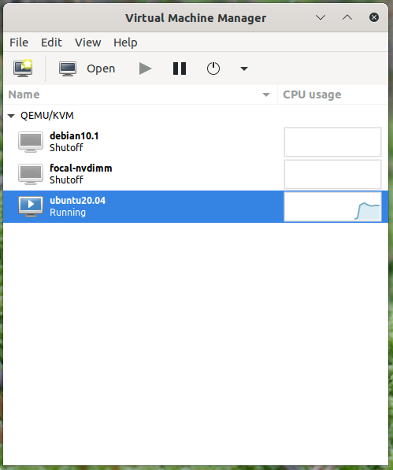
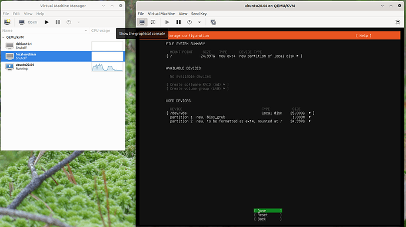
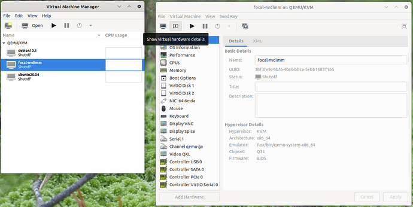
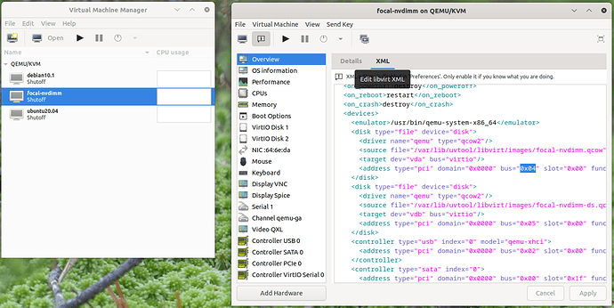
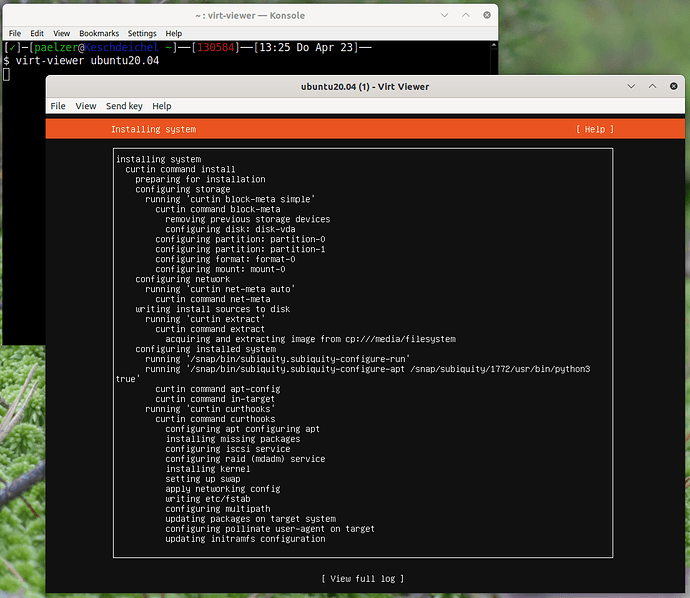

# Virtual Machine Manager

[TOC]

Virtual Machine Manager 通过 `virt-manager` 软件包提供用于管理本地和远程虚拟机的图形用户界面 （GUI）。除了实用程序本身之外 `virt-manager` ，该软件包还包含一系列其他有用的工具，例如 `virt-install` 和 `virt-clone` `virt-viewer` 。

## 安装 virt-manager

要安装 `virt-manager` ，请输入：

```bash
sudo apt install virt-manager
```

由于 `virt-manager` 需要图形用户界面 （GUI） 环境，因此建议将其安装在工作站或测试计算机上，而不是生产服务器上。要连接到本地 libvirt 服务，请输入：

```bash
virt-manager
```

可以通过在终端提示符中输入以下内容来连接到另一台主机上运行的 libvirt 服务：

```bash
virt-manager -c qemu+ssh://virtnode1.mydomain.com/system
```

> **Note**: 
>
> 上面的示例假定已经配置了管理系统和目标系统之间的 SSH 连接，并使用 SSH 密钥进行身份验证。需要 SSH 密钥，因为 libvirt 会将密码提示发送到另一个进程。

## 使用 virt-manager 管理 guest

### 客户机生命周期

使用 `virt-manager` 时，了解正在查看的上下文总是很重要的。主窗口最初仅列出当前定义的来宾。将看到它们的名称、状态（例如，“关闭”或“正在运行”）和一个显示 CPU 使用率的小图表。

 

在这种情况下，除了启动/停止客户机之外，没有太多事情要做。但是，通过双击客户机或单击窗口顶部的“打开”按钮，可以看到客户机本身。对于包含客户机主控制台/虚拟屏幕输出的正在运行的客户机。

 

如果对客户机配置有更深入的了解，则单击客户机窗口左上角的“显示图形控制台”将返回此输出。

### 客户机修改

`virt-manager` 提供了一种方便的 GUI 辅助方法来编辑客户机定义。为此，每个客户机上下文视图将在客户机窗口的顶部显示“显示虚拟硬件详细信息”。在这里，可以编辑客户机的虚拟硬件，这将更改后台的客户机表示形式。

 

UI 编辑功能仅限于该 GUI 功能已知（并受其支持）的功能。libvirt 不仅功能增长速度快于 `virt-manager` 速度，而且添加每个功能也会使 UI 过载并使其无法使用。

为了在两者之间取得平衡，还可以通过“编辑 libvirt XML”按钮访问 XML 视图。

 

默认情况下，这将是只读的，可以看到 UI 驱动的操作已更改的内容。可以通过“首选项”在此视图中允许读写访问。这与 `libvirt-client` 的 `virsh edit` 暴露的内容相同。

## 虚拟机查看器 （virt-viewer）

虚拟机查看器应用程序通过 `virt-viewer` ，允许您像 一样 `virt-manager` 连接到虚拟机的控制台，但简化为 GUI 功能。 `virt-viewer` 需要 GUI 才能与虚拟机交互。

### 安装 virt-viewer

如果 `virt-viewer` 尚未安装，可以使用以下命令从终端安装它：

```bash
sudo apt install virt-viewer
```

安装并运行虚拟机后，可以使用以下命令连接到虚拟机的控制台：

```bash
virt-viewer <guestname>
```

UI 将显示一个窗口，代表 guest 的虚拟屏幕，就像 `virt-manager` 上面一样，但没有额外的按钮和功能。

 

与 `virt-manager` 类似， `virt-viewer` 也可以使用带有密钥身份验证的 SSH 连接到远程主机：

```bash
virt-viewer -c qemu+ssh://virtnode1.mydomain.com/system <guestname>
```

请务必替换 `web_devel` 为相应的虚拟机名称。

如果配置为使用桥接网络接口，还可以设置对虚拟机的 SSH 访问。

## virt-install

`virt-install` 是 `virtinst` 包的一部分。它可以帮助安装基于 ISO 的经典系统，并为所需的最常见选项提供 CLI 。

### 安装 virt-install

要安装 `virt-install` ，如果尚未安装，请从终端提示符运行以下命令：

```bash
sudo apt install virtinst
```

使用 `virt-install` 时，有几个选项可用。例如：

```bash
virt-install \
 --name web_devel \
 --ram 8192 \
 --disk path=/home/doug/vm/web_devel.img,bus=virtio,size=50 \
 --cdrom focal-desktop-amd64.iso \
 --network network=default,model=virtio \
 --graphics vnc,listen=0.0.0.0 --noautoconsole --hvm --vcpus=4
```

在 `virt-install` 手册页中可以找到更多参数。但是，逐一解释上面示例的内容：

- `--name web_devel`

  新虚拟机的名称将为 `web_devel` 。

- `--ram 8192`

  指定虚拟机将使用的内存量（以 MB 为单位）。

- `--disk path=/home/doug/vm/web_devel.img,bus=virtio,size=50`

  指示虚拟磁盘的路径，可以是文件、分区或逻辑卷。在此示例中，在当前用户目录中命名 `web_devel.img` 的文件，大小为 50 GB，用于 `virtio` 磁盘总线。根据磁盘路径， `virt-install` 可能需要使用提升的权限运行。

- `--cdrom focal-desktop-amd64.iso`

  要用作虚拟 CD-ROM 的文件。该文件可以是 ISO 文件，也可以是主机 CD-ROM 设备的路径。

- `--network`

  提供与 VM 的网络接口相关的详细信息。这里使用默认网络，并将接口模型配置为 `virtio` 。

- `--graphics vnc,listen=0.0.0.0`

  Exports the guest’s virtual console using VNC and on all host  interfaces.使用 VNC 和所有主机接口导出客户机的虚拟控制台。通常，服务器没有 GUI，因此局域网 （LAN） 上另一台基于 GUI 的计算机可以通过 VNC 连接以完成安装。

- `--noautoconsole`

  不会自动连接到虚拟机的控制台。

- `--hvm` : 创建完全虚拟化的 guest 。

- `--vcpus=4` : 分配 4 个虚拟 CPU 。

启动 `virt-install` 后，可以使用 GUI（如果服务器具有 GUI）在本地连接到虚拟机的控制台，也可以通过基于 GUI 的计算机的远程 VNC 客户端连接到虚拟机的控制台。

## `virt-clone`

该 `virt-clone` 应用程序可用于将一个虚拟机复制到另一个虚拟机。例如：

```bash
virt-clone --auto-clone --original focal
```

使用的选项：

- `--auto-clone`

  To have `virt-clone` create guest names and disk paths on its own.
  自行 `virt-clone` 创建客户机名称和磁盘路径。

- `--original`

  要复制的虚拟机的名称。

还可以使用 `-d` 或 `--debug` 选项来帮助 `virt-clone` 解决问题。 

替换 `focal` 为适合您的案例的虚拟机名称。

> **Warning**: 
> 请注意，这是一个完整的克隆，因此任何类型的机密、密钥等 `/etc/machine-id` 都将被共享。这将导致安全性问题以及需要识别计算机的任何内容（如DHCP）。很可能希望在之后编辑这些内容，并根据需要删除重复数据。