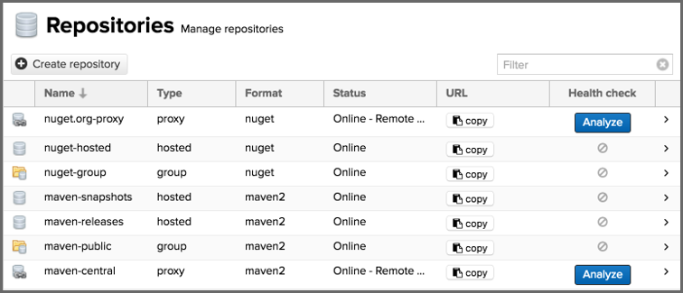
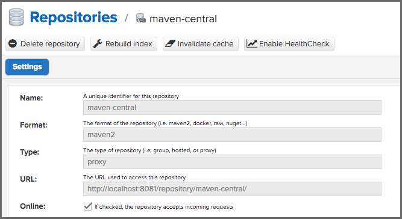
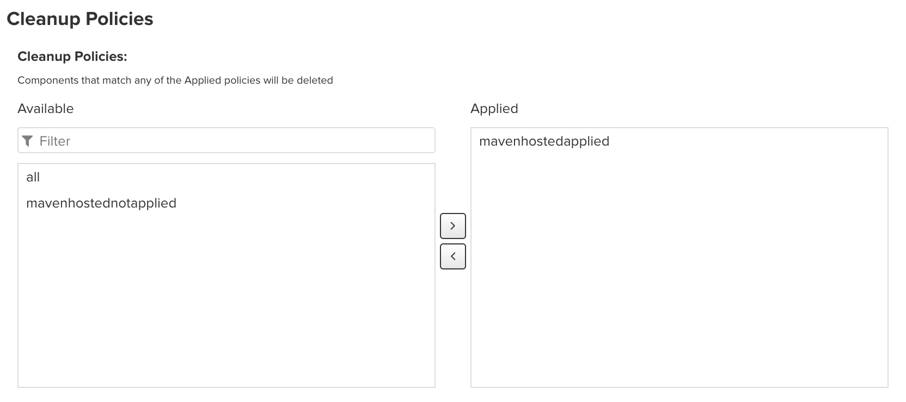

# 库管理

[TOC]

## 概述

存储库是提供给用户的组件的容器。

创建和管理存储库是 Nexus 存储库配置的重要组成部分，因为它允许您向用户公开更多组件。It supports proxy repositories, hosted repositories and  repository groups in a number of different repository formats.支持多种不同存储库格式的代理存储库、托管存储库和存储库组。

要管理存储库，请在 *Administration* 菜单的 *Repository* 子菜单中选择 *Repositories* 项目。

存储库的二进制部分存储在 blob 存储中，可以通过从 *Administration* 菜单的 *Repository* 子菜单中选择 *Blob Stores* 进行配置。

## 存储库类型

### Proxy Repository

具有 *proxy* 类型的存储库（也称为代理存储库）是链接到远程存储库的存储库。对组件的任何请求都会根据代理存储库的本地内容进行验证。如果找不到本地组件，则将请求转发到远程存储库。然后检索组件并将其存储在本地存储库管理器中，该管理器充当缓存。随后，对同一组件的后续请求将从本地存储中完成，从而消除了再次从远程存储库检索组件的网络带宽和时间开销。

默认情况下，存储库管理器附带以下配置的代理存储库：

#### maven-central

此代理存储库访问 Central 存储库（以前称为 Maven Central ）。它是内置在 Apache Maven 中的默认组件存储库，并得到 Gradle 、SBT 或 Ant / Ivy 等其他构建工具的良好支持。

#### nuget.org-proxy

此代理存储库访问 NuGet Gallery 。它是用于 .Net 开发的 `nuget` 包管理工具使用的默认组件存储库。

### Hosted Repository

具有 *hosted* 类型的存储库（也称为托管存储库）是将组件存储在存储库管理器中的存储库，作为这些组件的权威位置。as the authoritative location for  these components.

默认情况下，存储库管理器附带以下已配置的托管存储库：

#### maven-releases

This hosted repository uses the *maven2* repository format with a release version policy.此托管存储库使用 *maven2* 存储库格式和发布版本策略。它旨在成为组织发布内部版本的存储库。You  can also use this repository for third-party components that are not  available in external repositories and can therefore not be retrieved  via a configured proxy repository. 您还可以将此存储库用于外部存储库中不可用的第三方组件，因此无法通过配置的代理存储库进行检索。Examples of these components could be commercial, proprietary libraries such as an Oracle JDBC driver that  may be referenced by your organization.这些组件的示例可以是商业专有库，例如您的组织可能引用的OracleJDBC驱动程序。

#### maven-snapshots

This hosted repository uses the *maven2* repository format with a snapshot version policy. 此托管存储库使用maven2存储库格式和快照版本策略。It is intended to be  the repository where your organization publishes internal development  versions, also known as snapshots.它旨在成为组织发布内部开发版本（也称为快照）的存储库。

#### nuget-hosted

This hosted repository is where your organization can publish internal releases in repository using the *nuget* repository format. 这个托管存储库是您的组织可以使用nuget存储库格式在存储库中发布内部版本的地方。You can also use this repository for third-party  components that are not available in external repositories, that could  potentially be proxied to gain access to the components.您还可以将此存储库用于外部存储库中不可用的第三方组件，这些组件可能被代理以获得对这些组件的访问权。

### Repository Group

A repository with the type *group*, also known as repository group, represents a powerful feature of Nexus  Repository Manager. They allow you to combine multiple repositories and  other repository groups in a single repository. This in turn means that  your users can rely on a single URL for their configuration needs, while the administrators can add more repositories and therefore components  to the repository group.

具有类型组的存储库（也称为存储库组）是NexusRepositoryManager的一个强大功能。它们允许您在单个存储库中组合多个存储库和其他存储库组。这反过来意味着您的用户可以依靠一个URL来满足其配置需求，而管理员可以向存储库组添加更多的存储库和组件。 

When a user is given a privilege to a group repository, then that user will  also have that privilege to all transitive members of that group  repository **only when their request is directed to the group repository**. Direct requests to indvidual member repositories will only work if the  user is given explicit permission to the individual repository.当用户被授予组存储库的权限时，只有当其请求被定向到组存储库时，该用户才能对该组存储库中的所有可传递成员拥有该权限。仅当用户被授予对单个存储库的明确权限时，对单个成员存储库的直接请求才有效。

存储库管理器附带以下组：

#### maven-public

The maven-public group is a repository group of *maven2* formatted repositories and combines the important external proxy  repository for the Central Repository with the hosted repositories *maven-releases* and *maven-snapshots*. This allows you to expose the components of the Central Repository as  well as your internal components in one single, simple-to-use repository and therefore URL.

maven公共组是maven2格式存储库的存储库组，它将中央存储库的重要外部代理存储库与托管存储库maven版本和maven快照相结合。这允许您在一个简单易用的存储库中公开中央存储库的组件以及您的内部组件，从而实现URL。

#### nuget-group

This group combines the *nuget* formatted repositories *nuget-hosted* and *nuget.org-proxy* into a single repository for your .Net development with NuGet.

该小组将nuget格式的存储库nuget hosted和nuget.org-proxy组合到一个单独的存储库中，用于使用nuget进行.Net开发。

## 管理存储库和存储库组

存储库和存储库组的管理用户界面可通过 *Administration* 菜单的 *Repository* 子菜单中的 *Repositories* 项目获得。它允许您创建和配置存储库，以及删除它们并执行各种维护操作。要访问此部分，用户必须具有 *nx-all* 或 *nx-repository-admin* 权限。下图中显示的初始视图包含所有配置的存储库和存储库组的列表。

 

存储库列表在以下列中显示每个存储库的一些信息：

- *Name* - 存储库或存储库组的唯一名称

- *Type -* 存储库的类型，其值为 *proxy* 或 *hosted* 存储库或存储库组的 *group*

- *Format -* 用于存储库中存储的存储库格式，值为 *maven2* 、 *nuget* 或其他

- Status - 存储库的状态以及有关状态的更多信息：

  - *Online - Uninitialised*

    表示代理存储库是新创建的，尚未初始化；初始化完成后，此状态将更改为 *Online - Ready to Connect*

  - *Online - Ready to Connect*

    意味着代理存储库已准备好连接到远程，但尚未向该代理发出任何请求

  - *Online - Remote Available*

    意味着已向该代理存储库发出请求，并且已成功连接到远程

  - *Online - Remote Manually Blocked*

    means that the *Auto blocking enabled* checkbox in this proxy repository's settings is checked意味着选中此代理存储库设置中的自动阻止启用复选框

  - *Online - Remote Auto Blocked and Unavailable*

    indicates that a remote repository is unreachable/unresponsive and the *Auto blocking enabled* checkbox in the proxy repository's settings is checked表示远程存储库无法访问/无响应，并且选中了代理存储库设置中的自动阻止启用复选框

  - *Online - Remote Unavailable*

    indicates that a remote repository is unreachable/unresponsive and the *Auto blocking enabled* checkbox in the proxy repository's settings is **not** checked表示远程存储库无法访问/无响应，并且未选中代理存储库设置中的自动阻止启用复选框

  - *Offline - Repository Offline*

    means that the *Online* checkbox in a proxy repository's settings is **not** checked表示未选中代理存储库设置中的Online复选框

  - *Offline*

    indicates that the *Online* checkbox in a group/hosted repository's settings is **not** checked表示未选中组/托管存储库设置中的“联机”复选框

- *URL* - the *copy* button prompts a dialog containing a direct URL path exposing the repository复制按钮会提示一个对话框，其中包含显示存储库的直接URL路径

- *Health Check -* displays the repository health statistics from a previously run [Repository Health Check](http://blog.sonatype.com/how-to-use-the-new-repository-health-check-2.0) or a button to start the analysis显示以前运行的存储库运行状况检查中的存储库健康状况统计信息或启动分析的按钮

存储库列表上方的 *Create repository* 按钮会触发一个对话框，以选择新存储库的配方。select the Recipe for the new repository. The recipe combines the format and the type of  repository into a single selection. Depending on your repository manager version and installed plugins, the list of available choices differs.配方将存储库的格式和类型组合到一个单独的选择中。根据您的存储库管理器版本和安装的插件，可用选项列表有所不同。

For example to create another release repository in *maven2* format, you would click on the row with the recipe *maven2 (hosted)* in the dialog. If you wanted to proxy a *maven2* repository, choose *maven 2 (proxy)*. On the other hand if you want to proxy a NuGet repository, choose *nuget (proxy)*. With *maven2 (group)* you can create a repository group for *maven2* repositories.

例如，要创建另一个maven2格式的发布存储库，您可以单击对话框中包含配方maven2（托管）的行。如果要代理maven2存储库，请选择maven2（代理）。另一方面，如果您想代理nuget存储库，请选择nuget（代理）。使用maven2（组），您可以为maven2存储库创建存储库组。

After this selection, you are presented with the configuration view, that  allows you to fill in the required parameters and some further  configuration. The exact details on the view depend on the selected  repository provider and are identical to the administration for updating the configuration of a repository documented in the following sections.

选择后，您将看到配置视图，该视图允许您填写所需的参数和一些进一步的配置。视图的确切详细信息取决于所选的存储库提供程序，并且与以下部分中记录的更新存储库配置的管理相同。

Once you have created a repository or repository group, it is available in  the list for further configuration and management. Clicking on a  specific row allows you to navigate to this repository specific  administration section. An example for the maven-central repository is  partially displayed in *Figure: “Partial Repository Configuration for a Proxy Repository”*.

创建存储库或存储库组后，该存储库或组将显示在列表中以供进一步配置和管理。单击特定行可导航到此存储库特定的管理部分。maven中央存储库的示例部分如图所示：“代理存储库的部分存储库配置”。

 

The repository administration feature view has buttons to perform various  actions on a repository. The buttons displayed depend on the repository  format and type. The following buttons can be found:存储库管理功能视图具有用于在存储库上执行各种操作的按钮。显示的按钮取决于存储库格式和类型。可以找到以下按钮：

#### Delete repository 删除存储库

The *Delete repository* button allows you to delete the repository and all related configuration and  components, after confirming the operation in a dialog.删除存储库按钮允许您在对话框中确认操作后删除存储库以及所有相关配置和组件。

#### Invalidate cache 使缓存无效

The *Invalidate cache* button invalidates the caches for this repository. The exact behavior depends on the repository type:“使缓存无效”按钮将使此存储库的缓存无效。确切的行为取决于存储库类型：

- **Proxy repositories**

Invalidating the cache on a proxy repository clears the proxy cache such that any  items cached as available will be checked again for any changes the next time they are requested. This also clears the negative cache for the  proxy repository such that any items that were not found within the  defined cache period will be checked again the next time they are  requested.

使代理存储库上的缓存无效会清除代理缓存，以便在下次请求时再次检查缓存为可用的任何项目是否有任何更改。这还将清除代理存储库的负缓存，以便在下次请求时再次检查在定义的缓存周期内未找到的任何项目。

- **Repository groups**

Invalidating the cache of a repository group, clears the group cache such that any  items fetched and held in the group cache, such as Maven metadata, will  be cleared. This action also invalidates the caches of any proxy and  group repositories that are members of this group.

使存储库组的缓存无效时，将清除组缓存，以便清除组缓存中提取和保存的任何项目，如Maven元数据。此操作还将使作为此组成员的任何代理和组存储库的缓存无效。

#### Rebuild Index 重新生成索引

The *Rebuild Index* button allows you to drop and recreate the search index for the proxy  repository, synchronizing the contents with search index. This button is only available for proxy repositories.

“重建索引”按钮允许您删除并重新创建代理存储库的搜索索引，使内容与搜索索引同步。此按钮仅适用于代理存储库。

The following properties can be viewed for all repositories and can not be edited after the initial creation of the repository:

可以查看所有存储库的以下财产，并且在初始创建存储库后无法编辑这些属性：

#### **Name**

The *Name* is the identifier that will be used in the URL for access to the  repository. For example, the proxy repository for the Central Repository has a name of maven-central. The *Name* must be unique in a given repository manager installation and is required.名称是URL中用于访问存储库的标识符。例如，Central repository的代理存储库的名称为maven Central。在给定的存储库管理器安装中，名称必须是唯一的，并且是必需的。

#### **Format**

Format defines in what format the repository manager exposes the repository to external tools. Supported formats depend on the edition of the  repository manager and the installed plugins. Examples are *maven2*, *nuget*, *raw*, *docker*, *npm*.格式定义存储库管理器向外部工具公开存储库的格式。支持的格式取决于存储库管理器的版本和安装的插件。例如maven2、nuget、raw、docker、npm。

#### **Type**

The type of repository - *proxy, hosted,* or *group*.存储库的类型-代理、托管或组。

#### **URL**

It shows the user facing URL this means that Maven and other tools can access the repository directly at e.g., `http://localhost:8081/repository/maven-central`.

它显示了面向用户的URL，这意味着Maven和其他工具可以直接访问存储库。，http://localhost:8081/repository/maven-中央。

#### **Online 在线的**

The checkbox allows you set whether this repository is available to client side tools or not.该复选框允许您设置此存储库是否可用于客户端工具。

Beyond the generic fields used for any repository, a number of different  fields are used and vary depending on the repository format and type.  They are grouped under a number of specific headers that include  configuration for the related aspects detailed below.

除了用于任何存储库的通用字段之外，还使用了许多不同的字段，这些字段因存储库格式和类型而异。它们被分组在许多特定的标题下，这些标题包括下面详细描述的相关方面的配置。

#### **Storage**

Every repository needs to have a blob store configured to determine where  components are stored. The drop-down allows you to select from all the  configured blob stores. Documentation about creating blob stores can be  found in the [Storage Guide](https://help.sonatype.com/repomanager3/planning-your-implementation/storage-guide).

每个存储库都需要配置blob存储，以确定组件的存储位置。下拉列表允许您从所有配置的blob存储区中进行选择。有关创建blob存储的文档可以在《存储指南》中找到。

The *Strict Content Type Validation* allows you to activate a validation that checks the MIME type of all files  published into a repository to conform to the allowed types for the  specific repository format.

Strict Content Type Validation允许您激活一个验证，该验证检查发布到存储库中的所有文件的MIME类型，以符合特定存储库格式所允许的类型。

#### Cleanup Policies清理策略

This section, shown in *Figure: Cleanup Policies subsection*, provides a list of cleanup policies that can be used against hosted and proxy repositories. When the *Admin - Cleanup repositories using their associated policies* task is executed it pares the contents of that repository against all *Applied* policies by deleting contents that match any of them. Ultimately, this is a way  of controlling your disk space and making sure unused items are removed  from Nexus Repository. The use of this area is optional and by default  the *Applied* section is empty.

该部分如图：清理策略小节所示，提供了可用于托管和代理存储库的清理策略列表。当执行“管理-清理”存储库使用其关联的策略任务时，它会通过删除与任何应用的策略匹配的内容，将该存储库的内容与所有应用的策略进行比较。最终，这是一种控制磁盘空间并确保从Nexus Repository中删除未使用的项目的方法。此区域的使用是可选的，默认情况下“应用”部分为空。

The lists will only include cleanup policies you have created for the respective format. See [here](https://help.sonatype.com/repomanager3/nexus-repository-administration/repository-management/cleanup-policies) for more about creating and maintaining cleanup policies.

这些列表将仅包括您为各自格式创建的清理策略。有关创建和维护清理策略的详细信息，请参阅此处。

 
Groups do not use cleanup policies themselves, they simply contain the components from their children.

组本身不使用清理策略，它们只包含子组的组件。

It is important to note that any component affected by ANY policy in the *Applied* section will be deleted. So if you have a policy that deletes only X and a policy  that deletes only Y, both X and Y will be removed when the task executes if both policies are *Applied*.

需要注意的是，将删除应用部分中受任何策略影响的任何组件。因此，如果您的策略仅删除X，而策略仅删除Y，则如果应用了这两个策略，则在执行任务时将删除X和Y。

#### **Hosted**

A hosted repository includes configuration of a Deployment policy in the  Hosted configuration section. Its setting controls how a hosted  repository allows or disallows component deployment.

托管存储库在托管配置部分中包含部署策略的配置。它的设置控制托管存储库允许或不允许组件部署的方式。

If the policy is set to *Read-only*, no deployment is allowed.

如果策略设置为只读，则不允许部署。

If this policy is set to *Disable redeploy*, a client can only deploy a particular component once and any attempt to deploy a component again will result in an error. The disabled redeploy is the default value, since most client tools assume components to be  immutable and will not check a repository for changed components that  have already been retrieved and cached locally.

如果此策略设置为“禁用重新部署”，则客户端只能部署一次特定组件，任何再次部署组件的尝试都将导致错误。禁用的重新部署是默认值，因为大多数客户端工具都假定组件是不可变的，不会检查存储库中已在本地检索和缓存的已更改组件。

If the policy is set to *Allow redeploy*, clients can deploy components to this repository and overwrite the same component in subsequent deployments.

如果策略设置为“允许重新部署”，则客户端可以将组件部署到此存储库，并在后续部署中覆盖同一组件。

If you are using [replication](https://help.sonatype.com/repomanager3/nexus-repository-administration/repository-management/repository-replication), this policy is automatically set to *Deploy by Replication Only.* This will block all deployment to the hosted repository except by the  internal replication mechanism. You should not manually set this policy  to *Deploy by Replication Only*. If you disable replication, Nexus Repository automatically restores your previous deployment policy.

如果您正在使用复制，则此策略将自动设置为“仅通过复制部署”。这将阻止所有部署到托管存储库，内部复制机制除外。不应手动将此策略设置为“仅通过复制部署”。如果禁用复制，Nexus Repository将自动恢复您以前的部署策略。

#### **Proxy**

The configuration for proxy repositories in the Proxy section also contains the following parameters:

##### **Remote Storage**

A proxy repository on the other hand requires the configuration of the *Remote Storage*. It needs to be configured with the URL of the remote repository, that  should to be proxied. When selecting the URL to proxy it is beneficial  to avoid proxying remote repository groups. Proxying repository groups  prevents some performance optimization in terms of accessing and  retrieving the content of the remote repository. If you require  components from the group that are found in different hosted  repositories on the remote repository server it is better to create  multiple proxy repositories that proxy the different hosted repositories from the remote server on your repository manager instead of simply  proxying the group.

##### **Use the Nexus truststore**

This checkbox allows you to elect for the repository manager to manage the  SSL certificate of the remote repository. It is only displayed - if the  remote storage uses a HTTPS URL. The *View certificate* button  triggers the display of the SSL certificate details in a dialog. The  dialog allows you to add or remove the certificate from the certificate  truststore maintained by the repository manager. Further details are  documented in [Outbound SSL - Trusting SSL Certificates of Remote Repositories](https://help.sonatype.com/repomanager3/nexus-repository-administration/configuring-ssl#ConfiguringSSL-OutboundSSL-TrustingSSLCertificatesofRemoteRepositories).

##### **Blocked**

Setting a repository to blocked causes the repository manager to no longer send outbound requests to the remote repository.

代理

代理部分中的代理存储库配置还包含以下参数：

远程存储

另一方面，代理存储库需要配置远程存储。它需要配置远程存储库的URL，该URL应该被代理。选择要代理的URL时，最好避免代理远程存储库组。代理存储库组阻止了在访问和检索远程存储库内容方面的某些性能优化。如果您需要在远程存储库服务器上的不同托管存储库中找到的组中的组件，则最好创建多个代理存储库，以代理存储库管理器上的远程服务器上不同的托管存储库，而不是简单地代理组。

使用Nexus信任库

此复选框允许您选择存储库管理器来管理远程存储库的SSL证书。仅当远程存储使用HTTPS  URL时才会显示。“查看证书”按钮触发对话框中SSL证书详细信息的显示。该对话框允许您从存储库管理器维护的证书信任库中添加或删除证书。更多详细信息记录在Outbound SSL-Trusting SSL Certificates of Remote Repository中。

此 路 不通

将存储库设置为已阻止会导致存储库管理器不再向远程存储库发送出站请求。

自动阻止已启用

如果“自动阻止启用”设置为true，则如果远程存储库不可用，存储库管理器将自动阻止代理存储库。当代理存储库被阻止时，组件仍将从本地缓存提供给客户端，但存储库管理器不会尝试在远程存储库中查找组件。存储库管理器定期重新测试远程存储库，并在其可用时解除锁定。

最大部件寿命

当代理收到对组件的请求时，它不会从远程存储库请求新版本，直到现有组件早于最大组件寿命。

元数据最长使用年限

存储库管理器从远程存储库检索元数据。它将仅在超过最大元数据期限后检索元数据更新。如果元数据是组件元数据，则在重新检查之前使用该值和“最大组件寿命”中的较长值。

##### **Auto blocking enabled**

If Auto blocking enabled is set to true, the repository manager  automatically blocks a proxy repository if the remote repository becomes unavailable. While a proxy repository is blocked, components will still be served to clients from a local cache, but the repository manager  will not attempt to locate a component in a remote repository. The  repository manager periodically retests the remote repository and  unblocks it once it becomes available.

##### **Maximum component age**

When the proxy receives a request for a component, it does not request a new version from the remote repository until the existing component is  older than *Maximum component age*.

##### **Maximum metadata age**

The repository manager retrieves metadata from the remote repository. It will only retrieve updates to metadata after the *Maximum metadata age* has been exceeded. If the metadata is component metadata, it uses the longer of this value and *Maximum component age* before rechecking.

#### **Negative Cache**

##### **Not found cache enabled/Not found cache TTL**

If the repository manager fails to locate a component, it will cache this  result for a given number of minutes. In other words, if the repository  manager can’t find a component in a remote repository, it will not  perform repeated attempts to resolve this component until the *Not found cache* *TTL* time has been exceeded. The default for this setting is 1440 minutes (or 24 hours) and this cache is enabled by default.

There is no way for Nexus Repository to automatically delete assets that were uploaded into a remote URL, deleted, but already locally cached. 

#### **HTTP**

The HTTP configuration section allows you to configure the necessary  details to access the remote repository, even if you have to provide  authentication details in order to access it successfully or if you have to connect to it via a proxy server.

 

This configuration is only necessary, if it is specific to this repository.  Global HTTP proxy and authentication is documented in [HTTP and HTTPS Request and Proxy Settings](https://help.sonatype.com/repomanager3/nexus-repository-administration/nodes#Nodes-HTTPandHTTPSRequestandProxySettings).

##### **Authentication**

This section allows you to select *Username* or *Windows NTLM* as *Authentication type*. Subsequently you can provide the required *Username* and *Password* for plain authentication or *Username*, *Password*, *Windows NTLM* *hostname* and *Windows NTLM* *domain* for *Windows NTLM*-based authentication.

##### **HTTP request settings**

In the HTTP request settings you can change properties of the HTTP  requests to the remote repository. The values you can apply to this  section are as follows:

- - User-agent customization - Enter the string to be appended to user-agent HTTP headers.
  - Connection retries - Enter the total number of connection attempts after an initial timeout.
  - Connection timeout - Set the timeout interval for requests, in seconds.
  - Enable circular redirects - Allow proxy repositories to follow redirects indicated by the remote server even if they point to an already processed URL.
  - Enable cookies - Authorize HTTP cookies sent by the remote server, for future requests.

 

`https://maven.oracle.com` is a server that requires both *Enable circular redirects* and *Enable cookies*. This is because, when requesting data you are redirected to a queue of  different URLs, most of which are involved with authentication.

By enabling these options, you allow the repository manager to maintain  the authentication state in a cookie that would be sent with each  request, eliminating the need for the authentication-related redirects  and avoiding timeouts.

Changes made to *HTTP request settings* are applied to all HTTP requests made from the repository manager to  the remote repository being proxied. Enabling these settings will  override any general settings defined in [HTTP and HTTPS Request and Proxy Settings](https://help.sonatype.com/repomanager3/nexus-repository-administration/nodes#Nodes-HTTPandHTTPSRequestandProxySettings)*.* 

Some repository formats include configuration options, such as these formats:

- Repository Connectors

  , 

  Docker Registry API Support

  ,

   

  and (for proxies) 

  Docker Index

   for Docker repositories

  - [SSL and Repository Connector Configuration](https://help.sonatype.com/repomanager3/nexus-repository-administration/formats/docker-registry/ssl-and-repository-connector-configuration)
  - [Support for Docker Registry API](https://help.sonatype.com/repomanager3/nexus-repository-administration/formats/docker-registry/ssl-and-repository-connector-configuration#SSLandRepositoryConnectorConfiguration-SupportforDockerRegistryAPI)
  - [Proxy Repository for Docker](https://help.sonatype.com/repomanager3/nexus-repository-administration/formats/docker-registry/proxy-repository-for-docker)

- *Maven 2* for Maven repositories: [Maven Repository Format](https://help.sonatype.com/repomanager3/nexus-repository-administration/formats/maven-repositories#MavenRepositories-MavenRepositoryFormat)

- *NuGet* for NuGet proxy repositories: [NuGet Repository Format](https://help.sonatype.com/repomanager3/nexus-repository-administration/formats/nuget-repositories#NuGetRepositories-NuGetRepositoryFormat)

- *Bower* for Bower proxy repositories: [Proxying Bower Repositories](https://help.sonatype.com/repomanager3/nexus-repository-administration/formats/bower-repositories#BowerRepositories-ProxyingBowerRepositories)

- *Yum* for Yum hosted repositories: [Hosting Yum Repositories](https://help.sonatype.com/repomanager3/nexus-repository-administration/formats/yum-repositories#YumRepositories-HostingYumRepositories)

- *Apt Settings* for Apt hosted and proxy repositories: [Apt Repositories](https://help.sonatype.com/repomanager3/nexus-repository-administration/formats/apt-repositories)

#### **Repository Groups**

The creation and configuration for a repository group differs a little from pure repositories. It allows you to manage the member repositories of a repository group. An example for a repository group using the *maven2* format is visible in *Figure: “Repository Group Configuration”*. In this figure you can see the contents of the *maven-public* group that is pre-configured in Nexus Repository.


**Figure: Repository Group Configuration**

The *Format* and *Type* are determined by the selection of the provider in the creation dialog e.g., *maven2 (group)* for the *maven-public* as a *maven2* format repository group.

The *Name* is set during the creation and is fixed once the repository group is created.

The *Online* checkbox allows you set whether this repository group is available to client side tools or not.

The *Member repositories* selector allows you to add repositories to the repository group as well as remove them. The *Members* column includes all the repositories that constitute the group. The *Available* column includes all the repositories and repository groups that can potentially be added to the group.

Note that the order of the repositories listed in the *Member* section is important. When the repository manager searches for a  component in a repository group, it will return the first match. To  reorder a repository in this list, click and the drag the repositories  and groups in the *Members* list or use the arrow buttons between the *Available* and *Members* list. These arrows can be used to add and remove repositories as well.

The order of repositories or other groups in a group can be used to  influence the effective metadata that will be retrieved from a  repository group. It is recommended practice to place hosted  repositories higher in the list than proxy repositories. For proxy  repositories, the repository manager may need to check the remote repository which will incur more overhead than a hosted repository lookup.

It is also recommended to place repositories with a higher probability of  matching the majority of components higher in this list. If most of your components are going to be retrieved from the Central Repository,  putting *maven-central* higher in this list than a smaller, more  focused repository is going to be better for performance, as the  repository manager is not going to interrogate the smaller remote  repository for as many missing components. These best practices are implemented in the default configuration.

## Blob Stores

A blob store is the internal storage mechanism for the binary parts of  components and their assets. They can be local file system or  cloud-based using Amazon S3 (Pro and OSS) or Microsoft Azure (Pro only). Each blob store can be used by one or multiple repositories and  repository groups. You can learn more about blob stores and how to [configure them](https://help.sonatype.com/repomanager3/nexus-repository-administration/repository-management/configuring-blob-stores) as well as [planning your storage strategy](https://help.sonatype.com/repomanager3/planning-your-implementation/storage-guide/storage-planning) in the [Storage Guide](https://help.sonatype.com/repomanager3/planning-your-implementation/storage-guide).

 Configuring Blob Stores

 

 

Before configuring blob stores, be sure to check out our [documentation](https://help.sonatype.com/repomanager3/planning-your-implementation/storage-guide/storage-planning) about blob store types and planning storage requirements.

You can configure new blob stores by navigating to *Administration* → *Repository* → *Blob Stores* in Nexus Repository. You will need *nx-all* or *nx-blobstore* [privileges](https://help.sonatype.com/repomanager3/nexus-repository-administration/access-control/privileges) to access this portion of Nexus Repository.

The following fields appear in the blob store listing:

- *Name*  - The blob store's name as displayed in repository administration.

- *Type*  - The type of the blob store backend. See the [System Requirements](https://help.sonatype.com/repomanager3/product-information/system-requirements) for a full list of supported file systems. The following options are available:

  - *Azure Cloud Storage*  **PRO** - Stores blobs in Azure cloud storage. 
  - *File* - Store blobs in file system-based storage.
  - *Group*  **PRO**  - Combines multiple blob stores into one. 
  - *S3*  - Store blobs in AWS S3 cloud storage.

- State

   

  \- The state of the blob store.

  - *Started* indicates it is running as expected.
  - *Failed* indicates that there is a configuration issue and, as a consequence, the blob store failed to initialise.

- *Blob Count*  - The number of blobs currently stored in a blob store.

- *Total Size* - The blob store's total size in bytes.

- *Available Space*  - A blob store's remaining storage capacity.

Click on a specific row to see the absolute  *Path*  to the file system storage (for file system blob stores) and the [ *Soft Quota* ](https://help.sonatype.com/repomanager3/nexus-repository-administration/repository-management/configuring-blob-stores#ConfiguringBlobStores-AddingaSoftQuota) of the selected blob store.

We recommend that your blob store location be outside of the `$data-dir` directory and read/write accessible by the node.

## Creating a New Blob Store

1. To create a new blob store, select the *Create blob store* button.
2. Select the *Type* and provide a *Name* for your blob store.
3.  For file system blob stores, in the   *Path*   field, provide the absolute path to the desired file system location. It must  be fully accessible by the operating system user account that is running Nexus Repository.

Once you have created a blob store, you will not be able to modify it. You  will also not be able to delete any blob store that a repository or  repository group uses.

Blobs deleted in a repository are only marked for deletion (i.e., a soft delete). You can use the *Compact blob store* [task](https://help.sonatype.com/repomanager3/nexus-repository-administration/tasks) to permanently delete these soft-deleted blobs and therefore free up the used storage space.

The following sections cover specific information for each supported file system or blob store type.

### NFS v4 File System

The recommended settings for an NFS v4 server in `/etc/exports` are as follows:

```
/srv/blobstores 10.0.0.0/8(rw,no_subtree_check)
```

The recommended settings for mounting the NFS filesystem on the node:

```
defaults,noatime,rsize=1048576,wsize=1048576,hard,timeo=600,retrans=2,vers=4.1
```

 

Versions of NFS older than v4 are not supported.

### AWS Elastic File System (EFS)

EFS acts as a limitless NFS v4 server and is an option if Nexus Repository  is running in AWS. Mount the EFS volume with the same settings as NFS  v4.

 

EFS performance will be lower than a dedicated NFS server. 

### AWS Simple Storage Service (S3)

You can configure blob stores to use [AWS Simple Storage Service](https://aws.amazon.com/s3/).

Blobs are stored in an S3 bucket by using AWS REST APIs over HTTP. Object  PUTs use multi-part uploads of approximately 5MB chunks. Since HTTP  traffic to S3 blobstores introduces more I/O latency across the  network, we recommend using S3 only if Nexus Repository is running on  EC2 instances within AWS.

The following sections explain each field you will see when selecting *S3* as your blob store type on the *Create Blob Store* screen.

#### *Name* Field

Give your blob store a unique name.

#### *Region* Field

Here you will see a drop-down list populated with a list of AWS regions.  Select the appropriate region for your blob store; for optimum  performance, it should be the same region in which Nexus Repository is  run.

#### *Bucket* Field

Provide either the existing or desired AWS S3 bucket name (See the [AWS documentation for working with buckets](https://docs.aws.amazon.com/AmazonS3/latest/userguide/creating-buckets-s3.html)). Nexus Repository automatically creates an S3 bucket when you create a blob store if one does not already exist; however, you may also create the bucket yourself. Note the following:

- Nexus Repository will automatically apply a lifecycle rule to expire deleted content.
- The bucket can use server-side encryption with KMS key management transparently or S3 managed encryption. 
- If running on EC2 instances, Nexus Repository can use the IAM role assigned to those instances when accessing S3 buckets.

The AWS user for accessing the S3 Blobstore bucket needs to be granted permission for these actions on the S3 bucket resource:

- s3:PutObject
- s3:GetObject
- s3:DeleteObject
- s3:ListBucket
- s3:GetLifecycleConfiguration
- s3:PutLifecycleConfiguration
- s3:PutObjectTagging
- s3:GetObjectTagging
- s3:DeleteObjectTagging
-  s3:GetBucketAcl ( [used for problem diagnosis](https://issues.sonatype.org/browse/NEXUS-19494?__hstc=31049440.8ede5f702ac4d1e3e4b219a2c6292ddd.1676943147945.1676943147945.1676947588654.2&__hssc=31049440.67.1676947588654&__hsfp=1931082791) )  

 In addition, for Nexus Repository to create and delete buckets  automatically, an IAM policy associated with the Nexus Repository user  must include the following additonal permissions: 

- s3:DeleteBucket
-  s3:CreateBucket 

Below is a sample minimal bucket policy where `<user-arn>` is the ARN of the AWS user and `<s3-bucket-name>` the S3 bucket name:

```
{
    "Version": "2012-10-17",
    "Id": "NexusS3BlobStorePolicy",
    "Statement": [
        {
            "Sid": "NexusS3BlobStoreAccess",
            "Effect": "Allow",
            "Principal": {
                "AWS": "<user-arn>"
            },
            "Action": [
                "s3:PutObject",
                "s3:GetObject",
                "s3:DeleteObject",
                "s3:ListBucket",
                "s3:GetLifecycleConfiguration",
                "s3:PutLifecycleConfiguration",
                "s3:PutObjectTagging",
                "s3:GetObjectTagging",
                "s3:DeleteObjectTagging",
                "s3:GetBucketAcl"
            ],
            "Resource": [
                "arn:aws:s3:::<s3-bucket-name>",
                "arn:aws:s3:::<s3-bucket-name>/*"
            ]
        }
    ]
}
```


```
 
```

Here is a sample IAM policy to allow creation and deletion of buckets:

```
{
    "Version": "2012-10-17",
    "Statement": [
        {
            "Effect": "Allow",
            "Action": [
                "s3:DeleteBucket",
                "s3:CreateBucket"
            ],
            "Resource": [
                "arn:aws:s3:::*"
            ]
        }
    ]
}
```

#### *Prefix* Field

The prefix is the complete path in front of the object name, which includes the bucket name. For instance, if `ObjectA.txt` is stored as `BucketA/ProjectA/FilesA/ObjectA.txt`, then the prefix is `BucketA/ProjectA/FilesA/`.

#### *Expiration Days* Field

Use the *Expiration Days* field to configure the number of days until deleted blobs are finally removed from the S3 bucket. Nexus Repository will still soft delete blobs; however, S3 will hard delete through its policy after the configured number of days. See the [AWS documentation on deleting Amazon S3 objects](https://docs.aws.amazon.com/AmazonS3/latest/userguide/DeletingObjects.html) for more information.

If you set this field to 0, Nexus Repository will hard delete blobs, and  you will not need to wait for the S3 policy to delete them.

If you set it to -1, Nexus Repository will still soft delete blobs, and S3 policy will not hard delete them. 

 

We do not recommend setting this configuration to -1 as there will be no way to hard delete blobs. The *Admin - Compact blob store* task is only for file-based blob stores and will not hard delete blobs from S3 blob stores. 

For more information on soft and hard deletion, see the [Storage Guide](https://help.sonatype.com/repomanager3/planning-your-implementation/storage-guide).

#### Optional *Authentication* Section

In this section, you can provide AWS Identity and Access Management (IAM)  authentication information (i.e., Access Key ID and secret, Assume Role  and Session Token Amazon Resource Names (ARNs)). See the [Temporary security credentials in IAM](https://docs.aws.amazon.com/IAM/latest/UserGuide/id_credentials_temp.html) section of the AWS documentation for more information on AWS IAM.

#### Optional *Encryption Type* Section

If desired, you can select either *S3 Managed Encryption* or *KMS Managed Encryption* as the encryption type used for objects in the S3 blob store. 

 

Note that Nexus Repository has only been tested using SSE-S3 and SSE-KMS. See the [AWS server-side encryption documentation](https://docs.aws.amazon.com/AmazonS3/latest/userguide/serv-side-encryption.html) for more information.

You can also optionally provide a KMS key ID; if you leave this field  blank, Nexus Repository will use the default. If providing a KMS key ID, enter the full KMS key ID rather than the human-readable key alias.

##### Enabling Encryption on an Existing Blob Store

As a best practice, we recommend both upgrading Nexus Repository to the  latest available version and scheduling a Nexus Repository shut down  before enabling encryption. While the access to encrypted S3 objects is  transparent, if you need to configure a KMS key, it would be best to  start Nexus Repository after encryption is enabled and then immediately  add the KMS key in the blob store user interface to enable bucket  decryption.

#### Optional Advanced Connection Settings

Typically you should not need to configure the following fields when using AWS  directly; however, you may find them useful when configuring third-party storage devices that claim to implement the S3 API.

##### Endpoint URL

Use this field to provide the storage device's URL.

##### Max Connection Pool Size

The maximum number of connections that can be created to meet client requests. When set, this value overrides the default connection pool size defined by Nexus Repository or the AWS Client (for H2, this defaults to 10; for PostgreSQL, this defaults to 50). For better performance or to avoid timeouts, large deployments with a lot of traffic may want to increase the connection pool that the S3 client uses.

##### Signature Version

Identifies the AWS Signature version that you want to support for authenticated  requests. For authenticated requests, Amazon S3 supports both Signature  Version 4 and Signature Version 2. You can add this condition in your  bucket policy to require a specific signature version.

Use path-style access

AWS uses the bucket as a subdomain of the URL. Enabling this setting will  result in using the older style that appends the bucket name to the path of the URL.

#### Optional Soft Quota

This section allows you to enable a soft quota for the blob store, which  will raise an alert when a blob store exceeds a constraint. See [Adding a Soft Quota](https://help.sonatype.com/repomanager3/nexus-repository-administration/repository-management/configuring-blob-stores#ConfiguringBlobStores-AddingaSoftQuota) for more information.

#### Performance Notes

For optimum performance, take the following measures:

- Run Nexus Repository on AWS on EC2 instances.
- Ensure that the S3 connection is using the region in which Nexus Repository is run.

Note that S3 has a hard limit of 10,000 parts for multi-part uploads. The chunk size when uploading to S3 can be adjusted by setting the property `nexus.s3.multipartupload.chunksize` in the  `nexus.properties` file. The unit is bytes and the default is 5242880 (5MB). This can be tuned  for optimal performance on your network and to reduce the number of  parts uploaded to S3 so as not to receive errors on large uploads.

#### Access Denied Errors

Access denied errors are an indication that the user configured to connect to  the bucket has insufficient permissions. AWS does not provide  information specific to which permission is required to perform the  failed action. For this reason, Nexus Repository will generically report access denied errors.

### Azure Blob Store

PRO

NEW IN 3.31.0

You must create the Azure storage account in Azure before using Nexus  Repository to create an Azure blob store. Below are the recommended  storage account settings:

- Location: the location hosting Nexus Repository
- Performance: Standard or Premium
- Account kind: StorageV2
- Replication: Any

Nexus Repository will automatically create an Azure container when a blob store is created if one does not already exist.

 

The Azure storage container name must be a valid DNS name that follows the rules that Microsoft states in [its documentation](https://docs.microsoft.com/en-us/rest/api/storageservices/naming-and-referencing-containers--blobs--and-metadata). 

#### Changing the Blob Store Server

If you need to change the server that is contacted for Azure blob storage from "`blob.core.windows.net`" to something else, edit the existing `<data-dir>/etc/nexus.properties` file or set a Java system property as demonstrated below:

```
nexus.azure.server=<your.desired.blob.storage.server>
```

You will then need to restart Nexus Repository for the change to take effect.

#### Accessing the Azure Storage Account

There are three methods of gaining access to the Azure storage account from Nexus Repository:

1. Use a secret access key supplied by the Azure storage account.
2. If you're running Nexus Repository on an Azure VM, you can use System Managed Identity access.
3. Use environment variables.

##### System Managed Identity Access

System Managed Identity allows Azure to manage the access via roles assigned  to the VM in which you are running Nexus Repository. See the [Microsoft documentation](https://docs.microsoft.com/en-us/azure/active-directory/managed-identities-azure-resources/qs-configure-portal-windows-vm) for details.

To properly use the System Managed Identity, the Azure VM will need the following roles assigned to the Azure storage container:

- Storage Account Contributor
- Storage Blob Data Contributor

 

Nexus Repository does not validate that the proper roles are assigned before storing the configuration. If the aforementioned roles are not properly granted to the VM, you will need to delete the blob  store and then add it again after the roles have been set up in the  Azure storage instance.

##### Environment Variables

There are three environment variables for Azure blob stores:

- AZURE_CLIENT_ID
- AZURE_CLIENT_SECRET
- AZURE_TENANT_ID

To use environment variables, you will need to register an Azure AD application and give it access to the blob storage.

Following [Microsoft's documentation](https://docs.microsoft.com/fi-fi/azure/storage/common/storage-auth-aad-app?tabs=dotnet), complete the following steps:

1. Create an application.

2. Grant permission to Azure storage.

3. Create a client secret.

4. Copy the secret value (Not Secret Id) to use as AZURE_CLIENT_SECRET.

    

   You must copy this immediately as you will not be able to access it later.

5. From the app registration overview screen, retrieve the other values for your environment variables:

   1. The *Directory (tenant) ID* provides the value for AZURE_TENANT_ID.
   2. The *Application (client) ID* provides the value for AZURE_CLIENT_ID.

You must then navigate to the storage container and grant the *Storage Blob Data Contributor* role to the application:

1. Select *Storage Accounts* and then the storage account to which you want to grant access.
2. Select *Access Control (IAM);* then, add a role assignment.
3. Select *Storage Blob Data Contributor.*
4. Select *Next* and then *Add Member*.
5. Search for your application and add it as the member.

Now, set the environment variables in the terminal before launching Nexus Repository.

#### Optimizing Performance

For optimum performance, you'll want to take the following steps:

- Run Nexus Repository on Azure on virtual machines
- Ensure that the Azure connection is using the location where Nexus Repository is being run

The chunk size when uploading to Azure can be adjusted by setting the property  `nexus.azure.blocksize` in the `nexus.properties` file (e.g., `nexus.azure.blocksize=1000000`). By default, this is set to 5242880 bytes (5MB). You can tune this for optimal performance on your network.

## Promoting a Blob Store to a Group  

To promote a blob store to a group, select the *Convert to group* button. This launches the promotion process to add your blob store to a group for more flexibility. Follow the on-screen prompts to create the  blob store group, which will contain the previously concrete blob store  and to which you can add other blob stores.

 

You cannot undo promoting a blob store to a group.

### What is a Fill Policy?

When configuring a blob store group, you will be asked to select a fill policy (i.e., a write policy). A fill policy is the method that the blob store group uses to choose a member for writing blobs. You can change the fill policy at any time. 

Available fill policy choices include the following:

-   ***Round Robin***   - Incoming writes alternate between all blob stores in the group. This  is useful when you have a number of blob stores available and you want  each of them to receive a roughly equal number of writes. This does not balance based upon any other metric.
-   ***Write to First***  - All incoming writes are given to the first writeable blob store (skipping blob stores in a read-only state). If you need to direct all blobs to a specific blob store (e.g., you have a blob store for a new empty disk), then this fill policy will ensure  that the new blob store gets all the writes.

### Removing a Blob Store from a Group

To remove a blob store from a group, you will need to use the [ *Admin - Remove a member from a blob store group* task ](https://help.sonatype.com/repomanager3/nexus-repository-administration/tasks#Tasks-Admin-Removeamemberfromablobstoregroup)to ensure that repositories still have access to their blobs. Groups allow you to add members dynamically,  but removing a blob store requires a task to ensure that repositories still have access to their blobs.

## Moving a Blob Store 

 

Before proceeding, you should ensure you have [backed up your blob store](https://help.sonatype.com/repomanager3/planning-your-implementation/backup-and-restore/prepare-a-backup#PrepareaBackup-BlobStoreBackup).

The following steps can be used to move a blob store to a new location.

1. Create a new blob store with the storage path set to the new location.
2. [Promote the existing to a group](https://help.sonatype.com/repomanager3/nexus-repository-administration/repository-management/configuring-blob-stores#ConfiguringBlobStores-promote).
3. When asked in the form, set the new group's  *[Fill Policy](https://help.sonatype.com/repomanager3/nexus-repository-administration/repository-management/configuring-blob-stores#ConfiguringBlobStores-WhatisaFillPolicy?)* to *Write to First*.
4. Add the new blob store that you created in step 1 to the newly promoted group blob store underneath the original blob store.
5. Schedule and run an *Admin - Remove a member from blob store group* task via *Administration → System → Tasks* to remove the original blob store from the group. 

The original blob store's contents will be moved over to the new blob store before the original blob store is removed. 

## Migrating from an On-Premises Blob Store to a Cloud Blob Store Using Vendor-Provided Tools

For greatest efficiency, we recommend using your cloud vendor's tools to  migrate to a cloud blob store. Before proceeding with any migration, you should [back up your blob store](https://help.sonatype.com/repomanager3/planning-your-implementation/backup-and-restore/prepare-a-backup#PrepareaBackup-BlobStoreBackup).

 

If you need to migrate multiple Terabytes of blob data, you should consult directly with your could provider for guidance to avoid prolonged  downtime.

### Amazon Web Services (AWS)

For migrating to Amazon S3, we suggest using a tool such as [AWS DataSync](https://aws.amazon.com/datasync/). Amazon provides [documentation](https://docs.aws.amazon.com/datasync/latest/userguide/what-is-datasync.html) for using DataSync to move data between other storage systems and AWS storage services. 

### Microsoft Azure

For migrating to Azure Blob, we suggest using Microsoft's [AzCopy](https://docs.microsoft.com/en-us/azure/storage/common/storage-use-azcopy-v10). Microsoft provides [documentation](https://docs.microsoft.com/en-us/azure/storage/common/storage-use-azcopy-blobs-upload?toc=%2Fazure%2Fstorage%2Fblobs%2Ftoc.json) for using AzCopy to move data to and from Azure Blob.

### Google Cloud Platform

Google offers a [Storage Transfer Service](https://cloud.google.com/storage-transfer-service) and provides [documentation](https://cloud.google.com/storage-transfer/docs/overview) for moving data between other storage systems and GCP.

## Splitting a Blob Store

 

Due to multiple known issues that could result in data loss, we have disabled any pre-existing *Admin - Change repository blob store* tasks as well as disabled the ability to create new ones as of release **3.45.0**. We highly discourage you from using this task in earlier Nexus Repository releases where it is not disabled.

1. Determine the repositories you wish to move. (Also see this Support article *[Investigating Blob Store and Repository Size and Space Usage](https://support.sonatype.com/hc/en-us/articles/115009519847-Investigating-Blob-Store-and-Repository-Size-and-Space-Usage).*)
2. Create new blob store(s) (See [Configuring Blob Stores](https://help.sonatype.com/repomanager3/nexus-repository-administration/repository-management/configuring-blob-stores)).
3. Use the [*Admin - Change Repository Blob Store* task](https://help.sonatype.com/repomanager3/nexus-repository-administration/tasks#Tasks-Admin-Changerepositoryblobstore) to move content.

## Adding a Soft Quota

 

 A soft quota will never block read or write operations on the blob store

When you set a soft quota, Nexus Repository monitors a blob store and raises an alert when it exceeds your configured constraint. You can configure a soft quota by following these steps:

1. Navigate to *Administration* → *Blob Stores* in the Nexus Repository menu.

2. Select the blob store for which you would like to configure the soft quota.

3. In the blob store form, check the *Enable Soft Quota*  box.

4. Select the 

   Type of Quota 

   from the following choices available in the drop-down menu:

   1. *Space Used* - Issues an alert when a blob store exceeds your quota limit for total bytes used.
   2. *Space Remaining* - Issues an alert when the space available for new blobs drops below your quota limit.

5. Under *Quota Limit in MB*, enter the number of MB at which you would like to receive an alert for the quota type you selected.

6. Select *Save*.

When a soft quota is violated, that information will be available in the following locations:

- A *WARN* level message in the logs.
- Under *Administration* → *Support* → *Status*, all soft quotas' statuses are aggregated in the *BlobStores* status.
- A REST API endpoint.

   Data Store

 

 

 

**Only available in Nexus Repository Pro. Interested in a free trial? [Start here](https://www.sonatype.com/products/repository-pro/trial).**

Administrators using Nexus Repository Pro will see a *Data Store* option in the user interface at *Administration → Repository → Data Store*. This screen contains information about your H2 or PostgreSQL database connection.


The *Data Store* screen contains the following information:

- **JDBC URL** (read-only) - URL for connecting to your database. 

- **Username** (read-only) - This will be populated for PostgreSQL only. 

- **Schema** (read-only) - This will be populated for PostgreSQL only.

- Maximum Connection Pool Size

   (optional) - The maximum number of connections that can be created to  meet client requests. For H2, this defaults to 10; for PostgreSQL, this  defaults to 50.

  - Large deployments with a lot of traffic may need to increase their Maximum Connection Pool Size.

- **Advanced Settings** (optional) - This field should be left blank unless provided specific instruction by the Sonatype Product Support Team.

​            

# Cleanup Policies


​                As described in [Components, Repositories, and Repository Formats](https://help.sonatype.com/repomanager3/using-nexus-repository/repository-manager-concepts/components%2C-repositories%2C-and-repository-formats) (and [Components and Assets in Docker](https://help.sonatype.com/repomanager3/using-nexus-repository/repository-manager-concepts/components%2C-repositories%2C-and-repository-formats/components-and-assets-in-docker) for the Docker format), repositories contain components and associated  assets. If you are not cleaning out old and unused components, your  repositories will grow quickly; over time, this will present risks to  your deployment:

- Storage costs will increase
- Performance is impacted
- Artifact discovery will take longer
- Consuming all available storage will results in server failure

You can create cleanup policies and assign them to one or more proxy or hosted repositories so that a scheduled [cleanup task](https://help.sonatype.com/repomanager3/nexus-repository-administration/repository-management/cleanup-policies#CleanupPolicies-CleanupTask)    *(Admin - Cleanup repositories using their associated policies)* will automatically  [soft delete](https://help.sonatype.com/repomanager3/planning-your-implementation/storage-guide#StorageGuide-Terminology) artifacts from the repository. A soft delete means that artifacts are  only marked for removal and not yet deleted from the disk. Disk space is   **not**   reclaimed until the   *Admin - Compact blob store*   task runs.

 

The *Admin - Compact blob* store task does not apply to S3 blob stores, which are cleaned up using AWS Lifecycle.

See [here](https://help.sonatype.com/repomanager3/nexus-repository-administration/tasks) for more general information on tasks.

## Cleanup Policy Security Requirements

Only users with the admin (i.e., `    nexus:*        ` ) privilege can use the *Cleanup Policy* left navigation item. Any user with privilege to edit a repository (such as `nexus:repository-admin:maven2:maven-central:edit` for the default maven-central repository) can adjust the policy a  repository uses. Permission to edit the cleanup task is covered by the  same permissions as other tasks (`nx-tasks-update` or `nx-tasks-all`). There is no individual privilege for just the Cleanup task.

## Cleanup Policies

 

Nexus Repository does not come with any built-in pre-configured cleanup  policies. These are something you should define as best suits your  individual environment.

You can create and assign one or more cleanup policies to a repository under *Administration* →  *[Repository Management](https://help.sonatype.com/repomanager3/nexus-repository-administration/repository-management#RepositoryManagement-CleanupPolicies)* . You can assign cleanup policies to both proxy and hosted repositories.

Each policy's criteria will be ANDed together, removing only components that meet **all** of the specified conditions. 

  *Name*         and   *Format*    are required fields and can not be edited after policy creation. You must also enter [cleanup criteria](https://help.sonatype.com/repomanager3/nexus-repository-administration/repository-management/cleanup-policies#CleanupPolicies-Criteria) to define the policy, but you will be able to edit these fields later if desired.

     

 Before   you save the policy, you can preview a sample of the components that the policy would remove . Select a repository from the *Preview Repository* drop-down menu; then, select the   *Preview*     button to return a sample of the components that the cleanup policy would delete if applied to that repository at that point in time. You can also use the preview feature after saving the cleanup policy. 

 

Note that this sample may be an incomplete list of what the policy may actually remove when run. Use the filter to check for specific results not shown in the sample.


### Criteria

The table below lists the available cleanup criteria and the formats to which they can apply:

| Criteria           | Maven                                                        | Docker¹                                                      | Helm                                                         | Yum                                                          | npm                                                          | NuGet                                                        | RubyGems                                                     |                              p2                              | PyPI                                                         | Go                                                           | R                                                            | Raw                                                          | GitLFS                                                       | Bower                                                        | Apt                                                          | CocoaPods                                                    | Conda                                                        | Conan                                                        |
| ------------------ | ------------------------------------------------------------ | ------------------------------------------------------------ | ------------------------------------------------------------ | ------------------------------------------------------------ | ------------------------------------------------------------ | ------------------------------------------------------------ | ------------------------------------------------------------ | :----------------------------------------------------------: | ------------------------------------------------------------ | ------------------------------------------------------------ | ------------------------------------------------------------ | ------------------------------------------------------------ | ------------------------------------------------------------ | ------------------------------------------------------------ | ------------------------------------------------------------ | ------------------------------------------------------------ | ------------------------------------------------------------ | ------------------------------------------------------------ |
| Component Age      |  |  |  |  |  |  |  |  |  |  |  |  |  | ² |  |  |  |  |
| Component Usage    |  |  |  |  |  |  |  |  |  |  |  |  |  | ² |  |  |  |  |
| Release Type       |  | N/A                                                          |                                                              |  |  |                                                              |                                                              |                                                              |                                                              |                                                              |                                                              |                                                              |                                                              |                                                              |                                                              |                                                              |                                                              |                                                              |
| Asset Name Matcher |  |  |  |  * |  |  |  |  |  |  |  |  | N/A                                                          |  |  |  |  |  |

¹ - The Docker cleanup policy only checks against the tagged components. Cleanup is only complete when the *Docker - Delete unused manifests and images* task has run.
² - Bower functionality is for proxy repositories only. 

\* - NEW IN 3.38.0

 

"N/A" in the above table means Sonatype does not believe that the criteria  applies to the format as built but acknowledges that it is possible that some customers may have their own schemes. If you believe this to be  untrue, feel free to contact us at [nexus-feedback@sonatype.com](mailto:nexus-feedback@sonatype.com) and let us know.

#### Component Age (Days)

This criteria sets how long to keep content based on component age, which is calculated based off of when the component was first downloaded from the public repository. If the criteria is set to 30 days, then the cleanup policy will soft delete   components not modified (i.e., no one has re-deployed content to the same path)  within the last 30 days  .

#### Component Usage (Days)

This criteria sets how long to keep content based on when a component was last downloaded.

 

If the component has never been downloaded, the policy will use the *published* or *updated* date instead.

#### Release Type

Use this criteria to set the cleanup policy to either  *prereleases*  or *releases*.

Prereleases are identified differently by format:

| Format | What is considered prerelease                                |
| ------ | ------------------------------------------------------------ |
| Maven  | The versions contains *-SNAPSHOT*                            |
| npm    | npm uses [semantic versioning](https://semver.org/#spec-item-9), so a version is considered prerelease if it contains the "-" character. |
| Yum    | The non-case-sensitive "release" property in the RPM header contains one of the following: *alpha, beta, rc, pre, prerelease, snapshot* |

#### Asset Name Matcher

 [Components](https://help.sonatype.com/repomanager3/using-nexus-repository/repository-manager-concepts/components%2C-repositories%2C-and-repository-formats#Components,Repositories,andRepositoryFormats-Components) comprise one or more [assets](https://help.sonatype.com/repomanager3/using-nexus-repository/repository-manager-concepts/components%2C-repositories%2C-and-repository-formats#Components,Repositories,andRepositoryFormats-Assets) (individual files) in a blobstore. You can view asset names after selecting an asset in the *Browse* or *Search* views.

The specified RegEx will be evaluated against asset names. If there is a match, Nexus Repository deletes the associated component and all of its contained assets. 

 

An asset name does not begin with a leading slash. This is different than  the asset request path value used when evaluating Content Selector  (CSEL) or Routing Rule expressions. 

##### Expression Syntax

 

This section applies only to those using OrientDB; H2 and PostgreSQL use java regular expressions.

The expression engine   uses an   [ Elastic Search Regexp query syntax ](https://www.elastic.co/guide/en/elasticsearch/reference/2.4/query-dsl-regexp-query.html#regexp-syntax) , from [ Apache Lucene ](http://lucene.apache.org/core/4_9_0/core/org/apache/lucene/util/automaton/RegExp.html) .

The expressions **are not** Perl (PCRE) or Java util.regex.Pattern compatible regular expressions and use a limited set of operators.

##### Expression Examples

| Components in Target Repository                              | Policy Expression                                            | Cleanup Case                                         | Remaining Components After Cleanup Execution                 |
| ------------------------------------------------------------ | ------------------------------------------------------------ | ---------------------------------------------------- | ------------------------------------------------------------ |
| `                hello/-/hello-0.0.1.tgz hello/-/hello-0.0.2.tgzhello/-/hello-0.0.3.tgz              ` | `                hello/-/hello-0.0.[2-9].tgz              `  | All hello components with point versions 2-9.        | `                hello/-/hello-0.0.1.tgz              `      |
| `                org/example/test.jar com/example/test.jar test/example/test.jar              ` | `                (org|com)/.*              `                 | Everything from the org and com groups.              | `                test/example/test.jar              `        |
| `                org/sonatype/team1/ui/5.0/ui-5.0.jar org/sonatype/team2/format/1.0/format-1.0.jarorg/sonatype/team3/database/10.0/database-10.0.jar              ` | `                org/sonatype/team[2-3].*              `     | Everything from the org.sonatype group on teams 2-3. | `                org/sonatype/team1/ui/5.0/ui-5.0.jar              ` |
| `                pool/main/libc/libcap2/libcap2_2.25-1.2_amd64.debpool/main/z/zsh/zsh_5.4.2-3ubuntu3_amd64.debpool/main/z/zsh/zsh-common_5.4.2-3ubuntu3_all.deb              ` | `                pool/main/z/zsh/zsh-common_5.4.2-3ubuntu3_all.deb              ` | A specific single Apt component.                     | `                pool/main/libc/libcap2/libcap2_2.25-1.2_amd64.debpool/main/z/zsh/zsh_5.4.2-3ubuntu3_amd64.deb              ` |

 Cleanup preview will show the component name but may be analyzing by  the path. For example, in the example above, the preview might show `hello-0.0.2.tgz` and `hello-0.0.3.tgz` despite the fact the component contains `hello/-/`.

## Cleanup Task

When you start a server with cleanup  abilities enabled , Nexus Repository automatically creates a task named  *Cleanup service*  with the type  *Admin - Cleanup repositories using their associated policies* . By default, this task is scheduled to run daily at 1AM server time.  Similar to other tasks, you can edit, disable, and manually execute this task if desired.  If you do delete this task, Nexus Repository will automatically recreate it on server restart.  For more on tasks in general, see  [Configuring and Executing Tasks](https://help.sonatype.com/repomanager3/nexus-repository-administration/tasks#Tasks-Tasks-ConfiguringandExecutingTasks) .

When run, this task executes cleanup of all repositories that have a policy other than *None* set. There is no partial execution. This task cannot be manually created and either runs or does not.

## Hard Deleting Cleaned Up Components

Cleanup tasks only [soft delete](https://help.sonatype.com/repomanager3/planning-your-implementation/storage-guide#StorageGuide-Terminology) components; they mark them for deletion, but don't actually fully  remove them. No blob store space is reclaimed until you execute an *Admin - Compact blob store*  task.

For Azure blob stores, the *Admin - Compact blob store*  task asks the Azure blob store to perform a hard delete by calling the  delete function on the Azure client. This function then marks the  specified blob for deletion, and it is deleted during garbage collection on the Azure side. This may vary depending on whether or not you have the soft delete feature enabled as described in [Azure's documentation](https://learn.microsoft.com/en-us/rest/api/storageservices/delete-blob). 

 

This task does not apply to S3 blob stores, which are cleaned up using AWS Lifecycle.

See  [here](https://help.sonatype.com/repomanager3/nexus-repository-administration/tasks)  for more general information on configuring tasks.

## Docker Cleanup Strategies

Docker has a unique way of managing components and assets (See [Components and Assets in Docker](https://help.sonatype.com/repomanager3/using-nexus-repository/repository-manager-concepts/components%2C-repositories%2C-and-repository-formats/components-and-assets-in-docker)) and therefore requires some thought when designing a cleanup strategy.

The following table outlines what tasks will soft-delete blobs in blob stores for Docker repositories:

| Optimal Run Order | Task Type                                                    | Feature          | What it deletes?                                             |
| ----------------- | ------------------------------------------------------------ | ---------------- | ------------------------------------------------------------ |
| 1                 | *Docker - Delete incomplete uploads*                         | Tasks            | soft-delete dangling uploads in temporary blob store storage which have not been resumed |
| 2                 | *Admin - Cleanup repositories* using their associated policies | Cleanup Policies | soft-delete old published or downloaded docker components i.e. tags, not layers or manifests |
| 3                 | *Docker - Delete unused manifests and images*                | Tasks            | soft-delete orphaned layers and manifests no longer referenced by tags, possibly orphaned by cleanup policies |

The following table outlines what features actually perform a hard-delete (i.e. free storage space) of soft-deleted blobs:

| Feature                                     | Blob Store Type |
| ------------------------------------------- | --------------- |
| *Admin - Compact blob store* task           | File            |
| S3 blob store configuration Expiration Days | AWS S3          |

## Additional Information

### Determining which Repositories Use the Most Space

Refer to the Support article: [Investigating Blobstore and Repository Size and Space Usage](https://support.sonatype.com/hc/en-us/articles/115009519847), and the *nx-blob-repo-space-report.groovy* script that is provided.

For purposes of repository size, you'll want to look at *totalBytes* within the output.

 The above script may have performance issues with large blobstores and is not applicable for S3 or PostgreSQL; it will only work on file-based blob stores and OrientDB.

### Cleanup Policies' Impact to Other "Delete" Tasks


The implementation documented on this page should replace the need for any *Maven - Delete usused SNAPSHOT*   and   *Repository - Delete unused components*  tasks by using the  *Last Downloaded Before*   criteria.

 *Maven - Delete   SNAPSHOT*   tasks   are not yet completely replaced   . 

 *Docker - Delete unused manifests and images* is not replaced. In fact, it is necessary to run after your cleanup policies to remove orphaned layers and manifests.

  *Docker - Delete Incomplete Uploads*   , *Admin - Cleanup tags* and any other task specific to delete or cleanup not mentioned here is  not covered by policy cleanup at all and need to continue to be used as  they are. 

If you are using an older version of Nexus Repository 3, you will need to  use these existing delete tasks rather than cleanup policies.

 For more on tasks in general, see  [Configuring and Executing Tasks](https://help.sonatype.com/repomanager3/nexus-repository-administration/tasks#Tasks-Tasks-ConfiguringandExecutingTasks) . 

### Upgrading Existing Tasks

There is no migration in place, so creation of similar policies then  assignment to repositories as well as deletion or disabling of existing  tasks must all be done manually. Because cleanup is also implemented as a scheduled task, there is no collision if both remain running however it is a resource drain.  We recommend rollover to this feature once configured and comfortable.

### Related Content

See [Keeping Disk Usage Low](https://help.sonatype.com/repomanager3/planning-your-implementation/keeping-disk-usage-low) for further tips.

​        

# Repository Replication

 

 

 

**Only available in Nexus Repository Pro. Interested in a free trial? [Start here](https://www.sonatype.com/products/repository-pro/trial).**


NEW IN 3.34.0

 

We are currently testing a new solution that removes Replicator and makes  replication easier to set up and deploy. This documentation remains  available for current implementations only. We do not recommend  implementing this version of replication as we will be completely  removing it once the new replication design is available.

 

Replication is not appropriate for disaster recovery. If you need a disaster recovery solution, please see our [resilient deployment options](https://help.sonatype.com/repomanager3/planning-your-implementation/resiliency-and-high-availability) and [backup and restore](https://help.sonatype.com/repomanager3/planning-your-implementation/backup-and-restore) procedures.

## What is Repository Replication?

Repository replication allows you to publish artifacts to one Nexus Repository Pro instance and make them available on other instances to provide faster artifact availability across distributed teams.

With repository replication, you can manage what binaries can be replicated between two or more instances. The following diagram illustrates the replication process.  

 

## Replication Use Cases

### Primary Use Case

Repository replication is primarily used to make content in one repository  available to another repository as soon as it is published so that users on the second instance do not have to wait for Nexus Repository to  proxy content from another instance. With large files  (e.g., Docker images), waiting for Nexus Repository to proxy content  from another instance can induce timeouts. So, rather than using a proxy repository and only replicating content on demand, we now replicate the content on creation. When a person or CI tool on the target end  requests content, their local Nexus Repository instance will already  have that content, so the request won't induce any timeouts to the  format-specific client as Nexus Repository can immediately start serving the new content. This use case is illustrated [above](https://help.sonatype.com/repomanager3/nexus-repository-administration/repository-management/repository-replication#RepositoryReplication-Primary).

### Replicate One Source to Multiple Targets

You can also use repository replication to replicate content from one  source repository to multiple target repositories. You may use this  setup if you have a central Nexus Repository server with multiple sites  in other parts of the world and the need to push all content from the  central server to those other sites for speedier local access for  developers. This setup is illustrated below with setup detailed in [Replication Scenarios](https://help.sonatype.com/repomanager3/nexus-repository-administration/repository-management/repository-replication/replication-scenarios#ReplicationScenarios-OneSourceMultipleTargets).


### Bi-Directional Replication

You could also set up a bi-directional replication scenario where content  is replicated between two geographically separate locations. You would  use this setup if you had two locations with separate Nexus Repository  instances (Team A using Instance A and Team B using Instance B). If both teams consume content that the other team creates, you would need to  replicate content in both directions so that Team A has quick access to  the content Team B publishes and vice versa. This setup is illustrated  below with setup detailed in [Replication Scenarios](https://help.sonatype.com/repomanager3/nexus-repository-administration/repository-management/repository-replication/replication-scenarios#ReplicationScenarios-Bi-DirectionalReplication). 


## Prerequisites for Using Replication

In order to use repository replication, you must meet the following prerequisites:

- Repository replication is only available for Nexus Repository Pro customers; you  must have a valid Nexus Repository Pro license to proceed.
- Source and target repositories must be either Raw, Docker, npm, or Maven hosted repositories.
- Source and target repository blob stores cannot be part of a blob store group.
- Repository replication is not compatible with the legacy High Availability Clustering (HA-C) feature.
- For file-based blob stores, the source and target repository blob stores  must be readable/writable on the machine where the Replicator tool (the  replication CLI jar) runs
- Ensure the target repository is a newly created hosted repository in one of the supported formats. As a best practice, do not use a target repository that has previously  uploaded binaries. This ensures you can maximize the manageability of  the storage requirement of replicated content. Note also that the target repository will be read-only to all other requests outside of  replication as long as it is used as a target repository.

### Prerequisite Steps for Nexus Repository Instances

1. [ Download ](https://help.sonatype.com/repomanager3/product-information/download)  and install Nexus Repository Pro version 3.34.0 or later in two separate environments following regular [installation instructions](https://help.sonatype.com/repomanager3/installation-and-upgrades).

2. 1. Both Nexus Repository instances must have a hosted repository configured:  one will be your source repository, and the other will be your target  repository.

   2. The target repository should not be one to which you are deploying components. See    [Bi-Directional Replication](https://help.sonatype.com/repomanager3/nexus-repository-administration/repository-management/repository-replication/replication-scenarios#ReplicationScenarios-Bi-DirectionalReplication)      for details.

       

      Always use repository replication with two or more instances.

3. Ensure that a valid Nexus Repository Pro license file is installed in these instances.

4. Give a user the new [*Replication Administrator* role ](https://help.sonatype.com/repomanager3/nexus-repository-administration/repository-management/repository-replication#RepositoryReplication-ReplicationPrivileges)in each of the target instances. 

5. If you are running the new Replicator on these same instances, install rsync (for file system blob store replication) or AWS CLI (for S3 blob store replication) in your environments. For instructions on installing AWS CLI, see the  [ AWS documentation ](https://docs.aws.amazon.com/cli/latest/userguide/install-cliv2.html) .

In order to run the Replicator, you will also need appropriate permissions to run the Replicator app, rsync, and/or AWS CLI as well as permission  to read/write to/from the source and target blob stores.

### Additional Prerequisites for Separate Replicator Instances (Optional)

1. Ensure you are using a Unix, Linux, or Unix/Linux variant operating system;  alternatively, you may use Windows 10 with a Linux subsystem. This is  required for access to rsync.
2. Ensure you have Java 8 installed.

## Nexus Repository Configuration

Follow these steps to enable repository replication in each instance:

### Enable the Capability

1. Sign in to Nexus Repository as an administrator.
2. Navigate to   *Administration*   >   *System*   >   *Capabilities*  . 
3. Select *Create capability* .
4. Select   *Replication*   from the list.
5.  Select the   *Create capability*   button to enable it. 
6.  Verify that you now have access to a new Replication page under *Administration* > *Repository* > *Replication*.
7. Create and run the new *[Replication - Backfill blob store attributes with component metadata](https://help.sonatype.com/repomanager3/nexus-repository-administration/tasks#Tasks-Replication-Backfillblobstoreattributeswithcomponentmetadata)* task 

 

Running this task initiates a required process that adds necessary metadata to  any existing blobs in your Nexus Repository instance. This task may take some time to complete, and you should not attempt to create replication connections until this has completed. You can confirm completion by  looking at the task status.

### Replication Administrator Role    

The pre-configured *Replication Administrator* [role](https://help.sonatype.com/repomanager3/system-configuration/access-control/roles) has all six privileges that relate to replication:

 Four [privileges](https://help.sonatype.com/repomanager3/nexus-repository-administration/access-control/privileges) control access to replication endpoints:

-  *nx-replication-read*   gives the ability to view existing replication endpoints.
-  *nx-replication-create* gives the ability to view existing replication endpoints and to create new ones.
-  *nx-replication-update*   gives the ability to view existing replication endpoints and to update existing ones.
-  *nx-replication-delete*   gives the ability to view existing replication endpoints and to delete existing ones.

In addition, the following existing privileges are also required to list the available repositories:

- *nx-repository-admin-\*-*-edit*
- *nx-repository-view-\*-*-**

On the source repository, any user with *nx-replication-read*, *nx-replication-create*, *nx-replication-update*, and *nx-repository-view-\*-*-** can configure a replication from a source repository; however, they must  use a login for a user on the target repository that has the *nx-repository-view-\*-*-\*,* *nx-repository-admin-\*-*-edit*, and *nx-replication-update* permissions.

1. In the target instance, assign the *Replication Administrator* role to a local user that can be used to authenticate in the *Target Information* configuration of a replication connection.

### Configure a Replication Connection

At this point, you can continue to [configuring a replication connection](https://help.sonatype.com/repomanager3/nexus-repository-administration/repository-management/repository-replication/creating-a-new-replication-connection).

##  Troubleshooting

 Replication loggers provide additional log statements that can be useful for  debugging. Complete these steps on both the source and target Nexus  Repository instances to see additional replication logs. 

1. Navigate to   *Administration*   >   *Support*   >   *Logging*  . 
2. Select the   *Create Logger*   button.
3. Enter "`com.sonatype.nexus.replication`" under *Logger Name*.
4. Select the `DEBUG` *Logger Level*.
5. Select *Save.*  

You can use the log viewer to observe any debug information logged by the `com.sonatype.nexus.replication` logging object.

Files to investigate for troubleshooting include the following:

- The nexus.log files on both the source and target Nexus Repository instances

- - Located in `$data-dir/log/nexus.log` 

- The replicator.log file from the CLI app 

- - Located in a logs subdirectory next to where you are running the Replicator CLI
  - Retains up to 30 days worth of logs
  - Contains all rsync and AWS CLI logging

# Replication Prerequisites

 

 

 

**Only available in Nexus Repository Pro. Interested in a free trial? [Start here](https://www.sonatype.com/products/repository-pro/trial).**

NEW IN 3.34.0

 

We are currently testing a new solution that removes Replicator and makes  replication easier to set up and deploy. This documentation remains  available for current implementations only. We do not recommend  implementing this version of replication as we will be completely  removing it once the new replication design is available.

 

Replication is not appropriate for disaster recovery. If you need a disaster recovery solution, please see our [resilient deployment options](https://help.sonatype.com/repomanager3/planning-your-implementation/resiliency-and-high-availability) and [backup and restore](https://help.sonatype.com/repomanager3/planning-your-implementation/backup-and-restore) procedures.

## Prerequisites for Using Replication

In order to use repository replication, you must meet the following prerequisites:

- Repository replication is only available for Nexus Repository Pro customers; you  must have a valid Nexus Repository Pro license to proceed.

- Ensure you are on the latest Nexus Repository Pro version.

- Ensure both source and target are on the same Nexus Repository Pro version.

- Source and target repositories must be in one of the supported formats:

  - Docker

    NEW IN 3.35.0

  - Maven hosted

  - npm 

    NEW IN 3.35.0

  - NuGet 

    NEW IN 3.37.0

  - PyPI 

    NEW IN 3.37.0

  - Raw

- Source and target repositories must already be set up before you can create a replication connection.

- Source and target repository blob stores cannot be part of a blob store group.

- Source repository must be able to send HTTP requests to the target Nexus  Repository instance during the initial configuration process.

- Repository replication is not compatible with the legacy High Availability Clustering (HA-C) feature.

- The source and target repositories must be locally mounted on the machine  where the Replicator (the replication CLI jar) runs for file  replication. (Also see [Running Replicator](https://help.sonatype.com/repomanager3/repository-management/repository-replication/running-replicator).)

- Replicator requires a *nix, or Windows 10 Linux subsystem.

- The Replicator must be able to see and communicate with all repository  instances. The Replicator directory in the Nexus Repository bundle is  portable; this means you can deploy the Replicator on the source  instance, target instance, or even in a separate location as long as it  is able to see and communicate with all repositories.

- Ensure the target repository is a newly created hosted repository in one of  the supported formats. As a best practice, do not use a target  repository that has previously uploaded binaries. This ensures you can  maximize the manageability of the storage requirement of replicated  content. Note also that the target repository will be read-only to all  other requests outside of replication as long as it is used as a target  repository.

### Prerequisite Steps for Nexus Repository Instances

1. [ Download ](https://help.sonatype.com/repomanager3/product-information/download)  and install the latest Nexus Repository Pro version in two separate environments following regular [installation instructions](https://help.sonatype.com/repomanager3/installation-and-upgrades).

2. 1. Both Nexus Repository instances must have a hosted repository configured:  one will be your source repository, and the other will be your target  repository.

   2. The target repository should not be one to which you are deploying components. Once the repository is configured as a target, it can no longer receive content from any source besides replication.   

       

      Always use repository replication with two or more instances.

3. Ensure that a valid Nexus Repository Pro license file is installed in these instances.

4. Give a user the [  *Replication Administrator* role ](https://help.sonatype.com/repomanager3/nexus-repository-administration/repository-management/repository-replication/replication-prerequisites#ReplicationPrerequisites-ReplicationPrivileges)  in each instance. 

5. If you are running the new Replicator on these same instances, install  rsync (for file system blob store replication) or AWS CLI (for S3 blob  store replication) in your environments. For instructions on installing AWS CLI, see the  [ AWS documentation ](https://docs.aws.amazon.com/cli/latest/userguide/install-cliv2.html)  . 

### Additional Prerequisites for Separate Replicator Instances (Optional)

Ensure you have Java 8 installed.

## Nexus Repository Configuration

Follow these steps to enable repository replication in each source and target instance:

### Enable the Capability in Source and Target Instances

1. Sign in to Nexus Repository as an administrator.
2. Navigate to   *Administration →*    *System →*    *Capabilities*   . 
3. Select *Create capability*  . 
4. Select   *Replication*   from the list.
5.  Select the  *Create capability*  button to enable it. 
6.  Verify that you now have access to a new Replication page under *Administration* → *Repository* → *Replication*.
7. If you have existing components from before you configured replication, create and run the new *[Replication - Backfill blob store attributes with component metadata](https://help.sonatype.com/repomanager3/nexus-repository-administration/tasks#Tasks-Replication-Backfillblobstoreattributeswithcomponentmetadata)*  task in the source instance. 

 

Running this task initiates a required process that adds necessary metadata to  any existing blobs in your Nexus Repository instance. This task may take some time to complete, and you should not attempt to create replication connections until this has completed. You can confirm completion by  looking at the task status  . 

### Replication Administrator Role    

The pre-configured *Replication Administrator* [role](https://help.sonatype.com/repomanager3/system-configuration/access-control/roles) has all six privileges that relate to replication:

 Four [privileges](https://help.sonatype.com/repomanager3/nexus-repository-administration/access-control/privileges) control access to replication endpoints:

-  *nx-replication-read*   gives the ability to view existing replication endpoints
-  *nx-replication-create* gives the ability to view existing replication endpoints and to create new ones
-  *nx-replication-update*   gives the ability to view existing replication endpoints and to update existing ones
-  *nx-replication-delete*   gives the ability to view existing replication endpoints and to delete existing ones

In addition, the following existing privileges are also required to list the available repositories and update repository configuration: 

- *nx-repository-admin-\*-*-edit*
- *nx-repository-view-\*-*-**

On the source repository, any user with *nx-replication-read*, *nx-replication-create*, *nx-replication-update*, and *nx-repository-view-\*-*-** can configure a replication from a source repository; however, they must  use a login for a user on the target repository that has the *nx-repository-view-\*-*-\*,* *nx-repository-admin-\*-*-edit*, and *nx-replication-update* permissions.

 In the target instance, assign the *Replication Administrator* role to a local user that can be used to authenticate in the *Target Information* configuration of a replication connection.

### Configure a Replication Connection

At this point, you can continue to [configuring a replication connection](https://help.sonatype.com/repomanager3/nexus-repository-administration/repository-management/repository-replication/creating-a-new-replication-connection).

​        

# Creating a New Replication Connection

 

**Only available in Nexus Repository Pro. Interested in a free trial? [Start here](https://www.sonatype.com/products/repository-pro/trial).**


NEW IN 3.34.0

 

We are currently testing a new solution that removes Replicator and makes  replication easier to set up and deploy. This documentation remains  available for current implementations only. We do not recommend  implementing this version of replication as we will be completely  removing it once the new replication design is available.

 

Replication is not appropriate for disaster recovery. If you need a disaster recovery solution, please see our [resilient deployment options](https://help.sonatype.com/repomanager3/planning-your-implementation/resiliency-and-high-availability) and [backup and restore](https://help.sonatype.com/repomanager3/planning-your-implementation/backup-and-restore) procedures.

1. Before creating a new replication connection, ensure you have satisfied all [prerequsites](https://help.sonatype.com/repomanager3/nexus-repository-administration/repository-management/repository-replication/replication-prerequisites).

    

   Prerequisites include but are not limited to the following:

   - Source and target instances must be on the same Nexus Repository Pro version.

   - Source and target repositories must be one of the following formats:

     - Docker

       NEW IN 3.35.0

     - Maven hosted

     - npm 

       NEW IN 3.35.0

     - NuGet 

       NEW IN 3.37.0

     - PyPI 

       NEW IN 3.37.0

     - Raw

   - Source and target repository blob stores cannot be part of a blob store group.

   - For file-based blob stores, the source and target repository blob stores  must be readable/writable on the machine where the Replicator tool (the  replication CLI jar) runs

   - Source repository must be able to send HTTP requests to the target Nexus Repository instance during the  initial configuration process.

   - Repository replication is not compatible with the legacy High Availability Clustering (HA-C) feature.

    

2. In the source instance (the repository from which you want to replicate components), navigate to   *Administration*   →  *Repository*   →  *Replication*  .

3. Click   *New Replication*   ; the New Replication configuration form displays. 

4. Provide a unique name for the replication.

5. Select an option for all existing content or only filtered content.

6. Under   *Source Repository Name*  , select the repository from which you would like content to be replicated.

7. Under   *Instance URL,*   provide the target instance URL and port to which content should be  replicated. The target instance URL is the root URL of the instance.

8. Provide a username and password for your target instance under *User Authentication*. This user should have the [ *Replication Administrator* role](https://help.sonatype.com/repomanager3/nexus-repository-administration/repository-management/repository-replication/replication-prerequisites#ReplicationPrerequisites-ReplicationAdministratorRole).

9.   If desired, check the checkbox for *Use certificate connected to the Nexus Truststore*. This tells your source Nexus Repository instance to use the Nexus  Truststore for certificates when contacting the remote Nexus  Repository.  

   NEW IN 3.36.0

    See 

   Configuring SSL

    for more information on adding Truststore certificates.

10. Select the *Test Repository Connection* button. This triggers the source instance to communicate with the target  instance using the authentication credentials provided. If the  connection is successful, a list of the available target repositories  displays inside a drop-down menu on the form.

11. From the *Target Repository Name* drop-down menu, select the target repository for the replication.

     

    Ensure the target repository is a newly created hosted repository of the  supported formats. As a best practice, do not use a target repository  that has previously uploaded binaries. This allows you to more easily  manage your storage requirements for replicated content. Note also that  the target repository will be read-only to all other requests as long as it is configured as a target repository.

12. Select *Create Replication Connection* to finish the configuration.

A newly created replication connection now displays under *Current Connections* on the *Replication* page. If configured, any existing data in the repository is queued for replication and content will start replicating once the Replicator is running. 

You should proceed to [running the Replicator](https://help.sonatype.com/repomanager3/nexus-repository-administration/repository-management/repository-replication/running-replicator).

​        

# Running Replicator

 

 

 

**Only available in Nexus Repository Pro. Interested in a free trial? [Start here](https://www.sonatype.com/products/repository-pro/trial).**


NEW IN 3.34.0

 

We are currently testing a new solution that removes Replicator and makes  replication easier to set up and deploy. This documentation remains  available for current implementations only. We do not recommend  implementing this version of replication as we will be completely  removing it once the new replication design is available.

 

Replication is not appropriate for disaster recovery. If you need a disaster recovery solution, please see our [resilient deployment options](https://help.sonatype.com/repomanager3/planning-your-implementation/resiliency-and-high-availability) and [backup and restore](https://help.sonatype.com/repomanager3/planning-your-implementation/backup-and-restore) procedures.

Repository replication requires an administrator to manually run the Replicator.  The Replicator is the tool that executes the copying of the binaries  from the source blob store to the target blob store. It uses a YAML file ([detailed below](https://help.sonatype.com/repomanager3/nexus-repository-administration/repository-management/repository-replication/running-replicator#RunningReplicator-CreatingtheConfigurationYAML)) so that it knows so that it knows to which target blob store to copy the binary files.

## Prerequisites

First, ensure you've met the prerequisites outlined in [Replication Prerequisites](https://help.sonatype.com/repomanager3/nexus-repository-administration/repository-management/repository-replication/replication-prerequisites). These include but are not limited to the following:

- Source and target instances must be on the same Nexus Repository Pro version.
- Replicator requires a *nix, or Windows 10 Linux subsystem.
- For file-based blob stores, the source and target repository blob stores  must be readable/writable on the machine where the Replicator tool (the  replication CLI jar) runs. (Also see [Running Replicator](https://help.sonatype.com/repomanager3/repository-management/repository-replication/running-replicator).)
- The Replicator must be able to see and communicate with all repository  instances. The Replicator directory in the Nexus Repository bundle is  portable; this means you can deploy the Replicator on the source  instance, target instance, or even in a separate location as long as it  is able to see and communicate with all repositories.
- You  must have appropriate permissions to run the Replicator app, rsync,  and/or AWS CLI as well as permission to read/write to/from the source  and target blob stores. (See [Replication Administrator Role](https://help.sonatype.com/repomanager3/nexus-repository-administration/repository-management/repository-replication/replication-prerequisites#ReplicationPrerequisites-ReplicationAdministratorRole).)

## Creating the Configuration YAML

In order to configure the Replicator, you will need to create a YAML file like the following example.

As a best practice, name this file config.yml and place it in the `$install-dir/replicator` folder. (This location is not a requirement.)

As mentioned in the Prerequisites above, this YAML can be on the source instance, target instance, or a separate machine.

```
sources:
  - path: /data/newyork/sonatype-work/nexus3/blobs/default
    type: file
    targets:
      - path: /data/singapore/sonatype-work/nexus3/blobs/default
        type: file
        repositoryName: rawtarget
        connectionName: ny-to-singapore-replication
      - path: /data/london/sonatype-work/nexus3/blobs/default
        type: file
        repositoryName: rawtarget
        connectionName: ny-to-london-replication
  - path: s3://mysourceblobstore/
    type: s3
    targets:
      - path: s3://mytargetblobstore/
        type: s3
        repositoryName: maventarget
        connectionName: ny-to-singapore-maven-replication
      - path: /data/london/sonatype-work/nexus3/blobs/blobstore2
        type: file
        repositoryName: maventarget
        connectionName: ny-to-london-maven-replication
```

This YAML file provides Replicator with the following information:

 `sources` - a list of source blobstores from which content will be replicated

Each source must then provide the following:

-  `path` - the root of the blobstore to replicate

-  `type` - the type of blob store (file or s3)

- ```
  targets
  ```

   \- list of target blob stores (1 or more) to which to replicate content

  - Each target must then provide the following: 
    - `path` - the path to the root of the blob store that will receive content
    - `type` - the type of blob store (file or s3)
    - `repositoryName` - name of the repository on the target instance
    - `connectionName` - name of the replication connection that is configured in Nexus Repository between this source and target.

*Note that the source & target S3 paths should be terminated with a forward slash*

##   Starting   Replication 

To start replication, you will need access to a terminal. By default, the Replicator is located in the  `    $install-dir/replicator` folder.

You  also need the appropriate replicator permissions to run the Replicator  app, rsync, and/or AWS CLI as well as permission to read/write to/from  the source and target blob stores. (See [Replication Administrator Role](https://help.sonatype.com/repomanager3/nexus-repository-administration/repository-management/repository-replication/replication-prerequisites#ReplicationPrerequisites-ReplicationAdministratorRole).)

Use the following steps to start replication:

1. Upload a component to your source repository (e.g., a `Maven-Releases` repository).
2. Open terminal and navigate to the  `      $install-dir/replicator    `  folder.
3. Start the Replicator using the following command where `replicationconfigfile` is a path to the configuration YAML as described above. 
   1. By default, the Replicator looks for a `config.yml` file in same directory where the `nexus-replicator-cli-<version>.jar` is located. If your YAML and jar are in the same directory, you do not need to provide a path.
   2. Use the `-debug` flag to see the output of the Replicator in the terminal as it runs. By default, the Replicator will run continuously.

```
java -jar nexus-replicator-cli-<version>.jar -replicationconfigfile config.yml [-debug]
```

In the target instance, browse to the target repository. You should now  see the component replicated from the source repository you uploaded in  step 1. 

When you first configure a replication connection, you may need to wait for a few seconds before you will see your content in the target repository. This is because queues are managed so that the first file listing for  the Replicator to parse may only contain a single item. As the  Replicator runs repeatedly, it will work its way through all of the  items in the queue (with a configurable maximum of 100 items per  execution) and will copy the files from the source blob store to the  target blob store. You can modify the number of items per execution in  the $`data-dir/etc/nexus.properties` file by configuring the `nexus.replication.outputqueue.batchsize` property.

 

Other potential advanced arguments to use in your command include the following:

- `rsync` - you can use this if you have an rsync executable with a non-standard name (e.g., `-rsync myrsync`)
- ` ``aws` - you can use this if you have an aws executable with a non-standard name (e.g., `-aws myawscli`) 
-   `syncbatchsize` - you can use this to control the batch size for aws replication (e.g., `-syncbatchsize 20`)  
- `interval` - you can use this to configure the number of seconds that Replicator  will wait between its checks for new file listings to replicate; by  default, replicator runs every 1 second (e.g., `-interval 5`)
- `mode` - by default, this is set to `RUN_ALWAYS`; however, you can use this to run Replicator only once rather than having it run continuously by using `-mode RUN_ONCE`

###  Replicator Locking 

 It is not possible for two Replicators to run on the same file blob store source. If a file blob store is already configured for replication, there will be a `replicator-running.lock` file in the `        $data-dir/blobs/(blobstorename) `directory that will prevent another Replicator from running on that same source.  Should someone attempt to run another Replicator on this same blob store, they will receive an error message and not be able to proceed. Nexus  Repository should automatically remove the file when the Replicator is  no longer running; however, should this fail to occur, you can also  manually remove the lock file in order to configure a new Replicator  against that file blob store. 

The replicator lock file will have content similar to the following example:

```
Lock acquired at Wed Jul 14 14:33:58 MDT 2021 by jvm 88202@hostname
```

You can use this file to check when a lock was acquired and by what jvm. This can help you identify when Replicator has been running for a long time  so that you can terminate the process if necessary and delete the lock  file.

## Run the Replicator on Separate Hardware (Optional)

The Replicator can be run in a different hardware or host to minimize the  resource utilization on the Nexus Repository instance. The benefit of  running the Replicator from a separate environment is scaling by using  additional hardware to run the Replicator, shifting the resource  utilization from the Nexus Repository instance.

If you want to test this set up, ensure you have an environment that satisfies the requirements outlined in the  [ repository replication prerequisites section ](https://help.sonatype.com/repomanager3/nexus-repository-administration/repository-management/repository-replication/replication-prerequisites) .  

 

A maximum of one Replicator can run for one source blob store.

1. Copy the `nexus-replicator-(version).jar` file from the Nexus Repository `$install-dir/replicator` folder to the new environment.
2. Ensure the locations of the blob store paths as defined in the configuration YAML are accessible to this environment. These might be mapped network paths.
3. Upload a component to your source repository (e.g., the `Maven-Releases` repository).
4. From the terminal, run the Replicator using the following command (after configuring your config.yml file):

```
java -jar nexus-replicator-cli-<version>.jar -replicationconfigfile config.yml
```

You should see the output of the Replicator as it runs. 

In the target instance, browse to the target repository. You should now  see the component replicated from the source repository in step 3.

​        

# Replication Scenarios

 

 

 

**Only available in Nexus Repository Pro. Interested in a free trial? [Start here](https://www.sonatype.com/products/repository-pro/trial).**


NEW IN 3.34.0

 

 

We are currently testing a new solution that removes Replicator and makes  replication easier to set up and deploy. This documentation remains  available for current implementations only. We do not recommend  implementing this version of replication as we will be completely  removing it once the new replication design is available.

 

Replication is not appropriate for disaster recovery. If you need a disaster recovery solution, please see our [resilient deployment options](https://help.sonatype.com/repomanager3/planning-your-implementation/resiliency-and-high-availability) and [backup and restore](https://help.sonatype.com/repomanager3/planning-your-implementation/backup-and-restore) procedures.

As mentioned in [Replication Use Cases](https://help.sonatype.com/repomanager3/nexus-repository-administration/repository-management/repository-replication#RepositoryReplication-ReplicationUseCases), there are multiple use and business cases for repository replication.  This topic covers basic configuration steps for these use cases.

## One Source Multiple Targets


1. Ensure you have satisfied all [prerequsites](https://help.sonatype.com/repomanager3/nexus-repository-administration/repository-management/repository-replication/replication-prerequisites).
2.  [Create your replication connection](https://help.sonatype.com/repomanager3/nexus-repository-administration/repository-management/repository-replication/creating-a-new-replication-connection) to connect your source to one target. 
3.  [Test your replication](https://help.sonatype.com/repomanager3/nexus-repository-administration/repository-management/repository-replication/running-replicator#RunningReplicator-TestingReplication) to ensure it is working properly by uploading new components to the  source repository. You should see the replicated content appear in your  target repository after you have run the Replicator.
4. Add a second replication connection:
   1. Select the same source repository as in the first step above. 
   2. Enter a different target URL that points to a different target instance. 
   3. Finish the rest of the configuration as previously documented.
5. Upload a new component to your source repository, run the Replicator, and you  should see the new component replicated to the target repositories.

## Bi-Directional Replication


To use bi-directional replication, your team will need to access both the  source (for read and write) and target (for read) repositories in their  respective instance. A total of four repositories are involved in this  setup. The steps below will refer to Instances A and B as illustrated in the diagram above.

1. Ensure you have satisfied all [prerequsites](https://help.sonatype.com/repomanager3/nexus-repository-administration/repository-management/repository-replication/replication-prerequisites).
2.  [Create your replication connection](https://help.sonatype.com/repomanager3/nexus-repository-administration/repository-management/repository-replication/creating-a-new-replication-connection) to connect your source repository on Instance A to the target repository on Instance B.
3.  [Test your replication](https://help.sonatype.com/repomanager3/nexus-repository-administration/repository-management/repository-replication/running-replicator#RunningReplicator-TestingReplication) to ensure it is working properly by uploading new components to the source repository on Instance A. You should see the replicated content appear  in your target repository on Instance B after you have run the  Replicator.
4. Create a new replication connection to connect your source repository on Instance B to the target repository on Instance A.
5. Test to ensure it is working properly by uploading new components to the  source repository on Instance B. You should see the replicated content  appear in your target repository on Instance A after you have run the  Replicator.

# Replication Troubleshooting

 

 

 

**Only available in Nexus Repository Pro. Interested in a free trial? [Start here](https://www.sonatype.com/products/repository-pro/trial).**

NEW IN 3.34.0

 

We are currently testing a new solution that removes Replicator and makes  replication easier to set up and deploy. This documentation remains  available for current implementations only. We do not recommend  implementing this version of replication as we will be completely  removing it once the new replication design is available.

 

Replication is not appropriate for disaster recovery. If you need a disaster recovery solution, please see our [resilient deployment options](https://help.sonatype.com/repomanager3/planning-your-implementation/resiliency-and-high-availability) and [backup and restore](https://help.sonatype.com/repomanager3/planning-your-implementation/backup-and-restore) procedures.

Replication loggers provide additional log statements that can be useful for  debugging. Complete these steps on both the source and target Nexus  Repository instances to see additional replication logs.

1. Navigate to   *Administration*   >   *Support*   >   *Logging*  . 
2. Select the   *Create Logger*   button.
3. Enter "`com.sonatype.nexus.replication`" under *Logger Name*.
4. Select the `DEBUG` *Logger Level*.
5. Select *Save.*  

You can use the log viewer to observe any debug information logged by the `com.sonatype.nexus.replication` logging object.

Files to investigate for troubleshooting include the following:

- The nexus.log files on both the source and target Nexus Repository instances

- - Located in `$data-dir/log/nexus.log` 

- The replicator.log file from the CLI app 

- - Located in a logs subdirectory next to where you are running the Replicator CLI
  - Retains up to 30 days worth of logs
  - Contains all rsync and AWS CLI logging

​        Replication API

 

We are currently testing a new solution that removes Replicator and makes  replication easier to set up and deploy. This documentation remains  available for current implementations only. We do not recommend  implementing this version of replication as we will be completely  removing it once the new replication design is available.

 

Replication is not appropriate for disaster recovery. If you need a disaster recovery solution, please see our [resilient deployment options](https://help.sonatype.com/repomanager3/planning-your-implementation/resiliency-and-high-availability) and [backup and restore](https://help.sonatype.com/repomanager3/planning-your-implementation/backup-and-restore) procedures.

To use the replication API, you must first enable replication on all instances; see [Replication Prerequisites](https://help.sonatype.com/repomanager3/nexus-repository-administration/repository-management/repository-replication/replication-prerequisites#ReplicationPrerequisites-EnabletheCapabilityinSourceandTargetInstances) for detailed steps.

Once you have enabled replication on all instances, all configuration can be performed via the replication API.

You can access further API documentation through Nexus Repository under *Administration* → *System* → *API*. See [REST and Integration API](https://help.sonatype.com/repomanager3/integrations/rest-and-integration-api) for more information.

# Routing Rules

 

 

As an adminstrator of a Nexus Repository Manager instance, you may want to prevent it from making certain requests to upstream repositories. This could be used, for example, to prevent a name hijacking attack where a malicious user creates packages in a registry with names used by your internal projects.

## Creating or Modifying a Routing Rule

The *Routing Rules* section of the interface can be found in the *Adminstration* section under *Repository.* A user will need to have the `nx-all` privilege to view or make changes to routing rules. To edit a routing rule select it from the list or to create a new one click the *Create Routing Rule* button in the toolbar.


Routing rules have two modes: *BLOCK* and *ALLOW*. When *BLOCK* is chosen if one of the matchers matches the request path then the request will be blocked, otherwise it will be allowed. If a rule uses *ALLOW* mode then the request path must be matched by at least one of the matchers or it will be blocked.

Each routing rule must define one or more matchers; these must be valid regular expressions as allowed by Java. Defining  these may require some understanding of URIs used by formats;  alternatively one could try to keep matchers simple and match your company name, for example `.*sonatype.*`. With regular expressions its possible to create matchers for a wide variety of scenarios, however, one should keep in mind that regular expressions can be expensive to evaluate and in extreme cases lead to a [Regular Expression Denial of Service](https://www.owasp.org/index.php/Regular_expression_Denial_of_Service_-_ReDoS).

## Testing Routing Rules

Below the routing rule editor is a section to help test the rule. With this you could specify a possible request  path (for example copying one from a search result or from the request log) which will verify whether the request would be allowed or blocked by the rule as written. Request paths will always begin with a leading slash which is supplied by the test tool automatically.


## Deleting a Routing Rule

Routing rules can be removed by using the *Delete Routing Rule* button from the toolbar while viewing a routing rule. In order for the delete to be successful the rule must not be assigned to any repositories.

## Assigning a Rule to a Repository

While editing a proxy repository there is a section titled *Routing Rule* which allows the user to select a previously created routing rule to use for the repository*.* Entering text into the field will allow you to select the routing rule name from a filtered list of routing rules. Failing to choose one will clear out  the field when it loses focus. Click the triangle on the right to  display all options. For more information see [Repository Management](https://help.sonatype.com/repomanager3/nexus-repository-administration/repository-management).


# Repository Health Check

 

 

## What is Repository Health Check?

Repository Health Check (RHC) allows Nexus Repository users to identify open  source security risks in proxy repositories at the earliest stages of  their DevOps pipeline by providing the following key capabilities:

1. A summary of components with security vulnerabilities categorized by severity.
2. A count of license warnings per component categorized by severity.
3. A detailed RHC report that identifies specific artifacts and threats. PRO

 

RHC is only available for proxy repositories in Go, Maven, npm, NuGet, PyPI, RubyGems, and Yum formats.

## Using Repository Health Check

To use RHC, sign in as an administrator to your Nexus Repository instance and follow these steps:

\1. Navigate to the Administration section by selecting the gear icon in the top bar on the user interface.

\2. Under the *Repository* option in the left-hand menu, select *Repositories* to navigate to the repository management screen.


On this screen, you will see a table with a *Health Check* column. If a RHC has already been run on a repository, you will see two icons with numbers: the shield icon and number show the number of  security vulnerabilities identified; the ribbon icon and number show the number of license warnings identified. If RHC is not enabled on a  repository, you will see an *Analyze* button.

\3. Select the *Analyze* button to enable RHC on a repository.

\4. A dialogue box will appear and offer you the option to enable RHC on  all supported repositories or just the one you've selected. Select  either *Yes, all repositories* or *Yes, only this repository* to enable RHC for the selected or all repositories. Select *No* if you wish to cancel.

\5. An *Analyzing...* status will appear in the *Health Check* column as the scan runs.

 

The initial scan will take some time, and the resulting report will initially appear blank. Enabling RHC automatically creates and schedules a *System - Repository Health Check* task for each repository on which you have enabled RHC. This task runs  every hour to see if it is time to return a new report; however, it will only return a new report every 24 hours regardless of how often you run the task. Manually running the task will not update the report.

\6. Once the scan completes, hover over the *Health Check* column entry for a given repository to see summary report.


For new repositories, the table will initially appear blank. As users  download assets, data will gradually fill out the summary over time.

 

The report populates once every 24 hours. See the *Age* field in the summary to see how long it has been since the report populated.

This summary report displays the following information:

- In the upper section, you will see the following:

  - A green donut chart showing how many components Nexus Repository recognizes.
  - A *FOR* field tells you for which repository this report was run.
  - The *ON* field tells you exactly when the check was run.
  - The *AGE* field tells you the data's age.

- In the main 

  Issue Summary

   section, you will see the following:

  - A *Security Vulnerabilities* column displays a count of the components with critical (7-10), severe  (4-6), and moderate (1-3) vulnerabilities. The scoring is standardized  on a 1-10 scale based on the Common Vulnerability Scoring System (CVSS)  version 2; if a component has multiple vulnerabilities, only the highest will be included in this count.

  - A 

    License Warnings

     column displays a count of the components with the following license warnings:

    - *Copyleft -* Component with a copyleft license (e.g., GPL).
    - *Non-Standard -* Component with a license Nexus Repository does not recognize.
    - *Not Provided -* Project did not declare a license.
    - *Weak Copyleft -* Similar to copyleft; however, not all derived works inherit the copyleft license.
    - *Liberal -* Component using a license with little limitation.

- We also provide additional information about our [ Nexus Firewall ](https://help.sonatype.com/fw)product.

## Detailed Repository Health Check Report

If you’re running Nexus Repository Pro, select the *View Detailed Report* button to access the detailed RHC report. PRO

When you initially load the report, it will show the *Artifacts* view.

![Detailed vulnerability summary. The top section shows 354 artifacts identified with no non-identified artifacts. It shows 840 security alerts and 84 license alerts.  The next section shows the security vulnerability summary and a license analysis summary. The security vulnerability summary shows a red critical count, orange severe count, and yellow moderate count. The license analysis summary shows a red copyleft count, orange non-standard and not provided counts, yellow weak copyleft count, and blue liberal count. This breakdown is further displayed in a pie chart using the same colors.  Below this section is a detailed list with view by artifacts option selected. This shows a table showing license threat, declared license, observed licenses in source, group, artifact, version, and security issues columns.](https://help.sonatype.com/repomanager3/files/116228311/116228316/1/1650563508341/Screen+Shot+2022-04-04+at+10.36.29+AM.png)

When *View By Artifacts* is selected, the detailed report shows the same information as the  summary along with a table displaying the following additional data:

- *License Threat -* Highlights the license with the highest potential risk for a given component.
- *Declared License* - The licenses provided by the publishing project.
- *Observed Licenses in Source* - Licenses Sonatype services identified through source analysis for supported formats.
- *Group* - The publishing group (i.e., the package namespace (e.g., maven groupId, npm scope)).
- *Artifact -* The artifact name.
- *Version -* The artifact version.
- *Security Issues -* Highlights the severity and number of known security vulnerabilities; severity  (based on the CVSS) is indicated via color (red = critical (7-10);  orange = severe (4-6); yellow = moderate (1-3)) while number is  indicated by the number of triangle icons in the column.

From the *View By* drop-down menu, you can also select the *Vulnerabilities* option.


From this view, the detailed report shows the following information:

- *Threat Level -* Highlights the CVSS base score for each listed vulnerability.
- *Problem Code -* Provides a link to Common Vulnerabilities and Exposures (CVE) ID and description.
- *Group* - The publishing group (i.e., the package namespace (e.g., maven groupId, npm scope)).
- *Artifact -* The artifact name.
- *Version -* The artifact version.

## Resolving Certificate Errors and the Health Check: Configuration Capability

The RHC service works by performing calls to [https://rhc-pro.sonatype.com ](https://rhc-pro.sonatype.com/ping)or https://rhc.sonatype.com/ depending on whether you are running Nexus Repository Pro (licensed) or OSS. Network administrators should make sure their firewalls allow these URLs through. Occasionally, administrators run into certificate errors because they are using a firewall proxy  server that rewrites the certificate, making it appear untrusted.

If you run into this issue, you can often resolve it by [configuring outbound SSL](https://help.sonatype.com/repomanager3/nexus-repository-administration/configuring-ssl), adding necessary certificates to the Nexus Repository trust store, and selecting the *Use the Nexus truststore* option when configuring the *Health Check: Configuration* capability.

This capability is automatically created if you select *Yes, all repositories* when enabling RHC on a repository. You can also manually configure this capability if you've selected *Yes, only this repository* instead.

To create this capability, take the following actions:

\1. Navigate to *Administration* → *System* → *Capabilities.*

\2. Select *Create capability*.  

\3. Select the *Health Check: Configuration* type.

\4. The *Enable this capability* and *Configure for all proxy repositories* checkboxes are automatically selected; unselect the *Configure for all proxy repositories* if desired.

\5. Select the *Use the Nexus truststore* checkbox to allow Nexus Repository to manage the SSL certificate of the remote repository; learn more in the [Repository Management section](https://help.sonatype.com/repomanager3/nexus-repository-administration/repository-management#RepositoryManagement-UsetheNexustruststore). See [Configuring SSL](https://help.sonatype.com/repomanager3/nexus-repository-administration/configuring-ssl) for more information on configuring outbound SSL.


\6. Select *Create capability*.

To manage the existing capability, complete the following steps:

\1. Navigate to *Administration* → *System* → *Capabilities.*

\2. Select the *Health Check: Configuration* type from the *Capabilities* table. The summary view displays.

\3. Select *Settings*.

\4. Select the *Use the Nexus truststore* checkbox to allow Nexus Repository to manage the SSL certificate of the remote repository; learn more in the [Repository Management section](https://help.sonatype.com/repomanager3/nexus-repository-administration/repository-management#RepositoryManagement-UsetheNexustruststore). See [Configuring SSL](https://help.sonatype.com/repomanager3/nexus-repository-administration/configuring-ssl) for more information on configuring outbound SSL.

\5. Select *Save*.

## Disabling Repository Health Check

The best way to disable RHC is through the API.

To learn more, see our API documentation, which you can access via the Nexus Repository user interface under *Administration* → *System* → *API.*

Look for` DELETE /v1/repositories/{repositoryName}/health-check` in the *Repository Management* section.


​        