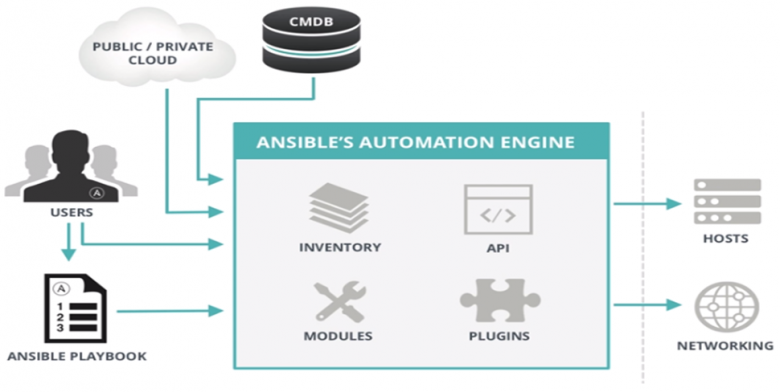
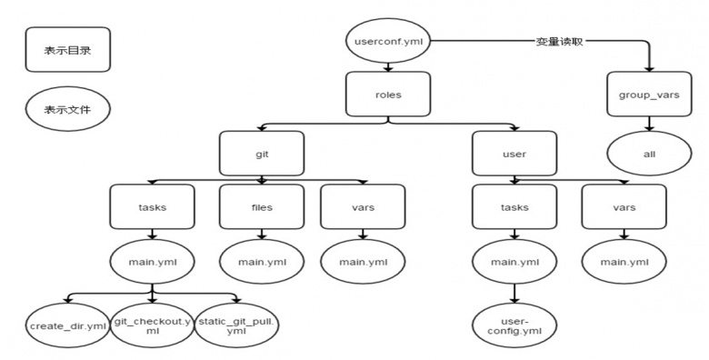

# Ansible 

[TOC]

## 概述 

主页地址：https://github.com/ansible/ansible

Ansible 是一个部署一群远程主机的工具。远程主机可以是远程虚拟机或物理机，也可以是本地主机。

2012年2月，程序员 Michael DeHaan 发布了 Ansible 的第一个版本。Michael DeHaan 在配置管理和架构设计方面拥有丰富的经验，他此前在红帽公司任职时，就研发了 Cobbler 自动化系统安装工具。2015年，Ansible 正式被红帽公司收购。

Ansible is a simple, yet powerful, automation engine for Linux. This  tutorial will guide you through the concepts of using Ansible to  automate your IT tasks in a way that is (hopefully) fun and informative. Using the exercises throughout these chapters, will help you gain a  comfort level with Ansible in real-world applications.

Ansible's playbooks describe a policy to be applied to remote  systems, to force their configuration. Playbooks are written in an  easily understandable text format that groups together a set of tasks:  the `yaml` format.


```
ansible-playbook <file.yml> ... [options]
```

The options are identical to the `ansible` command.

The command returns the following error codes:

| Code  | Error                             |
| ----- | --------------------------------- |
| `0`   | OK or no matching host            |
| `1`   | Error                             |
| `2`   | One or more hosts are failing     |
| `3`   | One or more hosts are unreachable |
| `4`   | Analyze error                     |
| `5`   | Bad or incomplete options         |
| `99`  | Run interrupted by user           |
| `250` | Unexpected error                  |

Note

Please note that `ansible` will return Ok when there is no host matching your target, which might mislead you!

### Example of Apache and MySQL playbook[¶](https://docs.rockylinux.org/zh/books/learning_ansible/01-basic/#example-of-apache-and-mysql-playbook)

The following playbook allows us to install Apache and MariaDB on our target servers.

Create a `test.yml` file with the following content:

```
---
- hosts: rocky8
  become: true
  become_user: root

  tasks:

    - name: ensure apache is at the latest version
      dnf: name=httpd,php,php-mysqli state=latest

    - name: ensure httpd is started
      systemd: name=httpd state=started

    - name: ensure mariadb is at the latest version
      dnf: name=mariadb-server state=latest

    - name: ensure mariadb is started
      systemd: name=mariadb state=started
...
```

- <1> The targeted group or the targeted server must exist in the inventory
- <2> Once connected, the user becomes `root` (via `sudo` by default)

The execution of the playbook is done with the command `ansible-playbook`:

```
$ ansible-playbook test.yml

PLAY [rocky8] ****************************************************************

TASK [setup] ******************************************************************
ok: [172.16.1.10]
ok: [172.16.1.11]

TASK [ensure apache is at the latest version] *********************************
ok: [172.16.1.10]
ok: [172.16.1.11]

TASK [ensure httpd is started] ************************************************
changed: [172.16.1.10]
changed: [172.16.1.11]

TASK [ensure mariadb is at the latest version] **********************************
changed: [172.16.1.10]
changed: [172.16.1.11]

TASK [ensure mariadb is started] ***********************************************
changed: [172.16.1.10]
changed: [172.16.1.11]

PLAY RECAP *********************************************************************
172.16.1.10             : ok=5    changed=3    unreachable=0    failed=0
172.16.1.11             : ok=5    changed=3    unreachable=0    failed=0
```

For more readability, it is recommended to write your playbooks in  full yaml format. In the previous example, the arguments are given on  the same line as the module, the value of the argument following its  name separated by an `=`. Look at the same playbook in full yaml:

```
---
- hosts: rocky8
  become: true
  become_user: root

  tasks:

    - name: ensure apache is at the latest version
      dnf:
        name: httpd,php,php-mysqli
        state: latest

    - name: ensure httpd is started
      systemd:
        name: httpd
        state: started

    - name: ensure mariadb is at the latest version
      dnf:
        name: mariadb-server
        state: latest

    - name: ensure mariadb is started
      systemd:
        name: mariadb
        state: started
...
```

Tip

`dnf` is one of the modules that allow you to give it a list as argument.

Note about collections: Ansible now provides modules in the form of collections. Some modules are provided by default within the `ansible.builtin` collection, others must be installed manually via the:


```
ansible-galaxy collection install [collectionname]
```

where [collectionname] is the name of the collection. (the square  brackets here are used to highlight the need to replace this with an  actual collection name, and are NOT part of the command.)


The previous example should be written like this:

```
---
- hosts: rocky8
  become: true
  become_user: root

  tasks:

    - name: ensure apache is at the latest version
      ansible.builtin.dnf:
        name: httpd,php,php-mysqli
        state: latest

    - name: ensure httpd is started
      ansible.builtin.systemd:
        name: httpd
        state: started

    - name: ensure mariadb is at the latest version
      ansible.builtin.dnf:
        name: mariadb-server
        state: latest

    - name: ensure mariadb is started
      ansible.builtin.systemd:
        name: mariadb
        state: started
...
```

A playbook is not limited to one target:

```
---
- hosts: webservers
  become: true
  become_user: root

  tasks:

    - name: ensure apache is at the latest version
      ansible.builtin.dnf:
        name: httpd,php,php-mysqli
        state: latest

    - name: ensure httpd is started
      ansible.builtin.systemd:
        name: httpd
        state: started

- hosts: databases
  become: true
  become_user: root

    - name: ensure mariadb is at the latest version
      ansible.builtin.dnf:
        name: mariadb-server
        state: latest

    - name: ensure mariadb is started
      ansible.builtin.systemd:
        name: mariadb
        state: started
...
```

You can check the syntax of your playbook:

```
$ ansible-playbook --syntax-check play.yml
```

You can also use a "linter" for yaml:

```
$ dnf install -y yamllint
```

then check the yaml syntax of your playbooks:

```
$ yamllint test.yml
test.yml
  8:1       error    syntax error: could not find expected ':' (syntax)
```

## Exercices results[¶](https://docs.rockylinux.org/zh/books/learning_ansible/01-basic/#exercices-results)

- Create the groups Paris, Tokio, NewYork
- Create the user `supervisor`
- Change the user to have a uid of 10000
- Change the user so that it belongs to the Paris group
- Install the tree software
- Stop the crond service
- Create en empty file with `0644` rights
- Update your client distribution
- Restart your client

```
ansible ansible_clients --become -m group -a "name=Paris"
ansible ansible_clients --become -m group -a "name=Tokio"
ansible ansible_clients --become -m group -a "name=NewYork"
ansible ansible_clients --become -m user -a "name=Supervisor"
ansible ansible_clients --become -m user -a "name=Supervisor uid=10000"
ansible ansible_clients --become -m user -a "name=Supervisor uid=10000 groups=Paris"
ansible ansible_clients --become -m dnf -a "name=tree"
ansible ansible_clients --become -m systemd -a "name=crond state=stopped"
ansible ansible_clients --become -m copy -a "content='' dest=/tmp/test force=no mode=0644"
ansible ansible_clients --become -m dnf -a "name=* state=latest"
ansible ansible_clients --become -m reboot
```

Author: Antoine Le Morvan

Contributors: Steven Spencer, tianci li

# Ansible Intermediate[¶](https://docs.rockylinux.org/zh/books/learning_ansible/02-advanced/#ansible-intermediate)

In the previous chapter, you learned how to install Ansible, use it  on the command line, or how to write playbooks to promote the  re-usability of your code.

In this chapter, we can start to discover some more advanced notions  of how to use Ansible, and discover some interesting tasks that you will use very regularly.

## The variables[¶](https://docs.rockylinux.org/zh/books/learning_ansible/02-advanced/#the-variables)

Note

More information can be [found here](https://docs.ansible.com/ansible/latest/user_guide/playbooks_variables.html).

Under Ansible, there are different types of primitive variables:

- strings,
- integers,
- booleans.

These variables can be organized as:

- dictionaries,
- lists.

A variable can be defined in different places, like in a playbook, in a role or from the command line for example.

For example, from a playbook:

```
---
- hosts: apache1
  vars:
    port_http: 80
    service:
      debian: apache2
      rhel: httpd
```

or from the command line:

```
$ ansible-playbook deploy-http.yml --extra-vars "service=httpd"
```

Once defined, a variable can be used by calling it between double braces:

- `{{ port_http }}` for a simple value,
- `{{ service['rhel'] }}` or `{{ service.rhel }}` for a dictionary.

For example:

```
- name: make sure apache is started
  ansible.builtin.systemd:
    name: "{{ service['rhel'] }}"
    state: started
```

Of course, it is also possible to access the global variables (the **facts**) of Ansible (OS type, IP addresses, VM name, etc.).

### Outsourcing variables[¶](https://docs.rockylinux.org/zh/books/learning_ansible/02-advanced/#outsourcing-variables)

Variables can be included in a file external to the playbook, in which case this file must be defined in the playbook with the `vars_files` directive:

```
---
- hosts: apache1
  vars_files:
    - myvariables.yml
```

The `myvariables.yml` file:

```
---
port_http: 80
ansible.builtin.systemd::
  debian: apache2
  rhel: httpd
```

It can also be added dynamically with the use of the module `include_vars`:

```
- name: Include secrets.
  ansible.builtin.include_vars:
    file: vault.yml
```

### Display a variable[¶](https://docs.rockylinux.org/zh/books/learning_ansible/02-advanced/#display-a-variable)

To display a variable, you have to activate the `debug` module as follows:

```
- ansible.builtin.debug:
    var: "{{ service['debian'] }}"
```

You can also use the variable inside a text:

```
- ansible.builtin.debug:
    msg: "Print a variable in a message : {{ service['debian'] }}"
```

### Save the return of a task[¶](https://docs.rockylinux.org/zh/books/learning_ansible/02-advanced/#save-the-return-of-a-task)

To save the return of a task and to be able to access it later, you have to use the keyword `register` inside the task itself.

Use of a stored variable:

```
- name: /home content
  shell: ls /home
  register: homes

- name: Print the first directory name
  ansible.builtin.debug:
    var: homes.stdout_lines[0]

- name: Print the first directory name
  ansible.builtin.debug:
    var: homes.stdout_lines[1]
```

Note

The variable `homes.stdout_lines` is a list of variables of type string, a way to organize variables that we had not yet encountered.

The strings that make up the stored variable can be accessed via the `stdout` value (which allows you to do things like `homes.stdout.find("core") != -1`), to exploit them using a loop (see `loop`), or simply by their indices as seen in the previous example.

### Exercices[¶](https://docs.rockylinux.org/zh/books/learning_ansible/02-advanced/#exercices)

- Write a  playbook `play-vars.yml` that prints the distribution name of the target with its major version, using global variables.
- Write a playbook using the following dictionary to display the services that will be installed:

```
service:
  web:
    name: apache
    rpm: httpd
  db:
    name: mariadb
    rpm: mariadb-server
```

The default type should be "web".

- Override the `type` variable using the command line
- Externalize variables in a `vars.yml` file

## Loop management[¶](https://docs.rockylinux.org/zh/books/learning_ansible/02-advanced/#loop-management)

With the help of loop, you can iterate a task over a list, a hash, or dictionary for example.

Note

More information can be [found here](https://docs.ansible.com/ansible/latest/user_guide/playbooks_loops.html).

Simple example of use, creation of 4 users:

```
- name: add users
  user:
    name: "{{ item }}"
    state: present
    groups: "users"
  loop:
     - antoine
     - patrick
     - steven
     - xavier
```

At each iteration of the loop, the value of the list used is stored in the `item` variable, accessible in the loop code.

Of course, a list can be defined in an external file:

```
users:
  - antoine
  - patrick
  - steven
  - xavier
```

and be used inside the task like this (after having include the vars file):

```
- name: add users
  user:
    name: "{{ item }}"
    state: present
    groups: "users"
  loop: "{{ users }}"
```

We can use the example seen during the study of stored variables to improve it. Use of a stored variable:

```
- name: /home content
  shell: ls /home
  register: homes

- name: Print the directories name
  ansible.builtin.debug:
    msg: "Directory => {{ item }}"
  loop: "{{ homes.stdout_lines }}"
```

A dictionary can also be used in a loop.

In this case, you will have to transform the dictionary into an item with what is called a **jinja filter** (jinja is the templating engine used by Ansible): `| dict2items`.

In the loop, it becomes possible to use `item.key` which corresponds to the dictionary key, and `item.value` which corresponds to the values of the key.

Let's see this through a concrete example, showing the management of the system users:

```
---
- hosts: rocky8
  become: true
  become_user: root
  vars:
    users:
      antoine:
        group: users
        state: present
      steven:
        group: users
        state: absent

  tasks:

  - name: Manage users
    user:
      name: "{{ item.key }}"
      group: "{{ item.value.group }}"
      state: "{{ item.value.state }}"
    loop: "{{ users | dict2items }}"
```

Note

Many things can be done with the loops. You will discover the  possibilities offered by loops when your use of Ansible pushes you to  use them in a more complex way.

### Exercices[¶](https://docs.rockylinux.org/zh/books/learning_ansible/02-advanced/#exercices_1)

- Display the content of the `service` variable from the previous exercise using a loop.

Note

You will have to transform your `service` variable, which is a dictionary, to a list with the help of the jinja filter `list` as this:

```
{{ service.values() | list }}
```

## Conditionals[¶](https://docs.rockylinux.org/zh/books/learning_ansible/02-advanced/#conditionals)

Note

More information can be [found here](https://docs.ansible.com/ansible/latest/user_guide/playbooks_conditionals.html).

The `when` statement is very useful in many cases: not  performing certain actions on certain types of servers, if a file or a  user does not exist, etc.

Note

Behind the `when` statement the variables do not need double braces (they are in fact Jinja2 expressions...).

```
- name: "Reboot only Debian servers"
  reboot:
  when: ansible_os_family == "Debian"
```

Conditions can be grouped with parentheses:

```
- name: "Reboot only CentOS version 6 and Debian version 7"
  reboot:
  when: (ansible_distribution == "CentOS" and ansible_distribution_major_version == "6") or
        (ansible_distribution == "Debian" and ansible_distribution_major_version == "7")
```

The conditions corresponding to a logical AND can be provided as a list:

```
- name: "Reboot only CentOS version 6"
  reboot:
  when:
    - ansible_distribution == "CentOS"
    - ansible_distribution_major_version == "6"
```

You can test the value of a boolean and verify that it is true:

```
- name: check if directory exists
  stat:
    path: /home/ansible
  register: directory

- ansible.builtin.debug:
    var: directory

- ansible.builtin.debug:
    msg: The directory exists
  when:
    - directory.stat.exists
    - directory.stat.isdir
```

You can also test that it is not true:

```
  when:
    - file.stat.exists
    - not file.stat.isdir
```

You will probably have to test that a variable exists to avoid execution errors:

```
  when: myboolean is defined and myboolean
```

### Exercices[¶](https://docs.rockylinux.org/zh/books/learning_ansible/02-advanced/#exercices_2)

- Print the value of `service.web` only when `type` equals to `web`.

## Managing changes: the `handlers`[¶](https://docs.rockylinux.org/zh/books/learning_ansible/02-advanced/#managing-changes-the-handlers)

Note

More information can be [found here](https://docs.ansible.com/ansible/latest/user_guide/playbooks_handlers.html).

Handlers allow to launch operations, like restarting a service, when changes occur.

A module, being idempotent, a playbook can detect that there has been a significant change on a remote system, and thus trigger an operation  in reaction to this change. A notification is sent at the end of a  playbook task block, and the reaction operation will be triggered only  once even if several tasks send the same notification.


For example, several tasks may indicate that the `httpd`  service needs to be restarted due to a change in its configuration  files. But the service will only be restarted once to avoid multiple  unnecessary starts.

```
- name: template configuration file
  template:
    src: template-site.j2
    dest: /etc/httpd/sites-availables/test-site.conf
  notify:
     - restart memcached
     - restart httpd
```

A handler is a kind of task referenced by a unique global name:

- It is activated by one or more notifiers.
- It does not start immediately, but waits until all tasks are complete to run.

Example of handlers:

```
handlers:

  - name: restart memcached
    systemd:
      name: memcached
      state: restarted

  - name: restart httpd
    systemd:
      name: httpd
      state: restarted
```

Since version 2.2 of Ansible, handlers can listen directly as well:

```
handlers:

  - name: restart memcached
    systemd:
      name: memcached
      state: restarted
    listen: "web services restart"

  - name: restart apache
    systemd:
      name: apache
      state: restarted
    listen: "web services restart"

tasks:
    - name: restart everything
      command: echo "this task will restart the web services"
      notify: "web services restart"
```

## Asynchronous tasks[¶](https://docs.rockylinux.org/zh/books/learning_ansible/02-advanced/#asynchronous-tasks)

Note

More information can be [found here](https://docs.ansible.com/ansible/latest/user_guide/playbooks_async.html).

By default, SSH connections to hosts remain open during the execution of various playbook tasks on all nodes.

This can cause some problems, especially:

- if the execution time of the task is longer than the SSH connection timeout
- if the connection is interrupted during the action (server reboot for example)

In this case, you will have to switch to asynchronous mode and  specify a maximum execution time as well as the frequency (by default  10s) with which you will check the host status.

By specifying a poll value of 0, Ansible will execute the task and continue without worrying about the result.

Here's an example using asynchronous tasks, which allows you to restart a server and wait for port 22 to be reachable again:

```
# Wait 2s and launch the reboot
- name: Reboot system
  shell: sleep 2 && shutdown -r now "Ansible reboot triggered"
  async: 1
  poll: 0
  ignore_errors: true
  become: true
  changed_when: False

  # Wait the server is available
  - name: Waiting for server to restart (10 mins max)
    wait_for:
      host: "{{ inventory_hostname }}"
      port: 22
      delay: 30
      state: started
      timeout: 600
    delegate_to: localhost
```

You can also decide to launch a long-running task and forget it (fire and forget) because the execution does not matter in the playbook.

## Exercise results[¶](https://docs.rockylinux.org/zh/books/learning_ansible/02-advanced/#exercise-results)

- Write a  playbook `play-vars.yml` that print the distribution name of the target with its major version, using global variables.

```
---
- hosts: ansible_clients

  tasks:

    - name: Print globales variables
      debug:
        msg: "The distribution is {{ ansible_distribution }} version {{ ansible_distribution_major_version }}"
$ ansible-playbook play-vars.yml

PLAY [ansible_clients] *********************************************************************************

TASK [Gathering Facts] *********************************************************************************
ok: [192.168.1.11]

TASK [Print globales variables] ************************************************************************
ok: [192.168.1.11] => {
    "msg": "The distribution is Rocky version 8"
}

PLAY RECAP *********************************************************************************************
192.168.1.11               : ok=2    changed=0    unreachable=0    failed=0    skipped=0    rescued=0    ignored=0   
```

- Write a playbook using the following dictionary to display the services that will be installed:

```
service:
  web:
    name: apache
    rpm: httpd
  db:
    name: mariadb
    rpm: mariadb-server
```

The default type should be "web".

```
---
- hosts: ansible_clients
  vars:
    type: web
    service:
      web:
        name: apache
        rpm: httpd
      db:
        name: mariadb
        rpm: mariadb-server

  tasks:

    - name: Print a specific entry of a dictionary
      debug:
        msg: "The {{ service[type]['name'] }} will be installed with the packages {{ service[type].rpm }}"
$ ansible-playbook display-dict.yml

PLAY [ansible_clients] *********************************************************************************

TASK [Gathering Facts] *********************************************************************************
ok: [192.168.1.11]

TASK [Print a specific entry of a dictionnaire] ********************************************************
ok: [192.168.1.11] => {
    "msg": "The apache will be installed with the packages httpd"
}

PLAY RECAP *********************************************************************************************
192.168.1.11               : ok=2    changed=0    unreachable=0    failed=0    skipped=0    rescued=0    ignored=0   
```

- Override the `type` variable using the command line:

```
ansible-playbook --extra-vars "type=db" display-dict.yml

PLAY [ansible_clients] *********************************************************************************

TASK [Gathering Facts] *********************************************************************************
ok: [192.168.1.11]

TASK [Print a specific entry of a dictionary] ********************************************************
ok: [192.168.1.11] => {
    "msg": "The mariadb will be installed with the packages mariadb-server"
}

PLAY RECAP *********************************************************************************************
192.168.1.11               : ok=2    changed=0    unreachable=0    failed=0    skipped=0    rescued=0    ignored=0   
```

- Externalize variables in a `vars.yml` file

```
type: web
service:
  web:
    name: apache
    rpm: httpd
  db:
    name: mariadb
    rpm: mariadb-server
---
- hosts: ansible_clients
  vars_files:
    - vars.yml

  tasks:

    - name: Print a specific entry of a dictionary
      debug:
        msg: "The {{ service[type]['name'] }} will be installed with the packages {{ service[type].rpm }}"
```

- Display the content of the `service` variable from the previous exercise using a loop.

Note

You will have to transform your `service` variable, which is a dictionary, to an item or a list with the help of the jinja filters `dict2items` or `list` as this:

```
{{ service | dict2items }}
{{ service.values() | list }}
```

With `dict2items`:

```
---
- hosts: ansible_clients
  vars_files:
    - vars.yml

  tasks:

    - name: Print a dictionary variable with a loop
      debug:
        msg: "{{item.key }} | The {{ item.value.name }} will be installed with the packages {{ item.value.rpm }}"
      loop: "{{ service | dict2items }}"              
$ ansible-playbook display-dict.yml

PLAY [ansible_clients] *********************************************************************************

TASK [Gathering Facts] *********************************************************************************
ok: [192.168.1.11]

TASK [Print a dictionary variable with a loop] ********************************************************
ok: [192.168.1.11] => (item={'key': 'web', 'value': {'name': 'apache', 'rpm': 'httpd'}}) => {
    "msg": "web | The apache will be installed with the packages httpd"
}
ok: [192.168.1.11] => (item={'key': 'db', 'value': {'name': 'mariadb', 'rpm': 'mariadb-server'}}) => {
    "msg": "db | The mariadb will be installed with the packages mariadb-server"
}

PLAY RECAP *********************************************************************************************
192.168.1.11               : ok=2    changed=0    unreachable=0    failed=0    skipped=0    rescued=0    ignored=0   
```

With `list`:

```
---
- hosts: ansible_clients
  vars_files:
    - vars.yml

  tasks:

    - name: Print a dictionary variable with a loop
      debug:
        msg: "The {{ item.name }} will be installed with the packages {{ item.rpm }}"
      loop: "{{ service.values() | list}}"
~                                                 
$ ansible-playbook display-dict.yml

PLAY [ansible_clients] *********************************************************************************

TASK [Gathering Facts] *********************************************************************************
ok: [192.168.1.11]

TASK [Print a dictionary variable with a loop] ********************************************************
ok: [192.168.1.11] => (item={'name': 'apache', 'rpm': 'httpd'}) => {
    "msg": "The apache will be installed with the packages httpd"
}
ok: [192.168.1.11] => (item={'name': 'mariadb', 'rpm': 'mariadb-server'}) => {
    "msg": "The mariadb will be installed with the packages mariadb-server"
}

PLAY RECAP *********************************************************************************************
192.168.1.11               : ok=2    changed=0    unreachable=0    failed=0    skipped=0    rescued=0    ignored=0   
```

- Print the value of `service.web` only when `type` equals to `web`.

```
---
- hosts: ansible_clients
  vars_files:
    - vars.yml

  tasks:

    - name: Print a dictionary variable
      debug:
        msg: "The {{ service.web.name }} will be installed with the packages {{ service.web.rpm }}"
      when: type == "web"


    - name: Print a dictionary variable
      debug:
        msg: "The {{ service.db.name }} will be installed with the packages {{ service.db.rpm }}"
      when: type == "db"
$ ansible-playbook display-dict.yml

PLAY [ansible_clients] *********************************************************************************

TASK [Gathering Facts] *********************************************************************************
ok: [192.168.1.11]

TASK [Print a dictionary variable] ********************************************************************
ok: [192.168.1.11] => {
    "msg": "The apache will be installed with the packages httpd"
}

TASK [Print a dictionary variable] ********************************************************************
skipping: [192.168.1.11]

PLAY RECAP *********************************************************************************************
192.168.1.11               : ok=2    changed=0    unreachable=0    failed=0    skipped=1    rescued=0    ignored=0   

$ ansible-playbook --extra-vars "type=db" display-dict.yml

PLAY [ansible_clients] *********************************************************************************

TASK [Gathering Facts] *********************************************************************************
ok: [192.168.1.11]

TASK [Print a dictionary variable] ********************************************************************
skipping: [192.168.1.11]

TASK [Print a dictionary variable] ********************************************************************
ok: [192.168.1.11] => {
    "msg": "The mariadb will be installed with the packages mariadb-server"
}

PLAY RECAP *********************************************************************************************
192.168.1.11               : ok=2    changed=0    unreachable=0    failed=0    skipped=1    rescued=0    ignored=0   
```


# Ansible - Management of Files[¶](https://docs.rockylinux.org/zh/books/learning_ansible/03-working-with-files/#ansible-management-of-files)

Ihave to use different Ansible modules to modify the system configuration files.

## `ini_file` module[¶](https://docs.rockylinux.org/zh/books/learning_ansible/03-working-with-files/#ini_file-module)

When you want to modify an INI file (section between `[]` then `key=value` pairs), the easiest way is to use the `ini_file` module.

Note

More information can be [found here](https://docs.ansible.com/ansible/latest/collections/community/general/ini_file_module.html).

The module requires:

- The value of the section
- The name of the option
- The new value

Example of use:

```
- name: change value on inifile
  community.general.ini_file:
    dest: /path/to/file.ini
    section: SECTIONNAME
    option: OPTIONNAME
    value: NEWVALUE
```

## `lineinfile` module[¶](https://docs.rockylinux.org/zh/books/learning_ansible/03-working-with-files/#lineinfile-module)

To ensure that a line is present in a file, or when a single line in a file needs to be added or modified, use the `linefile` module.

Note

More information can be [found here](https://docs.ansible.com/ansible/latest/collections/ansible/builtin/lineinfile_module.html).

In this case, the line to be modified in a file will be found using a regexp.

For example, to ensure that the line starting with `SELINUX=` in the `/etc/selinux/config` file contains the value `enforcing`:

```
- ansible.builtin.lineinfile:
    path: /etc/selinux/config
    regexp: '^SELINUX='
    line: 'SELINUX=enforcing'
```

## `copy` module[¶](https://docs.rockylinux.org/zh/books/learning_ansible/03-working-with-files/#copy-module)

When a file has to be copied from the Ansible server to one or more hosts, it is better to use the `copy` module.

Note

More information can be [found here](https://docs.ansible.com/ansible/latest/collections/ansible/builtin/copy_module.html).

Here we are copying `myflile.conf` from one location to another:

```
- ansible.builtin.copy:
    src: /data/ansible/sources/myfile.conf
    dest: /etc/myfile.conf
    owner: root
    group: root
    mode: 0644
```

## `fetch` module[¶](https://docs.rockylinux.org/zh/books/learning_ansible/03-working-with-files/#fetch-module)

When a file has to be copied from a remote server to the local server, it is best to use the `fetch` module.

Note

More information can be [found here](https://docs.ansible.com/ansible/latest/collections/ansible/builtin/fetch_module.html).

This module does the opposite of the `copy` module:

```
- ansible.builtin.fetch:
    src: /etc/myfile.conf
    dest: /data/ansible/backup/myfile-{{ inventory_hostname }}.conf
    flat: yes
```

## `template` module[¶](https://docs.rockylinux.org/zh/books/learning_ansible/03-working-with-files/#template-module)

Ansible and its `template` module use the **Jinja2** template system (http://jinja.pocoo.org/docs/) to generate files on target hosts.

Note

More information can be [found here](https://docs.ansible.com/ansible/latest/collections/ansible/builtin/template_module.html).

For example:

```
- ansible.builtin.template:
    src: /data/ansible/templates/monfichier.j2
    dest: /etc/myfile.conf
    owner: root
    group: root
    mode: 0644
```

It is possible to add a validation step if the targeted service allows it (for example apache with the command `apachectl -t`):

```
- template:
    src: /data/ansible/templates/vhost.j2
    dest: /etc/httpd/sites-available/vhost.conf
    owner: root
    group: root
    mode: 0644
    validate: '/usr/sbin/apachectl -t'
```

## `get_url` module[¶](https://docs.rockylinux.org/zh/books/learning_ansible/03-working-with-files/#get_url-module)

To upload files from a web site or ftp to one or more hosts, use the `get_url` module:

```
- get_url:
    url: http://site.com/archive.zip
    dest: /tmp/archive.zip
    mode: 0640
    checksum: sha256:f772bd36185515581aa9a2e4b38fb97940ff28764900ba708e68286121770e9a
```

By providing a checksum of the file, the file will not be  re-downloaded if it is already present at the destination location and  its checksum matches the value provided.


# Ansible Galaxy: Collections and Roles[¶](https://docs.rockylinux.org/zh/books/learning_ansible/04-ansible-galaxy/#ansible-galaxy-collections-and-roles)

In this chapter you will learn how to use, install, and manage Ansible roles and collections.[Ansible Galaxy](https://galaxy.ansible.com) provides Ansible Roles and Collections from the Ansible Community.

The elements provided can be referenced in the playbooks and used out of the box

## `ansible-galaxy` command[¶](https://docs.rockylinux.org/zh/books/learning_ansible/04-ansible-galaxy/#ansible-galaxy-command)

The `ansible-galaxy` command manages roles and collections using [galaxy.ansible.com](http://galaxy.ansible.com).

- To manage roles:

```
ansible-galaxy role [import|init|install|login|remove|...]
```

| Sub-commands | Observations                                              |
| ------------ | --------------------------------------------------------- |
| `install`    | installs a role.                                          |
| `remove`     | remove one or more roles.                                 |
| `list`       | display the name and the version of installed roles.      |
| `info`       | display information about a role.                         |
| `init`       | generate a skeleton of a new role.                        |
| `import`     | import a role from the galaxy web site. Requires a login. |

- To manage collections:

```
ansible-galaxy collection [import|init|install|login|remove|...]
```

| Sub-commands | Observations                                               |
| ------------ | ---------------------------------------------------------- |
| `init`       | generate a skeleton of a new collection.                   |
| `install`    | installs a collection.                                     |
| `list`       | display the name and the version of installed collections. |

## Ansible Roles[¶](https://docs.rockylinux.org/zh/books/learning_ansible/04-ansible-galaxy/#ansible-roles)

An Ansible role is a unit that promotes the reusability of playbooks.

Note

More information can be [found here](https://docs.ansible.com/ansible/latest/user_guide/playbooks_reuse_roles.html)

### Installing useful Roles[¶](https://docs.rockylinux.org/zh/books/learning_ansible/04-ansible-galaxy/#installing-useful-roles)

In order to highlight the interest of using roles, I suggest you to use the `alemorvan/patchmanagement` role, which will allow you to perform a lot of tasks (pre-update or  post-update for example) during your update process, in only a few lines of code.

You can check the code in the github repo of the role [here](https://github.com/alemorvan/patchmanagement).

- Install the role. This needs only one command:

```
ansible-galaxy role install alemorvan.patchmanagement
```

- Create a playbook to include the role:

```
- name: Start a Patch Management
  hosts: ansible_clients
  vars:
    pm_before_update_tasks_file: custom_tasks/pm_before_update_tasks_file.yml
    pm_after_update_tasks_file: custom_tasks/pm_after_update_tasks_file.yml

  tasks:
    - name: "Include patchmanagement"
      include_role:
        name: "alemorvan.patchmanagement"
```

With this role, you can add your own tasks for all your inventory or for only your targeted node.

Let's create tasks that will be run before and after the update process:

- Create the `custom_tasks` folder:

```
mkdir custom_tasks
```

- Create the `custom_tasks/pm_before_update_tasks_file.yml` (feel free to change the name and the content of this file)

```
---
- name: sample task before the update process
  debug:
    msg: "This is a sample tasks, feel free to add your own test task"
```

- Create the `custom_tasks/pm_after_update_tasks_file.yml` (feel free to change the name and the content of this file)

```
---
- name: sample task after the update process
  debug:
    msg: "This is a sample tasks, feel free to add your own test task"
```

And launch your first Patch Management:

```
ansible-playbook patchmanagement.yml

PLAY [Start a Patch Management] *************************************************************************

TASK [Gathering Facts] **********************************************************************************
ok: [192.168.1.11]

TASK [Include patchmanagement] **************************************************************************

TASK [alemorvan.patchmanagement : MAIN | Linux Patch Management Job] ************************************
ok: [192.168.1.11] => {
    "msg": "Start 192 patch management"
}

...

TASK [alemorvan.patchmanagement : sample task before the update process] ********************************
ok: [192.168.1.11] => {
    "msg": "This is a sample tasks, feel free to add your own test task"
}

...

TASK [alemorvan.patchmanagement : MAIN | We can now patch] **********************************************
included: /home/ansible/.ansible/roles/alemorvan.patchmanagement/tasks/patch.yml for 192.168.1.11

TASK [alemorvan.patchmanagement : PATCH | Tasks depends on distribution] ********************************
ok: [192.168.1.11] => {
    "ansible_distribution": "Rocky"
}

TASK [alemorvan.patchmanagement : PATCH | Include tasks for CentOS & RedHat tasks] **********************
included: /home/ansible/.ansible/roles/alemorvan.patchmanagement/tasks/linux_tasks/redhat_centos.yml for 192.168.1.11

TASK [alemorvan.patchmanagement : RHEL CENTOS | yum clean all] ******************************************
changed: [192.168.1.11]

TASK [alemorvan.patchmanagement : RHEL CENTOS | Ensure yum-utils is installed] **************************
ok: [192.168.1.11]

TASK [alemorvan.patchmanagement : RHEL CENTOS | Remove old kernels] *************************************
skipping: [192.168.1.11]

TASK [alemorvan.patchmanagement : RHEL CENTOS | Update rpm package with yum] ****************************
ok: [192.168.1.11]

TASK [alemorvan.patchmanagement : PATCH | Inlude tasks for Debian & Ubuntu tasks] ***********************
skipping: [192.168.1.11]

TASK [alemorvan.patchmanagement : MAIN | We can now reboot] *********************************************
included: /home/ansible/.ansible/roles/alemorvan.patchmanagement/tasks/reboot.yml for 192.168.1.11

TASK [alemorvan.patchmanagement : REBOOT | Reboot triggered] ********************************************
ok: [192.168.1.11]

TASK [alemorvan.patchmanagement : REBOOT | Ensure we are not in rescue mode] ****************************
ok: [192.168.1.11]

...

TASK [alemorvan.patchmanagement : FACTS | Insert fact file] *********************************************
ok: [192.168.1.11]

TASK [alemorvan.patchmanagement : FACTS | Save date of last PM] *****************************************
ok: [192.168.1.11]

...

TASK [alemorvan.patchmanagement : sample task after the update process] *********************************
ok: [192.168.1.11] => {
    "msg": "This is a sample tasks, feel free to add your own test task"
}

PLAY RECAP **********************************************************************************************
192.168.1.11               : ok=31   changed=1    unreachable=0    failed=0    skipped=4    rescued=0    ignored=0  
```

Pretty easy for such a complex process, isn't it?

This is just one example of what can be done using roles made available by the community. Have a look at [galaxy.ansible.com](https://galaxy.ansible.com/) to discover the roles that could be useful for you!

You can also create your own roles for your own needs and publish  them on the Internet if you feel like it. This is what we will briefly  cover in the next chapter.

### Introduction to Role development[¶](https://docs.rockylinux.org/zh/books/learning_ansible/04-ansible-galaxy/#introduction-to-role-development)

A role skeleton, serving as a starting point for custom role development, can be generated by the `ansible-galaxy` command:

```
$ ansible-galaxy role init rocky8
- Role rocky8 was created successfully
```

The command will generate the following tree structure to contain the `rocky8` role:

```
tree rocky8/
rocky8/
├── defaults
│   └── main.yml
├── files
├── handlers
│   └── main.yml
├── meta
│   └── main.yml
├── README.md
├── tasks
│   └── main.yml
├── templates
├── tests
│   ├── inventory
│   └── test.yml
└── vars
    └── main.yml

8 directories, 8 files
```

Roles allow you to do away with the need to include files. There is no need to specify file paths or `include` directives in playbooks. You just have to specify a task, and Ansible takes care of the inclusions.

The structure of a role is fairly obvious to understand.

Variables are simply stored either in `vars/main.yml` if the variables are not to be overridden, or in `default/main.yml` if you want to leave the possibility of overriding the variable content from outside your role.

The handlers, files, and templates needed for your code are stored in `handlers/main.yml`, `files` and `templates` respectively.

All that remains is to define the code for your role's tasks in `tasks/main.yml`.

Once all this is working well, you can use this role in your  playbooks. You will be able to use your role without worrying about the  technical aspect of its tasks, while customizing its operation with  variables.

### Practical work: create a first simple role[¶](https://docs.rockylinux.org/zh/books/learning_ansible/04-ansible-galaxy/#practical-work-create-a-first-simple-role)

Let's implement this with a "go anywhere" role that will create a  default user and install software packages. This role can be  systematically applied to all your servers.

#### Variables[¶](https://docs.rockylinux.org/zh/books/learning_ansible/04-ansible-galaxy/#variables)

We will create a `rockstar` user on all of our servers. As we don't want this user to be overridden, let's define it in the `vars/main.yml`:

```
---
rocky8_default_group:
  name: rockstar
  gid: 1100
rocky8_default_user:
  name: rockstar
  uid: 1100
  group: rockstar
```

We can now use those variables inside our `tasks/main.yml` without any inclusion.

```
---
- name: Create default group
  group:
    name: "{{ rocky8_default_group.name }}"
    gid: "{{ rocky8_default_group.gid }}"

- name: Create default user
  user:
    name: "{{ rocky8_default_user.name }}"
    uid: "{{ rocky8_default_user.uid }}"
    group: "{{ rocky8_default_user.group }}"
```

To test your new role, let's create a `test-role.yml` playbook in the same directory as your role:

```
---
- name: Test my role
  hosts: localhost

  roles:

    - role: rocky8
      become: true
      become_user: root
```

and launch it:

```
ansible-playbook test-role.yml

PLAY [Test my role] ************************************************************************************

TASK [Gathering Facts] *********************************************************************************
ok: [localhost]

TASK [rocky8 : Create default group] *******************************************************************
changed: [localhost]

TASK [rocky8 : Create default user] ********************************************************************
changed: [localhost]

PLAY RECAP *********************************************************************************************
localhost                  : ok=3    changed=1    unreachable=0    failed=0    skipped=0    rescued=0    ignored=0   
```

Congratulations! You are now able to create great things with a playbook of only a few lines.

Let's see the use of default variables.

Create a list of packages to install by default on your servers and an empty list of packages to uninstall. Edit the `defaults/main.yml` files and add those two lists:

```
rocky8_default_packages:
  - tree
  - vim
rocky8_remove_packages: []
```

and use them in your `tasks/main.yml`:

```
- name: Install default packages (can be overridden)
  package:
    name: "{{ rocky8_default_packages }}"
    state: present

- name: "Uninstall default packages (can be overridden) {{ rocky8_remove_packages }}"
  package:
    name: "{{ rocky8_remove_packages }}"
    state: absent
```

Test your role with the help of the playbook previously created:

```
ansible-playbook test-role.yml

PLAY [Test my role] ************************************************************************************

TASK [Gathering Facts] *********************************************************************************
ok: [localhost]

TASK [rocky8 : Create default group] *******************************************************************
ok: [localhost]

TASK [rocky8 : Create default user] ********************************************************************
ok: [localhost]

TASK [rocky8 : Install default packages (can be overridden)] ********************************************
ok: [localhost]

TASK [rocky8 : Uninstall default packages (can be overridden) []] ***************************************
ok: [localhost]

PLAY RECAP *********************************************************************************************
localhost                  : ok=5    changed=0    unreachable=0    failed=0    skipped=0    rescued=0    ignored=0   
```

You can now override the `rocky8_remove_packages` in your playbook and uninstall for example `cockpit`:

```
---
- name: Test my role
  hosts: localhost
  vars:
    rocky8_remove_packages:
      - cockpit

  roles:

    - role: rocky8
      become: true
      become_user: root
ansible-playbook test-role.yml

PLAY [Test my role] ************************************************************************************

TASK [Gathering Facts] *********************************************************************************
ok: [localhost]

TASK [rocky8 : Create default group] *******************************************************************
ok: [localhost]

TASK [rocky8 : Create default user] ********************************************************************
ok: [localhost]

TASK [rocky8 : Install default packages (can be overridden)] ********************************************
ok: [localhost]

TASK [rocky8 : Uninstall default packages (can be overridden) ['cockpit']] ******************************
changed: [localhost]

PLAY RECAP *********************************************************************************************
localhost                  : ok=5    changed=1    unreachable=0    failed=0    skipped=0    rescued=0    ignored=0   
```

Obviously, there is no limit to how much you can improve your role.  Imagine that for one of your servers, you need a package that is in the  list of those to be uninstalled. You could then, for example, create a  new list that can be overridden and then remove from the list of  packages to be uninstalled those in the list of specific packages to be  installed by using the jinja `difference()` filter.

```
- name: "Uninstall default packages (can be overridden) {{ rocky8_remove_packages }}"
  package:
    name: "{{ rocky8_remove_packages | difference(rocky8_specifics_packages) }}"
    state: absent
```

## Ansible Collections[¶](https://docs.rockylinux.org/zh/books/learning_ansible/04-ansible-galaxy/#ansible-collections)

Collections are a distribution format for Ansible content that can include playbooks, roles, modules, and plugins.

Note

More information can be [found here](https://docs.ansible.com/ansible/latest/user_guide/collections_using.html)

To install or upgrade a collection:

```
ansible-galaxy collection install namespace.collection [--upgrade]
```

You can then use the newly installed collection using its namespace and name before the module's name or role's name:

```
- import_role:
    name: namespace.collection.rolename

- namespace.collection.modulename:
    option1: value
```

You can find a collection index [here](https://docs.ansible.com/ansible/latest/collections/index.html).

Let's install the `community.general` collection:

```
ansible-galaxy collection install community.general
Starting galaxy collection install process
Process install dependency map
Starting collection install process
Downloading https://galaxy.ansible.com/download/community-general-3.3.2.tar.gz to /home/ansible/.ansible/tmp/ansible-local-51384hsuhf3t5/tmpr_c9qrt1/community-general-3.3.2-f4q9u4dg
Installing 'community.general:3.3.2' to '/home/ansible/.ansible/collections/ansible_collections/community/general'
community.general:3.3.2 was installed successfully
```

We can now use the newly available module `yum_versionlock`:

```
- name: Start a Patch Management
  hosts: ansible_clients
  become: true
  become_user: root
  tasks:

    - name: Ensure yum-versionlock is installed
      package:
        name: python3-dnf-plugin-versionlock
        state: present

    - name: Prevent kernel from being updated
      community.general.yum_versionlock:
        state: present
        name: kernel
      register: locks

    - name: Display locks
      debug:
        var: locks.meta.packages                            
ansible-playbook versionlock.yml

PLAY [Start a Patch Management] *************************************************************************

TASK [Gathering Facts] **********************************************************************************
ok: [192.168.1.11]

TASK [Ensure yum-versionlock is installed] **************************************************************
changed: [192.168.1.11]

TASK [Prevent kernel from being updated] ****************************************************************
changed: [192.168.1.11]

TASK [Display locks] ************************************************************************************
ok: [192.168.1.11] => {
    "locks.meta.packages": [
        "kernel"
    ]
}

PLAY RECAP **********************************************************************************************
192.168.1.11               : ok=4    changed=2    unreachable=0    failed=0    skipped=0    rescued=0    ignored=0   
```

### Creating your own collection[¶](https://docs.rockylinux.org/zh/books/learning_ansible/04-ansible-galaxy/#creating-your-own-collection)

As with roles, you are able to create your own collection with the help of the `ansible-galaxy` command:

```
ansible-galaxy collection init rocky8.rockstarcollection
- Collection rocky8.rockstarcollection was created successfully
tree rocky8/rockstarcollection/
rocky8/rockstarcollection/
├── docs
├── galaxy.yml
├── plugins
│   └── README.md
├── README.md
└── roles
```

You can then store your own plugins or roles inside this new collection.


# Ansible Deployments with Ansistrano[¶](https://docs.rockylinux.org/zh/books/learning_ansible/05-deployments/#ansible-deployments-with-ansistrano)

In this chapter you will learn how to deploy applications with the Ansible role [Ansistrano](https://ansistrano.com).

------

Ansistrano is an Ansible role to easily deploy PHP, Python, etc. applications. It is based on the functionality of [Capistrano](http://capistranorb.com/).

## Introduction[¶](https://docs.rockylinux.org/zh/books/learning_ansible/05-deployments/#introduction)

Ansistrano requires the following to run:

- Ansible on the deployment machine,
- `rsync` or `git` on the client machine.

It can download source code from `rsync`, `git`, `scp`, `http`, `S3`, ...

Note

For our deployment example, we will use the `git` protocol.

Ansistrano deploys applications by following these 5 steps:

- **Setup**: create the directory structure to host the releases;
- **Update Code**: downloading the new release to the targets;
- **Symlink Shared** and **Symlink**: after deploying the new release, the `current` symbolic link is modified to point to this new release;
- **Clean Up**: to do some clean up (remove old versions).


The skeleton of a deployment with Ansistrano looks like this:

```
/var/www/site/
├── current -> ./releases/20210718100000Z
├── releases
│   └── 20210718100000Z
│       ├── css -> ../../shared/css/
│       ├── img -> ../../shared/img/
│       └── REVISION
├── repo
└── shared
    ├── css/
    └── img/
```

You can find all the Ansistrano documentation on its [Github repository](https://github.com/ansistrano/deploy).

## Labs[¶](https://docs.rockylinux.org/zh/books/learning_ansible/05-deployments/#labs)

You will continue to work on your 2 servers:

The management server:

- Ansible is already installed. You will have to install the `ansistrano.deploy` role.

The managed server:

- You will need to install Apache and deploy the client site.

### Deploying the Web server[¶](https://docs.rockylinux.org/zh/books/learning_ansible/05-deployments/#deploying-the-web-server)

For more efficiency, we will use the `geerlingguy.apache` role to configure the server:

```
$ ansible-galaxy role install geerlingguy.apache
Starting galaxy role install process
- downloading role 'apache', owned by geerlingguy
- downloading role from https://github.com/geerlingguy/ansible-role-apache/archive/3.1.4.tar.gz
- extracting geerlingguy.apache to /home/ansible/.ansible/roles/geerlingguy.apache
- geerlingguy.apache (3.1.4) was installed successfully
```

We will probably need to open some firewall rules, so we will also install the collection `ansible.posix` to work with its module `firewalld`:

```
$ ansible-galaxy collection install ansible.posix
Starting galaxy collection install process
Process install dependency map
Starting collection install process
Downloading https://galaxy.ansible.com/download/ansible-posix-1.2.0.tar.gz to /home/ansible/.ansible/tmp/ansible-local-519039bp65pwn/tmpsvuj1fw5/ansible-posix-1.2.0-bhjbfdpw
Installing 'ansible.posix:1.2.0' to '/home/ansible/.ansible/collections/ansible_collections/ansible/posix'
ansible.posix:1.2.0 was installed successfully
```

Once the role and the collection are installed, we can create the first part of our playbook, which will:

- Install Apache,
- Create a target folder for our `vhost`,
- Create a default `vhost`,
- Open the firewall,
- Start or restart Apache.

Technical considerations:

- We will deploy our site to the `/var/www/site/` folder.
- As we will see later, `ansistrano` will create a `current` symbolic link to the current release folder.
- The source code to be deployed contains a `html` folder which the vhost should point to. Its `DirectoryIndex` is `index.htm`.
- The deployment is done by `git`, the package will be installed.

Note

The target of our vhost will therefore be: `/var/www/site/current/html`.

Our playbook to configure the server: `playbook-config-server.yml`

```
---
- hosts: ansible_clients
  become: yes
  become_user: root
  vars:
    dest: "/var/www/site/"
    apache_global_vhost_settings: |
      DirectoryIndex index.php index.htm
    apache_vhosts:
      - servername: "website"
        documentroot: "{{ dest }}current/html"

  tasks:

    - name: create directory for website
      file:
        path: /var/www/site/
        state: directory
        mode: 0755

    - name: install git
      package:
        name: git
        state: latest

    - name: permit traffic in default zone for http service
      ansible.posix.firewalld:
        service: http
        permanent: yes
        state: enabled
        immediate: yes

  roles:
    - { role: geerlingguy.apache }
```

The playbook can be applied to the server:

```
$ ansible-playbook playbook-config-server.yml
```

Note the execution of the following tasks:

```
TASK [geerlingguy.apache : Ensure Apache is installed on RHEL.] ****************
TASK [geerlingguy.apache : Configure Apache.] **********************************
TASK [geerlingguy.apache : Add apache vhosts configuration.] *******************
TASK [geerlingguy.apache : Ensure Apache has selected state and enabled on boot.] ***
TASK [permit traffic in default zone for http service] *************************
RUNNING HANDLER [geerlingguy.apache : restart apache] **************************
```

The `geerlingguy.apache` role makes our job much easier by taking care of the installation and configuration of Apache.

You can check that everything is working by using `curl`:

```
$ curl -I http://192.168.1.11
HTTP/1.1 404 Not Found
Date: Mon, 05 Jul 2021 23:30:02 GMT
Server: Apache/2.4.37 (rocky) OpenSSL/1.1.1g
Content-Type: text/html; charset=iso-8859-1
```

Note

We have not yet deployed any code, so it is normal for `curl` to return a `404` HTTP code. But we can already confirm that the `httpd` service is working and that the firewall is open.

### Deploying the software[¶](https://docs.rockylinux.org/zh/books/learning_ansible/05-deployments/#deploying-the-software)

Now that our server is configured, we can deploy the application.

For this, we will use the `ansistrano.deploy` role in a second playbook dedicated to application deployment (for more readability).

```
$ ansible-galaxy role install ansistrano.deploy
Starting galaxy role install process
- downloading role 'deploy', owned by ansistrano
- downloading role from https://github.com/ansistrano/deploy/archive/3.10.0.tar.gz
- extracting ansistrano.deploy to /home/ansible/.ansible/roles/ansistrano.deploy
- ansistrano.deploy (3.10.0) was installed successfully
```

The sources of the software can be found in the [github repository](https://github.com/alemorvan/demo-ansible.git).

We will create a playbook `playbook-deploy.yml` to manage our deployment:

```
---
- hosts: ansible_clients
  become: yes
  become_user: root
  vars:
    dest: "/var/www/site/"
    ansistrano_deploy_via: "git"
    ansistrano_git_repo: https://github.com/alemorvan/demo-ansible.git
    ansistrano_deploy_to: "{{ dest }}"

  roles:
     - { role: ansistrano.deploy }
$ ansible-playbook playbook-deploy.yml

PLAY [ansible_clients] *********************************************************

TASK [ansistrano.deploy : ANSISTRANO | Ensure deployment base path exists] *****
TASK [ansistrano.deploy : ANSISTRANO | Ensure releases folder exists]
TASK [ansistrano.deploy : ANSISTRANO | Ensure shared elements folder exists]
TASK [ansistrano.deploy : ANSISTRANO | Ensure shared paths exists]
TASK [ansistrano.deploy : ANSISTRANO | Ensure basedir shared files exists]
TASK [ansistrano.deploy : ANSISTRANO | Get release version] ********************
TASK [ansistrano.deploy : ANSISTRANO | Get release path]
TASK [ansistrano.deploy : ANSISTRANO | GIT | Register ansistrano_git_result variable]
TASK [ansistrano.deploy : ANSISTRANO | GIT | Set git_real_repo_tree]
TASK [ansistrano.deploy : ANSISTRANO | GIT | Create release folder]
TASK [ansistrano.deploy : ANSISTRANO | GIT | Sync repo subtree[""] to release path]
TASK [ansistrano.deploy : ANSISTRANO | Copy git released version into REVISION file]
TASK [ansistrano.deploy : ANSISTRANO | Ensure shared paths targets are absent]
TASK [ansistrano.deploy : ANSISTRANO | Create softlinks for shared paths and files]
TASK [ansistrano.deploy : ANSISTRANO | Ensure .rsync-filter is absent]
TASK [ansistrano.deploy : ANSISTRANO | Setup .rsync-filter with shared-folders]
TASK [ansistrano.deploy : ANSISTRANO | Get current folder]
TASK [ansistrano.deploy : ANSISTRANO | Remove current folder if it's a directory]
TASK [ansistrano.deploy : ANSISTRANO | Change softlink to new release]
TASK [ansistrano.deploy : ANSISTRANO | Clean up releases]

PLAY RECAP ********************************************************************************************************************************************************************************************************
192.168.1.11               : ok=25   changed=8    unreachable=0    failed=0    skipped=14   rescued=0    ignored=0   
```

So many things done with only 11 lines of code!

```
$ curl http://192.168.1.11
<html>
<head>
<title>Demo Ansible</title>
</head>
<body>
<h1>Version Master</h1>
</body>
<html>
```

### Checking on the server[¶](https://docs.rockylinux.org/zh/books/learning_ansible/05-deployments/#checking-on-the-server)

You can now connect by ssh to your client machine.

- Make a `tree` on the `/var/www/site/` directory:

```
$ tree /var/www/site/
/var/www/site
├── current -> ./releases/20210722155312Z
├── releases
│   └── 20210722155312Z
│       ├── REVISION
│       └── html
│           └── index.htm
├── repo
│   └── html
│       └── index.htm
└── shared
```

Please note:

- the `current` symlink to the release `./releases/20210722155312Z`
- the presence of a directory `shared`
- the presence of the git repos in `./repo/`
- From the Ansible server, restart the deployment **3** times, then check on the client.

```
$ tree /var/www/site/
var/www/site
├── current -> ./releases/20210722160048Z
├── releases
│   ├── 20210722155312Z
│   │   ├── REVISION
│   │   └── html
│   │       └── index.htm
│   ├── 20210722160032Z
│   │   ├── REVISION
│   │   └── html
│   │       └── index.htm
│   ├── 20210722160040Z
│   │   ├── REVISION
│   │   └── html
│   │       └── index.htm
│   └── 20210722160048Z
│       ├── REVISION
│       └── html
│           └── index.htm
├── repo
│   └── html
│       └── index.htm
└── shared
```

Please note:

- `ansistrano` kept the 4 last releases,
- the `current` link linked now to the lastest release

### Limit the number of releases[¶](https://docs.rockylinux.org/zh/books/learning_ansible/05-deployments/#limit-the-number-of-releases)

The `ansistrano_keep_releases` variable is used to specify the number of releases to keep.

- Using the `ansistrano_keep_releases` variable, keep only 3 releases of the project. Check.

```
---
- hosts: ansible_clients
  become: yes
  become_user: root
  vars:
    dest: "/var/www/site/"
    ansistrano_deploy_via: "git"
    ansistrano_git_repo: https://github.com/alemorvan/demo-ansible.git
    ansistrano_deploy_to: "{{ dest }}"
    ansistrano_keep_releases: 3

  roles:
     - { role: ansistrano.deploy }
---
$ ansible-playbook -i hosts playbook-deploy.yml
```

On the client machine:

```
$ tree /var/www/site/
/var/www/site
├── current -> ./releases/20210722160318Z
├── releases
│   ├── 20210722160040Z
│   │   ├── REVISION
│   │   └── html
│   │       └── index.htm
│   ├── 20210722160048Z
│   │   ├── REVISION
│   │   └── html
│   │       └── index.htm
│   └── 20210722160318Z
│       ├── REVISION
│       └── html
│           └── index.htm
├── repo
│   └── html
│       └── index.htm
└── shared
```

### Using shared_paths and shared_files[¶](https://docs.rockylinux.org/zh/books/learning_ansible/05-deployments/#using-shared_paths-and-shared_files)

```
---
- hosts: ansible_clients
  become: yes
  become_user: root
  vars:
    dest: "/var/www/site/"
    ansistrano_deploy_via: "git"
    ansistrano_git_repo: https://github.com/alemorvan/demo-ansible.git
    ansistrano_deploy_to: "{{ dest }}"
    ansistrano_keep_releases: 3
    ansistrano_shared_paths:
      - "img"
      - "css"
    ansistrano_shared_files:
      - "logs"

  roles:
     - { role: ansistrano.deploy }
```

On the client machine, create the file `logs` in the `shared` directory:

```
sudo touch /var/www/site/shared/logs
```

Then execute the playbook:

```
TASK [ansistrano.deploy : ANSISTRANO | Ensure shared paths targets are absent] *******************************************************
ok: [192.168.10.11] => (item=img)
ok: [192.168.10.11] => (item=css)
ok: [192.168.10.11] => (item=logs/log)

TASK [ansistrano.deploy : ANSISTRANO | Create softlinks for shared paths and files] **************************************************
changed: [192.168.10.11] => (item=img)
changed: [192.168.10.11] => (item=css)
changed: [192.168.10.11] => (item=logs)
```

On the client machine:

```
$  tree -F /var/www/site/
/var/www/site/
├── current -> ./releases/20210722160631Z/
├── releases/
│   ├── 20210722160048Z/
│   │   ├── REVISION
│   │   └── html/
│   │       └── index.htm
│   ├── 20210722160318Z/
│   │   ├── REVISION
│   │   └── html/
│   │       └── index.htm
│   └── 20210722160631Z/
│       ├── REVISION
│       ├── css -> ../../shared/css/
│       ├── html/
│       │   └── index.htm
│       ├── img -> ../../shared/img/
│       └── logs -> ../../shared/logs
├── repo/
│   └── html/
│       └── index.htm
└── shared/
    ├── css/
    ├── img/
    └── logs
```

Please note that the last release contains 3 links:  `css`, `img`, and `logs`

- from `/var/www/site/releases/css` to the `../../shared/css/` directory.
- from `/var/www/site/releases/img` to the `../../shared/img/` directory.
- from `/var/www/site/releases/logs` to the `../../shared/logs` file.

Therefore, the files contained in these 2 folders and the `logs` file are always accessible via the following paths:

- `/var/www/site/current/css/`,
- `/var/www/site/current/img/`,
- `/var/www/site/current/logs`,

but above all they will be kept from one release to the next.

### Use a sub-directory of the repository for deployment[¶](https://docs.rockylinux.org/zh/books/learning_ansible/05-deployments/#use-a-sub-directory-of-the-repository-for-deployment)

In our case, the repository contains a `html` folder, which contains the site files.

- To avoid this extra level of directory, use the `ansistrano_git_repo_tree` variable by specifying the path of the sub-directory to use.

Don't forget to modify the Apache configuration to take into account this change!

Change the playbook for the server configuration `playbook-config-server.yml`

```
---
- hosts: ansible_clients
  become: yes
  become_user: root
  vars:
    dest: "/var/www/site/"
    apache_global_vhost_settings: |
      DirectoryIndex index.php index.htm
    apache_vhosts:
      - servername: "website"
        documentroot: "{{ dest }}current/" # <1>

  tasks:

    - name: create directory for website
      file:
        path: /var/www/site/
        state: directory
        mode: 0755

    - name: install git
      package:
        name: git
        state: latest

  roles:
    - { role: geerlingguy.apache }
```

<1> Modify this line

Change the playbook for the deployment `playbook-deploy.yml`

```
---
- hosts: ansible_clients
  become: yes
  become_user: root
  vars:
    dest: "/var/www/site/"
    ansistrano_deploy_via: "git"
    ansistrano_git_repo: https://github.com/alemorvan/demo-ansible.git
    ansistrano_deploy_to: "{{ dest }}"
    ansistrano_keep_releases: 3
    ansistrano_shared_paths:
      - "img"
      - "css"
    ansistrano_shared_files:
      - "log"
    ansistrano_git_repo_tree: 'html' # <1>

  roles:
     - { role: ansistrano.deploy }
```

<1> Modify this line

- Don't forget to run both of the playbooks
- Check on the client machine:

```
$  tree -F /var/www/site/
/var/www/site/
├── current -> ./releases/20210722161542Z/
├── releases/
│   ├── 20210722160318Z/
│   │   ├── REVISION
│   │   └── html/
│   │       └── index.htm
│   ├── 20210722160631Z/
│   │   ├── REVISION
│   │   ├── css -> ../../shared/css/
│   │   ├── html/
│   │   │   └── index.htm
│   │   ├── img -> ../../shared/img/
│   │   └── logs -> ../../shared/logs
│   └── 20210722161542Z/
│       ├── REVISION
│       ├── css -> ../../shared/css/
│       ├── img -> ../../shared/img/
│       ├── index.htm
│       └── logs -> ../../shared/logs
├── repo/
│   └── html/
│       └── index.htm
└── shared/
    ├── css/
    ├── img/
    └── logs
```

<1> Please note the absence of `html`

### Managing git branch or tags[¶](https://docs.rockylinux.org/zh/books/learning_ansible/05-deployments/#managing-git-branch-or-tags)

The `ansistrano_git_branch` variable is used to specify a `branch` or `tag` to deploy.

- Deploy the `releases/v1.1.0` branch:

```
---
- hosts: ansible_clients
  become: yes
  become_user: root
  vars:
    dest: "/var/www/site/"
    ansistrano_deploy_via: "git"
    ansistrano_git_repo: https://github.com/alemorvan/demo-ansible.git
    ansistrano_deploy_to: "{{ dest }}"
    ansistrano_keep_releases: 3
    ansistrano_shared_paths:
      - "img"
      - "css"
    ansistrano_shared_files:
      - "log"
    ansistrano_git_repo_tree: 'html'
    ansistrano_git_branch: 'releases/v1.1.0'

  roles:
     - { role: ansistrano.deploy }
```

Note

You can have fun, during the deployment, refreshing your browser, to see in 'live' the change.

```
$ curl http://192.168.1.11
<html>
<head>
<title>Demo Ansible</title>
</head>
<body>
<h1>Version 1.0.1</h1>
</body>
<html>
```

- Deploy the `v2.0.0` tag:

```
---
- hosts: ansible_clients
  become: yes
  become_user: root
  vars:
    dest: "/var/www/site/"
    ansistrano_deploy_via: "git"
    ansistrano_git_repo: https://github.com/alemorvan/demo-ansible.git
    ansistrano_deploy_to: "{{ dest }}"
    ansistrano_keep_releases: 3
    ansistrano_shared_paths:
      - "img"
      - "css"
    ansistrano_shared_files:
      - "log"
    ansistrano_git_repo_tree: 'html'
    ansistrano_git_branch: 'v2.0.0'

  roles:
     - { role: ansistrano.deploy }
$ curl http://192.168.1.11
<html>
<head>
<title>Demo Ansible</title>
</head>
<body>
<h1>Version 2.0.0</h1>
</body>
<html>
```

### Actions between deployment steps[¶](https://docs.rockylinux.org/zh/books/learning_ansible/05-deployments/#actions-between-deployment-steps)

A deployment with Ansistrano respects the following steps:

- `Setup`
- `Update Code`
- `Symlink Shared`
- `Symlink`
- `Clean Up`

It is possible to intervene before and after each of these steps.


A playbook can be included through the variables provided for this purpose:

- `ansistrano_before_<task>_tasks_file`
- or `ansistrano_after_<task>_tasks_file`
- Easy example: send an email (or whatever you want like Slack notification) at the beginning of the deployment:

```
---
- hosts: ansible_clients
  become: yes
  become_user: root
  vars:
    dest: "/var/www/site/"
    ansistrano_deploy_via: "git"
    ansistrano_git_repo: https://github.com/alemorvan/demo-ansible.git
    ansistrano_deploy_to: "{{ dest }}"
    ansistrano_keep_releases: 3
    ansistrano_shared_paths:
      - "img"
      - "css"
    ansistrano_shared_files:
      - "logs"
    ansistrano_git_repo_tree: 'html'
    ansistrano_git_branch: 'v2.0.0'
    ansistrano_before_setup_tasks_file: "{{ playbook_dir }}/deploy/before-setup-tasks.yml"

  roles:
     - { role: ansistrano.deploy }
```

Create the file `deploy/before-setup-tasks.yml`:

```
---
- name: Send a mail
  mail:
    subject: Starting deployment on {{ ansible_hostname }}.
  delegate_to: localhost
TASK [ansistrano.deploy : include] *************************************************************************************
included: /home/ansible/deploy/before-setup-tasks.yml for 192.168.10.11

TASK [ansistrano.deploy : Send a mail] *************************************************************************************
ok: [192.168.10.11 -> localhost]
[root] # mailx
Heirloom Mail version 12.5 7/5/10.  Type ? for help.
"/var/spool/mail/root": 1 message 1 new
>N  1 root@localhost.local  Tue Aug 21 14:41  28/946   "Starting deployment on localhost."
```

- You will probably have to restart some services at the end of the  deployment, to flush caches for example. Let's restart Apache at the end of the deployment:

```
---
- hosts: ansible_clients
  become: yes
  become_user: root
  vars:
    dest: "/var/www/site/"
    ansistrano_deploy_via: "git"
    ansistrano_git_repo: https://github.com/alemorvan/demo-ansible.git
    ansistrano_deploy_to: "{{ dest }}"
    ansistrano_keep_releases: 3
    ansistrano_shared_paths:
      - "img"
      - "css"
    ansistrano_shared_files:
      - "logs"
    ansistrano_git_repo_tree: 'html'
    ansistrano_git_branch: 'v2.0.0'
    ansistrano_before_setup_tasks_file: "{{ playbook_dir }}/deploy/before-setup-tasks.yml"
    ansistrano_after_symlink_tasks_file: "{{ playbook_dir }}/deploy/after-symlink-tasks.yml"

  roles:
     - { role: ansistrano.deploy }
```

Create the file `deploy/after-symlink-tasks.yml`:

```
---
- name: restart apache
  systemd:
    name: httpd
    state: restarted
TASK [ansistrano.deploy : include] *************************************************************************************
included: /home/ansible/deploy/after-symlink-tasks.yml for 192.168.10.11

TASK [ansistrano.deploy : restart apache] **************************************************************************************
changed: [192.168.10.11]
```

As you have seen during this chapter, Ansible can greatly improve the life of the system administrator. Very intelligent roles like  Ansistrano are "must haves" that quickly become indispensable.

Using Ansistrano, ensures that good deployment practices are  respected, reduces the time needed to put a system into production, and  avoids the risk of potential human errors. The machine works fast, well, and rarely makes mistakes!

# Ansible - Large Scale infrastructure[¶](https://docs.rockylinux.org/zh/books/learning_ansible/06-large-scale-infrastructure/#ansible-large-scale-infrastructure)

In this chapter you will learn how to scale your configuration management system

**Reading time**: 30 minutes

------

We have seen in the previous chapters how to organize our code in the form of roles but also how to use some roles for the management of  updates (patch management) or the deployment of code.

What about configuration management? How to manage the configuration  of tens, hundreds, or even thousands of virtual machines with Ansible?

The advent of the cloud has changed the traditional methods a bit.  The VM is configured at deployment. If its configuration is no longer  compliant, it is destroyed and replaced by a new one.

The organization of the configuration management system presented in  this chapter will respond to these two ways of consuming IT: "one-shot"  use or regular "re-configuration" of a fleet.

However, be careful: using Ansible to ensure park compliance requires changing work habits. It is no longer possible to manually modify the  configuration of a service manager without seeing these modifications  overwritten the next time Ansible is run.

Note

What we are going to set up below is not Ansible's favorite terrain.  Technologies like Puppet or Salt will do much better. Let's remember  that Ansible is a Swiss army knife of automation and is agentless, which explains the differences in performance.

Note

More information can be [found here](https://docs.ansible.com/ansible/latest/user_guide/sample_setup.html)

## Variables storage[¶](https://docs.rockylinux.org/zh/books/learning_ansible/06-large-scale-infrastructure/#variables-storage)

The first thing we have to discuss is the separation between data and Ansible code.

As the code gets larger and more complex, it will be more and more complicated to modify the variables it contains.

To ensure the maintenance of your site, the most important thing is correctly separating the variables from the Ansible code.

We haven't discussed it here yet, but you should know that Ansible  can automatically load the variables it finds in specific folders  depending on the inventory name of the managed node, or its member  groups.

The Ansible documentation suggests that we organize our code as below:

```
inventories/
   production/
      hosts               # inventory file for production servers
      group_vars/
         group1.yml       # here we assign variables to particular groups
         group2.yml
      host_vars/
         hostname1.yml    # here we assign variables to particular systems
         hostname2.yml
```

If the targeted node is `hostname1` of `group1`, the variables contained in the `hostname1.yml` and `group1.yml` files will be automatically loaded. It's a nice way to store all the data for all your roles in the same place.

In this way, the inventory file of your server becomes its identity  card. It contains all the variables that differ from the default  variables for your server.

From the point of view of centralization of variables, it becomes  essential to organize the naming of its variables in the roles by  prefixing them, for example, with the name of the role. It is also  recommended to use flat variable names rather than dictionaries.

For example, if you want to make the `PermitRootLogin` value in the `sshd_config` file a variable, a good variable name could be `sshd_config_permitrootlogin` (instead of `sshd.config.permitrootlogin` which could also be a good variable name).

## About Ansible tags[¶](https://docs.rockylinux.org/zh/books/learning_ansible/06-large-scale-infrastructure/#about-ansible-tags)

The use of Ansible tags allows you to execute or skip a part of the tasks in your code.

Note

More information can be [found here](https://docs.ansible.com/ansible/latest/user_guide/playbooks_tags.html)

For example, let's modify our users creation task:

```
- name: add users
  user:
    name: "{{ item }}"
    state: present
    groups: "users"
  loop:
     - antoine
     - patrick
     - steven
     - xavier
  tags: users
```

You can now play only the tasks with the tag `users` with the `ansible-playbook` option `--tags`:

```
ansible-playbook -i inventories/production/hosts --tags users site.yml
```

You can also use the `--skip-tags` option.

## About the directory layout[¶](https://docs.rockylinux.org/zh/books/learning_ansible/06-large-scale-infrastructure/#about-the-directory-layout)

Let's focus on a proposal for the organization of files and  directories necessary for the proper functioning of a CMS (Content  Management System).

Our starting point will be the `site.yml` file. This file  is a bit like the orchestra conductor of the CMS since it will only  include the necessary roles for the target nodes if needed:

```
---
- name: "Config Management for {{ target }}"
  hosts: "{{ target }}"

  roles:

    - role: roles/functionality1

    - role: roles/functionality2
```

Of course, those roles must be created under the `roles` directory at the same level as the `site.yml` file.

I like to manage my global vars inside a `vars/global_vars.yml`, even if I could store them inside a file located at `inventories/production/group_vars/all.yml`

```
---
- name: "Config Management for {{ target }}"
  hosts: "{{ target }}"
  vars_files:
    - vars/global_vars.yml
  roles:

    - role: roles/functionality1

    - role: roles/functionality2
```

I also like to keep the possibility of disabling a functionality. So I include my roles with a condition and a default value like this:

```
---
- name: "Config Management for {{ target }}"
  hosts: "{{ target }}"
  vars_files:
    - vars/global_vars.yml
  roles:

    - role: roles/functionality1
      when:
        - enable_functionality1|default(true)

    - role: roles/functionality2
      when:
        - enable_functionality2|default(false)
```

Don't forget to use the tags:

```
- name: "Config Management for {{ target }}"
  hosts: "{{ target }}"
  vars_files:
    - vars/global_vars.yml
  roles:

    - role: roles/functionality1
      when:
        - enable_functionality1|default(true)
      tags:
        - functionality1

    - role: roles/functionality2
      when:
        - enable_functionality2|default(false)
      tags:
        - functionality2
```

You should get something like this:

```
$ tree cms
cms
├── inventories
│   └── production
│       ├── group_vars
│       │   └── plateform.yml
│       ├── hosts
│       └── host_vars
│           ├── client1.yml
│           └── client2.yml
├── roles
│   ├── functionality1
│   │   ├── defaults
│   │   │   └── main.yml
│   │   └── tasks
│   │       └── main.yml
│   └── functionality2
│       ├── defaults
│       │   └── main.yml
│       └── tasks
│           └── main.yml
├── site.yml
└── vars
    └── global_vars.yml
```

Note

You are free to develop your roles within a collection

## Tests[¶](https://docs.rockylinux.org/zh/books/learning_ansible/06-large-scale-infrastructure/#tests)

Let's launch the playbook and run some tests:

```
$ ansible-playbook -i inventories/production/hosts -e "target=client1" site.yml

PLAY [Config Management for client1] ****************************************************************************

TASK [Gathering Facts] ******************************************************************************************
ok: [client1]

TASK [roles/functionality1 : Task in functionality 1] *********************************************************
ok: [client1] => {
    "msg": "You are in functionality 1"
}

TASK [roles/functionality2 : Task in functionality 2] *********************************************************
skipping: [client1]

PLAY RECAP ******************************************************************************************************
client1                    : ok=2    changed=0    unreachable=0    failed=0    skipped=1    rescued=0    ignored=0   
```

As you can see, by default, only the tasks of the `functionality1` role are played.

Let's activate in the inventory the `functionality2` for our targeted node and rerun the playbook:

```
$ vim inventories/production/host_vars/client1.yml
---
enable_functionality2: true
$ ansible-playbook -i inventories/production/hosts -e "target=client1" site.yml

PLAY [Config Management for client1] ****************************************************************************

TASK [Gathering Facts] ******************************************************************************************
ok: [client1]

TASK [roles/functionality1 : Task in functionality 1] *********************************************************
ok: [client1] => {
    "msg": "You are in functionality 1"
}

TASK [roles/functionality2 : Task in functionality 2] *********************************************************
ok: [client1] => {
    "msg": "You are in functionality 2"
}

PLAY RECAP ******************************************************************************************************
client1                    : ok=3    changed=0    unreachable=0    failed=0    skipped=0    rescued=0    ignored=0   
```

Try to apply only `functionality2`:

```
$ ansible-playbook -i inventories/production/hosts -e "target=client1" --tags functionality2 site.yml

PLAY [Config Management for client1] ****************************************************************************

TASK [Gathering Facts] ******************************************************************************************
ok: [client1]

TASK [roles/functionality2 : Task in functionality 2] *********************************************************
ok: [client1] => {
    "msg": "You are in functionality 2"
}

PLAY RECAP ******************************************************************************************************
client1                    : ok=2    changed=0    unreachable=0    failed=0    skipped=0    rescued=0    ignored=0   
```

Let's run on the whole inventory:

```
$ ansible-playbook -i inventories/production/hosts -e "target=plateform" site.yml

PLAY [Config Management for plateform] **************************************************************************

TASK [Gathering Facts] ******************************************************************************************
ok: [client1]
ok: [client2]

TASK [roles/functionality1 : Task in functionality 1] *********************************************************
ok: [client1] => {
    "msg": "You are in functionality 1"
}
ok: [client2] => {
    "msg": "You are in functionality 1"
}

TASK [roles/functionality2 : Task in functionality 2] *********************************************************
ok: [client1] => {
    "msg": "You are in functionality 2"
}
skipping: [client2]

PLAY RECAP ******************************************************************************************************
client1                    : ok=3    changed=0    unreachable=0    failed=0    skipped=0    rescued=0    ignored=0   
client2                    : ok=2    changed=0    unreachable=0    failed=0    skipped=1    rescued=0    ignored=0   
```

As you can see, `functionality2` is only played on the `client1`.

## Benefits[¶](https://docs.rockylinux.org/zh/books/learning_ansible/06-large-scale-infrastructure/#benefits)

By following the advice given in the Ansible documentation, you will quickly obtain a:

- easily maintainable source code even if it contains a large number of roles
- a relatively fast, repeatable compliance system that you can apply partially or completely
- can be adapted on a case-by-case basis and by servers
- the specifics of your information system are separated from the  code, easily audit-able, and centralized in the inventory files of your  configuration management.


# nsible - Working with filters[¶](https://docs.rockylinux.org/zh/books/learning_ansible/07-working-with-filters/#ansible-working-with-filters)

In this chapter you will learn how to transform data with jinja filters

We have already had the opportunity, during the previous chapters, to use the jinja filters.

These filters, written in python, allow us to manipulate and transform our ansible variables.

Note

More information can be [found here](https://docs.ansible.com/ansible/latest/user_guide/playbooks_filters.html).

Throughout this chapter, we will use the following playbook to test the different filters presented:

```
- name: Manipulating the data
  hosts: localhost
  gather_facts: false
  vars:
    zero: 0
    zero_string: "0"
    non_zero: 4
    true_booleen: True
    true_non_booleen: "True"
    false_boolean: False
    false_non_boolean: "False"
    whatever: "It's false!"
    user_name: antoine
    my_dictionary:
      key1: value1
      key2: value2
    my_simple_list:
      - value_list_1
      - value_list_2
      - value_list_3
    my_simple_list_2:
      - value_list_3
      - value_list_4
      - value_list_5
    my_list:
      - element: element1
        value: value1
      - element: element2
        value: value2

  tasks:
    - name: Print an integer
      debug:
        var: zero
```

Note

The following is a non-exhaustive list of filters that you are most likely to encounter or need. Fortunately, there are many others. You could even write your own!

The playbook will be played as follows:

```
ansible-playbook play-filter.yml
```

## Converting data[¶](https://docs.rockylinux.org/zh/books/learning_ansible/07-working-with-filters/#converting-data)

Data can be converted from one type to another.

To know the type of a data (the type in python language), you have to use the `type_debug` filter.

Example:

```
- name: Display the type of a variable
  debug:
    var: true_boolean|type_debug
```

which gives us:

```
TASK [Display the type of a variable] ******************************************************************
ok: [localhost] => {
    "true_boolean|type_debug": "bool"
}
```

It is possible to transform an integer into a string:

```
- name: Transforming a variable type
  debug:
    var: zero|string
TASK [Transforming a variable type] ***************************************************************
ok: [localhost] => {
    "zero|string": "0"
}
```

Transform a string into an integer:

```
- name: Transforming a variable type
  debug:
    var: zero_string|int
```

or a variable into a boolean:

```
- name: Display an integer as a boolean
  debug:
    var: non_zero | bool

- name: Display a string as a boolean
  debug:
    var: true_non_boolean | bool

- name: Display a string as a boolean
  debug:
    var: false_non_boolean | bool

- name: Display a string as a boolean
  debug:
    var: whatever | bool
```

A character string can be transformed into upper or lower case:

```
- name: Lowercase a string of characters
  debug:
    var: whatever | lower

- name: Upercase a string of characters
  debug:
    var: whatever | upper
```

which gives us:

```
TASK [Lowercase a string of characters] *****************************************************
ok: [localhost] => {
    "whatever | lower": "it's false!"
}

TASK [Upercase a string of characters] *****************************************************
ok: [localhost] => {
    "whatever | upper": "IT'S FALSE!"
}
```

The `replace` filter allows you to replace characters by others.

Here we remove spaces or even replace a word:

```
- name: Replace a character in a string
  debug:
    var: whatever | replace(" ", "")

- name: Replace a word in a string
  debug:
    var: whatever | replace("false", "true")
```

which gives us:

```
TASK [Replace a character in a string] *****************************************************
ok: [localhost] => {
    "whatever | replace(\" \", \"\")": "It'sfalse!"
}

TASK [Replace a word in a string] *****************************************************
ok: [localhost] => {
    "whatever | replace(\"false\", \"true\")": "It's true !"
}
```

The `split` filter splits a string into a list based on a character:

```
- name: Cutting a string of characters
  debug:
    var: whatever | split(" ", "")
TASK [Cutting a string of characters] *****************************************************
ok: [localhost] => {
    "whatever | split(\" \")": [
        "It's",
        "false!"
    ]
}
```

## Join the elements of a list[¶](https://docs.rockylinux.org/zh/books/learning_ansible/07-working-with-filters/#join-the-elements-of-a-list)

It is frequent to have to join the different elements in a single string. We can then specify a character or a string to insert between each element.

```
- name: Joining elements of a list
  debug:
    var: my_simple_list|join(",")

- name: Joining elements of a list
  debug:
    var: my_simple_list|join(" | ")
```

which gives us:

```
TASK [Joining elements of a list] *****************************************************************
ok: [localhost] => {
    "my_simple_list|join(\",\")": "value_list_1,value_list_2,value_list_3"
}

TASK [Joining elements of a list] *****************************************************************
ok: [localhost] => {
    "my_simple_list|join(\" | \")": "value_list_1 | value_list_2 | value_list_3"
}
```

## Transforming dictionaries into lists (and vice versa)[¶](https://docs.rockylinux.org/zh/books/learning_ansible/07-working-with-filters/#transforming-dictionaries-into-lists-and-vice-versa)

The filters `dict2items` and `itemstodict`, a bit more complex to implement, are frequently used, especially in loops.

Note that it is possible to specify the name of the key and of the value to use in the transformation.

```
- name: Display a dictionary
  debug:
    var: my_dictionary

- name: Transforming a dictionary into a list
  debug:
    var: my_dictionary | dict2items

- name: Transforming a dictionary into a list
  debug:
    var: my_dictionary | dict2items(key_name='key', value_name='value')

- name: Transforming a list into a dictionary
  debug:
    var: my_list | items2dict(key_name='element', value_name='value')
TASK [Display a dictionary] *************************************************************************
ok: [localhost] => {
    "my_dictionary": {
        "key1": "value1",
        "key2": "value2"
    }
}

TASK [Transforming a dictionary into a list] *************************************************************
ok: [localhost] => {
    "my_dictionary | dict2items": [
        {
            "key": "key1",
            "value": "value1"
        },
        {
            "key": "key2",
            "value": "value2"
        }
    ]
}

TASK [Transforming a dictionary into a list] *************************************************************
ok: [localhost] => {
    "my_dictionary | dict2items (key_name = 'key', value_name = 'value')": [
        {
            "key": "key1",
            "value": "value1"
        },
        {
            "key": "key2",
            "value": "value2"
        }
    ]
}

TASK [Transforming a list into a dictionary] ************************************************************
ok: [localhost] => {
    "my_list | items2dict(key_name='element', value_name='value')": {
        "element1": "value1",
        "element2": "value2"
    }
}
```

## Working with lists[¶](https://docs.rockylinux.org/zh/books/learning_ansible/07-working-with-filters/#working-with-lists)

It is possible to merge or filter data from one or more lists:

```
- name: Merger of two lists
  debug:
    var: my_simple_list | union(my_simple_list_2)
ok: [localhost] => {
    "my_simple_list | union(my_simple_list_2)": [
        "value_list_1",
        "value_list_2",
        "value_list_3",
        "value_list_4",
        "value_list_5"
    ]
}
```

To keep only the intersection of the 2 lists (the values present in the 2 lists):

```
- name: Merger of two lists
  debug:
    var: my_simple_list | intersect(my_simple_list_2)
TASK [Merger of two lists] *******************************************************************************
ok: [localhost] => {
    "my_simple_list | intersect(my_simple_list_2)": [
        "value_list_3"
    ]
}
```

Or on the contrary keep only the difference (the values that do not exist in the second list):

```
- name: Merger of two lists
  debug:
    var: my_simple_list | difference(my_simple_list_2)
TASK [Merger of two lists] *******************************************************************************
ok: [localhost] => {
    "my_simple_list | difference(my_simple_list_2)": [
        "value_list_1",
        "value_list_2",
    ]
}
```

If your list contains non-unique values, it is also possible to filter them with the `unique` filter.

```
- name: Unique value in a list
  debug:
    var: my_simple_list | unique
```

## Transformation json/yaml[¶](https://docs.rockylinux.org/zh/books/learning_ansible/07-working-with-filters/#transformation-jsonyaml)

You may have to import json data (from an API for example) or export data in yaml or json.

```
- name: Display a variable in yaml
  debug:
    var: my_list | to_nice_yaml(indent=4)

- name: Display a variable in json
  debug:
    var: my_list | to_nice_json(indent=4)
TASK [Display a variable in yaml] ********************************************************************
ok: [localhost] => {
    "my_list | to_nice_yaml(indent=4)": "-   element: element1\n    value: value1\n-   element: element2\n    value: value2\n"
}

TASK [Display a variable in json] ********************************************************************
ok: [localhost] => {
    "my_list | to_nice_json(indent=4)": "[\n    {\n        \"element\": \"element1\",\n        \"value\": \"value1\"\n    },\n    {\n        \"element\": \"element2\",\n        \"value\": \"value2\"\n    }\n]"
}
```

## Default values, optional variables, protect variables[¶](https://docs.rockylinux.org/zh/books/learning_ansible/07-working-with-filters/#default-values-optional-variables-protect-variables)

You will quickly be confronted with errors in the execution of your  playbooks if you do not provide default values for your variables, or if you do not protect them.

The value of a variable can be substituted for another one if it does not exist with the `default` filter:

```
- name: Default value
  debug:
    var: variablethatdoesnotexists | default(whatever)
TASK [Default value] ********************************************************************************
ok: [localhost] => {
    "variablethatdoesnotexists | default(whatever)": "It's false!"
}
```

Note the presence of the apostrophe `'` which should be protected, for example, if you were using the `shell` module:

```
- name: Default value
  debug:
    var: variablethatdoesnotexists | default(whatever| quote)
TASK [Default value] ********************************************************************************
ok: [localhost] => {
    "variablethatdoesnotexists | default(whatever|quote)": "'It'\"'\"'s false!'"
}
```

Finally, an optional variable in a module can be ignored if it does not exist with the keyword `omit` in the `default` filter, which will save you an error at runtime.

```
- name: Add a new user
  ansible.builtin.user:
    name: "{{ user_name }}"
    comment: "{{ user_comment | default(omit) }}"
```

## Associate a value according to another one (`ternary`)[¶](https://docs.rockylinux.org/zh/books/learning_ansible/07-working-with-filters/#associate-a-value-according-to-another-one-ternary)

Sometimes you need to use a condition to assign a value to a variable, in which case it is common to go through a `set_fact` step.

This can be avoided by using the `ternary` filter:

```
- name: Default value
  debug:
    var: (user_name == 'antoine') | ternary('admin', 'normal_user')
TASK [Default value] ********************************************************************************
ok: [localhost] => {
    "(user_name == 'antoine') | ternary('admin', 'normal_user')": "admin"
}
```

## Some other filters[¶](https://docs.rockylinux.org/zh/books/learning_ansible/07-working-with-filters/#some-other-filters)

- `{{ 10000 | random }}`: as its name indicates, gives a random value.
- `{{ my_simple_list | first }}`: extracts the first element of the list.
- `{{ my_simple_list | length }}`: gives the length (of a list or a string).
- `{{ ip_list | ansible.netcommon.ipv4 }}`: only displays v4 IPs. Without dwelling on this, if you need, there are many filters dedicated to the network.
- `{{ user_password | password_hash('sha512') }}`: generates a hashed password in sha512.


# Management server optimizations[¶](https://docs.rockylinux.org/zh/books/learning_ansible/08-management-server-optimizations/#management-server-optimizations)

In this chapter, we will review the configuration options that may be of interest to optimize our Ansible management server.

## The `ansible.cfg` configuration file[¶](https://docs.rockylinux.org/zh/books/learning_ansible/08-management-server-optimizations/#the-ansiblecfg-configuration-file)

Some interesting configuration options to comment on:

- `forks`: by default to 5, it is the number of processes  that Ansible will launch in parallel to communicate with remote hosts.  The higher this number is, the more clients Ansible will be able to  manage at the same time, and thus speed up processing. The value you can set is dependent on the CPU/RAM limits of your management server. Note  that the default value, `5`, is very small, the Ansible documentation states that many users set it to 50, even 500 or more.
- `gathering`: this variable changes the policy for collecting facts. By default, the value is `implicit`, which implies that facts will be collected systematically. Switching this variable to `smart` allows for collection facts only when they have not already been  collected. Coupled with a facts cache (see below), this option can  greatly increase performance.
- `host_key_checking`: Be careful with your server security! However, if you are in control of your environment, it can be  interesting to disable the key control of remote servers and save some  time at the connection. You can also, on remote servers, disable the use of the DNS of the SSH server (in `/etc/ssh/sshd_config`, option `UseDNS no`), this option wastes time at the connection and is, most of the time, only used in the connection logs.
- `ansible_managed`: This variable, containing `Ansible managed` by default, is typically used in file templates that are deployed on  remote servers. It allows you to specify to an administrator that the  file is managed automatically and that any changes they make to it will  potentially be lost. It can be interesting to let the administrators  have a more complete messages. Be careful though, if you change this  variable, it may cause daemons to restart (via the handlers associated  with the templates).
- `ssh_args = -C -o ControlMaster=auto -o ControlPersist=300s -o PreferredAuthentications=publickey`: specify the ssh connection options. By disabling all authentication  methods other than public key, you can save a lot of time. You can also  increase the `ControlPersist` to improve performance (the  documentation suggests that a value equivalent to 30 minutes may be  appropriate). The connection to a client will stay open longer and can  be reused when reconnecting to the same server, which is a significant  time saving.
- `control_path_dir`: Specify the path to the connection  sockets. If this path is too long, it can cause problems. Consider  changing it to something short, such as `/tmp/.cp`.
- `pipelining`: Setting this value to `True`  increases performance by reducing the number of SSH connections needed  when running remote modules. You must first make sure that the `requiretty` option is disabled in the `sudoers` options (see documentation).

## Caching the facts[¶](https://docs.rockylinux.org/zh/books/learning_ansible/08-management-server-optimizations/#caching-the-facts)

Gathering facts is a process that can take some time. It can be  interesting to disable this gathering for playbooks that don't need it  (via `gather_facts` option) or to keep these facts in memory in a cache for a certain period of time (for example 24H).

These facts can be easily stored in a `redis` database:

```
sudo yum install redis
sudo systemctl start redis
sudo systemctl enable redis
sudo pip3 install redis
```

Don't forget to modify the ansible configuration:

```
fact_caching = redis
fact_caching_timeout = 86400
fact_caching_connection = localhost:6379:0
```

To check the correct operation, it is enough to request the `redis` server:

```
redis-cli
127.0.0.1:6379> keys *
127.0.0.1:6379> get ansible_facts_SERVERNAME
```

## Using Vault[¶](https://docs.rockylinux.org/zh/books/learning_ansible/08-management-server-optimizations/#using-vault)

The various passwords and secrets cannot be stored in clear text with the Ansible source code, either locally on the management server or on a possible source code manager.

Ansible proposes using an encryption manager: `ansible-vault`.

The principle is to encrypt a variable or a whole file with the `ansible-vault` command.

Ansible will be able to decrypt this file at runtime by retrieving the encryption key from the file (for example) `/etc/ansible/ansible.cfg`. The latter can also be a python script or other.

Edit the `/etc/ansible/ansible.cfg` file:

```
#vault_password_file = /path/to/vault_password_file
vault_password_file = /etc/ansible/vault_pass
```

Store the password in this file `/etc/ansible/vault_pass` and assign necessary restrictive rights:

```
mysecretpassword
```

You can then encrypt your files with the command:

```
ansible-vault encrypt myfile.yml
```

A file encrypted by `ansible-vault` can be easily recognized by its header:

```
$ANSIBLE_VAULT;1.1;AES256
35376532343663353330613133663834626136316234323964333735363333396136613266383966
6664322261633261356566383438393738386165333966660a343032663233343762633936313630
34373230124561663766306134656235386233323964336239336661653433663036633334366661
6434656630306261650a313364636261393931313739363931336664386536333766326264633330
6334
```

Once a file is encrypted, it can still be edited with the command:

```
ansible-vault edit myfile.yml
```

You can also deport your password storage to any password manager.

For example, to retrieve a password that would be stored in the rundeck vault:

```
#!/usr/bin/env python
# -*- coding: utf-8 -*-
import urllib.request
import io
import ssl

def get_password():
    '''
    :return: Vault password
    :return_type: str
    '''
    ctx = ssl.create_default_context()
    ctx.check_hostname = False
    ctx.verify_mode = ssl.CERT_NONE

    url = 'https://rundeck.rockylinux.org/api/11/storage/keys/ansible/vault'
    req = urllib.request.Request(url, headers={
                          'Accept': '*/*',
                          'X-Rundeck-Auth-Token': '****token-rundeck****'
                          })
    response = urllib.request.urlopen(req, context=ctx)

    return response.read().decode('utf-8')

if __name__ == '__main__':
    print(get_password())
```

## Working with Windows servers[¶](https://docs.rockylinux.org/zh/books/learning_ansible/08-management-server-optimizations/#working-with-windows-servers)

It will be necessary to install on the management server several packages:

- Via the package manager:

```
sudo dnf install python38-devel krb5-devel krb5-libs krb5-workstation
```

and configure the `/etc/krb5.conf` file to specify the correct `realms`:

```
[realms]
ROCKYLINUX.ORG = {
    kdc = dc1.rockylinux.org
    kdc = dc2.rockylinux.org
}
[domain_realm]
  .rockylinux.org = ROCKYLINUX.ORG
```

- Via the python package manager:

```
pip3 install pywinrm
pip3 install pywinrm[credssp]
pip3 install kerberos requests-kerberos
```

## Working with IP modules[¶](https://docs.rockylinux.org/zh/books/learning_ansible/08-management-server-optimizations/#working-with-ip-modules)

Network modules usually require the `netaddr` python module:

```
sudo pip3 install netaddr
```

## Generating a CMDB[¶](https://docs.rockylinux.org/zh/books/learning_ansible/08-management-server-optimizations/#generating-a-cmdb)

A tool, `ansible-cmdb` has been developed to generate a CMDB from ansible.

```
pip3 install ansible-cmdb
```

The facts must be exported by ansible with the following command:

```
ansible --become --become-user=root -o -m setup --tree /var/www/ansible/cmdb/out/
```

You can then generate a global `json` file:

```
ansible-cmdb -t json /var/www/ansible/cmdb/out/linux > /var/www/ansible/cmdb/cmdb-linux.json
```

If you prefer a web interface:

```
ansible-cmdb -t html_fancy_split /var/www/ansible/cmdb/out/
```


## 架构



默认通过  SSH 协议管理。安装之后,不需要启动或运行一个后台进程,或是添加一个数据库。只要在一台电脑（可以是一台笔记本）上安装好，就可以通过这台电脑管理一组远程的机器。无代理软件。

- **INVENTORY：** Ansible管理主机的清单 `/etc/anaible/hosts`。
- **MODULES：**     Ansible执行命令的功能模块，多数为内置核心模块，也可自定义。
- **PLUGINS：**       模块功能的补充，如连接类型插件、循环插件、变量插件、过滤插件等，该功能不常用。
- **API：**                 供第三方程序调用的应用程序编程接口。

### 专用术语对照表

| 术语          | 中文名称 | 含义                                                         |
| ------------- | -------- | ------------------------------------------------------------ |
| Control node  | 控制节点 | 指的是安装了Ansible服务的主机，也被称为Ansible控制端，主要是用来发布运行任务、调用功能模块，对其他主机进行批量控制。 |
| Managed nodes | 受控节点 | 指的是被Ansible服务所管理的主机，也被称为受控主机或客户端，是模块命令被执行对象。 |
| Inventory     | 主机清单 | 指的是受控节点的列表，可以是 IP 地址、主机名称或者域名。     |
| Modules       | 模块     | 指的是上文提到的特定功能代码，默认自带有上千款功能模块，在 Ansible Galaxy 有超多可供选择。 |
| Task          | 任务     | 指的是 Ansible 客户端上面要被执行的操作。                    |
| Playbook      | 剧本     | 指的是通过 YAML 语言编写的可重复执行的任务列表，把常做的操作写入到剧本文件中，下次可以直接重复执行一遍。 |
| Roles         | 角色     | 从 Ansible 1.2 版本开始引入的新特性，用于结构化的组织 Playbook，通过调用角色实现一连串的功能。 |

### Ansible 命令执行来源

- USER 普通用户，即SYSTEM ADMINISTRATOR。
- PLAYBOOKS任务剧本（任务集），编排定义Ansible任务集的配置文件，由Ansible顺序依次执行，通常是JSON格式的YML文件。
- CMDB（配置管理数据库） API 调用。
- PUBLIC/PRIVATE CLOUD API调用。

### 注意事项

- 执行ansible的主机一般称为主控端，中控，master或堡垒机。
- 主控端Python版本需要2.6或以上。
- 被控端Python版本小于2.4，需要安装python-simplejson。
- 被控端如开启SELinux需要安装libselinux-python。
- windows 不能做为主控端。

## 特性

- 模块化设计，能够调用特定的模块来完成特定任务 ，本身是核心组件，短小精悍 ；
- 基于**Python语言**实现，由Paramiko (python 的一个可并发连接 ssh 主机功能库 ) , PyYAML和 Jinja2 ( 模板化 ) 三个关键模块实现；
- 部署比较简单，无客户端工具；    
- 以主从模式工作；    
- 支持自定义模块功能；
- 支持playbook，连续任务按先后设置顺序完成；
- 期望每个命令具有**幂等性**

## 利用ansible实现管理的主要方式

- Ad-Hoc 即利用ansible命令，主要用于临时命令使用场景。
- Ansible-playbook 主要用于长期规划好的，大型项目的场景，需要有前期的规划过程 。

## 相关工具

- /usr/bin/ansible                        主程序，临时命令执行工具。
- /usr/bin/ansible-doc                 查看配置文档，模块功能查看工具。
- /usr/bin/ansible-galaxy            下载/上传优秀代码或Roles模块的官网平台。
- /usr/bin/ansible-playbook        定制自动化任务，编排剧本工具。
- /usr/bin/ansible-pull                 远程执行命令的工具。
- /usr/bin/ansible-vault               文件加密工具。
- /usr/bin/ansible-console          基于Console界面与用户交互的执行工具。

### ansible-doc

用来显示模块帮助。

```bash
ansible-doc [options] [module...]
-l, --list          #列出可用模块
-s, --snippet       #显示指定模块的playbook片段
```

**范例：**

```bash
#列出所有模块
ansible-doc -l  
#查看指定模块帮助用法
ansible-doc ping  
#查看指定模块帮助用法
ansible-doc -s  ping 
```

### ansible

**场景：**

* 非固化需求
* 临时一次性操作
* 二次开发接口调用

通过ssh协议，实现对远程主机的配置管理、应用部署、任务执行等功能。

**建议：**使用此工具前，先配置ansible主控端能基于密钥认证的方式联系各个被管理节点

利用sshpass批量实现基于key验证

```bash
#!/bin/bash
ssh-keygen -f /root/.ssh/id_rsa  -P ''
NET=192.168.100
export SSHPASS=magedu
for IP in {1..200};do 
    sshpass -e ssh-copy-id  NET.IP 
done
```

**格式：**

```bash
ansible <host-pattern> [-m module_name] [-a args]

--version               #显示版本
-m module               #指定模块，默认为command
-v                      #详细过程 –vv  -vvv更详细
--list-hosts            #显示主机列表，可简写 --list
-k, --ask-pass          #提示输入ssh连接密码，默认Key验证    
-C, --check             #检查，并不执行
-T, --timeout=TIMEOUT   #执行命令的超时时间，默认10s
-u, --user=REMOTE_USER  #执行远程执行的用户
-b, --become            #代替旧版的sudo 切换
--become-user=USERNAME  #指定sudo的runas用户，默认为root
-K, --ask-become-pass   #提示输入sudo时的口令
```

#### Host-pattern

 用于匹配被控制的主机的列表

**All ：表示所有Inventory中的所有主机**

```bash
ansible all –m ping
```

**通配符  ***

```bash
ansible  “*”  -m ping 
ansible  192.168.1.* -m ping
ansible  “srvs”  -m ping
```

**或关系  ：** 

```
ansible “websrvs:appsrvs”  -m ping 
ansible “192.168.1.10:192.168.1.20”  -m ping
```

**逻辑与  ：&**

```bash
#在websrvs组并且在dbsrvs组中的主机
ansible “websrvs:&dbsrvs” –m ping
```

**逻辑非  ：！**

```bash
#在websrvs组，但不在dbsrvs组中的主机
#注意：此处为单引号
ansible ‘websrvs:!dbsrvs’ –m ping 
```

**综合逻辑**

```bash
ansible ‘websrvs:dbsrvs:&appsrvs:!ftpsrvs’ –m ping
```

**正则表达式**

```bash
ansible “websrvs:dbsrvs” –m ping 
ansible “~(web|db).*\.magedu\.com” –m ping 
```

#### 命令执行过程

1. 加载自己的配置文件，默认`/etc/ansible/ansible.cfg` 。
2. 加载自己对应的模块文件，如：command 。
3. 通过ansible将模块或命令生成对应的临时py文件，并将该文件传输至远程服务器的对应执行用户目录下，如`$HOME/.ansible/tmp/ansible-tmp-数字/XXX.PY` 。
4. 给文件+x执行权限。
5. 执行并返回结果。
6. 删除临时py文件，退出。

#### 执行状态

```bash
grep -A 14 '\[colors\]' /etc/ansible/ansible.cfg 

[colors]
#highlight = white
#verbose = blue
#warn = bright purple
#error = red
#debug = dark gray
#deprecate = purple
#skip = cyan
#unreachable = red
#ok = green
#changed = yellow
#diff_add = green
#diff_remove = red
#diff_lines = cyan
```

- 绿色：执行成功并且不需要做改变的操作
- 黄色：执行成功并且对目标主机做变更
- 红色：执行失败

### ansible-playbook

此工具用于执行编写好的 playbook 任务。

```bash
ansible-playbook <filename.yml> ... [options]

-C --check          #只检测可能会发生的改变，但不真正执行操作
-f                  #指定单次并行执行的主机数量
-i --inventory-file #指定 hosts 文件
--list-hosts        #列出运行任务的主机
--list-tags         #列出tag
--list-tasks        #列出task
--limit 主机列表      #只针对主机列表中的主机执行
-v					#显示任务结果
-vv					#任务结果和任务配置都会显示
-vvv				#包含关于与受控主机连接的信息
-vvvv				#增加了连接插件相关的额外详细程度选项，包括受控主机上用于执行脚本的用
                    #户，以及所执行的脚本
--verbose
```

范例

```bash
ansible-playbook  file.yml  --check               #只检测
ansible-playbook  file.yml  
ansible-playbook  file.yml  --limit websrvs
```

### ansible-pull

```bash
ansible-pull [options] [playbook.yml]
```

### ansible-vault

此工具可以用于加密解密yml文件

```bash
ansible-vault [create|decrypt|edit|encrypt|rekey|view] [--help] [options] file_name
```

**范例：**

```bash
ansible-vault encrypt hello.yml     #加密
ansible-vault decrypt hello.yml     #解密
ansible-vault view hello.yml        #查看
ansible-vault edit  hello.yml       #编辑加密文件
ansible-vault rekey  hello.yml      #修改口令
ansible-vault create new.yml        #创建新文件
```

### ansible-console

此工具可交互执行命令，支持tab，ansible 2.0+新增

**提示符格式：**

```
执行用户@当前操作的主机组 (当前组的主机数量)[f:并发数]$
```

**常用子命令：**

- 设置并发数： forks n  例如： forks 10
- 切换组： cd 主机组  例如： cd web
- 列出当前组主机列表： list
- 列出所有的内置命令： ?或help

```bash
ansible-console
Welcome to the ansible console.
Type help or ? to list commands.

root@all (3)[f:5]list
10.0.0.8
10.0.0.7
10.0.0.6
root@all (3)[f:5] cd websrvs
root@websrvs (2)[f:5]list
10.0.0.7
10.0.0.8
root@websrvs (2)[f:5] forks 10
root@websrvs (2)[f:10]cd appsrvs
root@appsrvs (2)[f:5] yum name=httpd state=present
root@appsrvs (2)[f:5]$ service name=httpd state=started
```

### ansible-galaxy

此工具会连接 [https://galaxy.ansible.com](http://www.yunweipai.com/go?_=ae1f7f3df2aHR0cHM6Ly9nYWxheHkuYW5zaWJsZS5jb20=) 下载相应的roles。

```bash
ansible-galaxy [init | info | install | list | remove] [--help] [options] ...

[init | info | install | list | remove]
   init      初始化本地的Roles配置，以便上传Roles至galaxy
   info      列表指定Role的详细信息
   install   下载并安装galaxy指定的Role到本地
   list      列出本地已下载的Roles
   remove    删除本地已下载的Roles

#列出所有已安装的galaxy
ansible-galaxy list
#安装galaxy
ansible-galaxy install geerlingguy.mysql
ansible-galaxy install geerlingguy.redis
#删除galaxy
ansible-galaxy remove geerlingguy.redis
```

## Inventory

Ansible 可同时操作属于一个组的多台主机，组和主机之间的关系通过 inventory 文件配置。默认的路径为 `/etc/ansible/hosts`。

除默认文件外,还可以同时使用多个 inventory 文件,也可以从动态源,或云上拉取 inventory 配置信息。

### 主机与组

```ini
mail.example.com
192.168.11.222
one.example.com:5309
# 如果有主机的 SSH 端口不是标准的22端口,可在主机名之后加上端口号,用冒号分隔。

[webservers]
foo.example.com
bar.example.com
www[01:50].example.com
# 一组相似的 hostname , 可简写。数字的简写模式中, 01:50 也可写为 1:50 ,意义相同。

[dbservers]
foo.example.com
one.example.com
db-[a:f].example.com
# 可以定义字母范围的简写模式。
```

方括号 `[]` 中是组名,用于对系统进行分类,便于对不同系统进行个别的管理。一个系统可以属于不同的组。这时属于两个组的变量都可以为这台主机所用。

假设有一些静态IP地址,希望设置一些别名,但不是在系统的 host 文件中设置,又或者你是通过隧道在连接,那么可以设置如下:

```ini
jumper ansible_ssh_port=5555 ansible_ssh_host=192.168.1.50
# 例子中,通过 “jumper” 别名,会连接 192.168.1.50:5555。一般而言,这不是设置变量的最好方式。
```

对于每一个 host,还可以选择连接类型和连接用户名:

```ini
[targets]
localhost              ansible_connection=local
other1.example.com     ansible_connection=ssh        ansible_ssh_user=xxxx
```

#### 变量

##### 主机变量

在inventory 主机清单文件中为指定的主机定义变量以便于在playbook中使用。

```ini
[websrvs]
www1.magedu.com http_port=80 maxRequestsPerChild=808
www2.magedu.com http_port=8080 maxRequestsPerChild=909
```

##### 组（公共）变量

在inventory 主机清单文件中赋予给指定组内所有主机上的在 playbook 中可用的变量，如果和主机变量是同名，优先级低于主机变量。

```ini
[websrvs]
www1.magedu.com
www2.magedu.com

[websrvs:vars]
ntp_server=ntp.magedu.com
nfs_server=nfs.magedu.com
```

#### 把一个组作为另一个组的子成员

可以把一个组作为另一个组的子成员,以及分配变量给整个组使用。**这些变量可以给 /usr/bin/ansible-playbook 使用,但不能给 /usr/bin/ansible 使用**:

```ini
[atlanta]
host1

[raleigh]
host2

[southeast:children]
atlanta
raleigh

[southeast:vars]
some_server=foo.southeast.example.com
halon_system_timeout=30
```

#### 分文件定义 Host 和 Group 变量

在 inventory 主文件中保存所有的变量并不是最佳的方式。还可以保存在独立的文件中，这些独立文件与 inventory 文件保持关联。不同于 inventory 文件( INI 格式)，这些独立文件的格式为 YAML 。

假设 inventory 文件的路径为 `/etc/ansible/hosts`，这些变量可以放在下面的目录结构中：

```bash
/etc/ansible/group_vars/
/etc/ansible/host_vars/
```

假设有一个主机名为 `foosball` ，主机同时属于两个组,一个是 `raleigh` , 另一个是 `webservers` 。那么以下配置文件中的变量可以为 `foosball`  主机所用。依次为 `raleigh` 的组变量,`webservers`  的组变量,`foosball` 的主机变量:

```bash
/etc/ansible/group_vars/raleigh
/etc/ansible/group_vars/webservers
/etc/ansible/host_vars/foosball
```

还有更进一步的运用,你可以为一个主机,或一个组,创建一个目录,目录名就是主机名或组名。目录中的可以创建多个文件, 文件中的变量都会被读取为主机或组的变量.如下 ‘raleigh’ 组对应于 /etc/ansible/group_vars/raleigh/ 目录,其下有两个文件 db_settings 和 cluster_settings, 其中分别设置不同的变量:

```bash
/etc/ansible/group_vars/raleigh/db_settings
/etc/ansible/group_vars/raleigh/cluster_settings
```

> **Tip:**
>
> Ansible 1.2 及以上的版本中，group_vars/ 和 host_vars/ 目录可放在 inventory 目录下，或是 playbook 目录下。 如果两个目录下都存在,那么 playbook 目录下的配置会覆盖 inventory 目录的配置。
>
> 把 inventory 文件 和 变量 放入 git repo 中，以便跟踪他们的更新，这是一种非常推荐的方式。

### Inventory 参数的说明

通过设置下面的参数,可以控制 ansible 与远程主机的交互方式:

```bash
ansible_ssh_host
?? ansible_host
# 将要连接的远程主机名.与想要设定的主机的别名不同的话,可通过此变量设置。

ansible_ssh_port
?? ansible_port
# ssh端口号.如果不是默认的端口号,通过此变量设置.

ansible_ssh_user
?? ansible_user
# 默认的 ssh 用户名

ansible_ssh_pass
# ssh 密码(这种方式并不安全,强烈建议使用 --ask-pass 或 SSH 密钥),尽量使用values对密码进行加密存储。

ansible_sudo_pass
# sudo 密码(这种方式并不安全,强烈建议使用 --ask-sudo-pass)

ansible_sudo_exe (new in version 1.8)
# sudo 命令路径(适用于1.8及以上版本)

ansible_connection
# 与主机的连接类型.比如:local, ssh 或者 paramiko. Ansible 1.2 以前默认使用 paramiko.1.2 以后默认使用 'smart','smart' 方式会根据是否支持 ControlPersist, 来判断'ssh' 方式是否可行。

ansible_ssh_private_key_file
# ssh 使用的私钥文件。适用于有多个密钥,而你不想使用 SSH 代理的情况。

ansible_ssh_common_args
# 通过配置本参数来指定SFTP、SCP和SSH默认的额外参数。

ansible_shell_type
# 目标系统的shell类型.默认情况下,命令的执行使用 'sh' 语法,可设置为 'csh' 或 'fish'.

ansible_python_interpreter
# 目标主机的 python 路径.适用于的情况: 系统中有多个 Python, 或者命令路径不是"/usr/bin/python",比如  *BSD, 或者 /usr/bin/python 不是 2.X 版本的 Python.我们不使用 "/usr/bin/env" 机制,因为这要求远程用户的路径设置正确,且要求 "python" 可执行程序名不可为 python 以外的名字(实际有可能名为python26).
```

一个主机文件的例子:

```bash
some_host         ansible_ssh_port=2222     ansible_ssh_user=manager
aws_host          ansible_ssh_private_key_file=/home/example/.ssh/aws.pem
freebsd_host      ansible_python_interpreter=/usr/local/bin/python
ruby_module_host  ansible_ruby_interpreter=/usr/bin/ruby.1.9.3
```

## 动态 Inventory

在其他软件系统保存配置信息的例子有:

1. 从云端拉取 inventory。
2. LDAP（Lightweight Directory Access Protocol,轻量级目录访问协议）
3. Cobbler
4. 一份昂贵的企业版的 CMDB（配置管理数据库） 软件。

对于这些需求，Ansible 可通过一个外部 inventory 系统来支持。在 ansible 的 “/plugins”  插件目录下已经含有一些选项 – 包括 EC2/Eucalyptus，Rackspace Cloud  and  OpenStack。

Ansible Tower提供了一个数据库来存储 inventory 配置信息, 这个数据库可以通过 web 访问,或通过 REST 访问。Tower 与所有你使用的 Ansible 动态 inventory 源保持同步,并提供了一个图形化的 inventory 编辑器。有了这个数据库,便可以很容易的关联过去的事件历史,可以看到在上一次 playbook 运行时,哪里出现了运行失败的情况。

### Cobbler 外部 Inventory 脚本

当管理的物理机器到达了一定数量的时,很多使用 Ansible 的用户可能同时也会使用到 Cobbler。

Cobbler 主要用于操作系统的 kickoff 安装,以及管理 DHCP 和 DNS,除此之外,它有一个通用层,可为多种配置管理系统（甚至是同时的）提供数据. 所以 Cobbler 也被一些管理员称为是轻量级的 CMDB.

将 Ansible 的 inventory 与 Cobbler 联系起来，方法是: 将脚本拷贝到 /etc/ansible,通过 chmod +x 赋予可执行权限.

在使用 Ansible 之前,先启动 cobblerd 进程.

现在使用 Ansible 要加上  `-i` 选项 （ 例如:`-i /etc/ansible/cobbler.py`）。cobbler.py这个脚本使用 Cobbler 的 XMLRPC API 与 Cobbler 通信.

执行脚本 `/etc/ansible/cobbler.py` ,应该能看到一些 JSON 格式的数据输出。

在 cobbler 中,假设有一个如下的场景:

```
cobbler profile add --name=webserver --distro=CentOS6-x86_64
cobbler profile edit --name=webserver --mgmt-classes="webserver" --ksmeta="a=2 b=3"
cobbler system edit --name=foo --dns-name="foo.example.com" --mgmt-classes="atlanta" --ksmeta="c=4"
cobbler system edit --name=bar --dns-name="bar.example.com" --mgmt-classes="atlanta" --ksmeta="c=5"
```

‘foo.example.com’ 是一个域名,Ansible 可以通过这个域名寻址找到对应的主机foo,对其进行操作.也可以通过组名  ‘webserver’ 或者 ‘atlanta’ 寻址找到这个主机,只要这个主机是属于这两个组的。直接使用 foo 是不行的。

这个脚本不仅提供主机和组的信息.如果运行了 ‘setup’ 模块（只要使用 playbooks,’setup’ 模块会自动运行）,变量 a, b, c 可按照以下模板自动填充:

```
# file: /srv/motd.j2
Welcome, I am templated with a value of a={{ a }}, b={{ b }}, and c={{ c }}
```

模板的使用如下:

```
ansible webserver -m setup
ansible webserver -m template -a "src=/tmp/motd.j2 dest=/etc/motd"
```

Note

组名 ‘webserver’ 是 cobbler 中定义的.你仍然可以在 Ansible 的配置文件中定义变量. 但要注意,变量名相同时,外部 inventory 脚本中定义的变量会覆盖 Ansible 中的变量.

执行上面命令后,主机 foo 的/etc/motd文件被写入如下的内容:

```
Welcome, I am templated with a value of a=2, b=3, and c=4
```

主机 ‘bar’ (bar.example.com)的 /etc/motd 中写入如下内容:

```
Welcome, I am templated with a value of a=2, b=3, and c=5
```

你也可以通过下面这个命令测试变量的替换:

```
ansible webserver -m shell -a "echo {{ a }}"
```

也就是说,你可以在参数或命令操作中使用变量的替换.

### AWS EC2 外部 inventory 脚本

使用 AWC EC2时,维护一份 inventory 文件有时不是最好的方法。因为主机的数量有可能发生变动,或者主机是由外部的应用管理的,或者使用了 AWS autoscaling。这时,使用 [EC2 external inventory](https://raw.github.com/ansible/ansible/devel/plugins/inventory/ec2.py) 脚本是更好的选择.

脚本的使用方式有两种,最简单的是直接使用 Ansible 的命令行选项 `-i` ,指定脚本的路径（脚本要有可执行权限）:

```
ansible -i ec2.py -u ubuntu us-east-1d -m ping
```

第二种方式,把脚本拷贝为 /etc/ansible/hosts ,并赋予可执行权限.还需把 [ec2.ini](https://raw.githubusercontent.com/ansible/ansible/devel/plugins/inventory/ec2.ini) 文件拷贝到 /etc/ansible/ec2.ini,然后运行 ansible.

要成功的调用 API 访问 AWS,需要配置 Boto （Boto 是 AWS 的 Python 接口）.可用的方法有多种,请参见: [methods](http://docs.pythonboto.org/en/latest/boto_config_tut.html) .

最简单的方法是定义两个环境变量:

```
export AWS_ACCESS_KEY_ID='AK123'
export AWS_SECRET_ACCESS_KEY='abc123'
```

如何知道配置是否正确,执行脚本来测试:

```
cd plugins/inventory
./ec2.py --list
```

你可以看到以 JSON 格式表示的覆盖所有 regions 的 inventory 信息.

因为每一个 region 需要自己的 API 调用,如果你仅使用了所有 regions 中的一个子集,可以编辑 `ec2.ini` ,使之仅显示你所感兴趣的那些 regions. 在配置文件 `ec2.ini` 中,包含了其他配置选项,包括缓存控制和目的地址变量.

inventory 文件的核心部分,是一些名字到目的地址的映射.默认的 `ec2.ini` 设置适用于在 EC2 之外运行 Ansible（比如一台笔记本电脑）,但这不是最有效的方式.

在 EC2 内部运行 Ansible 时,内部的 DNS 名和 IP 地址比公共 DNS 名更容易理解.你可以在 `ec2.ini` 文件中修改 `destination_variable` 变量, 改为一个实例的私有 DNS 名.对于在私有子网的 VPC 上运行 Ansible ,这种设置很重要,使得我们可以使用内部IP地址之外的方式访问到一个VPC.在 `ec2.ini` 文件中, vpc_destination_variable 可以命名为任意一个 [boto.ec2.instance](http://docs.pythonboto.org/en/latest/ref/ec2.html#module-boto.ec2.instance) 变量.

EC2 外部 inventory 提供了一种从多个组到实例的映射:

全局 实例都属于 `ec2` 这个组.

- 实例ID

  例如: `i-00112233` `i-a1b1c1d1`

- Region

  属于一个 AWS region 的所有实例构成的一个组. 例如: `us-east-1` `us-west-2`

- 可用性区域

  所有属于 availability zone 的实例构成一个组. 例如: `us-east-1a` `us-east-1b`

- 安全组

  实例可属于一个或多个安全组.每一个组的前缀都是 `security_group_` ,符号(-) 已被转换为(_). with all characters except alphanumerics (这句没明白) 例如: `security_group_default` `security_group_webservers` `security_group_Pete_s_Fancy_Group` 

- 标签

  每一个实例可有多个不同的 key/value 键值对,这些键值对被称为标签.标签名可以随意定义,最常见的标签是 ‘Name’.每一个键值对是这个实例自己的组. 特殊字符已转换为下划线,格式为 `tag_KEY_VALUE` 例如: `tag_Name_Web` `tag_Name_redis-master-001` `tag_aws_cloudformation_logical-id_WebServerGroup`

使用 Ansible 与指定的服务器进行交互时,EC2 inventory 脚本被再次调用（调用时加上了命令行选项  `--host HOST` ）,这个调用会在索引缓存中进行查找,获取实例 ID,然后调用 API 访问 AWS,获取指定实例的所有信息.这些信息被转换为 playbooks 中的变量,可以进行访问.每一个变量的前缀为 `ec2_`,下面是一些变量的示例:

- ec2_architecture
- ec2_description
- ec2_dns_name
- ec2_id
- ec2_image_id
- ec2_instance_type
- ec2_ip_address
- ec2_kernel
- ec2_key_name
- ec2_launch_time
- ec2_monitored
- ec2_ownerId
- ec2_placement
- ec2_platform
- ec2_previous_state
- ec2_private_dns_name
- ec2_private_ip_address
- ec2_public_dns_name
- ec2_ramdisk
- ec2_region
- ec2_root_device_name
- ec2_root_device_type
- ec2_security_group_ids
- ec2_security_group_names
- ec2_spot_instance_request_id
- ec2_state
- ec2_state_code
- ec2_state_reason
- ec2_status
- ec2_subnet_id
- ec2_tag_Name
- ec2_tenancy
- ec2_virtualization_type
- ec2_vpc_id

其中 `ec2_security_group_ids` 和 `ec2_security_group_names` 变量的值为所有安全组的列表,使用逗号分隔.每一个 EC2 标签是一个格式为 `ec2_tag_KEY` 的变量.

要查看一个实例的完整的可用变量的列表,执行脚本:

```
cd plugins/inventory
./ec2.py --host ec2-12-12-12-12.compute-1.amazonaws.com
```

注意,AWS inventory 脚本会将结果进行缓存,以避免重复的 API 调用,这个缓存的设置可在 ec2.ini 文件中配置.要显式地清空缓存,你可以加上 `--refresh-cache` 选项,执行脚本如下:

```
# ./ec2.py --refresh-cache
```

### 其它 inventory 脚本

除了 Cobbler 和 EC2 之外,还有以下的系统可以使用 inventory 脚本:

1. BSD Jails
2. DigitalOcean
3. Google Compute Engine
4. Linode
5. OpenShift
6. OpenStack Nova
7. Red Hat's SpaceWalk
8. Vagrant (not to be confused with the provisioner in vagrant, which is preferred)
9. Zabbix

### 使用多个 inventory 源

如果 -i 选项后给出的地址是一个目录 （or as so configured in ansible.cfg）,Ansible  可以同一时间使用多个 inventory 源.这样在同一个 ansible 运行操作中,可混合的使用动态和静态的 inventory 源.

### 动态组作为静态组的子组

在静态 inventory 文件中,如果定义一个由一些组作为子成员的组,这些子组也需要定义,否则执行时 ansible 会返回一个错误. 如果定义一些动态组作为一个静态组的子组,也需在静态 inventory 文件中定义动态组,但是动态组定义为一个空的组即可:

```
[tag_Name_staging_foo]

[tag_Name_staging_bar]

[staging:children]
tag_Name_staging_foo
tag_Name_staging_bar
```


## Playbook


**playbook** 是由一个或多个play组成的列表。

**play**的主要功能在于将预定义的一组主机，装扮成事先通过ansible中的task定义好的角色。

**Task**实际是调用ansible的一个module，将多个play组织在一个playbook中，即可以让它们联合起来，按事先编排的机制执行预定义的动作。是工作的最小单位。

**Playbook 文件**是采用YAML语言编写的。

### 语法

#### 文件开始符

```yaml
---
```

#### 数组 List

```yaml
- element1
- element2
- element3
```

#### 字典 Hash / Directory

```yaml
key: value
```

#### 复杂的字典

* 字典的嵌套

  ```yaml
  martin:
  	name: Martin D'vloper
  	job: Developer
  	skill: Elite
  ```

* 字典与数组的嵌套

  ```yaml
  - martin:
  	name: Martin D'vloper
  	job: Developer
  	skills:
  		- python
  		- perl
  		- c
  - tabitha:
  	name: Tabitha Bitumen
  	job: Developer
  	skills:
  		- C#
  		- perl
  		- erlang
  ```

#### Other

* 变量里有冒号 （：） 时要加引号。

  ```yaml
  foo: "somebody said I should put a colon here: so I did"
  ```

* 变量以 （ { ） 开头时要加引号。

  ```yaml
  foo: "{{ variable }}"
  ```

### 核心元素

- Hosts   执行的远程主机列表

- Tasks   任务集

- Variables 内置变量或自定义变量在playbook中调用

- Templates  模板，可替换模板文件中的变量并实现一些简单逻辑的文件

- Handlers  和 notify 结合使用，由特定条件触发的操作，满足条件方才执行，否则不执行

  Handlers里面的每一个handler，也是对module的一次调用。而handlers与tasks不同，tasks会默认的按定义顺序执行每一个task，handlers则不会，它需要在tasks中被调用，才有可能被执行。Tasks中的任务都是有状态的，changed或者ok。 在Ansible中，只在task的执行状态为changed的时候，才会执行该task调用的handler，这也是handler与普通的event机制不同的地方。

- tags 标签   指定某条任务执行，用于选择运行playbook中的部分代码。ansible具有幂等性，因此会自动跳过没有变化的部分，即便如此，有些代码为测试其确实没有发生变化的时间依然会非常地长。此时，如果确信其没有变化，就可以通过tags跳过此些代码片断


#### 示例

```yaml
---
- hosts: webservers
  user: root
  vars:
  	http_port: 80
  	max_clients: 200
  
  tasks:
  - name: ensure apache is at the latest version
  	yum: pkg=httpd state=latest
  - name: write the apache config file
  	template: scr=/srv/httpd.j2 dest=/etc/httpd.conf
  	notify:
  	- restart apache
  
  handlers:
  -name: restart apache
   service: name=httpd state=restarted
```

#### hosts 组件

playbook中的每一个play的目的都是为了让特定主机以某个指定的用户身份执行任务。hosts用于指定要执行指定任务的主机，须事先定义在主机清单中。

```bash
one.example.com
one.example.com:two.example.com
192.168.1.50
192.168.1.*
Websrvs:dbsrvs      #或者，两个组的并集
Websrvs:&dbsrvs     #与，两个组的交集
webservers:!phoenix  #在websrvs组，但不在dbsrvs组
```

案例：

```yaml
- hosts: websrvs:appsrvs
```

#### remote_user 组件

可用于Host和task中。也可以通过指定其通过sudo的方式在远程主机上执行任务，其可用于play全局或某任务；此外，甚至可以在sudo时使用sudo_user指定sudo时切换的用户

```yaml
---
- hosts: websrvs
  remote_user: root
  become_user: root
  become: true

  tasks:
    - name: test connection
      ping:
      remote_user: xu
      sudo: yes                 #默认sudo为root
      sudo_user:wang            #sudo为wang
```

#### task列表和action组件

play的主体部分是task list，task list中有一个或多个task。各个task 按次序逐个在hosts中指定的所有主机上执行，即在所有主机上完成第一个task后，再开始第二个task。

task的目的是使用指定的参数执行模块，而在模块参数中可以使用变量。模块执行是幂等的，这意味着多次执行是安全的，因为其结果均一致。

每个task都应该有其name，用于playbook的执行结果输出，建议其内容能清晰地描述任务执行步骤。如果未提供name，则action的结果将用于输出

**task两种格式：**

 (1) action: module arguments
 (2) module: arguments      建议使用

注意：shell和command模块后面跟命令，而非key=value

范例：

```yaml
---
- hosts: websrvs
  remote_user: root
  tasks:
    - name: install httpd
      yum: name=httpd 
    - name: start httpd
      service: name=httpd state=started enabled=yes
```

#### 其它组件

某任务的状态在运行后为changed时，可通过“notify”通知给相应的handlers。

任务可以通过"tags“打标签，可在ansible-playbook命令上使用-t指定进行调用。

#### ShellScripts VS  Playbook 案例

```yaml
#SHELL脚本实现
#!/bin/bash
# 安装Apache
yum install --quiet -y httpd 
# 复制配置文件
cp /tmp/httpd.conf /etc/httpd/conf/httpd.conf
cp/tmp/vhosts.conf /etc/httpd/conf.d/
# 启动Apache，并设置开机启动
systemctl enable --now httpd 

#Playbook实现
---
- hosts: websrvs
  remote_user: root
  tasks:
    - name: "安装Apache"
      yum: name=httpd
    - name: "复制配置文件"
      copy: src=/tmp/httpd.conf dest=/etc/httpd/conf/
    - name: "复制配置文件"
      copy: src=/tmp/vhosts.conf dest=/etc/httpd/conf.d/
    - name: "启动Apache，并设置开机启动"
      service: name=httpd state=started enabled=yes
```

### Playbook 初步

#### 创建 mysql 用户

```yaml
---
- hosts: dbsrvs
  remote_user: root

  tasks:
    - {name: create group, group: name=mysql system=yes gid=306}
    - name: create user
      user: name=mysql shell=/sbin/nologin system=yes group=mysql uid=306 home=/data/mysql create_home=no
```

#### 安装 nginx

```yaml
---
- hosts: websrvs
  remote_user: root  
  tasks:
    - name: add group nginx
      user: name=nginx state=present
      # !!!!!!!!此处可能不对 #
    - name: add user nginx
      user: name=nginx state=present group=nginx
    - name: Install Nginx
      yum: name=nginx state=present
    - name: web page
      copy: src=files/index.html dest=/usr/share/nginx/html/index.html
    - name: Start Nginx
      service: name=nginx state=started enabled=yes
```

#### 安装和卸载 httpd

```yaml
---
- hosts: websrvs
  remote_user: root
  gather_facts: no

  tasks:
    - name: Install httpd
      yum: name=httpd state=present
    - name: Install configure file
      copy: src=files/httpd.conf dest=/etc/httpd/conf/
    - name: web html
      copy: src=files/index.html  dest=/var/www/html/
    - name: start service
      service: name=httpd state=started enabled=yes
```

```yaml
---
- hosts: websrvs
  remote_user: root

  tasks:
    - name: remove httpd package
      yum: name=httpd state=absent
    - name: remove apache user 
      user: name=apache state=absent
    - name: remove config file
      file: name=/etc/httpd  state=absent
    - name: remove web html
      file: name=/var/www/html/index.html state=absent
```

#### 安装mysql

**范例：安装mysql-5.6.46-linux-glibc2.12**

```bash
ls -l /data/ansible/files/mysql-5.6.46-linux-glibc2.12-x86_64.tar.gz 
-rw-r--r-- 1 root root 403177622 Dec  4 13:05 /data/ansible/files/mysql-5.6.46-linux-glibc2.12-x86_64.tar.gz

cat /data/ansible/files/my.cnf 
[mysqld]
socket=/tmp/mysql.sock
user=mysql
symbolic-links=0
datadir=/data/mysql
innodb_file_per_table=1
log-bin
pid-file=/data/mysql/mysqld.pid

[client]
port=3306
socket=/tmp/mysql.sock

[mysqld_safe]
log-error=/var/log/mysqld.log

cat /data/ansible/files/secure_mysql.sh 
#!/bin/bash
/usr/local/mysql/bin/mysql_secure_installation <<EOF

y
ma
ma
y
y
y
y
EOF

tree /data/ansible/files/
/data/ansible/files/
├── my.cnf
├── mysql-5.6.46-linux-glibc2.12-x86_64.tar.gz
└── secure_mysql.sh

0 directories, 3 files

cat /data/ansible/install_mysql.yml
---
# install mysql-5.6.46-linux-glibc2.12-x86_64.tar.gz
- hosts: dbsrvs
  remote_user: root
  gather_facts: no

  tasks:
    - name: install packages
      yum: name=libaio,perl-Data-Dumper,perl-Getopt-Long
    - name: create mysql group
      group: name=mysql gid=306 
    - name: create mysql user
      user: name=mysql uid=306 group=mysql shell=/sbin/nologin system=yes create_home=no home=/data/mysql
    - name: copy tar to remote host and file mode 
      unarchive: src=/data/ansible/files/mysql-5.6.46-linux-glibc2.12-x86_64.tar.gz dest=/usr/local/ owner=root group=root 
    - name: create linkfile  /usr/local/mysql 
      file: src=/usr/local/mysql-5.6.46-linux-glibc2.12-x86_64 dest=/usr/local/mysql state=link
    - name: data dir
      shell: chdir=/usr/local/mysql/  ./scripts/mysql_install_db --datadir=/data/mysql --user=mysql
      tags: data
    - name: config my.cnf
      copy: src=/data/ansible/files/my.cnf  dest=/etc/my.cnf 
    - name: service script
      shell: /bin/cp /usr/local/mysql/support-files/mysql.server /etc/init.d/mysqld
    - name: enable service
      shell: /etc/init.d/mysqld start;chkconfig --add mysqld;chkconfig mysqld on  
      tags: service
    - name: PATH variable
      copy: content='PATH=/usr/local/mysql/bin:$PATH' dest=/etc/profile.d/mysql.sh
    - name: secure script
      script: /data/ansible/files/secure_mysql.sh
      tags: script
```

**范例：install_mariadb.yml**

```bash
---
#Installing MariaDB Binary Tarballs
- hosts: dbsrvs
  remote_user: root
  gather_facts: no

  tasks:
    - name: create group
      group: name=mysql gid=27 system=yes
    - name: create user
      user: name=mysql uid=27 system=yes group=mysql shell=/sbin/nologin home=/data/mysql create_home=no
    - name: mkdir datadir
      file: path=/data/mysql owner=mysql group=mysql state=directory
    - name: unarchive package
      unarchive: src=/data/ansible/files/mariadb-10.2.27-linux-x86_64.tar.gz dest=/usr/local/ owner=root group=root
    - name: link
      file: src=/usr/local/mariadb-10.2.27-linux-x86_64 path=/usr/local/mysql state=link 
    - name: install database
      shell: chdir=/usr/local/mysql   ./scripts/mysql_install_db --datadir=/data/mysql --user=mysql
    - name: config file
      copy: src=/data/ansible/files/my.cnf  dest=/etc/ backup=yes
    - name: service script
      shell: /bin/cp  /usr/local/mysql/support-files/mysql.server  /etc/init.d/mysqld
    - name: start service
      service: name=mysqld state=started enabled=yes
    - name: PATH variable
      copy: content='PATH=/usr/local/mysql/bin:$PATH' dest=/etc/profile.d/mysql.sh
```

### 使用变量

**变量名：**仅能由字母、数字和下划线组成，且只能以字母开头。

**变量定义：**

```yaml
variable=value
```

**变量调用方式：**

通过`{{ variable_name }} `调用变量，且变量名前后建议加空格，有时用“{{ variable_name }}”才生效

**变量来源：**

1. ansible 的 setup facts 远程主机的所有变量都可直接调用。

2. 通过命令行指定变量，优先级最高。

   ```bash
   ansible-playbook -e varname=value
   ```

3. 在playbook文件中定义。

   ```yaml
   vars:
     - var1: value1
     - var2: value2
   ```

4. 在独立的变量YAML文件中定义。

   ```yaml
   - hosts: all
        vars_files:
          - vars.yml
   ```

5. 在 /etc/ansible/hosts 中定义

​        主机（普通）变量：主机组中主机单独定义，优先级高于公共变量。

​        组（公共）变量：针对主机组中所有主机定义统一变量。

6. 在role中定义

#### 使用 setup 模块中变量

本模块自动在playbook调用，不要用ansible命令调用。

```yaml
---
#var.yml
- hosts: all
  remote_user: root
  gather_facts: yes

  tasks:
    - name: create log file
      file: name=/data/{{ ansible_nodename }}.log state=touch owner=wang mode=600

ansible-playbook  var.yml
```

#### 在playbook 命令行中定义变量

```yaml
vim var2.yml
---
- hosts: websrvs
  remote_user: root
  tasks:
    - name: install package
      yum: name={{ pkname }} state=present

ansible-playbook  –e pkname=httpd  var2.yml
```

#### 在playbook文件中定义变量

```yaml
vim var3.yml
---
- hosts: websrvs
  remote_user: root
  vars:
    - username: user1
    - groupname: group1

  tasks:
    - name: create group
      group: name={{ groupname }} state=present
    - name: create user
      user: name={{ username }} group={{ groupname }} state=present

ansible-playbook -e "username=user2 groupname=group2”  var3.yml
```

#### 使用变量文件

可以在一个独立的playbook文件中定义变量，在另一个playbook文件中引用变量文件中的变量，比playbook中定义的变量优化级高。

```bash
vim vars.yml
---
# variables file
package_name: mariadb-server
service_name: mariadb

vim  var4.yml
---
#install package and start service
- hosts: dbsrvs
  remote_user: root
  vars_files:
    - /root/vars.yml

  tasks:
    - name: install package
      yum: name={{ package_name }}
      tags: install
    - name: start service
      service: name={{ service_name }} state=started enabled=yes
```

范例：

```yaml
cat  vars2.yml
---
var1: httpd
var2: nginx

cat  var5.yml
---         
- hosts: web
  remote_user: root
  vars_files:
    - vars2.yml

   tasks:
     - name: create httpd log
       file: name=/app/{{ var1 }}.log state=touch
     - name: create nginx log
       file: name=/app/{{ var2 }}.log state=touch   
```

### template 模板

模板是一个文本文件，可以做为生成文件的模版，并且模板文件中还可嵌套jinja语法。可以根据和参考模块文件，动态生成相类似的配置文件。

template文件必须存放于templates目录下，且命名为 .j2 结尾。

yaml/yml 文件需和templates目录平级，目录结构如下示例：

```bash
 ./ 
  ├── temnginx.yml 
  └── templates 
  └── nginx.conf.j2
```

范例：利用template 同步nginx配置文件

```yaml
#准备templates/nginx.conf.j2文件
vim temnginx.yml
---
- hosts: websrvs
  remote_user: root

  tasks:
    - name: template config to remote hosts
      template: src=nginx.conf.j2 dest=/etc/nginx/nginx.conf

 ansible-playbook temnginx.yml
```

**变更替换**

```yaml
#修改文件nginx.conf.j2 
mkdir templates
vim templates/nginx.conf.j2
worker_processes {{ ansible_processor_vcpus }};

vim temnginx2.yml
---
- hosts: websrvs
  remote_user: root

  tasks:
    - name: install nginx
      yum: name=nginx
    - name: template config to remote hosts
      template: src=nginx.conf.j2 dest=/etc/nginx/nginx.conf 
    - name: start service
      service: name=nginx state=started enable=yes

ansible-playbook temnginx2.yml
```

**算术运算**

范例：

```jinja2
vim nginx.conf.j2 
worker_processes {{ ansible_processor_vcpus**2 }};    
worker_processes {{ ansible_processor_vcpus+2 }}; 
```

范例：

```yaml
vim templates/nginx.conf.j2
worker_processes {{ ansible_processor_vcpus**3 }};

cat templnginx.yml
---
- hosts: websrvs
  remote_user: root

  tasks:
    - name: install nginx
      yum: name=nginx
    - name: template config to remote hosts
      template: src=nginx.conf.j2 dest=/etc/nginx/nginx.conf
      notify: restart nginx
    - name: start service
      service: name=nginx state=started enabled=yes

  handlers:
    - name: restart nginx
      service: name=nginx state=restarted

ansible-playbook  templnginx.yml
```

#### 使用流程控制 for 和 if

template中也可以使用流程控制 for 循环和 if 条件判断，实现动态生成文件功能。

```yaml
#temlnginx2.yml
---
- hosts: websrvs
  remote_user: root
  vars:
    nginx_vhosts:
      - 81
      - 82
      - 83
  tasks:
    - name: template config
      template: src=nginx.conf.j2 dest=/data/nginx.conf

#templates/nginx.conf2.j2

server {
   listen {{ vhost }}
}


ansible-playbook -C  templnginx2.yml

#生成的结果：
server {
   listen 81   
}
server {
   listen 82   
}
server {
   listen 83   
}
```

范例：

```yaml
#temlnginx3.yml
---
- hosts: websrvs
  remote_user: root
  vars:
    nginx_vhosts:
      - listen: 8080
  tasks:
    - name: config file
      template: src=nginx.conf3.j2 dest=/data/nginx3.conf

#templates/nginx.conf3.j2
   
server {
  listen {{ vhost.listen }}
}


ansible-playbook   templnginx3.yml

#生成的结果
server {
  listen 8080  
}
```

范例：

```yaml
#templnginx4.yml
- hosts: websrvs
  remote_user: root
  vars:
    nginx_vhosts:
      - listen: 8080
        server_name: "web1.magedu.com"
        root: "/var/www/nginx/web1/"
      - listen: 8081
        server_name: "web2.magedu.com"
        root: "/var/www/nginx/web2/"
      - {listen: 8082, server_name: "web3.magedu.com", root: "/var/www/nginx/web3/"}
  tasks:
    - name: template config 
      template: src=nginx.conf4.j2 dest=/data/nginx4.conf

# templates/nginx.conf4.j2

server {
   listen {{ vhost.listen }}
   server_name {{ vhost.server_name }}
   root {{ vhost.root }}  
}


ansible-playbook  templnginx4.yml

#生成结果：
server {
    listen 8080
    server_name web1.magedu.com
    root /var/www/nginx/web1/  
}
server {
    listen 8081
    server_name web2.magedu.com
    root /var/www/nginx/web2/  
}
server {
    listen 8082
    server_name web3.magedu.com
    root /var/www/nginx/web3/  
} 
```

在模版文件中还可以使用 if条件判断，决定是否生成相关的配置信息。

```yaml
#templnginx5.yml
- hosts: websrvs
  remote_user: root
  vars:
    nginx_vhosts:
      - web1:
        listen: 8080
        root: "/var/www/nginx/web1/"
      - web2:
        listen: 8080
        server_name: "web2.magedu.com"
        root: "/var/www/nginx/web2/"
      - web3:
        listen: 8080
        server_name: "web3.magedu.com"
        root: "/var/www/nginx/web3/"
  tasks:
    - name: template config to 
      template: src=nginx.conf5.j2 dest=/data/nginx5.conf

#templates/nginx.conf5.j2

server {
   listen {{ vhost.listen }}
   
server_name {{ vhost.server_name }}
   
root  {{ vhost.root }}
}


#生成的结果
server {
   listen 8080
   root  /var/www/nginx/web1/
}
server {
   listen 8080
   server_name web2.magedu.com
   root  /var/www/nginx/web2/
}
server {
   listen 8080
   server_name web3.magedu.com
   root  /var/www/nginx/web3/
}
```

### 使用 when

when语句，可以实现条件测试。如果需要根据变量、facts或此前任务的执行结果来做为某task执行与否的前提时要用到条件测试,通过在task后添加when子句即可使用条件测试，jinja2的语法格式。

```yaml
---
- hosts: websrvs
  remote_user: root
  tasks:
    - name: "shutdown RedHat flavored systems"
      command: /sbin/shutdown -h now
      when: ansible_os_family == "RedHat"
```

范例：

```yaml
---
- hosts: websrvs
  remote_user: root
  tasks:
    - name: add group nginx
      tags: user
      user: name=nginx state=present
    - name: add user nginx
      user: name=nginx state=present group=nginx
    - name: Install Nginx
      yum: name=nginx state=present
    - name: restart Nginx
      service: name=nginx state=restarted
      when: ansible_distribution_major_version == “6”
```

范例：

```yaml
---
- hosts: websrvs
  remote_user: root
  tasks: 
    - name: install conf file to centos7
      template: src=nginx.conf.c7.j2 dest=/etc/nginx/nginx.conf
      when: ansible_distribution_major_version == "7"
    - name: install conf file to centos6
      template: src=nginx.conf.c6.j2 dest=/etc/nginx/nginx.conf
      when: ansible_distribution_major_version == "6"
```

# 条件语句when

类似于编程语言的if

## When语句

有时候用户有可能需满足特定条件才执行某一个特定的步骤。例如，在某个特定版本的系统上装包，或者只在磁盘空间满了的文件系统上执行清理操作。这些操作在Playbook中用when语句实现。

主机为Debian Linux立刻关机

```
tasks:
  - name: "shutdown Debian flavored systems"
    command: /sbin/shutdown -t now
    when: ansible_os_family == "Debian"
```

根据action的执行结果，来决定接下来执行的action。

```
tasks:
  - command: /bin/false
    register: result
    ignore_errors: True
  - command: /bin/something
    when: result|failed
  - command: /bin/something_else
    when: result|success
  - command: /bin/still/something_else
    when: result|skipped
```

远程中的系统变量facts变量作为when的条件，用“|int”还可以转换返回值的类型：

```
---
- hosts: web
  tasks:
    - debug: msg="only on Red Hat 7, derivatives, and later"
      when: ansible_os_family == "RedHat" and ansible_lsb.major_release|int >= 6
```

## 条件表达式

```
vars:
  epic: true
```

基本款

```
tasks:
    - shell: echo "This certainly is epic!"
      when: epic
```

否定款：

```
tasks:
    - shell: echo "This certainly isn't epic!"
      when: not epic
```

变量定义款

```
tasks:
    - shell: echo "I've got '\{\{ foo \}\}' and am not afraid to use it!"
      when: foo is defined

    - fail: msg="Bailing out. this play requires 'bar'"
      when: bar is not defined
```

数值表达款

```
tasks:
    - command: echo \{\{ item \}\}
      with_items: [ 0, 2, 4, 6, 8, 10 ]
      when: item > 5
```

## 与Include一起用

```
- include: tasks/sometasks.yml
  when: "'reticulating splines' in output"
```

## 与Role一起用

```
- hosts: webservers
  roles:
     - { role: debian_stock_config, when: ansible_os_family == 'Debian' }
```

# 循环语句loop

## 标准循环

为了保持简洁,重复的任务可以用以下简写的方式:

```
- name: add several users
  user: name=\{\{ item \}\} state=present groups=wheel
  with_items:
     - testuser1
     - testuser2
```

如果你在变量文件中或者 ‘vars’ 区域定义了一组YAML列表,你也可以这样做:

```
vars:
  somelist: ["testuser1", "testuser2"]
tasks:
  -name: add several user
   user: name=\{\{ item \}\} state=present groups=wheel
   with_items: "\{\{somelist\}\}"
```

使用 ‘with_items’ 用于迭代的条目类型不仅仅支持简单的字符串列表.如果你有一个哈希列表,那么你可以用以下方式来引用子项:

```
- name: add several users
  user: name=\{\{ item.name \}\} state=present groups=\{\{ item.groups \}\}
  with_items:
    - { name: 'testuser1', groups: 'wheel' }
    - { name: 'testuser2', groups: 'root' }
```

注意：如果同时使用 when 和 with_items （或其它循环声明）,`when`声明会为每个条目单独执行.请参见 the_when_statement 示例.

## 嵌套循环

循环也可以嵌套:

```
- name: give users access to multiple databases
  mysql_user: name=\{\{ item[0] \}\} priv=\{\{ item[1] \}\}.*:ALL append_privs=yes password=foo
  with_nested:
    - [ 'alice', 'bob' ]
    - [ 'clientdb', 'employeedb', 'providerd']
```

或者

```
- name: give users access to multiple databases
  mysql_user: name=\{\{ item.0 \}\} priv=\{\{ item.1 \}\}.*:ALL append_privs=yes password=foo
  with_nested:
    - [ 'alice', 'bob' ]
    - [ 'clientdb', 'employeedb', 'providerd']
```

## 对哈希表使用循环

```
---
vars:
  users:
    alice:
      name: Alice Appleworth
      telephone: 123-456-7890
    bob:
      name: Bob Bananarama
      telephone: 987-654-3210
tasks:
  - name: Print phone records
    debug: msg="User \{\{ item.key \}\} is \{\{ item.value.name \}\} (\{\{ item.value.telephone \}\})"
    with_dict: "\{\{users\}\}"
```

## 对文件列表使用循环

with_fileglob 可以以非递归的方式来模式匹配单个目录中的文件.如下面所示:

```
tasks:

    # first ensure our target directory exists
    - file: dest=/etc/fooapp state=directory

    # copy each file over that matches the given pattern
    - copy: src=\{\{ item \}\} dest=/etc/fooapp/ owner=root mode=600
      with_fileglob:
        - /playbooks/files/fooapp/*
```

# 块语句block

多个action组装成块，可以根据不同条件执行一段语句 ：

```
 tasks:
     - block:
         - yum: name=\{\{ item \}\} state=installed
           with_items:
             - httpd
             - memcached

         - template: src=templates/src.j2 dest=/etc/foo.conf

         - service: name=bar state=started enabled=True

       when: ansible_distribution == 'CentOS'
       become: true
       become_user: root
```

组装成块处理异常更方便：

```
tasks:
  - block:
      - debug: msg='i execute normally'
      - command: /bin/false
      - debug: msg='i never execute, cause ERROR!'
    rescue:
      - debug: msg='I caught an error'
      - command: /bin/false
      - debug: msg='I also never execute :-('
    always:
      - debug: msg="this always executes"
```

### 使用迭代 with_items

当有需要重复性执行的任务时，可以使用迭代机制。

对迭代项的引用，固定变量名为”item“。

要在task中使用with_items给定要迭代的元素列表。

**列表元素格式：**

- 字符串
- 字典

```yaml
---
- hosts: websrvs
  remote_user: root

  tasks:
    - name: add several users
      user: name={{ item }} state=present groups=wheel
      with_items:
        - testuser1
        - testuser2
#上面语句的功能等同于下面的语句
    - name: add user testuser1
      user: name=testuser1 state=present groups=wheel
    - name: add user testuser2
      user: name=testuser2 state=present groups=wheel
```

范例：

```yaml
---
#remove mariadb server
- hosts: appsrvs:!192.168.38.8
  remote_user: root

  tasks:
    - name: stop service
      shell: /etc/init.d/mysqld stop
    - name:  delete files and dir
      file: path={{item}} state=absent
      with_items:
        - /usr/local/mysql
        - /usr/local/mariadb-10.2.27-linux-x86_64
        - /etc/init.d/mysqld
        - /etc/profile.d/mysql.sh
        - /etc/my.cnf
        - /data/mysql
    - name: delete user
      user: name=mysql state=absent remove=yes 
```

范例：

```yaml
---
- hosts：websrvs
  remote_user: root

  tasks
    - name: install some packages
      yum: name={{ item }} state=present
      with_items:
        - nginx
        - memcached
        - php-fpm 
```

范例：

```bash
---
- hosts: websrvs
  remote_user: root
  tasks:
    - name: copy file
      copy: src={{ item }} dest=/tmp/{{ item }}
      with_items:
        - file1
        - file2
        - file3
    - name: yum install httpd
      yum: name={{ item }}  state=present 
      with_items:
        - apr
        - apr-util
        - httpd
```

**迭代嵌套子变量：**在迭代中，还可以嵌套子变量，关联多个变量在一起使用

示例：

```yaml
---
- hosts: websrvs
  remote_user: root

  tasks:
    - name: add some groups
      group: name={{ item }} state=present
      with_items:
        - nginx
        - mysql
        - apache
    - name: add some users
      user: name={{ item.name }} group={{ item.group }} state=present
      with_items:
        - { name: 'nginx', group: 'nginx' }
        - { name: 'mysql', group: 'mysql' }
        - { name: 'apache', group: 'apache' }
```

范例：

```yaml
---
- hosts: websrvs
  remote_user: root

  tasks:
    - name: add some groups
      group: name={{ item }} state=present
      with_items:
        - g1
        - g2
        - g3
    - name: add some users
      user: name={{ item.name }} group={{ item.group }} home={{ item.home }} create_home=yes state=present
      with_items:
        - { name: 'user1', group: 'g1', home: '/data/user1' }
        - { name: 'user2', group: 'g2', home: '/data/user2' }
        - { name: 'user3', group: 'g3', home: '/data/user3' }
```

### 管理节点过多导致的超时问题解决方法

默认情况下，Ansible将尝试并行管理playbook中所有的机器。对于滚动更新用例，可以使用serial关键字定义Ansible一次应管理多少主机，还可以将serial关键字指定为百分比，表示每次并行执行的主机数占总数的比例。

```yaml
---
- hosts: all
  serial: 2  #每次只同时处理2个主机
  gather_facts: False

  tasks:
    - name: task one
      comand: hostname
    - name: task two
      command: hostname
```

范例：

```yaml
- name: test serail
  hosts: all
  serial: "20%"   #每次只同时处理20%的主机
```

### Handler

#### 规则

* 一个handler最多只执行一次。

  在所有的任务执行之后执行，如果有多个task notify同一个handler,那么只执行一次。

* action是Changed ,才会执行handler。

* 按Handler的定义顺序执行。

### 利用tags执行部分tasks

如果playbook文件比较大，在执行的时候只是想执行部分功能，这个时候没有有解决方案呢？Playbook提供了tags便签可以实现部分运行。


例如，文件example.yml如何所示，标记了两个tag：packages和configuration

```
tasks:

  - yum: name=\{\{ item \}\} state=installed
    with_items:
       - httpd
    tags:
       - packages

  - name: copy httpd.conf
    template: src=templates/httpd.conf.j2 dest=/etc/httpd/conf/httpd.conf
    tags:
       - configuration

  - name: copy index.html
    template: src=templates/index.html.j2 dest=/var/www/html/index.html
    tags:
       - configuration
```

- 那么我们在执行的时候，如果不加任何tag参数，那么会执行所有的tasks

```
  ansible-playbook example.yml
```

- 指定执行安装部分的tasks，则可以利用关键字tags

```
  ansible-playbook example.yml --tags "packages"
```

- 指定不执行packages部分的task，则可以利用关键字skip-tags

```
  ansible-playbook example.yml --skip-tags "configuration"
```

#### 特殊的Tags

- “always”

  tags的名字是用户自定义的，但是如果你把tags的名字定义为“always”，那么就有点特别了。只要在执行playbook时，没有明确指定不执行always tag，那么它就会被执行。

  在下面的例子中，即使你只指定执行packages，那么always也会被执行。

```
  tasks:

    - debug: msg="Always print this debug message"
      tags:
        - always

    - yum: name=\{\{ item \}\} state=installed
      with_items:
         - httpd
      tags:
         - packages

    - template: src=templates/httpd.conf.j2 dest=/etc/httpd/conf/httpd.conf
      tags:
         - configuration
```

指定运行packages时，还是会执行always tag对应的tasks

```
  ansible-playbook tags_always.yml --tags "packages"
```

- “tagged”，“untagged”和“all”

```
  tasks:

    - debug: msg="I am not tagged"
      tags:
        - tag1

    - debug: msg="I am not tagged"
```

分别指定–tags为“tagged”，“untagged”和“all”试下效果吧：

```
  ansible-playbook tags_tagged_untagged_all.yml --tags tagged
  ansible-playbook tags_tagged_untagged_all.yml --tags untagged
  ansible-playbook tags_tagged_untagged_all.yml --tags all
```

#### 在include中和role中使用tags

include语句指定执行的tags的语法：

```
- include: foo.yml
  tags: [web,foo]
```

调用role中的tags的语法为：

```
roles:
  - { role: webserver, port: 5000, tags: [ 'web', 'foo' ] }
```

# 重用单个playbook文件(include语句)

Include语句的功能，基本的代码重用机制。主要重用tasks。同时Include可将tasks分割成多个文件，避免Playbook过于臃肿，使用户更关注于整体的架构，而不是实现的细节上。

## 普通用法

像其它语言的Include语句一样，直接Include：

```
---
# possibly saved as tasks/firewall_httpd_default.yml

  - name: insert firewalld rule for httpd
    firewalld: port=80/tcp permanent=true state=enabled immediate=yes
```

main.yml文件中调用include的方法:

```
tasks:
    - include: tasks/firewall_httpd_default.yml
```

## 高级用法-使用参数

### include文件中还可以定义参数

被include的文件tasks/firewall_httpd_default.yml中，使用`\{\{ port \}\}`定义了一个名字为port的参数。

```
---
  - name: insert firewalld rule for httpd
    firewalld: port=\{\{ port \}\}/tcp permanent=true state=enabled immediate=yes
```

### 传参数的各种方法

- 在执行的playbook传参数，可以加在行尾，使用空格分隔：

```
  tasks:
    - include: tasks/firewall.yml port=80
    - include: tasks/firewall.yml port=3260
    - include: tasks/firewall.yml port=423
```

- 还可以使用yml的字典传参数：

```
  tasks:

    - include: wordpress.yml
      vars:
          wp_user: timmy
          ssh_keys:
            - keys/one.txt
            - keys/two.txt
```

- 还可以把一条task简写成成一个类JSON的形式传参数：

```
  tasks:
   - { include: wordpress.yml, wp_user: timmy, ssh_keys: [ 'keys/one.txt', 'keys/two.txt' ] }
```

- 当然在playbook中已经定义了的参数，就不需要再显示传入值了，可以直接写成下面的：

```
  ---
  - hosts: lb
    vars:
      port: 3206
    remote_user: root
    tasks:
      - include: tasks/firewall.yml
```

## include语句相关的那些坑

- 在handlers里面加include

  handlers中加入include语句的语法如下：

```
  handlers:
    - include: handlers/handlers.yml
```

然而为什么有一处文档里面写可以调用。文档下面两个地方提到include里面的handlers，但是两处是矛盾的:

- hander的文档写不能调用 http://docs.ansible.com/ansible/playbooks_intro.html
- include的文档写能调用 http://docs.ansible.com/ansible/playbooks_roles.html#task-include-files-and-encouraging-reuse

通过下面的例子实测后，基于ansible1.9是不能调用include里面的handler的，不过基于ansible2.0+是可以调用include里面的handler的。所以在使用的时候注意你安装的ansible版本。

```
  ---
  - hosts: lb
    user: root
    gather_facts: no
    vars:
        random_number: "\{\{ 10000 | random \}\}"
    tasks:
    - name: Copy the /etc/hosts to /tmp/hosts.\{\{ random_number \}\}
      copy: src=/etc/hosts dest=/tmp/hosts.\{\{ random_number \}\}
      notify:
        - restart apache
        - restart apache in handlers


    handlers:
      - include: handlers/handlers.yml
      - name: restart apache
        debug: msg="This is the handler restart apache"
```

- Ansible允许的全局（或者叫plays）加include

  然而这种使用方式并不推荐，首先它不支持嵌入include，而且很多playbook的参数也不可以使用。

```
  - name: this is a play at the top level of a file
    hosts: all
    remote_user: root

    tasks:

    - name: say hi
      tags: foo
      shell: echo "hi..."
  # 全局include，或者叫playbook include
  - include: load_balancers.yml
  - include: webservers.yml
  - include: dbservers.yml
```

- 为了使include功能更强大，在每个新出的ansible都会添加新的一些功能，例如在2.0中添加了include动态名字的yml，然而这样的用法有很多的限制，不够成熟，可能在更新的ansible又去掉了，学习和维护成本很高。所以需要使用更灵活的重用机制时，建议用下一节介绍的role。

### roles

用于层次性、结构化地组织playbook。

roles能够根据层次型结构自动装载变量文件、tasks以及handlers等。要使用roles只需要在playbook中使用include指令即可。简单来讲，roles就是通过分别将变量、文件、任务、模板及处理器放置于单独的目录中，并可以便捷地include它们的一种机制。

角色一般用于基于主机构建服务的场景中，但也可以是用于构建守护进程等场景中运维复杂的场景：建议使用roles，代码复用度高。

roles：多个角色的集合， 可以将多个的role，分别放至roles目录下的独立子目录中。

#### Ansible Roles目录编排



每个角色，以特定的层级目录结构进行组织。

**roles目录结构：**

```bash
tree ansible_playbooks/

ansible_playbooks/
└── roles                          # 必须叫roles
    ├── dbsrvs                     # role名称
        ├── defaults               # 必须存在的目录，存放默认的变量，模板文件中的变量就是引用自这里。其变量优先级最低，可以临时指定变量来进行覆盖。
        │   └── main.yml
        ├── files                  # ansible中unarchive、copy等模块会自动来这里找文件，从而不必写绝对路径，只需写文件名。
        │   └── nginx.tar.gz
        ├── handlers               # 存放tasks中的notify指定的内容。
        │   └── main.yml
        ├── meta                   # 定义当前角色的特殊设定及其依赖关系
        │   └── main.yml        
        ├── tasks                  # 存放playbook的目录，其中main.yml是主入口文件，在main.yml中导入其他yml文件，要采用import_tasks关键字。
        │   └── main.yml           # 主入口文件。
        ├── templates              # 存放模板文件。template模块会将模板文件中的变量替换为实际值，然后覆盖到客户机指定路径上。
        │   └── nginx.conf.j2
        └── vars                   # 定义变量
            └── main.yml
```

Role是比include更强大灵活的代码重用和分享机制。Include类似于编程语言中的include，是重用单个文件的，功能有限。

而Role类似于编程语言中的“Package”，可以重用一组文件形成完整的功能。例如安装和配置apache，需要tasks实现安装包和拷贝模版等，httpd.conf和index.html的模版文件，和handler文件实现重起功能。这些文件都可以放在一个role里面，供不同的playbook文件重用。

Ansible非常提倡在playbook中使用role，并且提供了一个分享role的平台Ansible Galaxy,  https://galaxy.ansible.com/, 在galaxy上可以找到别人写好的role。在后面的章节中，我们再详细介绍如何使用它。

## 定义role完整的目录结构

**在ansible中,通过遵循特定的目录结构,就可以实现对role的定义。**。具体遵循的目录结构是什么呢？看下面的例子：

下面的目录结构定义了一个role：名字为myrole。在site.yml，调用了这个role。

| role的目录结构                                               | site.yml中调用role                               |
| ------------------------------------------------------------ | ------------------------------------------------ |
| ` site.yml roles/ ├── myrole    ├── tasks    │  └── main.yml    ├── handlers    │  └── main.yml    ├── defaults    │  └── main.yml    ├── vars    │  └── main.yml    ├── files    ├── templates    ├── README.md    ├── meta    │  └── main.yml    └── tests       ├── inventory       └── test.yml  ` | ` --- - hosts: webservers  roles:     - myrole ` |

ansible并不要求role包含上述所有的目录及文件，根据role的功能需要加入对应的目录和文件。下面是每个目录和文件的功能。

- 如果 roles/x/tasks/main.yml 存在, 其中列出的 tasks 将被添加到 play 中，所以这个文件也可以视作role的入口文件，想看role做了什么操作，可以从此文件看起。
- 如果 roles/x/handlers/main.yml 存在, 其中列出的 handlers 将被添加到 play 中
- 如果 roles/x/vars/main.yml 存在, 其中列出的 variables 将被添加到 play 中
- 如果 roles/x/meta/main.yml 存在, 其中列出的 “角色依赖” 将被添加到 roles 列表中
- roles/x/tasks/main.yml中所有tasks，可以引用 roles/x/{files,templates,tasks}中的文件，不需要指明文件的路径。

你自己在写role的时候，一般都要包含role入口文件roles/x/tasks/main.yml，其它的文件和目录，可以根据需求选择加入。

学会写一个功能完整的role是一个相对复杂的过程，也是ansible中较高级的使用方法。在本小节，我们重点介绍如何使用别人已经写好的role。在后面的章节中，我们会通过具体的示例来逐步介绍写role的所需的知识。

## 带参数的Role

### 参数在role中是如何定义的呢

定义一个带参数的role,名字是myrole,那么目录结构为

```
 main.yml
 roles
   role_with_var
     tasks
       main.yml
```

在roles/myrole/tasks/main.yml中,使用`\{\{ \}\}`定义的变量就可以了

```
 ---
 - name: use param
   debug: msg="\{\{ param \}\}"
```

### 使用带参数的role

那么在main.yml就可以用如下的方法使用myrole

```
---

- hosts: webservers
  roles:
    - { role: myrole, param: 'Call some_role for the 1st time' }
    - { role: myrole, param: 'Call some_role for the 2nd time' }
```

或者写成YAML字典格式：

```
---

- hosts: webservers
  roles:
    - role: myrole
      param: 'Call some_role for the 1st time'
    - role: myrole
      param: 'Call some_role for the 2nd time'
```

### role指定默认的参数

指定默认参数后,如果在调用时传参数了,那么就使用传入的参数值.如果调用的时候没有传参数,那么就使用默认的参数值.

指定默认参数很简单,以上面的role_with_var为例

```
main.yml
roles:
  myrole
    tasks
      main.yml
    defaults
      main.yml
```

在roles/myrole/defaults/main.yml中,使用yml的字典定义语法定义param的值,如下:

```
param: "I am the default value"
```

这样在main.yml中,下面两种调用方法都可以

```
---

- hosts: webservers
  roles:
    - role_with_var
    - { role: role_with_var, param: 'I am the value from external' }
```

更多的例子在https://github.com/shijingjing1221/ansible-first-book-examples/blob/master/role_vars.yml 中

## role与条件语句when一起执行

下面的例子中,my_role只有在RedHat系列的server上才执行。

```
---

- hosts: webservers
  roles:
    - { role: my_role, when: "ansible_os_family == 'RedHat'" }
```

同样也可以写成YAML字典格式

```
---

- hosts: webservers
  roles:
    - role: my_role
      when: "ansible_os_family == 'RedHat'"
```

## roles和tasks的执行顺序

如果一个playbook同时出现role和tasks，他们的调用顺序是什么样的呢？

先揭晓答案，再根据实例来验证：

**pre_tasks > role > tasks > post_tasks**

```
---

- hosts: lb
  user: root

  pre_tasks:
    - name: pre
      shell: echo 'hello'

  roles:
    - { role: some_role }

  tasks:
    - name: task
      shell: echo 'still busy'

  post_tasks:
    - name: post
      shell: echo 'goodbye'
```

执行的结果为：

```
PLAY [lb] **********************************************************************


TASK [setup] *******************************************************************
ok: [rhel7u3]

TASK [pre] *********************************************************************
changed: [rhel7u3]

TASK [some_role : some role] ***************************************************
ok: [rhel7u3] => {
    "msg": "Im some role"
}

TASK [task] ********************************************************************
changed: [rhel7u3]

TASK [post] ********************************************************************
changed: [rhel7u3]

PLAY RECAP *********************************************************************
rhel7u3                    : ok=5    changed=3    unreachable=0    failed=0
```

#### 创建 role

1. 创建以roles命名的目录。
2. 在roles目录中分别创建以各角色名称命名的目录。
3. 在每个角色命名的目录中分别创建files、handlers、meta、tasks、templates和vars目录；用不到的目录可以创建为空目录，也可以不创建。
4. 在playbook文件中，调用各角色。

#### playbook调用角色

**调用角色方法1：**

```yaml
---
- hosts: websrvs
  remote_user: root
  roles:
    - mysql
    - memcached
    - nginx   
```

**调用角色方法2：**

键role用于指定角色名称，后续的k/v用于传递变量给角色。

```yaml
---
- hosts: all
  remote_user: root
  roles:
    - mysql
    - { role: nginx, username: nginx }
```

**调用角色方法3：**

可基于条件测试实现角色调用。

```yaml
---
- hosts: all
  remote_user: root
  roles:
    - { role: nginx, username: nginx, when: ansible_distribution_major_version == ‘7’  }
```

#### tags 的使用

```yaml
#nginx-role.yml
---
- hosts: websrvs
  remote_user: root
  roles:
    - { role: nginx ,tags: [ 'nginx', 'web' ] ,when: ansible_distribution_major_version == "6“ }
    - { role: httpd ,tags: [ 'httpd', 'web' ]  }
    - { role: mysql ,tags: [ 'mysql', 'db' ] }
    - { role: mariadb ,tags: [ 'mariadb', 'db' ] }

ansible-playbook --tags="nginx,httpd,mysql" nginx-role.yml
```

#### 实战案例

##### 案例1：实现 httpd 角色

```yaml
#创建角色相关的目录
mkdir -pv /data/ansible/roles/httpd/{tasks,handlers,files}

#创建角色相关的文件
cd /data/ansible/roles/httpd/

vim tasks/main.yml
- include: group.yml
- include: user.yml
- include: install.yml
- include: config.yml
- include: index.yml
- include: service.yml

vim  tasks/user.yml
- name: create apache user
  user: name=apache system=yes shell=/sbin/nologin home=/var/www/ uid=80 group=apache

vim  tasks/group.yml
- name: create apache group
  group: name=apache system=yes gid=80

vim tasks/install.yml
- name: install httpd package
  yum: name=httpd

vim tasks/config.yml
- name: config file
  copy: src=httpd.conf dest=/etc/httpd/conf/ backup=yes
  notify: restart

vim tasks/index.yml
- name: index.html
  copy: src=index.html dest=/var/www/html/

vim tasks/service.yml
- name: start service
  service: name=httpd state=started enabled=yes

vim handlers/main.yml
- name: restart
  service: name=httpd state=restarted

#在files目录下准备两个文件
ls files/
httpd.conf index.html

tree /data/ansible/roles/httpd/
/data/ansible/roles/httpd/
├── files
│   ├── httpd.conf
│   └── index.html
├── handlers
│   └── main.yml
└── tasks
    ├── config.yml
    ├── group.yml
    ├── index.yml
    ├── install.yml
    ├── main.yml
    ├── service.yml
    └── user.yml

3 directories, 10 files

#在playbook中调用角色
vim  /data/ansible/role_httpd.yml
---
# httpd role
- hosts: websrvs
  remote_user: root

  roles:
    - httpd

#运行playbook
ansible-playbook  /data/ansible/role_httpd.yml
```

##### 案例2：实现 nginx 角色

```yaml
mkdir -pv  /data/ansible/roles/nginx/{tasks,handlers,templates,vars}

#创建task文件
cd /data/ansible/roles/nginx/

vim tasks/main.yml 
- include: install.yml
- include: config.yml
- include: index.yml
- include: service.yml

vim  tasks/install.yml 
- name: install
  yum: name=nginx 

vim tasks/config.yml 
- name: config file for centos7
  template: src=nginx7.conf.j2 dest=/etc/nginx/nginx.conf
  when: ansible_distribution_major_version=="7"
  notify: restart
- name: config file for centos8
  template: src=nginx8.conf.j2 dest=/etc/nginx/nginx.conf
  when: ansible_distribution_major_version=="8"
  notify: restart

vim  tasks/index.yml 
- name: index.html
  copy: src=roles/httpd/files/index.html dest=/usr/share/nginx/html/

vim tasks/service.yml 
- name: start service
  service: name=nginx state=started enabled=yes

#创建handler文件
cat handlers/main.yml 
- name: restart
  service: name=nginx state=restarted

#创建两个template文件
cat templates/nginx7.conf.j2
...省略...
user {{user}};
worker_processes {{ansible_processor_vcpus+3}};   #修改此行
error_log /var/log/nginx/error.log;
pid /run/nginx.pid;
...省略...

cat templates/nginx8.conf.j2
...省略...
user nginx;
worker_processes {{ansible_processor_vcpus**3}};  #修改此行
error_log /var/log/nginx/error.log;
pid /run/nginx.pid;
...省略...

#创建变量文件
vim vars/main.yml 
user: daemon

#目录结构如下

tree /data/ansible/roles/nginx/
/data/ansible/roles/nginx/
├── handlers
│   └── main.yml
├── tasks
│   ├── config.yml
│   ├── file.yml
│   ├── install.yml
│   ├── main.yml
│   └── service.yml
├── templates
│   ├── nginx7.conf.j2
│   └── nginx8.conf.j2
└── vars
    └── main.yml

4 directories, 9 files

#在playbook中调用角色
vim /data/ansible/role_nginx.yml 
---
#nginx role 
- hosts: websrvs

  roles:
    - role: nginx

#运行playbook
ansible-playbook  /data/ansible/role_nginx.yml
```

##### 案例3：实现 memcached 角色

```yaml
mkdir -pv  /data/ansible/roles/memcached/{tasks,templates}

cd /data/ansible/roles/memcached
vim tasks/main.yml 
- include: install.yml
- include: config.yml
- include: service.yml

vim tasks/install.yml 
- name: install
  yum: name=memcached

vim tasks/config.yml 
- name: config file
  template: src=memcached.j2  dest=/etc/sysconfig/memcached

vim tasks/service.yml 
- name: service
  service: name=memcached state=started enabled=yes

vim templates/memcached.j2 
PORT="11211"
USER="memcached"
MAXCONN="1024"
CACHESIZE="{{ansible_memtotal_mb//4}}"
OPTIONS=""

tree /data/ansible/roles/memcached/
/data/ansible/roles/memcached/
├── tasks
│   ├── config.yml
│   ├── install.yml
│   ├── main.yml
│   └── service.yml
└── templates
    └── memcached.j2

2 directories, 5 files

vim /data/ansible/role_memcached.yml 
---
- hosts: appsrvs

  roles:
    - role: memcached

ansible-play /data/ansible/role_memcached.yml 
```

##### 案例4：实现 mysql 5.6 的角色

```yaml
cat /data/ansible/roles/mysql/files/my.cnf 
[mysqld]
socket=/tmp/mysql.sock
user=mysql
symbolic-links=0
datadir=/data/mysql
innodb_file_per_table=1
log-bin
pid-file=/data/mysql/mysqld.pid

[client]
port=3306
socket=/tmp/mysql.sock

[mysqld_safe]
log-error=/var/log/mysqld.log

cat /data/ansible/roles/mysql/files/secure_mysql.sh 
#!/bin/bash
/usr/local/mysql/bin/mysql_secure_installation <<EOF

y
magedu
magedu
y
y
y
y
EOF

chmod +x  /data/ansible/roles/mysql/files/secure_mysql.sh

ls /data/ansible/roles/mysql/files/
my.cnf  mysql-5.6.46-linux-glibc2.12-x86_64.tar.gz  secure_mysql.sh

cat /data/ansible/roles/mysql/tasks/main.yml
- include: install.yml
- include: group.yml
- include: user.yml
- include: unarchive.yml
- include: link.yml
- include: data.yml
- include: config.yml
- include: service.yml
- include: path.yml
- include: secure.yml

cat /data/ansible/roles/mysql/tasks/install.yml 
- name: install packages                                            
  yum: name=libaio,perl-Data-Dumper,perl-Getopt-Long

cat /data/ansible/roles/mysql/tasks/group.yml 
- name: create mysql group
  group: name=mysql gid=306

cat /data/ansible/roles/mysql/tasks/user.yml 
- name: create mysql user
  user: name=mysql uid=306 group=mysql shell=/sbin/nologin system=yes create_home=no home=/data/mysql

cat /data/ansible/roles/mysql/tasks/unarchive.yml 
- name: copy tar to remote host and file mode 
  unarchive: src=mysql-5.6.46-linux-glibc2.12-x86_64.tar.gz dest=/usr/local/ owner=root group=root

cat /data/ansible/roles/mysql/tasks/link.yml 
- name: mkdir /usr/local/mysql 
  file: src=/usr/local/mysql-5.6.46-linux-glibc2.12-x86_64 dest=/usr/local/mysql state=link

cat /data/ansible/roles/mysql/tasks/data.yml 
- name: data dir
  shell: chdir=/usr/local/mysql/  ./scripts/mysql_install_db --datadir=/data/mysql --user=mysql

cat /data/ansible/roles/mysql/tasks/config.yml 
- name: config my.cnf
  copy: src=my.cnf  dest=/etc/my.cnf 

cat /data/ansible/roles/mysql/tasks/service.yml 
- name: service script
  shell: /bin/cp /usr/local/mysql/support-files/mysql.server /etc/init.d/mysqld;chkconfig --add mysqld;chkconfig mysqld on;/etc/init.d/mysqld start

cat /data/ansible/roles/mysql/tasks/path.yml 
- name: PATH variable
  copy: content='PATH=/usr/local/mysql/bin:$PATH' dest=/etc/profile.d/mysql.sh  

cat /data/ansible/roles/mysql/tasks/secure.yml 
- name: secure script
  script: secure_mysql.sh

tree /data/ansible/roles/mysql/
/data/ansible/roles/mysql/
├── files
│   ├── my.cnf
│   ├── mysql-5.6.46-linux-glibc2.12-x86_64.tar.gz
│   └── secure_mysql.sh
└── tasks
    ├── config.yml
    ├── data.yml
    ├── group.yml
    ├── install.yml
    ├── link.yml
    ├── main.yml
    ├── path.yml
    ├── secure.yml
    ├── service.yml
    ├── unarchive.yml
    └── user.yml

2 directories, 14 files

cat /data/ansible/mysql_roles.yml
- hosts: dbsrvs
  remote_user: root

  roles:
    - {role: mysql,tags: ["mysql","db"]}
    - {role: nginx,tage: ["nginx","web"]}

ansible-playbook -t mysql /data/ansible/mysql_roles.yml
```

##### 案例5 ：实现多角色的选择

```yaml
vim /data/ansible/role_httpd_nginx.yml 
---
- hosts: websrvs

  roles:
    - {role: httpd,tags: [httpd,web], when: ansible_distribution_major_version=="7" }
    - {role: nginx,tags: [nginx,web], when: ansible_distribution_major_version=="8" }

ansible-playbook -t nginx /data/ansible/role_httpd_nginx.yml 
```


## 正则表达式


## Patterns

在Ansible中,Patterns 是指我们怎样确定由哪一台主机来管理. 意思就是与哪台主机进行交互. 但是在:doc:playbooks 中它指的是对应主机应用特定的配置或执行特定进程.

我们再来复习下:doc:intro_adhoc 章节中介绍的命令用法,命令格式如下:

```
ansible <pattern_goes_here> -m <module_name> -a <arguments>
```

示例如下:

```
ansible webservers -m service -a "name=httpd state=restarted"
```

一个pattern通常关联到一系列组(主机的集合) –如上示例中,所有的主机均在 “webservers” 组中.


你也可以使用变量如果你希望通过传参指定group,ansible-playbook通过 “-e” 参数可以实现,但这种用法不常用:

```
webservers:!{{excluded}}:&{{required}}
```

你也可以不必严格定义groups,单个的host names, IPs , groups都支持通配符:

```
*.example.com
*.com
```

Ansible同时也支持通配和groups的混合使用:

```
one*.com:dbservers
```

在高级语法中,你也可以在group中选择对应编号的server:

```
webservers[0]
```

或者一个group中的一部分servers:

```
webservers[0-25]  
```

大部分人都在patterns应用正则表达式,但你可以.只需要以 ‘~’ 开头即可:

```
~(web|db).*\.example\.com
```

同时让我们提前了解一些技能,除了如上,你也可以通过 `--limit` 标记来添加排除条件,/usr/bin/ansible or /usr/bin/ansible-playbook都支持:

```
ansible-playbook site.yml --limit datacenter2
```

如果你想从文件读取hosts,文件名以@为前缀即可.从Ansible 1.2开始支持该功能:

```
ansible-playbook site.yml --limit @retry_hosts.txt           
```


**name 语句**

可以输出关于正在执行的任务的更具描述性的文本。作为第一行

```yaml
---
- hosts: webs
  become_user: root
  become: true
  tasks:
    - name: This task will make sure git is present on the system
      apt: name=git state=present
```

**使用 with_items**

处理一个列表时，比如要安装的项目和软件包、要创建的文件，可以with_items。

```yaml
---
- hosts: all
  become_user: root
  become: true
  tasks:
    - name: Installing dependencies
      apt: name={{item}} state=present
      with_items:
        - git
        - mysql-client
```

**使用 template 和 vars**

vars 是一个定义变量语句，可以在 task 语句或 template 文件中使用。 Jinja2 是 Ansible 中使用的模板引擎，但是关于它你不需要学习很多。在你的剧本中定义变量，如下所示：

```yaml
---
- hosts: all
  vars:
    - secret_key: VqnzCLdCV9a3jK
    - path_to_vault: /opt/very/deep/path
  tasks:
    - name: Setting a configuration file using template
      template: src=myconfig.j2 dest={{path_to_vault}}/app.conf
```

正如你看到的，我可以使用 {{path_to_vault}} 作为剧本的一部分，但也因为我使用了 template语句，我可以使用 myconfig.j2 中的任何变量，该文件必须存在一个名为 templates 的子文件夹中。你项目树应该如下所示：

    ├── Vagrantfile
    ├── inventory
    ├── playbook1.yml
    ├── playbook2.yml
    └── templates
        └── myconfig.j2

当 ansible 找到一个 template 语句后它会在 templates 文件夹内查找，并将把被 {{ 和 }} 括起来的变量展开来。

示例模板：

    this is just an example vault_dir: {{path_to_vault}} secret_password: {{secret_key}}

即使你不扩展变量你也可以使用 template。考虑到将来会添加所以我先做了。比如创建一个 hosts.j2 模板并加入主机名和 IP。

    10.1.1.11 web1
    10.1.1.12 web2
    10.1.1.21 dbserver

这里要用像这样的语句：

      -  name: Installing the hosts file in all servers
         template: src=hosts.j2 dest=/etc/hosts mode=644

shell 命令

你应该尽量使用模块，因为 Ansible 可以跟踪任务的状态，并避免不必要的重复，但有时 shell 命令是不可避免的。 对于这些情况，Ansible 提供两个选项：

    command：直接运行一个命令，没有环境变量或重定向（|，<，> 等）
    shell：运行 /bin/sh 并展开变量和支持重定向

其他有用的模块

    apt_repository - 在 Debian 系的发行版中添加/删除包仓库
    yum_repository - 在 RedHat 系的发行版中添加/删除包仓库
    service - 启动/停止/重新启动/启用/禁用服务
    git - 从 git 服务器部署代码
    unarchive - 从 Web 或本地源解开软件包

只在一台服务器中运行任务

Rails 使用 migrations 来逐步更改数据库，但由于你有多个应用程序服务器，因此这些迁移任务不能被分配为组任务，而我们只需要一个服务器来运行迁移。在这种情况下，当使用 run_once 时，run_once 将分派任务到一个服务器，并直到这个任务完成继续下一个任务。你只需要在你的任务中设置 run_once：true。

        - name: 'Run db:migrate'
          shell: cd {{appdir}};rails db:migrate
          run_once: true

会失败的任务

通过指定 ignore_errors：true，你可以运行可能会失败的任务，但不会影响剧本中剩余的任务完成。这是非常有用的，例如，当删除最初并不存在的日志文件时。

        - name: 'Delete logs'
          shell: rm -f /var/log/nginx/errors.log
          ignore_errors: true

放到一起

现在用我们先前学到的，这里是每个文件的最终版：

inventory：

    [all:children]
    webs
    db
    [all:vars]
    ansible_user=vagrant
    ansible_ssh_pass=vagrant
    [webs]
    web1 ansible_host=10.1.1.11
    web2 ansible_host=10.1.1.12
    [db]
    dbserver ansible_host=10.1.1.21

templates/hosts.j2:

    10.1.1.11 web1
    10.1.1.12 web2
    10.1.1.21 dbserver

templates/my.cnf.j2：

    [client]
    port        = 3306
    socket      = /var/run/mysqld/mysqld.sock
    [mysqld_safe]
    socket      = /var/run/mysqld/mysqld.sock
    nice        = 0
    [mysqld]
    server-id   = 1
    user        = mysql
    pid-file    = /var/run/mysqld/mysqld.pid
    socket      = /var/run/mysqld/mysqld.sock
    port        = 3306
    basedir     = /usr
    datadir     = /var/lib/mysql
    tmpdir      = /tmp
    lc-messages-dir = /usr/share/mysql
    skip-external-locking
    bind-address        = 0.0.0.0
    key_buffer      = 16M
    max_allowed_packet  = 16M
    thread_stack        = 192K
    thread_cache_size       = 8
    myisam-recover         = BACKUP
    query_cache_limit   = 1M
    query_cache_size        = 16M
    log_error = /var/log/mysql/error.log
    expire_logs_days    = 10
    max_binlog_size         = 100M
    [mysqldump]
    quick
    quote-names
    max_allowed_packet  = 16M
    [mysql]
    [isamchk]
    key_buffer      = 16M
    !includedir /etc/mysql/conf.d/

final-playbook.yml：

    - hosts: all
      become_user: root
      become: true
      tasks:
        - name: 'Install common software on all servers'
          apt: name={{item}} state=present
          with_items:
            - git
            - mysql-client
            - libmysqlclient-dev
            - build-essential
            - python-software-properties
        - name: 'Install hosts file'
          template: src=hosts.j2 dest=/etc/hosts mode=644
    - hosts: db
      become_user: root
      become: true
      tasks:
        - name: 'Software for DB server'
          apt: name={{item}} state=present
          with_items:
            - mysql-server
            - percona-xtrabackup
            - mytop
            - mysql-utilities
        - name: 'MySQL config file'
          template: src=my.cnf.j2 dest=/etc/mysql/my.cnf
        - name: 'Restart MySQL'
          service: name=mysql state=restarted
        - name: 'Grant access to web app servers'
          shell: echo 'GRANT ALL PRIVILEGES ON *.* TO "root"@"%" WITH GRANT OPTION;FLUSH PRIVILEGES;'|mysql -u root mysql
    - hosts: webs
      vars:
        - appdir: /opt/dummyapp
      become_user: root
      become: true
      tasks:
        - name: 'Add ruby-ng repo'
          apt_repository: repo='ppa:brightbox/ruby-ng'
        - name: 'Install rails software'
          apt: name={{item}} state=present
          with_items:
            - ruby-dev
            - ruby-all-dev
            - ruby2.2
            - ruby2.2-dev
            - ruby-switch
            - libcurl4-openssl-dev
            - libssl-dev
            - zlib1g-dev
            - nodejs
        - name: 'Set ruby to 2.2'
          shell: ruby-switch --set ruby2.2
        - name: 'Install gems'
          shell: gem install bundler rails
        - name: 'Kill puma if running'
          shell: file /run/puma.pid >/dev/null && kill `cat /run/puma.pid` 2>/dev/null
          ignore_errors: True
        - name: 'Clone app repo'
          git:
               repo=https://github.com/c0d5x/rails_dummyapp.git
               dest={{appdir}}
               version=staging
               force=yes
        - name: 'Run bundler'
          shell: cd {{appdir}};bundler
        - name: 'Run db:setup'
          shell: cd {{appdir}};rails db:setup
          run_once: true
        - name: 'Run db:migrate'
          shell: cd {{appdir}};rails db:migrate
          run_once: true
        - name: 'Run rails server'
          shell: cd {{appdir}};rails server -b 0.0.0.0 -p 80 --pid /run/puma.pid -d

放在你的环境中

将这些文件放在相同的目录，运行下面的命令打开你的开发环境：

    vagrant up
    ansible-playbook -i inventory final-playbook.yml

部署新的代码

确保修改了代码并推送到了仓库中。接下来，确保你 git 语句中使用了正确的分支：

        - name: 'Clone app repo'
          git:
               repo=https://github.com/c0d5x/rails_dummyapp.git
               dest={{appdir}}
               version=staging
               force=yes

作为一个例子，你可以修改 version 字段为 master，再次运行剧本：

    ansible-playbook -i inventory final-playbook.yml

检查所有的 web 服务器上的页面是否已更改：http://10.1.1.11 或 http://10.1.1.12。将其更改为 version = staging 并重新运行剧本并再次检查页面。

    你也可以使用另外一个选项来运行任何命令：
    
        -a <command>
    
        $ ansible -i inventory all -a uptime
        web1 | SUCCESS | rc=0 >>
         21:43:27 up 25 min,  1 user,  load average: 0.00, 0.01, 0.05
        dbserver | SUCCESS | rc=0 >>
         21:43:27 up 24 min,  1 user,  load average: 0.00, 0.01, 0.05
        web2 | SUCCESS | rc=0 >>
         21:43:27 up 25 min,  1 user,  load average: 0.00, 0.01, 0.05
    
    这是只有一台服务器的另外一个例子：
    
        $ ansible -i inventory dbserver -a "df -h /"
        dbserver | SUCCESS | rc=0 >>
        Filesystem      Size  Used Avail Use% Mounted on
        /dev/sda1        40G  1.4G   37G   4% /


​    

### Ansible Inventory

Ansible 使用一个 INI 风格的文件来追踪要管理的服务器，这种文件被称之为库存清单Inventory。默认情况下该文件位于 `/etc/ansible/hosts`。本文中，我使用示例 2 中所示的 Ansible 库存清单来对所需的主机进行操作（为了简洁起见已经进行了裁剪）：

```
[arch]nextcloudprometheusdesktop1desktop2vm-host15[fedora]netflix[centos]conanconfluence7-repovm-server1gitlab[ubuntu]trusty-mirrornwnkids-tvmedia-centrenas[satellite]satellite[ocp]lb00ocp_dnsmaster01app01infra01
```

*示例 2 ： Ansible 主机文件*

每个分组由中括号和组名标识（像这样 `[group1]` )，是应用于一组服务器的任意组名。一台服务器可以存在于多个组中，没有任何问题。在这个案例中，我有根据操作系统进行的分组（`arch`、`ubuntu`、`centos`、`fedora`），也有根据服务器功能进行的分组（`ocp`、`satellite`）。Ansible 主机文件可以处理比这复杂的多的情况。详细内容，请参阅 [库存清单文档](http://docs.ansible.com/ansible/intro_inventory.html)。

### 运行命令

将你的 SSH 密钥拷贝到库存清单中所有服务器上后，你就可以开始使用 Ansible 了。Ansible 的一项基本功能就是运行特定命令。语法为：

```
ansible -a "some command"
```

例如，假设你想升级所有的 CentOS 服务器，可以运行：

```
ansible centos -a 'yum update -y'
```

*注意：不是必须要根据服务器操作系统来进行分组的。我下面会提到，Ansible Facts 可以用来收集这一信息；然而，若使用 Facts 的话，则运行特定命令会变得很复杂，因此，如果你在管理异构环境的话，那么为了方便起见，我推荐创建一些根据操作系统来划分的组。*

这会遍历 `centos` 组中的所有服务器并安装所有的更新。一个更加有用的命令应该是 Ansible 的 `ping` 模块了，可以用来验证服务器是否准备好接受命令了：

```
ansible all -m ping
```

这会让 Ansible 尝试通过 SSH 登录库存清单中的所有服务器。在示例 3 中可以看到 `ping` 命令的部分输出结果。

```
nwn | SUCCESS => {    "changed":false，    "ping":"pong"}media-centre | SUCCESS => {    "changed":false，    "ping":"pong"}nas | SUCCESS => {    "changed":false，    "ping":"pong"}kids-tv | SUCCESS => {    "changed":false，    "ping":"pong"}...
```

*示例 3 ：Ansible ping 命令输出*

运行指定命令的能力有助于完成快速任务（LCTT 译注：应该指的那种一次性任务），但是如果我想在以后也能以同样的方式运行同样的任务那该怎么办呢？Ansible [playbooks](http://docs.ansible.com/ansible/playbooks.html) 就是用来做这个的。

### 复杂任务使用 Ansible playbooks

Ansible 剧本playbook 就是包含 Ansible 指令的 YAML 格式的文件。我这里不打算讲解类似 Roles 和 Templates 这些比较高深的内容。有兴趣的话，请阅读 [Ansible 文档](http://docs.ansible.com/ansible/playbooks_roles.html)。

在前一章节，我推荐你使用 `ssh-copy-id` 命令来传递你的 SSH 密钥；然而，本文关注于如何以一种一致的、可重复性的方式来完成任务。示例 4 演示了一种以冥等的方式，即使 SSH 密钥已经存在于目标主机上也能保证正确性的实现方法。

```
---- hosts:all  gather_facts:false  vars:    ssh_key:'/root/playbooks/files/laptop_ssh_key'  tasks:    - name:copy ssh key      authorized_key:        key:"{{ lookup('file'，ssh_key) }}"        user:root
```

*示例 4：Ansible 剧本 “pushsshkeys.yaml”*

`- hosts:` 行标识了这个剧本应该在那个主机组上执行。在这个例子中，它会检查库存清单里的所有主机。

`gather_facts:` 行指明 Ansible 是否去搜索每个主机的详细信息。我稍后会做一次更详细的检查。现在为了节省时间，我们设置 `gather_facts` 为 `false`。

`vars:` 部分，顾名思义，就是用来定义剧本中所用变量的。在示例 4 的这个简短剧本中其实不是必要的，但是按惯例我们还是设置了一个变量。

最后由 `tasks:` 标注的这个部分，是存放主体指令的地方。每个任务都有一个 `-name:`。Ansbile 在运行剧本时会显示这个名字。

`authorized_key:` 是剧本所使用 Ansible 模块的名字。可以通过命令 `ansible-doc -a` 来查询 Ansible 模块的相关信息； 不过通过网络浏览器查看 [文档 ](http://docs.ansible.com/ansible/modules_by_category.html) 可能更方便一些。[authorized_key 模块](http://docs.ansible.com/ansible/authorized_key_module.html) 有很多很好的例子可以参考。要运行示例 4 中的剧本，只要运行 `ansible-playbook` 命令就行了：

```
ansible-playbook push_ssh_keys.yaml
```

如果是第一次添加 SSH 密钥，SSH 会提示你输入 root 用户的密码。

现在 SSH 密钥已经传输到服务器中去了，可以来做点有趣的事了。

### 使用 Ansible 收集信息

Ansible 能够收集目标系统的各种信息。如果你的主机数量很多，那它会特别的耗时。按我的经验，每台主机大概要花个 1 到 2 秒钟，甚至更长时间；然而有时收集信息是有好处的。考虑下面这个剧本，它会禁止 root 用户通过密码远程登录系统：

```
---- hosts:all  gather_facts:true  vars:  tasks:    - name:Enabling ssh-key only root access      lineinfile:        dest:/etc/ssh/sshd_config        regexp:'^PermitRootLogin'        line:'PermitRootLogin without-password'      notify:        - restart_sshd        - restart_ssh  handlers:    - name:restart_sshd      service:        name:sshd        state:restarted        enabled:true      when:ansible_distribution == 'RedHat'    - name:restart_ssh      service:        name:ssh        state:restarted        enabled:true      when:ansible_distribution == 'Debian'
```

*示例 5：锁定 root 的 SSH 访问*

在示例 5 中 `sshd_config` 文件的修改是有[条件](http://docs.ansible.com/ansible/lineinfile_module.html) 的，只有在找到匹配的发行版的情况下才会执行。在这个案例中，基于 Red Hat 的发行版与基于 Debian 的发行版对 SSH 服务的命名是不一样的，这也是使用条件语句的目的所在。虽然也有其他的方法可以达到相同的效果，但这个例子很好演示了 Ansible 信息的作用。若你想查看 Ansible 默认收集的所有信息，可以在本地运行 `setup` 模块：

```
ansible localhost -m setup |less
```

Ansible 收集的所有信息都能用来做判断，就跟示例 4 中 `vars:` 部分所演示的一样。所不同的是，Ansible 信息被看成是**内置** 变量，无需由系统管理员定义。


## Ansible Tower

Ansilbe Tower 是一款针对企业用户的收费软件。中心化的 ansible 管理节点。向管理员提供 Web 页面接口，来运行 ansible playbook。


### 解决问题

- 每增加一台主机，都需要手工配置一下 ssh 连接，企业级的 pc 主机成百上千，每个管理员都需要在自己的电脑上配置所有的 ssh 连接，无疑工作量巨大。
- 在安全方面，如果管理员能够拿到 ssh key，或者拷贝给别人，对于生产环境来说无疑是最大的安全隐患。
- 协同性差。管理员间缺少一个脚本共享的机制。
- 可视性差。基本一般通过终端运行，当主机量大时，执行状态的表现能力差，不利于后期对结果的统计和分析。

### 功能

- 管理员在 ansible tower 上使用和分享主机的 ssh key，但是不能查看和拷贝 key 文件。
- 登录 ansible tower 的所有管理员可以共享 playbook 脚本，减少重复工作。
- 此外 ansible 还可以收集和展现所有主机的 playbook 的执行状况，便于统计和分析主机的状态。


Ansible centralizes and automates administration tasks. It is:

- **agentless** (it does not require specific deployments on clients),
- **idempotent** (same effect each time it is run)

It uses the **SSH** protocol to remotely configure Linux clients or the **WinRM** protocol to work with Windows clients. If none of these protocols is  available, it is always possible for Ansible to use an API, which makes  Ansible a real Swiss army knife for the configuration of servers,  workstations, docker services, network equipment, etc. (Almost  everything in fact).

Warning

The opening of SSH or WinRM flows to all clients from the Ansible  server, makes it a critical element of the architecture that must be  carefully monitored.

As Ansible is push-based, it will not keep the state of its targeted  servers between each of its executions. On the contrary, it will perform new state checks each time it is executed. It is said to be stateless.

It will help you with:

- provisioning (deploying a new VM),
- application deployments
- configuration management,
- automation,
- orchestration (when more than 1 target is in use).

Note

Ansible was originally written by Michael DeHaan, the founder of other tools such as Cobbler.


The earliest first version was 0.0.1, released on March 9, 2012.

On October 17, 2015, AnsibleWorks (the company behind Ansible) was acquired by Red Hat for $150 million.


To offer a graphical interface to your daily use of Ansible, you can  install some tools like Ansible Tower (RedHat), which is not free, its  opensource counterpart Awx, or other projects like Jenkins and the  excellent Rundeck can also be used.

Abstract

To follow this training, you will need at least 2 servers under Rocky8:

- the first one will be the **management machine**, Ansible will be installed on it.
- the second one will be the server to configure and manage (another Linux than Rocky Linux will do just as well).

In the examples below, the administration station has the IP address  172.16.1.10, the managed station 172.16.1.11. It is up to you to adapt  the examples according to your IP addressing plan.

## The Ansible vocabulary[¶](https://docs.rockylinux.org/zh/books/learning_ansible/01-basic/#the-ansible-vocabulary)

- The **management machine**: the machine on which Ansible is installed. Since Ansible is **agentless**, no software is deployed on the managed servers.
- The **inventory**: a file containing information about the managed servers.
- The **tasks**: a task is a block defining a procedure to be executed (e.g. create a user or a group, install a software package, etc.).
- A **module**: a module abstracts a task. There are many modules provided by Ansible.
- The **playbooks**: a simple file in yaml format defining the target servers and the tasks to be performed.
- A **role**: a role allows you to organize the playbooks and all the other necessary files (templates, scripts, etc.) to  facilitate the sharing and reuse of code.
- A **collection**: a collection includes a logical set of playbooks, roles, modules, and plugins.
- The **facts**: these are global variables containing  information about the system (machine name, system version, network  interface and configuration, etc.).
- The **handlers**: these are used to cause a service to be stopped or restarted in the event of a change.

## Installation on the management server[¶](https://docs.rockylinux.org/zh/books/learning_ansible/01-basic/#installation-on-the-management-server)

Ansible is available in the *EPEL* repository but comes as  version 2.9.21, which is quite old now. You can see how this is done by  following along here, but skip the actual installation steps, as we will be installing the latest version. The *EPEL* is required for both versions, so you can go ahead and install that now:

- EPEL installation:


```
$ sudo dnf install epel-release
```

If we were installing Ansible from the *EPEL* we could do the following:


```
$ sudo dnf install ansible
$ ansible --version
2.9.21
```

As we want to use a newer version of Ansible, we will install it from `python3-pip`:


Note

Remove Ansible if you have installed it previously from *EPEL*.

```
$ sudo dnf install python38 python38-pip python38-wheel python3-argcomplete rust cargo curl
```

Note

`python3-argcomplete` is provided by *EPEL*. Please install epel-release if not done yet. This package will help you complete Ansible commands.

Before we actually install Ansible, we need to tell Rocky Linux that  we want to use the newly installed version of Python. The reason is that if we continue to the install without this, the default python3  (version 3.6 as of this writing), will be used instead of the newly  installed version 3.8. Set the version you want to use by entering the  following command:

```
sudo alternatives --set python /usr/bin/python3.8
sudo alternatives --set python3 /usr/bin/python3.8
```

We can now install Ansible:

```
$ sudo pip3 install ansible
$ sudo activate-global-python-argcomplete
```

Check your Ansible version:

```
$ ansible --version
ansible [core 2.11.2]
  config file = None
  configured module search path = ['/home/ansible/.ansible/plugins/modules', '/usr/share/ansible/plugins/modules']
  ansible python module location = /usr/local/lib/python3.8/site-packages/ansible
  ansible collection location = /home/ansible/.ansible/collections:/usr/share/ansible/collections
  executable location = /usr/local/bin/ansible
  python version = 3.8.6 (default, Jun 29 2021, 21:14:45) [GCC 8.4.1 20200928 (Red Hat 8.4.1-1)]
  jinja version = 3.0.1
  libyaml = True
```

## Configuration files[¶](https://docs.rockylinux.org/zh/books/learning_ansible/01-basic/#configuration-files)

The server configuration is located under `/etc/ansible`.

There are two main configuration files:

- The main configuration file `ansible.cfg` where the commands, modules, plugins, and ssh configuration reside;
- The client machine management inventory file `hosts` where the clients, and groups of clients are declared.

As we installed Ansible with `pip`, those files do not exist. We will have to create them by hand.

An example of the `ansible.cfg` [is given here](https://github.com/ansible/ansible/blob/devel/examples/ansible.cfg) and an example of the `hosts` [file here](https://github.com/ansible/ansible/blob/devel/examples/hosts).

```
$ sudo mkdir /etc/ansible
$ sudo curl -o /etc/ansible/ansible.cfg https://raw.githubusercontent.com/ansible/ansible/devel/examples/ansible.cfg
$ sudo curl -o /etc/ansible/hosts https://raw.githubusercontent.com/ansible/ansible/devel/examples/hosts
```

You can also use the `ansible-config` command to generate a new configuration file:

```
usage: ansible-config [-h] [--version] [-v] {list,dump,view,init} ...

View ansible configuration.

positional arguments:
  {list,dump,view,init}
    list                Print all config options
    dump                Dump configuration
    view                View configuration file
    init                Create initial configuration
```

Example:

```
ansible-config init --disabled > /etc/ansible/ansible.cfg
```

The `--disabled` option allows you to comment out the set of options by prefixing them with a `;`.

### The inventory file `/etc/ansible/hosts`[¶](https://docs.rockylinux.org/zh/books/learning_ansible/01-basic/#the-inventory-file-etcansiblehosts)

As Ansible will have to work with all your equipment to be  configured, it is very important to provide it with one (or more)  well-structured inventory file(s), which perfectly matches your  organization.

It is sometimes necessary to think carefully about how to build this file.

Go to the default inventory file, which is located under `/etc/ansible/hosts`. Some examples are provided and commented:

```
# This is the default ansible 'hosts' file.
#
# It should live in /etc/ansible/hosts
#
#   - Comments begin with the '#' character
#   - Blank lines are ignored
#   - Groups of hosts are delimited by [header] elements
#   - You can enter hostnames or ip addresses
#   - A hostname/ip can be a member of multiple groups

# Ex 1: Ungrouped hosts, specify before any group headers:

## green.example.com
## blue.example.com
## 192.168.100.1
## 192.168.100.10

# Ex 2: A collection of hosts belonging to the 'webservers' group:

## [webservers]
## alpha.example.org
## beta.example.org
## 192.168.1.100
## 192.168.1.110

# If you have multiple hosts following a pattern, you can specify
# them like this:

## www[001:006].example.com

# Ex 3: A collection of database servers in the 'dbservers' group:

## [dbservers]
##
## db01.intranet.mydomain.net
## db02.intranet.mydomain.net
## 10.25.1.56
## 10.25.1.57

# Here's another example of host ranges, this time there are no
# leading 0s:

## db-[99:101]-node.example.com
```

As you can see, the file provided as an example uses the INI format,  which is well known to system administrators. Please note that you can  choose another file format (like yaml for example), but for the first  tests, the INI format is well adapted to our future examples.

Obviously, in production, the inventory can be generated  automatically, especially if you have a virtualization environment like  VMware VSphere or a cloud environment (Aws, Openstack or other).

- Creating a hostgroup in `/etc/ansible/hosts`:

As you may have noticed, the groups are declared in square brackets.  Then come the elements belonging to the groups. You can create, for  example, a `rocky8` group by inserting the following block into this file:

```
[rocky8]
172.16.1.10
172.16.1.11
```

Groups can be used within other groups. In this case, it must be  specified that the parent group is composed of subgroups with the `:chidren` attribute like this:

```
[linux:children]
rocky8
debian9

[ansible:children]
ansible_management
ansible_clients

[ansible_management]
172.16.1.10

[ansible_clients]
172.16.1.10
```

We won't go any further for the moment on the subject of inventory, but if you're interested, consider checking [this link](https://docs.ansible.com/ansible/latest/user_guide/intro_inventory.html).

Now that our management server is installed and our inventory is ready, it's time to run our first `ansible` commands.

## `ansible` command line usage[¶](https://docs.rockylinux.org/zh/books/learning_ansible/01-basic/#ansible-command-line-usage)

The `ansible` command launches a task on one or more target hosts.

```
ansible <host-pattern> [-m module_name] [-a args] [options]
```

Examples:

Warning

Since we have not yet configured authentication on our 2 test  servers, not all the following examples will work. They are given as  examples to facilitate understanding, and will be fully functional later in this chapter.

- List the hosts belonging to the rocky8 group:

```
ansible rocky8 --list-hosts
```

- Ping a host group with the `ping` module:

```
ansible rocky8 -m ping
```

- Display facts from a host group with the `setup` module:

```
ansible rocky8 -m setup
```

- Run a command on a host group by invoking the `command` module with arguments:

```
ansible rocky8 -m command -a 'uptime'
```

- Run a command with administrator privileges:

```
ansible ansible_clients --become -m command -a 'reboot'
```

- Run a command using a custom inventory file:

```
ansible rocky8 -i ./local-inventory -m command -a 'date'
```

Note

As in this example, it is sometimes simpler to separate the  declaration of managed devices into several files (by cloud project for  example) and provide Ansible with the path to these files, rather than  to maintain a long inventory file.

| Option                   | Information                                                  |
| ------------------------ | ------------------------------------------------------------ |
| `-a 'arguments'`         | The arguments to pass to the module.                         |
| `-b -K`                  | Requests a password and runs the command with higher privileges. |
| `--user=username`        | Uses this user to connect to the target host instead of the current user. |
| `--become-user=username` | Executes the operation as this user (default: `root`).       |
| `-C`                     | Simulation. Does not make any changes to the target but tests it to see what should be changed. |
| `-m module`              | Runs the module called                                       |

### Preparing the client[¶](https://docs.rockylinux.org/zh/books/learning_ansible/01-basic/#preparing-the-client)

On both management machine and clients, we will create an `ansible` user dedicated to the operations performed by Ansible. This user will  have to use sudo rights, so it will have to be added to the `wheel` group.

This user will be used:

- On the administration station side: to run `ansible` commands and ssh to managed clients.
- On the managed stations (here the server that serves as your  administration station also serves as a client, so it is managed by  itself) to execute the commands launched from the administration  station: it must therefore have sudo rights.

On both machines, create an `ansible` user, dedicated to ansible:

```
$ sudo useradd ansible
$ sudo usermod -aG wheel ansible
```

Set a password for this user:

```
$ sudo passwd ansible
```

Modify the sudoers config to allow members of the `wheel` group to sudo without password:

```
$ sudo visudo
```

Our goal here is to comment out the default, and uncomment the  NOPASSWD option so that these lines looks like this when we are done:

```
## Allows people in group wheel to run all commands
# %wheel  ALL=(ALL)       ALL

## Same thing without a password
%wheel        ALL=(ALL)       NOPASSWD: ALL
```

Warning

If you receive the following error message when entering Ansible  commands, it probably means that you forgot this step on one of your  clients: `"msg": "Missing sudo password`

When using management from this point on, start working with this new user:

```
$ sudo su - ansible
```

### Test with the ping module[¶](https://docs.rockylinux.org/zh/books/learning_ansible/01-basic/#test-with-the-ping-module)

By default password login is not allowed by Ansible.

Uncomment the following line from the `[defaults]` section in the `/etc/ansible/ansible.cfg` configuration file and set it to True:

```
ask_pass      = True
```

Run a `ping` on each server of the rocky8 group:

```
# ansible rocky8 -m ping
SSH password:
172.16.1.10 | SUCCESS => {
    "changed": false,
    "ping": "pong"
}
172.16.1.11 | SUCCESS => {
    "changed": false,
    "ping": "pong"
}
```

Note

You are asked for the `ansible` password of the remote servers, which is a security problem...

Tip

If you get this error `"msg": "to use the 'ssh' connection type with passwords, you must install the sshpass program"`, you can just install `sshpass` on the management station:

```
$ sudo dnf install sshpass
```

Abstract

You can now test the commands that didn't work previously in this chapter.

## Key authentication[¶](https://docs.rockylinux.org/zh/books/learning_ansible/01-basic/#key-authentication)

Password authentication will be replaced by a much more secure private/public key authentication.

### Creating an SSH key[¶](https://docs.rockylinux.org/zh/books/learning_ansible/01-basic/#creating-an-ssh-key)

The dual-key will be generated with the command `ssh-keygen` on the management station by the `ansible` user:

```
[ansible]$ ssh-keygen
Generating public/private rsa key pair.
Enter file in which to save the key (/home/ansible/.ssh/id_rsa):
Enter passphrase (empty for no passphrase):
Enter same passphrase again:
Your identification has been saved in /home/ansible/.ssh/id_rsa.
Your public key has been saved in /home/ansible/.ssh/id_rsa.pub.
The key fingerprint is:
SHA256:Oa1d2hYzzdO0e/K10XPad25TA1nrSVRPIuS4fnmKr9g ansible@localhost.localdomain
The key's randomart image is:
+---[RSA 3072]----+
|           .o . +|
|           o . =.|
|          . . + +|
|         o . = =.|
|        S o = B.o|
|         = + = =+|
|        . + = o+B|
|         o + o *@|
|        . Eoo .+B|
+----[SHA256]-----+
```

The public key can be copied to the servers:

```
# ssh-copy-id ansible@172.16.1.10
# ssh-copy-id ansible@172.16.1.11
```

Re-comment the following line from the `[defaults]` section in the `/etc/ansible/ansible.cfg` configuration file to prevent password authentication:

```
#ask_pass      = True
```

### Private key authentication test[¶](https://docs.rockylinux.org/zh/books/learning_ansible/01-basic/#private-key-authentication-test)

For the next test, the `shell` module, allowing remote command execution, is used:

```
# ansible rocky8 -m shell -a "uptime"
172.16.1.10 | SUCCESS | rc=0 >>
 12:36:18 up 57 min,  1 user,  load average: 0.00, 0.00, 0.00

172.16.1.11 | SUCCESS | rc=0 >>
 12:37:07 up 57 min,  1 user,  load average: 0.00, 0.00, 0.00
```

No password is required, private/public key authentication works!

Note

In production environment, you should now remove the `ansible` passwords previously set to enforce your security (as now an authentication password is not necessary).

## Using Ansible[¶](https://docs.rockylinux.org/zh/books/learning_ansible/01-basic/#using-ansible)

Ansible can be used from the shell or via playbooks.

### The modules[¶](https://docs.rockylinux.org/zh/books/learning_ansible/01-basic/#the-modules)

The list of modules classified by category can be [found here](https://docs.ansible.com/ansible/latest/collections/index_module.html). Ansible offers more than 750!

The modules are now grouped into module collections, a list of which can be [found here](https://docs.ansible.com/ansible/latest/collections/index.html).

Collections are a distribution format for Ansible content that can include playbooks, roles, modules, and plugins.

A module is invoked with the `-m` option of the `ansible` command:

```
ansible <host-pattern> [-m module_name] [-a args] [options]
```

There is a module for almost every need! It is thus advised, instead  of using the shell module, to look for a module adapted to the need.

Each category of need has its own module. Here is a non exhaustive list:

| Type                | Examples                                                     |
| ------------------- | ------------------------------------------------------------ |
| System Management   | `user` (users management), `group` (groups management), etc. |
| Software management | `dnf`,`yum`, `apt`, `pip`, `npm`                             |
| File management     | `copy`, `fetch`, `lineinfile`, `template`, `archive`         |
| Database management | `mysql`, `postgresql`, `redis`                               |
| Cloud management    | `amazon S3`, `cloudstack`, `openstack`                       |
| Cluster management  | `consul`, `zookeeper`                                        |
| Send commands       | `shell`, `script`, `expect`                                  |
| Downloads           | `get_url`                                                    |
| Source management   | `git`, `gitlab`                                              |

#### Example of software installation[¶](https://docs.rockylinux.org/zh/books/learning_ansible/01-basic/#example-of-software-installation)

The `dnf` module allows for the installation of software on the target clients:

```
# ansible rocky8 --become -m dnf -a name="httpd"
172.16.1.10 | SUCCESS => {
    "changed": true,
    "msg": "",
    "rc": 0,
    "results": [
      ...
      \n\nComplete!\n"
    ]
}
172.16.1.11 | SUCCESS => {
    "changed": true,
    "msg": "",
    "rc": 0,
    "results": [
      ...
    \n\nComplete!\n"
    ]
}
```

The installed software being a service, it is now necessary to start it with the module `systemd`:

```
# ansible rocky8 --become  -m systemd -a "name=httpd state=started"
172.16.1.10 | SUCCESS => {
    "changed": true,
    "name": "httpd",
    "state": "started"
}
172.16.1.11 | SUCCESS => {
    "changed": true,
    "name": "httpd",
    "state": "started"
}
```

Tip

Try to launch those last 2 commands twice. You will observe that the  first time Ansible will take actions to reach the state set by the  command. The second time, it will do nothing because it will have  detected that the state is already reached!

### Exercises[¶](https://docs.rockylinux.org/zh/books/learning_ansible/01-basic/#exercises)

To help discover more about Ansible and to get used to searching the  Ansible documentation, here are some exercises you can do before going  on:

- Create the groups Paris, Tokio, NewYork
- Create the user `supervisor`
- Change the user to have a uid of 10000
- Change the user so that it belongs to the Paris group
- Install the tree software
- Stop the crond service
- Create en empty file with `644` rights
- Update your client distribution
- Restart your client

Warning

Do not use the shell module. Look in the documentation for the appropriate modules!

#### `setup` module: introduction to facts[¶](https://docs.rockylinux.org/zh/books/learning_ansible/01-basic/#setup-module-introduction-to-facts)

The system facts are variables retrieved by Ansible via its `setup` module.

Take a look at the different facts of your clients to get an idea of  the amount of information that can be easily retrieved via a simple  command.

We'll see later how to use facts in our playbooks and how to create our own facts.

```
# ansible ansible_clients -m setup | less
192.168.1.11 | SUCCESS => {
    "ansible_facts": {
        "ansible_all_ipv4_addresses": [
            "192.168.1.11"
        ],
        "ansible_all_ipv6_addresses": [
            "2001:861:3dc3:fcf0:a00:27ff:fef7:28be",
            "fe80::a00:27ff:fef7:28be"
        ],
        "ansible_apparmor": {
            "status": "disabled"
        },
        "ansible_architecture": "x86_64",
        "ansible_bios_date": "12/01/2006",
        "ansible_bios_vendor": "innotek GmbH",
        "ansible_bios_version": "VirtualBox",
        "ansible_board_asset_tag": "NA",
        "ansible_board_name": "VirtualBox",
        "ansible_board_serial": "NA",
        "ansible_board_vendor": "Oracle Corporation",
        ...
```

Now that we have seen how to configure a remote server with Ansible  on the command line, we will be able to introduce the notion of  playbook. Playbooks are another way to use Ansible, which is not much  more complex, but which will make it easier to reuse your code.