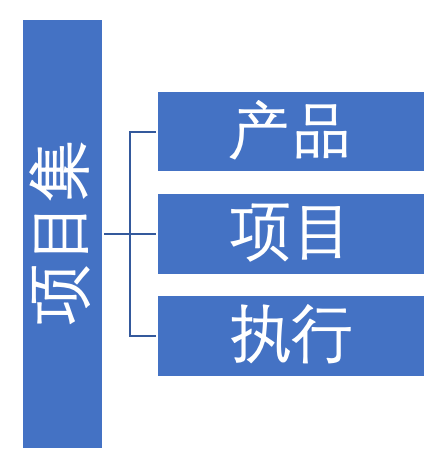
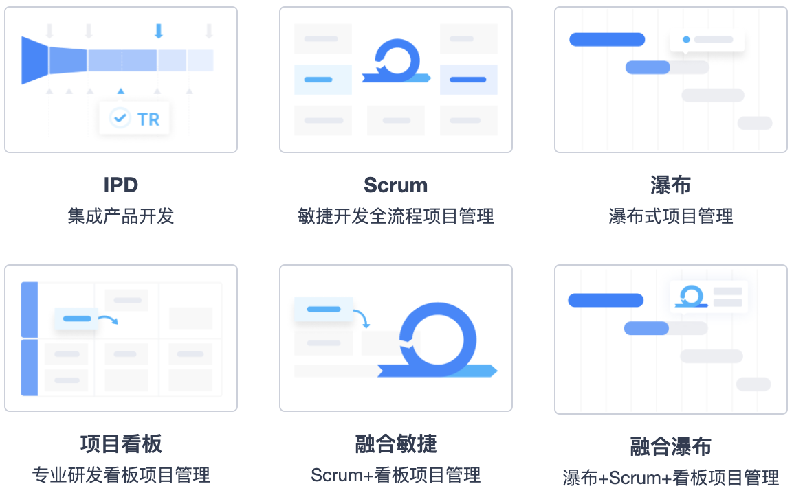
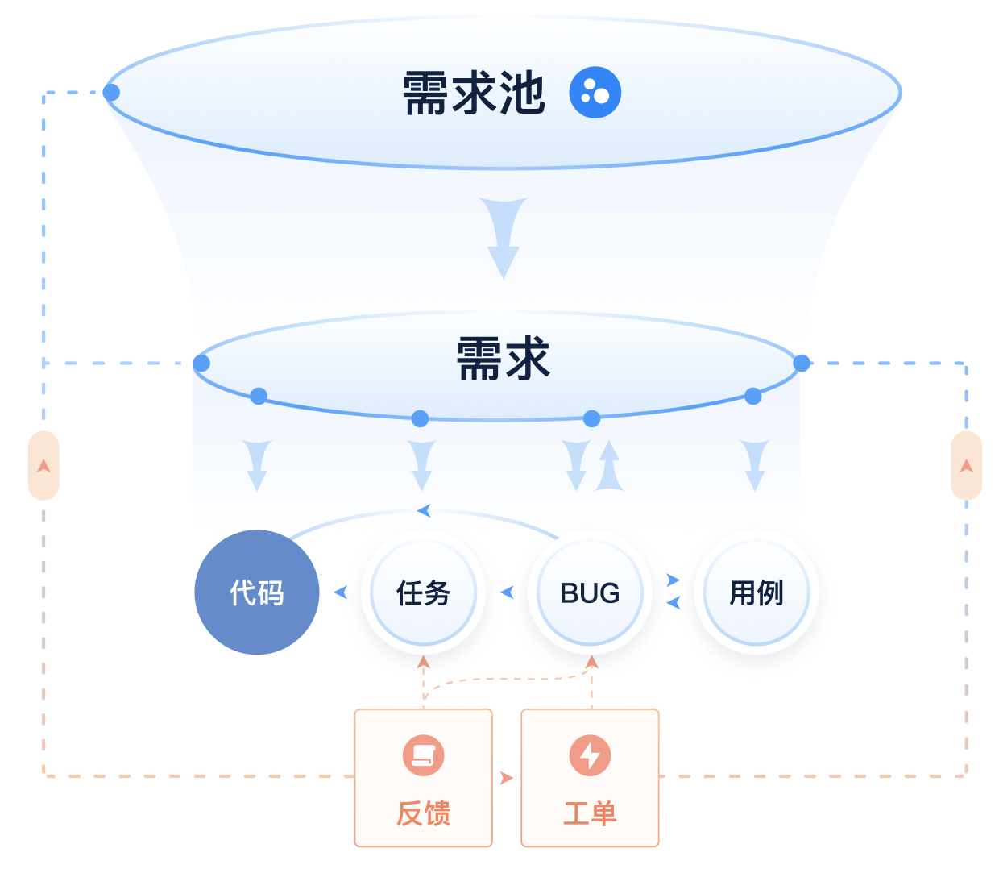

# 禅道项目管理软件

[TOC]

## 概述

由禅道软件（青岛）有限公司开发，国产开源项目管理软件。它集项目集管理、产品管理、项目管理、执行管理、质量管理、DevOps、知识库、AI 智能、BI 效能、工作流、学堂、反馈管理、资产库管理、组织管理和事务管理于一体，是一款专业的研发项目管理软件，完整覆盖了研发项目管理的核心流程。禅道管理思想注重实效，功能完备丰富，操作简洁高效，界面美观大方，搜索功能强大，统计报表丰富多样，软件架构合理，扩展灵活，有完善的 API 可以调用。禅道，专注研发项目管理！

目前可以提供全生命周期的项目管理解决方案、DevOps 一体化解决方案、自动化测试解决方案，让每一个项目都可实现高效管理。

## 部署方式及特点

1. 私有化部署（禅道）完全控制。
   * 对软件的完全掌控和管理，用户可以根据自身需求进行定制和配置，以适应特定的业务流程、安全要求和可扩展性需求。
   * 数据安全。数据存储在用户自己的环境中，提供更高的数据安全性和隐私保护。用户可以实施自己的安全措施、加密和访问控制策略，确保敏感数据不会离开内部网络。
   * 灵活定制。私有化部署版本允许用户根据自己的需求进行定制和扩展。用户可以根据特定的业务需求进行功能定制、界面定制和集成定制，以满足个性化的要求。
2. SaaS 云部署（云禅道） 
   * 免维护，即开即用。云禅道无需安装和维护，即刻开启即可使用。一键升级版本，保持软件始终处于最新状态，让您专注于项目管理，无需担心繁琐的维护工作，节省安装部署的时间和精力。
   * 按需扩容与计费。SaaS 部署模式允许用户根据实际需求进行资源的扩容和计费。当业务需要扩展时，可以根据需要增加用户数、存储空间或处理能力等资源，计费方式更灵活，成本控制更具优势。
   * 资源隔离，数据物理隔离。基于先进的容器技术，我们的软件实现了资源隔离，确保每个用户的内存和 CPU 资源得到独立分配。同时，数据也得到物理隔离，保证了您的数据安全与隐私。

## 名字由来

禅和道这两个字含义极其丰富，有宗教方面的含义，也有文化层面的含义。禅道项目管理软件取其文化含义，期望通过这两个字来传达我们对管理的理解和思考。这个名字是受《编程之道》和《编程之禅》这两本书的启发。英文里面的禅为 Zen ，道为 Tao ，所以我们软件的英文名字为 zentao 。

## 设计理念

禅道项目管理软件主要是基于国际流行的**敏捷、CMMI、SAFe、IPD** 等管理思想和方法进行的设计。

禅道的核心架构可以概括为 “468”：**4 种管理结构、6 种管理模型、8 个核心概念** 

### 4 种管理结构 

4 种管理结构是指项目集、产品、项目和执行，从战略到产品立项到项目规划到迭代开发，完美响应各种层级结构。

**项目集**是一组相互关联，且被协调管理的项目集合，处于最高层级，属于战略层面的概念。管理者可以从宏观视角出发，通过项目集、子项目集、项目、产品等方式制定战略方向、分配资源。

**产品**是定义要做什么，它主要用于定义产品的发展目标或者计划，属于目标层面的概念。产品经理通过产品可以管理用户需求、定义产品的发展目标、制定版本发布计划。

**项目**是在规定的时间、预算和质量目标范围内完成项目的各种工作，属于战役层面的概念。项目经理通过项目管理的方式来管理团队、分配资源、把控风险，执行一个个的计划，逐步达成目标。

**执行**是完成项目所需要的一系列动作，属于战斗层面的概念。项目团队成员在执行中以冲刺、迭代、看板、阶段（管理模型不同，名称也不同）等方式去完成对应的任务、质量验证、解决 Bug 。

### 6种管理模型 

6 种管理模型是指 Scrum、瀑布、看板、IPD 、融合敏捷、融合瀑布模型。

**Scrum 模型**注重实效，操作性强，非常适合软件研发项目的快速迭代开发。禅道在遵循 Scrum 管理方式的基础上，结合国内研发现状，整合了 Bug 管理，测试用例管理，发布管理，文档管理等功能，完整的覆盖了软件研发项目的整个生命周期。

**瀑布模型**是基于 CMMI 2.0 能力成熟度模型进行的设计，强计划/规划式管理模式。通过详尽的计划，按阶段逐步实施，每个阶段都可以设置里程碑检查点，发现问题及时记录处理，保证整体项目按照既定的规划在实施，以达到预期的目标。

**看板模型**是基于精益管理理念进行的设计。可以将需求从定义到交付全流程可视化，采用拉动式生产的方式推进项目进展，根据项目实际规模和人员分工设置在制品数量限制，严格控制在制品数量（WIP)，提升交付效率。

**IPD 模型**是基于 IPD 的整体框架和思想进行的设计。提供了从市场管理、需求管理、路标管理、立项管理到 IPD 项目管理、TR 评审、决策评审等核心功能，帮助企业构建结构化、流程化、规范化的产品研发体系。

**融合敏捷模型**是在 Scrum 模型的基础上支持创建看板，在项目中可以同时使用迭代或看板的方式来进行项目管理。例如：在项目前期使用迭代进行功能交付后，后期使用看板管理项目的维护工作。

**融合瀑布模型**是在瀑布模型的基础上支持创建迭代和看板，在项目中可以同时使用阶段、迭代或者看板的方式来进行项目管理。

###  8个核心概念

8 个核心概念是指需求池、需求、任务、Bug 、用例、代码、反馈、工单

需求池作为需求的起点，可以全面搜集公司内外各方面的潜在需求。经过评审和分析后，合适的需求可以分发到具体的产品中进行整体规划，随后启动立项研发流程。

在研发过程中，需求将被转化为任务去执行，转化为用例去验证，同时可以与代码、Bug 进行关联。如果用例执行失败，可将其转化为 Bug，而 Bug 则可以通过任务来解决。

产品一旦发布上线，可以通过反馈流程来收集各方对产品的评价和建议。对于紧急的反馈，可以通过工单迅速响应，也可以将其转化为需求、任务、Bug 或待办事项，以便后续适当处理。

## 为什么选择禅道项目管理软件？

1. 禅道是专业的研发项目管理软件，非简单任务管理软件可比。
2. 管理思想简洁实效，可以帮助企业快速使用 Scrum、看板、瀑布模型进行开发。
3. 功能完备，您无需再费心整合若干系统在一起使用。
4. 源代码开源开放，有灵活的扩展机制，方便企业使用并二次开发。
5. 国产软件，本地支持，操作习惯更符合国人。
6. 自主开发的底层框架和前端 UI 框架，健壮稳定，界面美观，交互友好。
7. 完善的社区机制，可以获得及时的技术支持和帮助。
8. 零投入，相比动辄十几万的商业软件，您选择禅道没有任何风险。
9. 禅道支持多种部署方式，可以私有部署，也可以选择云端服务。
10. 我们团队一直专注企业管理，持续迭代更新，不断完善软件。

## 主要功能

项目集管理：包括项目集、子项目集等功能。

产品管理：包括产品、需求、计划、发布、路线图等功能。

项目管理：包括项目、任务、团队、版本、燃尽图、设计、跟踪矩阵、评审、配置、发布、报告、资源日历、调研、估算、问题、风险、过程、机会、度量、QA、培训、会议等功能。

质量管理：包括 Bug、测试用例、套件、测试单、测试报告、自动化测试、测试任务、测试结果等功能。

DevOps：包括：代码库、流水线、制品库、应用市场等功能。

知识库管理：包括我的空间、团队空间、产品空间、项目空间、接口空间等功能。

BI 效能：包括大屏、透视表、图表、数据表、维度、度量项等功能。 

反馈管理：包括：反馈、工单、FAQ管理等功能。 

学堂：包括：丰富的项目管理课程、实践库等功能。

事务管理：包括todo管理，我的任务、我的Bug、我的需求、我的项目等个人事务管理功能。

组织管理：包括部门、用户、分组、权限等功能。

搜索功能：强大的搜索，帮助您找到相应的数据。

扩展机制，几乎可以对禅道的任何地方进行扩展。

API 机制，所见皆 API，方便与其他系统集成。