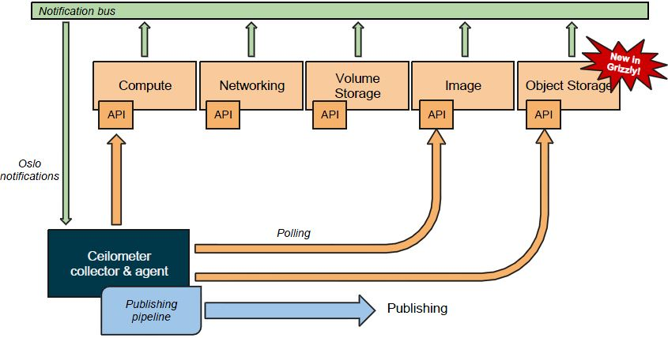

# Ceilometer

**作用：**

1. 计费，解决公有云中的租户计费问题。
2. 监控数据。

**收集信息的方式：**

主动、被动

**组件：**

* 计算节点代理（compute agent）：计算节点中的信息是通过安装计算节点代理主动提供的。
* 中央代理（central agent）：对Glance、Cinder和Quantum等服务信息的主动查询是通过Ceilometer的中央代理向各服务发出请求来完成。
* 收集器（Collector）：主要负责监听消息总线的信息，并将收到的消息以及相应的数据写入到数据库中。