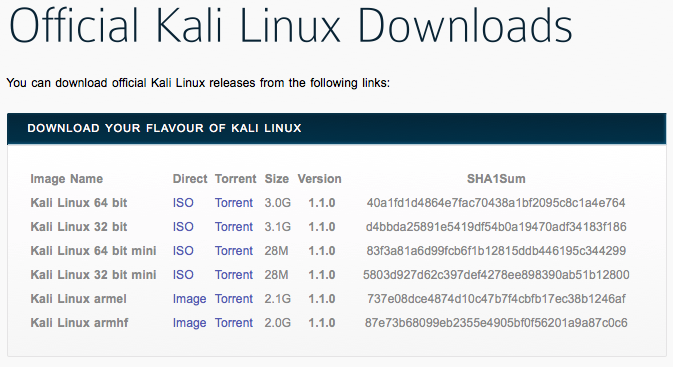
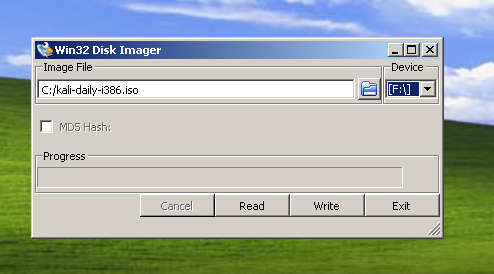
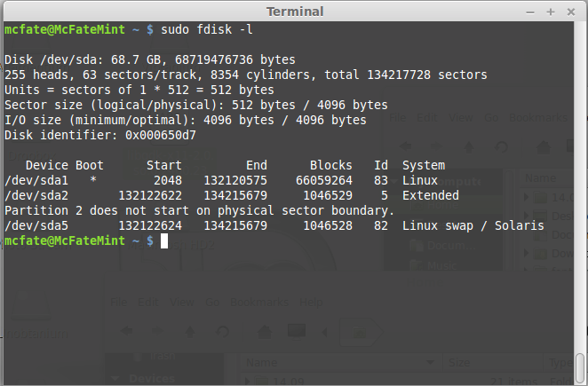
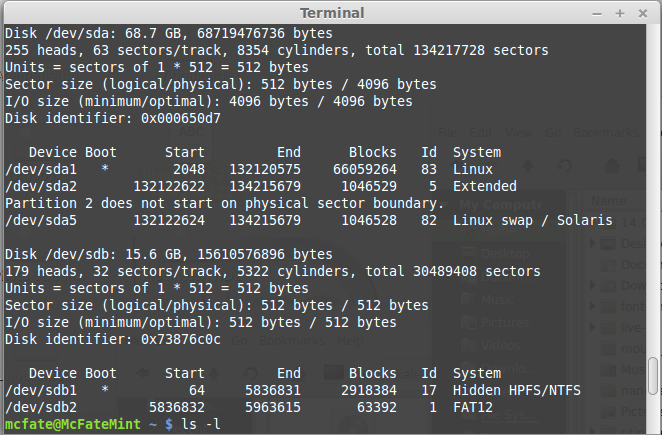
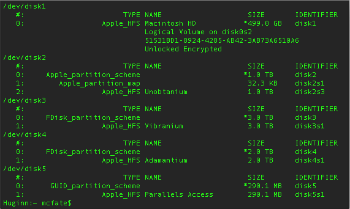
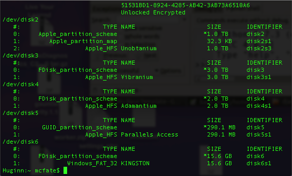

# Kali Linux: Professional Penetration-Testing Distro 
## 01 开始
### Kali Linux 是什么？
Kali Linux 是一个基于 Debian 的 Linux  发行版，用于高级渗透测试和安全和安全审计。 Kali 包含几百种用于多种信息安全任务的工具，例如渗透测试，取证和逆向工程。 Kali Linux is developed, funded and maintained by Offensive Security, a leading information security training company.  
Kali Linux was released on the 13th March, 2013 as a complete, top-to-bottom rebuild of BackTrack Linux, adhering completely to Debian development standards.  
    More than 600 penetration testing tools included: After reviewing every tool that was included in BackTrack, we eliminated a great number of tools that either simply did not work or which duplicated other tools that provided the same or similar functionality. Details on what’s included are on the Kali Tools site.  
    Free (as in beer) and always will be: Kali Linux, like BackTrack, is completely free of charge and always will be. You will never, ever have to pay for Kali Linux.  
    Open source Git tree: We are committed to the open source development model and our development tree is available for all to see. All of the source code which goes into Kali Linux is available for anyone who wants to tweak or rebuild packages to suit their specific needs.  
    FHS compliant: Kali adheres to the Filesystem Hierarchy Standard, allowing Linux users to easily locate binaries, support files, libraries, etc.  
    Wide-ranging wireless device support: A regular sticking point with Linux distributions has been supported for wireless interfaces. We have built Kali Linux to support as many wireless devices as we possibly can, allowing it to run properly on a wide variety of hardware and making it compatible with numerous USB and other wireless devices.  
    Custom kernel, patched for injection: As penetration testers, the development team often needs to do wireless assessments, so our kernel has the latest injection patches included.  
    Developed in a secure environment: The Kali Linux team is made up of a small group of individuals who are the only ones trusted to commit packages and interact with the repositories, all of which is done using multiple secure protocols.  
    GPG signed packages and repositories: Every package in Kali Linux is signed by each individual developer who built and committed it, and the repositories subsequently sign the packages as well.  
    Multi-language support: Although penetration tools tend to be written in English, we have ensured that Kali includes true multilingual support, allowing more users to operate in their native language and locate the tools they need for the job.  
    Completely customizable: We thoroughly understand that not everyone will agree with our design decisions, so we have made it as easy as possible for our more adventurous users to customize Kali Linux to their liking, all the way down to the kernel.  
    ARMEL and ARMHF support: Since ARM-based single-board systems like the Raspberry Pi and BeagleBone Black, among others, are becoming more and more prevalent and inexpensive, we knew that Kali’s ARM support would need to be as robust as we could manage, with fully working installations for both ARMEL and ARMHF systems. Kali Linux is available on a wide range of ARM devices and has ARM repositories integrated with the mainline distribution so tools for ARM are updated in conjunction with the rest of the distribution.  
Kali Linux is specifically tailored to the needs of penetration testing professionals, and therefore all documentation on this site assumes prior knowledge of, and familiarity with, the Linux operating system in general. Please see Should I Use Kali Linux? for more details on what make Kali unique.
### Should I Use Kali Linux?
#### What’s Different About Kali Linux?

Kali Linux is specifically geared to meet the requirements of professional penetration testing and security auditing. To achieve this, several core changes have been implemented in Kali Linux which reflect these needs:
    Single user, root access by design: Due to the nature of security audits, Kali Linux is designed to be used in a “single, root user” scenario. Many of the tools used in penetration testing require escalated privileges, and while it’s generally sound policy to only enable root privileges when necessary, in the use cases that Kali Linux is aimed at, this approach would be a burden.
    Network services disabled by default: Kali Linux contains sysvinit hooks which disable network services by default. These hooks allow us to install various services on Kali Linux, while ensuring that our distribution remains secure by default, no matter what packages are installed. Additional services such as Bluetooth are also blacklisted by default.
    Custom Linux kernel: Kali Linux uses an upstream kernel, patched for wireless injection.
    A minimal and trusted set of repositories: given the aims and goals of Kali Linux, maintaining the integrity of the system as a whole is absolutely key. With that goal in mind, the set of upstream software sources which Kali uses is kept to an absolute minimum. Many new Kali users are tempted to add additional repositories to their sources.list, but doing so runs a very serious risk of breaking your Kali Linux installation.

#### Is Kali Linux Right For You?

As the distribution’s developers, you might expect us to recommend that everyone should be using Kali Linux. The fact of the matter is, however, that Kali is a Linux distribution specifically geared towards professional penetration testers and security specialists, and given its unique nature, it is NOT a recommended distribution if you’re unfamiliar with Linux or are looking for a general-purpose Linux desktop distribution for development, web design, gaming, etc.

Even for experienced Linux users, Kali can pose some challenges. Although Kali is an open source project, it’s not a wide-open source project, for reasons of security. The development team is small and trusted, packages in the repositories are signed both by the individual committer and the team, and — importantly — the set of upstream repositories from which updates and new packages are drawn is very small. Adding repositories to your software sources which have not been tested by the Kali Linux development team is a good way to cause problems on your system.

While Kali Linux is architected to be highly customizable, don’t expect to be able to add random unrelated packages and repositories that are “out of band” of the regular Kali software sources and have it Just Work. In particular, there is absolutely no support whatsoever for the apt-add-repository command, LaunchPad, or PPAs. Trying to install Steam on your Kali Linux desktop is an experiment that will not end well. Even getting a package as mainstream as NodeJS onto a Kali Linux installation can take a little extra effort and tinkering.

If you are unfamiliar with Linux generally, if you do not have at least a basic level of competence in administering a system, if you are looking for a Linux distribution to use as a learning tool to get to know your way around Linux, or if you want a distro that you can use as a general purpose desktop installation, Kali Linux is probably not what you are looking for.

In addition, misuse of security and penetration testing tools within a network, particularly without specific authorization, may cause irreparable damage and result in significant consequences, personal and/or legal. “Not understanding what you were doing” is not going to work as an excuse.

However, if you’re a professional penetration tester or are studying penetration testing with a goal of becoming a certified professional, there’s no better toolkit — at any price — than Kali Linux.
If you are looking for a Linux distribution to learn the basics of Linux and need a good starting point, Kali Linux is not the ideal distribution for you. You may want to begin with Ubuntu, Mint, or Debian instead. If you’re interested in getting hands-on with the internals of Linux, take a look the “Linux From Scratch” project.

### Downloading Kali Linux

IMPORTANT! Never download Kali Linux images from anywhere other than the official sources. Always be sure to verify the SHA1 checksums of the file you’ve downloaded against our official values. It would be easy for a malicious entity to modify a Kali installation to contain exploits or malware and host it unofficially.
#### Where to Get the Official Kali Linux Images
##### ISO Files for Intel-based PCs

In order to run Kali “Live” from a USB drive on standard Windows and Macintosh PCs, you’ll need a Kali Linux bootable ISO image, in either 32-bit or 64-bit formats.

If you’re not sure of the architecture of the system you want to run Kali Linux on, on Linux or OS X, you can run the command
uname -m

at the command line. If you get the response, “x86_64”, use the 64-bit ISO image (the one containing “amd64” in the file name); if you get “i386”, use the 32-bit image (the one containing “i386” in the file name). If you’re on a Windows system, the procedure for determining whether your system is 32- or 64-bit is detailed on Microsoft’s site.

The images are available both as directly downloaded “.iso” files or via torrent files.

    Official Kali ISOs for Intel-based PCs

Building your own Kali Linux ISO, standard or customized, is a very simple process.
##### VMware Images

If you want to run Kali Linux as a “guest” under VMware, Kali is available as a pre-built VMware virtual machine with VMware Tools already installed. The VMware image is available in a 64-bit (amd64), 32-bit (i686), and 32-bit PAE (i486) formats.

    Official Kali Linux VMware Images

##### ARM Images

The hardware architectures of ARM-based devices vary considerably, so it is not possible to have a single image that will work across all of them. Pre-built Kali Linux images for the ARM architecture are available for the wide range of devices.

Scripts for building your own ARM images locally are also available on GitHub. For more details see the articles on setting up an ARM cross-compilation environment, and building a custom Kali Linux ARM chroot.
#### Verifying Your Downloaded Kali Image
##### Why do I need to do this?

Before you run Kali Linux Live, or install it to your hard disk, you want to be very sure that what you’ve got actually is Kali Linux, and not an imposter. Kali Linux is a professional penetration testing and forensics toolkit. As a professional penetration tester, having absolute confidence in the integrity of your tools is critical: if your tools aren’t trustworthy, your investigations won’t be trustworthy, either.

Moreover, as the leading penetration testing distribution, Kali’s strengths mean that a bogus version of Kali Linux could do a tremendous amount of damage if it were deployed unwittingly. There are plenty of people with plenty of reason to want to stick very sketchy stuff into something that looks like Kali, and you absolutely don’t want to find yourself running something like that.

Avoiding this is simple:

    only download Kali Linux via the official download pages at https://www.kali.org/downloads or https://www.offensive-security.com/kali-linux-vmware-arm-image-download/ — you won’t be able to browse to these pages without SSL: encrypting the connection makes it much harder for an attacker to use a “man-in-the-middle” attack to modify your download. There are a few potential weaknesses to even these sources — see the sections on verifying the download with the SHA1SUMS file and its signature against the official Kali Development team private key for something much closer to absolute assurance.
    once you’ve downloaded an image, and before you run it, always validate that it really is what it’s supposed to be by verifying its checksum using one of the procedures detailed below.

There are several methods for verifying your download. Each provides a certain level of assurance, and involves a corresponding level of effort on your part.

    You can simply download an ISO image from an official Kali Linux “Downloads” mirror, calculate the ISO’s SHA1 hash and compare it by inspection with the value listed on the Kali Linux site. This is quick and easy, but potentially susceptible to subversion via a DNS poisoning: it assumes that the site to which, for example, the domain “kali.org” resolves is in fact the actual Kali Linux site. If it somehow weren’t, an attacker could present a “loaded” image and a matching SHA1 signature on the fake web page. See the section “Manually Verify the Signature on the ISO (Direct Download)”, below.
    You can download an ISO image through the torrents, and it will also pull down a file — unsigned — containing the calculated SHA1 signature. You can then use the shasum command (on Linux and OS X) or a utility (on Windows) to automatically verify that the file’s computed signature matches the signature in the secondary file. This is even easier than the “manual” method, but suffers from the same weakness: if the torrent you pulled down isn’t really Kali Linux, it could still have a good signature. See the section “Verify the Signature on the ISO Using the Included Signature File (Torrent Download)”, below.
    To be as close to absolutely certain as possible that the Kali Linux download you’ve obtained is the real thing, you can download both a cleartext signature file and and version of the same file that has been signed with the official Kali Linux private key and use GNU Privacy Guard (GPG) to first, verify that the computed SHA1 signature and the signature in the cleartext file match and second, verify that the signed version of the file containing the SHA1 hash has been correctly signed with the official key.
    If you use this more complicated process and successfully validate your downloaded ISO, you can proceed with pretty complete assurance that what you’ve got is the official image and that it has not been tampered with in any way. This method, while the most complex, has the advantage of providing independent assurance of the integrity of the image. The only way this method can fail is if the official Kali Linux private key is not only subverted by an attacker, but also not subsequently revoked by the Kali Linux development team. For this method, see the section on verification using the SHA1SUMS file.

##### What do I need to do this?

If you’re running on Linux, you probably already have GPG (GNU Privacy Guard) installed. If you’re on Windows or OS X, you’ll need to install the appropriate version for your platform.

    If you’re on a PC running Windows, download and install GPG4Win from here.
    If you’re on a Macintosh running OS X, download and install GPGTools from here. Since Windows does not have the native ability to calculate SHA1 checksums, you will also need a utility such as Microsoft File Checksum Integrity Verifier or Hashtab to verify your download.

Once you’ve installed GPG, you’ll need to download and import a copy of the Kali Linux official key. Do this with the following command:
$ wget -q -O - https://www.kali.org/archive-key.asc | gpg --import

or the command
$ gpg --keyserver hkp://keys.gnupg.net --recv-key 7D8D0BF6

Your output should look like this:
gpg: key 7D8D0BF6: public key "Kali Linux Repository <devel@kali.org>" imported
gpg: Total number processed: 1
gpg:               imported: 1  (RSA: 1)

Verify that the key is properly installed with the command:
gpg --list-keys --with-fingerprint  7D8D0BF6

The output will look like this:
pub   4096R/7D8D0BF6 2012-03-05 [expires: 2018-02-02]
      Key fingerprint = 44C6 513A 8E4F B3D3 0875  F758 ED44 4FF0 7D8D 0BF6
uid                  Kali Linux Repository <devel@kali.org>
sub   4096R/FC0D0DCB 2012-03-05 [expires: 2018-02-02]

You’re now set up to validate your Kali Linux download.
#### How do I verify my downloaded image?
##### Manually Verify the Signature on the ISO (Direct download)

If you downloaded the ISO directly from the downloads page, verify it using the following procedure.

On Linux, or OS X, you can generate the SHA1 checksum from the ISO image you’ve downloaded with the following command (assuming that the ISO image is named “kali-linux-1.1.0-amd64.iso”, and is in your current directory):

shasum kali-linux-1.1.0-amd64.iso

The output should look like this:

40a1fd1d4864e7fac70438a1bf2095c8c1a4e764  kali-linux-1.1.0-amd64.iso

The resulting SHA1 signature, “40a1fd1d4864e7fac70438a1bf2095c8c1a4e764”, can be seen to match the signature displayed in the “SHA1SUM” column on the official download page for the 64-bit Intel architecture Kali Linux 1.1.0 ISO image:

##### Verify the Signature on the ISO Using the Included Signature File (Torrent Download)

If you downloaded your copy of the Kali Linux ISO image via the torrents, in addition to the ISO file (e.g. kali-linux-1.1.0-amd64.iso), there will be a second file containing the computed SHA1 signature for the ISO, with the extension “.txt.sha1sum” (e.g. kali-linux-1.1.0-amd64.txt.sha1sum). You can use this file to verify the authenticity of your download on Linux or OS X with the following command:

grep kali-linux-1.1.0-amd64.iso kali-linux-1.1.0-amd64.txt.sha1sum | shasum -c

If the image is successfully authenticated, the response will look like this:

kali-linux-1.1.0-amd64.iso: OK

IMPORTANT! If you are unable to verify the authenticity of the Kali Linux image you have downloaded as described in the preceding section, do NOT use it! Using it could endanger not only your own system, but any network you connect to as well as the other systems on that network. Stop, and ensure that you have downloaded the images from a legitimate Kali Linux mirror.

##### Verify the ISO Using the SHA1SUMS File

This is a more complex procedure, but offers a much higher level of validation: it does not rely on the integrity of the web site you downloaded the image from, only the official Kali Linux development team key that you install independently. To verify your image this way for an Intel architecture version of Kali, you will need to download three files from the Kali “Live CD Image” site for the current release (v1.1.0, as of this writing):

    The ISO image itself (e.g. kali-linux-1.1.0-amd64.iso)
    The file containing the calculated SHA1 hash for the ISO, SHA1SUMS
    The signed version of that file, SHA1SUMS.gpg

Before verifying the checksums of the image, you must ensure that the SHA1SUMS file is the one generated by Kali. That’s why the file is signed by Kali’s official key with a detached signature in SHA1SUMS.gpg. If you have not already done so, Kali’s official key can be downloaded and imported into your keychain with this command:
$ wget -q -O - https://www.kali.org/archive-key.asc | gpg --import

or this command
$ gpg --keyserver hkp://keys.gnupg.net --recv-key 7D8D0BF6

Your output should look like this:
gpg: key 7D8D0BF6: public key "Kali Linux Repository <devel@kali.org>" imported
gpg: Total number processed: 1
gpg:               imported: 1  (RSA: 1)

You should verify that the key is properly installed with the command:
gpg --list-keys --with-fingerprint  7D8D0BF6

The output will look like this:
pub   4096R/7D8D0BF6 2012-03-05 [expires: 2018-02-02]
      Key fingerprint = 44C6 513A 8E4F B3D3 0875  F758 ED44 4FF0 7D8D 0BF6
uid                  Kali Linux Repository <devel@kali.org>
sub   4096R/FC0D0DCB 2012-03-05 [expires: 2018-02-02]

Once you have downloaded both SHA1SUMS and SHA1SUMS.gpg, you can verify the signature as follows:
$ gpg --verify SHA1SUMS.gpg SHA1SUMS
gpg: Signature made Thu Mar 7 21:26:40 2013 CET using RSA key ID 7D8D0BF6
gpg: Good signature from "Kali Linux Repository <devel@kali.org>"

If you don’t get that “Good signature” message or if the key ID doesn’t match, then you should stop and review whether you downloaded the images from a legitimate Kali Linux mirror. The failed verification strongly suggests that the image you have may have been tampered with.

If you did get the “Good signature” response, you can now be assured that the checksum in the SHA1SUMS file was actually provided by the Kali Linux development team. All that remains to be done to complete the verification is to validate that the signature you compute from the ISO you’ve downloaded matches the one in the SHA1SUMS file. You can do that on Linux or OS X with the following command (assuming that the ISO is named “kali-linux-1.1.0-amd64.iso” and is in your working directory):

grep kali-linux-1.1.0-amd64.iso SHA1SUMS | shasum -c

If the image is successfully authenticated, the response will look like this:

kali-linux-1.1.0-amd64.iso: OK

If you don’t get “OK” in response, then stop and review what’s happened: the Kali image you have has apparently been tampered with. Do NOT use it.

Once you’ve downloaded and verified your image, you can proceed to create a bootable “Kali Linux Live” USB drive.
### Kali Linux Default Passwords

#### Kali Linux Default root Password is toor
#### Default root Password

During installation, Kali Linux allows users to configure a password for the root user. However, should you decide to boot the live image instead, the i386, amd64, VMWare and ARM images are configured with the default root password – “toor“, without the quotes.

## 02 Kali Linux Live
### Making a Kali Bootable USB Drive

Our favorite way, and the fastest method, for getting up and running with Kali Linux is to run it “live” from a USB drive. This method has several advantages:

    It’s non-destructive — it makes no changes to the host system’s hard drive or installed OS, and to go back to normal operations, you simply remove the “Kali Live” USB drive and restart the system.
    It’s portable — you can carry Kali Linux in your pocket and have it running in minutes on an available system
    It’s customizable — you can roll your own custom Kali Linux ISO image and put it onto a USB drive using the same procedures
    It’s potentially persistent — with a bit of extra effort, you can configure your Kali Linux “live” USB drive to have persistent storage, so the data you collect is saved across reboots

In order to do this, we first need to create a bootable USB drive which has been set up from an ISO image of Kali Linux.
#### What You’ll Need

    A verified copy of the appropriate ISO image of the latest Kali build image for the system you’ll be running it on: see the details on downloading official Kali Linux images.
    If you’re running under Windows, you’ll also need to download the Win32 Disk Imager utility. On Linux and OS X, you can use the dd command, which is pre-installed on those platforms.
    A USB thumb drive, 4GB or larger. (Systems with a direct SD card slot can use an SD card with similar capacity. The procedure is identical.)

#### Kali Linux Live USB Install Procedure

The specifics of this procedure will vary depending on whether you’re doing it on a Windows, Linux, or OS X system.

##### Creating a Bootable Kali USB Drive on Windows

    Plug your USB drive into an available USB port on your Windows PC, note which drive designator (e.g. “F:\”) it uses once it mounts, and launch the Win32 Disk Imager software you downloaded.
    Choose the Kali Linux ISO file to be imaged and verify that the USB drive to be overwritten is the correct one. Click the “Write” button.

    Once the imaging is complete, safely eject the USB drive from the Windows machine. You can now use the USB device to boot into Kali Linux.

##### Creating a Bootable Kali USB Drive on Linux

Creating a bootable Kali Linux USB key in a Linux environment is easy. Once you’ve downloaded and verified your Kali ISO file, you can use the dd command to copy it over to your USB stick using the following procedure. Note that you’ll need to be running as root, or to execute the dd command with sudo. The following example assumes a Linux Mint 17.1 desktop — depending on the distro you’re using, a few specifics may vary slightly, but the general idea should be very similar.

WARNING: Although the process of imaging Kali Linux onto a USB drive is very easy, you can just as easily overwrite a disk drive you didn’t intend to with dd if you do not understand what you are doing, or if you specify an incorrect output path. Double-check what you’re doing before you do it, it’ll be too late afterwards.

Consider yourself warned.

    First, you’ll need to identify the device path to use to write the image to your USB drive. Without the USB drive inserted into a port, execute the command
    sudo fdisk -l

    at a command prompt in a terminal window (if you don’t use elevated privileges with fdisk, you won’t get any output). You’ll get output that will look something (not exactly) like this, showing a single drive — “/dev/sda” — containing three partitions (/dev/sda1, /dev/sda2, and /dev/sda5):

    Now, plug your USB drive into an available USB port on your system, and run the same command, “sudo fdisk -l” a second time. Now, the output will look something (again, not exactly) like this, showing an additional device which wasn’t there previously, in this example “/dev/sdb”, a 16GB USB drive:

    Proceed to (carefully!) image the Kali ISO file on the USB device. The example command below assumes that the ISO image you’re writing is named “kali-linux-1.0.9a-amd64.iso” and is in your current working directory. The blocksize parameter can be increased, and while it may speed up the operation of the dd command, it can occasionally produce unbootable USB drives, depending on your system and a lot of different factors. The recommended value, “bs=512k”, is conservative and reliable.
     dd if=kali-linux-1.0.9a-amd64.iso of=/dev/sdb bs=512k

Imaging the USB drive can take a good amount of time, over ten minutes or more is not unusual, as the sample output below shows. Be patient!

The dd command provides no feedback until it’s completed, but if your drive has an access indicator, you’ll probably see it flickering from time to time. The time to dd the image across will depend on the speed of the system used, USB drive itself, and USB port it’s inserted into. Once dd has finished imaging the drive, it will output something that looks like this:

5823+1 records in
5823+1 records out
3053371392 bytes (3.1 GB) copied, 746.211 s, 4.1 MB/s

That’s it, really! You can now boot into a Kali Live / Installer environment using the USB device.

##### Creating a Bootable Kali USB Drive on OS X

OS X is based on UNIX, so creating a bootable Kali Linux USB drive in an OS X environment is similar to doing it on Linux. Once you’ve downloaded and verified your chosen Kali ISO file, you use dd to copy it over to your USB stick.
WARNING: Although the process of imaging Kali on a USB drive is very easy, you can just as easily overwrite a disk drive you didn’t intend to with dd if you do not understand what you are doing, or if you specify an incorrect output path. Double-check what you’re doing before you do it, it’ll be too late afterwards.

Consider yourself warned.

    Without the USB drive plugged into the system, open a Terminal window, and type the command diskutil list at the command prompt.
    You will get a list of the device paths (looking like /dev/disk0, /dev/disk1, etc.) of the disks mounted on your system, along with information on the partitions on each of the disks.

    Plug in your USB device to your Apple computer’s USB port and run the command diskutil list a second time. Your USB drive’s path will most likely be the last one. In any case, it will be one which wasn’t present before. In this example, you can see that there is now a /dev/disk6 which wasn’t previously present.

    Unmount the drive (assuming, for this example, the USB stick is /dev/disk6 — do not simply copy this, verify the correct path on your own system!):

diskutil unmount /dev/disk6

    Proceed to (carefully!) image the Kali ISO file on the USB device. The following command assumes that your USB drive is on the path /dev/disk6, and you’re in the same directory with your Kali Linux ISO, which is named “kali-linux-1.0.9a-amd64.iso”:

sudo dd if=kali-linux-1.0.9a-amd64.iso of=/dev/disk6 bs=1m

Note: Increasing the blocksize (bs) will speed up the write progress, but will also increase the chances of creating a bad USB stick. Using the given value on OS X has produced reliable images consistently.

Imaging the USB drive can take a good amount of time, over half an hour is not unusual, as the sample output below shows. Be patient!

The dd command provides no feedback until it’s completed, but if your drive has an access indicator, you’ll probably see it flickering from time to time. The time to dd the image across will depend on the speed of the system used, USB drive itself, and USB port it’s inserted into. Once dd has finished imaging the drive, it will output something that looks like this:

2911+1 records in
2911+1 records out
3053371392 bytes transferred in 2151.132182 secs (1419425 bytes/sec)

And that’s it! You can now boot into a Kali Live / Installer environment using the USB device.

To boot from an alternate drive on an OS X system, bring up the boot menu by pressing the Option key immediately after powering on the device and select the drive you want to use.

For more information, see Apple’s knowledge base.

### Kali Linux Live USB Persistence

#### Adding Persistence to a Kali Linux “Live” USB Drive

Kali Linux “Live” has two options in the default boot menu which enable persistence — the preservation of data on the “Kali Live” USB drive — across reboots of “Kali Live”. This can be an extremely useful enhancement, and enables you to retain documents, collected testing results, configurations, etc., when running Kali Linux “Live” from the USB drive, even across different systems. The persistent data is stored in its own partition on the USB drive, which can also be optionally LUKS-encrypted.

To make use of the USB persistence options at boot time, you’ll need to do some additional setup on your “Kali Linux Live” USB drive; this article will show you how.

This guide assumes that you have already created a Kali Linux “Live” USB drive as described in the section on that subject. For the purposes of this article, we’ll assume you’re working on a Linux-based system.

You’ll need to have root privileges to do this procedure, or the ability to escalate your privileges with the command “sudo su”. In this example, we assume

    you are running as the root user
    your USB drive is /dev/sdb
    your USB drive has a capacity of at least 8GB — the Kali Linux image takes over 3GB, and for this guide, we’ll be creating a new partition of about 4GB to store our persistent data in.

In this example, we’ll create a new partition to store our persistent data into, starting right above the second Kali Live partition and ending at 7GB, put an ext3 file system onto it, and create a persistence.conf file on the new partition.

    First, begin by imaging the latest Kali Linux ISO (currently v1.0.9a) to your USB drive as described in this article. We’re going to assume that the two partitions created by the imaging are /dev/sdb1 and /dev/sdb2. This can be verified with the command “fdisk -l“.
    Create and format an additional partition on the USB drive.
    First, let’s create the new partition in the empty space above our Kali Live partitions.

    end=7gb
    read start _ < <(du -bcm kali-linux-1.0.8-amd64.iso | tail -1); echo $start
    parted /dev/sdb mkpart primary $start $end

    The parted command may advise you that it can’t use the exact start values you specified; if so, accept the suggested value instead. If advised that the partition isn’t placed at an optimal location, “ignore” it. When parted completes, the new partition should have been created at /dev/sdb3; again, this can be verified with the command “fdisk -l“.
    Next, create an ext3 file system in the partition and label it “persistence”.
    mkfs.ext3 -L persistence /dev/sdb3
    e2label /dev/sdb3 persistence
    Create a mount point, mount the new partition there, and then create the configuration file to enable persistence. Finally, unmount the partition.
    mkdir -p /mnt/my_usb
    mount /dev/sdb3 /mnt/my_usb
    echo "/ union" > /mnt/my_usb/persistence.conf
    umount /dev/sdb3

#### Adding USB Persistence with LUKS Encryption

Alternatively, you can create a LUKS-encrypted persistent storage area. This adds an extra layer of security to your sensitive files when traveling with Kali Live on USB devices. In the following example, we’ll create a new partition to store our persistent data into, starting right above the second Kali Live partition and ending at 7GB, set up LUKS encryption on the new partition, put an ext3 file system onto it, and create a persistence.conf file on it.

    Image the latest Kali Linux ISO (currently v1.0.9a) to your USB drive as described in this article.
    Create the new partition in the empty space above our Kali Live partitions.
    end=7gb
    read start _ < <(du -bcm kali-linux-1.0.8-amd64.iso | tail -1); echo $start
    parted /dev/sdb mkpart primary $start $end

    The parted command may advise you that it can’t use the exact start value you specified; if so, accept the suggested value instead. If advised that the partition isn’t placed at an optimal location, “ignore” it. When parted completes, the new partition should have been created at /dev/sdb3; again, this can be verified with the command “fdisk -l“.
    Initialize the LUKS encryption on the newly-created partition. You’ll be warned that this will overwrite any data on the partion. When prompted whether you want to proceed, type “YES” (all upper case). Enter your selected passphrase twice when asked to do so, and be sure to pick a passphrase you’re going to remember: if you forget it, your data will still be persistent, just irretrievable (and unusable).
    cryptsetup --verbose --verify-passphrase luksFormat /dev/sdb3
    cryptsetup luksOpen /dev/sdb3 my_usb
    Create the ext3 filesystem, and label it “persistence”.
    mkfs.ext3 -L persistence /dev/mapper/my_usb
    e2label /dev/mapper/my_usb persistence
    Create a mount point, mount our new encrypted partition there, set up the persistence.conf file, and unmount the partition.
    mkdir -p /mnt/my_usb
    mount /dev/mapper/my_usb /mnt/my_usb
    echo "/ union" > /mnt/my_usb/persistence.conf
    umount /dev/mapper/my_usb
    Close the encrypted channel to our persistence partition.
    cryptsetup luksClose /dev/mapper/my_usb

That’s really all there is to it! To use the persistent data features, simply plug your USB drive into the computer you want to boot up Kali Live on — make sure your BIOS is set to boot from your USB device — and fire it up. When the Kali Linux boot screen is displayed, choose the persistent option you set up on your USB drive, either normal or encrypted.

### Live Build a Custom Kali ISO

#### An Introduction to Building Your Own Kali ISO

Building a customized Kali ISO is easy, fun, and rewarding. You can configure virtually any aspect of your Kali ISO build using the Debian live-build scripts. These scripts allow developers to easily build live system images by providing a framework that uses a configuration set to automate and customize all aspects of building the image. The Kali Linux development team has adopted these scripts and they’re used to produce the official Kali ISO releases.
#### Where Should You Build Your ISO?

Ideally, you should build your custom Kali ISO from within a pre-existing Kali environment.
#### Getting Ready — Setting up the live-build system

We first need to prepare the Kali ISO build environment by installing and setting up live-build and its requirements with the following commands:
apt-get install curl git live-build cdebootstrap
git clone git://git.kali.org/live-build-config.git

Now you can simply build an updated Kali ISO by entering the “live-build-config” directory and running our build.sh wrapper script, as follows:
cd live-build-config
./build.sh --distribution sana --verbose

The “build.sh” script will take a while to complete, as it downloads all of the required packages needed to create your ISO. Good time for a coffee.
#### Configuring the Kali ISO Build (Optional)

If you want to customize your Kali Linux ISO, this section will explain some of the details. Through the kali-config directory, the Kali Linux live build supports a wide range of customization options, which are well-documented on the Debian live build 4.x page. However, for the impatient, here are some of the highlights. 
##### Building Kali with Different Desktop Environments

Since Kali 2.0, we now support built in configurations for various desktop environments, including KDE, Gnome, E17, I3WM, LXDE, MATE and XFCE. To build any of these, you would use syntax similar to the following:
# These are the different Desktop Environment build options:
#./build.sh --distribution sana --variant {gnome,kde,xfce,mate,e17,lxde,i3wm} --verbose

# To build a KDE ISO:
./build.sh --distribution sana --variant kde --verbose
# To build a MATE ISO:
./build.sh --distribution sana --variant mate --verbose

#...and so on.
##### Controlling the packages included in your build

The list of packages included in your build will be present in the the respective kali-$variant directory. For example, if you’re building a default Gnome ISO, you would use the following package lists file – kali-config/variant-gnome/package-lists/kali.list.chroot. By default, this list includes the “kali-linux-full” metapackage, as well as some others. These can be commented out and replaced with a manual list of packages to include in the ISO for greater granularity.
##### Build hooks, binary and chroot

Live-build hooks allows us to hook scripts in various stages of the Kali ISO live build. For more detailed information about hooks and how to use them, refer to the live build manual. As an example, we recommend you check out the existing hooks in kali-config/common/hooks/.
##### Overlaying files in your build

You have the option to include additional files or scripts in your build by overlaying them on the existing filesystem, inside the includes.{chroot,binary,installer} directories, respectively. For example, if we wanted to include our own custom script into the /root/ directory of the ISO (this would correspond to the “chroot” stage), then we would drop this script file in the kali-config/common/includes.chroot/ directory before building the ISO.
#### Building a Kali Linux ISO for older i386 architectures

The Kali Linux i386 ISO has PAE enabled. If you require a default kernel for older hardware with PAE disabled, you will need to rebuild a Kali Linux ISO. The rebuilding process is much the same as described above, except that the 686-pae parameter that needs to be changed to 586 in auto/config as follows. First, install the prerequisites.
apt-get install git live-build cdebootstrap
git clone git://git.kali.org/live-build-config.git

Next, make the change in auto/config for the appropriate architecture:
cd live-build-config
sed -i 's/686-pae/586/g' auto/config

Finally, run your build.
./build.sh --distribution sana --arch i386

## 03 Installing Kali Linux
### Kali Linux 硬盘安装
### Dual Boot Kali with Windows
### Dual Boot Kali on Mac Hardware
### Single Boot Kali on Mac Hardware
### Kali Linux Encrypted Disk Install
### Kali Linux Mini ISO Install
### Kali Linux Network PXE Install

#### Setup a PXE Server

Booting and installing Kali over the network (PXE) can be useful from a single laptop install with no CDROM or USB ports, to enterprise deployments supporting pre-seeding of the Kali installation.

First, we need to install dnsmasq to provide the DHCP/TFTP server and then edit the dnsmasq.conf file.
apt-get install dnsmasq
nano /etc/dnsmasq.conf

In dnsmasq.conf, enable DHCP, TFTP and PXE booting and set the dhcp-range to match your environment. If needed you can also define your gateway and DNS servers with the dhcp-option directive as shown below:
interface=eth0
dhcp-range=192.168.101.100,192.168.101.200,12h
dhcp-boot=pxelinux.0
enable-tftp
tftp-root=/tftpboot/
dhcp-option=3,192.168.101.1
dhcp-option=6,8.8.8.8,8.8.4.4

With the edits in place, the dnsmasq service needs to be restarted in order for the changes to take effect.
service dnsmasq restart
#### Download Kali PXE Netboot Images

Now, we need to create a directory to hold the Kali Netboot image and download the image we wish to serve from the Kali repos.
mkdir -p /tftpboot
cd /tftpboot
# for 64 bit systems:
wget http://repo.kali.org/kali/dists/kali/main/installer-amd64/current/images/netboot/netboot.tar.gz
# for 32 bit systems:
wget http://repo.kali.org/kali/dists/kali/main/installer-i386/current/images/netboot/netboot.tar.gz
tar zxpf netboot.tar.gz
rm netboot.tar.gz
#### Configure Target to Boot From Network

With everything configured, you can now boot your target system and configure it to boot from the network. It should get an IP address from your PXE server and begin booting Kali.

### Troubleshooting Installations
### Troubleshooting Wireless Drivers

Troubleshooting wireless driver issues in Linux can be a frustrating experience if you don’t know what to look for. This article is meant to be used as a general guideline to better help you find the information you need to solve your wireless issues.

NOTE: 90% of wireless issues reported to us are due to people not reading the aircrack-ng documentation. You need to run airmon-ng check kill before putting your card in monitor mode.

Carefully read carefully ANY error message as they will VERY OFTEN tell you what’s wrong and how to fix it. If not, then use your Google-Fu.
#### 1. No Interface

    Stupid question: Is it a wireless card? (We’ve seen that several times)
    Is the device plugged in?
    Does it show up on lsusb or lspci (with the exception of phones)? You might want to update pci ids and usb ids
    Does dmesg contain any information about the driver loading and/or failing
    Is Kali a VM? Then, unless your card is USB, it will not be useable (VMWare/VirtualBox/QEMU will virtualize EVERY PCI device). Is it attached to the VM?
    If there is nothing in dmesg and it’s not in a VM, then you might want to try the latest compat-wireless (and sometimes, you’ll need firmware) -> check on Linux-Wireless drivers

#### 2. Interface But Can’t Do Anything

    Read error messages
    If there are no error messages, then run dmesg | tail and it will most likely tell you what’s wrong
    Firmware might be missing
    Check rfkill and any hardware switches and BIOS options

#### 3. No Monitor Mode

    STA drivers (Ralink, Broadcom) and every other manufacturer’s provided driver doesn’t support monitor mode
    ndiswrapper doesn’t support monitor mode AND NEVER WILL.
    Airodump-ng/Wireshark don’t show any packets: check rfkill and any hardware switches and BIOS options

#### 4. Injection

    Test with aireplay-ng -9 (Make sure the card is in monitor mode with airmon-ng)
    Airmon-ng doesn’t display chipset information: It’s not a big issue as it just didn’t get that information from the card and doesn’t change the abilities of your card
    No injection but monitor mode: Check rfkill and any hardware switches and BIOS options
    Network managers sometimes interfere with Aircrack tools. run airmon-ng check kill to kill these processes.

#### Additional Links

    Will my card work with Aircrack-ng?
    Compat-wireless

## 04 Kali Linux on ARM
### Kali Linux – Raspberry Pi
Raspberry Pi is a low-cost, credit-card-sized ARM computer. Despite being a good bit less powerful than a laptop or desktop PC, its affordability makes it an excellent option for a tiny Linux system and it can do far more than act as a media hub.

The Raspberry Pi provides a SD card slot for mass storage and will attempt to boot off that device when the board is powered on.

By default, the Kali Linux Raspberry Pi image has been streamlined with the minimum tools, similar to all the other ARM images. If you wish to upgrade the installation to a standard desktop installation, you can include the extra tools by installing the kali-linux-full metapackage. For more information on metapackages, please refer to our tools page.
#### Kali Linux on Raspberry Pi — Pre-built Version

If you’re unfamiliar with the details of downloading and validating a Kali Linux image, or for using that image to create a bootable device, it’s strongly recommended that you refer to the more detailed procedures described in the specific articles on those subjects.

To install a prebuilt image of the standard build of Kali Linux on your Raspberry Pi, the general process goes as follows:

    Get a fast SD card with at least 8 GB capacity. Class 10 cards are highly recommended.
    Download and validate the Kali Linux Raspberry Pi image from the Offensive Security downloads area. The process for validating an image is described in more detail in the article on  “Downloading Kali Linux”.
    Use the dd utility to image this file to your SD card. The full process for creating a bootable USB or SD device is described in the article on “Making a Kali Live USB Drive”. In the following example, we assume that the image is named “kali-1.0.9-rpi.img”, that it’s is in your current working directory, and that the SD card is located at /dev/sdb. Do not simply copy these value, change this to the correct drive path corresponding to your SD card.

WARNING! This command will overwrite any existing data on your SD card. If you specify the wrong device path, you could wipe out your computer’s hard disk!
root@kali:~ dd if=kali-1.0.9-rpi.img of=/dev/sdb bs=512k

This process can take a while depending on your SD card’s device speed and image size. Once the dd operation is complete, insert the SD card into the Raspberry Pi and power it on.

You should be able to log into Kali (as user root, using the password toor) and execute the startx command at the shell prompt to start up the XFCE desktop environment.
IMPORTANT! Please change your SSH host keys as soon as possible as all ARM images are pre-configured the same keys. You should also change the root password to something more secure, especially if this machine will be publicly accessible!

Changing the SSH host keys can be accomplished by doing the following:
root@kali:~ rm /etc/ssh/ssh_host_*
root@kali:~ dpkg-reconfigure openssh-server
root@kali:~ service ssh restart
#### Kali Linux on Raspberry Pi — Custom Build

If you are a developer and want to tinker with the Kali Raspberry Pi image, including changing the kernel configuration, customizing the packages included, or making other modifications, you can work with the rpi.sh script in the kali-arm-build-scripts repository on github, and follow the README.md file’s instructions.

You will need to set up an ARM cross-compilation environment before you can build a Raspberry Pi image of Kali Linux. A general overview of the build process for ARM devices can be found in the article on “Preparing a Kali Linux ARM chroot”.
### Kali Linux – BeagleBone Black

The BeagleBone Black is a low-cost, community-supported ARM-based development platform aimed at developers and hobbyists. The BeagleBone Black runs a 1GHz Cortex-A8 CPU and includes hardware-based floating point and 3D acceleration; while much lower-powered than a desktop or laptop system, its affordability makes it an excellent option for a tiny Linux system.

The BeagleBone Black provides a micro-SD card slot for mass storage and if that device is bootable, will use it in preference to the board’s “burned-in” Angstrom or Debian operating system.

By default, the Kali Linux BeagleBone Black image contains a minimum toolset, similar to all the other ARM images. If you wish to upgrade the installation to a standard desktop installation, you can include the extra tools by installing the kali-linux-full metapackage. For more information on metapackages, please refer to our tools page.
#### Kali Linux on BeagleBone Black – Pre-built Version

If you’re unfamiliar with the details of downloading and validating a Kali Linux image, or for using that image to create a bootable device, it’s strongly recommended that you refer to the more detailed procedures described in the specific articles on those subjects.

To install a prebuilt image of the standard build of Kali Linux on your BeagleBone Black, follow these instructions:

    Get a fast micro-SD card with at least 8 GB capacity. Class 10 cards are highly recommended.
    Download and validate the Kali Linux BeagleBone Black image from the Offensive Security downloads area. The process for validating an image is described in more detail in the article on  “Downloading Kali Linux”.
    Use the dd utility to image this file to your SD card. The general process is identical to the description in the article on “Making a Kali Live USB Drive”. In the following example, we assume that the image is named “kali-1.0.9-bbb.img”, that it’s is in your current working directory, and that the micro-SD device is located at /dev/sdb. Do not simply copy these value, change this to the correct drive path corresponding to your micro-SD card.

Alert! This command will wipe out any existing data on your micro-SD card. If you specify the wrong device path, you could wipe out your computer’s hard disk!
root@kali:~ dd if=kali-1.0.9-bbb.img of=/dev/sdb bs=512k

This process can take a while, depending on your PC, your micro-SD card’s speed, and the size of the Kali Linux image. Once the dd operation is complete, insert the micro-SD card into the BeagleBone Black and power it on.

You should be able to log into Kali (as user root, using the password toor) and execute the startx command at the shell prompt to start up the XFCE desktop environment.
IMPORTANT! Please change your SSH host keys as soon as possible as all ARM images are pre-configured the same keys. You should also change the root password to something more secure, especially if this machine will be publicly accessible!

Changing the SSH host keys can be accomplished by doing the following:
root@kali:~ rm /etc/ssh/ssh_host_*
root@kali:~ dpkg-reconfigure openssh-server
root@kali:~ service ssh restart
#### Kali Linux on BeagleBone Black – Custom Build

If you are a developer and want to tinker with the Kali BeagleBone Black image, including changing the kernel configuration, customizing the packages included, or making other modifications, you can work with the bbb.sh script in the kali-arm-build-scripts repository on github, and follow the README.md file’s instructions.

You will need to set up an ARM cross-compilation environment before you can build a BeagleBone Black image of Kali Linux. A general overview of the build process for ARM devices can be found in the article on “Preparing a Kali Linux ARM chroot”.

### Kali Linux – HP Chromebook

The HP ARM Chromebook is an ultraportable laptop. It was quite a challenge, but we have a Kali image that runs great on the Chromebook. Boasting an Exynos 5250 1.7GHz dual core processor and 2 GB of RAM, the Chromebook is a fast ARM laptop. Kali linux fits on an USB stick on this machine which leaves the internal disk untouched.
#### Kali on Chromebook – User Instructions

If all you want to do is install Kali on your HP ARM Chromebook, follow these instructions:

    Get a nice fast 8 GB USB stick.
    Put your Chromebook in developer mode, and enable USB boot.
    Download the Kali HP ARM Chromebook image from our downloads area.
    Use the dd utility to image this file to your USB device. In our example, we use a USB stick which is located at /dev/sdb. Change this as needed.

Alert! This process will wipe out your USB stick. If you choose the wrong storage device, you may wipe out your computers hard disk.
dd if=kali-chromebook.img of=/dev/sdb bs=512k

This process can take awhile depending on your USB storage device speed and image size.

Once the dd operation is complete, boot up the Chromebook with the USB stick plugged in. At the developer boot prompt, hit CTRL+U, which should boot you into Kali Linux. Log in to Kali (root / toor) and startx. That’s it, you’re done!
#### Kali on HP ARM Chromebook – Developer Instructions

If you are a developer and want to tinker with the Kali HP ARM Chromebook image, including changing the kernel configuration and generally being adventurous, check out the kali-arm-build-scripts repository on github, and follow the README.md file’s instructions. The script to use is chromebook-arm-hp.sh

### Kali Linux – Galaxy Note 10.1
The Samsung Galaxy Note 10.1 is a 10.1-inch tablet computer designed, developed, and marketed by Samsung. The tablet incorporates a 1.4 GHz quad-core Exynos processor and 2 GB of RAM. The touch screen works surprisingly well with Kali as well as the wireless card, however Bluetooth and audio are not yet functional on this image.
#### Stock Kali on Galaxy Note 10.1 – Easy Version

If all you want to do is to install Kali on your Galaxy Note 10.1, follow these instructions:

        You’ll need at least 7 GB free on your internal SD card for our image.

        Root your Samsung Galaxy Note 10.1 if you have not already done so.

        Download the Kali Linux Galaxy Note 10.1 image from our downloads area.

        Rename the downloaded Kali image to linux.img and copy it to /storage/sdcard0.

        Download our recovery.img file from here and copy it to /storage/sdcard0.

        Get root on your Galaxy Note 10.1, change /storage/sdcard0, and backup your recovery partition:

dd if=/dev/block/mmcblk0p6 of=recovery.img_orig

        dd the downloaded recovery.img image to the recovery partition:

Alert! This process will overwrite your recovery partition. Please make sure you know what you are doing. You may brick your device if you fumble this.
dd if=recovery.img of=/dev/block/mmcblk0p6

    Reboot your Galaxy Note 10.1 into recovery mode. You can do this by turning it off, then press and hold both the power button and the volume up button. Once you see the “Samsung Galaxy Note 10.1” text appear, release the power button but keep pressing the volume up button. This should boot you into Kali and auto-login into Gnome. The root password is “changeme” (without the quotes!)

    Open the onscreen keyboard by going to : Applications -> Universal Access -> Florence Virtual Keyboard.

    Wireless works but seems to skip the scanning of networks without some massaging. If the Gnome Network Manager shows no wireless networks, simply add your wireless network as a “hidden” one and you should get connected as usual.

    You can modify, debug, and explore our image easily from within your Galaxy Note, using a wonderful Android App called Linux Deploy.

### Kali Linux – EfikaMX

The EfikaMX is a low end, low cost ARM computer. Despite its less-than-stellar specifications, its affordability makes it an excellent option for a tiny Linux system.
#### Stock Kali on EfikaMX – Easy Version

If all you want to do is to install Kali on your EfikaMX, follow these instructions:

    Get a nice fast 8 GB (or more) SD card. Class 10 cards are highly recommended.
    Download the Kali Linux EfikaMX image from our downloads area.
    Use the dd utility to image this file to your SD card. In our example, we assume the storage device is located at /dev/sdb. Change this as needed.

Alert! This process will wipe out your SD card. If you choose the wrong storage device, you may wipe out your computers hard disk.
root@kali:~ dd if=kali-1.0.3-efikamx.img of=/dev/sdb bs=512k

This process can take a while depending on your USB storage device speed and image size. Once the dd operation is complete, boot up your EfikaMX with the SD card plugged in. You will be able to log in to Kali (root / toor) and startx. That’s it, you’re done!
#### Kali on EfikaMX – Long Version

If you are a developer and want to tinker with the Kali EfikaMX image, including changing the kernel configuration and generally being adventurous, check out the kali-arm-build-scripts repository on github, and follow the README.md file’s instructions. The script to use is efikamx.sh

### Kali Linux – CuBox

The CuBox is a low end, low cost ARM computer. Despite its less-than-stellar specifications, its affordability makes it an excellent option for a tiny Linux system and it can do far more than act as a media PC.

The easiest way to generate these images is from within a pre existing Kali Linux environment.
#### Stock Kali on CuBox – Easy Version

If all you want to do is to install Kali on your CuBox, follow these instructions:

    Get a nice fast 8 GB (or more) SD card. Class 10 cards are highly recommended.
    Download the Kali Linux CuBox image from our downloads area.
    Use the dd utility to image this file to your SD card. In our example, we assume the storage device is located at /dev/sdb. Change this as needed.

Alert! This process will wipe out your SD card. If you choose the wrong storage device, you may wipe out your computers hard disk.
root@kali:~ dd if=kali-1.0.3-cubox.img of=/dev/sdb bs=512k

This process can take a while depending on your USB storage device speed and image size. Once the dd operation is complete, boot up your CuBox with the SD card plugged in. You will be able to log in to Kali (root / toor) and startx. That’s it, you’re done!
Alert! If the image does not boot, please connect via serial and make sure that your u-boot version is listed as 5.4.4 NQ SR1. If it is just 5.4.4 NQ, you will need to upgrade it via the CuBox installer. Instructions can be found at Cubox Installer
#### Kali on CuBox – Long Version

If you are a developer and want to tinker with the Kali CuBox image, including changing the kernel configuration and generally being adventurous, check out the kali-arm-build-scripts repository on github, and follow the README.md file’s instructions. The script to use is cubox.sh

### Kali Linux – SS808/MK808

The SainSmart SS808 is a rockchip-based ARM device that comes in various forms and flavors. It has a dual-core 1.6 GHz A9 processor with 1 GB of RAM and runs Kali very well.
#### Stock Kali on SS808 – Easy Version

If all you want to do is to install Kali on your SS808, follow instructions below:

    Get a nice fast 8 GB (or more) microSD card. Class 10 cards are highly recommended.
    Download the Kali Linux SS808 image from our downloads area.
    Use the dd utility to image this file to your microSD card. In our example, we assume the storage device is located at /dev/sdb and are using an SS808 image. Change this as needed.
    Download the MK808-Finless-1-6-Custom-ROM to a Windows machine and extract the zip file.
    Read the README file of the MK808 Finless ROM tool, then install the required Windows drivers.
    Run the Finless ROM Flash Tool and ensure that it says “Found RKAndroid Loader Rock USB” at the bottom. Deselect kernel.img and recovery.img from the list, and flash the device.
    Next overwrite both kernel.img and recovery.img in the FInless ROM directory with the kali “kernel.img”.
    In the Finless ROM tool, make sure only “kernel.img” and “recovery.img” are selected, and flash your device again.
    Insert your microSD card in the SS808 and boot it up.

Alert! This process will wipe out your SD card! If you choose the wrong storage device, you may wipe out your computers hard disk.
dd if=kali-SS808.img of=/dev/sdb bs=1M

This process can take a while depending on your USB storage device speed and image size. Once the dd operation is done, boot up your SS808, with the microSD card plugged in. Log in to Kali (root / toor) and startx. That’s it, you’re done!

### Kali Linux – ODROID U2

The ODROID U2 is a tricky piece of hardware as console output is not a given. Ideally, when purchasing an ODROID, you should also get a USB UART cable, used for serial debugging of the boot process. Saying this, these machines are (at this time) some of the most impressive in terms of size, horsepower and memory availability.
The ODROID-U2 and ODROID-U3 hardware are based on the same basic platform, so the U2 image will work with the U3 without modification.
#### Kali on ODROID U2 – User Instructions

If all you want to do is to install Kali on your awesome ODROID, follow these instructions:

    Get a nice fast 8 GB (and above) microSD. Class 10 cards are highly recommended.
    Download the Kali Linux ODROID U2 image from our downloads area.
    Use the dd utility to image this file to your microSD card. In our example, we assume the storage device is located at /dev/sdb. Change this as needed.

Alert! This process will wipe out your SD card. If you choose the wrong storage device, you may wipe out your computers hard disk.
dd if=kali-ordoidu2.img of=/dev/sdb bs=1M

This process can take a while depending on your USB storage device speed and image size. Once the dd operation is done,boot up the Odroid with the microSD plugged in. You should be welcomed with a Gnome login screen – (root / toor). That’s it, you’re done!
#### Troubleshooting

To troubleshoot the Odroid boot process, you will need to connect a UART serial cable to the Odroid. Once the cable is connected, you can issue the following command to connect to the console:
screen /dev/ttySAC1 115200
#### Kali on ODROID U2 – Developer Instructions

If you are a developer and want to tinker with the Kali ODROID image, including changing the kernel configuration and generally being adventurous, check out the kali-arm-build-scripts repository on github, and follow the README.md file’s instructions. The script to use is odroid-u2.sh

## 05 Using Kali Linux
### Kali sources.list Repositories

The single most common causes of a broken Kali Linux installation are following unofficial advice, and particularly arbitrarily populating the system’s sources.list file with unofficial repositories. The following post aims to clarify what repositories should exist in sources.list, and when they should be used.

Any additional repositories added to the Kali sources.list file will most likely BREAK YOUR KALI LINUX INSTALL.
#### Regular repositories

On a standard, clean install of Kali Linux, you should have the following two entries present in /etc/apt/sources.list:
deb http://http.kali.org/kali sana main non-free contrib
deb http://security.kali.org/kali-security sana/updates main contrib non-free

You can find a list of official Kali Linux mirrors here.
#### Source repositories

In case you require source packages, you might also want to add the following repositories as well:
deb-src http://http.kali.org/kali sana main non-free contrib
deb-src http://security.kali.org/kali-security sana/updates main contrib non-free

### Kali Linux Forensics Mode

### Metasploit Framework
### Install NVIDIA Drivers on Kali

This document explains how to make use of NVIDIA video hardware and install the drivers on a Kali Linux system. The first step is to fully update your Kali Linux system and make sure you have the kernel headers installed.
apt-get update
apt-get dist-upgrade
apt-get install -y linux-headers-$(uname -r)
apt-get install nvidia-kernel-dkms

The next step is to disable the nouveau driver. Nouveau is a open source NVIDIA driver project, however it lacks the 3D graphics acceleration needed to run Cuda pentest tools.
sed 's/quiet/quiet nouveau.modeset=0/g' -i /etc/default/grub
update-grub
reboot

Once the system boots back up, you may see a NVIDIA splash screen, which will indicate that the drivers installed correctly, however, this is not always the case. In order to check if the drivers are working properly, execute the following command.
root@kali:~# glxinfo | grep -i "direct rendering"
direct rendering: Yes

Although utilizing the Cuda tools included in Kali is beyond the scope of this article, checking to make sure that they are working properly is always a good idea. The following command uses Oclhashcat-plus with some of the example files included in the package.
cd /usr/share/oclhashcat-plus/
./cudaHashcat-plus.bin -t 32 -a 7 example0.hash ?a?a?a?a example.dict
cudaHashcat-plus v0.14 by atom starting...

Hashes: 6494 total, 1 unique salts, 6494 unique digests
Bitmaps: 16 bits, 65536 entries, 0x0000ffff mask, 262144 bytes
Workload: 256 loops, 80 accel
Watchdog: Temperature abort trigger set to 90c
Watchdog: Temperature retain trigger set to 80c
Device #1: GeForce G210M, 511MB, 1468Mhz, 2MCU
Device #2: GeForce 9400M G, 253MB, 1100Mhz, 2MCU
Device #1: Kernel ./kernels/4318/m0000_a1.sm_12.64.ptx
Device #2: Kernel ./kernels/4318/m0000_a1.sm_11.64.ptx

Generated dictionary stats for example.dict: 1210228 bytes, 129988 words, 129988 keyspace

27b797965af03466041487f2a455fe52:mo0000
a48dd0f09abaf64324be83ce86414b5f:ap2300000
7becb9424f38abff581f6f2a82ff436a:sail00
1459ccf0940e63051d5a875a88acfaaf:pigi00
3baa3048651a65d1260eb521ab7c3bc0:ek110
7a7a8220266f71f54f85685969ce999f:davi0123456789
98c627ca129e64dfff3bf08fbaab6c86:fire01man

As you can see in the output above, the cards are recognized and the passwords are being recovered successfully.

### Kali Linux Virtual Box Guest
### VMware Tools in a Kali Guest

Should you decide to create your own VMware installation of Kali Linux rather than using our pre-made VMware images, you will need to follow the instructions below in order to successfully install VMware Tools in your Kali installation.
#### Installing VMware Tools in Kali

The latest version of vmware-tools at this date compiles against our kernel, albeit with several warnings. We utilise a set of vmware-tool patches to facilitate the installation.
cd ~
apt-get install git gcc make linux-headers-$(uname -r)
git clone https://github.com/rasa/vmware-tools-patches.git
cd vmware-tools-patches

Next, mount the VMware tools ISO by clicking “Install VMware Tools” from the appropriate menu. Once the VMware Tools ISO has been attached to the virtual machine, copy the installer to the downloads directory and then run the installer script :
cd ~/vmware-tools-patches
cp /media/cdrom/VMwareTools-9.9.0-2304977.tar.gz downloads/
./untar-and-patch-and-compile.sh

## 06 Customizing Kali Linux
### Rebuilding a Source Package

Kali Linux is easy to customize at a per-package level, and it’s equally simple to make modifications to individual packages and rebuild them from their source code for inclusion in your custom ISO or on your desktop install.

Accomplishing this is a simple three-step process:

    use apt-get to pull down the package sources
    modify them as needed
    rebuild the package using the Debian tools.

In this example, we will rebuild the libfreefare package in order to add some extra hardcoded Mifare access keys into the mifare-format tool.
#### Downloading the Package Source
    # Get the source package
apt-get update
apt-get source libfreefare
cd libfreefare-0.4.0/
#### Edit the Package Source Code

Make the changes needed to the source code of the package. In our case, we modify an example file, mifare-classic-format.c.
nano examples/mifare-classic-format.c
#### Check for Build Dependencies

Check for any build dependencies the package may have. These need to be installed before you can build the package.
dpkg-checkbuilddeps

The output should be similar to the following, depending on what packages you already have installed. If dpkg-checkbuilddeps returns no output, that means you can proceed with the build, all of the dependencies are already satisfied.
dpkg-checkbuilddeps: Unmet build dependencies: dh-autoreconf libnfc-dev libssl-dev
#### Install Build Dependencies

Install any build dependencies if needed, as shown in the output of dpkg-checkbuilddeps:
apt-get install dh-autoreconf libnfc-dev libssl-dev
#### Build the Modified Package

With all of the dependencies installed, the dpkg-buildpackage command is all it takes to build your new version.
dpkg-buildpackage
#### Install the New Package

If the build completes without errors, you’ll be able to install your newly-created package with dpkg.
dpkg -i ../libfreefare*.deb

### Live Build a Custom Kali ISO
### Recompiling the Kali Linux Kernel

The customizability of Kali Linux extends all the way down into the Linux kernel.

Depending on your requirements, you might want to add drivers, patches, or kernel features that are not included in the stock Kali Linux kernel. The following guide will describe how the Kali Linux kernel can be quickly modified and recompiled for your needs. Note that global wireless injection patches are already present by default in the Kali Linux kernel.
#### Install Build Dependencies

Start by installing all the build dependencies for recompiling the kernel.
apt-get install kernel-package ncurses-dev fakeroot unxz
#### Download the Kali Linux Kernel Source Code

Next, download and extract the Kali Linux kernel source.
apt-get install linux-source
cd /usr/src/
unxz linux-source-3.14.tar.xz
tar xvf linux-source-3.14.tar
cd linux-source-3.14/
#### Configure Your Kernel

Copy over the default Kali kernel .config file and then modify it as needed. This is also the point in the procedure where you would apply any patches, etc., that you required. In this example, we are rebuilding a 64 bit kernel.
cp /boot/config-3.14-kali1-amd64 .config
make menuconfig

The details of using menuconfig to set up a kernel build are beyond the scope of this guide. There is a detailed tutorial on configuring a kernel build on Linux.org.
#### Build the Kernel

Once you’ve made your customizations and updated your configuration, compile and build your modified kernel image. The Linux kernel image is a big build, expect it to take a while to complete.
export CONCURRENCY_LEVEL=$(cat /proc/cpuinfo | grep processor | wc -l)
make-kpkg clean
fakeroot make-kpkg kernel_image
#### Install the Modified Kernel

When the build has successfully completed, you can go ahead and install the new custom kernel, and reboot your system. Please note that the specific kernel version numbers will vary — in our example, done on a Kali v1.0.9a system, it was 3.14.5. Depending on the current kernel version you’re building, you will need to adjust your commands accordingly.
dpkg -i ../linux-image-3.14.5_3.14.5-10.00.Custom_amd64.deb
update-initramfs -c -k 3.14.5
update-grub2
reboot

Once your system has rebooted, your new kernel should be running. If things go wrong and your kernel fails to boot successfully, you can still use the GrUB menu to boot from the original stock Kali kernel and fix your issues.

### ARM Cross-Compilation

The following guide will demonstrate how to set up an ARM cross-compilation environment in Kali Linux. This guide is the starting point for many of our contributed “Custom ARM Images” articles.
#### Setting Up Your Development Box

Compiling kernels and generating images usually comes at the cost of disk space. Make sure you have at least 50 GB of disk space available on your Kali development machine as well as ample RAM and CPU juice.
#### Install Dependencies

Start off by installing the required dependencies for ARM cross-compilation.
apt-get install git-core gnupg flex bison gperf libesd0-dev build-essential \
zip curl libncurses5-dev zlib1g-dev gcc-multilib g++-multilib

If you are running a 64 bit Kali Linux system, add i386 architecture support to your development environment as follows.
dpkg --add-architecture i386
apt-get update
apt-get install ia32-libs
#### Download Linaro Toolchain

Download the Linaro cross-compiler from our Git repository.
cd ~
mkdir -p arm-stuff/kernel/toolchains
cd arm-stuff/kernel/toolchains
git clone git://github.com/offensive-security/gcc-arm-eabi-linaro-4.6.2.git
#### Set Environment Variables

To use the Linaro cross-compiler, you will need to set the following environment variables in your session.
export ARCH=arm
export CROSS_COMPILE=~/arm-stuff/kernel/toolchains/gcc-arm-eabi-linaro-4.6.2/bin/arm-eabi-

Now your ARM cross-compilation environment is complete and you can proceed with building your own ARM kernels as described in the article on preparing a Kali Linux ARM chroot.

### Preparing a Kali Linux ARM chroot
## 07 Kali Community Support
### Submitting Bugs for Kali Linux
### Kali Linux Community Forums
### Kali Linux IRC Channel

### Official Kali Linux Sites
### Official Kali Linux Mirrors

#### Using Official Repositories

The Kali Linux distribution has three repositories, which are mirrored world-wide:

    http.kali.org (mirrorlist): the main package repository;
    security.kali.org (mirrorlist): the security package repository;
    cdimage.kali.org (mirrorlist): the repository of pre-built Kali ISO images.

When using the three default hosts listed above, you’ll automatically be redirected to a mirror site which is geographically close to you, and which is guaranteed to be up-to-date. If you prefer to manually select a mirror, click on the mirrorlist link near each hostname above and select a mirror that suits you. You will then need to edit your /etc/apt/sources.list file accordingly with the chosen values.
IMPORTANT! Do not add additional repositories to your /etc/apt/sources.list file.

Doing so will most likely break your Kali installation.
#### How to Set Up a Kali Linux Mirror
##### Requirements

To be an official Kali Linux mirror, you will need a web-accessible server with lots of disk space, good bandwidth, rsync, and SSH access enabled.

As of early 2015, the main package repository is about 450 GB and the ISO images repository is about 50 GB but you can expect those numbers to grow regularly.

A mirror site is expected to make the files available over HTTP and RSYNC so those services will need to be enabled. FTP access is optional.

Note on “Push Mirroring” — The Kali Linux mirroring infrastructure uses SSH-based triggers to ping the mirrors when they need to be refreshed. This currently takes place 4 times a day.
##### Create a User Account for the Mirror

If you don’t have yet an account dedicated for the mirrors, create such an account (here we call it “archvsync”):
$ sudo adduser --disabled-password archvsync
Adding user 'archvsync' ...
[...]
Is the information correct? [Y/n]
##### Create Directories for the Mirror

Create the directories that will contain the mirrors and change their owner to the dedicated user that you just created:
$ sudo mkdir /srv/mirrors/kali{,-security,-images}
$ sudo chown archvsync:archvsync /srv/mirrors/kali{,-security,-images}
##### Configure rsync

Next, configure the rsync daemon (enable it if needed) to export those directories:
$ sudo sed -i -e "s/RSYNC_ENABLE=false/RSYNC_ENABLE=true/" /etc/default/rsync
$ sudo vim /etc/rsyncd.conf
$ cat /etc/rsyncd.conf
uid = nobody
gid = nogroup
max connections = 25
socket options = SO_KEEPALIVE

[kali]
path = /srv/mirrors/kali
comment = The Kali Archive
read only = true

[kali-security]
path = /srv/mirrors/kali-security
comment = The Kali security archive
read only = true

[kali-images]
path = /srv/mirrors/kali-images
comment = The Kali ISO images
read only = true
$ sudo service rsync start
Starting rsync daemon: rsync.
##### Configure Your Mirror

Configuration of your web server and FTP server are outside the scope of this article. Ideally, you should export the mirrors at http://yourmirror.net/kali, http://yourmirror.net/kali-security and http://yourmirror.net/kali-images (and do the same for the FTP protocol, if you’re supporting it).

Now comes interesting part: the configuration of the dedicated user that will handle the SSH trigger and the actual mirroring. You should first unpack ftpsync.tar.gz in the user’s account:
$ sudo su - archvsync
$ wget http://archive.kali.org/ftpsync.tar.gz
$ tar zxf ftpsync.tar.gz

Now we need to create two configurations files. We start from a template and we edit at least the MIRRORNAME, TO, RSYNC_PATH, and RSYNC_HOST parameters:

    $ cp etc/ftpsync.conf.sample etc/ftpsync-kali.conf
    $ cp etc/ftpsync.conf.sample etc/ftpsync-kali-security.conf
    $ vim etc/ftpsync-kali.conf
    $ grep -E '^[^#]' etc/ftpsync-kali.conf
    MIRRORNAME=`hostname -f`
    TO="/srv/mirrors/kali/"
    RSYNC_PATH="kali"
    RSYNC_HOST=archive.kali.org
    $ vim etc/ftpsync-kali-security.conf
    $ grep -E '^[^#]' etc/ftpsync-kali-security.conf
    MIRRORNAME=`hostname -f`
    TO="/srv/mirrors/kali-security/"
    RSYNC_PATH="kali-security"
    RSYNC_HOST=archive.kali.org
##### Set Up the SSH Keys

The last step is to setup the .ssh/authorized_keys file so that archive.kali.org can trigger your mirror:
$ mkdir -p .ssh
$ wget -O - -q http://archive.kali.org/pushmirror.pub >>.ssh/authorized_keys

If you have not unpacked the ftpsync.tar.gz in the home directory, then you must adjust accordingly the “~/bin/ftpsync” path, which is hard-coded in .ssh/authorized_keys.

Now you must send an email to devel@kali.org with all the URLs of your mirrors so that you can be added in the main mirror list and to open up your rsync access on archive.kali.org. Please indicate clearly who should be contacted in case of problems (or if changes must be made/coordinated to the mirror setup).

Instead of waiting for the first push from archive.kali.org, you should run an initial rsync with a mirror close to you, using the mirror list linked above to select one. Assuming that you picked archive-4.kali.org, here’s what you can run as your dedicated mirror user:
$ rsync -qaH archive-4.kali.org::kali /srv/mirrors/kali/ &amp;
$ rsync -qaH archive-4.kali.org::kali-security /srv/mirrors/kali-security/ &amp;
$ rsync -qaH archive-4.kali.org::kali-images /srv/mirrors/kali-images/ &amp;
##### Set Up cron to Manually Mirror ISO Images

The ISO images repository does not use push mirroring so you must schedule a daily rsync run. We provide a bin/mirror-kali-images script, which is ready to use that you can add in the crontab of your dedicated user. You just have to configure etc/mirror-kali-images.conf.

    $ sudo su - archvsync
    $ cp etc/mirror-kali-images.conf.sample etc/mirror-kali-images.conf
    $ vim etc/mirror-kali-images.conf
    $ grep -E '^[^#]' etc/mirror-kali-images.conf
    TO=/srv/mirrors/kali-images/
    $ crontab -e
    $ crontab -l
    # m h dom mon dow command
    39 3 * * * ~/bin/mirror-kali-images

Please adjust the precise time so that archive.kali.org doesn’t get overloaded by too many mirrors at the same time.

## 08 Kali Linux Policies
### Kali Linux Root User Policy
### Kali Network Service Policies
### Kali Linux Update Policies
### Penetration Testing Tools Policy
### Kali’s Relationship With Debian
### Kali Linux Open Source Policy
### Kali Linux Trademark Policy
## 09 The Kali Linux Dojo
### Building Custom Kali ISOs

#### Building Custom Kali ISOs

One of the most powerful features of Kali Linux is the ability to create your own flavors of the distribution containing customized tools, desktop managers, and services. This workshop will show you how to create your own personalized Kali Linux ISO, customizing virtually every aspect using the live-build utility and making efficient use of the various meta-packages available in Kali.
#### The Awesomeness of Live Build

0x00 – Begin by updating the repos, installing the prerequisites, and checking out a fresh version of live-build-config from the Kali Git repositories:
apt-get update
apt-get install git live-build cdebootstrap devscripts -y
git clone git://git.kali.org/live-build-config.git
cd live-build-config

0x01 – Overwrite the default Kali package list, including only the packages you want. In the video, we simply edited the list and changed a few package names.
cat > config/package-lists/kali.list.chroot << EOF
kali-root-login
kali-defaults
kali-menu
kali-debtags
kali-archive-keyring
debian-installer-launcher
alsa-tools
locales-all
dconf-tools
openssh-server
EOF

0x02 – Add a customised syslinux boot entry which includes a boot parameter for a custom preseed file.
cat << EOF > config/includes.binary/isolinux/install.cfg
label install
    menu label ^Install Automated
    linux /install/vmlinuz
    initrd /install/initrd.gz
    append vga=788 -- quiet file=/cdrom/install/preseed.cfg locale=en_US keymap=us hostname=kali domain=local.lan
EOF

0x03 – Customise the ISO build. In this example, we’ll have the SSH service start by default. To do this, we can use a chroot hook script which is placed in the “hooks” directory:
echo 'update-rc.d -f ssh enable' >>  config/hooks/01-start-ssh.chroot
chmod +x config/hooks/01-start-ssh.chroot

0x04 – Next, we download a wallpaper and overlay it. Notoce how chroot overlayed files are placed in the includes.chroot directory.
mkdir -p config/includes.chroot/usr/share/wallpapers/kali/contents/images
wget http://1hdwallpapers.com/wallpapers/kali_linux.jpg
mv kali_linux.jpg config/includes.chroot/usr/share/wallpapers/kali/contents/images

0x05 – Add a preseed file that will run through a default Kali installation with no input (unattended). We can include a ready made preseed configuration and alter it as needed:
mkdir -p config/debian-installer
wget https://raw.githubusercontent.com/offensive-security/kali-linux-preseed/master/kali-linux-full-unattended.preseed -O config/debian-installer/preseed.cfg

0x06 – Let’s include a Nessus Debian package into the packages directory for inclusion into our final build. Since we used a 64 bit build, we’re including a 64 bit Nessus Debian package.Download the Nessus .deb file and place it in the packages.chroot directory:
mkdir config/packages
mv Nessus-*amd64.deb config/packages/

0x07 – Now you can proceed to build your ISO, this process may take a while depending on your hardware and internet speeds. Once completed, your ISO can be found in the live-build root directory.
lb build

For more live-build implementations, refer to the following:

    http://www.offensive-security.com/kali-linux/kali-linux-recipes/
    https://github.com/offensive-security/kali-linux-recipes
    http://live.debian.net/manual/4.x/html/live-manual/toc.en.html

### Kali Linux USB Persistence

#### USB Persistence & Encrypted Persistence

In this workshop, we will examine the various features available to us when booting Kali Linux from USB devices. We will explore features such as persistence, creating LUKS encrypted persistence stores, and even dabble in “LUKS Nuking” our USB drive. The default Kali Linux ISOs (from 1.0.7 onwards) support USB encrypted persistence.

0x01 – Start by imaging the Kali ISO onto your USB stick (ours was /dev/sdb). Once done, you can inspect the USB partition structure using parted /dev/sdb print.
dd if=kali-linux-1.1.0-amd64.iso of=/dev/sdb bs=1M

0x02 – Create and format an additional partition on the USB stick. In our example, we create a persistent partition of about 7 GB in size:
root@kali:~# parted
GNU Parted 2.3
Using /dev/sda
Welcome to GNU Parted! Type 'help' to view a list of commands.

(parted) print devices                                                    
/dev/sda (480GB)
/dev/sdb (31.6GB)

(parted) select /dev/sdb                                                  
Using /dev/sdb

(parted) print                                                            
Model: SanDisk SanDisk Ultra (scsi)
Disk /dev/sdb: 31.6GB
Sector size (logical/physical): 512B/512B
Partition Table: msdos

Number  Start   End     Size    Type     File system  Flags
 1      32.8kB  2988MB  2988MB  primary               boot, hidden
 2      2988MB  3050MB  64.9MB  primary  fat16

(parted) mkpart primary 3050 10000                                        
(parted) quit                                                            
Information: You may need to update /etc/fstab.

0x04 – Encrypt the partition with LUKS:
cryptsetup --verbose --verify-passphrase luksFormat /dev/sdb3

0x05 – Open the encrypted partition:
cryptsetup luksOpen /dev/sdb3 my_usb

0x06 – Create an ext3 filesystem and label it.
mkfs.ext3 /dev/mapper/my_usb
e2label /dev/mapper/my_usb persistence

0x07 – Mount the partition and create your persistence.conf so changes persist across reboots:
mkdir -p /mnt/my_usb
mount /dev/mapper/my_usb /mnt/my_usb
echo "/ union" > /mnt/my_usb/persistence.conf
umount /dev/mapper/my_usb
cryptsetup luksClose /dev/mapper/my_usb

Now your USB stick is ready to plug in and reboot into Live USB Encrypted Persistence mode.
#### Multiple Persistence Stores

At this point we should have the following partition structure:
root@kali:~# parted /dev/sdb print

We can add additional persistence stores to the USB drive, both encrypted or not…and choose which persistence store we want to load, at boot time. Let’s create one more additional non-encrypted store. We’ll label and call it “work”.

0x01 – Create an additional, 4th partition which will hold the “work” data. We’ll give it another 5GB of space.
root@kali:~# parted /dev/sdb
GNU Parted 2.3
Using /dev/sdb
Welcome to GNU Parted! Type 'help' to view a list of commands.
(parted) print                                                            
Model: SanDisk SanDisk Ultra (scsi)
Disk /dev/sdb: 31.6GB
Sector size (logical/physical): 512B/512B
Partition Table: msdos

Number  Start   End     Size    Type     File system  Flags
 1      32.8kB  2988MB  2988MB  primary               boot, hidden
 2      2988MB  3050MB  64.9MB  primary  fat16
 3      3050MB  10.0GB  6947MB  primary

(parted) mkpart primary 10000 15000                                      
(parted) quit                                                            
Information: You may need to update /etc/fstab.

0x02 – Format the fourth partition, label it “work”.
mkfs.ext3 /dev/sdb4
e2label /dev/sdb4 work

0x03 – Mount this new partition and create a persistence.conf in it:
mkdir -p /mnt/usb
mount /dev/sdb4 /mnt/usb
echo "/ union" > /mnt/usb/persistence.conf
umount /mnt/usb

Boot the computer, and set it to boot from USB. When the boot menu appears, edit the persistence-label parameter to point to your preferred persistence store!
#### Emergency Self Destruction of Data in Kali

As penetration testers, we often need to travel with sensitive data stored on our laptops. Of course, we use full disk encryption wherever possible, including our Kali Linux machines, which tend to contain the most sensitive materials.

    root@kali:~# cryptsetup luksAddNuke /dev/sdb3
    Enter any existing passphrase:
    Enter new passphrase for key slot:

    Now dump the keyslots to see the changes:
    root@kali:~# cryptsetup luksDump /dev/sda5
    Device /dev/sda5 doesn't exist or access denied.
    root@kali:~# cryptsetup luksDump /dev/sdb3
    LUKS header information for /dev/sdb3
    
    Version:          1
    Cipher name:      aes
    Cipher mode:      xts-plain64
    Hash spec:        sha1
    Payload offset:   4096
    MK bits:          256
    MK digest:        f7 17 b9 a7 9f 7f 9b 21 f2 b9 40 78 c2 97 f5 f0 c2 bb 28 8b
    MK salt:          f5 a4 80 02 e7 21 0d 7e 5a 64 f4 96 78 a3 15 3c
                  09 7b 3f 41 80 2b 5c bf c5 de 92 70 69 bb 34 b2
    MK iterations:    64500
    UUID:             96793acb-c2d3-45b7-aed9-1af952386556

    Key Slot 0: ENABLED
      Iterations:             258064
      Salt:                   df 3c d6 03 4a 78 ce ef 62 fd f1 56 25 d4 c5 96
                          2a 12 bb 94 4b d7 cf c1 0a b5 27 47 09 ae 31 46
      Key material offset:    8
      AF stripes:             4000
    Key Slot 1: ENABLED
      Iterations:             259108
      Salt:                   30 07 ff ef fc f5 74 65 04 f7 66 87 77 f1 74 4f
                              7d 2f 76 e2 71 e7 6a 9c 6d c1 c1 7b 80 53 cb c1
      Key material offset:    264
      AF stripes:             4000
    Key Slot 2: DISABLED
    Key Slot 3: DISABLED
    Key Slot 4: DISABLED
    Key Slot 5: DISABLED
    Key Slot 6: DISABLED
    Key Slot 7: DISABLED
    root@kali:~#

Backup you LUKS keyslots and encrypt them:
cryptsetup luksHeaderBackup --header-backup-file luksheader.back /dev/sdb3
openssl enc -d -aes-256-cbc -in luksheader.back.enc -out luksheader.back

Now boot into your encrypted store, and give the Nuke password, rather than the real decryption password. This will render any info on the encrypted store useless. Once this is done, verify that the data is indeed inacessible.

Lets restore the data now. We’ll decrypt our backup of the LUKS keyslots, and restore them to the encrypted partition:
openssl enc -d -aes-256-cbc -in luksheader.back.enc -out luksheader.back
cryptsetup luksHeaderRestore --header-backup-file luksheader.back /dev/sdb3

Our slots are now restored. All we have to do is simply reboot and provide our normal LUKS password and the system is back to its original state.

### Raspberry Pi Disk Encryption
With the advent of smaller, faster ARM hardware such as the new Raspberry Pi 2, we’ve been seeing more and more use of these small devices as “throw away hackboxes”. While this might be a new and novel technology, there’s one major drawback to this concept – and that is the confidentiality of the data stored on the device itself. Most of the setups we’ve seen do little to protect the sensitive information saved on the SD cards of these little computers. This fact, together with a nudge from friends on twitter is what prompted us to create an LUKS encrypted, NUKE capable Kali Linux image for our Raspberry Pi 2 device. The following blog post describes the process, so you can repeat it and make your own shiny shiny.
#### Birds Eye View of the Disk Encryption Process

Before we begin, let’s take a minute to quickly describe what we’ll be doing – as while this process is not complicated, it *is* involved. This is basically our shpiel:

    We download Kali Raspberry Pi 2 (RPi 2) image, dd it to an SD card.
    We chroot to the RPi 2 image and install / update several files in preparation for our crypted boot.
    We create an initramfs file which includes Dropbear and freshly generated SSH keys.
    We rsync the modified rootfs to a temporary backup location, and then delete the rootfs partition from the SD.
    We then recreate an encrypted partition to which we restore the root partition data. That’s it!

If all goes well, the RPi 2 will boot, and then LUKS will kick in and ask for a password to decrypt the root drive, while simultaneously opening a Dropbear SSH session through which you can SSH in and provide a boot decryption password. Oh yeah, did we mention this image also has LUKS NUKE capabilities?
#### Getting your hands dirty

As always, all our ARM dev is done on a Kali amd64 machine, and we’ve made sure that we have all the dependencies we need. We download the Kali RPi 2 image, extract is and dd it to our SD card, which in our case showed up as sdb2 – adapt as necessary!
dd if=/root/kali-1.0.9-rpi.img of=/dev/sdb bs=1M

Once dd’ed we mount the various partitions and chroot into the Kali RPi 2 image:

    mkdir -p /mnt/chroot/boot

    mount /dev/sdb2 /mnt/chroot/
    mount /dev/sdb1 /mnt/chroot/boot/

    mount -t proc none /mnt/chroot/proc
    mount -t sysfs none /mnt/chroot/sys
    mount -o bind /dev /mnt/chroot/dev
    mount -o bind /dev/pts /mnt/chroot/dev/pts

    cp /usr/bin/qemu-arm-static /mnt/chroot/usr/bin/
    LANG=C chroot  /mnt/chroot/

We then update our image and install some essential packages we will need for our process:
rm -rf /var/lib/apt/lists
mkdir -p lists/partial
apt-get update
apt-get install kali-archive-keyring busybox cryptsetup dropbear

We create an initial initramfs file which will trigger the dropbear SSH key generation. We first find out the modules directory version number…
root@kali:/# ls -l /lib/modules/ |awk -F" " '{print $9}'
3.12.26

…and then use that version info to generate the initramfs file.
mkinitramfs -o /boot/initramfs.gz 3.12.26

We configure the OpenSSH service to start at boot, and remember to change the default password!
update-rc.d ssh enable
passwd

Next, we verify that the /boot directory is mounted, and if so, we modify the boot parameters in cmdline.txt and config.txt.
nano /boot/cmdline.txt

and add / change to the following parameters:
root=/dev/mapper/crypt_sdcard cryptdevice=/dev/mmcblk0p2:crypt_sdcard rootfstype=ext4

Next comes config.txt:
echo initramfs initramfs.gz 0x00f00000 > /boot/config.txt

Now we deal with the Dropbear SSH access. We copy over the SSH private key to our laptop :
cat /etc/initramfs-tools/root/.ssh/id_rsa

…and limit the SSH connection to allow interaction with the cryptroot application only.
nano /etc/initramfs-tools/root/.ssh/authorized_keys

We paste the following before the ssh public key begins.

    command="/scripts/local-top/cryptroot && kill -9 `ps | grep -m 1 'cryptroot' | cut -d ' ' -f 3`"

We then create a fstab and crypttab with our configure boot device and exit the chroot:

    cat <<EOF > /etc/fstab
    proc            /proc           proc    defaults          0       0
    /dev/mmcblk0p1  /boot           vfat    defaults          0       2
    /dev/mapper/crypt_sdcard  /     ext4    defaults,noatime  0       1
    EOF

    echo crypt_sdcard  /dev/mmcblk0p2  none    luks > /etc/crypttab

We re-generate the initramfs and exit the chroot.

     mkinitramfs -o /boot/initramfs.gz 3.12.26
exit

…and proceed to backup our rootfs partition:

     umount /mnt/chroot/boot
     umount /mnt/chroot/sys
     umount /mnt/chroot/proc
     mkdir -p /mnt/backup
     rsync -avh /mnt/chroot/* /mnt/backup/

Once outside of the chroot, we unmount everything:

    umount /mnt/chroot/dev/pts
    umount /mnt/chroot/dev
    umount /mnt/chroot

Once done, we delete the existing 2nd partition on the SD card, and recreate an empty one, which we set up for LUKS encryption.

    echo -e "d\n2\nw" | fdisk /dev/sdb
    echo -e "n\np\n2\n\n\nw" | fdisk /dev/sdb

Unplug your SD card and replug it back in to have the new partitions register, then start setting up your encrypted partition.

    cryptsetup -v -y --cipher aes-cbc-essiv:sha256 --key-size 256 luksFormat /dev/sdb2
    cryptsetup -v luksOpen /dev/sdb2 crypt_sdcard
    mkfs.ext4 /dev/mapper/crypt_sdcard

Once ready, we restore the rootfs backup to the now encrypted partition…

    mkdir -p /mnt/encrypted
    mount /dev/mapper/crypt_sdcard /mnt/encrypted/
    rsync -avh /mnt/backup/* /mnt/encrypted/
    umount /mnt/encrypted/
    rm -rf /mnt/backup
    sync

…then unmount and close the volume.

    cryptsetup luksClose /dev/mapper/crypt_sdcard

That’s it! Now all that remains to do is boot up the RPi 2 using the modified SD card. The initramfs will load Dropbear and get a DHCP address on your local LAN (you can also hardcode an IP) allowing you to SSH to the booting RPi and enter a decryption password. Once the password is accepted, Dropbear will exit and the RPi will continue to boot. You should see something like the following:

    root@kali:~# ssh -i key 192.168.0.52
    The authenticity of host '192.168.0.52 (192.168.0.52)' can't be established.
    RSA key fingerprint is a6:a2:ad:7d:cb:d8:70:58:d1:ed:81:e8:4a:d5:23:3a.
    Are you sure you want to continue connecting (yes/no)? yes
    Warning: Permanently added '192.168.0.52' (RSA) to the list of known hosts.
    Unlocking the disk /dev/mmcblk0p2 (crypt_sdcard)
    Enter passphrase: cryptsetup: crypt_sdcard set up successfully
    Connection to 192.168.0.52 closed.
    root@kali:~#

#### 参考

    https://www.ofthedeed.org/posts/Encrypted_Raspberry_Pi/
    http://www.raspberrypi.org/forums/viewtopic.php?f=28&t=7626