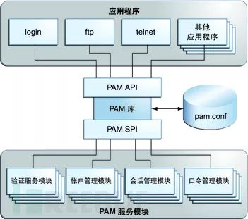
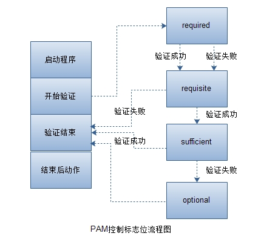

# PAM

[TOC]

## 概述

PMA (Pluggable Authentication Module) 是一个可插入式认证模块。设计的初衷是将不同的底层认证机制集中到一个高层次的 API 中，从而省去开发人员自己去设计和实现各种繁杂的认证机制的麻烦。在 Linux 系统中，各种不同的应用程序都需要完成认证功能，为了实现统一调配，把所有需要认证的功能做成一个模块(认证机制特别复杂的除外，如 https)，当特定的程序需要完成认证功能的时候，就去调用 PMA 的认证模块。

PAM 机制最初由 Sun 公司提出，并在其 Solaris 系统上实现。后来，各个版本的 UNIX 以及 Linux  也陆续增加了对它的支持。Linux-PAM 便是 PAM 在 Linux 上的实现，获得了几乎所有主流 Linux  发行版的支持。



## PMA 完成认证的过程

以 `passwd` 为例：

1. 用户执行 `/usr/bin/passwd` 这个程序，并输入密码。
2. passwd 程序会去调用 PMA 模块进行验证。
3. PMA 会到 `/etc/pam.d/` 下去寻找与 passwd 同名的配置文件  `/etc/pam.d/passwd`  。
4. 找到配置文件后，会根据其中的配置，调用 PMA 的模块进行认证。
5. 认证完成后，将验证的结果返回给 passwd 程序。
6. passwd 会根据 PAM 的返回结果决定下一个执行动作（重新输入密码或验证通过）。

### 验证类别(Type)

代表可配置的身份验证和授权进程的不同部分。主要分为四种，并且按顺序依次向下验证：

* auth

  用来识别用户的身份信息。例如，提示用户输入密码，或判断用户是否为 root 。

  如果 auth 认证的时候需要用到多个模块,就依次检查各个模块，这个模块通常最终都是需要密码来检验的，所以这个模块之后的下一个模块是用来检验用户身份的。如果帐号没问题，就授权。

  验证“你的确是你”的 type 。一般来说，询问你密码的就是这个 type。假如你的验证方式有很多，比如一次性密码、指纹、虹膜等等，都应该添加在 `auth` 下。`auth` 做的另外一件事情是权限授予，比如赋给用户某个组的组员身份等等。

* account

  对账号的各项属性进行检查。例如，是否允许登录，是否达到最大用户数，或是 root 用户是否允许在这个终端登录等。

  大部分是用来检查权限的。比如检查账户和密码是否过期等。如果使用一个过期的账户或密码就不允许验证通过。如果有多个模块，也依次检查各个模块。

  在用户能不能使用某服务上具有发言权，但不负责身份认证。比如，可以检查用户能不能在一天的某个时间段登录系统、当前的登录用户数是否已经饱和等等。通常情况下，在登录系统时，如果连 `account` 这个条件都没满足的话，即便有密码也还是进不去系统的。

* password

  修改密码需要用到的。如果用户不修改密码，几乎用不到这个模块。

  主要负责和密码有关的工作。修改密码的时候有时会提示“密码不够长”、“密码是个常用单词”之类的，就是在这里设置的。在这里还设置了保存密码时使用了哪种加密方式（比如现在常用的 `SHA-512`）。请注意，这里的密码不局限于 `/etc/shadow` 中的密码，有关认证 token 的管理都应该在此设置：如果你使用指纹登录 Linux，在设置新指纹时，如果希望首先验证这是人的指纹而不是狗的指纹，也应该放在这里。

* session

  定义用户登录前及用户退出后所要进行的操作。例如，登录连接信息，用户数据的打开与关闭，挂载文件系统等。

  检查、管理和配置用户会话。限定会话限制的。比如 vsftpd 下午 6 点不允许访问，那 6 点过后用户再去访问的话就会被限制；或内存不足不允许访问等。
  
  一个“忙前忙后”的 type，它要在某个服务提供给用户之前和之后做各种工作。比如用户登录之前要将用户家目录准备好，或者在用户登录之后输出 `motd` 等等。

### 验证控制标志(control flag)

用于定义各个认证模块在给出各种结果时 PAM 的行为，或者调用在别的配置文件中定义的认证流程栈。该列有两种形式，一种是比较常见的“关键字”模式，另一种则是用方括号（`[]`）包含的“返回值=行为”模式。

“关键字”模式下，有以下几种控制模式：

-  `required`

  此验证如果成功则带有 success 的标志，如果失败则带有 failure 的标志。此验证如果失败了，那最终本次认证一定失败，就一定会返回失败的标志，但是不会立即返回，而是等所有模块验证完成后才返回。所以它不论验证成功或失败， 都会继续向后验证其他的流程。

-  `requisite`

  如果验证失败，则立即返回 failure 的标志，并终止后续的验证流程。如果验证带有 success 标志，则继续后面的流程。

-  `sufficient`：

  与 requisite 正好相反。此验证如果成功，且本条目之前没有任何`required`条目失败，则带有 success 的标志，并立即终止后续的流程。如果验证带有 failure 的标志，则继续后面的流程，不对结果造成影响。

-  `optional`：

  该条目仅在整个栈中只有这一个条目时才有决定性作用，否则无论该条验证成功与否都和最终结果无关。

-  `include`：

  将其他配置文件中的流程栈包含在当前的位置，就好像将其他配置文件中的内容复制粘贴到这里一样。

-  `substack`：

  运行其他配置文件中的流程，并将整个运行结果作为该行的结果进行输出。该模式和 `include` 的不同点在于认证结果的作用域：

  如果某个流程栈 `include` 了一个带 `requisite` 的栈，这个 `requisite` 失败将直接导致认证失败，同时退出栈；而某个流程栈 `substack` 了同样的栈时，`requisite` 的失败只会导致这个子栈返回失败信号，母栈并不会在此退出。

 

“返回值=行为”模式则更为复杂，其格式如下：

```bash
[value1=action1 value2=action2 ...]
```

其中，`valueN` 的值是各个认证模块执行之后的返回值。有 `success`、`user_unknown`、`new_authtok_reqd`、`default` 等数十种。其中，`default` 代表其他所有没有明确说明的返回值。返回值结果清单可以在 `/usr/include/security/_pam_types.h` 中找到，也可以查询 `pam(3)` 获取详细描述。

流程栈中很可能有多个验证规则，每条验证的返回值可能不尽相同，需要 `actionN` 的值来决定哪一个验证规则能作为最终的结果。`actionN` 的值有以下几种：

-  `ignore`：在一个栈中有多个认证条目的情况下，如果标记 `ignore` 的返回值被命中，那么这条返回值不会对最终的认证结果产生影响。
-  `bad`：标记 `bad` 的返回值被命中时，最终的认证结果注定会失败。此外，如果这条 `bad` 的返回值是整个栈的第一个失败项，那么整个栈的返回值一定是这个返回值，后面的认证无论结果怎样都改变不了现状了。
-  `die`：标记 `die` 的返回值被命中时，马上退出栈并宣告失败。整个返回值为这个 `die` 的返回值。
-  `ok`：在一个栈的运行过程中，如果 `ok` 前面没有返回值，或者前面的返回值为 `PAM_SUCCESS`，那么这个标记了 `ok` 的返回值将覆盖前面的返回值。但如果前面执行过的验证中有最终将导致失败的返回值，那 `ok` 标记的值将不会起作用。
-  `done`：在前面没有 `bad` 值被命中的情况下，`done` 值被命中之后将马上被返回，并退出整个栈。
-  `N`（一个自然数）：功效和 `ok` 类似，并且会跳过接下来的 N 个验证步骤。如果 `N = 0` 则和 `ok` 完全相同。
-  `reset`：清空之前生效的返回值，并且从下面的验证起重新开始。

我们在前文中已经介绍了控制模式（contro）的“关键字”模式。实际上，“关键字”模式可以等效地用“返回值=行为”模式来表示。具体的对应如下：

-  `required`：     `[success=ok new_authtok_reqd=ok ignore=ignore default=bad]` 
-  `requisite`：   `[success=ok new_authtok_reqd=ok ignore=ignore default=die]` 
-  `sufficient`： `[success=done new_authtok_reqd=done default=ignore]` 
-  `optional`：     `[success=ok new_authtok_reqd=ok default=ignore]` 

## 模块路径

PAM 的各个模块一般存放在 `/lib/security/` 或 `/lib64/security/` 中，以动态库文件的形式存在，文件名格式一般为 `pam_*.so` 。

PAM 的配置文件可以是 `/etc/pam.conf` 这一个文件，也可以是 `/etc/pam.d/` 文件夹内的多个文件。如果 `/etc/pam.d/` 这个文件夹存在，Linux-PAM 将自动忽略 `/etc/pam.conf`。

但并不是所有的模块都是用来完成认证的，有些模块是为了实现 PAM 的某些高级功能而存在的。其中 PMA 的认证库是由 glibc 提供的，应用程序最终使用哪个 PMA 模块,取决于 `/etc/pam.d/` 这个目录下的定义。

`/etc/pam.conf` 类型的格式如下：

```bash
服务名称  工作类别  控制模式  模块路径  模块参数
```

`/etc/pam.d/` 类型的配置文件通常以每一个使用 PAM 的程序的名称来命令。比如 `/etc/pam.d/su`，`/etc/pam.d/login` 等等。还有些配置文件比较通用，经常被别的配置文件引用，也放在这个文件夹下，比如 `/etc/pam.d/system-auth`。这些文件的格式都保持一致：

```bash
工作类别  控制模式  模块路径  模块参数

# 表示注释。
# 每一行代表一条规则。但也可以用 \ 来放在行末，来连接该行和下一行。
# 一行开头有一个短横线 - ，如果找不到这个模块，导致无法被加载时，这一事件不会被记录在日志中。
# 这个功能适用于那些认证时非必需的、安装时可能没被安装进系统的模块。
```

不难看出，文件夹形式的配置文件中只是没有了服务名称这一列：服务名称已经是文件名了。


* /lib/security                          #模块
* lib64/security                       #模块（32 位系统）
* /etc/pam.conf                      #通常不存在
* /etc/pam.d/

* /etc/security/*                  其他PAM环境的配置文件。
* /usr/share/doc/pam-*/   详细的PAM说明文件。

## 配置文件

### /etc/pam.d/passwd

```bash
#%PAM-1.0
# PAM 的版本号。
# 每一行都是一个验证过程。
# 验证类别   验证控制标志  PAM的模块与该模块的参数
auth        include      system-auth
account     include      system-auth
password    substack     system-auth
-password   optional     pam_gnome_keyring.so use_authtok
password    substack     postlogin
```

### /etc/pam.d/system-auth-ac

```bash
#%PAM-1.0
# This file is auto-generated.
# User changes will be destroyed the next time authconfig is run.
auth        required      pam_tally2.so deny=3 unlock_time=300 even_deny_root root_unlock_time=300
auth        required      pam_env.so
auth        required      pam_faildelay.so delay=2000000
auth        sufficient    pam_unix.so nullok try_first_pass
auth        requisite     pam_succeed_if.so uid >= 1000 quiet_success
auth        required      pam_deny.so

account     required      pam_unix.so
account     sufficient    pam_localuser.so
account     sufficient    pam_succeed_if.so uid < 1000 quiet
account     required      pam_permit.so

password    requisite     pam_pwquality.so try_first_pass local_users_only retry=3 authtok_type=
password    sufficient    pam_unix.so sha512 shadow nullok try_first_pass use_authtok
password    required      pam_deny.so

session     optional      pam_keyinit.so revoke
session     required      pam_limits.so
-session     optional      pam_systemd.so
session     [success=1 default=ignore] pam_succeed_if.so service in crond quiet use_uid
session     required      pam_unix.so

```


## 模块

### pam_unix.so

传统意义上的帐号和密码认证机制，这个机制实现了标准 C 库中基于让用户输入帐号密码并完成检测的认证过程。

### pam_permit.so

直接通过，允许访问，定义默认策略。

### pam_deny.so

拒绝访问，定义默认策略

### pam_cracklib.so | pam_pwquality.so

用来检验密码的强度，包括设定的密码是否在字典中，修改的密码是否和上次一样，密码至少包含多少个数字字符，可以输入多少次错误密码等，都是由这个模块定义。CentOS 7 及之后的系统，使用 pam_pwquality.so 替代了 pam_cracklib.so 。

```bash
vim /etc/security/pwquality.conf

# Configuration for systemwide password quality limits
# Defaults:
#
# Number of characters in the new password that must not be present in the
# old password.
# difok = 5
#
# Minimum acceptable size for the new password (plus one if
# credits are not disabled which is the default). (See pam_cracklib manual.)
# Cannot be set to lower value than 6.
# 最小密码长度
# minlen = 9
#
# The maximum credit for having digits in the new password. If less than 0
# it is the minimum number of digits in the new password.
# 当 N>=0 时，N 代表新密码最多可以有多少个阿拉伯数字。当 N<0 时，N 代表新密码最少要有多少个阿拉伯数字。
# dcredit = 1
#
# The maximum credit for having uppercase characters in the new password.
# If less than 0 it is the minimum number of uppercase characters in the new
# password.
# 当 N>=0 时，N 代表新密码最多可以有多少个大写字母。当 N<0 时，N 代表新密码最少要有多少个大写字母。
# ucredit = 1
#
# The maximum credit for having lowercase characters in the new password.
# If less than 0 it is the minimum number of lowercase characters in the new
# password.
# 当 N>=0 时，N 代表新密码最多可以有多少个小写字母。当 N<0 时，N 代表新密码最少要有多少个小写字母。
# lcredit = 1
#
# The maximum credit for having other characters in the new password.
# If less than 0 it is the minimum number of other characters in the new
# password.
# 当 N>=0 时，N 代表新密码最多可以有多少个特殊字符。当 N<0 时，N 代表新密码最少要有多少个特殊字符。
# ocredit = 1
#
# The minimum number of required classes of characters for the new
# password (digits, uppercase, lowercase, others).
# minclass = 0
#
# The maximum number of allowed consecutive same characters in the new password.
# The check is disabled if the value is 0.
# maxrepeat = 0
#
# The maximum number of allowed consecutive characters of the same class in the
# new password.
# The check is disabled if the value is 0.
# maxclassrepeat = 0
#
# Whether to check for the words from the passwd entry GECOS string of the user.
# The check is enabled if the value is not 0.
# gecoscheck = 0
#
# Path to the cracklib dictionaries. Default is to use the cracklib default.
# dictpath =
```

### pam_tally2.so

是一个 linux 的用户登录计数器模块。会维护用户尝试登录的次数，当登录成功时重置计数器，当尝试登录失败次数过多时阻止登录。包括 pam_tally2.so 和 pam_tally2 两部分，前者是一个PAM 模块，后者是一个独立的程序用来查看计数和手动清除计数信息。

```bash
# 全局选项
onerr=[succeed|fail]
file=/path/to/log   失败登录日志文件，默认为/var/log/tallylog
audit               如果登录的用户没有找到，则将用户名信息记录到系统日志中
silent              不打印相关的信息
no_log_info         不通过syslog记录日志信息

# AUTH选项
deny=n              失败登录次数超过n次后拒绝访问
lock_time=n         失败登录后锁定的时间（秒数）
unlock_time=n       超出失败登录次数限制后，解锁的时间
no_lock_time        不在日志文件/var/log/faillog 中记录.fail_locktime字段
magic_root          root用户(uid=0)调用该模块时，计数器不会递增
even_deny_root      root用户失败登录次数超过deny=n次后拒绝访问
root_unlock_time=n  与even_deny_root相对应的选项，如果配置该选项，则root用户在登录失败次数超出限制后被锁定指定时间
```


### pam_shells.so

检查用户登录的 shell 是否是安全 shell ，也就是写在  `/etc/shells` 中的 shell 。

### pam_securetty.so

限定管理员只能通过安全的 tty 登录，/etc/securetty ，tty 就是传统终端。

### pam_listfile

这东西可牛逼了....

```bash
item=[tty|user|rhost|ruser|group|shell] sense=[allow|deny] file=/path/filename onerr=[succeed|fail] [apply=[user|@group]] [quiet]
```

### pam_rootok.so

管理员 su 到其他用户不用输入密码就是靠这个定义的。

### pam_succeed_if.so

普通用户 su 的时候不需要密码。

### pam_limits.so

资源限定打开文件数，使用进程数等等。对任何人都生效，/etc/security/limits 或/etc/security/limits.d/* 。

### pam_nologin.so

可以限制一般用户是否能够登入主机，当 `/etc/nologin` 这个档案存在时，则所有一般使用者均无法再登入系统。

## 示例

### 限制 root 用户只能最多从 tty2 登录,不能远程使用 sshd 登录

```bash
vim /etc/pam.d/sshd
auth    required     pam_securetty.so

vim /etc/securetty
console
tty1
tty2
```

### 只有 sshusers 组的用户能使用 ssh 远程登录

```bash
groupadd sshusers              #添加一个组

vim /etc/pam.d/sshd
auth  required  pam_listfile.so item=group sense=allow file=/etc/security/allow-groups

vim /etc/security/allow-groups
sshusers
```

### 管理员 su 的时候需要密码

```bash
vim /etc/pam.d/su
#auth  sufficient  pam_rootok.so   #注释这一项

whoami
root

su ldf
Password:
```

### 普通用户 ldf , su 的时候不用输入密码

```bash
vim /etc/pam.d/su
auth  sufficient  pam_succeed_if.so uid = 500 use_uid quiet             #添加这一句

id ldf
uid=500(ldf) gid=500(ldf) groups=500(ldf)

su root
```

### 限定组(用户)使用最大的资源数

```bash
vim /etc/security/limits.conf

@sshusers soft nofile 10000 #软限制,打开文件数10000个
@sshusers hard nofile 10000  #硬限制
@sshusers -    data   10000  #软硬都限制,使用数据大小
sshusers  -    nproc  10000  #软硬都限制,进程数
# 上面带@的是组,不带的是用户,使用命令limits可以临时调整
```
