# WSUS

在研发测试云中，出于安全考虑，虚机不能访问外网。为保证操作系统为windows的虚拟机安全，需要定期对这部分虚拟机系统更新。因此需要搭建WSUS(Windows Server Update Services)服务器，从而保证云平台中的windows机器能获取最新的补丁包。

WSUS测试环境由DC、WSUS服务器和补丁测试服务器组成。整个系统框架如下图所示：

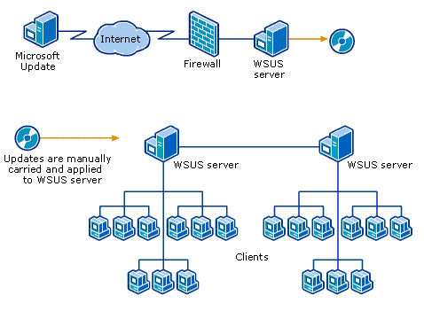

由于需要系统更新的Windows主机无法连接至互联网，故采用在内外网各部署WSUS服务器，将补丁从Microsoft Update同步至本地外网服务器后，通过存储介质（移动硬盘等）在内外系统中进行导入和导出操作，实现补丁文件的同步。

各服务器IP列表如下：

| 服务器                        | IP                         | 用途                     |
| ----------------------------- | -------------------------- | ------------------------ |
| DC_PDC                        | 10.80.210.22、10.80.210.24 | 主域控制器               |
| DC_BDC                        | 10.80.210.23、10.80.210.25 | 辅助域控制器             |
| WSUS0                         |                            | 外网WSUS服务器(补丁导出) |
| WSUS1                         | 10.80.210.26               | WSUS服务器（上游）       |
| WSUS2                         | 10.80.210.27               | WSUS服务器（下游）       |
| TEST (Windows Server 2008 R2) | 10.80.210.20               |                          |
| TEST (Windows Server 2012 R2) | 10.80.210.28               |                          |
| TEST (Windows Server 2016)    | 10.80.210.21               |                          |

## AD

AD暂不使用。原因如下：

* 目前研发测试云及生产环境中，因虚拟机SSID相同，致使客户机无法加入域。通过域组策略来实现客户机配置下发，目前不能实现。需要解决SSID剔除的问题。
* WSUS系统并不依赖于AD，仅为便于策略的配置。工作组环境中依然可以使用。

## WSUS

不同子网内各部署一台WSUS服务器，与一台WSUS服务器组成上下游关系。上游服务器导入补丁后，对下游服务器进行同步。

### 外网WSUS服务器部署

1.添加角色和功能

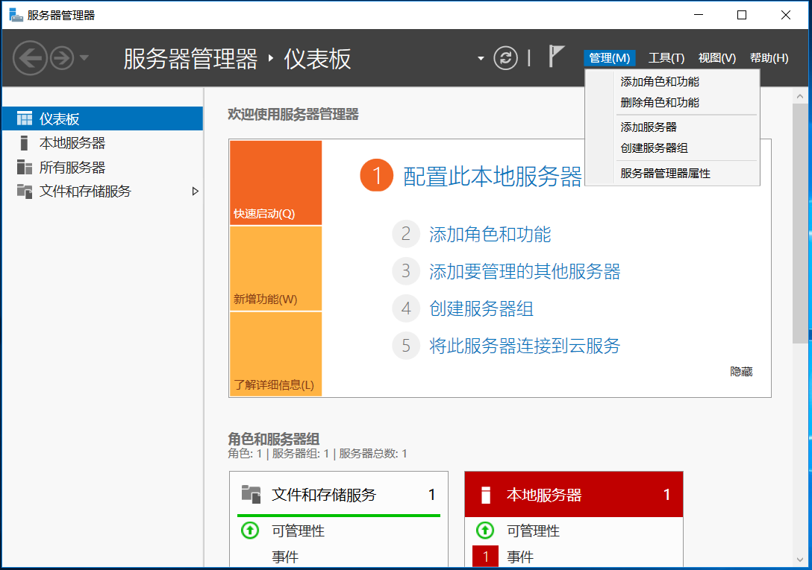

2.开始之前，点击 “下一步(N)>” 。

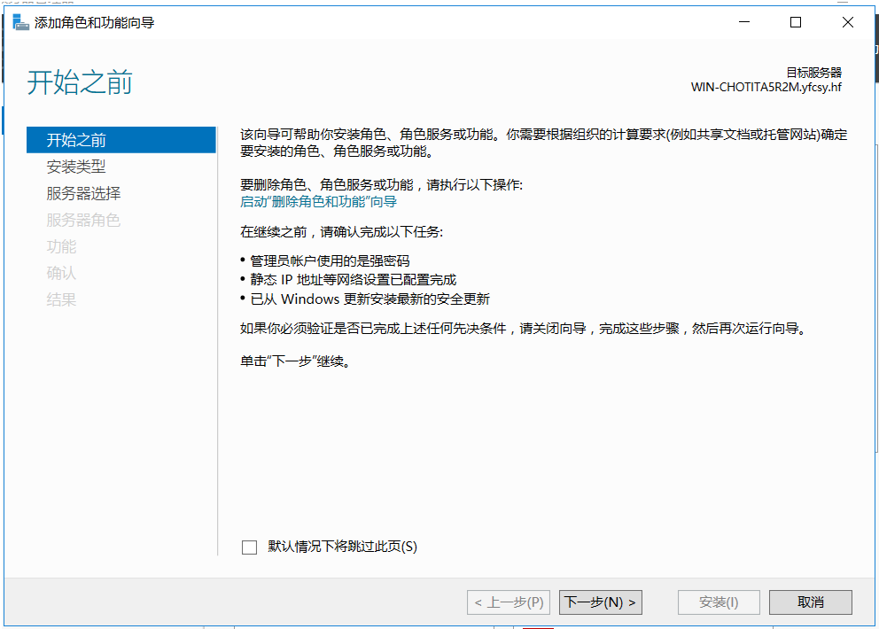3.选择安装类型。保持默认，点击 “下一步(N)>” 。

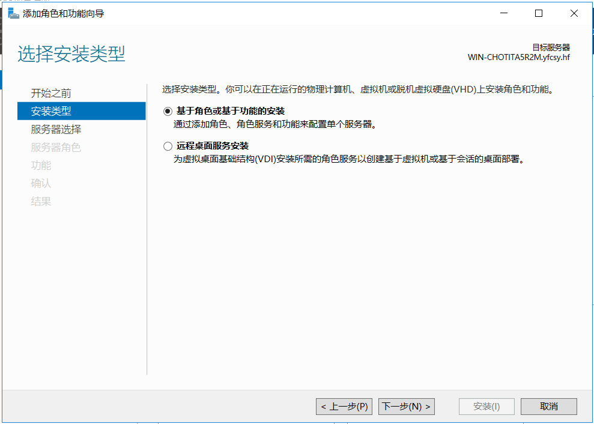4.选择服务器，保持默认，点击 “下一步(N)>” 。

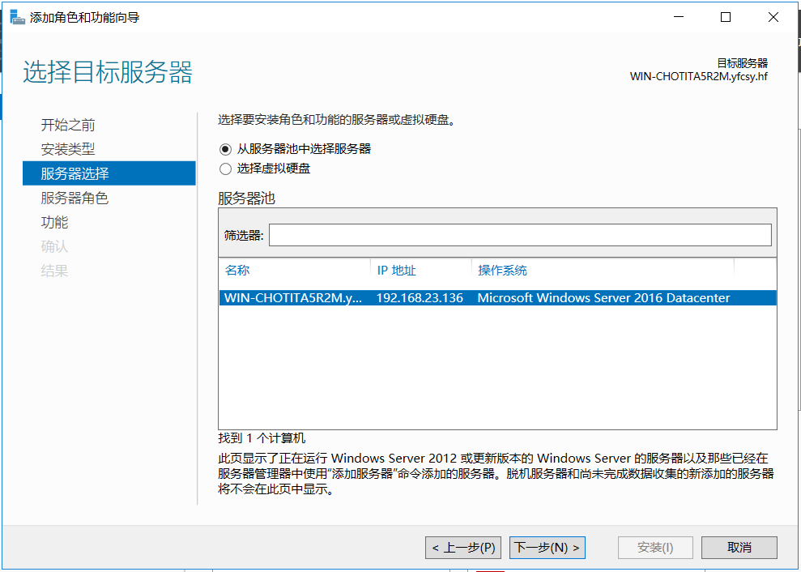5.选择服务器角色“Windows Server 更新服务”

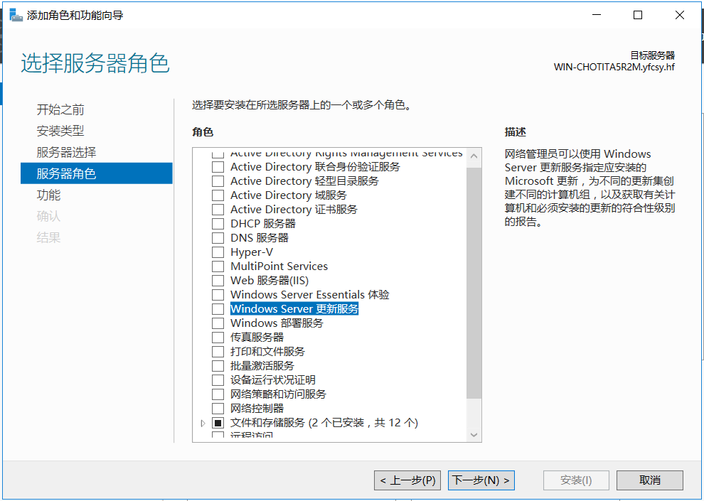在弹出的新窗口中，保持默认选项，点击“添加功能”按钮。

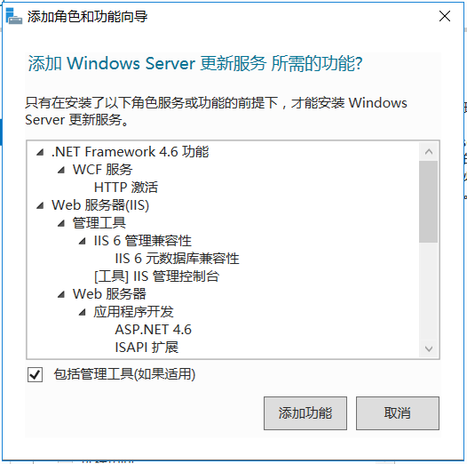

最终结果如图所示，点击 “下一步(N)>” 。

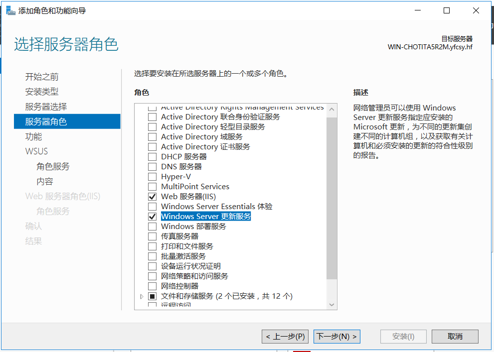

6.选择功能，保持默认，点击 “下一步(N)>” 。

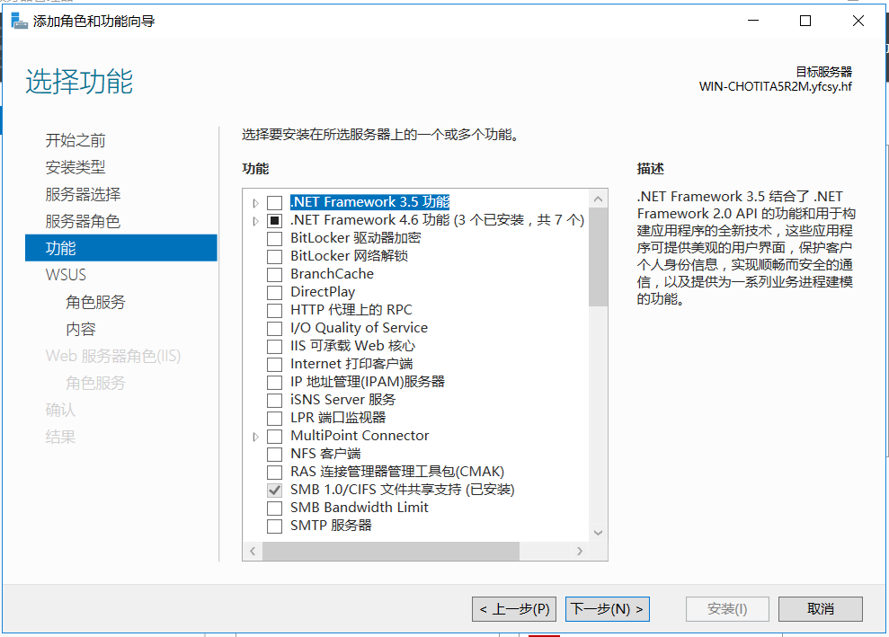7.Windows Server 更新服务，点击 “下一步(N)>” 。

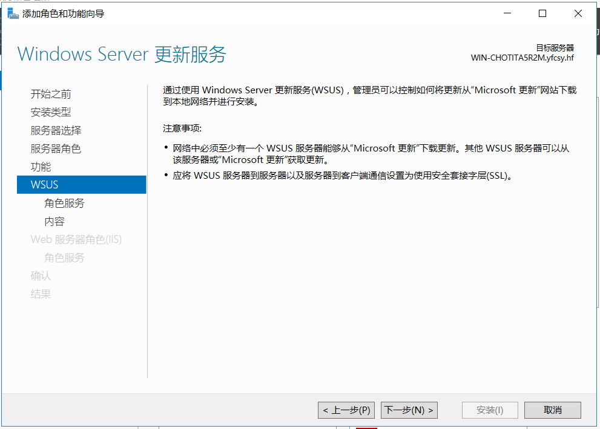8.选择角色服务。保持默认，点击 “下一步(N)>” 。使用Windows自带的WID。

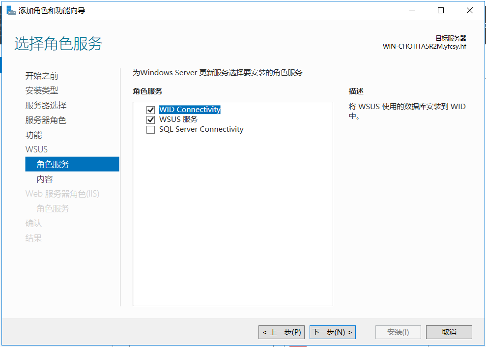9.选择存储更新的路径。点击 “下一步(N)>” 。补丁相关文件存储于D:\WSUS目录下。

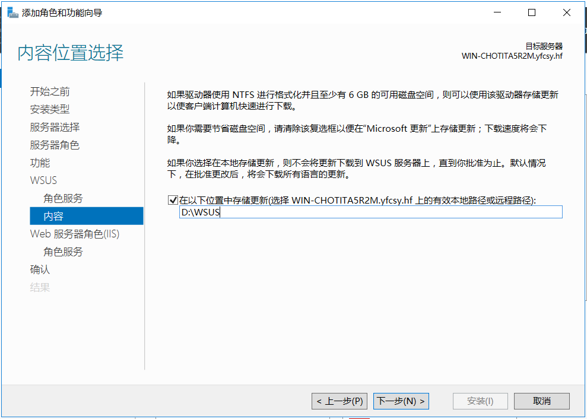

10.确认IIS角色服务。保持默认，点击 “下一步(N)>” 。

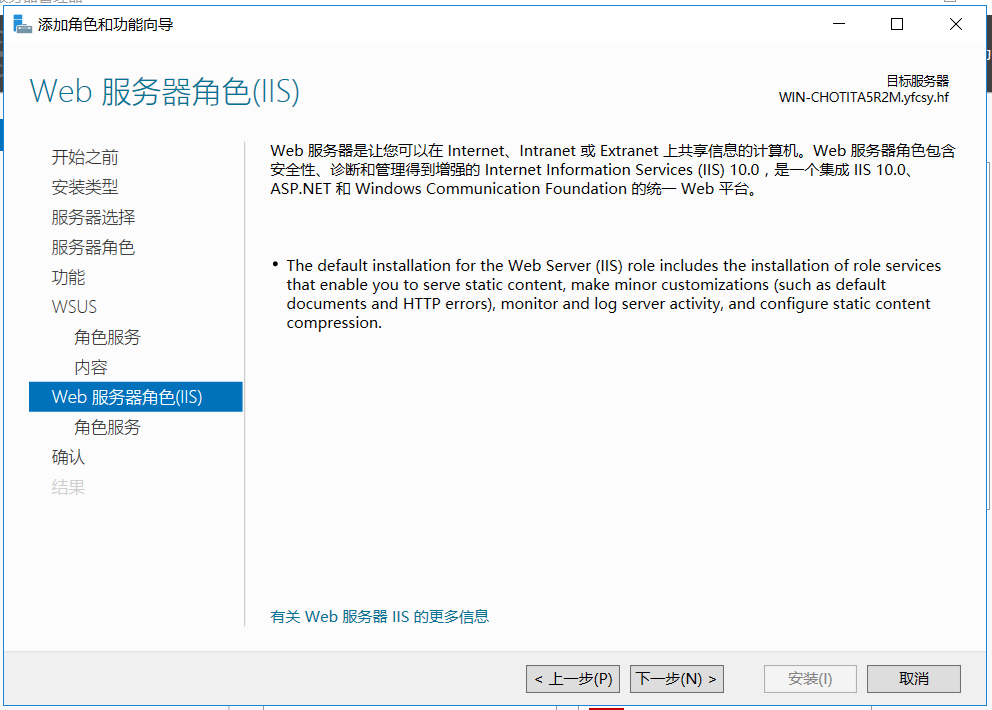

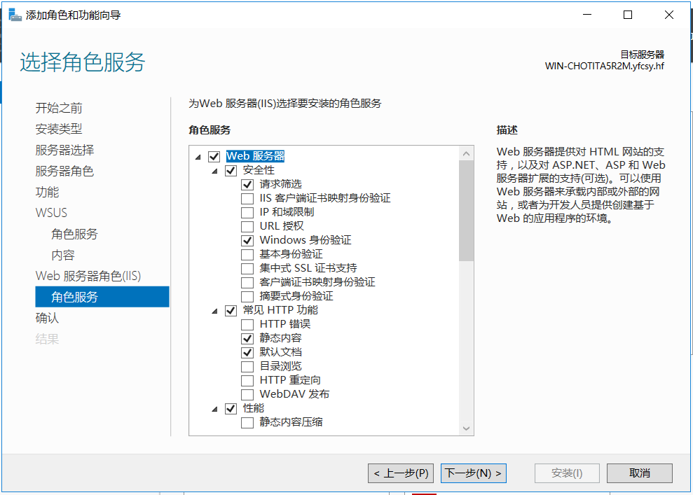

11.确认安装内容。可勾选“如果需要，自动重新启动目标服务器”选项。点击 “安装(I)” 。

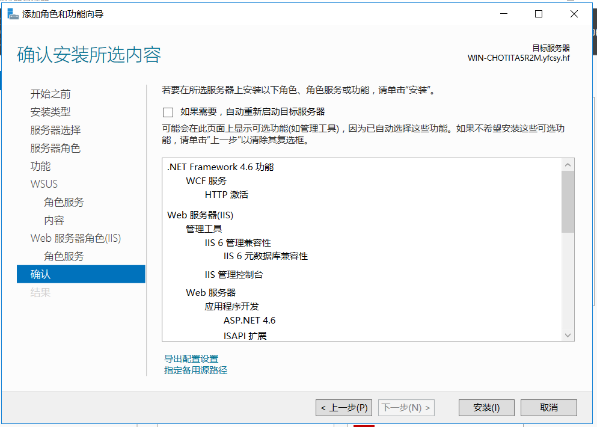

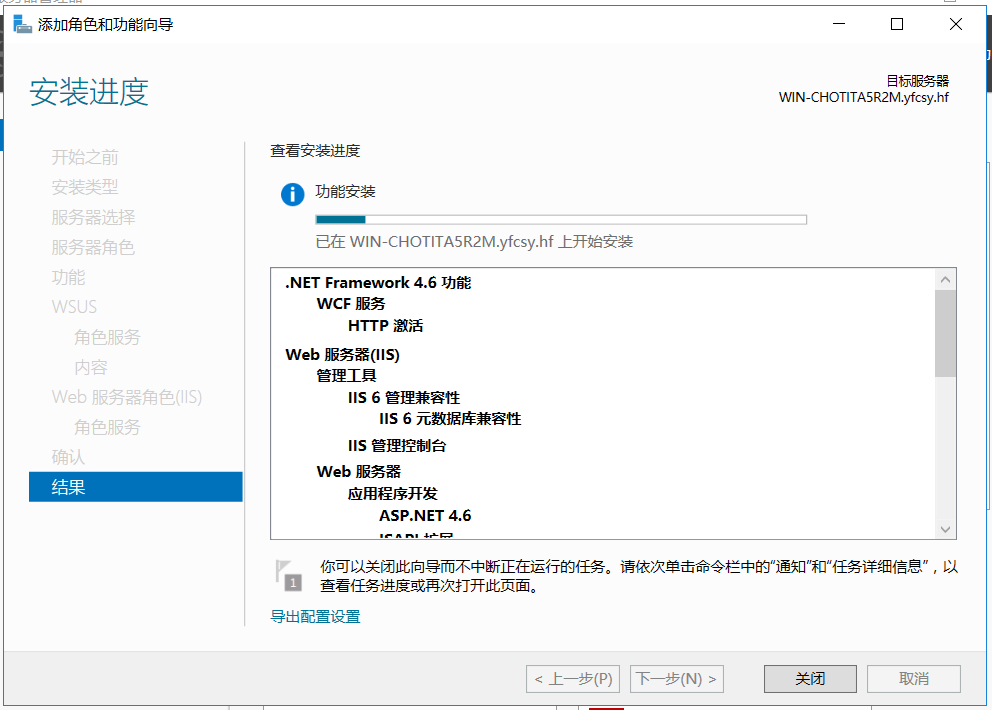

### 导入和导出过程

1. 导出补丁

   ```bash
   # 将补丁文件复制到移动存储介质,路径如下
   D:\WSUS\WsusContent
   
   # 导出元文件
   cd C:\Program Files\Update Services\Tools
   wsusutil export d:\wsus.xml.gz d:\wsus.log
   # wsus.xml.gz 是数据文件，为避免因文件过大，导致出错，采用 .xml.gz 的命名方式，默认采用 .cab 命名方式。
   # .cab 和 .log 位置不可更换。
   ```

2. 导入补丁

   ```bash
   # 将补丁文件从移动存储介质复制到本地,路径如下
   D:\WSUS\WsusContent
   
   # 导入元文件
   cd C:\Program Files\Update Services\Tools
   wsusutil import d:\wsus.xml.gz d:\wsus.log
   ```

## Client

由于客户机目前无法加入域，故WSUS相关配置，无法通过域策略来下发，需要到客户机上配置本地计算机策略。

### 本地计算机策略（Local Computer Policy）

对于不加入域的客户机执行如下操作：

> Note:
>
> 目前Windows Server 2008 R2和Windows Server 2012 R2有效

运行 `gpedit.msc`，按如下配置本地计算机策略：

> 计算机配置（Computer Configuration）
> 
> ​		管理模板（Administrative Templates）
>
> ​				Windows组件（Windows Components）
>
> ​						Windows update
>
> ​								1. Configure Automatic Updates	Enable	3 - Auto download and notify for install
>
> ​								2. Specify intranet Microsoft update service location	Enable	http://10.80.210.26:8530

## 待解决问题

1.虚拟机模板更新

虚拟机采用同一个模板创建，SSID相同，需要剔除SSID后，重新生成模板。

2.补丁导入和导出

补丁文件较大，采用存储介质进行导入和导出，耗时且多有限制。

