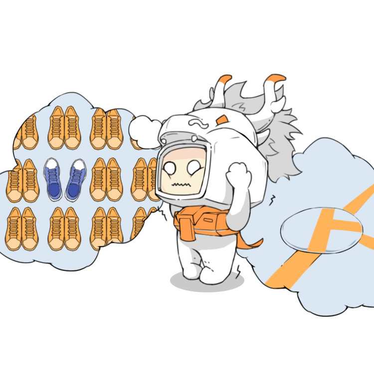
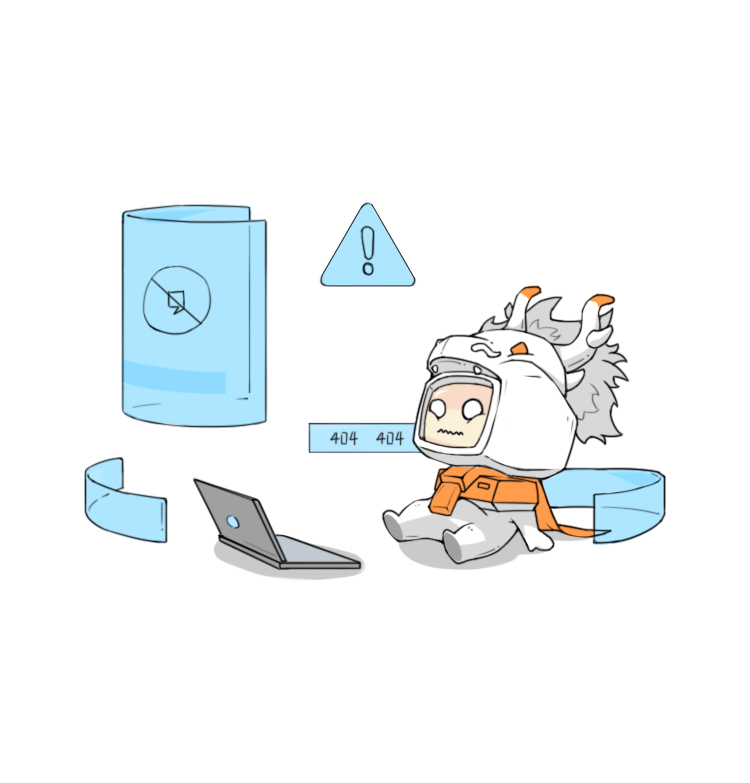
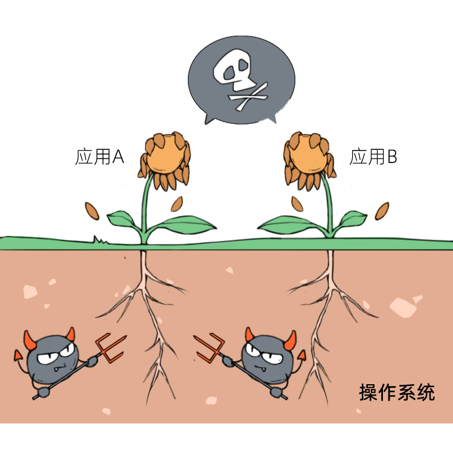
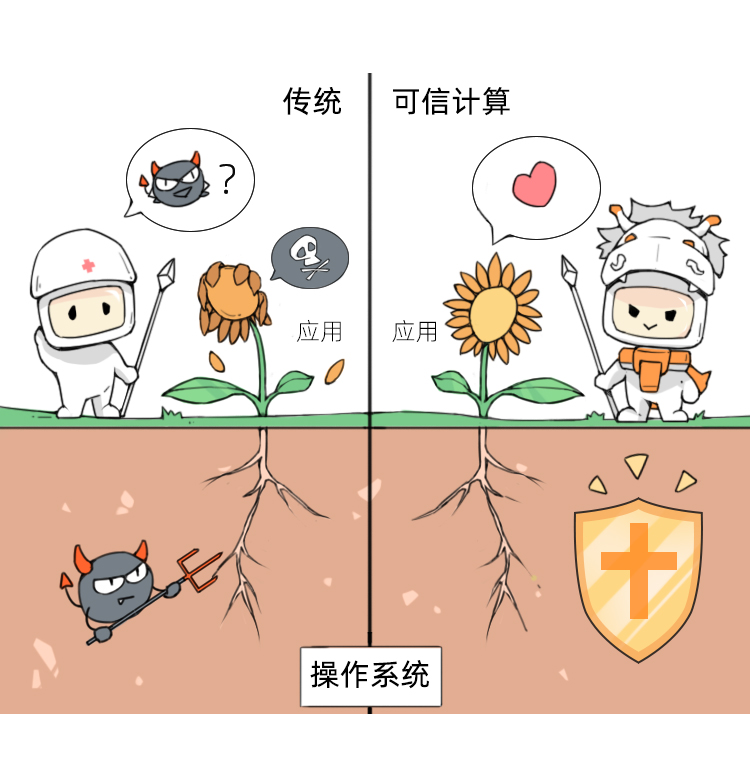

# 可信计算

[TOC]

## 概述

**可信：**如果第二个实体完全按照第一个实体的预期行动时，则第一个实体认为第二个实体是可信的；其强调实体行为的预期性，强调系统的安全与可靠。

**可信计算（TrustedComputing）：**一项由 TCG (可信计算组)推动和开发的技术，是一种基于密码的运算与防护并存的计算机体系安全技术，保证全程可检测可监控。

可信计算的原理是出击，整个链路都经过可信认证，所以无论从应用、操作系统还是硬件，必须经过授权才能使用，这无疑降低了病毒、网络攻击的概率。

可信的核心目标之一是保证系统和应用的完整性，从而确定系统或软件运行在设计目标期望的可信状态。

可信计算是一种基于硬件设备，通过信任链机制实现计算环境主动免疫特性的安全技术。相比传统的主机安全技术，可信计算技术将安全建立在硬件信任根之上，而且具有主动性、事前性以及所构建环境行为可预期的特点，因此适用构建高安全等级计算环境。

**信任根：**可信计算机系统可信的基点。分为：

* 可信度量根（RTM，平台启动时首先被执行的一段软件）
* 可信存储根（RTS，是可信平台模块芯片中的一组被称为平台配置寄存器的存储器和存储根密钥）
* 可信报告根（RTR，是可信平台模块芯片中的平台配置寄存器和签注密钥）

**信任链：**信任度量模型的实施技术方案，通过信任链把信任关系从信任根扩展到整个计算机系统。

**可信计算基本思想：**利用远程证明数字版权保证安全性：在计算机系统中，首先构建一个信任根，再建立一条信任链，从信任根开始到硬件平台、到操作系统、再到应用，一级度量认证一级，一级信任一级，把这种信任扩展到整个计算机系统，从而确保整个计算机系统的可信。
## 开源项目

现在在国内使用TPM的芯片很困难，TCM芯片在很多方面可能与国际主流用法不一致。因此，为了实际使用可信计算功能，这里推荐一些开源项目。

* TPM Emulator

  开源地址：https://github.com/PeterHuewe/tpm-emulator

  不需要实际 TPM 芯片就可以通过软件提供可信平台模块的功能，可以在 Windows 和 Linux 上进行编译后使用，建议和可信软件栈 TROUSERS 一起使用。

* 可信软件栈 TROUSERS

  开源地址：http://sourceforge.net/projects/trousers

  IBM 实现的一套开源软件栈，是 Linux 下进行可信计算应用开发的主要接口。

* IBM Software TPM

  开源地址：http://ibmswtpm.sourceforge.net/

  提供了一全套实践可信计算的软件工具：包含软件 TPM 模拟器、libtpm 库（类似可信软件栈 TSS ）、实例命令（用 C 语言写，可以直接访问 TPM 命令接口，测试可信计算的功能），而且通过提供的 TPM Proxy 代理可以去实际 TPM 芯片、以及其他软件模拟的 TPM Emulator 进行通信。

* OpenTC 项目

  开源网址：www.opentc.net

  是欧盟赞助的一个可信计算项目，目标是开发一套完整的可信操作系统，出了很多成果，包含 Trusted XEN Virtualisation OS，Trusted Linux 以及 Trusted Microkernel for small and embedded systems 等。

* Trusted JAVA 项目

  开源网址：http://trustedjava.sourceforge.net/

  是 OpenTC 项目的一部分，显示了如何使用 Java 来使用 TPM 和 TSS 的功能，由 IAIK 开发，可以支持跨平台的使用可信计算功能。

* TPM4JAVA

  开源网址：http://tpm4java.datenzone.de/trac

  另一个可信 Java 工程，不过主要由 Technical University of Darmstadt 大学主持。

* 内核完整性度量 IMA

  开源网址：http://sourceforge.net/p/linux-ima/wiki/Home/

  结合 TPM 安全芯片，在 Linux 内核实现了可信计算的完整性度量体系，对所有可执行程序进行了度量。

* EMSCB 项目

  开源网址：http://www.emscb.com/content/pages/49241.htm

  由德国政府赞助，基于对 TPM 的使用开发一些典型的安全应用（如加密等）。可以基于它们的代码理解可信应用开发的思路，以及嵌入到其它应用开发中。
  

将可信计算技术要求植入基础软硬件和网络

    把可信验证要求植入芯片、CPU、服务器、操作系统、数据库等基础软硬件；
    把可信验证要求植入网络设备、网络安全产品，解决底层安全问题；
    把可信计算技术植入“安全管理中心、安全通信网络、安全区域边界、安全计算环境”网络要素，实现对网络要素全覆盖；
    把可信计算技术植入整机、云计算平台、物联网、工控系统、移动互联网；
    把可信计算技术植入第二级以上网络。

大力推广应用等保2.0技术要求与可信计算3.0要求

    开展基础软硬件与网络安全产品的可信适配性测试和验证；
    将网络安全等级保护2.0技术要求与可信计算3.0要求紧密结合，开展联合攻关和验证；
    搭建典型应用系统，大力推广应用等级保护2.0技术要求与可信计算3.0要求，开展检测验证；
    建立良好的网络安全保护生态，大力提升关键信息基础设施的内生安全、主动免疫和主动防御能力。

传统的计算机体系结构过多地强调了计算功能，一直处在被动防御，忽略了主动安全防御，这相当于一个人没有免疫系统，只能生活在无菌状态下。而等保2.0时代保护策略是：变被动防御为主动防御，变层面防御为立体防御，可信计算技术为主动防御提供了新的思路。

来看下等保2.0里面规定的可信计算内容有哪些，以三级系统为例，在安全通信网络、安全区域边界、安全计算环境、安全管理中心四个技术层面均对可信计算的要求。

    8.1.2 安全通信网络
    8.1.2.3 可信验证
    可基于可信根对通信设备的系统引导程序、系统程序、重要配置参数和通信应用程序等进行可信验证， 并在应用程序的关键执行环节进行动态可信验证，在检测到其可信性受到破坏后进行报警，并将验证结果形成审计记录送至安全管理中心。
    
    8.1.3 安全区域边界
    8.1.3.6 可信验证
    可基于可信根对边界设备的系统引导程序、系统程序、重要配置参数和边界防护应用程序等进行可信验证， 并在应用程序的关键执行环节进行动态可信验证，在检测到其可信性受到破坏后进行报警，并将验证结果形成审计记录送至安全管理中心。
    
    8.1.4 安全计算环境
    8.1.4.6 可信验证
    可基于可信根对计算设备的系统引导程序、系统程序、重要配置参数和应用程序等进行可信验证， 并在应用程序的关键执行环节进行动态可信验证，在检测到其可信性受到破坏后进行报警，并将验证结果形成审计记录送至安全管理中心。

二、可信计算的概念
2.1 可信计算的定义

关于可信，目前尚未有一个统一的定义，不同的组织给出了自己的定义，主要有以下几种说法。

    1999年，国际标准化组织与国际电子技术委员会在 ISO/IEC 15408标准中定义可信为：参与计算的组件、操作或过程在任意的条件下是可预测的，并能够抵御病毒和一定程度的物理干扰。
    2002年，国际可信计算工作组TCG用实体行为的预期性来定义可信：一个实体是可信的，如果它的行为总是以预期的方式，朝着预期的目标。这一定义的优点是抓住了实体的行为特征，符合哲学上实践是检验真理的唯一标准的基本原则。
    电气电子工程师学会IEEE可信计算技术委员会认为：可信是指计算机系统所提供的服务是可信赖的，而且这种可信赖是可论证的。
    我国沈昌祥院士认为：可信计算系统是能够提供系统的可靠性、可用性、信息和行为安全性的计算机系统。系统的可靠性和安全性是现阶段可信计算最主要的两个属性。

2.2 如何获得信任

信任的获得方法主要有直接和间接两种。

    直接：设A和B以前有过交往，则A对B的可信度可以通常考察B以往的表现来确定，我们称这种通过直接交往得到的信任值为直接信任值。
    间接：设A和B以前没有任何交往，但A信任C，并且C信任B，那么此时我们称A对B的信任为间接信任。有时还可能出现多级间接信任的情况，这时便产生了信任链。

2.3 可信计算的基本思想

在计算平台中，首先创建一个安全信任根，再建立从硬件平台、操作系统到应用系统的信任链，在这条信任链上从根开始一级测量认证一级，一级信任一级，以此实现信任的逐级扩展，从而构建一个安全可信的计算环境。一个可信计算系统由信任根、可信硬件平台、可信操作系统和可信应用四个部分组成，其目标是提高计算平台的安全性。

举个栗子，一个工厂生产一件产品，需要多个多个车间共同完成，第一个车间很重要，如果第一个车间有内鬼（身份造假），那么后面所有车间的工作都是基于这个错误去执行的，所以我们把第一个车间比喻为信任根，整个生产链比喻为可信链。在生产产品时，首先确认第一个车间（可信根）没有内鬼后，将加工的半成品交给第二个车间继续加工，第二个车间确认没有内鬼后，再将半成品交给第三个车间，如此继续下去，整个生产链条是在可信的前提下推进的……

信任链的主要作用是将信任关系扩展到整个计算机平台，它建立在信任根的基础上。信任链可以通过可信度量机制来获取各种各样影响平台可信性的数据，并通过将这些数据与预期数据进行比较，来判断平台的可信性。
三、我国可信计算平台构建

我国在沈昌祥院士的带领下，从1992年开始，经过长期攻关，形成了我国自主创新的可信体系，现在已经发展到了可信3.0时代。
3.1 可信计算平台的分类

目前我国的可信计算平台按照构建方法的不同，主要分为两大类。

    一类是可信增强型，即不改动现有计算平台主板，插入一块PCI/PCI-E/USB/ mini PCI-E/TF等标准接口的可信密码模块(Trusted Cryptography Module, TCM ),再在操作系统中安装一套安全软件，软硬配合，在计算平台上构建一 个相对可信的运行环境。
    另一类是高安全型，即定制计算平台主板，将可信平台控制模块(Trusted Platform Control Module, TPCM)贴在主板上，依靠特殊设计的硬件电路使TPCM先于CPU启动，对CPU度量通过后，才开始后续启动过程，以确保TPCM是真正的信任原点，实现高安全。

3.2 可信边界

基于非国产处理器和操作系统构建的可信计算平台，由于不能自主可控，我们无法确保其没有被恶意预留后门，植入木马。如果该植入过程在处理器生产之后由第三方植入，那么根据可信计算机制，还可以发现处理器已经被篡改。如果该后门是处理器生产厂家在处理器生产交付之前预置的，那么按照当前可信计算的静态度量机制，是无法检测出来的。对计算平台外设和操作系统而言，同样如此。

采用国产软硬件构建的可信计算平台，其可信边界不仅包括TPCM硬件模块，还应该包括处理器和操作系统的核心部分。国产处理器、国产化操作系统及其它国产化外设可以有效保证供应链安全和自主可控。
3.3 国产可信计算平台体系结构

按照我国自主创新的可信双体系结构要求，提出一种基于国产处理器的可信计算平台体系结构如下图所示。
在这里插入图片描述
图1 基于国产处理器的可信计算平台体系结构

该计算平台体系结构最显著的特点是利用国产处理器内嵌的安全部件实现可信密码模块（Trusted Cryptography Module，TCM）功能，与内存管理单元、系统总线安全扩展等部件一起形成完整的 可信平台控制模块（Trusted Platform Control Module，TPCM）功能，TPCM作为可信计算体系中的可信根。
3.4 可信硬件设计

不同国产处理器内嵌的安全功能实现略有不同。最新的龙芯3A4000SE处理器采用的是集成 TPCM硬核的方式。它不仅集成了32位TPCM处理器内核、算法引擎、R0M、专用SRAM,甚至连主 动度量所需的处理器控制接口和专用IO接口都一应俱全。因此它等价于将原来贴在主板上的TPCM硬件模块全部封装进了CPU内部。其硬件参考设计如下图所示。

在这里插入图片描述
图2 龙芯平台硬件参考设计框图

此外，还有飞腾2000/4处理器，它采用的是TrustZone技术路线，这里不再一一详述，具体设计内容可以参考《通信技术》2019年第八期。
3.5 可信软件设计
3.5.1 可信固件

自主可信固件的基本功能包括：硬件平台上电后，获得系统控制权，初始化处理器、内存、芯片组等关键部件，枚举外设并为其分配资源，初始化显卡、硬盘、网卡等必要的外设，度量操作系统或可信虚拟机监视器核心代码，如果通过防篡改验证, 则为其建立运行环境，然后移交控制权，如果没有通过验证，则执行可信恢复，重新启动。其框图如下图所示。
在这里插入图片描述
图3 自主可信固件框图

（1）硬件抽象层，将处理器、芯片组、TPCM 等硬件进行包装和抽象，初始化处理器和硬件，为上层模块提供访问处理器、硬件设备的标准接口。
（2）固件核心层，建立统一可扩展固件接口(Unified Extensible Firmware Interface, UEFI )的系统服务表，包括启动服务和运行时服务，进行固件 中所有模块的统一管理。
（3）固件应用层，实现固件的各项具体功能，如可信度量、配置管理、内核加载、可信恢复等。
3.5.2 可信虚拟机监视器

当可信计算平台应用在云计算环境时，在可信固件和可信操作系统之间有个虚拟化层，运行可信虚拟机监视器。

可信虚拟机监视器除具备普通虚拟机监视器的虚拟化资源调度、管理等功能外，与可信相关的 安全功能主要是虚拟TPCM功能和安全监控与恢复功能。

虚拟TPCM功能主要是将TPCM硬件按需虚拟 成多个TPCM供多个虚拟机客户操作系统同时使用。其主要功能包括：数字签名与验证、数据加解密、真随机数生成、数字证书管理等。
3.5.3 可信操作系统

鉴于当前国产操作系统大多是基于Linux内核开发的，因此可信操作系统基于Linux安全模块(Linux Security Module, LSM )框架实现可信软件基功能，以便可信功能更好地融入操作系统之中。
在这里插入图片描述
图4 可信运行控制原理框图

3.5.4 可信应用

可信应用的设计一般是基于白名单机制实现的，即动态度量和验证采用的是通过应用行为白名单来实现的。被度量和验证的应用行为是系统调用行为，包括进程启动、进程调用、网络访问、文件访问等。实现应用可信的具体方式是首先通过对白名单应用的分析，收集用户正常行为，并以此建立行为规则库，然后根据实时采集的应用行为数据，对比应用行为规则库进行判断。如果应用行为无法匹配任何一条规则，这个行为会被判断为异常，可信中心决定是否告警或终止应用运行。

此外，动态关联感知技术通过对应用行为特征的判断，可发现应用在不调用白名单以外的情况下的应用异常。动态关联感知通过机器学习产生应用行为基线，在应用运行时采集了一段时间应用的行为，通过大数据分析和机器学习的方式形成应用行为特征，并以此对应用行为特征异常作出判断。

可信应用实现方式如下图所示
在这里插入图片描述
图6 可信应用实现方式

3.5.5 处理器特权级别分配

现代处理器都支持多个特权运行级别，对于支持四个及以上特权级别（EL0〜EL3，权限依次递增）的处理器，应将最高特权级别EL3分配给安全防护域的安全功能实现，例如TPCM功能，安全监视与恢复功能等。将次高特权级别EL2分配给虚拟机监视器功能，将EL1分配给虚拟机客户操作系统，将最低 权限级别EL0分配给用户应用软件。
3.6 信任链的建立

信任链是可信计算中的重要概念。利用它可以将信任域从信任根扩展到整个计算平台。

我国基于龙芯3A4000SE等集成TPCM硬核方式处理器构建的可信计算平台，由于其TPCM完全独立，其信任链建立过程与传统可信计算平台没有区别。都是系统上电后，TPCM作为可信根率先运行，对Boot loader固件进行可信度量，通过度量后，才控制通用计算域的处理器核加载固件代码，执行Boot loader引导过程，随后是客户操作系统、应用程序。如下图所示。
在这里插入图片描述
图7 物理机可信链

为了支持虚拟化应用，可信计算平台的信任链需要从传统的线性拓扑结构扩展为菊花链拓扑结构。即信任链从可信根传递到虚拟机监视器后开始分叉，每一个虚拟机客户机都用一个独占的虚拟TPCM作为自己的可信根，继续在客户操作系统中进行信任链的传递。如下图所示。
在这里插入图片描述
图8 虚拟机可信链

基于飞腾2000/4等采用TrustZone技术路线处理器构建的可信计算平台的信任链建立过程稍有不同，这里不再详述。
四、TCMU
4.1 TCMU发展与组成

在自主可信计算发展过程中，中国可信计算工作组（ChinaTCM Unit，TCMU）发挥了重要作用，该组织由国家密码管理局推动成立，前身是2006年成立的可信计算密码专项组，而后，随着可信计算产业的发展和更多的企业加入，在得到了科技部、发改委、工信部等部委的许可和大力支持下，可信计算密码专项组在2008年12月正式更名为中国可信计算工作组。

中国可信计算工作组带领产业发展中国自主创新的可信计算，其主要任务是研究制定可信计算密码应用技术体系及相关密码技术标准规范，推动可信计算技术与产品的标准化、工程化和产业化，指导可信计算应用示范工程建设。

如今包括19家工作组成员，涉及芯片、PC系统、网络接入、系统/应用软件、CA证书在内的多个领域，已经使得“可信计算”这个鲜为人知的概念发展成初具规模的产业链。

在这里插入图片描述
图9 TCMU组织架构

4.2 可信计算落地的挑战

    第一个方面，可信计算是一种新的防护模式和方法，在推广使用中会改变一些用户的使用习惯，并且在目前阶段可信计算在易用性上面还有所不足，需要政策性的支持坚定自主创新体系的建设；
    第二个方面，可信计算是一项新兴的革命性技术，通过可信计算可完善计算机体系结构，取得革命性的突破，解决新形势下的安全问题，这项创新技术的深化应用和普及还需要经受市场的考验；
    第三个方面，可信计算缺乏体系化的标准，没有产业化的标准，相互产品之间比较分散没有形成合力；
    第四个方面，在未来的云计算时代，用户享受服务带来的便捷性的同时可能引入新的安全问题，可信计算如何在产业的发展上继续延伸，这也对可信计算在商业模式上产业推广上提出了新的挑战。

五、可信计算标准

在国家层面，可信计算正在逐渐形成完备的标准体系。
目前，已发布的标准如下：

    《GB/T 29829 信息安全技术 可信计算密码支撑平台功能与接口规范》；
    《GB/T 29828 信息安全技术 可信计算规范 可信连接架构》；
    《GB/T 29827 信息安全技术 可信计算规范 可信平台主板功能接口》；
    《GB/T 36639-2018 信息安全技术 可信计算规范 服务器可信支撑平台》；
    《GB/T 37935-2019 信息安全技术 可信计算规范可信软件基》。

征求意见稿如下：

    《GB/T XXXXX—XXXX 信息安全技术 可信计算 可信计算体系结构》；
    《GB/T XXXXX—XXXX 信息安全技术 可信计算规范 可信平台控制模块》。

## 通俗说明

可信计算就是一个严谨到极致的强迫症，什么东西都要按他的理想状态放好，不能让别人改，否则就浑身不舒服。

 

话说，可信计算就像一个超级靠谱的长租公寓管家：他会事先整理出一个新房交付的标准，每次新租客进来之前都检查一遍，一定要保证跟理想情况一致：甲醛、噪音、清洁度……最后打分，不是100分？我要报警啦~

 

可信计算最重要的价值，就是防止被篡改。它会事先构建关键环节的标准值，追求每次状态都跟标准一致，否则就认为有东西被篡改了，将会告警。

有同学可能会说，太靠谱了。但真的需要这么苛求吗？而且完全跟理想情况一样很难吧？

在云的世界里，还真的就需要这么严苛。代码组成的世界，写错一个标点符号，都会出bug。

 

大家想想，今天，不论是我们的身份管理、购物流水、就医记录，甚至是货币，都已经电子化了，大多数都已经上云了。在我们看不到的风平浪静下面，其实数字守卫一直在跟黑客斗智斗勇。

 

比较常用的安全防护方法，就是时刻检查哪里有安全漏洞，并尽快把这个漏洞堵上，或者设置很多安检和权限管理，每次进来之前都要验证身份。

 

这些方法在长期的斗智斗勇过程中，其实已经很先进了，不过安全专家在想：发现漏洞再补上，这些都是事后的、被动的，要是敌人已经打入内部那怎么办？

 

所以，他们就发明了“可信计算”。大致原理是事先做好一个标准计算环境，生成一个标准值用于后续校验。每次启动这套环境时都会将这套环境与基准值做对比，保证运行符合预期。

我们以操作系统启动作为一个例子，在计算机的世界里，操作系统就像一个调度中枢或者地基，其他衣食住行相关的应用，都跑在它上面，操作系统管理员拥有很高的权力。一旦操作系统被攻破了，上层的应用都沦陷了。

 

保证操作系统的值得信任，就是非常关键的操作。操作系统在启动的时候，需要很多文件和程序的参与，只要保证里面没有文件被篡改、没有恶意代码，就可以认为是安全的。利用可信计算，安全人员可以实现构建一个操作系统安全启动的状态。 这个状态会存在一个非常难被攻破的安全芯片（就像保险柜）中。

之后，每次电脑开机，这个安全芯片都会检查一下启动状态，一旦这个状态跟原来的不一样，就会报警。否则就认为这次启动时可信的。

 

可信计算跟之前传统的安全方案两大区别：

* 可信计算是基于硬件的方案，可以预防底层攻击。标准值的度量、存储、报告，都由安全芯片或其他硬件固件形态的可信根来负责。传统的安全方案则是基于操作系统的安全，杀毒软件运行在操作系统之上，如果操作系统出现问题，或恶意代码潜伏在操作系统层面以下，则杀毒软件可能无法发现攻击。

   

* 基于主动性的、前置性的安全的方法，有预防性质。传统的安全是用漏洞库、病毒库、木马库的方式，如果有一些漏洞、病毒、木马没有被收集起来，安全机制就会有问题。

可信启动再加上严密的防守，用户就可以保证操作系统是安全的。
