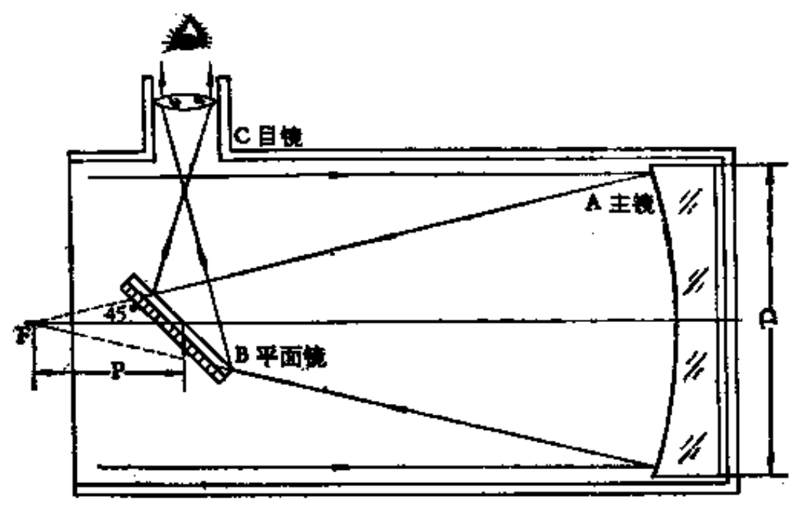
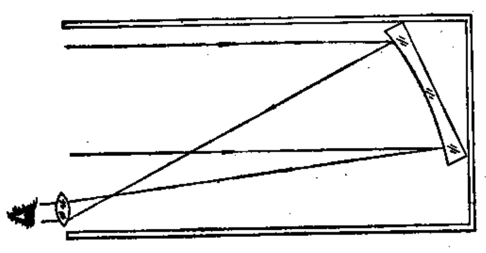
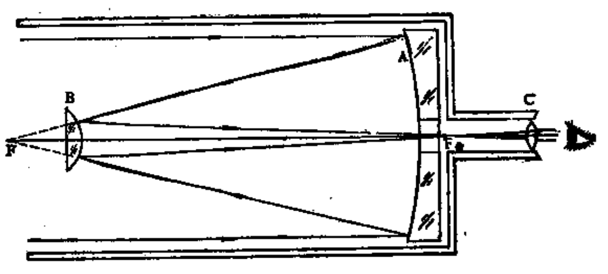
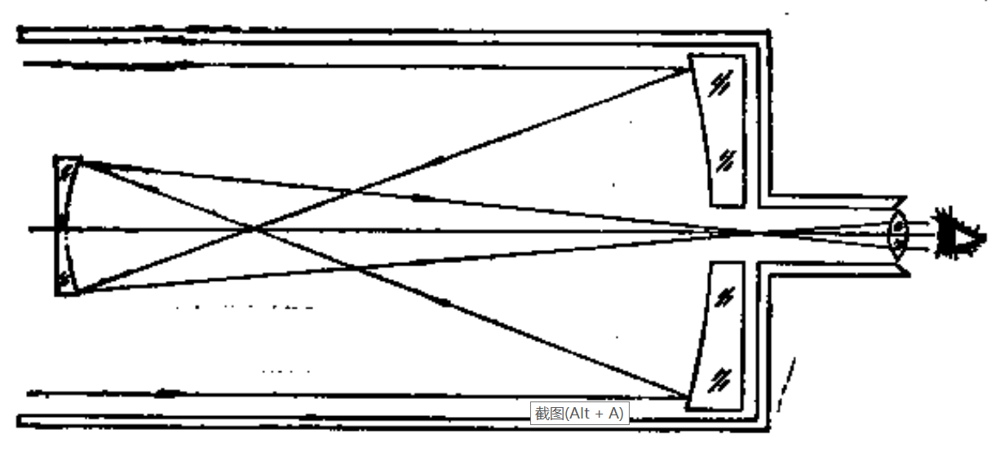

# 望远镜

[TOC]

## 折射式

### 伽利略式

* 镜片
  * 主镜：凸透镜
  * 目镜：凹透镜

* 缺点
  * 视场小

### 开普勒式

* 镜片
  * 主镜：凸透镜
  * 目镜：凸透镜
* 优点
  * 视场较伽利略式大
* 缺点
  * 有色相差

## 反射式

### 牛顿式

* 镜片
  * 主镜：凹面镜
  * 副镜：平面镜
  * 目镜
* 

### 赫歇尔式

* 镜片
  * 主镜：凹面镜
  * 目镜

### 卡塞格林式/耐司姆斯

* 镜片
  * 主镜：凹面镜
  * 副镜：凸面镜
  * 目镜

### 格雷果里式

* 镜片
  * 主镜：凹面镜
  * 副镜：凹面镜
  * 目镜

### 折轴反射式

## 折反式

