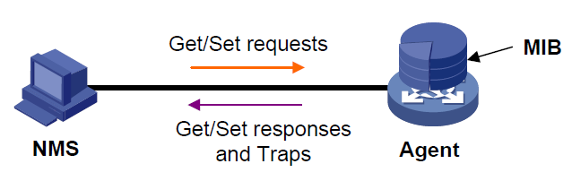
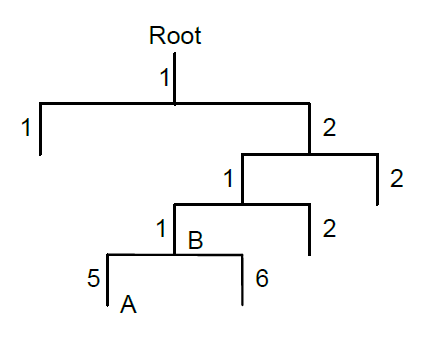

# SNMP

[TOC]

SNMP（Simple Network Management Protocol，简单网络管理协议）是因特网中的一种网络管理标准协议，被广泛用于实现管理设备对被管理设备的访问和管理。

## 特点
* 支持网络设备的智能化管理。

  利用基于SNMP 的网络管理平台，网络管理员可以查询网络设备的运行状态和参数，设置参数值，发现故障、完成故障诊断，进行容量规划和生成报告。

* 支持对不同物理特性的设备进行管理。

  SNMP 只提供最基本的功能集，使得管理任务与被管理设备的物理特性和联网技术相对独立，从而实现对不同厂商设备的管理。

## 工作机制
SNMP 网络包含 NMS 和 Agent 两种元素。

* NMS（Network Management System，网络管理系统）是 SNMP 网络的管理者，能够提供非
  常友好的人机交互界面，方便网络管理员完成绝大多数的网络管理工作。

* Agent 是 SNMP 网络的被管理者，负责接收、处理来自 NMS 的请求报文。在一些紧急情况下，
  如接口状态发生改变等，Agent 会主动向 NMS 发送告警信息。

## MIB

NMS 管理设备的时候，通常会对一些参数比较关注，比如接口状态、CPU 利用率等，这些参数的
集合称为 MIB（Management Information Base，管理信息库）。这些参数在 MIB 中称为节点。MIB
定义了节点之间的层次关系以及对象的一系列属性，比如对象的名字、访问权限和数据类型等。每
个Agent 都有自己的 MIB。被管理设备都有自己的 MIB 文件，在 NMS 上编译这些 MIB 文件，就能
生成该设备的 MIB。NMS 根据访问权限对 MIB 节点进行读/写操作，从而实现对 Agent 的管理。

MIB 是按照树型结构组织的，它由很多个节点组成，每个节点表示被管理对象，被管理对象可以用
从根开始的一串表示路径的数字唯一地识别，这串数字称为 OID（Object Identifier，对象标识符）。

## 基本操作

SNMP 提供三种基本操作来实现NMS 和Agent 的交互：
• GET 操作：NMS 使用该操作查询Agent MIB 中的一个或多个节点的值。
• SET 操作：NMS 使用该操作设置Agent MIB 中的一个或多个节点的值。
• Trap 操作：Agent 使用该操作向NMS 发送Trap 信息。Agent 不要求NMS 发送回应报文，
NMS 也不会对Trap 信息进行回应。SNMPv1、SNMPv2c 和SNMPv3 均支持Trap 操作。