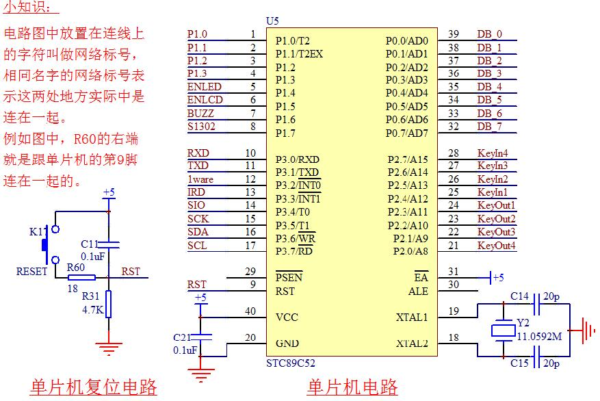

# C51
## 产品
| 公司 | 产品 |
| ------------- |-------------|
| Analog Devices | ADUC832 |
| AT(Atmel) | AT89C51,AT89C52,AT89C53,AT89C55,AT89LV52,AT89S51,AT89S52,AT89LS53 |
| Dallas(达拉斯) | DS80C390 |
| Freescale Semiconductor(飞思卡尔) | MC68000 |
| Infineon(英飞凌) | C1645V |
| Philips(飞利浦) | P80C54,P80C58,P87C54,P87C58,P87C524,P87C528 |
| Winbond(华邦) | W78C54,W78C58,W78E54,W78E58 |
| Intel | i87C54,i87C58,i87L54,i87L58,i87C51FB,i87C51FC |
| Microchip(微芯) | PIC24 |
| National Semiconductor(国家半导体) | COP8CBR9HVA8 |
| Siemens(西门子) | C501-1R,C501-1E,C513A-H,C503-1R,C504-2R |
| STC | STC89C51RC,STC89C52RC,STC89C53RC,STC89LE51RC,STC89LE52RC,STC12C5412AD |

## 存储空间
**Flash**程序存储空间，早期是OTPROM  
**RAM**数据存储空间  
**SFR**特殊功能寄存器
## 最小系统

## 单片机复位
上电复位  
手动复位  
程序自动复位