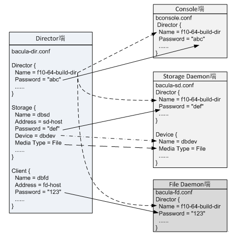

# Bacula
开源的网络备份解决方案。

## 功能特性
>* 模块化设计
>* 能够备份UNIX、Linux、Windows和Mac OS系统
>* 支持MySQL、PostgreSQL或者SQLite作为后端数据库
>* 支持易用的菜单驱动的命令行控制台
>* 遵守开放源代码许可证
>* 备份可以横跨多个磁带卷
>* 服务器可以在多种平台上运行
>* 可以给备份的每个文件都创建SHA1或者MD5的签名文件
>* 对网络流量和保存在磁带上的数据都可以加密
>* 可以备份超过2GB的文件
>* 支持磁带库和自动换带机
>* 在备份工作前后可以执行脚本或者命令
>* 对整个网络集中做备份管理  

## 模型
  

**控制器 Director (DIR)：** 协调备份、恢复和校验操作的守护进程。  
**控制台 Console：** 与控制守护进程交互。  
**存储守护进程 Storage Daemon (SD)：** 读写磁带或者其他备份介质的组件。  
**文件守护进程 File Daemon (FD)：** 在每个要备份的系统上运行。  
**编目 Catalog：** 所备份的每个文件和卷的信息都保存在这个关系数据库中。  
**Bacula Rescue CD-ROM**  

## 配置文件
| 组件 | 文件 | 服务器 |
|----|----|-----|
| 控制守护进程 | bacula-dir.conf | 运行控制守护进程的服务器 |
| 存储守护进程 | bacula-sd.conf | 有存储设备的每台服务器 |
| 文件守护进程 | bacula-fd.conf | 要进行备份的每台客户机 |
| 管理控制台 | bconsole.conf | 用作控制台的每台计算机 |

## 术语
**作业**：job，Bacula运行活动的基本单位。分为两类：备份和恢复。一个作业由一个客户机、一个文件集合、一个存储池和一个计划表共同组成。  
**池**：pool，保存作业的物理介质组。  
**文件集**：fileset，文件系统和单个文件的列表。  
**消息**：message，守护进程之间涉及守护进程和作业状态的通信信息。

## 安装步骤
1.配置主机名

    bacula.private.example.com

2.关闭 selinux

3.安装 Bacula 和 MariaDB Server

    yum install bacula-director bacula-storage bacula-console bacula-client
    yum install mariadb-server

4.启动 MySQL

    systemctl start mariadb

5.创建 Bacula database user 和 tables

    /usr/libexec/bacula/grant_mysql_privileges
    /usr/libexec/bacula/create_mysql_database -u root
    /usr/libexec/bacula/make_mysql_tables -u bacula

6.运行交互脚本

    mysql_secure_installation

7.设置 Bacula database user 密码

    mysql -u root -p
    UPDATE mysql.user SET Password=PASSWORD('bacula_db_password') WHERE User='bacula';
    FLUSH PRIVILEGES;
    exit

8.设置 MariaDB 开机自启动

    systemctl enable mariadb

9.设置 Bacula 使用 MySQL Library

默认情况下，Bacula 使用 PostgreSQL library 。修改成使用 MySQL library 。

    alternatives --config libbaccats.so

显示如下提示，键入１

    There are 3 programs which provide 'libbaccats.so'.
    Selection    Command
    -----------------------------------------------
       1           /usr/lib64/libbaccats-mysql.so
       2           /usr/lib64/libbaccats-sqlite3.so
     + 3           /usr/lib64/libbaccats-postgresql.so`

    Enter to keep the current selection[+], or type selection number:

10.创建备份和还原目录

    sudo mkdir -p /bacula/backup /bacula/restore
    sudo chown -R bacula:bacula /bacula
    sudo chmod -R 700 /bacula

11.Bacula Director

Let's verify that there are no syntax errors in your Director configuration file:

    sudo bacula-dir -tc /etc/bacula/bacula-dir.conf

12.Storage Daemon

Let's verify that there are no syntax errors in your Storage Daemon configuration file:

    sudo bacula-sd -tc /etc/bacula/bacula-sd.conf

13.Set Bacula Component Passwords

Each Bacula component, such as the Director, SD, and FD, have passwords that are used for inter-component authentication—you probably noticed placeholders while going through the configuration files. It is possible to set these passwords manually but, because you don't actually need to know these passwords, we'll run commands to generate random passwords and insert them into the various Bacula configuration files.

These commands generate and set the Director password. The bconsole connects to the Director, so it needs the password too:

    DIR_PASSWORD=`date +%s | sha256sum | base64 | head -c 33`
    sudo sed -i "s/@@DIR_PASSWORD@@/${DIR_PASSWORD}/" /etc/bacula/bacula-dir.conf
    sudo sed -i "s/@@DIR_PASSWORD@@/${DIR_PASSWORD}/" /etc/bacula/bconsole.conf

These commands generate and set the Storage Daemon password. The Director connects to the SD, so it needs the password too:

    SD_PASSWORD=`date +%s | sha256sum | base64 | head -c 33`
    sudo sed -i "s/@@SD_PASSWORD@@/${SD_PASSWORD}/" /etc/bacula/bacula-sd.conf
    sudo sed -i "s/@@SD_PASSWORD@@/${SD_PASSWORD}/" /etc/bacula/bacula-dir.conf

These commands generate and set the local File Daemon (the Bacula client software) password. The Director connects to this FD, so it needs the password too:

    FD_PASSWORD=`date +%s | sha256sum | base64 | head -c 33`
    sudo sed -i "s/@@FD_PASSWORD@@/${FD_PASSWORD}/" /etc/bacula/bacula-dir.conf
    sudo sed -i "s/@@FD_PASSWORD@@/${FD_PASSWORD}/" /etc/bacula/bacula-fd.conf

14.Start Bacula Components

Start the Bacula Director, Storage Daemon, and local File Daemon with these commands:

    sudo systemctl start bacula-dir
    sudo systemctl start bacula-sd
    sudo systemctl start bacula-fd

If they all started correctly, run these commands so they start automatically on boot:

    sudo systemctl enable bacula-dir
    sudo systemctl enable bacula-sd
    sudo systemctl enable bacula-fd

15.Test Backup Job

Now enter the Console with this command:

    sudo bconsole

This will take you to the Bacula Console prompt, denoted by a * prompt.
Create a Label

Begin by issuing a label command:

    label

You will be prompted to enter a volume name. Enter any name that you want:

Enter new Volume name:
MyVolume

Then select the pool that the backup should use. We'll use the "File" pool that we configured earlier, by entering "2":

Select the Pool (1-3):
2

Manually Run Backup Job

Bacula now knows how we want to write the data for our backup. We can now run our backup to test that it works correctly:

    run

You will be prompted to select which job to run. We want to run the "BackupLocalFiles" job, so enter "1" at the prompt:

Select Job resource (1-3):
1

At the "Run Backup job" confirmation prompt, review the details, then enter "yes" to run the job:

    yes

Check Messages and Status

After running a job, Bacula will tell you that you have messages. The messages are output generated by running jobs.

Check the messages by typing:

    messages

The messages should say "No prior Full backup Job record found", and that the backup job started. If there are any errors, something is wrong, and they should give you a hint as to why the job did not run.

Another way to see the status of the job is to check the status of the Director. To do this, enter this command at the bconsole prompt:

    status director

If everything is working properly, you should see that your job is running. Something like this:

Output — status director (Running Jobs)
Running Jobs:
Console connected at 09-Apr-15 12:16
 JobId Level   Name                       Status
======================================================================
     3 Full    BackupLocalFiles.2015-04-09_12.31.41_06 is running
====

When your job completes, it will move to the "Terminated Jobs" section of the status report, like this:

Output — status director (Terminated Jobs)
Terminated Jobs:
 JobId  Level    Files      Bytes   Status   Finished        Name
====================================================================
     3  Full    161,124    877.5 M  OK       09-Apr-15 12:34 BackupLocalFiles

The "OK" status indicates that the backup job ran without any problems.

The next step is to test the restore job.
Test Restore Job

Now that a backup has been created, it is important to check that it can be restored properly. The restore command will allow us restore files that were backed up.
Run Restore All Job

To demonstrate, we'll restore all of the files in our last backup:

    restore all

A selection menu will appear with many different options, which are used to identify which backup set to restore from. Since we only have a single backup, let's "Select the most recent backup"—select option 5:

Select item (1-13):
5

Because there is only one client, the Bacula server, it will automatically be selected.

The next prompt will ask which FileSet you want to use. Select "Full Set", which should be 2:

Select FileSet resource (1-2):
2

This will drop you into a virtual file tree with the entire directory structure that you backed up. This shell-like interface allows for simple commands to mark and unmark files to be restored.

Because we specified that we wanted to "restore all", every backed up file is already marked for restoration. Marked files are denoted by a leading * character.

If you would like to fine-tune your selection, you can navigate and list files with the "ls" and "cd" commands, mark files for restoration with "mark", and unmark files with "unmark". A full list of commands is available by typing "help" into the console.

When you are finished making your restore selection, proceed by typing:

    done

Confirm that you would like to run the restore job:

OK to run? (yes/mod/no):
yes

Check Messages and Status

As with backup jobs, you should check the messages and Director status after running a restore job.

Check the messages by typing:

    messages

There should be a message that says the restore job has started or was terminated with an "Restore OK" status. If there are any errors, something is wrong, and they should give you a hint as to why the job did not run.

Again, checking the Director status is a great way to see the state of a restore job:

    status director

When you are finished with the restore, type exit to leave the Bacula Console:

    exit

Verify Restore

To verify that the restore job actually restored the selected files, you can look in the /bacula/restore directory (which was defined in the "RestoreLocalFiles" job in the Director configuration):

    sudo ls -la /bacula/restore

You should see restored copies of the files in your root file system, excluding the files and directories that were listed in the "Exclude" section of the "RestoreLocalFiles" job. If you were trying to recover from data loss, you could copy the restored files to their appropriate locations.
Delete Restored Files

You may want to delete the restored files to free up disk space. To do so, use this command:

    sudo -u root bash -c "rm -rf /bacula/restore/*"

Note that you have to run this rm command as root, as many of the restored files are owned by root.


## 配置文件

### 公共的配置段
**Director资源**：参数规定了控制器的名字和基本行为。选项设置了其他守护进程与控制器进行通信所采用的通信端口、控制器保存其临时文件的位置，以及控制器一次能处理的并发作业数量。

    Director {
    	Name = bull-dir
    	DIRport = 9101
    	Query File = "/etc/bacula/query.sql"
    	Working Directory = "/var/Bacula/working"
    	Pid Directory = "/var/run"
    	Maximum Concurrent Jobs = 1
    	Password = "XXXX"
    	Messages = Standard
    }
**Messages资源**：

    Message {
    	Name = Standard
    	director = bull-dir = all    
    }

#### 口令


### bacula-dir.conf
**Catalog资源**：将Bacula指向一个特殊的编目数据库。包括一个编目名、一个数据库名和数据库凭证。

    Catalog {
    	Name = MYSQL
    	dbname = "bacula";dbuser = "bacula";dbpassword = "XXXXX"    
    }

**Storage资源**:描述了如何与特定的存储守护进程进行通信,轮到那个存储守护进程负责和它的本地备份设备接口。与硬件无关。

    Storage {
    	Name = TL4000
    	Address = bull
    	SDPort = 9103
    	Password = "XXXXX"
    	Device = TL4000
    	Autochanger = yes
    	Maximum Concurrent Jobs = 2
    	Media Type = LTO-3
    }

**Pool资源**:把备份介质（一般为磁带）划分为给特定备份作业所使用的组。

    Pool {
    	Name = Full_Pool
    	Pool Type = Backup
    	Recycle = yes
    	AutoPrune = yes
    	Storage = TL4000
    	Volume Retention = 365 days
    }

**Schedule资源**：定义了备份作业的时间表。必须要有的参数是名字、日期、和时间说明。

    Schedule {
    	Name = "Nightly"
    	Run = Level=Full Pool=FullPool 1st tue at 20:10
    	Run = Level=Incremental Pool=IncrementalPool wed-mon at 20:10
    }

**Client资源**：标识要备份的计算机。

    Client {
    	Name = harp
    	Address = 192.168.1.28
    	FDPort = 9102
    	Catalog = MYSQL
    	Password = "XXXX"
    }

**FileSet资源**:定义了一个备份作业所包含的或者所排出的文件和目录。

    FileSet {
    	Name = "harp"
    	Include {
    		Options {
    			signature=SHA1
    			compression=GZIP
    		}
    		File = "/"
    		File = "/boot"
    		File = "/var"
    	}
    	Exclude = {/proc /tmp /.journal /.fsck}
    }

**Job资源**:定义了一个特定备份作业默认的参数。

    Job {
    	Name = "harp"
    	JobDefs = DefaultJob
    	Level = Full
    	Write Bootstrap = "/bacula/bootstraps/harp.bsr"
    	Client = harp
    	FileSet = harp
    	Pool = Full_Pool
    	Incremental Backup Pool = Incremental_Pool
    	Schedule = "Nightly"
    	Prefer Mounted Volume = no
    	Max Run Time = 36000
    }
### bacula-sd.conf
**Director资源**:控制运行哪些控制器与存储守护进程进行联系。

    Director {
    	Name = bull-dir
    	Password = "XXXXXX"
    }

**Storage资源**：定义了一些基本的工作参数。

    Storage {
	Name = bull-sd
    	SDPort = 9103
    	WorkingDirectory = "/var/bacula/working"
    	Pid Directory = "/var/run"
    	Maximum Concurrent Jobs = 2
    }

**Device资源**:

    Device {
    	Name = TL4000-Drive0
    	Media Type = LTO-3
    	Archive Device = /dev/nst0
    	AutomaticMount = yes
    	AlwaysOpen = yes
    	RemovableMedia = yes
    	RandomAccess = no
    	Autochanger = yes
    }

**Autochanger资源**：

    Autochanger {
    	Name = TL4000
    	Device = TL4000-Drive0,TL4000-Driver1
    	Changer Command = "/etc/bacula/mtx-changer %c %o %S %a %d"
    	Changer Device = /dev/changer
    }
### bconsole.conf
    Director {
    	Name = bull-dir
    	DIRport = 9101
    	Address = bull
    	Password = "XXXX"
    }


############################


### 安装Bacula和MySQL
Bacula使用数据库,例如MySQL或者PostreSQL,来管理备份记录. 在本文中,我们将使用MySQL的替代软件MariaDB.

通过yum安装Bacula和MariaDB:
```bash
sudo yum install -y bacula-director bacula-storage bacula-console bacula-client mariadb-server
```
安装完成后，启动MariaDB:
```bash
sudo systemctl start mariadb
```

现在MariaDB已经安装并已经运行,接下来通过以下脚本创建Bacula数据库及用户和表:
```bash
/usr/libexec/bacula/grant_mysql_privileges
/usr/libexec/bacula/create_mysql_database -u root
/usr/libexec/bacula/make_mysql_tables -u bacula
```
接下来,我们要运行一个简单的安全脚本,它将会移除掉一些危险的默认配置并对访问数据库的权限进行简单的配置。执行下面的命令:
```bash
sudo mysql_secure_installation
```
提示让你输入当前的数据库root密码,我们还没有为root设置密码所以留空就行了,直接Enter到下一步.接着会提示你是否设置root密码,根据提示设置好root密码.接下来的操作可以一路Enter到底,
使用默认设置即可,这些操作会移除掉一些示例用户及数据库,禁止root用户远程登录,重载数据库用户权限,让我们所做的操作立即生效.

现在我们需要为Bacula数据库用户设置密码
使用root用户进入MySQL console
```bash
mysql -u root -p
```
输入你设置的root密码

执行以下sql语句为bacula用户设置密码。注意将bacula_db_password换成你想设置的密码
```sql
update mysql.user SET Password=PASSWORD(' bacula_db_password') WHERE User='bacula';
FLUSH PRIVILEGES;
```
配置好后输入exit退出MySql console

配置MariaDB开机启动:
```bash
sudo systemctl enable mariadb
```
#### 配置Bacula使用MySQL库
默认情况下,Bacula使用PostgreSQL库. 因为我们使用的是MySQL,所以我们需要配置使用MySQL替代下.
执行以下命令:
```bash
sudo alternatives --config libbaccats.so
```
你会看到一个提示, 输入1(MySQL)确认即可
输出如下
```bash
There are 3 programs which provide 'libbaccats.so'.

  Selection    command
-----------------------------------------------
   1           /usr/lib64/libbaccats-mysql.so
   2           /usr/lib64/libbaccats-sqlite3.so
*+ 3           /usr/lib64/libbaccats-postgresql.so

Enter to keep the current selection[+], or type selection number:  1
```
到此为止,Bacula服务端(客户端)组件都安装好了. 接下来我们将创建备份和恢复目录.

#### 创建备份和恢复目录
Bacula需要一个备份目录用了存储备份归档及一个恢复目录用来恢复文件.如果你的系统有多个分区,请确保创建的目录有足够的空间.

让我们创建新的目录来满足这一需要:
```bash
sudo mkdir -p /bacula/backup /bacula/restore
```

我们需要配置目录的权限,只让bacula进程(还有超级用户)才能访问这些目录:
```bash
sudo chown -R bacula:bacula /bacula
sudo chmod -R 700 /bacula
```
现在我们已经准备好开始配置Bacula Director.

#### 配置Bacula Director
Bacula的几个组件必须独立的配置才能保证功能的正常.所有组件的配置文件都在/etc/bacula目录

我们从配置Bacula Director开始
用你最喜欢的文本编辑器打开Bacula Director配置文件,这里我们使用vi:
```bash
sudo vi /etc/bacula/bacula-dir.conf
```

##### 配置Director Resource
找到Director Resourece,让它监听127.0.0.1(localhost),如下添加DirAddress这一行:
```
Director {                            # define myself
  Name = bacula-dir
  DIRport = 9101                # where we listen for UA connections
  QueryFile = "/etc/bacula/query.sql"
  WorkingDirectory = "/var/spool/bacula"
  PidDirectory = "/var/run"
  Maximum Concurrent Jobs = 1
  Password = "@@DIR_PASSWORD@@"         # Console password
  messages = Daemon
  DirAddress = 127.0.0.1    #添加这一行
}
```
接着往下移动.
##### 配置Local Jobs
Bacula job 是用来执行备份和恢复操作的.Job定义了一个任务将会如何操作,包括客户端名字,备份文件等其他信息.
这里,我们将配置一个job用来进行备份本地文件.
在Director配置文件中找到名字为"BackupClient1"的_Job_.把Name改成"BackupLocalFiles",如下所示:

bacula-dir.conf — Rename BackupClient1 job
```
Job {
  Name = " BackupLocalFiles"
  JobDefs = "DefaultJob"
}
```
接下来找到名字为"RestoreFiles"的_Job_.在这里你需要更改2处:把_job_的_name_给改成"RestoreLocalFiles",把_Where_改成"/bacula/restore".如下所示:

bacula-dir.conf — Rename RestoreFiles job
```
Job {
  Name = " RestoreLocalFiles"
  Type = Restore
  Client=BackupServer-fd
  FileSet="Full Set"
  Storage = File
  Pool = Default
  Messages = Standard
  Where =  /bacula/restore
}
```
这个配置了RestoreLocalFile任务将文件恢复至我们之前创建的文件夹/bacula/restore中.

##### 配置File Set
Bacula FileSet定义了包含或者排除的文件或者目录的信息,供Jobs使用。
找到"Full Set"这一块儿(在"# List of files to be backed up"这行后面),这里我们要改3处地方:

1. 添加gzip压缩选项
2. 把_/usr/bin_改为_/_,因为我们要备份整个文件系统
3. 在Exclude section添加_File = /bacula _.
移除注释后如下所示:

bacula-dir.conf — Update "Full Set" FileSet
```
FileSet {
  Name = "Full Set"
  Include {
    Options {
      signature = MD5
       compression = GZIP
    }    
File =  /
}
  Exclude {
    File = /var/lib/bacula
    File = /proc
    File = /tmp
    File = /.journal
    File = /.fsck
     File = /bacula
  }
}
```

让我们再回顾下刚才所做的操作.首先我们打开gizp压缩,然后设置备份路径为_/_ 即根目录,其次,排除掉_/bacula_目录,因为我们不想多余的备份Bacula的备份和恢复文件.

注意: 如果你有在/分区之外的分区,你也想备份它的话,只要在FileSet中添加_include 挂载点_可以.

如果你在Jobs中经常使用大范围的的FileSets,例如"Full Set",那么你的备份比起指定范围的备份会需要更多空间.例如,一个FileSet只包含自定义的配置文件或者数据库或许就满足你的备份需求了,不过需要你比较清楚安装软件并且知道配置文件的正确位置, 这样备份就只占用很少一部分磁盘空间了.

##### 配置Storage Daemon Connection
在_Bacula Director_配置文件中, _Storage_ 定义了_Director_应该与哪个_Storage Daemon_连接. 我们接下来将配置_Storage Daemon_.

找到_Storage_, 把_Address_的_localhost_换成备份服务器的主机名(或者内网IP地址).
改完后应该和下面的差不多:

bacula-dir.conf — Update Storage Address
```
Storage {
  Name = File
# Do not use "localhost" here
  Address =  backup_server_private_FQDN                # N.B. Use a fully qualified name here
  SDPort = 9103
  Password = "@@SD_PASSWORD@@"
  Device = FileStorage
  Media Type = File
}
```
这一步是很必要的，因为我们要让_Storatge Daemon_监听内网网卡,这样远程的客户端才能连接它.

##### 配置 Catalog Connection

在Bacula Director配置文件中, Catalog定义了Director与数据库的连接信息.
找到名字为_"MyCatalog"_(在"#Generic catalog service"这行后面),把_dbpassword换成我们前面设置好的密码:

bacula-dir.conf — Update Catalog dbpassword

```
# Generic catalog service
Catalog {
  Name = MyCatalog
# Uncomment the following line if you want the dbi driver
# dbdriver = "dbi:postgresql"; dbaddress = 127.0.0.1; dbport =
  dbname = "bacula"; dbuser = "bacula"; dbpassword = " bacula_db_password"
}
```
这样Bacula Director 就可以连接的MySQL数据库了.

##### 配置Pool
Pool定义了Bacula备份介质的配置信息,这里我们将使用文件作为存储卷(storage volumes),另外,我们会简单的更新下标签,以便正确的标注本地备份.
找到名字为_File_的Pool(在"# File Pool definition"这行下面),然后添加一行_Label Format_. 改为应该跟下面差不多:

bacula-dir.conf — Update Pool:
```
# File Pool definition
Pool {
  Name = File
  Pool Type = Backup
   Label Format = Local-
  Recycle = yes                       # Bacula can automatically recycle    Volumes
  AutoPrune = yes                     # Prune expired volumes
  Volume Retention = 365 days         # one year
  Maximum Volume Bytes = 50G          # Limit Volume size to something reasonable
  Maximum Volumes = 100               # Limit number of Volumes in Pool
}
```
保存并退出编辑. 你已经完成_bacula Director的配置啦.
##### 检查Director的配置
让我们来检查下配置文件会不会有语法错误:
```bash
sudo bacula-dir -tc /etc/bacula/bacula-dir.conf
```
如果没有报错信息,说明你的_bacula-dir.conf没有语法错误.
接下来,我们将配置Storage Daemon

#### 配置 Storage Daemon
我们的Bacula服务器已经配置的擦不多了,但是我们还需要配置_Storage Daemon_,这样Bacula才知道把存储放在哪儿.
用你最喜欢的文本编辑器打开SD(Storage Daemon),在这里我们还是使用vi
```bash
sudo vi /etc/bacula/bacula-sd.conf
```

##### 配置 Storage Resource
在配置文件中找到Storage. 这个定义了SD进程将监听信息. 添加_SDAddress_这个参数, 并赋予它备份服务器的IP地址或者FQDN主机名:

bacula-sd.conf — update SDAddress

```
Storage {                             # definition of myself
  Name = BackupServer-sd
  SDPort = 9103                  # Director's port
  WorkingDirectory = "/var/lib/bacula"
  Pid Directory = "/var/run/bacula"
  Maximum Concurrent Jobs = 20
   SDAddress = backup_server_private_FQDN
}
```
##### 配置Storage Device
接下来,在配置文件中找到名字为"FileStorage"的_Device_,把_Archive Device_的配置更改为你的备份目录:

bacula-sd.conf — update Archive Device

```
Device {
  Name = FileStorage
  Media Type = File
  Archive Device =  /bacula/backup
  LabelMedia = yes;                   # lets Bacula label unlabeled media
  Random Access = Yes;
  AutomaticMount = yes;               # when device opened, read it
  RemovableMedia = no;
  AlwaysOpen = no;
}
```
保存并退出.

##### 验证Storage Daemon配置文件
让我们检查下Storage Daemon配置文件是否有语法错误:
```
sudo bacula-sd -tc /etc/bacula/bacula-sd.conf
```
如果没有错误信息,则说明你的配置没有语法错误.

我们已经完成了Bacula的配置.我们已经准备好重启Bacula的各个组件了.

#### 设置Bacula组件的密码
每个Bacula组件,例如Director,SD和FD,它们在内部通信的时候都会需要到密码(或许你已经在我们改配置文件的时候注意到了). 我们可以手动配置这些密码,但是我们并不需要知道这些密码.所以我们将使用下面的命令去生成这些密码并把它替换到Bacula的配置文件中.

以下的命令生成Director的密码. _bconsole_需要连接到_Director_,所以它也需要配置这个密码:
```bash
DIR_PASSWORD=`date +%s | sha256sum | base64 | head -c 33`
sudo sed -i "s/@@DIR_PASSWORD@@/${DIR_PASSWORD}/" /etc/bacula/bacula-dir.conf
sudo sed -i "s/@@DIR_PASSWORD@@/${DIR_PASSWORD}/" /etc/bacula/bconsole.conf
```

以下的命令生成并配置_Storage Daemon的密码. Director需要连接到SD,所以它也需要配置这个密码:
```bash
SD_PASSWORD=`date +%s | sha256sum | base64 | head -c 33`
sudo sed -i "s/@@SD_PASSWORD@@/${SD_PASSWORD}/" /etc/bacula/bacula-sd.conf
sudo sed -i "s/@@SD_PASSWORD@@/${SD_PASSWORD}/" /etc/bacula/bacula-dir.conf
```

以下的命令生成并配置本地File Daemon(Bacula客户端)的密码.Director需要连接到这个FD.所以他也需要配置这个密码:
```bash
FD_PASSWORD=`date +%s | sha256sum | base64 | head -c 33`
sudo sed -i "s/@@FD_PASSWORD@@/${FD_PASSWORD}/" /etc/bacula/bacula-dir.conf
sudo sed -i "s/@@FD_PASSWORD@@/${FD_PASSWORD}/" /etc/bacula/bacula-fd.conf
```
现在我们已经准备启动我们的Bacula组件啦!

#### 启动Bacula组件
使用下面的命令启动Bacula Director,Storage Daemon,还有本地的File Daemon:

```bash
sudo systemctl start bacula-dir
sudo systemctl start bacula-sd
sudo systemctl start bacula-fd
```

如果它们都正常启动,执行下面的命令,让这些服务都开机自动启动:
```bash
sudo systemctl enable bacula-dir
sudo systemctl enable bacula-sd
sudo systemctl enable bacula-fd
```

让我们来跑一个备份任务以来测试下Bacula.
### 测试备份任务
我们将使用_Bacula Console_来运行我们的第一个备份任务.如果它爬起来木有任何问题,那就说明我们配置对啦。
现在通过以下命令键入Console:
```bash
sudo bconsole
```
执行完你会看到一个_*_开头的提示符.

#### 创建Label
执行下面的命令:
```
label
```
会提示你输入一个卷名.输入任何你喜欢的名字:

```
Enter new Volume name: MyVolume
```
接着会让你选择使用哪个_Pool_,选择2,使用我们前面配置的"File"就可以了:
```
Select the Pool (1-3):
2
```
#### 手动运行备份任务
Bacula现在知道我们想让备份数据写在哪里了.现在让我们来执行我们的备份任务来验证它是否正常工作:
```
run
```
会提示你选择一个任务.我们要执行的是"BackupLocalFiles",选择"1"就好了:
```
Select Job resource (1-3):
1
```
在"Run Backup job"这个环节,检查下详细信息,然后输入"yes"来运行这个任务:
```
yes
```
#### 检查消息和状态
当执行玩一个任务, Bacula会告诉你有一条新消息. 消息是运行运行的任务生成的。
使用下面的命令检查消息:
```
messages
```
消息应该会说"No prior Full backup Job record found", 并且备份任务已经执行.如果有任何错误或者不对的地方,消息会给你提示,为什么任务没有执行.
另一个查看任务状态的方法是检查Director的状态.在bconsole里执行:
```
status director
```
如果运行正常,你应该可以看到你的任务正在运行.像下面这样:
Output — status director (Running Jobs)
```
Running Jobs:
Console connected at 09-Apr-15 12:16
 JobId Level   Name                       Status
======================================================================
     3 Full    BackupLocalFiles.2015-04-09_12.31.41_06 is  running
====
```
当任务完成,它会移到已终止任务(Terminated Jobs)的报告里面,像下面这样:
```
Terminated Jobs:
 JobId  Level    Files      Bytes   Status   Finished        Name
====================================================================
     3  Full    161,124    877.5 M   OK       09-Apr-15 12:34 BackupLocalFiles
```

状态"OK"表示备份任务运行没有任何问题。恭喜你! 你已经有一个Bacula服务器的"Full Set"备份啦.
接下来的任务是测试恢复任务.

### 测试恢复任务
现在已经创建好了一个备份, 验证它是否能被正确恢复是很重要的. 恢复命令将允许我们恢复已经备份的文件.
#### 允许恢复全部任务
为了验证,我们将恢复我们上个备份中的所有文件:
```
restore all
```

会出现一个有很多选项的菜单,来确认那个是需要被恢复的.因为我们只有一个备份,让我们选择"Select the most recent backup" - 选择5:
```
Select item (1-13):
5
```
因为这里只有Bacula服务器这一个客户端,所以它会自动被选择.
接下来讲问你选择哪个FileSet.选择"Full set",即选择2:
```
Select FileSet resource (1-2):
2
```
接下来将会到一个包含备份文件中所有目录结构的虚拟文件树. 这个类shell的接口允许使用一些简单的命令来标记和反标记恢复哪些文件.
因为我们一开始指定了"restore all",所以每个备份过得文件都已经被标记过了.被标记的文件开头会有_*_.
如果你想要微调自己的选择,你可以通过"cd"和"ls"命令切换目录和列出文件,使用"mask"标记要被恢复的,"unmask"标记不被恢复.你可以通过键入"help"查看完整的命令列表.
当你完成你的选择之后.敲入:
```
done
```
确认你想要运行这个恢复任务:
```
OK to run? (yes/mod/no):
yes
```
#### 查看消息和状态
和backup任务一样,在运行完恢复任务之后,你应该检查下消息和Director的状态.

检查消息:
```
messages
```
应该会说恢复任务已经结束,状态是"Restore OK". 如果这里有任何错误或者不对的地方,消息都会给你提示.
查看Director状态是一种很好的方式用来查看恢复任务的状况:
```
status director
```
当你已经完成恢复任务,键入_exit_退出Bacula Console:
```
exit
```
##### 验证备份
验证恢复任务有没有真正的恢复你选择的文件,你可以直接去看/bacula/restore这个目录(我们在Director配置文件中的"RestoreLocalFiles"中定义过):
```
sudo ls -la /bacula/restore
```
你应该会看到你根目录中已被恢复的文件,正如我们前面在配置文件中定义的那样包含哪些不包含哪些目录.如果你因为文件丢失要尝试文件恢复,那么你可以复制这些恢复的文件到它们正确的位置.
##### 删除已恢复的文件
你或许想删掉恢复的文件,以便释放磁盘空间. 执行下面的命令就可以:
```bash
sudo -u root bash -c "rm -rf /bacula/restore/*"
```
