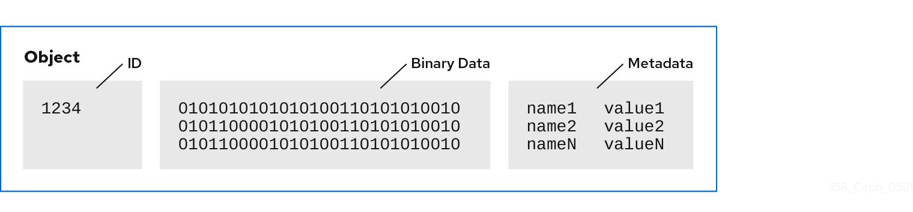
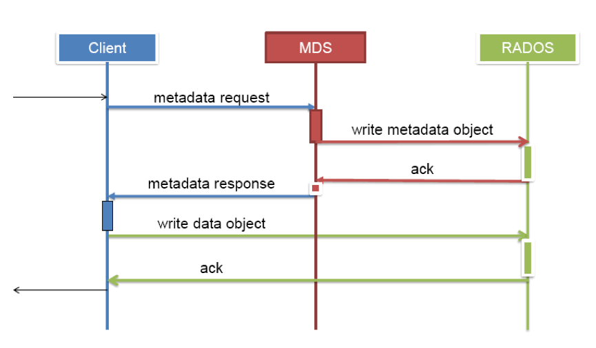
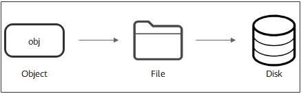
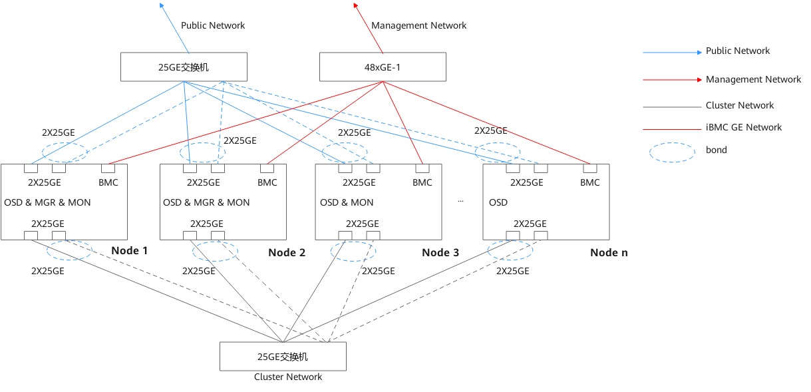
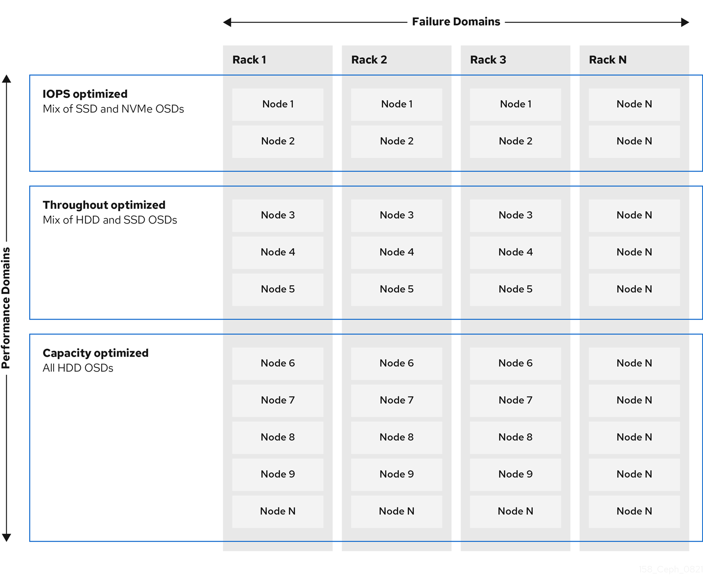
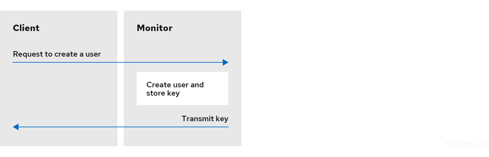

# Ceph

[TOC]

## 概述

Ceph 是一个分布式、弹性可扩展的、高可靠的、性能优异的存储系统，诞生于 2004 年。可以同时支持块设备、文件系统和对象网关三种类型的存储接口。

所有 Ceph Storage Cluster 部署都从设置每个 Ceph 节点开始，然后设置网络。

## 功能

* Ceph 对象存储
  * RESTful 接口
  * 符合 S3 和 Swift 标准的 API
  * S3-style subdomains 
  * 统一的 S3 / Swift 命名空间
  * 用户管理
  * 利用率跟踪
  * 条带化对象
  * 云解决方案集成
  * 多站点部署
  * 多站点复制
* Ceph 块设备
  * 精简配置
  * 映像尺寸最大 16 EB
  * 可配置的条带化
  * 内存中缓存
  * 快照
  * Copy-on-write cloning   写时复制克隆
  * 内核驱动程序支持
  * KVM / libvirt 支持
  * 作为云解决方案的后端
  * 增量备份
  * 灾难恢复 (多站点异步复制) 
* Ceph 文件系统
  * 与 POSIX 兼容的语义
  * 将元数据与数据分离
  * 动态再平衡
  * 子目录快照
  * 可配置的条带化
  * 内核驱动程序支持
  * FUSE 支持
  * NFS / CIFS deployable  可作为 NFS / CIFS 部署
  * 与 Hadoop 一起使用（替换 HDFS）
## 架构

 

**RADOS（Reliable Autonomic Distributed Object  Store）**

Ceph 存储集群的基础。核心组件，提供高可靠、高可扩展、高性能的分布式对象存储架构，利用本地文件系统存储对象。 本身就是一个完整的对象存储系统。

物理上，RADOS 由大量的存储设备节点组成，每个节点拥有自己的硬件资源（CPU、内存、硬盘、网络），并运行着操作系统和文件系统。

采用 C++ 开发，所提供的原生 Librados API 包括 C 和 C++ 两种。

RADOS 层确保数据一致性和可靠性。对于数据一致性，它执行数据复制、故障检测和恢复，还包括数据在集群节点间的 recovery 。

**LIBRADOS**

功能是对 RADOS 进行抽象和封装，并向上层提供 API，以便直接基于 RADOS 进行应用开发。

LIBRADOS 实现的 API 是针对对象存储功能的。物理上，LIBRADOS 和基于其上开发的应用位于同一台机器，因而也被称为本地 API。

Ceph 的上层应用调用本机上的 LIBRADOS API，再由后者通过 socket 与 RADOS 集群中的其他节点通信并完成各种操作。

目前提供 PHP、Ruby、Java、Python、C 和 C++ 支持。

**CRUSH**

可扩展哈希下的受控复制

是 Ceph 使用的数据分布算法，类似一致性哈希，让数据分配到预期的地方。

**RBD（Rados Block Device）**

功能特性基于 LIBRADOS 之上，通过 LIBRBD 创建一个块设备，通过 QEMU/KVM 附加到 VM 上，作为传统的块设备来用。目前 OpenStack、CloudStack 等都是采用这种方式来为 VM 提供块设备，同时也支持快照、COW（Copy On Write）等功能。RBD 通过 Linux 内核（Kernel）客户端和 QEMU/KVM 驱动，来提供一个完全分布式的块设备。

**RADOSGW（Rados Gateway）**

是一个提供与 Amazon S3 和 Swift 兼容的 RESTful API 的网关，以供相应的对象存储应用开发使用。RADOSGW 提供的 API 抽象层次更高，但在类 S3 或 Swift LIBRADOS 的管理比便捷，因此，开发者应针对自己的需求选择使用。

**CephFS（Ceph File System ）**

功能特性是基于 RADOS 来实现分布式的文件系统，引入了 MDS（Metadata Server），主要为兼容 POSIX 文件系统提供元数据。一般都是当做文件系统来挂载。通过 Linux 内核（Kernel）客户端结合 FUSE ，来提供一个兼容 POSIX 的文件系统。

**Client**

维护对象 ID 以及存储对象的池名称。但不需要维护对象到 OSD  索引或与集中式对象索引通信来查找对象位置。为存储和检索数据，Ceph 客户端访问 Ceph MON 并检索红帽 Ceph  存储集群映射的最新副本。然后，Ceph 客户端向 `librados` 提供对象名称和池名称，以计算对象的 PG 和 Primary OSD，以使用 CRUSH 算法存储和检索数据。Ceph 客户端连接到可以执行读写操作的 Primary OSD 。客户端和 OSD 之间没有中间服务器、代理或总线。

## 组件

最简的 Ceph 存储集群至少要 1 个 MON，1 个 MGR 和以及至少与 Ceph 集群中存储的给定对象的副本一样多的 OSD 。

只有运行 Ceph 文件系统时, MDS 才是必需的。

### MON

MON (Monitor)  维护集群状态的映射，包括 monitor map、manager map、OSD map、MDS map 和 CRUSH map。这些 map 是 Ceph 守护进程相互协调所需的关键集群状态。MON 还负责管理守护程序和 client 之间的身份验证。

监听 tcp 6789 端口，所有集群节点都向其汇报状态信息，并分享状态中的任何变化。Ceph 保存着发生在 Monitors、OSD 和 PG 上的每一次状态变更的历史信息（称为 epoch ）。

MON 利用 Paxos 的实例，把每个映射图存储为一个文件。MON 节点之间使用 Paxos 算法来保持各节点 cluster  map 的一致性；各 MON 节点的功能总体上是一样的，相互间的关系可以被简单理解为主备关系。如果主 MON 节点损坏，其他 MON 存活节点超过半数时，集群还可以正常运行。当故障 MON 节点恢复时，会主动向其他 MON 节点拉取最新的 cluster map。

MON 是个轻量级的守护进程，通常情况下并不需要大量的系统资源，低成本、入门级的CPU，以及千兆网卡即可满足大多数的场景。与此同时，MON 节点需要有足够的磁盘空间来存储集群日志，健康集群产生几 MB 到 GB 的日志。然而，如果存储的需求增加时，打开低等级的日志信息的话，可能需要几个GB的磁盘空间来存储日志。

一个典型的 Ceph 集群可包含多个 MON 节点，推荐至少部署 3 台。一个多 MON 的 Ceph 的架构通过法定人数来选择 leader ，并在提供一致分布式决策时使用 Paxos 算法集群。在 Ceph 集群中有多个 MON 时，集群的 MON 应该是奇数。由于 Monitor 工作在法定人数，一半以上的总监视器节点应该总是可用的，以应对死机等极端情况，这是 Monitor 节点为 N（N>0）个且 N 为奇数的原因。所有集群 Monitor 节点，其中一个节点为 Leader。如果 Leader 节点处于不可用状态，其他节点有资格成为 Leader。生产群集必须至少有 N/2 个节点提供高可用性。存储群集只能使用一个 Ceph monitor 运行；但是，为了确保在生产存储集群中实现高可用性，红帽将仅支持具有至少三个 Ceph 监控节点的部署。红帽建议为超过 750 个 Ceph OSD 的存储集群部署总计 5 个 Ceph 监控器。 

客户端在使用时，需要挂载 MON 节点的 6789 端口，下载最新的 cluster  map，通过 crush 算法获得集群中各 OSD 的 IP 地址，然后再与 OSD 节点直接建立连接来传输数据。不需要有集中式的主节点用于计算与寻址，客户端分摊了这部分工作。客户端也可以直接和 OSD 通信，省去了中间代理服务器的额外开销。

MON 节点不会主动轮询各个 OSD 的当前状态。相反，OSD 只有在一些特殊情况才会上报自己的信息，平常只会简单的发送心跳。特殊情况包括：

1. 新的 OSD 被加入集群

2. 某个 OSD 发现自身或其他 OSD 发生异常。

MON 节点在收到这些上报信息时，则会更新 cluster map 信息并加以扩散。

cluster map 信息是以异步且 lazy 的形式扩散的。MON 并不会在每一次 cluster  map 版本更新后都将新版本广播至全体 OSD，而是在有 OSD 向自己上报信息时，将更新回复给对方。类似的，各个 OSD 也是在和其他 OSD 通信时，如果发现对方的 OSD 中持有的 cluster map 版本较低，则把自己更新的版本发送给对方。

Quorum 是 Ceph 集群正常工作所必需的状态。Quorum 表示大多数监视器处于“up”状态。

### MGR

MGR (Manager daemon) 负责持续跟踪运行时指标和集群的当前状态，包括存储利用率、当前性能指标和系统负载。平衡 Ceph 集群中的数据，均匀分配负载，以便集群的任何部分都不会过载。MGR 还托管基于 python 的模块，来管理和公开集群信息，包括一个基于 web 的 Dashboard 。出于高可用性考虑，通常至少需要 2 个 MGR 。

最好的做法是为每个 MON 配备一个 MGR ，但这不是必须的。

主要功能是一个监控系统，包含采集、存储、分析（包含报警）和可视化几部分，用于把集群的一些指标暴露给外界使用。

### OSD

OSD（Object Storage Daemon）负责存储数据，处理数据复制、恢复和再平衡，并通过检查其他 OSD 的心跳向 MON 和 MGR 提供一些监视信息。响应客户端请求，返回具体数据。OSD 负责管理单个存储单元，通常是单个磁盘。

为了实现冗余和高可用性，通常至少需要 3 个，集群才能达到 `active+clean` 状态。

 

将所有数据存储为扁平命名空间中的对象，没有目录层次结构。存储到集群中每个节点的物理磁盘上，完成存储用户数据的工作绝大多数都是由 OSD 来实现。对象包含一个集群范围的唯一标识符、二进制数据和由名字/值对组成的元数据。元数据语义完全取决于 Ceph 客户端。



Ceph 集群一般情况都包含多个 OSD，对于任何读写操作请求，Client 端从 Ceph Monitor 获取 Cluster Map 之后，Client 将直接与 OSD 进行 I/O 操作的交互，而不再需要 Ceph Monitor 干预。这使得数据读写过程更为迅速，因为这些操作过程不像其他存储系统，它没有其他额外的层级数据处理。

通过分布在多节点上的副本，使得 Ceph 具有高可用性以及容错性。在 OSD 中的每个对象都有一个主副本，若干个从副本，这些副本默认情况下是分布在不同节点上的，这就是 Ceph 作为分布式存储系统的集中体现。每个 OSD 都可能作为某些对象的主 OSD ，与此同时，也可能作为某些对象的从 OSD ，从 OSD 受到主OSD 的控制，然而，从 OSD 在某些情况也可能成为主 OSD 。在磁盘故障时，Ceph OSD 的智能对等机制将协同其他 OSD 执行恢复操作。在此期间，存储对象副本的从 OSD 将被提升为主 OSD ，与此同时，新的从副本将重新生成，这样就保证了 Ceph 的可靠和一致。

Ceph OSD 架构实现由物理磁盘驱动器、在其之上的 Linux 文件系统以及 Ceph OSD 服务组成。对Ceph OSD 而言，Linux 文件系统显性地支持了其扩展属性；这些文件系统的扩展属性提供了关于对象状态、快照、元数据内部信息；而访问 Ceph OSD 的 ACL 则有助于数据管理。

在 Ceph 中，每一个 OSD 进程都可称作是一个 OSD 节点，每台存储服务器上可能包含了众多的 OSD 节点，每个 OSD 节点监听不同的端口。每个osd节点可以设置一个目录作为实际存储区域，也可以是一个分区，一整块硬盘。通常一个OSD 会被捆绑到集群中的一块物理磁盘上。

下图，当前节点上运行了两个 OSD ，每个 OSD 监听4个端口，分别用于接收客户请求、传输数据、发送心跳、同步数据等操作。默认监听 tcp 的6800到6803端口，如果同一台服务器上有多个 OSD ，则依次往后排序。

 

在生产环境中的 OSD 最少可能有上百个，所以每个 OSD 都有一个全局的编号，类似 osd0，osd1，osd2 。序号根据 OSD 诞生的顺序排列，并且是全局唯一的。存储了相同 PG 的 OSD 节点除了向 MON 节点发送心跳外，还会互相发送心跳信息以检测 PG 数据副本是否正常。

每个 OSD 都包含一个 journal 文件，默认大小为 5G。每创建一个 OSD，还没使用就要被  journal 占走 5G 的空间。这个值可以调整，具体大小要依 OSD 的总大小而定。

Journal 的作用类似于 MySQL  innodb 引擎中的事物日志系统。当有突发的大量写入操作时，可先把一些零散的，随机的 IO 请求保存到缓存中进行合并，然后再统一向内核发起 IO 请求。这样做效率会比较高，但一旦 OSD 节点崩溃，缓存中的数据就会丢失，所以数据在还未写进硬盘中时，都会记录到 journal 中，当 OSD 崩溃后重新启动时，会自动尝试从 journal 恢复因崩溃丢失的缓存数据。因此 journal 的 IO 是非常密集的，而且由于一个数据要 IO 两次，很大程度上也损耗了硬件的 IO 性能，所以通常在生产环境中，使用 SSD 来单独存储 journal 文件以提高 Ceph 读写性能。

Ceph 将数据作为对象存储在逻辑存储池中。使用 CRUSH 算法，Ceph 计算哪个 PG 应该包含该对象，并进一步计算哪个 OSD 应该存储该 PG 。CRUSH 算法使 Ceph 存储集群能够动态地扩展、再平衡和恢复。

Ceph底层提供了分布式的RADOS存储，用与支撑上层的 librados 和 RGW、RBD、CephFS 等服务。Ceph 实现了非常底层的 object storage，是纯粹的 SDS，并且支持通用的 ZFS、BtrFS 和 Ext4 文件系统，能轻易得扩展，没有单点故障。

### MDS

Ceph MDS (Ceph Metadata Server）为 CephFS 跟踪文件的层次结构和存储元数据。缓存和同步元数据，管理名字空间。不直接提供数据给客户端。MDS 允许 CephFS 用户运行基本命令（如 `ls`、`find` 等），而不会给 Ceph Storage Cluster 带来负担。

不负责存储元数据，元数据也是被切成对象存在各个 OSD 中。

在创建 CephFS 时，要至少创建两个 POOL，一个用于存放数据，另一个用于存放元数据。MDS 只负责接受用户的元数据查询请求，然后从 OSD 中把数据取出来映射进自己的内存中供客户访问。MDS 其实类似一个代理缓存服务器，替 OSD 分担了用户的访问压力。

 

### RGW

Ceph 对象网关（RGW，ceph-radosgw）守护进程在应用程序和 Ceph 存储集群之间提供 RESTful 网关。与 S3 兼容的 API 是最常用的，但 Swift 也可用。

## Map

### Monitor Map

包括有关monitor节点端到端的信息，其中包括Ceph集群ID，监控主机名和IP地址和端口号，它还存储了当前版本信息以及最新更改信息。

```bash
ceph mon dump
```

### OSD Map

包括一些常用的信息，如集群ID，创建OSD Map的版本信息和最后修改信息，以及pool相关信息，pool的名字、pool的ID、类型，副本数目以及PGP，还包括OSD信息，如数量、状态、权重、最新的清洁间隔和OSD主机信息。

```bash
ceph osd dump
```

### PG Map

包括当前PG版本、时间戳、最新的OSD Map的版本信息、空间使用比例，以及接近占满比例信息，同时，也包括每个PG ID、对象数目、状态、OSD的状态以及深度清理的详细信息。

```bash
ceph pg dump
```

### CRUSH Map

包括集群存储设备信息，故障域层次结构和存储数据时定义失败域规则信息；可以通过以下命令查看CRUSH Map。

```bash
ceph osd crush dump 
```

### MDS Map

包括存储当前MDS Map的版本信息、创建当前Map的信息、修改时间、数据和元数据POOL ID、集群MDS数目和MDS状态。

```bash
ceph mds dump
```

## 数据流向

Ceph 存储集群从 Ceph 客户端接收数据（不管是来自 Ceph 块设备、 Ceph 对象存储、  Ceph 文件系统，还是基于 librados 的自定义实现）并存储为对象。每个对象是文件系统中的一个文件，它们存储在对象存储设备上。由 OSD 守护进程处理存储设备上的读/写操作。

 

Data --> Object --> PG --> Pool --> OSD

 

无论使用哪种存储方式，存储的数据都会被切分成对象（Objects）。Objects  size 大小可以由管理员调整，通常为 2M 或 4M。每个对象都会有一个唯一的 OID，由 ino 与 ono 生成。ino 即是文件的 File  ID，用于在全局唯一标示每一个文件，而 ono 则是分片的编号。比如：一个文件 FileID 为 A，它被切成了两个对象，一个对象编号 0，另一个编号 1，那么这两个文件的 OID 则为 A0 与 A1。OID 的好处是可以唯一标示每个不同的对象，并且存储了对象与文件的从属关系。由于所有数据都虚拟成了整齐划一的对象，所以在读写时效率都会比较高。

对象并不会直接存储进 OSD 中，因为对象的 size 很小，在一个大规模的集群中可能有几百到几千万个对象。这么多对象光是遍历寻址，速度都是很缓慢的；并且如果将对象直接通过某种固定映射的哈希算法映射到 osd 上，当这个 osd 损坏时，对象无法自动迁移至其他 osd 上面（因为映射函数不允许）。为了解决这些问题，ceph 引入了归置组的概念，即 PG。

**PG（Placement Groups）**是一个逻辑概念，一个PG 可以包含多个 OSD 。引入PG 这一层是为了更好的分配数据和定位数据。Linux 系统中可以直接看到对象，但是无法直接看到 PG。在数据寻址时类似于数据库中的索引：每个对象都会固定映射进一个PG中，所以当我们要寻找一个对象时，只需要先找到对象所属的PG，然后遍历这个PG就可以了，无需遍历所有对象。在数据迁移时，以PG作为基本单位进行迁移，不会直接操作对象。

**对象映射进PG:** 首先使用静态hash函数对OID做hash取出特征码，用特征码与PG的数量去模，得到的序号则是PGID。由于这种设计方式，PG的数量多寡直接决定了数据分布的均匀性，所以合理设置的PG数量可以很好的提升CEPH集群的性能并使数据均匀分布。

PG会根据管理员设置的副本数量进行复制，然后通过crush算法存储到不同的OSD节点上（其实是把PG中的所有对象存储到节点上），第一个osd节点即为主节点，其余均为从节点。

Pool是管理员自定义的命名空间，像其他的命名空间一样，用来隔离对象与PG。在调用API存储即使用对象存储时，需要指定对象要存储进哪一个Pool 中。除了隔离数据，也可以分别对不同的 Pool 设置不同的优化策略，比如副本数、数据清洗次数、数据块及对象大小等。

Ceph 将数据作为对象存储在逻辑存储池中。使用 CRUSH 算法，Ceph 计算哪个放置组 （PG）应该包含该对象，并进一步计算哪个 OSD 应该存储该放置组。CRUSH 算法使 Ceph 存储集群能够动态地扩展、重新平衡和恢复。

## 输入/输出操作

客户端从 Ceph 监控器检索"Cluster map"，绑定至池，并在池中 PG 中的对象上执行输入/输出(I/O)。池的  CRUSH 规则集和 PG 数量是 Ceph 如何放置数据的主要因素。借助最新版本的 cluster map，客户端知道集群中的所有  monitor 和 OSD，以及它们的当前状态。**然而，客户端不知道对象位置。** 		

客户端唯一需要的输入是对象 ID 和池名称。很简单：Ceph  将数据存储在指定的池中。当客户端希望将指定对象存储在池中时，它会取对象名称、哈希代码、池中 PG  数量和池名称作为输入；然后，CRUSH（可扩展哈希下的复制）计算 PG 的 ID，以及 PG 的 Primary OSD。 		

Ceph 客户端使用下列步骤来计算 PG ID。 		

1. 客户端输入池 ID 和对象 ID。例如，`池 = liverpool` 和 `object-id = john`。 				
2. CRUSH 取对象 ID 并散列它。 				
3. CRUSH 计算 PG 数的哈希模数，以获取 PG ID。例如 `：` \{0\} 				
4. CRUSH 计算与 PG ID 对应的Primary OSD。 				
5. 客户端获取给定池名称的池 ID。例如，池"liverpool"是池号 `4`。 				
6. 客户端将池 ID 前缀到 PG ID。例如： `4.58`。 				
7. 客户端通过直接与操作集合中的 Primary OSD 通信来执行对象操作，如写入、读取或删除。 				

在会话期间，Ceph 存储集群的拓扑和状态相对稳定。通过 `librados` 为 Ceph 客户端提供计算对象位置的能力比要求客户端通过 chatty 会话对存储集群进行查询来为每个读/写操作提交存储集群要快得多。CRUSH 算法允许客户端计算对象 *的存储* 位置，并使 **客户端能够直接联系操作集合中的Primary OSD，** 以在对象中存储或检索数据。由于高级规模的集群具有数千个 OSD，通过客户端和 Ceph OSD 之间的订阅来联网并不是个大问题。如果集群状态发生变化，客户端只需从 Ceph monitor 请求对 cluster map 的更新。

## 数据复制

 

Ceph的读写操作采用主从模型，客户端要读写数据时，只能向对象所对应的主osd节点发起请求。主节点在接受到写请求时，会同步的向从OSD中写入数据。当所有的OSD节点都写入完成后，主节点才会向客户端报告写入完成的信息。因此保证了主从节点数据的高度一致性。而读取的时候，客户端也只会向主osd节点发起读请求，并不会有类似于数据库中的读写分离的情况出现，这也是出于强一致性的考虑。由于所有写操作都要交给主osd节点来处理，所以在数据量很大时，性能可能会比较慢，为了克服这个问题以及让ceph能支持事物，每个osd节点都包含了一个journal文件。

与 Ceph 客户端一样，Ceph OSD 可以联系 Ceph 监视器，以检索 cluster map 的最新副本。Ceph OSD  也使用 CRUSH 算法，但它们使用它来计算对象副本的存储位置。在典型的写入场景中，Ceph 客户端使用 CRUSH  算法来计算对象的操作集合中的 PG ID 和 Primary OSD。当客户端将对象写入Primary OSD 时，Primary OSD  找到它应当存储的副本数。该值在 `osd_pool_default_size`  设置中找到。然后，Primary OSD 采用对象 ID、池名称和 cluster map，并使用 CRUSH 算法计算执行集合的次要 OSD 的 ID。Primary OSD 将对象写入次要 OSD。当Primary OSD 从次要 OSD 收到确认，Primary OSD  本身完成其写操作时，它确认对 Ceph 客户端执行成功的写入操作。 		

Ceph OSD 守护进程可以代表 Ceph 客户端执行数据复制，从而减轻 Ceph 客户端不受这一职责影响，同时确保高可用性和数据安全性。 		

**注意:** Primary OSD 和次要 OSD 通常配置为位于单独的故障域中。CRUSH 计算次要 OSD 的 ID，并考虑故障域。 			

在复制存储池中，Ceph 需要对象的多个副本才能在降级状态下运行。理想情况下，Ceph  存储集群使得客户端能够读取和写入数据，即使操作的集合中的一个 OSD 出现故障。因此，Ceph  默认为对象制作三个副本，并且至少清理两个副本以进行写入操作。即使两个 OSD 出现故障，Ceph 仍然会保留数据。但是，它会中断写入操作。 			

在纠删代码池中，Ceph 需要在多个 OSD 之间存储对象的区块，以便它在降级状态下运行。与复制池类似，理想情况下，纠删代码池使得 Ceph 客户端能够在降级状态读取和写入。 		

重要

红帽支持 *k* 和 *m* 的以下 *jerasure* 编码值： 			

- k=8 m=3 					
- k=8 m=4 					
- k=4 m=2 					

## 数据重分布
当管理员添加 Ceph OSD 到 Ceph 存储集群时，Ceph 将更新 cluster map。这会更改 cluster map  也会改变对象放置，因为修改后的群集映射也会更改 CRUSH 计算的输入。CRUSH 平均放置数据，但随机放置.因此，当管理员添加新 OSD  时，只有少量数据移动。数据量通常是新 OSD 的数量划分为集群中的数据总量。例如，在具有 50 个 OSD 的集群中，在添加 OSD  时可能会移动 1/50th 或 2% 的数据。 		

下图说明了重新平衡过程，其中部分（但不是所有）PG 从示意图中现有的 OSD 1 和 2 迁移到示意图中的新 OSD OSD  3。即使重新平衡，CRUSH 仍然稳定。许多 PG 保留在原始配置中，每个 OSD 都会添加一些容量，因此新的 OSD  在集群重新平衡后不会出现负载高峰。 		

[](https://access.redhat.com/webassets/avalon/d/Red_Hat_Ceph_Storage-5-Architecture_Guide-zh-CN/images/0243a61033fb2e7ee232682d8ee33568/arc-07.png)

### 影响因素

* OSD
* OSD weight
* OSD crush weight

## 数据完整性

作为维护数据完整性的一部分，Ceph 提供了许多机制来防止损坏的磁盘扇区和位轮转。 		

- **清理：** Ceph OSD  守护进程可以在 PG 中清理对象。也就是说，Ceph OSD 守护进程可以将一个 PG 中的对象元数据与其存储在其他 OSD  上的放置组中的副本进行比较。scrubbing- 通常执行 daily-catches 错误或存储错误。Ceph OSD  守护进程还通过比较对象中对位的数据执行深度清理。深度清理- 通常每周执行一次 - 损坏的扇区在轻型清理中不明显。 				
- **CRC Checks：** 在红帽 Ceph 存储 5 中使用 `BlueStore` 时，Ceph 可以通过对写入操作执行域冗余检查(CRC)来确保数据的完整性；然后在 block 数据库中存储 CRC  值。在读取操作上，Ceph 可以从 block 数据库检索 CRC 值，并将它与检索的数据生成的 CRC 进行比较，以确保数据即时的完整性。 				

## 磁盘加密

**关于 LUKS 磁盘加密及其好处**

您可以使用 Linux Unified Key Setup-on-disk-format(LUKS)方法加密 Linux 系统上的分区。LUKS 对整个块设备进行加密，因此非常适合保护移动设备的内容，如可移动存储介质或笔记本电脑磁盘驱动器。 		

使用 `ceph-ansible` 实用程序创建加密的 OSD 节点，以保护其上存储的数据。

**ceph-ansible 如何创建加密的分区**

在 OSD 安装期间，`ceph-ansible` 调用 `ceph-disk` 实用程序，它负责创建加密的分区。 		

`ceph-disk` 实用程序除了数据（ `ceph 数据）和日志（ceph 日志）分区外，还会创建一个较小的ceph 锁定框分区`。此外，`ceph-disk` 创建 `cephx` `client.osd-lockbox` 用户。`ceph lockbox` 分区包含一个密钥文件，client `.osd-lockbox` 使用它检索解密加密 Ceph `数据和 ceph` `日志` 分区所需的 LUKS 私钥。 	

然后，`ceph-disk` 调用 `cryptsetup` 实用程序，它为 ceph `数据和 ceph` `日志` 分区创建两个 `dm-crypt` 设备。`dm-crypt` 设备使用 `ceph 数据和` `ceph 日志` GUID 作为标识符。 	

重要

`ceph-disk` 命令在红帽 Ceph 存储 4 中已弃用。`ceph-volume` 命令现在是从命令行界面部署 OSD 的首选方法。目前，`ceph-volume` 命令仅支持 lvm 插件。 	

有关使用 `ceph-volume` 命令的更多信息，请参见《 [*红帽 Ceph 存储管理指南*](https://access.redhat.com/documentation/en-us/red_hat_ceph_storage/5/html-single/administration_guide/#the-ceph-volume-utility) 》。 		

**ceph-ansible 如何处理 LUKS 密钥**

`ceph-ansible` 实用程序将 LUKS 私钥存储在 Ceph monitor 键-值存储中。每一 OSD 拥有自己的密钥，用于解密含有 OSD 数据和日志的 `dm-crypt` 设备。加密的分区在引导时自动解密。 		

## Ceph on-wire 加密

自红帽 Ceph 存储 4 及更高版本开始，您可以通过引入 messenger 版本 2 协议，通过网络为所有 Ceph 流量启用加密。消息传递 v2 `的安全` 模式设置加密 Ceph 守护进程和 Ceph 客户端之间的通信，从而为您提供端到端加密。 	

Ceph 的第二个版本的 on-wire 协议 `msgr2` 包含几个新功能： 	

- 加密通过网络移动的所有数据的安全模式。 			
- 验证有效负载的封装改进。 			
- 功能广告和协商改进. 			

Ceph 守护进程绑定到多个端口，允许传统的 v1- 兼容和新的 v2 兼容 Ceph 客户端连接相同的存储集群。Ceph 客户端或其他与 Ceph 监控守护进程连接的 Ceph 守护进程将尝试先使用 `v2` 协议（如果可能），但是如果可能，将使用传统的 `v1` 协议。默认情况下，启用消息传递协议 `v1` 和 `v2`。新的 v2 端口为 3300，默认情况下，传统 v1 端口为 6789。 	

`msgr2` 协议支持两种连接模式： 	

- `crc` 			
  - 使用 `cephx` 建立连接时，提供强大的初始身份验证。 					
  - 提供 `crc32c` 完整性检查，以防止位片段。 					
  - 不提供对中间人恶意攻击的保护。 					
  - 不会阻止窃听器查看所有验证后流量。 					
- `安全` 			
  - 使用 `cephx` 建立连接时，提供强大的初始身份验证。 					
  - 提供所有验证后流量的完整加密。 					
  - 提供加密完整性检查。 					

默认模式为 `crc`。 	

在规划 Red Hat Ceph Storage 集群时，请考虑集群 CPU 的要求，使其包含加密开销。 	

重要

Ceph 内核客户端目前支持 `使用安全` 模式，如 Red Hat Enterprise Linux 8.2 上的 CephFS 和 `krbd`。Ceph 客户端支持使用 `librbd` （如 OpenStack Nova、Glance 和 Cinder） `使用安全` 模式。 		

**地址更改**

对于两个版本的 messenger 协议，在同一存储集群中共存，地址格式已改变： 		

- 旧地址格式为 `*IP_ADDR* ： *PORT* / *CLIENT_ID*`，例如 `1.2.3.4:5678/91011`。 			
- 新地址格式为 `*PROTOCOL_VERSION* : *IP_ADDR* : *PORT* / *CLIENT_ID*`，例如 `v2:1.2.3.4:5678/91011`，其中 *PROTOCOL_VERSION* 可以是 `v1` 或 `v2`。 			

由于 Ceph 守护进程现在绑定到多个端口，守护进程会显示多个地址，而不是一个地址。以下是 monitor map 的转储示例： 	

```none
epoch 1
fsid 50fcf227-be32-4bcb-8b41-34ca8370bd17
last_changed 2019-12-12 11:10:46.700821
created 2019-12-12 11:10:46.700821
min_mon_release 14 (nautilus)
0: [v2:10.0.0.10:3300/0,v1:10.0.0.10:6789/0] mon.a
1: [v2:10.0.0.11:3300/0,v1:10.0.0.11:6789/0] mon.b
2: [v2:10.0.0.12:3300/0,v1:10.0.0.12:6789/0] mon.c
```

此外，`mon_host` 配置选项和在命令行中使用 `-m` 指定地址支持新的地址格式。 	

**连接阶段**

进行加密连接有四个阶段： 		

- 横幅

  在连接上，客户端和服务器都发送横幅。目前，Ceph 横幅为 `ceph 0 0n`。 				

- 身份验证 Exchange

  在连接期间，所有发送或接收的数据都包含在一个帧中。服务器决定身份验证是否已完成，以及连接模式是什么。帧格式是固定的，可以是三种不同的形式，具体取决于所使用的身份验证标志。 				

- 消息流 Handshake Exchange

  同行互相识别并组成一个会话。客户端发送第一条消息，服务器将回复相同的消息。如果客户端与错误的守护进程通信，服务器可以关闭连接。对于新会话，客户端和服务器继续交换消息。客户端 Cookie 用于识别会话，并可重新连接到现有会话。 				

- 消息交换

  客户端和服务器开始交换消息，直到连接关闭。 				

**其它资源**

- 有关启用 `msgr2` 协议的详细信息，[*请参阅红帽 Ceph 存储数据安全和硬化指南*](https://access.redhat.com/documentation/en-us/red_hat_ceph_storage/5/html-single/data_security_and_hardening_guide/#enabling-the-messenger-v2-protocol_sec)。 			

## Ceph应用

* **RDB**
  * 为 Glance Cinder 提供镜像存储
  * 提供 Qemu / KVM 驱动支持
  * 支持 Openstack 的虚拟机迁移
* **RGW**
  * 替换 swift
  * 网盘
* **Cephfs**
  * 提供共享的文件系统存储
  * 支持 Openstack 的虚拟机迁移

## 集群监控

主流软件：

* Calam ari
* VSM
* Inkscope
* Ceph-Dash
* Zabbix

### Calam ari

对外提供了十分漂亮的Web管理和监控界面，以及一套改进的REST API接口（不同于Ceph自身的REST API），在一定程度上简化了Ceph的管理。

最初Calam ari是作为Inktank公司的Ceph企业级商业产品来销售的，Red Hat公司2015年收购Inktank后，为了更好地推动Ceph的发展，对外宣布Calam ari开源。

优点：

* 轻量级

* 官方化

* 界面友好

缺点：
*  不易安装
*  管理功能滞后

### Virtual Storage Manager

Virtual Storage Manager（VSM）是Intel公司研发并且开源的一款Ceph集群管理和监控软件，简化了一些Ceph集群部署的步骤，可以简单地通过Web页面来操作。 

优点：

* 管理功能好
* 界面友好
* 可以部署Ceph和监控Ceph

缺点：

* 非官方
* 依赖OpenStack某些包

### Inkscope

是一个Ceph的管理和监控系统，依赖于Ceph提供的API，使用MongoDB来存储实时的监控数据和历史信息。

优点：

* 易部署
* 轻量级

缺点：

* 监控选项少
* 缺乏Ceph管理功能

### Ceph-Dash

Ceph-Dash是用Python语言开发的一个Ceph的监控面板，用来监控Ceph的运行状态。同时提供REST API来访问状态数据。


把对象映射到归置组在OSD和客户端间创建了一个间接层。由于Ceph集群必须能增大或缩小、并动态地重均衡。如果让客户端“知道”哪个OSD有哪个对象，就会导致客户端和OSD紧耦合；相反，CRUSH算法把对象映射到归置组、然后再把各归置组映射到一或多个OSD，这一间接层可以让Ceph在OSD守护进程和底层设备上线时动态地重均衡。下图描述了CRUSH如何将对象映射到归置组、再把归置组映射到OSD。


有了集群运行图副本和CRUSH算法，客户端就能精确地计算出到哪个OSD读、写某特定对象。

Ceph客户端绑定到某监视器时，会索取最新的集群运行图副本，有了此图，客户端就能知道集群内的所有监视器、OSD和元数据服务器。然而它对对象的位置一无所知。

对象位置是计算出来的。

客户端只需输入对象名称和存储池，此事简单：Ceph把数据存在某存储池（如 liverpool ）中。当客户端想要存命名对象（如john、paul、george、ringo等等）时，它用对象名、一个哈希值、  存储池中的归置组数、存储池名计算归置组。Ceph按下列步骤计算PG ID。

1. 客户端输入存储池名称和对象名称（如pool="liverpool"和object-id="john"）。
2. CRUSH拿到对象名称并哈希它。
3. CRUSH用PG数（如58）对哈希值取模，这就是归置组ID。
4. CRUSH根据存储池名称取得存储池ID（如liverpool = 4 ）。
5. CRUSH把存储池ID加到PG ID（如 4.58 ）之前。

计算对象位置远快于查询定位， CRUSH算法允许客户端计算对象应该存到哪里，并允许客户端连接主OSD来存储或检索对象。

# 数据重均衡


当Ceph存储集群新增一个OSD守护进程时，集群运行图就要用新增的OSD更新。回想计算PG  ID，这个动作会更改集群运行图，因此也改变了对象位置，因为计算时的输入条件变了。下图描述了重均衡过程（此图仅作简单示例，因为在大型集群里变动幅度小的多），是其中的一些而不是所有PG都从已有OSD（OSD 1和2）迁移到新OSD（OSD  3）。即使在重均衡中，CRUSH都是稳定的，很多归置组仍维持最初的配置，且各OSD都腾出了些空间，所以重均衡完成后新OSD上不会出现负载突增。

​				 			


# 数据一致性

作为维护数据一致和清洁的一部分，OSD也能清洗归置组内的对象，也就是说，OSD会比较归置组内位于不同OSD的各对象副本的元数据。清洗（通常每天执行）是为捕获OSD缺陷和文件系统错误。OSD也能执行深度清洗：按位比较对象内的数据，深度清洗（通常每周执行）是为捕捉那些在轻度清洗过程中未能发现的磁盘上的坏扇区。

Ceph集群中为了保证数据一致性，可以选择2种方案：多副本和Erasure Code。				


## 组网方案

Ceph 支持公共网络和存储集群网络。公共网络处理客户端流量以及与 Ceph 监控器的通信。存储集群网络处理 Ceph OSD 心跳、复制、回填和恢复流量。**至少**，存储硬件应使用 10 GB 的以太网链接，您可以为连接和吞吐量添加额外的 10 GB 以太网链接。 		

重要

红帽建议为存储集群网络分配带宽，以便它是使用 `osd_pool_default_size` 作为复制池多个池基础的公共网络的倍数。红帽还建议在单独的网卡中运行公共和存储集群网络。 			

红帽建议在生产环境中使用 10 GB 以太网部署 Red Hat Ceph Storage。1 GB 以太网网络不适用于生产环境的存储集群。 			

对于大型环境（如机架）的故障，意味着存储集群将使用的带宽要高得多。在构建由多个机架组成的存储群集（对于大型存储实施常见）时，应考虑在"树树"设计中的交换机之间利用尽可能多的网络带宽，以获得最佳性能。典型的 10 GB 以太网交换机有 48 10 GB 端口和四个 40 GB 端口。使用 40 GB 端口以获得最大吞吐量。或者，考虑将未使用的 10 GB 端口和 QSFP+ 和 SFP+ 电缆聚合到 40 GB 端口，以连接到其他机架和机械路由器。此外，还要考虑使用 LACP 模式 4  来绑定网络接口。另外，使用巨型帧、最大传输单元 (MTU) 9000，特别是在后端或集群网络上。 		

大型集群，请考虑将 40 GB ethernet 用于后端或集群网络。 		

重要

为了优化网络，红帽建议使用巨型帧来获得更高的每带宽比率的 CPU，以及一个非阻塞的网络交换机后端。Red Hat Ceph  Storage 在通信路径的所有网络设备中，公共和集群网络需要相同的 MTU 值。在在生产环境中使用 Red Hat Ceph Storage  集群之前，验证环境中所有节点和网络设备上的 MTU 值相同。 			





​					 					 				 			

# 块存储服务

 

Ceph块存储又称为RADOS块设备，Ceph为块设备引入了一个新的RBD协议，即（Ceph Block  Device）。RBD为客户端提供了可靠、分布式、高性能的块存储。RBD块呈带状分布在多个Ceph对象之上，而这些对象本身又分布在整个Ceph存储集群中，因此能够保证数据的可靠性以及性能。RBD已经被Linux内核支持，换句话说，RBD驱动程序在过去的几年里已经很好地跟Linux内核集成。几乎所有的Linux操作系统发行版都支持RBD。除了可靠性和性能之外，RBD也支持其他的企业级特性，例如完整和增量式快照，精简的配置，写时复制（copy-on-write）式克隆，以及其他特性。RBD还支持全内存式缓存，这可以大大提高它的性能。

Ceph RBD镜像可以作为磁盘映射到物理裸机、虚拟机或者其他主机使用。业界领先的开源hypervisor，例如KVM和Xen完全支持RBD，并利用它为自个的客户虚拟机提供RBD特性。

Ceph块设备完全支持云平台，例如OpenStack等。在OpenStack中，可以通过cinder（块）和glance（image）组件来使用Ceph块设备。这样做可以利用Ceph块存储的copy-on-write特性在很短的时间内创建上千个VM。

# 文件存储服务

分布式文件系统（Distributed File  System）是指文件系统管理的物理存储资源不一定直接连接在本地节点上，而是通过计算机网络与节点相连。CephFS使用Ceph集群提供与POSIX兼容的文件系统，允许Linux直接将Ceph存储mount到本地。它可以像NFS或者SAMBA那样，提供共享文件夹，客户端通过挂载目录的方式使用Ceph提供的存储。

使用CephFS时，需要配置MDS节点。MDS节点类似于元数据的代理缓存服务器，它为Ceph文件系统提供元数据计算、缓存与同步。

## 对象存储

`对象存储` 为 OSD 的原始块设备提供低级接口。客户端读取或写入数据时，它将与 `ObjectStore` 接口交互。Ceph 写入操作本质上是 ACID 事务：即，它们提供 **原子性**、**一致性**、**隔离** **和持久性**。`对象存储` 确保事务的 `完全` 或无关性来提供 **原子性**。`对象存储还处理` 对象语义。存储集群中存储的对象具有唯一标识符、对象数据和元数据。因此，`对象存储通过确保 Ceph 对象语义正确来提供` `一致性`。`对象存储还通过` 调用 `Sequencer` 对写操作来提供 ACID 事务的 **隔离** 部分，以确保 Ceph 写入操作按顺序进行。相反，OSD 复制或纠删代码功能提供了 ACID 事务的可持久 **组件**。由于 `ObjectStore` 是存储介质的低级接口，它也提供性能统计数据。 

Ceph 实施多种具体存储数据的方法： 		

- **FileStore：** 利用文件系统存储对象数据的生产级别实施。 				
- **BlueStore：** 利用原始块设备存储对象数据的生产评级实施。 				
- **Memstore：** 一种开发人员实施，用于直接在 RAM 中测试读/写操作。 				
- **K/V 存储：** 一种供 Ceph 使用键/值数据库的内部实施。 				

对象存储不是传统的文件和块形式存储数据的方法，而是一种以对象也就是通常意义的键值形式进行存储。在多台服务器中内置大容量硬盘，并安装上对象存储管理软件Ceph，对外通过接口提供读写访问功能。每个对象需要存储数据、元数据和一个唯一的标识符。对象存储不仅具备块存储的读写高速，还具备文件存储的共享等特性，适合于更新变动较少的场景，如图片存储、视频存储。但是对象存储不能像文件系统的磁盘那样被操作系统直接访问，只能通过API在应用层面被访问。建立在Ceph RADOS层之上的Ceph对象网关（也称为RGW接口）提供了与OpenStack Swift和Amazon  S3兼容的接口对象存储接口，包括GET、PUT、DEL和其他扩展。

RADOS是Ceph存储集群的基础。在Ceph中，所有数据都以对象的形式存储，并且无论什么数据类型，RADOS对象存储都将负责保存这些对象。RADOS层可以确保数据始终保持一致。RADOS要有它自己的用户管理。RADOS网关提供RESTful接口让用户的应用程序将数据存储到Ceph集群中。RADOS网关接口兼容Swift和S3。

RADOSGW（RGW）使用librgw和librados来实现允许应用程序与Ceph对象存储建立连接，它将API请求转化为librados请求，并且提供S3和Swift兼容的RESTful API接口。

RGW的内部逻辑处理过程中，HTTP前端接收请求数据并保存在相应的数据结构中。REST  API通用处理层从HTTP语义中解析出S3或Swift数据并进行一系列检查。检查通过后，根据不同API操作请求执行不同的处理流程。如需从RADOS集群中获取数据或者往RADOS集群中写入数据，则通过RGW与RADOS接口适配层调用librados接口将请求发送到RADOS集群中获取或写入相应数据。

要访问Ceph的对象存储系统，其实也可以绕开RADOS网关层，这样更灵活并且速度更快。librados软件库允许用户的应用程序通过C、C++、Java、Python和PHP直接访问Ceph对象存储。Ceph对象存储具备多站点（multisite）的能力，也就是说它能为灾难恢复提供解决方案。通过RADOS或者联合网关可以配置多站点的对象存储。

从存储角度来看，Ceph对象存储设备执行从对象到块的映射（在客户端的文件系统层中常常执行的任务）。这个动作允许本地实体以最佳方式决定怎样存储一个对象。Ceph的早期版本在一个名为EBOFS的本地存储器上实现一个自定义低级文件系统。这个系统实现一个到底层存储的非标准接口，这个底层存储已针对对象语义和其他特性（例如对磁盘提交的异步通知）调优。目前，B-tree文件系统（BTRFS）可以被用于存储节点，它已经实现了部分必要功能（例如嵌入式完整性）。

## Ceph BlueStore

`BlueStore` 是 Ceph 的下一代存储实施。随着存储设备的市场，如今在 PCI Express 或 NVMe 上包含了固态驱动器或 SSD 和非易失性内存，在 Ceph 中使用它们表现出了 `FileStore` 存储实施的一些限制。虽然 `FileStore` 有很多改进来促进 SSD 和 NVMe 存储，但其他限制仍然存在。其中，不断增加的放置组仍在计算成本上仍然比较昂贵，双重写入罚款仍然存在。虽然 `FileStore` 与块设备中的文件系统交互，而 `BlueStore` 会消除该间接层，并直接将原始块设备用于对象存储。`BlueStore` 在小分区上使用非常轻量的 `BlueFS` 文件系统作为其 k/v 数据库。`BlueStore` 消除了代表放置组的目录范式，这是代表元数据的对象和文件 XATTR 的文件。`BlueStore` 还消除了 `FileStore 的双重写入责任`，因此在大多数工作负载下写入操作几乎是 `BlueStore` 速度的两倍。 		

`BlueStore` 存储数据存储为： 		

- **对象数据：** 在 `BlueStore` 中，Ceph 直接将对象存储为原始块设备上的块。存储对象数据的原始块设备部分不包含文件系统。文件系统的省略消除了一层间接数据，因而提高了性能。但是，大多数 `BlueStore` 性能都来自于块数据库和 write-ahead 日志。 				
- **Block Database：** 在 `BlueStore` 中，块数据库处理对象语义以确保 **一致性**。对象的唯一标识符是块数据库中的键。块数据库中的值包含一系列块地址，它们引用存储的对象数据、对象的放置组和对象元数据。块数据库可能位于存储对象数据的同一原始块设备上的 `蓝FS` 分区上，或者它可能驻留在单独的块设备中，通常当主块设备是硬盘，并且 SSD 或 NVMe 将提高性能。block 数据库提供对 `FileStore` 的许多改进，即 `蓝Store` 的键/值语义不受文件系统 XATTR 的限制。`BlueStore` 可以快速在块数据库中为其他放置组分配对象，无需像 `FileStore` 中那样将文件从一个目录移动到另一个目录。`BlueStore` 还引入了新功能。块数据库可以存储存储的对象数据及其元数据的校验和，允许对每个读取进行完整数据校验和操作，这比通过定期清理来检测位轮转更高效。`BlueStore` 可以压缩对象，块数据库可以存储用于压缩对象的算法，确保读取操作选择适当的解压缩算法。 				
- write **-ahead Log：在 `BlueStore` 中，写入** 日志确保了 **原子性**，类似于 `FileStore` 的日志记录功能。与 `FileStore` 一样，`BlueStore` 记录每个事务的所有方面。但是，`BlueStore` 写头日志或 WAL 可以同时执行此功能，从而消除了 `FileStore 的双重写损失`。因此，对于大多数工作负载，`BlueStore` `的速度几乎是 FileStore` 的两倍。BlueStore 可以将 WAL 部署到用于存储对象数据的同一设备上，或者它可以在另一个设备上部署 WAL，通常是当主块设备是硬盘，并且 SSD 或 NVMe 来提高性能时。 				

**注意：** 只有单独的设备比主存储设备更快时，将块数据库或 write-ahead 日志存储在单独的块设备中才有帮助。例如，SSD 和 NVMe 设备通常比 HDD 快。由于工作负载的不同，将块数据库和 WAL 放置到单独的设备上也可能具有性能优势。 			

​      

# Bcache

#### Bcache简介

Bcache是Linux内核块设备层cache，支持将一个或多个速度较快的磁盘设备（如SSD）作为读写速度相对较慢的磁盘设备的cache。Bcache从Linux-3.10开始正式并入内核主线。

Bcache具有以下特征：

1. 一个缓存设备可以作为多个设备的缓存，并且可以在设备运行时动态添加和删除缓存。
2. 可以从非正常状态关机中恢复，只有当缓存写入到后端设备才会确认写完成。
3. 正确处理写阻塞和刷缓存。
4. 支持writethrough、writeback和writearound等写缓存模式。
5. 检测并避开顺序IO（可配置阈值，或关闭该选项）。
6. 当检测到SSD延迟超过配置边界值，减少到SSD流量（当一个SSD作为多个磁盘缓存时使用）。
7. 缓存不命中时预读（默认关闭）。
8. 高性能的writeback实现：脏数据通过排序后再刷到磁盘中。如果设置了writeback_percent值，后台的writeback进程利用PD控制器根据脏数据比例平滑地处理脏数据。
9. 使用高效率的B+树，硬件设备足够快速的情况下，bcache随机读可以达到1M IOPS。
10. 可在生产中稳定的使用。

#### Bcache的缓存策略

Bcache支持三种缓存策略：writeback（回写策略）、writethrough（写通策略）、writearound（旁路策略）。默认使用writethrough，缓存策略可动态修改。

- writeback：此策略模式下，则所有的数据将先写入缓存盘，然后等待系统将数据回写到后端数据盘中，此策略默认关闭。
- writethrough：此策略模式下，数据同时写入缓存盘和后端数据盘，适用于读多写少的场景，此策略默认打开。
- writearound：选择此策略，数据将直接写入后端磁盘。

#### 常用优化方法

1. 设置writeback提高写性能。

   **echo writeback > /sys/block/bcache0/bcache/cache_mode**

2. 允许缓存顺序I/O或者顺序I/O阈值。

3. 支持缓存顺序IO。

   **echo 0 > /sys/block/bcache0/bcache/sequential_cutoff**

4. 调整顺序IO阈值。

   **echo 4M > /sys/block/bcache0/bcache/sequential_cutoff**

   上述设置，当顺序IO缓存量超过该阈值后，相应的IO将直接写到后端数据盘上。

1. 关闭拥塞控制项。

   **echo 0 > /sys/fs/bcache/<cache set uuid>/congested_read_threshold_us**

   **echo 0 > /sys/fs/bcache/<cache set uuid>/congested_write_threshold_us**

   **congested_read_threshold_us 默认为2000us；**

   **congested_write_threshold_us默认为20000us；**

更多信息详见bcache主页及手册：

https://bcache.evilpiepirate.org/

https://evilpiepirate.org/git/linux-bcache.git/tree/Documentation/bcache.txt

# Journal

Ceph的OSD使用日志有两个原因：速度和一致性。

- 速度：日志使得OSD可以快速地提交小块数据的写入，Ceph把小片、随机IO依次写入日志，这样，后端文件系统就有可能归并写入动作，并最终提升并发承载力。因此，使用OSD日志能展现出优秀的突发写性能，实际上数据还没有写入OSD，因为文件系统把它们捕捉到了日志。
- 一致性：Ceph的OSD守护进程需要一个能保证原子操作的文件系统接口。OSD把一个操作的描述写入日志，然后把操作应用到文件系统，这需要原子更新一个对象（例如归置组元数据）。每隔一段时间，OSD停止写入、把日志同步到文件系统，这样允许OSD修整日志里的操作并重用空间。若失败，OSD从上个同步点开始重放日志。

# 多副本

Ceph分布式存储采用数据多副本备份机制来保证数据的可靠性，默认保存为3个副本（可修改）。Ceph采用CRUSH算法，在大规模集群下，实现数据的快速、准确存放，同时能够在硬件故障或扩展硬件设备时，做到尽可能小的数据迁移，其原理如下：

1. 当用户要将数据存储到Ceph集群时，数据先被分割成多个object（每个object一个object id，大小可设置，默认是4MB），object是Ceph存储的最小存储单元。
2. 由于object的数量很多，为了有效减少了object到OSD的索引表、降低元数据的复杂度，使得写入和读取更加灵活，引入了pg（Placement Group）：PG用来管理object，每个object通过Hash，映射到某个pg中，一个pg可以包含多个object。
3. Pg再通过CRUSH计算，映射到osd中。如果是三副本的，则每个pg都会映射到三个osd，保证了数据的冗余。

**图1** CRUSH算法资源划分示意图


CRUSH算法并不是绝对不变的，会受其他因素影响，影响因素主要有：

1. 当前系统状态（Cluster Map）

   当系统中的OSD状态、数量发生变化，会引起Cluster Map发生变化，这边变化就会影响PG与OSD的映射关系。

2. 存储策略配置（存储策略主要与数据安全相关）

   通过策略可以指定同一个PG的3个OSD分别位于数据中心的不同服务器甚至不同机柜上，从而更加完善存储的可靠性。

如[图2](https://support.huaweicloud.com/twp-kunpengsdss/kunpengsdss_19_0020.html#kunpengsdss_19_0020__fig16670523)所示，对于节点Server1的磁盘Disk1上的数据块P1，它的数据备份为节点Server2的磁盘Disk2上P1'，P1和P1'构成了同一个数据块的两个副本。例如，当P1所在的硬盘故障时，P1'可以继续提供存储服务。

**图2** Ceph分布式存储多副本示意图


**父主题：** [公共特性](https://support.huaweicloud.com/twp-kunpengsdss/kunpengsdss_19_0017.html)

# Erasure code

纠删码（Erasure  Coding，EC）是一种编码容错技术，最早是在通信行业解决部分数据在传输中的损耗问题。其基本原理就是把传输的信号分段，加入一定的校验再让各段间发生相互关联，即使在传输过程中丢失部分信号，接收端仍然能通过算法将完整的信息计算出来。在数据存储中，纠删码将数据分割成片段，把冗余数据块扩展和编码，并将其存储在不同的位置，例如磁盘、存储节点或者其他地理位置。

从纠删码基本的形态看，它是k个数据块+m个校验块的结构，其中k和m值可以按照一定的规则设定，可以用公式：n=k+m来表示。变量k代表原始数据或符号的值。变量m代表故障后添加的提供保护的额外或冗余符号的值。变量n代表纠删码过程后创建的符号的总值。当小于或等于m个存储块（数据块或校验块）损坏的情况下，整体数据块可以通过计算剩余存储块上的数据得到，整体数据不会丢失。

下面以k=3，m=2为例，介绍一下如何以纠删码的形式将一个名称为NYAN的对象存放在Ceph中，假定该对象的内容为ABCDEFGHI。客户端在将NYAN上传到Ceph以后，会在主OSD中调用相应的纠删码算法对数据进行编码计算：将原来的ABCDEFGHI拆分成三个分片，之后再计算出另外两个校验条带分片（内容为YXY QGC）。按照crushmap所指定的规则，将这5个分片随机分布在5个不同的OSD上面，完成对这个对象的存储操作，如[图1](https://support.huaweicloud.com/twp-kunpengsdss/kunpengsdss_19_0021.html#kunpengsdss_19_0021__fig15249547184012)所示。

**图1** 以纠删码的形式将一个名称为NYAN的对象存放在Ceph示例


下面再看一下如何使用纠删码读取数据，同样还是以NYAN为例。客户端在发起读取NYAN请求以后，这个对象所在PG的主OSD会向其他关联的OSD发起读取请求，比如主OSD是图中的OSD1，当请求发送到了其他4个OSD，此时刚好OSD4出现故障无法回应请求，导致最终只能获取到OSD1(GHI)、OSD3(YXY)和OSD5（ABC）的条带分片，OSD2虽然也收到请求并发送数据，但OSD2是最慢被接收的，此时OSD1作为主OSD会对OSD1、OSD3和OSD5的数据分片做纠删码解码操作，OSD2上面的分片内容会被忽略，之后重新组合出新的NYAN内容(ABCDEFGHI)，最终将该结果返回给客户端。


#### 简要介绍

Bcache是Linux内核块层cache，使用SSD来作为HDD硬盘的cache，从而起到加速作用。Bcache内核模块仅在Linux 3.10及以上版本支持，因此使用Bcache，需要将内核升级到3.10及以上版本。

更多详情见Bcache主页和使用手册：

https://bcache.evilpiepirate.org/

https://evilpiepirate.org/git/linux-bcache.git/tree/Documentation/bcache.txt

#### 操作系统要求

1. 重新编译内核将PAGESIZE改为4K，并打开Bcache开关。

2. 下载Bcache工具包bcache-tools 1.0.8。

   

   https://github.com/g2p/bcache-tools/releases

   

3. 安装编译依赖。

   

   **yum -y install elfutils-libelf-devel bc openssl-devel ncurses-devel libssl-dev**

   说明： 

   如果发现依赖包缺失，可以mount镜像包，配置本地镜像源。具体参见[配置本地yum仓库](https://support.huaweicloud.com/prtg-kunpengsdss/kunpengbcache_02_0010.html#kunpengbcache_02_0010__section7533185720423)。

# 获取源码

1. 创建路径。

   

   **mkdir /root/kernel**

   **cd /root/kernel**

   

2. 下载CentOS 7.6内核源码。

   

   - 方法一：在线下载

     下载地址：[kernel-alt-4.14.0-115.el7a.0.1.src.rpm](http://vault.centos.org/centos/7.6.1810/os/Source/SPackages/kernel-alt-4.14.0-115.el7a.0.1.src.rpm)

   - 方法二：本地下载

     **wget** **http://vault.centos.org/centos/7.6.1810/os/Source/SPackages/kernel-alt-4.14.0-115.el7a.0.1.src.rpm**

   

3. 解压源码包。

   

   **rpm2cpio kernel-alt-4.14.0-115.el7a.0.1.src.rpm | cpio -div**

   **tar -vxf linux-4.14.0-115.el7a.tar.xz**

# 编译和安装

1. 复制本地config文件到源码路径下。

   

   **cd /root/kernel/linux-4.14.0-115.el7a/**

   **cp  /boot/config-4.14.0-115.el7a.0.1.aarch64  .config**

   

2. 编译配置.config文件，更改页大小为4K。

   

   1. **make menuconfig**

   2. “Kernel Features > Page size (64KB) > Page size (4KB)”

       保存 #Page size调整为4K。

      

   3. 按“Enter”键进入下一页。

      

   4. 按“Enter”键进入Page size选择页，按上下键选择4KB，16KB，64KB，此处选中4KB，按“Enter”键退出。

      

   5. 按左右键移动光标到“Exit”选项，按“Enter”键退出。

      

   

3. 打开Bcache模块。

   

   1. 回退到最外层菜单，选择

      “Device Drivers > Multiple device driver support (RAID and LVM )”

      ，按“Enter”键进入下一级菜单。

      

      

   1. 选中“Block device as cache”，输入“Y”选中。

      

      

   

4. 

   

   自定义kernel版本。

   

   1. 在最外层菜单，选择

      “General setup > Local version – append to kernel release”

      。

      

   2. 输入自定义kernel版本，如“bcache_kernel”。

      

   

5. 按照原名保存。

   

   

   

   

6. 退出。

   

   

   

7. 删除CONFIG_SYSTEM_TRUSTED_TRUSTED_KEYS配置。

   

   1. **vi .config**

   2. 找到“CONFIG_SYSTEM_TRUSTED_KEYS”，将

      CONFIG_SYSTEM_TRUSTED_KEYS="certs/centos.pem"

       

        修改为

      CONFIG_SYSTEM_TRUSTED_KEYS=""

      ，以下是修改后的呈现。

      ```
      CONFIG_MODULE_SIG_KEY="certs/signing_key.pem"
      CONFIG_SYSTEM_TRUSTED_KEYRING=y
      CONFIG_SYSTEM_TRUSTED_KEYS=""
      #  CONFIG_SYSTEM_EXTRA_CERTIFICATE is not set
      #  CONFIG_SECONDARY_TRUSTED_KEYRING is not set
      #  CONFIG_SYSTEM_BLACKLIST_KEYRING is not set
      ```

1. 1. 
   2. 保存并退出。

   

2. 打开.config文件，确认“CONFIG_ARM64_4K_PAGES”是否为“y”，“CONFIG_BCACHE”是否为“y”。

   

   

   

   

3. 生成RPM包。

   

   **make rpm**

   

   

   上图中红色方框部分为保存的RPM包路径。

   

1. 安装新内核RPM包。

   

   **cd /root/rpmbuild/RPMS/aarch64/**

   **yum install -y kernel-4.14.0bcache_kernel-1.aarch64.rpm**

   **yum install -y  kernel-devel-4.14.0bcache_kernel-1.aarch64.rpm**

   **yum install -y kernel-headers-4.14.0bcache_kernel-1.aarch64.rpm**

   

# 运行和验证

- **[设置系统默认启动的内核版本](https://support.huaweicloud.com/prtg-kunpengsdss/kunpengbcache_02_0007.html)**
- **[安装bcache配置工具](https://support.huaweicloud.com/prtg-kunpengsdss/kunpengbcache_02_0008.html)**
- **[Bcache基础操作](https://support.huaweicloud.com/prtg-kunpengsdss/kunpengbcache_02_0009.html)**

# 设置系统默认启动的内核版本

1. 查看Bcache内核版本。

   

   **cat /etc/grub2-efi.cfg | grep "bcache_kernel"**

   说明： 

   "bcache_kernel”为自定义内核版本信息，见“编译和安装”章节[步骤4](https://support.huaweicloud.com/prtg-kunpengsdss/kunpengbcache_02_0005.html#kunpengbcache_02_0005__li169941900533)。

   

2. 找到单引号中的内核版本，此处是CentOS Linux (4.14.0bcache_kernel) 7 (AltArch)。

   

   ```
   [root@ceph1 aarch64]# cat /etc/grub2-efi.cfg  | grep bcache_kernel
   menuentry 'CentOS Linux (4.14.0bcache_kernel) 7 (AltArch)' --class centos --class gnu-linux --class gnu --class os --unrestricted $menuentry_id_option 'gnulinux-4.14.0-115.el7a.0.1.aarch64-advanced-9ba3eaee-5c33-4412-8a03-e3ed8a6c2826' {
           linux /vmlinuz-4.14.0bcache_kernel root=/dev/mapper/centos-root ro crashkernel=auto rd.lvm.lv=centos/root rd.lvm.lv=centos/swap rhgb quiet LANG=en_US.UTF-8
           initrd /initramfs-4.14.0bcache_kernel.img
   ```

说明： 

若未设置自定义的内核版本名称，可通过 **grep "menuentry"**筛选，系统自带的内核版本有4.14.0-115相应信息。


设置带Bcache的内核为系统默认启动内核，此处设置为用户自定义的版本。


**grub2-set-default “user-defined version”**

以bcache_kernel为例，此处应执行:

**grub2-set-default 'CentOS Linux (4.14.0bcache_kernel) 7 (AltArch)'**


确认修改生效。


**grub2-editenv list**

```
[root@ceph1 aarch64]# grub2-editenv list
saved_entry=CentOS Linux (4.14.0bcache_kernel) 7 (AltArch)
```

1. 

2. 重启系统。

   

   **reboot**

   重启后，按上述的内核配置编译，bcache模块已经bulit-in kernel，直接使用即可。可以通过查看“/sys/fs/bcache”目录或者是查看“/lib/modules/<kernel version>/kernel/drivers/md/bcache.ko”确认bcache是否存在。

   

**父主题：** [运行和验证](https://support.huaweicloud.com/prtg-kunpengsdss/kunpengbcache_02_0006.html)

# 安装bcache配置工具

#### 操作准备

Bcache通过**make-bcache**命令完成bcache的创建，需要安装相关的工具包bcache-tools。

下载链接：https://github.com/g2p/bcache-tools/releases。

版本：v1.0.8

#### 操作步骤

1. 通过传输工具将下载的bcache-tools-1.0.8.tar.gz包上传到“/home”目录下。

2. 解压缩。

   

   **cd /home/**

   **tar -zxvf bcache-tools-1.0.8.tar.gz**

   **cd /home/bcache-tools-1.0.8**

   

3. 安装依赖。

   

   **yum install libblkid-devel -y**

   

4. 安装。

   

   **make**

   **make install**

   

5. 执行**make-bcache**命令，如下图所示。

   

   

   ​		 				 			

# Bcache基础操作

- 创建Bcache后端和缓存磁盘。

  **make-bcache  -B /dev/sdx1 -C /dev/sdx2**

  说明： 

  -B：指定后端磁盘设备（即数据盘）

  -C：指定缓存设备（用于加速数据盘）

  此处以sdb为后端磁盘，sdc为缓存设备为例。

  **make-bcache  -B /dev/sdb -C /dev/sdc**

  

- 删除缓存盘。

  1. 查看缓存盘的cset-uuid。

     **bcache-super-show /dev/sd\***

     以sdc为例：

     **bcache-super-show /dev/sdc**

     

  2. 删除缓存操作。

     **echo cset-uuid  > /sys/block/bcahce<n>/bcache/detach**

     举例：

     **echo 5f50eddf-69d8-45e3-9b67-7386ffdaceb7 > /sys/block/bcache0/bcache/detach**

     此时sdc与bcache0解除绑定。

     

     说明： 

     若需要恢复缓存，可通过以下方式重新绑定缓存：

     **echo cset-uuid  > /sys/block/bcahce<n>/bcache/attach**

- 注销缓存盘。

  **echo 1  > /sys/fs/bcache/<cset-uuid>/unregister**

  举例：

  **echo 1  > /sys/fs/bcache/5f50eddf-69d8-45e3-9b67-7386ffdaceb7/unregister**

- 停用缓存盘。

  **echo 1  > /sys/fs/bcache/<cset-uuid>/stop**

  举例：

  **echo 1  > /sys/fs/bcache/5f50eddf-69d8-45e3-9b67-7386ffdaceb7/stop**

- 停用后端设备。

  **echo 1 > /sys/block/bcahce<n>/bcache/stop**

  举例：

  **echo 1 > /sys/block/bcache0/bcache/stop**

  此时 sdb，sdc均与bcache0解除绑定关系

  

- 卸载bcache模块。

  **rmmod bcache**

  须知： 

  卸载后bcache无法使用。

Ceph 是一个专注于分布式的、弹性可扩展的、高可靠的、性能优异的存储系统平台，可以同时支持块设备、文件系统和对象网关三种类型的存储接口。Ceph架构如[图1](https://support.huaweicloud.com/prtg-kunpengsdss/kunpengceph_02_0001.html#kunpengceph_02_0001__zh-cn_topic_0185813847_fig3121152)所示。

**图1** Ceph架构


图中模块说明如[表1](https://support.huaweicloud.com/prtg-kunpengsdss/kunpengceph_02_0001.html#kunpengceph_02_0001__zh-cn_topic_0185813847_table51486751)所示。


| 模块名称 | 功能描述                                                     |
| -------- | ------------------------------------------------------------ |
| RADOS    | RADOS（Reliable Autonomic Distributed Object  Store，RADOS）是Ceph存储集群的基础。Ceph中的一切都以对象的形式存储，而RADOS就负责存储这些对象，而不考虑它们的数据类型。RADOS层确保数据一致性和可靠性。对于数据一致性，它执行数据复制、故障检测和恢复，还包括数据在集群节点间的recovery。 |
| OSD      | 实际存储数据的进程。通常一个OSD daemon绑定一个物理磁盘。Client write/read数据最终都会走到OSD去执行write/read操作。 |
| MON      | Monitor在Ceph集群中扮演者管理者的角色，维护了整个集群的状态，是Ceph集群中最重要的组件。MON保证集群的相关组件在同一时刻能够达成一致，相当于集群的领导层，负责收集、更新和发布集群信息。为了规避单点故障，在实际的Ceph部署环境中会部署多个MON，同样会引来多个MON之前如何协同工作的问题。 |
| MGR      | MGR目前的主要功能是一个监控系统，包含采集、存储、分析（包含报警）和可视化几部分，用于把集群的一些指标暴露给外界使用。 |
| Librados | 简化访问RADOS的一种方法，目前支持PHP、Ruby、Java、Python、C和C++语言。它提供了Ceph存储集群的一个本地接口RADOS，并且是其他服务（如RBD、RGW）的基础，此外，还为CephFS提供POSIX接口。Librados API支持直接访问RADOS，使开发者能够创建自己的接口来访问Ceph集群存储。 |
| RBD      | Ceph块设备，对外提供块存储。可以像磁盘一样被映射、格式化和挂载到服务器上。 |
| RGW      | Ceph对象网关，提供了一个兼容S3和Swift的RESTful API接口。RGW还支持多租户和OpenStack的Keystone身份验证服务。 |
| MDS      | Ceph元数据服务器，跟踪文件层次结构并存储只供CephFS使用的元数据。Ceph块设备和RADOS网关不需要元数据。MDS不直接给Client提供数据服务。 |
| CephFS   | 提供了一个任意大小且兼容POSlX的分布式文件系统。CephFS依赖Ceph MDS来跟踪文件层次结构，即元数据。 |


1. 安装SCL软件集。

   

   `yum -y install centos-release-scl `


修改SCL repo源。


```
vi /etc/yum.repos.d/CentOS-SCLo-scl.repo 
```


添加以下字段：

```
baseurl=http://mirror.centos.org/altarch/7/sclo/$basearch/rh/ 
```


模拟gcc7编译环境。


```
yum -y install devtoolset-7 scl enable devtoolset-7 bash gcc --version 
```

1. 

   

   

**父主题：** [Ceph 14.2.1 移植指南（CentOS 7.6）](https://support.huaweicloud.com/prtg-kunpengsdss/kunpengsdss_02_0002.html)

# 安装依赖包

#### 获取源码

源码下载链接：https://download.ceph.com/tarballs/


下载完成后将源码包放入服务器“/home”目录下。

#### 安装依赖包

1. 进入“/home”目录，解压源码包并进入解压后的目录。

   

   `cd /home && tar -zxvf ceph-14.2.1.tar.gz && cd ceph-14.2.1/ `


修改scl-rh repo源中http为https。


```
vi /etc/yum.repos.d/CentOS-SCLo-scl-rh.repo 
```


设置yum证书验证。


```
vi /etc/yum.conf 
```


```
sslverify=false 
```


修改install-deps.sh中“x86_64”为“aarch64”。


```
vi /home/ceph-14.2.1/install-deps.sh 
```


运行install-deps.sh，安装依赖包。


```
./install-deps.s
```


#### 硬盘划分

Ceph 14.2.10采用了BlueStore作为后端存储引擎，没有了Jewel版本的Journal盘分区的划分，而是变成DB分区（元数据分区）和WAL分区。这两个分区分别存储BlueStore后端产生的元数据和日志文件。

在集群部署时，每个Ceph节点配置12块4TB数据盘和1块3.2TB的NVMe盘。每个4TB数据盘作为一个OSD的数据分区，单个NVMe盘作为12个OSD的DB、WAL分区。一般WAL分区大于10GB就足够使用，Ceph官方文档建议每个DB分区不小于每个数据盘容量的4%，具体可根据NVMe盘容量灵活设置。在本方案中，以WAL分区设置为60GB、DB分区设置为180GB为例进行说明。

综上，对于一个OSD，分区如[表5](https://support.huaweicloud.com/dpmg-kunpengsdss/kunpengcephblock_04_0002.html#kunpengcephblock_04_0002__table46688182)所示。


| 数据盘 | DB分区 | WAL分区 |
| ------ | ------ | ------- |
| 4TB    | 180GB  | 60GB    |

​	

## 存储池

存储集群将数据对象存储在名为 "Pools" 的逻辑分区中。 Ceph 管理员可以为特定类型的数据创建池，如块设备、对象网关，或者仅将一组用户从另一组分隔开。

从 Ceph 客户端的角度来看，存储集群非常简单。当 Ceph 客户端使用 I/O 上下文读取或写入数据时，它 **始终** 连接到 Ceph 存储集群中的存储池。客户端指定池名称、用户和密钥，因此池似乎充当对其数据对象访问控制的逻辑分区。 		

实际上，Ceph 池不仅仅是用于存储对象数据的逻辑分区。池在 Ceph 存储集群分发和存储数据方面扮演着重要角色。但是，这些复杂的操作对 Ceph 客户端完全透明。 		

**池类型：** 在 Ceph 的早期版本中，池只是维护对象的多个深度副本。如今，Ceph 可以维护对象的多个副本，也可以使用纠删代码来确保持久性。数据持久性方法为池范围，在创建池后不会更改。池类型定义创建池时的数据持久性方法。池类型对客户端完全透明。 				

**放置组：**  在字节规模的存储集群中，Ceph 池可能会存储数百万个数据对象或更多内容。Ceph  必须处理许多类型的操作，包括通过副本或纠删代码区块实现数据持久性，通过清理或 CRC  检查、复制、重新平衡和恢复来处理数据完整性。因此，逐个对象管理数据会带来可扩展性和性能瓶颈。Ceph  通过将池划分为放置组来解决这一瓶颈。CRUSH 算法计算用于存储对象的 PG，并计算 PG 的操作集合。CRUSH 将每个对象放入  PG。然后，CRUSH 将每个 PG 存储在一组 OSD 中。系统管理员在创建或修改池时设置 PG 数。 				

**CRUSH 规则集：**  CRUSH 扮演另一个重要角色：CRUSH 可以检测故障域和性能域。CRUSH 可以按照存储介质类型识别 OSD，并将 OSD  分层组织到节点、机架和行中。CRUSH 支持 Ceph OSD  在故障域之间存储对象副本。例如，对象的副本可能存储在不同的服务器机房、isles、机架和节点中。如果集群大部分失败，如机架，集群仍然可以处于降级状态，直到集群恢复为止。 				

此外，CRUSH 允许客户端将数据写入特定类型的硬件，如 SSD、含有 SSD 日志的硬盘驱动器，或者在与数据相同的驱动器上使用日志。CRUSH 规则集确定池的故障域和性能域。管理员在创建池时设置 CRUSH 规则集。 		

**注意：**管理员 **CANNOT** 在创建池后更改池的规则集。 			

**持久性：**  在提前扩展存储群集中，硬件故障是一种预期，而非例外。当使用数据对象表示更大粒度存储接口（如块设备）时，为该大型粒度接口丢失一个或多个数据对象可能会破坏大粒度存储实体的完整性 - 或许使其不可用。因此数据丢失不可容忍。Ceph 通过两种方式提供高数据持久性： 				

- 副本池将存储使用 CRUSH 故障域的对象的多个深度副本，以物理方式将一个数据对象副本与另一个数据对象进行隔离。也就是说，副本分布到单独的物理硬件。这增加了硬件故障期间的持久性。 						
- 纠删代码池将每个对象存储为 `K+M` 区块，其中 `K` 代表数据区块，`M` 代表编码区块。总和表示用于存储对象的 OSD 数量，M 值表示在 `M` OSD 数量失败时可能出现故障并且仍然恢复数据的 OSD `的数量`。 						

从客户端的角度来看，Ceph 优异且简单。客户端只是从池读取和写入到池。但是，池在数据持久性、性能和高可用性方面扮演着重要角色。 		

- Ceph 14.2.1及以后的版本没有默认的存储池，需自行创建存储池，然后再在存储池中创建块设备。
- 仅需在主节点ceph1节点上执行。

1. 创建存储池，存储池的名字可自行命名，本文档命名为vdbench。

   

   `cd /etc/ceph ceph osd pool create vdbench 1024 1024 `


说明： 

- 命令中的vdbench是存储池名字，1024分别是pg、pgp的数量。
- 创建存储池命令最后的两个数字，比如**ceph osd pool create vdbench 1024 1024**中的两个1024分别代表存储池的pg_num和pgp_num，即存储池对应的pg数量。Ceph官方文档建议整个集群所有存储池的pg数量之和大约为：（OSD数量 * 100)/数据冗余因数，数据冗余因数对副本模式而言是副本数，对EC模式而言是数据块+校验块之和。例如，三副本模式是3，EC4+2模式是6。
- 此处整个集群3台服务器，每台服务器12个OSD，总共36个OSD，按照上述公式计算应为1200，一般建议pg数取2的整数次幂。

综上，vdbench的pg数量取1024。


Ceph 14.2.10版本创建存储池后，需指定池类型（CephFS、RBD、RGW）三种，本文以创建块存储为例。


```
ceph osd pool application enable vdbench rbd 
```


说明： 

- 命令中vdbench是存储池名字，rbd是指存储池类型。
- 命令后加上**--yes-i-really-mean-it**可对存储池类型进行修改。


（可选）存储池使能zlib压缩。


```
ceph osd pool set vdbench compression_algorithm zlib ceph osd pool set vdbench compression_mode force ceph osd pool set vdbench compression_required_ratio .99 
```


说明： 

本步骤用于使能OSD压缩，如果不需要压缩则可以跳过。

# 创建块设备


说明： 

仅需在ceph1上执行。

1. 创建脚本，在RBD存储池中创建30个块设备，每个块设备大小为200GB。

   

   `vi create_image.sh `


添加以下内容：


```
#!/bin/bash pool="vdbench" size="204800" createimages() { for image in {1..30} do rbd create image${image} --size ${size} --pool ${pool} --image-format 2 --image-feature layering sleep 1 done } createimages 
```


说明： 

此脚本内容只适用于当前硬件配置，其他硬件配置可参考此脚本。


执行脚本。


```
bash create_image.sh 
```


检查是否创建成功。


```
rbd ls --pool vdbench 
```


输出结果中包含image1、image2、image3......image29、image30则说明创建成功。


说明： 

上述命令中--pool指定存储池名称，用于查看该存储池下的image。

# 映射块设备镜像


说明： 

- 仅需在ceph1上执行，执行以下脚本会分别登录到client1、client2、client3上映射image为本地块设备，将上面步骤中创建的30个image映射到3台客户端，每台10个RBD。
- 块存储镜像在创建完image后就已经完成，以下步骤映射image为本地块设备为可选操作，可根据实际情况选择是否进行以下操作。

1. 创建脚本，在RBD存储池中创建30个块设备，每个块设备大小为200GB。

   

   `vi map_image.sh `


添加以下内容：


```
#!/bin/bash pool="vdbench" mapimages() { for i in {1..10} do ssh client1 "rbd map ${pool}/image${i}" done for i in {11..20} do ssh client2 "rbd map ${pool}/image${i}" done for i in {21..30} do ssh client3 "rbd map ${pool}/image${i}" done } mapimages 
```


说明： 

此脚本内容只适用于当前硬件配置，其他硬件配置可参考此脚本。


执行脚本。


```
bash map_image.sh 
```


分别登录client1、client2、client3，输入以下命令检查是否创建成功。


```
ls /dev |  grep rbd 
```

1. 

   输出结果中包含rbd0、rbd2、rbd3......rbd8、rbd9则说明创建成功。

   	 				 			


# 部署RGW节点


本例在每个节点上创建12个RGW实例，3个节点共36个RGW实例，网关端口分别为10001-10036，网关名称分别为bucket1-bucket36。

#### 准备ceph.conf文件

1. 在ceph.conf文件中添加RGW实例的端口配置，在ceph1上编辑ceph.conf。

   

   ```
   vim /etc/ceph/ceph.conf
   ```

修改为以下内容：

```
[global] fsid = 4f238985-ad0a-4fc3-944b-da59ea3e65d7 mon_initial_members = ceph1, ceph2, ceph3 mon_host = 192.168.3.163,192.168.3.164,192.168.3.165 auth_cluster_required = cephx auth_service_required = cephx auth_client_required = cephx public_network = 192.168.3.0/24 cluster_network = 192.168.4.0/24  [mon] mon_allow_pool_delete = true  [client.rgw.bucket1] rgw_frontends = civetweb port=10001 log file = /var/log/ceph/client.rgw.bucket1.log [client.rgw.bucket2] rgw_frontends = civetweb port=10002 log file = /var/log/ceph/client.rgw.bucket2.log [client.rgw.bucket3] rgw_frontends = civetweb port=10003 log file = /var/log/ceph/client.rgw.bucket3.log [client.rgw.bucket4] rgw_frontends = civetweb port=10004 log file = /var/log/ceph/client.rgw.bucket4.log [client.rgw.bucket5] rgw_frontends = civetweb port=10005 log file = /var/log/ceph/client.rgw.bucket5.log [client.rgw.bucket6] rgw_frontends = civetweb port=10006 log file = /var/log/ceph/client.rgw.bucket6.log [client.rgw.bucket7] rgw_frontends = civetweb port=10007 log file = /var/log/ceph/client.rgw.bucket7.log [client.rgw.bucket8] rgw_frontends = civetweb port=10008 log file = /var/log/ceph/client.rgw.bucket8.log [client.rgw.bucket9] rgw_frontends = civetweb port=10009 log file = /var/log/ceph/client.rgw.bucket9.log [client.rgw.bucket10] rgw_frontends = civetweb port=10010 log file = /var/log/ceph/client.rgw.bucket10.log [client.rgw.bucket11] rgw_frontends = civetweb port=10011 log file = /var/log/ceph/client.rgw.bucket11.log [client.rgw.bucket12] rgw_frontends = civetweb port=10012 log file = /var/log/ceph/client.rgw.bucket12.log [client.rgw.bucket13] rgw_frontends = civetweb port=10013 log file = /var/log/ceph/client.rgw.bucket13.log [client.rgw.bucket14] rgw_frontends = civetweb port=10014 log file = /var/log/ceph/client.rgw.bucket14.log [client.rgw.bucket15] rgw_frontends = civetweb port=10015 log file = /var/log/ceph/client.rgw.bucket15.log [client.rgw.bucket16] rgw_frontends = civetweb port=10016 log file = /var/log/ceph/client.rgw.bucket16.log [client.rgw.bucket17] rgw_frontends = civetweb port=10017 log file = /var/log/ceph/client.rgw.bucket17.log [client.rgw.bucket18] rgw_frontends = civetweb port=10018 log file = /var/log/ceph/client.rgw.bucket18.log [client.rgw.bucket19] rgw_frontends = civetweb port=10019 log file = /var/log/ceph/client.rgw.bucket19.log [client.rgw.bucket20] rgw_frontends = civetweb port=10020 log file = /var/log/ceph/client.rgw.bucket20.log [client.rgw.bucket21] rgw_frontends = civetweb port=10021 log file = /var/log/ceph/client.rgw.bucket21.log [client.rgw.bucket22] rgw_frontends = civetweb port=10022 log file = /var/log/ceph/client.rgw.bucket22.log [client.rgw.bucket23] rgw_frontends = civetweb port=10023 log file = /var/log/ceph/client.rgw.bucket23.log [client.rgw.bucket24] rgw_frontends = civetweb port=10024 log file = /var/log/ceph/client.rgw.bucket24.log [client.rgw.bucket25] rgw_frontends = civetweb port=10025 log file = /var/log/ceph/client.rgw.bucket25.log [client.rgw.bucket26] rgw_frontends = civetweb port=10026 log file = /var/log/ceph/client.rgw.bucket26.log [client.rgw.bucket27] rgw_frontends = civetweb port=10027 log file = /var/log/ceph/client.rgw.bucket27.log [client.rgw.bucket28] rgw_frontends = civetweb port=10028 log file = /var/log/ceph/client.rgw.bucket28.log [client.rgw.bucket29] rgw_frontends = civetweb port=10029 log file = /var/log/ceph/client.rgw.bucket29.log [client.rgw.bucket30] rgw_frontends = civetweb port=10030 log file = /var/log/ceph/client.rgw.bucket30.log [client.rgw.bucket31] rgw_frontends = civetweb port=10031 log file = /var/log/ceph/client.rgw.bucket31.log [client.rgw.bucket32] rgw_frontends = civetweb port=10032 log file = /var/log/ceph/client.rgw.bucket32.log [client.rgw.bucket33] rgw_frontends = civetweb port=10033 log file = /var/log/ceph/client.rgw.bucket33.log [client.rgw.bucket34] rgw_frontends = civetweb port=10034 log file = /var/log/ceph/client.rgw.bucket34.log [client.rgw.bucket35] rgw_frontends = civetweb port=10035 log file = /var/log/ceph/client.rgw.bucket35.log [client.rgw.bucket36] rgw_frontends = civetweb port=10036 log file = /var/log/ceph/client.rgw.bucket36.log 
```


在所有集群节点上同步配置文件，在ceph1上执行。


```
ceph-deploy --overwrite-conf admin ceph1 ceph2 ceph3 
```

1. 

   

   

#### 创建RGW实例

1. 在所有服务端节点安装RGW组件。

   

   `yum -y install ceph-radosgw `


创建RGW实例，在主节点ceph1上执行。


```
for i in {1..12};do ceph-deploy rgw create ceph1:bucket$i;done for i in {13..24};do ceph-deploy rgw create ceph2:bucket$i;done for i in {25..36};do ceph-deploy rgw create ceph3:bucket$i;done 
```


上述命令执行成功后，查看36个RGW进程是否在线。


**ceph -s**

如下图所示：

```
cluster:
id:     f6b3c38c-7241-44b3-b433-52e276dd53c6
health: HEALTH_OK

services:
mon: 3 daemons, quorum ceph1,ceph2,ceph3 (age 25h)
mgr: ceph3(active, since 2d), standbys: ceph2, ceph1
osd: 108 osds: 108 up (since 25h), 108 in (since 9d)
rgw: 36 daemons active (bucket1, bucket10, bucket11, bucket12, bucket13, bucket14, bucket15, bucket16, bucket17, bucket18, bucket19, bucket2, bucket20, bucket21, bucket22, bucket23, bucket24, bucket25, bucket26, bucket27, bucket28, bucket29, bucket3, bucket30, bucket31, bucket32, bucket33, bucket34, bucket35, bucket36, bucket4, bucket5, bucket6, bucket7, bucket8, bucket9)
```

1. 

**父主题：** [验证Ceph](https://support.huaweicloud.com/dpmg-kunpengsdss/kunpengcephobject_04_0009.html)

# 创建存储池


对象存储需要用到多个存储池，把元数据等数据量较小的存储池建立在SSD上可提高性能。本例介绍在SSD上创建对象存储元数据存储池，在HDD上创建对象存储数据存储池。

Ceph的存储池默认使用三副本模式，其中对象存储数据存储池有时会设置为EC纠删码模式以节省存储空间，以下分两个部分分别介绍副本模式和EC模式存储池的创建方法。如果选用副本模式，请参考[创建副本存储池](https://support.huaweicloud.com/dpmg-kunpengsdss/kunpengcephobject_04_0011.html#kunpengcephobject_04_0011__section1624775854120)；如果选用EC模式，请参考[创建EC存储池](https://support.huaweicloud.com/dpmg-kunpengsdss/kunpengcephobject_04_0011.html#kunpengcephobject_04_0011__section1253211391422)。


#### 创建副本存储池

1. 查看crush类，在ceph1上执行。

   

   `ceph osd crush class ls `


如果服务器上既有基于SSD的创建的OSD，又有基于HDD创建的OSD，则crush class会显示两种类型，如下所示：

```
[
"hdd",
"ssd"
]
```


为SSD class和HDD class分别创建crush rule，在ceph1上执行。


```
ceph osd crush rule create-replicated rule-ssd default host ssd ceph osd crush rule create-replicated rule-hdd default host hdd 
```


查看crush rule是否创建成功，在ceph1上执行。


```
ceph osd crush rule ls 
```


当前集群的crush rule如下所示：

```
replicated_rule
rule-ssd
rule-hdd
```

其中replicated_rule是集群默认使用的crush rule，若不指定crush  rule则默认使用这个。该rule是三副本模式，存储池的所有数据会按照一定比例存储到所有存储设备上（SSD和HDD上都会有数据存储），rule-ssd和rule-hdd则会分别只把数据存储到SSD上和HDD上。


创建Data Pool和Index Pool，在ceph1上执行。


```
ceph osd pool create default.rgw.buckets.data 1024 1024 ceph osd pool create default.rgw.buckets.index 256 256 ceph osd pool application enable default.rgw.buckets.data rgw ceph osd pool application enable default.rgw.buckets.index rgw 
```


说明： 

- 创建存储池命令最后的两个数字，比如**ceph osd pool create default.rgw.buckets.data 1024 1024**中的两个1024分别代表存储池的pg_num和pgp_num，即存储池对应的pg数量。Ceph官方文档建议整个集群所有存储池的pg数量之和大约为：（OSD数量 * 100)/数据冗余因数，数据冗余因数对副本模式而言是副本数，对EC模式而言是数据块+校验块之和。例如，三副本模式是3，EC4+2模式是6。
- 此处整个集群3台服务器，每台服务器15个OSD，总共45个OSD，按照上述公式计算应为1500，一般建议pg数取2的整数次幂。由于**default.rgw.buckets.data**存放的数据量远大于其他几个存储池的数据量，因此该存储池也成比例的分配更多的pg。

综上，**default.rgw.buckets.data**的pg数量取1024，**default.rgw.buckets.index**的pg数量取128或者256。


修改所有存储池的crush规则，在ceph1上执行。


```
for i in `ceph osd lspools | grep -v data | awk '{print $2}'`; do ceph osd pool set $i crush_rule rule-ssd; done ceph osd pool set default.rgw.buckets.data crush_rule rule-hdd 
```


取消Proxy配置，在ceph1、ceph2、ceph3上执行。


```
unset http_proxy unset https_proxy 
```

1. 

   

2. 使用curl或者web节点登录验证，要注意IP与端口的对应关系，下图以IP为192.168.3.164、端口为10013为例说明，出现如下字样表示RGW创建成功。

   

   

   至此网关服务创建成功。

   


#### 创建EC存储池

1. 查看crush类，在ceph1上执行。

   

   `ceph osd crush class ls `


如果服务器上既有基于SSD的创建的OSD，又有基于HDD创建的OSD，则crush class会显示两种类型，如下所示：

```
[
"hdd",
"ssd"
]
```


为SSD class创建crush rule，在ceph1上执行。


```
ceph osd crush rule create-replicated rule-hdd default host hdd 
```


查看crush rule是否创建成功，在ceph1上执行。


```
ceph osd crush rule ls 
```


当前集群的crush  rule如下所示，其中replicated_rule是集群默认使用的crush rule，若不指定crush  rule则默认使用这个。该rule是三副本模式，存储池的所有数据会按照一定比例存储到所有存储设备上（SSD和HDD上都会有数据存储），rule-ssd则会只把数据存储到SSD上。

```
replicated_rule
rule-hdd
```


创建EC profile。


```
ceph osd erasure-code-profile set myprofile k=4 m=2 crush-failure-domain=osd crush-device-class=hdd 
```


说明： 

以EC 4+2为例，以上命令创建了一个名为myprofile的EC  profile，k为数据块数量，m为校验块数量，crush-failure-domain=host表示最小故障域为host，crush-device-class=hdd表示crush rule建立在hdd上。

一般情况下，最小故障域设置为host，若host数量小于k+m，则需要将故障域改为osd，否则会因无法找到足够多的host而报错。


创建Data Pool和Index Pool，在ceph1上执行。


```
ceph osd pool create default.rgw.buckets.data 2048 2048 erasure myprofile ceph osd pool create default.rgw.buckets.index 256 256 ceph osd pool application enable default.rgw.buckets.data rgw ceph osd pool application enable default.rgw.buckets.index rgw 
```


说明： 

- **ceph-deploy osd pool create default.rgw.buckets.data 2048 2048 erasure myprofile**命令创建的是EC模式的pool，对于对象存储而言，只需修改default.rgw.buckets.data为EC pool即可，其他pool仍使用默认3副本模式。
- 创建存储池命令最后的两个数字，比如**ceph osd pool create default.rgw.buckets.data 2048 2048 erasure myprofile**中的两个2048分别代表存储池的pg_num和pgp_num，即存储池对应的pg数量。Ceph官方文档建议整个集群所有存储池的pg数量之和大约为：（OSD数量 * 100) /  数据冗余因数，数据冗余因数对副本模式而言是副本数，对EC模式而言是数据块+校验块之和。例如，三副本模式是3，EC4+2模式是6。
- 此处整个集群3台服务器，每台服务器36个OSD，总共108个OSD，按照上述公式计算应为1800，一般建议pg数取2的整数次幂。由于**default.rgw.buckets.data**存放的数据量远大于其他几个存储池的数据量，因此该存储池也成比例的分配更多的pg。

综上，**default.rgw.buckets.data**的pg数量取2048，**default.rgw.buckets.index**的pg数量取128或者256。


修改Data Pool以外所有存储池的crush规则，在ceph1上执行。


```
for i in `ceph osd lspools | grep -v data | awk '{print $2}'`; do ceph osd pool set $i crush_rule rule-ssd; done 
```


取消Proxy配置，在ceph1、ceph2、ceph3上执行。


```
unset http_proxy unset https_proxy 
```

1. 

   

2. 使用curl或者web节点登录验证，如下图所示。

   

   

   至此网关服务创建成功。		 				 			


# 创建RGW账户

为了在客户端访问Ceph对象存储，需要创建RGW账户。

1. 在ceph1上创建RGW账户。

   

   `radosgw-admin user create --uid="admin" --display-name="admin user" `


创建账户完成后查询账户信息。


```
radosgw-admin user info --uid=admin 
```

1. 

   

   至此Ceph RGW OSD混合部署完毕。

   

**父主题：** [验证Ceph](https://support.huaweicloud.com/dpmg-kunpengsdss/kunpengcephobject_04_0009.html)

# 使能RGW压缩

创建完RGW账户后便可以使用该账户访问RGW。如果想要使能RGW数据压缩功能，还需要创建压缩数据用的存储池，然后新增放置策略并指明压缩算法。

若需要使能RGW数据压缩功能，请参考如下内容。

#### 创建压缩存储池

执行以下命令创建压缩存储池。

```
ceph osd pool create default.rgw.buckets.data-compress 4096 4096 ceph osd pool create default.rgw.buckets.index-compress 256 256 ceph osd pool create default.rgw.buckets.non-ec-compress 64 64 ceph osd pool application enable default.rgw.buckets.data-compress rgw ceph osd pool application enable default.rgw.buckets.index-compress rgw ceph osd pool application enable default.rgw.buckets.non-ec-compress rgw 
```


说明： 

区别于普通的非压缩存储池，此处创建用于RGW使能压缩的存储池，分别作为接下来新建放置策略中的data_pool、index_pool与data_extra_pool。

与非压缩存储池类似，default.rgw.buckets.data-compress 也可创建EC模式的压缩数据存储池，创建方法参考[创建EC存储池](https://support.huaweicloud.com/dpmg-kunpengsdss/kunpengcephobject_04_0011.html#kunpengcephobject_04_0011__section1253211391422)。

#### 新增放置策略

Ceph对象存储集群有一个默认的放置策略default-placement，此处需要创建一个新的放置策略compress-placement，应用于RGW压缩。

1. 创建新的放置策略compress-placement，在ceph1上执行：

   

   `radosgw-admin zonegroup placement add --rgw-zonegroup=default --placement-id=compress-placement `


填入compress-placement相关信息，包括该放置策略的存储池及压缩算法，在ceph1上执行：


```
radosgw-admin zone placement add --rgw-zone=default --placement-id=compress-placement --index_pool=default.rgw.buckets.index-compress --data_pool=default.rgw.buckets.data-compress --data_extra_pool=default.rgw.buckets.non-ec-compress --compression=zlib 
```

1. 

   

   说明： 

   --compression=zlib 代表使用的压缩算法是zlib。可选的压缩算法还有snappy, LZ4等算法。

   

#### 使能放置策略

1. 新建admin-compress用户。在ceph1执行：

   

   `radosgw-admin user create --uid="admin-compress" --display-name="admin compress user" `


导出用户元数据，此处以存入user.json文件为例。在ceph1执行：


```
radosgw-admin metadata get user:admin-compress > user.json 
```


修改元数据user.json，将“default_placement”的值改为上一章节中新增的放置策略“compress-placement”。


```
vi user.json 
```


改为以下内容：


将修改后的用户元数据导入。在ceph1执行：


```
radosgw-admin metadata put user:admin-compress < user.json 
```


重启radosgw进程。在所有存储端节点上执行：


```
systemctl restart ceph-radosgw.target 
```


检查用户的放置策略是否生效。在ceph1执行以下命令，所显示"default_placement"的值应为"compress-placement"。


```
radosgw-admin user info --uid="admin-compress" 
```

1. 

   

   至此使用admin-compress用户创建的bucket将使用compress-placement放置策略，完成压缩使能。

   

# 创建存储池和文件系统


说明： 

- CephFS需要使用两个Pool来分别存储数据和元数据，下面我们分别创建fs_data和fs_metadata两个Pool。
- 创建存储池命令最后的两个数字，比如**ceph osd pool create fs_data 1024 1024**中的两个1024分别代表存储池的pg_num和pgp_num，即存储池对应的pg数量。Ceph官方文档建议整个集群所有存储池的pg数量之和大约为：（OSD数量 *  100)/数据冗余因数，数据冗余因数对副本模式而言是副本数，对EC模式而言是数据块+校验块之和，比方说，三副本模式是3，EC4+2模式是6。
- 此处整个集群3台服务器，每台服务器12个OSD，总共36个OSD，按照上述公式计算应为1200，一般建议pg数取2的整数次幂。由于**fs_data**存放的数据量远大于其他几个存储池的数据量，因此该存储池也成比例的分配更多的pg。

综上，**fs_data**的pg数量取1024，**fs_metadata**的pg数量取128或者256。

1. 在ceph1上执行以下命令创建存储池。

   

   `ceph osd pool create fs_data 1024 1024 ceph osd pool create fs_metadata 128 128 `


说明： 

命令中的fs_data是存储池名字，1024分别是pg、pgp的数量，fs_metadata同理。


基于上述存储池创建新的文件系统。


```
ceph fs new cephfs fs_metadata fs_data 
```


说明： 

cephfs为文件系统名称，fs_metadata和fs_data为存储池名称，注意先后顺序。


存储池使能zlib压缩。


```
ceph osd pool set fs_data compression_algorithm zlib ceph osd pool set fs_data compression_mode force ceph osd pool set fs_data compression_required_ratio .99 
```


说明： 

本步骤是使能OSD压缩的，如果不需要压缩可以跳过。


查看创建的CephFS。


```
ceph fs ls 
```


# 客户机挂载文件系统

1. 在任一Client节点查看客户端访问Ceph集群密钥。

   `cat /etc/ceph/ceph.client.admin.keyring `

说明： 

该操作执行一次即可，主机/客户机均已同步为一致。

创建文件系统挂载点，在所有Client节点执行。

```bash
mkdir /mnt/cephfs 
```

在所有Client节点执行。

```bash
mount -t ceph 192.168.3.166:6789,192.168.3.167:6789,192.168.3.168:6789:/ /mnt/cephfs -o name=admin,secret=步骤1查看到的key,sync 
```

说明： 

MON默认端口号为6789，-o参数指定集群登


## 身份验证

为了识别用户并防止中间人攻击，提供了 `cephx` 身份验证系统，它将对用户和守护进程进行身份验证。 		

**注意：**`cephx` 协议不寻址通过网络传输的数据或 OSD 中存储的数据进行数据加密。 			

cephx 使用共享密钥进行身份验证，这意味着客户端和 monitor  集群都具有客户端的机密密钥的副本。认证协议使双方能够相互证明自己有一份密钥副本，而无需实际披露它。这提供了相互身份验证，这意味着集群确定用户拥有 secret 密钥，并且用户确定集群有 secret 密钥的副本。 		

`cephx` 身份验证协议的工作方式与 Kerberos 类似。 			

用户/actor 调用 Ceph 客户端来联系 monitor。与 Kerberos 不同，每个 monitor 可以对用户和分发密钥进行身份验证，因此使用 `cephx` 时不会出现单点故障或瓶颈。监控器返回一个类似于 Kerberos ticket 的身份验证数据结构，其中包含用于获取 Ceph  服务的会话密钥。此会话密钥本身使用用户的永久机密密钥加密，因此只有用户能够从 Ceph 监视器请求服务。然后，客户端使用 session 键从  monitor 请求所需的服务，而 monitor 为客户端提供一个票据，它将向实际处理数据的 OSD 验证客户端的身份验证。Ceph 监视器和 OSD 共享机密，因此客户端可以将监控器提供的票据用于集群中的任何 OSD 或元数据服务器。与 Kerberos 一样，ceph `x` 票据会过期，因此攻击者无法使用已过期的票据或会话密钥。这种身份验证形式将阻止有权访问通信介质的攻击者在另一用户的身份下创建虚假消息或更改其他用户的合法消息，只要用户的机密密钥在过期之前不会被泄露。 		

若要使用 `cephx`，管理员必须先设置用户。在下图中，client `.admin` 用户从命令行调用 `ceph auth get-or-create-key`，以生成用户名和机密密钥。Ceph 的 `auth` 子系统会生成用户名和密钥，使用 monitor 存储副本，并将用户的机密传回 `client.admin` 用户。这意味着客户端和 monitor 共享一个 secret key。 		

**注意：**`client.admin` 用户必须以安全的方式向用户提供用户 ID 和 secret 密钥。 			

