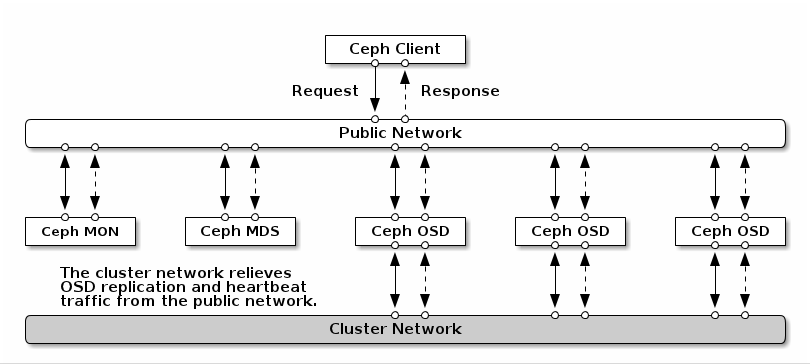

# Hardware

[TOC]

## 概述

Ceph 被设计为在商业硬件上运行，这使得构建和维护 PB 级数据集群变得灵活且经济可行。

在规划集群硬件时，需要均衡考虑几方面的因素，包括故障域、成本和性能。

硬件规划应包括在多台主机上分发 Ceph 守护进程和其他使用 Ceph 的进程。通常，建议在为特定类型的守护程序配置的主机上运行特定类型的 Ceph 守护程序。建议为使用数据集群的进程使用其他主机（例如，OpenStack、OpenNebula 、CloudStack 、Kubernetes 等）。

## 一般原则		

#### 识别性能用例

成功 Ceph  部署中最重要的一个步骤就是识别适合集群的用例和工作负载的性价比配置集。为用例选择正确的硬件非常重要。例如，为冷存储应用程序选择 IOPS  优化的硬件会不必要地增加硬件成本。然而，在 IOPS 密集型工作负载中，选择容量优化的硬件使其更具吸引力的价格点可能会导致用户对性能较慢的抱怨。

Ceph 的主要用例是： 		

- **优化 IOPS：** IOPS 优化的部署适合云计算操作，如将 MySQL 或 MariaDB 实例作为 OpenStack 上的虚拟机运行。优化 IOPS 部署需要更高的性能存储，如 15k RPM SAS 驱动器和单独的 SSD 日志，以处理频繁的写入操作。一些高 IOPS 情景使用所有闪存存储来提高 IOPS 和总吞吐量。
- **优化吞吐量：**使用优化吞吐量的部署适合服务大量数据，如图形、音频和视频内容。吞吐量优化的部署需要网络硬件、控制器和硬盘，具有可接受的总吞吐量特征。如果写入性能是必需的，SSD 日志会显著提高写入性能。
- **优化容量：** 容量优化部署适合以尽可能低的成本存储大量数据。容量优化的部署通常会以更具吸引力的价格点来换取性能。例如，容量优化部署通常使用速度较慢且成本更低的 SATA 驱动器和共同定位日志，而不是使用 SSD 进行日志。

#### 考虑存储密度

硬件规划应包括在很多主机间分发 Ceph 守护进程和其他进程，以便在出现硬件故障时维护高可用性。在出现硬件故障时，平衡存储密度的注意事项，以及需要重新平衡集群。一个常见的硬件选择错误是在小集群中使用非常高的存储密度，这可在回填和恢复操作过程中造成网络过载。

#### 相同的硬件配置

创建池并定义 CRUSH 层次结构，使得池中的 OSD 硬件相同。

- 相同的控制器。
- 相同的驱动器大小。
- 相同的 RPM。
- 同样的查询时间。
- 相同的 I/O。
- 相同的网络吞吐量。
- 相同的日志配置。

在池中使用相同的硬件提供一致的性能配置集，简化了置备并简化故障排除。

#### 网络注意事项

云存储解决方案的一个重要方面是存储集群可能会因为网络延迟及其他因素而耗尽 IOPS 。另外，存储集群可能会因为带宽限制而无法在存储集群用尽存储容量前耗尽吞吐量。这意味着网络硬件配置必须支持所选工作负载，以满足价格与性能要求。

存储管理员希望存储集群尽快恢复。仔细考虑存储集群网络的带宽要求、通过订阅的网络链接，以及隔离客户端到集群流量的集群内部流量。在考虑使用 Solid State Disks(SSD)、闪存、NVMe 和其他高性能存储设备时，还需要考虑到网络性能变得越来越重要。

Ceph 支持公共网络和存储集群网络。公共网络处理客户端流量以及与 Ceph 监控器的通信。存储集群网络处理 Ceph OSD 心跳、复制、回填和恢复流量。**至少**，存储硬件应使用 10 GB 的以太网链接，可以为连接和吞吐量添加额外的 10 GB 以太网链接。 		

> 重要：
>
> 建议为存储集群网络分配带宽，以便它是使用 `osd_pool_default_size` 作为复制池多个池基础的公共网络的倍数。建议在单独的网卡中运行公共和存储集群网络。
>
> 建议在生产环境中使用 10 GB 以太网部署 Ceph 。1 GB 以太网网络不适用于生产环境的存储集群。

如果出现驱动器故障，在 1 GB 以太网网络中复制 1 TB 数据需要 3 小时，3 TB 需要 9 小时。使用 3 TB  是典型的驱动器配置。相比之下，使用 10 GB 以太网网络，复制时间分别为 20 分钟和 1 小时。请记住，当 Ceph OSD  出现故障时，存储集群将通过将其包含的数据复制到池中的其他 Ceph OSD 来进行恢复。

对于大型环境（如机架）的故障，意味着存储集群将使用的带宽要高得多。在构建由多个机架组成的存储群集（对于大型存储实施常见）时，应考虑在"树树"设计中的交换机之间利用尽可能多的网络带宽，以获得最佳性能。典型的 10 GB 以太网交换机有 48 个10 GB 端口和四个 40 GB 端口。使用 40 GB 端口以获得最大吞吐量。或者，考虑将未使用的 10 GB 端口和 QSFP+ 和 SFP+ 电缆聚合到 40 GB 端口，以连接到其他机架和机械路由器。此外，还要考虑使用 LACP 模式 4  来绑定网络接口。另外，使用巨型帧、最大传输单元 (MTU) 9000，特别是在后端或集群网络上。

在安装和测试 Ceph 集群之前，请验证网络吞吐量。Ceph 中大多数与性能相关的问题通常是因为网络问题造成的。简单的网络问题（如粒度或 Bean Cat-6 电缆）可能会导致带宽下降。至少将 10 GB  以太网用于前端网络。对于大型集群，请考虑将 40 GB ethernet 用于后端或集群网络。

为了优化网络，建议使用巨型帧来获得更高的每带宽比率的 CPU，以及一个非阻塞的网络交换机后端。Ceph 在通信路径的所有网络设备中，公共和集群网络需要相同的 MTU 值。在生产环境中使用 Ceph 集群之前，验证环境中所有主机和网络设备上的 MTU 值相同。

#### 避免使用 RAID 解决方案

Ceph 可以复制或擦除代码对象。RAID 在块级别上复制这个功能，并减少可用容量。因此，RAID 是一个不必要的费用。另外，降级的 RAID 会对性能造成**负面**影响。

建议将每个硬盘驱动器作为启用写后缓存的一个卷与 RAID 控制器分开导出。

这需要在存储控制器上有一个由电池备份的设备或非易失性存储器设备。务必要确保电池可以正常工作，因为如果控制器上的内存因为电源失败而丢失，大多数控制器上的缓存将禁用回写缓存。定期检查电池并在必要时替换它们，因为它们会随着时间的推移降级。详情请查看存储控制器厂商文档。通常，存储控制器厂商会提供存储管理实用程序，以监控和调整存储控制器配置，而无需停机。

当全部使用 SSD（Solid State Drives），或每个控制器都配置了大量驱动器时，支持在 Ceph 中以独立驱动器模式使用  Just a Bunch Drives (JBOD)。例如，有 60 个驱动器附加到一个控制器。在这种情况下，回写缓存可能会形成一个 I/O  内容源竞争。由于 JBOD 禁用回写缓存，因此在这种情况下是理想的选择。使用 JBOD 模式的一个优点是易于添加或替换驱动器，然后在物理插入后立即向操作系统公开驱动器。

#### 选择硬件时可能出现的常见错误

- 仍然使用旧的、性能较差的硬件用于 Ceph。
- 在同一个池中使用不同的硬件。
- 使用 1Gbps 网络而不是 10Gbps 或更快的网络。
- 没有正确设置公共和集群网络。
- 使用 RAID 而不是 JBOD。
- 在选中驱动器时只考虑了价格而没有考虑性能或吞吐量。
- 当用例需要 SSD 日志时，在 OSD 数据驱动器上进行日志。
- 磁盘控制器的吞吐量不足。

## 优化工作负载性能域

Ceph 存储的一个关键优点是，能够使用 Ceph 性能域功能支持同一集群中的不同类型的工作负载。不同的性能域可以与显著不同的硬件配置相关联。Ceph 管理员可以在适当的性能域中部署存储池，为应用提供专为特定性能和成本配置文件量身定制的存储。为这些性能域选择适当的大小和优化的服务器是设计 Ceph 集群的一个重要方面。

以下列表提供了红帽用来识别存储服务器上最佳 Red Hat Ceph Storage 集群配置的条件。这些类别作为硬件采购和配置决策的一般准则，可调整以满足独特工作负载需求。选择的实际硬件配置将根据特定工作负载混合和厂商功能而有所不同。

**优化 IOPS**

IOPS 优化的存储集群通常具有以下属性： 		

- 每个 IOPS 的成本最低。
- 每 GB 的 IOPS 最高。
- 99 个百分点延迟一致性. 

通常为 IOPS 优化的存储集群使用：

- 典型的块存储. 
- 用于硬盘 (HDD) 或 2x 复制的 3 倍复制，用于固态硬盘 (SSD)。
- OpenStack 云上的 MySQL. 

**优化吞吐量**

吞吐量优化型存储集群通常具有以下属性：

- 每 MBps 成本最低（吞吐量）。
- 每个 TB 的 MBps 最高。
- 每个 BTU 的 MBps 最高。
- 每个 Watt 的 MBps 最高。
- 97% 的延迟一致性. 

使用针对吞吐量优化的存储集群通常用于：

- 块或对象存储。
- 3 倍复制。
- 面向视频、音频和图像的主动性能存储.
- 流媒体。

**针对成本和容量优化**

成本和容量优化型存储集群通常具有以下属性：

- 每 TB 成本最低。
- 每 TB 的 BTU 最低。
- 每 TB 的 Watts 最低.

使用针对成不和容量优化的存储集群通常用于：

- 典型的对象存储。
- 常见擦除编码功能，以最大化可用容量
- 对象存档。
- 视频、音频和图像对象存储库.

**性能域如何工作**

在读取和写入数据的 Ceph 客户端接口中，Ceph  存储集群显示为一个客户端存储数据的简单池。但是，存储集群以对客户端接口完全透明的方式执行许多复杂的操作。Ceph 客户端和 Ceph  对象存储守护进程（称为 Ceph OSD）或只是 OSD，都使用可扩展哈希下的受控复制 (CRUSH) 算法来存储和检索对象。OSD 在 OSD 主机上运行 - 集群内的存储服务器。

CRUSH map 描述了集群资源的拓扑结构，并且 map 存在于客户端节点和集群中的 Ceph Monitor (MON)  节点中。Ceph 客户端和 Ceph OSD 都使用 CRUSH map 和 CRUSH 算法。Ceph 客户端直接与 OSD  通信，消除了集中式对象查找和潜在的性能瓶颈。利用 CRUSH map 并与其对等方通信，OSD 可以处理复制、回填和恢复，从而实现动态故障恢复。

Ceph 使用 CRUSH map 来实施故障域。Ceph 还使用 CRUSH map  实施性能域，这只需将底层硬件的性能配置文件纳入考量。CRUSH map 描述了 Ceph  存储数据的方式，它作为简单的层次结构（特别是圆环图和规则集）实施。CRUSH map  可以支持多种层次结构，将一种类型的硬件性能配置集与另一类分隔开。

以下示例描述了性能域。

- 硬盘 (HDD) 通常适合以成本和容量为导向的工作负载。
- 吞吐量敏感的工作负载通常使用 HDD，在固态驱动器 (SSD) 上 Ceph 写入日志。
- MySQL 和 MariaDB 等 IOPS 密集型工作负载通常使用 SSD。

所有这些性能域都可以在 Ceph 存储群集中共存。

## 服务器和机架解决方案

硬件供应商针对 Ceph 的流行，提供了服务器级和机架级优化解决方案 SKU 。硬件厂商会和红帽对这些解决方案进行联合测试，为 Ceph 部署提供了可预测的性价比，并提供了一种便捷的模块化方法扩展 Ceph 存储。

典型的机架级解决方案包括：

- **网络交换：** 冗余网络交换与集群连接，并提供对客户端的访问。
- **Ceph MON 节点：** Ceph 监视器是整个集群的健康状态的数据存储，包含集群日志记录。对于生产环境中的集群仲裁，强烈建议至少有三个监控节点。
- **Ceph OSD 主机：** Ceph OSD 主机用于托管集群的存储容量，每个存储设备运行一个或多个 OSD。根据工作负载优化和安装的数据设备，会不同选择并配置 OSD 主机： HDD、SSD 或 NVMe SSD。
- **Red Hat Ceph Storage：** 许多供应商为与服务器和机架级解决方案 SKU 捆绑在一起的 Red Hat Ceph Storage 提供基于容量的订阅。 			

注意

建议在采用任何服务器和机架解决方案前，请查阅 [*Red Hat Ceph Storage: 支持配置*](https://access.redhat.com/articles/1548993) 文章。联系[*红帽支持*](https://access.redhat.com/support/contact/technicalSupport)以获取任何其他帮助。 		

**IOPS 优化的解决方案**

​				随着闪存存储的使用不断增长，越来越多的机构选择在 Ceph 存储集群中托管 IOPS  密集型工作负载，以便使用私有云存储实现高性能公有云解决方案。这些工作负载通常涉及 MySQL、MariaDB 或基于 PostgreSQL  的应用程序的结构化数据。 		

​			典型的服务器包括以下元素： 	

- ​					**CPU：** 每个 NVMe SSD 10 个内核，假设为一个 2 GHz CPU。 			
- ​					**RAM：**16 GB 基线，以及每个 OSD 额外 5 GB。 			
- ​					**网络：** 每 2 个 OSD 10 千兆位以太网(GbE) 			
- ​					**OSD 介质：** 高性能、高端的企业级 NVMe SSD。 			
- ​					**OSD：** 每个 NVMe SSD 两个。 			
- ​					**BlueStore WAL/DB：** 高性能、高端的企业级 NVMe SSD，与 OSD 共存。 			
- ​					**Controller：**原生 PCIe 总线. 			

注意

​				对于 Non-NVMe SSD，对于 **CPU**，每个 SSD OSD 两个内核。 		

**表 4.1. 按集群大小进行 IOPS 优化的 Ceph 负载的解决方案 SKU。**

| Vendor                                                       | Small (250TB)      | Medium (1PB) | Large (2PB+) |
| ------------------------------------------------------------ | ------------------ | ------------ | ------------ |
| SuperMicro [[a\]](https://access.redhat.com/documentation/zh-cn/red_hat_ceph_storage/7/html/hardware_guide/server-and-rack-solutions_hw#ftn.supermicro) | SYS-5038MR-OSD006P | N/A          | N/A          |
| [[a\] ](https://access.redhat.com/documentation/zh-cn/red_hat_ceph_storage/7/html/hardware_guide/server-and-rack-solutions_hw#supermicro) 							详情请参阅 [Ceph 的 Supermicro® 总解决方案](https://www.supermicro.com/solutions/storage_ceph.cfm)。 |                    |              |              |

**Throughput-optimized 解决方案**

​				吞吐量优化的 Ceph 解决方案通常围绕半结构化或非结构化数据进行优化。典型为大块顺序 I/O。 		

​			典型的服务器元素包括： 	

- ​					**CPU：**每个 HDD 0.5 个内核，假定 2 GHz CPU。 			
- ​					**RAM：**16 GB 基线，以及每个 OSD 额外 5 GB。 			
- ​					**网络：** 每 12 个 OSD 一个 10 GbE，用于客户端和面向集群的网络。 			
- ​					**OSD 介质：** 7200 RPM 企业级 HDD。 			
- ​					**OSD：** 每个 HDD 一个。 			
- ​					**BlueStore WAL/DB：** 高性能、高端的企业级 NVMe SSD，与 OSD 共存。 			
- ​					**主机总线适配器(HBA)：** Just a bunch of disks (JBOD)。 			

​			多个供应商为吞吐量优化的 Ceph 工作负载提供预配置的服务器和机架级解决方案。红帽对来自 Supermicro 和 Quanta Cloud Technologies(QCT)的服务器进行了广泛的测试和评估。 	

**表 4.2. 用于 Ceph OSD、MON 和最顶层(TOR)交换机的机架级 SKU。**

| Vendor                                                       | Small (250TB)      | Medium (1PB)       | Large (2PB+)       |
| ------------------------------------------------------------ | ------------------ | ------------------ | ------------------ |
| SuperMicro [[a\]](https://access.redhat.com/documentation/zh-cn/red_hat_ceph_storage/7/html/hardware_guide/server-and-rack-solutions_hw#ftn.supermicro) | SRS-42E112-Ceph-03 | SRS-42E136-Ceph-03 | SRS-42E136-Ceph-03 |

**表 4.3. 单个 OSD 服务器**

| Vendor                                                       | Small (250TB)     | Medium (1PB)     | Large (2PB+)     |
| ------------------------------------------------------------ | ----------------- | ---------------- | ---------------- |
| SuperMicro [[a\]](https://access.redhat.com/documentation/zh-cn/red_hat_ceph_storage/7/html/hardware_guide/server-and-rack-solutions_hw#ftn.supermicro) | SSG-6028R-OSD072P | SSG-6048-OSD216P | SSG-6048-OSD216P |
| QCT [[a\]](https://access.redhat.com/documentation/zh-cn/red_hat_ceph_storage/7/html/hardware_guide/server-and-rack-solutions_hw#ftn.qct) | QxStor RCT-200    | QxStor RCT-400   | QxStor RCT-400   |
| [[a\] ](https://access.redhat.com/documentation/zh-cn/red_hat_ceph_storage/7/html/hardware_guide/server-and-rack-solutions_hw#qct) 							有关详细信息，请参阅 [QCT: QxStor Red Hat Ceph Storage Edition](http://www.qct.io/solution/index/Storage-Virtualization/QxStor-Red-Hat-Ceph-Storage-Edition#specifications)。 |                   |                  |                  |

**额外的服务器配置用于优化的 Ceph OSD 工作负载。**

| Vendor                                                       | Small (250TB)                                                | Medium (1PB)                                                 | Large (2PB+)                                                 |
| ------------------------------------------------------------ | ------------------------------------------------------------ | ------------------------------------------------------------ | ------------------------------------------------------------ |
| Dell                                                         | PowerEdge R730XD [[a\]](https://access.redhat.com/documentation/zh-cn/red_hat_ceph_storage/7/html/hardware_guide/server-and-rack-solutions_hw#ftn.r730xd) | DSS 7000 [[b\]](https://access.redhat.com/documentation/zh-cn/red_hat_ceph_storage/7/html/hardware_guide/server-and-rack-solutions_hw#ftn.dss), twin 节点 | DSS 7000， twin 节点                                         |
| Cisco                                                        | UCS C240 M4                                                  | UCS C3260 [[c\]](https://access.redhat.com/documentation/zh-cn/red_hat_ceph_storage/7/html/hardware_guide/server-and-rack-solutions_hw#ftn.rhc3260) | UCS C3260 [[d\]](https://access.redhat.com/documentation/zh-cn/red_hat_ceph_storage/7/html/hardware_guide/server-and-rack-solutions_hw#ftn.c3260) |
| Lenovo                                                       | System x3650 M5                                              | System x3650 M5                                              | N/A                                                          |
| [[a\] ](https://access.redhat.com/documentation/zh-cn/red_hat_ceph_storage/7/html/hardware_guide/server-and-rack-solutions_hw#r730xd) 详情请参阅 [Dell PowerEdge R730xd Performance and Sizing Guide for Red Hat Ceph Storage - A Dell Red Hat Technical White Paper](http://en.community.dell.com/techcenter/cloud/m/dell_cloud_resources/20442913/download)。 						[[b\] ](https://access.redhat.com/documentation/zh-cn/red_hat_ceph_storage/7/html/hardware_guide/server-and-rack-solutions_hw#dss) 							详情请参阅 [Dell EMC DSS 7000 Performance & Sizing Guide for Red Hat Ceph Storage](http://en.community.dell.com/techcenter/cloud/m/dell_cloud_resources/20443454/)。 						[[c\] ](https://access.redhat.com/documentation/zh-cn/red_hat_ceph_storage/7/html/hardware_guide/server-and-rack-solutions_hw#rhc3260) 							详情请参阅 [Red Hat Ceph Storage 硬件参考架构](https://www.redhat.com/en/resources/resources-red-hat-ceph-storage-hardware-selection-guide-html)。 						[[d\] ](https://access.redhat.com/documentation/zh-cn/red_hat_ceph_storage/7/html/hardware_guide/server-and-rack-solutions_hw#c3260) 							详情请查看 [UCS C3260](https://www.cisco.com/c/en/us/products/servers-unified-computing/ucs-c3260-rack-server/index.html) |                                                              |                                                              |                                                              |

**成本和容量优化的解决方案**

成本和容量优化的解决方案通常侧重于高容量，或者更长的归档场景。数据可以是半结构化或非结构化。工作负载包括媒体存档、大数据分析存档和机器镜像备份。典型为大块顺序 I/O。 		

解决方案通常包括以下元素： 	

- **CPU。**每个 HDD 0.5 个内核，假设 2 GHz CPU。
- **RAM。**16 GB 基准，以及每个 OSD 额外 5 GB。
- **网络。**每 12 个 OSD 10 GbE（每个用于客户端和面向集群的网络）。
- **OSD 介质。**7,200 RPM 企业级 HDD。
- **OSD。**每个 HDD 一个。
- **BlueStore WAL/DB** 共同位于 HDD。
- **HBA。**JBOD。

Supermicro 和 QCT 为以成本及容量为中心的 Ceph 工作负载提供预配置服务器和机架级解决方案 SKU。 	

**预先配置的 Rack-level SKU，用于成本优化和容量优化的工作负载**

| Vendor                                                       | Small (250TB) | Medium (1PB)       | Large (2PB+)       |
| ------------------------------------------------------------ | ------------- | ------------------ | ------------------ |
| SuperMicro [[a\]](https://access.redhat.com/documentation/zh-cn/red_hat_ceph_storage/7/html/hardware_guide/server-and-rack-solutions_hw#ftn.supermicro) | N/A           | SRS-42E136-Ceph-03 | SRS-42E172-Ceph-03 |

**用于节约成本和容量优化工作负载的预配置服务器级 SKU**

| Vendor                                                       | Small (250TB) | Medium (1PB)                                                 | Large (2PB+)                                                 |
| ------------------------------------------------------------ | ------------- | ------------------------------------------------------------ | ------------------------------------------------------------ |
| SuperMicro [[a\]](https://access.redhat.com/documentation/zh-cn/red_hat_ceph_storage/7/html/hardware_guide/server-and-rack-solutions_hw#ftn.supermicro) | N/A           | SSG-6048R-OSD216P [[a\]](https://access.redhat.com/documentation/zh-cn/red_hat_ceph_storage/7/html/hardware_guide/server-and-rack-solutions_hw#ftn.sm2) | SSD-6048R-OSD360P                                            |
| QCT                                                          | N/A           | QxStor RCC-400 [[a\]](https://access.redhat.com/documentation/zh-cn/red_hat_ceph_storage/7/html/hardware_guide/server-and-rack-solutions_hw#ftn.qct) | QxStor RCC-400 [[a\]](https://access.redhat.com/documentation/zh-cn/red_hat_ceph_storage/7/html/hardware_guide/server-and-rack-solutions_hw#ftn.qct) |
| [[a\] ](https://access.redhat.com/documentation/zh-cn/red_hat_ceph_storage/7/html/hardware_guide/server-and-rack-solutions_hw#sm2) 							有关详细信息，请参见 [Supermicro 的总解决方案](https://www.supermicro.com/solutions/datasheet_Ceph.pdf)。 |               |                                                              |                                                              |

**额外的服务器配置用于成本和容量优化的工作负载**

| Vendor | Small (250TB) | Medium (1PB)         | Large (2PB+)         |
| ------ | ------------- | -------------------- | -------------------- |
| Dell   | N/A           | DSS 7000， twin 节点 | DSS 7000， twin 节点 |
| Cisco  | N/A           | UCS C3260            | UCS C3260            |
| Lenovo | N/A           | System x3650 M5      | N/A                  |

## 容器化 Ceph 的最低硬件建议

​			Ceph 可以在非专有的商用硬件上运行。通过使用适度的硬件，可在不优化性能的情况下运行小型生产集群和开发集群。 	

| Process                  | 标准                                                         | 最低建议                                               |
| ------------------------ | ------------------------------------------------------------ | ------------------------------------------------------ |
| `ceph-osd-container`     | 处理器                                                       | 每个 OSD 容器 1 个 AMD64 或 Intel 64 CPU CORE          |
| RAM                      | 每个 OSD 容器最少 5 GB RAM                                   |                                                        |
| OS Disk                  | 每个主机 1 个 OS 磁盘                                        |                                                        |
| OSD 存储                 | 每个 OSD 容器 1X 存储驱动器。无法与 OS 磁盘共享。            |                                                        |
| `block.db`               | 可选，但红帽建议每个守护进程 1x SSD 或 NVMe 或 Optane 分区或 lvm。对于对象、文件和混合工作负载，大小是 BlueStore 的 `block.data` 的 4%；对于块设备、Openstack cinder 和 Openstack cinder 工作负载，大小是 BlueStore 的 `block.data` 的 1%。 |                                                        |
| `block.wal`              | （可选）每个守护进程 1 个 SSD 或 NVMe 或 Optane 分区或逻辑卷。只有在速度比 `block.db` 设备快时，才使用一个小的大小值（如 10 GB） 。 |                                                        |
| Network                  | 2x 10 GB 以太网 NIC                                          |                                                        |
| `ceph-mon-container`     | 处理器                                                       | 每个 mon-container 1 个 AMD64 或 Intel 64 CPU 内核     |
| RAM                      | 每个 `mon-container` 3 GB                                    |                                                        |
| 磁盘空间                 | 每个 `mon-container` 10 GB，但推荐 50 GB                     |                                                        |
| 监控磁盘                 | 另外，1 个 SSD 磁盘用于 `monitor rocksdb` 数据               |                                                        |
| Network                  | 2x 1GB 以太网 NIC，推荐 10 GB                                |                                                        |
| `ceph-mgr-container`     | 处理器                                                       | 每个 `mgr-container` 1 个 AMD64 或 Intel 64 CPU 内核   |
| RAM                      | 每个 `mgr-container` 3 GB                                    |                                                        |
| Network                  | 2x 1GB 以太网 NIC，推荐 10 GB                                |                                                        |
| `ceph-radosgw-container` | 处理器                                                       | 每个 radosgw-container 1 个 AMD64 或 Intel 64 CPU 内核 |
| RAM                      | 每个守护进程 1 GB                                            |                                                        |
| 磁盘空间                 | 每个守护进程 5 GB                                            |                                                        |
| Network                  | 1x 1GB 以太网 NIC                                            |                                                        |
| `ceph-mds-container`     | 处理器                                                       | 每个 mds-container 1 个 AMD64 或 Intel 64 CPU 内核     |
| RAM                      | 每个 `mds-container` 3 GB 					 					  						这个数字高度依赖于可配置的 MDS 缓存大小。RAM 要求通常为 `mds_cache_memory_limit` 配置设置中设置的两倍。另请注意，这是守护进程的内存，而不是整体系统内存。 |                                                        |
| 磁盘空间                 | 每个 `mds-container` 2 GB，并考虑可能调试日志所需的额外空间，20GB 是个不错的起点。 |                                                        |
| Network                  | 2x 1GB 以太网 NIC，推荐 10 GB 					 					  						请注意，这与 OSD 容器网络相同。如果您在 OSD 上有一个 10 GB 网络，则应在 MDS 上使用相同的网络，这样 MDS 在涉及延迟时不会产生判断。 |                                                        |


## 推荐的 Red Hat Ceph Storage 仪表板的最低硬件要求

- 4 个内核处理器，2.5 GHz 或更高的处理器。
- 8 GB RAM。
- 50 GB 硬盘。
- 1 Gigabit Ethernet 网络接口 			

## CPU

OSD 需要足够的处理能力去运行 RADOS 服务，使用 CRUSH 计算数据放置，复制数据，并维护自己的 cluster map 副本。

在早期版本的 Ceph 中，会根据每个 OSD 的核心数来提出硬件建议，但这个 cores-per-OSD 指标不再像每个 IOP 的周期数和每个 OSD  IOP 数那样有用。例如，借助 NVMe 驱动器，Ceph 可以轻松地在实际集群上使用 5 或 6 个内核，在单个 OSD 上单独使用多达 14 个内核。Ceph can easily utilize five or six cores on real clusters and up to about fourteen cores on single OSDs in isolation. 因此，每个 OSD 的核心不再像以前那样紧迫。选择硬件时，选择每个核心的 IOP 。

> 当谈到CPU core 时，这里指的是启用超线程时的 thread 。超线程通常对 Ceph 服务器有益。

MON 节点和 MGR 节点对 CPU 的要求不高，只需要适度的处理器。如果主机除了 Ceph 守护程序之外，还将运行 CPU 密集型程序，请确保具有足够的处理能力来同时运行 CPU 密集型程序和 Ceph 守护程序。建议在单独的主机上运行非 Ceph CPU 密集型程序（在不是 MON 和 MGR 节点的主机上），以避免资源争夺。

如果群集部署了 Ceph 对象网关，则 RGW 守护程序可能与 MON 和 MGR 服务共存（如果节点有足够的资源）。

### MDS

MDS 是 CPU 密集型服务，是单线程的，在高时钟频率（GHz）的CPU上性能最佳。不需要大量的 CPU 核心，除非它们还托管其他服务，例如用于 CephFS 元数据池的 SSD OSD 。

MDS 的当前版本对于大多数活动（包括响应客户端请求）来说都是单线程和 CPU绑定（ CPU-bound ）的。An MDS under the most aggressive client loads uses about 2 to 3 CPU cores. 在最激进的客户端负载下，MDS 使用大约 2 到 3 个 CPU 核心。This is due to the other miscellaneous upkeep threads working in tandem.这是由于其他杂项维护线程协同工作。

即便如此，建议 MDS 服务器配备具有足够核心的高级 CPU 。开发正在进行中，以更好地在 MDS 中利用可用的 CPU 核心。预计在 Ceph 的未来版本中，MDS 将通过利用更多核心来提高性能。

## 内存

一般来说，RAM 越多越好。对于中等规模的集群，MON / MGR 可以使用 64GB；对于具有数百个 OSD 的较大集群，128GB 是合理的。

> when we speak of RAM and storage requirements, we often describe the needs of a single daemon of a given type.  A given server as a whole will thus need at least the sum of the needs of the daemons that it hosts as well as resources for logs and other operating system components.  Keep in mind that a server’s need for RAM and storage will be greater at startup and when components fail or are added and the cluster rebalances.  In other words, allow headroom past what you might see used during a calm period on a small initial cluster footprint.
>
> 当我们谈到 RAM 和存储需求时，通常描述给定类型的单个守护程序的需求。因此，一个给定的服务器作为一个整体至少需要它所承载的守护进程的需求以及日志和其他操作系统组件的资源的总和。请记住，服务器在启动时以及组件出现故障或添加组件以及群集重新平衡时对RAM和存储的需求会更大。换句话说，在一个小的初始集群占用空间上，允许超过您在平静时期可能看到的使用量。
>
> 当我们谈到 RAM  和存储要求时，我们经常描述给定类型的单个守护进程的需求。因此，给定服务器作为一个整体，至少需要它所托管的守护进程的需求以及日志和其他操作系统组件的资源的总和。请记住，服务器在启动时以及组件发生故障或添加以及群集重新平衡时对 RAM 和存储的需求会更大。换言之，在较小的初始集群占用空间上，留出超过平静时期可能使用的余量。

BlueStore OSD 的 `osd_memory_target` 被设置默认为 4GB 。Factor in a prudent margin for the operating system and administrative tasks (like monitoring and metrics) as well as increased consumption during recovery: 虑到操作系统和管理任务（如监视和度量）以及恢复期间增加的消耗，建议为每个 BlueStore OSD 配置约 8GB 。

### MON / MGR

MON 和 MGR 内存使用通常随集群的大小而扩展。在引导时、拓扑更改和恢复期间，这些守护进程将需要比稳态运行期间更多的 RAM。需计划峰值使用率。对于非常小的集群，32GB 就足够了。对于高达 300 个 OSD 的集群，可以使用 64GB。对于使用更多（或者将增长到更多）OSD 构建的集群，应该提供 128GB 。可能需要考虑调整以下设置：

* `mon_osd_cache_size`
* `rocksdb_cache_size`

### MDS

The MDS necessarily manages a distributed and cooperative metadata cache among all clients and other active MDSs. MDS 必须管理所有客户端和其他活动 MDS 之间的分布式和协作的元数据缓存。因此，必须为MDS提供足够的RAM，以实现更快的元数据访问和变化。默认 MDS 缓存大小为 4GB 。建议为 MDS 配置至少 8 GB 的 RAM 以支持此缓存大小。

通常，为大型客户端集群（1000 或更多）服务的 MDS 将使用至少 64 GB 的缓存。An MDS with a larger cache is not well explored in the largest known community clusters。在最大的已知社区集群中，没有很好地探索具有较大缓存的 MDS 。there may be diminishing returns where management of such a large cache negatively impacts performance in surprising ways.在管理如此大的缓存以令人惊讶的方式对性能产生负面影响的情况下，可能存在收益递减。最好对预期的工作负载进行分析，以确定是否值得配置更多的 RAM 。

在裸机集群中，最佳做法是为 MDS 过度配置硬件。即使单个 MDS 守护进程无法充分利用硬件，稍后也可能需要在同一节点上启动更多活动 MDS 守护进程，以充分利用可用的内核和内存。此外，对于群集上的工作负载，可以清楚地看出，在同一节点上使用多个活动 MDS 而不是过度配置单个 MDS 可以提高性能。

最后，请注意 CephFS 是一个高可用性文件系统，它支持备用 MDS 以实现快速故障转移。为了从部署备用进程中获得真实的好处，通常需要在集群中的至少两个节点上分发 MDS 守护进程。否则，单个节点上的硬件故障可能导致文件系统变得不可用。

将 MDS 与其他 Ceph 守护进程（超融合）放在一起是一种有效的推荐方法，只要所有守护进程都配置为在特定限制内使用可用硬件即可。对于 MDS ，这通常意味着限制其缓存大小。

MDS 内存利用率取决于其缓存配置的大小。对于大多数系统，建议至少 1 GB。

* `mds_cache_memory_limit`

### OSD

Bluestore 使用自己的内存来缓存数据，而不是依赖于操作系统的页面缓存。在 Bluestore 中，可使用 `osd_memory_target` 配置选项调整 OSD 尝试使用的内存量。

- 不建议将 `osd_memory_target` 设置为 2GB 以下（可能无法将内存消耗保持在 2GB 以下，并且可能会导致极低的性能。）。
- 将内存目标设置在 2 - 4 GB 之间通常是可行的，但可能会导致性能下降，因为在 IO 期间可能会从磁盘读取元数据，除非活动数据集相对较小。
- 4GB 是当前默认 `osd_memory_target` 大小。为典型用例选择了此默认值，旨在平衡内存消耗和 OSD 性能。
- 当有许多（小）对象或处理大（256 GB/OSD 或更大）数据集时，将 `osd_memory_target` 设置为高于 4GB 可以提高性能。对于快速的 NVMe OSD 来说尤其如此。

> **重要：**
>
> OSD 内存管理是“尽力而为”。尽管 OSD 可以取消内存映射以允许内核回收它，但不能保证内核将在特定的时间范围内实际回收释放的内存。这在旧版本的 Ceph 中尤其适用，where transparent huge pages can prevent the kernel from reclaiming memory that was freed from fragmented huge pages. 其中透明的大页面可以阻止内核回收从碎片化的大页面中释放的内存。现代版本的 Ceph 在应用程序级别禁用透明的巨大页面以避免这种情况，但这并不能保证内核会立即回收未映射的内存。The OSD may still at times exceed its memory target. OSD 有时仍可能超过其存储器目标。建议在系统上至少预留 20% 的额外内存，以防止 OSD 在临时高峰期间或由于内核回收释放页面的延迟而出现 OOM（内存不足）。这个 20% 的值可能比所需的多或少，具体取决于系统的确切配置。
>
> OSD 内存管理是 “尽力而为”。尽管 OSD  可能会取消映射内存以允许内核回收内存，但不能保证内核会在特定时间范围内实际回收已释放的内存。这在旧版本的 Ceph  中尤其适用，其中透明大页面可能会阻止内核回收从碎片化大页面释放的内存。Ceph  的现代版本在应用程序级别禁用透明大页面以避免这种情况，但这并不能保证内核会立即回收未映射的内存。OSD  有时仍可能超过其内存目标。我们建议在系统上至少预算 20% 的额外内存，以防止 OSD 在临时峰值期间或由于内核回收释放页面的延迟而进入 OOM （**O**ut **O**f **M**emory）。该 20% 值可能大于或小于所需值，具体取决于系统的确切配置。
>
> 对于现代系统，不建议使用 swap 配置操作系统来为守护进程提供额外的虚拟内存。这样做可能会导致性能降低，并且 Ceph 集群可能会更喜欢崩溃的守护进程，而不是慢到爬行的守护进程。
>
> 对于现代系统，不建议使用交换功能配置作系统，以便为守护进程提供额外的虚拟内存。这样做可能会导致性能降低，并且您的 Ceph 集群可能会更愿意使用崩溃的守护进程，而不是缓慢的守护进程。

在使用旧版 FileStore 后端时，操作系统页面缓存用于缓存数据，因此通常不需要调优。OSD 内存消耗与系统中每个守护程序的 PG 数量有关。

## 数据存储

在规划数据存储时，需要考虑大量的成本和性能权衡。同时执行操作系统操作以及来自多个守护程序的针对单个驱动器的读取和写入操作的同步请求可能会影响性能。

OSD 需要大量的存储驱动器空间来存储 RADOS 数据。建议最小驱动器大小为 1 TB。远远小于 1 TB 的 OSD 驱动器将其容量的很大一部分用于元数据，而小于 100 GB 的驱动器将完全无效。

强烈建议至少为 MON 和 MGR 主机以及 CephFS  MDS 元数据池和 Ceph 对象网关（RGW）索引池配置（企业级）SSD，即使要为批量 OSD 数据配置 HDD 也是如此。

要获得 Ceph 的最佳性能，在单独的驱动器上运行以下内容：

* 操作系统
* OSD 数据
* BlueStore WAL+DB

### 硬盘驱动器

考虑较大磁盘的每 GB 成本优势。建议将磁盘驱动器的价格除以 GB 数，以得出每 GB 的成本，因为较大的驱动器可能会对每 GB 的成本产生重大影响。

不建议在一个 SAS / SATA 驱动器上运行多个 OSD ，这可能会导致资源争夺并减少整体吞吐量。但 NVMe 驱动器可以通过拆分成两个以上的 OSD 来提高性能。

不建议在单个驱动器上同时运行 OSD、MON、MGR 或 MDS 。

使用旋转磁盘时，SATA 和 SAS 接口在更大的容量下日益成为瓶颈。

存储驱动器受寻道时间、访问时间、读取和写入时间以及总吞吐量的限制。这些物理限制会影响整体系统性能，尤其是在恢复期间。建议为操作系统和软件使用专用（理想情况下是镜像的）驱动器，并为主机上运行的每个 OSD 使用一个驱动器。许多 “slow OSD” 问题（当它们不是由硬件故障引起时）是由于在同一驱动器上运行操作系统和多个 OSD 引起的。还要注意的是，今天的 22 TB 硬盘使用的 SATA 接口与十年前的 3 TB 硬盘相同：more than seven times the data to squeeze through the same same interface通过同一接口压缩的数据是原来的 7 倍多。因此，在将 HDD 用于 OSD 时，大于 8 TB 的驱动器可能最适合存储对性能完全不敏感的大型文件/对象。

### 固态硬盘

当使用固态硬盘（SSD）时，Ceph 的性能得到了很大的提高。这减少了随机访问时间，减少了延迟的同时，增加了吞吐量。

SSD 的每 GB 成本高于 HDD，但 SSD 通常提供的访问时间至少比 HDD 快100倍。SSD 避免了繁忙集群中的热点问题和瓶颈问题，并且在全面评估 TCO 时，可以提供更好的经济性。

SSDs cost more per gigabyte than do HDDs but SSDs often offer access times that are, at a minimum, 100 times faster than HDDs. SSDs avoid hotspot issues and bottleneck issues within busy clusters, and they may offer better economics when TCO is evaluated holistically. Notably, the amortized drive cost for a given number of IOPS is much lower with SSDs than with HDDs.  SSDs do not suffer rotational or seek latency and in addition to improved client performance, they substantially improve the speed and client impact of cluster changes including rebalancing when OSDs or Monitors are added, removed, or fail.

值得注意的是，对于给定数量的 IOPS ，SSD 的摊销驱动器成本远低于 HDD 。SSD 不会出现旋转或寻道延迟，除了提高客户端性能外，还大大提高了群集更改的速度和客户端影响，包括当 OSD 、MON 在添加、删除或发生故障时进行的重新平衡。

SSD 没有可移动的机械部件，因此它们不一定受到与 HDD 相同类型的限制。不过，SSD 确实有很大的局限性。在评估 SSD 时，重要的是要考虑顺序和随机读写的性能。

> **Important**
>
> 建议尝试使用 SSD 来提高性能。但是，在对 SSD 进行重大投资之前，强烈建议检查 SSD 的性能指标，并在测试配置中测试 SSD ，以评估性能。

相对便宜的 SSD ，请谨慎使用。在选择用于 Ceph 的 SSD 时，可接受的 IOPS 并不是唯一需要考虑的因素。便宜的 SSD 往往是一种虚假的经济：它们可能会经历“陡降”，这意味着在初始突发之后，一旦有限的高速缓存被填满，持续的性能就会显著下降。还要考虑耐久性：a drive rated for 0.3 Drive Writes Per Day (DWPD or equivalent) may be fine for OSDs dedicated to certain types of sequentially-written read-mostly data额定为 0.3 驱动器写入/天（DWPD 或等效）的驱动器对于专用于某些类型的顺序写入、主要为读取的数据的OSD来说可能是合适的，但是对于 Ceph MON 任务来说不是好的选择。企业级 SSD 是最适合 Ceph 的 ：  they almost always feature power less protection (PLP) and do not suffer the dramatic cliffing that client (desktop) models may experience.它们几乎总是以低功耗保护（PLP）为特征，并且不会遭受客户端（桌面）模型可能经历的急剧下降。

相对便宜的 SSD 可能会吸引您的经济意识。请谨慎使用。在选择用于 Ceph 的 SSD 时，可接受的 IOPS 并不是要考虑的唯一因素。便宜的 SSD  通常是一种虚假的经济：它们可能会遇到“悬崖”，这意味着在初始突发之后，一旦有限的缓存被填满，持续性能就会大大下降。还要考虑耐用性：额定每天  0.3 次驱动器写入（DWPD 或同等数据）的驱动器可能适用于专用于某些类型的顺序写入读取数据的 OSD，但对于 Ceph Monitor  任务来说不是一个好的选择。企业级 SSD 最适合 Ceph：它们几乎总是具有断电保护 （PLP）  功能，并且不会遭受客户端（桌面）模型可能遇到的戏剧性悬崖。

When using a single (or mirrored pair) SSD for both operating system boot and Ceph Monitor / Manager purposes, a minimum capacity of 256GB is advised and at least 480GB is recommended. A drive model rated at 1+ DWPD (or the equivalent in TBW (TeraBytes Written) is suggested.  However, for a given write workload, a larger drive than technically required will provide more endurance because it effectively has greater overprovisioning. We stress that enterprise-class drives are best for production use, as they feature power loss protection and increased durability compared to client (desktop) SKUs that are intended for much lighter and intermittent duty cycles.

当将单个（或镜像对）SSD 同时用于操作系统引导和 Ceph MON / MGR 时，最小容量为 256 GB，建议至少为 480 GB。建议使用额定值为 1+ DWPD 或等效值为 TBW（TeraBytes Written）的驱动器型号。但是，对于给定的写入工作负载，比技术要求更大的驱动器将提供更大的耐久性，因为它实际上具有更大的过预存。我们强调，企业级硬盘最适合生产使用，因为与客户端（台式机）SKU 相比，它们具有断电保护功能和更高的耐用性，而客户端（台式机）SKU 旨在实现更轻的间歇性工作周期。

SSDs have historically been cost prohibitive for object storage, but QLC SSDs are closing the gap, offering greater density with lower power consumption and less power spent on cooling. Also, HDD OSDs may see a significant write latency improvement by offloading WAL+DB onto an SSD. Many Ceph OSD deployments do not require an SSD with greater endurance than 1 DWPD (aka “read-optimized”).  “Mixed-use” SSDs in the 3 DWPD class are often overkill for this purpose and cost signficantly more.

SSD 在对象存储方面一直成本高昂，但 QLC SSD 正在缩小差距，以更低的功耗和更少的冷却功耗提供更高的密度。此外，HDD OSD 可以通过将 WAL+DB 卸载到 SSD 上来看到显著的写入延迟改善。许多 Ceph OSD 部署不需要具有大于 1 DWPD（也称为“读取优化”）的耐久性的 SSD。3 DWPD 级别的“混合用途” SSD 通常为此目的而大材小用，而且成本要高得多。

### 分区对齐

将 SSD 与 Ceph 一起使用时，请确保分区正确对齐。未正确对齐的分区的数据传输速度比正确对齐的较慢。

### CephFS Metadata 隔离

加速 CephFS 文件系统性能的一种方法是将 CephFS 元数据的存储与 CephFS 文件内容的存储分离。Ceph 为 CephFS 元数据提供默认 `metadata` 池。不必为 CephFS 元数据创建池，但可以为 CephFS 元数据池创建仅指向 SSD 存储介质的 CRUSH map 层次结构。

### 控制器

磁盘控制器（HBA）可能会对写入吞吐量产生重大影响。 仔细考虑 HBA 的选择，以确保它们不会造成性能瓶颈。值得注意的是，RAID 模式（IR）HBA 可能比简单的 “JBOD”（IT）模式 HBA 表现出更高的延迟。并且 RAID SoC、写缓存和电池备份可能会大幅增加硬件和维护成本。一些 RAID HBA 可以使用 IT 模式 “personality” 配置或 “ JBOD 模式”，以简化操作。

不需要 RoC（支持 RAID）HBA 。ZFS 或 Linux MD 软件镜像可以很好地提高引导卷的持久性。使用 SAS 或 SATA 数据驱动器时，放弃 HBA RAID 功能可以缩小 HDD 和 SSD 介质成本之间的差距。此外，当使用 NVMe SSD 时，不需要任何 HBA 。当系统作为一个整体考虑时，这还减少了 HDD 与 SSD 的成本差距。一个花哨的 RAID HBA 加上板载缓存和备用电池（BBU 或超级电容器）的初始成本很容易超过 1000 美元，a sum that goes a log way toward SSD cost parity.这一总和与SSD成本相当。如果购买年度维护合同或延长保修期，无 HBA 系统每年也可节省数百美元。

### 基准测试

BlueStore 使用 `O_DIRECT` 打开存储设备，并频繁发出 `fsync()` 以确保数据安全地持久化到介质。可以使用 `fio` 评估驱动器的低级写入性能。例如，4kB 随机写入性能测量如下：

```bash
fio --name=/dev/sdX --ioengine=libaio --direct=1 --fsync=1 --readwrite=randwrite --blocksize=4k --runtime=300
```

### 写缓存

企业级 SSD 和 HDD 通常包括断电丢失保护功能，可确保在运行过程中断电时的数据持久性，并使用多级缓存来加速直接或同步写入。这些设备可以在两种缓存模式之间切换——使用 fsync 将易失性缓存刷新到持久性介质，或者同步写入非易失性缓存。

通过“启用”或“禁用”写（易失性）缓存来选择这两种模式。启用易失性缓存时，Linux 使用处于 “ write back” 模式的设备，禁用时，它使用 “ write through ” 模式。

默认配置（通常为启用缓存）可能不是最佳配置，通过禁用写缓存，OSD 性能可能会显著提高 IOPS 并减少提交延迟。

鼓励用户如前所述使用 fio 对其设备进行基准测试，并为其设备保持最佳缓存配置。

可以使用  `hdparm`, `sdparm`, `smartctl` 或通过读取 `/sys/class/scsi_disk/*/cache_type` 中的值来查询缓存配置。例如：

```bash
hdparm -W /dev/sda
/dev/sda:
 write-caching =  1 (on)
====================================================================================
sdparm --get WCE /dev/sda
    /dev/sda: ATA       TOSHIBA MG07ACA1  0101
WCE           1  [cha: y]
==================================================================================== 
smartctl -g wcache /dev/sda
smartctl 7.1 2020-04-05 r5049 [x86_64-linux-4.18.0-305.19.1.el8_4.x86_64] (local build)
Copyright (C) 2002-19, Bruce Allen, Christian Franke, www.smartmontools.org

Write cache is:   Enabled
====================================================================================
cat /sys/class/scsi_disk/0\:0\:0\:0/cache_type
write back
```

使用相同的工具可以关闭写缓存：

```bash
hdparm -W0 /dev/sda
/dev/sda:
 setting drive write-caching to 0 (off)
 write-caching =  0 (off)
=====================================================================================
sdparm --clear WCE /dev/sda
    /dev/sda: ATA       TOSHIBA MG07ACA1  0101
=====================================================================================
smartctl -s wcache,off /dev/sda
smartctl 7.1 2020-04-05 r5049 [x86_64-linux-4.18.0-305.19.1.el8_4.x86_64] (local build)
Copyright (C) 2002-19, Bruce Allen, Christian Franke, www.smartmontools.org

=== START OF ENABLE/DISABLE COMMANDS SECTION ===
Write cache disabled
```

通常，使用 `hdparm`, `sdparm` 或 `smartctl` 禁用缓存会导致缓存类型自动更改为 “write through” 。如果情况并非如此，可以尝试按以下方式直接设置它。(Users should ensure that setting cache_type also correctly persists the caching mode of the device until the next reboot as some drives require this to be repeated at every boot)（用户应注意，保设置 cache_type 也能正确保持设备的缓存模式，直到下次重新启动，因为某些驱动器要求在每次启动时重复此操作）:

```bash
echo "write through" > /sys/class/scsi_disk/0\:0\:0\:0/cache_type

hdparm -W /dev/sda

/dev/sda:
 write-caching =  0 (off)
```

> **Tip**
>
> 此 udev 规则将所有 SATA / SAS 设备 cache_types 设置为 “write through” ：
>
> ```bash
> # CentOS 8
> cat /etc/udev/rules.d/99-ceph-write-through.rules
> ACTION=="add", SUBSYSTEM=="scsi_disk", ATTR{cache_type}:="write through"
> 
> # CentOS 7
> cat /etc/udev/rules.d/99-ceph-write-through-el7.rules
> ACTION=="add", SUBSYSTEM=="scsi_disk", RUN+="/bin/sh -c 'echo write through > /sys/class/scsi_disk/$kernel/cache_type'"
> ```

> **Tip**
>
> `sdparm` 实用程序可用于一次查看/更改多个设备上的易失性写缓存：
>
> ```bash
> sdparm --get WCE /dev/sd*
>     /dev/sda: ATA       TOSHIBA MG07ACA1  0101
> WCE           0  [cha: y]
>     /dev/sdb: ATA       TOSHIBA MG07ACA1  0101
> WCE           0  [cha: y]
> 
> sdparm --clear WCE /dev/sd*
>     /dev/sda: ATA       TOSHIBA MG07ACA1  0101
>     /dev/sdb: ATA       TOSHIBA MG07ACA1  0101
> ```

### 其他注意事项

通常为每台主机配置多个 OSD，但应该确保 OSD 驱动器的总吞吐量不会超过为客户端的读取和写入操作提供服务所需的网络带宽。还应该了解每个主机在群集总容量中所占的百分比。If the percentage located on a particular host is large and the host fails, it can lead to problems such as recovery causing OSDs to exceed the `full ratio`, which in turn causes Ceph to halt operations to prevent data loss.如果位于特定主机上的百分比很大，并且主机发生故障，则可能会导致问题，例如超过完整比率 `full ratio`，从而导致 Ceph 停止操作，作为防止数据丢失的安全预防措施。

当在每个主机上运行多个 OSD 时，还需要确保内核是最新的。

## 网络

在数据中心内，在 Ceph 主机之间以及客户端与 Ceph 群集之间至少配置 10 Gb/s 网络。强烈建议跨独立网络交换机进行网络链路 active / active 绑定，以提高吞吐量并容忍网络故障和维护。注意 bonding 哈希策略在链路之间分配流量。

### 速度

通过 1Gb/s 网络复制 1TB 数据需要 3 小时，10TB 则需要 30 小时。相比之下，使用 10Gb/s 网络，复制时间将分别为 20 分钟和 1 小时。

### 成本

群集越大，OSD 故障就越常见。归置组（PG）可以从 `degraded` 状态恢复到 `active + clean` 状态的速度越快越好。fast recovery minimizes the likelihood of multiple, overlapping failures that can cause data to become temporarily unavailable or even lost. 值得注意的是，快速恢复可最大程度地减少多个重叠故障的可能性，这些失败可能导致数据暂时无法使用，甚至丢失。当然，在配置网络时，必须平衡价格与性能。

一些部署工具采用 VLAN 来使硬件和网络布线更易于管理。使用 802.1q 协议的 VLAN 需要支持 VLAN 的 NIC 和交换机。增加的硬件费用可能会被网络设置和维护的运营成本节约所抵消。当使用 VLAN 来处理集群和计算堆栈（例如 OpenStack，CloudStack 等）之间的 VM 流量时，使用 10GB/s 以太网或更好的以太网会有额外的价值；截至 2022 年，40Gb/s 或 25 / 50 / 100 Gb/s 的网络对于生产集群来说很常见。

Top-of-rack (TOR) 交换机也需要快速冗余的上行链路连接到核心/骨干交换机或路由器，通常至少 40 Gb/s 。

### BMC

服务器机箱应该有一个 Baseboard Management Controller（BMC），例如 iDRAC (Dell)、CIMC (Cisco UCS) 和 iLO (HPE) 。管理和部署工具也可能广泛使用 BMC，尤其是通过 IPMI 或 Redfish 。因此，请考虑用于安全和管理的带外网络的成本/收益权衡。

虚拟机管理程序 SSH 访问、VM  映像上传、作系统映像安装、管理套接字等可能会给网络带来大量负载。运行多个网络似乎有点大材小用，但每条流量路径都代表着潜在的容量、吞吐量和/或性能瓶颈，在部署大规模数据集群之前，应该仔细考虑。

此外，截至 2023 年，BMC 很少提供速度超过 1 Gb/s 的网络连接，因此用于 BMC 管理流量的专用且廉价的 1 Gb/s 交换机可以通过在更快的主机交换机上浪费更少的扩展端口来降低成本。

 

## 故障域

故障域可以被认为是阻止访问一个或多个 OSD 或其他 Ceph 守护进程的任何组件丢失。这些可能是主机上已停止的守护程序、存储驱动器故障、OS 崩溃、NIC 故障、电源故障、网络中断、电源中断等等。在规划硬件部署时，必须平衡将过多的责任放在过少的故障域中以降低成本的风险与隔离每个潜在故障域所增加的成本。

## 最低硬件推荐

Ceph 可以在廉价的商用硬件上运行。小型的生产集群和开发集群可以在适度的硬件上成功运行。如上所述：当我们谈到 CPU core 时，我们指的是 超线程（HT）启用时的 thread 。每个现代物理 x64 CPU 核心通常提供两个逻辑 CPU 线程，其它 CPU 体系结构可能会有所不同。

注意，有许多因素会影响资源的选择。满足一个目的的最低限度资源不一定满足另一个目的。一个具有单个 OSD 的沙盒集群（sandbox cluster）（使用 VirtualBox 部署在一台笔记本电脑上或三个 Raspberry Pi 上 ）与一个生产部署（具有 1000 个 OSD ，服务于 5000 个 RBD 客户端）相比，所需的资源更少。经典的 Fisher Price PXL 2000 可以捕捉视频，IMAX 或 RED 相机也可以。人们不会指望前者能完成后者的工作。尤其要强调的是，对于生产工作负载，使用企业级质量的存储介质至关重要。

### ceph-osd
* 处理器
  * 至少 1 core ，建议 2 个。
  * 1 core per 200 - 500 MB/s 吞吐量。
  * 1 core per 1000 - 3000 IOPS 。
  * Results are before replication.结果在复制之前。
  * 结果可能因 CPU 和驱动器型号以及 Ceph 配置而异：（纠删编码、压缩等）
  * ARM 处理器可能需要更多额外的内核来提供性能。
  * SSD OSD，特别是 NVMe，将受益于每个 OSD 的额外核心。
  * 实际性能取决于许多因素，包括驱动器、网络以及客户端吞吐量和延迟。强烈建议进行基准测试。
* 内存
  * 4GB+ per daemon （越多越好）。
  * 2 - 4GB 可能起作用，但可能缓慢。
  * 小于 2GB 不推荐
* 存储驱动器
  * 1x storage drive per daemon
* DB/WAL（可选）
  * 1x SSD partion per HDD OSD 4-5x HDD OSDs per DB/WAL SATA
  * SSD <= 10 HDD OSDss per DB/WAL NVMe SSD
* 网络
  * 1x 1Gb/s ( 建议 bonded 10+ Gb/s)

### ceph-mon
* 处理器
  * 至少 2 core
* 内存
  * 5GB+ per daemon (large / production clusters 需要更多)
* 存储
  * 100 GB per daemon，建议 SSD
* 网络
  * 1x 1Gb/s (建议 10+ Gb/s )

### ceph-mds

* 处理器
  * 至少 2 core
* 内存
  * 2GB+ per daemon (more for production)
* 磁盘空间
  * 1 GB per daemon
* 网络
  * 1x 1Gb/s (建议 10+ Gb/s )


> **Tip：**
>
> 如果运行的 OSD 节点具有单个存储驱动器，请为 OSD 创建一个分区，该分区与包含操作系统的分区分开。建议为操作系统和 OSD 存储使用单独的驱动器。

​	
