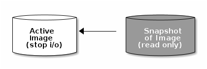
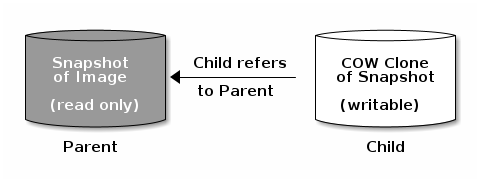
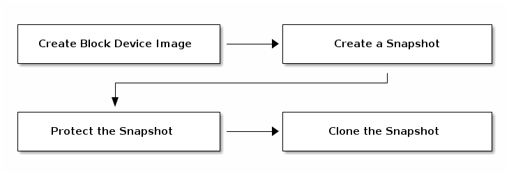

# RBD快照

## 创建快照

通过`snap`子命令可以创建和查看快照。

```bash
rbd snap create --image test_image --snap test_snap
rbd snap ls --image test_image
```

## 快照回滚

使用`snap rollback`就可以回滚快照，由于快照命名是镜像名后面加@，我们还可以下面的简便写法。

```bash
rbd snap rollback --image test_image --snap test_snap
rbd snap rollback rbd/test_image@test_snap
```

## 删除快照

删除快照也很简单，使用`rm`子命令，如果想清理所有快照可以使用`purge`子命令，注意Ceph删除是异步的不会立即释放空间。

```bash
rbd snap rm --image test_image --snap test_snap
rbd snap purge --image test_image
```

## 保护快照

保护快照可以防止用户误删数据，这是clone前必须做的。

```bash
rbd snap protect --image test_image --snap test_snap
```

要想不保护快照，使用`unprotect`子命令即可。

```bash
rbd snap unprotect --image test_image --snap test_snap
```

## 快照

快照是 image 在特定时间点（检查点）的只读逻辑副本。Ceph 块设备的高级功能之一是，可以创建 image 快照retain point-in-time state history以保留时间点状态历史记录。Ceph 支持快照分层，这允许快速轻松地克隆映像（例如 VM 映像）。Ceph 块设备快照使用 rbd 命令和多个更高级别的接口进行管理，包括QEMU、libvirt、OpenStack 和 CloudStack。

> Note
>
> does not know about any filesystem within an image (volume), snapshots are only crash-consistent unless they are coordinated within the mounting (attaching) operating system.因为 RBD 不知道映像（卷）中的任何文件系统，所以快照只有在装载（连接）操作系统内进行协调时才具有崩溃一致性。因此，建议在拍摄快照之前暂停或停止 I / O 。如果卷包含文件系统，则在拍摄快照之前，it should be in an internally consistent state 该卷应处于内部一致状态。 Snapshots taken without write quiescing may need an fsck pass before subsequent mounting.在没有写静默的情况下拍摄的快照可能需要通过 fsck 才能进行后续装载。要停止输入/输出，可以使用 fsfreeze 命令。对于虚拟机，qemu-guest-agent 可用于在创建快照时自动冻结文件系统。

 

### 创建快照

```bash
rbd snap create {pool-name}/{image-name}@{snap-name}

rbd snap create rbd/foo@snapname
```

### 列出快照

```bash
rbd snap ls {pool-name}/{image-name}

rbd snap ls rbd/foo
```

### 回滚快照

```bash
rbd snap rollback {pool-name}/{image-name}@{snap-name}

rbd snap rollback rbd/foo@snapname
```

> Note
>
> 将 image 回滚到快照，意味着使用快照中的数据覆盖 image 的当前版本。执行回滚所需的时间随着 image 的大小而增加。从快照克隆比将 image 回滚到快照更快，并且是返回到预先存在状态的首选方法。

### 删除快照

```bash
rbd snap rm {pool-name}/{image-name}@{snap-name}

rbd snap rm rbd/foo@snapname
```

> Note
>
> Ceph OSD 异步删除数据，因此删除快照不会立即释放底层 OSD 的容量。

### Purge 快照

删除一个 image 的所有快照。

```bash
rbd snap purge {pool-name}/{image-name}

rbd snap purge rbd/foo
```

## Layering

Ceph supports the ability to create many copy-on-write (COW) clones of a block device snapshot. Ceph支持创建块设备快照的多个写时拷贝（COW）克隆。快照分层使 Ceph 块设备客户端能够非常快速地创建 image 。create a block device image with a Linux VM written to it; 例如，您可以创建一个块设备映像，其中写入了Linux VM；然后，对映像进行快照，保护快照，并创建任意数量的写时拷贝克隆create as many copy-on-write clones as you like.。快照是只读的，因此克隆快照简化了语义cloning a snapshot simplifies semantics，使快速创建克隆成为可能。

 

> Note
>
> refer to a Ceph block device snapshot (parent), and the corresponding image cloned from the snapshot (child). 
>
> 术语 “parent” 和 “child” 指的是Ceph块设备快照（父级）和从快照克隆的相应映像（子级）。

Each cloned image (child) stores a reference to its parent image, which enables the cloned image to open the parent snapshot and read it.每个克隆映像（子映像）都存储对其父映像的引用，这使克隆映像能够打开父快照并读取它。

A COW clone of a snapshot behaves exactly like any other Ceph block device image.快照的 COW 克隆的行为与任何其他Ceph块设备映像的行为完全相同。您可以读取、写入、克隆和调整克隆 image 的大小。克隆 image 没有特殊限制。但是，快照的写时复制克隆取决于快照the copy-on-write clone of a snapshot depends on the snapshot，因此**必须**在克隆快照之前保护该快照。

> Note
>
> Ceph only supports cloning of RBD format 2 images (i.e., created with `rbd create --image-format 2`).  The kernel client supports cloned images beginning with the 3.10 release.
>
> Ceph 仅支持克隆RBD格式2图像（即，使用RBD create--图像格式2创建）。内核客户端支持从3.10版本开始的克隆映像。

### Getting Started with Layering

Ceph 块设备分层是一个简单的过程。必须有 image ，必须创建 image 的快照，必须保护快照。执行这些步骤后，即可开始克隆快照。

 

The cloned image has a reference to the parent snapshot, and includes the pool ID,  image ID and snapshot ID. The inclusion of the pool ID means that you may clone snapshots  from one pool to images in another pool.

克隆的映像引用父快照，并包括池ID、映像ID和快照ID。包含池ID意味着您可以将快照从一个池克隆到另一个池中的映像。

1. **映像模板：**A common use case for block device layering is to create a master image and a snapshot that serves as a template for clones. 块设备分层的常见用例是创建主映像和快照，作为克隆的模板。例如，用户可以为 Linux 发行版（例如 Ubuntu  12.04）创建映像，并为其创建快照。用户可以定期更新映像并创建新快照（例如，`sudo apt-get update`, `sudo apt-get upgrade`, `sudo apt-get dist-upgrade` ，然后是 `rbd snap create` ）。As the image matures随着映像成熟，用户可以克隆任何一个快照。
2. **扩展模板：**A more advanced use case includes extending a template image that provides more information than a base image. 更高级的用例包括扩展模板图像，该模板图像提供的信息比基础图像更多。例如，用户可以克隆图像（例如，VM 模板）并安装其他软件（例如，数据库、内容管理系统、分析系统等），然后快照扩展图像，扩展图像本身可以像基本图像一样进行更新。
3. **模板池：**使用块设备分层的一种方法是创建一个池，其中包含用作模板的主 image 以及这些模板的快照。You may then extend read-only privileges to users so that they may clone the snapshots without the ability to write or execute within the pool.然后，您可以将只读权限扩展到用户，以便他们可以克隆快照，而无需在池中写入或执行。
4. **映像迁移/恢复：**使用块设备分层的一种方法是将数据从一个池迁移或恢复到另一个池中。

### 保护快照

Clones access the parent snapshots.克隆访问父快照。All clones would break if a user inadvertently deleted the parent snapshot.如果用户无意中删除了父快照，则所有克隆都将中断。为了防止数据丢失，必须先保护快照，然后才能克隆它。

```bash
rbd snap protect {pool-name}/{image-name}@{snapshot-name}

rbd snap protect rbd/my-image@my-snapshot
```

> Note
>
> 不能删除一个被保护的快照。

### 克隆快照

要克隆快照，需要指定父池、映像和快照；以及子池和映像名称。必须先保护快照，然后才能克隆它。

```bash
rbd clone {pool-name}/{parent-image}@{snap-name} {pool-name}/{child-image-name}

rbd clone rbd/my-image@my-snapshot rbd/new-image
```

> Note
>
> You may clone a snapshot from one pool to an image in another pool.
>
> 您可以将快照从一个池克隆到另一个池中的映像。you may maintain read-only images and snapshots as templates in one pool, and writeable clones in another pool.例如，您可以在一个池中维护只读图像和快照作为模板，在另一个池中维护可写克隆。

### 取消快照保护

在删除快照之前，必须先解除对其的保护。Additionally, you may *NOT* delete snapshots that have references from clones. 此外，您不能从克隆中删除包含引用的快照。You must flatten each clone of a snapshot, before you can delete the snapshot.在删除快照之前，必须展平快照的每个克隆。

```bash
rbd snap unprotect {pool-name}/{image-name}@{snapshot-name}

rbd snap unprotect rbd/my-image@my-snapshot
```

### 列出快照的子级

```bash
rbd children {pool-name}/{image-name}@{snapshot-name}

rbd children rbd/my-image@my-snapshot
```

### Flattening a Cloned Image

克隆的映像保留对父快照的引用。When you remove the reference from the child clone to the parent snapshot, you effectively “flatten” the image by copying the information from the snapshot to the clone. 删除子克隆到父快照的引用时，通过将信息从快照复制到克隆，可以有效地“展平”图像。Cloned images retain a reference to the parent snapshot.  flatten a clone展平克隆所需的时间随着快照的大小而增加。要删除快照，flatten the child images必须首先展平子图像。

```bash
rbd flatten {pool-name}/{image-name}

rbd flatten rbd/new-image
```

> Note
>
> Since a flattened image contains all the information from the snapshot, a flattened image will take up more storage space than a layered clone.由于展平映像包含快照中的所有信息，因此展平映像将比分层克隆占用更多的存储空间。
