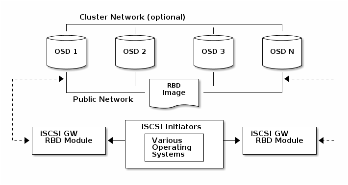

# Ceph iSCSI Gateway

The iSCSI Gateway presents a Highly Available (HA) iSCSI target that exports RADOS Block Device (RBD) images as SCSI disks. The iSCSI protocol allows clients (initiators) to send SCSI commands to storage devices (targets) over a TCP/IP network, enabling clients without native Ceph client support to access Ceph block storage.  These include Microsoft Windows and even BIOS.

Each iSCSI gateway exploits the Linux IO target kernel subsystem (LIO) to provide iSCSI protocol support. LIO utilizes userspace passthrough (TCMU) to interact with Ceph’s librbd library and expose RBD images to iSCSI clients. With Ceph’s iSCSI gateway you can provision a fully integrated block-storage infrastructure with all the features and benefits of a conventional Storage Area Network (SAN).

 

- [Requirements](https://docs.ceph.com/en/latest/rbd/iscsi-requirements/)
- [Configuring the iSCSI Target](https://docs.ceph.com/en/latest/rbd/iscsi-targets/)
- [Configuring the iSCSI Initiators](https://docs.ceph.com/en/latest/rbd/iscsi-initiators/)
- [Monitoring the iSCSI Gateways](https://docs.ceph.com/en/latest/rbd/iscsi-monitoring/)

# iSCSI Gateway Requirements

It is recommended to provision two to four iSCSI gateway nodes to realize a highly available Ceph iSCSI gateway solution.

For hardware recommendations, see [Hardware Recommendations](https://docs.ceph.com/en/latest/start/hardware-recommendations/#hardware-recommendations) .

Note

On iSCSI gateway nodes the memory footprint is a function of of the RBD images mapped and can grow to be large. Plan memory requirements accordingly based on the number RBD images to be mapped.

There are no specific iSCSI gateway options for the Ceph Monitors or OSDs, but it is important to lower the default heartbeat interval for detecting down OSDs to reduce the possibility of initiator timeouts. The following configuration options are suggested:

```
[osd]
osd heartbeat grace = 20
osd heartbeat interval = 5
```

- Updating Running State From a Ceph Monitor Node

> ```
> ceph tell <daemon_type>.<id> config set <parameter_name> <new_value>
> ceph tell osd.* config set osd_heartbeat_grace 20
> ceph tell osd.* config set osd_heartbeat_interval 5
> ```

- Updating Running State On Each OSD Node

  ```
  ceph daemon <daemon_type>.<id> config set osd_client_watch_timeout 15
  ```

  ```
  ceph daemon osd.0 config set osd_heartbeat_grace 20
  ceph daemon osd.0 config set osd_heartbeat_interval 5
  ```

For more details on setting Ceph’s configuration options, see [Configuring Ceph](https://docs.ceph.com/en/latest/rados/configuration/ceph-conf/#configuring-ceph).  Be sure to persist these settings in `/etc/ceph.conf` or, on Mimic and later releases, in the centralized config store.

# iSCSI Targets

Traditionally, block-level access to a Ceph storage cluster has been limited to QEMU and `librbd`, which is a key enabler for adoption within OpenStack environments. Starting with the Ceph Luminous release, block-level access is expanding to offer standard iSCSI support allowing wider platform usage, and potentially opening new use cases.

- Red Hat Enterprise Linux/CentOS 7.5 (or newer); Linux kernel v4.16 (or newer)
- A working Ceph Storage cluster, deployed with `ceph-ansible` or using the command-line interface
- iSCSI gateways nodes, which can either be colocated with OSD nodes or on dedicated nodes
- Separate network subnets for iSCSI front-end traffic and Ceph back-end traffic

A choice of using Ansible or the command-line interface are the available deployment methods for installing and configuring the Ceph iSCSI gateway:

- [Using Ansible](https://docs.ceph.com/en/latest/rbd/iscsi-target-ansible/)
- [Using the Command Line Interface](https://docs.ceph.com/en/latest/rbd/iscsi-target-cli/)

# Configuring the iSCSI Target using Ansible

The Ceph iSCSI gateway is the iSCSI target node and also a Ceph client node. The Ceph iSCSI gateway can be provisioned on dedicated node or be colocated on a Ceph Object Store Disk (OSD) node. The following steps will install and configure the Ceph iSCSI gateway for basic operation.

**Requirements:**

- A running Ceph Luminous (12.2.x) cluster or newer
- Red Hat Enterprise Linux/CentOS 7.5 (or newer); Linux kernel v4.16 (or newer)
- The `ceph-iscsi` package installed on all the iSCSI gateway nodes

**Installation:**

1. On the Ansible installer node, which could be either the administration node or a dedicated deployment node, perform the following steps:

   1. As `root`, install the `ceph-ansible` package:

      ```
      # yum install ceph-ansible
      ```

   2. Add an entry in `/etc/ansible/hosts` file for the gateway group:

      ```
      [iscsigws]
      ceph-igw-1
      ceph-igw-2
      ```

Note

If co-locating the iSCSI gateway with an OSD node, then add the OSD node to the `[iscsigws]` section.

**Configuration:**

The `ceph-ansible` package places a file in the `/usr/share/ceph-ansible/group_vars/` directory called `iscsigws.yml.sample`. Create a copy of this sample file named `iscsigws.yml`. Review the following Ansible variables and descriptions, and update accordingly. See the `iscsigws.yml.sample` for a full list of advanced variables.

| Variable                | Meaning/Purpose                                              |
| ----------------------- | ------------------------------------------------------------ |
| `seed_monitor`          | Each gateway needs access to the ceph cluster for rados and rbd calls. This means the iSCSI gateway must have an appropriate `/etc/ceph/` directory defined. The `seed_monitor` host is used to populate the iSCSI gateway’s `/etc/ceph/` directory. |
| `cluster_name`          | Define a custom storage cluster name.                        |
| `gateway_keyring`       | Define a custom keyring name.                                |
| `deploy_settings`       | If set to `true`, then deploy the settings when the playbook is ran. |
| `perform_system_checks` | This is a boolean value that checks for multipath and lvm configuration settings on each gateway. It must be set to true for at least the first run to ensure multipathd and lvm are configured properly. |
| `api_user`              | The user name for the API. The default is admin.             |
| `api_password`          | The password for using the API. The default is admin.        |
| `api_port`              | The TCP port number for using the API. The default is 5000.  |
| `api_secure`            | True if TLS must be used. The default is false. If true the user must create the necessary certificate and key files. See the gwcli man file for details. |
| `trusted_ip_list`       | A list of IPv4 or IPv6 addresses who have access to the API. By default, only the iSCSI gateway nodes have access. |

**Deployment:**

Perform the following steps on the Ansible installer node.

1. As `root`, execute the Ansible playbook:

   ```
   cd /usr/share/ceph-ansible
   ansible-playbook site.yml --limit iscsigws
   ```

   Note

   The Ansible playbook will handle RPM dependencies, setting up daemons, and installing gwcli so it can be used to create iSCSI targets and export RBD images as LUNs. In past versions, `iscsigws.yml` could define the iSCSI target and other objects like clients, images and LUNs, but this is no longer supported.

2. Verify the configuration from an iSCSI gateway node:

   ```
   gwcli ls
   ```

   Note

   See the [Configuring the iSCSI Target using the Command Line Interface](https://docs.ceph.com/en/latest/rbd/iscsi-target-cli) section to create gateways, LUNs, and clients using the gwcli tool.

   Important

   Attempting to use the `targetcli` tool to change the configuration will cause problems including ALUA misconfiguration and path failover issues. There is the potential to corrupt data, to have mismatched configuration across iSCSI gateways, and to have mismatched WWN information, leading to client multipath problems.

**Service Management:**

The `ceph-iscsi` package installs the configuration management logic and a Systemd service called `rbd-target-api`. When the Systemd service is enabled, the `rbd-target-api` will start at boot time and will restore the Linux IO state. The Ansible playbook disables the target service during the deployment. Below are the outcomes of when interacting with the `rbd-target-api` Systemd service.

```
systemctl <start|stop|restart|reload> rbd-target-api
```

- `reload`

  A reload request will force `rbd-target-api` to reread the configuration and apply it to the current running environment. This is normally not required, since changes are deployed in parallel from Ansible to all iSCSI gateway nodes

- `stop`

  A stop request will close the gateway’s portal interfaces, dropping connections to clients and wipe the current LIO configuration from the kernel. This returns the iSCSI gateway to a clean state. When clients are disconnected, active I/O is rescheduled to the other iSCSI gateways by the client side multipathing layer.

**Removing the Configuration:**

The `ceph-ansible` package provides an Ansible playbook to remove the iSCSI gateway configuration and related RBD images. The Ansible playbook is `/usr/share/ceph-ansible/purge_gateways.yml`. When this Ansible playbook is ran a prompted for the type of purge to perform:

*lio* :

In this mode the LIO configuration is purged on all iSCSI gateways that are defined. Disks that were created are left untouched within the Ceph storage cluster.

*all* :

When `all` is chosen, the LIO configuration is removed together with **all** RBD images that were defined within the iSCSI gateway environment, other unrelated RBD images will not be removed. Ensure the correct mode is chosen, this operation will delete data.

Warning

A purge operation is destructive action against your iSCSI gateway environment.

Warning

A purge operation will fail, if RBD images have snapshots or clones and are exported through the Ceph iSCSI gateway.

```
ansible-playbook purge_gateways.yml
Which configuration elements should be purged? (all, lio or abort) [abort]: all


PLAY [Confirm removal of the iSCSI gateway configuration] *********************


GATHERING FACTS ***************************************************************
ok: [localhost]


TASK: [Exit playbook if user aborted the purge] *******************************
skipping: [localhost]


TASK: [set_fact ] *************************************************************
ok: [localhost]


PLAY [Removing the gateway configuration] *************************************


GATHERING FACTS ***************************************************************
ok: [ceph-igw-1]
ok: [ceph-igw-2]


TASK: [igw_purge | purging the gateway configuration] *************************
changed: [ceph-igw-1]
changed: [ceph-igw-2]


TASK: [igw_purge | deleting configured rbd devices] ***************************
changed: [ceph-igw-1]
changed: [ceph-igw-2]


PLAY RECAP ********************************************************************
ceph-igw-1                 : ok=3    changed=2    unreachable=0    failed=0
ceph-igw-2                 : ok=3    changed=2    unreachable=0    failed=0
localhost                  : ok=2    changed=0    unreachable=0    failed=0
```

 Configuring the iSCSI Target using the Command Line Interface[](https://docs.ceph.com/en/latest/rbd/iscsi-target-cli/#configuring-the-iscsi-target-using-the-command-line-interface)

The Ceph iSCSI gateway is both an iSCSI target  and a Ceph client; think of it as a “translator” between Ceph’s RBD interface and the iSCSI standard. The Ceph iSCSI gateway can run on a standalone node or be colocated with other daemons eg. on a Ceph Object Store Disk (OSD) node.  When co-locating, ensure that sufficient CPU and memory are available to share. The following steps install and configure the Ceph iSCSI gateway for basic operation.

**Requirements:**

- A running Ceph Luminous or later storage cluster

- Red Hat Enterprise Linux/CentOS 7.5 (or newer); Linux kernel v4.16 (or newer)

- The following packages must be installed from your Linux distribution’s software repository:

  - `targetcli-2.1.fb47` or newer package
  - `python-rtslib-2.1.fb68` or newer package
  - `tcmu-runner-1.4.0` or newer package
  - `ceph-iscsi-3.2` or newer package

  > Important
  >
  > If previous versions of these packages exist, then they must be removed first before installing the newer versions.

Do the following steps on the Ceph iSCSI gateway node before proceeding to the *Installing* section:

1. If the Ceph iSCSI gateway is not colocated on an OSD node, then copy the Ceph configuration files, located in `/etc/ceph/`, from a running Ceph node in the storage cluster to the iSCSI Gateway node. The Ceph configuration files must exist on the iSCSI gateway node under `/etc/ceph/`.

2. Install and configure the [Ceph Command-line Interface](https://docs.ceph.com/en/latest/start/quick-rbd/#install-ceph)

3. If needed, open TCP ports 3260 and 5000 on the firewall.

   Note

   Access to port 5000 should be restricted to a trusted internal network or only the individual hosts where `gwcli` is used or `ceph-mgr` daemons are running.

4. Create a new or use an existing RADOS Block Device (RBD).

**Installing:**

If you are using the upstream ceph-iscsi package follow the [manual install instructions](https://docs.ceph.com/en/latest/rbd/iscsi-target-cli-manual-install).


For rpm based instructions execute the following commands:

1. As `root`, on all iSCSI gateway nodes, install the `ceph-iscsi` package:

   ```
   yum install ceph-iscsi
   ```

2. As `root`, on all iSCSI gateway nodes, install the `tcmu-runner` package:

   ```
   yum install tcmu-runner
   ```

**Setup:**

1. gwcli requires a pool with the name `rbd`, so it can store metadata like the iSCSI configuration. To check if this pool has been created run:

   ```
   ceph osd lspools
   ```

   If it does not exist instructions for creating pools can be found on the [RADOS pool operations page](http://docs.ceph.com/en/latest/rados/operations/pools/).

2. As `root`, on a iSCSI gateway node, create a file named `iscsi-gateway.cfg` in the `/etc/ceph/` directory:

   ```
   touch /etc/ceph/iscsi-gateway.cfg
   ```

   1. Edit the `iscsi-gateway.cfg` file and add the following lines:

      ```
      [config]
      # Name of the Ceph storage cluster. A suitable Ceph configuration file allowing
      # access to the Ceph storage cluster from the gateway node is required, if not
      # colocated on an OSD node.
      cluster_name = ceph
      
      # Place a copy of the ceph cluster's admin keyring in the gateway's /etc/ceph
      # drectory and reference the filename here
      gateway_keyring = ceph.client.admin.keyring
      
      
      # API settings.
      # The API supports a number of options that allow you to tailor it to your
      # local environment. If you want to run the API under https, you will need to
      # create cert/key files that are compatible for each iSCSI gateway node, that is
      # not locked to a specific node. SSL cert and key files *must* be called
      # 'iscsi-gateway.crt' and 'iscsi-gateway.key' and placed in the '/etc/ceph/' directory
      # on *each* gateway node. With the SSL files in place, you can use 'api_secure = true'
      # to switch to https mode.
      
      # To support the API, the bare minimum settings are:
      api_secure = false
      
      # Additional API configuration options are as follows, defaults shown.
      # api_user = admin
      # api_password = admin
      # api_port = 5001
      # trusted_ip_list = 192.168.0.10,192.168.0.11
      ```

      Note

      trusted_ip_list is a list of IP addresses on each iSCSI gateway that will be used for management operations like target creation, LUN exporting, etc. The IP can be the same that will be used for iSCSI data, like READ/WRITE commands to/from the RBD image, but using separate IPs is recommended.

      Important

      The `iscsi-gateway.cfg` file must be identical on all iSCSI gateway nodes.

   2. As `root`, copy the `iscsi-gateway.cfg` file to all iSCSI gateway nodes.

3. As `root`, on all iSCSI gateway nodes, enable and start the API service:

   ```
   systemctl daemon-reload
   
   systemctl enable rbd-target-gw
   systemctl start rbd-target-gw
   
   systemctl enable rbd-target-api
   systemctl start rbd-target-api
   ```

**Configuring:**

gwcli will create and configure the iSCSI target and RBD images and copy the configuration across the gateways setup in the last section. Lower level tools including targetcli and rbd can be used to query the local configuration, but should not be used to modify it. This next section will demonstrate how to create a iSCSI target and export a RBD image as LUN 0.

1. As `root`, on a iSCSI gateway node, start the iSCSI gateway command-line interface:

   ```
   gwcli
   ```

2. Go to iscsi-targets and create a target with the name iqn.2003-01.com.redhat.iscsi-gw:iscsi-igw:

   ```
   > /> cd /iscsi-targets
   > /iscsi-targets>  create iqn.2003-01.com.redhat.iscsi-gw:iscsi-igw
   ```

3. Create the iSCSI gateways. The IPs used below are the ones that will be used for iSCSI data like READ and WRITE commands. They can be the same IPs used for management operations listed in trusted_ip_list, but it is recommended that different IPs are used.

   ```
   > /iscsi-targets> cd iqn.2003-01.com.redhat.iscsi-gw:iscsi-igw/gateways
   > /iscsi-target...-igw/gateways>  create ceph-gw-1 10.172.19.21
   > /iscsi-target...-igw/gateways>  create ceph-gw-2 10.172.19.22
   ```

   If not using RHEL/CentOS or using an upstream or ceph-iscsi-test kernel, the skipchecks=true argument must be used. This will avoid the Red Hat kernel and rpm checks:

   ```
   > /iscsi-targets> cd iqn.2003-01.com.redhat.iscsi-gw:iscsi-igw/gateways
   > /iscsi-target...-igw/gateways>  create ceph-gw-1 10.172.19.21 skipchecks=true
   > /iscsi-target...-igw/gateways>  create ceph-gw-2 10.172.19.22 skipchecks=true
   ```

4. Add a RBD image with the name disk_1 in the pool rbd:

   ```
   > /iscsi-target...-igw/gateways> cd /disks
   > /disks> create pool=rbd image=disk_1 size=90G
   ```

5. Create a client with the initiator name iqn.1994-05.com.redhat:rh7-client:

   ```
   > /disks> cd /iscsi-targets/iqn.2003-01.com.redhat.iscsi-gw:iscsi-igw/hosts
   > /iscsi-target...eph-igw/hosts>  create iqn.1994-05.com.redhat:rh7-client
   ```

6. Set the initiator CHAP username and password which the target would use when authenticating the initiator:

   ```
   > /iscsi-target...at:rh7-client>  auth username=myusername password=mypassword
   ```

   Warning

   CHAP must always be configured. Without CHAP, the target will reject any login requests.

   To use mutual (bidirectional) authentication, also set the target CHAP username and password which the initiator would use when authenticating the target:

   ```
   > /iscsi-target...at:rh7-client>  auth username=myusername password=mypassword mutual_username=mytgtusername mutual_password=mytgtpassword
   ```

   Note

   CHAP usernames must be between 8 and 64 characters long.  Valid characters: `0` to `9`, `a` to `z`, `A` to `Z`, `@`, `_`, `-`, `.`, `:`.

   Note

   CHAP passwords must be between 12 and 16 characters long.  Valid characters: `0` to `9`, `a` to `z`, `A` to `Z`, `@`, `_`, `-`, `/`.

   Note

   For mutual CHAP, initiator and target usernames and passwords must not be the same.

7. Add the disk to the client:

   ```
   > /iscsi-target...at:rh7-client> disk add rbd/disk_1
   ```

The next step is to configure the iSCSI initiators.       

# Manual ceph-iscsi Installation

**Requirements**

To complete the installation of ceph-iscsi, there are 4 steps:

1. Install common packages from your Linux distribution’s software repository
2. Install Git to fetch the remaining packages directly from their Git repositories
3. Ensure a compatible kernel is used
4. Install all the components of ceph-iscsi and start associated daemons:
   - tcmu-runner
   - rtslib-fb
   - configshell-fb
   - targetcli-fb
   - ceph-iscsi

## 1. Install Common Packages

The following packages will be used by ceph-iscsi and target tools. They must be installed from your Linux distribution’s software repository on each machine that will be a iSCSI gateway:

- libnl3
- libkmod
- librbd1
- pyparsing
- python kmod
- python pyudev
- python gobject
- python urwid
- python pyparsing
- python rados
- python rbd
- python netifaces
- python crypto
- python requests
- python flask
- pyOpenSSL

## 2. Install Git

In order to install all the packages needed to run iSCSI with Ceph,  you need to download them directly from their repository by using Git. On CentOS/RHEL execute:

```
sudo yum install git
```

On Debian/Ubuntu execute:

```
sudo apt install git
```

To know more about Git and how it works, please, visit https://git-scm.com

## 3. Ensure a compatible kernel is used

Ensure you use a supported kernel that contains the required Ceph iSCSI patches:

- all Linux distribution with a kernel v4.16 or newer, or
- Red Hat Enterprise Linux or CentOS 7.5 or later (in these distributions ceph-iscsi support is backported)

If you are already using a compatible kernel, you can go to next step. However, if you are NOT using a compatible kernel then check your distro’s documentation for specific instructions on how to build this kernel. The only Ceph iSCSI specific requirements are that the following build options must be enabled:

> ```
> CONFIG_TARGET_CORE=m
> CONFIG_TCM_USER2=m
> CONFIG_ISCSI_TARGET=m
> ```

## 4. Install ceph-iscsi

Finally, the remaining tools can be fetched directly from their Git repositories and their associated services started

### tcmu-runner

> Installation:
>
> ```
> git clone https://github.com/open-iscsi/tcmu-runner
> cd tcmu-runner
> ```
>
> Run the following command to install all the needed dependencies:
>
> ```
> ./extra/install_dep.sh
> ```
>
> Now you can build the tcmu-runner. To do so, use the following build command:
>
> ```
> cmake -Dwith-glfs=false -Dwith-qcow=false -DSUPPORT_SYSTEMD=ON -DCMAKE_INSTALL_PREFIX=/usr
> make install
> ```
>
> Enable and start the daemon:
>
> ```
> systemctl daemon-reload
> systemctl enable tcmu-runner
> systemctl start tcmu-runner
> ```

### rtslib-fb

> Installation:
>
> ```
> git clone https://github.com/open-iscsi/rtslib-fb.git
> cd rtslib-fb
> python setup.py install
> ```

### configshell-fb

> Installation:
>
> ```
> git clone https://github.com/open-iscsi/configshell-fb.git
> cd configshell-fb
> python setup.py install
> ```

### targetcli-fb

> Installation:
>
> ```
> git clone https://github.com/open-iscsi/targetcli-fb.git
> cd targetcli-fb
> python setup.py install
> mkdir /etc/target
> mkdir /var/target
> ```
>
> Warning
>
> The ceph-iscsi tools assume they are managing all targets on the system. If targets have been setup and are being managed by targetcli the target service must be disabled.

### ceph-iscsi

> Installation:
>
> ```
> git clone https://github.com/ceph/ceph-iscsi.git
> cd ceph-iscsi
> python setup.py install --install-scripts=/usr/bin
> cp usr/lib/systemd/system/rbd-target-gw.service /lib/systemd/system
> cp usr/lib/systemd/system/rbd-target-api.service /lib/systemd/system
> ```
>
> Enable and start the daemon:
>
> ```
> systemctl daemon-reload
> systemctl enable rbd-target-gw
> systemctl start rbd-target-gw
> systemctl enable rbd-target-api
> systemctl start rbd-target-api
> ```

Installation is complete. Proceed to the setup section in the [main ceph-iscsi CLI page](https://docs.ceph.com/en/latest/rbd/iscsi-target-cli).