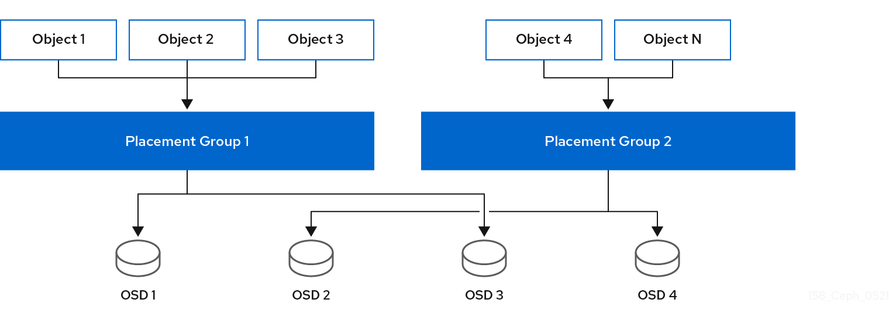

# PG

[TOC]

## 概述

在群集中存储数百万对象并单独管理它们需要占用大量资源。因此，Ceph 使用放置组(PG)使管理大量对象变得更加高效。 		

PG 是池的子集，提供一系列对象。Ceph 将池划分为一系列 PG。然后，CRUSH 算法取 cluster map 和集群的状态来考虑，并将 PG 均匀和伪地分发到集群中的 OSD。 		

它的工作方式如下所示： 		

在系统管理员创建池时，CRUSH 会为池创建用户定义的 PG 数量。通常，PG 数量应当是比较精细的数据子集。例如，每个池每个 OSD 100 个 PG 意味着每个 PG 包含大约 1% 的池数据。 		

当 Ceph 需要将 PG 从一个 OSD 移到另一个 OSD 时，PG 数量会影响到性能。如果池中 PG 数量过多，Ceph  将同时移动大量的数据，网络负载会对集群的性能造成负面影响。如果池中的 PG 数量过多，Ceph 在移动少量数据时会占用太多 CPU 和  RAM，从而对集群的性能造成负面影响。有关计算 PG 数量以达到最佳性能的详细信息，请参阅 [PG Count](https://access.redhat.com/documentation/en-us/red_hat_ceph_storage/3/html/storage_strategies_guide/placement_groups_pgs#pg_count)。 		

Ceph 通过存储对象的副本或存储对象的纠删代码区块来确保数据丢失。由于 Ceph 将对象的对象或纠删代码区块存储在 PG 中，Ceph 会针对对象的每个副本或对象的每个纠删代码区块，将每一 PG 复制到一组 OSD 中，称为"Acting Set"。系统管理员可以确定池中的  PG 数量，以及副本或纠删代码区块的数量。不过，CRUSH 算法计算特定 PG 的操作集中有哪些 OSD。 		

CRUSH 算法和 PG 使 Ceph 动态。对 cluster map 或集群状态的更改可能会导致 Ceph 自动从一个 OSD 将 PG 移到另一个 OSD。 		

以下是几个示例： 		

- **扩展群集：** 添加新主机及其  OSD 到集群时，集群映射会改变。由于 CRUSH 均匀且伪随机地将 PG 分发到整个群集中的 OSD，因此添加新主机及其 OSD 表示  CRUSH 将重新分配池的一些 PG 到这些新 OSD。这意味着系统管理员不必手动重新平衡集群。此外，这意味着新 OSD 包含的数据量与其他  OSD 大致相同。这也意味着新 OSD 不包含新写入的 OSD，从而防止集群中的"hot spots"。 				
- **OSD Fails：当 OSD** 出现故障时，集群的状态会发生变化。Ceph 暂时丢失了其中一个副本或纠删代码区块，因此需要再制作另一个副本。如果执行集合中的 Primary  OSD 失败，则执行集合中的下一个 OSD 将成为主 OSD，CRUSH 计算新的 OSD 来存储额外的副本或纠删代码区块。 				

通过在数百至数千 PG 的上下文中管理数百万对象，Ceph 存储集群可以有效地增加、缩小和从故障中恢复。 		

对于 Ceph 客户端，通过 `librados 的` CRUSH 算法使得读取和写入对象的过程非常简单。Ceph 客户端只是将对象写入到池，或者从池中读取对象。操作集合中的 Primary OSD 可以代表 Ceph 客户端将对象的副本或纠删代码区块写入次要 OSD。 		

如果 cluster map 或集群状态发生变化，OSD 存储 PG 的 CRUSH 计算也会改变。例如，Ceph 客户端可能会将对象 `foo` 写入池 `栏`。CRUSH 会将对象分配到 PG `1.a`，并将它存储在 `OSD 5` 上，这会分别将副本存储在 `OSD 10` 和 `OSD 15` 上。如果 `OSD 5` 出现故障，集群状态会改变。当 Ceph 客户端从池 `栏` 读取对象 `foo` 时，通过 `librados` 的客户端将自动从 `OSD 10` 中检索对象作为动态的新 Primary OSD。 		

通过 `librados 的` Ceph 客户端在编写和读取对象时，直接连接到操作集合中的Primary OSD。由于 I/O 操作不使用集中式代理，因此 Ceph 通常不会有网络超额订阅的问题。 		

下图显示了 CRUSH 如何将对象分配到 PG 和 PG 到 OSD。CRUSH 算法将 PG 分配到 OSD，使得操作集中的每一 OSD 都在单独的故障域中，这通常意味着 OSD 始终位于单独的服务器主机上，有时也会位于单独的机架中。 		



## 计算

```bash
PG总数 = （OSD总数 * 100） / 最大副本数
# 每一个池中的PG总数
PG总数 = （（OSD总数 * 100） / 最大副本数） / 池数
```

## 修改PG和PGP

```bash
# 获取现有的PG和PGP值
ceph osd pool get data pg_num
ceph osd pool get data pgp_num

# 查看池的副本数，rep size 值
ceph osd dump | grep size

# 修改池的PG和PGP
ceph osd pool set data pg_num xxx
ceph osd pool set data pgp_num xxx
```

