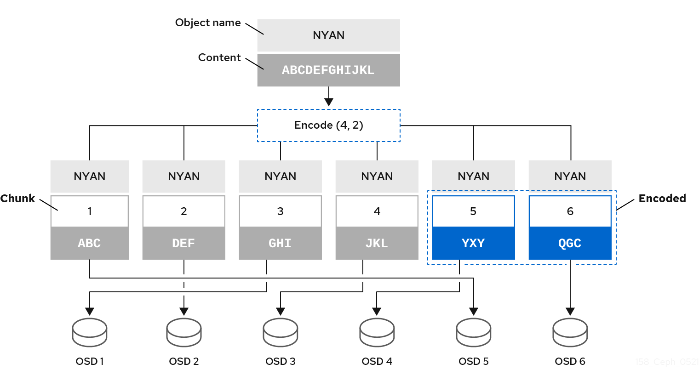

# 纠删码

[TOC]

## 概述

Ceph 可以加载许多纠删代码算法中的一种。最早且最常用的是 `Reed-Solomon` 算法。纠删代码实际上是一个正向错误修正(FEC)代码。FEC 代码将 `K` 块的消息转换为 `N` 块的"代码单词"较长的消息，以便 Ceph 可以从 `N` 块的子集恢复原始消息。 		

更具体地说，`N = K+M`，其中变量 `K` 是原始数据区块量。变量 `M` 代表纠删代码算法为防止故障提供保护的额外或冗余区块。变量 `N` 是纠删代码过程后创建的块总数。`M` 的值只是 `N-K，` 这意味着该算法从 `K` 原始数据区块计算 `N-K` 冗余区块。这种方法可确保 Ceph 可以访问所有原始数据。系统可以应对任意 `N-K` 故障。例如，在 16 `N` `个` 配置或纠删代码 `10/16 中`，纠删代码算法向 10 个基块添加了六个额外的区块 `。`例如，在 `M = K-N 或 16-` `10 = 6` 配置中，Ceph 会将 16 个区块 `N` 分布到 16 个 OSD。即使 6 个 OSD 出现故障，也可以从 10 个已验证的 `N` 块重建原始文件，确保红帽 Ceph 存储集群不会丢失数据，从而确保高度容错。 		

与复制池一样，在纠删代码池中，Primary OSD 接收所有写入操作。在复制池中，Ceph 会制作 PG 中 PG 中集合中次要 OSD 中每个对象的深度副本。对于纠删代码，进程略有不同。纠删代码池将每个对象存储为 `K+M` 块。它分为 `K 数据` 区块和 `M` 编码区块。该池配置为大小为 `K+M`，以便 Ceph 将每个区块存储在执行集合中的 OSD 中。Ceph 将块的排名存储为对象的属性。Primary OSD 负责将载荷编码到 `K+M` 区块中，并将它们发送到其他 OSD。Primary OSD 还负责维护 PG 日志的权威版本。 		

例如，在典型的配置中，系统管理员会创建一个纠删代码池来使用 6 个 OSD 并保留其中两个 OSD 的丢失。也就是说，(`K+M = 6)`使(`M = 2)这样。` 		

当 Ceph 将包含 `ABCDEFGHIJKL` 的对象 **NYAN** 写入到池中时，纠删编码算法只需将内容分为四个部分，即 `ABC`、`DEF`、`GHI` 和 `JKL`。如果内容长度不是 `K` 的倍数，算法将固定内容。该函数还创建了两个编码区块：第五个是 `YXY`，第六个是 `QGC`。Ceph 将每个区块存储在操作集合中的 OSD 上，它将区块存储在具有相同名称 **NYAN** 但驻留在不同的 OSD 上的对象中。除名称外，算法必须将创建区块的顺序保留为对象 `shard_t` 的属性。例如，Chunk 1 包含 `ABC`，Ceph 存储在 **OSD5** 上，而块 5 包含 `YXY`，Ceph 则将它存储在 **OSD4** 上。 		

在恢复场景中，客户端尝试读取纠删代码池中的对象 **NYAN**，方法是读取块 1 到 6。OSD 告知缺少块 2 和 6 的算法。这些缺失的区块称为 'erasures'。例如，Primary OSD 无法读取第 6 块，因为 **OSD6** 已经过时，无法读取第 2 块，因为 **OSD2** 是最慢的，而且其区块没有考虑。但是，当算法有四个区块时，它会读取四个区块：包含 `ABC` 的块 1、包含 `GHI` 的块 3、包含 `JKL` 的块 4，以及包含 `YXY` 的块 5。然后，它会重建 `ABCDEFGHIJKL` 对象的原始内容，以及包含 `QGC` 的块 6 的原始内容。 		

将数据拆分为不同的块，与对象放置无关。CRUSH 规则集和纠删代码池 profile 一起决定 OSD 上块的放置。例如，在纠删代码 profile 中使用 Locally Repairable Code(`lrc`)插件可创建额外的区块，需要较少的 OSD 才能从中恢复。例如，在 `lrc` 配置集配置 `K=4 M=2 L=3` 中，算法会创建六个区块(`K+M`)，就如同 `jerasure` 插件一样，但本地性值(`L=3`)要求算法在本地创建 2 个更多块。该算法会创建额外的块，如 `(K+M)/L`。如果包含块 0 的 OSD 失败，可以通过使用区块 1、2 和第一个本地区块来恢复这一区块。在这种情况下，算法仅需要 3 个区块进行恢复，而不是 5。 		

注意

​					使用纠删代码池可禁用对象存储。 			

**其它资源**

- ​						有关 CRUSH、纠删代码配置文件和插件的更多信息，请参阅红帽 Ceph [存储 5 的存储策略指南](https://access.redhat.com/documentation/en-us/red_hat_ceph_storage/5/html-single/storage_strategies_guide/)。 				
- ​						有关对象映射的详情，请参阅 [Object Map](https://access.redhat.com/documentation/zh-cn/red_hat_ceph_storage/5/html/architecture_guide/{architecture-guide}#arch-obj-map_arch) 部分。 				