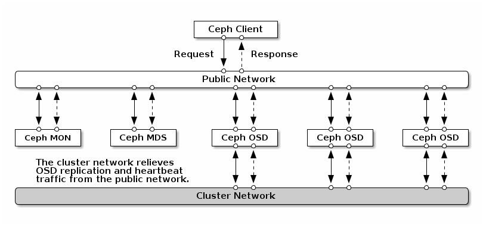

# 配置 Ceph

[TOC]

## 概述

每个守护程序都有许多配置选项，每个选项都有一个默认值。您可以通过更改这些配置选项来调整系统的行为。在覆盖默认值之前，请小心理解其后果，因为这可能会显著降低集群的性能和稳定性。还要注意，默认值有时会在不同版本之间发生变化，因此最好查看与 Ceph 版本一致的文档。

每个 Ceph 进程、守护进程或实用程序在启动时从多个源获取其配置。这些源可以包括：

* 本地配置
* MON
* 命令行
* 环境变量

可以全局设置配置选项，以便它们适用于（1）所有后台进程，（2）特定类型的所有后台进程或服务，或（3）仅适用于特定的后台进程、进程或客户端。

## 选项名称

所有 Ceph 配置选项都有一个唯一名称，由小写字母组成的单词和下划线（_）字符组成。

当在命令行上指定选项名称时，下划线（_）或短划线（-）字符可以互换使用（例如，`--mon_host ` 等同于 `--mon-host`）。

当选项名称出现在配置文件中时，也可以使用空格代替下划线或短划线。不过，我们建议，为了清晰和方便，应始终使用下划线。

## 配置源

每个 Ceph 守护进程、进程和库将从以下列出的几个源获取其配置。当两者都存在时，列表中后面的源将覆盖列表中前面的源。

- 编译的默认值
- MON 集群的集中式配置数据库
- 存储在本地主机上的配置文件
- 环境变量
- 命令行参数
- runtime overrides set by an administrator管理员设置的运行时覆盖

Ceph 进程在启动时首先要做的事情之一是解析通过命令行、环境和本地配置文件提供的配置选项。然后，该过程将联系 MON 集群以检索集中存储的整个集群的配置。一旦配置的完整视图可用，守护程序或进程启动将继续。

### Bootstrap 选项

某些配置选项会影响进程联系 MON 、进行身份验证和检索集群存储配置的能力。因此，这些选项可能需要存储在节点的本地，并通过本地配置文件进行设置。这些选项包括：

- mon_host

  This is a list of IP addresses or hostnames that are separated by commas, whitespace, or semicolons. Hostnames are resolved via DNS. All A and AAAA records are included in the search list. 

  这是用逗号、空格或分号分隔的IP地址或主机名列表。主机名通过DNS解析。所有A和AAAA记录都包含在搜索列表中。

  type `str`

- mon_host_override

  This is the list of monitors that the Ceph process **initially** contacts when first establishing communication with the Ceph cluster. This overrides the known monitor list that is derived from MonMap updates sent to older Ceph instances (like librados cluster handles). This option is expected to be useful primarily for debugging. 

  这是Ceph进程在首次与Ceph集群建立通信时最初接触的监控器列表。这将覆盖从发送到较旧Ceph实例（如librados集群句柄）的Mon-Map更新中导出的已知监控器列表。此选项主要用于调试。

  type `str`

- mon_dns_srv_name
- `mon_data`, `osd_data`, `mds_data`, `mgr_data`, and similar options that define which local directory the daemon stores its data in.
- `keyring`, `keyfile`, and/or `key`, which can be used to specify the authentication credential to use to authenticate with the monitor.  Note that in most cases the default keyring location is in the data directory specified above.

In most cases, the default values of these options are suitable. There is one exception to this: the [`mon_host`](https://docs.ceph.com/en/latest/rados/configuration/ceph-conf/#confval-mon_host) option that identifies the addresses of the cluster’s monitors.  When DNS is used to identify monitors, a local Ceph configuration file can be avoided entirely.

### Skipping monitor config

Pass the option `--no-mon-config` to any process to skip the step that retrieves configuration information from the cluster monitors. This is useful in cases where configuration is managed entirely via configuration files, or when the monitor cluster is down and some maintenance activity needs to be done.


## Configuration sections

Any given process or daemon has a single value for each configuration option.  However, values for an option may vary across different daemon types even daemons of the same type.  Ceph options that are stored in the monitor configuration database or in local configuration files are grouped into sections to indicate which daemons or clients they apply to.

These sections include:

- global

  Settings under `global` affect all daemons and clients in a Ceph Storage Cluster. Example `log_file = /var/log/ceph/$cluster-$type.$id.log`

- mon

  Settings under `mon` affect all `ceph-mon` daemons in the Ceph Storage Cluster, and override the same setting in `global`. Example `mon_cluster_log_to_syslog = true`

- mgr

  Settings in the `mgr` section affect all `ceph-mgr` daemons in the Ceph Storage Cluster, and override the same setting in `global`. Example `mgr_stats_period = 10`

- osd

  Settings under `osd` affect all `ceph-osd` daemons in the Ceph Storage Cluster, and override the same setting in `global`. Example `osd_op_queue = wpq`

- mds

  Settings in the `mds` section affect all `ceph-mds` daemons in the Ceph Storage Cluster, and override the same setting in `global`. Example `mds_cache_memory_limit = 10G`

- client

  Settings under `client` affect all Ceph Clients (e.g., mounted Ceph File Systems, mounted Ceph Block Devices, etc.) as well as Rados Gateway (RGW) daemons. Example `objecter_inflight_ops = 512`

Sections may also specify an individual daemon or client name.  For example, `mon.foo`, `osd.123`, and `client.smith` are all valid section names.

Any given daemon will draw its settings from the global section, the daemon or client type section, and the section sharing its name. Settings in the most-specific section take precedence, so for example if the same option is specified in both [`global`](https://docs.ceph.com/en/latest/rados/configuration/ceph-conf/#confsec-global), [`mon`](https://docs.ceph.com/en/latest/rados/configuration/ceph-conf/#confsec-mon), and `mon.foo` on the same source (i.e., in the same configurationfile), the `mon.foo` value will be used.

If multiple values of the same configuration option are specified in the same section, the last value wins.

Note that values from the local configuration file always take precedence over values from the monitor configuration database, regardless of which section they appear in.


## Metavariables

Metavariables simplify Ceph Storage Cluster configuration dramatically. When a metavariable is set in a configuration value, Ceph expands the metavariable into a concrete value at the time the configuration value is used. Ceph metavariables are similar to variable expansion in the Bash shell.

Ceph supports the following metavariables:

- $cluster

  Expands to the Ceph Storage Cluster name. Useful when running multiple Ceph Storage Clusters on the same hardware. Example `/etc/ceph/$cluster.keyring` Default `ceph`

- $type

  Expands to a daemon or process type (e.g., `mds`, `osd`, or `mon`) Example `/var/lib/ceph/$type`

- $id

  Expands to the daemon or client identifier. For `osd.0`, this would be `0`; for `mds.a`, it would be `a`. Example `/var/lib/ceph/$type/$cluster-$id`

- $host

  Expands to the host name where the process is running.

- $name

  Expands to `$type.$id`. Example `/var/run/ceph/$cluster-$name.asok`

- $pid

  Expands to daemon pid. Example `/var/run/ceph/$cluster-$name-$pid.asok`

## 配置文件

On startup, Ceph processes search for a configuration file in the following locations:

1. `$CEPH_CONF` (*i.e.,* the path following the `$CEPH_CONF` environment variable)
2. `-c path/path`  (*i.e.,* the `-c` command line argument)
3. `/etc/ceph/$cluster.conf`
4. `~/.ceph/$cluster.conf`
5. `./$cluster.conf` (*i.e.,* in the current working directory)
6. On FreeBSD systems only, `/usr/local/etc/ceph/$cluster.conf`

where `$cluster` is the cluster’s name (default `ceph`).

The Ceph configuration file uses an *ini* style syntax. You can add comment text after a pound sign (#) or a semi-colon (;).  For example:

```
# <--A number (#) sign precedes a comment.
; A comment may be anything.
# Comments always follow a semi-colon (;) or a pound (#) on each line.
# The end of the line terminates a comment.
# We recommend that you provide comments in your configuration file(s).
```


### Config file section names

The configuration file is divided into sections. Each section must begin with a valid configuration section name (see [Configuration sections](https://docs.ceph.com/en/latest/rados/configuration/ceph-conf/#configuration-sections), above) surrounded by square brackets. For example,

```
[global]
debug_ms = 0

[osd]
debug_ms = 1

[osd.1]
debug_ms = 10

[osd.2]
debug_ms = 10
```

### Config file option values

The value of a configuration option is a string. If it is too long to fit in a single line, you can put a backslash (`\`) at the end of line as the line continuation marker, so the value of the option will be the string after `=` in current line combined with the string in the next line:

```
[global]
foo = long long ago\
long ago
```

In the example above, the value of “`foo`” would be “`long long ago long ago`”.

Normally, the option value ends with a new line, or a comment, like

```
[global]
obscure_one = difficult to explain # I will try harder in next release
simpler_one = nothing to explain
```

In the example above, the value of “`obscure one`” would be “`difficult to explain`”; and the value of “`simpler one` would be “`nothing to explain`”.

If an option value contains spaces, and we want to make it explicit, we could quote the value using single or double quotes, like

```
[global]
line = "to be, or not to be"
```

Certain characters are not allowed to be present in the option values directly. They are `=`, `#`, `;` and `[`. If we have to, we need to escape them, like

```
[global]
secret = "i love \# and \["
```

Every configuration option is typed with one of the types below:

- int

  64-bit signed integer, Some SI prefixes are supported, like “K”, “M”, “G”, “T”, “P”, “E”, meaning, respectively, 103, 106, 109, etc.  And “B” is the only supported unit. So, “1K”, “1M”, “128B” and “-1” are all valid option values. Some times, a negative value implies “unlimited” when it comes to an option for threshold or limit. Example `42`, `-1`

- uint

  It is almost identical to `integer`. But a negative value will be rejected. Example `256`, `0`

- str

  Free style strings encoded in UTF-8, but some characters are not allowed. Please reference the above notes for the details. Example `"hello world"`, `"i love \#"`, `yet-another-name`

- boolean

  one of the two values `true` or `false`. But an integer is also accepted, where “0” implies `false`, and any non-zero values imply `true`. Example `true`, `false`, `1`, `0`

- addr

  a single address optionally prefixed with `v1`, `v2` or `any` for the messenger protocol. If the prefix is not specified, `v2` protocol is used. Please see [Address formats](https://docs.ceph.com/en/latest/rados/configuration/msgr2/#address-formats) for more details. Example `v1:1.2.3.4:567`, `v2:1.2.3.4:567`, `1.2.3.4:567`, `2409:8a1e:8fb6:aa20:1260:4bff:fe92:18f5::567`, `[::1]:6789`

- addrvec

  a set of addresses separated by “,”. The addresses can be optionally quoted with `[` and `]`. Example `[v1:1.2.3.4:567,v2:1.2.3.4:568]`, `v1:1.2.3.4:567,v1:1.2.3.14:567`  `[2409:8a1e:8fb6:aa20:1260:4bff:fe92:18f5::567], [2409:8a1e:8fb6:aa20:1260:4bff:fe92:18f5::568]`

- uuid

  the string format of a uuid defined by [RFC4122](https://www.ietf.org/rfc/rfc4122.txt). And some variants are also supported, for more details, see [Boost document](https://www.boost.org/doc/libs/1_74_0/libs/uuid/doc/uuid.html#String Generator). Example `f81d4fae-7dec-11d0-a765-00a0c91e6bf6`

- size

  denotes a 64-bit unsigned integer. Both SI prefixes and IEC prefixes are supported. And “B” is the only supported unit. A negative value will be rejected. Example `1Ki`, `1K`, `1KiB` and `1B`.

- secs

  denotes a duration of time. By default the unit is second if not specified. Following units of time are supported:  second: “s”, “sec”, “second”, “seconds” minute: “m”, “min”, “minute”, “minutes” hour: “hs”, “hr”, “hour”, “hours” day: “d”, “day”, “days” week: “w”, “wk”, “week”, “weeks” month: “mo”, “month”, “months” year: “y”, “yr”, “year”, “years”  Example `1 m`, `1m` and `1 week`


## Monitor configuration database

The monitor cluster manages a database of configuration options that can be consumed by the entire cluster, enabling streamlined central configuration management for the entire system.  The vast majority of configuration options can and should be stored here for ease of administration and transparency.

A handful of settings may still need to be stored in local configuration files because they affect the ability to connect to the monitors, authenticate, and fetch configuration information.  In most cases this is limited to the `mon_host` option, although this can also be avoided through the use of DNS SRV records.

### Sections and masks

Configuration options stored by the monitor can live in a global section, daemon type section, or specific daemon section, just like options in a configuration file can.

In addition, options may also have a *mask* associated with them to further restrict which daemons or clients the option applies to. Masks take two forms:

1. `type:location` where *type* is a CRUSH property like rack or host, and *location* is a value for that property.  For example, `host:foo` would limit the option only to daemons or clients running on a particular host.
2. `class:device-class` where *device-class* is the name of a CRUSH device class (e.g., `hdd` or `ssd`).  For example, `class:ssd` would limit the option only to OSDs backed by SSDs. (This mask has no effect for non-OSD daemons or clients.)

When setting a configuration option, the who may be a section name, a mask, or a combination of both separated by a slash (`/`) character.  For example, `osd/rack:foo` would mean all OSD daemons in the `foo` rack.

When viewing configuration options, the section name and mask are generally separated out into separate fields or columns to ease readability.

### Commands

The following CLI commands are used to configure the cluster:

- `ceph config dump` will dump the entire monitors’ configuration database for the cluster.
- `ceph config get <who>` will dump configuration options stored in the monitors’ configuration database for a specific daemon or client (e.g., `mds.a`).
- `ceph config get <who> <option>` will show a configuration value stored in the monitors’ configuration database for a specific daemon or client (e.g., `mds.a`), or, if not present in the monitors’ configuration database, the compiled-in default value.
- `ceph config set <who> <option> <value>` will set a configuration option in the monitors’ configuration database.
- `ceph config show <who>` will show the reported running configuration for a running daemon.  These settings may differ from those stored by the monitors if there are also local configuration files in use or options have been overridden on the command line or at run time.  The source of the option values is reported as part of the output.
- `ceph config assimilate-conf -i <input file> -o <output file>` will ingest a configuration file from *input file* and move any valid options into the monitors’ configuration database.  Any settings that are unrecognized, invalid, or cannot be controlled by the monitor will be returned in an abbreviated config file stored in *output file*.  This command is useful for transitioning from legacy configuration files to centralized monitor-based configuration.

Note that `ceph config set <who> <option> <value>` and `ceph config get <who> <option>` aren’t symmetric because the latter also shows compiled-in default values.  In order to determine whether a configuration option is present in the monitors’ configuration database, use `ceph config dump`.

## Help

You can get help for a particular option with:

```
ceph config help <option>
```

Note that this will use the configuration schema that is compiled  into the running monitors.  If you have a mixed-version cluster (e.g.,  during an upgrade), you might also want to query the option schema from a specific running daemon:

```
ceph daemon <name> config help [option]
```

For example,:

```
$ ceph config help log_file
log_file - path to log file
  (std::string, basic)
  Default (non-daemon):
  Default (daemon): /var/log/ceph/$cluster-$name.log
  Can update at runtime: false
  See also: [log_to_stderr,err_to_stderr,log_to_syslog,err_to_syslog]
```

or:

```
$ ceph config help log_file -f json-pretty
{
    "name": "log_file",
    "type": "std::string",
    "level": "basic",
    "desc": "path to log file",
    "long_desc": "",
    "default": "",
    "daemon_default": "/var/log/ceph/$cluster-$name.log",
    "tags": [],
    "services": [],
    "see_also": [
        "log_to_stderr",
        "err_to_stderr",
        "log_to_syslog",
        "err_to_syslog"
    ],
    "enum_values": [],
    "min": "",
    "max": "",
    "can_update_at_runtime": false
}
```

The `level` property can be any of basic, advanced, or dev. The dev options are intended for use by developers, generally for testing purposes, and are not recommended for use by operators.

## Runtime Changes

In most cases, Ceph allows you to make changes to the configuration of a daemon at runtime. This capability is quite useful for increasing/decreasing logging output, enabling/disabling debug settings, and even for runtime optimization.

Generally speaking, configuration options can be updated in the usual way via the `ceph config set` command.  For example, do enable the debug log level on a specific OSD,:

```
ceph config set osd.123 debug_ms 20
```

Note that if the same option is also customized in a local configuration file, the monitor setting will be ignored (it has a lower priority than the local config file).

### Override values

You can also temporarily set an option using the tell or daemon interfaces on the Ceph CLI.  These *override* values are ephemeral in that they only affect the running process and are discarded/lost if the daemon or process restarts.

Override values can be set in two ways:

1. From any host, we can send a message to a daemon over the network with:

   ```
   ceph tell <name> config set <option> <value>
   ```

   For example,:

   ```
   ceph tell osd.123 config set debug_osd 20
   ```

   The tell command can also accept a wildcard for the daemon identifier.  For example, to adjust the debug level on all OSD daemons,:

   ```
   ceph tell osd.* config set debug_osd 20
   ```

2. From the host the process is running on, we can connect directly to the process via a socket in `/var/run/ceph` with:

   ```
   ceph daemon <name> config set <option> <value>
   ```

   For example,:

   ```
   ceph daemon osd.4 config set debug_osd 20
   ```

Note that in the `ceph config show` command output these temporary values will be shown with a source of `override`.

## Viewing runtime settings

You can see the current options set for a running daemon with the `ceph config show` command.  For example,:

```
ceph config show osd.0
```

will show you the (non-default) options for that daemon.  You can also look at a specific option with:

```
ceph config show osd.0 debug_osd
```

or view all options (even those with default values) with:

```
ceph config show-with-defaults osd.0
```

You can also observe settings for a running daemon by connecting to it from the local host via the admin socket.  For example,:

```
ceph daemon osd.0 config show
```

will dump all current settings,:

```
ceph daemon osd.0 config diff
```

will show only non-default settings (as well as where the value came from: a config file, the monitor, an override, etc.), and:

```
ceph daemon osd.0 config get debug_osd
```

will report the value of a single option.

## Changes since Nautilus

The Octopus release changed the way the configuration file is parsed. These changes are as follows:

- Repeated configuration options are allowed, and no warnings will be printed. The value of the last one is used, which means that the setting last in the file is the one that takes effect. Before this change, we would print warning messages when lines with duplicated options were encountered, like:

  ```
  warning line 42: 'foo' in section 'bar' redefined
  ```

- Invalid UTF-8 options were ignored with warning messages. But since Octopus, they are treated as fatal errors.

- Backslash `\` is used as the line continuation marker to combine the next line with current one. Before Octopus, it was required to follow a backslash with a non-empty line. But in Octopus, an empty line following a backslash is now allowed.

- In the configuration file, each line specifies an individual configuration option. The option’s name and its value are separated with `=`, and the value may be quoted using single or double quotes. If an invalid configuration is specified, we will treat it as an invalid configuration file

  ```
  bad option ==== bad value
  ```

- Before Octopus, if no section name was specified in the configuration file, all options would be set as though they were within the [`global`](https://docs.ceph.com/en/latest/rados/configuration/ceph-conf/#confsec-global) section. This is now discouraged. Since Octopus, only a single option is allowed for configuration files without a section name.

# Common Settings[](https://docs.ceph.com/en/latest/rados/configuration/common/#common-settings)

The [Hardware Recommendations](https://docs.ceph.com/en/latest/start/hardware-recommendations) section provides some hardware guidelines for configuring a Ceph Storage Cluster. It is possible for a single [Ceph Node](https://docs.ceph.com/en/latest/glossary/#term-Ceph-Node) to run multiple daemons. For example, a single node with multiple drives may run one `ceph-osd` for each drive. Ideally, you will  have a node for a particular type of process. For example, some nodes may run `ceph-osd` daemons, other nodes may run `ceph-mds` daemons, and still  other nodes may run `ceph-mon` daemons.

Each node has a name identified by the `host` setting. Monitors also specify a network address and port (i.e., domain name or IP address) identified by the `addr` setting.  A basic configuration file will typically specify only minimal settings for each instance of monitor daemons. For example:

```
[global]
mon_initial_members = ceph1
mon_host = 10.0.0.1
```

Important

The `host` setting is the short name of the node (i.e., not an fqdn). It is **NOT** an IP address either.  Enter `hostname -s` on the command line to retrieve the name of the node. Do not use `host` settings for anything other than initial monitors unless you are deploying Ceph manually. You **MUST NOT** specify `host` under individual daemons when using deployment tools like `chef` or `cephadm`, as those tools will enter the appropriate values for you in the cluster map.

# Monitors[](https://docs.ceph.com/en/latest/rados/configuration/common/#monitors)

During runtime operations, Ceph OSD Daemons check up on other Ceph OSD Daemons and report their  findings to the Ceph Monitor. You do not have to provide any settings. However, if you have network latency issues, you may wish to modify the settings.

Production Ceph clusters typically provision a minimum of three [Ceph Monitor](https://docs.ceph.com/en/latest/glossary/#term-Ceph-Monitor) daemons to ensure availability should a monitor instance crash. A minimum of three ensures that the Paxos algorithm can determine which version of the [Ceph Cluster Map](https://docs.ceph.com/en/latest/glossary/#term-Ceph-Cluster-Map) is the most recent from a majority of Ceph Monitors in the quorum.

Note

You may deploy Ceph with a single monitor, but if the instance fails, the lack of other monitors may interrupt data service availability.

Ceph Monitors normally listen on port `3300` for the new v2 protocol, and `6789` for the old v1 protocol.

By default, Ceph expects to store monitor data under the following path:

```
/var/lib/ceph/mon/$cluster-$id
```

You or a deployment tool (e.g., `cephadm`) must create the corresponding directory. With metavariables fully  expressed and a cluster named “ceph”, the foregoing directory would evaluate to:

```
/var/lib/ceph/mon/ceph-a
```

For additional details, see the [Monitor Config Reference](https://docs.ceph.com/en/latest/rados/configuration/mon-config-ref).

## Naming Clusters (已弃用)

Each Ceph cluster has an internal name that is used as part of configuration and log file names as well as directory and mountpoint names.  This name defaults to “ceph”.  Previous releases of Ceph allowed one to specify a custom name instead, for example “ceph2”.  This was intended to facilitate running multiple logical clusters on the same physical hardware, but in practice this was rarely exploited and should no longer be attempted.  Prior documentation could also be misinterpreted as requiring unique cluster names in order to use `rbd-mirror`.

Custom cluster names are now considered deprecated and the ability to deploy them has already been removed from some tools, though existing custom name deployments continue to operate.  The ability to run and manage clusters with custom names may be progressively removed by future Ceph releases, so it is strongly recommended to deploy all new clusters with the default name “ceph”.

Some Ceph CLI commands accept an optional `--cluster` (cluster name) option. This option is present purely for backward compatibility and need not be accommodated by new tools and deployments.

If you do need to allow multiple clusters to exist on the same host, please use [Cephadm](https://docs.ceph.com/en/latest/cephadm/#cephadm), which uses containers to fully isolate each cluster.

## 网络配置参考

网络配置对于构建高性能 Ceph 存储群集至关重要。The Ceph Storage Cluster does not perform  request routing or dispatching on behalf of the [Ceph Client](https://docs.ceph.com/en/latest/glossary/#term-Ceph-Client).Ceph 存储群集不代表 Ceph 客户端执行请求路由或调度。相反，Ceph 客户端直接向 OSD 发出请求。OSD 代表 Ceph 客户端执行数据复制，这意味着复制和其他因素会给 Ceph 存储群集网络带来额外的负载。

可以使用两个网络运行 Ceph 存储群集：公共（客户端、前端）网络和群集（专用、复制、后端）网络。然而，这种方法使网络配置（硬件和软件）复杂化，通常不会对整体性能产生显著影响。出于这个原因，we recommend that for resilience and capacity dual-NIC systems either active/active bond these interfaces or implement a layer 3 multipath strategy with eg. FRR.我们建议对于弹性和容量双NIC系统，主动/主动绑定这些接口或使用例如FRR实施第3层多路径策略。

尽管很复杂，如果仍然希望使用两个网络，每个 Ceph 节点将需要有多个网络接口或 VLAN 。



### Iptables

By default, daemons [bind](https://docs.ceph.com/en/latest/rados/configuration/network-config-ref/#bind) to ports within the `6800:7300` range. You may configure this range at your discretion. Before configuring your IP tables, check the default `iptables` configuration.

> sudo iptables -L

Some Linux distributions include rules that reject all inbound requests except SSH from all network interfaces. For example:

```
REJECT all -- anywhere anywhere reject-with icmp-host-prohibited
```

You will need to delete these rules on both your public and cluster networks initially, and replace them with appropriate rules when you are ready to harden the ports on your Ceph Nodes.

#### Monitor IP Tables[](https://docs.ceph.com/en/latest/rados/configuration/network-config-ref/#monitor-ip-tables)

Ceph Monitors listen on ports `3300` and `6789` by default. Additionally, Ceph Monitors always operate on the public network. When you add the rule using the example below, make sure you replace `{iface}` with the public network interface (e.g., `eth0`, `eth1`, etc.), `{ip-address}` with the IP address of the public network and `{netmask}` with the netmask for the public network.

```
sudo iptables -A INPUT -i {iface} -p tcp -s {ip-address}/{netmask} --dport 6789 -j ACCEPT
```

#### MDS and Manager IP Tables[](https://docs.ceph.com/en/latest/rados/configuration/network-config-ref/#mds-and-manager-ip-tables)

A [Ceph Metadata Server](https://docs.ceph.com/en/latest/glossary/#term-Ceph-Metadata-Server) or [Ceph Manager](https://docs.ceph.com/en/latest/glossary/#term-Ceph-Manager) listens on the first available port on the public network beginning at port 6800. Note that this behavior is not deterministic, so if you are running more than one OSD or MDS on the same host, or if you restart the daemons within a short window of time, the daemons will bind to higher ports. You should open the entire 6800-7300 range by default.  When you add the rule using the example below, make sure you replace `{iface}` with the public network interface (e.g., `eth0`, `eth1`, etc.), `{ip-address}` with the IP address of the public network and `{netmask}` with the netmask of the public network.

For example:

```
sudo iptables -A INPUT -i {iface} -m multiport -p tcp -s {ip-address}/{netmask} --dports 6800:7300 -j ACCEPT
```

#### OSD IP Tables[](https://docs.ceph.com/en/latest/rados/configuration/network-config-ref/#osd-ip-tables)

By default, Ceph OSD Daemons [bind](https://docs.ceph.com/en/latest/rados/configuration/network-config-ref/#bind) to the first available ports on a Ceph Node beginning at port 6800.  Note that this behavior is not deterministic, so if you are running more than one OSD or MDS on the same host, or if you restart the daemons within a short window of time, the daemons will bind to higher ports. Each Ceph OSD Daemon on a Ceph Node may use up to four ports:

1. One for talking to clients and monitors.
2. One for sending data to other OSDs.
3. Two for heartbeating on each interface.


When a daemon fails and restarts without letting go of the port, the restarted daemon will bind to a new port. You should open the entire 6800-7300 port range to handle this possibility.

If you set up separate public and cluster networks, you must add rules for both the public network and the cluster network, because clients will connect using the public network and other Ceph OSD Daemons will connect using the cluster network. When you add the rule using the example below, make sure you replace `{iface}` with the network interface (e.g., `eth0`, `eth1`, etc.), `{ip-address}` with the IP address and `{netmask}` with the netmask of the public or cluster network. For example:

```
sudo iptables -A INPUT -i {iface}  -m multiport -p tcp -s {ip-address}/{netmask} --dports 6800:7300 -j ACCEPT
```

Tip

If you run Ceph Metadata Servers on the same Ceph Node as the Ceph OSD Daemons, you can consolidate the public network configuration step.

### Ceph Networks[](https://docs.ceph.com/en/latest/rados/configuration/network-config-ref/#ceph-networks)

To configure Ceph networks, you must add a network configuration to the `[global]` section of the configuration file. Our 5-minute Quick Start provides a trivial Ceph configuration file that assumes one public network with client and server on the same network and subnet. Ceph functions just fine with a public network only. However, Ceph allows you to establish much more specific criteria, including multiple IP network and subnet masks for your public network. You can also establish a separate cluster network to handle OSD heartbeat, object replication and recovery traffic. Don’t confuse the IP addresses you set in your configuration with the public-facing IP addresses network clients may use to access your service. Typical internal IP networks are often `192.168.0.0` or `10.0.0.0`.

Tip

If you specify more than one IP address and subnet mask for either the public or the cluster network, the subnets within the network must be capable of routing to each other. Additionally, make sure you include each IP address/subnet in your IP tables and open ports for them as necessary.

Note

Ceph uses [CIDR](https://en.wikipedia.org/wiki/Classless_Inter-Domain_Routing) notation for subnets (e.g., `10.0.0.0/24`).

When you have configured your networks, you may restart your cluster or restart each daemon. Ceph daemons bind dynamically, so you do not have to restart the entire cluster at once if you change your network configuration.

#### Public Network[](https://docs.ceph.com/en/latest/rados/configuration/network-config-ref/#public-network)

To configure a public network, add the following option to the `[global]` section of your Ceph configuration file.

```
[global]
        # ... elided configuration
        public_network = {public-network/netmask}
```

#### Cluster Network[](https://docs.ceph.com/en/latest/rados/configuration/network-config-ref/#cluster-network)

If you declare a cluster network, OSDs will route heartbeat, object replication and recovery traffic over the cluster network. This may improve performance compared to using a single network. To configure a cluster network, add the following option to the `[global]` section of your Ceph configuration file.

```
[global]
        # ... elided configuration
        cluster_network = {cluster-network/netmask}
```

We prefer that the cluster network is **NOT** reachable from the public network or the Internet for added security.

#### IPv4/IPv6 Dual Stack Mode[](https://docs.ceph.com/en/latest/rados/configuration/network-config-ref/#ipv4-ipv6-dual-stack-mode)

If you want to run in an IPv4/IPv6 dual stack mode and want to define your public and/or cluster networks, then you need to specify both your IPv4 and IPv6 networks for each:

```
[global]
        # ... elided configuration
        public_network = {IPv4 public-network/netmask}, {IPv6 public-network/netmask}
```

This is so that Ceph can find a valid IP address for both address families.

If you want just an IPv4 or an IPv6 stack environment, then make sure you set the ms bind options correctly.

Note

Binding to IPv4 is enabled by default, so if you just add the option to bind to IPv6 you’ll actually put yourself into dual stack mode. If you want just IPv6, then disable IPv4 and enable IPv6. See [Bind](https://docs.ceph.com/en/latest/rados/configuration/network-config-ref/#bind) below.

### Ceph Daemons[](https://docs.ceph.com/en/latest/rados/configuration/network-config-ref/#ceph-daemons)

Monitor daemons are each configured to bind to a specific IP address.  These addresses are normally configured by your deployment tool.  Other components in the Ceph cluster discover the monitors via the `mon host` configuration option, normally specified in the `[global]` section of the `ceph.conf` file.

```
[global]
    mon_host = 10.0.0.2, 10.0.0.3, 10.0.0.4
```

The `mon_host` value can be a list of IP addresses or a name that is looked up via DNS.  In the case of a DNS name with multiple A or AAAA records, all records are probed in order to discover a monitor.  Once one monitor is reached, all other current monitors are discovered, so the `mon host` configuration option only needs to be sufficiently up to date such that a client can reach one monitor that is currently online.

The MGR, OSD, and MDS daemons will bind to any available address and do not require any special configuration.  However, it is possible to specify a specific IP address for them to bind to with the `public addr` (and/or, in the case of OSD daemons, the `cluster addr`) configuration option.  For example,

```
[osd.0]
        public_addr = {host-public-ip-address}
        cluster_addr = {host-cluster-ip-address}
```

One NIC OSD in a Two Network Cluster

Generally, we do not recommend deploying an OSD host with a single network interface in a cluster with two networks. However, you may accomplish this by forcing the OSD host to operate on the public network by adding a `public_addr` entry to the `[osd.n]` section of the Ceph configuration file, where `n` refers to the ID of the OSD with one network interface. Additionally, the public network and cluster network must be able to route traffic to each other, which we don’t recommend for security reasons.

### Network Config Settings[](https://docs.ceph.com/en/latest/rados/configuration/network-config-ref/#network-config-settings)

Network configuration settings are not required. Ceph assumes a public network with all hosts operating on it unless you specifically configure a cluster network.

#### Public Network[](https://docs.ceph.com/en/latest/rados/configuration/network-config-ref/#id2)

The public network configuration allows you specifically define IP addresses and subnets for the public network. You may specifically assign static IP addresses or override `public_network` settings using the `public_addr` setting for a specific daemon.

- public_network[](https://docs.ceph.com/en/latest/rados/configuration/network-config-ref/#confval-public_network)

  The IP address and netmask of the public (front-side) network (e.g., `192.168.0.0/24`). Set in `[global]`. You may specify comma- separated subnets. The format of it looks like `{ip- address}/{netmask} [, {ip-address}/{netmask}]` type `str`

- public_addr[](https://docs.ceph.com/en/latest/rados/configuration/network-config-ref/#confval-public_addr)

  The IP address for the public (front-side) network. Set for each daemon. type `addr`

#### Cluster Network[](https://docs.ceph.com/en/latest/rados/configuration/network-config-ref/#id3)

The cluster network configuration allows you to declare a cluster network, and specifically define IP addresses and subnets for the cluster network. You may specifically assign static IP  addresses or override `cluster_network` settings using the `cluster_addr` setting for specific OSD daemons.

- cluster_network[](https://docs.ceph.com/en/latest/rados/configuration/network-config-ref/#confval-cluster_network)

  The IP address and netmask of the cluster (back-side) network (e.g., `10.0.0.0/24`).  Set in `[global]`. You may specify comma- separated subnets. The format of it looks like `{ip- address}/{netmask} [, {ip-address}/{netmask}]` type `str`

- cluster_addr[](https://docs.ceph.com/en/latest/rados/configuration/network-config-ref/#confval-cluster_addr)

  The IP address for the cluster (back-side) network. Set for each daemon. type `addr`

### Bind[](https://docs.ceph.com/en/latest/rados/configuration/network-config-ref/#bind)

Bind settings set the default port ranges Ceph OSD and MDS daemons use. The default range is `6800:7300`. Ensure that your [IP Tables](https://docs.ceph.com/en/latest/rados/configuration/network-config-ref/#ip-tables) configuration allows you to use the configured port range.

You may also enable Ceph daemons to bind to IPv6 addresses instead of IPv4 addresses.

- ms_bind_port_min[](https://docs.ceph.com/en/latest/rados/configuration/network-config-ref/#confval-ms_bind_port_min)

  The minimum port number to which an OSD or MDS daemon will bind. type `int` default `6800`

- ms_bind_port_max[](https://docs.ceph.com/en/latest/rados/configuration/network-config-ref/#confval-ms_bind_port_max)

  The maximum port number to which an OSD or MDS daemon will bind. type `int` default `7568`

- ms_bind_ipv4[](https://docs.ceph.com/en/latest/rados/configuration/network-config-ref/#confval-ms_bind_ipv4)

  Enables Ceph daemons to bind to IPv4 addresses. type `bool` default `true` see also [`ms_bind_ipv6`](https://docs.ceph.com/en/latest/rados/configuration/network-config-ref/#confval-ms_bind_ipv6)

- ms_bind_ipv6[](https://docs.ceph.com/en/latest/rados/configuration/network-config-ref/#confval-ms_bind_ipv6)

  Enables Ceph daemons to bind to IPv6 addresses. type `bool` default `false` see also [`ms_bind_ipv4`](https://docs.ceph.com/en/latest/rados/configuration/network-config-ref/#confval-ms_bind_ipv4)

- public_bind_addr[](https://docs.ceph.com/en/latest/rados/configuration/network-config-ref/#confval-public_bind_addr)

  In some dynamic deployments the Ceph MON daemon might bind to an IP address locally that is different from the `public_addr` advertised to other peers in the network. The environment must ensure that routing rules are set correctly. If `public_bind_addr` is set the Ceph Monitor daemon will bind to it locally and use `public_addr` in the monmaps to advertise its address to peers. This behavior is limited to the Monitor daemon. type `addr`

### TCP[](https://docs.ceph.com/en/latest/rados/configuration/network-config-ref/#tcp)

Ceph disables TCP buffering by default.

- ms_tcp_nodelay[](https://docs.ceph.com/en/latest/rados/configuration/network-config-ref/#confval-ms_tcp_nodelay)

  Ceph enables `ms_tcp_nodelay` so that each request is sent immediately (no buffering). Disabling [Nagle’s algorithm](https://en.wikipedia.org/wiki/Nagle's_algorithm) increases network traffic, which can introduce latency. If you experience large numbers of small packets, you may try disabling `ms_tcp_nodelay`. type `bool` default `true`

- ms_tcp_rcvbuf[](https://docs.ceph.com/en/latest/rados/configuration/network-config-ref/#confval-ms_tcp_rcvbuf)

  The size of the socket buffer on the receiving end of a network connection. Disable by default. type `size` default `0B`

### General Settings[](https://docs.ceph.com/en/latest/rados/configuration/network-config-ref/#general-settings)

- ms_type[](https://docs.ceph.com/en/latest/rados/configuration/network-config-ref/#confval-ms_type)

  Transport type used by Async Messenger. Can be `async+posix`, `async+dpdk` or `async+rdma`. Posix uses standard TCP/IP networking and is default. Other transports may be experimental and support may be limited. type `str` default `async+posix`

- ms_async_op_threads[](https://docs.ceph.com/en/latest/rados/configuration/network-config-ref/#confval-ms_async_op_threads)

  Initial number of worker threads used by each Async Messenger instance. Should be at least equal to highest number of replicas, but you can decrease it if you are low on CPU core count and/or you host a lot of OSDs on single server. type `uint` default `3` allowed range `[1, 24]`

- ms_initial_backoff[](https://docs.ceph.com/en/latest/rados/configuration/network-config-ref/#confval-ms_initial_backoff)

  The initial time to wait before reconnecting on a fault. type `float` default `0.2`

- ms_max_backoff[](https://docs.ceph.com/en/latest/rados/configuration/network-config-ref/#confval-ms_max_backoff)

  The maximum time to wait before reconnecting on a fault. type `float` default `15.0` see also [`ms_initial_backoff`](https://docs.ceph.com/en/latest/rados/configuration/network-config-ref/#confval-ms_initial_backoff)

- ms_die_on_bad_msg[](https://docs.ceph.com/en/latest/rados/configuration/network-config-ref/#confval-ms_die_on_bad_msg)

  Debug option; do not configure. type `bool` default `false`

- ms_dispatch_throttle_bytes[](https://docs.ceph.com/en/latest/rados/configuration/network-config-ref/#confval-ms_dispatch_throttle_bytes)

  Throttles total size of messages waiting to be dispatched. type `size` default `100Mi`

- ms_inject_socket_failures[](https://docs.ceph.com/en/latest/rados/configuration/network-config-ref/#confval-ms_inject_socket_failures)

  Debug option; do not configure. type `uint` default `0`

# Messenger v2[](https://docs.ceph.com/en/latest/rados/configuration/msgr2/#messenger-v2)

## What is it[](https://docs.ceph.com/en/latest/rados/configuration/msgr2/#what-is-it)

The messenger v2 protocol, or msgr2, is the second major revision on Ceph’s on-wire protocol.  It brings with it several key features:

- A *secure* mode that encrypts all data passing over the network
- Improved encapsulation of authentication payloads, enabling future integration of new authentication modes like Kerberos
- Improved earlier feature advertisement and negotiation, enabling future protocol revisions

Ceph daemons can now bind to multiple ports, allowing both legacy Ceph clients and new v2-capable clients to connect to the same cluster.

By default, monitors now bind to the new IANA-assigned port `3300` (ce4h or 0xce4) for the new v2 protocol, while also binding to the old default port `6789` for the legacy v1 protocol.


## Address formats[](https://docs.ceph.com/en/latest/rados/configuration/msgr2/#address-formats)

Prior to Nautilus, all network addresses were rendered like `1.2.3.4:567/89012` where there was an IP address, a port, and a nonce to uniquely identify a client or daemon on the network. Starting with Nautilus, we now have three different address types:

- **v2**: `v2:1.2.3.4:578/89012` identifies a daemon binding to a port speaking the new v2 protocol
- **v1**: `v1:1.2.3.4:578/89012` identifies a daemon binding to a port speaking the legacy v1 protocol.  Any address that was previously shown with any prefix is now shown as a `v1:` address.
- **TYPE_ANY** `any:1.2.3.4:578/89012` identifies a client that can speak either version of the protocol. Prior to nautilus, clients would appear as `1.2.3.4:0/123456`, where the port of 0 indicates they are clients and do not accept incoming connections.  Starting with Nautilus, these clients are now internally represented by a **TYPE_ANY** address, and still shown with no prefix, because they may connect to daemons using the v2 or v1 protocol, depending on what protocol(s) the daemons are using.

Because daemons now bind to multiple ports, they are now described by a vector of addresses instead of a single address.  For example, dumping the monitor map on a Nautilus cluster now includes lines like:

```
epoch 1
fsid 50fcf227-be32-4bcb-8b41-34ca8370bd16
last_changed 2019-02-25 11:10:46.700821
created 2019-02-25 11:10:46.700821
min_mon_release 14 (nautilus)
0: [v2:10.0.0.10:3300/0,v1:10.0.0.10:6789/0] mon.foo
1: [v2:10.0.0.11:3300/0,v1:10.0.0.11:6789/0] mon.bar
2: [v2:10.0.0.12:3300/0,v1:10.0.0.12:6789/0] mon.baz
```

The bracketed list or vector of addresses means that the same daemon can be reached on multiple ports (and protocols).  Any client or other daemon connecting to that daemon will use the v2 protocol (listed first) if possible; otherwise it will back to the legacy v1 protocol.  Legacy clients will only see the v1 addresses and will continue to connect as they did before, with the v1 protocol.

Starting in Nautilus, the `mon_host` configuration option and `-m <mon-host>` command line options support the same bracketed address vector syntax.

### Bind configuration options[](https://docs.ceph.com/en/latest/rados/configuration/msgr2/#bind-configuration-options)

Two new configuration options control whether the v1 and/or v2 protocol is used:

> - `ms_bind_msgr1` [default: true] controls whether a daemon binds to a port speaking the v1 protocol
> - `ms_bind_msgr2` [default: true] controls whether a daemon binds to a port speaking the v2 protocol

Similarly, two options control whether IPv4 and IPv6 addresses are used:

> - [`ms_bind_ipv4`](https://docs.ceph.com/en/latest/rados/configuration/network-config-ref/#confval-ms_bind_ipv4) [default: true] controls whether a daemon binds to an IPv4 address
> - [`ms_bind_ipv6`](https://docs.ceph.com/en/latest/rados/configuration/network-config-ref/#confval-ms_bind_ipv6) [default: false] controls whether a daemon binds to an IPv6 address

Note

The ability to bind to multiple ports has paved the way for dual-stack IPv4 and IPv6 support.  That said, dual-stack support is not yet tested as of Nautilus v14.2.0 and likely needs some additional code changes to work correctly.

## Connection modes[](https://docs.ceph.com/en/latest/rados/configuration/msgr2/#connection-modes)

The v2 protocol supports two connection modes:

- *crc* mode provides:

  - a strong initial authentication when the connection is established (with cephx, mutual authentication of both parties with protection from a man-in-the-middle or eavesdropper), and
  - a crc32c integrity check to protect against bit flips due to flaky hardware or cosmic rays

  *crc* mode does *not* provide:

  - secrecy (an eavesdropper on the network can see all post-authentication traffic as it goes by) or
  - protection from a malicious man-in-the-middle (who can deliberate modify traffic as it goes by, as long as they are careful to adjust the crc32c values to match)

- *secure* mode provides:

  - a strong initial authentication when the connection is established (with cephx, mutual authentication of both parties with protection from a man-in-the-middle or eavesdropper), and
  - full encryption of all post-authentication traffic, including a cryptographic integrity check.

  In Nautilus, secure mode uses the [AES-GCM](https://en.wikipedia.org/wiki/Galois/Counter_Mode) stream cipher, which is generally very fast on modern processors (e.g., faster than a SHA-256 cryptographic hash).

### Connection mode configuration options[](https://docs.ceph.com/en/latest/rados/configuration/msgr2/#connection-mode-configuration-options)

For most connections, there are options that control which modes are used:

- ms_cluster_mode[](https://docs.ceph.com/en/latest/rados/configuration/msgr2/#confval-ms_cluster_mode)

  connection mode (or permitted modes) used for intra-cluster communication between Ceph daemons.  If multiple modes are listed, the modes listed first are preferred. type `str` default `crc secure` see also [`ms_service_mode`](https://docs.ceph.com/en/latest/rados/configuration/msgr2/#confval-ms_service_mode), [`ms_client_mode`](https://docs.ceph.com/en/latest/rados/configuration/msgr2/#confval-ms_client_mode)

- ms_service_mode[](https://docs.ceph.com/en/latest/rados/configuration/msgr2/#confval-ms_service_mode)

  a list of permitted modes for clients to use when connecting to the cluster. type `str` default `crc secure` see also [`ms_cluster_mode`](https://docs.ceph.com/en/latest/rados/configuration/msgr2/#confval-ms_cluster_mode), [`ms_client_mode`](https://docs.ceph.com/en/latest/rados/configuration/msgr2/#confval-ms_client_mode)

- ms_client_mode[](https://docs.ceph.com/en/latest/rados/configuration/msgr2/#confval-ms_client_mode)

  a list of connection modes, in order of preference, for clients to use (or allow) when talking to a Ceph cluster. type `str` default `crc secure` see also [`ms_cluster_mode`](https://docs.ceph.com/en/latest/rados/configuration/msgr2/#confval-ms_cluster_mode), [`ms_service_mode`](https://docs.ceph.com/en/latest/rados/configuration/msgr2/#confval-ms_service_mode)

There are a parallel set of options that apply specifically to monitors, allowing administrators to set different (usually more secure) requirements on communication with the monitors.

- ms_mon_cluster_mode[](https://docs.ceph.com/en/latest/rados/configuration/msgr2/#confval-ms_mon_cluster_mode)

  the connection mode (or permitted modes) to use between monitors. type `str` default `secure crc` see also [`ms_mon_service_mode`](https://docs.ceph.com/en/latest/rados/configuration/msgr2/#confval-ms_mon_service_mode), [`ms_mon_client_mode`](https://docs.ceph.com/en/latest/rados/configuration/msgr2/#confval-ms_mon_client_mode), [`ms_service_mode`](https://docs.ceph.com/en/latest/rados/configuration/msgr2/#confval-ms_service_mode), [`ms_cluster_mode`](https://docs.ceph.com/en/latest/rados/configuration/msgr2/#confval-ms_cluster_mode), [`ms_client_mode`](https://docs.ceph.com/en/latest/rados/configuration/msgr2/#confval-ms_client_mode)

- ms_mon_service_mode[](https://docs.ceph.com/en/latest/rados/configuration/msgr2/#confval-ms_mon_service_mode)

  a list of permitted modes for clients or other Ceph daemons to use when connecting to monitors. type `str` default `secure crc` see also [`ms_service_mode`](https://docs.ceph.com/en/latest/rados/configuration/msgr2/#confval-ms_service_mode), [`ms_mon_cluster_mode`](https://docs.ceph.com/en/latest/rados/configuration/msgr2/#confval-ms_mon_cluster_mode), [`ms_mon_client_mode`](https://docs.ceph.com/en/latest/rados/configuration/msgr2/#confval-ms_mon_client_mode), [`ms_cluster_mode`](https://docs.ceph.com/en/latest/rados/configuration/msgr2/#confval-ms_cluster_mode), [`ms_client_mode`](https://docs.ceph.com/en/latest/rados/configuration/msgr2/#confval-ms_client_mode)

- ms_mon_client_mode[](https://docs.ceph.com/en/latest/rados/configuration/msgr2/#confval-ms_mon_client_mode)

  a list of connection modes, in order of preference, for clients or non-monitor daemons to use when connecting to monitors. type `str` default `secure crc` see also [`ms_mon_service_mode`](https://docs.ceph.com/en/latest/rados/configuration/msgr2/#confval-ms_mon_service_mode), [`ms_mon_cluster_mode`](https://docs.ceph.com/en/latest/rados/configuration/msgr2/#confval-ms_mon_cluster_mode), [`ms_service_mode`](https://docs.ceph.com/en/latest/rados/configuration/msgr2/#confval-ms_service_mode), [`ms_cluster_mode`](https://docs.ceph.com/en/latest/rados/configuration/msgr2/#confval-ms_cluster_mode), [`ms_client_mode`](https://docs.ceph.com/en/latest/rados/configuration/msgr2/#confval-ms_client_mode)

## Compression modes[](https://docs.ceph.com/en/latest/rados/configuration/msgr2/#compression-modes)

The v2 protocol supports two compression modes:

- *force* mode provides:
  - In multi-availability zones deployment, compressing replication messages between OSDs saves latency.
  - In the public cloud, inter-AZ communications are expensive. Thus, minimizing message size reduces network costs to cloud provider.
  - When using instance storage on AWS (probably other public clouds as well) the instances with NVMe provide low network bandwidth relative to the device bandwidth. In this case, NW compression can improve the overall performance since this is clearly the bottleneck.
- *none* mode provides:
  - messages are transmitted without compression.

### Compression mode configuration options[](https://docs.ceph.com/en/latest/rados/configuration/msgr2/#compression-mode-configuration-options)

For all connections, there is an option that controls compression usage in secure mode

- ms_compress_secure[](https://docs.ceph.com/en/latest/rados/configuration/msgr2/#confval-ms_compress_secure)

  Combining encryption with compression reduces the level of security of messages between peers. In case both encryption and compression are enabled, compression setting will be ignored and message will not be compressed. This behaviour can be override using this setting. type `bool` default `false` see also [`ms_osd_compress_mode`](https://docs.ceph.com/en/latest/rados/configuration/msgr2/#confval-ms_osd_compress_mode)

There is a parallel set of options that apply specifically to OSDs, allowing administrators to set different requirements on communication between OSDs.

- ms_osd_compress_mode[](https://docs.ceph.com/en/latest/rados/configuration/msgr2/#confval-ms_osd_compress_mode)

  Compression policy to use in Messenger for communicating with OSD type `str` default `none` valid choices `none` `force`  see also [`ms_compress_secure`](https://docs.ceph.com/en/latest/rados/configuration/msgr2/#confval-ms_compress_secure)

- ms_osd_compress_min_size[](https://docs.ceph.com/en/latest/rados/configuration/msgr2/#confval-ms_osd_compress_min_size)

  Minimal message size eligable for on-wire compression type `uint` default `1Ki` see also [`ms_osd_compress_mode`](https://docs.ceph.com/en/latest/rados/configuration/msgr2/#confval-ms_osd_compress_mode)

- ms_osd_compression_algorithm[](https://docs.ceph.com/en/latest/rados/configuration/msgr2/#confval-ms_osd_compression_algorithm)

  Compression algorithm for connections with OSD in order of preference type `str` default `snappy zlib zstd lz4` see also [`ms_osd_compress_mode`](https://docs.ceph.com/en/latest/rados/configuration/msgr2/#confval-ms_osd_compress_mode)

## Transitioning from v1-only to v2-plus-v1[](https://docs.ceph.com/en/latest/rados/configuration/msgr2/#transitioning-from-v1-only-to-v2-plus-v1)

By default, `ms_bind_msgr2` is true starting with Nautilus 14.2.z. However, until the monitors start using v2, only limited services will start advertising v2 addresses.

For most users, the monitors are binding to the default legacy port `6789` for the v1 protocol.  When this is the case, enabling v2 is as simple as:

```
ceph mon enable-msgr2
```

If the monitors are bound to non-standard ports, you will need to specify an additional port for v2 explicitly.  For example, if your monitor `mon.a` binds to `1.2.3.4:1111`, and you want to add v2 on port `1112`,:

```
ceph mon set-addrs a [v2:1.2.3.4:1112,v1:1.2.3.4:1111]
```

Once the monitors bind to v2, each daemon will start advertising a v2 address when it is next restarted.


## Updating ceph.conf and mon_host[](https://docs.ceph.com/en/latest/rados/configuration/msgr2/#updating-ceph-conf-and-mon-host)

Prior to Nautilus, a CLI user or daemon will normally discover the monitors via the `mon_host` option in `/etc/ceph/ceph.conf`.  The syntax for this option has expanded starting with Nautilus to allow support the new bracketed list format.  For example, an old line like:

```
mon_host = 10.0.0.1:6789,10.0.0.2:6789,10.0.0.3:6789
```

Can be changed to:

```
mon_host = [v2:10.0.0.1:3300/0,v1:10.0.0.1:6789/0],[v2:10.0.0.2:3300/0,v1:10.0.0.2:6789/0],[v2:10.0.0.3:3300/0,v1:10.0.0.3:6789/0]
```

However, when default ports are used (`3300` and `6789`), they can be omitted:

```
mon_host = 10.0.0.1,10.0.0.2,10.0.0.3
```

Once v2 has been enabled on the monitors, `ceph.conf` may need to be updated to either specify no ports (this is usually simplest), or explicitly specify both the v2 and v1 addresses.  Note, however, that the new bracketed syntax is only understood by Nautilus and later, so do not make that change on hosts that have not yet had their ceph packages upgraded.

When you are updating `ceph.conf`, note the new `ceph config generate-minimal-conf` command (which generates a barebones config file with just enough information to reach the monitors) and the `ceph config assimilate-conf` (which moves config file options into the monitors’ configuration database) may be helpful.  For example,:

```
# ceph config assimilate-conf < /etc/ceph/ceph.conf
# ceph config generate-minimal-config > /etc/ceph/ceph.conf.new
# cat /etc/ceph/ceph.conf.new
# minimal ceph.conf for 0e5a806b-0ce5-4bc6-b949-aa6f68f5c2a3
[global]
        fsid = 0e5a806b-0ce5-4bc6-b949-aa6f68f5c2a3
        mon_host = [v2:10.0.0.1:3300/0,v1:10.0.0.1:6789/0]
# mv /etc/ceph/ceph.conf.new /etc/ceph/ceph.conf
```

## Protocol[](https://docs.ceph.com/en/latest/rados/configuration/msgr2/#protocol)

For a detailed description of the v2 wire protocol, see [msgr2 protocol (msgr2.0 and msgr2.1)](https://docs.ceph.com/en/latest/dev/msgr2/#msgr2-protocol).

## 认证

New in version Bobtail: 0.56

对于Bobtail（v0.56）及以上版本，应该在 Ceph 配置文件的 `[global]` 部分明确启用或禁用身份验证。

```ini
auth_cluster_required = cephx
auth_service_required = cephx
auth_client_required = cephx
```

此外，还应启用消息签名。

The `cephx` protocol is enabled by default. Cryptographic authentication has some computational costs, though they should generally be quite low.  If the network environment connecting your client and server hosts is very safe and you cannot afford authentication, you can turn it off. **This is not generally recommended**.

默认情况下启用cephx协议。加密身份验证有一些计算成本，但通常应该很低。如果连接客户端和服务器主机的网络环境非常安全，并且您无法支付身份验证费用，则可以将其关闭。通常不建议这样做。

> Note
>
> If you disable authentication, you are at risk of a man-in-the-middle attack altering your client/server messages, which could lead to disastrous security effects.
>
> 如果您禁用身份验证，您将面临中间人攻击更改客户端/服务器消息的风险，这可能会导致灾难性的安全影响。

### Deployment Scenarios

There are two main scenarios for deploying a Ceph cluster, which impact how you initially configure Cephx. Most first time Ceph users use `cephadm` to create a cluster (easiest). For clusters using other deployment tools (e.g., Chef, Juju, Puppet, etc.), you will need to use the manual procedures or configure your deployment tool to bootstrap your monitor(s).

#### Manual Deployment

When you deploy a cluster manually, you have to bootstrap the monitor manually and create the `client.admin` user and keyring. To bootstrap monitors, follow the steps in [Monitor Bootstrapping](https://docs.ceph.com/en/latest/install/manual-deployment#monitor-bootstrapping). The steps for monitor bootstrapping are the logical steps you must perform when using third party deployment tools like Chef, Puppet,  Juju, etc.

### Enabling/Disabling Cephx

Enabling Cephx requires that you have deployed keys for your monitors, OSDs and metadata servers. If you are simply toggling Cephx on / off, you do not have to repeat the bootstrapping procedures.

#### Enabling Cephx[](https://docs.ceph.com/en/latest/rados/configuration/auth-config-ref/#enabling-cephx)

When `cephx` is enabled, Ceph will look for the keyring in the default search path, which includes `/etc/ceph/$cluster.$name.keyring`. You can override this location by adding a `keyring` option in the `[global]` section of your [Ceph configuration](https://docs.ceph.com/en/latest/rados/configuration/ceph-conf) file, but this is not recommended.

Execute the following procedures to enable `cephx` on a cluster with authentication disabled. If you (or your deployment utility) have already generated the keys, you may skip the steps related to generating keys.

1. Create a `client.admin` key, and save a copy of the key for your client host

   ```
   ceph auth get-or-create client.admin mon 'allow *' mds 'allow *' mgr 'allow *' osd 'allow *' -o /etc/ceph/ceph.client.admin.keyring
   ```

   **Warning:** This will clobber any existing `/etc/ceph/client.admin.keyring` file. Do not perform this step if a deployment tool has already done it for you. Be careful!

2. Create a keyring for your monitor cluster and generate a monitor secret key.

   ```
   ceph-authtool --create-keyring /tmp/ceph.mon.keyring --gen-key -n mon. --cap mon 'allow *'
   ```

3. Copy the monitor keyring into a `ceph.mon.keyring` file in every monitor’s `mon data` directory. For example, to copy it to `mon.a` in cluster `ceph`, use the following

   ```
   cp /tmp/ceph.mon.keyring /var/lib/ceph/mon/ceph-a/keyring
   ```

4. Generate a secret key for every MGR, where `{$id}` is the MGR letter

   ```
   ceph auth get-or-create mgr.{$id} mon 'allow profile mgr' mds 'allow *' osd 'allow *' -o /var/lib/ceph/mgr/ceph-{$id}/keyring
   ```

5. Generate a secret key for every OSD, where `{$id}` is the OSD number

   ```
   ceph auth get-or-create osd.{$id} mon 'allow rwx' osd 'allow *' -o /var/lib/ceph/osd/ceph-{$id}/keyring
   ```

6. Generate a secret key for every MDS, where `{$id}` is the MDS letter

   ```
   ceph auth get-or-create mds.{$id} mon 'allow rwx' osd 'allow *' mds 'allow *' mgr 'allow profile mds' -o /var/lib/ceph/mds/ceph-{$id}/keyring
   ```

7. Enable `cephx` authentication by setting the following options in the `[global]` section of your [Ceph configuration](https://docs.ceph.com/en/latest/rados/configuration/ceph-conf) file

   ```
   auth_cluster_required = cephx
   auth_service_required = cephx
   auth_client_required = cephx
   ```

8. Start or restart the Ceph cluster. See [Operating a Cluster](https://docs.ceph.com/en/latest/rados/operations/operating) for details.

For details on bootstrapping a monitor manually, see [Manual Deployment](https://docs.ceph.com/en/latest/install/manual-deployment).

#### Disabling Cephx[](https://docs.ceph.com/en/latest/rados/configuration/auth-config-ref/#disabling-cephx)

The following procedure describes how to disable Cephx. If your cluster environment is relatively safe, you can offset the computation expense of running authentication. **We do not recommend it.** However, it may be easier during setup and/or troubleshooting to temporarily disable authentication.

1. Disable `cephx` authentication by setting the following options in the `[global]` section of your [Ceph configuration](https://docs.ceph.com/en/latest/rados/configuration/ceph-conf) file

   ```
   auth_cluster_required = none
   auth_service_required = none
   auth_client_required = none
   ```

2. Start or restart the Ceph cluster. See [Operating a Cluster](https://docs.ceph.com/en/latest/rados/operations/operating) for details.

### Configuration Settings[](https://docs.ceph.com/en/latest/rados/configuration/auth-config-ref/#configuration-settings)

#### Enablement[](https://docs.ceph.com/en/latest/rados/configuration/auth-config-ref/#enablement)

- auth_cluster_required[](https://docs.ceph.com/en/latest/rados/configuration/auth-config-ref/#confval-auth_cluster_required)

  If enabled, the Ceph Storage Cluster daemons (i.e., `ceph-mon`, `ceph-osd`, `ceph-mds` and `ceph-mgr`) must authenticate with each other. Valid settings are `cephx` or `none`. type `str` default `cephx`

- auth_service_required[](https://docs.ceph.com/en/latest/rados/configuration/auth-config-ref/#confval-auth_service_required)

  If enabled, the Ceph Storage Cluster daemons require Ceph Clients to authenticate with the Ceph Storage Cluster in order to access Ceph services. Valid settings are `cephx` or `none`. type `str` default `cephx`

- auth_client_required[](https://docs.ceph.com/en/latest/rados/configuration/auth-config-ref/#confval-auth_client_required)

  If enabled, the Ceph Client requires the Ceph Storage Cluster to authenticate with the Ceph Client. Valid settings are `cephx` or `none`. type `str` default `cephx, none`


#### Keys[](https://docs.ceph.com/en/latest/rados/configuration/auth-config-ref/#keys)

When you run Ceph with authentication enabled, `ceph` administrative commands and Ceph Clients require authentication keys to access the Ceph Storage Cluster.

The most common way to provide these keys to the `ceph` administrative commands and clients is to include a Ceph keyring under the `/etc/ceph` directory. For Octopus and later releases using `cephadm`, the filename is usually `ceph.client.admin.keyring` (or `$cluster.client.admin.keyring`). If you include the keyring under the `/etc/ceph` directory, you don’t need to specify a `keyring` entry in your Ceph configuration file.

We recommend copying the Ceph Storage Cluster’s keyring file to nodes where you will run administrative commands, because it contains the `client.admin` key.

To perform this step manually, execute the following:

```
sudo scp {user}@{ceph-cluster-host}:/etc/ceph/ceph.client.admin.keyring /etc/ceph/ceph.client.admin.keyring
```

Tip

Ensure the `ceph.keyring` file has appropriate permissions set (e.g., `chmod 644`) on your client machine.

You may specify the key itself in the Ceph configuration file using the `key` setting (not recommended), or a path to a keyfile using the `keyfile` setting.

- keyring[](https://docs.ceph.com/en/latest/rados/configuration/auth-config-ref/#confval-keyring)

  A keyring file is an INI-style formatted file where the section names are client or daemon names (e.g., ‘osd.0’) and each section contains a ‘key’ property with CephX authentication key as the value. type `str` default `/etc/ceph/$cluster.$name.keyring,/etc/ceph/$cluster.keyring,/etc/ceph/keyring,/etc/ceph/keyring.bin` see also [`key`](https://docs.ceph.com/en/latest/rados/configuration/auth-config-ref/#confval-key), [`keyfile`](https://docs.ceph.com/en/latest/rados/configuration/auth-config-ref/#confval-keyfile)

- keyfile[](https://docs.ceph.com/en/latest/rados/configuration/auth-config-ref/#confval-keyfile)

  The path to a key file (i.e,. a file containing only the key). type `str` see also [`key`](https://docs.ceph.com/en/latest/rados/configuration/auth-config-ref/#confval-key)

- key[](https://docs.ceph.com/en/latest/rados/configuration/auth-config-ref/#confval-key)

  The key (i.e., the text string of the key itself). Not recommended. type `str` see also [`keyfile`](https://docs.ceph.com/en/latest/rados/configuration/auth-config-ref/#confval-keyfile), [`keyring`](https://docs.ceph.com/en/latest/rados/configuration/auth-config-ref/#confval-keyring)


#### Signatures[](https://docs.ceph.com/en/latest/rados/configuration/auth-config-ref/#signatures)

Ceph performs a signature check that provides some limited protection against messages being tampered with in flight (e.g., by a “man in the middle” attack).

Like other parts of Ceph authentication, Ceph provides fine-grained control so you can enable/disable signatures for service messages between clients and Ceph, and so you can enable/disable signatures for messages between Ceph daemons.

Note that even with signatures enabled data is not encrypted in flight.

- cephx_require_signatures[](https://docs.ceph.com/en/latest/rados/configuration/auth-config-ref/#confval-cephx_require_signatures)

  If set to `true`, Ceph requires signatures on all message traffic between the Ceph Client and the Ceph Storage Cluster, and between daemons comprising the Ceph Storage Cluster. Ceph Argonaut and Linux kernel versions prior to 3.19 do not support signatures; if such clients are in use this option can be turned off to allow them to connect. type `bool` default `false`

- cephx_cluster_require_signatures[](https://docs.ceph.com/en/latest/rados/configuration/auth-config-ref/#confval-cephx_cluster_require_signatures)

  If set to `true`, Ceph requires signatures on all message traffic between Ceph daemons comprising the Ceph Storage Cluster. type `bool` default `false`

- cephx_service_require_signatures[](https://docs.ceph.com/en/latest/rados/configuration/auth-config-ref/#confval-cephx_service_require_signatures)

  If set to `true`, Ceph requires signatures on all message traffic between Ceph Clients and the Ceph Storage Cluster. type `bool` default `false`

- cephx_sign_messages[](https://docs.ceph.com/en/latest/rados/configuration/auth-config-ref/#confval-cephx_sign_messages)

  If the Ceph version supports message signing, Ceph will sign all messages so they are more difficult to spoof. type `bool` default `true`

#### Time to Live[](https://docs.ceph.com/en/latest/rados/configuration/auth-config-ref/#time-to-live)

- auth_service_ticket_ttl[](https://docs.ceph.com/en/latest/rados/configuration/auth-config-ref/#confval-auth_service_ticket_ttl)

  When the Ceph Storage Cluster sends a Ceph Client a ticket for authentication, the Ceph Storage Cluster assigns the ticket a time to live. type `float` default `1 hour`

​        

## Monitor Config Reference[](https://docs.ceph.com/en/latest/rados/configuration/mon-config-ref/#monitor-config-reference)

Understanding how to configure a [Ceph Monitor](https://docs.ceph.com/en/latest/glossary/#term-Ceph-Monitor) is an important part of building a reliable [Ceph Storage Cluster](https://docs.ceph.com/en/latest/glossary/#term-Ceph-Storage-Cluster). **All Ceph Storage Clusters have at least one monitor**. The monitor complement usually remains fairly consistent, but you can add, remove or replace a monitor in a cluster. See [Adding/Removing a Monitor](https://docs.ceph.com/en/latest/rados/operations/add-or-rm-mons) for details.


## Background[](https://docs.ceph.com/en/latest/rados/configuration/mon-config-ref/#background)

Ceph Monitors maintain a “master copy” of the [Cluster Map](https://docs.ceph.com/en/latest/glossary/#term-Cluster-Map), which means a [Ceph Client](https://docs.ceph.com/en/latest/glossary/#term-Ceph-Client) can determine the location of all Ceph Monitors, Ceph OSD Daemons, and Ceph Metadata Servers just by connecting to one Ceph Monitor and retrieving a current cluster map. Before Ceph Clients can read from or write to Ceph OSD Daemons or Ceph Metadata Servers, they must connect to a Ceph Monitor first. With a current copy of the cluster map and the CRUSH algorithm, a Ceph Client can compute the location for any object. The ability to compute object locations allows a Ceph Client to talk directly to Ceph OSD Daemons, which is a very important aspect of Ceph’s high scalability and performance. See [Scalability and High Availability](https://docs.ceph.com/en/latest/architecture#scalability-and-high-availability) for additional details.

The primary role of the Ceph Monitor is to maintain a master copy of the cluster map. Ceph Monitors also provide authentication and logging services. Ceph Monitors write all changes in the monitor services to a single Paxos instance, and Paxos writes the changes to a key/value store for strong consistency. Ceph Monitors can query the most recent version of the cluster map during sync operations. Ceph Monitors leverage the key/value store’s snapshots and iterators (using leveldb) to perform store-wide synchronization.


Deprecated since version version: 0.58

In Ceph versions 0.58 and earlier, Ceph Monitors use a Paxos instance for each service and store the map as a file.


### Cluster Maps[](https://docs.ceph.com/en/latest/rados/configuration/mon-config-ref/#cluster-maps)

The cluster map is a composite of maps, including the monitor map, the OSD map, the placement group map and the metadata server map. The cluster map tracks a number of important things: which processes are `in` the Ceph Storage Cluster; which processes that are `in` the Ceph Storage Cluster are `up` and running or `down`; whether, the placement groups are `active` or `inactive`, and `clean` or in some other state; and, other details that reflect the current state of the cluster such as the total amount of storage space, and the amount of storage used.

When there is a significant change in the state of the cluster–e.g., a Ceph OSD Daemon goes down, a placement group falls into a degraded state, etc.–the cluster map gets updated to reflect the current state of the cluster. Additionally, the Ceph Monitor also maintains a history of the prior states of the cluster. The monitor map, OSD map, placement group map and metadata server map each maintain a history of their map versions. We call each version an “epoch.”

When operating your Ceph Storage Cluster, keeping track of these states is an important part of your system administration duties. See [Monitoring a Cluster](https://docs.ceph.com/en/latest/rados/operations/monitoring) and [Monitoring OSDs and PGs](https://docs.ceph.com/en/latest/rados/operations/monitoring-osd-pg) for additional details.


### Monitor Quorum[](https://docs.ceph.com/en/latest/rados/configuration/mon-config-ref/#monitor-quorum)

Our Configuring ceph section provides a trivial [Ceph configuration file](https://docs.ceph.com/en/latest/rados/configuration/ceph-conf/#monitors) that provides for one monitor in the test cluster. A cluster will run fine with a single monitor; however, **a single monitor is a single-point-of-failure**. To ensure high availability in a production Ceph Storage Cluster, you should run Ceph with multiple monitors so that the failure of a single monitor **WILL NOT** bring down your entire cluster.

When a Ceph Storage Cluster runs multiple Ceph Monitors for high availability, Ceph Monitors use [Paxos](https://en.wikipedia.org/wiki/Paxos_(computer_science)) to establish consensus about the master cluster map. A consensus requires a majority of monitors running to establish a quorum for consensus about the cluster map (e.g., 1; 2 out of 3; 3 out of 5; 4 out of 6; etc.).

- mon_force_quorum_join[](https://docs.ceph.com/en/latest/rados/configuration/mon-config-ref/#confval-mon_force_quorum_join)

  Force monitor to join quorum even if it has been previously removed from the map type `bool` default `false`


### Consistency[](https://docs.ceph.com/en/latest/rados/configuration/mon-config-ref/#consistency)

When you add monitor settings to your Ceph configuration file, you need to be aware of some of the architectural aspects of Ceph Monitors. **Ceph imposes strict consistency requirements** for a Ceph monitor when discovering another Ceph Monitor within the cluster. Whereas, Ceph Clients and other Ceph daemons use the Ceph configuration file to discover monitors, monitors discover each other using the monitor map (monmap), not the Ceph configuration file.

A Ceph Monitor always refers to the local copy of the monmap when discovering other Ceph Monitors in the Ceph Storage Cluster. Using the monmap instead of the Ceph configuration file avoids errors that could break the cluster (e.g., typos in `ceph.conf` when specifying a monitor address or port). Since monitors use monmaps for discovery and they share monmaps with clients and other Ceph daemons, **the monmap provides monitors with a strict guarantee that their consensus is valid.**

Strict consistency also applies to updates to the monmap. As with any other updates on the Ceph Monitor, changes to the monmap always run through a distributed consensus algorithm called [Paxos](https://en.wikipedia.org/wiki/Paxos_(computer_science)). The Ceph Monitors must agree on each update to the monmap, such as adding or removing a Ceph Monitor, to ensure that each monitor in the quorum has the same version of the monmap. Updates to the monmap are incremental so that Ceph Monitors have the latest agreed upon version, and a set of previous versions. Maintaining a history enables a Ceph Monitor that has an older version of the monmap to catch up with the current state of the Ceph Storage Cluster.

If Ceph Monitors were to discover each other through the Ceph configuration file instead of through the monmap, additional risks would be introduced because Ceph configuration files are not updated and distributed automatically. Ceph Monitors might inadvertently use an older Ceph configuration file, fail to recognize a Ceph Monitor, fall out of a quorum, or develop a situation where [Paxos](https://en.wikipedia.org/wiki/Paxos_(computer_science)) is not able to determine the current state of the system accurately.


### Bootstrapping Monitors[](https://docs.ceph.com/en/latest/rados/configuration/mon-config-ref/#bootstrapping-monitors)

In most configuration and deployment cases, tools that deploy Ceph help bootstrap the Ceph Monitors by generating a monitor map for you (e.g., `cephadm`, etc). A Ceph Monitor requires a few explicit settings:

- **Filesystem ID**: The `fsid` is the unique identifier for your object store. Since you can run multiple clusters on the same hardware, you must specify the unique ID of the object store when bootstrapping a monitor.  Deployment tools usually do this for you (e.g., `cephadm` can call a tool like `uuidgen`), but you may specify the `fsid` manually too.
- **Monitor ID**: A monitor ID is a unique ID assigned to each monitor within the cluster. It is an alphanumeric value, and by convention the identifier usually follows an alphabetical increment (e.g., `a`, `b`, etc.). This can be set in a Ceph configuration file (e.g., `[mon.a]`, `[mon.b]`, etc.), by a deployment tool, or using the `ceph` commandline.
- **Keys**: The monitor must have secret keys. A deployment tool such as `cephadm` usually does this for you, but you may perform this step manually too. See [Monitor Keyrings](https://docs.ceph.com/en/latest/dev/mon-bootstrap#secret-keys) for details.

For additional details on bootstrapping, see [Bootstrapping a Monitor](https://docs.ceph.com/en/latest/dev/mon-bootstrap).


## Configuring Monitors[](https://docs.ceph.com/en/latest/rados/configuration/mon-config-ref/#configuring-monitors)

To apply configuration settings to the entire cluster, enter the configuration settings under `[global]`. To apply configuration settings to all monitors in your cluster, enter the configuration settings under `[mon]`. To apply configuration settings to specific monitors, specify the monitor instance (e.g., `[mon.a]`). By convention, monitor instance names use alpha notation.

```
[global]

[mon]

[mon.a]

[mon.b]

[mon.c]
```

### Minimum Configuration[](https://docs.ceph.com/en/latest/rados/configuration/mon-config-ref/#minimum-configuration)

The bare minimum monitor settings for a Ceph monitor via the Ceph configuration file include a hostname and a network address for each monitor. You can configure these under `[mon]` or under the entry for a specific monitor.

```
[global]
        mon_host = 10.0.0.2,10.0.0.3,10.0.0.4
[mon.a]
        host = hostname1
        mon_addr = 10.0.0.10:6789
```

See the [Network Configuration Reference](https://docs.ceph.com/en/latest/rados/configuration/network-config-ref) for details.

Note

This minimum configuration for monitors assumes that a deployment tool generates the `fsid` and the `mon.` key for you.

Once you deploy a Ceph cluster, you **SHOULD NOT** change the IP addresses of monitors. However, if you decide to change the monitor’s IP address, you must follow a specific procedure. See [Changing a Monitor’s IP Address](https://docs.ceph.com/en/latest/rados/operations/add-or-rm-mons/#changing-a-monitor-s-ip-address) for details.

Monitors can also be found by clients by using DNS SRV records. See [Monitor lookup through DNS](https://docs.ceph.com/en/latest/rados/configuration/mon-lookup-dns) for details.

### Cluster ID[](https://docs.ceph.com/en/latest/rados/configuration/mon-config-ref/#cluster-id)

Each Ceph Storage Cluster has a unique identifier (`fsid`). If specified, it usually appears under the `[global]` section of the configuration file. Deployment tools usually generate the `fsid` and store it in the monitor map, so the value may not appear in a configuration file. The `fsid` makes it possible to run daemons for multiple clusters on the same hardware.

- fsid[](https://docs.ceph.com/en/latest/rados/configuration/mon-config-ref/#confval-fsid)

  The cluster ID. One per cluster. May be generated by a deployment tool if not specified. type `uuid`  Note Do not set this value if you use a deployment tool that does it for you.


### Initial Members[](https://docs.ceph.com/en/latest/rados/configuration/mon-config-ref/#initial-members)

We recommend running a production Ceph Storage Cluster with at least three Ceph Monitors to ensure high availability. When you run multiple monitors, you may specify the initial monitors that must be members of the cluster in order to establish a quorum. This may reduce the time it takes for your cluster to come online.

```
[mon]
        mon_initial_members = a,b,c
```

- mon_initial_members[](https://docs.ceph.com/en/latest/rados/configuration/mon-config-ref/#confval-mon_initial_members)

  The IDs of initial monitors in a cluster during startup. If specified, Ceph requires an odd number of monitors to form an initial quorum (e.g., 3). type `str`  Note A *majority* of monitors in your cluster must be able to reach each other in order to establish a quorum. You can decrease the initial number of monitors to establish a quorum with this setting.


### Data[](https://docs.ceph.com/en/latest/rados/configuration/mon-config-ref/#data)

Ceph provides a default path where Ceph Monitors store data. For optimal performance in a production Ceph Storage Cluster, we recommend running Ceph Monitors on separate hosts and drives from Ceph OSD Daemons. As leveldb uses `mmap()` for writing the data, Ceph Monitors flush their data from memory to disk very often, which can interfere with Ceph OSD Daemon workloads if the data store is co-located with the OSD Daemons.

In Ceph versions 0.58 and earlier, Ceph Monitors store their data in plain files. This approach allows users to inspect monitor data with common tools like `ls` and `cat`. However, this approach didn’t provide strong consistency.

In Ceph versions 0.59 and later, Ceph Monitors store their data as key/value pairs. Ceph Monitors require [ACID](https://en.wikipedia.org/wiki/ACID) transactions. Using a data store prevents recovering Ceph Monitors from running corrupted versions through Paxos, and it enables multiple modification operations in one single atomic batch, among other advantages.

Generally, we do not recommend changing the default data location. If you modify the default location, we recommend that you make it uniform across Ceph Monitors by setting it in the `[mon]` section of the configuration file.

- mon_data[](https://docs.ceph.com/en/latest/rados/configuration/mon-config-ref/#confval-mon_data)

  The monitor’s data location. type `str` default `/var/lib/ceph/mon/$cluster-$id`

- mon_data_size_warn[](https://docs.ceph.com/en/latest/rados/configuration/mon-config-ref/#confval-mon_data_size_warn)

  Raise `HEALTH_WARN` status when a monitor’s data store grows to be larger than this size, 15GB by default. type `size` default `15Gi`

- mon_data_avail_warn[](https://docs.ceph.com/en/latest/rados/configuration/mon-config-ref/#confval-mon_data_avail_warn)

  Raise `HEALTH_WARN` status when the filesystem that houses a monitor’s data store reports that its available capacity is less than or equal to this percentage . type `int` default `30`

- mon_data_avail_crit[](https://docs.ceph.com/en/latest/rados/configuration/mon-config-ref/#confval-mon_data_avail_crit)

  Raise `HEALTH_ERR` status when the filesystem that houses a monitor’s data store reports that its available capacity is less than or equal to this percentage. type `int` default `5`

- mon_warn_on_cache_pools_without_hit_sets[](https://docs.ceph.com/en/latest/rados/configuration/mon-config-ref/#confval-mon_warn_on_cache_pools_without_hit_sets)

  Raise `HEALTH_WARN` when a cache pool does not have the `hit_set_type` value configured. See [hit_set_type](https://docs.ceph.com/en/latest/rados/operations/pools/#hit-set-type) for more details. type `bool` default `true`

- mon_warn_on_crush_straw_calc_version_zero[](https://docs.ceph.com/en/latest/rados/configuration/mon-config-ref/#confval-mon_warn_on_crush_straw_calc_version_zero)

  Raise `HEALTH_WARN` when the CRUSH `straw_calc_version` is zero. See [CRUSH map tunables](https://docs.ceph.com/en/latest/rados/operations/crush-map/#crush-map-tunables) for details. type `bool` default `true`

- mon_warn_on_legacy_crush_tunables[](https://docs.ceph.com/en/latest/rados/configuration/mon-config-ref/#confval-mon_warn_on_legacy_crush_tunables)

  Raise `HEALTH_WARN` when CRUSH tunables are too old (older than `mon_min_crush_required_version`) type `bool` default `true` see also [`mon_crush_min_required_version`](https://docs.ceph.com/en/latest/rados/configuration/mon-config-ref/#confval-mon_crush_min_required_version)

- mon_crush_min_required_version[](https://docs.ceph.com/en/latest/rados/configuration/mon-config-ref/#confval-mon_crush_min_required_version)

  The minimum tunable profile required by the cluster. See [CRUSH map tunables](https://docs.ceph.com/en/latest/rados/operations/crush-map/#crush-map-tunables) for details. type `str` default `hammer` see also [`mon_warn_on_legacy_crush_tunables`](https://docs.ceph.com/en/latest/rados/configuration/mon-config-ref/#confval-mon_warn_on_legacy_crush_tunables)

- mon_warn_on_osd_down_out_interval_zero[](https://docs.ceph.com/en/latest/rados/configuration/mon-config-ref/#confval-mon_warn_on_osd_down_out_interval_zero)

  Raise `HEALTH_WARN` when `mon_osd_down_out_interval` is zero. Having this option set to zero on the leader acts much like the `noout` flag. It’s hard to figure out what’s going wrong with clusters without the `noout` flag set but acting like that just the same, so we report a warning in this case. type `bool` default `true` see also [`mon_osd_down_out_interval`](https://docs.ceph.com/en/latest/rados/configuration/mon-osd-interaction/#confval-mon_osd_down_out_interval)

- mon_warn_on_slow_ping_ratio[](https://docs.ceph.com/en/latest/rados/configuration/mon-config-ref/#confval-mon_warn_on_slow_ping_ratio)

  Raise `HEALTH_WARN` when any heartbeat between OSDs exceeds `mon_warn_on_slow_ping_ratio` of `osd_heartbeat_grace`. type `float` default `0.05` see also [`osd_heartbeat_grace`](https://docs.ceph.com/en/latest/rados/configuration/mon-osd-interaction/#confval-osd_heartbeat_grace), [`mon_warn_on_slow_ping_time`](https://docs.ceph.com/en/latest/rados/configuration/mon-config-ref/#confval-mon_warn_on_slow_ping_time)

- mon_warn_on_slow_ping_time[](https://docs.ceph.com/en/latest/rados/configuration/mon-config-ref/#confval-mon_warn_on_slow_ping_time)

  Override `mon_warn_on_slow_ping_ratio` with a specific value. Raise `HEALTH_WARN` if any heartbeat between OSDs exceeds `mon_warn_on_slow_ping_time` milliseconds.  The default is 0 (disabled). type `float` default `0.0` see also [`mon_warn_on_slow_ping_ratio`](https://docs.ceph.com/en/latest/rados/configuration/mon-config-ref/#confval-mon_warn_on_slow_ping_ratio)

- mon_warn_on_pool_no_redundancy[](https://docs.ceph.com/en/latest/rados/configuration/mon-config-ref/#confval-mon_warn_on_pool_no_redundancy)

  Raise `HEALTH_WARN` if any pool is configured with no replicas. type `bool` default `true` see also [`osd_pool_default_size`](https://docs.ceph.com/en/latest/rados/configuration/pool-pg-config-ref/#confval-osd_pool_default_size), [`osd_pool_default_min_size`](https://docs.ceph.com/en/latest/rados/configuration/pool-pg-config-ref/#confval-osd_pool_default_min_size)

- mon_cache_target_full_warn_ratio[](https://docs.ceph.com/en/latest/rados/configuration/mon-config-ref/#confval-mon_cache_target_full_warn_ratio)

  Position between pool’s `cache_target_full` and `target_max_object` where we start warning type `float` default `0.66`

- mon_health_to_clog[](https://docs.ceph.com/en/latest/rados/configuration/mon-config-ref/#confval-mon_health_to_clog)

  Enable sending a health summary to the cluster log periodically. type `bool` default `true`

- mon_health_to_clog_tick_interval[](https://docs.ceph.com/en/latest/rados/configuration/mon-config-ref/#confval-mon_health_to_clog_tick_interval)

  How often (in seconds) the monitor sends a health summary to the cluster log (a non-positive number disables). If current health summary is empty or identical to the last time, monitor will not send it to cluster log. type `float` default `1 minute`

- mon_health_to_clog_interval[](https://docs.ceph.com/en/latest/rados/configuration/mon-config-ref/#confval-mon_health_to_clog_interval)

  How often (in seconds) the monitor sends a health summary to the cluster log (a non-positive number disables). Monitors will always send a summary to the cluster log whether or not it differs from the previous summary. type `int` default `10 minutes` see also [`mon_health_to_clog`](https://docs.ceph.com/en/latest/rados/configuration/mon-config-ref/#confval-mon_health_to_clog)


### Storage Capacity[](https://docs.ceph.com/en/latest/rados/configuration/mon-config-ref/#storage-capacity)

When a Ceph Storage Cluster gets close to its maximum capacity (see``mon_osd_full ratio``), Ceph prevents you from writing to or reading from OSDs as a safety measure to prevent data loss. Therefore, letting a production Ceph Storage Cluster approach its full ratio is not a good practice, because it sacrifices high availability. The default full ratio is `.95`, or 95% of capacity. This a very aggressive setting for a test cluster with a small number of OSDs.

Tip

When monitoring your cluster, be alert to warnings related to the `nearfull` ratio. This means that a failure of some OSDs could result in a temporary service disruption if one or more OSDs fails. Consider adding more OSDs to increase storage capacity.

A common scenario for test clusters involves a system administrator removing an OSD from the Ceph Storage Cluster, watching the cluster rebalance, then removing another OSD, and another, until at least one OSD eventually reaches the full ratio and the cluster locks up. We recommend a bit of capacity planning even with a test cluster. Planning enables you to gauge how much spare capacity you will need in order to maintain high availability. Ideally, you want to plan for a series of Ceph OSD Daemon failures where the cluster can recover to an `active+clean` state without replacing those OSDs immediately. Cluster operation continues in the `active+degraded` state, but this is not ideal for normal operation and should be addressed promptly.

The following diagram depicts a simplistic Ceph Storage Cluster containing 33 Ceph Nodes with one OSD per host, each OSD reading from and writing to a 3TB drive. So this exemplary Ceph Storage Cluster has a maximum actual capacity of 99TB. With a `mon osd full ratio` of `0.95`, if the Ceph Storage Cluster falls to 5TB of remaining capacity, the cluster will not allow Ceph Clients to read and write data. So the Ceph Storage Cluster’s operating capacity is 95TB, not 99TB.


It is normal in such a cluster for one or two OSDs to fail. A less frequent but reasonable scenario involves a rack’s router or power supply failing, which brings down multiple OSDs simultaneously (e.g., OSDs 7-12). In such a scenario, you should still strive for a cluster that can remain operational and achieve an `active + clean` state–even if that means adding a few hosts with additional OSDs in short order. If your capacity utilization is too high, you may not lose data, but you could still sacrifice data availability while resolving an outage within a failure domain if capacity utilization of the cluster exceeds the full ratio. For this reason, we recommend at least some rough capacity planning.

Identify two numbers for your cluster:

1. The number of OSDs.
2. The total capacity of the cluster

If you divide the total capacity of your cluster by the number of OSDs in your cluster, you will find the mean average capacity of an OSD within your cluster. Consider multiplying that number by the number of OSDs you expect will fail simultaneously during normal operations (a relatively small number). Finally multiply the capacity of the cluster by the full ratio to arrive at a maximum operating capacity; then, subtract the number of amount of data from the OSDs you expect to fail to arrive at a reasonable full ratio. Repeat the foregoing process with a higher number of OSD failures (e.g., a rack of OSDs) to arrive at a reasonable number for a near full ratio.

The following settings only apply on cluster creation and are then stored in the OSDMap. To clarify, in normal operation the values that are used by OSDs are those found in the OSDMap, not those in the configuration file or central config store.

```
[global]
        mon_osd_full_ratio = .80
        mon_osd_backfillfull_ratio = .75
        mon_osd_nearfull_ratio = .70
mon_osd_full_ratio
```

- Description

  The threshold percentage of device space utilized before an OSD is considered `full`.

- Type

  Float

- Default

  `0.95`

```
mon_osd_backfillfull_ratio
```

- Description

  The threshold percentage of device space utilized before an OSD is considered too `full` to backfill.

- Type

  Float

- Default

  `0.90`

```
mon_osd_nearfull_ratio
```

- Description

  The threshold percentage of device space used before an OSD is considered `nearfull`.

- Type

  Float

- Default

  `0.85`

Tip

If some OSDs are nearfull, but others have plenty of capacity, you may have an inaccurate CRUSH weight set for the nearfull OSDs.

Tip

These settings only apply during cluster creation. Afterwards they need to be changed in the OSDMap using `ceph osd set-nearfull-ratio` and `ceph osd set-full-ratio`


### Heartbeat[](https://docs.ceph.com/en/latest/rados/configuration/mon-config-ref/#heartbeat)

Ceph monitors know about the cluster by requiring reports from each OSD, and by receiving reports from OSDs about the status of their neighboring OSDs. Ceph provides reasonable default settings for monitor/OSD interaction; however,  you may modify them as needed. See [Monitor/OSD Interaction](https://docs.ceph.com/en/latest/rados/configuration/mon-osd-interaction) for details.


### Monitor Store Synchronization[](https://docs.ceph.com/en/latest/rados/configuration/mon-config-ref/#monitor-store-synchronization)

When you run a production cluster with multiple monitors (recommended), each monitor checks to see if a neighboring monitor has a more recent version of the cluster map (e.g., a map in a neighboring monitor with one or more epoch numbers higher than the most current epoch in the map of the instant monitor). Periodically, one monitor in the cluster may fall behind the other monitors to the point where it must leave the quorum, synchronize to retrieve the most current information about the cluster, and then rejoin the quorum. For the purposes of synchronization, monitors may assume one of three roles:

1. **Leader**: The Leader is the first monitor to achieve the most recent Paxos version of the cluster map.
2. **Provider**: The Provider is a monitor that has the most recent version of the cluster map, but wasn’t the first to achieve the most recent version.
3. **Requester:** A Requester is a monitor that has fallen behind the leader and must synchronize in order to retrieve the most recent information about the cluster before it can rejoin the quorum.

These roles enable a leader to delegate synchronization duties to a provider, which prevents synchronization requests from overloading the leader–improving performance. In the following diagram, the requester has learned that it has fallen behind the other monitors. The requester asks the leader to synchronize, and the leader tells the requester to synchronize with a provider.


Synchronization always occurs when a new monitor joins the cluster. During runtime operations, monitors may receive updates to the cluster map at different times. This means the leader and provider roles may migrate from one monitor to another. If this happens while synchronizing (e.g., a provider falls behind the leader), the provider can terminate synchronization with a requester.

Once synchronization is complete, Ceph performs trimming across the cluster. Trimming requires that the placement groups are `active+clean`.

- mon_sync_timeout[](https://docs.ceph.com/en/latest/rados/configuration/mon-config-ref/#confval-mon_sync_timeout)

  Number of seconds the monitor will wait for the next update message from its sync provider before it gives up and bootstrap again. type `float` default `1 minute`

- mon_sync_max_payload_size[](https://docs.ceph.com/en/latest/rados/configuration/mon-config-ref/#confval-mon_sync_max_payload_size)

  The maximum size for a sync payload (in bytes). type `size` default `1Mi`

- paxos_max_join_drift[](https://docs.ceph.com/en/latest/rados/configuration/mon-config-ref/#confval-paxos_max_join_drift)

  The maximum Paxos iterations before we must first sync the monitor data stores. When a monitor finds that its peer is too far ahead of it, it will first sync with data stores before moving on. type `int` default `10`

- paxos_stash_full_interval[](https://docs.ceph.com/en/latest/rados/configuration/mon-config-ref/#confval-paxos_stash_full_interval)

  How often (in commits) to stash a full copy of the PaxosService state. Current this setting only affects `mds`, `mon`, `auth` and `mgr` PaxosServices. type `int` default `25`

- paxos_propose_interval[](https://docs.ceph.com/en/latest/rados/configuration/mon-config-ref/#confval-paxos_propose_interval)

  Gather updates for this time interval before proposing a map update. type `float` default `1.0`

- paxos_min[](https://docs.ceph.com/en/latest/rados/configuration/mon-config-ref/#confval-paxos_min)

  The minimum number of Paxos states to keep around type `int` default `500`

- paxos_min_wait[](https://docs.ceph.com/en/latest/rados/configuration/mon-config-ref/#confval-paxos_min_wait)

  The minimum amount of time to gather updates after a period of inactivity. type `float` default `0.05`

- paxos_trim_min[](https://docs.ceph.com/en/latest/rados/configuration/mon-config-ref/#confval-paxos_trim_min)

  Number of extra proposals tolerated before trimming type `int` default `250`

- paxos_trim_max[](https://docs.ceph.com/en/latest/rados/configuration/mon-config-ref/#confval-paxos_trim_max)

  The maximum number of extra proposals to trim at a time type `int` default `500`

- paxos_service_trim_min[](https://docs.ceph.com/en/latest/rados/configuration/mon-config-ref/#confval-paxos_service_trim_min)

  The minimum amount of versions to trigger a trim (0 disables it) type `uint` default `250`

- paxos_service_trim_max[](https://docs.ceph.com/en/latest/rados/configuration/mon-config-ref/#confval-paxos_service_trim_max)

  The maximum amount of versions to trim during a single proposal (0 disables it) type `uint` default `500`

- paxos_service_trim_max_multiplier[](https://docs.ceph.com/en/latest/rados/configuration/mon-config-ref/#confval-paxos_service_trim_max_multiplier)

  factor by which paxos_service_trim_max will be multiplied to get a new upper bound when trim sizes are high  (0 disables it) type `uint` default `20` min `0`

- mon_mds_force_trim_to[](https://docs.ceph.com/en/latest/rados/configuration/mon-config-ref/#confval-mon_mds_force_trim_to)

  Force monitor to trim mdsmaps up to but not including this FSMap epoch. A value of 0 disables (the default) this config. This command is potentially dangerous, use with care. type `int` default `0`

- mon_osd_force_trim_to[](https://docs.ceph.com/en/latest/rados/configuration/mon-config-ref/#confval-mon_osd_force_trim_to)

  Force monitor to trim osdmaps to this point, even if there is PGs not clean at the specified epoch (0 disables it. dangerous, use with care) type `int` default `0`

- mon_osd_cache_size[](https://docs.ceph.com/en/latest/rados/configuration/mon-config-ref/#confval-mon_osd_cache_size)

  The size of osdmaps cache, not to rely on underlying store’s cache type `int` default `500`

- mon_election_timeout[](https://docs.ceph.com/en/latest/rados/configuration/mon-config-ref/#confval-mon_election_timeout)

  On election proposer, maximum waiting time for all ACKs in seconds. type `float` default `5.0`

- mon_lease[](https://docs.ceph.com/en/latest/rados/configuration/mon-config-ref/#confval-mon_lease)

  The length (in seconds) of the lease on the monitor’s versions. type `float` default `5.0`

- mon_lease_renew_interval_factor[](https://docs.ceph.com/en/latest/rados/configuration/mon-config-ref/#confval-mon_lease_renew_interval_factor)

  `mon_lease` * `mon_lease_renew_interval_factor` will be the interval for the Leader to renew the other monitor’s leases. The factor should be less than `1.0`. type `float` default `0.6` allowed range `[0, 0.9999999]` see also [`mon_lease`](https://docs.ceph.com/en/latest/rados/configuration/mon-config-ref/#confval-mon_lease)

- mon_lease_ack_timeout_factor[](https://docs.ceph.com/en/latest/rados/configuration/mon-config-ref/#confval-mon_lease_ack_timeout_factor)

  The Leader will wait `mon_lease` * `mon_lease_ack_timeout_factor` for the Providers to acknowledge the lease extension. type `float` default `2.0` allowed range `[1.0001, 100]` see also [`mon_lease`](https://docs.ceph.com/en/latest/rados/configuration/mon-config-ref/#confval-mon_lease)

- mon_accept_timeout_factor[](https://docs.ceph.com/en/latest/rados/configuration/mon-config-ref/#confval-mon_accept_timeout_factor)

  The Leader will wait `mon_lease` * `mon_accept_timeout_factor` for the Requester(s) to accept a Paxos update. It is also used during the Paxos recovery phase for similar purposes. type `float` default `2.0` see also [`mon_lease`](https://docs.ceph.com/en/latest/rados/configuration/mon-config-ref/#confval-mon_lease)

- mon_min_osdmap_epochs[](https://docs.ceph.com/en/latest/rados/configuration/mon-config-ref/#confval-mon_min_osdmap_epochs)

  Minimum number of OSD map epochs to keep at all times. type `int` default `500`

- mon_max_log_epochs[](https://docs.ceph.com/en/latest/rados/configuration/mon-config-ref/#confval-mon_max_log_epochs)

  Maximum number of Log epochs the monitor should keep. type `int` default `500`


### Clock[](https://docs.ceph.com/en/latest/rados/configuration/mon-config-ref/#clock)

Ceph daemons pass critical messages to each other, which must be processed before daemons reach a timeout threshold. If the clocks in Ceph monitors are not synchronized, it can lead to a number of anomalies. For example:

- Daemons ignoring received messages (e.g., timestamps outdated)
- Timeouts triggered too soon/late when a message wasn’t received in time.

See [Monitor Store Synchronization](https://docs.ceph.com/en/latest/rados/configuration/mon-config-ref/#monitor-store-synchronization) for details.

Tip

You must configure NTP or PTP daemons on your Ceph monitor hosts to ensure that the monitor cluster operates with synchronized clocks. It can be advantageous to have monitor hosts sync with each other as well as with multiple quality upstream time sources.

Clock drift may still be noticeable with NTP even though the discrepancy is not yet harmful. Ceph’s clock drift / clock skew warnings may get triggered even though NTP maintains a reasonable level of synchronization. Increasing your clock drift may be tolerable under such circumstances; however, a number of factors such as workload, network latency, configuring overrides to default timeouts and the [Monitor Store Synchronization](https://docs.ceph.com/en/latest/rados/configuration/mon-config-ref/#monitor-store-synchronization) settings may influence the level of acceptable clock drift without compromising Paxos guarantees.

Ceph provides the following tunable options to allow you to find acceptable values.

- mon_tick_interval[](https://docs.ceph.com/en/latest/rados/configuration/mon-config-ref/#confval-mon_tick_interval)

  A monitor’s tick interval in seconds. type `int` default `5`

- mon_clock_drift_allowed[](https://docs.ceph.com/en/latest/rados/configuration/mon-config-ref/#confval-mon_clock_drift_allowed)

  allowed clock drift (in seconds) between mons before issuing a health warning type `float` default `0.05`

- mon_clock_drift_warn_backoff[](https://docs.ceph.com/en/latest/rados/configuration/mon-config-ref/#confval-mon_clock_drift_warn_backoff)

  exponential backoff factor for logging clock drift warnings in the cluster log type `float` default `5.0`

- mon_timecheck_interval[](https://docs.ceph.com/en/latest/rados/configuration/mon-config-ref/#confval-mon_timecheck_interval)

  The time check interval (clock drift check) in seconds for the Leader. type `float` default `5 minutes`

- mon_timecheck_skew_interval[](https://docs.ceph.com/en/latest/rados/configuration/mon-config-ref/#confval-mon_timecheck_skew_interval)

  The time check interval (clock drift check) in seconds when in presence of a skew in seconds for the Leader. type `float` default `30.0` see also [`mon_timecheck_interval`](https://docs.ceph.com/en/latest/rados/configuration/mon-config-ref/#confval-mon_timecheck_interval)

### Client[](https://docs.ceph.com/en/latest/rados/configuration/mon-config-ref/#client)

- mon_client_hunt_interval[](https://docs.ceph.com/en/latest/rados/configuration/mon-config-ref/#confval-mon_client_hunt_interval)

  The client will try a new monitor every `N` seconds until it establishes a connection. type `float` default `3.0`

- mon_client_ping_interval[](https://docs.ceph.com/en/latest/rados/configuration/mon-config-ref/#confval-mon_client_ping_interval)

  The client will ping the monitor every `N` seconds. type `float` default `10.0`

- mon_client_max_log_entries_per_message[](https://docs.ceph.com/en/latest/rados/configuration/mon-config-ref/#confval-mon_client_max_log_entries_per_message)

  The maximum number of log entries a monitor will generate per client message. type `int` default `1000`

- mon_client_bytes[](https://docs.ceph.com/en/latest/rados/configuration/mon-config-ref/#confval-mon_client_bytes)

  The amount of client message data allowed in memory (in bytes). type `size` default `100Mi`


## Pool settings[](https://docs.ceph.com/en/latest/rados/configuration/mon-config-ref/#pool-settings)

Since version v0.94 there is support for pool flags which allow or disallow changes to be made to pools. Monitors can also disallow removal of pools if appropriately configured. The inconvenience of this guardrail is far outweighed by the number of accidental pool (and thus data) deletions it prevents.

- mon_allow_pool_delete[](https://docs.ceph.com/en/latest/rados/configuration/mon-config-ref/#confval-mon_allow_pool_delete)

  Should monitors allow pools to be removed, regardless of what the pool flags say? type `bool` default `false`

- osd_pool_default_ec_fast_read[](https://docs.ceph.com/en/latest/rados/configuration/mon-config-ref/#confval-osd_pool_default_ec_fast_read)

  Whether to turn on fast read on the pool or not. It will be used as the default setting of newly created erasure coded pools if `fast_read` is not specified at create time. type `bool` default `false`

- osd_pool_default_flag_hashpspool[](https://docs.ceph.com/en/latest/rados/configuration/mon-config-ref/#confval-osd_pool_default_flag_hashpspool)

  set hashpspool (better hashing scheme) flag on new pools type `bool` default `true`

- osd_pool_default_flag_nodelete[](https://docs.ceph.com/en/latest/rados/configuration/mon-config-ref/#confval-osd_pool_default_flag_nodelete)

  Set the `nodelete` flag on new pools, which prevents pool removal. type `bool` default `false`

- osd_pool_default_flag_nopgchange[](https://docs.ceph.com/en/latest/rados/configuration/mon-config-ref/#confval-osd_pool_default_flag_nopgchange)

  Set the `nopgchange` flag on new pools. Does not allow the number of PGs to be changed. type `bool` default `false`

- osd_pool_default_flag_nosizechange[](https://docs.ceph.com/en/latest/rados/configuration/mon-config-ref/#confval-osd_pool_default_flag_nosizechange)

  Set the `nosizechange` flag on new pools. Does not allow the `size` to be changed. type `bool` default `false`

For more information about the pool flags see [Pool values](https://docs.ceph.com/en/latest/rados/operations/pools/#setpoolvalues).

## Miscellaneous[](https://docs.ceph.com/en/latest/rados/configuration/mon-config-ref/#miscellaneous)

- mon_max_osd[](https://docs.ceph.com/en/latest/rados/configuration/mon-config-ref/#confval-mon_max_osd)

  The maximum number of OSDs allowed in the cluster. type `int` default `10000`

- mon_globalid_prealloc[](https://docs.ceph.com/en/latest/rados/configuration/mon-config-ref/#confval-mon_globalid_prealloc)

  The number of global IDs to pre-allocate for clients and daemons in the cluster. type `uint` default `10000`

- mon_subscribe_interval[](https://docs.ceph.com/en/latest/rados/configuration/mon-config-ref/#confval-mon_subscribe_interval)

  The refresh interval (in seconds) for subscriptions. The subscription mechanism enables obtaining cluster maps and log information. type `float` default `1 day`

- mon_stat_smooth_intervals[](https://docs.ceph.com/en/latest/rados/configuration/mon-config-ref/#confval-mon_stat_smooth_intervals)

  Ceph will smooth statistics over the last `N` PG maps. type `uint` default `6` min `1`

- mon_probe_timeout[](https://docs.ceph.com/en/latest/rados/configuration/mon-config-ref/#confval-mon_probe_timeout)

  Number of seconds the monitor will wait to find peers before bootstrapping. type `float` default `2.0`

- mon_daemon_bytes[](https://docs.ceph.com/en/latest/rados/configuration/mon-config-ref/#confval-mon_daemon_bytes)

  The message memory cap for metadata server and OSD messages (in bytes). type `size` default `400Mi`

- mon_max_log_entries_per_event[](https://docs.ceph.com/en/latest/rados/configuration/mon-config-ref/#confval-mon_max_log_entries_per_event)

  The maximum number of log entries per event. type `int` default `4096`

- mon_osd_prime_pg_temp[](https://docs.ceph.com/en/latest/rados/configuration/mon-config-ref/#confval-mon_osd_prime_pg_temp)

  Enables or disables priming the PGMap with the previous OSDs when an `out` OSD comes back into the cluster. With the `true` setting, clients will continue to use the previous OSDs until the newly `in` OSDs for a PG have peered. type `bool` default `true`

- mon_osd_prime_pg_temp_max_time[](https://docs.ceph.com/en/latest/rados/configuration/mon-config-ref/#confval-mon_osd_prime_pg_temp_max_time)

  How much time in seconds the monitor should spend trying to prime the PGMap when an out OSD comes back into the cluster. type `float` default `0.5`

- mon_osd_prime_pg_temp_max_estimate[](https://docs.ceph.com/en/latest/rados/configuration/mon-config-ref/#confval-mon_osd_prime_pg_temp_max_estimate)

  Maximum estimate of time spent on each PG before we prime all PGs in parallel. type `float` default `0.25`

- mon_mds_skip_sanity[](https://docs.ceph.com/en/latest/rados/configuration/mon-config-ref/#confval-mon_mds_skip_sanity)

  Skip safety assertions on FSMap (in case of bugs where we want to continue anyway). Monitor terminates if the FSMap sanity check fails, but we can disable it by enabling this option. type `bool` default `false`

- mon_max_mdsmap_epochs[](https://docs.ceph.com/en/latest/rados/configuration/mon-config-ref/#confval-mon_max_mdsmap_epochs)

  The maximum number of mdsmap epochs to trim during a single proposal. type `int` default `500`

- mon_config_key_max_entry_size[](https://docs.ceph.com/en/latest/rados/configuration/mon-config-ref/#confval-mon_config_key_max_entry_size)

  The maximum size of config-key entry (in bytes) type `size` default `64Ki`

- mon_scrub_interval[](https://docs.ceph.com/en/latest/rados/configuration/mon-config-ref/#confval-mon_scrub_interval)

  How often the monitor scrubs its store by comparing the stored checksums with the computed ones for all stored keys. (0 disables it. dangerous, use with care) type `secs` default `1 day`

- mon_scrub_max_keys[](https://docs.ceph.com/en/latest/rados/configuration/mon-config-ref/#confval-mon_scrub_max_keys)

  The maximum number of keys to scrub each time. type `int` default `100`

- mon_compact_on_start[](https://docs.ceph.com/en/latest/rados/configuration/mon-config-ref/#confval-mon_compact_on_start)

  Compact the database used as Ceph Monitor store on `ceph-mon` start. A manual compaction helps to shrink the monitor database and improve the performance of it if the regular compaction fails to work. type `bool` default `false`

- mon_compact_on_bootstrap[](https://docs.ceph.com/en/latest/rados/configuration/mon-config-ref/#confval-mon_compact_on_bootstrap)

  Compact the database used as Ceph Monitor store on bootstrap. Monitors probe each other to establish a quorum after bootstrap. If a monitor times out before joining the quorum, it will start over and bootstrap again. type `bool` default `false`

- mon_compact_on_trim[](https://docs.ceph.com/en/latest/rados/configuration/mon-config-ref/#confval-mon_compact_on_trim)

  Compact a certain prefix (including paxos) when we trim its old states. type `bool` default `true`

- mon_cpu_threads[](https://docs.ceph.com/en/latest/rados/configuration/mon-config-ref/#confval-mon_cpu_threads)

  Number of threads for performing CPU intensive work on monitor. type `int` default `4`

- mon_osd_mapping_pgs_per_chunk[](https://docs.ceph.com/en/latest/rados/configuration/mon-config-ref/#confval-mon_osd_mapping_pgs_per_chunk)

  We calculate the mapping from placement group to OSDs in chunks. This option specifies the number of placement groups per chunk. type `int` default `4096`

- mon_session_timeout[](https://docs.ceph.com/en/latest/rados/configuration/mon-config-ref/#confval-mon_session_timeout)

  Monitor will terminate inactive sessions stay idle over this time limit. type `int` default `5 minutes`

- mon_osd_cache_size_min[](https://docs.ceph.com/en/latest/rados/configuration/mon-config-ref/#confval-mon_osd_cache_size_min)

  The minimum amount of bytes to be kept mapped in memory for osd monitor caches. type `size` default `128Mi`

- mon_memory_target[](https://docs.ceph.com/en/latest/rados/configuration/mon-config-ref/#confval-mon_memory_target)

  The amount of bytes pertaining to OSD monitor caches and KV cache to be kept mapped in memory with cache auto-tuning enabled. type `size` default `2Gi`

- mon_memory_autotune[](https://docs.ceph.com/en/latest/rados/configuration/mon-config-ref/#confval-mon_memory_autotune)

  Autotune the cache memory used for OSD monitors and KV database. type `bool` default `true`

# Looking up Monitors through DNS[](https://docs.ceph.com/en/latest/rados/configuration/mon-lookup-dns/#looking-up-monitors-through-dns)

Since version 11.0.0 RADOS supports looking up Monitors through DNS.

This way daemons and clients do not require a *mon host* configuration directive in their ceph.conf configuration file.

Using DNS SRV TCP records clients are able to look up the monitors.

This allows for less configuration on clients and monitors. Using a  DNS update clients and daemons can be made aware of changes in the  monitor topology.

By default clients and daemons will look for the TCP service called *ceph-mon* which is configured by the *mon_dns_srv_name* configuration directive.

- mon_dns_srv_name[](https://docs.ceph.com/en/latest/rados/configuration/mon-lookup-dns/#confval-mon_dns_srv_name)

  the service name used querying the DNS for the monitor hosts/addresses type `str` default `ceph-mon` see also [`mon_host`](https://docs.ceph.com/en/latest/rados/configuration/ceph-conf/#confval-mon_host)

## Example[](https://docs.ceph.com/en/latest/rados/configuration/mon-lookup-dns/#example)

When the DNS search domain is set to *example.com* a DNS zone file might contain the following elements.

First, create records for the Monitors, either IPv4 (A) or IPv6 (AAAA).

```
mon1.example.com. AAAA 2001:db8::100
mon2.example.com. AAAA 2001:db8::200
mon3.example.com. AAAA 2001:db8::300
mon1.example.com. A 192.168.0.1
mon2.example.com. A 192.168.0.2
mon3.example.com. A 192.168.0.3
```

With those records now existing we can create the SRV TCP records with the name *ceph-mon* pointing to the three Monitors.

```
_ceph-mon._tcp.example.com. 60 IN SRV 10 20 6789 mon1.example.com.
_ceph-mon._tcp.example.com. 60 IN SRV 10 30 6789 mon2.example.com.
_ceph-mon._tcp.example.com. 60 IN SRV 20 50 6789 mon3.example.com.
```

Now all Monitors are running on port *6789*, with priorities 10, 10, 20 and weights 20, 30, 50 respectively.

Monitor clients choose monitor by referencing the SRV records. If a cluster has multiple Monitor SRV records with the same priority value, clients and daemons will load balance the connections to Monitors in proportion to the values of the SRV weight fields.

For the above example, this will result in approximate 40% of the clients and daemons connecting to mon1, 60% of them connecting to mon2. However, if neither of them is reachable, then mon3 will be reconsidered as a fallback.

# Configuring Monitor/OSD Interaction[](https://docs.ceph.com/en/latest/rados/configuration/mon-osd-interaction/#configuring-monitor-osd-interaction)

After you have completed your initial Ceph configuration, you may deploy and run Ceph.  When you execute a command such as `ceph health` or `ceph -s`,  the [Ceph Monitor](https://docs.ceph.com/en/latest/glossary/#term-Ceph-Monitor) reports on the current state of the [Ceph Storage Cluster](https://docs.ceph.com/en/latest/glossary/#term-Ceph-Storage-Cluster). The Ceph Monitor knows about the Ceph Storage Cluster by requiring reports from each [Ceph OSD Daemon](https://docs.ceph.com/en/latest/glossary/#term-Ceph-OSD-Daemon), and by receiving reports from Ceph OSD Daemons about the status of their neighboring Ceph OSD Daemons. If the Ceph Monitor doesn’t receive reports, or if it receives reports of changes in the Ceph Storage Cluster, the Ceph Monitor updates the status of the [Ceph Cluster Map](https://docs.ceph.com/en/latest/glossary/#term-Ceph-Cluster-Map).

Ceph provides reasonable default settings for Ceph Monitor/Ceph OSD Daemon interaction. However, you may override the defaults. The following sections describe how Ceph Monitors and Ceph OSD Daemons interact for the purposes of monitoring the Ceph Storage Cluster.


## OSDs Check Heartbeats[](https://docs.ceph.com/en/latest/rados/configuration/mon-osd-interaction/#osds-check-heartbeats)

Each Ceph OSD Daemon checks the heartbeat of other Ceph OSD Daemons at random intervals less than every 6 seconds.  If a neighboring Ceph OSD Daemon doesn’t show a heartbeat within a 20 second grace period, the Ceph OSD Daemon may consider the neighboring Ceph OSD Daemon `down` and report it back to a Ceph Monitor, which will update the Ceph Cluster Map. You may change this grace period by adding an `osd heartbeat grace` setting under the `[mon]` and `[osd]` or `[global]` section of your Ceph configuration file, or by setting the value at runtime.


## OSDs Report Down OSDs[](https://docs.ceph.com/en/latest/rados/configuration/mon-osd-interaction/#osds-report-down-osds)

By default, two Ceph OSD Daemons from different hosts must report to the Ceph Monitors that another Ceph OSD Daemon is `down` before the Ceph Monitors acknowledge that the reported Ceph OSD Daemon is `down`. But there is chance that all the OSDs reporting the failure are hosted in a rack with a bad switch which has trouble connecting to another OSD. To avoid this sort of false alarm, we consider the peers reporting a failure a proxy for a potential “subcluster” over the overall cluster that is similarly laggy. This is clearly not true in all cases, but will sometimes help us localize the grace correction to a subset of the system that is unhappy. `mon osd reporter subtree level` is used to group the peers into the “subcluster” by their common ancestor type in CRUSH map. By default, only two reports from different subtree are required to report another Ceph OSD Daemon `down`. You can change the number of reporters from unique subtrees and the common ancestor type required to report a Ceph OSD Daemon `down` to a Ceph Monitor by adding an `mon osd min down reporters` and `mon osd reporter subtree level` settings  under the `[mon]` section of your Ceph configuration file, or by setting the value at runtime.


## OSDs Report Peering Failure[](https://docs.ceph.com/en/latest/rados/configuration/mon-osd-interaction/#osds-report-peering-failure)

If a Ceph OSD Daemon cannot peer with any of the Ceph OSD Daemons defined in its Ceph configuration file (or the cluster map), it will ping a Ceph Monitor for the most recent copy of the cluster map every 30 seconds. You can change the Ceph Monitor heartbeat interval by adding an `osd mon heartbeat interval` setting under the `[osd]` section of your Ceph configuration file, or by setting the value at runtime.


## OSDs Report Their Status[](https://docs.ceph.com/en/latest/rados/configuration/mon-osd-interaction/#osds-report-their-status)

If an Ceph OSD Daemon doesn’t report to a Ceph Monitor, the Ceph Monitor will consider the Ceph OSD Daemon `down` after the  `mon osd report timeout` elapses. A Ceph OSD Daemon sends a report to a Ceph Monitor when a reportable event such as a failure, a change in placement group stats, a change in `up_thru` or when it boots within 5 seconds. You can change the Ceph OSD Daemon minimum report interval by adding an `osd mon report interval` setting under the `[osd]` section of your Ceph configuration file, or by setting the value at runtime. A Ceph OSD Daemon sends a report to a Ceph Monitor every 120 seconds irrespective of whether any notable changes occur. You can change the Ceph Monitor report interval by adding an `osd mon report interval max` setting under the `[osd]` section of your Ceph configuration file, or by setting the value at runtime.


## Configuration Settings[](https://docs.ceph.com/en/latest/rados/configuration/mon-osd-interaction/#configuration-settings)

When modifying heartbeat settings, you should include them in the `[global]` section of your configuration file.


### Monitor Settings[](https://docs.ceph.com/en/latest/rados/configuration/mon-osd-interaction/#monitor-settings)

- mon_osd_min_up_ratio[](https://docs.ceph.com/en/latest/rados/configuration/mon-osd-interaction/#confval-mon_osd_min_up_ratio)

  The minimum ratio of `up` Ceph OSD Daemons before Ceph will mark Ceph OSD Daemons `down`. type `float` default `0.3` see also [`mon_osd_down_out_interval`](https://docs.ceph.com/en/latest/rados/configuration/mon-osd-interaction/#confval-mon_osd_down_out_interval)

- mon_osd_min_in_ratio[](https://docs.ceph.com/en/latest/rados/configuration/mon-osd-interaction/#confval-mon_osd_min_in_ratio)

  The minimum ratio of `in` Ceph OSD Daemons before Ceph will mark Ceph OSD Daemons `out`. type `float` default `0.75` see also [`mon_osd_down_out_interval`](https://docs.ceph.com/en/latest/rados/configuration/mon-osd-interaction/#confval-mon_osd_down_out_interval)

- mon_osd_laggy_halflife[](https://docs.ceph.com/en/latest/rados/configuration/mon-osd-interaction/#confval-mon_osd_laggy_halflife)

  The number of seconds laggy estimates will decay. type `int` default `1 hour`

- mon_osd_laggy_weight[](https://docs.ceph.com/en/latest/rados/configuration/mon-osd-interaction/#confval-mon_osd_laggy_weight)

  The weight for new samples in laggy estimation decay. type `float` default `0.3` allowed range `[0, 1]`

- mon_osd_laggy_max_interval[](https://docs.ceph.com/en/latest/rados/configuration/mon-osd-interaction/#confval-mon_osd_laggy_max_interval)

  Maximum value of `laggy_interval` in laggy estimations (in seconds). Monitor uses an adaptive approach to evaluate the `laggy_interval` of a certain OSD. This value will be used to calculate the grace time for that OSD. type `int` default `5 minutes`

- mon_osd_adjust_heartbeat_grace[](https://docs.ceph.com/en/latest/rados/configuration/mon-osd-interaction/#confval-mon_osd_adjust_heartbeat_grace)

  If set to `true`, Ceph will scale based on laggy estimations. type `bool` default `true` see also [`mon_osd_laggy_halflife`](https://docs.ceph.com/en/latest/rados/configuration/mon-osd-interaction/#confval-mon_osd_laggy_halflife), [`mon_osd_laggy_weight`](https://docs.ceph.com/en/latest/rados/configuration/mon-osd-interaction/#confval-mon_osd_laggy_weight), [`mon_osd_laggy_max_interval`](https://docs.ceph.com/en/latest/rados/configuration/mon-osd-interaction/#confval-mon_osd_laggy_max_interval)

- mon_osd_adjust_down_out_interval[](https://docs.ceph.com/en/latest/rados/configuration/mon-osd-interaction/#confval-mon_osd_adjust_down_out_interval)

  If set to `true`, Ceph will scaled based on laggy estimations. type `bool` default `true` see also [`mon_osd_adjust_heartbeat_grace`](https://docs.ceph.com/en/latest/rados/configuration/mon-osd-interaction/#confval-mon_osd_adjust_heartbeat_grace)

- mon_osd_auto_mark_in[](https://docs.ceph.com/en/latest/rados/configuration/mon-osd-interaction/#confval-mon_osd_auto_mark_in)

  Ceph will mark any booting Ceph OSD Daemons as `in` the Ceph Storage Cluster. type `bool` default `false`

- mon_osd_auto_mark_auto_out_in[](https://docs.ceph.com/en/latest/rados/configuration/mon-osd-interaction/#confval-mon_osd_auto_mark_auto_out_in)

  Ceph will mark booting Ceph OSD Daemons auto marked `out` of the Ceph Storage Cluster as `in` the cluster. type `bool` default `true` see also [`mon_osd_down_out_interval`](https://docs.ceph.com/en/latest/rados/configuration/mon-osd-interaction/#confval-mon_osd_down_out_interval)

- mon_osd_auto_mark_new_in[](https://docs.ceph.com/en/latest/rados/configuration/mon-osd-interaction/#confval-mon_osd_auto_mark_new_in)

  Ceph will mark booting new Ceph OSD Daemons as `in` the Ceph Storage Cluster. type `bool` default `true`

- mon_osd_down_out_interval[](https://docs.ceph.com/en/latest/rados/configuration/mon-osd-interaction/#confval-mon_osd_down_out_interval)

  The number of seconds Ceph waits before marking a Ceph OSD Daemon `down` and `out` if it doesn’t respond. type `int` default `10 minutes`

- mon_osd_down_out_subtree_limit[](https://docs.ceph.com/en/latest/rados/configuration/mon-osd-interaction/#confval-mon_osd_down_out_subtree_limit)

  The smallest [CRUSH](https://docs.ceph.com/en/latest/glossary/#term-CRUSH) unit type that Ceph will **not** automatically mark out. For instance, if set to `host` and if all OSDs of a host are down, Ceph will not automatically mark out these OSDs. type `str` default `rack` see also [`mon_osd_down_out_interval`](https://docs.ceph.com/en/latest/rados/configuration/mon-osd-interaction/#confval-mon_osd_down_out_interval)

- mon_osd_report_timeout[](https://docs.ceph.com/en/latest/rados/configuration/mon-osd-interaction/#confval-mon_osd_report_timeout)

  The grace period in seconds before declaring unresponsive Ceph OSD Daemons `down`. type `int` default `15 minutes`

- mon_osd_min_down_reporters[](https://docs.ceph.com/en/latest/rados/configuration/mon-osd-interaction/#confval-mon_osd_min_down_reporters)

  The minimum number of Ceph OSD Daemons required to report a `down` Ceph OSD Daemon. type `uint` default `2` see also [`mon_osd_reporter_subtree_level`](https://docs.ceph.com/en/latest/rados/configuration/mon-osd-interaction/#confval-mon_osd_reporter_subtree_level)

- mon_osd_reporter_subtree_level[](https://docs.ceph.com/en/latest/rados/configuration/mon-osd-interaction/#confval-mon_osd_reporter_subtree_level)

  In which level of parent bucket the reporters are counted. The OSDs send failure reports to monitors if they find a peer that is not responsive. Monitors mark the reported `OSD` out and then `down` after a grace period. type `str` default `host`


### OSD Settings[](https://docs.ceph.com/en/latest/rados/configuration/mon-osd-interaction/#osd-settings)

- osd_heartbeat_interval[](https://docs.ceph.com/en/latest/rados/configuration/mon-osd-interaction/#confval-osd_heartbeat_interval)

  How often an Ceph OSD Daemon pings its peers (in seconds). type `int` default `6` allowed range `[1, 1_min]`

- osd_heartbeat_grace[](https://docs.ceph.com/en/latest/rados/configuration/mon-osd-interaction/#confval-osd_heartbeat_grace)

  The elapsed time when a Ceph OSD Daemon hasn’t shown a heartbeat that the Ceph Storage Cluster considers it `down`. This setting must be set in both the [mon] and [osd] or [global] sections so that it is read by both monitor and OSD daemons. type `int` default `20`

- osd_mon_heartbeat_interval[](https://docs.ceph.com/en/latest/rados/configuration/mon-osd-interaction/#confval-osd_mon_heartbeat_interval)

  How often the Ceph OSD Daemon pings a Ceph Monitor if it has no Ceph OSD Daemon peers. type `int` default `30`

- osd_mon_heartbeat_stat_stale[](https://docs.ceph.com/en/latest/rados/configuration/mon-osd-interaction/#confval-osd_mon_heartbeat_stat_stale)

  Stop reporting on heartbeat ping times which haven’t been updated for this many seconds.  Set to zero to disable this action. type `int` default `1 hour`

- osd_mon_report_interval[](https://docs.ceph.com/en/latest/rados/configuration/mon-osd-interaction/#confval-osd_mon_report_interval)

  The number of seconds a Ceph OSD Daemon may wait from startup or another reportable event before reporting to a Ceph Monitor. type `int` default `5`

​                

# OSD Config Reference[](https://docs.ceph.com/en/latest/rados/configuration/osd-config-ref/#osd-config-reference)

You can configure Ceph OSD Daemons in the Ceph configuration file (or in recent releases, the central config store), but Ceph OSD Daemons can use the default values and a very minimal configuration. A minimal Ceph OSD Daemon configuration sets `osd journal size` (for Filestore), `host`,  and uses default values for nearly everything else.

Ceph OSD Daemons are numerically identified in incremental fashion, beginning with `0` using the following convention.

```
osd.0
osd.1
osd.2
```

In a configuration file, you may specify settings for all Ceph OSD Daemons in the cluster by adding configuration settings to the `[osd]` section of your configuration file. To add settings directly to a specific Ceph OSD Daemon (e.g., `host`), enter  it in an OSD-specific section of your configuration file. For example:

```
[osd]
        osd_journal_size = 5120

[osd.0]
        host = osd-host-a

[osd.1]
        host = osd-host-b
```


## General Settings[](https://docs.ceph.com/en/latest/rados/configuration/osd-config-ref/#general-settings)

The following settings provide a Ceph OSD Daemon’s ID, and determine paths to data and journals. Ceph deployment scripts typically generate the UUID automatically.

Warning

**DO NOT** change the default paths for data or journals, as it makes it more problematic to troubleshoot Ceph later.

When using Filestore, the journal size should be at least twice the product of the expected drive speed multiplied by `filestore_max_sync_interval`. However, the most common practice is to partition the journal drive (often an SSD), and mount it such that Ceph uses the entire partition for the journal.

- osd_uuid[](https://docs.ceph.com/en/latest/rados/configuration/osd-config-ref/#confval-osd_uuid)

  The universally unique identifier (UUID) for the Ceph OSD Daemon. type `uuid`  Note The `osd_uuid` applies to a single Ceph OSD Daemon. The `fsid` applies to the entire cluster.

- osd_data[](https://docs.ceph.com/en/latest/rados/configuration/osd-config-ref/#confval-osd_data)

  The path to the OSDs data. You must create the directory when deploying Ceph. You should mount a drive for OSD data at this mount point. We do not recommend changing the default. type `str` default `/var/lib/ceph/osd/$cluster-$id`

- osd_max_write_size[](https://docs.ceph.com/en/latest/rados/configuration/osd-config-ref/#confval-osd_max_write_size)

  The maximum size of a write in megabytes. type `size` default `90B` min `4`

- osd_max_object_size[](https://docs.ceph.com/en/latest/rados/configuration/osd-config-ref/#confval-osd_max_object_size)

  The maximum size of a RADOS object in bytes. type `size` default `128Mi`

- osd_client_message_size_cap[](https://docs.ceph.com/en/latest/rados/configuration/osd-config-ref/#confval-osd_client_message_size_cap)

  The largest client data message allowed in memory. type `size` default `500Mi`

- osd_class_dir[](https://docs.ceph.com/en/latest/rados/configuration/osd-config-ref/#confval-osd_class_dir)

  The class path for RADOS class plug-ins. type `str` default `$libdir/rados-classes`


## File System Settings[](https://docs.ceph.com/en/latest/rados/configuration/osd-config-ref/#file-system-settings)

Ceph builds and mounts file systems which are used for Ceph OSDs.

```
osd_mkfs_options {fs-type}
```

- Description

  Options used when creating a new Ceph Filestore OSD of type {fs-type}.

- Type

  String

- Default for xfs

  `-f -i 2048`

- Default for other file systems

  {empty string}

- For example::

  `osd_mkfs_options_xfs = -f -d agcount=24`

```
osd_mount_options {fs-type}
```

- Description

  Options used when mounting a Ceph Filestore OSD of type {fs-type}.

- Type

  String

- Default for xfs

  `rw,noatime,inode64`

- Default for other file systems

  `rw, noatime`

- For example::

  `osd_mount_options_xfs = rw, noatime, inode64, logbufs=8`


## Journal Settings[](https://docs.ceph.com/en/latest/rados/configuration/osd-config-ref/#journal-settings)

This section applies only to the older Filestore OSD back end.  Since Luminous BlueStore has been default and preferred.

By default, Ceph expects that you will provision a Ceph OSD Daemon’s journal at the following path, which is usually a symlink to a device or partition:

```
/var/lib/ceph/osd/$cluster-$id/journal
```

When using a single device type (for example, spinning drives), the journals should be *colocated*: the logical volume (or partition) should be in the same device as the `data` logical volume.

When using a mix of fast (SSDs, NVMe) devices with slower ones (like spinning drives) it makes sense to place the journal on the faster device, while `data` occupies the slower device fully.

The default `osd_journal_size` value is 5120 (5 gigabytes), but it can be larger, in which case it will need to be set in the `ceph.conf` file. A value of 10 gigabytes is common in practice:

```
osd_journal_size = 10240
```

- osd_journal[](https://docs.ceph.com/en/latest/rados/configuration/osd-config-ref/#confval-osd_journal)

  The path to the OSD’s journal. This may be a path to a file or a block device (such as a partition of an SSD). If it is a file, you must create the directory to contain it. We recommend using a separate fast device when the `osd_data` drive is an HDD. type `str` default `/var/lib/ceph/osd/$cluster-$id/journal`

- osd_journal_size[](https://docs.ceph.com/en/latest/rados/configuration/osd-config-ref/#confval-osd_journal_size)

  The size of the journal in megabytes. type `size` default `5Ki`

See [Journal Config Reference](https://docs.ceph.com/en/latest/rados/configuration/journal-ref) for additional details.

## Monitor OSD Interaction[](https://docs.ceph.com/en/latest/rados/configuration/osd-config-ref/#monitor-osd-interaction)

Ceph OSD Daemons check each other’s heartbeats and report to monitors periodically. Ceph can use default values in many cases. However, if your network has latency issues, you may need to adopt longer intervals. See [Configuring Monitor/OSD Interaction](https://docs.ceph.com/en/latest/rados/configuration/mon-osd-interaction) for a detailed discussion of heartbeats.

## Data Placement[](https://docs.ceph.com/en/latest/rados/configuration/osd-config-ref/#data-placement)

See [Pool & PG Config Reference](https://docs.ceph.com/en/latest/rados/configuration/pool-pg-config-ref) for details.


## Scrubbing[](https://docs.ceph.com/en/latest/rados/configuration/osd-config-ref/#scrubbing)

In addition to making multiple copies of objects, Ceph ensures data integrity by scrubbing placement groups. Ceph scrubbing is analogous to `fsck` on the object storage layer. For each placement group, Ceph generates a catalog of all objects and compares each primary object and its replicas to ensure that no objects are missing or mismatched. Light scrubbing (daily) checks the object size and attributes.  Deep scrubbing (weekly) reads the data and uses checksums to ensure data integrity.

Scrubbing is important for maintaining data integrity, but it can reduce performance. You can adjust the following settings to increase or decrease scrubbing operations.

- osd_max_scrubs[](https://docs.ceph.com/en/latest/rados/configuration/osd-config-ref/#confval-osd_max_scrubs)

  The maximum number of simultaneous scrub operations for a Ceph OSD Daemon. type `int` default `1`

- osd_scrub_begin_hour[](https://docs.ceph.com/en/latest/rados/configuration/osd-config-ref/#confval-osd_scrub_begin_hour)

  This restricts scrubbing to this hour of the day or later. Use `osd_scrub_begin_hour = 0` and `osd_scrub_end_hour = 0` to allow scrubbing the entire day.  Along with `osd_scrub_end_hour`, they define a time window, in which the scrubs can happen. But a scrub will be performed no matter whether the time window allows or not, as long as the placement group’s scrub interval exceeds `osd_scrub_max_interval`. type `int` default `0` allowed range `[0, 23]` see also [`osd_scrub_end_hour`](https://docs.ceph.com/en/latest/rados/configuration/osd-config-ref/#confval-osd_scrub_end_hour)

- osd_scrub_end_hour[](https://docs.ceph.com/en/latest/rados/configuration/osd-config-ref/#confval-osd_scrub_end_hour)

  This restricts scrubbing to the hour earlier than this. Use `osd_scrub_begin_hour = 0` and `osd_scrub_end_hour = 0` to allow scrubbing for the entire day.  Along with `osd_scrub_begin_hour`, they define a time window, in which the scrubs can happen. But a scrub will be performed no matter whether the time window allows or not, as long as the placement group’s scrub interval exceeds `osd_scrub_max_interval`. type `int` default `0` allowed range `[0, 23]` see also [`osd_scrub_begin_hour`](https://docs.ceph.com/en/latest/rados/configuration/osd-config-ref/#confval-osd_scrub_begin_hour)

- osd_scrub_begin_week_day[](https://docs.ceph.com/en/latest/rados/configuration/osd-config-ref/#confval-osd_scrub_begin_week_day)

  This restricts scrubbing to this day of the week or later. 0  = Sunday, 1 = Monday, etc. Use `osd_scrub_begin_week_day = 0` and `osd_scrub_end_week_day = 0` to allow scrubbing for the entire week. Along with `osd_scrub_end_week_day`, they define a time window in which scrubs can happen. But a scrub will be performed no matter whether the time window allows or not, when the PG’s scrub interval exceeds `osd_scrub_max_interval`. type `int` default `0` allowed range `[0, 6]` see also [`osd_scrub_end_week_day`](https://docs.ceph.com/en/latest/rados/configuration/osd-config-ref/#confval-osd_scrub_end_week_day)

- osd_scrub_end_week_day[](https://docs.ceph.com/en/latest/rados/configuration/osd-config-ref/#confval-osd_scrub_end_week_day)

  This restricts scrubbing to days of the week earlier than this. 0 = Sunday, 1 = Monday, etc.  Use `osd_scrub_begin_week_day = 0` and `osd_scrub_end_week_day = 0` to allow scrubbing for the entire week. Along with `osd_scrub_begin_week_day`, they define a time window, in which the scrubs can happen. But a scrub will be performed no matter whether the time window allows or not, as long as the placement group’s scrub interval exceeds `osd_scrub_max_interval`. type `int` default `0` allowed range `[0, 6]` see also [`osd_scrub_begin_week_day`](https://docs.ceph.com/en/latest/rados/configuration/osd-config-ref/#confval-osd_scrub_begin_week_day)

- osd_scrub_during_recovery[](https://docs.ceph.com/en/latest/rados/configuration/osd-config-ref/#confval-osd_scrub_during_recovery)

  Allow scrub during recovery. Setting this to `false` will disable scheduling new scrub (and deep–scrub) while there is active recovery. Already running scrubs will be continued. This might be useful to reduce load on busy clusters. type `bool` default `false`

- osd_scrub_load_threshold[](https://docs.ceph.com/en/latest/rados/configuration/osd-config-ref/#confval-osd_scrub_load_threshold)

  The normalized maximum load. Ceph will not scrub when the system load (as defined by `getloadavg() / number of online CPUs`) is higher than this number. Default is `0.5`. type `float` default `0.5`

- osd_scrub_min_interval[](https://docs.ceph.com/en/latest/rados/configuration/osd-config-ref/#confval-osd_scrub_min_interval)

  The minimal interval in seconds for scrubbing the Ceph OSD Daemon when the Ceph Storage Cluster load is low. type `float` default `1 day` see also [`osd_scrub_max_interval`](https://docs.ceph.com/en/latest/rados/configuration/osd-config-ref/#confval-osd_scrub_max_interval)

- osd_scrub_max_interval[](https://docs.ceph.com/en/latest/rados/configuration/osd-config-ref/#confval-osd_scrub_max_interval)

  The maximum interval in seconds for scrubbing the Ceph OSD Daemon irrespective of cluster load. type `float` default `7 days` see also [`osd_scrub_min_interval`](https://docs.ceph.com/en/latest/rados/configuration/osd-config-ref/#confval-osd_scrub_min_interval)

- osd_scrub_chunk_min[](https://docs.ceph.com/en/latest/rados/configuration/osd-config-ref/#confval-osd_scrub_chunk_min)

  The minimal number of object store chunks to scrub during single operation. Ceph blocks writes to single chunk during scrub. type `int` default `5` see also [`osd_scrub_chunk_max`](https://docs.ceph.com/en/latest/rados/configuration/osd-config-ref/#confval-osd_scrub_chunk_max)

- osd_scrub_chunk_max[](https://docs.ceph.com/en/latest/rados/configuration/osd-config-ref/#confval-osd_scrub_chunk_max)

  The maximum number of object store chunks to scrub during single operation. type `int` default `25` see also [`osd_scrub_chunk_min`](https://docs.ceph.com/en/latest/rados/configuration/osd-config-ref/#confval-osd_scrub_chunk_min)

- osd_scrub_sleep[](https://docs.ceph.com/en/latest/rados/configuration/osd-config-ref/#confval-osd_scrub_sleep)

  Time to sleep before scrubbing the next group of chunks. Increasing this value will slow down the overall rate of scrubbing so that client operations will be less impacted. type `float` default `0.0`

- osd_deep_scrub_interval[](https://docs.ceph.com/en/latest/rados/configuration/osd-config-ref/#confval-osd_deep_scrub_interval)

  The interval for “deep” scrubbing (fully reading all data). The `osd_scrub_load_threshold` does not affect this setting. type `float` default `7 days`

- osd_scrub_interval_randomize_ratio[](https://docs.ceph.com/en/latest/rados/configuration/osd-config-ref/#confval-osd_scrub_interval_randomize_ratio)

  Add a random delay to `osd_scrub_min_interval` when scheduling the next scrub job for a PG. The delay is a random value less than `osd_scrub_min_interval` * `osd_scrub_interval_randomized_ratio`. The default setting spreads scrubs throughout the allowed time window of `[1, 1.5]` * `osd_scrub_min_interval`. type `float` default `0.5` see also [`osd_scrub_min_interval`](https://docs.ceph.com/en/latest/rados/configuration/osd-config-ref/#confval-osd_scrub_min_interval)

- osd_deep_scrub_stride[](https://docs.ceph.com/en/latest/rados/configuration/osd-config-ref/#confval-osd_deep_scrub_stride)

  Read size when doing a deep scrub. type `size` default `512Ki`

- osd_scrub_auto_repair[](https://docs.ceph.com/en/latest/rados/configuration/osd-config-ref/#confval-osd_scrub_auto_repair)

  Setting this to `true` will enable automatic PG repair when errors are found by scrubs or deep-scrubs.  However, if more than `osd_scrub_auto_repair_num_errors` errors are found a repair is NOT performed. type `bool` default `false`

- osd_scrub_auto_repair_num_errors[](https://docs.ceph.com/en/latest/rados/configuration/osd-config-ref/#confval-osd_scrub_auto_repair_num_errors)

  Auto repair will not occur if more than this many errors are found. type `uint` default `5` see also [`osd_scrub_auto_repair`](https://docs.ceph.com/en/latest/rados/configuration/osd-config-ref/#confval-osd_scrub_auto_repair)


## Operations[](https://docs.ceph.com/en/latest/rados/configuration/osd-config-ref/#operations)

- osd_op_num_shards[](https://docs.ceph.com/en/latest/rados/configuration/osd-config-ref/#confval-osd_op_num_shards)

  The number of shards allocated for a given OSD. Each shard has its own processing queue. PGs on the OSD are distributed evenly in the shard. This setting overrides _ssd and _hdd if non-zero. type `int` default `0`

- osd_op_num_shards_hdd[](https://docs.ceph.com/en/latest/rados/configuration/osd-config-ref/#confval-osd_op_num_shards_hdd)

  the number of shards allocated for a given OSD (for rotational media). type `int` default `5` see also [`osd_op_num_shards`](https://docs.ceph.com/en/latest/rados/configuration/osd-config-ref/#confval-osd_op_num_shards)

- osd_op_num_shards_ssd[](https://docs.ceph.com/en/latest/rados/configuration/osd-config-ref/#confval-osd_op_num_shards_ssd)

  the number of shards allocated for a given OSD (for solid state media). type `int` default `8` see also [`osd_op_num_shards`](https://docs.ceph.com/en/latest/rados/configuration/osd-config-ref/#confval-osd_op_num_shards)

- osd_op_queue[](https://docs.ceph.com/en/latest/rados/configuration/osd-config-ref/#confval-osd_op_queue)

  This sets the type of queue to be used for prioritizing ops within each OSD. Both queues feature a strict sub-queue which is dequeued before the normal queue. The normal queue is different between implementations. The WeightedPriorityQueue (`wpq`) dequeues operations in relation to their priorities to prevent starvation of any queue. WPQ should help in cases where a few OSDs are more overloaded than others. The mClockQueue (`mclock_scheduler`) prioritizes operations based on which class they belong to (recovery, scrub, snaptrim, client op, osd subop). See [QoS Based on mClock](https://docs.ceph.com/en/latest/rados/configuration/osd-config-ref/#qos-based-on-mclock). Requires a restart. type `str` default `mclock_scheduler` valid choices `wpq` `mclock_scheduler` `debug_random`  see also [`osd_op_queue_cut_off`](https://docs.ceph.com/en/latest/rados/configuration/osd-config-ref/#confval-osd_op_queue_cut_off)

- osd_op_queue_cut_off[](https://docs.ceph.com/en/latest/rados/configuration/osd-config-ref/#confval-osd_op_queue_cut_off)

  This selects which priority ops will be sent to the strict queue verses the normal queue. The `low` setting sends all replication ops and higher to the strict queue, while the `high` option sends only replication acknowledgment ops and higher to the strict queue. Setting this to `high` should help when a few OSDs in the cluster are very busy especially when combined with `wpq` in the `osd_op_queue` setting. OSDs that are very busy handling replication traffic could starve primary client traffic on these OSDs without these settings. Requires a restart. type `str` default `high` valid choices `low` `high` `debug_random`  see also [`osd_op_queue`](https://docs.ceph.com/en/latest/rados/configuration/osd-config-ref/#confval-osd_op_queue)

- osd_client_op_priority[](https://docs.ceph.com/en/latest/rados/configuration/osd-config-ref/#confval-osd_client_op_priority)

  The priority set for client operations.  This value is relative to that of `osd_recovery_op_priority` below.  The default strongly favors client ops over recovery. type `uint` default `63`

- osd_recovery_op_priority[](https://docs.ceph.com/en/latest/rados/configuration/osd-config-ref/#confval-osd_recovery_op_priority)

  The priority of recovery operations vs client operations, if not specified by the pool’s `recovery_op_priority`.  The default value prioritizes client ops (see above) over recovery ops.  You may adjust the tradeoff of client impact against the time to restore cluster health by lowering this value for increased prioritization of client ops, or by increasing it to favor recovery. type `uint` default `3`

- osd_scrub_priority[](https://docs.ceph.com/en/latest/rados/configuration/osd-config-ref/#confval-osd_scrub_priority)

  The default work queue priority for scheduled scrubs when the pool doesn’t specify a value of `scrub_priority`.  This can be boosted to the value of `osd_client_op_priority` when scrubs are blocking client operations. type `uint` default `5`

- osd_requested_scrub_priority[](https://docs.ceph.com/en/latest/rados/configuration/osd-config-ref/#confval-osd_requested_scrub_priority)

  The priority set for user requested scrub on the work queue.  If this value were to be smaller than `osd_client_op_priority` it can be boosted to the value of `osd_client_op_priority` when scrub is blocking client operations. type `uint` default `120`

- osd_snap_trim_priority[](https://docs.ceph.com/en/latest/rados/configuration/osd-config-ref/#confval-osd_snap_trim_priority)

  The priority set for the snap trim work queue. type `uint` default `5`

- osd_snap_trim_sleep[](https://docs.ceph.com/en/latest/rados/configuration/osd-config-ref/#confval-osd_snap_trim_sleep)

  Time in seconds to sleep before next snap trim op. Increasing this value will slow down snap trimming. This option overrides backend specific variants. type `float` default `0.0`

- osd_snap_trim_sleep_hdd[](https://docs.ceph.com/en/latest/rados/configuration/osd-config-ref/#confval-osd_snap_trim_sleep_hdd)

  Time in seconds to sleep before next snap trim for HDDs type `float` default `5.0`

- osd_snap_trim_sleep_ssd[](https://docs.ceph.com/en/latest/rados/configuration/osd-config-ref/#confval-osd_snap_trim_sleep_ssd)

  Time in seconds to sleep before next snap trim op for SSD OSDs (including NVMe). type `float` default `0.0`

- osd_snap_trim_sleep_hybrid[](https://docs.ceph.com/en/latest/rados/configuration/osd-config-ref/#confval-osd_snap_trim_sleep_hybrid)

  Time in seconds to sleep before next snap trim op when OSD data is on an HDD and the OSD journal or WAL+DB is on an SSD. type `float` default `2.0`

- osd_op_thread_timeout[](https://docs.ceph.com/en/latest/rados/configuration/osd-config-ref/#confval-osd_op_thread_timeout)

  The Ceph OSD Daemon operation thread timeout in seconds. type `int` default `15`

- osd_op_complaint_time[](https://docs.ceph.com/en/latest/rados/configuration/osd-config-ref/#confval-osd_op_complaint_time)

  An operation becomes complaint worthy after the specified number of seconds have elapsed. type `float` default `30.0`

- osd_op_history_size[](https://docs.ceph.com/en/latest/rados/configuration/osd-config-ref/#confval-osd_op_history_size)

  The maximum number of completed operations to track. type `uint` default `20`

- osd_op_history_duration[](https://docs.ceph.com/en/latest/rados/configuration/osd-config-ref/#confval-osd_op_history_duration)

  The oldest completed operation to track. type `uint` default `600`

- osd_op_log_threshold[](https://docs.ceph.com/en/latest/rados/configuration/osd-config-ref/#confval-osd_op_log_threshold)

  How many operations logs to display at once. type `int` default `5`


### QoS Based on mClock[](https://docs.ceph.com/en/latest/rados/configuration/osd-config-ref/#qos-based-on-mclock)

Ceph’s use of mClock is now more refined and can be used by following the steps as described in [mClock Config Reference](https://docs.ceph.com/en/latest/rados/configuration/mclock-config-ref).

#### Core Concepts[](https://docs.ceph.com/en/latest/rados/configuration/osd-config-ref/#core-concepts)

Ceph’s QoS support is implemented using a queueing scheduler based on [the dmClock algorithm](https://www.usenix.org/legacy/event/osdi10/tech/full_papers/Gulati.pdf). This algorithm allocates the I/O resources of the Ceph cluster in proportion to weights, and enforces the constraints of minimum reservation and maximum limitation, so that the services can compete for the resources fairly. Currently the *mclock_scheduler* operation queue divides Ceph services involving I/O resources into following buckets:

- client op: the iops issued by client
- osd subop: the iops issued by primary OSD
- snap trim: the snap trimming related requests
- pg recovery: the recovery related requests
- pg scrub: the scrub related requests

And the resources are partitioned using following three sets of tags. In other words, the share of each type of service is controlled by three tags:

1. reservation: the minimum IOPS allocated for the service.
2. limitation: the maximum IOPS allocated for the service.
3. weight: the proportional share of capacity if extra capacity or system oversubscribed.

In Ceph, operations are graded with “cost”. And the resources allocated for serving various services are consumed by these “costs”. So, for example, the more reservation a services has, the more resource it is guaranteed to possess, as long as it requires. Assuming there are 2 services: recovery and client ops:

- recovery: (r:1, l:5, w:1)
- client ops: (r:2, l:0, w:9)

The settings above ensure that the recovery won’t get more than 5 requests per second serviced, even if it requires so (see CURRENT IMPLEMENTATION NOTE below), and no other services are competing with it. But if the clients start to issue large amount of I/O requests, neither will they exhaust all the I/O resources. 1 request per second is always allocated for recovery jobs as long as there are any such requests. So the recovery jobs won’t be starved even in a cluster with high load. And in the meantime, the client ops can enjoy a larger portion of the I/O resource, because its weight is “9”, while its competitor “1”. In the case of client ops, it is not clamped by the limit setting, so it can make use of all the resources if there is no recovery ongoing.

CURRENT IMPLEMENTATION NOTE: the current implementation enforces the limit values. Therefore, if a service crosses the enforced limit, the op remains in the operation queue until the limit is restored.

#### Subtleties of mClock[](https://docs.ceph.com/en/latest/rados/configuration/osd-config-ref/#subtleties-of-mclock)

The reservation and limit values have a unit of requests per second. The weight, however, does not technically have a unit and the weights are relative to one another. So if one class of requests has a weight of 1 and another a weight of 9, then the latter class of requests should get 9 executed at a 9 to 1 ratio as the first class. However that will only happen once the reservations are met and those values include the operations executed under the reservation phase.

Even though the weights do not have units, one must be careful in choosing their values due how the algorithm assigns weight tags to requests. If the weight is *W*, then for a given class of requests, the next one that comes in will have a weight tag of *1/W* plus the previous weight tag or the current time, whichever is larger. That means if *W* is sufficiently large and therefore *1/W* is sufficiently small, the calculated tag may never be assigned as it will get a value of the current time. The ultimate lesson is that values for weight should not be too large. They should be under the number of requests one expects to be serviced each second.

#### Caveats[](https://docs.ceph.com/en/latest/rados/configuration/osd-config-ref/#caveats)

There are some factors that can reduce the impact of the mClock op queues within Ceph. First, requests to an OSD are sharded by their placement group identifier. Each shard has its own mClock queue and these queues neither interact nor share information among them. The number of shards can be controlled with the configuration options [`osd_op_num_shards`](https://docs.ceph.com/en/latest/rados/configuration/osd-config-ref/#confval-osd_op_num_shards), [`osd_op_num_shards_hdd`](https://docs.ceph.com/en/latest/rados/configuration/osd-config-ref/#confval-osd_op_num_shards_hdd), and [`osd_op_num_shards_ssd`](https://docs.ceph.com/en/latest/rados/configuration/osd-config-ref/#confval-osd_op_num_shards_ssd). A lower number of shards will increase the impact of the mClock queues, but may have other deleterious effects.

Second, requests are transferred from the operation queue to the operation sequencer, in which they go through the phases of execution. The operation queue is where mClock resides and mClock determines the next op to transfer to the operation sequencer. The number of operations allowed in the operation sequencer is a complex issue. In general we want to keep enough operations in the sequencer so it’s always getting work done on some operations while it’s waiting for disk and network access to complete on other operations. On the other hand, once an operation is transferred to the operation sequencer, mClock no longer has control over it. Therefore to maximize the impact of mClock, we want to keep as few operations in the operation sequencer as possible. So we have an inherent tension.

The configuration options that influence the number of operations in the operation sequencer are [`bluestore_throttle_bytes`](https://docs.ceph.com/en/latest/rados/configuration/bluestore-config-ref/#confval-bluestore_throttle_bytes), [`bluestore_throttle_deferred_bytes`](https://docs.ceph.com/en/latest/rados/configuration/bluestore-config-ref/#confval-bluestore_throttle_deferred_bytes), [`bluestore_throttle_cost_per_io`](https://docs.ceph.com/en/latest/rados/configuration/bluestore-config-ref/#confval-bluestore_throttle_cost_per_io), [`bluestore_throttle_cost_per_io_hdd`](https://docs.ceph.com/en/latest/rados/configuration/bluestore-config-ref/#confval-bluestore_throttle_cost_per_io_hdd), and [`bluestore_throttle_cost_per_io_ssd`](https://docs.ceph.com/en/latest/rados/configuration/bluestore-config-ref/#confval-bluestore_throttle_cost_per_io_ssd).

A third factor that affects the impact of the mClock algorithm is that we’re using a distributed system, where requests are made to multiple OSDs and each OSD has (can have) multiple shards. Yet we’re currently using the mClock algorithm, which is not distributed (note: dmClock is the distributed version of mClock).

Various organizations and individuals are currently experimenting with mClock as it exists in this code base along with their modifications to the code base. We hope you’ll share you’re experiences with your mClock and dmClock experiments on the `ceph-devel` mailing list.

- osd_async_recovery_min_cost[](https://docs.ceph.com/en/latest/rados/configuration/osd-config-ref/#confval-osd_async_recovery_min_cost)

  A mixture measure of number of current log entries difference and historical missing objects,  above which we switch to use asynchronous recovery when appropriate type `uint` default `100`

- osd_push_per_object_cost[](https://docs.ceph.com/en/latest/rados/configuration/osd-config-ref/#confval-osd_push_per_object_cost)

  the overhead for serving a push op type `size` default `1000B`

- osd_mclock_scheduler_client_res[](https://docs.ceph.com/en/latest/rados/configuration/osd-config-ref/#confval-osd_mclock_scheduler_client_res)

  IO proportion reserved for each client (default). type `uint` default `1` see also [`osd_op_queue`](https://docs.ceph.com/en/latest/rados/configuration/osd-config-ref/#confval-osd_op_queue)

- osd_mclock_scheduler_client_wgt[](https://docs.ceph.com/en/latest/rados/configuration/osd-config-ref/#confval-osd_mclock_scheduler_client_wgt)

  IO share for each client (default) over reservation. type `uint` default `1` see also [`osd_op_queue`](https://docs.ceph.com/en/latest/rados/configuration/osd-config-ref/#confval-osd_op_queue)

- osd_mclock_scheduler_client_lim[](https://docs.ceph.com/en/latest/rados/configuration/osd-config-ref/#confval-osd_mclock_scheduler_client_lim)

  IO limit for each client (default) over reservation. type `uint` default `999999` see also [`osd_op_queue`](https://docs.ceph.com/en/latest/rados/configuration/osd-config-ref/#confval-osd_op_queue)

- osd_mclock_scheduler_background_recovery_res[](https://docs.ceph.com/en/latest/rados/configuration/osd-config-ref/#confval-osd_mclock_scheduler_background_recovery_res)

  IO proportion reserved for background recovery (default). type `uint` default `1` see also [`osd_op_queue`](https://docs.ceph.com/en/latest/rados/configuration/osd-config-ref/#confval-osd_op_queue)

- osd_mclock_scheduler_background_recovery_wgt[](https://docs.ceph.com/en/latest/rados/configuration/osd-config-ref/#confval-osd_mclock_scheduler_background_recovery_wgt)

  IO share for each background recovery over reservation. type `uint` default `1` see also [`osd_op_queue`](https://docs.ceph.com/en/latest/rados/configuration/osd-config-ref/#confval-osd_op_queue)

- osd_mclock_scheduler_background_recovery_lim[](https://docs.ceph.com/en/latest/rados/configuration/osd-config-ref/#confval-osd_mclock_scheduler_background_recovery_lim)

  IO limit for background recovery over reservation. type `uint` default `999999` see also [`osd_op_queue`](https://docs.ceph.com/en/latest/rados/configuration/osd-config-ref/#confval-osd_op_queue)

- osd_mclock_scheduler_background_best_effort_res[](https://docs.ceph.com/en/latest/rados/configuration/osd-config-ref/#confval-osd_mclock_scheduler_background_best_effort_res)

  IO proportion reserved for background best_effort (default). type `uint` default `1` see also [`osd_op_queue`](https://docs.ceph.com/en/latest/rados/configuration/osd-config-ref/#confval-osd_op_queue)

- osd_mclock_scheduler_background_best_effort_wgt[](https://docs.ceph.com/en/latest/rados/configuration/osd-config-ref/#confval-osd_mclock_scheduler_background_best_effort_wgt)

  IO share for each background best_effort over reservation. type `uint` default `1` see also [`osd_op_queue`](https://docs.ceph.com/en/latest/rados/configuration/osd-config-ref/#confval-osd_op_queue)

- osd_mclock_scheduler_background_best_effort_lim[](https://docs.ceph.com/en/latest/rados/configuration/osd-config-ref/#confval-osd_mclock_scheduler_background_best_effort_lim)

  IO limit for background best_effort over reservation. type `uint` default `999999` see also [`osd_op_queue`](https://docs.ceph.com/en/latest/rados/configuration/osd-config-ref/#confval-osd_op_queue)


## Backfilling[](https://docs.ceph.com/en/latest/rados/configuration/osd-config-ref/#backfilling)

When you add or remove Ceph OSD Daemons to a cluster, CRUSH will rebalance the cluster by moving placement groups to or from Ceph OSDs to restore balanced utilization. The process of migrating placement groups and the objects they contain can reduce the cluster’s operational performance considerably. To maintain operational performance, Ceph performs this migration with ‘backfilling’, which allows Ceph to set backfill operations to a lower priority than requests to read or write data.

- osd_max_backfills[](https://docs.ceph.com/en/latest/rados/configuration/osd-config-ref/#confval-osd_max_backfills)

  The maximum number of backfills allowed to or from a single OSD. Note that this is applied separately for read and write operations. type `uint` default `1`

- osd_backfill_scan_min[](https://docs.ceph.com/en/latest/rados/configuration/osd-config-ref/#confval-osd_backfill_scan_min)

  The minimum number of objects per backfill scan. type `int` default `64`

- osd_backfill_scan_max[](https://docs.ceph.com/en/latest/rados/configuration/osd-config-ref/#confval-osd_backfill_scan_max)

  The maximum number of objects per backfill scan.p type `int` default `512`

- osd_backfill_retry_interval[](https://docs.ceph.com/en/latest/rados/configuration/osd-config-ref/#confval-osd_backfill_retry_interval)

  The number of seconds to wait before retrying backfill requests. type `float` default `30.0`


## OSD Map[](https://docs.ceph.com/en/latest/rados/configuration/osd-config-ref/#osd-map)

OSD maps reflect the OSD daemons operating in the cluster. Over time, the number of map epochs increases. Ceph provides some settings to ensure that Ceph performs well as the OSD map grows larger.

- osd_map_dedup[](https://docs.ceph.com/en/latest/rados/configuration/osd-config-ref/#confval-osd_map_dedup)

  Enable removing duplicates in the OSD map. type `bool` default `true`

- osd_map_cache_size[](https://docs.ceph.com/en/latest/rados/configuration/osd-config-ref/#confval-osd_map_cache_size)

  The number of OSD maps to keep cached. type `int` default `50`

- osd_map_message_max[](https://docs.ceph.com/en/latest/rados/configuration/osd-config-ref/#confval-osd_map_message_max)

  The maximum map entries allowed per MOSDMap message. type `int` default `40`


## Recovery[](https://docs.ceph.com/en/latest/rados/configuration/osd-config-ref/#recovery)

When the cluster starts or when a Ceph OSD Daemon crashes and restarts, the OSD begins peering with other Ceph OSD Daemons before writes can occur.  See [Monitoring OSDs and PGs](https://docs.ceph.com/en/latest/rados/operations/monitoring-osd-pg#peering) for details.

If a Ceph OSD Daemon crashes and comes back online, usually it will be out of sync with other Ceph OSD Daemons containing more recent versions of objects in the placement groups. When this happens, the Ceph OSD Daemon goes into recovery mode and seeks to get the latest copy of the data and bring its map back up to date. Depending upon how long the Ceph OSD Daemon was down, the OSD’s objects and placement groups may be significantly out of date. Also, if a failure domain went down (e.g., a rack), more than one Ceph OSD Daemon may come back online at the same time. This can make the recovery process time consuming and resource intensive.

To maintain operational performance, Ceph performs recovery with limitations on the number recovery requests, threads and object chunk sizes which allows Ceph perform well in a degraded state.

- osd_recovery_delay_start[](https://docs.ceph.com/en/latest/rados/configuration/osd-config-ref/#confval-osd_recovery_delay_start)

  After peering completes, Ceph will delay for the specified number of seconds before starting to recover RADOS objects. type `float` default `0.0`

- osd_recovery_max_active[](https://docs.ceph.com/en/latest/rados/configuration/osd-config-ref/#confval-osd_recovery_max_active)

  The number of active recovery requests per OSD at one time. More requests will accelerate recovery, but the requests places an increased load on the cluster. type `uint` default `0` see also [`osd_recovery_max_active_hdd`](https://docs.ceph.com/en/latest/rados/configuration/osd-config-ref/#confval-osd_recovery_max_active_hdd), [`osd_recovery_max_active_ssd`](https://docs.ceph.com/en/latest/rados/configuration/osd-config-ref/#confval-osd_recovery_max_active_ssd)  Note This value is only used if it is non-zero. Normally it is `0`, which means that the `hdd` or `ssd` values (below) are used, depending on the type of the primary device backing the OSD.

- osd_recovery_max_active_hdd[](https://docs.ceph.com/en/latest/rados/configuration/osd-config-ref/#confval-osd_recovery_max_active_hdd)

  The number of active recovery requests per OSD at one time, if the primary device is rotational. type `uint` default `3` see also [`osd_recovery_max_active`](https://docs.ceph.com/en/latest/rados/configuration/osd-config-ref/#confval-osd_recovery_max_active), [`osd_recovery_max_active_ssd`](https://docs.ceph.com/en/latest/rados/configuration/osd-config-ref/#confval-osd_recovery_max_active_ssd)

- osd_recovery_max_active_ssd[](https://docs.ceph.com/en/latest/rados/configuration/osd-config-ref/#confval-osd_recovery_max_active_ssd)

  The number of active recovery requests per OSD at one time, if the primary device is non-rotational (i.e., an SSD). type `uint` default `10` see also [`osd_recovery_max_active`](https://docs.ceph.com/en/latest/rados/configuration/osd-config-ref/#confval-osd_recovery_max_active), [`osd_recovery_max_active_hdd`](https://docs.ceph.com/en/latest/rados/configuration/osd-config-ref/#confval-osd_recovery_max_active_hdd)

- osd_recovery_max_chunk[](https://docs.ceph.com/en/latest/rados/configuration/osd-config-ref/#confval-osd_recovery_max_chunk)

  the maximum total size of data chunks a recovery op can carry. type `size` default `8Mi`

- osd_recovery_max_single_start[](https://docs.ceph.com/en/latest/rados/configuration/osd-config-ref/#confval-osd_recovery_max_single_start)

  The maximum number of recovery operations per OSD that will be newly started when an OSD is recovering. type `uint` default `1`

- osd_recover_clone_overlap[](https://docs.ceph.com/en/latest/rados/configuration/osd-config-ref/#confval-osd_recover_clone_overlap)

  Preserves clone overlap during recovery. Should always be set to `true`. type `bool` default `true`

- osd_recovery_sleep[](https://docs.ceph.com/en/latest/rados/configuration/osd-config-ref/#confval-osd_recovery_sleep)

  Time in seconds to sleep before the next recovery or backfill op. Increasing this value will slow down recovery operation while client operations will be less impacted. type `float` default `0.0`

- osd_recovery_sleep_hdd[](https://docs.ceph.com/en/latest/rados/configuration/osd-config-ref/#confval-osd_recovery_sleep_hdd)

  Time in seconds to sleep before next recovery or backfill op for HDDs. type `float` default `0.1`

- osd_recovery_sleep_ssd[](https://docs.ceph.com/en/latest/rados/configuration/osd-config-ref/#confval-osd_recovery_sleep_ssd)

  Time in seconds to sleep before the next recovery or backfill op for SSDs. type `float` default `0.0` see also [`osd_recovery_sleep`](https://docs.ceph.com/en/latest/rados/configuration/osd-config-ref/#confval-osd_recovery_sleep)

- osd_recovery_sleep_hybrid[](https://docs.ceph.com/en/latest/rados/configuration/osd-config-ref/#confval-osd_recovery_sleep_hybrid)

  Time in seconds to sleep before the next recovery or backfill op when OSD data is on HDD and OSD journal / WAL+DB is on SSD. type `float` default `0.025` see also [`osd_recovery_sleep`](https://docs.ceph.com/en/latest/rados/configuration/osd-config-ref/#confval-osd_recovery_sleep)

- osd_recovery_priority[](https://docs.ceph.com/en/latest/rados/configuration/osd-config-ref/#confval-osd_recovery_priority)

  The default priority set for recovery work queue.  Not related to a pool’s `recovery_priority`. type `uint` default `5`

## Tiering[](https://docs.ceph.com/en/latest/rados/configuration/osd-config-ref/#tiering)

- osd_agent_max_ops[](https://docs.ceph.com/en/latest/rados/configuration/osd-config-ref/#confval-osd_agent_max_ops)

  The maximum number of simultaneous flushing ops per tiering agent in the high speed mode. type `int` default `4`

- osd_agent_max_low_ops[](https://docs.ceph.com/en/latest/rados/configuration/osd-config-ref/#confval-osd_agent_max_low_ops)

  The maximum number of simultaneous flushing ops per tiering agent in the low speed mode. type `int` default `2`

See [cache target dirty high ratio](https://docs.ceph.com/en/latest/rados/operations/pools#cache-target-dirty-high-ratio) for when the tiering agent flushes dirty objects within the high speed mode.

## Miscellaneous[](https://docs.ceph.com/en/latest/rados/configuration/osd-config-ref/#miscellaneous)

- osd_default_notify_timeout[](https://docs.ceph.com/en/latest/rados/configuration/osd-config-ref/#confval-osd_default_notify_timeout)

  The OSD default notification timeout (in seconds). type `uint` default `30`

- osd_check_for_log_corruption[](https://docs.ceph.com/en/latest/rados/configuration/osd-config-ref/#confval-osd_check_for_log_corruption)

  Check log files for corruption. Can be computationally expensive. type `bool` default `false`

- osd_delete_sleep[](https://docs.ceph.com/en/latest/rados/configuration/osd-config-ref/#confval-osd_delete_sleep)

  Time in seconds to sleep before the next removal transaction. This throttles the PG deletion process. type `float` default `0.0`

- osd_delete_sleep_hdd[](https://docs.ceph.com/en/latest/rados/configuration/osd-config-ref/#confval-osd_delete_sleep_hdd)

  Time in seconds to sleep before next removal transaction for HDDs type `float` default `5.0`

- osd_delete_sleep_ssd[](https://docs.ceph.com/en/latest/rados/configuration/osd-config-ref/#confval-osd_delete_sleep_ssd)

  Time in seconds to sleep before next removal transaction for SSDs type `float` default `1.0`

- osd_delete_sleep_hybrid[](https://docs.ceph.com/en/latest/rados/configuration/osd-config-ref/#confval-osd_delete_sleep_hybrid)

  Time in seconds to sleep before next removal transaction when OSD data is on HDD and OSD journal or WAL+DB is on SSD type `float` default `1.0`

- osd_command_max_records[](https://docs.ceph.com/en/latest/rados/configuration/osd-config-ref/#confval-osd_command_max_records)

  Limits the number of lost objects to return. type `int` default `256`

- osd_fast_fail_on_connection_refused[](https://docs.ceph.com/en/latest/rados/configuration/osd-config-ref/#confval-osd_fast_fail_on_connection_refused)

  If this option is enabled, crashed OSDs are marked down immediately by connected peers and MONs (assuming that the crashed OSD host survives). Disable it to restore old behavior, at the expense of possible long I/O stalls when OSDs crash in the middle of I/O operations. type `bool` default `true`

​        

# mClock Config Reference[](https://docs.ceph.com/en/latest/rados/configuration/mclock-config-ref/#mclock-config-reference)

QoS support in Ceph is implemented using a queuing scheduler based on [the dmClock algorithm](https://www.usenix.org/legacy/event/osdi10/tech/full_papers/Gulati.pdf). See [QoS Based on mClock](https://docs.ceph.com/en/latest/rados/configuration/osd-config-ref/#dmclock-qos) section for more details.

Note

The *mclock_scheduler* is supported for BlueStore OSDs. For Filestore OSDs the *osd_op_queue* is set to *wpq* and is enforced even if you attempt to change it.

To make the usage of mclock more user-friendly and intuitive, mclock config profiles are introduced. The mclock profiles mask the low level details from users, making it easier to configure and use mclock.

The following input parameters are required for a mclock profile to configure the QoS related parameters:

- total capacity (IOPS) of each OSD (determined automatically - See [OSD Capacity Determination (Automated)](https://docs.ceph.com/en/latest/rados/configuration/mclock-config-ref/#osd-capacity-determination-automated))
- an mclock profile type to enable

Using the settings in the specified profile, an OSD determines and applies the lower-level mclock and Ceph parameters. The parameters applied by the mclock profile make it possible to tune the QoS between client I/O and background operations in the OSD.


## mClock Client Types[](https://docs.ceph.com/en/latest/rados/configuration/mclock-config-ref/#mclock-client-types)

The mclock scheduler handles requests from different types of Ceph services. Each service can be considered as a type of client from mclock’s perspective. Depending on the type of requests handled, mclock clients are classified into the buckets as shown in the table below,

| Client Type            | Request Types                                      |
| ---------------------- | -------------------------------------------------- |
| Client                 | I/O requests issued by external clients of Ceph    |
| Background recovery    | Internal recovery/backfill requests                |
| Background best-effort | Internal scrub, snap trim and PG deletion requests |

The mclock profiles allocate parameters like reservation, weight and limit (see [QoS Based on mClock](https://docs.ceph.com/en/latest/rados/configuration/osd-config-ref/#dmclock-qos)) differently for each client type. The next sections describe the mclock profiles in greater detail.


## mClock Profiles - Definition and Purpose[](https://docs.ceph.com/en/latest/rados/configuration/mclock-config-ref/#mclock-profiles-definition-and-purpose)

A mclock profile is *“a configuration setting that when applied on a running Ceph cluster enables the throttling of the operations(IOPS) belonging to different client classes (background recovery, scrub, snaptrim, client op, osd subop)”*.

The mclock profile uses the capacity limits and the mclock profile type selected by the user to determine the low-level mclock resource control configuration parameters and apply them transparently. Additionally, other Ceph configuration parameters are also applied. Please see sections below for more information.

The low-level mclock resource control parameters are the *reservation*, *limit*, and *weight* that provide control of the resource shares, as described in the [QoS Based on mClock](https://docs.ceph.com/en/latest/rados/configuration/osd-config-ref/#dmclock-qos) section.


## mClock Profile Types[](https://docs.ceph.com/en/latest/rados/configuration/mclock-config-ref/#mclock-profile-types)

mclock profiles can be broadly classified into *built-in* and *custom* profiles,

### Built-in Profiles[](https://docs.ceph.com/en/latest/rados/configuration/mclock-config-ref/#built-in-profiles)

Users can choose between the following built-in profile types:

Note

The values mentioned in the tables below represent the percentage of the total IOPS capacity of the OSD allocated for the service type.

#### high_client_ops (*default*)[](https://docs.ceph.com/en/latest/rados/configuration/mclock-config-ref/#high-client-ops-default)

This profile optimizes client performance over background activities by allocating more reservation and limit to client operations as compared to background operations in the OSD. This profile is enabled by default. The table shows the resource control parameters set by the profile:

| Service Type           | Reservation | Weight | Limit |
| ---------------------- | ----------- | ------ | ----- |
| client                 | 50%         | 2      | MAX   |
| background recovery    | 25%         | 1      | 100%  |
| background best-effort | 25%         | 1      | MAX   |

#### high_recovery_ops[](https://docs.ceph.com/en/latest/rados/configuration/mclock-config-ref/#high-recovery-ops)

This profile optimizes background recovery performance as compared to external clients and other background operations within the OSD. This profile, for example, may be enabled by an administrator temporarily to speed-up background recoveries during non-peak hours. The table shows the resource control parameters set by the profile:

| Service Type           | Reservation | Weight | Limit |
| ---------------------- | ----------- | ------ | ----- |
| client                 | 30%         | 1      | 80%   |
| background recovery    | 60%         | 2      | 200%  |
| background best-effort | 1 (MIN)     | 1      | MAX   |

#### balanced[](https://docs.ceph.com/en/latest/rados/configuration/mclock-config-ref/#balanced)

This profile allocates equal reservation to client I/O operations and background recovery operations. This means that equal I/O resources are allocated to both external and background recovery operations. This profile, for example, may be enabled by an administrator when external client performance requirement is not critical and there are other background operations that still need attention within the OSD.

| Service Type           | Reservation | Weight | Limit |
| ---------------------- | ----------- | ------ | ----- |
| client                 | 40%         | 1      | 100%  |
| background recovery    | 40%         | 1      | 150%  |
| background best-effort | 20%         | 1      | MAX   |

Note

Across the built-in profiles, internal background best-effort clients of mclock (“scrub”, “snap trim”, and “pg deletion”) are given lower reservations but no limits(MAX). This ensures that requests from such clients are able to complete quickly if there are no other competing operations.

### Custom Profile[](https://docs.ceph.com/en/latest/rados/configuration/mclock-config-ref/#custom-profile)

This profile gives users complete control over all the mclock configuration parameters. This profile should be used with caution and is meant for advanced users, who understand mclock and Ceph related configuration options.


## mClock Built-in Profiles[](https://docs.ceph.com/en/latest/rados/configuration/mclock-config-ref/#mclock-built-in-profiles)

When a built-in profile is enabled, the mClock scheduler calculates the low level mclock parameters [*reservation*, *weight*, *limit*] based on the profile enabled for each client type. The mclock parameters are calculated based on the max OSD capacity provided beforehand. As a result, the following mclock config parameters cannot be modified when using any of the built-in profiles:

- [`osd_mclock_scheduler_client_res`](https://docs.ceph.com/en/latest/rados/configuration/osd-config-ref/#confval-osd_mclock_scheduler_client_res)
- [`osd_mclock_scheduler_client_wgt`](https://docs.ceph.com/en/latest/rados/configuration/osd-config-ref/#confval-osd_mclock_scheduler_client_wgt)
- [`osd_mclock_scheduler_client_lim`](https://docs.ceph.com/en/latest/rados/configuration/osd-config-ref/#confval-osd_mclock_scheduler_client_lim)
- [`osd_mclock_scheduler_background_recovery_res`](https://docs.ceph.com/en/latest/rados/configuration/osd-config-ref/#confval-osd_mclock_scheduler_background_recovery_res)
- [`osd_mclock_scheduler_background_recovery_wgt`](https://docs.ceph.com/en/latest/rados/configuration/osd-config-ref/#confval-osd_mclock_scheduler_background_recovery_wgt)
- [`osd_mclock_scheduler_background_recovery_lim`](https://docs.ceph.com/en/latest/rados/configuration/osd-config-ref/#confval-osd_mclock_scheduler_background_recovery_lim)
- [`osd_mclock_scheduler_background_best_effort_res`](https://docs.ceph.com/en/latest/rados/configuration/osd-config-ref/#confval-osd_mclock_scheduler_background_best_effort_res)
- [`osd_mclock_scheduler_background_best_effort_wgt`](https://docs.ceph.com/en/latest/rados/configuration/osd-config-ref/#confval-osd_mclock_scheduler_background_best_effort_wgt)
- [`osd_mclock_scheduler_background_best_effort_lim`](https://docs.ceph.com/en/latest/rados/configuration/osd-config-ref/#confval-osd_mclock_scheduler_background_best_effort_lim)

The following Ceph options will not be modifiable by the user:

- [`osd_max_backfills`](https://docs.ceph.com/en/latest/rados/configuration/osd-config-ref/#confval-osd_max_backfills)
- [`osd_recovery_max_active`](https://docs.ceph.com/en/latest/rados/configuration/osd-config-ref/#confval-osd_recovery_max_active)

This is because the above options are internally modified by the mclock scheduler in order to maximize the impact of the set profile.

By default, the *high_client_ops* profile is enabled to ensure that a larger chunk of the bandwidth allocation goes to client ops. Background recovery ops are given lower allocation (and therefore take a longer time to complete). But there might be instances that necessitate giving higher allocations to either client ops or recovery ops. In order to deal with such a situation, the alternate built-in profiles may be enabled by following the steps mentioned in the next section.

If any mClock profile (including “custom”) is active, the following Ceph config sleep options will be disabled,

- [`osd_recovery_sleep`](https://docs.ceph.com/en/latest/rados/configuration/osd-config-ref/#confval-osd_recovery_sleep)
- [`osd_recovery_sleep_hdd`](https://docs.ceph.com/en/latest/rados/configuration/osd-config-ref/#confval-osd_recovery_sleep_hdd)
- [`osd_recovery_sleep_ssd`](https://docs.ceph.com/en/latest/rados/configuration/osd-config-ref/#confval-osd_recovery_sleep_ssd)
- [`osd_recovery_sleep_hybrid`](https://docs.ceph.com/en/latest/rados/configuration/osd-config-ref/#confval-osd_recovery_sleep_hybrid)
- [`osd_scrub_sleep`](https://docs.ceph.com/en/latest/rados/configuration/osd-config-ref/#confval-osd_scrub_sleep)
- [`osd_delete_sleep`](https://docs.ceph.com/en/latest/rados/configuration/osd-config-ref/#confval-osd_delete_sleep)
- [`osd_delete_sleep_hdd`](https://docs.ceph.com/en/latest/rados/configuration/osd-config-ref/#confval-osd_delete_sleep_hdd)
- [`osd_delete_sleep_ssd`](https://docs.ceph.com/en/latest/rados/configuration/osd-config-ref/#confval-osd_delete_sleep_ssd)
- [`osd_delete_sleep_hybrid`](https://docs.ceph.com/en/latest/rados/configuration/osd-config-ref/#confval-osd_delete_sleep_hybrid)
- [`osd_snap_trim_sleep`](https://docs.ceph.com/en/latest/rados/configuration/osd-config-ref/#confval-osd_snap_trim_sleep)
- [`osd_snap_trim_sleep_hdd`](https://docs.ceph.com/en/latest/rados/configuration/osd-config-ref/#confval-osd_snap_trim_sleep_hdd)
- [`osd_snap_trim_sleep_ssd`](https://docs.ceph.com/en/latest/rados/configuration/osd-config-ref/#confval-osd_snap_trim_sleep_ssd)
- [`osd_snap_trim_sleep_hybrid`](https://docs.ceph.com/en/latest/rados/configuration/osd-config-ref/#confval-osd_snap_trim_sleep_hybrid)

The above sleep options are disabled to ensure that mclock scheduler is able to determine when to pick the next op from its operation queue and transfer it to the operation sequencer. This results in the desired QoS being provided across all its clients.


## Steps to Enable mClock Profile[](https://docs.ceph.com/en/latest/rados/configuration/mclock-config-ref/#steps-to-enable-mclock-profile)

As already mentioned, the default mclock profile is set to *high_client_ops*. The other values for the built-in profiles include *balanced* and *high_recovery_ops*.

If there is a requirement to change the default profile, then the option [`osd_mclock_profile`](https://docs.ceph.com/en/latest/rados/configuration/mclock-config-ref/#confval-osd_mclock_profile) may be set during runtime by using the following command:

> ```
> ceph config set osd.N osd_mclock_profile <value>
> ```

For example, to change the profile to allow faster recoveries on “osd.0”, the following command can be used to switch to the *high_recovery_ops* profile:

> ```
> ceph config set osd.0 osd_mclock_profile high_recovery_ops
> ```

Note

The *custom* profile is not recommended unless you are an advanced user.

And that’s it! You are ready to run workloads on the cluster and check if the QoS requirements are being met.

## OSD Capacity Determination (Automated)[](https://docs.ceph.com/en/latest/rados/configuration/mclock-config-ref/#osd-capacity-determination-automated)

The OSD capacity in terms of total IOPS is determined automatically during OSD initialization. This is achieved by running the OSD bench tool and overriding the default value of `osd_mclock_max_capacity_iops_[hdd, ssd]` option depending on the device type. No other action/input is expected from the user to set the OSD capacity.

Note

If you wish to manually benchmark OSD(s) or manually tune the Bluestore throttle parameters, see section [Steps to Manually Benchmark an OSD (Optional)](https://docs.ceph.com/en/latest/rados/configuration/mclock-config-ref/#steps-to-manually-benchmark-an-osd-optional).

You may verify the capacity of an OSD after the cluster is brought up by using the following command:

> ```
> ceph config show osd.N osd_mclock_max_capacity_iops_[hdd, ssd]
> ```

For example, the following command shows the max capacity for “osd.0” on a Ceph node whose underlying device type is SSD:

> ```
> ceph config show osd.0 osd_mclock_max_capacity_iops_ssd
> ```

## Steps to Manually Benchmark an OSD (Optional)[](https://docs.ceph.com/en/latest/rados/configuration/mclock-config-ref/#steps-to-manually-benchmark-an-osd-optional)

Note

These steps are only necessary if you want to override the OSD capacity already determined automatically during OSD initialization. Otherwise, you may skip this section entirely.

Tip

If you have already determined the benchmark data and wish to manually override the max osd capacity for an OSD, you may skip to section [Specifying  Max OSD Capacity](https://docs.ceph.com/en/latest/rados/configuration/mclock-config-ref/#specifying-max-osd-capacity).

Any existing benchmarking tool can be used for this purpose. In this case, the steps use the *Ceph OSD Bench* command described in the next section. Regardless of the tool/command used, the steps outlined further below remain the same.

As already described in the [QoS Based on mClock](https://docs.ceph.com/en/latest/rados/configuration/osd-config-ref/#dmclock-qos) section, the number of shards and the bluestore’s throttle parameters have an impact on the mclock op queues. Therefore, it is critical to set these values carefully in order to maximize the impact of the mclock scheduler.

- Number of Operational Shards

  We recommend using the default number of shards as defined by the configuration options `osd_op_num_shards`, `osd_op_num_shards_hdd`, and `osd_op_num_shards_ssd`. In general, a lower number of shards will increase the impact of the mclock queues.

- Bluestore Throttle Parameters

  We recommend using the default values as defined by [`bluestore_throttle_bytes`](https://docs.ceph.com/en/latest/rados/configuration/bluestore-config-ref/#confval-bluestore_throttle_bytes) and [`bluestore_throttle_deferred_bytes`](https://docs.ceph.com/en/latest/rados/configuration/bluestore-config-ref/#confval-bluestore_throttle_deferred_bytes). But these parameters may also be determined during the benchmarking phase as described below.

### OSD Bench Command Syntax[](https://docs.ceph.com/en/latest/rados/configuration/mclock-config-ref/#osd-bench-command-syntax)

The [OSD Subsystem](https://docs.ceph.com/en/latest/rados/operations/control/#osd-subsystem) section describes the OSD bench command. The syntax used for benchmarking is shown below :

```
ceph tell osd.N bench [TOTAL_BYTES] [BYTES_PER_WRITE] [OBJ_SIZE] [NUM_OBJS]
```

where,

- `TOTAL_BYTES`: Total number of bytes to write
- `BYTES_PER_WRITE`: Block size per write
- `OBJ_SIZE`: Bytes per object
- `NUM_OBJS`: Number of objects to write

### Benchmarking Test Steps Using OSD Bench[](https://docs.ceph.com/en/latest/rados/configuration/mclock-config-ref/#benchmarking-test-steps-using-osd-bench)

The steps below use the default shards and detail the steps used to determine the correct bluestore throttle values (optional).

1. Bring up your Ceph cluster and login to the Ceph node hosting the OSDs that you wish to benchmark.

2. Run a simple 4KiB random write workload on an OSD using the following commands:

   Note

   Note that before running the test, caches must be cleared to get an accurate measurement.

   For example, if you are running the benchmark test on osd.0, run the following commands:

   ```
   ceph tell osd.0 cache drop
   ```

   ```
   ceph tell osd.0 bench 12288000 4096 4194304 100
   ```

3. Note the overall throughput(IOPS) obtained from the output of the osd bench command. This value is the baseline throughput(IOPS) when the default bluestore throttle options are in effect.

4. If the intent is to determine the bluestore throttle values for your environment, then set the two options, [`bluestore_throttle_bytes`](https://docs.ceph.com/en/latest/rados/configuration/bluestore-config-ref/#confval-bluestore_throttle_bytes) and [`bluestore_throttle_deferred_bytes`](https://docs.ceph.com/en/latest/rados/configuration/bluestore-config-ref/#confval-bluestore_throttle_deferred_bytes) to 32 KiB(32768 Bytes) each to begin with. Otherwise, you may skip to the next section.

5. Run the 4KiB random write test as before using OSD bench.

6. Note the overall throughput from the output and compare the value against the baseline throughput recorded in step 3.

7. If the throughput doesn’t match with the baseline, increment the bluestore throttle options by 2x and repeat steps 5 through 7 until the obtained throughput is very close to the baseline value.

For example, during benchmarking on a machine with NVMe SSDs, a value of 256 KiB for both bluestore throttle and deferred bytes was determined to maximize the impact of mclock. For HDDs, the corresponding value was 40 MiB, where the overall throughput was roughly equal to the baseline throughput. Note that in general for HDDs, the bluestore throttle values are expected to be higher when compared to SSDs.

### Specifying  Max OSD Capacity[](https://docs.ceph.com/en/latest/rados/configuration/mclock-config-ref/#specifying-max-osd-capacity)

The steps in this section may be performed only if you want to override the max osd capacity automatically set during OSD initialization. The option `osd_mclock_max_capacity_iops_[hdd, ssd]` for an OSD can be set by running the following command:

> ```
> ceph config set osd.N osd_mclock_max_capacity_iops_[hdd,ssd] <value>
> ```

For example, the following command sets the max capacity for a specific OSD (say “osd.0”) whose underlying device type is HDD to 350 IOPS:

> ```
> ceph config set osd.0 osd_mclock_max_capacity_iops_hdd 350
> ```

Alternatively, you may specify the max capacity for OSDs within the Ceph configuration file under the respective [osd.N] section. See [Config file section names](https://docs.ceph.com/en/latest/rados/configuration/ceph-conf/#ceph-conf-settings) for more details.


## mClock Config Options[](https://docs.ceph.com/en/latest/rados/configuration/mclock-config-ref/#mclock-config-options)

- osd_mclock_profile[](https://docs.ceph.com/en/latest/rados/configuration/mclock-config-ref/#confval-osd_mclock_profile)

  This sets the type of mclock profile to use for providing QoS based on operations belonging to different classes (background recovery, scrub, snaptrim, client op, osd subop). Once a built-in profile is enabled, the lower level mclock resource control parameters [*reservation, weight, limit*] and some Ceph configuration parameters are set transparently. Note that the above does not apply for the *custom* profile. type `str` default `high_client_ops` valid choices `balanced` `high_recovery_ops` `high_client_ops` `custom`  see also [`osd_op_queue`](https://docs.ceph.com/en/latest/rados/configuration/osd-config-ref/#confval-osd_op_queue)

- osd_mclock_max_capacity_iops_hdd[](https://docs.ceph.com/en/latest/rados/configuration/mclock-config-ref/#confval-osd_mclock_max_capacity_iops_hdd)

  Max IOPS capacity (at 4KiB block size) to consider per OSD (for rotational media) type `float` default `315.0`

- osd_mclock_max_capacity_iops_ssd[](https://docs.ceph.com/en/latest/rados/configuration/mclock-config-ref/#confval-osd_mclock_max_capacity_iops_ssd)

  Max IOPS capacity (at 4KiB block size) to consider per OSD (for solid state media) type `float` default `21500.0`

- osd_mclock_cost_per_io_usec[](https://docs.ceph.com/en/latest/rados/configuration/mclock-config-ref/#confval-osd_mclock_cost_per_io_usec)

  Cost per IO in microseconds to consider per OSD (overrides _ssd and _hdd if non-zero) type `float` default `0.0`

- osd_mclock_cost_per_io_usec_hdd[](https://docs.ceph.com/en/latest/rados/configuration/mclock-config-ref/#confval-osd_mclock_cost_per_io_usec_hdd)

  Cost per IO in microseconds to consider per OSD (for rotational media) type `float` default `25000.0`

- osd_mclock_cost_per_io_usec_ssd[](https://docs.ceph.com/en/latest/rados/configuration/mclock-config-ref/#confval-osd_mclock_cost_per_io_usec_ssd)

  Cost per IO in microseconds to consider per OSD (for solid state media) type `float` default `50.0`

- osd_mclock_cost_per_byte_usec[](https://docs.ceph.com/en/latest/rados/configuration/mclock-config-ref/#confval-osd_mclock_cost_per_byte_usec)

  Cost per byte in microseconds to consider per OSD (overrides _ssd and _hdd if non-zero) type `float` default `0.0`

- osd_mclock_cost_per_byte_usec_hdd[](https://docs.ceph.com/en/latest/rados/configuration/mclock-config-ref/#confval-osd_mclock_cost_per_byte_usec_hdd)

  Cost per byte in microseconds to consider per OSD (for rotational media) type `float` default `5.2`

- osd_mclock_cost_per_byte_usec_ssd[](https://docs.ceph.com/en/latest/rados/configuration/mclock-config-ref/#confval-osd_mclock_cost_per_byte_usec_ssd)

  Cost per byte in microseconds to consider per OSD (for solid state media) type `float` default `0.011`

- osd_mclock_force_run_benchmark_on_init[](https://docs.ceph.com/en/latest/rados/configuration/mclock-config-ref/#confval-osd_mclock_force_run_benchmark_on_init)

  Force run the OSD benchmark on OSD initialization/boot-up type `bool` default `false` see also [`osd_mclock_max_capacity_iops_hdd`](https://docs.ceph.com/en/latest/rados/configuration/mclock-config-ref/#confval-osd_mclock_max_capacity_iops_hdd), [`osd_mclock_max_capacity_iops_ssd`](https://docs.ceph.com/en/latest/rados/configuration/mclock-config-ref/#confval-osd_mclock_max_capacity_iops_ssd)

- osd_mclock_skip_benchmark[](https://docs.ceph.com/en/latest/rados/configuration/mclock-config-ref/#confval-osd_mclock_skip_benchmark)

  Skip the OSD benchmark on OSD initialization/boot-up type `bool` default `false` see also [`osd_mclock_max_capacity_iops_hdd`](https://docs.ceph.com/en/latest/rados/configuration/mclock-config-ref/#confval-osd_mclock_max_capacity_iops_hdd), [`osd_mclock_max_capacity_iops_ssd`](https://docs.ceph.com/en/latest/rados/configuration/mclock-config-ref/#confval-osd_mclock_max_capacity_iops_ssd)

​        

# BlueStore Config Reference[](https://docs.ceph.com/en/latest/rados/configuration/bluestore-config-ref/#bluestore-config-reference)

## Devices[](https://docs.ceph.com/en/latest/rados/configuration/bluestore-config-ref/#devices)

BlueStore manages either one, two, or (in certain cases) three storage devices.

In the simplest case, BlueStore consumes a single (primary) storage device. The storage device is normally used as a whole, occupying the full device that is managed directly by BlueStore. This *primary device* is normally identified by a `block` symlink in the data directory.

The data directory is a `tmpfs` mount which gets populated (at boot time, or when `ceph-volume` activates it) with all the common OSD files that hold information about the OSD, like: its identifier, which cluster it belongs to, and its private keyring.

It is also possible to deploy BlueStore across one or two additional devices:

- A *write-ahead log (WAL) device* (identified as `block.wal` in the data directory) can be used for BlueStore’s internal journal or write-ahead log. It is only useful to use a WAL device if the device is faster than the primary device (e.g., when it is on an SSD and the primary device is an HDD).
- A *DB device* (identified as `block.db` in the data directory) can be used for storing BlueStore’s internal metadata.  BlueStore (or rather, the embedded RocksDB) will put as much metadata as it can on the DB device to improve performance.  If the DB device fills up, metadata will spill back onto the primary device (where it would have been otherwise).  Again, it is only helpful to provision a DB device if it is faster than the primary device.

If there is only a small amount of fast storage available (e.g., less than a gigabyte), we recommend using it as a WAL device.  If there is more, provisioning a DB device makes more sense.  The BlueStore journal will always be placed on the fastest device available, so using a DB device will provide the same benefit that the WAL device would while *also* allowing additional metadata to be stored there (if it will fit).  This means that if a DB device is specified but an explicit WAL device is not, the WAL will be implicitly colocated with the DB on the faster device.

A single-device (colocated) BlueStore OSD can be provisioned with:

```
ceph-volume lvm prepare --bluestore --data <device>
```

To specify a WAL device and/or DB device,

```
ceph-volume lvm prepare --bluestore --data <device> --block.wal <wal-device> --block.db <db-device>
```

Note

`--data` can be a Logical Volume using  *vg/lv* notation. Other devices can be existing logical volumes or GPT partitions.

### Provisioning strategies[](https://docs.ceph.com/en/latest/rados/configuration/bluestore-config-ref/#provisioning-strategies)

Although there are multiple ways to deploy a BlueStore OSD (unlike Filestore which had just one), there are two common arrangements that should help clarify the deployment strategy:


#### **block (data) only**[](https://docs.ceph.com/en/latest/rados/configuration/bluestore-config-ref/#block-data-only)

If all devices are the same type, for example all rotational drives, and there are no fast devices to use for metadata, it makes sense to specify the block device only and to not separate `block.db` or `block.wal`. The [lvm](https://docs.ceph.com/en/latest/ceph-volume/lvm/#ceph-volume-lvm) command for a single `/dev/sda` device looks like:

```
ceph-volume lvm create --bluestore --data /dev/sda
```

If logical volumes have already been created for each device, (a single LV using 100% of the device), then the [lvm](https://docs.ceph.com/en/latest/ceph-volume/lvm/#ceph-volume-lvm) call for an LV named `ceph-vg/block-lv` would look like:

```
ceph-volume lvm create --bluestore --data ceph-vg/block-lv
```


#### **block and block.db**[](https://docs.ceph.com/en/latest/rados/configuration/bluestore-config-ref/#block-and-block-db)

If you have a mix of fast and slow devices (SSD / NVMe and rotational), it is recommended to place `block.db` on the faster device while `block` (data) lives on the slower (spinning drive).

You must create these volume groups and logical volumes manually as the `ceph-volume` tool is currently not able to do so automatically.

For the below example, let us assume four rotational (`sda`, `sdb`, `sdc`, and `sdd`) and one (fast) solid state drive (`sdx`). First create the volume groups:

```
$ vgcreate ceph-block-0 /dev/sda
$ vgcreate ceph-block-1 /dev/sdb
$ vgcreate ceph-block-2 /dev/sdc
$ vgcreate ceph-block-3 /dev/sdd
```

Now create the logical volumes for `block`:

```
$ lvcreate -l 100%FREE -n block-0 ceph-block-0
$ lvcreate -l 100%FREE -n block-1 ceph-block-1
$ lvcreate -l 100%FREE -n block-2 ceph-block-2
$ lvcreate -l 100%FREE -n block-3 ceph-block-3
```

We are creating 4 OSDs for the four slow spinning devices, so assuming a 200GB SSD in `/dev/sdx` we will create 4 logical volumes, each of 50GB:

```
$ vgcreate ceph-db-0 /dev/sdx
$ lvcreate -L 50GB -n db-0 ceph-db-0
$ lvcreate -L 50GB -n db-1 ceph-db-0
$ lvcreate -L 50GB -n db-2 ceph-db-0
$ lvcreate -L 50GB -n db-3 ceph-db-0
```

Finally, create the 4 OSDs with `ceph-volume`:

```
$ ceph-volume lvm create --bluestore --data ceph-block-0/block-0 --block.db ceph-db-0/db-0
$ ceph-volume lvm create --bluestore --data ceph-block-1/block-1 --block.db ceph-db-0/db-1
$ ceph-volume lvm create --bluestore --data ceph-block-2/block-2 --block.db ceph-db-0/db-2
$ ceph-volume lvm create --bluestore --data ceph-block-3/block-3 --block.db ceph-db-0/db-3
```

These operations should end up creating four OSDs, with `block` on the slower rotational drives with a 50 GB logical volume (DB) for each on the solid state drive.

## Sizing[](https://docs.ceph.com/en/latest/rados/configuration/bluestore-config-ref/#sizing)

When using a [mixed spinning and solid drive setup](https://docs.ceph.com/en/latest/rados/configuration/bluestore-config-ref/#bluestore-mixed-device-config) it is important to make a large enough `block.db` logical volume for BlueStore. Generally, `block.db` should have *as large as possible* logical volumes.

The general recommendation is to have `block.db` size in between 1% to 4% of `block` size. For RGW workloads, it is recommended that the `block.db` size isn’t smaller than 4% of `block`, because RGW heavily uses it to store metadata (omap keys). For example, if the `block` size is 1TB, then `block.db` shouldn’t be less than 40GB. For RBD workloads, 1% to 2% of `block` size is usually enough.

In older releases, internal level sizes mean that the DB can fully utilize only specific partition / LV sizes that correspond to sums of L0, L0+L1, L1+L2, etc. sizes, which with default settings means roughly 3 GB, 30 GB, 300 GB, and so forth.  Most deployments will not substantially benefit from sizing to accommodate L3 and higher, though DB compaction can be facilitated by doubling these figures to 6GB, 60GB, and 600GB.

Improvements in releases beginning with Nautilus 14.2.12 and Octopus 15.2.6 enable better utilization of arbitrary DB device sizes, and the Pacific release brings experimental dynamic level support.  Users of older releases may thus wish to plan ahead by provisioning larger DB devices today so that their benefits may be realized with future upgrades.

When *not* using a mix of fast and slow devices, it isn’t required to create separate logical volumes for `block.db` (or `block.wal`). BlueStore will automatically colocate these within the space of `block`.

## Automatic Cache Sizing[](https://docs.ceph.com/en/latest/rados/configuration/bluestore-config-ref/#automatic-cache-sizing)

BlueStore can be configured to automatically resize its caches when TCMalloc is configured as the memory allocator and the `bluestore_cache_autotune` setting is enabled.  This option is currently enabled by default.  BlueStore will attempt to keep OSD heap memory usage under a designated target size via the `osd_memory_target` configuration option.  This is a best effort algorithm and caches will not shrink smaller than the amount specified by `osd_memory_cache_min`.  Cache ratios will be chosen based on a hierarchy of priorities.  If priority information is not available, the `bluestore_cache_meta_ratio` and `bluestore_cache_kv_ratio` options are used as fallbacks.

- bluestore_cache_autotune[](https://docs.ceph.com/en/latest/rados/configuration/bluestore-config-ref/#confval-bluestore_cache_autotune)

  Automatically tune the space ratios assigned to various BlueStore caches while respecting minimum values. type `bool` default `true` see also [`bluestore_cache_size`](https://docs.ceph.com/en/latest/rados/configuration/bluestore-config-ref/#confval-bluestore_cache_size), [`bluestore_cache_meta_ratio`](https://docs.ceph.com/en/latest/rados/configuration/bluestore-config-ref/#confval-bluestore_cache_meta_ratio)

- osd_memory_target[](https://docs.ceph.com/en/latest/rados/configuration/bluestore-config-ref/#confval-osd_memory_target)

  When TCMalloc is available and cache autotuning is enabled, try to keep this many bytes mapped in memory. Note: This may not exactly match the RSS memory usage of the process.  While the total amount of heap memory mapped by the process should usually be close to this target, there is no guarantee that the kernel will actually reclaim  memory that has been unmapped.  During initial development, it was found that some kernels result in the OSD’s RSS memory exceeding the mapped memory by up to 20%.  It is hypothesised however, that the kernel generally may be more aggressive about reclaiming unmapped memory when there is a high amount of memory pressure.  Your mileage may vary. type `size` default `4Gi` min `896_M` see also [`bluestore_cache_autotune`](https://docs.ceph.com/en/latest/rados/configuration/bluestore-config-ref/#confval-bluestore_cache_autotune), [`osd_memory_cache_min`](https://docs.ceph.com/en/latest/rados/configuration/bluestore-config-ref/#confval-osd_memory_cache_min), [`osd_memory_base`](https://docs.ceph.com/en/latest/rados/configuration/bluestore-config-ref/#confval-osd_memory_base), `osd_memory_target_autotune`

- bluestore_cache_autotune_interval[](https://docs.ceph.com/en/latest/rados/configuration/bluestore-config-ref/#confval-bluestore_cache_autotune_interval)

  The number of seconds to wait between rebalances when cache autotune is enabled.  bluestore_cache_autotune_interval sets the speed at which Ceph recomputes the allocation ratios of various caches. Note: Setting this interval too small can result in high CPU usage and lower performance. type `float` default `5.0` see also [`bluestore_cache_autotune`](https://docs.ceph.com/en/latest/rados/configuration/bluestore-config-ref/#confval-bluestore_cache_autotune)

- osd_memory_base[](https://docs.ceph.com/en/latest/rados/configuration/bluestore-config-ref/#confval-osd_memory_base)

  When TCMalloc and cache autotuning are enabled, estimate the minimum amount of memory in bytes the OSD will need.  This is used to help the autotuner estimate the expected aggregate memory consumption of the caches. type `size` default `768Mi` see also [`bluestore_cache_autotune`](https://docs.ceph.com/en/latest/rados/configuration/bluestore-config-ref/#confval-bluestore_cache_autotune)

- osd_memory_expected_fragmentation[](https://docs.ceph.com/en/latest/rados/configuration/bluestore-config-ref/#confval-osd_memory_expected_fragmentation)

  When TCMalloc and cache autotuning is enabled, estimate the percentage of memory fragmentation.  This is used to help the autotuner estimate the expected aggregate memory consumption of the caches. type `float` default `0.15` allowed range `[0, 1]` see also [`bluestore_cache_autotune`](https://docs.ceph.com/en/latest/rados/configuration/bluestore-config-ref/#confval-bluestore_cache_autotune)

- osd_memory_cache_min[](https://docs.ceph.com/en/latest/rados/configuration/bluestore-config-ref/#confval-osd_memory_cache_min)

  When TCMalloc and cache autotuning are enabled, set the minimum amount of memory used for caches. Note: Setting this value too low can result in significant cache thrashing. type `size` default `128Mi` min `128_M` see also [`bluestore_cache_autotune`](https://docs.ceph.com/en/latest/rados/configuration/bluestore-config-ref/#confval-bluestore_cache_autotune)

- osd_memory_cache_resize_interval[](https://docs.ceph.com/en/latest/rados/configuration/bluestore-config-ref/#confval-osd_memory_cache_resize_interval)

  When TCMalloc and cache autotuning are enabled, wait this many seconds between resizing caches.  This setting changes the total amount of memory available for BlueStore to use for caching.  Note that setting this interval too small can result in memory allocator thrashing and lower performance. type `float` default `1.0` see also [`bluestore_cache_autotune`](https://docs.ceph.com/en/latest/rados/configuration/bluestore-config-ref/#confval-bluestore_cache_autotune)

## Manual Cache Sizing[](https://docs.ceph.com/en/latest/rados/configuration/bluestore-config-ref/#manual-cache-sizing)

The amount of memory consumed by each OSD for BlueStore caches is determined by the `bluestore_cache_size` configuration option.  If that config option is not set (i.e., remains at 0), there is a different default value that is used depending on whether an HDD or SSD is used for the primary device (set by the `bluestore_cache_size_ssd` and `bluestore_cache_size_hdd` config options).

BlueStore and the rest of the Ceph OSD daemon do the best they can to work within this memory budget.  Note that on top of the configured cache size, there is also memory consumed by the OSD itself, and some additional utilization due to memory fragmentation and other allocator overhead.

The configured cache memory budget can be used in a few different ways:

- Key/Value metadata (i.e., RocksDB’s internal cache)
- BlueStore metadata
- BlueStore data (i.e., recently read or written object data)

Cache memory usage is governed by the following options: `bluestore_cache_meta_ratio` and `bluestore_cache_kv_ratio`. The fraction of the cache devoted to data is governed by the effective bluestore cache size (depending on `bluestore_cache_size[_ssd|_hdd]` settings and the device class of the primary device) as well as the meta and kv ratios. The data fraction can be calculated by `<effective_cache_size> * (1 - bluestore_cache_meta_ratio - bluestore_cache_kv_ratio)`

- bluestore_cache_size[](https://docs.ceph.com/en/latest/rados/configuration/bluestore-config-ref/#confval-bluestore_cache_size)

  The amount of memory BlueStore will use for its cache.  If zero, `bluestore_cache_size_hdd` or `bluestore_cache_size_ssd` will be used instead. type `size` default `0B`

- bluestore_cache_size_hdd[](https://docs.ceph.com/en/latest/rados/configuration/bluestore-config-ref/#confval-bluestore_cache_size_hdd)

  The default amount of memory BlueStore will use for its cache when backed by an HDD. type `size` default `1Gi` see also [`bluestore_cache_size`](https://docs.ceph.com/en/latest/rados/configuration/bluestore-config-ref/#confval-bluestore_cache_size)

- bluestore_cache_size_ssd[](https://docs.ceph.com/en/latest/rados/configuration/bluestore-config-ref/#confval-bluestore_cache_size_ssd)

  The default amount of memory BlueStore will use for its cache when backed by an SSD. type `size` default `3Gi` see also [`bluestore_cache_size`](https://docs.ceph.com/en/latest/rados/configuration/bluestore-config-ref/#confval-bluestore_cache_size)

- bluestore_cache_meta_ratio[](https://docs.ceph.com/en/latest/rados/configuration/bluestore-config-ref/#confval-bluestore_cache_meta_ratio)

  Ratio of bluestore cache to devote to metadata type `float` default `0.45` see also [`bluestore_cache_size`](https://docs.ceph.com/en/latest/rados/configuration/bluestore-config-ref/#confval-bluestore_cache_size)

- bluestore_cache_kv_ratio[](https://docs.ceph.com/en/latest/rados/configuration/bluestore-config-ref/#confval-bluestore_cache_kv_ratio)

  Ratio of bluestore cache to devote to key/value database (RocksDB) type `float` default `0.45` see also [`bluestore_cache_size`](https://docs.ceph.com/en/latest/rados/configuration/bluestore-config-ref/#confval-bluestore_cache_size)

## Checksums[](https://docs.ceph.com/en/latest/rados/configuration/bluestore-config-ref/#checksums)

BlueStore checksums all metadata and data written to disk.  Metadata checksumming is handled by RocksDB and uses crc32c. Data checksumming is done by BlueStore and can make use of crc32c, xxhash32, or xxhash64.  The default is crc32c and should be suitable for most purposes.

Full data checksumming does increase the amount of metadata that BlueStore must store and manage.  When possible, e.g., when clients hint that data is written and read sequentially, BlueStore will checksum larger blocks, but in many cases it must store a checksum value (usually 4 bytes) for every 4 kilobyte block of data.

It is possible to use a smaller checksum value by truncating the checksum to two or one byte, reducing the metadata overhead.  The trade-off is that the probability that a random error will not be detected is higher with a smaller checksum, going from about one in four billion with a 32-bit (4 byte) checksum to one in 65,536 for a 16-bit (2 byte) checksum or one in 256 for an 8-bit (1 byte) checksum. The smaller checksum values can be used by selecting crc32c_16 or crc32c_8 as the checksum algorithm.

The *checksum algorithm* can be set either via a per-pool `csum_type` property or the global config option.  For example,

```
ceph osd pool set <pool-name> csum_type <algorithm>
```

- bluestore_csum_type[](https://docs.ceph.com/en/latest/rados/configuration/bluestore-config-ref/#confval-bluestore_csum_type)

  The default checksum algorithm to use. type `str` default `crc32c` valid choices `none` `crc32c` `crc32c_16` `crc32c_8` `xxhash32` `xxhash64`

## Inline Compression[](https://docs.ceph.com/en/latest/rados/configuration/bluestore-config-ref/#inline-compression)

BlueStore supports inline compression using snappy, zlib, or lz4. Please note that the lz4 compression plugin is not distributed in the official release.

Whether data in BlueStore is compressed is determined by a combination of the *compression mode* and any hints associated with a write operation.  The modes are:

- **none**: Never compress data.
- **passive**: Do not compress data unless the write operation has a *compressible* hint set.
- **aggressive**: Compress data unless the write operation has an *incompressible* hint set.
- **force**: Try to compress data no matter what.

For more information about the *compressible* and *incompressible* IO hints, see [`rados_set_alloc_hint()`](https://docs.ceph.com/en/latest/rados/api/librados/#c.rados_set_alloc_hint).

Note that regardless of the mode, if the size of the data chunk is not reduced sufficiently it will not be used and the original (uncompressed) data will be stored.  For example, if the `bluestore compression required ratio` is set to `.7` then the compressed data must be 70% of the size of the original (or smaller).

The *compression mode*, *compression algorithm*, *compression required ratio*, *min blob size*, and *max blob size* can be set either via a per-pool property or a global config option.  Pool properties can be set with:

```
ceph osd pool set <pool-name> compression_algorithm <algorithm>
ceph osd pool set <pool-name> compression_mode <mode>
ceph osd pool set <pool-name> compression_required_ratio <ratio>
ceph osd pool set <pool-name> compression_min_blob_size <size>
ceph osd pool set <pool-name> compression_max_blob_size <size>
```

- bluestore_compression_algorithm[](https://docs.ceph.com/en/latest/rados/configuration/bluestore-config-ref/#confval-bluestore_compression_algorithm)

  The default compressor to use (if any) if the per-pool property `compression_algorithm` is not set. Note that `zstd` is *not* recommended for BlueStore due to high CPU overhead when compressing small amounts of data. type `str` default `snappy` valid choices <empty string> `snappy` `zlib` `zstd` `lz4`

- bluestore_compression_mode[](https://docs.ceph.com/en/latest/rados/configuration/bluestore-config-ref/#confval-bluestore_compression_mode)

  The default policy for using compression if the per-pool property `compression_mode` is not set. `none` means never use compression. `passive` means use compression when [`clients hint`](https://docs.ceph.com/en/latest/rados/api/librados/#c.rados_set_alloc_hint) that data is compressible.  `aggressive` means use compression unless clients hint that data is not compressible.  `force` means use compression under all circumstances even if the clients hint that the data is not compressible. type `str` default `none` valid choices `none` `passive` `aggressive` `force`

- bluestore_compression_required_ratio[](https://docs.ceph.com/en/latest/rados/configuration/bluestore-config-ref/#confval-bluestore_compression_required_ratio)

  The ratio of the size of the data chunk after compression relative to the original size must be at least this small in order to store the compressed version. type `float` default `0.875`

- bluestore_compression_min_blob_size[](https://docs.ceph.com/en/latest/rados/configuration/bluestore-config-ref/#confval-bluestore_compression_min_blob_size)

  Chunks smaller than this are never compressed. The per-pool property `compression_min_blob_size` overrides this setting. type `size` default `0B`

- bluestore_compression_min_blob_size_hdd[](https://docs.ceph.com/en/latest/rados/configuration/bluestore-config-ref/#confval-bluestore_compression_min_blob_size_hdd)

  Default value of `bluestore compression min blob size` for rotational media. type `size` default `8Ki` see also [`bluestore_compression_min_blob_size`](https://docs.ceph.com/en/latest/rados/configuration/bluestore-config-ref/#confval-bluestore_compression_min_blob_size)

- bluestore_compression_min_blob_size_ssd[](https://docs.ceph.com/en/latest/rados/configuration/bluestore-config-ref/#confval-bluestore_compression_min_blob_size_ssd)

  Default value of `bluestore compression min blob size` for non- rotational (solid state) media. type `size` default `64Ki` see also [`bluestore_compression_min_blob_size`](https://docs.ceph.com/en/latest/rados/configuration/bluestore-config-ref/#confval-bluestore_compression_min_blob_size)

- bluestore_compression_max_blob_size[](https://docs.ceph.com/en/latest/rados/configuration/bluestore-config-ref/#confval-bluestore_compression_max_blob_size)

  Chunks larger than this value are broken into smaller blobs of at most `bluestore_compression_max_blob_size` bytes before being compressed. The per-pool property `compression_max_blob_size` overrides this setting. type `size` default `0B`

- bluestore_compression_max_blob_size_hdd[](https://docs.ceph.com/en/latest/rados/configuration/bluestore-config-ref/#confval-bluestore_compression_max_blob_size_hdd)

  Default value of `bluestore compression max blob size` for rotational media. type `size` default `64Ki` see also [`bluestore_compression_max_blob_size`](https://docs.ceph.com/en/latest/rados/configuration/bluestore-config-ref/#confval-bluestore_compression_max_blob_size)

- bluestore_compression_max_blob_size_ssd[](https://docs.ceph.com/en/latest/rados/configuration/bluestore-config-ref/#confval-bluestore_compression_max_blob_size_ssd)

  Default value of `bluestore compression max blob size` for non- rotational (SSD, NVMe) media. type `size` default `64Ki` see also [`bluestore_compression_max_blob_size`](https://docs.ceph.com/en/latest/rados/configuration/bluestore-config-ref/#confval-bluestore_compression_max_blob_size)


## RocksDB Sharding[](https://docs.ceph.com/en/latest/rados/configuration/bluestore-config-ref/#rocksdb-sharding)

Internally BlueStore uses multiple types of key-value data, stored in RocksDB.  Each data type in BlueStore is assigned a unique prefix. Until Pacific all key-value data was stored in single RocksDB column family: ‘default’.  Since Pacific, BlueStore can divide this data into multiple RocksDB column families. When keys have similar access frequency, modification frequency and lifetime, BlueStore benefits from better caching and more precise compaction. This improves performance, and also requires less disk space during compaction, since each column family is smaller and can compact independent of others.

OSDs deployed in Pacific or later use RocksDB sharding by default. If Ceph is upgraded to Pacific from a previous version, sharding is off.

To enable sharding and apply the Pacific defaults, stop an OSD and run

> ```
> ceph-bluestore-tool \
>   --path <data path> \
>   --sharding="m(3) p(3,0-12) O(3,0-13)=block_cache={type=binned_lru} L P" \
>   reshard
> ```

- bluestore_rocksdb_cf[](https://docs.ceph.com/en/latest/rados/configuration/bluestore-config-ref/#confval-bluestore_rocksdb_cf)

  Enables sharding of BlueStore’s RocksDB. When `true`, `bluestore_rocksdb_cfs` is used. Only applied when OSD is doing `--mkfs`. type `bool` default `true`

- bluestore_rocksdb_cfs[](https://docs.ceph.com/en/latest/rados/configuration/bluestore-config-ref/#confval-bluestore_rocksdb_cfs)

  Definition of BlueStore’s RocksDB sharding. The optimal value depends on multiple factors, and modification is invadvisable. This setting is used only when OSD is doing `--mkfs`. Next runs of OSD retrieve sharding from disk. type `str` default `m(3) p(3,0-12) O(3,0-13)=block_cache={type=binned_lru} L P`

## Throttling[](https://docs.ceph.com/en/latest/rados/configuration/bluestore-config-ref/#throttling)

- bluestore_throttle_bytes[](https://docs.ceph.com/en/latest/rados/configuration/bluestore-config-ref/#confval-bluestore_throttle_bytes)

  Maximum bytes in flight before we throttle IO submission type `size` default `64Mi`

- bluestore_throttle_deferred_bytes[](https://docs.ceph.com/en/latest/rados/configuration/bluestore-config-ref/#confval-bluestore_throttle_deferred_bytes)

  Maximum bytes for deferred writes before we throttle IO submission type `size` default `128Mi`

- bluestore_throttle_cost_per_io[](https://docs.ceph.com/en/latest/rados/configuration/bluestore-config-ref/#confval-bluestore_throttle_cost_per_io)

  Overhead added to transaction cost (in bytes) for each IO type `size` default `0B`

- bluestore_throttle_cost_per_io_hdd[](https://docs.ceph.com/en/latest/rados/configuration/bluestore-config-ref/#confval-bluestore_throttle_cost_per_io_hdd)

  Default bluestore_throttle_cost_per_io for rotational media type `uint` default `670000` see also [`bluestore_throttle_cost_per_io`](https://docs.ceph.com/en/latest/rados/configuration/bluestore-config-ref/#confval-bluestore_throttle_cost_per_io)

- bluestore_throttle_cost_per_io_ssd[](https://docs.ceph.com/en/latest/rados/configuration/bluestore-config-ref/#confval-bluestore_throttle_cost_per_io_ssd)

  Default bluestore_throttle_cost_per_io for non-rotation (solid state) media type `uint` default `4000` see also [`bluestore_throttle_cost_per_io`](https://docs.ceph.com/en/latest/rados/configuration/bluestore-config-ref/#confval-bluestore_throttle_cost_per_io)

## SPDK Usage[](https://docs.ceph.com/en/latest/rados/configuration/bluestore-config-ref/#spdk-usage)

If you want to use the SPDK driver for NVMe devices, you must prepare your system. Refer to [SPDK document](http://www.spdk.io/doc/getting_started.html#getting_started_examples) for more details.

SPDK offers a script to configure the device automatically. Users can run the script as root:

```
$ sudo src/spdk/scripts/setup.sh
```

You will need to specify the subject NVMe device’s device selector with the “spdk:” prefix for `bluestore_block_path`.

For example, you can find the device selector of an Intel PCIe SSD with:

```
$ lspci -mm -n -D -d 8086:0953
```

The device selector always has the form of `DDDD:BB:DD.FF` or `DDDD.BB.DD.FF`.

and then set:

```
bluestore_block_path = "spdk:trtype:PCIe traddr:0000:01:00.0"
```

Where `0000:01:00.0` is the device selector found in the output of `lspci` command above.

You may also specify a remote NVMeoF target over the TCP transport as in the following example:

```
bluestore_block_path = "spdk:trtype:TCP traddr:10.67.110.197 trsvcid:4420 subnqn:nqn.2019-02.io.spdk:cnode1"
```

To run multiple SPDK instances per node, you must specify the amount of dpdk memory in MB that each instance will use, to make sure each instance uses its own DPDK memory.

In most cases, a single device can be used for data, DB, and WAL.  We describe this strategy as *colocating* these components. Be sure to enter the below settings to ensure that all IOs are issued through SPDK.:

```
bluestore_block_db_path = ""
bluestore_block_db_size = 0
bluestore_block_wal_path = ""
bluestore_block_wal_size = 0
```

Otherwise, the current implementation will populate the SPDK map files with kernel file system symbols and will use the kernel driver to issue DB/WAL IO.

## Minimum Allocation Size[](https://docs.ceph.com/en/latest/rados/configuration/bluestore-config-ref/#minimum-allocation-size)

There is a configured minimum amount of storage that BlueStore will allocate on an OSD.  In practice, this is the least amount of capacity that a RADOS object can consume.  The value of [`bluestore_min_alloc_size`](https://docs.ceph.com/en/latest/rados/configuration/bluestore-config-ref/#confval-bluestore_min_alloc_size) is derived from the value of [`bluestore_min_alloc_size_hdd`](https://docs.ceph.com/en/latest/rados/configuration/bluestore-config-ref/#confval-bluestore_min_alloc_size_hdd) or [`bluestore_min_alloc_size_ssd`](https://docs.ceph.com/en/latest/rados/configuration/bluestore-config-ref/#confval-bluestore_min_alloc_size_ssd) depending on the OSD’s `rotational` attribute.  This means that when an OSD is created on an HDD, BlueStore will be initialized with the current value of [`bluestore_min_alloc_size_hdd`](https://docs.ceph.com/en/latest/rados/configuration/bluestore-config-ref/#confval-bluestore_min_alloc_size_hdd), and SSD OSDs (including NVMe devices) with the value of [`bluestore_min_alloc_size_ssd`](https://docs.ceph.com/en/latest/rados/configuration/bluestore-config-ref/#confval-bluestore_min_alloc_size_ssd).

Through the Mimic release, the default values were 64KB and 16KB for rotational (HDD) and non-rotational (SSD) media respectively.  Octopus changed the default for SSD (non-rotational) media to 4KB, and Pacific changed the default for HDD (rotational) media to 4KB as well.

These changes were driven by space amplification experienced by Ceph RADOS GateWay (RGW) deployments that host large numbers of small files (S3/Swift objects).

For example, when an RGW client stores a 1KB S3 object, it is written to a single RADOS object.  With the default `min_alloc_size` value, 4KB of underlying drive space is allocated.  This means that roughly (4KB - 1KB) == 3KB is allocated but never used, which corresponds to 300% overhead or 25% efficiency. Similarly, a 5KB user object will be stored as one 4KB and one 1KB RADOS object, again stranding 4KB of device capcity, though in this case the overhead is a much smaller percentage.  Think of this in terms of the remainder from a modulus operation. The overhead *percentage* thus decreases rapidly as user object size increases.

An easily missed additional subtlety is that this takes place for *each* replica.  So when using the default three copies of data (3R), a 1KB S3 object actually consumes roughly 9KB of storage device capacity.  If erasure coding (EC) is used instead of replication, the amplification may be even higher: for a `k=4,m=2` pool, our 1KB S3 object will allocate (6 * 4KB) = 24KB of device capacity.

When an RGW bucket pool contains many relatively large user objects, the effect of this phenomenon is often negligible, but should be considered for deployments that expect a signficiant fraction of relatively small objects.

The 4KB default value aligns well with conventional HDD and SSD devices.  Some new coarse-IU (Indirection Unit) QLC SSDs however perform and wear best when [`bluestore_min_alloc_size_ssd`](https://docs.ceph.com/en/latest/rados/configuration/bluestore-config-ref/#confval-bluestore_min_alloc_size_ssd) is set at OSD creation to match the device’s IU:. 8KB, 16KB, or even 64KB. These novel storage drives allow one to achieve read performance competitive with conventional TLC SSDs and write performance faster than HDDs, with high density and lower cost than TLC SSDs.

Note that when creating OSDs on these devices, one must carefully apply the non-default value only to appropriate devices, and not to conventional SSD and HDD devices.  This may be done through careful ordering of OSD creation, custom OSD device classes, and especially by the use of central configuration _masks_.

Quincy and later releases add the [`bluestore_use_optimal_io_size_for_min_alloc_size`](https://docs.ceph.com/en/latest/rados/configuration/bluestore-config-ref/#confval-bluestore_use_optimal_io_size_for_min_alloc_size) option that enables automatic discovery of the appropriate value as each OSD is created.  Note that the use of `bcache`, `OpenCAS`, `dmcrypt`, `ATA over Ethernet`, iSCSI, or other device layering / abstraction technologies may confound the determination of appropriate values. OSDs deployed on top of VMware storage have been reported to also sometimes report a `rotational` attribute that does not match the underlying hardware.

We suggest inspecting such OSDs at startup via logs and admin sockets to ensure that behavior is appropriate.  Note that this also may not work as desired with older kernels.  You can check for this by examining the presence and value of `/sys/block/<drive>/queue/optimal_io_size`.

You may also inspect a given OSD:

> ```
> ceph osd metadata osd.1701 | grep rotational
> ```

This space amplification may manifest as an unusually high ratio of raw to stored data reported by `ceph df`.  `ceph osd df` may also report anomalously high `%USE` / `VAR` values when compared to other, ostensibly identical OSDs.  A pool using OSDs with mismatched `min_alloc_size` values may experience unexpected balancer behavior as well.

Note that this BlueStore attribute takes effect *only* at OSD creation; if changed later, a given OSD’s behavior will not change unless / until it is destroyed and redeployed with the appropriate option value(s).  Upgrading to a later Ceph release will *not* change the value used by OSDs deployed under older releases or with other settings.

- bluestore_min_alloc_size[](https://docs.ceph.com/en/latest/rados/configuration/bluestore-config-ref/#confval-bluestore_min_alloc_size)

  A smaller allocation size generally means less data is read and then rewritten when a copy-on-write operation is triggered (e.g., when writing to something that was recently snapshotted).  Similarly, less data is journaled before performing an overwrite (writes smaller than min_alloc_size must first pass through the BlueStore journal).  Larger values of min_alloc_size reduce the amount of metadata required to describe the on-disk layout and reduce overall fragmentation. type `uint` default `0`

- bluestore_min_alloc_size_hdd[](https://docs.ceph.com/en/latest/rados/configuration/bluestore-config-ref/#confval-bluestore_min_alloc_size_hdd)

  Default min_alloc_size value for rotational media type `size` default `4Ki` see also [`bluestore_min_alloc_size`](https://docs.ceph.com/en/latest/rados/configuration/bluestore-config-ref/#confval-bluestore_min_alloc_size)

- bluestore_min_alloc_size_ssd[](https://docs.ceph.com/en/latest/rados/configuration/bluestore-config-ref/#confval-bluestore_min_alloc_size_ssd)

  Default min_alloc_size value for non-rotational (solid state)  media type `size` default `4Ki` see also [`bluestore_min_alloc_size`](https://docs.ceph.com/en/latest/rados/configuration/bluestore-config-ref/#confval-bluestore_min_alloc_size)

- bluestore_use_optimal_io_size_for_min_alloc_size[](https://docs.ceph.com/en/latest/rados/configuration/bluestore-config-ref/#confval-bluestore_use_optimal_io_size_for_min_alloc_size)

  Discover media optimal IO Size and use for min_alloc_size type `bool` default `false` see also [`bluestore_min_alloc_size`](https://docs.ceph.com/en/latest/rados/configuration/bluestore-config-ref/#confval-bluestore_min_alloc_size)

## DSA (Data Streaming Accelerator Usage)[](https://docs.ceph.com/en/latest/rados/configuration/bluestore-config-ref/#dsa-data-streaming-accelerator-usage)

If you want to use the DML library to drive DSA device for offloading read/write operations on Persist memory in Bluestore. You need to install [DML](https://github.com/intel/DML) and [idxd-config](https://github.com/intel/idxd-config) library in your machine with SPR (Sapphire Rapids) CPU.

After installing the DML software, you need to configure the shared work queues (WQs) with the following WQ configuration example via accel-config tool:

```
$ accel-config config-wq --group-id=1 --mode=shared --wq-size=16 --threshold=15 --type=user --name="MyApp1" --priority=10 --block-on-fault=1 dsa0/wq0.1
$ accel-config config-engine dsa0/engine0.1 --group-id=1
$ accel-config enable-device dsa0
$ accel-config enable-wq dsa0/wq0.1
```

# Filestore Config Reference[](https://docs.ceph.com/en/latest/rados/configuration/filestore-config-ref/#filestore-config-reference)

The Filestore back end is no longer the default when creating new OSDs, though Filestore OSDs are still supported.

```
filestore_debug_omap_check
```

- Description

  Debugging check on synchronization. Expensive. For debugging only.

- Type

  Boolean

- Required

  No

- Default

  `false`


## Extended Attributes[](https://docs.ceph.com/en/latest/rados/configuration/filestore-config-ref/#extended-attributes)

Extended Attributes (XATTRs) are important for Filestore OSDs. Some file systems have limits on the number of bytes that can be stored in XATTRs. Additionally, in some cases, the file system may not be as fast as an alternative method of storing XATTRs. The following settings may help improve performance by using a method of storing XATTRs that is extrinsic to the underlying file system.

Ceph XATTRs are stored as `inline xattr`, using the XATTRs provided by the underlying file system, if it does not impose a size limit. If there is a size limit (4KB total on ext4, for instance), some Ceph XATTRs will be stored in a key/value database when either the `filestore_max_inline_xattr_size` or `filestore_max_inline_xattrs` threshold is reached.

```
filestore_max_inline_xattr_size
```

- Description

  The maximum size of an XATTR stored in the file system (i.e., XFS, Btrfs, EXT4, etc.) per object. Should not be larger than the file system can handle. Default value of 0 means to use the value specific to the underlying file system.

- Type

  Unsigned 32-bit Integer

- Required

  No

- Default

  `0`

```
filestore_max_inline_xattr_size_xfs
```

- Description

  The maximum size of an XATTR stored in the XFS file system. Only used if `filestore_max_inline_xattr_size` == 0.

- Type

  Unsigned 32-bit Integer

- Required

  No

- Default

  `65536`

```
filestore_max_inline_xattr_size_btrfs
```

- Description

  The maximum size of an XATTR stored in the Btrfs file system. Only used if `filestore_max_inline_xattr_size` == 0.

- Type

  Unsigned 32-bit Integer

- Required

  No

- Default

  `2048`

```
filestore_max_inline_xattr_size_other
```

- Description

  The maximum size of an XATTR stored in other file systems. Only used if `filestore_max_inline_xattr_size` == 0.

- Type

  Unsigned 32-bit Integer

- Required

  No

- Default

  `512`

```
filestore_max_inline_xattrs
```

- Description

  The maximum number of XATTRs stored in the file system per object. Default value of 0 means to use the value specific to the underlying file system.

- Type

  32-bit Integer

- Required

  No

- Default

  `0`

```
filestore_max_inline_xattrs_xfs
```

- Description

  The maximum number of XATTRs stored in the XFS file system per object. Only used if `filestore_max_inline_xattrs` == 0.

- Type

  32-bit Integer

- Required

  No

- Default

  `10`

```
filestore_max_inline_xattrs_btrfs
```

- Description

  The maximum number of XATTRs stored in the Btrfs file system per object. Only used if `filestore_max_inline_xattrs` == 0.

- Type

  32-bit Integer

- Required

  No

- Default

  `10`

```
filestore_max_inline_xattrs_other
```

- Description

  The maximum number of XATTRs stored in other file systems per object. Only used if `filestore_max_inline_xattrs` == 0.

- Type

  32-bit Integer

- Required

  No

- Default

  `2`


## Synchronization Intervals[](https://docs.ceph.com/en/latest/rados/configuration/filestore-config-ref/#synchronization-intervals)

Filestore needs to periodically quiesce writes and synchronize the file system, which creates a consistent commit point. It can then free journal entries up to the commit point. Synchronizing more frequently tends to reduce the time required to perform synchronization, and reduces the amount of data that needs to remain in the  journal. Less frequent synchronization allows the backing file system to coalesce small writes and metadata updates more optimally, potentially resulting in more efficient synchronization at the expense of potentially increasing tail latency.

```
filestore_max_sync_interval
```

- Description

  The maximum interval in seconds for synchronizing Filestore.

- Type

  Double

- Required

  No

- Default

  `5`

```
filestore_min_sync_interval
```

- Description

  The minimum interval in seconds for synchronizing Filestore.

- Type

  Double

- Required

  No

- Default

  `.01`


## Flusher[](https://docs.ceph.com/en/latest/rados/configuration/filestore-config-ref/#flusher)

The Filestore flusher forces data from large writes to be written out using `sync_file_range` before the sync in order to (hopefully) reduce the cost of the eventual sync. In practice, disabling ‘filestore_flusher’ seems to improve performance in some cases.

```
filestore_flusher
```

- Description

  Enables the filestore flusher.

- Type

  Boolean

- Required

  No

- Default

  `false`

Deprecated since version v.65.

```
filestore_flusher_max_fds
```

- Description

  Sets the maximum number of file descriptors for the flusher.

- Type

  Integer

- Required

  No

- Default

  `512`

Deprecated since version v.65.

```
filestore_sync_flush
```

- Description

  Enables the synchronization flusher.

- Type

  Boolean

- Required

  No

- Default

  `false`

Deprecated since version v.65.

```
filestore_fsync_flushes_journal_data
```

- Description

  Flush journal data during file system synchronization.

- Type

  Boolean

- Required

  No

- Default

  `false`


## Queue[](https://docs.ceph.com/en/latest/rados/configuration/filestore-config-ref/#queue)

The following settings provide limits on the size of the Filestore queue.

```
filestore_queue_max_ops
```

- Description

  Defines the maximum number of in progress operations the file store accepts before blocking on queuing new operations.

- Type

  Integer

- Required

  No. Minimal impact on performance.

- Default

  `50`

```
filestore_queue_max_bytes
```

- Description

  The maximum number of bytes for an operation.

- Type

  Integer

- Required

  No

- Default

  `100 << 20`


## Timeouts[](https://docs.ceph.com/en/latest/rados/configuration/filestore-config-ref/#timeouts)

```
filestore_op_threads
```

- Description

  The number of file system operation threads that execute in parallel.

- Type

  Integer

- Required

  No

- Default

  `2`

```
filestore_op_thread_timeout
```

- Description

  The timeout for a file system operation thread (in seconds).

- Type

  Integer

- Required

  No

- Default

  `60`

```
filestore_op_thread_suicide_timeout
```

- Description

  The timeout for a commit operation before cancelling the commit (in seconds).

- Type

  Integer

- Required

  No

- Default

  `180`


## B-Tree Filesystem[](https://docs.ceph.com/en/latest/rados/configuration/filestore-config-ref/#b-tree-filesystem)

```
filestore_btrfs_snap
```

- Description

  Enable snapshots for a `btrfs` filestore.

- Type

  Boolean

- Required

  No. Only used for `btrfs`.

- Default

  `true`

```
filestore_btrfs_clone_range
```

- Description

  Enable cloning ranges for a `btrfs` filestore.

- Type

  Boolean

- Required

  No. Only used for `btrfs`.

- Default

  `true`


## Journal[](https://docs.ceph.com/en/latest/rados/configuration/filestore-config-ref/#journal)

```
filestore_journal_parallel
```

- Description

  Enables parallel journaling, default for Btrfs.

- Type

  Boolean

- Required

  No

- Default

  `false`

```
filestore_journal_writeahead
```

- Description

  Enables writeahead journaling, default for XFS.

- Type

  Boolean

- Required

  No

- Default

  `false`

```
filestore_journal_trailing
```

- Description

  Deprecated, never use.

- Type

  Boolean

- Required

  No

- Default

  `false`

## Misc[](https://docs.ceph.com/en/latest/rados/configuration/filestore-config-ref/#misc)

```
filestore_merge_threshold
```

- Description

  Min number of files in a subdir before merging into parent NOTE: A negative value means to disable subdir merging

- Type

  Integer

- Required

  No

- Default

  `-10`

```
filestore_split_multiple
```

- Description

  `(filestore_split_multiple * abs(filestore_merge_threshold) + (rand() % filestore_split_rand_factor)) * 16` is the maximum number of files in a subdirectory before splitting into child directories.

- Type

  Integer

- Required

  No

- Default

  `2`

```
filestore_split_rand_factor
```

- Description

  A random factor added to the split threshold to avoid too many (expensive) Filestore splits occurring at once. See `filestore_split_multiple` for details. This can only be changed offline for an existing OSD, via the `ceph-objectstore-tool apply-layout-settings` command.

- Type

  Unsigned 32-bit Integer

- Required

  No

- Default

  `20`

```
filestore_update_to
```

- Description

  Limits Filestore auto upgrade to specified version.

- Type

  Integer

- Required

  No

- Default

  `1000`

```
filestore_blackhole
```

- Description

  Drop any new transactions on the floor.

- Type

  Boolean

- Required

  No

- Default

  `false`

```
filestore_dump_file
```

- Description

  File onto which store transaction dumps.

- Type

  Boolean

- Required

  No

- Default

  `false`

```
filestore_kill_at
```

- Description

  inject a failure at the n’th opportunity

- Type

  String

- Required

  No

- Default

  `false`

```
filestore_fail_eio
```

- Description

  Fail/Crash on eio.

- Type

  Boolean

- Required

  No

- Default

  `true`

 Journal Config Reference[](https://docs.ceph.com/en/latest/rados/configuration/journal-ref/#journal-config-reference)

Filestore OSDs use a journal for two reasons: speed and consistency.  Note that since Luminous, the BlueStore OSD back end has been preferred and default. This information is provided for pre-existing OSDs and for rare situations where Filestore is preferred for new deployments.

- **Speed:** The journal enables the Ceph OSD Daemon to commit small writes quickly. Ceph writes small, random i/o to the journal sequentially, which tends to speed up bursty workloads by allowing the backing file system more time to coalesce writes. The Ceph OSD Daemon’s journal, however, can lead to spiky performance with short spurts of high-speed writes followed by periods without any write progress as the file system catches up to the journal.
- **Consistency:** Ceph OSD Daemons require a file system interface that guarantees atomic compound operations. Ceph OSD Daemons write a description of the operation to the journal and apply the operation to the file system. This enables atomic updates to an object (for example, placement group metadata). Every few seconds–between `filestore max sync interval` and `filestore min sync interval`–the Ceph OSD Daemon stops writes and synchronizes the journal with the file system, allowing Ceph OSD Daemons to trim operations from the journal and reuse the space. On failure, Ceph OSD Daemons replay the journal starting after the last synchronization operation.

Ceph OSD Daemons recognize the following journal settings:

- journal_dio[](https://docs.ceph.com/en/latest/rados/configuration/journal-ref/#confval-journal_dio)

  Enables direct i/o to the journal. Requires `journal block align` set to `true`. type `bool` default `true`

- journal_aio[](https://docs.ceph.com/en/latest/rados/configuration/journal-ref/#confval-journal_aio)

  Enables using `libaio` for asynchronous writes to the journal. Requires `journal dio` set to `true`. Version 0.61 and later, `true`. Version 0.60 and earlier, `false`. type `bool` default `true`

- journal_block_align[](https://docs.ceph.com/en/latest/rados/configuration/journal-ref/#confval-journal_block_align)

  Block aligns write operations. Required for `dio` and `aio`. type `bool` default `true`

- journal_max_write_bytes[](https://docs.ceph.com/en/latest/rados/configuration/journal-ref/#confval-journal_max_write_bytes)

  The maximum number of bytes the journal will write at any one time. type `size` default `10Mi`

- journal_max_write_entries[](https://docs.ceph.com/en/latest/rados/configuration/journal-ref/#confval-journal_max_write_entries)

  The maximum number of entries the journal will write at any one time. type `int` default `100`

- journal_align_min_size[](https://docs.ceph.com/en/latest/rados/configuration/journal-ref/#confval-journal_align_min_size)

  Align data payloads greater than the specified minimum. type `size` default `64Ki`

- journal_zero_on_create[](https://docs.ceph.com/en/latest/rados/configuration/journal-ref/#confval-journal_zero_on_create)

  Causes the file store to overwrite the entire journal with `0`’s during `mkfs`. type `bool` default `false`

 

# Pool, PG and CRUSH Config Reference[](https://docs.ceph.com/en/latest/rados/configuration/pool-pg-config-ref/#pool-pg-and-crush-config-reference)

When you create pools and set the number of placement groups (PGs) for each, Ceph uses default values when you don’t specifically override the defaults. **We recommend** overriding some of the defaults. Specifically, we recommend setting a pool’s replica size and overriding the default number of placement groups. You can specifically set these values when running [pool](https://docs.ceph.com/en/latest/rados/operations/pools) commands. You can also override the defaults by adding new ones in the `[global]` section of  your Ceph configuration file.

```
[global]

	# By default, Ceph makes 3 replicas of RADOS objects. If you want to maintain four
	# copies of an object the default value--a primary copy and three replica
	# copies--reset the default values as shown in 'osd_pool_default_size'.
	# If you want to allow Ceph to accept an I/O operation to a degraded PG,
	# set 'osd_pool_default_min_size' to a number less than the
	# 'osd_pool_default_size' value.

	osd_pool_default_size = 3  # Write an object 3 times.
	osd_pool_default_min_size = 2 # Accept an I/O operation to a PG that has two copies of an object.

	# Ensure you have a realistic number of placement groups. We recommend
	# approximately 100 per OSD. E.g., total number of OSDs multiplied by 100
	# divided by the number of replicas (i.e., osd pool default size). So for
	# 10 OSDs and osd pool default size = 4, we'd recommend approximately
	# (100 * 10) / 4 = 250.
        # always use the nearest power of 2

	osd_pool_default_pg_num = 256
	osd_pool_default_pgp_num = 256
```

- mon_max_pool_pg_num

  The maximum number of placement groups per pool. type `uint` default `64Ki`

- mon_pg_stuck_threshold

  Number of seconds after which PGs can be considered as being stuck. type `int` default `1 minute`

- mon_pg_warn_min_per_osd

  Raise `HEALTH_WARN` if the average number of PGs per `in` OSD is under this number. A non-positive number disables this. type `uint` default `0`

- mon_pg_warn_min_objects[](https://docs.ceph.com/en/latest/rados/configuration/pool-pg-config-ref/#confval-mon_pg_warn_min_objects)

  Do not warn if the total number of RADOS objects in cluster is below this number type `int` default `10000`

- mon_pg_warn_min_pool_objects[](https://docs.ceph.com/en/latest/rados/configuration/pool-pg-config-ref/#confval-mon_pg_warn_min_pool_objects)

  Do not warn on pools whose RADOS object count is below this number type `int` default `1000`

- mon_pg_check_down_all_threshold

  Percentage threshold of `down` OSDs above which we check all PGs for stale ones. type `float` default `0.5`

- mon_pg_warn_max_object_skew

  Raise `HEALTH_WARN` if the average RADOS object count per PG of any pool is greater than `mon_pg_warn_max_object_skew` times the average RADOS object count per PG of all pools. Zero or a non-positive number disables this. Note that this option applies to `ceph-mgr` daemons. type `float` default `10.0`

- mon_delta_reset_interval

  Seconds of inactivity before we reset the PG delta to 0. We keep track of the delta of the used space of each pool, so, for example, it would be easier for us to understand the progress of recovery or the performance of cache tier. But if there’s no activity reported for a certain pool, we just reset the history of deltas of that pool. type `float` default `10.0`

- osd_crush_chooseleaf_type

  The bucket type to use for `chooseleaf` in a CRUSH rule. Uses ordinal rank rather than name. type `int` default `1`

- osd_crush_initial_weight[](https://docs.ceph.com/en/latest/rados/configuration/pool-pg-config-ref/#confval-osd_crush_initial_weight)

  The initial CRUSH weight for newly added OSDs. The default value of this option is `the size of a newly added OSD in TB`. By default, the initial CRUSH weight for a newly added OSD is set to its device size in TB. See [Weighting Bucket Items](https://docs.ceph.com/en/latest/rados/operations/crush-map#weightingbucketitems) for details. type `float` default `-1.0`

- osd_pool_default_crush_rule[](https://docs.ceph.com/en/latest/rados/configuration/pool-pg-config-ref/#confval-osd_pool_default_crush_rule)

  The default CRUSH rule to use when creating a replicated pool. The default value of `-1` means “pick the rule with the lowest numerical ID and use that”.  This is to make pool creation work in the absence of rule 0. type `int` default `-1`

- osd_pool_erasure_code_stripe_unit[](https://docs.ceph.com/en/latest/rados/configuration/pool-pg-config-ref/#confval-osd_pool_erasure_code_stripe_unit)

  Sets the default size, in bytes, of a chunk of an object stripe for erasure coded pools. Every object of size S will be stored as N stripes, with each data chunk receiving `stripe unit` bytes. Each stripe of `N * stripe unit` bytes will be encoded/decoded individually. This option can is overridden by the `stripe_unit` setting in an erasure code profile. type `size` default `4Ki`

- osd_pool_default_size[](https://docs.ceph.com/en/latest/rados/configuration/pool-pg-config-ref/#confval-osd_pool_default_size)

  Sets the number of replicas for objects in the pool. The default value is the same as `ceph osd pool set {pool-name} size {size}`. type `uint` default `3` allowed range `[0, 10]`

- osd_pool_default_min_size[](https://docs.ceph.com/en/latest/rados/configuration/pool-pg-config-ref/#confval-osd_pool_default_min_size)

  Sets the minimum number of written replicas for objects in the pool in order to acknowledge an I/O operation to the client.  If minimum is not met, Ceph will not acknowledge the I/O to the client, **which may result in data loss**. This setting ensures a minimum number of replicas when operating in `degraded` mode. The default value is `0` which means no particular minimum. If `0`, minimum is `size - (size / 2)`. type `uint` default `0` allowed range `[0, 255]` see also [`osd_pool_default_size`](https://docs.ceph.com/en/latest/rados/configuration/pool-pg-config-ref/#confval-osd_pool_default_size)

- osd_pool_default_pg_num[](https://docs.ceph.com/en/latest/rados/configuration/pool-pg-config-ref/#confval-osd_pool_default_pg_num)

  The default number of placement groups for a pool. The default value is the same as `pg_num` with `mkpool`. type `uint` default `32` see also [`osd_pool_default_pg_autoscale_mode`](https://docs.ceph.com/en/latest/rados/configuration/pool-pg-config-ref/#confval-osd_pool_default_pg_autoscale_mode)

- osd_pool_default_pgp_num[](https://docs.ceph.com/en/latest/rados/configuration/pool-pg-config-ref/#confval-osd_pool_default_pgp_num)

  The default number of placement groups for placement for a pool. The default value is the same as `pgp_num` with `mkpool`. PG and PGP should be equal (for now). type `uint` default `0` see also [`osd_pool_default_pg_num`](https://docs.ceph.com/en/latest/rados/configuration/pool-pg-config-ref/#confval-osd_pool_default_pg_num)

- osd_pool_default_pg_autoscale_mode[](https://docs.ceph.com/en/latest/rados/configuration/pool-pg-config-ref/#confval-osd_pool_default_pg_autoscale_mode)

  With default value on, the autoscaler starts a new pool with 1 pg, unless the user specifies the pg_num. type `str` default `on` valid choices `off` `warn` `on`

- osd_pool_default_flags[](https://docs.ceph.com/en/latest/rados/configuration/pool-pg-config-ref/#confval-osd_pool_default_flags)

  The default flags for new pools. type `int` default `0`

- osd_max_pgls[](https://docs.ceph.com/en/latest/rados/configuration/pool-pg-config-ref/#confval-osd_max_pgls)

  The maximum number of placement groups to list. A client requesting a large number can tie up the Ceph OSD Daemon. type `uint` default `1Ki`

- osd_min_pg_log_entries[](https://docs.ceph.com/en/latest/rados/configuration/pool-pg-config-ref/#confval-osd_min_pg_log_entries)

  The minimum number of placement group logs to maintain when trimming log files. type `uint` default `250` see also [`osd_max_pg_log_entries`](https://docs.ceph.com/en/latest/rados/configuration/pool-pg-config-ref/#confval-osd_max_pg_log_entries), `osd_pg_log_dups_tracked`, `osd_target_pg_log_entries_per_osd`

- osd_max_pg_log_entries[](https://docs.ceph.com/en/latest/rados/configuration/pool-pg-config-ref/#confval-osd_max_pg_log_entries)

  The maximum number of placement group logs to maintain when trimming log files. type `uint` default `10000` see also [`osd_min_pg_log_entries`](https://docs.ceph.com/en/latest/rados/configuration/pool-pg-config-ref/#confval-osd_min_pg_log_entries), `osd_pg_log_dups_tracked`, `osd_target_pg_log_entries_per_osd`

- osd_default_data_pool_replay_window[](https://docs.ceph.com/en/latest/rados/configuration/pool-pg-config-ref/#confval-osd_default_data_pool_replay_window)

  The time (in seconds) for an OSD to wait for a client to replay a request. type `int` default `45`

- osd_max_pg_per_osd_hard_ratio[](https://docs.ceph.com/en/latest/rados/configuration/pool-pg-config-ref/#confval-osd_max_pg_per_osd_hard_ratio)

  The ratio of number of PGs per OSD allowed by the cluster before the OSD refuses to create new PGs. An OSD stops creating new PGs if the number of PGs it serves exceeds `osd_max_pg_per_osd_hard_ratio` * `mon_max_pg_per_osd`. type `float` default `3.0` min `1` see also `mon_max_pg_per_osd`

​        

# General Config Reference

- admin_socket

  The socket for executing administrative commands on a daemon, irrespective of whether Ceph Monitors have established a quorum. type `str` default `/var/run/ceph/$cluster-$name.asok`

- pid_file[](https://docs.ceph.com/en/latest/rados/configuration/general-config-ref/#confval-pid_file)

  The file in which the mon, osd or mds will write its PID.  For instance, `/var/run/$cluster/$type.$id.pid` will create /var/run/ceph/mon.a.pid for the `mon` with id `a` running in the `ceph` cluster. The `pid file` is removed when the daemon stops gracefully. If the process is not daemonized (i.e. runs with the `-f` or `-d` option), the `pid file` is not created. type `str`

- chdir[](https://docs.ceph.com/en/latest/rados/configuration/general-config-ref/#confval-chdir)

  The directory Ceph daemons change to once they are up and running. Default `/` directory recommended. type `str` see also `daemonize`

- fatal_signal_handlers[](https://docs.ceph.com/en/latest/rados/configuration/general-config-ref/#confval-fatal_signal_handlers)

  If set, we will install signal handlers for SEGV, ABRT, BUS, ILL, FPE, XCPU, XFSZ, SYS signals to generate a useful log message type `bool` default `true`

- max_open_files

  If set, when the [Ceph Storage Cluster](https://docs.ceph.com/en/latest/glossary/#term-Ceph-Storage-Cluster) starts, Ceph sets the max open FDs at the OS level (i.e., the max # of file descriptors). A suitably large value prevents Ceph Daemons from running out of file descriptors. Type 64-bit Integer Required No Default `0`