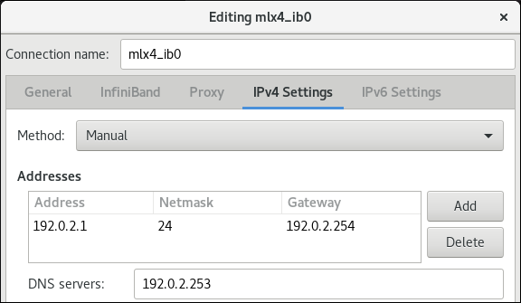
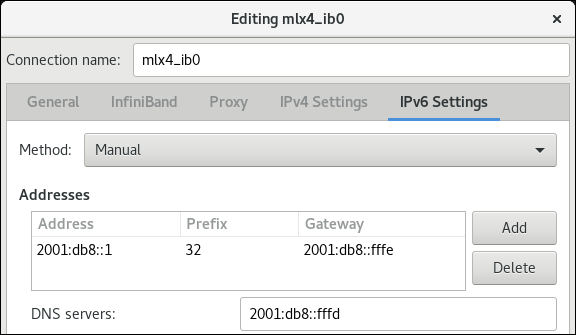

# InfiniBand  RDMA

[TOC]

## 概述

InfiniBand 代表两个不同的因素：

- InfiniBand 网络的物理链路协议 			
- InfiniBand Verbs API，这是 RDMA（remote direct memory access）技术的一个实现

RDMA 可在不涉及计算机操作系统的情况下，从一个计算机访问另一台计算机的内存。此技术启用了高吞吐量和低延迟联网，且 CPU 使用率较低。

在典型的 IP 数据传输中，当机器中的某个应用程序向另一台机器上的应用程序发送数据时，在接收层时会出现以下情况：

1. 内核必须接收数据。 			
2. 内核必须确定该数据是否属于该应用程序。 			
3. 内核唤醒应用程序。 			
4. 内核会等待应用程序执行系统调用到内核。 			
5. 应用程序将内核本身的内部内存空间数据复制到应用程序提供的缓冲中。 			

此过程意味着，如果主机适配器使用直接内存访问(DMA)或至少两次，则大多数网络流量会被复制到系统的主内存中。另外，计算机执行很多上下文开关以在内核和应用程序上下文间进行切换。这些上下文切换都可能造成高流量率的 CPU 负载，并可能造成其他任务的性能下降。 	

RDMA 通讯会绕过内核在沟通过程中的干预，这和普通的 IP 通讯不同。这可减少 CPU 开销。RDMA  协议让主机适配器知道数据包何时来自网络，应用程序应该接收它,并在应用程序的内存空间中保存数据包。对于  InfiniBand，主机适配器不将数据包发送到内核，然后将其复制到用户应用程序的内存中，而是主机适配器将数据包的内容直接放置在应用程序的缓冲中。此过程需要单独的 API、InfiniBand Verbs API，应用程序必须支持这个 API 才能使用 RDMA。 

支持以下技术，允许在非 InfiniBand 硬件中使用 InfiniBand Verbs API: 	

- Internet 广域 RDMA 协议(iWARP)：通过 IP 网络实现 RDMA 的网络协议。 			
- RDMA over Converged Ethernet(RoCE)，也称为 InfiniBand over Ethernet(IBoE)：通过以太网网络实现 RDMA 的网络协议。 	

##  配置 RoCE

有不同的厂商，比如 Mellanox、Broadcom 和 QLogic 都提供 RoCE 硬件。 	

### RoCE 协议版本概述

RoCE 是一个网络协议，它允许通过以太网进行远程直接访问(RDMA)。不同的 RoCE 版本： 		

- RoCE v1

  RoCE 版本 1 协议是一个以太网链路层协议，带有 ethertype `0x8915`，它允许同一以太网广播域中的任何两个主机间的通信。

- RoCE v2

  RoCE 版本 2 协议在 IPv4 或 IPv6 协议的 UDP 上存在。RoCE v2 保留 UDP 目标端口号 4791。 					

RDMA_CM 设置客户端和服务器之间用来传输数据的可靠连接。RDMA_CM 为建立连接提供了一个与 RDMA 传输相关的接口。该通信使用特定的 RDMA 设备,数据传输是基于消息的。 		

重要

在客户端使用 RoCE v2，在服务器使用 RoCE v1 不被支持。在这种情况下，将服务器和客户端都配置为通过 RoCE v1 进行通信。 			

RoCE v1 在链路层（L2 层）工作。它只支持在同一网络中两台机器的通信。尽管是 RoCE v2，但它在网络层（层 3）上工作。RoCE v2 支持提供与多个以太网连接的数据包路由。默认情况下使用 RoCE v2。 		

### 临时更改默认 RoCE 版本

在客户端中使用 RoCE v2 协议，并不支持服务器上的 RoCE v1。如果您的服务器中硬件只支持 RoCE  v1，请将客户端配置为使用 RoCE v1 与服务器通信。

对 Mellanox ConnectX-5 Infiniband 设备使用 `mlx5_0` 驱动程序的客户端中强制实施 RoCE v1。请注意，本节中描述的更改只在重启主机前临时进行。 		

**先决条件**

- 客户端默认使用 RoCE v2 协议的 InfiniBand 设备。 				
- 服务器中的 InfiniBand 设备只支持 RoCE v1。 				

**步骤**

1. 创建 `/sys/kernel/config/rdma_cm/*mlx5_0*/` 目录： 				

   ```none
   # mkdir /sys/kernel/config/rdma_cm/mlx5_0/
   ```

2. 显示默认 RoCE 模式。例如：显示端口 1 的模式： 				

   ```none
   # cat /sys/kernel/config/rdma_cm/mlx5_0/ports/1/default_roce_mode
   
   RoCE v2
   ```

3. 将默认 RoCE 模式改为版本 1: 				

   ```none
   # echo "IB/RoCE v1" > /sys/kernel/config/rdma_cm/mlx5_0/ports/1/default_roce_mode
   ```

## 配置 InfiniBand 子网管理器

所有 InfiniBand 网络都必须运行子网管理器才能正常工作。即使两台机器没有使用交换机直接进行连接，也是如此。 	

有可能有一个以上的子网管理器。在这种情况下，一个 master 充当一个主子网管理器，另一个子网管理器充当从属子网管理器，当主子网管理器出现故障时将接管。 	

大多数 InfiniBand 交换机都包含一个嵌入式子网管理器。但是，如果您需要更新的子网管理器，或者您需要更多控制，请使用 Red Hat Enterprise Linux 提供的 `OpenSM` 子网管理器。

## 配置 IPoIB

默认情况下，InfiniBand 不使用 IP 进行通信。但是，IP over InfiniBand(IPoIB)在 InfiniBand 远程直接访问(RDMA)网络之上提供 IP 网络模拟层。这允许现有未修改的应用程序通过 InfiniBand  网络传输数据，但如果应用程序可以原生使用 RDMA，则性能较低。 	

注意

在 RHEL 8 上，从 ConnectX-4 开始的 Mellanox 设备默认使用增强 IPoIB 模式（仅数据报）。在这些设备中不支持连接模式。 		

### IPoIB 通讯模式

可以在 `Datagram` 或 `Connected` 模式中配置 IPoIB 设备。区别在于 IPoIB 层试图在通信的另一端机器打开的队列对类型： 		

- 在 `Datagram` 模式中，系统会打开一个不可靠、断开连接的队列对。 

  这个模式不支持大于 InfiniBand link-layer 的最大传输单元(MTU)的软件包。在传输数据时，IPoIB 层在  IP 数据包之上添加了一个 4 字节 IPoIB 标头。因此，IPoIB MTU 比 InfiniBand link-layer MTU 小 4 字节。因为 2048 是一个常见的 InfiniBand 链路层 MTU，`Datagram` 模式的通用 IPoIB 设备 MTU 为 2044。 				

- 在 `Connected` 模式中，系统会打开一个可靠、连接的队列对。 	

  这个模式允许消息大于 InfiniBand link-layer MTU，主机适配器处理数据包分段和重新装配。因此，InfiniBand 适配器在 `Connected` 模式中可以发送的 IPoIB 信息大小限制。但是，IP 数据包会受 `size` 字段和 TCP/IP 标头的限制。因此，`Connected` 模式中的 IPoIB MTU 为 `65520` 字节。 				

  `Connected` 模式性能更高，但是消耗更多内核内存。 				

如果系统被配置为使用 `Connected` 模式，它仍然会在 `Datagram` 模式中发送多播流量，因为 InfiniBand 交换机和光纤无法在 `Connected` 模式中传递多播流量。另外，当与没有在 `Connected` 模式中配置的主机进行通信时，系统会返回 `Datagram` 模式。 		

在运行应用程序时，将多播数据发送到接口的最大 MTU 时，您必须将接口配置为 `Datagram` 模式，或者将应用程序配置为以数据包大小数据包的大小封顶数据包发送的大小。 		

### 了解 IPoIB 硬件地址

ipoib 设备有 20 个字节硬件地址，它由以下部分组成： 		

- 前 4 字节是标志和队列对号。 				

- 下一个 8 字节是子网前缀。 				

  默认子网前缀为 `0xfe:80:00:00:00:00:00:00`。设备连接到子网管理器后，设备会修改这个前缀使其与子网管理器中配置的匹配。 		

- 最后 8 个字节是 IPoIB 设备附加到的 InfiniBand 端口的全局唯一标识符(GUID)。 				

注意

由于前面的 12 个字节可以更改，因此不要在 `udev` 设备管理器规则中使用它们。 

### 使用 nmcli 命令配置 IPoIB 连接

这个步骤描述了如何使用 `nmcli` 命令配置 IPoIB 连接。 		

**先决条件**

- 在服务器中安装 InfiniBand 设备，并载入相应的内核模块。 				

**流程**

1. 创建 InfiniBand 连接。例如，要创建一个连接，在 `Connected` 传输模式中使用 `mlx4_ib0` 接口，以及最大的 MTU `65520` 字节，请输入： 				

   ```none
   # nmcli connection add type infiniband con-name mlx4_ib0 ifname mlx4_ib0 transport-mode Connected mtu 65520
   ```

2. 可选：设置 `P_Key` 接口。例如，要将 `0x8002` 设置为 `mlx4_ib0` 连接的 `P_Key` 接口，请输入： 				

   ```none
   # nmcli connection modify mlx4_ib0 infiniband.p-key 0x8002
   ```

3. 配置 IPv4 设置。例如：要设置 `mlx4_ib0` 连接的静态 IPv4 地址、网络掩码、默认网关和 DNS 服务器，请输入： 				

   ```none
   # nmcli connection modify mlx4_ib0 ipv4.addresses 192.0.2.1/24
   # nmcli connection modify mlx4_ib0 ipv4.gateway 192.0.2.254
   # nmcli connection modify mlx4_ib0 ipv4.dns 192.0.2.253
   # nmcli connection modify mlx4_ib0 ipv4.method manual
   ```

4. 配置 IPv6 设置。例如：要设置 `mlx4_ib0` 连接的静态 IPv6 地址、网络掩码、默认网关和 DNS 服务器，请输入： 				

   ```none
   # nmcli connection modify mlx4_ib0 ipv6.addresses 2001:db8:1::1/32
   # nmcli connection modify mlx4_ib0 ipv6.gateway 2001:db8:1::fffe
   # nmcli connection modify mlx4_ib0 ipv6.dns 2001:db8:1::fffd
   # nmcli connection modify mlx4_ib0 ipv6.method manual
   ```

5. 激活连接。例如，激活 `mlx4_ib0` 连接： 				

   ```none
   # nmcli connection up mlx4_ib0
   ```

### 使用 nm-connection-editor 配置 IPoIB 连接

这个步骤描述了如何使用 `nm-connection-editor` 应用程序配置 IPoIB 连接。 		

**先决条件**

- 在服务器中安装 InfiniBand 设备，并载入相应的内核模块。 				
- 已安装 `nm-connection-editor` 软件包。 				

**步骤**

1. 打开终端窗口，输入： 				

   ```none
   $ nm-connection-editor
   ```

2. 点 **+** 按钮添加新连接。 				

3. 选择 `InfiniBand` 连接类型，然后点 Create。 				

4. 在 `InfiniBand` 选项卡中： 				

   1. （可选）更改连接名称。 						
   2. 选择传输模式。 						
   3. 选该设备。 						
   4. 可选：设置 MTU。 						

5. 在 `IPv4 Settings` 选项卡中，配置 IPv4 设置。例如，设置静态 IPv4 地址、网络掩码、默认网关和 DNS 服务器：  					 					

6. 在 `IPv6 设置` 选项卡上，配置 IPv6 设置。例如，设置静态 IPv6 地址、网络掩码、默认网关和 DNS 服务器：  					 					

7. 点 Save 保存 team 连接。 				

8. 关闭 `nm-connection-editor`。 				

9. 可选：设置 `P_Key` 接口。请注意，您必须在命令行中设置此参数，因为 `nm-connection-editor` 中没有设置。 				

   例如，要将 `0x8002` 设置为 `mlx4_ib0` 连接的 `P_Key` 接口，请输入： 

   ```none
   # nmcli connection modify mlx4_ib0 infiniband.p-key 0x8002
   ```

## 测试 InfiniBand 网络

### 测试早期 InfiniBand RDMA 操作

这部分论述了如何测试 InfiniBand 远程直接访问(RDMA)操作。 		

注意

这部分只适用于 InfiniBand 设备。

**先决条件**

- 配置了 RDMA。 				
- 安装了 `libibverbs-utils` 和 `infiniband-diags` 软件包。 	

**步骤**

1. 列出可用的 InfiniBand 设备： 				

   ```none
   # ibv_devices
   
       device                 node GUID
       ------              ----------------
       mlx4_0              0002c903003178f0
       mlx4_1              f4521403007bcba0
   ```

2. 显示特定 InfiniBand 设备的信息。例如，要显示 `mlx4_1` 设备的信息，请输入： 				

   ```none
   # ibv_devinfo -d mlx4_1
   
   hca_id: mlx4_1
        transport:                  InfiniBand (0)
        fw_ver:                     2.30.8000
        node_guid:                  f452:1403:007b:cba0
        sys_image_guid:             f452:1403:007b:cba3
        vendor_id:                  0x02c9
        vendor_part_id:             4099
        hw_ver:                     0x0
        board_id:                   MT_1090120019
        phys_port_cnt:              2
             port:   1
                   state:              PORT_ACTIVE (4)
                   max_mtu:            4096 (5)
                   active_mtu:         2048 (4)
                   sm_lid:             2
                   port_lid:           2
                   port_lmc:           0x01
                   link_layer:         InfiniBand
   
             port:   2
                   state:              PORT_ACTIVE (4)
                   max_mtu:            4096 (5)
                   active_mtu:         4096 (5)
                   sm_lid:             0
                   port_lid:           0
                   port_lmc:           0x00
                   link_layer:         Ethernet
   ```

3. 显示 InfiniBand 设备的基本状态。例如，要显示 `mlx4_1` 设备的状态，请输入： 				

   ```none
   # ibstat mlx4_1
   
   CA 'mlx4_1'
        CA type: MT4099
        Number of ports: 2
        Firmware version: 2.30.8000
        Hardware version: 0
        Node GUID: 0xf4521403007bcba0
        System image GUID: 0xf4521403007bcba3
        Port 1:
              State: Active
              Physical state: LinkUp
              Rate: 56
              Base lid: 2
              LMC: 1
              SM lid: 2
              Capability mask: 0x0251486a
              Port GUID: 0xf4521403007bcba1
              Link layer: InfiniBand
        Port 2:
              State: Active
              Physical state: LinkUp
              Rate: 40
              Base lid: 0
              LMC: 0
              SM lid: 0
              Capability mask: 0x04010000
              Port GUID: 0xf65214fffe7bcba2
              Link layer: Ethernet
   ```

4. 使用 `ibping` 程序使用 InfiniBand 从客户端 ping 到服务器： 

   1. 在作为服务器的主机上，以服务器模式启动 `ibping` ： 	

      ```none
      # ibping -S -C mlx4_1 -P 1
      ```

      这个命令使用以下参数： 						

      - `-S`:启用服务器模式。 								
      - `-C *InfiniBand_CA_name*`:设置要使用的 CA 名称。
      - `-P *port_number*`:如果 InfiniBand 提供多个端口，则设置要使用的端口号。 								

   2. 在作为客户端的主机上，按如下方式使用 `ibping` ： 

      ```none
      # ibping -c 50 -C mlx4_0 -P 1 -L 2
      ```

      - `-c *number*`:将这些数量的数据包发送到服务器。 
      - `-C *InfiniBand_CA_name*`:设置要使用的 CA 名称。
      - `-P *port_number*`:如果 InfiniBand 提供多个端口，则设置要使用的端口号。 								
      - `-L *port_LID*`:设置要使用的本地标识符(LID)。		

### 使用 ping 程序测试 IPoIB

配置了 IPoIB 后，使用 `ping` 程序发送 ICMP 数据包来测试 IPoIB 连接。 

**先决条件**

- 两个 RDMA 主机在带有 RDMA 端口的同一个 InfiniBand 光纤中连接。 				
- 这两个主机中的 IPoIB 接口使用同一子网中的 IP 地址配置。 				

**步骤**

- 使用 `ping` 程序将 ICMP 数据包发送到远程主机的 InfiniBand 适配器： 				

  ```none
  # ping -c5 192.0.2.1
  ```

  此命令将五个 ICMP 数据包发送到 IP 地址 `192.0.2.1`。