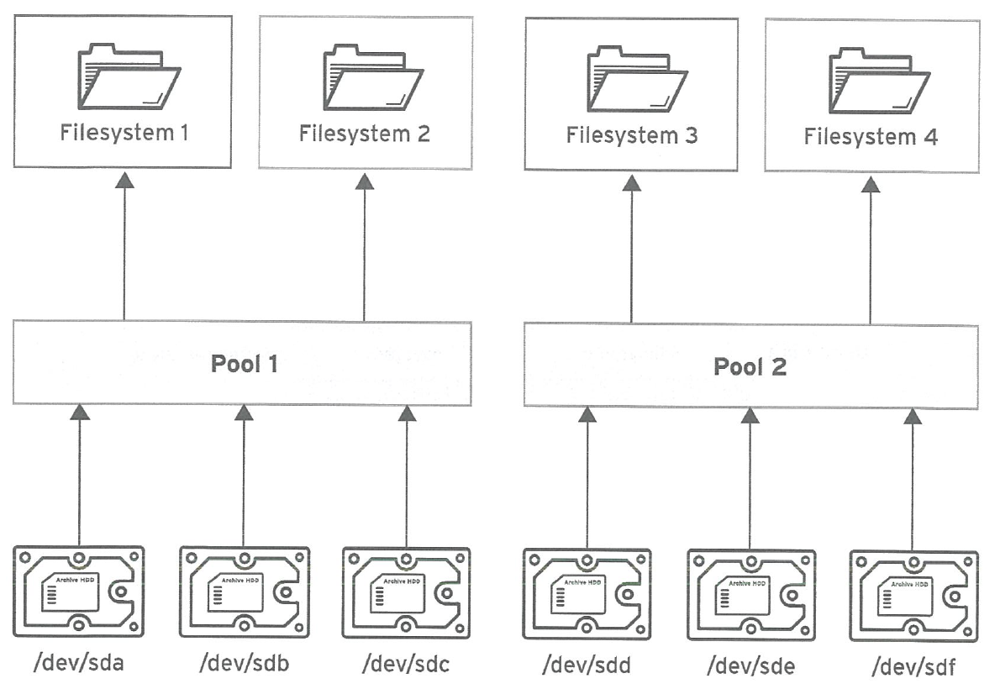

# Stratis

[TOC]

## 概述

Stratis 是基于 XFS 和 LVM 的组合构建的卷管理器。Stratis 的目的是模拟卷管理文件系统（如 Btrfs 和 ZFS）所提供的功能。可以手动构建此堆栈，但 Stratis 可减少配置的复杂度、实施最佳实践并整合错误信息。

可以在隐藏用户复杂性的同时执行重要的存储管理操作：

- 卷管理
- 创建池
- 精简存储池
- 快照
- 自动读取缓存

Stratis 提供强大的功能，但目前缺乏其他产品（如 Btrfs 或 ZFS）的某些功能。最值得注意的是，它不支持带自我修复的 CRC。



Stratis使用存储的元数据来识别所管理的池、卷和文件系统。绝不应该对Stratis创建的文件系统进行手动重新格式化或重新配置；只应使用Stratis工具和命令对他们进行管理。手动配置Stratis文件系统可能会导致该元数据丢失，并阻止Stratis识别它已创建的文件系统。

每个池最多可以创建2^24个文件系统。

## 安装

```bash
yum install stratis-cli stratisd

systemctl enable --now stratisd
```

## 使用

每个池都是 `/stratis` 目录下的一个子目录。

```bash
# 创建存储池，可以多个设备
stratis pool create pool01 /dev/vdb

# 查看可用池的列表
stratis pool list

# 向池中添加额外的块设备
stratis pool add-data pool01 /dev/vdc

# 查看池的块设备
stratis blockdev list pool01

# 创建动态、灵活的文件系统
stratis filesystem create pool01 filesystem01
# 文件系统的链接位于 /stratis/pool01 目录中

# 创建文件系统快照
stratis filesystem snapshot pool01 filesystem01 snapshot01

# 销毁文件系统或文件系统快照
stratis filesystem destroy filesystem01 snapshot01

# 查看可用文件系统列表
stratis filesystem list
```

## 持久性挂载

```bash
lsblk --output=UUID /stratis/pool01/filesystem01

/etc/fstab
UUID=23b6...8ce2 /dir1 xfs defaults,x-systemd.requires=stratisd.service 0 0
# 未使用x-systemd.requires=stratisd.service挂载选项，会导致计算机在下一次重启时引导至emergency.target。
```

# 设置 Stratis 文件系统

​			Stratis 作为服务运行，来管理物理存储设备池，简化本地存储管理，易于使用，同时帮助您设置和管理复杂的存储配置。 	

重要

​				Stratis  只是一个技术预览功能。技术预览功能不受红帽产品服务等级协议（SLA）支持，且功能可能并不完整。红帽不推荐在生产环境中使用它们。这些技术预览功能可以使用户提早试用新的功能，并有机会在开发阶段提供反馈意见。有关红帽技术预览功能支持范围的更多信息，请参阅 https://access.redhat.com/support/offerings/techpreview。 		

## 39.1. 什么是 Stratis

​				Stratis 是 Linux 的本地存储管理解决方案。它着重说明简单性和易用性，并可让您访问高级存储功能。 		

​				Stratis 使以下操作更为容易： 		

- ​						存储的初始配置 				
- ​						稍后进行修改 				
- ​						使用高级存储功能 				

​				Stratis 是一个支持高级存储功能的混合用户和内核本地存储管理系统。Stratis 的核心概念是一个存储*池*。这个池是从一个或多个本地磁盘或分区创建，卷是从池中创建的。 		

​				池启用了许多有用的功能，例如： 		

- ​						文件系统快照 				
- ​						精简置备 				
- ​						等级 				

**其它资源**

- ​						[Stratis 网站](https://stratis-storage.github.io/) 				

## 39.2. Stratis 卷的组件

​				了解组成 Stratis 卷的组件。 		

​				另外，Stratis 在命令行界面和 API 中显示以下卷组件： 		

- `blockdev`

  ​							块设备，如磁盘或者磁盘分区。 					

- `pool`

  ​							由一个或多个块设备组成。 					 						池有固定大小，与块设备的大小相等。 					 						池包含大多数 Stratis 层，如使用 `dm-cache` 目标的非易失性数据缓存。 					 						Stratis 为每个池创建一个 `/dev/stratis/*my-pool*/` 目录。这个目录包含了到代表池里 Stratis 文件系统的设备的链接。 					

- `filesystem`

  ​							每个池可以包含一个或多个文件系统来存储文件。 					 						文件系统会被精简置备，且没有固定的总大小。文件系统的实际大小随着保存着文件系统中的数据而增长。如果数据的大小接近文件系统的虚拟大小，Sratis 将自动增大精简卷和文件系统。 					 						文件系统使用 XFS 格式化。 					重要 							Stratis 跟踪关于使用 Stratis 创建的文件系统的信息，但 XFS 并不知道，并且使用 XFS 进行的更改不会在 Stratis 中自动创建更新。用户不得重新格式化或重新配置由 Stratis 管理的 XFS 文件系统。 						 						Stratis 在 `/dev/stratis/*my-pool*/*my-fs*` 路径创建到文件系统的链接。 					

注意

​					Stratis 使用许多设备映射器设备，显示在 `dmsetup` 列表中和 `/proc/partitions` 文件中。类似地，`lsblk` 命令输出反映了 Stratis 的内部工作方式和层。 			

## 39.3. 可用于 Stratis 的块设备

​				可与 Stratis 一起使用的存储设备。 		

#### 支持的设备

​				Stratis 池已被测试以可用于这些块设备： 		

- ​						LUKS 				
- ​						LVM 逻辑卷 				
- ​						MD RAID 				
- ​						DM Multipath 				
- ​						iSCSI 				
- ​						HDD 和 SSD 				
- ​						NVMe 设备 				

#### 不支持的设备

​				因为 Stratis 包含精简置备层，因此红帽不推荐将 Stratis 池放在已经精简置备的块设备中。 		

## 39.4. 安装 Stratis

​				安装 Stratis 所需的软件包。 		

**流程**

1. ​						安装提供 Stratis 服务和命令行工具的软件包： 				

   ```none
   # dnf install stratisd stratis-cli
   ```

2. ​						确保 `stratisd` 服务已启用： 				

   ```none
   # systemctl enable --now stratisd
   ```

## 39.5. 创建未加密的 Stratis 池

​				您可以从一个或多个块设备创建未加密的 Stratis 池。 		

**先决条件**

- ​						已安装 Stratis。如需更多信息，请参阅 [安装 Stratis](https://access.redhat.com/documentation/zh-cn/red_hat_enterprise_linux/9/html-single/managing_file_systems/index#installing-stratis_setting-up-stratis-file-systems)。 				
- ​						`stratisd` 服务在运行。 				
- ​						创建 Stratis 池的块设备没有被使用，且没有被挂载。 				
- ​						要在其上创建 Stratis 池的每个块设备至少为 1 GB。 				
- ​						在 IBM Z 构架中，必须对 `/dev/dasd*` 块设备进行分区。使用 Stratis 池中的分区。 				

​				有关分区 DASD 设备的详情，[请参考在 IBM Z 中配置 Linux 实例](https://access.redhat.com/documentation/en-us/red_hat_enterprise_linux/9/html/performing_a_standard_rhel_installation/configuring-a-linux-instance-on-ibm-z_installing-rhel)。 		

注意

​					您无法加密未加密的 Stratis 池。 			

**流程**

1. ​						删除您要在 Stratis 池中使用的每个块设备上存在的任何文件系统、分区表或 RAID 签名： 				

   ```none
   # wipefs --all block-device
   ```

   ​						其中 `*block-device*` 是块设备的路径；例如，`/dev/sdb`。 				

2. ​						在所选的块设备上创建新的未加密的 Stratis 池： 				

   ```none
   # stratis pool create my-pool block-device
   ```

   ​						其中 `*block-device*` 是到空或已擦除的块设备的路径。 				

   注意

   ​							在一行中指定多个块设备： 					

   ```none
   # stratis pool create my-pool block-device-1 block-device-2
   ```

3. ​						确认创建了新的 Stratis 池： 				

   ```none
   # stratis pool list
   ```

## 39.6. 创建一个加密的 Stratis 池

​				要保护您的数据，您可以从一个或多个块设备创建一个加密的 Stratis 池。 		

​				当您创建加密的 Stratis 池时，内核密钥环将用作主加密机制。后续系统重启此内核密钥环后，用来解锁加密的 Stratis 池。 		

​				当从一个或多个块设备创建加密的 Stratis 池时，请注意以下几点： 		

- ​						每个块设备都使用 `cryptsetup` 库进行加密，并实施 `LUKS2` 格式。 				
- ​						每个 Stratis 池都可以有一个唯一的密钥，或者与其他池共享相同的密钥。这些密钥保存在内核密钥环中。 				
- ​						组成 Stratis 池的块设备必须全部加密或者全部未加密。不可能同时在同一个 Stratis 池中加密和未加密块设备。 				
- ​						添加到加密 Stratis 池的数据层中的块设备会自动加密。 				

**先决条件**

- ​						Stratis v2.1.0 或更高版本已安装。如需更多信息，请参阅 [安装 Stratis](https://access.redhat.com/documentation/en-us/red_hat_enterprise_linux/8/html-single/managing_file_systems/index#installing-stratis_setting-up-stratis-file-systems)。 				
- ​						`stratisd` 服务在运行。 				
- ​						创建 Stratis 池的块设备没有被使用，且没有被挂载。 				
- ​						在其上创建 Stratis 池的每个块设备至少为 1GB。 				
- ​						在 IBM Z 构架中，必须对 `/dev/dasd*` 块设备进行分区。使用 Stratis 池中的分区。 				

​				有关分区 DASD 设备的详情，[请参考在 IBM Z 中配置 Linux 实例](https://access.redhat.com/documentation/en-us/red_hat_enterprise_linux/9/html/performing_a_standard_rhel_installation/configuring-a-linux-instance-on-ibm-z_installing-rhel)。 		

**流程**

1. ​						删除您要在 Stratis 池中使用的每个块设备上存在的任何文件系统、分区表或 RAID 签名： 				

   ```none
   # wipefs --all block-device
   ```

   ​						其中 `*block-device*` 是块设备的路径；例如，`/dev/sdb`。 				

2. ​						如果您还没有创建密钥集，请运行以下命令，并按照提示创建用于加密的密钥集。 				

   ```none
   # stratis key set --capture-key key-description
   ```

   ​						其中 `*key-description*` 是对在内核密钥环中创建的密钥的引用。 				

3. ​						创建加密的 Stratis 池并指定用于加密的密钥描述。您还可以使用 `--keyfile-path` 选项指定密钥路径，而不是使用 `*key-description*` 选项。 				

   ```none
   # stratis pool create --key-desc key-description my-pool block-device
   ```

   ​						其中 				

   - `*key-description*`

     ​									引用您在上一步中创建的内核密钥环中存在的密钥。 							

   - `*my-pool*`

     ​									指定新的 Stratis 池的名称。 							

   - `*block-device*`

     ​									指定到空或者有线块设备的路径。 							注意 									在一行中指定多个块设备： 								`# stratis pool create --key-desc *key-description* *my-pool* *block-device-1* *block-device-2*`

4. ​						确认创建了新的 Stratis 池： 				

   ```none
   # stratis pool list
   ```

## 39.7. 将 Stratis 池绑定到 NBDE

​				将加密的 Stratis 池绑定到网络绑定磁盘加密(NBDE)需要 Tang 服务器。当包含 Stratis 池的系统重启时，它与 Tang 服务器进行连接，以自动解锁加密的池，而无需提供内核密钥环描述。 		

注意

​					将 Stratis 池绑定到补充的 Clevis 加密机制不会删除主内核密钥环加密。 			

**先决条件**

- ​						Stratis v2.3.0 或更高版本已安装。如需更多信息，[请参阅安装 Stratis](https://access.redhat.com/documentation/en-us/red_hat_enterprise_linux/9/html-single/managing_file_systems/index#installing-stratis_setting-up-stratis-file-systems)。 				
- ​						`stratisd` 服务在运行。 				
- ​						您已创建了加密的 Stratis 池，并且拥有用于加密的密钥的密钥描述。如需更多信息，请参阅 [创建加密的 Stratis 池](https://access.redhat.com/documentation/en-us/red_hat_enterprise_linux/9/html-single/managing_file_systems/index#create-encrypted-stratis-pool_setting-up-stratis-file-systems)。 				
- ​						您可以连接到 Tang 服务器。如需更多信息，请参阅在 [enforcing 模式中使用 SELinux 部署 Tang 服务器](https://access.redhat.com/documentation/en-us/red_hat_enterprise_linux/9/html/security_hardening/configuring-automated-unlocking-of-encrypted-volumes-using-policy-based-decryption_security-hardening#deploying-a-tang-server-with-selinux-in-enforcing-mode_configuring-automated-unlocking-of-encrypted-volumes-using-policy-based-decryption) 				

**流程**

- ​						将加密的 Stratis 池绑定到 NBDE： 				

  ```none
  # stratis pool bind nbde my-pool key-description tang-server
  ```

  ​						其中 				

  - `*my-pool*`

    ​									指定加密的 Stratis 池的名称。 							

  - `*key-description*`

    ​									引用内核密钥环中存在的密钥，该密钥是在您创建加密的 Stratis 池时生成的。 							

  - `*tang-server*`

    ​									指定 Tang 服务器的 IP 地址或 URL。 							

**其它资源**

- ​						[使用基于策略的解密配置加密卷的自动解锁](https://access.redhat.com/documentation/en-us/red_hat_enterprise_linux/9/html/security_hardening/configuring-automated-unlocking-of-encrypted-volumes-using-policy-based-decryption_security-hardening) 				

## 39.8. 将 Stratis 池绑定到 TPM

​				当您将加密的 Stratis 池绑定到信任的平台模块(TPM) 2.0 时，当包含池的系统重启时，池会自动解锁，而您无需提供内核密钥环描述。 		

**先决条件**

- ​						Stratis v2.3.0 或更高版本已安装。如需更多信息，请参阅 [安装 Stratis](https://access.redhat.com/documentation/en-us/red_hat_enterprise_linux/8/html/managing_file_systems/managing-layered-local-storage-with-stratis_managing-file-systems#installing-stratis_setting-up-stratis-file-systems)。 				
- ​						`stratisd` 服务在运行。 				
- ​						您已创建了一个加密的 Stratis 池。如需更多信息，请参阅 [创建加密的 Stratis 池](https://access.redhat.com/documentation/en-us/red_hat_enterprise_linux/8/html/managing_file_systems/managing-layered-local-storage-with-stratis_managing-file-systems#create-encrypted-stratis-pool_setting-up-stratis-file-systems)。 				

**流程**

- ​						将加密的 Stratis 池绑定到 TPM: 				

  ```none
  # stratis pool bind tpm my-pool key-description
  ```

  ​						其中 				

  - `*my-pool*`

    ​									指定加密的 Stratis 池的名称。 							

  - `*key-description*`

    ​									引用内核密钥环中存在的密钥，该密钥是在您创建加密的 Stratis 池时生成的。 							

## 39.9. 使用内核密钥环解加密的 Stratis 池

​				系统重启后，您的加密 Stratis 池或组成它的块设备可能不可见。您可以使用用来加密池的内核密钥环来解锁池。 		

**先决条件**

- ​						Stratis v2.1.0 已安装。如需更多信息，请参阅 [安装 Stratis](https://access.redhat.com/documentation/en-us/red_hat_enterprise_linux/8/html/managing_file_systems/managing-layered-local-storage-with-stratis_managing-file-systems#installing-stratis_setting-up-stratis-file-systems)。 				
- ​						`stratisd` 服务在运行。 				
- ​						您已创建了一个加密的 Stratis 池。如需更多信息，请参阅 [创建加密的 Stratis 池](https://access.redhat.com/documentation/en-us/red_hat_enterprise_linux/8/html/managing_file_systems/managing-layered-local-storage-with-stratis_managing-file-systems#create-encrypted-stratis-pool_setting-up-stratis-file-systems)。 				

**流程**

1. ​						使用之前使用的相同密钥描述重新创建密钥集： 				

   ```none
   # stratis key set --capture-key key-description
   ```

   ​						其中 *key-description* 引用内核密钥环中存在的密钥，该密钥是您在创建加密的 Stratis 池时生成的。 				

2. ​						解锁 Stratis 池以及组成它的块设备： 				

   ```none
   # stratis pool unlock keyring
   ```

3. ​						验证 Stratis 池是可见的： 				

   ```none
   # stratis pool list
   ```

## 39.10. 使用 Clevis 解锁加密的 Stratis 池

​				系统重启后，您的加密 Stratis 池或组成它的块设备可能不可见。您可以使用池绑定到的附加加密机制来解锁加密的 Stratis 池。 		

**先决条件**

- ​						Stratis v2.3.0 或更高版本已安装。如需更多信息，[请参阅安装 Stratis](https://access.redhat.com/documentation/en-us/red_hat_enterprise_linux/9/html-single/managing_file_systems/index#installing-stratis_setting-up-stratis-file-systems)。 				
- ​						`stratisd` 服务在运行。 				
- ​						您已创建了一个加密的 Stratis 池。如需更多信息，请参阅 [创建加密的 Stratis 池](https://access.redhat.com/documentation/en-us/red_hat_enterprise_linux/9/html-single/managing_file_systems/index#create-encrypted-stratis-pool_setting-up-stratis-file-systems)。 				
- ​						加密的 Stratis 池绑定到受支持的补充的加密机制。如需更多信息，请参阅将 [加密的 Stratis 池绑定到 NBDE，](https://access.redhat.com/documentation/en-us/red_hat_enterprise_linux/9/html-single/managing_file_systems/index#bind-stratis-pool-nbde_setting-up-stratis-file-systems) 或将 [加密的 Stratis 池绑定到 TPM](https://access.redhat.com/documentation/en-us/red_hat_enterprise_linux/9/html-single/managing_file_systems/index#bind-stratis-pool-tpm_setting-up-stratis-file-systems)。 				

**流程**

1. ​						解锁 Stratis 池以及组成它的块设备： 				

   ```none
   # stratis pool unlock clevis
   ```

2. ​						验证 Stratis 池是可见的： 				

   ```none
   # stratis pool list
   ```

## 39.11. 解除 Stratis 池与补充加密的绑定

​				当您解除加密的 Stratis 池与支持的附加加密机制的绑定时，主内核密钥环加密将保持不变。 		

**先决条件**

- ​						Stratis v2.3.0 或更高版本已安装在您的系统上。如需更多信息，[请参阅安装 Stratis](https://access.redhat.com/documentation/en-us/red_hat_enterprise_linux/9/html-single/managing_file_systems/index#installing-stratis_setting-up-stratis-file-systems)。 				
- ​						您已创建了一个加密的 Stratis 池。如需更多信息，请参阅 [创建加密的 Stratis 池](https://access.redhat.com/documentation/en-us/red_hat_enterprise_linux/9/html-single/managing_file_systems/index#create-encrypted-stratis-pool_setting-up-stratis-file-systems)。 				
- ​						加密的 Stratis 池绑定到受支持的补充加密机制。 				

**流程**

- ​						解除加密的 Stratis 池与补充加密机制的绑定： 				

  ```none
  # stratis pool unbind clevis my-pool
  ```

  ​						其中 				

  ​						`*my-pool*` 指定您要解绑的 Stratis 池的名称。 				

**其它资源**

- ​						[将加密的 Stratis 池绑定到 NBDE](https://access.redhat.com/documentation/en-us/red_hat_enterprise_linux/9/html-single/managing_file_systems/index#bind-stratis-pool-nbde_setting-up-stratis-file-systems) 				
- ​						[将加密的 Stratis 池绑定到 TPM](https://access.redhat.com/documentation/en-us/red_hat_enterprise_linux/9/html-single/managing_file_systems/index#bind-stratis-pool-tpm_setting-up-stratis-file-systems) 				

## 39.12. 创建 Stratis 文件系统

​				在现有 Stratis 池上创建 Stratis 文件系统。 		

**先决条件**

- ​						已安装 Stratis。如需更多信息，请参阅 [安装 Stratis](https://access.redhat.com/documentation/en-us/red_hat_enterprise_linux/8/html/managing_file_systems/managing-layered-local-storage-with-stratis_managing-file-systems#installing-stratis_setting-up-stratis-file-systems)。 				
- ​						`stratisd` 服务在运行。 				
- ​						您已创建了 Stratis 池。请参阅 [创建未加密的 Stratis 池](https://access.redhat.com/documentation/en-us/red_hat_enterprise_linux/8/html-single/managing_file_systems/index#create-unencrypted-stratis-pool_setting-up-stratis-file-systems) 或 [创建加密的 Stratis 池](https://access.redhat.com/documentation/en-us/red_hat_enterprise_linux/8/html/managing_file_systems/managing-layered-local-storage-with-stratis_managing-file-systems#create-encrypted-stratis-pool_setting-up-stratis-file-systems)。 				

**流程**

1. ​						要在池中创建 Stratis 文件系统，请使用： 				

   ```none
   # stratis fs create my-pool my-fs
   ```

   ​						其中 				

   - `*my-pool*`

     ​									指定 Stratis 池的名称。 							

   - `*my-fs*`

     ​									为文件系统指定一个任意名称。 							

2. ​						要验证，列出池中的文件系统： 				

   ```none
   # stratis fs list my-pool
   ```

**其它资源**

- ​						[挂载 Stratis 文件系统.](https://access.redhat.com/documentation/en-us/red_hat_enterprise_linux/8/html-single/managing_file_systems/index#mounting-a-stratis-file-system_setting-up-stratis-file-systems) 				

## 39.13. 挂载 Stratis 文件系统

​				挂载现有的 Stratis 文件系统以访问其内容。 		

**先决条件**

- ​						已安装 Stratis。如需更多信息，[请参阅安装 Stratis](https://access.redhat.com/documentation/en-us/red_hat_enterprise_linux/9/html-single/managing_file_systems/index#installing-stratis_setting-up-stratis-file-systems)。 				
- ​						`stratisd` 服务在运行。 				
- ​						您已创建了 Stratis 文件系统。如需更多信息 [，请参阅创建 Stratis 文件系统](https://access.redhat.com/documentation/en-us/red_hat_enterprise_linux/9/html-single/managing_file_systems/index#creating-a-stratis-file-system_setting-up-stratis-file-systems)。 				

**流程**

- ​						要挂载文件系统，请使用 Stratis 在 `/dev/stratis/` 目录中维护的条目： 				

  ```none
  # mount /dev/stratis/my-pool/my-fs mount-point
  ```

​				现在该文件系统被挂载到 *mount-point* 目录中并可使用。 		

**其它资源**

- ​						[创建 Stratis 文件系统](https://access.redhat.com/documentation/en-us/red_hat_enterprise_linux/9/html-single/managing_file_systems/index#creating-a-stratis-file-system_setting-up-stratis-file-systems). 				

## 39.14. 永久挂载 Stratis 文件系统

​				这个过程永久挂载 Stratis 文件系统，以便在引导系统后自动可用。 		

**先决条件**

- ​						已安装 Stratis。[请参阅安装 Stratis](https://access.redhat.com/documentation/en-us/red_hat_enterprise_linux/9/html/managing_file_systems/managing-layered-local-storage-with-stratis_managing-file-systems#installing-stratis_setting-up-stratis-file-systems)。 				
- ​						`stratisd` 服务在运行。 				
- ​						您已创建了 Stratis 文件系统。[请参阅创建 Stratis 文件系统](https://access.redhat.com/documentation/en-us/red_hat_enterprise_linux/9/html-single/managing_file_systems/index#creating-a-stratis-file-system_setting-up-stratis-file-systems)。 				

**流程**

1. ​						确定文件系统的 UUID 属性： 				

   ```none
   $ lsblk --output=UUID /stratis/my-pool/my-fs
   ```

   ​						例如： 				

   例 39.1. 查看 Stratis 文件系统的 UUID

   ```none
   $ lsblk --output=UUID /stratis/my-pool/fs1
   
   UUID
   a1f0b64a-4ebb-4d4e-9543-b1d79f600283
   ```

2. ​						如果挂载点目录不存在，请创建它： 				

   ```none
   # mkdir --parents mount-point
   ```

3. ​						以 root 用户身份，编辑 `/etc/fstab` 文件，并为文件系统添加一行，由 UUID 标识。使用 `xfs` 作为文件系统类型，并添加 `x-systemd.requires=stratisd.service` 选项。 				

   ​						例如： 				

   例 39.2. /etc/fstab 中的 /fs1 挂载点

   ```none
   UUID=a1f0b64a-4ebb-4d4e-9543-b1d79f600283 /fs1 xfs defaults,x-systemd.requires=stratisd.service 0 0
   ```

4. ​						重新生成挂载单元以便您的系统注册新配置： 				

   ```none
   # systemctl daemon-reload
   ```

5. ​						尝试挂载文件系统来验证配置是否正常工作： 				

   ```none
   # mount mount-point
   ```

**其它资源**

- ​						[永久挂载文件系统](https://access.redhat.com/documentation/en-us/red_hat_enterprise_linux/9/html/managing_file_systems/assembly_mounting-file-systems_managing-file-systems#assembly_persistently-mounting-file-systems_assembly_mounting-file-systems). 				

# 第 40 章 使用额外块设备扩展 Stratis 卷

​			您可以在 Stratis 池中添加附加块设备以便为 Stratis 文件系统提供更多存储容量。 	

重要

​				Stratis  只是一个技术预览功能。技术预览功能不受红帽产品服务等级协议（SLA）支持，且功能可能并不完整。红帽不推荐在生产环境中使用它们。这些技术预览功能可以使用户提早试用新的功能，并有机会在开发阶段提供反馈意见。有关红帽技术预览功能支持范围的更多信息，请参阅 https://access.redhat.com/support/offerings/techpreview。 		

## 40.1. Stratis 卷的组件

​				了解组成 Stratis 卷的组件。 		

​				另外，Stratis 在命令行界面和 API 中显示以下卷组件： 		

- `blockdev`

  ​							块设备，如磁盘或者磁盘分区。 					

- `pool`

  ​							由一个或多个块设备组成。 					 						池有固定大小，与块设备的大小相等。 					 						池包含大多数 Stratis 层，如使用 `dm-cache` 目标的非易失性数据缓存。 					 						Stratis 为每个池创建一个 `/dev/stratis/*my-pool*/` 目录。这个目录包含了到代表池里 Stratis 文件系统的设备的链接。 					

- `filesystem`

  ​							每个池可以包含一个或多个文件系统来存储文件。 					 						文件系统会被精简置备，且没有固定的总大小。文件系统的实际大小随着保存着文件系统中的数据而增长。如果数据的大小接近文件系统的虚拟大小，Sratis 将自动增大精简卷和文件系统。 					 						文件系统使用 XFS 格式化。 					重要 							Stratis 跟踪关于使用 Stratis 创建的文件系统的信息，但 XFS 并不知道，并且使用 XFS 进行的更改不会在 Stratis 中自动创建更新。用户不得重新格式化或重新配置由 Stratis 管理的 XFS 文件系统。 						 						Stratis 在 `/dev/stratis/*my-pool*/*my-fs*` 路径创建到文件系统的链接。 					

注意

​					Stratis 使用许多设备映射器设备，显示在 `dmsetup` 列表中和 `/proc/partitions` 文件中。类似地，`lsblk` 命令输出反映了 Stratis 的内部工作方式和层。 			

## 40.2. 在 Stratis 池中添加块设备

​				此流程在 Stratis 池中添加一个或多个块设备，供 Stratis 文件系统使用。 		

**先决条件**

- ​						已安装 Stratis。[请参阅安装 Stratis](https://access.redhat.com/documentation/en-us/red_hat_enterprise_linux/9/html-single/managing_file_systems/index#installing-stratis_setting-up-stratis-file-systems)。 				
- ​						`stratisd` 服务在运行。 				
- ​						要添加到 Stratis 池中的块设备不会被使用且没有挂载。 				
- ​						要添加到 Stratis 池中的块设备的大小至少为 1 GiB。 				

**流程**

- ​						要在池中添加一个或多个块设备，请使用： 				

  ```none
  # stratis pool add-data my-pool device-1 device-2 device-n
  ```

**其它资源**

- ​						`Stratis(8)` 手册页 				

## 40.3. 其它资源

- ​						[*Stratis 存储* 网站](https://stratis-storage.github.io/) 				

# 第 41 章 监控 Stratis 文件系统

​			作为 Stratis 用户，您可以查看系统中 Stratis 卷的信息，以监控其状态和剩余空间。 	

重要

​				Stratis  只是一个技术预览功能。技术预览功能不受红帽产品服务等级协议（SLA）支持，且功能可能并不完整。红帽不推荐在生产环境中使用它们。这些技术预览功能可以使用户提早试用新的功能，并有机会在开发阶段提供反馈意见。有关红帽技术预览功能支持范围的更多信息，请参阅 https://access.redhat.com/support/offerings/techpreview。 		

## 41.1. 不同工具报告的 Stratis 大小

​				本节解释了标准工具（如 `df` ）和 `stratis` 工具所报告的 Stratis 大小之间的区别。 		

​				标准 Linux 工具（如 `df` ）报告 Stratis 上 的 XFS 文件系统层的大小，其为 1 TiB。这不是有用的信息，因为由于精简资源调配， Stratis 的实际存储使用率较少，而且在 XFS 层接近满了的时侯，Stratis 会自动增加文件系统。 		

重要

​					定期监控写入 Stratis 文件系统的数据量，将其报告为 *总物理使用* 值。请确定没有超过*总计物理大小*值。 			

**其它资源**

- ​						`Stratis(8)` 手册页。 				

## 41.2. 显示关于 Stratis 卷的信息

​				此流程列出了您的 Stratis 卷的统计信息，如总数、使用量、可用大小、文件系统以及属于池中的块设备。 		

**先决条件**

- ​						已安装 Stratis。[请参阅安装 Stratis](https://access.redhat.com/documentation/en-us/red_hat_enterprise_linux/9/html-single/managing_file_systems/index#installing-stratis_setting-up-stratis-file-systems)。 				
- ​						`stratisd` 服务在运行。 				

**流程**

- ​						要显示系统中用于 Stratis 的所有**块设备**的信息： 				

  ```none
  # stratis blockdev
  
  Pool Name  Device Node    Physical Size   State  Tier
  my-pool    /dev/sdb            9.10 TiB  In-use  Data
  ```

- ​						显示系统中所有 Stratis **池**的信息： 				

  ```none
  # stratis pool
  
  Name    Total Physical Size  Total Physical Used
  my-pool            9.10 TiB              598 MiB
  ```

- ​						显示系统中所有 Stratis **文件系统**的信息： 				

  ```none
  # stratis filesystem
  
  Pool Name  Name  Used     Created            Device
  my-pool    my-fs 546 MiB  Nov 08 2018 08:03  /dev/stratis/my-pool/my-fs
  ```

**其它资源**

- ​						`Stratis(8)` 手册页。 				

## 41.3. 其它资源

- ​						[ *Stratis 存储网站* ](https://stratis-storage.github.io/)。 				

# 第 42 章 在 Stratis 文件系统中使用快照

​			您可以使用 Stratis 文件系统的快照任意时间捕获文件系统状态，并在以后恢复它。 	

重要

​				Stratis  只是一个技术预览功能。技术预览功能不受红帽产品服务等级协议（SLA）支持，且功能可能并不完整。红帽不推荐在生产环境中使用它们。这些技术预览功能可以使用户提早试用新的功能，并有机会在开发阶段提供反馈意见。有关红帽技术预览功能支持范围的更多信息，请参阅 https://access.redhat.com/support/offerings/techpreview。 		

## 42.1. Stratis 快照的特性

​				这部分论述了 Stratis 中文件系统快照的属性和局限性。 		

​				在 Stratis 中，快照是作为另一个 Stratis 文件系统的副本创建的常规 Stratis 文件系统。快照最初包含与原始文件系统相同的文件内容，但可以随快照的更改而改变。您对快照所做的任何修改都不会反映在原始文件系统中。 		

​				Stratis 中的当前快照实现的特征如下： 		

- ​						文件系统快照是另一个文件系统。 				
- ​						快照及其原始卷在生命周期中不会被链接。快照的文件系统可以比它从中创建的文件系统更长。 				
- ​						文件系统不一定被挂载来生成快照。 				
- ​						每个快照使用大约一半的实际后备存储，这是 XFS 日志所需要的。 				

## 42.2. 创建 Stratis 快照

​				这个过程会创建一个 Stratis 文件系统作为现有 Stratis 文件系统的快照。 		

**先决条件**

- ​						已安装 Stratis。[请参阅安装 Stratis](https://access.redhat.com/documentation/en-us/red_hat_enterprise_linux/9/html-single/managing_file_systems/index#installing-stratis_setting-up-stratis-file-systems)。 				
- ​						`stratisd` 服务在运行。 				
- ​						您已创建了 Stratis 文件系统。请参阅 [创建 Stratis 文件系统](https://access.redhat.com/documentation/en-us/red_hat_enterprise_linux/8/html-single/managing_file_systems/index#creating-a-stratis-file-system_setting-up-stratis-file-systems)。 				

**流程**

- ​						要创建 Stratis 快照，请使用： 				

  ```none
  # stratis fs snapshot my-pool my-fs my-fs-snapshot
  ```

**其它资源**

- ​						`Stratis(8)` 手册页。 				

## 42.3. 访问 Stratis 快照的内容

​				这个过程挂载 Stratis 文件系统的快照，使其可在读写操作中访问。 		

**先决条件**

- ​						已安装 Stratis。请参阅 [安装 Stratis](https://access.redhat.com/documentation/en-us/red_hat_enterprise_linux/8/html/managing_file_systems/managing-layered-local-storage-with-stratis_managing-file-systems#installing-stratis_setting-up-stratis-file-systems)。 				
- ​						`stratisd` 服务在运行。 				
- ​						您已创建了 Stratis 快照。请参阅 [创建 Stratis 文件系统](https://access.redhat.com/documentation/en-us/red_hat_enterprise_linux/8/html-single/managing_file_systems/index#creating-a-stratis-file-system_setting-up-stratis-file-systems)。 				

**流程**

- ​						要访问快照，请将其作为常规文件系统挂载到 `/dev/stratis/*my-pool*/` 目录： 				

  ```none
  # mount /dev/stratis/my-pool/my-fs-snapshot mount-point
  ```

**其它资源**

- ​						[挂载 Stratis 文件系统](https://access.redhat.com/documentation/en-us/red_hat_enterprise_linux/9/html-single/managing_file_systems/index#mounting-a-stratis-file-system_setting-up-stratis-file-systems)。 				
- ​						`mount(8)` 手册页。 				

## 42.4. 将 Stratis 文件系统恢复到以前的快照

​				这个过程将 Stratis 文件系统的内容恢复到 Stratis 快照中捕获的状态。 		

**先决条件**

- ​						已安装 Stratis。请参阅 [安装 Stratis](https://access.redhat.com/documentation/en-us/red_hat_enterprise_linux/8/html/managing_file_systems/managing-layered-local-storage-with-stratis_managing-file-systems#installing-stratis_setting-up-stratis-file-systems)。 				
- ​						`stratisd` 服务在运行。 				
- ​						您已创建了 Stratis 快照。[请参阅创建 Stratis 快照](https://access.redhat.com/documentation/en-us/red_hat_enterprise_linux/9/html-single/managing_file_systems/index#creating-a-stratis-snapshot_using-snapshots-on-stratis-file-systems)。 				

**流程**

1. ​						另外，备份文件系统的当前状态，以便以后可以访问它： 				

   ```none
   # stratis filesystem snapshot my-pool my-fs my-fs-backup
   ```

2. ​						卸载并删除原始文件系统： 				

   ```none
   # umount /dev/stratis/my-pool/my-fs
   # stratis filesystem destroy my-pool my-fs
   ```

3. ​						在原始文件系统名称下创建快照副本： 				

   ```none
   # stratis filesystem snapshot my-pool my-fs-snapshot my-fs
   ```

4. ​						挂载快照，它现在可以和原始文件系统的名称相同： 				

   ```none
   # mount /dev/stratis/my-pool/my-fs mount-point
   ```

​				名为 *my-fs* 的文件系统的内容与快照 *my-fs-snapshot* 一致。 		

**其它资源**

- ​						`Stratis(8)` 手册页。 				

## 42.5. 删除 Stratis 快照

​				这个过程从池中删除 Stratis 快照。快照中的数据会丢失。 		

**先决条件**

- ​						已安装 Stratis。请参阅 [安装 Stratis](https://access.redhat.com/documentation/en-us/red_hat_enterprise_linux/8/html/managing_file_systems/managing-layered-local-storage-with-stratis_managing-file-systems#installing-stratis_setting-up-stratis-file-systems)。 				
- ​						`stratisd` 服务在运行。 				
- ​						您已创建了 Stratis 快照。请参阅 [创建 Stratis 快照](https://access.redhat.com/documentation/en-us/red_hat_enterprise_linux/8/html/managing_file_systems/managing-layered-local-storage-with-stratis_managing-file-systems#creating-a-stratis-snapshot_using-snapshots-on-stratis-file-systems)。 				

**流程**

1. ​						卸载快照： 				

   ```none
   # umount /dev/stratis/my-pool/my-fs-snapshot
   ```

2. ​						销毁快照： 				

   ```none
   # stratis filesystem destroy my-pool my-fs-snapshot
   ```

**其它资源**

- ​						`Stratis(8)` 手册页。 				

## 42.6. 其它资源

- ​						[ *Stratis 存储网站* ](https://stratis-storage.github.io/)。 				

# 第 43 章 删除 Stratis 文件系统

​			您可以删除现有 Stratis 文件系统或 Stratis 池，销毁其中的数据。 	

重要

​				Stratis  只是一个技术预览功能。技术预览功能不受红帽产品服务等级协议（SLA）支持，且功能可能并不完整。红帽不推荐在生产环境中使用它们。这些技术预览功能可以使用户提早试用新的功能，并有机会在开发阶段提供反馈意见。有关红帽技术预览功能支持范围的更多信息，请参阅 https://access.redhat.com/support/offerings/techpreview。 		

## 43.1. Stratis 卷的组件

​				了解组成 Stratis 卷的组件。 		

​				另外，Stratis 在命令行界面和 API 中显示以下卷组件： 		

- `blockdev`

  ​							块设备，如磁盘或者磁盘分区。 					

- `pool`

  ​							由一个或多个块设备组成。 					 						池有固定大小，与块设备的大小相等。 					 						池包含大多数 Stratis 层，如使用 `dm-cache` 目标的非易失性数据缓存。 					 						Stratis 为每个池创建一个 `/dev/stratis/*my-pool*/` 目录。这个目录包含了到代表池里 Stratis 文件系统的设备的链接。 					

- `filesystem`

  ​							每个池可以包含一个或多个文件系统来存储文件。 					 						文件系统会被精简置备，且没有固定的总大小。文件系统的实际大小随着保存着文件系统中的数据而增长。如果数据的大小接近文件系统的虚拟大小，Sratis 将自动增大精简卷和文件系统。 					 						文件系统使用 XFS 格式化。 					重要 							Stratis 跟踪关于使用 Stratis 创建的文件系统的信息，但 XFS 并不知道，并且使用 XFS 进行的更改不会在 Stratis 中自动创建更新。用户不得重新格式化或重新配置由 Stratis 管理的 XFS 文件系统。 						 						Stratis 在 `/dev/stratis/*my-pool*/*my-fs*` 路径创建到文件系统的链接。 					

注意

​					Stratis 使用许多设备映射器设备，显示在 `dmsetup` 列表中和 `/proc/partitions` 文件中。类似地，`lsblk` 命令输出反映了 Stratis 的内部工作方式和层。 			

## 43.2. 删除 Stratis 文件系统

​				这个过程删除现有的 Stratis 文件系统。保存的数据会丢失。 		

**先决条件**

- ​						已安装 Stratis。请参阅 [安装 Stratis](https://access.redhat.com/documentation/en-us/red_hat_enterprise_linux/8/html/managing_file_systems/managing-layered-local-storage-with-stratis_managing-file-systems#installing-stratis_setting-up-stratis-file-systems)。 				
- ​						`stratisd` 服务在运行。 				
- ​						您已创建了 Stratis 文件系统。请参阅 [创建 Stratis 文件系统](https://access.redhat.com/documentation/en-us/red_hat_enterprise_linux/8/html-single/managing_file_systems/index#creating-a-stratis-file-system_setting-up-stratis-file-systems)。 				

**流程**

1. ​						卸载文件系统： 				

   ```none
   # umount /dev/stratis/my-pool/my-fs
   ```

2. ​						销毁文件系统： 				

   ```none
   # stratis filesystem destroy my-pool my-fs
   ```

3. ​						验证文件系统不再存在： 				

   ```none
   # stratis filesystem list my-pool
   ```

**其它资源**

- ​						`Stratis(8)` 手册页。 				

## 43.3. 删除 Stratis 池

​				此流程删除现有的 Stratis 池。保存的数据会丢失。 		

**先决条件**

- ​						已安装 Stratis。请参阅 [安装 Stratis](https://access.redhat.com/documentation/en-us/red_hat_enterprise_linux/8/html/managing_file_systems/managing-layered-local-storage-with-stratis_managing-file-systems#installing-stratis_setting-up-stratis-file-systems)。 				
- ​						`stratisd` 服务在运行。 				
- ​						您已创建了 Stratis 池： 				
  - ​								要创建未加密的池，请参阅 [创建未加密的 Stratis 池](https://access.redhat.com/documentation/en-us/red_hat_enterprise_linux/8/html-single/managing_file_systems/index#create-unencrypted-stratis-pool_setting-up-stratis-file-systems) 						
  - ​								要创建加密的池，请参阅 [创建加密的 Stratis 池](https://access.redhat.com/documentation/en-us/red_hat_enterprise_linux/9/html-single/managing_file_systems/index#create-encrypted-stratis-pool_setting-up-stratis-file-systems)。 						

**流程**

1. ​						列出池中的文件系统： 				

   ```none
   # stratis filesystem list my-pool
   ```

2. ​						卸载池中的所有文件系统： 				

   ```none
   # umount /dev/stratis/my-pool/my-fs-1 \
            /dev/stratis/my-pool/my-fs-2 \
            /dev/stratis/my-pool/my-fs-n
   ```

3. ​						销毁文件系统： 				

   ```none
   # stratis filesystem destroy my-pool my-fs-1 my-fs-2
   ```

4. ​						销毁池： 				

   ```none
   # stratis pool destroy my-pool
   ```

5. ​						验证池不再存在： 				

   ```none
   # stratis pool list
   ```

**其它资源**

- ​						`Stratis(8)` 手册页。 				