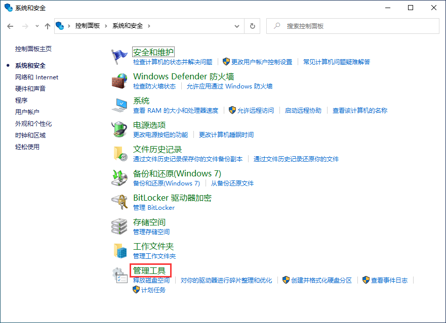
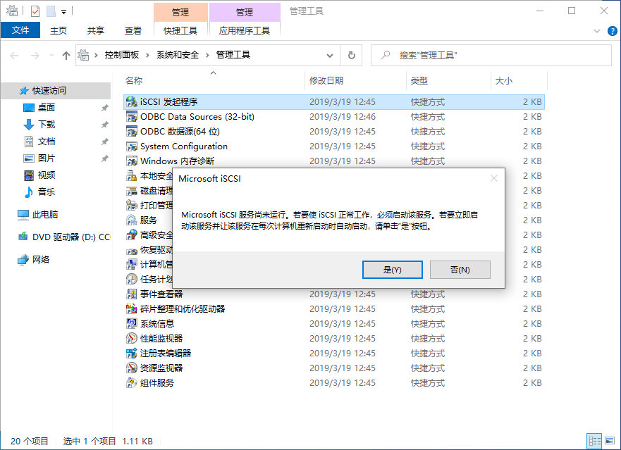
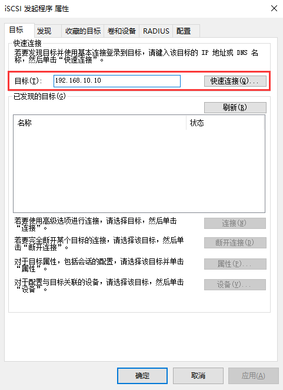
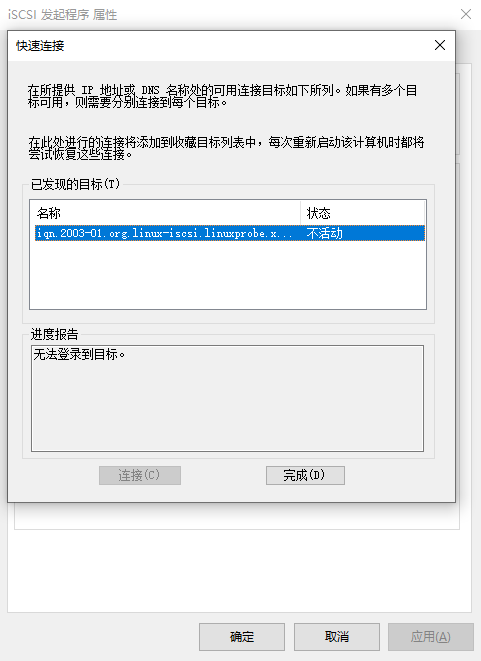
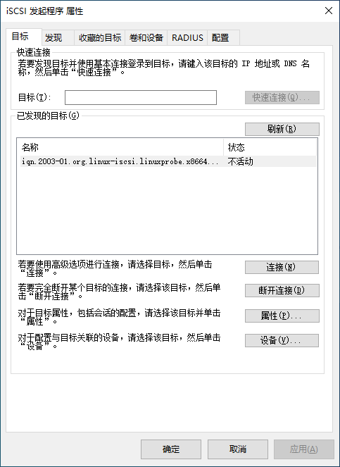
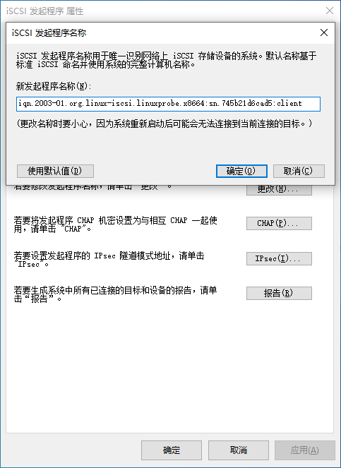
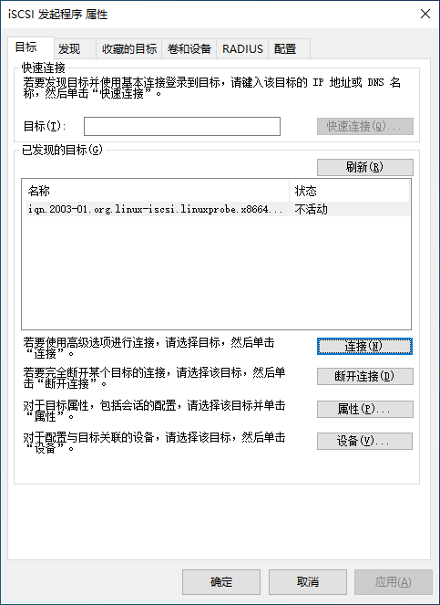
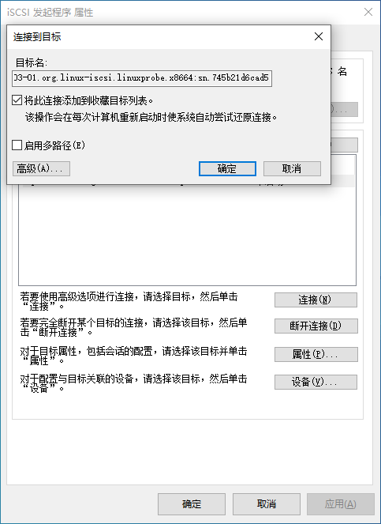

# iSCSI

[TOC]

## 概述

传统的 SCSI (Small Computer System Interface，小型计算机系统接口) 技术是存储设备最基本的标准协议，但通常需要设备互相靠近并用 SCSI 总线链接，因此受到了物理环境的限制。

iSCSI（Internet Small Computer System Interface，互联网小型计算机系统接口）是由 IBM 公司研究开发用于实现在 IP 网络上运行 SCSI 协议的新存储技术，即能够让 SCSI 接口与以太网技术相结合，使用 iSCSI 协议基于以太网传送 SCSI 命令与数据，克服了 SCSI 需要直接连接存储设备的局限性，使得可以跨越不同的服务器共享存储设备，并可以做到不停机状态下扩展存储容量。

iSCSI 是 Internet Small Computer Systems  Interface 的首字母缩写，是一种基于 Internet 协议（IP）的存储网络标准，用于链接数据存储设施。它通过 TCP/IP 网络传输  SCSI 命令，提供对存储设备的块级访问。

SAN (Storage Area Network，存储区域网络技术) 便是基于 iSCSI 存储协议，采用高速光纤通道传输存储数据的服务程序。

服务器会基于 iSCSI 协议将 SCSI 设备、命令与数据打包成标准的 TCP/IP 包然后通过 IP 网络传输到目标存储设备，而远端存储设备接收到数据包后需要基于 iSCSI 协议将 TCP/IP 包解包成 SCSI 设备、命令与数据，这个过程无疑会消耗系统 CPU 资源，因此可以将 SCSI 协议的封装动作交由独立的 iSCSI HBA 卡来处理，减少了对服务器性能的影响。

与一般的网卡不同（连接网络总线和内存，供计算机上网使用），iSCSI-HBA 卡连接的是 SCSI 接口或 FC（光纤通道）总线和内存，专门用于在主机之间交换存储数据，其使用的协议也与一般网卡有本质的不同。

iSCSI is used to facilitate data transfers over [intranets](https://en.wikipedia.org/wiki/Intranet) and to manage storage over long distances. It can be used to transmit data over [local area networks](https://en.wikipedia.org/wiki/Local_area_network) (LANs), [wide area networks](https://en.wikipedia.org/wiki/Wide_area_network) (WANs), or the [Internet](https://en.wikipedia.org/wiki/Internet) and can enable location-independent data storage and retrieval.
iSCSI 用于促进通过 Intranet 传输数据并管理远距离存储。它可用于通过局域网 （LAN）、广域网 （WAN） 或 Internet 传输数据，并可以实现与位置无关的数据存储和检索。

The [protocol](https://en.wikipedia.org/wiki/Protocol_(computing)) allows clients (called  *initiators*) to send SCSI commands ([*CDBs*](https://en.wikipedia.org/wiki/SCSI_CDB)) to storage devices (*targets*) on remote servers.  It is a [storage area network](https://en.wikipedia.org/wiki/Storage_area_network) (SAN) protocol, allowing organizations to consolidate storage into [storage arrays](https://en.wikipedia.org/wiki/Storage_array) while providing clients (such as database and web servers) with the illusion of locally attached SCSI disks.
该协议允许客户端（称为启动器）将 SCSI 命令 （CDB） 发送到远程服务器上的存储设备（目标）。它是一种存储区域网络 （SAN） 协议，允许组织将存储整合到存储阵列中，同时为客户端（如数据库和 Web 服务器）提供本地连接的 SCSI 磁盘的错觉。

It mainly competes with [Fibre Channel](https://en.wikipedia.org/wiki/Fibre_Channel), but unlike traditional Fibre Channel, which usually requires dedicated  cabling, iSCSI can be run over long distances using existing network  infrastructure.

它主要与光纤通道竞争，但与通常需要专用布线的传统光纤通道不同，iSCSI可以使用现有的网络基础设施进行长距离运行。

iSCSI技术在生产环境中的优势和劣势：

* iSCSI 存储技术非常便捷，在访问存储资源的形式上发生了很大变化，摆脱了物理环境的限制，同时还可以把存储资源分给多个服务器共同使用，因此是一种非常推荐使用的存储技术。
* iSCSI 存储技术受到了网速的制约。以往硬盘设备直接通过主板上的总线进行数据传输，现在则需要让互联网作为数据传输的载体和通道，因此传输速率和稳定性是 iSCSI 技术的瓶颈。随着网络技术的持续发展，iSCSI 技术也会随之得以改善。

## 工作方式

iSCSI 的工作方式分为服务端（target）与客户端（initiator）。

iSCSI 服务端即用于存放硬盘存储资源的服务器，能够为用户提供可用的存储资源。

iSCSI 客户端则是用户使用的软件，用于访问远程服务端的存储资源。

LUN (Logical Unit Number，逻辑单元) 是 iSCSI 协议中的重要概念。当客户机想要使用服务端存储设备时必需输入对应的名称 (Target ID) ，而一个服务端可能会同时提供多个可用的存储设备，便用 LUN 来详细的描述设备或对象，同时每个 LUN Device 可能代表一个硬盘或 RAID 设备。LUN 的名称由用户指定。

## 实现

### Open-iSCSI

The Open-iSCSI project provides a high-performance, transport independent, implementation of [RFC 3720 iSCSI](https://tools.ietf.org/html/rfc7143) for Linux.
Open-iSCSI 项目提供了用于 Linux 的 [RFC 3720 iSCSI](https://tools.ietf.org/html/rfc7143) 的高性能、独立于传输的实现。

Open-iSCSI 分为用户部分和内核部分。

Open-iSCSI 的内核部分作为 Linux 内核的一部分进行维护，并根据 GPLv2 获得许可。内核部分实现 iSCSI 数据路径（即 iSCSI 读取和 iSCSI 写入），由多个可加载的内核模块和驱动程序组成。

Open-ISCSI 用户空间维护在项目 [GitHub](https://github.com/open-iscsi/) 上。

用户空间包含整个控制平面：配置管理器、iSCSI 发现、登录和注销处理、connection-level error processing连接级错误处理、Nop-In 和 Nop-Out 处理等。

Open-iSCSI 用户空间由一个名为 iscsid 的守护进程和管理实用程序 iscsiadm 组成。

## 配置 iSCSI 服务端（Target）

### 方案1  targetd

1. 准备作为 LUN 发布的存储设备。

2. 安装 iSCSI target 服务程序及配置工具，并启动服务。

   ```bash
   yum install targetd targetcli
   dnf install targetd targetcli
   
   systemctl start targetd
   systemctl enable targetd
   ```

3. 创建存储对象。

   targetcli 命令用于管理 iSCSI target 存储设备，格式为：

   ```bash
   targetcli
   ```

   查看当前的存储目录树：

   ```bash
   /> ls
   o- / ..................................................................... [...]
     o- backstores .......................................................... [...]
     | o- block .............................................. [Storage Objects: 0]
     | o- fileio ............................................. [Storage Objects: 0]
     | o- pscsi .............................................. [Storage Objects: 0]
     | o- ramdisk ............................................ [Storage Objects: 0]
     o- iscsi ........................................................ [Targets: 0]
     o- loopback ..................................................... [Targets: 0]
     
   # /backstores/block 是 iSCSI 服务端配置共享设备的位置。
   ```

   进入/backstores/block目录中：

   ```bash
   /> cd /backstores/block
   /backstores/block>
   ```

   使用/dev/md0创建设备disk0：

   ```bash
   /backstores/block> create disk0 /dev/md0
   Created block storage object disk0 using /dev/md0.
   ```

   返回到根目录中：

   ```bash
   /backstores/block> cd ..
   /backstores> cd ..
   />
   ```

   查看创建后的设备：

   ```bash
   /> ls
   o- / ................................................................... [...]
     o- backstores ........................................................ [...]
     | o- block ............................................ [Storage Objects: 1]
     | | o- disk0 ................... [/dev/md0 (40.0GiB) write-thru deactivated]
     | o- fileio ........................................... [Storage Objects: 0]
     | o- pscsi ............................................ [Storage Objects: 0]
     | o- ramdisk .......................................... [Storage Objects: 0]
     o- iscsi ...................................................... [Targets: 0]
     o- loopback ................................................... [Targets: 0]
   ```

4. 配置iSCSI target目标。

   进入到iscsi目录中：

   ```bash
   /> cd iscsi
   /iscsi>
   ```

   创建iSCSI target目标：

   ```bash
   /iscsi> create
   Created target iqn.2003-01.org.linux-iscsi.linuxprobe.x8664:sn.d497c356ad80.
   Created TPG 1.
   ```

   依次进入到target的luns目录中：

   ```bash
   /iscsi> cd iqn.2003-01.org.linux-iscsi.linuxprobe.x8664:sn.d497c356ad80/
   /iscsi/iqn.20....d497c356ad80> ls
   o- iqn.2003-01.org.linux-iscsi.linuxprobe.x8664:sn.d497c356ad80 ..... [TPGs: 1]
     o- tpg1 .............................................. [no-gen-acls, no-auth]
       o- acls ......................................................... [ACLs: 0]
       o- luns ......................................................... [LUNs: 0]
       o- portals ................................................... [Portals: 0]
   /iscsi/iqn.20....d497c356ad80> cd tpg1/
   /iscsi/iqn.20...c356ad80/tpg1> cd luns
   /iscsi/iqn.20...d80/tpg1/luns>
   ```

   创建LUN设备：

   ```bash
   /iscsi/iqn.20...d80/tpg1/luns> create /backstores/block/disk0
   Created LUN 0.
   ```

5. 设置访问控制列表。iSCSI 协议是通过客户端名称进行验证的。用户在访问存储共享资源时不需要输入密码，只要 iSCSI 客户端的名称与服务端中设置的访问控制列表中某一名称条目一致即可，因此需要在 iSCSI 服务端的配置文件中写入一串能够验证用户信息的名称。acls 参数目录用于存放能够访问 iSCSI 服务端共享存储资源的客户端名称。

   切换到acls目录中：

   ```bash
   /iscsi/iqn.20...d80/tpg1/luns> cd ..
   /iscsi/iqn.20...c356ad80/tpg1> cd acls
   ```

   创建访问控制列表：

   ```bash
   /iscsi/iqn.20...d80/tpg1/acls> create iqn.2003-01.org.linux-iscsi.linuxprobe.x8664:sn.d497c356ad80:client
   Created Node ACL for iqn.2003-01.org.linux-iscsi.linuxprobe.x8664:sn.d497c356ad80:client
   Created mapped LUN 0.
   ```

   切换到portals目录中：

   ```bash
   /iscsi/iqn.20...d80/tpg1/acls> cd ..
   /iscsi/iqn.20...c356ad80/tpg1> cd portals
   ```

   设置 iSCSI 服务端的监听 IP 地址和端口号。位于生产环境中的服务器上可能有多块网卡，可以进行选择。

   ```bash
   /iscsi/iqn.20.../tpg1/portals> create 192.168.10.10
   Using default IP port 3260
   Created network portal 192.168.10.10:3260.
   ```

   在配置文件中默认是允许所有网卡提供iSCSI服务，如果认为这有些许不安全，可以手动删除：

   ```bash
   /iscsi/iqn.20.../tpg1/portals> delete 0.0.0.0 3260
   Deleted network portal 0.0.0.0:3260
   ```

6. 查看配置概述后退出工具：

   ```bash
   /iscsi/iqn.20.../tpg1/portals> ls /
   o- / ........................... [...]
     o- backstores................. [...]
     | o- block ................... [Storage Objects: 1]
     | | o- disk0 ................. [/dev/md0 (40.0GiB) write-thru activated]
     | o- fileio .................. [Storage Objects: 0]
     | o- pscsi ................... [Storage Objects: 0]
     | o- ramdisk ................. [Storage Objects: 0]
     o- iscsi ..................... [Targets: 1]
     | o- iqn.2003-01.org.linux-iscsi.linuxprobe.x8664:sn.d497c356ad0 .. [TPGs: 1]
     |   o- tpg1 .................. [no-gen-acls, no-auth]
     |     o- acls ..................................................... [ACLs: 1]
     |     | o- iqn.2003-01.org.linux-iscsi.linuxprobe.x8664:sn.d497c356ad80:client [Mapped LUNs: 1]
     |     |   o- mapped_lun0 .......................... [lun0 block/disk0 (rw)]  
       o- luns .................... [LUNs: 1]
     |     | o- lun0 .............. [block/disk0 (/dev/md0)]
     |     o- portals ............. [Portals: 1]
     |       o- 192.168.10.10:3260  [OK]
     o- loopback .................. [Targets: 0]
   /> exit
   Global pref auto_save_on_exit=true
   Last 10 configs saved in /etc/target/backup.
   Configuration saved to /etc/target/saveconfig.json
   ```

7. 创建防火墙允许规则：

   ```bash
   firewall-cmd --permanent  --add-port=3260/tcp
   firewall-cmd --reload
   ```

## 配置 iSCSI 客户端（Initiator）

### 配置

1. 发现 iscsi 服务端的可用存储设备：

   iscsiadm 命令用于管理（插入、查询、更新或删除）iSCSI 数据库配置文件的命令行工具。

   需先使用工具扫描发现远程 iSCSI 服务端，然后查看找到的服务端上有哪些可用的共享存储资源。

   ```bash
   iscsiadm -m     discovery -t     st          -p       192.168.0.20
   iscsiadm --mode discovery --type sendtargets --portal 192.168.0.20
   
   192.168.0.20:3260,1 iqn.2003-01.org.linux-iscsi.linurobe.x86:sn.d49d80
   
   # -m discovery      扫描并发现可用的存储资源
   # -t st             执行扫描操作的类型
   # -p 192.168.10.10  iSCSI服务端的IP地址
   ```

2. 连接 iscsi 服务端的可用存储设备：

   ```bash
   iscsiadm -m     node  -T           iqn.2003-01.org.linux-iscsi.linurobe.x86:sn.d49d80 -p       192.168.0.20:3260 --login
   iscsiadm --mode node  --targetname iqn.2003-01.org.linux-iscsi.linurobe.x86:sn.d49d80 --portal 192.168.0.20:3260 --login
   
   # -m  node           将客户端所在主机作为一台节点服务器
   # -T                 要使用的存储资源
   # -p  192.168.10.10  对方iSCSI服务端的IP地址
   # --login 或 -l      进行登录验证
   ```

3. 验证是否已创建 iscsi 会话：

   ```bash
   iscsiadm --mode session --print=1 
   ```

   如果会话成功启动，将显示一个新的 `/dev/sdx` 设备，自动链接到 `/dev/disk/by-path/ip-*` 。然后，可以像使用普通磁盘一样使用该设备。

4. 由于udev 服务是按照系统识别硬盘设备的顺序来命名硬盘设备的，当客户端主机同时使用多个远程存储资源时，如果下一次识别远程设备的顺序发生了变化，则客户端挂载目录中的文件也将随之混乱。为了防止发生这样的问题，应该在 /etc/fstab 配置文件中使用设备的 UUID 进行挂载。这样，不论远程设备资源的识别顺序再怎么变化，系统也能正确找到设备所对应的目录。查看设备的UUID值：

   ```bash
   blkid | grep /dev/sdb
   /dev/sdb: UUID="eb9cbf2f-fce8-413a-b770-8b0f243e8ad6" TYPE="xfs"
   ```

5. 设置为开机后自动挂载时，因为 iSCSI 服务程序基于 IP 网络传输数据，所以必需在 fstab 文件中添加参数 `_netdev` ，代表网络联通后再挂载：

   ```bash
   vim /etc/fstab
   UUID=eb9cbf2f-fce8-413a-b770-8b0f243e8ad6 /iscsi xfs defaults,_netdev 0 0
   ```

6. 卸载

   ```bash
   iscsiadm -m     node -T           iqn.2003-01.org.linux-iscsi.linurobe.x86:sn.d49d80 -u
   iscsiadm --mode node --targetname iqn.2003-01.org.linux-iscsi.linurobe.x86:sn.d49d80 --logout
   ```

### Ubuntu

要将 Ubuntu Server 配置为 iSCSI 启动器，请安装 open-iscsi 软件包。在终端中输入：

```bash
apt install open-iscsi
```

安装软件包后，将找到以下文件：

- /etc/iscsi/iscsid.conf
- /etc/iscsi/initiatorname.iscsi

配置主配置文件 `/etc/iscsi/iscsid.conf`，如以下示例所示：

```bash
### startup settings

## will be controlled by systemd, leave as is
iscsid.startup = /usr/sbin/iscsidnode.startup = manual

### chap settings

# node.session.auth.authmethod = CHAP

## authentication of initiator by target (session)
# node.session.auth.username = username
# node.session.auth.password = password

# discovery.sendtargets.auth.authmethod = CHAP

## authentication of initiator by target (discovery)
# discovery.sendtargets.auth.username = username
# discovery.sendtargets.auth.password = password

### timeouts

## control how much time iscsi takes to propagate an error to the
## upper layer. if using multipath, having 0 here is desirable
## so multipath can handle path errors as quickly as possible
## (and decide to queue or not if missing all paths)
node.session.timeo.replacement_timeout = 0

node.conn[0].timeo.login_timeout = 15
node.conn[0].timeo.logout_timeout = 15

## interval for a NOP-Out request (a ping to the target)
node.conn[0].timeo.noop_out_interval = 5

## and how much time to wait before declaring a timeout
node.conn[0].timeo.noop_out_timeout = 5

## default timeouts for error recovery logics (lu & tgt resets)
node.session.err_timeo.abort_timeout = 15
node.session.err_timeo.lu_reset_timeout = 30
node.session.err_timeo.tgt_reset_timeout = 30

### retry

node.session.initial_login_retry_max = 8

### session and device queue depth

node.session.cmds_max = 128
node.session.queue_depth = 32

### performance

node.session.xmit_thread_priority = -20
```

并重新启动 iSCSI 守护程序：

```bash
systemctl restart iscsid.service
```

这将为其余的配置设置基本内容。

另一个提到的文件 `/etc/iscsi/initiatorname.iscsi`：

```bash
InitiatorName=iqn.1993-08.org.debian:01:60f3517884c3
```

包含此节点的启动器名称，并在 open-iscsi 软件包安装期间生成。如果修改此设置，请确保同一 iSCSI SAN（存储区域网络）中没有重复项。

### RHEL / CentOS

1. 在 CentOS 7/8 系统中，已经默认安装了 iSCSI 客户端服务程序 initiator 。

   ```bash
   yum install iscsi-initiator-utils
   dnf install iscsi-initiator-utils
   ```

2. 编辑 iscsi 客户端名称文件，该名称是 initiator 客户端的唯一标识。iSCSI 协议是通过客户端的名称来进行验证的，而该名称也是 iSCSI 客户端的唯一标识，而且必须与服务端配置文件中访问控制列表中的信息一致，否则客户端在尝试访问存储共享设备时，系统会弹出验证失败的保存信息。

   ```bash
   vim /etc/iscsi/initiatorname.iscsi
   InitiatorName=iqn.2003-01.org.linux-scsi.linuxprobe.x8664:sn.d497c356ad80:client
   ```

3. 重启 iscsi 客户端服务程序，并将 iscsi 客户端服务程序添加到开机启动项中：

   ```bash
   systemctl restart iscsid
   systemctl enable iscsid
   ```

### Windows

运行 iSCSI 发起程序。在 Windows 10 操作系统中已经默认安装了iSCSI客户端程序，只需在控制面板中找到“系统和安全”标签，然后单击“管理工具”，进入到“管理工具”页面后即可看到“ iSCSI 发起程序”图标。双击该图标，在第一次运行 iSCSI 发起程序时，系统会提示 “Microsoft iSCSI服务端未运行”，单击 “是” 按钮即可自动启动并运行 iSCSI 发起程序。

 

 

扫描发现 iSCSI 服务端上可用的存储资源。运行 iSCSI 发起程序后在“目标”选项卡的“目标”文本框中写入 iSCSI 服务端的 IP 地址，然后单击“快速连接”按钮。在弹出的“快速连接”对话框中可看到共享的硬盘存储资源，此时显示“无法登录到目标”属于正常情况，单击“完成”按钮即可。

 

 

回到“目标”选项卡页面，可以看到共享存储资源的名称已经出现。

 

准备连接 iSCSI 服务端的共享存储资源。由于在 iSCSI 服务端程序上设置了 ACL，使得只有客户端名称与 ACL 策略中的名称保持一致时才能使用远程存储资源，因此首先需要在“配置”选项卡中单击“更改”按钮，随后在修改界面写入 iSCSI 服务器配置过的 ACL 策略名称，最后重新返回到 iSCSI 发起程序的“目标”界面。

 

 

在确认 iSCSI 发起程序名称与 iSCSI 服务器 ACL 策略一致后，重新单击“连接”按钮，并单击“确认”按钮。大约1～3秒后，状态会更新为“已连接”。

 

 

完成连接。

 

硬盘初始化。

## iSCSI Network Configuration

Before configuring the Logical Units that are going to be accessed by the initiator, it is important to inform the iSCSI service what are the interfaces acting as paths.

A straightforward way to do that is by:

- configuring the following environment variables

```auto
$ iscsi01_ip=$(ip -4 -o addr show iscsi01 | sed -r 's:.* (([0-9]{1,3}\.){3}[0-9]{1,3})/.*:\1:')
$ iscsi02_ip=$(ip -4 -o addr show iscsi02 | sed -r 's:.* (([0-9]{1,3}\.){3}[0-9]{1,3})/.*:\1:')

$ iscsi01_mac=$(ip -o link show iscsi01 | sed -r 's:.*\s+link/ether (([0-f]{2}(\:|)){6}).*:\1:g')
$ iscsi02_mac=$(ip -o link show iscsi02 | sed -r 's:.*\s+link/ether (([0-f]{2}(\:|)){6}).*:\1:g')
```

- configuring **iscsi01** interface

```auto
$ sudo iscsiadm -m iface -I iscsi01 --op=new
New interface iscsi01 added
$ sudo iscsiadm -m iface -I iscsi01 --op=update -n iface.hwaddress -v $iscsi01_mac
iscsi01 updated.
$ sudo iscsiadm -m iface -I iscsi01 --op=update -n iface.ipaddress -v $iscsi01_ip
iscsi01 updated.
```

- configuring **iscsi02** interface

```auto
$ sudo iscsiadm -m iface -I iscsi02 --op=new
New interface iscsi02 added
$ sudo iscsiadm -m iface -I iscsi02 --op=update -n iface.hwaddress -v $iscsi02_mac
iscsi02 updated.
$ sudo iscsiadm -m iface -I iscsi02 --op=update -n iface.ipaddress -v $iscsi02_ip
iscsi02 updated.
```

- discovering the **targets**

```auto
$ sudo iscsiadm -m discovery -I iscsi01 --op=new --op=del --type sendtargets --portal storage.iscsi01
10.250.94.99:3260,1 iqn.2003-01.org.linux-iscsi.storage.x8664:sn.2c084c8320ca

$ sudo iscsiadm -m discovery -I iscsi02 --op=new --op=del --type sendtargets --portal storage.iscsi02
10.250.93.99:3260,1 iqn.2003-01.org.linux-iscsi.storage.x8664:sn.2c084c8320ca
```

- configuring **automatic login**

```auto
$ sudo iscsiadm -m node --op=update -n node.conn[0].startup -v automatic
$ sudo iscsiadm -m node --op=update -n node.startup -v automatic
```

- make sure needed **services** are enabled during OS initialization:

```auto
$ systemctl enable open-iscsi
Synchronizing state of open-iscsi.service with SysV service script with /lib/systemd/systemd-sysv-install.
Executing: /lib/systemd/systemd-sysv-install enable open-iscsi
Created symlink /etc/systemd/system/iscsi.service → /lib/systemd/system/open-iscsi.service.
Created symlink /etc/systemd/system/sysinit.target.wants/open-iscsi.service → /lib/systemd/system/open-iscsi.service.

$ systemctl enable iscsid
Synchronizing state of iscsid.service with SysV service script with /lib/systemd/systemd-sysv-install.
Executing: /lib/systemd/systemd-sysv-install enable iscsid
Created symlink /etc/systemd/system/sysinit.target.wants/iscsid.service → /lib/systemd/system/iscsid.service.
```

- restarting **iscsid** service

```auto
$ systemctl restart iscsid.service
```

- and, finally, **login in** discovered logical units

```auto
$ sudo iscsiadm -m node --loginall=automatic
Logging in to [iface: iscsi02, target: iqn.2003-01.org.linux-iscsi.storage.x8664:sn.2c084c8320ca, portal: 10.250.93.99,3260] (multiple)
Logging in to [iface: iscsi01, target: iqn.2003-01.org.linux-iscsi.storage.x8664:sn.2c084c8320ca, portal: 10.250.94.99,3260] (multiple)
Login to [iface: iscsi02, target: iqn.2003-01.org.linux-iscsi.storage.x8664:sn.2c084c8320ca, portal: 10.250.93.99,3260] successful.
Login to [iface: iscsi01, target: iqn.2003-01.org.linux-iscsi.storage.x8664:sn.2c084c8320ca, portal: 10.250.94.99,3260] successful.
```

## Accessing the Logical Units (or LUNs)

Check dmesg to make sure that the new disks have been detected:

> dmesg
>
> ```auto
> [  166.840694] scsi 7:0:0:4: Direct-Access     LIO-ORG  TCMU device >      0002 PQ: 0 ANSI: 5
> [  166.840892] scsi 8:0:0:4: Direct-Access     LIO-ORG  TCMU device >      0002 PQ: 0 ANSI: 5
> [  166.841741] sd 7:0:0:4: Attached scsi generic sg2 type 0
> [  166.841808] sd 8:0:0:4: Attached scsi generic sg3 type 0
> [  166.842278] scsi 7:0:0:3: Direct-Access     LIO-ORG  TCMU device >      0002 PQ: 0 ANSI: 5
> [  166.842571] scsi 8:0:0:3: Direct-Access     LIO-ORG  TCMU device >      0002 PQ: 0 ANSI: 5
> [  166.843482] sd 8:0:0:3: Attached scsi generic sg4 type 0
> [  166.843681] sd 7:0:0:3: Attached scsi generic sg5 type 0
> [  166.843706] sd 8:0:0:4: [sdd] 2097152 512-byte logical blocks: > (1.07 GB/1.00 GiB)
> [  166.843884] scsi 8:0:0:2: Direct-Access     LIO-ORG  TCMU device >      0002 PQ: 0 ANSI: 5
> [  166.843971] sd 8:0:0:4: [sdd] Write Protect is off
> [  166.843972] sd 8:0:0:4: [sdd] Mode Sense: 2f 00 00 00
> [  166.844127] scsi 7:0:0:2: Direct-Access     LIO-ORG  TCMU device >      0002 PQ: 0 ANSI: 5
> [  166.844232] sd 7:0:0:4: [sdc] 2097152 512-byte logical blocks: > (1.07 GB/1.00 GiB)
> [  166.844421] sd 8:0:0:4: [sdd] Write cache: enabled, read cache: > enabled, doesn't support DPO or FUA
> [  166.844566] sd 7:0:0:4: [sdc] Write Protect is off
> [  166.844568] sd 7:0:0:4: [sdc] Mode Sense: 2f 00 00 00
> [  166.844846] sd 8:0:0:2: Attached scsi generic sg6 type 0
> [  166.845147] sd 7:0:0:4: [sdc] Write cache: enabled, read cache: > enabled, doesn't support DPO or FUA
> [  166.845188] sd 8:0:0:4: [sdd] Optimal transfer size 65536 bytes
> [  166.845527] sd 7:0:0:2: Attached scsi generic sg7 type 0
> [  166.845678] sd 8:0:0:3: [sde] 2097152 512-byte logical blocks: > (1.07 GB/1.00 GiB)
> [  166.845785] scsi 8:0:0:1: Direct-Access     LIO-ORG  TCMU device >      0002 PQ: 0 ANSI: 5
> [  166.845799] sd 7:0:0:4: [sdc] Optimal transfer size 65536 bytes
> [  166.845931] sd 8:0:0:3: [sde] Write Protect is off
> [  166.845933] sd 8:0:0:3: [sde] Mode Sense: 2f 00 00 00
> [  166.846424] scsi 7:0:0:1: Direct-Access     LIO-ORG  TCMU device >      0002 PQ: 0 ANSI: 5
> [  166.846552] sd 8:0:0:3: [sde] Write cache: enabled, read cache: > enabled, doesn't support DPO or FUA
> [  166.846708] sd 7:0:0:3: [sdf] 2097152 512-byte logical blocks: > (1.07 GB/1.00 GiB)
> [  166.847024] sd 8:0:0:1: Attached scsi generic sg8 type 0
> [  166.847029] sd 7:0:0:3: [sdf] Write Protect is off
> [  166.847031] sd 7:0:0:3: [sdf] Mode Sense: 2f 00 00 00
> [  166.847043] sd 8:0:0:3: [sde] Optimal transfer size 65536 bytes
> [  166.847133] sd 8:0:0:2: [sdg] 2097152 512-byte logical blocks: > (1.07 GB/1.00 GiB)
> [  166.849212] sd 8:0:0:2: [sdg] Write Protect is off
> [  166.849214] sd 8:0:0:2: [sdg] Mode Sense: 2f 00 00 00
> [  166.849711] sd 7:0:0:3: [sdf] Write cache: enabled, read cache: > enabled, doesn't support DPO or FUA
> [  166.849718] sd 7:0:0:1: Attached scsi generic sg9 type 0
> [  166.849721] sd 7:0:0:2: [sdh] 2097152 512-byte logical blocks: > (1.07 GB/1.00 GiB)
> [  166.853296] sd 8:0:0:2: [sdg] Write cache: enabled, read cache: > enabled, doesn't support DPO or FUA
> [  166.853721] sd 8:0:0:2: [sdg] Optimal transfer size 65536 bytes
> [  166.853810] sd 7:0:0:2: [sdh] Write Protect is off
> [  166.853812] sd 7:0:0:2: [sdh] Mode Sense: 2f 00 00 00
> [  166.854026] sd 7:0:0:3: [sdf] Optimal transfer size 65536 bytes
> [  166.854431] sd 7:0:0:2: [sdh] Write cache: enabled, read cache: > enabled, doesn't support DPO or FUA
> [  166.854625] sd 8:0:0:1: [sdi] 2097152 512-byte logical blocks: > (1.07 GB/1.00 GiB)
> [  166.854898] sd 8:0:0:1: [sdi] Write Protect is off
> [  166.854900] sd 8:0:0:1: [sdi] Mode Sense: 2f 00 00 00
> [  166.855022] sd 7:0:0:2: [sdh] Optimal transfer size 65536 bytes
> [  166.855465] sd 8:0:0:1: [sdi] Write cache: enabled, read cache: > enabled, doesn't support DPO or FUA
> [  166.855578] sd 7:0:0:1: [sdj] 2097152 512-byte logical blocks: > (1.07 GB/1.00 GiB)
> [  166.855845] sd 7:0:0:1: [sdj] Write Protect is off
> [  166.855847] sd 7:0:0:1: [sdj] Mode Sense: 2f 00 00 00
> [  166.855978] sd 8:0:0:1: [sdi] Optimal transfer size 65536 bytes
> [  166.856305] sd 7:0:0:1: [sdj] Write cache: enabled, read cache: > enabled, doesn't support DPO or FUA
> [  166.856701] sd 7:0:0:1: [sdj] Optimal transfer size 65536 bytes
> [  166.859624] sd 8:0:0:4: [sdd] Attached SCSI disk
> [  166.861304] sd 7:0:0:4: [sdc] Attached SCSI disk
> [  166.864409] sd 8:0:0:3: [sde] Attached SCSI disk
> [  166.864833] sd 7:0:0:3: [sdf] Attached SCSI disk
> [  166.867906] sd 8:0:0:2: [sdg] Attached SCSI disk
> [  166.868446] sd 8:0:0:1: [sdi] Attached SCSI disk
> [  166.871588] sd 7:0:0:1: [sdj] Attached SCSI disk
> [  166.871773] sd 7:0:0:2: [sdh] Attached SCSI disk
> ```

In the output above you will find **8 x SCSI disks** recognized. The storage server is mapping **4 x LUNs** to this node, AND the node has **2  x PATHs** to each LUN. The OS recognizes each path to each device as 1 SCSI device.

> You will find different output depending on the storage server your  node is mapping the LUNs from, and the amount of LUNs being mapped as  well.

Although not the objective of this session, let’s find the 4 mapped LUNs using multipath-tools.

> You will find further details about multipath in “Device Mapper Multipathing” session of this same guide.

```auto
$ apt-get install multipath-tools
$ sudo multipath -r
$ sudo multipath -ll
mpathd (360014051a042fb7c41c4249af9f2cfbc) dm-3 LIO-ORG,TCMU device
size=1.0G features='0' hwhandler='0' wp=rw
|-+- policy='service-time 0' prio=1 status=active
| `- 7:0:0:4 sde 8:64  active ready running
`-+- policy='service-time 0' prio=1 status=enabled
  `- 8:0:0:4 sdc 8:32  active ready running
mpathc (360014050d6871110232471d8bcd155a3) dm-2 LIO-ORG,TCMU device
size=1.0G features='0' hwhandler='0' wp=rw
|-+- policy='service-time 0' prio=1 status=active
| `- 7:0:0:3 sdf 8:80  active ready running
`-+- policy='service-time 0' prio=1 status=enabled
  `- 8:0:0:3 sdd 8:48  active ready running
mpathb (360014051f65c6cb11b74541b703ce1d4) dm-1 LIO-ORG,TCMU device
size=1.0G features='0' hwhandler='0' wp=rw
|-+- policy='service-time 0' prio=1 status=active
| `- 7:0:0:2 sdh 8:112 active ready running
`-+- policy='service-time 0' prio=1 status=enabled
  `- 8:0:0:2 sdg 8:96  active ready running
mpatha (36001405b816e24fcab64fb88332a3fc9) dm-0 LIO-ORG,TCMU device
size=1.0G features='0' hwhandler='0' wp=rw
|-+- policy='service-time 0' prio=1 status=active
| `- 7:0:0:1 sdj 8:144 active ready running
`-+- policy='service-time 0' prio=1 status=enabled
  `- 8:0:0:1 sdi 8:128 active ready running
```

Now it is much easier to understand each recognized SCSI device and  common paths to same LUNs in the storage server. With the output above  one can easily see that:

- mpatha device

  (/dev/mapper/mpatha) is a multipath device for:

  - /dev/sdj
  - /dev/dsi

- mpathb device

  (/dev/mapper/mpathb) is a multipath device for:

  - /dev/sdh
  - /dev/dsg

- mpathc device

  (/dev/mapper/mpathc) is a multipath device for:

  - /dev/sdf
  - /dev/sdd

- mpathd device

  (/dev/mapper/mpathd) is a multipath device for:

  - /dev/sde
  - /dev/sdc

> **Do not use this in production** without checking appropriate multipath configuration options in the **Device Mapper Multipathing** session. The *default multipath configuration* is less than optimal for regular usage.

Finally, to access the LUN (or remote iSCSI disk) you will:

- If accessing through a single network interface:
  - access it through /dev/sdX where X is a letter given by the OS
- If accessing through multiple network interfaces:
  - configure multipath and access the device through /dev/mapper/X

For everything else, the created devices are block devices and all commands used with local disks should work the same way:

- Creating a partition:

```auto
$ sudo fdisk /dev/mapper/mpatha

Welcome to fdisk (util-linux 2.34).
Changes will remain in memory only, until you decide to write them.
Be careful before using the write command.

Device does not contain a recognized partition table.
Created a new DOS disklabel with disk identifier 0x92c0322a.

Command (m for help): p
Disk /dev/mapper/mpatha: 1 GiB, 1073741824 bytes, 2097152 sectors
Units: sectors of 1 * 512 = 512 bytes
Sector size (logical/physical): 512 bytes / 512 bytes
I/O size (minimum/optimal): 512 bytes / 65536 bytes
Disklabel type: dos
Disk identifier: 0x92c0322a

Command (m for help): n
Partition type
   p   primary (0 primary, 0 extended, 4 free)
   e   extended (container for logical partitions)
Select (default p): p
Partition number (1-4, default 1):
First sector (2048-2097151, default 2048):
Last sector, +/-sectors or +/-size{K,M,G,T,P} (2048-2097151, default 2097151):

Created a new partition 1 of type 'Linux' and of size 1023 MiB.

Command (m for help): w
The partition table has been altered.
```

- Creating a filesystem:

```auto
$ sudo mkfs.ext4 /dev/mapper/mpatha-part1
mke2fs 1.45.5 (07-Jan-2020)
Creating filesystem with 261888 4k blocks and 65536 inodes
Filesystem UUID: cdb70b1e-c47c-47fd-9c4a-03db6f038988
Superblock backups stored on blocks:
        32768, 98304, 163840, 229376

Allocating group tables: done
Writing inode tables: done
Creating journal (4096 blocks): done
Writing superblocks and filesystem accounting information: done
```

- Mounting the block device:

```auto
$ sudo mount /dev/mapper/mpatha-part1 /mnt
```

- Accessing the data:

```auto
$ ls /mnt
lost+found
```

Make sure to read other important sessions in Ubuntu Server Guide to follow up with concepts explored in this one.

### 引导时登录到 iscsi 目标

- 验证在成功发现后是否已为发现的目标在 `/etc/iscsi/nodes` 中创建条目。

  ```bash
  ls /etc/iscsi/nodes/
  iqn.2003-01.org.linux-iscsi.blip:target0
  ```

- 对于每个发现的目标，在 `/etc/iscsi/nodes/<target-iqn>/default` 文件中将 `node.startup` 参数设置为 `automatic`  。

- 重新启动 `open-iscsi` 服务。现在和每次启动后都可以使用 `lsscsi` / `lsblk` 命令行工具看到新设备。

  ```bash
  systemctl restart open-iscsi.service
  
  lsscsi --transport
  [7:0:0:0]    disk    iqn.2003-01.org.linux-iscsi.blip:target0,t,0x1  /dev/sdc
  ```

### 使用身份验证

可以在 `/etc/iscsi/iscsid.conf` 中以下位置进行配置：

- discovery.sendtargets.auth.authmethod = CHAP
- discovery.sendtargets.auth.username = jdoe
- discovery.sendtargets.auth.password = YourSecurePwd1 
- node.session.auth.authmethod = CHAP 
- node.session.auth.username =  jdoe 
- node.session.auth.password = YourSecurePwd1 

并且可能：

- node.startup = automatic

> 请注意，某些目标不能在发现阶段使用密码，而有些目标在发现和会话阶段仅支持相同的密码。

Otherwise, you can also create a single connection (a file  /etc/iscsi/nodes/iqn.2007-01.org.debian.foobar:CDs/192.168.0.1,3260 is  automatically created) 
否则，您也可以创建一个连接（自动创建一个文件 /etc/iscsi/nodes/iqn.2007-01.org.debian.foobar：CDs/192.168.0.1,3260）

```bash
iscsiadm  --mode node --targetname "iqn.2007-01.org.debian.foobar:CDs"  --portal 192.168.0.1:3260 --op=update --name node.session.auth.authmethod --value=CHAP
iscsiadm  --mode node --targetname "iqn.2007-01.org.debian.foobar:CDs"  --portal 192.168.0.1:3260 --op=update --name node.session.auth.username --value=$Id
iscsiadm  --mode node --targetname "iqn.2007-01.org.debian.foobar:CDs" --portal 192.168.0.1:3260 --op=update --name node.session.auth.password --value=$MDP
iscsiadm  --mode node --targetname "iqn.2007-01.org.debian.foobar:CDs" --portal 192.168.0.1:3260 --login
```

### 找出 iSCSI 启动器的 iqn

iSCSI 启动器还有一个 iqn，可以在 /etc/iscsi/initiatorname.iscsi 中找到它。安装 open-iscsi 后，它只包含“GenerateName=yes”。在第一次启动期间，iqn 被生成。

## FAQ & common error messages 常见问题和常见错误消息


- ietd: CHAP initiator auth.: No valid user/pass combination for initiator iqn.1993-08.org.debian:01:123456789abcd found  ietd： CHAP initiator auth.： 没有有效的用户/传递组合 initiator iqn.1993-08.org.debian：01：123456789abcd found

  The initiator's user account and/or password is wrong !  发起人的用户帐户和/或密码错误！iscsiadm: Login failed to authenticate with target  iscsiadm：登录无法通过目标进行身份验证  iscsiadm: discovery login to 192.168.0.20 rejected: initiator error  (02/01), non-retryable, giving up ::wrong "discovery" username or  password.  iscsiadm：发现登录到 192.168.0.20 被拒绝：启动器错误 （02/01），不可重试，放弃 ：：wrong “发现”用户名或密码。

- How does udev looks like ?  udev 长什么样子？

  udev won't help you mounting the device. use "LABEL=" in /etc/fstab instead.  udev 不会帮助您安装设备。请改用 /etc/fstab 中的 “LABEL=”。`$ udevinfo -a -p $(udevinfo -q path -n /dev/sdb)  looking at parent device '/devices/platform/host98/session1/target98:0:0/98:0:0:2':    KERNELS=="98:0:0:2"    SUBSYSTEMS=="scsi"    DRIVERS=="sd"    ATTRS{modalias}=="scsi:t-0x00"    ATTRS{ioerr_cnt}=="0x0"    ATTRS{iodone_cnt}=="0x1f"    ATTRS{iorequest_cnt}=="0x1f"    ATTRS{iocounterbits}=="32"    ATTRS{timeout}=="30"    ATTRS{state}=="running"    ATTRS{rev}=="0   "    ATTRS{model}=="VIRTUAL-DISK    "    ATTRS{vendor}=="IET     "    ATTRS{scsi_level}=="5"    ATTRS{type}=="0"    ATTRS{queue_type}=="none"    ATTRS{queue_depth}=="32"    ATTRS{device_blocked}=="0"`
