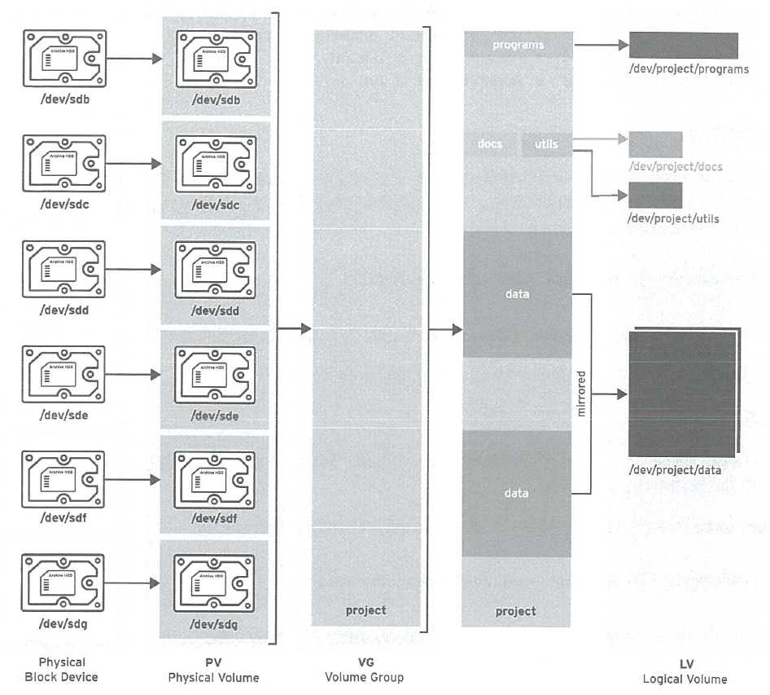
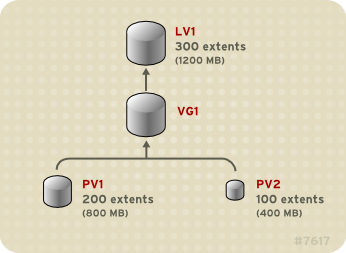

# LVM

[toc]

## 概述

## 定义

**物理设备:** 是用于保存逻辑卷中所储存数据的存储设备。是块设备，可以是磁盘分区、整个磁盘、RAID阵列或SAN磁盘。必须初始化为LVM物理卷。

**物理卷(PV):** LVM工具会将物理卷划分为物理区块(PE)，是充当物理卷上最小存储块的小块数据。

**卷组(VG):** 存储池，由一个或多个物理卷组成。一个PV只能分配给一个VG。VG可以包含未使用的空间和任意数目的逻辑卷。

**逻辑卷(LV):** 逻辑卷根据卷组中的空闲物理区块创建，提供应用、用户和操作系统所使用的“存储”设备。LV是逻辑区块(LE)的集合，LE映射到物理区块(PV的最小存储块)。默认情况下，每个LE将映射到一个PE。设置特定LV选项将会更改此映射；例如，镜像会导致每个LE映射到两个PE。




卷管理会在物理存储上创建一个提取层，以便创建逻辑存储卷。比直接使用物理存储的方式具有更大的灵活性。另外，软件隐藏了硬件存储配置,可在不停止应用程序或卸载文件系统的情况下重新定义大小并进行移动。这可降低操作成本。 	

与直接使用物理存储相比，逻辑卷具有以下**优势**：

- **灵活的容量：**文件系统可在多个磁盘间扩展，可以将磁盘和分区集合成一个逻辑卷。 			
- **重新调整存储池的大小：**可以使用简单软件命令扩展或者减少逻辑卷大小，而无需重新格式化并重新分区基本磁盘设备。
- **在线数据重新定位：**部署更新、更快或者更弹性的存储子系统，可以在系统活跃时移动数据。在磁盘处于使用状态时可以重新分配磁盘。例如，您可以在删除热插拔磁盘前将其清空。 			
- **方便的设备命名：**可在用户定义的和自定义的组群中管理逻辑存储卷。 			
- **磁盘条带：**可以创建一个在两个或者多个磁盘间条状分布数据的逻辑卷。可显著提高吞吐量。 			
- **镜像卷：**逻辑卷提供了方便配置数据镜像的方法。
- **卷快照：**使用逻辑卷，可以提取设备快照，这样可在持续备份或者在不影响真实数据的情况下测试修改效果。
- **精简卷：**逻辑卷可以使用精简模式置备。这可创建大于可用扩展的逻辑卷。
- **缓存卷：**缓存逻辑卷使用由快速块设备（比如 SSD 驱动器）组成的小逻辑卷，通过在较小的、更快的逻辑卷中存储常用的块来提高更大的、较慢的逻辑卷性能。 			

基本物理存储单元是块设备。将这个设备初始化为 LVM **物理卷（PV）**。要创建 LVM 逻辑卷，可将物理卷合并到 **卷组（VG）**中。会创建一个磁盘空间池，用于分配 LVM **逻辑卷（LV）**。逻辑卷是被文件系统和应用程序（比如数据库）使用的。

### LVM 逻辑卷组件


### 物理卷

基本物理存储单元是块设备，比如一个分区或者整个磁盘。将设备作为 LVM 逻辑卷使用，需先将其初始化为物理卷（PV）。将块设备初始化为物理卷会在接近设备起始的位置放置一个标签。 

默认情况下，LVM 标签是放在第二个 512 字节扇区。可在创建物理卷时将标签放在前四个扇区之一来覆盖这个默认设置。如需要，LVM 卷可与其它使用这些扇区的用户共同存在。

LVM 标签可为物理设备提供正确的识别和设备排序，因为在引导系统时设备可以按任意顺序出现。LVM 标签在重新引导时具有持久性并在整个集群中可用。

LVM 标签可将该设备识别为 LVM 物理卷。它包含物理卷的随机唯一识别符（UUID）。它还以字节为单位保存块设备的大小，并记录 LVM 元数据存储在该设备中的位置。

LVM 元数据包含您系统中 LVM 卷组的配置详情。默认情况下，卷组中的每个物理卷的元数据区域都会保留一个一样的元数据副本。LVM 元数据很小，它以 ASCII 格式保存。

目前，LVM 允许在每个物理卷中保存 0、1 或者 2 个元数据副本。默认为 1  个副本。当您在物理卷中配置元数据副本数后，您将无法再更改该号码。第一个副本保存在设备的起始位置，紧随在标签后面。如果有第二个副本，会将其放在设备的末尾。使用在设备末尾的元数据的第二个副本可恢复元数据。 		

#### 物理卷布局

LVM 标签在第二个扇区，接下来是元数据区域，后面是设备的可用空间。

> **注意：** 在 Linux 内核中,每个扇区的大小为 512K 。


#### 一个磁盘上的多个分区

LVM 允许在磁盘分区外创建物理卷。建议**创建一个覆盖整个磁盘的单一分区**，将其标记为 LVM 物理卷，理由如下：

- **方便管理：** 如果每个真实磁盘只出现一次，那么在系统中追踪硬件就比较容易。特别是当磁盘失败时。另外，单一磁盘中有多个物理卷可导致内核在引导时发出未知分区类型警告。
- **条带化性能：** LVM 无法告知两个物理卷位于同一个物理磁盘中。如果在位于同一物理磁盘的两个物理卷上创建了条状逻辑卷，那么条带就可能在同一磁盘的不同分区中。可能会降低性能，而不是提高性能。 					

在某些情况下可能需要将磁盘分成独立的 LVM 物理卷。例如：在有多个磁盘的系统中，当要将现有系统迁移到 LVM  卷时，可能需要将数据在分区间转移。另外，如果您有一个很大的磁盘，并且因为管理的原因想要有一个以上卷组，那么对磁盘进行分区是很必要的。如果您的磁盘有一个以上的分区，且这些分区在同一卷组中，在创建条状卷时指定逻辑卷中应包含哪些分区。

### 卷组

物理卷合并为卷组（VG）。这样就创建了一个磁盘空间池，可使用它分配逻辑卷。在卷组中，可用于分配的磁盘空间被分成固定大小的单元，称之为扩展。一个扩展就是可被分配的最小空间单位。在物理卷中，扩展被称为物理扩展。

逻辑卷被分配成与物理卷扩展大小相同的逻辑扩展。因此卷组中的所有逻辑卷的扩展大小都是一样的。卷组将逻辑扩展与物理扩展匹配。

### LVM 逻辑卷

卷组被分成逻辑卷。可在不损坏数据的情况下增大或缩小逻辑卷。如果卷组中的物理卷位于不同的驱动器或者 RAID 阵列中，那么也可以跨存储设备分配逻辑卷。

如果缩小逻辑卷到比卷中数据所需的容量小的容量时，则可能会丢失数据。要确定最大的灵活性，请创建符合当前需要的逻辑卷，并保留多余的存储容量未分配。可以根据需要安全地扩展逻辑卷使用未分配空间。

> **重要：**在 AMD、Intel、ARM 和 IBM Power Systems 服务器中,引导装载程序无法读取 LVM 卷。必须为 `/boot` 分区创建一个标准的非 LVM 磁盘分区。在 IBM Z 中，zipl 引导装载程序使用线性映射支持 LVM 逻辑卷中的  `/boot`。默认情况下，安装过程总是在 LVM 卷中创建 `/` 和 `swap` 分区，在物理卷中有一个独立的 `/boot` 分区。 			

#### 线性卷

线性卷将来自一个或多个物理卷的空间集合到一个逻辑卷中。物理存储是连在一起的。创建一个线性卷，按顺序为逻辑卷的区域分配物理扩展范围。例如：逻辑扩展 1 到 99 可映射到第一个物理卷，逻辑扩展 100 到 198 可映射到第二个物理卷。从应用程序的角度来看，它是一个大小为 198 个扩展的设备。


构成逻辑卷的物理卷大小应该相同。下图中，卷组 `VG1`，其物理扩展大小为 4MB。包括两个名为 `PV1` 和 `PV2` 的物理卷。物理卷被分成 4MB 单元，因为这是扩展的大小。在这个示例中，`PV1` 的大小为 200 个扩展（800MB），`PV2` 的大小为 100 个扩展（400MB）。您可以在 1 到 300 个扩展间创建线性卷（4MB 到 1200MB）。在这个示例中，名为 `LV1` 的线性卷的大小为 300 个扩展。



可以从物理扩展池中根据您需要的大小配置一个以上的线性逻辑卷。在这个示例中，有两个逻辑卷被从卷组中分离出来： `LV1`，大小为 250 个扩展（1000MB）和 `LV2`，大小为 50 个扩展（200MB）。


#### 条状逻辑卷

通过创建一个条状逻辑卷来控制将数据写入物理卷的方法。对于大量连续的读取和写入，这样可以提高数据输入/输出的效率。条带化通过以 round-robin 模式向预定数目的物理卷写入数据来提高性能。使用条带，I/O 可以并行执行。在某些情况下，这样可以使条带中每个额外的物理卷获得接近线性的性能。示例显示数据在三个物理卷之间进行条状分布。在这个图表中：

- 数据的第一条写入第一个物理卷 					
- 数据的第二条写入第二个物理卷 					
- 数据的第三条被写入第三个物理卷 					
- 数据的第四条写入第一个物理卷 					

在条状逻辑卷中，条的大小不能超过扩展的大小。


条状逻辑卷可通过在第一组设备的末尾连接另一组设备来扩展。要扩展条状逻辑卷，在基本物理卷集合中必须有足够的可用空间组成卷组来支持条带。例如：如有一个双向条带使用了整个卷组，那么向卷组中添加单一物理卷不会允许您扩展条带。反之，必须在卷组中添加至少两个物理卷。

#### RAID 逻辑卷

LVM 支持 RAID 0、1、4、5、6 和 10。 			

LVM RAID 卷有以下特征： 			

- LVM 创建和管理的 RAID 逻辑卷利用多设备（MD）内核驱动程序。 					
- 可以从阵列中临时分割 RAID1 镜像，并在之后将其合并到阵列中。 					
- LVM RAID 卷支持快照。 					

**集群**

RAID 逻辑卷不是集群感知型的。可以只在一台机器中创建和激活 RAID 逻辑卷，但不能在多台机器中同时激活它们。

**子卷**

当创建 RAID 逻辑卷时，LVM 会为阵列中的每个数据或者奇偶校验子卷创建一个元数据子卷，它是一个扩展大小。 				

例如：创建一个双向 RAID1 阵列会导致两个元数据子卷（`lv_rmeta_0` 和 `lv_rmeta_1`）和两个数据子卷（`lv_rimage_0` 和 `lv_rimage_1`）。同样，创建三向条带（加 1 隐式奇偶校验设备）RAID4 会产生 4 个元数据子卷（`lv_rmeta_0`、`lv_rmeta_1`、`lv_rmeta_2`和 `lv_rmeta_3`）和 4 个数据子卷（`lv_rimage_0`、`lv_rimage_1`、`lv_rimage_2`和 `lv_rimage_3`）。 			

**完整性**

当 RAID  设备失败或者发生软崩溃时，可能会丢失数据。数据存储中的软崩溃意味着，从存储设备中检索的数据与写入到那个设备中的数据不同。在 RAID LV  中添加完整性有助于缓解或防止软崩溃。 				

#### 精简配置的逻辑卷（精简卷）

逻辑卷可以使用精简模式置备。这可创建大于可用扩展的逻辑卷。使用精简配置，可以管理一个空闲空间的存储池，称为精简池，可在应用程序需要时将其分配给任意数量的设备。然后，当应用程序实际写入逻辑卷时，可以创建可绑定到精简池的设备以便以后分配。可在需要时动态扩展精简池，以便有效分配存储空间。

> **注意:** 不支持集群中跨节点的精简卷。精简池及其所有精简卷必须只在一个集群节点中单独激活。 				

通过使用精简配置，存储管理员可过量使用物理存储，从而避免购买额外的存储。例如：如果 10 个用户为每个应用程序请求一个 100GB  文件系统，存储管理员可以为每个用户创建一个 100GB  文件系统，但其后端的实际存储可以小于这个大小，它在需要时才使用实际的存储。在使用精简配置时，存储管理员务必要监控存储池，并在其被完全占用时添加更多容量。

要确定可以使用所有可用空间，LVM 支持数据丢弃功能。这允许重复使用丢弃文件或其他块范围使用的空间。

精简卷支持新的复制时写入（COW）快照逻辑卷部署，这将允许很多虚拟设备在精简池中共享相同数据。

#### 快照卷

LVM 快照功能提供在特定时间创建设备的虚拟映像且不会造成服务中断的功能。在提取快照后，当对原始设备进行修改时，快照功能会生成有变化的数据区域的副本，以便重建该设备的状态。

> **注意:** LVM 支持精简配置的快照。 				

因为快照只复制创建快照后修改的数据区域，快照功能需要的存储空间较小。例如，对于很少更新的原始卷，原始容量的 3-5% 就足以进行快照维护。 			

> **注意:** 文件系统的快照副本是虚拟副本，不是文件系统的实际介质备份。快照不能替代备份。 				

预留用来存储原始卷更改的空间大小取决于快照的大小。例如：如果您要创建快照，且要完全覆盖原始卷，则快照必须至少与原始卷大小方可保存更改。需要根据预期的更改程度调整快照大小。例如，一个多数用于读取卷的简短快照（如 `/usr`）的空间会比看到写入操作的卷的长时间快照要小，比如 `/home`。

如果快照已满，则快照就会变得无效，因为它无法跟踪原始卷中的更改。您应该定期监控快照的大小。快照可以完全重新定义大小，因此如果您有存储容量，则可以增大快照卷以避免丢失快照。另外，如果您发现快照卷超过您的需要，可以减小卷的大小来为其它逻辑卷最大限度腾出空间。

当您创建快照文件系统时，仍可对原始系统有完全的读和写访问。如果更改了快照中的块，则会标记那个块，永远不会从原始卷中复制该块。 			

快照有几个用途： 			

- 最典型的是当您需要在逻辑卷中执行备份而不停止持续更新数据的 Live 系统时会提取快照。 					
- 您可以在快照文件系统中执行 `fsck` 命令检查文件系统的完整性，并决定原始文件系统是否需要修复。 					
- 因为快照是可读/写的，您可以根据产品数据测试应用程序，方法是提取一个快照并根据快照运行测试，从而不会影响真实数据。 	
- 可以为 Red Hat Virtualization 创建 LVM 卷。LVM 快照可用来创建虚拟客体镜像的快照。这些快照可方便修改现有客户虚拟机或者使用最小附加存储创建新客户虚拟机。 					

可以使用 `lvconvert` 的 `--merge` 选项将快照合并到原始卷中。这个功能的一个作用是在您丢失数据或者文件或者需要将系统恢复到之前的状态时执行系统恢复。合并快照卷后，得到的逻辑卷将具有原始卷的名称、副号码和 UUID 并删除合并的快照。 			

#### 精简配置的快照卷

Red Hat Enterprise Linux 支持精简配置的快照卷。精简快照卷允许将很多虚拟设备保存在同一个数据卷中。这简化了管理过程，并允许在快照卷间共享数据。 			

除了所有 LVM 快照卷以及所有精简卷一样，集群的节点不支持精简快照卷。快照卷必须在一个集群节点中完全激活。 			

精简快照卷提供以下优点： 			

- 当有相同原始卷的多个快照时，精简快照卷就可以减少磁盘用量。 					
- 如果同一来源有多个快照，对原始卷的写入会导致 COW 操作保留数据。增加原始卷的快照数量应该不会造成很大的性能下降。
- 精简快照卷可用于另一个快照的逻辑卷来源。这将可以实现任意深度的递归快照（一个快照的快照的快照…）。 					
- 精简逻辑卷的快照也创建一个精简逻辑卷。这不需要数据空间，直到要求 COW 操作，或者直到快照本身写完。 					
- 精简快照卷不需要使用原始卷激活，因此当原始快照卷有很多不活跃时，用户可能只激活原始卷。 					
- 当您删除精简置备快照卷的原始卷时，该原始卷的每个快照都会变为独立的精简置备卷。这意味着，您不需要将快照与原始卷合并，而不必选择删除原始卷，然后使用该独立卷作为新快照的原始卷创建新置备快照。 					

虽然使用精简快照卷有很多优点，但在有些情况下，旧的 LVM 快照卷功能可能更适合您的需要： 			

- 不能更改精简池的块大小。如果精简池的块大小较大（例如： 1MB），且您需要一个简短的快照，且大型的块大小不高，则可以选择使用旧的快照功能。 					
- 不能限制精简快照卷的大小 ; 如果需要，快照将使用精简池中所有空间。这可能不适用于您的需要。

#### 缓存卷

LVM 支持在较慢的块设备中使用快速块设备（比如 SSD 驱动器）作为写入或者写入缓存。用户可创建缓存逻辑卷来提升其现有逻辑卷性能，或者创建一个由带有大型、慢速设备的小、快速设备组成的新的缓存逻辑卷。

## PV

###  创建 PV

要创建多个物理卷，在 `pvcreate` 命令中使用以空格分隔的设备名称作为参数： 				

```bash
pvcreate /dev/vdb1 /dev/vdb2
```

会在 `/dev/vdb1`和 `/dev/vdb2` 中加一个标签，将其标记为属于 LVM 的物理卷。 

## VG

### 创建 VG 				

```bash
vgcreate myvg /dev/vdb1 /dev/vdb2
```

创建一个名为 `myvg` 的 VG。PV `/dev/vdb1` 和 `/dev/vdb2` 是 VG `myvg` 的基本存储级别。 				

### 扩展 VG 		

```bash
vgextend myvg /dev/vdb3
```

## LV

### 创建 LV		

```bash
lvcreate -n lv01 -L 500M myvg
```

`-n` 选项允许用户将 LV 名称设置为 `lv01`。`-L` 选项允许用户在本示例中以 Mb 单位设定 LV 的大小，但可以使用其它单元。默认情况下 LV 类型是线性的，但用户可使用 `--type` 选项指定所需类型。


## 使用 CLI 命令

#### 在命令行参数中指定单元

​				当在命令行参数中需要大小时，可以明确指定其单位。如果您没有指定单位，那么就使用默认单位，通常为 KB 或者 MB。LVM CLI 命令不接受分数。 		

​				当在命令行参数中指定单位时，LVM 是不区分大小写的， M 和 m 是相同的，例如，都代表单位是 1024。但是，当在命令中指定 `--units` 参数时，小写表示该单位是 1024，而大写表示该单位是 1000。 		

#### 指定卷组和逻辑卷

​				在 LVM CLI 命令中指定卷组或者逻辑卷时请注意以下几点。 		

- ​						如果命令使用卷组或者逻辑卷名称作为参数，则完整路径名称是可选的。在名为 `vg0` 卷组中的一个名为 `lvol0` 的逻辑卷可以被指定为 `vg0/lvol0`。 				
- ​						当需要卷组列表但为空时，则使用所有卷组的列表替代。 				
- ​						当需要列出逻辑卷但提供了一个卷组，则使用在那个卷组中的所有逻辑卷列表替代。例如： `lvdisplay vg0` 命令将显示卷组 `vg0` 中的所有逻辑卷。 				

#### 增加输出详细程度

​				所有 LVM 命令都接受 `-v` 参数，该参数可多次输入来提高输出的详细程度。以下示例显示了 `lvcreate` 命令的默认输出。 		

```
# lvcreate -L 50MB new_vg
  Rounding up size to full physical extent 52.00 MB
  Logical volume "lvol0" created
```

​				以下命令显示带有 `-v` 参数的 `lvcreate` 命令的输出结果。 		

```
# lvcreate -v -L 50MB new_vg
  Rounding up size to full physical extent 52.00 MB
    Archiving volume group "new_vg" metadata (seqno 1).
    Creating logical volume lvol0
    Creating volume group backup "/etc/lvm/backup/new_vg" (seqno 2).
    Activating logical volume new_vg/lvol0.
    activation/volume_list configuration setting not defined: Checking only host tags for new_vg/lvol0.
    Creating new_vg-lvol0
    Loading table for new_vg-lvol0 (253:0).
    Resuming new_vg-lvol0 (253:0).
    Wiping known signatures on logical volume "new_vg/lvol0"
    Initializing 4.00 KiB of logical volume "new_vg/lvol0" with value 0.
  Logical volume "lvol0" created
```

​				`-vv`、`-vvv` 和 `-vvvv` 参数显示命令执行的详情。`-vvvv` 参数提供最大的信息量。以下示例显示了 `lvcreate` 命令的输出行前几行（指定了 `-vvvv` 参数）。 		

```
# lvcreate -vvvv -L 50MB new_vg
#lvmcmdline.c:913         Processing: lvcreate -vvvv -L 50MB new_vg
#lvmcmdline.c:916         O_DIRECT will be used
#config/config.c:864       Setting global/locking_type to 1
#locking/locking.c:138       File-based locking selected.
#config/config.c:841       Setting global/locking_dir to /var/lock/lvm
#activate/activate.c:358       Getting target version for linear
#ioctl/libdm-iface.c:1569         dm version   OF   [16384]
#ioctl/libdm-iface.c:1569         dm versions   OF   [16384]
#activate/activate.c:358       Getting target version for striped
#ioctl/libdm-iface.c:1569         dm versions   OF   [16384]
#config/config.c:864       Setting activation/mirror_region_size to 512
...
```

#### 显示 LVM CLI 命令的帮助信息

​				您可以使用命令的 `--help` 参数显示任意 LVM CLI 命令的帮助信息。 		

```
# commandname --help
```

​				要显示某个命令的 man page，请执行 `man` 命令： 		

```
# man commandname
```

​				`man lvm` 命令提供有关 LVM 的常规在线信息。 		

## 4.2. 在三个磁盘中创建 LVM 逻辑卷

​				这个示例步骤创建一个名为 `mylv` 的 LVM 逻辑卷，它由磁盘 `/dev/sda1`、`/dev/sdb1` 和 `/dev/sdc1` 组成。 		

1. ​						要在卷组中使用磁盘，请使用 `pvcreate` 命令将其标记为 LVM 物理卷。 				

   警告

   ​							这个命令会破坏 `/dev/sda1`、`/dev/sdb1` 和 `/dev/sdc1` 中的所有数据。 					

   ```
   # pvcreate /dev/sda1 /dev/sdb1 /dev/sdc1
     Physical volume "/dev/sda1" successfully created
     Physical volume "/dev/sdb1" successfully created
     Physical volume "/dev/sdc1" successfully created
   ```

2. ​						创建由您创建的 LVM 物理卷组成的卷组。下面的命令创建了卷组 `myvg`。 				

   ```
   # vgcreate myvg /dev/sda1 /dev/sdb1 /dev/sdc1
     Volume group "myvg" successfully created
   ```

   ​						您可以使用 `vgs` 命令显示新卷组的属性。 				

   ```
   # vgs
     VG   #PV #LV #SN Attr   VSize  VFree
     myvg   3   0   0 wz--n- 51.45G 51.45G
   ```

3. ​						从您创建的卷组中创建逻辑卷。下面的命令在卷组 `mylv` 中创建逻辑卷 `myvg`。这个示例创建的逻辑卷，它使用了卷组的 2GB。 				

   ```
   # lvcreate -L 2G -n mylv myvg
     Logical volume "mylv" created
   ```

4. ​						在逻辑卷中创建文件系统。下面的命令在逻辑卷中创建了一个 `ext4` 文件系统。 				

   ```
   # mkfs.ext4 /dev/myvg/mylv
   mke2fs 1.44.3 (10-July-2018)
   Creating filesystem with 524288 4k blocks and 131072 inodes
   Filesystem UUID: 616da032-8a48-4cd7-8705-bd94b7a1c8c4
   Superblock backups stored on blocks:
           32768, 98304, 163840, 229376, 294912
   
   Allocating group tables: done
   Writing inode tables: done
   Creating journal (16384 blocks): done
   Writing superblocks and filesystem accounting information: done
   ```

   ​						下面的命令挂载逻辑卷并报告文件系统磁盘空间用量。 				

   ```
   # mount /dev/myvg/mylv /mnt
   # df
   Filesystem             1K-blocks     Used  Available Use% Mounted on
   /dev/mapper/myvg-mylv    1998672     6144    1871288   1% /mnt
   ```

## 4.3. 创建 RAID0（条状）逻辑卷

​				RAID0 逻辑卷以条的大小为单位，将逻辑卷数据分散到多个数据子卷中。 		

​				创建 RAID0 卷的命令格式如下。 		

```
lvcreate --type raid0[_meta] --stripes Stripes --stripesize StripeSize VolumeGroup [PhysicalVolumePath ...]
```

**表 4.1. RAID0 命令创建参数**

| 参数                        | 描述                                                         |
| --------------------------- | ------------------------------------------------------------ |
| `--type raid0[_meta]`       | 指定 `raid0` 创建一个没有元数据卷的 RAID0 卷。指定 `raid0_meta` 创建一个带有元数据卷的 RAID0 卷。因为 RAID0 是不弹性的，所以不需要保存任何已镜像的数据块（如  RAID1/10），或者计算并保存任何奇偶校验块（如  RAID4/5/6）。因此，它不需要元数据卷来保持有关镜像或奇偶校验块重新同步进程的状态。然而，在从 RAID0 转换到  RAID4/5/6/10 时元数据卷是强制的，并且指定 `raid0_meta` 会预先分配元数据卷以避免分配失败。 |
| `--stripes *Stripes*`       | 指定在其中分割逻辑卷的设备数。                               |
| `--stripesize *StripeSize*` | 以 KB 为单位指定每个条的大小。这是在移动到下一个设备前写入一个设备的数据量。 |
| `*VolumeGroup*`             | 指定要使用的卷组。                                           |
| `*PhysicalVolumePath*` …    | 指定要使用的设备。如果没有指定，LVM 会选择 *Stripes* 选项指定的设备数，每个条带一个。 |

​				这个示例步骤创建名为 `mylv` 的 LVM RAID0 逻辑卷，可在磁盘 `/dev/sda1`、`/dev/sdb1` 和 `/dev/sdc1` 跨磁盘条状分布数据。 		

1. ​						使用 `pvcreate` 命令将卷组中您要使用的磁盘标记为 LVM 物理卷。 				

   警告

   ​							这个命令会破坏 `/dev/sda1`、`/dev/sdb1` 和 `/dev/sdc1` 中的所有数据。 					

   ```
   # pvcreate /dev/sda1 /dev/sdb1 /dev/sdc1
     Physical volume "/dev/sda1" successfully created
     Physical volume "/dev/sdb1" successfully created
     Physical volume "/dev/sdc1" successfully created
   ```

2. ​						创建卷组 `myvg`。下面的命令创建了卷组 `myvg`。 				

   ```
   # vgcreate myvg /dev/sda1 /dev/sdb1 /dev/sdc1
     Volume group "myvg" successfully created
   ```

   ​						您可以使用 `vgs` 命令显示新卷组的属性。 				

   ```
   # vgs
     VG   #PV #LV #SN Attr   VSize  VFree
     myvg   3   0   0 wz--n- 51.45G 51.45G
   ```

3. ​						从您创建的卷组中创建 RAID0 逻辑卷。以下命令从卷组 `mylv` 中创建 RAID0 卷 `myvg`。这个示例创建的逻辑卷大小为 2GB，有三个条带，条带的大小为 4KB。 				

   ```
   # lvcreate --type raid0 -L 2G --stripes 3 --stripesize 4 -n mylv myvg
     Rounding size 2.00 GiB (512 extents) up to stripe boundary size 2.00 GiB(513 extents).
     Logical volume "mylv" created.
   ```

4. ​						在 RAID0 逻辑卷中创建文件系统。下面的命令在逻辑卷中创建了一个 `ext4` 文件系统。 				

   ```
   # mkfs.ext4 /dev/myvg/mylv
   mke2fs 1.44.3 (10-July-2018)
   Creating filesystem with 525312 4k blocks and 131376 inodes
   Filesystem UUID: 9d4c0704-6028-450a-8b0a-8875358c0511
   Superblock backups stored on blocks:
           32768, 98304, 163840, 229376, 294912
   
   Allocating group tables: done
   Writing inode tables: done
   Creating journal (16384 blocks): done
   Writing superblocks and filesystem accounting information: done
   ```

   ​						下面的命令挂载逻辑卷并报告文件系统磁盘空间用量。 				

   ```
   # mount /dev/myvg/mylv /mnt
   # df
   Filesystem             1K-blocks     Used  Available Use% Mounted on
   /dev/mapper/myvg-mylv    2002684     6168    1875072   1% /mnt
   ```

## 4.4. 重命名 LVM 逻辑卷

​				这个过程使用命令行 LVM 接口重新命名现有逻辑卷。 		

**流程**

1. ​						如果逻辑卷当前已被挂载，卸载该卷。 				

2. ​						如果在集群环境中存在逻辑卷，在其激活的所有节点上取消激活逻辑卷。对每个这样的节点运行以下命令： 				

   ```
   [root@node-n]# lvchange --activate n vg-name/lv-name
   ```

3. ​						使用 `lvrename` 程序重新命名现有逻辑卷： 				

   ```
   # lvrename vg-name original-lv-name new-lv-name
   ```

   ​						另外，您还可以指定到该设备的完整路径： 				

   ```
   # lvrename /dev/vg-name/original-lv-name /dev/vg-name/new-lv-name
   ```

**其它资源**

- ​						`lvrename(8)` man page 				

## 4.5. 从逻辑卷中删除磁盘

​				这些示例步骤演示了如何从现有逻辑卷中删除磁盘，可以替换磁盘，也可以使用磁盘作为不同卷的一部分。要删除磁盘，您必须首先将 LVM 物理卷中的扩展移动到不同的磁盘或者一组磁盘中。 		

### 4.5.1. 将扩展移动到现有物理卷中

​					在这个示例中，逻辑卷是在卷组 `myvg` 的四个物理卷中进行分配的。 			

```
# pvs -o+pv_used
  PV         VG   Fmt  Attr PSize  PFree  Used
  /dev/sda1  myvg lvm2 a-   17.15G 12.15G  5.00G
  /dev/sdb1  myvg lvm2 a-   17.15G 12.15G  5.00G
  /dev/sdc1  myvg lvm2 a-   17.15G 12.15G  5.00G
  /dev/sdd1  myvg lvm2 a-   17.15G  2.15G 15.00G
```

​					这个示例将扩展从 `/dev/sdb1` 中移出，以便将其从卷组中删除。 			

1. ​							如果在该卷组的其它物理卷中没有足够的可用扩展，您可以在想要删除的设备中执行 `pvmove` 命令，且没有其他选项，那么扩展就会被分配到其它设备中。 					

   ​							在集群中，`pvmove` 命令只能移动只在单一节点中活跃的逻辑卷。 					

   ```
   # pvmove /dev/sdb1
     /dev/sdb1: Moved: 2.0%
    ...
     /dev/sdb1: Moved: 79.2%
    ...
     /dev/sdb1: Moved: 100.0%
   ```

   ​							在 `pvmove` 命令执行完毕后，扩展的分配如下： 					

   ```
   # pvs -o+pv_used
     PV         VG   Fmt  Attr PSize  PFree  Used
     /dev/sda1  myvg lvm2 a-   17.15G  7.15G 10.00G
     /dev/sdb1  myvg lvm2 a-   17.15G 17.15G     0
     /dev/sdc1  myvg lvm2 a-   17.15G 12.15G  5.00G
     /dev/sdd1  myvg lvm2 a-   17.15G  2.15G 15.00G
   ```

2. ​							使用 `vgreduce` 命令从卷组中删除物理卷 `/dev/sdb1`。 					

   ```
   # vgreduce myvg /dev/sdb1
     Removed "/dev/sdb1" from volume group "myvg"
   # pvs
     PV         VG   Fmt  Attr PSize  PFree
     /dev/sda1  myvg lvm2 a-   17.15G  7.15G
     /dev/sdb1       lvm2 --   17.15G 17.15G
     /dev/sdc1  myvg lvm2 a-   17.15G 12.15G
     /dev/sdd1  myvg lvm2 a-   17.15G  2.15G
   ```

​					该磁盘现在可以物理删除或者分配给其他用户。 			

### 4.5.2. 将扩展移动到新磁盘中

​					在这个示例中，逻辑卷在卷组 `myvg` 中的三个物理卷中进行分配，如下所示： 			

```
# pvs -o+pv_used
  PV         VG   Fmt  Attr PSize  PFree  Used
  /dev/sda1  myvg lvm2 a-   17.15G  7.15G 10.00G
  /dev/sdb1  myvg lvm2 a-   17.15G 15.15G  2.00G
  /dev/sdc1  myvg lvm2 a-   17.15G 15.15G  2.00G
```

​					这个示例步骤将 `/dev/sdb1` 的扩展移动到新设备 `/dev/sdd1`。 			

1. ​							在 `/dev/sdd1`创建新物理卷。 					

   ```
   # pvcreate /dev/sdd1
     Physical volume "/dev/sdd1" successfully created
   ```

2. ​							在现有卷组 `myvg` 中添加新的物理卷 `/dev/sdd1`。 					

   ```
   # vgextend myvg /dev/sdd1
     Volume group "myvg" successfully extended
   # pvs -o+pv_used
     PV         VG   Fmt  Attr PSize  PFree  Used
     /dev/sda1   myvg lvm2 a-   17.15G  7.15G 10.00G
     /dev/sdb1   myvg lvm2 a-   17.15G 15.15G  2.00G
     /dev/sdc1   myvg lvm2 a-   17.15G 15.15G  2.00G
     /dev/sdd1   myvg lvm2 a-   17.15G 17.15G     0
   ```

3. ​							使用 `pvmove` 命令将数据从 `/dev/sdb1` 移至 `/dev/sdd1`。 					

   ```
   # pvmove /dev/sdb1 /dev/sdd1
     /dev/sdb1: Moved: 10.0%
   ...
     /dev/sdb1: Moved: 79.7%
   ...
     /dev/sdb1: Moved: 100.0%
   
   # pvs -o+pv_used
     PV          VG   Fmt  Attr PSize  PFree  Used
     /dev/sda1   myvg lvm2 a-   17.15G  7.15G 10.00G
     /dev/sdb1   myvg lvm2 a-   17.15G 17.15G     0
     /dev/sdc1   myvg lvm2 a-   17.15G 15.15G  2.00G
     /dev/sdd1   myvg lvm2 a-   17.15G 15.15G  2.00G
   ```

4. ​							当您将数据移出 `/dev/sdb1`后，可以将其从卷组中删除。 					

   ```
   # vgreduce myvg /dev/sdb1
     Removed "/dev/sdb1" from volume group "myvg"
   ```

​					现在您可以将磁盘重新分配给另一个卷组，或者将其从系统中删除。 			

## 4.6. 配置持久的设备号码

​				在载入模块的时候会自动分配主设备号码和副设备号码。如果总是使用相同的设备（主和副）号码激活块设备，有些应用程序效果最好。您可以使用以下参数通过 `lvcreate` 和 `lvchange` 命令来指定这些参数： 		

```
--persistent y --major major --minor minor
```

​				使用大的副号码以确定还没有动态分配给另一个设备。 		

​				如果要使用 NFS 导出一个文件系统，在 exports 文件中指定 `fsid` 参数可能会不需要在 LVM 中设定持久的设备号码。 		

## 4.7. 指定 LVM 扩展大小

​				当使用物理卷创建卷组时，默认情况下它的磁盘空间被分成 4MB 扩展。这个扩展是增大或者减小逻辑卷容量的最小值。大量的扩展不会影响逻辑卷的 I/O 性能。 		

​				如果默认扩展大小不合适，您可以使用 `vgcreate` 命令的 `-s` 选项指定扩展大小。您可以使用 `vgcreate` 命令的 `-p` 和 `-l` 参数限制卷组的物理或者逻辑卷数量。 		

## 4.8. 使用 RHEL 系统角色管理 LVM 逻辑卷

​				本节论述了如何应用 `storage` 角色来执行以下任务： 		

- ​						在由多个磁盘组成的卷组中创建 LVM 逻辑卷。 				
- ​						在逻辑卷中创建一个带给定标签的 ext4 文件系统。 				
- ​						永久挂载 ext4 文件系统。 				

**先决条件**

- ​						包括 `storage` 角色的 Ansible playbook 				

​				如需有关如何应用 Ansible playbook 的信息，请参阅 [应用角色](https://access.redhat.com/documentation/en-us/red_hat_enterprise_linux/8/html/configuring_basic_system_settings/getting-started-with-system-administration_configuring-basic-system-settings#applying-a-role_con_intro-to-rhel-system-roles)。 		

### 4.8.1. 管理逻辑卷的 Ansible playbook 示例

​					本节提供了一个 Ansible playbook 示例。这个 playbook 应用 `storage` 角色在卷组中创建 LVM 逻辑卷。 			

**例 4.1. 在 myvg 卷组中创建 mylv 逻辑卷的 playbook**

```
- hosts: all
  vars:
    storage_pools:
      - name: myvg
        disks:
          - sda
          - sdb
          - sdc
        volumes:
          - name: mylv
            size: 2G
            fs_type: ext4
            mount_point: /mnt
  roles:
    - rhel-system-roles.storage
```

- ​								`myvg` 卷组由以下磁盘组成： 						
  - ​										`/dev/sda` 								
  - ​										`/dev/sdb` 								
  - ​										`/dev/sdc` 								
- ​								如果 `myvg` 卷组已存在，则 playbook 会将逻辑卷添加到卷组中。 						
- ​								如果 `myvg` 卷组不存在，则 playbook 会创建它。 						
- ​								playbook 在 `mylv` 逻辑卷中创建 Ext4 文件系统，并在其中永久挂载文件系统 `/mnt`。 						

**其它资源**

- ​							有关 `storage` 系统角色中使用的参数的详情，请查看 `/usr/share/ansible/roles/rhel-system-roles.storage/README.md` 文件。 					

### 4.8.2. 其它资源

- ​							有关 `storage` 角色的更多信息，请参阅[使用 RHEL 系统角色管理本地存储](https://access.redhat.com/documentation/en-us/red_hat_enterprise_linux/8/html/configuring_and_managing_logical_volumes/managing-local-storage-using-rhel-system-roles_configuring-and-managing-logical-volumes)。 					

## 4.9. 删除 LVM 逻辑卷

​				这个过程使用命令行 LVM 接口删除现有逻辑卷。 		

​				下面的命令可从卷组 `/dev/*vg-name*/*lv-name*` 中删除逻辑卷 `*vg-name*`。 		

**流程**

1. ​						如果逻辑卷当前已被挂载，卸载该卷。 				

2. ​						如果在集群环境中存在逻辑卷，则在所有其激活的节点上取消激活逻辑卷。对每个这样的节点运行以下命令： 				

   ```
   [root@node-n]# lvchange --activate n vg-name/lv-name
   ```

3. ​						使用 `lvremove` 实用程序删除逻辑卷： 				

   ```
   # lvremove /dev/vg-name/lv-name
   Do you really want to remove active logical volume "lv-name"? [y/n]: y
     Logical volume "lv-name" successfully removed
   ```

   注意

   ​							在这种情况下，逻辑卷还没有被取消激活。如果您在删除逻辑卷前明确取消激活了逻辑卷，则无法看到验证您是否要删除活跃逻辑卷的提示信息。 					

**其它资源**

- ​						`lvremove(8)` man page 				

# 修改逻辑卷的大小

​			创建逻辑卷后，您可以修改卷的大小。 	

## 5.1. 增大逻辑卷

​				要增大逻辑卷的大小，使用 `lvextend` 命令。 		

​				当扩展逻辑卷时，可以指定您想要增大的量，或者指定扩展它需要达到的大小。 		

​				下面的命令将逻辑卷 `/dev/myvg/homevol` 扩展到 12GB。 		

```
# lvextend -L12G /dev/myvg/homevol
lvextend -- extending logical volume "/dev/myvg/homevol" to 12 GB
lvextend -- doing automatic backup of volume group "myvg"
lvextend -- logical volume "/dev/myvg/homevol" successfully extended
```

​				下面的命令在逻辑卷 `/dev/myvg/homevol` 中添加了 1 GB。 		

```
# lvextend -L+1G /dev/myvg/homevol
lvextend -- extending logical volume "/dev/myvg/homevol" to 13 GB
lvextend -- doing automatic backup of volume group "myvg"
lvextend -- logical volume "/dev/myvg/homevol" successfully extended
```

​				在 `lvcreate` 命令中，可以使用 `lvextend` 命令的 `-l` 参数指定扩展数，从而增加逻辑卷的大小。您还可以使用此参数指定卷组的比例或者卷组中剩余空间的比例。下面的命令扩展了名为 `testlv` 的逻辑卷，使其使用卷组 `myvg` 的所有未分配的空间。 		

```
# lvextend -l +100%FREE /dev/myvg/testlv
  Extending logical volume testlv to 68.59 GB
  Logical volume testlv successfully resized
```

​				当扩展逻辑卷后，有必要增大文件系统的大小以匹配文件系统。 		

​				默认情况下，大多数重新定义文件系统大小的工具都会将文件系统的大小增加到基本逻辑卷的大小，这样您就不必考虑为两个命令指定相同的容量。 		

## 5.2. 在逻辑卷中增大文件系统

​				要在逻辑卷中增大文件系统，执行以下步骤： 		

1. ​						确定现有卷组中是否有足够的未分配空间来扩展逻辑卷。如果没有，执行以下步骤： 				
   1. ​								使用 `pvcreate` 命令创建新物理卷。 						
   2. ​								使用 `vgextend` 命令扩展包含您想要增大的文件系统逻辑卷的卷组，使其包含新的物理卷。 						
2. ​						一旦卷组足够大可包含更大的文件系统，使用 `lvresize` 命令扩展逻辑卷。 				
3. ​						在逻辑卷中重新定义文件系统大小。 				

​				请注意，您可以使用 `lvresize` 命令的 `-r` 选项扩展逻辑卷并使用单一命令重新定义基础文件系统大小 		

## 5.3. 缩小逻辑卷

​				使用 `lvreduce` 命令减少逻辑卷的大小。 		

> 注意：
>
> GFS2 或者 XFS 文件系统不支持缩小。 			

​				如果您要缩小的逻辑卷包含一个文件系统，为了防止数据丢失，必须确定该文件系统没有使用将被缩小的逻辑卷中的空间。因此，建议您在逻辑卷包含文件系统时使用 `lvreduce` 命令的 `--resizefs` 选项。当您使用这个选项时，`lvreduce` 命令会在缩小逻辑卷前尝试缩小文件系统。如果缩小文件系统失败，比如文件系统已满或者文件系统不支持缩小，那么 `lvreduce` 命令将失败，也不会尝试缩小逻辑卷。 		

警告

​					在大多数情况下，`lvreduce` 命令会警告可能的数据丢失，并要求用户进行确认。但是，您不应该依赖于这些确认提示来防止数据丢失，因为在某些情况下，您不会看到这些提示信息，比如当逻辑卷不活跃或者没有使用 `--resizefs` 选项时。 			

​					请注意：使用 `lvreduce` 命令的 `--test` 选项并不代表要执行的操作是安全的，因为这个选项不会检查文件系统或者测试文件系统大小。 			

​				下面的命令将卷组 `vg00` 中的逻辑卷`lvol1` 缩小到 64MB。在这个示例中，`lvol1` 包含一个文件系统，该命令可将其重新定义逻辑卷的大小。这个示例显示了该命令的输出结果。 		

```
# lvreduce --resizefs -L 64M vg00/lvol1
fsck from util-linux 2.23.2
/dev/mapper/vg00-lvol1: clean, 11/25688 files, 8896/102400 blocks
resize2fs 1.42.9 (28-Dec-2013)
Resizing the filesystem on /dev/mapper/vg00-lvol1 to 65536 (1k) blocks.
The filesystem on /dev/mapper/vg00-lvol1 is now 65536 blocks long.

  Size of logical volume vg00/lvol1 changed from 100.00 MiB (25 extents) to 64.00 MiB (16 extents).
  Logical volume vg00/lvol1 successfully resized.
```

​				在调整大小值的前面使用 - 表示该值会从逻辑卷的实际大小中减小。下面的例子显示，您希望将逻辑卷缩小到 64MB，而不是对该卷缩小 64MB。 		

```
# lvreduce --resizefs -L -64M vg00/lvol1
```

## 5.4. 扩展条状逻辑卷

​				要增加条状逻辑卷的大小，基本物理卷中必须有足够的可用空间，以便让卷组支持条带。例如：如果您有一个使用了整个卷组的双向条带，那么向卷组中添加单一物理卷不会允许您扩展条带。反之，您必须在卷组中添加至少两个物理卷。 		

​				例如：考虑卷组 `vg` 包括两个基本物理卷，如下 `vgs` 命令所示。 		

```
# vgs
  VG   #PV #LV #SN Attr   VSize   VFree
  vg     2   0   0 wz--n- 271.31G 271.31G
```

​				您可以使用整个卷组空间创建一个条带。 		

```
# lvcreate -n stripe1 -L 271.31G -i 2 vg
  Using default stripesize 64.00 KB
  Rounding up size to full physical extent 271.31 GB
  Logical volume "stripe1" created
# lvs -a -o +devices
  LV      VG   Attr   LSize   Origin Snap%  Move Log Copy%  Devices
  stripe1 vg   -wi-a- 271.31G                               /dev/sda1(0),/dev/sdb1(0)
```

​				请注意：卷组现在没有剩余空间。 		

```
# vgs
  VG   #PV #LV #SN Attr   VSize   VFree
  vg     2   1   0 wz--n- 271.31G    0
```

​				下面的命令在卷组中添加了另一个物理卷，它提供了 135GB 的额外空间。 		

```
# vgextend vg /dev/sdc1
  Volume group "vg" successfully extended
# vgs
  VG   #PV #LV #SN Attr   VSize   VFree
  vg     3   1   0 wz--n- 406.97G 135.66G
```

​				此时您不能将条状逻辑卷扩展到卷组的大小，因为需要两个基本设备才可以对数据进行条带处理。 		

```
# lvextend vg/stripe1 -L 406G
  Using stripesize of last segment 64.00 KB
  Extending logical volume stripe1 to 406.00 GB
  Insufficient suitable allocatable extents for logical volume stripe1: 34480
more required
```

​				要扩展条状逻辑卷，添加另一个物理卷，然后扩展逻辑卷。在这个示例中，在卷组中添加两个物理卷，我们可将逻辑卷扩展成卷组的大小。 		

```
# vgextend vg /dev/sdd1
  Volume group "vg" successfully extended
# vgs
  VG   #PV #LV #SN Attr   VSize   VFree
  vg     4   1   0 wz--n- 542.62G 271.31G
# lvextend vg/stripe1 -L 542G
  Using stripesize of last segment 64.00 KB
  Extending logical volume stripe1 to 542.00 GB
  Logical volume stripe1 successfully resized
```

​				如果没有足够的基本物理设备来扩展条状逻辑卷，那么在扩展不是条带状的情况下也可能扩大卷，但可能导致性能下降。当在逻辑卷中添加空间时，默认操作是使用与现有逻辑卷最新片段相同的条状参数，但您可以覆盖这些参数。下面的例子在初始 `lvextend` 命令失败后，扩展了现有条状逻辑卷使用剩余空间。 		

```
# lvextend vg/stripe1 -L 406G
  Using stripesize of last segment 64.00 KB
  Extending logical volume stripe1 to 406.00 GB
  Insufficient suitable allocatable extents for logical volume stripe1: 34480
more required
# lvextend -i1 -l+100%FREE vg/stripe1
```

# 管理 LVM 卷组

​			这部分论述了管理卷组不同方面的命令。 	

## 6.1. 卷组

​				物理卷合并为卷组（VG）。这样就创建了一个磁盘空间池，可使用它分配逻辑卷。 		

​				在卷组中，可用于分配的磁盘空间被分成固定大小的单元，我们称之为扩展。一个扩展就是可被分配的最小空间单位。在物理卷中，扩展被称为物理扩展。 		

​				逻辑卷被分配成与物理卷扩展大小相同的逻辑扩展。因此卷组中的所有逻辑卷的扩展大小都是一样的。卷组将逻辑扩展与物理扩展匹配。 		

## 6.2. 显示卷组

​				您可以使用两个命令来显示 LVM 卷组的属性： `vgs` 和 `vgdisplay`。`vgscan` 命令为卷组扫描系统中所有支持的 LVM 块设备，也可以用来显示现有卷组。 		

​				`vgs` 命令提供了可以对其进行格式配置的卷组信息，每行显示一个卷组。`vgs` 命令提供大量格式控制，对脚本很有用。 		

​				`vgdisplay` 命令以固定格式显示卷组属性（比如大小、扩展、物理卷数目等等）。下面的例子显示了 `vgdisplay` 命令输出卷组 `new_vg` 的信息。如果您没有指定卷组，则会显示所有现有的卷组。 		

```
# vgdisplay new_vg
  --- Volume group ---
  VG Name               new_vg
  System ID
  Format                lvm2
  Metadata Areas        3
  Metadata Sequence No  11
  VG Access             read/write
  VG Status             resizable
  MAX LV                0
  Cur LV                1
  Open LV               0
  Max PV                0
  Cur PV                3
  Act PV                3
  VG Size               51.42 GB
  PE Size               4.00 MB
  Total PE              13164
  Alloc PE / Size       13 / 52.00 MB
  Free  PE / Size       13151 / 51.37 GB
  VG UUID               jxQJ0a-ZKk0-OpMO-0118-nlwO-wwqd-fD5D32
```

​				以下示例显示了 `vgscan` 命令的输出结果。 		

```
# vgscan
Reading all physical volumes.  This may take a while...
Found volume group "new_vg" using metadata type lvm2
Found volume group "officevg" using metadata type lvm2
```

## 6.3. 合并卷组

​				要将两个卷组合并成一个卷组，使用 `vgmerge` 命令。如果这两个卷的物理扩展大小相等，且两个卷组的物理卷和逻辑卷的描述符合目的卷组的限制，您可以将一个不活跃的"源"卷与一个活跃或者不活跃的"目标"卷合并。 		

​				以下命令将不活跃卷组 `my_vg` 合并到活跃或者不活跃卷组 `databases` 中，并输出详细的运行时信息。 		

```
# vgmerge -v databases my_vg
```

## 6.4. 分割卷组

​				在这个示例中，有一个由三个物理卷组成的卷组。如果在物理卷中有足够的空闲空间，就可在不添加新磁盘的情况下创建新的卷组。 		

​				在初始设置中，逻辑卷 `mylv` 是从卷组 `myvg` 中分离出来的，它由三个物理卷 `/dev/sda1`、`/dev/sdb1` 和 `/dev/sdc1`组成。 		

​				完成此步骤后，卷组 `myvg` 将包含 `/dev/sda1` 和 `/dev/sdb1`。第二个卷组 `yourvg` 将包含 `/dev/sdc1`。 		

1. ​						使用 `pvscan` 命令确定卷组中目前有多少可用空间。 				

   ```
   # pvscan
     PV /dev/sda1  VG myvg   lvm2 [17.15 GB / 0    free]
     PV /dev/sdb1  VG myvg   lvm2 [17.15 GB / 12.15 GB free]
     PV /dev/sdc1  VG myvg   lvm2 [17.15 GB / 15.80 GB free]
     Total: 3 [51.45 GB] / in use: 3 [51.45 GB] / in no VG: 0 [0   ]
   ```

2. ​						使用 `pvmove` 命令将 `/dev/sdc1` 中所有使用的物理扩展移动到 `/dev/sdb1`。执行 `pvmove` 命令可能需要很长时间。 				

   ​						在一个集群中，`pvmove` 命令只能移动只在单一节点中活跃的逻辑卷。 				

   ```
   # pvmove /dev/sdc1 /dev/sdb1
     /dev/sdc1: Moved: 14.7%
     /dev/sdc1: Moved: 30.3%
     /dev/sdc1: Moved: 45.7%
     /dev/sdc1: Moved: 61.0%
     /dev/sdc1: Moved: 76.6%
     /dev/sdc1: Moved: 92.2%
     /dev/sdc1: Moved: 100.0%
   ```

   ​						转移数据后，您可以看到 `/dev/sdc1` 中的所有空间都可用。 				

   ```
   # pvscan
     PV /dev/sda1   VG myvg   lvm2 [17.15 GB / 0    free]
     PV /dev/sdb1   VG myvg   lvm2 [17.15 GB / 10.80 GB free]
     PV /dev/sdc1   VG myvg   lvm2 [17.15 GB / 17.15 GB free]
     Total: 3 [51.45 GB] / in use: 3 [51.45 GB] / in no VG: 0 [0   ]
   ```

3. ​						要创建新卷组 `yourvg`，使用 `vgsplit` 命令分割卷组 `myvg`。 				

   ​						下面的命令将卷组 `yourvg` 从卷组 `myvg` 中分割，将物理卷 `/dev/sdc1` 移动到新的卷组 `yourvg` 中。 				

   ```
   # lvchange -a n /dev/myvg/mylv
   # vgsplit myvg yourvg /dev/sdc1
     Volume group "yourvg" successfully split from "myvg"
   ```

   ​						您可以使用 `vgs` 查看这两个卷组的属性。 				

   ```
   # vgs
     VG     #PV #LV #SN Attr   VSize  VFree
     myvg     2   1   0 wz--n- 34.30G 10.80G
     yourvg   1   0   0 wz--n- 17.15G 17.15G
   ```

4. ​						创建新的卷组后，创建新逻辑卷 `yourlv`。 				

   ```
   # lvcreate -L 5G -n yourlv yourvg
     Logical volume "yourlv" created
   ```

5. ​						在新逻辑卷中创建文件系统并挂载它。 				

   ```
   # mkfs.ext4 /dev/yourvg/yourlv
   mke2fs 1.44.3 (10-July-2018)
   Creating filesystem with 524288 4k blocks and 131072 inodes
   Filesystem UUID: 616da032-8a48-4cd7-8705-bd94b7a1c8c4
   Superblock backups stored on blocks:
           32768, 98304, 163840, 229376, 294912
   
   Allocating group tables: done
   Writing inode tables: done
   Creating journal (16384 blocks): done
   Writing superblocks and filesystem accounting information: done
   
   # mount /dev/yourvg/yourlv /mnt
   ```

## 6.5. 重命名 LVM 卷组

​				这个过程使用命令行 LVM 接口重新命名现有卷组。 		

**流程**

1. ​						如果在集群环境中存在卷组，在其活跃的所有节点上取消激活该卷组。对每个这样的节点运行以下命令： 				

   ```
   [root@node-n]# vgchange --activate n vg-name
   ```

2. ​						使用 `vgrename` 程序重新命名现有卷组： 				

   ```
   # vgrename original-vg-name new-vg-name
   ```

   ​						另外，您还可以指定到该设备的完整路径： 				

   ```
   # vgrename /dev/original-vg-name  /dev/new-vg-name
   ```

**其它资源**

- ​						`vgrename(8)` man page 				

## 6.6. 将卷组移动到另一个系统中

​				您可以将整个 LVM 卷组移动到另一个系统中。建议您使用 `vgexport` 和 `vgimport` 命令进行此操作。 		

注意

​					您可以使用 `vgimport` 命令的 `--force` 参数。这可让您导入缺少物理卷的卷组，然后运行 `vgreduce --removemissing` 命令。 			

​				`vgexport` 命令使系统无法访问不活跃的卷组，这样就可以分离其物理卷。在通过 `vgexport` 命令使一个卷组不活跃后，可以使用 `vgimport` 命令使其可以重新被其他机器访问。 		

​				要从一个系统移动卷组到另一个系统,，执行以下步骤： 		

1. ​						确定没有用户正在访问卷组中激活卷中的文件，然后卸载逻辑卷。 				

2. ​						使用 `vgchange` 命令的 `-a n` 参数将卷组标记为不活跃，这样可防止卷组中进行任何进一步的操作。 				

3. ​						使用 `vgexport` 命令导出卷组。这样可防止您要将其从中删除的系统访问该卷组。 				

   ​						在导出卷组后，执行 `pvscan` 命令时物理卷会在导出的卷组中显示，如下例所示。 				

   ```
   # pvscan
     PV /dev/sda1    is in exported VG myvg [17.15 GB / 7.15 GB free]
     PV /dev/sdc1    is in exported VG myvg [17.15 GB / 15.15 GB free]
     PV /dev/sdd1   is in exported VG myvg [17.15 GB / 15.15 GB free]
     ...
   ```

   ​						当关闭系统时，您可以拔出组成该卷组的磁盘并将其连接到新系统。 				

4. ​						当磁盘插入新系统时,，使用 `vgimport` 命令导入卷组，并使其可以被新系统访问。 				

5. ​						使用 `vgchange` 命令的 `-a y` 参数激活卷组。 				

6. ​						挂载文件系统使其可使用。 				

## 6.7. 从卷组中删除物理卷

​				要从卷组中删除未使用的物理卷，请使用 `vgreduce` 命令。`vgreduce` 命令通过删除一个或者多个空物理卷来缩小卷组的容量。这样就可以使不同的卷组自由使用那些物理卷，或者将其从系统中删除。 		

​				在从卷组中删除物理卷前，您可以使用 `pvdisplay` 命令确定物理卷没有被任何逻辑卷使用。 		

```
# pvdisplay /dev/hda1

-- Physical volume ---
PV Name               /dev/hda1
VG Name               myvg
PV Size               1.95 GB / NOT usable 4 MB [LVM: 122 KB]
PV#                   1
PV Status             available
Allocatable           yes (but full)
Cur LV                1
PE Size (KByte)       4096
Total PE              499
Free PE               0
Allocated PE          499
PV UUID               Sd44tK-9IRw-SrMC-MOkn-76iP-iftz-OVSen7
```

​				如果物理卷仍在使用，将需要用 `pvmove` 命令将数据迁移到另一个物理卷中。然后使用 `vgreduce` 命令删除物理卷。 		

​				以下命令可从卷组 `/dev/hda1` 中删除物理卷 `my_volume_group`。 		

```
# vgreduce my_volume_group /dev/hda1
```

​				如果逻辑卷包含失败的物理卷，您就无法使用该逻辑卷。要从卷组中删除缺少的物理卷，可以使用 `vgreduce` 命令的 `--removemissing` 参数，如果没有在缺少物理卷中分配的逻辑卷。 		

​				如果物理卷没有包含 `mirror` 片段类型的逻辑卷的镜像镜像，您可以使用 `vgreduce --removemissing --mirrorsonly --force` 命令从镜像中删除该镜像。这样只删除从物理卷中镜像镜像的逻辑卷。 		

## 6.8. 删除 LVM 卷组

​				这个过程使用命令行 LVM 接口删除现有卷组。 		

**先决条件**

- ​						卷组没有包含逻辑卷。要从卷组中删除逻辑卷，请参考 [第 4.9 节 “删除 LVM 逻辑卷”](https://access.redhat.com/documentation/zh-cn/red_hat_enterprise_linux/8/html/configuring_and_managing_logical_volumes/assembly_configuring-lvm-volumes-configuring-and-managing-logical-volumes#removing-lvm-logical-volumes_configuring-lvm-volumes)。 				

**流程**

1. ​						如果卷组存在于集群的环境中，在所有节点上停止卷组的锁定空间。在除您要删除的节点外的所有节点上使用以下命令： 				

   ```
   [root@node-n]# vgchange --lockstop vg-name
   ```

   ​						等待锁定停止。 				

2. ​						要删除卷组，使用 `vgremove` 实用程序： 				

   ```
   # vgremove vg-name
     Volume group "vg-name" successfully removed
   ```

# 管理 LVM 物理卷

​			您可以使用各种命令和步骤来管理 LVM 物理卷。 	

## 7.1. 扫描用作物理卷的块设备

​				您可以使用 `lvmdiskscan` 命令扫描作为物理卷使用的块设备，如下例所示。 		

```
# lvmdiskscan
  /dev/ram0                    [       16.00 MB]
  /dev/sda                     [       17.15 GB]
  /dev/root                    [       13.69 GB]
  /dev/ram                     [       16.00 MB]
  /dev/sda1                    [       17.14 GB] LVM physical volume
  /dev/VolGroup00/LogVol01     [      512.00 MB]
  /dev/ram2                    [       16.00 MB]
  /dev/new_vg/lvol0            [       52.00 MB]
  /dev/ram3                    [       16.00 MB]
  /dev/pkl_new_vg/sparkie_lv   [        7.14 GB]
  /dev/ram4                    [       16.00 MB]
  /dev/ram5                    [       16.00 MB]
  /dev/ram6                    [       16.00 MB]
  /dev/ram7                    [       16.00 MB]
  /dev/ram8                    [       16.00 MB]
  /dev/ram9                    [       16.00 MB]
  /dev/ram10                   [       16.00 MB]
  /dev/ram11                   [       16.00 MB]
  /dev/ram12                   [       16.00 MB]
  /dev/ram13                   [       16.00 MB]
  /dev/ram14                   [       16.00 MB]
  /dev/ram15                   [       16.00 MB]
  /dev/sdb                     [       17.15 GB]
  /dev/sdb1                    [       17.14 GB] LVM physical volume
  /dev/sdc                     [       17.15 GB]
  /dev/sdc1                    [       17.14 GB] LVM physical volume
  /dev/sdd                     [       17.15 GB]
  /dev/sdd1                    [       17.14 GB] LVM physical volume
  7 disks
  17 partitions
  0 LVM physical volume whole disks
  4 LVM physical volumes
```

## 7.2. 为物理卷设置分区类型

​				如果您将整个磁盘作为您的物理卷使用，那么磁盘就不能有分区表。对于 DOS 磁盘分区，应该使用 `fdisk` 或者 `cfdisk` 命令或等同的命令将分区 id 设为 0x8e。对于整个磁盘设备，分区表必须被删除，这样会有效地破坏磁盘中的所有数据。您可以用以下命令将现有分区表的第一个扇区归零来删除分区表： 		

```
# dd if=/dev/zero of=PhysicalVolume bs=512 count=1
```

## 7.3. 重新定义 LVM 物理卷大小

​				如果您由于某种原因需要更改基本块设备的大小，使用 `pvresize` 命令以新大小更新 LVM。您可以在 LVM 正在使用物理卷时执行这个命令。 		

## 7.4. 删除物理卷

​				如果 LVM 不再使用某个设备，可以使用 `pvremove` 命令删除 LVM 标签。执行 `pvremove` 命令会将空白物理卷中的 LVM 元数据归零。 		

​				如果您要删除的物理卷目前是卷组的一部分，则必须使用 `vgreduce` 命令将其从卷组中删除。 		

```
# pvremove /dev/ram15
  Labels on physical volume "/dev/ram15" successfully wiped
```

## 7.5. 在卷组中添加物理卷

​				要在现有卷组中添加物理卷，使用 `vgextend` 命令。`vgextend` 命令通过添加一个或者多个可用物理卷来增加卷组的容量。 		

​				以下命令将物理卷 `/dev/sdf1` 添加到卷组 `vg1` 中。 		

```
# vgextend vg1 /dev/sdf1
```

## 7.6. 从卷组中删除物理卷

​				要从卷组中删除未使用的物理卷，请使用 `vgreduce` 命令。`vgreduce` 命令通过删除一个或者多个空物理卷来缩小卷组的容量。这样就可以使不同的卷组自由使用那些物理卷，或者将其从系统中删除。 		

​				在从卷组中删除物理卷前，您可以使用 `pvdisplay` 命令确定物理卷没有被任何逻辑卷使用。 		

```
# pvdisplay /dev/hda1

-- Physical volume ---
PV Name               /dev/hda1
VG Name               myvg
PV Size               1.95 GB / NOT usable 4 MB [LVM: 122 KB]
PV#                   1
PV Status             available
Allocatable           yes (but full)
Cur LV                1
PE Size (KByte)       4096
Total PE              499
Free PE               0
Allocated PE          499
PV UUID               Sd44tK-9IRw-SrMC-MOkn-76iP-iftz-OVSen7
```

​				如果物理卷仍在使用，将需要用 `pvmove` 命令将数据迁移到另一个物理卷中。然后使用 `vgreduce` 命令删除物理卷。 		

​				以下命令可从卷组 `/dev/hda1` 中删除物理卷 `my_volume_group`。 		

```
# vgreduce my_volume_group /dev/hda1
```

​				如果逻辑卷包含失败的物理卷，您就无法使用该逻辑卷。要从卷组中删除缺少的物理卷，您可以使用 `vgreduce` 命令的 `--removemissing` 参数，如果没有在缺少物理卷中分配的逻辑卷。 		

​				如果物理卷没有包含 `mirror` 片段类型的逻辑卷的镜像镜像，您可以使用 `vgreduce --removemissing --mirrorsonly --force` 命令从镜像中删除该镜像。这样只删除从物理卷中镜像镜像的逻辑卷。 		

# 显示 LVM 组件

​			LVM 提供各种显示 LVM 组件和自定义显示的方法。这部分总结了基本 LVM 显示命令的使用。 	

## 8.1. 使用 lvm 命令显示 LVM 信息

​				`lvm` 命令提供一些内置选项，您可以使用它们显示 LVM 支持和配置的信息。 		

- ​						`lvm devtypes` 				

  ​						显示可识别的内置块设备类型 				

- ​						`lvm formats` 				

  ​						显示可识别的元数据格式。 				

- ​						`lvm help` 				

  ​						显示 LVM 帮助文本。 				

- ​						`lvm segtypes` 				

  ​						显示可识别的逻辑卷片段类型。 				

- ​						`lvm tags` 				

  ​						显示此主机上定义的所有标签。 				

- ​						`lvm version` 				

  ​						显示当前版本信息。 				

## 8.2. 显示物理卷

​				您可以使用三个命令来显示 LVM 物理卷属性： `pvs`、`pvdisplay` 和 `pvscan`。 		

​				`pvs` 命令提供了可以对其进行格式配置的物理卷信息，每行显示一个物理卷。`pvs` 命令提供大量格式控制，对脚本很有用。 		

​				`pvdisplay` 命令为每个物理卷提供详细的多行输出。它以固定格式显示物理属性（大小、扩展、卷组等等）。 		

​				以下示例显示了 `pvdisplay` 命令的单个物理卷的输出结果。 		

```
# pvdisplay
  --- Physical volume ---
  PV Name               /dev/sdc1
  VG Name               new_vg
  PV Size               17.14 GB / not usable 3.40 MB
  Allocatable           yes
  PE Size (KByte)       4096
  Total PE              4388
  Free PE               4375
  Allocated PE          13
  PV UUID               Joqlch-yWSj-kuEn-IdwM-01S9-XO8M-mcpsVe
```

​				`pvscan` 命令为物理卷扫描系统中所有支持的 LVM 块设备。 		

​				以下命令显示所有找到的物理设备： 		

```
# pvscan
 PV /dev/sdb2   VG vg0   lvm2 [964.00 MB / 0   free]
 PV /dev/sdc1   VG vg0   lvm2 [964.00 MB / 428.00 MB free]
 PV /dev/sdc2            lvm2 [964.84 MB]
 Total: 3 [2.83 GB] / in use: 2 [1.88 GB] / in no VG: 1 [964.84 MB]
```

​				您可以在 `lvm.conf` 文件中定义过滤器，以便这个命令避免扫描特定的物理卷。 		

## 8.3. 显示卷组

​				您可以使用两个命令来显示 LVM 卷组的属性： `vgs` 和 `vgdisplay`。`vgscan` 命令为卷组扫描系统中所有支持的 LVM 块设备，也可以用来显示现有卷组。 		

​				`vgs` 命令提供了可以对其进行格式配置的卷组信息，每行显示一个卷组。`vgs` 命令提供大量格式控制，对脚本很有用。 		

​				`vgdisplay` 命令以固定格式显示卷组属性（比如大小、扩展、物理卷数目等等）。下面的例子显示了 `vgdisplay` 命令输出卷组 `new_vg` 的信息。如果您没有指定卷组，则会显示所有现有的卷组。 		

```
# vgdisplay new_vg
  --- Volume group ---
  VG Name               new_vg
  System ID
  Format                lvm2
  Metadata Areas        3
  Metadata Sequence No  11
  VG Access             read/write
  VG Status             resizable
  MAX LV                0
  Cur LV                1
  Open LV               0
  Max PV                0
  Cur PV                3
  Act PV                3
  VG Size               51.42 GB
  PE Size               4.00 MB
  Total PE              13164
  Alloc PE / Size       13 / 52.00 MB
  Free  PE / Size       13151 / 51.37 GB
  VG UUID               jxQJ0a-ZKk0-OpMO-0118-nlwO-wwqd-fD5D32
```

​				以下示例显示了 `vgscan` 命令的输出结果。 		

```
# vgscan
Reading all physical volumes.  This may take a while...
Found volume group "new_vg" using metadata type lvm2
Found volume group "officevg" using metadata type lvm2
```

## 8.4. 显示逻辑卷

​				您可以使用三个命令来显示 LVM 逻辑卷的属性： `lvs`、`lvdisplay` 和 `lvscan`。 		

​				`lvs` 命令提供了可以对其进行格式配置的逻辑卷信息，每行显示一个逻辑卷。`lvs` 命令提供大量格式控制，对脚本很有用。 		

​				`lvdisplay` 命令以固定格式显示逻辑卷属性（比如大小、布局和映射）。 		

​				以下命令显示 `vg00` 中的 `lvol2` 的属性。如果已经为原始逻辑卷创建了快照逻辑卷，这个命令还会显示所有快照逻辑卷及其状态（活跃或者不活跃）的列表。 		

```
# lvdisplay -v /dev/vg00/lvol2
```

​				`lvscan` 命令扫描系统中所有逻辑卷并将其列出，如下例所示。 		

```
# lvscan
 ACTIVE                   '/dev/vg0/gfslv' [1.46 GB] inherit
```

# LVM 的自定义报告

​			LVM 提供了广泛的配置和命令行选项来生成自定义报告，并过滤报告输出。有关 LVM 报告功能和功能的完整论述请查看 `lvmreport`(7)手册页。 	

​			您可以使用 `pvs`、`lvs` 和 `vgs` 命令生成 LVM 对象的简洁自定义报告。这些命令生成的报告包括每行对象的输出结果。每行包含与对象相关的属性字段排序列表。选择要报告的对象有五种方法：根据物理卷、卷组、逻辑卷、物理卷片段以及逻辑卷片段。 	

​			您可以使用 `lvm fullreport` 命令报告物理卷、卷组、逻辑卷、物理卷片段以及逻辑卷片段的信息。有关这个命令及其功能的详情，请参考 `lvm-fullreport`(8)man page。 	

​			LVM 支持日志报告，其中包含在 LVM 命令执行期间收集的完整对象识别操作、消息和每个对象状态的日志。有关 LVM 日志报告的详情，请查看 `lvmreport`(7)手册页。 	

## 9.1. 控制 LVM 显示的格式

​				无论您使用 `pvs`、`lvs` 或 `vgs` 命令，都要决定默认字段显示和排序顺序。您可以使用以下参数来控制这些命令的输出结果： 		

- ​						您可以使用 `-o` 参数更改显示哪些字段为默认字段。例如：以下命令只显示物理卷名称和大小。 				

  ```
  # pvs -o pv_name,pv_size
  PV PSize
  /dev/sdb1 17.14G
  /dev/sdc1 17.14G
  /dev/sdd1 17.14G
  ```

- ​						您可以使用加号(+)在输出结果中附加一个字段，该符号与 -o 参数结合使用。 				

  ​						下面的例子除默认字段外还显示物理卷 UUID。 				

  ```
  # pvs -o +pv_uuid
  PV VG Fmt Attr PSize PFree PV UUID
  /dev/sdb1 new_vg lvm2 a- 17.14G 17.14G onFF2w-1fLC-ughJ-D9eB-M7iv-6XqA-dqGeXY
  /dev/sdc1 new_vg lvm2 a- 17.14G 17.09G Joqlch-yWSj-kuEn-IdwM-01S9-X08M-mcpsVe
  /dev/sdd1 new_vg lvm2 a- 17.14G 17.14G yvfvZK-Cf31-j75k-dECm-0RZ3-0dGW-UqkCS
  ```

- ​						在命令中添加 `-v` 参数包含一些额外的字段。例如： `pvs -v` 命令除默认字段外还显示 `DevSize` 和 `PV UUID` 字段。 				

  ```
  # pvs -v
  Scanning for physical volume names
  PV VG Fmt Attr PSize PFree DevSize PV UUID
  /dev/sdb1 new_vg lvm2 a- 17.14G 17.14G 17.14G onFF2w-1fLC-ughJ-D9eB-M7iv-6XqA-dqGeXY
  /dev/sdc1 new_vg lvm2 a- 17.14G 17.09G 17.14G Joqlch-yWSj-kuEn-IdwM-01S9-XO8M-mcpsVe
  /dev/sdd1 new_vg lvm2 a- 17.14G 17.14G 17.14G yvfvZK-Cf31-j75k-dECm-0RZ3-0dGW-tUqkCS
  ```

- ​						`--noheadings` 参数绕过标题行。这对编写脚本非常有用。 				

  ​						以下示例将 `--noheadings` 参数与 `pv_name` 参数结合使用，该参数将生成所有物理卷的列表。 				

  ```
  # pvs --noheadings -o pv_name
  /dev/sdb1
  /dev/sdc1
  /dev/sdd1
  ```

- ​						`--separator *separator*` 参数使用*分隔符*来分隔不同的字段。 				

  ​						下面的例子使用等号(=)分隔 `pvs` 命令的默认输出字段。 				

  ```
  # pvs --separator =
  PV=VG=Fmt=Attr=PSize=PFree
  /dev/sdb1=new_vg=lvm2=a-=17.14G=17.14G
  /dev/sdc1=new_vg=lvm2=a-=17.14G=17.09G
  /dev/sdd1=new_vg=lvm2=a-=17.14G=17.14G
  ```

  ​						要在使用 `separator` 参数时保持字段一致，请使用 `separator` 参数和 `--aligned` 参数。 				

  ```
  # pvs --separator = --aligned
  PV =VG =Fmt =Attr=PSize =PFree
  /dev/sdb1 =new_vg=lvm2=a- =17.14G=17.14G
  /dev/sdc1 =new_vg=lvm2=a- =17.14G=17.09G
  /dev/sdd1 =new_vg=lvm2=a- =17.14G=17.14G
  ```

​				您可以使用 `lvs` 或 `vgs` 命令的 `-P` 参数显示在其他情况下不会输出中的失败卷的信息。 		

​				有关显示参数的完整列表请参考 `pvs`(8)、`vgs`(8)和 `lvs`(8)man page。 		

​				卷组字段可与物理卷（和物理卷片段）字段或者逻辑卷（和逻辑卷片段）字段混合，但物理卷和逻辑卷字段无法混合。例如：以下命令可显示每行物理卷的输出结果。 		

```
# vgs -o +pv_name
  VG     #PV #LV #SN Attr   VSize  VFree  PV
  new_vg   3   1   0 wz--n- 51.42G 51.37G /dev/sdc1
  new_vg   3   1   0 wz--n- 51.42G 51.37G /dev/sdd1
  new_vg   3   1   0 wz--n- 51.42G 51.37G /dev/sdb1
```

## 9.2. LVM 对象显示字段

​				这部分提供了一组表，列出您可以使用 `pvs`、`vgs` 和 `lvs` 命令显示的 LVM 对象信息。 		

​				为方便起见，字段名称前缀如果与命令的默认名称匹配就可以省略。例如，在 `pvs` 命令中，`name` 代表 `pv_name`，但使用 `vgs` 命令时，`name` 将解释为 `vg_name`。 		

​				执行以下命令等同于执行 `pvs -o pv_free`。 		

```
# pvs -o free
  PFree
  17.14G
  17.09G
  17.14G
```

注意

​					`pvs`、`vgs` 和 `lvs` 输出中的属性字段中的字符数量可能会增加。现有字符字段不会改变位置，但可能会在末尾添加新字段。在编写用于搜索特定属性字符的脚本时，您应该考虑这一点，根据该字符的相对位置搜索该字符，但不考虑其相对位置到字段末尾的位置。例如：要在 `lv_attr` 字段的起始字节中搜索字符 `p`，您可以搜索字符串 "^/……..p/"，但您不应该搜索字符串 "/*p$/"。 			

​				[表 9.1 “pvs 命令显示字段”](https://access.redhat.com/documentation/zh-cn/red_hat_enterprise_linux/8/html/configuring_and_managing_logical_volumes/assembly_customizing-lvm-display-configuring-and-managing-logical-volumes#tb-table-pvs-fields) 列出 `pvs` 命令的显示参数，同时列出在标头显示和描述字段显示的字段名称。 		

**表 9.1. pvs 命令显示字段**

| 参数                | 标头    | 描述                                       |
| ------------------- | ------- | ------------------------------------------ |
| `dev_size`          | DevSize | 创建物理卷的基本设备的大小                 |
| `pe_start`          | 1st PE  | 在基础设备中调整到第一个物理扩展的起始位置 |
| `pv_attr`           | Attr    | 物理卷状态：可分配(a)或者导出的(x)。       |
| `pv_fmt`            | Fmt     | 物理卷的元数据格式（`lvm2` 或 `lvm1`）     |
| `pv_free`           | PFree   | 物理卷中剩余的可用空间                     |
| `pv_name`           | PV      | 物理卷名称                                 |
| `pv_pe_alloc_count` | Alloc   | 已使用的物理扩展数目                       |
| `pv_pe_count`       | PE      | 物理扩展数目                               |
| `pvseg_size`        | SSize   | 物理卷的片段大小                           |
| `pvseg_start`       | Start   | 物理卷片段的起始物理扩展                   |
| `pv_size`           | PSize   | 物理卷的大小                               |
| `pv_tags`           | PV 标签 | 附加到物理卷的 LVM 标签                    |
| `pv_used`           | Used    | 目前物理卷中已经使用的空间量               |
| `pv_uuid`           | PV UUID | 物理卷的 UUID                              |

​				`pvs` 命令默认显示以下字段： `pv_name`、`vg_name`、`pv_fmt`、`pv_attr`、`pv_size`、`pv_free`。显示会根据 `pv_name` 进行排序。 		

```
# pvs
  PV         VG     Fmt  Attr PSize  PFree
  /dev/sdb1  new_vg lvm2 a-   17.14G 17.14G
  /dev/sdc1  new_vg lvm2 a-   17.14G 17.09G
  /dev/sdd1  new_vg lvm2 a-   17.14G 17.13G
```

​				在 `pvs` 命令中使用 `-v` 参数会将以下字段添加到默认显示中： `dev_size`、`pv_uuid`。 		

```
# pvs -v
    Scanning for physical volume names
  PV         VG     Fmt  Attr PSize  PFree  DevSize PV UUID
  /dev/sdb1  new_vg lvm2 a-   17.14G 17.14G  17.14G onFF2w-1fLC-ughJ-D9eB-M7iv-6XqA-dqGeXY
  /dev/sdc1  new_vg lvm2 a-   17.14G 17.09G  17.14G Joqlch-yWSj-kuEn-IdwM-01S9-XO8M-mcpsVe
  /dev/sdd1  new_vg lvm2 a-   17.14G 17.13G  17.14G yvfvZK-Cf31-j75k-dECm-0RZ3-0dGW-tUqkCS
```

​				您可以使用 `pvs` 命令的 `--segments` 参数显示每个物理卷片段的信息。一个片段就是一组扩展。查看片段在想查看逻辑卷是否碎片时很有用。 		

​				`pvs --segments` 命令默认显示以下字段： `pv_name`、`vg_name`、`pv_fmt`、`pv_attr`、`pv_size`、`pv_free`、`pvseg_start`、`pvseg_size`。该显示根据物理卷中的 `pv_name` 和 `pvseg_size` 进行排序。 		

```
# pvs --segments
  PV         VG         Fmt  Attr PSize  PFree  Start SSize
  /dev/hda2  VolGroup00 lvm2 a-   37.16G 32.00M     0  1172
  /dev/hda2  VolGroup00 lvm2 a-   37.16G 32.00M  1172    16
  /dev/hda2  VolGroup00 lvm2 a-   37.16G 32.00M  1188     1
  /dev/sda1  vg         lvm2 a-   17.14G 16.75G     0    26
  /dev/sda1  vg         lvm2 a-   17.14G 16.75G    26    24
  /dev/sda1  vg         lvm2 a-   17.14G 16.75G    50    26
  /dev/sda1  vg         lvm2 a-   17.14G 16.75G    76    24
  /dev/sda1  vg         lvm2 a-   17.14G 16.75G   100    26
  /dev/sda1  vg         lvm2 a-   17.14G 16.75G   126    24
  /dev/sda1  vg         lvm2 a-   17.14G 16.75G   150    22
  /dev/sda1  vg         lvm2 a-   17.14G 16.75G   172  4217
  /dev/sdb1  vg         lvm2 a-   17.14G 17.14G     0  4389
  /dev/sdc1  vg         lvm2 a-   17.14G 17.14G     0  4389
  /dev/sdd1  vg         lvm2 a-   17.14G 17.14G     0  4389
  /dev/sde1  vg         lvm2 a-   17.14G 17.14G     0  4389
  /dev/sdf1  vg         lvm2 a-   17.14G 17.14G     0  4389
  /dev/sdg1  vg         lvm2 a-   17.14G 17.14G     0  4389
```

​				您可以使用 `pvs -a` 来查看被 LVM 探测到的设备还没有初始化为 LVM 物理卷。 		

```
# pvs -a
  PV                             VG     Fmt  Attr PSize  PFree
  /dev/VolGroup00/LogVol01                   --       0      0
  /dev/new_vg/lvol0                          --       0      0
  /dev/ram                                   --       0      0
  /dev/ram0                                  --       0      0
  /dev/ram2                                  --       0      0
  /dev/ram3                                  --       0      0
  /dev/ram4                                  --       0      0
  /dev/ram5                                  --       0      0
  /dev/ram6                                  --       0      0
  /dev/root                                  --       0      0
  /dev/sda                                   --       0      0
  /dev/sdb                                   --       0      0
  /dev/sdb1                      new_vg lvm2 a-   17.14G 17.14G
  /dev/sdc                                   --       0      0
  /dev/sdc1                      new_vg lvm2 a-   17.14G 17.09G
  /dev/sdd                                   --       0      0
  /dev/sdd1                      new_vg lvm2 a-   17.14G 17.14G
```

​				[表 9.2 “vgs 显示字段”](https://access.redhat.com/documentation/zh-cn/red_hat_enterprise_linux/8/html/configuring_and_managing_logical_volumes/assembly_customizing-lvm-display-configuring-and-managing-logical-volumes#tb-table-vgs-fields) 列出 `vgs` 命令的显示参数,同时列出在标头显示和描述字段显示的字段名称。 		

**表 9.2. vgs 显示字段**

| 参数              | 标头    | 描述                                                         |
| ----------------- | ------- | ------------------------------------------------------------ |
| `lv_count`        | #LV     | 卷组包含的逻辑卷数                                           |
| `max_lv`          | MaxLV   | 卷组中最多允许的逻辑卷数目（如果没有限制就是 0）             |
| `max_pv`          | MaxPV   | 卷组中最多允许的物理卷数目（如果没有限制就是 0）             |
| `pv_count`        | #PV     | 定义卷组的物理卷数目                                         |
| `snap_count`      | #SN     | 卷组包含的快照数                                             |
| `vg_attr`         | Attr    | 卷组状态：可写入(w)、只读(r)、可重新定义大小(z)、导出的(x)、部分的(p)和集群的(c)。 |
| `vg_extent_count` | #Ext    | 卷组中的物理扩展数目                                         |
| `vg_extent_size`  | Ext     | 卷组中物理扩展的大小                                         |
| `vg_fmt`          | Fmt     | 卷组的元数据格式（`lvm2` 或者 `lvm1`）                       |
| `vg_free`         | VFree   | 卷组中剩余可用空间大小                                       |
| `vg_free_count`   | Free    | 卷组中可用物理扩展数目                                       |
| `vg_name`         | VG      | 卷组名称                                                     |
| `vg_seqno`        | Seq     | 代表修正卷组的数                                             |
| `vg_size`         | VSize   | 卷组大小                                                     |
| `vg_sysid`        | SYS ID  | LVM1 系统 ID                                                 |
| `vg_tags`         | VG Tags | 附加到卷组中的 LVM 标签                                      |
| `vg_uuid`         | VG UUID | 卷组的 UUID                                                  |

​				`vgs` 命令默认显示以下字段： `vg_name`、`pv_count`、`lv_count`、`snap_count`、`vg_attr`、`vg_size`、`vg_free`。显示根据 `vg_name` 进行排序。 		

```
# vgs
  VG     #PV #LV #SN Attr   VSize  VFree
  new_vg   3   1   1 wz--n- 51.42G 51.36G
```

​				在 `vgs` 命令中使用 `-v` 参数会将以下字段添加到默认显示中： `vg_extent_size`、`vg_uuid`。 		

```
# vgs -v
    Finding all volume groups
    Finding volume group "new_vg"
  VG     Attr   Ext   #PV #LV #SN VSize  VFree  VG UUID
  new_vg wz--n- 4.00M   3   1   1 51.42G 51.36G jxQJ0a-ZKk0-OpMO-0118-nlwO-wwqd-fD5D32
```

​				[表 9.3 “LVS 显示字段”](https://access.redhat.com/documentation/zh-cn/red_hat_enterprise_linux/8/html/configuring_and_managing_logical_volumes/assembly_customizing-lvm-display-configuring-and-managing-logical-volumes#tb-table-lvs-fields) 列出 `lvs` 命令的显示参数，同时列出在标头显示和描述字段显示的字段名称。 		

注意

​					在以后的 Red Hat Enterprise Linux 发行本中，`lvs` 命令的输出结果可能会有所不同，以及输出中的附加字段。但是，这些字段的顺序将保持不变，所有附加字段也会在显示的末尾出现。 			

**表 9.3. LVS 显示字段**

| 参数                                                         | 标头      | 描述                                                         |
| ------------------------------------------------------------ | --------- | ------------------------------------------------------------ |
| * `chunksize` 						 						  							* `chunk_size` | Chunk     | 快照卷的单位大小                                             |
| `copy_percent`                                               | Copy%     | 镜像卷的同步百分比 ; 还在使用 `pv_move` 命令移动物理扩展时使用 |
| `devices`                                                    | Devices   | 组成逻辑卷的基本设备：物理卷、逻辑卷以及启动物理扩展和逻辑扩展 |
| `lv_ancestors`                                               | Ancestors | 对于精简池快照，逻辑卷的祖先                                 |
| `lv_descendants`                                             | 子代      | 对于精简池快照，逻辑卷的子代数                               |
| `lv_attr`                                                    | Attr      | 逻辑卷的状态。逻辑卷属性字节如下： 						 						  							* Bit 1: 卷类型： (m)irrored, (M)irrored without initial sync,  (o)rigin, (O)rigin with merging snapshot, (r)aid, ®aid without initial  sync, (s)napshot, merging (S)napshot, (p)vmove, (v)irtual, mirror or  raid (i)mage, mirror or raid (I)mage out-of-sync, mirror (l)og device,  under (c)onversion, thin (V)olume, (t)hin pool, (T)hin pool data, raid  or thin pool m(e)tadata or pool metadata spare, 						 						  							* Bit 2: 权限 : (w)riteable, (r)ead-only, ®ead-only activation of non-read-only volume 						 						  							* Bit 3: 分配策略: (a)nywhere, (c)ontiguous, (i)nherited, c(l)ing, (n)ormal.如果在修改分配时锁定了卷，会使用大写，例如在执行 `pvmove` 命令时。 						 						  							* Bit 4: 固定的 (m)inor 						 						  							* Bit 5: 状态: (a)ctive, (s)uspended, (I)nvalid snapshot, invalid  (S)uspended snapshot, snapshot (m)erge failed, suspended snapshot  (M)erge failed, mapped (d)evice present without tables, mapped device  present with (i)nactive table 						 						  							* Bit 6: 设备 (o)pen 						 						  							* Bit 7: 目标类型 : (m)irror, (r)aid, (s)napshot, (t)hin, (u)nknown, (v)irtual.这组逻辑卷同时与同一内核目标相关。因此，如果它们使用原始的 device-mapper mirror  内核驱动程序，则镜像日志、镜像日志以及镜像本身会显示(m),而 raid 等同于使用 md raid 内核驱动程序。使用原始  device-mapper 驱动程序的快照会出现(s),使用精简置备驱动程序的精简卷快照会出现(t)。 						 						  							* Bit 8: Newly-allocated data blocks are overwritten with blocks of (z)eroes before use. 						 						  							* Bit 9: 卷健康 : (p)artial, (r)efresh needed, (m)ismatches exist,  (w)ritemostly. (p)artial signifies that one or more of the Physical  Volumes this Logical Volume uses is missing from the system. (r)efresh  signifies that one or more of the Physical Volumes this RAID Logical  Volume uses had suffered a write  error.写入错误可能是由物理卷临时失败造成的，或表示它已经失败。应该刷新或者替换该设备。(m)ismatches 表示 RAID  逻辑卷有不和谐的阵列部分。通过在 RAID 逻辑卷中启动 `check` 操作可发现不一致的情况。（`check` 和 `repair` 操作在 RAID 逻辑卷中可以通过 `lvchange` 命令实现。）(w)ritemostly 代表 RAID 1 逻辑卷中的设备已被标记为主要为写。 						 						  							* Bit 10: s(k)ip activation: 这个卷被标记为在激活的过程中跳过它。 |
| `lv_kernel_major`                                            | KMaj      | 逻辑卷的真实主设备号码（如果不活跃则为 -1）                  |
| `lv_kernel_minor`                                            | KMIN      | 逻辑卷的真实从设备号码（如果是不活跃则为 -1）                |
| `lv_major`                                                   | Maj       | 逻辑卷持久的主设备号码（如果未指定则为 -1）                  |
| `lv_minor`                                                   | Min       | 逻辑卷持久的从设备号（如果未指定则为 -1）                    |
| `lv_name`                                                    | LV        | 逻辑卷名称                                                   |
| `lv_size`                                                    | LSize     | 逻辑卷的大小                                                 |
| `lv_tags`                                                    | LV Tags   | 附加到逻辑卷的 LVM 标签                                      |
| `lv_uuid`                                                    | LV UUID   | 逻辑卷的 UUID。                                              |
| `mirror_log`                                                 | Log       | 镜像日志所在的设备                                           |
| `modules`                                                    | 模块      | 使用此逻辑卷所需内核 device-mapper 目标                      |
| `move_pv`                                                    | Move      | 使用 `pvmove` 命令创建的临时逻辑卷的源物理卷                 |
| `origin`                                                     | Origin    | 快照卷的源设备                                               |
| * `regionsize` 						 						  							* `region_size` | Region    | 镜像的逻辑卷的单元大小                                       |
| `seg_count`                                                  | #Seg      | 逻辑卷中片段的数                                             |
| `seg_size`                                                   | SSize     | 逻辑卷中片段的大小                                           |
| `seg_start`                                                  | Start     | 逻辑卷中片段的开始位置                                       |
| `seg_tags`                                                   | Seg Tags  | 附加到逻辑卷片段的 LVM 标签                                  |
| `segtype`                                                    | 类型      | 逻辑卷的片段类型（例如：镜像、条状、线性）                   |
| `snap_percent`                                               | Snap%     | 已使用的快照卷的比例                                         |
| `stripes`                                                    | #Str      | 逻辑卷中条带或者镜像的数目                                   |
| * `stripesize` 						 						  							* `stripe_size` | Stripe    | 条状逻辑卷中条状逻辑卷的单元大小                             |

​				`lvs` 命令默认提供以下显示。默认显示会根据卷组中的 `vg_name` 和 `lv_name` 进行排序。 		

```
# lvs
  LV     VG              Attr       LSize    Pool Origin Data%  Meta%  Move Log Cpy%Sync Convert
  origin VG              owi-a-s---    1.00g
  snap   VG              swi-a-s---  100.00m      origin 0.00
```

​				`lvs` 命令的常见用法是在命令中附加 `devices` 以显示组成逻辑卷的基本设备。这个示例还指定 `-a` 选项显示逻辑卷组件的内部卷，比如 RAID 镜像，并用括号括起来。这个示例包括 RAID 卷、条状卷和一个精简池卷。 		

```
# lvs -a -o +devices
  LV               VG            Attr       LSize   Pool   Origin Data%  Meta%  Move Log Cpy%Sync Convert Devices
  raid1            VG            rwi-a-r---   1.00g                                      100.00           raid1_rimage_0(0),raid1_rimage_1(0)
  [raid1_rimage_0] VG            iwi-aor---   1.00g                                                       /dev/sde1(7041)
  [raid1_rimage_1] VG            iwi-aor---   1.00g                                                       /dev/sdf1(7041)
  [raid1_rmeta_0]  VG            ewi-aor---   4.00m                                                       /dev/sde1(7040)
  [raid1_rmeta_1]  VG            ewi-aor---   4.00m                                                       /dev/sdf1(7040)
  stripe1          VG            -wi-a-----  99.95g                                                       /dev/sde1(0),/dev/sdf1(0)
  stripe1          VG            -wi-a-----  99.95g                                                       /dev/sdd1(0)
  stripe1          VG            -wi-a-----  99.95g                                                       /dev/sdc1(0)
  [lvol0_pmspare]  rhel_host-083 ewi-------   4.00m                                                       /dev/vda2(0)
  pool00           rhel_host-083 twi-aotz--  <4.79g               72.90  54.69                            pool00_tdata(0)
  [pool00_tdata]   rhel_host-083 Twi-ao----  <4.79g                                                       /dev/vda2(1)
  [pool00_tmeta]   rhel_host-083 ewi-ao----   4.00m                                                       /dev/vda2(1226)
  root             rhel_host-083 Vwi-aotz--  <4.79g pool00        72.90
  swap             rhel_host-083 -wi-ao---- 820.00m                                                       /dev/vda2(1227)
```

​				将 `-v` 参数与 `lvs` 命令一起使用会将以下字段添加到默认显示中： `seg_count`、`lv_major`、`lv_minor`、`lv_kernel_major`、`lv_kernel_minor`、`lv_uuid`。 		

```
# lvs -v
    Finding all logical volumes
  LV         VG     #Seg Attr   LSize  Maj Min KMaj KMin Origin Snap%  Move Copy%  Log Convert LV UUID
  lvol0      new_vg    1 owi-a- 52.00M  -1  -1 253  3                                          LBy1Tz-sr23-OjsI-LT03-nHLC-y8XW-EhCl78
  newvgsnap1 new_vg    1 swi-a-  8.00M  -1  -1 253  5    lvol0    0.20                         1ye1OU-1cIu-o79k-20h2-ZGF0-qCJm-CfbsIx
```

​				您可以使用 `lvs` 命令的 `--segments` 参数显示用来记录片段信息的默认列。当使用 `segments` 参数时，`seg` 前缀是可选的。`lvs --segments` 命令默认显示以下字段： `lv_name`、`vg_name`、`lv_attr`、`stripes`、`segtype`、`seg_size`。默认显示根据卷组中的 `vg_name`、`lv_name` 和逻辑卷中的 `seg_start` 进行排序。如果逻辑卷有碎片化的问题，这个命令的输出会显示相关信息。 		

```
# lvs --segments
  LV       VG         Attr   #Str Type   SSize
  LogVol00 VolGroup00 -wi-ao    1 linear  36.62G
  LogVol01 VolGroup00 -wi-ao    1 linear 512.00M
  lv       vg         -wi-a-    1 linear 104.00M
  lv       vg         -wi-a-    1 linear 104.00M
  lv       vg         -wi-a-    1 linear 104.00M
  lv       vg         -wi-a-    1 linear  88.00M
```

​				将 `-v` 参数与 `lvs --segments` 命令一起使用会将以下字段添加到默认显示中： `seg_start`、`stripesize`、`chunksize`。 		

```
# lvs -v --segments
    Finding all logical volumes
  LV         VG     Attr   Start SSize  #Str Type   Stripe Chunk
  lvol0      new_vg owi-a-    0  52.00M    1 linear     0     0
  newvgsnap1 new_vg swi-a-    0   8.00M    1 linear     0  8.00K
```

​				下面的例子显示，在配置了一个逻辑卷的系统中 `lvs` 命令的默认输出结果，后面是指定了 `segments` 参数的 `lvs` 命令的默认输出。 		

```
# lvs
  LV    VG     Attr   LSize  Origin Snap%  Move Log Copy%
  lvol0 new_vg -wi-a- 52.00M
# lvs --segments
  LV    VG     Attr   #Str Type   SSize
  lvol0 new_vg -wi-a-    1 linear 52.00M
```

## 9.3. LVM 报告排序

​				通常，`lvs`、`vgs` 或 `pvs` 命令的完整输出结果必须先在内部生成并存储，然后才能正确排序。您可以指定 `--unbuffered` 参数来在生成后马上显示未排序的输出。 		

​				要指定不同的列排序，使用任意报告命令的 `-O` 参数。在输出中不一定要包含这些字段。 		

​				下面的例子显示 `pvs` 命令的输出结果，它显示了物理卷名称、大小和可用空间。 		

```
# pvs -o pv_name,pv_size,pv_free
  PV         PSize  PFree
  /dev/sdb1  17.14G 17.14G
  /dev/sdc1  17.14G 17.09G
  /dev/sdd1  17.14G 17.14G
```

​				下面的例子显示相同的输出结果，根据可用空间字段排序。 		

```
# pvs -o pv_name,pv_size,pv_free -O pv_free
  PV         PSize  PFree
  /dev/sdc1  17.14G 17.09G
  /dev/sdd1  17.14G 17.14G
  /dev/sdb1  17.14G 17.14G
```

​				以下示例显示您不需要显示您要排序的字段。 		

```
# pvs -o pv_name,pv_size -O pv_free
  PV         PSize
  /dev/sdc1  17.14G
  /dev/sdd1  17.14G
  /dev/sdb1  17.14G
```

​				要显示逆向排序，在使用 `-O` 参数后指定 `-`。 		

```
# pvs -o pv_name,pv_size,pv_free -O -pv_free
  PV         PSize  PFree
  /dev/sdd1  17.14G 17.14G
  /dev/sdb1  17.14G 17.14G
  /dev/sdc1  17.14G 17.09G
```

## 9.4. 为 LVM 报告显示指定单位

​				要指定 LVM 报告显示的单元，使用 report 命令的 `--units` 参数。您可以指定 (b)ytes, (k)ilobytes, (m)egabytes, (g)igabytes, (t)erabytes,  (e)xabytes, (p)etabytes, and (h)uman-readable。默认显示是人类可读的。您可以通过在 `/etc/lvm/lvm.conf` 文件的 `global` 部分设置 `units` 参数来覆盖默认设置。 		

​				下面的例子指定 `pvs` 命令的输出结果的单位为 兆字节，而不是默认的千兆字节。 		

```
# pvs --units m
  PV         VG     Fmt  Attr PSize     PFree
  /dev/sda1         lvm2 --   17555.40M 17555.40M
  /dev/sdb1  new_vg lvm2 a-   17552.00M 17552.00M
  /dev/sdc1  new_vg lvm2 a-   17552.00M 17500.00M
  /dev/sdd1  new_vg lvm2 a-   17552.00M 17552.00M
```

​				默认情况下，显示的单位是 1024 的倍数。您可以使用大写字母代表单位是 1000 的倍数（B、K、M、G、T、H）。 		

​				下面的命令以默认单位（1024 的倍数）显示输出结果。 		

```
# pvs
  PV         VG     Fmt  Attr PSize  PFree
  /dev/sdb1  new_vg lvm2 a-   17.14G 17.14G
  /dev/sdc1  new_vg lvm2 a-   17.14G 17.09G
  /dev/sdd1  new_vg lvm2 a-   17.14G 17.14G
```

​				下面的命令以 1000 的倍数为单位显示输出结果。 		

```
#  pvs --units G
  PV         VG     Fmt  Attr PSize  PFree
  /dev/sdb1  new_vg lvm2 a-   18.40G 18.40G
  /dev/sdc1  new_vg lvm2 a-   18.40G 18.35G
  /dev/sdd1  new_vg lvm2 a-   18.40G 18.40G
```

​				您也可以指定y (s)ectors（定义为 512 字节）或自定义单元。 		

​				以下示例以扇区（sector）为单位显示 `pvs` 命令的输出结果。 		

```
# pvs --units s
  PV         VG     Fmt  Attr PSize     PFree
  /dev/sdb1  new_vg lvm2 a-   35946496S 35946496S
  /dev/sdc1  new_vg lvm2 a-   35946496S 35840000S
  /dev/sdd1  new_vg lvm2 a-   35946496S 35946496S
```

​				下面的例子显示 `pvs` 命令的输出结果，单位为 4MB。 		

```
# pvs --units 4m
  PV         VG     Fmt  Attr PSize    PFree
  /dev/sdb1  new_vg lvm2 a-   4388.00U 4388.00U
  /dev/sdc1  new_vg lvm2 a-   4388.00U 4375.00U
  /dev/sdd1  new_vg lvm2 a-   4388.00U 4388.00U
```

## 9.5. 以 JSON 格式显示 LVM 命令输出

​				您可以使用 LVM 显示命令的 `--reportformat` 选项以 JSON 格式显示输出结果。 		

​				以下示例以标准默认格式显示 `lvs` 的输出结果。 		

```
# lvs
  LV      VG            Attr       LSize   Pool Origin Data%  Meta%  Move Log Cpy%Sync Convert
  my_raid my_vg         Rwi-a-r---  12.00m                                    100.00
  root    rhel_host-075 -wi-ao----   6.67g
  swap    rhel_host-075 -wi-ao---- 820.00m
```

​				以下命令显示指定 JSON 格式时相同 LVM 配置的输出结果。 		

```
# lvs --reportformat json
  {
      "report": [
          {
              "lv": [
                  {"lv_name":"my_raid", "vg_name":"my_vg", "lv_attr":"Rwi-a-r---", "lv_size":"12.00m", "pool_lv":"", "origin":"", "data_percent":"", "metadata_percent":"", "move_pv":"", "mirror_log":"", "copy_percent":"100.00", "convert_lv":""},
                  {"lv_name":"root", "vg_name":"rhel_host-075", "lv_attr":"-wi-ao----", "lv_size":"6.67g", "pool_lv":"", "origin":"", "data_percent":"", "metadata_percent":"", "move_pv":"", "mirror_log":"", "copy_percent":"", "convert_lv":""},
                  {"lv_name":"swap", "vg_name":"rhel_host-075", "lv_attr":"-wi-ao----", "lv_size":"820.00m", "pool_lv":"", "origin":"", "data_percent":"", "metadata_percent":"", "move_pv":"", "mirror_log":"", "copy_percent":"", "convert_lv":""}
              ]
          }
      ]
  }
```

​				您还可以使用 `output_format` 设置将报告格式设置为 `/etc/lvm/lvm.conf` 文件中的配置选项。但是，命令行的 `--reportformat` 设置优先于这个设置。 		

## 9.6. 显示 LVM 命令日志

​				如果 `log/report_command_log` 配置设置启用了这个选项，则面向报告的 LVM 命令都可以报告该命令日志。您可以确定要显示的一组字段，并为此报告排序。 		

​				以下示例将 LVM 配置为为 LVM 命令生成完整日志报告。在这个示例中，您可以看到逻辑卷 `lvol0` 和 `lvol1` 都已被成功处理，就像包含该卷的卷组 `VG` 一样。 		

```
# lvmconfig --type full log/command_log_selection
command_log_selection="all"

# lvs
  Logical Volume
  ==============
  LV    LSize Cpy%Sync
  lvol1 4.00m 100.00
  lvol0 4.00m

  Command Log
  ===========
  Seq LogType Context    ObjType ObjName ObjGrp  Msg     Errno RetCode
    1 status  processing lv      lvol0   vg      success     0       1
    2 status  processing lv      lvol1   vg      success     0       1
    3 status  processing vg      vg              success     0       1

# lvchange -an vg/lvol1
  Command Log
  ===========
  Seq LogType Context    ObjType ObjName ObjGrp  Msg     Errno RetCode
    1 status  processing lv      lvol1   vg      success     0       1
    2 status  processing vg      vg              success     0       1
```

​				有关配置 LVM 报告和命令日志的详情请参考 `lvmreport` man page。 		

# 配置 RAID 逻辑卷

​			您可以创建、激活、更改、删除、显示和使用 LVM RAID 卷。 	

## 10.1. RAID 逻辑卷

​				LVM 支持 RAID 0、1、4、5、6 和 10。 		

​				LVM RAID 卷有以下特征： 		

- ​						LVM 创建和管理的 RAID 逻辑卷利用多设备（MD）内核驱动程序。 				
- ​						您可以从阵列中临时分割 RAID1 镜像，并在之后将其合并到阵列中。 				
- ​						LVM RAID 卷支持快照。 				

**集群**

​					RAID 逻辑卷不是集群感知型的。 			

​				您可以只在一台机器中创建和激活 RAID 逻辑卷，但不能在多台机器中同时激活它们。 		

**子卷**

​					当您创建 RAID 逻辑卷时，LVM 会为阵列中的每个数据或者奇偶校验子卷创建一个元数据子卷，它是一个扩展大小。 			

​				例如：创建一个双向 RAID1 阵列会导致两个元数据子卷（`lv_rmeta_0` 和 `lv_rmeta_1`）和两个数据子卷（`lv_rimage_0` 和 `lv_rimage_1`）。同样，创建三向条带（加 1 隐式奇偶校验设备）RAID4 会产生 4 个元数据子卷（`lv_rmeta_0`、`lv_rmeta_1`、`lv_rmeta_2`和 `lv_rmeta_3`）和 4 个数据子卷（`lv_rimage_0`、`lv_rimage_1`、`lv_rimage_2`和 `lv_rimage_3`）。 		

**完整性**

​					当 RAID  设备失败或者发生软崩溃时，可能会丢失数据。数据存储中的软崩溃意味着，从存储设备中检索的数据与写入到那个设备中的数据不同。在 RAID LV  中添加完整性有助于缓解或防止软崩溃。要了解更多有关软崩溃和如何在 RAID LV 中添加完整性的信息，请参阅 [第 10.6 节 “使用带有 RAID LV 的 DM 完整性功能”](https://access.redhat.com/documentation/zh-cn/red_hat_enterprise_linux/8/html/configuring_and_managing_logical_volumes/assembly_configure-mange-raid-configuring-and-managing-logical-volumes#using-dm-integrity-with-raid-lv_configure-manage-raid)。 			

## 10.2. RAID 级别和线性支持

​				RAID 支持各种配置，包括 0、1、4、5、6、10 和 linear。这些 RAID 类型定义如下： 		

- 0 级

  ​							RAID 级别 0，通常被称为*条带化*数据映射技术。这意味着，要写入阵列的数据被分成条块，并在阵列的成员磁盘中写入，这样可以在成本低的情况下提供高的 I/O 性能，但不提供冗余。 					 						许多 RAID 级别 0  的实现只在成员设备间条状分布到阵列中最小设备的大小。就是说，如果您有多个设备，它们的大小稍有不同，那么每个设备的大小都被视为与最小设备的大小相同。因此，级别 0 阵列的一般存储容量等于，硬件 RAID 中容量最小的成员磁盘的容量，或软件 RAID  中的最小成员分区的容量，在乘以阵列中的磁盘或分区的数量。 					

- 1 级

  ​							RAID 级别 1 或称为*镜像*，通过将相同数据写入阵列的每个磁盘来提供冗余，在每个磁盘上保留"镜像"副本。因为其简单且数据高度可用，RAID 1 仍然被广泛使用。级别 1 需要两个或者多个磁盘，它提供了很好的数据可靠性，提高了需要读取的应用程序的性能，但是成本相对高。 					 						为了实现数据可靠性，需要向阵列中的所有磁盘写入相同的信息，所以 RAID 1 的成本会很高。与基于奇偶校验的其他级别（如级别  5）相比，空间的利用效率较低。然而，对空间利用率的牺牲提供了高性能：基于奇偶校验的 RAID 级别会消耗大量 CPU 资源以便获得奇偶校验，而  RAID 级别 1 只是一次向多个 RAID 成员中写入同样数据，其对 CPU 的消耗较小。因此，在使用软件 RAID  的系统中，或系统中有其他操作需要大量使用 CPU 资源时，RAID 1 可能会比使用基于奇偶校验的 RAID 级别的性能更好。 					 						级别 1 阵列的存储容量等于硬件 RAID 中最小镜像硬盘或者软件 RAID 中最小镜像分区的容量相同。级别 1 所提供的冗余性是所有 RAID 级别中最高的，因为阵列只需要在有一个成员可以正常工作的情况下就可以提供数据。 					

- 级别 4

  ​							级别 4  使用单一磁盘驱动器中的奇偶校验来保护数据。奇偶校验信息根据阵列中其余成员磁盘的内容计算。然后当阵列中的一个磁盘失败时，这个信息就可以被用来重建数据。然后，在出现问题的磁盘被替换前，使用被重建的数据就可以满足 I/O 的请求。在磁盘被替换后，可以在上面重新生成数据。 					 						因为 RAID 4 使用一个专门的偶校验磁盘，因此这个磁盘就会成为对 RAID 阵列的写入操作的一个固有的瓶颈。所以， RAID 4 较少被使用。因此，Anaconda 中并没有提供 RAID 4 这个选项。但是，如果真正需要，用户可以手动创建它。 					 						硬件 RAID 4 的存储容量等于分区数量*减一*乘以最小成员分区的容量。RAID 4 阵列的性能是非对称的，即读的性能会好于写的性能。这是因为，在生成奇偶校验时,写操作会消耗额外的 CPU  和主内存带宽，然后在将实际数据写入磁盘时消耗额外的总线带宽，因为您不仅仅写入数据，而且消耗了奇偶校验。读取只需要读取数据而不是奇偶校验，除非该阵列处于降级状态。因此，读取对驱动器和跨计算机总线的流量减少，以达到正常操作条件的数据传输量。 					

- 5 级

  ​							这是最常见的 RAID 类型。通过在一个阵列的所有成员磁盘中分布奇偶校验，RAID 5 解除了级别 4  中原有的写入瓶颈。唯一性能瓶颈是奇偶校验计算过程本身。在使用现代 CPU 和软件 RAID 时，这通常不会成为瓶颈，因为现代 CPU  可能会非常快速地生成奇偶校验。然而，如果您的软件 RAID5 阵列中有大量成员设备，且在所有设备间有大量的数据进行传输时，就可能出现瓶颈。 					 						和级别 4 一样，级别 5 的性能也是非对称的，读性能会高于写的性能。RAID 5 的存储容量的计算方法与级别 4 的计算方法是一样的。 					

- 级别 6

  ​							如果数据的冗余性和保护性比性能更重要，且无法接受 RAID 1 的空间利用率低的问题，则通常会选择使用级别 6。级别 6  使用一个复杂的奇偶校验方式，可以在阵列中出现任意两个磁盘失败的情况下进行恢复。因为使用的奇偶校验方式比较复杂，软件 RAID 设备会对 CPU  造成较大负担，同时对写操作造成更大的负担。因此，与级别 4 和 5 相比，级别 6 的性能不对称性更严重。 					 						RAID 6 阵列的总容量与 RAID 5 和 4 类似，但您必须从设备数量中减小两个（而不是 1 个）额外奇偶校验存储空间的设备数。 					

- 级别 10

  ​							这个 RAID 级别将级别 0 的性能优势与级别 1 的冗余合并。它还有助于减少在有多于 2 个设备时，级别 1  阵列中的利用率低的问题。在级别 10 中，可以创建一个 3 个驱动器阵列来只存储每个数据的 2 个副本，然后允许整个阵列的大小达到最小设备的  1.5 倍，而不是只等于最小设备（与有 3 个设备的级别 1 阵列相同）。与 RAID 级别 6 相比，计算奇偶校验对 CPU  的消耗较少，但空间效率较低。 					 						在安装过程中，不支持创建 RAID 10。您可在安装后手动创建。 					

- 线性 RAID

  ​							线性 RAID 是创建更大的虚拟驱动器的一组驱动器。 					 						在线性 RAID  中，块会被从一个成员驱动器中按顺序分配，只有在第一个完全填充时才会进入下一个驱动器。这个分组方法不会提供性能优势，因为 I/O  操作不太可能在不同成员间同时进行。线性 RAID  也不提供冗余性，并会降低可靠性。如果有任何一个成员驱动器失败，则无法使用整个阵列。该容量是所有成员磁盘的总量。 					

## 10.3. LVM RAID 片段类型

​				要创建一个 RAID 逻辑卷，在 `lvcreate` 命令中使用 `--type` 参数。下表描述了可能的 RAID 片段类型。 		

​				对于大多数用户，指定五个可用主类型之一（`raid1`、`raid4`、`raid5`、`raid6`、`raid10`）应该足够了。 		

**表 10.1. LVM RAID 片段类型**

| 片段类型           | 描述                                                         |
| ------------------ | ------------------------------------------------------------ |
| `raid1`            | RAID1 镜像。当您指定 `-m` 但您没有指定条状时，这是 `lvcreate` 命令的 `--type` 参数的默认值。 |
| `raid4`            | RAID4 专用奇偶校验磁盘                                       |
| `raid5`            | 与 `raid5_ls` 相同                                           |
| `raid5_la`         | RAID5 左非对称。 								 									轮转奇偶校验 0 并分配数据 |
| `raid5_ra`         | RAID5 右非对称。 								 									轮转奇偶校验 N 并分配数据 |
| `raid5_ls`         | RAID5 左对称。 								 									使用数据重启来轮换奇偶校验 0 |
| `raid5_rs`         | RAID5 右对称。 								 									使用数据重启轮转奇偶校验 N |
| `raid6`            | 与 `raid6_zr` 相同                                           |
| `raid6_zr`         | RAID6 零重启 								 									重启数据后轮转奇偶校验 0（左到右） |
| `raid6_nr`         | RAID6 N 重启 								 									通过数据重启来轮换奇偶校验 N（左到右） |
| `raid6_nc`         | RAID6 N 继续 								 									轮转奇偶校验 N（左到右）数据交换 |
| `raid10`           | 条状镜像。如果您指定 `-m` 并指定大于 1 的条带数，则 `lvcreate` 命令的 `--type` 参数的默认值。 								 									镜像集合的条带 |
| `raid0/raid0_meta` | 条带。RAID0 以条带大小的单位在多个数据子卷间分布逻辑卷数据。这可以提高性能。如果任何数据子卷失败，逻辑卷数据将会丢失。 |

## 10.4. 创建 RAID 逻辑卷

​				这部分提供了创建不同类型的 RAID 逻辑卷的命令示例。 		

​				您可以根据您为 `-m` 参数指定的值创建带有不同副本数的 RAID1 阵列。同样，您可以使用 `-i argument` 为 RAID 4，5，6 逻辑卷指定条带数目。您还可以使用 `-I` 参数指定条带的大小。 		

​				下面的命令在卷组 `my_vg` 中创建了名为 `my_lv` 的双向 RAID1 阵列，大小为 1GB。 		

```
# lvcreate --type raid1 -m 1 -L 1G -n my_lv my_vg
```

​				下面的命令在卷组 `my_vg` 中创建了名为 `my_lv` 的 RAID5 阵列（3 条带 + 1 个隐式奇偶校验驱动器），该阵列大小为 1GB。请注意，您可以像您为 LVM 条状卷一样指定条带的数目，自动添加正确的奇偶校验驱动器数目。 		

```
# lvcreate --type raid5 -i 3 -L 1G -n my_lv my_vg
```

​				下面的命令在卷组 `my_vg` 中创建了名为 `my_lv` 的 RAID6 阵列（3 条带 + 2 个隐式奇偶校验驱动器），该阵列大小为 1GB。 		

```
# lvcreate --type raid6 -i 3 -L 1G -n my_lv my_vg
```

## 10.5. 创建 RAID0（条状）逻辑卷

​				RAID0 逻辑卷以条的大小为单位，将逻辑卷数据分散到多个数据子卷中。 		

​				创建 RAID0 卷的命令格式如下。 		

```
lvcreate --type raid0[_meta] --stripes Stripes --stripesize StripeSize VolumeGroup [PhysicalVolumePath ...]
```

**表 10.2. RAID0 命令创建参数**

| 参数                        | 描述                                                         |
| --------------------------- | ------------------------------------------------------------ |
| `--type raid0[_meta]`       | 指定 `raid0` 创建一个没有元数据卷的 RAID0 卷。指定 `raid0_meta` 创建一个带有元数据卷的 RAID0 卷。因为 RAID0 是不弹性的，所以不需要保存任何已镜像的数据块（如  RAID1/10），或者计算并保存任何奇偶校验块（如  RAID4/5/6）。因此，它不需要元数据卷来保持有关镜像或奇偶校验块重新同步进程的状态。然而，在从 RAID0 转换到  RAID4/5/6/10 时元数据卷是强制的，并且指定 `raid0_meta` 会预先分配元数据卷以避免分配失败。 |
| `--stripes *Stripes*`       | 指定在其中分割逻辑卷的设备数。                               |
| `--stripesize *StripeSize*` | 以 KB 为单位指定每个条的大小。这是在移动到下一个设备前写入一个设备的数据量。 |
| `*VolumeGroup*`             | 指定要使用的卷组。                                           |
| `*PhysicalVolumePath*` …    | 指定要使用的设备。如果没有指定，LVM 会选择 *Stripes* 选项指定的设备数，每个条带一个。 |

​				这个示例步骤创建名为 `mylv` 的 LVM RAID0 逻辑卷，可在磁盘 `/dev/sda1`、`/dev/sdb1` 和 `/dev/sdc1` 跨磁盘条状分布数据。 		

1. ​						使用 `pvcreate` 命令将卷组中您要使用的磁盘标记为 LVM 物理卷。 				

   警告

   ​							这个命令会破坏 `/dev/sda1`、`/dev/sdb1` 和 `/dev/sdc1` 中的所有数据。 					

   ```
   # pvcreate /dev/sda1 /dev/sdb1 /dev/sdc1
     Physical volume "/dev/sda1" successfully created
     Physical volume "/dev/sdb1" successfully created
     Physical volume "/dev/sdc1" successfully created
   ```

2. ​						创建卷组 `myvg`。下面的命令创建了卷组 `myvg`。 				

   ```
   # vgcreate myvg /dev/sda1 /dev/sdb1 /dev/sdc1
     Volume group "myvg" successfully created
   ```

   ​						您可以使用 `vgs` 命令显示新卷组的属性。 				

   ```
   # vgs
     VG   #PV #LV #SN Attr   VSize  VFree
     myvg   3   0   0 wz--n- 51.45G 51.45G
   ```

3. ​						从您创建的卷组中创建 RAID0 逻辑卷。以下命令从卷组 `mylv` 中创建 RAID0 卷 `myvg`。这个示例创建的逻辑卷大小为 2GB，有三个条带，条带的大小为 4KB。 				

   ```
   # lvcreate --type raid0 -L 2G --stripes 3 --stripesize 4 -n mylv myvg
     Rounding size 2.00 GiB (512 extents) up to stripe boundary size 2.00 GiB(513 extents).
     Logical volume "mylv" created.
   ```

4. ​						在 RAID0 逻辑卷中创建文件系统。下面的命令在逻辑卷中创建了一个 `ext4` 文件系统。 				

   ```
   # mkfs.ext4 /dev/myvg/mylv
   mke2fs 1.44.3 (10-July-2018)
   Creating filesystem with 525312 4k blocks and 131376 inodes
   Filesystem UUID: 9d4c0704-6028-450a-8b0a-8875358c0511
   Superblock backups stored on blocks:
           32768, 98304, 163840, 229376, 294912
   
   Allocating group tables: done
   Writing inode tables: done
   Creating journal (16384 blocks): done
   Writing superblocks and filesystem accounting information: done
   ```

   ​						下面的命令挂载逻辑卷并报告文件系统磁盘空间用量。 				

   ```
   # mount /dev/myvg/mylv /mnt
   # df
   Filesystem             1K-blocks     Used  Available Use% Mounted on
   /dev/mapper/myvg-mylv    2002684     6168    1875072   1% /mnt
   ```

## 10.6. 使用带有 RAID LV 的 DM 完整性功能

​				当设备失败时，RAID 可以帮助防止数据丢失，使用带有 RAID LV 的 DM 完整性功能可降低 RAID 设备中数据丢失的风险。请阅读本节来进一步了解如何通过 DM 完整性功能来保护数据不受破坏。 		

### 10.6.1. 使用 DM 完整性保护数据

​					根据配置类型，RAID LV 可防止设备失败时数据丢失。如果由 RAID 阵列组成的设备失败，这些数据可从 RAID LV  一部分的其它设备中恢复。但是 RAID  配置不能保证数据本身的完整性。软崩溃、静默崩溃、软错误和静默错误用来描述，即使系统和软件仍继续按预期工作，但数据已损坏的情况的术语。 			

​					数据存储中的软崩溃意味着，从存储设备中检索的数据与写入到那个设备中的数据不同。错误的数据可以在存储设备中无限期存在。在检索并尝试使用此数据之前，您可能不会发现这些数据已被损坏。 			

​					完整性用于 RAID 级别 1、4、5、6 和 10，以帮助缓解或防止软崩溃造成数据丢失。RAID  层确保了没有检测到的数据副本可以修复软崩溃的错误。完整性层位于每个 RAID 镜像之上，同时附加子 LV 存储每个 RAID  镜像的完整性元数据（数据校验和）。当您从带有完整性的 RAID LV  中检索数据时，完整性数据校验和会分析崩溃的数据。如果检测到崩溃，完整性层会返回一个错误消息，RAID 层会从另一个 RAID  镜像检索到非破坏的数据副本。RAID 层会在损坏的数据中自动重写非破坏的数据，以修复软崩溃。 			

​					您可在在创建 RAID LV 时添加 DM 完整性，或者向已存在的 RAID LV 中添加 DM 完整性。当在创建 RAID LV  时添加完整性，或在现有文件中添加完整性时，需要额外的存储空间来保存完整性元数据。对于每个 RAID 镜像，为了保存完整性元数据，每 500MB  数据都需要 4MB 的额外存储空间。 			

#### 10.6.1.1. 添加 DM 完整性时的注意事项

​						当创建一个带有 DM 完整性的 RAID LV 或向已存在的 RAID LV 中添加完整性时，需要考虑某些注意事项： 				

- ​								DM 完整性需要额外的存储空间，因为它需要在数据中添加校验和。 						
- ​								添加 DM 完整性会因为访问数时延迟而影响到性能，有些 RAID 的配置会比其他 RAID 配置受到的影响更大。RAID1 配置通常比 RAID5 或其变体提供更好的性能。 						
- ​								RAID 完整性块的大小也会影响性能。配置更大的 RAID 完整块可提供更好的性能。但是，一个较小的 RAID 完整性块可以提供更好的兼容性。 						
- ​								完整性有两种模式：位图（bitmap）或日志（journal）。位图模式通常比日志模式提供更好的性能。 						

提示

​						如果您遇到性能问题，建议您使用带有完整性的 RAID1，或者测试某个 RAID 配置的性能以确保它满足您的要求。 				

### 10.6.2. 创建带有 DM 完整性的 RAID LV

​					当您创建 RAID LV 后，添加 DM 完整性有助于降低因为软崩溃而丢失数据的风险。 			

**先决条件**

- ​							您必须有 root 访问权限。 					

**流程**

- ​							要创建带 DM 完整性的 RAID LV，运行以下命令： 					

  ​							`# lvcreate --type *<raid-level>* --raidintegrity y -L *<usable-size>* -n *<logical-volume>* *<volume-group>*` 					

  ​							其中 					

  - `*<raid-level>*`

    ​										指定您要创建的 RAID LV 的 RAID 级别。 								

  - `*<usable-size>*`

    ​										以 MB 为单位指定可用大小。 								

  - `*<logical-volume>*`

    ​										指定您要创建的 LV 的名称。 								

  - `*<volume-group>*`

    ​										指定要在其中创建 RAID LV 的卷组名称。 								

​					在下面的例子中，在 `test-vg` 卷组中创建一个名为 `test-lv` 的带有完整性的 RAID LV，可用大小为 256M，使用 RAID 1。 			

**带有完整性的 RAID LV 示例**

​						

```
# lvcreate --type raid1 --raidintegrity y -L256M -n test-lv test-vg
Creating integrity metadata LV test-lv_rimage_0_imeta with size 8.00 MiB.
  Logical volume "test-lv_rimage_0_imeta" created.
  Creating integrity metadata LV test-lv_rimage_1_imeta with size 8.00 MiB.
  Logical volume "test-lv_rimage_1_imeta" created.
  Logical volume "test-lv" created.
```


### 10.6.3. 在现有的 RAID LV 中添加 DM 完整性

​					您可以在现有的 RAID LV 中添加 DM 完整性，以帮助降低因为软崩溃而丢失数据的风险。 			

**先决条件**

- ​							您必须有 root 访问权限。 					

**流程**

- ​							要在现有的 RAID LV 中添加 DM 完整性，请运行以下命令： 					

  ​							`# lvconvert --raidintegrity y *<volume-group>*/*<logical-volume>*` 					

  ​							其中 					

  - `*<volume-group>*`

    ​										指定要在其中创建 RAID LV 的卷组名称。 								

  - `*<logical-volume>*`

    ​										指定您要创建的 LV 的名称。 								

### 10.6.4. 从 RAID LV 中删除完整性

​					在 RAID LV 中添加完整性限制了您可以在那个 RAID LV 上执行的一些操作。因此，您必须在执行某些操作前删除完整性。 			

**先决条件**

- ​							您必须有 root 访问权限。 					

**流程**

​						要从 RAID LV 中删除完整性，请运行以下命令： 				

- ​							`# lvconvert --raidintegrity n *<volume-group>*/*<logical-volume>*` 					

  ​							其中 					

  - `*<volume-group>*`

    ​										指定要在其中创建 RAID LV 的卷组名称。 								

  - `*<logical-volume>*`

    ​										指定您要创建的 LV 的名称。 								

### 10.6.5. 查看 DM 完整性信息

​					当您创建有完整性的 RAID LVS 或者在现有 RAID LV 中添加完整性时，使用以下命令查看有关完整性的信息： 			

​					`# lvs -a *<volume-group>*` 			

​					这里的 *<volume-group>* 是包含有完整性的 RAID LV 的卷组名称。 			

​					以下示例显示在 `test-vg` 卷组中创建的 `test-lv` RAID LV 的信息。 			

```
# lvs -a test-vg
  LV                        VG      Attr       LSize   Origin                   Cpy%Sync
  test-lv                   test-vg rwi-a-r--- 256.00m                          2.10
  [test-lv_rimage_0]        test-vg gwi-aor--- 256.00m [test-lv_rimage_0_iorig] 93.75
  [test-lv_rimage_0_imeta]  test-vg ewi-ao----   8.00m
  [test-lv_rimage_0_iorig]  test-vg -wi-ao---- 256.00m
  [test-lv_rimage_1]        test-vg gwi-aor--- 256.00m [test-lv_rimage_1_iorig] 85.94
  [test-lv_rimage_1_imeta]  test-vg ewi-ao----   8.00m
  [test-lv_rimage_1_iorig]  test-vg -wi-ao---- 256.00m
  [test-lv_rmeta_0]         test-vg ewi-aor---   4.00m
  [test-lv_rmeta_1]         test-vg ewi-aor---   4.00m
```

**同步**

​						当您创建一个带有完整性的 RAID LVS 或者在现有 RAID LV 中添加完整性时，我们建议您在使用 LV 前等待完整性同步和 RAID 元数据完成。否则，在后台进行的初始化可能会影响 LV 的性能。`Cpy%Sync` 列显示了顶层 RAID LV 和每个 RAID 镜像的同步进度。RAID 镜像在 LV 列中由 `raid_image_N` 显示。请参考 LV 列以确定同步进度显示顶层 RAID LV 以及每个 RAID 镜像的 `100%`。 				

**使用完整性的 RAID 镜像**

​						在 `Attr` 列中列出的属性中的 `g` 属性表示 RAID 镜像使用了完整性。完整性校验和保存在 `_imeta` RAID LV 中。 				

​					要显示每个 RAID LV 的类型，在 `lvs` 命令中添加 `-o+segtype` 选项： 			

```
# lvs -a my-vg -o+segtype
  LV                       VG      Attr       LSize   Origin                   Cpy%Sync Type
  test-lv                  test-vg rwi-a-r--- 256.00m                          87.96    raid1
  [test-lv_rimage_0]       test-vg gwi-aor--- 256.00m [test-lv_rimage_0_iorig] 100.00   integrity
  [test-lv_rimage_0_imeta] test-vg ewi-ao----   8.00m                                   linear
  [test-lv_rimage_0_iorig] test-vg -wi-ao---- 256.00m                                   linear
  [test-lv_rimage_1]       test-vg gwi-aor--- 256.00m [test-lv_rimage_1_iorig] 100.00   integrity
  [test-lv_rimage_1_imeta] test-vg ewi-ao----   8.00m                                   linear
  [test-lv_rimage_1_iorig] test-vg -wi-ao---- 256.00m                                   linear
  [test-lv_rmeta_0]        test-vg ewi-aor---   4.00m                                   linear
  [test-lv_rmeta_1]        test-vg ewi-aor---   4.00m                                   linear
```

**完整性不匹配**

​						有一个增量的计数器，它计算在每个 RAID 镜像上检测到的不匹配数。要查看特定 RAID 镜像的完整性所检测到的数据不匹配，运行以下命令： 				

​					`# lvs -o+integritymismatches *<volume-group>*/*<logical-volume>*_raid-image_*<n>*` 			

​					其中 			

- `*<volume-group>*`

  ​								指定要在其中创建 RAID LV 的卷组名称。 						

- `*<logical-volume>*`

  ​								指定您要创建的 LV 的名称。 						

- `*<n>*`

  ​								指定您要查看完整性不匹配信息的 RAID 镜像。 						

​					您必须为每个要查看的 RAID 镜像运行该命令。在以下示例中，可以查看 `test-vg/test-lv` 下的 `rimage_0` 来查看数据不匹配的信息。 			

```
# lvs -o+integritymismatches test-vg/test-lv_rimage_0
  LV                 VG      Attr       LSize   Origin                      Cpy%Sync IntegMismatches
  [test-lv_rimage_0] test-vg gwi-aor--- 256.00m [test-lv_rimage_0_iorig]    100.00                 0
```

​					可以看到，完整性还没有检测到任何不匹配的数据，因此 `IntegMismatches` 计数器会显示零(0)。 			

**内核消息日志中的完整性不匹配**

​						您还可以在内核消息日志中找到数据完整性信息，如下例所示。 				

​					**与内核消息日志不匹配的 dm-integrity 示例** 			

```
device-mapper: integrity: dm-12: Checksum failed at sector 0x24e7
```

​					**内核消息日志中的 dm-integrity 数据修正示例** 			

```
md/raid1:mdX: read error corrected (8 sectors at 9448 on dm-16)
```

### 10.6.6. 其它资源

- ​							有关所有可用选项的详情请参考 `lvmraid` 命令 man page。 					

## 10.7. 控制 RAID 卷初始化的频率

​				当创建 RAID10 逻辑卷时，使用 `sync` 操作初始化逻辑卷所需的后台 I/O 可在 LVM 设备中分离其他 I/O 操作，比如卷组元数据更新，特别是在您创建多个 RAID 逻辑卷时。这会导致其它 LVM 操作速度下降。 		

​				您可以通过实施恢复节流来控制初始化 RAID 逻辑卷的速度。您可以通过使用 `lvcreate` 命令的 `--minrecoveryrate` 和 `--maxrecoveryrate` 选项为那些操作设置最小和最大 I/O 速率来控制执行 `sync` 操作的速率。如下所示指定这些选项。 		

- ​						`--maxrecoveryrate *Rate*[bBsSkKmMgG]` 				

  ​						为 RAID 逻辑卷设置最大恢复率，使其不会阻断其他小的 I/O 操作。这个*比率*被指定为“数量/每秒/阵列中的每个设备”。如果没有给出后缀，则会假定为 kiB/sec/device。将恢复率设置为 0 表示它将不被绑定。 				

- ​						`--minrecoveryrate *Rate*[bBsSkKmMgG]` 				

  ​						为 RAID 逻辑卷设置最小恢复率来确保 `sync` 操作的 I/O 获得最小吞吐量，即使存在大量 I/O。这个*比率*被指定为“数量/每秒/阵列中的每个设备”。如果没有给出后缀，则会假定为 kiB/sec/device。 				

​				下面的命令创建了双向 RAID10 阵列，有三个条带，大小为 10GB，最大恢复率为 128 kiB/sec/device。这个数组名为 `my_lv`，且位于卷组 `my_vg` 中。 		

```
# lvcreate --type raid10 -i 2 -m 1 -L 10G --maxrecoveryrate 128 -n my_lv my_vg
```

​				您还可以为 RAID 清理操作指定最小和最大恢复率。 		

## 10.8. 将线性设备转换为 RAID 设备

​				您可以使用 `lvconvert` 命令的 `--type` 参数将现有线性逻辑卷转换成 RAID 设备。 		

​				下面的命令将卷组 `my_vg` 中的线性逻辑卷 `my_lv` 转换为双向 RAID1 阵列。 		

```
# lvconvert --type raid1 -m 1 my_vg/my_lv
```

​				因为 RAID 逻辑卷由元数据和数据子卷对组成，因此当您将线性设备转换成 RAID1  阵列时，会生成一个新的元数据子卷，并关联到线性卷所在的同一物理卷中的原始逻辑卷之一。额外的镜像在 metadata/data  子卷对中添加。例如：如果原始设备如下： 		

```
# lvs -a -o name,copy_percent,devices my_vg
  LV     Copy%  Devices
  my_lv         /dev/sde1(0)
```

​				转换为双向 RAID1 阵列后，该设备包含以下数据和元数据子卷对： 		

```
# lvconvert --type raid1 -m 1 my_vg/my_lv
# lvs -a -o name,copy_percent,devices my_vg
  LV               Copy%  Devices
  my_lv            6.25   my_lv_rimage_0(0),my_lv_rimage_1(0)
  [my_lv_rimage_0]        /dev/sde1(0)
  [my_lv_rimage_1]        /dev/sdf1(1)
  [my_lv_rmeta_0]         /dev/sde1(256)
  [my_lv_rmeta_1]         /dev/sdf1(0)
```

​				如果无法将与原始逻辑卷对映的元数据镜像放在同一个物理卷中, `lvconvert` 将失败。 		

## 10.9. 将 LVM RAID1 逻辑卷转换为 LVM 线性逻辑卷

​				您可以使用 `lvconvert` 命令将现有 RAID1 LVM 逻辑卷转换为 LVM 线性逻辑卷，方法是指定 `-m0` 参数。这会删除所有 RAID 数据子卷以及构成 RAID 阵列的所有 RAID 元数据子卷，保留顶层 RAID1 镜像作为线性逻辑卷。 		

​				下面的例子显示了现有的 LVM RAID1 逻辑卷。 		

```
# lvs -a -o name,copy_percent,devices my_vg
  LV               Copy%  Devices
  my_lv            100.00 my_lv_rimage_0(0),my_lv_rimage_1(0)
  [my_lv_rimage_0]        /dev/sde1(1)
  [my_lv_rimage_1]        /dev/sdf1(1)
  [my_lv_rmeta_0]         /dev/sde1(0)
  [my_lv_rmeta_1]         /dev/sdf1(0)
```

​				下面的命令可将 LVM RAID1 逻辑卷 `my_vg/my_lv` 转换成 LVM 线性设备。 		

```
# lvconvert -m0 my_vg/my_lv
# lvs -a -o name,copy_percent,devices my_vg
  LV      Copy%  Devices
  my_lv          /dev/sde1(1)
```

​				当您将 LVM RAID1 逻辑卷转换成 LVM 线性卷，,您可以指定要删除的物理卷。以下示例显示了由两个镜像组成的 LVM RAID1 逻辑卷布局： `/dev/sda1` 和 `/dev/sdb1`。在这个示例中, `lvconvert` 命令指定要删除 `/dev/sda1`，并将 `/dev/sdb1` 保留为组成线性设备的物理卷。 		

```
# lvs -a -o name,copy_percent,devices my_vg
  LV               Copy%  Devices
  my_lv            100.00 my_lv_rimage_0(0),my_lv_rimage_1(0)
  [my_lv_rimage_0]        /dev/sda1(1)
  [my_lv_rimage_1]        /dev/sdb1(1)
  [my_lv_rmeta_0]         /dev/sda1(0)
  [my_lv_rmeta_1]         /dev/sdb1(0)
# lvconvert -m0 my_vg/my_lv /dev/sda1
# lvs -a -o name,copy_percent,devices my_vg
  LV    Copy%  Devices
  my_lv        /dev/sdb1(1)
```

## 10.10. 将镜像 LVM 设备转换为 RAID1 设备

​				您可以通过指定 `--type raid1` 参数来使用 `lvconvert` 命令将现有镜像的片段类型为 `mirror` 的 LVM 设备转换为 RAID1 LVM 设备。这会将镜像子卷(`***mimage\***`)重命名为 RAID 子卷(`***rimage\***`)。另外，镜像日志也会被删除，同时为与对应的数据子卷相同的物理卷中的数据子卷创建元数据子卷(`***rmeta\***`)。 		

​				下面的例子显示了镜像逻辑卷 `my_vg/my_lv` 的布局。 		

```
# lvs -a -o name,copy_percent,devices my_vg
  LV               Copy%  Devices
  my_lv             15.20 my_lv_mimage_0(0),my_lv_mimage_1(0)
  [my_lv_mimage_0]        /dev/sde1(0)
  [my_lv_mimage_1]        /dev/sdf1(0)
  [my_lv_mlog]            /dev/sdd1(0)
```

​				下面的命令可将镜像逻辑卷 `my_vg/my_lv` 转换为 RAID1 逻辑卷。 		

```
# lvconvert --type raid1 my_vg/my_lv
# lvs -a -o name,copy_percent,devices my_vg
  LV               Copy%  Devices
  my_lv            100.00 my_lv_rimage_0(0),my_lv_rimage_1(0)
  [my_lv_rimage_0]        /dev/sde1(0)
  [my_lv_rimage_1]        /dev/sdf1(0)
  [my_lv_rmeta_0]         /dev/sde1(125)
  [my_lv_rmeta_1]         /dev/sdf1(125)
```

## 10.11. 重新定义 RAID 逻辑卷大小

​				您可以使用以下方法重新定义 RAID 逻辑卷大小： 		

- ​						您可以使用 `lvresize` 或者 `lvextend` 命令增大任意类型的 RAID 逻辑卷的大小。这不会改变 RAID 镜像的数量。对于条带的 RAID 逻辑卷，创建条带 RAID 逻辑卷时可使用同样的条状限制。 				

- ​						您可以使用 `lvresize` 或者 `lvreduce` 命令减少任意类型的 RAID 逻辑卷的大小。这不会改变 RAID 镜像的数量。和 `lvextend` 命令一样，使用与创建条状 RAID 逻辑卷相同的条状限制。 				

- ​						您可以使用 `lvconvert` 命令的 `--stripes N` 参数更改条状 RAID 逻辑卷（`raid4/5/6/10`）中的条状数量。这会根据增加或删除条的大小来增加或者减少 RAID 逻辑卷的大小。请注意, `raid10` 卷只能添加条带。这个能力是 RAID *reshaping* 功能的一部分，它允许您在保持相同的 RAID 级别的情况下修改 RAID 逻辑卷的属性。有关 RAID 重新性能以及使用 `lvconvert` 命令重新定义 RAID 逻辑卷的示例，请参考 `lvmraid`(7)手册页。 				

## 10.12. 更改现有 RAID1 设备中的镜像数

​				您可以更改现有 RAID1 阵列中的镜像数量，就如同在早期的 LVM 镜像部署中更改镜像数量。使用 `lvconvert` 命令指定要添加或删除的额外元数据/数据子卷对数。 		

​				当您使用 `lvconvert` 命令向 RAID1 设备添加镜像时，您可以指定所生成设备的镜像总数，或者您可以指定要添加到该设备中的镜像数。您还可以有选择地指定新元数据/数据镜像对所在的物理卷。 		

​				元数据子卷（名为 `***rmeta\***`）始终存在于与其数据子卷 `***rimage\***`相同的物理设备中。元数据/数据子卷对不会在与 RAID 阵列中其它元数据/数据子卷对相同的物理卷中创建（除非您指定了 `--alloc anywhere`）。 		

​				在 RAID1 卷中添加镜像的命令格式如下： 		

```
lvconvert -m new_absolute_count vg/lv [removable_PVs]
lvconvert -m +num_additional_images vg/lv [removable_PVs]
```

​				例如：以下命令显示 LVM 设备 `my_vg/my_lv`，它是一个双向 RAID1 阵列： 		

```
# lvs -a -o name,copy_percent,devices my_vg
  LV                Copy%  Devices
  my_lv             6.25    my_lv_rimage_0(0),my_lv_rimage_1(0)
  [my_lv_rimage_0]         /dev/sde1(0)
  [my_lv_rimage_1]         /dev/sdf1(1)
  [my_lv_rmeta_0]          /dev/sde1(256)
  [my_lv_rmeta_1]          /dev/sdf1(0)
```

​				以下命令可将双向 RAID1 设备 `my_vg/my_lv` 转换为三向 RAID1 设备： 		

```
# lvconvert -m 2 my_vg/my_lv
# lvs -a -o name,copy_percent,devices my_vg
  LV               Copy%  Devices
  my_lv              6.25 my_lv_rimage_0(0),my_lv_rimage_1(0),my_lv_rimage_2(0)
  [my_lv_rimage_0]        /dev/sde1(0)
  [my_lv_rimage_1]        /dev/sdf1(1)
  [my_lv_rimage_2]        /dev/sdg1(1)
  [my_lv_rmeta_0]         /dev/sde1(256)
  [my_lv_rmeta_1]         /dev/sdf1(0)
  [my_lv_rmeta_2]         /dev/sdg1(0)
```

​				当您向 RAID1 阵列中添加镜像时，您可以指定要用于该镜像的物理卷。以下命令将双向 RAID1 设备 `my_vg/my_lv` 转换为三向 RAID1 设备，指定用于该阵列的物理卷 `/dev/sdd1` : 		

```
# lvs -a -o name,copy_percent,devices my_vg
  LV               Copy%  Devices
  my_lv             56.00 my_lv_rimage_0(0),my_lv_rimage_1(0)
  [my_lv_rimage_0]        /dev/sda1(1)
  [my_lv_rimage_1]        /dev/sdb1(1)
  [my_lv_rmeta_0]         /dev/sda1(0)
  [my_lv_rmeta_1]         /dev/sdb1(0)
# lvconvert -m 2 my_vg/my_lv /dev/sdd1
# lvs -a -o name,copy_percent,devices my_vg
  LV               Copy%  Devices
  my_lv             28.00 my_lv_rimage_0(0),my_lv_rimage_1(0),my_lv_rimage_2(0)
  [my_lv_rimage_0]        /dev/sda1(1)
  [my_lv_rimage_1]        /dev/sdb1(1)
  [my_lv_rimage_2]        /dev/sdd1(1)
  [my_lv_rmeta_0]         /dev/sda1(0)
  [my_lv_rmeta_1]         /dev/sdb1(0)
  [my_lv_rmeta_2]         /dev/sdd1(0)
```

​				要从 RAID1 阵列中删除镜像，请使用以下命令。当您使用 `lvconvert` 命令从 RAID1 设备中删除镜像时，您可以指定所生成设备的镜像总数，或者您可以指定要从该设备中删除的镜像数量。您还可以选择指定要从中删除该设备的物理卷。 		

```
lvconvert -m new_absolute_count vg/lv [removable_PVs]
lvconvert -m -num_fewer_images vg/lv [removable_PVs]
```

​				另外，当镜像及其关联的元数据子卷被删除时，任何带有高数值的镜像都将用来填充被删除卷的位置。如果您从一个由 `lv_rimage_0`、`lv_rimage_1`和 `lv_rimage_2`组成的三向 RAID1 阵列中删除 `lv_rimage_1`，这会产生一个由 `lv_rimage_0` 和 `lv_rimage_1` 组成的 RAID1 阵列。子卷 `lv_rimage_2` 将重命名并接管空的位置，成为 `lv_rimage_1`。 		

​				下面的例子显示了一个三向 RAID1 逻辑卷 `my_vg/my_lv` 的布局。 		

```
# lvs -a -o name,copy_percent,devices my_vg
  LV               Copy%  Devices
  my_lv            100.00 my_lv_rimage_0(0),my_lv_rimage_1(0),my_lv_rimage_2(0)
  [my_lv_rimage_0]        /dev/sde1(1)
  [my_lv_rimage_1]        /dev/sdf1(1)
  [my_lv_rimage_2]        /dev/sdg1(1)
  [my_lv_rmeta_0]         /dev/sde1(0)
  [my_lv_rmeta_1]         /dev/sdf1(0)
  [my_lv_rmeta_2]         /dev/sdg1(0)
```

​				下面的命令可将三向 RAID1 逻辑卷转换成双向 RAID1 逻辑卷。 		

```
# lvconvert -m1 my_vg/my_lv
# lvs -a -o name,copy_percent,devices my_vg
  LV               Copy%  Devices
  my_lv            100.00 my_lv_rimage_0(0),my_lv_rimage_1(0)
  [my_lv_rimage_0]        /dev/sde1(1)
  [my_lv_rimage_1]        /dev/sdf1(1)
  [my_lv_rmeta_0]         /dev/sde1(0)
  [my_lv_rmeta_1]         /dev/sdf1(0)
```

​				下面的命令可将三向 RAID1 逻辑卷转换成双向 RAID1 逻辑卷，并指定包含镜像的物理卷为 `/dev/sde1`。 		

```
# lvconvert -m1 my_vg/my_lv /dev/sde1
# lvs -a -o name,copy_percent,devices my_vg
  LV               Copy%  Devices
  my_lv            100.00 my_lv_rimage_0(0),my_lv_rimage_1(0)
  [my_lv_rimage_0]        /dev/sdf1(1)
  [my_lv_rimage_1]        /dev/sdg1(1)
  [my_lv_rmeta_0]         /dev/sdf1(0)
  [my_lv_rmeta_1]         /dev/sdg1(0)
```

## 10.13. 将 RAID 镜像分离为一个独立的逻辑卷

​				您可以分离 RAID 逻辑卷的镜像形成新的逻辑卷。 		

​				分离 RAID 镜像的命令格式如下： 		

```
lvconvert --splitmirrors count -n splitname vg/lv [removable_PVs]
```

​				和您从现有 RAID1 逻辑卷中删除 RAID 镜像一样，当您从设备的中间部分删除 RAID 数据子卷（及其关联的元数据子卷）时，会使用数字高的镜像来填充空的位置。因此，构成 RAID 阵列的逻辑卷中的索引号就是整数的未激活序列。 		

注意

​					如果 RAID1 阵列还没有同步，您就无法分离 RAID 镜像。 			

​				下面的示例将 RAID1 逻辑卷 `my_lv`分成两个线性逻辑卷 `my_lv` 和 `new`。 		

```
# lvs -a -o name,copy_percent,devices my_vg
  LV               Copy%  Devices
  my_lv             12.00 my_lv_rimage_0(0),my_lv_rimage_1(0)
  [my_lv_rimage_0]        /dev/sde1(1)
  [my_lv_rimage_1]        /dev/sdf1(1)
  [my_lv_rmeta_0]         /dev/sde1(0)
  [my_lv_rmeta_1]         /dev/sdf1(0)
# lvconvert --splitmirror 1 -n new my_vg/my_lv
# lvs -a -o name,copy_percent,devices my_vg
  LV      Copy%  Devices
  my_lv          /dev/sde1(1)
  new            /dev/sdf1(1)
```

​				下面的示例将一个三向 RAID1 逻辑卷 `my_lv`分割成一个双向 RAID1 逻辑卷 `my_lv` 和一个线性逻辑卷 `new` 		

```
# lvs -a -o name,copy_percent,devices my_vg
  LV               Copy%  Devices
  my_lv            100.00 my_lv_rimage_0(0),my_lv_rimage_1(0),my_lv_rimage_2(0)
  [my_lv_rimage_0]        /dev/sde1(1)
  [my_lv_rimage_1]        /dev/sdf1(1)
  [my_lv_rimage_2]        /dev/sdg1(1)
  [my_lv_rmeta_0]         /dev/sde1(0)
  [my_lv_rmeta_1]         /dev/sdf1(0)
  [my_lv_rmeta_2]         /dev/sdg1(0)
# lvconvert --splitmirror 1 -n new my_vg/my_lv
# lvs -a -o name,copy_percent,devices my_vg
  LV            Copy%  Devices
  my_lv            100.00 my_lv_rimage_0(0),my_lv_rimage_1(0)
  [my_lv_rimage_0]        /dev/sde1(1)
  [my_lv_rimage_1]        /dev/sdf1(1)
  [my_lv_rmeta_0]         /dev/sde1(0)
  [my_lv_rmeta_1]         /dev/sdf1(0)
  new                     /dev/sdg1(1)
```

## 10.14. 分割和合并 RAID 镜像

​				您可以临时分离 RAID1 阵列的镜像进行只读使用，同时使用 `--trackchanges` 参数和 `lvconvert` 命令的 `--splitmirrors` 参数跟踪任何变化。这可让您以后将镜像合并到阵列中，同时只重新同步那些自镜像被分割后更改的阵列的部分。 		

​				分离 RAID 镜像的 `lvconvert` 命令的格式如下。 		

```
lvconvert --splitmirrors count --trackchanges vg/lv [removable_PVs]
```

​				当您使用 `--trackchanges` 参数分离 RAID 镜像时，您可以指定要分离的镜像，但您无法更改要分离的卷名称。另外，得到的卷有以下限制。 		

- ​						创建的新卷为只读。 				
- ​						不能调整新卷的大小。 				
- ​						不能重命名剩余的数组。 				
- ​						不能调整剩余的数组大小。 				
- ​						您可以独立激活新卷和剩余的阵列。 				

​				您可以通过执行使用 `--merge` 参数的后续 `lvconvert` 命令来指定 `--trackchanges` 参数来分离镜像。当您合并镜像时，只有自镜像分割后更改的阵列部分会被重新同步。 		

​				合并 RAID 镜像的 `lvconvert` 命令格式如下。 		

```
lvconvert --merge raid_image
```

​				下面的例子创建了 RAID1 逻辑卷，然后在追踪剩余的阵列时从那个卷中分离镜像。 		

```
# lvcreate --type raid1 -m 2 -L 1G -n my_lv my_vg
  Logical volume "my_lv" created
# lvs -a -o name,copy_percent,devices my_vg
  LV               Copy%  Devices
  my_lv            100.00 my_lv_rimage_0(0),my_lv_rimage_1(0),my_lv_rimage_2(0)
  [my_lv_rimage_0]        /dev/sdb1(1)
  [my_lv_rimage_1]        /dev/sdc1(1)
  [my_lv_rimage_2]        /dev/sdd1(1)
  [my_lv_rmeta_0]         /dev/sdb1(0)
  [my_lv_rmeta_1]         /dev/sdc1(0)
  [my_lv_rmeta_2]         /dev/sdd1(0)
# lvconvert --splitmirrors 1 --trackchanges my_vg/my_lv
  my_lv_rimage_2 split from my_lv for read-only purposes.
  Use 'lvconvert --merge my_vg/my_lv_rimage_2' to merge back into my_lv
# lvs -a -o name,copy_percent,devices my_vg
  LV               Copy%  Devices
  my_lv            100.00 my_lv_rimage_0(0),my_lv_rimage_1(0),my_lv_rimage_2(0)
  [my_lv_rimage_0]        /dev/sdb1(1)
  [my_lv_rimage_1]        /dev/sdc1(1)
  my_lv_rimage_2          /dev/sdd1(1)
  [my_lv_rmeta_0]         /dev/sdb1(0)
  [my_lv_rmeta_1]         /dev/sdc1(0)
  [my_lv_rmeta_2]         /dev/sdd1(0)
```

​				以下示例在跟踪剩余的阵列更改时从 RAID1 卷中分离镜像，然后将该卷合并回阵列中。 		

```
# lvconvert --splitmirrors 1 --trackchanges my_vg/my_lv
  lv_rimage_1 split from my_lv for read-only purposes.
  Use 'lvconvert --merge my_vg/my_lv_rimage_1' to merge back into my_lv
# lvs -a -o name,copy_percent,devices my_vg
  LV               Copy%  Devices
  my_lv            100.00 my_lv_rimage_0(0),my_lv_rimage_1(0)
  [my_lv_rimage_0]        /dev/sdc1(1)
  my_lv_rimage_1          /dev/sdd1(1)
  [my_lv_rmeta_0]         /dev/sdc1(0)
  [my_lv_rmeta_1]         /dev/sdd1(0)
# lvconvert --merge my_vg/my_lv_rimage_1
  my_vg/my_lv_rimage_1 successfully merged back into my_vg/my_lv
# lvs -a -o name,copy_percent,devices my_vg
  LV               Copy%  Devices
  my_lv            100.00 my_lv_rimage_0(0),my_lv_rimage_1(0)
  [my_lv_rimage_0]        /dev/sdc1(1)
  [my_lv_rimage_1]        /dev/sdd1(1)
  [my_lv_rmeta_0]         /dev/sdc1(0)
  [my_lv_rmeta_1]         /dev/sdd1(0)
```

## 10.15. 设置 RAID 失败策略

​				LVM RAID 根据 `lvm.conf` 文件中的 `raid_fault_policy` 字段定义的首选项自动处理设备失败。 		

- ​						如果将 `raid_fault_policy` 字段设定为 `allocate`，则该系统会尝试使用卷组中备用设备替换失败的设备。如果没有可用的备用设备，则会向系统日志报告。 				
- ​						如果 `raid_fault_policy` 字段设置为 `warn`，系统将产生警告，日志会指示设备失败。这使得用户能够决定采取什么行动。 				

​				只要有足够的设备支持可用性，RAID 逻辑卷将继续操作。 		

### 10.15.1. 分配 RAID 失败策略

​					在以下示例中，`raid_fault_policy` 字段在 `lvm.conf` 文件中已设置为 `allocate`。按如下方式定义 RAID 逻辑卷。 			

```
# lvs -a -o name,copy_percent,devices my_vg
  LV               Copy%  Devices
  my_lv            100.00 my_lv_rimage_0(0),my_lv_rimage_1(0),my_lv_rimage_2(0)
  [my_lv_rimage_0]        /dev/sde1(1)
  [my_lv_rimage_1]        /dev/sdf1(1)
  [my_lv_rimage_2]        /dev/sdg1(1)
  [my_lv_rmeta_0]         /dev/sde1(0)
  [my_lv_rmeta_1]         /dev/sdf1(0)
  [my_lv_rmeta_2]         /dev/sdg1(0)
```

​					如果 `/dev/sde` 设备失败，系统日志会显示错误信息。 			

```
# grep lvm /var/log/messages
Jan 17 15:57:18 bp-01 lvm[8599]: Device #0 of raid1 array, my_vg-my_lv, has failed.
Jan 17 15:57:18 bp-01 lvm[8599]: /dev/sde1: read failed after 0 of 2048 at
250994294784: Input/output error
Jan 17 15:57:18 bp-01 lvm[8599]: /dev/sde1: read failed after 0 of 2048 at
250994376704: Input/output error
Jan 17 15:57:18 bp-01 lvm[8599]: /dev/sde1: read failed after 0 of 2048 at 0:
Input/output error
Jan 17 15:57:18 bp-01 lvm[8599]: /dev/sde1: read failed after 0 of 2048 at
4096: Input/output error
Jan 17 15:57:19 bp-01 lvm[8599]: Couldn't find device with uuid
3lugiV-3eSP-AFAR-sdrP-H20O-wM2M-qdMANy.
Jan 17 15:57:27 bp-01 lvm[8599]: raid1 array, my_vg-my_lv, is not in-sync.
Jan 17 15:57:36 bp-01 lvm[8599]: raid1 array, my_vg-my_lv, is now in-sync.
```

​					因为 `raid_fault_policy` 字段已设置为 `allocate`，失败的设备将替换为卷组中的新设备。 			

```
# lvs -a -o name,copy_percent,devices vg
  Couldn't find device with uuid 3lugiV-3eSP-AFAR-sdrP-H20O-wM2M-qdMANy.
  LV            Copy%  Devices
  lv            100.00 lv_rimage_0(0),lv_rimage_1(0),lv_rimage_2(0)
  [lv_rimage_0]        /dev/sdh1(1)
  [lv_rimage_1]        /dev/sdf1(1)
  [lv_rimage_2]        /dev/sdg1(1)
  [lv_rmeta_0]         /dev/sdh1(0)
  [lv_rmeta_1]         /dev/sdf1(0)
  [lv_rmeta_2]         /dev/sdg1(0)
```

​					请注意，虽然替换了失败的设备，但显示仍指示 LVM 无法找到失败的设备。这是因为虽然从 RAID 逻辑卷中删除了失败的设备，但故障的设备还没有从卷组中删除。要从卷组中删除失败的设备，您可以执行 `vgreduce --removemissing *VG*`。 			

​					如果 `raid_fault_policy` 被设置为 `allocate` ，但没有备用设备，则分配将失败，让逻辑卷保留原样。如果分配失败，您可以选择修复驱动器，然后使用 `lvchange` 命令的 `--refresh` 选项启动故障设备的恢复。另外，您还可以替换失败的设备。 			

### 10.15.2. 警告 RAID 失败策略

​					在以下示例中，`raid_fault_policy` 字段在 `lvm.conf` 文件中已设置为 `warn`。按如下方式定义 RAID 逻辑卷。 			

```
# lvs -a -o name,copy_percent,devices my_vg
  LV               Copy%  Devices
  my_lv            100.00 my_lv_rimage_0(0),my_lv_rimage_1(0),my_lv_rimage_2(0)
  [my_lv_rimage_0]        /dev/sdh1(1)
  [my_lv_rimage_1]        /dev/sdf1(1)
  [my_lv_rimage_2]        /dev/sdg1(1)
  [my_lv_rmeta_0]         /dev/sdh1(0)
  [my_lv_rmeta_1]         /dev/sdf1(0)
  [my_lv_rmeta_2]         /dev/sdg1(0)
```

​					如果 `/dev/sdh` 设备失败，系统日志会显示错误信息。在这种情况下，LVM 将不会自动尝试通过替换其中一个镜像修复 RAID 设备。如果设备失败，您可以使用 `lvconvert` 命令的 `--repair` 参数替换该设备。 			

## 10.16. 在逻辑卷中替换 RAID 设备

​				您可以替换逻辑卷中的 RAID 设备。 		

- ​						如果 RAID 设备中没有失败，请遵循 [第 10.16.1 节 “替换没有失败的 RAID 设备”](https://access.redhat.com/documentation/zh-cn/red_hat_enterprise_linux/8/html/configuring_and_managing_logical_volumes/assembly_configure-mange-raid-configuring-and-managing-logical-volumes#proc-replacing-raid-device-with-no-failure-replacing-a-raid-device)。 				
- ​						如果 RAID 设备失败，请遵循 [第 10.16.4 节 “在逻辑卷中替换失败的 RAID 设备”](https://access.redhat.com/documentation/zh-cn/red_hat_enterprise_linux/8/html/configuring_and_managing_logical_volumes/assembly_configure-mange-raid-configuring-and-managing-logical-volumes#proc-replacing-failed-raid-device-replacing-a-raid-device)。 				

### 10.16.1. 替换没有失败的 RAID 设备

​					要替换逻辑卷中的 RAID 设备，请使用 `lvconvert` 命令的 `--replace` 参数。 			

**先决条件**

- ​							RAID 设备没有失败。如果 RAID 设备失败，以下命令将无法正常工作。 					

**流程**

- ​							替换 RAID 设备： 					

  ```
  # lvconvert --replace dev_to_remove vg/lv possible_replacements
  ```

  - ​									使用您要替换的物理卷的路径替换 *dev_to_remove*。 							
  - ​									使用 RAID 阵列的卷组和逻辑卷名称替换 *vg/lv*。 							
  - ​									使用您要用作替换的物理卷的路径替换 *possible_replacements*。 							

**例 10.1. 替换 RAID1 设备**

​						下面的例子创建了 RAID1 逻辑卷，然后替换那个卷中的一个设备。 				

1. ​								创建 RAID1 阵列： 						

   ```
   # lvcreate --type raid1 -m 2 -L 1G -n my_lv my_vg
   
     Logical volume "my_lv" created
   ```

2. ​								检查 RAID1 阵列： 						

   ```
   # lvs -a -o name,copy_percent,devices my_vg
   
     LV               Copy%  Devices
     my_lv            100.00 my_lv_rimage_0(0),my_lv_rimage_1(0),my_lv_rimage_2(0)
     [my_lv_rimage_0]        /dev/sdb1(1)
     [my_lv_rimage_1]        /dev/sdb2(1)
     [my_lv_rimage_2]        /dev/sdc1(1)
     [my_lv_rmeta_0]         /dev/sdb1(0)
     [my_lv_rmeta_1]         /dev/sdb2(0)
     [my_lv_rmeta_2]         /dev/sdc1(0)
   ```

3. ​								替换 `/dev/sdb2` 物理卷： 						

   ```
   # lvconvert --replace /dev/sdb2 my_vg/my_lv
   ```

4. ​								使用替换检查 RAID1 阵列： 						

   ```
   # lvs -a -o name,copy_percent,devices my_vg
   
     LV               Copy%  Devices
     my_lv             37.50 my_lv_rimage_0(0),my_lv_rimage_1(0),my_lv_rimage_2(0)
     [my_lv_rimage_0]        /dev/sdb1(1)
     [my_lv_rimage_1]        /dev/sdc2(1)
     [my_lv_rimage_2]        /dev/sdc1(1)
     [my_lv_rmeta_0]         /dev/sdb1(0)
     [my_lv_rmeta_1]         /dev/sdc2(0)
     [my_lv_rmeta_2]         /dev/sdc1(0)
   ```

**例 10.2. 指定替换的物理卷**

​						下面的例子创建了 RAID1 逻辑卷，然后替换那个卷中的一个设备，指定要用来替换哪些物理卷。 				

1. ​								创建 RAID1 阵列： 						

   ```
   # lvcreate --type raid1 -m 1 -L 100 -n my_lv my_vg
   
     Logical volume "my_lv" created
   ```

2. ​								检查 RAID1 阵列： 						

   ```
   # lvs -a -o name,copy_percent,devices my_vg
   
     LV               Copy%  Devices
     my_lv            100.00 my_lv_rimage_0(0),my_lv_rimage_1(0)
     [my_lv_rimage_0]        /dev/sda1(1)
     [my_lv_rimage_1]        /dev/sdb1(1)
     [my_lv_rmeta_0]         /dev/sda1(0)
     [my_lv_rmeta_1]         /dev/sdb1(0)
   ```

3. ​								检查物理卷： 						

   ```
   # pvs
   
     PV          VG       Fmt  Attr PSize    PFree
     /dev/sda1   my_vg    lvm2 a--  1020.00m  916.00m
     /dev/sdb1   my_vg    lvm2 a--  1020.00m  916.00m
     /dev/sdc1   my_vg    lvm2 a--  1020.00m 1020.00m
     /dev/sdd1   my_vg    lvm2 a--  1020.00m 1020.00m
   ```

4. ​								将 `/dev/sdb1` 物理卷替换为 `/dev/sdd1`： 						

   ```
   # lvconvert --replace /dev/sdb1 my_vg/my_lv /dev/sdd1
   ```

5. ​								使用替换检查 RAID1 阵列： 						

   ```
   # lvs -a -o name,copy_percent,devices my_vg
   
     LV               Copy%  Devices
     my_lv             28.00 my_lv_rimage_0(0),my_lv_rimage_1(0)
     [my_lv_rimage_0]        /dev/sda1(1)
     [my_lv_rimage_1]        /dev/sdd1(1)
     [my_lv_rmeta_0]         /dev/sda1(0)
     [my_lv_rmeta_1]         /dev/sdd1(0)
   ```

**例 10.3. 替换多个 RAID 设备**

​						您可以通过指定多个 `replace` 参数来替换多个 RAID 设备，如下例所示。 				

1. ​								创建 RAID1 阵列： 						

   ```
   # lvcreate --type raid1 -m 2 -L 100 -n my_lv my_vg
   
     Logical volume "my_lv" created
   ```

2. ​								检查 RAID1 阵列： 						

   ```
   # lvs -a -o name,copy_percent,devices my_vg
   
     LV               Copy%  Devices
     my_lv            100.00 my_lv_rimage_0(0),my_lv_rimage_1(0),my_lv_rimage_2(0)
     [my_lv_rimage_0]        /dev/sda1(1)
     [my_lv_rimage_1]        /dev/sdb1(1)
     [my_lv_rimage_2]        /dev/sdc1(1)
     [my_lv_rmeta_0]         /dev/sda1(0)
     [my_lv_rmeta_1]         /dev/sdb1(0)
     [my_lv_rmeta_2]         /dev/sdc1(0)
   ```

3. ​								替换 `/dev/sdb1` 和 `/dev/sdc1` 物理卷： 						

   ```
   # lvconvert --replace /dev/sdb1 --replace /dev/sdc1 my_vg/my_lv
   ```

4. ​								使用替换检查 RAID1 阵列： 						

   ```
   # lvs -a -o name,copy_percent,devices my_vg
   
     LV               Copy%  Devices
     my_lv             60.00 my_lv_rimage_0(0),my_lv_rimage_1(0),my_lv_rimage_2(0)
     [my_lv_rimage_0]        /dev/sda1(1)
     [my_lv_rimage_1]        /dev/sdd1(1)
     [my_lv_rimage_2]        /dev/sde1(1)
     [my_lv_rmeta_0]         /dev/sda1(0)
     [my_lv_rmeta_1]         /dev/sdd1(0)
     [my_lv_rmeta_2]         /dev/sde1(0)
   ```

### 10.16.2. LVM RAID 中失败的设备

​					RAID 跟传统的 LVM 镜像不同。LVM 镜像需要删除失败的设备，或者镜像逻辑卷会挂起。RAID  阵列可在有失败设备的情况下继续运行。实际上，对于 RAID1 以外的 RAID 类型，删除设备意味着将设备转换为较低级别 RAID（例如：从  RAID6 转换为 RAID5，或者从 RAID4 或者 RAID5 转换到 RAID0）。 			

​					因此，LVM 允许您使用 `lvconvert` 命令中的 `--repair` 参数一步替换 RAID 卷中失败的设备，而不是无条件地删除失败的设备。 			

### 10.16.3. 在逻辑卷中恢复失败的 RAID 设备

​					如果 LVM RAID 设备失败是一个临时故障，或者您可以修复失败的设备，则可以初始化失败设备的恢复。 			

**先决条件**

- ​							之前失败的设备现在可以正常工作。 					

**流程**

- ​							刷新包含 RAID 设备的逻辑卷： 					

  ```
  # lvchange --refresh my_vg/my_lv
  ```

**验证步骤**

- ​							使用恢复的设备检查逻辑卷： 					

  ```
  # lvs --all --options name,devices,lv_attr,lv_health_status my_vg
  ```

### 10.16.4. 在逻辑卷中替换失败的 RAID 设备

​					这个过程替换作为 LVM RAID 逻辑卷中的物理卷的失败设备。 			

**先决条件**

- ​							卷组包含一个物理卷，它有足够的可用容量替换失败的设备。 					

  ​							如果在卷组中没有足够可用扩展的物理卷，请使用 `vgextend` 程序添加新的、足够大的物理卷。 					

**流程**

1. ​							在下面的示例中，RAID 逻辑卷布局如下： 					

   ```
   # lvs --all --options name,copy_percent,devices my_vg
   
     LV               Cpy%Sync Devices
     my_lv            100.00   my_lv_rimage_0(0),my_lv_rimage_1(0),my_lv_rimage_2(0)
     [my_lv_rimage_0]          /dev/sde1(1)
     [my_lv_rimage_1]          /dev/sdc1(1)
     [my_lv_rimage_2]          /dev/sdd1(1)
     [my_lv_rmeta_0]           /dev/sde1(0)
     [my_lv_rmeta_1]           /dev/sdc1(0)
     [my_lv_rmeta_2]           /dev/sdd1(0)
   ```

2. ​							如果 `/dev/sdc` 设备失败，则 `lvs` 命令的输出如下： 					

   ```
   # lvs --all --options name,copy_percent,devices my_vg
   
     /dev/sdc: open failed: No such device or address
     Couldn't find device with uuid A4kRl2-vIzA-uyCb-cci7-bOod-H5tX-IzH4Ee.
     WARNING: Couldn't find all devices for LV my_vg/my_lv_rimage_1 while checking used and assumed devices.
     WARNING: Couldn't find all devices for LV my_vg/my_lv_rmeta_1 while checking used and assumed devices.
     LV               Cpy%Sync Devices
     my_lv            100.00   my_lv_rimage_0(0),my_lv_rimage_1(0),my_lv_rimage_2(0)
     [my_lv_rimage_0]          /dev/sde1(1)
     [my_lv_rimage_1]          [unknown](1)
     [my_lv_rimage_2]          /dev/sdd1(1)
     [my_lv_rmeta_0]           /dev/sde1(0)
     [my_lv_rmeta_1]           [unknown](0)
     [my_lv_rmeta_2]           /dev/sdd1(0)
   ```

3. ​							替换失败的设备并显示逻辑卷： 					

   ```
   # lvconvert --repair my_vg/my_lv
   
     /dev/sdc: open failed: No such device or address
     Couldn't find device with uuid A4kRl2-vIzA-uyCb-cci7-bOod-H5tX-IzH4Ee.
     WARNING: Couldn't find all devices for LV my_vg/my_lv_rimage_1 while checking used and assumed devices.
     WARNING: Couldn't find all devices for LV my_vg/my_lv_rmeta_1 while checking used and assumed devices.
   Attempt to replace failed RAID images (requires full device resync)? [y/n]: y
     Faulty devices in my_vg/my_lv successfully replaced.
   ```

   ​							可选： 要手动指定替换失败设备的物理卷，请在命令末尾添加物理卷： 					

   ```
   # lvconvert --repair my_vg/my_lv replacement_pv
   ```

4. ​							使用替换检查逻辑卷： 					

   ```
   # lvs --all --options name,copy_percent,devices my_vg
   
     /dev/sdc: open failed: No such device or address
     /dev/sdc1: open failed: No such device or address
     Couldn't find device with uuid A4kRl2-vIzA-uyCb-cci7-bOod-H5tX-IzH4Ee.
     LV               Cpy%Sync Devices
     my_lv            43.79    my_lv_rimage_0(0),my_lv_rimage_1(0),my_lv_rimage_2(0)
     [my_lv_rimage_0]          /dev/sde1(1)
     [my_lv_rimage_1]          /dev/sdb1(1)
     [my_lv_rimage_2]          /dev/sdd1(1)
     [my_lv_rmeta_0]           /dev/sde1(0)
     [my_lv_rmeta_1]           /dev/sdb1(0)
     [my_lv_rmeta_2]           /dev/sdd1(0)
   ```

   ​							在您从卷组中删除失败的设备前，LVM 工具仍然指示 LVM 无法找到失败的设备。 					

5. ​							从卷组中删除失败的设备： 					

   ```
   # vgreduce --removemissing VG
   ```

## 10.17. 检查 RAID 逻辑卷中的数据一致性（RAID 清理）

​				LVM 提供对 RAID 逻辑卷的清理支持。RAID 清理是读取阵列中的所有数据和奇偶校验块的过程，并检查它们是否是分配的。 		

**流程**

1. ​						可选：限制清理过程使用的 I/O 带宽。 				

   ​						当您执行 RAID 清理操作时，`sync` 操作所需的后台 I/O 可从 LVM 设备中分离其他 I/O，比如卷组元数据更新。这可能导致其它 LVM 操作速度下降。您可以使用节流功能控制清理操作的速度。 				

   ​						在下一步的 `lvchange --syncaction` 命令中添加以下选项： 				

   - `--maxrecoveryrate *Rate*[bBsSkKmMgG]`

     ​									设置最大恢复率，以便使操作不会严重影响小的 I/O 操作。将恢复率设置为 0 表示它将不被绑定。 							

   - `--minrecoveryrate *Rate*[bBsSkKmMgG]`

     ​									为 `sync` 操作设置最小恢复率来确保 操作的 I/O 获得最小吞吐量，即使存在大量 I/O。 							

   ​						指定*比率*，格式为“数量/每秒/阵列中的每个设备”。如果没有后缀，选项会假定为 kiB/每秒/每个设备。 				

2. ​						显示阵列中未修复的差异的数量，没有修复它们： 				

   ```
   # lvchange --syncaction check vg/raid_lv
   ```

3. ​						修正阵列中的差异： 				

   ```
   # lvchange --syncaction repair vg/raid_lv
   ```

   注意

   ​							`lvchange --syncaction repair` 操作没有执行与 `lvconvert --repair` 操作相同的功能： 					

   - ​									`lvchange --syncaction repair` 操作会在阵列中启动一个后台同步操作。 							
   - ​									`lvconvert --repair` 操作修复或者替换镜像或者 RAID 逻辑卷中失败的设备。 							

4. ​						可选：显示 scrubbing 操作的信息： 				

   ```
   # lvs -o +raid_sync_action,raid_mismatch_count vg/lv
   ```

   - ​								`raid_sync_action` 字段显示 RAID 卷执行的当前同步操作。可以是以下值之一： 						

     - `idle`

       ​											所有同步操作完成（什么都不做） 									

     - `resync`

       ​											初始化阵列或在机器失败后恢复 									

     - `recover`

       ​											替换阵列中的设备 									

     - `check`

       ​											查找阵列的不一致 									

     - `repair`

       ​											查找并修复不一致 									

   - ​								`raid_mismatch_count` 字段显示在 `check` 操作中出现的差异数。 						

   - ​								`Cpy%Sync` 字段显示 `sync` 操作的进度。 						

   - ​								`lv_attr` 字段提供额外的指示。这个字段中的第 9 位显示逻辑卷的健康状况，它支持以下指示： 						

     - ​										`m` （mismatches）表示 RAID 逻辑卷存在差异。这个字符在 scrubbing 操作侦测到部分 RAID 不一致时就会显示。 								
     - ​										`r` （refresh）表示 RAID 阵列中的某个设备有故障，且内核将其认为失败，即使 LVM 可以读取该设备标签，且认为该设备正常运行。刷新逻辑卷通知内核该设备现在可用 ; 如果您怀疑设备失败，则替换该设备。 								

**其它资源**

- ​						详情请查看 `lvchange(8)` 和 `lvmraid(7)` man page。 				

## 10.18. 转换 RAID 级别（RAID 接管）

​				LVM 支持 Raid *takeover（接管）*，这意味着将 RAID 逻辑卷从一个 RAID 级别转换成另一个 RAID 级别（比如把 RAID 5 转换到 RAID 6）。更改 RAID 级别通常是为了提高或降低设备失败的弹性或者剩余逻辑卷。您可以使用 `lvconvert` 进行 RAID 接管。有关 RAID 接管以及使用 `lvconvert` 转换 RAID 逻辑卷的示例，请参考 `lvmraid`(7)手册页。 		

## 10.19. 更改 RAID 卷的属性（RAID reshape）

​				RAID *reshape* 意味着更改 RAID 逻辑卷的属性，但保持相同的 RAID 级别。您可以修改的一些属性包括 RAID 布局、条状大小和条带数目。有关 RAID reshape 以及使用 `lvconvert` 命令 reshape RAID 逻辑卷的示例，请参考 `lvmraid`(7)手册页。 		

## 10.20. 在 RAID1 逻辑卷中控制 I/O 操作

​				您可以使用 `lvchange` 命令中的 `--writemostly` 和 `--writebehind` 参数控制 RAID1 逻辑卷中的设备的 I/O 操作。使用这些参数的格式如下。 		

- ​						`--[raid]writemostly *PhysicalVolume*[:{t|y|n}]` 				

  ​						将 RAID1 逻辑卷中的设备标记为 `write-mostly`。除非需要，避免对这些驱动器的所有读取。设置此参数会使驱动器中的 I/O 操作数量保持最小。默认情况下，为逻辑卷中指定的物理卷将 `write-mostly` 属性设为 yes。可以通过在物理卷中附加 `:n` 或通过指定 `:t` 来切换值来删除 `write-mostly` 标记。在单个命令中可指定多次 `--writemostly` 参数，从而可以一次为逻辑卷中的所有物理卷切换写属性。 				

- ​						`--[raid]writebehind *IOCount*` 				

  ​						指定标记为 `write-mostly` 的 RAID1 逻辑卷中设备允许的最大未处理写入数。超过这个值后，写入就变为同步行为，在阵列指示写操作完成前，所有的写操作都需要已完成。将值设为零可清除首选项，并允许系统任意选择数值。 				

## 10.21. 在 RAID 逻辑卷中更改区域大小

​				当您创建 RAID 逻辑卷时，逻辑卷的区域大小将是 `/etc/lvm/lvm.conf` 文件中的 `raid_region_size` 参数的值。您可以使用 `-R` 命令的 `lvcreate` 选项覆盖默认值。 		

​				创建 RAID 逻辑卷后，您可以使用 `-R` 命令的 `lvconvert` 选项更改卷的区域大小。下面的例子将逻辑卷 `vg/raidlv` 的区域大小改为 4096K。必须同步 RAID 卷以便更改区域大小。 		

```
# lvconvert -R 4096K vg/raid1
Do you really want to change the region_size 512.00 KiB of LV vg/raid1 to 4.00 MiB? [y/n]: y
  Changed region size on RAID LV vg/raid1 to 4.00 MiB.
```

# 快照逻辑卷

​			LVM 快照功能提供在特定时间创建设备的虚拟镜像且不会造成服务中断的功能。 	

## 11.1. 快照卷

​				LVM 快照功能提供在特定时间创建设备的虚拟镜像且不会造成服务中断的功能。在提取快照后，当对原始设备进行修改时，快照功能会生成有变化的数据区域的副本，以便重建该设备的状态。 		

注意

​					LVM 支持精简配置的快照。 			

​				因为快照只复制创建快照后修改的数据区域，快照功能需要的存储空间较小。例如，对于很少更新的原始卷，原始容量的 3-5% 就足以进行快照维护。 		

注意

​					文件系统的快照副本是虚拟副本，不是文件系统的实际介质备份。快照不能替代备份。 			

​				预留用来存储原始卷更改的空间的大小取决于快照的大小。例如：如果您要创建快照，且要完全覆盖原始卷，则快照必须至少与原始卷大小方可保存更改。您需要根据预期的更改程度调整快照大小。例如，一个多数用于读取卷的简时间存在的快照（如 `/usr`）的空间会比上时间存在的，与大量写入操作的卷的快照（如 `/home`）要小。 		

​				 如果快照已满，则快照就会变得无效，因为它无法跟踪原始卷中的更改。您应该定期监控快照的大小。快照可以完全重新定义大小，因此如果您有存储容量，则可以增大快照卷以避免丢失快照。另外，如果您发现快照卷超过您的需要，您可以减小卷的大小来为其它逻辑卷最大限度腾出空间。 		

​				当您创建快照文件系统时，仍可对原始系统有完全的读和写访问。如果更改了快照中的块，则会标记那个块，永远不会从原始卷中复制该块。 		

​				快照有几个用途： 		

- ​						最典型的是。当您需要在逻辑卷中执行备份而不停止持续更新数据的 Live 系统时会提取快照。 				
- ​						您可以在快照文件系统中执行 `fsck` 命令检查文件系统的完整性，并决定原始文件系统是否需要修复。 				
- ​						因为快照是可读/写的，您可以根据产品数据测试应用程序，方法是提取一个快照并根据快照运行测试，从而不会影响真实数据。 				
- ​						您可以为 Red Hat Virtualization 创建 LVM 卷。LVM 快照可用来创建虚拟客体镜像的快照。这些快照可方便修改现有客户虚拟机或者使用最小附加存储创建新客户虚拟机。 				

​				您可以使用 `lvconvert` 的 `--merge` 选项将快照合并到原始卷中。这个功能的一个作用是在您丢失数据或者文件或者需要将系统恢复到之前的状态时执行系统恢复。合并快照卷后，得到的逻辑卷将具有原始卷的名称、副号码和 UUID 并删除合并的快照。 		

## 11.2. 创建快照卷

​				使用 `lvcreate` 命令的 `-s` 参数创建快照卷。快照卷是可写的。 		

注意

​					不支持集群中跨节点的 LVM 快照。您不能在共享卷组中创建快照卷。然而，如果您需要在共享逻辑卷中创建一致的数据备份，您可以单独激活该卷，然后创建快照。 			

注意

​					RAID 逻辑卷支持快照。 			

​				LVM 不允许创建大于原始卷大小的快照卷，以及卷所需的元数据。如果您指定大于这个卷的快照卷，则系统会创建一个只根据原始卷大小所需的快照卷。 		

​				默认情况下，在正常激活命令中会跳过快照卷。 		

​				下面的步骤创建了名为 `origin` 的原始逻辑卷以及名为 `snap` 的原始卷的快照卷。 		

1. ​						从卷组 `VG` 创建名为 `origin` 的逻辑卷。 				

   ```
   # lvcreate -L 1G -n origin VG
     Logical volume "origin" created.
   ```

2. ​						创建 `/dev/VG/origin` 逻辑卷的快照，大小为 100 MB，名为 `snap`。如果原始逻辑卷包含一个文件系统，您可以在任意目录中挂载快照逻辑卷，以便访问文件系统的内容，并在不断更新原始文件系统时进行备份。 				

   ```
   # lvcreate --size 100M --snapshot --name snap /dev/VG/origin
     Logical volume "snap" created.
   ```

3. ​						显示逻辑卷 `/dev/VG/origin`的状态，显示所有快照逻辑卷及其状态（活跃或者不活跃）。 				

   ```
   # lvdisplay /dev/VG/origin
     --- Logical volume ---
     LV Path                /dev/VG/origin
     LV Name                origin
     VG Name                VG
     LV UUID                EsFoBp-CB9H-Epl5-pUO4-Yevi-EdFS-xtFnaF
     LV Write Access        read/write
     LV Creation host, time host-083.virt.lab.msp.redhat.com, 2019-04-11 14:45:06 -0500
     LV snapshot status     source of
                            snap [active]
     LV Status              available
     # open                 0
     LV Size                1.00 GiB
     Current LE             256
     Segments               1
     Allocation             inherit
     Read ahead sectors     auto
     - currently set to     8192
     Block device           253:6
   ```

4. ​						默认情况下， `lvs` 命令显示原始卷以及正在使用的快照卷的比例。下面的例子显示在您创建快照卷后 `lvs` 命令的默认输出结果，并有一个包括由逻辑卷组成的设备的显示。 				

```
# lvs -a -o +devices
  LV              VG            Attr       LSize   Pool   Origin Data%  Meta%  Move Log Cpy%Sync Convert Devices
  origin          VG            owi-a-s---   1.00g                                                       /dev/sde1(0)
  snap            VG            swi-a-s--- 100.00m        origin 0.00                                    /dev/sde1(256)
```

警告

​					因为快照在原始卷有变化时会增大，所以通常使用 `lvs` 命令监控快照卷的比例以确定它没有被填满是很重要的。使用了 100% 的快照会完全丢失，因为对原始卷中未更改的部分的写入无法在不破坏快照的情况下无法成功。 			

​				当快照已满时，除了快照本身无效外，所有在那个快照设备中挂载的文件系统都会被强制卸载，这避免了访问挂载点时出现的文件系统错误。另外，您可以在 `lvm.conf` 文件中指定 `snapshot_autoextend_threshold` 选项。这个选项允许在剩余的快照空间低于您设定的阈值时自动扩展快照。这个功能要求卷组中还有未被分配的空间。 		

​				LVM 不允许创建大于原始卷大小的快照卷，以及卷所需的元数据。同样，快照的自动扩展不会将快照卷的大小增加到超过计算的快照所需的最大值。一旦快照增长到足够大来覆盖原始数据后，便不会再监控它是否发生了自动扩展。 		

​				有关设置 `snapshot_autoextend_threshold` 和 `snapshot_autoextend_percent` 的详情请参考 `/etc/lvm/lvm.conf` 文件本身。 		

## 11.3. 合并快照卷

​				您可以使用 `lvconvert` 的 `--merge`  选项将快照合并到原始卷中。如果原始卷和快照卷都没有打开，则合并将立即开始。否则会在激活原始卷或快照卷并全部处于关闭状态时第一次执行合并。将快照合并到无法关闭的原始卷（如 root 文件系统）的过程中会延迟到下一次原始卷被激活时。当合并开始后，得到的逻辑卷将具有原始卷的名称、副号码和  UUID。在合并过程中，对原始卷的读取和写入将会被指向要合并的快照。当合并完成后，会删除合并的快照。 		

​				以下命令将快照卷 `vg00/lvol1_snap` 合并到原始卷中。 		

```
# lvconvert --merge vg00/lvol1_snap
```

​				您可以在命令行中指定多个快照，或者您可以使用 LVM 对象标签指定要合并到其各自原始卷的快照。在下面的示例中，逻辑卷 `vg00/lvol1`、`vg00/lvol2`和 `vg00/lvol3` 都使用标签 `@some_tag` 进行标记。下面的命令按顺序合并所有三个卷的快照逻辑卷： `vg00/lvol1`，然后是 `vg00/lvol2`，然后是 `vg00/lvol3`。如果使用 `--background` 选项，则会同时进行所有快照逻辑卷合并。 		

```
# lvconvert --merge @some_tag
```

​				有关 `lvconvert --merge` 命令的详情请参考 `lvconvert`(8)man page。 		

# 创建和管理精简配置的逻辑卷（精简卷）

​			逻辑卷可以使用精简模式置备。这可让您创建大于可用扩展的逻辑卷。 	

## 12.1. 精简配置的逻辑卷（精简卷）

​				 逻辑卷可以使用精简模式置备。这可让您创建大于可用扩展的逻辑卷。使用精简配置，您可以管理一个空闲空间的存储池，称为精简池，可在应用程序需要时将其分配给任意数量的设备。然后，当应用程序实际写入逻辑卷时，您可以创建可绑定到精简池的设备以便以后分配。可在需要时动态扩展精简池，以便有效分配存储空间。 		

注意

​					不支持集群中跨节点的精简卷。精简池及其所有精简卷必须只在一个集群节点中单独激活。 			

​				通过使用精简配置，存储管理员可过量使用物理存储，从而避免购买额外的存储。例如：如果 10 个用户为每个应用程序请求一个 100GB  文件系统，存储管理员可以为每个用户创建一个 100GB  文件系统，但其后端的实际存储可以小于这个大小，它在需要时才使用实际的存储。在使用精简配置时，存储管理员务必要监控存储池，并在其被完全占用时添加更多容量。 		

​				要确定可以使用所有可用空间，LVM 支持数据丢弃功能。这允许重复使用丢弃文件或其他块范围使用的空间。 		

​				精简卷支持新的复制时写入（COW）快照逻辑卷部署，这将允许很多虚拟设备在精简池中共享相同数据。 		

## 12.2. 创建精简配置的逻辑卷

​				这个过程提供了创建和增长精简置备逻辑卷的基本命令概述。有关 LVM 精简配置的详情，以及使用带精简置备逻辑卷的 LVM 命令和工具的信息，请参考 `lvmthin`(7)手册页。 		

​				要创建精简卷，请执行以下任务： 		

1. ​						使用 `vgcreate` 命令创建卷组。 				
2. ​						使用 `lvcreate` 命令创建精简池。 				
3. ​						使用 `lvcreate` 命令在精简池中创建精简卷。 				

​				您可以使用 `lvcreate` 命令的 `-T` （或 `--thin`）选项来创建精简池或精简卷。您还可以使用 `lvcreate` 命令的 `-T` 选项创建精简池和一个精简卷，并使用单个命令同时在那个池中创建精简卷。 		

​				以下命令使用 `lvcreate` 选项在卷组 `vg001` 中创建名为 `mythinpool` 的精简池，大小为 100M。`-T`请注意：由于您要创建物理空间池，您必须指定池的大小。`lvcreate` 命令的 `-T` 选项没有使用参数，它会假定要从命令指定的其他选项中创建设备类型。 		

```
# lvcreate -L 100M -T vg001/mythinpool
  Thin pool volume with chunk size 64.00 KiB can address at most 15.81 TiB of data.
  Logical volume "mythinpool" created.
# lvs
  LV         VG    Attr       LSize   Pool Origin Data%  Meta%  Move Log Cpy%Sync Convert
  mythinpool vg001 twi-a-tz-- 100.00m             0.00   10.84
```

​				以下命令使用 `lvcreate` 命令的 `-T` 选项在精简池 `vg001/mythinpool` 中创建一个名为 `thinvolume` 的精简卷。请注意：在这种情况下，您要指定虚拟大小，并且您要为容量大于包含它的卷指定虚拟大小。 		

```
# lvcreate -V 1G -T vg001/mythinpool -n thinvolume
  WARNING: Sum of all thin volume sizes (1.00 GiB) exceeds the size of thin pool vg001/mythinpool (100.00 MiB).
  WARNING: You have not turned on protection against thin pools running out of space.
  WARNING: Set activation/thin_pool_autoextend_threshold below 100 to trigger automatic extension of thin pools before they get full.
  Logical volume "thinvolume" created.
# lvs
  LV          VG       Attr     LSize   Pool       Origin Data%  Move Log Copy%  Convert
  mythinpool  vg001    twi-a-tz 100.00m                     0.00
  thinvolume  vg001    Vwi-a-tz   1.00g mythinpool          0.00
```

​				以下命令使用 `lvcreate` 命令的 `-T` 选项创建一个精简池，并在那个池中创建一个精简卷（为 `lvcreate` 命令指定大小和虚拟大小参数）。这个命令在卷组 `vg001` 中创建一个名为 `mythinpool` 的精简池，它还在该池中创建名为 `thinvolume` 的精简卷。 		

```
# lvcreate -L 100M -T vg001/mythinpool -V 1G -n thinvolume
  Thin pool volume with chunk size 64.00 KiB can address at most 15.81 TiB of data.
  WARNING: Sum of all thin volume sizes (1.00 GiB) exceeds the size of thin pool vg001/mythinpool (100.00 MiB).
  WARNING: You have not turned on protection against thin pools running out of space.
  WARNING: Set activation/thin_pool_autoextend_threshold below 100 to trigger automatic extension of thin pools before they get full.
  Logical volume "thinvolume" created.
# lvs
  LV         VG    Attr       LSize   Pool       Origin Data%  Meta%  Move Log Cpy%Sync Convert
  mythinpool vg001 twi-aotz-- 100.00m                   0.00   10.94
  thinvolume vg001 Vwi-a-tz--   1.00g mythinpool        0.00
```

​				您还可以通过指定 `lvcreate` 命令的 `--thinpool` 参数来创建精简池。与 `-T` 选项不同，`--thinpool` 参数需要一个参数，即您要创建的精简池逻辑卷名称。以下示例指定了 `lvcreate` 命令的 `--thinpool` 参数在卷组 `vg001` 中创建一个名为 `mythinpool` 的精简池，大小为 100M: 		

```
# lvcreate -L 100M --thinpool mythinpool vg001
  Thin pool volume with chunk size 64.00 KiB can address at most 15.81 TiB of data.
  Logical volume "mythinpool" created.
# lvs
  LV         VG    Attr       LSize   Pool Origin Data%  Meta%  Move Log Cpy%Sync Convert
  mythinpool vg001 twi-a-tz-- 100.00m             0.00   10.84
```

​				使用以下条件来使用块大小： 		

- ​						较小的块需要更多元数据并会影响到性能，但可以更好地利用快照。 				
- ​						较大的块需要较少的元数据操作，但快照的空间利用率较小。 				

​				默认情况下，`lvm2` 从 64KiB 块大小开始，并在精简池元数据设备大小超过 128MiB 时增加其值，这使得元数据保持尽量小。然而，这可能会导致一些大的块值，这使快照使用效率较低。在这种情况下，使用小的块和大的元数据是一个更好的选择。 		

​				如果卷数据的大小在 TiB 的范围内，使用 ~15.8GiB 作为元数据大小（它是支持的最大值），并根据要求设置块大小。但请注意，如果您需要扩展卷的数据大小且具有小的块，则无法增大元数据大小。 		

警告

​					红帽不推荐设置小于默认值的块。如果块太小，且您的卷空间不足用于元数据，则该卷将无法创建数据。监控您的逻辑卷使其扩展，或者在元数据卷完全满前创建更多存储。确保设置了足够大的块的精简池，使其不会超出元数据的空间。 			

​				创建池时支持条带。以下命令在卷组 `vg001` 中创建了名为 `pool` 的 100M 精简池，其中有两个 64 kB 条，且块大小为 256 kB。它还创建一个 1T 精简卷, `vg00/thin_lv`。 		

```
# lvcreate -i 2 -I 64 -c 256 -L 100M -T vg00/pool -V 1T --name thin_lv
```

​				您可以使用 `lvextend` 命令扩展精简卷的大小。但是您无法缩小精简池的大小。 		

​				以下命令调整了一个已存在的精简池大小，其大小为 100M，这样就扩展为 100M。 		

```
# lvextend -L+100M vg001/mythinpool
  Extending logical volume mythinpool to 200.00 MiB
  Logical volume mythinpool successfully resized
# lvs
  LV           VG       Attr     LSize   Pool     Origin Data%  Move Log Copy%  Convert
  mythinpool   vg001    twi-a-tz 200.00m                   0.00
  thinvolume   vg001    Vwi-a-tz   1.00g mythinpool          0.00
```

​				和其他类型的逻辑卷一样，您可以使用 `lvrename` 重新命名卷，使用 `lvremove` 删除卷，使用 `lvs` 和 `lvdisplay` 命令显示该卷的信息。 		

​				默认情况下，`lvcreate` 命令根据公式设置精简池元数据逻辑卷的大小(Pool_LV_size / Pool_LV_chunk_size * 64)。如果您有大量快照，或者您的精简池中有小的块，因此以后会大量增加精简池的大小，您可能需要用 `lvcreate` 命令的 `--poolmetadatasize` 参数来增加精简池的元数据卷的默认值。精简池元数据逻辑卷所支持的值在 2MiB 到 16GiB 之间。 		

​				您可以使用 `lvconvert` 命令的 `--thinpool` 参数将现有逻辑卷转换成精简池卷。当您将现有逻辑卷转换成精简池卷时，必须结合使用 `--poolmetadata` 参数和 `lvconvert` 的 `--thinpool` 参数将现有逻辑卷转换为精简池卷的元数据卷。 		

注意

​					将逻辑卷转换成精简池卷或者精简池元数据卷会破坏逻辑卷的内容，因为在这种情况下，`lvconvert` 不会保留设备的内容，而是覆盖其内容。 			

​				下面的例子将卷组 `vg001` 中现有逻辑卷 `lv1` 转换为精简池卷，并将卷组 `vg001` 中现有逻辑卷 `lv2` 转换为那个精简池卷的元数据卷。 		

```
# lvconvert --thinpool vg001/lv1 --poolmetadata vg001/lv2
  Converted vg001/lv1 to thin pool.
```

## 12.3. 精简配置的快照卷

​				Red Hat Enterprise Linux 支持精简配置的快照卷。精简快照卷允许将很多虚拟设备保存在同一个数据卷中。这简化了管理过程，并允许在快照卷间共享数据。 		

​				除了所有 LVM 快照卷以及所有精简卷一样，集群的节点不支持精简快照卷。快照卷必须在一个集群节点中完全激活。 		

​				精简快照卷提供以下优点： 		

- ​						当有相同原始卷的多个快照时，精简快照卷就可以减少磁盘用量。 				
- ​						如果同一来源有多个快照，对原始卷的写入会导致 COW 操作保留数据。增加原始卷的快照数量应该不会造成很大的性能下降。 				
- ​						精简快照卷可用于另一个快照的逻辑卷来源。这将可以实现任意深度的递归快照（一个快照的快照的快照…）。 				
- ​						精简逻辑卷的快照也创建一个精简逻辑卷。在要求 COW 操作前，或直到快照已写入前，并不会消耗数据空间。 				
- ​						精简快照卷不需要使用原始卷激活，因此当原始快照卷有很多不活跃时，用户可能只激活原始卷。 				
- ​						当您删除精简置备快照卷的原始卷时，该原始卷的每个快照都会变为独立的精简置备卷。这意味着，您不需要将快照与原始卷合并，而不必选择删除原始卷，然后使用该独立卷作为新快照的原始卷创建新置备快照。 				

​				虽然使用精简快照卷有很多优点，但在有些情况下，旧的 LVM 快照卷功能可能更适合您的需要： 		

- ​						您不能更改精简池的块大小。如果精简池的块大小较大（例如： 1MB）,且您需要一个短期存在的快照且使用大块的效率不高时，可以选择使用旧的快照功能。 				
- ​						您不能限制精简快照卷的大小 ; 如果需要，快照将使用精简池中所有空间。这可能不适用于您的需要。 				

​				一般说来，在决定使用什么快照格式时，您应该考虑具体的要求。 		

## 12.4. 创建精简配置的快照卷

​				Red Hat Enterprise Linux 支持精简配置的快照卷。 		

注意

​					本节概述您用来创建和增加精简置备快照卷的基本命令。有关 LVM 精简配置的详情，以及使用带精简置备逻辑卷的 LVM 命令和工具的信息，请参考 `lvmthin`(7)手册页。 			

重要

​					在创建精简快照卷时，您不用指定卷的大小。如果指定了 size 参数，则创建的快照不会是一个精简快照卷，也不会使用精简池来存储数据。例如： `lvcreate -s vg/thinvolume -L10M` 命令将无法创建精简快照，即使原始卷是一个精简卷。 			

​				可为精简配置的原始卷创建精简快照，也可针对不是精简置备的原始卷创建精简快照。 		

​				您可以使用 `--name` 命令的 `lvcreate` 选项为快照卷指定名称。下面的命令创建了名为 `mysnapshot1`的精简置备逻辑卷 `vg001/thinvolume` 的精简置备快照卷。 		

```
# lvcreate -s --name mysnapshot1 vg001/thinvolume
  Logical volume "mysnapshot1" created
# lvs
  LV          VG       Attr     LSize   Pool       Origin     Data%  Move Log Copy%  Convert
  mysnapshot1 vg001    Vwi-a-tz   1.00g mythinpool thinvolume   0.00
  mythinpool  vg001    twi-a-tz 100.00m                         0.00
  thinvolume  vg001    Vwi-a-tz   1.00g mythinpool              0.00
```

​				精简快照卷具有与其它精简卷相同的特征。您可以独立激活卷、扩展卷、重新命名卷、删除卷、甚至快照卷。 		

​				默认情况下，在正常激活命令中会跳过快照卷。有关控制逻辑卷激活的详情请参考[逻辑卷激活](https://access.redhat.com/documentation/zh-cn/red_hat_enterprise_linux/8/html/configuring_and_managing_logical_volumes/assembly_lvm-activation-configuring-and-managing-logical-volumes)。 		

​				您还可以为非置备的逻辑卷创建精简配置的快照。因为非置备的逻辑卷不在精简池中，所以它也被称为 *外部原始卷*。外部原始卷可以被很多精简置备的快照卷使用和共享，即使在不同的精简池中也是如此。在创建精简置备快照时，外部原始源必须不活跃且只读。 		

​				要为外部来源创建精简配置的快照，您必须指定 `--thinpool` 选项。以下命令会创建只读且不活跃卷 `origin_volume` 的精简快照卷。精简快照卷名为 `mythinsnap`。逻辑卷 `origin_volume` 然后会成为卷组 `vg001` 中精简快照卷 `mythinsnap` 的外部源，它们将使用现有的精简池 `vg001/pool`。因为原始卷必须与快照卷位于同一个卷组中，所以您在指定原始逻辑卷时不需要指定卷组。 		

```
# lvcreate -s --thinpool vg001/pool origin_volume --name mythinsnap
```

​				您可以创建第一个快照卷的第二个精简置备快照卷，如下例所示。 		

```
# lvcreate -s vg001/mythinsnap --name my2ndthinsnap
```

​				您可以通过指定 `lvs` 命令的 `lv_ancestors` 和 `lv_descendants` 报告字段来显示精简快照逻辑卷的所有“祖先”和“后代”列表。 		

​				在以下示例中： 		

- ​						`stack1` 是卷组 `vg001` 中的一个原始卷。 				
- ​						`stack2` 是 `stack1` 的快照 				
- ​						`stack3` 是 `stack2` 的快照 				
- ​						`stack4` 是 `stack3` 的快照 				

​				另外： 		

- ​						`stack5` 也是 `stack2` 的快照 				
- ​						`stack6` 是 `stack5` 的快照 				

```
$ lvs -o name,lv_ancestors,lv_descendants vg001
  LV      Ancestors              Descendants
  stack1                         stack2,stack3,stack4,stack5,stack6
  stack2  stack1                 stack3,stack4,stack5,stack6
  stack3  stack2,stack1          stack4
  stack4  stack3,stack2,stack1
  stack5  stack2,stack1          stack6
  stack6  stack5,stack2,stack1
  pool
```

注意

​					`lv_ancestors` 和 `lv_descendants` 字段显示现有的依赖关系，但没有跟踪删除的条目，如果从链中删除了该条目，则可能会破坏依赖项链。例如：如果您从这个示例配置中删除逻辑卷 `stack3`，其显示如下。 			

```
$ lvs -o name,lv_ancestors,lv_descendants vg001
  LV      Ancestors              Descendants
  stack1                         stack2,stack5,stack6
  stack2  stack1                 stack5,stack6
  stack4
  stack5  stack2,stack1          stack6
  stack6  stack5,stack2,stack1
  pool
```

​					您可以将您的系统配置为跟踪和显示已经删除的逻辑卷，您可以通过指定 `lv_ancestors_full` 和 `lv_descendants_full` 字段来显示包括那些卷的完整依赖链。 			

## 12.5. 跟踪并显示已删除的精简快照卷

​				您可以将您的系统配置为跟踪通过在 `lvm.conf` 配置文件中启用 `record_lvs_history` 元数据选项而删除的精简逻辑卷。这可让您显示完整的精简快照依赖性链，其中包括已经从原始依赖项链中删除的逻辑卷，并成为*历史*逻辑卷。 		

​				您可以通过指定保留时间（以秒为单位）在配置文件中使用 `lvs_history_retention_time` metadata 选项,将系统配置为在指定的时间段内保留历史卷。`lvm.conf` 		

​				历史逻辑卷保留了已删除的逻辑卷的简化表示，其中包括以下卷报告字段： 		

- ​						`lv_time_removed`：删除逻辑卷的时间 				
- ​						`lv_time`：逻辑卷的创建时间 				
- ​						`lv_name`：逻辑卷的名称 				
- ​						`lv_uuid`：逻辑卷的 UUID 				
- ​						`vg_name`：包含逻辑卷的卷组。 				

​				当删除卷时，历史逻辑卷名称会有一个 hypen 作为前缀。例如：当您删除逻辑卷 `lvol1` 时，历史卷的名称为 `-lvol1`。无法重新激活历史逻辑卷。 		

​				即使启用 `record_lvs_history` 元数据选项，您可以通过指定 `lvremove` 命令的 `--nohistory` 选项来防止在删除逻辑卷时单独保留历史逻辑卷。 		

​				要在卷显示中包含历史逻辑卷，请指定 LVM display 命令的 `-H|--history` 选项。您可以通过指定 `lv_full_ancestors` 和 `lv_full_descendants` 报告字段以及 `-H` 选项来显示包括历史卷的完整精简快照依赖链。 		

​				下面的一系列命令提供了如何显示和管理历史逻辑卷的示例。 		

1. ​						通过在文件 `lvm.conf` 中设置 `record_lvs_history=1`，确保保留了历史逻辑卷。默认不启用这个元数据选项。 				

2. ​						输入以下命令以显示精简置备的快照链。 				

   ​						在本例中： 				

   - ​								`lvol1` 是原始卷，链中的第一个卷。 						

   - ​								`lvol2` 是 `lvol1` 的快照。 						

   - ​								`lvol3` 是 `lvol2` 的快照。 						

   - ​								`lvol4` 是 `lvol3` 的快照。 						

   - ​								`lvol5` 也是 `lvol3`的快照。 						

     ​								请注意，虽然示例 `lvs` display 命令包含 `-H` 选项，但还没有删除精简快照卷，且没有要显示的历史逻辑卷。 						

     ```
     # lvs -H -o name,full_ancestors,full_descendants
       LV    FAncestors        FDescendants
       lvol1                   lvol2,lvol3,lvol4,lvol5
       lvol2 lvol1             lvol3,lvol4,lvol5
       lvol3 lvol2,lvol1       lvol4,lvol5
       lvol4 lvol3,lvol2,lvol1
       lvol5 lvol3,lvol2,lvol1
       pool
     ```

3. ​						从快照链中删除逻辑卷 `lvol3` ，然后再次运行以下 `lvs` 命令查看如何显示历史逻辑卷，以及它们的祖先和后代。 				

   ```
   # lvremove -f vg/lvol3
     Logical volume "lvol3" successfully removed
   # lvs -H -o name,full_ancestors,full_descendants
     LV     FAncestors         FDescendants
     lvol1                     lvol2,-lvol3,lvol4,lvol5
     lvol2  lvol1              -lvol3,lvol4,lvol5
     -lvol3 lvol2,lvol1        lvol4,lvol5
     lvol4  -lvol3,lvol2,lvol1
     lvol5  -lvol3,lvol2,lvol1
     pool
   ```

4. ​						您可以使用 `lv_time_removed` 报告字段显示删除历史卷的时间。 				

   ```
   # lvs -H -o name,full_ancestors,full_descendants,time_removed
     LV     FAncestors         FDescendants              RTime
     lvol1                     lvol2,-lvol3,lvol4,lvol5
     lvol2  lvol1              -lvol3,lvol4,lvol5
     -lvol3 lvol2,lvol1        lvol4,lvol5               2016-03-14 14:14:32 +0100
     lvol4  -lvol3,lvol2,lvol1
     lvol5  -lvol3,lvol2,lvol1
     pool
   ```

5. ​						您可以通过指定 *vgname/lvname* 格式在 display 命令中单独引用历史逻辑卷，如下例所示。请注意，`lv_attr` 字段中的第五个位被设置为 `h` 来表示卷是一个历史卷。 				

   ```
   # lvs -H vg/-lvol3
     LV     VG   Attr       LSize
     -lvol3 vg   ----h-----    0
   ```

6. ​						如果卷没有实时子卷（后代），LVM 不会保存历史逻辑卷。就是说，如果您在快照链末尾删除逻辑卷，则不会保留逻辑卷作为历史逻辑卷。 				

   ```
   # lvremove -f vg/lvol5
     Automatically removing historical logical volume vg/-lvol5.
     Logical volume "lvol5" successfully removed
   # lvs -H -o name,full_ancestors,full_descendants
     LV     FAncestors         FDescendants
     lvol1                     lvol2,-lvol3,lvol4
     lvol2  lvol1              -lvol3,lvol4
     -lvol3 lvol2,lvol1        lvol4
     lvol4  -lvol3,lvol2,lvol1
     pool
   ```

7. ​						运行以下命令删除卷 `lvol1` 和 `lvol2`，并查看 `lvs` 命令在卷被删除后如何显示它们。 				

   ```
   # lvremove -f vg/lvol1 vg/lvol2
     Logical volume "lvol1" successfully removed
     Logical volume "lvol2" successfully removed
   # lvs -H -o name,full_ancestors,full_descendants
     LV     FAncestors           FDescendants
     -lvol1                      -lvol2,-lvol3,lvol4
     -lvol2 -lvol1               -lvol3,lvol4
     -lvol3 -lvol2,-lvol1        lvol4
     lvol4  -lvol3,-lvol2,-lvol1
     pool
   ```

8. ​						要完全删除历史逻辑卷，您可以再次运行 `lvremove` 命令，指定包含连字符的历史卷名称，如下例所示。 				

   ```
   # lvremove -f vg/-lvol3
   Historical logical volume "lvol3" successfully removed
   # lvs -H -o name,full_ancestors,full_descendants
     LV     FAncestors    FDescendants
     -lvol1               -lvol2,lvol4
     -lvol2 -lvol1        lvol4
     lvol4  -lvol2,-lvol1
     pool
   ```

9. ​						只要链中包含实时卷，就可以保留一个历史逻辑卷。这意味着，删除历史逻辑卷时也会删除链中的所有逻辑卷，如以下示例所示。 				

   ```
   # lvremove -f vg/lvol4
     Automatically removing historical logical volume vg/-lvol1.
     Automatically removing historical logical volume vg/-lvol2.
     Automatically removing historical logical volume vg/-lvol4.
     Logical volume "lvol4" successfully removed
   ```

# 启用缓存来提高逻辑卷性能

​			您可以在 LVM 逻辑卷中添加缓存以提高性能。LVM 然后使用快速设备（如 SSD）将 I/O 操作缓存到逻辑卷中。 	

​			下面的过程会从快速设备创建一个特殊的 LV，并将这个特殊 LV 附加到原始 LV，以便提高性能。 	

## 13.1. LVM 中的缓存方法

​				LVM 提供以下缓存类型。每种模式适合逻辑卷中的不同类型的 I/O 模式。 		

- `dm-cache`

  ​							这个方法可通过在更快的卷上缓存数据来加快频繁使用数据的访问速度。这个方法会缓存读写操作。 					 						`dm-cache` 方法创建了类型为 `cache` 的逻辑卷。 					

- `dm-writecache`

  ​							这个方法只缓存写操作。使用快速卷进行写入操作，然后将其迁移到后台较慢的磁盘中。快速卷通常是一个 SSD 或持久内存（PMEM）磁盘。 					 						`dm-writecache` 方法创建了类型为 `writecache` 的逻辑卷。 					

## 13.2. LVM 缓存组件

​				当您为逻辑卷启用缓存时，LVM 会重新命名并隐藏原始卷，并显示由原始逻辑卷组成的新逻辑卷。新逻辑卷的组成取决于缓存方法以及您是否使用 `cachevol` 或者 `cachepool` 选项。 		

​				`cachevol` 和 `cachepool` 选项会公开对缓存组件放置的不同级别的控制： 		

- ​						使用 `cachevol` 选项，快速设备会同时保存数据块的缓存副本以及用于管理缓存的元数据。 				

- ​						使用 `cachepool` 选项，独立的设备可以存储数据块的缓存副本以及用于管理缓存的元数据。 				

  ​						`dm-writecache` 方法与 `cachepool` 不兼容。 				

​				在所有配置中，LVM 会公开一个生成的设备，它会将所有缓存组件组合在一起。得到的设备的名称与原来的较慢的逻辑卷的名称相同。 		

## 13.3. 为逻辑卷启用 dm-cache 缓存

​				这个过程使用 `dm-cache` 方法启用逻辑卷中常用数据缓存。 		

**先决条件**

- ​						有一个慢的逻辑卷，希望通过系统中的 `dm-cache` 增加其速度。 				
- ​						包含较慢逻辑卷的卷组还包含在快速块设备中未使用的物理卷。 				

**流程**

1. ​						在快速设备中创建 `cachevol` 卷： 				

   ```
   # lvcreate --size cachevol-size --name fastvol vg /dev/fast-pv
   ```

   ​						替换以下值： 				

   - `*cachevol-size*`

     ​									`cachevol` 卷的大小，如 `5G` 							

   - `*fastvol*`

     ​									`cachevol` 卷的名称 							

   - `*vg*`

     ​									卷组名称 							

   - `*/dev/fast-pv*`

     ​									到快速块设备的路径，如 `/dev/sdf1` 							

2. ​						在主逻辑卷中添加 `cachevol` 卷以开始缓存： 				

   ```
   # lvconvert --type cache --cachevol fastvol vg/main-lv
   ```

   ​						替换以下值： 				

   - `*fastvol*`

     ​									`cachevol` 卷的名称 							

   - `*vg*`

     ​									卷组名称 							

   - `*main-lv*`

     ​									较慢的逻辑卷名称 							

**验证步骤**

- ​						检查新创建的设备： 				

  ```
  # lvs --all --options +devices vg
  
  LV              Pool           Type   Devices
  main-lv         [fastvol_cvol] cache  main-lv_corig(0)
  [fastvol_cvol]                 linear /dev/fast-pv
  [main-lv_corig]                linear /dev/slow-pv
  ```

**其它资源**

- ​						有关此过程和其它详情，包括管理示例的详情，请查看 `lvmcache(7)` man page。 				

## 13.4. 使用逻辑卷的 cachepool 启用 dm-cache 缓存

​				这个过程可让您单独创建缓存数据和缓存元数据逻辑卷，然后将卷合并到缓存池中。 		

**先决条件**

- ​						有一个慢的逻辑卷，希望通过系统中的 `dm-cache` 增加其速度。 				
- ​						包含较慢逻辑卷的卷组还包含在快速块设备中未使用的物理卷。 				

**流程**

1. ​						在快速设备中创建 `cachepool` 卷： 				

   ```
   # lvcreate --type cache-pool --size cachepool-size --name fastpool  vg /dev/fast
   ```

   ​						替换以下值： 				

   - `*cachepool-size*`

     ​									`cachepool` 的大小，如 `5G` 							

   - `*fastpool*`

     ​									`cachepool` 卷的名称 							

   - `*vg*`

     ​									卷组名称 							

   - `*/dev/fast*`

     ​									到快速块设备的路径，如 `/dev/sdf1` 							注意 									您可以使用 `--poolmetadata` 选项指定创建 cache-pool 时池元数据的位置。 								

2. ​						将 `cachepool` 附加到主逻辑卷中开始缓存： 				

   ```
   # lvconvert --type cache --cachepool fastpool vg/main
   ```

   ​						替换以下值： 				

   - `*fastpool*`

     ​									`cachepool` 卷的名称 							

   - `*vg*`

     ​									卷组名称 							

   - `*main*`

     ​									较慢的逻辑卷名称 							

**验证步骤**

- ​						检查新创建的设备： 				

  ```
  # lvs --all --options +devices vg
  
  LV                      Pool               Type        Devices
  [fastpool_cpool]                           cache-pool  fastpool_pool_cdata(0)
  [fastpool_cpool_cdata]                     linear      /dev/sdf1(4)
  [fastpool_cpool_cmeta]                     linear      /dev/sdf1(2)
  [lvol0_pmspare]                            linear      /dev/sdf1(0)
  main                    [fastpoool_cpool]  cache       main_corig(0)
  [main_corig]                               linear      /dev/sdf1(O)
  ```

**其它资源**

- ​						`lvcreate(8)` man page。 				
- ​						`lvmcache(7)` man page。 				
- ​						`lvconvert(8)` man page。 				

## 13.5. 为逻辑卷启用 dm-writecache 缓存

​				这个过程允许使用 `dm-writecache` 方法将 I/O 操作缓存到逻辑卷中。 		

**先决条件**

- ​						有一个慢的逻辑卷，希望通过系统中的 `dm-writecache` 增加其速度。 				
- ​						包含较慢逻辑卷的卷组还包含在快速块设备中未使用的物理卷。 				

**流程**

1. ​						如果一个较慢的逻辑卷是活跃的，取消激活它： 				

   ```
   # lvchange --activate n vg/main-lv
   ```

   ​						替换以下值： 				

   - `*vg*`

     ​									卷组名称 							

   - `*main-lv*`

     ​									较慢的逻辑卷名称 							

2. ​						在快速设备中创建未激活的 `cachevol` 卷： 				

   ```
   # lvcreate --activate n --size cachevol-size --name fastvol vg /dev/fast-pv
   ```

   ​						替换以下值： 				

   - `*cachevol-size*`

     ​									`cachevol` 卷的大小，如 `5G` 							

   - `*fastvol*`

     ​									`cachevol` 卷的名称 							

   - `*vg*`

     ​									卷组名称 							

   - `*/dev/fast-pv*`

     ​									到快速块设备的路径，如 `/dev/sdf1` 							

3. ​						在主逻辑卷中添加 `cachevol` 卷以开始缓存： 				

   ```
   # lvconvert --type writecache --cachevol fastvol vg/main-lv
   ```

   ​						替换以下值： 				

   - `*fastvol*`

     ​									`cachevol` 卷的名称 							

   - `*vg*`

     ​									卷组名称 							

   - `*main-lv*`

     ​									较慢的逻辑卷名称 							

4. ​						激活得到的逻辑卷： 				

   ```
   # lvchange --activate y vg/main-lv
   ```

   ​						替换以下值： 				

   - `*vg*`

     ​									卷组名称 							

   - `*main-lv*`

     ​									较慢的逻辑卷名称 							

**验证步骤**

- ​						检查新创建的设备： 				

  ```
  # lvs --all --options +devices vg
  
  LV                VG Attr       LSize   Pool           Origin           Data%  Meta%  Move Log Cpy%Sync Convert Devices
   main-lv          vg Cwi-a-C--- 500.00m [fastvol_cvol] [main-lv_wcorig] 0.00                                    main-lv_wcorig(0)
   [fastvol_cvol]   vg Cwi-aoC--- 252.00m                                                                         /dev/sdc1(0)
   [main-lv_wcorig] vg owi-aoC--- 500.00m                                                                         /dev/sdb1(0)
  ```

**其它资源**

- ​						有关详情请参考 `lvmcache(7)` man page。 				

## 13.6. 为逻辑卷禁用缓存

​				这个过程禁用了目前在逻辑卷中启用的 `dm-cache` 或者 `dm-writecache` 缓存。 		

**先决条件**

- ​						在逻辑卷中启用了缓存。 				

**流程**

1. ​						取消激活逻辑卷： 				

   ```
   # lvchange --activate n vg/main-lv
   ```

   ​						替换以下值： 				

   - `*vg*`

     ​									卷组名称 							

   - `*main-lv*`

     ​									启用缓存的逻辑卷名称 							

2. ​						分离 `cachevol` 或 `cachepool` 卷： 				

   ```
   # lvconvert --splitcache vg/main-lv
   ```

   ​						替换以下值： 				

   - `*vg*`

     ​									卷组名称 							

   - `*main-lv*`

     ​									启用缓存的逻辑卷名称 							

**验证步骤**

- ​						检查逻辑卷不再连接在一起： 				

  ```
  # lvs --all --options +devices [replaceable]_vg_
  
  LV      Attr       Type   Devices
  fastvol -wi------- linear /dev/fast-pv
  main-lv -wi------- linear /dev/slow-pv
  ```

**其它资源**

- ​						`lvmcache(7)` man page 				

# 逻辑卷激活

​			处于活跃状态的逻辑卷可以通过块设备使用。激活的逻辑卷可被访问，并可能有变化。当您创建一个逻辑卷时，它会被默认激活。 	

​			有一些情况需要您单独激活逻辑卷，使其在内核中是未知的。您可以使用 `-a` 命令的 `lvchange` 选项激活或者取消激活独立逻辑卷。 	

​			取消激活独立逻辑卷的命令格式如下。 	

```
lvchange -an vg/lv
```

​			激活独立逻辑卷的命令格式如下。 	

```
lvchange -ay vg/lv
```

​			您可以使用 `-a` 命令的 `vgchange` 选项激活或者取消激活卷组中的所有逻辑卷。这等同于在卷组的每个独立逻辑卷中运行 `lvchange -a` 命令。 	

​			取消激活卷组中所有逻辑卷的命令格式如下。 	

```
vgchange -an vg
```

​			激活卷组中所有逻辑卷的命令格式如下。 	

```
vgchange -ay vg
```

## 14.1. 控制逻辑卷的自动激活

​				自动激活逻辑卷指的是，在系统启动时基于事件自动激活逻辑卷。当设备在系统中可用（设备在线事件）时，`systemd/udev` 会为每个设备运行 `lvm2-pvscan` 服务。这个服务运行 `pvscan --cache -aay *device*` 命令，它会读取名为 device。如果该设备属于卷组，则 `pvscan` 命令将检查是否在该系统中存在该卷组的所有物理卷。如果是这样，该命令将在那个卷组中激活逻辑卷。 		

​				您可以使用 `/etc/lvm/lvm.conf` 配置文件中的以下配置选项控制自动激活逻辑卷。 		

- ​						`global/event_activation` 				

  ​						当 `event_activation` 被禁用时，`systemd/udev` 只会在系统启动过程中自动激活物理卷。如果还没有出现所有物理卷，那么可能不会自动激活一些逻辑卷。 				

- ​						`activation/auto_activation_volume_list` 				

  ​						将 `auto_activation_volume_list` 设置为空列表可完全禁用自动激活。将 `auto_activation_volume_list` 设置为特定的逻辑卷和卷组将自动激活限制为那些逻辑卷。 				

​				有关设置这些选项的详情请参考 `/etc/lvm/lvm.conf` 配置文件。 		

## 14.2. 控制逻辑卷激活

​				您可以使用以下方法控制逻辑卷的激活： 		

- ​						通过 `activation/volume_list` 文件中的 `/etc/lvm/conf` 设置。这可让您指定激活哪些逻辑卷。有关使用这个选项的详情请参考 `/etc/lvm/lvm.conf` 配置文件。 				
- ​						逻辑卷的激活跳过标签。当为逻辑卷设定这个标签时，会在正常的激活命令中跳过该卷。 				

​				您可以用下列方法在逻辑卷中设定激活跳过标签。 		

- ​						您可以在创建逻辑卷时关闭激活跳过标签，方法是指定 `lvcreate` 命令的 `-kn` 或者 `--setactivationskip n` 选项。 				
- ​						您可以通过指定 `lvchange` 命令的 `-kn` 或者 `--setactivationskip n` 选项为现有逻辑卷关闭激活跳过标签。 				
- ​						您可以为使用 `lvchange` 命令的 `-ky` 或者 `--setactivationskip y` 选项关闭的卷再次打开激活跳过标签。 				

​				要确定是否为逻辑卷设置了激活跳过标签，请运行 `lvs` 命令，它会显示 `k` 属性，如下例所示。 		

```
# lvs vg/thin1s1
LV         VG  Attr       LSize Pool  Origin
thin1s1    vg  Vwi---tz-k 1.00t pool0 thin1
```

​				您可以激活带有 `k` 属性设置的逻辑卷，方法在在标准 `-ay` 或 `--activate y` 选项之外使用 `-K` 或 `--ignoreactivationskip` 选项。 		

​				默认情况下，精简快照卷在创建时将其标记为激活跳过。您可以使用 `auto_set_activation_skip` 中的 `/etc/lvm/lvm.conf` 设置控制在新精简快照卷中的默认激活跳过设置。 		

​				下面的命令激活设定了激活跳过标签的精简快照逻辑卷。 		

```
# lvchange -ay -K VG/SnapLV
```

​				以下命令在没有激活跳过标签的情况下创建精简快照 		

```
# lvcreate --type thin -n SnapLV -kn -s ThinLV --thinpool VG/ThinPoolLV
```

​				下面的命令可从快照逻辑卷中删除激活跳过标签。 		

```
# lvchange -kn VG/SnapLV
```

## 14.3. 激活共享逻辑卷

​				您可以使用 `lvchange` 和 `vgchange` 命令的 `-a` 选项控制共享逻辑卷的逻辑卷激活，如下所示。 		

| Command（命令）  | 激活                                                         |
| ---------------- | ------------------------------------------------------------ |
| `lvchange -ay|e` | 以相互排斥的模式激活共享逻辑卷，只允许一个主机激活逻辑卷。如果激活失败，如逻辑卷在另外一个主机上激活一样，会报告一个错误。 |
| `lvchange -asy`  | 以共享模式激活共享逻辑卷，允许多个主机同时激活逻辑卷。如果激活失败，如逻辑卷只在另一个主机中激活时一样，会出错。如果逻辑类型禁止共享访问，比如快照，命令将报告错误并失败。无法从多个主机同时使用的逻辑卷类型包括 thin、cache、raid 和 snapshot。 |
| `lvchange -an`   | 取消激活逻辑卷。                                             |

## 14.4. 在缺少设备的情况下激活逻辑卷

​				您可以通过将 `lvchange` 命令的`activation_mode` 参数设为以下值之一来在缺失设备的情况下激活逻辑卷。 		

| 激活模式 | 含义                                                         |
| -------- | ------------------------------------------------------------ |
| complete | 只允许激活没有缺失物理卷的逻辑卷。这是限制性最强的模式。     |
| degraded | 允许激活含有缺失物理卷的 RAID 逻辑卷。                       |
| partial  | 允许激活任何含有缺失物理卷的逻辑卷。这个选项只应用于恢复或修复。 |

​				`activation_mode` 的默认值由 `/etc/lvm/lvm.conf` 文件中的 `activation_mode` 设置决定。如需更多信息，请参阅 `lvmraid`(7)手册页。 		

# 控制 LVM 设备扫描

​			您可以在 `/etc/lvm/lvm.conf` 文件中配置过滤器来控制 LVM 设备扫描。`lvm.conf` 文件中的过滤器由一系列简单的正则表达式组成，可应用于 `/dev` 目录中的设备名称，以确定接受还是拒绝每个找到的块设备。 	

## 15.1. LVM 设备过滤器

​				LVM 工具扫描 `/dev` 目录中的设备，并在每个设备中检查 LVM 元数据。`/etc/lvm/lvm.conf` 文件中的过滤器控制 LVM 扫描的设备。 		

​				该过滤器是过滤特征列表，LVM 在 `/dev` 目录，或 `/etc/lvm/lvm.conf` 文件中 `dir` 关键字指定的目录列表中扫描到的每个设备中应用。过滤特征是正则表达式，前面使用 `a` 代表*接受*，`r` 代表*拒绝*。匹配设备的列表中的第一个正则表达式决定了 LVM 接受还是拒绝（忽略）该设备。LVM 接受与任何模式不匹配的设备。 		

​				以下是该过滤器的默认配置，可扫描所有设备： 		

```
filter = [ "a/.*/" ]
```

## 15.2. LVM 设备过滤器配置示例

​				下面的例子显示使用过滤器控制 LVM 扫描设备的过滤器。 		

警告

​					这里给出的一些示例可能意外地匹配系统中的其他设备，且可能不适合您的具体系统。例如： `a/loop/` 等同于 `a/.*loop.*/`，它会匹配 `/dev/solooperation/lvol1`。 			

- ​						下面的过滤器添加所有发现的设备，这是配置文件中没有配置过滤器的默认行为： 				

  ```
  filter = [ "a/.*/" ]
  ```

- ​						下面的过滤器会删除 `cdrom` 设备以避免在驱动器中没有介质时造成延迟： 				

  ```
  filter = [ "r|^/dev/cdrom$|" ]
  ```

- ​						下面的过滤器添加所有回送设备并删除所有其他块设备： 				

  ```
  filter = [ "a/loop/", "r/.*/" ]
  ```

- ​						下面的过滤器添加所有回路设备和 IDE 设备，同时删除所有其他块设备： 				

  ```
  filter = [ "a|loop|", "a|/dev/hd.*|", "r|.*|" ]
  ```

- ​						下面的过滤器只添加第一个 IDE 驱动器中的分区 8，同时删除所有其它块设备： 				

  ```
  filter = [ "a|^/dev/hda8$|", "r/.*/" ]
  ```

## 15.3. 应用 LVM 设备过滤器配置

​				这个步骤更改了控制 LVM 扫描设备的 LVM 设备过滤器的配置。 		

**先决条件**

- ​						准备要使用的设备过滤器特征。 				

**流程**

1. ​						在不修改 `/etc/lvm/lvm.conf` 文件的情况下测试您的设备过滤器特征。 				

   ​						使用带 `--config 'devices{ filter = [ *your device filter pattern* ] }'` 选项的 LVM 命令。例如： 				

   ```
   # lvs --config 'devices{ filter = [ "a|/dev/emcpower.*|", "r|.*|" ] }'
   ```

2. ​						编辑 `/etc/lvm/lvm.conf` 配置文件中的 `filter` 选项以使用您的新设备过滤器特征。 				

3. ​						检查新配置是否缺少您要使用的物理卷或卷组： 				

   ```
   # pvscan
   ```

   ```
   # vgscan
   ```

4. ​						重建 `initramfs` 文件系统，以便 LVM 重启时只扫描必要的设备： 				

   ```
   # dracut --force --verbose
   ```

# 在逻辑卷之上设置 LVM 物理卷

​			您可以配置 LVM，以便可以在逻辑卷之上创建物理卷。 	

​			默认情况下，LVM 命令不会扫描您系统中的逻辑卷。这个默认行为提供以下优点： 	

- ​					如果系统中有很多活跃逻辑卷，每个 LVM 命令都需要额外的时间，对性能造成负面影响，并导致不必要的延迟或者超时。 			
- ​					如果逻辑卷包含来自客户机虚拟机镜像的物理卷，主机通常不想扫描或者使用这些属于客户端的分层物理卷。请注意：在主机可见的 SCSI 设备中直接存在客户端虚拟机的物理卷时，为了避免主机中的 LVM 访问那些物理卷,您需要设置一个过滤器，如 [第 15 章 *控制 LVM 设备扫描*](https://access.redhat.com/documentation/zh-cn/red_hat_enterprise_linux/8/html/configuring_and_managing_logical_volumes/assembly_device-scan-configuring-and-managing-logical-volumes) 所述。 			

​			当在逻辑卷上创建物理卷是您的目的，可能需要扫描逻辑卷。这将允许 `pvcreate` 命令在逻辑卷中运行。要将 LVM 配置为扫描所有逻辑卷，请将 `scan_lvs` 文件中的 `/etc/lvm/lvm.conf` 配置选项设置为 `scan_lvs=1`。要限制哪些逻辑卷 LVM 命令扫描，您可以在 `/etc/lvm/lvm.conf` 配置文件中设置过滤器，如 [第 15 章 *控制 LVM 设备扫描*](https://access.redhat.com/documentation/zh-cn/red_hat_enterprise_linux/8/html/configuring_and_managing_logical_volumes/assembly_device-scan-configuring-and-managing-logical-volumes) 所述。 	

# 控制 LVM 分配

​			默认情况下，卷组根据常识分配物理扩展，比如不会将平行条带放在同一个物理卷中。这是 `normal` 分配策略。您可以使用 `vgcreate` 命令的 `--alloc` 参数指定 `contiguous`、`anywhere`或 `cling`的分配策略。通常，只在特殊情况下需要指定非常规或者非标准扩展分配时，才需要 `normal` 以外的策略。 	

## 17.1. LVM 分配策略

​				当 LVM 操作需要为一个或多个逻辑卷分配物理扩展时，分配过程如下： 		

- ​						生成卷组中未分配物理扩展的完整集合以便考虑。如果您在命令行末尾提供任意物理扩展范围，则只考虑指定物理卷中的未分配物理扩展。 				
- ​						每个分配策略都会依次尝试，从最严格的策略（`contiguous`）开始，并以使用 `--alloc` 选项指定的分配策略结束，或者为特定逻辑卷或者卷组设置为默认分配策略。对于每个策略，使用需要填充的空逻辑卷空间的最小数值逻辑扩展进行工作，并尽量根据分配策略实施的限制分配空间。如果需要更多空间，LVM 会进入下一个策略。 				

​				分配策略的限制如下： 		

- ​						`contiguous` 的分配策略要求任何逻辑扩展的物理位置不是逻辑卷的第一个逻辑扩展，它与它前面的逻辑扩展的物理位置相邻。 				

  ​						当逻辑卷是条带的或是镜像，`contiguous` 分配限制将独立应用于每个需要空间的条状或者镜像镜像（leg）。 				

- ​						`cling` 的分配策略要求在现有逻辑卷中添加用于任何逻辑扩展的物理卷，该逻辑卷已经在那个逻辑卷之前至少被一个逻辑扩展使用。如果两个物理卷中都定义了配置参数 `allocation/cling_tag_list`，那么两个物理卷就会被视为匹配。这允许对有类似属性（比如其物理位置）的物理卷组进行标记并视为分配的目的。 				

  ​						当逻辑卷是条带的或是镜像，`cling` 分配限制将独立应用于每个需要空间的条状或者镜像镜像（leg）。 				

- ​						`normal` 的分配策略不会选择与已经分配给并行逻辑卷（即不同条带或者镜像映像/leg）共享同一物理卷的物理扩展，且在该平行逻辑卷中有相同的误差。 				

  ​						当和逻辑卷同时分配镜像日志来保存镜像数据时，`normal` 的分配策略首先会尝试为日志和数据选择不同的物理卷。如果无法做到这一点，且 `allocation/mirror_logs_require_separate_pvs` 配置参数被设置为 0，那么它将允许日志与部分数据共享物理卷。 				

  ​						同样，分配精简池元数据时，根据 `allocation/thin_pool_metadata_require_separate_pvs` 配置参数的值，`normal` 的分配策略与分配镜像日志时的注意事项相同。 				

- ​						如果有足够的可用扩展来满足分配请求，但 `normal` 分配策略没有使用它们，`anywhere` 分配策略会使用它们，即使这会因为将两个条带放在同一个物理卷中而降低了性能。 				

​				可使用 `vgchange` 命令更改分配策略。 		

注意

​					 如果您使用没有包括在此文档中的分配策略，应该注意，它们的行为在将来的版本中可能会改变。例如：如果您在命令行中提供两个空物理卷，它们有相同数量的可用物理扩展可用于分配，LVM 当前会以它们列出的顺序处理它们，但不保证在将来的版本中这个行为不会有变化。如果为某个逻辑卷获得特定布局很重要，那么您应该通过 `lvcreate` 和 `lvconvert` 步骤来构建它，以便在每个步骤中应用分配策略，让 LVM 无法在布局中自由裁量。 			

​				要查看分配过程目前在任何特定情况下的工作方式，您可以读取 debug 日志输出，例如将 `-vvvv` 选项添加到命令中。 		

## 17.2. 防止在物理卷中分配

​				您可以使用 `pvchange` 命令防止在一个或者多个物理卷的剩余空间中分配物理扩展。这在出现磁盘错误或者要删除物理卷时是必需的。 		

​				下面的命令不允许在 `/dev/sdk1` 中分配物理扩展。 		

```
# pvchange -x n /dev/sdk1
```

​				您还可以使用 `pvchange` 命令的 `-xy` 参数来允许在之前禁止进行分配的地方进行分配。 		

## 17.3. 使用 `cling` 分配策略扩展逻辑卷

​				当扩展 LVM 卷时，您可以使用 `lvextend` 命令的 `--alloc cling` 选项指定 `cling` 分配策略。这个策略将选择同一物理卷中的空间作为现有逻辑卷的最后区段。如果在该物理卷中没有足够的空间，且在 `/etc/lvm/lvm.conf` 文件中定义了一组标签，则 LVM 会检查是否在该物理卷中附加了任何标签，并在现有扩展和新扩展间对应那些物理卷标签。 		

​				例如：如果您的逻辑卷在一个卷组的两个位置之间是镜像的，您可以根据其所在位置标记物理卷，即使用 `@site1` 和 `@site2` 标签标记物理卷。然后您可以在 `lvm.conf` 文件中指定以下行： 		

```
cling_tag_list = [ "@site1", "@site2" ]
```

​				在以下示例中，将 `lvm.conf` 文件修改为包含以下行： 		

```
cling_tag_list = [ "@A", "@B" ]
```

​				另外，在这个示例中，创建了由物理卷 `/dev/sdb1`、`/dev/sdc1`、`/dev/sdd1`、`/dev/sde1`、`/dev/sdf1`、`/dev/sdg1`和 `/dev/sdh1` 组成的卷组 `taft`。已使用标签 `A`、`B` 和 `C` 标记这些物理卷。这个示例没有使用 `C` 标签，但这说明 LVM 使用这些标签选择要在镜像分支中使用的物理卷。 		

```
# pvs -a -o +pv_tags /dev/sd[bcdefgh]
  PV         VG   Fmt  Attr PSize  PFree  PV Tags
  /dev/sdb1  taft lvm2 a--  15.00g 15.00g A
  /dev/sdc1  taft lvm2 a--  15.00g 15.00g B
  /dev/sdd1  taft lvm2 a--  15.00g 15.00g B
  /dev/sde1  taft lvm2 a--  15.00g 15.00g C
  /dev/sdf1  taft lvm2 a--  15.00g 15.00g C
  /dev/sdg1  taft lvm2 a--  15.00g 15.00g A
  /dev/sdh1  taft lvm2 a--  15.00g 15.00g A
```

​				下面的命令在卷组 `taft` 中创建 10GB 镜像卷。 		

```
# lvcreate --type raid1 -m 1 -n mirror --nosync -L 10G taft
  WARNING: New raid1 won't be synchronised. Don't read what you didn't write!
  Logical volume "mirror" created
```

​				以下命令显示使用哪些设备作为镜像分支和 RAID 元数据子卷。 		

```
# lvs -a -o +devices
  LV                VG   Attr       LSize  Log Cpy%Sync Devices
  mirror            taft Rwi-a-r--- 10.00g       100.00 mirror_rimage_0(0),mirror_rimage_1(0)
  [mirror_rimage_0] taft iwi-aor--- 10.00g              /dev/sdb1(1)
  [mirror_rimage_1] taft iwi-aor--- 10.00g              /dev/sdc1(1)
  [mirror_rmeta_0]  taft ewi-aor---  4.00m              /dev/sdb1(0)
  [mirror_rmeta_1]  taft ewi-aor---  4.00m              /dev/sdc1(0)
```

​				下面的命令扩展了镜像卷，使用 `cling` 分配策略指定应使用有相同标签的物理卷扩展该镜像分支。 		

```
# lvextend --alloc cling -L +10G taft/mirror
  Extending 2 mirror images.
  Extending logical volume mirror to 20.00 GiB
  Logical volume mirror successfully resized
```

​				下面的 display 命令显示使用有相同标签的物理卷作为分支扩展了镜像分支。请注意：忽略了标签为 `C` 的物理卷。 		

```
# lvs -a -o +devices
  LV                VG   Attr       LSize  Log Cpy%Sync Devices
  mirror            taft Rwi-a-r--- 20.00g       100.00 mirror_rimage_0(0),mirror_rimage_1(0)
  [mirror_rimage_0] taft iwi-aor--- 20.00g              /dev/sdb1(1)
  [mirror_rimage_0] taft iwi-aor--- 20.00g              /dev/sdg1(0)
  [mirror_rimage_1] taft iwi-aor--- 20.00g              /dev/sdc1(1)
  [mirror_rimage_1] taft iwi-aor--- 20.00g              /dev/sdd1(0)
  [mirror_rmeta_0]  taft ewi-aor---  4.00m              /dev/sdb1(0)
  [mirror_rmeta_1]  taft ewi-aor---  4.00m              /dev/sdc1(0)
```

# LVM 故障排除

​			您可以使用 LVM 工具排除 LVM 卷和组群中的问题。 	

## 18.1. 在 LVM 中收集诊断数据

​				如果 LVM 命令没有按预期工作，您可以使用以下方法收集诊断信息。 		

**流程**

- ​						使用以下方法收集不同类型的诊断数据： 				

  - ​								在任意 LVM 命令中添加 `-vvvv` 参数来提高命令输出的详细程度。 						

  - ​								在 `/etc/lvm/lvm.conf` 配置文件的 `log` 部分，增大 `level` 选项的值。这会导致 LVM 在系统日志中提供更多详情。 						

  - ​								如果问题与逻辑卷激活有关，请启用 LVM 在激活过程中记录信息： 						

    1. ​										在 `/etc/lvm/lvm.conf` 配置文件的 `log` 部分设置 `activation = 1` 选项。 								

    2. ​										使用 `-vvvv` 选项运行 LVM 命令。 								

    3. ​										检查命令输出。 								

    4. ​										将 `activation` 选项重置为 `0`。 								

       ​										如果您没有将选项重置为 `0`，系统在内存不足时可能会变得无响应。 								

  - ​								为诊断显示信息转储： 						

    ```
    # lvmdump
    ```

  - ​								显示附加系统信息： 						

    ```
    # lvs -v
    ```

    ```
    # pvs --all
    ```

    ```
    # dmsetup info --columns
    ```

  - ​								检查 `/etc/lvm/backup/` 目录中 LVM 元数据的最后备份，并在 `/etc/lvm/archive/` 目录中归档版本。 						

  - ​								检查当前的配置信息： 						

    ```
    # lvmconfig
    ```

  - ​								检查 `/run/lvm/hints` 缓存文件查看哪个设备中有物理卷。 						

**其它资源**

- ​						`lvmdump(8)` man page 				

## 18.2. 显示失败的 LVM 设备的信息

​				您可以显示一个失败的 LVM 卷的信息，以便帮助您确定为什么这个卷失败的原因。 		

**流程**

- ​						使用 `vgs` 或 `lvs` 工具显示失败的卷。 				

  **例 18.1. 失败的卷组**

  ​							在这个示例中，组成卷组 `vg` 的设备之一失败。卷组不可用，但您可以看到有关失败设备的信息。 					

  ```
  # vgs --options +devices
  
    /dev/sdb: open failed: No such device or address
    /dev/sdb: open failed: No such device or address
    WARNING: Couldn't find device with uuid 42B7bu-YCMp-CEVD-CmKH-2rk6-fiO9-z1lf4s.
    WARNING: VG vg is missing PV 42B7bu-YCMp-CEVD-CmKH-2rk6-fiO9-z1lf4s (last written to /dev/sdb1).
    WARNING: Couldn't find all devices for LV vg/linear while checking used and assumed devices.
    WARNING: Couldn't find all devices for LV vg/stripe while checking used and assumed devices.
    VG #PV #LV #SN Attr   VSize  VFree  Devices
    vg   2   2   0 wz-pn- <3.64t <3.60t [unknown](0)
    vg   2   2   0 wz-pn- <3.64t <3.60t [unknown](5120),/dev/sdc1(0)
  ```

  **例 18.2. 线性和条状 LV 失败**

  ​							在这个示例中，失败的设备导致卷组中的线性和条状逻辑卷都失败。命令输出显示失败的逻辑卷。 					

  ```
  # lvs --all --options +devices
  
    /dev/sdb: open failed: No such device or address
    /dev/sdb: open failed: No such device or address
    WARNING: Couldn't find device with uuid 42B7bu-YCMp-CEVD-CmKH-2rk6-fiO9-z1lf4s.
    WARNING: VG vg is missing PV 42B7bu-YCMp-CEVD-CmKH-2rk6-fiO9-z1lf4s (last written to /dev/sdb1).
    WARNING: Couldn't find all devices for LV vg/linear while checking used and assumed devices.
    WARNING: Couldn't find all devices for LV vg/stripe while checking used and assumed devices.
    LV     VG Attr       LSize  Pool Origin Data%  Meta%  Move Log Cpy%Sync Convert Devices
    linear vg -wi-a---p- 20.00g                                                     [unknown](0)
    stripe vg -wi-a---p- 20.00g                                                     [unknown](5120),/dev/sdc1(0)
  ```

  **例 18.3. 镜像逻辑卷的失败分支（leg）**

  ​							下面的例子显示当镜像逻辑卷的一个分支失败时，`vgs` 和 `lvs` 工具程序的命令输出失败。 					

  ```
  # vgs --all --options +devices
  
    VG    #PV #LV #SN Attr   VSize VFree Devices
    corey 4 4 0 rz-pnc 1.58T 1.34T my_mirror_mimage_0(0),my_mirror_mimage_1(0)
    corey 4 4 0 rz-pnc 1.58T 1.34T /dev/sdd1(0)
    corey 4 4 0 rz-pnc 1.58T 1.34T unknown device(0)
    corey 4 4 0 rz-pnc 1.58T 1.34T /dev/sdb1(0)
  ```

  ```
  # lvs --all --options +devices
  
    LV                   VG    Attr   LSize   Origin Snap%  Move Log            Copy%  Devices
    my_mirror corey mwi-a- 120.00G my_mirror_mlog 1.95 my_mirror_mimage_0(0),my_mirror_mimage_1(0)
    [my_mirror_mimage_0] corey iwi-ao 120.00G unknown device(0)
    [my_mirror_mimage_1] corey iwi-ao 120.00G /dev/sdb1(0)
    [my_mirror_mlog] corey lwi-ao 4.00M /dev/sdd1(0)
  ```

## 18.3. 从卷组中删除丢失的 LVM 物理卷

​				如果物理卷失败，您可以激活卷组中剩余的物理卷，并从卷组中删除所有使用该物理卷的逻辑卷。 		

**流程**

1. ​						激活卷组中剩余的物理卷： 				

   ```
   # vgchange --activate y --partial volume-group
   ```

2. ​						检查要删除哪些逻辑卷： 				

   ```
   # vgreduce --removemissing --test volume-group
   ```

3. ​						从卷组中删除所有使用丢失的物理卷的逻辑卷： 				

   ```
   # vgreduce --removemissing --force volume-group
   ```

4. ​						可选： 如果意外删除要保留的逻辑卷，您可以撤销 `vgreduce` 操作： 				

   ```
   # vgcfgrestore volume-group
   ```

   警告

   ​							如果您删除了精简池，LVM 就无法反转操作。 					

## 18.4. 使用损坏的元数据恢复 LVM 物理卷

​				如果意外覆盖或者破坏了卷组物理卷元数据区域，您会得到出错信息表示元数据区域不正确，或者系统无法使用特定的 UUID 找到物理卷。您可以通过重写物理卷的元数据区域从物理卷中恢复数据。 		

### 18.4.1. 发现 LVM 卷已经丢失或者损坏的元数据

​					下面的例子显示命令输出结果，您可以看到物理卷中的元数据区域是否缺失或者损坏。 			

**流程**

- ​							尝试列出逻辑卷： 					

  ```
  # lvs --all --options +devices
  ```

  **例 18.4. 缺少或损坏元数据的输出**

  ​								在这个示例中，某些逻辑卷位于缺少或者损坏元数据的物理卷中。 						

  ```
    Couldn't find device with uuid 'FmGRh3-zhok-iVI8-7qTD-S5BI-MAEN-NYM5Sk'.
    Couldn't find all physical volumes for volume group VG.
    Couldn't find device with uuid 'FmGRh3-zhok-iVI8-7qTD-S5BI-MAEN-NYM5Sk'.
    Couldn't find all physical volumes for volume group VG.
    ...
  ```

### 18.4.2. 查找丢失的 LVM 物理卷的元数据

​					这个过程找到丢失或者损坏的物理卷的最新归档元数据。 			

**流程**

1. ​							查找包含物理卷的卷组元数据文件。 					

   ​							归档的元数据文件位于 `/etc/lvm/archive/*volume-group-name*_*backup-number*.vg` 路径。选择该卷组最高数字最后已知的有效元数据文件。 					

2. ​							找到物理卷的 UUID。使用以下任一方法。 					

   - ​									列出逻辑卷： 							

     ```
     # lvs --all --options +devices
     
       Couldn't find device with uuid 'FmGRh3-zhok-iVI8-7qTD-S5BI-MAEN-NYM5Sk'.
     ```

   - ​									检查归档的元数据文件。在卷组配置的 `physical_volumes` 部分，找到标记为 `id =` 的 UUID。 							

   - ​									使用 `--partial` 选项取消激活卷组： 							

     ```
     # vgchange --activate n --partial volume-group-name
     
       PARTIAL MODE. Incomplete logical volumes will be processed.
       WARNING: Couldn't find device with uuid 42B7bu-YCMp-CEVD-CmKH-2rk6-fiO9-z1lf4s.
       WARNING: VG raid_sanity is missing PV 42B7bu-YCMp-CEVD-CmKH-2rk6-fiO9-z1lf4s (last written to /dev/sdb1).
       0 logical volume(s) in volume group "raid_sanity" now active
     ```

### 18.4.3. 在 LVM 物理卷中恢复元数据

​					这个过程恢复被损坏或者替换为新设备的物理卷的元数据。 			

警告

​						不要在正常的 LVM 逻辑卷中尝试这个步骤。如果您指定了不正确的 UUID，将会丢失您的数据。 				

**先决条件**

- ​							您已找出丢失的物理卷的元数据。详情请查看 [第 18.4.2 节 “查找丢失的 LVM 物理卷的元数据”](https://access.redhat.com/documentation/zh-cn/red_hat_enterprise_linux/8/html/configuring_and_managing_logical_volumes/troubleshooting-lvm_configuring-and-managing-logical-volumes#finding-the-metadata-of-a-missing-lvm-physical-volume_recovering-an-lvm-physical-volume-with-damaged-metadata)。 					

**流程**

1. ​							恢复物理卷中的元数据： 					

   ```
   # pvcreate --uuid physical-volume-uuid \
              --restorefile /etc/lvm/archive/volume-group-name_backup-number.vg \
              block-device
   ```

   注意

   ​								该命令只覆盖 LVM 元数据区域，不会影响现有的数据区域。 						

   **例 18.5. 在 /dev/sdh1 中恢复物理卷**

   ​								以下示例使用以下属性将 `/dev/sdh1` 设备标记为物理卷： 						

   - ​										`FmGRh3-zhok-iVI8-7qTD-S5BI-MAEN-NYM5Sk` 的 UUID 								
   - ​										`VG_00050.vg` 中包含的元数据信息，它是卷组最新的好归档元数据。 								

   ```
   # pvcreate --uuid "FmGRh3-zhok-iVI8-7qTD-S5BI-MAEN-NYM5Sk" \
              --restorefile /etc/lvm/archive/VG_00050.vg \
              /dev/sdh1
   
     ...
     Physical volume "/dev/sdh1" successfully created
   ```

2. ​							恢复卷组的元数据： 					

   ```
   # vgcfgrestore volume-group-name
   
     Restored volume group volume-group-name
   ```

3. ​							显示卷组中的逻辑卷： 					

   ```
   # lvs --all --options +devices volume-group-name
   ```

   ​							逻辑卷目前不活跃。例如： 					

   ```
     LV     VG   Attr   LSize   Origin Snap%  Move Log Copy%  Devices
     stripe VG   -wi--- 300.00G                               /dev/sdh1 (0),/dev/sda1(0)
     stripe VG   -wi--- 300.00G                               /dev/sdh1 (34728),/dev/sdb1(0)
   ```

4. ​							如果逻辑卷的片段类型是 RAID 或者镜像，则重新同步逻辑卷： 					

   ```
   # lvchange --resync volume-group-name/logical-volume-name
   ```

5. ​							激活逻辑卷： 					

   ```
   # lvchange --activate y /dev/volume-group-name/logical-volume-name
   ```

6. ​							如果磁盘中的 LVM 元数据至少使用了覆盖其数据的空间，这个过程可以恢复物理卷。如果覆盖元数据的数据超过了元数据区域，则该卷中的数据可能会受到影响。您可以使用 fsck 命令修复那些数据。 					

**验证步骤**

- ​							显示活跃逻辑卷： 					

  ```
  # lvs --all --options +devices
  
    LV     VG   Attr   LSize   Origin Snap%  Move Log Copy%  Devices
    stripe VG   -wi-a- 300.00G                               /dev/sdh1 (0),/dev/sda1(0)
    stripe VG   -wi-a- 300.00G                               /dev/sdh1 (34728),/dev/sdb1(0)
  ```

## 18.5. 替换缺少的 LVM 物理卷

​				如果物理卷失败或者需要替换，您可以标记一个新的物理卷来替换在现有卷组中丢失的物理卷。 		

**先决条件**

- ​						您已经使用新存储设备替换了物理卷。 				

  ​						TODO:重新评估此步骤的位置。 				

### 18.5.1. 查找丢失的 LVM 物理卷的元数据

​					这个过程找到丢失或者损坏的物理卷的最新归档元数据。 			

**流程**

1. ​							查找包含物理卷的卷组元数据文件。 					

   ​							归档的元数据文件位于 `/etc/lvm/archive/*volume-group-name*_*backup-number*.vg` 路径。选择该卷组最高数字最后已知的有效元数据文件。 					

2. ​							找到物理卷的 UUID。使用以下任一方法。 					

   - ​									列出逻辑卷： 							

     ```
     # lvs --all --options +devices
     
       Couldn't find device with uuid 'FmGRh3-zhok-iVI8-7qTD-S5BI-MAEN-NYM5Sk'.
     ```

   - ​									检查归档的元数据文件。在卷组配置的 `physical_volumes` 部分，找到标记为 `id =` 的 UUID。 							

   - ​									使用 `--partial` 选项取消激活卷组： 							

     ```
     # vgchange --activate n --partial volume-group-name
     
       PARTIAL MODE. Incomplete logical volumes will be processed.
       WARNING: Couldn't find device with uuid 42B7bu-YCMp-CEVD-CmKH-2rk6-fiO9-z1lf4s.
       WARNING: VG raid_sanity is missing PV 42B7bu-YCMp-CEVD-CmKH-2rk6-fiO9-z1lf4s (last written to /dev/sdb1).
       0 logical volume(s) in volume group "raid_sanity" now active
     ```

### 18.5.2. 在 LVM 物理卷中恢复元数据

​					这个过程恢复被损坏或者替换为新设备的物理卷的元数据。 			

警告

​						不要在正常的 LVM 逻辑卷中尝试这个步骤。如果您指定了不正确的 UUID，将会丢失您的数据。 				

**先决条件**

- ​							您已找出丢失的物理卷的元数据。详情请查看 [第 18.5.1 节 “查找丢失的 LVM 物理卷的元数据”](https://access.redhat.com/documentation/zh-cn/red_hat_enterprise_linux/8/html/configuring_and_managing_logical_volumes/troubleshooting-lvm_configuring-and-managing-logical-volumes#finding-the-metadata-of-a-missing-lvm-physical-volume_replacing-a-missing-lvm-physical-volume)。 					

**流程**

1. ​							恢复物理卷中的元数据： 					

   ```
   # pvcreate --uuid physical-volume-uuid \
              --restorefile /etc/lvm/archive/volume-group-name_backup-number.vg \
              block-device
   ```

   注意

   ​								该命令只覆盖 LVM 元数据区域，不会影响现有的数据区域。 						

   **例 18.6. 在 /dev/sdh1 中恢复物理卷**

   ​								以下示例使用以下属性将 `/dev/sdh1` 设备标记为物理卷： 						

   - ​										`FmGRh3-zhok-iVI8-7qTD-S5BI-MAEN-NYM5Sk` 的 UUID 								
   - ​										`VG_00050.vg` 中包含的元数据信息，它是卷组最新的好归档元数据。 								

   ```
   # pvcreate --uuid "FmGRh3-zhok-iVI8-7qTD-S5BI-MAEN-NYM5Sk" \
              --restorefile /etc/lvm/archive/VG_00050.vg \
              /dev/sdh1
   
     ...
     Physical volume "/dev/sdh1" successfully created
   ```

2. ​							恢复卷组的元数据： 					

   ```
   # vgcfgrestore volume-group-name
   
     Restored volume group volume-group-name
   ```

3. ​							显示卷组中的逻辑卷： 					

   ```
   # lvs --all --options +devices volume-group-name
   ```

   ​							逻辑卷目前不活跃。例如： 					

   ```
     LV     VG   Attr   LSize   Origin Snap%  Move Log Copy%  Devices
     stripe VG   -wi--- 300.00G                               /dev/sdh1 (0),/dev/sda1(0)
     stripe VG   -wi--- 300.00G                               /dev/sdh1 (34728),/dev/sdb1(0)
   ```

4. ​							如果逻辑卷的片段类型是 RAID 或者镜像，则重新同步逻辑卷： 					

   ```
   # lvchange --resync volume-group-name/logical-volume-name
   ```

5. ​							激活逻辑卷： 					

   ```
   # lvchange --activate y /dev/volume-group-name/logical-volume-name
   ```

6. ​							如果磁盘中的 LVM 元数据至少使用了覆盖其数据的空间，这个过程可以恢复物理卷。如果覆盖元数据的数据超过了元数据区域，则该卷中的数据可能会受到影响。您可以使用 fsck 命令修复那些数据。 					

**验证步骤**

- ​							显示活跃逻辑卷： 					

  ```
  # lvs --all --options +devices
  
    LV     VG   Attr   LSize   Origin Snap%  Move Log Copy%  Devices
    stripe VG   -wi-a- 300.00G                               /dev/sdh1 (0),/dev/sda1(0)
    stripe VG   -wi-a- 300.00G                               /dev/sdh1 (34728),/dev/sdb1(0)
  ```

## 18.6. LVM RAID 故障排除

​				您可以对 LVM RAID 设备中的多个问题进行故障排除，修正数据错误、恢复设备或者替换失败的设备。 		

### 18.6.1. 检查 RAID 逻辑卷中的数据一致性（RAID 清理）

​					LVM 提供对 RAID 逻辑卷的清理支持。RAID 清理是读取阵列中的所有数据和奇偶校验块的过程，并检查它们是否是分配的。 			

**流程**

1. ​							可选：限制清理过程使用的 I/O 带宽。 					

   ​							当您执行 RAID 清理操作时，`sync` 操作所需的后台 I/O 可从 LVM 设备中分离其他 I/O，比如卷组元数据更新。这可能导致其它 LVM 操作速度下降。您可以使用节流功能控制清理操作的速度。 					

   ​							在下一步的 `lvchange --syncaction` 命令中添加以下选项： 					

   - `--maxrecoveryrate *Rate*[bBsSkKmMgG]`

     ​										设置最大恢复率，以便使操作不会严重影响小的 I/O 操作。将恢复率设置为 0 表示它将不被绑定。 								

   - `--minrecoveryrate *Rate*[bBsSkKmMgG]`

     ​										设置最小恢复率来确保 `sync` 操作的 I/O 获得最小吞吐量，即使存在大量 I/O。 								

   ​							指定*比率*，格式为“数量/每秒/阵列中的每个设备”。如果没有后缀，选项会假定为 kiB/每秒/每个设备。 					

2. ​							显示阵列中未修复的差异的数量，没有修复它们： 					

   ```
   # lvchange --syncaction check vg/raid_lv
   ```

3. ​							修正阵列中的差异： 					

   ```
   # lvchange --syncaction repair vg/raid_lv
   ```

   注意

   ​								`lvchange --syncaction repair` 操作没有执行与 `lvconvert --repair` 操作相同的功能： 						

   - ​										`lvchange --syncaction repair` 操作会在阵列中启动一个后台同步操作。 								
   - ​										`lvconvert --repair` 操作修复或者替换镜像或者 RAID 逻辑卷中失败的设备。 								

4. ​							可选：显示 scrubbing 操作的信息： 					

   ```
   # lvs -o +raid_sync_action,raid_mismatch_count vg/lv
   ```

   - ​									`raid_sync_action` 字段显示 RAID 卷执行的当前同步操作。可以是以下值之一： 							

     - `idle`

       ​												所有同步操作完成（什么都不做） 										

     - `resync`

       ​												初始化阵列或在机器失败后恢复 										

     - `recover`

       ​												替换阵列中的设备 										

     - `check`

       ​												查找阵列的不一致 										

     - `repair`

       ​												查找并修复不一致 										

   - ​									`raid_mismatch_count` 字段显示在 `check` 操作中出现的差异数。 							

   - ​									`Cpy%Sync` 字段显示 `sync` 操作的进度。 							

   - ​									`lv_attr` 字段提供额外指示。这个字段中的第 9 位显示逻辑卷的健康状况，它支持以下指示： 							

     - ​											`m` （mismatches）表示 RAID 逻辑卷存在差异。这个字符在 scrubbing 操作侦测到部分 RAID 不一致时就会显示。 									
     - ​											`r` （refresh）表示 RAID 阵列中的某个设备有故障，且内核将其认为失败，即使 LVM 可以读取该设备标签，且认为该设备正常运行。刷新逻辑卷通知内核该设备现在可用 ; 如果您怀疑设备失败，则替换该设备。 									

**其它资源**

- ​							详情请查看 `lvchange(8)` 和 `lvmraid(7)` man page。 					

### 18.6.2. LVM RAID 中失败的设备

​					RAID 跟传统的 LVM 镜像不同。LVM 镜像需要删除失败的设备，或者镜像逻辑卷会挂起。RAID  阵列可在有失败设备的情况下继续运行。实际上，对于 RAID1 以外的 RAID 类型，删除设备意味着将设备转换为较低级别 RAID（例如：从  RAID6 转换为 RAID5，或者从 RAID4 或者 RAID5 转换到 RAID0）。 			

​					因此，LVM 允许您使用 `lvconvert` 命令中的 `--repair` 参数替换 RAID 卷中失败的设备，而不是无条件地删除失败的设备。 			

### 18.6.3. 在逻辑卷中恢复失败的 RAID 设备

​					如果 LVM RAID 设备失败是一个临时故障，或者您可以修复失败的设备，您可以初始化失败设备的恢复。 			

**先决条件**

- ​							之前失败的设备现在可以正常工作。 					

**流程**

- ​							刷新包含 RAID 设备的逻辑卷： 					

  ```
  # lvchange --refresh my_vg/my_lv
  ```

**验证步骤**

- ​							使用恢复的设备检查逻辑卷： 					

  ```
  # lvs --all --options name,devices,lv_attr,lv_health_status my_vg
  ```

### 18.6.4. 在逻辑卷中替换失败的 RAID 设备

​					这个过程替换作为 LVM RAID 逻辑卷中的物理卷的失败设备。 			

**先决条件**

- ​							卷组包含一个物理卷，它有足够的可用容量替换失败的设备。 					

  ​							如果在卷组中没有足够可用扩展的物理卷，请使用 `vgextend` 程序添加新的、足够大的物理卷。 					

**流程**

1. ​							在下面的示例中，RAID 逻辑卷布局如下： 					

   ```
   # lvs --all --options name,copy_percent,devices my_vg
   
     LV               Cpy%Sync Devices
     my_lv            100.00   my_lv_rimage_0(0),my_lv_rimage_1(0),my_lv_rimage_2(0)
     [my_lv_rimage_0]          /dev/sde1(1)
     [my_lv_rimage_1]          /dev/sdc1(1)
     [my_lv_rimage_2]          /dev/sdd1(1)
     [my_lv_rmeta_0]           /dev/sde1(0)
     [my_lv_rmeta_1]           /dev/sdc1(0)
     [my_lv_rmeta_2]           /dev/sdd1(0)
   ```

2. ​							如果 `/dev/sdc` 设备失败，则 `lvs` 命令的输出如下： 					

   ```
   # lvs --all --options name,copy_percent,devices my_vg
   
     /dev/sdc: open failed: No such device or address
     Couldn't find device with uuid A4kRl2-vIzA-uyCb-cci7-bOod-H5tX-IzH4Ee.
     WARNING: Couldn't find all devices for LV my_vg/my_lv_rimage_1 while checking used and assumed devices.
     WARNING: Couldn't find all devices for LV my_vg/my_lv_rmeta_1 while checking used and assumed devices.
     LV               Cpy%Sync Devices
     my_lv            100.00   my_lv_rimage_0(0),my_lv_rimage_1(0),my_lv_rimage_2(0)
     [my_lv_rimage_0]          /dev/sde1(1)
     [my_lv_rimage_1]          [unknown](1)
     [my_lv_rimage_2]          /dev/sdd1(1)
     [my_lv_rmeta_0]           /dev/sde1(0)
     [my_lv_rmeta_1]           [unknown](0)
     [my_lv_rmeta_2]           /dev/sdd1(0)
   ```

3. ​							替换失败的设备并显示逻辑卷： 					

   ```
   # lvconvert --repair my_vg/my_lv
   
     /dev/sdc: open failed: No such device or address
     Couldn't find device with uuid A4kRl2-vIzA-uyCb-cci7-bOod-H5tX-IzH4Ee.
     WARNING: Couldn't find all devices for LV my_vg/my_lv_rimage_1 while checking used and assumed devices.
     WARNING: Couldn't find all devices for LV my_vg/my_lv_rmeta_1 while checking used and assumed devices.
   Attempt to replace failed RAID images (requires full device resync)? [y/n]: y
     Faulty devices in my_vg/my_lv successfully replaced.
   ```

   ​							可选： 要手动指定替换失败设备的物理卷，请在命令末尾添加物理卷： 					

   ```
   # lvconvert --repair my_vg/my_lv replacement_pv
   ```

4. ​							使用替换检查逻辑卷： 					

   ```
   # lvs --all --options name,copy_percent,devices my_vg
   
     /dev/sdc: open failed: No such device or address
     /dev/sdc1: open failed: No such device or address
     Couldn't find device with uuid A4kRl2-vIzA-uyCb-cci7-bOod-H5tX-IzH4Ee.
     LV               Cpy%Sync Devices
     my_lv            43.79    my_lv_rimage_0(0),my_lv_rimage_1(0),my_lv_rimage_2(0)
     [my_lv_rimage_0]          /dev/sde1(1)
     [my_lv_rimage_1]          /dev/sdb1(1)
     [my_lv_rimage_2]          /dev/sdd1(1)
     [my_lv_rmeta_0]           /dev/sde1(0)
     [my_lv_rmeta_1]           /dev/sdb1(0)
     [my_lv_rmeta_2]           /dev/sdd1(0)
   ```

   ​							在您从卷组中删除失败的设备前，LVM 工具仍然指示 LVM 无法找到失败的设备。 					

5. ​							从卷组中删除失败的设备： 					

   ```
   # vgreduce --removemissing VG
   ```

## 18.7. 对逻辑卷的可用扩展不足

​				当试图创建逻辑卷时，您可能会得到 `Insufficient free extents` 错误信息，即使您认为卷组有足够的可用空间。您可以排除这个错误以便在卷组中创建逻辑卷。 		

### 18.7.1. 卷组

​					物理卷合并为卷组（VG）。这样就创建了一个磁盘空间池，可使用它分配逻辑卷。 			

​					在卷组中，可用于分配的磁盘空间被分成固定大小的单元，我们称之为扩展。一个扩展就是可被分配的最小空间单位。在物理卷中，扩展被称为物理扩展。 			

​					逻辑卷被分配成与物理卷扩展大小相同的逻辑扩展。因此卷组中的所有逻辑卷的扩展大小都是一样的。卷组将逻辑扩展与物理扩展匹配。 			

### 18.7.2. LVM 输出中的轮询错误

​					报告卷组空间使用情况的 LVM 命令将将报告的数据进行舍入处理。这包括 `vgdisplay` 和 `vgs` 工具。 			

​					因此，报告的剩余空间值可能大于卷组中物理扩展提供的内容。如果您试图根据报告可用空间的大小创建逻辑卷，则可能会遇到以下错误： 			

```
Insufficient free extents
```

​					要临时解决这个问题，您必须检查卷组中可用物理扩展的数量，即可用空间的具体值。然后您可以使用扩展数目成功创建逻辑卷。 			

### 18.7.3. 防止创建 LVM 卷时出现循环错误

​					在创建 LVM 逻辑卷时，您可以指定逻辑卷的大小，这样就不会发生循环错误。 			

**流程**

1. ​							在卷组中找到可用物理扩展数目： 					

   ```
   # vgdisplay volume-group-name
   ```

   **例 18.7. 卷组中可用扩展**

   ​								例如：以下卷组有 8780 可用物理扩展： 						

   ```
     --- Volume group ---
     ...
     Free  PE / Size       8780 / 34.30 GB
   ```

2. ​							创建逻辑卷。以扩展而不是字节为单位输入卷大小。 					

   **例 18.8. 通过指定扩展数目来创建逻辑卷**

   ```
   # lvcreate --extents 8780 --name testlv testvg
   ```

   **例 18.9. 创建逻辑卷以占据所有剩余空间**

   ​								另外，您可以扩展逻辑卷使其使用卷组中剩余的可用空间的比例。例如： 						

   ```
   # lvcreate --extents 100%FREE --name testlv2 testvg
   ```

**验证步骤**

- ​							检查卷组现在使用的扩展数目： 					

  ```
  # vgs --options +vg_free_count,vg_extent_count
  
    VG     #PV #LV #SN Attr   VSize  VFree Free #Ext
    testvg   2   1   0 wz--n- 34.30G    0     0 8780
  ```

## 18.8. 对多路径 LVM 设备进行重复的物理卷警告进行故障排除

​				当将 LVM 与多路径存储搭配使用时，列出卷组或者逻辑卷的 LVM 命令可能会显示如下信息： 		

```
Found duplicate PV GDjTZf7Y03GJHjteqOwrye2dcSCjdaUi: using /dev/dm-5 not /dev/sdd
Found duplicate PV GDjTZf7Y03GJHjteqOwrye2dcSCjdaUi: using /dev/emcpowerb not /dev/sde
Found duplicate PV GDjTZf7Y03GJHjteqOwrye2dcSCjdaUi: using /dev/sddlmab not /dev/sdf
```

​				您可以排除这些警告来了解 LVM 显示它们的原因，或者隐藏警告信息。 		

### 18.8.1. 重复 PV 警告的根本原因

​					当多路径设备映射器多路径(DM Multipath)、EMC PowerPath 或 Hitachi Dynamic Link  Manager(HDLM)管理系统中的存储设备时,每个到特定逻辑单元(LUN)的路径都被注册为不同的 SCSI  设备。然后多路径软件会创建一个映射到这些独立路径的新设备。因为每个 LUN 在 `/dev` 目录中有多个指向同一基础数据的设备节点，所以所有设备节点都包含相同的 LVM 元数据。 			

**表 18.1. 不同多路径软件的设备映射示例**

| 多路径软件    | 到 LUN 的 SCSI 路径      | 多路径设备映射到路径                         |
| ------------- | ------------------------ | -------------------------------------------- |
| DM 多路径     | `/dev/sdb` 和 `/dev/sdc` | `/dev/mapper/mpath1` 或 `/dev/mapper/mpatha` |
| EMC PowerPath | `/dev/emcpowera`         |                                              |
| HDLM          | `/dev/sddlmab`           |                                              |

​					由于多个设备节点，LVM 工具会多次查找相同的元数据，并将其作为重复报告。 			

### 18.8.2. 重复 PV 警告的情况

​					LVM 在以下任一情况下显示重复的 PV 警告： 			

- ​							输出中显示的两个设备都是指向同一设备的单一路径。 					
- ​							输出中显示的两个设备都是多路径映射。 					

**指向同一设备的单路径**

​						以下示例显示一个重复的 PV 警告，在该示例中重复的设备是同一设备的单一路径。 				

```
Found duplicate PV GDjTZf7Y03GJHjteqOwrye2dcSCjdaUi: using /dev/sdd not /dev/sdf
```

​					如果您使用 `multipath -ll` 命令列出当前的 DM 多路径拓扑，您可以在同一个多路径映射中找到 `/dev/sdd` 和 `/dev/sdf`。 			

​					这些重复的信息只是警告，并不意味着 LVM 操作失败。相反，它们会提醒您 LVM 只使用其中一个设备作为物理卷，并忽略其它设备。 			

​					如果信息显示 LVM 选择不正确的设备或者如果警告对用户造成破坏，您可以应用过滤器。该过滤器将 LVM 配置为只搜索物理卷所需设备,并在多路径设备中排除所有底层路径。因此，不再会出现警告。 			

**多路径映射**

​						以下示例显示两个设备都有重复的 PV 警告，它们是多路径映射。重复的物理卷位于两个不同的设备中，而不是位于同一设备的两个不同路径中。 				

```
Found duplicate PV GDjTZf7Y03GJHjteqOwrye2dcSCjdaUi: using /dev/mapper/mpatha not /dev/mapper/mpathc
Found duplicate PV GDjTZf7Y03GJHjteqOwrye2dcSCjdaUi: using /dev/emcpowera not /dev/emcpowerh
```

​					对于同一设备上的单一路径的设备来说，这种情形比重复的警告更为严重。这些警告通常意味着机器正在访问它不应该访问的设备：例如： LUN 克隆或镜像(mirror)。 			

​					除非您明确知道您应该从机器中删除哪些设备，否则这个情况可能无法恢复。红帽建议联系红帽技术支持来解决这个问题。 			

### 18.8.3. LVM 设备过滤器

​					LVM 工具扫描 `/dev` 目录中的设备，并在每个设备中检查 LVM 元数据。`/etc/lvm/lvm.conf` 文件中的过滤器控制 LVM 扫描的设备。 			

​					该过滤器是过滤特征列表，LVM 在 `/dev` 目录，或 `/etc/lvm/lvm.conf` 文件中 `dir` 关键字指定的目录列表中扫描到的每个设备中应用。过滤特征是正则表达式，前面使用 `a` 代表*接受*，`r` 代表*拒绝*。匹配设备的列表中的第一个正则表达式决定了 LVM 接受还是拒绝（忽略）该设备。LVM 接受与任何模式不匹配的设备。 			

​					以下是该过滤器的默认配置，可扫描所有设备： 			

```
filter = [ "a/.*/" ]
```

### 18.8.4. 防止重复 PV 警告的 LVM 设备过滤器示例

​					下面的例子演示了 LVM 设备过滤器以避免在单一逻辑单元（LUN）中由多个存储路径导致的重复物理卷警告。 			

​					您配置的过滤器必须包含所有 LVM 需要检查元数据的设备，比如使用根卷组以及所有多路径设备的本地硬盘。通过拒绝到多路径设备的基本路径（如 `/dev/sdb`、`/dev/sdd`等等），您可以避免这些重复的 PV 警告，因为 LVM 在多路径设备中发现每个唯一的元数据区域。 			

- ​							这个过滤器接受第一个硬盘中的第二个分区以及任何 DM 多路径设备，但拒绝所有其它分区： 					

  ```
  filter = [ "a|/dev/sda2$|", "a|/dev/mapper/mpath.*|", "r|.*|" ]
  ```

- ​							这个过滤器接受所有 HP SmartArray 控制器和任何 EMC PowerPath 设备： 					

  ```
  filter = [ "a|/dev/cciss/.*|", "a|/dev/emcpower.*|", "r|.*|" ]
  ```

- ​							这个过滤器接受第一个 IDE 驱动器中的所有分区以及任意多路径设备： 					

  ```
  filter = [ "a|/dev/hda.*|", "a|/dev/mapper/mpath.*|", "r|.*|" ]
  ```

### 18.8.5. 应用 LVM 设备过滤器配置

​					这个步骤更改了控制 LVM 扫描设备的 LVM 设备过滤器的配置。 			

**先决条件**

- ​							准备要使用的设备过滤器特征。 					

**流程**

1. ​							在不修改 `/etc/lvm/lvm.conf` 文件的情况下测试您的设备过滤器特征。 					

   ​							使用带 `--config 'devices{ filter = [ *your device filter pattern* ] }'` 选项的 LVM 命令。例如： 					

   ```
   # lvs --config 'devices{ filter = [ "a|/dev/emcpower.*|", "r|.*|" ] }'
   ```

2. ​							编辑 `/etc/lvm/lvm.conf` 配置文件中的 `filter` 选项以使用您的新设备过滤器特征。 					

3. ​							检查新配置是否缺少您要使用的物理卷或卷组： 					

   ```
   # pvscan
   ```

   ```
   # vgscan
   ```

4. ​							重建 `initramfs` 文件系统，以便 LVM 重启时只扫描必要的设备： 					

   ```
   # dracut --force --verbose			
   ```


## 常用的LVM部署命令

| 功能/命令 | 物理卷管理 | 卷组管理  | 逻辑卷管理 |
| --------- | ---------- | --------- | ---------- |
| 扫描      | pvscan     | vgscan    | lvscan     |
| 建立      | pvcreate   | vgcreate  | lvcreate   |
| 显示      | pvdisplay  | vgdisplay | lvdisplay  |
| 删除      | pvremove   | vgremove  | lvremove   |
| 扩展      |            | vgextend  | lvextend   |
| 缩小      |            | vgreduce  | lvreduce   |
|           | pvs        | vgs       | lvs        |

## 创建

### 物理设备

创建新分区。在LVM分区上，始终将分区类型设置为Linux LVM；对于MBR分区，使用0x8e。

```bash
parted -s /dev/vdb mkpart primary 1Mib 796Mib
parted -s /dev/vdb set 1 lvm on
```

### 物理卷

```bash
# 让新添加的两块硬盘设备支持LVM技术。
pvcreate /dev/sdb /dev/sdc
```

### 卷组

```bash
# 把两块硬盘设备加入到卷组中，然后查看卷组的状态。
vgcreate vg01 /dev/sdb /dev/sdc
vgdisplay
```

### 逻辑卷

在对逻辑卷进行切割时有两种计量单位。第一种是以容量为单位，参数为-L。另外一种是以基本单元的个数为单位，参数为-l。每个基本单元的大小默认为4MB。

```bash
lvcreate -n lv01 -l 37 vg01
lvdisplay 
```

两张命名方式：

* 传统名称	                 `/dev/vgname/lvname`
* 内核设备映射程序名  `/dev/mapper/vgname-lvname`

Linux系统会把LVM中的逻辑卷设备存放在/dev设备目录中（实际上是做了一个符号链接），同时会以卷组的名称来建立一个目录，其中保存了逻辑卷的设备映射文件（即/dev/卷组名称/逻辑卷名称）。

```bash
mkfs.ext4 /dev/vg01/lv01 
```

**逻辑卷快照**

LVM的快照卷功能有两个特点：

> 快照卷的容量必须等同于逻辑卷的容量；
>
> 快照卷仅一次有效，一旦执行还原操作后则会被立即自动删除。

**第1步**：使用-s参数生成一个快照卷，使用-L参数指定切割的大小。

```bash
lvcreate -L 120M -s -n SNAP /dev/stor/vo
lvdisplay
```

**第2步**：在逻辑卷所挂载的目录中创建一个100MB的垃圾文件，然后再查看快照卷的状态。可以发现存储空间占的用量上升了。

**第3步**：为了校验SNAP快照卷的效果，需要对逻辑卷进行快照还原操作。在此之前记得先卸载掉逻辑卷设备与目录的挂载。

```bash
umount /dev/stor/vo
lvconvert --merge /dev/storage/SNAP
```

**第4步**：快照卷会被自动删除掉。

## 删除

### 逻辑卷

```bash
# 取消逻辑卷与目录的挂载关联，删除配置文件中永久生效的设备参数。
umount /dev/vg01/lv01
vim /etc/fstab

# 删除逻辑卷设备，需要输入y来确认操作。
lvremove /dev/vg01/lv01 
```

### 卷组

```bash
vgremove vg01
```

### 物理卷设备

```bash
pvremove /dev/sdb /dev/sdc
```

## 扩展

### 卷组

```bash
parted -s /dev/vdb mkpart primary 1027MiB 1539MiB
parted -s /dev/vdb set 3 lvm on
pvcreate /dev/vdb3

vgextend vg01 /dev/vdb3
vgdisplay
```

### 逻辑卷

```bash
lvextend -L +290M /dev/vg01/lv01
# +290M		增加290MiB
# 290M		增加到290MiB
# 支持 -l -L

resize2fs /dev/vg01/lv01		# Ext4
xfs_growfs /mnt/date			# XFS 挂载点

# 替代方法：
# 在lvextend的命令中包含-r 选项，使用fsadm在扩展LV后调整文件系统的大小。
# 可用于多种不同的文件系统。
```

### 交换空间

```bash
swapoff -v /dev/vg01/lv_swap
# 停用交换空间。系统必须有足够的可用内存或交换空间，以便在停用逻辑卷上的交换空间时能接受需要置入的任何内容。
lvextend -l +extents /dev/vg01/lv_swap
mkswap /dev/vg01/lv_swap
swapon -va /dev/vg01/lv_swap
```


## 缩减

### 卷组

```bash
pvmove PV_DEVICE_NAME
# 例，pvmove /dev/vdb3,将PE从/dev/vdb3移动到同一VG中具有空闲PE的PV。操作前，进行备份。
vgreduce VG_NAME PV_DEVICE_NAME
# vgreduce vg01 /dev/vdb3
```

### 逻辑卷

相较于扩容逻辑卷，在对逻辑卷进行缩容操作时，其丢失数据的风险更大。

```bash
umount /dev/vg01/lv01
# 检查文件系统的完整性。
e2fsck -f /dev/vg01/lv01
# 把逻辑卷vo的容量减小到120MB。
resize2fs /dev/vg01/lv01 120M
lvreduce -L 120M /dev/vg01/lv01
# 重新挂载文件系统并查看系统状态。
mount -a
```

## 查看状态信息

### 物理卷

```bash
pvdisplay /dev/vdb1

--- Physical volume ---
PV NAME				/dev/vdb1
VG NAME				vg01
PV SIZE				768.00MiB / not usable 4.00 MiB
Allocatable			yes
PE SIZE				4.00 MiB
Total PE			191
Free PE				16
Allocated PE		175
PV UUID				JWzDpn-LE3e-n2ii-9Etd-VT2H-PeMm-1ZXwP1


pvs
```

### 卷组

```bash
vgdisplay vg01
--- Volume group ---
VG NAME					vg01
System ID
Format					lvm2
Metadata Areas			2
Metadata Sequence No	2
VG Access				read/write
VG Status				resizable
MAX LV					0
Cur LV					1
Open LV					1
Max PV					0
Cur PV					2
Act PV					2
VG Size					1016.00 MiB
PE Size					4.00 MiB
Total PE				254
Alloc PE / Size			175 / 700.00 MiB
Free  PE / Size			79 / 316.00 MiB
VG UUID					3snNw3-CF71-CcYG-Llk1-p4EY-rHeV-xFsueZ

vgs
```

### 逻辑卷

```bash
lvdisplay /dev/vg01/lv01

--- Logical volume ---
LV Path					/dev/vg01/lv01
LV Name					lv01
VG Name					vg01
LV UUID					5IyNw3-CF71-CcYG-Llk1-p4EY-rHeV-xFsueZ
LV Write Access			read/write
LV Creation	host, time	host.lab.example.com,2019-04-14 17:17:47 -0400
LV Status				avaliabe
# open					1
LV Size					700 MiB
Current LE				175
Segments				1
Allocation				inherit
Read ahead sectors		auto
- current set to		256
Block device			252:0
```


# 使用 RHEL 系统角色管理本地存储

​			要使用 Ansible 管理 LVM 和本地文件系统(FS),您可以使用 `storage` 角色,该角色是 RHEL 8 中可用的 RHEL 系统角色之一。 	

​			使用 `storage` 角色可让您从 RHEL 7.7 开始自动管理多个机器中的磁盘和逻辑卷中的文件系统,并在 RHEL 7.7 的所有 RHEL 版本间自动管理文件系统。 	

​			有关 RHEL 系统角色以及如何应用它们的更多信息，请参阅 [RHEL 系统角色简介](https://access.redhat.com/documentation/en-us/red_hat_enterprise_linux/8/html/configuring_basic_system_settings/getting-started-with-system-administration_configuring-basic-system-settings#intro-to-rhel-system-roles_getting-started-with-rhel-system-roles)。 	

## 2.1. 存储角色简介

​				`storage` 角色可以管理： 		

- ​						磁盘上未被分区的文件系统 				
- ​						完整的 LVM 卷组，包括其逻辑卷和文件系统 				

​				使用 `storage` 角色，您可以执行以下任务： 		

- ​						创建文件系统 				
- ​						删除文件系统 				
- ​						挂载文件系统 				
- ​						卸载文件系统 				
- ​						创建 LVM 卷组 				
- ​						删除 LVM 卷组 				
- ​						创建逻辑卷 				
- ​						删除逻辑卷 				
- ​						创建 RAID 卷 				
- ​						删除 RAID 卷 				
- ​						创建带有 RAID 的 LVM 池 				
- ​						删除带有 RAID 的 LVM 池 				

## 2.2. 在存储设备角色中识别存储设备的参数

​				您的 `storage` 角色配置只会影响您在以下变量中列出的文件系统、卷和池。 		

- `storage_volumes`

  ​							在所有要管理的未分区磁盘中的文件系统列表。 					 						当前不支持的分区。 					

- `storage_pools`

  ​							要管理的池列表。 					 						目前唯一支持的池类型是 LVM。对于 LVM，池代表卷组（VG）。每个池中都有一个要由角色管理的卷列表。对于 LVM，每个卷对应一个带文件系统的逻辑卷（LV）。 					

## 2.3. 在块设备中创建 XFS 文件系统的 Ansible playbook 示例

​				本节提供了一个 Ansible playbook 示例。此 playbook 应用 `storage` 角色，以使用默认参数在块设备中创建 XFS 文件系统。 		

警告

​					`storage` 角色只能在未分区、整个磁盘或者逻辑卷(LV)中创建文件系统。它不能在分区中创建文件系统。 			

**例 2.1. 在 /dev/sdb 上创建 XFS 的 playbook**

```
---
- hosts: all
  vars:
    storage_volumes:
      - name: barefs
        type: disk
        disks:
          - sdb
        fs_type: xfs
  roles:
    - rhel-system-roles.storage
```

- ​							卷名称（示例中是 `*barefs*` ）目前是任意卷。`storage` 角色根据 `disks:` 属性中列出的磁盘设备识别卷。 					

- ​							您可以省略 `fs_type: xfs` 行，因为 XFS 是 RHEL 8 中的默认文件系统。 					

- ​							要在 LV 中创建文件系统，在 `disks:` 属性中提供 LVM 设置，包括保护卷组。详情请参阅 [管理逻辑卷的 Ansible playbook 示例](https://access.redhat.com/documentation/en-us/red_hat_enterprise_linux/8/html/configuring_and_managing_logical_volumes/assembly_configuring-lvm-volumes-configuring-and-managing-logical-volumes#an-example-playbook-to-manage-logical-volumes_managing-lvm-logical-volumes-using-rhel-system-roles)。 					

  ​							不要提供到 LV 设备的路径。 					

**其它资源**

- ​						有关 `storage` 系统角色中使用的参数的详情，请查看 `/usr/share/ansible/roles/rhel-system-roles.storage/README.md` 文件。 				

## 2.4. 永久挂载文件系统的 Ansible playbook 示例

​				本节提供了一个 Ansible playbook 示例。此 playbook 应用 `storage` 角色来立即和永久挂载 XFS 文件系统。 		

**例 2.2. 在 /dev/sdb 上将文件系统挂载到 /mnt/data 的 playbook**

```
---
- hosts: all
  vars:
    storage_volumes:
      - name: barefs
        type: disk
        disks:
          - sdb
        fs_type: xfs
        mount_point: /mnt/data
  roles:
    - rhel-system-roles.storage
```

- ​							此 playbook 将文件系统添加到 `/etc/fstab` 文件中，并立即挂载文件系统。 					
- ​							如果 `/dev/sdb` 设备或挂载点目录中的文件系统不存在，则 playbook 会创建它们。 					

**其它资源**

- ​						有关 `storage` 系统角色中使用的参数的详情，请查看 `/usr/share/ansible/roles/rhel-system-roles.storage/README.md` 文件。 				

## 2.5. 管理逻辑卷的 Ansible playbook 示例

​				本节提供了一个 Ansible playbook 示例。这个 playbook 应用 `storage` 角色在卷组中创建 LVM 逻辑卷。 		

**例 2.3. 在 myvg 卷组中创建 mylv 逻辑卷的 playbook**

```
- hosts: all
  vars:
    storage_pools:
      - name: myvg
        disks:
          - sda
          - sdb
          - sdc
        volumes:
          - name: mylv
            size: 2G
            fs_type: ext4
            mount_point: /mnt
  roles:
    - rhel-system-roles.storage
```

- ​							`myvg` 卷组由以下磁盘组成： 					
  - ​									`/dev/sda` 							
  - ​									`/dev/sdb` 							
  - ​									`/dev/sdc` 							
- ​							如果 `myvg` 卷组已存在，则 playbook 会将逻辑卷添加到卷组中。 					
- ​							如果 `myvg` 卷组不存在，则 playbook 会创建它。 					
- ​							playbook 在 `mylv` 逻辑卷中创建 Ext4 文件系统，并在其中永久挂载文件系统 `/mnt`。 					

**其它资源**

- ​						有关 `storage` 系统角色中使用的参数的详情，请查看 `/usr/share/ansible/roles/rhel-system-roles.storage/README.md` 文件。 				

## 2.6. 启用在线块丢弃的 Ansible playbook 示例

​				本节提供了一个 Ansible playbook 示例。此 playbook 应用 `storage` 角色来挂载启用了在线块丢弃的 XFS 文件系统。 		

**例 2.4. 一个 playbook，它在 /mnt/data/ 上启用在线块丢弃功能**

```
---
- hosts: all
  vars:
    storage_volumes:
      - name: barefs
        type: disk
        disks:
          - sdb
        fs_type: xfs
        mount_point: /mnt/data
        mount_options: discard
  roles:
    - rhel-system-roles.storage
```

**其它资源**

- ​						此 playbook 还执行持久挂载示例中描述的所有操作，如 [Ansible playbook 所述永久挂载文件系统](https://access.redhat.com/documentation/en-us/red_hat_enterprise_linux/8/html/managing_file_systems/managing-local-storage-using-rhel-system-roles_managing-file-systems#an-example-ansible-playbook-to-persistently-mount-a-file-system_managing-local-storage-using-rhel-system-roles)。 				

- ​						有关 `storage` 系统角色中使用的参数的详情，请查看 `/usr/share/ansible/roles/rhel-system-roles.storage/README.md` 文件。 				

## 2.7. 创建和挂载 Ext4 文件系统的 Ansible playbook 示例

​				本节提供了一个 Ansible playbook 示例。此 playbook 应用 `storage` 角色来创建和挂载 Ext4 文件系统。 		

**例 2.5. 在 /dev/sdb 上创建 Ext4 并挂载到 /mnt/data 的 playbook**

```
---
- hosts: all
  vars:
    storage_volumes:
      - name: barefs
        type: disk
        disks:
          - sdb
        fs_type: ext4
        fs_label: label-name
        mount_point: /mnt/data
  roles:
    - rhel-system-roles.storage
```

- ​							playbook 在 `/dev/sdb` 磁盘上创建文件系统。 					
- ​							playbook 会永久将文件系统挂载到 `*/mnt/data*` 目录中。 					
- ​							文件系统的标签是 `*label-name*`。 					

**其它资源**

- ​						有关 `storage` 系统角色中使用的参数的详情，请查看 `/usr/share/ansible/roles/rhel-system-roles.storage/README.md` 文件。 				

## 2.8. 创建和挂载 ext3 文件系统的 Ansible playbook 示例

​				本节提供了一个 Ansible playbook 示例。此 playbook 应用 `storage` 角色来创建和挂载 Ext3 文件系统。 		

**例 2.6. 在 /dev/sdb 上创建 Ext3 并挂载到 /mnt/data 的 playbook**

```
---
- hosts: all
  vars:
    storage_volumes:
      - name: barefs
        type: disk
        disks:
          - sdb
        fs_type: ext3
        fs_label: label-name
        mount_point: /mnt/data
  roles:
    - rhel-system-roles.storage
```

- ​							playbook 在 `/dev/sdb` 磁盘上创建文件系统。 					
- ​							playbook 会永久将文件系统挂载到 `*/mnt/data*` 目录中。 					
- ​							文件系统的标签是 `*label-name*`。 					

**其它资源**

- ​						有关 `storage` 系统角色中使用的参数的详情，请查看 `/usr/share/ansible/roles/rhel-system-roles.storage/README.md` 文件。 				

## 2.9. 使用存储系统角色配置 RAID 卷

​				使用 `storage` 系统角色，您可以使用 Red Hat Ansible Automation Platform 在 RHEL 上配置 RAID 卷。在本小节中，您将了解如何使用可用参数设置 Ansible playbook，以配置 RAID 卷以满足您的要求。 		

**先决条件**

- ​						您已在要运行 playbook 的系统中安装了 Red Hat Ansible Engine。 				

  注意

  ​							您不必在要部署 `storage` 解决方案的系统中安装 Red Hat Ansible Automation Platform。 					

- ​						已安装该系统中要运行 playbook 的 `rhel-system-roles` 软件包。 				

- ​						您有一个清单文件详细描述了您要使用 `storage` 系统角色部署 RAID 卷的系统。 				

**流程**

1. ​						使用以下内容 `*playbook.yml*` 创建新文件： 				

   ```
   - hosts: all
     vars:
       storage_safe_mode: false
       storage_volumes:
         - name: data
           type: raid
           disks: [sdd, sde, sdf, sdg]
           raid_level: raid0
           raid_chunk_size: 32 KiB
           mount_point: /mnt/data
           state: present
     roles:
       - name: rhel-system-roles.storage
   ```

   警告

   ​							设备名称在某些情况下可能会改变，例如：当您在系统中添加新磁盘时。因此，为了避免数据丢失,我们不建议在 playbook 中使用特定的磁盘名称。 					

2. ​						可选。验证 playbook 语法。 				

   ```
   # ansible-playbook --syntax-check playbook.yml
   ```

3. ​						在清单文件上运行 playbook: 				

   ```
   # ansible-playbook -i inventory.file /path/to/file/playbook.yml
   ```

**其它资源**

- ​						有关 RAID 的详情，请参阅[管理 RAID](https://access.redhat.com/documentation/en-us/red_hat_enterprise_linux/8/html/managing_storage_devices/managing-raid_managing-storage-devices)。 				
- ​						有关存储系统角色中使用的参数的详情，请查看 `/usr/share/ansible/roles/rhel-system-roles.storage/README.md` 文件。 				

## 2.10. 使用存储系统角色使用 RAID 配置 LVM 池

​				通过 `storage` 系统角色，您可以使用 Red Hat Ansible  Automation Platform 在 RHEL 上使用 RAID 配置 LVM 池。在本小节中，您将了解如何使用可用参数设置  Ansible playbook，以配置使用 RAID 的 LVM 池。 		

**先决条件**

- ​						您已在要运行 playbook 的系统中安装了 Red Hat Ansible Engine。 				

  注意

  ​							您不必在要部署 `storage` 解决方案的系统中安装 Red Hat Ansible Automation Platform。 					

- ​						已安装该系统中要运行 playbook 的 `rhel-system-roles` 软件包。 				

- ​						您有一个清单文件详细描述了您要使用 `storage` 系统角色使用 RAID 配置具有 RAID 的系统。 				

**流程**

1. ​						使用以下内容 `*playbook.yml*` 创建新文件： 				

   ```
   - hosts: all
     vars:
       storage_safe_mode: false
       storage_pools:
         - name: my_pool
           type: lvm
           disks: [sdh, sdi]
           raid_level: raid1
           volumes:
             - name: my_pool
               size: "1 GiB"
               mount_point: "/mnt/app/shared"
               fs_type: xfs
               state: present
     roles:
       - name: rhel-system-roles.storage
   ```

   注意

   ​							要使用具有 RAID 的 LVM 池，您必须使用 `raid_level` 参数指定 RAID 类型。 					

2. ​						可选。验证 playbook 语法。 				

   ```
   # ansible-playbook --syntax-check playbook.yml
   ```

3. ​						在清单文件上运行 playbook: 				

   ```
   # ansible-playbook -i inventory.file /path/to/file/playbook.yml
   ```

**其它资源**

- ​						有关 RAID 的详情，请参阅[管理 RAID](https://access.redhat.com/documentation/en-us/red_hat_enterprise_linux/8/html/managing_storage_devices/managing-raid_managing-storage-devices)。 				
- ​						有关存储系统角色中使用的参数的详情，请查看 `/usr/share/ansible/roles/rhel-system-roles.storage/README.md` 文件。 				

## 2.11. 使用存储角色创建 LUKS 加密卷

​				您可以通过运行 Ansible playbook，使用 `storage` 角色创建并配置使用 LUKS 加密的卷。 		

**先决条件**

- ​						您已在要运行 playbook 的系统中安装了 Red Hat Ansible Engine。 				

  注意

  ​							您不必在要创建卷的系统中安装 Red Hat Ansible Automation Platform。 					

- ​						您已在 Ansible 控制器上安装了 `rhel-system-roles` 软件包。 				

- ​						您有一个清单文件详细描述了您要使用存储系统角色部署 LUKS 加密卷的系统。 				

**流程**

1. ​						使用以下内容 `*playbook.yml*` 创建新文件： 				

   ```
   - hosts: all
     vars:
       storage_volumes:
         - name: barefs
           type: disk
           disks:
            - sdb
           fs_type: xfs
           fs_label: label-name
           mount_point: /mnt/data
           encryption: true
           encryption_password: your-password
     roles:
      - rhel-system-roles.storage
   ```

2. ​						可选。验证 playbook 语法： 				

   ```
   # ansible-playbook --syntax-check playbook.yml
   ```

3. ​						在清单文件上运行 playbook: 				

   ```
   # ansible-playbook -i inventory.file /path/to/file/playbook.yml
   ```

**其它资源**

- ​						如需了解更多与 LUKS 相关的信息，请参阅 [17。使用 LUKS 加密块设备](https://access.redhat.com/documentation/en-us/red_hat_enterprise_linux/8/html/managing_storage_devices/encrypting-block-devices-using-luks_managing-storage-devices)。 				
- ​						有关 `storage` 系统角色中使用的参数的详情，请查看 `/usr/share/ansible/roles/rhel-system-roles.storage/README.md` 文件。 				

**其它资源**

- ​						如需更多信息，请安装 `rhel-system-roles` 软件包并查看以下目录： 				
  - ​								`/usr/share/doc/rhel-system-roles/storage/` 						
  - ​								`/usr/share/ansible/roles/rhel-system-roles.storage/` 						