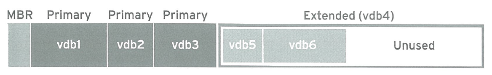
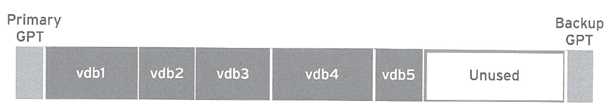
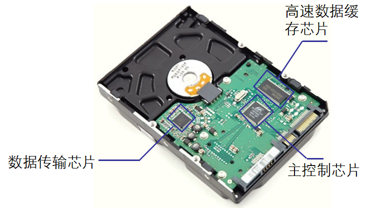
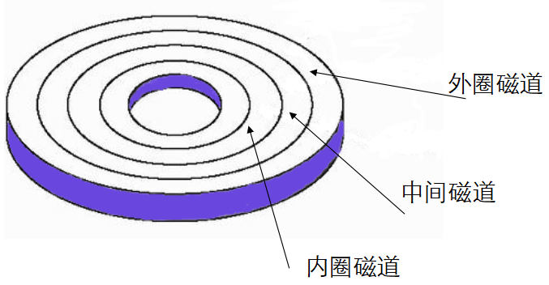
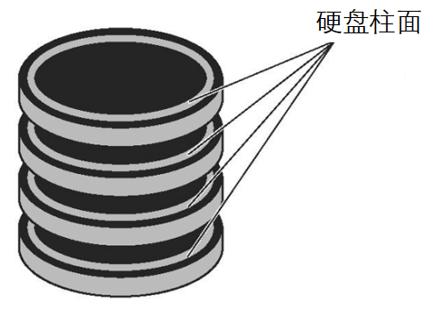
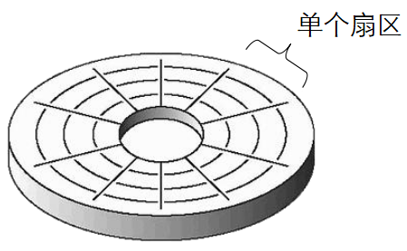

# 磁盘

[TOC]

## 分区

### 分区形式

 

全局唯一标识分区表（GUID Partition  Table，缩写：GPT）是一个实体硬盘的分区结构。它是可扩展固件接口标准的一部分，用来替代BIOS中的主引导记录分区表。 传统的主启动记录  (MBR) 磁盘分区支持最大卷为 2.2 TB (terabytes) ，每个磁盘最多有 4 个主分区（或 3 个主分区，1  个扩展分区和无限制的逻辑驱动器）。 与MBR 分区方法相比，GPT 具有更多的优点，因为它允许每个磁盘有多达 128 个分区，支持高达 18  千兆兆字节 (exabytes，1EB=10^6TB) 的卷大小，允许将主磁盘分区表和备份磁盘分区表用于冗余，还支持唯一的磁盘和分区 ID  (GUID)。
与 MBR   分区的磁盘不同，GPT的分区信息是在分区中，而不象MBR一样在主引导扇区。为保护GPT不受MBR类磁盘管理软件的危害，GPT在主引导扇区建立了一 个保护分区 (Protective   MBR)的MBR分区表，这种分区的类型标识为0xEE，这个保护分区的大小在Windows下为128MB，Mac OS   X下为200MB，在Window磁盘管理器里名为GPT保护分区，可让MBR类磁盘管理软件把GPT看成一个未知格式的分区，而不是错误地当成一个未分 区的磁盘。另外，GPT 分区磁盘有多余的主要及备份分区表来提高分区数据结构的完整性。 

 

在MBR硬盘中，分区信息直接存储于主引导记录(MBR)中（主引导记录中还存储着系统的引导程序）。但在GPT硬盘中，分区表的位置信息储存在GPT头中。但出于兼容性考虑，硬盘的第一个扇区仍然用作MBR，之后才是GPT头。跟现代的MBR一样，GPT也使用逻辑区块地址（LBA）取代了早期的CHS寻址方式。传统MBR信息存储于LBA 0，GPT头存储于LBA  1，接下来才是分区表本身。64位Windows操作系统使用16,384字节（或32扇区）作为GPT分区表，接下来的LBA  34是硬盘上第一个分区的开始。为了减少分区表损坏的风险，GPT在硬盘最后保存了一份分区表的副本。与主启动记录 (MBR) 分区方法相比，GPT  具有更多的优点，因为它允许每个磁盘有多达 128 个分区，支持高达18  千兆兆字节的卷大小，允许将主磁盘分区表和备份磁盘分区表用于冗余，还支持唯一的磁盘和分区ID(GUID)。 

 

**GPT结构** 

 

GPT的结构见下图 

 

 

 

**传统MBR (LBA 0)** 
在GPT分区表的最开头，处于兼容性考虑仍然存储了一份传统的MBR，用来防止不支持GPT的硬盘管理工具错误识别并破坏硬盘中的数据，这个MBR也叫做保护MBR。在支持从GPT启动的操作系统中，这里也用于存储第一阶段的启动代码。在这个MBR中，只有一个标识为0xEE的分区，以此来表示这块硬盘使用GPT分区表。不能识别GPT硬盘的操作系统通常会识别出一个未知类型的分区，并且拒绝对硬盘进行操作，除非用户特别要求删除这个分区。这就避免了意外删除分区的危险。另外，能够识别GPT分区表的操作系统会检查保护MBR中的分区表，如果分区类型不是0xEE或者MBR分区表中有多个项，也会拒绝对硬盘进行操作。
在使用MBR/GPT混合分区表的硬盘中，这部分存储了GPT分区表的一部分分区（通常是前四个分区），可以使不支持从GPT启动的操作系统从这个MBR启动，启动后只能操作MBR分区表中的分区。如Boot Camp就是使用这种方式启动Windows。
**分区表头 (LBA 1)** 
分区表头定义了硬盘的可用空间以及组成分区表的项的大小和数量。在使用64位Windows Server  2003的机器上，最多可以创建128个分区，即分区表中保留了128个项，其中每个都是128字节。（EFI标准要求分区表最小要有16,384字节，即128个分区项的大小）
分区表头还记录了这块硬盘的GUID，记录了分区表头本身的位置和大小（位置总是在LBA  1）以及备份分区表头和分区表的位置和大小（在硬盘的最后）。它还储存着它本身和分区表的CRC32校验。固件、引导程序和操作系统在启动时可以根据这个校验值来判断分区表是否出错，如果出错了，可以使用软件从硬盘最后的备份GPT中恢复整个分区表，如果备份GPT也校验错误，硬盘将不可使用。所以GPT硬盘的分区表不可以直接使用16进制编辑器修改。
分区表头的格式如下 

 

| **起始字节** | **长度** | **内容**                                                     |
| ------------ | -------- | ------------------------------------------------------------ |
| 0            | 8字节    | 签名（"EFI PART", 45 46 49 20 50 41 52 54）                  |
| 8            | 4字节    | 修订（在1.0版中，值是 00 00 01 00）                          |
| 12           | 4字节    | 分区表头的大小（单位是字节，通常是92字节，即 5C 00 00 00）   |
| 16           | 4字节    | 分区表头（第0－91字节）的CRC32 校验，在计算时，把这个字段作为0处理，需要计算出分区串行的CRC32校验后再计算本字段 |
| 20           | 4字节    | 保留，必须是 0                                               |
| 24           | 8字节    | 当前LBA（这个分区表头的位置）                                |
| 32           | 8字节    | 备份LBA（另一个分区表头的位置）                              |
| 40           | 8字节    | 第一个可用于分区的LBA（主分区表的最后一个LBA + 1）           |
| 48           | 8字节    | 最后一个可用于分区的LBA（备份分区表的第一个LBA − 1）         |
| 56           | 16字节   | 硬盘GUID（在类UNIX 系统中也叫UUID）                          |
| 72           | 8字节    | 分区表项的起始LBA（在主分区表中是2）                         |
| 80           | 4字节    | 分区表项的数量                                               |
| 84           | 4字节    | 一个分区表项的大小（通常是128）                              |
| 88           | 4字节    | 分区串行的CRC32校验                                          |
| 92           | *        | 保留，剩余的字节必须是0（对于512字节LBA的硬盘即是420个字节） |

 

主分区表和备份分区表的头分别位于硬盘的第二个扇区（LBA 1）以及硬盘的最后一个扇区。备份分区表头中的信息是关于备份分区表的。 

 

**分区表项 (LBA 2–33)** 
GPT分区表使用简单而直接的方式表示分区。一个分区表项的前16字节是分区类型GUID。例如，EFI系统分区的GUID类型是{C12A7328-F81F-11D2-BA4B-00A0C93EC93B}。接下来的16字节是该分区唯一的GUID（这个GUID指的是该分区本身，而之前的GUID指的是该分区的类型）。再接下来是分区起始和末尾的64位LBA编号，以及分区的名字和属性。
GPT分区表项的格式如下 

 

| **起始字节** | **长度** | **内容**                                   |
| ------------ | -------- | ------------------------------------------ |
| 0            | 16字节   | 分区类型GUID                               |
| 16           | 16字节   | 分区GUID                                   |
| 32           | 8字节    | 起始LBA（小端序 ）                         |
| 40           | 8字节    | 末尾LBA                                    |
| 48           | 8字节    | 属性标签（如：`60` 表示“只读”）            |
| 56           | 72字节   | 分区名（可以包括36个UTF-16（小端序）字符） |

 

1. MBR（主启动记录）

   自1982年以来，方案指定了在运行BIOS固件的系统上如何对磁盘进行分区。最多支持4个主分区。在Linux系统上，可以使用扩展分区和逻辑分区来创建最多15个分区。由于分区大小数据以32位值存储，最大磁盘和分区大小为2TiB。

2. GPT

   对于运行统一可扩展固件接口(UEFI)固件的系统，GPT是在物理硬盘上布置分区表的标准。最多支持128个主分区。GPT为逻辑块地址分配64位，使得GPT可支持最多8ZiB的分区和磁盘。
   
   GPT使用全局唯一标识符（GUID）来识别每个磁盘和分区。GPT提供分区表信息的冗余，主GPT位于磁盘头部，备份副本（次要GPT）位于磁盘尾部。GPT使用校验和来检测GPT头和分区表中的错误与损坏。
   
   

### 分区作用

1. 限制应用或用户的可用空间。
2. 将操作系统和程序文件与用户文件分隔开。
3. 创建用于内存交换的单独区域。
4. 限制磁盘空间使用，以提高诊断工具和备份映像的性能。

### 分区工具

1. parted
2. fdisk
3. gdisk

## WD硬盘分类
| 颜色 | 用途          |
|-----|--------------|
| 蓝   | 日常装机存储   |
| 黑   | 高性能游戏设计 |
| 红   | NAS          |
| 紫   | 监控         |
| 金   | 数据中心      |

| 颜色                                     | 蓝     | 黑     | 红   | 紫           | 金   |
| ---------------------------------------- | ------ | ------ | ---- | ------------ | ---- |
| 应用/使用                                | 日常PC | 高性能 | NAS  | Surveillance |      |
| 克隆软件                                 | O      | O      | O    | O            |      |
| 专为游戏而设计                           |        | O      |      |              |      |
| 专门针对图形和照片、视频编辑而进行了优化 |        | O      |      |              |      |
| 家用/办公用NAS                           |        |        | O    |              |      |
| 支持RAID                                 |        |        | O    |              |      |
| 专门针对监控系统进行了优化               |        |        |      | O            |      |
| 有限保修                                 | 3      | 5      | 3    | 3            |      |

## 硬盘结构

### 外部结构

* 电源接口

* 数据接口

* 控制电路板

  

  * 主控制芯片
  * 数据传输芯片
  * 高速数据缓存芯片

* 固定面板

### 内部结构

* 磁头组件
  * 最昂贵的部件，是硬盘技术最重要和关键的一环
  * 采用了非接触式结构，加电后悬浮在高速旋转的磁盘表面
  * 分类：读写合一式磁头 分离式磁头
* 磁头驱动机构
* 磁盘片
* 主轴组件
* 前端控制电路

## 磁道

当磁盘旋转时，磁头若保持在一个位置上，则每个磁头都会在磁盘表面划出一个圆形轨迹，叫做磁道。

## 柱面

硬盘通常由重叠的一组盘片组成，每个盘面都被划分为数目相等的磁道，并从外缘的“0”开始编号，具有相同编号的磁道组成一个圆柱，称之为柱面。

## 扇区

磁盘上的每个磁道被等分为若干个弧段，称为扇区。

## Other

lsblk

blkid

cat /proc/partitions

1956年，IBM推出第一台硬盘驱动器 IBM RAMAC 350

