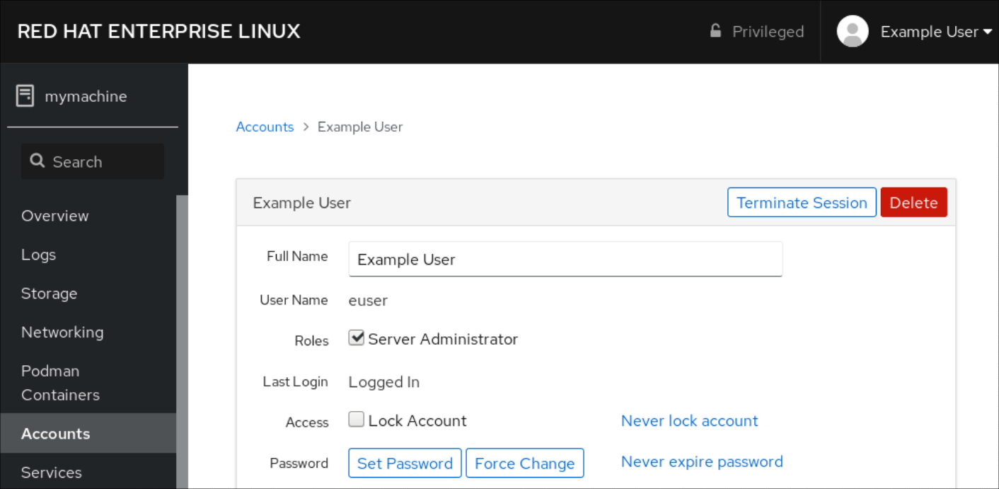

# 用户管理

[TOC]

## 概述

User management is a critical part of maintaining a secure system.  Ineffective user and privilege management often lead many systems into  being compromised. Therefore, it is important that you understand how  you can protect your server through simple and effective user account  management techniques.
用户管理是维护安全系统的关键部分。无效的用户和权限管理通常会导致许多系统受到危害。因此，了解如何通过简单有效的用户帐户管理技术来保护服务器非常重要。 

Linux 系统上的每个文件和进程都属于特定的用户账号。如果没有得到属主的许可，其他用户就不能访问这些对象，因此，这条约定有助于防止用户彼此之间不
管是有意还是无意的错误行为。

## root 用户

系统文件和进程属于一个称为 root 的虚拟用户，也叫做超级用户。与任何其他账号一样，root 拥有的东西也受到保护，不受来自其他用户的干扰。要进行系统管理上的改动，需要使用 root账号。

root 账号具有几个“神奇”特性。root 可以充当任何文件或进程的属主，还可以执行一些特殊操作，而其他用户是无权执行这些操作的。这个账号的权限非常大，但如果是没有经过训练的用户或者是心怀恶意的用户使用这个账号的话，将会非常危险。

root 账号在定义上的特征是它的 UID 为 0 。Linux 并没有不许用户修改这个账号上的用户名，也没有不许创建 UID 为 0 的其他账号，但这两种做法都是非常不好的。像这样的修改有可能无意中破坏系统的安全性。同时，当其他人不得不适应以这种奇怪方式配置的系统时，也容易给他们带来混乱。

传统的 UNIX 允许超级用户（也就是有效 UID 为 0 的任何进程）在任何文件或进程上执行正当的操作（这里的“正当”是一个重要的、意义含糊的词。某些操作(例如，执行没有设置执行许可位的文件)即使对于超级用户也是被禁止的。）。此外，有些系统调用（对内核的请求）只能够由超级用户来执行，这类受限操作的一些例子：

* 采用 chroot 命令来改变进程的根目录。

* 创建设备文件。

* 设置系统时钟。

* 提高资源使用率的限度和进程的优先级（截至 2.6.12 版的内核，一种新的资源限度能让除了超级用户之外的其他用户在系统管理员允许的情况下提高进程的优先级。）。

* 设置系统的主机名称。

* 配置网络接口。

* 打开特权网络端口(那些编号小于 1024 的端口)。

* 关闭系统。

例如，超级用户有权改变属主为 root 的进程的 UID 和 GID 。login 程序及其采用窗口形式的等价程序都是这样的例子，这个在用户登录到系统时提示用户输入口令的进程起初就是以 root 权限运行的。如果所输入的用户名和口令是合法的话，login 就把它的 UID 和 GID 改变成为该用户的 UID 和 GID 并启动该用户的用户环境。一旦一个以 root 权限执行的进程已经改变了它的归属关系而成为一个普通的用户进程，那么它就不能再恢复它以前的特权状态了。

Linux 系统从理论上说也能把 root 账号的特权按照 POSIX 标准中有关“权力(capability)”的规定再做细分。出于各种原因，其中也包括当前实现存在的问题，这项功能并没有其最初体现的那样有帮助，对于系统管理员来说也没有那么适合使用。

## 伪用户

在内核看来，root 是具有特殊地位的惟一用户，但系统还定义了另外几个伪用户。惯用的做法是用星号来替代这些特殊用户在 /etc/passwd 中被加密的口令字段，从而让这些用户的账号不能用来登录进入系统。

* bin

  系统命令的老属主。在一些比较老的 UNIX 系统上，bin 用户是包含系统命令的那些目录的属主，还是大多数命令本身的属主。如今这种账号经常被看作是多余的（或者甚至可能有些不安全），因此现代系统（包括 Linux）通常就只使用 root 账号了。另一方面，既然 bin 账号是“标准”账号，所以还真的不能废除它。

* daemon

  无特权系统软件的属主。有些文件和进程是操作系统的一部分，但不需要由 root 做其属主，这样的文件和进程就给了 daemon。其中的道理是，这种约定能有助于避免采用 root 做属主所带来的危险。出于类似的原因，还有一个叫做 “daemon” 的组。和 bin 账号类似，大多数 Linux 发行版本也不怎么用 daemon 账号。

* nobody

  普通 NFS 用户。NFS 在进行文件共享的时候，使用 nobody 账号代表其他系统上的 root 用户。为了去掉远程 root 用户的特权，远程 UID 为 0 的用户必须被映射成本地 UID 0 之外的某个用户。nobody 账号就充当了这些远程 root 用户的一般替身。

  由于 nobody 账号应该代表一个普通的、权力相对来说比较小的用户，因此这个账号不应该拥有任何文件。如果 nobody 账号确实拥有文件的话，那么远程的 root 就可以控制这些文件。nobody 不应该拥有任何文件！

  传统上给 nobody 用户的 UID 是 -1或者 -2 ，Linux 内核仍然默认用 UID 65534 （-2 的 16 位二进制补码）。有些发行版本给 nobody 指派一个小编号的 UID（例如，Red Hat 和 Fedora 使用 9），这样做比 65534 更合理，因为 UID 是 32 位的。惟一有问题的地方是 exportfs 命令似乎不去看 passwd 文件，所以必须用 anonuid 选项明确告诉它给 nobody 用一个不同的 UID 。

## 用户身份切换

root 账号可以直接登录进入系统。然而，这种做法显得非常糟糕。首先，这样做没有留下以 root 身份执行的操作的记录。当管理员意识到自己昨天夜里凌晨 3:00 时损坏了某项内容，但又记不起来自己当时到底改变了什么时，这可就不妙了。当访问没有经过授权，而要试图找出入侵者对系统到底做了什么操作时，情况可能更糟。另外一个不利因素是以 root 身份登录进入系统的做法没有留下当时是谁真正做这项工作的记录。如果有几个人都有访问 root 账号的权限，那么将不能够区分到底是谁在什么时候使用了root 账号。

基于上述原因，大多数系统禁止 root 在终端上以及通过网络来登录系统，或者说除了系统控制台之外的其他任何地方都禁止 root 登录（Ubuntu Linux 的限制更严。在默认情况下，系统没有合法的 root 口令，要用 sudo 来获得 root 访问权。）。建议使用这项特性。

### su

访问 root 账号稍好一些的方式是使用 su 命令。如果不带任何参数来调用 su 命令，那么它会提示用户输入 root 的口令，然后启动一个 rootshell 。这个 shell 的特权一直到 shell 终止（通过 <Control-D> 或 exit 命令来终止）以前都保持有效。su 不记录以 root 身份执行了哪些命令，但它确实会创建一条日志记录来说明是谁在什么时候变成了root 。

su 命令也可以替代除了 root 以外的其他用户身份。有时候，重现或者调试用户问题的惟一方法就是 su 为该用户的账号，以便能够重现发生问题的环境。

如果知道某人的口令，那么通过执行 su userame 就能够直接访问这个人的账号。与 su 到 root 账号的情况一样，此时也会提示用户输入username 的口令。也可以首先 su 到 root 账号，然后再 su 到其他账号，root 账号不需提供密码就可以 su 到其他任何账号。

最好是键入 su 命令的完整路径(例如，/bin/su )，而不是依靠 shell 为你找到这个命令。这将在一定程度上防范已经溜入到搜索路径下的名为 su 的程序，它们带有想要获取口令的企图（由于相同的原因，强烈建议在 shell 的搜索路径中不要包括 “.” （当前目录）。虽然这样做会带来方便，但是该配置很容易意外地运行用户或入侵者作为陷阱留下的系统命令的特殊版本。自然，本忠告对于 root 用户加倍重要。）。

```bash
su [选项] ... [-] [用户 [参数] ...]

-l	变更用户时使用目标用户的环境变量及工作目录，没有指明用户是，默认为 root 。
-f	快速启动，不读取启动文件，适用于 chs 或 tcsh 。
-c	以新用户执行一条命令后返回原来的使用者。
-m	不改变环境变量。
-p	同 -m 。
```

### sudo

受限的 su

由于超级用户账号的特权不可分割（至少不能随意分割），所以很难既给某个人完成一件任务的权力（例如，备份）而又不给这个人自由运行系统的权力。而且如果 root 账号由几个管理员使用，那么对于是谁正在使用这个账号或者谁使用这个账号做了什么事情就只有非常模糊的认识了。

针对这些问题,最广泛采用的解决方案是使用一个叫做 sudo 的程序，这个程序目前由 Todd Miller 维护。

sudo 采用命令行作为参数，然后以 root 身份（或另外一个受限用户）执行。sudo 读取文件 /etc/sudoers，这个文件列出了授权使用 sudo 的人以及允许他们在每台主机上运行的命令。如果提供给 sudo 的命令允许运行，那么 sudo 就提示输入这个用户自己的口令并执行命令。

使用 sudo 的用户随后可以执行其他一些 sudo 命令而不用再输入口令，除非在超过 5min （时间长度是可以配置的）的时间内该用户没有再使用 sudo 。这段超时时间可以作为一种最友善的保护，防止具有 sudo 特权的用户由于不注意而长时间地离开终端所造成的安全隐患。

sudo 保存有一个日志，它记录执行的命令行、命令行执行的主机、请求执行命令行的人、运行命令行的目录以及命令行被调用的时间。这些信息可以通过 syslog，进行记录或者被放入选定的文件中。推荐使用 syslog 把日志项转发给一个安全的中央主机。用户 randy 执行 sudo /bin/cat/etc/sudoers 命令会产生类似下面的一条日志记录：

```bash
Dec 7 10:57:19 tigger sudo:randy:Try=ttyp0;PwD=/tigger/users/randy;USER=root:COMMAND=/bin/cat /etc/sudoers
```

文件 sudoers 的设计做到了仅用一个版本就可以立即用在许多不同的主机上。下面是一个典型的例子：

```bash
# Define aliases for machines in CS & Physics departments
Host_Alias	CS = tigger,anchor,piper,moet,sigi
Host_Alias	PHYSICS = eprince,pprince,icarus

# Define collections of commands
Cmnd_Alias	DUMP=/sbin/dump,/sbin/restore
Cmnd_Alias	PRINTING=/usr/sbin/lpc,/usr/bin/lprm
Cmnd_Alias	SHELLS=/bin/sh,/bin/tcsh,/bin/bash,/bin/ash,/bin/bsh

#Permissions
mark,ed		PHYSICS = ALL
herb		CS=/usr/sbin/tcpdump:PHYSICS=(operator)DUMP
lynda		ALL = (ALL) ALL,!SHELLS
%wheel		ALL,!PHYSICS = NOPASSWD:PRINTING
```

前 5 个非注释行定义了主机组和命令组，这些组供这个文件后面的权限说明来引用。这个列表可以原封不动地逐字包括在说明中，但使用别名会让 soduers 文件更容易阅读和理解，还能让文件以后更容易更新。还可以为用户集合或以其身份运行命令的用户集合定义别名。每一行权限说明包括的信息如下：

* 这一行所适用的用户。

* 应该注意这一行的主机。

* 指定用户可以运行的命令。

* 可以以其身份执行命令的用户。

第 1 行权限说明适用于 PHYSICS 组机器（eprince、pprince 和 icarus）上的用户 mark 和 ed 。sudo 内建的命令别名 ALL 允许他们运行任何命令。由于在小括号中没有指定用户列表，所以 sudo 将只以 root 身份运行命令。

第 2 行权限说明允许用户 herb 在 cs 组机器上运行 tcpdump ，并在 PHYSICS 组机器上运行与 dump 有关的命令。不过，dump 命令只能够以 operator 的身份而不能以 root 身份运行。用户 herb 键入的实际命令行则类似下面这样:

```bash
sudo -u operator /sbin/dump 0u /dev/hda2
```

用户 lynda 能够以任何用户的身份在任何机器上运行命令，但不能够运行几个普通的 shell，难道这就意味着 lynda不能够得到一个 root shel ？当然不是：

```bash
cp -p /bin/bash /tmp/bash
sudo /tmp/bash
```

一般说来，任何试图设定“除……以外的所有命令”的做法都注定要失败，至少在技术角度来看是这样。但是，按照这种方式建立一个 sudoers 文件，作为不鼓励使用 root shell 的提醒信息仍然是值得的。这种做法可能会避免用户不经意的使用。

最后一行允许组 “wheel” 中的用户以 root 身份在除了 eprince、pprince 和 icarus 之外的任何机器上运行 Ipc 和 Iprm 。而且运行这些命令不需要任何口令。

注意，/etc/sudoers 中的命令采用完整路径来指定，这样做是为了防止人们以 root 身份去执行他们自己的程序和脚本。尽管上面没有给出例子，但可以为每个命令指定允许的参数。要修改 /etc/sudoers ，请使用 visudo 命令，这个命令检査以确保没有其他人正在编辑这个文件，接着调用一个编辑器编辑该文件，然后先验证文件编辑修改后的语法无误，再安装它。最后这一步骤尤其重要，因为无效的 sudoers 文件可能会不让用户再用 sudo 去修复它。

使用 sudo 具有以下一些好处：

* 由于有命令日志，因而极大地提高了安全审计的能力。

* 操作员不需要不受限制的 root 特权就能够完成许多任务。

* 真正的 root 口令可以只让一两个人知道。

* 使用 sudo 比运行 su 或者以 root 身份登录进入系统要快。

* 不需要改变 root 的口令就能够收回一些特权。

* 维护一个具有 root 特权的所有用户的规范列表。

* 不经意遗留 root shell 的概率降低了许多。

* 可以使用单个文件来控制对整个网络的访问权限。

sudo 当然也有一些不足之处。其中最糟糕的是，如果突破了能执行 sudo 命令的个人账号的安全防线，就等同于突破了 root 账号本身的安全防线。对付这种威胁除了提醒能执行 sodo 命令的用户在他们暂时成为 root 时保护好自己的账号之外，就没有其他什么措施了。也可以定期用 John the Ripper 程序尝试破解一下 sudoer 的口令，确保用户选择了良好的口令。

sudo 的命令日志机制可以用一些技巧暗中破坏，比如在允许执行的程序中使用 shell 的转义字符，或者如果允许 sudo sh 和 sudo su 的话，则利用它们来破坏。

## Where is root? 根在哪里？ 

Ubuntu developers made a conscientious decision to disable the administrative  root account by default in all Ubuntu installations. This does not mean  that the root account has been deleted or that it may not be accessed.  It merely has been given a password hash which matches no possible  value, therefore may not log in directly by itself.
Ubuntu开发人员做出了一个认真的决定，在所有Ubuntu安装中默认禁用管理根帐户。这并不意味着根帐户已被删除或无法访问。它只是被赋予了一个不匹配任何可能值的密码散列，因此可能无法自己直接登录。 

Instead, users are encouraged to make use of a tool by the name of ‘sudo’ to  carry out system administrative duties. Sudo allows an authorized user  to temporarily elevate their privileges using their own password instead of having to know the password belonging to the root account. This  simple yet effective methodology provides accountability for all user  actions, and gives the administrator granular control over which actions a user can perform with said privileges.
相反，鼓励用户使用名为“sudo”的工具来执行系统管理职责。Sudo允许授权用户使用自己的密码临时提升其权限，而不必知道属于root帐户的密码。这种简单而有效的方法为所有用户操作提供了问责制，并使管理员能够细粒度地控制用户可以使用所述权限执行哪些操作。 

- If for some reason you wish to enable the root account, simply give it a password:
  如果出于某种原因，您希望启用root帐户，只需给予它一个密码： 

  ```
  sudo passwd
  ```

  Sudo will prompt you for your password, and then ask you to supply a new password for root as shown below:
  Sudo将提示您输入密码，然后要求您提供root的新密码，如下所示： 

  ```
  [sudo] password for username: (enter your own password)
  Enter new UNIX password: (enter a new password for root)
  Retype new UNIX password: (repeat new password for root)
  passwd: password updated successfully
  ```

- To disable the root account password, use the following passwd syntax:
  要禁用root帐户密码，请使用以下passwd语法： 

  ```
  sudo passwd -l root
  ```

- You should read more on Sudo by reading the man page:
  您应该通过阅读手册页了解更多关于Sudo的信息： 

  ```
  man sudo
  ```

By default, the initial user created by the Ubuntu installer is a member of the group `sudo` which is added to the file `/etc/sudoers` as an authorized sudo user. If you wish to give any other account full root access through sudo, simply add them to the `sudo` group.
默认情况下，Ubuntu安装程序创建的初始用户是作为授权sudo用户添加到文件 `/etc/sudoers` 的组 `sudo` 的成员。如果您希望通过sudo给予任何其他帐户完全root访问权限，只需将它们添加到 `sudo` 组。

## Adding and Deleting Users 添加和删除用户 

The process for managing local users and groups is straightforward and  differs very little from most other GNU/Linux operating systems. Ubuntu  and other Debian based distributions encourage the use of the ‘adduser’  package for account management.
管理本地用户和组的过程很简单，与大多数其他GNU/Linux操作系统几乎没有什么不同。Ubuntu和其他基于Debian的发行版鼓励使用“adduser”包进行帐户管理。 

- To add a user account, use the following syntax, and follow the prompts to give the account a password and identifiable characteristics, such as a full name, phone number, etc.
  要添加用户帐户，请使用以下语法，并按照提示为帐户给予密码和可识别的特征，如全名、电话号码等。 

  ```
  sudo adduser username
  ```

- To delete a user account and its primary group, use the following syntax:
  要删除用户帐户及其主组，请使用以下语法： 

  ```
  sudo deluser username
  ```

  Deleting an account does not remove their respective home folder. It is up to  you whether or not you wish to delete the folder manually or keep it  according to your desired retention policies.
  删除帐户不会删除其各自的主文件夹。您可以自行决定是否要手动删除该文件夹或根据所需的保留策略保留它。 

  Remember, any user added later on with the same UID/GID as the previous owner  will now have access to this folder if you have not taken the necessary  precautions.
  请记住，如果您没有采取必要的预防措施，以后添加的任何用户都可以访问此文件夹，并且其UID/GID与以前的所有者相同。 

  You may want to change these UID/GID values to something more appropriate,  such as the root account, and perhaps even relocate the folder to avoid  future conflicts:
  您可能希望将这些UID/GID值更改为更合适的值，例如root帐户，甚至可能重新定位文件夹以避免未来的冲突： 

  ```
  sudo chown -R root:root /home/username/
  sudo mkdir /home/archived_users/
  sudo mv /home/username /home/archived_users/
  ```

- To temporarily lock or unlock a user password, use the following syntax, respectively:
  要临时锁定或解锁用户密码，请分别使用以下语法： 

  ```
  sudo passwd -l username
  sudo passwd -u username
  ```

- To add or delete a personalized group, use the following syntax, respectively:
  要添加或删除个性化组，请分别使用以下语法： 

  ```
  sudo addgroup groupname
  sudo delgroup groupname
  ```

- To add a user to a group, use the following syntax:
  要将用户添加到组，请使用以下语法： 

  ```
  sudo adduser username groupname
  ```

## User Profile Security 用户配置文件安全性 

When a new user is created, the adduser utility creates a brand new home directory named `/home/username`. The default profile is modeled after the contents found in the directory of `/etc/skel`, which includes all profile basics.
创建新用户时，adduser实用程序会创建一个名为 `/home/username` 的全新主目录。默认配置文件是根据 `/etc/skel` 目录中的内容建模的，其中包括所有配置文件基础。

If your server will be home to multiple users, you should pay close  attention to the user home directory permissions to ensure  confidentiality. By default, user home directories in Ubuntu are created with world read/execute permissions. This means that all users can  browse and access the contents of other users home directories. This may not be suitable for your environment.
如果您的服务器上会有多个用户，则应密切注意用户的主目录权限，以确保机密性。默认情况下，Ubuntu中的用户主目录是以全局读取/执行权限创建的。这意味着所有用户都可以浏览和访问其他用户主目录的内容。这可能不适合您的环境。 

- To verify your current user home directory permissions, use the following syntax:
  要验证当前用户的主目录权限，请使用以下语法： 

  ```
  ls -ld /home/username
  ```

  The following output shows that the directory `/home/username` has world-readable permissions:
  以下输出显示目录 `/home/username` 具有全局可读权限：

  ```
  drwxr-xr-x  2 username username    4096 2007-10-02 20:03 username
  ```

- You can remove the world readable-permissions using the following syntax:
  您可以使用以下语法删除全局可读权限： 

  ```
  sudo chmod 0750 /home/username
  ```

  > **Note 注意**
  >
  > Some people tend to use the recursive option (-R) indiscriminately which  modifies all child folders and files, but this is not necessary, and may yield other undesirable results. The parent directory alone is  sufficient for preventing unauthorized access to anything below the  parent.
  > 有些人倾向于不加区别地使用递归选项（-R），它会修改所有子文件夹和文件，但这不是必要的，并且可能会产生其他不希望的结果。父目录本身就足以防止对父目录下的任何内容进行未经授权的访问。 

  A much more efficient approach to the matter would be to modify the  adduser global default permissions when creating user home folders.  Simply edit the file `/etc/adduser.conf` and modify the `DIR_MODE` variable to something appropriate, so that all new home directories will receive the correct permissions.
  一个更有效的方法是在创建用户主文件夹时修改adduser全局默认权限。只需编辑文件 `/etc/adduser.conf` 并将 `DIR_MODE` 变量修改为适当的内容，以便所有新的主目录都将获得正确的权限。

  ```
  DIR_MODE=0750
  ```

- After correcting the directory permissions using any of the previously  mentioned techniques, verify the results using the following syntax:
  使用前面提到的任何技术更正目录权限后，请使用以下语法验证结果： 

  ```
  ls -ld /home/username
  ```

  The results below show that world-readable permissions have been removed:
  下面的结果显示世界可读权限已被删除： 

  ```
  drwxr-x---   2 username username    4096 2007-10-02 20:03 username
  ```

## 密码

口令的长度至少应为 8 个字符，7 个字符长度的口令其实非常容易被破译。在有些使用 DES 口令的系统上，使用长度超过 8 个字符的口令是没有什么用处的，因为只有前 8 个字符有意义。MD5 口令的长度可以超过 8 个字符。

让所选的口令不那么容易被猜中或被反复试探找到，这是很重要的。从理论上来说，最安全的口令类型是由字母、标点符号和数字组成的随机序列。但是，因为这种类型的口令很难记住，并且一般来说输入也比较费劲，如果管理员要用笔写下才不会忘记，或者键入这种口令的速度比较慢，那么这未必就是最安全的口令。

直到最近，由两个随机选择的单词中间加一个标点符号所组成的口令还是在安全性和易记性之间比较好的折衷方案。遗憾的是，目前这类口令也可以被很快破译了，所以不提议采用这种方式的口令。

现在，建议通过摘取“出人意料的废话(shockingnonsense)”中的短语来构成口令，“shocking nonsense” 是 Grady Ward 在 PGP Passphrase FAO（ PGP 囗令词的 FAO ）的一个较早版本中定义的：

shocking nonsense 意味着组成这样一个短语或句子，在用户的文化中既没有什么意义，又是出人意料的(shocking)。也就是说，它包含了粗俗恶心的、种族主义的、不可能的或者其他类似的极端思想。因为口令究其本质来说，是从来不会给其他任何人看的，因而口令的意义也不会触犯别人，所以允许采用这项技术。

“出人意料的废话”不太可能在别处重复，因为它并没有描述一个有可能被其他人意外地重新发现的事实。对于创建者本人来说，突如其来的感情化的想法是很难忘记的。例如，“Mollusks peck my gallopimng genitals”，读者无疑可以为自己创作出更多的或更有趣的例子。通过只记住每个单词的第一个字母或者其他类似的转换方法，就可以把这样的短语缩减成为 8 个字符长度的口令。如果其中还包括数字、标点符号和大写字母，那么口令的安全性将大幅提高。应该改变口令：

* 至少每 3 个月左右。
* 每次当有个知道口令的人离开您的工作站点时。
* 在认为安全性可能已经受到威胁的任何时候。
* 当某一天，没有料到晚上的聚会很累以致于第二天早上会忘记口令时。

### Password Policy 密码策略 

A strong password policy is one of the most important aspects of your  security posture. Many successful security breaches involve simple brute force and dictionary attacks against weak passwords. If you intend to  offer any form of remote access involving your local password system,  make sure you adequately address minimum password complexity  requirements, maximum password lifetimes, and frequent audits of your  authentication systems.
强大的密码策略是安全状态中最重要的方面之一。许多成功的安全漏洞都涉及针对弱密码的简单暴力和字典攻击。如果您打算提供涉及本地密码系统的任何形式的远程访问，请确保充分满足最低密码复杂性要求、最长密码生存期要求以及身份验证系统的频繁审核要求。 

#### Minimum Password Length 最小密码长度 

By default, Ubuntu requires a minimum password length of 6 characters, as  well as some basic entropy checks. These values are controlled in the  file `/etc/pam.d/common-password`, which is outlined below.
默认情况下，Ubuntu要求密码的最小长度为6个字符，以及一些基本的熵检查。这些值在文件 `/etc/pam.d/common-password` 中进行控制，如下所述。

```
password        [success=1 default=ignore]      pam_unix.so obscure sha512
```

If you would like to adjust the minimum length to 8 characters, change the appropriate variable to min=8. The modification is outlined below.
如果您希望将最小长度调整为8个字符，请将相应的变量更改为min=8。修改概述如下。 

```
password        [success=1 default=ignore]      pam_unix.so obscure sha512 minlen=8
```

> **Note 注意**
>
> Basic password entropy checks and minimum length rules do not apply to the  administrator using sudo level commands to setup a new user.
> 基本的密码熵检查和最小长度规则不适用于使用sudo级别命令设置新用户的管理员。 

#### Password Expiration 密码过期 

When creating user accounts, you should make it a policy to have a minimum  and maximum password age forcing users to change their passwords when  they expire.
在创建用户帐户时，您应该制定一项策略，规定密码的最短和最长使用期限，以强制用户在密码过期时更改密码。 

- To easily view the current status of a user account, use the following syntax:
  要轻松查看用户帐户的当前状态，请使用以下语法： 

  ```
  sudo chage -l username
  ```

  The output below shows interesting facts about the user account, namely that there are no policies applied:
  下面的输出显示了有关用户帐户的有趣事实，即没有应用任何策略： 

  ```
  Last password change                                    : Jan 20, 2015
  Password expires                                        : never
  Password inactive                                       : never
  Account expires                                         : never
  Minimum number of days between password change          : 0
  Maximum number of days between password change          : 99999
  Number of days of warning before password expires       : 7
  ```

- To set any of these values, simply use the following syntax, and follow the interactive prompts:
  要设置这些值中的任何一个，只需使用以下语法，并按照交互式提示操作： 

  ```
  sudo chage username
  ```

  The following is also an example of how you can manually change the  explicit expiration date (-E) to 01/31/2015, minimum password age (-m)  of 5 days, maximum password age (-M) of 90 days, inactivity period (-I)  of 30 days after password expiration, and a warning time period (-W) of  14 days before password expiration:
  下面也是一个示例，说明如何手动将显式过期日期（-E）更改为01/31/2015，将密码最短使用期限（-m）更改为5天，将密码最长使用期限（-M）更改为90天，将密码过期后的非活动期（-I）更改为30天，将警告时间段（-W）更改为密码过期前的14天： 

  ```
  sudo chage -E 01/31/2015 -m 5 -M 90 -I 30 -W 14 username
  ```

- To verify changes, use the same syntax as mentioned previously:
  要验证更改，请使用与前面提到的相同的语法： 

  ```
  sudo chage -l username
  ```

  The output below shows the new policies that have been established for the account:
  下面的输出显示了为该客户建立的新策略： 

  ```
  Last password change                                    : Jan 20, 2015
  Password expires                                        : Apr 19, 2015
  Password inactive                                       : May 19, 2015
  Account expires                                         : Jan 31, 2015
  Minimum number of days between password change          : 5
  Maximum number of days between password change          : 90
  Number of days of warning before password expires       : 14
  ```

## Other Security Considerations 其他安全考虑 

Many applications use alternate authentication mechanisms that can be easily overlooked by even experienced system administrators. Therefore, it is  important to understand and control how users authenticate and gain  access to services and applications on your server.
许多应用程序使用备用身份验证机制，即使是有经验的系统管理员也很容易忽略这些机制。因此，了解和控制用户如何进行身份验证以及如何访问服务器上的服务和应用程序非常重要。 

### SSH Access by Disabled Users 禁用用户的SSH访问 

Simply disabling/locking a user password will not prevent a user from logging  into your server remotely if they have previously set up SSH public key  authentication. They will still be able to gain shell access to the  server, without the need for any password. Remember to check the users  home directory for files that will allow for this type of authenticated  SSH access, e.g. `/home/username/.ssh/authorized_keys`.
简单地禁用/锁定用户密码不会阻止用户远程登录到您的服务器，如果他们以前设置了SSH公钥身份验证。他们仍然可以获得shell访问服务器，而不需要任何密码。请记住检查用户的主目录，以查找允许这种类型的身份验证SSH访问的文件，例如 `/home/username/.ssh/authorized_keys` 。

Remove or rename the directory `.ssh/` in the user’s home folder to prevent further SSH authentication capabilities.
删除或重命名用户主文件夹中的目录 `.ssh/` ，以阻止进一步的SSH身份验证功能。

Be sure to check for any established SSH connections by the disabled user, as it is possible they may have existing inbound or outbound  connections. Kill any that are found.
请确保检查被禁用的用户是否建立了任何SSH连接，因为他们可能已经建立了入站或出站连接。找到的都杀了。 

```
who | grep username  (to get the pts/# terminal)
sudo pkill -f pts/#
```

Restrict SSH access to only user accounts that should have it. For example, you  may create a group called “sshlogin” and add the group name as the value associated with the `AllowGroups` variable located in the file `/etc/ssh/sshd_config`.
将SSH访问限制为只有用户帐户才能访问。例如，您可以创建一个名为“sshlogin”的组，并将组名添加为与文件 `/etc/ssh/sshd_config` 中的 `AllowGroups` 变量关联的值。

```
AllowGroups sshlogin
```

Then add your permitted SSH users to the group “sshlogin”, and restart the SSH service.
然后将允许的SSH用户添加到“sshlogin”组，并重新启动SSH服务。 

```
sudo adduser username sshlogin
sudo systemctl restart sshd.service
```

### External User Database Authentication 外部用户数据库身份验证 

Most enterprise networks require centralized authentication and access  controls for all system resources. If you have configured your server to authenticate users against external databases, be sure to disable the  user accounts both externally and locally. This way you ensure that  local fallback authentication is not possible.
大多数企业网络需要对所有系统资源进行集中式身份验证和访问控制。如果您已将服务器配置为根据外部数据库对用户进行身份验证，请确保在外部和本地禁用用户帐户。这样可以确保本地回退身份验证是不可能的。 

------


Linux 是多用户操作系统，可让不同计算机中的多个用户访问在同一机器中安装的单一系统。每个用户都在其自身帐户下运行。

## 类型 	

- 普通用户帐户

  为特定系统用户创建普通帐户。这些帐户可以在正常的系统管理过程中添加、删除和修改。

- 系统用户帐户

  代表系统中的特定应用程序标识符。此类帐户通常仅在软件安装时添加或操作，且不会在以后进行修改。

  > 警告：
  >
  > 系统帐户假定在一个系统中本地可用。如果这些帐户是远程配置和提供的，如 LDAP 配置的实例中，则可能会出现系统中断和服务启动故障。

  对于系统帐户，1000 以下的用户 ID 被保留。对于普通帐户，使用从 1000 开始的 ID。但推荐做法是使用从 5000 开始的 ID。有关分配 ID 的信息，请查看 `/etc/login.defs` 文件。

- 组

  组是出于共同目的将多个用户帐户连接在一起的实体，例如对特定文件授予访问权限。

## 使用命令行工具管理帐户和组

- 显示用户和组群 ID

  ```bash
  id
  
  uid=1000(example.user) gid=1000(example.user) groups=1000(example.user),10(wheel) context=unconfined_u:unconfined_r:unconfined_t:s0-s0:c0.c1023
  ```

- 要创建新用户帐户，请执行以下操作

  ```bash
  useradd example.user
  ```

- 为 *example.user* 所属用户帐户分配新密码

  ```bash
  passwd example.user
  ```

- 将用户添加到组中

  ```bash
  usermod -a -G example.group example.user	
  ```

## Web 控制台中管理的系统用户帐户

RHEL web 控制台显示系统中的所有用户帐户。因此，在首次登录 web 控制台后，至少可以看到一个可用的用户帐户。 		

登录到 RHEL web 控制台后，您可以执行以下操作：

- 创建新用户帐户
- 更改其参数
- 锁定帐户
- 终止用户会话

## 使用 Web 控制台添加新帐户

1. 登录到 RHEL web 控制台。

2. 点 Account 。

3. 点 Create New Account 。

4. 在 **Full Name** 字段中输入用户全名。

   RHEL web 控制台会自动在全名中推荐用户名并在 **User Name** 字段中填充该用户名。如果不想使用原始命名规则（由名的第一个字母和完整的姓组成），对它进行更新。

5. 在 **Password/Confirm** 字段中输入密码并重新输入该密码以便验证您的密码是否正确。

   下面的颜色栏显示您输入密码的安全级别，这不允许您创建使用弱密码的用户。

6. 点 Create 保存设置并关闭对话框。

7. 选择新创建的帐户。

8. 在 **Roles** 项中选择 **Server Administrator** 。

   

   现在，可以在 **Accounts** 设置中看到新帐户，可以使用其凭证连接到该系统。 				


Each user is a member of at least one group: **this is their main group**.

Several users can be part of the same group.

Users can belong to other groups. These users are *invited* to these **secondary groups**.

!!! Note Each user has a primary group and can be invited into one or more secondary groups.

Groups and users are managed by their unique numerical identifiers `GID` and `UID`.

Account and group declaration files are located in `/etc`. * `UID`: *User IDentifier*. Unique user ID. * `GID`: *Group IDentifier*. Unique group identifier.

!!! Danger You should always use the administration commands instead of manually editing the files.

## Group management

Modified files, added lines:

- `/etc/group`
- `/etc/gshadow`

### `groupadd` command

The `groupadd` command adds a group to the system.

```
groupadd [-f] [-g GID] group
```


Example:

```
$ sudo groupadd -g 1012 GroupeB
```

| Option   | Description                                                  |
| -------- | ------------------------------------------------------------ |
| `-g GID` | `GID` of the group to create.                                |
| `-f`     | The system chooses a `GID` if the one specified by the `-g` option already exists. |
| `-r`     | Creates a system group with a `GID` between `SYS_GID_MIN` and `SYS_GID_MAX`. These two variables are defined in `/etc/login.defs`. |

Group naming rules:

- No accents or special characters;
- Different from the name of an existing user or system files.

!!! Note Under **Debian**, the administrator should use, except in scripts intended to be portable to all Linux distributions, the `addgroup` and `delgroup` commands as specified in the `man`:

````

```
$ man addgroup
DESCRIPTION
adduser and addgroup add users and groups to the system according to command line options and configuration information
in /etc/adduser.conf. They are friendlier front ends to the low level tools like useradd, groupadd and usermod programs,
by default choosing Debian policy conformant UID and GID values, creating a home directory with skeletal configuration,
running a custom script, and other features.
```

````

### Command `groupmod`

The `groupmod` command allows you to modify an existing group on the system.

```
groupmod [-g GID] [-n nom] group
```

Example:

```
$ sudo groupmod -g 1016 GroupP
$ sudo groupmod -n GroupC GroupB
```

| Option    | Description                       |
| --------- | --------------------------------- |
| `-g GID`  | New `GID` of the group to modify. |
| `-n name` | New name.                         |

It is possible to change the name of a group, its `GID` or both simultaneously.

After modification, the files belonging to the group have an unknown `GID`. They must be reassigned the new `GID`.

```
$ sudo find / -gid 1002 -exec chgrp 1016 {} \;
```

### `groupdel` command

The `groupdel` command is used to delete an existing group on the system.

```
groupdel group
```

Example:

```
$ sudo groupdel GroupC
```

!!! Tip To be deleted, a group must no longer contain users.

Deleting the last user of an eponymous group will cause the system to delete the group.

!!! Tip Each group has a unique `GID`. A group can be duplicated. By convention, the `GID` of system groups range from 0 (`root`) to 999.

!!! Tip Since a user is necessarily part of a group, it is best to  create the groups before adding the users. Therefore, a group may not  have any members.

### `/etc/group` file

This file contains the group information (separated by `:`).

```
$ sudo tail -1 /etc/group
GroupP:x:516:patrick
  (1)  (2)(3)   (4)
```

- 1: Name of the group.
- 2: Password (`x` if defined in `/etc/gshadow`).
- 3: GID.
- 4: Guest members (separated by commas, does not contain core members).

!!! Note Each line in the `/etc/group` file corresponds to a group. Users whose group is their main group are not listed at this  level. This membership information is in fact already provided by the `/etc/passwd` file...

### `/etc/gshadow` file

This file contains the security information about the groups (separated by `:`).

```
$ sudo grep GroupA /etc/gshadow
GroupA:$6$2,9,v...SBn160:alain:rockstar
   (1)      (2)            (3)      (4)
```

- 1: Name of the group.
- 2: Encrypted password.
- 3: Administrator of the group.
- 4: Guest members (separated by commas, does not contain core members).

!!! Warning For each line in the `/etc/group` file there must be a corresponding line in the `/etc/gshadow` file.

A `!` in the password indicates that it is locked. Thus no user can use the password to access the group (since group members do  not need it).

## User management

### Definition

A user is defined as follows in the `/etc/passwd` file:

- 1: Login;
- 2: Password;
- 3: UID;
- 4: GID of the main group;
- 5: Comments;
- 6: Home directory;
- 7: Shell (`/bin/bash`, `/bin/nologin`, ...).

There are three types of users:

- **root**: the system administrator ;
- **system users**: Used by the system to manage application access rights ;
- **regular user**: Other account to log in to the system.

Modified files, added lines:

- `/etc/passwd`
- `/etc/shadow`

### `useradd` command

The `useradd` command is used to add a user.

```
useradd [-u UID] [-g GID] [-d directory] [-s shell] login
```

Example:

```
$ sudo useradd -u 1000 -g 1013 -d /home/GroupC/carine carine
```

| Option         | Description                                                  |
| -------------- | ------------------------------------------------------------ |
| `-u UID`       | `UID` of the user to create.                                 |
| `-g GID`       | `GID` of the main group.                                     |
| `-d directory` | Home directory.                                              |
| `-s shell`     | Shell.                                                       |
| `-c`           | Add a comment.                                               |
| `-U`           | Adds the user to a group with the same name created simultaneously. |
| `-M`           | Does not create the connection directory.                    |

At creation, the account has no password and is locked.

A password must be assigned to unlock the account.

Account naming rules:

- No accents, capital letters or special characters;
- Different from the name of an existing group or system file;
- Set the options `-u`, `-g`, `-d` and `-s` at creation.

!!! Warning The home directory tree must be created except for the last directory.

The last directory is created by the `useradd` command, which takes the opportunity to copy the files from `/etc/skel` into it.

**A user can belong to several groups in addition to their main group.**

For secondary groups, the `-G` option must be used.

Example:

```
$ sudo useradd -u 1000 -g GroupA -G GroupP,GroupC albert
```

!!! Note Under **Debian**, you will have to specify the `-m` option to force the creation of the login directory or set the `CREATE_HOME` variable in the `/etc/login.defs` file. In all cases, the administrator should use the `adduser` and `deluser` commands as specified in the `man`, except in scripts intended to be portable to all Linux distributions:

````

```
$ man useradd
DESCRIPTION
    **useradd** is a low level utility for adding users. On Debian, administrators should usually use **adduser(8)**
     instead.
```

````

#### Default value for user creation.

Modification of the file `/etc/default/useradd`.

```
useradd -D [-b directory] [-g group] [-s shell]
```

Example:

```
$ sudo useradd -D -g 1000 -b /home -s /bin/bash
```

| Option         | Description                                                  |
| -------------- | ------------------------------------------------------------ |
| `-D`           | Sets the default values for user creation.                   |
| `-b directory` | Sets the default login directory.                            |
| `-g group`     | Sets the default group.                                      |
| `-s shell`     | Sets the default shell.                                      |
| `-f`           | The number of days after the password expires before the account is disabled. |
| `-e`           | The date the account will be disabled.                       |

### `usermod` command

The `usermod` command allows to modify a user.

```
usermod [-u UID] [-g GID] [-d directory] [-m] login
```

Example:

```
$ sudo usermod -u 1044 carine
```

Options identical to the `useradd` command.

| Option          | Description                                                  |
| --------------- | ------------------------------------------------------------ |
| `-m`            | Associated with the `-d` option, moves the contents of the old login directory to the new one. |
| `-l login`      | New name.                                                    |
| `-e AAAA-MM-JJ` | Account expiration date.                                     |
| `-L`            | Locks the account.                                           |
| `-U`            | Unlocks the account.                                         |
| `-a`            | Prevents the user from being deleted from a subgroup when added to another subgroup. |
| `-G`            | Specifies multiple subgroups when adding.                    |

With the `usermod` command, locking an account results in the addition of `!` before the password in the `/etc/shadow` file.

!!! Tip To be modified, a user must be disconnected and have no running processes.

After changing the identifier, the files belonging to the user have an unknown `UID`. It must be reassigned the new `UID`.

```
$ sudo find / -uid 1000 -exec chown 1044: {} \;
```

Where `1000` is the old `UID` and `1044` is the new one.

It is possible to invite a user into one or more subgroups with the options *-a* and *-G*.

Example:

```
$ sudo usermod -aG GroupP,GroupC albert
```

The `usermod` command acts as a modification and not as an addition.

For a user invited to a group by this command and already positioned  as a guest in other secondary groups, it will be necessary to indicate  in the group management command all the groups to which he belongs  otherwise he will disappear from them.

The *-a* option changes this behavior.

Examples:

- Invite `albert` in the group `GroupP`.

```
$ sudo usermod -G GroupP albert
```

- Invites `albert` into the `GroupG` group, but removes him from the `GroupP` guest list.

```
$ sudo usermod -G GroupG albert
```

- So either :

```
$ sudo usermod -G GroupP,GroupG albert
```

- Or :

```
$ sudo usermod -aG GroupG albert
```

### `userdel` 命令

The `userdel` command allows you to delete a user's account.

```
$ sudo userdel -r carine
```

| Option | Description                                               |
| ------ | --------------------------------------------------------- |
| `-r`   | Deletes the connection directory and the contained files. |

!!! Tip To be deleted, a user must be logged out and have no running processes.

`userdel` removes the user's line from the `/etc/passwd` and `/etc/gshadow` files.

### `/etc/passwd` 文件

This file contains user information (separated by `:`).

```
$ sudo head -1 /etc/passwd
root:x:0:0:root:/root:/bin/bash
(1)(2)(3)(4)(5)  (6)    (7)
```

- 1: Login.
- 2: Password (`x` if defined in `/etc/shadow`).
- 3: UID.
- 4: GID of the main group.
- 5: Comment.
- 6: Home directory.
- 7: Shell.

### `/etc/shadow` 文件

This file contains the users' security information (separated by `:`).

```
$ sudo tail -1 /etc/shadow
root:$6$...:15399:0:99999:7:::
 (1)    (2)  (3) (4) (5) (6)(7,8,9)
```


- 1: Login.
- 2: Encrypted password.
- 3: Date of last change.
- 4: Minimum lifetime of the password.
- 5: Maximum lifetime of the password.
- 6: Number of days before warning.
- 7: Time to deactivate account after expiration.
- 8: Account expiration time.
- 9: Reserved for future use.

!!! Danger For each line in the `/etc/passwd` file there must be a corresponding line in the `/etc/shadow` file.

## File owners

!!! Danger All files necessarily belong to one user and one group.

The main group of the user creating the file is, by default, the group that owns the file.

### Modification commands

#### `chown` 命令

The `chown` command allows you to change the owners of a file.

```
chown [-R] [-v] login[:group] file
```


Examples:

```
$ sudo chown root myfile
$ sudo chown albert:GroupA myfile
```


| Option | Description                                           |
| ------ | ----------------------------------------------------- |
| `-R`   | Changes the owners of the directory and its contents. |
| `-v`   | Displays the executed changes.                        |

To change only the owner user:

```
$ sudo chown albert file
```

To modify only the owner group:

```
$ sudo chown :GroupA file
```

Changing the user and owner group:

```
$ sudo chown albert:GroupA file
```

In the following example the group assigned will be the main group of the specified user.

```
$ sudo chown albert: file
```

### `chgrp` 命令

The `chgrp` command allows you to change the owner group of a file.

```
chgrp [-R] [-v] group file
```

Example:

```
$ sudo chgrp group1 file
```


| Option | Description                                                  |
| ------ | ------------------------------------------------------------ |
| `-R`   | Modifies the owner groups of the directory and its contents (recursion). |
| `-v`   | Displays the executed changes.                               |

!!! Note It is possible to apply to a file an owner and an owner group by taking as reference those of another file:

```
chown [options] --reference=RRFILE FILE
```

For example:

```
chown --reference=/etc/groups /etc/passwd
```

## Guest management

### `gpasswd` 命令

The command `gpasswd` allows to manage a group.

```
gpasswd [-a login] [-A login] [-d login] [-M login] group
```

Examples:

```
$ sudo gpasswd -A alain GroupA
[alain]$ gpasswd -a patrick GroupA
```

| Option     | Description                          |
| ---------- | ------------------------------------ |
| `-a login` | Adds the user to the group.          |
| `-A login` | Sets the group administrator.        |
| `-d login` | Remove the user from the group.      |
| `-M login` | Defines the complete list of guests. |

The command `gpasswd -M` acts as a modification, not an addition.

```
# gpasswd GroupeA
New Password :
Re-enter new password :
```


### `id` 命令

The `id` command displays the group names of a user.

```
id login
```

Example:

```
$ sudo id alain
uid=1000(alain) gid=1000(GroupA) groupes=1000(GroupA),1016(GroupP)
```


### `newgrp` 命令

The `newgrp` command allows you to temporarily use a secondary group for file creation.

```
newgrp [secondarygroups]
```

Example:

```
[alain]$ newgrp GroupB
```


!!! Note After using this command, the files will be created with the `GID` of its subgroup.

The command `newgrp` without parameters reassigns the main group.

## Securing

### `passwd` 命令

The `passwd` command is used to manage a password.

```
passwd [-d] [-l] [-S] [-u] [login]
```

Examples:

```
$ sudo passwd -l albert
$ sudo passwd -n 60 -x 90 -w 80 -i 10 patrick
```


| Option    | Description                                          |
| --------- | ---------------------------------------------------- |
| `-d`      | Removes the password.                                |
| `-l`      | Locks the account.                                   |
| `-S`      | Displays the account status.                         |
| `-u`      | Unlocks the account.                                 |
| `-e`      | Expires the password.                                |
| `-n days` | Minimum password lifetime.                           |
| `-x days` | Maximum password lifetime.                           |
| `-w days` | Warning time before expiration.                      |
| `-i days` | Delay before deactivation when the password expires. |

With the `passwd` command, locking an account is accomplished by adding `!!` before the password in the `/etc/shadow` file.

Using the command `usermod -U` command only removes one of the `!`. So the account remains locked.

Example:

- Alain changes his password:

```
[alain]$ passwd
```

- root changes Alain's password

```
$ sudo passwd alain
```

!!! Note The `passwd` command is available to users to  change their password (the old password is requested). The administrator can change the passwords of all users without restriction.

They will have to comply with the security restrictions.

When managing user accounts by shell script, it may be useful to set a default password after creating the user.

This can be done by passing the password to the `passwd` command.

Example:

```
$ sudo echo "azerty,1" | passwd --stdin philippe
```

!!! Warning The password is entered in clear text, `passwd` takes care of encrypting it.


### `chage` 命令

The `chage` command is used to manage the account strategy.

```
chage [-d date] [-E date] [-I days] [-l] [-m days] [-M days] [-W days] [login]
```

Example:

```
$ sudo chage -m 60 -M 90 -W 80 -I 10 alain
```


| Option          | Description                                  |
| --------------- | -------------------------------------------- |
| `-I days`       | Delay before deactivation, password expired. |
| `-l`            | Displays the policy details.                 |
| `-m days`       | Minimum lifetime of the password.            |
| `-M days`       | Maximum lifetime of the password.            |
| `-d AAAA-MM-JJ` | Last password change.                        |
| `-E AAAA-MM-JJ` | Account expiration date.                     |
| `-W days`       | Warning time before expiration.              |

The `chage` command also offers an interactive mode.

The `-d` option forces the password to be changed at login.

Examples:

```
$ sudo chage philippe
$ sudo chage -d 0 philippe
```


!!! Note If no user is specified, the order will concern the user who enters it.


## Advanced management

配置文件：

* `/etc/default/useradd`
* `/etc/login.defs` 
* `/etc/skel`

!!! Note Editing the `/etc/default/useradd` file is done with the `useradd` command.

```
The other files are to be modified with a text editor.
```

### `/etc/default/useradd` 

文件)ns are not specified, the system uses the default values defined in /etc/default/useradd.

!!! Tip When creating a user, if the options are not specified, the system uses the default values defined in `/etc/default/useradd`.

This file is modified by the command `useradd -D` (`useradd -D` entered without any other option displays the contents of the `/etc/default/useradd` file).

| Value               | Comment                                                      |
| ------------------- | ------------------------------------------------------------ |
| `GROUP`             | Default group.                                               |
| `HOME`              | Path where the login directory for the user's name will be created. |
| `INACTIVE`          | Number of days after the password expires before the account is disabled. |
| `EXPIRE`            | Account expiration date.                                     |
| `SHELL`             | Command interpreter.                                         |
| `SKEL`              | Skeleton directory of the login directory.                   |
| `CREATE_MAIL_SPOOL` | Mailbox creation in `/var/spool/mail`.                       |

!!! Warning Without the `-g` option, the `useradd` command creates a group of the user's name name and places it there.

In order for the `useradd` command to retrieve the value of the `GROUP` field from the `/etc/default/useradd` file, you must specify the `-N` option.

Example:

```
$ sudo useradd -u 501 -N GroupeA
```


### `/etc/login.defs` 文件

用于在创建用户时，对用户的一些基本属性做默认设置，例如指定用户 UID 和 GID 的范围，用户的过期时间，密码的最大长度，等等。

> **注意:**
>
> 该文件的用户默认配置对 root 用户无效。并且，当此文件中的配置与 /etc/passwd 和 /etc/shadow 文件中的用户信息有冲突时，系统会以 /etc/passwd 和 /etc/shadow 为准。

This file contains many default parameters useful for creating or  modifying users. This information is grouped by paragraph according to  their use:

- Mailboxes;
- Passwords ;
- UID and GID ;
- Umask ;
- Connections;
- Terminals.

```bash
#
# Please note that the parameters in this configuration file control the
# behavior of the tools from the shadow-utils component. None of these
# tools uses the PAM mechanism, and the utilities that use PAM (such as the
# passwd command) should therefore be configured elsewhere. Refer to
# /etc/pam.d/system-auth for more information.
#

# *REQUIRED*
#   Directory where mailboxes reside, _or_ name of file, relative to the
#   home directory.  If you _do_ define both, MAIL_DIR takes precedence.
#   QMAIL_DIR is for Qmail
#
#QMAIL_DIR      Maildir
MAIL_DIR        /var/spool/mail
# 创建用户时，系统会在目录 /var/spool/mail 中创建一个用户邮箱。
#MAIL_FILE      .mail

# Default initial "umask" value used by login(1) on non-PAM enabled systems.
# Default "umask" value for pam_umask(8) on PAM enabled systems.
# UMASK is also used by useradd(8) and newusers(8) to set the mode for new
# home directories if HOME_MODE is not set.
# 022 is the default value, but 027, or even 077, could be considered
# for increased privacy. There is no One True Answer here: each sysadmin
# must make up their mind.
UMASK           022

# HOME_MODE is used by useradd(8) and newusers(8) to set the mode for new
# home directories.
# If HOME_MODE is not set, the value of UMASK is used to create the mode.
HOME_MODE       0700

# Password aging controls:
#
#       PASS_MAX_DAYS   Maximum number of days a password may be used.
#                       密码有效期，99999 是自 1970 年 1 月 1 日起，密码有效的天数，相当于 273 年，可理解为密码始终有效。
#       PASS_MIN_DAYS   Minimum number of days allowed between password changes.
#                       表示自上次修改密码以来，最少隔多少天后用户才能再次修改密码，默认值是 0。
#       PASS_MIN_LEN    Minimum acceptable password length.
#                       指定密码的最小长度，默认不小于 5 位，但是现在用户登录时验证已经被 PAM 模块取代，所以这个选项并不生效。
#       PASS_WARN_AGE   Number of days warning given before a password expires.
#                       指定在密码到期前多少天，系统就开始通知用户密码即将到期，默认为 7 天。
#
PASS_MAX_DAYS   99999
PASS_MIN_DAYS   0
PASS_MIN_LEN    5
PASS_WARN_AGE   7

#
# Min/max values for automatic uid selection in useradd
#
UID_MIN                  1000
# 指定最小 UID 为 1000，也就是说，添加用户时，默认 UID 从 1000 开始。
# 注意，如果手工指定了一个用户的 UID 是 1050，那么下一个创建的用户的 UID 就会从 1051 开始，哪怕 1000~1049 之间的 UID 没有使用。
UID_MAX                 60000
# 指定用户最大的 UID 为 60000。
# System accounts
SYS_UID_MIN               201
SYS_UID_MAX               999

#
# Min/max values for automatic gid selection in groupadd
#
GID_MIN                  1000
# 指定最小 GID 为 1000，也就是在添加组时，组的 GID 从 1000 开始。
GID_MAX                 60000
# 用户 GID 最大为 60000。
# System accounts
SYS_GID_MIN               201
SYS_GID_MAX               999

#
# If defined, this command is run when removing a user.
# It should remove any at/cron/print jobs etc. owned by
# the user to be removed (passed as the first argument).
#
#USERDEL_CMD    /usr/sbin/userdel_local

#
# If useradd should create home directories for users by default
# On RH systems, we do. This option is overridden with the -m flag on
# useradd command line.
#
CREATE_HOME     yes
# 指定在创建用户时，是否同时创建用户主目录，yes 表示创建，no 则不创建，默认是 yes。

# This enables userdel to remove user groups if no members exist.
#
USERGROUPS_ENAB yes
# 指定删除用户的时候是否同时删除用户组，准备地说，这里指的是删除用户的初始组，此项的默认值为 yes。

# Use SHA512 to encrypt password.
# 指定用户密码采用的加密规则，默认采用 SHA512，这是新的密码加密模式，原先的 Linux 只能用 DES 或 MD5 加密。
ENCRYPT_METHOD SHA512
```

### `/etc/skel` directory

When a user is created, their home directory and environment files are created.

These files are automatically copied from the `/etc/skel` directory.

- `.bash_logout`
- `.bash_profile`
- `.bashrc`

All files and directories placed in this directory will be copied to the user tree when they are created.

## Identity change

### `su` 命令

The `su` command allows you to change the identity of the connected user.

```
su [-] [-c command] [login]
```

Examples:

```
$ sudo su - alain
[albert]$ su -c "passwd alain"
```

| Option       | Description                                     |
| ------------ | ----------------------------------------------- |
| `-`          | Loads the user's complete environment.          |
| `-c` command | Executes the command under the user's identity. |

If the login is not specified, it will be `root`.

Standard users will have to type the password for the new identity.

!!! Tip There are successive 'layers' created (a stack of `bash` environments). To switch from one user to another, you must first type the `exit` command to take back your identity and then the `su` command to take another identity.

#### Profile loading

`root` endorses the identity of the user `alain` with `su`:

```
...
/home/GroupA/alain/.bashrc
/etc/bashrc
...
```

`root` assumes the identity of the user `alain` with `su -`:

```
...
/home/GroupA/alain/.bash_profile
/home/GroupA/alain/.bashrc
/etc/bashrc
...
```

A user can temporarily (for another command or an entire session) assume the identity of another account.

If no user is specified, the command will be for `root` (`su -`).

It is necessary to know the password of the user whose identity is being endorsed unless it is `root` that is executing the command.

An administrator can thus work on a standard user account and use the rights of the `root` account only occasionally.

# 管理用户和组群帐户简介

​			用户和组群的控制是 Red Hat Enterprise Linux（RHEL）系统管理的核心元素。每个 RHEL 用户都有不同的登录凭证，并可分配给不同的组以自定义其系统权限。 	

## 18.1. 用户和组介绍

​				创建文件的用户是该文件的拥有者*以及*该文件的组所有者。这个文件会单独为拥有者、组和组以外的成员分配读、写和执行权限。文件所有者只能由 `root` 用户更改。`root` 用户和文件拥有者都可以更改对该文件的访问权限。常规用户可以将他们拥有的文件的组群所有权改为他们所属的组。 		

​				每个用户都与一个唯一数字身份号关联，称为 *user ID* (**UID**)。每个组都与一个 *group ID* (**GID**)关联。组群中的用户共享相同的读取、写入和执行该组所拥有的文件的权限。 		

## 18.2. 配置保留的用户和组群 ID

​				RHEL 为系统用户和组保留在 1000 以下的用户和组群 ID。您可以在 `setup` 软件包中找到保留的用户和组群 ID。要查看保留的用户和组群 ID，请使用： 		


```none
cat /usr/share/doc/setup*/uidgid
```

​				建议从 5000 开始将 ID 分配给新用户和组，因为保留范围将来可能会增加。 		

​				要使分配给新用户的 ID 默认从 5000 开始，修改 `/etc/login.defs` 文件中的 `UID_MIN` 和 `GID_MIN` 参数。 		

**流程**

​					要修改并使 ID 默认分配给从 5000 开始的新用户： 			

1. ​						在您选择的编辑器中打开 `/etc/login.defs` 文件。 				

2. ​						找到为自动 UID 选择定义最小值的行。 				

   

   ```none
   # Min/max values for automatic uid selection in useradd
   #
   UID_MIN                  1000
   ```

3. ​						修改 `UID_MIN` 值从 5000 开始。 				

   

   ```none
   # Min/max values for automatic uid selection in useradd
   #
   UID_MIN                  5000
   ```

4. ​						找到自动选择 GID 最小值的行。 				

   

   ```none
   # Min/max values for automatic gid selection in groupadd
   #
   GID_MIN                  1000
   ```

5. ​						修改 `GID_MIN` 值，以从 5000 开始。 				

   

   ```none
   # Min/max values for automatic gid selection in groupadd
   #
   GID_MIN                  5000
   ```

   ​						常规用户动态分配的 UID 和 GID 现在从 5000 开始。 				

   注意

   ​							在更改 UID_MIN 和 GID_MIN 值之前创建的用户和组的 UID 和 GID 不会更改。 					

   ​						这将允许新用户的组拥有与 UID 和 GID 相同的 5000+ ID。 				

   警告

   ​							不要通过更改 `SYS_UID_MAX` 来提高系统 1000 以上保留的 ID，以避免与保留 1000 限制的系统冲突。 					

## 18.3. 用户私人组群

​				RHEL 使用 *用户私人组群*（**UPG**）系统配置，这可让 UNIX 组更容易管理。无论何时在系统中添加新用户，都会创建一个用户私人组群。用户私人组群的名称与为其创建的用户的名称相同，该用户是该用户私人组群中的唯一成员。 		

​				UPG 简化了多个用户之间在项目上的协作。此外，UPG 系统配置可以安全地为新创建的文件或目录设置默认权限，因为它允许该用户和此用户所属的组对文件或目录进行修改。 		

​				所有组群列表都保存在 `/etc/group` 配置文件中。 		

# 第 19 章 在 Web 控制台中管理用户帐户

​			RHEL web 控制台提供了一个图形界面，可让您执行各种管理任务，而无需直接访问终端。例如，您可以添加、编辑或删除系统用户帐户。 	

​			在阅读这个部分后，您将了解： 	

- ​					现有帐户来自哪里。 			
- ​					如何添加新帐户。 			
- ​					如何设置密码过期。 			
- ​					如何和何时终止用户会话。 			

**先决条件**

- ​					设置 RHEL web 控制台。详情请参阅 [开始使用 RHEL web 控制台](https://access.redhat.com/documentation/zh-cn/red_hat_enterprise_linux/9/html/managing_systems_using_the_rhel_9_web_console/getting-started-with-the-rhel-9-web-console_system-management-using-the-rhel-9-web-console)。 			
- ​					使用分配了管理员权限的帐户登录到 RHEL web 控制台。详情请参阅 [登录到 RHEL web 控制台](https://access.redhat.com/documentation/zh-cn/red_hat_enterprise_linux/9/html/managing_systems_using_the_rhel_9_web_console/getting-started-with-the-rhel-9-web-console_system-management-using-the-rhel-9-web-console#logging-in-to-the-web-console_getting-started-with-the-rhel-9-web-console)。 			

## 19.1. Web 控制台中管理的系统用户帐户

​				您可在 RHEL web 控制台中显示用户帐户： 		

- ​						在访问系统时验证用户。 				
- ​						设置系统的访问权限。 				

​				RHEL web 控制台显示系统中的所有用户帐户。因此，在首次登录 web 控制台后，至少可以看到一个可用的用户帐户。 		

​				登录到 RHEL web 控制台后，您可以执行以下操作： 		

- ​						创建新用户帐户。 				
- ​						更改其参数。 				
- ​						锁定帐户。 				
- ​						终止用户会话。 				

## 19.2. 使用 Web 控制台添加新帐户

​				使用以下步骤将用户帐户添加到系统，并通过 RHEL web 控制台为帐户设置管理权限。 		

**先决条件**

- ​						必须安装并可以访问 RHEL web 控制台。详情请参阅[安装 Web 控制台](https://access.redhat.com/documentation/zh-cn/red_hat_enterprise_linux/9/html/managing_systems_using_the_rhel_9_web_console/getting-started-with-the-rhel-9-web-console_system-management-using-the-rhel-9-web-console#installing-the-web-console_getting-started-with-the-rhel-9-web-console)。 				

**流程**

1. ​						登录到 RHEL web 控制台。 				

2. ​						点 Account。 				

3. ​						点 Create New Account。 				

4. ​						在 **Full Name** 字段中输入用户全名。 				

   ​						RHEL web 控制台会自动在全名中推荐用户名并在 **User Name** 字段中填充该用户名。如果您不想使用原始命名规则（由名的第一个字母和完整的姓组成），对它进行更新。 				

5. ​						在 **Password/Confirm** 字段中输入密码并重新输入该密码以便验证您的密码是否正确。 				

   ​						下面的颜色栏显示您输入密码的安全级别，这不允许您创建使用弱密码的用户。 				

6. ​						点 Create 保存设置并关闭对话框。 				

7. ​						选择新创建的帐户。 				

8. ​						在 **Roles** 项中选择 **Server Administrator**。 				

   ​						[](https://access.redhat.com/webassets/avalon/d/Red_Hat_Enterprise_Linux-9-Configuring_basic_system_settings-zh-CN/images/61b3085ccf79b2035be698dff0dcffe2/cockpit-terminate-session-pf4.png) 					

   ​						现在，您可以在 **Accounts** 设置中看到新帐户，您可以使用其凭证连接到该系统。 				

## 19.3. 在 web 控制台中强制密码过期

​				默认情况下，用户帐户将密码设定为永远不会过期。您可以设置系统密码在指定的天数后过期。当密码过期时，下次登录尝试会提示密码更改。 		

**流程**

1. ​						登录到 RHEL 9 web 控制台。 				
2. ​						点 Account。 				
3. ​						选择要强制密码过期的用户帐户。 				
4. ​						在用户帐户设置中，点第二个 编辑。 				
5. ​						在 **Password Expiration** 对话框中选择 **Require password change every … days** 并输入一个正数，代表密码过期的天数。 				
6. ​						点 Change。 				

**验证步骤**

- ​						要验证是否设定了密码过期时间，打开帐户设置。 				

  ​						RHEL 9 web 控制台显示与过期日期的链接。 				

  ​						[](https://access.redhat.com/webassets/avalon/d/Red_Hat_Enterprise_Linux-9-Configuring_basic_system_settings-zh-CN/images/5eafe8a863cb6a6cbd826aa6fffc922c/cockpit-password-expiration-date.png) 					

## 19.4. 在 web 控制台中终止用户会话

​				用户在登录系统时创建用户会话。终止用户会话意味着从系统中注销用户。如果您需要执行对配置更改敏感的管理任务，比如升级系统，这非常有用。 		

​				在 RHEL 9web 控制台中的每个用户帐户中，您可以终止该帐户的所有会话，但您当前使用的 web 控制台会话除外。这可防止您丢失对您的系统的访问。 		

**流程**

1. ​						登录到 RHEL 9 web 控制台。 				

2. ​						点 Account。 				

3. ​						点击要终止会话的用户帐户。 				

4. ​						点 Terminate Session。 				

   ​						如果 Terminate Session 按钮不可用，这个用户就不能登录到系统。 				

   ​						RHEL web 控制台会终止会话。 				

# 第 20 章 从命令行管理用户

​			您可以使用命令行界面（**CLI**）来管理用户和组。这可让您在 Red Hat Enterprise Linux 环境中添加、删除和修改用户和组。 	

## 20.1. 使用命令行添加新用户

​				这部分描述了如何使用 `useradd` 工具来添加新用户。 		

**先决条件**

- ​						`根` 访问权限 				

**流程**

- ​						要添加新用户，请使用： 				

  

  ```none
  # useradd options username
  ```

  ​						使用 `useradd` 命令的选项替换 *options*，并使用用户名称替换 *username*。 				

  例 20.1. 添加新用户

  ​							添加用户 ID 为 `5000` 的用户 `sarah`，使用： 					

  

  ```none
  # useradd -u 5000 sarah
  ```

**验证步骤**

- ​						要验证新用户是否已添加，使用 `id` 工具程序。 				

  

  ```none
  # id sarah
  ```

  ​						输出返回： 				

  

  ```none
  uid=5000(sarah) gid=5000(sarah) groups=5000(sarah)
  ```

**其他资源**

- ​						`useradd` 手册页 				

## 20.2. 使用命令行添加新组

​				这部分描述了如何使用 `groupadd` 工具来添加新组。 		

**先决条件**

- ​						`根` 访问权限 				

**流程**

- ​						要添加新组，请使用： 				

  

  ```none
  # groupadd options group-name
  ```

  ​						使用 `groupadd` 命令的命令行选项替换 *options*，并使用 *group-name* 替换 group-name。 				

  例 20.2. 添加新组

  ​							要添加组 ID 为 `5000` 的组 `sysadmins`，请使用： 					

  

  ```none
  # groupadd -g 5000 sysadmins
  ```

**验证步骤**

- ​						要验证新组是否已添加，使用 `tail` 实用程序。 				

  

  ```none
  # tail /etc/group
  ```

  ​						输出返回： 				

  

  ```none
  sysadmins:x:5000:
  ```

**其他资源**

- ​						`groupadd` 手册页 				

## 20.3. 从命令行将用户添加到补充组中

​				您可以将用户添加到补充组中，以管理权限或启用对特定文件或设备的访问权限。 		

**先决条件**

- ​						`root` 访问权限 				

**流程**

- ​						要在用户的附加组中添加一个组，请使用： 				

  

  ```none
  # usermod --append -G group-name username
  ```

  ​						使用组群名称替换 *group- name*，并将 *group-name* 替换为组的名称。 				

  例 20.3. 将用户添加到补充组中

  ​							要将用户 `sysadmin` 添加到 `system-administrators` 组中，请使用： 					

  

  ```none
  # usermod --append -G system-administrators sysadmin
  ```

**验证步骤**

- ​						要验证新的组被添加到用户 `sysadmin` 的附加组中，请使用： 				

  

  ```none
  # groups sysadmin
  ```

  ​						输出显示： 				

  

  ```none
  sysadmin : sysadmin system-administrators
  ```

## 20.4. 创建组目录

​				在 UPG 系统配置下，您可以将 *set-group 身份权限* （**setgid** 位）应用到目录。`setgid` 位使得管理共享目录的组项目变得更加简单。当您将 `setgid` 位应用到某个目录中时，在该目录中创建的文件会自动分配给拥有该目录的组群。在此组中具有写和执行权限的任何用户现在可以在目录中创建、修改和删除文件。 		

​				下面的部分论述了如何创建组目录。 		

**先决条件**

- ​						`根` 访问权限 				

**流程**

1. ​						创建目录： 				

   

   ```none
   # mkdir directory-name
   ```

   ​						使用目录名替换 *directory-name*。 				

2. ​						创建组： 				

   

   ```none
   # groupadd group-name
   ```

   ​						用组群的名称替换 *group-name*。 				

3. ​						向组中添加用户： 				

   

   ```none
   # usermod --append -G group-name username
   ```

   ​						使用组群名称替换 *group- name*，并将 *group-name* 替换为组的名称。 				

4. ​						将目录的用户和组群所有权与 *group-name* 组关联： 				

   

   ```none
   # chgrp group-name directory-name
   ```

   ​						用组群名称替换 *group-name*，并用 目录名替换 *directory-name*。 				

5. ​						设置写入权限，允许用户创建和修改文件和目录，并设置 `setgid` 位使其在 *directory-name* 目录中应用这个权限： 				

   

   ```none
   # chmod g+rwxs directory-name
   ```

   ​						使用目录名替换 *directory-name*。 				

   ​						现在，`*group-name*` 组的所有成员都可以在 `*directory-name*` 目录中创建并编辑文件。新创建的文件保留 `*group-name* `组的组群所有权。 				

**验证步骤**

- ​						要验证设置权限的正确性，请使用： 				

  

  ```none
  # ls -ld directory-name
  ```

  ​						使用目录名替换 *directory-name*。 				

  ​						输出会返回： 				

  

  ```none
  drwxrwsr-x. 2 root group-name 6 Nov 25 08:45 directory-name
  ```

# 第 21 章 使用命令行编辑用户组

​			用户属于某个组集合，允许用户的逻辑组集合对文件和文件夹具有类似的访问权限。您可以从命令行编辑主和补充用户组，以更改用户的权限。 	

## 21.1. 主和补充用户组

​				组是出于共同目的将多个用户帐户连接在一起的实体，例如对特定文件授予访问权限。 		

​				在 Linux 上，用户组可以充当主或补充组。主和补充组具有以下属性： 		

- 主组

  ​									每个用户始终只有一个主组。 							 								您可以更改用户的主组。 							

- 补充组

  ​									您可以将现有用户添加到现有的补充组中，以使用相同的安全和访问权限管理组中的用户。 							 								用户可以是零个或多个补充组的成员。 							

## 21.2. 列出用户的主和补充组

​				您可以列出用户的组，以查看他们所属的主和补充组。 		

**流程**

- ​						显示用户的主组以及任何补充组的名称： 				

  

  ```none
  $ groups user-name
  ```

  ​						使用用户名称替换 *user-name*。如果不提供用户名，则命令将显示当前用户的组成员身份。第一个组是主组，后跟可选的补充组。 				

  例 21.1. 列出用户 sarah 的组：

  

  ```none
  $ groups sarah
  ```

  ​							输出显示： 					

  

  ```none
  sarah : sarah wheel developer
  ```

  ​							用户 `arah` 有一个主组 `sarah`，它是补充组 `wheel` 和 `developer` 的成员。 					

  例 21.2. 列出用户 marc 的组：

  

  ```none
  $ groups marc
  ```

  ​							输出显示： 					

  

  ```none
  marc : marc
  ```

  ​							用户 `marc` 仅有一个主组 `marc`，没有补充组。 					

## 21.3. 更改用户的主组

​				您可以将现有用户的主组更改为一个新组。 		

**先决条件：**

1. ​						`root` 访问权限 				
2. ​						新组必须存在 				

**流程**

- ​						更改用户的主组： 				

  

  ```none
  # usermod -g group-name user-name
  ```

  ​						使用新主组的名称替换 *group-name*，并使用用户名替换 *user-name*。 				

  注意

  ​							更改用户的主组时，命令还会将用户主目录中所有文件的组所有权自动更改为新的主组。您必须手动修复用户主目录外文件的组所有权。 					

  例 21.3. 更改用户的主组的示例：

  ​							如果用户 `arah` 属于主组 `sarah1`，且您想将用户的主组更改为 `sarah2`，请使用： 					

  

  ```none
  # usermod -g sarah2 sarah
  ```

**验证步骤**

- ​						验证您是否更改了用户的主组： 				

  

  ```none
  $ groups sarah
  ```

  ​						输出显示： 				

  

  ```none
  sarah : sarah2
  ```

## 21.4. 从命令行将用户添加到补充组中

​				您可以将用户添加到补充组中，以管理权限或启用对特定文件或设备的访问权限。 		

**先决条件**

- ​						`root` 访问权限 				

**流程**

- ​						要在用户的附加组中添加一个组，请使用： 				

  

  ```none
  # usermod --append -G group-name username
  ```

  ​						使用组群名称替换 *group- name*，并将 *group-name* 替换为组的名称。 				

  例 21.4. 将用户添加到补充组中

  ​							要将用户 `sysadmin` 添加到 `system-administrators` 组中，请使用： 					

  

  ```none
  # usermod --append -G system-administrators sysadmin
  ```

**验证步骤**

- ​						要验证新的组被添加到用户 `sysadmin` 的附加组中，请使用： 				

  

  ```none
  # groups sysadmin
  ```

  ​						输出显示： 				

  

  ```none
  sysadmin : sysadmin system-administrators
  ```

## 21.5. 从补充组中删除用户

​				您可以从补充组中删除现有的用户，以限制他们对文件和设备的权限或访问。 		

**先决条件**

- ​						`root` 访问权限 				

**流程**

- ​						从补充组中删除用户： 				

  

  ```none
  # gpasswd -d user-name group-name
  ```

  ​						使用用户名替换 *user-name*，并使用补充组的名称替换 *group-name*。 				

  例 21.5. 从补充组中删除用户

  ​							如果用户 sarah 有一个主组 `sarah2`，并且属于次要组 `wheel` 和 `developers`，并且您想从组 `developers` 中删除该用户，请使用： 					

  

  ```none
  # gpasswd -d sarah developers
  ```

**验证步骤**

- ​						验证您是否从次要组 developers 中删除了用户 sarah： 				

  

  ```none
  $ groups sarah
  ```

  ​						输出显示： 				

  

  ```none
  sarah : sarah2 wheel
  ```

## 21.6. 更改用户的所有补充组

​				您可以覆盖您希望用户保留其成员的补充组的列表。 		

**先决条件**

- ​						`root` 访问权限 				
- ​						补充组必须存在 				

**流程**

- ​						覆盖用户的补充组的列表： 				

  

  ```none
  # usermod -G group-names username
  ```

  ​						使用一个或多个补充组的名称替换 *group-names*。要将用户一次添加到多个补充组中，请使用逗号分隔组名称，并且没有插入空格。例如：`wheel,developer`。 				

  ​						使用用户名称替换 *user-name*。 				

  重要

  ​							如果用户是当前您未指定的组的成员，则该命令会从组中删除该用户。 					

  例 21.6. 更改用户的补充组的列表

  ​							如果用户 `sarah` 有一个主组 `sarah2`，并且属于补充组 `wheel`，您希望用户属于多个补充组 `developer`、`sysadmin` 和 `security`，请使用： 					

  

  ```none
  # usermod -G wheel,developer,sysadmin,security sarah
  ```

**验证步骤**

- ​						验证您是否正确设置了补充组列表： 				

  

  ```none
  # groups sarah
  ```

  ​						输出显示： 				

  

  ```none
  sarah : sarah2 wheel developer sysadmin security
  ```

切换到你自己在安装系统时添加的普通用户

[root@localhost ~]# su - centos

Last login: Mon Jun 6 15:15:20 CST 2022 on pts/0

[centos@localhost ~]$

\#输入exit退出

[centos@localhost ~]$ exit

logout

[root@localhost ~]#

\#查看当前登录的用户

[root@localhost ~]# whoami

root

修改密码**分析：普通用户和****root****用户修改密码的相同点和不同点**

普通用户：1、需要输入原密码 2、更改密码时不能指定用户名 3、需要长于8个字符且不能系统化