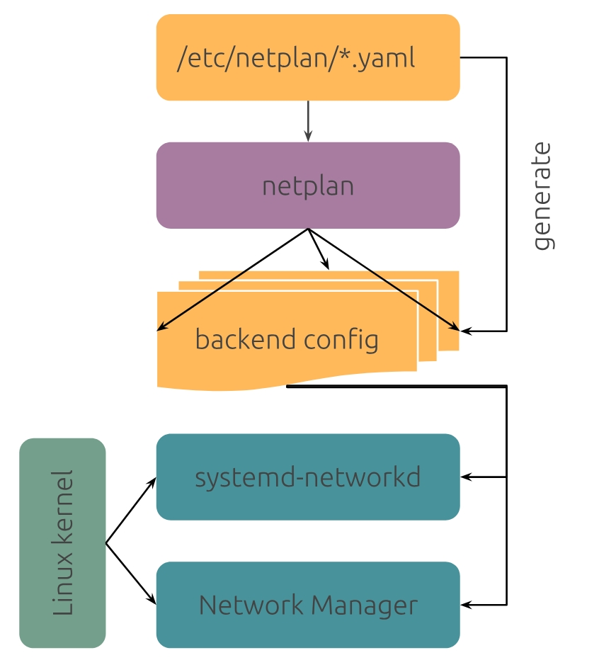

# Netplan

[TOC]

## 概述

The network configuration abstraction renderer  网络配置抽象渲染器

Netplan 是一个实用程序，用于在 Linux 系统上轻松配置网络。只需创建所需网络接口的 YAML 描述，并定义每个接口应执行的操作。From this description Netplan will generate all the necessary configuration for your chosen renderer tool.根据此描述，Netplan 将为您选择的渲染器工具生成所有必要的配置。

Netplan 是 Ubuntu 家族的一员。

Netplan 满足了在 YAML 中跨多功能服务器、桌面、云或物联网安装进行简单、描述性网络配置的需求。

对于想要使用通用网络配置的 Linux 系统的管理员来说，它非常有用，可以控制不同的后端，如 NetworkManager 或 systemd-networkd。

## 工作原理

Netplan reads network configuration from `/etc/netplan/*.yaml` which are written by administrators, installers, cloud image  instantiations, or other OS deployments.
Netplan 读取由管理员、安装人员、云镜像实例化或其他操作系统部署编写的网络配置 `/etc/netplan/*.yaml` 。在启动的早期阶段，Netplan 会在 `/run` 生成特定于后端的配置文件，以将设备的控制权移交给特定的网络守护进程。

Netplan 目前可以使用这些受支持的渲染器：

- [NetworkManager](https://help.ubuntu.com/community/NetworkManager)
- [Systemd-networkd](http://manpages.ubuntu.com/manpages/bionic/man5/systemd.network.5.html)

 

## 配置

如果没有配置，Netplan 将不会执行任何操作。最简单的配置片段（to bring up things via DHCP on workstations通过工作站上的 DHCP 调出内容）如下：

```yaml
network:
  version: 2
  renderer: NetworkManager
```

这将使 Netplan 将控制权移交给 NetworkManager ，NetworkManager 将以默认方式管理所有设备（i.e. any ethernet device will  come up with DHCP once carrier is detected即，一旦检测到载波，任何以太网设备都将启动DHCP）。

When individual interface configurations are given, it will not let devices  automatically come up using DHCP, but each interface needs to be  specified in a file in /etc/netplan/ with its explicit YAML settings for the networkd or NetworkManager backend renderers.
当给出单独的接口配置时，它不会让设备使用 DHCP 自动启动，但每个接口都需要在 /etc/netplan/ 的文件中指定，其中包含 networkd 或 NetworkManager 后端渲染器的显式 YAML 设置。

要配置 Netplan，请将配置文件保存在 `/etc/netplan/` 目录中，并带有 `.yaml` 扩展名（例如 `/etc/netplan/config.yaml` ），然后运行 `sudo netplan apply` 。此命令解析配置并将其应用于系统。写入磁盘的 `/etc/netplan/` 配置在重新启动之间仍然存在。

## 命令

首先在 shell 中键入命令 `netplan` ：

```bash
netplan
```

应看到以下输出：

```bash
You need to specify a command
usage: /usr/sbin/netplan  [-h] [--debug]  ...

Network configuration in YAML

options:
  -h, --help  show this help message and exit
  --debug     Enable debug messages

Available commands:

    help      Show this help message
    apply     Apply current Netplan config to running system
    generate  Generate back end specific configuration files from /etc/netplan/*.yaml
    get       Get a setting by specifying a nested key like "ethernets.eth0.addresses", or "all"
    info      Show available features
    ip        Retrieve IP information from the system
    set       Add new setting by specifying a dotted key=value pair like ethernets.eth0.dhcp4=true
    rebind    Rebind SR-IOV virtual functions of given physical functions to their driver
    status    Query networking state of the running system
    try       Try to apply a new Netplan config to running system, with automatic rollback
```

Netplan 使用一组子命令来驱动其行为：

- **netplan generate**
  
  使用 `/etc/netplan` 生成渲染器所需的配置。
  
- **netplan apply**
  
  应用渲染器的所有配置，并根据需要重新启动它们。
  
- **netplan try**
  
  应用配置并等待用户确认;如果网络中断或未进行确认，将回滚。

### 显示当前的配置

运行以下 `netplan get` 命令：

```bash
netplan get
```

应看到类似于下面的输出：

```yaml
network:
  version: 2
  ethernets:
    enp5s0:
      dhcp4: true
```

这意味着：

- 有一个以太网接口叫做 `enp5s0` 。
- DHCP is enabled for the IPv4 protocol on `enp5s0`.
  `enp5s0` 上为 IPv4 协议启用了 DHCP。

### 显示当前网络配置

Netplan 0.106 引入了 `netplan status` 命令。该命令显示系统的当前网络配置。

```bash
netplan status --all
```

应看到类似于下面的输出：

```bash
     Online state: online
    DNS Addresses: 127.0.0.53 (stub)
       DNS Search: lxd

●  1: lo ethernet UNKNOWN/UP (unmanaged)
      MAC Address: 00:00:00:00:00:00
        Addresses: 127.0.0.1/8
                   ::1/128
           Routes: ::1 metric 256

●  2: enp5s0 ethernet UP (networkd: enp5s0)
      MAC Address: 00:16:3e:13:ae:10 (Red Hat, Inc.)
        Addresses: 10.86.126.221/24 (dhcp)
                   fd42:bc43:e20e:8cf7:216:3eff:fe13:ae10/64
                   fe80::216:3eff:fe13:ae10/64 (link)
    DNS Addresses: 10.86.126.1
                   fe80::216:3eff:feab:beb9
       DNS Search: lxd
           Routes: default via 10.86.126.1 from 10.86.126.221 metric 100 (dhcp)
                   10.86.126.0/24 from 10.86.126.221 metric 100 (link)
                   10.86.126.1 from 10.86.126.221 metric 100 (dhcp, link)
                   fd42:bc43:e20e:8cf7::/64 metric 100 (ra)
                   fe80::/64 metric 256
                   default via fe80::216:3eff:feab:beb9 metric 100 (ra)

●  3: enp6s0 ethernet DOWN (unmanaged)
      MAC Address: 00:16:3e:0c:97:8a (Red Hat, Inc.)
```

### 检查 Netplan 配置文件

Netplan 配置存储在 `/etc/netplan` 目录中的 YAML 格式文件中。要显示目录的内容，请运行：

```bash
ls -1 /etc/netplan/
```

如果系统是使用 `cloud-init` 进行初始化的，可以在 `50-cloud-init.yaml` 文件中找到初始 Netplan 配置：

```bash
cat /etc/netplan/50-cloud-init.yaml
```

应看到类似于以下内容的输出：

```yaml
# This file is generated from information provided by the datasource.  Changes
# to it will not persist across an instance reboot.  To disable cloud-init's
# network configuration capabilities, write a file
# /etc/cloud/cloud.cfg.d/99-disable-network-config.cfg with the following:
# network: {config: disabled}
network:
    version: 2
    ethernets:
        enp5s0:
            dhcp4: true
```

此配置文件是在系统初始化时由该 `cloud-init` 工具自动生成的。如文件注释中所述，对此文件的直接更改不会保留。

### 创建和修改 Netplan 配置

有两种方法可以创建或修改 Netplan 配置：

- 使用 `netplan set` 命令
- 手动编辑 YAML 配置文件

### 应用新的 Netplan 配置

新的或修改的 Netplan 设置需要先应用，然后才能在正在运行的系统上生效。

> **注意：**
> 使用 `netplan set` 命令修改配置或直接编辑（创建）Netplan YAML 配置文件不会自动将新设置应用于正在运行的系统。

创建新配置后，请按照以下步骤应用设置并确认它们已生效。

显示网络接口的当前状态：

```bash
ip address show enp6s0
```

Where `enp6s0` is the interface you wish to display status for. 
您希望显示其状态的界面在哪里 `enp6s0` 。应看到类似于下面的输出：

```bash
3: enp6s0: <BROADCAST,MULTICAST> mtu 1500 qdisc noop state DOWN group default qlen 1000
    link/ether 00:16:3e:0c:97:8a brd ff:ff:ff:ff:ff:ff
```

此接口没有 IP 地址，其状态为 `DOWN` 。

应用新的 Netplan 配置：

```bash
netplan apply
```

使用以下两种方法之一再次检查 `enp6s0` 接口的状态：

- 使用 `ip` 工具：

  ```bash
  ip address show enp6s0
  ```

  应看到类似于以下内容的输出：

  ```bash
  3: enp6s0: <BROADCAST,MULTICAST,UP,LOWER_UP> mtu 1500 qdisc mq state UP group default qlen 1000
      link/ether 00:16:3e:0c:97:8a brd ff:ff:ff:ff:ff:ff
      inet 10.33.59.157/24 metric 100 brd 10.33.59.255 scope global dynamic enp6s0
         valid_lft 3589sec preferred_lft 3589sec
  ```

- 使用 `netplan status` 命令：

  ```bash
  netplan status enp6s0
  ```

  应看到类似于以下内容的输出：

  ```bash
       Online state: online
      DNS Addresses: 127.0.0.53 (stub)
         DNS Search: lxd
  
  ●  3: enp6s0 ethernet UP (networkd: enp6s0)
        MAC Address: 00:16:3e:0c:97:8a (Red Hat, Inc.)
          Addresses: 10.33.59.157/24 (dhcp)
      DNS Addresses: 10.33.59.1
         DNS Search: lxd
             Routes: default via 10.33.59.1 from 10.33.59.157 metric 100 (dhcp)
                     10.33.59.0/24 from 10.33.59.157 metric 100 (link)
                     10.33.59.1 from 10.33.59.157 metric 100 (dhcp, link)
  
  2 inactive interfaces hidden. Use "--all" to show all.
  ```

## 示例

对于下面的每个示例，请使用适用的 `renderer` 。例如，对于 Ubuntu 桌面， `renderer` 通常是 `NetworkManager` 。对于 Ubuntu Server，它是 `networkd` 。

### 使用 DHCP 启用网络接口

对于简单的配置更改，使用 `netplan set` 命令。在下面的示例中，将创建一个名为 `second-interface.yaml` 的新 YAML 文件，该文件仅包含启用第二个网络接口所需的配置。

要创建名为 `enp6s0` 的第二个网络接口，请运行：

```bash
netplan set --origin-hint second-interface ethernets.enp6s0.dhcp4=true
```

命令行参数 `--origin-hint` 设置存储配置的文件的名称。

列出目录中 `/etc/netplan` 的文件：

```bash
ls -1 /etc/netplan
```

应该看到自动生成的 `cloud-init` 文件和一个名为 `second-interface.yaml` 

```bash
50-cloud-init.yaml
second-interface.yaml
```

查看文件内容：

```yaml
network:
  version: 2
  ethernets:
    enp6s0:
      dhcp4: true
```

请注意，它类似于 `cloud-init` 生成的配置文件。

使用以下方法 `netplan get` 检查完整配置：

```bash
netplan get
```

应该看到类似于下面的输出，其中包含两个以太网接口：

```yaml
network:
  version: 2
  ethernets:
    enp5s0:
      dhcp4: true
    enp6s0:
      dhcp4: true
```

接口配置已创建。

### 禁用 IPv6

对于更复杂的设置，可以手动编辑现有配置文件或创建新的配置文件。

例如，要在网络接口上禁用自动 IPv6 配置，请编辑 `/etc/netplan/second-interface.yaml` 该文件：

将以下行添加到接口的配置部分：

```yaml
accept-ra: false
link-local: []
```

完成后，整个 `second-interface.yaml` 配置应如下所示：

```yaml
network:
  version: 2
  ethernets:
    enp6s0:
      dhcp4: true
      accept-ra: false
      link-local: []
```

使用此新配置时，网络配置后端（在本例为 `systemd-networkd` ）不接受路由通告，也不会将 `link-local` 地址添加到接口。

使用 `netplan get` 命令检查新配置：

```bash
netplan get
```

应该看到类似于以下内容的内容：

```yaml
network:
  version: 2
  ethernets:
    enp5s0:
      dhcp4: true
    enp6s0:
      dhcp4: true
      accept-ra: false
      link-local: []
```

已为配置中的接口禁用 IPv6。

#  如何在接口上启用 DHCP ¶

To let the interface named `enp3s0` get an address via DHCP, create a YAML file with the following:
要让名为 `enp3s0` 的接口通过 DHCP 获取地址，请使用以下内容创建一个 YAML 文件：

```
network:
  version: 2
  renderer: networkd
  ethernets:
    enp3s0:
      dhcp4: true
```

# How to configure a static IP address on an interface

#  如何在接口上配置静态 IP 地址 ¶

To set a static IP address, use the `addresses` keyword, which takes a list of (IPv4 or IPv6) addresses along with the subnet prefix length (e.g. /24).
要设置静态 IP 地址，请使用 `addresses` 关键字，该关键字采用（IPv4 或 IPv6）地址列表以及子网前缀长度（例如 /24）。

```
network:
  version: 2
  renderer: networkd
  ethernets:
    enp3s0:
      addresses:
        - 10.10.10.2/24
```

# How to configure DNS servers and search domains

#  如何配置 DNS 服务器和搜索域 ¶

The lists of search domains and DNS server IP addresses can be defined as below:
搜索域和 DNS 服务器 IP 地址的列表可以定义如下：

```
network:
  version: 2
  renderer: networkd
  ethernets:
    enp3s0:
      addresses:
        - 10.10.10.2/24
      nameservers:
        search:
          - "mycompany.local"
        addresses:
          - 10.10.10.253
          - 8.8.8.8
```

# How to connect multiple interfaces with DHCP

#  如何使用DHCP连接多个接口 ¶

DHCP can be used with multiple interfaces. The metrics for the routes  acquired from DHCP can be changed with the use of DHCP overrides.
DHCP 可以与多个接口一起使用。可以使用 DHCP 覆盖来更改从 DHCP 获取的路由的指标。

In this example, `enp5s0` is preferred over `enp6s0`, as it has a lower route metric:
在此示例中， `enp5s0` 优先于 `enp6s0` ，因为它具有较低的路由指标：

```
network:
  version: 2
  ethernets:
    enp5s0:
      dhcp4: yes
      dhcp4-overrides:
        route-metric: 100
    enp6s0:
      dhcp4: yes
      dhcp4-overrides:
        route-metric: 200
```

# How to connect to an open wireless network

#  如何连接到开放的无线网络 ¶

For open wireless networks, Netplan only requires that the access point is defined. In this example, `opennetwork` is the network SSID:
对于开放的无线网络，Netplan只需要定义接入点。在此示例中， `opennetwork` 是网络 SSID：

```
network:
  version: 2
  wifis:
    wl0:
      access-points:
        opennetwork: {}
      dhcp4: yes
```

# How to configure your computer to connect to your home Wi-Fi network

#  如何配置您的计算机以连接到您的家庭 Wi-Fi 网络 ¶

If all you need is to connect to your local domestic Wi-Fi network, use the configuration below:
如果您只需要连接到本地的国内 Wi-Fi 网络，请使用以下配置：

```
network:
  version: 2
  renderer: NetworkManager
  wifis:
    wlp2s0b1:
      dhcp4: yes
      access-points:
        "network_ssid_name":
          password: "**********"
```

# How to connect to a WPA Personal wireless network without DHCP

#  如何在没有DHCP的情况下连接到WPA个人无线网络 ¶

For private wireless networks, the access point name and password must be specified:
对于专用无线网络，必须指定接入点名称和密码：

```
network:
  version: 2
  renderer: networkd
  wifis:
    wlp2s0b1:
      dhcp4: no
      dhcp6: no
      addresses: [192.168.0.21/24]
      nameservers:
        addresses: [192.168.0.1, 8.8.8.8]
      access-points:
        "network_ssid_name":
          password: "**********"
      routes:
        - to: default
          via: 192.168.0.1
```

# How to connect to WPA Enterprise wireless networks with EAP+TTLS

#  如何使用 EAP+TTLS 连接到 WPA 企业无线网络 ¶

```
network:
  version: 2
  wifis:
    wl0:
      access-points:
        workplace:
          auth:
            key-management: eap
            method: ttls
            anonymous-identity: "@internal.example.com"
            identity: "joe@internal.example.com"
            password: "v3ryS3kr1t"
      dhcp4: yes
```

# How to connect to WPA Enterprise wireless networks with EAP+TLS

#  如何使用 EAP+TLS 连接到 WPA 企业无线网络 ¶

```
network:
  version: 2
  wifis:
    wl0:
      access-points:
        university:
          auth:
            key-management: eap
            method: tls
            anonymous-identity: "@cust.example.com"
            identity: "cert-joe@cust.example.com"
            ca-certificate: /etc/ssl/cust-cacrt.pem
            client-certificate: /etc/ssl/cust-crt.pem
            client-key: /etc/ssl/cust-key.pem
            client-key-password: "d3cryptPr1v4t3K3y"
      dhcp4: yes
```

Many different modes of encryption are supported. See the [Netplan reference](https://netplan.readthedocs.io/en/stable/reference/) page.
支持许多不同的加密模式。请参阅 Netplan 参考页。

# How to use multiple addresses on a single interface

#  如何在单个接口上使用多个地址 ¶

The `addresses` keyword can take a list of addresses to assign to an interface. You can also defined a `label` for each address:
关键字 `addresses` 可以采用要分配给接口的地址列表。您还可以为每个地址定义一个 `label` ：

```
network:
  version: 2
  renderer: networkd
  ethernets:
    enp3s0:
      addresses:
        - 10.100.1.37/24
        - 10.100.1.38/24:
            label: "enp3s0:0"
        - 10.100.1.39/24:
            label: "enp3s0:some-label"
```

# How to use multiple addresses with multiple gateways

#  如何在多个网关中使用多个地址 ¶

Similar to the example above, interfaces with multiple addresses can be configured with multiple gateways.
与上述示例类似，具有多个地址的接口可以配置多个网关。

```
network:
  version: 2
  renderer: networkd
  ethernets:
    enp3s0:
      addresses:
        - 10.0.0.10/24
        - 11.0.0.11/24
      routes:
        - to: default
          via: 10.0.0.1
          metric: 200
        - to: default
          via: 11.0.0.1
          metric: 300
```

We configure individual routes to default (or 0.0.0.0/0) using the address of the gateway for the subnet. The `metric` value should be adjusted so the routing happens as expected.
我们使用子网的网关地址将单个路由配置为默认值（或 0.0.0.0/0）。应调整该 `metric` 值，以便路由按预期进行。

DHCP can be used to receive one of the IP addresses for the interface. In  this case, the default route for that address will be automatically  configured with a `metric` value of 100.
DHCP 可用于接收接口的 IP 地址之一。在这种情况下，该地址的默认路由将自动配置为 `metric` 值 100。

# How to use NetworkManager as a renderer

#  如何使用 NetworkManager 作为渲染器 ¶

Netplan supports both `networkd` and NetworkManager as back ends. You can specify which network back end should be used to configure particular devices by using the `renderer` key. You can also delegate all configuration of the network to NetworkManager itself by specifying only the `renderer` key:
Netplan 支持将 NetManager 和 `networkd` NetworkManager 作为后端。您可以使用密钥 `renderer` 指定应使用哪个网络后端来配置特定设备。您还可以通过仅指定 `renderer` 键将网络的所有配置委托给 NetworkManager 本身：

```
network:
  version: 2
  renderer: NetworkManager
```

# How to configure interface bonding

#  如何配置接口绑定 ¶

Bonding is configured by declaring a bond interface with a list of physical interfaces and a bonding mode:
绑定是通过声明具有物理接口列表和绑定模式的绑定接口来配置的：

```
network:
  version: 2
  renderer: networkd
  bonds:
    bond0:
      dhcp4: yes
      interfaces:
        - enp3s0
        - enp4s0
      parameters:
        mode: active-backup
        primary: enp3s0
```

# How to configure multiple bonds

#  如何配置多个绑定 ¶

Below is an example of a system acting as a router with various bonded  interfaces and different types. Note the ‘optional: true’ key  declarations that allow booting to occur without waiting for those  interfaces to activate fully.
下面是一个系统示例，它充当具有各种绑定接口和不同类型的路由器。请注意 'optional： true' 键声明，该键声明允许在不等待这些接口完全激活的情况下进行启动。

```
network:
  version: 2
  renderer: networkd
  ethernets:
    enp1s0:
      dhcp4: no
    enp2s0:
      dhcp4: no
    enp3s0:
      dhcp4: no
      optional: true
    enp4s0:
      dhcp4: no
      optional: true
    enp5s0:
      dhcp4: no
      optional: true
    enp6s0:
      dhcp4: no
      optional: true
  bonds:
    bond-lan:
      interfaces: [enp2s0, enp3s0]
      addresses: [192.168.93.2/24]
      parameters:
        mode: 802.3ad
        mii-monitor-interval: 1
    bond-wan:
      interfaces: [enp1s0, enp4s0]
      addresses: [192.168.1.252/24]
      nameservers:
        search: [local]
        addresses: [8.8.8.8, 8.8.4.4]
      parameters:
        mode: active-backup
        mii-monitor-interval: 1
        gratuitious-arp: 5
      routes:
        - to: default
          via: 192.168.1.1
    bond-conntrack:
      interfaces: [enp5s0, enp6s0]
      addresses: [192.168.254.2/24]
      parameters:
        mode: balance-rr
        mii-monitor-interval: 1
```

# How to configure network bridges

#  如何配置网桥 ¶

Use the following configuration to create a simple bridge consisting of a single device that uses DHCP:
使用以下配置创建由使用 DHCP 的单个设备组成的简单网桥：

```
network:
  version: 2
  renderer: networkd
  ethernets:
    enp3s0:
      dhcp4: no
  bridges:
    br0:
      dhcp4: yes
      interfaces:
        - enp3s0
```

# How to create a bridge with a VLAN for libvirtd

#  如何使用 libvirtd 的 VLAN 创建网桥 ¶

To get libvirtd to use a specific bridge with a tagged VLAN, while  continuing to provide an untagged interface as well would involve:
要使 libvirtd 使用带有标记 VLAN 的特定网桥，同时继续提供未标记的接口，将涉及：

```
network:
  version: 2
  renderer: networkd
  ethernets:
    enp0s25:
      dhcp4: true
  bridges:
    br0:
      addresses: [ 10.3.99.25/24 ]
      interfaces: [ vlan15 ]
  vlans:
    vlan15:
      accept-ra: no
      id: 15
      link: enp0s25
```

Then libvirtd would be configured to use this bridge by adding the following content to a new XML file under `/etc/libvirt/qemu/networks/`. The name of the bridge in the <bridge> tag as well as in  <name> need to match the name of the bridge device configured  using Netplan:
然后，通过将以下内容添加到下面的新 XML 文件， `/etc/libvirt/qemu/networks/` 将 libvirtd 配置为使用此桥。标签中的网桥名称，以及需要与使用 Netplan 配置的网桥设备名称匹配：

```
<network>
    <name>br0</name>
    <bridge name='br0'/>
    <forward mode="bridge"/>
</network>
```

# How to create VLANs

#  如何创建 VLAN ¶

To configure multiple VLANs with renamed interfaces:
要使用重命名的接口配置多个 VLAN，请执行以下操作：

```
network:
  version: 2
  renderer: networkd
  ethernets:
    mainif:
      match:
        macaddress: "de:ad:be:ef:ca:fe"
      set-name: mainif
      addresses: [ "10.3.0.5/23" ]
      nameservers:
        addresses: [ "8.8.8.8", "8.8.4.4" ]
        search: [ example.com ]
      routes:
        - to: default
          via: 10.3.0.1
  vlans:
    vlan15:
      id: 15
      link: mainif
      addresses: [ "10.3.99.5/24" ]
    vlan10:
      id: 10
      link: mainif
      addresses: [ "10.3.98.5/24" ]
      nameservers:
        addresses: [ "127.0.0.1" ]
        search: [ domain1.example.com, domain2.example.com ]
```

# How to use a directly connected gateway

#  如何使用直连网关 ¶

This allows setting up a default route, or any route, using the “on-link”  keyword where the gateway is an IP address that is directly connected to the network even if the address does not match the subnet configured on the interface.
这允许使用“on-link”关键字设置默认路由或任何路由，其中网关是直接连接到网络的 IP 地址，即使该地址与接口上配置的子网不匹配。

```
network:
  version: 2
  renderer: networkd
  ethernets:
    ens3:
      addresses: [ "10.10.10.1/24" ]
      routes:
        - to: default # or 0.0.0.0/0
          via: 9.9.9.9
          on-link: true
```

For IPv6 the configuration would be very similar:
对于 IPv6，配置将非常相似：

```
network:
    version: 2
    renderer: networkd
    ethernets:
        ens3:
            addresses: [ "2001:cafe:face:beef::dead:dead/64" ]
            routes:
             - to: default # or "::/0"
               via: "2001:cafe:face::1"
               on-link: true
```

# How to configure source routing

#  如何配置源路由 ¶

In the example below, ens3 is on the 192.168.3.0/24 network and ens5 is on the 192.168.5.0/24 network. This enables clients on either network to  connect to the other and allow the response to come from the correct  interface.
在下面的示例中，ens3 位于 192.168.3.0/24 网络上，ens5 位于 192.168.5.0/24 网络上。这使任一网络上的客户端都能连接到另一个网络，并允许响应来自正确的接口。

Furthermore, the default route is still assigned to ens5 allowing any other traffic to go through it.
此外，默认路由仍分配给 ens5，允许任何其他流量通过它。

```
network:
  version: 2
  renderer: networkd
  ethernets:
    ens3:
      addresses:
        - 192.168.3.30/24
      dhcp4: no
      routes:
        - to: 192.168.3.0/24
          via: 192.168.3.1
          table: 101
      routing-policy:
        - from: 192.168.3.0/24
          table: 101
    ens5:
      addresses:
        - 192.168.5.24/24
      dhcp4: no
      routes:
        - to: default
          via: 192.168.5.1
        - to: 192.168.5.0/24
          via: 192.168.5.1
          table: 102
      routing-policy:
        - from: 192.168.5.0/24
          table: 102
```

# How to configure a loopback interface

#  如何配置环回接口 ¶

`networkd` does not allow creating new loopback devices, but a user can add new addresses to the standard loopback interface, `lo`, in order to have it considered a valid address on the machine as well as for custom routing:
 `networkd` 不允许创建新的环回设备，但用户可以向标准环回接口添加新地址， `lo` 以便将其视为计算机上的有效地址以及自定义路由：

```
network:
  version: 2
  renderer: networkd
  ethernets:
    lo:
      addresses: [ "127.0.0.1/8", "::1/128", "7.7.7.7/32" ]
```

# How to integrate with Windows DHCP Server

#  如何与Windows DHCP服务器集成 ¶

For networks where DHCP is provided by a Windows Server using the `dhcp-identifier` keyword allows for interoperability:
对于由 Windows Server 提供 DHCP 的网络，使用关键字 `dhcp-identifier` 可实现互操作性：

```
network:
  version: 2
  ethernets:
    enp3s0:
      dhcp4: yes
      dhcp-identifier: mac
```

# How to connect to an IPv6 over IPv4 tunnel

#  如何连接到 IPv6 over IPv4 隧道 ¶

Here, 1.1.1.1 is the client’s own IP address; 2.2.2.2 is the remote server’s  IPv4 address, “2001:dead:beef::2/64” is the client’s IPv6 address as  defined by the tunnel, and “2001:dead:beef::1” is the remote server’s  IPv6 address.
这里，1.1.1.1 是客户端自己的 IP 地址;2.2.2.2 是远程服务器的 IPv4 地址，“2001：dead：beef：：2/64”是隧道定义的客户端的 IPv6 地址，“2001：dead：beef：：1”是远程服务器的 IPv6 地址。

Finally, “2001:cafe:face::1/64” is an address for the client within the routed IPv6 prefix:
最后，“2001：café：face：：1/64”是路由 IPv6 前缀内客户端的地址：

```
network:
  version: 2
  ethernets:
    eth0:
      addresses:
        - 1.1.1.1/24
        - "2001:cafe:face::1/64"
      routes:
        - to: default
          via: 1.1.1.254
  tunnels:
    he-ipv6:
      mode: sit
      remote: 2.2.2.2
      local: 1.1.1.1
      addresses:
        - "2001:dead:beef::2/64"
      routes:
        - to: default
          via: "2001:dead:beef::1"
```

# How to configure SR-IOV Virtual Functions

#  如何配置 SR-IOV 虚拟功能 ¶

For SR-IOV network cards, it is possible to dynamically allocate Virtual  Function interfaces for every configured Physical Function. In Netplan, a VF is defined by having a link: property pointing to the parent PF.
对于 SR-IOV 网卡，可以为每个配置的物理功能动态分配虚拟功能接口。在 Netplan 中，VF 是通过具有指向父 PF 的 link： 属性来定义的。

```
network:
  version: 2
  ethernets:
    eno1:
      mtu: 9000
    enp1s16f1:
      link: eno1
      addresses : [ "10.15.98.25/24" ]
    vf1:
      match:
        name: enp1s16f[2-3]
      link: eno1
      addresses : [ "10.15.99.25/24" ]
```

# How to connect two systems with a WireGuard VPN

#  如何使用 WireGuard VPN 连接两个系统 ¶

Generate the private and public keys in the first peer. Run the following commands with administrator privileges:
在第一个对等体中生成私钥和公钥。使用管理员权限运行以下命令：

```
wg genkey > private.key
wg pubkey < private.key > public.key

cat private.key
UMjI9WbobURkCDh2RT8SRM5osFI7siiR/sPOuuTIDns=

cat public.key
EdNnZ1/2OJZ9HcScSVcwDVUsctCkKQ/xzjEyd3lZFFs=
```

Do the same in the second peer:
在第二个对等体中执行相同的操作：

```
wg genkey > private.key
wg pubkey < private.key > public.key

cat private.key
UAmjvLDVuV384OWFJkmI4bG8AIAZAfV7LarshnV3+lc=

cat public.key
AIm+QeCoC23zInKASmhu6z/3iaT0R2IKraB7WwYB5ms=
```

Use the following configuration in the `first peer` (replace the keys and IP addresses as needed):
在（ `first peer` 根据需要替换密钥和 IP 地址）中使用以下配置：

```
network:
  tunnels:
    wg0:
      mode: wireguard
      port: 51820
      key: UMjI9WbobURkCDh2RT8SRM5osFI7siiR/sPOuuTIDns=
      addresses:
        - 172.16.0.1/24
      peers:
        - allowed-ips: [172.16.0.0/24]
          endpoint: 10.86.126.56:51820
          keys:
            public: AIm+QeCoC23zInKASmhu6z/3iaT0R2IKraB7WwYB5ms=
```

In the YAML file above, `key` is the first peer’s `private key` and `public` is the second peer’s `public key`. `endpoint` is the `second peer` IP address.
在上面的 YAML 文件中， `key` 是第一个对等体的 `private key` ， `public` 也是第二个对等体 `public key` 的。 `endpoint` 是 `second peer` IP 地址。

Use the following configuration in the `second peer`:
在 `second peer` 中使用以下配置：

```
network:
  tunnels:
    wg0:
      mode: wireguard
      port: 51820
      key: UAmjvLDVuV384OWFJkmI4bG8AIAZAfV7LarshnV3+lc=
      addresses:
        - 172.16.0.2/24
      peers:
        - allowed-ips: [172.16.0.0/24]
          endpoint: 10.86.126.40:51820
          keys:
            public: EdNnZ1/2OJZ9HcScSVcwDVUsctCkKQ/xzjEyd3lZFFs=
```

In the YAML file above, `key` is the second peer’s `private key` and `public` is the first peer’s `public key`. `endpoint` is the `first peer's` IP address.
在上面的 YAML 文件中， `key` 是第二个对等体的 `private key` ， `public` 也是第一个对等体 `public key` 的。 `endpoint` 是 `first peer's` IP 地址。

# How to connect your home computer to a cloud instance with a WireGuard VPN

#  如何使用 WireGuard VPN 将您的家庭计算机连接到云实例 ¶

Follow the same steps from the previous how-to to generate the necessary keys.
按照上一操作方法中的相同步骤生成必要的密钥。

The difference here is that your computer is likely behind one or more  devices doing NAT so you probably don’t have a static public IP to use  as endpoint in the remote system.
这里的区别在于，您的计算机可能位于一个或多个执行 NAT 的设备后面，因此您可能没有静态公共 IP 用作远程系统中的端点。

Use the following configuration in your computer:
在您的计算机中使用以下配置：

```
network:
  tunnels:
    wg0:
      mode: wireguard
      port: 51821
      key: UMjI9WbobURkCDh2RT8SRM5osFI7siiR/sPOuuTIDns=
      addresses:
        - 172.17.0.1/24
      peers:
        - allowed-ips: [172.17.0.0/24]
          endpoint: 54.234.x.y:51821
          keys:
            public: AIm+QeCoC23zInKASmhu6z/3iaT0R2IKraB7WwYB5ms=
```

Again, `key` is your private key and `public` is the remote system’s public key. The `endpoint` is the public IP address of your instance.
同样， `key` 是您的私钥，并且是 `public` 远程系统的公钥。是 `endpoint` 实例的公有 IP 地址。

In the remote instance you just need to omit the `endpoint`.
在远程实例中，您只需省略 `endpoint` .

```
network:
  tunnels:
    wg0:
      mode: wireguard
      port: 51821
      key: UAmjvLDVuV384OWFJkmI4bG8AIAZAfV7LarshnV3+lc=
      addresses:
        - 172.17.0.2/24
      peers:
        - allowed-ips: [172.17.0.0/24]
          keys:
            public: EdNnZ1/2OJZ9HcScSVcwDVUsctCkKQ/xzjEyd3lZFFs=
```

Don’t forget to allow the UDP port `51821` in your instance’s security group.
不要忘记在实例的安全组中允许 UDP 端口 `51821` 。

After applying your configuration you should be able to reach your remote instance through the IP address `172.17.0.2`.
应用配置后，您应该能够通过 IP 地址 `172.17.0.2` 访问远程实例。

# How to use static IP addresses

#  如何使用静态 IP 地址 ¶

Note 注意

These instructions assume a system setup based on the example configuration outlined in the [Netplan tutorial](https://netplan.readthedocs.io/en/stable/netplan-tutorial/).
这些说明假定系统设置基于 Netplan 教程中概述的示例配置。

In this exercise you’re going to add an static IP address to the second interface with a default route and DNS configuration.
在本练习中，您将使用默认路由和 DNS 配置向第二个接口添加静态 IP 地址。

Edit the file `/etc/netplan/second-interface.yaml` created previously. Change it so it will look like this:
编辑之前创建的文件 `/etc/netplan/second-interface.yaml` 。更改它，使其看起来像这样：

```
network:
  version: 2
  ethernets:
    enp6s0:
      dhcp4: false
      dhcp6: false
      accept-ra: false
      link-local: []
      addresses:
        - 172.16.0.1/24
      routes:
        - to: default
          via: 172.16.0.254
      nameservers:
        search:
          - netplanlab.local
        addresses:
          - 172.16.0.254
          - 172.16.0.253
```

The configuration above is what you’d expect in a desktop system for  example. It defines the interface’s IP address statically as `172.16.0.1/24`, a default route via gateway `172.16.0.254` and the DNS search domain and name servers.
例如，上述配置是您在桌面系统中所期望的配置。它静态地将接口的 IP 地址定义为 `172.16.0.1/24` ，通过网关 `172.16.0.254` 和 DNS 搜索域和名称服务器的默认路由。

Now use `netplan get` to visualise all your network configuration:
现在用于 `netplan get` 可视化您的所有网络配置：

```
netplan get
```

You should see an output similar to this:
您应看到类似于以下内容的输出：

```
network:
  version: 2
  ethernets:
    enp5s0:
      dhcp4: true
    enp6s0:
      addresses:
      - "172.16.0.1/24"
      nameservers:
        addresses:
        - 172.16.0.254
        - 172.16.0.253
        search:
        - netplanlab.local
      dhcp4: false
      dhcp6: false
      accept-ra: false
      routes:
      - to: "default"
        via: "172.16.0.254"
      link-local: []
```

You will notice that it might be a little different than what you have  defined in the YAML file. Some things might be in a different order for  example.
您会注意到它可能与您在 YAML 文件中定义的略有不同。例如，有些事情的顺序可能不同。

The reason for that is that `netplan get` loads and parses your configuration before outputting it, and the YAML  parsing engine used by Netplan might shuffle things around. Although,  what you see from `netplan get` is equivalent to what you have in the file.
这样做的原因是， `netplan get` 在输出配置之前会加载并解析您的配置，而 Netplan 使用的 YAML 解析引擎可能会打乱乱乱象。虽然，您从中看到 `netplan get` 的内容等同于文件中的内容。

Now use `netplan apply` to apply the new configuration:
现在用于 `netplan apply` 应用新配置：

```
netplan apply
```

And check the interface’s new state:
并检查接口的新状态：

```
ip address show dev enp6s0
```

You should see something similar to this:
您应该看到类似于以下内容的内容：

```
3: enp6s0: <BROADCAST,MULTICAST,UP,LOWER_UP> mtu 1500 qdisc mq state UP group default qlen 1000
    link/ether 00:16:3e:0c:97:8a brd ff:ff:ff:ff:ff:ff
    inet 172.16.0.1/24 brd 172.16.0.255 scope global enp6s0
       valid_lft forever preferred_lft forever
```

Check the routes associated to the interface:
检查与接口关联的路由：

```
ip route show dev enp6s0
```

You should see something similar to this:
您应该看到类似于以下内容的内容：

```
default via 172.16.0.254 proto static
172.16.0.0/24 proto kernel scope link src 172.16.0.1
```

And check the DNS configuration:
并检查DNS配置：

```
netplan status enp6s0
```

You should see something similar to this:
您应该看到类似于以下内容的内容：

```
     Online state: online
    DNS Addresses: 127.0.0.53 (stub)
       DNS Search: netplanlab.local
                   lxd

●  3: enp6s0 ethernet UP (networkd: enp6s0)
      MAC Address: 00:16:3e:0c:97:8a (Red Hat, Inc.)
        Addresses: 172.16.0.1/24
    DNS Addresses: 172.16.0.254
                   172.16.0.253
       DNS Search: netplanlab.local
           Routes: default via 172.16.0.254 (static)
                   172.16.0.0/24 from 172.16.0.1 (link)

2 inactive interfaces hidden. Use "--all" to show all.
```

# How to match the interface by MAC address

#  如何通过MAC地址匹配接口¶

Note 注意

These instructions assume a system setup based on the example configuration outlined in the [Netplan tutorial](https://netplan.readthedocs.io/en/stable/netplan-tutorial/).
这些说明假定系统设置基于 Netplan 教程中概述的示例配置。

Sometimes you can’t rely on the interface names to apply configuration to them.  Changes in the system might cause a change in their names, such as when  you move an interface card from a PCI slot to another.
有时，您无法依赖接口名称来对它们应用配置。系统中的更改可能会导致其名称更改，例如，当您将接口卡从一个 PCI 插槽移动到另一个插槽时。

In this exercise you will use the `match` keyword to locate the device based on its MAC address and also set a more meaningful name to the interface.
在本练习中，您将使用关键字 `match` 根据设备的 MAC 地址定位设备，并为接口设置更有意义的名称。

Let’s assume that your second interface is connected to the Netplan ISP  internet provider company and you want to identify it as such.
假设您的第二个接口连接到Netplan ISP互联网提供商公司，并且您希望将其识别为此类接口。

First identify its MAC address:
首先确定其MAC地址：

```
ip link show enp6s0
```

In the output, the MAC address is the number in front of the `link/ether` property.
在输出中，MAC 地址是 `link/ether` 属性前面的数字。

```
3: enp6s0: <BROADCAST,MULTICAST,UP,LOWER_UP> mtu 1500 qdisc mq state UP mode DEFAULT group default qlen 1000
    link/ether 00:16:3e:0c:97:8a brd ff:ff:ff:ff:ff:ff
```

Edit the file `/etc/netplan/second-interface.yaml` and make the following changes:
编辑文件 `/etc/netplan/second-interface.yaml` 并进行以下更改：

```
network:
  version: 2
  ethernets:
    netplan-isp-interface:
      match:
        macaddress: 00:16:3e:0c:97:8a
      set-name: netplan-isp
      dhcp4: false
      dhcp6: false
      accept-ra: false
      link-local: []
      addresses:
        - 172.16.0.1/24
      routes:
        - to: default
          via: 172.16.0.254
      nameservers:
        search:
          - netplanlab.local
        addresses:
          - 172.16.0.254
          - 172.16.0.253
```

These are the important changes in this exercise:
以下是本练习中的重要更改：

```
  ethernets:
    netplan-isp-interface:
      match:
        macaddress: 00:16:3e:0c:97:8a
      set-name: netplan-isp
```

Note that, as you are now matching the interface by its MAC address, you are free to identify it with a different name. It makes it easier to read  and find information in the YAML file.
请注意，由于您现在通过接口的 MAC 地址匹配接口，因此您可以自由地使用不同的名称来识别它。它使阅读和查找 YAML 文件中的信息变得更加容易。

After changing the file, apply your new configuration:
更改文件后，应用新配置：

```
netplan apply
```

Now list your interfaces:
现在列出您的接口：

```
ip link show
```

As you can see, your interface is now called `netplan-isp`.
如您所见，您的接口现在称为 `netplan-isp` 。

```
1: lo: <LOOPBACK,UP,LOWER_UP> mtu 65536 qdisc noqueue state UNKNOWN mode DEFAULT group default qlen 1000
    link/loopback 00:00:00:00:00:00 brd 00:00:00:00:00:00
2: enp5s0: <BROADCAST,MULTICAST,UP,LOWER_UP> mtu 1500 qdisc mq state UP mode DEFAULT group default qlen 1000
    link/ether 00:16:3e:13:ae:10 brd ff:ff:ff:ff:ff:ff
3: netplan-isp: <BROADCAST,MULTICAST,UP,LOWER_UP> mtu 1500 qdisc mq state UP mode DEFAULT group default qlen 1000
    link/ether 00:16:3e:0c:97:8a brd ff:ff:ff:ff:ff:ff
```

# How to create link aggregation

#  如何创建链接聚合 ¶

Note 注意

These instructions assume a system setup based on the example configuration outlined in the [Netplan tutorial](https://netplan.readthedocs.io/en/stable/netplan-tutorial/).
这些说明假定系统设置基于 Netplan 教程中概述的示例配置。

Let’s suppose now that you need to configure your system to connect to your ISP links via a link aggregation. On Linux you can do that with a `bond` virtual interface.
现在让我们假设您需要将系统配置为通过链路聚合连接到您的 ISP 链路。在 Linux 上，您可以使用 `bond` 虚拟接口来执行此操作。

On Netplan, an interface of type `bond` can be created inside a `bonds` mapping.
在Netplan上，可以在 `bonds` 映射内部创建类型的 `bond` 接口。

Now that the traffic will flow through the link aggregation, you will move all the addressing configuration to the bond itself.
现在，流量将流经链路聚合，您需要将所有寻址配置移动到绑定本身。

You can define a list of interfaces that will be attached to the bond. In our simple scenario, we have a single one.
您可以定义将附加到绑定的接口列表。在我们的简单场景中，我们有一个。

Edit the file `/etc/netplan/second-interface.yaml` and make the following changes:
编辑文件 `/etc/netplan/second-interface.yaml` 并进行以下更改：

```
network:
  version: 2
  ethernets:
    netplan-isp-interface:
      dhcp4: false
      dhcp6: false
      match:
        macaddress: 00:16:3e:0c:97:8a
      set-name: netplan-isp
  bonds:
    isp-bond0:
      interfaces:
        - netplan-isp-interface
      dhcp4: false
      dhcp6: false
      accept-ra: false
      link-local: []
      addresses:
        - 172.16.0.1/24
      routes:
        - to: default
          via: 172.16.0.254
      nameservers:
        search:
          - netplanlab.local
        addresses:
          - 172.16.0.254
          - 172.16.0.253
```

Note that you can reference the interface used in the bond by the name you defined for it in the `ethernets` section.
请注意，您可以通过在 `ethernets` 本节中为其定义的名称来引用绑定中使用的接口。

Now use `netplan apply` to apply your changes
现在用于 `netplan apply` 应用您的更改

```
netplan apply
```

Now your system has a new interface called `isp-bond0`. Use the command `ip address show isp-bond0` or `netplan status` to check its state:
现在，您的系统有一个名为 `isp-bond0` 的新接口。使用命令 `ip address show isp-bond0` 或 `netplan status` 检查其状态：

```
netplan status isp-bond0
```

You should see an output similar to the one below:
您应看到类似于下面的输出：

```
     Online state: online
    DNS Addresses: 127.0.0.53 (stub)
       DNS Search: lxd
                   netplanlab.local

●  4: isp-bond0 bond UP (networkd: isp-bond0)
      MAC Address: b2:6b:19:b1:9a:86
        Addresses: 172.16.0.1/24
    DNS Addresses: 172.16.0.254
                   172.16.0.253
       DNS Search: netplanlab.local
           Routes: default via 172.16.0.254 (static)
                   172.16.0.0/24 from 172.16.0.1 (link)

3 inactive interfaces hidden. Use "--all" to show all.
```

# How to use D-Bus configuration API

#  如何使用 D-Bus 配置 API ¶

See also: 另请参阅：

- [Netplan D-Bus reference Netplan D-Bus 参考](https://netplan.readthedocs.io/en/stable/netplan-dbus/)
- [`busctl` reference `busctl` 参考](https://www.freedesktop.org/software/systemd/man/busctl.html)

Copy the current state from `/{etc,run,lib}/netplan/*.yaml` by creating a new configuration object:
 `/{etc,run,lib}/netplan/*.yaml` 通过创建新的配置对象来复制当前状态：

```
busctl call io.netplan.Netplan /io/netplan/Netplan io.netplan.Netplan Config

o "/io/netplan/Netplan/config/ULJIU0"
```

Read the merged YAML configuration:
读取合并的 YAML 配置：

```
busctl call io.netplan.Netplan /io/netplan/Netplan/config/ULJIU0 \
io.netplan.Netplan.Config Get

s "network:\n  ethernets:\n    eth0:\n      dhcp4: true\n  renderer: networkd\n  version: 2\n"
```

Write a new configuration snippet into `70-snapd.yaml`:
将新的配置片段写入 `70-snapd.yaml` ：

```
busctl call io.netplan.Netplan /io/netplan/Netplan/config/ULJIU0 \
io.netplan.Netplan.Config Set ss "ethernets.eth0={dhcp4: false, dhcp6: true}" "70-snapd"

b true
```

Check the newly written configuration:
检查新编写的配置：

```
busctl call io.netplan.Netplan /io/netplan/Netplan/config/ULJIU0 \
io.netplan.Netplan.Config Get

s "network:\n  ethernets:\n    eth0:\n      dhcp4: false\n      dhcp6: true\n  renderer: networkd\n  version: 2\n"
```

Try to apply the current state of the configuration object:
尝试应用配置对象的当前状态：

```
busctl call io.netplan.Netplan /io/netplan/Netplan/config/ULJIU0 \
io.netplan.Netplan.Config Try u 20

b true
```

Accept the `Try()` state within the 20 seconds timeout, if not it will be auto-rejected:
接受 20 秒超时内 `Try()` 的状态，否则将自动拒绝：

```
busctl call io.netplan.Netplan /io/netplan/Netplan/config/ULJIU0 \
io.netplan.Netplan.Config Apply

b true

[SIGNAL] io.netplan.Netplan /io/netplan/Netplan/config/ULJIU0 io.netplan.Netplan.Config Changed() is triggered
[OBJECT] io.netplan.Netplan /io/netplan/Netplan/config/ULJIU0 is removed from the bus
```

Create a new configuration object and get the merged YAML configuration:
创建新的配置对象并获取合并的 YAML 配置：

```
busctl call io.netplan.Netplan /io/netplan/Netplan io.netplan.Netplan Config

o "/io/netplan/Netplan/config/KC0IU0

busctl call io.netplan.Netplan /io/netplan/Netplan/config/KC0IU0 \
io.netplan.Netplan.Config Get

s "network:\n  ethernets:\n    eth0:\n      dhcp4: false\n      dhcp6: true\n  renderer: networkd\n  version: 2\n"
```

Reject that configuration object again:
再次拒绝该配置对象：

```
busctl call io.netplan.Netplan /io/netplan/Netplan/config/KC0IU0 \
io.netplan.Netplan.Config Cancel

b true

[SIGNAL] io.netplan.Netplan /io/netplan/Netplan/config/KC0IU0 io.netplan.Netplan.Config Changed() is triggered
[OBJECT] io.netplan.Netplan /io/netplan/Netplan/config/KC0IU0 is removed from the bus
```

# How to integrate Netplan with desktop

#  如何将Netplan与桌面集成 ¶

## NetworkManager YAML settings back end

##  NetworkManager YAML 设置后端 ¶

NetworkManager is the tool used by Ubuntu Desktop systems to manage network devices such as Ethernet and Wi-Fi adapters. While it is a great tool for the job and users can directly use it through the command line and the graphical interfaces to configure their devices, Ubuntu has its own way of describing and storing network configuration via Netplan.
NetworkManager 是 Ubuntu 桌面系统用来管理以太网和 Wi-Fi  适配器等网络设备的工具。虽然它是一个很好的工作工具，用户可以直接通过命令行和图形界面使用它来配置他们的设备，但 Ubuntu 有自己的方式通过  Netplan 描述和存储网络配置。

On Ubuntu 23.10 “Mantic Minotaur” and later, NetworkManager uses Netplan APIs to save the configuration created using any of its graphical or programmatic interfaces. This leads to having a centralised location to store network configuration. On the Desktop, it’s convenient to use graphical tools for configuration when they are available, so nothing changes from the user perspective; only the way the system handles the configuration in the background.
在 Ubuntu 23.10 “Mantic Minotaur” 及更高版本上，NetworkManager 使用 Netplan API  来保存使用其任何图形或编程接口创建的配置。这导致有一个集中的位置来存储网络配置。在桌面上，当图形工具可用时，使用图形工具进行配置很方便，因此从用户的角度来看没有任何变化;只是系统在后台处理配置的方式。

For more information on Netplan, see [netplan.io](https://netplan.io).
有关 Netplan 的详细信息，请参阅 netplan.io。

For more information on NetworkManager, see [networkmanager.dev](https://networkmanager.dev).
有关 NetworkManager 的更多信息，请参见 networkmanager.dev。

## How it works

##  工作原理 ¶

Every time a non-temporary connection is created in NetworkManager, instead of persisting the original `.nmconnection` file, it creates a Netplan YAML file in `/etc/netplan/` called `90-NM-<connection UUID>.yaml`. After creating the file, NetworkManager calls the Netplan generator to provide the configuration for that connection. Connections that are temporary, like the ones created for virtual network interfaces when you connect to a VPN for example, are not persisted as Netplan files. The reason for that is that these interfaces are usually managed by external services and we don’t want to cause any unexpected change that would affect them.
每次在 NetworkManager 中创建非临时连接时，它不会保留原始 `.nmconnection` 文件，而是在 中创建 `/etc/netplan/` 一个名为 的 Netplan YAML 文件 `90-NM-<connection UUID>.yaml` 。创建文件后，NetworkManager 会调用 Netplan 生成器来提供该连接的配置。临时连接（例如，在连接到 VPN  时为虚拟网络接口创建的连接）不会作为 Netplan 文件保留。原因是这些接口通常由外部服务管理，我们不希望引起任何会影响它们的意外更改。

## How to use

##  如何使用 ¶

### Installing NetworkManager

###  安装 NetworkManager ¶

The NetworkManager 1.44.2 package containing the Netplan integration patch is available by default in Ubuntu 23.10 “Mantic Minotaur” and later as part of the official Ubuntu archive.
包含 Netplan 集成补丁的 NetworkManager 1.44.2 包默认在 Ubuntu 23.10 “Mantic Minotaur” 及更高版本中作为官方 Ubuntu 存档的一部分提供。

```
$ sudo apt update
$ sudo apt install network-manager
```

### User interface

###  用户界面 ¶

From this point on, Netplan is aware of all your network configuration and you can query it using its CLI tools, such as `sudo netplan get` or `sudo netplan status`. All while keeping untouched the traditional way of modifying it using NetworkManager (graphical UI, GNOME Quick Settings, `nmcli`, `nmtui`, D-Bus APIs, …).
从现在开始，Netplan就知道您的所有网络配置，您可以使用其CLI工具（例如 `sudo netplan get` 或 `sudo netplan status` ）进行查询。同时保持使用 NetworkManager 修改它的传统方式（图形 UI、GNOME 快速设置、 `nmcli` 、 `nmtui` D-Bus API 等）。

### Management of connection profiles

###  连接配置文件的管理 ¶

The NetworkManager-Netplan integration imports connection profiles from `/etc/NetworkManager/system-connections/` to Netplan during the installation process. It automatically creates a copy of all your connection profiles during the installation of the new network-manager package in `/root/NetworkManager.bak/system-connections/`. The same migration happens in the background whenever you add or modify any connection profile.
在安装过程中，NetworkManager-Netplan 集成会将连接配置文件导入 `/etc/NetworkManager/system-connections/` 到 Netplan。在安装 新的 network-manager 软件包期间，它会自动创建所有连接配置文件的副本 `/root/NetworkManager.bak/system-connections/` 。每当您添加或修改任何连接配置文件时，都会在后台进行相同的迁移。

You can observe this migration on the `apt-get` command line. Watch for logs like the following:
您可以在命令行上 `apt-get` 观察此迁移。注意如下日志：

```
Setting up network-manager (1.44.2-1ubuntu1.2) ...
Migrating HomeNet (9d087126-ae71-4992-9e0a-18c5ea92a4ed) to /etc/netplan
Migrating eduroam (37d643bb-d81d-4186-9402-7b47632c59b1) to /etc/netplan
Migrating DebConf (f862be9c-fb06-4c0f-862f-c8e210ca4941) to /etc/netplan
```

For example, if you have a Wi-Fi connection, you will not find the connection profile file at `/etc/NetworkManager/system-connections/` anymore. Instead, the system removes the profile file, and Netplan creates a new YAML file called `90-NM-<connection UUID>.yaml` in `/etc/netplan/` and generates a new ephemeral profile in `/run/NetworkManager/system-connections/`.
例如，如果您有 Wi-Fi 连接，您将无法再找到 `/etc/NetworkManager/system-connections/` 连接配置文件。相反，系统会删除配置文件，而 Netplan 会创建一个调用 `90-NM-<connection UUID>.yaml` in `/etc/netplan/` 的新 YAML 文件，并在 中 `/run/NetworkManager/system-connections/` 生成一个新的临时配置文件。

## Limitation

##  限制 ¶

Netplan doesn’t yet support all the configuration options available in NetworkManager (or doesn’t know how to interpret some of the keywords found in the key file). After creating a new connection you might find a section called `passthrough` in your YAML file, like in the example below:
Netplan 还不支持 NetworkManager 中可用的所有配置选项（或者不知道如何解释在密钥文件中找到的一些关键字）。创建新连接后，您可能会 `passthrough` 在 YAML 文件中找到一个名为的部分，如下例所示：

```
network:
  version: 2
  ethernets:
    NM-0f7a33ac-512e-4c03-b088-4db00fe3292e:
      renderer: NetworkManager
      match:
        name: "enp1s0"
      nameservers:
        addresses:
          - 8.8.8.8
      dhcp4: true
      wakeonlan: true
      networkmanager:
        uuid: "0f7a33ac-512e-4c03-b088-4db00fe3292e"
        name: "Ethernet connection 1"
        passthrough:
          ethernet._: ""
          ipv4.ignore-auto-dns: "true"
          ipv6.addr-gen-mode: "default"
          ipv6.method: "disabled"
          ipv6.ip6-privacy: "-1"
          proxy._: ""
```

All the configuration under the `passthrough` mapping is added to the `.nmconnection` file as they are.
 `passthrough` 映射下的所有配置都将按原样添加到 `.nmconnection` 文件中。

In cases where the connection type is not supported by Netplan, the system uses the `nm-devices` network type. The example below is an OpenVPN client connection, which is not supported by Netplan at the moment.
如果Netplan不支持该连接类型，则系统将使用 `nm-devices` 网络类型。以下示例是 OpenVPN 客户端连接，Netplan 目前不支持该连接。

```
network:
  version: 2
  nm-devices:
    NM-db5f0f67-1f4c-4d59-8ab8-3d278389cf87:
      renderer: NetworkManager
      networkmanager:
        uuid: "db5f0f67-1f4c-4d59-8ab8-3d278389cf87"
        name: "myvpnconnection"
        passthrough:
          connection.type: "vpn"
          vpn.ca: "path to ca.crt"
          vpn.cert: "path to client.crt"
          vpn.cipher: "AES-256-GCM"
          vpn.connection-type: "tls"
          vpn.dev: "tun"
          vpn.key: "path to client.key"
          vpn.remote: "1.2.3.4:1194"
          vpn.service-type: "org.freedesktop.NetworkManager.openvpn"
          ipv4.method: "auto"
          ipv6.addr-gen-mode: "default"
          ipv6.method: "auto"
          proxy._: ""
```

## YAML configuration

##  YAML 配置 ¶

Netplan configuration files use the [YAML (v1.1)](http://yaml.org/spec/1.1/current.html) format. All files in `/{lib,etc,run}/netplan/*.yaml` are considered and are supposed to use restrictive file permissions (`600`/`rw-------`), i.e. owner (root) read-write only.
Netplan 配置文件使用 YAML （v1.1） 格式。中的所有 `/{lib,etc,run}/netplan/*.yaml` 文件都会被考虑，并且应该使用限制性文件权限 （ `600` / `rw-------` ），即所有者 （root） 仅读写。

The top-level node in a Netplan configuration file is a `network:` mapping that contains `version: 2` (the YAML currently being used by curtin, MAAS, etc. is version 1), and then device definitions grouped by their type, such as `ethernets:`, `modems:`, `wifis:`, or `bridges:`. These are the types that our renderer can understand and are supported by our back ends.
Netplan 配置文件中的顶级节点是一个 `network:` 映射，其中包含 `version: 2` （curtin、MAAS 等当前使用的 YAML 是版本 1），然后是按其类型分组的设备定义，例如 `ethernets:` 、 `modems:` 、 `wifis:` 或 `bridges:` 。这些是我们的渲染器可以理解的类型，并得到我们的后端的支持。

- [YAML configuration YAML 配置](https://netplan.readthedocs.io/en/stable/netplan-yaml/)

## libnetplan API

##  libnetplan 接口 ¶

`libnetplan` is a component of the Netplan project that contains the logic for data parsing, validation and generation. It is build as a dynamic `.so` library that can be used from different binaries (like Netplan `generate`, `netplan-dbus`, the `netplan apply/try/get/set/...` CLI or using the corresponding Python bindings or external applications like the NetworkManager, using the Netplan back end).
 `libnetplan` 是 Netplan 项目的一个组件，其中包含用于数据解析、验证和生成的逻辑。它被构建为一个动态 `.so` 库，可以从不同的二进制文件（如 `netplan apply/try/get/set/...` Netplan，CLI `generate` `netplan-dbus` 或使用相应的Python绑定或外部应用程序，如NetworkManager，使用Netplan后端）使用。

- libnetplan API libnetplan 接口
  - Public headers 公共标头
    - [parse.h 解析.h](https://netplan.readthedocs.io/en/stable/apidoc/inc-parse/)
    - [parse-nm.h 解析-nm.h](https://netplan.readthedocs.io/en/stable/apidoc/inc-parse-nm/)
    - [state.h 州.h](https://netplan.readthedocs.io/en/stable/apidoc/inc-state/)
    - [netdef.h](https://netplan.readthedocs.io/en/stable/apidoc/inc-netdef/)
    - [util.h](https://netplan.readthedocs.io/en/stable/apidoc/inc-util/)
    - [types.h 类型.h](https://netplan.readthedocs.io/en/stable/apidoc/inc-types/)

## Netplan CLI

##  Netplan 命令行界面 ¶

Netplan manual pages describe the usage of the different command line interface tools available. Those are also installed on a system running Netplan and can be accessed, using the `man` utility.
Netplan手册页描述了可用的不同命令行界面工具的用法。它们也安装在运行Netplan的系统上，可以使用该 `man` 实用程序进行访问。

- [Netplan CLI Netplan 命令行界面](https://netplan.readthedocs.io/en/stable/cli/)

## Netplan D-Bus

Netplan provides a daemon that can be run to provide the `io.netplan.Netplan` D-Bus API, to control certain aspects of a system’s Netplan configuration programmatically. See also: [D-Bus configuration API](https://netplan.readthedocs.io/en/stable/dbus-config/).
Netplan 提供了一个守护进程，可以运行该守护进程以提供 `io.netplan.Netplan` D-Bus API，以编程方式控制系统的 Netplan 配置的某些方面。另请参阅：D-Bus 配置 API。

- [Netplan D-Bus](https://netplan.readthedocs.io/en/stable/netplan-dbus/)

# Explanation

#  解释 ¶

## General structure & IDs

##  一般结构和 ID ¶

- Introdution to Netplan
  Netplan简介
  - [General structure A. 总体结构](https://netplan.readthedocs.io/en/stable/structure-id/#general-structure)
  - [Device configuration IDs
    设备配置 ID](https://netplan.readthedocs.io/en/stable/structure-id/#device-configuration-ids)

## NetworkManager

##  NetworkManager （网络管理器） ¶

- [NetworkManager default configuration
  NetworkManager 默认配置](https://netplan.readthedocs.io/en/stable/nm-all/)

## Design

##  设计 ¶

Network configuration abstraction via `systemd-generator`
通过 `systemd-generator` 网络配置抽象

- [Netplan Design Netplan 设计](https://netplan.io/design)

## Security

##  安全性 ¶

- Netplan security Netplan 安全性
  - [Storing credentials 存储凭据](https://netplan.readthedocs.io/en/stable/security/#storing-credentials)
  - [Static analysis with Coverity
    使用 Coverity 进行静态分析](https://netplan.readthedocs.io/en/stable/security/#static-analysis-with-coverity)
  - [Memory issue checks 内存问题检查](https://netplan.readthedocs.io/en/stable/security/#memory-issue-checks)
  - [Binary package hardening
    二进制包加固](https://netplan.readthedocs.io/en/stable/security/#binary-package-hardening)

## FAQs

##  常见问题 ¶

Find answers to common questions
查找常见问题的答案

- [Netplan FAQs Netplan 常见问题](https://netplan.io/faq)

## Troubleshooting networking issues 网络问题疑难解答

Networking issues in netplan are commonly caused by incorrect configuration of      the backend in use. Some features may not be supported by the chosen backend.
netplan 中的网络问题通常是由正在使用的后端配置错误引起的。所选后端可能不支持某些功能。

Always refer to the netplan reference documentation when unsure, features that      are only supported on some backends should be clearly marked as such.
如果不确定，请始终参考 netplan 参考文档，仅在某些后端支持的功能应明确标记出来。

If you think something is a bug, it might well be one. Please don’t hesitate to      [report bugs on netplan](https://bugs.launchpad.net/netplan/+filebug).
如果您认为某些东西是一个错误，那么它很可能是一个错误。请不要犹豫，报告netplan上的错误。

## Debugging netplan 调试 netplan

1. Refer to your netplan YAML configuration to know what backend is in use.      Netplan configuration will be in *.yaml files under */etc/netplan*,      */run/netplan*, or */lib/netplan*.
   请参阅您的 netplan YAML 配置，了解正在使用的后端。Netplan 配置将位于 /etc/netplan、/run/netplan 或 /lib/netplan 下的 *.yaml 文件中。
2. Check that the backend configuration was generated correctly for the      configuration provided in the netplan YAML by comparing the files generated by      netplan under */run* for the backend in use (see below).
   通过比较 netplan 在 /run 下为正在使用的后端生成的文件，检查是否为 netplan YAML 中提供的配置正确生成了后端配置（见下文）。
3. Further investigate backend behavior if the issue persists and the      configuration is as expected. To do this, start the backend in debug mode,      reproduce the issue, and revise the logs. Identify any missing configuration      options that need to be added.
   如果问题仍然存在并且配置符合预期，请进一步调查后端行为。为此，请以调试模式启动后端，重现问题，并修改日志。确定需要添加的任何缺少的配置选项。

- [Debugging issues with the networkd backend
  调试 networkd 后端的问题](https://netplan.io/troubleshooting#debugging-issues-with-the-networkd-backend)
- [Debugging issues with the NetworkManager backend
  调试 NetworkManager 后端的问题](https://netplan.io/troubleshooting#debugging-issues-with-the-networkmanager-backend)

1. If all else fails, [file a bug in Launchpad](https://bugs.launchpad.net/netplan/+filebug).
   如果所有其他方法都失败了，请在 Launchpad 中提交一个 bug。

### Debugging issues with the networkd backend 调试 networkd 后端的问题

Verify that configuration in */run/systemd/network* includes the settings in      your netplan YAML.
验证 /run/systemd/network 中的配置是否包含网络计划 YAML 中的设置。

For instance, if the you have the following *addresses:* field in YAML:
例如，如果 YAML 中的 You have the following addresses： 字段：

```
addresses: [ 10.10.10.10/24, 10.20.1.1/24 ]
```

You should find a matching *10-netplan-* file for the name of the interface,    which should contain the following lines:
您应该找到一个匹配的 10-netplan- 文件作为接口名称，该文件应包含以下行：

```
[Network]
Address=10.10.10.10/24
Address=10.20.1.1/24
```

Along with any other options you may have set. Some of the options may be      written in a different file: each interface may have any of the **.network*,      **.netdev* or **.link* files.
以及您可能已设置的任何其他选项。某些选项可能编写在不同的文件中：每个接口可能具有 *.network、*.netdev 或 *.link 文件中的任何一个。

The settings contained in these files are generally pretty self-explanatory,      and are documented in systemd manpages      [**systemd.network(5)**](http://manpages.ubuntu.com/manpages/bionic/man5/systemd.network.5.html),      [**systemd.netdev(5)**](http://manpages.ubuntu.com/manpages/bionic/man5/systemd.netdev.5.html)      and [**systemd.link(5)**](http://manpages.ubuntu.com/manpages/bionic/man5/systemd.link.5.html).      If the configuration does not match what you expect to see, this is most likely      a bug in netplan. [File a bug in Launchpad](https://bugs.launchpad.net/netplan/+filebug)      about your issue.
这些文件中包含的设置通常不言自明，并记录在 systemd 手册页 systemd.network（5）、systemd.netdev（5） 和 systemd.link（5）  中。如果配置与您期望看到的不匹配，这很可能是 netplan 中的错误。在 Launchpad 中提交有关您的问题的 bug。

If the configuration matches, **systemd-networkd** may not be able to apply      the configuration correctly. This may happen for a variety of reasons, and      further debugging of **systemd-networkd** will be required. You may refer to      the Ubuntu [*DebuggingSystemd*](https://wiki.ubuntu.com/DebuggingSystemd) page      for more information on how to debug these issues.
如果配置匹配，systemd-networkd 可能无法正确应用配置。这可能是由于各种原因造成的，并且需要对 systemd-networkd 进行进一步的调试。您可以参考 Ubuntu  DebuggingSystemd 页面，了解有关如何调试这些问题的更多信息。

### Debugging issues with the NetworkManager backend 调试 NetworkManager 后端的问题

Verify that configuration in */run/NetworkManager/system-configuration*      includes the settings in your netplan YAML.
验证 /run/NetworkManager/system-configuration 中的配置是否包含 netplan YAML 中的设置。

For instance, if the you have the following *addresses:* field in YAML:
例如，如果 YAML 中的 You have the following addresses： 字段：

```
addresses: [ 10.10.10.10/24, 10.20.1.1/24 ]
```

You should find a matching *netplan-* file for the name of the interface,    which should contain the following lines:
您应该找到一个匹配的 netplan- 文件作为接口名称，该文件应包含以下行：

```
[ipv4]
method=manual
address1=10.10.10.10/24
address2=10.20.1.1/24
```

Along with any other options you may have set. The name of options should be      recognizable, compared to the configuration in your netplan YAML.
以及您可能已设置的任何其他选项。与网络计划 YAML 中的配置相比，选项的名称应该是可识别的。

If the configuration does not match what you expect to see, this is most likely      a bug in netplan. [File a bug in Launchpad](https://bugs.launchpad.net/netplan/+filebug)      about your issue.
如果配置与您期望看到的不匹配，这很可能是 netplan 中的错误。在 Launchpad 中提交有关您的问题的 bug。

If the configuration matches, **NetworkManager** may not be able to apply      the configuration correctly. This may happen for a variety of reasons, and      further debugging of **NetworkManager** will be required. You may refer to      the Ubuntu [*DebuggingNetworkManager*](https://wiki.ubuntu.com/DebuggingNetworkManager)      page for more information on how to debug these issues.
如果配置匹配，NetworkManager 可能无法正确应用配置。这可能是由于各种原因造成的，并且需要对 NetworkManager 进行进一步调试。您可以参考 Ubuntu  DebuggingNetworkManager 页面，了解有关如何调试这些问题的更多信息。

# Netplan frequently asked questions Netplan 常见问题

## Why Netplan 为什么选择Netplan

Using netplan gives a central location to describe simple-to-complex  networking configurations that function from desktop to server and from  cloud to IoT devices. Specifically, for systems with networkd, this  relieves the user from having to configure up to three different files  per device or configuration.
使用netplan提供了一个中心位置来描述从桌面到服务器以及从云到物联网设备运行的简单到复杂的网络配置。具体来说，对于具有网络化的系统，这使用户不必为每个设备或配置配置最多三个不同的文件。

## Apply a configuration 应用配置

Users should save configurations under `/etc/netplan` with a .yaml extension (e.g. `/etc/netplan/config.yaml`).
用户应使用 .yaml 扩展名保存 `/etc/netplan` 配置（例如 `/etc/netplan/config.yaml` ）。

Then run `sudo netplan apply` and the configuration is parsed, written, and applied to the system.  Since the file is written to disk the the configuration will persist  between reboots.
然后运行 `sudo netplan apply` ，配置将被解析、写入并应用于系统。由于文件已写入磁盘，因此配置将在重新启动之间保留。

## Test a configuration 测试配置

If a user wishes to verify that a configuration file is valid it is  recommended to first pass the configuration through a YAML syntax  validator. This is done to validate the syntactic validity of the file.
如果用户希望验证配置文件是否有效，建议首先通过 YAML 语法验证器传递配置。这样做是为了验证文件的语法有效性。

Next, a user can run `sudo netplan generate` to validate the configuration is correctly parsed by netplan and  written to disk. However, be warned that once generated the new  configuration is written to disk the configuration is activated on next  boot. Therefore, backing up a current working configuration is highly  recommended.
接下来，用户可以运行 `sudo netplan generate` 以验证 netplan 是否正确解析了配置并将其写入磁盘。但是，请注意，一旦生成新配置，就会将新配置写入磁盘，该配置将在下次启动时激活。因此，强烈建议备份当前工作配置。

## Hierarchy of configuration files 配置文件的层次结构

Configuration files can exist in three different locations with the precedence from most important to least as follows:
配置文件可以存在于三个不同的位置，其优先级从最重要到最少，如下所示：

- /run/netplan/*.yaml /运行/netplan/*.yaml
- /etc/netplan/*.yaml
- /lib/netplan/*.yaml

Alphabetically later files, no matter what directory in, will amend keys if the key  does not already exist and override previous keys if they do.
按字母顺序排列的后续文件，无论位于哪个目录中，如果键不存在，都将修改键，如果键存在，则会覆盖以前的键。

## Bring interfaces up or down 打开或关闭接口

Previously users were used to using the `ifconfig` command. Users should now familiarize themselves with the more powerful `ip` command. Manually modifying network devices is now accomplished via the ip command.
以前，用户习惯于使用该 `ifconfig` 命令。用户现在应该熟悉更强大 `ip` 的命令。现在，可以通过 ip 命令手动修改网络设备。

As an example to bring up an interface and bring it back down:
举个例子，调出一个接口，然后把它放回原处：

```
ip link set enp3s0 up
ip link set enp3s0 down
```

See `man ip` for more information on how to manipulate the state of routing, network devices, interfaces and tunnels.
有关如何操作路由、网络设备、接口和隧道状态的更多信息，请参阅 `man ip` 。

## Prevent waiting for interface 防止等待接口

Interfaces that are not required for booting or should not be waited on during boot should have the `optional: true` key added to them. This will prevent long delays in booting for interfaces that may not come up.
对于启动时不需要的接口或在启动过程中不应等待的接口，应将 `optional: true` 密钥添加到其中。这将防止在启动可能无法启动的接口时出现长时间的延迟。

## Get the current system address 获取当前系统地址

Netplan is only meant to translate configuration into the appropriate files for the backend specified. It does not display IP information by itself,  since it does not manage those by itself.
Netplan仅用于将配置转换为指定后端的适当文件。它本身不显示 IP 信息，因为它不自己管理这些信息。

To get the most accurate state of the IP addresses for the system using the `ip addr` command.
要获取系统 IP 地址的最准确状态，请使用该 `ip addr` 命令。

## Find the current DNS servers 查找当前的 DNS 服务器

To determine the current DNS servers used by the system run `systemd-resolve --status` (or `resolvectl` in 18.04 and higher) and look for the 'DNS Servers:' entry to see what DNS server is used.
要确定系统当前使用的 DNS 服务器，请运行 `systemd-resolve --status` （或 `resolvectl` 在 18.04 及更高版本中）并查找“DNS 服务器：”条目以查看使用的 DNS 服务器。

## Deconfigure an interface 取消配置接口

To deconfigure an interface, remove the configuration for the device from the netplan .yaml file and run `sudo netplan apply`.
要取消配置接口，请从 netplan .yaml 文件中删除设备的配置，然后运行 `sudo netplan apply` 。

**Note:** `netplan apply` does not remove virtual devices, such as bridges and bonds, that have  been created, even if they are no longer described in the Netplan  configuration. That is because Netplan operates statelessly and is not  aware of the previously defined virtual devices.
注意： `netplan apply` 不会删除已创建的虚拟设备，例如网桥和绑定，即使它们在Netplan配置中不再描述。这是因为Netplan是无状态运行的，并且不知道先前定义的虚拟设备。

If the interface is not configured in a `.yaml` file in the `/etc/netplan` directory, it is not configured at boot. To remove an interface manually at runtime, run `ip link del dev <interface>`.
如果未在 `/etc/netplan` 目录中 `.yaml` 的文件中配置接口，则不会在启动时配置该接口。要在运行时手动删除接口，请运行 `ip link del dev <interface>` 。

Alternatively, create a temporary backup of the YAML state in `/etc/netplan`: `mkdir -p /tmp/old_state/etc && cp -r /etc/netplan /tmp/old_state/etc/`. After creating such state, remove the interface from `/etc/netplan` using, for example: `rm /etc/netplan/interface-to-delete.yaml`, and then apply the original state: `netplan apply --state /tmp/old_state`
或者，在 ： `mkdir -p /tmp/old_state/etc && cp -r /etc/netplan /tmp/old_state/etc/` 中创建 `/etc/netplan` YAML 状态的临时备份。创建此类状态后，删除 `/etc/netplan` 接口的使用，例如： `rm /etc/netplan/interface-to-delete.yaml` ，然后应用原始状态： `netplan apply --state /tmp/old_state` 

## Use pre-up, post-up, etc. hook scripts 使用 pre-up、post-up 等钩子脚本

Users of ifupdown may be familiar with using hook scripts (e.g pre-up,  post-up, etc.) in their interfaces file.  Netplan configuration does not currently support hook scripts in its configuration definition.
ifupdown 的用户可能熟悉在他们的接口文件中使用钩子脚本（例如 pre-up、post-up 等）。Netplan 配置目前在其配置定义中不支持钩子脚本。

Instead to achieve this functionality with the networkd renderer users can use [networkd-dispatcher](https://gitlab.com/craftyguy/networkd-dispatcher). The package provides users and legacy packages hook points when  specific network states are reached to aid in reacting to network state. Below is a table mapping networking states and hooks available:
相反，要使用 networkd renderer 实现此功能，用户可以使用 networkd-dispatcher。当达到特定网络状态时，该包为用户和旧版包提供钩点，以帮助对网络状态做出反应。下表映射了可用的网络状态和钩子：

| Hook 钩          | ifupdown IFUPDOWN的 | NetworkManager 网络管理器 | networkd-dispatcher                                          |
| ---------------- | ------------------- | ------------------------- | ------------------------------------------------------------ |
| pre-up 预装      | if-pre-up.d         | pre-up.d                  | no-carrier.d * dormant.d * 休眠.d * carrier.d * 承运人.d * **configuring.d \*** |
| post-up 后备件   | if-up.d             | up.d                      | degraded.d * 降级.d * **routable.d \*** configured.d * 配置.d * |
| pre-down 预停机  | if-down.d           | pre-down.d                | N/A ** 不适用 **                                             |
| post-down 后停机 | if-post-down.d      | down.d                    | off.d * 关闭.d *                                             |

Note that systemd-networkd is tracking the “pre-up” and “post-up” states in  finer granularity. It is recommended to make use of the “configuring.d”  and “routable.d” hooks accordingly. A detailed definition of the other  operational/setup states can be found at [networkctl(1)](http://manpages.ubuntu.com/manpages/en/man1/networkctl.1.html).
请注意，systemd-networkd 正在以更精细的粒度跟踪“pre-up”和“post-up”状态。建议相应地使用“configuring.d”和“routable.d”钩子。其他操作/设置状态的详细定义可以在 networkctl（1） 中找到。

\* In networkd-dispatcher, the hooks run asychronous; that is they will not block transition into another state.
\* 在 networkd-dispatcher 中，钩子异步运行;也就是说，他们不会阻止过渡到另一种状态。

** systemd-networkd does not keep an internal state, but uses the kernel’s internal netlink state. Therefore, it cannot know about a “pre-down”  state, once netlink reports an interface to be down (i.e. “ip link set  eth0 down”) the interface is considered off and the off.d hooks are  triggered. There is not other information or D-Bus property available,  other than the netlink state.
** systemd-networkd 不保留内部状态，而是使用内核的内部 netlink  状态。因此，它无法知道“pre-down”状态，一旦netlink报告接口已关闭（即“ip link set eth0  down”），该接口将被视为关闭并触发off.d钩子。除了网络链接状态之外，没有其他信息或 D-Bus 属性可用。

See the example below and `man networkd-dispatcher` for more information.
有关详细信息，请参阅下面的 `man networkd-dispatcher` 示例。

## Example for an ifupdown legacy hook for post-up/post-down states 用于启动/关闭后状态的 ifupdown 传统钩子示例

The following is an example of using networkd-dispatcher to run existing ifup hooks via a script installed in `/etc/networkd-dispatcher/routable.d/50-ifup-hooks`:
以下是使用 networkd-dispatcher 通过安装在 中的 `/etc/networkd-dispatcher/routable.d/50-ifup-hooks` 脚本运行现有 ifup 钩子的示例：

```
#!/bin/sh
for d in up post-up; do
    hookdir=/etc/network/if-${d}.d
    [ -e $hookdir ] && /bin/run-parts $hookdir
done
exit 0
```

Similarly, here is an example of an ifdown hook installed in `/etc/networkd-dispatcher/off.d/50-ifdown-hooks`:
同样，这里是安装在 中的 ifdown 钩子的示例 `/etc/networkd-dispatcher/off.d/50-ifdown-hooks` ：

```
#!/bin/sh
for d in down post-down; do
    hookdir=/etc/network/if-${d}.d
    [ -e $hookdir ] && /bin/run-parts $hookdir
done
exit 0
```

## How to go back to ifupdown 如何返回 ifupdown

First, if netplan does not have the features or functionality for a particular use-case we would really like to know about it. Please help us and the  community by filing a [bug against netplan](https://bugs.launchpad.net/netplan/+filebug) on Launchpad.
首先，如果netplan没有特定用例的特性或功能，我们真的很想知道。请通过在 Launchpad 上提交针对 netplan 的错误来帮助我们和社区。

On a running system, netplan can be removed by installing ifupdown, configuring `/etc/network/interfaces` manually as users have done before and finally removing the netplan.io  package altogether. To apply the new setup without rebooting, users can  restart the affected interfaces (i.e. using the `ifdown`/`ifup` commands) and then stop/disable the `systemd-networkd` and `systemd-networkd.socket` units respectively.
在正在运行的系统上，可以通过安装 ifupdown、像用户以前所做的那样手动配置 `/etc/network/interfaces` ，最后完全删除 netplan.io 包来删除 netplan。要在不重新启动的情况下应用新设置，用户可以重新启动受影响的接口（即使用 `ifdown` / `ifup` 命令），然后分别停止/禁用 `systemd-networkd` 和 `systemd-networkd.socket` 单元。

At install time, a user can opt to use ifupdown by preseeding `netcfg/do_not_use_netplan=true`. This is done by adding the preseed line to the command line when  booting the installation media (i.e. at install media boot menu, press  F6, type 'e', and add to the command line).
在安装时，用户可以通过预置来 `netcfg/do_not_use_netplan=true` 选择使用 ifupdown。这是通过在引导安装媒体时将预置行添加到命令行来完成的（即在安装媒体引导菜单中，按 F6，键入 'e'，然后添加到命令行）。

## Something went wrong, what do I do 出了点问题，我该怎么办

When debugging Netplan first verify the YAML used to setup the configuration. Review and collect all *.yaml files under `/lib/netplan/`, `/etc/netplan/`, and `/run/netplan/`. Ensure that the files are indeed accurately describing the expected  configuration (e.g. correct adapter name, correct subnets, valid YAML).
调试Netplan时，首先验证用于设置配置的YAML。查看并收集 、 `/etc/netplan/` 和 `/run/netplan/` 下 `/lib/netplan/` 的所有 *.yaml 文件。确保文件确实准确地描述了预期的配置（例如，正确的适配器名称、正确的子网、有效的 YAML）。

Next, searching or asking a question on [Ask Ubuntu](https://askubuntu.com/questions/tagged/netplan) for a variety of community support, ask on the networking sub-forum of the [Ubuntu Forums](https://ubuntuforums.org/forumdisplay.php?f=336), or stop by the #netplan IRC channel on [Libera Chat](https://libera.chat) to ask questions.
接下来，在 Ask Ubuntu 上搜索或提问以获得各种社区支持，在 Ubuntu 论坛的网络子论坛上提问，或者在 Libera Chat 的 #netplan IRC 频道停下来提问。

Also available are a couple Ubuntu wiki pages that provide [general Network help](https://help.ubuntu.com/community/NetworkDevices) and a page on how to capture [Network Manager logs](https://wiki.ubuntu.com/DebuggingNetworkManager) to aid in filing a bug.
此外，还有几个 Ubuntu wiki 页面提供常规网络帮助，以及一个关于如何捕获网络管理器日志以帮助提交错误的页面。

Finally, if there is a bug use the links at the bottom of the page to report a bug with Netplan.
最后，如果存在错误，请使用页面底部的链接报告Netplan的错误。

# Netplan design Netplan 设计

There are central network config files for Snappy, Server, Client, MAAS, cloud-init in `/etc/netplan/*.yaml`. All installers only generate such a file, no /etc/network/interfaces  any more. There is also a netplan command line tool to drive some  operations.
中有 Snappy、Server、Client、MAAS、cloud-init 的中心 `/etc/netplan/*.yaml` 网络配置文件。所有安装程序都只生成这样的文件，不再生成 /etc/network/interfaces。还有一个 netplan 命令行工具来驱动一些操作。

Systems are configured during early boot with a "network renderer" which reads `/etc/netplan/*.yaml` and writes configuration to /run to hand off control of devices to the specified networking daemon.
在早期启动期间，系统配置了一个“网络渲染器”，该渲染器将配置读取 `/etc/netplan/*.yaml` 和写入 /run，以将设备的控制权移交给指定的网络守护进程。

- Wifi and WWAN get managed by [NetworkManager](https://wiki.ubuntu.com/NetworkManager)
  Wifi 和 WWAN 由 NetworkManager 管理
- Any other configured devices get handled by networkd by default, unless explicitly marked as managed by a specific manager ([NetworkManager](https://wiki.ubuntu.com/NetworkManager))
  默认情况下，任何其他配置的设备都由 networkd 处理，除非明确标记为由特定管理器 （NetworkManager） 管理
- Devices that are not covered by the network config do not get touched at all.
  网络配置未涵盖的设备根本不会受到影响。

## Key goals 主要目标

- Usable in initramfs (few dependencies and fast)
  可在 initramfs 中使用（依赖项少且速度快）
- No persistent generated config, only original YAML config
  没有持久生成的配置，只有原始的YAML配置
- Default policy applies with no config file present
  默认策略在不存在配置文件的情况下适用
- Parser supports multiple config files to allow applications (libvirt, lxd) to  package up expected network config (virbr0, lxdbr0), or to change the  global default policy to use [NetworkManager](https://wiki.ubuntu.com/NetworkManager) for everything.
  Parser 支持多个配置文件，以允许应用程序（libvirt、lxd）打包预期的网络配置（virbr0、lxdbr0），或更改全局默认策略以使用 NetworkManager 处理所有事情。
- Retains the flexibility to change backends/policy later or adjust to "apt purge network-manager" as generated configuration is ephemeral
  保留了以后更改后端/策略的灵活性，或者由于生成的配置是短暂的，因此可以调整为“apt purge network-manager”

## Requirements 要求

- Initial configuration of network on a host from an oracle: MAAS, Cloud, Installer (Subiquity/Ubiquity), WebDM
  从预言机在主机上进行网络的初始配置：MAAS、云、安装程序（Subiquity/Ubiquity）、WebDM
- Machine-parseable, but human readable configuration: YAML
  机器可解析但人类可读的配置：YAML
- Allowing full control over links and ip configuration (link properties and ip network configuration options) bond- *bridge-* ipv6-* , etc
  允许完全控制链接和 ip 配置（链接属性和 ip 网络配置选项）、bond-bridge-ipv6-* 等
- Mtu, wake-on-lan, ethtool settings
  Mtu、Wake-on-lan、ethtool 设置
- Rule-based application of configuration
  基于规则的配置应用
- Related to smart defaults, e.g. Ubuntu Core might want to always run DHCP on any on-board interface (it doesn't care which one)
  与智能默认值相关，例如，Ubuntu Core可能希望始终在任何板载接口上运行DHCP（它不在乎哪一个）
- Smart defaults, with predictable fallback configuration
  智能默认值，具有可预测的回退配置
- Support VMs in cloud (EC2, and Azure variants)
  支持云中的虚拟机（EC2 和 Azure 变体）
- Support containers in LXD
  在 LXD 中支持容器
- Support servers booting on baremetal (ISO)
  支持服务器在裸机 （ISO） 上启动
- Support servers booting via MAAS
  支持通过 MAAS 启动的服务器
- Automatic appropriate backend selection without any config, but pluggable  (config.d) policy for desktops to use NM for everything
  自动选择适当的后端，无需任何配置，但可插入 （config.d） 策略，用于桌面以使用 NM 处理所有事情
- Compatibility with older images which have existing 70-persistent-net.rules or boot with "net.ifnames=0" or similar.
  与具有现有 70-persistent-net.rules 或使用“net.ifnames=0”或类似方式启动的旧映像兼容。

## Design overview 设计概述


## Network Config format 网络配置格式

This is called "version 2", as current MAAS/curtin already use a [different YAML format](http://curtin.readthedocs.io/en/latest/topics/networking.html) that is called "version 1".
这被称为“版本 2”，因为当前的 MAAS/curtin 已经使用了不同的 YAML 格式，称为“版本 1”。

## General structure A. 总体结构

The top-level node is a network: mapping that contains "version: 2" (the  YAML currently being used by curtin, MAAS, etc. is version 1), and then  device definitions grouped by their type, such as "ethernets:",  "wifis:", or "bridges:". These are the types that our renderer can  understand and are supported by our backends.
顶级节点是一个网络：包含“version： 2”（curtin、MAAS等当前使用的YAML为version  1）的映射，然后按其类型分组的设备定义，例如“ethernets：”，“wifis：”或“bridges：”。这些是我们的渲染器可以理解的类型，并得到我们的后端的支持。

Each type block contains device definitions as a map where the keys (called "configuration IDs") are defined as below.
每个类型块都包含设备定义作为映射，其中键（称为“配置 ID”）定义如下。

## Device Configuration IDs 设备配置 ID

The key names below the per-device-type definition maps (like "ethernets:") are called "ID"s. They must be unique throughout the entire set of  configuration files. Their primary purpose is to serve as anchor names  for composite devices, for example to enumerate the members of a bridge  that is currently being defined.
每个设备类型定义映射下方的键名称（如“ethernets：”）称为“ID”。它们在整个配置文件集中必须是唯一的。它们的主要用途是用作复合设备的锚点名称，例如，枚举当前正在定义的桥的成员。

There are two physically/structurally different classes of device  definitions, and the ID field has a different interpretation for each:
有两种物理/结构上不同的设备定义类别，ID 字段对每种定义都有不同的解释：

### Physical devices 物理设备

*Examples: ethernet, wifi 示例：以太网、wifi*

These can dynamically come and go between reboots and even during runtime  (hotplugging). In the generic case, they can be selected by "match:"  rules on desired properties, such as name/name pattern, MAC address,  driver, or device paths. In general these will match any number of  devices (unless they refer to properties which are unique such as the  full path or MAC address), so without further knowledge about the  hardware these will always be considered as a group.
它们可以在重新启动之间动态地来来去去，甚至在运行时（热插拔）期间也会动态地来来去去。在一般情况下，可以通过所需属性（例如名称/名称模式、MAC  地址、驱动程序或设备路径）的“匹配：”规则来选择它们。通常，这些设备将匹配任意数量的设备（除非它们引用唯一的属性，例如完整路径或MAC地址），因此，如果没有有关硬件的进一步了解，这些设备将始终被视为一个组。

With specific knowledge (taken from the admin, a gadget snap, etc.), or by  using unique properties such as path or MAC, match rules can be written  so that they only match one device. Then the "set-name:" property can be used to give that device a more specific/desirable/nicer name than the  default from udev's ifnames. Any additional device that satisfies the  match rules will then fail to get renamed and keep the original kernel  name (and dmesg will show an error).
凭借特定知识（从管理员处获取、小工具快照等），或使用唯一属性（如路径或 MAC），可以编写匹配规则，以便它们仅匹配一台设备。然后，“set-name：”属性可用于为该设备提供比 udev 的 ifnames  中的默认名称更具体/更理想/更好的名称。然后，任何满足匹配规则的附加设备将无法重命名并保留原始内核名称（并且 dmesg 将显示错误）。

It is valid to specify no match rules at all, in which case the ID field  is simply the interface name to be matched. This is mostly useful if you want to keep simple cases simple, and it's how we have done network  device configuration since the mists of time.
根本不指定匹配规则是有效的，在这种情况下，ID 字段只是要匹配的接口名称。如果您想保持简单的情况简单，这非常有用，这就是我们自时间迷雾以来进行网络设备配置的方式。

If there are match: rules, then the ID field is a purely opaque name which is only being used for references from definitions of compound devices  in the config.
如果存在 match： 规则，则 ID 字段是一个完全不透明的名称，仅用于引用配置中复合设备的定义。

### Virtual devices 虚拟设备

*Examples: veth, bridge, bond
示例：veth、bridge、bond*

These are fully under the control of the config file(s) and the network  stack. I. e. these devices are being created instead of matched. Thus  "match:" and "set-name:" are not applicable for these, and the ID field  is the name of the created virtual device.
这些完全在配置文件和网络堆栈的控制之下。也就是说，这些设备正在被创建而不是匹配。因此，“match：” 和 “set-name：” 不适用于这些设备，并且 ID 字段是创建的虚拟设备的名称。

## Complex example 复杂示例

This shows most available features that are planned for the initial 16.10 implementation:
这显示了为初始 16.10 实现计划的大多数可用功能：

```
network:
  version: 2

  # if specified globally, can only realistically have that value, as
  # networkd cannot render wifi/3G. This would be shipped as a separate
  # config.d/ by desktop images
  # it can also be specified by-type or by-device
  renderer: network-manager
  ethernets:
    # opaque ID for physical interfaces with match rules
    # only referred to by other stanzas
    id0:
      match:
        macaddress: 00:11:22:33:44:55
      wakeonlan: true
      dhcp4: true
      addresses:
        - 192.168.14.2/24
        - 2001:1::1/64
      lom:
        # example for explicitly setting a backend (default would be networkd)
        match:
          driver: ixgbe
        # you are responsible for setting tight enough match rules
        # that only match one device if you use set-name
        set-name: lom1
        dhcp6: true
      switchports:
        # all cards on second PCI bus
        # unconfigured by themselves will be added to br0 below
        match:
          name: enp2*
        mtu: 1280
    wifis:
      all-wlans:
      # useful on a system where you know there is
      # only ever going to be one device
      match: {}
      access-points:
        "Joe's home":
          # mode defaults to "managed" (client), key type to wpa-psk
          password: "s3kr1t"
      # this creates an AP on wlp1s0 using hostapd
      # no match rules, thus ID is the interface name
      wlp1s0:
        access-points:
          "guest":
            mode: ap
            channel: 11
            # no WPA config implies default of open
    bridges:
      # the key name is the name for virtual (created) interfaces;
      # no 'match' or 'set-name' attributes are allowed.
      br0:
        # IDs of the components
        # switchports expands into multiple interfaces
        interfaces: [wlp1s0, switchports]
        dhcp4: true
      routes:
        - to: 0.0.0.0/0
        via: 11.0.0.1
        metric: 3
      nameservers:
        search: [foo.local, bar.local]
        addresses: [8.8.8.8]
    
```

## Commands 命令

- netplan generate NetPlan 生成

  ​            Use `/etc/netplan` to generate the required configuration for the renderers.         用于 `/etc/netplan` 为渲染器生成所需的配置。

- netplan apply NetPlan 申请

  ​            Apply all configuration for the renderers, restarting them as necessary.         应用渲染器的所有配置，并根据需要重新启动它们。

- netplan try NetPlan 尝试

  ​            Apply configuration and wait for user confirmation; will roll back if network is broken or no confirmation is given.         应用配置并等待用户确认;如果网络中断或未进行确认，将回滚。

- netplan get NetPlan 获取

  ​            Merge and display all the current available configuration on the system.         合并并显示系统上所有当前可用的配置。

- netplan set NetPlan 集

  ​            Add new setting by specifying a dotted `key=value` pair like `ethernets.eth0.dhcp4=true`.         通过指定虚线 `key=value` 对（如 `ethernets.eth0.dhcp4=true` ）来添加新设置。

- netplan info NetPlan 信息

  ​            Show available feature flags of the currently installed version as YAML.         将当前安装版本的可用功能标志显示为 YAML。

- netplan ip

  ​            Retrieve IP information from the system.         从系统中检索 IP 信息。

- netplan help NetPlan 帮助

  ​            Show the help message.         显示帮助消息。

## Use cases 使用案例

Some of the possible ways of using netplan are captured below.
下面介绍了一些使用 netplan 的可能方法。

### Discovery (Subiquity) 发现 （Subiquity）

Cathy boots the latest Ubuntu Server Image on her Intel NUC via USB key. The  NUC has both a wired ethernet port and a wireless NIC builtin and has  added a third USB-NIC as well, though it's not currently connected.  During the installation, the installer presents Cathy with the 3  interfaces. Cathy selects the wired ethernet device; it was the only one with an IP configured via DHCP. After the installation is complete  Cathy reboots her NUC and finds the following in `/etc/netplan/01-install.yaml:`
Cathy 通过 USB 密钥在她的英特尔 NUC 迷你电脑上启动最新的 Ubuntu 服务器映像。NUC 迷你电脑内置有线以太网端口和无线  NIC，并添加了第三个 USB-NIC，尽管目前尚未连接。在安装过程中，安装程序会向 Cathy 提供 3 个接口。Cathy  选择有线以太网设备;它是唯一一个通过DHCP配置了IP的人。安装完成后，Cathy 重新启动她的 NUC 迷你电脑，并在 `/etc/netplan/01-install.yaml:` 

```
network:
  version: 2
  ethernets:
    # configured by subiquity
    eno1:
      dhcp4: true
      
```

The installer wrote out a config which included elements for the explicitly chosen/configured wired device. The other NICs are unconfigured, as the installer should not make any assumptions about their future usage or  configuration.
安装程序编写了一个配置，其中包括明确选择/配置的有线设备的元素。其他 NIC 是未配置的，因为安装程序不应对其未来的使用情况或配置做出任何假设。

### Data oracle (cloud-init, MAAS, gadget snap) 数据预言机（cloud-init、MAAS、gadget snap）

A user creates a cloud-init userdata file for a cloud instance that will  get two network cards attached. That cloud-init file contains a network  definition that configures a bond device from these two.
用户为云实例创建一个 cloud-init userdata 文件，该文件将连接两个网卡。该 cloud-init 文件包含一个网络定义，用于配置来自这两者的绑定设备。

The gadget snap for a router specifies that all ethernet interfaces on the  second PCI bus belong to the builtin switch, and configures a bridge for them. The other ethernet interface is renamed to "eth-uplink" to  provide a more specific and useful name for it.
路由器的小工具快照指定第二个 PCI 总线上的所有以太网接口都属于内置交换机，并为它们配置一个网桥。另一个以太网接口重命名为“eth-uplink”，以便为其提供更具体、更有用的名称。

In general there are many situations where users (via the installer),  hardware vendors, or cloud management software can make assumptions  about the nature, number, and purpose of network interfaces -- these  should be expressible in terms of specific interface names and  vendor-provided configuration for them.
通常，在许多情况下，用户（通过安装程序）、硬件供应商或云管理软件可以对网络接口的性质、数量和用途做出假设 - 这些应该可以通过特定的接口名称和供应商为它们提供的配置来表达。

### Device Add 设备添加

Alice plugs a USB nic into her Intel NUC after installing Ubuntu Server. The  default policy for server uses networkd, and does not attempt to do any  networking configuration for devices that are not already present in `/etc/netplan/`.
Alice 在安装 Ubuntu 服务器后将 USB NIC 插入她的英特尔 NUC。服务器的默认策略使用 networkd，并且不会尝试对 中 `/etc/netplan/` 尚不存在的设备执行任何网络配置。

#### Using a previously configured device 使用以前配置的设备

Sally plugs in USB NIC that previously had been configured and expects that  it retains the same configuration despite being connected in a different port.
Sally 插入以前已配置的 USB NIC，并期望它保持相同的配置，尽管连接在不同的端口中。

On device removal, no config change has been made. If the server was  rebooted, then when processing e/n/c, we will write out the config again in /run/network, including MATCH rules for .LINK to retain the name and likely the same MATCH rules .NETWORK to apply the same config.
在删除设备时，未进行任何配置更改。如果服务器已重启，那么在处理 e/n/c 时，我们将再次在 /run/network 中写出配置，包括 的 MATCH 规则。LINK 保留名称，并可能采用相同的 MATCH 规则。NETWORK 应用相同的配置。

(Note: This behaviour is already how NM/networkd/ifupdown etc. behave -- this  use case is just for a complete behaviour description.)
（注意：这种行为已经是 NM/networkd/ifupdown 等的行为方式 -- 这个用例只是为了完整的行为描述。

### Update network config on package install 在包安装时更新网络配置

lxd, libvirt, and others might include network config by shipping a  /{etc,lib}/netplan/*.yaml snippet, for e. g. setting up a bridge  (virbr0, lxdbr0).
lxd、libvirt 和其他可能通过提供 /{etc，lib}/netplan/*.yaml 片段来包含网络配置，例如设置桥接器 （virbr0， lxdbr0）。

### Device configuration removal 设备配置删除

Alice is done with the usb0 device that was added and now wants to purge the configuration from the system.
Alice 已完成添加的 usb0 设备，现在想要从系统中清除配置。