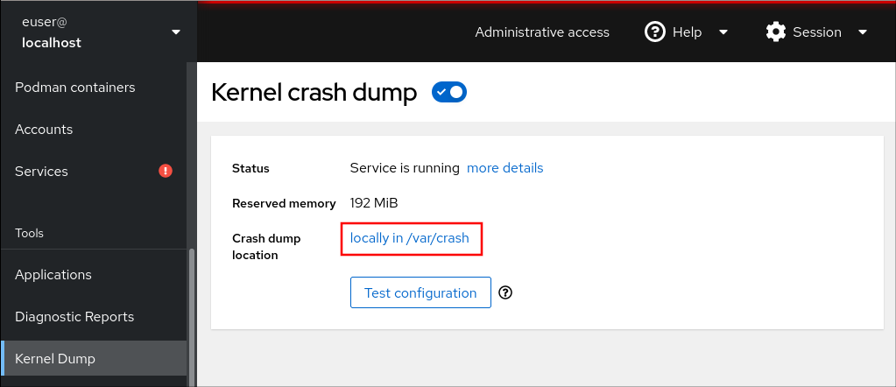
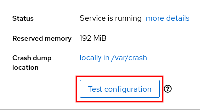

# 内核

[TOC]

## 概述

版本号：主版本号.次版本号.修正号

次版本号为偶数的是稳定版本，为奇数的是测试版本。

## 内核转储 kdump

`kdump` 是在系统崩溃、死锁或者死机的时候用来转储内存运行参数的一个工具和服务，用来捕获内核崩溃的时候产生的 crash dump，以便稍后进行分析。

Kdump 是迄今为止最可靠的内核转存机制，最大的优点在于崩溃转储数据可从一个新启动内核的上下文中获取，而不是从已经崩溃内核的上下文。

Kdump 需要两个不同目的的内核：生产内核和捕获内核。

生产内核是捕获内核服务的对象。如果系统一旦崩溃，那么正常的内核就没有办法工作了，这个时候将由 Kdump 产生一个用于捕获当前运行信息的内核，该内核会与相应的 ramdisk （虚拟内存盘，将内存模拟成硬盘的技术。）一起组建一个微环境，将此时的内存中的所有运行状态和数据信息收集到一个 dump core 文件中，一旦内存信息收集完成，系统将会自动重启。

Kdump 机制主要包括两个组建：kdump 和 kexec 。

`kdump` 使用 `kexec` 系统调用在没有重启的情况下引导至第二个内核（ 捕获内核），然后捕获崩溃内核的内存（崩溃转储或 vmcore）并将其保存到文件中。生产内核保留了内存的一部分给捕获内核启动用。

由于 kdump 利用 kexec 启动捕获内核，绕过了 BIOS ，所以第一个内核的内存得以保留。这是内存崩溃转储的本质。

kexec 是一个快速启动 kernel 的机制，它运行在某一正在运行的 kernel 中，启动一个新的 kernel 而且不用重新经过 BIOS 就可以完成启动。因为一般 BIOS 都会花费很长的时间，尤其是在大型并且同时连接许多外部设备的 Server 上的环境下，BIOS 会花费更多的时间。

kexec 包括 2 个组成部分：

* 内核空间的系统调用 kexec_load

  负责在生产内核启动时将捕获内核加载到指定地址。

* 用户空间的工具 kexec-tools

  将捕获内核的地址传递给生产内核，从而在系统崩溃的时候能够找到捕获内核的地址并启动。

> 重要：
>
> 内核崩溃转储可能会是系统失败时唯一可用的信息（关键错误）。因此，在关键任务环境中操作 `kdump` 是非常重要的。建议系统管理员在正常内核更新周期内定期更新和测试 `kexec-tools`。这在部署了新内核功能时尤为重要。

可以为机器上所有安装的内核或者只为指定的内核启用 `kdump` 。当在机器上使用多个内核时，这非常有用，有些内核足够稳定，不必担心它们会崩溃。

安装 `kdump` 时，会创建一个默认的 `/etc/kdump.conf` 文件。文件包含默认的最小 `kdump` 配置。可以编辑此文件来自定义 `kdump` 配置，但这不是必须的。

如果系统一旦崩溃那么正常的内核就没有办法工作了，在这个时候将由 kdump 产生一个用于 capture 当前运行信息的内核，该内核会将此时的内存中的所有运行状态和数据信息收集到一个 dump core 文件中以便于 Red Hat 工程师分析崩溃原因，一旦内存信息收集完成，系统将自动重启。这和以前的 diskdump，netdump 是同样道理。只不过 kdump 是 RHEL6 特有的。

### 安装

所需软件包列表：

* kdump                                           kdump 软件包。
* kexec-tools                                   kexec 软件包，kdump 用到的各种工具都在此包中。
* kernel-debuginfo                        用来分析 vmcore  文件。
* kernel-debuginfo-common       kernel-debuginfo 依赖包。

```bash
dnf install kdump kexec-tools kernel-debuginfo kernel-debuginfo-common
```

### 配置 grub

kdump 的使用需要配置 kdump kernel 的内存区域。Kdump 要求操作系统正常使用的时候，不能使用 kdump kernel 所占用的内存。配置这个需要修改 `/boot/grub/grub.conf` 文件，修改用到的引导部分，加入 crashkernel 。

```ini
crashkernel=nn[KMG]@ss[KMG]

# nn 表示要为 crashkernel 预留多少内存。
# ss 表示为 crashkernel 预留内存的起始位置。
```

修改配置后，需要重启系统。可通过 `cat /proc/cmdline` 查看 kernel 启动配置选项，其中已经加入了 crashkernel 项。

查看 Linux 系统是否打开 kdump

```bash
systemctl status kdump.service
```

启动 kdump 服务

```bash
systemctl start kdump.service
```


```bash
ulimit -c
#如果输出为 0 ，则代表没有打开。如果为 unlimited 则已经打开。
```

临时打开/关闭 Linux 的 kdump 方法

```bash
ulimit -c unlimited #打开
ulimit -c 0         #关闭
```


修改配置文件进行打开/关闭kdump方法

```bash
echo "ulimit -S -c unlimited> /dev/null 2>&1" >> /etc/profile
source /etc/profile
```

系统崩溃时 kdump 文件位置及查看方法

```bash
# 修改生成的日志文件的路径到 /var/log 下
echo “/var/log” > /proc/sys/kernel/core_pattern
# kdump 文件名为 core.xxxx ，执行 gdb core.xxx 进行调试。
```

## 在 web 控制台中配置 kdump 内存用量和目标位置

1. 打开 `Kernel Dump` 选项卡，启动 `kdump` 服务。

2. 使用命令行配置 `kdump` 内存用量。

3. 点击 `Crash dump location` 选项旁边的链接。

4. 从下拉菜单中选择 `Local Filesystem` 选项，并指定要保存转储的目录。

   [](https://access.redhat.com/webassets/avalon/d/Red_Hat_Enterprise_Linux-9-Configuring_basic_system_settings-zh-CN/images/189eea5e5ebf6232d38444c85c95f646/cockpit-kdump-location.png)

   - 或者，从下拉菜单中选择 `Remote over SSH` 选项，使用 SSH 协议将该 vmcore 发送到远程机器。

     在 `Server`、`ssh key` 和 `Directory` 项中提供远程机器的地址、ssh 密钥位置和目的地目录。

   - 另一种选择是从下拉菜单中选择 `Remote over NFS` 选项，并填写 `Mount` 字段，以使用 NFS 协议将 vmcore 发送到远程计算机。

     > 注意：
     >
     > 选择 `Compression` 复选框来缩小 vmcore 文件的大小。

5. 崩溃内核以测试您的配置。

    

   1. 单击 `Test configuration`。

   2. 在 **Test kdump settings** 字段中，点 `Crash system`。

      > 警告：
      >
      > 这一步会破坏内核的执行，并导致系统崩溃和数据丢失。	

## 使用 RHEL 系统角色的 kdump

`kdump` 角色可在多个系统中设置基本内核转储参数。

> 警告：通过替换 `/etc/kdump.conf` 文件，`kdump` 角色完全取代了受管主机的 `kdump` 配置。另外,如果应用了 `kdump` 角色，则之前的所有 `kdump` 设置也会被替换，即使它们没有被角色变量指定，也可以替换 `/etc/sysconfig/kdump` 文件。

```yaml
---
- hosts: kdump-test
  vars:
    kdump_path: /var/crash
  roles:
    - rhel-system-roles.kdump
```

有关 `kdump` 角色变量的详情，请安装 `rhel-system-roles` 软件包，并参阅 `/usr/share/doc/rhel-system-roles/kdump` 目录中的 `README.md` 或者`README.html` 文件。